## Why Test-Driven Development Matters

Test-Driven Development (TDD) is critical for TypeScript applications because it ensures type-safe code behaves correctly at runtime, prevents regression bugs, enables confident refactoring, and documents behavior through executable specifications.

**Core Benefits**:

- **Runtime correctness**: Types check at compile-time, tests verify runtime behavior
- **Prevents regressions**: Catch bugs before deployment
- **Enables refactoring**: Tests provide safety net for improvements
- **Documents behavior**: Tests serve as executable specifications
- **Builds confidence**: High test coverage reduces deployment risk

**Problem**: TypeScript's type system catches type errors, but cannot verify business logic correctness.

**Solution**: Write tests first to catch logic bugs in seconds, never in production.

## The Red-Green-Refactor Cycle

TDD follows a simple three-step cycle that drives development through tests.

```mermaid
%% Color Palette: Blue #0173B2, Orange #DE8F05, Teal #029E73, Purple #CC78BC
%% All colors are color-blind friendly and meet WCAG AA contrast standards

stateDiagram-v2
    [*] --> Red: Write test

    Red --> Green: Test fails
    Green --> Refactor: Test passes
    Refactor --> Red: Tests still pass,<br/>next feature

    note right of Red
        🔴 RED
        Write failing test
        Specify desired behavior
    end note

    note right of Green
        🟢 GREEN
        Write minimum code
        Make test pass
    end note

    note right of Refactor
        ♻️ REFACTOR
        Improve code quality
        Keep tests passing
    end note

    classDef redState fill:#CC78BC,stroke:#000000,color:#FFFFFF,stroke-width:3px
    classDef greenState fill:#029E73,stroke:#000000,color:#FFFFFF,stroke-width:3px
    classDef refactorState fill:#0173B2,stroke:#000000,color:#FFFFFF,stroke-width:3px

    class Red redState
    class Green greenState
    class Refactor refactorState
```



### Step 1: RED - Write Failing Test

Write a test that specifies desired behavior. The test fails because the feature doesn't exist yet.

**Before**: No test, no specification of behavior
**After**: Clear specification of what code should do, test fails as expected

### Step 2: GREEN - Make It Pass

Write minimum code to make the test pass. Don't worry about perfection yet.

**Before**: Test fails, feature not implemented
**After**: Test passes, feature works (even if implementation is simple)

### Step 3: REFACTOR - Improve Code

Improve code quality while keeping tests green. Extract functions, improve naming, add type safety.

**Before**: Code works but may be simple or duplicated
**After**: Clean, maintainable code with tests still passing

## Testing Approaches in TypeScript

TypeScript/Node.js provides multiple approaches for testing code, from built-in modules to sophisticated frameworks.

| Approach           | Abstraction | Organization | Reporting | Production Ready | Use When                  |
| ------------------ | ----------- | ------------ | --------- | ---------------- | ------------------------- |
| **assert module**  | Low         | Manual       | None      | No               | Learning, debugging       |
| **Manual runners** | Low         | Manual       | Basic     | No               | Simple scripts            |
| **Jest**           | High        | Automatic    | Rich      | Yes              | React apps, full-featured |
| **Vitest**         | High        | Automatic    | Rich      | Yes              | Vite projects             |
| **Mocha**          | Medium      | Automatic    | Good      | Yes              | Flexible, composable      |

**Recommended progression**: Start with assert module to understand testing fundamentals → Learn manual test runners to see framework value → Use Jest/Vitest/Mocha for production testing.

## Built-in Testing with Standard Library

TypeScript can use Node.js's built-in `assert` module for basic testing without external dependencies.

### Assert Module Basics

Node.js provides the `assert` module for runtime assertions that verify program correctness.

**Pattern**:

```typescript
import assert from "assert";
// => Import assert from Node.js standard library
// => No external dependencies required
// => Available in all Node.js versions

class Calculator {
  // => Simple calculator for demonstration purposes
  // => Type-safe methods with TypeScript annotations

  add(a: number, b: number): number {
    // => Basic addition operation
    // => Type parameters ensure number inputs
    return a + b;
    // => No validation (intentionally simple for learning)
  }

  divide(a: number, b: number): number {
    assert(b !== 0, "Divisor cannot be zero");
    // => assert() runtime check
    // => Throws AssertionError if condition false
    // => Second parameter is error message
    return a / b;
    // => Division proceeds if assertion passes
  }
}

// Manual test runner
const calc = new Calculator();
// => Create instance to test

// Test addition
const result = calc.add(2, 3);
// => Execute method under test
assert.strictEqual(result, 5, "Expected 2 + 3 = 5");
// => assert.strictEqual checks exact equality (===)
// => Throws AssertionError if result !== 5
// => Third parameter is error message

// Test division
const quotient = calc.divide(10, 2);
// => Test another operation
assert.strictEqual(quotient, 5, "Expected 10 / 2 = 5");
// => Same assertion pattern
// => Message provides diagnostic context

console.log("All assertions passed!");
// => Success message (only reached if all assertions pass)
// => No automatic test reporting or aggregation
```

**Running tests**:

```bash
# Run with ts-node for development
npx ts-node test.ts

# Or compile and run with node
tsc test.ts && node test.js
```

**Problem**: No test organization, discovery, or reporting.

**Solution**: Manual test execution sufficient for learning, inadequate for production.

### Assert Methods

Assert module provides multiple assertion methods for different comparison needs.

**Syntax**:

```typescript
import assert from "assert";
// => Import assert module

// Loose equality (==)
assert.equal(actual, expected, message);
// => Uses == comparison (type coercion allowed)

// Strict equality (===)
assert.strictEqual(actual, expected, message);
// => Uses === comparison (no type coercion)
// => RECOMMENDED: Use strictEqual in TypeScript

// Deep equality (object comparison)
assert.deepStrictEqual(actual, expected, message);
// => Recursively compares object properties
// => Uses === for primitive values

// Truthy/falsy checks
assert.ok(value, message);
// => Checks if value is truthy
// => Equivalent to assert(value, message)

// Exception checking
assert.throws(() => code(), ErrorClass, message);
// => Verifies that code() throws expected error
// => Second parameter can be error class or regex
```

**Example**:

```typescript
class StringUtils {
  // => String manipulation utilities
  // => Type-safe string operations

  reverse(input: string): string {
    // => Reverses a string
    assert(input !== null && input !== undefined, "Input cannot be null/undefined");
    // => Pre-condition: input must exist
    // => Runtime check (TypeScript types don't prevent null at runtime)
    assert(input.length > 0, "Input cannot be empty");
    // => Pre-condition: input must have content

    const reversed = input.split("").reverse().join("");
    // => split('') creates character array
    // => reverse() reverses array
    // => join('') converts back to string

    assert(reversed.length === input.length, "Length mismatch after reversal");
    // => Post-condition: reversed string has same length
    // => Invariant check

    return reversed;
    // => Returns reversed string
  }
}

// Test suite
const utils = new StringUtils();
// => Create instance for testing

assert.strictEqual(utils.reverse("hello"), "olleh", "Failed to reverse 'hello'");
// => Verifies reverse operation correctness
// => strictEqual ensures type-safe comparison

assert.strictEqual(utils.reverse("TypeScript"), "tpircSepyT", "Failed to reverse 'TypeScript'");
// => Test with different input
// => Multiple assertions verify behavior across inputs

console.log("All string tests passed!");
// => Manual success reporting
```

**Density**: 13 code lines, 19 annotation lines = 1.46 density (within 1.0-2.25 target)

### Limitations of Assert Module

Assert module has significant limitations for production testing.

**Critical limitations**:

1. **No test discovery**: Must manually import and run tests
2. **Poor failure reporting**: Only shows first failure, then stops execution
3. **No test organization**: No way to group related tests (describe/it blocks)
4. **No setup/teardown**: No lifecycle hooks for test isolation
5. **No test reporting**: No summary of passed/failed tests
6. **No parallel execution**: Tests run sequentially in single process
7. **No mocking**: No built-in mocking or stubbing capabilities
8. **No coverage**: No code coverage reporting

**Example showing limitations**:

```typescript
import assert from "assert";
// => Demonstrates why assert module insufficient for production testing

// Limitation 1: First failure stops everything
assert.strictEqual(2 + 2, 4, "Math works");
// => This assertion passes (condition true)
// => Execution continues to next line

assert.strictEqual(2 + 2, 5, "This fails and stops execution");
// => This assertion FAILS (2 + 2 !== 5)
// => Throws AssertionError immediately
// => Halts entire program (no graceful handling)
// => Remaining assertions never executed

assert.strictEqual(3 + 3, 6, "Never runs");
// => This line NEVER executes
// => No reporting of how many tests passed before failure
// => No aggregated test results
```

**Trade-offs**:

- **Simplicity**: Zero dependencies, minimal setup
- **No tooling**: No test runner, no reporting, no coverage
- **Justification**: Good for learning assertions, inadequate for production testing

**When to use assert module**:

- ✅ Learning testing concepts
- ✅ Simple scripts and utilities
- ✅ Runtime assertions in production code (defensive programming)
- ❌ Production test suites (use Jest/Vitest/Mocha)
- ❌ CI/CD pipelines (need reporting and exit codes)
- ❌ Complex applications (need mocking and fixtures)

## Production Testing with Jest

Jest is a batteries-included testing framework providing test organization, mocking, coverage, and rich reporting out of the box.

### Installing Jest

Install Jest with TypeScript support.

**Installation**:

```bash
# Install Jest and TypeScript support
npm install --save-dev jest @types/jest ts-jest

# Initialize Jest configuration
npx ts-jest config:init
```

**Configuration** (`jest.config.js`):

```javascript
module.exports = {
  preset: "ts-jest",
  // => Use ts-jest preset for TypeScript support
  // => Handles .ts file compilation automatically
  testEnvironment: "node",
  // => Use Node.js environment (not browser)
  // => Alternative: 'jsdom' for browser-like environment
  collectCoverageFrom: [
    "src/**/*.ts",
    // => Collect coverage from all TypeScript files in src/
    "!src/**/*.d.ts",
    // => Exclude type declaration files
  ],
  coverageThreshold: {
    // => Enforce minimum coverage percentages
    global: {
      branches: 80,
      // => 80% branch coverage required
      functions: 80,
      // => 80% function coverage required
      lines: 80,
      // => 80% line coverage required
      statements: 80,
      // => 80% statement coverage required
    },
  },
};
// => Configuration object exported as CommonJS module
// => Jest reads this configuration automatically
```

### Jest Test Structure

Jest provides `describe` and `test`/`it` blocks for organizing tests.

**Pattern**:

```typescript
import { Calculator } from "./calculator";
// => Import code under test
// => TypeScript ensures type-safe imports

describe("Calculator", () => {
  // => describe() groups related tests
  // => First parameter is group name (shown in reports)
  // => Second parameter is function containing tests

  let calc: Calculator;
  // => Declare variable for test subject
  // => Type annotation ensures type safety

  beforeEach(() => {
    // => beforeEach() runs before each test
    // => Creates fresh instance for test isolation
    calc = new Calculator();
    // => Initialize calculator for each test
    // => Prevents test interdependencies
  });

  afterEach(() => {
    // => afterEach() runs after each test
    // => Cleanup hook for resource disposal
    // => Not needed for simple objects, but demonstrates pattern
  });

  test("adds two numbers correctly", () => {
    // => test() defines individual test case
    // => Alternative: it() (BDD-style alias)
    // => First parameter is test description

    const result = calc.add(2, 3);
    // => Arrange: prepare test data
    // => Act: execute method under test

    expect(result).toBe(5);
    // => Assert: verify expected outcome
    // => expect() creates assertion
    // => toBe() matcher for strict equality (===)
  });

  test("divides two numbers correctly", () => {
    // => Second test in same describe block
    // => Gets fresh calc instance from beforeEach

    const result = calc.divide(10, 2);
    // => Arrange and act in one line

    expect(result).toBe(5);
    // => Assert expected result
  });

  test("throws error when dividing by zero", () => {
    // => Test error handling behavior
    // => Error cases are important to test

    expect(() => calc.divide(10, 0)).toThrow("Divisor cannot be zero");
    // => expect() with arrow function for error testing
    // => toThrow() matcher verifies exception thrown
    // => Can match error message or error class
  });
});
// => End of test suite
// => Jest automatically discovers and runs this file
```

**Density**: 22 code lines, 32 annotation lines = 1.45 density (within 1.0-2.25 target)

**Running tests**:

```bash
# Run all tests
npm test

# Run with coverage
npm test -- --coverage

# Run in watch mode (re-run on file changes)
npm test -- --watch

# Run specific test file
npm test calculator.test.ts
```

**Test output**:

```
PASS  src/calculator.test.ts
  Calculator
    ✓ adds two numbers correctly (2 ms)
    ✓ divides two numbers correctly (1 ms)
    ✓ throws error when dividing by zero (3 ms)

Test Suites: 1 passed, 1 total
Tests:       3 passed, 3 total
Snapshots:   0 total
Time:        1.234 s
```

### Jest Matchers

Jest provides rich matchers for various assertion types.

**Common matchers**:

```typescript
// Equality matchers
expect(value).toBe(expected);
// => Strict equality (===)
// => Use for primitives (number, string, boolean)

expect(value).toEqual(expected);
// => Deep equality for objects/arrays
// => Recursively compares properties

expect(value).not.toBe(unexpected);
// => Negation: value should NOT equal unexpected
// => .not works with any matcher

// Truthiness matchers
expect(value).toBeTruthy();
// => Value is truthy (not false, 0, '', null, undefined, NaN)

expect(value).toBeFalsy();
// => Value is falsy

expect(value).toBeNull();
// => Value is exactly null

expect(value).toBeUndefined();
// => Value is exactly undefined

expect(value).toBeDefined();
// => Value is not undefined

// Number matchers
expect(value).toBeGreaterThan(3);
// => Numeric comparison (value > 3)

expect(value).toBeGreaterThanOrEqual(3);
// => value >= 3

expect(value).toBeLessThan(5);
// => value < 5

expect(value).toBeCloseTo(0.3, 5);
// => Floating point comparison (within 5 decimal places)
// => Handles floating point precision issues

// String matchers
expect(string).toMatch(/pattern/);
// => String matches regex pattern

expect(string).toContain("substring");
// => String contains substring

// Array/Set matchers
expect(array).toContain(item);
// => Array includes item

expect(array).toHaveLength(3);
// => Array has exactly 3 elements

// Object matchers
expect(obj).toHaveProperty("key", value);
// => Object has property with specific value

expect(obj).toMatchObject({ key: value });
// => Object contains at least these properties
// => Partial matching (additional properties ignored)

// Exception matchers
expect(() => code()).toThrow();
// => Code throws any error

expect(() => code()).toThrow(ErrorClass);
// => Code throws specific error class

expect(() => code()).toThrow("error message");
// => Code throws error with specific message
```

**Example**:

```typescript
describe("String operations", () => {
  test("reverse preserves length", () => {
    const input = "hello";
    // => Test input string

    const result = reverse(input);
    // => Execute function under test

    expect(result).toHaveLength(input.length);
    // => Verify length preserved
    // => toHaveLength() matcher for array/string length

    expect(result).toBe("olleh");
    // => Verify correct reversal
    // => toBe() for strict string equality
  });

  test("palindrome detection", () => {
    expect(isPalindrome("racecar")).toBe(true);
    // => Truthy assertion
    expect(isPalindrome("hello")).toBe(false);
    // => Falsy assertion
    expect(isPalindrome("A man a plan a canal Panama")).toBe(true);
    // => Case-insensitive palindrome
  });
});
```

### Jest Mocking

Jest provides powerful mocking capabilities for isolating code under test.

**Mock functions**:

```typescript
import { sendEmail } from "./email-service";
// => Import real email service

jest.mock("./email-service");
// => jest.mock() replaces module with mocks
// => All exports become mock functions
// => No real email sent during tests

const mockSendEmail = sendEmail as jest.MockedFunction<typeof sendEmail>;
// => Type-safe mock assertion
// => Cast to jest.MockedFunction for type safety

describe("User registration", () => {
  beforeEach(() => {
    mockSendEmail.mockClear();
    // => Clear mock call history before each test
    // => Prevents test interdependencies
  });

  test("sends welcome email on registration", async () => {
    mockSendEmail.mockResolvedValue({ success: true });
    // => Mock successful email sending
    // => mockResolvedValue() for async functions returning Promise

    const user = await registerUser("john@example.com");
    // => Execute registration logic
    // => Email service called internally

    expect(mockSendEmail).toHaveBeenCalledWith("john@example.com", "Welcome!");
    // => Verify email service called with correct arguments
    // => toHaveBeenCalledWith() checks function call parameters

    expect(mockSendEmail).toHaveBeenCalledTimes(1);
    // => Verify email sent exactly once
    // => Prevents duplicate emails
  });

  test("handles email failure gracefully", async () => {
    mockSendEmail.mockRejectedValue(new Error("SMTP connection failed"));
    // => Mock email sending failure
    // => mockRejectedValue() for async functions throwing errors

    await expect(registerUser("john@example.com")).rejects.toThrow("Email failed");
    // => Verify registration handles email errors
    // => rejects.toThrow() for async error testing
  });
});
```

**Mock implementations**:

```typescript
const mockCalculate = jest.fn((a: number, b: number) => a + b);
// => jest.fn() creates mock function
// => Can provide implementation as parameter
// => Tracks calls, arguments, return values

mockCalculate(2, 3);
// => Call mock function
mockCalculate(5, 7);
// => Call again with different arguments

expect(mockCalculate).toHaveBeenCalledTimes(2);
// => Verify called twice
expect(mockCalculate.mock.calls[0]).toEqual([2, 3]);
// => Verify first call arguments
// => mock.calls array stores all call arguments
expect(mockCalculate.mock.results[0].value).toBe(5);
// => Verify first call return value
// => mock.results array stores all return values
```

### Jest Coverage Reporting

Jest generates comprehensive code coverage reports.

**Running with coverage**:

```bash
# Run tests with coverage
npm test -- --coverage
```

**Coverage output**:

```
----------|---------|----------|---------|---------|-------------------
File      | % Stmts | % Branch | % Funcs | % Lines | Uncovered Line #s
----------|---------|----------|---------|---------|-------------------
All files |   95.12 |    90.48 |     100 |   95.12 |
calculator|   95.12 |    90.48 |     100 |   95.12 |
 index.ts |   95.12 |    90.48 |     100 |   95.12 | 23,45
----------|---------|----------|---------|---------|-------------------
```

**Coverage types**:

- **Statement coverage**: Percentage of statements executed
- **Branch coverage**: Percentage of if/else branches executed
- **Function coverage**: Percentage of functions called
- **Line coverage**: Percentage of lines executed

**Coverage enforcement**: Jest fails build if coverage below threshold (configured in `jest.config.js`).

## Production Testing with Vitest

Vitest is a blazing fast testing framework designed for Vite projects with Jest-compatible API.

### Installing Vitest

Install Vitest with TypeScript support.

**Installation**:

```bash
# Install Vitest
npm install --save-dev vitest
```

**Configuration** (`vite.config.ts`):

```typescript
import { defineConfig } from "vitest/config";
// => Import Vitest configuration helper
// => Type-safe configuration object

export default defineConfig({
  test: {
    // => Test configuration block
    globals: true,
    // => Enable global test APIs (describe, test, expect)
    // => No need to import from vitest
    environment: "node",
    // => Use Node.js environment
    // => Alternative: 'jsdom' for browser-like environment
    coverage: {
      provider: "v8",
      // => Use V8 coverage provider (faster)
      // => Alternative: 'istanbul' for more detailed reports
      reporter: ["text", "json", "html"],
      // => Coverage report formats
    },
  },
});
// => Export Vite configuration with test settings
```

### Vitest API (Jest-compatible)

Vitest provides Jest-compatible API with some enhancements.

**Pattern**:

```typescript
import { describe, test, expect, beforeEach } from "vitest";
// => Import test utilities from vitest
// => Same API as Jest for easy migration
import { Calculator } from "./calculator";

describe("Calculator", () => {
  let calc: Calculator;

  beforeEach(() => {
    calc = new Calculator();
  });

  test("adds numbers", () => {
    expect(calc.add(2, 3)).toBe(5);
    // => Same expect API as Jest
  });

  test("concurrent test execution", { concurrent: true }, () => {
    // => Vitest supports concurrent test execution
    // => { concurrent: true } runs tests in parallel
    expect(calc.add(1, 1)).toBe(2);
  });
});
```

**Running tests**:

```bash
# Run tests
npm test

# Run in watch mode (default in Vitest)
npm test

# Run with coverage
npm test -- --coverage
```

### Vitest Advantages

Vitest provides performance and developer experience improvements over Jest.

**Key advantages**:

- **Fast**: Native ESM support, HMR-like test re-runs
- **Vite integration**: Shares Vite config, plugins, and transformations
- **Jest-compatible**: Easy migration from Jest
- **Watch mode**: Intelligent test re-runs based on file changes
- **Component testing**: Built-in support for UI component testing

**Performance comparison**:

```
Jest:   ~2-3s test startup time
Vitest: ~200ms test startup time (10-15x faster)
```

## Choosing a Testing Framework

Different frameworks suit different project needs.

### Framework Comparison

| Feature               | assert module | Jest         | Vitest       | Mocha        |
| --------------------- | ------------- | ------------ | ------------ | ------------ |
| **Installation**      | Built-in      | npm install  | npm install  | npm install  |
| **Config complexity** | None          | Medium       | Low          | Low          |
| **Test runner**       | Manual        | ✅ Automatic | ✅ Automatic | ✅ Automatic |
| **Assertions**        | Basic         | ✅ Rich      | ✅ Rich      | Separate lib |
| **Mocking**           | None          | ✅ Built-in  | ✅ Built-in  | Separate lib |
| **Coverage**          | None          | ✅ Built-in  | ✅ Built-in  | Separate lib |
| **TypeScript**        | ✅ Native     | ts-jest      | ✅ Native    | ts-node      |
| **Speed**             | Fast          | Medium       | ✅ Very fast | Fast         |
| **Watch mode**        | None          | ✅ Good      | ✅ Excellent | ✅ Good      |
| **Parallel tests**    | No            | ✅ Yes       | ✅ Yes       | ✅ Yes       |
| **Snapshot testing**  | No            | ✅ Yes       | ✅ Yes       | No           |
| **Learning curve**    | Low           | Medium       | Low          | Low          |
| **Ecosystem**         | None          | ✅ Huge      | Growing      | ✅ Mature    |

### When to Use Each

**assert module**:

- ✅ Learning testing fundamentals
- ✅ Simple scripts and utilities
- ✅ Runtime assertions in production code
- ❌ Production test suites

**Jest**:

- ✅ React applications (React Testing Library integration)
- ✅ Full-featured testing (mocking, coverage, snapshots)
- ✅ Established ecosystem with many resources
- ✅ Zero-config setup
- ⚠️ Slower test startup compared to Vitest

**Vitest**:

- ✅ Vite-based projects
- ✅ Maximum speed and developer experience
- ✅ Jest migration (compatible API)
- ✅ Modern ESM-first approach
- ⚠️ Newer ecosystem (fewer resources)

**Mocha**:

- ✅ Flexible, composable testing
- ✅ Choose your own assertion/mocking libraries
- ✅ Lightweight and minimal
- ⚠️ More configuration needed
- ⚠️ No built-in assertions or mocking

## TDD Best Practices

Effective TDD requires discipline and good practices.

### Write Tests First

Always write tests before implementation code.

**Anti-pattern** (❌):

```typescript
// Write implementation first
function calculateDiscount(price: number, percent: number): number {
  return price * (1 - percent / 100);
}

// Then write tests
test("calculates discount", () => {
  expect(calculateDiscount(100, 10)).toBe(90);
});
```

**Best practice** (✅):

```typescript
// Write test first (RED)
test("calculates 10% discount correctly", () => {
  expect(calculateDiscount(100, 10)).toBe(90);
  // => Test fails - function doesn't exist yet
});

// Write minimal implementation (GREEN)
function calculateDiscount(price: number, percent: number): number {
  return price * (1 - percent / 100);
  // => Simplest code to make test pass
}

// Refactor if needed
function calculateDiscount(price: number, percent: number): number {
  if (price < 0 || percent < 0 || percent > 100) {
    throw new Error("Invalid input");
    // => Add validation after basic functionality works
  }
  return price * (1 - percent / 100);
}
```

### Test One Thing Per Test

Each test should verify a single behavior.

**Anti-pattern** (❌):

```typescript
test("calculator operations", () => {
  expect(calc.add(2, 3)).toBe(5);
  expect(calc.subtract(5, 2)).toBe(3);
  expect(calc.multiply(2, 3)).toBe(6);
  expect(calc.divide(6, 2)).toBe(3);
  // => Multiple behaviors in one test
  // => Hard to identify which operation fails
});
```

**Best practice** (✅):

```typescript
test("adds two numbers", () => {
  expect(calc.add(2, 3)).toBe(5);
  // => Single behavior tested
});

test("subtracts two numbers", () => {
  expect(calc.subtract(5, 2)).toBe(3);
  // => Separate test for separate behavior
});

test("multiplies two numbers", () => {
  expect(calc.multiply(2, 3)).toBe(6);
});

test("divides two numbers", () => {
  expect(calc.divide(6, 2)).toBe(3);
});
```

### Use Descriptive Test Names

Test names should clearly describe what they verify.

**Anti-pattern** (❌):

```typescript
test('test1', () => { ... });
test('works', () => { ... });
test('calculator', () => { ... });
// => Uninformative names
// => Hard to understand test purpose
```

**Best practice** (✅):

```typescript
test('adds two positive numbers correctly', () => { ... });
test('throws error when dividing by zero', () => { ... });
test('returns empty array for invalid input', () => { ... });
// => Descriptive names explain expected behavior
// => Test reports become documentation
```

### Arrange-Act-Assert Pattern

Structure tests with clear sections.

**Pattern**:

```typescript
test("user registration creates new user", async () => {
  // ARRANGE - Set up test data and dependencies
  const userData = {
    email: "john@example.com",
    password: "secure123",
  };
  const mockDatabase = createMockDatabase();
  // => Prepare test fixtures and mocks

  // ACT - Execute the code under test
  const result = await registerUser(userData, mockDatabase);
  // => Single action being tested

  // ASSERT - Verify expected outcomes
  expect(result.id).toBeDefined();
  expect(result.email).toBe("john@example.com");
  expect(mockDatabase.insert).toHaveBeenCalledTimes(1);
  // => Multiple assertions about single action
});
```

### Keep Tests Independent

Tests should not depend on each other or shared state.

**Anti-pattern** (❌):

```typescript
let userId: string;
// => Shared state between tests

test("creates user", async () => {
  const user = await createUser("john@example.com");
  userId = user.id;
  // => Stores state for next test
});

test("updates user", async () => {
  await updateUser(userId, { name: "John" });
  // => Depends on previous test's state
  // => Fails if tests run in different order
});
```

**Best practice** (✅):

```typescript
describe("User operations", () => {
  let testUserId: string;

  beforeEach(async () => {
    const user = await createUser("john@example.com");
    testUserId = user.id;
    // => Each test gets fresh user
    // => Tests can run in any order
  });

  afterEach(async () => {
    await deleteUser(testUserId);
    // => Clean up after each test
  });

  test("updates user name", async () => {
    await updateUser(testUserId, { name: "John" });
    const updated = await getUser(testUserId);
    expect(updated.name).toBe("John");
    // => Self-contained test
  });
});
```

## Trade-offs and When to Use

Understanding when to adopt production testing frameworks.

### Standard Library (assert module)

**Use when**:

- ✅ Learning testing concepts
- ✅ Simple scripts (one-off utilities)
- ✅ Runtime assertions in production code

**Avoid when**:

- ❌ Building production applications
- ❌ CI/CD pipelines (need reporting)
- ❌ Team projects (need consistency)

**Trade-offs**:

- **Pros**: Zero dependencies, simple, built-in
- **Cons**: No tooling, no organization, no reporting

### Production Frameworks (Jest/Vitest)

**Use when**:

- ✅ Production applications
- ✅ CI/CD pipelines
- ✅ Team projects
- ✅ Need mocking and coverage

**Trade-offs**:

- **Pros**: Full-featured, great DX, ecosystem
- **Cons**: External dependency, configuration needed

**Decision matrix**:

| Project Type   | Recommended Framework | Rationale                        |
| -------------- | --------------------- | -------------------------------- |
| Learning       | assert module         | Understand fundamentals first    |
| Vite project   | Vitest                | Speed, Vite integration          |
| React app      | Jest                  | Ecosystem, React Testing Library |
| Node.js API    | Jest or Vitest        | Both excellent                   |
| Library        | Vitest                | Fast, modern                     |
| Legacy project | Jest                  | Mature, proven                   |

## Related Resources

- [Behavior Driven Development](/en/learn/software-engineering/programming-languages/typescript/in-the-field/behavior-driven-development) - BDD with Cucumber.js
- [By Example - Testing](/en/learn/software-engineering/programming-languages/typescript/by-example/intermediate#testing) - Testing syntax examples
- [CI/CD](/en/learn/software-engineering/programming-languages/typescript/in-the-field/ci-cd) - Automated testing in pipelines
