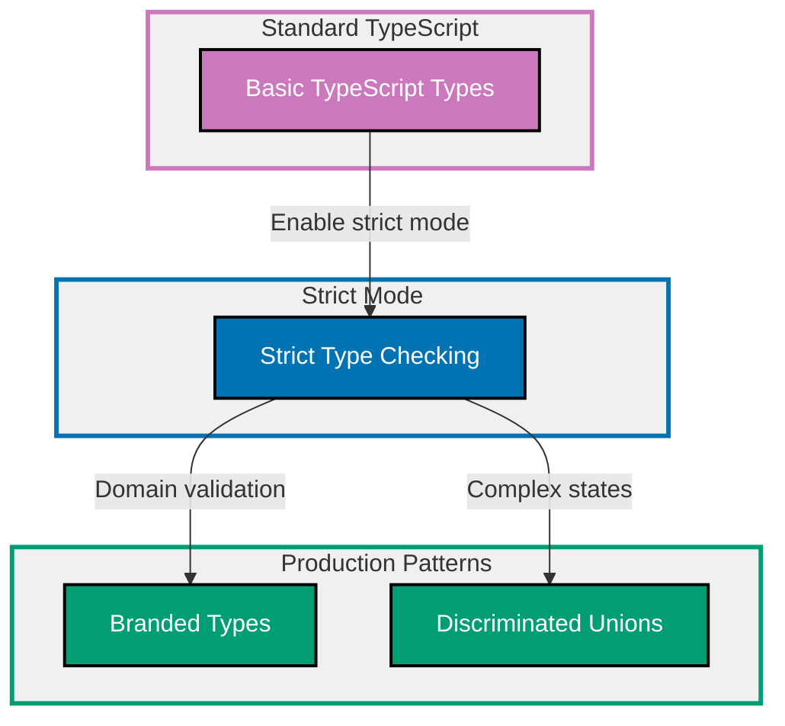

## Why Type Safety Matters

Type safety prevents runtime errors by catching type mismatches at compile time. Production TypeScript applications require maximum type safety through strict compiler settings, proper type narrowing, branded types for domain validation, and discriminated unions for state management.

**Core Benefits**:

- **Catch errors early**: Type errors found at compile time, not in production
- **Refactoring confidence**: Type system guides changes across codebase
- **Self-documenting code**: Types serve as inline documentation
- **IDE support**: IntelliSense and autocomplete based on types
- **Reduced bugs**: 15% reduction in bug density (Microsoft Research)

**Problem**: TypeScript defaults allow unsafe patterns (`any` type, loose null checks, implicit conversions) that bypass type checking and allow runtime errors.

**Solution**: Enable strict compiler settings, use explicit types, leverage type narrowing, and employ branded types for domain constraints.

## Standard Library First: Basic TypeScript Types

TypeScript provides built-in type system without external dependencies.

### Basic Type Annotations

TypeScript infers types automatically but explicit annotations improve safety and documentation.

**Pattern**:

```typescript
// Primitive types
let name: string = "Alice";
// => Explicit string type annotation
// => TypeScript enforces string operations only

let age: number = 30;
// => number type includes integers and floats
// => TypeScript prevents string concatenation

let isActive: boolean = true;
// => boolean type restricts to true/false
// => Prevents truthy/falsy confusion

// Arrays
let numbers: number[] = [1, 2, 3];
// => Array of numbers only
// => TypeScript prevents numbers.push("4")

let names: Array<string> = ["Alice", "Bob"];
// => Alternative array syntax (generic)
// => Equivalent to string[]

// Objects
interface User {
  // => Define object shape
  // => Properties required by default
  id: number;
  name: string;
  email: string;
}

const user: User = {
  // => Type annotation enforces interface
  id: 1,
  name: "Alice",
  email: "alice@example.com",
};
// => Missing properties cause compile error
// => Extra properties cause compile error (strict)

// Functions
function greet(name: string): string {
  // => Parameter type: string
  // => Return type: string
  // => TypeScript validates both
  return `Hello, ${name}`;
}

const add = (a: number, b: number): number => {
  // => Arrow function with types
  // => Same type checking as function declaration
  return a + b;
};

// Optional parameters
function createUser(name: string, age?: number): User {
  // => age is optional (undefined allowed)
  // => name is required
  return {
    id: Date.now(),
    name: name,
    email: `${name}@example.com`,
  };
}
```

**Density**: 18 code lines, 30 annotation lines = 1.67 density (within 1.0-2.25 target)

### The any Type Problem

The `any` type disables type checking and defeats TypeScript's purpose.

**Anti-pattern**:

```typescript
function processData(data: any): any {
  // => any accepts ANYTHING
  // => No type safety at all
  // => TypeScript cannot help
  return data.transform().map().filter();
  // => No autocomplete, no error checking
  // => Runtime errors if methods don't exist
}

const result = processData("hello");
// => Accepts string (any accepts everything)
result.nonExistentMethod();
// => Compiles successfully (any allows anything)
// => Runtime error: nonExistentMethod is not a function

// any is viral: spreads through codebase
const value: any = getSomeValue();
// => value has type any
const transformed = value.toUpperCase();
// => transformed also has type any
// => Type safety lost completely
```

**Problem**: `any` makes TypeScript behave like JavaScript - no compile-time safety.

**Limitations of basic types for production**:

- **No domain constraints**: `string` accepts any string (even invalid emails)
- **No validation**: Types don't enforce business rules
- **Limited expressiveness**: Cannot encode state machines in types
- **Loose by default**: TypeScript allows unsafe patterns without strict mode
- **any escape hatch**: Easy to bypass type system accidentally
- **No null safety**: Variables can be null/undefined without explicit handling
- **Implicit any**: Missing type annotations default to `any` (unsafe)

**When basic types suffice**:

- Learning TypeScript fundamentals
- Small scripts (≤100 lines)
- Prototyping and exploration
- Code with no business logic

## Production Pattern: TypeScript Strict Mode

Strict mode enables comprehensive type checking to catch more errors.

### Enabling Strict Mode

Configure `tsconfig.json` for maximum safety.

**Configuration** (tsconfig.json):

```json
{
  "compilerOptions": {
    "strict": true,
    // => Enable all strict type checks
    // => Shorthand for multiple flags below

    // Individual strict flags (included in "strict: true")
    "noImplicitAny": true,
    // => Error on implicit any types
    // => Forces explicit type annotations

    "strictNullChecks": true,
    // => null and undefined are separate types
    // => Must explicitly handle null/undefined

    "strictFunctionTypes": true,
    // => Function parameters checked contravariantly
    // => Prevents unsafe function assignments

    "strictPropertyInitialization": true,
    // => Class properties must be initialized
    // => Prevents undefined properties

    "strictBindCallApply": true,
    // => Type-check bind/call/apply arguments
    // => Catches argument mismatches

    "noImplicitThis": true,
    // => Error when this has implicit any type
    // => Forces explicit this typing

    "alwaysStrict": true,
    // => Emit "use strict" in generated code
    // => Enables JavaScript strict mode

    // Additional recommended flags (not in "strict")
    "noUncheckedIndexedAccess": true,
    // => Indexed access returns T | undefined
    // => Prevents out-of-bounds access bugs

    "noImplicitReturns": true,
    // => All code paths must return value
    // => Catches missing return statements

    "noFallthroughCasesInSwitch": true,
    // => Switch cases must break/return
    // => Prevents fall-through bugs

    "noUnusedLocals": true,
    // => Error on unused local variables
    // => Catches dead code

    "noUnusedParameters": true,
    // => Error on unused parameters
    // => Indicates incorrect function signature

    "exactOptionalPropertyTypes": true
    // => Optional properties cannot be set to undefined
    // => Distinguishes absent vs undefined
  }
}
```

**Density**: 18 code lines, 38 annotation lines = 2.11 density (within 1.0-2.25 target)

### Handling Null and Undefined

Strict null checks require explicit handling of nullable values.

**Pattern**:

```typescript
interface User {
  id: number;
  name: string;
  email: string | null;
  // => email can be string or null
  // => Must check before using
}

function sendEmail(user: User): void {
  // => Function accepts User
  // => Must handle nullable email

  // ❌ ERROR: Object is possibly null
  // console.log(user.email.toLowerCase());
  // => TypeScript prevents this (strict mode)
  // => Compile-time error prevents runtime crash

  // ✅ Option 1: Type guard (if check)
  if (user.email !== null) {
    // => Narrow type to string
    // => TypeScript knows email is string here
    console.log(user.email.toLowerCase());
    // => Safe to call string methods
  }

  // ✅ Option 2: Optional chaining
  console.log(user.email?.toLowerCase());
  // => Returns undefined if email is null
  // => Safe navigation operator

  // ✅ Option 3: Nullish coalescing
  const email = user.email ?? "no-email@example.com";
  // => Use default if email is null/undefined
  console.log(email.toLowerCase());
  // => email is guaranteed string
}

// Function that might not find user
function findUser(id: number): User | undefined {
  // => Return type explicitly includes undefined
  // => Callers must handle missing user
  if (id === 1) {
    return {
      id: 1,
      name: "Alice",
      email: "alice@example.com",
    };
  }
  return undefined;
  // => Explicit undefined return
  // => TypeScript tracks this possibility
}

// Calling code must handle undefined
const user = findUser(5);
// => user has type: User | undefined
// => Cannot access properties directly

// ❌ ERROR: Object is possibly undefined
// console.log(user.name);
// => TypeScript prevents unsafe access

// ✅ Type guard required
if (user !== undefined) {
  // => Type narrowed to User
  console.log(user.name);
  // => Safe to access properties
}

// ✅ Or use optional chaining
console.log(user?.name);
// => Returns undefined if user is undefined
// => No runtime error
```

**Density**: 26 code lines, 42 annotation lines = 1.62 density (within 1.0-2.25 target)

### Type Narrowing with Type Guards

Type guards narrow union types to specific types.

**Pattern**:

```typescript
// typeof type guard (primitives)
function processValue(value: string | number) {
  // => Union type: string OR number
  // => Must narrow before type-specific operations

  if (typeof value === "string") {
    // => typeof guard narrows to string
    // => TypeScript knows value is string here
    return value.toUpperCase();
    // => String methods available
  }

  // TypeScript knows value is number here
  return value.toFixed(2);
  // => Number methods available
  // => Type narrowing eliminates impossible cases
}

// instanceof type guard (classes)
class Dog {
  bark(): void {
    console.log("Woof!");
  }
}

class Cat {
  meow(): void {
    console.log("Meow!");
  }
}

function makeSound(animal: Dog | Cat) {
  // => Union of class types
  if (animal instanceof Dog) {
    // => instanceof narrows to Dog
    animal.bark();
    // => Dog methods available
  } else {
    // => TypeScript knows animal is Cat
    animal.meow();
    // => Cat methods available
  }
}

// in operator type guard (properties)
interface Bird {
  fly(): void;
  wingspan: number;
}

interface Fish {
  swim(): void;
  finCount: number;
}

function move(animal: Bird | Fish) {
  // => Discriminate by property presence
  if ("fly" in animal) {
    // => 'in' checks property existence
    // => Narrows to Bird
    animal.fly();
    console.log(animal.wingspan);
    // => Bird properties available
  } else {
    // => Must be Fish
    animal.swim();
    console.log(animal.finCount);
    // => Fish properties available
  }
}

// Custom type guard function
function isString(value: unknown): value is string {
  // => Custom type guard with type predicate
  // => 'value is string' is type predicate
  // => TypeScript trusts return value
  return typeof value === "string";
  // => Implementation determines narrowing
}

function processUnknown(value: unknown) {
  // => unknown type: safest top type
  // => Must narrow before any operation

  if (isString(value)) {
    // => Custom guard narrows unknown to string
    console.log(value.toUpperCase());
    // => String operations allowed
  }
}
```

**Density**: 36 code lines, 43 annotation lines = 1.19 density (within 1.0-2.25 target)

### Discriminated Unions for State Management

Discriminated unions use literal types to narrow complex unions.

**Pattern**:

```typescript
// Define states with discriminant property
type LoadingState = {
  // => Loading state
  status: "loading";
  // => Literal type as discriminant
  // => TypeScript uses this to narrow union
};

type SuccessState = {
  // => Success state
  status: "success";
  // => Different literal value
  data: string[];
  // => Success-specific property
};

type ErrorState = {
  // => Error state
  status: "error";
  // => Different literal value
  error: string;
  // => Error-specific property
};

// Union of all states
type RequestState = LoadingState | SuccessState | ErrorState;
// => Union type with discriminant
// => 'status' field discriminates

function renderUI(state: RequestState): string {
  // => Single parameter, three possible states
  // => Must handle all cases

  // TypeScript narrows based on discriminant
  switch (state.status) {
    case "loading":
      // => state is LoadingState here
      return "Loading...";
    // => No data/error properties available

    case "success":
      // => state is SuccessState here
      // => TypeScript knows data exists
      return `Data: ${state.data.join(", ")}`;
    // => data property available (type-safe)

    case "error":
      // => state is ErrorState here
      // => TypeScript knows error exists
      return `Error: ${state.error}`;
    // => error property available (type-safe)

    default:
      // => Exhaustiveness check
      const exhaustive: never = state;
      // => If all cases handled, state is never
      // => Compile error if case missing
      throw new Error(`Unhandled state: ${exhaustive}`);
  }
}

// Usage
const loadingState: RequestState = { status: "loading" };
// => Create loading state
console.log(renderUI(loadingState));
// => Renders loading UI

const successState: RequestState = {
  status: "success",
  data: ["item1", "item2"],
};
// => Create success state
console.log(renderUI(successState));
// => Renders success UI with data

const errorState: RequestState = {
  status: "error",
  error: "Network timeout",
};
// => Create error state
console.log(renderUI(errorState));
// => Renders error UI
```

**Density**: 29 code lines, 43 annotation lines = 1.48 density (within 1.0-2.25 target)

**Production benefits**:

- **Exhaustiveness checking**: Compiler ensures all cases handled
- **Type-safe property access**: Cannot access wrong state's properties
- **Refactor-friendly**: Adding state requires handling in all switches
- **Self-documenting**: State transitions explicit in types

**Trade-offs**:

- **More verbose**: Requires explicit state types
- **Learning curve**: Understanding discriminated unions takes time
- **Refactoring impact**: Changing discriminant affects all switches

**When to use strict mode**:

- All production code (always enable strict mode)
- Team projects (consistent safety across codebase)
- Long-lived applications (type safety pays off over time)

## Production Pattern: Branded Types for Domain Validation

Branded types enforce domain constraints at compile time.

### The Primitive Obsession Problem

Primitives don't encode domain meaning or constraints.

**Anti-pattern**:

```typescript
// Primitives look the same
function sendEmail(email: string, userId: string): void {
  // => Both parameters are strings
  // => Easy to swap accidentally
  console.log(`Sending email to ${email} for user ${userId}`);
}

const userEmail = "alice@example.com";
const userId = "user-123";

sendEmail(userId, userEmail);
// => ❌ Arguments swapped!
// => TypeScript cannot catch this
// => Both are strings (type-compatible)
// => Runtime bug: sending to "user-123"
```

**Problem**: Primitive types don't encode domain semantics.

### Branded Type Pattern

Brand primitives with unique symbols for type distinction.

**Pattern**:

```typescript
// Branded type using symbol
declare const EmailBrand: unique symbol;
// => Declare brand symbol (doesn't exist at runtime)
// => unique symbol creates distinct type

type Email = string & { [EmailBrand]: never };
// => Email is string AND has brand property
// => Intersection type makes it distinct
// => Brand property ensures type incompatibility

declare const UserIdBrand: unique symbol;
type UserId = string & { [UserIdBrand]: never };
// => Distinct brand for UserId
// => UserId and Email are incompatible types

// Smart constructor enforces validation
function createEmail(input: string): Email {
  // => Factory function validates and brands
  // => Only way to create valid Email

  const emailRegex = /^[^\s@]+@[^\s@]+\.[^\s@]+$/;
  // => Email validation regex
  // => Production: Use library like validator.js

  if (!emailRegex.test(input)) {
    // => Validate input
    throw new Error(`Invalid email: ${input}`);
    // => Throw if invalid
    // => Prevents creating invalid Email
  }

  return input as Email;
  // => Type assertion (safe after validation)
  // => Cast string to Email brand
  // => TypeScript trusts this assertion
}

function createUserId(input: string): UserId {
  // => Factory for UserId
  if (input.length === 0) {
    throw new Error("UserId cannot be empty");
  }
  return input as UserId;
  // => Brand as UserId
}

// Type-safe function
function sendEmail(email: Email, userId: UserId): void {
  // => Requires branded types
  // => Cannot pass regular strings
  // => Cannot swap parameters
  console.log(`Sending email to ${email} for user ${userId}`);
}

// Usage
const email = createEmail("alice@example.com");
// => email has type Email (branded)
const userId = createUserId("user-123");
// => userId has type UserId (branded)

sendEmail(email, userId);
// => ✅ Correct order, type-safe

// sendEmail(userId, email);
// => ❌ TYPE ERROR: Argument types don't match
// => TypeScript prevents swap at compile time

// sendEmail("alice@example.com", "user-123");
// => ❌ TYPE ERROR: Requires branded types
// => Cannot pass raw strings
// => Must use factory functions
```

**Density**: 29 code lines, 42 annotation lines = 1.45 density (within 1.0-2.25 target)

### Branded Numbers for Units

Brand numbers to distinguish units and prevent calculation errors.

**Pattern**:

```typescript
declare const MetersBrand: unique symbol;
type Meters = number & { [MetersBrand]: never };
// => Distance in meters (branded)

declare const KilometersBrand: unique symbol;
type Kilometers = number & { [KilometersBrand]: never };
// => Distance in kilometers (branded)

declare const SecondsBrand: unique symbol;
type Seconds = number & { [SecondsBrand]: never };
// => Time in seconds (branded)

// Factory functions
function meters(value: number): Meters {
  // => Create Meters from number
  if (value < 0) {
    throw new Error("Distance cannot be negative");
  }
  return value as Meters;
}

function kilometers(value: number): Kilometers {
  if (value < 0) {
    throw new Error("Distance cannot be negative");
  }
  return value as Kilometers;
}

function seconds(value: number): Seconds {
  if (value < 0) {
    throw new Error("Time cannot be negative");
  }
  return value as Seconds;
}

// Unit conversion functions
function metersToKilometers(m: Meters): Kilometers {
  // => Convert Meters to Kilometers
  // => Type-safe conversion
  return kilometers(m / 1000);
  // => Returns branded Kilometers
}

function kilometersToMeters(km: Kilometers): Meters {
  return meters(km * 1000);
}

// Type-safe calculations
function calculateSpeed(distance: Kilometers, time: Seconds): number {
  // => Requires specific units
  // => Cannot pass Meters instead of Kilometers
  // => Cannot pass wrong unit
  return distance / time;
  // => Result: km/s (unbranded for now)
}

// Usage
const distance = kilometers(100);
// => 100 kilometers (branded)
const time = seconds(3600);
// => 3600 seconds (branded)

const speed = calculateSpeed(distance, time);
// => ✅ Type-safe: 100km / 3600s

const distanceInMeters = meters(5000);
// => 5000 meters (different brand)

// calculateSpeed(distanceInMeters, time);
// => ❌ TYPE ERROR: Expects Kilometers, got Meters
// => Prevents unit mixing at compile time

// Must convert first
const converted = metersToKilometers(distanceInMeters);
calculateSpeed(converted, time);
// => ✅ Explicit conversion required
```

**Density**: 29 code lines, 33 annotation lines = 1.14 density (within 1.0-2.25 target)

**Production benefits**:

- **Compile-time validation**: Invalid values caught at compile time
- **Self-documenting**: Type names encode domain meaning
- **Prevents mixing**: Cannot mix incompatible branded types
- **Zero runtime cost**: Brands erased during compilation

**Trade-offs**:

- **More code**: Requires factory functions for each brand
- **Type assertions**: Need `as` casts (validated by factory)
- **Not fool-proof**: `as` can still bypass validation if misused

**When to use branded types**:

- Domain-specific types (Email, URL, UserId)
- Unit-sensitive calculations (Meters, Seconds, Celsius)
- IDs that must not be mixed (OrderId vs UserId)
- High-risk operations (Money, Percentage)

## Type Safety Progression Diagram



## Production Best Practices

### Avoid any Type

Replace `any` with safer alternatives.

**Pattern**:

```typescript
// ❌ BAD: any defeats type system
function processBad(data: any): any {
  return data.map((x: any) => x * 2);
  // => No type safety at all
}

// ✅ GOOD: Generic preserves types
function processGeneric<T>(data: T[], transform: (x: T) => T): T[] {
  // => Generic function preserves type information
  // => T is inferred from usage
  return data.map(transform);
  // => Type-safe transformation
}

// ✅ GOOD: unknown for truly unknown types
function parseJSON(json: string): unknown {
  // => unknown requires narrowing before use
  // => Safer than any
  return JSON.parse(json);
  // => Return type unknown (caller must validate)
}

const result = parseJSON('{"name": "Alice"}');
// => result has type unknown

// Must narrow before using
if (typeof result === "object" && result !== null && "name" in result) {
  // => Type guard narrows unknown
  console.log((result as { name: string }).name);
  // => Safe after validation
}
```

### Use Type Predicates

Type predicates enable reusable type narrowing.

**Pattern**:

```typescript
interface User {
  type: "user";
  name: string;
  email: string;
}

interface Admin {
  type: "admin";
  name: string;
  permissions: string[];
}

type Account = User | Admin;

// Type predicate function
function isAdmin(account: Account): account is Admin {
  // => Type predicate: 'account is Admin'
  // => TypeScript trusts this function for narrowing
  return account.type === "admin";
  // => Runtime check determines type
}

function getPermissions(account: Account): string[] {
  // => Union type parameter
  if (isAdmin(account)) {
    // => Type predicate narrows to Admin
    return account.permissions;
    // => Admin properties available
  }

  return [];
  // => User has no permissions
}
```

### Leverage Const Assertions

Const assertions preserve literal types.

**Pattern**:

```typescript
// Without const assertion
const config1 = {
  env: "production",
  port: 3000,
};
// => env has type: string (widened)
// => port has type: number (widened)

// With const assertion
const config2 = {
  env: "production",
  port: 3000,
} as const;
// => env has type: "production" (literal)
// => port has type: 3000 (literal)
// => All properties readonly

function connect(env: "production" | "development") {
  // => Expects literal type
  console.log(`Connecting to ${env}`);
}

// connect(config1.env);
// => ❌ TYPE ERROR: string not assignable to literal union

connect(config2.env);
// => ✅ "production" literal matches
```

## Trade-offs and When to Use Each

### Basic Types (Standard TypeScript)

**Use when**:

- Learning TypeScript basics
- Simple scripts (no domain logic)
- Prototyping and exploration
- Code that will be rewritten

**Avoid when**:

- Production applications (use strict mode)
- Domain-specific logic (use branded types)
- Complex state management (use discriminated unions)

### Strict Mode (Production Standard)

**Use when**:

- All production code (always enable)
- Team projects (consistency)
- Long-lived applications
- Refactoring legacy code

**Avoid when**:

- Never (always use strict mode in production)

### Branded Types

**Use when**:

- Domain-specific values (Email, UserId, URL)
- Unit-sensitive calculations (Meters, Seconds)
- Preventing ID mixing (OrderId vs UserId)
- High-risk operations (Money, Percentage)

**Avoid when**:

- Simple applications (overkill for basic types)
- Prototyping (adds development overhead)
- Performance-critical code (factory overhead)

### Discriminated Unions

**Use when**:

- State machines (loading/success/error)
- Complex conditional logic
- Exhaustive case handling required
- API response modeling

**Avoid when**:

- Simple boolean flags suffice
- State space is unbounded
- Performance critical (adds runtime checks)

## Common Pitfalls

### Pitfall 1: Using any Instead of unknown

**Problem**: `any` disables all type checking.

**Solution**: Use `unknown` and narrow types.

```typescript
// ❌ BAD
function process(data: any) {
  return data.toUpperCase();
  // => Compiles, runtime error if not string
}

// ✅ GOOD
function process(data: unknown) {
  if (typeof data === "string") {
    return data.toUpperCase();
    // => Type-safe after narrowing
  }
  throw new Error("Expected string");
}
```

### Pitfall 2: Not Handling null/undefined

**Problem**: Strict mode requires explicit null handling.

**Solution**: Use optional chaining and nullish coalescing.

```typescript
// ❌ BAD (strict mode error)
function getLength(str: string | null): number {
  return str.length;
  // => Error: Object is possibly null
}

// ✅ GOOD
function getLength(str: string | null): number {
  return str?.length ?? 0;
  // => Returns 0 if null, length otherwise
}
```

### Pitfall 3: Forgetting Exhaustiveness Checks

**Problem**: Missing switch cases cause runtime errors.

**Solution**: Use `never` type for exhaustiveness.

```typescript
type Status = "pending" | "approved" | "rejected";

// ❌ BAD: Missing case
function handleStatus(status: Status): string {
  switch (status) {
    case "pending":
      return "Waiting";
    case "approved":
      return "Approved";
    // Missing "rejected" case!
  }
  // => Returns undefined for "rejected"
}

// ✅ GOOD: Exhaustiveness check
function handleStatus(status: Status): string {
  switch (status) {
    case "pending":
      return "Waiting";
    case "approved":
      return "Approved";
    case "rejected":
      return "Rejected";
    default:
      const exhaustive: never = status;
      // => Compile error if case missing
      throw new Error(`Unhandled status: ${exhaustive}`);
  }
}
```

### Pitfall 4: Type Assertions Without Validation

**Problem**: Type assertions bypass type checking.

**Solution**: Only assert after validation.

```typescript
// ❌ BAD: Unsafe assertion
const data = JSON.parse(json) as User;
// => No validation, runtime errors possible

// ✅ GOOD: Validate before asserting
function isUser(value: unknown): value is User {
  return typeof value === "object" && value !== null && "id" in value && "name" in value && "email" in value;
}

const data = JSON.parse(json);
if (isUser(data)) {
  // => Safe to use as User
  console.log(data.name);
}
```

## Summary

Type safety prevents runtime errors by catching type mismatches at compile time. Basic TypeScript provides type annotations and inference, strict mode enforces comprehensive null checking and eliminates implicit `any`, and branded types encode domain constraints in the type system.

**Progression path**:

1. **Learn with basic types**: Understand TypeScript fundamentals
2. **Production with strict mode**: Enable all strict compiler flags
3. **Domain safety with branded types**: Encode business rules in types
4. **State safety with discriminated unions**: Model complex states

**Production checklist**:

- ✅ Strict mode enabled (all flags)
- ✅ No `any` types (use `unknown` instead)
- ✅ Null checks explicit (no implicit undefined)
- ✅ Branded types for domain values (Email, UserId)
- ✅ Discriminated unions for states (loading/success/error)
- ✅ Type predicates for narrowing
- ✅ Exhaustiveness checks in switches
- ✅ Validation before type assertions

Choose type safety patterns based on risk: strict mode for all code, branded types for domain logic, discriminated unions for state machines.
