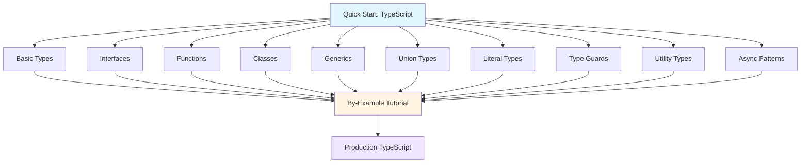

**Want to learn TypeScript fundamentals quickly?** This quick start touches 8-12 core TypeScript concepts with one example each. By the end, you'll have practical touchpoints for the most important type system features.

## Prerequisites

Before starting, you should have:

- Completed [Initial Setup](/en/learn/software-engineering/programming-languages/typescript/initial-setup) - TypeScript installed and working
- A text editor or IDE (VS Code recommended)
- Basic JavaScript knowledge (variables, functions, objects)
- Willingness to write and run code

## Learning Objectives

By the end of this tutorial, you will have touchpoints for:

1. **Basic Types** - Primitive types, arrays, tuples, any, unknown, never
2. **Interfaces and Type Aliases** - Object shape definitions, type contracts
3. **Functions** - Parameter types, return types, optional parameters, overloads
4. **Classes** - Access modifiers, constructors, inheritance
5. **Generics** - Type parameters, constraints, generic functions and classes
6. **Union and Intersection Types** - Combine types, type narrowing
7. **Literal Types** - Exact value types, discriminated unions
8. **Type Guards and Narrowing** - Runtime type checking, type predicates
9. **Utility Types** - Built-in type transformations
10. **Async Patterns** - Promises, async/await with types

## Learning Path



## Project Setup

Create a project directory for examples:

```bash
mkdir -p ~/typescript-projects/quickstart
cd ~/typescript-projects/quickstart
npm init -y
npm install --save-dev typescript @types/node
npx tsc --init
```

Modify `tsconfig.json` to enable strict mode:

```json
{
  "compilerOptions": {
    "target": "ES2020",
    "module": "commonjs",
    "strict": true,
    "esModuleInterop": true,
    "skipLibCheck": true,
    "forceConsistentCasingInFileNames": true,
    "outDir": "./dist",
    "rootDir": "./src"
  },
  "include": ["src/**/*"]
}
```

Create `src/` directory:

```bash
mkdir src
```

## Concept 1: Basic Types - The Foundation

TypeScript adds static types to JavaScript primitives.

### Example: Primitive and Complex Types

Create `src/01-basic-types.ts`:

```typescript
// Primitive types
let name: string = "Alice";
let age: number = 30;
let isActive: boolean = true;

// Arrays
let numbers: number[] = [1, 2, 3, 4, 5];
let names: Array<string> = ["Alice", "Bob", "Charlie"];

// Tuples - fixed-length arrays with known types
let person: [string, number] = ["Alice", 30];
let coordinate: [number, number, number] = [10, 20, 30];

// Any - opt out of type checking (avoid when possible)
let anything: any = "string";
anything = 42;
anything = true;

// Unknown - type-safe any (requires type checking before use)
let uncertain: unknown = "might be anything";
if (typeof uncertain === "string") {
  console.log(uncertain.toUpperCase()); // OK - type narrowed
}

// Void - absence of return value
function log(message: string): void {
  console.log(message);
}

// Never - function never returns (throws or infinite loop)
function throwError(message: string): never {
  throw new Error(message);
}

// Null and Undefined
let nullable: string | null = null;
let optional: string | undefined = undefined;

// Output demonstration
console.log(`${name} is ${age} years old`);
console.log(`Numbers: ${numbers.join(", ")}`);
console.log(`Person: ${person[0]}, ${person[1]}`);
```

Compile and run:

```bash
npx tsc
node dist/01-basic-types.js
```

**Key concepts**: `string`, `number`, `boolean`, arrays, tuples, `any`, `unknown`, `void`, `never`

## Concept 2: Interfaces and Type Aliases - Shape Definitions

Define object structures and type contracts.

### Example: Interfaces vs Type Aliases

Create `src/02-interfaces.ts`:

```typescript
// Interface - describes object shape
interface User {
  id: number;
  name: string;
  email: string;
  age?: number; // Optional property
  readonly createdAt: Date; // Readonly property
}

// Type alias - similar to interface but more flexible
type Point = {
  x: number;
  y: number;
};

// Type alias for union types
type Status = "pending" | "approved" | "rejected";

// Interface extension
interface Admin extends User {
  permissions: string[];
}

// Type intersection
type Employee = User & {
  employeeId: string;
  department: string;
};

// Usage examples
const user: User = {
  id: 1,
  name: "Alice",
  email: "alice@example.com",
  createdAt: new Date(),
};

const admin: Admin = {
  id: 2,
  name: "Bob",
  email: "bob@example.com",
  createdAt: new Date(),
  permissions: ["read", "write", "delete"],
};

const point: Point = { x: 10, y: 20 };

const status: Status = "approved";

// Function using interface
function printUser(user: User): void {
  console.log(`User: ${user.name} (${user.email})`);
}

printUser(user);
printUser(admin); // Admin is compatible (structural typing)

// user.createdAt = new Date(); // Error: readonly property
```

**Key concepts**: `interface`, type alias (`type`), optional (`?`), readonly, extends, intersection (`&`)

## Concept 3: Functions - Type-Safe Behavior

Add type annotations to function parameters and return values.

### Example: Function Types and Overloads

Create `src/03-functions.ts`:

```typescript
// Basic function with types
function add(a: number, b: number): number {
  return a + b;
}

// Optional parameters
function greet(name: string, greeting?: string): string {
  return `${greeting || "Hello"}, ${name}!`;
}

// Default parameters
function createUser(name: string, age: number = 18): User {
  return { id: 1, name, email: `${name}@example.com`, age };
}

// Rest parameters
function sum(...numbers: number[]): number {
  return numbers.reduce((total, n) => total + n, 0);
}

// Function type
type MathOperation = (a: number, b: number) => number;

const multiply: MathOperation = (a, b) => a * b;
const divide: MathOperation = (a, b) => a / b;

// Arrow functions
const square = (n: number): number => n * n;

// Function overloads - multiple signatures
function format(value: string): string;
function format(value: number): string;
function format(value: boolean): string;
function format(value: string | number | boolean): string {
  if (typeof value === "string") return value.toUpperCase();
  if (typeof value === "number") return value.toFixed(2);
  return value ? "true" : "false";
}

// Interface needed for examples
interface User {
  id: number;
  name: string;
  email: string;
  age?: number;
}

// Demonstration
console.log(add(5, 3)); // 8
console.log(greet("Alice")); // Hello, Alice!
console.log(greet("Bob", "Hi")); // Hi, Bob!
console.log(sum(1, 2, 3, 4, 5)); // 15
console.log(format("hello")); // HELLO
console.log(format(42.567)); // 42.57
console.log(format(true)); // true
```

**Key concepts**: Parameter types, return types, optional parameters (`?`), default parameters, rest parameters (`...`), function types, overloads

## Concept 4: Classes - Object-Oriented TypeScript

Use classes with type safety and access modifiers.

### Example: Classes with TypeScript Features

Create `src/04-classes.ts`:

```typescript
// Class with access modifiers
class Person {
  // Public (default) - accessible everywhere
  public name: string;

  // Private - only accessible within class
  private age: number;

  // Protected - accessible in class and subclasses
  protected email: string;

  // Readonly - cannot be modified after initialization
  readonly id: number;

  // Constructor
  constructor(id: number, name: string, age: number, email: string) {
    this.id = id;
    this.name = name;
    this.age = age;
    this.email = email;
  }

  // Public method
  public greet(): string {
    return `Hello, I'm ${this.name}`;
  }

  // Getter
  public get userAge(): number {
    return this.age;
  }

  // Setter
  public set userAge(value: number) {
    if (value > 0) {
      this.age = value;
    }
  }
}

// Shorthand constructor (parameter properties)
class User {
  constructor(
    public id: number,
    public name: string,
    private password: string,
  ) {}

  public authenticate(password: string): boolean {
    return this.password === password;
  }
}

// Inheritance
class Employee extends Person {
  constructor(
    id: number,
    name: string,
    age: number,
    email: string,
    public department: string,
  ) {
    super(id, name, age, email);
  }

  // Override method
  public greet(): string {
    return `${super.greet()}, I work in ${this.department}`;
  }
}

// Abstract class
abstract class Animal {
  constructor(public name: string) {}

  abstract makeSound(): string; // Must be implemented by subclasses

  public move(): string {
    return `${this.name} is moving`;
  }
}

class Dog extends Animal {
  public makeSound(): string {
    return "Woof!";
  }
}

// Usage
const person = new Person(1, "Alice", 30, "alice@example.com");
console.log(person.greet());
console.log(person.userAge); // 30
person.userAge = 31;

const user = new User(2, "Bob", "secret123");
console.log(user.authenticate("secret123")); // true

const employee = new Employee(3, "Charlie", 28, "charlie@example.com", "IT");
console.log(employee.greet());

const dog = new Dog("Buddy");
console.log(dog.makeSound());
console.log(dog.move());
```

**Key concepts**: `class`, `public`, `private`, `protected`, `readonly`, constructors, getters/setters, inheritance (`extends`), `abstract`

## Concept 5: Generics - Reusable Type-Safe Code

Create flexible, reusable components with type parameters.

### Example: Generic Functions and Classes

Create `src/05-generics.ts`:

```typescript
// Generic function
function identity<T>(value: T): T {
  return value;
}

// Type inference
const num = identity(42); // T inferred as number
const str = identity("hello"); // T inferred as string

// Explicit type argument
const bool = identity<boolean>(true);

// Generic with constraints
interface HasLength {
  length: number;
}

function logLength<T extends HasLength>(item: T): void {
  console.log(`Length: ${item.length}`);
}

logLength("hello"); // OK - string has length
logLength([1, 2, 3]); // OK - array has length
// logLength(42); // Error - number doesn't have length

// Generic class
class Box<T> {
  private value: T;

  constructor(value: T) {
    this.value = value;
  }

  public getValue(): T {
    return this.value;
  }

  public setValue(value: T): void {
    this.value = value;
  }
}

const numberBox = new Box<number>(42);
console.log(numberBox.getValue()); // 42

const stringBox = new Box("hello");
console.log(stringBox.getValue()); // hello

// Generic interface
interface Pair<K, V> {
  key: K;
  value: V;
}

const pair: Pair<string, number> = {
  key: "age",
  value: 30,
};

// Multiple type parameters
function swap<T, U>(tuple: [T, U]): [U, T] {
  return [tuple[1], tuple[0]];
}

const swapped = swap([1, "hello"]); // ["hello", 1]
console.log(swapped);

// Generic constraints with keyof
function getProperty<T, K extends keyof T>(obj: T, key: K): T[K] {
  return obj[key];
}

const person = { name: "Alice", age: 30 };
const name = getProperty(person, "name"); // Type: string
const age = getProperty(person, "age"); // Type: number
// const invalid = getProperty(person, "invalid"); // Error
```

**Key concepts**: Generic functions (`<T>`), generic classes, type constraints (`extends`), `keyof`, multiple type parameters

## Concept 6: Union and Intersection Types - Combine Types

Create flexible type combinations.

### Example: Union and Intersection

Create `src/06-union-intersection.ts`:

```typescript
// Union types - value can be one of several types
type StringOrNumber = string | number;

function formatValue(value: StringOrNumber): string {
  if (typeof value === "string") {
    return value.toUpperCase();
  }
  return value.toFixed(2);
}

console.log(formatValue("hello")); // HELLO
console.log(formatValue(42.567)); // 42.57

// Intersection types - combine multiple types
interface Person {
  name: string;
  age: number;
}

interface Employee {
  employeeId: string;
  department: string;
}

type EmployeePerson = Person & Employee;

const employee: EmployeePerson = {
  name: "Alice",
  age: 30,
  employeeId: "EMP001",
  department: "IT",
};

// Type narrowing with type guards
function processValue(value: string | number | boolean): void {
  if (typeof value === "string") {
    console.log(value.toUpperCase()); // TypeScript knows it's string
  } else if (typeof value === "number") {
    console.log(value.toFixed(2)); // TypeScript knows it's number
  } else {
    console.log(value ? "true" : "false"); // TypeScript knows it's boolean
  }
}

// Array of union types
const mixed: (string | number)[] = [1, "two", 3, "four"];

// Function returning union type
function getConfig(key: string): string | number | boolean {
  const config: { [key: string]: string | number | boolean } = {
    timeout: 5000,
    url: "https://api.example.com",
    debug: true,
  };
  return config[key];
}
```

**Key concepts**: Union types (`|`), intersection types (`&`), type narrowing, type guards (`typeof`)

## Concept 7: Literal Types - Exact Values as Types

Use specific values as types for precise contracts.

### Example: Literal Types and Discriminated Unions

Create `src/07-literal-types.ts`:

```typescript
// String literal types
type Direction = "north" | "south" | "east" | "west";

function move(direction: Direction): void {
  console.log(`Moving ${direction}`);
}

move("north"); // OK
// move("up"); // Error - "up" not in Direction type

// Numeric literal types
type DiceRoll = 1 | 2 | 3 | 4 | 5 | 6;

function rollDice(): DiceRoll {
  return (Math.floor(Math.random() * 6) + 1) as DiceRoll;
}

// Boolean literal types
type True = true;
type False = false;

// Discriminated unions - pattern for type-safe state machines
interface Circle {
  kind: "circle"; // Literal type discriminant
  radius: number;
}

interface Rectangle {
  kind: "rectangle"; // Literal type discriminant
  width: number;
  height: number;
}

interface Triangle {
  kind: "triangle"; // Literal type discriminant
  base: number;
  height: number;
}

type Shape = Circle | Rectangle | Triangle;

function getArea(shape: Shape): number {
  switch (shape.kind) {
    case "circle":
      // TypeScript knows shape is Circle
      return Math.PI * shape.radius ** 2;
    case "rectangle":
      // TypeScript knows shape is Rectangle
      return shape.width * shape.height;
    case "triangle":
      // TypeScript knows shape is Triangle
      return (shape.base * shape.height) / 2;
  }
}

const circle: Circle = { kind: "circle", radius: 5 };
const rectangle: Rectangle = { kind: "rectangle", width: 10, height: 20 };

console.log(getArea(circle)); // 78.54
console.log(getArea(rectangle)); // 200

// Template literal types (TypeScript 4.1+)
type EmailLocale = "en" | "es" | "fr";
type EmailType = "welcome" | "reset-password" | "notification";
type EmailTemplate = `${EmailLocale}_${EmailType}`;

const template: EmailTemplate = "en_welcome"; // OK
// const invalid: EmailTemplate = "de_welcome"; // Error
```

**Key concepts**: Literal types, discriminated unions, `switch` with exhaustiveness checking, template literal types

## Concept 8: Type Guards and Narrowing - Runtime Type Safety

Check types at runtime and narrow TypeScript's understanding.

### Example: Type Guards and Predicates

Create `src/08-type-guards.ts`:

```typescript
// typeof type guard
function padLeft(value: string, padding: string | number): string {
  if (typeof padding === "number") {
    return " ".repeat(padding) + value;
  }
  return padding + value;
}

console.log(padLeft("Hello", 4)); // "    Hello"
console.log(padLeft("Hello", "> ")); // "> Hello"

// instanceof type guard
class Dog {
  bark() {
    return "Woof!";
  }
}

class Cat {
  meow() {
    return "Meow!";
  }
}

function makeSound(animal: Dog | Cat): string {
  if (animal instanceof Dog) {
    return animal.bark(); // TypeScript knows it's Dog
  }
  return animal.meow(); // TypeScript knows it's Cat
}

// in operator type guard
interface Bird {
  fly(): void;
  layEggs(): void;
}

interface Fish {
  swim(): void;
  layEggs(): void;
}

function move(animal: Bird | Fish): void {
  if ("fly" in animal) {
    animal.fly(); // TypeScript knows it's Bird
  } else {
    animal.swim(); // TypeScript knows it's Fish
  }
}

// Custom type predicate
function isString(value: unknown): value is string {
  return typeof value === "string";
}

function processValue(value: unknown): void {
  if (isString(value)) {
    console.log(value.toUpperCase()); // TypeScript knows it's string
  }
}

// Truthiness narrowing
function printLength(str: string | null | undefined): void {
  if (str) {
    console.log(str.length); // TypeScript knows str is string
  } else {
    console.log("No string provided");
  }
}

// Equality narrowing
function compare(x: string | number, y: string | boolean): void {
  if (x === y) {
    // TypeScript knows both are string (only common type)
    console.log(x.toUpperCase());
    console.log(y.toUpperCase());
  }
}

// Discriminated union narrowing
type Success = { status: "success"; data: string };
type Error = { status: "error"; message: string };
type Result = Success | Error;

function handleResult(result: Result): void {
  if (result.status === "success") {
    console.log(result.data); // TypeScript knows it's Success
  } else {
    console.log(result.message); // TypeScript knows it's Error
  }
}
```

**Key concepts**: `typeof`, `instanceof`, `in` operator, type predicates (`is`), truthiness narrowing, discriminated unions

## Concept 9: Utility Types - Built-in Type Transformations

Use TypeScript's built-in helper types.

### Example: Common Utility Types

Create `src/09-utility-types.ts`:

```typescript
interface User {
  id: number;
  name: string;
  email: string;
  age: number;
}

// Partial<T> - make all properties optional
type PartialUser = Partial<User>;
const updateUser: PartialUser = { name: "Alice" }; // OK

// Required<T> - make all properties required
interface PartialConfig {
  timeout?: number;
  retries?: number;
}
type RequiredConfig = Required<PartialConfig>;
// const config: RequiredConfig = { timeout: 5000 }; // Error - retries missing

// Readonly<T> - make all properties readonly
type ReadonlyUser = Readonly<User>;
const user: ReadonlyUser = {
  id: 1,
  name: "Alice",
  email: "alice@example.com",
  age: 30,
};
// user.name = "Bob"; // Error - readonly

// Pick<T, K> - select subset of properties
type UserPreview = Pick<User, "id" | "name">;
const preview: UserPreview = { id: 1, name: "Alice" };

// Omit<T, K> - exclude properties
type UserWithoutEmail = Omit<User, "email">;
const userNoEmail: UserWithoutEmail = {
  id: 1,
  name: "Alice",
  age: 30,
};

// Record<K, T> - create object type with specified keys and value type
type UserRoles = Record<string, string[]>;
const roles: UserRoles = {
  admin: ["read", "write", "delete"],
  user: ["read"],
};

// ReturnType<T> - extract function return type
function createUser() {
  return { id: 1, name: "Alice", email: "alice@example.com" };
}
type CreatedUser = ReturnType<typeof createUser>;

// Parameters<T> - extract function parameter types as tuple
function greet(name: string, age: number): string {
  return `Hello ${name}, age ${age}`;
}
type GreetParams = Parameters<typeof greet>; // [string, number]

// Exclude<T, U> - exclude types from union
type AllTypes = string | number | boolean;
type StringOrNumber = Exclude<AllTypes, boolean>; // string | number

// Extract<T, U> - extract types from union
type Primitives = string | number | boolean | null | undefined;
type NonNullable = Extract<Primitives, string | number | boolean>; // string | number | boolean

// NonNullable<T> - remove null and undefined
type MaybeString = string | null | undefined;
type DefinitelyString = NonNullable<MaybeString>; // string

// Awaited<T> - unwrap Promise type
type PromiseString = Promise<string>;
type UnwrappedString = Awaited<PromiseString>; // string
```

**Key concepts**: `Partial`, `Required`, `Readonly`, `Pick`, `Omit`, `Record`, `ReturnType`, `Parameters`, `Exclude`, `Extract`, `NonNullable`, `Awaited`

## Concept 10: Async Patterns - Promises and Async/Await

Type-safe asynchronous programming.

### Example: Async Functions and Promises

Create `src/10-async-patterns.ts`:

```typescript
// Promise with type parameter
function fetchUser(id: number): Promise<User> {
  return new Promise((resolve) => {
    setTimeout(() => {
      resolve({
        id,
        name: "Alice",
        email: "alice@example.com",
        age: 30,
      });
    }, 1000);
  });
}

// Async/await
async function getUser(id: number): Promise<User> {
  const user = await fetchUser(id);
  console.log(`Fetched user: ${user.name}`);
  return user;
}

// Error handling with async/await
async function getUserSafe(id: number): Promise<User | null> {
  try {
    const user = await fetchUser(id);
    return user;
  } catch (error) {
    console.error("Error fetching user:", error);
    return null;
  }
}

// Multiple promises
async function getAllUsers(): Promise<User[]> {
  const [user1, user2, user3] = await Promise.all([fetchUser(1), fetchUser(2), fetchUser(3)]);
  return [user1, user2, user3];
}

// Generic async function
async function fetchData<T>(url: string): Promise<T> {
  const response = await fetch(url);
  return response.json() as Promise<T>;
}

// Union type with async
type Result<T> = { success: true; data: T } | { success: false; error: string };

async function fetchUserResult(id: number): Promise<Result<User>> {
  try {
    const user = await fetchUser(id);
    return { success: true, data: user };
  } catch (error) {
    return { success: false, error: String(error) };
  }
}

// Async generators
async function* generateNumbers(count: number): AsyncGenerator<number> {
  for (let i = 0; i < count; i++) {
    await new Promise((resolve) => setTimeout(resolve, 100));
    yield i;
  }
}

// Interface for demonstration
interface User {
  id: number;
  name: string;
  email: string;
  age: number;
}

// Usage demonstration
async function demo(): Promise<void> {
  const user = await getUser(1);
  console.log(user);

  const result = await fetchUserResult(1);
  if (result.success) {
    console.log(result.data);
  } else {
    console.log(result.error);
  }

  for await (const num of generateNumbers(5)) {
    console.log(num);
  }
}

// Run demo
demo().catch(console.error);
```

**Key concepts**: `Promise<T>`, `async`, `await`, error handling, `Promise.all`, generic promises, async generators

## Summary

**What you've touched**:

- Basic types (string, number, boolean, arrays, tuples, any, unknown)
- Interfaces and type aliases
- Function types (parameters, return types, overloads)
- Classes (access modifiers, inheritance, abstract classes)
- Generics (functions, classes, constraints)
- Union and intersection types
- Literal types and discriminated unions
- Type guards and narrowing
- Utility types (Partial, Pick, Omit, etc.)
- Async patterns (Promise, async/await)

**Key TypeScript features learned**:

```typescript
// Type annotations
let name: string = "Alice";
function greet(name: string): string {
  return `Hello, ${name}`;
}

// Interfaces
interface User {
  id: number;
  name: string;
}

// Generics
function identity<T>(value: T): T {
  return value;
}

// Union types
type StringOrNumber = string | number;

// Type guards
if (typeof value === "string") {
  console.log(value.toUpperCase());
}

// Utility types
type PartialUser = Partial<User>;

// Async with types
async function fetchUser(id: number): Promise<User> {
  // ...
}
```

## Next Steps

**Want comprehensive TypeScript mastery?**

- [By-Example Tutorial](/en/learn/software-engineering/programming-languages/typescript/by-example) - Learn through heavily annotated TypeScript examples

**Need specific solutions?**

- Browse by-example sections for specific type patterns

**Want to understand TypeScript philosophy?**

- [Overview](/en/learn/software-engineering/programming-languages/typescript/overview) - Why TypeScript exists and when to use it

## Quick Reference Card

### Essential Type Annotations

```typescript
// Variables
let name: string = "Alice";
let age: number = 30;
let active: boolean = true;

// Arrays
let numbers: number[] = [1, 2, 3];
let strings: Array<string> = ["a", "b"];

// Functions
function add(a: number, b: number): number {
  return a + b;
}

// Objects
interface User {
  name: string;
  age: number;
}

// Union types
let id: string | number = "123";

// Generics
function wrap<T>(value: T): T[] {
  return [value];
}

// Promises
async function fetch(): Promise<User> {
  // ...
}
```

### Common Patterns

```typescript
// Optional properties
interface Config {
  timeout?: number;
}

// Readonly
interface Point {
  readonly x: number;
  readonly y: number;
}

// Type guards
if (typeof value === "string") {
  // value is string
}

// Discriminated unions
type Result = { status: "success"; data: string } | { status: "error"; message: string };

// Utility types
type PartialUser = Partial<User>;
type UserPreview = Pick<User, "name" | "email">;
```

This quick start provides touchpoints for essential TypeScript operations. For production work, explore the by-example tutorial for comprehensive coverage and heavily annotated code patterns.
