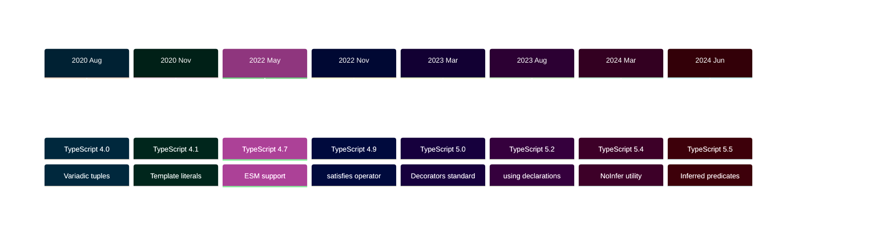

## TypeScript Release Philosophy

TypeScript follows a **quarterly release cadence** with major versions released approximately every 3 months. Unlike languages with Long-Term Support (LTS) models, TypeScript prioritizes rapid iteration and backward compatibility within major version families.

**Key Principles**:

- **Backward Compatibility**: Code written for TypeScript 4.x works on all 4.y versions
- **Rapid Innovation**: New features every 3 months
- **Gradual Adoption**: Features often start experimental, become stable over releases
- **Strict Versioning**: Breaking changes reserved for major versions (4.x → 5.x)
- **Always Current**: Community encourages staying on latest stable version

## Why No LTS Model?

TypeScript's design philosophy emphasizes continuous improvement over long-term version fragmentation.

**Rationale**:

- **Compilation Target**: TypeScript compiles to JavaScript (no runtime dependencies)
- **Tooling Ecosystem**: Build tools handle version management
- **Minimal Breaking Changes**: Minor versions rarely break existing code
- **Easy Upgrades**: Incremental changes make upgrades low-risk
- **Type Safety**: Static analysis catches migration issues early

**Comparison with Other Languages**:

```
Java LTS Model:
Java 17 (2021) → Java 21 (2023) → Java 25 (2025)
Enterprise stays on LTS versions for years

Go Rolling Model:
Go 1.18 → Go 1.19 → Go 1.20 (every 6 months)
Community upgrades continuously

TypeScript Rapid Release:
TS 4.0 → 4.1 → 4.2 → 4.3 (every 3 months)
Community upgrades frequently, breaking changes rare
```

## Release Coverage

This section covers **TypeScript 4.0 through 5.7**, spanning from August 2020 to present (2026). This period represents the most significant evolution of TypeScript's type system and developer experience.

**Complete coverage:** TypeScript 4.0, 4.1, 4.2, 4.3, 4.4, 4.5, 4.6, 4.7, 4.8, 4.9, 5.0, 5.1, 5.2, 5.3, 5.4, 5.5, 5.6, 5.7

## Major Version Milestones

### TypeScript 4.x Series (2020-2022)

**Focus:** Type system sophistication and developer productivity

**Landmark Features:**

- **[TypeScript 4.0](/en/learn/software-engineering/programming-languages/typescript/release-highlights/typescript-4-0)** (Aug 2020) - Variadic tuple types, labeled tuple elements
- **[TypeScript 4.1](/en/learn/software-engineering/programming-languages/typescript/release-highlights/typescript-4-1)** (Nov 2020) - Template literal types, key remapping
- **[TypeScript 4.7](/en/learn/software-engineering/programming-languages/typescript/release-highlights/typescript-4-7)** (May 2022) - ESM support in Node.js, module detection improvements
- **[TypeScript 4.9](/en/learn/software-engineering/programming-languages/typescript/release-highlights/typescript-4-9)** (Nov 2022) - `satisfies` operator

### TypeScript 5.x Series (2023-Present)

**Focus:** Performance, ECMAScript alignment, and modern JavaScript features

**Landmark Features:**

- **[TypeScript 5.0](/en/learn/software-engineering/programming-languages/typescript/release-highlights/typescript-5-0)** (Mar 2023) - Decorators, const type parameters, enum enhancements
- **[TypeScript 5.2](/en/learn/software-engineering/programming-languages/typescript/release-highlights/typescript-5-2)** (Aug 2023) - `using` declarations (explicit resource management)
- **[TypeScript 5.4](/en/learn/software-engineering/programming-languages/typescript/release-highlights/typescript-5-4)** (Mar 2024) - `NoInfer` utility type
- **[TypeScript 5.5](/en/learn/software-engineering/programming-languages/typescript/release-highlights/typescript-5-5)** (Jun 2024) - Inferred type predicates

## Release Categories by Impact

### Landmark Releases (Major Type System Evolution)

Releases that fundamentally expanded TypeScript's type system capabilities.

- **TypeScript 4.1** - Template literal types revolutionized string manipulation types
- **TypeScript 4.9** - `satisfies` operator solved long-standing type inference challenges
- **TypeScript 5.0** - Official decorators, major version milestone
- **TypeScript 5.2** - Explicit resource management with `using` declarations

### Feature Releases (Significant Additions)

Releases with important new features or substantial developer experience improvements.

- **TypeScript 4.0** - Variadic tuples enabled flexible type-safe APIs
- **TypeScript 4.7** - ESM support modernized Node.js development
- **TypeScript 5.4** - `NoInfer` utility type improved generic inference control
- **TypeScript 5.5** - Inferred type predicates reduced boilerplate

### Incremental Releases (Refinements)

Releases focused on performance, bug fixes, and minor enhancements.

- **TypeScript 4.4** - Control flow analysis improvements
- **TypeScript 4.6** - Destructured discriminated unions
- **TypeScript 5.1** - Easier implicit returns
- **TypeScript 5.3** - Import attributes

## Type System Evolution

Key type system features evolved across releases:

| Feature                         | TS 4.0 (2020) | TS 4.5 (2021) | TS 4.9 (2022) | TS 5.0 (2023) | TS 5.5 (2024) |
| ------------------------------- | ------------- | ------------- | ------------- | ------------- | ------------- |
| **Variadic Tuple Types**        | ✅ Added      | ✅ Available  | ✅ Available  | ✅ Available  | ✅ Available  |
| **Template Literal Types**      | ❌ None       | ✅ Added      | ✅ Available  | ✅ Available  | ✅ Available  |
| **`satisfies` Operator**        | ❌ None       | ❌ None       | ✅ Added      | ✅ Available  | ✅ Available  |
| **Decorators (Standard)**       | ❌ None       | ❌ None       | ❌ None       | ✅ Added      | ✅ Available  |
| **`using` Declarations**        | ❌ None       | ❌ None       | ❌ None       | ❌ None       | ✅ Added      |
| **Inferred Type Predicates**    | ❌ None       | ❌ None       | ❌ None       | ❌ None       | ✅ Added      |
| **`NoInfer` Utility Type**      | ❌ None       | ❌ None       | ❌ None       | ❌ None       | ✅ Added      |
| **Control Flow Analysis (CFA)** | ✅ Improved   | ✅ Improved   | ✅ Improved   | ✅ Improved   | ✅ Enhanced   |

Legend:

- ✅ **Added** - Feature introduced in this version
- ✅ **Available** - Feature available from earlier version
- ✅ **Improved/Enhanced** - Incremental improvements
- ❌ **None** - Not available

## Version Naming and Cadence

TypeScript uses semantic versioning: `MAJOR.MINOR.PATCH`

**Format**: `TypeScript MAJOR.MINOR.PATCH`

**Release Rhythm**:

- **Major versions** (4.x → 5.x): Breaking changes, new architecture (rare)
- **Minor versions** (5.1 → 5.2): New features, backward compatible (every 3 months)
- **Patch versions** (5.1.0 → 5.1.1): Bug fixes only

**Historical Timeline**:



## Choosing Your TypeScript Version

**For new projects in 2026:**

- **Start with TypeScript 5.5+** - Latest stable features, best performance
- **Use exact version pinning** - Lock dependencies for reproducibility
- **Configure strict mode** - Enable all strictness flags from start

**For existing projects:**

- **Upgrade quarterly** - Follow TypeScript release cadence when feasible
- **Test thoroughly** - Run comprehensive test suite before upgrading
- **Read release notes** - Check breaking changes section (usually minimal)
- **Update `@types` packages** - Ensure type definitions match TypeScript version

## Breaking Changes Philosophy

TypeScript minimizes breaking changes in minor versions:

**Minor Version Guarantees (4.1 → 4.2)**:

- ✅ Existing code continues to compile
- ✅ Type inference may improve (more precise types)
- ✅ New errors only for genuinely unsound code
- ⚠️ Edge cases may surface new type errors
- ⚠️ `--strict` mode may reveal latent issues

**Major Version Changes (4.x → 5.x)**:

- ⚠️ May remove deprecated features
- ⚠️ May change default compiler options
- ⚠️ May update target ECMAScript defaults
- ✅ Still maintains backward compatibility goals
- ✅ Migration guides provided

## Upgrade Strategy

### Upgrade Workflow

**Recommended Process**:

1. **Review release notes** - Understand new features and breaking changes
2. **Update TypeScript** - `npm install -D typescript@latest`
3. **Update type definitions** - `npm update @types/*`
4. **Run type checker** - `tsc --noEmit`
5. **Fix type errors** - Address any new type errors
6. **Run tests** - Comprehensive test suite execution
7. **Update CI/CD** - Ensure build pipelines use new version

### Upgrade Safety Checks

**Pre-upgrade Checklist**:

- [ ] Comprehensive test suite exists
- [ ] All tests passing on current version
- [ ] Dependencies compatible with new TypeScript version
- [ ] CI/CD pipeline validated
- [ ] Rollback plan documented

**Post-upgrade Validation**:

- [ ] `tsc --noEmit` succeeds
- [ ] All tests passing
- [ ] Application builds successfully
- [ ] Runtime behavior unchanged
- [ ] Performance benchmarks stable

## Release Highlights Series Structure

This section documents TypeScript releases from 4.0 onwards, focusing on:

- **Type System Features** - New types, inference improvements, utility types
- **Language Features** - Syntax additions, control flow analysis
- **Compiler Improvements** - Performance, build speed, error messages
- **Tooling Enhancements** - Editor support, debugging, module resolution
- **ECMAScript Alignment** - Support for new JavaScript features
- **Breaking Changes** - Rare but documented when they occur

Each release page provides practical examples and migration guidance.

## Performance Evolution

TypeScript compilation performance improved significantly across versions:

**Benchmarks** (based on TypeScript team reports):

- **TypeScript 4.0 → 4.9**: 10-20% faster compilation
- **TypeScript 5.0**: 10-20% faster than 4.9 (new architecture)
- **TypeScript 5.1-5.5**: Incremental 5-10% improvements per release

**Performance Focus Areas**:

- **Incremental compilation** - Faster rebuilds
- **Project references** - Better monorepo support
- **Type checking speed** - Optimized algorithms
- **Memory usage** - Reduced memory footprint
- **Editor responsiveness** - Faster IntelliSense

## Ecosystem Compatibility

TypeScript versions align with modern JavaScript ecosystem:

**Node.js Support**:

- TypeScript 4.7+ - Full ESM support
- TypeScript 5.0+ - Node.js 16+ recommended
- TypeScript 5.5+ - Node.js 18+ optimal

**Framework Integration**:

- **React** - TypeScript 5.0+ recommended for React 18+
- **Vue** - TypeScript 5.0+ for Vue 3 composition API
- **Angular** - Specific TypeScript version per Angular release
- **Nest.js** - TypeScript 5.0+ recommended
- **Next.js** - TypeScript 5.0+ for App Router

## Next Steps

**For comprehensive understanding:**

Explore releases chronologically from [TypeScript 4.0](/en/learn/software-engineering/programming-languages/typescript/release-highlights/typescript-4-0) through [TypeScript 5.7](/en/learn/software-engineering/programming-languages/typescript/release-highlights/typescript-5-7) to see complete feature evolution.

**For landmark features:**

1. **[TypeScript 4.1](/en/learn/software-engineering/programming-languages/typescript/release-highlights/typescript-4-1)** - Template literal types revolution
2. **[TypeScript 4.9](/en/learn/software-engineering/programming-languages/typescript/release-highlights/typescript-4-9)** - `satisfies` operator for precise typing
3. **[TypeScript 5.0](/en/learn/software-engineering/programming-languages/typescript/release-highlights/typescript-5-0)** - Standard decorators milestone
4. **[TypeScript 5.2](/en/learn/software-engineering/programming-languages/typescript/release-highlights/typescript-5-2)** - Explicit resource management
5. **[TypeScript 5.5](/en/learn/software-engineering/programming-languages/typescript/release-highlights/typescript-5-5)** - Inferred type predicates

**For practical migration:**

Focus on major version transitions: [4.9 → 5.0](/en/learn/software-engineering/programming-languages/typescript/release-highlights/typescript-5-0) represents the most significant upgrade path.
