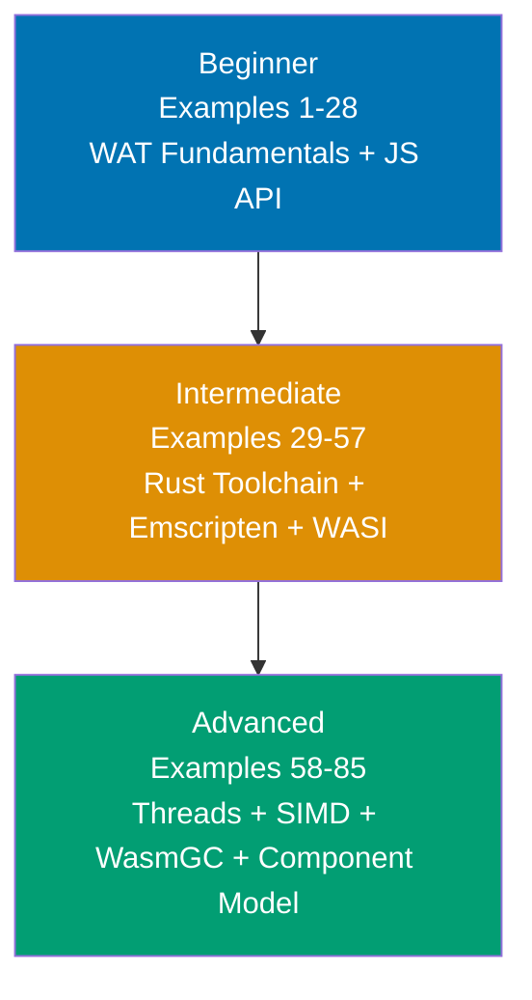

## What is By-Example Learning?

By-example learning is a **code-first approach** designed for experienced developers who want to pick up WebAssembly rapidly. Instead of lengthy theoretical explanations, you see working code first, observe what it does, and build understanding through annotated examples that show every step.

This tutorial assumes you already know at least one programming language well and want to understand WebAssembly from WAT binary fundamentals up through the modern component model and WASIp3 async model.

## What is WebAssembly?

WebAssembly (Wasm) is a **portable binary instruction format** — a compilation target for multiple source languages — designed to execute at near-native speed in browsers, servers, and edge runtimes. The W3C ratified WebAssembly 3.0 on September 17, 2025, standardizing nine new features including WasmGC, tail calls, exception handling, multiple memories, Memory64, Relaxed SIMD, typed references, deterministic profile, and JS String Builtins.

Wasm is **not** a programming language you write by hand in production. It is the target your toolchain produces: Rust through `wasm-pack`, C/C++ through Emscripten, AssemblyScript through `asc`, Kotlin through the Kotlin/Wasm compiler, and dozens more. Understanding the binary format — WebAssembly Text (WAT) format — gives you a mental model of what every toolchain produces and how the runtime executes it.

## Learning Path

Progress from WAT binary fundamentals through production toolchains to cutting-edge features. Each level builds on the previous.

## Coverage Philosophy

This tutorial covers WebAssembly comprehensively through practical, annotated examples. The coverage percentage reflects concept breadth — focus is on **outcomes and understanding**, not duration.

### What's Covered

- **WAT Fundamentals**: Module structure, value types, functions, control flow, memory model
- **JavaScript API**: `WebAssembly.instantiateStreaming`, `WebAssembly.Memory`, imports/exports
- **AssemblyScript**: Typed subset of TypeScript compiling to Wasm (NOT the same as TypeScript)
- **Rust + wasm-pack + wasm-bindgen**: The dominant Wasm-from-Rust toolchain (wasm-bindgen 0.2.120)
- **Emscripten**: C/C++ to Wasm compilation (Emscripten 5.0.6, requires Node.js 18.3.0+)
- **Performance patterns**: Boundary optimization, SIMD, Web Workers, wasm-opt
- **WASI**: WASIp1 (stable legacy), WASIp2 (current stable, January 2024), WASIp3 (February 2026, native async)
- **Debugging**: DWARF debug info, Chrome DevTools WASM extension
- **Threads**: SharedArrayBuffer, atomic operations, Emscripten pthreads, wasm-bindgen-rayon
- **SIMD**: Fixed 128-bit SIMD (universally available), Relaxed SIMD (Chrome/Firefox/Edge shipped)
- **WasmGC**: Garbage collection for managed-language compilation (Baseline Dec 11, 2024)
- **Exception handling**: `throw`/`catch`/`exnref`, JS `WebAssembly.Tag` API (Wasm 3.0)
- **Component Model**: WIT interfaces, `wit-bindgen` v0.57.1, WASIp2 components, composition
- **Production**: Memory64, multi-memory, Cloudflare Workers deployment, ESM source phase imports

### What's NOT Covered

- **Wasm interpreter internals**: Spectest, reference interpreter implementation details
- **Compiler backend specifics**: LLVM WebAssembly target internals
- **Browser engine JIT**: Cranelift, V8 Liftoff/TurboFan WebAssembly tiers
- **All source languages**: Go, C#, Python, Java, Dart — covered in toolchain-specific guides

## Tutorial Structure: 85 Examples Across 3 Levels

### Beginner (Examples 1-28: WAT Fundamentals + JS API + AssemblyScript)

**Focus**: Understanding the Wasm binary model and JavaScript integration

Learn the WAT text format (the human-readable representation of Wasm binaries), the JavaScript `WebAssembly` API, linear memory, and AssemblyScript as a typed entry point for writing Wasm directly. By example 28, you understand what every compiled `.wasm` file is made of.

**Key topics**: Module structure, value types, functions, control flow, WABT tooling, `instantiateStreaming`, memory pages, string encoding, AssemblyScript setup and types.

### Intermediate (Examples 29-57: Rust Toolchain + Emscripten + Performance + WASI)

**Focus**: Production toolchains and real-world patterns

Master `wasm-pack` and `wasm-bindgen` for Rust-to-Wasm compilation, Emscripten for C/C++ porting, performance optimization techniques, and WASI for server-side Wasm execution. By example 57, you can build, optimize, and debug production Wasm modules.

**Key topics**: `#[wasm_bindgen]`, JS class exports, `web-sys`, async Rust in Wasm, Emscripten C interop, wasm-opt, Web Workers, WASI file I/O, DWARF debugging.

### Advanced (Examples 58-85: Threads + SIMD + WasmGC + Component Model + Production)

**Focus**: Cutting-edge Wasm 3.0 features and deployment

Explore shared memory and atomics, SIMD vector operations, WasmGC typed references, exception handling, the Component Model with WIT interfaces, WASIp3 async, and production deployment patterns. By example 85, you understand the full breadth of the WebAssembly ecosystem as of 2025-2026.

**Key topics**: Atomic operations, futex primitives, fixed/relaxed SIMD, GC struct/array types, `throw`/`catch`, WIT interface files, `wit-bindgen`, component composition, Cloudflare Workers, ESM source phase imports.

## Prerequisites

- Familiarity with at least one compiled or systems language (C, C++, Rust, Go, Java)
- Basic JavaScript knowledge for the JS API sections (Examples 9-16, 37-38)
- Rust basics helpful for Examples 29-38 (see the Rust By Example tutorial)
- C basics helpful for Examples 39-44 (just enough to read function signatures)
- `wabt` installed for WAT examples: `brew install wabt` or download from [github.com/WebAssembly/wabt](https://github.com/WebAssembly/wabt)
- A modern browser (Chrome 119+, Firefox 120+, Safari 18.2+) for browser-API examples

## Toolchain Versions Referenced

| Tool                | Version     | Notes                                        |
| ------------------- | ----------- | -------------------------------------------- |
| WABT                | 1.0.40      | `wat2wasm`, `wasm-objdump`, `wasm-decompile` |
| Emscripten          | 5.0.6       | Requires Node.js 18.3.0+                     |
| wasm-bindgen        | 0.2.120     | CLI version MUST match crate version exactly |
| wasm-pack           | 0.14.0      | WASI support, macOS ARM support              |
| Binaryen/wasm-opt   | version_129 | 10-20% typical size reduction                |
| AssemblyScript      | 0.28.x      | NOT TypeScript — explicit low-level types    |
| wit-bindgen         | v0.57.1     | WIT guest bindings generator                 |
| Wasmtime            | v44.0.0     | WASIp2 + experimental WASIp3                 |
| wasm-feature-detect | 1.8.0       | Browser feature detection                    |

## Examples by Level

### Beginner (Examples 1–28)

- [Example 1: Minimal WAT Module](/en/learn/software-engineering/programming-languages/webassembly/by-example/beginner#example-1-minimal-wat-module)
- [Example 2: Value Types in WAT](/en/learn/software-engineering/programming-languages/webassembly/by-example/beginner#example-2-value-types-in-wat)
- [Example 3: Functions in WAT](/en/learn/software-engineering/programming-languages/webassembly/by-example/beginner#example-3-functions-in-wat)
- [Example 4: Converting WAT to .wasm Binary with wat2wasm](/en/learn/software-engineering/programming-languages/webassembly/by-example/beginner#example-4-converting-wat-to-wasm-binary-with-wat2wasm)
- [Example 5: Inspecting a .wasm Binary with wasm-objdump](/en/learn/software-engineering/programming-languages/webassembly/by-example/beginner#example-5-inspecting-a-wasm-binary-with-wasm-objdump)
- [Example 6: Decompiling .wasm to C-like Pseudocode with wasm-decompile](/en/learn/software-engineering/programming-languages/webassembly/by-example/beginner#example-6-decompiling-wasm-to-c-like-pseudocode-with-wasm-decompile)
- [Example 7: Control Flow in WAT](/en/learn/software-engineering/programming-languages/webassembly/by-example/beginner#example-7-control-flow-in-wat)
- [Example 8: Recursive Fibonacci in WAT](/en/learn/software-engineering/programming-languages/webassembly/by-example/beginner#example-8-recursive-fibonacci-in-wat)
- [Example 9: Loading .wasm with WebAssembly.instantiateStreaming](/en/learn/software-engineering/programming-languages/webassembly/by-example/beginner#example-9-loading-wasm-with-webassemblyinstantiatestreaming)
- [Example 10: Fallback: fetch + WebAssembly.instantiate](/en/learn/software-engineering/programming-languages/webassembly/by-example/beginner#example-10-fallback-fetch--webassemblyinstantiate)
- [Example 11: Calling Exported Wasm Functions from JavaScript](/en/learn/software-engineering/programming-languages/webassembly/by-example/beginner#example-11-calling-exported-wasm-functions-from-javascript)
- [Example 12: Importing JavaScript Functions into a Wasm Module](/en/learn/software-engineering/programming-languages/webassembly/by-example/beginner#example-12-importing-javascript-functions-into-a-wasm-module)
- [Example 13: WebAssembly.Module and WebAssembly.Instance Lifecycle](/en/learn/software-engineering/programming-languages/webassembly/by-example/beginner#example-13-webassemblymodule-and-webassemblyinstance-lifecycle)
- [Example 14: WebAssembly.compile for Pre-compilation](/en/learn/software-engineering/programming-languages/webassembly/by-example/beginner#example-14-webassemblycompile-for-pre-compilation)
- [Example 15: WebAssembly.validate for Binary Validity Check](/en/learn/software-engineering/programming-languages/webassembly/by-example/beginner#example-15-webassemblyvalidate-for-binary-validity-check)
- [Example 16: Runtime Feature Detection with wasm-feature-detect](/en/learn/software-engineering/programming-languages/webassembly/by-example/beginner#example-16-runtime-feature-detection-with-wasm-feature-detect)
- [Example 17: Declaring Memory in WAT](/en/learn/software-engineering/programming-languages/webassembly/by-example/beginner#example-17-declaring-memory-in-wat)
- [Example 18: WebAssembly.Memory Constructor](/en/learn/software-engineering/programming-languages/webassembly/by-example/beginner#example-18-webassemblymemory-constructor)
- [Example 19: Reading and Writing Wasm Memory from JavaScript via Typed Arrays](/en/learn/software-engineering/programming-languages/webassembly/by-example/beginner#example-19-reading-and-writing-wasm-memory-from-javascript-via-typed-arrays)
- [Example 20: Memory Grow — WAT and JavaScript](/en/learn/software-engineering/programming-languages/webassembly/by-example/beginner#example-20-memory-grow--wat-and-javascript)
- [Example 21: Memory Layout — Pointer and Length Convention](/en/learn/software-engineering/programming-languages/webassembly/by-example/beginner#example-21-memory-layout--pointer-and-length-convention)
- [Example 22: UTF-8 String Encoding Across the Wasm–JS Boundary](/en/learn/software-engineering/programming-languages/webassembly/by-example/beginner#example-22-utf-8-string-encoding-across-the-wasmjs-boundary)
- [Example 23: Exporting and Importing Memory](/en/learn/software-engineering/programming-languages/webassembly/by-example/beginner#example-23-exporting-and-importing-memory)
- [Example 24: Setting Up AssemblyScript](/en/learn/software-engineering/programming-languages/webassembly/by-example/beginner#example-24-setting-up-assemblyscript)
- [Example 25: Writing Typed Functions in AssemblyScript](/en/learn/software-engineering/programming-languages/webassembly/by-example/beginner#example-25-writing-typed-functions-in-assemblyscript)
- [Example 26: Compiling AssemblyScript and Loading in Browser](/en/learn/software-engineering/programming-languages/webassembly/by-example/beginner#example-26-compiling-assemblyscript-and-loading-in-browser)
- [Example 27: AssemblyScript Linear Memory — store, load, memory.size](/en/learn/software-engineering/programming-languages/webassembly/by-example/beginner#example-27-assemblyscript-linear-memory--store-load-memorysize)
- [Example 28: StaticArray vs Heap Arrays in AssemblyScript](/en/learn/software-engineering/programming-languages/webassembly/by-example/beginner#example-28-staticarray-vs-heap-arrays-in-assemblyscript)

### Intermediate (Examples 29–57)

- [Example 29: Rust Wasm Project Setup with wasm-pack](/en/learn/software-engineering/programming-languages/webassembly/by-example/intermediate#example-29-rust-wasm-project-setup-with-wasm-pack)
- [Example 30: `#[wasm_bindgen]` on Functions](/en/learn/software-engineering/programming-languages/webassembly/by-example/intermediate#example-30-wasm_bindgen-on-functions)
- [Example 31: Passing Strings Across the Wasm–JS Boundary](/en/learn/software-engineering/programming-languages/webassembly/by-example/intermediate#example-31-passing-strings-across-the-wasmjs-boundary)
- [Example 32: Passing Vec<u8> and &[u8] Slices](/en/learn/software-engineering/programming-languages/webassembly/by-example/intermediate#example-32-passing-vecu8-and-u8-slices)
- [Example 33: Exporting Rust Structs as JavaScript Classes](/en/learn/software-engineering/programming-languages/webassembly/by-example/intermediate#example-33-exporting-rust-structs-as-javascript-classes)
- [Example 34: Calling Browser Web APIs from Rust Using web-sys](/en/learn/software-engineering/programming-languages/webassembly/by-example/intermediate#example-34-calling-browser-web-apis-from-rust-using-web-sys)
- [Example 35: Calling JS Functions from Rust with js_sys and extern "C"](/en/learn/software-engineering/programming-languages/webassembly/by-example/intermediate#example-35-calling-js-functions-from-rust-with-js_sys-and-extern-c)
- [Example 36: wasm-pack Build Targets](/en/learn/software-engineering/programming-languages/webassembly/by-example/intermediate#example-36-wasm-pack-build-targets)
- [Example 37: Consuming wasm-pack Output in Vite and Next.js](/en/learn/software-engineering/programming-languages/webassembly/by-example/intermediate#example-37-consuming-wasm-pack-output-in-vite-and-nextjs)
- [Example 38: Async Rust in Wasm — wasm-bindgen-futures](/en/learn/software-engineering/programming-languages/webassembly/by-example/intermediate#example-38-async-rust-in-wasm--wasm-bindgen-futures)
- [Example 39: Hello World with Emscripten 5.0.6](/en/learn/software-engineering/programming-languages/webassembly/by-example/intermediate#example-39-hello-world-with-emscripten-506)
- [Example 40: Exporting C Functions to JS with Emscripten](/en/learn/software-engineering/programming-languages/webassembly/by-example/intermediate#example-40-exporting-c-functions-to-js-with-emscripten)
- [Example 41: Calling JavaScript from C with emscripten_run_script and EM_JS](/en/learn/software-engineering/programming-languages/webassembly/by-example/intermediate#example-41-calling-javascript-from-c-with-emscripten_run_script-and-em_js)
- [Example 42: malloc and free in Emscripten — Passing Allocated Buffers](/en/learn/software-engineering/programming-languages/webassembly/by-example/intermediate#example-42-malloc-and-free-in-emscripten--passing-allocated-buffers)
- [Example 43: Porting a C Image Processing Function — Grayscale](/en/learn/software-engineering/programming-languages/webassembly/by-example/intermediate#example-43-porting-a-c-image-processing-function--grayscale)
- [Example 44: Dynamic Memory Growth in Emscripten](/en/learn/software-engineering/programming-languages/webassembly/by-example/intermediate#example-44-dynamic-memory-growth-in-emscripten)
- [Example 45: Minimizing Wasm–JS Boundary Crossings](/en/learn/software-engineering/programming-languages/webassembly/by-example/intermediate#example-45-minimizing-wasmjs-boundary-crossings)
- [Example 46: postMessage and SharedArrayBuffer for Web Workers](/en/learn/software-engineering/programming-languages/webassembly/by-example/intermediate#example-46-postmessage-and-sharedarraybuffer-for-web-workers)
- [Example 47: Offloading Computation to a Web Worker](/en/learn/software-engineering/programming-languages/webassembly/by-example/intermediate#example-47-offloading-computation-to-a-web-worker)
- [Example 48: wasm-opt Optimization Passes](/en/learn/software-engineering/programming-languages/webassembly/by-example/intermediate#example-48-wasm-opt-optimization-passes)
- [Example 49: Measuring Wasm Performance with performance.now](/en/learn/software-engineering/programming-languages/webassembly/by-example/intermediate#example-49-measuring-wasm-performance-with-performancenow)
- [Example 50: Streaming Compilation vs Fetch-Then-Compile](/en/learn/software-engineering/programming-languages/webassembly/by-example/intermediate#example-50-streaming-compilation-vs-fetch-then-compile)
- [Example 51: WASI Hello World in Rust — Target wasm32-wasip1](/en/learn/software-engineering/programming-languages/webassembly/by-example/intermediate#example-51-wasi-hello-world-in-rust--target-wasm32-wasip1)
- [Example 52: Running WASI Modules with wasmtime run](/en/learn/software-engineering/programming-languages/webassembly/by-example/intermediate#example-52-running-wasi-modules-with-wasmtime-run)
- [Example 53: WASI File I/O — Reading and Writing Files](/en/learn/software-engineering/programming-languages/webassembly/by-example/intermediate#example-53-wasi-file-io--reading-and-writing-files)
- [Example 54: Running WASI Modules in Node.js with node:wasi](/en/learn/software-engineering/programming-languages/webassembly/by-example/intermediate#example-54-running-wasi-modules-in-nodejs-with-nodewasi)
- [Example 55: Generating DWARF Debug Info with Emscripten](/en/learn/software-engineering/programming-languages/webassembly/by-example/intermediate#example-55-generating-dwarf-debug-info-with-emscripten)
- [Example 56: Separating Debug Info from Production Binary](/en/learn/software-engineering/programming-languages/webassembly/by-example/intermediate#example-56-separating-debug-info-from-production-binary)
- [Example 57: Chrome DevTools WASM Debugging](/en/learn/software-engineering/programming-languages/webassembly/by-example/intermediate#example-57-chrome-devtools-wasm-debugging)

### Advanced (Examples 58–85)

- [Example 58: Shared Memory in WAT](/en/learn/software-engineering/programming-languages/webassembly/by-example/advanced#example-58-shared-memory-in-wat)
- [Example 59: Atomic Operations in WAT](/en/learn/software-engineering/programming-languages/webassembly/by-example/advanced#example-59-atomic-operations-in-wat)
- [Example 60: Wasm Futex — memory.atomic.wait and memory.atomic.notify](/en/learn/software-engineering/programming-languages/webassembly/by-example/advanced#example-60-wasm-futex--memoryatomicwait-and-memoryatomicnotify)
- [Example 61: Web Workers and SharedArrayBuffer for Parallel Wasm](/en/learn/software-engineering/programming-languages/webassembly/by-example/advanced#example-61-web-workers-and-sharedarraybuffer-for-parallel-wasm)
- [Example 62: Emscripten pthreads — -pthread Compilation](/en/learn/software-engineering/programming-languages/webassembly/by-example/advanced#example-62-emscripten-pthreads---pthread-compilation)
- [Example 63: Rust Parallel Wasm with wasm-bindgen-rayon](/en/learn/software-engineering/programming-languages/webassembly/by-example/advanced#example-63-rust-parallel-wasm-with-wasm-bindgen-rayon)
- [Example 64: Fixed 128-bit SIMD in WAT](/en/learn/software-engineering/programming-languages/webassembly/by-example/advanced#example-64-fixed-128-bit-simd-in-wat)
- [Example 65: Relaxed SIMD in WAT](/en/learn/software-engineering/programming-languages/webassembly/by-example/advanced#example-65-relaxed-simd-in-wat)
- [Example 66: SIMD with Emscripten — -msimd128 Flag](/en/learn/software-engineering/programming-languages/webassembly/by-example/advanced#example-66-simd-with-emscripten---msimd128-flag)
- [Example 67: AssemblyScript SIMD with v128 Type](/en/learn/software-engineering/programming-languages/webassembly/by-example/advanced#example-67-assemblyscript-simd-with-v128-type)
- [Example 68: Runtime SIMD Detection and Alternate Module Loading](/en/learn/software-engineering/programming-languages/webassembly/by-example/advanced#example-68-runtime-simd-detection-and-alternate-module-loading)
- [Example 69: WasmGC Types in WAT — struct.new and array.new](/en/learn/software-engineering/programming-languages/webassembly/by-example/advanced#example-69-wasmgc-types-in-wat--structnew-and-arraynew)
- [Example 70: Typed Function References — call_ref and ref.func](/en/learn/software-engineering/programming-languages/webassembly/by-example/advanced#example-70-typed-function-references--call_ref-and-reffunc)
- [Example 71: Kotlin/Wasm and WasmGC in the Browser](/en/learn/software-engineering/programming-languages/webassembly/by-example/advanced#example-71-kotlinwasm-and-wasmgc-in-the-browser)
- [Example 72: Exception Handling in WAT](/en/learn/software-engineering/programming-languages/webassembly/by-example/advanced#example-72-exception-handling-in-wat)
- [Example 73: Catching Wasm Exceptions in JavaScript](/en/learn/software-engineering/programming-languages/webassembly/by-example/advanced#example-73-catching-wasm-exceptions-in-javascript)
- [Example 74: JS String Builtins — Zero-Glue String Operations](/en/learn/software-engineering/programming-languages/webassembly/by-example/advanced#example-74-js-string-builtins--zero-glue-string-operations)
- [Example 75: Writing a WIT Interface File](/en/learn/software-engineering/programming-languages/webassembly/by-example/advanced#example-75-writing-a-wit-interface-file)
- [Example 76: Generating Rust Guest Bindings from WIT with wit-bindgen](/en/learn/software-engineering/programming-languages/webassembly/by-example/advanced#example-76-generating-rust-guest-bindings-from-wit-with-wit-bindgen)
- [Example 77: Building a WASIp2 Component with cargo component](/en/learn/software-engineering/programming-languages/webassembly/by-example/advanced#example-77-building-a-wasip2-component-with-cargo-component)
- [Example 78: Composing Two Components with wac plug](/en/learn/software-engineering/programming-languages/webassembly/by-example/advanced#example-78-composing-two-components-with-wac-plug)
- [Example 79: Running a Composed Component with Wasmtime](/en/learn/software-engineering/programming-languages/webassembly/by-example/advanced#example-79-running-a-composed-component-with-wasmtime)
- [Example 80: JavaScript Component Guest with componentize-js](/en/learn/software-engineering/programming-languages/webassembly/by-example/advanced#example-80-javascript-component-guest-with-componentize-js)
- [Example 81: WASIp3 Async — future<T> and stream<T> in WIT](/en/learn/software-engineering/programming-languages/webassembly/by-example/advanced#example-81-wasip3-async--futuret-and-streamt-in-wit)
- [Example 82: Memory64 — 64-bit Addressing in WAT](/en/learn/software-engineering/programming-languages/webassembly/by-example/advanced#example-82-memory64--64-bit-addressing-in-wat)
- [Example 83: Multi-Memory Modules — Separate Internal and Shared Memory](/en/learn/software-engineering/programming-languages/webassembly/by-example/advanced#example-83-multi-memory-modules--separate-internal-and-shared-memory)
- [Example 84: Deploying WASI Components to Cloudflare Workers and Fastly Compute](/en/learn/software-engineering/programming-languages/webassembly/by-example/advanced#example-84-deploying-wasi-components-to-cloudflare-workers-and-fastly-compute)
- [Example 85: ESM Source Phase Imports — import source mod from './mod.wasm'](/en/learn/software-engineering/programming-languages/webassembly/by-example/advanced#example-85-esm-source-phase-imports--import-source-mod-from-modwasm)
