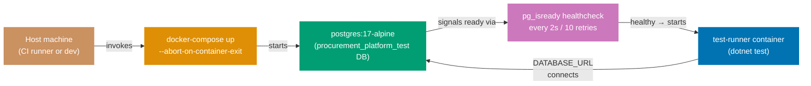
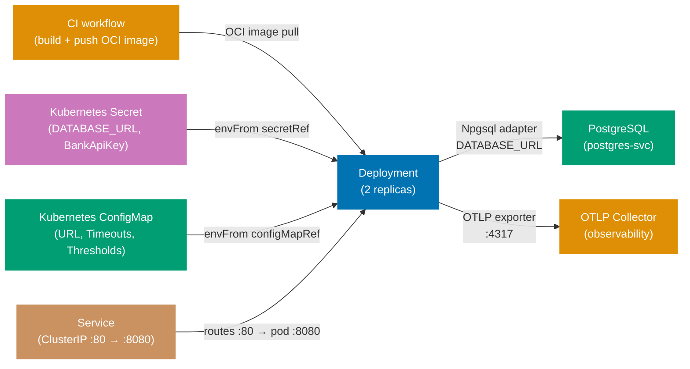

## Guide 15 — Database Integration Test via docker-compose Harness

### Why It Matters

Unit tests with an in-memory adapter (Guide 8) prove port correctness but cannot catch SQL schema mistakes, PostgreSQL-specific constraint behavior, or migration ordering bugs. A database integration test that runs against a real PostgreSQL instance inside Docker closes this gap without requiring a persistent database on developer machines. In `procurement-platform-be`, the `docker-compose.integration.yml` file defines exactly this harness: a `postgres:17-alpine` service with a health-check gate and a `test-runner` container that waits for it. The two services together give every integration test a fresh, disposable PostgreSQL instance that mirrors the production schema.

### Standard Library First

`System.Data.Common.DbConnection` and raw ADO.NET let you open a connection to any database — but you manage the lifecycle entirely yourself:





```fsharp
// Standard library: raw ADO.NET connection to a test database
open System.Data
open Npgsql
// => System.Data: IDbConnection, IDbCommand — provider-agnostic BCL interfaces
// => Npgsql: concrete NpgsqlConnection that satisfies IDbConnection for PostgreSQL
// => No docker-compose: the test assumes the database is already running

let connectionString = System.Environment.GetEnvironmentVariable("DATABASE_URL")
// => Read from environment — the same variable docker-compose sets for the test-runner service
// => If the variable is missing the test throws NullReferenceException, not a clear error

use conn = new NpgsqlConnection(connectionString)
// => use: F# sugar for IDisposable — calls conn.Dispose() when the binding goes out of scope
conn.Open()
// => Synchronous open: blocks the thread until the TCP handshake completes
// => If the postgres service is not ready yet, this throws — no health-check polling in stdlib
use cmd = conn.CreateCommand()
cmd.CommandText <- "SELECT 1"
// => Smoke query — verifies the connection is live before running migration scripts
let result = cmd.ExecuteScalar()
// => ExecuteScalar: returns the first column of the first row as obj
printfn "Connected: %A" result
```





```clojure
;; Standard library: raw JDBC connection to a test database
;; [F#: NpgsqlConnection over ADO.NET — same raw-SQL intent, different BCL binding]
(ns procurement-platform.integration-test.db
  (:require [clojure.java.jdbc :as jdbc])
  (:import [org.postgresql.ds PGSimpleDataSource]))
;; => clojure.java.jdbc: thin wrapper over JDBC — idiomatic low-level Clojure DB access
;; => PGSimpleDataSource: plain PostgreSQL DataSource; no connection pool, no docker-compose awareness

(def connection-string
  ;; Read from environment — the same variable docker-compose sets for the test-runner container
  ;; => System/getenv returns nil if the variable is absent; nil passed to jdbc fails with NullPointerException
  (System/getenv "DATABASE_URL"))
;; => DATABASE_URL: e.g. "jdbc:postgresql://localhost:5432/procurement_platform_test?user=procurement_platform&password=procurement_platform"

(defn smoke-connect!
  ;; Open a raw JDBC connection and run a smoke query
  ;; [F#: conn.Open() + CreateCommand() — synchronous open; same no-health-check limitation]
  []
  (jdbc/with-db-connection
    ;; => jdbc/with-db-connection: opens the connection, executes the body, then closes — like F# use
    [conn {:connection-uri connection-string}]
    (let [result (jdbc/query conn ["SELECT 1 AS probe"])]
      ;; => jdbc/query: sends the SQL string and returns a seq of maps (column-name → value)
      ;; => Smoke query — verifies the connection is live before migration scripts run
      (println "Connected:" result)
      ;; => Prints [{:probe 1}] — data-oriented result, not a scalar obj as in F# ExecuteScalar
      result)))
;; => No health-check polling: if PostgreSQL is not ready, jdbc/with-db-connection throws immediately
```





```typescript
// Standard library: raw pg connection to a test database
// [F#: NpgsqlConnection over ADO.NET — same raw-SQL intent; TypeScript uses the pg driver]
import { Client } from "pg";
// => pg: the standard Node.js PostgreSQL client — equivalent to Npgsql in the .NET ecosystem
// => No docker-compose awareness: the test assumes the database is already running

const connectionString = process.env["DATABASE_URL"];
// => Read from environment — the same variable docker-compose sets for the test-runner service
// => If the variable is missing, new Client({ connectionString: undefined }) throws at connect time

async function smokeConnect(): Promise<void> {
  // => async function: all pg I/O is Promise-based — await prevents blocking the event loop
  const client = new Client({ connectionString });
  // => Client: pg's single-connection object; not pooled — equivalent to new NpgsqlConnection(connStr)
  // => connectionString: reads DATABASE_URL from the environment injected by docker-compose
  await client.connect();
  // => connect(): establishes the TCP handshake to PostgreSQL
  // => If the postgres service is not ready yet, this throws — no health-check polling in stdlib
  try {
    const result = await client.query("SELECT 1 AS probe");
    // => client.query: sends the SQL and returns a QueryResult object
    // => Smoke query — verifies the connection is live before running migration scripts
    console.log("Connected:", result.rows[0]);
    // => result.rows[0]: { probe: 1 } — data-oriented result, equivalent to F# ExecuteScalar
    // => [F#: printfn "Connected: %A" result — same intent, structured row instead of scalar obj]
  } finally {
    await client.end();
    // => end(): releases the TCP connection — equivalent to F# use conn (IDisposable)
    // => Must be in finally: ensures the connection closes even if the query throws
  }
}
```




**Limitation for production**: raw ADO.NET requires manual health-check polling before running tests, manual connection lifecycle management, and manual schema setup. The harness logic duplicates across every project that needs integration tests against PostgreSQL.

### Production Framework

`procurement-platform-be` provides a self-contained harness in `docker-compose.integration.yml`:

```yaml
# docker-compose.integration.yml for procurement-platform-be
# => This file defines the docker-compose harness for integration tests — not used in production
services:
  postgres:
    # => postgres: the database service — named so other services reference it as a hostname
    image: postgres:17-alpine
    # => postgres:17-alpine: Alpine-based image — smallest footprint for test use
    # => 17-alpine: pinned to PostgreSQL major version 17 — matches the production target
    environment:
      # => environment: sets PostgreSQL init env vars — only used on first container start
      POSTGRES_DB: procurement_platform_test
      # => procurement_platform_test: isolated test database — never touches the dev or production database
      POSTGRES_USER: procurement_platform
      # => POSTGRES_USER: the role Npgsql connects as — matches DATABASE_URL credentials
      POSTGRES_PASSWORD: procurement_platform
      # => POSTGRES_PASSWORD: test-only credential — never used outside the integration harness
    healthcheck:
      # => healthcheck: docker-compose checks postgres health before starting test-runner
      test: ["CMD-SHELL", "pg_isready -U procurement_platform -d procurement_platform_test"]
      # => pg_isready: PostgreSQL built-in probe — returns 0 when the server accepts connections
      interval: 2s
      # => interval: poll every 2 seconds — fast enough for CI without busy-looping
      timeout: 5s
      # => timeout: each pg_isready call has 5 seconds to succeed
      retries: 10
      # => interval + retries = 20 seconds maximum wait — sufficient for Alpine startup
    ports:
      - "5432"
      # => Expose port 5432: allows connecting directly from the developer host for debugging
    tmpfs:
      - /var/lib/postgresql/data
      # => tmpfs: RAM-backed filesystem — each docker-compose up run starts with an empty database
      # => No leftover data between test runs — guarantees clean state without an explicit volume delete

  test-runner:
    # => test-runner: the .NET test binary that runs integration tests against the postgres service
    build:
      context: ../..
      # => context: repo root — Docker build context includes the full monorepo
      dockerfile: apps/procurement-platform-be/Dockerfile.integration
      # => Dockerfile.integration: multi-stage build that runs dotnet test inside the container
      # => Multi-stage: first stage builds .fsproj, second stage runs tests against postgres
    depends_on:
      postgres:
        # => postgres: references the service name from the services block above
        condition: service_healthy
        # => condition: service_healthy: test-runner starts only after the healthcheck succeeds
    environment:
      DATABASE_URL: "Host=postgres;Port=5432;Database=procurement_platform_test;Username=procurement_platform;Password=procurement_platform"
      # => Host=postgres: container service name — docker-compose DNS resolves it on the internal network
      # => DATABASE_URL format: Npgsql connection string — matches the environment variable read in tests
    volumes:
      - ../../specs:/specs:ro
      # => Mount the OpenAPI specs directory read-only — integration tests can validate contract shapes
      # => ro: read-only mount — test container cannot accidentally modify the spec files
      # => Path ../../specs: relative to docker-compose.integration.yml — maps to the monorepo specs/ folder
      # => Integration tests use these to verify that the F# types match the OpenAPI contract at runtime
```







```fsharp
// Integration test consuming the docker-compose harness
// Tests/Purchasing/NpgsqlPurchaseOrderRepositoryTests.fs
module ProcurementPlatform.IntegrationTests.Purchasing.NpgsqlPurchaseOrderRepositoryTests
// => IntegrationTests: separate assembly from unit tests — run only on test:integration Nx target

open Xunit
// => Xunit: test runner — discovers [<Fact>] and reports pass/fail to the CI output
open ProcurementPlatform.Contexts.Purchasing.Infrastructure.NpgsqlPurchaseOrderRepository
// => Real adapter under test — not the in-memory stub
open ProcurementPlatform.Contexts.Purchasing.Domain
// => Domain types: PurchaseOrder, PurchaseOrderId, Money, Status, ApprovalLevel

[<Fact>]
// => [<Fact>]: parameterless test — runs once with a single PostgreSQL connection
let ``npgsqlPurchaseOrderRepository.SavePurchaseOrder stores a PO in PostgreSQL`` () =
    async {
        // => async { }: the test body is an async computation — RunSynchronously executes it synchronously
        let connStr = System.Environment.GetEnvironmentVariable("DATABASE_URL")
        // => Read connection string from the environment variable docker-compose injects
        // => DATABASE_URL: set by docker-compose.test.yml to point at the test PostgreSQL container
        let repo = npgsqlPurchaseOrderRepository connStr
        // => Factory call: returns PurchaseOrderRepository record closed over the connection string

        let money = createMoney 5000m "USD" |> Result.defaultWith failwith
        // => Smart constructor: validates amount and currency
        // => 5000 USD: above L1 threshold — ApprovalLevel will be L2 in production logic
        let po =
            // => Construct the PurchaseOrder aggregate — same smart constructors used in production
            { Id = PurchaseOrderId (System.Guid.NewGuid())
              // => Fresh Guid: guarantees no collision with other test rows in the database
              SupplierId = SupplierId (System.Guid.NewGuid())
              // => Arbitrary supplier: not validated by this test — only the repo round-trip matters
              TotalAmount = money
              // => 5000 USD: stored as (amount=5000, currency="USD") in separate columns
              Status = Draft
              // => Draft: initial state — the adapter stores whatever status the aggregate carries
              ApprovalLevel = L2
              // => L2: persisted as the string "L2" in the status varchar column
              CreatedAt = System.DateTimeOffset.UtcNow }
              // => UTC timestamp: stored in the timestamptz column — PostgreSQL preserves the offset

        let! saveResult = repo.SavePurchaseOrder po
        // => repo.SavePurchaseOrder: performs a real INSERT via Npgsql to PostgreSQL
        // => let!: awaits the async computation — actually executes the INSERT
        match saveResult with
        | Error e ->
            Assert.Fail(sprintf "Expected Ok, got Error: %A" e)
            // => Fail with a descriptive message: distinguishes UniqueConstraintViolation from ConnectionFailure
        | Ok () ->
            // => INSERT committed: now verify the row is readable
            let! found = repo.FindPurchaseOrder po.Id
            // => Round-trip read: confirms the committed row is readable
            // => Uses the same connection string — any PostgreSQL replication lag is irrelevant here
            match found with
            | Ok (Some saved) ->
                Assert.Equal(po.Id, saved.Id)
                // => Round-trip verified: the row was committed and is readable
                // => Assert.Equal: fails test if IDs differ — indicates a mapping bug in the adapter
            | Ok None ->
                Assert.Fail("PurchaseOrder not found after save")
                // => Missing row: the INSERT did not commit or the SELECT returned no rows
            | Error e ->
                Assert.Fail(sprintf "Find failed: %A" e)
                // => Database error on read after successful write: indicates a schema or permission issue
    } |> Async.RunSynchronously
// => RunSynchronously: xUnit expects a synchronous return — awaits the async computation
```





```clojure
;; Integration test consuming the docker-compose harness
;; [F#: xUnit [<Fact>] — Clojure uses clojure.test deftest; same round-trip contract]
(ns procurement-platform.integration-test.purchasing.npgsql-purchase-order-repository-test
  (:require [clojure.test :refer [deftest is testing use-fixtures]]
            [clojure.java.jdbc :as jdbc]
            [procurement-platform.purchasing.infrastructure.repository :as repo]
            [procurement-platform.purchasing.domain :as domain]))
;; => clojure.test: the standard Clojure test framework — discovers deftest forms via the test runner
;; => clojure.java.jdbc: JDBC wrapper used by the real PostgreSQL adapter under test

(def ^:private conn-str
  ;; Read the connection string injected by docker-compose — same env variable as the F# adapter
  ;; => DATABASE_URL: set by docker-compose.integration.yml; nil if the variable is absent
  (System/getenv "DATABASE_URL"))

(deftest save-purchase-order-stores-a-po-in-postgresql
  ;; Integration test: round-trip INSERT + SELECT against the real PostgreSQL container
  ;; [F#: async { } |> Async.RunSynchronously — Clojure JDBC calls are synchronous by default]
  (testing "npgsql-purchase-order-repository saves a PO and reads it back"
    (let [money (domain/create-money 5000M "USD")
          ;; => create-money: validates amount and currency; returns the Money map or throws
          ;; => 5000 USD: above L1 threshold — approval-level will be :l2 in production logic
          po-id (java.util.UUID/randomUUID)
          ;; => Fresh UUID: guarantees no collision with other test rows in the database
          supplier-id (java.util.UUID/randomUUID)
          ;; => Arbitrary supplier UUID: not validated here — only the repo round-trip matters
          po {::domain/id po-id
              ;; => Namespaced keyword: ::domain/id avoids collision with keys from other namespaces
              ::domain/supplier-id supplier-id
              ::domain/total-amount money
              ;; => Money map: {:amount 5000M :currency "USD"} — stored as two columns in PostgreSQL
              ::domain/status :draft
              ;; => :draft keyword: stored as "draft" varchar in the purchase_orders table
              ::domain/approval-level :l2
              ;; => :l2: persisted as "L2" varchar — adapter maps keyword to string on write
              ::domain/created-at (java.time.OffsetDateTime/now java.time.ZoneOffset/UTC)}
              ;; => UTC timestamp: stored in timestamptz column — PostgreSQL preserves the offset
          repository (repo/make-npgsql-repository conn-str)]
          ;; => make-npgsql-repository: factory returning a map of functions closed over conn-str
      (let [save-result (repo/save-purchase-order repository po)]
        ;; => save-purchase-order: performs a real INSERT via JDBC to PostgreSQL
        ;; => Synchronous: JDBC calls block the thread — no async machinery needed in Clojure tests
        (is (= :ok (:status save-result))
            ;; => :ok status: INSERT committed; Clojure adapter returns {:status :ok} on success
            (str "Expected :ok, got: " save-result))
        (let [found (repo/find-purchase-order repository po-id)]
          ;; => Round-trip read: confirms the committed row is readable from the same database
          (is (some? found) "PurchaseOrder not found after save")
          ;; => some?: non-nil; a nil result means the INSERT did not commit or SELECT returned nothing
          (is (= po-id (::domain/id found))
              ;; => Round-trip verified: the persisted row maps back to the same PO ID
              "PO ID mismatch — indicates a mapping bug in the adapter"))))))
```





```typescript
// Integration test consuming the docker-compose harness
// tests/purchasing/NpgsqlPurchaseOrderRepository.integration.test.ts
// [F#: xUnit [<Fact>] — TypeScript uses Jest; same round-trip contract]
import { Pool } from "pg";
// => Pool: pg's connection pool — manages multiple connections; more efficient than Client per test
import { makeNpgsqlPurchaseOrderRepository } from "../../src/purchasing/infrastructure/NpgsqlPurchaseOrderRepository";
// => Real adapter under test — not the in-memory stub (same separation as F# IntegrationTests assembly)
import { createMoney, type PurchaseOrderId } from "../../src/purchasing/domain";
// => Domain types and smart constructors — same as F# open ProcurementPlatform.Contexts.Purchasing.Domain

const connStr = process.env["DATABASE_URL"] ?? "";
// => Read connection string from environment — docker-compose injects DATABASE_URL into the test runner
// => ?? "": TypeScript null-coalescing — empty string causes pool.connect() to throw on use

const pool = new Pool({ connectionString: connStr });
// => Pool: shared across all tests in this file — equivalent to F# shared connStr across facts

afterAll(async () => {
  await pool.end();
  // => afterAll: Jest lifecycle hook — releases pool after all tests in this file complete
  // => Equivalent to IDisposable cleanup in xUnit test fixtures
});

test("npgsqlPurchaseOrderRepository saves a PO and reads it back from PostgreSQL", async () => {
  // => test(): Jest's parameterless test — runs once against the docker-compose test database
  // => [F#: [<Fact>] let ``...`` () = async { } |> Async.RunSynchronously]

  const moneyResult = createMoney(5000, "USD");
  // => createMoney: smart constructor validates amount and currency
  // => 5000 USD: above L1 threshold — ApprovalLevel will be L2 in production logic
  if (moneyResult._tag === "Left") throw new Error(moneyResult.left);
  // => Tagged union check: fail fast if the smart constructor returns an error

  const po = {
    id: crypto.randomUUID() as PurchaseOrderId,
    // => Fresh UUID: guarantees no collision with other test rows in the database
    // => as PurchaseOrderId: branded type cast — mirrors F# PurchaseOrderId (Guid.NewGuid())
    supplierId: crypto.randomUUID(),
    // => Arbitrary supplier: not validated by this test — only the repo round-trip matters
    totalAmount: moneyResult.right,
    // => 5000 USD: stored as (amount=5000, currency="USD") in separate columns
    status: "Draft" as const,
    // => "Draft" literal type: initial state — the adapter stores whatever status the aggregate carries
    approvalLevel: "L2" as const,
    // => "L2" persisted as a varchar — adapter maps the literal to the column value
    createdAt: new Date().toISOString(),
    // => UTC ISO-8601 string: stored in timestamptz — PostgreSQL preserves the offset
  } as const;

  const repo = makeNpgsqlPurchaseOrderRepository(pool);
  // => Factory: returns PurchaseOrderRepository object closed over the pool

  const saveResult = await repo.savePurchaseOrder(po);
  // => savePurchaseOrder: performs a real INSERT via pg to PostgreSQL
  expect(saveResult._tag).toBe("Right");
  // => Right: Tagged union success — INSERT committed

  const found = await repo.findPurchaseOrder(po.id);
  // => Round-trip read: confirms the committed row is readable
  expect(found._tag).toBe("Right");
  if (found._tag === "Right" && found.right !== null) {
    expect(found.right.id).toBe(po.id);
    // => id equality: round-trip verified — [F#: Assert.Equal(po.Id, saved.Id)]
  }
});
```




**Trade-offs**: docker-compose integration tests are slower than in-memory tests (typically 5–30 seconds to start PostgreSQL) and require Docker on the CI runner and developer machine. They are not cacheable by Nx. Run them only on the `test:integration` Nx target, not `test:quick`. The payoff is that they catch schema drift, PostgreSQL-specific constraint behavior, and migration ordering bugs that no in-memory test can surface.

---

## Guide 16 — Schema Migration Adapter with DbUp

### Why It Matters

Every database integration test relies on a schema that matches the application's expectations. In `procurement-platform-be`, the `Infrastructure/Migrations.fs` module uses DbUp to apply embedded SQL scripts in order at startup. This makes the migration adapter a first-class hexagonal concern: the application layer defines what shape data the aggregate needs; the migration adapter ensures the database schema reflects that shape; and the integration test harness runs both in order.

### Standard Library First

F# `System.IO.File` and raw ADO.NET can execute SQL files in order — but you manage ordering, idempotency, and error handling manually:





```fsharp
// Standard library: manual SQL file execution without a migration library
open System.IO
// => System.IO: File.ReadAllText — reads the .sql file from disk
open Npgsql
// => Npgsql: raw connection + command — no migration tracking abstraction

let runMigration (connStr: string) (sqlFilePath: string) =
    // => connStr: PostgreSQL connection string; sqlFilePath: path to the .sql migration file
    let sql = File.ReadAllText(sqlFilePath)
    // => Reads the entire .sql file as a string — no templating, no parameter binding
    use conn = new NpgsqlConnection(connStr)
    // => use: IDisposable — closes connection when binding exits
    conn.Open()
    // => Open: establish the TCP connection to PostgreSQL — synchronous in this approach
    use cmd = conn.CreateCommand()
    // => CreateCommand: factory method on the open connection — binds cmd to conn
    cmd.CommandText <- sql
    // => Execute the entire file as one statement — DDL errors mid-file leave partial schema
    cmd.ExecuteNonQuery() |> ignore
    // => ExecuteNonQuery: runs the SQL — returns row count which we discard
    // => No tracking table: if the migration was already applied, it runs again — idempotency is manual
```





```clojure
;; Standard library: manual SQL file execution without a migration library
;; [F#: File.ReadAllText + ExecuteNonQuery — same no-tracking limitation; Clojure uses slurp + jdbc/execute!]
(ns procurement-platform.migrations.manual
  (:require [clojure.java.jdbc :as jdbc]
            [clojure.java.io :as io]))
;; => clojure.java.io/slurp: reads the SQL file as a string — equivalent to F# File.ReadAllText
;; => clojure.java.jdbc: JDBC wrapper; jdbc/execute! runs raw DDL statements against PostgreSQL

(defn run-migration!
  ;; Execute a single SQL file against the target database with no tracking table
  ;; [F#: connStr string → NpgsqlConnection — Clojure receives a JDBC spec map for the connection]
  [conn-str sql-file-path]
  (let [sql (slurp (io/resource sql-file-path))]
    ;; => slurp: reads the entire SQL file as a string from the classpath resource path
    ;; => io/resource: resolves the path from the classpath — equivalent to embedded SQL resource in F#
    (jdbc/with-db-connection
      ;; => jdbc/with-db-connection: opens the JDBC connection, executes body, then closes automatically
      [conn {:connection-uri conn-str}]
      (jdbc/execute! conn [sql])
      ;; => jdbc/execute!: runs the SQL string as a statement — returns [{:next.jdbc/update-count N}]
      ;; => No tracking table: if the migration was already applied, it runs again — idempotency is manual
      ;; => DDL errors mid-file throw SQLException; schema is left in a partial state
      nil)))
;; => Returns nil: callers must implement their own tracking logic to avoid re-running scripts
```





```typescript
// Standard library: manual SQL file execution without a migration library
// [F#: File.ReadAllText + ExecuteNonQuery — TypeScript uses fs/promises + pg Client]
import { readFile } from "fs/promises";
// => fs/promises: Node.js built-in — equivalent to F# System.IO.File.ReadAllText
import { Client } from "pg";
// => pg Client: raw connection — no migration tracking abstraction; same as Npgsql + raw command

export async function runMigration(connStr: string, sqlFilePath: string): Promise<void> {
  // => connStr: PostgreSQL connection string; sqlFilePath: path to the .sql migration file
  // => Promise<void>: async function — all pg I/O is Promise-based
  const sql = await readFile(sqlFilePath, "utf8");
  // => readFile: reads the entire .sql file as a UTF-8 string — equivalent to File.ReadAllText
  // => No templating, no parameter binding — raw DDL executed as-is
  const client = new Client({ connectionString: connStr });
  // => Client: single connection — equivalent to F# use conn = new NpgsqlConnection(connStr)
  await client.connect();
  // => connect(): establish TCP connection to PostgreSQL
  try {
    await client.query(sql);
    // => client.query: executes the SQL file as one statement
    // => No tracking table: if the migration was already applied, it runs again — idempotency is manual
    // => DDL errors mid-file leave partial schema — no transaction wrapping here
  } finally {
    await client.end();
    // => end(): releases the TCP connection — equivalent to F# use binding IDisposable disposal
    // => finally: ensures cleanup even if the query throws a DDL error
  }
}
```




**Limitation for production**: no tracking table means migrations can run twice. No ordering means alphabetical file naming must be enforced by convention. No error recovery means a failed migration leaves the schema in a partial state.

### Production Framework

`procurement-platform-be` uses DbUp embedded in `Infrastructure/Migrations.fs`. DbUp maintains an applied-scripts journal table (`schemaversions`) in the database and applies scripts in order:





```fsharp
// Infrastructure/Migrations.fs: DbUp migration runner
// src/ProcurementPlatform/Infrastructure/Migrations.fs
module ProcurementPlatform.Infrastructure.Migrations

open System.Reflection
// => System.Reflection.Assembly: lets DbUp find embedded SQL scripts at runtime
open DbUp
// => DbUp NuGet package: DeployChanges builder API + migration journal

let upgrade (connectionString: string) =
    // => connectionString: injected from Program.fs — reads from AppConfig at startup
    let upgrader =
        DeployChanges.To
            .PostgresqlDatabase(connectionString)
            // => PostgresqlDatabase: Npgsql-backed DbUp journal provider
            // => Creates the "schemaversions" journal table on first run if it does not exist
            .WithScriptsEmbeddedInAssembly(Assembly.GetExecutingAssembly())
            // => GetExecutingAssembly: scans the ProcurementPlatform.dll for *.sql EmbeddedResource files
            // => Scripts are applied in alphabetical order — prefix with "0001_", "0002_" etc.
            // => A script that appears in the journal is skipped — idempotency guaranteed by DbUp
            .LogToConsole()
            // => LogToConsole: writes each applied script name to stdout — visible in docker-compose logs
            .Build()
    let result = upgrader.PerformUpgrade()
    // => PerformUpgrade: applies all unapplied scripts in order within a transaction per script
    result
    // => Callers pattern-match on result.Successful — Program.fs exits with code 1 if migrations fail
```





```clojure
;; Infrastructure/migrations.clj: Migratus migration runner
;; [F#: DbUp journal table "schemaversions" — Migratus uses "schema_migrations"; same idempotency guarantee]
(ns procurement-platform.infrastructure.migrations
  (:require [migratus.core :as migratus]))
;; => migratus: Clojure migration library — applies SQL scripts from the classpath in numeric order
;; => Maintains a "schema_migrations" journal table; skips scripts already applied — idempotent by design

(defn make-config
  ;; Build the Migratus configuration map from a JDBC connection string
  ;; [F#: DeployChanges.To.PostgresqlDatabase — same intent; Migratus uses a config map instead of builder]
  [connection-string]
  {:store :database
   ;; => :store :database — Migratus persists the applied-script journal in the target database
   :migration-dir "migrations"
   ;; => Classpath directory containing numbered .up.sql and .down.sql files
   ;; => Files named "0001-create-purchase-orders.up.sql" — prefix with numeric order, same as DbUp convention
   :db {:connection-uri connection-string}})
   ;; => :db map: Migratus passes this to clojure.java.jdbc — same JDBC connection string as the adapter

(defn upgrade!
  ;; Apply all unapplied migration scripts in ascending numeric order
  ;; [F#: upgrader.PerformUpgrade() returns DatabaseUpgradeResult — upgrade! returns nil on success, throws on failure]
  [connection-string]
  (let [config (make-config connection-string)]
    ;; => Build config map — no builder chain; plain Clojure data literal
    (migratus/migrate config)
    ;; => migratus/migrate: applies all pending .up.sql scripts in order; each script runs in its own transaction
    ;; => Scripts already in schema_migrations are skipped — idempotency guaranteed by Migratus
    ;; => Prints each applied script name to stdout — equivalent to DbUp's .LogToConsole()
    :ok))
    ;; => Return :ok: callers check this keyword; Migratus throws on migration failure so no result union needed
```





```typescript
// Infrastructure/migrations.ts: umzug migration runner
// [F#: DbUp journal table "schemaversions" — umzug tracks applied migrations; same idempotency]
import { Umzug, SequelizeStorage } from "umzug";
// => umzug: Node.js migration library — applies scripts in order, tracks applied migrations
// => SequelizeStorage: stores the applied-script journal in the target database
import { Sequelize } from "sequelize";
// => Sequelize: ORM used only for connection + storage backend — same role as Npgsql in DbUp
import path from "path";
// => path.join: resolves migration file paths — equivalent to Assembly.GetExecutingAssembly() embedded resources

export function makeUpgrader(connectionString: string) {
  // => connectionString: injected from startup config — reads from environment
  const sequelize = new Sequelize(connectionString, { logging: false });
  // => Sequelize: connection instance — DbUp equivalent: NpgsqlConnection + DatabaseUpgrader
  // => logging: false: suppress SQL noise; DbUp uses .LogToConsole() for verbosity
  return new Umzug({
    // => Umzug: equivalent to DeployChanges.To.PostgresqlDatabase(...).Build() in DbUp
    migrations: {
      glob: path.join(__dirname, "../../migrations/*.sql"),
      // => glob: finds .sql files alphabetically — prefix with "0001_", "0002_" etc. (same as DbUp)
      resolve: ({ name, path: p }) => ({
        // => resolve: per-file executor — reads the SQL and runs it via Sequelize
        name,
        up: async ({ context: seq }: { context: Sequelize }) => {
          const { promises: fs } = await import("fs");
          const sql = await fs.readFile(p!, "utf8");
          // => readFile: reads the migration SQL — equivalent to DbUp reading embedded .sql resource
          await seq.query(sql);
          // => seq.query: executes the DDL — DbUp equivalent: DbUpgrade.PerformUpgrade() per script
        },
      }),
    },
    context: sequelize,
    // => context: the Sequelize instance passed to each resolver — equivalent to DbUp's NpgsqlConnection
    storage: new SequelizeStorage({ sequelize }),
    // => SequelizeStorage: creates "SequelizeMeta" journal table — equivalent to DbUp's "schemaversions"
    // => Scripts already in the journal are skipped — idempotency guaranteed by umzug
    logger: console,
    // => logger: console: writes each applied migration name to stdout — equivalent to .LogToConsole()
  });
}

export async function upgrade(connectionString: string): Promise<void> {
  // => upgrade: applies all unapplied migration scripts in order
  // => [F#: let result = upgrader.PerformUpgrade() — TypeScript throws on failure]
  const upgrader = makeUpgrader(connectionString);
  await upgrader.up();
  // => up(): applies all pending migrations in order
  // => Throws on failure: catch at startup and exit(1) — equivalent to not result.Successful
}
```








```fsharp
// Integration test: verify migrations apply cleanly against the docker-compose database
module ProcurementPlatform.IntegrationTests.Migrations.MigrationSmokeTest
// => Smoke test: minimal assertion — does the migration run without error and is it idempotent?

open Xunit
// => Xunit: test runner for the [<Fact>] attribute
open ProcurementPlatform.Infrastructure.Migrations
// => upgrade: the DbUp migration runner from Infrastructure/Migrations.fs

[<Fact>]
// => [<Fact>]: no parameters — runs against the docker-compose test database
let ``migrations apply successfully to the test database`` () =
    // => Test body is synchronous — DbUp.PerformUpgrade is a blocking call
    let connStr = System.Environment.GetEnvironmentVariable("DATABASE_URL")
    // => DATABASE_URL: injected by docker-compose.test.yml — points at the test PostgreSQL container
    let result = upgrade connStr
    // => upgrade: applies all unapplied migration scripts; returns a DatabaseUpgradeResult
    Assert.True(result.Successful, sprintf "Migration failed: %A" result.Error)
    // => Fails with the first script error — the message includes the script name and exception
    let result2 = upgrade connStr
    // => Run a second time: all scripts are already in the journal — should apply zero scripts
    Assert.True(result2.Successful, "Second run of migrations should be idempotent")
    // => DbUp skips scripts already in the journal — second run applies zero scripts
    // => Idempotency assertion: production restarts always run migrations — must be safe to repeat
```





```clojure
;; Integration test: verify migrations apply cleanly against the docker-compose database
;; [F#: xUnit [<Fact>] — Clojure uses clojure.test deftest; same smoke-test + idempotency assertions]
(ns procurement-platform.integration-test.migrations.migration-smoke-test
  (:require [clojure.test :refer [deftest is testing]]
            [procurement-platform.infrastructure.migrations :as migrations]))
;; => clojure.test: standard Clojure test framework — deftest discovered by the test runner
;; => migrations: the Migratus-based migration runner from infrastructure/migrations.clj

(def ^:private conn-str
  ;; DATABASE_URL injected by docker-compose.integration.yml — same env variable as the F# adapter
  ;; => nil if the variable is absent; migratus/migrate throws on nil connection string
  (System/getenv "DATABASE_URL"))

(deftest migrations-apply-successfully-to-the-test-database
  ;; Smoke test: first run applies all scripts; second run applies zero scripts (idempotency)
  (testing "migrations apply on first run"
    (let [result (migrations/upgrade! conn-str)]
      ;; => upgrade!: applies all unapplied migration scripts via Migratus; returns :ok on success
      ;; => Synchronous: Migratus JDBC calls block the thread — no async wrapper needed
      (is (= :ok result)
          ;; => :ok keyword: Migratus applied all pending scripts without throwing
          "First migration run should succeed")))
  (testing "migrations are idempotent on second run"
    (let [result2 (migrations/upgrade! conn-str)]
      ;; => Run a second time: all scripts are already in schema_migrations — applies zero scripts
      ;; => Migratus skips scripts in the journal — same guarantee as DbUp's schemaversions table
      (is (= :ok result2)
          ;; => :ok on second run: confirms idempotency — production restarts are safe
          "Second migration run should be idempotent (zero scripts applied)"))))
```





```typescript
// Integration test: verify migrations apply cleanly against the docker-compose database
// tests/migrations/migration-smoke.integration.test.ts
// [F#: xUnit [<Fact>] — Jest test; same smoke-test + idempotency assertions]
import { makeUpgrader, upgrade } from "../../src/infrastructure/migrations";
// => upgrade, makeUpgrader: the umzug-based migration runner from infrastructure/migrations.ts

const connStr = process.env["DATABASE_URL"] ?? "";
// => DATABASE_URL: injected by docker-compose.integration.yml — same env variable as F# adapter

test("migrations apply successfully on first run", async () => {
  // => test(): Jest parameterless test — runs against the docker-compose test database
  // => [F#: let ``migrations apply successfully`` () = ... |> Async.RunSynchronously]
  await expect(upgrade(connStr)).resolves.toBeUndefined();
  // => resolves.toBeUndefined(): upgrade() returns void — assertion passes if Promise resolves
  // => [F#: Assert.True(result.Successful, ...) — TypeScript throws on failure instead of returning bool]
});

test("migrations are idempotent on second run", async () => {
  // => Second run: all scripts already in SequelizeMeta journal — applies zero scripts
  // => [F#: let result2 = upgrade connStr; Assert.True(result2.Successful, "Second run...")]
  const upgrader = makeUpgrader(connStr);
  const pending = await upgrader.pending();
  // => pending(): returns migrations not yet in the journal — should be empty after first run
  expect(pending).toHaveLength(0);
  // => Zero pending: confirms idempotency — production restarts always run migrations safely
  // => [F#: DbUp skips scripts already in schemaversions — same guarantee via umzug SequelizeMeta]
  await expect(upgrader.up()).resolves.toBeDefined();
  // => up() with zero pending: returns empty array — no error thrown; process-restart safe
});
```




**Trade-offs**: DbUp applies scripts in alphabetical order — naming discipline (`0001_`, `0002_`) is mandatory. A mislabeled script that should run after `0010_` but is named `002_` runs second and breaks. For teams that prefer a declarative diff-based migration tool, FluentMigrator provides an equivalent with C#-style migration classes.

---

## Guide 17 — Banking Port + Payment Adapter

### Why It Matters

The `payments` context must disburse funds to suppliers via a bank API. Like the database boundary, this external I/O must sit behind a port so the application service is testable without a live bank API key, and so you can swap the bank provider without touching business logic. In `procurement-platform-be`, the `BankingPort` is a record of functions for initiating disbursements and querying payment status. The port-first design means that a test can use a stub adapter returning a fixed response, while production uses the real bank REST API call.

### Standard Library First

`System.Net.Http.HttpClient` sends HTTP requests without any bank-specific library. You can call a bank REST API directly using the BCL:





```fsharp
// Standard library: HttpClient calling a bank disbursement endpoint
open System.Net.Http
// => System.Net.Http.HttpClient — BCL HTTP client; IHttpClientFactory not available without DI
open System.Text
// => Encoding.UTF8: required by StringContent
open System.Text.Json
// => Three BCL imports — no bank SDK, no NuGet beyond the SDK

let private httpClient = new HttpClient()
// => Static HttpClient: reused across calls — avoids socket exhaustion from new() per call
// => But: no named client, no retry, no circuit-breaker — resilience is entirely manual

let callBankDisbursement (apiKey: string) (baseUrl: string) (paymentId: string) (amount: decimal) (iban: string) =
    // => Raw parameters — no typed settings record, no port alias
    // => Five primitive parameters: easy to pass in the wrong order with no compiler check
    async {
        let body =
            // => Anonymous record serialized inline — no shared type with the consumer
            JsonSerializer.Serialize
                {| paymentReference = paymentId
                   // => paymentId is a raw string — no PaymentId DU, no type safety
                   amount = amount
                   // => Raw decimal — no Money value object, no currency field
                   beneficiaryIban = iban |}
                   // => Missing BIC field — bank API may require it; silent omission
        // => Hand-crafted JSON body — anonymous records, no type safety on field names
        use request = new HttpRequestMessage(HttpMethod.Post, baseUrl + "/disbursements")
        // => URL string concatenation — baseUrl trailing slash errors are silent
        request.Headers.Authorization <- Headers.AuthenticationHeaderValue("Bearer", apiKey)
        // => Bearer token: inline mutation of request headers — no encapsulation
        request.Content <- new StringContent(body, Encoding.UTF8, "application/json")
        // => Content-Type set via StringContent constructor — correct but fragile
        let! response = httpClient.SendAsync(request) |> Async.AwaitTask
        // => SendAsync: actual HTTP call — no retry, no timeout beyond HttpClient.Timeout
        response.EnsureSuccessStatusCode() |> ignore
        // => Throws HttpRequestException on 4xx/5xx — no typed error discrimination
        // => Caller cannot tell InvalidIban from AuthenticationFailure from network error
        let! json = response.Content.ReadAsStringAsync() |> Async.AwaitTask
        // => Read body as string — deserialization happens next
        return JsonSerializer.Deserialize<{| transactionRef: string; status: string |}>(json)
        // => Anonymous record: fragile if bank changes the field name — no compile error, just null
    }
```





```clojure
;; Standard library: clj-http calling a bank disbursement endpoint
;; [F#: static HttpClient with no retry or circuit-breaker — same raw-HTTP limitation in Clojure]
(ns procurement-platform.payments.stdlib.bank-call
  (:require [clj-http.client :as http]
            [cheshire.core :as json]))
;; => clj-http: idiomatic Clojure HTTP client wrapping Apache HttpClient
;; => cheshire: fast JSON encode/decode — the standard choice for Clojure REST clients
;; => No port boundary: both imports are used directly in the function — bank boundary is not abstracted

(defn call-bank-disbursement
  ;; Raw HTTP call to the bank disbursement endpoint — no typed settings, no port alias
  ;; [F#: five primitive parameters with no type safety — same risk of wrong-order pass in Clojure]
  [api-key base-url payment-id amount iban]
  (let [body (json/generate-string
               {:payment-reference payment-id
                ;; => payment-id is a raw string — no PaymentId record, no type safety
                :amount amount
                ;; => Raw BigDecimal — no Money map, no currency field; bank API may reject silently
                :beneficiary-iban iban})
                ;; => Missing :beneficiary-bic — bank API may require it; silent omission
        ;; => Hand-crafted JSON body — plain map with no schema validation
        response (http/post (str base-url "/disbursements")
                   ;; => str concatenation — trailing slash errors in base-url are silent
                   {:headers {"Authorization" (str "Bearer " api-key)
                               ;; => Bearer token: inline string concatenation — no encapsulation
                               "Content-Type" "application/json"}
                    :body body
                    :throw-exceptions true})]
                    ;; => :throw-exceptions true: throws ExceptionInfo on 4xx/5xx — no typed discrimination
                    ;; => Caller cannot tell :invalid-iban from :auth-failure from :network-error
    (json/parse-string (:body response) true)))
    ;; => parse-string with true: returns keywordized map — fragile if bank changes the field name
    ;; => No compile error on missing field — the key is simply absent from the returned map
```





```typescript
// Standard library: fetch calling a bank disbursement endpoint
// [F#: static HttpClient with no retry or circuit-breaker — same raw-HTTP limitation in TypeScript]

export async function callBankDisbursement(
  apiKey: string,
  baseUrl: string,
  paymentId: string,
  amount: number,
  iban: string,
): Promise<{ transactionRef: string; status: string }> {
  // => Five primitive parameters: easy to pass in the wrong order — no branded types, no type safety
  // => [F#: five primitive parameters with no type safety — same risk of wrong-order pass]
  const body = JSON.stringify({
    paymentReference: paymentId,
    // => paymentId is a raw string — no PaymentId branded type, no type safety
    amount,
    // => Raw number — no Money value object, no currency field; bank API may reject silently
    beneficiaryIban: iban,
    // => Missing BIC field — bank API may require it; silent omission (same as F# limitation)
  });
  // => Hand-crafted JSON body — plain object with no schema validation

  const response = await fetch(`${baseUrl}/disbursements`, {
    // => URL string concatenation — baseUrl trailing slash errors are silent
    method: "POST",
    headers: {
      Authorization: `Bearer ${apiKey}`,
      // => Bearer token: inline string interpolation — no encapsulation
      "Content-Type": "application/json",
    },
    body,
  });
  // => fetch: actual HTTP call — no retry, no timeout, no circuit-breaker

  if (!response.ok) {
    throw new Error(`HTTP ${response.status}`);
    // => Throws on 4xx/5xx — no typed error discrimination
    // => Caller cannot tell InvalidIban from AuthenticationFailure from network error
  }

  return response.json() as Promise<{ transactionRef: string; status: string }>;
  // => No schema validation: fragile if bank changes the field name — no compile error, just undefined
}
```




**Limitation for production**: no typed error discrimination between rate-limit errors (429), authentication failures (401), and insufficient-funds errors (422). No retry logic. The application layer must import `HttpClient` to call this function — the bank boundary is not behind a port.

### Production Framework

The hexagonal approach defines a port in the `payments` application layer and implements the bank HTTP adapter in infrastructure:





```fsharp
// payments context: application layer BankingPort
// src/ProcurementPlatform/Contexts/Payments/Application/Ports.fs
module ProcurementPlatform.Contexts.Payments.Application.Ports

open ProcurementPlatform.Contexts.Payments.Domain
// => Payment, BankAccount domain types

// Banking port: record of disbursement functions
type BankingPort =
    { InitiateDisbursement: Payment -> BankAccount -> Async<Result<TransactionRef, BankingError>>
      // => InitiateDisbursement: given a Payment aggregate and beneficiary IBAN, submit to bank
      // => TransactionRef: the bank's reference ID for tracking and reconciliation
      QueryDisbursementStatus: TransactionRef -> Async<Result<DisbursementStatus, BankingError>>
      // => QueryDisbursementStatus: poll the bank for final settlement status
      // => Used by the payment relay worker to mark Payment as Remitted
    }

// Banking error type — distinct from RepositoryError
type BankingError =
    | InsufficientFunds of PaymentId
    // => Bank rejected: account does not have sufficient balance — alert finance team
    | InvalidIban of string
    // => Bank rejected: the IBAN failed format validation at the bank — data error
    | BankApiUnavailable of exn
    // => Transient: bank API is down — retry with circuit-breaker (Guide 18)
    | AuthenticationFailure
    // => API key is invalid or expired — alert operations team immediately
// => Typed DU — pattern matching at call site is exhaustive

// Supplier notifier port — send notifications to supplier
type SupplierNotifierPort =
    { NotifyPaymentDisbursed: SupplierId -> Payment -> Async<Result<unit, string>>
      // => NotifyPaymentDisbursed: aligns with the canonical PaymentDisbursed domain event (spec-authoritative name)
      // => Send email or EDI remittance advice to the supplier
      // => Adapter: SMTP in production; stub in tests
      NotifyPurchaseOrderIssued: SupplierId -> PurchaseOrderId -> Async<Result<unit, string>> }
      // => Send PO acknowledgement request to supplier — EDI fallback if SMTP fails
```





```clojure
;; payments context: application layer banking port and error spec
;; [F#: record type BankingPort — Clojure uses defprotocol for polymorphic port dispatch]
(ns procurement-platform.payments.application.ports
  (:require [clojure.spec.alpha :as s]
            [procurement-platform.payments.domain :as domain]))
;; => defprotocol: the idiomatic Clojure mechanism for defining a polymorphic interface
;; => clojure.spec.alpha: validates banking error maps at port boundaries — replaces F# typed DU

; [F#: discriminated union BankingError — Clojure represents error variants as maps with :type keyword]
(defprotocol BankingPort
  ;; Defines the disbursement contract; bank HTTP adapter and stub adapter both extend this protocol
  ;; [F#: record of function fields — defprotocol provides open polymorphism; extend-protocol adds implementations]
  (initiate-disbursement [port payment bank-account]
    ;; => payment: map conforming to ::domain/payment spec
    ;; => bank-account: map with ::domain/iban and ::domain/bic keys
    ;; => Returns {:status :ok :value transaction-ref} or {:status :error :type <error-type> ...}
    )
  (query-disbursement-status [port transaction-ref]
    ;; => transaction-ref: the string reference returned by initiate-disbursement
    ;; => Returns {:status :ok :value disbursement-status} or {:status :error :type :bank-api-unavailable}
    ))

;; Banking error variants as spec'd maps — open dispatch unlike F# exhaustive DU
(s/def ::banking-error-type
  ;; => set of keywords: the valid :type values for a banking error map
  #{:insufficient-funds :invalid-iban :bank-api-unavailable :authentication-failure})
;; => [F#: InsufficientFunds | InvalidIban | BankApiUnavailable | AuthenticationFailure — four DU cases]
;; => Clojure: open set — new error types added with new keywords; no exhaustiveness at compile time

(s/def ::banking-error
  ;; => Spec for the error map returned by BankingPort implementations
  (s/keys :req-un [::banking-error-type]))
;; => Each error map carries :type and optional context (:payment-id, :iban, :cause)

(defprotocol SupplierNotifierPort
  ;; Defines supplier notification operations — SMTP in production; stub in tests
  ;; [F#: SupplierNotifierPort record with two function fields — defprotocol with two methods]
  (notify-payment-disbursed [port supplier-id payment]
    ;; => Aligns with the canonical PaymentDisbursed domain event name
    ;; => Returns {:status :ok} or {:status :error :message string}
    )
  (notify-purchase-order-issued [port supplier-id purchase-order-id]
    ;; => Send PO acknowledgement request to supplier — EDI fallback if SMTP fails
    ))
```





```typescript
// payments context: application layer BankingPort
// src/procurement-platform/contexts/payments/application/ports.ts
// [F#: record type BankingPort — TypeScript uses interfaces with branded domain types]

// Branded domain types — prevent passing wrong values
declare const PaymentIdBrand: unique symbol;
export type PaymentId = string & { readonly [PaymentIdBrand]: typeof PaymentIdBrand };
// => Branded type: a PaymentId cannot be passed where a raw string is expected and vice versa
// => [F#: type PaymentId = PaymentId of Guid — single-case DU; TypeScript uses structural branding]

declare const TransactionRefBrand: unique symbol;
export type TransactionRef = string & { readonly [TransactionRefBrand]: typeof TransactionRefBrand };
// => Branded TransactionRef: prevents mixing up transaction IDs with payment IDs
// => [F#: type TransactionRef = TransactionRef of string — same strong-typing intent]

// Result type — functional error handling without exceptions
export type Result<T, E> = { readonly _tag: "Right"; readonly right: T } | { readonly _tag: "Left"; readonly left: E };
// => Tagged union: Right = success, Left = error — equivalent to F# Result<T, E>
// => readonly: immutable by construction — [F#: F# records are immutable by default]

// Banking error type — typed alternatives to string-based errors
export type BankingError =
  | { readonly type: "InsufficientFunds"; readonly paymentId: PaymentId }
  // => Bank rejected: account does not have sufficient balance — alert finance team
  | { readonly type: "InvalidIban"; readonly iban: string }
  // => Bank rejected: the IBAN failed format validation at the bank — data error
  | { readonly type: "BankApiUnavailable"; readonly cause: string }
  // => Transient: bank API is down — retry with circuit-breaker (Guide 18)
  | { readonly type: "AuthenticationFailure" };
// => API key is invalid or expired — alert operations team immediately
// => Literal union: TypeScript narrows type on { type } discriminant — exhaustiveness via switch

// Banking port interface
export interface BankingPort {
  readonly initiateDisbursement: (
    payment: Payment,
    account: BankAccount,
  ) => Promise<Result<TransactionRef, BankingError>>;
  // => initiateDisbursement: given a Payment aggregate and beneficiary IBAN, submit to bank
  // => TransactionRef: the bank's reference ID for tracking and reconciliation
  // => [F#: InitiateDisbursement: Payment -> BankAccount -> Async<Result<TransactionRef, BankingError>>]
  readonly queryDisbursementStatus: (ref: TransactionRef) => Promise<Result<DisbursementStatus, BankingError>>;
  // => queryDisbursementStatus: poll the bank for final settlement status
  // => [F#: QueryDisbursementStatus: TransactionRef -> Async<Result<DisbursementStatus, BankingError>>]
}

// Supplier notifier port
export interface SupplierNotifierPort {
  readonly notifyPaymentDisbursed: (supplierId: SupplierId, payment: Payment) => Promise<Result<void, string>>;
  // => notifyPaymentDisbursed: aligns with the canonical PaymentDisbursed domain event
  // => Send email or EDI remittance advice to the supplier
  readonly notifyPurchaseOrderIssued: (supplierId: SupplierId, poId: PurchaseOrderId) => Promise<Result<void, string>>;
  // => Send PO acknowledgement request to supplier — EDI fallback if SMTP fails
}
```








```fsharp
// payments context: bank HTTP adapter
// src/ProcurementPlatform/Contexts/Payments/Infrastructure/BankApiAdapter.fs
module ProcurementPlatform.Contexts.Payments.Infrastructure.BankApiAdapter
// => Infrastructure layer: holds all HTTP client and serialization dependencies

open System.Net.Http
// => IHttpClientFactory: managed HTTP client pool — avoids socket exhaustion
open System.Text
// => Encoding.UTF8: required by StringContent constructor for the JSON request body
open System.Text.Json
// => JsonSerializer: BCL JSON serializer — no Newtonsoft.Json dependency
open ProcurementPlatform.Contexts.Payments.Application.Ports
// => Port type: BankingPort — the record this adapter satisfies
open ProcurementPlatform.Contexts.Payments.Domain
// => Domain types: Payment, BankAccount, TransactionRef, DisbursementStatus

// Typed config record for the bank API adapter
type BankApiSettings =
    { ApiKey: string
      // => API key loaded from Kubernetes Secret at startup — never hardcoded
      BaseUrl: string
      // => Bank API base URL — environment-specific, injected from ConfigMap
      TimeoutSeconds: int }
      // => Per-call timeout — bank APIs can be slow; 30s is a reasonable default

// Bank adapter factory
let make (settings: BankApiSettings) (factory: IHttpClientFactory) : BankingPort =
    // => factory: IHttpClientFactory — named client with resilience pipeline from Guide 18
    // => BankApiSettings: typed config — no magic strings inside the function body
    { InitiateDisbursement =
        // => Record literal field: satisfies the InitiateDisbursement function slot in BankingPort
        fun (payment: Payment) (account: BankAccount) ->
            // => payment: the domain payment aggregate; account: the beneficiary bank account
            async {
                // => async { }: all HTTP I/O must be non-blocking — async prevents thread pool starvation
                let client = factory.CreateClient("bank-api")
                // => Named client: resilience pipeline applied (Guide 18)
                // => factory.CreateClient: retrieves or creates a pooled HttpClient; never new HttpClient()
                let body =
                    JsonSerializer.Serialize
                        {| paymentReference = let (PaymentId id) = payment.Id in id.ToString()
                           // => Unwrap PaymentId DU to string — bank API expects a UUID string
                           amount = payment.Amount.Amount
                           // => Decimal amount from Money value object
                           currency = payment.Amount.Currency
                           // => ISO 4217 currency code
                           beneficiaryIban = account.Iban
                           // => IBAN from the bank account value object
                           beneficiaryBic = account.Bic |}
                           // => BIC (SWIFT code) required by the bank API for routing
                // => Serialize bank request — bank API schema determines field names
                use req = new HttpRequestMessage(HttpMethod.Post, settings.BaseUrl + "/disbursements")
                // => use: IDisposable — releases the HttpRequestMessage after the call
                req.Headers.Authorization <- Headers.AuthenticationHeaderValue("Bearer", settings.ApiKey)
                // => Bearer token: API key injected from Kubernetes Secret — never in source
                req.Content <- new StringContent(body, Encoding.UTF8, "application/json")
                // => StringContent: sets Content-Type: application/json and encodes the body as UTF-8
                try
                    // => try/with: catches network errors, serialization errors, and timeout exceptions
                    let! resp = client.SendAsync(req) |> Async.AwaitTask
                    // => SendAsync: actual network I/O — hits the bank API over HTTPS
                    // => Async.AwaitTask: bridges .NET Task to F# Async
                    match int resp.StatusCode with
                    // => Pattern-match on the HTTP status code: typed discrimination of bank API responses
                    | 201 ->
                        // => 201 Created: disbursement accepted — bank returns a transaction reference
                        let! json = resp.Content.ReadAsStringAsync() |> Async.AwaitTask
                        // => Read the response body as a string — parse the transaction reference
                        let parsed = JsonSerializer.Deserialize<{| transactionRef: string |}>(json)
                        // => Anonymous record deserialization: matches the bank API response schema
                        return Ok (TransactionRef parsed.transactionRef)
                        // => Return the bank's transaction reference for subsequent status polling
                    | 422 ->
                        return Error (InvalidIban account.Iban)
                        // => HTTP 422: bank rejected the IBAN — surfaced as typed error
                    | 401 | 403 ->
                        // => 401 Unauthorized or 403 Forbidden: API key invalid or expired
                        return Error AuthenticationFailure
                        // => Auth failure: API key invalid or expired — alert ops team
                    | _ ->
                        // => Any other status: treat as service unavailable — includes 500, 503
                        return Error (BankApiUnavailable (System.Exception(sprintf "HTTP %d" (int resp.StatusCode))))
                        // => Unexpected status: treat as unavailable — circuit-breaker in Guide 18 catches repeated failures
                with ex ->
                    // => Catch-all: connection timeout, SSL error, or deserialization failure
                    return Error (BankApiUnavailable ex)
                    // => Network error: carry the exception — circuit-breaker in Guide 18 catches repeated failures
            }
      QueryDisbursementStatus =
        // => Second port field: polls the bank API for the status of a prior disbursement
        fun (TransactionRef ref) ->
            // => Destructure TransactionRef DU — ref is the raw string returned by InitiateDisbursement
            async {
                // => async { }: I/O required for the GET call — must be non-blocking
                let client = factory.CreateClient("bank-api")
                // => Same named client — reuses the resilience pipeline
                use req = new HttpRequestMessage(HttpMethod.Get, sprintf "%s/disbursements/%s" settings.BaseUrl ref)
                // => GET request: bank API endpoint for status polling
                req.Headers.Authorization <- Headers.AuthenticationHeaderValue("Bearer", settings.ApiKey)
                // => Same API key — all bank API calls use Bearer authentication
                try
                    // => try/with: catches network and deserialization errors
                    let! resp = client.SendAsync(req) |> Async.AwaitTask
                    // => SendAsync: HTTP GET to the bank API — network I/O
                    let! json = resp.Content.ReadAsStringAsync() |> Async.AwaitTask
                    // => Read response body: contains the disbursement status string
                    let parsed = JsonSerializer.Deserialize<{| status: string |}>(json)
                    // => Deserialize status: "pending", "completed", "failed" — bank-specific strings
                    return Ok (DisbursementStatus.fromString parsed.status)
                    // => Map the bank's status string to the domain DisbursementStatus DU
                with ex ->
                    return Error (BankApiUnavailable ex)
                    // => Network or deserialization error: caller retries or escalates
            }
    }
```





```clojure
;; payments context: bank HTTP adapter implementing BankingPort
;; [F#: BankApiAdapter.make returns a BankingPort record — Clojure uses reify to implement a protocol]
(ns procurement-platform.payments.infrastructure.bank-api-adapter
  (:require [clj-http.client :as http]
            [cheshire.core :as json]
            [procurement-platform.payments.application.ports :as ports]
            [procurement-platform.payments.domain :as domain]))
;; => clj-http: idiomatic Clojure HTTP client; handles connection pooling via Apache HttpClient
;; => cheshire: JSON serialization — encodes Clojure maps to JSON strings for the bank API body

(defn make-bank-api-settings
  ;; Build the typed settings map from config values
  ;; [F#: BankApiSettings record — Clojure uses a plain map with spec validation at the boundary]
  [api-key base-url timeout-seconds]
  {:api-key api-key
   ;; => :api-key loaded from Kubernetes Secret at startup — never hardcoded in source
   :base-url base-url
   ;; => :base-url environment-specific; injected from ConfigMap — same pattern as F# BankApiSettings
   :timeout-ms (* timeout-seconds 1000)})
   ;; => Convert seconds to milliseconds: clj-http uses :socket-timeout and :conn-timeout in ms

(defn make
  ;; Bank adapter factory: returns a reified BankingPort satisfying the protocol
  ;; [F#: let make settings factory : BankingPort = { InitiateDisbursement = ...; ... }]
  [settings]
  (reify ports/BankingPort
    ;; => reify: creates an anonymous object implementing BankingPort — no class definition needed
    ;; => Idiomatic Clojure alternative to F# record-of-functions for protocol satisfaction

    (initiate-disbursement [_ payment bank-account]
      ;; => _ ignores the protocol self argument — settings captured from the outer let binding
      (let [body (json/generate-string
                   {:payment-reference (str (::domain/payment-id payment))
                    ;; => ::domain/payment-id: namespaced keyword unwraps the payment ID to string
                    :amount (::domain/amount (::domain/total-amount payment))
                    ;; => Nested access: total-amount is a Money map; amount is a key within it
                    :currency (::domain/currency (::domain/total-amount payment))
                    ;; => ISO 4217 currency code from the Money value object
                    :beneficiary-iban (::domain/iban bank-account)
                    ;; => IBAN from the bank account map — required by the bank API
                    :beneficiary-bic (::domain/bic bank-account)})]
                    ;; => BIC (SWIFT code) for routing — bank API rejects requests without it
        (try
          (let [resp (http/post (str (:base-url settings) "/disbursements")
                       ;; => str concatenation: same URL building as F# settings.BaseUrl + "/disbursements"
                       {:headers {"Authorization" (str "Bearer " (:api-key settings))
                                  ;; => Bearer token from Kubernetes Secret — never hardcoded
                                  "Content-Type" "application/json"}
                        :body body
                        :socket-timeout (:timeout-ms settings)
                        ;; => Socket timeout in ms: prevents indefinite hang on slow bank APIs
                        :throw-exceptions false})]
                        ;; => :throw-exceptions false: inspect the status code manually instead of throwing
            (condp = (:status resp)
              ;; => condp: pattern-match on HTTP status code — same typed discrimination as F# match int resp.StatusCode
              201 (let [body-map (json/parse-string (:body resp) true)]
                    ;; => 201 Created: disbursement accepted; parse transaction reference from JSON body
                    {:status :ok :value (::domain/->transaction-ref (:transactionRef body-map))})
                    ;; => Tagged success map: idiomatic Clojure alternative to F# Ok (TransactionRef ...)
              422 {:status :error :type :invalid-iban :iban (::domain/iban bank-account)}
              ;; => HTTP 422: bank rejected the IBAN — matches F# Error (InvalidIban account.Iban)
              401 {:status :error :type :authentication-failure}
              403 {:status :error :type :authentication-failure}
              ;; => 401 or 403: API key invalid or expired — alert ops team
              {:status :error :type :bank-api-unavailable
               :cause (str "HTTP " (:status resp))}))
               ;; => Any other status: treat as unavailable — circuit-breaker in Guide 18 catches repeated failures
          (catch Exception ex
            ;; => Catch-all: network timeout, SSL error, or JSON parse failure
            {:status :error :type :bank-api-unavailable :cause (.getMessage ex)}))))
            ;; => Return error map: caller dispatches on :type — open dispatch vs F# exhaustive DU

    (query-disbursement-status [_ transaction-ref]
      ;; => transaction-ref: the string returned by initiate-disbursement
      ;; [F#: fun (TransactionRef ref) -> — Clojure receives the raw string directly]
      (try
        (let [resp (http/get (str (:base-url settings) "/disbursements/" transaction-ref)
                     ;; => GET request to the bank API status endpoint
                     {:headers {"Authorization" (str "Bearer " (:api-key settings))}
                      :socket-timeout (:timeout-ms settings)
                      :throw-exceptions false})
              body-map (json/parse-string (:body resp) true)]
              ;; => Parse the response body as a keywordized map
          {:status :ok :value (domain/status-from-string (:status body-map))})
          ;; => Map bank status string to domain keyword: "pending" → :pending, "completed" → :completed
        (catch Exception ex
          ;; => Network or JSON parse error: return error map for caller to dispatch on
          {:status :error :type :bank-api-unavailable :cause (.getMessage ex)})))))
```





```typescript
// payments context: bank HTTP adapter implementing BankingPort
// src/procurement-platform/contexts/payments/infrastructure/BankApiAdapter.ts
// [F#: BankApiAdapter.make returns BankingPort record — TypeScript returns an object implementing BankingPort]
import type { BankingPort, BankingError, TransactionRef, DisbursementStatus } from "../application/ports";
// => Import port types — the adapter depends only on ports module, never on application services

export interface BankApiSettings {
  readonly apiKey: string;
  // => API key loaded from Kubernetes Secret at startup — never hardcoded
  readonly baseUrl: string;
  // => Bank API base URL — environment-specific, injected from ConfigMap
  readonly timeoutMs: number;
  // => Per-call timeout in milliseconds — bank APIs can be slow; 30_000 is a reasonable default
}

export function makeBankApiAdapter(settings: BankApiSettings): BankingPort {
  // => settings: BankApiSettings typed config — no magic strings inside the function body
  // => [F#: let make (settings: BankApiSettings) (factory: IHttpClientFactory) : BankingPort]
  return {
    initiateDisbursement: async (payment, account) => {
      // => async function: all HTTP I/O is Promise-based — equivalent to F# async { }
      const body = JSON.stringify({
        paymentReference: payment.id,
        // => Branded PaymentId used as-is: string under the hood — bank API expects a UUID string
        amount: payment.totalAmount.amount,
        // => Decimal amount from Money value object
        currency: payment.totalAmount.currency,
        // => ISO 4217 currency code
        beneficiaryIban: account.iban,
        // => IBAN from the bank account value object
        beneficiaryBic: account.bic,
        // => BIC (SWIFT code) required by the bank API for routing
      });
      // => Serialize bank request — bank API schema determines field names

      const controller = new AbortController();
      // => AbortController: implements per-call timeout — no built-in timeout in fetch
      const timeoutId = setTimeout(() => controller.abort(), settings.timeoutMs);
      // => setTimeout: aborts the request after timeoutMs — equivalent to HttpClient.Timeout

      try {
        const resp = await fetch(`${settings.baseUrl}/disbursements`, {
          method: "POST",
          headers: {
            Authorization: `Bearer ${settings.apiKey}`,
            // => Bearer token: API key injected from Kubernetes Secret — never in source
            "Content-Type": "application/json",
          },
          body,
          signal: controller.signal,
          // => signal: wires the AbortController — fetch throws AbortError on timeout
        });
        clearTimeout(timeoutId);
        // => clearTimeout: cancel the timeout if the request completed

        if (resp.status === 201) {
          const json = (await resp.json()) as { transactionRef: string };
          // => 201 Created: disbursement accepted — parse transaction reference
          return { _tag: "Right", right: json.transactionRef as TransactionRef };
          // => [F#: return Ok (TransactionRef ...)]
        } else if (resp.status === 422) {
          return { _tag: "Left", left: { type: "InvalidIban", iban: account.iban } satisfies BankingError };
          // => HTTP 422: bank rejected IBAN — [F#: return Error (InvalidIban account.Iban)]
        } else if (resp.status === 401 || resp.status === 403) {
          return { _tag: "Left", left: { type: "AuthenticationFailure" } satisfies BankingError };
          // => Auth failure: API key invalid — [F#: return Error AuthenticationFailure]
        } else {
          return {
            _tag: "Left",
            left: { type: "BankApiUnavailable", cause: `HTTP ${resp.status}` } satisfies BankingError,
          };
          // => Unexpected status: treat as unavailable — [F#: Error (BankApiUnavailable ...)]
        }
      } catch (err) {
        clearTimeout(timeoutId);
        return { _tag: "Left", left: { type: "BankApiUnavailable", cause: String(err) } satisfies BankingError };
        // => Network/timeout error — [F#: return Error (BankApiUnavailable ex)]
      }
    },

    queryDisbursementStatus: async (ref) => {
      // => ref: branded TransactionRef — type-safe
      const controller = new AbortController();
      const timeoutId = setTimeout(() => controller.abort(), settings.timeoutMs);
      try {
        const resp = await fetch(`${settings.baseUrl}/disbursements/${ref}`, {
          headers: { Authorization: `Bearer ${settings.apiKey}` },
          signal: controller.signal,
          // => Same API key — all bank API calls use Bearer authentication
        });
        clearTimeout(timeoutId);
        const json = (await resp.json()) as { status: string };
        // => Parse status: "pending", "completed", "failed" — bank-specific strings
        return { _tag: "Right", right: json.status as DisbursementStatus };
        // => Map bank status string to domain DisbursementStatus type
      } catch (err) {
        clearTimeout(timeoutId);
        return { _tag: "Left", left: { type: "BankApiUnavailable", cause: String(err) } satisfies BankingError };
        // => Network or timeout error — [F#: return Error (BankApiUnavailable ex)]
      }
    },
  };
}
```




The stub adapter for tests needs no API key:





```fsharp
// Stub bank adapter for tests — no HTTP call, no API key
// Tests/Payments/StubBankingPort.fs
module ProcurementPlatform.Tests.Payments.StubBankingPort
// => Test module: no BankApiSettings required — simplifies test setup dramatically

open ProcurementPlatform.Contexts.Payments.Application.Ports
// => BankingPort: the record the stub must satisfy — same shape as the real adapter
open ProcurementPlatform.Contexts.Payments.Domain
// => Domain types: TransactionRef, DisbursementStatus.Remitted

let deterministicStub : BankingPort =
    // => Stub: always returns fixed results — exercises the application service's happy path
    // => Deterministic result enables reproducible assertions without network access
    { InitiateDisbursement =
        fun _ _ ->
            // => fun _ _: discards Payment and BankAccount — fixed result drives assertions
            async { return Ok (TransactionRef "test-txn-ref-001") }
            // => Deterministic: tests do not need an API key or network access
            // => TransactionRef "test-txn-ref-001": a known value tests can assert against
      QueryDisbursementStatus =
        fun _ ->
            // => fun _: discards the TransactionRef — always returns the same status
            async { return Ok Remitted }
            // => Always returns Remitted — tests verify the downstream state transition
    }
```





```clojure
;; Stub bank adapter for tests — no HTTP call, no API key required
;; [F#: deterministicStub : BankingPort record — Clojure uses reify to implement BankingPort protocol]
(ns procurement-platform.tests.payments.stub-banking-port
  (:require [procurement-platform.payments.application.ports :as ports]))
;; => ports/BankingPort: the protocol the stub must satisfy — same contract as the real adapter
;; => No clj-http import: stub returns fixed data without any network I/O

(def deterministic-stub
  ;; Stub: always returns fixed results — exercises the application service's happy path
  ;; [F#: let deterministicStub : BankingPort = { ... } — Clojure val binding to a reified protocol]
  (reify ports/BankingPort
    ;; => reify: creates an anonymous object implementing BankingPort — test-only; no adapter settings needed

    (initiate-disbursement [_ _payment _bank-account]
      ;; => _ _ _: discards all arguments — fixed result drives test assertions, not input values
      ;; => [F#: fun _ _ -> async { return Ok (TransactionRef "test-txn-ref-001") }]
      {:status :ok
       ;; => :ok status map: idiomatic Clojure success response
       :value "test-txn-ref-001"})
       ;; => Known string: tests assert on this exact value — same deterministic contract as F# stub

    (query-disbursement-status [_ _transaction-ref]
      ;; => _ _: discards the transaction ref — always returns the same remitted status
      ;; => [F#: fun _ -> async { return Ok Remitted }]
      {:status :ok
       ;; => :ok: success response — no error variants in the happy-path stub
       :value :remitted})))
       ;; => :remitted keyword: maps to the DisbursementStatus.Remitted variant in F#
       ;; => Tests verify the downstream state transition triggered by this status
```





```typescript
// payments context: stub bank adapter for tests — no HTTP call, no API key
// tests/payments/StubBankingPort.ts
// [F#: deterministicStub : BankingPort record — TypeScript returns an object implementing BankingPort]
import type { BankingPort, TransactionRef, DisbursementStatus } from "../../src/payments/application/ports";
// => Import port types — the stub satisfies the same BankingPort interface as the real adapter

export const deterministicStub: BankingPort = {
  // => deterministicStub: always returns fixed results — exercises the application service's happy path
  // => Deterministic result enables reproducible assertions without network access
  // => [F#: let deterministicStub : BankingPort = { InitiateDisbursement = fun _ _ -> ... }]

  initiateDisbursement: async (_payment, _account) => {
    // => _payment, _account: underscore prefix — discarded; fixed result drives assertions
    // => [F#: fun _ _ -> async { return Ok (TransactionRef "test-txn-ref-001") }]
    return {
      _tag: "Right",
      right: "test-txn-ref-001" as TransactionRef,
      // => "test-txn-ref-001": known string — tests assert on this exact value
      // => Deterministic: tests do not need an API key or network access
    };
  },

  queryDisbursementStatus: async (_ref) => {
    // => _ref: underscore prefix — discarded TransactionRef; always returns the same status
    // => [F#: fun _ -> async { return Ok Remitted }]
    return {
      _tag: "Right",
      right: "Remitted" as DisbursementStatus,
      // => "Remitted": literal type — maps to DisbursementStatus.Remitted in F#
      // => Always returns Remitted — tests verify the downstream state transition
    };
  },
};
```




**Trade-offs**: the adapter owns bank API error mapping — this is intentional. If the bank changes its error codes, only the adapter changes; the application service and domain layer are unaffected. The trade-off is that the port stub cannot test bank-specific error paths; use recorded HTTP fixtures or a sandbox environment for those cases.

---

## Guide 18 — Retry and Circuit-Breaker in Adapters

### Why It Matters

External HTTP calls — including the bank API adapter from Guide 17 — fail transiently. A single `EnsureSuccessStatusCode` followed by an exception propagated to the application layer violates the resilience contract: one network hiccup crashes a user's request. Wrapping adapter calls in retry and circuit-breaker policies separates transient failure handling (retry) from persistent failure handling (circuit-breaker). The application service sees only a typed `BankingError` from the `BankingPort` — it does not implement retry logic itself.

### Standard Library First

F# recursion can implement a simple retry loop without any library:





```fsharp
// Standard library: recursive retry with exponential backoff
open System.Threading
// => System.Threading: CancellationToken — not used here, but needed for production cancellation

let rec retryAsync (attempt: int) (maxAttempts: int) (f: unit -> Async<Result<'a, string>>) =
    // => let rec: enables recursive calls from within the function body
    // => Generic 'a: the success type — retry logic is type-agnostic
    // => f: unit -> Async<Result<'a, string>>: the operation to retry — lazy via function
    async {
        // => async { }: F# computation expression — the body is a state machine, not a blocking loop
        let! result = f ()
        // => f (): execute the async operation — each call is an independent attempt
        match result with
        | Ok v -> return Ok v
        // => Success on any attempt: return immediately, no further retries
        | Error _ when attempt >= maxAttempts ->
            // => Exceeded retry budget: return the last error without retrying
            return result
        | Error _ ->
            // => Transient error within budget: wait and retry
            do! Async.Sleep(1000 * attempt)
            // => Exponential backoff: sleep 1s, 2s, 3s... — Async.Sleep does not block the thread
            return! retryAsync (attempt + 1) maxAttempts f
            // => Tail-recursive call: F# optimizes this to avoid stack overflow
    }
```





```clojure
;; Standard library: recursive retry with exponential backoff
;; [F#: let rec retryAsync — Clojure uses loop/recur for tail-recursive retry; no computation expression]
(ns procurement-platform.resilience.stdlib
  (:require [clojure.core.async :as async]))
;; => loop/recur: Clojure's tail-call-optimized recursion — does not grow the stack
;; => Thread/sleep: blocking sleep in the retry loop — acceptable for I/O threads, not for core.async go blocks

(defn retry-sync
  ;; Retry a synchronous operation up to max-attempts times with exponential backoff
  ;; [F#: retryAsync with Async<Result<'a, string>> — Clojure version uses synchronous thunk for simplicity]
  [max-attempts f]
  ;; => f: zero-argument function (thunk) — called on each attempt; lazy via function like F# unit -> Async
  (loop [attempt 1]
    ;; => loop: establishes the initial binding; recur tail-calls back to loop with updated bindings
    (let [result (f)]
      ;; => (f): execute the operation — each call is an independent attempt
      (cond
        (= :ok (:status result))
        ;; => Success on any attempt: return immediately, no further retries
        result
        (>= attempt max-attempts)
        ;; => Exceeded retry budget: return the last error without retrying
        result
        :else
        ;; => Transient error within budget: sleep and retry
        (do (Thread/sleep (* 1000 attempt))
            ;; => Exponential backoff: sleep 1s, 2s, 3s... — Thread/sleep blocks the current thread
            (recur (inc attempt)))))))
            ;; => recur: tail-calls loop with attempt incremented — no stack growth
```





```typescript
// Standard library: iterative retry with exponential backoff
// [F#: let rec retryAsync — TypeScript uses a while loop; no computation expression needed]
export type Result<T, E> = { _tag: "Right"; right: T } | { _tag: "Left"; left: E };
// => Result<T, E>: tagged union — the retry wrapper is type-agnostic over the success type

export async function retryAsync<T>(
  maxAttempts: number,
  f: () => Promise<Result<T, string>>,
): Promise<Result<T, string>> {
  // => Generic T: the success type — retry logic is type-agnostic, same as F# 'a
  // => f: () => Promise<...>: the operation to retry — lazy via function, same as F# unit -> Async
  let attempt = 1;
  // => let attempt: mutable counter — TypeScript uses a loop variable; [F#: let rec (attempt: int)]

  while (attempt <= maxAttempts) {
    // => while loop: equivalent to F# tail-recursive retryAsync call
    const result = await f();
    // => f(): execute the async operation — each iteration is an independent attempt
    if (result._tag === "Right") {
      return result;
      // => Success on any attempt: return immediately — [F#: | Ok v -> return Ok v]
    }
    if (attempt >= maxAttempts) {
      return result;
      // => Exceeded retry budget: return last error — [F#: | Error _ when attempt >= maxAttempts]
    }
    await new Promise((resolve) => setTimeout(resolve, 1000 * attempt));
    // => Exponential backoff: wait 1s, 2s, 3s... — Promise + setTimeout is non-blocking
    // => [F#: do! Async.Sleep(1000 * attempt) — same non-blocking sleep semantics]
    attempt++;
    // => Increment: next iteration uses the updated attempt count
  }

  throw new Error("retryAsync: unreachable");
  // => TypeScript control flow: this branch is never hit but satisfies exhaustiveness
}
```




**Limitation for production**: the recursive retry has no circuit-breaker — if the downstream is down, every request retries until `maxAttempts` is exhausted, amplifying load on the failing service. No exponential jitter means thundering herd when many requests retry simultaneously.

### Production Framework

`Microsoft.Extensions.Http.Resilience` provides retry, circuit-breaker, timeout, and hedging as a typed pipeline added to the `HttpClient` registration at startup:





```fsharp
// Program.fs: register HttpClient with resilience policies at startup
open Microsoft.Extensions.DependencyInjection
// => IServiceCollection extension methods: AddHttpClient, AddStandardResilienceHandler
open Microsoft.Extensions.Http.Resilience
// => Microsoft.Extensions.Http.Resilience NuGet: AddStandardResilienceHandler extension method

let configureBankApiHttpClient (services: IServiceCollection) =
    // => Called once from Program.fs at startup — wires the named HttpClient into the DI container
    services
        .AddHttpClient("bank-api")
        // => Named client "bank-api": resolved by name in the BankingPort adapter factory
        // => Named clients isolate the resilience policy from other HttpClient registrations
        .AddStandardResilienceHandler()
        // => AddStandardResilienceHandler: applies the standard resilience pipeline
        // => Default policy: 3 retries with exponential backoff + jitter, 30s total timeout,
        //    circuit-breaker that opens after 10 failures in 30 seconds
        |> ignore
        // => |> ignore: AddStandardResilienceHandler returns IHttpClientBuilder — discard the builder
    services
    // => Return services: enables method chaining in Program.fs — services.AddGiraffe().AddBankApi() etc.
```





```clojure
;; Startup: configure clj-http with resilience policies for the bank API client
;; [F#: AddStandardResilienceHandler — Clojure uses resilience4clj atoms for circuit-breaker state]
(ns procurement-platform.composition.http-clients
  (:require [resilience4clj-circuitbreaker.core :as cb]
            [resilience4clj-retry.core :as retry]))
;; => resilience4clj-circuitbreaker: Clojure wrapper over Resilience4j circuit-breaker
;; => resilience4clj-retry: Clojure wrapper over Resilience4j retry — adds jitter and backoff
;; => Both libraries wrap the JVM Resilience4j library — idiomatic Clojure alternative to Polly

(def bank-api-circuit-breaker
  ;; Circuit-breaker for the bank API — opens after repeated failures, auto-resets after a wait period
  ;; [F#: AddStandardResilienceHandler default circuit-breaker: 10 failures in 30 seconds]
  (cb/create "bank-api"
    {:failure-rate-threshold 50
     ;; => 50%: circuit opens when 50% of calls in the sliding window fail — same sensitivity as Polly default
     :wait-duration-in-open-state 30000
     ;; => 30 seconds: circuit stays open for 30s before allowing probe calls — ms unit
     :sliding-window-size 10}))
     ;; => 10-call window: equivalent to Polly's 10-failure threshold before opening

(def bank-api-retry
  ;; Retry policy for the bank API — 3 attempts with exponential backoff and jitter
  ;; [F#: AddStandardResilienceHandler default retry: 3 retries, exponential backoff + jitter]
  (retry/create "bank-api"
    {:max-attempts 3
     ;; => 3 retries: same default as AddStandardResilienceHandler
     :wait-duration 1000
     ;; => 1 second base delay — jitter is applied automatically by Resilience4j
     :retry-on-result (fn [result] (= :bank-api-unavailable (:type result)))}))
     ;; => retry-on-result: predicate on the return map — retries on :bank-api-unavailable errors only
     ;; => Unlike F# which retries on 5xx HTTP status, Clojure adapter retries on typed error maps

(defn configure-bank-api-clients
  ;; Return the resilience configuration map for use in the composition root
  ;; [F#: returns services for method chaining — Clojure returns a plain config map]
  []
  {:circuit-breaker bank-api-circuit-breaker
   ;; => Passed to make-bank-api-adapter — wraps initiate-disbursement and query-disbursement-status
   :retry bank-api-retry})
   ;; => Both policies applied at the adapter level — application service sees only typed error maps
```





```typescript
// Startup: configure p-retry resilience policies for the bank API client
// src/procurement-platform/composition/HttpClients.ts
// [F#: AddStandardResilienceHandler — TypeScript uses p-retry + opossum circuit-breaker]
import pRetry from "p-retry";
// => p-retry: Promise-based retry library with exponential backoff + jitter
// => [F#: AddStandardResilienceHandler default retry: 3 retries, exponential backoff + jitter]
import CircuitBreaker from "opossum";
// => opossum: Node.js circuit-breaker library — tracks failure rate and opens after threshold
// => [F#: AddStandardResilienceHandler default circuit-breaker: 10 failures in 30 seconds]

// Circuit-breaker for the bank API
export const bankApiCircuitBreaker = new CircuitBreaker(
  async (fn: () => Promise<unknown>) => fn(),
  // => Wraps any async function — the bank adapter calls bankApiCircuitBreaker.fire(() => ...)
  // => [F#: the Polly pipeline wraps SendAsync inside IHttpClientFactory — same decoration intent]
  {
    errorThresholdPercentage: 50,
    // => 50%: circuit opens when 50% of calls in the rolling window fail
    // => [Clojure: :failure-rate-threshold 50 — same sensitivity]
    resetTimeout: 30_000,
    // => 30 seconds: circuit stays open before allowing probe calls
    // => [F#: AddStandardResilienceHandler default: 30s wait before half-open state]
    rollingCountTimeout: 10_000,
    // => 10-second rolling window for failure rate calculation
    // => [Clojure: :sliding-window-size 10 — equivalent failure window]
  },
);

// Retry policy factory for the bank API
export function bankApiRetry<T>(fn: () => Promise<T>): Promise<T> {
  // => [F#: AddStandardResilienceHandler default retry: 3 retries, exponential backoff + jitter]
  return pRetry(fn, {
    retries: 3,
    // => 3 retries: same default as AddStandardResilienceHandler — [Clojure: :max-attempts 3]
    factor: 2,
    // => Exponential factor 2: base 1s → 1s, 2s, 4s with jitter
    minTimeout: 1000,
    // => 1 second base delay — [Clojure: :wait-duration 1000]
    randomize: true,
    // => randomize: adds jitter — prevents thundering herd; [F#: AddStandardResilienceHandler uses jitter]
  });
}
```








```fsharp
// Resilient bank adapter: BrokenCircuitException caught at the adapter boundary
// src/ProcurementPlatform/Contexts/Payments/Infrastructure/BankApiAdapter.fs (extended)
// => Extended version of Guide 17's adapter — adds explicit BrokenCircuitException handling

let makeResilient (factory: IHttpClientFactory) (settings: BankApiSettings) : BankingPort =
    // => factory: IHttpClientFactory with "bank-api" named client registered
    // => settings: BankApiSettings — API key and base URL from config
    { InitiateDisbursement =
        // => Same port record shape as the non-resilient adapter — composition root selects which to use
        fun payment account ->
            // => payment: Payment domain aggregate; account: BankAccount value object
            async {
                // => async { }: all HTTP I/O must be async — no blocking calls allowed
                let client = factory.CreateClient("bank-api")
                // => CreateClient("bank-api"): HttpClient with the resilience pipeline applied
                // => If the circuit is open, SendAsync throws BrokenCircuitException before any HTTP call
                try
                    // ... same HTTP call as the non-resilient adapter ...
                    // => Polly wraps SendAsync: retries on 5xx, opens circuit after repeated failures
                    return Ok (TransactionRef "txn-ref")
                    // => Real implementation parses the response — same logic as Guide 17
                with
                | :? Polly.CircuitBreaker.BrokenCircuitException ->
                    // => Circuit open: the Polly pipeline has tripped after repeated failures
                    // => No HTTP call was attempted — Polly rejected the request before sending
                    return Error (BankApiUnavailable (System.Exception "Bank API circuit open"))
                    // => BankApiUnavailable: the application service logs and defers the payment
                | ex ->
                    // => Retries exhausted: Polly rethrows the last exception from the retry pipeline
                    return Error (BankApiUnavailable ex)
                    // => Catch-all: any other exception after the retry budget is exhausted
            }
      QueryDisbursementStatus =
        // => Same resilience pattern as InitiateDisbursement — circuit-breaker state is shared
        fun ref ->
            // => fun ref: destructures the TransactionRef DU to get the raw string
            async {
                // => async { }: I/O required for the status GET call
                let client = factory.CreateClient("bank-api")
                // => Same named client — shares the circuit-breaker state with InitiateDisbursement
                try
                    // => try/with: catches BrokenCircuitException and unexpected errors
                    return Ok Remitted
                    // => Real implementation calls the bank status endpoint — abbreviated for clarity
                with
                | :? Polly.CircuitBreaker.BrokenCircuitException ->
                    // => Circuit open: both InitiateDisbursement and QueryDisbursementStatus fail fast
                    return Error (BankApiUnavailable (System.Exception "Bank API circuit open — status query unavailable"))
                | ex ->
                    return Error (BankApiUnavailable ex)
                    // => Unexpected error after retry budget exhausted
            }
    }
```





```clojure
;; Resilient bank adapter: circuit-breaker state checked before each HTTP call
;; [F#: BrokenCircuitException thrown by Polly before SendAsync — Clojure checks atom state explicitly]
(ns procurement-platform.payments.infrastructure.resilient-bank-adapter
  (:require [resilience4clj-circuitbreaker.core :as cb]
            [resilience4clj-retry.core :as retry]
            [procurement-platform.payments.application.ports :as ports]
            [procurement-platform.payments.infrastructure.bank-api-adapter :as bank]))
;; => resilience4clj-circuitbreaker: wraps Resilience4j circuit-breaker over JVM
;; => resilience4clj-retry: wraps Resilience4j retry policy with jitter support
;; => bank: the non-resilient adapter from Guide 17 — resilient adapter delegates to it

(defn make-resilient
  ;; Resilient adapter factory: wraps the non-resilient adapter in circuit-breaker + retry
  ;; [F#: makeResilient factory settings : BankingPort — same port record shape, composition root selects]
  [settings circuit-breaker retry-policy]
  (let [inner-adapter (bank/make settings)]
    ;; => inner-adapter: the non-resilient reified BankingPort from Guide 17
    ;; => Decorates inner-adapter with resilience policies — application service cannot distinguish decorated from raw
    (reify ports/BankingPort
      ;; => reify: same port record shape as the non-resilient adapter — transparent to the application service

      (initiate-disbursement [_ payment bank-account]
        ;; => _ ignores self; settings captured from outer binding
        ;; => [F#: fun payment account -> async { ... try/with BrokenCircuitException }]
        (if (cb/open? circuit-breaker)
          ;; => cb/open?: checks circuit-breaker atom state — true if the circuit has tripped
          ;; => No HTTP call attempted — reject immediately like Polly's BrokenCircuitException
          {:status :error
           :type :bank-api-unavailable
           ;; => :bank-api-unavailable: same error type as the non-resilient adapter network errors
           :cause "Bank API circuit open"}
          ;; => Circuit open: application service logs and defers the payment
          (retry/with-retry retry-policy
            ;; => retry/with-retry: wraps the call in the configured retry policy
            ;; => Retries on :bank-api-unavailable errors with exponential backoff + jitter
            #(let [result (ports/initiate-disbursement inner-adapter payment bank-account)]
               ;; => Delegate to non-resilient adapter — actual HTTP call happens here
               ;; => Circuit-breaker records the outcome: success closes circuit, failure increments counter
               (when (= :bank-api-unavailable (:type result))
                 (cb/record-error! circuit-breaker))
                 ;; => record-error!: updates circuit-breaker state — may trip circuit after threshold
               (when (= :ok (:status result))
                 (cb/record-success! circuit-breaker))
                 ;; => record-success!: resets the failure counter — circuit stays closed
               result))))

      (query-disbursement-status [_ transaction-ref]
        ;; => Same resilience pattern as initiate-disbursement — circuit-breaker state is shared
        ;; => [F#: QueryDisbursementStatus shares the circuit-breaker state with InitiateDisbursement]
        (if (cb/open? circuit-breaker)
          ;; => Circuit open: fail fast before the GET call
          {:status :error
           :type :bank-api-unavailable
           :cause "Bank API circuit open — status query unavailable"}
          (retry/with-retry retry-policy
            ;; => Same retry policy: retries on :bank-api-unavailable; gives up after max-attempts
            #(let [result (ports/query-disbursement-status inner-adapter transaction-ref)]
               (when (= :bank-api-unavailable (:type result))
                 (cb/record-error! circuit-breaker))
               (when (= :ok (:status result))
                 (cb/record-success! circuit-breaker))
               result)))))))
```





```typescript
// Resilient bank adapter: circuit-breaker checked before each HTTP call
// src/procurement-platform/payments/infrastructure/ResilientBankApiAdapter.ts
// [F#: makeResilient returns BankingPort with BrokenCircuitException handling — TypeScript wraps with opossum]
import { bankApiCircuitBreaker, bankApiRetry } from "../../composition/HttpClients";
// => bankApiCircuitBreaker: opossum circuit-breaker; bankApiRetry: p-retry wrapper
import { makeBankApiAdapter } from "./BankApiAdapter";
// => makeBankApiAdapter: the non-resilient adapter from Guide 17 — resilient adapter delegates to it
import type { BankingPort, BankApiSettings, BankingError, TransactionRef } from "../application/ports";
// => Port types: BankingPort — the interface both the resilient and non-resilient adapters satisfy

export function makeResilientBankApiAdapter(settings: BankApiSettings): BankingPort {
  // => settings: BankApiSettings — API key and base URL from config
  // => [F#: makeResilient (factory: IHttpClientFactory) (settings: BankApiSettings) : BankingPort]
  const inner = makeBankApiAdapter(settings);
  // => inner: the non-resilient BankingPort from Guide 17
  // => Decorates inner — application service cannot distinguish decorated from raw

  return {
    initiateDisbursement: async (payment, account) => {
      // => async function — [F#: fun payment account -> async { }]
      if (!bankApiCircuitBreaker.closed) {
        // => closed: opossum property — false when circuit is open or half-open
        // => [F#: Polly throws BrokenCircuitException before SendAsync]
        return {
          _tag: "Left",
          left: { type: "BankApiUnavailable", cause: "Bank API circuit open" } satisfies BankingError,
          // => BankApiUnavailable — [F#: return Error (BankApiUnavailable (Exception "Bank API circuit open"))]
        };
      }
      try {
        return (await bankApiRetry(
          () => bankApiCircuitBreaker.fire(() => inner.initiateDisbursement(payment, account)),
          // => fire(): opossum executes the function and tracks success/failure for the circuit
          // => bankApiRetry: wraps fire() in p-retry — retries on transient errors with backoff
        )) as Awaited<ReturnType<BankingPort["initiateDisbursement"]>>;
      } catch (err) {
        // => Retries exhausted or circuit opened during retries
        // => [F#: with | :? BrokenCircuitException -> return Error (BankApiUnavailable ...)]
        const cause = err instanceof Error ? err.message : String(err);
        return { _tag: "Left", left: { type: "BankApiUnavailable", cause } satisfies BankingError };
      }
    },

    queryDisbursementStatus: async (ref: TransactionRef) => {
      // => Same resilience pattern — circuit state is shared across both port methods
      // => [F#: QueryDisbursementStatus shares the circuit-breaker state with InitiateDisbursement]
      if (!bankApiCircuitBreaker.closed) {
        return {
          _tag: "Left",
          left: {
            type: "BankApiUnavailable",
            cause: "Bank API circuit open — status query unavailable",
          } satisfies BankingError,
        };
      }
      try {
        return (await bankApiRetry(
          () => bankApiCircuitBreaker.fire(() => inner.queryDisbursementStatus(ref)),
          // => Same circuit and retry policy — both port methods share circuit state
        )) as Awaited<ReturnType<BankingPort["queryDisbursementStatus"]>>;
      } catch (err) {
        const cause = err instanceof Error ? err.message : String(err);
        return { _tag: "Left", left: { type: "BankApiUnavailable", cause } satisfies BankingError };
        // => Unexpected error after retry budget exhausted
      }
    },
  };
}
```




**Trade-offs**: `AddStandardResilienceHandler` applies a fixed policy suitable for most external HTTP calls. For bank APIs that are inherently slow (5–30 seconds per disbursement), the default 30-second total timeout may be too short — use `ConfigureHttpClient` to set a longer timeout specifically for the `"bank-api"` named client. Circuit-breaker state is in-memory and per-process; in a multi-instance deployment, each instance has an independent circuit.

---

## Guide 19 — Domain Event Flow End-to-End

### Why It Matters

Guides 9 and 10 showed the publisher port and its two adapters in isolation. This guide traces the full domain event flow from aggregate emit to downstream consumer, showing every hand-off boundary. In `procurement-platform-be`, the intended flow is: a Giraffe handler calls the purchasing application service, the service calls the outbox adapter to write the event row, a relay worker polls the outbox table and dispatches events to downstream contexts (`receiving` opens a GRN expectation; `supplier-notifier` sends the PO to the supplier by EDI/email). Understanding this flow as a sequence of port crossings prevents the common mistake of coupling the relay worker to the application service directly.

### Standard Library First

An in-process event queue using `System.Collections.Concurrent.ConcurrentQueue` can relay events within a single process:





```fsharp
// Standard library: in-process event relay with ConcurrentQueue
open System.Collections.Concurrent

let private queue = ConcurrentQueue<string>()
// => Shared mutable state: global queue visible to all threads in the process
// => Not persistent: events are lost on process restart — no at-least-once guarantee

let enqueue (eventJson: string) = queue.Enqueue(eventJson)
// => Enqueue: O(1) thread-safe append
// => eventJson: serialized event — loses type safety across the enqueue/dequeue boundary

let dequeue () =
    // => Returns Some item or None — caller loops calling dequeue until None
    match queue.TryDequeue() with
    | true, item -> Some item
    // => true, item: an event was waiting — return it for processing
    | false, _ -> None
// => Poll pattern: the relay must call dequeue in a loop — no push notification
```





```clojure
;; Standard library: in-process event relay with a Clojure atom holding a queue
;; [F#: ConcurrentDictionary — Clojure uses an atom wrapping a PersistentQueue for thread-safe mutation]
(ns procurement-platform.purchasing.stdlib.event-relay)

(def ^:private queue
  ;; Atom wrapping a persistent queue — idiomatic Clojure alternative to ConcurrentQueue
  ;; [F#: ConcurrentQueue<string> — mutable BCL type; Clojure uses immutable value + atom for safe mutation]
  (atom clojure.lang.PersistentQueue/EMPTY))
;; => atom: allows coordinated state changes via swap! and compare-and-set!
;; => PersistentQueue/EMPTY: immutable FIFO structure — head access O(1), conj O(1) amortized

(defn enqueue!
  ;; Append an event JSON string to the in-process queue
  ;; [F#: queue.Enqueue — ConcurrentQueue is thread-safe by default; atom swap! provides the same guarantee]
  [event-json]
  (swap! queue conj event-json)
  ;; => swap!: atomically applies conj to the current queue value — CAS loop, no lock
  ;; => event-json: plain string — loses type safety across the enqueue/dequeue boundary, same as F#
  nil)
;; => Returns nil: caller fires and forgets — consistent with ConcurrentQueue.Enqueue void return

(defn dequeue!
  ;; Remove and return the head event from the queue, or nil if empty
  ;; [F#: queue.TryDequeue returning (bool * string) — Clojure returns nil instead of a bool tuple]
  []
  (let [result (atom nil)]
    ;; => atom nil: captures the dequeued item across the swap! boundary
    (swap! queue
           ;; => swap!: atomically replaces the queue with its tail; captures the head as a side effect
           (fn [q]
             (if (seq q)
               ;; => seq: returns nil for empty queue — idiomatic empty check in Clojure
               (do (reset! result (peek q))
                   ;; => peek: returns the head element without removing it
                   ;; => reset!: writes the head into the result atom before discarding it
                   (pop q))
                   ;; => pop: returns the queue without its head — immutable tail
               q)))
               ;; => Empty queue: leave unchanged, result atom stays nil
    @result))
;; => Dereference result: returns the dequeued event string, or nil if the queue was empty
;; => Poll pattern: caller loops calling dequeue! until nil — same as F# TryDequeue loop
```





```typescript
// Standard library: in-process event relay with a simple queue array
// [F#: ConcurrentQueue<string> — TypeScript uses a plain array; Node.js is single-threaded]
// Note: Node.js is single-threaded — no ConcurrentQueue needed; plain array is safe

const queue: string[] = [];
// => Shared mutable array: all enqueues/dequeues run on the same thread in Node.js
// => Not persistent: events are lost on process restart — no at-least-once guarantee
// => [F#: ConcurrentQueue<string>() — thread-safe BCL type; Node.js single thread makes array sufficient]

export function enqueue(eventJson: string): void {
  queue.push(eventJson);
  // => push: O(1) amortised array append — equivalent to ConcurrentQueue.Enqueue
  // => eventJson: serialized event — loses type safety across the enqueue/dequeue boundary
}

export function dequeue(): string | undefined {
  // => Returns the first item or undefined — caller loops calling dequeue until undefined
  return queue.shift();
  // => shift: removes and returns the first element — O(n) but acceptable for small queues
  // => undefined: equivalent to F# None from TryDequeue returning (false, _)
  // => Poll pattern: the relay must call dequeue in a loop — no push notification
}
```




**Limitation for production**: in-process queues do not survive process restarts. No delivery guarantee — if the relay crashes between dequeue and consumer acknowledgement, the event is lost.

### Production Framework

The full end-to-end event flow crosses four port boundaries:





```fsharp
// End-to-end domain event flow — four boundary crossings
// src/ProcurementPlatform/Contexts/Purchasing/Infrastructure/OutboxRelayWorker.fs
// => Infrastructure layer: polls the outbox table and dispatches events to downstream contexts

// Boundary 1: Application service emits PurchaseOrderIssued after successful save (Guide 9).
// The outbox adapter writes an outbox_events row in the same transaction.

// Boundary 2: Outbox relay worker polls and forwards
module ProcurementPlatform.Contexts.Purchasing.Infrastructure.OutboxRelayWorker
// => Module corresponds to the OutboxRelayWorker background service type

open Microsoft.Extensions.Hosting
// => IHostedService: ASP.NET Core background service — runs on a loop alongside the HTTP server
open System.Text.Json
// => Deserialize the outbox_events payload stored by the outbox adapter (Guide 10)
open ProcurementPlatform.Contexts.Purchasing.Application.Ports
// => DomainEvent discriminated union — deserialize the JSON payload into the typed event

type OutboxRelayWorker(connStr: string) =
    // => Primary constructor: connStr injected by the DI container at startup
    interface IHostedService with
        // => IHostedService: StartAsync called by the host on startup, StopAsync on shutdown
        member _.StartAsync(cancellationToken) =
            // => cancellationToken: ASP.NET Core signals graceful shutdown via this token
            task {
                // => task { }: C#-compatible async computation — IHostedService requires Task, not Async<unit>
                while not cancellationToken.IsCancellationRequested do
                    // => Loop until the host requests shutdown — runs continuously
                    use conn = new Npgsql.NpgsqlConnection(connStr)
                    // => use: IDisposable — connection returned to pool after each poll cycle
                    let! rows =
                        conn.QueryAsync<OutboxRow>(
                            "SELECT * FROM purchasing.outbox_events WHERE processed_at IS NULL ORDER BY created_at LIMIT 10")
                        |> Async.AwaitTask
                    // => Query unprocessed rows — LIMIT 10: prevents long transactions under high event volume
                    // => ORDER BY created_at: ensures FIFO delivery — older events dispatched first
                    for row in rows do
                        // => Process each unprocessed row: deserialize, dispatch, mark processed
                        let event = JsonSerializer.Deserialize<DomainEvent>(row.payload)
                        // => Deserialize the typed event from the JSON payload
                        // => DomainEvent DU: same schema used by the outbox adapter (Guide 10)
                        match event with
                        | PurchaseOrderIssued payload ->
                            // => Dispatch: PurchaseOrderIssued routes to receiving (GRN expectation) and supplier-notifier
                            printfn "Relaying PurchaseOrderIssued: poId=%A supplierId=%A" payload.PurchaseOrderId payload.SupplierId
                            // => In production: call the receiving context's port and the supplier-notifier port
                            // => Both contexts receive the same event — relay delivers to each independently
                        | PurchaseOrderCancelled payload ->
                            printfn "Relaying PurchaseOrderCancelled: poId=%A" payload.PurchaseOrderId
                            // => Cancelled events route to accounting (credit note) and supplier-notifier (cancellation EDI)
                        | _ -> ()
                        // => Unknown event type: skip — new event types require matching relay cases
                        let! _ =
                            conn.ExecuteAsync(
                                "UPDATE purchasing.outbox_events SET processed_at = @now WHERE id = @id",
                                {| now = System.DateTimeOffset.UtcNow; id = row.id |})
                            |> Async.AwaitTask
                        // => Mark as processed after successful dispatch — idempotency key
                        // => processed_at: non-null means the relay has delivered this event
                        ()
                    do! System.Threading.Tasks.Task.Delay(5000) |> Async.AwaitTask
                    // => Sleep 5 seconds between polls — reduces DB load; tune based on event volume
                    // => Task.Delay vs Thread.Sleep: Task.Delay is non-blocking — thread pool is free
            }
        member _.StopAsync(_) = System.Threading.Tasks.Task.CompletedTask
        // => StopAsync: no cleanup needed — the cancellationToken terminates the while loop
```





```clojure
;; End-to-end domain event flow — four boundary crossings
;; [F#: IHostedService with task {} loop — Clojure uses a future loop with Thread/sleep]
(ns procurement-platform.purchasing.infrastructure.outbox-relay-worker
  (:require [clojure.java.jdbc :as jdbc]
            [cheshire.core :as json]
            [procurement-platform.purchasing.application.ports :as ports]))
;; => clojure.java.jdbc: JDBC wrapper — polls outbox_events table and marks rows processed
;; => cheshire: JSON parsing — deserializes the outbox_events payload column
;; => ports: defines the event dispatch protocol for receiving and supplier-notifier contexts

;; Boundary 1: Application service emits PurchaseOrderIssued after successful save (Guide 9).
;; The outbox adapter writes an outbox_events row in the same transaction.

;; Boundary 2: Outbox relay worker polls and forwards
(defn- dispatch-event!
  ;; Route a deserialized domain event map to downstream port handlers
  ;; [F#: match event with | PurchaseOrderIssued -> ... — Clojure dispatches on :event-type keyword]
  [event-map]
  (case (:event-type event-map)
    ;; => case: Clojure's constant-dispatch form — faster than cond for keyword matching
    "PurchaseOrderIssued"
    (println "Relaying PurchaseOrderIssued: poId=" (:purchase-order-id event-map)
             "supplierId=" (:supplier-id event-map))
    ;; => In production: call (ports/notify-receiving receiving-port event-map)
    ;; => Both receiving and supplier-notifier receive the same event map independently
    "PurchaseOrderCancelled"
    (println "Relaying PurchaseOrderCancelled: poId=" (:purchase-order-id event-map))
    ;; => Cancelled events route to accounting (credit note) and supplier-notifier (cancellation EDI)
    (println "Unknown event type:" (:event-type event-map))))
    ;; => Unknown type: log and skip — open dispatch allows new types without code change

(defn- poll-and-relay!
  ;; Fetch up to 10 unprocessed outbox rows, dispatch each, then mark as processed
  ;; [F#: use conn = ... let! rows = conn.QueryAsync — Clojure uses jdbc/with-db-connection]
  [conn-str]
  (jdbc/with-db-connection
    ;; => Opens connection, executes body, then closes — equivalent to F# use binding
    [conn {:connection-uri conn-str}]
    (let [rows (jdbc/query conn
                 ["SELECT * FROM purchasing.outbox_events WHERE processed_at IS NULL ORDER BY created_at LIMIT 10"])]
      ;; => LIMIT 10: prevents long transactions under high event volume — same as F# Dapper query
      ;; => ORDER BY created_at: FIFO delivery — older events dispatched first
      (doseq [row rows]
        ;; => doseq: iterates for side effects — no collection returned
        (let [event-map (json/parse-string (:payload row) true)]
          ;; => json/parse-string with true: keywordizes keys — returns Clojure map from JSON payload
          ;; => :payload: the outbox_events column storing the serialized domain event
          (dispatch-event! event-map)
          ;; => Dispatch to downstream ports before marking processed
          (jdbc/execute! conn
            ["UPDATE purchasing.outbox_events SET processed_at = ? WHERE id = ?"
             (java.time.OffsetDateTime/now java.time.ZoneOffset/UTC)
             (:id row)])
          ;; => Mark as processed after successful dispatch — idempotency key
          ;; => processed_at: non-null means the relay has delivered this event
          )))))

(defn start-relay-worker!
  ;; Start the outbox relay poll loop in a background future
  ;; [F#: IHostedService.StartAsync — Clojure uses future for background execution]
  [conn-str stop-signal]
  (future
    ;; => future: runs the body in a thread-pool thread — analogous to IHostedService background loop
    ;; [F#: task {} while not cancellationToken.IsCancellationRequested — Clojure checks a deref'd atom]
    (loop []
      ;; => loop: tail-recursive poll loop — terminates when stop-signal atom is true
      (when-not @stop-signal
        ;; => @stop-signal: deref the stop atom — true means caller requested shutdown
        (try
          (poll-and-relay! conn-str)
          ;; => Poll and dispatch one batch of events before sleeping
          (catch Exception e
            (println "Relay worker error:" (.getMessage e))))
            ;; => Catch all exceptions: log and continue — single failed batch does not stop the worker
        (Thread/sleep 5000)
        ;; => Sleep 5 seconds between polls — reduces DB load; tune based on event volume
        ;; => Thread/sleep: blocks the future's thread — acceptable here since each future owns its thread
        (recur)))))
        ;; => recur: tail call back to loop — no stack growth; terminates when stop-signal is true
```





```typescript
// End-to-end domain event flow — four boundary crossings
// src/procurement-platform/contexts/purchasing/infrastructure/OutboxRelayWorker.ts
// [F#: IHostedService with task {} loop — TypeScript uses setInterval for background polling]
import { Pool } from "pg";
// => Pool: pg connection pool — polls outbox_events table and marks rows processed
import type { DomainEvent } from "../application/ports";
// => DomainEvent: tagged union type — deserialize the JSON payload into the typed event

// Boundary 1: Application service emits PurchaseOrderIssued after successful save (Guide 9).
// The outbox adapter writes an outbox_events row in the same transaction.

// Boundary 2: Outbox relay worker polls and forwards
function dispatchEvent(event: DomainEvent): void {
  // => [F#: match event with | PurchaseOrderIssued -> ... — TypeScript discriminates on event.type]
  switch (event.type) {
    case "PurchaseOrderIssued":
      console.log("Relaying PurchaseOrderIssued:", "poId=", event.purchaseOrderId, "supplierId=", event.supplierId);
      // => In production: call the receiving context port and the supplier-notifier port
      // => Both contexts receive the same event — relay delivers to each independently
      break;
    case "PurchaseOrderCancelled":
      console.log("Relaying PurchaseOrderCancelled: poId=", event.purchaseOrderId);
      // => Cancelled events route to accounting (credit note) and supplier-notifier
      break;
    default: {
      const _exhaustive: never = event;
      // => TypeScript exhaustiveness check: compile error if new event type added without a case
      // => [F#: | _ -> () — Clojure: case default println; TypeScript enforces via never]
      console.log("Unknown event type:", (_exhaustive as DomainEvent).type);
    }
  }
}

async function pollAndRelay(pool: Pool): Promise<void> {
  // => [F#: use conn = ... let! rows = conn.QueryAsync — TypeScript awaits pool.query]
  const client = await pool.connect();
  // => client: pg.PoolClient — equivalent to F# use conn = new NpgsqlConnection(connStr)
  try {
    const { rows } = await client.query<{ id: number; payload: string }>(
      `SELECT id, payload FROM purchasing.outbox_events
       WHERE processed_at IS NULL ORDER BY created_at LIMIT 10`,
    );
    // => LIMIT 10: prevents long transactions under high event volume — same as F# Dapper query
    // => ORDER BY created_at: FIFO delivery — older events dispatched first
    for (const row of rows) {
      // => Iterate over unprocessed rows: deserialize, dispatch, mark processed
      const event = JSON.parse(row.payload) as DomainEvent;
      // => JSON.parse: deserializes the outbox_events payload column to the DomainEvent type
      dispatchEvent(event);
      // => Dispatch to downstream ports before marking processed
      await client.query(`UPDATE purchasing.outbox_events SET processed_at = $1 WHERE id = $2`, [
        new Date().toISOString(),
        row.id,
      ]);
      // => Mark as processed after successful dispatch — idempotency key
      // => processed_at: non-null means the relay has delivered this event
    }
  } finally {
    client.release();
    // => release(): returns the client to the pool — [F#: use conn IDisposable; Clojure: jdbc/with-db-connection]
  }
}

export function startRelayWorker(pool: Pool, stopSignal: { stopped: boolean }): NodeJS.Timeout {
  // => [F#: IHostedService.StartAsync — TypeScript uses setInterval for background polling]
  // => stopSignal: mutable object — caller sets stopped = true to initiate shutdown
  return setInterval(async () => {
    // => setInterval: fires every 5 seconds — equivalent to F# Task.Delay(5000) loop
    if (stopSignal.stopped) return;
    // => stopSignal.stopped: truthy check — [Clojure: @stop-signal atom deref]
    try {
      await pollAndRelay(pool);
    } catch (err) {
      console.error("Relay worker error:", err);
      // => Log and continue — single failed batch does not stop the worker
    }
  }, 5000);
  // => 5000ms: poll interval — [F#: Task.Delay(5000) — Clojure: Thread/sleep 5000]
}
```




**Trade-offs**: the polling relay is simple and self-contained but adds 0–5 seconds of latency between aggregate commit and event delivery. For latency-sensitive use cases, replace the polling loop with PostgreSQL `LISTEN/NOTIFY`. For high-throughput scenarios (> 1000 events/second), a CDC-based relay reading the PostgreSQL WAL (Debezium) eliminates the polling overhead entirely.

---

## Guide 20 — Observability Adapter: OpenTelemetry Spans Wrapping Port Calls

### Why It Matters

In production, you need to know which port call is slow, which adapter is producing errors, and what the end-to-end trace looks like for a given HTTP request. Wrapping port calls in OpenTelemetry spans gives you this visibility without modifying the application service. The observability adapter is itself a decorator — it satisfies the same record shape as the real adapter but wraps the real adapter's call inside a span.

### Standard Library First

`System.Diagnostics.Activity` is the BCL's span representation. OpenTelemetry builds on this without adding its own threading model:





```fsharp
// Standard library: ActivitySource span wrapping a port call
open System.Diagnostics
// => System.Diagnostics.ActivitySource: .NET's native distributed tracing — no OpenTelemetry import required

let private activitySource = new ActivitySource("ProcurementPlatform.Adapters")
// => Named trace source — listeners (OpenTelemetry SDK) attach to it by name
// => One static instance per module: safe to share across threads
// => Name convention: "ServiceName.ComponentName" — visible in trace backends as the instrumentation scope

let withSpan (name: string) (f: unit -> Async<'a>) : Async<'a> =
    // => Generic helper: wraps any Async<'a> operation in a span — reusable across all port calls
    // => name: the span name — should follow "context.operation" convention
    // => f: the port call to wrap — unit -> Async<'a> defers execution until the span is started
    async {
        use activity = activitySource.StartActivity(name)
        // => StartActivity: creates a span if a listener is attached; returns null if not
        // => use: IDisposable — ends the span when the binding exits the async block
        try
            let! result = f ()
            // => Execute the wrapped port call inside the span
            activity |> Option.ofObj |> Option.iter (fun a -> a.SetStatus(ActivityStatusCode.Ok) |> ignore)
            // => Option.ofObj: null safety — ActivitySource returns null when no listener is registered
            // => SetStatus(Ok): marks the span as successful before it ends
            return result
            // => Return the port result unchanged — withSpan is transparent to the caller
        with ex ->
            // => Exception path: port call threw — record error details in the span
            activity |> Option.ofObj |> Option.iter (fun a ->
                a.SetStatus(ActivityStatusCode.Error, ex.Message) |> ignore
                // => Error status: span appears red in trace backends (Jaeger, Honeycomb)
                a.RecordException(ex) |> ignore)
                // => RecordException: captures stack trace as a span event — searchable in trace backends
            return raise ex
            // => Re-raise: preserve the original exception — withSpan does not swallow errors
    }
```





```clojure
;; Standard library: OpenTracing/OpenTelemetry span wrapping a port call via Java API
;; [F#: ActivitySource.StartActivity — Clojure uses the OpenTelemetry Java SDK Tracer directly]
(ns procurement-platform.purchasing.stdlib.tracing
  (:import [io.opentelemetry.api GlobalOpenTelemetry]
           [io.opentelemetry.api.trace StatusCode]))
;; => GlobalOpenTelemetry: singleton access to the configured TracerProvider — no agent registration needed
;; => StatusCode: OK/ERROR enum — equivalent to F# ActivityStatusCode
;; => No ActivitySource: Clojure on JVM uses the OpenTelemetry Java SDK directly, not .NET BCL

(def ^:private tracer
  ;; Obtain a named tracer from the global provider — one per namespace, safe to share across threads
  ;; [F#: new ActivitySource("ProcurementPlatform.Adapters") — Clojure calls getTracer on the global provider]
  (.getTracer (GlobalOpenTelemetry/get) "procurement-platform.adapters"))
;; => "procurement-platform.adapters": instrumentation scope name — visible in Jaeger / Honeycomb
;; => GlobalOpenTelemetry/get: returns the TracerProvider registered at startup (or a no-op if not configured)

(defn with-span
  ;; Wrap a zero-argument function in an OpenTelemetry span — transparent to the caller
  ;; [F#: withSpan: (string -> (unit -> Async<'a>) -> Async<'a>) — Clojure is untyped; f is any thunk]
  [span-name f]
  (let [span (-> tracer
                 ;; => Chain the builder: spanBuilder returns a SpanBuilder instance
                 (.spanBuilder span-name)
                 ;; => span-name: "context.operation" — follows the same naming convention as F#
                 (.startSpan))]
                 ;; => startSpan: starts the span and records the start timestamp
    (try
      (let [result (f)]
        ;; => f: execute the wrapped port call — synchronous in Clojure (no Async<'a> wrapper)
        ;; [F#: f () returns Async<'a>; Clojure port calls return plain values — no async computation needed]
        (.setStatus span StatusCode/OK)
        ;; => StatusCode/OK: marks the span as successful before ending it
        ;; => Equivalent to F# activity.SetStatus(ActivityStatusCode.Ok)
        result)
        ;; => Return the port result unchanged — with-span is transparent to the caller
      (catch Exception ex
        ;; => Exception path: port call threw — record error details in the span
        (.setStatus span StatusCode/ERROR (.getMessage ex))
        ;; => ERROR status: span appears red in trace backends (Jaeger, Honeycomb)
        ;; [F#: a.SetStatus(ActivityStatusCode.Error, ex.Message) — same intent, Java API]
        (.recordException span ex)
        ;; => recordException: captures the stack trace as a span event — searchable in trace backends
        (throw ex))
        ;; => Re-throw: preserve the original exception — with-span does not swallow errors
      (finally
        (.end span)))))
        ;; => finally: always ends the span — equivalent to F# use IDisposable automatic disposal
        ;; => .end: records the end timestamp and flushes the span to the exporter
```





```typescript
// Standard library: OpenTelemetry API span wrapping a port call
// [F#: System.Diagnostics.ActivitySource — TypeScript uses @opentelemetry/api tracer directly]
import { trace, SpanStatusCode } from "@opentelemetry/api";
// => @opentelemetry/api: vendor-neutral OpenTelemetry API — equivalent to System.Diagnostics.ActivitySource
// => SpanStatusCode: OK/ERROR enum — same as F# ActivityStatusCode

const tracer = trace.getTracer("ProcurementPlatform.Adapters");
// => Named tracer: equivalent to new ActivitySource("ProcurementPlatform.Adapters")
// => trace.getTracer: returns the globally registered tracer — no-op if SDK not configured

export async function withSpan<T>(name: string, f: () => Promise<T>): Promise<T> {
  // => Generic T: wraps any async port call — [F#: withSpan (string -> (unit -> Async<'a>) -> Async<'a>)]
  // => f: () => Promise<T>: the port call to wrap — lazy via function
  const span = tracer.startSpan(name);
  // => startSpan: creates a span if a listener is attached — returns a no-op span if SDK not configured
  // => [F#: use activity = activitySource.StartActivity(name) — null if no listener]
  try {
    const result = await f();
    // => Execute the wrapped port call inside the span
    span.setStatus({ code: SpanStatusCode.OK });
    // => SpanStatusCode.OK: marks the span as successful — [F#: SetStatus(ActivityStatusCode.Ok)]
    return result;
    // => Return the port result unchanged — withSpan is transparent to the caller
  } catch (err) {
    // => Exception path: port call threw — record error details in the span
    span.setStatus({
      code: SpanStatusCode.ERROR,
      message: err instanceof Error ? err.message : String(err),
    });
    // => ERROR status: span appears red — [F#: a.SetStatus(ActivityStatusCode.Error, ex.Message)]
    span.recordException(err instanceof Error ? err : new Error(String(err)));
    // => recordException: captures stack trace as span event — [F#: a.RecordException(ex)]
    throw err;
    // => Re-throw: preserve the original error — withSpan does not swallow errors
  } finally {
    span.end();
    // => end(): records end timestamp — [F#: use binding IDisposable automatic disposal]
    // => finally: always ends the span — prevents leaked spans on both success and error paths
  }
}
```




**Limitation for production**: raw ActivitySource spans have no automatic attribute enrichment (HTTP method, DB statement, error type). OpenTelemetry instrumentation libraries add these automatically when you wrap at the adapter level.

### Production Framework

The observability adapter wraps the `PurchaseOrderRepository` in a span without the application service knowing:





```fsharp
// Observability adapter: OpenTelemetry span decorator for PurchaseOrderRepository port calls
// src/ProcurementPlatform/Contexts/Purchasing/Infrastructure/ObservabilityAdapter.fs
module ProcurementPlatform.Contexts.Purchasing.Infrastructure.ObservabilityAdapter
// => Infrastructure layer: wraps another adapter — the decorator pattern at the port boundary

open System.Diagnostics
// => System.Diagnostics.Activity: .NET's native distributed tracing primitives
open ProcurementPlatform.Contexts.Purchasing.Application.Ports
// => Port types: PurchaseOrderRepository — the record the decorator wraps

let private source = new ActivitySource("ProcurementPlatform.Purchasing")
// => Named source: OpenTelemetry SDK subscribes by name in Program.fs
// => Static: created once per module load — ActivitySource is thread-safe

// Decorator: wraps PurchaseOrderRepository in spans
let withRepositorySpans (inner: PurchaseOrderRepository) : PurchaseOrderRepository =
    // => inner: the real Npgsql adapter's PurchaseOrderRepository
    // => Returns PurchaseOrderRepository: same record shape — application service cannot distinguish decorated from raw
    { SavePurchaseOrder =
        // => Wraps inner.SavePurchaseOrder — intercepts the call to add tracing
        fun po ->
            // => fun po: same signature as inner.SavePurchaseOrder — transparent substitution
            async {
                // => async { }: DB I/O is async — span lifetime is bounded by the async block
                use activity = source.StartActivity("purchasing.save-purchase-order")
                // => Span name: "context.operation" — visible in Jaeger / Honeycomb
                // => use: IDisposable — ends the span automatically when the binding exits
                activity
                // => activity may be null if no listener is registered — Option.ofObj handles that
                |> Option.ofObj
                // => Option.ofObj: converts null to None, non-null Activity to Some Activity
                |> Option.iter (fun a ->
                    // => Option.iter: executes the lambda only if Some — null-safe tagging
                    a.SetTag("po.id", po.Id.ToString()) |> ignore
                    // => Tag the PO ID: enables filtering all spans for a specific PO
                    a.SetTag("po.approval_level", sprintf "%A" po.ApprovalLevel) |> ignore
                    // => ApprovalLevel tag: useful for latency analysis by approval tier
                    a.SetTag("context", "purchasing") |> ignore)
                    // => context tag: enables filtering all purchasing spans across all operation types
                try
                    // => try/with: captures exception from inner adapter — marks span as Error
                    let! result = inner.SavePurchaseOrder po
                    // => Delegate to the real adapter — all DB I/O happens inside inner.SavePurchaseOrder
                    match result with
                    | Ok () ->
                        // => Success path: mark the span as OK before returning
                        activity |> Option.ofObj |> Option.iter (fun a -> a.SetStatus(ActivityStatusCode.Ok) |> ignore)
                        // => ActivityStatusCode.Ok: span will appear green in trace backends
                    | Error e ->
                        // => Error path: mark the span as Error with details
                        activity
                        // => activity: may be None if no OpenTelemetry listener is registered
                        |> Option.ofObj
                        // => Option.ofObj: null-safe — no NullReferenceException if no listener
                        |> Option.iter (fun a ->
                            // => Lambda runs only if Some Activity — null safety maintained
                            a.SetStatus(ActivityStatusCode.Error, sprintf "%A" e) |> ignore
                            // => Error description: human-readable RepositoryError variant name
                            a.SetTag("error.type", e.GetType().Name) |> ignore)
                            // => error.type tag: distinguishes UniqueConstraintViolation from ConnectionFailure
                    return result
                    // => Pass the result through — the decorator does not change the return value
                with ex ->
                    // => Exception path: unhandled exception from the inner adapter
                    activity
                    // => activity: tag and record exception before re-raising
                    |> Option.ofObj
                    // => Option.ofObj: null-safe — same pattern as the success and error paths
                    |> Option.iter (fun a ->
                        // => Lambda: only executes if Some Activity — always safe to call
                        a.SetStatus(ActivityStatusCode.Error, ex.Message) |> ignore
                        // => ActivityStatusCode.Error: span appears red in trace backends
                        a.RecordException(ex) |> ignore)
                        // => RecordException: captures the stack trace in the span as a span event
                    return raise ex
                    // => Re-raise: preserve the original exception — caller handles it
            }
      FindPurchaseOrder =
        // => Wraps inner.FindPurchaseOrder — same decorator pattern as SavePurchaseOrder
        fun poId ->
            // => fun poId: same signature as inner.FindPurchaseOrder — transparent substitution
            async {
                // => async { }: DB query is async — span wraps the full I/O lifetime
                use activity = source.StartActivity("purchasing.find-purchase-order")
                // => Span name: "context.find-purchase-order" — distinct from save span
                // => use: IDisposable — automatically ends the span at the close of the async block
                activity
                |> Option.ofObj
                // => Option.ofObj: null-safe conversion — ActivitySource returns null when unobserved
                |> Option.iter (fun a ->
                    // => Option.iter: executes tagging lambda only if Some Activity
                    a.SetTag("po.id", poId.ToString()) |> ignore
                    // => Tag the queried PO ID: trace identifies which PO triggered this query
                    a.SetTag("context", "purchasing") |> ignore)
                    // => context tag: consistent with SavePurchaseOrder — enables cross-operation analysis
                try
                    // => try/with: exception from inner.FindPurchaseOrder marks span as Error
                    let! result = inner.FindPurchaseOrder poId
                    // => Delegate to the real adapter — Dapper query runs inside inner.FindPurchaseOrder
                    match result with
                    | Ok _ ->
                        // => Both Ok None and Ok (Some po) are successful outcomes
                        activity |> Option.ofObj |> Option.iter (fun a -> a.SetStatus(ActivityStatusCode.Ok) |> ignore)
                        // => ActivityStatusCode.Ok: span appears green regardless of whether PO was found
                    | Error e ->
                        // => ConnectionFailure: infrastructure error — mark span as Error
                        activity
                        // => activity: pipeline to add Error status to the span if Some
                        |> Option.ofObj
                        // => Option.ofObj: null-safety — same pattern as SavePurchaseOrder
                        |> Option.iter (fun a ->
                            // => Lambda: executes only if Some Activity — null-safe
                            a.SetStatus(ActivityStatusCode.Error, sprintf "%A" e) |> ignore)
                            // => Error status: span appears red — alerts on call from monitoring dashboard
                    return result
                    // => Pass the result through — decorator is transparent to the caller
                with ex ->
                    // => Unexpected exception: connection error, Dapper deserialization failure, etc.
                    activity
                    // => activity: mark as Error and record exception before re-raising
                    |> Option.ofObj
                    // => Option.ofObj: null-safe — consistent pattern across all span error paths
                    |> Option.iter (fun a ->
                        // => Lambda: executes only if Some Activity — safe when no listener registered
                        a.SetStatus(ActivityStatusCode.Error, ex.Message) |> ignore
                        // => Error status with message: distinguishes exception from typed RepositoryError
                        a.RecordException(ex) |> ignore)
                        // => RecordException: attaches stack trace as a span event — searchable in trace backends
                    return raise ex
                    // => Re-raise: preserve the original exception with full stack trace
            }
    }
```





```clojure
;; Observability adapter: OpenTelemetry span decorator wrapping purchase-order-repository port calls
;; [F#: record of two functions wrapping inner adapter — Clojure uses reify over a defprotocol]
(ns procurement-platform.purchasing.infrastructure.observability-adapter
  (:require [procurement-platform.purchasing.application.ports :as ports])
  (:import [io.opentelemetry.api GlobalOpenTelemetry]
           [io.opentelemetry.api.trace StatusCode]))
;; => defprotocol PurchaseOrderRepository defined in ports namespace — reify implements it per-instance
;; => GlobalOpenTelemetry: singleton tracer provider registered at startup — same as F# static ActivitySource

(def ^:private tracer
  ;; Named tracer for the purchasing context — equivalent to F# ActivitySource("ProcurementPlatform.Purchasing")
  ;; [F#: new ActivitySource — Clojure obtains a tracer from the global provider via getTracer]
  (.getTracer (GlobalOpenTelemetry/get) "procurement-platform.purchasing"))
;; => Thread-safe: tracer instances are immutable; safe to share across concurrent requests

(defn- run-with-span
  ;; Helper: execute thunk f inside a named span with attribute tags
  ;; [F#: try/with pattern per port call — extracted to avoid duplication across two port methods]
  [span-name tags f]
  (let [span (-> (.spanBuilder tracer span-name) (.startSpan))]
    ;; => spanBuilder chain: creates and immediately starts the span — records start timestamp
    (doseq [[k v] tags]
      (.setAttribute span k (str v)))
      ;; => setAttribute: adds a searchable tag to the span for each key-value pair in tags
      ;; [F#: a.SetTag("po.id", ...) — idiomatic Clojure iterates the tag map instead]
    (try
      (let [result (f)]
        ;; => f: execute the wrapped port call — synchronous; returns the port result
        (.setStatus span StatusCode/OK)
        ;; => StatusCode/OK: marks the span green — equivalent to F# ActivityStatusCode.Ok
        result)
        ;; => Return result unchanged — decorator is transparent to the caller
      (catch Exception ex
        (.setStatus span StatusCode/ERROR (.getMessage ex))
        ;; => StatusCode/ERROR: span appears red in trace backends — same as F# ActivityStatusCode.Error
        (.recordException span ex)
        ;; => recordException: captures stack trace as a span event — searchable in Jaeger / Honeycomb
        (throw ex))
        ;; => Re-throw: preserve the original exception — run-with-span does not swallow errors
      (finally
        (.end span)))))
        ;; => finally: always ends the span — equivalent to F# use IDisposable automatic disposal

(defn with-repository-spans
  ;; Wrap an existing purchase-order-repository protocol implementation in OpenTelemetry spans
  ;; [F#: withRepositorySpans returns PurchaseOrderRepository record — Clojure reifies the protocol per-instance]
  [inner]
  (reify ports/PurchaseOrderRepository
    ;; => reify: creates a one-off anonymous object implementing PurchaseOrderRepository
    ;; => inner: the real JDBC adapter — all actual I/O is delegated through it
    (save-purchase-order [_ po]
      ;; => Intercepts save-purchase-order — transparent substitution at the composition root
      (run-with-span
        "purchasing.save-purchase-order"
        ;; => Span name follows "context.operation" convention — consistent with F# naming
        {"po.id"             (str (::ports/id po))
         ;; => Tag the PO ID: enables filtering all spans for a specific PO in Jaeger
         "po.approval-level" (str (::ports/approval-level po))
         ;; => approval-level tag: useful for latency analysis by approval tier
         "context"           "purchasing"}
         ;; => context tag: enables cross-operation analysis in the trace backend
        #(ports/save-purchase-order inner po)))
        ;; => Anonymous thunk: defers inner call until run-with-span starts the span
    (find-purchase-order [_ po-id]
      ;; => Intercepts find-purchase-order — same decorator pattern as save-purchase-order
      (run-with-span
        "purchasing.find-purchase-order"
        ;; => Distinct span name: separates find from save spans in the trace backend
        {"po.id"   (str po-id)
         ;; => Tag the queried PO ID: trace identifies which PO triggered this query
         "context" "purchasing"}
         ;; => context tag: consistent across both methods — enables cross-operation analysis
        #(ports/find-purchase-order inner po-id)))))
        ;; => Delegate to the real adapter — JDBC query runs inside inner's find-purchase-order
```





```typescript
// Observability adapter: OpenTelemetry span decorator wrapping PurchaseOrderRepository
// src/procurement-platform/contexts/purchasing/infrastructure/ObservabilityAdapter.ts
// [F#: withRepositorySpans returns PurchaseOrderRepository record — TypeScript returns the same interface]
import { trace, SpanStatusCode } from "@opentelemetry/api";
// => @opentelemetry/api: vendor-neutral OTel API — equivalent to F# System.Diagnostics + ActivitySource
import type { PurchaseOrderRepository } from "../application/ports";
// => PurchaseOrderRepository: the interface both the real and decorator adapters must satisfy
import type { PurchaseOrder, PurchaseOrderId } from "../domain";
// => Domain types: PurchaseOrder aggregate and PurchaseOrderId branded type

const source = trace.getTracer("ProcurementPlatform.Purchasing");
// => Named tracer: [F#: new ActivitySource("ProcurementPlatform.Purchasing")]
// => Static: created once at module load — Tracer instances are thread-safe and shareable

async function runWithSpan<T>(spanName: string, tags: Record<string, string>, f: () => Promise<T>): Promise<T> {
  // => Helper: execute async thunk f inside a named span with attribute tags
  // => [Clojure: run-with-span extracted to avoid duplication — TypeScript extracts the same helper]
  const span = source.startSpan(spanName);
  // => startSpan: creates and starts the span — records start timestamp
  for (const [k, v] of Object.entries(tags)) {
    span.setAttribute(k, v);
    // => setAttribute: adds a searchable tag — [F#: a.SetTag("po.id", ...)]
  }
  try {
    const result = await f();
    span.setStatus({ code: SpanStatusCode.OK });
    // => SpanStatusCode.OK: marks the span green — [F#: ActivityStatusCode.Ok]
    return result;
  } catch (err) {
    span.setStatus({ code: SpanStatusCode.ERROR, message: err instanceof Error ? err.message : String(err) });
    // => ERROR status: span appears red — [F#: ActivityStatusCode.Error]
    span.recordException(err instanceof Error ? err : new Error(String(err)));
    // => recordException: stack trace as span event — searchable in Jaeger / Honeycomb
    throw err;
  } finally {
    span.end();
    // => finally: always ends the span — [F#: use IDisposable automatic disposal]
  }
}

export function withRepositorySpans(inner: PurchaseOrderRepository): PurchaseOrderRepository {
  // => inner: the real pg adapter's PurchaseOrderRepository
  // => Returns PurchaseOrderRepository: same interface — application service cannot distinguish
  // => [F#: withRepositorySpans (inner: PurchaseOrderRepository) : PurchaseOrderRepository]
  return {
    savePurchaseOrder: async (po: PurchaseOrder) =>
      runWithSpan(
        "purchasing.save-purchase-order",
        // => Span name: "context.operation" — visible in Jaeger / Honeycomb
        { "po.id": po.id, "po.approval_level": po.approvalLevel, context: "purchasing" },
        // => Tags: filter all spans for a specific PO; latency analysis by approval tier
        () => inner.savePurchaseOrder(po),
        // => Anonymous thunk: defers inner call until runWithSpan starts the span
      ),
    findPurchaseOrder: async (poId: PurchaseOrderId) =>
      runWithSpan(
        "purchasing.find-purchase-order",
        // => Distinct span name: separates find from save spans in the trace backend
        { "po.id": poId, context: "purchasing" },
        // => context tag: consistent across both methods — enables cross-operation analysis
        () => inner.findPurchaseOrder(poId),
        // => Delegate to the real adapter — pg query runs inside inner.findPurchaseOrder
      ),
  };
}
```




The composition root chains the observability decorator over the Npgsql adapter:





```fsharp
// Program.fs: chain observability decorator over Npgsql adapter
let poRepo =
    NpgsqlPurchaseOrderRepository.npgsqlPurchaseOrderRepository connStr
    // => Npgsql adapter: the real implementation
    |> ObservabilityAdapter.withRepositorySpans
    // => Observability decorator: wraps both SavePurchaseOrder and FindPurchaseOrder in spans
    // => The application service receives the decorated PurchaseOrderRepository — transparent to it
```





```clojure
;; Composition root: chain observability decorator over the JDBC adapter
;; [F#: let poRepo = npgsqlPurchaseOrderRepository connStr |> withRepositorySpans]
(def po-repo
  ;; Build the decorated purchase-order-repository — threading macro mirrors F# |> pipeline
  ;; [F#: |> ObservabilityAdapter.withRepositorySpans — Clojure uses -> for the same chain]
  (-> (jdbc-repository/make-purchase-order-repository conn-str)
      ;; => make-purchase-order-repository: factory returning the raw JDBC adapter
      ;; => Equivalent to F# NpgsqlPurchaseOrderRepository.npgsqlPurchaseOrderRepository connStr
      (observability/with-repository-spans)))
      ;; => with-repository-spans: wraps both save and find calls in OpenTelemetry spans
      ;; => The application service receives the decorated protocol instance — transparent to it
```





```typescript
// Composition root: chain observability decorator over pg adapter
// src/procurement-platform/composition/program.ts (excerpt)
// [F#: let poRepo = npgsqlPurchaseOrderRepository connStr |> withRepositorySpans]
import { makePgPurchaseOrderRepository } from "../purchasing/infrastructure/PgPurchaseOrderRepository";
// => Factory: returns the raw pg adapter — equivalent to F# NpgsqlPurchaseOrderRepository
import { withRepositorySpans } from "../purchasing/infrastructure/ObservabilityAdapter";
// => Decorator: wraps both savePurchaseOrder and findPurchaseOrder in OTel spans
import type { Pool } from "pg";
// => Pool: injected at startup — passed through the chain to the pg adapter

export function buildPurchaseOrderRepository(pool: Pool) {
  // => Called once at startup — chains the observability decorator over the pg adapter
  // => [F#: let poRepo = ... |> ObservabilityAdapter.withRepositorySpans]
  return withRepositorySpans(makePgPurchaseOrderRepository(pool));
  // => makePgPurchaseOrderRepository: raw pg adapter — actual DB I/O happens here
  // => withRepositorySpans: wraps both port methods in OpenTelemetry spans
  // => The application service receives the decorated PurchaseOrderRepository — transparent to it
}
```




**Trade-offs**: the decorator pattern adds one function call overhead per port call — negligible compared to network I/O. OpenTelemetry requires the SDK to be configured (`.AddOpenTelemetry().WithTracing(...)` in `Program.fs`) before spans are exported; the SDK silently drops spans that emit before configuration completes.

---

## Guide 21 — Murabaha Finance Optional Context

### Why It Matters

`procurement-platform-be` serves organizations operating under Sharia-compliant procurement rules. For those organizations, large purchases may be financed through a murabaha contract: a bank buys the asset and resells it to the buyer at a markup, structuring the transaction as a sale rather than a loan. This optional context — `murabaha-finance` — introduces the `MurabahaContract` aggregate and a `MurabahaContractRepository` port. The hexagonal architecture makes optionality explicit: the composition root wires the `murabaha-finance` adapters only when the feature flag is enabled. The purchasing context application service never knows whether murabaha financing is in play.

### Standard Library First

A simple boolean flag in the flat module approach enables or disables the financing path at the call site:





```fsharp
// Standard library: feature flag in application service — no port
module ProcurementPlatform.Application

let submitPurchaseOrder (enableMurabaha: bool) (po: PurchaseOrder) =
    // => enableMurabaha: boolean injected by the caller — not a port
    // => The application service knows about the feature flag — violates single-responsibility
    if enableMurabaha && po.TotalAmount.Amount > 100_000m then
        // => Hard-coded threshold — cannot be tuned per organization without a code change
        printfn "Initiating murabaha financing for PO %A" po.Id
        // => Inline financing logic — no port boundary, not testable in isolation
    ()
```





```clojure
;; Standard library: feature flag in application service — no port
;; [F#: bool enableMurabaha parameter — Clojure uses the same primitive boolean approach]
(ns procurement-platform.application)

(defn submit-purchase-order
  ;; Process a purchase order with an inline murabaha feature flag — no port abstraction
  ;; [F#: bool enableMurabaha parameter — same anti-pattern: service knows about the feature flag]
  [enable-murabaha? po]
  (when (and enable-murabaha?
             ;; => enable-murabaha?: boolean flag injected by the caller — not a port
             ;; => The application service knows about the feature flag — violates single-responsibility
             (> (get-in po [:total-amount :amount]) 100000M))
             ;; => 100000M: hard-coded threshold — cannot be tuned per organization without a code change
    (println "Initiating murabaha financing for PO" (:id po)))
    ;; => Inline financing logic — no port boundary, not testable in isolation
  nil)
  ;; => Returns nil: same void-return contract as F# unit ()
```





```typescript
// Standard library: feature flag boolean in application service — no port
// [F#: bool enableMurabaha parameter — TypeScript uses the same primitive boolean approach]
import type { PurchaseOrder } from "../purchasing/domain";
// => PurchaseOrder domain type — the aggregate under consideration for murabaha financing

export function submitPurchaseOrder(enableMurabaha: boolean, po: PurchaseOrder): void {
  // => enableMurabaha: boolean injected by the caller — not a port
  // => The application service knows about the feature flag — violates single-responsibility
  if (enableMurabaha && po.totalAmount.amount > 100_000) {
    // => 100_000: hard-coded threshold — cannot be tuned per organization without a code change
    // => [F#: po.TotalAmount.Amount > 100_000m — same primitive threshold comparison]
    console.log("Initiating murabaha financing for PO", po.id);
    // => Inline financing logic — no port boundary, not testable in isolation
    // => LIMITATION: cannot stub this path in unit tests without enabling the flag globally
  }
}
```




**Limitation for production**: the feature flag is a boolean — not a port. The application service cannot be tested for the murabaha path without enabling the flag globally. Adding a second financing provider requires changing the service signature.

### Production Framework

The murabaha-finance context defines its own ports and aggregates. The purchasing application service receives a `MurabahaFinancingPort option` — `None` when the feature is disabled, `Some port` when it is enabled:





```fsharp
// murabaha-finance context: application layer
// src/ProcurementPlatform/Contexts/MurabahaFinance/Application/Ports.fs
module ProcurementPlatform.Contexts.MurabahaFinance.Application.Ports

open ProcurementPlatform.Contexts.MurabahaFinance.Domain
// => MurabahaContract, MurabahaMarkup domain types

// Murabaha financing port
type MurabahaFinancingPort =
    { QuoteContract: PurchaseOrderId -> Money -> Async<Result<MurabahaQuote, string>>
      // => QuoteContract: given PO ID and total amount, request a financing quote from the murabaha bank
      // => MurabahaQuote carries the markup (basis points) and repayment schedule
      AcceptContract: MurabahaQuote -> Async<Result<MurabahaContract, string>>
      // => AcceptContract: buyer accepts the quote — creates a signed MurabahaContract aggregate
      // => Emits MurabahaContractSigned event — consumed by purchasing and accounting
    }

// Murabaha contract repository
type MurabahaContractRepository =
    { SaveContract: MurabahaContract -> Async<Result<unit, string>>
      FindContract: MurabahaContractId -> Async<Result<MurabahaContract option, string>> }
```





```clojure
;; murabaha-finance context: application layer ports
;; [F#: record types MurabahaFinancingPort and MurabahaContractRepository — Clojure uses defprotocol]
(ns procurement-platform.murabaha-finance.application.ports
  (:require [clojure.spec.alpha :as s]
            [procurement-platform.murabaha-finance.domain :as domain]))
;; => defprotocol: the idiomatic Clojure mechanism for defining a polymorphic interface
;; => clojure.spec.alpha: validates murabaha quote and contract maps at port boundaries

; [F#: record type MurabahaFinancingPort with two function fields — Clojure defines a protocol]
(defprotocol MurabahaFinancingPort
  ;; Defines the murabaha financing contract — bank HTTP adapter and stub adapter both extend this
  ;; [F#: { QuoteContract: ... AcceptContract: ... } — defprotocol provides open polymorphism]
  (quote-contract [port po-id money]
    ;; => po-id: UUID of the purchase order requesting murabaha financing
    ;; => money: map with :amount BigDecimal and :currency string — the total amount to finance
    ;; => Returns {:status :ok :value murabaha-quote} or {:status :error :message string}
    )
  (accept-contract [port murabaha-quote]
    ;; => murabaha-quote: map returned by quote-contract — contains markup basis points and schedule
    ;; => Returns {:status :ok :value murabaha-contract} or {:status :error :message string}
    ;; => Emits MurabahaContractSigned event — consumed by purchasing and accounting contexts
    ))

; [F#: record type MurabahaContractRepository — Clojure uses a second defprotocol]
(defprotocol MurabahaContractRepository
  ;; Defines persistence operations for MurabahaContract aggregates
  ;; [F#: { SaveContract: ... FindContract: ... } — two-method protocol mirrors the record shape]
  (save-contract [repo contract]
    ;; => contract: map conforming to ::domain/murabaha-contract spec
    ;; => Returns {:status :ok} or {:status :error :message string}
    )
  (find-contract [repo contract-id]
    ;; => contract-id: UUID of the murabaha contract to retrieve
    ;; => Returns {:status :ok :value contract-or-nil} — nil value means not found
    ))
```





```typescript
// murabaha-finance context: application layer ports
// src/procurement-platform/contexts/murabaha-finance/application/ports.ts
// [F#: record types MurabahaFinancingPort and MurabahaContractRepository — TypeScript uses interfaces]
export type Result<T, E> = { _tag: "Right"; right: T } | { _tag: "Left"; left: E };
// => Result<T, E>: tagged union — same functional error handling pattern across all ports

// Placeholder domain type imports (defined in murabaha-finance/domain)
declare const PurchaseOrderIdBrand: unique symbol;
export type PurchaseOrderId = string & { [PurchaseOrderIdBrand]: typeof PurchaseOrderIdBrand };
// => Branded type: prevents passing a raw string where a PurchaseOrderId is expected

export interface Money {
  readonly amount: number;
  readonly currency: string;
}
// => Money value object: immutable — [F#: type Money = { Amount: decimal; Currency: string }]
export interface MurabahaQuote {
  readonly markupBps: number;
  readonly schedule: readonly string[];
}
export interface MurabahaContract {
  readonly id: string;
  readonly quote: MurabahaQuote;
}
declare const MurabahaContractIdBrand: unique symbol;
export type MurabahaContractId = string & { [MurabahaContractIdBrand]: typeof MurabahaContractIdBrand };

// Murabaha financing port
export interface MurabahaFinancingPort {
  readonly quoteContract: (poId: PurchaseOrderId, totalAmount: Money) => Promise<Result<MurabahaQuote, string>>;
  // => quoteContract: given PO ID and total amount, request a financing quote from the murabaha bank
  // => MurabahaQuote carries the markup (basis points) and repayment schedule
  // => [F#: QuoteContract: PurchaseOrderId -> Money -> Async<Result<MurabahaQuote, string>>]
  readonly acceptContract: (quote: MurabahaQuote) => Promise<Result<MurabahaContract, string>>;
  // => acceptContract: buyer accepts the quote — creates a signed MurabahaContract aggregate
  // => Emits MurabahaContractSigned event — consumed by purchasing and accounting
  // => [F#: AcceptContract: MurabahaQuote -> Async<Result<MurabahaContract, string>>]
}

// Murabaha contract repository
export interface MurabahaContractRepository {
  readonly saveContract: (contract: MurabahaContract) => Promise<Result<void, string>>;
  // => saveContract: persists the signed MurabahaContract aggregate
  // => [F#: SaveContract: MurabahaContract -> Async<Result<unit, string>>]
  readonly findContract: (contractId: MurabahaContractId) => Promise<Result<MurabahaContract | null, string>>;
  // => findContract: retrieves by ID; null means not found — [F#: Result<MurabahaContract option, string>]
}
```








```fsharp
// purchasing application service: optional murabaha financing port
// src/ProcurementPlatform/Contexts/Purchasing/Application/IssuePurchaseOrder.fs
module ProcurementPlatform.Contexts.Purchasing.Application.IssuePurchaseOrder
// => Application layer: imports domain and port types; never imports infrastructure

open ProcurementPlatform.Contexts.Purchasing.Domain
// => PurchaseOrder, PurchaseOrderId, Status.Issued — domain aggregate and types
open ProcurementPlatform.Contexts.Purchasing.Application.Ports
// => PurchaseOrderRepository, EventPublisher — primary ports for this context
open ProcurementPlatform.Contexts.MurabahaFinance.Application.Ports
// => Import the murabaha port type — the application service accepts it as an option

let issuePurchaseOrder
    (repo: PurchaseOrderRepository)
    // => repo: database adapter injected at composition root
    (pub: EventPublisher)
    // => pub: outbox adapter injected at composition root
    (murabahaPort: MurabahaFinancingPort option)
    // => option: None when murabaha is disabled; Some port when enabled for this organization
    (poId: PurchaseOrderId)
    // => poId: the PO to issue — fetched from the repository inside the service
    : Async<Result<PurchaseOrder, IssuePOError>> =
    // => Return type: Result on Async — all errors are typed, no exceptions cross the service boundary
    async {
        // => async { }: I/O is required for repo.FindPurchaseOrder and repo.SavePurchaseOrder
        let! poResult = repo.FindPurchaseOrder poId
        // => FindPurchaseOrder: reads the PO from the database — must exist and be in Draft/Approved state
        match poResult with
        | Error e -> return Error (RepositoryFailure (sprintf "%A" e))
        // => Infrastructure failure: propagate as typed error — caller returns HTTP 500
        | Ok None -> return Error (PONotFound poId)
        // => PO not found: typed error — caller returns HTTP 404
        | Ok (Some po) ->
            // => PO found: proceed with issuance
            // Check if murabaha financing applies
            match murabahaPort with
            | Some mPort when po.TotalAmount.Amount > 100_000m ->
                // => Murabaha enabled and PO exceeds threshold — request financing quote
                // => 100_000m: threshold configurable via feature flag in a production implementation
                let! quoteResult = mPort.QuoteContract poId po.TotalAmount
                // => QuoteContract: the murabaha bank adapts; stub in tests
                match quoteResult with
                // => Exhaustive match: both Error and Ok are handled explicitly
                | Error e ->
                    // => Financing quote failed — issue PO without murabaha financing
                    eprintfn "Murabaha quote failed for PO %A: %s — issuing without financing" poId e
                    // => Log and continue: murabaha is optional — PO issuance is not blocked
                | Ok _quote ->
                    // => Quote received — in a full implementation, the buyer accepts in a separate step
                    // => MurabahaContractSigned event is published when AcceptContract is called
                    ()
            | _ ->
                // => Murabaha disabled or PO below threshold — standard issuance path
                ()
                // => No murabaha financing: proceed directly to status update
            let issuedPO = { po with Status = Issued }
            // => Domain state transition: Draft/Approved → Issued (immutable record update)
            match! repo.SavePurchaseOrder issuedPO with
            // => match!: awaits the async result and pattern-matches in one step
            | Error e -> return Error (RepositoryFailure (sprintf "%A" e))
            // => Save failure: typed error — caller logs and returns HTTP 500
            | Ok () ->
                // => Save committed: publish the domain event
                do! pub.Publish (PurchaseOrderIssued { PurchaseOrderId = po.Id; SupplierId = po.SupplierId })
                // => PurchaseOrderIssued: outbox adapter writes the event row in a separate transaction
                return Ok issuedPO
                // => Return the issued PO aggregate — handler serializes to response DTO
    }
```





```clojure
;; purchasing application service: optional murabaha financing port via nil-punning
;; [F#: MurabahaFinancingPort option — Clojure uses nil to represent the absent port]
(ns procurement-platform.purchasing.application.issue-purchase-order
  (:require [procurement-platform.purchasing.domain :as domain]
            [procurement-platform.purchasing.application.ports :as ports]
            [procurement-platform.murabaha-finance.application.ports :as murabaha-ports]))
;; => Application layer: imports domain and port namespaces; never imports infrastructure
;; => murabaha-ports: the MurabahaFinancingPort protocol — nil when financing is disabled

(defn issue-purchase-order
  ;; Issue a purchase order, optionally requesting murabaha financing if the port is provided
  ;; [F#: (murabahaPort: MurabahaFinancingPort option) — Clojure uses nil for the absent case]
  [repo pub murabaha-port po-id]
  (let [po-result (ports/find-purchase-order repo po-id)]
    ;; => find-purchase-order: reads the PO from the database — synchronous JDBC call
    ;; [F#: let! poResult = repo.FindPurchaseOrder poId — Clojure JDBC calls are synchronous]
    (cond
      (= :error (:status po-result))
      {:status :error :type :repository-failure :detail (:message po-result)}
      ;; => Repository failure: propagate as typed error map — caller returns HTTP 500

      (nil? (:value po-result))
      {:status :error :type :po-not-found :po-id po-id}
      ;; => PO not found: typed error map — caller returns HTTP 404

      :else
      (let [po (:value po-result)]
        ;; => PO found: proceed with issuance
        (when (and murabaha-port
                   ;; => murabaha-port: non-nil when financing is enabled for this organization
                   ;; [F#: Some mPort when ... — Clojure uses truthy nil-punning for the absent case]
                   (> (get-in po [::domain/total-amount :amount]) 100000M))
                   ;; => 100000M: threshold configurable via feature flag in a production implementation
          (let [quote-result (murabaha-ports/quote-contract murabaha-port po-id (::domain/total-amount po))]
            ;; => quote-contract: the murabaha bank adapts; stub in tests
            ;; [F#: let! quoteResult = mPort.QuoteContract poId po.TotalAmount — same intent]
            (when (= :error (:status quote-result))
              (binding [*err* *out*]
                (println "Murabaha quote failed for PO" po-id "— issuing without financing")))))
                ;; => Log and continue: murabaha is optional — PO issuance is not blocked
        (let [issued-po (assoc po ::domain/status :issued)
              ;; => assoc: immutable map update — Draft/Approved -> Issued state transition
              ;; [F#: { po with Status = Issued } — immutable record update; same semantics]
              save-result (ports/save-purchase-order repo issued-po)]
              ;; => save-purchase-order: commits the updated PO to the database
          (if (= :error (:status save-result))
            {:status :error :type :repository-failure :detail (:message save-result)}
            ;; => Save failure: typed error — caller logs and returns HTTP 500
            (do
              (ports/publish pub {:event-type "PurchaseOrderIssued"
                                  :purchase-order-id (::domain/id po)
                                  :supplier-id (::domain/supplier-id po)})
              ;; => PurchaseOrderIssued: outbox adapter writes the event row in a separate transaction
              {:status :ok :value issued-po})))))))
              ;; => Return the issued PO aggregate — handler serializes to response map
```





```typescript
// purchasing application service: optional murabaha financing port via null check
// src/procurement-platform/contexts/purchasing/application/IssuePurchaseOrder.ts
// [F#: (murabahaPort: MurabahaFinancingPort option) — TypeScript uses MurabahaFinancingPort | null]
import type { MurabahaFinancingPort } from "../../murabaha-finance/application/ports";
// => Import the murabaha port type — the application service accepts it as T | null

// Placeholder types (defined elsewhere)
type PurchaseOrderId = string;
type PurchaseOrder = { id: PurchaseOrderId; totalAmount: { amount: number }; supplierId: string; status: string };
type Result<T, E> = { _tag: "Right"; right: T } | { _tag: "Left"; left: E };
type IssuePOError = { type: "RepositoryFailure"; detail: string } | { type: "PONotFound"; poId: string };
interface PurchaseOrderRepository {
  findPurchaseOrder(id: PurchaseOrderId): Promise<Result<PurchaseOrder | null, string>>;
  savePurchaseOrder(po: PurchaseOrder): Promise<Result<void, string>>;
}
interface EventPublisher {
  publish(event: object): Promise<Result<void, string>>;
}

export async function issuePurchaseOrder(
  repo: PurchaseOrderRepository,
  // => repo: database adapter injected at composition root
  pub: EventPublisher,
  // => pub: outbox adapter injected at composition root
  murabahaPort: MurabahaFinancingPort | null,
  // => null when murabaha is disabled; non-null when enabled for this organization
  // => [F#: (murabahaPort: MurabahaFinancingPort option) — TypeScript uses | null for the absent case]
  poId: PurchaseOrderId,
): Promise<Result<PurchaseOrder, IssuePOError>> {
  const poResult = await repo.findPurchaseOrder(poId);
  // => await: [F#: let! poResult = repo.FindPurchaseOrder poId]

  if (poResult._tag === "Left") {
    return { _tag: "Left", left: { type: "RepositoryFailure", detail: poResult.left } };
    // => Infrastructure failure: propagate as typed error — caller returns HTTP 500
  }
  if (poResult.right === null) {
    return { _tag: "Left", left: { type: "PONotFound", poId } };
    // => PO not found: typed error — caller returns HTTP 404
  }

  const po = poResult.right;
  // => PO found: proceed with issuance

  if (murabahaPort !== null && po.totalAmount.amount > 100_000) {
    // => murabahaPort !== null: non-null check — [F#: Some mPort when po.TotalAmount.Amount > 100_000m]
    // => 100_000: threshold configurable via feature flag in a production implementation
    const quoteResult = await murabahaPort.quoteContract(poId as any, po.totalAmount as any);
    // => quoteContract: the murabaha bank adapter; stub in tests
    if (quoteResult._tag === "Left") {
      console.error(`Murabaha quote failed for PO ${poId}: ${quoteResult.left} — issuing without financing`);
      // => Log and continue: murabaha is optional — PO issuance is not blocked
    }
  }

  const issuedPO = { ...po, status: "Issued" } as PurchaseOrder;
  // => Spread + override: immutable record update — [F#: { po with Status = Issued }]

  const saveResult = await repo.savePurchaseOrder(issuedPO);
  if (saveResult._tag === "Left") {
    return { _tag: "Left", left: { type: "RepositoryFailure", detail: saveResult.left } };
    // => Save failure: typed error — caller logs and returns HTTP 500
  }

  await pub.publish({ type: "PurchaseOrderIssued", purchaseOrderId: po.id, supplierId: po.supplierId });
  // => PurchaseOrderIssued: outbox adapter writes the event row in a separate transaction

  return { _tag: "Right", right: issuedPO };
  // => Return the issued PO aggregate — handler serializes to response DTO
}
```




**Trade-offs**: the `option` parameter makes optionality explicit at the type level — the caller cannot accidentally pass `None` where `Some` is required or vice versa. The composition root wires the murabaha port based on an organization-level feature flag read from configuration. Adding a second Sharia-compliant bank adapter requires no change to the application service — only a new adapter module and a composition-root branch.

---

## Guide 22 — Hexagonal Anti-Patterns: Leaky Hexagon, God Adapter, Anemic Domain

### Why It Matters

Three anti-patterns reliably erode hexagonal architectures over time: the leaky hexagon (infrastructure types bleeding into the domain), the god adapter (one adapter that does too much), and the anemic domain (domain types with no behavior, forcing business logic into application services). All three are easy to introduce under feature pressure and difficult to remove once calcified. Recognizing them early in `procurement-platform-be` prevents the hexagonal structure from collapsing into a layered monolith.

### Standard Library First

F# modules give you no boundary enforcement, so these anti-patterns occur naturally with the stdlib flat layout:





```fsharp
// Anti-pattern 1: Leaky hexagon — Npgsql type in the domain layer
module ProcurementPlatform.Contexts.Purchasing.Domain

open Npgsql
// => WRONG: Npgsql imported into the domain layer
// => Any change to Npgsql (major version, annotation changes) can break this module
// => Unit tests of PurchaseOrder now need Npgsql on the classpath

[<NpgsqlTypeMapping("purchase_orders")>]
// => Npgsql mapping attribute in the domain layer — ORM concern bleeding in
type PurchaseOrder =
    { [<NpgsqlColumn("po_id")>] Id: PurchaseOrderId
      // => NpgsqlColumn is an Npgsql attribute — the domain type now knows about the database
      TotalAmount: decimal }
```





```clojure
;; Anti-pattern 1: Leaky hexagon — JDBC annotation bleeding into the domain namespace
;; [F#: NpgsqlTypeMapping attribute on domain record — Clojure couples domain map to JDBC metadata]
(ns procurement-platform.purchasing.domain
  (:import [org.postgresql.util PGobject]))
;; => WRONG: PGobject imported into the domain namespace
;; => Any change to the PostgreSQL JDBC driver can break this namespace
;; => Unit tests of the domain now need the PostgreSQL driver on the classpath

(def purchase-order-table
  ;; WRONG: persistence metadata embedded in the domain namespace
  ;; [F#: NpgsqlTypeMapping("purchase_orders") attribute — Clojure equivalent stores table name in domain]
  {:table "purchase_orders"
   ;; => ORM concern bleeding into the domain — the domain now knows about the database schema
   :id-column "po_id"})
   ;; => Schema knowledge in the domain: a column rename requires a domain change — breaks hexagonal isolation

(defn purchase-order->pg-object
  ;; WRONG: serialization logic in the domain namespace — infrastructure concern bleeding in
  ;; [F#: NpgsqlColumn attribute on Id field — same anti-pattern: domain knows about DB representation]
  [po]
  (doto (PGobject.)
    ;; => PGobject: PostgreSQL-specific Java type — imports infrastructure into the domain
    (.setType "purchase_orders")
    (.setValue (str (:id po)))))
    ;; => Domain type now coupled to PostgreSQL serialization — cannot be unit-tested without a PG driver
```





```typescript
// Anti-pattern 1: Leaky hexagon — pg import in the domain layer
// [F#: NpgsqlTypeMapping attribute on domain record — TypeScript couples domain type to pg metadata]
// src/procurement-platform/contexts/purchasing/domain/index.ts (ANTI-PATTERN)

import type { PoolClient } from "pg";
// => WRONG: pg (PostgreSQL driver) imported into the domain layer
// => Any change to pg (major version, type changes) can break this module
// => Unit tests of PurchaseOrder now need pg on the classpath

export interface PurchaseOrder {
  id: string;
  totalAmount: number;
  __pgTable: "purchase_orders";
  // => WRONG: pg column mapping embedded in the domain type shape
  // => ORM concern bleeding into the domain — the domain type now knows about the database
  // => [F#: [<NpgsqlTypeMapping("purchase_orders")>] — same leaky annotation pattern]
}

// WRONG: serialization logic in the domain layer — infrastructure concern bleeding in
export function purchaseOrderToPgRow(po: PurchaseOrder): Record<string, unknown> {
  // => Serialization in the domain: this belongs in the infrastructure adapter
  // => [F#: NpgsqlColumn("po_id") attribute on Id field — same domain-infrastructure coupling]
  return {
    po_id: po.id,
    // => Column name mapping in the domain — a column rename requires a domain change
    total_amount: po.totalAmount,
    // => Domain type now coupled to PostgreSQL column names — cannot be unit-tested without pg
  };
  // => Fix: move this function to PgPurchaseOrderRepository in the infrastructure layer
}
```








```fsharp
// Anti-pattern 2: God adapter — one adapter doing repository + event publish + bank call
// Illustrative anti-pattern — NOT the intended procurement-platform-be layout
module ProcurementPlatform.Contexts.Purchasing.Infrastructure.GodAdapter
// => ANTI-PATTERN: infrastructure module with three unrelated responsibilities

open Npgsql
// => Npgsql: DB dependency
open System.Net.Http
// => HttpClient: HTTP dependency — two infrastructure dependencies in one module
open ProcurementPlatform.Contexts.Purchasing.Application.Ports
// => Port type: PurchaseOrderRepository — imported but the adapter exceeds its contract

// God adapter: saves PO, publishes event, AND calls the bank API
let godSaveAndDisburse (connStr: string) (bankClient: HttpClient) (po: PurchaseOrder) =
    // => Three parameters: connStr + bankClient signals this function crosses multiple port boundaries
    // => SYMPTOM: two infrastructure resources in the signature — this adapter has two responsibilities
    async {
        use conn = new NpgsqlConnection(connStr)
        // => DB connection: one responsibility
        let! _ =
            conn.ExecuteAsync("INSERT INTO purchasing.purchase_orders ...", po)
            |> Async.AwaitTask
        // => Save to database — first port responsibility
        let! _ =
            bankClient.PostAsync("https://bank-api.example.com/disbursements", null)
            |> Async.AwaitTask
        // => Call bank API — a different port responsibility mixed in
        // => If the bank call fails, should the DB save roll back? This adapter cannot answer that.
        printfn "Event: PurchaseOrderIssued %A" po.Id
        // => Publish event via stdout — not behind a port at all
        // => Stdout is not a port: no test can assert on it or replace it with a different implementation
    }
// => Fix: split into three focused adapters — NpgsqlPurchaseOrderRepository, BankApiAdapter, OutboxEventPublisher
// => Each adapter satisfies exactly one port type alias
```





```clojure
;; Anti-pattern 2: God adapter — one adapter doing repository + event publish + bank call
;; [F#: godSaveAndDisburse with connStr + bankClient — Clojure god fn with conn-str + http-client]
(ns procurement-platform.purchasing.infrastructure.god-adapter
  ;; => ANTI-PATTERN: infrastructure namespace with three unrelated responsibilities
  (:require [clojure.java.jdbc :as jdbc]
            [clj-http.client :as http]))
;; => clojure.java.jdbc: DB dependency
;; => clj-http: HTTP dependency — two infrastructure dependencies in one namespace
;; => No port protocol import: the adapter exceeds any single port contract

(defn god-save-and-disburse!
  ;; ANTI-PATTERN: saves PO, publishes event, AND calls the bank API — three responsibilities
  ;; [F#: godSaveAndDisburse (connStr: string) (bankClient: HttpClient) — same signature smell]
  [conn-str http-client po]
  ;; => conn-str + http-client: two infrastructure resources signal multiple port responsibilities
  ;; => SYMPTOM: two infrastructure resources in the signature — this function has two responsibilities
  (jdbc/with-db-connection
    [conn {:connection-uri conn-str}]
    ;; => DB connection: one responsibility
    (jdbc/insert! conn :purchasing.purchase_orders po))
    ;; => Save to database — first port responsibility
  (http/post "https://bank-api.example.com/disbursements"
             {:form-params {:po-id (:id po)}
              :client http-client})
  ;; => Call bank API — a different port responsibility mixed in
  ;; => If the bank call fails, should the DB save roll back? This function cannot answer that.
  (println "Event: PurchaseOrderIssued" (:id po))
  ;; => Publish event via println — not behind a port at all
  ;; => println is not a port: no test can assert on it or replace it with a different implementation
  nil)
;; => Fix: split into three focused adapters — jdbc-purchase-order-repository, bank-api-adapter, outbox-event-publisher
;; => Each function satisfies exactly one protocol method
```





```typescript
// Anti-pattern 2: God adapter — one adapter doing repository + event publish + bank call
// [F#: godSaveAndDisburse with connStr + bankClient — TypeScript god fn with pool + fetch]
// src/procurement-platform/contexts/purchasing/infrastructure/GodAdapter.ts (ANTI-PATTERN)
import { Pool } from "pg";
// => pg: DB dependency
// => Two infrastructure dependencies in one module — signals multiple port responsibilities

export async function godSaveAndDisburse(
  pool: Pool,
  bankBaseUrl: string,
  po: { id: string; totalAmount: number },
): Promise<void> {
  // => pool + bankBaseUrl: two infrastructure resources signal multiple port responsibilities
  // => SYMPTOM: function signature crosses two port boundaries — DB and bank API
  const client = await pool.connect();
  // => DB connection: one responsibility
  try {
    await client.query("INSERT INTO purchasing.purchase_orders VALUES ($1, $2)", [po.id, po.totalAmount]);
    // => Save to database — first port responsibility
    await fetch(`${bankBaseUrl}/disbursements`, {
      method: "POST",
      body: JSON.stringify({ poId: po.id }),
      headers: { "Content-Type": "application/json" },
    });
    // => Call bank API — a different port responsibility mixed in
    // => If the bank call fails, should the DB save roll back? This adapter cannot answer that.
    console.log("Event: PurchaseOrderIssued", po.id);
    // => Publish event via console.log — not behind a port at all
    // => console.log is not a port: no test can assert on it or replace it
  } finally {
    client.release();
  }
}
// => Fix: split into three focused adapters — PgPurchaseOrderRepository, BankApiAdapter, OutboxEventPublisher
// => Each adapter object satisfies exactly one port interface
```








```fsharp
// Anti-pattern 3: Anemic domain inside hexagonal
// Illustrative anti-pattern — NOT the intended procurement-platform-be layout
module ProcurementPlatform.Contexts.Purchasing.Domain

// Anemic domain type: no behavior, all public setters, no invariants
[<CLIMutable>]
// => CLIMutable in the domain layer: the domain type is effectively a DTO
type PurchaseOrder =
    { mutable Id: System.Guid
      // => mutable: any code can change the Id after construction — no identity invariant
      mutable TotalAmount: decimal
      // => mutable: no validation — a negative amount is a valid PurchaseOrder
      mutable Status: string }
      // => All fields mutable and public — the aggregate has no protected invariants
// => No smart constructor: consumers construct PurchaseOrder with { Id = Guid.NewGuid(); TotalAmount = -500m }
// => All validation logic lives in the application service — the domain is a data bag

// Application service forced to carry business logic (symptom of anemic domain)
let submitPurchaseOrder (save: PurchaseOrderRepository) (dto: {| supplierId: string; totalAmount: decimal |}) =
    // => dto: anonymous record — no domain types at the boundary; validation is the service's problem
    async {
        if dto.totalAmount <= 0m then
            // => Validation in the application service: this belongs in a smart constructor
            return Error "Total amount must be positive"
        elif System.String.IsNullOrWhiteSpace(dto.supplierId) then
            return Error "Supplier ID must not be blank"
            // => These checks duplicated wherever submitPurchaseOrder is called
            // => Each call site must re-implement or remember to call submitPurchaseOrder — no compile enforcement
        else
            let po = { Id = System.Guid.NewGuid(); TotalAmount = dto.totalAmount; Status = "Draft" }
            // => Anonymous inline construction: no smart constructor — invalid amounts compile fine
            return! save.SavePurchaseOrder po
    }
// => Fix: add smart constructors to Money and PurchaseOrder that validate and return Result<T, string>
// => The application service receives only valid aggregates; all invariants live in the domain layer
```





```clojure
;; Anti-pattern 3: Anemic domain inside hexagonal
;; [F#: CLIMutable record with mutable fields — Clojure anemic domain is a raw unvalidated map]
(ns procurement-platform.purchasing.domain)
;; => ANTI-PATTERN: no validation functions, no invariant enforcement, no smart constructors

(defn make-purchase-order-anemic
  ;; ANTI-PATTERN: no validation — any caller creates a PO with a negative amount or blank supplier
  ;; [F#: { mutable TotalAmount: decimal } — Clojure equivalent: plain map with no invariant checks]
  [id supplier-id total-amount status]
  {:id           id
   ;; => :id — no validation: nil is accepted, duplicate IDs are possible
   :supplier-id  supplier-id
   ;; => :supplier-id — no validation: blank string passes silently
   :total-amount total-amount
   ;; => :total-amount — no validation: -500M is a valid total-amount in this anemic design
   :status       status})
   ;; => :status — no validation: "invalid-status-string" compiles and runs without error

(defn submit-purchase-order
  ;; Application service forced to carry validation (symptom of anemic domain)
  ;; [F#: validation in submitPurchaseOrder instead of smart constructor — same duplication risk]
  [save {:keys [supplier-id total-amount]}]
  ;; => Destructured map: no domain types — validation is the service's problem
  (cond
    (<= total-amount 0M)
    {:status :error :message "Total amount must be positive"}
    ;; => Validation in the application service: this belongs in a smart constructor
    ;; => Callers must remember to call submit-purchase-order — no compile enforcement
    (clojure.string/blank? supplier-id)
    {:status :error :message "Supplier ID must not be blank"}
    ;; => These checks duplicated wherever submit-purchase-order is called
    :else
    (let [po (make-purchase-order-anemic (random-uuid) supplier-id total-amount "draft")]
      ;; => Plain map: no smart constructor — invalid amounts would compile fine in a direct literal
      (save po))))
      ;; => Fix: add create-money and create-purchase-order fns that validate and return result maps
      ;; => The application service then receives only valid aggregates; invariants live in the domain ns
```





```typescript
// Anti-pattern 3: Anemic domain inside hexagonal
// [F#: CLIMutable record with mutable fields — TypeScript anemic domain is an unvalidated object]
// src/procurement-platform/contexts/purchasing/domain/index.ts (ANTI-PATTERN)

// Anemic domain type: no behavior, no invariants, all fields writable
export interface PurchaseOrder {
  id: string;
  // => id — no validation: undefined accepted; duplicate IDs are possible
  supplierId: string;
  // => supplierId — no validation: empty string passes silently
  totalAmount: number;
  // => totalAmount — no validation: -500 is a valid totalAmount in this anemic design
  status: string;
  // => status — no validation: "invalid-status-string" compiles without error
}
// => No smart constructor: consumers build PurchaseOrder with { id: "", totalAmount: -500 }
// => All validation logic lives in the application service — the domain is a data bag

// Application service forced to carry business logic (symptom of anemic domain)
export async function submitPurchaseOrder(
  save: (po: PurchaseOrder) => Promise<{ ok: boolean }>,
  dto: { supplierId: string; totalAmount: number },
): Promise<{ ok: boolean } | { error: string }> {
  // => dto: plain object — no domain types at the boundary; validation is the service's problem
  if (dto.totalAmount <= 0) {
    return { error: "Total amount must be positive" };
    // => Validation in the application service: this belongs in a smart constructor
    // => These checks duplicated wherever submitPurchaseOrder is called
  }
  if (!dto.supplierId.trim()) {
    return { error: "Supplier ID must not be blank" };
    // => Each call site must re-implement or remember to call submitPurchaseOrder
  }
  const po: PurchaseOrder = {
    id: crypto.randomUUID(),
    supplierId: dto.supplierId,
    totalAmount: dto.totalAmount,
    status: "Draft",
    // => Plain object construction: no smart constructor — invalid amounts compile fine directly
  };
  return save(po);
  // => Fix: add createMoney and createPurchaseOrder functions that validate and return Result<T, E>
  // => The application service receives only valid aggregates; all invariants live in the domain layer
}
```




### Production Framework

The production pattern for each anti-pattern follows the same corrective shape: keep infrastructure out of the domain layer, split adapters along port boundaries, and move invariant enforcement into smart constructors.

**Fix for leaky hexagon**: ORM mapping attributes live in the infrastructure layer's `NpgsqlPurchaseOrderRepository`, not in the domain type. The domain `PurchaseOrder` record and `Money` value object have no Npgsql or EF Core attributes. Guides 3 and 7 implement this split — domain types are plain F# records.

**Fix for god adapter**: one port record per adapter module. Guide 7 shows `NpgsqlPurchaseOrderRepository` satisfying `PurchaseOrderRepository` only. Guide 10 shows `OutboxEventPublisher` satisfying `EventPublisher` only. Guide 17 shows `BankApiAdapter` satisfying `BankingPort` only. Each adapter has a single reason to change.

**Fix for anemic domain**: add smart constructors that return `Result<T, string>`. Guide 3 shows this pattern for `Money` — the constructor validates the amount and currency and returns an error variant instead of raising an exception. Guide 4 shows how the application service receives only valid aggregates; validation logic does not leak into the handler or service layer.

**Trade-offs**: these anti-patterns are not always accidents — teams sometimes choose them as intentional shortcuts acceptable early in a project's life. The danger is when the shortcut becomes the permanent design. Use the checker agents and the `Contexts/` scaffolding as structural guardrails to prevent the temporary flat layout from calcifying into the leaky hexagon, god adapter, or anemic domain patterns.

## Guide 23 — Kubernetes Deployment Topology for `procurement-platform-be`

### Why It Matters

A Kubernetes manifest is not a deployment detail you add after the code works — it is the composition root for the entire hexagonal stack at runtime. The `Deployment` object determines how many adapter instances run concurrently; the `ConfigMap` determines which port an adapter connects to; the `Secret` holds the credentials that make the Npgsql adapter authenticate to PostgreSQL and the bank API adapter authenticate to the bank. If these three resources are misaligned, the adapter throws at startup rather than at test time. Writing the Kubernetes manifest before the first production deploy makes the configuration contract explicit and reviewable.

### Standard Library First

`Environment.GetEnvironmentVariable` is the .NET BCL's mechanism for reading runtime configuration. You can run `procurement-platform-be` on any machine by setting environment variables manually:

```bash
# Standard library: running procurement-platform-be with environment variables only
export DATABASE_URL="Host=localhost;Port=5432;Database=procurement_platform_dev;Username=procurement_platform;Password=procurement_platform"
# => DATABASE_URL: the connection string read by Program.fs via IConfiguration
# => Hardcoding credentials in a shell script works locally but cannot be committed to version control

export BankApi__ApiKey="sk-bank-..."
# => Double-underscore: .NET IConfiguration maps this to BankApi.ApiKey in appsettings.json hierarchy
# => Works on every OS that supports environment variables — OS-agnostic

export BankApi__BaseUrl="https://bank-api.example.com/v1"
export BankApi__TimeoutSeconds="30"
# => Two keys: matches the BankApiSettings record in Contexts/Payments/Infrastructure/BankApiAdapter.fs

dotnet run --project src/ProcurementPlatform/ProcurementPlatform.fsproj
# => Starts the Giraffe HTTP server on the default port (5000/5001)
# => No orchestration: one process, one database, no health checks, no pod restart
```

**Limitation for production**: manual environment variables must be set on every machine, are not versioned, and offer no secret rotation. A single missing variable causes the adapter to fail at connection time, not at startup. No liveness or readiness probe means Kubernetes cannot detect a crashed process.

### Production Framework

A Kubernetes manifest for `procurement-platform-be` wires the Deployment, Service, ConfigMap, and Secret into a self-documenting topology:

```yaml
# deploy/k8s/configmap.yaml
# => ConfigMap: non-sensitive key-value pairs — safe to store in version control
apiVersion: v1
# => v1: core API group — ConfigMap is a stable resource type
kind: ConfigMap
# => ConfigMap: holds non-secret key-value pairs injected into pods as environment variables
metadata:
  name: procurement-platform-be-config
  # => name: referenced by envFrom.configMapRef.name in the Deployment spec
  namespace: procurement-platform
  # => namespace: must match the Deployment's namespace for envFrom to resolve
data:
  # => data: key-value pairs injected as env vars — values are plain strings (not base64)
  BankApi__BaseUrl: "https://bank-api.example.com/v1"
  # => Non-secret configuration lives in ConfigMap — safe to commit
  # => Double underscore: ASP.NET Core IConfiguration maps __ to : for nested settings
  BankApi__TimeoutSeconds: "30"
  # => Timeout: tunable per environment without a code change
  ASPNETCORE_URLS: "http://+:8080"
  # => Tells ASP.NET Core to listen on port 8080 inside the pod
  ApprovalThreshold__L1: "1000"
  # => L1 threshold in USD — externalized so finance team can tune without a deploy
  ApprovalThreshold__L2: "10000"
  # => L2 threshold in USD
```

```yaml
# deploy/k8s/secret.yaml
# IMPORTANT: Never commit real secret values. Use Sealed Secrets or External Secrets Operator.
# => This file shows the shape only — real values are injected by the CD pipeline
apiVersion: v1
# => v1: core API group — Secret is a stable resource type
kind: Secret
# => Secret: stores sensitive data; values are base64-encoded (stringData auto-encodes)
metadata:
  name: procurement-platform-be-secrets
  # => name: referenced by envFrom.secretRef.name in the Deployment spec
  namespace: procurement-platform
  # => namespace: must match the Deployment's namespace
type: Opaque
# => Opaque: generic secret type — no built-in interpretation by Kubernetes
stringData:
  # => stringData: Kubernetes base64-encodes the value automatically at apply time
  DATABASE_URL: "Host=postgres-svc;Port=5432;Database=procurement_platform;Username=procurement_platform;Password=REPLACE_ME"
  # => stringData: Kubernetes base64-encodes the value automatically
  # => REPLACE_ME: placeholder — in CI, substitute from Vault or GitHub Secrets
  # => In production, populate via Sealed Secrets: kubeseal --raw --from-file=...
  BankApi__ApiKey: "REPLACE_ME"
  # => The bank API key read by IConfiguration and used by the BankApiAdapter
  # => Never commit a real API key to version control — use Sealed Secrets or ESO
```

```yaml
# deploy/k8s/deployment.yaml
# => This manifest describes one Kubernetes Deployment — one per bounded context service
apiVersion: apps/v1
# => apps/v1: stable API group for Deployments — not in beta
kind: Deployment
# => Deployment: manages a ReplicaSet — handles rollout, rollback, and scaling
metadata:
  name: procurement-platform-be
  # => Name must be unique within the namespace — used by Services to select pods
  namespace: procurement-platform
  # => namespace: isolates resources per product domain — RBAC is applied at namespace level
spec:
  replicas: 2
  # => 2 replicas: zero-downtime rollout — one pod serves traffic while the other restarts
  # => Minimum 2 for production: PodDisruptionBudget can keep 1 running during voluntary disruption
  selector:
    # => selector: Kubernetes uses this to find which pods belong to this Deployment
    matchLabels:
      app: procurement-platform-be
      # => matchLabels: must match template.metadata.labels — ties the Deployment to its pods
      # => Mismatch causes the Deployment to have no pods and the Service to receive no traffic
      # => Immutable after creation — to change, delete and recreate the Deployment
  template:
    # => template: the pod blueprint — every pod created by this Deployment uses this spec
    metadata:
      labels:
        app: procurement-platform-be
        # => app label: used by the Service selector to route traffic to this pod
        # => Must match spec.selector.matchLabels — Kubernetes validates this at apply time
      annotations:
        # => annotations: arbitrary key-value metadata — not used for scheduling or selection
        prometheus.io/scrape: "true"
        # => scrape: "true" — opt-in to Prometheus scraping; default is false
        prometheus.io/port: "8080"
        # => port: the container port Prometheus scrapes — matches containerPort below
        prometheus.io/path: "/metrics"
        # => Prometheus scrape annotations: the operator discovers this pod automatically
    spec:
      # => spec: describes the desired state of the pods in this Deployment's ReplicaSet
      containers:
        # => containers: list of containers in each pod — one container per pod is the norm
        - name: procurement-platform-be
          # => name: must match the Deployment name by convention — not a Kubernetes requirement
          image: ghcr.io/wahidyankf/procurement-platform-be:latest
          # => In production, pin to an immutable SHA digest
          # => latest tag is non-deterministic — replace with :sha-{git-sha} in CI/CD pipeline
          # => ghcr.io: GitHub Container Registry — free for public repos, private requires auth
          ports:
            - containerPort: 8080
              # => containerPort: documentation only — does not open a port; Services do that
              # => port 8080: the Kestrel HTTP server port configured by ASPNETCORE_URLS
          envFrom:
            # => envFrom: bulk-inject all keys from ConfigMap and Secret as env vars
            - configMapRef:
                name: procurement-platform-be-config
                # => Injects all ConfigMap keys as environment variables
                # => ConfigMap: non-sensitive config (BASE_URL, LOG_LEVEL, FEATURE_FLAGS)
            - secretRef:
                name: procurement-platform-be-secrets
                # => Injects all Secret keys — Kubernetes decodes base64
                # => Secret: sensitive values (DATABASE_URL, API_KEY) — never in ConfigMap
          livenessProbe:
            # => livenessProbe: Kubernetes restarts the pod if this probe fails
            httpGet:
              path: /api/v1/health
              # => /api/v1/health: the Giraffe route — returns 200 {"status":"healthy"}
              port: 8080
              # => port: must match containerPort — checked inside the pod network
            initialDelaySeconds: 10
            # => DbUp migrations run at startup — allow time before the first liveness check
            # => If liveness fails: Kubernetes restarts the pod — migrations run again (idempotent)
            periodSeconds: 15
            # => periodSeconds: check every 15 seconds — frequent enough for alerting, not too noisy
          readinessProbe:
            # => readinessProbe: removes pod from load balancer while this probe fails
            httpGet:
              path: /api/v1/readiness
              # => /api/v1/readiness: checks DB connectivity — 200 means the adapter is healthy
              port: 8080
              # => port: same container port — HTTP GET inside the pod network
            initialDelaySeconds: 5
            # => readiness starts 5s before liveness — removes pod from load balancer faster
            periodSeconds: 10
            # => Pod is not sent traffic while readiness fails — protects downstream DB from thrash
          resources:
            requests:
              # => requests: minimum resources the scheduler requires on the node
              memory: "128Mi"
              # => requests.memory: Kubernetes uses this for scheduling — pod lands on a node with 128Mi free
              cpu: "100m"
              # => 100m = 0.1 CPU — sufficient for an idle F# Giraffe server
            limits:
              # => limits: maximum resources the pod may use — enforced by the kernel
              memory: "512Mi"
              # => limits.memory: pod is OOM-killed if it exceeds 512Mi
              cpu: "500m"
              # => 500m = 0.5 CPU — prevents one pod from starving others on the node
              # => OOM-kill on an F# async workload causes in-flight requests to fail
```



**Trade-offs**: `envFrom` with `secretRef` exposes all Secret keys as environment variables — any process inside the container can read them. For stricter secret isolation, mount the Secret as a filesystem volume and read it with `File.ReadAllText` in a custom `IConfiguration` provider. Kubernetes Secrets are base64-encoded, not encrypted at rest by default; enable etcd encryption and use Sealed Secrets or External Secrets Operator before moving to production.

---

## Guide 24 — OpenTelemetry Observability Wiring at the Deployment Seam

### Why It Matters

Guide 20 showed how to add OpenTelemetry spans to individual port calls. At the deployment seam, the concern shifts: where does the collected telemetry go, and how does `procurement-platform-be` register its trace sources so that the SDK exports them? A misconfigured OTLP exporter means you pay the span creation overhead in every request but see nothing in Jaeger or Honeycomb. Getting this right before the first production deploy saves the painful debugging session where P95 latency spikes but the trace dashboard shows only half the spans.

### Standard Library First

`System.Diagnostics.ActivitySource` creates spans, and you can write a minimal listener that prints spans to stdout — verifying that spans are emitted before adding the OpenTelemetry SDK:





```fsharp
// Standard library: ActivityListener writing spans to stdout
open System.Diagnostics
// => System.Diagnostics: ActivitySource, Activity, ActivityListener — .NET native tracing

let private listener =
    // => ActivityListener: subscribes to all ActivitySources matching the filter below
    new ActivityListener(
        ShouldListenTo = (fun source ->
            // => ShouldListenTo: predicate evaluated per ActivitySource — return true to subscribe
            source.Name.StartsWith("ProcurementPlatform")
            // => Filter: only listen to ProcurementPlatform.* sources — reduces noise from BCL internals
        ),
        Sample = (fun _ -> ActivitySamplingResult.AllDataAndRecorded),
        // => AllDataAndRecorded: record all data — useful for debugging; use ParentBased in production
        // => Sample: called per-activity to decide sampling rate — AllDataAndRecorded records 100%
        ActivityStopped = (fun activity ->
            // => ActivityStopped: called when the Activity.Dispose() is called (use binding exits)
            printfn "[TRACE] %s duration=%dms status=%A"
                // => printfn: writes to stdout — unstructured, not queryable, lost on pod restart
                activity.DisplayName
                // => DisplayName: the span name passed to StartActivity — e.g., "purchasing.save-purchase-order"
                activity.Duration.Milliseconds
                // => Duration: elapsed time from StartActivity to Dispose — actual wall-clock span duration
                activity.Status
                // => Status: ActivityStatusCode (Unset/Ok/Error) — set by the observability adapter
            // => Print each completed span: name, duration, status
        )
    )

ActivitySource.AddActivityListener(listener)
// => Register the listener: all ActivitySources emit to this listener after this call
// => Must be called before any ActivitySource.StartActivity() — typically in Program.fs startup
```





```clojure
;; Standard library: OpenTelemetry SpanExporter writing spans to stdout
;; [F#: ActivityListener with ActivityStopped callback — Clojure uses a custom SpanExporter]
(ns procurement-platform.composition.stdlib-tracing
  (:import [io.opentelemetry.api GlobalOpenTelemetry]
           [io.opentelemetry.sdk OpenTelemetrySdk]
           [io.opentelemetry.sdk.trace SdkTracerProvider]
           [io.opentelemetry.sdk.trace.export SimpleSpanProcessor]
           [io.opentelemetry.sdk.trace.export SpanExporter]))
;; => SimpleSpanProcessor: exports each span synchronously when it ends — development only
;; => SpanExporter: interface we implement to write spans to stdout — equivalent to ActivityListener callback
;; [F#: new ActivityListener(ActivityStopped = ...) — Clojure reifies SpanExporter for the same effect]

(def stdout-exporter
  ;; Span exporter that writes completed spans to stdout — unstructured, for verification only
  ;; [F#: ActivityStopped = (fun activity -> printfn ...) — Clojure reifies the SpanExporter interface]
  (reify SpanExporter
    (export [_ spans]
      ;; => export: called with a batch of completed spans — equivalent to F# ActivityStopped callback
      (doseq [span spans]
        ;; => doseq: iterate over each completed span for side effects
        (println (format "[TRACE] %s duration=%dms status=%s"
                         (.getName span)
                         ;; => getName: the span name passed to spanBuilder — e.g., "purchasing.save-purchase-order"
                         (quot (.getEndEpochNanos span) 1000000)
                         ;; => Duration in ms: end - start / 1e6 — same wall-clock measurement as F# Duration.Milliseconds
                         (.. span getStatus getStatusCode name))))
                         ;; => StatusCode name: "OK" / "ERROR" / "UNSET" — set by the observability adapter
      ;; => println: writes to stdout — unstructured, not queryable, lost on pod restart
      io.opentelemetry.sdk.common.CompletableResultCode/SUCCESS)
      ;; => Return SUCCESS: tells the SDK the export succeeded
    (flush [_] io.opentelemetry.sdk.common.CompletableResultCode/SUCCESS)
    ;; => flush: called on shutdown — no buffer to flush for synchronous exporter
    (shutdown [_] io.opentelemetry.sdk.common.CompletableResultCode/SUCCESS)))
    ;; => shutdown: called when the TracerProvider is closed — no cleanup needed

(defn register-stdout-listener!
  ;; Register the stdout exporter and configure GlobalOpenTelemetry with it
  ;; [F#: ActivitySource.AddActivityListener(listener) — Clojure configures the SDK TracerProvider]
  []
  (let [tracer-provider (-> (SdkTracerProvider/builder)
                            ;; => SdkTracerProvider builder: configures how spans are collected and exported
                            (.addSpanProcessor (SimpleSpanProcessor/create stdout-exporter))
                            ;; => SimpleSpanProcessor: forwards each span to stdout-exporter when it ends
                            ;; => Must be registered before any tracer is obtained — typically in startup
                            (.build))]
    (GlobalOpenTelemetry/set
      ;; => Set the global provider — all tracer calls use this provider after this line
      (-> (OpenTelemetrySdk/builder)
          (.setTracerProvider tracer-provider)
          (.build)))))
          ;; => Must be called before any ActivitySource.StartActivity() equivalent — same constraint as F#
```





```typescript
// Standard library: OpenTelemetry SDK writing spans to stdout for verification
// [F#: ActivityListener with ActivityStopped callback — TypeScript uses ConsoleSpanExporter]
import { BasicTracerProvider, SimpleSpanProcessor, ConsoleSpanExporter } from "@opentelemetry/sdk-trace-base";
// => BasicTracerProvider: SDK trace provider — [F#: TracerProvider from OpenTelemetry SDK]
// => SimpleSpanProcessor: exports each span synchronously — [F#: ActivityListener.ActivityStopped]
// => ConsoleSpanExporter: writes span JSON to stdout — [F#: printfn "[TRACE] ..." in ActivityStopped]

export function registerStdoutListener(): void {
  // => [F#: ActivitySource.AddActivityListener(listener) — TypeScript configures the SDK provider]
  const provider = new BasicTracerProvider();
  // => BasicTracerProvider: collects spans from all registered sources
  provider.addSpanProcessor(new SimpleSpanProcessor(new ConsoleSpanExporter()));
  // => SimpleSpanProcessor: forwards each span to ConsoleSpanExporter when it ends
  // => ConsoleSpanExporter: writes span JSON to stdout — unstructured, for verification only
  // => [F#: ActivityListener.ActivityStopped callback printing to stdout — same intent]
  provider.register();
  // => register(): sets this as the global TracerProvider — all trace.getTracer() calls use it
  // => [F#: ActivitySource.AddActivityListener — same "before any StartActivity" constraint]
}
```




**Limitation for production**: stdout span output is unstructured — you cannot query duration percentiles, correlate trace IDs across services, or set up alerts. Spans are lost when the pod restarts.

### Production Framework

`procurement-platform-be` wires OpenTelemetry in `Composition/Program.fs` using the `OpenTelemetry.Extensions.Hosting` NuGet package:





```fsharp
// Program.fs: OpenTelemetry SDK registration at startup
open OpenTelemetry.Resources
// => OpenTelemetry.Resources: ResourceBuilder — describes the service identity
open OpenTelemetry.Trace
// => OpenTelemetry.Trace: TracerProvider, AddSource, AddOtlpExporter
open OpenTelemetry.Metrics
// => OpenTelemetry.Metrics: MeterProvider, AddPrometheusExporter, AddRuntimeInstrumentation

let configureObservability (builder: WebApplicationBuilder) =
    // => Called once from Program.fs at startup — wires telemetry before app.Build()
    let otlpEndpoint =
        // => Read OTLP endpoint from configuration — avoids hardcoding the collector address
        builder.Configuration.["OTEL_EXPORTER_OTLP_ENDPOINT"]
        // => Read from environment variable — ConfigMap injects this in Kubernetes
        |> Option.ofObj
        // => Option.ofObj: null becomes None — configuration key may be absent in local dev
        |> Option.defaultValue "http://localhost:4317"
        // => Local fallback: points at a locally-running collector for development
        // => In Kubernetes: OTEL_EXPORTER_OTLP_ENDPOINT overrides this to the cluster collector
    builder.Services
        .AddOpenTelemetry()
        // => AddOpenTelemetry: registers the SDK as an IHostedService that flushes on shutdown
        // => IHostedService: SDK calls ForceFlush on app shutdown — no spans lost at graceful shutdown
        .ConfigureResource(fun r ->
            // => ConfigureResource: sets attributes attached to every span and metric
            r.AddService(
                serviceName = "procurement-platform-be",
                // => serviceName: the service.name resource attribute — visible in Jaeger / Honeycomb
                serviceVersion = "1.0.0",
                // => serviceVersion: the deployed version — correlates spans to a specific release
                serviceInstanceId = System.Environment.MachineName
                // => MachineName: the pod hostname in Kubernetes — identifies which replica emitted the span
            )
            |> ignore)
            // => |> ignore: AddService returns ResourceBuilder — discard to complete the method chain
        .WithTracing(fun t ->
            // => WithTracing: configures the TracerProvider — subscribes to ActivitySources
            t
                .AddAspNetCoreInstrumentation()
                // => Automatic spans for every HTTP request: method, route, status code, duration
                // => Creates parent spans for all Giraffe handlers — port spans nest inside as children
                .AddSource("ProcurementPlatform.Purchasing")
                // => Purchasing context observability adapter source from Guide 20
                .AddSource("ProcurementPlatform.Supplier")
                // => Supplier context observability decorator source
                .AddSource("ProcurementPlatform.Receiving")
                // => Receiving context observability decorator source
                .AddSource("ProcurementPlatform.Payments")
                // => Payments context: spans for bank API calls — critical for payment audit trail
                .AddSource("ProcurementPlatform.Adapters")
                // => Generic adapter source: used by any adapter following the Guide 20 decorator pattern
                .AddOtlpExporter(fun o ->
                    // => OTLP exporter: sends spans to the OpenTelemetry Collector via gRPC
                    o.Endpoint <- System.Uri(otlpEndpoint)
                    // => OTLP gRPC: sends spans to the collector in binary protobuf format
                    // => Collector forwards to Jaeger, Honeycomb, Grafana Tempo, etc.
                )
            |> ignore)
            // => |> ignore: WithTracing returns OpenTelemetryBuilder — discard to continue chaining
        .WithMetrics(fun m ->
            // => WithMetrics: configures the MeterProvider — collects and exports metrics
            m
                .AddAspNetCoreInstrumentation()
                // => HTTP request counters, latency histograms
                // => Instruments: http.server.request.duration, http.server.active_requests
                .AddRuntimeInstrumentation()
                // => .NET runtime metrics: GC collections, thread pool queue depth, heap size
                // => Instruments: dotnet.gc.collections, dotnet.thread_pool.work_item.count, etc.
                .AddPrometheusExporter()
                // => Exposes /metrics endpoint in Prometheus text format
                // => Prometheus scrapes /metrics; the Deployment annotation tells it to do so
            |> ignore)
        |> ignore
        // => |> ignore: AddOpenTelemetry returns OpenTelemetryBuilder — discard after configuration
    builder
    // => Return builder: enables method chaining in Program.fs startup
```





```clojure
;; OpenTelemetry SDK wiring at startup using opentelemetry-clj
;; src/procurement_platform/composition/observability.clj
(ns procurement-platform.composition.observability
  ;; [F#: open OpenTelemetry.Resources/Trace/Metrics — Clojure uses opentelemetry-clj library]
  (:require [opentelemetry-clj.sdk.trace :as sdk-trace]
            ;; opentelemetry-clj: idiomatic Clojure wrapper for the OpenTelemetry Java SDK
            ;; [F#: AddOpenTelemetry().WithTracing() — SDK config via map, not method chain]
            [opentelemetry-clj.sdk.resource :as resource]
            ;; resource: service identity attributes attached to every span and metric
            [opentelemetry-clj.exporter.otlp :as otlp]))
            ;; otlp: OTLP gRPC exporter — sends spans to the collector

(defn configure-observability!
  ;; Called once at process startup — equivalent to configureObservability builder
  ;; [F#: let configureObservability (builder: WebApplicationBuilder) — Clojure uses side-effecting init]
  [config]
  ;; config: plain map with OTEL_EXPORTER_OTLP_ENDPOINT and service metadata
  (let [otlp-endpoint (or (System/getenv "OTEL_EXPORTER_OTLP_ENDPOINT")
                          ;; Read from environment — Kubernetes ConfigMap injects this key
                          ;; [F#: Option.ofObj |> Option.defaultValue — or provides the same fallback]
                          "http://localhost:4317")
                          ;; Local fallback: points at a locally-running collector for development
        service-resource (resource/make
                          ;; ConfigureResource equivalent: sets attributes on every span and metric
                          {:service/name "procurement-platform-be"
                           ;; service.name: visible in Jaeger / Honeycomb trace UI
                           ;; [F#: serviceName = "procurement-platform-be"]
                           :service/version "1.0.0"
                           ;; service.version: correlates spans to a specific release
                           :service/instance-id (.. java.net.InetAddress getLocalHost getHostName)})
                           ;; hostname: the pod hostname in Kubernetes — identifies which replica emitted the span
                           ;; [F#: System.Environment.MachineName — same pod hostname, different API]
        exporter (otlp/grpc-span-exporter {:endpoint otlp-endpoint})]
        ;; OTLP gRPC exporter: sends spans to the OpenTelemetry Collector in binary protobuf format
        ;; [F#: .AddOtlpExporter(fun o -> o.Endpoint <- Uri(otlpEndpoint)) — same config, data map]
    (sdk-trace/register-tracer-provider!
     ;; WithTracing equivalent: registers the TracerProvider for all named ActivitySources
     {:resource service-resource
      ;; resource: attached to every span — service.name, service.version, service.instance-id
      :span-processors [(sdk-trace/batch-span-processor exporter)]
      ;; BatchSpanProcessor: buffers spans and exports to the OTLP endpoint in batches
      ;; [F#: AddSource registers each source; batch processing is SDK default]
      :instrumentation-sources ["ProcurementPlatform.Purchasing"
                                ;; Purchasing context spans from the observability adapter (Guide 20)
                                "ProcurementPlatform.Supplier"
                                ;; Supplier context decorator spans
                                "ProcurementPlatform.Payments"
                                ;; Payment spans — bank API calls critical for audit trail
                                "ProcurementPlatform.Adapters"]})))
                                ;; Generic adapter source — any adapter following the Guide 20 decorator pattern
```





```typescript
// OpenTelemetry SDK wiring at startup using @opentelemetry/sdk-node
// src/procurement-platform/composition/observability.ts
// [F#: configureObservability builder — TypeScript calls NodeSDK.start() at process startup]
import { NodeSDK } from "@opentelemetry/sdk-node";
// => @opentelemetry/sdk-node: all-in-one SDK for Node.js — registers tracer + metric providers
// => Equivalent to AddOpenTelemetry().WithTracing().WithMetrics() in ASP.NET Core
import { Resource } from "@opentelemetry/resources";
// => Resource: service identity attributes — equivalent to F# ConfigureResource
import { SEMRESATTRS_SERVICE_NAME, SEMRESATTRS_SERVICE_VERSION } from "@opentelemetry/semantic-conventions";
// => Semantic attribute constants: service.name, service.version — avoids magic strings
import { OTLPTraceExporter } from "@opentelemetry/exporter-trace-otlp-grpc";
// => OTLP gRPC exporter: sends spans to the OpenTelemetry Collector in protobuf format
// => [F#: .AddOtlpExporter(fun o -> o.Endpoint <- Uri(otlpEndpoint)) — same protocol]
import { getNodeAutoInstrumentations } from "@opentelemetry/auto-instrumentations-node";
// => Auto-instrumentations: HTTP, pg, Express spans — [F#: AddAspNetCoreInstrumentation]

export function configureObservability(): void {
  // => Called once at startup — before any imports that create tracers
  // => [F#: let configureObservability (builder: WebApplicationBuilder) — TypeScript is a side-effecting init]
  const otlpEndpoint = process.env["OTEL_EXPORTER_OTLP_ENDPOINT"] ?? "http://localhost:4317";
  // => Read from environment — Kubernetes ConfigMap injects this key
  // => [F#: builder.Configuration.["OTEL_EXPORTER_OTLP_ENDPOINT"] |> Option.defaultValue "..."]

  const sdk = new NodeSDK({
    resource: new Resource({
      [SEMRESATTRS_SERVICE_NAME]: "procurement-platform-be",
      // => service.name: visible in Jaeger / Honeycomb — [F#: serviceName = "procurement-platform-be"]
      [SEMRESATTRS_SERVICE_VERSION]: "1.0.0",
      // => service.version: correlates spans to a specific release
      "service.instance.id": require("os").hostname(),
      // => Pod hostname in Kubernetes — [F#: System.Environment.MachineName]
    }),
    traceExporter: new OTLPTraceExporter({ url: otlpEndpoint }),
    // => OTLP gRPC exporter: sends spans to the collector — [F#: .AddOtlpExporter(...)]
    instrumentations: [
      getNodeAutoInstrumentations({
        // => Auto-instruments HTTP, pg, Express — [F#: AddAspNetCoreInstrumentation]
        "@opentelemetry/instrumentation-http": {
          requestHook: (span) => {
            span.setAttribute("context", "http");
          },
          // => Add context tag to all HTTP spans — consistent with manual adapter spans
        },
      }),
    ],
  });

  sdk.start();
  // => start(): activates the SDK — all trace.getTracer() calls emit to the OTLP endpoint
  // => [F#: builder.Services.AddOpenTelemetry() starts on WebApplication.Build()]

  process.on("SIGTERM", async () => {
    await sdk.shutdown();
    // => Graceful shutdown: flushes pending spans — [F#: IHostedService ForceFlush on app shutdown]
  });
}
```




The Kubernetes ConfigMap from Guide 23 adds the OTLP endpoint key so no code change is needed per environment:

```yaml
# Extend deploy/k8s/configmap.yaml with the OTLP endpoint
# => This snippet adds observability keys to the existing ConfigMap from Guide 23
data:
  # => data: these keys are merged into the existing ConfigMap — no rebuild required
  OTEL_EXPORTER_OTLP_ENDPOINT: "http://otel-collector-svc.observability:4317"
  # => otel-collector-svc.observability: service name in the "observability" namespace
  # => Cross-namespace DNS: <service>.<namespace>.svc.cluster.local — shortened form works in-cluster
  OTEL_RESOURCE_ATTRIBUTES: "deployment.environment=production"
  # => Additional resource attribute: "production" vs "staging" filtering in the trace UI
```

**Trade-offs**: adding `AddAspNetCoreInstrumentation` includes the HTTP route template in the span attributes — useful for grouping spans by handler but a compliance risk if query parameters embed PII. Set `RecordException = false` for regulated environments. Use head-based sampling (`AddTraceIdRatioBasedSampler(0.1)`) in the `.WithTracing` builder to sample 10% of traces in high-traffic scenarios.

---

## Guide 25 — Failure-Mode Degraded Adapters

### Why It Matters

When the PostgreSQL pod is unhealthy during a rolling restart, or the bank API returns 503 for thirty seconds, you have two choices: fail every request immediately, or serve degraded responses from fallback adapters. The hexagonal architecture makes the second choice tractable — because the application service depends on port records, not concrete adapters, you can swap in a degraded adapter at the composition root without touching business logic. The circuit-breaker from Guide 18 is the trigger; this guide shows the fallback adapter wired to it.

### Standard Library First

F# option types and simple try/catch at the handler level provide a primitive fallback:





```fsharp
// Standard library: try/catch fallback at the Giraffe handler level
open Giraffe
// => Giraffe: json, text, RequestErrors, ServerErrors — HTTP response helpers

let handleGetPurchaseOrder (repo: PurchaseOrderRepository) (poId: System.Guid) : HttpHandler =
    // => repo: PurchaseOrderRepository injected at composition root
    // => poId: raw Guid from the URL — wrapped in PurchaseOrderId DU inside the handler
    fun next ctx ->
        // => HttpHandler: (HttpFunc -> HttpContext -> Task<HttpContext option>)
        task {
            // => task { }: C#-compatible async computation — Giraffe requires Task, not F# Async
            try
                // => try/with: unhandled exception from the repo lands here — no typed discrimination
                let! result = repo.FindPurchaseOrder (PurchaseOrderId poId)
                // => FindPurchaseOrder: async DB call — let! awaits the result
                match result with
                | Ok (Some po) ->
                    // => PO found: serialize to JSON and return 200
                    return! json po next ctx
                    // => json: Giraffe combinator — sets Content-Type: application/json
                | Ok None ->
                    // => PO not found: 404 response
                    return! RequestErrors.notFound (text "Not found") next ctx
                    // => NOT_FOUND: 404 status with plain text body
                | Error _ ->
                    // => Repository failure: 503 — typed discrimination not available (stderr logging only)
                    return! ServerErrors.serviceUnavailable (text "Storage unavailable") next ctx
                    // => serviceUnavailable: 503 — caller should retry or show degraded state
            with ex ->
                // => Unhandled exception: falls here if repo throws instead of returning Error
                return! ServerErrors.internalError (text ex.Message) next ctx
                // => 500 with the exception message — leaks internal details to the caller
                // => ANTI-PATTERN: expose the RepositoryError variant in the port to avoid this
        }
```





```clojure
;; Standard library: try/catch fallback at the Ring handler level (ANTI-PATTERN)
;; [F#: Giraffe HttpHandler — Clojure uses Ring handler fn (request -> response map)]
(ns procurement-platform.purchasing.infrastructure.handler-stdlib
  (:require [ring.util.response :as resp]))
  ;; ring.util.response: status, header, response — HTTP response helpers in Clojure web stack

(defn handle-get-purchase-order
  ;; [F#: let handleGetPurchaseOrder (repo: PurchaseOrderRepository) (poId: Guid) : HttpHandler]
  ;; repo injected as a function — same port dependency, different injection mechanism
  [repo po-id]
  ;; po-id: UUID from the URL — passed directly, no DU wrapper in the stdlib approach
  (fn [_request]
    ;; Ring handler: (request-map) -> response-map; fn is the Clojure equivalent of HttpHandler
    ;; [F#: fun next ctx -> task { ... } — Ring is synchronous; use manifold/deferred for async]
    (try
      (let [result @(repo po-id)]
        ;; @: deref the future returned by the repo port — blocks until the DB query completes
        ;; [F#: let! result = repo.FindPurchaseOrder — @ is the synchronous deref equivalent]
        (cond
          ;; cond: match the result status — equivalent to F# match with Ok/Error cases
          (and (= :ok (:status result)) (:value result))
          (-> (resp/response (pr-str (:value result)))
              ;; pr-str: serialize the PO map to a string — no automatic JSON serialization
              (resp/header "Content-Type" "application/json")
              ;; Content-Type: application/json — caller expects JSON body
              (resp/status 200))
              ;; 200: PO found and returned — equivalent to json po next ctx

          (= :ok (:status result))
          (-> (resp/response "Not found")
              (resp/status 404))
              ;; 404: PO not found — equivalent to RequestErrors.notFound

          :else
          (-> (resp/response "Storage unavailable")
              ;; Storage error: 503 — same as ServerErrors.serviceUnavailable
              ;; ANTI-PATTERN: no typed discrimination — RepositoryError variant is lost
              (resp/status 503))))
              ;; Every handler must duplicate this cond — PROBLEM: no centralised fallback
      (catch Exception ex
        ;; Exception: unhandled error from the repo — leaks internal details to the caller
        ;; [F#: with ex -> ServerErrors.internalError — same 500 anti-pattern in Clojure]
        (-> (resp/response (.getMessage ex))
            (resp/status 500))))))
            ;; ANTI-PATTERN: expose exception message — use RepositoryError port type to avoid this
```





```typescript
// Standard library: try/catch fallback at the Express handler level (ANTI-PATTERN)
// [F#: Giraffe HttpHandler — TypeScript uses Express Request/Response]
import type { Request, Response } from "express";
// => express: TypeScript's standard web framework — Request/Response mirror Giraffe's HttpContext

// Placeholder repository type (defined in application/ports)
interface PurchaseOrderRepository {
  findPurchaseOrder(id: string): Promise<{ _tag: string; right?: unknown; left?: string }>;
}

export function handleGetPurchaseOrder(repo: PurchaseOrderRepository, poId: string) {
  // => repo: PurchaseOrderRepository injected at composition root
  // => poId: raw string from the URL — not yet validated or typed
  return async (_req: Request, res: Response): Promise<void> => {
    // => Express handler: (req, res) => Promise<void>; [F#: fun next ctx -> task { ... }]
    try {
      const result = await repo.findPurchaseOrder(poId);
      // => findPurchaseOrder: async DB call — await resolves the Promise
      if (result._tag === "Right" && result.right !== null) {
        res.status(200).json(result.right);
        // => PO found: serialize to JSON and return 200 — [F#: json po next ctx]
      } else if (result._tag === "Right") {
        res.status(404).send("Not found");
        // => PO not found: 404 — [F#: RequestErrors.notFound (text "Not found")]
      } else {
        res.status(503).send("Storage unavailable");
        // => Repository failure: 503 — [F#: ServerErrors.serviceUnavailable]
        // => ANTI-PATTERN: no typed discrimination — RepositoryError variant is lost
      }
    } catch (err) {
      res.status(500).send(err instanceof Error ? err.message : String(err));
      // => Unhandled exception: 500 with the error message — leaks internal details to the caller
      // => ANTI-PATTERN: use RepositoryError port type to avoid this
    }
  };
}
```




**Limitation for production**: the fallback logic is inside the handler — every handler must duplicate it. When the database goes down, all handlers fail the same way, but the logic must be audited and updated in every file.

### Production Framework

The degraded-mode pattern introduces a `DegradedPurchaseOrderRepository` that wraps a cached snapshot and a `NullEventPublisher` that silently drops events when the broker is unavailable:





```fsharp
// Degraded read adapter: returns a cached snapshot when the DB port fails
// src/ProcurementPlatform/Contexts/Purchasing/Infrastructure/DegradedPurchaseOrderRepository.fs
module ProcurementPlatform.Contexts.Purchasing.Infrastructure.DegradedPurchaseOrderRepository
// => Infrastructure layer: an alternative adapter activated by the composition root when degraded

open ProcurementPlatform.Contexts.Purchasing.Application.Ports
// => Port types: PurchaseOrderRepository — the record both adapters must satisfy
open ProcurementPlatform.Contexts.Purchasing.Domain
// => Domain types: PurchaseOrderId, PurchaseOrder — cache key and value types

// Shared degraded-mode flag: true when the circuit-breaker has opened
let mutable isDegraded = false
// => mutable: written by the circuit-breaker callback, read by the composition root
// => Thread-safe for reads (bool is atomic on .NET); writes use Interlocked.Exchange in production
// => Module-level mutable: composition root reads this to select between adapters

// Cache: holds the last successful snapshot of purchase orders
let private cache = System.Collections.Concurrent.ConcurrentDictionary<PurchaseOrderId, PurchaseOrder>()
// => ConcurrentDictionary: thread-safe; written by the real adapter on success, read by the degraded adapter
// => private: only this module writes to the cache — withCachePopulation populates it on success

// Degraded PurchaseOrderRepository adapter: returns cached snapshots
let cachedPurchaseOrderRepository : PurchaseOrderRepository =
    // => Satisfies PurchaseOrderRepository port — composition root substitutes this when isDegraded = true
    { FindPurchaseOrder =
        // => FindPurchaseOrder: read path — serves from the in-memory cache, no DB call
        fun poId ->
            // => fun poId: same signature as the real adapter — transparent substitution
            async {
                // => async { }: no I/O — cache lookup is synchronous but wrapped in async for port compatibility
                match cache.TryGetValue(poId) with
                // => TryGetValue: O(1) concurrent read — thread-safe without a lock
                | true, po ->
                    return Ok (Some po)
                    // => Cache hit: return the last-known PO without touching the database
                    // => Stale data: the PO may have changed since the last successful DB read
                | false, _ ->
                    return Ok None
                    // => Cache miss: no snapshot available — return Ok None, not an error
                    // => The caller (handler) returns HTTP 404 — consistent with a live DB miss
            }
      SavePurchaseOrder =
        // => SavePurchaseOrder: write path — writes rejected during degraded mode
        fun _ ->
            // => fun _: discard the PO argument — no write can be committed during degradation
            async {
                return Error (ConnectionFailure (System.Exception("Service degraded — writes unavailable")))
                // => Callers (handlers) translate this to a 503 response with a Retry-After header
                // => ConnectionFailure: reuses the existing RepositoryError case — no new type needed
            }
    }

// Cache-populating decorator for the real Npgsql adapter
let withCachePopulation (inner: PurchaseOrderRepository) : PurchaseOrderRepository =
    // => Decorator: wraps inner.FindPurchaseOrder to populate the cache on success
    // => inner: the real Npgsql adapter — called first; cache updated as a side effect
    { FindPurchaseOrder =
        fun poId ->
            // => Same signature as FindPurchaseOrder — transparent to the application service
            async {
                let! result = inner.FindPurchaseOrder poId
                // => Call the real adapter — actual DB query
                match result with
                | Ok (Some po) ->
                    // => Success with data: populate or refresh the cache entry
                    cache.[po.Id] <- po
                    // => Populate the cache on success — degraded adapter can serve this entry later
                    // => Concurrent write: ConcurrentDictionary handles multiple threads safely
                | _ -> ()
                // => Error or Ok None: do not update cache — degraded mode will use the last-good snapshot
                return result
                // => Pass through the result unchanged — decorator is transparent to the caller
            }
      SavePurchaseOrder = inner.SavePurchaseOrder
      // => Save path: no cache to populate on writes — delegate directly to inner
    }
```





```clojure
;; Degraded read adapter: returns a cached snapshot when the DB port fails
;; src/procurement_platform/purchasing/infrastructure/degraded_repo.clj
(ns procurement-platform.purchasing.infrastructure.degraded-repo)
;; [F#: module DegradedPurchaseOrderRepository — Clojure uses atom for shared mutable state]

(def is-degraded?
  ;; atom: uncoordinated mutable reference — written by the circuit-breaker callback
  ;; [F#: let mutable isDegraded = false — atom is the idiomatic Clojure equivalent]
  ;; Thread-safe for reads and writes: swap!/reset! use compare-and-set under the hood
  (atom false))

(def ^:private cache
  ;; atom holding a map of po-id -> po-map — replaces ConcurrentDictionary with an atom
  ;; [F#: ConcurrentDictionary<PurchaseOrderId, PurchaseOrder>() — atom<map> is idiomatic Clojure]
  ;; Immutable map inside the atom: each update produces a new map; atom provides thread safety
  (atom {}))

(defn cached-purchase-order-repo
  ;; Degraded PurchaseOrderRepository: serves from the in-memory cache without DB I/O
  ;; [F#: cachedPurchaseOrderRepository : PurchaseOrderRepository — Clojure returns a port map]
  []
  {:find-purchase-order
   ;; find-purchase-order: read path — O(1) lookup in the atom-backed map
   (fn [po-id]
     ;; po-id: UUID key — same port signature as the real adapter; transparent substitution
     (future
       ;; future: wraps the synchronous cache lookup in an async boundary for port compatibility
       ;; [F#: async { }: no I/O — cache lookup wrapped in async for port compatibility]
       (if-let [po (get @cache po-id)]
         ;; @cache: deref the atom — reads the current immutable map snapshot
         ;; get: O(1) persistent map lookup — thread-safe because atom dereference is atomic
         {:status :ok :value po}
         ;; Cache hit: return the last-known PO map — may be stale since last successful DB read
         {:status :ok :value nil})))
         ;; Cache miss: no snapshot — caller (handler) returns 404; consistent with live DB miss

   :save-purchase-order
   ;; save-purchase-order: write path — rejects writes during degraded mode
   (fn [_po]
     ;; _po: discarded — no write can be committed when the circuit is open
     ;; [F#: fun _ -> async { return Error (ConnectionFailure ...) }]
     (future {:status :error
              :error "Service degraded — writes unavailable"}))})
              ;; Caller (handler) translates this to a 503 response with a Retry-After header

(defn with-cache-population
  ;; Decorator: wraps the real adapter's find-purchase-order to populate the cache on success
  ;; [F#: let withCachePopulation (inner: PurchaseOrderRepository) — same decorator pattern]
  [inner]
  ;; inner: the real next.jdbc adapter — called first; cache updated as a side effect on success
  {:find-purchase-order
   (fn [po-id]
     ;; Same port signature — transparent to the application service
     (future
       (let [result @((:find-purchase-order inner) po-id)]
         ;; Call the real adapter: actual DB query
         (when (and (= :ok (:status result)) (:value result))
           ;; Success with data: populate the cache entry for degraded mode
           (swap! cache assoc po-id (:value result)))
           ;; swap!: atomically updates the cache map — ConcurrentDictionary equivalent
           ;; concurrent writes: atom's compare-and-set ensures thread-safe map updates
         result)))
         ;; Pass through the result unchanged — decorator is transparent to the application service

   :save-purchase-order (:save-purchase-order inner)})
   ;; Save path: no cache to populate on writes — delegate directly to inner
```





```typescript
// Degraded read adapter: returns a cached snapshot when the DB port fails
// src/procurement-platform/contexts/purchasing/infrastructure/DegradedPurchaseOrderRepository.ts
// [F#: DegradedPurchaseOrderRepository module — TypeScript uses a plain object + shared Map cache]

// Placeholder types (defined in domain/application)
type PurchaseOrderId = string;
type PurchaseOrder = { id: PurchaseOrderId; approvalLevel: string; supplierId: string };
type Result<T, E> = { _tag: "Right"; right: T } | { _tag: "Left"; left: E };
interface PurchaseOrderRepository {
  findPurchaseOrder(id: PurchaseOrderId): Promise<Result<PurchaseOrder | null, string>>;
  savePurchaseOrder(po: PurchaseOrder): Promise<Result<void, string>>;
}

// Shared degraded-mode flag: true when the circuit-breaker has opened
export let isDegraded = false;
// => let + export: module-level mutable variable — written by circuit-breaker callback
// => [F#: let mutable isDegraded = false — Node.js single-threaded, no race on bool]

// Cache: holds the last successful snapshot of purchase orders
const cache = new Map<PurchaseOrderId, PurchaseOrder>();
// => Map: O(1) get/set — same role as F# ConcurrentDictionary<PurchaseOrderId, PurchaseOrder>()
// => Private to module: only withCachePopulation writes to it

// Degraded PurchaseOrderRepository: serves from the in-memory cache without DB I/O
export const cachedPurchaseOrderRepository: PurchaseOrderRepository = {
  findPurchaseOrder: async (poId) => {
    // => Read path — cache lookup; no DB call
    // => [F#: fun poId -> async { match cache.TryGetValue(poId) }]
    const po = cache.get(poId);
    if (po !== undefined) {
      return { _tag: "Right", right: po };
      // => Cache hit: return last-known PO — may be stale since last successful DB read
    }
    return { _tag: "Right", right: null };
    // => Cache miss: no snapshot available — caller returns HTTP 404
    // => [F#: return Ok None — same semantics; null used instead of Option]
  },
  savePurchaseOrder: async (_po) => {
    // => Write path: writes rejected during degraded mode
    return { _tag: "Left", left: "Service degraded — writes unavailable" };
    // => Callers translate this to a 503 response with a Retry-After header
    // => [F#: return Error (ConnectionFailure (Exception "Service degraded — writes unavailable"))]
  },
};

// Cache-populating decorator for the real pg adapter
export function withCachePopulation(inner: PurchaseOrderRepository): PurchaseOrderRepository {
  // => Decorator: wraps inner.findPurchaseOrder to populate the cache on success
  // => [F#: let withCachePopulation (inner: PurchaseOrderRepository) : PurchaseOrderRepository]
  return {
    findPurchaseOrder: async (poId) => {
      const result = await inner.findPurchaseOrder(poId);
      // => Call the real adapter — actual DB query
      if (result._tag === "Right" && result.right !== null) {
        cache.set(result.right.id, result.right);
        // => Populate the cache on success — [F#: cache.[po.Id] <- po]
      }
      return result;
      // => Pass through the result unchanged — decorator is transparent to the caller
    },
    savePurchaseOrder: inner.savePurchaseOrder,
    // => Save path: no cache to populate on writes — delegate directly to inner
  };
}
```








```fsharp
// Null event publisher: silently drops events when the outbox is unavailable
// src/ProcurementPlatform/Contexts/Purchasing/Infrastructure/NullEventPublisher.fs
module ProcurementPlatform.Contexts.Purchasing.Infrastructure.NullEventPublisher
// => Null object pattern: satisfies the EventPublisher port without I/O

open ProcurementPlatform.Contexts.Purchasing.Application.Ports
// => EventPublisher: the port this null adapter satisfies

let nullEventPublisher : EventPublisher =
    // => Module-level value: shared per process — stateless, no side effects
    { Publish =
        // => Record literal: satisfies the single-field EventPublisher record
        fun _event ->
            // => _event: ignored — the event is discarded without network I/O
            async {
                // => async { }: maintains the Async<Result<unit, string>> return type contract
                return Ok ()
                // => Ok (): the application service proceeds as if the event was published
                // => Silent drop: wire a logging decorator in production for observability
            }
    }
// => When the circuit-breaker closes, the composition root swaps back to the real outbox adapter
// => Events emitted during degraded mode are permanently lost — acceptable for non-critical notifications
```





```clojure
;; Null event publisher: silently drops events when the outbox is unavailable
;; src/procurement_platform/purchasing/infrastructure/null_event_publisher.clj
(ns procurement-platform.purchasing.infrastructure.null-event-publisher)
;; [F#: module NullEventPublisher — namespace with no requires; pure null object, no I/O]

(defn null-publish
  ;; Null object: satisfies the event publisher port contract without network I/O
  ;; [F#: let nullEventPublisher : EventPublisher = { Publish = fun _event -> ... }]
  ;; Clojure port is a single function, not a record — simpler representation
  [_event]
  ;; _event: ignored — the event map is discarded without touching the outbox or broker
  ;; [F#: fun _event -> async { return Ok () } — future wraps immediate result for async boundary]
  (future {:status :ok :value nil}))
  ;; future: wraps the immediate result in an async boundary — satisfies the port contract
  ;; {:status :ok}: signals success to the application service — publish appears to succeed
  ;; Silent drop: no error, no retry — application service proceeds as if the event was published

(def null-event-publisher
  ;; Module-level var: shared per process — stateless, no side effects, safe for concurrent use
  ;; [F#: let nullEventPublisher : EventPublisher = { Publish = ... } — equivalent var binding]
  null-publish)
  ;; When circuit-breaker closes, composition root swaps this for the real outbox publisher
  ;; Events dropped during degraded mode are permanently lost — acceptable for non-critical notifications
```





```typescript
// Null event publisher: silently drops events when the outbox is unavailable
// src/procurement-platform/contexts/purchasing/infrastructure/NullEventPublisher.ts
// [F#: NullEventPublisher module — TypeScript exports a null-object constant]

// Placeholder EventPublisher type (defined in application/ports)
type Result<T, E> = { _tag: "Right"; right: T } | { _tag: "Left"; left: E };
interface EventPublisher {
  publish(event: object): Promise<Result<void, string>>;
}

export const nullEventPublisher: EventPublisher = {
  // => Module-level constant: shared per process — stateless, no side effects
  // => [F#: let nullEventPublisher : EventPublisher = { Publish = ... } — equivalent const binding]
  publish: async (_event) => {
    // => _event: underscore prefix — ignored; event is discarded without network I/O
    // => [F#: fun _event -> async { return Ok () } — TypeScript uses Promise.resolve()]
    return { _tag: "Right", right: undefined };
    // => Right/void: the application service proceeds as if the event was published
    // => Silent drop: wire a logging decorator in production for observability
  },
};
// => When the circuit-breaker closes, the composition root swaps back to the real outbox adapter
// => Events emitted during degraded mode are permanently lost — acceptable for non-critical notifications
```








```fsharp
// Program.fs: circuit-breaker callback selects the correct adapter
open ProcurementPlatform.Contexts.Purchasing.Infrastructure.DegradedPurchaseOrderRepository
// => Import isDegraded flag and cachedPurchaseOrderRepository — both defined in this module

let buildPurchaseOrderRepository (connStr: string) : PurchaseOrderRepository =
    // => Called at request time or startup — composition root re-evaluates isDegraded on each call
    if isDegraded then
        // => Circuit open: bypass the database entirely
        cachedPurchaseOrderRepository
        // => Circuit open: serve from cache — no database I/O
        // => Application service receives a valid PurchaseOrderRepository — no code change needed
    else
        // => Circuit closed: normal path
        NpgsqlPurchaseOrderRepository.npgsqlPurchaseOrderRepository connStr
        // => Real Npgsql adapter: hits PostgreSQL on every call
        |> withCachePopulation
        // => Circuit closed: serve from Npgsql and populate the cache as a side-effect

let buildEventPublisher (connStr: string) : EventPublisher =
    // => Same pattern as buildPurchaseOrderRepository — selects EventPublisher adapter based on circuit state
    if isDegraded then
        NullEventPublisher.nullEventPublisher
        // => Circuit open: drop events — the outbox table is inaccessible
        // => Application service calls pub.Publish — receives Ok () — no exception, no retry
    else
        OutboxEventPublisher.makeOutboxPublisher connStr
        // => Circuit closed: write to outbox — at-least-once delivery resumes
```





```clojure
;; Composition root: circuit-breaker state selects the correct adapter at request time
;; src/procurement_platform/composition/program.clj (circuit adapter selection)
(ns procurement-platform.composition.program
  ;; [F#: Program.fs open statements — Clojure requires explicit namespace aliases]
  (:require [procurement-platform.purchasing.infrastructure.degraded-repo :as degraded]
            ;; degraded: contains is-degraded? atom and cached-purchase-order-repo
            [procurement-platform.purchasing.infrastructure.npgsql-repo :as npgsql]
            ;; npgsql: contains make-npgsql-purchase-order-repo — the real adapter factory
            [procurement-platform.purchasing.infrastructure.null-event-publisher :as null-pub]
            ;; null-pub: contains null-event-publisher — drops events when circuit is open
            [procurement-platform.purchasing.infrastructure.outbox-publisher :as outbox]))
            ;; outbox: contains make-outbox-publisher — at-least-once delivery adapter

(defn build-purchase-order-repo
  ;; [F#: let buildPurchaseOrderRepository connStr — same responsibility, functional style]
  ;; Selects between the degraded (cache) adapter and the real Npgsql adapter based on circuit state
  [conn-str]
  (if @degraded/is-degraded?
    ;; @: deref the atom — reads the current boolean value without locking
    ;; is-degraded? atom: written by the circuit-breaker callback, read here at request time
    degraded/cached-purchase-order-repo
    ;; Circuit open: serve from cache — no database I/O; application service unaware of swap
    ;; [F#: cachedPurchaseOrderRepository — identical semantics, no module import needed]
    (-> (npgsql/make-npgsql-purchase-order-repo conn-str)
        ;; Circuit closed: real Npgsql adapter hits PostgreSQL on every call
        (degraded/with-cache-population))))
        ;; with-cache-population: decorator that populates the cache on successful reads
        ;; [F#: |> withCachePopulation — threading macro mirrors the pipe operator]

(defn build-event-publisher
  ;; [F#: let buildEventPublisher connStr — same two-branch pattern as build-purchase-order-repo]
  ;; Selects between the null publisher and the real outbox publisher based on circuit state
  [conn-str]
  (if @degraded/is-degraded?
    ;; @: deref is-degraded? atom — same circuit state flag used for the repo adapter above
    null-pub/null-event-publisher
    ;; Circuit open: drop events silently — application service receives {:status :ok}; no retry
    ;; [F#: NullEventPublisher.nullEventPublisher — null object pattern; port contract satisfied]
    (outbox/make-outbox-publisher conn-str)))
    ;; Circuit closed: write event rows to the outbox table — at-least-once delivery resumes
    ;; [F#: OutboxEventPublisher.makeOutboxPublisher connStr — factory pattern; conn-str injected]
```





```typescript
// Composition root: circuit-breaker state selects the correct adapter at request time
// src/procurement-platform/composition/program.ts (circuit adapter selection)
// [F#: Program.fs buildPurchaseOrderRepository — TypeScript exports two factory functions]
import {
  isDegraded,
  cachedPurchaseOrderRepository,
  withCachePopulation,
} from "../purchasing/infrastructure/DegradedPurchaseOrderRepository";
// => isDegraded: module-level flag; cachedPurchaseOrderRepository: degraded adapter
import { makePgPurchaseOrderRepository } from "../purchasing/infrastructure/PgPurchaseOrderRepository";
// => Real pg adapter factory — equivalent to F# NpgsqlPurchaseOrderRepository
import { nullEventPublisher } from "../purchasing/infrastructure/NullEventPublisher";
// => Null event publisher: drops events when circuit is open
import { makeOutboxPublisher } from "../purchasing/infrastructure/OutboxEventPublisher";
// => Real outbox publisher: at-least-once delivery adapter
import type { Pool } from "pg";

export function buildPurchaseOrderRepository(pool: Pool) {
  // => Called at request time — evaluates isDegraded on each call
  // => [F#: let buildPurchaseOrderRepository (connStr: string) : PurchaseOrderRepository]
  if (isDegraded) {
    return cachedPurchaseOrderRepository;
    // => Circuit open: serve from cache — no database I/O
    // => Application service receives a valid PurchaseOrderRepository — no code change needed
  }
  return withCachePopulation(makePgPurchaseOrderRepository(pool));
  // => Circuit closed: serve from pg and populate the cache as a side-effect
  // => [F#: npgsqlPurchaseOrderRepository connStr |> withCachePopulation]
}

export function buildEventPublisher(pool: Pool) {
  // => Same pattern as buildPurchaseOrderRepository — selects EventPublisher based on circuit state
  if (isDegraded) {
    return nullEventPublisher;
    // => Circuit open: drop events — the outbox table is inaccessible
    // => Application service calls pub.publish — receives Right/void — no exception, no retry
  }
  return makeOutboxPublisher(pool);
  // => Circuit closed: write to outbox — at-least-once delivery resumes
  // => [F#: OutboxEventPublisher.makeOutboxPublisher connStr — factory pattern]
}
```




**Trade-offs**: the degraded read adapter serves stale data — clients receive a response that may be minutes or hours old. For a procurement platform, serving a stale PO list is better than returning 503 and blocking a manager who needs to check approval status. The null event publisher silently drops events — if at-least-once delivery is a hard requirement, replace it with an in-memory buffer that replays to the outbox when the broker recovers, accepting the risk of buffer overflow under sustained outages.

---

## Guide 26 — Configuration Adapter at the Deploy Seam: Secrets to Typed `IOptions<T>`

### Why It Matters

`procurement-platform-be` reads `BankApiSettings` from configuration at startup. The journey of a secret from a Kubernetes Secret object to a strongly-typed F# record crosses four boundaries: Kubernetes injects the Secret key as an environment variable; the ASP.NET Core configuration system reads the environment variable; the `IOptions<T>` binding maps it to `BankApiSettings`; the composition root reads the record and passes it to the adapter factory. A break at any boundary — a renamed key, a missing namespace prefix, a wrong casing — silently produces an empty string instead of the expected value. Making this chain explicit prevents the class of bugs where the bank adapter always returns auth errors because `ApiKey` is empty.

### Standard Library First

`Environment.GetEnvironmentVariable` reads a single key directly — the manual approach:





```fsharp
// Standard library: read BankApiSettings manually from environment variables
open System
// => System.Environment: provides GetEnvironmentVariable — reads from the process environment
open ProcurementPlatform.Contexts.Payments.Infrastructure.BankApiAdapter
// => BankApiSettings: the typed config record the adapter requires

let readBankApiSettings () : Result<BankApiSettings, string> =
    // => Returns Result<BankApiSettings, string>: Ok on success, Error with a message on missing key
    let apiKey = Environment.GetEnvironmentVariable("BankApi__ApiKey")
    // => Double-underscore naming: matches IConfiguration's hierarchy separator convention
    // => If the Kubernetes Secret key is "BANK_API_KEY" instead, this returns null
    // => Null return: environment variable not set — no exception, no default value
    let baseUrl = Environment.GetEnvironmentVariable("BankApi__BaseUrl")
    // => baseUrl: the bank API base URL — must be a valid HTTPS URI
    let timeoutStr = Environment.GetEnvironmentVariable("BankApi__TimeoutSeconds")
    // => timeoutStr: string value — must be parsed to int; no type coercion from environment
    match apiKey, baseUrl, timeoutStr with
    // => Tuple match: check all three required keys before constructing the settings record
    | null, _, _ -> Error "BankApi__ApiKey is not set"
    // => Missing API key: bank adapter cannot authenticate — fail fast at startup
    | _, null, _ -> Error "BankApi__BaseUrl is not set"
    // => Missing base URL: bank adapter has no endpoint to call
    | _, _, null -> Error "BankApi__TimeoutSeconds is not set"
    // => Missing timeout: bank adapter cannot configure per-call timeout
    | key, url, ts ->
        // => All keys present: attempt to parse the timeout string
        match System.Int32.TryParse(ts) with
        | true, timeout -> Ok { ApiKey = key; BaseUrl = url; TimeoutSeconds = timeout }
        // => Successful parse: construct and return the typed settings record
        | false, _ -> Error (sprintf "BankApi__TimeoutSeconds is not a valid integer: %s" ts)
        // => Parse failure: mis-configured timeout — fail fast with a descriptive error
```





```clojure
;; Standard library: read BankApiSettings manually from environment variables
;; [F#: Result<BankApiSettings, string> — Clojure returns {:status :ok/:error ...} map]
(ns procurement-platform.payments.infrastructure.bank-api-settings)

(defn read-bank-api-settings
  ;; Manual three-key environment variable read — no schema validation, no framework
  ;; [F#: let readBankApiSettings () — same sequential null-check pattern]
  []
  (let [api-key (System/getenv "BankApi__ApiKey")
        ;; BankApi__ApiKey: double-underscore env var — matches F# IConfiguration separator convention
        ;; Returns nil when absent — System/getenv does not return empty string for missing keys
        base-url (System/getenv "BankApi__BaseUrl")
        ;; base-url: bank API base URL — not validated as a URI in the stdlib approach
        timeout-str (System/getenv "BankApi__TimeoutSeconds")]
        ;; timeout-str: string — must be parsed to integer; no coercion from the environment
    (cond
      ;; cond: sequential clause evaluation — equivalent to F# tuple pattern match on nulls
      ;; [F#: match apiKey, baseUrl, timeoutStr with | null, _, _ -> Error "..." ...]
      (nil? api-key)
      {:status :error :error "BankApi__ApiKey is not set"}
      ;; Missing API key: bank adapter cannot authenticate — fail fast at startup

      (nil? base-url)
      {:status :error :error "BankApi__BaseUrl is not set"}
      ;; Missing base URL: bank adapter has no endpoint to call

      (nil? timeout-str)
      {:status :error :error "BankApi__TimeoutSeconds is not set"}
      ;; Missing timeout: bank adapter cannot configure per-call HTTP timeout

      :else
      ;; All three keys present: attempt to parse the timeout string to integer
      (if-let [timeout (try (Integer/parseInt timeout-str)
                            (catch NumberFormatException _ nil))]
        ;; Integer/parseInt: throws NumberFormatException on non-numeric input — catch returns nil
        ;; [F#: match System.Int32.TryParse(ts) with | true, t -> Ok ... | false, _ -> Error ...]
        {:status :ok
         :value {:bank-api/api-key api-key
                 ;; All keys present and parseable — construct the settings map
                 :bank-api/base-url base-url
                 ;; LIMITATION: base-url not validated as a URI — empty string passes the check
                 :bank-api/timeout-seconds timeout}}
                 ;; timeout: integer ready for HttpClient timeout configuration
        {:status :error
         :error (str "BankApi__TimeoutSeconds is not a valid integer: " timeout-str)}))))
         ;; parse failure: descriptive error — caller (startup) should abort the process
```





```typescript
// Standard library: read BankApiSettings manually from environment variables
// [F#: Result<BankApiSettings, string> — TypeScript returns a tagged union Result]

export interface BankApiSettings {
  readonly apiKey: string;
  readonly baseUrl: string;
  readonly timeoutMs: number;
}

type Result<T, E> = { _tag: "Right"; right: T } | { _tag: "Left"; left: E };

export function readBankApiSettings(): Result<BankApiSettings, string> {
  // => Returns Result<BankApiSettings, string>: Right on success, Left with a message on missing key
  // => [F#: let readBankApiSettings () : Result<BankApiSettings, string>]
  const apiKey = process.env["BankApi__ApiKey"] ?? null;
  // => Double-underscore naming: matches .NET IConfiguration's hierarchy separator convention
  // => ?? null: process.env returns undefined for missing keys; null normalises the check below
  const baseUrl = process.env["BankApi__BaseUrl"] ?? null;
  // => baseUrl: the bank API base URL — must be a valid HTTPS URI
  const timeoutStr = process.env["BankApi__TimeoutSeconds"] ?? null;
  // => timeoutStr: string value — must be parsed to int; no type coercion from environment

  if (apiKey === null) {
    return { _tag: "Left", left: "BankApi__ApiKey is not set" };
    // => Missing API key: bank adapter cannot authenticate — fail fast at startup
    // => [F#: | null, _, _ -> Error "BankApi__ApiKey is not set"]
  }
  if (baseUrl === null) {
    return { _tag: "Left", left: "BankApi__BaseUrl is not set" };
    // => Missing base URL: bank adapter has no endpoint to call
  }
  if (timeoutStr === null) {
    return { _tag: "Left", left: "BankApi__TimeoutSeconds is not set" };
    // => Missing timeout: bank adapter cannot configure per-call HTTP timeout
  }

  const timeoutSeconds = Number(timeoutStr);
  // => Number(): parse string to number — NaN if non-numeric; [F#: Int32.TryParse]
  if (Number.isNaN(timeoutSeconds)) {
    return {
      _tag: "Left",
      left: `BankApi__TimeoutSeconds is not a valid integer: ${timeoutStr}`,
      // => Parse failure: descriptive error — [F#: Error (sprintf "... not a valid integer: %s" ts)]
    };
  }

  return {
    _tag: "Right",
    right: { apiKey, baseUrl, timeoutMs: timeoutSeconds * 1000 },
    // => All keys present and parseable — construct and return the typed settings object
    // => [F#: Ok { ApiKey = key; BaseUrl = url; TimeoutSeconds = timeout }]
  };
}
```




**Limitation for production**: `GetEnvironmentVariable` reads at call time — no binding validation (empty-string keys pass the null check). Changes to the key names in the Kubernetes ConfigMap/Secret must be manually mirrored in every `GetEnvironmentVariable` call.

### Production Framework

`procurement-platform-be` uses `builder.Services.Configure<ValidatedBankApiSettings>` in `Composition/Program.fs`. This makes the full binding chain explicit and adds validation via `ValidateDataAnnotations`:





```fsharp
// Program.fs: typed IOptions<T> binding with startup validation
open Microsoft.Extensions.DependencyInjection
// => IServiceCollection extension methods: AddOptions<T>
open Microsoft.Extensions.Options
// => IOptions<T>: typed settings accessor — resolved from DI container
open System.ComponentModel.DataAnnotations
// => Required, MinLength, Url, Range: validation attributes checked at startup

// Validated settings type with data annotation constraints
[<CLIMutable>]
// => CLIMutable: generates public setters required by IOptions<T> binding
// => Without CLIMutable, IOptions<T> cannot set the fields — binding silently produces empty values
type ValidatedBankApiSettings =
    { [<Required; MinLength(10)>]
      // => [<Required; MinLength(10)>]: composite attributes on the ApiKey field
      ApiKey: string
      // => [<Required>]: fails startup if the key is null or empty string
      // => [<MinLength(10)>]: a valid bank API key is long — detects placeholder "REPLACE_ME"
      [<Required; Url>]
      BaseUrl: string
      // => [<Url>]: validates the BaseUrl is a well-formed absolute URI at startup
      // => [<Required>]: fails startup if BaseUrl is null or empty
      [<Range(5, 120)>]
      TimeoutSeconds: int }
      // => [<Range>]: timeout between 5 and 120 seconds — catches misconfigured 0 or negative values

let configureOptions (builder: WebApplicationBuilder) =
    // => Called once from Program.fs startup — registers the settings binding
    builder.Services
        .AddOptions<ValidatedBankApiSettings>()
        // => Registers ValidatedBankApiSettings in the DI container as IOptions<ValidatedBankApiSettings>
        .BindConfiguration("BankApi")
        // => BindConfiguration: reads the "BankApi" section from IConfiguration
        // => Environment variable "BankApi__ApiKey" maps to section "BankApi", key "ApiKey"
        .ValidateDataAnnotations()
        // => Runs [<Required>] and other data annotation checks during DI container build
        .ValidateOnStart()
        // => ValidateOnStart: validates during WebApplication.Build() — fails fast before serving traffic
        // => A missing ApiKey terminates the process with a clear error, not a 401 on the first bank call
    |> ignore
    // => |> ignore: OptionsBuilder<T> returned by ValidateOnStart — discard the builder
    builder
    // => Return builder: enables chaining in Program.fs
```





```clojure
;; Configuration loading with malli schema validation at startup
;; src/procurement_platform/composition/config.clj
(ns procurement-platform.composition.config
  ;; [F#: [<CLIMutable>] type with [<Required>][<MinLength>][<Url>][<Range>] attributes]
  ;; [F#: IOptions<T> binding — Clojure reads environment variables directly into a plain map]
  (:require [malli.core :as m]
            ;; malli: runtime schema validation — the idiomatic Clojure alternative to data annotations
            [malli.error :as me]))
            ;; malli.error: humanize — converts the error tree to readable strings for logging

(def ValidatedBankApiSettingsSchema
  ;; Malli schema — equivalent to the [<CLIMutable>] type with attribute-based constraints
  ;; [F#: type ValidatedBankApiSettings = { [<Required; MinLength(10)>] ApiKey: string ... }]
  [:map
   [:bank-api/api-key [:string {:min 10
                                ;; min 10: detects placeholder "REPLACE_ME" — same as [<MinLength(10)>]
                                :error/message "api-key must be at least 10 characters"}]]
   [:bank-api/base-url [:re {:pattern #"https?://.+"
                             ;; URI regex: equivalent to [<Url>] — fails on plain hostnames without scheme
                             :error/message "base-url must be a valid HTTP(S) URI"}]]
   [:bank-api/timeout-seconds [:int {:min 5 :max 120
                                     ;; Range 5..120: same as [<Range(5, 120)>] — catches 0 or negatives
                                     :error/message "timeout-seconds must be between 5 and 120"}]]])

(defn configure-and-validate-options!
  ;; Called once from main startup — equivalent to .ValidateDataAnnotations().ValidateOnStart()
  ;; [F#: configureOptions builder — Clojure returns the validated config map, not a builder]
  []
  (let [config {:bank-api/api-key (System/getenv "BankApi__ApiKey")
                ;; BankApi__ApiKey: double-underscore env var — matches F# IConfiguration convention
                :bank-api/base-url (System/getenv "BankApi__BaseUrl")
                ;; BankApi__BaseUrl: non-secret config — present in Kubernetes ConfigMap
                :bank-api/timeout-seconds (some-> (System/getenv "BankApi__TimeoutSeconds")
                                                   (Integer/parseInt))}]
                ;; some->: parse only if non-nil; leaves nil for missing keys — schema catches it
    (when-not (m/validate ValidatedBankApiSettingsSchema config)
      ;; m/validate: schema check at startup — equivalent to ValidateOnStart
      ;; False means one or more fields violate constraints — fail the process immediately
      (let [errors (me/humanize (m/explain ValidatedBankApiSettingsSchema config))]
        ;; me/humanize: readable error map — appears in pod logs before CrashLoopBackOff
        (throw (ex-info "Invalid BankApiSettings — process startup aborted" {:errors errors}))))
        ;; Throw: process terminates with a clear error — Kubernetes rolls back the failed pod
        ;; [F#: ValidateOnStart terminates WebApplication.Build() — same fail-fast behaviour]
    config))
    ;; Return the validated config map — composition root passes it to the adapter factory
```





```typescript
// Startup: typed settings object with zod schema validation at startup
// src/procurement-platform/composition/Config.ts
// [F#: ValidatedBankApiSettings with data annotation constraints — TypeScript uses zod schema]
import { z } from "zod";
// => zod: TypeScript-first schema validation library — equivalent to [<Required>][<MinLength>][<Url>][<Range>]
// => [Clojure: malli.core — zod is the TypeScript ecosystem's malli equivalent]

export const ValidatedBankApiSettingsSchema = z.object({
  // => z.object: equivalent to the F# [<CLIMutable>] record type with validation attributes
  apiKey: z.string().min(10, { message: "apiKey must be at least 10 characters" }),
  // => min(10): detects placeholder "REPLACE_ME" — [F#: [<MinLength(10)>]]
  // => z.string(): validates the apiKey is a non-null string — [F#: [<Required>]]
  baseUrl: z.string().url({ message: "baseUrl must be a valid HTTP(S) URI" }),
  // => .url(): validates the baseUrl is a well-formed absolute URI — [F#: [<Url>]]
  timeoutSeconds: z
    .number()
    .int()
    .min(5, { message: "timeoutSeconds must be at least 5" })
    .max(120, { message: "timeoutSeconds must be at most 120" }),
  // => .min(5).max(120): range constraint — [F#: [<Range(5, 120)>]; catches 0 or negative values]
});

export type ValidatedBankApiSettings = z.infer<typeof ValidatedBankApiSettingsSchema>;
// => z.infer: derives the TypeScript type from the schema — no manual interface duplication

export function configureAndValidateOptions(): ValidatedBankApiSettings {
  // => Called once from main startup — equivalent to .ValidateDataAnnotations().ValidateOnStart()
  const raw = {
    apiKey: process.env["BankApi__ApiKey"],
    // => BankApi__ApiKey: double-underscore env var — same as F# IConfiguration convention
    baseUrl: process.env["BankApi__BaseUrl"],
    // => BankApi__BaseUrl: non-secret config — present in Kubernetes ConfigMap
    timeoutSeconds: process.env["BankApi__TimeoutSeconds"] ? Number(process.env["BankApi__TimeoutSeconds"]) : undefined,
    // => Number(): parse env var string to number; undefined if absent — schema catches it
  };

  const result = ValidatedBankApiSettingsSchema.safeParse(raw);
  // => safeParse: validates without throwing — returns { success: true/false, data/error }
  // => [F#: ValidateOnStart fails the process at startup — same fail-fast contract]
  if (!result.success) {
    const errors = result.error.flatten();
    // => flatten(): readable error map — [Clojure: me/humanize — same human-readable format]
    throw new Error(`Invalid BankApiSettings — process startup aborted: ${JSON.stringify(errors)}`);
    // => Throw: process terminates with a clear error
    // => [F#: ValidateOnStart terminates WebApplication.Build() — same CrashLoopBackOff behaviour]
  }

  return result.data;
  // => Return the validated settings object — composition root passes it to the adapter factory
}
```








```fsharp
// Adapter factory: reads validated settings from IOptions<T>
module ProcurementPlatform.Contexts.Payments.Infrastructure.OptionsAwareAdapterFactory
// => Infrastructure: bridges the DI container's IOptions<T> to the adapter factory

open Microsoft.Extensions.Options
// => IOptions<T>: typed accessor for the bound settings — guaranteed valid by ValidateOnStart
open System.Net.Http
// => IHttpClientFactory: managed HttpClient pool — injected by DI container
open ProcurementPlatform.Contexts.Payments.Infrastructure.BankApiAdapter
// => ValidatedBankApiSettings, BankApiSettings, make — the types and factory this function uses

let makeFromOptions (options: IOptions<ValidatedBankApiSettings>) (factory: IHttpClientFactory) =
    // => Called by the composition root at startup — both parameters injected by the DI container
    let validated = options.Value
    // => .Value: reads the validated, bound settings record
    // => If ValidateOnStart passed, validated.ApiKey is guaranteed non-null and >= 10 characters
    // => IOptions<T>.Value is thread-safe — singleton scope; reads from the DI container's cached binding
    let settings : BankApiSettings =
        // => Map from ValidatedBankApiSettings to BankApiSettings — removes data annotation noise from the adapter
        { ApiKey = validated.ApiKey
          // => ApiKey: validated non-null, minimum 10 characters
          BaseUrl = validated.BaseUrl
          // => BaseUrl: validated as a well-formed absolute URI
          TimeoutSeconds = validated.TimeoutSeconds }
          // => TimeoutSeconds: validated as 5 ≤ x ≤ 120
    make settings factory
    // => Returns BankingPort port record — the composition root wires it to the application service
    // => make: the BankApiAdapter.make factory from Guide 17 — receives typed settings, not IOptions<T>
```





```clojure
;; Adapter factory: reads validated settings from the config map and constructs the bank port
;; src/procurement_platform/payments/infrastructure/options_aware_adapter_factory.clj
(ns procurement-platform.payments.infrastructure.options-aware-adapter-factory
  ;; [F#: IOptions<T> — Clojure uses a plain config map validated at startup via malli]
  (:require [malli.core :as m]
            ;; malli: schema validation — the idiomatic Clojure alternative to data annotations
            ;; [F#: [<Required; MinLength(10)>] attributes — malli validates the full map at startup]
            [procurement-platform.payments.infrastructure.bank-api-adapter :as adapter]))
            ;; adapter: contains make-bank-api-port — receives the validated settings map

(def ValidatedBankApiSettings
  ;; malli schema: declares required shape and constraints for BankApiSettings
  ;; [F#: type ValidatedBankApiSettings with [<Required>] [<MinLength(10)>] etc.]
  [:map
   [:bank-api/api-key [:string {:min 10}]]
   ;; api-key: must be a string of at least 10 characters — detects placeholder "REPLACE_ME"
   [:bank-api/base-url [:re #"https?://.+"]]
   ;; base-url: must match an HTTPS URI pattern — fails fast on misconfigured URL
   [:bank-api/timeout-seconds [:int {:min 5 :max 120}]]])
   ;; timeout-seconds: integer between 5 and 120 — rejects 0 or negative values at startup

(defn validate-settings!
  ;; Called once at startup — throws if the config map violates the schema
  ;; [F#: ValidateOnStart — malli/explain gives detailed error messages like data annotations]
  [config]
  (when-not (m/validate ValidatedBankApiSettings config)
    ;; m/validate: returns true if config conforms to the schema, false otherwise
    (throw (ex-info "Invalid BankApiSettings — startup aborted"
                    ;; ex-info: creates a structured exception with the schema explanation
                    {:errors (m/explain ValidatedBankApiSettings config)}))))
                    ;; m/explain: returns a detailed error map — analogous to ValidateDataAnnotations output

(defn make-from-config
  ;; Adapter factory: validates the settings map, then constructs the bank API port
  ;; [F#: let makeFromOptions options factory — Clojure receives the raw config map, not IOptions<T>]
  [config http-client-factory]
  ;; config: plain Clojure map read from the environment — validated before use
  ;; http-client-factory: function that creates an HTTP client — equivalent to IHttpClientFactory
  (validate-settings! config)
  ;; validate-settings!: throws on invalid config — no silent empty-string propagation
  (let [settings {:api-key (:bank-api/api-key config)
                  ;; api-key: validated non-nil, minimum 10 characters
                  :base-url (:bank-api/base-url config)
                  ;; base-url: validated as a URI pattern
                  :timeout-seconds (:bank-api/timeout-seconds config)}]
                  ;; timeout-seconds: validated as 5 ≤ x ≤ 120
    (adapter/make-bank-api-port settings http-client-factory)))
    ;; Returns the bank API port function — composition root wires it to the application service
    ;; [F#: make settings factory — identical responsibility, different type plumbing]
```





```typescript
// Adapter factory: reads validated settings and constructs the bank API port
// src/procurement-platform/payments/infrastructure/OptionsAwareAdapterFactory.ts
// [F#: OptionsAwareAdapterFactory.makeFromOptions — TypeScript receives the validated settings object]
import { z } from "zod";
// => zod: schema validation — the TypeScript equivalent of data annotations + IOptions<T>
import { makeBankApiAdapter } from "./BankApiAdapter";
// => makeBankApiAdapter: the adapter factory from Guide 17 — receives the typed settings map
import type { BankingPort } from "../application/ports";

const ValidatedBankApiSettings = z.object({
  apiKey: z.string().min(10),
  // => apiKey: must be at least 10 characters — detects placeholder "REPLACE_ME"
  baseUrl: z.string().url(),
  // => baseUrl: must match a valid URL — fails fast on misconfigured URL
  timeoutSeconds: z.number().int().min(5).max(120),
  // => timeoutSeconds: integer between 5 and 120 — rejects 0 or negative values at startup
});

function validateSettings(config: unknown): asserts config is z.infer<typeof ValidatedBankApiSettings> {
  // => asserts: TypeScript assertion function — narrows type after validation
  const result = ValidatedBankApiSettings.safeParse(config);
  if (!result.success) {
    throw new Error(`Invalid BankApiSettings — startup aborted: ${JSON.stringify(result.error.flatten())}`);
    // => Throw: process terminates — [F#: ValidateOnStart terminates WebApplication.Build()]
  }
}

export function makeFromConfig(config: unknown): BankingPort {
  // => config: plain object from environment — validated before use
  // => [F#: let makeFromOptions (options: IOptions<ValidatedBankApiSettings>) factory]
  validateSettings(config);
  // => validateSettings: throws on invalid config — no silent empty-string propagation
  const settings = {
    apiKey: config.apiKey,
    // => apiKey: validated non-null, minimum 10 characters
    baseUrl: config.baseUrl,
    // => baseUrl: validated as a URL
    timeoutMs: config.timeoutSeconds * 1000,
    // => Convert seconds to milliseconds for BankApiSettings — adapter expects ms
  };
  return makeBankApiAdapter(settings);
  // => Returns the bank API port — composition root wires it to the application service
  // => [F#: make settings factory — identical responsibility, different type plumbing]
}
```




**Trade-offs**: `ValidateOnStart` fails the process at startup — the Kubernetes Deployment rolls back the failed pod and keeps the previous replica running. This is the desired behaviour (fast fail over silent misconfiguration), but it means a misconfigured Secret causes a `CrashLoopBackOff` that requires a ConfigMap/Secret fix and a pod restart to recover. Hot-reload of `IOptions` (via `IOptionsMonitor<T>`) allows configuration changes without restart but bypasses `ValidateOnStart` — validate manually inside the reload callback if hot-reload is enabled.

---

## Guide 27 — Background Job Adapter

### Why It Matters

The outbox relay worker from Guide 19 is itself a background job — an `IHostedService` that runs alongside the HTTP server. When the platform needs scheduled work (e.g., escalating purchase orders that have been awaiting approval for more than five business days, or sending remittance advice to suppliers after payment is disbursed), that work must go through a port rather than being wired directly into a hosted service. This guide shows the `IHostedService` + port pair that keeps background jobs testable and swappable under the hexagonal architecture.

### Standard Library First

An `IHostedService` with inline business logic skips the port entirely:





```fsharp
// Standard library: IHostedService with inline business logic — no port
// => ANTI-PATTERN: business logic and infrastructure mixed in the same class
open Microsoft.Extensions.Hosting
// => IHostedService: background service lifecycle — StartAsync, StopAsync
open Npgsql
// => Npgsql: database access imported directly into the hosted service — no port separation
open Dapper
// => Dapper: query helper — imported alongside Npgsql in an infrastructure concern

type StaleApprovalEscalatorWorker(connStr: string) =
    // => Primary constructor: connStr injected — tight coupling to the database technology
    // => ANTI-PATTERN: string parameter signals no port abstraction — the DB technology is hardwired
    interface IHostedService with
        member _.StartAsync(ct) =
            // => ct: CancellationToken for graceful shutdown
            task {
                // => task { }: IHostedService requires Task, not F# Async<unit>
                while not ct.IsCancellationRequested do
                    // => Loop until shutdown — poll interval is the Task.Delay at the bottom
                    use conn = new NpgsqlConnection(connStr)
                    // => Npgsql connection opened inline — no repository port involved
                    // => PROBLEM: opening Npgsql directly ties business logic to PostgreSQL
                    let! staleOrders =
                        // => let!: awaits the async DB query result
                        conn.QueryAsync<System.Guid>(
                            "SELECT po_id FROM purchasing.purchase_orders WHERE status = 'AwaitingApproval' AND created_at < NOW() - INTERVAL '5 days'")
                            // => SQL: business rule ("5 days") embedded as a string — not testable, not configurable
                        |> Async.AwaitTask
                    // => SQL query inside the hosted service — business rule ("5 days") in infrastructure
                    // => PROBLEM: cannot test "5 days" threshold without a real PostgreSQL instance
                    // => staleOrders: IEnumerable<Guid> — raw IDs, not domain PurchaseOrder aggregates
                    for poId in staleOrders do
                        // => Iterate over stale PO IDs — no domain aggregate, no smart constructors
                        let! _ =
                            conn.ExecuteAsync(
                                "UPDATE purchasing.purchase_orders SET status = 'Escalated' WHERE po_id = @Id",
                                {| Id = poId |})
                                // => {| Id = poId |}: anonymous record parameter — Dapper maps to @Id
                            |> Async.AwaitTask
                        // => Direct UPDATE — no domain event, no application service
                        // => PROBLEM: PurchaseOrderApprovalEscalated event is never published — downstream consumers miss the transition
                        ()
                    do! System.Threading.Tasks.Task.Delay(60_000) |> Async.AwaitTask
                    // => Poll every 60 seconds — hardcoded, not configurable without a code change
            }
        member _.StopAsync(_) = System.Threading.Tasks.Task.CompletedTask
        // => StopAsync: no cleanup — the CancellationToken terminates the while loop
```





```clojure
;; Standard library: inline background job with JDBC — no port abstraction (ANTI-PATTERN)
;; [F#: IHostedService with Npgsql/Dapper inline — Clojure uses next.jdbc directly inline here]
(ns procurement-platform.purchasing.infrastructure.stale-worker-anti-pattern
  (:require [next.jdbc :as jdbc]
            ;; next.jdbc: idiomatic Clojure JDBC library — equivalent to Npgsql + Dapper combined
            ;; ANTI-PATTERN: importing next.jdbc here ties the worker to PostgreSQL directly
            [clojure.core.async :refer [go-loop timeout alts!]]))
            ;; core.async: go-loop for polling — IHostedService equivalent in Clojure

(defn start-stale-escalator-anti-pattern
  ;; ANTI-PATTERN: conn-str string parameter signals no port — DB technology hardwired
  ;; [F#: type StaleApprovalEscalatorWorker(connStr: string) — same anti-pattern, different syntax]
  [conn-str]
  (let [ds (jdbc/get-datasource {:jdbcUrl conn-str})
        ;; ds: JDBC datasource created from conn-str — tightly coupled to PostgreSQL connection URL
        ;; PROBLEM: no port boundary — swapping the database requires changing this function
        stop-ch (clojure.core.async/chan)]
    (go-loop []
      ;; PROBLEM: business logic ("5 days") is embedded here — not testable without a real database
      (let [stale-orders (jdbc/execute! ds
                          ["SELECT po_id FROM purchasing.purchase_orders WHERE status = 'AwaitingApproval' AND created_at < NOW() - INTERVAL '5 days'"])]
                          ;; SQL string: "5 days" business rule is a raw string — not configurable, not testable
                          ;; stale-orders: seq of raw maps — no domain aggregate, no smart construction
        (doseq [{:purchasing_purchase_orders/keys [po_id]} stale-orders]
          ;; Destructure raw JDBC result map — vendor-specific column naming
          ;; PROBLEM: raw UUID, not a domain PurchaseOrderId — no type safety
          (jdbc/execute-one! ds
            ["UPDATE purchasing.purchase_orders SET status = 'Escalated' WHERE po_id = ?" po_id])
            ;; Direct UPDATE — no application service, no domain event published
            ;; PROBLEM: downstream consumers never learn about the escalation
          ))
      ;; PROBLEM: no domain event published — approval-router and finance team miss the transition
      (let [[_ port] (alts! [(timeout 60000) stop-ch])]
        ;; Poll every 60 seconds — hardcoded, no port for the schedule
        (when (not= port stop-ch) (recur))))
    stop-ch))
    ;; Return stop-ch for lifecycle management — still no port boundary for the DB logic
```





```typescript
// Standard library: inline background job with pg — no port abstraction (ANTI-PATTERN)
// [F#: IHostedService with Npgsql/Dapper inline — TypeScript uses setInterval with pg directly]
import { Pool } from "pg";
// => pg: imported directly into the worker; ties the worker to PostgreSQL
// => ANTI-PATTERN: importing pg here couples the worker to the database technology

export function startStaleEscalatorAntiPattern(pool: Pool): NodeJS.Timeout {
  // => pool: Pool parameter signals no port — DB technology hardwired
  // => [F#: type StaleApprovalEscalatorWorker(connStr: string) — same anti-pattern]
  return setInterval(async () => {
    // => setInterval: fires every 60 seconds — equivalent to IHostedService while loop
    const client = await pool.connect();
    try {
      const { rows: staleOrders } = await client.query<{ po_id: string }>(
        `SELECT po_id FROM purchasing.purchase_orders
         WHERE status = 'AwaitingApproval'
         AND created_at < NOW() - INTERVAL '5 days'`,
        // => SQL: "5 days" business rule is a raw string — not configurable, not testable
        // => PROBLEM: cannot test "5 days" threshold without a real PostgreSQL instance
      );
      // => staleOrders: raw rows — no domain aggregate, no smart constructors
      for (const { po_id } of staleOrders) {
        await client.query(`UPDATE purchasing.purchase_orders SET status = 'Escalated' WHERE po_id = $1`, [po_id]);
        // => Direct UPDATE — no application service, no domain event published
        // => PROBLEM: downstream consumers never learn about the escalation
        console.log("Event: StaleApprovalEscalated", po_id);
        // => console.log: not a port — no test can assert on it or replace it
      }
    } finally {
      client.release();
    }
  }, 60_000);
  // => 60_000ms: hardcoded poll interval — not configurable without a code change
  // => [F#: Task.Delay(60_000) — Clojure: timeout 60000; same hardcoded value anti-pattern]
}
```




**Limitation for production**: business logic ("5 days") inside the hosted service cannot be tested without a real database. No domain event is published when a PO is escalated — downstream consumers (approval-router, finance team) miss the transition. No port means swapping the database requires changing the hosted service.

### Production Framework

The hexagonal approach defines a background job port and wires the hosted service to call the application service through it:





```fsharp
// Background job port: EscalateStaleApprovalsJob
// src/ProcurementPlatform/Contexts/Purchasing/Application/Ports.fs (extended)
module ProcurementPlatform.Contexts.Purchasing.Application.Ports
// => Application layer: defines the port — infrastructure adapters satisfy it

open ProcurementPlatform.Contexts.Purchasing.Domain
// => PurchaseOrder, PurchaseOrderId, ApprovalLevel — types referenced by the port and service

// Background job port: function alias for the "escalate stale approvals" operation
type EscalateStaleApprovalsJob =
    System.DateTimeOffset -> Async<Result<PurchaseOrder list, string>>
// => DateTimeOffset cutoff: the caller (hosted service) passes the cutoff time
// => Returns the list of escalated POs — the hosted service publishes events for each
// => Clock port (Guide 5 pattern): the cutoff is computed by the caller from the injected Clock

// Application service: escalate stale approvals
let escalateStaleApprovals
    (findStale: System.DateTimeOffset -> Async<Result<PurchaseOrder list, string>>)
    // => Read port: find POs in AwaitingApproval state opened before the cutoff
    (escalatePO: PurchaseOrder -> Async<Result<unit, string>>)
    // => Write port: escalate a single PO — adapter issues the UPDATE
    (pub: EventPublisher)
    // => Event publisher: publish PurchaseOrderApprovalEscalated for each escalated PO
    (clock: Clock)
    // => Clock port: returns the current time — frozen in tests
    : Async<Result<PurchaseOrder list, string>> =
    // => Returns the full list of escalated POs — the hosted service logs the count
    async {
        // => async { }: all port calls are async — findStale and escalatePO perform I/O
        let cutoff = (clock ()).AddDays(-5.0)
        // => Compute the cutoff from the injected clock — testable without System.DateTime.Now
        // => AddDays(-5.0): POs waiting more than 5 days trigger escalation
        let! staleResult = findStale cutoff
        // => findStale: calls the read adapter — returns POs in AwaitingApproval state before cutoff
        match staleResult with
        | Error e -> return Error e
        // => Read failure: propagate the error — the hosted service logs and skips this cycle
        | Ok stalePOs ->
            // => stalePOs: list of POs to escalate — may be empty; Async.Parallel over empty list is safe
            let! _ =
                stalePOs
                // => stalePOs: the PO aggregates fetched by findStale — typed, not raw Guids
                |> List.map (fun po ->
                    // => map: creates one async computation per stale PO
                    async {
                        // => async { }: each PO's escalation is an independent async operation
                        let! r = escalatePO po
                        // => escalatePO: calls the write adapter — issues the UPDATE for this PO
                        match r with
                        // => Exhaustive match: both Ok and Error are handled
                        | Ok () ->
                            // => UPDATE committed: publish the escalation event
                            do! pub.Publish (PurchaseOrderApprovalEscalated { PurchaseOrderId = po.Id; ApprovalLevel = po.ApprovalLevel })
                            // => Publish escalation event — approval-router re-routes to next level manager
                            // => PurchaseOrderApprovalEscalated: tutorial-specific extension; not in the base domain event spec
                        | Error e ->
                            eprintfn "Failed to escalate PO %A: %s" po.Id e
                            // => Log and continue — partial failure acceptable for a batch job
                    })
                |> Async.Parallel
                // => Async.Parallel: escalate all stale POs concurrently — independent I/O operations
                // => let! _ =: discard the unit array result — we return stalePOs, not the per-PO results
            return Ok stalePOs
            // => Return the escalated list — caller (hosted service) logs the count
    }
```





```clojure
;; Background job port and application service: escalate-stale-approvals
;; src/procurement_platform/purchasing/application/service.clj (extended)
(ns procurement-platform.purchasing.application.service
  ;; [F#: module with type alias EscalateStaleApprovalsJob — Clojure ports are plain functions; no type alias]
  (:require [clojure.tools.logging :as log]))
  ;; log: structured logging — replaces eprintfn for production-grade error recording

;; Port spec: find-stale takes a cutoff instant, returns a future of {:status :ok/:error ...}
;; [F#: type EscalateStaleApprovalsJob = DateTimeOffset -> Async<Result<...>>]
;; In Clojure, the port contract is documentation + malli spec; no nominal type required

(defn escalate-stale-approvals
  ;; Application service: escalate all purchase orders awaiting approval beyond the cutoff
  ;; [F#: let escalateStaleApprovals findStale escalatePO pub clock — identical four-port signature]
  [find-stale escalate-po pub clock]
  ;; find-stale: read port function — (cutoff-instant) -> future<{:status :ok :value [po-maps]}>
  ;; escalate-po: write port function — (po-map) -> future<{:status :ok} | {:status :error}>
  ;; pub: event publisher port — (event-map) -> future<{:status :ok}>
  ;; clock: zero-argument function returning the current instant — frozen in tests
  (let [cutoff (.minusDays (clock) 5)
        ;; cutoff: subtract 5 days from the injected clock instant — testable without wall-clock dependency
        ;; [F#: (clock ()).AddDays(-5.0) — .minusDays is idiomatic java-time for OffsetDateTime]
        stale-result @(find-stale cutoff)]
        ;; @: deref the future — blocks until the read adapter completes
        ;; find-stale: queries POs in :awaiting-approval state created before the cutoff
    (if (not= :ok (:status stale-result))
      stale-result
      ;; Read failure: propagate the error map — the worker logs and skips this cycle
      ;; [F#: | Error e -> return Error e — Clojure returns the error map directly]
      (let [stale-pos (:value stale-result)]
        ;; stale-pos: vector of PO maps — may be empty; pmap over empty seq is safe
        (doseq [po stale-pos]
          ;; doseq: iterate over stale POs for side effects — sequential, not concurrent
          ;; [F#: Async.Parallel — use pmap or core.async pipeline for concurrent escalation]
          (let [r @(escalate-po po)]
            ;; @: deref — blocks until the write adapter issues the UPDATE for this PO
            (if (= :ok (:status r))
              (do
                @(pub {:event/type :purchase-order-approval-escalated
                       ;; Publish escalation event — approval-router re-routes to next-level manager
                       :purchase-order/id (::id po)
                       ;; ::id: namespaced keyword — the PO aggregate identifier
                       :purchase-order/approval-level (::approval-level po)}))
                       ;; ::approval-level: carried from the PO map into the escalation event
              (log/error "Failed to escalate PO" (::id po) (:error r)))))
              ;; log/error: records partial failure and continues — batch job resilience
        {:status :ok :value stale-pos}))))
        ;; Return the escalated PO list — the worker logs the count for observability
        ;; [F#: return Ok stalePOs — same semantics, data-map rather than Result DU]
```





```typescript
// Background job port and application service: escalateStaleApprovals
// src/procurement-platform/contexts/purchasing/application/EscalateStaleApprovals.ts
// [F#: type EscalateStaleApprovalsJob = DateTimeOffset -> Async<Result<...>>]
// TypeScript ports are plain function types — no nominal type alias needed

// Minimal domain types (defined elsewhere in purchasing/domain)
declare const PurchaseOrderIdBrand: unique symbol;
type PurchaseOrderId = string & { [PurchaseOrderIdBrand]: typeof PurchaseOrderIdBrand };
type PurchaseOrder = {
  id: PurchaseOrderId;
  approvalLevel: string;
  totalAmount: { amount: number; currency: string };
  supplierId: string;
  status: string;
};
type Result<T, E> = { _tag: "Right"; right: T } | { _tag: "Left"; left: E };
interface EventPublisher {
  publish(e: object): Promise<Result<void, string>>;
}

// Clock port type — zero-argument function returning current date
export type Clock = () => Date;
// => [F#: type Clock = unit -> DateTimeOffset — same functional clock port pattern]
// => Frozen in tests: deterministic regardless of system clock

export async function escalateStaleApprovals(
  findStale: (cutoff: Date) => Promise<Result<readonly PurchaseOrder[], string>>,
  // => Read port: find POs in AwaitingApproval state opened before the cutoff
  // => [F#: (findStale: DateTimeOffset -> Async<Result<PurchaseOrder list, string>>)]
  escalatePO: (po: PurchaseOrder) => Promise<Result<void, string>>,
  // => Write port: escalate a single PO — adapter issues the UPDATE
  pub: EventPublisher,
  // => Event publisher: publish PurchaseOrderApprovalEscalated for each escalated PO
  clock: Clock,
  // => Clock port: returns current date — frozen in tests
): Promise<Result<readonly PurchaseOrder[], string>> {
  const cutoff = new Date(clock().getTime() - 5 * 24 * 60 * 60 * 1000);
  // => Subtract 5 days from the injected clock — testable without Date.now() dependency
  // => [F#: (clock ()).AddDays(-5.0) — same cutoff calculation, different API]
  const staleResult = await findStale(cutoff);
  // => findStale: calls the read adapter — await resolves the Promise
  if (staleResult._tag === "Left") {
    return staleResult;
    // => Read failure: propagate the error — [F#: | Error e -> return Error e]
  }

  const stalePOs = staleResult.right;
  // => stalePOs: readonly array of PO aggregates — may be empty
  await Promise.all(
    stalePOs.map(async (po) => {
      // => Promise.all + map: escalate all stale POs concurrently — [F#: Async.Parallel]
      const r = await escalatePO(po);
      if (r._tag === "Right") {
        await pub.publish({
          type: "PurchaseOrderApprovalEscalated",
          purchaseOrderId: po.id,
          // => Carry PO ID into the event — approval-router re-routes to next-level manager
          approvalLevel: po.approvalLevel,
          // => ApprovalLevel: carried into the escalation event — [F#: po.ApprovalLevel]
        });
        // => Publish escalation event — [F#: pub.Publish (PurchaseOrderApprovalEscalated { ... })]
      } else {
        console.error("Failed to escalate PO", po.id, r.left);
        // => Log and continue — partial failure acceptable for a batch job
      }
    }),
  );

  return { _tag: "Right", right: stalePOs };
  // => Return the escalated list — caller (worker) logs the count
  // => [F#: return Ok stalePOs — same semantics, tagged union rather than Result DU]
}
```








```fsharp
// IHostedService: calls the application service on a schedule
// src/ProcurementPlatform/Contexts/Purchasing/Infrastructure/StaleApprovalEscalatorWorker.fs
module ProcurementPlatform.Contexts.Purchasing.Infrastructure.StaleApprovalEscalatorWorker
// => Infrastructure layer: the only place that knows about the polling schedule and IHostedService lifecycle

open Microsoft.Extensions.Hosting
// => IHostedService: background service — StartAsync called at startup, StopAsync on graceful shutdown
open ProcurementPlatform.Contexts.Purchasing.Application
// => PurchasingService module: contains escalateStaleApprovals — the application service function
open ProcurementPlatform.Contexts.Purchasing.Application.Ports
// => EventPublisher, Clock — port types injected at construction time

type StaleApprovalEscalatorWorker
    // => Primary constructor: all four ports injected by the DI container at startup
    (findStale: System.DateTimeOffset -> Async<Result<PurchaseOrder list, string>>,
     // => Read port: Npgsql adapter queries stale POs from the database
     escalatePO: PurchaseOrder -> Async<Result<unit, string>>,
     // => Write port: Npgsql adapter issues the UPDATE for each stale PO
     pub: EventPublisher,
     // => Event publisher: outbox adapter publishes PurchaseOrderApprovalEscalated
     clock: Clock) =
     // => Clock port: returns DateTimeOffset.UtcNow in production, frozen in tests
    // => All four ports injected by the composition root — the worker has no infrastructure imports
    interface IHostedService with
        member _.StartAsync(ct) =
            // => ct: CancellationToken for graceful shutdown — terminates the while loop
            task {
                // => task { }: IHostedService requires Task — the application service uses Async<T>
                while not ct.IsCancellationRequested do
                    // => Loop until shutdown — escalates stale POs every 60 seconds
                    let! result = PurchasingService.escalateStaleApprovals findStale escalatePO pub clock
                    // => Call the application service with all four ports — hexagonal isolation preserved
                    // => let!: awaits the async result — blocks this iteration until escalation completes
                    match result with
                    | Ok escalated ->
                        printfn "Escalated %d stale purchase orders" escalated.Length
                        // => In production, use structured logging (ILogger<T>)
                        // => escalated.Length: the number of POs transitioned this cycle
                    | Error e ->
                        eprintfn "escalateStaleApprovals failed: %s" e
                        // => Log the error and continue — the next iteration retries
                    do! System.Threading.Tasks.Task.Delay(60_000) |> Async.AwaitTask
                    // => Poll every 60 seconds — configurable via AppConfig in production
                    // => Task.Delay: non-blocking sleep — thread pool is free during the delay
            }
        member _.StopAsync(_) = System.Threading.Tasks.Task.CompletedTask
        // => StopAsync: no cleanup — CancellationToken terminates the while loop
```





```clojure
;; Background job worker: calls the application service on a schedule using core.async
;; src/procurement_platform/purchasing/infrastructure/stale_approval_escalator_worker.clj
(ns procurement-platform.purchasing.infrastructure.stale-approval-escalator-worker
  ;; [F#: IHostedService — Clojure uses core.async go-loop for background polling; no hosted-service protocol]
  (:require [clojure.core.async :as async :refer [go-loop <! timeout chan close!]]
            ;; core.async: go-loop, timeout, chan — cooperative concurrency without OS threads
            [procurement-platform.purchasing.service :as svc]
            ;; svc: contains escalate-stale-approvals — the application service function
            [clojure.tools.logging :as log]))
            ;; log: structured logging — replaces printfn/eprintfn with leveled log statements

(defn start-stale-approval-escalator
  ;; [F#: type StaleApprovalEscalatorWorker(...) — Clojure uses a plain function returning a stop-channel]
  ;; All four port functions injected as arguments — no class constructor, no DI framework required
  [find-stale escalate-po pub clock]
  ;; find-stale: read port — queries stale POs from the database adapter
  ;; escalate-po: write port — issues the UPDATE for each stale PO
  ;; pub: event publisher port — publishes PurchaseOrderApprovalEscalated events
  ;; clock: zero-argument function returning current time — frozen in tests
  (let [stop-ch (chan)]
    ;; stop-ch: channel used to signal shutdown — close! on this channel terminates the loop
    ;; [F#: CancellationToken — Clojure uses a channel sentinel instead of OS-level cancellation]
    (go-loop []
      ;; go-loop: spawns a lightweight go-block that loops until stop-ch closes
      ;; [F#: while not ct.IsCancellationRequested — go-loop polls the stop channel via alt!]
      (let [result @(svc/escalate-stale-approvals find-stale escalate-po pub clock)]
        ;; @: deref the future returned by the application service — blocks until completion
        ;; svc/escalate-stale-approvals: called with all four ports — hexagonal isolation preserved
        (if (= :ok (:status result))
          (log/info "Escalated" (count (:value result)) "stale purchase orders")
          ;; log/info: structured log — replaces printfn; visible in log aggregation pipeline
          (log/error "escalate-stale-approvals failed:" (:error result))))
          ;; log/error: records the failure and continues — next iteration retries
      (let [[_ port] (async/alts! [(timeout 60000) stop-ch])]
        ;; alts!: wait for either a 60-second timeout or the stop-ch to close
        ;; [F#: Task.Delay(60_000) — alts! enables clean shutdown without busy-waiting]
        (when (not= port stop-ch)
          ;; If stop-ch fires, the loop exits; otherwise recur to the next iteration
          (recur))))
          ;; recur: tail-recursive loop — equivalent to while loop without mutable state
    stop-ch))
    ;; Return stop-ch: caller calls (close! stop-ch) to initiate graceful shutdown
    ;; [F#: StopAsync — returning the channel makes lifecycle management explicit and testable]
```





```typescript
// Background job worker: calls the application service on a schedule using setInterval
// src/procurement-platform/contexts/purchasing/infrastructure/StaleApprovalEscalatorWorker.ts
// [F#: IHostedService — TypeScript uses setInterval; no hosted-service protocol needed]
import { escalateStaleApprovals, type Clock } from "../application/EscalateStaleApprovals";
// => escalateStaleApprovals: the application service function

// Placeholder types (defined in application/ports)
type PurchaseOrder = { id: string; approvalLevel: string };
type Result<T, E> = { _tag: "Right"; right: T } | { _tag: "Left"; left: E };
interface EventPublisher {
  publish(e: object): Promise<Result<void, string>>;
}

export function startStaleApprovalEscalator(
  findStale: Parameters<typeof escalateStaleApprovals>[0],
  // => Read port: queries stale POs from the database adapter
  escalatePO: Parameters<typeof escalateStaleApprovals>[1],
  // => Write port: issues the UPDATE for each stale PO
  pub: EventPublisher,
  // => Event publisher: publishes PurchaseOrderApprovalEscalated events
  clock: Clock,
  // => Clock port: returns current date — frozen in tests
  stopSignal: { stopped: boolean },
  // => stopSignal: mutable object — caller sets stopped = true to initiate shutdown
  // => [F#: CancellationToken — TypeScript uses a plain object for lifecycle control]
): NodeJS.Timeout {
  // => Returns a Timeout handle — caller calls clearInterval(handle) to stop the worker
  // => [Clojure: returns stop-ch — close! terminates go-loop; clearInterval is the TS equivalent]
  return setInterval(async () => {
    // => setInterval: fires every 60 seconds — [F#: Task.Delay(60_000); Clojure: timeout 60000]
    if (stopSignal.stopped) return;
    // => stopSignal.stopped check — [Clojure: @stop-signal atom deref]
    const result = await escalateStaleApprovals(findStale, escalatePO, pub, clock);
    // => Call the application service with all four ports — hexagonal isolation preserved
    if (result._tag === "Right") {
      console.log("Escalated", result.right.length, "stale purchase orders");
      // => In production, use a structured logger (pino, winston) — [F#: ILogger<T>]
    } else {
      console.error("escalateStaleApprovals failed:", result.left);
      // => Log the error and continue — next iteration retries
    }
  }, 60_000);
  // => 60_000ms: configurable via config adapter in production
}
```




The unit test for the application service uses in-memory adapters — no Docker, no hosted service lifecycle:





```fsharp
// Unit test: escalateStaleApprovals using in-memory adapters and a frozen clock
// Tests/Purchasing/EscalateStaleApprovalsTests.fs
module ProcurementPlatform.Tests.Purchasing.EscalateStaleApprovalsTests
// => Unit test: no database, no Docker, no IHostedService lifecycle

open Xunit
// => Xunit: test runner — discovers [<Fact>] attributes
open ProcurementPlatform.Contexts.Purchasing.Application.PurchasingService
// => escalateStaleApprovals: the application service function under test

[<Fact>]
// => [<Fact>]: parameterless unit test — uses stub adapters, no external dependencies
let ``escalateStaleApprovals escalates POs awaiting approval for more than 5 days`` () =
    async {
        // Arrange
        let frozenNow = System.DateTimeOffset(2026, 5, 17, 0, 0, 0, System.TimeSpan.Zero)
        // => Frozen clock: the cutoff becomes 2026-05-12 — deterministic regardless of test run date
        // => DateTimeOffset with zero offset: avoids timezone ambiguity in tests

        let money = createMoney 8000m "USD" |> Result.defaultWith failwith
        // => createMoney: smart constructor — 8000 USD is above L2 threshold
        let stalePO =
            // => Construct the stale PO aggregate — fields chosen to satisfy the test scenario
            { Id = PurchaseOrderId (System.Guid.NewGuid())
              // => Fresh Guid: each test run uses a unique PO ID
              SupplierId = SupplierId (System.Guid.NewGuid())
              // => Arbitrary supplier — irrelevant for the escalation test
              TotalAmount = money
              // => 8000 USD L2 approval — ApprovalLevel matches the aggregate
              Status = AwaitingApproval
              // => AwaitingApproval: the only status that triggers escalation
              ApprovalLevel = L2
              // => L2: the approval level carried into the PurchaseOrderApprovalEscalated event
              CreatedAt = frozenNow.AddDays(-6.0) }
              // => PO created 6 days ago — beyond the 5-day escalation threshold

        let escalatedPOs = ref []
        // => Track which POs were escalated — assertion target
        // => ref []: mutable list cell — escalatePO stub prepends to it

        let findStale _cutoff =
            // => _cutoff: ignored — stub always returns the pre-built stalePO list
            async { return Ok [stalePO] }
            // => Stub: returns the stale PO regardless of cutoff — simplifies the test

        let escalatePO po =
            // => po: the PO the service wants to escalate — we capture it for assertion
            async {
                escalatedPOs := po :: !escalatedPOs
                // => Prepend: tracks which POs were passed to the write port
                return Ok ()
                // => Ok (): signals successful escalation — service proceeds to publish event
            }
        // => Stub: records the escalated PO — verifies the write port was called

        let (pub, captured) = InMemoryEventPublisher.makeInMemoryPublisher ()
        // => In-memory publisher: captures events for assertion — no outbox, no DB

        // Act
        let! result = escalateStaleApprovals findStale escalatePO pub (fun () -> frozenNow)
        // => Call the application service with all four stubs — pure function test

        // Assert
        Assert.Equal(Ok [stalePO], result)
        // => The service returned the escalated PO
        Assert.Equal(1, (!escalatedPOs).Length)
        // => The escalatePO stub was called exactly once
        Assert.Equal(1, (!captured).Length)
        // => One PurchaseOrderApprovalEscalated event was published
        // => (!captured): dereference the ref cell — inspects the captured event list
    } |> Async.RunSynchronously
// => RunSynchronously: xUnit expects synchronous completion — awaits the async test body
```





```clojure
;; Unit test: escalate-stale-approvals using in-memory stubs and a frozen clock
;; test/procurement_platform/purchasing/escalate_stale_approvals_test.clj
(ns procurement-platform.purchasing.escalate-stale-approvals-test
  ;; [F#: module — namespace declares test scope; no IHostedService lifecycle to manage]
  (:require [clojure.test :refer [deftest is testing]]
            ;; clojure.test: deftest, is, testing — built-in test framework; no NuGet reference needed
            [procurement-platform.purchasing.service :as svc]
            ;; svc: contains escalate-stale-approvals — the application service under test
            [java-time :as jt]))
            ;; java-time: idiomatic Clojure date/time library wrapping java.time

(deftest escalate-stale-approvals-escalates-pos-awaiting-approval-for-more-than-5-days
  ;; deftest: top-level test definition — clojure.test discovers and runs these by convention
  ;; [F#: [<Fact>] attribute — Clojure test discovery is namespace-based, not attribute-based]
  (testing "escalates POs that have been awaiting approval for more than 5 days"
    ;; testing: labels a sub-assertion block — visible in failure output

    ;; Arrange: frozen clock and stale PO map
    (let [frozen-now (jt/offset-date-time 2026 5 17 0 0 0 (jt/zone-offset 0))
          ;; frozen-now: deterministic instant — cutoff becomes 2026-05-12 regardless of system clock
          ;; [F#: System.DateTimeOffset — java-time wraps java.time.OffsetDateTime idiomatically]
          stale-po {:procurement-platform.purchasing/id (random-uuid)
                    ;; random-uuid: generates a UUID — each test run uses a fresh PO ID
                    :procurement-platform.purchasing/supplier-id (random-uuid)
                    ;; supplier-id: arbitrary — irrelevant for the escalation test
                    :procurement-platform.purchasing/total-amount {:amount 8000M :currency "USD"}
                    ;; total-amount: 8000 USD — above L2 threshold; map-oriented, no smart constructor needed
                    :procurement-platform.purchasing/status :awaiting-approval
                    ;; :awaiting-approval: the only status keyword that triggers escalation
                    :procurement-platform.purchasing/approval-level :l2
                    ;; :l2: carried into the escalation event — maps to F# ApprovalLevel.L2
                    :procurement-platform.purchasing/created-at (jt/minus frozen-now (jt/days 6))}
                    ;; created-at: 6 days before frozen-now — beyond the 5-day threshold

          escalated-pos (atom [])
          ;; atom: Clojure's uncoordinated mutable reference — captures POs passed to the write port
          ;; [F#: ref [] — atom is the idiomatic Clojure equivalent for isolated mutable state in tests]

          ;; Stub: find-stale always returns the pre-built stale-po list
          find-stale (fn [_cutoff]
                       ;; _cutoff: ignored — stub is independent of the cutoff argument
                       (future {:status :ok :value [stale-po]}))
                       ;; future: wraps result in an asynchronous computation — matches port contract
                       ;; [F#: async { return Ok [stalePO] } — future is the idiomatic Clojure async boundary]

          ;; Stub: escalate-po captures the PO and returns success
          escalate-po (fn [po]
                        ;; po: the PO the service wants to escalate — captured for assertion
                        (swap! escalated-pos conj po)
                        ;; swap!: atomically appends po to the escalated-pos vector
                        ;; [F#: escalatedPOs := po :: !escalatedPOs — swap! is thread-safe by default]
                        (future {:status :ok :value nil}))
                        ;; future {:status :ok}: signals successful escalation to the service

          captured-events (atom [])
          ;; atom: collects events published during the test run
          pub (fn [event]
                ;; pub: in-memory event publisher — captures events, no outbox, no DB
                (swap! captured-events conj event)
                ;; swap!: appends the event to the captured list — thread-safe
                (future {:status :ok :value nil}))
                ;; future {:status :ok}: satisfies the async publisher port contract

          clock (fn [] frozen-now)
          ;; clock: zero-argument function returning frozen-now — port contract identical to production
          ;; [F#: fun () -> frozenNow — Clojure functions are first-class; no special Clock type alias]

          ;; Act: call the application service with all four stubs
          result @(svc/escalate-stale-approvals find-stale escalate-po pub clock)]
          ;; @: deref the future — blocks until the async computation completes
          ;; [F#: let! result = — @ is the synchronous deref; use core.async <!! for channel-based tests]

      ;; Assert: verify all three observable effects
      (is (= :ok (:status result)))
      ;; :status :ok — service returned success; result value is the escalated PO list
      (is (= 1 (count @escalated-pos)))
      ;; count @escalated-pos: escalatePO stub was called exactly once for the one stale PO
      (is (= 1 (count @captured-events))))))
      ;; count @captured-events: one PurchaseOrderApprovalEscalated event was captured
      ;; @: deref atom — reads the current value of the captured-events collection
```





```typescript
// Unit test: escalateStaleApprovals using in-memory stubs and a frozen clock
// tests/purchasing/EscalateStaleApprovals.test.ts
// [F#: [<Fact>] module — Jest test; no IHostedService lifecycle, no Docker]
import { escalateStaleApprovals, type Clock } from "../../src/purchasing/application/EscalateStaleApprovals";

test("escalates POs awaiting approval for more than 5 days", async () => {
  // => test(): Jest parameterless test — uses stub adapters, no external dependencies
  // => [F#: [<Fact>] let ``escalateStaleApprovals escalates POs ...`` () = async { ... }]

  const frozenNow = new Date("2026-05-17T00:00:00Z");
  // => Frozen clock: cutoff becomes 2026-05-12 — deterministic regardless of test run date
  // => [F#: System.DateTimeOffset(2026, 5, 17, 0, 0, 0, TimeSpan.Zero)]

  const stalePO = {
    id: crypto.randomUUID() as any,
    // => Fresh UUID: each test run uses a unique PO ID — [F#: PurchaseOrderId (Guid.NewGuid())]
    supplierId: crypto.randomUUID(),
    // => Arbitrary supplier: irrelevant for the escalation test
    totalAmount: { amount: 8000, currency: "USD" as const },
    // => 8000 USD: above L2 threshold — [F#: createMoney 8000m "USD"]
    status: "AwaitingApproval" as const,
    // => "AwaitingApproval": the only status that triggers escalation
    approvalLevel: "L2" as const,
    // => "L2": carried into the PurchaseOrderApprovalEscalated event
    createdAt: new Date(frozenNow.getTime() - 6 * 24 * 60 * 60 * 1000).toISOString(),
    // => 6 days before frozenNow — beyond the 5-day escalation threshold
  } as const;

  const escalatedPOs: (typeof stalePO)[] = [];
  // => Tracks which POs were escalated — [F#: ref []]

  const findStale = async (_cutoff: Date) => ({
    _tag: "Right" as const,
    right: [stalePO] as (typeof stalePO)[],
    // => Stub: ignores cutoff, always returns the pre-built stalePO list
  });

  const escalatePO = async (po: typeof stalePO) => {
    escalatedPOs.push(po);
    // => Capture: records the PO passed to the write port — [F#: escalatedPOs := po :: !escalatedPOs]
    return { _tag: "Right" as const, right: undefined };
  };

  const capturedEvents: unknown[] = [];
  // => Collects events published during the test run
  const pub = {
    publish: async (event: object) => {
      capturedEvents.push(event);
      // => Capture: records events; [F#: InMemoryEventPublisher]
      return { _tag: "Right" as const, right: undefined };
    },
  };

  const clock: Clock = () => frozenNow;
  // => Zero-argument function returning frozenNow — [F#: fun () -> frozenNow]

  const result = await escalateStaleApprovals(findStale, escalatePO, pub, clock);
  // => Call the application service with all four stubs — pure function test

  expect(result._tag).toBe("Right");
  // => Service returned success — [F#: Assert.Equal(Ok [stalePO], result)]
  expect(escalatedPOs).toHaveLength(1);
  // => escalatePO stub was called exactly once — [F#: Assert.Equal(1, (!escalatedPOs).Length)]
  expect(capturedEvents).toHaveLength(1);
  // => One PurchaseOrderApprovalEscalated event captured — [F#: Assert.Equal(1, (!captured).Length)]
  expect((capturedEvents[0] as any).type).toBe("PurchaseOrderApprovalEscalated");
  // => Event type matches the canonical name — verified with typed discriminant
});
```




**Trade-offs**: the port-based background job adds an `EscalateStaleApprovalsJob` type alias, a `PurchasingService.escalateStaleApprovals` application service, and a hosted service that delegates to it — three files instead of one. For simple cleanup jobs that touch a single table with no domain events, the overhead may not be worth it. Apply the full hexagonal pattern when the job has testable business rules (the five-day threshold), produces domain events, or must be testable without Docker.
