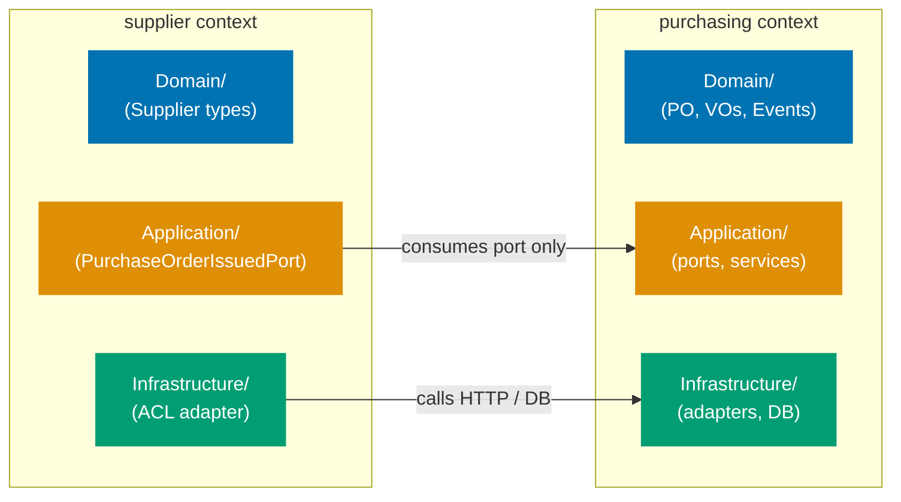
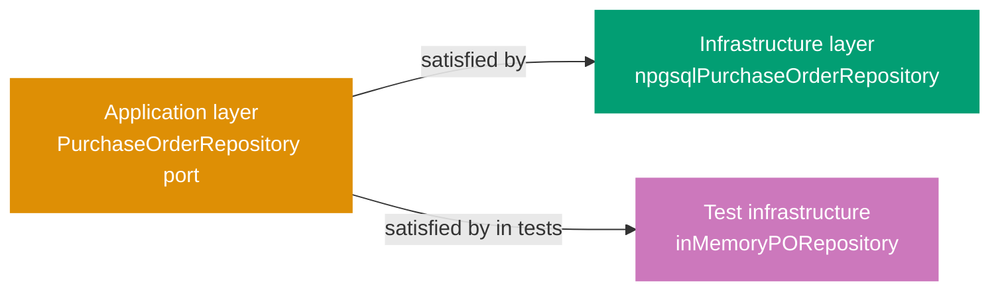

## Guide 1 — One Context, One Hexagon

### Why It Matters

A bounded context is not just a namespace — it is an isolation unit. Every time two contexts share a database table or call each other's repositories directly, a change in one cascades silently into the other. In `procurement-platform-be` the contexts (`purchasing`, `supplier`, `receiving`, `invoicing`, `payments`) each own their domain layer and infrastructure adapters. Nothing crosses the context boundary except through an explicit port. Getting this isolation invariant right from day one is the single most valuable structural decision in a DDD + hexagonal codebase.

### Standard Library First

F# modules are the only tool the standard library gives you for grouping related declarations. A module is a namespace, not a boundary enforcer — nothing stops `Supplier.fs` from opening `Purchasing.fs` and reading its types directly. The standard library delivers cohesion, not isolation.





```fsharp
// Standard library approach: modules group code but enforce no boundary
module ProcurementPlatform.Domain.Supplier

// => Supplier module declared — F# namespace grouping
open ProcurementPlatform.Domain.Purchasing
// => Direct open: Supplier can now use all Purchasing types
// => The compiler permits this — no boundary enforcement here
// => Any future change to Purchasing types breaks Supplier silently

let scoreSupplier (po: PurchaseOrder) = // hypothetical type from Purchasing
    // => Takes a Purchasing type directly
    // => The domain boundary exists only in the developer's head
    ()
```





```clojure
;; Standard library approach: namespaces group code but enforce no boundary
;; [F#: module — namespace grouping with compile-order enforcement; Clojure uses ns with :require aliases]
(ns procurement-platform.domain.supplier
  (:require [procurement-platform.domain.purchasing :as purchasing]))
;; => ns declares the namespace; :require makes purchasing namespace available under alias
;; => Clojure permits this direct require — no boundary enforcement at the language level
;; => Any function in this ns can call purchasing/* directly after the :require

(defn score-supplier
  ;; Takes a purchasing map directly — boundary exists only in developer discipline
  ;; [F#: PurchaseOrder is a typed record; here po is a plain map with no compile-time shape guarantee]
  [po]
  ;; => po is expected to be a purchasing/purchase-order map
  ;; => Clojure does not prevent this cross-context access at the namespace level
  nil)
;; => The domain boundary is a social contract, not a language invariant
```





**Limitation for production**: modules permit cross-context imports with no enforcement. As the codebase grows, accidental coupling accumulates. The compiler cannot help you find boundary violations.

### Production Framework

The hexagonal pattern enforces the boundary by making each context own its own `Domain/`, `Application/`, and `Infrastructure/` layers, and only exposing types through explicit port types (function type aliases or discriminated unions). Nothing in `supplier` opens anything from the `purchasing` domain layer directly — it talks to `purchasing` through a port defined in the `supplier` application layer.

The diagram below shows the per-context layout that the `Contexts/` scaffolding targets.



Each bounded context gets its own layers:





```fsharp
// Per-context layout — purchasing context domain layer
// src/ProcurementPlatform/Contexts/Purchasing/Domain/ValueObjects.fs
module ProcurementPlatform.Contexts.Purchasing.Domain.ValueObjects

// => Module path mirrors the directory: Contexts/Purchasing/Domain/
// => Only types belonging to purchasing live here
// => No opens from other context domains

type PurchaseOrderId = PurchaseOrderId of System.Guid
// => Strongly-typed wrapper — prevents passing a supplier ID where a PO ID is expected
// => Single-case DU: the constructor is the only way to create a PurchaseOrderId

type ApprovalLevel =
    | L1  // total <= $1,000
    | L2  // total <= $10,000
    | L3  // total > $10,000
// => Discriminated union for approval routing — pure domain type
// => No ORM annotation, no serializer hint
// => Compiles without any framework on the classpath

type UnitOfMeasure =
    | Each
    | Box
    | Kg
    | Litre
    | Hour
// => Closed enum: pattern-matching is exhaustive — the compiler enforces it
// => Adding a new unit requires updating all match sites
```





```clojure
;; Per-context layout — purchasing context domain layer
;; src/procurement_platform/contexts/purchasing/domain/value_objects.clj
(ns procurement-platform.contexts.purchasing.domain.value-objects
  (:require [malli.core :as m]))
;; => Namespace path mirrors the directory: contexts/purchasing/domain/
;; => Only types belonging to purchasing live here
;; => No :require from other context domain namespaces

;; Strongly-typed purchase order ID using a namespaced keyword map
;; [F#: single-case DU PurchaseOrderId of Guid — compile-time distinct type; Clojure uses spec/malli for runtime validation]
(def PurchaseOrderId
  ;; Malli schema: a map with exactly :purchasing/po-id of type uuid?
  (m/schema [:map [:purchasing/po-id :uuid]]))
;; => Enforced at the boundary via malli/validate — not a compile-time guarantee
;; => ::purchasing/po-id namespaced keyword prevents collision with ::supplier/id

;; Approval level as a malli enum — closed set of valid values
;; [F#: discriminated union — compiler-enforced exhaustiveness; Clojure uses a set or spec enum]
(def ApprovalLevel
  (m/schema [:enum :approval/l1 :approval/l2 :approval/l3]))
;; => :approval/l1 — total <= $1,000
;; => :approval/l2 — total <= $10,000
;; => :approval/l3 — total > $10,000
;; => Malli enum: validation is runtime; adding a variant requires updating all cond/case sites

;; Unit of measure as a malli enum — production validation at domain boundary
(def UnitOfMeasure
  (m/schema [:enum :uom/each :uom/box :uom/kg :uom/litre :uom/hour]))
;; => :uom/each — counted items
;; => :uom/box  — carton-counted items
;; => :uom/kg   — weight-based line items
;; => :uom/litre — volume-based line items
;; => :uom/hour — service or time-based line items
;; => Namespaced keywords prevent collision with UoM values from other contexts
```





**Trade-offs**: the per-context directory layout requires discipline during code review — the compiler cannot stop a developer from adding an `open` across contexts at the module level. A custom FSharpLint rule or a pre-commit grep can enforce the boundary mechanically. The payoff is that each context can evolve its domain model independently, and the integration test for one context never breaks when another context changes.

---

## Guide 2 — Reading the Per-Context Layout

### Why It Matters

`procurement-platform-be` organizes all feature code under `src/ProcurementPlatform/Contexts/`. Before writing any new feature code you need to read this layout fluently — otherwise you put new files in the wrong layer or duplicate types that already exist. The folder shape is not arbitrary: F# compiles files in the order listed in the `.fsproj`, which means the directory structure also encodes the dependency rule.

### Standard Library First

The flat layout is a direct consequence of starting with a single-module approach. F# projects list every `.fs` file in the `.fsproj` in compilation order. A flat layout means all domain files sit in one `Domain/` directory and all handlers in one `Presentation/` directory. This is the zero-ceremony stdlib approach: it compiles, it works, and it is adequate for a small codebase.





```fsharp
// Flat layout: Domain/Types.fs — shared cross-cutting types
module ProcurementPlatform.Domain.Types

// => Single module for all shared domain types
// => No context scoping — every module in the project can open this
type AppEnv =
    // => Discriminated union: compiler enforces exhaustive handling at every match site
    | Dev
    | Staging
    | Prod
// => Discriminated union for deployment environment
// => Used by infrastructure to select connection strings

type RepositoryError =
    | NotFound
    | ConnectionFailure of exn
// => Single shared error type — works for small codebases
// => Will split into per-context error types as contexts gain feature plans
```





```clojure
;; Flat layout: domain/types.clj — shared cross-cutting types
(ns procurement-platform.domain.types
  (:require [clojure.spec.alpha :as s]))
;; => Single namespace for all shared domain types
;; => No context scoping — every namespace in the project can :require this

;; Deployment environment as a spec'd keyword set
;; [F#: discriminated union AppEnv — compiler-enforced exhaustive match; Clojure uses spec enum + cond]
(s/def ::app-env #{:dev :staging :prod})
;; => :dev     — local development
;; => :staging — pre-production integration environment
;; => :prod    — production; infrastructure selects connection strings by this value
;; => s/def registers the spec globally; s/valid? enforces at runtime

;; Shared repository error representation as a spec'd map
;; [F#: RepositoryError DU — typed variants; Clojure uses tagged maps with :error/type dispatch key]
(s/def ::repository-error
  (s/keys :req [:error/type]
          :opt [:error/cause]))
;; => :error/type — required keyword: :not-found or :connection-failure
;; => :error/cause — optional throwable for :connection-failure variant
;; => Works for small codebases; will split into per-context specs as contexts gain feature plans
(s/def :error/type #{:not-found :connection-failure})
;; => Closed set matches the F# DU variants exactly
```





**Limitation for production**: as each bounded context adds its own error variants, a single shared `RepositoryError` becomes a merge-conflict magnet and prevents per-context type evolution.

### Production Framework

The per-context layout separates shared cross-cutting types from context-specific types. The `.fsproj` compilation order tells you what the layout has achieved:

```xml
<!-- ProcurementPlatform.fsproj (excerpt) -->
<!-- Per-context layout: compiled in dependency order -->
<!-- => F# compiles files in the order listed — earlier files cannot reference later ones -->
<Compile Include="Contexts/Purchasing/Domain/ValueObjects.fs" />
<!-- => Value objects first: PurchaseOrderId, SupplierId, Money, ApprovalLevel, UnitOfMeasure -->
<Compile Include="Contexts/Purchasing/Domain/DomainEvents.fs" />
<!-- => Events after value objects: PurchaseOrderIssued, PurchaseOrderCancelled -->
<Compile Include="Contexts/Purchasing/Application/Ports.fs" />
<!-- => Ports after domain: function type aliases referencing domain types -->
<Compile Include="Contexts/Purchasing/Application/SubmitPurchaseOrder.fs" />
<!-- => Application services after ports: orchestrate domain and port calls -->
<Compile Include="Contexts/Purchasing/Infrastructure/NpgsqlPurchaseOrderRepository.fs" />
<!-- => Infrastructure after application: adapters import ports but ports never import adapters -->
<Compile Include="Contexts/Purchasing/Presentation/PurchasingHandlers.fs" />
<!-- => Presentation last per context: imports Giraffe, application layer, and contracts -->
<Compile Include="Composition/Program.fs" />
<!-- => Program.fs last — the composition root that wires everything together -->
<!-- Supplier/, Receiving/, Invoicing/, Payments/ follow the same pattern before Program.fs -->
```

**Trade-offs**: keeping per-context files in strict compilation order means adding a new file requires updating the `.fsproj`. This is a minor cost. The benefit is that circular dependencies between layers are impossible — the compiler rejects them before any test runs.

---

## Guide 3 — Domain Types Stay Free of Framework Imports

### Why It Matters

The single most common way a hexagonal architecture degrades into a layered monolith is when domain types import framework assemblies. The moment `PurchaseOrder` has a `[<JsonPropertyName>]` attribute or a `[<Column("po_id")>]` annotation, the domain layer depends on a serialization or ORM framework. Switching frameworks — or testing the domain in isolation — now requires framework setup. In `procurement-platform-be`, keeping the `Contexts/Purchasing/Domain/` modules free of `open Npgsql`, `open System.Text.Json`, or `open Giraffe` is the invariant that makes everything else possible.

### Standard Library First

F# record types carry no annotations by default. The standard library gives you a pure, framework-free type that the compiler serializes as a plain CLR class:





```fsharp
// Standard library: pure record type, zero framework imports
module ProcurementPlatform.Contexts.Purchasing.Domain.ValueObjects

// => Module opens only the F# standard library implicitly
// => No open statements required for basic types

type PurchaseOrderId = PurchaseOrderId of System.Guid
// => Pure single-case DU — no ORM attribute, no serializer hint
// => Compiles without Npgsql or System.Text.Json on the classpath
// => Can be used in unit tests with zero setup

type Money = private Money of amount: decimal * currency: string
// => Private constructor: only the smart constructor (below) creates Money values
// => The compiler enforces that callers go through validation

// Smart constructor: validates and returns Result
let createMoney (amount: decimal) (currency: string) : Result<Money, string> =
    // => Returns Result — the caller cannot ignore the error case
    // => No exception thrown — functional error handling throughout the domain
    if amount < 0m then Error "Money amount cannot be negative"
    // => Negative amounts rejected at the type level — the domain invariant holds
    elif currency.Length <> 3 then Error "Currency must be a 3-letter ISO code"
    // => ISO 4217 length enforced here — no infrastructure needed to check this
    else Ok (Money (amount, currency))
    // => Ok: the validated value — downstream functions receive only valid Money
```





```clojure
;; Standard library: pure data types, zero framework imports
;; src/procurement_platform/contexts/purchasing/domain/value_objects.clj
(ns procurement-platform.contexts.purchasing.domain.value-objects
  (:require [clojure.spec.alpha :as s]))
;; => Only clojure.spec.alpha required — no ORM, no serializer, no framework dependency
;; => All types are plain maps; unit tests need no framework setup

;; Purchase order ID: namespaced keyword map, no ORM annotation
;; [F#: single-case DU PurchaseOrderId of Guid — opaque compile-time type; Clojure uses spec for runtime validation]
(s/def ::purchase-order-id uuid?)
;; => Runtime spec: validates a UUID value at domain boundaries
;; => Can be used in unit tests with (s/valid? ::purchase-order-id (random-uuid))

;; Money spec: validates amount and currency as a plain map
;; [F#: private constructor + smart constructor returning Result; Clojure uses a smart-constructor function + spec]
(s/def ::money-amount (s/and decimal? #(>= % 0M)))
;; => decimal? — requires a BigDecimal; #(>= % 0M) — enforces non-negative amounts
(s/def ::money-currency (s/and string? #(= 3 (count %))))
;; => 3-character string enforces ISO 4217 length — no infrastructure needed
(s/def ::money (s/keys :req [::money-amount ::money-currency]))
;; => Composite spec: a valid Money map must have both keys passing their individual specs

;; Smart constructor: validates and returns a result map or error
(defn create-money
  ;; [F#: returns Result<Money, string> — union type; Clojure returns a tagged map {:ok money} or {:error msg}]
  [amount currency]
  ;; => Accepts raw amount and currency — validates before constructing
  (cond
    (< amount 0M) {:error "Money amount cannot be negative"}
    ;; => Negative amounts rejected at the domain boundary — invariant holds at runtime
    (not= 3 (count currency)) {:error "Currency must be a 3-letter ISO code"}
    ;; => ISO 4217 length enforced — no infrastructure call required
    :else {:ok {::money-amount amount ::money-currency currency}}))
    ;; => :ok branch: validated Money map — downstream functions receive only valid Money
    ;; => Callers pattern-match on :ok / :error key — explicit error handling required
```





**Limitation for production**: when you need to persist a domain type, the ORM needs to know the column names. The stdlib gives you no mechanism for this — you have to decide where the ORM mapping lives.

### Production Framework

The hexagonal answer is: ORM mapping lives in the infrastructure layer, not the domain layer. The domain type is a plain F# record. The `NpgsqlPurchaseOrderRepository.fs` in `Infrastructure/` holds the mapping logic, keeping the domain module completely free of Npgsql:





```fsharp
// Infrastructure layer: NpgsqlPurchaseOrderRepository.fs holds all ORM concerns
// src/ProcurementPlatform/Contexts/Purchasing/Infrastructure/NpgsqlPurchaseOrderRepository.fs
module ProcurementPlatform.Contexts.Purchasing.Infrastructure.NpgsqlPurchaseOrderRepository

open Npgsql
// => Npgsql import is confined to the infrastructure module only
// => Domain/ValueObjects.fs never needs to open this
open ProcurementPlatform.Contexts.Purchasing.Domain
// => Import domain types for mapping — infrastructure depends on domain, not the reverse

// Row-level record matching the purchasing.purchase_orders table columns
[<CLIMutable>]
type PurchaseOrderRow =
    { po_id: System.Guid
      // => snake_case: matches the PostgreSQL column name — ORM concern only in infrastructure
      supplier_id: System.Guid
      total_amount: decimal
      currency: string
      // => currency stored separately — deserialize to Money in the repository, not in domain
      status: string }
      // => CLIMutable: enables Npgsql Dapper-style mapping — stays out of the domain layer
// => PurchaseOrderRow: the database-facing record; PurchaseOrder (domain) is the application-facing record
// => The mapping between the two is the adapter's sole responsibility
```





```clojure
;; Infrastructure layer: npgsql_purchase_order_repository.clj holds all DB concerns
;; src/procurement_platform/contexts/purchasing/infrastructure/npgsql_purchase_order_repository.clj
(ns procurement-platform.contexts.purchasing.infrastructure.npgsql-purchase-order-repository
  (:require [next.jdbc :as jdbc]
            [next.jdbc.sql :as sql]
            ;; => next.jdbc: idiomatic Clojure JDBC wrapper — confined to infrastructure namespace
            ;; => Domain namespace never requires next.jdbc
            [procurement-platform.contexts.purchasing.domain.value-objects :as vo]))
;; => :require domain namespace for mapping — infrastructure depends on domain, not the reverse

;; Row-level map structure matching the purchasing.purchase_orders table
;; [F#: [<CLIMutable>] record PurchaseOrderRow — reflection-mapped; Clojure uses plain maps with snake_case keys]
(defn row->domain
  ;; Converts a DB result-set row (plain map) to a domain purchase order map
  [row]
  ;; => row arrives from next.jdbc as {:purchase_orders/po_id uuid :purchase_orders/status "draft" ...}
  ;; => next.jdbc uses table-qualified keys by default — no annotation on domain types needed
  {:purchasing/po-id (:purchase_orders/po_id row)
   ;; => Map from snake_case DB column to namespaced domain keyword
   :purchasing/supplier-id (:purchase_orders/supplier_id row)
   :purchasing/total-amount (:purchase_orders/total_amount row)
   ;; => total_amount: raw BigDecimal from Postgres numeric column
   :purchasing/currency (:purchase_orders/currency row)
   ;; => currency stored separately — create-money called here, not in domain ns
   :purchasing/status (keyword (:purchase_orders/status row))})
   ;; => "draft" string → :draft keyword — infrastructure-layer concern only
;; => row->domain: the DB-facing mapping; domain maps have no JDBC annotation

(defn domain->row
  ;; Converts a domain purchase order map to a DB insertion parameter map
  [po]
  ;; => Inverse of row->domain — used by save-purchase-order
  {:po_id (:purchasing/po-id po)
   ;; => snake_case keys match Postgres column names expected by next.jdbc parameterised queries
   :supplier_id (:purchasing/supplier-id po)
   :total_amount (:purchasing/total-amount po)
   :currency (:purchasing/currency po)
   :status (name (:purchasing/status po))})
   ;; => :draft keyword → "draft" string — ORM concern stays in this namespace
;; => The mapping between the two is the adapter's sole responsibility
```





The dependency rule flows inward: `Infrastructure` opens `Domain`, never the reverse. In F# project files the compilation order enforces this mechanically — `Domain/ValueObjects.fs` compiles before `Infrastructure/NpgsqlPurchaseOrderRepository.fs`, so the domain module physically cannot open anything from infrastructure.

**Trade-offs**: keeping domain types annotation-free means you need a separate mapping step at the boundary. For simple CRUD aggregates this mapping is tedious. For complex aggregates with invariants (value objects that must be validated on construction) the separation pays for itself immediately — you can test the entire domain layer without spinning up a database or serializer.

---

## Guide 4 — Application Service Signatures Take and Return Aggregates, Not DTOs

### Why It Matters

Application services are the orchestration layer between the driving adapter (an HTTP handler) and the domain. A common anti-pattern is letting the application service accept and return the same DTO types the HTTP handler works with — JSON-friendly `[<CLIMutable>]` records with nullable fields and no invariants. When that happens the application service cannot enforce domain rules without re-validating on every call, and the domain model becomes a ceremonial wrapper around the DTO. In `procurement-platform-be`, the design rule is: application service functions take and return domain aggregates; the handler translates.

### Standard Library First

F# function types naturally express this signature without any framework. The standard library gives you function composition and `Result` for error propagation:





```fsharp
// Standard library: application service as a plain function with domain types
// src/ProcurementPlatform/Contexts/Purchasing/Application/SubmitPurchaseOrder.fs
module ProcurementPlatform.Contexts.Purchasing.Application.SubmitPurchaseOrder

open ProcurementPlatform.Contexts.Purchasing.Domain
// => Import only the domain module — no HTTP, no JSON, no ORM
// => Keeping the application layer free of framework imports preserves testability

// Plain F# function — returns Result to propagate domain errors
let submitPurchaseOrder
    (save: PurchaseOrder -> Result<unit, string>)  // output port injected
    // => 'save' is a function parameter — the application service is agnostic of the implementation
    (po: PurchaseOrder)                             // domain aggregate as input
    // => Aggregate received from the handler after invariant validation
    : Result<PurchaseOrder, string> =               // domain aggregate as output
    // => Signature is entirely in domain terms
    // => No DTO type crosses this function boundary
    // => 'save' is an output port — its implementation lives in infrastructure
    // => Result return type lets callers pattern-match on success or failure without exceptions
    save po
    // => Delegates persistence to the injected port — synchronous stdlib version
    |> Result.map (fun () -> po)
    // => On success, return the same aggregate the caller passed in
    // => On failure, propagate the error string from the port
```





```clojure
;; Standard library: application service as a plain function with domain maps
;; src/procurement_platform/contexts/purchasing/application/submit_purchase_order.clj
(ns procurement-platform.contexts.purchasing.application.submit-purchase-order
  (:require [procurement-platform.contexts.purchasing.domain.value-objects :as vo]))
;; => Require only the domain namespace — no HTTP, no JSON, no JDBC
;; => Keeping the application layer free of framework requires preserves testability

(defn submit-purchase-order
  ;; Plain function — returns a result map to propagate domain errors
  ;; [F#: Result<PurchaseOrder, string> — compile-time typed union; Clojure uses {:ok po} / {:error msg}]
  [save po]
  ;; => save: port function injected by the composition root — agnostic of implementation
  ;; => po: domain aggregate map received from the handler after invariant validation
  ;; => Signature is entirely in domain terms — no DTO map crosses this function boundary
  (let [result (save po)]
    ;; => Delegates persistence to the injected port function — synchronous stdlib version
    (if (:ok result)
      ;; => :ok key present: save succeeded
      {:ok po}
      ;; => Return the same aggregate map the caller passed in
      {:error (:error result)})))
      ;; => Propagate the error string from the port — caller pattern-matches on :ok / :error
```





**Limitation for production**: plain strings as error types lose type information. In a real service you want a discriminated union for errors so callers can pattern-match on specific failure modes.

### Production Framework

In the Giraffe stack the HTTP handler owns the DTO translation. The application service never touches `HttpContext`, `System.Text.Json`, or Giraffe types:





```fsharp
// Production application service signature
// src/ProcurementPlatform/Contexts/Purchasing/Application/SubmitPurchaseOrder.fs
module ProcurementPlatform.Contexts.Purchasing.Application.SubmitPurchaseOrder

open ProcurementPlatform.Contexts.Purchasing.Domain
open ProcurementPlatform.Contexts.Purchasing.Application.Ports
// => Only domain and port types imported
// => No Giraffe, no System.Text.Json, no Npgsql
// => This import boundary is what makes the application layer unit-testable without a web server

// Typed error union — each failure mode is explicit
type SubmitPurchaseOrderError =
    | DuplicatePurchaseOrder of PurchaseOrderId
    // => Carries the PurchaseOrderId that already exists — callers log or return 409
    | InvalidPurchaseOrder of string
    // => Carries the validation message — callers return 400 with this text
    | RepositoryFailure of exn
    // => Wraps the infrastructure exception — callers return 500, log the exception
// => Pattern-matched at the handler boundary, not inside the service
// => Adding a new failure mode requires updating all call sites — the compiler enforces it

// Application service: takes aggregate, returns aggregate-or-error
let submitPurchaseOrder
    (repo: PurchaseOrderRepository)
    // => Port injected by the composition root (Program.fs) via partial application
    (pub: EventPublisher)
    // => Event publisher port — injected the same way as the repository
    (po: PurchaseOrder)
    // => Validated aggregate — the handler called the smart constructor before reaching here
    : Async<Result<PurchaseOrder, SubmitPurchaseOrderError>> =
    // => Entirely domain and stdlib types in the signature
    async {
        match! repo.SavePurchaseOrder po with
        // => Async computation expression — awaits the repository port call
        // => match! desugars to Async.bind: no thread-blocking, no callback pyramid
        | Error (RepositoryError.UniqueConstraintViolation) ->
            return Error (DuplicatePurchaseOrder po.Id)
            // => Translate infrastructure error to application-layer error variant
        | Error (RepositoryError.ConnectionFailure ex) ->
            return Error (RepositoryFailure ex)
            // => Wrap the raw exception for the handler to log
        | Ok () ->
            do! pub.Publish (PurchaseOrderSubmitted { PurchaseOrderId = po.Id; SupplierId = po.SupplierId
                                                      TotalAmount = po.TotalAmount; ApprovalLevel = po.ApprovalLevel })
            // => Publish domain event after successful save — outbox adapter is atomic
            return Ok po
            // => Success: return the same aggregate
            // => Caller (handler) translates this to a 201 Created response
    }
```





```clojure
;; Production application service
;; src/procurement_platform/contexts/purchasing/application/submit_purchase_order.clj
(ns procurement-platform.contexts.purchasing.application.submit-purchase-order
  (:require [clojure.core.async :as async]
            ;; => core.async: go blocks + channels for async workflows
            ;; [F#: Async<_> computation expression; Clojure uses core.async go blocks or CompletableFuture]
            [procurement-platform.contexts.purchasing.domain.value-objects :as vo]
            [procurement-platform.contexts.purchasing.application.ports :as ports]))
;; => Only domain and port namespaces required — no Ring, no JSON, no JDBC
;; => This require boundary makes the application layer unit-testable without a web server

;; Typed error representation as a multimethod dispatch table
;; [F#: SubmitPurchaseOrderError DU — compiler-enforced exhaustive pattern matching;
;;  Clojure uses tagged maps {:error/type :duplicate-purchase-order ...} + cond dispatch]
(defn submit-purchase-order
  ;; Application service: takes ports + aggregate, returns async channel of result map
  [repo pub po]
  ;; => repo: port map {:save-purchase-order fn :find-purchase-order fn} — injected by composition root
  ;; => pub:  port map {:publish fn} — event publisher port, injected same as repo
  ;; => po:   validated domain aggregate map — handler called create-money before reaching here
  (async/go
    ;; => go block: async execution on core.async thread pool — no thread-blocking
    ;; [F#: async { match! repo.SavePurchaseOrder po with ... } — computation expression]
    (let [save-result (async/<! ((:save-purchase-order repo) po))]
      ;; => async/<! parks the go block until the save channel delivers a value
      (cond
        (= :unique-constraint-violation (:error/type save-result))
        {:error/type :duplicate-purchase-order
         ;; => Translate infrastructure error to application-layer error type
         :purchasing/po-id (:purchasing/po-id po)}
        ;; => Carries the po-id that already exists — callers return HTTP 409

        (= :connection-failure (:error/type save-result))
        {:error/type :repository-failure
         ;; => Wrap the infrastructure error for the handler to log
         :error/cause (:error/cause save-result)}
        ;; => Callers return HTTP 500 and log :error/cause

        :else
        (let [publish-result (async/<! ((:publish pub)
                                        {:event/type :purchase-order-submitted
                                         ;; => Domain event map — published after successful save
                                         :purchasing/po-id (:purchasing/po-id po)
                                         :purchasing/supplier-id (:purchasing/supplier-id po)
                                         :purchasing/total-amount (:purchasing/total-amount po)
                                         :purchasing/approval-level (:purchasing/approval-level po)}))]
          ;; => async/<! waits for event publish — outbox adapter is atomic with the DB commit
          (if (:error/type publish-result)
            publish-result
            ;; => Propagate publish failure — callers return HTTP 500
            {:ok po}))))))
            ;; => Success: return the same aggregate map — caller translates to HTTP 201
```





**Trade-offs**: this clean signature forces you to write a mapping function in the handler layer. For thin CRUD endpoints the mapping is boilerplate. For endpoints where the domain aggregate has invariants the payoff is substantial — the application service is a pure function of domain types and can be tested with zero framework setup.

---

## Guide 5 — Output Port as F# Function Type Alias

### Why It Matters

Output ports define _what_ the application layer needs from the outside world without specifying _how_ it is implemented. In object-oriented hexagonal architecture this is typically an interface. In F# the idiomatic equivalent is a function type alias — a single-function type that the application service receives as a parameter. This makes the dependency explicit in the type signature, eliminates interface ceremony, and makes adapter swapping as simple as passing a different function. `procurement-platform-be` uses this pattern throughout its per-context layout.

### Standard Library First

F# function types are first-class. The standard library lets you express any port as a type alias with zero ceremony:





```fsharp
// Standard library: function type alias as output port
// src/ProcurementPlatform/Contexts/Purchasing/Application/Ports.fs
module ProcurementPlatform.Contexts.Purchasing.Application.Ports

open ProcurementPlatform.Contexts.Purchasing.Domain

// Repository port: find a PO by its ID
type FindPurchaseOrder = PurchaseOrderId -> Result<PurchaseOrder option, string>
// => Plain F# type alias — no interface keyword, no abstract class
// => The type says exactly what the application service needs: give me an ID, return a PO-or-nothing-or-error
// => Compose multiple ports as parameters to the service function

// Repository port: persist a PO
type SavePurchaseOrder = PurchaseOrder -> Result<unit, string>
// => Write-side port — unit return on success means the caller does not need to re-read
// => Error string is the stdlib approach; production version uses a DU (see Guide 4)
```





```clojure
;; Standard library: protocol as output port — idiomatic Clojure boundary definition
;; src/procurement_platform/contexts/purchasing/application/ports.clj
(ns procurement-platform.contexts.purchasing.application.ports)
;; => This namespace contains only protocol definitions — no implementation, no I/O

;; Repository port as a Clojure protocol — polymorphic dispatch without a type hierarchy
;; [F#: type FindPurchaseOrder = PurchaseOrderId -> Result<PurchaseOrder option, string>
;;  — function type alias; Clojure uses defprotocol for named, extensible port contracts]
(defprotocol PurchaseOrderRepository
  ;; => defprotocol defines the port contract — any type satisfying it is a valid adapter
  (find-purchase-order [this po-id]
    ;; => Read-side port: given a po-id map, return a result map {:ok po} or {:error msg}
    ;; => nil :ok value signals a missing PO — callers distinguish nil from error
    )
  (save-purchase-order [this po]
    ;; => Write-side port: given a domain aggregate map, return {:ok true} or {:error msg}
    ;; => Error string is the stdlib approach; production version uses tagged error maps
    ))
;; => Compose multiple ports as keys in a ports map passed to the service function
;; => Npgsql adapter and in-memory stub both satisfy this protocol
```





**Limitation for production**: plain `Result<_, string>` loses error semantics. The caller cannot distinguish a database connection failure from a uniqueness constraint violation without parsing the string.

### Production Framework

The Giraffe + Npgsql stack wraps each port in a typed error union and makes the async nature explicit. The port type alias is still a plain F# `type` alias — no Giraffe or Npgsql types appear in the application layer ports file:







```fsharp
// Production port type alias — application layer only
// src/ProcurementPlatform/Contexts/Purchasing/Application/Ports.fs
module ProcurementPlatform.Contexts.Purchasing.Application.Ports
// => This module contains only type aliases — no implementation, no I/O, no framework imports

open ProcurementPlatform.Contexts.Purchasing.Domain
// => Domain types are the only dependency — ports are defined in application layer terms

type RepositoryError =
    | NotFound of PurchaseOrderId
    // => Read-side only: a missing PO is surfaced as NotFound, not as an Option
    | UniqueConstraintViolation
    // => Write-side: the DB raised a uniqueness constraint — callers return HTTP 409
    | ConnectionFailure of exn
    // => Infrastructure failure: carry the exception for logging; callers return HTTP 500
// => Typed DU — pattern matching at call site is exhaustive
// => Adding a new DB error mode requires all callers to handle it

// Repository port as a record of functions — groups read and write together
type PurchaseOrderRepository =
    { FindPurchaseOrder: PurchaseOrderId -> Async<Result<PurchaseOrder option, RepositoryError>>
      // => Async because the Npgsql adapter performs I/O
      // => option because a missing PO is not an error — it is a valid domain outcome
      SavePurchaseOrder: PurchaseOrder -> Async<Result<unit, RepositoryError>>
      // => unit success — the application service trusts the adapter to persist atomically
      // => RepositoryError wraps Npgsql exceptions at the adapter boundary (Guide 7)
    }
// => Record-of-functions: groups both operations so the application service receives one parameter
// => The Npgsql adapter satisfies this record; the in-memory test stub also satisfies it

// Event publisher port — single function alias
type EventPublisher =
    { Publish: DomainEvent -> Async<Result<unit, string>> }
// => Record wrapping one function: extensible if more event operations are added
// => The outbox adapter satisfies this in production; in-memory adapter satisfies it in tests

// Clock port — swappable for deterministic tests
type Clock = unit -> System.DateTimeOffset
// => Function alias: the adapter returns the real clock; tests return a frozen timestamp
// => Injected into any application service that computes deadlines or cutoff dates

// Configuration port — typed config record
type Configuration =
    { DatabaseUrl: string
      // => Npgsql connection string — injected from environment variable at startup
      ApprovalThresholdL1: decimal
      // => Dollar threshold for L1 approval (default $1,000) — externalized for tuning
      ApprovalThresholdL2: decimal }
      // => Dollar threshold for L2 approval (default $10,000)
// => Record-of-values: read once at startup; adapter reads from env + secret manager
```





```clojure
;; Production port definitions — application layer only
;; src/procurement_platform/contexts/purchasing/application/ports.clj
(ns procurement-platform.contexts.purchasing.application.ports
  (:require [clojure.spec.alpha :as s]
            [clojure.core.async :as async]))
;; => This namespace contains only protocol and spec definitions — no implementation, no I/O
;; => Domain specs are the only dependency — ports are defined in application-layer terms

;; Repository error representation as a spec'd tagged map
;; [F#: RepositoryError DU — compiler-enforced exhaustive pattern matching;
;;  Clojure uses a tagged map with :error/type keyword for open dispatch]
(s/def :error/type #{:not-found :unique-constraint-violation :connection-failure})
;; => :not-found                   — read-side: a missing PO is a valid domain outcome
;; => :unique-constraint-violation — write-side: DB raised uniqueness constraint; callers return HTTP 409
;; => :connection-failure          — infrastructure failure; callers return HTTP 500 and log :error/cause
;; => Adding a new error type requires updating all cond dispatch sites — no compiler enforcement

;; Repository port as a Clojure protocol — production version with async channels
;; [F#: PurchaseOrderRepository record-of-functions — groups read and write under one type;
;;  Clojure uses defprotocol for named, extensible port contracts over any implementing type]
(defprotocol PurchaseOrderRepository
  ;; => defprotocol: any type (record, reify) satisfying this is a valid adapter
  (find-purchase-order [this po-id]
    "Returns a core.async channel that delivers {:ok po} or {:ok nil} or {:error error-map}.
     nil :ok value signals a missing PO — not an error, a valid domain outcome.")
  ;; => Async channel: the JDBC adapter performs I/O on a thread pool; go block parks until delivery
  (save-purchase-order [this po]
    "Returns a core.async channel that delivers {:ok true} or {:error error-map}.
     Error map has :error/type and optional :error/cause for logging."))
;; => The next.jdbc adapter satisfies this protocol in production
;; => The in-memory test stub (atom-backed) also satisfies it

;; Event publisher port as a protocol — single publish operation
;; [F#: EventPublisher record { Publish: DomainEvent -> Async<Result<unit, string>> }]
(defprotocol EventPublisher
  ;; => Record wrapping one function in F#; protocol method in Clojure — both extensible
  (publish [this event]
    "Returns a core.async channel delivering {:ok true} or {:error msg}.
     event is a plain map with :event/type and domain payload keys."))
;; => The outbox adapter satisfies this in production; in-memory atom adapter satisfies it in tests

;; Clock port — a plain function, swappable for deterministic tests
;; [F#: type Clock = unit -> System.DateTimeOffset — function alias; Clojure uses a 0-arity fn]
(def make-real-clock
  ;; Returns a 0-arity function that reads the system clock on each call
  (fn [] (java.time.Instant/now)))
;; => Injected into any service that computes deadlines or cutoff dates
;; => Tests inject (fn [] fixed-instant) — deterministic without mocking frameworks

;; Configuration port — a plain map, read once at startup
;; [F#: Configuration record { DatabaseUrl: string; ApprovalThresholdL1: decimal; ... }]
(s/def ::configuration
  (s/keys :req [::database-url ::approval-threshold-l1 ::approval-threshold-l2]))
;; => ::database-url            — JDBC connection string; adapter reads from environment variable
;; => ::approval-threshold-l1  — BigDecimal threshold for L1 approval (default 1000M)
;; => ::approval-threshold-l2  — BigDecimal threshold for L2 approval (default 10000M)
;; => Read once at startup by the composition root; adapter reads from env + secret manager
```





**Trade-offs**: function type aliases are lightweight but single-method. When a port grows to five or six operations, grouping them in a record of functions keeps the application service parameter list manageable. A record-of-functions port is a natural next step when the function-alias approach feels like parameter explosion.

---

## Guide 6 — Giraffe Handler as Primary Adapter

### Why It Matters

The Giraffe handler is the primary (driving) adapter in the hexagonal architecture. Its job is exactly this: translate an HTTP request into a domain command, call the application service, and translate the domain result into an HTTP response. Nothing more. A handler that contains business logic, validates domain invariants, or directly opens a database connection has crossed out of the adapter layer and into the domain or infrastructure — the most common source of untestable, entangled production code. In `procurement-platform-be`, `Presentation/PurchasingHandlers.fs` holds the HTTP adapter for the purchasing context.

### Standard Library First

F# functions compose naturally. Without Giraffe you would write an ASP.NET Core `RequestDelegate` directly — a `Func<HttpContext, Task>`. The standard library gives you the composition, but the ceremony is high:





```fsharp
// Standard library: ASP.NET Core RequestDelegate without Giraffe
open Microsoft.AspNetCore.Http
// => HttpContext is the ASP.NET Core request/response envelope
open System.Text.Json
// => System.Text.Json is the stdlib JSON serializer — no Newtonsoft dependency
open System.Threading.Tasks
// => Task CE requires the Tasks namespace

let healthHandler : RequestDelegate =
    // => RequestDelegate is Func<HttpContext, Task> — the ASP.NET Core handler contract
    fun (ctx: HttpContext) ->
        task {
            // => Imperative async workflow — Task CE
            let response = {| status = "healthy" |}
            // => Anonymous record — no type declaration needed
            ctx.Response.ContentType <- "application/json"
            // => Set content type manually — no automatic negotiation
            // => Giraffe's json combinator sets this for you (see Production Framework below)
            ctx.Response.StatusCode <- 200
            // => Set status code manually — 200 OK
            // => Must be set before writing the body; ASP.NET Core sends headers first
            let json = JsonSerializer.Serialize(response)
            // => Serialize with System.Text.Json — manual call
            // => Giraffe's json combinator calls this internally and handles encoding
            do! ctx.Response.WriteAsync(json)
            // => Write response body — Task-based I/O
            // => WriteAsync flushes after completion; do! suspends the CE until done
        }
        :> Task
        // => Upcast to plain Task — RequestDelegate return type
```





```clojure
;; Standard library: Ring handler without a framework combinator library
;; [F#: RequestDelegate (ASP.NET Core); Clojure uses Ring's handler fn — (fn [request] response-map)]
(ns procurement-platform.presentation.health
  (:require [clojure.data.json :as json]))
;; => clojure.data.json: stdlib JSON serializer — no external framework dependency
;; => Ring handler is a plain function: (request-map) -> response-map

(defn health-handler
  ;; Ring handler: takes a request map, returns a response map
  ;; [F#: Func<HttpContext, Task> — imperative mutation of ctx; Clojure returns a pure map]
  [_request]
  ;; => _request: Ring request map — ignored for a health endpoint
  ;; => No mutable state: the response is constructed and returned as a value
  {:status 200
   ;; => HTTP 200 OK — set as a plain integer in the response map
   :headers {"Content-Type" "application/json"}
   ;; => Content-Type set explicitly — no automatic negotiation
   ;; => Ring adapters (Jetty, http-kit) read :headers and write them before the body
   :body (json/write-str {:status "healthy"})})
   ;; => json/write-str: serializes the map to a JSON string
   ;; => Ring adapters write :body as the response body — no WriteAsync call needed
   ;; => Pure function: no I/O, no side effects — trivially testable with (= response (health-handler {}))
```





**Limitation for production**: composition is verbose. Chaining middleware, routing, and authorization requires manual `next` threading. Giraffe's `HttpHandler` type (`HttpContext -> Task<HttpContext option>`) composes cleanly with `>=>` (fish operator).

### Production Framework

The health handler shows the minimal Giraffe adapter. A domain-backed handler for `POST /api/v1/purchase-orders` follows the same pattern but adds the translation steps:





```fsharp
// Giraffe handler — primary (driving) adapter for purchase order submission
// src/ProcurementPlatform/Contexts/Purchasing/Presentation/PurchasingHandlers.fs
module ProcurementPlatform.Contexts.Purchasing.Presentation.PurchasingHandlers
// => Presentation layer: imports domain, ports, and HTTP framework — allowed at this layer

open Giraffe
// => Giraffe types: HttpHandler, BindJsonAsync, RequestErrors, Successful, ServerErrors
open ProcurementPlatform.Contexts.Purchasing.Domain
// => Domain: PurchaseOrder smart constructor, PurchaseOrderId, Money, ApprovalLevel
open ProcurementPlatform.Contexts.Purchasing.Application.Ports
// => Ports: PurchaseOrderRepository, EventPublisher, RepositoryError
open ProcurementPlatform.Contexts.Purchasing.Application.SubmitPurchaseOrder
// => Application service and SubmitPurchaseOrderError
// => Four imports only: no Npgsql, no System.Text.Json — handler is a pure adapter

// Request DTO — deserialized from JSON by Giraffe's BindJsonAsync
[<CLIMutable>]
// => CLIMutable: generates public property setters — required for reflection-based deserialization
type SubmitPurchaseOrderRequest =
    { SupplierId: System.Guid
      // => CLIMutable: reflection-based setters required by Giraffe's BindJsonAsync
      // => Guid: no strongly-typed DU at the boundary — smart constructor wraps it
      TotalAmount: decimal
      // => Raw decimal: smart constructor validates >= 0 and currency
      Currency: string
      // => ISO 4217 currency code: smart constructor validates 3-letter format
      LineItems: LineItemDto array }
      // => Array of line items: handler maps each to a domain LineItem value object

// Line item DTO
[<CLIMutable>]
// => CLIMutable: same pattern as SubmitPurchaseOrderRequest — reflection-based JSON binding
type LineItemDto =
    { SkuCode: string
      // => Raw SKU code: domain validates ^[A-Z]{3}-\d{4,8}$ format
      Quantity: int
      // => Raw quantity: domain validates > 0
      UnitOfMeasure: string }
      // => Unit string: handler maps "Each" → UnitOfMeasure.Each etc.

// UnitOfMeasure string → DU mapping
let private parseUnit = function
    // => Pattern match on the raw string from the DTO — exhaustive with "other" catch-all
    | "Each"  -> Ok Each
    // => Exact string match: the client must send "Each", not "each"
    | "Box"   -> Ok Box
    // => Box: quantity counted in cartons
    | "Kg"    -> Ok Kg
    // => Kg: weight-based line item
    | "Litre" -> Ok Litre
    // => Litre: volume-based line item
    | "Hour"  -> Ok Hour
    // => Hour: service or time-based line item
    | other   -> Error (sprintf "Unknown unit of measure: %s" other)
    // => Error carries the invalid string — the handler returns 400 with this message

// Handler factory: returns an HttpHandler with the ports partially applied
let handleSubmit
    (repo: PurchaseOrderRepository)
    // => repo: injected at composition root — Npgsql adapter in production
    (pub: EventPublisher)
    // => pub: outbox adapter in production — stub in tests
    (clock: Clock)
    // => Three ports injected by the composition root via partial application
    : HttpHandler =
    fun next ctx ->
        // => next: the next HttpHandler in the pipeline; ctx: ASP.NET Core HttpContext
        task {
            let! dto = ctx.BindJsonAsync<SubmitPurchaseOrderRequest>()
            // => Giraffe BindJsonAsync: deserializes the request body into the CLIMutable DTO
            // => Throws on malformed JSON — global error middleware catches it and returns 400

            // Step 1: DTO → domain types via smart constructors
            match createMoney dto.TotalAmount dto.Currency with
            // => Smart constructor evaluated — tuple pattern handles the result
            | Error msg ->
                return! RequestErrors.BAD_REQUEST msg next ctx
                // => HTTP 400: domain validation failed — translate at the adapter boundary
            | Ok money ->
                // => Ok branch: Money is valid

                let po =
                    { Id = PurchaseOrderId (System.Guid.NewGuid())
                      // => New UUID — composition root can inject an IdGenerator port for real UUID v4
                      SupplierId = SupplierId dto.SupplierId
                      TotalAmount = money
                      // => Validated Money value — safe to use in domain logic
                      Status = Draft
                      // => Draft: all new POs start in Draft status
                      CreatedAt = clock () }
                      // => clock (): port call — frozen to a fixed time in tests
                // => Build the domain aggregate from validated value objects

                // Step 2: aggregate → application service → domain result
                match! submitPurchaseOrder repo pub po with
                // => Application service: takes repo port, publisher port, domain aggregate
                // => match! suspends the handler task until the Async<Result<_,_>> resolves
                | Error (DuplicatePurchaseOrder id) ->
                    return! RequestErrors.CONFLICT (sprintf "PurchaseOrder %A already exists" id) next ctx
                    // => HTTP 409: typed pattern match, not string parsing
                | Error (InvalidPurchaseOrder msg) ->
                    return! RequestErrors.BAD_REQUEST msg next ctx
                    // => HTTP 400: validation failed in the application service
                | Error (RepositoryFailure ex) ->
                    eprintfn "Repository failure: %A" ex
                    // => Log the raw exception before discarding it from the response
                    return! ServerErrors.INTERNAL_ERROR "Repository unavailable" next ctx
                | Ok saved ->
                    // => Step 3: domain aggregate → response DTO → HTTP 201
                    return! Successful.CREATED {| purchaseOrderId = saved.Id |} next ctx
                    // => Successful.CREATED: sets 201 status and serializes the anonymous record
        }
```





```clojure
;; Ring + Reitit handler — primary (driving) adapter for purchase order submission
;; src/procurement_platform/contexts/purchasing/presentation/purchasing_handlers.clj
(ns procurement-platform.contexts.purchasing.presentation.purchasing-handlers
  (:require [ring.util.response :as response]
            ;; => ring.util.response: response/created, response/bad-request etc.
            ;; [F#: Giraffe RequestErrors/Successful combinators; Ring uses plain response-map builders]
            [clojure.data.json :as json]
            ;; => JSON serialization confined to this namespace — domain ns has no JSON dependency
            [procurement-platform.contexts.purchasing.domain.value-objects :as vo]
            ;; => Domain: create-money, UnitOfMeasure spec, PurchaseOrderId spec
            [procurement-platform.contexts.purchasing.application.ports :as ports]
            ;; => Ports: PurchaseOrderRepository protocol, EventPublisher protocol
            [procurement-platform.contexts.purchasing.application.submit-purchase-order :as svc]))
;; => Four requires only: no JDBC, no Malli framework — handler is a pure adapter

;; UnitOfMeasure string → keyword mapping
;; [F#: parseUnit via pattern match with exhaustive catch-all; Clojure uses a lookup map]
(def ^:private unit-of-measure-map
  ;; Static lookup map: string from JSON body → namespaced keyword domain value
  {"Each"  :uom/each
   ;; => "Each"  — client sends exact string; map rejects typos at O(1)
   "Box"   :uom/box
   ;; => "Box"   — carton-counted line items
   "Kg"    :uom/kg
   ;; => "Kg"    — weight-based line items
   "Litre" :uom/litre
   ;; => "Litre" — volume-based line items
   "Hour"  :uom/hour})
   ;; => "Hour"  — service or time-based line items

(defn- parse-unit
  ;; Returns {:ok keyword} or {:error string} — consistent result-map pattern
  [s]
  (if-let [kw (unit-of-measure-map s)]
    {:ok kw}
    ;; => Keyword found: valid unit
    {:error (str "Unknown unit of measure: " s)}))
    ;; => nil lookup: invalid string — handler returns HTTP 400 with this message

;; Handler factory: returns a Ring handler function with ports partially applied
;; [F#: partial application via curried function; Clojure uses partial or closure capture]
(defn handle-submit
  ;; Returns a 1-arity Ring handler fn with repo, pub, and clock captured in closure
  [repo pub clock]
  ;; => repo:  PurchaseOrderRepository protocol instance — JDBC adapter in production
  ;; => pub:   EventPublisher protocol instance — outbox adapter in production; atom stub in tests
  ;; => clock: 0-arity fn returning Instant — frozen to fixed instant in tests
  (fn [request]
    ;; => Ring handler: (request-map) -> response-map — pure function, no HttpContext mutation
    (let [dto (-> request :body slurp json/read-str)]
      ;; => :body is an InputStream; slurp reads it fully; json/read-str parses JSON string
      ;; => dto is a plain map with string keys: {"supplierId" "...", "totalAmount" ...}

      ;; Step 1: DTO → domain types via smart constructors
      (let [money-result (vo/create-money (bigdec (get dto "totalAmount"))
                                          (get dto "currency"))]
        ;; => bigdec: coerces JSON number to BigDecimal — domain validates currency separately
        (if (:error money-result)
          ;; => :error key present: Money validation failed
          (-> (response/bad-request (:error money-result))
              ;; => HTTP 400: domain validation failed — translate at the adapter boundary
              (response/content-type "application/json"))

          (let [po {:purchasing/po-id     (random-uuid)
                    ;; => random-uuid: generates a UUID v4 — composition root can inject an id-gen port
                    :purchasing/supplier-id (parse-uuid (get dto "supplierId"))
                    ;; => parse-uuid: converts string UUID from JSON to java.util.UUID
                    :purchasing/total-amount (get-in money-result [:ok :purchasing/money-amount])
                    ;; => Validated amount from the money result map
                    :purchasing/currency    (get-in money-result [:ok :purchasing/money-currency])
                    :purchasing/status      :draft
                    ;; => :draft — all new POs start in Draft status
                    :purchasing/created-at  (clock)}]
                    ;; => (clock): port call — frozen to fixed Instant in tests

            ;; Step 2: aggregate → application service → domain result
            (let [svc-result (clojure.core.async/<!!
                               (svc/submit-purchase-order repo pub po))]
              ;; => <!!: blocking read from the service's core.async channel
              ;; [F#: match! suspends handler task; Clojure uses <!! at the boundary where blocking is safe]
              (cond
                (= :duplicate-purchase-order (get-in svc-result [:error/type]))
                (-> (response/response
                      (json/write-str {:error (str "PurchaseOrder " (:purchasing/po-id svc-result) " already exists")}))
                    ;; => HTTP 409: typed cond dispatch, not string parsing
                    (response/status 409)
                    (response/content-type "application/json"))

                (= :invalid-purchase-order (get-in svc-result [:error/type]))
                (-> (response/bad-request (json/write-str {:error (:error/message svc-result)}))
                    ;; => HTTP 400: validation failed in the application service
                    (response/content-type "application/json"))

                (= :repository-failure (get-in svc-result [:error/type]))
                (do
                  (binding [*out* *err*]
                    (println "Repository failure:" (:error/cause svc-result)))
                  ;; => Log the raw cause before discarding it from the response
                  (-> (response/response (json/write-str {:error "Repository unavailable"}))
                      (response/status 500)
                      (response/content-type "application/json")))

                :else
                ;; => Step 3: domain aggregate → response map → HTTP 201
                (-> (response/created "/api/v1/purchase-orders"
                                      (json/write-str {:purchaseOrderId (str (:purchasing/po-id (:ok svc-result)))}))
                    ;; => response/created: sets 201 status and Location header
                    (response/content-type "application/json"))))))))))
```





The routing wires the handler to a URL in `Program.fs`:





```fsharp
// Program.fs: routes declare what handlers respond to what URLs
// src/ProcurementPlatform/Composition/Program.fs
let webApp (repo: PurchaseOrderRepository) (pub: EventPublisher) (clock: Clock) : HttpHandler =
    // => webApp takes the ports as parameters — the composition root binds them at startup
    // => All routing lives here — no controller discovery, no attribute-based routing
    choose
        // => choose tries each handler in order and returns the first that matches
        [ GET  >=> route "/api/v1/health"                   >=> json {| status = "healthy" |}
          // => GET /api/v1/health: inline health check — no domain port needed
          // => >=> is Giraffe's Kleisli composition: chain handlers left-to-right
          POST  >=> route "/api/v1/purchase-orders"          >=> Purchasing.Presentation.PurchasingHandlers.handleSubmit repo pub clock
          // => POST /api/v1/purchase-orders: submission handler with ports partially applied
          GET   >=> routef "/api/v1/purchase-orders/%O"     (fun poId -> Purchasing.Presentation.PurchasingHandlers.handleGet repo poId)
          // => routef: extracts the poId from the URL path — Giraffe parses the %O as Guid
          RequestErrors.NOT_FOUND "Not Found" ]
          // => Catch-all: any unmatched route returns 404
```





```clojure
;; composition/program.clj: Reitit routes declare what handlers respond to what URLs
;; src/procurement_platform/composition/program.clj
(ns procurement-platform.composition.program
  (:require [reitit.ring :as ring]
            ;; => reitit.ring: data-driven router — routes are plain Clojure vectors
            ;; [F#: Giraffe choose + route + routef; Clojure uses Reitit route table]
            [procurement-platform.contexts.purchasing.presentation.purchasing-handlers :as ph]
            ;; => Presentation namespace: handle-submit and handle-get with ports partially applied
            [procurement-platform.presentation.health :as health]))
;; => All routing lives here — no controller discovery, no annotation-based routing

(defn make-web-app
  ;; Returns a Ring handler with ports wired by the composition root at startup
  ;; [F#: webApp curried function with Giraffe HttpHandler return type;
  ;;  Clojure uses partial or closure to bind ports into route handler fns]
  [repo pub clock]
  ;; => repo:  PurchaseOrderRepository protocol instance bound at startup
  ;; => pub:   EventPublisher protocol instance bound at startup
  ;; => clock: 0-arity clock fn bound at startup
  (ring/ring-handler
    (ring/router
      ;; => ring/router: compiles the route table into an efficient trie
      [["/api/v1/health"
        ;; => GET /api/v1/health: inline health check — no domain port needed
        {:get {:handler health/health-handler}}]
       ["/api/v1/purchase-orders"
        ;; => POST /api/v1/purchase-orders: submission handler with ports captured in closure
        {:post {:handler (ph/handle-submit repo pub clock)}}]
        ;; => (ph/handle-submit repo pub clock): returns a Ring handler fn with ports in closure
        ;; => [F#: PurchasingHandlers.handleSubmit repo pub clock via partial application]
       ["/api/v1/purchase-orders/:po-id"
        ;; => GET /api/v1/purchase-orders/:po-id: retrieval handler — :po-id extracted by Reitit
        {:get {:handler (fn [req]
                          ;; => Ring handler: po-id arrives in (:path-params req)
                          (ph/handle-get repo (get-in req [:path-params :po-id])))}}]])
        ;; => Reitit extracts :po-id from the path — no manual string parsing
    (ring/create-default-handler)
    ;; => Default handler: returns 404 for unmatched routes
    ;; [F#: RequestErrors.NOT_FOUND "Not Found" as the catch-all in Giraffe choose]
    ))
```





**Trade-offs**: Giraffe handlers are lightweight but require explicit `next ctx` threading everywhere. This is the price of composability — each handler must forward `next` to the continuation. For teams new to Giraffe the `>=>` operator and `HttpFuncResult` return type have a learning curve. The payoff is that handler composition (auth middleware, routing, error handling) is pure function composition with no magic.
