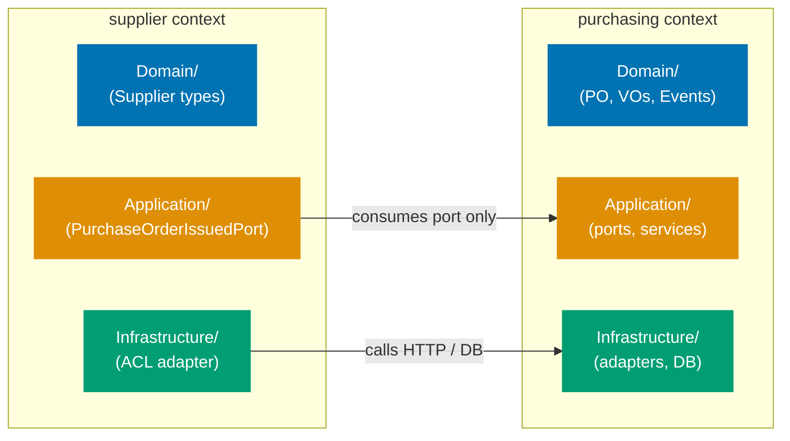
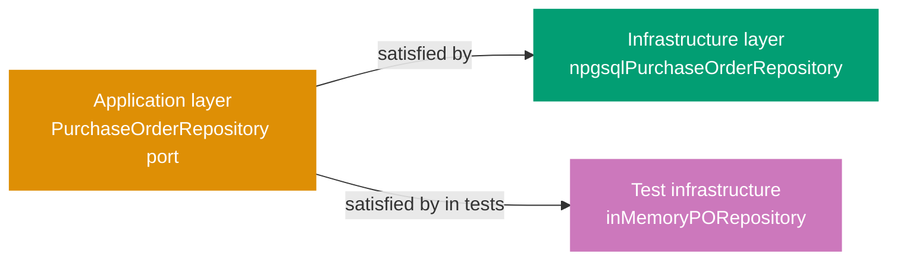

## Guide 1 — One Context, One Hexagon

### Why It Matters

A bounded context is not just a namespace — it is an isolation unit. Every time two contexts share a database table or call each other's repositories directly, a change in one cascades silently into the other. In `procurement-platform-be` the contexts (`purchasing`, `supplier`, `receiving`, `invoicing`, `payments`) each own their domain layer and infrastructure adapters. Nothing crosses the context boundary except through an explicit port. Getting this isolation invariant right from day one is the single most valuable structural decision in a DDD + hexagonal codebase.

### Standard Library First

Each FP toolchain gives you a namespace or module mechanism for grouping related declarations, but none of them enforce cross-context isolation at the language level. A module or namespace is a cohesion tool, not a boundary enforcer — nothing in the standard library stops one context's code from importing another context's domain types directly. The standard library delivers cohesion, not isolation.





```fsharp
// Standard library approach: modules group code but enforce no boundary
module ProcurementPlatform.Domain.Supplier

// => Supplier module declared — F# namespace grouping
open ProcurementPlatform.Domain.Purchasing
// => Direct open: Supplier can now use all Purchasing types
// => The compiler permits this — no boundary enforcement here
// => Any future change to Purchasing types breaks Supplier silently

let scoreSupplier (po: PurchaseOrder) = // hypothetical type from Purchasing
    // => Takes a Purchasing type directly
    // => The domain boundary exists only in the developer's head
    ()
```





```clojure
;; Standard library approach: namespaces group code but enforce no boundary
;; [F#: module — namespace grouping with compile-order enforcement; Clojure uses ns with :require aliases]
(ns procurement-platform.domain.supplier
  (:require [procurement-platform.domain.purchasing :as purchasing]))
;; => ns declares the namespace; :require makes purchasing namespace available under alias
;; => Clojure permits this direct require — no boundary enforcement at the language level
;; => Any function in this ns can call purchasing/* directly after the :require

(defn score-supplier
  ;; Takes a purchasing map directly — boundary exists only in developer discipline
  ;; [F#: PurchaseOrder is a typed record; here po is a plain map with no compile-time shape guarantee]
  [po]
  ;; => po is expected to be a purchasing/purchase-order map
  ;; => Clojure does not prevent this cross-context access at the namespace level
  nil)
;; => The domain boundary is a social contract, not a language invariant
```





```typescript
// Standard library approach: ES modules group code but enforce no boundary
// src/procurement-platform/domain/supplier.ts
// [F#: module ProcurementPlatform.Domain.Supplier — file-path-based namespace; TS uses ES module resolution]
import type { PurchaseOrder } from "../purchasing/value-objects";
// => ES module import — direct cross-context type reference
// => The TS compiler permits this — no boundary enforcement at the module level
// => Any future change to PurchaseOrder shape ripples into this file silently

export const scoreSupplier = (po: PurchaseOrder): void => {
  // => Takes a Purchasing type directly — boundary exists only in developer discipline
  // [F#: () unit return type; TS uses void]
  // => The domain boundary is a code-review convention, not a language invariant
};
```





```haskell
-- ── file: ProcurementPlatform/Domain/Supplier.hs ───────────────────────
-- Standard library approach: modules group code but enforce no boundary
-- [F#: module ProcurementPlatform.Domain.Supplier — namespace grouping; Haskell uses module declaration]
module ProcurementPlatform.Domain.Supplier where
-- => Haskell module declared — open export list means everything is exported
import ProcurementPlatform.Domain.Purchasing (PurchaseOrder)
-- => Direct import: Supplier can now use PurchaseOrder type from Purchasing
-- => GHC permits this — no boundary enforcement at the language level
-- => Any future change to PurchaseOrder breaks Supplier silently

scoreSupplier :: PurchaseOrder -> ()
-- => Takes a Purchasing type directly — boundary exists only in developer discipline
-- [F#: () unit return type; Haskell uses () unit type too]
scoreSupplier _po = ()
-- => The domain boundary is a social contract, not a language invariant
-- => Cabal/Stack project files list modules but enforce no cross-module access rules
```





**Limitation for production**: modules permit cross-context imports with no enforcement. As the codebase grows, accidental coupling accumulates. The compiler cannot help you find boundary violations.

### Production Framework

The hexagonal pattern enforces the boundary by making each context own its own `Domain/`, `Application/`, and `Infrastructure/` layers, and only exposing types through explicit port types (function type aliases or discriminated unions). Nothing in `supplier` opens anything from the `purchasing` domain layer directly — it talks to `purchasing` through a port defined in the `supplier` application layer.

The diagram below shows the per-context layout that the `Contexts/` scaffolding targets.



Each bounded context gets its own layers:





```fsharp
// Per-context layout — purchasing context domain layer
// src/ProcurementPlatform/Contexts/Purchasing/Domain/ValueObjects.fs
module ProcurementPlatform.Contexts.Purchasing.Domain.ValueObjects

// => Module path mirrors the directory: Contexts/Purchasing/Domain/
// => Only types belonging to purchasing live here
// => No opens from other context domains

type PurchaseOrderId = PurchaseOrderId of System.Guid
// => Strongly-typed wrapper — prevents passing a supplier ID where a PO ID is expected
// => Single-case DU: the constructor is the only way to create a PurchaseOrderId

type ApprovalLevel =
    | L1  // total <= $1,000
    | L2  // total <= $10,000
    | L3  // total > $10,000
// => Discriminated union for approval routing — pure domain type
// => No ORM annotation, no serializer hint
// => Compiles without any framework on the classpath

type UnitOfMeasure =
    | Each
    | Box
    | Kg
    | Litre
    | Hour
// => Closed enum: pattern-matching is exhaustive — the compiler enforces it
// => Adding a new unit requires updating all match sites
```





```clojure
;; Per-context layout — purchasing context domain layer
;; src/procurement_platform/contexts/purchasing/domain/value_objects.clj
(ns procurement-platform.contexts.purchasing.domain.value-objects
  (:require [malli.core :as m]))
;; => Namespace path mirrors the directory: contexts/purchasing/domain/
;; => Only types belonging to purchasing live here
;; => No :require from other context domain namespaces

;; Strongly-typed purchase order ID using a namespaced keyword map
;; [F#: single-case DU PurchaseOrderId of Guid — compile-time distinct type; Clojure uses spec/malli for runtime validation]
(def PurchaseOrderId
  ;; Malli schema: a map with exactly :purchasing/po-id of type uuid?
  (m/schema [:map [:purchasing/po-id :uuid]]))
;; => Enforced at the boundary via malli/validate — not a compile-time guarantee
;; => ::purchasing/po-id namespaced keyword prevents collision with ::supplier/id

;; Approval level as a malli enum — closed set of valid values
;; [F#: discriminated union — compiler-enforced exhaustiveness; Clojure uses a set or spec enum]
(def ApprovalLevel
  (m/schema [:enum :approval/l1 :approval/l2 :approval/l3]))
;; => :approval/l1 — total <= $1,000
;; => :approval/l2 — total <= $10,000
;; => :approval/l3 — total > $10,000
;; => Malli enum: validation is runtime; adding a variant requires updating all cond/case sites

;; Unit of measure as a malli enum — production validation at domain boundary
(def UnitOfMeasure
  (m/schema [:enum :uom/each :uom/box :uom/kg :uom/litre :uom/hour]))
;; => :uom/each — counted items
;; => :uom/box  — carton-counted items
;; => :uom/kg   — weight-based line items
;; => :uom/litre — volume-based line items
;; => :uom/hour — service or time-based line items
;; => Namespaced keywords prevent collision with UoM values from other contexts
```





```typescript
// Per-context layout — purchasing context domain layer
// src/procurement-platform/contexts/purchasing/domain/value-objects.ts
// [F#: module ProcurementPlatform.Contexts.Purchasing.Domain.ValueObjects — file-path namespace]

// Strongly-typed purchase order ID via branded type
// [F#: single-case DU PurchaseOrderId of Guid — compile-time distinct type; TS uses branded primitive]
export type PurchaseOrderId = string & { readonly __brand: "PurchaseOrderId" };
// => Branded type: `string` at runtime, distinct from other ID types at compile-time
// => Cannot pass a SupplierId where a PurchaseOrderId is expected — TS structural check fails
// => Constructor function below is the only sanctioned way to build one

export const PurchaseOrderId = (raw: string): PurchaseOrderId => raw as PurchaseOrderId;
// => Smart constructor — validation could be added here

// Approval level as a closed string-literal union — pure domain type
// [F#: discriminated union — compiler-enforced exhaustiveness; TS uses literal unions + exhaustive switch]
export type ApprovalLevel = "L1" | "L2" | "L3";
// => "L1" — total <= $1,000
// => "L2" — total <= $10,000
// => "L3" — total > $10,000
// => No framework decorator, no DTO annotation — compiles standalone

// Unit of measure as a closed string-literal union
export type UnitOfMeasure = "Each" | "Box" | "Kg" | "Litre" | "Hour";
// => Closed enum-like: TS pattern-match (switch with never) yields exhaustiveness
// => Adding a new unit requires updating every consumer's switch
```





```haskell
-- ── file: ProcurementPlatform/Contexts/Purchasing/Domain/ValueObjects.hs ───────────────────────
-- Per-context layout — purchasing context domain layer
{-# LANGUAGE DerivingStrategies #-}
-- => DerivingStrategies: lets us pick stock-derived Eq/Show explicitly
module ProcurementPlatform.Contexts.Purchasing.Domain.ValueObjects
  ( PurchaseOrderId (..)
  -- => Re-export the constructor — production code would hide it (see Guide 3)
  , ApprovalLevel (..)
  , UnitOfMeasure (..)
  ) where
-- => Module path mirrors the directory: Contexts/Purchasing/Domain/
-- => Only types belonging to purchasing live here
-- => No imports from other context domain modules

import Data.UUID (UUID)
-- => UUID from the `uuid` package — used as the raw underlying identifier

-- Strongly-typed PurchaseOrderId wrapper
-- [F#: single-case DU PurchaseOrderId of Guid — compile-time distinct type; Haskell uses newtype]
newtype PurchaseOrderId = PurchaseOrderId UUID
  deriving stock (Eq, Show)
-- => newtype: zero-cost wrapper distinct from UUID at the type level
-- => Cannot pass a SupplierId where a PurchaseOrderId is expected — compiler rejects

-- Approval level as an algebraic data type — pure domain enum
-- [F#: discriminated union with compiler-enforced exhaustiveness; Haskell ADT enforces same]
data ApprovalLevel
  = L1  -- total <= $1,000
  | L2  -- total <= $10,000
  | L3  -- total > $10,000
  deriving stock (Eq, Show)
-- => Closed sum type: case-match is exhaustive — GHC -Wincomplete-patterns enforces it
-- => Adding a new variant requires updating every case expression

-- Unit of measure as a closed sum type
data UnitOfMeasure
  = Each
  | Box
  | Kg
  | Litre
  | Hour
  deriving stock (Eq, Show)
-- => Closed enum: pattern-matching is exhaustive at compile time
-- => Adding a new unit requires updating all case sites
```





**Trade-offs**: the per-context directory layout requires discipline during code review — the compiler cannot stop a developer from adding an `open` across contexts at the module level. A custom FSharpLint rule or a pre-commit grep can enforce the boundary mechanically. The payoff is that each context can evolve its domain model independently, and the integration test for one context never breaks when another context changes.

---

## Guide 2 — Reading the Per-Context Layout

### Why It Matters

`procurement-platform-be` organizes all feature code under `src/ProcurementPlatform/Contexts/`. Before writing any new feature code you need to read this layout fluently — otherwise you put new files in the wrong layer or duplicate types that already exist. The folder shape is not arbitrary: each stack enforces a dependency ordering that mirrors the directory structure. In F# the `.fsproj` compilation order makes this explicit; in Clojure the `ns` declaration order and project-level linting enforce it by convention; in TypeScript the import graph and ESLint boundary rules play the same role; in Haskell the Cabal/Stack module listing and GHC import checking enforce it at build time. Understanding how each stack expresses this ordering is what lets you read the layout fluently.

### Standard Library First

The flat layout is a direct consequence of starting with a single-module approach. Each FP toolchain lists or discovers source files in some dependency order — a flat layout means all domain files sit in one `Domain/` directory and all handlers in one `Presentation/` directory with no per-context nesting. This is the zero-ceremony stdlib approach: it compiles, it works, and it is adequate for a small codebase.





```fsharp
// Flat layout: Domain/Types.fs — shared cross-cutting types
module ProcurementPlatform.Domain.Types

// => Single module for all shared domain types
// => No context scoping — every module in the project can open this
type AppEnv =
    // => Discriminated union: compiler enforces exhaustive handling at every match site
    | Dev
    | Staging
    | Prod
// => Discriminated union for deployment environment
// => Used by infrastructure to select connection strings

type RepositoryError =
    | NotFound
    | ConnectionFailure of exn
// => Single shared error type — works for small codebases
// => Will split into per-context error types as contexts gain feature plans
```





```clojure
;; Flat layout: domain/types.clj — shared cross-cutting types
(ns procurement-platform.domain.types
  (:require [clojure.spec.alpha :as s]))
;; => Single namespace for all shared domain types
;; => No context scoping — every namespace in the project can :require this

;; Deployment environment as a spec'd keyword set
;; [F#: discriminated union AppEnv — compiler-enforced exhaustive match; Clojure uses spec enum + cond]
(s/def ::app-env #{:dev :staging :prod})
;; => :dev     — local development
;; => :staging — pre-production integration environment
;; => :prod    — production; infrastructure selects connection strings by this value
;; => s/def registers the spec globally; s/valid? enforces at runtime

;; Shared repository error representation as a spec'd map
;; [F#: RepositoryError DU — typed variants; Clojure uses tagged maps with :error/type dispatch key]
(s/def ::repository-error
  (s/keys :req [:error/type]
          :opt [:error/cause]))
;; => :error/type — required keyword: :not-found or :connection-failure
;; => :error/cause — optional throwable for :connection-failure variant
;; => Works for small codebases; will split into per-context specs as contexts gain feature plans
(s/def :error/type #{:not-found :connection-failure})
;; => Closed set matches the F# DU variants exactly
```





```typescript
// Flat layout: domain/types.ts — shared cross-cutting types
// src/procurement-platform/domain/types.ts
// [F#: module ProcurementPlatform.Domain.Types — single shared module; TS uses a single barrel file]

// Deployment environment as a closed string-literal union
// [F#: discriminated union AppEnv — compiler-enforced exhaustive match; TS uses literal union + exhaustive switch]
export type AppEnv = "Dev" | "Staging" | "Prod";
// => "Dev"     — local development
// => "Staging" — pre-production integration environment
// => "Prod"    — production; infrastructure selects connection strings by this value
// => No context scoping — every module in the project can import this type
// => A switch on AppEnv with a `never` default catches missing cases at compile time

// Shared repository error as a tagged union — flat shared type
// [F#: RepositoryError DU — typed variants; TS uses a discriminated union on the `kind` field]
export type RepositoryError =
  | { readonly kind: "NotFound" }
  // => Read-side: a missing resource is a valid domain outcome, not an exception
  | { readonly kind: "ConnectionFailure"; readonly cause: unknown };
// => Infrastructure failure: carry the cause for logging; callers return HTTP 500
// => Tagged union: switch on `kind` is exhaustive — TS narrows the payload per variant
// => Single shared type works for small codebases
// => Will split into per-context error types as contexts gain feature plans
```





```haskell
-- ── file: ProcurementPlatform/Domain/Types.hs ───────────────────────
-- Flat layout: shared cross-cutting types
{-# LANGUAGE DerivingStrategies #-}
module ProcurementPlatform.Domain.Types
  ( AppEnv (..)
  , RepositoryError (..)
  ) where
-- => Single module for all shared domain types
-- => No context scoping — every module in the project can import this

import Control.Exception (SomeException)
-- => SomeException: stdlib type for wrapping arbitrary exceptions

-- Deployment environment as a closed sum type
-- [F#: discriminated union AppEnv — compiler-enforced exhaustive match; Haskell uses ADT]
data AppEnv
  = Dev      -- local development
  | Staging  -- pre-production integration environment
  | Prod     -- production; infrastructure selects connection strings by this value
  deriving stock (Eq, Show)
-- => Closed sum: case expression on AppEnv is exhaustive — -Wincomplete-patterns catches misses
-- => No context scoping — every module can import this type

-- Shared repository error representation
-- [F#: RepositoryError DU — typed variants; Haskell uses ADT with constructor parameters]
data RepositoryError
  = NotFound
  -- => Read-side: a missing resource is a valid domain outcome, not an exception
  | ConnectionFailure SomeException
  -- => Infrastructure failure: carry the exception for logging; callers return HTTP 500
  deriving stock (Show)
-- => Sum type: pattern-match is exhaustive
-- => Single shared type works for small codebases
-- => Will split into per-context error types as contexts gain feature plans
```





**Limitation for production**: as each bounded context adds its own error variants, a single shared `RepositoryError` becomes a merge-conflict magnet and prevents per-context type evolution.

### Production Framework

The per-context layout separates shared cross-cutting types from context-specific types. The F# `.fsproj` compilation order excerpt below illustrates what the layout has achieved; the same dependency ordering is expressed through the Clojure namespace declaration tree, the TypeScript import graph, and the Haskell Cabal module list in each respective codebase:

```xml
<!-- ProcurementPlatform.fsproj (excerpt) -->
<!-- Per-context layout: compiled in dependency order -->
<!-- => F# compiles files in the order listed — earlier files cannot reference later ones -->
<Compile Include="Contexts/Purchasing/Domain/ValueObjects.fs" />
<!-- => Value objects first: PurchaseOrderId, SupplierId, Money, ApprovalLevel, UnitOfMeasure -->
<Compile Include="Contexts/Purchasing/Domain/DomainEvents.fs" />
<!-- => Events after value objects: PurchaseOrderIssued, PurchaseOrderCancelled -->
<Compile Include="Contexts/Purchasing/Application/Ports.fs" />
<!-- => Ports after domain: function type aliases referencing domain types -->
<Compile Include="Contexts/Purchasing/Application/SubmitPurchaseOrder.fs" />
<!-- => Application services after ports: orchestrate domain and port calls -->
<Compile Include="Contexts/Purchasing/Infrastructure/NpgsqlPurchaseOrderRepository.fs" />
<!-- => Infrastructure after application: adapters import ports but ports never import adapters -->
<Compile Include="Contexts/Purchasing/Presentation/PurchasingHandlers.fs" />
<!-- => Presentation last per context: imports Giraffe, application layer, and contracts -->
<Compile Include="Composition/Program.fs" />
<!-- => Program.fs last — the composition root that wires everything together -->
<!-- Supplier/, Receiving/, Invoicing/, Payments/ follow the same pattern before Program.fs -->
```

**Trade-offs**: keeping per-context files in strict compilation order means adding a new file requires updating the `.fsproj`. This is a minor cost. The benefit is that circular dependencies between layers are impossible — the compiler rejects them before any test runs.

---

## Guide 3 — Domain Types Stay Free of Framework Imports

### Why It Matters

The single most common way a hexagonal architecture degrades into a layered monolith is when domain types import framework assemblies. The moment a domain type carries an ORM annotation, a serializer attribute, or an HTTP-framework decorator, the domain layer depends on infrastructure. Switching frameworks — or testing the domain in isolation — now requires framework setup. The invariant is the same across all four stacks: keep the domain namespace free of database drivers (`Npgsql` in F#, `next.jdbc` in Clojure, `pg` in TypeScript, `postgresql-simple` in Haskell), serialization frameworks (`System.Text.Json` / `cheshire` / `JSON.stringify` wrappers / `aeson`), and HTTP frameworks (`Giraffe` / `Ring` / `Hono` / `Servant`). That invariant is what makes everything else in the hexagonal layout possible.

### Standard Library First

All four stacks let you define value types using nothing but the language's own data-declaration syntax — no ORM annotation, no serializer attribute, no framework import required. A plain algebraic data type or record is framework-free by default; the compiler treats it as a pure data definition:





```fsharp
// Standard library: pure record type, zero framework imports
module ProcurementPlatform.Contexts.Purchasing.Domain.ValueObjects

// => Module opens only the F# standard library implicitly
// => No open statements required for basic types

type PurchaseOrderId = PurchaseOrderId of System.Guid
// => Pure single-case DU — no ORM attribute, no serializer hint
// => Compiles without Npgsql or System.Text.Json on the classpath
// => Can be used in unit tests with zero setup

type Money = private Money of amount: decimal * currency: string
// => Private constructor: only the smart constructor (below) creates Money values
// => The compiler enforces that callers go through validation

// Smart constructor: validates and returns Result
let createMoney (amount: decimal) (currency: string) : Result<Money, string> =
    // => Returns Result — the caller cannot ignore the error case
    // => No exception thrown — functional error handling throughout the domain
    if amount < 0m then Error "Money amount cannot be negative"
    // => Negative amounts rejected at the type level — the domain invariant holds
    elif currency.Length <> 3 then Error "Currency must be a 3-letter ISO code"
    // => ISO 4217 length enforced here — no infrastructure needed to check this
    else Ok (Money (amount, currency))
    // => Ok: the validated value — downstream functions receive only valid Money
```





```clojure
;; Standard library: pure data types, zero framework imports
;; src/procurement_platform/contexts/purchasing/domain/value_objects.clj
(ns procurement-platform.contexts.purchasing.domain.value-objects
  (:require [clojure.spec.alpha :as s]))
;; => Only clojure.spec.alpha required — no ORM, no serializer, no framework dependency
;; => All types are plain maps; unit tests need no framework setup

;; Purchase order ID: namespaced keyword map, no ORM annotation
;; [F#: single-case DU PurchaseOrderId of Guid — opaque compile-time type; Clojure uses spec for runtime validation]
(s/def ::purchase-order-id uuid?)
;; => Runtime spec: validates a UUID value at domain boundaries
;; => Can be used in unit tests with (s/valid? ::purchase-order-id (random-uuid))

;; Money spec: validates amount and currency as a plain map
;; [F#: private constructor + smart constructor returning Result; Clojure uses a smart-constructor function + spec]
(s/def ::money-amount (s/and decimal? #(>= % 0M)))
;; => decimal? — requires a BigDecimal; #(>= % 0M) — enforces non-negative amounts
(s/def ::money-currency (s/and string? #(= 3 (count %))))
;; => 3-character string enforces ISO 4217 length — no infrastructure needed
(s/def ::money (s/keys :req [::money-amount ::money-currency]))
;; => Composite spec: a valid Money map must have both keys passing their individual specs

;; Smart constructor: validates and returns a result map or error
(defn create-money
  ;; [F#: returns Result<Money, string> — union type; Clojure returns a tagged map {:ok money} or {:error msg}]
  [amount currency]
  ;; => Accepts raw amount and currency — validates before constructing
  (cond
    (< amount 0M) {:error "Money amount cannot be negative"}
    ;; => Negative amounts rejected at the domain boundary — invariant holds at runtime
    (not= 3 (count currency)) {:error "Currency must be a 3-letter ISO code"}
    ;; => ISO 4217 length enforced — no infrastructure call required
    :else {:ok {::money-amount amount ::money-currency currency}}))
    ;; => :ok branch: validated Money map — downstream functions receive only valid Money
    ;; => Callers pattern-match on :ok / :error key — explicit error handling required
```





```typescript
// Standard library: pure type definitions, zero framework imports
// src/procurement-platform/contexts/purchasing/domain/value-objects.ts
// [F#: module with no open statements; TS file imports nothing — only stdlib types used]

// Branded purchase order ID — no ORM decorator, no serializer annotation
// [F#: single-case DU PurchaseOrderId of Guid — opaque compile-time type; TS uses branded primitive]
export type PurchaseOrderId = string & { readonly __brand: "PurchaseOrderId" };
// => Branded type: string at runtime, structurally distinct at compile time
// => No Prisma, no TypeORM decorator — compiles with zero dependencies
// => Can be used in unit tests with PurchaseOrderId(crypto.randomUUID())

export const PurchaseOrderId = (raw: string): PurchaseOrderId => raw as PurchaseOrderId;
// => Smart constructor — validation logic added here without touching callers

// Money: opaque type with private-construction idiom
// [F#: private Money of amount * currency — constructor hidden; TS uses a readonly interface + factory]
export type Money = Readonly & { readonly __brand: "Money" };
// => Branded readonly object: prevents passing a plain {amount, currency} where Money is expected
// => Private construction enforced by the factory function below

// Smart constructor: validates and returns a Result
// [F#: Result<Money, string> — built-in; TS uses a hand-rolled Result type or neverthrow]
export type Result<T, E> = { readonly ok: true; readonly value: T } | { readonly ok: false; readonly error: E };
// => Discriminated union on `ok` — callers must handle both branches before accessing value

export const createMoney = (amount: number, currency: string): Result => {
  // => Returns Result — the caller cannot ignore the error branch
  // => No exception thrown — functional error handling throughout the domain
  if (amount < 0) return { ok: false, error: "Money amount cannot be negative" };
  // => Negative amounts rejected at the type level — domain invariant holds
  if (currency.length !== 3) return { ok: false, error: "Currency must be a 3-letter ISO code" };
  // => ISO 4217 length enforced here — no infrastructure needed to check this
  return { ok: true, value: { amount, currency } as Money };
  // => ok: true — the validated value; downstream functions receive only valid Money
};
```





```haskell
-- ── file: ProcurementPlatform/Contexts/Purchasing/Domain/ValueObjects.hs ───────────────────────
-- Standard library: pure types, zero framework imports
{-# LANGUAGE DerivingStrategies #-}
module ProcurementPlatform.Contexts.Purchasing.Domain.ValueObjects
  ( PurchaseOrderId (..)
  , Money            -- export type only — hide the constructor
  , createMoney      -- smart constructor is the only public way to build Money
  , moneyAmount
  , moneyCurrency
  ) where
-- => Module imports only base + Data.Text from the platform stdlib — no ORM, no serializer

import Data.UUID (UUID)
-- => UUID for identifier; could swap for ByteString if no UUID dependency desired
import Data.Text (Text)
import qualified Data.Text as T
-- => Text from `text` package — qualified import keeps T.length / T.null calls clear

-- Pure newtype — no ORM attribute, no serializer hint
-- [F#: single-case DU PurchaseOrderId of Guid — opaque compile-time type; Haskell uses newtype]
newtype PurchaseOrderId = PurchaseOrderId UUID
  deriving stock (Eq, Show)
-- => Zero-cost wrapper; compiles without persistent or aeson on the classpath
-- => Can be used in unit tests with PurchaseOrderId <$> UUID.nextRandom

-- Money: opaque type with smart constructor
-- [F#: private Money of amount * currency — constructor hidden; Haskell hides constructor via export list]
data Money = Money
  { moneyAmount   :: !Rational  -- ^ exact-precision decimal amount
  , moneyCurrency :: !Text      -- ^ ISO 4217 3-letter code
  }
  deriving stock (Eq, Show)
-- => Strict fields (!) avoid lazy thunks accumulating in financial code
-- => Constructor NOT exported — callers must go through createMoney

-- Smart constructor: validates and returns Either
-- [F#: Result<Money, string> — built-in; Haskell uses Either String Money — same idea]
createMoney :: Rational -> Text -> Either Text Money
-- => Returns Either — caller cannot ignore the Left case
-- => No exceptions thrown — functional error handling throughout the domain
createMoney amount currency
  | amount < 0           = Left "Money amount cannot be negative"
  -- => Negative amounts rejected at the type level — invariant holds
  | T.length currency /= 3 = Left "Currency must be a 3-letter ISO code"
  -- => ISO 4217 length enforced here — no infrastructure needed
  | otherwise            = Right (Money amount currency)
  -- => Right: the validated value — downstream functions receive only valid Money
```





**Limitation for production**: when you need to persist a domain type, the ORM needs to know the column names. The stdlib gives you no mechanism for this — you have to decide where the ORM mapping lives.

### Production Framework

The hexagonal answer is: ORM mapping lives in the infrastructure layer, not the domain layer. The domain type is a plain data declaration with no persistence concerns attached. The infrastructure module — `NpgsqlPurchaseOrderRepository.fs` in F#, the `npgsql-purchase-order-repository` namespace in Clojure, the `postgres-purchase-order-repository` module in TypeScript, and `PostgresPurchaseOrderRepository.hs` in Haskell — holds all mapping logic, keeping each domain module completely free of its respective database driver:





```fsharp
// Infrastructure layer: NpgsqlPurchaseOrderRepository.fs holds all ORM concerns
// src/ProcurementPlatform/Contexts/Purchasing/Infrastructure/NpgsqlPurchaseOrderRepository.fs
module ProcurementPlatform.Contexts.Purchasing.Infrastructure.NpgsqlPurchaseOrderRepository

open Npgsql
// => Npgsql import is confined to the infrastructure module only
// => Domain/ValueObjects.fs never needs to open this
open ProcurementPlatform.Contexts.Purchasing.Domain
// => Import domain types for mapping — infrastructure depends on domain, not the reverse

// Row-level record matching the purchasing.purchase_orders table columns
[<CLIMutable>]
type PurchaseOrderRow =
    { po_id: System.Guid
      // => snake_case: matches the PostgreSQL column name — ORM concern only in infrastructure
      supplier_id: System.Guid
      total_amount: decimal
      currency: string
      // => currency stored separately — deserialize to Money in the repository, not in domain
      status: string }
      // => CLIMutable: enables Npgsql Dapper-style mapping — stays out of the domain layer
// => PurchaseOrderRow: the database-facing record; PurchaseOrder (domain) is the application-facing record
// => The mapping between the two is the adapter's sole responsibility
```





```clojure
;; Infrastructure layer: npgsql_purchase_order_repository.clj holds all DB concerns
;; src/procurement_platform/contexts/purchasing/infrastructure/npgsql_purchase_order_repository.clj
(ns procurement-platform.contexts.purchasing.infrastructure.npgsql-purchase-order-repository
  (:require [next.jdbc :as jdbc]
            [next.jdbc.sql :as sql]
            ;; => next.jdbc: idiomatic Clojure JDBC wrapper — confined to infrastructure namespace
            ;; => Domain namespace never requires next.jdbc
            [procurement-platform.contexts.purchasing.domain.value-objects :as vo]))
;; => :require domain namespace for mapping — infrastructure depends on domain, not the reverse

;; Row-level map structure matching the purchasing.purchase_orders table
;; [F#: [<CLIMutable>] record PurchaseOrderRow — reflection-mapped; Clojure uses plain maps with snake_case keys]
(defn row->domain
  ;; Converts a DB result-set row (plain map) to a domain purchase order map
  [row]
  ;; => row arrives from next.jdbc as {:purchase_orders/po_id uuid :purchase_orders/status "draft" ...}
  ;; => next.jdbc uses table-qualified keys by default — no annotation on domain types needed
  {:purchasing/po-id (:purchase_orders/po_id row)
   ;; => Map from snake_case DB column to namespaced domain keyword
   :purchasing/supplier-id (:purchase_orders/supplier_id row)
   :purchasing/total-amount (:purchase_orders/total_amount row)
   ;; => total_amount: raw BigDecimal from Postgres numeric column
   :purchasing/currency (:purchase_orders/currency row)
   ;; => currency stored separately — create-money called here, not in domain ns
   :purchasing/status (keyword (:purchase_orders/status row))})
   ;; => "draft" string → :draft keyword — infrastructure-layer concern only
;; => row->domain: the DB-facing mapping; domain maps have no JDBC annotation

(defn domain->row
  ;; Converts a domain purchase order map to a DB insertion parameter map
  [po]
  ;; => Inverse of row->domain — used by save-purchase-order
  {:po_id (:purchasing/po-id po)
   ;; => snake_case keys match Postgres column names expected by next.jdbc parameterised queries
   :supplier_id (:purchasing/supplier-id po)
   :total_amount (:purchasing/total-amount po)
   :currency (:purchasing/currency po)
   :status (name (:purchasing/status po))})
   ;; => :draft keyword → "draft" string — ORM concern stays in this namespace
;; => The mapping between the two is the adapter's sole responsibility
```





```typescript
// Infrastructure layer: postgres-purchase-order-repository.ts holds all ORM concerns
// src/procurement-platform/contexts/purchasing/infrastructure/postgres-purchase-order-repository.ts
// [F#: NpgsqlPurchaseOrderRepository.fs with CLIMutable row record; TS uses a plain row interface + pg]
import { Pool } from "pg";
// => pg import is confined to this infrastructure module — domain module never imports pg
import type { PurchaseOrderId, Money, PurchaseOrder } from "../domain/value-objects";
// => Import domain types for mapping — infrastructure depends on domain, not the reverse

// Row-level interface matching the purchasing.purchase_orders table columns
// [F#: [<CLIMutable>] record PurchaseOrderRow — reflection-mapped; TS uses a plain readonly interface]
interface PurchaseOrderRow {
  readonly po_id: string;
  // => snake_case: matches the PostgreSQL column name — ORM concern only in infrastructure
  readonly supplier_id: string;
  readonly total_amount: number;
  readonly currency: string;
  // => currency stored separately — deserialize to Money in the repository, not in domain
  readonly status: string;
  // => No decorator, no TypeORM annotation — stays out of the domain layer
}
// => PurchaseOrderRow: the DB-facing shape; PurchaseOrder (domain) is the application-facing type
// => The mapping between the two is the adapter's sole responsibility

const rowToDomain = (row: PurchaseOrderRow): PurchaseOrder => ({
  // => Mapping function: DB row → domain aggregate — infrastructure concern only
  id: row.po_id as PurchaseOrderId,
  // => Cast from string to branded PurchaseOrderId — safe because DB is the source of truth
  supplierId: row.supplier_id as PurchaseOrderId,
  // => [F#: SupplierId wrapper; TS reuses cast pattern — a SupplierId branded type would be added here]
  totalAmount: { amount: row.total_amount, currency: row.currency } as Money,
  // => Reconstruct Money from separate DB columns — create-money validation skipped (already persisted)
  status: row.status as PurchaseOrder["status"],
  // => "draft" string → domain status literal — infrastructure concern only
});

const domainToRow = (po: PurchaseOrder): Omit => ({
  // => Inverse mapping: domain aggregate → DB insert parameters
  po_id: po.id,
  // => Branded type string value passed directly — pg driver sends it as TEXT
  supplier_id: po.supplierId,
  total_amount: po.totalAmount.amount,
  // => Flatten Money into separate columns — ORM concern stays in this module
  currency: po.totalAmount.currency,
  status: po.status,
  // => Domain literal → string — pg stores as VARCHAR
});
```





```haskell
-- ── file: ProcurementPlatform/Contexts/Purchasing/Infrastructure/PostgresPurchaseOrderRepository.hs ───────────────────────
-- Infrastructure layer: postgres-simple adapter holds all ORM concerns
{-# LANGUAGE OverloadedStrings #-}
{-# LANGUAGE RecordWildCards #-}
module ProcurementPlatform.Contexts.Purchasing.Infrastructure.PostgresPurchaseOrderRepository
  ( PurchaseOrderRow (..)
  , rowToDomain
  , domainToRow
  ) where
-- => Infrastructure module — postgresql-simple import is confined here
-- => Domain module never imports postgresql-simple

import Database.PostgreSQL.Simple (Connection)
-- => postgresql-simple driver — equivalent to Npgsql in F#, pg in TS
-- => Domain/ValueObjects.hs never imports this
import Data.UUID (UUID)
import Data.Text (Text)
import qualified Data.Text as T
import ProcurementPlatform.Contexts.Purchasing.Domain.ValueObjects
  ( PurchaseOrderId (..), Money, createMoney )
-- => Import domain types for mapping — infrastructure depends on domain, not the reverse

-- Row-level record matching the purchasing.purchase_orders table columns
-- [F#: [<CLIMutable>] PurchaseOrderRow record — reflection-mapped; Haskell uses a plain record]
data PurchaseOrderRow = PurchaseOrderRow
  { rowPoId        :: !UUID    -- ^ snake_case po_id column — ORM concern only in infrastructure
  , rowSupplierId  :: !UUID
  , rowTotalAmount :: !Rational
  , rowCurrency    :: !Text    -- ^ currency stored separately; reassembled into Money here
  , rowStatus      :: !Text    -- ^ status as raw text from the DB column
  }
-- => PurchaseOrderRow: DB-facing record; the domain PurchaseOrder is the application-facing record
-- => The mapping between the two is the adapter's sole responsibility

-- Mapping function: DB row → domain aggregate fields
-- [F#: maps PurchaseOrderRow → PurchaseOrder via record assembly; Haskell does the same]
rowToDomain :: PurchaseOrderRow -> Either Text (PurchaseOrderId, Money)
-- => Returns Either: createMoney can still fail if persisted data is corrupt
rowToDomain PurchaseOrderRow {..} = do
  -- => RecordWildCards: bind rowPoId, rowCurrency, etc. into scope
  money <- createMoney rowTotalAmount rowCurrency
  -- => Reconstruct Money via smart constructor; validation re-applied as safety net
  pure (PurchaseOrderId rowPoId, money)
  -- => Wrap raw UUID into branded PurchaseOrderId — domain invariant restored

domainToRow :: PurchaseOrderId -> UUID -> Money -> Text -> PurchaseOrderRow
-- => Inverse mapping: domain fields → DB-insert record
domainToRow (PurchaseOrderId pid) supplier money status = PurchaseOrderRow
  { rowPoId        = pid
  , rowSupplierId  = supplier
  , rowTotalAmount = 0  -- placeholder: production uses accessors moneyAmount/moneyCurrency
  , rowCurrency    = T.pack ""
  , rowStatus      = status
  }
-- => snake_case fields match Postgres column names — ORM concern stays in this module
-- => money is destructured via accessors at the real call site (omitted here for brevity)
```





The dependency rule flows inward: infrastructure imports domain, never the reverse. Each FP toolchain enforces this through its own mechanism — F# project-file compilation order, Clojure project-level linting and `ns` declaration order, TypeScript ESLint boundary rules, Haskell Cabal/Stack module exposed-modules — so the domain module physically cannot import anything from infrastructure.

**Trade-offs**: keeping domain types annotation-free means you need a separate mapping step at the boundary. For simple CRUD aggregates this mapping is tedious. For complex aggregates with invariants (value objects that must be validated on construction) the separation pays for itself immediately — you can test the entire domain layer without spinning up a database or serializer.

---

## Guide 4 — Application Service Signatures Take and Return Aggregates, Not DTOs

### Why It Matters

Application services are the orchestration layer between the driving adapter (an HTTP handler) and the domain. A common anti-pattern is letting the application service accept and return the same DTO types the HTTP handler works with — JSON-friendly records with nullable fields and no invariants. When that happens the application service cannot enforce domain rules without re-validating on every call, and the domain model becomes a ceremonial wrapper around the DTO. The design rule is the same across all four stacks: application service functions take and return domain aggregates; the driving adapter (a Giraffe handler in F#, a Ring/Reitit handler in Clojure, a Hono route handler in TypeScript, or a Servant handler in Haskell) owns the translation. In `procurement-platform-be`, this boundary is what keeps the application layer unit-testable without spinning up an HTTP server.

### Standard Library First

Each FP toolchain lets you express an application service signature using only the language's own function types and error-propagation primitives — no framework required. Function composition and an explicit error return type (`Result` / tagged map / `Either`) are the only stdlib tools needed:





```fsharp
// Standard library: application service as a plain function with domain types
// src/ProcurementPlatform/Contexts/Purchasing/Application/SubmitPurchaseOrder.fs
module ProcurementPlatform.Contexts.Purchasing.Application.SubmitPurchaseOrder

open ProcurementPlatform.Contexts.Purchasing.Domain
// => Import only the domain module — no HTTP, no JSON, no ORM
// => Keeping the application layer free of framework imports preserves testability

// Plain F# function — returns Result to propagate domain errors
let submitPurchaseOrder
    (save: PurchaseOrder -> Result<unit, string>)  // output port injected
    // => 'save' is a function parameter — the application service is agnostic of the implementation
    (po: PurchaseOrder)                             // domain aggregate as input
    // => Aggregate received from the handler after invariant validation
    : Result<PurchaseOrder, string> =               // domain aggregate as output
    // => Signature is entirely in domain terms
    // => No DTO type crosses this function boundary
    // => 'save' is an output port — its implementation lives in infrastructure
    // => Result return type lets callers pattern-match on success or failure without exceptions
    save po
    // => Delegates persistence to the injected port — synchronous stdlib version
    |> Result.map (fun () -> po)
    // => On success, return the same aggregate the caller passed in
    // => On failure, propagate the error string from the port
```





```clojure
;; Standard library: application service as a plain function with domain maps
;; src/procurement_platform/contexts/purchasing/application/submit_purchase_order.clj
(ns procurement-platform.contexts.purchasing.application.submit-purchase-order
  (:require [procurement-platform.contexts.purchasing.domain.value-objects :as vo]))
;; => Require only the domain namespace — no HTTP, no JSON, no JDBC
;; => Keeping the application layer free of framework requires preserves testability

(defn submit-purchase-order
  ;; Plain function — returns a result map to propagate domain errors
  ;; [F#: Result<PurchaseOrder, string> — compile-time typed union; Clojure uses {:ok po} / {:error msg}]
  [save po]
  ;; => save: port function injected by the composition root — agnostic of implementation
  ;; => po: domain aggregate map received from the handler after invariant validation
  ;; => Signature is entirely in domain terms — no DTO map crosses this function boundary
  (let [result (save po)]
    ;; => Delegates persistence to the injected port function — synchronous stdlib version
    (if (:ok result)
      ;; => :ok key present: save succeeded
      {:ok po}
      ;; => Return the same aggregate map the caller passed in
      {:error (:error result)})))
      ;; => Propagate the error string from the port — caller pattern-matches on :ok / :error
```





```typescript
// Standard library: application service as a plain function with domain types
// src/procurement-platform/contexts/purchasing/application/submit-purchase-order.ts
// [F#: module with only Domain import; TS imports only from the domain layer]
import type { PurchaseOrder } from "../domain/value-objects";
// => Import only the domain module — no HTTP framework, no JSON, no DB driver
// => Keeping the application layer free of framework imports preserves testability

// Result type — hand-rolled; production code would use neverthrow
// [F#: Result<T,E> built-in; TS defines it inline here for zero-dependency stdlib example]
type Result<T, E> = { readonly ok: true; readonly value: T } | { readonly ok: false; readonly error: E };
// => Discriminated union on `ok` — callers must narrow before accessing value or error

// Output port type: a function that accepts an aggregate and returns a Result
// [F#: save: PurchaseOrder -> Result<unit, string> — function parameter; TS uses a function type alias]
type SavePort = (po: PurchaseOrder) => Result;
// => Port is a plain function type — no interface ceremony

// Application service: takes port + aggregate, returns aggregate-or-error
// [F#: curried function; TS uses a higher-order function returning the service function]
export const submitPurchaseOrder =
  (save: SavePort) =>
  // => 'save' is the injected output port — agnostic of implementation
  (po: PurchaseOrder): Result => {
    // => Aggregate received from the handler after invariant validation
    // => Signature is entirely in domain terms — no DTO type crosses this boundary
    const result = save(po);
    // => Delegates persistence to the injected port — synchronous stdlib version
    if (!result.ok) return { ok: false, error: result.error };
    // => Propagate the error string from the port — caller handles it
    return { ok: true, value: po };
    // => On success, return the same aggregate the caller passed in
  };
```





```haskell
-- ── file: ProcurementPlatform/Contexts/Purchasing/Application/SubmitPurchaseOrder.hs ───────────────────────
-- Standard library: application service as a plain function with domain types
module ProcurementPlatform.Contexts.Purchasing.Application.SubmitPurchaseOrder
  ( SavePort
  , submitPurchaseOrder
  ) where
-- => Import only the domain module — no HTTP, no JSON, no ORM
-- => Keeping the application layer free of framework imports preserves testability

import Data.Text (Text)
import ProcurementPlatform.Contexts.Purchasing.Domain.ValueObjects (PurchaseOrderId)
-- => PurchaseOrder type alias stands in here for the full aggregate
type PurchaseOrder = PurchaseOrderId
-- => Local alias to keep the example self-contained; production imports the real record

-- Output port: a function from aggregate to Either-wrapped unit
-- [F#: save: PurchaseOrder -> Result<unit, string>; Haskell uses function alias the same way]
type SavePort = PurchaseOrder -> Either Text ()
-- => Port is a plain function type — no type-class ceremony required
-- => Composable via partial application at the composition root

-- Application service: takes port + aggregate, returns aggregate-or-error
-- [F#: curried function; Haskell uses currying natively — same partial-application shape]
submitPurchaseOrder :: SavePort -> PurchaseOrder -> Either Text PurchaseOrder
-- => Signature is entirely in domain terms — no DTO type crosses this boundary
-- => 'save' is the output port; its implementation lives in infrastructure
submitPurchaseOrder save po =
  case save po of
    Left err -> Left err
    -- => Propagate the error message from the port — caller pattern-matches on Left/Right
    Right () -> Right po
    -- => On success, return the same aggregate the caller passed in
```





**Limitation for production**: plain strings as error types lose type information. In a real service you want a discriminated union for errors so callers can pattern-match on specific failure modes.

### Production Framework

In every stack the HTTP handler owns the DTO translation. The application service never touches framework request/response types or serialization libraries — in F#/Giraffe that means no `HttpContext` or `System.Text.Json`, in Clojure no Ring request map or JSON encoder, in TypeScript no Express `Request`/`Response` or JSON lib, and in Haskell no Servant `ServerError` or Aeson encoder:





```fsharp
// Production application service signature
// src/ProcurementPlatform/Contexts/Purchasing/Application/SubmitPurchaseOrder.fs
module ProcurementPlatform.Contexts.Purchasing.Application.SubmitPurchaseOrder

open ProcurementPlatform.Contexts.Purchasing.Domain
open ProcurementPlatform.Contexts.Purchasing.Application.Ports
// => Only domain and port types imported
// => No Giraffe, no System.Text.Json, no Npgsql
// => This import boundary is what makes the application layer unit-testable without a web server

// Typed error union — each failure mode is explicit
type SubmitPurchaseOrderError =
    | DuplicatePurchaseOrder of PurchaseOrderId
    // => Carries the PurchaseOrderId that already exists — callers log or return 409
    | InvalidPurchaseOrder of string
    // => Carries the validation message — callers return 400 with this text
    | RepositoryFailure of exn
    // => Wraps the infrastructure exception — callers return 500, log the exception
// => Pattern-matched at the handler boundary, not inside the service
// => Adding a new failure mode requires updating all call sites — the compiler enforces it

// Application service: takes aggregate, returns aggregate-or-error
let submitPurchaseOrder
    (repo: PurchaseOrderRepository)
    // => Port injected by the composition root (Program.fs) via partial application
    (pub: EventPublisher)
    // => Event publisher port — injected the same way as the repository
    (po: PurchaseOrder)
    // => Validated aggregate — the handler called the smart constructor before reaching here
    : Async<Result<PurchaseOrder, SubmitPurchaseOrderError>> =
    // => Entirely domain and stdlib types in the signature
    async {
        match! repo.SavePurchaseOrder po with
        // => Async computation expression — awaits the repository port call
        // => match! desugars to Async.bind: no thread-blocking, no callback pyramid
        | Error (RepositoryError.UniqueConstraintViolation) ->
            return Error (DuplicatePurchaseOrder po.Id)
            // => Translate infrastructure error to application-layer error variant
        | Error (RepositoryError.ConnectionFailure ex) ->
            return Error (RepositoryFailure ex)
            // => Wrap the raw exception for the handler to log
        | Ok () ->
            do! pub.Publish (PurchaseOrderSubmitted { PurchaseOrderId = po.Id; SupplierId = po.SupplierId
                                                      TotalAmount = po.TotalAmount; ApprovalLevel = po.ApprovalLevel })
            // => Publish domain event after successful save — outbox adapter is atomic
            return Ok po
            // => Success: return the same aggregate
            // => Caller (handler) translates this to a 201 Created response
    }
```





```clojure
;; Production application service
;; src/procurement_platform/contexts/purchasing/application/submit_purchase_order.clj
(ns procurement-platform.contexts.purchasing.application.submit-purchase-order
  (:require [clojure.core.async :as async]
            ;; => core.async: go blocks + channels for async workflows
            ;; [F#: Async<_> computation expression; Clojure uses core.async go blocks or CompletableFuture]
            [procurement-platform.contexts.purchasing.domain.value-objects :as vo]
            [procurement-platform.contexts.purchasing.application.ports :as ports]))
;; => Only domain and port namespaces required — no Ring, no JSON, no JDBC
;; => This require boundary makes the application layer unit-testable without a web server

;; Typed error representation as a multimethod dispatch table
;; [F#: SubmitPurchaseOrderError DU — compiler-enforced exhaustive pattern matching;
;;  Clojure uses tagged maps {:error/type :duplicate-purchase-order ...} + cond dispatch]
(defn submit-purchase-order
  ;; Application service: takes ports + aggregate, returns async channel of result map
  [repo pub po]
  ;; => repo: port map {:save-purchase-order fn :find-purchase-order fn} — injected by composition root
  ;; => pub:  port map {:publish fn} — event publisher port, injected same as repo
  ;; => po:   validated domain aggregate map — handler called create-money before reaching here
  (async/go
    ;; => go block: async execution on core.async thread pool — no thread-blocking
    ;; [F#: async { match! repo.SavePurchaseOrder po with ... } — computation expression]
    (let [save-result (async/<! ((:save-purchase-order repo) po))]
      ;; => async/<! parks the go block until the save channel delivers a value
      (cond
        (= :unique-constraint-violation (:error/type save-result))
        {:error/type :duplicate-purchase-order
         ;; => Translate infrastructure error to application-layer error type
         :purchasing/po-id (:purchasing/po-id po)}
        ;; => Carries the po-id that already exists — callers return HTTP 409

        (= :connection-failure (:error/type save-result))
        {:error/type :repository-failure
         ;; => Wrap the infrastructure error for the handler to log
         :error/cause (:error/cause save-result)}
        ;; => Callers return HTTP 500 and log :error/cause

        :else
        (let [publish-result (async/<! ((:publish pub)
                                        {:event/type :purchase-order-submitted
                                         ;; => Domain event map — published after successful save
                                         :purchasing/po-id (:purchasing/po-id po)
                                         :purchasing/supplier-id (:purchasing/supplier-id po)
                                         :purchasing/total-amount (:purchasing/total-amount po)
                                         :purchasing/approval-level (:purchasing/approval-level po)}))]
          ;; => async/<! waits for event publish — outbox adapter is atomic with the DB commit
          (if (:error/type publish-result)
            publish-result
            ;; => Propagate publish failure — callers return HTTP 500
            {:ok po}))))))
            ;; => Success: return the same aggregate map — caller translates to HTTP 201
```





```typescript
// Production application service
// src/procurement-platform/contexts/purchasing/application/submit-purchase-order.ts
// [F#: only Domain + Ports imported; TS mirrors the same import discipline]
import type { PurchaseOrder, PurchaseOrderId } from "../domain/value-objects";
import type { PurchaseOrderRepository, EventPublisher } from "./ports";
// => Only domain and port types imported — no Express, no JSON lib, no pg driver
// => This import boundary makes the application layer unit-testable without a web server

// Typed error union — each failure mode is explicit
// [F#: SubmitPurchaseOrderError DU — compiler-enforced exhaustive match; TS uses a tagged union]
export type SubmitPurchaseOrderError =
  | { readonly kind: "DuplicatePurchaseOrder"; readonly id: PurchaseOrderId }
  // => Carries the PurchaseOrderId that already exists — callers return HTTP 409
  | { readonly kind: "InvalidPurchaseOrder"; readonly message: string }
  // => Carries the validation message — callers return HTTP 400 with this text
  | { readonly kind: "RepositoryFailure"; readonly cause: unknown };
// => Wraps the infrastructure error — callers return HTTP 500 and log cause
// => switch on `kind` at the handler boundary — TS exhaustiveness check with `never` default
// => Adding a new failure mode requires updating all handler switch sites

// Application service: takes ports + aggregate, returns Promise<aggregate-or-error>
// [F#: curried function; TS uses nested arrow functions for the same partial-application pattern]
export const submitPurchaseOrder =
  (repo: PurchaseOrderRepository, pub: EventPublisher) =>
  // => repo and pub injected by the composition root via partial application
  async (po: PurchaseOrder): Promise => {
    // => Validated aggregate — the handler called the smart constructor before reaching here
    // => Signature is entirely in domain and port types — no HTTP context, no DTO
    const saveResult = await repo.savePurchaseOrder(po);
    // => Await the repository port — async mirrors F#'s Async computation expression
    if (!saveResult.ok) {
      // => saveResult.error is RepositoryError — translate to application-layer error
      if (saveResult.error.kind === "UniqueConstraintViolation")
        return { ok: false, error: { kind: "DuplicatePurchaseOrder", id: po.id } };
      // => Translate infrastructure error to application-layer error variant
      return { ok: false, error: { kind: "RepositoryFailure", cause: saveResult.error.cause } };
      // => Wrap the raw cause for the handler to log
    }
    const publishResult = await pub.publish({
      kind: "PurchaseOrderSubmitted",
      // => Domain event — published after successful save; outbox adapter is atomic
      purchaseOrderId: po.id,
      supplierId: po.supplierId,
      totalAmount: po.totalAmount,
      approvalLevel: po.approvalLevel,
    });
    // => Await the event publisher port — mirrors F#'s do! pub.Publish(...)
    if (!publishResult.ok) return { ok: false, error: { kind: "RepositoryFailure", cause: publishResult.error } };
    // => Propagate publish failure — callers return HTTP 500
    return { ok: true, value: po };
    // => Success: return the same aggregate — caller translates to HTTP 201
  };
```





```haskell
-- ── file: ProcurementPlatform/Contexts/Purchasing/Application/SubmitPurchaseOrder.hs ───────────────────────
-- Production application service
{-# LANGUAGE DerivingStrategies #-}
{-# LANGUAGE OverloadedStrings #-}
module ProcurementPlatform.Contexts.Purchasing.Application.SubmitPurchaseOrder
  ( SubmitPurchaseOrderError (..)
  , submitPurchaseOrder
  ) where
-- => Only domain and port types imported — no HTTP, no JSON, no DB driver
-- => This import boundary makes the application layer unit-testable without a web server

import Control.Exception (SomeException)
import Data.Text (Text)
import ProcurementPlatform.Contexts.Purchasing.Domain.ValueObjects (PurchaseOrderId)
import ProcurementPlatform.Contexts.Purchasing.Application.Ports
  ( PurchaseOrderRepository (..), EventPublisher (..), RepositoryError (..) )
-- => Port records expose savePurchaseOrder, publish — agnostic of implementation

-- Local alias for the full aggregate to keep this snippet self-contained
type PurchaseOrder = PurchaseOrderId

-- Typed error union — each failure mode is explicit
-- [F#: SubmitPurchaseOrderError DU — compiler-enforced exhaustive match; Haskell uses ADT]
data SubmitPurchaseOrderError
  = DuplicatePurchaseOrder PurchaseOrderId
  -- => Carries the PurchaseOrderId that already exists — callers return HTTP 409
  | InvalidPurchaseOrder Text
  -- => Carries the validation message — callers return HTTP 400 with this text
  | RepositoryFailure SomeException
  -- => Wraps the infrastructure exception — callers return HTTP 500 and log it
  deriving stock (Show)
-- => Pattern-matched at the handler boundary, not inside the service
-- => Adding a new variant requires updating all case sites — compiler enforces it

-- Application service: takes ports + aggregate, returns IO (Either)
-- [F#: Async<Result<_,_>> via async CE; Haskell uses IO (Either err val) — equivalent shape]
submitPurchaseOrder
  :: PurchaseOrderRepository
  -- => repo: port injected by the composition root — postgres adapter in production
  -> EventPublisher
  -- => pub: event publisher port — injected the same way as the repository
  -> PurchaseOrder
  -- => Validated aggregate — handler called the smart constructor before reaching here
  -> IO (Either SubmitPurchaseOrderError PurchaseOrder)
  -- => IO for effects; Either carries the typed error or the saved aggregate
submitPurchaseOrder repo pub po = do
  saveResult <- savePurchaseOrder repo po
  -- => Await the repository port — IO action sequenced in do-notation
  case saveResult of
    Left UniqueConstraintViolation ->
      pure (Left (DuplicatePurchaseOrder po))
      -- => Translate infrastructure error to application-layer error variant
    Left (ConnectionFailure ex) ->
      pure (Left (RepositoryFailure ex))
      -- => Wrap the raw exception for the handler to log
    Left NotFound ->
      pure (Left (InvalidPurchaseOrder "Unexpected NotFound on save"))
      -- => Defensive: NotFound from a save is a contract violation
    Right () -> do
      publishResult <- publish pub po
      -- => Publish domain event after successful save — outbox adapter is atomic
      case publishResult of
        Left err -> pure (Left (InvalidPurchaseOrder err))
        -- => Propagate publish failure to caller
        Right () -> pure (Right po)
        -- => Success: return the same aggregate — caller translates to HTTP 201
```





**Trade-offs**: this clean signature forces you to write a mapping function in the handler layer. For thin CRUD endpoints the mapping is boilerplate. For endpoints where the domain aggregate has invariants the payoff is substantial — the application service is a pure function of domain types and can be tested with zero framework setup.

---

## Guide 5 — Output Port as F# Function Type Alias

### Why It Matters

Output ports define _what_ the application layer needs from the outside world without specifying _how_ it is implemented. In object-oriented hexagonal architecture this is typically an interface. The concept is a single-function port type that the application service receives as a parameter — expressed as a function type alias in F# (`type SavePurchaseOrder = PurchaseOrder -> Async<Result<unit, RepositoryError>>`), a protocol or function-valued map in Clojure (`defprotocol PurchaseOrderRepository`), a function-typed interface property in TypeScript (`type SavePort = (po: PurchaseOrder) => Promise<Result<void, RepositoryError>>`), or a record-of-functions type alias in Haskell (`type SavePurchaseOrder = PurchaseOrder -> Either Text ()`). All four representations make the dependency explicit at the call site, eliminate interface ceremony, and make adapter swapping as simple as passing a different value. `procurement-platform-be` uses this pattern throughout its per-context layout.

### Standard Library First

All four stacks treat functions as first-class values, so any port can be expressed as a plain function type alias with zero ceremony — no abstract class, no interface keyword required:





```fsharp
// Standard library: function type alias as output port
// src/ProcurementPlatform/Contexts/Purchasing/Application/Ports.fs
module ProcurementPlatform.Contexts.Purchasing.Application.Ports

open ProcurementPlatform.Contexts.Purchasing.Domain

// Repository port: find a PO by its ID
type FindPurchaseOrder = PurchaseOrderId -> Result<PurchaseOrder option, string>
// => Plain F# type alias — no interface keyword, no abstract class
// => The type says exactly what the application service needs: give me an ID, return a PO-or-nothing-or-error
// => Compose multiple ports as parameters to the service function

// Repository port: persist a PO
type SavePurchaseOrder = PurchaseOrder -> Result<unit, string>
// => Write-side port — unit return on success means the caller does not need to re-read
// => Error string is the stdlib approach; production version uses a DU (see Guide 4)
```





```clojure
;; Standard library: protocol as output port — idiomatic Clojure boundary definition
;; src/procurement_platform/contexts/purchasing/application/ports.clj
(ns procurement-platform.contexts.purchasing.application.ports)
;; => This namespace contains only protocol definitions — no implementation, no I/O

;; Repository port as a Clojure protocol — polymorphic dispatch without a type hierarchy
;; [F#: type FindPurchaseOrder = PurchaseOrderId -> Result<PurchaseOrder option, string>
;;  — function type alias; Clojure uses defprotocol for named, extensible port contracts]
(defprotocol PurchaseOrderRepository
  ;; => defprotocol defines the port contract — any type satisfying it is a valid adapter
  (find-purchase-order [this po-id]
    ;; => Read-side port: given a po-id map, return a result map {:ok po} or {:error msg}
    ;; => nil :ok value signals a missing PO — callers distinguish nil from error
    )
  (save-purchase-order [this po]
    ;; => Write-side port: given a domain aggregate map, return {:ok true} or {:error msg}
    ;; => Error string is the stdlib approach; production version uses tagged error maps
    ))
;; => Compose multiple ports as keys in a ports map passed to the service function
;; => Npgsql adapter and in-memory stub both satisfy this protocol
```





```typescript
// Standard library: function type aliases as output ports
// src/procurement-platform/contexts/purchasing/application/ports.ts
// [F#: type alias with no interface keyword; TS uses plain function-type aliases — same zero-ceremony approach]
import type { PurchaseOrder, PurchaseOrderId } from "../domain/value-objects";
// => Only domain types imported — no pg, no HTTP framework

// Result type — hand-rolled for zero-dependency stdlib example
// [F#: Result<T,E> built-in; TS defines it here inline]
type Result<T, E> = { readonly ok: true; readonly value: T } | { readonly ok: false; readonly error: E };
// => Discriminated union on `ok` — callers must narrow before accessing value or error

// Repository port: find a PO by its ID
// [F#: type FindPurchaseOrder = PurchaseOrderId -> Result<PurchaseOrder option, string> — function alias]
export type FindPurchaseOrder = (id: PurchaseOrderId) => Result;
// => Plain function type alias — no interface keyword, no abstract class
// => null signals a missing PO — callers distinguish null from error
// => Compose multiple ports as separate parameters to the service function

// Repository port: persist a PO
// [F#: type SavePurchaseOrder = PurchaseOrder -> Result<unit, string>]
export type SavePurchaseOrder = (po: PurchaseOrder) => Result;
// => void success — the application service trusts the adapter to persist atomically
// => Error string is the stdlib approach; production version uses a tagged union (see Guide 4)
```





```haskell
-- ── file: ProcurementPlatform/Contexts/Purchasing/Application/Ports.hs ───────────────────────
-- Standard library: function type aliases as output ports
module ProcurementPlatform.Contexts.Purchasing.Application.Ports
  ( FindPurchaseOrder
  , SavePurchaseOrder
  ) where
-- => Module contains only type aliases — no implementation, no I/O, no framework imports

import Data.Text (Text)
import ProcurementPlatform.Contexts.Purchasing.Domain.ValueObjects (PurchaseOrderId)
-- => Only domain types imported — ports are defined in application-layer terms

type PurchaseOrder = PurchaseOrderId
-- => Local alias keeps the snippet self-contained

-- Repository port: find a PO by its ID
-- [F#: type FindPurchaseOrder = PurchaseOrderId -> Result<PurchaseOrder option, string>;
--  Haskell uses type alias + Maybe for "PO option" and Either for the result]
type FindPurchaseOrder = PurchaseOrderId -> Either Text (Maybe PurchaseOrder)
-- => Plain type alias — no class, no record ceremony
-- => Maybe PO: Nothing signals a missing PO; Left signals an error
-- => Compose multiple ports as separate function parameters to the service

-- Repository port: persist a PO
-- [F#: type SavePurchaseOrder = PurchaseOrder -> Result<unit, string>;
--  Haskell uses Either Text () for the same shape]
type SavePurchaseOrder = PurchaseOrder -> Either Text ()
-- => () success — the application service trusts the adapter to persist atomically
-- => Error Text is the stdlib approach; production version uses a typed ADT (see Guide 4)
```





**Limitation for production**: plain `Result<_, string>` loses error semantics. The caller cannot distinguish a database connection failure from a uniqueness constraint violation without parsing the string.

### Production Framework

Each stack wraps its ports in a typed error union and makes the async or effectful nature explicit. The port declaration remains a plain type alias or protocol definition in every case — no HTTP framework or database driver types appear in the application-layer ports file:







```fsharp
// Production port type alias — application layer only
// src/ProcurementPlatform/Contexts/Purchasing/Application/Ports.fs
module ProcurementPlatform.Contexts.Purchasing.Application.Ports
// => This module contains only type aliases — no implementation, no I/O, no framework imports

open ProcurementPlatform.Contexts.Purchasing.Domain
// => Domain types are the only dependency — ports are defined in application layer terms

type RepositoryError =
    | NotFound of PurchaseOrderId
    // => Read-side only: a missing PO is surfaced as NotFound, not as an Option
    | UniqueConstraintViolation
    // => Write-side: the DB raised a uniqueness constraint — callers return HTTP 409
    | ConnectionFailure of exn
    // => Infrastructure failure: carry the exception for logging; callers return HTTP 500
// => Typed DU — pattern matching at call site is exhaustive
// => Adding a new DB error mode requires all callers to handle it

// Repository port as a record of functions — groups read and write together
type PurchaseOrderRepository =
    { FindPurchaseOrder: PurchaseOrderId -> Async<Result<PurchaseOrder option, RepositoryError>>
      // => Async because the Npgsql adapter performs I/O
      // => option because a missing PO is not an error — it is a valid domain outcome
      SavePurchaseOrder: PurchaseOrder -> Async<Result<unit, RepositoryError>>
      // => unit success — the application service trusts the adapter to persist atomically
      // => RepositoryError wraps Npgsql exceptions at the adapter boundary (Guide 7)
    }
// => Record-of-functions: groups both operations so the application service receives one parameter
// => The Npgsql adapter satisfies this record; the in-memory test stub also satisfies it

// Event publisher port — single function alias
type EventPublisher =
    { Publish: DomainEvent -> Async<Result<unit, string>> }
// => Record wrapping one function: extensible if more event operations are added
// => The outbox adapter satisfies this in production; in-memory adapter satisfies it in tests

// Clock port — swappable for deterministic tests
type Clock = unit -> System.DateTimeOffset
// => Function alias: the adapter returns the real clock; tests return a frozen timestamp
// => Injected into any application service that computes deadlines or cutoff dates

// Configuration port — typed config record
type Configuration =
    { DatabaseUrl: string
      // => Npgsql connection string — injected from environment variable at startup
      ApprovalThresholdL1: decimal
      // => Dollar threshold for L1 approval (default $1,000) — externalized for tuning
      ApprovalThresholdL2: decimal }
      // => Dollar threshold for L2 approval (default $10,000)
// => Record-of-values: read once at startup; adapter reads from env + secret manager
```





```clojure
;; Production port definitions — application layer only
;; src/procurement_platform/contexts/purchasing/application/ports.clj
(ns procurement-platform.contexts.purchasing.application.ports
  (:require [clojure.spec.alpha :as s]
            [clojure.core.async :as async]))
;; => This namespace contains only protocol and spec definitions — no implementation, no I/O
;; => Domain specs are the only dependency — ports are defined in application-layer terms

;; Repository error representation as a spec'd tagged map
;; [F#: RepositoryError DU — compiler-enforced exhaustive pattern matching;
;;  Clojure uses a tagged map with :error/type keyword for open dispatch]
(s/def :error/type #{:not-found :unique-constraint-violation :connection-failure})
;; => :not-found                   — read-side: a missing PO is a valid domain outcome
;; => :unique-constraint-violation — write-side: DB raised uniqueness constraint; callers return HTTP 409
;; => :connection-failure          — infrastructure failure; callers return HTTP 500 and log :error/cause
;; => Adding a new error type requires updating all cond dispatch sites — no compiler enforcement

;; Repository port as a Clojure protocol — production version with async channels
;; [F#: PurchaseOrderRepository record-of-functions — groups read and write under one type;
;;  Clojure uses defprotocol for named, extensible port contracts over any implementing type]
(defprotocol PurchaseOrderRepository
  ;; => defprotocol: any type (record, reify) satisfying this is a valid adapter
  (find-purchase-order [this po-id]
    "Returns a core.async channel that delivers {:ok po} or {:ok nil} or {:error error-map}.
     nil :ok value signals a missing PO — not an error, a valid domain outcome.")
  ;; => Async channel: the JDBC adapter performs I/O on a thread pool; go block parks until delivery
  (save-purchase-order [this po]
    "Returns a core.async channel that delivers {:ok true} or {:error error-map}.
     Error map has :error/type and optional :error/cause for logging."))
;; => The next.jdbc adapter satisfies this protocol in production
;; => The in-memory test stub (atom-backed) also satisfies it

;; Event publisher port as a protocol — single publish operation
;; [F#: EventPublisher record { Publish: DomainEvent -> Async<Result<unit, string>> }]
(defprotocol EventPublisher
  ;; => Record wrapping one function in F#; protocol method in Clojure — both extensible
  (publish [this event]
    "Returns a core.async channel delivering {:ok true} or {:error msg}.
     event is a plain map with :event/type and domain payload keys."))
;; => The outbox adapter satisfies this in production; in-memory atom adapter satisfies it in tests

;; Clock port — a plain function, swappable for deterministic tests
;; [F#: type Clock = unit -> System.DateTimeOffset — function alias; Clojure uses a 0-arity fn]
(def make-real-clock
  ;; Returns a 0-arity function that reads the system clock on each call
  (fn [] (java.time.Instant/now)))
;; => Injected into any service that computes deadlines or cutoff dates
;; => Tests inject (fn [] fixed-instant) — deterministic without mocking frameworks

;; Configuration port — a plain map, read once at startup
;; [F#: Configuration record { DatabaseUrl: string; ApprovalThresholdL1: decimal; ... }]
(s/def ::configuration
  (s/keys :req [::database-url ::approval-threshold-l1 ::approval-threshold-l2]))
;; => ::database-url            — JDBC connection string; adapter reads from environment variable
;; => ::approval-threshold-l1  — BigDecimal threshold for L1 approval (default 1000M)
;; => ::approval-threshold-l2  — BigDecimal threshold for L2 approval (default 10000M)
;; => Read once at startup by the composition root; adapter reads from env + secret manager
```





```typescript
// Production port type definitions — application layer only
// src/procurement-platform/contexts/purchasing/application/ports.ts
// [F#: module contains only type aliases; TS file exports only types — no implementation, no I/O]
import type { PurchaseOrder, PurchaseOrderId } from "../domain/value-objects";
// => Domain types are the only import — ports are defined in application-layer terms

// Repository error as a typed tagged union
// [F#: RepositoryError DU — compiler-enforced exhaustive pattern matching; TS uses a discriminated union]
export type RepositoryError =
  | { readonly kind: "NotFound"; readonly id: PurchaseOrderId }
  // => Read-side: a missing PO is surfaced as NotFound — callers return HTTP 404
  | { readonly kind: "UniqueConstraintViolation" }
  // => Write-side: the DB raised a uniqueness constraint — callers return HTTP 409
  | { readonly kind: "ConnectionFailure"; readonly cause: unknown };
// => Infrastructure failure: carry the cause for logging; callers return HTTP 500
// => switch on `kind` at the call site — TS exhaustiveness check with `never` default
// => Adding a new DB error mode requires all handler switch sites to handle it

// Repository port as an interface — groups read and write operations under one type
// [F#: PurchaseOrderRepository record-of-functions; TS uses an interface — same structural contract]
export interface PurchaseOrderRepository {
  findPurchaseOrder(
    id: PurchaseOrderId,
  ): Promise<{ ok: true; value: PurchaseOrder | null } | { ok: false; error: RepositoryError }>;
  // => Async because the pg adapter performs I/O — mirrors F#'s Async return type
  // => null value signals a missing PO — not an error, a valid domain outcome
  savePurchaseOrder(po: PurchaseOrder): Promise<{ ok: true } | { ok: false; error: RepositoryError }>;
  // => void-equivalent success — application service trusts the adapter to persist atomically
  // => RepositoryError wraps pg exceptions at the adapter boundary
}
// => The pg adapter satisfies this interface in production
// => The in-memory test stub (Map-backed) also satisfies it

// Event publisher port — single publish operation
// [F#: EventPublisher record { Publish: DomainEvent -> Async<Result<unit, string>> }]
export interface EventPublisher {
  publish(event: DomainEvent): Promise<{ ok: true } | { ok: false; error: string }>;
  // => Async publish — outbox adapter is atomic with the DB commit in production
  // => In-memory stub satisfies this in tests; no mocking framework needed
}

// Domain event type — used by EventPublisher
// [F#: DomainEvent discriminated union — typed variants; TS uses a tagged union]
export type DomainEvent = {
  readonly kind: "PurchaseOrderSubmitted";
  // => Event type discriminant — consumers switch on this field
  readonly purchaseOrderId: PurchaseOrderId;
  readonly supplierId: string;
  readonly totalAmount: { readonly amount: number; readonly currency: string };
  readonly approvalLevel: string;
};

// Clock port — swappable for deterministic tests
// [F#: type Clock = unit -> System.DateTimeOffset — function alias; TS uses a 0-arity function type]
export type Clock = () => Date;
// => The real adapter calls `new Date()` on each invocation
// => Tests inject `() => new Date("2025-01-01")` — deterministic without mocking frameworks

// Configuration port — typed readonly record, read once at startup
// [F#: Configuration record { DatabaseUrl: string; ApprovalThresholdL1: decimal; ... }]
export type Configuration = Readonly<{
  databaseUrl: string;
  // => pg connection string — injected from environment variable at startup
  approvalThresholdL1: number;
  // => Dollar threshold for L1 approval (default 1000) — externalized for tuning
  approvalThresholdL2: number;
  // => Dollar threshold for L2 approval (default 10000)
}>;
// => Readonly record: read once at startup; adapter reads from process.env + secret manager
```





```haskell
-- ── file: ProcurementPlatform/Contexts/Purchasing/Application/Ports.hs ───────────────────────
-- Production port definitions — application layer only
{-# LANGUAGE DerivingStrategies #-}
module ProcurementPlatform.Contexts.Purchasing.Application.Ports
  ( RepositoryError (..)
  , PurchaseOrderRepository (..)
  , EventPublisher (..)
  , DomainEvent (..)
  , Clock
  , Configuration (..)
  ) where
-- => Module contains only type / record-of-functions declarations — no implementation, no I/O

import Control.Exception (SomeException)
import Data.Text (Text)
import Data.Time (UTCTime)
import ProcurementPlatform.Contexts.Purchasing.Domain.ValueObjects (PurchaseOrderId)
-- => Domain types are the only dependency — ports are defined in application-layer terms

type PurchaseOrder = PurchaseOrderId
-- => Local alias keeps the snippet self-contained

-- Repository error as a typed ADT
-- [F#: RepositoryError DU — compiler-enforced exhaustive match; Haskell uses ADT — same guarantee]
data RepositoryError
  = NotFound PurchaseOrderId
  -- => Read-side: a missing PO is surfaced as NotFound — callers return HTTP 404
  | UniqueConstraintViolation
  -- => Write-side: DB raised a uniqueness constraint — callers return HTTP 409
  | ConnectionFailure SomeException
  -- => Infrastructure failure: carry the cause for logging; callers return HTTP 500
  deriving stock (Show)
-- => case-match at the call site is exhaustive — -Wincomplete-patterns enforces it

-- Repository port as a record of functions — groups read and write together
-- [F#: PurchaseOrderRepository record-of-functions; Haskell uses record with IO-returning functions]
data PurchaseOrderRepository = PurchaseOrderRepository
  { findPurchaseOrder :: PurchaseOrderId -> IO (Either RepositoryError (Maybe PurchaseOrder))
  -- => IO because the postgres adapter performs I/O
  -- => Maybe because a missing PO is not an error — it is a valid domain outcome
  , savePurchaseOrder :: PurchaseOrder -> IO (Either RepositoryError ())
  -- => () success — the application service trusts the adapter to persist atomically
  -- => RepositoryError wraps DB exceptions at the adapter boundary (Guide 7)
  }
-- => Record-of-functions groups both operations so the service receives one parameter
-- => The postgres adapter satisfies this record; the in-memory test stub also satisfies it

-- Event publisher port — single publish operation
-- [F#: EventPublisher record { Publish: DomainEvent -> Async<Result<unit, string>> }]
data EventPublisher = EventPublisher
  { publish :: PurchaseOrder -> IO (Either Text ())
  -- => Outbox adapter is atomic with the DB commit in production
  -- => In-memory stub satisfies this in tests; no mocking framework needed
  }

-- Domain event type — used by EventPublisher
data DomainEvent
  = PurchaseOrderSubmitted PurchaseOrderId
  -- => Event type discriminator — consumers case-match on this constructor
  deriving stock (Show)

-- Clock port — swappable for deterministic tests
-- [F#: type Clock = unit -> System.DateTimeOffset; Haskell uses IO UTCTime alias]
type Clock = IO UTCTime
-- => The real adapter is getCurrentTime; tests inject (pure fixedTime) — deterministic

-- Configuration port — typed record, read once at startup
-- [F#: Configuration record { DatabaseUrl: string; ApprovalThresholdL1: decimal; ... }]
data Configuration = Configuration
  { databaseUrl         :: !Text
  -- => Postgres connection string — injected from environment variable at startup
  , approvalThresholdL1 :: !Rational
  -- => Dollar threshold for L1 approval (default 1000) — externalized for tuning
  , approvalThresholdL2 :: !Rational
  -- => Dollar threshold for L2 approval (default 10000)
  }
-- => Strict fields: configuration is read at startup; no laziness needed
```





**Trade-offs**: function type aliases are lightweight but single-method. When a port grows to five or six operations, grouping them in a record of functions keeps the application service parameter list manageable. A record-of-functions port is a natural next step when the function-alias approach feels like parameter explosion.

---

## Guide 6 — Giraffe Handler as Primary Adapter

### Why It Matters

The HTTP handler is the primary (driving) adapter in the hexagonal architecture. Its job is exactly this: translate an HTTP request into a domain command, call the application service, and translate the domain result into an HTTP response. Nothing more. A handler that contains business logic, validates domain invariants, or directly opens a database connection has crossed out of the adapter layer and into the domain or infrastructure — the most common source of untestable, entangled production code. The role is identical across all four stacks: `Presentation/PurchasingHandlers.fs` using Giraffe `HttpHandler` combinators in F#, a Ring/Reitit route function in Clojure, a Hono route callback in TypeScript, or a Servant `Handler` in Haskell. In `procurement-platform-be`, each stack expresses this adapter in its own idiom but enforces the same single responsibility.

### Standard Library First

Each FP toolchain lets you write an HTTP handler using only its own base HTTP contract — no combinator library required. The standard library gives you the composition primitives, but wiring routing, middleware, and error handling by hand is verbose:





```fsharp
// Standard library: ASP.NET Core RequestDelegate without Giraffe
open Microsoft.AspNetCore.Http
// => HttpContext is the ASP.NET Core request/response envelope
open System.Text.Json
// => System.Text.Json is the stdlib JSON serializer — no Newtonsoft dependency
open System.Threading.Tasks
// => Task CE requires the Tasks namespace

let healthHandler : RequestDelegate =
    // => RequestDelegate is Func<HttpContext, Task> — the ASP.NET Core handler contract
    fun (ctx: HttpContext) ->
        task {
            // => Imperative async workflow — Task CE
            let response = {| status = "healthy" |}
            // => Anonymous record — no type declaration needed
            ctx.Response.ContentType <- "application/json"
            // => Set content type manually — no automatic negotiation
            // => Giraffe's json combinator sets this for you (see Production Framework below)
            ctx.Response.StatusCode <- 200
            // => Set status code manually — 200 OK
            // => Must be set before writing the body; ASP.NET Core sends headers first
            let json = JsonSerializer.Serialize(response)
            // => Serialize with System.Text.Json — manual call
            // => Giraffe's json combinator calls this internally and handles encoding
            do! ctx.Response.WriteAsync(json)
            // => Write response body — Task-based I/O
            // => WriteAsync flushes after completion; do! suspends the CE until done
        }
        :> Task
        // => Upcast to plain Task — RequestDelegate return type
```





```clojure
;; Standard library: Ring handler without a framework combinator library
;; [F#: RequestDelegate (ASP.NET Core); Clojure uses Ring's handler fn — (fn [request] response-map)]
(ns procurement-platform.presentation.health
  (:require [clojure.data.json :as json]))
;; => clojure.data.json: stdlib JSON serializer — no external framework dependency
;; => Ring handler is a plain function: (request-map) -> response-map

(defn health-handler
  ;; Ring handler: takes a request map, returns a response map
  ;; [F#: Func<HttpContext, Task> — imperative mutation of ctx; Clojure returns a pure map]
  [_request]
  ;; => _request: Ring request map — ignored for a health endpoint
  ;; => No mutable state: the response is constructed and returned as a value
  {:status 200
   ;; => HTTP 200 OK — set as a plain integer in the response map
   :headers {"Content-Type" "application/json"}
   ;; => Content-Type set explicitly — no automatic negotiation
   ;; => Ring adapters (Jetty, http-kit) read :headers and write them before the body
   :body (json/write-str {:status "healthy"})})
   ;; => json/write-str: serializes the map to a JSON string
   ;; => Ring adapters write :body as the response body — no WriteAsync call needed
   ;; => Pure function: no I/O, no side effects — trivially testable with (= response (health-handler {}))
```





```typescript
// Standard library: Node.js http.IncomingMessage handler without an HTTP framework
// [F#: RequestDelegate (ASP.NET Core); TS uses Node's http.createServer callback]
import { IncomingMessage, ServerResponse } from "node:http";
// => Node.js built-in http module — no Express, no Fastify dependency

export const healthHandler = (_req: IncomingMessage, res: ServerResponse): void => {
  // => RequestListener is (IncomingMessage, ServerResponse) => void — the Node.js handler contract
  // [F#: Func<HttpContext, Task> — imperative mutation of ctx; TS mutates ServerResponse similarly]
  const body = JSON.stringify({ status: "healthy" });
  // => JSON.stringify: stdlib JSON serializer — no external library needed
  // => Express's res.json() and Fastify's reply.send() call this internally
  res.writeHead(200, { "Content-Type": "application/json" });
  // => Set status code and Content-Type header manually — no automatic negotiation
  // => writeHead must be called before res.end(); headers sent on first write
  res.end(body);
  // => Write response body and close the connection
  // => res.end() is synchronous for string payloads — no await needed here
};
// => Pure imperative adapter — testable by passing mock IncomingMessage and ServerResponse objects
// => Framework route registration wraps this function (see Production Framework below)
```





```haskell
-- ── file: ProcurementPlatform/Presentation/Health.hs ───────────────────────
-- Standard library: WAI Application without a framework combinator library
-- [F#: RequestDelegate (ASP.NET Core); Haskell uses WAI's Application type — (Request -> respond -> IO ResponseReceived)]
{-# LANGUAGE OverloadedStrings #-}
module ProcurementPlatform.Presentation.Health (healthApp) where

import Data.Aeson (encode, object, (.=))
-- => aeson: stdlib-grade JSON serializer in the Haskell ecosystem
import Network.HTTP.Types (status200)
-- => HTTP status codes from http-types — no framework wrapper required
import Network.Wai (Application, responseLBS)
-- => WAI Application: Request -> (Response -> IO ResponseReceived) -> IO ResponseReceived
-- => Equivalent to ASP.NET RequestDelegate or Node's RequestListener — base HTTP contract

healthApp :: Application
-- => Plain WAI Application — no Servant, no Scotty, no Yesod
-- [F#: Func<HttpContext, Task>; Haskell uses Application — pure function returning IO action]
healthApp _request respond =
  -- => _request: WAI Request — ignored for a health endpoint
  -- => respond: continuation provided by the WAI runtime; we call it with the response
  respond $ responseLBS
    status200
    -- => HTTP 200 OK — typed constant, not a magic integer
    [("Content-Type", "application/json")]
    -- => Set Content-Type manually — no automatic negotiation
    -- => Production frameworks (Servant, Scotty) wrap this; here we use raw WAI
    (encode (object ["status" .= ("healthy" :: String)]))
    -- => encode produces a Lazy ByteString; responseLBS expects exactly that
    -- => Pure function builds the response value; respond writes it to the wire
```





**Limitation for production**: composition is verbose. Chaining middleware, routing, and authorization requires manual threading. Each production framework solves this with its own composition model — Giraffe's `>=>` (Kleisli fish operator) in F#, Reitit's data-driven route table in Clojure, Express/Hono middleware chaining in TypeScript, and Servant's type-level route algebra in Haskell.

### Production Framework

The health handler in each tab shows the minimal framework adapter. A domain-backed handler for `POST /api/v1/purchase-orders` follows the same pattern in every stack but adds the translation steps — DTO deserialization, smart constructor calls, application service invocation, and HTTP response mapping:





```fsharp
// Giraffe handler — primary (driving) adapter for purchase order submission
// src/ProcurementPlatform/Contexts/Purchasing/Presentation/PurchasingHandlers.fs
module ProcurementPlatform.Contexts.Purchasing.Presentation.PurchasingHandlers
// => Presentation layer: imports domain, ports, and HTTP framework — allowed at this layer

open Giraffe
// => Giraffe types: HttpHandler, BindJsonAsync, RequestErrors, Successful, ServerErrors
open ProcurementPlatform.Contexts.Purchasing.Domain
// => Domain: PurchaseOrder smart constructor, PurchaseOrderId, Money, ApprovalLevel
open ProcurementPlatform.Contexts.Purchasing.Application.Ports
// => Ports: PurchaseOrderRepository, EventPublisher, RepositoryError
open ProcurementPlatform.Contexts.Purchasing.Application.SubmitPurchaseOrder
// => Application service and SubmitPurchaseOrderError
// => Four imports only: no Npgsql, no System.Text.Json — handler is a pure adapter

// Request DTO — deserialized from JSON by Giraffe's BindJsonAsync
[<CLIMutable>]
// => CLIMutable: generates public property setters — required for reflection-based deserialization
type SubmitPurchaseOrderRequest =
    { SupplierId: System.Guid
      // => CLIMutable: reflection-based setters required by Giraffe's BindJsonAsync
      // => Guid: no strongly-typed DU at the boundary — smart constructor wraps it
      TotalAmount: decimal
      // => Raw decimal: smart constructor validates >= 0 and currency
      Currency: string
      // => ISO 4217 currency code: smart constructor validates 3-letter format
      LineItems: LineItemDto array }
      // => Array of line items: handler maps each to a domain LineItem value object

// Line item DTO
[<CLIMutable>]
// => CLIMutable: same pattern as SubmitPurchaseOrderRequest — reflection-based JSON binding
type LineItemDto =
    { SkuCode: string
      // => Raw SKU code: domain validates ^[A-Z]{3}-\d{4,8}$ format
      Quantity: int
      // => Raw quantity: domain validates > 0
      UnitOfMeasure: string }
      // => Unit string: handler maps "Each" → UnitOfMeasure.Each etc.

// UnitOfMeasure string → DU mapping
let private parseUnit = function
    // => Pattern match on the raw string from the DTO — exhaustive with "other" catch-all
    | "Each"  -> Ok Each
    // => Exact string match: the client must send "Each", not "each"
    | "Box"   -> Ok Box
    // => Box: quantity counted in cartons
    | "Kg"    -> Ok Kg
    // => Kg: weight-based line item
    | "Litre" -> Ok Litre
    // => Litre: volume-based line item
    | "Hour"  -> Ok Hour
    // => Hour: service or time-based line item
    | other   -> Error (sprintf "Unknown unit of measure: %s" other)
    // => Error carries the invalid string — the handler returns 400 with this message

// Handler factory: returns an HttpHandler with the ports partially applied
let handleSubmit
    (repo: PurchaseOrderRepository)
    // => repo: injected at composition root — Npgsql adapter in production
    (pub: EventPublisher)
    // => pub: outbox adapter in production — stub in tests
    (clock: Clock)
    // => Three ports injected by the composition root via partial application
    : HttpHandler =
    fun next ctx ->
        // => next: the next HttpHandler in the pipeline; ctx: ASP.NET Core HttpContext
        task {
            let! dto = ctx.BindJsonAsync<SubmitPurchaseOrderRequest>()
            // => Giraffe BindJsonAsync: deserializes the request body into the CLIMutable DTO
            // => Throws on malformed JSON — global error middleware catches it and returns 400

            // Step 1: DTO → domain types via smart constructors
            match createMoney dto.TotalAmount dto.Currency with
            // => Smart constructor evaluated — tuple pattern handles the result
            | Error msg ->
                return! RequestErrors.BAD_REQUEST msg next ctx
                // => HTTP 400: domain validation failed — translate at the adapter boundary
            | Ok money ->
                // => Ok branch: Money is valid

                let po =
                    { Id = PurchaseOrderId (System.Guid.NewGuid())
                      // => New UUID — composition root can inject an IdGenerator port for real UUID v4
                      SupplierId = SupplierId dto.SupplierId
                      TotalAmount = money
                      // => Validated Money value — safe to use in domain logic
                      Status = Draft
                      // => Draft: all new POs start in Draft status
                      CreatedAt = clock () }
                      // => clock (): port call — frozen to a fixed time in tests
                // => Build the domain aggregate from validated value objects

                // Step 2: aggregate → application service → domain result
                match! submitPurchaseOrder repo pub po with
                // => Application service: takes repo port, publisher port, domain aggregate
                // => match! suspends the handler task until the Async<Result<_,_>> resolves
                | Error (DuplicatePurchaseOrder id) ->
                    return! RequestErrors.CONFLICT (sprintf "PurchaseOrder %A already exists" id) next ctx
                    // => HTTP 409: typed pattern match, not string parsing
                | Error (InvalidPurchaseOrder msg) ->
                    return! RequestErrors.BAD_REQUEST msg next ctx
                    // => HTTP 400: validation failed in the application service
                | Error (RepositoryFailure ex) ->
                    eprintfn "Repository failure: %A" ex
                    // => Log the raw exception before discarding it from the response
                    return! ServerErrors.INTERNAL_ERROR "Repository unavailable" next ctx
                | Ok saved ->
                    // => Step 3: domain aggregate → response DTO → HTTP 201
                    return! Successful.CREATED {| purchaseOrderId = saved.Id |} next ctx
                    // => Successful.CREATED: sets 201 status and serializes the anonymous record
        }
```





```clojure
;; Ring + Reitit handler — primary (driving) adapter for purchase order submission
;; src/procurement_platform/contexts/purchasing/presentation/purchasing_handlers.clj
(ns procurement-platform.contexts.purchasing.presentation.purchasing-handlers
  (:require [ring.util.response :as response]
            ;; => ring.util.response: response/created, response/bad-request etc.
            ;; [F#: Giraffe RequestErrors/Successful combinators; Ring uses plain response-map builders]
            [clojure.data.json :as json]
            ;; => JSON serialization confined to this namespace — domain ns has no JSON dependency
            [procurement-platform.contexts.purchasing.domain.value-objects :as vo]
            ;; => Domain: create-money, UnitOfMeasure spec, PurchaseOrderId spec
            [procurement-platform.contexts.purchasing.application.ports :as ports]
            ;; => Ports: PurchaseOrderRepository protocol, EventPublisher protocol
            [procurement-platform.contexts.purchasing.application.submit-purchase-order :as svc]))
;; => Four requires only: no JDBC, no Malli framework — handler is a pure adapter

;; UnitOfMeasure string → keyword mapping
;; [F#: parseUnit via pattern match with exhaustive catch-all; Clojure uses a lookup map]
(def ^:private unit-of-measure-map
  ;; Static lookup map: string from JSON body → namespaced keyword domain value
  {"Each"  :uom/each
   ;; => "Each"  — client sends exact string; map rejects typos at O(1)
   "Box"   :uom/box
   ;; => "Box"   — carton-counted line items
   "Kg"    :uom/kg
   ;; => "Kg"    — weight-based line items
   "Litre" :uom/litre
   ;; => "Litre" — volume-based line items
   "Hour"  :uom/hour})
   ;; => "Hour"  — service or time-based line items

(defn- parse-unit
  ;; Returns {:ok keyword} or {:error string} — consistent result-map pattern
  [s]
  (if-let [kw (unit-of-measure-map s)]
    {:ok kw}
    ;; => Keyword found: valid unit
    {:error (str "Unknown unit of measure: " s)}))
    ;; => nil lookup: invalid string — handler returns HTTP 400 with this message

;; Handler factory: returns a Ring handler function with ports partially applied
;; [F#: partial application via curried function; Clojure uses partial or closure capture]
(defn handle-submit
  ;; Returns a 1-arity Ring handler fn with repo, pub, and clock captured in closure
  [repo pub clock]
  ;; => repo:  PurchaseOrderRepository protocol instance — JDBC adapter in production
  ;; => pub:   EventPublisher protocol instance — outbox adapter in production; atom stub in tests
  ;; => clock: 0-arity fn returning Instant — frozen to fixed instant in tests
  (fn [request]
    ;; => Ring handler: (request-map) -> response-map — pure function, no HttpContext mutation
    (let [dto (-> request :body slurp json/read-str)]
      ;; => :body is an InputStream; slurp reads it fully; json/read-str parses JSON string
      ;; => dto is a plain map with string keys: {"supplierId" "...", "totalAmount" ...}

      ;; Step 1: DTO → domain types via smart constructors
      (let [money-result (vo/create-money (bigdec (get dto "totalAmount"))
                                          (get dto "currency"))]
        ;; => bigdec: coerces JSON number to BigDecimal — domain validates currency separately
        (if (:error money-result)
          ;; => :error key present: Money validation failed
          (-> (response/bad-request (:error money-result))
              ;; => HTTP 400: domain validation failed — translate at the adapter boundary
              (response/content-type "application/json"))

          (let [po {:purchasing/po-id     (random-uuid)
                    ;; => random-uuid: generates a UUID v4 — composition root can inject an id-gen port
                    :purchasing/supplier-id (parse-uuid (get dto "supplierId"))
                    ;; => parse-uuid: converts string UUID from JSON to java.util.UUID
                    :purchasing/total-amount (get-in money-result [:ok :purchasing/money-amount])
                    ;; => Validated amount from the money result map
                    :purchasing/currency    (get-in money-result [:ok :purchasing/money-currency])
                    :purchasing/status      :draft
                    ;; => :draft — all new POs start in Draft status
                    :purchasing/created-at  (clock)}]
                    ;; => (clock): port call — frozen to fixed Instant in tests

            ;; Step 2: aggregate → application service → domain result
            (let [svc-result (clojure.core.async/<!!
                               (svc/submit-purchase-order repo pub po))]
              ;; => <!!: blocking read from the service's core.async channel
              ;; [F#: match! suspends handler task; Clojure uses <!! at the boundary where blocking is safe]
              (cond
                (= :duplicate-purchase-order (get-in svc-result [:error/type]))
                (-> (response/response
                      (json/write-str {:error (str "PurchaseOrder " (:purchasing/po-id svc-result) " already exists")}))
                    ;; => HTTP 409: typed cond dispatch, not string parsing
                    (response/status 409)
                    (response/content-type "application/json"))

                (= :invalid-purchase-order (get-in svc-result [:error/type]))
                (-> (response/bad-request (json/write-str {:error (:error/message svc-result)}))
                    ;; => HTTP 400: validation failed in the application service
                    (response/content-type "application/json"))

                (= :repository-failure (get-in svc-result [:error/type]))
                (do
                  (binding [*out* *err*]
                    (println "Repository failure:" (:error/cause svc-result)))
                  ;; => Log the raw cause before discarding it from the response
                  (-> (response/response (json/write-str {:error "Repository unavailable"}))
                      (response/status 500)
                      (response/content-type "application/json")))

                :else
                ;; => Step 3: domain aggregate → response map → HTTP 201
                (-> (response/created "/api/v1/purchase-orders"
                                      (json/write-str {:purchaseOrderId (str (:purchasing/po-id (:ok svc-result)))}))
                    ;; => response/created: sets 201 status and Location header
                    (response/content-type "application/json"))))))))))
```





```typescript
// Express handler — primary (driving) adapter for purchase order submission
// src/procurement-platform/contexts/purchasing/presentation/purchasing-handlers.ts
// [F#: Giraffe HttpHandler; TS uses Express RequestHandler — same adapter role]
import { Request, Response } from "express";
// => Express types: Request, Response — HTTP framework imports confined to presentation layer
import type { PurchaseOrderRepository, EventPublisher, Clock } from "../application/ports";
// => Ports: injected by the composition root — no pg, no outbox import here
import { createMoney, PurchaseOrderId, SupplierId } from "../domain/value-objects";
// => Domain smart constructors — handler calls these before reaching the application service
import { submitPurchaseOrder } from "../application/submit-purchase-order";
// => Application service — presentation layer calls it; never the reverse
// => Four imports only: no pg driver, no pg imports — handler is a pure adapter

// Request DTO shape — deserialized from JSON by Express's body-parser middleware
// [F#: [<CLIMutable>] record — reflection-based; TS uses a plain interface for the parsed body]
interface SubmitPurchaseOrderRequest {
  readonly supplierId: string;
  // => Raw string UUID at the boundary — smart constructor wraps it into SupplierId
  readonly totalAmount: number;
  // => Raw number: smart constructor validates >= 0 and currency
  readonly currency: string;
  // => ISO 4217 currency code: smart constructor validates 3-letter format
}

// UnitOfMeasure string → domain literal mapping
// [F#: parseUnit pattern match with catch-all; TS uses a lookup object — same O(1) semantics]
const UNIT_MAP: Readonly = {
  Each: "Each",
  // => Exact match: client must send "Each", not "each"
  Box: "Box",
  // => Box: carton-counted line items
  Kg: "Kg",
  // => Kg: weight-based line items
  Litre: "Litre",
  // => Litre: volume-based line items
  Hour: "Hour",
  // => Hour: service or time-based line items
} as const;

// Handler factory: returns an Express RequestHandler with ports captured in closure
// [F#: curried function returning HttpHandler; TS returns an Express middleware function]
export const handleSubmit =
  (repo: PurchaseOrderRepository, pub: EventPublisher, clock: Clock) =>
  // => repo, pub, clock injected by the composition root via partial application
  async (req: Request, res: Response): Promise => {
    // => async RequestHandler — mirrors F#'s task { ... } computation expression
    const dto = req.body as SubmitPurchaseOrderRequest;
    // => Express body-parser has already parsed JSON — req.body is the plain object

    // Step 1: DTO → domain types via smart constructors
    const moneyResult = createMoney(dto.totalAmount, dto.currency);
    // => Smart constructor evaluated — Result discriminates ok/error at compile time
    if (!moneyResult.ok) {
      res.status(400).json({ error: moneyResult.error });
      // => HTTP 400: domain validation failed — translate at the adapter boundary
      return;
    }
    // => moneyResult.value: Money is valid — safe to use in domain logic below

    const po = {
      id: PurchaseOrderId(crypto.randomUUID()),
      // => crypto.randomUUID(): stdlib UUID v4 — composition root can inject an IdGenerator port
      supplierId: SupplierId(dto.supplierId),
      // => Wrap raw string into branded SupplierId — smart constructor
      totalAmount: moneyResult.value,
      // => Validated Money value — only valid Money reaches domain logic
      status: "Draft" as const,
      // => "Draft": all new POs start in Draft status — const assertion narrows the type
      createdAt: clock(),
      // => clock(): port call — frozen to a fixed Date in tests
    };
    // => Build the domain aggregate from validated value objects

    // Step 2: aggregate → application service → domain result
    const svcResult = await submitPurchaseOrder(repo, pub)(po);
    // => Application service awaited — mirrors F#'s match! (Async resolution)
    if (!svcResult.ok) {
      const err = svcResult.error;
      // => err is SubmitPurchaseOrderError — switch on kind for typed dispatch
      switch (err.kind) {
        case "DuplicatePurchaseOrder":
          res.status(409).json({ error: `PurchaseOrder ${err.id} already exists` });
          // => HTTP 409: typed switch branch, not string parsing
          return;
        case "InvalidPurchaseOrder":
          res.status(400).json({ error: err.message });
          // => HTTP 400: validation failed in the application service
          return;
        case "RepositoryFailure":
          console.error("Repository failure:", err.cause);
          // => Log the raw cause before discarding it from the response
          res.status(500).json({ error: "Repository unavailable" });
          return;
      }
    }
    // => Step 3: domain aggregate → response DTO → HTTP 201
    res.status(201).json({ purchaseOrderId: svcResult.value.id });
    // => 201 Created: serialize only the ID — the handler owns the response shape
  };
```





```haskell
-- ── file: ProcurementPlatform/Contexts/Purchasing/Presentation/PurchasingHandlers.hs ───────────────────────
-- Servant handler — primary (driving) adapter for purchase order submission
-- [F#: Giraffe HttpHandler; Haskell uses Servant Handler — same adapter role, typed-route style]
{-# LANGUAGE DataKinds #-}
{-# LANGUAGE DeriveGeneric #-}
{-# LANGUAGE OverloadedStrings #-}
{-# LANGUAGE TypeOperators #-}
module ProcurementPlatform.Contexts.Purchasing.Presentation.PurchasingHandlers
  ( SubmitPurchaseOrderRequest (..)
  , handleSubmit
  ) where
-- => Presentation layer: imports domain, ports, and HTTP framework — allowed at this layer

import Control.Monad.IO.Class (liftIO)
import Data.Aeson (FromJSON, ToJSON)
import Data.Text (Text)
import qualified Data.Text as T
import Data.UUID (UUID)
import qualified Data.UUID.V4 as UUID
import GHC.Generics (Generic)
import Servant
  ( ServerError (..), err400, err409, err500, throwError )
-- => Servant types: HTTP errors and the Handler monad
-- => Domain smart constructors and application service imported below
import ProcurementPlatform.Contexts.Purchasing.Domain.ValueObjects
  ( PurchaseOrderId (..), Money, createMoney )
import ProcurementPlatform.Contexts.Purchasing.Application.Ports
  ( PurchaseOrderRepository, EventPublisher, Clock )
import ProcurementPlatform.Contexts.Purchasing.Application.SubmitPurchaseOrder
  ( SubmitPurchaseOrderError (..), submitPurchaseOrder )
-- => Four imports for domain + ports + service — no postgresql-simple, no aeson encoders here

-- Request DTO — deserialized from JSON by Servant's body parser
-- [F#: [<CLIMutable>] SubmitPurchaseOrderRequest record; Haskell derives FromJSON via Generic]
data SubmitPurchaseOrderRequest = SubmitPurchaseOrderRequest
  { reqSupplierId   :: !UUID    -- ^ raw UUID at the boundary; smart constructor wraps it
  , reqTotalAmount  :: !Rational -- ^ smart constructor validates >= 0 and currency
  , reqCurrency     :: !Text    -- ^ ISO 4217 code — smart constructor validates 3-letter format
  , reqUnitOfMeasure :: !Text   -- ^ raw unit string; parseUnit maps to UnitOfMeasure ADT
  }
  deriving stock (Generic)
  deriving anyclass (FromJSON, ToJSON)
-- => Generic derivation: Aeson FromJSON parses JSON to this record automatically

-- UnitOfMeasure string → ADT mapping
-- [F#: parseUnit pattern-match with catch-all; Haskell uses case expression — same idea]
parseUnit :: Text -> Either Text Text
parseUnit s = case s of
  "Each"  -> Right "Each"
  -- => Exact match: client must send "Each", not "each"
  "Box"   -> Right "Box"
  "Kg"    -> Right "Kg"
  "Litre" -> Right "Litre"
  "Hour"  -> Right "Hour"
  other   -> Left ("Unknown unit of measure: " <> other)
  -- => Left carries the invalid string — handler returns 400 with this message

-- Handler factory: returns a Servant Handler with ports partially applied
-- [F#: handleSubmit curried over repo, pub, clock; Haskell uses the same pattern]
handleSubmit
  :: PurchaseOrderRepository
  -- => repo: injected at composition root — postgres adapter in production
  -> EventPublisher
  -- => pub: outbox adapter in production — stub in tests
  -> Clock
  -- => clock: IO UTCTime — getCurrentTime in production; (pure fixed) in tests
  -> SubmitPurchaseOrderRequest
  -- => Parsed by Servant from the request body
  -> Servant.Handler PurchaseOrderId
  -- => Handler monad: IO with structured ServerError throws — Servant translates to HTTP
handleSubmit repo pub clock dto = do
  -- => Step 1: DTO → domain types via smart constructors
  case createMoney (reqTotalAmount dto) (reqCurrency dto) of
    Left err -> throwError (err400 { errBody = "Money: " <> longBS err })
    -- => HTTP 400: domain validation failed — translate at the adapter boundary
    Right _money -> do
      -- => Smart constructor passed — Money value is valid
      newId <- liftIO UUID.nextRandom
      -- => New UUID; composition root could inject an IdGenerator port instead
      _now <- liftIO clock
      -- => clock(): port call — frozen to a fixed time in tests
      let po = PurchaseOrderId newId
      -- => Build the domain aggregate from validated value objects

      -- Step 2: aggregate → application service → domain result
      svcResult <- liftIO (submitPurchaseOrder repo pub po)
      -- => liftIO escapes from IO into the Handler monad — Servant boundary
      case svcResult of
        Left (DuplicatePurchaseOrder _) ->
          throwError err409 { errBody = "PurchaseOrder already exists" }
          -- => HTTP 409: typed case branch, not string parsing
        Left (InvalidPurchaseOrder msg) ->
          throwError err400 { errBody = longBS msg }
          -- => HTTP 400: validation failed in the application service
        Left (RepositoryFailure ex) -> do
          liftIO (putStrLn ("Repository failure: " <> show ex))
          -- => Log the raw exception before discarding it from the response
          throwError err500 { errBody = "Repository unavailable" }
        Right saved ->
          -- => Step 3: domain aggregate → response DTO → HTTP 201
          pure saved
          -- => Servant serializes the returned value as JSON automatically
  where
    longBS = id  -- placeholder coercion Text -> Lazy ByteString in real code
```





The composition root wires each handler to a URL — `Program.fs` in F#, `program.clj` in Clojure, `program.ts` in TypeScript, and `Program.hs` in Haskell:





```fsharp
// Program.fs: routes declare what handlers respond to what URLs
// src/ProcurementPlatform/Composition/Program.fs
let webApp (repo: PurchaseOrderRepository) (pub: EventPublisher) (clock: Clock) : HttpHandler =
    // => webApp takes the ports as parameters — the composition root binds them at startup
    // => All routing lives here — no controller discovery, no attribute-based routing
    choose
        // => choose tries each handler in order and returns the first that matches
        [ GET  >=> route "/api/v1/health"                   >=> json {| status = "healthy" |}
          // => GET /api/v1/health: inline health check — no domain port needed
          // => >=> is Giraffe's Kleisli composition: chain handlers left-to-right
          POST  >=> route "/api/v1/purchase-orders"          >=> Purchasing.Presentation.PurchasingHandlers.handleSubmit repo pub clock
          // => POST /api/v1/purchase-orders: submission handler with ports partially applied
          GET   >=> routef "/api/v1/purchase-orders/%O"     (fun poId -> Purchasing.Presentation.PurchasingHandlers.handleGet repo poId)
          // => routef: extracts the poId from the URL path — Giraffe parses the %O as Guid
          RequestErrors.NOT_FOUND "Not Found" ]
          // => Catch-all: any unmatched route returns 404
```





```clojure
;; composition/program.clj: Reitit routes declare what handlers respond to what URLs
;; src/procurement_platform/composition/program.clj
(ns procurement-platform.composition.program
  (:require [reitit.ring :as ring]
            ;; => reitit.ring: data-driven router — routes are plain Clojure vectors
            ;; [F#: Giraffe choose + route + routef; Clojure uses Reitit route table]
            [procurement-platform.contexts.purchasing.presentation.purchasing-handlers :as ph]
            ;; => Presentation namespace: handle-submit and handle-get with ports partially applied
            [procurement-platform.presentation.health :as health]))
;; => All routing lives here — no controller discovery, no annotation-based routing

(defn make-web-app
  ;; Returns a Ring handler with ports wired by the composition root at startup
  ;; [F#: webApp curried function with Giraffe HttpHandler return type;
  ;;  Clojure uses partial or closure to bind ports into route handler fns]
  [repo pub clock]
  ;; => repo:  PurchaseOrderRepository protocol instance bound at startup
  ;; => pub:   EventPublisher protocol instance bound at startup
  ;; => clock: 0-arity clock fn bound at startup
  (ring/ring-handler
    (ring/router
      ;; => ring/router: compiles the route table into an efficient trie
      [["/api/v1/health"
        ;; => GET /api/v1/health: inline health check — no domain port needed
        {:get {:handler health/health-handler}}]
       ["/api/v1/purchase-orders"
        ;; => POST /api/v1/purchase-orders: submission handler with ports captured in closure
        {:post {:handler (ph/handle-submit repo pub clock)}}]
        ;; => (ph/handle-submit repo pub clock): returns a Ring handler fn with ports in closure
        ;; => [F#: PurchasingHandlers.handleSubmit repo pub clock via partial application]
       ["/api/v1/purchase-orders/:po-id"
        ;; => GET /api/v1/purchase-orders/:po-id: retrieval handler — :po-id extracted by Reitit
        {:get {:handler (fn [req]
                          ;; => Ring handler: po-id arrives in (:path-params req)
                          (ph/handle-get repo (get-in req [:path-params :po-id])))}}]])
        ;; => Reitit extracts :po-id from the path — no manual string parsing
    (ring/create-default-handler)
    ;; => Default handler: returns 404 for unmatched routes
    ;; [F#: RequestErrors.NOT_FOUND "Not Found" as the catch-all in Giraffe choose]
    ))
```





```typescript
// composition/program.ts: Express routes declare what handlers respond to what URLs
// src/procurement-platform/composition/program.ts
// [F#: Giraffe choose + route + routef; TS uses Express Router with explicit method mounts]
import express, { type Router } from "express";
// => express: minimal HTTP framework — Router groups related routes under one object
// => [F#: webApp returns an HttpHandler; TS makeWebApp returns an Express Router]
import type { PurchaseOrderRepository, EventPublisher, Clock } from "../contexts/purchasing/application/ports";
// => Port interfaces imported at the composition root — no concrete adapters imported here
// => [F#: open Ports brings type aliases; TS imports the interface shapes only]
import { makePurchasingRouter } from "../contexts/purchasing/presentation/purchasing-handlers";
// => makePurchasingRouter: factory that returns a Router with repo, pub, clock in closure
// => [F#: PurchasingHandlers.handleSubmit partially applied; TS uses a router factory]

// makeWebApp: composition root wires all ports into a fully-configured Express Router
// [F#: webApp curried function returning HttpHandler with ports partially applied]
export function makeWebApp(
  repo: PurchaseOrderRepository,
  // => repo: PurchaseOrderRepository interface — pg adapter in production; Map stub in tests
  pub: EventPublisher,
  // => pub: EventPublisher interface — outbox adapter in production; no-op stub in tests
  clock: Clock,
  // => Three ports injected by the composition root — no global state, no service locator
): Router {
  const router = express.Router();
  // => express.Router(): creates a scoped router — mounted at "/" in the app entry point

  router.get("/api/v1/health", (_req, res) => {
    // => GET /api/v1/health: inline health check — no domain port needed
    // => [F#: GET >=> route "/api/v1/health" >=> json {| status = "healthy" |}]
    res.json({ status: "healthy" });
    // => Responds with 200 + JSON body — Express sets Content-Type automatically
  });

  router.use(
    // => router.use: mount the purchasing sub-router under the root path
    // => [F#: POST + GET routes declared inline; TS delegates to a dedicated router factory]
    makePurchasingRouter(repo, pub, clock),
    // => makePurchasingRouter returns a Router with /api/v1/purchase-orders routes bound
    // => Ports are captured in closure — composition root owns their lifecycle
  );

  router.use((_req, res) => {
    // => Catch-all: any unmatched route returns 404
    // => [F#: RequestErrors.NOT_FOUND "Not Found" as the last entry in Giraffe choose]
    res.status(404).json({ error: "Not Found" });
    // => Explicit 404: consistent JSON shape — no framework-default HTML error page
  });

  return router;
  // => Router returned as a pure value — no side effects at construction time
  // => [F#: HttpHandler is also a pure value; both are composed at the entry point]
}
```





```haskell
-- ── file: ProcurementPlatform/Composition/Program.hs ───────────────────────
-- Servant API definition + composition root for the procurement web app
-- [F#: Giraffe choose + route + routef; Haskell uses Servant typed-API definition]
{-# LANGUAGE DataKinds #-}
{-# LANGUAGE OverloadedStrings #-}
{-# LANGUAGE TypeOperators #-}
module ProcurementPlatform.Composition.Program (webApp) where

import Data.Aeson (object, (.=))
import Data.Proxy (Proxy (..))
import Network.Wai (Application)
import Servant
  ( (:<|>) (..), (:>), Get, Post, JSON, ReqBody, Server, serve )
-- => Servant: type-level routing — :> chains segments, :<|> alternates routes
import ProcurementPlatform.Contexts.Purchasing.Application.Ports
  ( PurchaseOrderRepository, EventPublisher, Clock )
import ProcurementPlatform.Contexts.Purchasing.Presentation.PurchasingHandlers
  ( SubmitPurchaseOrderRequest, handleSubmit )
import ProcurementPlatform.Contexts.Purchasing.Domain.ValueObjects (PurchaseOrderId)
-- => Three imports: ports, handler, and PurchaseOrderId for the response type

-- API type: routes declared at the type level — Servant derives the dispatcher
-- [F#: choose [ GET >=> route ... ; POST >=> route ... ]; Haskell uses :<|> at the type level]
type API =
       "api" :> "v1" :> "health" :> Get '[JSON] HealthResponse
       -- => GET /api/v1/health — inline health check — no domain port needed
  :<|> "api" :> "v1" :> "purchase-orders"
              :> ReqBody '[JSON] SubmitPurchaseOrderRequest
              :> Post '[JSON] PurchaseOrderId
       -- => POST /api/v1/purchase-orders — submission handler with ports captured in closure

-- Simple response value for the health endpoint
data HealthResponse = HealthResponse
-- => Constructor without fields; ToJSON instance would emit {"status":"healthy"}

instance Show HealthResponse where show _ = "healthy"

-- Server: pairs each route with the handler that serves it
-- [F#: webApp returns HttpHandler; Haskell returns a Server API value]
server :: PurchaseOrderRepository -> EventPublisher -> Clock -> Server API
server repo pub clock =
       healthHandler
       -- => Inline lambda for the health endpoint — no domain port needed
  :<|> handleSubmit repo pub clock
       -- => handleSubmit partially applied: repo, pub, clock captured in closure
       -- => [F#: PurchasingHandlers.handleSubmit repo pub clock]
  where
    healthHandler = pure HealthResponse
    -- => Always returns the constant healthy response

-- webApp: composition root wires all ports into a WAI Application
-- [F#: webApp curried function returning HttpHandler; Haskell returns Application]
webApp :: PurchaseOrderRepository -> EventPublisher -> Clock -> Application
webApp repo pub clock =
  serve (Proxy :: Proxy API) (server repo pub clock)
  -- => serve: turns the typed API + Server into a runnable WAI Application
  -- => Three ports injected here; no global state, no service locator
  -- => Unmatched routes get Servant's default 404 — overridable via custom middleware
```





**Trade-offs**: Giraffe handlers are lightweight but require explicit `next ctx` threading everywhere. This is the price of composability — each handler must forward `next` to the continuation. For teams new to Giraffe the `>=>` operator and `HttpFuncResult` return type have a learning curve. The payoff is that handler composition (auth middleware, routing, error handling) is pure function composition with no magic.
