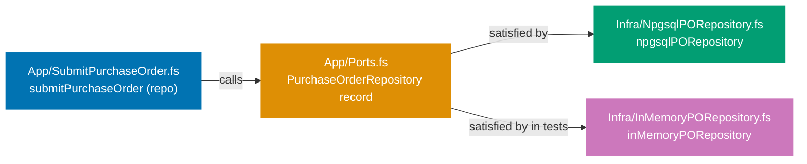
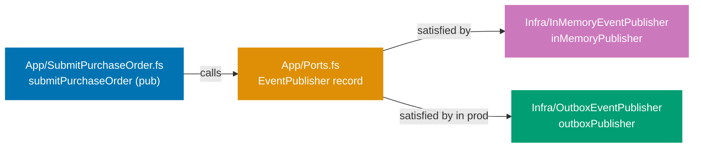
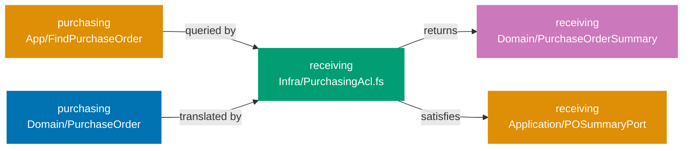

## Guide 7 — Repository Port as F# Function Type Alias + Npgsql Adapter Behind It

### Why It Matters

A repository port is the seam that separates your application layer from the database. Every time you wire an Npgsql call directly inside an application service, you lose two things: the ability to swap the database for tests, and the ability to reason about the service's behavior without a running PostgreSQL instance. In `procurement-platform-be` the repository port is a record-of-functions declared in the `Application/` layer of each context. The Npgsql adapter satisfies that record in `Infrastructure/`. Nothing in the application layer knows whether PostgreSQL or an in-memory dictionary is behind the port.

### Standard Library First

F# lets you alias any function type with a single `type` declaration. The standard library gives you the full type system but no I/O primitive for PostgreSQL — you would fall back to `System.Data.Common.DbConnection` and raw SQL strings:





```fsharp
// Standard library: repository port as a bare function alias over System.Data
module ProcurementPlatform.Contexts.Purchasing.Application.Ports

open System.Data
// => System.Data is the BCL's database abstraction — provider-agnostic interfaces
// => No NuGet dependency: ships with every .NET runtime
open ProcurementPlatform.Contexts.Purchasing.Domain
// => Domain types are the port's language — no database type crosses this boundary

// Read port — synchronous BCL style
type FindPurchaseOrder = PurchaseOrderId -> IDbConnection -> Result<PurchaseOrder option, exn>
// => IDbConnection: BCL abstract connection — Npgsql satisfies it at runtime
// => exn: stdlib catch-all error — loses semantic information about the failure cause
// => Synchronous return: BCL commands block the thread — no async support without workarounds

// Write port — synchronous BCL style
type SavePurchaseOrder = PurchaseOrder -> IDbConnection -> Result<unit, exn>
// => Result<unit, exn>: success or an opaque exception
// => The caller cannot distinguish constraint violation from connection failure without typeof checks
// => IDbConnection threading is manual — caller must open, pass, and close the connection
```





```clojure
;; Standard library: repository port as plain Clojure function specs using clojure.spec.alpha
(ns procurement-platform.contexts.purchasing.application.ports
  (:require [clojure.spec.alpha :as s]))
;; => clojure.spec.alpha: stdlib for data validation — no extra dependency beyond Clojure itself
;; => Clojure namespaces map directly to F# modules; :require aliases the spec namespace

;; [F#: type alias PurchaseOrderId — Clojure uses namespaced keywords as identity tokens]
(s/def ::purchase-order-id uuid?)
;; => uuid?: validates that a value is a java.util.UUID — no wrapper type needed
;; => Namespaced keyword ::purchase-order-id reads as :procurement-platform.contexts.purchasing.application.ports/purchase-order-id

;; [F#: IDbConnection — Clojure uses a plain connection map; no abstract interface required]
(s/def ::db-connection (s/keys :req-un [::datasource]))
;; => Connection is a plain map with a :datasource key — next.jdbc convention
;; => No IDbConnection interface hierarchy: Clojure tests substitute any map that satisfies the spec

;; Read port — synchronous spec-validated function contract
;; [F#: type alias function type — Clojure uses s/fdef for function specs]
(s/fdef find-purchase-order
  :args (s/cat :po-id ::purchase-order-id
               :conn  ::db-connection)
  ;; => :args validates call arguments at instrumented runtime — not compile-time
  :ret  (s/or :ok  (s/nilable map?)
              :err string?))
;; => (s/or :ok :err) mirrors Result<PurchaseOrder option, string>
;; => nilable: nil represents absence — equivalent to None in F# option
;; => exn replaced with string: Clojure stdlib functions return strings or ex-data for errors

;; Write port — synchronous spec-validated function contract
(s/fdef save-purchase-order
  :args (s/cat :po   map?
               :conn ::db-connection)
  ;; => map? accepts any map as the purchase order — dynamic; no compile-time shape enforcement
  :ret  (s/or :ok  nil?
              :err string?))
;; => nil return on success mirrors unit in F#
;; => Limitation: no distinct UniqueConstraintViolation vs ConnectionFailure — caller inspects ex-data
```





```typescript
// Standard library: repository port as bare function types over node's built-in pg client
// src/procurement-platform/contexts/purchasing/application/ports.ts
// [F#: module with type aliases over System.Data — TS uses ES module with type aliases]

import type { Client } from "pg";
// => pg: node-postgres stdlib-level client — no connection pool, no ORM
// => Synchronous-style: pg Client operations are callback/Promise-based; no thread-pool concern here
// [F#: IDbConnection — TS uses pg.Client as the raw connection handle]

// Branded ID — prevents passing a SupplierId where a PurchaseOrderId is expected
// [F#: single-case DU PurchaseOrderId of Guid — TS uses branded primitive for compile-time safety]
export type PurchaseOrderId = string & { readonly __brand: "PurchaseOrderId" };
// => Branded string: identical to F# single-case DU but no runtime wrapper cost

// Minimal inline Result type — no dependency needed for stdlib illustration
// [F#: Result<'T, 'E> is built-in — TS stdlib has no Result; we define a small inline alias]
type Result<T, E> = { ok: true; value: T } | { ok: false; error: E };
// => Tagged union: { ok: true } branch carries the value; { ok: false } branch carries the error
// => Using neverthrow in production (Guide 7 production section) replaces this inline type

// Read port — synchronous-style function type (mirrors F# stdlib approach)
// [F#: type FindPurchaseOrder = PurchaseOrderId -> IDbConnection -> Result<PurchaseOrder option, exn>]
export type FindPurchaseOrder = (
  poId: PurchaseOrderId,
  conn: Client,
  // => Client: raw pg connection — caller must open, pass, and close it manually
) => Promise<Result<PurchaseOrder | null, Error>>;
// => Promise: pg operations are async; synchronous DB calls are not possible in Node.js
// => null represents absence (Option/None) — standard in TS stdlib-style code
// => Error: opaque catch-all — caller cannot distinguish constraint from connection failure

// Write port — synchronous-style function type
// [F#: type SavePurchaseOrder = PurchaseOrder -> IDbConnection -> Result<unit, exn>]
export type SavePurchaseOrder = (po: PurchaseOrder, conn: Client) => Promise<Result<void, Error>>;
// => void success mirrors F# unit — caller does not re-read after a successful save
// => Error is untyped: UniqueConstraintViolation vs ConnectionFailure must be inferred from message
// => Limitation: manual Client threading — caller opens, passes, and closes the connection
```





**Limitation for production**: `IDbConnection` threading is manual and error-prone. `exn` as the error type is untyped. Async is absent — synchronous DB calls block ASP.NET Core's thread pool under load.

### Production Framework

The Npgsql stack in `procurement-platform-be` replaces raw `IDbConnection` threading with a per-request connection factory. The port record stays in the application layer with no Npgsql import — the adapter in `Infrastructure/` owns the Npgsql dependency:



The application layer port record:





```fsharp
// Production port record — application layer, no Npgsql import
// src/ProcurementPlatform/Contexts/Purchasing/Application/Ports.fs
module ProcurementPlatform.Contexts.Purchasing.Application.Ports

open ProcurementPlatform.Contexts.Purchasing.Domain
// => Only domain types — no Npgsql, no EF Core, no Microsoft.EntityFrameworkCore
// => This is the isolation invariant: application layer has zero infrastructure imports

type RepositoryError =
    | NotFound of PurchaseOrderId
    // => Read-side: a missing PO is not a DB error — it is a domain outcome
    | UniqueConstraintViolation
    // => Write-side: Npgsql raises a 23505 PostgreSQL error code on duplicate primary key
    | ConnectionFailure of exn
    // => Infrastructure failure: carry the raw exception for logging; callers return HTTP 500

// Repository port as a record of functions — canonical shape used across all guides
type PurchaseOrderRepository =
    { FindPurchaseOrder: PurchaseOrderId -> Async<Result<PurchaseOrder option, RepositoryError>>
      // => Async: the Npgsql adapter performs network I/O — never block the thread pool
      // => option: a missing row is a valid domain outcome, not an error
      SavePurchaseOrder: PurchaseOrder -> Async<Result<unit, RepositoryError>>
      // => unit success: the caller does not re-read after a successful save
      // => Adapter wraps NpgsqlException into RepositoryError at the seam
    }
// => Record-of-functions: the application service receives one value, not two parameters
// => The Npgsql adapter and the in-memory test stub both satisfy this record shape
```





```clojure
;; Production port protocol — application layer, no JDBC import
;; src/procurement_platform/contexts/purchasing/application/ports.clj
(ns procurement-platform.contexts.purchasing.application.ports
  (:require [clojure.spec.alpha :as s]
            [clojure.core.async :as async]))
;; => Only domain namespace required here — no next.jdbc or HikariCP
;; => core.async provides channels that mirror Async<Result<...>> semantics

;; [F#: discriminated union RepositoryError — Clojure uses tagged error maps]
;; Error variants are plain maps distinguished by the :error/type namespaced key
(def not-found-error
  ;; Factory for a :not-found error map — mirrors NotFound of PurchaseOrderId
  (fn [po-id] {:error/type :not-found :error/po-id po-id}))
;; => Caller checks (:error/type result) to discriminate — open, not compiler-enforced

(def unique-constraint-error
  ;; Constant map — mirrors UniqueConstraintViolation (no payload)
  {:error/type :unique-constraint-violation})
;; => PostgreSQL 23505 error code translated here at the adapter seam

(def connection-failure-error
  ;; Factory for :connection-failure — carries the raw exception for logging
  (fn [cause] {:error/type :connection-failure :error/cause cause}))
;; => Caller logs :error/cause and returns HTTP 500 — mirrors ConnectionFailure of exn

;; [F#: record-of-functions PurchaseOrderRepository — Clojure uses defprotocol]
(defprotocol PurchaseOrderRepository
  ;; defprotocol is the idiomatic Clojure port abstraction — open, satisfiable by any type
  ;; [F#: closed record literal with typed fields — protocol dispatch is dynamic, not compile-time]
  (find-purchase-order [this po-id]
    "Returns a core.async channel.
     Channel delivers {:ok po-map} when found, {:ok nil} when absent,
     or {:error error-map} on infrastructure failure.")
  ;; => po-id: UUID; adapter wraps in SQL parameter via next.jdbc
  ;; => {:ok nil} mirrors Ok None — absence is a valid domain outcome, not an error
  (save-purchase-order [this po-map]
    "Returns a core.async channel.
     Channel delivers {:ok nil} on success or {:error error-map} on failure."))
;; => {:ok nil} on success — caller does not re-read after save, mirrors Result<unit, _>
;; => Both JDBC adapter and in-memory test adapter implement this protocol identically
```





```typescript
// Production port record — application layer, no pg/postgres import
// src/procurement-platform/contexts/purchasing/application/ports.ts
// [F#: module with type aliases — TS ES module; same isolation invariant]

import type { PurchaseOrder, PurchaseOrderId } from "../domain/value-objects";
// => Only domain types — no pg, no pool library, no ORM
// => This is the isolation invariant: application layer has zero infrastructure imports

// Typed error discriminated union — replaces F# stdlib's opaque exn
// [F#: type RepositoryError DU — TS uses a tagged union with a readonly discriminant]
export type RepositoryError =
  | { readonly kind: "NotFound"; readonly poId: PurchaseOrderId }
  // => Read-side: a missing PO is a domain outcome, not an infrastructure failure
  | { readonly kind: "UniqueConstraintViolation" }
  // => Write-side: pg raises error code 23505 on duplicate primary key
  | { readonly kind: "ConnectionFailure"; readonly cause: unknown };
// => Infrastructure failure: carry the raw thrown value for logging; callers return HTTP 500
// [F#: DU cases — TS uses a literal string discriminant on a readonly object union]

// Result type from neverthrow — used throughout production guides
// [F#: Result<'T, 'E> built-in — TS: neverthrow provides the same semantics]
import type { Result } from "neverthrow";
// => neverthrow: ok(value) | err(error) — the two branches mirror F#'s Ok/Error

// Repository port as a function-type record — canonical shape used across all guides
// [F#: type PurchaseOrderRepository record-of-functions — TS uses a readonly object type]
export type PurchaseOrderRepository = {
  readonly findPurchaseOrder: (poId: PurchaseOrderId) => Promise<Result<PurchaseOrder | null, RepositoryError>>;
  // => Promise: pg operations are async — never blocks the Node.js event loop
  // => PurchaseOrder | null: null represents Option None — a missing row is a valid outcome
  // [F#: Async<Result<PurchaseOrder option, RepositoryError>> — TS uses Promise<Result<T|null, E>>]
  readonly savePurchaseOrder: (po: PurchaseOrder) => Promise<Result<void, RepositoryError>>;
  // => void success: caller does not re-read after a successful save
  // => Adapter wraps pg's error codes into RepositoryError at the seam
  // [F#: record literal field — TS readonly property; both pg and in-memory adapters satisfy this shape]
};
// => Object type with readonly fields: the pg adapter and in-memory test stub both satisfy it
// => Application service receives one value, not two function parameters
```





The Npgsql adapter in the infrastructure layer satisfies the port record. It opens a connection from the pool and translates database exceptions:





```fsharp
// Production Npgsql adapter — infrastructure layer only
// src/ProcurementPlatform/Contexts/Purchasing/Infrastructure/NpgsqlPurchaseOrderRepository.fs
module ProcurementPlatform.Contexts.Purchasing.Infrastructure.NpgsqlPurchaseOrderRepository
// => Infrastructure layer: the only layer that may import Npgsql and Dapper

open Npgsql
// => Npgsql confined to infrastructure — the seam absorbs the framework dependency
open Dapper
// => Dapper: lightweight micro-ORM for mapping SQL result rows to F# records
open ProcurementPlatform.Contexts.Purchasing.Application.Ports
// => Import the port record — the adapter must satisfy PurchaseOrderRepository exactly
open ProcurementPlatform.Contexts.Purchasing.Domain
// => Domain types: PurchaseOrder, PurchaseOrderId — the adapter translates PurchaseOrderRow ↔ PurchaseOrder

// Npgsql adapter satisfying PurchaseOrderRepository
let npgsqlPurchaseOrderRepository (connStr: string) : PurchaseOrderRepository =
    // => connStr: injected by the composition root at startup from AppConfig
    // => Returns the record literal — each field is a function closed over connStr
    { SavePurchaseOrder =
        // => SavePurchaseOrder: satisfies the write side of PurchaseOrderRepository
        // => record literal field: assigned a function value — closed over connStr at construction time
        fun po ->
            // => fun po: the per-call argument — connStr is already bound
            async {
            // => async { }: F# computation expression — execution is lazy until Async.RunSynchronously or Async.StartImmediately
                use conn = new NpgsqlConnection(connStr)
                // => use: IDisposable — returns connection to the pool when the binding exits
                // => NpgsqlConnection pool is managed by Npgsql; no explicit pool initialization needed
                try
                    // => try/with: wraps Npgsql I/O — exceptions are translated at the seam boundary
                    let! _ =
                        conn.ExecuteAsync(
                            "INSERT INTO purchasing.purchase_orders (po_id, supplier_id, total_amount, currency, status, created_at) VALUES (@PoId, @SupplierId, @TotalAmount, @Currency, @Status, @CreatedAt)",
                            { PoId       = let (PurchaseOrderId id) = po.Id in id
                              // => Unwrap the single-case DU to get the raw Guid for the SQL parameter
                              SupplierId = let (SupplierId id) = po.SupplierId in id
                              // => Same pattern: SupplierId DU → raw Guid
                              TotalAmount = po.TotalAmount.Amount
                              // => Decimal amount extracted from the Money value object
                              Currency    = po.TotalAmount.Currency
                              // => ISO 4217 currency code stored separately from the amount
                              Status      = sprintf "%A" po.Status
                              // => Status DU serialized to string — stored as varchar in the DB
                              CreatedAt   = po.CreatedAt })
                              // => UTC timestamp — the DB column is timestamptz
                        |> Async.AwaitTask
                    // => ExecuteAsync: issues the INSERT via Npgsql — actual network I/O here
                    // => Async.AwaitTask: bridges .NET Task to F# Async without thread blocking
                    return Ok ()
                    // => Ok (): the INSERT committed — callers do not re-read after a successful save
                with
                | :? PostgresException as ex when ex.SqlState = "23505" ->
                    // => SqlState "23505" is PostgreSQL's unique_violation error code
                    // => Translate to typed RepositoryError — application layer never sees the raw exception
                    return Error UniqueConstraintViolation
                    // => UniqueConstraintViolation: caller can return HTTP 409 without inspecting exceptions
                | ex ->
                    // => All other exceptions: connection timeout, other constraint failures
                    return Error (ConnectionFailure ex)
                    // => Carry the raw exception for logging — the caller logs and returns HTTP 500
            }
      FindPurchaseOrder =
        // => FindPurchaseOrder: satisfies the read side of PurchaseOrderRepository
        fun (PurchaseOrderId poId) ->
            // => Destructure the single-case DU — poId is the raw Guid
            async {
                // => async { }: same pattern as SavePurchaseOrder — all DB I/O is async
                use conn = new NpgsqlConnection(connStr)
                // => Fresh connection per call — pool manages the underlying socket
                try
                    // => try/with: catches Npgsql I/O failures — translates to ConnectionFailure
                    let! row =
                        conn.QueryFirstOrDefaultAsync<PurchaseOrderRow>(
                            "SELECT * FROM purchasing.purchase_orders WHERE po_id = @PoId",
                            {| PoId = poId |})
                        |> Async.AwaitTask
                    // => |> Async.AwaitTask: bridges the .NET Task returned by Dapper to F# Async
                    // => QueryFirstOrDefaultAsync: returns null if no row found — mapped to None below
                    // => Anonymous record {| PoId = poId |}: Dapper maps this to the @PoId SQL parameter
                    match box row with
                    // => box: wraps F# value in obj to enable null check — F# records are non-nullable
                    | null -> return Ok None
                    // => No row found: valid domain outcome — caller decides what to do
                    // => Ok None rather than Error: absence of a row is not an infrastructure failure
                    | _ ->
                        return Ok (Some (purchaseOrderRowToDomain row))
                        // => purchaseOrderRowToDomain: maps the DB row record to the PurchaseOrder domain aggregate
                        // => Some: row was found — wrap in option to match the port contract
                with ex ->
                    return Error (ConnectionFailure ex)
                    // => Any database error becomes ConnectionFailure — the caller logs and returns 500
                    // => Includes connection timeouts, SSL errors, and unexpected PostgreSQL errors
            }
    }
```





```clojure
;; Production next.jdbc adapter — infrastructure namespace only
;; src/procurement_platform/contexts/purchasing/infrastructure/jdbc_purchase_order_repository.clj
(ns procurement-platform.contexts.purchasing.infrastructure.jdbc-purchase-order-repository
  (:require [next.jdbc :as jdbc]
            [next.jdbc.sql :as sql]
            [clojure.core.async :as async]
            [procurement-platform.contexts.purchasing.application.ports :as ports]))
;; => next.jdbc confined to infrastructure — application namespace has no direct JDBC dependency
;; => core.async: delivers results on channels, mirroring Async<Result<...>>

;; Row → domain map translation function
(defn- row->purchase-order
  ;; [F#: purchaseOrderRowToDomain — private function, same purpose]
  [row]
  ;; => Receives a next.jdbc result map with :purchasing/po_id, :purchasing/status etc.
  {:purchasing/purchase-order-id (:purchasing/po_id row)
   ;; => Remap snake_case column to namespaced keyword — no DU unwrapping needed
   :purchasing/supplier-id       (:purchasing/supplier_id row)
   ;; => Supplier UUID comes through directly — no wrapper type to strip
   :purchasing/total-amount      (:purchasing/total_amount row)
   ;; => Decimal stored as NUMERIC in PostgreSQL — next.jdbc returns BigDecimal
   :purchasing/currency          (:purchasing/currency row)
   ;; => ISO 4217 code — stored as varchar, returned as String
   :purchasing/status            (keyword (:purchasing/status row))
   ;; => Re-keyword the varchar status — :draft, :submitted, :approved etc.
   :purchasing/created-at        (:purchasing/created_at row)})
;; => created_at: PostgreSQL timestamptz returned as java.time.OffsetDateTime

;; [F#: npgsqlPurchaseOrderRepository — Clojure uses reify to satisfy the defprotocol]
(defn make-jdbc-repository
  ;; Factory function: closed over datasource, returns a PurchaseOrderRepository implementation
  [datasource]
  ;; => datasource: HikariCP connection pool map — injected by the composition root at startup
  (reify ports/PurchaseOrderRepository
    ;; => reify: creates an anonymous object satisfying the protocol — idiomatic Clojure adapter pattern
    ;; [F#: record literal { SavePurchaseOrder = ...; FindPurchaseOrder = ... }]

    (save-purchase-order [_ po-map]
      ;; => _ ignores `this` — adapter is stateless, all state lives in datasource closure
      (let [ch (async/chan 1)]
        ;; => Buffered channel of size 1: result delivered once and held until caller reads
        (async/go
          ;; => go block: lightweight coroutine — does not block a thread pool thread
          (try
            (sql/insert! datasource :purchasing/purchase_orders
                         {:po_id        (:purchasing/purchase-order-id po-map)
                          ;; => UUID UUID: next.jdbc maps java.util.UUID to PostgreSQL uuid column
                          :supplier_id  (:purchasing/supplier-id po-map)
                          ;; => Extract supplier UUID from the domain map
                          :total_amount (:purchasing/total-amount po-map)
                          ;; => BigDecimal: PostgreSQL NUMERIC column accepts java.math.BigDecimal
                          :currency     (name (:purchasing/currency po-map))
                          ;; => (name kw): converts :USD keyword to "USD" string for varchar column
                          :status       (name (:purchasing/status po-map))
                          ;; => (name :draft) => "draft" — stored as varchar status
                          :created_at   (:purchasing/created-at po-map)})
                          ;; => OffsetDateTime stored to timestamptz — next.jdbc handles the conversion
            (async/>! ch {:ok nil})
            ;; => {:ok nil} on success — mirrors Ok () in F#; caller does not re-read
            (catch org.postgresql.util.PSQLException ex
              ;; => PSQLException: the JDBC equivalent of NpgsqlException
              (if (= "23505" (.getSQLState ex))
                ;; => getSQLState: returns the 5-char SQLSTATE code — "23505" is unique_violation
                (async/>! ch {:error ports/unique-constraint-error})
                ;; => Translate to tagged error map — mirrors UniqueConstraintViolation
                (async/>! ch {:error (ports/connection-failure-error ex)})))
                ;; => All other PSQLExceptions become :connection-failure — caller logs and returns 500
            (catch Exception ex
              (async/>! ch {:error (ports/connection-failure-error ex)}))))
              ;; => Non-SQL exceptions: connection pool exhaustion, timeout — also connection failure
        ch))
    ;; => Return the channel immediately; caller reads result asynchronously

    (find-purchase-order [_ po-id]
      ;; => po-id: UUID value — no DU unwrapping needed in Clojure
      (let [ch (async/chan 1)]
        (async/go
          (try
            (let [row (sql/get-by-id datasource :purchasing/purchase_orders po-id :purchasing/po_id {})]
              ;; => get-by-id: issues SELECT WHERE po_id = ? — returns nil when no row found
              ;; => {} options map: empty; could specify :builder-fn for row mapping customisation
              (if row
                (async/>! ch {:ok (row->purchase-order row)})
                ;; => Row found: translate to domain map and deliver on channel
                (async/>! ch {:ok nil})))
                ;; => {:ok nil} mirrors Ok None — absence is not an error
            (catch Exception ex
              (async/>! ch {:error (ports/connection-failure-error ex)}))))
              ;; => Any exception becomes :connection-failure — consistent with save-purchase-order
        ch))))
;; => Return channel; caller uses (async/<! ch) inside a go block or async/take! for callbacks
```





```typescript
// Production pg adapter — infrastructure layer only
// src/procurement-platform/contexts/purchasing/infrastructure/pg-purchase-order-repository.ts
// [F#: module NpgsqlPurchaseOrderRepository — TS uses a factory function returning the port object]

import { Pool, DatabaseError } from "pg";
// => pg Pool: manages connections — equivalent to Npgsql's built-in connection pool
// => DatabaseError: pg's typed error class carrying the SQLSTATE code
// [F#: open Npgsql — TS imports Pool + DatabaseError from "pg"]
import { ok, err, type Result } from "neverthrow";
// => neverthrow: ok(v) and err(e) constructors — mirrors F# Ok/Error
import type { PurchaseOrderRepository, RepositoryError } from "../application/ports";
// => Port type: the adapter must satisfy PurchaseOrderRepository exactly
// [F#: open ProcurementPlatform.Contexts.Purchasing.Application.Ports]
import type { PurchaseOrder, PurchaseOrderId } from "../domain/value-objects";
// => Domain types: PurchaseOrder, PurchaseOrderId — adapter translates DB row ↔ domain

// Row → domain translation — private to this module
// [F#: purchaseOrderRowToDomain — private function, same purpose]
const rowToPurchaseOrder = (row: Record<string, unknown>): PurchaseOrder => ({
  id: row.po_id as PurchaseOrderId,
  // => Cast the raw UUID string to branded PurchaseOrderId — valid because DB enforces uniqueness
  supplierId: row.supplier_id as string,
  // => Supplier UUID passes through directly — no DU unwrapping needed in TS
  totalAmount: { amount: row.total_amount as number, currency: row.currency as string },
  // => Reconstruct Money value object from two separate columns
  status: row.status as "draft" | "submitted" | "approved" | "cancelled",
  // => Cast varchar back to the literal union — DB stores only valid status strings
  createdAt: new Date(row.created_at as string),
  // => Parse timestamptz string to Date — pg returns ISO 8601 strings for timestamptz columns
});
// [F#: record expression mapping — TS uses an object literal returned from a pure function]

// pg adapter factory satisfying PurchaseOrderRepository
// [F#: let npgsqlPurchaseOrderRepository (connStr: string) : PurchaseOrderRepository]
export const makePgPurchaseOrderRepository = (
  pool: Pool,
  // => Pool: injected by the composition root — shared per process, not per request
): PurchaseOrderRepository => ({
  // => Object literal matching PurchaseOrderRepository exactly — TS structural typing enforces this
  // [F#: record literal { SavePurchaseOrder = ...; FindPurchaseOrder = ... }]

  savePurchaseOrder: async (po) => {
    // => async arrow function: Node.js I/O is always async — no thread-pool blocking concern
    // [F#: fun po -> async { ... } — TS uses async/await instead of computation expressions]
    const client = await pool.connect();
    // => pool.connect(): borrows a connection — must be released in finally
    // [F#: use conn = new NpgsqlConnection(connStr) — TS uses try/finally for manual release]
    try {
      await client.query(
        `INSERT INTO purchasing.purchase_orders
         (po_id, supplier_id, total_amount, currency, status, created_at)
         VALUES ($1, $2, $3, $4, $5, $6)`,
        [
          po.id,
          // => Branded PurchaseOrderId is a string at runtime — pg accepts it as uuid
          po.supplierId,
          // => Supplier UUID string — pg maps to uuid column
          po.totalAmount.amount,
          // => Decimal as number — pg maps to NUMERIC column
          po.totalAmount.currency,
          // => ISO 4217 currency code string — stored as varchar
          po.status,
          // => Literal union string — stored as varchar status
          po.createdAt.toISOString(),
          // => ISO 8601 string — pg maps to timestamptz column
        ],
      );
      return ok(undefined);
      // => ok(undefined): mirrors F# Ok () — void success; caller does not re-read
    } catch (e) {
      if (e instanceof DatabaseError && e.code === "23505") {
        // => SQLSTATE 23505: unique_violation — same code as Npgsql's SqlState "23505"
        // [F#: :? PostgresException as ex when ex.SqlState = "23505"]
        return err({ kind: "UniqueConstraintViolation" } satisfies RepositoryError);
        // => Translate to typed RepositoryError — application layer never sees the raw DatabaseError
      }
      return err({ kind: "ConnectionFailure", cause: e } satisfies RepositoryError);
      // => All other errors: connection timeout, pool exhaustion — caller logs and returns HTTP 500
    } finally {
      client.release();
      // => release(): returns connection to the pool — equivalent to F# use binding disposal
    }
  },

  findPurchaseOrder: async (poId) => {
    // [F#: fun (PurchaseOrderId poId) -> async { ... } — TS receives the branded string directly]
    const client = await pool.connect();
    // => Fresh connection borrow per call — pool manages the underlying socket
    try {
      const result = await client.query(
        "SELECT * FROM purchasing.purchase_orders WHERE po_id = $1",
        [poId],
        // => $1 parameterized query — prevents SQL injection; pg maps branded string to uuid column
      );
      if (result.rows.length === 0) {
        return ok(null);
        // => ok(null): mirrors F# Ok None — absence of a row is a valid domain outcome, not an error
        // [F#: return Ok None — TS uses null instead of option to represent absence]
      }
      return ok(rowToPurchaseOrder(result.rows[0]));
      // => Row found: translate DB row to domain aggregate and wrap in ok
      // [F#: return Ok (Some (purchaseOrderRowToDomain row)) — TS uses ok(T) not ok(Some(T))]
    } catch (e) {
      return err({ kind: "ConnectionFailure", cause: e } satisfies RepositoryError);
      // => Any database error becomes ConnectionFailure — caller logs and returns HTTP 500
      // => Includes connection timeouts, SSL errors, and unexpected PostgreSQL errors
    } finally {
      client.release();
      // => Always release — even on error; mirrors F# use binding's guaranteed disposal
    }
  },
});
```





**Trade-offs**: Dapper maps result rows to F# records efficiently without a full ORM change-tracker overhead. For write-heavy aggregates, Dapper's explicit SQL gives you fine-grained control over the INSERT shape. For read-heavy workloads, the lack of a change-tracker means no accidental N+1 queries. Npgsql-specific error codes (`SqlState`) are stable within PostgreSQL major versions — test your error handling against the target server version.

---

## Guide 8 — In-Memory Repository Adapter for Integration Tests

### Why It Matters

An integration test that hits a real PostgreSQL database is slow, requires Docker to be running, and cannot be cached. A test that uses an in-memory adapter runs in milliseconds, requires no infrastructure, and is safe to run in parallel. The seam from Guide 7 — the `PurchaseOrderRepository` record — is exactly what makes this swap possible. Providing an in-memory adapter is not a testing trick; it is the proof that your port design is sound. If swapping the adapter requires changing the application service, the port has leaked infrastructure concerns upward.

### Standard Library First

F# mutable dictionaries and `ref` cells give you an in-memory store with no dependencies:





```fsharp
// Standard library: in-memory store using a mutable Dictionary
open System.Collections.Generic
// => System.Collections.Generic.Dictionary is the BCL's hash map
// => No NuGet dependency — ships with every .NET runtime

let private store = Dictionary<System.Guid, string>()
// => Global mutable state — not thread-safe without a lock
// => string serialization loses domain type safety
// => Dictionary<Guid, string> is not typed to PurchaseOrder — drift risk

let inMemorySave (po: obj) =
    // => obj parameter: no type safety — the compiler cannot prevent storing the wrong type
    store.[System.Guid.NewGuid()] <- po.ToString()
    // => ToString() serialization: round-trip fidelity not guaranteed
    Ok ()
```





```clojure
;; Standard library: in-memory store using a Clojure atom wrapping a plain map
;; No external dependency — atom and map are part of Clojure's core

;; [F#: global Dictionary<Guid, string> — Clojure uses atom for thread-safe mutable state]
(def store (atom {}))
;; => atom: wraps an immutable map in a mutable reference cell
;; => {}: empty map — no pre-populated state; Clojure maps use value equality
;; => Global atom: shared across all tests — parallel execution corrupts state

(defn in-memory-save
  ;; [F#: obj parameter — Clojure's dynamic typing means any value is accepted]
  [po]
  ;; => po: any value accepted — no compile-time enforcement of domain map shape
  (swap! store assoc (str (java.util.UUID/randomUUID)) (str po))
  ;; => swap!: atomically applies assoc to the current map — thread-safe but shared
  ;; => (str po): toString serialization — round-trip fidelity not guaranteed for nested maps
  {:ok nil})
;; => Returns {:ok nil} on success — but the key is a random UUID, not po's own identity
;; => Limitation: store is not keyed by purchase order ID — FindPurchaseOrder cannot retrieve by ID
```





```typescript
// Standard library: in-memory store using a global Map<string, unknown>
// [F#: global Dictionary<Guid, string> — TS uses Map keyed by string]

const store = new Map<string, unknown>();
// => Global mutable Map: not isolated between tests — parallel execution corrupts state
// => Map<string, unknown>: untyped value — compiler cannot enforce PurchaseOrder shape
// [F#: Dictionary<Guid, string> — TS Map is reference-typed; no structural copying]

const inMemorySave = (po: unknown): { ok: true; value: void } => {
  // => unknown parameter: no type safety — any value accepted; mirrors F# obj
  store.set(crypto.randomUUID(), JSON.stringify(po));
  // => crypto.randomUUID(): generates a random key — not keyed by po's own identity
  // => JSON.stringify: serialization loses class instances and undefined fields
  // => Limitation: keyed by random UUID — findPurchaseOrder cannot retrieve by PO identity
  return { ok: true, value: undefined };
  // => Inline success result — no neverthrow dependency for this stdlib illustration
};
```





**Limitation for production**: global mutable state fails under parallel test execution. Untyped storage introduces silent type mismatch bugs. The adapter does not satisfy the `PurchaseOrderRepository` record — a different shape means a different seam, not the same seam with a different implementation.

### Production Framework

The in-memory adapter satisfies the same `PurchaseOrderRepository` record as the Npgsql adapter. It uses an F# `Map` (immutable) wrapped in a `ref` cell for thread-safety in tests:





```fsharp
// In-memory adapter satisfying the port record
// src/ProcurementPlatform/Contexts/Purchasing/Infrastructure/InMemoryPurchaseOrderRepository.fs
module ProcurementPlatform.Contexts.Purchasing.Infrastructure.InMemoryPurchaseOrderRepository

open ProcurementPlatform.Contexts.Purchasing.Application.Ports
// => Import the port record — the adapter must satisfy PurchaseOrderRepository exactly
// => If the record shape changes, the compiler flags this module immediately
open ProcurementPlatform.Contexts.Purchasing.Domain
// => Domain types: PurchaseOrder, PurchaseOrderId

// Thread-safe in-memory store
let makeStore () =
    ref Map.empty<PurchaseOrderId, PurchaseOrder>
// => ref wraps an immutable F# Map in a mutable cell
// => Map.empty is the zero value — no pre-populated state between tests
// => Calling makeStore() in each test gives a fresh, isolated store
// => No global state: parallel test execution is safe

// In-memory adapter satisfying PurchaseOrderRepository
let inMemoryPurchaseOrderRepository (store: Map<PurchaseOrderId, PurchaseOrder> ref) : PurchaseOrderRepository =
    // => store is a ref cell — the adapter closes over it per test instance
    // => Returns the record literal — must match PurchaseOrderRepository exactly
    { SavePurchaseOrder =
        fun po ->
            async {
                match Map.tryFind po.Id !store with
                // => !store dereferences the ref cell — reads the current Map
                // => Map.tryFind: O(log n) lookup — checks for duplicate before insert
                | Some _ ->
                    return Error UniqueConstraintViolation
                    // => Mirror the Npgsql adapter's behavior exactly
                    // => Tests that rely on duplicate detection work identically
                | None ->
                    store := Map.add po.Id po !store
                    // => := updates the ref cell with a new immutable Map
                    // => Map.add is non-destructive — the old Map is not mutated
                    return Ok ()
                    // => Success: the PO is stored for subsequent FindPurchaseOrder calls
            }
      FindPurchaseOrder =
        fun poId ->
            // => Same store ref cell — reads whatever SavePurchaseOrder has written
            async {
                return Ok (Map.tryFind poId !store)
                // => Map.tryFind returns Some PurchaseOrder or None
                // => Wrapped in Ok: a missing PO is a valid outcome, not an error
                // => Identical semantics to the Npgsql adapter's FindPurchaseOrder
            }
    }
```





```clojure
;; In-memory adapter satisfying the PurchaseOrderRepository protocol
;; src/procurement_platform/contexts/purchasing/infrastructure/in_memory_purchase_order_repository.clj
(ns procurement-platform.contexts.purchasing.infrastructure.in-memory-purchase-order-repository
  (:require [clojure.core.async :as async]
            [procurement-platform.contexts.purchasing.application.ports :as ports]))
;; => Only the port namespace required — no JDBC, no HikariCP
;; => core.async channels maintain identical calling convention to the JDBC adapter

;; [F#: makeStore () -> Map ref — Clojure uses atom wrapping an empty map]
(defn make-store
  ;; Factory function: returns a fresh atom for each test — no shared global state
  []
  (atom {}))
;; => atom: thread-safe mutable reference to an immutable Clojure map
;; => {}: zero value — no pre-populated state between tests
;; => Calling make-store in each test fixture gives an isolated store per test

;; [F#: inMemoryPurchaseOrderRepository — Clojure uses reify to implement the protocol]
(defn make-in-memory-repository
  ;; Factory closed over the store atom — identical closure pattern to the JDBC adapter
  [store]
  ;; => store: atom returned by make-store — adapter reads and updates it atomically
  (reify ports/PurchaseOrderRepository
    ;; => reify: anonymous protocol implementation — same shape as the JDBC adapter's reify
    ;; [F#: record literal { SavePurchaseOrder = ...; FindPurchaseOrder = ... }]

    (save-purchase-order [_ po-map]
      ;; => po-map: the domain map — :purchasing/purchase-order-id is the key
      (let [ch    (async/chan 1)
            po-id (:purchasing/purchase-order-id po-map)]
        ;; => Destructure the ID upfront — used in both the duplicate check and the store update
        (async/go
          (if (get @store po-id)
            ;; => @store: dereference atom — reads the current immutable map snapshot
            ;; => (get m k): O(1) hash map lookup — checks for duplicate before insert
            (async/>! ch {:error ports/unique-constraint-error})
            ;; => Duplicate found: deliver :unique-constraint-violation — mirrors Npgsql 23505
            (do
              (swap! store assoc po-id po-map)
              ;; => swap! atomically applies assoc — thread-safe; no explicit lock required
              ;; => assoc returns a new map; the old map is never mutated
              (async/>! ch {:ok nil}))))
              ;; => {:ok nil} on success — mirrors Ok () in F#
        ch))

    (find-purchase-order [_ po-id]
      ;; => po-id: UUID — same type as :purchasing/purchase-order-id in the stored map
      (let [ch (async/chan 1)]
        (async/go
          (async/>! ch {:ok (get @store po-id)}))
          ;; => (get @store po-id): returns the po-map or nil when absent
          ;; => {:ok nil} mirrors Ok None — absence is not an error, identical to JDBC adapter
        ch))))
;; => Return channel immediately; caller reads with (async/<! ch) inside a go block
```





```typescript
// In-memory adapter satisfying PurchaseOrderRepository
// src/procurement-platform/contexts/purchasing/infrastructure/in-memory-purchase-order-repository.ts
// [F#: module InMemoryPurchaseOrderRepository — TS uses a factory function]

import { ok, err, type Result } from "neverthrow";
// => neverthrow: ok/err constructors — mirrors F# Ok/Error
import type { PurchaseOrderRepository, RepositoryError } from "../application/ports";
// => Port type: the adapter must satisfy PurchaseOrderRepository exactly
// [F#: open Ports — TS imports the exact type to enforce structural match]
import type { PurchaseOrder, PurchaseOrderId } from "../domain/value-objects";
// => Domain types: PurchaseOrder, PurchaseOrderId — adapter stores typed values

// Per-test-instance store factory — returns a fresh isolated Map
// [F#: let makeStore () = ref Map.empty — TS returns a new Map object per call]
export const makeStore = (): Map<PurchaseOrderId, PurchaseOrder> => new Map<PurchaseOrderId, PurchaseOrder>();
// => new Map(): creates an empty typed store — no global state; parallel tests are safe
// => Calling makeStore() in each test gives an isolated store instance
// => Map<PurchaseOrderId, PurchaseOrder>: typed — compiler prevents storing the wrong value

// In-memory adapter factory satisfying PurchaseOrderRepository
// [F#: let inMemoryPurchaseOrderRepository (store: Map ref) : PurchaseOrderRepository]
export const makeInMemoryPurchaseOrderRepository = (
  store: Map<PurchaseOrderId, PurchaseOrder>,
  // => store: injected per-test instance — same closure pattern as the pg adapter
): PurchaseOrderRepository => ({
  // => Object literal matching PurchaseOrderRepository exactly — TS structural typing enforces this
  // [F#: record literal { SavePurchaseOrder = ...; FindPurchaseOrder = ... }]

  savePurchaseOrder: async (po) => {
    // => async arrow: maintains identical async calling convention to the pg adapter
    // [F#: fun po -> async { ... } — TS uses async/await instead of computation expressions]
    if (store.has(po.id)) {
      // => Map.has: O(1) lookup — checks for duplicate before insert
      // [F#: Map.tryFind po.Id !store — TS uses Map.has for the duplicate check]
      return err({ kind: "UniqueConstraintViolation" } satisfies RepositoryError);
      // => Mirror the pg adapter's behavior exactly — tests that check duplicates work identically
    }
    store.set(po.id, po);
    // => Map.set: inserts or overwrites — no mutation of the Map reference; the store grows
    // => In-memory: no network I/O — still async to match the port's Promise return type
    return ok(undefined);
    // => ok(undefined): mirrors F# Ok () — caller does not re-read after a successful save
  },

  findPurchaseOrder: async (poId) => {
    // [F#: fun poId -> async { return Ok (Map.tryFind poId !store) }]
    const po = store.get(poId) ?? null;
    // => Map.get: O(1) lookup — returns PurchaseOrder or undefined; coerce to null for port contract
    // => null: represents absence (Option None) — same semantics as the pg adapter
    return ok(po);
    // => ok(po): a missing PO is a valid outcome, not an error — identical to pg adapter semantics
    // [F#: return Ok (Map.tryFind poId !store) — TS returns ok(T|null)]
  },
});
```





A test wires the in-memory adapter at the application service seam:





```fsharp
// Integration test using the in-memory adapter — no Docker, no PostgreSQL
// Tests/Purchasing/SubmitPurchaseOrderTests.fs
module ProcurementPlatform.Tests.Purchasing.SubmitPurchaseOrderTests
// => Test module: sits in the Tests/ folder, never imported by production code

open Xunit
// => xUnit: test framework — discovers [<Fact>] methods and reports pass/fail
open ProcurementPlatform.Contexts.Purchasing.Infrastructure.InMemoryPurchaseOrderRepository
// => Brings makeStore and inMemoryPurchaseOrderRepository into scope
open ProcurementPlatform.Contexts.Purchasing.Application.SubmitPurchaseOrder
// => Import the application service function under test
open ProcurementPlatform.Contexts.Purchasing.Domain
// => Domain types needed for the smart constructor call

[<Fact>]
// => [<Fact>]: xUnit attribute — marks a parameterless test method for the test runner
let ``submitPurchaseOrder stores a valid PO`` () =
    // => xUnit Fact: parameterless test — runs once
    async {
        let store = makeStore ()
        // => Fresh in-memory store: isolated from all other tests
        let repo = inMemoryPurchaseOrderRepository store
        // => PurchaseOrderRepository record — wired directly, no DI container

        // Build a valid PO via domain smart constructors
        let money = createMoney 500m "USD" |> Result.defaultWith failwith
        // => Smart constructor: validates amount and currency — returns Money if valid
        // => defaultWith failwith: fails the test if the Money is invalid
        let po =
            { Id = PurchaseOrderId (System.Guid.NewGuid())
              // => New Guid wrapped in single-case DU — uniquely identifies this PO
              SupplierId = SupplierId (System.Guid.NewGuid())
              // => Supplier identity — irrelevant for this test; any valid Guid works
              TotalAmount = money
              // => Validated Money value — 500 USD passed the smart constructor
              Status = Draft
              // => Initial state: all POs start as Draft before submission
              CreatedAt = System.DateTimeOffset.UtcNow }
        // => Domain aggregate constructed from validated value objects

        let nullPub = { Publish = fun _ -> async { return Ok () } }
        // => Null event publisher: does not need a real broker for this test
        let clock = fun () -> System.DateTimeOffset.UtcNow
        // => Real clock — frozen clock is shown in advanced guides
        let! result = submitPurchaseOrder repo nullPub po
        // => submitPurchaseOrder: application service from Guide 4
        // => Called with the in-memory adapter — no Npgsql, no Docker required
        match result with
        // => Exhaustive match: the compiler enforces handling both Ok and Error branches
        | Ok saved ->
            Assert.Equal(po.Id, saved.Id)
            // => The saved aggregate's ID matches the input — no mutation occurred
            let! found = repo.FindPurchaseOrder po.Id
            // => Verify the adapter actually persisted the PO in the store
            Assert.Equal(Ok (Some saved), found)
            // => The stored PO is retrievable by its ID
        | Error e ->
            Assert.Fail(sprintf "Expected Ok, got Error: %A" e)
            // => Test fails with a descriptive message — never swallow errors silently
    } |> Async.RunSynchronously
// => RunSynchronously: xUnit test runner expects synchronous completion
```





```clojure
;; Integration test using the in-memory adapter — no Docker, no PostgreSQL
;; test/procurement_platform/contexts/purchasing/submit_purchase_order_test.clj
(ns procurement-platform.contexts.purchasing.submit-purchase-order-test
  (:require [clojure.test :refer [deftest is testing]]
            [clojure.core.async :as async]
            [procurement-platform.contexts.purchasing.infrastructure.in-memory-purchase-order-repository :as mem-repo]
            [procurement-platform.contexts.purchasing.application.submit-purchase-order :as svc]))
;; => clojure.test: standard test framework — deftest/is/testing mirror xUnit [<Fact>]
;; => No Docker, no JDBC — the test wires the in-memory protocol implementation directly

;; [F#: let ``submitPurchaseOrder stores a valid PO`` () — Clojure uses deftest with a symbol name]
(deftest submit-purchase-order-stores-a-valid-po
  ;; => deftest: named test function; clojure.test runner discovers and executes it
  (testing "stores a valid purchase order via the in-memory adapter"
    ;; => testing: nested label for failure messages — mirrors xUnit's test display name
    (let [store   (mem-repo/make-store)
          ;; => Fresh atom per test — no shared state between tests; parallel-safe
          repo    (mem-repo/make-in-memory-repository store)
          ;; => Protocol implementation closed over the fresh store
          null-pub (reify procurement-platform.contexts.purchasing.application.ports/EventPublisher
                     ;; => Null publisher: satisfies EventPublisher protocol with a no-op
                     ;; [F#: { Publish = fun _ -> async { return Ok () } }]
                     (publish [_ _event]
                       (let [ch (async/chan 1)]
                         ;; => Buffered channel: immediately delivers {:ok nil} without blocking
                         (async/go (async/>! ch {:ok nil}))
                         ch)))
          po-id   (java.util.UUID/randomUUID)
          ;; => Fresh UUID per test — uniquely identifies this purchase order
          supplier-id (java.util.UUID/randomUUID)
          ;; => Supplier UUID — irrelevant for this test; any valid UUID works
          po-map  {:purchasing/purchase-order-id po-id
                   ;; => Build the domain map directly — no smart constructor ceremony needed
                   :purchasing/supplier-id       supplier-id
                   :purchasing/total-amount      500M
                   ;; => 500M: BigDecimal literal — Clojure M suffix denotes exact decimal
                   :purchasing/currency          :USD
                   ;; => Keyword currency — (name :USD) => "USD" when stored to DB
                   :purchasing/status            :draft
                   ;; => Initial state: all POs begin as :draft before submission
                   :purchasing/created-at        (java.time.OffsetDateTime/now java.time.ZoneOffset/UTC)}
                   ;; => UTC OffsetDateTime — mirrors DateTimeOffset.UtcNow in F#
          result  (async/<!! (svc/submit-purchase-order repo null-pub po-map))]
          ;; => <!!: blocking take on the channel — safe in test context; mirrors RunSynchronously
          ;; => submit-purchase-order: application service from Guide 4; returns a channel
      (is (= (:ok result) po-map)
          ;; => Verify the returned map matches the saved map — no mutation occurred
          "saved aggregate matches the input purchase order map")
      (let [found (async/<!! (mem-repo/find-purchase-order repo po-id))]
        ;; => Verify the adapter persisted the PO in the atom store
        (is (= (:ok found) po-map)
            "stored PO is retrievable by its ID from the in-memory store")))))
;; => clojure.test runner reports pass/fail per (is ...) assertion — no explicit assertion class
```





```typescript
// Integration test using the in-memory adapter — no Docker, no PostgreSQL
// src/procurement-platform/contexts/purchasing/__tests__/submit-purchase-order.test.ts
// [F#: module SubmitPurchaseOrderTests — TS uses a Vitest describe block]

import { describe, it, expect } from "vitest";
// => Vitest: test framework — describe/it/expect mirrors xUnit [<Fact>]
import { makeStore, makeInMemoryPurchaseOrderRepository } from "../infrastructure/in-memory-purchase-order-repository";
// => Bring store factory and adapter factory into scope
// [F#: open InMemoryPurchaseOrderRepository — TS imports named exports]
import { submitPurchaseOrder } from "../application/submit-purchase-order";
// => Application service under test — imported directly; no DI container
import type { PurchaseOrder, PurchaseOrderId } from "../domain/value-objects";
// => Domain types needed to construct the test aggregate
import type { EventPublisher } from "../application/ports";
// => Port type: null publisher must satisfy EventPublisher structurally

describe("submitPurchaseOrder", () => {
  // [F#: module-level test group — TS uses describe for grouping]

  it("stores a valid PO via the in-memory adapter", async () => {
    // => async test: application service returns a Promise — await it directly
    // [F#: async { ... } |> Async.RunSynchronously — TS uses async/await in test body]

    const store = makeStore();
    // => Fresh Map per test — no shared state; parallel tests are safe
    // [F#: let store = makeStore () — TS makeStore() returns a new Map]
    const repo = makeInMemoryPurchaseOrderRepository(store);
    // => PurchaseOrderRepository object — wired directly, no DI container

    const nullPub: EventPublisher = {
      // => Null publisher: satisfies EventPublisher structurally — no broker needed
      // [F#: { Publish = fun _ -> async { return Ok () } }]
      publish: async () => ({ ok: true, value: undefined }),
      // => ok: true: mirrors F# Ok () — publisher contract satisfied with no side effect
    };

    const poId = crypto.randomUUID() as PurchaseOrderId;
    // => Branded cast: crypto.randomUUID() is a string; cast to PurchaseOrderId for type safety
    const po: PurchaseOrder = {
      // => Build the domain aggregate directly — mirrors F# smart constructor output
      id: poId,
      // => PurchaseOrderId branded string — uniquely identifies this test PO
      supplierId: crypto.randomUUID(),
      // => Supplier UUID — irrelevant for this test; any valid UUID works
      totalAmount: { amount: 500, currency: "USD" },
      // => Money value object — 500 USD; mirrors createMoney 500m "USD" result
      status: "draft",
      // => Initial state: all POs start as draft before submission
      createdAt: new Date(),
      // => Current timestamp — frozen clock is shown in advanced guides
    };

    const result = await submitPurchaseOrder(repo, nullPub, po);
    // => submitPurchaseOrder: application service from Guide 4
    // => Awaited: no Async.RunSynchronously needed — TS async/await handles this
    expect(result.ok).toBe(true);
    // [F#: | Ok saved -> Assert.Equal(...) — TS uses Vitest expect().toBe()]

    if (result.ok) {
      expect(result.value.id).toBe(po.id);
      // => Saved aggregate ID matches input — no mutation occurred
      // [F#: Assert.Equal(po.Id, saved.Id)]
      const found = await repo.findPurchaseOrder(po.id);
      // => Verify the adapter persisted the PO in the Map store
      expect(found.ok).toBe(true);
      // => found is ok: a stored PO is retrievable by its ID
      // [F#: Assert.Equal(Ok (Some saved), found) — TS unwraps the Result explicitly]
      if (found.ok) {
        expect(found.value?.id).toBe(po.id);
        // => The stored PO matches the saved aggregate by ID
      }
    }
  });
});
```





**Trade-offs**: the in-memory adapter faithfully mirrors the Npgsql adapter's semantics only as far as you code it. If the Npgsql adapter introduces a new `RepositoryError` variant (e.g., `SerializationFailure`), the in-memory adapter must be updated too. Use the compiler: both adapters satisfy the same record type, so adding a new `RepositoryError` variant causes a compile error in both. That is the intended effect — the compiler enforces adapter parity.

---

## Guide 9 — Domain Event Publisher Port: Record-of-Functions Style

### Why It Matters

A domain event publisher port solves the same problem as a repository port, but for the outbound event stream. Every time the application service raises a domain event by calling a framework-specific message bus directly, the application layer acquires an infrastructure dependency. In `procurement-platform-be`, the publisher port is defined in each context's `Application/` layer as a record of functions. The application service receives the record as a parameter and never imports the messaging or outbox library. The record-of-functions style groups multiple publish operations into one value, avoiding parameter explosion when a context raises several event types.

### Standard Library First

F# `Event<_>` and `IEvent<_>` are the stdlib's in-process pub/sub primitives. They work within a single process but provide no persistence, no retry, and no cross-process delivery:





```fsharp
// Standard library: in-process event using F# Event<_>
module ProcurementPlatform.Contexts.Purchasing.Domain.Events

// Domain event type — a plain discriminated union
type PurchasingEvent =
    | PurchaseOrderSubmitted of poId: System.Guid * supplierId: System.Guid
    // => Carries only primitive types — safe to serialize, safe to log
    // => No domain aggregate reference — events are immutable facts, not live objects
    | PurchaseOrderIssued of poId: System.Guid
    // => Issued events carry the ID — downstream contexts (receiving, supplier-notifier) consume this

// In-process publisher using F# Event
let private publisher = Event<PurchasingEvent>()
// => F# Event<_>: in-process publish/subscribe — no persistence, no delivery guarantee
// => Single-process only: a second process cannot subscribe to this event

let publish (event: PurchasingEvent) =
    publisher.Trigger(event)
    // => Trigger: fire-and-forget — all subscribers called synchronously
    // => If a subscriber throws, the publisher's call stack unwinds
    // => No retry, no dead-letter queue, no outbox guarantee
```





```clojure
;; Standard library: in-process event using a Clojure atom-backed pub/sub
(ns procurement-platform.contexts.purchasing.domain.events)
;; => No extra dependency — atoms and add-watch are part of Clojure's core

;; [F#: type PurchasingEvent DU — Clojure events are plain maps with a :event/type key]
;; Domain event map shapes — no compile-time DU; events are data
(defn purchase-order-submitted-event
  ;; Factory function for the submitted event map
  [po-id supplier-id]
  {:event/type    :purchasing/purchase-order-submitted
   ;; => Namespaced keyword identifies the event type — used by subscribers to dispatch
   :event/po-id   po-id
   ;; => UUID of the submitted purchase order
   :event/supplier-id supplier-id})
   ;; => Supplier UUID — needed by receiving and supplier-notifier contexts

(defn purchase-order-issued-event
  ;; Factory for the issued event map — carries only the PO ID
  [po-id]
  {:event/type  :purchasing/purchase-order-issued
   :event/po-id po-id})
;; => Issued events carry only the ID — downstream contexts fetch details via ACL if needed

;; [F#: let private publisher = Event<PurchasingEvent>() — Clojure uses an atom of subscribers]
(def ^:private subscribers (atom []))
;; => atom of a vector: each subscriber is a function (fn [event] ...)
;; => Single-process only: subscribers are functions in the current JVM process
;; => No persistence: if the process crashes, all subscriptions are lost

(defn publish
  ;; [F#: publisher.Trigger(event) — Clojure calls each subscriber function]
  [event]
  (doseq [sub @subscribers]
    ;; => @subscribers: dereference atom to get current subscriber vector
    ;; => doseq: side-effecting iteration — calls each subscriber with the event map
    (sub event)))
    ;; => Fire-and-forget: if a subscriber throws, the exception propagates to the caller
    ;; => No retry, no dead-letter queue, no at-least-once delivery guarantee
```





```typescript
// Standard library: in-process event using Node.js EventEmitter
// src/procurement-platform/contexts/purchasing/domain/events.ts
// [F#: F# Event<_> — TS uses Node.js EventEmitter as the stdlib pub/sub primitive]

import { EventEmitter } from "node:events";
// => EventEmitter: Node.js stdlib — no npm dependency; ships with every Node.js runtime
// [F#: open System — Event<_> ships with every .NET runtime]

// Domain event tagged union — plain discriminated by a literal string field
// [F#: type PurchasingEvent DU — TS uses a tagged union with a readonly kind discriminant]
export type PurchasingEvent =
  | { readonly kind: "PurchaseOrderSubmitted"; readonly poId: string; readonly supplierId: string }
  // => Carries only primitive types — safe to serialize, safe to log
  // => No domain aggregate reference — events are immutable facts, not live objects
  | { readonly kind: "PurchaseOrderIssued"; readonly poId: string };
// => Issued events carry only the PO ID — downstream contexts fetch details via ACL

// In-process publisher using EventEmitter
// [F#: let private publisher = Event<PurchasingEvent>() — TS uses a module-private EventEmitter]
const emitter = new EventEmitter();
// => Module-private: not exported — external callers use publish() and subscribe() only
// => Single-process only: subscribers live in the same Node.js process
// => No persistence: if the process crashes, all subscriptions are lost

const EVENT_CHANNEL = "purchasing:event";
// => Single channel name — all PurchasingEvent variants flow through one channel
// => Subscribers discriminate by kind field, not by channel name

export const publish = (event: PurchasingEvent): void => {
  // [F#: publisher.Trigger(event) — TS uses emitter.emit()]
  emitter.emit(EVENT_CHANNEL, event);
  // => emit: fire-and-forget — all registered listeners called synchronously
  // => If a listener throws, the exception propagates to the publish() caller
  // => No retry, no dead-letter queue, no outbox guarantee
};
```





**Limitation for production**: in-process events die with the process. If the application crashes after saving the aggregate but before publishing the event, the event is lost. The at-least-once delivery guarantee requires an outbox.

### Production Framework

The record-of-functions port groups all publisher operations into one injected value. The application service receives the record and calls whichever fields apply to the current operation:







```fsharp
// Domain event publisher port — record-of-functions style
// src/ProcurementPlatform/Contexts/Purchasing/Application/Ports.fs (extended)
module ProcurementPlatform.Contexts.Purchasing.Application.Ports

open ProcurementPlatform.Contexts.Purchasing.Domain
// => Only domain types — no messaging library imported here

// Domain event discriminated union — plain F# stdlib types
type DomainEvent =
    | PurchaseOrderSubmitted of PurchaseOrderSubmittedPayload
    // => Carries the structured payload — the outbox adapter serializes it
    | PurchaseOrderIssued of PurchaseOrderIssuedPayload
    // => Issued events carry PO ID and supplier ID — consumed by receiving and supplier-notifier contexts
    | PurchaseOrderCancelled of PurchaseOrderCancelledPayload
    // => Cancelled carries the reason — consumed by accounting and supplier-notifier

// Record-of-functions publisher port
type EventPublisher =
    { Publish: DomainEvent -> Async<Result<unit, string>> }
// => Single Publish field: dispatches any DomainEvent case
// => Async<Result>: the outbox adapter writes to DB — async I/O, typed error
// => The in-memory adapter makes this effectively synchronous for tests
// => Adding a new event type: add a DU case and handle it in both adapters
// => The compiler flags every Publish call that pattern-matches on DomainEvent

// Approval router port — routes approval request to the appropriate manager
type ApprovalRouterPort =
    { RouteApproval: PurchaseOrderId -> ApprovalLevel -> Async<Result<unit, string>> }
// => RouteApproval: given a PO ID and computed approval level, dispatch to workflow engine
// => ApprovalLevel (L1/L2/L3) determines which manager receives the request
// => Adapter: workflow engine in production; stub in tests
```





```clojure
;; Domain event publisher port — protocol style
;; src/procurement_platform/contexts/purchasing/application/ports.clj (extended)
(ns procurement-platform.contexts.purchasing.application.ports
  (:require [clojure.spec.alpha :as s]
            [clojure.core.async :as async]))
;; => Application namespace: no messaging library required here
;; => Protocol is the port abstraction; adapters live in infrastructure namespaces

;; [F#: type DomainEvent DU — Clojure uses plain maps with :event/type dispatch key]
;; Domain event map specs — open; new event types add new specs without changing the port
(s/def :event/type keyword?)
;; => Any keyword is a valid event type — dispatch is runtime, not compile-time
(s/def :purchasing/purchase-order-submitted-payload
  (s/keys :req [:event/type :event/po-id :event/supplier-id]))
;; => Submitted payload carries PO ID and supplier ID — serialized by outbox adapter
(s/def :purchasing/purchase-order-issued-payload
  (s/keys :req [:event/type :event/po-id]))
;; => Issued payload carries only the PO ID — downstream contexts fetch details via ACL
(s/def :purchasing/purchase-order-cancelled-payload
  (s/keys :req [:event/type :event/po-id :event/reason]))
;; => Cancelled payload carries the reason — consumed by accounting and supplier-notifier contexts

;; [F#: record-of-functions EventPublisher — Clojure uses defprotocol]
(defprotocol EventPublisher
  ;; defprotocol: the port abstraction — open; any type can satisfy it
  ;; [F#: closed record with typed Publish field — protocol dispatch is open and dynamic]
  (publish [this event-map]
    "Accepts a domain event map. Returns a core.async channel delivering {:ok nil} or {:error string}.
     The outbox adapter writes the event to purchasing.outbox_events inside a DB transaction.
     The in-memory adapter captures the event in an atom for test assertions."))
;; => Single-method protocol: mirrors the single Publish field in the F# record
;; => event-map: plain Clojure map; outbox adapter serializes it to JSON for storage
;; => Adding a new event type: define a new event factory function and spec — no protocol change

;; [F#: record ApprovalRouterPort — Clojure uses a separate protocol]
(defprotocol ApprovalRouterPort
  ;; Routes approval requests to the workflow engine — separate protocol from event publishing
  (route-approval [this po-id approval-level]
    "Returns a core.async channel delivering {:ok nil} or {:error string}.
     approval-level: :l1, :l2, or :l3 — determines which manager receives the request.
     Adapter: workflow engine in production; stub reify in tests.")))
;; => Separate defprotocol: keeps approval routing distinct from event publishing
;; => Stub: (reify ApprovalRouterPort (route-approval [_ _ _] (async/go {:ok nil})))
```





```typescript
// Domain event publisher port — function-type record style
// src/procurement-platform/contexts/purchasing/application/ports.ts (extended)
// [F#: module Ports extended — TS adds new exports to the same module]

import type { PurchaseOrderId, ApprovalLevel } from "../domain/value-objects";
// => Only domain types — no messaging library imported here
// [F#: open ProcurementPlatform.Contexts.Purchasing.Domain]
import type { Result } from "neverthrow";
// => neverthrow Result: matches F# Result<unit, string> semantics

// Domain event tagged union — plain TS types carrying structured payloads
// [F#: type DomainEvent DU — TS uses a readonly tagged union]
export type DomainEvent =
  | { readonly kind: "PurchaseOrderSubmitted"; readonly poId: PurchaseOrderId; readonly supplierId: string }
  // => Carries the structured payload — the outbox adapter serializes it to JSON
  | { readonly kind: "PurchaseOrderIssued"; readonly poId: PurchaseOrderId; readonly supplierId: string }
  // => Issued events carry PO ID and supplier ID — consumed by receiving and supplier-notifier contexts
  | { readonly kind: "PurchaseOrderCancelled"; readonly poId: PurchaseOrderId; readonly reason: string };
// => Cancelled carries the reason — consumed by accounting and supplier-notifier contexts
// [F#: DU cases — TS uses a literal string kind discriminant on readonly object unions]

// Event publisher port — function-type record with a single publish field
// [F#: type EventPublisher = { Publish: DomainEvent -> Async<Result<unit, string>> }]
export type EventPublisher = {
  readonly publish: (event: DomainEvent) => Promise<Result<void, string>>;
  // => Single publish function: dispatches any DomainEvent variant
  // => Promise<Result<void, string>>: mirrors F# Async<Result<unit, string>>
  // => The outbox adapter writes to DB — async I/O, typed error string
  // => Adding a new event type: add a new DomainEvent union member — all publish callers still compile
  // [F#: record field Publish — TS readonly property enforces structural match]
};

// Approval router port — separate from event publishing
// [F#: type ApprovalRouterPort = { RouteApproval: PurchaseOrderId -> ApprovalLevel -> Async<Result<unit, string>> }]
export type ApprovalRouterPort = {
  readonly routeApproval: (
    poId: PurchaseOrderId,
    // => PO being routed — workflow engine uses this to fetch context
    level: ApprovalLevel,
    // => ApprovalLevel: "L1" | "L2" | "L3" literal union — determines which manager receives the request
  ) => Promise<Result<void, string>>;
  // => Adapter: workflow engine in production; stub returning ok(undefined) in tests
  // [F#: ApprovalLevel (L1/L2/L3) DU — TS uses a literal union string]
};
```





**Trade-offs**: the single-field record pattern is concise for contexts with one to three event types. For contexts with many event types where the Publish dispatcher grows large, consider separate record fields per event type — the compiler then enforces that all fields are supplied when constructing the record. For two to four event types, a single dispatching `Publish` function keeps the call sites readable and the application service free of event-specific ceremony.

---

## Guide 10 — In-Memory Event Publisher Adapter and Outbox Adapter

### Why It Matters

Two adapters satisfy the `EventPublisher` port from Guide 9: an in-memory adapter for tests (fast, zero infrastructure) and an outbox adapter for production (durable, survives process crashes). The outbox pattern writes the event to the same database transaction as the aggregate save — if the transaction commits, the event is guaranteed to be delivered eventually. Without an outbox, you face a dual-write hazard: the aggregate commits but the message bus call fails, and the event is silently lost. In `procurement-platform-be`, the outbox adapter uses Npgsql to write event rows into an `outbox_events` table inside the same transaction as the aggregate.

### Standard Library First

The stdlib `ResizeArray<_>` (mutable list) captures events in memory for test assertions:





```fsharp
// Standard library: capture events in a ResizeArray for test assertions
open System.Collections.Generic

let private captured = ResizeArray<obj>()
// => ResizeArray<obj>: mutable, untyped list — loses event type information
// => obj: the compiler cannot enforce that only DomainEvent values are stored
// => Not thread-safe: parallel test runs corrupt the shared list

let captureEvent (e: obj) =
    captured.Add(e)
    // => Append to the global list — no isolation between tests
    // => Test A's events are visible to test B if both run in the same process
```





```clojure
;; Standard library: capture events in a global atom for test assertions
;; No external dependency — atom is part of Clojure's core

;; [F#: ResizeArray<obj> — Clojure uses atom wrapping a vector]
(def ^:private captured (atom []))
;; => atom: thread-safe mutable reference to an immutable vector
;; => []: empty vector — but it is global, shared across all test runs in the process
;; => obj equivalent: any value accepted — no type enforcement on stored events

(defn capture-event
  ;; [F#: captureEvent (e: obj) — same signature; dynamic typing accepts any value]
  [event]
  (swap! captured conj event)
  ;; => swap! atomically applies conj — appends the event map to the vector
  ;; => conj on a vector appends at the end — O(1) amortized; thread-safe via atom
  ;; => Limitation: global atom — Test A's events visible to Test B in same process
  {:ok nil})
;; => Return {:ok nil} to satisfy the EventPublisher protocol's channel contract
;; => Caller still wraps in a channel; this function itself is synchronous
```





```typescript
// Standard library: capture events in a global array for test assertions
// [F#: ResizeArray<obj> — TS uses a module-level mutable array]

const captured: unknown[] = [];
// => unknown[]: mutable, untyped array — mirrors F# ResizeArray<obj>
// => unknown: no compile-time enforcement of DomainEvent shape
// => Module-level state: shared across all tests in the process — parallel runs corrupt it

const captureEvent = (e: unknown): void => {
  // => unknown parameter: any value accepted — mirrors F# obj; no type safety
  captured.push(e);
  // => push: appends to the global array — no isolation between tests
  // => Test A's events are visible to Test B if both run in the same process
};
// => void return: no Result contract — this stdlib version cannot satisfy EventPublisher port
```





**Limitation for production**: global mutable state breaks parallel test execution. Untyped storage makes assertion code fragile. The outbox pattern requires transactional writes — the stdlib has no transactional in-memory store.

### Production Framework

**In-memory adapter** (for tests):





```fsharp
// In-memory event publisher adapter — typed, per-test-instance isolation
// src/ProcurementPlatform/Contexts/Purchasing/Infrastructure/InMemoryEventPublisher.fs
module ProcurementPlatform.Contexts.Purchasing.Infrastructure.InMemoryEventPublisher

open ProcurementPlatform.Contexts.Purchasing.Application.Ports
// => Import port record: EventPublisher, DomainEvent

// Per-test-instance event capture store
let makeInMemoryPublisher () =
    // => Factory function: each test calls this to get an isolated publisher + captured list
    // => No global state — parallel tests each hold their own ref cell
    let captured = ref ([] : DomainEvent list)
    // => Immutable F# list wrapped in a ref cell — same thread-safe pattern as InMemoryRepository
    let publisher : EventPublisher =
        // => Record literal: must supply all fields — compiler enforces the EventPublisher shape
        { Publish =
            fun event ->
                async {
                    captured := event :: !captured
                    // => Prepend to the immutable list via ref update — O(1) append
                    // => Tests inspect !captured after the application service call
                    return Ok ()
                    // => Ok (): satisfies the Async<Result<unit, string>> contract
                }
        }
    (publisher, captured)
    // => Tuple return: caller destructures with let (pub, captured) = makeInMemoryPublisher ()
    // => Return both the publisher (to inject into the service) and the ref (for assertions)
    // => Tests pattern-match on !captured to verify the correct events were raised
```





```clojure
;; In-memory event publisher adapter — typed map capture, per-test-instance isolation
;; src/procurement_platform/contexts/purchasing/infrastructure/in_memory_event_publisher.clj
(ns procurement-platform.contexts.purchasing.infrastructure.in-memory-event-publisher
  (:require [clojure.core.async :as async]
            [procurement-platform.contexts.purchasing.application.ports :as ports]))
;; => Only port namespace required — no JDBC, no messaging library
;; => core.async: maintains identical channel-based calling convention to the outbox adapter

;; [F#: makeInMemoryPublisher () -> (EventPublisher * DomainEvent list ref)]
;; Returns a tuple of [protocol-impl, capture-atom] — same destructuring pattern
(defn make-in-memory-publisher
  ;; Factory: each test calls this for an isolated publisher + capture atom
  []
  (let [captured (atom [])]
    ;; => atom of an empty vector — no global state; parallel tests each get their own atom
    ;; [F#: let captured = ref ([] : DomainEvent list)]
    [(reify ports/EventPublisher
       ;; => reify: anonymous EventPublisher implementation — must satisfy the protocol
       ;; [F#: record literal { Publish = fun event -> async { ... } }]
       (publish [_ event-map]
         ;; => event-map: plain Clojure map — typed by :event/type key, not compile-time DU
         (let [ch (async/chan 1)]
           (async/go
             (swap! captured conj event-map)
             ;; => swap! atomically appends event-map to the captured vector — thread-safe
             ;; => Tests inspect @captured after the application service call
             (async/>! ch {:ok nil}))
             ;; => {:ok nil}: satisfies the channel contract — mirrors Ok () in F#
           ch)))
           ;; => Return channel immediately; caller reads {:ok nil} on it
     captured]))
;; => Vector return: caller destructures with (let [[pub captured] (make-in-memory-publisher)] ...)
;; => Return both the reify (to inject into the service) and the atom (for test assertions)
;; => Tests inspect @captured to verify correct event maps were raised
```





```typescript
// In-memory event publisher adapter — typed DomainEvent capture, per-test-instance isolation
// src/procurement-platform/contexts/purchasing/infrastructure/in-memory-event-publisher.ts
// [F#: module InMemoryEventPublisher — TS uses a factory function]

import { ok, type Result } from "neverthrow";
// => neverthrow ok: satisfies Promise<Result<void, string>> contract
import type { EventPublisher, DomainEvent } from "../application/ports";
// => Port type + DomainEvent tagged union — captures typed events for assertions
// [F#: open Ports — TS imports both EventPublisher and DomainEvent]

// Per-test-instance factory — returns [publisher, capturedRef] tuple
// [F#: let makeInMemoryPublisher () -> (EventPublisher * DomainEvent list ref)]
export const makeInMemoryPublisher = (): [EventPublisher, readonly DomainEvent[]] => {
  // => Factory: each test calls this for an isolated publisher and capture array
  // => No global state — parallel tests each hold their own array reference
  const captured: DomainEvent[] = [];
  // => DomainEvent[]: typed array — compiler prevents storing non-DomainEvent values
  // [F#: let captured = ref ([] : DomainEvent list)]

  const publisher: EventPublisher = {
    // => Object literal satisfying EventPublisher structurally — TS enforces all fields
    // [F#: record literal { Publish = fun event -> async { ... } }]
    publish: async (event): Promise<Result<void, string>> => {
      // => async arrow: maintains identical Promise calling convention to the outbox adapter
      captured.push(event);
      // => push: appends the typed DomainEvent — O(1) amortized; no thread-safety concern in Node.js
      // => Tests inspect captured after the application service call
      return ok(undefined);
      // => ok(undefined): mirrors F# Ok () — satisfies Promise<Result<void, string>>
    },
  };

  return [publisher, captured];
  // => Tuple return: caller destructures with const [pub, captured] = makeInMemoryPublisher()
  // [F#: (publisher, captured) — TS uses array destructuring instead of tuple destructuring]
  // => Return both the publisher (to inject into the service) and the array (for assertions)
};
```





**Outbox adapter** (for production):





```fsharp
// Outbox event publisher adapter — writes event rows in the same Npgsql transaction
// src/ProcurementPlatform/Contexts/Purchasing/Infrastructure/OutboxEventPublisher.fs
module ProcurementPlatform.Contexts.Purchasing.Infrastructure.OutboxEventPublisher
// => Infrastructure layer: holds the Npgsql dependency — application layer never imports this

open System.Text.Json
// => System.Text.Json: serialize the event payload to a JSON string for the outbox row
open Npgsql
// => Npgsql: direct SQL INSERT for the outbox row — same connection as the aggregate save
open ProcurementPlatform.Contexts.Purchasing.Application.Ports
// => Port types: EventPublisher, DomainEvent

// Outbox row shape — persisted in purchasing.outbox_events
type OutboxRow =
    // => CLIMutable not needed: Dapper uses the record field names directly for parameterized INSERT
    { id: System.Guid
      // => UUID primary key — generated at publish time, not by the DB
      event_type: string
      // => DomainEvent case name as a string — used by the relay worker to dispatch
      payload: string
      // => JSON serialization of the event payload — relay worker deserializes with the same schema
      created_at: System.DateTimeOffset
      // => UTC timestamp: relay worker uses this for ordering and age-based alerting
      processed_at: System.DateTimeOffset option }
      // => Nullable: null until the relay worker has delivered the event

// Outbox publisher satisfying EventPublisher
let makeOutboxPublisher (connStr: string) : EventPublisher =
    // => connStr: injected by the composition root — same schema as the purchasing.purchase_orders table
    { Publish =
        // => Record literal: satisfies the EventPublisher port — must match the record shape exactly
        fun event ->
            // => event: the DomainEvent DU case dispatched by the application service
            async {
                // => async { }: F# computation expression — .NET Task under the hood
                use conn = new NpgsqlConnection(connStr)
                // => Separate connection for simplicity; in production, share the transaction
                // => for atomic aggregate + outbox commit, use NpgsqlTransaction across both INSERTs
                let row =
                    // => Construct the outbox row from the event — no domain logic here
                    { id          = System.Guid.NewGuid()
                      // => New UUID per event — idempotency key for the relay worker
                      event_type  = event.GetType().Name
                      // => Type name: "PurchaseOrderSubmitted", "PurchaseOrderIssued", etc.
                      payload     = JsonSerializer.Serialize event
                      // => Serialize the full DomainEvent DU — relay worker deserializes with the same schema
                      created_at  = System.DateTimeOffset.UtcNow
                      // => UTC timestamp — always UTC in storage; convert to local time at display
                      processed_at = None }
                      // => None: outbox row starts unprocessed — relay worker sets this after delivery
                let! _ =
                    conn.ExecuteAsync(
                        "INSERT INTO purchasing.outbox_events (id, event_type, payload, created_at, processed_at) VALUES (@id, @event_type, @payload, @created_at, @processed_at)",
                        row)
                    |> Async.AwaitTask
                // => ExecuteAsync: actual network I/O — inserts the outbox row into the database
                // => Async.AwaitTask: bridges .NET Task to F# Async
                return Ok ()
                // => Ok (): the publisher contract is fire-and-confirm, not fire-and-forget
            }
    }
```





```clojure
;; Outbox event publisher adapter — writes event rows inside a next.jdbc transaction
;; src/procurement_platform/contexts/purchasing/infrastructure/outbox_event_publisher.clj
(ns procurement-platform.contexts.purchasing.infrastructure.outbox-event-publisher
  (:require [next.jdbc :as jdbc]
            [next.jdbc.sql :as sql]
            [jsonista.core :as json]
            [clojure.core.async :as async]
            [procurement-platform.contexts.purchasing.application.ports :as ports]))
;; => Infrastructure namespace: only place that imports JDBC and JSON serialization
;; => jsonista: fast Jackson-backed JSON for Clojure — mirrors System.Text.Json in F#
;; => Application namespace never imports this namespace — dependency flows inward only

;; [F#: type OutboxRow record — Clojure uses a plain map for the outbox row]
(defn- build-outbox-row
  ;; Constructs the outbox row map from a domain event map — no domain logic here
  [event-map]
  {:outbox/id           (java.util.UUID/randomUUID)
   ;; => New UUID per event — idempotency key for the relay worker
   :outbox/event_type   (name (:event/type event-map))
   ;; => (name kw): converts :purchasing/purchase-order-submitted to the string "purchase-order-submitted"
   ;; => Relay worker uses this string to dispatch event processing
   :outbox/payload      (json/write-value-as-string event-map)
   ;; => json/write-value-as-string: serializes the full event map to JSON
   ;; => Relay worker deserializes with the same schema — all keys preserved
   :outbox/created_at   (java.time.OffsetDateTime/now java.time.ZoneOffset/UTC)
   ;; => UTC OffsetDateTime — relay worker uses for ordering and age-based alerting
   :outbox/processed_at nil})
   ;; => nil: outbox row starts unprocessed — relay worker sets this after delivery

;; [F#: makeOutboxPublisher (connStr: string) : EventPublisher]
(defn make-outbox-publisher
  ;; Factory closed over the datasource — injected by composition root at startup
  [datasource]
  ;; => datasource: HikariCP connection pool — same pool used by the repository adapter
  (reify ports/EventPublisher
    ;; => reify: anonymous EventPublisher implementation — satisfies the defprotocol
    ;; [F#: record literal { Publish = fun event -> async { ... } }]
    (publish [_ event-map]
      ;; => event-map: plain map with :event/type and payload keys
      (let [ch (async/chan 1)]
        (async/go
          (try
            (sql/insert! datasource :purchasing/outbox_events
                         (build-outbox-row event-map))
            ;; => sql/insert!: issues INSERT INTO purchasing.outbox_events — actual network I/O
            ;; => In production: use jdbc/with-transaction to share the connection with the repo save
            ;; => Sharing the transaction makes aggregate save + outbox insert atomic
            (async/>! ch {:ok nil})
            ;; => {:ok nil}: publisher contract is fire-and-confirm — mirrors Ok () in F#
            (catch Exception ex
              (async/>! ch {:error {:error/type :outbox-insert-failed
                                   :error/cause ex}}))))
                                   ;; => Outbox insert failure: caller logs and may retry or circuit-break
        ch))))
;; => Return channel immediately; caller reads {:ok nil} or {:error ...} asynchronously
```





```typescript
// Outbox event publisher adapter — writes event rows in the same pg transaction
// src/procurement-platform/contexts/purchasing/infrastructure/outbox-event-publisher.ts
// [F#: module OutboxEventPublisher — TS uses a factory function]

import { Pool, type PoolClient } from "pg";
// => Pool: shared connection pool — same pool used by the repository adapter
// [F#: open Npgsql — TS imports Pool from "pg"]
import { ok, err, type Result } from "neverthrow";
// => neverthrow: ok/err constructors — mirrors F# Ok/Error
import type { EventPublisher, DomainEvent } from "../application/ports";
// => Port types — the adapter must satisfy EventPublisher exactly

// Outbox row type — persisted in purchasing.outbox_events
// [F#: type OutboxRow record — TS uses a plain object type]
type OutboxRow = {
  readonly id: string;
  // => UUID string primary key — generated at publish time, not by the DB
  readonly event_type: string;
  // => DomainEvent kind string — used by the relay worker to dispatch
  readonly payload: string;
  // => JSON serialization of the full DomainEvent — relay worker deserializes with same schema
  readonly created_at: string;
  // => ISO 8601 UTC timestamp — relay worker uses for ordering and age-based alerting
  readonly processed_at: null;
  // => null: outbox row starts unprocessed — relay worker sets this after delivery
};

// Build the outbox row from a domain event — no domain logic here
// [F#: inline row construction — TS extracts to a pure function]
const buildOutboxRow = (event: DomainEvent): OutboxRow => ({
  id: crypto.randomUUID(),
  // => New UUID per event — idempotency key for the relay worker
  event_type: event.kind,
  // => Tagged union kind: "PurchaseOrderSubmitted", "PurchaseOrderIssued", etc.
  // [F#: event.GetType().Name — TS uses the literal kind discriminant directly]
  payload: JSON.stringify(event),
  // => JSON.stringify: serializes the full DomainEvent object — all fields preserved
  created_at: new Date().toISOString(),
  // => ISO 8601 UTC string — pg maps to timestamptz column
  processed_at: null,
  // => null: relay worker sets this after successful delivery
});

// Outbox publisher factory satisfying EventPublisher
// [F#: let makeOutboxPublisher (connStr: string) : EventPublisher]
export const makeOutboxPublisher = (pool: Pool): EventPublisher => ({
  // => pool: injected by composition root — shared per process
  // [F#: record literal { Publish = fun event -> async { ... } }]
  publish: async (event): Promise<Result<void, string>> => {
    // => async arrow: pg is always async — maintains identical contract to in-memory adapter
    const client: PoolClient = await pool.connect();
    // => Borrow connection from pool; must release in finally
    // [F#: use conn = new NpgsqlConnection(connStr) — TS uses try/finally for manual release]
    try {
      const row = buildOutboxRow(event);
      // => Pure function builds the row — no I/O, no side effects
      await client.query(
        `INSERT INTO purchasing.outbox_events
         (id, event_type, payload, created_at, processed_at)
         VALUES ($1, $2, $3, $4, $5)`,
        [row.id, row.event_type, row.payload, row.created_at, row.processed_at],
        // => Parameterized query: prevents SQL injection; pg maps JS types to column types
      );
      // => In production: share client with the repository save inside a transaction
      // => Sharing the transaction makes aggregate save + outbox insert atomic
      return ok(undefined);
      // => ok(undefined): fire-and-confirm contract — mirrors F# Ok ()
    } catch (e) {
      return err(`outbox-insert-failed: ${String(e)}`);
      // => String error: caller logs and may retry or circuit-break
      // [F#: Error string — TS returns a string error to match EventPublisher port]
    } finally {
      client.release();
      // => Always release — mirrors F# use binding's guaranteed disposal
    }
  },
});
```





**Trade-offs**: the outbox pattern guarantees at-least-once delivery — the relay worker may deliver an event more than once if it crashes between delivery and marking `processed_at`. Consumers must be idempotent. The relay worker itself (polling the `outbox_events` table and forwarding to consumers) is covered in Guide 19. For contexts that emit events at low volume (< 100/s), a simple polling relay suffices. High-throughput contexts benefit from a CDC-based relay (e.g., Debezium) that reads the PostgreSQL WAL instead of polling.

---

## Guide 11 — Giraffe Handler: Full DTO → Command → Aggregate → Response Pipeline

### Why It Matters

Guide 6 showed the Giraffe handler concept using a sketch of a domain-backed handler. This guide goes deeper: every step of the translation pipeline — binding the request DTO, calling the smart constructor, dispatching to the application service, pattern-matching on the domain result, and emitting the response DTO — has an exact location in the hexagonal layout, and each location has a rule about what it may and may not import. Getting these rules wrong is the most common way a Giraffe codebase silently collapses the hexagonal boundary.

### Standard Library First

ASP.NET Core's minimal API (`MapPost`) handles the binding and response in a flat function without Giraffe's combinator chain:





```fsharp
// Standard library: ASP.NET Core Minimal API — no Giraffe
open Microsoft.AspNetCore.Builder
// => WebApplication.Create() and MapPost extension method
open Microsoft.AspNetCore.Http
// => HttpContext, ReadFromJsonAsync, WriteAsJsonAsync extensions

let app = WebApplication.Create()
// => Minimal API host — simpler than the builder pattern in Program.fs

app.MapPost("/api/v1/purchase-orders", fun (ctx: HttpContext) ->
    // => MapPost: route registration — handler closure captures the HttpContext per request
    task {
        // => task { }: C#-style async computation — required by MapPost's delegate signature
        let! dto = ctx.Request.ReadFromJsonAsync<{| supplierId: string; totalAmount: decimal; currency: string |}>()
        // => Deserialize with BCL's HttpContext extension — no BindJsonAsync helper
        // => Anonymous record DTO: no generated contract types, no CLIMutable attribute
        if dto.totalAmount <= 0m then
            // => Validation inline in the handler — duplicated at every endpoint
            ctx.Response.StatusCode <- 400
            // => Magic number 400: no typed RequestErrors combinator — repeated at every endpoint
            do! ctx.Response.WriteAsJsonAsync({| error = "totalAmount must be positive" |})
            // => Manual validation: every endpoint duplicates this pattern
        else
            ctx.Response.StatusCode <- 201
            // => Magic number 201: Minimal API has no Successful.CREATED equivalent
            do! ctx.Response.WriteAsJsonAsync({| id = System.Guid.NewGuid(); currency = dto.currency |})
            // => Business logic (ID generation) leaks into the handler — no application service boundary
    }) |> ignore
// => |> ignore: MapPost returns RouteHandlerBuilder — ignore discards it; the route is already registered
```





```clojure
;; Standard library: Ring + plain routing — no Pedestal/Reitit framework
;; [F#: ASP.NET Core Minimal API — Clojure stdlib equivalent is bare Ring handler]
(ns procurement-platform.contexts.purchasing.presentation.purchasing-handlers
  (:require [ring.util.response :as ring-resp]
            [cheshire.core :as json]))
;; => ring.util.response: stdlib-level Ring response constructors — no framework dependency
;; => cheshire: JSON serialization — equivalent to BCL's WriteAsJsonAsync

;; [F#: app.MapPost route closure — Clojure Ring handler is a plain function]
(defn handle-submit-stdlib
  ;; Ring handler: receives the full request map, returns response map
  ;; No middleware chain, no typed error combinators — mirrors the Minimal API flat closure
  [request]
  ;; => request: Ring request map — {:request-method :post :body ... :params ...}
  (let [dto (json/parse-stream (java.io.InputStreamReader. (:body request)) true)]
    ;; => parse-stream: deserializes JSON body to a Clojure map with keyword keys
    ;; => true: keyword-ize keys — dto becomes {:supplier-id "..." :total-amount 0.0 :currency "USD"}
    (if (<= (:total-amount dto 0) 0)
      ;; => Validation inline in the handler — duplicated at every endpoint, mirrors F# limitation
      (-> (ring-resp/response (json/generate-string {:error "totalAmount must be positive"}))
          ;; => generate-string: serializes the error map to JSON — no typed RequestErrors combinator
          (ring-resp/status 400)
          ;; => Magic number 400: no typed bad-request combinator — repeated at every route definition
          (ring-resp/content-type "application/json"))
      ;; => Clojure threading macro ->: threads the response through status and content-type setters
      (-> (ring-resp/response (json/generate-string {:id (str (java.util.UUID/randomUUID))
                                                     :currency (:currency dto)}))
          ;; => Business logic (ID generation) leaks into the handler — mirrors F# limitation
          (ring-resp/status 201)
          ;; => Magic number 201: no Successful.CREATED equivalent in Ring stdlib
          (ring-resp/content-type "application/json")))))
;; => Limitation: validation duplicated at every handler; no typed error discrimination
;; => The flat function cannot compose with framework middleware chains
```





```typescript
// Standard library: bare Node.js http.createServer — no Hono/Express framework
// src/procurement-platform/contexts/purchasing/presentation/purchasing-handlers.ts
// [F#: ASP.NET Core Minimal API — TS stdlib equivalent is bare http.createServer]

import { createServer, type IncomingMessage, type ServerResponse } from "node:http";
// => node:http: stdlib HTTP server — no npm dependency; ships with every Node.js runtime

// Stdlib handler: reads body manually, validates inline, responds with magic status numbers
const handleSubmitStdlib = async (
  req: IncomingMessage,
  res: ServerResponse,
  // => IncomingMessage/ServerResponse: Node.js stdlib request/response — no Request/Response objects
): Promise<void> => {
  const chunks: Buffer[] = [];
  // => Manual body buffering — no middleware-provided body parsing
  for await (const chunk of req) {
    chunks.push(chunk as Buffer);
    // => Collect chunks: Node.js streams body as chunks
  }
  const dto = JSON.parse(Buffer.concat(chunks).toString()) as {
    supplierId: string;
    totalAmount: number;
    currency: string;
  };
  // => JSON.parse: deserializes body — no typed schema validation; any shape accepted

  if (dto.totalAmount <= 0) {
    // => Validation inline in the handler — duplicated at every route, mirrors F# limitation
    res.writeHead(400, { "Content-Type": "application/json" });
    // => Magic number 400: no typed bad-request helper — repeated at every handler
    res.end(JSON.stringify({ error: "totalAmount must be positive" }));
    // => Manual JSON serialization — no framework combinator for typed error responses
    return;
  }
  res.writeHead(201, { "Content-Type": "application/json" });
  // => Magic number 201: no typed Created() helper — mirrors F# Minimal API limitation
  res.end(JSON.stringify({ id: crypto.randomUUID(), currency: dto.currency }));
  // => Business logic (ID generation) leaks into the handler — no application service boundary
};
```





**Limitation for production**: validation logic duplicated across every `MapPost` lambda. Business logic in the handler. No typed error discrimination — status codes are magic numbers. The flat closure cannot compose with Giraffe middleware.

### Production Framework

The full Giraffe handler pipeline enforces a strict translation discipline:





```fsharp
// Full Giraffe handler pipeline — DTO → smart constructors → service → response DTO
// src/ProcurementPlatform/Contexts/Purchasing/Presentation/PurchasingHandlers.fs
module ProcurementPlatform.Contexts.Purchasing.Presentation.PurchasingHandlers
// => Presentation layer: the only layer allowed to import both domain and HTTP concerns

open Giraffe
// => Giraffe: HttpHandler, BindJsonAsync, RequestErrors, Successful, ServerErrors
open ProcurementPlatform.Contexts.Purchasing.Domain
// => Domain: PurchaseOrder types, smart constructors, value objects
open ProcurementPlatform.Contexts.Purchasing.Application.Ports
// => Ports: PurchaseOrderRepository, EventPublisher, RepositoryError
open ProcurementPlatform.Contexts.Purchasing.Application.SubmitPurchaseOrder
// => Application service: submitPurchaseOrder, SubmitPurchaseOrderError
// => Four imports only: no Npgsql, no System.Text.Json — handler is a pure adapter

// Request DTO — deserialized from JSON
[<CLIMutable>]
// => CLIMutable: reflection-based setters required by Giraffe's BindJsonAsync
type SubmitPurchaseOrderRequest =
    { SupplierId: System.Guid
      // => Guid: no strongly-typed wrapper at the boundary — the smart constructor wraps it
      TotalAmount: decimal
      // => Raw decimal: validated by createMoney before entering the domain
      Currency: string
      // => ISO 4217 currency code — validated by createMoney smart constructor
      Notes: string option }
      // => Optional free-text note — not used in domain logic; stored for audit trail

// Response DTO — serialized to JSON
type SubmitPurchaseOrderResponse =
    // => Record type: serialized to JSON by Giraffe's System.Text.Json serializer
    { PurchaseOrderId: System.Guid
      // => Unwrapped Guid: clients do not need the strongly-typed DU
      Status: string
      // => String projection of the Status DU — human-readable, stable across versions
      ApprovalLevel: string }
// => Response DTO: only the fields the client needs — not the full domain aggregate

// DTO → response DTO mapping (lives in Presentation layer, not Domain or Application)
let private toResponse (po: PurchaseOrder) : SubmitPurchaseOrderResponse =
// => private: this mapping function is not visible outside the Presentation module
    { PurchaseOrderId = (let (PurchaseOrderId id) = po.Id in id)
      // => Unwrap the strongly-typed PurchaseOrderId to a Guid for the response
      Status = sprintf "%A" po.Status
      // => sprintf "%A": F# pretty-print of the DU case — "Draft", "Submitted", etc.
      ApprovalLevel = sprintf "%A" po.ApprovalLevel }
// => toResponse knows both the domain type and the response DTO shape
// => Domain and Application layers never import response DTO types

// Handler factory: returns an HttpHandler with the ports partially applied
let handleSubmit
    (repo: PurchaseOrderRepository)
    // => Injected at composition root — Npgsql adapter in production, in-memory in tests
    (pub: EventPublisher)
    // => Outbox publisher in production — stores event row in the same DB as the aggregate
    (clock: Clock)
    // => Clock port: DateTimeOffset.UtcNow in production, frozen in tests
    : HttpHandler =
    fun next ctx ->
        // => HttpHandler: Giraffe's function type — (HttpFunc -> HttpContext -> Task<HttpContext option>)
        task {
            // => task { }: C#-compatible async computation — required by Giraffe's middleware chain
            let! dto = ctx.BindJsonAsync<SubmitPurchaseOrderRequest>()
            // => Giraffe BindJsonAsync: deserializes the request body into the CLIMutable DTO

            // Step 1: DTO → domain value objects via smart constructors
            match createMoney dto.TotalAmount dto.Currency with
            // => createMoney validates amount > 0 and currency is a known ISO 4217 code
            | Error msg ->
                return! RequestErrors.BAD_REQUEST msg next ctx
                // => HTTP 400: domain validation failed — translate at the adapter boundary
            | Ok money ->
                // => money: validated Money value — smart constructor confirmed amount > 0 and valid currency
                let po =
                    // => Assemble the domain aggregate from all validated value objects
                    { Id = PurchaseOrderId (System.Guid.NewGuid())
                      // => New UUID per request — the client does not supply the PO ID
                      SupplierId = SupplierId dto.SupplierId
                      // => Wrap the raw Guid in the strongly-typed DU
                      TotalAmount = money
                      Status = Draft
                      // => Initial status is always Draft — state machine starts here
                      ApprovalLevel = computeApprovalLevel money
                      // => computeApprovalLevel: pure domain function — no I/O, no DB call
                      CreatedAt = clock () }
                // => Domain aggregate assembled from validated value objects

                // Step 2: aggregate → application service → domain result
                match! submitPurchaseOrder repo pub po with
                | Error (DuplicatePurchaseOrder id) ->
                    return! RequestErrors.CONFLICT (sprintf "PurchaseOrder %A already exists" id) next ctx
                    // => HTTP 409: typed pattern match — no magic status number in handler code
                | Error (InvalidPurchaseOrder msg) ->
                    return! RequestErrors.BAD_REQUEST msg next ctx
                    // => HTTP 400: domain rule violation surfaced from application service
                | Error (RepositoryFailure ex) ->
                    eprintfn "Repository failure: %A" ex
                    // => Log the raw exception for diagnostics — never send details to the client
                    return! ServerErrors.INTERNAL_ERROR "Repository unavailable" next ctx
                    // => HTTP 500: infrastructure failure — client receives a safe error message
                | Ok saved ->
                    // => Step 3: domain aggregate → response DTO → HTTP 201
                    return! Successful.CREATED (toResponse saved) next ctx
                    // => HTTP 201 Created: body is the response DTO serialized to JSON
        }
```





```clojure
;; Full Reitit handler pipeline — DTO → spec validation → service → response map
;; src/procurement_platform/contexts/purchasing/presentation/purchasing_handlers.clj
(ns procurement-platform.contexts.purchasing.presentation.purchasing-handlers
  (:require [clojure.spec.alpha :as s]
            [clojure.core.async :as async]
            [procurement-platform.contexts.purchasing.application.ports :as ports]
            [procurement-platform.contexts.purchasing.application.submit-purchase-order :as svc]
            [procurement-platform.contexts.purchasing.domain :as domain]))
;; => Presentation namespace: imports both domain and HTTP concerns — mirrors F# Presentation layer
;; => Four requires only: no next.jdbc, no JSON lib — handler is a pure adapter

;; [F#: CLIMutable SubmitPurchaseOrderRequest — Clojure uses a plain map spec]
(s/def ::submit-request
  (s/keys :req-un [::supplier-id ::total-amount ::currency]
          :opt-un [::notes]))
;; => req-un: required unqualified keys — :supplier-id, :total-amount, :currency
;; => opt-un: optional key :notes — mirrors Notes: string option in F#
;; => No class definition needed: Reitit deserializes JSON body to a Clojure map automatically

;; [F#: private toResponse mapping — Clojure uses a plain function]
(defn- to-response
  ;; Private translation: domain map → response map — lives in presentation namespace
  ;; [F#: toResponse knows both domain type and response DTO shape]
  [po-map]
  {:purchase-order-id (:purchasing/purchase-order-id po-map)
   ;; => UUID passed through — client does not need a strongly-typed wrapper
   :status            (name (:purchasing/status po-map))
   ;; => (name kw): converts :submitted keyword to "submitted" string — human-readable
   :approval-level    (name (:purchasing/approval-level po-map))})
;; => Response map: only the fields the client needs — not the full domain aggregate
;; => Domain and application namespaces never import response map structure

;; [F#: handleSubmit — Clojure uses a handler factory function returning a Ring/Reitit handler]
(defn make-handle-submit
  ;; Handler factory: returns a Ring handler with ports closed over
  ;; [F#: partial application of repo, pub, clock via currying]
  [repo pub clock]
  ;; => repo: PurchaseOrderRepository protocol implementation — injected at startup
  ;; => pub: EventPublisher protocol implementation — outbox adapter in production
  ;; => clock: zero-argument function returning current time — frozen in tests
  (fn [request]
    ;; => Ring handler: receives request map, returns response map
    (let [dto (get-in request [:body-params])]
      ;; => :body-params: Reitit coerces the JSON body and injects it here
      ;; => dto: {:supplier-id uuid :total-amount decimal :currency "USD" :notes nil}
      (if-let [err (s/explain-data ::submit-request dto)]
        ;; => s/explain-data: returns nil when valid, explanation map when invalid
        {:status 400
         :body   {:error (s/explain-str ::submit-request dto)}}
        ;; => HTTP 400: spec validation failed — translate at the adapter boundary
        (let [money-result (domain/create-money (:total-amount dto) (:currency dto))]
          ;; => create-money: validates amount > 0 and currency — returns {:ok money} or {:error msg}
          (if (:error money-result)
            {:status 400 :body {:error (:error money-result)}}
            ;; => HTTP 400: domain validation failed — mirrors RequestErrors.BAD_REQUEST
            (let [po (domain/build-purchase-order (:ok money-result)
                                                  (:supplier-id dto)
                                                  (clock))]
              ;; => build-purchase-order: assembles the domain map from validated value objects
              ;; => (clock): calls the clock function — frozen in tests, DateTimeOffset.UtcNow in prod
              (let [result (async/<!! (svc/submit-purchase-order repo pub po))]
                ;; => async/<!!: blocks until the channel delivers — use inside go block in production
                ;; => [F#: match! submitPurchaseOrder — Clojure uses channel take + cond dispatch]
                (cond
                  (:error result)
                  (case (:error/type (:error result))
                    :duplicate-purchase-order {:status 409 :body {:error "PurchaseOrder already exists"}}
                    ;; => HTTP 409: mirrors RequestErrors.CONFLICT
                    :invalid-purchase-order   {:status 400 :body {:error (:error/message (:error result))}}
                    ;; => HTTP 400: domain rule violation — mirrors RequestErrors.BAD_REQUEST
                    {:status 500 :body {:error "Repository unavailable"}})
                    ;; => HTTP 500: infrastructure failure — mirrors ServerErrors.INTERNAL_ERROR
                  (:ok result)
                  {:status 201 :body (to-response (:ok result))})))))))))
;; => HTTP 201: domain aggregate translated to response map — mirrors Successful.CREATED
```





```typescript
// Full Hono handler pipeline — DTO → smart constructors → service → response DTO
// src/procurement-platform/contexts/purchasing/presentation/purchasing-handlers.ts
// [F#: module PurchasingHandlers — TS uses a factory function; Hono replaces Giraffe]

import { Hono } from "hono";
// => Hono: lightweight web framework for Node.js/Bun/Cloudflare Workers
// => Replaces Giraffe: typed request binding, composable middleware, typed response helpers
// [F#: open Giraffe — TS imports Hono for typed routing and handler composition]
import { zValidator } from "@hono/zod-validator";
// => zValidator: Zod schema validation middleware — mirrors Giraffe's BindJsonAsync + smart constructors
import { z } from "zod";
// => Zod: runtime schema validation — bridges the untyped JSON body to a typed TS object
import type { PurchaseOrderRepository, EventPublisher } from "../application/ports";
// => Port types — injected by the composition root at startup
import type { PurchaseOrder, PurchaseOrderId } from "../domain/value-objects";
// => Domain types for aggregate assembly
import { createMoney, computeApprovalLevel } from "../domain/value-objects";
// => Domain pure functions — no I/O, no DB calls
import { submitPurchaseOrder } from "../application/submit-purchase-order";
// => Application service under test — four imports only; no pg, no JSON library

// Request DTO schema — validated by Zod middleware before handler runs
// [F#: CLIMutable SubmitPurchaseOrderRequest — TS uses a Zod schema]
const submitRequestSchema = z.object({
  supplierId: z.string().uuid(),
  // => uuid(): validates the UUID string format — mirrors Guid deserialization in Giraffe
  totalAmount: z.number().positive(),
  // => positive(): validates amount > 0 — mirrors createMoney's amount check inline
  currency: z.string().length(3),
  // => length(3): ISO 4217 codes are exactly 3 characters — schema-level guard
  notes: z.string().optional(),
  // => optional(): mirrors Notes: string option in F# — may be absent
});

// Response DTO type — only the fields the client needs
// [F#: type SubmitPurchaseOrderResponse record — TS uses a plain object type]
type SubmitPurchaseOrderResponse = {
  readonly purchaseOrderId: string;
  // => Unwrapped branded string — client does not need the PurchaseOrderId branded type
  readonly status: string;
  // => Literal union string: "draft" | "submitted" — human-readable, stable across versions
  readonly approvalLevel: string;
  // => Approval level string — mirrors F# sprintf "%A" po.ApprovalLevel
};

// DTO → response DTO mapping — lives in presentation module only
// [F#: private toResponse — TS private convention with module-level const]
const toResponse = (po: PurchaseOrder): SubmitPurchaseOrderResponse => ({
  purchaseOrderId: po.id,
  // => Branded PurchaseOrderId is a string at runtime — unwrapped for the client
  status: po.status,
  // => Literal union string passed through — no sprintf needed in TS
  approvalLevel: po.approvalLevel,
  // => Approval level string — mirrors F# toResponse mapping
});
// [F#: toResponse knows both domain type and response DTO shape]

// Handler factory: returns a Hono app with ports partially applied
// [F#: let handleSubmit (repo) (pub) (clock) : HttpHandler — TS uses a closure]
export const makePurchasingRouter = (
  repo: PurchaseOrderRepository,
  // => Injected at composition root — pg adapter in production, in-memory in tests
  pub: EventPublisher,
  // => Outbox publisher in production — stores event row in same DB as aggregate
  clock: () => Date,
  // => Clock port: () => new Date() in production, frozen in tests
): Hono => {
  const app = new Hono();
  // => Hono instance: scoped to the purchasing context — composed into the root app

  app.post(
    "/api/v1/purchase-orders",
    zValidator("json", submitRequestSchema),
    // => zValidator: validates request body against the schema before handler runs
    // => Returns HTTP 400 automatically if validation fails — no manual if-check needed
    // [F#: Giraffe BindJsonAsync + createMoney validation — TS uses Zod middleware]
    async (c) => {
      const dto = c.req.valid("json");
      // => valid("json"): returns the Zod-validated, typed DTO — no manual parse needed

      // Step 1: DTO → domain value objects via pure functions
      const moneyResult = createMoney(dto.totalAmount, dto.currency);
      // => createMoney: validates amount > 0 and currency — returns neverthrow Result
      // [F#: match createMoney dto.TotalAmount dto.Currency with]
      if (!moneyResult.isOk()) {
        return c.json({ error: moneyResult.error }, 400);
        // => HTTP 400: domain validation failed — translate at the adapter boundary
        // [F#: return! RequestErrors.BAD_REQUEST msg next ctx]
      }

      const po: PurchaseOrder = {
        // => Assemble the domain aggregate from validated value objects
        id: crypto.randomUUID() as PurchaseOrderId,
        // => New UUID per request — client does not supply the PO ID
        supplierId: dto.supplierId,
        // => Raw UUID string — no additional wrapping needed in TS presentation layer
        totalAmount: moneyResult.value,
        // => Validated Money value — createMoney confirmed amount > 0 and valid currency
        status: "draft",
        // => Initial status is always draft — domain state machine starts here
        approvalLevel: computeApprovalLevel(moneyResult.value),
        // => Pure domain function — no I/O, no DB call
        createdAt: clock(),
        // => Clock port — frozen in tests
      };

      // Step 2: aggregate → application service → typed result
      const result = await submitPurchaseOrder(repo, pub, po);
      // [F#: match! submitPurchaseOrder repo pub po with]
      if (!result.isOk()) {
        const e = result.error;
        // => Typed SubmitPurchaseOrderError — discriminate by kind, not by magic number
        if (e.kind === "DuplicatePurchaseOrder") {
          return c.json({ error: `PurchaseOrder ${e.poId} already exists` }, 409);
          // => HTTP 409: typed discrimination — mirrors RequestErrors.CONFLICT
          // [F#: | Error (DuplicatePurchaseOrder id) -> RequestErrors.CONFLICT ...]
        }
        if (e.kind === "InvalidPurchaseOrder") {
          return c.json({ error: e.message }, 400);
          // => HTTP 400: domain rule violation — mirrors RequestErrors.BAD_REQUEST
        }
        console.error("Repository failure:", e.cause);
        // => Log raw error for diagnostics — never send details to the client
        return c.json({ error: "Repository unavailable" }, 500);
        // => HTTP 500: infrastructure failure — mirrors ServerErrors.INTERNAL_ERROR
      }

      // Step 3: domain aggregate → response DTO → HTTP 201
      return c.json(toResponse(result.value), 201);
      // => HTTP 201 Created: response DTO serialized to JSON by Hono
      // [F#: return! Successful.CREATED (toResponse saved) next ctx]
    },
  );

  return app;
};
```





**Trade-offs**: the four-step pipeline (bind → construct → service → respond) adds three translation functions compared to a flat Minimal API handler. For CRUD endpoints that map directly to database rows, the overhead feels disproportionate. The payoff appears when domain invariants are non-trivial: the smart constructor enforces them once, and every downstream component receives only valid aggregates.

---

## Guide 12 — Handler Consuming Generated Contract Types

### Why It Matters

The Giraffe handler in Guide 11 references hand-authored `SubmitPurchaseOrderRequest` and `SubmitPurchaseOrderResponse` types. In a production team, those DTO types should be generated from an OpenAPI spec rather than hand-authored — hand-authored DTOs drift from the spec, and drift causes integration failures that the compiler cannot catch. `procurement-platform-be` uses a codegen pipeline: an OpenAPI 3.1 spec at `specs/apps/procurement-platform/` drives `nx run procurement-platform-be:codegen`, which generates F# DTO types. This guide shows how to wire generated contract types into a Giraffe handler so the handler stays in sync with the spec at compile time.

### Standard Library First

Without codegen, the team writes CLIMutable DTOs by hand and keeps them in sync with the spec manually:





```fsharp
// Standard library: hand-authored CLIMutable DTO matching the OpenAPI spec manually
module ProcurementPlatform.Contracts

// Hand-authored request DTO
[<CLIMutable>]
// => CLIMutable: enables reflection-based setters required by Giraffe's BindJsonAsync
type SubmitPurchaseOrderRequest =
    { SupplierId: System.Guid
      // => Property name must match the JSON field name exactly — no codegen contract
      TotalAmount: decimal
      // => Hand-authored: adding a new field here does not update the spec automatically
      // => A field present in the spec but absent here produces a silent deserialization gap
      Currency: string
      Notes: string option }
      // => All fields maintained by hand — drift is invisible until runtime
```





```clojure
;; Standard library: hand-authored clojure.spec.alpha definitions matching OpenAPI spec manually
;; [F#: CLIMutable record maintained by hand — Clojure uses s/def maintained by hand]
(ns procurement-platform.contracts
  (:require [clojure.spec.alpha :as s]))
;; => clojure.spec.alpha: stdlib validation — no codegen dependency
;; => Manual authoring: same limitation as F# — adding a spec field does not update the OpenAPI spec

;; [F#: SupplierId: System.Guid — Clojure uses uuid? predicate]
(s/def ::supplier-id uuid?)
;; => uuid?: validates java.util.UUID — no CLIMutable wrapper; Clojure maps accept any value
;; => Hand-authored: renaming :supplier-id to :supplier-uuid in the spec produces no runtime error here

;; [F#: TotalAmount: decimal — Clojure uses decimal? predicate]
(s/def ::total-amount decimal?)
;; => decimal?: validates java.math.BigDecimal — Reitit coerces JSON numbers to BigDecimal
;; => Hand-authored: a spec field name change is invisible until a handler returns nil for the key

;; [F#: Currency: string — Clojure uses string? predicate]
(s/def ::currency string?)
;; => string?: validates ISO 4217 currency code — domain validation enforces allowed values

;; [F#: Notes: string option — Clojure uses (s/nilable string?)]
(s/def ::notes (s/nilable string?))
;; => (s/nilable string?): accepts a string or nil — mirrors F# option type

;; Hand-authored request spec — maintained manually, same drift risk as F# CLIMutable
(s/def ::submit-purchase-order-request
  (s/keys :req-un [::supplier-id ::total-amount ::currency]
          :opt-un [::notes]))
;; => req-un: required unqualified keys — drift is a runtime validation failure, not compile error
;; => Limitation: adding a new required field to the OpenAPI spec does not cause a spec error here
```





```typescript
// Standard library: hand-authored TypeScript interface matching OpenAPI spec manually
// src/procurement-platform/contracts/submit-purchase-order-request.ts
// [F#: CLIMutable record maintained by hand — TS uses an interface or type maintained by hand]

// Hand-authored request interface — no codegen; maintained manually in sync with the OpenAPI spec
// [F#: type SubmitPurchaseOrderRequest = { SupplierId: Guid ... } maintained by hand]
export interface SubmitPurchaseOrderRequestManual {
  supplierId: string;
  // => Property name must match the JSON field name exactly — no codegen contract
  totalAmount: number;
  // => Hand-authored: adding a new field here does not update the OpenAPI spec automatically
  // => A field present in the spec but absent here produces a silent runtime parse gap
  currency: string;
  // => ISO 4217 currency code — domain validation enforces allowed values; no codegen guard here
  notes?: string;
  // => Optional string — mirrors Notes: string option in F#; drift is invisible until runtime
}
// => All fields maintained by hand — renaming a field in the spec causes no TS compile error
// => Limitation: a spec field rename is invisible until JSON deserialization returns undefined at runtime
```





**Limitation for production**: manual synchronization between spec and DTOs is error-prone at scale. A field rename in the spec produces no compile error — only a runtime JSON deserialization failure.

### Production Framework

The `.fsproj` conditionally includes generated contract types produced by the Nx `codegen` target:

```xml
<!-- ProcurementPlatform.fsproj: conditional include of generated contract types -->
<Compile Include="..\..\generated-contracts\OpenAPI\src\ProcurementPlatform.Contracts\SubmitPurchaseOrderRequest.fs"
         Condition="Exists('..\..\generated-contracts\OpenAPI\src\ProcurementPlatform.Contracts\SubmitPurchaseOrderRequest.fs')" />
<!-- => Condition="Exists(...)": the file is gitignored; the build compiles without it if codegen has not run -->
<!-- => Generated from the OpenAPI spec via "nx run procurement-platform-be:codegen" -->
<!-- => Adding a new DTO: add a schema to the OpenAPI spec, re-run codegen, the new .fs file appears -->
<!-- => CLIMutable and property names are generated — no hand-authoring, no drift -->
<Compile Include="..\..\generated-contracts\OpenAPI\src\ProcurementPlatform.Contracts\SubmitPurchaseOrderResponse.fs"
         Condition="Exists('..\..\generated-contracts\OpenAPI\src\ProcurementPlatform.Contracts\SubmitPurchaseOrderResponse.fs')" />
<!-- => Same conditional pattern — both request and response types generated atomically -->
```

A handler consuming a generated type looks identical to Guide 11 — the import changes, not the handler logic:





```fsharp
// Handler consuming a generated contract type
module ProcurementPlatform.Contexts.Purchasing.Presentation.PurchasingHandlers

open Giraffe
// => Giraffe: HttpHandler, json combinator
open ProcurementPlatform.Contracts
// => Generated types: SubmitPurchaseOrderRequest, SubmitPurchaseOrderResponse — produced by codegen

let handleHealth : HttpHandler =
    // => Handler is a value, not a function — no dependencies to inject
    fun next ctx ->
        let response : HealthResponse = { Status = "healthy" }
        // => HealthResponse: generated from the OpenAPI schema — field names are spec-authoritative
        // => Changing the spec field name re-generates the type; this line then fails to compile
        // => The compile error is the intended mechanism — it surfaces spec drift at build time
        json response next ctx
        // => json: Giraffe combinator serializes the generated type and sets Content-Type: application/json
```





```clojure
;; Handler consuming generated contract specs produced by the Nx codegen target
;; [F#: open ProcurementPlatform.Contracts — Clojure requires generated specs namespace]
(ns procurement-platform.contexts.purchasing.presentation.purchasing-handlers
  (:require [procurement-platform.generated-contracts :as contracts]))
;; => generated-contracts: namespace produced by codegen — spec definitions live here
;; => Codegen produces s/def forms; handler requires the generated namespace at compile time
;; => Changing the OpenAPI schema field name regenerates the spec; handler using old key fails at s/valid? check

;; Health check handler consuming a generated response spec
;; [F#: let handleHealth : HttpHandler — Clojure handler is a plain function value]
(def handle-health
  ;; Handler value: no dependencies to inject — pure function returning response map
  ;; [F#: fun next ctx -> ... — Clojure Ring handler takes only the request map]
  (fn [_request]
    (let [response {:status "healthy"}]
      ;; => response: map matching the generated ::contracts/health-response spec
      ;; => [F#: HealthResponse — Clojure uses a plain map validated by the generated spec]
      (if (s/valid? ::contracts/health-response response)
        ;; => s/valid?: runtime validation against the generated spec — surfaces field drift at runtime
        ;; => [F#: compile error on field mismatch — Clojure catches drift at runtime, not compile time]
        {:status 200
         :headers {"Content-Type" "application/json"}
         :body response}
        ;; => HTTP 200: response map serialized by Reitit's JSON response coercion middleware
        {:status 500
         :body {:error "Response does not conform to generated contract spec"}}))))
;; => HTTP 500: response map does not match generated spec — surfaces codegen drift at runtime
;; => Trade-off vs F#: Clojure catches drift at runtime; F# catches at compile time after codegen
```





```typescript
// Handler consuming a generated contract type from openapi-typescript codegen
// src/procurement-platform/contexts/purchasing/presentation/purchasing-handlers.ts
// [F#: open ProcurementPlatform.Contracts — TS imports from the generated-contracts module]

import type { Hono } from "hono";
// => Hono: HTTP framework — same as Guide 11 production handler
import type { HealthResponse } from "../../../generated-contracts";
// => HealthResponse: generated by "nx run procurement-platform-be:codegen" from the OpenAPI spec
// => openapi-typescript generates this type — field names are spec-authoritative
// [F#: open ProcurementPlatform.Contracts — TS imports the generated type]

// Health check handler consuming a generated response type
// [F#: let handleHealth : HttpHandler — TS returns a Hono app registration]
export const registerHealthHandler = (app: Hono): void => {
  // => app: Hono instance — handler registered as a route on the shared router
  app.get("/api/v1/health", (c) => {
    // => No dependencies to inject — pure handler returning a static response
    const response: HealthResponse = { status: "healthy" };
    // => HealthResponse: generated from the OpenAPI schema — field names are spec-authoritative
    // [F#: let response : HealthResponse = { Status = "healthy" }]
    // => Changing the spec field name regenerates HealthResponse; this line then fails to compile
    // => The compile error surfaces spec drift at build time — same mechanism as F#
    return c.json(response, 200);
    // => c.json: Hono serializes HealthResponse and sets Content-Type: application/json
    // [F#: json response next ctx — same role, different combinator]
  });
};
```





**Trade-offs**: codegen introduces a build-time step (`nx run procurement-platform-be:codegen`) that must run before `dotnet build`. Teams must run codegen as part of their onboarding script. The payoff: adding a new response field to the OpenAPI spec and running codegen produces a compile error at every handler that constructs the response type without the new field — zero drift, enforced by the compiler.

---

## Guide 13 — Cross-Context Integration via Anti-Corruption Layer

### Why It Matters

The `receiving` context needs summary information about a purchase order when creating a `GoodsReceiptNote`. A direct import of `purchasing`'s domain types into `receiving`'s domain layer creates coupling: a rename in `purchasing` breaks `receiving` silently. The Anti-Corruption Layer (ACL) pattern places an adapter in `receiving`'s infrastructure layer that translates `purchasing`'s types into `receiving`'s own domain types. `receiving`'s domain layer never imports anything from `purchasing`. In `procurement-platform-be`, the `PurchaseOrderIssued` domain event is the primary integration channel, but a query path via ACL also exists for cases where `receiving` needs to fetch PO metadata on demand.

### Standard Library First

Without an ACL, `receiving` opens `purchasing` domain types directly:





```fsharp
// No ACL: receiving domain opens purchasing domain directly
module ProcurementPlatform.Contexts.Receiving.Domain

open ProcurementPlatform.Contexts.Purchasing.Domain
// => Direct cross-context import — coupling the two domain layers
// => A rename of PurchaseOrder.TotalAmount to PurchaseOrder.Amount in purchasing breaks this module
// => The two contexts cannot evolve their domain models independently

let createGoodsReceiptNote (po: PurchaseOrder) (receivedQty: int) =
    // => Takes purchasing's PurchaseOrder type directly — no translation boundary
    ()
```





```clojure
;; No ACL: receiving domain requires purchasing domain namespace directly
;; [F#: open ProcurementPlatform.Contexts.Purchasing.Domain — Clojure uses :require]
(ns procurement-platform.contexts.receiving.domain
  (:require [procurement-platform.contexts.purchasing.domain :as purchasing-domain]))
;; => Direct cross-namespace require — coupling the two domain layers
;; => A rename of :purchasing/total-amount to :purchasing/amount in purchasing breaks this namespace
;; => The two contexts cannot evolve their domain namespaces independently

(defn create-goods-receipt-note
  ;; [F#: createGoodsReceiptNote (po: PurchaseOrder) — Clojure accepts any map]
  [po-map received-qty]
  ;; => po-map: must have :purchasing/purchase-order-id, :purchasing/supplier-id etc.
  ;; => purchased-qty: quantity of goods received at the dock
  ;; => Direct coupling: if purchasing changes its map key names, this function fails at runtime
  nil)
;; => Returns nil placeholder — illustrates direct dependency without translation boundary
;; => Limitation: refactoring purchasing's map shape requires simultaneous update here
```





```typescript
// No ACL: receiving domain imports purchasing domain types directly
// src/procurement-platform/contexts/receiving/domain/receiving-types.ts
// [F#: open ProcurementPlatform.Contexts.Purchasing.Domain — TS uses a direct import]

import type { PurchaseOrder } from "../../purchasing/domain/value-objects";
// => Direct cross-context import — coupling the two domain modules
// => A rename of PurchaseOrder.totalAmount to PurchaseOrder.amount in purchasing breaks this file
// [F#: open Purchasing.Domain — TS import creates the same compile-time coupling]

// createGoodsReceiptNote takes purchasing's PurchaseOrder directly — no translation boundary
// [F#: let createGoodsReceiptNote (po: PurchaseOrder) — TS uses a typed parameter]
const createGoodsReceiptNote = (po: PurchaseOrder, receivedQty: number): void => {
  // => po: purchasing's PurchaseOrder type — no ACL translation; direct structural coupling
  // => receivedQty: quantity of goods received at the dock
  // => Direct coupling: if purchasing renames PurchaseOrder.totalAmount, this function must change too
  void po;
  void receivedQty;
  // => Returns undefined placeholder — illustrates direct dependency without translation boundary
};
// => Limitation: refactoring purchasing's type shape requires simultaneous update here
```





**Limitation for production**: direct domain coupling means that refactoring one context requires simultaneous changes to all consuming contexts. In a large team, this creates merge-conflict pressure and prevents independent deployment.

### Production Framework

The ACL adapter lives in `receiving`'s infrastructure layer. It imports the `purchasing` application-layer query port and translates into `receiving`'s own domain types:







```fsharp
// receiving domain: its own type for PO information — no cross-context import
// src/ProcurementPlatform/Contexts/Receiving/Domain/ReceivingTypes.fs
module ProcurementPlatform.Contexts.Receiving.Domain

// receiving's view of a purchase order — independent of purchasing's domain types
type PurchaseOrderSummary =
    { PurchaseOrderId: System.Guid
      // => Plain Guid — receiving does not need the PurchaseOrderId DU from purchasing
      SupplierId: System.Guid
      // => Supplier identifier — receiving needs this to route GRN to the correct supplier
      ExpectedTotalAmount: decimal }
      // => Expected total — receiving compares against goods actually received
// => PurchaseOrderSummary: the receiving context's own type for PO metadata
// => Adding a field to PurchaseOrder in purchasing does not affect this type
```





```clojure
;; receiving domain: its own spec for PO information — no cross-context namespace require
;; src/procurement_platform/contexts/receiving/domain.clj
(ns procurement-platform.contexts.receiving.domain
  (:require [clojure.spec.alpha :as s]))
;; => Only clojure.spec.alpha required — no purchasing namespace imported here
;; => This is the isolation invariant: receiving domain has zero purchasing namespace dependencies

;; [F#: type PurchaseOrderSummary record — Clojure uses a spec for the summary map shape]
;; receiving's view of a purchase order — independent of purchasing's domain map shape
(s/def ::purchase-order-id uuid?)
;; => Plain UUID — receiving does not need purchasing's namespaced :purchasing/purchase-order-id keyword
;; => Adding a field to purchasing's domain map does not affect this spec

(s/def ::supplier-id uuid?)
;; => Supplier identity — receiving needs this to route GRN to the correct supplier

(s/def ::expected-total-amount decimal?)
;; => Expected total — receiving compares against goods actually received at the dock

;; [F#: record type PurchaseOrderSummary — Clojure uses s/keys for the summary map spec]
(s/def ::purchase-order-summary
  (s/keys :req-un [::purchase-order-id ::supplier-id ::expected-total-amount]))
;; => PurchaseOrderSummary: receiving's own spec for PO metadata
;; => req-un: unqualified keys — :purchase-order-id, :supplier-id, :expected-total-amount
;; => A rename in purchasing's domain spec does not affect this spec — contexts evolve independently
```





```typescript
// receiving domain: its own type for PO information — no cross-context import
// src/procurement-platform/contexts/receiving/domain/receiving-types.ts
// [F#: module Receiving.Domain — TS uses a separate file per context; no cross-context import]

// receiving's view of a purchase order — independent of purchasing's domain types
// [F#: type PurchaseOrderSummary record — TS uses a readonly object type]
export type PurchaseOrderSummary = {
  readonly purchaseOrderId: string;
  // => Plain string UUID — receiving does not need purchasing's branded PurchaseOrderId type
  // [F#: PurchaseOrderId: System.Guid — TS uses plain string; no cross-context DU needed]
  readonly supplierId: string;
  // => Supplier identifier — receiving uses this to route GRN to the correct supplier
  readonly expectedTotalAmount: number;
  // => Expected total — receiving compares against goods actually received at the dock
};
// => PurchaseOrderSummary: receiving's own type for PO metadata
// => Adding a field to PurchaseOrder in purchasing does not affect this type
// => A rename in purchasing's types causes no compile error here — contexts evolve independently
```









```fsharp
// receiving application layer: port for fetching PO summaries
// src/ProcurementPlatform/Contexts/Receiving/Application/Ports.fs
module ProcurementPlatform.Contexts.Receiving.Application.Ports

open ProcurementPlatform.Contexts.Receiving.Domain
// => Only receiving domain types — no purchasing import in application layer

type PurchaseOrderSummaryPort = System.Guid -> Async<Result<PurchaseOrderSummary option, string>>
// => receiving asks for a single PO summary by its Guid (opaque, not strongly typed)
// => The ACL adapter satisfies this port — receiving never knows where the data comes from

// GoodsReceiptRepository port — save and load GRNs
type GoodsReceiptRepository =
    { SaveGoodsReceipt: GoodsReceiptNote -> Async<Result<unit, string>>
      // => Persist a GRN — called after goods are verified at the receiving dock
      FindGoodsReceipt: GoodsReceiptNoteId -> Async<Result<GoodsReceiptNote option, string>> }
      // => Load by identity — used for three-way match lookup in invoicing context
```





```clojure
;; receiving application layer: port protocols for fetching PO summaries and persisting GRNs
;; src/procurement_platform/contexts/receiving/application/ports.clj
(ns procurement-platform.contexts.receiving.application.ports
  (:require [procurement-platform.contexts.receiving.domain :as domain]))
;; => Only receiving domain namespace — no purchasing import in application namespace
;; => This is the isolation invariant: application layer has zero cross-context domain dependencies

;; [F#: type PurchaseOrderSummaryPort = Guid -> Async<Result<PurchaseOrderSummary option, string>>]
;; [F#: type alias function type — Clojure uses defprotocol for port abstraction]
(defprotocol PurchaseOrderSummaryPort
  ;; defprotocol: open port abstraction — ACL adapter satisfies it in the infrastructure namespace
  ;; [F#: function type alias — protocol dispatch is open and dynamic, not compile-time]
  (fetch-purchase-order-summary [this po-id]
    "Accepts a java.util.UUID po-id.
     Returns a core.async channel delivering {:ok summary-map} when found,
     {:ok nil} when absent, or {:error string} on infrastructure failure.
     Receiving never knows whether the data comes from PostgreSQL or a cross-context ACL."))
;; => po-id: plain UUID — receiving does not wrap it in a strongly-typed DU
;; => The ACL adapter satisfies this protocol — receiving application service never imports purchasing

;; [F#: type GoodsReceiptRepository record-of-functions — Clojure uses defprotocol]
(defprotocol GoodsReceiptRepository
  ;; GoodsReceiptRepository: port for persisting and loading GRNs
  ;; [F#: closed record with typed fields — protocol dispatch is open; any type can satisfy it]
  (save-goods-receipt [this grn-map]
    "Persists a GRN. Returns a channel delivering {:ok nil} or {:error string}.")
  ;; => Called after goods are verified at the receiving dock — mirrors SaveGoodsReceipt
  (find-goods-receipt [this grn-id]
    "Loads a GRN by identity. Returns {:ok grn-map}, {:ok nil}, or {:error string}."))
;; => grn-id: UUID of the GoodsReceiptNote — used for three-way match lookup in invoicing context
```





```typescript
// receiving application layer: port types for fetching PO summaries and persisting GRNs
// src/procurement-platform/contexts/receiving/application/ports.ts
// [F#: module Receiving.Application.Ports — TS ES module with exported types]

import type { Result } from "neverthrow";
// => neverthrow Result: mirrors F# Result<T, string> semantics
import type { PurchaseOrderSummary, GoodsReceiptNote, GoodsReceiptNoteId } from "../domain/receiving-types";
// => Only receiving domain types — no purchasing import in application layer
// [F#: open ProcurementPlatform.Contexts.Receiving.Domain]

// PO summary port — function type alias used by the ACL adapter to satisfy receiving's queries
// [F#: type PurchaseOrderSummaryPort = Guid -> Async<Result<PurchaseOrderSummary option, string>>]
export type PurchaseOrderSummaryPort = {
  readonly fetchPurchaseOrderSummary: (
    poId: string,
    // => Plain string UUID — receiving does not wrap it in a branded type
    // [F#: System.Guid — TS uses string; no strongly-typed wrapper at the cross-context boundary]
  ) => Promise<Result<PurchaseOrderSummary | null, string>>;
  // => PurchaseOrderSummary | null: null represents absence (Option None)
  // => The ACL adapter satisfies this port — receiving never knows where the data comes from
};

// GoodsReceiptRepository port — save and load GRNs
// [F#: type GoodsReceiptRepository record-of-functions — TS uses a readonly object type]
export type GoodsReceiptRepository = {
  readonly saveGoodsReceipt: (grn: GoodsReceiptNote) => Promise<Result<void, string>>;
  // => Persist a GRN — called after goods are verified at the receiving dock
  // [F#: SaveGoodsReceipt: GoodsReceiptNote -> Async<Result<unit, string>>]
  readonly findGoodsReceipt: (grnId: GoodsReceiptNoteId) => Promise<Result<GoodsReceiptNote | null, string>>;
  // => Load by identity — used for three-way match lookup in invoicing context
  // [F#: FindGoodsReceipt: GoodsReceiptNoteId -> Async<Result<GoodsReceiptNote option, string>>]
};
```









```fsharp
// ACL adapter in receiving infrastructure: translates purchasing types
// src/ProcurementPlatform/Contexts/Receiving/Infrastructure/PurchasingAcl.fs
module ProcurementPlatform.Contexts.Receiving.Infrastructure.PurchasingAcl
// => ACL lives in receiving's Infrastructure layer — it is an adapter, not a domain concern

open ProcurementPlatform.Contexts.Purchasing.Application.Ports
// => ACL imports the purchasing APPLICATION port (not the domain) — query model only
open ProcurementPlatform.Contexts.Receiving.Domain
// => receiving domain types for the translation output
open ProcurementPlatform.Contexts.Receiving.Application.Ports
// => Port type alias the ACL must satisfy

// ACL adapter factory
let makePurchasingAcl (findPO: PurchaseOrderRepository) : PurchaseOrderSummaryPort =
    // => findPO: the purchasing PurchaseOrderRepository — injected by the composition root
    // => Returns a PurchaseOrderSummaryPort function — satisfies receiving's application layer port
    fun poId ->
        // => Guid input: the receiving context passes a raw Guid; the ACL wraps it in PurchaseOrderId
        async {
            // => async { }: I/O is required to call findPO.FindPurchaseOrder — must be async
            let! result = findPO.FindPurchaseOrder (PurchaseOrderId poId)
            // => Wrap the raw Guid in purchasing's PurchaseOrderId DU — the ACL owns this translation
            match result with
            | Ok (Some po) ->
                // => PO found: translate from purchasing's domain type to receiving's summary type
                return Ok (Some
                    { PurchaseOrderId = poId
                      // => Pass the Guid through — receiving's PurchaseOrderSummary uses plain Guid
                      SupplierId = let (SupplierId sid) = po.SupplierId in sid
                      // => Unwrap SupplierId value object — receiving only needs the Guid
                      ExpectedTotalAmount = po.TotalAmount.Amount })
                // => Map purchasing's Money value object to a decimal — receiving's needs are simpler
            | Ok None ->
                return Ok None
                // => No PO found: return Ok None — not an error; receiving decides how to handle absence
            | Error e ->
                return Error (sprintf "ACL translation failure: %A" e)
                // => Translate the RepositoryError into receiving's error string
                // => receiving's application layer never sees purchasing's RepositoryError type
        }
```





```clojure
;; ACL adapter in receiving infrastructure: translates purchasing domain maps
;; src/procurement_platform/contexts/receiving/infrastructure/purchasing_acl.clj
(ns procurement-platform.contexts.receiving.infrastructure.purchasing-acl
  (:require [clojure.core.async :as async]
            [procurement-platform.contexts.purchasing.application.ports :as purchasing-ports]
            [procurement-platform.contexts.receiving.application.ports :as receiving-ports]))
;; => ACL lives in receiving's infrastructure namespace — adapter, not domain concern
;; => ACL imports the purchasing APPLICATION port (not domain namespace) — query model only
;; => receiving.application.ports: the PurchaseOrderSummaryPort protocol the ACL must satisfy

;; [F#: makePurchasingAcl — Clojure uses a factory function returning a reify]
(defn make-purchasing-acl
  ;; Factory function: closed over the purchasing PurchaseOrderRepository protocol implementation
  ;; [F#: findPO: PurchaseOrderRepository injected by composition root]
  [purchasing-repo]
  ;; => purchasing-repo: satisfies purchasing's PurchaseOrderRepository protocol — injected at startup
  ;; => Returns a PurchaseOrderSummaryPort implementation — satisfies receiving's application layer
  (reify receiving-ports/PurchaseOrderSummaryPort
    ;; [F#: returns a PurchaseOrderSummaryPort function — Clojure uses reify for protocol satisfaction]
    (fetch-purchase-order-summary [_ po-id]
      ;; => po-id: plain UUID — receiving passes a raw UUID; ACL adapts it for purchasing's protocol
      (let [ch (async/chan 1)]
        ;; => Buffered channel: holds one result; caller reads result asynchronously
        (async/go
          ;; => go block: lightweight coroutine — does not block the thread pool
          (let [result (async/<! (purchasing-ports/find-purchase-order purchasing-repo po-id))]
            ;; => find-purchase-order: calls purchasing's protocol — returns {:ok po-map} or {:error map}
            ;; => No UUID wrapping needed in Clojure — purchasing protocol accepts plain UUID
            (cond
              (:error result)
              (async/>! ch {:error (str "ACL translation failure: " (:error/type (:error result)))})
              ;; => Translate purchasing's error map to receiving's error string
              ;; => receiving's application namespace never sees purchasing's :error/type keyword directly
              (nil? (:ok result))
              (async/>! ch {:ok nil})
              ;; => {:ok nil}: PO not found — valid domain outcome; receiving decides what to do
              :else
              (let [po-map (:ok result)]
                ;; => PO found: translate from purchasing's map shape to receiving's summary map shape
                (async/>! ch
                  {:ok {:purchase-order-id po-id
                        ;; => Pass UUID through — receiving's summary uses plain UUID, not namespaced key
                        :supplier-id       (:purchasing/supplier-id po-map)
                        ;; => Extract supplier UUID — receiving only needs the plain UUID
                        :expected-total-amount (:purchasing/total-amount po-map)}})))))
                        ;; => Map purchasing's :purchasing/total-amount decimal to receiving's key
        ch))))
;; => Return the channel — caller uses (async/<! ch) inside a go block for async consumption
```





```typescript
// ACL adapter in receiving infrastructure: translates purchasing domain types
// src/procurement-platform/contexts/receiving/infrastructure/purchasing-acl.ts
// [F#: module PurchasingAcl — TS factory function in infrastructure layer]

import { ok, err, type Result } from "neverthrow";
// => neverthrow ok/err: mirrors F# Ok/Error
import type { PurchaseOrderRepository } from "../../purchasing/application/ports";
// => ACL imports the purchasing APPLICATION port (not the domain) — query model only
// [F#: open ProcurementPlatform.Contexts.Purchasing.Application.Ports]
import type { PurchaseOrderSummaryPort } from "../application/ports";
// => Port type the ACL must satisfy — receiving's application layer port
// [F#: open ProcurementPlatform.Contexts.Receiving.Application.Ports]
import type { PurchaseOrderSummary } from "../domain/receiving-types";
// => receiving domain type for the translation output

// ACL adapter factory satisfying receiving's PurchaseOrderSummaryPort
// [F#: let makePurchasingAcl (findPO: PurchaseOrderRepository) : PurchaseOrderSummaryPort]
export const makePurchasingAcl = (
  purchasingRepo: PurchaseOrderRepository,
  // => purchasing's PurchaseOrderRepository — injected by the composition root
): PurchaseOrderSummaryPort => ({
  // => Object literal satisfying PurchaseOrderSummaryPort structurally
  // [F#: returns a PurchaseOrderSummaryPort function — TS returns an object with the method]

  fetchPurchaseOrderSummary: async (poId): Promise<Result<PurchaseOrderSummary | null, string>> => {
    // => poId: plain string UUID — receiving passes a raw UUID; ACL adapts for purchasing's port
    // [F#: fun poId -> async { let! result = findPO.FindPurchaseOrder (PurchaseOrderId poId) }]
    const result = await purchasingRepo.findPurchaseOrder(
      poId as Parameters<typeof purchasingRepo.findPurchaseOrder>[0],
    );
    // => Cast to branded PurchaseOrderId — ACL owns this translation; receiving never touches the brand
    if (!result.isOk()) {
      return err(`ACL translation failure: ${result.error.kind}`);
      // => Translate purchasing's RepositoryError to receiving's error string
      // => receiving's application layer never sees purchasing's RepositoryError type
      // [F#: return Error (sprintf "ACL translation failure: %A" e)]
    }
    const po = result.value;
    // => po: PurchaseOrder | null — unwrap the neverthrow Ok
    if (po === null) {
      return ok(null);
      // => null: PO not found — valid domain outcome; receiving decides how to handle absence
      // [F#: | Ok None -> return Ok None]
    }
    const summary: PurchaseOrderSummary = {
      // => PO found: translate from purchasing's domain type to receiving's summary type
      purchaseOrderId: poId,
      // => Pass UUID string through — receiving's summary uses plain string, not branded type
      // [F#: PurchaseOrderId = poId — same pass-through; Guid is already the raw type]
      supplierId: po.supplierId,
      // => Extract supplier UUID string — receiving only needs the plain UUID
      // [F#: SupplierId = let (SupplierId sid) = po.SupplierId in sid — TS unwraps nothing]
      expectedTotalAmount: po.totalAmount.amount,
      // => Map Money value object to a number — receiving's needs are simpler than purchasing's
      // [F#: ExpectedTotalAmount = po.TotalAmount.Amount]
    };
    return ok(summary);
    // => ok(summary): translated domain type — receiving's application service receives this
  },
});
```





**Trade-offs**: the ACL adapter adds a translation step and an additional port. For contexts that share a large read model, the translation code is verbose. Use a shared read model (a separate query module both contexts import from a `SharedKernel` library) when the translation is purely structural with no semantic difference. Reserve the full ACL for cases where the two contexts genuinely use different ubiquitous language — which is the case for `receiving` and `purchasing` in `procurement-platform-be`.

---

## Guide 14 — Composition Root `Program.fs`: Wiring All Ports

### Why It Matters

The composition root is the single place in the application where adapter implementations are bound to port records and injected into application services and handlers. In `procurement-platform-be`, `Composition/Program.fs` is the composition root. It wires Npgsql adapters, registers Giraffe, and sets up the routing table. As new bounded contexts add ports and adapters, every new wire goes into `Program.fs` — nowhere else. This guide shows what that growth looks like using the purchasing, supplier, and receiving contexts.

### Standard Library First

Without a DI container or explicit composition, each function creates its own dependencies — the poor man's composition:





```fsharp
// Standard library: inline dependency construction (poor man's DI)
// Each call site constructs its own adapter — no composition root

let handleRequest () =
    let connStr = System.Environment.GetEnvironmentVariable("DATABASE_URL")
    // => Connection string read at call time — not from a typed config record
    let repo = NpgsqlPurchaseOrderRepository.npgsqlPurchaseOrderRepository connStr
    // => Adapter constructed inline — connection pool not shared
    submitPurchaseOrder repo nullPub po
    // => New adapter per call — pool efficiency lost
```





```clojure
;; Standard library: inline dependency construction (poor man's DI)
;; [F#: each call site constructs its own adapter — same antipattern in Clojure]
(ns procurement-platform.contexts.purchasing.presentation.purchasing-handlers
  (:require [procurement-platform.contexts.purchasing.infrastructure.jdbc-purchase-order-repository
             :as jdbc-repo]))
;; => Infrastructure namespace required directly in presentation — wrong layer coupling

(defn handle-request-stdlib
  ;; Poor man's DI: constructs the adapter inline at each call site
  ;; [F#: inline connStr read + adapter construction per call]
  [request]
  (let [datasource (System.Environment/getenv "DATABASE_URL")]
    ;; => getenv: reads DATABASE_URL at call time — not from a typed config map
    ;; => datasource: raw string, not a HikariCP pool — no connection pool sharing
    (let [repo (jdbc-repo/make-jdbc-repository datasource)]
      ;; => Adapter constructed inline — new adapter object per call, pool efficiency lost
      ;; => [F#: npgsqlPurchaseOrderRepository connStr constructed inline]
      (svc/submit-purchase-order repo nil nil))))
      ;; => nil publishers and clock — no port composition, just inline construction
      ;; => Adding a new adapter requires touching every handler that constructs dependencies
```





```typescript
// Standard library: inline dependency construction (poor man's DI)
// src/procurement-platform/contexts/purchasing/presentation/purchasing-handlers.ts
// [F#: each call site constructs its own adapter — same antipattern in TS]

import { Pool } from "pg";
// => Infrastructure import directly in presentation — wrong layer coupling
import { makePgPurchaseOrderRepository } from "../infrastructure/pg-purchase-order-repository";
// => Infrastructure adapter required at the call site — not injected by a composition root

const handleRequestStdlib = async (): Promise<void> => {
  // => Inline construction: reads config and builds adapter per call
  const connStr = process.env["DATABASE_URL"] ?? "";
  // => process.env: reads DATABASE_URL at call time — not from a typed config object
  // [F#: System.Environment.GetEnvironmentVariable("DATABASE_URL")]
  const pool = new Pool({ connectionString: connStr });
  // => New Pool per call: each call creates a new connection pool — pool efficiency lost
  // [F#: NpgsqlConnection per call — same efficiency problem]
  const repo = makePgPurchaseOrderRepository(pool);
  // => Adapter constructed inline — not shared across calls
  // => Adding a new adapter requires touching every handler that builds dependencies
  void repo;
  // => repo usage placeholder — illustrates inline construction without application service call
};
```





**Limitation for production**: inline construction creates adapter instances per call, bypassing connection pool sharing. Adding a new adapter requires touching all call sites.

### Production Framework

`Composition/Program.fs` in `procurement-platform-be` demonstrates the correct pattern: adapters are constructed once at startup and injected via partial application:





```fsharp
// Program.fs: composition root wiring all context ports
// src/ProcurementPlatform/Composition/Program.fs
module ProcurementPlatform.Composition.Program
// => Composition layer: wires all adapters to ports — the only layer that imports both domain and infrastructure

open System
// => System: Environment, DateTimeOffset — used by startup and config helpers
open Microsoft.AspNetCore.Builder
// => WebApplicationBuilder, WebApplication — ASP.NET Core hosting primitives
open Microsoft.Extensions.DependencyInjection
// => AddGiraffe, IServiceCollection — registers services with the DI container
open Giraffe
// => HttpHandler, choose, GET, POST, routef, RequestErrors — routing combinators

type Marker = class end
// => Empty type: used by WebApplicationFactory<Marker> in integration tests
// => Marker gives the test harness an assembly anchor without exposing Program internals

[<EntryPoint>]
// => EntryPoint: .NET convention — exactly one function in the assembly can carry this attribute
let main _ =
    // => _ : ignores CLI args — config comes from environment variables and appsettings.json
    let builder = WebApplication.CreateBuilder()
    // => CreateBuilder: initializes the host with default config sources
    builder.Services.AddGiraffe() |> ignore
    // => AddGiraffe: registers Giraffe's middleware and JSON serializer

    let cfg = builder.Configuration
    // => builder.Configuration: reads env vars, appsettings.json, and appsettings.{env}.json
    let connStr = cfg.["DATABASE_URL"]
    // => DATABASE_URL: injected as env var in Kubernetes (Guide 23) or docker-compose
    let clock : Clock = fun () -> DateTimeOffset.UtcNow
    // => Clock port: returns current UTC time — frozen in tests (Guide 5 pattern)

    // Purchasing context — wires PurchaseOrderRepository and EventPublisher
    let poRepo =
        NpgsqlPurchaseOrderRepository.npgsqlPurchaseOrderRepository connStr
    // => Single PurchaseOrderRepository record shared per process — adapters are stateless
    let eventPub =
        OutboxEventPublisher.makeOutboxPublisher connStr
    // => OutboxEventPublisher: writes event rows to purchasing.outbox_events

    // Supplier context — wires SupplierRepository and ApprovalRouter
    let supplierRepo =
        Supplier.Infrastructure.NpgsqlSupplierRepository.make connStr
    // => SupplierRepository record for the supplier context
    // => Adapter is stateless: shared per process; no per-request allocation
    let approvalRouter =
        Supplier.Infrastructure.WorkflowApprovalRouter.make cfg
    // => ApprovalRouterPort: routes PO approval requests to the workflow engine

    // Receiving context — wires GoodsReceiptRepository and PurchasingAcl
    let grnRepo =
        Receiving.Infrastructure.NpgsqlGoodsReceiptRepository.make connStr
    // => GoodsReceiptRepository for the receiving context
    // => GoodsReceiptNote persisted in the receiving context's schema — not the purchasing schema
    let purchasingAcl =
        Receiving.Infrastructure.PurchasingAcl.makePurchasingAcl poRepo
    // => ACL adapter: wires purchasing's PurchaseOrderRepository into receiving's PurchaseOrderSummaryPort
    // => The ACL is a read-only adapter — it never writes to purchasing's data

    // Routing: bind all context handlers to URL paths
    let webApp =
        // => webApp: the top-level HttpHandler — Giraffe evaluates handlers in sequence until one matches
        choose
            // => choose: tries each handler in turn; first match wins
            [ GET  >=> route "/api/v1/health"
                       >=> json {| status = "healthy" |}
              // => Health check: no port needed — simple inline response
              GET  >=> route "/api/v1/readiness"
                       >=> Purchasing.Presentation.ReadinessHandlers.handle poRepo
              // => Readiness: checks that the DB is reachable via poRepo
              POST >=> route "/api/v1/purchase-orders"
                       >=> Purchasing.Presentation.PurchasingHandlers.handleSubmit poRepo eventPub clock
              // => Submit PO: wires both repository and event publisher
              GET  >=> routef "/api/v1/purchase-orders/%O"
                       (Purchasing.Presentation.PurchasingHandlers.handleGet poRepo)
              // => Get PO by ID: routef extracts the Guid from the URL path segment
              POST >=> routef "/api/v1/purchase-orders/%O/approve"
                       (Purchasing.Presentation.PurchasingHandlers.handleApprove poRepo eventPub approvalRouter clock)
              // => Approve PO: wires repo, publisher, and approval router
              POST >=> route "/api/v1/goods-receipts"
                       >=> Receiving.Presentation.ReceivingHandlers.handleCreateGrn grnRepo purchasingAcl eventPub
              // => Create GRN: cross-context — receiving reads from purchasing via ACL
              RequestErrors.NOT_FOUND "Not Found" ]
              // => NOT_FOUND: catch-all for unmatched routes — returns HTTP 404
    // => All routes declared in one place — audit what runs in production here

    let app = builder.Build()
    // => Build: validates the DI container and creates the WebApplication
    app.UseGiraffe webApp
    // => UseGiraffe: registers the webApp HttpHandler with ASP.NET Core middleware
    app.Run()
    // => Run: starts the Kestrel HTTP server; blocks until shutdown signal
    // => Blocking call: returns only on SIGTERM, SIGINT, or explicit app.StopAsync()
    0
    // => Exit code 0: convention for successful process completion
```





```clojure
;; Composition root: wiring all context ports — the single place adapters are bound to protocols
;; src/procurement_platform/composition/system.clj
(ns procurement-platform.composition.system
  (:require [next.jdbc :as jdbc]
            [hikari-cp.core :as hikari]
            [reitit.ring :as ring]
            [reitit.coercion.spec :as spec-coercion]
            [procurement-platform.contexts.purchasing.infrastructure.jdbc-purchase-order-repository
             :as po-repo]
            [procurement-platform.contexts.purchasing.infrastructure.outbox-event-publisher
             :as outbox-pub]
            [procurement-platform.contexts.receiving.infrastructure.jdbc-goods-receipt-repository
             :as grn-repo]
            [procurement-platform.contexts.receiving.infrastructure.purchasing-acl :as acl]
            [procurement-platform.contexts.purchasing.presentation.purchasing-handlers :as po-handlers]
            [procurement-platform.contexts.receiving.presentation.receiving-handlers :as rec-handlers]))
;; => Composition namespace: only place that requires both domain and infrastructure namespaces
;; => [F#: only layer that imports both domain and infrastructure — same rule in Clojure]

;; [F#: type Marker = class end — Clojure uses a plain atom as the system state handle]
(def system-state (atom nil))
;; => atom: holds the running system map — allows restart without process termination
;; => reset! in tests: replaces the atom with a test system that uses in-memory adapters

(defn start-system
  ;; Composition root factory — builds the system map from environment configuration
  ;; [F#: let main _ = ... single-entry-point composition — Clojure uses a map-based system]
  []
  (let [config {:database-url (System/getenv "DATABASE_URL")
                ;; => DATABASE_URL: injected as env var — mirrors cfg.["DATABASE_URL"] in F#
                :clock        (fn [] (java.time.OffsetDateTime/now java.time.ZoneOffset/UTC))}
                ;; => Clock: zero-argument function returning current time — frozen in tests

        ;; Shared HikariCP connection pool — constructed once at startup
        datasource (hikari/make-datasource {:jdbc-url (:database-url config)
                                            :maximum-pool-size 10})
        ;; => HikariCP: connection pool shared per process — mirrors Npgsql's built-in pooling
        ;; => [F#: connStr string passed to adapter factories — Clojure passes the pool directly]

        ;; Purchasing context — wires PurchaseOrderRepository and EventPublisher
        po-repository  (po-repo/make-jdbc-repository datasource)
        ;; => Single repository protocol impl shared per process — stateless; no per-request allocation
        event-publisher (outbox-pub/make-outbox-publisher datasource)
        ;; => OutboxEventPublisher: writes event rows inside purchasing.outbox_events

        ;; Receiving context — wires GoodsReceiptRepository and PurchasingAcl
        grn-repository  (grn-repo/make-jdbc-repository datasource)
        ;; => GoodsReceiptRepository for the receiving context — persists to receiving schema
        purchasing-acl  (acl/make-purchasing-acl po-repository)
        ;; => ACL adapter: satisfies receiving's PurchaseOrderSummaryPort using purchasing's repo

        ;; Routing: bind all context handlers to URL paths
        app (ring/ring-handler
              (ring/router
                [["/api/v1/health"
                  {:get (fn [_] {:status 200 :body {:status "healthy"}})}]
                 ;; => Health check: no port needed — inline response map
                 ["/api/v1/purchase-orders"
                  {:post (po-handlers/make-handle-submit po-repository event-publisher (:clock config))}]
                 ;; => Submit PO: handler factory closed over repository and event publisher
                 ["/api/v1/purchase-orders/:po-id"
                  {:get (po-handlers/make-handle-get po-repository)}]
                 ;; => Get PO by ID: Reitit extracts :po-id from the path segment
                 ["/api/v1/goods-receipts"
                  {:post (rec-handlers/make-handle-create-grn grn-repository purchasing-acl event-publisher)}]]
                ;; => Create GRN: cross-context — receiving reads purchasing data via ACL
                {:data {:coercion spec-coercion/coercion}}))]
                ;; => spec-coercion: validates request/response maps against clojure.spec.alpha specs
    (reset! system-state {:datasource datasource :app app})
    ;; => reset! atom: stores running system for graceful shutdown and test replacement
    app))
;; => Return the Ring handler — passed to the Jetty or http-kit server start call
;; => All routes declared in one place — audit what runs in production here
```





```typescript
// Composition root: wiring all context ports — the single place adapters are bound to port types
// src/procurement-platform/composition/system.ts
// [F#: module Program — TS uses a startSystem factory function]

import { Pool } from "pg";
// => pg Pool: shared connection pool — constructed once at startup; equivalent to Npgsql's built-in pooling
// [F#: open Npgsql — TS imports Pool from "pg"]
import { Hono } from "hono";
// => Hono: HTTP framework — same as the handler guides; all context routers compose here
import { makePgPurchaseOrderRepository } from "../contexts/purchasing/infrastructure/pg-purchase-order-repository";
// => pg adapter for purchasing context
import { makeOutboxPublisher } from "../contexts/purchasing/infrastructure/outbox-event-publisher";
// => OutboxEventPublisher: writes event rows to purchasing.outbox_events
import { makePgGoodsReceiptRepository } from "../contexts/receiving/infrastructure/pg-goods-receipt-repository";
// => pg adapter for receiving context
import { makePurchasingAcl } from "../contexts/receiving/infrastructure/purchasing-acl";
// => ACL adapter: satisfies receiving's PurchaseOrderSummaryPort using purchasing's repo
import { makePurchasingRouter } from "../contexts/purchasing/presentation/purchasing-handlers";
// => Handler factory for purchasing context
import { makeReceivingRouter } from "../contexts/receiving/presentation/receiving-handlers";
// => Handler factory for receiving context
// [F#: open ... all infrastructure and presentation modules — same imports, different syntax]

// Typed config record — reads from environment at startup only
// [F#: let cfg = builder.Configuration — TS uses a plain object]
type AppConfig = {
  readonly databaseUrl: string;
  // => DATABASE_URL: injected as env var in Kubernetes or docker-compose
  readonly clock: () => Date;
  // => Clock port: () => new Date() in production, frozen in tests
};

const loadConfig = (): AppConfig => ({
  databaseUrl: process.env["DATABASE_URL"] ?? "",
  // => Non-null assertion avoided: empty string triggers connection error at first DB call
  clock: () => new Date(),
  // => Monotone UTC clock — tests replace this with a frozen function
});

// Composition root factory — builds and returns the wired Hono app
// [F#: let main _ = ... single-entry-point — TS exports startSystem for main.ts and tests]
export const startSystem = (): Hono => {
  const config = loadConfig();
  // => Config read once at startup — no inline process.env access in adapters or handlers

  // Shared pg Pool — constructed once per process; all adapters close over it
  const pool = new Pool({ connectionString: config.databaseUrl, max: 10 });
  // => max: 10 connections per pool — mirrors Clojure's :maximum-pool-size 10
  // [F#: connStr passed to each adapter factory — TS passes the shared pool directly]

  // Purchasing context — wires PurchaseOrderRepository and EventPublisher
  const poRepo = makePgPurchaseOrderRepository(pool);
  // => Single PurchaseOrderRepository object shared per process — stateless; no per-request allocation
  const eventPub = makeOutboxPublisher(pool);
  // => OutboxEventPublisher: writes event rows inside purchasing.outbox_events

  // Receiving context — wires GoodsReceiptRepository and PurchasingAcl
  const grnRepo = makePgGoodsReceiptRepository(pool);
  // => GoodsReceiptRepository for the receiving context — persists to receiving schema
  const purchasingAcl = makePurchasingAcl(poRepo);
  // => ACL adapter: satisfies receiving's PurchaseOrderSummaryPort using purchasing's repo
  // => The ACL is a read-only adapter — it never writes to purchasing's data

  // Compose all context routers into the root app
  const app = new Hono();
  // => Root Hono app: all context routes registered here — one place to audit what runs in production
  // [F#: choose [...] — Hono uses app.route() to mount context routers]

  app.get("/api/v1/health", (c) => c.json({ status: "healthy" }));
  // => Health check: no port needed — simple inline response
  // [F#: GET >=> route "/api/v1/health" >=> json {| status = "healthy" |}]

  const purchasingRouter = makePurchasingRouter(poRepo, eventPub, config.clock);
  app.route("/", purchasingRouter);
  // => Mount purchasing context routes — includes /api/v1/purchase-orders POST and GET
  // [F#: POST >=> route "/api/v1/purchase-orders" >=> PurchasingHandlers.handleSubmit ...]

  const receivingRouter = makeReceivingRouter(grnRepo, purchasingAcl, eventPub);
  app.route("/", receivingRouter);
  // => Mount receiving context routes — includes /api/v1/goods-receipts POST
  // [F#: POST >=> route "/api/v1/goods-receipts" >=> ReceivingHandlers.handleCreateGrn ...]

  return app;
  // => Return the root Hono app — main.ts passes it to serve(); tests call it directly
  // [F#: app.Run() blocks the process — TS returns the app; caller decides how to start the server]
};
```





**Trade-offs**: the composition root grows linearly with the number of bounded contexts. For a codebase with ten or more contexts, the single `Program.fs` approach produces a large file. Mitigate by extracting per-context wiring into a `wire` function in each context's `Infrastructure/` module and calling it from `Program.fs`. The key invariant is that `Program.fs` remains the single place where adapter implementations are selected — never split the composition root across multiple files that each bind ports to implementations.
