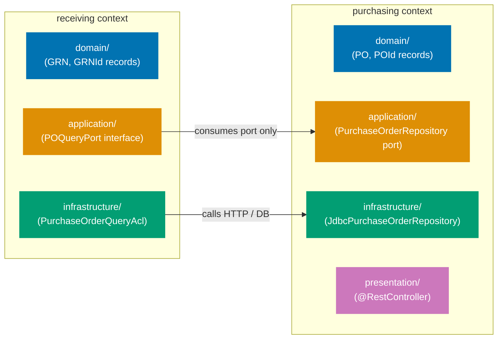
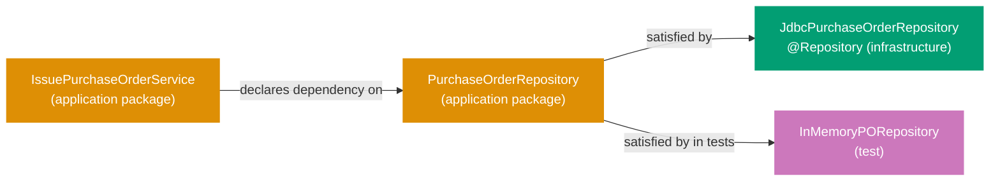

## Guide 1 — One Context, One Hexagon

### Why It Matters

A bounded context is not just a package name — it is an isolation unit. Every time two contexts share a repository directly or call each other's domain objects without an explicit port, a change in one cascades invisibly into the other. In the `procurement-platform-be` service, each bounded context owns its own `domain`, `application`, `infrastructure`, and `presentation` packages. Nothing crosses the context boundary except through an interface declared in the `application` package. Getting this isolation invariant right from day one is the single most valuable structural decision in a DDD + hexagonal Java codebase.

### Standard Library First

Java packages group related classes but enforce no architectural boundary. The compiler does not stop `receiving` from importing `PurchaseOrderRepository` directly from another context's `infrastructure` package. The package system provides cohesion, not isolation.





```java
// Standard library approach: packages group code but enforce no boundary
// Demonstrates the stdlib package approach that the hexagonal context layout supersedes.

package com.procurement.platform.receiving;

// Direct import from another context's infrastructure — no barrier here
import com.procurement.platform.purchasing.infrastructure.JdbcPurchaseOrderRepository;
// => Java allows cross-package imports unconditionally
// => The compiler sees no violation even though receiving is
//    reading purchasing infrastructure internals directly
// => Any refactor of JdbcPurchaseOrderRepository silently breaks receiving logic

public class GoodsReceiptService {
    private final JdbcPurchaseOrderRepository poRepo; // infrastructure type leaking into a domain service
    // => GoodsReceiptService now depends on a Spring Data JDBC class
    // => Unit testing GoodsReceiptService requires a full Spring context or a mock of JdbcPurchaseOrderRepository
    // => The boundary exists only in the developer's head
}
```





```kotlin
// Standard library approach: packages group code but enforce no boundary
// Demonstrates the stdlib package approach that the hexagonal context layout supersedes.

package com.procurement.platform.receiving
// => Kotlin package declaration: no curly braces — file-level declaration

// Direct import from another context's infrastructure — no barrier here
import com.procurement.platform.purchasing.infrastructure.JdbcPurchaseOrderRepository
// => Kotlin allows cross-package imports unconditionally — same stdlib limitation as Java
// => The compiler sees no violation even though receiving is
//    reading purchasing infrastructure internals directly
// => Any refactor of JdbcPurchaseOrderRepository silently breaks receiving logic

class GoodsReceiptService(
    private val poRepo: JdbcPurchaseOrderRepository // infrastructure type leaking into a domain service
    // => Kotlin primary constructor: property declared inline with val
    // => GoodsReceiptService now depends on a Spring Data JDBC class
    // => Unit testing requires a real JdbcPurchaseOrderRepository or a mock — no isolation
    // => The boundary exists only in the developer's head
)
```





```csharp
// Standard library approach: packages group code but enforce no boundary
// Demonstrates the stdlib namespace approach that the hexagonal context layout supersedes.

namespace Procurement.Platform.Receiving;
// => C# file-scoped namespace declaration (C# 10+): applies to entire file
// => No compiler enforcement of cross-namespace import restrictions

// Direct import from another context's infrastructure — no barrier here
using Procurement.Platform.Purchasing.Infrastructure;
// => C# using directive: allows cross-namespace type access unconditionally
// => The compiler sees no violation even though Receiving is
//    reading Purchasing infrastructure internals directly
// => Any refactor of JdbcPurchaseOrderRepository silently breaks receiving logic

public class GoodsReceiptService
{
    private readonly JdbcPurchaseOrderRepository _poRepo; // infrastructure type leaking into a domain service
    // => GoodsReceiptService now depends on a concrete EF Core / Dapper repository class
    // => Unit testing GoodsReceiptService requires a full DI container or a mock of JdbcPurchaseOrderRepository
    // => The boundary exists only in the developer's head

    public GoodsReceiptService(JdbcPurchaseOrderRepository poRepo)
    {
        _poRepo = poRepo;
        // => Constructor injection: explicit but typed to the concrete class
        // => Swapping the adapter requires changing this constructor signature
    }
}
```





```typescript
// Standard library approach: modules group code but enforce no architectural boundary
// Demonstrates the module-import pattern that the hexagonal context layout supersedes.

// Direct import from another context's infrastructure — no barrier here
import { JdbcPurchaseOrderRepository } from "../../purchasing/infrastructure/JdbcPurchaseOrderRepository";
// => TypeScript/Node allows cross-module imports unconditionally
// => The compiler sees no violation even though receiving is
//    reading purchasing infrastructure internals directly
// => Any refactor of JdbcPurchaseOrderRepository silently breaks receiving logic

export class GoodsReceiptService {
  // => class keyword: OOP-style class in TypeScript
  private readonly poRepo: JdbcPurchaseOrderRepository; // infrastructure type leaking into a domain service
  // => private readonly: field cannot be reassigned after construction
  // => GoodsReceiptService now depends on a concrete repository class
  // => Unit testing GoodsReceiptService requires instantiating JdbcPurchaseOrderRepository
  // => The boundary exists only in the developer's head

  constructor(poRepo: JdbcPurchaseOrderRepository) {
    this.poRepo = poRepo;
    // => Constructor injection: explicit but typed to the concrete class
    // => Swapping the adapter requires changing this constructor parameter type
  }
}
```





**Limitation for production**: packages permit cross-context imports with no enforcement. As the codebase grows, accidental coupling accumulates silently. Dependency analysis tools like ArchUnit can detect violations post-hoc, but nothing prevents them at the code level.

### Production Framework

The hexagonal pattern enforces the boundary by making each context own its `domain`, `application`, `infrastructure`, and `presentation` packages, and only exposing types through interfaces declared in the `application` package. No class in `receiving.domain` imports anything from `purchasing.infrastructure` — it talks to the purchasing context through a port interface declared in `receiving.application`.



The `procurement-platform-be` service places each bounded context at its own top-level package under `com.procurement.platform`:





```java
// Purchasing context domain layer — PurchaseOrder aggregate identity
package com.procurement.platform.purchasing.domain;

// => Package path mirrors the hexagonal layer: purchasing context, domain layer
// => No Spring imports anywhere in this file — records are pure Java SE

import java.util.Objects;
import java.util.UUID;

public record PurchaseOrderId(UUID value) {
    // => Strongly-typed wrapper: prevents passing a supplier ID where a PO ID is expected
    // => Java record provides equals, hashCode, toString automatically
    // => Compact constructor adds validation
    // => Internal representation wraps a UUID; the REST API layer formats it as "po_<uuid>" in response DTOs
    public PurchaseOrderId {
        Objects.requireNonNull(value, "PurchaseOrderId value must not be null");
        // => Canonical constructor validation — throws NullPointerException if null
    }
}

public record PurchaseOrder(
    PurchaseOrderId id,           // => Aggregate identity — drives equality
    SupplierId supplierId,        // => Strongly-typed supplier reference — not a raw UUID
    Money totalAmount,            // => Value object: amount + ISO 4217 currency code
    ApprovalLevel approvalLevel,  // => Enum: L1 (≤ $1k), L2 (≤ $10k), L3 (> $10k)
    PurchaseOrderStatus status    // => Enum: Draft → AwaitingApproval → Approved → … → Closed
) {}
// => Plain Java record: immutable, no @Entity, no @Column, no Jackson @JsonProperty
// => The ORM mapping lives in the infrastructure layer (Guide 8)
// => The serialization mapping lives in the presentation layer (Guide 6)
```





```kotlin
// Purchasing context domain layer — PurchaseOrder aggregate identity
package com.procurement.platform.purchasing.domain
// => Package path mirrors the hexagonal layer: purchasing context, domain layer
// => No Spring imports anywhere in this file — data classes are pure Kotlin

import java.util.UUID

@JvmInline
value class PurchaseOrderId(val value: UUID) {
    // => @JvmInline value class: zero-overhead wrapper at runtime on the JVM
    // => Strongly-typed wrapper: prevents passing a SupplierId where a PurchaseOrderId is expected
    // => Kotlin value class provides equals and hashCode automatically
    init {
        // => init block runs on construction — equivalent to Java compact constructor
        requireNotNull(value) { "PurchaseOrderId value must not be null" }
        // => requireNotNull: Kotlin stdlib null guard — throws IllegalArgumentException if null
    }
}

data class PurchaseOrder(
    val id: PurchaseOrderId,          // => Aggregate identity — drives equals/hashCode via data class
    val supplierId: SupplierId,       // => Strongly-typed supplier reference — not a raw UUID
    val totalAmount: Money,           // => Value object: amount + ISO 4217 currency code
    val approvalLevel: ApprovalLevel, // => Enum: L1 (≤ $1k), L2 (≤ $10k), L3 (> $10k)
    val status: PurchaseOrderStatus   // => Enum: Draft → AwaitingApproval → Approved → … → Closed
)
// => Kotlin data class: immutable when all fields are val, no JPA/Jackson annotations
// => The ORM mapping lives in the infrastructure layer
// => The serialization mapping lives in the presentation layer
// => copy() function generated automatically for producing modified aggregates
```





```csharp
// Purchasing context domain layer — PurchaseOrder aggregate identity
namespace Procurement.Platform.Purchasing.Domain;
// => Namespace mirrors the hexagonal layer: Purchasing context, Domain layer
// => No EF Core, no System.Text.Json attributes — pure C# records

public readonly record struct PurchaseOrderId(Guid Value)
{
    // => readonly record struct: zero-allocation strongly-typed wrapper (C# 10+)
    // => Prevents passing a SupplierId where a PurchaseOrderId is expected
    // => Compiler generates Equals, GetHashCode, ToString, and deconstruct automatically
    // => Static factory validates on creation
    public static PurchaseOrderId Of(Guid value)
    {
        if (value == Guid.Empty)
            throw new ArgumentException("PurchaseOrderId value must not be empty", nameof(value));
        // => Domain invariant: empty Guid is not a valid identity
        return new PurchaseOrderId(value);
        // => Factory method pattern: named construction with validation
    }
}

public sealed record PurchaseOrder(
    PurchaseOrderId Id,             // => Aggregate identity — drives equality via record semantics
    SupplierId SupplierId,          // => Strongly-typed supplier reference — not a raw Guid
    Money TotalAmount,              // => Value object: amount + ISO 4217 currency code
    ApprovalLevel ApprovalLevel,    // => Enum: L1 (≤ $1k), L2 (≤ $10k), L3 (> $10k)
    PurchaseOrderStatus Status      // => Enum: Draft → AwaitingApproval → Approved → … → Closed
);
// => C# positional record: immutable, no [Column], no [JsonPropertyName] attributes
// => The ORM mapping lives in the infrastructure layer (EF Core owned-type config)
// => The serialization mapping lives in the presentation layer (minimal API / controller)
// => with-expression provides non-destructive mutation for aggregate state transitions
```





```typescript
// Purchasing context domain layer — PurchaseOrder aggregate identity
// File: procurement-platform/purchasing/domain/PurchaseOrder.ts

// => No framework imports — pure TypeScript domain types
// => Branded type pattern prevents passing a SupplierId where a PurchaseOrderId is expected

declare const _purchaseOrderIdBrand: unique symbol;
export type PurchaseOrderId = string & { readonly [_purchaseOrderIdBrand]: never };
// => Branded string type: structurally a string but nominally distinct
// => TypeScript's type system rejects SupplierId where PurchaseOrderId is expected

export function makePurchaseOrderId(value: string): PurchaseOrderId {
  if (!value || value.trim().length === 0) throw new Error("PurchaseOrderId value must not be empty");
  // => Factory function: validation at construction boundary — matches Java compact constructor
  return value as PurchaseOrderId;
  // => Type assertion: safe here because we validated above
}

export interface PurchaseOrder {
  // => Interface models an immutable aggregate — no class needed for pure data shapes
  readonly id: PurchaseOrderId; // => Aggregate identity — branded type drives type safety
  readonly supplierId: SupplierId; // => Strongly-typed supplier reference — not a raw string
  readonly totalAmount: Money; // => Value object: amount + ISO 4217 currency code
  readonly approvalLevel: ApprovalLevel; // => Enum: L1 (≤ $1k), L2 (≤ $10k), L3 (> $10k)
  readonly status: PurchaseOrderStatus; // => Enum: Draft → AwaitingApproval → Approved → … → Closed
}
// => readonly fields: immutable after construction — no ORM decorators, no JSON annotations
// => The persistence mapping lives in the infrastructure layer
// => The serialization mapping lives in the presentation layer
```





**Trade-offs**: the per-context package layout requires discipline in code review — the Java compiler cannot stop a developer from adding a cross-context import. Tools like ArchUnit enforce the boundary mechanically in CI. The payoff is that each context can evolve its domain model independently, and a unit test for one context never requires a Spring context from another context.

---

## Guide 2 — Reading the Per-Context Package Layout

### Why It Matters

The production layout for `procurement-platform-be` places every bounded context at a dedicated top-level package under `com.procurement.platform`. Each context owns four sub-packages: `domain`, `application`, `infrastructure`, and `presentation`. Before writing any new feature code you need to read this layout fluently — otherwise you misplace new files or misread which types belong to the domain boundary versus the infrastructure boundary.

### Standard Library First

A flat layout is a direct consequence of starting with a single-concern Spring Boot scaffold. Spring Boot's `@SpringBootApplication` scans the entire root package and registers everything it finds. A flat layout means all domain-adjacent classes sit near the root package, sharing the same Spring component scan. This is the zero-ceremony stdlib approach: it compiles, it runs, and it is adequate for a one-context prototype.





```java
// Flat layout bootstrap: ProcurementPlatformApplication.java — Spring Boot entry point
package com.procurement.platform;
// => Root package: Spring component scan starts here and covers all sub-packages
// => @SpringBootApplication covers @Configuration + @EnableAutoConfiguration + @ComponentScan

import org.springframework.boot.SpringApplication;
// => SpringApplication: utility class that bootstraps a Spring application from a main method
import org.springframework.boot.autoconfigure.SpringBootApplication;
// => SpringBootApplication: meta-annotation combining @Configuration, @EnableAutoConfiguration,
//    and @ComponentScan — one annotation to start the whole context

@SpringBootApplication
// => Triggers auto-configuration for everything on the classpath: Spring MVC,
//    Jackson, Actuator — no explicit setup needed for defaults
public class ProcurementPlatformApplication {
    public static void main(String[] args) {
        SpringApplication.run(ProcurementPlatformApplication.class, args);
        // => SpringApplication.run bootstraps the ApplicationContext
        // => The class argument tells Spring Boot which package to scan from
        // => Args forwarded: supports --server.port, --spring.profiles.active, etc.
    }
}
```





```kotlin
// Flat layout bootstrap: ProcurementPlatformApplication.kt — Spring Boot entry point
package com.procurement.platform
// => Root package: Spring component scan starts here and covers all sub-packages
// => @SpringBootApplication covers @Configuration + @EnableAutoConfiguration + @ComponentScan

import org.springframework.boot.autoconfigure.SpringBootApplication
// => SpringBootApplication: meta-annotation combining @Configuration, @EnableAutoConfiguration,
//    and @ComponentScan — one annotation to start the whole context
import org.springframework.boot.runApplication
// => runApplication: Kotlin-idiomatic extension function replacing SpringApplication.run

@SpringBootApplication
// => Triggers auto-configuration for everything on the classpath: Spring MVC,
//    Jackson, Actuator — no explicit setup needed for defaults
class ProcurementPlatformApplication
// => Kotlin class: no body needed — Spring Boot only needs the class reference for scanning

fun main(args: Array<String>) {
    runApplication<ProcurementPlatformApplication>(*args)
    // => runApplication: Kotlin reified-generic wrapper — no .class reference needed
    // => *args: spread operator unpacks the array into vararg parameters
    // => Args forwarded: supports --server.port, --spring.profiles.active, etc.
}
```





```csharp
// Flat layout bootstrap: Program.cs — ASP.NET Core 8+ minimal hosting entry point
// => Root namespace: no explicit namespace declaration needed for Program.cs
// => WebApplication.CreateBuilder scans assemblies for controllers and services

using Microsoft.AspNetCore.Builder;
// => WebApplication and WebApplicationBuilder live here
using Microsoft.Extensions.DependencyInjection;
// => AddControllers and other service registration extensions live here

var builder = WebApplication.CreateBuilder(args);
// => WebApplicationBuilder: equivalent to SpringApplication — sets up DI container,
//    configuration, logging, and the HTTP server (Kestrel) automatically
// => args forwarded: supports --urls, environment variables, appsettings.json

builder.Services.AddControllers();
// => Registers all [ApiController]-annotated classes across assemblies — mirrors
//    Spring Boot's component scan picking up @RestController beans
// => A flat registration: all contexts' controllers are discovered together

var app = builder.Build();
// => Builds the WebApplication (DI container locked, pipeline configuration begins)
// => Equivalent to SpringApplication.run completing context refresh

app.MapControllers();
// => Routes HTTP requests to [ApiController] action methods via attribute routing
// => No explicit routing table — mirrors Spring MVC's @RequestMapping discovery

app.Run();
// => Starts Kestrel and begins accepting requests — equivalent to embedded Tomcat start
```





```typescript
// Flat layout bootstrap: main.ts — NestJS entry point
// => NestJS mirrors Spring Boot's component-scan model with decorators

import { NestFactory } from "@nestjs/core";
// => NestFactory: bootstrap utility — equivalent to SpringApplication
import { AppModule } from "./app.module";
// => AppModule: root module that @imports all feature modules — equivalent to @SpringBootApplication scan root

async function bootstrap() {
  // => async bootstrap: NestJS startup is async — await required for listen()
  const app = await NestFactory.create(AppModule);
  // => NestFactory.create: builds the NestJS application context
  // => Equivalent to SpringApplication.run — scans AppModule for all @Injectable, @Controller beans
  // => AppModule's imports array lists all context modules (PurchasingModule, SupplierModule, etc.)

  app.setGlobalPrefix("api/v1");
  // => Global URL prefix applied to all routes — mirrors @RequestMapping("/api/v1") at app level
  // => Each context module's controllers then declare their own sub-paths

  await app.listen(process.env.PORT ?? 3000);
  // => Starts the HTTP server on the configured port
  // => process.env.PORT: reads from environment — equivalent to --server.port in Spring Boot
}

bootstrap();
// => Invoke the async entry point — top-level await not used for broader Node.js compatibility
```





**Limitation for production**: a single root-package component scan picks up every `@Component`, `@Service`, `@Repository`, and `@Controller` in the codebase — including those from different bounded contexts. As contexts multiply, auto-configuration fights context isolation.

### Production Framework

The hexagonal layout replaces the implicit root scan with explicit per-context `@Configuration` classes that register only their own beans. The `@SpringBootApplication` retains the scan only at the root level to discover the explicit configurations; it does not need to discover individual `@Service` or `@Repository` beans scattered across contexts.





```java
// Per-context package structure: purchasing context domain value objects
package com.procurement.platform.purchasing.domain;
// => Domain package: no Spring, no JDBC, no Jackson imports allowed here
// => All types are pure Java records or sealed interfaces

import java.math.BigDecimal;
import java.util.Objects;

public record Money(BigDecimal amount, String currency) {
    // => Value object wrapping an amount and a 3-letter ISO 4217 currency code
    // => Compact constructor enforces invariants at object boundary
    // => Java record: immutable after construction — no setter methods generated
    public Money {
        Objects.requireNonNull(amount, "Money amount must not be null");
        // => Null guard: enforced at construction — never a null amount in the domain
        if (amount.compareTo(BigDecimal.ZERO) < 0)
            throw new IllegalArgumentException("Money amount must not be negative");
        // => Domain invariant: monetary amounts are non-negative — a negative purchase order total is invalid
        Objects.requireNonNull(currency, "Money currency must not be null");
        // => Null guard for currency: prevents NullPointerException in the SQL adapter's CHAR(3) column mapping
        if (currency.length() != 3)
            throw new IllegalArgumentException("Currency must be a 3-letter ISO 4217 code");
        // => Domain invariant: ISO 4217 codes are exactly 3 characters — "USD", "EUR", "IDR" are valid
    }
}
```





```kotlin
// Per-context package structure: purchasing context domain value objects
package com.procurement.platform.purchasing.domain
// => Domain package: no Spring, no JDBC, no Jackson imports allowed here
// => All types are pure Kotlin data classes or sealed classes

import java.math.BigDecimal

data class Money(val amount: BigDecimal, val currency: String) {
    // => Value object wrapping an amount and a 3-letter ISO 4217 currency code
    // => Kotlin data class: immutable when fields are val — no setter methods generated
    // => equals and hashCode generated automatically based on amount and currency
    init {
        // => init block: runs after primary constructor — equivalent to Java compact constructor
        require(amount >= BigDecimal.ZERO) { "Money amount must not be negative" }
        // => require: Kotlin stdlib precondition — throws IllegalArgumentException with the given message
        // => Domain invariant: monetary amounts are non-negative
        require(currency.length == 3) { "Currency must be a 3-letter ISO 4217 code" }
        // => Domain invariant: ISO 4217 codes are exactly 3 characters — "USD", "EUR", "IDR" are valid
        // => No null checks needed: Kotlin's type system enforces non-null by default
    }
}
```





```csharp
// Per-context package structure: purchasing context domain value objects
namespace Procurement.Platform.Purchasing.Domain;
// => Domain namespace: no EF Core, no System.Text.Json attributes allowed here
// => All types are pure C# records or sealed classes

using System.Diagnostics.CodeAnalysis;

public sealed record Money
{
    // => sealed record: immutable value object — no subclassing allowed
    // => Value object wrapping an amount and a 3-letter ISO 4217 currency code
    // => Compiler generates Equals, GetHashCode, ToString, and with-expression support

    public decimal Amount { get; }
    // => decimal: .NET's fixed-precision monetary type — avoids floating-point rounding errors
    // => get-only property: immutable after construction

    public string Currency { get; }
    // => string: ISO 4217 currency code — validated to exactly 3 characters

    public Money(decimal amount, string currency)
    {
        // => Constructor with validation — equivalent to Java compact constructor
        if (amount < 0)
            throw new ArgumentException("Money amount must not be negative", nameof(amount));
        // => Domain invariant: monetary amounts are non-negative
        ArgumentException.ThrowIfNullOrWhiteSpace(currency, nameof(currency));
        // => ArgumentException.ThrowIfNullOrWhiteSpace: .NET 8+ null/whitespace guard
        if (currency.Length != 3)
            throw new ArgumentException("Currency must be a 3-letter ISO 4217 code", nameof(currency));
        // => Domain invariant: ISO 4217 codes are exactly 3 characters — "USD", "EUR", "IDR" are valid
        Amount = amount;
        Currency = currency;
        // => Assign validated values — properties are get-only, so assignment only valid in constructor
    }
}
```





```typescript
// Per-context package structure: purchasing context domain value objects
// File: procurement-platform/purchasing/domain/Money.ts
// => Domain module: no ORM, no HTTP framework imports allowed here
// => All types are plain TypeScript interfaces or classes with validation

export class Money {
  // => class with private constructor enforces factory construction with validation
  readonly amount: number; // => Monetary amount — validated non-negative at construction
  readonly currency: string; // => ISO 4217 currency code — validated to exactly 3 characters

  private constructor(amount: number, currency: string) {
    // => private constructor: forces callers to use the static factory method
    this.amount = amount; // => Assign validated amount — readonly prevents reassignment
    this.currency = currency; // => Assign validated currency — readonly prevents reassignment
  }

  static of(amount: number, currency: string): Money {
    // => Static factory method: named construction with validation — mirrors Java compact constructor
    if (amount < 0) throw new Error("Money amount must not be negative");
    // => Domain invariant: monetary amounts are non-negative
    if (!currency || currency.length !== 3) throw new Error("Currency must be a 3-letter ISO 4217 code");
    // => Domain invariant: ISO 4217 codes are exactly 3 characters — "USD", "EUR", "IDR" are valid
    return new Money(amount, currency);
    // => Private constructor called only after validation passes
  }
}
```





The full `com.procurement.platform` package tree follows the four-layer convention in every context:

```
com.procurement.platform
├── purchasing
│   ├── domain          // PurchaseOrder, PurchaseOrderId, Money, ApprovalLevel (no Spring annotations)
│   ├── application     // IssuePurchaseOrderService, PurchaseOrderRepository port interface
│   ├── infrastructure  // JdbcPurchaseOrderRepository, OutboxEventPublisher
│   └── presentation    // PurchaseOrderController (@RestController)
├── supplier
│   ├── domain
│   ├── application
│   ├── infrastructure
│   └── presentation
├── receiving
│   ├── domain
│   ├── application
│   ├── infrastructure
│   └── presentation
├── invoicing
│   ├── domain
│   ├── application
│   ├── infrastructure
│   └── presentation
├── payments
│   ├── domain
│   ├── application
│   ├── infrastructure
│   └── presentation
├── shared
│   ├── event           // DomainEvent sealed interface
│   ├── config          // @ConfigurationProperties records
│   └── observability   // shared Micrometer wiring
└── ProcurementPlatformApplication.java
```

**Trade-offs**: keeping the per-context layout consistent means new bounded context types always go into `com.procurement.platform.<context>/{domain,application,infrastructure,presentation}/`. The flat `ProcurementPlatformApplication` remains as the scan entry point, not as a template for new classes. Any class that does not fit a context layer goes into `shared/`.

---

## Guide 3 — Domain Types Stay Free of Framework Annotations

### Why It Matters

The single most common way a hexagonal architecture collapses into a layered monolith is when domain types carry framework annotations. The moment a `PurchaseOrder` record has `@Entity`, `@Column`, or `@JsonProperty`, the domain layer depends on a persistence or serialization framework. Switching frameworks — or testing the domain in isolation — now requires framework setup. In `procurement-platform-be`, keeping the domain records free of `jakarta.persistence`, `com.fasterxml.jackson`, or Spring annotations is the invariant that makes everything else possible.

### Standard Library First

Java records carry no annotations by default. The language gives you a pure, framework-free type with equality, immutability, and accessors built in:





```java
// Standard library: pure Java record, zero framework annotations
package com.procurement.platform.purchasing.domain;
// => Domain package: no Spring, no JPA, no Jackson imports allowed here

import java.util.List;
import java.util.Objects;
// => Objects.requireNonNull: standard null guard — throws NullPointerException on null

public record PurchaseOrder(
    PurchaseOrderId id,
    // => Strongly-typed identity — prevents confusion with other aggregate IDs
    // => PurchaseOrderId wraps UUID: the compiler rejects a raw UUID where a PurchaseOrderId is expected
    SupplierId supplierId,
    // => Reference to the supplier — a strongly-typed value object, not a raw String
    // => Cross-context coupling via typed ID: the purchasing context never imports a Supplier aggregate
    List<PurchaseOrderLine> lines,
    // => Value objects representing individual line items — immutable list
    // => Domain invariant: lines must not be empty after PO issuance
    Money totalAmount,
    // => Derived or calculated: the sum of all line totals
    ApprovalLevel approvalLevel,
    // => Enum derived from totalAmount: L1 (≤ $1k), L2 (≤ $10k), L3 (> $10k)
    PurchaseOrderStatus status
    // => Enum: Draft → AwaitingApproval → Approved → Issued → … → Closed
    // => No ORM column mapping annotation — the infrastructure layer owns that mapping
) {
    // => Java record compact constructor: runs before each component is assigned
    // => All validation happens here — the record is immutable after construction
    public PurchaseOrder {
        Objects.requireNonNull(id, "PurchaseOrder id must not be null");
        // => Null guard for identity — throws NullPointerException at construction time
        Objects.requireNonNull(supplierId, "PurchaseOrder supplierId must not be null");
        // => Every PO must reference a supplier — orphan POs violate the domain model
        Objects.requireNonNull(lines, "PurchaseOrder lines must not be null");
        // => Lines list must be present — may be empty for Draft state, validated on issuance
        Objects.requireNonNull(totalAmount, "PurchaseOrder totalAmount must not be null");
        Objects.requireNonNull(approvalLevel, "PurchaseOrder approvalLevel must not be null");
        Objects.requireNonNull(status, "PurchaseOrder status must not be null");
        // => Status must be initialized — Draft is the correct initial value, enforced by factory methods
    }
}
```





```kotlin
// Standard library: pure Kotlin data class, zero framework annotations
package com.procurement.platform.purchasing.domain
// => Domain package: no Spring, no JPA, no Jackson imports allowed here

data class PurchaseOrder(
    val id: PurchaseOrderId,
    // => Strongly-typed identity — prevents confusion with other aggregate IDs
    // => PurchaseOrderId is a value class: the compiler rejects a raw UUID where PurchaseOrderId is expected
    val supplierId: SupplierId,
    // => Reference to the supplier — a strongly-typed value object, not a raw String
    // => Cross-context coupling via typed ID: purchasing never imports a Supplier aggregate
    val lines: List<PurchaseOrderLine>,
    // => Value objects representing individual line items — List<T> is read-only in Kotlin
    // => Domain invariant: lines must not be empty after PO issuance
    val totalAmount: Money,
    // => Derived or calculated: the sum of all line totals
    val approvalLevel: ApprovalLevel,
    // => Enum derived from totalAmount: L1 (≤ $1k), L2 (≤ $10k), L3 (> $10k)
    val status: PurchaseOrderStatus
    // => Enum: Draft → AwaitingApproval → Approved → Issued → … → Closed
    // => No ORM column mapping annotation — the infrastructure layer owns that mapping
) {
    init {
        // => init block: runs after primary constructor — validates all fields
        // => All validation happens here — the data class is immutable after construction
        requireNotNull(id) { "PurchaseOrder id must not be null" }
        // => requireNotNull: Kotlin stdlib null guard — redundant with non-null types but explicit
        requireNotNull(supplierId) { "PurchaseOrder supplierId must not be null" }
        // => Every PO must reference a supplier — orphan POs violate the domain model
        require(lines.isNotEmpty() || status == PurchaseOrderStatus.Draft) {
            "PurchaseOrder lines must not be empty after issuance"
        }
        // => Domain invariant: empty lines allowed only in Draft state
        requireNotNull(totalAmount) { "PurchaseOrder totalAmount must not be null" }
        requireNotNull(approvalLevel) { "PurchaseOrder approvalLevel must not be null" }
        requireNotNull(status) { "PurchaseOrder status must not be null" }
        // => Status must be initialized — Draft is the correct initial value
    }
}
```





```csharp
// Standard library: pure C# record, zero framework attributes
namespace Procurement.Platform.Purchasing.Domain;
// => Domain namespace: no EF Core, no System.Text.Json attributes allowed here

public sealed record PurchaseOrder
{
    // => sealed record: immutable aggregate root — no subclassing allowed
    // => Compiler generates Equals, GetHashCode, ToString, and with-expression support
    // => All validation enforced in constructor — record is immutable after construction

    public PurchaseOrderId Id { get; }
    // => Strongly-typed identity — prevents confusion with other aggregate IDs
    // => PurchaseOrderId is a readonly record struct: zero-allocation wrapper
    public SupplierId SupplierId { get; }
    // => Reference to the supplier — strongly-typed value object, not a raw Guid
    public IReadOnlyList<PurchaseOrderLine> Lines { get; }
    // => IReadOnlyList: read-only view — callers cannot mutate the list
    // => Domain invariant: lines must not be empty after PO issuance
    public Money TotalAmount { get; }
    // => Derived or calculated: the sum of all line totals
    public ApprovalLevel ApprovalLevel { get; }
    // => Enum derived from TotalAmount: L1 (≤ $1k), L2 (≤ $10k), L3 (> $10k)
    public PurchaseOrderStatus Status { get; }
    // => Enum: Draft → AwaitingApproval → Approved → Issued → … → Closed
    // => No [Column] attribute — the infrastructure layer owns that mapping

    public PurchaseOrder(
        PurchaseOrderId id, SupplierId supplierId, IReadOnlyList<PurchaseOrderLine> lines,
        Money totalAmount, ApprovalLevel approvalLevel, PurchaseOrderStatus status)
    {
        // => Constructor validates all fields — record is immutable after assignment
        ArgumentNullException.ThrowIfNull(lines, nameof(lines));
        // => ArgumentNullException.ThrowIfNull: .NET 6+ null guard
        if (lines.Count == 0 && status != PurchaseOrderStatus.Draft)
            throw new ArgumentException("PurchaseOrder lines must not be empty after issuance");
        // => Domain invariant: empty lines allowed only in Draft state
        Id = id; SupplierId = supplierId; Lines = lines;
        TotalAmount = totalAmount; ApprovalLevel = approvalLevel; Status = status;
        // => Assign validated values — get-only properties, so assignment only valid here
    }
}
```





```typescript
// Standard library: pure TypeScript class, zero framework decorators
// File: procurement-platform/purchasing/domain/PurchaseOrder.ts
// => Domain module: no ORM, no HTTP framework imports allowed here

import { PurchaseOrderId } from "./PurchaseOrderId";
// => Import domain identity type — branded type enforces type safety at compile time
import { SupplierId } from "../supplier/domain/SupplierId";
// => Cross-context reference via typed ID only — no Supplier aggregate imported
import { PurchaseOrderLine } from "./PurchaseOrderLine";
// => Value objects representing individual line items
import { Money } from "./Money";
// => Value object: amount + ISO 4217 currency code
import { ApprovalLevel, PurchaseOrderStatus } from "./PurchaseOrderEnums";
// => Enums: ApprovalLevel and PurchaseOrderStatus — pure TypeScript string enums

export class PurchaseOrder {
  // => class with private constructor enforces factory construction with validation
  // => All fields readonly: immutable after construction — no ORM decorators
  readonly id: PurchaseOrderId; // => Strongly-typed identity — branded type
  readonly supplierId: SupplierId; // => Strongly-typed supplier reference
  readonly lines: ReadonlyArray<PurchaseOrderLine>; // => Immutable array — callers cannot mutate
  readonly totalAmount: Money; // => Derived or calculated: sum of all line totals
  readonly approvalLevel: ApprovalLevel; // => Enum: L1 (≤ $1k), L2 (≤ $10k), L3 (> $10k)
  readonly status: PurchaseOrderStatus; // => Enum: Draft → AwaitingApproval → Approved → …

  private constructor(
    id: PurchaseOrderId,
    supplierId: SupplierId,
    lines: ReadonlyArray<PurchaseOrderLine>,
    totalAmount: Money,
    approvalLevel: ApprovalLevel,
    status: PurchaseOrderStatus,
  ) {
    // => private constructor: forces callers through the static factory
    this.id = id;
    this.supplierId = supplierId;
    this.lines = lines;
    this.totalAmount = totalAmount;
    this.approvalLevel = approvalLevel;
    this.status = status;
    // => Assign all validated fields — readonly enforces immutability after this point
  }

  static create(
    id: PurchaseOrderId,
    supplierId: SupplierId,
    lines: ReadonlyArray<PurchaseOrderLine>,
    totalAmount: Money,
    approvalLevel: ApprovalLevel,
    status: PurchaseOrderStatus,
  ): PurchaseOrder {
    // => Static factory with validation — mirrors Java compact constructor
    if (lines.length === 0 && status !== PurchaseOrderStatus.Draft)
      throw new Error("PurchaseOrder lines must not be empty after issuance");
    // => Domain invariant: empty lines only valid in Draft state
    return new PurchaseOrder(id, supplierId, lines, totalAmount, approvalLevel, status);
    // => Private constructor called only after validation passes
  }
}
```





**Limitation for production**: when you need to persist a domain record, the ORM needs column names and table mappings. The standard library gives you no mechanism for this — you have to decide where the ORM mapping lives.

### Production Framework

The hexagonal answer is: ORM and serialization mappings live in the infrastructure and presentation layers, not the domain layer. The domain record is a pure Java record. The JDBC mapping lives in the adapter in `infrastructure/` with explicit SQL, and a mapper translates between the row and the domain record. Spring Boot 4 supports plain `JdbcClient` result mappings that avoid JPA entities entirely.





```java
// GlobalExceptionHandler.java — Spring exception mapping in the shared config layer, not domain
package com.procurement.platform.shared.config;
// => shared/config/ is the infrastructure/framework wiring layer — not a domain package

import org.springframework.http.HttpStatus;
// => HttpStatus: enum of HTTP status codes — used to set the response status
import org.springframework.http.ProblemDetail;
// => ProblemDetail: RFC 9457 / HTTP Problem Details — Spring 6+ standard error response format
import org.springframework.web.bind.annotation.ExceptionHandler;
// => @ExceptionHandler: marks a method as an exception handler for specific exception types
import org.springframework.web.bind.annotation.RestControllerAdvice;
// => @RestControllerAdvice: combines @ControllerAdvice and @ResponseBody for all @RestControllers

@RestControllerAdvice
// => @RestControllerAdvice: applies @ExceptionHandler methods to all @RestControllers
// => This is infrastructure wiring — it lives in shared/config/, not in any bounded context domain package
// => Domain exceptions (e.g., PurchaseOrderNotFoundException) bubble up; this class translates them to HTTP
public class GlobalExceptionHandler {

    @ExceptionHandler(Exception.class)
    // => Catch-all handler: covers any exception not matched by a more specific @ExceptionHandler
    // => More specific handlers (e.g., for PurchasingException) can be added without touching domain code
    public ProblemDetail handleGenericException(Exception ex) {
        ProblemDetail problem = ProblemDetail.forStatus(HttpStatus.INTERNAL_SERVER_ERROR);
        // => ProblemDetail.forStatus: produces an RFC 9457 JSON body with status 500
        // => The domain never produces ProblemDetail — that is this layer's responsibility
        problem.setDetail(ex.getMessage());
        // => ex.getMessage() surfaces the exception message in the error response
        // => Production: scrub sensitive messages before surfacing to clients
        return problem;
        // => Spring serializes ProblemDetail to application/problem+json automatically
    }
}
```





```kotlin
// GlobalExceptionHandler.kt — Spring exception mapping in the shared config layer, not domain
package com.procurement.platform.shared.config
// => shared/config/ is the infrastructure/framework wiring layer — not a domain package

import org.springframework.http.HttpStatus
// => HttpStatus: enum of HTTP status codes — used to set the response status
import org.springframework.http.ProblemDetail
// => ProblemDetail: RFC 9457 / HTTP Problem Details — Spring 6+ standard error response format
import org.springframework.web.bind.annotation.ExceptionHandler
// => @ExceptionHandler: marks a function as an exception handler for specific exception types
import org.springframework.web.bind.annotation.RestControllerAdvice
// => @RestControllerAdvice: combines @ControllerAdvice and @ResponseBody for all @RestControllers

@RestControllerAdvice
// => @RestControllerAdvice: applies @ExceptionHandler functions to all @RestControllers
// => Infrastructure wiring — lives in shared/config/, not in any bounded context domain package
// => Domain exceptions bubble up; this class translates them to HTTP responses
class GlobalExceptionHandler {

    @ExceptionHandler(Exception::class)
    // => Exception::class: Kotlin class reference — equivalent to Exception.class in Java
    // => Catch-all handler: covers any exception not matched by a more specific @ExceptionHandler
    fun handleGenericException(ex: Exception): ProblemDetail {
        // => Kotlin function: return type declared after colon — ProblemDetail
        val problem = ProblemDetail.forStatus(HttpStatus.INTERNAL_SERVER_ERROR)
        // => ProblemDetail.forStatus: produces an RFC 9457 JSON body with status 500
        // => val: immutable local variable — problem reference does not change after assignment
        problem.detail = ex.message
        // => Kotlin property assignment: ex.message is a nullable String? — safe here as detail accepts null
        // => Production: scrub sensitive messages before surfacing to clients
        return problem
        // => Spring serializes ProblemDetail to application/problem+json automatically
    }
}
```





```csharp
// GlobalExceptionHandler.cs — ASP.NET Core exception mapping middleware, not domain
namespace Procurement.Platform.Shared.Config;
// => Shared.Config namespace: infrastructure wiring layer — not a domain namespace

using Microsoft.AspNetCore.Diagnostics;
// => IExceptionHandler: ASP.NET Core 8+ interface for structured exception handling
using Microsoft.AspNetCore.Http;
// => IResult, Results, ProblemDetails: HTTP response abstractions
using Microsoft.AspNetCore.Mvc;
// => ProblemDetails: RFC 9457 standard error response format

public sealed class GlobalExceptionHandler : IExceptionHandler
{
    // => IExceptionHandler: ASP.NET Core 8+ interface — registered via AddExceptionHandler<T>()
    // => sealed: no subclassing — this handler is the terminal exception handler
    // => Infrastructure wiring — lives in Shared.Config, not in any bounded context domain namespace
    // => Domain exceptions bubble up; this class translates them to HTTP ProblemDetails responses

    public async ValueTask<bool> TryHandleAsync(
        HttpContext httpContext,
        Exception exception,
        CancellationToken cancellationToken)
    {
        // => TryHandleAsync: called by ASP.NET Core for every unhandled exception
        // => Returns true to signal the exception was handled — prevents default error page
        // => ValueTask<bool>: allocation-efficient async return type for high-throughput handlers
        var problem = new ProblemDetails
        {
            Status = StatusCodes.Status500InternalServerError,
            // => Status 500: catch-all for unhandled exceptions — specific handlers override this
            Detail = exception.Message,
            // => exception.Message: surfaces the exception message — scrub in production
            Title = "An unexpected error occurred"
            // => Title: human-readable summary — maps to RFC 9457 "title" field
        };
        httpContext.Response.StatusCode = StatusCodes.Status500InternalServerError;
        // => Set response status code explicitly before writing the body
        await httpContext.Response.WriteAsJsonAsync(problem, cancellationToken);
        // => WriteAsJsonAsync: serializes ProblemDetails to application/problem+json
        return true;
        // => true: exception handled — ASP.NET Core stops propagation
    }
}
```





```typescript
// globalExceptionFilter.ts — NestJS exception filter in the shared config layer, not domain
// File: procurement-platform/shared/config/GlobalExceptionFilter.ts
// => shared/config/ is the infrastructure wiring layer — not a domain module

import { ArgumentsHost, Catch, ExceptionFilter, HttpException, HttpStatus } from "@nestjs/common";
// => @Catch: marks the class as a NestJS exception filter — equivalent to @RestControllerAdvice
// => ExceptionFilter: interface that the filter must implement
// => ArgumentsHost: provides access to the HTTP request/response context
import { Request, Response } from "express";
// => Express Request/Response: underlying HTTP objects in a NestJS + Express application

@Catch()
// => @Catch() with no arguments: catches all exceptions — equivalent to @ExceptionHandler(Exception.class)
// => More specific filters (@Catch(PurchasingException)) take precedence when registered
export class GlobalExceptionFilter implements ExceptionFilter {
  // => implements ExceptionFilter: TypeScript interface contract — catch() method required

  catch(exception: unknown, host: ArgumentsHost): void {
    // => catch(): called for every unhandled exception — NestJS equivalent of handleGenericException
    // => unknown: safer than any — forces type narrowing before use
    const ctx = host.switchToHttp();
    // => switchToHttp(): retrieves the HTTP-specific context from ArgumentsHost
    const response = ctx.getResponse<Response>();
    // => getResponse<Response>(): typed access to the Express response object
    const status = exception instanceof HttpException ? exception.getStatus() : HttpStatus.INTERNAL_SERVER_ERROR;
    // => HttpException: NestJS base exception — has a built-in status code
    // => Falls back to 500 for non-HttpException errors — mirrors @ExceptionHandler catch-all
    const message = exception instanceof Error ? exception.message : "An unexpected error occurred";
    // => Type narrowing: only access .message when exception is an Error instance
    // => Production: scrub sensitive messages before surfacing to clients
    response.status(status).json({
      // => response.status().json(): sets HTTP status and serializes the body to JSON
      status,
      // => status field: numeric HTTP status code — e.g., 500
      detail: message,
      // => detail: mirrors RFC 9457 ProblemDetail.detail field
      title: "An unexpected error occurred",
      // => title: human-readable summary — mirrors RFC 9457 ProblemDetail.title
    });
  }
}
```





The dependency rule flows inward: `infrastructure` and `presentation` know about `domain`; `domain` knows about neither. ArchUnit tests in CI enforce the rule: no import from `domain` may reference any class in `infrastructure`, `presentation`, or any Spring package.

**Trade-offs**: keeping domain records annotation-free means you need a separate mapping step at the boundary. For simple CRUD aggregates this mapping is tedious. For complex aggregates with invariants validated at construction time, the separation pays for itself immediately — you can test the entire domain layer with zero Spring context setup.

---

## Guide 4 — Application Service Signatures Take and Return Aggregates, Not DTOs

### Why It Matters

Application services are the orchestration layer between the driving adapter (the Spring `@RestController`) and the domain. A common anti-pattern is letting the application service accept and return the same DTO types the controller works with — Jackson-friendly classes with nullable fields, no invariants, and `@JsonProperty` annotations. When that happens, the application service cannot enforce domain rules without re-validating on every call, and the domain model becomes a ceremonial wrapper around the DTO. In `procurement-platform-be`, the design rule is: application services accept and return domain aggregates; the controller owns the DTO translation.

### Standard Library First

Java interfaces naturally express an application service contract with domain types only. The standard library gives you `Optional` for absence and `java.util.function` for functional composition without any framework:





```java
// Standard library: application service as a plain interface with domain types only
package com.procurement.platform.purchasing.application;
// => application/ package: orchestration contracts and service interfaces
// => No Spring imports — the interface is framework-agnostic

import com.procurement.platform.purchasing.domain.PurchaseOrder;
// => PurchaseOrder: the domain aggregate — the service returns fully validated records
import com.procurement.platform.purchasing.domain.PurchaseOrderId;
// => PurchaseOrderId: the strongly-typed identity — prevents raw String/UUID passing at the boundary
import com.procurement.platform.purchasing.domain.SupplierId;
// => SupplierId: strongly-typed supplier reference — passed as a domain type, not a raw String
import java.util.Optional;
// => Optional for absence: findById returns Optional<PurchaseOrder>, not null

public interface IssuePurchaseOrderService {
    // => Java interface: the contract without the implementation
    // => The implementation (the service class) lives in infrastructure/

    PurchaseOrder issue(SupplierId supplierId, List<PurchaseOrderLine> lines);
    // => Parameters are domain types — the smart constructor inside this method
    //    builds the aggregate and enforces invariants
    // => Returns the full domain aggregate, not a response DTO

    Optional<PurchaseOrder> findById(PurchaseOrderId id);
    // => Optional<PurchaseOrder>: absence is a valid domain outcome, not null
    // => PurchaseOrderId is a strongly-typed domain value — not a raw UUID or String
    // => The controller translates absent -> 404, present -> 200 + DTO

    PurchaseOrder cancel(PurchaseOrderId id);
    // => Returns the updated aggregate — the controller translates to 200 + DTO
    // => Throws a domain exception (e.g., PurchaseOrderNotFoundException) if not found
    // => The GlobalExceptionHandler translates domain exceptions to HTTP status codes
}
```





```kotlin
// Standard library: application service as a plain interface with domain types only
package com.procurement.platform.purchasing.application
// => application/ package: orchestration contracts and service interfaces
// => No Spring imports — the interface is framework-agnostic

import com.procurement.platform.purchasing.domain.PurchaseOrder
// => PurchaseOrder: the domain aggregate — the service returns fully validated data classes
import com.procurement.platform.purchasing.domain.PurchaseOrderId
// => PurchaseOrderId: strongly-typed identity — prevents raw String/UUID passing at the boundary
import com.procurement.platform.purchasing.domain.PurchaseOrderLine
// => PurchaseOrderLine: domain value object representing a line item
import com.procurement.platform.purchasing.domain.SupplierId
// => SupplierId: strongly-typed supplier reference — passed as a domain type, not a raw String

interface IssuePurchaseOrderService {
    // => Kotlin interface: the contract without the implementation
    // => The implementation (the service class) lives in infrastructure/
    // => No @Service annotation here — this is a pure domain contract

    fun issue(supplierId: SupplierId, lines: List<PurchaseOrderLine>): PurchaseOrder
    // => Parameters are domain types — the implementation builds the aggregate and enforces invariants
    // => Returns the full domain aggregate, not a response DTO

    fun findById(id: PurchaseOrderId): PurchaseOrder?
    // => Nullable return: Kotlin's null-safe alternative to Java's Optional<T>
    // => PurchaseOrderId: strongly-typed domain value — not a raw UUID or String
    // => The controller translates null -> 404, non-null -> 200 + DTO

    fun cancel(id: PurchaseOrderId): PurchaseOrder
    // => Returns the updated aggregate — the controller translates to 200 + DTO
    // => Throws a domain exception (e.g., PurchaseOrderNotFoundException) if not found
    // => The GlobalExceptionHandler translates domain exceptions to HTTP status codes
}
```





```csharp
// Standard library: application service as a plain interface with domain types only
namespace Procurement.Platform.Purchasing.Application;
// => Application namespace: orchestration contracts and service interfaces
// => No ASP.NET Core imports — the interface is framework-agnostic

using Procurement.Platform.Purchasing.Domain;
// => Only domain types imported — no EF Core, no ASP.NET Core, no JSON types

public interface IIssuePurchaseOrderService
{
    // => C# interface prefixed with I by convention: the contract without implementation
    // => The implementation (the service class) lives in Infrastructure/
    // => No [Injectable] or DI attribute here — pure domain contract

    PurchaseOrder Issue(SupplierId supplierId, IReadOnlyList<PurchaseOrderLine> lines);
    // => Parameters are domain types — the implementation builds the aggregate and enforces invariants
    // => Returns the full domain aggregate, not a response DTO

    PurchaseOrder? FindById(PurchaseOrderId id);
    // => Nullable return type (C# 8+ nullable reference types): absence without Optional<T>
    // => PurchaseOrderId: strongly-typed domain value — not a raw Guid or string
    // => The controller translates null -> 404, non-null -> 200 + DTO

    PurchaseOrder Cancel(PurchaseOrderId id);
    // => Returns the updated aggregate — the controller translates to 200 + DTO
    // => Throws a domain exception (e.g., PurchaseOrderNotFoundException) if not found
    // => The global exception handler maps domain exceptions to HTTP status codes
}
```





```typescript
// Standard library: application service as a plain interface with domain types only
// File: procurement-platform/purchasing/application/IssuePurchaseOrderService.ts
// => application/ module: orchestration contracts and service interfaces
// => No NestJS imports — the interface is framework-agnostic

import { PurchaseOrder } from "../domain/PurchaseOrder";
// => PurchaseOrder: the domain aggregate — the service returns fully validated objects
import { PurchaseOrderId } from "../domain/PurchaseOrderId";
// => PurchaseOrderId: strongly-typed branded type — prevents raw string at the boundary
import { PurchaseOrderLine } from "../domain/PurchaseOrderLine";
// => PurchaseOrderLine: domain value object representing a line item
import { SupplierId } from "../../supplier/domain/SupplierId";
// => SupplierId: strongly-typed supplier reference — not a raw string

export interface IssuePurchaseOrderService {
  // => TypeScript interface: the contract without the implementation
  // => The implementation (the service class) lives in infrastructure/
  // => No @Injectable() decorator here — pure domain contract

  issue(supplierId: SupplierId, lines: ReadonlyArray<PurchaseOrderLine>): PurchaseOrder;
  // => Parameters are domain types — the implementation builds the aggregate and enforces invariants
  // => Returns the full domain aggregate, not a response DTO

  findById(id: PurchaseOrderId): PurchaseOrder | null;
  // => Union with null: TypeScript's idiomatic absence — no Optional<T> wrapper needed
  // => PurchaseOrderId: strongly-typed branded type — not a raw string
  // => The controller translates null -> 404, non-null -> 200 + DTO

  cancel(id: PurchaseOrderId): PurchaseOrder;
  // => Returns the updated aggregate — the controller translates to 200 + DTO
  // => Throws a domain error (e.g., PurchaseOrderNotFoundError) if not found
  // => The global exception filter translates domain errors to HTTP status codes
}
```





**Limitation for production**: plain `throws Exception` loses type information. Production services declare specific exception types so controllers can pattern-match on failure modes precisely.

### Production Framework

In the Spring stack the controller owns the DTO translation. The application service never touches `HttpServletRequest`, `ResponseEntity`, or any Spring MVC type. Spring injects the service implementation via constructor injection — the controller declares the interface type, not the concrete class:





```java
// Production application service interface with typed exceptions
package com.procurement.platform.purchasing.application;

import com.procurement.platform.purchasing.domain.PurchaseOrder;
import com.procurement.platform.purchasing.domain.PurchaseOrderId;
import com.procurement.platform.purchasing.domain.PurchaseOrderLine;
import com.procurement.platform.purchasing.domain.SupplierId;
// => Only domain types imported — no Spring, no Jakarta, no Jackson
import java.util.List;
import java.util.Optional;

public interface IssuePurchaseOrderService {
    // => Pure Java interface: zero Spring coupling
    // => Spring injects the @Service implementation at startup via constructor injection
    // => The controller declares this interface type — it never imports the concrete @Service class

    PurchaseOrder issue(SupplierId supplierId, List<PurchaseOrderLine> lines)
            throws DuplicatePurchaseOrderException;
    // => Typed exception: DuplicatePurchaseOrderException signals a business rule violation
    // => The GlobalExceptionHandler (or a specific @ExceptionHandler) maps it to HTTP 409
    // => Declared in the throws clause: callers are aware of this outcome at compile time

    Optional<PurchaseOrder> findById(PurchaseOrderId id);
    // => No checked exception: absence is not an error — it is returned as Optional.empty()
    // => The controller decides whether Optional.empty() means 404 or something else

    PurchaseOrder cancel(PurchaseOrderId id)
            throws PurchaseOrderNotFoundException, InvalidPurchaseOrderStateException;
    // => PurchaseOrderNotFoundException: cannot cancel a nonexistent PO
    // => InvalidPurchaseOrderStateException: cancellation only valid before Issued state
    // => The @ExceptionHandler maps each to a distinct HTTP status code
}
```





```kotlin
// Production application service interface with typed exceptions (Kotlin sealed classes)
package com.procurement.platform.purchasing.application
// => application/ package: orchestration contracts — no Spring, no Jakarta, no Jackson

import com.procurement.platform.purchasing.domain.PurchaseOrder
import com.procurement.platform.purchasing.domain.PurchaseOrderId
import com.procurement.platform.purchasing.domain.PurchaseOrderLine
import com.procurement.platform.purchasing.domain.SupplierId
// => Only domain types imported — zero Spring coupling in this interface

interface IssuePurchaseOrderService {
    // => Pure Kotlin interface: zero Spring coupling
    // => Spring injects the @Service implementation at startup via constructor injection
    // => The controller declares this interface type — never imports the concrete @Service

    @Throws(DuplicatePurchaseOrderException::class)
    fun issue(supplierId: SupplierId, lines: List<PurchaseOrderLine>): PurchaseOrder
    // => @Throws: exposes checked-exception semantics to Java callers via Kotlin interop
    // => DuplicatePurchaseOrderException: signals a business rule violation — maps to HTTP 409
    // => Returns domain aggregate — controller performs DTO translation

    fun findById(id: PurchaseOrderId): PurchaseOrder?
    // => Nullable return: Kotlin idiom for absence — no Optional<T> wrapper
    // => No exception: absence is not an error — null signals 404 in the controller

    @Throws(PurchaseOrderNotFoundException::class, InvalidPurchaseOrderStateException::class)
    fun cancel(id: PurchaseOrderId): PurchaseOrder
    // => PurchaseOrderNotFoundException: cannot cancel a nonexistent PO — maps to HTTP 404
    // => InvalidPurchaseOrderStateException: cancellation only valid before Issued state — HTTP 409
    // => The @ExceptionHandler maps each exception type to a distinct HTTP status code
}
```





```csharp
// Production application service interface with typed exceptions
namespace Procurement.Platform.Purchasing.Application;
// => Application namespace: orchestration contracts — no EF Core, no ASP.NET Core, no JSON types

using Procurement.Platform.Purchasing.Domain;
// => Only domain types imported — zero framework coupling in this interface

public interface IIssuePurchaseOrderService
{
    // => Pure C# interface: zero ASP.NET Core coupling
    // => DI container injects the concrete implementation at startup via constructor injection
    // => The controller declares this interface type — never imports the concrete service class

    PurchaseOrder Issue(SupplierId supplierId, IReadOnlyList<PurchaseOrderLine> lines);
    // => Throws DuplicatePurchaseOrderException (unchecked): signals a business rule violation
    // => C# has no checked exceptions — callers discover thrown types from docs/XML comments
    // => The global exception handler maps DuplicatePurchaseOrderException to HTTP 409

    PurchaseOrder? FindById(PurchaseOrderId id);
    // => Nullable return type: absence is not an error — null signals 404 in the controller
    // => No exception for absence: clean separation of error and absence semantics

    PurchaseOrder Cancel(PurchaseOrderId id);
    // => Throws PurchaseOrderNotFoundException: cannot cancel a nonexistent PO — HTTP 404
    // => Throws InvalidPurchaseOrderStateException: cancellation only valid before Issued — HTTP 409
    // => The global exception handler maps each exception type to a distinct HTTP status code
}
```





```typescript
// Production application service interface with typed error handling
// File: procurement-platform/purchasing/application/IssuePurchaseOrderService.ts
// => application/ module: orchestration contracts — no NestJS, no ORM, no HTTP types

import { PurchaseOrder } from "../domain/PurchaseOrder";
// => Domain aggregate — returned fully validated from the service
import { PurchaseOrderId } from "../domain/PurchaseOrderId";
// => Strongly-typed branded identity — prevents raw string at the application boundary
import { PurchaseOrderLine } from "../domain/PurchaseOrderLine";
// => Domain value object: individual line item
import { SupplierId } from "../../supplier/domain/SupplierId";
// => Strongly-typed supplier reference — cross-context coupling via typed ID only

export interface IssuePurchaseOrderService {
  // => Pure TypeScript interface: zero NestJS coupling
  // => NestJS DI container injects the concrete class at startup via constructor injection
  // => The controller declares this interface token — never imports the concrete class

  issue(supplierId: SupplierId, lines: ReadonlyArray<PurchaseOrderLine>): PurchaseOrder;
  // => Throws DuplicatePurchaseOrderError (runtime): signals a business rule violation
  // => TypeScript has no checked exceptions — error types documented in JSDoc
  // => The global exception filter maps DuplicatePurchaseOrderError to HTTP 409

  findById(id: PurchaseOrderId): PurchaseOrder | null;
  // => Union with null: absence is not an error — null signals 404 in the controller
  // => No thrown error for absence: clean separation of error and absence semantics

  cancel(id: PurchaseOrderId): PurchaseOrder;
  // => Throws PurchaseOrderNotFoundError: cannot cancel a nonexistent PO — HTTP 404
  // => Throws InvalidPurchaseOrderStateError: cancellation only valid before Issued — HTTP 409
  // => The global exception filter maps each error type to a distinct HTTP status code
}
```





**Trade-offs**: this clean interface boundary forces you to write a mapping method in the controller layer. For thin CRUD endpoints the mapping is boilerplate. For endpoints where the domain aggregate has validated invariants, the payoff is substantial — the application service is testable with a pure in-memory adapter and zero Spring context.

---

## Guide 5 — Output Port as Java Interface

### Why It Matters

Output ports define _what_ the application layer needs from the outside world without specifying _how_ it is implemented. In Java hexagonal architecture the idiomatic output port is a Java interface declared in the `application` package. The application service declares a dependency on the interface; Spring Boot wires the infrastructure adapter implementation at startup via constructor injection. This makes adapter swapping — in production and in tests — a configuration decision, not a code change. `procurement-platform-be` uses this pattern for every infrastructure dependency: the repository, the event publisher, the approval router, and the supplier notifier.

### Standard Library First

Java interfaces are the standard library's mechanism for expressing a contract without an implementation. The `java.util.function` package gives you functional types (`Function`, `Supplier`, `Consumer`) that serve as single-operation port alternatives:





```java
// Standard library: output port as a plain Java interface
package com.procurement.platform.purchasing.application;

import com.procurement.platform.purchasing.domain.PurchaseOrder;
import com.procurement.platform.purchasing.domain.PurchaseOrderId;
// => Only domain types in the application package — no JPA, no JDBC

import java.util.Optional;

public interface PurchaseOrderRepository {
    // => Java interface as output port: declares what the application layer needs
    // => No implementation here — the infrastructure adapter provides it
    // => This interface is the only thing the application service knows about persistence

    PurchaseOrder save(PurchaseOrder purchaseOrder);
    // => Write-side port: persist a domain aggregate, return saved instance
    // => Returns PurchaseOrder: may include generated fields (e.g., database-assigned timestamps)
    // => Throws RuntimeException subtypes (e.g., RepositoryException) on failure

    Optional<PurchaseOrder> findById(PurchaseOrderId id);
    // => Read-side port: retrieve by identity
    // => Optional wraps absence — the service does not receive null
    // => The adapter queries the DB and maps the result to a domain PurchaseOrder record

    boolean existsById(PurchaseOrderId id);
    // => Lightweight existence check: no full aggregate load needed for duplicate guards
    // => Returns true if a PO with the given id exists; false otherwise
}
```





```kotlin
// Standard library: output port as a plain Kotlin interface
package com.procurement.platform.purchasing.application
// => application/ package: output port declarations — no JPA, no JDBC

import com.procurement.platform.purchasing.domain.PurchaseOrder
// => PurchaseOrder: domain aggregate — the only type the application layer knows about
import com.procurement.platform.purchasing.domain.PurchaseOrderId
// => PurchaseOrderId: strongly-typed identity — prevents raw UUID at the port boundary

interface PurchaseOrderRepository {
    // => Kotlin interface as output port: declares what the application layer needs
    // => No implementation here — the infrastructure adapter provides it
    // => This interface is the only thing the application service knows about persistence

    fun save(purchaseOrder: PurchaseOrder): PurchaseOrder
    // => Write-side port: persist a domain aggregate, return saved instance
    // => Returns PurchaseOrder: database may enrich with timestamps or sequence values
    // => Throws RuntimeException subtypes (e.g., RepositoryException) on failure

    fun findById(id: PurchaseOrderId): PurchaseOrder?
    // => Read-side port: nullable return — Kotlin idiom for absence, no Optional<T> needed
    // => The adapter queries the DB and maps the result row to a domain PurchaseOrder data class

    fun existsById(id: PurchaseOrderId): Boolean
    // => Lightweight existence check without loading the full aggregate
    // => Returns true if a PO with the given id exists; false otherwise
}
```





```csharp
// Standard library: output port as a plain C# interface
namespace Procurement.Platform.Purchasing.Application;
// => Application namespace: output port declarations — no EF Core, no Dapper

using Procurement.Platform.Purchasing.Domain;
// => Only domain types imported — the interface is entirely in domain terms

public interface IPurchaseOrderRepository
{
    // => C# interface as output port: declares what the application layer needs
    // => No implementation here — the infrastructure adapter provides it
    // => This interface is the only thing the application service knows about persistence

    PurchaseOrder Save(PurchaseOrder purchaseOrder);
    // => Write-side port: persist a domain aggregate, return saved instance
    // => Returns PurchaseOrder: database may enrich with timestamps or sequence values
    // => Throws RepositoryException (unchecked) on infrastructure failure

    PurchaseOrder? FindById(PurchaseOrderId id);
    // => Read-side port: nullable return — C# nullable reference type for absence
    // => The adapter queries the DB and maps the result to a domain PurchaseOrder record

    bool ExistsById(PurchaseOrderId id);
    // => Lightweight existence check without loading the full aggregate
    // => Returns true if a PO with the given id exists; false otherwise
}
```





```typescript
// Standard library: output port as a plain TypeScript interface
// File: procurement-platform/purchasing/application/PurchaseOrderRepository.ts
// => application/ module: output port declarations — no ORM, no database driver imports

import { PurchaseOrder } from "../domain/PurchaseOrder";
// => PurchaseOrder: domain aggregate — the only type the application layer knows about
import { PurchaseOrderId } from "../domain/PurchaseOrderId";
// => PurchaseOrderId: strongly-typed branded type — prevents raw string at the port boundary

export interface PurchaseOrderRepository {
  // => TypeScript interface as output port: declares what the application layer needs
  // => No implementation here — the infrastructure adapter provides it
  // => This interface is the only thing the application service knows about persistence

  save(purchaseOrder: PurchaseOrder): PurchaseOrder;
  // => Write-side port: persist a domain aggregate, return saved instance
  // => Returns PurchaseOrder: database may enrich with timestamps or generated fields
  // => Throws RepositoryError (runtime) on infrastructure failure

  findById(id: PurchaseOrderId): PurchaseOrder | null;
  // => Read-side port: union with null — TypeScript idiom for absence
  // => The adapter queries the DB and maps the result to a domain PurchaseOrder object

  existsById(id: PurchaseOrderId): boolean;
  // => Lightweight existence check without loading the full aggregate
  // => Returns true if a PO with the given id exists; false otherwise
}
```





**Limitation for production**: a bare `PurchaseOrder save(PurchaseOrder)` gives the caller no way to distinguish a network failure from a constraint violation. Production ports declare specific exception types or use `Result`-style return types so the application service can react to failure modes.

### Production Framework

In the Spring stack the output port interface is declared in the `application` package and its implementation — a Spring `@Repository`-annotated class — lives in `infrastructure`. Spring Boot wires them via constructor injection. No `@Autowired` field injection; no `ApplicationContext.getBean()` lookup:







```java
// Production output port with typed exceptions — application package
package com.procurement.platform.purchasing.application;

import com.procurement.platform.purchasing.domain.PurchaseOrder;
import com.procurement.platform.purchasing.domain.PurchaseOrderId;
// => Only domain types imported — the interface is entirely in domain and stdlib terms

import java.util.Optional;

public interface PurchaseOrderRepository {
    // => Output port interface declared in application/ — not in infrastructure/
    // => The @Repository adapter in infrastructure/ implements this interface
    // => The application service's constructor parameter is this interface type

    PurchaseOrder save(PurchaseOrder purchaseOrder) throws RepositoryException;
    // => Returns the saved PurchaseOrder: database may enrich with timestamps or sequence values
    // => RepositoryException: domain-adjacent exception signalling an infrastructure failure
    // => The GlobalExceptionHandler maps RepositoryException to HTTP 500 + ProblemDetail (RFC 9457)

    Optional<PurchaseOrder> findById(PurchaseOrderId id);
    // => Read-side operation: returns Optional.empty() when the PO does not exist
    // => Optional communicates absence without null — no NullPointerException risk

    boolean existsById(PurchaseOrderId id);
    // => Lightweight existence check without loading the full aggregate
    // => Callers use this for duplicate-check guard before saving a new PO
}
```





```kotlin
// Production output port with typed exceptions — application package
package com.procurement.platform.purchasing.application
// => application/ package: output port declared here — not in infrastructure/

import com.procurement.platform.purchasing.domain.PurchaseOrder
import com.procurement.platform.purchasing.domain.PurchaseOrderId
// => Only domain types imported — the interface is entirely in domain terms

interface PurchaseOrderRepository {
    // => Output port interface declared in application/ — not in infrastructure/
    // => The @Repository adapter in infrastructure/ implements this interface
    // => The application service's constructor parameter is this interface type

    @Throws(RepositoryException::class)
    fun save(purchaseOrder: PurchaseOrder): PurchaseOrder
    // => Returns the saved PurchaseOrder: database may enrich with timestamps or sequence values
    // => @Throws(RepositoryException::class): exposes checked semantics to Java callers
    // => RepositoryException: domain-adjacent exception signalling an infrastructure failure
    // => The GlobalExceptionHandler maps RepositoryException to HTTP 500 + ProblemDetail

    fun findById(id: PurchaseOrderId): PurchaseOrder?
    // => Nullable return: Kotlin idiom for absence — no Optional<T> wrapper needed
    // => Returns null when the PO does not exist — caller decides on 404 or empty response

    fun existsById(id: PurchaseOrderId): Boolean
    // => Lightweight existence check without loading the full aggregate
    // => Callers use this for duplicate-check guard before saving a new PO
}
```





```csharp
// Production output port with typed exceptions — Application namespace
namespace Procurement.Platform.Purchasing.Application;
// => Application namespace: output port declared here — not in Infrastructure/

using Procurement.Platform.Purchasing.Domain;
// => Only domain types imported — the interface is entirely in domain terms

public interface IPurchaseOrderRepository
{
    // => Output port interface declared in Application/ — not in Infrastructure/
    // => The concrete EF Core / Dapper adapter in Infrastructure/ implements this interface
    // => The application service's constructor parameter is this interface type

    PurchaseOrder Save(PurchaseOrder purchaseOrder);
    // => Returns the saved PurchaseOrder: database may enrich with timestamps or sequence values
    // => Throws RepositoryException (unchecked): signals an infrastructure failure
    // => The global exception handler maps RepositoryException to HTTP 500 + ProblemDetails

    PurchaseOrder? FindById(PurchaseOrderId id);
    // => Nullable return: C# nullable reference type for absence — no Optional<T> wrapper
    // => Returns null when the PO does not exist — controller decides on 404 or empty response

    bool ExistsById(PurchaseOrderId id);
    // => Lightweight existence check without loading the full aggregate
    // => Callers use this for duplicate-check guard before saving a new PO
}
```





```typescript
// Production output port with typed error handling — application module
// File: procurement-platform/purchasing/application/PurchaseOrderRepository.ts
// => application/ module: output port declared here — not in infrastructure/

import { PurchaseOrder } from "../domain/PurchaseOrder";
// => Domain aggregate — the only type the application layer knows about persistence
import { PurchaseOrderId } from "../domain/PurchaseOrderId";
// => Strongly-typed branded identity — prevents raw string at the port boundary

export interface PurchaseOrderRepository {
  // => Output port interface declared in application/ — not in infrastructure/
  // => The concrete adapter in infrastructure/ implements this interface
  // => The application service's constructor parameter is this interface type

  save(purchaseOrder: PurchaseOrder): PurchaseOrder;
  // => Returns the saved PurchaseOrder: database may enrich with timestamps or generated fields
  // => Throws RepositoryError (runtime): signals an infrastructure failure
  // => The global exception filter maps RepositoryError to HTTP 500 + problem JSON

  findById(id: PurchaseOrderId): PurchaseOrder | null;
  // => Union with null: TypeScript idiom for absence — no Optional<T> wrapper
  // => Returns null when the PO does not exist — controller decides on 404 or empty response

  existsById(id: PurchaseOrderId): boolean;
  // => Lightweight existence check without loading the full aggregate
  // => Callers use this for duplicate-check guard before saving a new PO
}
```





**Trade-offs**: a single `PurchaseOrderRepository` interface with multiple operations is clean for CRUD aggregates. For aggregates with distinct read and write concerns, split the interface into a command repository and a query repository (CQRS at the port level). Adding methods to the interface requires updating all adapters — a useful forcing function to keep adapters honest.

---

## Guide 6 — Spring `@RestController` as Primary Adapter

### Why It Matters

The Spring `@RestController` is the primary (driving) adapter in the hexagonal architecture. Its job is exactly this: translate an HTTP request into a domain command or query, call the application service, and translate the domain result into an HTTP response. A controller that contains business logic, validates domain invariants, or directly calls a JDBC adapter has crossed out of the adapter layer into the domain or infrastructure — the most common source of untestable, entangled production code. In `procurement-platform-be`, every controller serves one bounded context and delegates entirely to an application service interface.

### Standard Library First

Java's `HttpServlet` is the standard library equivalent of a Spring controller. Without Spring MVC you write a `doGet` or `doPost` override in an `HttpServlet` subclass. The ceremony is high and composition is manual:





```java
// Standard library: plain HttpServlet without Spring MVC
// Demonstrates the stdlib servlet pattern that Spring @RestController supersedes.

import jakarta.servlet.http.HttpServlet;
// => HttpServlet: base class for servlets — subclass and override doGet, doPost, etc.
import jakarta.servlet.http.HttpServletRequest;
// => HttpServletRequest: provides access to the HTTP request (method, headers, body, params)
import jakarta.servlet.http.HttpServletResponse;
// => HttpServletResponse: provides access to the HTTP response (status, headers, body)
import java.io.IOException;
// => IOException: thrown by getWriter().write() — must be declared or caught

public class HealthServlet extends HttpServlet {
    // => HttpServlet: subclass and override doGet, doPost, etc.
    // => No automatic JSON serialization — you write to the output stream manually
    // => No routing: the servlet container maps URLs to servlet classes via web.xml or @WebServlet

    @Override
    protected void doGet(HttpServletRequest req, HttpServletResponse resp)
            throws IOException {
        // => Override per-method: doGet, doPost, doPut, doDelete are separate overrides
        // => throws IOException: propagates write failures to the servlet container
        resp.setContentType("application/json");
        // => Set content type manually — no automatic negotiation
        resp.setStatus(HttpServletResponse.SC_OK);
        // => Set status code explicitly: 200 OK
        resp.getWriter().write("{\"status\":\"UP\"}");
        // => Write JSON string manually — no object-to-JSON conversion
        // => A Jackson ObjectMapper call would replace this, but that is extra ceremony
    }
}
```





```kotlin
// Standard library: plain Servlet without Spring MVC
// Demonstrates the stdlib servlet pattern that Spring @RestController supersedes.

import jakarta.servlet.http.HttpServlet
// => HttpServlet: base class for servlets — subclass and override doGet, doPost, etc.
import jakarta.servlet.http.HttpServletRequest
// => HttpServletRequest: provides access to the HTTP request (method, headers, body, params)
import jakarta.servlet.http.HttpServletResponse
// => HttpServletResponse: provides access to the HTTP response (status, headers, body)

class HealthServlet : HttpServlet() {
    // => Kotlin class extending HttpServlet: colon syntax replaces Java's extends keyword
    // => No automatic JSON serialization — you write to the output stream manually
    // => No routing: the servlet container maps URLs to servlet classes via web.xml or @WebServlet

    override fun doGet(req: HttpServletRequest, resp: HttpServletResponse) {
        // => override fun: Kotlin keyword for overriding — compiler enforces the override
        // => No throws declaration: Kotlin does not have checked exceptions
        resp.contentType = "application/json"
        // => Kotlin property assignment: resp.contentType = ... replaces resp.setContentType(...)
        // => Set content type manually — no automatic negotiation
        resp.status = HttpServletResponse.SC_OK
        // => resp.status = ...: Kotlin property syntax — replaces resp.setStatus(...)
        // => Set status code explicitly: 200 OK
        resp.writer.write("""{"status":"UP"}""")
        // => Triple-quoted string: no escape sequences needed for double quotes
        // => Write JSON string manually — no object-to-JSON conversion
    }
}
```





```csharp
// Standard library: plain HttpListener without ASP.NET Core
// Demonstrates the stdlib HTTP pattern that ASP.NET Core minimal API supersedes.

using System.Net;
// => HttpListener: .NET's low-level HTTP server — no routing, no serialization, no DI
using System.Text;
// => Encoding.UTF8: used to convert the response string to bytes

var listener = new HttpListener();
// => HttpListener: creates a raw HTTP server — equivalent to HttpServlet container setup
listener.Prefixes.Add("http://localhost:8080/");
// => Register the URL prefix to listen on — equivalent to servlet URL mapping
listener.Start();
// => Start accepting requests — equivalent to servlet container startup

while (true)
{
    var context = await listener.GetContextAsync();
    // => GetContextAsync: waits for the next incoming request — no routing framework
    // => Must be called in a loop: each call handles one request
    var response = context.Response;
    // => HttpListenerResponse: provides access to the HTTP response — status, headers, body
    response.ContentType = "application/json";
    // => Set content type manually — no automatic content negotiation
    response.StatusCode = (int)HttpStatusCode.OK;
    // => Set status code explicitly: 200 OK
    var buffer = Encoding.UTF8.GetBytes("{\"status\":\"UP\"}");
    // => Convert JSON string to byte array manually — no object-to-JSON serialization
    await response.OutputStream.WriteAsync(buffer);
    // => Write bytes to the response stream manually — no serialization middleware
    response.Close();
    // => Close the response: signals end of the HTTP response to the client
}
```





```typescript
// Standard library: plain Node.js http module without any framework
// Demonstrates the stdlib HTTP pattern that NestJS @Controller supersedes.

import { createServer, IncomingMessage, ServerResponse } from "http";
// => createServer: Node.js built-in HTTP server factory — no routing, no serialization
// => IncomingMessage: represents the incoming HTTP request — method, url, headers, body stream
// => ServerResponse: represents the outgoing HTTP response — writeHead, write, end

const server = createServer((req: IncomingMessage, res: ServerResponse) => {
  // => createServer callback: called for every incoming request — no routing table
  // => req: the raw request object — must inspect req.url and req.method manually
  // => res: the raw response object — must set status, headers, and body manually

  if (req.method === "GET" && req.url === "/health") {
    // => Manual routing: check method and URL manually — no @GetMapping equivalent
    res.writeHead(200, { "Content-Type": "application/json" });
    // => writeHead: sets status code and response headers manually — no negotiation
    res.end(JSON.stringify({ status: "UP" }));
    // => JSON.stringify: serializes object to JSON string manually — no auto-serialization
    // => res.end: writes the body and closes the response
  } else {
    res.writeHead(404, { "Content-Type": "application/json" });
    // => All unmatched routes return 404 manually — no framework default handler
    res.end(JSON.stringify({ error: "Not found" }));
    // => Manual 404 response: no global error handler, no problem+json format
  }
});

server.listen(8080, () => console.log("Server running on port 8080"));
// => listen: starts the HTTP server on the given port — equivalent to servlet container start
```





**Limitation for production**: routing, serialization, validation, exception handling, and content negotiation must all be wired manually. Spring MVC handles all of these declaratively.

### Production Framework

A `PurchaseOrderController` shows the minimal Spring `@RestController` — the primary adapter for the purchasing context:





```java
// Spring @RestController — primary (driving) adapter for the purchasing context
package com.procurement.platform.purchasing.presentation;
// => purchasing/presentation/ package: @RestController adapters live here

import org.springframework.web.bind.annotation.GetMapping;
import org.springframework.web.bind.annotation.RequestMapping;
import org.springframework.web.bind.annotation.RestController;
// => Spring MVC annotations: @RestController = @Controller + @ResponseBody
// => @RequestMapping sets the base URL path for all methods in this class
// => @GetMapping is shorthand for @RequestMapping(method = RequestMethod.GET)

import java.util.Map;
// => Map.of() is used for the health response — no DTO record needed for a trivial check

@RestController
// => @RestController: Spring registers this as an HTTP handler; serializes return values to JSON
// => No explicit @ResponseBody needed: @RestController implies it for all methods
@RequestMapping("/api/v1")
// => Base path: all mappings in this class are relative to /api/v1
public class HealthController {

    @GetMapping("/health")
    // => GET /api/v1/health: no path variable, no request body, no authentication
    // => Spring MVC resolves this mapping during context startup — no runtime routing table needed
    public Map<String, String> health() {
        // => Return type Map<String, String>: Jackson serializes this to {"status":"UP"}
        // => No ResponseEntity wrapper: Spring MVC uses the return type to set 200 OK
        return Map.of("status", "UP");
        // => Map.of: immutable single-entry map — Java 9+ standard library
        // => "status" key matches the expected health check response format
    }
}
```





```kotlin
// Spring @RestController — primary (driving) adapter for the purchasing context
package com.procurement.platform.purchasing.presentation
// => purchasing/presentation/ package: @RestController adapters live here

import org.springframework.web.bind.annotation.GetMapping
import org.springframework.web.bind.annotation.RequestMapping
import org.springframework.web.bind.annotation.RestController
// => Spring MVC annotations: @RestController = @Controller + @ResponseBody
// => @RequestMapping sets the base URL path for all methods in this class
// => @GetMapping is shorthand for @RequestMapping(method = RequestMethod.GET)

@RestController
// => @RestController: Spring registers this as an HTTP handler; serializes return values to JSON
// => No explicit @ResponseBody needed: @RestController implies it for all methods
@RequestMapping("/api/v1")
// => Base path: all methods in this class resolve relative to /api/v1
class HealthController {

    @GetMapping("/health")
    // => GET /api/v1/health: no path variable, no request body, no authentication
    // => Spring MVC resolves this mapping during context startup — no runtime routing table needed
    fun health(): Map<String, String> {
        // => Return type Map<String, String>: Jackson serializes this to {"status":"UP"}
        // => No ResponseEntity wrapper: Spring MVC uses the return type to set 200 OK
        return mapOf("status" to "UP")
        // => mapOf: Kotlin stdlib immutable map factory — equivalent to Java's Map.of()
        // => "status" to "UP": infix Pair creation — idiomatic Kotlin map initialization
    }
}
```





```csharp
// ASP.NET Core [ApiController] — primary (driving) adapter for the purchasing context
namespace Procurement.Platform.Purchasing.Presentation;
// => Purchasing.Presentation namespace: [ApiController] adapters live here

using Microsoft.AspNetCore.Mvc;
// => [ApiController], [Route], [HttpGet]: ASP.NET Core attribute routing annotations
// => ControllerBase: base class for API controllers — no view support

[ApiController]
// => [ApiController]: enables automatic model validation, binding source inference, and problem details
// => Equivalent to @RestController: response body serialized to JSON automatically
[Route("api/v1")]
// => [Route]: sets the base URL path — equivalent to @RequestMapping("/api/v1")
public class HealthController : ControllerBase
{
    // => ControllerBase: no view rendering — API-only base class
    // => Inherits Ok(), NotFound(), BadRequest(), Problem() helper methods

    [HttpGet("health")]
    // => [HttpGet("health")]: handles GET /api/v1/health — equivalent to @GetMapping("/health")
    // => ASP.NET Core resolves this mapping at startup — no runtime routing table needed
    public IActionResult Health()
    {
        // => IActionResult: flexible return type — allows Ok(), NotFound(), etc.
        return Ok(new { status = "UP" });
        // => Ok(): wraps the value with HTTP 200 — equivalent to no ResponseEntity wrapper
        // => Anonymous type { status = "UP" }: System.Text.Json serializes to {"status":"UP"}
    }
}
```





```typescript
// NestJS @Controller — primary (driving) adapter for the purchasing context
// File: procurement-platform/purchasing/presentation/HealthController.ts

import { Controller, Get } from "@nestjs/common";
// => @Controller: NestJS decorator — registers the class as an HTTP handler
// => @Get: method-level decorator — equivalent to @GetMapping
// => NestJS serializes return values to JSON automatically — equivalent to @RestController

@Controller("api/v1")
// => @Controller("api/v1"): sets the base URL path — equivalent to @RequestMapping("/api/v1")
// => All method routes in this class are relative to /api/v1
export class HealthController {
  @Get("health")
  // => @Get("health"): handles GET /api/v1/health — equivalent to @GetMapping("/health")
  // => NestJS resolves this mapping at startup — no runtime routing table needed
  health(): Record<string, string> {
    // => Return type Record<string, string>: NestJS serializes to {"status":"UP"}
    // => No ResponseEntity wrapper: NestJS sets 200 OK by default for non-void returns
    return { status: "UP" };
    // => Plain object literal: NestJS / JSON.stringify serializes to {"status":"UP"}
  }
}
```





A domain-backed controller for `POST /api/v1/purchase-orders` follows the same pattern but adds the translation steps. The controller declares the application service interface — never the concrete `@Service` class — as a constructor parameter:





```java
// Domain-backed PurchaseOrderController for a PO issuance command
package com.procurement.platform.purchasing.presentation;

import com.procurement.platform.purchasing.application.IssuePurchaseOrderService;
import com.procurement.platform.purchasing.application.DuplicatePurchaseOrderException;
// => Application layer interface and exception — not the @Service implementation
// => The controller is decoupled from the concrete adapter class
import com.procurement.platform.purchasing.domain.PurchaseOrderLine;
import com.procurement.platform.purchasing.domain.SupplierId;
// => Domain value objects used to build the aggregate command
import org.springframework.http.HttpStatus;
import org.springframework.http.ResponseEntity;
import org.springframework.web.bind.annotation.*;
// => Spring MVC annotations only — no JPA, no domain construction in the annotation block

import java.util.List;
// => List<PurchaseOrderLineRequest>: the ordered line items in the request DTO — mapped to domain PurchaseOrderLine
import java.util.UUID;
// => UUID.fromString: parses String supplierId from the request body — throws IllegalArgumentException on malformed input

public record IssuePurchaseOrderRequest(String supplierId, List<PurchaseOrderLineRequest> lines) {}
// => Request DTO as a Java record: immutable, no validation annotations at this level
// => Lives in the presentation package — domain never imports this type

public record PurchaseOrderResponse(String id, String supplierId, String status, String approvalLevel) {}
// => Response DTO: maps domain aggregate fields to JSON-serializable types
// => String id: UUID converted to String for JSON — domain uses PurchaseOrderId record
// => The application service never produces or consumes this type

@RestController
// => @RestController: combines @Controller and @ResponseBody — all methods return JSON
@RequestMapping("/api/v1/purchase-orders")
// => Base path scoped to the purchasing context — each context owns its URL prefix
public class PurchaseOrderController {

    private final IssuePurchaseOrderService issueService;
    // => Constructor injection: Spring Boot injects the @Service implementation at startup
    // => Field is final: immutable after construction — thread-safe by default
    // => Interface type declared here — the controller never imports the concrete @Service class

    public PurchaseOrderController(IssuePurchaseOrderService issueService) {
        this.issueService = issueService;
        // => No @Autowired annotation needed: Spring Boot auto-detects single-constructor injection
        // => Declaring the interface type means the controller works with any adapter implementation
    }

    @PostMapping
    // => @PostMapping: handles HTTP POST to /api/v1/purchase-orders
    public ResponseEntity<PurchaseOrderResponse> issuePurchaseOrder(
            @RequestBody IssuePurchaseOrderRequest request) {
        // => @RequestBody: Jackson deserializes the HTTP request body into IssuePurchaseOrderRequest
        // => Returns ResponseEntity to control the HTTP status code explicitly
        var supplierId = new SupplierId(UUID.fromString(request.supplierId()));
        // => Translate DTO -> domain value object: UUID.fromString throws on malformed input
        // => SupplierId: strongly-typed wrapper — the service receives SupplierId, not a raw UUID
        var lines = request.lines().stream()
            .map(l -> new PurchaseOrderLine(new SkuCode(l.skuCode()), new Quantity(l.quantity(), UnitOfMeasure.valueOf(l.unit())), new Money(l.unitPrice(), l.currency())))
            // => Each request line becomes a domain PurchaseOrderLine — Money enforces invariants at construction
            .toList();
        // => Map each request line to a domain value object — the domain rejects invalid values
        // => toList(): immutable List — domain invariants prevent mutation after issuance
        var po = issueService.issue(supplierId, lines);
        // => Application service enforces domain invariants and persists the aggregate
        var response = new PurchaseOrderResponse(
            po.id().value().toString(),
            // => po.id().value(): unwrap PurchaseOrderId -> UUID -> String for JSON
            po.supplierId().value().toString(),
            po.status().name(),
            po.approvalLevel().name()
            // => Map each domain field to the response DTO — one mapping, one place
        );
        return ResponseEntity.status(HttpStatus.CREATED).body(response);
        // => HTTP 201 Created: the standard status for successful resource creation
        // => body(response): Spring MVC / Jackson serializes PurchaseOrderResponse to JSON
    }
}
```





```kotlin
// Domain-backed PurchaseOrderController for a PO issuance command
package com.procurement.platform.purchasing.presentation
// => purchasing/presentation/ package: @RestController adapters live here

import com.procurement.platform.purchasing.application.IssuePurchaseOrderService
// => Application layer interface — not the @Service implementation
import com.procurement.platform.purchasing.domain.PurchaseOrderLine
import com.procurement.platform.purchasing.domain.SupplierId
// => Domain value objects used to build the aggregate command
import org.springframework.http.HttpStatus
import org.springframework.http.ResponseEntity
import org.springframework.web.bind.annotation.*
// => Spring MVC annotations only — no JPA, no domain construction in annotation block
import java.util.UUID
// => UUID.fromString: parses String supplierId — throws IllegalArgumentException on malformed input

data class IssuePurchaseOrderRequest(val supplierId: String, val lines: List<PurchaseOrderLineRequest>)
// => Kotlin data class as request DTO: immutable, no validation annotations at this level
// => Lives in the presentation package — domain never imports this type

data class PurchaseOrderResponse(val id: String, val supplierId: String, val status: String, val approvalLevel: String)
// => Response DTO: maps domain aggregate fields to JSON-serializable types
// => String id: UUID converted to String for JSON — domain uses PurchaseOrderId value class
// => The application service never produces or consumes this type

@RestController
// => @RestController: combines @Controller and @ResponseBody — all methods return JSON
@RequestMapping("/api/v1/purchase-orders")
// => Base path scoped to the purchasing context — each context owns its URL prefix
class PurchaseOrderController(
    private val issueService: IssuePurchaseOrderService
    // => Primary constructor injection: Spring Boot injects the @Service implementation at startup
    // => val: immutable field — thread-safe by default
    // => Interface type declared here — the controller never imports the concrete @Service class
) {
    @PostMapping
    // => @PostMapping: handles HTTP POST to /api/v1/purchase-orders
    fun issuePurchaseOrder(@RequestBody request: IssuePurchaseOrderRequest): ResponseEntity<PurchaseOrderResponse> {
        // => @RequestBody: Jackson deserializes the HTTP request body into IssuePurchaseOrderRequest
        // => Returns ResponseEntity to control the HTTP status code explicitly
        val supplierId = SupplierId(UUID.fromString(request.supplierId))
        // => Translate DTO -> domain value object: UUID.fromString throws on malformed input
        // => SupplierId: strongly-typed wrapper — the service receives SupplierId, not a raw UUID
        val lines = request.lines.map { l ->
            PurchaseOrderLine(SkuCode(l.skuCode), Quantity(l.quantity, UnitOfMeasure.valueOf(l.unit)), Money.of(l.unitPrice, l.currency))
            // => Each request line becomes a domain PurchaseOrderLine — Money.of enforces invariants
        }
        // => map: Kotlin collection transform — each request line mapped to a domain value object
        val po = issueService.issue(supplierId, lines)
        // => Application service enforces domain invariants and persists the aggregate
        val response = PurchaseOrderResponse(
            id = po.id.value.toString(),
            // => po.id.value: unwrap PurchaseOrderId value class -> UUID -> String for JSON
            supplierId = po.supplierId.value.toString(),
            status = po.status.name,
            approvalLevel = po.approvalLevel.name
            // => Map each domain field to the response DTO — named arguments for clarity
        )
        return ResponseEntity.status(HttpStatus.CREATED).body(response)
        // => HTTP 201 Created: the standard status for successful resource creation
        // => body(response): Spring MVC / Jackson serializes PurchaseOrderResponse to JSON
    }
}
```





```csharp
// Domain-backed PurchaseOrderController for a PO issuance command
namespace Procurement.Platform.Purchasing.Presentation;
// => Purchasing.Presentation namespace: [ApiController] adapters live here

using Microsoft.AspNetCore.Mvc;
// => [ApiController], [Route], [HttpPost], [FromBody]: ASP.NET Core attribute routing
using Procurement.Platform.Purchasing.Application;
// => Application layer interface — not the concrete service class
using Procurement.Platform.Purchasing.Domain;
// => Domain value objects used to build the aggregate command
using System;
using System.Collections.Generic;
using System.Linq;

public record IssuePurchaseOrderRequest(string SupplierId, IReadOnlyList<PurchaseOrderLineRequest> Lines);
// => C# positional record as request DTO: immutable, no validation attributes at this level
// => Lives in the Presentation namespace — domain never imports this type

public record PurchaseOrderResponse(string Id, string SupplierId, string Status, string ApprovalLevel);
// => Response DTO: maps domain aggregate fields to JSON-serializable types
// => string Id: Guid converted to string for JSON — domain uses PurchaseOrderId record struct
// => The application service never produces or consumes this type

[ApiController]
// => [ApiController]: enables automatic model validation, problem details, and binding source inference
[Route("api/v1/purchase-orders")]
// => [Route]: sets the base URL path scoped to the purchasing context
public class PurchaseOrderController : ControllerBase
{
    private readonly IIssuePurchaseOrderService _issueService;
    // => Constructor injection: DI container injects the concrete service at startup
    // => readonly: immutable after construction — thread-safe by default
    // => Interface type declared here — the controller never imports the concrete class

    public PurchaseOrderController(IIssuePurchaseOrderService issueService)
    {
        _issueService = issueService;
        // => No [Inject] attribute needed: ASP.NET Core DI auto-resolves single-constructor injection
        // => Interface type means the controller works with any registered implementation
    }

    [HttpPost]
    // => [HttpPost]: handles HTTP POST to /api/v1/purchase-orders
    public IActionResult IssuePurchaseOrder([FromBody] IssuePurchaseOrderRequest request)
    {
        // => [FromBody]: ASP.NET Core deserializes the HTTP request body into IssuePurchaseOrderRequest
        // => Returns IActionResult to control the HTTP status code explicitly
        var supplierId = SupplierId.Of(Guid.Parse(request.SupplierId));
        // => Translate DTO -> domain value object: Guid.Parse throws on malformed input
        // => SupplierId.Of: factory validates and wraps — service receives SupplierId, not raw Guid
        var lines = request.Lines.Select(l =>
            new PurchaseOrderLine(new SkuCode(l.SkuCode), new Quantity(l.Quantity, Enum.Parse<UnitOfMeasure>(l.Unit)), Money.Of(l.UnitPrice, l.Currency))
            // => Each request line becomes a domain PurchaseOrderLine — Money.Of enforces invariants
        ).ToList().AsReadOnly();
        // => LINQ Select: maps each request line to a domain value object
        var po = _issueService.Issue(supplierId, lines);
        // => Application service enforces domain invariants and persists the aggregate
        var response = new PurchaseOrderResponse(
            Id: po.Id.Value.ToString(),
            // => po.Id.Value: unwrap PurchaseOrderId -> Guid -> string for JSON
            SupplierId: po.SupplierId.Value.ToString(),
            Status: po.Status.ToString(),
            ApprovalLevel: po.ApprovalLevel.ToString()
            // => Map each domain field to the response DTO — named arguments for clarity
        );
        return StatusCode(201, response);
        // => HTTP 201 Created: the standard status for successful resource creation
        // => StatusCode(201, response): ASP.NET Core serializes PurchaseOrderResponse to JSON
    }
}
```





```typescript
// Domain-backed PurchaseOrderController for a PO issuance command
// File: procurement-platform/purchasing/presentation/PurchaseOrderController.ts

import { Body, Controller, HttpCode, Post } from "@nestjs/common";
// => @Controller, @Post, @Body, @HttpCode: NestJS decorators — equivalent to Spring MVC annotations
import { IssuePurchaseOrderService } from "../application/IssuePurchaseOrderService";
// => Application layer interface token — not the concrete service class
import { PurchaseOrderLine } from "../domain/PurchaseOrderLine";
import { makeSupplierId } from "../../supplier/domain/SupplierId";
// => Domain factory function — translates raw string to strongly-typed SupplierId

class PurchaseOrderLineRequest {
  skuCode!: string; // => ! non-null assertion: NestJS/class-validator populates via deserialization
  quantity!: number; // => Numeric quantity — validated by domain value object on construction
  unit!: string; // => UnitOfMeasure string — validated by UnitOfMeasure.valueOf equivalent
  unitPrice!: number; // => Unit price — Money.of validates non-negative on construction
  currency!: string; // => ISO 4217 code — Money.of validates 3-character length
}

class IssuePurchaseOrderRequest {
  supplierId!: string; // => Raw supplier UUID string — translated to SupplierId domain type
  lines!: PurchaseOrderLineRequest[]; // => Array of line request DTOs — mapped to domain PurchaseOrderLine
}

class PurchaseOrderResponse {
  id: string; // => Aggregate id as string — PurchaseOrderId unwrapped for JSON
  supplierId: string; // => SupplierId unwrapped for JSON
  status: string; // => PurchaseOrderStatus enum name
  approvalLevel: string; // => ApprovalLevel enum name

  constructor(id: string, supplierId: string, status: string, approvalLevel: string) {
    this.id = id;
    this.supplierId = supplierId;
    this.status = status;
    this.approvalLevel = approvalLevel;
    // => Plain class constructor: NestJS serializes all public fields to JSON
  }
}

@Controller("api/v1/purchase-orders")
// => @Controller: registers this class as an HTTP handler at the given base path
// => Equivalent to @RestController + @RequestMapping("/api/v1/purchase-orders")
export class PurchaseOrderController {
  constructor(private readonly issueService: IssuePurchaseOrderService) {}
  // => Constructor injection: NestJS DI container injects the registered service at startup
  // => private readonly: immutable field — controller never imports the concrete class

  @Post()
  // => @Post(): handles HTTP POST to /api/v1/purchase-orders
  @HttpCode(201)
  // => @HttpCode(201): sets HTTP 201 Created — NestJS default for POST is 201, explicit here for clarity
  issuePurchaseOrder(@Body() request: IssuePurchaseOrderRequest): PurchaseOrderResponse {
    // => @Body(): NestJS deserializes the request body into IssuePurchaseOrderRequest
    const supplierId = makeSupplierId(request.supplierId);
    // => Translate DTO -> domain branded type: makeSupplierId validates and brands the string
    const lines: PurchaseOrderLine[] = request.lines.map(
      (l) =>
        PurchaseOrderLine.create(
          new SkuCode(l.skuCode),
          new Quantity(l.quantity, l.unit as UnitOfMeasure),
          Money.of(l.unitPrice, l.currency),
        ),
      // => Each request line becomes a domain PurchaseOrderLine — Money.of enforces invariants
    );
    // => Array.map: each request line mapped to a domain value object
    const po = this.issueService.issue(supplierId, lines);
    // => Application service enforces domain invariants and persists the aggregate
    return new PurchaseOrderResponse(
      po.id as string,
      // => Unwrap branded PurchaseOrderId to plain string for JSON serialization
      po.supplierId as string,
      po.status,
      po.approvalLevel,
      // => Map each domain field to the response DTO — one mapping, one place
    );
  }
}
```





**Trade-offs**: Spring `@RestController` requires Jackson on the classpath and Spring MVC auto-configuration. For a microservice that serves REST JSON this is always present. The payoff: routing, serialization, content negotiation, and exception handling are all declarative, leaving the controller as pure adapter code with no HTTP ceremony.

---

## Guide 7 — Spring `@Configuration` as Composition Root

### Why It Matters

The composition root is the single place in the application where all dependencies are wired together. In object-oriented hexagonal architecture, the composition root must know about concrete adapter classes — that is where the `new JdbcPurchaseOrderRepository()` or `new InMemoryPurchaseOrderRepository()` decision is made, not inside the application service. Spring Boot 4's `@Configuration` classes are the idiomatic composition root: they declare `@Bean` methods that construct and wire concrete types, while the rest of the codebase depends only on interfaces. Without a disciplined composition root, `@Autowired` field injection scatters wiring decisions across hundreds of classes, making adapter swapping impossible without touching production code.

### Standard Library First

Without Spring, the composition root is a plain `main` method or a factory class that constructs all objects manually. This is the pure dependency injection approach — no framework, no magic:





```java
// Standard library: manual composition root in main()
// Demonstrates the manual DI pattern that Spring @Configuration supersedes.

public class Application {
    public static void main(String[] args) {
        // => Composition root: all concrete types constructed here
        // => The rest of the codebase only sees interfaces

        var purchaseOrderRepository = new InMemoryPurchaseOrderRepository();
        // => Concrete adapter chosen at startup — swap to JdbcPurchaseOrderRepository for production
        // => No @Autowired magic: the dependency is explicit and visible

        var eventPublisher = new InMemoryEventPublisher();
        // => Concrete event publisher: in-memory for local dev, outbox for production
        // => The application service receives the interface — not InMemoryEventPublisher

        var issueService = new IssuePurchaseOrderServiceImpl(purchaseOrderRepository, eventPublisher);
        // => Constructor injection: service receives the interface, not the concrete class
        // => Changing the adapter means changing only this line

        var purchaseOrderController = new PurchaseOrderController(issueService);
        // => Controller receives the service interface — it does not know about InMemory or JDBC
        // => The entire wiring is visible in one place: this main method
    }
}
```





```kotlin
// Standard library: manual composition root in main()
// Demonstrates the manual DI pattern that Spring @Configuration supersedes.

fun main() {
    // => Kotlin top-level function: no surrounding class needed for the entry point
    // => Composition root: all concrete types constructed here
    // => The rest of the codebase only sees interfaces

    val purchaseOrderRepository = InMemoryPurchaseOrderRepository()
    // => Concrete adapter chosen at startup — swap to JdbcPurchaseOrderRepository for production
    // => val: immutable reference — the adapter cannot be reassigned after construction
    // => No @Autowired magic: the dependency is explicit and visible

    val eventPublisher = InMemoryEventPublisher()
    // => Concrete event publisher: in-memory for local dev, outbox for production
    // => The application service receives the interface — not InMemoryEventPublisher

    val issueService = IssuePurchaseOrderServiceImpl(purchaseOrderRepository, eventPublisher)
    // => Constructor injection: service receives the interfaces, not the concrete classes
    // => Changing the adapter means changing only this line

    val purchaseOrderController = PurchaseOrderController(issueService)
    // => Controller receives the service interface — it does not know about InMemory or JDBC
    // => The entire wiring is visible in one place: this main function
}
```





```csharp
// Standard library: manual composition root in Program.cs (no DI container)
// Demonstrates the manual DI pattern that ASP.NET Core DI supersedes.

// => No using statements for DI framework — pure manual construction

var purchaseOrderRepository = new InMemoryPurchaseOrderRepository();
// => Concrete adapter chosen at startup — swap to EfCorePurchaseOrderRepository for production
// => No [Inject] magic: the dependency is explicit and visible
// => var: C# type inference — type is InMemoryPurchaseOrderRepository but field holds IPurchaseOrderRepository

var eventPublisher = new InMemoryEventPublisher();
// => Concrete event publisher: in-memory for local dev, outbox for production
// => The application service receives IEventPublisher interface — not InMemoryEventPublisher

var issueService = new IssuePurchaseOrderService(purchaseOrderRepository, eventPublisher);
// => Constructor injection: service receives the interfaces, not the concrete classes
// => Changing the adapter means changing only this line — no framework scanning needed

var purchaseOrderController = new PurchaseOrderController(issueService);
// => Controller receives the service interface — it does not know about InMemory or EF Core
// => The entire wiring is visible in one place: this Program.cs composition section

// NOTE: wiring HTTP routing manually without ASP.NET Core DI is impractical at scale
// => This illustrates the concept — production code uses builder.Services.AddScoped<...>()
```





```typescript
// Standard library: manual composition root in bootstrap function
// Demonstrates the manual DI pattern that NestJS DI supersedes.
// File: procurement-platform/main.ts (manual wiring variant)

import { InMemoryPurchaseOrderRepository } from "./purchasing/infrastructure/InMemoryPurchaseOrderRepository";
// => Concrete adapter — imported only in the composition root, not in the service
import { InMemoryEventPublisher } from "./shared/infrastructure/InMemoryEventPublisher";
// => Concrete event publisher: in-memory for local dev, outbox for production
import { IssuePurchaseOrderServiceImpl } from "./purchasing/infrastructure/IssuePurchaseOrderServiceImpl";
// => Concrete service implementation — imported only here, not in the controller
import { PurchaseOrderController } from "./purchasing/presentation/PurchaseOrderController";
// => Controller receives the service interface — it does not import the concrete class

function bootstrap() {
  // => Composition root: all concrete types constructed here
  // => The rest of the codebase only sees interfaces

  const purchaseOrderRepository = new InMemoryPurchaseOrderRepository();
  // => Concrete adapter chosen at startup — swap to PgPurchaseOrderRepository for production
  // => const: immutable binding — the reference cannot be reassigned after construction

  const eventPublisher = new InMemoryEventPublisher();
  // => Concrete event publisher: in-memory for local dev, transactional outbox for production

  const issueService = new IssuePurchaseOrderServiceImpl(purchaseOrderRepository, eventPublisher);
  // => Constructor injection: service receives the interfaces, not the concrete classes
  // => Changing the adapter means changing only this line

  const purchaseOrderController = new PurchaseOrderController(issueService);
  // => Controller receives the service interface — does not know about InMemory or Postgres
  // => The entire wiring is visible in one place: this bootstrap function
}

bootstrap();
// => Invoke the composition root — NestJS replaces this with its DI container at scale
```





**Limitation for production**: manual wiring of hundreds of beans is impractical. Spring's `@Configuration` provides the same composition-root discipline at scale, with lifecycle management, profile-based switching, and test context override.

### Production Framework

Spring Boot 4's `ProcurementPlatformApplication.java` is the entry point, but the wiring is expressed in `@Configuration` classes. For bounded context wiring with explicit port-to-adapter binding, a dedicated `@Configuration` class in the context's `infrastructure` package makes the dependency graph explicit:





```java
// Current entry point: ProcurementPlatformApplication.java
package com.procurement.platform;
// => com.procurement.platform: root package — Spring Boot scans from here

import org.springframework.boot.SpringApplication;
// => SpringApplication: entry-point bootstrap utility — run() starts the entire ApplicationContext
import org.springframework.boot.autoconfigure.SpringBootApplication;

@SpringBootApplication
// => @SpringBootApplication triggers component scan from this package downward
// => Every @Component, @Service, @Repository, @RestController in sub-packages is registered
// => Auto-configuration reads the classpath: spring-boot-starter-web adds DispatcherServlet,
//    Jackson ObjectMapper, and Tomcat embedded server automatically
public class ProcurementPlatformApplication {
    public static void main(String[] args) {
        SpringApplication.run(ProcurementPlatformApplication.class, args);
        // => SpringApplication.run: bootstraps ApplicationContext, starts embedded Tomcat,
        //    runs CommandLineRunner/ApplicationRunner beans, and begins accepting requests
        // => args forwarded to Spring: --server.port=8080, --spring.profiles.active=prod, etc.
    }
}
```





```kotlin
// Current entry point: ProcurementPlatformApplication.kt
package com.procurement.platform
// => com.procurement.platform: root package — Spring Boot scans from here

import org.springframework.boot.autoconfigure.SpringBootApplication
// => @SpringBootApplication triggers component scan from this package downward
import org.springframework.boot.runApplication
// => runApplication: Kotlin-idiomatic extension replacing SpringApplication.run

@SpringBootApplication
// => Every @Component, @Service, @Repository, @RestController in sub-packages is registered
// => Auto-configuration reads the classpath: spring-boot-starter-web adds DispatcherServlet,
//    Jackson ObjectMapper, and embedded Tomcat automatically
class ProcurementPlatformApplication
// => Kotlin class with no body: Spring Boot only needs the class reference for scanning

fun main(args: Array<String>) {
    runApplication<ProcurementPlatformApplication>(*args)
    // => runApplication: reified-generic wrapper — bootstraps ApplicationContext, starts Tomcat,
    //    runs ApplicationRunner beans, and begins accepting requests
    // => *args: spread operator unpacks the array into vararg parameters
    // => args forwarded: --server.port=8080, --spring.profiles.active=prod, etc.
}
```





```csharp
// Current entry point: Program.cs — ASP.NET Core 8+ minimal hosting with DI
// => No explicit namespace for Program.cs — top-level statements pattern

using Microsoft.AspNetCore.Builder;
// => WebApplication and WebApplicationBuilder live here
using Microsoft.Extensions.DependencyInjection;
// => AddScoped, AddSingleton, AddTransient: DI registration extension methods
using Procurement.Platform.Purchasing.Application;
// => Application layer interfaces — registered against their implementations
using Procurement.Platform.Purchasing.Infrastructure;
// => Concrete adapters — referenced only in the composition root (Program.cs)

var builder = WebApplication.CreateBuilder(args);
// => WebApplicationBuilder: equivalent to SpringApplication — sets up DI container,
//    configuration, logging, and Kestrel HTTP server automatically
// => args forwarded: --urls, environment variables, appsettings.json

builder.Services.AddControllers();
// => Registers all [ApiController]-annotated classes — equivalent to @RestController scan
builder.Services.AddScoped<IPurchaseOrderRepository, EfCorePurchaseOrderRepository>();
// => Explicit port-to-adapter binding: DI resolves IPurchaseOrderRepository as EfCoreAdapter
// => Equivalent to a Spring @Bean method returning new JdbcPurchaseOrderRepository(jdbc)
builder.Services.AddScoped<IEventPublisher, OutboxEventPublisher>();
// => Explicit event publisher binding: OutboxEventPublisher for production
builder.Services.AddScoped<IIssuePurchaseOrderService, IssuePurchaseOrderServiceImpl>();
// => Explicit service binding: IssuePurchaseOrderServiceImpl receives interfaces via DI

var app = builder.Build();
// => Locks the DI container and begins HTTP pipeline configuration
app.MapControllers();
// => Routes HTTP requests to [ApiController] action methods via attribute routing
app.Run();
// => Starts Kestrel and begins accepting requests — equivalent to embedded Tomcat start
```





```typescript
// Current entry point: main.ts — NestJS with explicit module-based DI
// File: procurement-platform/main.ts

import { NestFactory } from "@nestjs/core";
// => NestFactory: bootstrap utility — equivalent to SpringApplication
import { AppModule } from "./app.module";
// => AppModule: root module that imports all context modules — equivalent to @SpringBootApplication scan root

async function bootstrap() {
  // => async: NestJS startup is async — await required for listen()
  const app = await NestFactory.create(AppModule);
  // => NestFactory.create: builds the NestJS DI container from AppModule
  // => Scans all @Module imports transitively — equivalent to component scan
  // => AppModule imports PurchasingModule, SupplierModule, ReceivingModule, etc.

  app.setGlobalPrefix("api/v1");
  // => Global URL prefix: all routes prefixed with /api/v1 — equivalent to server.servlet.context-path

  app.useGlobalFilters(new GlobalExceptionFilter());
  // => Registers the global exception filter — equivalent to @RestControllerAdvice
  // => Catches all unhandled exceptions and maps them to HTTP error responses

  await app.listen(process.env.PORT ?? 3000);
  // => Starts the HTTP server — equivalent to embedded Tomcat start
  // => process.env.PORT: reads from environment — equivalent to --server.port in Spring Boot
}

bootstrap();
// => Invoke the async entry point — equivalent to ProcurementPlatformApplication.main()
```





The per-context `@Configuration` class wires the port interface to its adapter explicitly, avoiding reliance on `@Autowired` field injection or accidental discovery:





```java
// Production @Configuration — composition root for the purchasing context
package com.procurement.platform.purchasing.infrastructure;

import com.procurement.platform.purchasing.application.IssuePurchaseOrderService;
import com.procurement.platform.purchasing.application.PurchaseOrderRepository;
import com.procurement.platform.purchasing.application.EventPublisher;
// => Application layer interfaces imported — not domain or presentation types
import org.springframework.context.annotation.Bean;
import org.springframework.context.annotation.Configuration;
// => @Configuration: marks this as a Spring bean factory
// => @Bean: each annotated method produces a bean registered in the ApplicationContext
import org.springframework.jdbc.core.simple.JdbcClient;

@Configuration
// => Spring registers this class during component scan
// => All @Bean methods in this class are called once at startup to build the context
public class PurchasingContextConfiguration {

    @Bean
    // => @Bean: Spring calls this method and registers the return value as a singleton
    public PurchaseOrderRepository purchaseOrderRepository(JdbcClient jdbc) {
        return new JdbcPurchaseOrderRepository(jdbc);
        // => Concrete adapter chosen here — in tests, replace this @Configuration
        //    with a test @Configuration that returns new InMemoryPurchaseOrderRepository()
        // => The application service never sees JdbcPurchaseOrderRepository — it receives PurchaseOrderRepository
    }

    @Bean
    // => @Bean: Spring calls this method and registers the EventPublisher singleton
    public EventPublisher eventPublisher(JdbcClient jdbc,
            com.fasterxml.jackson.databind.ObjectMapper objectMapper) {
        return new OutboxEventPublisher(jdbc, objectMapper);
        // => OutboxEventPublisher: writes domain events transactionally — at-least-once delivery
        // => In tests, replace with new InMemoryEventPublisher() via @TestConfiguration
    }

    @Bean
    public IssuePurchaseOrderService issuePurchaseOrderService(
            PurchaseOrderRepository purchaseOrderRepository,
            EventPublisher eventPublisher) {
        // => Spring injects the beans produced by the two @Bean methods above
        // => Constructor injection: explicit, visible, testable
        // => No @Autowired on the service class — the wiring is declared here
        return new IssuePurchaseOrderServiceImpl(purchaseOrderRepository, eventPublisher);
        // => IssuePurchaseOrderServiceImpl is the @Service implementation
        // => It receives the interface, not the concrete adapter
    }
}
```





```kotlin
// Production @Configuration — composition root for the purchasing context
package com.procurement.platform.purchasing.infrastructure
// => purchasing/infrastructure/ package: @Configuration and adapter classes live here

import com.procurement.platform.purchasing.application.IssuePurchaseOrderService
import com.procurement.platform.purchasing.application.PurchaseOrderRepository
import com.procurement.platform.purchasing.application.EventPublisher
// => Application layer interfaces imported — not domain or presentation types
import org.springframework.context.annotation.Bean
import org.springframework.context.annotation.Configuration
// => @Configuration: marks this as a Spring bean factory
// => @Bean: each annotated function produces a bean registered in the ApplicationContext
import org.springframework.jdbc.core.simple.JdbcClient
import com.fasterxml.jackson.databind.ObjectMapper

@Configuration
// => Spring registers this class during component scan
// => All @Bean functions in this class are called once at startup to build the context
class PurchasingContextConfiguration {

    @Bean
    // => @Bean: Spring calls this function and registers the return value as a singleton
    fun purchaseOrderRepository(jdbc: JdbcClient): PurchaseOrderRepository {
        return JdbcPurchaseOrderRepository(jdbc)
        // => Concrete adapter chosen here — in tests, replace this @Configuration
        //    with a @TestConfiguration returning InMemoryPurchaseOrderRepository()
        // => The application service never sees JdbcPurchaseOrderRepository — it receives PurchaseOrderRepository
    }

    @Bean
    // => @Bean: Spring calls this function and registers the EventPublisher singleton
    fun eventPublisher(jdbc: JdbcClient, objectMapper: ObjectMapper): EventPublisher {
        return OutboxEventPublisher(jdbc, objectMapper)
        // => OutboxEventPublisher: writes domain events transactionally — at-least-once delivery
        // => In tests, replace with InMemoryEventPublisher() via @TestConfiguration
    }

    @Bean
    fun issuePurchaseOrderService(
        purchaseOrderRepository: PurchaseOrderRepository,
        eventPublisher: EventPublisher
    ): IssuePurchaseOrderService {
        // => Spring injects the beans produced by the two @Bean functions above
        // => Constructor injection: explicit, visible, testable
        // => No @Autowired on the service class — the wiring is declared here
        return IssuePurchaseOrderServiceImpl(purchaseOrderRepository, eventPublisher)
        // => IssuePurchaseOrderServiceImpl receives the interfaces, not the concrete adapters
    }
}
```





```csharp
// Production DI registration — composition root for the purchasing context
// File: Procurement.Platform.Purchasing.Infrastructure/PurchasingContextExtensions.cs
namespace Procurement.Platform.Purchasing.Infrastructure;
// => Infrastructure namespace: adapter classes and DI registration live here

using Microsoft.Extensions.DependencyInjection;
// => IServiceCollection extension methods: AddScoped, AddSingleton, AddTransient
using Procurement.Platform.Purchasing.Application;
// => Application layer interfaces imported — not domain or presentation types

public static class PurchasingContextExtensions
{
    // => Static extension class: groups all purchasing context DI registrations
    // => Called from Program.cs: builder.Services.AddPurchasingContext()
    // => Equivalent to a Spring @Configuration class with @Bean methods

    public static IServiceCollection AddPurchasingContext(this IServiceCollection services)
    {
        // => Extension method on IServiceCollection: called once at startup
        services.AddScoped<IPurchaseOrderRepository, EfCorePurchaseOrderRepository>();
        // => Scoped: one instance per HTTP request — equivalent to Spring's default singleton @Bean
        // => Concrete adapter chosen here — in tests, replace with InMemoryPurchaseOrderRepository
        // => The application service never sees EfCorePurchaseOrderRepository — receives IPurchaseOrderRepository

        services.AddScoped<IEventPublisher, OutboxEventPublisher>();
        // => OutboxEventPublisher: writes domain events transactionally — at-least-once delivery
        // => In tests, replace with InMemoryEventPublisher via WebApplicationFactory override

        services.AddScoped<IIssuePurchaseOrderService, IssuePurchaseOrderServiceImpl>();
        // => DI resolves IPurchaseOrderRepository and IEventPublisher automatically
        // => Constructor injection: explicit, visible, testable
        // => No [Inject] on the service class — the wiring is declared here

        return services;
        // => Returns IServiceCollection for fluent chaining in Program.cs
    }
}
```





```typescript
// Production DI module — composition root for the purchasing context
// File: procurement-platform/purchasing/PurchasingModule.ts

import { Module } from "@nestjs/common";
// => @Module: NestJS decorator that declares providers, imports, and exports
// => Equivalent to a Spring @Configuration class
import { PurchaseOrderController } from "./presentation/PurchaseOrderController";
// => Controller registered in this module — NestJS wires it to the DI container
import { IssuePurchaseOrderServiceImpl } from "./infrastructure/IssuePurchaseOrderServiceImpl";
// => Concrete service implementation — referenced only in this module, not in the controller
import { JdbcPurchaseOrderRepository } from "./infrastructure/JdbcPurchaseOrderRepository";
// => Concrete repository adapter — referenced only here, not in the service
import { OutboxEventPublisher } from "../shared/infrastructure/OutboxEventPublisher";
// => Concrete event publisher — at-least-once delivery via transactional outbox
import { PURCHASE_ORDER_REPOSITORY, EVENT_PUBLISHER, ISSUE_PO_SERVICE } from "./tokens";
// => Injection tokens: string/symbol constants used instead of interface types
// => TypeScript interfaces are erased at runtime — tokens provide stable DI keys

@Module({
  controllers: [PurchaseOrderController],
  // => controllers: NestJS registers these as HTTP handlers — equivalent to @RestController scan
  providers: [
    { provide: PURCHASE_ORDER_REPOSITORY, useClass: JdbcPurchaseOrderRepository },
    // => Explicit port-to-adapter binding: DI resolves PURCHASE_ORDER_REPOSITORY as JdbcAdapter
    // => In tests, override with { provide: PURCHASE_ORDER_REPOSITORY, useClass: InMemoryAdapter }
    { provide: EVENT_PUBLISHER, useClass: OutboxEventPublisher },
    // => Explicit event publisher binding: OutboxEventPublisher for production
    // => In tests, override with { provide: EVENT_PUBLISHER, useClass: InMemoryEventPublisher }
    { provide: ISSUE_PO_SERVICE, useClass: IssuePurchaseOrderServiceImpl },
    // => Service receives PURCHASE_ORDER_REPOSITORY and EVENT_PUBLISHER via @Inject(token)
    // => No concrete class imported in the controller — only the ISSUE_PO_SERVICE token
  ],
})
export class PurchasingModule {}
// => PurchasingModule imported in AppModule — equivalent to @SpringBootApplication discovering @Configuration
```





**Trade-offs**: explicit `@Configuration` classes require more boilerplate than Spring Boot's auto-configuration scan. The payoff is a visible, replaceable wiring graph — integration tests can override a single `@Configuration` to swap the production JDBC adapter for an in-memory stub without modifying any production code. For teams with more than two bounded contexts, this discipline prevents the implicit coupling that component scan enables silently.
