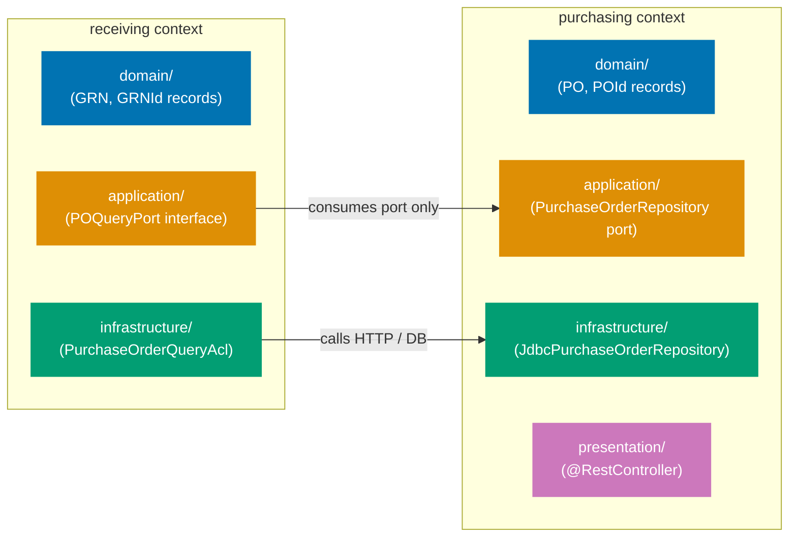
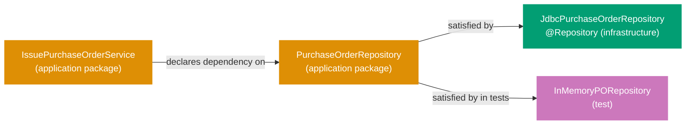

## Guide 1 — One Context, One Hexagon

### Why It Matters

A bounded context is not just a package name — it is an isolation unit. Every time two contexts share a repository directly or call each other's domain objects without an explicit port, a change in one cascades invisibly into the other. In the `procurement-platform-be` service, each bounded context owns its own `domain`, `application`, `infrastructure`, and `presentation` packages. Nothing crosses the context boundary except through an interface declared in the `application` package. Getting this isolation invariant right from day one is the single most valuable structural decision in a DDD + hexagonal Java codebase.

### Standard Library First

Java packages group related classes but enforce no architectural boundary. The compiler does not stop `receiving` from importing `PurchaseOrderRepository` directly from another context's `infrastructure` package. The package system provides cohesion, not isolation.

```java
// Standard library approach: packages group code but enforce no boundary
// Demonstrates the stdlib package approach that the hexagonal context layout supersedes.

package com.procurement.platform.receiving;

// Direct import from another context's infrastructure — no barrier here
import com.procurement.platform.purchasing.infrastructure.JdbcPurchaseOrderRepository;
// => Java allows cross-package imports unconditionally
// => The compiler sees no violation even though receiving is
//    reading purchasing infrastructure internals directly
// => Any refactor of JdbcPurchaseOrderRepository silently breaks receiving logic

public class GoodsReceiptService {
    private final JdbcPurchaseOrderRepository poRepo; // infrastructure type leaking into a domain service
    // => GoodsReceiptService now depends on a Spring Data JDBC class
    // => Unit testing GoodsReceiptService requires a full Spring context or a mock of JdbcPurchaseOrderRepository
    // => The boundary exists only in the developer's head
}
```

**Limitation for production**: packages permit cross-context imports with no enforcement. As the codebase grows, accidental coupling accumulates silently. Dependency analysis tools like ArchUnit can detect violations post-hoc, but nothing prevents them at the code level.

### Production Framework

The hexagonal pattern enforces the boundary by making each context own its `domain`, `application`, `infrastructure`, and `presentation` packages, and only exposing types through interfaces declared in the `application` package. No class in `receiving.domain` imports anything from `purchasing.infrastructure` — it talks to the purchasing context through a port interface declared in `receiving.application`.



The `procurement-platform-be` service places each bounded context at its own top-level package under `com.procurement.platform`:

```java
// Purchasing context domain layer — PurchaseOrder aggregate identity
package com.procurement.platform.purchasing.domain;

// => Package path mirrors the hexagonal layer: purchasing context, domain layer
// => No Spring imports anywhere in this file — records are pure Java SE

import java.util.Objects;
import java.util.UUID;

public record PurchaseOrderId(UUID value) {
    // => Strongly-typed wrapper: prevents passing a supplier ID where a PO ID is expected
    // => Java record provides equals, hashCode, toString automatically
    // => Compact constructor adds validation
    // => Internal representation wraps a UUID; the REST API layer formats it as "po_<uuid>" in response DTOs
    public PurchaseOrderId {
        Objects.requireNonNull(value, "PurchaseOrderId value must not be null");
        // => Canonical constructor validation — throws NullPointerException if null
    }
}

public record PurchaseOrder(
    PurchaseOrderId id,           // => Aggregate identity — drives equality
    SupplierId supplierId,        // => Strongly-typed supplier reference — not a raw UUID
    Money totalAmount,            // => Value object: amount + ISO 4217 currency code
    ApprovalLevel approvalLevel,  // => Enum: L1 (≤ $1k), L2 (≤ $10k), L3 (> $10k)
    PurchaseOrderStatus status    // => Enum: Draft → AwaitingApproval → Approved → … → Closed
) {}
// => Plain Java record: immutable, no @Entity, no @Column, no Jackson @JsonProperty
// => The ORM mapping lives in the infrastructure layer (Guide 8)
// => The serialization mapping lives in the presentation layer (Guide 6)
```

**Trade-offs**: the per-context package layout requires discipline in code review — the Java compiler cannot stop a developer from adding a cross-context import. Tools like ArchUnit enforce the boundary mechanically in CI. The payoff is that each context can evolve its domain model independently, and a unit test for one context never requires a Spring context from another context.

---

## Guide 2 — Reading the Per-Context Package Layout

### Why It Matters

The production layout for `procurement-platform-be` places every bounded context at a dedicated top-level package under `com.procurement.platform`. Each context owns four sub-packages: `domain`, `application`, `infrastructure`, and `presentation`. Before writing any new feature code you need to read this layout fluently — otherwise you misplace new files or misread which types belong to the domain boundary versus the infrastructure boundary.

### Standard Library First

A flat layout is a direct consequence of starting with a single-concern Spring Boot scaffold. Spring Boot's `@SpringBootApplication` scans the entire root package and registers everything it finds. A flat layout means all domain-adjacent classes sit near the root package, sharing the same Spring component scan. This is the zero-ceremony stdlib approach: it compiles, it runs, and it is adequate for a one-context prototype.

```java
// Flat layout bootstrap: ProcurementPlatformApplication.java — Spring Boot entry point
package com.procurement.platform;
// => Root package: Spring component scan starts here and covers all sub-packages
// => @SpringBootApplication covers @Configuration + @EnableAutoConfiguration + @ComponentScan

import org.springframework.boot.SpringApplication;
// => SpringApplication: utility class that bootstraps a Spring application from a main method
import org.springframework.boot.autoconfigure.SpringBootApplication;
// => SpringBootApplication: meta-annotation combining @Configuration, @EnableAutoConfiguration,
//    and @ComponentScan — one annotation to start the whole context

@SpringBootApplication
// => Triggers auto-configuration for everything on the classpath: Spring MVC,
//    Jackson, Actuator — no explicit setup needed for defaults
public class ProcurementPlatformApplication {
    public static void main(String[] args) {
        SpringApplication.run(ProcurementPlatformApplication.class, args);
        // => SpringApplication.run bootstraps the ApplicationContext
        // => The class argument tells Spring Boot which package to scan from
        // => Args forwarded: supports --server.port, --spring.profiles.active, etc.
    }
}
```

**Limitation for production**: a single root-package component scan picks up every `@Component`, `@Service`, `@Repository`, and `@Controller` in the codebase — including those from different bounded contexts. As contexts multiply, auto-configuration fights context isolation.

### Production Framework

The hexagonal layout replaces the implicit root scan with explicit per-context `@Configuration` classes that register only their own beans. The `@SpringBootApplication` retains the scan only at the root level to discover the explicit configurations; it does not need to discover individual `@Service` or `@Repository` beans scattered across contexts.

```java
// Per-context package structure: purchasing context domain value objects
package com.procurement.platform.purchasing.domain;
// => Domain package: no Spring, no JDBC, no Jackson imports allowed here
// => All types are pure Java records or sealed interfaces

import java.math.BigDecimal;
import java.util.Objects;

public record Money(BigDecimal amount, String currency) {
    // => Value object wrapping an amount and a 3-letter ISO 4217 currency code
    // => Compact constructor enforces invariants at object boundary
    // => Java record: immutable after construction — no setter methods generated
    public Money {
        Objects.requireNonNull(amount, "Money amount must not be null");
        // => Null guard: enforced at construction — never a null amount in the domain
        if (amount.compareTo(BigDecimal.ZERO) < 0)
            throw new IllegalArgumentException("Money amount must not be negative");
        // => Domain invariant: monetary amounts are non-negative — a negative purchase order total is invalid
        Objects.requireNonNull(currency, "Money currency must not be null");
        // => Null guard for currency: prevents NullPointerException in the SQL adapter's CHAR(3) column mapping
        if (currency.length() != 3)
            throw new IllegalArgumentException("Currency must be a 3-letter ISO 4217 code");
        // => Domain invariant: ISO 4217 codes are exactly 3 characters — "USD", "EUR", "IDR" are valid
    }
}
```

The full `com.procurement.platform` package tree follows the four-layer convention in every context:

```
com.procurement.platform
├── purchasing
│   ├── domain          // PurchaseOrder, PurchaseOrderId, Money, ApprovalLevel (no Spring annotations)
│   ├── application     // IssuePurchaseOrderService, PurchaseOrderRepository port interface
│   ├── infrastructure  // JdbcPurchaseOrderRepository, OutboxEventPublisher
│   └── presentation    // PurchaseOrderController (@RestController)
├── supplier
│   ├── domain
│   ├── application
│   ├── infrastructure
│   └── presentation
├── receiving
│   ├── domain
│   ├── application
│   ├── infrastructure
│   └── presentation
├── invoicing
│   ├── domain
│   ├── application
│   ├── infrastructure
│   └── presentation
├── payments
│   ├── domain
│   ├── application
│   ├── infrastructure
│   └── presentation
├── shared
│   ├── event           // DomainEvent sealed interface
│   ├── config          // @ConfigurationProperties records
│   └── observability   // shared Micrometer wiring
└── ProcurementPlatformApplication.java
```

**Trade-offs**: keeping the per-context layout consistent means new bounded context types always go into `com.procurement.platform.<context>/{domain,application,infrastructure,presentation}/`. The flat `ProcurementPlatformApplication` remains as the scan entry point, not as a template for new classes. Any class that does not fit a context layer goes into `shared/`.

---

## Guide 3 — Domain Types Stay Free of Framework Annotations

### Why It Matters

The single most common way a hexagonal architecture collapses into a layered monolith is when domain types carry framework annotations. The moment a `PurchaseOrder` record has `@Entity`, `@Column`, or `@JsonProperty`, the domain layer depends on a persistence or serialization framework. Switching frameworks — or testing the domain in isolation — now requires framework setup. In `procurement-platform-be`, keeping the domain records free of `jakarta.persistence`, `com.fasterxml.jackson`, or Spring annotations is the invariant that makes everything else possible.

### Standard Library First

Java records carry no annotations by default. The language gives you a pure, framework-free type with equality, immutability, and accessors built in:

```java
// Standard library: pure Java record, zero framework annotations
package com.procurement.platform.purchasing.domain;
// => Domain package: no Spring, no JPA, no Jackson imports allowed here

import java.util.List;
import java.util.Objects;
// => Objects.requireNonNull: standard null guard — throws NullPointerException on null

public record PurchaseOrder(
    PurchaseOrderId id,
    // => Strongly-typed identity — prevents confusion with other aggregate IDs
    // => PurchaseOrderId wraps UUID: the compiler rejects a raw UUID where a PurchaseOrderId is expected
    SupplierId supplierId,
    // => Reference to the supplier — a strongly-typed value object, not a raw String
    // => Cross-context coupling via typed ID: the purchasing context never imports a Supplier aggregate
    List<PurchaseOrderLine> lines,
    // => Value objects representing individual line items — immutable list
    // => Domain invariant: lines must not be empty after PO issuance
    Money totalAmount,
    // => Derived or calculated: the sum of all line totals
    ApprovalLevel approvalLevel,
    // => Enum derived from totalAmount: L1 (≤ $1k), L2 (≤ $10k), L3 (> $10k)
    PurchaseOrderStatus status
    // => Enum: Draft → AwaitingApproval → Approved → Issued → … → Closed
    // => No ORM column mapping annotation — the infrastructure layer owns that mapping
) {
    // => Java record compact constructor: runs before each component is assigned
    // => All validation happens here — the record is immutable after construction
    public PurchaseOrder {
        Objects.requireNonNull(id, "PurchaseOrder id must not be null");
        // => Null guard for identity — throws NullPointerException at construction time
        Objects.requireNonNull(supplierId, "PurchaseOrder supplierId must not be null");
        // => Every PO must reference a supplier — orphan POs violate the domain model
        Objects.requireNonNull(lines, "PurchaseOrder lines must not be null");
        // => Lines list must be present — may be empty for Draft state, validated on issuance
        Objects.requireNonNull(totalAmount, "PurchaseOrder totalAmount must not be null");
        Objects.requireNonNull(approvalLevel, "PurchaseOrder approvalLevel must not be null");
        Objects.requireNonNull(status, "PurchaseOrder status must not be null");
        // => Status must be initialized — Draft is the correct initial value, enforced by factory methods
    }
}
```

**Limitation for production**: when you need to persist a domain record, the ORM needs column names and table mappings. The standard library gives you no mechanism for this — you have to decide where the ORM mapping lives.

### Production Framework

The hexagonal answer is: ORM and serialization mappings live in the infrastructure and presentation layers, not the domain layer. The domain record is a pure Java record. The JDBC mapping lives in the adapter in `infrastructure/` with explicit SQL, and a mapper translates between the row and the domain record. Spring Boot 4 supports plain `JdbcClient` result mappings that avoid JPA entities entirely.

```java
// GlobalExceptionHandler.java — Spring exception mapping in the shared config layer, not domain
package com.procurement.platform.shared.config;
// => shared/config/ is the infrastructure/framework wiring layer — not a domain package

import org.springframework.http.HttpStatus;
// => HttpStatus: enum of HTTP status codes — used to set the response status
import org.springframework.http.ProblemDetail;
// => ProblemDetail: RFC 9457 / HTTP Problem Details — Spring 6+ standard error response format
import org.springframework.web.bind.annotation.ExceptionHandler;
// => @ExceptionHandler: marks a method as an exception handler for specific exception types
import org.springframework.web.bind.annotation.RestControllerAdvice;
// => @RestControllerAdvice: combines @ControllerAdvice and @ResponseBody for all @RestControllers

@RestControllerAdvice
// => @RestControllerAdvice: applies @ExceptionHandler methods to all @RestControllers
// => This is infrastructure wiring — it lives in shared/config/, not in any bounded context domain package
// => Domain exceptions (e.g., PurchaseOrderNotFoundException) bubble up; this class translates them to HTTP
public class GlobalExceptionHandler {

    @ExceptionHandler(Exception.class)
    // => Catch-all handler: covers any exception not matched by a more specific @ExceptionHandler
    // => More specific handlers (e.g., for PurchasingException) can be added without touching domain code
    public ProblemDetail handleGenericException(Exception ex) {
        ProblemDetail problem = ProblemDetail.forStatus(HttpStatus.INTERNAL_SERVER_ERROR);
        // => ProblemDetail.forStatus: produces an RFC 9457 JSON body with status 500
        // => The domain never produces ProblemDetail — that is this layer's responsibility
        problem.setDetail(ex.getMessage());
        // => ex.getMessage() surfaces the exception message in the error response
        // => Production: scrub sensitive messages before surfacing to clients
        return problem;
        // => Spring serializes ProblemDetail to application/problem+json automatically
    }
}
```

The dependency rule flows inward: `infrastructure` and `presentation` know about `domain`; `domain` knows about neither. ArchUnit tests in CI enforce the rule: no import from `domain` may reference any class in `infrastructure`, `presentation`, or any Spring package.

**Trade-offs**: keeping domain records annotation-free means you need a separate mapping step at the boundary. For simple CRUD aggregates this mapping is tedious. For complex aggregates with invariants validated at construction time, the separation pays for itself immediately — you can test the entire domain layer with zero Spring context setup.

---

## Guide 4 — Application Service Signatures Take and Return Aggregates, Not DTOs

### Why It Matters

Application services are the orchestration layer between the driving adapter (the Spring `@RestController`) and the domain. A common anti-pattern is letting the application service accept and return the same DTO types the controller works with — Jackson-friendly classes with nullable fields, no invariants, and `@JsonProperty` annotations. When that happens, the application service cannot enforce domain rules without re-validating on every call, and the domain model becomes a ceremonial wrapper around the DTO. In `procurement-platform-be`, the design rule is: application services accept and return domain aggregates; the controller owns the DTO translation.

### Standard Library First

Java interfaces naturally express an application service contract with domain types only. The standard library gives you `Optional` for absence and `java.util.function` for functional composition without any framework:

```java
// Standard library: application service as a plain interface with domain types only
package com.procurement.platform.purchasing.application;
// => application/ package: orchestration contracts and service interfaces
// => No Spring imports — the interface is framework-agnostic

import com.procurement.platform.purchasing.domain.PurchaseOrder;
// => PurchaseOrder: the domain aggregate — the service returns fully validated records
import com.procurement.platform.purchasing.domain.PurchaseOrderId;
// => PurchaseOrderId: the strongly-typed identity — prevents raw String/UUID passing at the boundary
import com.procurement.platform.purchasing.domain.SupplierId;
// => SupplierId: strongly-typed supplier reference — passed as a domain type, not a raw String
import java.util.Optional;
// => Optional for absence: findById returns Optional<PurchaseOrder>, not null

public interface IssuePurchaseOrderService {
    // => Java interface: the contract without the implementation
    // => The implementation (the service class) lives in infrastructure/

    PurchaseOrder issue(SupplierId supplierId, List<PurchaseOrderLine> lines);
    // => Parameters are domain types — the smart constructor inside this method
    //    builds the aggregate and enforces invariants
    // => Returns the full domain aggregate, not a response DTO

    Optional<PurchaseOrder> findById(PurchaseOrderId id);
    // => Optional<PurchaseOrder>: absence is a valid domain outcome, not null
    // => PurchaseOrderId is a strongly-typed domain value — not a raw UUID or String
    // => The controller translates absent -> 404, present -> 200 + DTO

    PurchaseOrder cancel(PurchaseOrderId id);
    // => Returns the updated aggregate — the controller translates to 200 + DTO
    // => Throws a domain exception (e.g., PurchaseOrderNotFoundException) if not found
    // => The GlobalExceptionHandler translates domain exceptions to HTTP status codes
}
```

**Limitation for production**: plain `throws Exception` loses type information. Production services declare specific exception types so controllers can pattern-match on failure modes precisely.

### Production Framework

In the Spring stack the controller owns the DTO translation. The application service never touches `HttpServletRequest`, `ResponseEntity`, or any Spring MVC type. Spring injects the service implementation via constructor injection — the controller declares the interface type, not the concrete class:

```java
// Production application service interface with typed exceptions
package com.procurement.platform.purchasing.application;

import com.procurement.platform.purchasing.domain.PurchaseOrder;
import com.procurement.platform.purchasing.domain.PurchaseOrderId;
import com.procurement.platform.purchasing.domain.PurchaseOrderLine;
import com.procurement.platform.purchasing.domain.SupplierId;
// => Only domain types imported — no Spring, no Jakarta, no Jackson
import java.util.List;
import java.util.Optional;

public interface IssuePurchaseOrderService {
    // => Pure Java interface: zero Spring coupling
    // => Spring injects the @Service implementation at startup via constructor injection
    // => The controller declares this interface type — it never imports the concrete @Service class

    PurchaseOrder issue(SupplierId supplierId, List<PurchaseOrderLine> lines)
            throws DuplicatePurchaseOrderException;
    // => Typed exception: DuplicatePurchaseOrderException signals a business rule violation
    // => The GlobalExceptionHandler (or a specific @ExceptionHandler) maps it to HTTP 409
    // => Declared in the throws clause: callers are aware of this outcome at compile time

    Optional<PurchaseOrder> findById(PurchaseOrderId id);
    // => No checked exception: absence is not an error — it is returned as Optional.empty()
    // => The controller decides whether Optional.empty() means 404 or something else

    PurchaseOrder cancel(PurchaseOrderId id)
            throws PurchaseOrderNotFoundException, InvalidPurchaseOrderStateException;
    // => PurchaseOrderNotFoundException: cannot cancel a nonexistent PO
    // => InvalidPurchaseOrderStateException: cancellation only valid before Issued state
    // => The @ExceptionHandler maps each to a distinct HTTP status code
}
```

**Trade-offs**: this clean interface boundary forces you to write a mapping method in the controller layer. For thin CRUD endpoints the mapping is boilerplate. For endpoints where the domain aggregate has validated invariants, the payoff is substantial — the application service is testable with a pure in-memory adapter and zero Spring context.

---

## Guide 5 — Output Port as Java Interface

### Why It Matters

Output ports define _what_ the application layer needs from the outside world without specifying _how_ it is implemented. In Java hexagonal architecture the idiomatic output port is a Java interface declared in the `application` package. The application service declares a dependency on the interface; Spring Boot wires the infrastructure adapter implementation at startup via constructor injection. This makes adapter swapping — in production and in tests — a configuration decision, not a code change. `procurement-platform-be` uses this pattern for every infrastructure dependency: the repository, the event publisher, the approval router, and the supplier notifier.

### Standard Library First

Java interfaces are the standard library's mechanism for expressing a contract without an implementation. The `java.util.function` package gives you functional types (`Function`, `Supplier`, `Consumer`) that serve as single-operation port alternatives:

```java
// Standard library: output port as a plain Java interface
package com.procurement.platform.purchasing.application;

import com.procurement.platform.purchasing.domain.PurchaseOrder;
import com.procurement.platform.purchasing.domain.PurchaseOrderId;
// => Only domain types in the application package — no JPA, no JDBC

import java.util.Optional;

public interface PurchaseOrderRepository {
    // => Java interface as output port: declares what the application layer needs
    // => No implementation here — the infrastructure adapter provides it
    // => This interface is the only thing the application service knows about persistence

    PurchaseOrder save(PurchaseOrder purchaseOrder);
    // => Write-side port: persist a domain aggregate, return saved instance
    // => Returns PurchaseOrder: may include generated fields (e.g., database-assigned timestamps)
    // => Throws RuntimeException subtypes (e.g., RepositoryException) on failure

    Optional<PurchaseOrder> findById(PurchaseOrderId id);
    // => Read-side port: retrieve by identity
    // => Optional wraps absence — the service does not receive null
    // => The adapter queries the DB and maps the result to a domain PurchaseOrder record

    boolean existsById(PurchaseOrderId id);
    // => Lightweight existence check: no full aggregate load needed for duplicate guards
    // => Returns true if a PO with the given id exists; false otherwise
}
```

**Limitation for production**: a bare `PurchaseOrder save(PurchaseOrder)` gives the caller no way to distinguish a network failure from a constraint violation. Production ports declare specific exception types or use `Result`-style return types so the application service can react to failure modes.

### Production Framework

In the Spring stack the output port interface is declared in the `application` package and its implementation — a Spring `@Repository`-annotated class — lives in `infrastructure`. Spring Boot wires them via constructor injection. No `@Autowired` field injection; no `ApplicationContext.getBean()` lookup:



```java
// Production output port with typed exceptions — application package
package com.procurement.platform.purchasing.application;

import com.procurement.platform.purchasing.domain.PurchaseOrder;
import com.procurement.platform.purchasing.domain.PurchaseOrderId;
// => Only domain types imported — the interface is entirely in domain and stdlib terms

import java.util.Optional;

public interface PurchaseOrderRepository {
    // => Output port interface declared in application/ — not in infrastructure/
    // => The @Repository adapter in infrastructure/ implements this interface
    // => The application service's constructor parameter is this interface type

    PurchaseOrder save(PurchaseOrder purchaseOrder) throws RepositoryException;
    // => Returns the saved PurchaseOrder: database may enrich with timestamps or sequence values
    // => RepositoryException: domain-adjacent exception signalling an infrastructure failure
    // => The GlobalExceptionHandler maps RepositoryException to HTTP 500 + ProblemDetail (RFC 9457)

    Optional<PurchaseOrder> findById(PurchaseOrderId id);
    // => Read-side operation: returns Optional.empty() when the PO does not exist
    // => Optional communicates absence without null — no NullPointerException risk

    boolean existsById(PurchaseOrderId id);
    // => Lightweight existence check without loading the full aggregate
    // => Callers use this for duplicate-check guard before saving a new PO
}
```

**Trade-offs**: a single `PurchaseOrderRepository` interface with multiple operations is clean for CRUD aggregates. For aggregates with distinct read and write concerns, split the interface into a command repository and a query repository (CQRS at the port level). Adding methods to the interface requires updating all adapters — a useful forcing function to keep adapters honest.

---

## Guide 6 — Spring `@RestController` as Primary Adapter

### Why It Matters

The Spring `@RestController` is the primary (driving) adapter in the hexagonal architecture. Its job is exactly this: translate an HTTP request into a domain command or query, call the application service, and translate the domain result into an HTTP response. A controller that contains business logic, validates domain invariants, or directly calls a JDBC adapter has crossed out of the adapter layer into the domain or infrastructure — the most common source of untestable, entangled production code. In `procurement-platform-be`, every controller serves one bounded context and delegates entirely to an application service interface.

### Standard Library First

Java's `HttpServlet` is the standard library equivalent of a Spring controller. Without Spring MVC you write a `doGet` or `doPost` override in an `HttpServlet` subclass. The ceremony is high and composition is manual:

```java
// Standard library: plain HttpServlet without Spring MVC
// Demonstrates the stdlib servlet pattern that Spring @RestController supersedes.

import jakarta.servlet.http.HttpServlet;
// => HttpServlet: base class for servlets — subclass and override doGet, doPost, etc.
import jakarta.servlet.http.HttpServletRequest;
// => HttpServletRequest: provides access to the HTTP request (method, headers, body, params)
import jakarta.servlet.http.HttpServletResponse;
// => HttpServletResponse: provides access to the HTTP response (status, headers, body)
import java.io.IOException;
// => IOException: thrown by getWriter().write() — must be declared or caught

public class HealthServlet extends HttpServlet {
    // => HttpServlet: subclass and override doGet, doPost, etc.
    // => No automatic JSON serialization — you write to the output stream manually
    // => No routing: the servlet container maps URLs to servlet classes via web.xml or @WebServlet

    @Override
    protected void doGet(HttpServletRequest req, HttpServletResponse resp)
            throws IOException {
        // => Override per-method: doGet, doPost, doPut, doDelete are separate overrides
        // => throws IOException: propagates write failures to the servlet container
        resp.setContentType("application/json");
        // => Set content type manually — no automatic negotiation
        resp.setStatus(HttpServletResponse.SC_OK);
        // => Set status code explicitly: 200 OK
        resp.getWriter().write("{\"status\":\"UP\"}");
        // => Write JSON string manually — no object-to-JSON conversion
        // => A Jackson ObjectMapper call would replace this, but that is extra ceremony
    }
}
```

**Limitation for production**: routing, serialization, validation, exception handling, and content negotiation must all be wired manually. Spring MVC handles all of these declaratively.

### Production Framework

A `PurchaseOrderController` shows the minimal Spring `@RestController` — the primary adapter for the purchasing context:

```java
// Spring @RestController — primary (driving) adapter for the purchasing context
package com.procurement.platform.purchasing.presentation;
// => purchasing/presentation/ package: @RestController adapters live here

import org.springframework.web.bind.annotation.GetMapping;
import org.springframework.web.bind.annotation.RequestMapping;
import org.springframework.web.bind.annotation.RestController;
// => Spring MVC annotations: @RestController = @Controller + @ResponseBody
// => @RequestMapping sets the base URL path for all methods in this class
// => @GetMapping is shorthand for @RequestMapping(method = RequestMethod.GET)

import java.util.Map;
// => Map.of() is used for the health response — no DTO record needed for a trivial check

@RestController
// => @RestController: Spring registers this as an HTTP handler; serializes return values to JSON
// => No explicit @ResponseBody needed: @RestController implies it for all methods
@RequestMapping("/api/v1")
// => Base path: all mappings in this class are relative to /api/v1
public class HealthController {

    @GetMapping("/health")
    // => GET /api/v1/health: no path variable, no request body, no authentication
    // => Spring MVC resolves this mapping during context startup — no runtime routing table needed
    public Map<String, String> health() {
        // => Return type Map<String, String>: Jackson serializes this to {"status":"UP"}
        // => No ResponseEntity wrapper: Spring MVC uses the return type to set 200 OK
        return Map.of("status", "UP");
        // => Map.of: immutable single-entry map — Java 9+ standard library
        // => "status" key matches the expected health check response format
    }
}
```

A domain-backed controller for `POST /api/v1/purchase-orders` follows the same pattern but adds the translation steps. The controller declares the application service interface — never the concrete `@Service` class — as a constructor parameter:

```java
// Domain-backed PurchaseOrderController for a PO issuance command
package com.procurement.platform.purchasing.presentation;

import com.procurement.platform.purchasing.application.IssuePurchaseOrderService;
import com.procurement.platform.purchasing.application.DuplicatePurchaseOrderException;
// => Application layer interface and exception — not the @Service implementation
// => The controller is decoupled from the concrete adapter class
import com.procurement.platform.purchasing.domain.PurchaseOrderLine;
import com.procurement.platform.purchasing.domain.SupplierId;
// => Domain value objects used to build the aggregate command
import org.springframework.http.HttpStatus;
import org.springframework.http.ResponseEntity;
import org.springframework.web.bind.annotation.*;
// => Spring MVC annotations only — no JPA, no domain construction in the annotation block

import java.util.List;
// => List<PurchaseOrderLineRequest>: the ordered line items in the request DTO — mapped to domain PurchaseOrderLine
import java.util.UUID;
// => UUID.fromString: parses String supplierId from the request body — throws IllegalArgumentException on malformed input

public record IssuePurchaseOrderRequest(String supplierId, List<PurchaseOrderLineRequest> lines) {}
// => Request DTO as a Java record: immutable, no validation annotations at this level
// => Lives in the presentation package — domain never imports this type

public record PurchaseOrderResponse(String id, String supplierId, String status, String approvalLevel) {}
// => Response DTO: maps domain aggregate fields to JSON-serializable types
// => String id: UUID converted to String for JSON — domain uses PurchaseOrderId record
// => The application service never produces or consumes this type

@RestController
// => @RestController: combines @Controller and @ResponseBody — all methods return JSON
@RequestMapping("/api/v1/purchase-orders")
// => Base path scoped to the purchasing context — each context owns its URL prefix
public class PurchaseOrderController {

    private final IssuePurchaseOrderService issueService;
    // => Constructor injection: Spring Boot injects the @Service implementation at startup
    // => Field is final: immutable after construction — thread-safe by default
    // => Interface type declared here — the controller never imports the concrete @Service class

    public PurchaseOrderController(IssuePurchaseOrderService issueService) {
        this.issueService = issueService;
        // => No @Autowired annotation needed: Spring Boot auto-detects single-constructor injection
        // => Declaring the interface type means the controller works with any adapter implementation
    }

    @PostMapping
    // => @PostMapping: handles HTTP POST to /api/v1/purchase-orders
    public ResponseEntity<PurchaseOrderResponse> issuePurchaseOrder(
            @RequestBody IssuePurchaseOrderRequest request) {
        // => @RequestBody: Jackson deserializes the HTTP request body into IssuePurchaseOrderRequest
        // => Returns ResponseEntity to control the HTTP status code explicitly
        var supplierId = new SupplierId(UUID.fromString(request.supplierId()));
        // => Translate DTO -> domain value object: UUID.fromString throws on malformed input
        // => SupplierId: strongly-typed wrapper — the service receives SupplierId, not a raw UUID
        var lines = request.lines().stream()
            .map(l -> new PurchaseOrderLine(new SkuCode(l.skuCode()), new Quantity(l.quantity(), UnitOfMeasure.valueOf(l.unit())), new Money(l.unitPrice(), l.currency())))
            // => Each request line becomes a domain PurchaseOrderLine — Money enforces invariants at construction
            .toList();
        // => Map each request line to a domain value object — the domain rejects invalid values
        // => toList(): immutable List — domain invariants prevent mutation after issuance
        var po = issueService.issue(supplierId, lines);
        // => Application service enforces domain invariants and persists the aggregate
        var response = new PurchaseOrderResponse(
            po.id().value().toString(),
            // => po.id().value(): unwrap PurchaseOrderId -> UUID -> String for JSON
            po.supplierId().value().toString(),
            po.status().name(),
            po.approvalLevel().name()
            // => Map each domain field to the response DTO — one mapping, one place
        );
        return ResponseEntity.status(HttpStatus.CREATED).body(response);
        // => HTTP 201 Created: the standard status for successful resource creation
        // => body(response): Spring MVC / Jackson serializes PurchaseOrderResponse to JSON
    }
}
```

**Trade-offs**: Spring `@RestController` requires Jackson on the classpath and Spring MVC auto-configuration. For a microservice that serves REST JSON this is always present. The payoff: routing, serialization, content negotiation, and exception handling are all declarative, leaving the controller as pure adapter code with no HTTP ceremony.

---

## Guide 7 — Spring `@Configuration` as Composition Root

### Why It Matters

The composition root is the single place in the application where all dependencies are wired together. In object-oriented hexagonal architecture, the composition root must know about concrete adapter classes — that is where the `new JdbcPurchaseOrderRepository()` or `new InMemoryPurchaseOrderRepository()` decision is made, not inside the application service. Spring Boot 4's `@Configuration` classes are the idiomatic composition root: they declare `@Bean` methods that construct and wire concrete types, while the rest of the codebase depends only on interfaces. Without a disciplined composition root, `@Autowired` field injection scatters wiring decisions across hundreds of classes, making adapter swapping impossible without touching production code.

### Standard Library First

Without Spring, the composition root is a plain `main` method or a factory class that constructs all objects manually. This is the pure dependency injection approach — no framework, no magic:

```java
// Standard library: manual composition root in main()
// Demonstrates the manual DI pattern that Spring @Configuration supersedes.

public class Application {
    public static void main(String[] args) {
        // => Composition root: all concrete types constructed here
        // => The rest of the codebase only sees interfaces

        var purchaseOrderRepository = new InMemoryPurchaseOrderRepository();
        // => Concrete adapter chosen at startup — swap to JdbcPurchaseOrderRepository for production
        // => No @Autowired magic: the dependency is explicit and visible

        var eventPublisher = new InMemoryEventPublisher();
        // => Concrete event publisher: in-memory for local dev, outbox for production
        // => The application service receives the interface — not InMemoryEventPublisher

        var issueService = new IssuePurchaseOrderServiceImpl(purchaseOrderRepository, eventPublisher);
        // => Constructor injection: service receives the interface, not the concrete class
        // => Changing the adapter means changing only this line

        var purchaseOrderController = new PurchaseOrderController(issueService);
        // => Controller receives the service interface — it does not know about InMemory or JDBC
        // => The entire wiring is visible in one place: this main method
    }
}
```

**Limitation for production**: manual wiring of hundreds of beans is impractical. Spring's `@Configuration` provides the same composition-root discipline at scale, with lifecycle management, profile-based switching, and test context override.

### Production Framework

Spring Boot 4's `ProcurementPlatformApplication.java` is the entry point, but the wiring is expressed in `@Configuration` classes. For bounded context wiring with explicit port-to-adapter binding, a dedicated `@Configuration` class in the context's `infrastructure` package makes the dependency graph explicit:

```java
// Current entry point: ProcurementPlatformApplication.java
package com.procurement.platform;
// => com.procurement.platform: root package — Spring Boot scans from here

import org.springframework.boot.SpringApplication;
// => SpringApplication: entry-point bootstrap utility — run() starts the entire ApplicationContext
import org.springframework.boot.autoconfigure.SpringBootApplication;

@SpringBootApplication
// => @SpringBootApplication triggers component scan from this package downward
// => Every @Component, @Service, @Repository, @RestController in sub-packages is registered
// => Auto-configuration reads the classpath: spring-boot-starter-web adds DispatcherServlet,
//    Jackson ObjectMapper, and Tomcat embedded server automatically
public class ProcurementPlatformApplication {
    public static void main(String[] args) {
        SpringApplication.run(ProcurementPlatformApplication.class, args);
        // => SpringApplication.run: bootstraps ApplicationContext, starts embedded Tomcat,
        //    runs CommandLineRunner/ApplicationRunner beans, and begins accepting requests
        // => args forwarded to Spring: --server.port=8080, --spring.profiles.active=prod, etc.
    }
}
```

The per-context `@Configuration` class wires the port interface to its adapter explicitly, avoiding reliance on `@Autowired` field injection or accidental discovery:

```java
// Production @Configuration — composition root for the purchasing context
package com.procurement.platform.purchasing.infrastructure;

import com.procurement.platform.purchasing.application.IssuePurchaseOrderService;
import com.procurement.platform.purchasing.application.PurchaseOrderRepository;
import com.procurement.platform.purchasing.application.EventPublisher;
// => Application layer interfaces imported — not domain or presentation types
import org.springframework.context.annotation.Bean;
import org.springframework.context.annotation.Configuration;
// => @Configuration: marks this as a Spring bean factory
// => @Bean: each annotated method produces a bean registered in the ApplicationContext
import org.springframework.jdbc.core.simple.JdbcClient;

@Configuration
// => Spring registers this class during component scan
// => All @Bean methods in this class are called once at startup to build the context
public class PurchasingContextConfiguration {

    @Bean
    // => @Bean: Spring calls this method and registers the return value as a singleton
    public PurchaseOrderRepository purchaseOrderRepository(JdbcClient jdbc) {
        return new JdbcPurchaseOrderRepository(jdbc);
        // => Concrete adapter chosen here — in tests, replace this @Configuration
        //    with a test @Configuration that returns new InMemoryPurchaseOrderRepository()
        // => The application service never sees JdbcPurchaseOrderRepository — it receives PurchaseOrderRepository
    }

    @Bean
    // => @Bean: Spring calls this method and registers the EventPublisher singleton
    public EventPublisher eventPublisher(JdbcClient jdbc,
            com.fasterxml.jackson.databind.ObjectMapper objectMapper) {
        return new OutboxEventPublisher(jdbc, objectMapper);
        // => OutboxEventPublisher: writes domain events transactionally — at-least-once delivery
        // => In tests, replace with new InMemoryEventPublisher() via @TestConfiguration
    }

    @Bean
    public IssuePurchaseOrderService issuePurchaseOrderService(
            PurchaseOrderRepository purchaseOrderRepository,
            EventPublisher eventPublisher) {
        // => Spring injects the beans produced by the two @Bean methods above
        // => Constructor injection: explicit, visible, testable
        // => No @Autowired on the service class — the wiring is declared here
        return new IssuePurchaseOrderServiceImpl(purchaseOrderRepository, eventPublisher);
        // => IssuePurchaseOrderServiceImpl is the @Service implementation
        // => It receives the interface, not the concrete adapter
    }
}
```

**Trade-offs**: explicit `@Configuration` classes require more boilerplate than Spring Boot's auto-configuration scan. The payoff is a visible, replaceable wiring graph — integration tests can override a single `@Configuration` to swap the production JDBC adapter for an in-memory stub without modifying any production code. For teams with more than two bounded contexts, this discipline prevents the implicit coupling that component scan enables silently.
