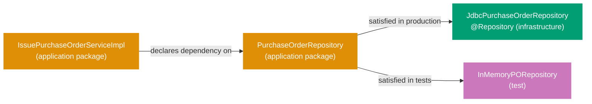
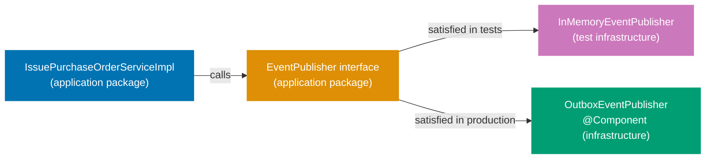
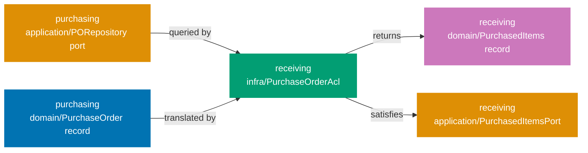

## Guide 8 — Repository Port as Java Interface + Spring Data JDBC Adapter Behind It

### Why It Matters

A repository port is the seam that keeps your application layer independent of the database. Every time you inject a framework persistence type directly into an application service — a Spring Data repository in Java/Kotlin, a `DbContext` subclass in C# EF Core, or a drizzle-orm `db` object in TypeScript — the service becomes untestable without a live database. In `procurement-platform-be`, the per-context package layout declares the repository port as a plain interface in the `application` package. The persistence adapter implements that interface in `infrastructure`. Nothing in the application layer knows whether PostgreSQL, H2, or an in-memory `HashMap` is behind the port.

### Standard Library First

Standard library types give you all the primitives needed to express a repository contract. An interface (or equivalent structural type) using `Optional`/nullable/union-type returns and a typed list is sufficient for a read/write pair with no framework dependency:





```java
// Standard library: repository contract as a plain Java interface over stdlib types
// Demonstrates the stdlib interface approach that the Spring Data JDBC adapter pattern supersedes.

package com.procurement.platform.purchasing.application;
// => application/ package: output port interfaces live here, not in infrastructure/
// => No Spring import anywhere in this file — the interface is framework-agnostic
// => The infrastructure adapter imports this interface; not the other way around

import com.procurement.platform.purchasing.domain.PurchaseOrder;
// => PurchaseOrder: the domain aggregate — the port speaks in domain terms only
// => No jakarta.persistence.Entity, no @Column — domain types have zero ORM annotations
import com.procurement.platform.purchasing.domain.PurchaseOrderId;
// => PurchaseOrderId: strongly-typed identity — prevents passing a raw UUID or String
// => The compiler rejects passing a SupplierId where a PurchaseOrderId is expected
import java.util.Optional;
// => Optional: communicates absence without null — eliminates NullPointerException risk
// => Optional.empty() is a valid domain outcome, not an error

public interface PurchaseOrderRepository {
    // => Java interface: the output port contract — zero implementation here
    // => The infrastructure adapter in infrastructure/ provides the implementation
    // => The application service declares this interface type in its constructor — never the adapter class

    PurchaseOrder save(PurchaseOrder purchaseOrder);
    // => Write-side port: persist or update the aggregate atomically; return the saved instance
    // => The adapter decides whether to INSERT, UPDATE, or UPSERT

    Optional<PurchaseOrder> findById(PurchaseOrderId id);
    // => Read-side port: returns Optional.empty() when the PO does not exist
    // => Optional.empty() is correct: absence is a domain outcome — the adapter never returns null

    boolean existsById(PurchaseOrderId id);
    // => Lightweight existence check: no full aggregate load needed for duplicate-check guards
    // => Returns true if a PO with the given id is present; false otherwise
}
```





```kotlin
// Standard library: repository contract as a plain Kotlin interface over stdlib types
// Demonstrates the stdlib interface approach that the Spring Data JDBC adapter pattern supersedes.

package com.procurement.platform.purchasing.application
// => application/ package: output port interfaces live here, not in infrastructure/
// => No Spring import anywhere in this file — the interface is framework-agnostic
// => The infrastructure adapter imports this interface; not the other way around

import com.procurement.platform.purchasing.domain.PurchaseOrder
// => PurchaseOrder: the domain aggregate — the port speaks in domain terms only
// => No jakarta.persistence.Entity, no @Column — domain types have zero ORM annotations
import com.procurement.platform.purchasing.domain.PurchaseOrderId
// => PurchaseOrderId: strongly-typed identity — prevents passing a raw UUID or String
// => The compiler rejects passing a SupplierId where a PurchaseOrderId is expected

interface PurchaseOrderRepository {
    // => Kotlin interface: the output port contract — zero implementation here
    // => The infrastructure adapter in infrastructure/ provides the implementation
    // => The application service declares this interface type in its constructor — never the adapter class

    fun save(purchaseOrder: PurchaseOrder): PurchaseOrder
    // => Write-side port: persist or update the aggregate atomically; return the saved instance
    // => The adapter decides whether to INSERT, UPDATE, or UPSERT

    fun findById(id: PurchaseOrderId): PurchaseOrder?
    // => Read-side port: returns null when the PO does not exist — Kotlin null-safety replaces Optional
    // => Null is a valid domain outcome here; the adapter never throws for absence

    fun existsById(id: PurchaseOrderId): Boolean
    // => Lightweight existence check: no full aggregate load needed for duplicate-check guards
    // => Returns true if a PO with the given id is present; false otherwise
}
```





```csharp
// Standard library: repository contract as a plain C# interface over BCL types
// Demonstrates the stdlib interface approach that the EF Core adapter pattern supersedes.

namespace Procurement.Platform.Purchasing.Application;
// => Application namespace: output port interfaces live here, not in Infrastructure
// => No framework import anywhere in this file — the interface is adapter-agnostic
// => The infrastructure adapter references this interface; not the other way around

using Procurement.Platform.Purchasing.Domain;
// => PurchaseOrder: the domain aggregate — the port speaks in domain terms only
// => No [Table], no [Column] — domain types have zero ORM attributes

public interface IPurchaseOrderRepository
{
    // => C# interface: the output port contract — zero implementation here
    // => The infrastructure adapter in Infrastructure/ provides the implementation
    // => The application service declares this interface type in its constructor — never the adapter class

    PurchaseOrder Save(PurchaseOrder purchaseOrder);
    // => Write-side port: persist or update the aggregate atomically; return the saved instance
    // => The adapter decides whether to INSERT, UPDATE, or UPSERT

    PurchaseOrder? FindById(PurchaseOrderId id);
    // => Read-side port: returns null when the PO does not exist — nullable reference type expresses absence
    // => Nullable reference types (C# 8+) make absence explicit without a wrapper type

    bool ExistsById(PurchaseOrderId id);
    // => Lightweight existence check: no full aggregate load needed for duplicate-check guards
    // => Returns true if a PO with the given id is present; false otherwise
}
```





```typescript
// Standard library: repository contract as a plain TypeScript interface over stdlib types
// Demonstrates the stdlib interface approach that the drizzle-orm adapter pattern supersedes.

// procurement-platform/purchasing/application/purchase-order-repository.ts
// => application/ directory: output port interfaces live here, not in infrastructure/
// => No framework import anywhere in this file — the interface is adapter-agnostic
// => The infrastructure adapter imports this interface; not the other way around

import type { PurchaseOrder } from "../domain/purchase-order";
// => PurchaseOrder: the domain aggregate — the port speaks in domain terms only
// => No ORM decorators — domain types have zero persistence annotations
import type { PurchaseOrderId } from "../domain/purchase-order-id";
// => PurchaseOrderId: strongly-typed identity — prevents passing a raw string or UUID

export interface PurchaseOrderRepository {
  // => TypeScript interface: the output port contract — zero implementation here
  // => The infrastructure adapter in infrastructure/ provides the implementation
  // => The application service declares this interface type in its constructor — never the adapter class

  save(purchaseOrder: PurchaseOrder): Promise;
  // => Write-side port: persist or update the aggregate atomically; return the saved instance
  // => The adapter decides whether to INSERT, UPDATE, or UPSERT

  findById(id: PurchaseOrderId): Promise;
  // => Read-side port: returns null when the PO does not exist — union type expresses absence
  // => null is a valid domain outcome here; the adapter never throws for absence

  existsById(id: PurchaseOrderId): Promise;
  // => Lightweight existence check: no full aggregate load needed for duplicate-check guards
  // => Returns true if a PO with the given id is present; false otherwise
}
```





**Limitation for production**: a raw `PurchaseOrder save(PurchaseOrder)` swallows the distinction between a network timeout and a unique-constraint violation. Production ports either declare typed exceptions or use a `Result`-style wrapper so the application service can react to each failure mode precisely. The standard library interface also gives you no `JdbcClient`, no connection pooling, and no transaction management — you must wire all of that manually.

### Production Framework

Spring Boot 4 ships a modernised `JdbcClient` (Spring Framework 6.1+) that is leaner than `JdbcTemplate` and does not require a full JPA entity graph. The adapter lives in `infrastructure`, implements the port interface from `application`, and maps between the domain record and SQL rows. The port interface is never modified to accommodate the adapter:



The port interface with typed exceptions in the `application` package:





```java
// Production output port with typed exceptions — application package
package com.procurement.platform.purchasing.application;
// => application/ package: only domain types and stdlib imports allowed here
// => No Spring, no JDBC, no JPA — the interface is adapter-agnostic

import com.procurement.platform.purchasing.domain.PurchaseOrder;
// => PurchaseOrder domain aggregate: the port contract speaks in domain terms only
import com.procurement.platform.purchasing.domain.PurchaseOrderId;
// => PurchaseOrderId value object: strongly-typed identity parameter — no raw String or UUID at the boundary
import java.util.Optional;
// => Optional wraps absence: the caller does not receive null from the port

public interface PurchaseOrderRepository {
    // => Output port interface: declared in application/, implemented in infrastructure/
    // => The @Repository adapter in infrastructure/ satisfies this contract at runtime
    // => The application service constructor parameter is this interface type — never the adapter class
    // => Swapping adapters (JDBC → in-memory) requires only a @Configuration change, not a service change

    PurchaseOrder save(PurchaseOrder purchaseOrder) throws RepositoryException;
    // => Returns the saved PurchaseOrder: may include database-assigned fields (timestamps, sequences)
    // => RepositoryException: domain-adjacent exception signalling an infrastructure failure
    // => The GlobalExceptionHandler maps RepositoryException to HTTP 500 + ProblemDetail (RFC 9457)

    Optional<PurchaseOrder> findById(PurchaseOrderId id);
    // => No checked exception: absence is a valid domain outcome, not an error
    // => Returns Optional.empty() for a missing PO — the controller decides whether to return 404
    // => The adapter never returns null — Optional enforces the contract at the type level

    boolean existsById(PurchaseOrderId id);
    // => Lightweight existence check without loading the full aggregate
    // => false when the PO does not exist — callers use this for duplicate-check guards before saving
}
```





```kotlin
// Production output port with typed exceptions — application package
package com.procurement.platform.purchasing.application
// => application/ package: only domain types and stdlib imports allowed here
// => No Spring, no JDBC, no JPA — the interface is adapter-agnostic

import com.procurement.platform.purchasing.domain.PurchaseOrder
// => PurchaseOrder domain aggregate: the port contract speaks in domain terms only
import com.procurement.platform.purchasing.domain.PurchaseOrderId
// => PurchaseOrderId value object: strongly-typed identity parameter — no raw String or UUID at the boundary

interface PurchaseOrderRepository {
    // => Kotlin interface: declared in application/, implemented in infrastructure/
    // => The @Repository adapter in infrastructure/ satisfies this contract at runtime
    // => The application service constructor parameter is this interface type — never the adapter class
    // => Swapping adapters (JDBC → in-memory) requires only a @Configuration change, not a service change

    @Throws(RepositoryException::class)
    fun save(purchaseOrder: PurchaseOrder): PurchaseOrder
    // => Returns the saved PurchaseOrder: may include database-assigned fields (timestamps, sequences)
    // => RepositoryException: domain-adjacent exception signalling an infrastructure failure
    // => @Throws: Kotlin annotation ensures Java interop callers see the checked exception declaration

    fun findById(id: PurchaseOrderId): PurchaseOrder?
    // => No checked exception: absence is a valid domain outcome, not an error
    // => Returns null for a missing PO — Kotlin null-safety enforces the contract at compile time
    // => The adapter never throws for absence — null is the correct signal

    fun existsById(id: PurchaseOrderId): Boolean
    // => Lightweight existence check without loading the full aggregate
    // => false when the PO does not exist — callers use this for duplicate-check guards before saving
}
```





```csharp
// Production output port with typed exceptions — Application namespace
namespace Procurement.Platform.Purchasing.Application;
// => Application namespace: only domain types and BCL imports allowed here
// => No EF Core, no ADO.NET — the interface is adapter-agnostic

using Procurement.Platform.Purchasing.Domain;
// => PurchaseOrder domain aggregate: the port contract speaks in domain terms only
// => PurchaseOrderId value object: strongly-typed identity parameter — no raw string or Guid at the boundary

public interface IPurchaseOrderRepository
{
    // => Output port interface: declared in Application, implemented in Infrastructure
    // => The repository adapter in Infrastructure satisfies this contract at runtime
    // => The application service constructor parameter is this interface type — never the adapter class
    // => Swapping adapters (EF Core → in-memory) requires only a DI registration change, not a service change

    PurchaseOrder Save(PurchaseOrder purchaseOrder);
    // => Returns the saved PurchaseOrder: may include database-assigned fields (timestamps, sequences)
    // => Throws RepositoryException on infrastructure failure — maps to HTTP 500 + ProblemDetails (RFC 9457)
    // => RepositoryException: domain-adjacent exception signalling an infrastructure failure

    PurchaseOrder? FindById(PurchaseOrderId id);
    // => No exception: absence is a valid domain outcome, not an error
    // => Returns null for a missing PO — nullable reference type enforces absence at the call site
    // => The adapter never throws for absence — null? is the correct signal

    bool ExistsById(PurchaseOrderId id);
    // => Lightweight existence check without loading the full aggregate
    // => false when the PO does not exist — callers use this for duplicate-check guards before saving
}
```





```typescript
// Production output port with typed exceptions — application layer
// procurement-platform/purchasing/application/purchase-order-repository.ts
// => application/ directory: only domain types and stdlib imports allowed here
// => No pg, no drizzle-orm — the interface is adapter-agnostic

import type { PurchaseOrder } from "../domain/purchase-order";
// => PurchaseOrder domain aggregate: the port contract speaks in domain terms only
import type { PurchaseOrderId } from "../domain/purchase-order-id";
// => PurchaseOrderId value object: strongly-typed identity parameter — no raw string or UUID

export class RepositoryException extends Error {
  // => Domain-adjacent exception signalling an infrastructure failure
  constructor(
    message: string,
    public readonly cause?: unknown,
  ) {
    super(message);
    // => Preserve cause for logging — infrastructure details stay inside the adapter
  }
}

export interface PurchaseOrderRepository {
  // => Output port interface: declared in application/, implemented in infrastructure/
  // => The adapter in infrastructure/ satisfies this contract at runtime
  // => The application service constructor parameter is this interface type — never the adapter class
  // => Swapping adapters (pg → in-memory) requires only a DI binding change, not a service change

  save(purchaseOrder: PurchaseOrder): Promise;
  // => Returns the saved PurchaseOrder: may include database-assigned fields (timestamps, sequences)
  // => Rejects with RepositoryException on infrastructure failure — maps to HTTP 500

  findById(id: PurchaseOrderId): Promise;
  // => No rejection on absence: absence is a valid domain outcome, not an error
  // => Returns null for a missing PO — union type enforces absence at the call site
  // => The adapter never rejects for absence — null is the correct signal

  existsById(id: PurchaseOrderId): Promise;
  // => Lightweight existence check without loading the full aggregate
  // => false when the PO does not exist — callers use this for duplicate-check guards before saving
}
```





The `JdbcClient` adapter in the `infrastructure` package maps between the domain record and SQL rows:





```java
// Spring Data JDBC adapter implementing the output port
package com.procurement.platform.purchasing.infrastructure;
// => infrastructure/ package: Spring-managed adapters live here — not in application/ or domain/

import com.procurement.platform.purchasing.application.PurchaseOrderRepository;
// => Output port interface from application/ — the adapter implements this contract
import com.procurement.platform.purchasing.application.RepositoryException;
// => Infrastructure failure wrapper — the adapter translates DuplicateKeyException into this type
import com.procurement.platform.purchasing.domain.PurchaseOrder;
// => PurchaseOrder domain aggregate — the adapter maps between PurchaseOrder records and SQL rows
import com.procurement.platform.purchasing.domain.PurchaseOrderId;
// => PurchaseOrderId value object — unwrapped to UUID for SQL parameter binding
import com.procurement.platform.purchasing.domain.SupplierId;
// => SupplierId value object — unwrapped to UUID for SQL parameter binding
import com.procurement.platform.purchasing.domain.Money;
// => Money value object — unwrapped to amount + currency for SQL parameter binding
import com.procurement.platform.purchasing.domain.PurchaseOrderStatus;
// => PurchaseOrderStatus enum — mapped from the text column on read
import org.springframework.jdbc.core.simple.JdbcClient;
// => JdbcClient: Spring Framework 6.1+ modernised JDBC API — fluent, type-safe, no RowMapper boilerplate
// => Spring Boot 4 auto-configures JdbcClient from the DataSource bean — no manual wiring needed
import org.springframework.dao.DuplicateKeyException;
// => DuplicateKeyException: Spring's translation of SQL unique-constraint violations (SQLSTATE 23505)
// => Spring wraps raw JDBC SQLExceptions into DataAccessException hierarchy — no SQLSTATE string parsing
import org.springframework.stereotype.Repository;
// => @Repository: Spring registers this class as a bean during component scan
// => Also enables Spring's PersistenceExceptionTranslationPostProcessor for JDBC exceptions
import java.math.BigDecimal;
import java.util.Optional;
// => java.util.Optional: return type for findById — communicates absence without null
import java.util.UUID;
// => UUID: used by the RowMapper to extract the typed id column from the ResultSet

@Repository
// => @Repository: Spring discovers this bean via the root-package scan in ProcurementPlatformApplication
// => Guide 15 shows the @Configuration class that binds this adapter to the PurchaseOrderRepository port explicitly
public class JdbcPurchaseOrderRepository implements PurchaseOrderRepository {
    // => implements PurchaseOrderRepository: the compiler verifies all three port methods are present
    // => The application service only ever sees the PurchaseOrderRepository interface — never this class directly

    private final JdbcClient jdbc;
    // => JdbcClient: injected via the single-constructor rule in Spring Boot 4
    // => No @Autowired annotation needed — Spring Boot detects single-constructor injection automatically
    // => Field is final: immutable after construction — thread-safe by default for concurrent requests

    public JdbcPurchaseOrderRepository(JdbcClient jdbc) {
        this.jdbc = jdbc;
        // => Constructor injection: JdbcClient is a Spring Boot auto-configured singleton
        // => JdbcClient wraps the HikariCP connection pool — connections are pooled, not per-request
    }

    @Override
    public PurchaseOrder save(PurchaseOrder po) throws RepositoryException {
        // => Port method implementation: translates from domain aggregate to SQL — one direction only
        // => po is already validated — domain invariants held at construction time (Guide 3)
        // => The adapter does not re-validate invariants: it trusts the domain layer
        try {
            jdbc.sql("""
                    INSERT INTO purchasing.purchase_orders
                        (id, supplier_id, total_amount, currency, approval_level, status)
                    VALUES (:id, :supplierId, :totalAmount, :currency, :approvalLevel, :status)
                    ON CONFLICT (id) DO UPDATE
                      SET supplier_id    = EXCLUDED.supplier_id,
                          total_amount   = EXCLUDED.total_amount,
                          currency       = EXCLUDED.currency,
                          approval_level = EXCLUDED.approval_level,
                          status         = EXCLUDED.status
                    """)
                // => ON CONFLICT … DO UPDATE: upsert semantics — save() handles both insert and update
                // => JdbcClient text block: multi-line SQL without string concatenation or escaping
                .param("id", po.id().value())
                // => po.id().value(): unwrap PurchaseOrderId → UUID — JDBC maps UUID to the PostgreSQL uuid column
                // => Named parameters (:id) prevent SQL injection — no string interpolation or concatenation
                .param("supplierId", po.supplierId().value())
                // => supplierId: unwrap SupplierId → UUID — stored in the supplier_id column
                .param("totalAmount", po.totalAmount().amount())
                // => totalAmount().amount(): BigDecimal — stored in the total_amount NUMERIC column
                .param("currency", po.totalAmount().currency())
                // => currency: 3-letter ISO 4217 string — stored in the currency CHAR(3) column
                .param("approvalLevel", po.approvalLevel().name())
                // => approvalLevel: enum name stored as TEXT — readable and schema-stable
                .param("status", po.status().name())
                // => status: enum name stored as TEXT column — readable and schema-stable
                .update();
                // => .update(): executes the SQL statement and returns the row count (discarded here)
            return po;
            // => Return the same aggregate: for upsert the domain state is the source of truth
        } catch (DuplicateKeyException ex) {
            throw new RepositoryException("PurchaseOrder already exists: " + po.id(), ex);
            // => Translate to the domain-adjacent exception — the application layer never sees DuplicateKeyException
        } catch (Exception ex) {
            throw new RepositoryException("Failed to save PurchaseOrder: " + po.id(), ex);
            // => Catch-all: covers connection timeout, pool exhaustion — wrapped in RepositoryException
        }
    }

    @Override
    public Optional<PurchaseOrder> findById(PurchaseOrderId id) {
        // => No checked exception: SQL SELECT failure propagates as unchecked DataAccessException
        return jdbc.sql(
                "SELECT id, supplier_id, total_amount, currency, approval_level, status "
                + "FROM purchasing.purchase_orders WHERE id = :id")
            .param("id", id.value())
            // => id.value(): unwrap PurchaseOrderId → UUID — matches the PostgreSQL uuid column type exactly
            .query((rs, _) -> new PurchaseOrder(
                // => Lambda RowMapper: maps ResultSet columns to the domain record's canonical constructor
                new PurchaseOrderId(rs.getObject("id", UUID.class)),
                // => rs.getObject(col, UUID.class): type-safe UUID extraction — no unchecked cast needed
                new SupplierId(rs.getObject("supplier_id", UUID.class)),
                // => SupplierId: same UUID extraction pattern — wraps into the strongly-typed value object
                new Money(rs.getBigDecimal("total_amount"), rs.getString("currency")),
                // => Money: reconstruct value object from the two database columns
                ApprovalLevel.valueOf(rs.getString("approval_level")),
                // => ApprovalLevel.valueOf: maps the stored enum name back to the Java enum constant
                PurchaseOrderStatus.valueOf(rs.getString("status"))
                // => PurchaseOrderStatus.valueOf: maps the stored enum name back to the Java enum constant
            ))
            .optional();
            // => .optional(): returns Optional<PurchaseOrder> — Optional.empty() when no row matches the WHERE clause
    }

    @Override
    public boolean existsById(PurchaseOrderId id) {
        // => Lightweight count query — does not load the full aggregate row
        Integer count = jdbc.sql(
                "SELECT COUNT(1) FROM purchasing.purchase_orders WHERE id = :id")
            .param("id", id.value())
            .query(Integer.class)
            .single();
        return count != null && count > 0;
        // => Returns true when at least one row has this id — false otherwise
        // => COUNT(1) never returns null but the .single() result type is boxed Integer — null guard is defensive
    }
}
```





```kotlin
// Spring Data JDBC adapter implementing the output port — Kotlin
package com.procurement.platform.purchasing.infrastructure
// => infrastructure/ package: Spring-managed adapters live here — not in application/ or domain/

import com.procurement.platform.purchasing.application.PurchaseOrderRepository
// => Output port interface from application/ — the adapter implements this contract
import com.procurement.platform.purchasing.application.RepositoryException
// => Infrastructure failure wrapper — the adapter translates DuplicateKeyException into this type
import com.procurement.platform.purchasing.domain.PurchaseOrder
// => PurchaseOrder domain aggregate — the adapter maps between domain data classes and SQL rows
import com.procurement.platform.purchasing.domain.PurchaseOrderId
// => PurchaseOrderId value class — unwrapped to UUID for SQL parameter binding
import com.procurement.platform.purchasing.domain.SupplierId
// => SupplierId value class — unwrapped to UUID for SQL parameter binding
import com.procurement.platform.purchasing.domain.Money
// => Money value class — unwrapped to amount + currency for SQL parameter binding
import com.procurement.platform.purchasing.domain.PurchaseOrderStatus
// => PurchaseOrderStatus enum — mapped from the text column on read
import org.springframework.dao.DuplicateKeyException
// => DuplicateKeyException: Spring's translation of SQL unique-constraint violations (SQLSTATE 23505)
// => Spring wraps raw JDBC SQLExceptions into DataAccessException hierarchy — no SQLSTATE string parsing
import org.springframework.jdbc.core.simple.JdbcClient
// => JdbcClient: Spring Framework 6.1+ modernised JDBC API — fluent, type-safe, no RowMapper boilerplate
// => Spring Boot 4 auto-configures JdbcClient from the DataSource bean — no manual wiring needed
import org.springframework.stereotype.Repository
// => @Repository: Spring registers this class as a bean during component scan
// => Also enables Spring's PersistenceExceptionTranslationPostProcessor for JDBC exceptions
import java.util.UUID
// => UUID: used in the row mapper to extract the typed id column from the ResultSet

@Repository
// => @Repository: Spring discovers this bean via the root-package scan in ProcurementPlatformApplication
// => Guide 15 shows the @Configuration class that binds this adapter to the PurchaseOrderRepository port explicitly
class JdbcPurchaseOrderRepository(
    private val jdbc: JdbcClient
    // => Primary constructor injection: Spring Boot 4 injects JdbcClient automatically
    // => val makes the field immutable after construction — thread-safe by default for concurrent requests
) : PurchaseOrderRepository {
    // => : PurchaseOrderRepository: the compiler verifies all three port methods are present
    // => The application service only ever sees the PurchaseOrderRepository interface — never this class directly

    @Throws(RepositoryException::class)
    override fun save(purchaseOrder: PurchaseOrder): PurchaseOrder {
        // => Port method implementation: translates from domain aggregate to SQL — one direction only
        // => purchaseOrder is already validated — domain invariants held at construction time (Guide 3)
        // => The adapter does not re-validate invariants: it trusts the domain layer
        return try {
            jdbc.sql("""
                INSERT INTO purchasing.purchase_orders
                    (id, supplier_id, total_amount, currency, approval_level, status)
                VALUES (:id, :supplierId, :totalAmount, :currency, :approvalLevel, :status)
                ON CONFLICT (id) DO UPDATE
                  SET supplier_id    = EXCLUDED.supplier_id,
                      total_amount   = EXCLUDED.total_amount,
                      currency       = EXCLUDED.currency,
                      approval_level = EXCLUDED.approval_level,
                      status         = EXCLUDED.status
            """)
                // => ON CONFLICT … DO UPDATE: upsert semantics — save() handles both insert and update
                // => Kotlin triple-quoted string: multi-line SQL without escaping
                .param("id", purchaseOrder.id.value)
                // => purchaseOrder.id.value: unwrap PurchaseOrderId → UUID — JDBC maps UUID to the PostgreSQL uuid column
                // => Named parameters (:id) prevent SQL injection — no string interpolation
                .param("supplierId", purchaseOrder.supplierId.value)
                // => supplierId: unwrap SupplierId → UUID — stored in the supplier_id column
                .param("totalAmount", purchaseOrder.totalAmount.amount)
                // => totalAmount.amount: BigDecimal — stored in the total_amount NUMERIC column
                .param("currency", purchaseOrder.totalAmount.currency)
                // => currency: 3-letter ISO 4217 string — stored in the currency CHAR(3) column
                .param("approvalLevel", purchaseOrder.approvalLevel.name)
                // => approvalLevel: enum name stored as TEXT — readable and schema-stable
                .param("status", purchaseOrder.status.name)
                // => status: enum name stored as TEXT column — readable and schema-stable
                .update()
                // => .update(): executes the SQL statement and returns the row count (discarded here)
            purchaseOrder
            // => Return the same aggregate: for upsert the domain state is the source of truth
        } catch (ex: DuplicateKeyException) {
            throw RepositoryException("PurchaseOrder already exists: ${purchaseOrder.id}", ex)
            // => Translate to the domain-adjacent exception — the application layer never sees DuplicateKeyException
        } catch (ex: Exception) {
            throw RepositoryException("Failed to save PurchaseOrder: ${purchaseOrder.id}", ex)
            // => Catch-all: covers connection timeout, pool exhaustion — wrapped in RepositoryException
        }
    }

    override fun findById(id: PurchaseOrderId): PurchaseOrder? {
        // => No checked exception: SQL SELECT failure propagates as unchecked DataAccessException
        return jdbc.sql(
            "SELECT id, supplier_id, total_amount, currency, approval_level, status " +
            "FROM purchasing.purchase_orders WHERE id = :id"
        )
            .param("id", id.value)
            // => id.value: unwrap PurchaseOrderId → UUID — matches the PostgreSQL uuid column type exactly
            .query { rs, _ ->
                // => Lambda row mapper: maps ResultSet columns to the domain data class constructor
                PurchaseOrder(
                    id = PurchaseOrderId(rs.getObject("id", UUID::class.java)),
                    // => getObject(col, UUID::class.java): type-safe UUID extraction — no unchecked cast needed
                    supplierId = SupplierId(rs.getObject("supplier_id", UUID::class.java)),
                    // => SupplierId: same UUID extraction pattern — wraps into the strongly-typed value class
                    totalAmount = Money(rs.getBigDecimal("total_amount"), rs.getString("currency")),
                    // => Money: reconstruct value class from the two database columns
                    approvalLevel = ApprovalLevel.valueOf(rs.getString("approval_level")),
                    // => ApprovalLevel.valueOf: maps the stored enum name back to the Kotlin enum constant
                    status = PurchaseOrderStatus.valueOf(rs.getString("status"))
                    // => PurchaseOrderStatus.valueOf: maps the stored enum name back to the Kotlin enum constant
                )
            }
            .optional().orElse(null)
            // => .optional().orElse(null): returns null when no row matches — Kotlin null-safety takes over at the call site
    }

    override fun existsById(id: PurchaseOrderId): Boolean {
        // => Lightweight count query — does not load the full aggregate row
        val count = jdbc.sql(
            "SELECT COUNT(1) FROM purchasing.purchase_orders WHERE id = :id"
        )
            .param("id", id.value)
            .query(Int::class.java)
            .single()
        return count != null && count > 0
        // => Returns true when at least one row has this id — false otherwise
        // => COUNT(1) never returns null but the .single() result type is boxed Int — null guard is defensive
    }
}
```





```csharp
// EF Core adapter implementing the output port — C# 12
namespace Procurement.Platform.Purchasing.Infrastructure;
// => Infrastructure namespace: framework-coupled code lives here — not in Application or Domain

using Microsoft.EntityFrameworkCore;
// => DbContext: EF Core entry point — auto-configured from the connection string in appsettings.json
using Procurement.Platform.Purchasing.Application;
// => IPurchaseOrderRepository: the output port interface this adapter satisfies
// => RepositoryException: domain-adjacent exception for infrastructure failures
using Procurement.Platform.Purchasing.Domain;
// => PurchaseOrder domain aggregate — the adapter maps between domain objects and EF Core entities

public class EfPurchaseOrderRepository(PurchasingDbContext db) : IPurchaseOrderRepository
{
    // => Primary constructor (C# 12): db is injected by the DI container — no field boilerplate needed
    // => The application service only ever sees IPurchaseOrderRepository — never this class directly

    public PurchaseOrder Save(PurchaseOrder purchaseOrder)
    {
        // => Port method implementation: translates from domain aggregate to EF Core entity — one direction only
        // => purchaseOrder is already validated — domain invariants held at construction time (Guide 3)
        // => The adapter does not re-validate invariants: it trusts the domain layer
        try
        {
            var entity = ToEntity(purchaseOrder);
            // => ToEntity: maps domain aggregate → EF Core entity — single translation point
            db.PurchaseOrders.Update(entity);
            // => Update: EF Core upsert — inserts if not tracked, updates if tracked
            db.SaveChanges();
            // => SaveChanges: executes INSERT/UPDATE in a single round-trip — throws on constraint violations
            return purchaseOrder;
            // => Return the same aggregate: for upsert the domain state is the source of truth
        }
        catch (DbUpdateException ex) when (ex.InnerException?.Message.Contains("duplicate") == true)
        {
            throw new RepositoryException($"PurchaseOrder already exists: {purchaseOrder.Id}", ex);
            // => Translate to the domain-adjacent exception — the application layer never sees DbUpdateException
        }
        catch (Exception ex)
        {
            throw new RepositoryException($"Failed to save PurchaseOrder: {purchaseOrder.Id}", ex);
            // => Catch-all: covers connection timeout, pool exhaustion — wrapped in RepositoryException
        }
    }

    public PurchaseOrder? FindById(PurchaseOrderId id)
    {
        // => No exception: SQL SELECT failure propagates as unchecked DbException
        var entity = db.PurchaseOrders
            .AsNoTracking()
            // => AsNoTracking: read-only query — no change tracking overhead for aggregate reads
            .SingleOrDefault(e => e.Id == id.Value);
            // => SingleOrDefault: returns null when no row matches the WHERE clause
        return entity is null ? null : ToDomain(entity);
        // => ToDomain: maps EF Core entity → domain aggregate — single translation point
        // => Returns null for a missing PO — nullable reference type enforces absence at the call site
    }

    public bool ExistsById(PurchaseOrderId id)
        => db.PurchaseOrders.Any(e => e.Id == id.Value);
        // => Any: lightweight existence check — no full row load, translates to EXISTS subquery
        // => Returns true when at least one row has this id — false otherwise

    private static PurchaseOrderEntity ToEntity(PurchaseOrder po) =>
        new(po.Id.Value, po.SupplierId.Value, po.TotalAmount.Amount,
            po.TotalAmount.Currency, po.ApprovalLevel.ToString(), po.Status.ToString());
        // => Maps domain value objects to primitive columns — EF Core maps primitives to SQL types

    private static PurchaseOrder ToDomain(PurchaseOrderEntity e) =>
        new(new PurchaseOrderId(e.Id), new SupplierId(e.SupplierId),
            new Money(e.TotalAmount, e.Currency),
            Enum.Parse<ApprovalLevel>(e.ApprovalLevel),
            // => Enum.Parse: maps stored string back to the C# enum constant
            Enum.Parse<PurchaseOrderStatus>(e.Status));
            // => PurchaseOrderStatus.Parse: maps stored string back to the C# enum constant
}
```





```typescript
// drizzle-orm adapter implementing the output port — TypeScript
// procurement-platform/purchasing/infrastructure/drizzle-purchase-order-repository.ts
// => infrastructure/ directory: framework-coupled code lives here — not in application/ or domain/

import { eq, sql } from "drizzle-orm";
// => eq: drizzle-orm equality operator — generates parameterised WHERE clause, prevents SQL injection
// => sql: tagged template for raw SQL fragments — used for COUNT(1) existence check
import { db } from "../../shared/infrastructure/db";
// => db: drizzle-orm database instance — wraps the pg connection pool (HikariCP equivalent)
import { purchaseOrdersTable } from "./schema";
// => purchaseOrdersTable: drizzle-orm table schema definition — type-safe column references
import type { PurchaseOrderRepository, RepositoryException } from "../application/purchase-order-repository";
// => PurchaseOrderRepository: the output port interface this adapter satisfies
import type { PurchaseOrder } from "../domain/purchase-order";
// => PurchaseOrder: domain aggregate — the adapter maps between domain objects and DB rows
import type { PurchaseOrderId } from "../domain/purchase-order-id";
// => PurchaseOrderId: strongly-typed identity — unwrapped to UUID string for SQL parameter binding

export class DrizzlePurchaseOrderRepository implements PurchaseOrderRepository {
  // => implements PurchaseOrderRepository: TypeScript compiler verifies all three port methods are present
  // => The application service only ever sees PurchaseOrderRepository — never this class directly

  async save(purchaseOrder: PurchaseOrder): Promise {
    // => Port method implementation: translates from domain aggregate to SQL — one direction only
    // => purchaseOrder is already validated — domain invariants held at construction time (Guide 3)
    // => The adapter does not re-validate invariants: it trusts the domain layer
    try {
      await db
        .insert(purchaseOrdersTable)
        // => insert: drizzle-orm INSERT builder — generates parameterised INSERT statement
        .values({
          id: purchaseOrder.id.value,
          // => id.value: unwrap PurchaseOrderId → UUID string — mapped to PostgreSQL uuid column
          supplierId: purchaseOrder.supplierId.value,
          // => supplierId.value: unwrap SupplierId → UUID string — stored in supplier_id column
          totalAmount: purchaseOrder.totalAmount.amount.toString(),
          // => toString(): BigDecimal equivalent — stored in total_amount NUMERIC column
          currency: purchaseOrder.totalAmount.currency,
          // => currency: 3-letter ISO 4217 string — stored in currency CHAR(3) column
          approvalLevel: purchaseOrder.approvalLevel,
          // => approvalLevel: enum value stored as TEXT — readable and schema-stable
          status: purchaseOrder.status,
          // => status: enum value stored as TEXT column — readable and schema-stable
        })
        .onConflictDoUpdate({
          target: purchaseOrdersTable.id,
          // => onConflictDoUpdate: upsert semantics — save() handles both insert and update
          set: {
            supplierId: purchaseOrder.supplierId.value,
            totalAmount: purchaseOrder.totalAmount.amount.toString(),
            currency: purchaseOrder.totalAmount.currency,
            approvalLevel: purchaseOrder.approvalLevel,
            status: purchaseOrder.status,
          },
        });
      return purchaseOrder;
      // => Return the same aggregate: for upsert the domain state is the source of truth
    } catch (ex) {
      if (ex instanceof Error && ex.message.includes("duplicate")) {
        throw new RepositoryException(`PurchaseOrder already exists: ${purchaseOrder.id.value}`, ex);
        // => Translate to the domain-adjacent exception — the application layer never sees DB errors directly
      }
      throw new RepositoryException(`Failed to save PurchaseOrder: ${purchaseOrder.id.value}`, ex);
      // => Catch-all: covers connection timeout, pool exhaustion — wrapped in RepositoryException
    }
  }

  async findById(id: PurchaseOrderId): Promise {
    // => No exception on absence: absence is a valid domain outcome, not an error
    const rows = await db
      .select()
      .from(purchaseOrdersTable)
      .where(eq(purchaseOrdersTable.id, id.value))
      // => eq: generates WHERE id = $1 — parameterised, prevents SQL injection
      .limit(1);
    if (rows.length === 0) return null;
    // => Returns null when no row matches — union type enforces absence at the call site
    return toDomain(rows[0]);
    // => toDomain: maps DB row → domain aggregate — single translation point
  }

  async existsById(id: PurchaseOrderId): Promise {
    // => Lightweight count query — does not load the full aggregate row
    const result = await db
      .select({ count: sql`COUNT(1)` })
      .from(purchaseOrdersTable)
      .where(eq(purchaseOrdersTable.id, id.value));
    return (result[0]?.count ?? 0) > 0;
    // => Returns true when at least one row has this id — false otherwise
    // => Nullish coalescing: COUNT(1) never returns null but optional chaining is defensive
  }
}

function toDomain(row: typeof purchaseOrdersTable.$inferSelect): PurchaseOrder {
  // => toDomain: maps DB row columns to the domain aggregate constructor — single translation point
  return {
    id: { value: row.id },
    // => Reconstruct PurchaseOrderId value object from the UUID string column
    supplierId: { value: row.supplierId },
    // => Reconstruct SupplierId value object from the UUID string column
    totalAmount: { amount: parseFloat(row.totalAmount), currency: row.currency },
    // => Reconstruct Money value object from the two database columns
    approvalLevel: row.approvalLevel as ApprovalLevel,
    // => Cast stored string back to the TypeScript enum — matches what was stored by save()
    status: row.status as PurchaseOrderStatus,
    // => Cast stored string back to the TypeScript enum — matches what was stored by save()
  };
}
```





**Trade-offs**: `JdbcClient` requires writing SQL explicitly — no magic query derivation from method names. For aggregates with non-trivial mapping (nested value objects, enums), the row mapper grows. The payoff is transparency: every query is visible in the source, and adding a database index is a one-line SQL change, not a JPA annotation hunt.

---

## Guide 9 — In-Memory Repository Adapter for Integration Tests

### Why It Matters

An integration test that starts a PostgreSQL container for every test class is slow, requires Docker, and cannot be cached by Nx. A test that injects an in-memory `Map`-backed adapter runs in milliseconds, needs no infrastructure, and runs safely in parallel. The port interface — a Java/Kotlin `interface`, a C# `interface`, or a TypeScript `interface` — is exactly what makes this swap possible: any concrete adapter that satisfies the contract can be substituted at the composition root. If the in-memory adapter requires changes to the application service to work, the port has leaked infrastructure concerns upward.

### Standard Library First

An untyped in-memory key-value store (e.g., a raw `HashMap`, `Dictionary`, or plain `Map`) requires no external dependencies but loses compile-time type safety and thread safety under parallel test execution:





```java
// Standard library: untyped in-memory store with a raw HashMap
// Demonstrates the untyped approach that the typed in-memory adapter supersedes.

import java.util.HashMap;
// => HashMap: mutable, unsynchronised key-value store — not thread-safe under concurrent access
// => Two Cucumber step threads writing concurrently corrupt the internal array silently
// => ConcurrentHashMap (used by the typed adapter) provides atomicity for get/put/remove

public class UntypedStore {
    private static final HashMap<Object, Object> store = new HashMap<>();
    // => static final: one shared map for the entire JVM lifetime — all test classes corrupt each other
    // => Object key/value: no compile-time enforcement — a SupplierId stored under a PurchaseOrderId key compiles silently
    // => The typed adapter uses Map<PurchaseOrderId, PurchaseOrder>: wrong key type is a compile error, not a runtime surprise

    public static void put(Object key, Object value) {
        store.put(key, value);
        // => No uniqueness check: silently overwrites existing entries — upsert whether intended or not
        // => Tests that rely on RepositoryException for duplicates never fail with this approach
    }
}
```





```kotlin
// Standard library: untyped in-memory store with a raw HashMap — Kotlin
// Demonstrates the untyped approach that the typed in-memory adapter supersedes.

import java.util.HashMap
// => HashMap: mutable, unsynchronised key-value store — not thread-safe under concurrent access
// => Two Cucumber step threads writing concurrently corrupt the internal array silently
// => ConcurrentHashMap (used by the typed adapter) provides atomicity for get/put/remove

object UntypedStore {
    // => object: Kotlin singleton — one shared instance for the entire JVM lifetime, all test classes corrupt each other
    private val store = HashMap<Any, Any>()
    // => Any key/value: no compile-time enforcement — a SupplierId stored under a PurchaseOrderId key compiles silently
    // => The typed adapter uses MutableMap<PurchaseOrderId, PurchaseOrder>: wrong key type is a compile error

    fun put(key: Any, value: Any) {
        store[key] = value
        // => No uniqueness check: silently overwrites existing entries — upsert whether intended or not
        // => Tests that rely on RepositoryException for duplicates never fail with this approach
    }
}
```





```csharp
// Standard library: untyped in-memory store with a raw Dictionary — C#
// Demonstrates the untyped approach that the typed in-memory adapter supersedes.

using System.Collections.Generic;
// => Dictionary: mutable, not thread-safe under concurrent access
// => Two parallel test threads writing concurrently corrupt the internal buckets silently
// => ConcurrentDictionary (used by the typed adapter) provides atomic get/add/update

public static class UntypedStore
{
    private static readonly Dictionary<object, object> Store = new();
    // => static readonly: one shared dictionary for the entire process lifetime — all test classes corrupt each other
    // => object key/value: no compile-time enforcement — a SupplierId stored under a PurchaseOrderId key compiles silently
    // => The typed adapter uses Dictionary<PurchaseOrderId, PurchaseOrder>: wrong key type is a compile error

    public static void Put(object key, object value)
    {
        Store[key] = value;
        // => No uniqueness check: silently overwrites existing entries — upsert whether intended or not
        // => Tests that rely on RepositoryException for duplicates never fail with this approach
    }
}
```





```typescript
// Standard library: untyped in-memory store with a plain Map — TypeScript
// Demonstrates the untyped approach that the typed in-memory adapter supersedes.

const store = new Map<unknown, unknown>();
// => Map<unknown, unknown>: no compile-time key/value enforcement
// => A SupplierId stored under a PurchaseOrderId key compiles silently — runtime key collision
// => The typed adapter uses Map<string, PurchaseOrder>: wrong key type is caught at the call site

export function put(key: unknown, value: unknown): void {
  store.set(key, value);
  // => No uniqueness check: silently overwrites existing entries — upsert whether intended or not
  // => Tests that rely on RepositoryException for duplicates never fail with this approach
  // => Module-level state: all test files share this map — parallel test runs corrupt each other
}
```





**Limitation for production**: global mutable state fails under parallel test execution. Untyped storage cannot represent the same save semantics as the JDBC adapter — tests that verify `RepositoryException` on duplicate saves may behave unexpectedly.

### Production Framework

The in-memory adapter implements the same `PurchaseOrderRepository` interface as the JDBC adapter. A `java.util.concurrent.ConcurrentHashMap` gives thread safety without `synchronized` blocks:





```java
// In-memory adapter implementing the PurchaseOrderRepository port
package com.procurement.platform.purchasing.infrastructure;
// => Test-classpath infrastructure: lives in src/test/java/, not in src/main/java/
// => Production builds never include this class — the adapter is test-only

import com.procurement.platform.purchasing.application.PurchaseOrderRepository;
// => Output port interface: the adapter must implement all declared methods
import com.procurement.platform.purchasing.application.RepositoryException;
// => Infrastructure failure wrapper: in-memory adapter throws this only to mirror the JDBC adapter's contract
import com.procurement.platform.purchasing.domain.PurchaseOrder;
// => PurchaseOrder domain aggregate — stored directly in the map (no serialisation needed for in-memory)
import com.procurement.platform.purchasing.domain.PurchaseOrderId;
// => PurchaseOrderId strongly-typed key — prevents storing a PurchaseOrder under a wrong-type key
import java.util.Map;
// => Map<PurchaseOrderId, PurchaseOrder>: typed store — ConcurrentHashMap is the implementation
import java.util.Optional;
// => java.util.Optional: return type for findById — same absence contract as the JDBC adapter
import java.util.concurrent.ConcurrentHashMap;
// => ConcurrentHashMap: thread-safe — parallel Cucumber step definitions do not corrupt the store
// => get(), put(), remove() are all atomic operations — no external synchronisation needed

public class InMemoryPurchaseOrderRepository implements PurchaseOrderRepository {
    // => implements PurchaseOrderRepository: the compiler verifies all three port methods are present
    // => If the port interface gains a new method, the compiler flags this class immediately
    // => The application service receives PurchaseOrderRepository — it cannot tell which impl is behind it

    private final Map<PurchaseOrderId, PurchaseOrder> store;
    // => ConcurrentHashMap<PurchaseOrderId, PurchaseOrder>: typed key and value
    // => Keyed by PurchaseOrderId: the PurchaseOrderId.equals() and hashCode() generated by Java records are correct

    public InMemoryPurchaseOrderRepository() {
        this.store = new ConcurrentHashMap<>();
        // => Fresh map per constructor call: each test instantiates a new InMemoryPurchaseOrderRepository
        // => No shared static state — parallel test classes each hold their own isolated map
    }

    @Override
    public PurchaseOrder save(PurchaseOrder po) throws RepositoryException {
        // => Upsert semantics: mirrors the ON CONFLICT DO UPDATE in the JDBC adapter
        store.put(po.id(), po);
        // => ConcurrentHashMap.put: atomic — thread-safe without locking the whole map
        // => Overwrites existing entry silently: same as the SQL upsert behaviour
        return po;
        // => Return the same aggregate — no database-side enrichment in the in-memory adapter
    }

    @Override
    public Optional<PurchaseOrder> findById(PurchaseOrderId id) {
        // => findById: returns Optional.empty() when the key is absent — never null
        return Optional.ofNullable(store.get(id));
        // => Optional.ofNullable: returns Optional.empty() when the key is absent
        // => Mirrors JdbcClient's .optional(): same absent-PO semantics, zero SQL overhead
    }

    @Override
    public boolean existsById(PurchaseOrderId id) {
        return store.containsKey(id);
        // => ConcurrentHashMap.containsKey: atomic — safe for concurrent reads
        // => Mirrors the JdbcClient count query: returns true when a PO with this id is present
    }
}
```





```kotlin
// In-memory adapter implementing the PurchaseOrderRepository port — Kotlin
package com.procurement.platform.purchasing.infrastructure
// => Test-classpath infrastructure: lives in src/test/kotlin/, not in src/main/kotlin/
// => Production builds never include this class — the adapter is test-only

import com.procurement.platform.purchasing.application.PurchaseOrderRepository
// => Output port interface: the adapter must implement all declared methods
import com.procurement.platform.purchasing.domain.PurchaseOrder
// => PurchaseOrder domain data class — stored directly in the map (no serialisation needed for in-memory)
import com.procurement.platform.purchasing.domain.PurchaseOrderId
// => PurchaseOrderId strongly-typed key — prevents storing a PurchaseOrder under a wrong-type key
import java.util.concurrent.ConcurrentHashMap
// => ConcurrentHashMap: thread-safe — parallel Cucumber step definitions do not corrupt the store
// => get(), put(), remove() are all atomic operations — no external synchronisation needed

class InMemoryPurchaseOrderRepository : PurchaseOrderRepository {
    // => : PurchaseOrderRepository: the compiler verifies all three port methods are present
    // => If the port interface gains a new method, the compiler flags this class immediately
    // => The application service receives PurchaseOrderRepository — it cannot tell which impl is behind it

    private val store: MutableMap<PurchaseOrderId, PurchaseOrder> = ConcurrentHashMap()
    // => ConcurrentHashMap<PurchaseOrderId, PurchaseOrder>: typed key and value
    // => Fresh per constructor call: each test instantiates a new InMemoryPurchaseOrderRepository
    // => No shared static state — parallel test classes each hold their own isolated map

    override fun save(purchaseOrder: PurchaseOrder): PurchaseOrder {
        // => Upsert semantics: mirrors the ON CONFLICT DO UPDATE in the JDBC adapter
        store[purchaseOrder.id] = purchaseOrder
        // => ConcurrentHashMap put via indexing operator: atomic — thread-safe without locking the whole map
        // => Overwrites existing entry silently: same as the SQL upsert behaviour
        return purchaseOrder
        // => Return the same aggregate — no database-side enrichment in the in-memory adapter
    }

    override fun findById(id: PurchaseOrderId): PurchaseOrder? {
        // => findById: returns null when the key is absent — Kotlin null-safety replaces Optional
        return store[id]
        // => ConcurrentHashMap get via indexing operator: returns null when key is absent
        // => Mirrors JdbcClient's .optional(): same absent-PO semantics, zero SQL overhead
    }

    override fun existsById(id: PurchaseOrderId): Boolean {
        return store.containsKey(id)
        // => ConcurrentHashMap.containsKey: atomic — safe for concurrent reads
        // => Mirrors the JdbcClient count query: returns true when a PO with this id is present
    }
}
```





```csharp
// In-memory adapter implementing the IPurchaseOrderRepository port — C#
namespace Procurement.Platform.Purchasing.Infrastructure;
// => Test-only class: only referenced from test projects — not registered in the production DI container

using System.Collections.Concurrent;
// => ConcurrentDictionary: thread-safe — parallel test threads do not corrupt the store
// => TryAdd, TryGetValue, ContainsKey are all atomic operations — no external locking needed
using Procurement.Platform.Purchasing.Application;
// => IPurchaseOrderRepository: the output port interface the adapter must satisfy
using Procurement.Platform.Purchasing.Domain;
// => PurchaseOrder domain aggregate — stored directly in the map (no serialisation needed for in-memory)

public class InMemoryPurchaseOrderRepository : IPurchaseOrderRepository
{
    // => : IPurchaseOrderRepository: the compiler verifies all three port methods are present
    // => If the port interface gains a new method, the compiler flags this class immediately
    // => The application service receives IPurchaseOrderRepository — it cannot tell which impl is behind it

    private readonly ConcurrentDictionary<PurchaseOrderId, PurchaseOrder> _store = new();
    // => ConcurrentDictionary<PurchaseOrderId, PurchaseOrder>: typed key and value
    // => Fresh per constructor call: each test instantiates a new InMemoryPurchaseOrderRepository
    // => No shared static state — parallel test classes each hold their own isolated dictionary

    public PurchaseOrder Save(PurchaseOrder purchaseOrder)
    {
        // => Upsert semantics: mirrors the ON CONFLICT DO UPDATE in the EF Core adapter
        _store[purchaseOrder.Id] = purchaseOrder;
        // => ConcurrentDictionary indexer: atomic upsert — thread-safe without locking the whole dictionary
        // => Overwrites existing entry silently: same as the EF Core Update() behaviour
        return purchaseOrder;
        // => Return the same aggregate — no database-side enrichment in the in-memory adapter
    }

    public PurchaseOrder? FindById(PurchaseOrderId id)
    {
        // => FindById: returns null when the key is absent — nullable reference type expresses absence
        _store.TryGetValue(id, out var result);
        return result;
        // => TryGetValue: atomic — safe for concurrent reads; result is null when key is absent
        // => Mirrors EF Core's SingleOrDefault(): same absent-PO semantics, zero SQL overhead
    }

    public bool ExistsById(PurchaseOrderId id)
        => _store.ContainsKey(id);
        // => ConcurrentDictionary.ContainsKey: atomic — safe for concurrent reads
        // => Mirrors the EF Core Any() query: returns true when a PO with this id is present
}
```





```typescript
// In-memory adapter implementing the PurchaseOrderRepository port — TypeScript
// procurement-platform/purchasing/infrastructure/in-memory-purchase-order-repository.ts
// => Test-only class: only imported from test files — not registered in the production DI container

import type { PurchaseOrderRepository, RepositoryException } from "../application/purchase-order-repository";
// => PurchaseOrderRepository: the output port interface the adapter must satisfy
import type { PurchaseOrder } from "../domain/purchase-order";
// => PurchaseOrder domain object — stored directly in the map (no serialisation needed for in-memory)
import type { PurchaseOrderId } from "../domain/purchase-order-id";
// => PurchaseOrderId strongly-typed key — prevents storing a PurchaseOrder under a wrong-type key

export class InMemoryPurchaseOrderRepository implements PurchaseOrderRepository {
  // => implements PurchaseOrderRepository: TypeScript compiler verifies all three port methods are present
  // => If the port interface gains a new method, the compiler flags this class immediately
  // => The application service receives PurchaseOrderRepository — it cannot tell which impl is behind it

  private readonly store = new Map<string, PurchaseOrder>();
  // => Map<string, PurchaseOrder>: typed value; key is id.value (string UUID) for reliable Map equality
  // => Fresh per constructor call: each test instantiates a new InMemoryPurchaseOrderRepository
  // => No module-level state — parallel test files each hold their own isolated map

  async save(purchaseOrder: PurchaseOrder): Promise {
    // => Upsert semantics: mirrors the ON CONFLICT DO UPDATE in the drizzle-orm adapter
    this.store.set(purchaseOrder.id.value, purchaseOrder);
    // => Map.set: upsert — overwrites existing entry silently, same as SQL upsert behaviour
    return purchaseOrder;
    // => Return the same aggregate — no database-side enrichment in the in-memory adapter
  }

  async findById(id: PurchaseOrderId): Promise {
    // => findById: returns null when the key is absent — union type expresses absence
    return this.store.get(id.value) ?? null;
    // => Map.get returns undefined for missing keys; nullish coalescing converts to null
    // => Mirrors drizzle-orm's .limit(1) result: same absent-PO semantics, zero SQL overhead
  }

  async existsById(id: PurchaseOrderId): Promise {
    return this.store.has(id.value);
    // => Map.has: O(1) existence check — no full aggregate load needed
    // => Mirrors the drizzle-orm COUNT(1) query: returns true when a PO with this id is present
  }
}
```





A Cucumber integration step wires the in-memory adapter at the port seam without starting a database container:





```java
// Cucumber step definition wiring the in-memory adapter at the port seam
package com.procurement.platform.purchasing.steps;
// => Test package: Cucumber step definitions — not visible to production code

import com.procurement.platform.purchasing.application.IssuePurchaseOrderService;
// => Application service interface: the controller uses this type too — test and production share it
import com.procurement.platform.purchasing.application.IssuePurchaseOrderServiceImpl;
// => Concrete @Service class: used only in this test setup — never imported by any production class
import com.procurement.platform.purchasing.domain.PurchaseOrder;
// => PurchaseOrder domain aggregate: returned by the application service and asserted on in @Then steps
import com.procurement.platform.purchasing.infrastructure.InMemoryPurchaseOrderRepository;
// => In-memory adapter from this guide — satisfies the PurchaseOrderRepository port in the test context
import io.cucumber.java.Before;
import io.cucumber.java.en.Given;
import io.cucumber.java.en.Then;
import io.cucumber.java.en.When;
import static org.junit.jupiter.api.Assertions.*;

public class PurchaseOrderIntegrationSteps {
    // => Cucumber instantiates this class per scenario — fresh instance per scenario by default

    private InMemoryPurchaseOrderRepository repository;
    // => Concrete in-memory adapter: test-only type visible here, not in any production class
    private IssuePurchaseOrderService service;
    // => IssuePurchaseOrderService interface: the same type the controller declares in its constructor
    private PurchaseOrder lastPo;
    // => Captured result from @When steps — used by @Then steps for assertion

    @Before
    // => @Before: Cucumber hook — runs before each scenario, initialising a fresh composition root
    public void setUp() {
        repository = new InMemoryPurchaseOrderRepository();
        // => Fresh adapter per scenario: no state leaks between Cucumber scenarios
        service = new IssuePurchaseOrderServiceImpl(repository, new InMemoryEventPublisher());
        // => Wire the in-memory adapter into the real application service — no Spring context needed
        // => The service receives the PurchaseOrderRepository interface: it does not know InMemory is behind it
    }

    @Given("a purchase order issued to supplier {string}")
    public void aPurchaseOrderIssuedToSupplier(String supplierId) throws Exception {
        lastPo = service.issue(
            new com.procurement.platform.purchasing.domain.SupplierId(java.util.UUID.fromString(supplierId)),
            java.util.List.of());
        // => Calls the real application service: domain invariants enforced, aggregate created
        // => issue() internally calls repository.save() — InMemoryPurchaseOrderRepository.save() runs
        // => No HTTP round-trip, no Jackson serialisation, no Tomcat — pure port-level test
    }

    @When("the purchase order is retrieved by its id")
    public void thePurchaseOrderIsRetrievedByItsId() {
        lastPo = service.findById(lastPo.id()).orElseThrow();
        // => findById goes through the port to the in-memory adapter — no SQL, no Docker
    }

    @Then("the purchase order status should be {string}")
    public void thePurchaseOrderStatusShouldBe(String expectedStatus) {
        assertEquals(expectedStatus, lastPo.status().name());
        // => assertEquals: JUnit 5 — same assertion library as other step definitions
    }
}
```





```kotlin
// Cucumber step definition wiring the in-memory adapter at the port seam — Kotlin
package com.procurement.platform.purchasing.steps
// => Test package: Cucumber step definitions — not visible to production code

import com.procurement.platform.purchasing.application.IssuePurchaseOrderService
// => Application service interface: the controller uses this type too — test and production share it
import com.procurement.platform.purchasing.application.IssuePurchaseOrderServiceImpl
// => Concrete service class: used only in this test setup — never imported by any production class
import com.procurement.platform.purchasing.domain.PurchaseOrder
// => PurchaseOrder domain data class: returned by the application service and asserted on in @Then steps
import com.procurement.platform.purchasing.domain.SupplierId
// => SupplierId value class: constructed from the Cucumber step string parameter
import com.procurement.platform.purchasing.infrastructure.InMemoryPurchaseOrderRepository
// => In-memory adapter from this guide — satisfies the PurchaseOrderRepository port in the test context
import io.cucumber.java.Before
import io.cucumber.java.en.Given
import io.cucumber.java.en.Then
import io.cucumber.java.en.When
import org.junit.jupiter.api.Assertions.assertEquals
import java.util.UUID

class PurchaseOrderIntegrationSteps {
    // => Cucumber instantiates this class per scenario — fresh instance per scenario by default

    private lateinit var repository: InMemoryPurchaseOrderRepository
    // => lateinit: Kotlin deferred initialisation — setUp() populates before any step runs
    // => Concrete in-memory adapter: test-only type visible here, not in any production class
    private lateinit var service: IssuePurchaseOrderService
    // => IssuePurchaseOrderService interface: the same type the controller declares in its constructor
    private lateinit var lastPo: PurchaseOrder
    // => Captured result from @When steps — used by @Then steps for assertion

    @Before
    // => @Before: Cucumber hook — runs before each scenario, initialising a fresh composition root
    fun setUp() {
        repository = InMemoryPurchaseOrderRepository()
        // => Fresh adapter per scenario: no state leaks between Cucumber scenarios
        service = IssuePurchaseOrderServiceImpl(repository, InMemoryEventPublisher())
        // => Wire the in-memory adapter into the real application service — no Spring context needed
        // => The service receives the PurchaseOrderRepository interface: it does not know InMemory is behind it
    }

    @Given("a purchase order issued to supplier {string}")
    fun aPurchaseOrderIssuedToSupplier(supplierId: String) {
        lastPo = service.issue(SupplierId(UUID.fromString(supplierId)), emptyList())
        // => Calls the real application service: domain invariants enforced, aggregate created
        // => issue() internally calls repository.save() — InMemoryPurchaseOrderRepository.save() runs
        // => No HTTP round-trip, no Jackson serialisation, no Tomcat — pure port-level test
    }

    @When("the purchase order is retrieved by its id")
    fun thePurchaseOrderIsRetrievedByItsId() {
        lastPo = service.findById(lastPo.id) ?: error("PO not found")
        // => findById goes through the port to the in-memory adapter — no SQL, no Docker
        // => ?: error: Kotlin null-check — replaces Optional.orElseThrow()
    }

    @Then("the purchase order status should be {string}")
    fun thePurchaseOrderStatusShouldBe(expectedStatus: String) {
        assertEquals(expectedStatus, lastPo.status.name)
        // => assertEquals: JUnit 5 — same assertion library as other step definitions
    }
}
```





```csharp
// Cucumber (Reqnroll) step definition wiring the in-memory adapter at the port seam — C#
namespace Procurement.Platform.Purchasing.Steps;
// => Test namespace: Reqnroll step definitions — not visible to production code

using Procurement.Platform.Purchasing.Application;
// => IIssuePurchaseOrderService interface: the controller uses this type too — test and production share it
using Procurement.Platform.Purchasing.Domain;
// => PurchaseOrder domain record: returned by the application service and asserted on in [Then] steps
using Procurement.Platform.Purchasing.Infrastructure;
// => InMemoryPurchaseOrderRepository: satisfies the IPurchaseOrderRepository port in the test context
using Reqnroll;
// => Reqnroll: .NET Cucumber framework — [Binding], [BeforeScenario], [Given], [When], [Then]
using Xunit;
// => Assert.Equal: xUnit — same assertion library as other step definitions

[Binding]
// => [Binding]: Reqnroll discovers step methods in this class during test discovery
public class PurchaseOrderIntegrationSteps
{
    // => Reqnroll instantiates this class per scenario — fresh instance per scenario by default

    private InMemoryPurchaseOrderRepository _repository = null!;
    // => Concrete in-memory adapter: test-only type visible here, not in any production class
    private IIssuePurchaseOrderService _service = null!;
    // => IIssuePurchaseOrderService interface: the same type the controller declares in its constructor
    private PurchaseOrder? _lastPo;
    // => Captured result from [When] steps — used by [Then] steps for assertion

    [BeforeScenario]
    // => [BeforeScenario]: Reqnroll hook — runs before each scenario, initialising a fresh composition root
    public void SetUp()
    {
        _repository = new InMemoryPurchaseOrderRepository();
        // => Fresh adapter per scenario: no state leaks between Reqnroll scenarios
        _service = new IssuePurchaseOrderServiceImpl(_repository, new InMemoryEventPublisher());
        // => Wire the in-memory adapter into the real application service — no DI container needed
        // => The service receives IPurchaseOrderRepository: it does not know InMemory is behind it
    }

    [Given("a purchase order issued to supplier {string}")]
    public void APurchaseOrderIssuedToSupplier(string supplierId)
    {
        _lastPo = _service.Issue(new SupplierId(Guid.Parse(supplierId)), []);
        // => Calls the real application service: domain invariants enforced, aggregate created
        // => Issue() internally calls repository.Save() — InMemoryPurchaseOrderRepository.Save() runs
        // => No HTTP round-trip, no JSON serialisation, no Kestrel — pure port-level test
    }

    [When("the purchase order is retrieved by its id")]
    public void ThePurchaseOrderIsRetrievedByItsId()
    {
        _lastPo = _service.FindById(_lastPo!.Id) ?? throw new InvalidOperationException("PO not found");
        // => FindById goes through the port to the in-memory adapter — no SQL, no Docker
    }

    [Then("the purchase order status should be {string}")]
    public void ThePurchaseOrderStatusShouldBe(string expectedStatus)
    {
        Assert.Equal(expectedStatus, _lastPo!.Status.ToString());
        // => Assert.Equal: xUnit — same assertion library as other step definitions
    }
}
```





```typescript
// Cucumber step definition wiring the in-memory adapter at the port seam — TypeScript
// procurement-platform/purchasing/steps/purchase-order-integration.steps.ts
// => Test file: Cucumber steps — not imported by any production module

import { Before, Given, When, Then } from "@cucumber/cucumber";
// => @cucumber/cucumber: Cucumber JS — Before, Given, When, Then decorators for step wiring
import { strict as assert } from "node:assert";
// => node:assert strict mode: assert.equal throws AssertionError with clear diff on failure
import { InMemoryPurchaseOrderRepository } from "../infrastructure/in-memory-purchase-order-repository";
// => In-memory adapter from this guide — satisfies the PurchaseOrderRepository port in the test context
import { InMemoryEventPublisher } from "../infrastructure/in-memory-event-publisher";
// => In-memory event publisher — satisfies the EventPublisher port in the test context
import type { IssuePurchaseOrderService } from "../application/issue-purchase-order-service";
// => Application service interface: the controller uses this type too — test and production share it
import { IssuePurchaseOrderServiceImpl } from "../application/issue-purchase-order-service-impl";
// => Concrete service class: used only in this test setup — never imported by any production module
import type { PurchaseOrder } from "../domain/purchase-order";
// => PurchaseOrder domain object: returned by the application service and asserted on in Then steps

let repository: InMemoryPurchaseOrderRepository;
// => Module-level state: Cucumber JS uses module scope for step state between Before/Given/When/Then
let service: IssuePurchaseOrderService;
// => IssuePurchaseOrderService interface: the same type the controller declares in its constructor
let lastPo: PurchaseOrder | null = null;
// => Captured result from When steps — used by Then steps for assertion

Before(function () {
  // => Before: Cucumber hook — runs before each scenario, initialising a fresh composition root
  repository = new InMemoryPurchaseOrderRepository();
  // => Fresh adapter per scenario: no state leaks between Cucumber scenarios
  service = new IssuePurchaseOrderServiceImpl(repository, new InMemoryEventPublisher());
  // => Wire the in-memory adapter into the real application service — no DI container needed
  // => The service receives PurchaseOrderRepository: it does not know InMemory is behind it
  lastPo = null;
  // => Reset captured PO: prevents a previous scenario's PO leaking into this one
});

Given("a purchase order issued to supplier {string}", async (supplierId: string) => {
  lastPo = await service.issue({ value: supplierId }, []);
  // => Calls the real application service: domain invariants enforced, aggregate created
  // => issue() internally calls repository.save() — InMemoryPurchaseOrderRepository.save() runs
  // => No HTTP round-trip, no JSON serialisation, no Express — pure port-level test
});

When("the purchase order is retrieved by its id", async () => {
  lastPo = await service.findById(lastPo!.id);
  // => findById goes through the port to the in-memory adapter — no SQL, no Docker
});

Then("the purchase order status should be {string}", (expectedStatus: string) => {
  assert.equal(lastPo!.status, expectedStatus);
  // => assert.equal: Node strict assert — same assertion library as other step definitions
});
```





**Trade-offs**: the in-memory adapter faithfully mirrors the JDBC adapter only as far as you implement it. Write a shared adapter contract test (a JUnit 5 parameterised test running against both implementations with the same assertions) to keep them semantically aligned.

---

## Guide 10 — Domain Event Publisher Port

### Why It Matters

A domain event publisher port solves the same problem as a repository port but for the outbound event stream. Every time the application service calls a framework event bus directly — `ApplicationEventPublisher.publishEvent` in Java/Kotlin Spring, `IMediator.Publish` in C# MediatR, or an NestJS `EventEmitter2` instance in TypeScript — the application layer acquires a framework dependency. You can no longer test event emission without wiring the framework, and swapping the delivery mechanism (in-memory → outbox table) requires modifying application code. In `procurement-platform-be`, the per-context package layout defines the publisher port as a plain interface in the `application` package. The application service receives the interface and never imports any framework event type.

### Standard Library First

The standard library of each language provides no persistent event bus. The closest built-in mechanism is the observer pattern (e.g., `EventListener` / `EventObject` on the JVM, `EventArgs`-based delegates in C#, or plain function-type arrays in TypeScript) — useful for in-process pub/sub but insufficient for production cross-process delivery:





```java
// Standard library: in-process observer pattern — no persistence, no delivery guarantee
// Demonstrates the stdlib observer approach that the port-based publisher supersedes.

import java.util.ArrayList;
// => ArrayList: mutable, unsynchronised list of listeners — not safe under concurrent registration
import java.util.EventListener;
// => EventListener: marker interface only — provides zero pub/sub mechanism by itself
import java.util.EventObject;
// => EventObject: base class — source is typed as Object, requiring unchecked casts in listeners
import java.util.List;

class PurchaseOrderIssuedEvent extends EventObject {
    // => EventObject subclass: one class per event type — scales poorly for many event types
    public PurchaseOrderIssuedEvent(Object source) { super(source); }
    // => source typed as Object: callers cast to PurchaseOrder at runtime — ClassCastException if wrong type
}

interface PurchasingEventListener extends EventListener {
    void onPurchaseOrderIssued(PurchaseOrderIssuedEvent event);
    // => Synchronous dispatch — slow listener implementations block the publishing thread
    // => If the listener throws, remaining loop iterations are skipped silently
}

class InProcessEventBus {
    private final List<PurchasingEventListener> listeners = new ArrayList<>();
    // => Mutable ArrayList: not thread-safe — concurrent add() calls corrupt the internal array index

    void publish(PurchaseOrderIssuedEvent event) {
        for (var listener : listeners) {
            listener.onPurchaseOrderIssued(event);
            // => Synchronous dispatch: if the process crashes mid-loop, unexecuted listeners are skipped
            // => The outbox adapter (Guide 11) writes an event row before publish returns — crash-safe
        }
    }
}
```





```kotlin
// Standard library: in-process observer pattern — no persistence, no delivery guarantee
// Demonstrates the stdlib observer approach that the port-based publisher supersedes.

import java.util.EventListener
// => EventListener: marker interface only — provides zero pub/sub mechanism by itself
import java.util.EventObject
// => EventObject: base class — source is typed as Any, requiring unchecked casts in listeners

class PurchaseOrderIssuedEvent(source: Any) : EventObject(source)
// => EventObject subclass: one class per event type — scales poorly for many event types
// => source typed as Any: callers cast to PurchaseOrder at runtime — ClassCastException if wrong type

interface PurchasingEventListener : EventListener {
    fun onPurchaseOrderIssued(event: PurchaseOrderIssuedEvent)
    // => Synchronous dispatch — slow listener implementations block the publishing thread
    // => If the listener throws, remaining loop iterations are skipped silently
}

class InProcessEventBus {
    private val listeners = mutableListOf<PurchasingEventListener>()
    // => mutableListOf: Kotlin wrapper over ArrayList — not thread-safe under concurrent registration
    // => Concurrent add() calls from multiple coroutines corrupt the internal array index

    fun publish(event: PurchaseOrderIssuedEvent) {
        for (listener in listeners) {
            listener.onPurchaseOrderIssued(event)
            // => Synchronous dispatch: if the process crashes mid-loop, unexecuted listeners are skipped
            // => The outbox adapter (Guide 11) writes an event row before publish returns — crash-safe
        }
    }
}
```





```csharp
// Standard library: in-process observer pattern — no persistence, no delivery guarantee
// Demonstrates the stdlib observer approach that the port-based publisher supersedes.

using System.Collections.Generic;
// => List<T>: mutable, not thread-safe under concurrent registration — same limitation as Java ArrayList

public class PurchaseOrderIssuedEventArgs : EventArgs
{
    // => EventArgs subclass: one class per event type — scales poorly for many event types
    public object? Source { get; init; }
    // => object? Source: callers cast to PurchaseOrder at runtime — InvalidCastException if wrong type
}

public delegate void PurchasingEventHandler(object? sender, PurchaseOrderIssuedEventArgs e);
// => delegate: C# typed function pointer — one delegate per event type

public class InProcessEventBus
{
    private readonly List<PurchasingEventHandler> _listeners = new();
    // => List<T>: not thread-safe — concurrent Add() calls from parallel requests corrupt the list

    public void Publish(PurchaseOrderIssuedEventArgs eventArgs)
    {
        foreach (var listener in _listeners)
        {
            listener(this, eventArgs);
            // => Synchronous dispatch: if the process crashes mid-loop, unexecuted listeners are skipped
            // => The outbox adapter (Guide 11) writes an event row before Publish returns — crash-safe
        }
    }
}
```





```typescript
// Standard library: in-process observer pattern — no persistence, no delivery guarantee
// Demonstrates the stdlib observer approach that the port-based publisher supersedes.

interface PurchaseOrderIssuedPayload {
  source: unknown;
  // => unknown source: callers must narrow to PurchaseOrder at runtime — type error risk
}

type PurchasingEventHandler = (event: PurchaseOrderIssuedPayload) => void;
// => Function type alias: one type per event — synchronous dispatch, no async support

class InProcessEventBus {
  private readonly listeners: PurchasingEventHandler[] = [];
  // => Plain array: not thread-safe under concurrent push() from async handlers
  // => Concurrent registration from parallel request handlers corrupts the listener list

  publish(event: PurchaseOrderIssuedPayload): void {
    for (const listener of this.listeners) {
      listener(event);
      // => Synchronous dispatch: if the process crashes mid-loop, remaining listeners are skipped
      // => The outbox adapter (Guide 11) writes an event row before publish returns — crash-safe
    }
  }
}
```





**Limitation for production**: in-process events die with the process. If the application crashes after saving the aggregate but before all listeners complete, events are lost. The at-least-once delivery guarantee requires an outbox (Guide 11) or an external message broker behind the port.

### Production Framework

The domain event publisher port is a plain interface (or equivalent structural type) in the `application` package. Its implementations — an in-memory adapter for tests and an outbox adapter for production — satisfy the same port contract:



Domain event records and the publisher port interface, both in `application`:





```java
// Domain event records and publisher port — application package
package com.procurement.platform.purchasing.application;
// => application/ package: only domain types and stdlib imports allowed here
// => No Spring ApplicationEventPublisher import — the port interface is framework-agnostic

import com.procurement.platform.purchasing.domain.PurchaseOrderId;
// => PurchaseOrderId value object — carried by events as the primary identifier
import com.procurement.platform.purchasing.domain.SupplierId;
// => SupplierId value object — carried by PurchaseOrderIssued so receiving context knows the supplier
import java.time.Instant;
// => Instant: immutable UTC timestamp — events are facts about what happened at a specific moment

public record PurchaseOrderIssued(
    PurchaseOrderId purchaseOrderId,
    // => PurchaseOrderId: the identity of the issued PO — downstream contexts use this to correlate
    SupplierId supplierId,
    // => SupplierId: the supplier receiving this PO — consumed by supplier-notifier for EDI/email dispatch
    Instant occurredAt
    // => occurredAt: set by the application service — publisher records facts, not current state
) {}
// => Java record: immutable, no setters — events cannot be mutated after construction

public record PurchaseOrderCancelled(PurchaseOrderId purchaseOrderId, Instant occurredAt) {}
// => Carries only the identity — downstream contexts re-read the aggregate if full state is needed
// => Carrying only the ID avoids embedding a potentially stale snapshot in the event

public interface EventPublisher {
    // => Plain Java interface: zero Spring coupling — the application service imports this type only
    // => Spring injects the @Component adapter at startup via the single-constructor rule
    // => Test code injects InMemoryEventPublisher directly — no Spring context needed

    void publish(PurchaseOrderIssued event);
    // => Synchronous contract: the application service calls publish() and proceeds
    // => The adapter decides whether to deliver synchronously or queue (outbox)
    // => Overloaded method: adding a new event type adds a new overload — the compiler flags all adapters

    void publish(PurchaseOrderCancelled event);
    // => Second overload: the adapter must implement both — the compiler enforces this at build time
    // => For at-least-once delivery, replace this adapter with the OutboxEventPublisher (Guide 11)
}
```





```kotlin
// Domain event data classes and publisher port — application package
package com.procurement.platform.purchasing.application
// => application/ package: only domain types and stdlib imports allowed here
// => No Spring ApplicationEventPublisher import — the port interface is framework-agnostic

import com.procurement.platform.purchasing.domain.PurchaseOrderId
// => PurchaseOrderId value class — carried by events as the primary identifier
import com.procurement.platform.purchasing.domain.SupplierId
// => SupplierId value class — carried by PurchaseOrderIssued so receiving context knows the supplier
import java.time.Instant
// => Instant: immutable UTC timestamp — events are facts about what happened at a specific moment

data class PurchaseOrderIssued(
    val purchaseOrderId: PurchaseOrderId,
    // => PurchaseOrderId: the identity of the issued PO — downstream contexts use this to correlate
    val supplierId: SupplierId,
    // => SupplierId: the supplier receiving this PO — consumed by supplier-notifier for EDI/email dispatch
    val occurredAt: Instant
    // => occurredAt: set by the application service — publisher records facts, not current state
)
// => Kotlin data class: immutable val fields — events cannot be mutated after construction
// => equals/hashCode/copy generated by the compiler — safe for use in collections and assertions

data class PurchaseOrderCancelled(val purchaseOrderId: PurchaseOrderId, val occurredAt: Instant)
// => Carries only the identity — downstream contexts re-read the aggregate if full state is needed
// => Carrying only the ID avoids embedding a potentially stale snapshot in the event

interface EventPublisher {
    // => Plain Kotlin interface: zero Spring coupling — the application service imports this type only
    // => Spring injects the @Component adapter at startup via the single-constructor rule
    // => Test code injects InMemoryEventPublisher directly — no Spring context needed

    fun publish(event: PurchaseOrderIssued)
    // => Synchronous contract: the application service calls publish() and proceeds
    // => The adapter decides whether to deliver synchronously or queue (outbox)
    // => Separate overload per event type — the compiler flags all adapters when a new type is added

    fun publish(event: PurchaseOrderCancelled)
    // => Second overload: the adapter must implement both — the compiler enforces this at build time
    // => For at-least-once delivery, replace this adapter with the OutboxEventPublisher (Guide 11)
}
```





```csharp
// Domain event records and publisher port — Application namespace
namespace Procurement.Platform.Purchasing.Application;
// => Application namespace: only domain types and BCL imports allowed here
// => No MediatR import — the port interface is framework-agnostic

using Procurement.Platform.Purchasing.Domain;
// => PurchaseOrderId value record — carried by events as the primary identifier
// => SupplierId value record — carried by PurchaseOrderIssued so receiving context knows the supplier

public sealed record PurchaseOrderIssued(
    PurchaseOrderId PurchaseOrderId,
    // => PurchaseOrderId: the identity of the issued PO — downstream contexts use this to correlate
    SupplierId SupplierId,
    // => SupplierId: the supplier receiving this PO — consumed by supplier-notifier for EDI/email dispatch
    DateTimeOffset OccurredAt
    // => OccurredAt: set by the application service — publisher records facts, not current state
);
// => C# record: immutable init-only properties — events cannot be mutated after construction
// => sealed: prevents accidental subclassing of event types

public sealed record PurchaseOrderCancelled(PurchaseOrderId PurchaseOrderId, DateTimeOffset OccurredAt);
// => Carries only the identity — downstream contexts re-read the aggregate if full state is needed
// => Carrying only the ID avoids embedding a potentially stale snapshot in the event

public interface IEventPublisher
{
    // => Plain C# interface: zero MediatR coupling — the application service imports this type only
    // => DI container injects the @Component adapter at startup via constructor injection
    // => Test code injects InMemoryEventPublisher directly — no DI container needed

    void Publish(PurchaseOrderIssued @event);
    // => Synchronous contract: the application service calls Publish() and proceeds
    // => The adapter decides whether to deliver synchronously or queue (outbox)
    // => Separate overload per event type — the compiler flags all adapters when a new type is added

    void Publish(PurchaseOrderCancelled @event);
    // => Second overload: the adapter must implement both — the compiler enforces this at build time
    // => For at-least-once delivery, replace this adapter with OutboxEventPublisher (Guide 11)
}
```





```typescript
// Domain event types and publisher port — application layer
// procurement-platform/purchasing/application/event-publisher.ts
// => application/ directory: only domain types and stdlib imports allowed here
// => No NestJS EventEmitter import — the port interface is framework-agnostic

import type { PurchaseOrderId } from "../domain/purchase-order-id";
// => PurchaseOrderId value type — carried by events as the primary identifier
import type { SupplierId } from "../domain/supplier-id";
// => SupplierId value type — carried by PurchaseOrderIssued so receiving context knows the supplier

export interface PurchaseOrderIssued {
  readonly purchaseOrderId: PurchaseOrderId;
  // => PurchaseOrderId: the identity of the issued PO — downstream contexts use this to correlate
  readonly supplierId: SupplierId;
  // => SupplierId: the supplier receiving this PO — consumed by supplier-notifier for EDI/email dispatch
  readonly occurredAt: Date;
  // => occurredAt: set by the application service — publisher records facts, not current state
}
// => readonly fields: TypeScript structural immutability — events cannot be reassigned after construction

export interface PurchaseOrderCancelled {
  readonly purchaseOrderId: PurchaseOrderId;
  // => Carries only the identity — downstream contexts re-read the aggregate if full state is needed
  readonly occurredAt: Date;
  // => Carrying only the ID avoids embedding a potentially stale snapshot in the event
}

export interface EventPublisher {
  // => Plain TypeScript interface: zero NestJS coupling — the application service imports this type only
  // => DI container injects the adapter at startup; test code injects InMemoryEventPublisher directly

  publishPurchaseOrderIssued(event: PurchaseOrderIssued): void;
  // => Synchronous contract: the application service calls publish and proceeds
  // => The adapter decides whether to deliver synchronously or queue (outbox)
  // => Separate method per event type — TypeScript detects missing methods when a new type is added

  publishPurchaseOrderCancelled(event: PurchaseOrderCancelled): void;
  // => Second method: the adapter must implement both — TypeScript enforces this at build time
  // => For at-least-once delivery, replace this adapter with OutboxEventPublisher (Guide 11)
}
```





The Spring `ApplicationEventPublisher` adapter in `infrastructure`:





```java
// Spring ApplicationEventPublisher adapter — infrastructure package
package com.procurement.platform.purchasing.infrastructure;
// => infrastructure/ package: Spring-coupled code lives here — the seam absorbs the framework dependency

import com.procurement.platform.purchasing.application.PurchaseOrderIssued;
// => PurchaseOrderIssued: domain record from application/ — the adapter wraps it for Spring dispatch
import com.procurement.platform.purchasing.application.PurchaseOrderCancelled;
// => PurchaseOrderCancelled: second domain event type — both overloads forward to the same Spring bus
import com.procurement.platform.purchasing.application.EventPublisher;
// => EventPublisher: the port interface this adapter satisfies
import org.springframework.context.ApplicationEventPublisher;
// => Spring's ApplicationEventPublisher: Spring MVC and Spring Boot auto-configure this bean
// => Any @EventListener or @TransactionalEventListener method in the context receives the event
import org.springframework.stereotype.Component;
// => @Component: Spring registers this bean during component scan

@Component
public class SpringEventPublisherAdapter implements EventPublisher {
    // => implements EventPublisher: the compiler verifies both publish() overloads are present

    private final ApplicationEventPublisher springPublisher;
    // => ApplicationEventPublisher: Spring's internal event bus — injected at startup

    public SpringEventPublisherAdapter(ApplicationEventPublisher springPublisher) {
        this.springPublisher = springPublisher;
        // => Constructor injection: no @Autowired — Spring Boot 4 auto-detects single-constructor injection
    }

    @Override
    public void publish(PurchaseOrderIssued event) {
        springPublisher.publishEvent(event);
        // => publishEvent: Spring dispatches the event to all @EventListener methods in the context
        // => Use @TransactionalEventListener on the listener to delay delivery until after DB commit
    }

    @Override
    public void publish(PurchaseOrderCancelled event) {
        springPublisher.publishEvent(event);
        // => Same dispatch path as PurchaseOrderIssued — the listener annotation controls delivery timing
        // => For at-least-once delivery, replace this adapter with OutboxEventPublisher (Guide 11)
    }
}
```





```kotlin
// Spring ApplicationEventPublisher adapter — infrastructure package — Kotlin
package com.procurement.platform.purchasing.infrastructure
// => infrastructure/ package: Spring-coupled code lives here — the seam absorbs the framework dependency

import com.procurement.platform.purchasing.application.EventPublisher
// => EventPublisher: the port interface this adapter satisfies
import com.procurement.platform.purchasing.application.PurchaseOrderCancelled
// => PurchaseOrderCancelled: second domain event type — both overloads forward to the same Spring bus
import com.procurement.platform.purchasing.application.PurchaseOrderIssued
// => PurchaseOrderIssued: domain data class from application/ — the adapter wraps it for Spring dispatch
import org.springframework.context.ApplicationEventPublisher
// => Spring's ApplicationEventPublisher: Spring MVC and Spring Boot auto-configure this bean
// => Any @EventListener or @TransactionalEventListener method in the context receives the event
import org.springframework.stereotype.Component
// => @Component: Spring registers this bean during component scan

@Component
class SpringEventPublisherAdapter(
    private val springPublisher: ApplicationEventPublisher
    // => Primary constructor injection: no @Autowired — Spring Boot 4 auto-detects single-constructor injection
    // => val: immutable after construction — thread-safe by default for concurrent requests
) : EventPublisher {
    // => : EventPublisher: the compiler verifies both publish() overloads are present

    override fun publish(event: PurchaseOrderIssued) {
        springPublisher.publishEvent(event)
        // => publishEvent: Spring dispatches the event to all @EventListener methods in the context
        // => Use @TransactionalEventListener on the listener to delay delivery until after DB commit
    }

    override fun publish(event: PurchaseOrderCancelled) {
        springPublisher.publishEvent(event)
        // => Same dispatch path as PurchaseOrderIssued — the listener annotation controls delivery timing
        // => For at-least-once delivery, replace this adapter with OutboxEventPublisher (Guide 11)
    }
}
```





```csharp
// MediatR event publisher adapter — Infrastructure namespace — C#
namespace Procurement.Platform.Purchasing.Infrastructure;
// => Infrastructure namespace: framework-coupled code lives here — the seam absorbs the MediatR dependency

using MediatR;
// => IPublisher: MediatR's publish interface — dispatches to all INotificationHandler<T> in the DI container
// => Any INotificationHandler<PurchaseOrderIssued> registered in Program.cs receives the notification
using Procurement.Platform.Purchasing.Application;
// => IEventPublisher: the port interface this adapter satisfies
// => PurchaseOrderIssued, PurchaseOrderCancelled: domain records adapted to INotification for MediatR

public class MediatREventPublisherAdapter(IPublisher publisher) : IEventPublisher
{
    // => Primary constructor (C# 12): publisher injected by the DI container
    // => : IEventPublisher: the compiler verifies both Publish() overloads are present

    public void Publish(PurchaseOrderIssued @event)
    {
        publisher.Publish(@event).GetAwaiter().GetResult();
        // => Publish: MediatR dispatches to all INotificationHandler<PurchaseOrderIssued> in the container
        // => GetAwaiter().GetResult(): synchronous wrapper — matches the synchronous port contract
        // => Use INotificationHandler with TransactionBehaviour pipeline for post-commit delivery
    }

    public void Publish(PurchaseOrderCancelled @event)
    {
        publisher.Publish(@event).GetAwaiter().GetResult();
        // => Same dispatch path as PurchaseOrderIssued — handler registration controls delivery timing
        // => For at-least-once delivery, replace this adapter with OutboxEventPublisher (Guide 11)
    }
}
```





```typescript
// NestJS EventEmitter adapter — infrastructure layer — TypeScript
// procurement-platform/purchasing/infrastructure/nestjs-event-publisher-adapter.ts
// => infrastructure/ directory: framework-coupled code lives here — the seam absorbs the NestJS dependency

import { Injectable } from "@nestjs/common";
// => @Injectable(): NestJS registers this class in the DI container — discovered via module providers
import { EventEmitter2 } from "@nestjs/event-emitter";
// => EventEmitter2: NestJS event bus — @OnEvent() listeners in the context receive dispatched events
import type { EventPublisher, PurchaseOrderIssued, PurchaseOrderCancelled } from "../application/event-publisher";
// => EventPublisher: the port interface this adapter satisfies
// => Domain event interfaces — passed to the NestJS event bus for dispatch

@Injectable()
export class NestjsEventPublisherAdapter implements EventPublisher {
  // => implements EventPublisher: TypeScript compiler verifies both publish methods are present

  constructor(private readonly emitter: EventEmitter2) {}
  // => Constructor injection: NestJS wires EventEmitter2 automatically — no manual instantiation

  publishPurchaseOrderIssued(event: PurchaseOrderIssued): void {
    this.emitter.emit("purchasing.purchase-order.issued", event);
    // => emit: NestJS dispatches to all @OnEvent('purchasing.purchase-order.issued') handlers
    // => Use @OnEvent({ name: '...', suppressErrors: false }) to delay until after DB commit
  }

  publishPurchaseOrderCancelled(event: PurchaseOrderCancelled): void {
    this.emitter.emit("purchasing.purchase-order.cancelled", event);
    // => Same dispatch path as PurchaseOrderIssued — handler decorator controls delivery timing
    // => For at-least-once delivery, replace this adapter with OutboxEventPublisher (Guide 11)
  }
}
```





**Trade-offs**: the Spring `ApplicationEventPublisher` adapter is the right starting point when you need in-process event delivery with optional `@TransactionalEventListener` support. It carries no outbox guarantee — if the process crashes between the database commit and the listener execution, the event is lost. Guide 11 shows the outbox adapter that provides at-least-once delivery. Choose the Spring adapter when events drive non-critical side-effects (cache invalidation, logging). Choose the outbox adapter when event loss has business consequences (receiving context opening a GRN expectation, payments scheduling a run).

---

## Guide 11 — In-Memory Event Adapter and Outbox Event Adapter

### Why It Matters

Two adapters satisfy the `EventPublisher` port from Guide 10: an in-memory adapter for integration tests (zero infrastructure, fast, assertable) and an outbox adapter for production (durable, survives process crashes). Without an outbox, you face a dual-write hazard: the aggregate commits to the database, then the process crashes before the event reaches the message bus — the event is silently lost. The outbox pattern writes the event row in the same database transaction as the aggregate row, so if the transaction commits, the event is guaranteed to be relayed eventually. In `procurement-platform-be`, the outbox adapter writes into an `outbox_events` table inside the same transaction as the aggregate — using `JdbcClient` in Java/Kotlin, `DbContext.SaveChangesAsync` within a transaction scope in C# EF Core, or a pg `Transaction` block in TypeScript.

### Standard Library First

A plain `java.util.ArrayList` captures events in memory. The naive approach uses a static field — tests corrupt each other under parallel execution:





```java
// Standard library: capture events in a static ArrayList — thread-unsafe
// Demonstrates the untyped static-list approach that the typed in-memory adapter supersedes.

import java.util.ArrayList;
// => ArrayList: mutable, unsynchronised — concurrent add() calls corrupt the internal array structure

public class StaticEventCapture {
    private static final ArrayList<Object> events = new ArrayList<>();
    // => static final: one list for the entire JVM lifetime — shared by all test classes and threads
    // => Object element type: a String, an Integer, and a PurchaseOrderIssued can all be stored together
    // => The typed in-memory adapter uses List<Object> as an instance field: fresh per constructor call

    public static void capture(Object event) {
        events.add(event);
        // => Global side effect: test A's captured events appear in the list during test B's @Then step
        // => No reset between scenarios — events accumulate across the entire Cucumber test run
    }
}
```





```kotlin
// Standard library: capture events in a static list — thread-unsafe — Kotlin
// Demonstrates the untyped companion-object approach that the typed in-memory adapter supersedes.

class StaticEventCapture {
    companion object {
        // => companion object: Kotlin equivalent of Java static — one shared instance for the entire JVM lifetime
        private val events = mutableListOf<Any>()
        // => mutableListOf<Any>: not thread-safe — concurrent add() calls corrupt the internal array structure
        // => Any element type: a String, an Int, and a PurchaseOrderIssued can all be stored together

        fun capture(event: Any) {
            events.add(event)
            // => Global side effect: test A's captured events appear during test B's @Then step
            // => No reset between scenarios — events accumulate across the entire Cucumber test run
        }
    }
}
```





```csharp
// Standard library: capture events in a static List — thread-unsafe — C#
// Demonstrates the untyped static approach that the typed in-memory adapter supersedes.

using System.Collections.Generic;
// => List<T>: mutable, not thread-safe under concurrent access

public static class StaticEventCapture
{
    private static readonly List<object> Events = new();
    // => static readonly: one list for the entire process lifetime — shared by all test classes and threads
    // => object element type: a string, an int, and a PurchaseOrderIssued can all be stored together
    // => The typed in-memory adapter uses List<object> as an instance field: fresh per constructor call

    public static void Capture(object @event)
    {
        Events.Add(@event);
        // => Global side effect: test A's captured events appear in the list during test B's [Then] step
        // => No reset between scenarios — events accumulate across the entire Reqnroll test run
    }
}
```





```typescript
// Standard library: capture events in a module-level array — not isolated — TypeScript
// Demonstrates the untyped module-state approach that the typed in-memory adapter supersedes.

const events: unknown[] = [];
// => Module-level array: one shared array for the entire Node.js process lifetime
// => unknown element type: a string, a number, and a PurchaseOrderIssued can all be stored together
// => The typed in-memory adapter uses a class instance field: fresh per constructor call

export function capture(event: unknown): void {
  events.push(event);
  // => Global side effect: test A's captured events appear in the array during test B's Then step
  // => No reset between scenarios — events accumulate across the entire Cucumber test run
}
```





**Limitation for production**: global mutable state breaks parallel test execution. `Object` storage makes assertion code fragile and error-prone.

### Production Framework

**In-memory event adapter** for integration tests:





```java
// In-memory event publisher adapter — typed, per-test-instance isolation
package com.procurement.platform.purchasing.infrastructure;
// => Test-classpath class: src/test/java/ — never included in production builds

import com.procurement.platform.purchasing.application.PurchaseOrderIssued;
// => PurchaseOrderIssued domain record — captured in the per-test list for assertion
import com.procurement.platform.purchasing.application.PurchaseOrderCancelled;
// => PurchaseOrderCancelled domain record — second event type captured separately
import com.procurement.platform.purchasing.application.EventPublisher;
// => EventPublisher port interface: the in-memory adapter must implement both overloads
import java.util.ArrayList;
// => ArrayList: instance field — fresh per constructor call, no shared static state
import java.util.Collections;
// => Collections.unmodifiableList: callers cannot corrupt the capture list from test assertions
import java.util.List;

public class InMemoryEventPublisher implements EventPublisher {
    // => implements EventPublisher: same interface as SpringEventPublisherAdapter and OutboxEventPublisher

    private final List<Object> published = new ArrayList<>();
    // => Instance field: fresh per constructor call — each test class instantiates a new publisher

    @Override
    public void publish(PurchaseOrderIssued event) {
        published.add(event);
        // => Append to the instance list — no global state, no parallel corruption between tests
    }

    @Override
    public void publish(PurchaseOrderCancelled event) {
        published.add(event);
        // => Same capture path: the test retrieves the list and uses instanceof pattern matching
    }

    public List<Object> getPublished() {
        return Collections.unmodifiableList(published);
        // => Unmodifiable view: callers cannot corrupt the capture list from test assertions
    }

    public void reset() {
        published.clear();
        // => Reset between Cucumber scenarios: @Before step calls publisher.reset()
    }
}
```





```kotlin
// In-memory event publisher adapter — typed, per-test-instance isolation — Kotlin
package com.procurement.platform.purchasing.infrastructure
// => Test-classpath class: src/test/kotlin/ — never included in production builds

import com.procurement.platform.purchasing.application.EventPublisher
// => EventPublisher port interface: the in-memory adapter must implement both overloads
import com.procurement.platform.purchasing.application.PurchaseOrderCancelled
// => PurchaseOrderCancelled data class — second event type captured separately
import com.procurement.platform.purchasing.application.PurchaseOrderIssued
// => PurchaseOrderIssued data class — captured in the per-test list for assertion

class InMemoryEventPublisher : EventPublisher {
    // => : EventPublisher: same interface as SpringEventPublisherAdapter and OutboxEventPublisher

    private val published = mutableListOf<Any>()
    // => Instance field: fresh per constructor call — each test class instantiates a new publisher
    // => mutableListOf: Kotlin wrapper over ArrayList — not thread-safe but tests are sequential

    override fun publish(event: PurchaseOrderIssued) {
        published.add(event)
        // => Append to the instance list — no global state, no parallel corruption between tests
    }

    override fun publish(event: PurchaseOrderCancelled) {
        published.add(event)
        // => Same capture path: the test retrieves the list and uses Kotlin's is operator for type check
    }

    fun getPublished(): List<Any> = published.toList()
    // => toList(): returns an immutable snapshot — callers cannot corrupt the capture list from test assertions

    fun reset() {
        published.clear()
        // => Reset between Cucumber scenarios: @Before step calls publisher.reset()
    }
}
```





```csharp
// In-memory event publisher adapter — typed, per-test-instance isolation — C#
namespace Procurement.Platform.Purchasing.Infrastructure;
// => Test-only class: only referenced from test projects — not registered in the production DI container

using Procurement.Platform.Purchasing.Application;
// => IEventPublisher: the port interface the adapter must satisfy
// => PurchaseOrderIssued, PurchaseOrderCancelled: domain records captured for assertion

public class InMemoryEventPublisher : IEventPublisher
{
    // => : IEventPublisher: same interface as MediatREventPublisherAdapter and OutboxEventPublisher

    private readonly List<object> _published = new();
    // => Instance field: fresh per constructor call — each test class instantiates a new publisher
    // => List<object>: captures both event types in insertion order

    public void Publish(PurchaseOrderIssued @event)
    {
        _published.Add(@event);
        // => Append to the instance list — no global state, no parallel corruption between tests
    }

    public void Publish(PurchaseOrderCancelled @event)
    {
        _published.Add(@event);
        // => Same capture path: the test retrieves the list and uses pattern matching (is PurchaseOrderIssued e)
    }

    public IReadOnlyList<object> GetPublished() => _published.AsReadOnly();
    // => AsReadOnly(): returns an immutable view — callers cannot corrupt the capture list from test assertions

    public void Reset() => _published.Clear();
    // => Reset between Reqnroll scenarios: [BeforeScenario] hook calls publisher.Reset()
}
```





```typescript
// In-memory event publisher adapter — typed, per-test-instance isolation — TypeScript
// procurement-platform/purchasing/infrastructure/in-memory-event-publisher.ts
// => Test-only class: only imported from test files — not registered in the production DI container

import type { EventPublisher, PurchaseOrderIssued, PurchaseOrderCancelled } from "../application/event-publisher";
// => EventPublisher: the port interface the adapter must satisfy
// => PurchaseOrderIssued, PurchaseOrderCancelled: domain interfaces captured for assertion

export class InMemoryEventPublisher implements EventPublisher {
  // => implements EventPublisher: same interface as NestjsEventPublisherAdapter and OutboxEventPublisher

  private readonly published: unknown[] = [];
  // => Instance field: fresh per constructor call — each test file instantiates a new publisher
  // => Array: captures both event types in insertion order

  publishPurchaseOrderIssued(event: PurchaseOrderIssued): void {
    this.published.push(event);
    // => Append to the instance array — no global state, no parallel corruption between tests
  }

  publishPurchaseOrderCancelled(event: PurchaseOrderCancelled): void {
    this.published.push(event);
    // => Same capture path: the test retrieves the array and uses type guards for type narrowing
  }

  getPublished(): readonly unknown[] {
    return this.published as readonly unknown[];
    // => readonly: prevents callers from mutating the capture array from test assertions
  }

  reset(): void {
    this.published.length = 0;
    // => Truncate in-place: reset between Cucumber scenarios in the Before hook
  }
}
```





**Outbox event adapter** for production:





```java
// Outbox event publisher adapter — writes event rows in the same JDBC transaction
package com.procurement.platform.purchasing.infrastructure;
// => infrastructure/ package: framework-coupled code — Spring, Jackson, JdbcClient all live here

import com.fasterxml.jackson.databind.ObjectMapper;
// => ObjectMapper: Jackson serialiser — auto-configured by spring-boot-starter-web
// => Serialises domain event records to JSON for the outbox_events.payload JSONB column
import com.procurement.platform.purchasing.application.PurchaseOrderIssued;
// => PurchaseOrderIssued: domain record — serialised to JSON for the outbox row payload
import com.procurement.platform.purchasing.application.PurchaseOrderCancelled;
// => PurchaseOrderCancelled: second event type — serialised under a different event_type string
import com.procurement.platform.purchasing.application.EventPublisher;
// => EventPublisher port interface: the outbox adapter must implement both publish() overloads
import org.springframework.jdbc.core.simple.JdbcClient;
// => JdbcClient: shares the DataSource connection pool — outbox INSERT and aggregate INSERT are in the same transaction
import org.springframework.stereotype.Component;
// => @Component: Spring registers this bean and wires it to EventPublisher in PurchasingContextConfiguration
import java.time.Instant;
// => Instant.now(): UTC timestamp for the outbox row's created_at column — monotonically increasing
import java.util.UUID;
// => UUID.randomUUID(): unique idempotency key for the outbox row — the relay deduplicates by this value

@Component
// => @Component: wired to the EventPublisher port in PurchasingContextConfiguration (Guide 15)
public class OutboxEventPublisher implements EventPublisher {

    private final JdbcClient jdbc;
    // => Same JdbcClient as JdbcPurchaseOrderRepository — both adapters share a DataSource,
    //    their writes participate in the same Spring-managed JDBC transaction
    private final ObjectMapper objectMapper;
    // => ObjectMapper: Jackson bean auto-configured by spring-boot-starter-web — serialises domain records to JSON

    public OutboxEventPublisher(JdbcClient jdbc, ObjectMapper objectMapper) {
        this.jdbc = jdbc;
        this.objectMapper = objectMapper;
        // => Fields are final: immutable after construction — thread-safe for concurrent requests
        // => Constructor injection: Spring wires both beans automatically — no @Autowired annotation
    }

    @Override
    public void publish(PurchaseOrderIssued event) {
        insertOutboxRow("PurchaseOrderIssued", event);
        // => The outbox row commits atomically with the aggregate row in the same JDBC transaction
        // => If the caller's transaction rolls back, this INSERT also rolls back
    }

    @Override
    public void publish(PurchaseOrderCancelled event) {
        insertOutboxRow("PurchaseOrderCancelled", event);
        // => Same outbox pattern: row written in the current transaction, not after commit
        // => The relay worker polls purchasing.outbox_events WHERE processed_at IS NULL
    }

    private void insertOutboxRow(String eventType, Object payload) {
        try {
            String json = objectMapper.writeValueAsString(payload);
            // => writeValueAsString: serialise the Java record to JSON
            // => Records are serialised by component names — no @JsonProperty annotations needed
            jdbc.sql("""
                    INSERT INTO purchasing.outbox_events (id, event_type, payload, created_at)
                    VALUES (:id, :eventType, CAST(:payload AS jsonb), :createdAt)
                    """)
                // => CAST(:payload AS jsonb): PostgreSQL JSONB column — enables GIN index on payload fields
                // => If the application crashes after commit, the outbox row survives — relay delivers eventually
                .param("id", UUID.randomUUID().toString())
                // => UUID.randomUUID(): idempotency key — the relay worker deduplicates by this id
                .param("eventType", eventType)
                // => String eventType: the relay worker dispatches to the correct handler by this value
                .param("payload", json)
                // => JSON string: CAST to JSONB by PostgreSQL — enables efficient field-level filtering
                .param("createdAt", Instant.now().toString())
                // => ISO-8601 string — PostgreSQL timestamptz column accepts this format
                .update();
            // => update(): executes the INSERT and returns the affected row count — typically 1
        } catch (Exception ex) {
            throw new RuntimeException("Failed to write outbox row for " + eventType, ex);
            // => Spring's transaction manager rolls back the entire transaction on exception
            // => Both the aggregate INSERT and all prior outbox INSERTs are rolled back atomically
        }
    }
}
```





```kotlin
// Outbox event publisher adapter — writes event rows in the same JDBC transaction — Kotlin
package com.procurement.platform.purchasing.infrastructure
// => infrastructure/ package: framework-coupled code — Spring, Jackson, JdbcClient all live here

import com.fasterxml.jackson.databind.ObjectMapper
// => ObjectMapper: Jackson serialiser — auto-configured by spring-boot-starter-web
// => Serialises domain data classes to JSON for the outbox_events.payload JSONB column
import com.procurement.platform.purchasing.application.EventPublisher
// => EventPublisher port interface: the outbox adapter must implement both publish() overloads
import com.procurement.platform.purchasing.application.PurchaseOrderCancelled
// => PurchaseOrderCancelled: second event type — serialised under a different event_type string
import com.procurement.platform.purchasing.application.PurchaseOrderIssued
// => PurchaseOrderIssued: domain data class — serialised to JSON for the outbox row payload
import org.springframework.jdbc.core.simple.JdbcClient
// => JdbcClient: shares the DataSource connection pool — outbox INSERT and aggregate INSERT are in the same transaction
import org.springframework.stereotype.Component
// => @Component: Spring registers this bean and wires it to EventPublisher in PurchasingContextConfiguration
import java.time.Instant
// => Instant.now(): UTC timestamp for the outbox row's created_at column — monotonically increasing
import java.util.UUID
// => UUID.randomUUID(): unique idempotency key for the outbox row — the relay deduplicates by this value

@Component
// => @Component: wired to the EventPublisher port in PurchasingContextConfiguration (Guide 15)
class OutboxEventPublisher(
    private val jdbc: JdbcClient,
    // => Same JdbcClient as JdbcPurchaseOrderRepository — both adapters share a DataSource
    //    their writes participate in the same Spring-managed JDBC transaction
    private val objectMapper: ObjectMapper
    // => ObjectMapper: Jackson bean auto-configured by spring-boot-starter-web — serialises data classes to JSON
) : EventPublisher {
    // => Primary constructor injection: Spring wires both beans automatically — no @Autowired annotation

    override fun publish(event: PurchaseOrderIssued) {
        insertOutboxRow("PurchaseOrderIssued", event)
        // => The outbox row commits atomically with the aggregate row in the same JDBC transaction
        // => If the caller's transaction rolls back, this INSERT also rolls back
    }

    override fun publish(event: PurchaseOrderCancelled) {
        insertOutboxRow("PurchaseOrderCancelled", event)
        // => Same outbox pattern: row written in the current transaction, not after commit
        // => The relay worker polls purchasing.outbox_events WHERE processed_at IS NULL
    }

    private fun insertOutboxRow(eventType: String, payload: Any) {
        try {
            val json = objectMapper.writeValueAsString(payload)
            // => writeValueAsString: serialise the Kotlin data class to JSON
            // => Data class properties are serialised by field names — no @JsonProperty annotations needed
            jdbc.sql("""
                INSERT INTO purchasing.outbox_events (id, event_type, payload, created_at)
                VALUES (:id, :eventType, CAST(:payload AS jsonb), :createdAt)
            """)
                // => CAST(:payload AS jsonb): PostgreSQL JSONB column — enables GIN index on payload fields
                // => If the application crashes after commit, the outbox row survives — relay delivers eventually
                .param("id", UUID.randomUUID().toString())
                // => UUID.randomUUID(): idempotency key — the relay worker deduplicates by this id
                .param("eventType", eventType)
                // => String eventType: the relay worker dispatches to the correct handler by this value
                .param("payload", json)
                // => JSON string: CAST to JSONB by PostgreSQL — enables efficient field-level filtering
                .param("createdAt", Instant.now().toString())
                // => ISO-8601 string — PostgreSQL timestamptz column accepts this format
                .update()
            // => update(): executes the INSERT and returns the affected row count — typically 1
        } catch (ex: Exception) {
            throw RuntimeException("Failed to write outbox row for $eventType", ex)
            // => Spring's transaction manager rolls back the entire transaction on exception
            // => Both the aggregate INSERT and all prior outbox INSERTs are rolled back atomically
        }
    }
}
```





```csharp
// Outbox event publisher adapter — writes event rows in the same EF Core transaction — C#
namespace Procurement.Platform.Purchasing.Infrastructure;
// => Infrastructure namespace: framework-coupled code — EF Core, System.Text.Json all live here

using System.Text.Json;
// => JsonSerializer: BCL JSON serialiser — serialises domain records to JSON for the outbox row payload
using Microsoft.EntityFrameworkCore;
// => DbContext: EF Core entry point — outbox INSERT participates in the same transaction as aggregate INSERT
using Procurement.Platform.Purchasing.Application;
// => IEventPublisher port interface: the outbox adapter must implement both Publish() overloads

public class OutboxEventPublisher(PurchasingDbContext db) : IEventPublisher
{
    // => Primary constructor (C# 12): db is injected by the DI container
    // => Same DbContext as EfPurchaseOrderRepository — both writes participate in the same EF Core transaction

    public void Publish(PurchaseOrderIssued @event)
    {
        InsertOutboxRow("PurchaseOrderIssued", @event);
        // => The outbox row commits atomically with the aggregate row in the same EF Core transaction
        // => If the caller's transaction rolls back, this INSERT also rolls back
    }

    public void Publish(PurchaseOrderCancelled @event)
    {
        InsertOutboxRow("PurchaseOrderCancelled", @event);
        // => Same outbox pattern: row written in the current transaction, not after commit
        // => The relay worker polls purchasing.OutboxEvents WHERE ProcessedAt IS NULL
    }

    private void InsertOutboxRow(string eventType, object payload)
    {
        try
        {
            var json = JsonSerializer.Serialize(payload);
            // => JsonSerializer.Serialize: serialise the C# record to JSON
            // => Records with init properties are serialised by property names — no [JsonPropertyName] needed
            var row = new OutboxEventEntity
            {
                Id = Guid.NewGuid().ToString(),
                // => Guid.NewGuid(): idempotency key — the relay worker deduplicates by this id
                EventType = eventType,
                // => string eventType: the relay worker dispatches to the correct handler by this value
                Payload = json,
                // => JSON string stored in the payload column — enables field-level filtering
                CreatedAt = DateTimeOffset.UtcNow
                // => UTC timestamp for the outbox row's created_at column — monotonically increasing
            };
            db.OutboxEvents.Add(row);
            // => Add: EF Core stages the INSERT in the current change tracker — committed with SaveChanges()
            db.SaveChanges();
            // => SaveChanges: executes the INSERT in the same transaction as the aggregate INSERT
        }
        catch (Exception ex)
        {
            throw new InvalidOperationException($"Failed to write outbox row for {eventType}", ex);
            // => EF Core transaction manager rolls back the entire transaction on exception
            // => Both the aggregate INSERT and all prior outbox INSERTs are rolled back atomically
        }
    }
}
```





```typescript
// Outbox event publisher adapter — writes event rows in the same drizzle-orm transaction — TypeScript
// procurement-platform/purchasing/infrastructure/outbox-event-publisher.ts
// => infrastructure/ directory: framework-coupled code — drizzle-orm, pg all live here

import { db, type Transaction } from "../../shared/infrastructure/db";
// => db: drizzle-orm database instance — wraps the pg connection pool
// => Transaction: drizzle-orm transaction type — ensures outbox INSERT and aggregate INSERT share a transaction
import { outboxEventsTable } from "./schema";
// => outboxEventsTable: drizzle-orm table schema — type-safe column references for outbox_events
import type { EventPublisher, PurchaseOrderIssued, PurchaseOrderCancelled } from "../application/event-publisher";
// => EventPublisher: the port interface the outbox adapter must satisfy
import { randomUUID } from "node:crypto";
// => randomUUID(): Node.js built-in — idempotency key for the outbox row, relay deduplicates by this value

export class OutboxEventPublisher implements EventPublisher {
  // => implements EventPublisher: TypeScript compiler verifies both publish methods are present

  constructor(private readonly tx: Transaction) {}
  // => tx: drizzle-orm transaction — same transaction as the aggregate INSERT, passed from the application service
  // => If the transaction rolls back, this INSERT also rolls back atomically

  publishPurchaseOrderIssued(event: PurchaseOrderIssued): void {
    this.insertOutboxRow("PurchaseOrderIssued", event);
    // => The outbox row commits atomically with the aggregate row in the same drizzle-orm transaction
    // => If the caller's transaction rolls back, this INSERT also rolls back
  }

  publishPurchaseOrderCancelled(event: PurchaseOrderCancelled): void {
    this.insertOutboxRow("PurchaseOrderCancelled", event);
    // => Same outbox pattern: row written in the current transaction, not after commit
    // => The relay worker polls purchasing.outbox_events WHERE processed_at IS NULL
  }

  private insertOutboxRow(eventType: string, payload: unknown): void {
    try {
      const json = JSON.stringify(payload);
      // => JSON.stringify: serialise the TypeScript interface to JSON
      // => Interface properties are serialised by field names — no annotation needed
      this.tx
        .insert(outboxEventsTable)
        .values({
          id: randomUUID(),
          // => randomUUID(): idempotency key — the relay worker deduplicates by this id
          eventType,
          // => string eventType: the relay worker dispatches to the correct handler by this value
          payload: json,
          // => JSON string stored in the payload JSONB column — enables field-level filtering
          createdAt: new Date().toISOString(),
          // => ISO-8601 string — PostgreSQL timestamptz column accepts this format
        })
        .run();
      // => run(): executes the INSERT synchronously within the current transaction
    } catch (ex) {
      throw new Error(`Failed to write outbox row for ${eventType}: ${ex}`);
      // => Transaction manager rolls back the entire transaction on exception
      // => Both the aggregate INSERT and all prior outbox INSERTs are rolled back atomically
    }
  }
}
```





**Trade-offs**: the outbox pattern guarantees at-least-once delivery — the relay worker may deliver the event more than once if it crashes between delivery and marking `processed_at`. Downstream consumers must be idempotent (use the `id` UUID as a deduplication key). For event volumes under approximately 1000 per second, a polling relay is sufficient. Higher throughput benefits from CDC-based relay (e.g., Debezium reading the PostgreSQL WAL instead of polling).

---

## Guide 12 — `@RestController` Full Pipeline: DTO → Command → Aggregate → Response

### Why It Matters

Guide 6 introduced the primary adapter using a minimal health check and a sketch of a PO issuance endpoint. This guide goes deeper: every step of the translation pipeline — deserialising the request DTO, calling the application service, publishing the domain event, and serialising the response DTO — has an exact location in the hexagonal layout, and each location has a rule about what it may and may not import. Getting those rules wrong is the most common way a codebase silently collapses the hexagonal boundary over time — regardless of whether the controller is a Spring `@RestController` in Java/Kotlin, a minimal API handler in C# ASP.NET Core, or a NestJS `@Controller` in TypeScript.

### Standard Library First

Without a disciplined controller pipeline, translation, validation, persistence, and event publishing collapse into a single method with no domain boundary — shown here as a flat servlet/middleware/handler in each language:





```java
// Anti-pattern: flat servlet mixing all concerns in one doPost() override
// Demonstrates the monolithic approach that the disciplined @RestController pipeline supersedes.

import jakarta.servlet.http.HttpServlet;
import jakarta.servlet.http.HttpServletRequest;
import jakarta.servlet.http.HttpServletResponse;
import java.io.IOException;

public class FlatPurchaseOrderServlet extends HttpServlet {
    // => HttpServlet subclass: one class handles one URL — no routing table, no path variables
    protected void doPost(HttpServletRequest req, HttpServletResponse resp) throws IOException {
        // => All concerns in one method: parsing, validation, persistence, events, and response — untestable
        var supplierId = req.getParameter("supplierId");
        // => Query parameter: not a request body — no JSON deserialization, no DTO, no type safety
        if (supplierId == null || supplierId.isBlank()) {
            resp.setStatus(400);
            // => Magic number 400: duplicated at every endpoint — no central @ExceptionHandler
            resp.getWriter().write("{\"error\":\"supplierId required\"}");
            return;
        }
        var id = java.util.UUID.randomUUID();
        // => Business logic inline — no application service, no domain aggregate, no invariant enforcement
        resp.setStatus(201);
        resp.setContentType("application/json");
        resp.getWriter().write("{\"id\":\"" + id + "\"}");
        // => String concatenation for JSON: injection risk if supplierId contains special characters
    }
}
```





```kotlin
// Anti-pattern: flat servlet mixing all concerns in one doPost() override — Kotlin
// Demonstrates the monolithic approach that the disciplined @RestController pipeline supersedes.

import jakarta.servlet.http.HttpServlet
import jakarta.servlet.http.HttpServletRequest
import jakarta.servlet.http.HttpServletResponse
import java.util.UUID

class FlatPurchaseOrderServlet : HttpServlet() {
    // => HttpServlet subclass: one class handles one URL — no routing table, no path variables
    override fun doPost(req: HttpServletRequest, resp: HttpServletResponse) {
        // => All concerns in one method: parsing, validation, persistence, events, and response — untestable
        val supplierId = req.getParameter("supplierId")
        // => Query parameter: not a request body — no JSON deserialization, no DTO, no type safety
        if (supplierId.isNullOrBlank()) {
            resp.status = 400
            // => Magic number 400: duplicated at every endpoint — no central exception handler
            resp.writer.write("""{"error":"supplierId required"}""")
            return
        }
        val id = UUID.randomUUID()
        // => Business logic inline — no application service, no domain aggregate, no invariant enforcement
        resp.status = 201
        resp.contentType = "application/json"
        resp.writer.write("""{"id":"$id"}""")
        // => String interpolation for JSON: injection risk if supplierId contains special characters
    }
}
```





```csharp
// Anti-pattern: flat middleware mixing all concerns in one delegate — C#
// Demonstrates the monolithic approach that the disciplined controller pipeline supersedes.

using Microsoft.AspNetCore.Http;
// => IMiddleware: one class handles one URL — no routing table, no path variables

public class FlatPurchaseOrderMiddleware : IMiddleware
{
    // => IMiddleware: ASP.NET Core middleware — all concerns in InvokeAsync() — untestable
    public async Task InvokeAsync(HttpContext context, RequestDelegate next)
    {
        // => All concerns in one method: parsing, validation, persistence, events, and response — untestable
        var supplierId = context.Request.Query["supplierId"].FirstOrDefault();
        // => Query parameter: not a request body — no JSON deserialization, no DTO, no type safety
        if (string.IsNullOrWhiteSpace(supplierId))
        {
            context.Response.StatusCode = 400;
            // => Magic number 400: duplicated at every endpoint — no central exception filter
            await context.Response.WriteAsync("{\"error\":\"supplierId required\"}");
            return;
        }
        var id = Guid.NewGuid();
        // => Business logic inline — no application service, no domain aggregate, no invariant enforcement
        context.Response.StatusCode = 201;
        context.Response.ContentType = "application/json";
        await context.Response.WriteAsync($"{{\"id\":\"{id}\"}}");
        // => String interpolation for JSON: injection risk if supplierId contains special characters
    }
}
```





```typescript
// Anti-pattern: flat Express handler mixing all concerns in one function — TypeScript
// Demonstrates the monolithic approach that the disciplined controller pipeline supersedes.

import type { Request, Response } from "express";
// => Request, Response: Express types — one function handles one URL, no routing class, no DTO

export function flatIssuePurchaseOrder(req: Request, res: Response): void {
  // => All concerns in one function: parsing, validation, persistence, events, and response — untestable
  const supplierId = req.query["supplierId"] as string | undefined;
  // => Query parameter: not a request body — no JSON deserialization, no DTO, no type safety
  if (!supplierId || supplierId.trim() === "") {
    res.status(400).json({ error: "supplierId required" });
    // => Magic number 400: duplicated at every endpoint — no central error handler
    return;
  }
  const id = crypto.randomUUID();
  // => Business logic inline — no application service, no domain aggregate, no invariant enforcement
  res.status(201).json({ id });
  // => JSON serialisation via Express res.json — but supplierId was never validated as UUID
}
```





**Limitation for production**: all concerns in one method produce untestable, entangled code. Business logic cannot be tested without an HTTP container.

### Production Framework

The full Spring `@RestController` pipeline enforces the four-step translation discipline — DTO in, domain aggregate through the service, domain event published, response DTO out:





```java
// Full four-step controller pipeline for PO issuance
package com.procurement.platform.purchasing.presentation;
// => presentation/ package: HTTP boundary — DTOs and domain value object constructors allowed here

import com.procurement.platform.purchasing.application.DuplicatePurchaseOrderException;
// => Typed exception from application/: mapped to HTTP 409 by the controller's catch block
import com.procurement.platform.purchasing.application.IssuePurchaseOrderService;
// => Application layer interface: the controller declares this type — never the @Service implementation class
import com.procurement.platform.purchasing.application.EventPublisher;
// => Event publisher port: the controller injects the port interface — never the adapter class
import com.procurement.platform.purchasing.application.PurchaseOrderIssued;
// => Domain event record: constructed in the controller after a successful aggregate creation
import com.procurement.platform.purchasing.domain.PurchaseOrder;
// => PurchaseOrder domain aggregate: received from the application service, mapped to a response DTO here
import com.procurement.platform.purchasing.domain.PurchaseOrderId;
// => PurchaseOrderId value object: constructed from the String path variable before calling the service
import com.procurement.platform.purchasing.domain.SupplierId;
// => Domain value objects: constructed from the DTO fields before calling the service
import org.springframework.http.HttpStatus;
// => HttpStatus: Spring enum for HTTP status codes — used to build ProblemDetail and ResponseEntity
import org.springframework.http.ProblemDetail;
// => ProblemDetail: RFC 9457 error body — Spring Boot 4's default structured error format
import org.springframework.http.ResponseEntity;
// => ResponseEntity: wraps HTTP status + headers + body — allows fine-grained HTTP response control
import org.springframework.web.bind.annotation.*;
// => @RestController, @RequestMapping, @PostMapping, @GetMapping, @RequestBody, @PathVariable
import java.net.URI;
// => URI.create: used to build the Location header value for the 201 Created response
import java.time.Instant;
// => Instant.now(): UTC timestamp for the domain event — monotonically increasing across JVM restarts
import java.util.UUID;
// => UUID.fromString: parses String path variable — throws IllegalArgumentException on malformed input

public record IssuePurchaseOrderRequest(String supplierId) {}
// => Request DTO as a Java record: Jackson deserialises JSON to a record via the canonical constructor
// => Lives in presentation/: domain and application layers never import this type

public record PurchaseOrderResponse(String id, String supplierId, String status, String approvalLevel) {}
// => Response DTO: maps domain aggregate fields to JSON-serialisable types
// => The application service and domain layers never produce or consume PurchaseOrderResponse

@RestController
@RequestMapping("/api/v1/purchase-orders")
// => Base path scoped to the purchasing context: each context owns its URL prefix
public class PurchaseOrderController {

    private final IssuePurchaseOrderService issueService;
    // => Interface type: the controller is decoupled from the concrete @Service implementation class
    private final EventPublisher eventPublisher;
    // => Interface type: the controller is decoupled from the outbox or Spring event adapter

    public PurchaseOrderController(IssuePurchaseOrderService issueService, EventPublisher eventPublisher) {
        this.issueService = issueService;
        this.eventPublisher = eventPublisher;
        // => Constructor injection: both are injected by Spring Boot at context startup
        // => Both fields are final: immutable after construction — thread-safe by default
    }

    @PostMapping
    public ResponseEntity<PurchaseOrderResponse> issuePurchaseOrder(
            @RequestBody IssuePurchaseOrderRequest request) {
        // => @RequestBody: Jackson deserialises the HTTP request body into IssuePurchaseOrderRequest
        // => Step 1: DTO translated to domain value objects before calling the service
        try {
            var supplierId = new SupplierId(UUID.fromString(request.supplierId()));
            // => UUID.fromString: throws IllegalArgumentException on malformed input — mapped to 400 globally
            var po = issueService.issue(supplierId, java.util.List.of());
            // => issue: builds and validates the PurchaseOrder aggregate — invariants hold on return

            // => Step 2: publish domain event via the port interface — not directly via Spring context
            eventPublisher.publish(new PurchaseOrderIssued(po.id(), po.supplierId(), Instant.now()));
            // => PurchaseOrderIssued: immutable record — carries the aggregate fields at the moment of emission

            // => Step 3: domain aggregate → response DTO
            var response = toResponse(po);

            return ResponseEntity
                .created(URI.create("/api/v1/purchase-orders/" + po.id().value()))
                // => 201 Created: REST convention for successful resource creation
                .body(response);

        } catch (DuplicatePurchaseOrderException ex) {
            var problem = ProblemDetail.forStatus(HttpStatus.CONFLICT);
            problem.setDetail(ex.getMessage());
            // => RFC 9457 standard error body — Spring Boot 4 default format
            return ResponseEntity.status(HttpStatus.CONFLICT).build();
        }
    }

    @GetMapping("/{id}")
    public ResponseEntity<PurchaseOrderResponse> getPurchaseOrder(@PathVariable String id) {
        var poId = new PurchaseOrderId(UUID.fromString(id));
        // => UUID.fromString: throws IllegalArgumentException on malformed input — 400 via GlobalExceptionHandler
        return issueService.findById(poId)
            .map(this::toResponse)
            .map(ResponseEntity::ok)
            .orElse(ResponseEntity.notFound().build());
        // => orElse: Optional.empty() → 404 Not Found — the controller decides the HTTP semantics
    }

    private PurchaseOrderResponse toResponse(PurchaseOrder po) {
        return new PurchaseOrderResponse(
            po.id().value().toString(),
            po.supplierId().value().toString(),
            po.status().name(),
            po.approvalLevel().name()
            // => One mapping point for the domain-to-DTO translation
        );
    }
}
```





```kotlin
// Full four-step controller pipeline for PO issuance — Kotlin
package com.procurement.platform.purchasing.presentation
// => presentation/ package: HTTP boundary — DTOs and domain value class constructors allowed here

import com.procurement.platform.purchasing.application.DuplicatePurchaseOrderException
// => Typed exception from application/: mapped to HTTP 409 by the controller's catch block
import com.procurement.platform.purchasing.application.EventPublisher
// => Event publisher port: the controller injects the port interface — never the adapter class
import com.procurement.platform.purchasing.application.IssuePurchaseOrderService
// => Application layer interface: the controller declares this type — never the @Service implementation class
import com.procurement.platform.purchasing.application.PurchaseOrderIssued
// => Domain event data class: constructed in the controller after a successful aggregate creation
import com.procurement.platform.purchasing.domain.PurchaseOrder
// => PurchaseOrder domain aggregate: received from the application service, mapped to a response DTO here
import com.procurement.platform.purchasing.domain.PurchaseOrderId
// => PurchaseOrderId value class: constructed from the String path variable before calling the service
import com.procurement.platform.purchasing.domain.SupplierId
// => Domain value classes: constructed from the DTO fields before calling the service
import org.springframework.http.HttpStatus
// => HttpStatus: Spring enum for HTTP status codes — used to build ProblemDetail and ResponseEntity
import org.springframework.http.ProblemDetail
// => ProblemDetail: RFC 9457 error body — Spring Boot 4's default structured error format
import org.springframework.http.ResponseEntity
// => ResponseEntity: wraps HTTP status + headers + body — allows fine-grained HTTP response control
import org.springframework.web.bind.annotation.*
// => @RestController, @RequestMapping, @PostMapping, @GetMapping, @RequestBody, @PathVariable
import java.net.URI
// => URI.create: used to build the Location header value for the 201 Created response
import java.time.Instant
// => Instant.now(): UTC timestamp for the domain event — monotonically increasing across JVM restarts
import java.util.UUID
// => UUID.fromString: parses String path variable — throws IllegalArgumentException on malformed input

data class IssuePurchaseOrderRequest(val supplierId: String)
// => Request DTO as a Kotlin data class: Jackson deserialises JSON via the primary constructor
// => Lives in presentation/: domain and application layers never import this type

data class PurchaseOrderResponse(val id: String, val supplierId: String, val status: String, val approvalLevel: String)
// => Response DTO: maps domain aggregate fields to JSON-serialisable types
// => The application service and domain layers never produce or consume PurchaseOrderResponse

@RestController
@RequestMapping("/api/v1/purchase-orders")
// => Base path scoped to the purchasing context: each context owns its URL prefix
class PurchaseOrderController(
    private val issueService: IssuePurchaseOrderService,
    // => Interface type: the controller is decoupled from the concrete @Service implementation class
    private val eventPublisher: EventPublisher
    // => Interface type: the controller is decoupled from the outbox or Spring event adapter
) {
    // => Primary constructor injection: both are injected by Spring Boot at context startup — no @Autowired

    @PostMapping
    fun issuePurchaseOrder(@RequestBody request: IssuePurchaseOrderRequest): ResponseEntity<PurchaseOrderResponse> {
        // => @RequestBody: Jackson deserialises the HTTP request body into IssuePurchaseOrderRequest
        // => Step 1: DTO translated to domain value classes before calling the service
        return try {
            val supplierId = SupplierId(UUID.fromString(request.supplierId))
            // => UUID.fromString: throws IllegalArgumentException on malformed input — mapped to 400 globally
            val po = issueService.issue(supplierId, emptyList())
            // => issue: builds and validates the PurchaseOrder aggregate — invariants hold on return

            // => Step 2: publish domain event via the port interface — not directly via Spring context
            eventPublisher.publish(PurchaseOrderIssued(po.id, po.supplierId, Instant.now()))
            // => PurchaseOrderIssued: immutable data class — carries the aggregate fields at the moment of emission

            // => Step 3: domain aggregate → response DTO
            ResponseEntity
                .created(URI.create("/api/v1/purchase-orders/${po.id.value}"))
                // => 201 Created: REST convention for successful resource creation
                .body(toResponse(po))
        } catch (ex: DuplicatePurchaseOrderException) {
            val problem = ProblemDetail.forStatus(HttpStatus.CONFLICT)
            problem.detail = ex.message
            // => RFC 9457 standard error body — Spring Boot 4 default format
            ResponseEntity.status(HttpStatus.CONFLICT).build()
        }
    }

    @GetMapping("/{id}")
    fun getPurchaseOrder(@PathVariable id: String): ResponseEntity<PurchaseOrderResponse> {
        val poId = PurchaseOrderId(UUID.fromString(id))
        // => UUID.fromString: throws IllegalArgumentException on malformed input — 400 via GlobalExceptionHandler
        return issueService.findById(poId)
            ?.let { ResponseEntity.ok(toResponse(it)) }
            // => let: maps non-null result to 200 OK response
            ?: ResponseEntity.notFound().build()
        // => ?: (elvis): null → 404 Not Found — the controller decides the HTTP semantics
    }

    private fun toResponse(po: PurchaseOrder) = PurchaseOrderResponse(
        id = po.id.value.toString(),
        supplierId = po.supplierId.value.toString(),
        status = po.status.name,
        approvalLevel = po.approvalLevel.name
        // => One mapping point for the domain-to-DTO translation
    )
}
```





```csharp
// Full four-step controller pipeline for PO issuance — C# ASP.NET Core 8+
namespace Procurement.Platform.Purchasing.Presentation;
// => Presentation namespace: HTTP boundary — DTOs and domain value object constructors allowed here

using Microsoft.AspNetCore.Mvc;
// => [ApiController], [Route], [HttpPost], [HttpGet], [FromBody], [FromRoute]
// => ProblemDetails: RFC 9457 error body — ASP.NET Core 8+ default structured error format
using Procurement.Platform.Purchasing.Application;
// => IIssuePurchaseOrderService: application layer interface — never the concrete implementation class
// => IEventPublisher: event publisher port — never the adapter class
// => DuplicatePurchaseOrderException: typed exception mapped to HTTP 409
using Procurement.Platform.Purchasing.Domain;
// => Domain value objects: constructed from the DTO fields before calling the service

public record IssuePurchaseOrderRequest(string SupplierId);
// => Request DTO as a C# record: model binding deserialises JSON via the primary constructor
// => Lives in Presentation: domain and application layers never import this type

public record PurchaseOrderResponse(string Id, string SupplierId, string Status, string ApprovalLevel);
// => Response DTO: maps domain aggregate fields to JSON-serialisable types
// => The application service and domain layers never produce or consume PurchaseOrderResponse

[ApiController]
[Route("api/v1/purchase-orders")]
// => Base path scoped to the purchasing context: each context owns its URL prefix
public class PurchaseOrderController(
    IIssuePurchaseOrderService issueService,
    // => Interface type: the controller is decoupled from the concrete service implementation class
    IEventPublisher eventPublisher
    // => Interface type: the controller is decoupled from the outbox or MediatR adapter
) : ControllerBase
{
    // => Primary constructor (C# 12): both are injected by the DI container at startup

    [HttpPost]
    public IActionResult IssuePurchaseOrder([FromBody] IssuePurchaseOrderRequest request)
    {
        // => [FromBody]: ASP.NET Core deserialises the HTTP request body into IssuePurchaseOrderRequest
        // => Step 1: DTO translated to domain value objects before calling the service
        try
        {
            var supplierId = new SupplierId(Guid.Parse(request.SupplierId));
            // => Guid.Parse: throws FormatException on malformed input — mapped to 400 globally
            var po = issueService.Issue(supplierId, []);
            // => Issue: builds and validates the PurchaseOrder aggregate — invariants hold on return

            // => Step 2: publish domain event via the port interface — not directly via MediatR
            eventPublisher.Publish(new PurchaseOrderIssued(po.Id, po.SupplierId, DateTimeOffset.UtcNow));
            // => PurchaseOrderIssued: immutable record — carries the aggregate fields at the moment of emission

            // => Step 3: domain aggregate → response DTO
            return Created($"/api/v1/purchase-orders/{po.Id.Value}", ToResponse(po));
            // => 201 Created + Location header: REST convention for successful resource creation
        }
        catch (DuplicatePurchaseOrderException ex)
        {
            return Conflict(new ProblemDetails { Detail = ex.Message });
            // => RFC 9457 standard error body — ASP.NET Core 8+ default format
        }
    }

    [HttpGet("{id}")]
    public IActionResult GetPurchaseOrder([FromRoute] string id)
    {
        var poId = new PurchaseOrderId(Guid.Parse(id));
        // => Guid.Parse: throws FormatException on malformed input — 400 via global exception filter
        var po = issueService.FindById(poId);
        return po is null ? NotFound() : Ok(ToResponse(po));
        // => null → 404 Not Found — the controller decides the HTTP semantics
    }

    private static PurchaseOrderResponse ToResponse(PurchaseOrder po) =>
        new(po.Id.Value.ToString(), po.SupplierId.Value.ToString(),
            po.Status.ToString(), po.ApprovalLevel.ToString());
        // => One mapping point for the domain-to-DTO translation
}
```





```typescript
// Full four-step controller pipeline for PO issuance — NestJS TypeScript
// procurement-platform/purchasing/presentation/purchase-order.controller.ts
// => presentation/ directory: HTTP boundary — DTOs and domain value object constructors allowed here

import {
  Controller,
  Post,
  Get,
  Body,
  Param,
  HttpCode,
  HttpStatus,
  ConflictException,
  NotFoundException,
} from "@nestjs/common";
// => NestJS decorators: @Controller, @Post, @Get, @Body, @Param map HTTP routes to methods
import type { IssuePurchaseOrderService } from "../application/issue-purchase-order-service";
// => Application layer interface: the controller declares this type — never the concrete service class
import type { EventPublisher } from "../application/event-publisher";
// => Event publisher port: the controller injects the port interface — never the adapter class
import type { PurchaseOrder } from "../domain/purchase-order";
// => PurchaseOrder domain object: received from the application service, mapped to a response DTO here

export class IssuePurchaseOrderRequest {
  supplierId!: string;
  // => Request DTO: NestJS deserialises JSON body into this class via class-transformer
  // => Lives in presentation/: domain and application layers never import this type
}

export interface PurchaseOrderResponse {
  id: string;
  supplierId: string;
  status: string;
  approvalLevel: string;
  // => Response DTO: maps domain aggregate fields to JSON-serialisable types
  // => The application service and domain layers never produce or consume PurchaseOrderResponse
}

@Controller("api/v1/purchase-orders")
// => Base path scoped to the purchasing context: each context owns its URL prefix
export class PurchaseOrderController {
  constructor(
    private readonly issueService: IssuePurchaseOrderService,
    // => Interface type: the controller is decoupled from the concrete service implementation class
    private readonly eventPublisher: EventPublisher,
    // => Interface type: the controller is decoupled from the outbox or NestJS EventEmitter adapter
  ) {}
  // => Constructor injection: both are injected by the NestJS DI container at module startup

  @Post()
  @HttpCode(HttpStatus.CREATED)
  async issuePurchaseOrder(@Body() request: IssuePurchaseOrderRequest): Promise {
    // => @Body(): NestJS deserialises the HTTP request body into IssuePurchaseOrderRequest
    // => Step 1: DTO translated to domain value objects before calling the service
    try {
      const supplierId = { value: request.supplierId };
      // => Wrap string as SupplierId value object — validates UUID format in the domain layer
      const po = await this.issueService.issue(supplierId, []);
      // => issue: builds and validates the PurchaseOrder aggregate — invariants hold on return

      // => Step 2: publish domain event via the port interface — not directly via NestJS EventEmitter
      this.eventPublisher.publishPurchaseOrderIssued({
        purchaseOrderId: po.id,
        supplierId: po.supplierId,
        occurredAt: new Date(),
      });
      // => PurchaseOrderIssued: plain object — carries the aggregate fields at the moment of emission

      // => Step 3: domain aggregate → response DTO
      return this.toResponse(po);
      // => NestJS serialises the returned object to JSON automatically
    } catch (ex) {
      if (ex instanceof Error && ex.name === "DuplicatePurchaseOrderException") {
        throw new ConflictException(ex.message);
        // => ConflictException: NestJS maps to HTTP 409 + RFC 9457-style problem body
      }
      throw ex;
    }
  }

  @Get(":id")
  async getPurchaseOrder(@Param("id") id: string): Promise {
    // => @Param('id'): NestJS extracts the :id path segment as a string
    const po = await this.issueService.findById({ value: id });
    if (!po) throw new NotFoundException(`PurchaseOrder ${id} not found`);
    // => NotFoundException: NestJS maps to HTTP 404 — the controller decides the HTTP semantics
    return this.toResponse(po);
  }

  private toResponse(po: PurchaseOrder): PurchaseOrderResponse {
    return {
      id: po.id.value,
      supplierId: po.supplierId.value,
      status: po.status,
      approvalLevel: po.approvalLevel,
      // => One mapping point for the domain-to-DTO translation
    };
  }
}
```





**Trade-offs**: the four-step pipeline adds two mapping methods compared to a flat approach. For read-only query endpoints that return raw DB projections, a thinner controller is reasonable — apply the full pipeline only to commands that mutate state. The payoff appears when domain invariants are non-trivial.

---

## Guide 13 — Handler Consuming Generated Contract Types

### Why It Matters

The primary adapter controller in Guide 12 uses hand-authored request and response types. In a production team those DTO types should be generated from an OpenAPI 3.1 spec rather than hand-authored — hand-authored DTOs drift from the spec, and drift causes integration failures that the type system cannot catch. The codegen pipeline is expressed differently per stack: a Maven plugin producing Java records in Java/Kotlin, the `NSwag` or `Kiota` toolchain producing C# records in ASP.NET Core, and `openapi-typescript` or `orval` producing TypeScript interfaces in a NestJS project. This guide shows how to wire generated contract types into the primary adapter so the controller stays in sync with the spec at compile time.

### Standard Library First

Without codegen, the team writes request and response records by hand and maintains alignment with the OpenAPI spec manually:





```java
// Hand-authored DTO records — drift from the OpenAPI spec without any warning
package com.procurement.platform.purchasing.presentation;

public record IssuePurchaseOrderRequest(String supplierId) {}
// => No compile error when spec and DTO diverge — drift is discovered at runtime

public record PurchaseOrderResponse(String id, String supplierId, String status, String approvalLevel) {}
// => A field added to the spec response schema is silently absent from the response body
```





```kotlin
// Hand-authored DTO data classes — drift from the OpenAPI spec without any warning
package com.procurement.platform.purchasing.presentation

data class IssuePurchaseOrderRequest(val supplierId: String)
// => No compile error when spec and DTO diverge — drift is discovered at runtime

data class PurchaseOrderResponse(val id: String, val supplierId: String, val status: String, val approvalLevel: String)
// => A field added to the spec response schema is silently absent from the response body
```





```csharp
// Hand-authored DTO records — drift from the OpenAPI spec without any warning
namespace Procurement.Platform.Purchasing.Presentation;

public record IssuePurchaseOrderRequest(string SupplierId);
// => No compile error when spec and DTO diverge — drift is discovered at runtime

public record PurchaseOrderResponse(string Id, string SupplierId, string Status, string ApprovalLevel);
// => A field added to the spec response schema is silently absent from the response body
```





```typescript
// Hand-authored DTO interfaces — drift from the OpenAPI spec without any warning
// procurement-platform/purchasing/presentation/dtos.ts

export interface IssuePurchaseOrderRequest {
  supplierId: string;
  // => No compile error when spec and DTO diverge — drift is discovered at runtime
}

export interface PurchaseOrderResponse {
  id: string;
  supplierId: string;
  status: string;
  approvalLevel: string;
  // => A field added to the spec response schema is silently absent from the response body
}
```





**Limitation for production**: manual synchronisation between spec and DTOs is error-prone. A field rename in the OpenAPI spec produces no compile error — only a runtime JSON deserialisation failure or a missing field in the response body.

### Production Framework

The `procurement-platform-be` codegen pipeline configures `pom.xml` to add the generated source directory to the Maven compile path:

```xml
<!-- pom.xml: generated-contracts source directory wired into Maven compile path -->
<plugin>
    <!-- => <plugin>: a Maven build lifecycle participant — runs during the generate-sources phase -->
    <groupId>org.codehaus.mojo</groupId>
    <artifactId>build-helper-maven-plugin</artifactId>
    <!-- => build-helper-maven-plugin: registers an additional source directory with the Maven compiler -->
    <executions>
        <execution>
            <id>add-generated-contracts-source</id>
            <phase>generate-sources</phase>
            <goals><goal>add-source</goal></goals>
            <configuration>
                <sources>
                    <source>${project.basedir}/generated-contracts/src/main/java</source>
                    <!-- => ${project.basedir}: expands to apps/procurement-platform-be/ -->
                    <!-- => generated-contracts/: gitignored output directory, populated by the codegen target -->
                </sources>
            </configuration>
        </execution>
    </executions>
</plugin>
```

A `@RestController` consuming generated types from the codegen pipeline:





```java
// Controller consuming generated contract types from the procurement-platform codegen pipeline
package com.procurement.platform.purchasing.presentation;
// => presentation/ package: HTTP boundary — only generated DTO types and domain types enter here

import org.openapitools.model.IssuePurchaseOrderRequestBody;
// => Generated from the OpenAPI requestBody schema for POST /api/v1/purchase-orders
// => getSupplierId() is spec-authoritative — a spec rename changes the generated getter name
import org.openapitools.model.PurchaseOrderResponseBody;
// => Generated from the OpenAPI response schema — adding a field and re-running codegen emits a new setter
import com.procurement.platform.purchasing.application.IssuePurchaseOrderService;
// => Application service port — the controller never imports the @Service implementation class directly
import com.procurement.platform.purchasing.application.EventPublisher;
// => EventPublisher port — decoupled from the outbox or in-process adapter
import com.procurement.platform.purchasing.domain.PurchaseOrder;
// => Domain aggregate — received from the service, mapped to PurchaseOrderResponseBody in toResponse()
import org.springframework.http.ResponseEntity;
// => ResponseEntity: wraps HTTP status code + body — the controller controls the HTTP response shape
import org.springframework.web.bind.annotation.*;
// => @RestController, @RequestMapping, @PostMapping, @GetMapping, @RequestBody, @PathVariable
import java.net.URI;
// => URI.create: constructs the Location header value for the 201 Created response
import java.time.Instant;
// => Instant.now(): timestamp attached to PurchaseOrderIssued event — captures the moment of issuance
import java.util.UUID;
// => UUID.fromString: parses the String supplierId from the request body — throws on malformed input

@RestController
// => @RestController: Spring registers this bean; all methods serialise return values to JSON automatically
@RequestMapping("/api/v1/purchase-orders")
// => Base path: scoped to the purchasing context — each context owns its URL prefix
public class PurchaseOrderContractController {

    private final IssuePurchaseOrderService issueService;
    // => Application service interface — the controller never sees IssuePurchaseOrderServiceImpl
    private final EventPublisher eventPublisher;
    // => Same interfaces as Guide 12 — generated DTOs are invisible to the application layer

    public PurchaseOrderContractController(IssuePurchaseOrderService issueService,
            EventPublisher eventPublisher) {
        this.issueService = issueService;
        this.eventPublisher = eventPublisher;
        // => Constructor injection: Spring wires both beans at context startup — no @Autowired annotation
        // => Both fields are final — immutable after construction, thread-safe for concurrent requests
    }

    @PostMapping
    // => @PostMapping: maps HTTP POST /api/v1/purchase-orders to this method
    public ResponseEntity<PurchaseOrderResponseBody> issuePurchaseOrder(
            @RequestBody IssuePurchaseOrderRequestBody request) {
        // => @RequestBody: Jackson deserialises the HTTP body into IssuePurchaseOrderRequestBody
        // => IssuePurchaseOrderRequestBody: generated type — getSupplierId() is spec-authoritative
        var supplierId = new com.procurement.platform.purchasing.domain.SupplierId(
            UUID.fromString(request.getSupplierId()));
        // => UUID.fromString: throws IllegalArgumentException on malformed UUID — mapped to HTTP 400 globally
        // => If codegen re-runs after a spec rename to "vendor_id", getSupplierId() no longer compiles
        var po = issueService.issue(supplierId, java.util.List.of());
        // => issue(): creates and persists the PurchaseOrder aggregate — invariants validated inside
        eventPublisher.publish(new com.procurement.platform.purchasing.application.PurchaseOrderIssued(
            po.id(), po.supplierId(), Instant.now()));
        // => Publish after issue() returns: the event payload reflects the committed aggregate state
        return ResponseEntity
            .created(URI.create("/api/v1/purchase-orders/" + po.id().value()))
            // => 201 Created + Location header: REST convention for successful resource creation
            .body(toResponse(po));
        // => toResponse: maps domain aggregate → generated response DTO — single translation point
    }

    private PurchaseOrderResponseBody toResponse(PurchaseOrder po) {
        var body = new PurchaseOrderResponseBody();
        // => PurchaseOrderResponseBody: codegen-produced mutable POJO — setters correspond to spec fields
        body.setId(po.id().value().toString());
        // => setId: spec-authoritative setter — changing the spec field name changes this method
        body.setSupplierId(po.supplierId().value().toString());
        // => setSupplierId: UUID converted to String — the spec defines supplierId as a string field
        body.setStatus(po.status().name());
        // => status().name(): enum to String — matches the spec's string enum values
        body.setApprovalLevel(po.approvalLevel().name());
        // => The compile error at any missing or renamed setter enforces spec fidelity at build time
        return body;
    }
}
```





```kotlin
// Controller consuming generated contract types from the procurement-platform codegen pipeline — Kotlin
package com.procurement.platform.purchasing.presentation
// => presentation/ package: HTTP boundary — only generated DTO types and domain types enter here

import com.procurement.platform.purchasing.application.EventPublisher
// => EventPublisher port — decoupled from the outbox or in-process adapter
import com.procurement.platform.purchasing.application.IssuePurchaseOrderService
// => Application service port — the controller never imports the @Service implementation class directly
import com.procurement.platform.purchasing.application.PurchaseOrderIssued
// => Domain event data class: constructed in the controller after a successful aggregate creation
import com.procurement.platform.purchasing.domain.PurchaseOrder
// => Domain aggregate — received from the service, mapped to PurchaseOrderResponseBody in toResponse()
import com.procurement.platform.purchasing.domain.SupplierId
// => SupplierId value class — constructed from the generated request body's supplierId field
import org.openapitools.model.IssuePurchaseOrderRequestBody
// => Generated from the OpenAPI requestBody schema for POST /api/v1/purchase-orders
// => supplierId is spec-authoritative — a spec rename changes the generated property name
import org.openapitools.model.PurchaseOrderResponseBody
// => Generated from the OpenAPI response schema — adding a field and re-running codegen emits a new setter
import org.springframework.http.ResponseEntity
// => ResponseEntity: wraps HTTP status code + body — the controller controls the HTTP response shape
import org.springframework.web.bind.annotation.*
// => @RestController, @RequestMapping, @PostMapping, @RequestBody
import java.net.URI
// => URI.create: constructs the Location header value for the 201 Created response
import java.time.Instant
// => Instant.now(): timestamp attached to PurchaseOrderIssued event — captures the moment of issuance
import java.util.UUID
// => UUID.fromString: parses the String supplierId from the request body — throws on malformed input

@RestController
// => @RestController: Spring registers this bean; all methods serialise return values to JSON automatically
@RequestMapping("/api/v1/purchase-orders")
// => Base path: scoped to the purchasing context — each context owns its URL prefix
class PurchaseOrderContractController(
    private val issueService: IssuePurchaseOrderService,
    // => Application service interface — the controller never sees IssuePurchaseOrderServiceImpl
    private val eventPublisher: EventPublisher
    // => Same interfaces as Guide 12 — generated DTOs are invisible to the application layer
) {
    // => Primary constructor injection: both beans wired at context startup — no @Autowired annotation

    @PostMapping
    // => @PostMapping: maps HTTP POST /api/v1/purchase-orders to this method
    fun issuePurchaseOrder(@RequestBody request: IssuePurchaseOrderRequestBody): ResponseEntity<PurchaseOrderResponseBody> {
        // => @RequestBody: Jackson deserialises the HTTP body into IssuePurchaseOrderRequestBody
        // => IssuePurchaseOrderRequestBody: generated type — supplierId is spec-authoritative
        val supplierId = SupplierId(UUID.fromString(request.supplierId))
        // => UUID.fromString: throws IllegalArgumentException on malformed UUID — mapped to HTTP 400 globally
        // => If codegen re-runs after a spec rename to "vendorId", request.supplierId no longer compiles
        val po = issueService.issue(supplierId, emptyList())
        // => issue(): creates and persists the PurchaseOrder aggregate — invariants validated inside
        eventPublisher.publish(PurchaseOrderIssued(po.id, po.supplierId, Instant.now()))
        // => Publish after issue() returns: the event payload reflects the committed aggregate state
        return ResponseEntity
            .created(URI.create("/api/v1/purchase-orders/${po.id.value}"))
            // => 201 Created + Location header: REST convention for successful resource creation
            .body(toResponse(po))
        // => toResponse: maps domain aggregate → generated response DTO — single translation point
    }

    private fun toResponse(po: PurchaseOrder): PurchaseOrderResponseBody {
        val body = PurchaseOrderResponseBody()
        // => PurchaseOrderResponseBody: codegen-produced mutable POJO — setters correspond to spec fields
        body.id = po.id.value.toString()
        // => id: spec-authoritative property — changing the spec field name changes this assignment
        body.supplierId = po.supplierId.value.toString()
        // => supplierId: UUID converted to String — the spec defines supplierId as a string field
        body.status = po.status.name
        // => status.name: enum to String — matches the spec's string enum values
        body.approvalLevel = po.approvalLevel.name
        // => The compile error at any missing or renamed property enforces spec fidelity at build time
        return body
    }
}
```





```csharp
// Controller consuming generated contract types from the NSwag codegen pipeline — C# ASP.NET Core 8+
namespace Procurement.Platform.Purchasing.Presentation;
// => Presentation namespace: HTTP boundary — only generated DTO types and domain types enter here

using Microsoft.AspNetCore.Mvc;
// => [ApiController], [Route], [HttpPost], [FromBody]: ASP.NET Core route and binding attributes
using Procurement.Platform.Purchasing.Application;
// => IIssuePurchaseOrderService: application service port — never the concrete implementation class
// => IEventPublisher: event publisher port — decoupled from the outbox or MediatR adapter
using Procurement.Platform.Purchasing.Domain;
// => Domain value objects: constructed from generated DTO fields before calling the service
using ProcurementPlatform.Contracts;
// => Generated from the OpenAPI spec by NSwag — IssuePurchaseOrderRequestBody, PurchaseOrderResponseBody
// => A spec rename changes the generated property name — the compile error flags every affected call site

[ApiController]
[Route("api/v1/purchase-orders")]
// => Base path: scoped to the purchasing context — each context owns its URL prefix
public class PurchaseOrderContractController(
    IIssuePurchaseOrderService issueService,
    // => Application service interface — the controller never sees IssuePurchaseOrderServiceImpl
    IEventPublisher eventPublisher
    // => Same interfaces as Guide 12 — generated DTOs are invisible to the application layer
) : ControllerBase
{
    // => Primary constructor (C# 12): both beans wired by the DI container at startup

    [HttpPost]
    public IActionResult IssuePurchaseOrder([FromBody] IssuePurchaseOrderRequestBody request)
    {
        // => [FromBody]: ASP.NET Core deserialises the HTTP body into IssuePurchaseOrderRequestBody
        // => IssuePurchaseOrderRequestBody: generated type — SupplierId is spec-authoritative
        var supplierId = new SupplierId(Guid.Parse(request.SupplierId));
        // => Guid.Parse: throws FormatException on malformed GUID — mapped to HTTP 400 globally
        // => If codegen re-runs after a spec rename to "VendorId", request.SupplierId no longer compiles
        var po = issueService.Issue(supplierId, []);
        // => Issue(): creates and persists the PurchaseOrder aggregate — invariants validated inside
        eventPublisher.Publish(new PurchaseOrderIssued(po.Id, po.SupplierId, DateTimeOffset.UtcNow));
        // => Publish after Issue() returns: the event payload reflects the committed aggregate state
        return Created($"/api/v1/purchase-orders/{po.Id.Value}", ToResponse(po));
        // => 201 Created + Location header: REST convention for successful resource creation
    }

    private static PurchaseOrderResponseBody ToResponse(PurchaseOrder po)
    {
        return new PurchaseOrderResponseBody
        {
            Id = po.Id.Value.ToString(),
            // => Id: spec-authoritative property — changing the spec field name changes this assignment
            SupplierId = po.SupplierId.Value.ToString(),
            // => SupplierId: GUID converted to String — the spec defines supplierId as a string field
            Status = po.Status.ToString(),
            // => Status.ToString(): enum to String — matches the spec's string enum values
            ApprovalLevel = po.ApprovalLevel.ToString(),
            // => The compile error at any missing or renamed property enforces spec fidelity at build time
        };
    }
}
```





```typescript
// Controller consuming generated contract types from the openapi-typescript codegen pipeline — NestJS
// procurement-platform/purchasing/presentation/purchase-order-contract.controller.ts
// => presentation/ directory: HTTP boundary — only generated DTO types and domain types enter here

import { Controller, Post, Body, HttpCode, HttpStatus } from "@nestjs/common";
// => NestJS decorators: @Controller, @Post, @Body map HTTP routes to methods
import type { IssuePurchaseOrderRequestBody, PurchaseOrderResponseBody } from "../../../generated-contracts/purchasing";
// => Generated from the OpenAPI spec by openapi-typescript — spec-authoritative types
// => A spec rename changes the generated property name — TypeScript flags every affected call site
import type { IssuePurchaseOrderService } from "../application/issue-purchase-order-service";
// => Application service port — the controller never imports the concrete service class directly
import type { EventPublisher } from "../application/event-publisher";
// => EventPublisher port — decoupled from the outbox or NestJS EventEmitter adapter
import type { PurchaseOrder } from "../domain/purchase-order";
// => Domain aggregate — received from the service, mapped to PurchaseOrderResponseBody in toResponse()

@Controller("api/v1/purchase-orders")
// => Base path: scoped to the purchasing context — each context owns its URL prefix
export class PurchaseOrderContractController {
  constructor(
    private readonly issueService: IssuePurchaseOrderService,
    // => Application service interface — the controller never sees the concrete service class
    private readonly eventPublisher: EventPublisher,
    // => Same interfaces as Guide 12 — generated DTOs are invisible to the application layer
  ) {}

  @Post()
  @HttpCode(HttpStatus.CREATED)
  async issuePurchaseOrder(@Body() request: IssuePurchaseOrderRequestBody): Promise {
    // => @Body(): NestJS deserialises the HTTP body into IssuePurchaseOrderRequestBody
    // => IssuePurchaseOrderRequestBody: generated type — supplierId is spec-authoritative
    const supplierId = { value: request.supplierId };
    // => Wrap as SupplierId value object — if the spec renames to "vendorId", request.supplierId no longer compiles
    const po = await this.issueService.issue(supplierId, []);
    // => issue(): creates and persists the PurchaseOrder aggregate — invariants validated inside
    this.eventPublisher.publishPurchaseOrderIssued({
      purchaseOrderId: po.id,
      supplierId: po.supplierId,
      occurredAt: new Date(),
    });
    // => Publish after issue() returns: the event payload reflects the committed aggregate state
    return this.toResponse(po);
    // => toResponse: maps domain aggregate → generated response DTO — single translation point
  }

  private toResponse(po: PurchaseOrder): PurchaseOrderResponseBody {
    return {
      id: po.id.value,
      // => id: spec-authoritative field — changing the spec field name changes this assignment
      supplierId: po.supplierId.value,
      // => supplierId: UUID string — the spec defines supplierId as a string field
      status: po.status,
      // => status: enum string — matches the spec's string enum values
      approvalLevel: po.approvalLevel,
      // => The TypeScript error at any missing or renamed field enforces spec fidelity at build time
    };
  }
}
```





**Trade-offs**: codegen introduces a build-time step that must run before `mvn compile`. On a fresh clone without generated files, the build fails with unresolved type errors at every import site. Teams must run codegen as part of their onboarding script. The payoff: adding a new response field to the OpenAPI spec and running codegen produces a compile error at every controller method that constructs the response type without the new field — zero spec drift, enforced at build time.

---

## Guide 14 — Cross-Context Integration via Anti-Corruption Layer

### Why It Matters

The `receiving` context needs PO data from the `purchasing` context to record goods receipts against a PO. A direct import of the `purchasing` domain type into `receiving.domain` creates coupling: renaming a field in `PurchaseOrder` silently breaks `GoodsReceiptService`. The Anti-Corruption Layer (ACL) pattern places an adapter in `receiving.infrastructure` that translates `purchasing`'s types into `receiving`'s own domain types. The `receiving` domain layer never imports anything from `purchasing`. This boundary is enforced through package/namespace visibility — Java/Kotlin package-private types, C# `internal` namespace members, or TypeScript barrel exports that intentionally exclude cross-context types. In `procurement-platform-be`, the ACL adapter is the first file written in `com.procurement.platform.receiving.infrastructure`.

### Standard Library First

Without an ACL, the `receiving` domain imports `purchasing` types directly, coupling the two domain layers:





```java
// No ACL: receiving domain imports purchasing domain types directly
// Demonstrates the direct cross-context import that the ACL adapter supersedes.

package com.procurement.platform.receiving.domain;
// => Domain package: only domain types should appear here

import com.procurement.platform.purchasing.domain.PurchaseOrder;
// => Direct cross-context domain import: coupling the two domain layers at the type level
// => A rename of PurchaseOrder.totalAmount() in the purchasing context breaks this class
// => Both context teams must coordinate every refactor — no independent evolution is possible

import java.util.List;

public class GoodsReceiptService {
    public boolean isWithinQuantityTolerance(PurchaseOrder po, int receivedQty) {
        // => Takes purchasing context's type directly — no translation boundary enforced by the compiler
        return receivedQty <= po.lines().stream()
            .mapToInt(l -> l.quantity().value())
            // => Direct access to purchasing's value objects — breaks if purchasing renames the accessor
            .sum();
    }
}
```





```kotlin
// No ACL: receiving domain imports purchasing domain types directly — Kotlin
// Demonstrates the direct cross-context import that the ACL adapter supersedes.

package com.procurement.platform.receiving.domain
// => Domain package: only domain types should appear here

import com.procurement.platform.purchasing.domain.PurchaseOrder
// => Direct cross-context domain import: coupling the two domain layers at the type level
// => A rename of PurchaseOrder.totalAmount in the purchasing context breaks this class
// => Both context teams must coordinate every refactor — no independent evolution is possible

class GoodsReceiptService {
    fun isWithinQuantityTolerance(po: PurchaseOrder, receivedQty: Int): Boolean {
        // => Takes purchasing context's type directly — no translation boundary enforced by the compiler
        return receivedQty <= po.lines.sumOf { it.quantity.value }
        // => Direct access to purchasing's value classes — breaks if purchasing renames the accessor
    }
}
```





```csharp
// No ACL: receiving domain imports purchasing domain types directly — C#
// Demonstrates the direct cross-context import that the ACL adapter supersedes.

namespace Procurement.Platform.Receiving.Domain;
// => Domain namespace: only domain types should appear here

using Procurement.Platform.Purchasing.Domain;
// => Direct cross-context domain import: coupling the two domain layers at the type level
// => A rename of PurchaseOrder.TotalAmount in the purchasing context breaks this class
// => Both context teams must coordinate every refactor — no independent evolution is possible

public class GoodsReceiptService
{
    public bool IsWithinQuantityTolerance(PurchaseOrder po, int receivedQty)
    {
        // => Takes purchasing context's type directly — no translation boundary enforced by the compiler
        return receivedQty <= po.Lines.Sum(l => l.Quantity.Value);
        // => Direct access to purchasing's value objects — breaks if purchasing renames the accessor
    }
}
```





```typescript
// No ACL: receiving domain imports purchasing domain types directly — TypeScript
// Demonstrates the direct cross-context import that the ACL adapter supersedes.

// procurement-platform/receiving/domain/goods-receipt-service.ts
// => Domain directory: only domain types should appear here

import type { PurchaseOrder } from "../../purchasing/domain/purchase-order";
// => Direct cross-context domain import: coupling the two domain layers at the type level
// => A rename of PurchaseOrder.totalAmount in the purchasing context breaks this file
// => Both context teams must coordinate every refactor — no independent evolution is possible

export function isWithinQuantityTolerance(po: PurchaseOrder, receivedQty: number): boolean {
  // => Takes purchasing context's type directly — no translation boundary enforced by the compiler
  const orderedQty = po.lines.reduce((sum, l) => sum + l.quantity.value, 0);
  // => Direct access to purchasing's value objects — breaks if purchasing renames the accessor
  return receivedQty <= orderedQty;
}
```





**Limitation for production**: direct domain coupling means that refactoring one context requires simultaneous changes in all consuming contexts. In a team with parallel feature work, this creates merge conflicts and prevents independent deployability.

### Production Framework

The ACL adapter lives in `receiving.infrastructure`. It imports the `purchasing` context's application-layer port (not the domain layer) and translates into `receiving`'s own domain types:



`receiving` domain type — independent of `purchasing.domain.PurchaseOrder`:





```java
// receiving domain type: its own view of PO information needed for goods receipt
package com.procurement.platform.receiving.domain;
// => receiving domain package: no import from purchasing.domain allowed here

import java.util.UUID;

public record PurchasedItems(
    UUID purchaseOrderId,
    // => Plain UUID — receiving needs only the identity to correlate the GRN, not the full PO aggregate
    // => If purchasing renames its identity field, only the ACL adapter changes — not this record
    int orderedQuantity,
    // => orderedQuantity: receiving uses this to verify the received quantity is within tolerance
    String currency
    // => receiving's domain concept — needed to validate invoice amounts at goods receipt time
) {}
// => Java record: immutable — domain facts do not mutate after construction
```





```kotlin
// receiving domain type: its own view of PO information needed for goods receipt — Kotlin
package com.procurement.platform.receiving.domain
// => receiving domain package: no import from purchasing.domain allowed here

import java.util.UUID

data class PurchasedItems(
    val purchaseOrderId: UUID,
    // => Plain UUID — receiving needs only the identity to correlate the GRN, not the full PO aggregate
    // => If purchasing renames its identity field, only the ACL adapter changes — not this data class
    val orderedQuantity: Int,
    // => orderedQuantity: receiving uses this to verify the received quantity is within tolerance
    val currency: String
    // => receiving's domain concept — needed to validate invoice amounts at goods receipt time
)
// => Kotlin data class: immutable val fields — domain facts do not mutate after construction
```





```csharp
// receiving domain type: its own view of PO information needed for goods receipt — C#
namespace Procurement.Platform.Receiving.Domain;
// => receiving Domain namespace: no import from Purchasing.Domain allowed here

public sealed record PurchasedItems(
    Guid PurchaseOrderId,
    // => Plain Guid — receiving needs only the identity to correlate the GRN, not the full PO aggregate
    // => If purchasing renames its identity field, only the ACL adapter changes — not this record
    int OrderedQuantity,
    // => OrderedQuantity: receiving uses this to verify the received quantity is within tolerance
    string Currency
    // => receiving's domain concept — needed to validate invoice amounts at goods receipt time
);
// => C# sealed record: immutable init-only properties — domain facts do not mutate after construction
```





```typescript
// receiving domain type: its own view of PO information needed for goods receipt — TypeScript
// procurement-platform/receiving/domain/purchased-items.ts
// => receiving domain directory: no import from purchasing/domain allowed here

export interface PurchasedItems {
  readonly purchaseOrderId: string;
  // => Plain string UUID — receiving needs only the identity to correlate the GRN, not the full PO
  // => If purchasing renames its identity field, only the ACL adapter changes — not this interface
  readonly orderedQuantity: number;
  // => orderedQuantity: receiving uses this to verify the received quantity is within tolerance
  readonly currency: string;
  // => receiving's domain concept — needed to validate invoice amounts at goods receipt time
}
// => readonly fields: TypeScript structural immutability — domain facts do not mutate after construction
```





`receiving` application-layer port for querying PO items:





```java
// receiving application port: query PO details in receiving domain terms
package com.procurement.platform.receiving.application;
// => application/ package: only receiving domain types and stdlib allowed here
// => No purchasing context import — the port is agnostic of where the data comes from

import com.procurement.platform.receiving.domain.PurchasedItems;
import java.util.Optional;
import java.util.UUID;

public interface PurchasedItemsPort {
    // => receiving output port: declared in application/, implemented by the ACL adapter in infrastructure/
    Optional<PurchasedItems> findByPurchaseOrderId(UUID purchaseOrderId);
    // => The ACL adapter calls the purchasing context's port and maps the result — never the DB directly
    // => Optional: the PO may not exist in the purchasing context — receiving handles absence gracefully
}
```





```kotlin
// receiving application port: query PO details in receiving domain terms — Kotlin
package com.procurement.platform.receiving.application
// => application/ package: only receiving domain types and stdlib allowed here
// => No purchasing context import — the port is agnostic of where the data comes from

import com.procurement.platform.receiving.domain.PurchasedItems
import java.util.UUID

interface PurchasedItemsPort {
    // => receiving output port: declared in application/, implemented by the ACL adapter in infrastructure/
    fun findByPurchaseOrderId(purchaseOrderId: UUID): PurchasedItems?
    // => The ACL adapter calls the purchasing context's port and maps the result — never the DB directly
    // => Nullable return: the PO may not exist in the purchasing context — receiving handles absence gracefully
}
```





```csharp
// receiving application port: query PO details in receiving domain terms — C#
namespace Procurement.Platform.Receiving.Application;
// => Application namespace: only receiving domain types and BCL allowed here
// => No purchasing context import — the port is agnostic of where the data comes from

using Procurement.Platform.Receiving.Domain;

public interface IPurchasedItemsPort
{
    // => receiving output port: declared in Application, implemented by the ACL adapter in Infrastructure
    PurchasedItems? FindByPurchaseOrderId(Guid purchaseOrderId);
    // => The ACL adapter calls the purchasing context's port and maps the result — never the DB directly
    // => Nullable return: the PO may not exist in the purchasing context — receiving handles absence gracefully
}
```





```typescript
// receiving application port: query PO details in receiving domain terms — TypeScript
// procurement-platform/receiving/application/purchased-items-port.ts
// => application/ directory: only receiving domain types and stdlib allowed here
// => No purchasing context import — the port is agnostic of where the data comes from

import type { PurchasedItems } from "../domain/purchased-items";

export interface PurchasedItemsPort {
  // => receiving output port: declared in application/, implemented by the ACL adapter in infrastructure/
  findByPurchaseOrderId(purchaseOrderId: string): Promise;
  // => The ACL adapter calls the purchasing context's port and maps the result — never the DB directly
  // => null return: the PO may not exist in the purchasing context — receiving handles absence gracefully
}
```





ACL adapter in `receiving.infrastructure` performing the translation:





```java
// ACL adapter: translates purchasing context types into receiving domain types
package com.procurement.platform.receiving.infrastructure;
// => receiving infrastructure/ package: the ACL adapter lives here, not in purchasing.infrastructure

import com.procurement.platform.purchasing.application.PurchaseOrderRepository;
// => ACL imports the purchasing APPLICATION port — not purchasing.domain.PurchaseOrder directly
// => The ACL depends on the purchasing port interface, not on the purchasing infrastructure adapter
import com.procurement.platform.purchasing.domain.PurchaseOrderId;
// => PurchaseOrderId: needed to call the purchasing port — the ACL knows purchasing's identity type
import com.procurement.platform.receiving.application.PurchasedItemsPort;
// => Port interface the ACL must satisfy — declared in receiving application/
import com.procurement.platform.receiving.domain.PurchasedItems;
// => receiving domain type for the translation output — not purchasing.domain.PurchaseOrder
import org.springframework.stereotype.Component;

@Component
public class PurchaseOrderAcl implements PurchasedItemsPort {
    // => implements PurchasedItemsPort: the compiler verifies findByPurchaseOrderId() is present

    private final PurchaseOrderRepository purchasingRepository;
    // => PurchaseOrderRepository: the purchasing context's application-layer output port
    // => The ACL depends on the purchasing port, not on JdbcPurchaseOrderRepository — the seam is at the application layer

    public PurchaseOrderAcl(PurchaseOrderRepository purchasingRepository) {
        this.purchasingRepository = purchasingRepository;
        // => Constructor injection: Spring wires the purchasing-context's @Repository bean here
    }

    @Override
    public java.util.Optional<PurchasedItems> findByPurchaseOrderId(java.util.UUID purchaseOrderId) {
        // => ACL translation: calls the purchasing port and maps result to receiving domain type
        return purchasingRepository.findById(new PurchaseOrderId(purchaseOrderId))
            .map(po -> new PurchasedItems(
                po.id().value(),
                // => Map purchasing.PurchaseOrderId → plain UUID — receiving's PurchasedItems uses UUID
                po.lines().stream().mapToInt(l -> l.quantity().value()).sum(),
                // => Sum all line quantities — receiving's domain view of "how many units were ordered"
                po.totalAmount().currency()
                // => Currency: carried so receiving can validate invoice currency matches PO currency
            ));
    }
}
```





```kotlin
// ACL adapter: translates purchasing context types into receiving domain types — Kotlin
package com.procurement.platform.receiving.infrastructure
// => receiving infrastructure/ package: the ACL adapter lives here, not in purchasing.infrastructure

import com.procurement.platform.purchasing.application.PurchaseOrderRepository
// => ACL imports the purchasing APPLICATION port — not purchasing.domain.PurchaseOrder directly
// => The ACL depends on the purchasing port interface, not on the purchasing infrastructure adapter
import com.procurement.platform.purchasing.domain.PurchaseOrderId
// => PurchaseOrderId: needed to call the purchasing port — the ACL knows purchasing's identity type
import com.procurement.platform.receiving.application.PurchasedItemsPort
// => Port interface the ACL must satisfy — declared in receiving application/
import com.procurement.platform.receiving.domain.PurchasedItems
// => receiving domain type for the translation output — not purchasing.domain.PurchaseOrder
import org.springframework.stereotype.Component
import java.util.UUID

@Component
class PurchaseOrderAcl(
    private val purchasingRepository: PurchaseOrderRepository
    // => PurchaseOrderRepository: the purchasing context's application-layer output port
    // => The ACL depends on the purchasing port, not on JdbcPurchaseOrderRepository — seam at application layer
) : PurchasedItemsPort {
    // => : PurchasedItemsPort: the compiler verifies findByPurchaseOrderId() is present

    override fun findByPurchaseOrderId(purchaseOrderId: UUID): PurchasedItems? {
        // => ACL translation: calls the purchasing port and maps result to receiving domain type
        return purchasingRepository.findById(PurchaseOrderId(purchaseOrderId))
            ?.let { po ->
                PurchasedItems(
                    purchaseOrderId = po.id.value,
                    // => Map purchasing.PurchaseOrderId → plain UUID — receiving's PurchasedItems uses UUID
                    orderedQuantity = po.lines.sumOf { it.quantity.value },
                    // => Sum all line quantities — receiving's domain view of "how many units were ordered"
                    currency = po.totalAmount.currency
                    // => Currency: carried so receiving can validate invoice currency matches PO currency
                )
            }
    }
}
```





```csharp
// ACL adapter: translates purchasing context types into receiving domain types — C#
namespace Procurement.Platform.Receiving.Infrastructure;
// => receiving Infrastructure namespace: the ACL adapter lives here, not in Purchasing.Infrastructure

using Procurement.Platform.Purchasing.Application;
// => ACL imports the purchasing APPLICATION port — not Purchasing.Domain.PurchaseOrder directly
// => The ACL depends on the purchasing port interface, not on the purchasing infrastructure adapter
using Procurement.Platform.Purchasing.Domain;
// => PurchaseOrderId: needed to call the purchasing port — the ACL knows purchasing's identity type
using Procurement.Platform.Receiving.Application;
// => IPurchasedItemsPort: the port interface the ACL must satisfy — declared in receiving Application
using Procurement.Platform.Receiving.Domain;
// => PurchasedItems: receiving domain type for the translation output — not Purchasing.Domain.PurchaseOrder

public class PurchaseOrderAcl(IPurchaseOrderRepository purchasingRepository) : IPurchasedItemsPort
{
    // => Primary constructor (C# 12): purchasing port injected by DI — seam at application layer
    // => : IPurchasedItemsPort: the compiler verifies FindByPurchaseOrderId() is present

    public PurchasedItems? FindByPurchaseOrderId(Guid purchaseOrderId)
    {
        // => ACL translation: calls the purchasing port and maps result to receiving domain type
        var po = purchasingRepository.FindById(new PurchaseOrderId(purchaseOrderId));
        if (po is null) return null;
        // => null: the PO does not exist in the purchasing context — receiving handles absence gracefully
        return new PurchasedItems(
            PurchaseOrderId: po.Id.Value,
            // => Map Purchasing.PurchaseOrderId → plain Guid — receiving's PurchasedItems uses Guid
            OrderedQuantity: po.Lines.Sum(l => l.Quantity.Value),
            // => Sum all line quantities — receiving's domain view of "how many units were ordered"
            Currency: po.TotalAmount.Currency
            // => Currency: carried so receiving can validate invoice currency matches PO currency
        );
    }
}
```





```typescript
// ACL adapter: translates purchasing context types into receiving domain types — TypeScript
// procurement-platform/receiving/infrastructure/purchase-order-acl.ts
// => receiving infrastructure/ directory: the ACL adapter lives here, not in purchasing/infrastructure/

import type { PurchaseOrderRepository } from "../../purchasing/application/purchase-order-repository";
// => ACL imports the purchasing APPLICATION port — not purchasing/domain/purchase-order directly
// => The ACL depends on the purchasing port interface, not on the purchasing infrastructure adapter
import type { PurchasedItemsPort } from "../application/purchased-items-port";
// => Port interface the ACL must satisfy — declared in receiving application/
import type { PurchasedItems } from "../domain/purchased-items";
// => receiving domain type for the translation output — not purchasing/domain/purchase-order

export class PurchaseOrderAcl implements PurchasedItemsPort {
  // => implements PurchasedItemsPort: TypeScript compiler verifies findByPurchaseOrderId() is present

  constructor(private readonly purchasingRepository: PurchaseOrderRepository) {}
  // => Constructor injection: purchasing port provided by the DI container — seam at application layer

  async findByPurchaseOrderId(purchaseOrderId: string): Promise {
    // => ACL translation: calls the purchasing port and maps result to receiving domain type
    const po = await this.purchasingRepository.findById({ value: purchaseOrderId });
    if (!po) return null;
    // => null: the PO does not exist in the purchasing context — receiving handles absence gracefully
    return {
      purchaseOrderId: po.id.value,
      // => Map purchasing PurchaseOrderId → plain string — receiving's PurchasedItems uses string
      orderedQuantity: po.lines.reduce((sum, l) => sum + l.quantity.value, 0),
      // => Sum all line quantities — receiving's domain view of "how many units were ordered"
      currency: po.totalAmount.currency,
      // => Currency: carried so receiving can validate invoice currency matches PO currency
    };
  }
}
```





**Trade-offs**: the ACL adapter adds a translation step and an additional port interface. For contexts that share a large read model with structural but not semantic differences, use a shared query model (a `SharedKernel` in `shared/`) instead. Reserve the full ACL for cases where the two contexts genuinely use different ubiquitous language — which is the case for `receiving` and `purchasing` in `procurement-platform-be`, where receiving has its own vocabulary for goods receipts and quantity tolerances.

---

## Guide 15 — Composition Root `@Configuration`: Wiring All Ports

### Why It Matters

The composition root is the single place where adapter implementations are bound to port interfaces and injected into application services and controllers. In `procurement-platform-be`, the entry point is the application bootstrap, and per-context wiring classes in each context's `infrastructure` package act as composition roots — expressed as `@Configuration` classes in Java/Kotlin Spring Boot, `IServiceCollection` extension methods in C# ASP.NET Core, or per-context `@Module` classes in TypeScript NestJS. Guide 7 introduced a minimal wiring for the `purchasing` context. This guide goes deeper: wiring the repository port, the event publisher port, the ACL adapter, and the application service in one coherent block, and showing how a test configuration swaps production adapters for in-memory ones without touching any production code.

### Standard Library First

Without Spring's `@Configuration`, you wire every dependency in `main()` manually. This is the pure dependency injection approach — explicit but impractical at scale:





```java
// Standard library: manual composition root in main() — no DI container
// Demonstrates the manual wiring approach that Spring @Configuration supersedes.

public class ManualComposition {
    public static void main(String[] args) {
        // => All concrete types constructed here — the rest of the codebase sees only interfaces

        var repository = new InMemoryPurchaseOrderRepository();
        // => Concrete adapter chosen at startup — swap to JdbcPurchaseOrderRepository for production

        var eventPublisher = new InMemoryEventPublisher();
        // => In-memory event publisher — swap to OutboxEventPublisher for production

        var service = new IssuePurchaseOrderServiceImpl(repository, eventPublisher);
        // => Constructor injection: service receives both interface-typed parameters

        var controller = new PurchaseOrderController(service, eventPublisher);
        // => Controller receives the service interface — it does not see InMemoryPurchaseOrderRepository
    }
}
```





```kotlin
// Standard library: manual composition root in main() — no DI container — Kotlin
// Demonstrates the manual wiring approach that Spring @Configuration supersedes.

fun main() {
    // => All concrete types constructed here — the rest of the codebase sees only interfaces

    val repository = InMemoryPurchaseOrderRepository()
    // => Concrete adapter chosen at startup — swap to JdbcPurchaseOrderRepository for production

    val eventPublisher = InMemoryEventPublisher()
    // => In-memory event publisher — swap to OutboxEventPublisher for production

    val service = IssuePurchaseOrderServiceImpl(repository, eventPublisher)
    // => Constructor injection: service receives both interface-typed parameters

    val controller = PurchaseOrderController(service, eventPublisher)
    // => Controller receives the service interface — it does not see InMemoryPurchaseOrderRepository
}
```





```csharp
// Standard library: manual composition root in Program.cs — no DI container — C#
// Demonstrates the manual wiring approach that ASP.NET Core DI supersedes.

// Program.cs — top-level statements (C# 9+)
var repository = new InMemoryPurchaseOrderRepository();
// => Concrete adapter chosen at startup — swap to EfPurchaseOrderRepository for production

var eventPublisher = new InMemoryEventPublisher();
// => In-memory event publisher — swap to OutboxEventPublisher for production

var service = new IssuePurchaseOrderServiceImpl(repository, eventPublisher);
// => Constructor injection: service receives both interface-typed parameters

var controller = new PurchaseOrderController(service, eventPublisher);
// => Controller receives the service interface — it does not see InMemoryPurchaseOrderRepository
```





```typescript
// Standard library: manual composition root — no DI container — TypeScript
// Demonstrates the manual wiring approach that tsyringe/NestJS DI supersedes.

// procurement-platform/purchasing/composition-root.ts
import { InMemoryPurchaseOrderRepository } from "./infrastructure/in-memory-purchase-order-repository";
// => Concrete adapter chosen at startup — swap to DrizzlePurchaseOrderRepository for production
import { InMemoryEventPublisher } from "./infrastructure/in-memory-event-publisher";
// => In-memory event publisher — swap to OutboxEventPublisher for production
import { IssuePurchaseOrderServiceImpl } from "./application/issue-purchase-order-service-impl";
// => Concrete service class: receives interface-typed constructor parameters
import { PurchaseOrderController } from "./presentation/purchase-order.controller";
// => Controller receives the service interface — it does not see InMemoryPurchaseOrderRepository

const repository = new InMemoryPurchaseOrderRepository();
// => Concrete adapter: constructed once and passed to all consumers
const eventPublisher = new InMemoryEventPublisher();
// => In-memory event publisher: per-startup instance
const service = new IssuePurchaseOrderServiceImpl(repository, eventPublisher);
// => Constructor injection: service receives both interface-typed parameters
const controller = new PurchaseOrderController(service, eventPublisher);
// => Controller receives the service interface — it does not see InMemoryPurchaseOrderRepository
```





**Limitation for production**: manual wiring of dozens of beans across multiple contexts is impractical. Lifecycle management, profile-based adapter switching, and test context override are all manual work without a DI container.

### Production Framework

The full `@Configuration` for the purchasing context wires all ports from Guides 8–14:





```java
// Full composition root @Configuration for the purchasing context
package com.procurement.platform.purchasing.infrastructure;
// => infrastructure/ package: the @Configuration class knows concrete adapter types
// => Only this class imports both the port interfaces and the adapter implementations

import com.procurement.platform.purchasing.application.IssuePurchaseOrderService;
import com.procurement.platform.purchasing.application.PurchaseOrderRepository;
import com.procurement.platform.purchasing.application.EventPublisher;
import com.fasterxml.jackson.databind.ObjectMapper;
import org.springframework.context.annotation.Bean;
import org.springframework.context.annotation.Configuration;
import org.springframework.jdbc.core.simple.JdbcClient;

@Configuration
// => Spring registers this class during the root-package scan from ProcurementPlatformApplication
// => All @Bean methods are called once at startup to populate the ApplicationContext
public class PurchasingContextConfiguration {

    @Bean
    public PurchaseOrderRepository purchaseOrderRepository(JdbcClient jdbc) {
        return new JdbcPurchaseOrderRepository(jdbc);
        // => JdbcClient: injected by Spring — auto-configured from the DataSource in application.properties
        // => In a test @TestConfiguration, replace this method body with: return new InMemoryPurchaseOrderRepository()
    }

    @Bean
    public EventPublisher eventPublisher(JdbcClient jdbc, ObjectMapper objectMapper) {
        return new OutboxEventPublisher(jdbc, objectMapper);
        // => Both adapters share the DataSource — outbox row + aggregate row commit atomically
        // => In a test @TestConfiguration, replace with: return new InMemoryEventPublisher()
    }

    @Bean
    public IssuePurchaseOrderService issuePurchaseOrderService(
            PurchaseOrderRepository purchaseOrderRepository,
            EventPublisher eventPublisher) {
        // => Spring injects the beans produced by the two @Bean methods above
        return new IssuePurchaseOrderServiceImpl(purchaseOrderRepository, eventPublisher);
        // => Constructor injection: explicit, visible, testable — no @Autowired on the service class
    }
}
```





```kotlin
// Full composition root @Configuration for the purchasing context — Kotlin
package com.procurement.platform.purchasing.infrastructure
// => infrastructure/ package: the @Configuration class knows concrete adapter types
// => Only this class imports both the port interfaces and the adapter implementations

import com.fasterxml.jackson.databind.ObjectMapper
import com.procurement.platform.purchasing.application.EventPublisher
import com.procurement.platform.purchasing.application.IssuePurchaseOrderService
import com.procurement.platform.purchasing.application.PurchaseOrderRepository
import org.springframework.context.annotation.Bean
import org.springframework.context.annotation.Configuration
import org.springframework.jdbc.core.simple.JdbcClient

@Configuration
// => Spring registers this class during the root-package scan from ProcurementPlatformApplication
// => All @Bean methods are called once at startup to populate the ApplicationContext
class PurchasingContextConfiguration {

    @Bean
    fun purchaseOrderRepository(jdbc: JdbcClient): PurchaseOrderRepository {
        return JdbcPurchaseOrderRepository(jdbc)
        // => JdbcClient: injected by Spring — auto-configured from the DataSource in application.properties
        // => In a test @TestConfiguration, replace this method body with: return InMemoryPurchaseOrderRepository()
    }

    @Bean
    fun eventPublisher(jdbc: JdbcClient, objectMapper: ObjectMapper): EventPublisher {
        return OutboxEventPublisher(jdbc, objectMapper)
        // => Both adapters share the DataSource — outbox row + aggregate row commit atomically
        // => In a test @TestConfiguration, replace with: return InMemoryEventPublisher()
    }

    @Bean
    fun issuePurchaseOrderService(
        purchaseOrderRepository: PurchaseOrderRepository,
        eventPublisher: EventPublisher
    ): IssuePurchaseOrderService {
        // => Spring injects the beans produced by the two @Bean methods above
        return IssuePurchaseOrderServiceImpl(purchaseOrderRepository, eventPublisher)
        // => Constructor injection: explicit, visible, testable — no @Autowired on the service class
    }
}
```





```csharp
// Full composition root DI registration for the purchasing context — C# ASP.NET Core 8+
// Program.cs — service registration section
// => Infrastructure layer: only this file imports both port interfaces and adapter implementations

using Microsoft.EntityFrameworkCore;
// => AddDbContext: registers PurchasingDbContext with the DI container — auto-configured from appsettings.json
using Procurement.Platform.Purchasing.Application;
// => IIssuePurchaseOrderService, IPurchaseOrderRepository, IEventPublisher: port interfaces
using Procurement.Platform.Purchasing.Infrastructure;
// => EfPurchaseOrderRepository, OutboxEventPublisher, IssuePurchaseOrderServiceImpl: concrete adapters

var builder = WebApplication.CreateBuilder(args);
// => WebApplicationBuilder: ASP.NET Core entry point — registers services before Build() is called

builder.Services.AddDbContext<PurchasingDbContext>(options =>
    options.UseNpgsql(builder.Configuration.GetConnectionString("Purchasing")));
// => AddDbContext: registers PurchasingDbContext as scoped — one instance per HTTP request

builder.Services.AddScoped<IPurchaseOrderRepository, EfPurchaseOrderRepository>();
// => AddScoped: EfPurchaseOrderRepository satisfies IPurchaseOrderRepository for production
// => For tests, replace with: builder.Services.AddScoped<IPurchaseOrderRepository, InMemoryPurchaseOrderRepository>()

builder.Services.AddScoped<IEventPublisher, OutboxEventPublisher>();
// => Both adapters share the same DbContext scope — outbox row + aggregate row commit atomically
// => For tests, replace with: builder.Services.AddScoped<IEventPublisher, InMemoryEventPublisher>()

builder.Services.AddScoped<IIssuePurchaseOrderService, IssuePurchaseOrderServiceImpl>();
// => DI container injects the two scoped ports above via constructor injection
// => Constructor injection: explicit, visible, testable — no [Inject] attributes on the service class
```





```typescript
// Full composition root DI registration for the purchasing context — NestJS TypeScript
// procurement-platform/purchasing/purchasing.module.ts
// => Module file: only this file imports both port tokens and adapter implementations

import { Module } from "@nestjs/common";
// => @Module: NestJS module decorator — registers providers and exports for the purchasing context
import { DrizzlePurchaseOrderRepository } from "./infrastructure/drizzle-purchase-order-repository";
// => Concrete adapter: satisfies PurchaseOrderRepository port in production
import { OutboxEventPublisher } from "./infrastructure/outbox-event-publisher";
// => Both adapters share the same Drizzle transaction — outbox row + aggregate row commit atomically
import { IssuePurchaseOrderServiceImpl } from "./application/issue-purchase-order-service-impl";
// => Concrete service: constructor injection receives the two port tokens above

export const PURCHASE_ORDER_REPOSITORY = "PURCHASE_ORDER_REPOSITORY";
// => Injection token: the application service declares this token — never the adapter class directly
export const EVENT_PUBLISHER = "EVENT_PUBLISHER";
// => Injection token: the controller declares this token — never the adapter class directly

@Module({
  providers: [
    { provide: PURCHASE_ORDER_REPOSITORY, useClass: DrizzlePurchaseOrderRepository },
    // => useClass: DrizzlePurchaseOrderRepository satisfies PURCHASE_ORDER_REPOSITORY in production
    // => For tests, replace with: { provide: PURCHASE_ORDER_REPOSITORY, useClass: InMemoryPurchaseOrderRepository }
    { provide: EVENT_PUBLISHER, useClass: OutboxEventPublisher },
    // => useClass: OutboxEventPublisher satisfies EVENT_PUBLISHER in production
    // => For tests, replace with: { provide: EVENT_PUBLISHER, useClass: InMemoryEventPublisher }
    IssuePurchaseOrderServiceImpl,
    // => NestJS injects PURCHASE_ORDER_REPOSITORY and EVENT_PUBLISHER via constructor injection
    // => Constructor injection: explicit, visible, testable — no magic field injection
  ],
  exports: [IssuePurchaseOrderServiceImpl],
  // => exports: the controller module can inject IssuePurchaseOrderServiceImpl from this module
})
export class PurchasingModule {}
```





A test configuration overrides the production one without modifying any production file:





```java
// Test @TestConfiguration: swaps production adapters for in-memory ones
package com.procurement.platform.purchasing.infrastructure;
// => Test-classpath package: src/test/java/ — not included in production JAR builds
// => Overrides PurchasingContextConfiguration for the test Spring context only

import com.procurement.platform.purchasing.application.PurchaseOrderRepository;
// => Output port interface: the @Bean method must declare this return type — not InMemoryPurchaseOrderRepository
import com.procurement.platform.purchasing.application.EventPublisher;
// => Event publisher port: declared as return type — hides InMemoryEventPublisher from the Spring context
import org.springframework.boot.test.context.TestConfiguration;
// => @TestConfiguration: Spring Boot test annotation — replaces matching production beans in test contexts
import org.springframework.context.annotation.Bean;
// => @Bean: each annotated method produces a bean registered in the test ApplicationContext

@TestConfiguration
// => @TestConfiguration: loaded in place of PurchasingContextConfiguration during the test Spring context startup
public class PurchasingTestContextConfiguration {

    @Bean
    public PurchaseOrderRepository purchaseOrderRepository() {
        return new InMemoryPurchaseOrderRepository();
        // => InMemoryPurchaseOrderRepository: same PurchaseOrderRepository interface — zero database, zero Docker required
        // => ConcurrentHashMap-backed: thread-safe for parallel Cucumber step execution
    }

    @Bean
    public EventPublisher eventPublisher() {
        return new InMemoryEventPublisher();
        // => InMemoryEventPublisher: captures events in a per-test list for @Then step assertions
        // => Cast the bean to InMemoryEventPublisher in @Then steps to call getPublished() for assertions
        // => reset() is called in @Before Cucumber hook to clear events between scenarios
    }
}
```





```kotlin
// Test @TestConfiguration: swaps production adapters for in-memory ones — Kotlin
package com.procurement.platform.purchasing.infrastructure
// => Test-classpath package: src/test/kotlin/ — not included in production JAR builds
// => Overrides PurchasingContextConfiguration for the test Spring context only

import com.procurement.platform.purchasing.application.EventPublisher
// => Event publisher port: declared as return type — hides InMemoryEventPublisher from the Spring context
import com.procurement.platform.purchasing.application.PurchaseOrderRepository
// => Output port interface: the @Bean method must declare this return type — not InMemoryPurchaseOrderRepository
import org.springframework.boot.test.context.TestConfiguration
// => @TestConfiguration: Spring Boot test annotation — replaces matching production beans in test contexts
import org.springframework.context.annotation.Bean
// => @Bean: each annotated method produces a bean registered in the test ApplicationContext

@TestConfiguration
// => @TestConfiguration: loaded in place of PurchasingContextConfiguration during the test Spring context startup
class PurchasingTestContextConfiguration {

    @Bean
    fun purchaseOrderRepository(): PurchaseOrderRepository {
        return InMemoryPurchaseOrderRepository()
        // => InMemoryPurchaseOrderRepository: same PurchaseOrderRepository interface — zero database, zero Docker required
        // => ConcurrentHashMap-backed: thread-safe for parallel Cucumber step execution
    }

    @Bean
    fun eventPublisher(): EventPublisher {
        return InMemoryEventPublisher()
        // => InMemoryEventPublisher: captures events in a per-test list for @Then step assertions
        // => Cast the bean to InMemoryEventPublisher in @Then steps to call getPublished() for assertions
        // => reset() is called in @Before Cucumber hook to clear events between scenarios
    }
}
```





```csharp
// Test DI registration: swaps production adapters for in-memory ones — C# ASP.NET Core 8+
// Tests/Purchasing/PurchasingTestServiceExtensions.cs
// => Test project only: never referenced from the production assembly

using Microsoft.Extensions.DependencyInjection;
// => IServiceCollection: ASP.NET Core DI container — used in WebApplicationFactory overrides
using Procurement.Platform.Purchasing.Application;
// => Port interfaces: declared as service types — hides in-memory adapters from the DI container
using Procurement.Platform.Purchasing.Infrastructure;
// => InMemoryPurchaseOrderRepository, InMemoryEventPublisher: test-only adapters

public static class PurchasingTestServiceExtensions
{
    public static IServiceCollection AddPurchasingTestAdapters(this IServiceCollection services)
    {
        // => Extension method: called inside WebApplicationFactory.ConfigureWebHost() override
        services.AddScoped<IPurchaseOrderRepository, InMemoryPurchaseOrderRepository>();
        // => InMemoryPurchaseOrderRepository: same IPurchaseOrderRepository interface — zero database, zero Docker required
        // => ConcurrentDictionary-backed: thread-safe for parallel Reqnroll step execution

        services.AddScoped<IEventPublisher, InMemoryEventPublisher>();
        // => InMemoryEventPublisher: captures events in a per-test list for [Then] step assertions
        // => Cast the service to InMemoryEventPublisher in [Then] steps to call GetPublished() for assertions
        // => Reset() is called in [BeforeScenario] hook to clear events between scenarios
        return services;
    }
}
```





```typescript
// Test module: swaps production adapters for in-memory ones — NestJS TypeScript
// procurement-platform/purchasing/purchasing-test.module.ts
// => Test file: imported only by test setup — never by production modules

import { Module } from "@nestjs/common";
// => @Module: NestJS module decorator — overrides provider bindings for the test context
import { InMemoryPurchaseOrderRepository } from "./infrastructure/in-memory-purchase-order-repository";
// => InMemoryPurchaseOrderRepository: same PurchaseOrderRepository token — zero database, zero Docker required
import { InMemoryEventPublisher } from "./infrastructure/in-memory-event-publisher";
// => InMemoryEventPublisher: captures events in a per-test array for Then step assertions
import { IssuePurchaseOrderServiceImpl } from "./application/issue-purchase-order-service-impl";
// => Concrete service: receives in-memory adapters via constructor injection
import { PURCHASE_ORDER_REPOSITORY, EVENT_PUBLISHER } from "./purchasing.module";
// => Tokens from the production module — same tokens, different useClass bindings

@Module({
  providers: [
    { provide: PURCHASE_ORDER_REPOSITORY, useClass: InMemoryPurchaseOrderRepository },
    // => useClass: InMemoryPurchaseOrderRepository satisfies PURCHASE_ORDER_REPOSITORY in tests
    // => Map-backed: isolates state per test class instantiation — no shared module state
    { provide: EVENT_PUBLISHER, useClass: InMemoryEventPublisher },
    // => useClass: InMemoryEventPublisher satisfies EVENT_PUBLISHER in tests
    // => reset() called in beforeEach hook to clear events between Cucumber scenarios
    IssuePurchaseOrderServiceImpl,
    // => NestJS injects the in-memory token bindings above via constructor injection
  ],
  exports: [IssuePurchaseOrderServiceImpl, EVENT_PUBLISHER],
  // => exports EVENT_PUBLISHER: test Then steps retrieve InMemoryEventPublisher to call getPublished()
})
export class PurchasingTestModule {}
```





**Trade-offs**: explicit `@Configuration` classes require more boilerplate than relying entirely on Spring Boot's component scan auto-registration. The payoff is a visible, replaceable wiring graph: integration tests override a single `@TestConfiguration` to swap the production JDBC adapter for an in-memory stub without modifying any production code. For teams with more than three bounded contexts, extract per-context wiring into dedicated `@Configuration` classes as shown here — avoid accumulating all bean definitions in one class.
