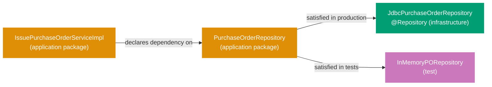
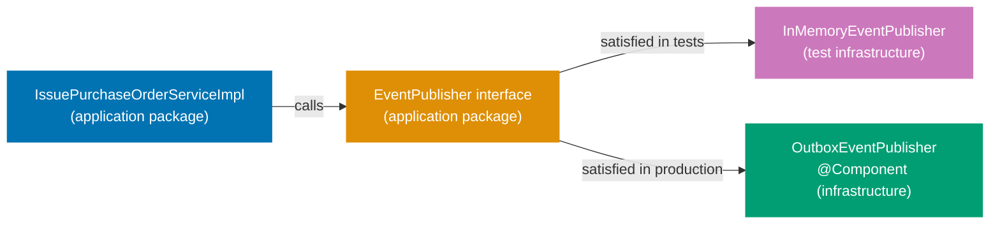
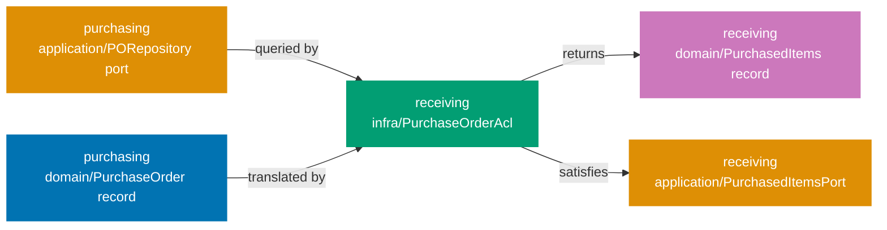

## Guide 8 — Repository Port as Java Interface + Spring Data JDBC Adapter Behind It

### Why It Matters

A repository port is the seam that keeps your application layer independent of the database. Every time you inject a Spring Data repository interface directly into an application service, the service becomes untestable without a live database and untestable without a Spring context. In `procurement-platform-be`, the per-context package layout declares the repository port as a plain Java interface in the `application` package. The Spring Data JDBC adapter implements that interface in `infrastructure`. Nothing in the application layer knows whether PostgreSQL, H2, or an in-memory `HashMap` is behind the port.

### Standard Library First

Java interfaces in `java.util` give you all the primitives needed to express a repository contract. The standard library's `Optional` and `List` are sufficient for a read/write pair with no Spring dependency:

```java
// Standard library: repository contract as a plain Java interface over stdlib types
// Demonstrates the stdlib interface approach that the Spring Data JDBC adapter pattern supersedes.

package com.procurement.platform.purchasing.application;
// => application/ package: output port interfaces live here, not in infrastructure/
// => No Spring import anywhere in this file — the interface is framework-agnostic
// => The infrastructure adapter imports this interface; not the other way around

import com.procurement.platform.purchasing.domain.PurchaseOrder;
// => PurchaseOrder: the domain aggregate — the port speaks in domain terms only
// => No jakarta.persistence.Entity, no @Column — domain types have zero ORM annotations
import com.procurement.platform.purchasing.domain.PurchaseOrderId;
// => PurchaseOrderId: strongly-typed identity — prevents passing a raw UUID or String
// => The compiler rejects passing a SupplierId where a PurchaseOrderId is expected
import java.util.Optional;
// => Optional: communicates absence without null — eliminates NullPointerException risk
// => Optional.empty() is a valid domain outcome, not an error

public interface PurchaseOrderRepository {
    // => Java interface: the output port contract — zero implementation here
    // => The infrastructure adapter in infrastructure/ provides the implementation
    // => The application service declares this interface type in its constructor — never the adapter class

    PurchaseOrder save(PurchaseOrder purchaseOrder);
    // => Write-side port: persist or update the aggregate atomically; return the saved instance
    // => The adapter decides whether to INSERT, UPDATE, or UPSERT

    Optional<PurchaseOrder> findById(PurchaseOrderId id);
    // => Read-side port: returns Optional.empty() when the PO does not exist
    // => Optional.empty() is correct: absence is a domain outcome — the adapter never returns null

    boolean existsById(PurchaseOrderId id);
    // => Lightweight existence check: no full aggregate load needed for duplicate-check guards
    // => Returns true if a PO with the given id is present; false otherwise
}
```

**Limitation for production**: a raw `PurchaseOrder save(PurchaseOrder)` swallows the distinction between a network timeout and a unique-constraint violation. Production ports either declare typed exceptions or use a `Result`-style wrapper so the application service can react to each failure mode precisely. The standard library interface also gives you no `JdbcClient`, no connection pooling, and no transaction management — you must wire all of that manually.

### Production Framework

Spring Boot 4 ships a modernised `JdbcClient` (Spring Framework 6.1+) that is leaner than `JdbcTemplate` and does not require a full JPA entity graph. The adapter lives in `infrastructure`, implements the port interface from `application`, and maps between the domain record and SQL rows. The port interface is never modified to accommodate the adapter:



The port interface with typed exceptions in the `application` package:

```java
// Production output port with typed exceptions — application package
package com.procurement.platform.purchasing.application;
// => application/ package: only domain types and stdlib imports allowed here
// => No Spring, no JDBC, no JPA — the interface is adapter-agnostic

import com.procurement.platform.purchasing.domain.PurchaseOrder;
// => PurchaseOrder domain aggregate: the port contract speaks in domain terms only
import com.procurement.platform.purchasing.domain.PurchaseOrderId;
// => PurchaseOrderId value object: strongly-typed identity parameter — no raw String or UUID at the boundary
import java.util.Optional;
// => Optional wraps absence: the caller does not receive null from the port

public interface PurchaseOrderRepository {
    // => Output port interface: declared in application/, implemented in infrastructure/
    // => The @Repository adapter in infrastructure/ satisfies this contract at runtime
    // => The application service constructor parameter is this interface type — never the adapter class
    // => Swapping adapters (JDBC → in-memory) requires only a @Configuration change, not a service change

    PurchaseOrder save(PurchaseOrder purchaseOrder) throws RepositoryException;
    // => Returns the saved PurchaseOrder: may include database-assigned fields (timestamps, sequences)
    // => RepositoryException: domain-adjacent exception signalling an infrastructure failure
    // => The GlobalExceptionHandler maps RepositoryException to HTTP 500 + ProblemDetail (RFC 9457)

    Optional<PurchaseOrder> findById(PurchaseOrderId id);
    // => No checked exception: absence is a valid domain outcome, not an error
    // => Returns Optional.empty() for a missing PO — the controller decides whether to return 404
    // => The adapter never returns null — Optional enforces the contract at the type level

    boolean existsById(PurchaseOrderId id);
    // => Lightweight existence check without loading the full aggregate
    // => false when the PO does not exist — callers use this for duplicate-check guards before saving
}
```

The `JdbcClient` adapter in the `infrastructure` package maps between the domain record and SQL rows:

```java
// Spring Data JDBC adapter implementing the output port
package com.procurement.platform.purchasing.infrastructure;
// => infrastructure/ package: Spring-managed adapters live here — not in application/ or domain/

import com.procurement.platform.purchasing.application.PurchaseOrderRepository;
// => Output port interface from application/ — the adapter implements this contract
import com.procurement.platform.purchasing.application.RepositoryException;
// => Infrastructure failure wrapper — the adapter translates DuplicateKeyException into this type
import com.procurement.platform.purchasing.domain.PurchaseOrder;
// => PurchaseOrder domain aggregate — the adapter maps between PurchaseOrder records and SQL rows
import com.procurement.platform.purchasing.domain.PurchaseOrderId;
// => PurchaseOrderId value object — unwrapped to UUID for SQL parameter binding
import com.procurement.platform.purchasing.domain.SupplierId;
// => SupplierId value object — unwrapped to UUID for SQL parameter binding
import com.procurement.platform.purchasing.domain.Money;
// => Money value object — unwrapped to amount + currency for SQL parameter binding
import com.procurement.platform.purchasing.domain.PurchaseOrderStatus;
// => PurchaseOrderStatus enum — mapped from the text column on read
import org.springframework.jdbc.core.simple.JdbcClient;
// => JdbcClient: Spring Framework 6.1+ modernised JDBC API — fluent, type-safe, no RowMapper boilerplate
// => Spring Boot 4 auto-configures JdbcClient from the DataSource bean — no manual wiring needed
import org.springframework.dao.DuplicateKeyException;
// => DuplicateKeyException: Spring's translation of SQL unique-constraint violations (SQLSTATE 23505)
// => Spring wraps raw JDBC SQLExceptions into DataAccessException hierarchy — no SQLSTATE string parsing
import org.springframework.stereotype.Repository;
// => @Repository: Spring registers this class as a bean during component scan
// => Also enables Spring's PersistenceExceptionTranslationPostProcessor for JDBC exceptions
import java.math.BigDecimal;
import java.util.Optional;
// => java.util.Optional: return type for findById — communicates absence without null
import java.util.UUID;
// => UUID: used by the RowMapper to extract the typed id column from the ResultSet

@Repository
// => @Repository: Spring discovers this bean via the root-package scan in ProcurementPlatformApplication
// => Guide 15 shows the @Configuration class that binds this adapter to the PurchaseOrderRepository port explicitly
public class JdbcPurchaseOrderRepository implements PurchaseOrderRepository {
    // => implements PurchaseOrderRepository: the compiler verifies all three port methods are present
    // => The application service only ever sees the PurchaseOrderRepository interface — never this class directly

    private final JdbcClient jdbc;
    // => JdbcClient: injected via the single-constructor rule in Spring Boot 4
    // => No @Autowired annotation needed — Spring Boot detects single-constructor injection automatically
    // => Field is final: immutable after construction — thread-safe by default for concurrent requests

    public JdbcPurchaseOrderRepository(JdbcClient jdbc) {
        this.jdbc = jdbc;
        // => Constructor injection: JdbcClient is a Spring Boot auto-configured singleton
        // => JdbcClient wraps the HikariCP connection pool — connections are pooled, not per-request
    }

    @Override
    public PurchaseOrder save(PurchaseOrder po) throws RepositoryException {
        // => Port method implementation: translates from domain aggregate to SQL — one direction only
        // => po is already validated — domain invariants held at construction time (Guide 3)
        // => The adapter does not re-validate invariants: it trusts the domain layer
        try {
            jdbc.sql("""
                    INSERT INTO purchasing.purchase_orders
                        (id, supplier_id, total_amount, currency, approval_level, status)
                    VALUES (:id, :supplierId, :totalAmount, :currency, :approvalLevel, :status)
                    ON CONFLICT (id) DO UPDATE
                      SET supplier_id    = EXCLUDED.supplier_id,
                          total_amount   = EXCLUDED.total_amount,
                          currency       = EXCLUDED.currency,
                          approval_level = EXCLUDED.approval_level,
                          status         = EXCLUDED.status
                    """)
                // => ON CONFLICT … DO UPDATE: upsert semantics — save() handles both insert and update
                // => JdbcClient text block: multi-line SQL without string concatenation or escaping
                .param("id", po.id().value())
                // => po.id().value(): unwrap PurchaseOrderId → UUID — JDBC maps UUID to the PostgreSQL uuid column
                // => Named parameters (:id) prevent SQL injection — no string interpolation or concatenation
                .param("supplierId", po.supplierId().value())
                // => supplierId: unwrap SupplierId → UUID — stored in the supplier_id column
                .param("totalAmount", po.totalAmount().amount())
                // => totalAmount().amount(): BigDecimal — stored in the total_amount NUMERIC column
                .param("currency", po.totalAmount().currency())
                // => currency: 3-letter ISO 4217 string — stored in the currency CHAR(3) column
                .param("approvalLevel", po.approvalLevel().name())
                // => approvalLevel: enum name stored as TEXT — readable and schema-stable
                .param("status", po.status().name())
                // => status: enum name stored as TEXT column — readable and schema-stable
                .update();
                // => .update(): executes the SQL statement and returns the row count (discarded here)
            return po;
            // => Return the same aggregate: for upsert the domain state is the source of truth
        } catch (DuplicateKeyException ex) {
            throw new RepositoryException("PurchaseOrder already exists: " + po.id(), ex);
            // => Translate to the domain-adjacent exception — the application layer never sees DuplicateKeyException
        } catch (Exception ex) {
            throw new RepositoryException("Failed to save PurchaseOrder: " + po.id(), ex);
            // => Catch-all: covers connection timeout, pool exhaustion — wrapped in RepositoryException
        }
    }

    @Override
    public Optional<PurchaseOrder> findById(PurchaseOrderId id) {
        // => No checked exception: SQL SELECT failure propagates as unchecked DataAccessException
        return jdbc.sql(
                "SELECT id, supplier_id, total_amount, currency, approval_level, status "
                + "FROM purchasing.purchase_orders WHERE id = :id")
            .param("id", id.value())
            // => id.value(): unwrap PurchaseOrderId → UUID — matches the PostgreSQL uuid column type exactly
            .query((rs, _) -> new PurchaseOrder(
                // => Lambda RowMapper: maps ResultSet columns to the domain record's canonical constructor
                new PurchaseOrderId(rs.getObject("id", UUID.class)),
                // => rs.getObject(col, UUID.class): type-safe UUID extraction — no unchecked cast needed
                new SupplierId(rs.getObject("supplier_id", UUID.class)),
                // => SupplierId: same UUID extraction pattern — wraps into the strongly-typed value object
                new Money(rs.getBigDecimal("total_amount"), rs.getString("currency")),
                // => Money: reconstruct value object from the two database columns
                ApprovalLevel.valueOf(rs.getString("approval_level")),
                // => ApprovalLevel.valueOf: maps the stored enum name back to the Java enum constant
                PurchaseOrderStatus.valueOf(rs.getString("status"))
                // => PurchaseOrderStatus.valueOf: maps the stored enum name back to the Java enum constant
            ))
            .optional();
            // => .optional(): returns Optional<PurchaseOrder> — Optional.empty() when no row matches the WHERE clause
    }

    @Override
    public boolean existsById(PurchaseOrderId id) {
        // => Lightweight count query — does not load the full aggregate row
        Integer count = jdbc.sql(
                "SELECT COUNT(1) FROM purchasing.purchase_orders WHERE id = :id")
            .param("id", id.value())
            .query(Integer.class)
            .single();
        return count != null && count > 0;
        // => Returns true when at least one row has this id — false otherwise
        // => COUNT(1) never returns null but the .single() result type is boxed Integer — null guard is defensive
    }
}
```

**Trade-offs**: `JdbcClient` requires writing SQL explicitly — no magic query derivation from method names. For aggregates with non-trivial mapping (nested value objects, enums), the row mapper grows. The payoff is transparency: every query is visible in the source, and adding a database index is a one-line SQL change, not a JPA annotation hunt.

---

## Guide 9 — In-Memory Repository Adapter for Integration Tests

### Why It Matters

An integration test that starts a PostgreSQL container for every test class is slow, requires Docker, and cannot be cached by Nx. A test that injects an in-memory `Map`-backed adapter runs in milliseconds, needs no infrastructure, and runs safely in parallel. The seam from Guide 8 — the `PurchaseOrderRepository` interface — is exactly what makes this swap possible. If the in-memory adapter requires changes to the application service to work, the port has leaked infrastructure concerns upward.

### Standard Library First

`java.util.HashMap` provides an in-memory key-value store with no dependencies. The raw approach compiles but loses type safety and thread safety under parallel test execution:

```java
// Standard library: untyped in-memory store with a raw HashMap
// Demonstrates the untyped approach that the typed in-memory adapter supersedes.

import java.util.HashMap;
// => HashMap: mutable, unsynchronised key-value store — not thread-safe under concurrent access
// => Two Cucumber step threads writing concurrently corrupt the internal array silently
// => ConcurrentHashMap (used by the typed adapter) provides atomicity for get/put/remove

public class UntypedStore {
    private static final HashMap<Object, Object> store = new HashMap<>();
    // => static final: one shared map for the entire JVM lifetime — all test classes corrupt each other
    // => Object key/value: no compile-time enforcement — a SupplierId stored under a PurchaseOrderId key compiles silently
    // => The typed adapter uses Map<PurchaseOrderId, PurchaseOrder>: wrong key type is a compile error, not a runtime surprise

    public static void put(Object key, Object value) {
        store.put(key, value);
        // => No uniqueness check: silently overwrites existing entries — upsert whether intended or not
        // => Tests that rely on RepositoryException for duplicates never fail with this approach
    }
}
```

**Limitation for production**: global mutable state fails under parallel test execution. Untyped storage cannot represent the same save semantics as the JDBC adapter — tests that verify `RepositoryException` on duplicate saves may behave unexpectedly.

### Production Framework

The in-memory adapter implements the same `PurchaseOrderRepository` interface as the JDBC adapter. A `java.util.concurrent.ConcurrentHashMap` gives thread safety without `synchronized` blocks:

```java
// In-memory adapter implementing the PurchaseOrderRepository port
package com.procurement.platform.purchasing.infrastructure;
// => Test-classpath infrastructure: lives in src/test/java/, not in src/main/java/
// => Production builds never include this class — the adapter is test-only

import com.procurement.platform.purchasing.application.PurchaseOrderRepository;
// => Output port interface: the adapter must implement all declared methods
import com.procurement.platform.purchasing.application.RepositoryException;
// => Infrastructure failure wrapper: in-memory adapter throws this only to mirror the JDBC adapter's contract
import com.procurement.platform.purchasing.domain.PurchaseOrder;
// => PurchaseOrder domain aggregate — stored directly in the map (no serialisation needed for in-memory)
import com.procurement.platform.purchasing.domain.PurchaseOrderId;
// => PurchaseOrderId strongly-typed key — prevents storing a PurchaseOrder under a wrong-type key
import java.util.Map;
// => Map<PurchaseOrderId, PurchaseOrder>: typed store — ConcurrentHashMap is the implementation
import java.util.Optional;
// => java.util.Optional: return type for findById — same absence contract as the JDBC adapter
import java.util.concurrent.ConcurrentHashMap;
// => ConcurrentHashMap: thread-safe — parallel Cucumber step definitions do not corrupt the store
// => get(), put(), remove() are all atomic operations — no external synchronisation needed

public class InMemoryPurchaseOrderRepository implements PurchaseOrderRepository {
    // => implements PurchaseOrderRepository: the compiler verifies all three port methods are present
    // => If the port interface gains a new method, the compiler flags this class immediately
    // => The application service receives PurchaseOrderRepository — it cannot tell which impl is behind it

    private final Map<PurchaseOrderId, PurchaseOrder> store;
    // => ConcurrentHashMap<PurchaseOrderId, PurchaseOrder>: typed key and value
    // => Keyed by PurchaseOrderId: the PurchaseOrderId.equals() and hashCode() generated by Java records are correct

    public InMemoryPurchaseOrderRepository() {
        this.store = new ConcurrentHashMap<>();
        // => Fresh map per constructor call: each test instantiates a new InMemoryPurchaseOrderRepository
        // => No shared static state — parallel test classes each hold their own isolated map
    }

    @Override
    public PurchaseOrder save(PurchaseOrder po) throws RepositoryException {
        // => Upsert semantics: mirrors the ON CONFLICT DO UPDATE in the JDBC adapter
        store.put(po.id(), po);
        // => ConcurrentHashMap.put: atomic — thread-safe without locking the whole map
        // => Overwrites existing entry silently: same as the SQL upsert behaviour
        return po;
        // => Return the same aggregate — no database-side enrichment in the in-memory adapter
    }

    @Override
    public Optional<PurchaseOrder> findById(PurchaseOrderId id) {
        // => findById: returns Optional.empty() when the key is absent — never null
        return Optional.ofNullable(store.get(id));
        // => Optional.ofNullable: returns Optional.empty() when the key is absent
        // => Mirrors JdbcClient's .optional(): same absent-PO semantics, zero SQL overhead
    }

    @Override
    public boolean existsById(PurchaseOrderId id) {
        return store.containsKey(id);
        // => ConcurrentHashMap.containsKey: atomic — safe for concurrent reads
        // => Mirrors the JdbcClient count query: returns true when a PO with this id is present
    }
}
```

A Cucumber integration step wires the in-memory adapter at the port seam without starting a database container:

```java
// Cucumber step definition wiring the in-memory adapter at the port seam
package com.procurement.platform.purchasing.steps;
// => Test package: Cucumber step definitions — not visible to production code

import com.procurement.platform.purchasing.application.IssuePurchaseOrderService;
// => Application service interface: the controller uses this type too — test and production share it
import com.procurement.platform.purchasing.application.IssuePurchaseOrderServiceImpl;
// => Concrete @Service class: used only in this test setup — never imported by any production class
import com.procurement.platform.purchasing.domain.PurchaseOrder;
// => PurchaseOrder domain aggregate: returned by the application service and asserted on in @Then steps
import com.procurement.platform.purchasing.infrastructure.InMemoryPurchaseOrderRepository;
// => In-memory adapter from this guide — satisfies the PurchaseOrderRepository port in the test context
import io.cucumber.java.Before;
import io.cucumber.java.en.Given;
import io.cucumber.java.en.Then;
import io.cucumber.java.en.When;
import static org.junit.jupiter.api.Assertions.*;

public class PurchaseOrderIntegrationSteps {
    // => Cucumber instantiates this class per scenario — fresh instance per scenario by default

    private InMemoryPurchaseOrderRepository repository;
    // => Concrete in-memory adapter: test-only type visible here, not in any production class
    private IssuePurchaseOrderService service;
    // => IssuePurchaseOrderService interface: the same type the controller declares in its constructor
    private PurchaseOrder lastPo;
    // => Captured result from @When steps — used by @Then steps for assertion

    @Before
    // => @Before: Cucumber hook — runs before each scenario, initialising a fresh composition root
    public void setUp() {
        repository = new InMemoryPurchaseOrderRepository();
        // => Fresh adapter per scenario: no state leaks between Cucumber scenarios
        service = new IssuePurchaseOrderServiceImpl(repository, new InMemoryEventPublisher());
        // => Wire the in-memory adapter into the real application service — no Spring context needed
        // => The service receives the PurchaseOrderRepository interface: it does not know InMemory is behind it
    }

    @Given("a purchase order issued to supplier {string}")
    public void aPurchaseOrderIssuedToSupplier(String supplierId) throws Exception {
        lastPo = service.issue(
            new com.procurement.platform.purchasing.domain.SupplierId(java.util.UUID.fromString(supplierId)),
            java.util.List.of());
        // => Calls the real application service: domain invariants enforced, aggregate created
        // => issue() internally calls repository.save() — InMemoryPurchaseOrderRepository.save() runs
        // => No HTTP round-trip, no Jackson serialisation, no Tomcat — pure port-level test
    }

    @When("the purchase order is retrieved by its id")
    public void thePurchaseOrderIsRetrievedByItsId() {
        lastPo = service.findById(lastPo.id()).orElseThrow();
        // => findById goes through the port to the in-memory adapter — no SQL, no Docker
    }

    @Then("the purchase order status should be {string}")
    public void thePurchaseOrderStatusShouldBe(String expectedStatus) {
        assertEquals(expectedStatus, lastPo.status().name());
        // => assertEquals: JUnit 5 — same assertion library as other step definitions
    }
}
```

**Trade-offs**: the in-memory adapter faithfully mirrors the JDBC adapter only as far as you implement it. Write a shared adapter contract test (a JUnit 5 parameterised test running against both implementations with the same assertions) to keep them semantically aligned.

---

## Guide 10 — Domain Event Publisher Port

### Why It Matters

A domain event publisher port solves the same problem as a repository port but for the outbound event stream. Every time the application service calls `ApplicationEventPublisher.publishEvent(...)` directly, the application layer acquires a Spring dependency. You can no longer test event emission without a Spring context, and swapping the delivery mechanism (Spring events → outbox table) requires modifying application code. In `procurement-platform-be`, the per-context package layout defines the publisher port as a plain Java interface in the `application` package. The application service receives the interface and never imports `ApplicationEventPublisher`.

### Standard Library First

Java's standard library provides no persistent event bus. The closest built-in mechanism is the observer pattern via `java.util.EventListener` — useful for in-process pub/sub but insufficient for production cross-process delivery:

```java
// Standard library: in-process observer pattern — no persistence, no delivery guarantee
// Demonstrates the stdlib observer approach that the port-based publisher supersedes.

import java.util.ArrayList;
// => ArrayList: mutable, unsynchronised list of listeners — not safe under concurrent registration
import java.util.EventListener;
// => EventListener: marker interface only — provides zero pub/sub mechanism by itself
import java.util.EventObject;
// => EventObject: base class — source is typed as Object, requiring unchecked casts in listeners
import java.util.List;

class PurchaseOrderIssuedEvent extends EventObject {
    // => EventObject subclass: one class per event type — scales poorly for many event types
    public PurchaseOrderIssuedEvent(Object source) { super(source); }
    // => source typed as Object: callers cast to PurchaseOrder at runtime — ClassCastException if wrong type
}

interface PurchasingEventListener extends EventListener {
    void onPurchaseOrderIssued(PurchaseOrderIssuedEvent event);
    // => Synchronous dispatch — slow listener implementations block the publishing thread
    // => If the listener throws, remaining loop iterations are skipped silently
}

class InProcessEventBus {
    private final List<PurchasingEventListener> listeners = new ArrayList<>();
    // => Mutable ArrayList: not thread-safe — concurrent add() calls corrupt the internal array index

    void publish(PurchaseOrderIssuedEvent event) {
        for (var listener : listeners) {
            listener.onPurchaseOrderIssued(event);
            // => Synchronous dispatch: if the process crashes mid-loop, unexecuted listeners are skipped
            // => The outbox adapter (Guide 11) writes an event row before publish returns — crash-safe
        }
    }
}
```

**Limitation for production**: in-process events die with the process. If the application crashes after saving the aggregate but before all listeners complete, events are lost. The at-least-once delivery guarantee requires an outbox (Guide 11) or an external message broker behind the port.

### Production Framework

The domain event publisher port is a plain Java interface in the `application` package. Its implementations — an in-memory adapter for tests and an outbox adapter for production — satisfy the same interface:



Domain event records and the publisher port interface, both in `application`:

```java
// Domain event records and publisher port — application package
package com.procurement.platform.purchasing.application;
// => application/ package: only domain types and stdlib imports allowed here
// => No Spring ApplicationEventPublisher import — the port interface is framework-agnostic

import com.procurement.platform.purchasing.domain.PurchaseOrderId;
// => PurchaseOrderId value object — carried by events as the primary identifier
import com.procurement.platform.purchasing.domain.SupplierId;
// => SupplierId value object — carried by PurchaseOrderIssued so receiving context knows the supplier
import java.time.Instant;
// => Instant: immutable UTC timestamp — events are facts about what happened at a specific moment

public record PurchaseOrderIssued(
    PurchaseOrderId purchaseOrderId,
    // => PurchaseOrderId: the identity of the issued PO — downstream contexts use this to correlate
    SupplierId supplierId,
    // => SupplierId: the supplier receiving this PO — consumed by supplier-notifier for EDI/email dispatch
    Instant occurredAt
    // => occurredAt: set by the application service — publisher records facts, not current state
) {}
// => Java record: immutable, no setters — events cannot be mutated after construction

public record PurchaseOrderCancelled(PurchaseOrderId purchaseOrderId, Instant occurredAt) {}
// => Carries only the identity — downstream contexts re-read the aggregate if full state is needed
// => Carrying only the ID avoids embedding a potentially stale snapshot in the event

public interface EventPublisher {
    // => Plain Java interface: zero Spring coupling — the application service imports this type only
    // => Spring injects the @Component adapter at startup via the single-constructor rule
    // => Test code injects InMemoryEventPublisher directly — no Spring context needed

    void publish(PurchaseOrderIssued event);
    // => Synchronous contract: the application service calls publish() and proceeds
    // => The adapter decides whether to deliver synchronously or queue (outbox)
    // => Overloaded method: adding a new event type adds a new overload — the compiler flags all adapters

    void publish(PurchaseOrderCancelled event);
    // => Second overload: the adapter must implement both — the compiler enforces this at build time
    // => For at-least-once delivery, replace this adapter with the OutboxEventPublisher (Guide 11)
}
```

The Spring `ApplicationEventPublisher` adapter in `infrastructure`:

```java
// Spring ApplicationEventPublisher adapter — infrastructure package
package com.procurement.platform.purchasing.infrastructure;
// => infrastructure/ package: Spring-coupled code lives here — the seam absorbs the framework dependency

import com.procurement.platform.purchasing.application.PurchaseOrderIssued;
// => PurchaseOrderIssued: domain record from application/ — the adapter wraps it for Spring dispatch
import com.procurement.platform.purchasing.application.PurchaseOrderCancelled;
// => PurchaseOrderCancelled: second domain event type — both overloads forward to the same Spring bus
import com.procurement.platform.purchasing.application.EventPublisher;
// => EventPublisher: the port interface this adapter satisfies
import org.springframework.context.ApplicationEventPublisher;
// => Spring's ApplicationEventPublisher: Spring MVC and Spring Boot auto-configure this bean
// => Any @EventListener or @TransactionalEventListener method in the context receives the event
import org.springframework.stereotype.Component;
// => @Component: Spring registers this bean during component scan

@Component
public class SpringEventPublisherAdapter implements EventPublisher {
    // => implements EventPublisher: the compiler verifies both publish() overloads are present

    private final ApplicationEventPublisher springPublisher;
    // => ApplicationEventPublisher: Spring's internal event bus — injected at startup

    public SpringEventPublisherAdapter(ApplicationEventPublisher springPublisher) {
        this.springPublisher = springPublisher;
        // => Constructor injection: no @Autowired — Spring Boot 4 auto-detects single-constructor injection
    }

    @Override
    public void publish(PurchaseOrderIssued event) {
        springPublisher.publishEvent(event);
        // => publishEvent: Spring dispatches the event to all @EventListener methods in the context
        // => Use @TransactionalEventListener on the listener to delay delivery until after DB commit
    }

    @Override
    public void publish(PurchaseOrderCancelled event) {
        springPublisher.publishEvent(event);
        // => Same dispatch path as PurchaseOrderIssued — the listener annotation controls delivery timing
        // => For at-least-once delivery, replace this adapter with OutboxEventPublisher (Guide 11)
    }
}
```

**Trade-offs**: the Spring `ApplicationEventPublisher` adapter is the right starting point when you need in-process event delivery with optional `@TransactionalEventListener` support. It carries no outbox guarantee — if the process crashes between the database commit and the listener execution, the event is lost. Guide 11 shows the outbox adapter that provides at-least-once delivery. Choose the Spring adapter when events drive non-critical side-effects (cache invalidation, logging). Choose the outbox adapter when event loss has business consequences (receiving context opening a GRN expectation, payments scheduling a run).

---

## Guide 11 — In-Memory Event Adapter and Outbox Event Adapter

### Why It Matters

Two adapters satisfy the `EventPublisher` port from Guide 10: an in-memory adapter for integration tests (zero infrastructure, fast, assertable) and an outbox adapter for production (durable, survives process crashes). Without an outbox, you face a dual-write hazard: the aggregate commits to the database, then the process crashes before the event reaches the message bus — the event is silently lost. The outbox pattern writes the event row in the same JDBC transaction as the aggregate row, so if the transaction commits, the event is guaranteed to be relayed eventually. In `procurement-platform-be`, the outbox adapter uses `JdbcClient` to insert into an `outbox_events` table inside the same transaction as the aggregate.

### Standard Library First

A plain `java.util.ArrayList` captures events in memory. The naive approach uses a static field — tests corrupt each other under parallel execution:

```java
// Standard library: capture events in a static ArrayList — thread-unsafe
// Demonstrates the untyped static-list approach that the typed in-memory adapter supersedes.

import java.util.ArrayList;
// => ArrayList: mutable, unsynchronised — concurrent add() calls corrupt the internal array structure

public class StaticEventCapture {
    private static final ArrayList<Object> events = new ArrayList<>();
    // => static final: one list for the entire JVM lifetime — shared by all test classes and threads
    // => Object element type: a String, an Integer, and a PurchaseOrderIssued can all be stored together
    // => The typed in-memory adapter uses List<Object> as an instance field: fresh per constructor call

    public static void capture(Object event) {
        events.add(event);
        // => Global side effect: test A's captured events appear in the list during test B's @Then step
        // => No reset between scenarios — events accumulate across the entire Cucumber test run
    }
}
```

**Limitation for production**: global mutable state breaks parallel test execution. `Object` storage makes assertion code fragile and error-prone.

### Production Framework

**In-memory event adapter** for integration tests:

```java
// In-memory event publisher adapter — typed, per-test-instance isolation
package com.procurement.platform.purchasing.infrastructure;
// => Test-classpath class: src/test/java/ — never included in production builds

import com.procurement.platform.purchasing.application.PurchaseOrderIssued;
// => PurchaseOrderIssued domain record — captured in the per-test list for assertion
import com.procurement.platform.purchasing.application.PurchaseOrderCancelled;
// => PurchaseOrderCancelled domain record — second event type captured separately
import com.procurement.platform.purchasing.application.EventPublisher;
// => EventPublisher port interface: the in-memory adapter must implement both overloads
import java.util.ArrayList;
// => ArrayList: instance field — fresh per constructor call, no shared static state
import java.util.Collections;
// => Collections.unmodifiableList: callers cannot corrupt the capture list from test assertions
import java.util.List;

public class InMemoryEventPublisher implements EventPublisher {
    // => implements EventPublisher: same interface as SpringEventPublisherAdapter and OutboxEventPublisher

    private final List<Object> published = new ArrayList<>();
    // => Instance field: fresh per constructor call — each test class instantiates a new publisher

    @Override
    public void publish(PurchaseOrderIssued event) {
        published.add(event);
        // => Append to the instance list — no global state, no parallel corruption between tests
    }

    @Override
    public void publish(PurchaseOrderCancelled event) {
        published.add(event);
        // => Same capture path: the test retrieves the list and uses instanceof pattern matching
    }

    public List<Object> getPublished() {
        return Collections.unmodifiableList(published);
        // => Unmodifiable view: callers cannot corrupt the capture list from test assertions
    }

    public void reset() {
        published.clear();
        // => Reset between Cucumber scenarios: @Before step calls publisher.reset()
    }
}
```

**Outbox event adapter** for production:

```java
// Outbox event publisher adapter — writes event rows in the same JDBC transaction
package com.procurement.platform.purchasing.infrastructure;
// => infrastructure/ package: framework-coupled code — Spring, Jackson, JdbcClient all live here

import com.fasterxml.jackson.databind.ObjectMapper;
// => ObjectMapper: Jackson serialiser — auto-configured by spring-boot-starter-web
// => Serialises domain event records to JSON for the outbox_events.payload JSONB column
import com.procurement.platform.purchasing.application.PurchaseOrderIssued;
// => PurchaseOrderIssued: domain record — serialised to JSON for the outbox row payload
import com.procurement.platform.purchasing.application.PurchaseOrderCancelled;
// => PurchaseOrderCancelled: second event type — serialised under a different event_type string
import com.procurement.platform.purchasing.application.EventPublisher;
// => EventPublisher port interface: the outbox adapter must implement both publish() overloads
import org.springframework.jdbc.core.simple.JdbcClient;
// => JdbcClient: shares the DataSource connection pool — outbox INSERT and aggregate INSERT are in the same transaction
import org.springframework.stereotype.Component;
// => @Component: Spring registers this bean and wires it to EventPublisher in PurchasingContextConfiguration
import java.time.Instant;
// => Instant.now(): UTC timestamp for the outbox row's created_at column — monotonically increasing
import java.util.UUID;
// => UUID.randomUUID(): unique idempotency key for the outbox row — the relay deduplicates by this value

@Component
// => @Component: wired to the EventPublisher port in PurchasingContextConfiguration (Guide 15)
public class OutboxEventPublisher implements EventPublisher {

    private final JdbcClient jdbc;
    // => Same JdbcClient as JdbcPurchaseOrderRepository — both adapters share a DataSource,
    //    their writes participate in the same Spring-managed JDBC transaction
    private final ObjectMapper objectMapper;
    // => ObjectMapper: Jackson bean auto-configured by spring-boot-starter-web — serialises domain records to JSON

    public OutboxEventPublisher(JdbcClient jdbc, ObjectMapper objectMapper) {
        this.jdbc = jdbc;
        this.objectMapper = objectMapper;
        // => Fields are final: immutable after construction — thread-safe for concurrent requests
        // => Constructor injection: Spring wires both beans automatically — no @Autowired annotation
    }

    @Override
    public void publish(PurchaseOrderIssued event) {
        insertOutboxRow("PurchaseOrderIssued", event);
        // => The outbox row commits atomically with the aggregate row in the same JDBC transaction
        // => If the caller's transaction rolls back, this INSERT also rolls back
    }

    @Override
    public void publish(PurchaseOrderCancelled event) {
        insertOutboxRow("PurchaseOrderCancelled", event);
        // => Same outbox pattern: row written in the current transaction, not after commit
        // => The relay worker polls purchasing.outbox_events WHERE processed_at IS NULL
    }

    private void insertOutboxRow(String eventType, Object payload) {
        try {
            String json = objectMapper.writeValueAsString(payload);
            // => writeValueAsString: serialise the Java record to JSON
            // => Records are serialised by component names — no @JsonProperty annotations needed
            jdbc.sql("""
                    INSERT INTO purchasing.outbox_events (id, event_type, payload, created_at)
                    VALUES (:id, :eventType, CAST(:payload AS jsonb), :createdAt)
                    """)
                // => CAST(:payload AS jsonb): PostgreSQL JSONB column — enables GIN index on payload fields
                // => If the application crashes after commit, the outbox row survives — relay delivers eventually
                .param("id", UUID.randomUUID().toString())
                // => UUID.randomUUID(): idempotency key — the relay worker deduplicates by this id
                .param("eventType", eventType)
                // => String eventType: the relay worker dispatches to the correct handler by this value
                .param("payload", json)
                // => JSON string: CAST to JSONB by PostgreSQL — enables efficient field-level filtering
                .param("createdAt", Instant.now().toString())
                // => ISO-8601 string — PostgreSQL timestamptz column accepts this format
                .update();
            // => update(): executes the INSERT and returns the affected row count — typically 1
        } catch (Exception ex) {
            throw new RuntimeException("Failed to write outbox row for " + eventType, ex);
            // => Spring's transaction manager rolls back the entire transaction on exception
            // => Both the aggregate INSERT and all prior outbox INSERTs are rolled back atomically
        }
    }
}
```

**Trade-offs**: the outbox pattern guarantees at-least-once delivery — the relay worker may deliver the event more than once if it crashes between delivery and marking `processed_at`. Downstream consumers must be idempotent (use the `id` UUID as a deduplication key). For event volumes under approximately 1000 per second, a polling relay is sufficient. Higher throughput benefits from CDC-based relay (e.g., Debezium reading the PostgreSQL WAL instead of polling).

---

## Guide 12 — `@RestController` Full Pipeline: DTO → Command → Aggregate → Response

### Why It Matters

Guide 6 introduced the Spring `@RestController` as a primary adapter using a minimal health check and a sketch of a PO issuance endpoint. This guide goes deeper: every step of the translation pipeline — deserialising the request DTO, calling the application service, publishing the domain event, and serialising the response DTO — has an exact location in the hexagonal layout, and each location has a rule about what it may and may not import. Getting those rules wrong is the most common way a Spring Boot codebase silently collapses the hexagonal boundary over time.

### Standard Library First

A plain Java servlet places translation, validation, persistence, and event publishing all in one method, with no domain boundary:

```java
// Anti-pattern: flat servlet mixing all concerns in one doPost() override
// Demonstrates the monolithic approach that the disciplined @RestController pipeline supersedes.

import jakarta.servlet.http.HttpServlet;
import jakarta.servlet.http.HttpServletRequest;
import jakarta.servlet.http.HttpServletResponse;
import java.io.IOException;

public class FlatPurchaseOrderServlet extends HttpServlet {
    // => HttpServlet subclass: one class handles one URL — no routing table, no path variables
    protected void doPost(HttpServletRequest req, HttpServletResponse resp) throws IOException {
        // => All concerns in one method: parsing, validation, persistence, events, and response — untestable
        var supplierId = req.getParameter("supplierId");
        // => Query parameter: not a request body — no JSON deserialization, no DTO, no type safety
        if (supplierId == null || supplierId.isBlank()) {
            resp.setStatus(400);
            // => Magic number 400: duplicated at every endpoint — no central @ExceptionHandler
            resp.getWriter().write("{\"error\":\"supplierId required\"}");
            return;
        }
        var id = java.util.UUID.randomUUID();
        // => Business logic inline — no application service, no domain aggregate, no invariant enforcement
        resp.setStatus(201);
        resp.setContentType("application/json");
        resp.getWriter().write("{\"id\":\"" + id + "\"}");
        // => String concatenation for JSON: injection risk if supplierId contains special characters
    }
}
```

**Limitation for production**: all concerns in one method produce untestable, entangled code. Business logic cannot be tested without an HTTP container.

### Production Framework

The full Spring `@RestController` pipeline enforces the four-step translation discipline — DTO in, domain aggregate through the service, domain event published, response DTO out:

```java
// Full four-step controller pipeline for PO issuance
package com.procurement.platform.purchasing.presentation;
// => presentation/ package: HTTP boundary — DTOs and domain value object constructors allowed here

import com.procurement.platform.purchasing.application.DuplicatePurchaseOrderException;
// => Typed exception from application/: mapped to HTTP 409 by the controller's catch block
import com.procurement.platform.purchasing.application.IssuePurchaseOrderService;
// => Application layer interface: the controller declares this type — never the @Service implementation class
import com.procurement.platform.purchasing.application.EventPublisher;
// => Event publisher port: the controller injects the port interface — never the adapter class
import com.procurement.platform.purchasing.application.PurchaseOrderIssued;
// => Domain event record: constructed in the controller after a successful aggregate creation
import com.procurement.platform.purchasing.domain.PurchaseOrder;
// => PurchaseOrder domain aggregate: received from the application service, mapped to a response DTO here
import com.procurement.platform.purchasing.domain.PurchaseOrderId;
// => PurchaseOrderId value object: constructed from the String path variable before calling the service
import com.procurement.platform.purchasing.domain.SupplierId;
// => Domain value objects: constructed from the DTO fields before calling the service
import org.springframework.http.HttpStatus;
// => HttpStatus: Spring enum for HTTP status codes — used to build ProblemDetail and ResponseEntity
import org.springframework.http.ProblemDetail;
// => ProblemDetail: RFC 9457 error body — Spring Boot 4's default structured error format
import org.springframework.http.ResponseEntity;
// => ResponseEntity: wraps HTTP status + headers + body — allows fine-grained HTTP response control
import org.springframework.web.bind.annotation.*;
// => @RestController, @RequestMapping, @PostMapping, @GetMapping, @RequestBody, @PathVariable
import java.net.URI;
// => URI.create: used to build the Location header value for the 201 Created response
import java.time.Instant;
// => Instant.now(): UTC timestamp for the domain event — monotonically increasing across JVM restarts
import java.util.UUID;
// => UUID.fromString: parses String path variable — throws IllegalArgumentException on malformed input

public record IssuePurchaseOrderRequest(String supplierId) {}
// => Request DTO as a Java record: Jackson deserialises JSON to a record via the canonical constructor
// => Lives in presentation/: domain and application layers never import this type

public record PurchaseOrderResponse(String id, String supplierId, String status, String approvalLevel) {}
// => Response DTO: maps domain aggregate fields to JSON-serialisable types
// => The application service and domain layers never produce or consume PurchaseOrderResponse

@RestController
@RequestMapping("/api/v1/purchase-orders")
// => Base path scoped to the purchasing context: each context owns its URL prefix
public class PurchaseOrderController {

    private final IssuePurchaseOrderService issueService;
    // => Interface type: the controller is decoupled from the concrete @Service implementation class
    private final EventPublisher eventPublisher;
    // => Interface type: the controller is decoupled from the outbox or Spring event adapter

    public PurchaseOrderController(IssuePurchaseOrderService issueService, EventPublisher eventPublisher) {
        this.issueService = issueService;
        this.eventPublisher = eventPublisher;
        // => Constructor injection: both are injected by Spring Boot at context startup
        // => Both fields are final: immutable after construction — thread-safe by default
    }

    @PostMapping
    public ResponseEntity<PurchaseOrderResponse> issuePurchaseOrder(
            @RequestBody IssuePurchaseOrderRequest request) {
        // => @RequestBody: Jackson deserialises the HTTP request body into IssuePurchaseOrderRequest
        // => Step 1: DTO translated to domain value objects before calling the service
        try {
            var supplierId = new SupplierId(UUID.fromString(request.supplierId()));
            // => UUID.fromString: throws IllegalArgumentException on malformed input — mapped to 400 globally
            var po = issueService.issue(supplierId, java.util.List.of());
            // => issue: builds and validates the PurchaseOrder aggregate — invariants hold on return

            // => Step 2: publish domain event via the port interface — not directly via Spring context
            eventPublisher.publish(new PurchaseOrderIssued(po.id(), po.supplierId(), Instant.now()));
            // => PurchaseOrderIssued: immutable record — carries the aggregate fields at the moment of emission

            // => Step 3: domain aggregate → response DTO
            var response = toResponse(po);

            return ResponseEntity
                .created(URI.create("/api/v1/purchase-orders/" + po.id().value()))
                // => 201 Created: REST convention for successful resource creation
                .body(response);

        } catch (DuplicatePurchaseOrderException ex) {
            var problem = ProblemDetail.forStatus(HttpStatus.CONFLICT);
            problem.setDetail(ex.getMessage());
            // => RFC 9457 standard error body — Spring Boot 4 default format
            return ResponseEntity.status(HttpStatus.CONFLICT).build();
        }
    }

    @GetMapping("/{id}")
    public ResponseEntity<PurchaseOrderResponse> getPurchaseOrder(@PathVariable String id) {
        var poId = new PurchaseOrderId(UUID.fromString(id));
        // => UUID.fromString: throws IllegalArgumentException on malformed input — 400 via GlobalExceptionHandler
        return issueService.findById(poId)
            .map(this::toResponse)
            .map(ResponseEntity::ok)
            .orElse(ResponseEntity.notFound().build());
        // => orElse: Optional.empty() → 404 Not Found — the controller decides the HTTP semantics
    }

    private PurchaseOrderResponse toResponse(PurchaseOrder po) {
        return new PurchaseOrderResponse(
            po.id().value().toString(),
            po.supplierId().value().toString(),
            po.status().name(),
            po.approvalLevel().name()
            // => One mapping point for the domain-to-DTO translation
        );
    }
}
```

**Trade-offs**: the four-step pipeline adds two mapping methods compared to a flat approach. For read-only query endpoints that return raw DB projections, a thinner controller is reasonable — apply the full pipeline only to commands that mutate state. The payoff appears when domain invariants are non-trivial.

---

## Guide 13 — Handler Consuming Generated Contract Types

### Why It Matters

The `PurchaseOrderController` in Guide 12 uses hand-authored `IssuePurchaseOrderRequest` and `PurchaseOrderResponse` records. In a production team those DTO types should be generated from an OpenAPI 3.1 spec rather than hand-authored — hand-authored DTOs drift from the spec, and drift causes integration failures that the Java compiler cannot catch. `procurement-platform-be` can use the same codegen pipeline pattern: a `pom.xml` that adds a `generated-contracts/src/main/java` as an additional source directory and a code generation step that produces Java types from an OpenAPI spec. This guide shows how to wire generated contract types into a `@RestController` so the controller stays in sync with the spec at compile time.

### Standard Library First

Without codegen, the team writes request and response records by hand and maintains alignment with the OpenAPI spec manually:

```java
// Hand-authored DTO records — drift from the OpenAPI spec without any warning
package com.procurement.platform.purchasing.presentation;

public record IssuePurchaseOrderRequest(String supplierId) {}
// => No compile error when spec and DTO diverge — drift is discovered at runtime

public record PurchaseOrderResponse(String id, String supplierId, String status, String approvalLevel) {}
// => A field added to the spec response schema is silently absent from the response body
```

**Limitation for production**: manual synchronisation between spec and DTOs is error-prone. A field rename in the OpenAPI spec produces no compile error — only a runtime JSON deserialisation failure or a missing field in the response body.

### Production Framework

The `procurement-platform-be` codegen pipeline configures `pom.xml` to add the generated source directory to the Maven compile path:

```xml
<!-- pom.xml: generated-contracts source directory wired into Maven compile path -->
<plugin>
    <!-- => <plugin>: a Maven build lifecycle participant — runs during the generate-sources phase -->
    <groupId>org.codehaus.mojo</groupId>
    <artifactId>build-helper-maven-plugin</artifactId>
    <!-- => build-helper-maven-plugin: registers an additional source directory with the Maven compiler -->
    <executions>
        <execution>
            <id>add-generated-contracts-source</id>
            <phase>generate-sources</phase>
            <goals><goal>add-source</goal></goals>
            <configuration>
                <sources>
                    <source>${project.basedir}/generated-contracts/src/main/java</source>
                    <!-- => ${project.basedir}: expands to apps/procurement-platform-be/ -->
                    <!-- => generated-contracts/: gitignored output directory, populated by the codegen target -->
                </sources>
            </configuration>
        </execution>
    </executions>
</plugin>
```

A `@RestController` consuming generated types from the codegen pipeline:

```java
// Controller consuming generated contract types from the procurement-platform codegen pipeline
package com.procurement.platform.purchasing.presentation;
// => presentation/ package: HTTP boundary — only generated DTO types and domain types enter here

import org.openapitools.model.IssuePurchaseOrderRequestBody;
// => Generated from the OpenAPI requestBody schema for POST /api/v1/purchase-orders
// => getSupplierId() is spec-authoritative — a spec rename changes the generated getter name
import org.openapitools.model.PurchaseOrderResponseBody;
// => Generated from the OpenAPI response schema — adding a field and re-running codegen emits a new setter
import com.procurement.platform.purchasing.application.IssuePurchaseOrderService;
// => Application service port — the controller never imports the @Service implementation class directly
import com.procurement.platform.purchasing.application.EventPublisher;
// => EventPublisher port — decoupled from the outbox or in-process adapter
import com.procurement.platform.purchasing.domain.PurchaseOrder;
// => Domain aggregate — received from the service, mapped to PurchaseOrderResponseBody in toResponse()
import org.springframework.http.ResponseEntity;
// => ResponseEntity: wraps HTTP status code + body — the controller controls the HTTP response shape
import org.springframework.web.bind.annotation.*;
// => @RestController, @RequestMapping, @PostMapping, @GetMapping, @RequestBody, @PathVariable
import java.net.URI;
// => URI.create: constructs the Location header value for the 201 Created response
import java.time.Instant;
// => Instant.now(): timestamp attached to PurchaseOrderIssued event — captures the moment of issuance
import java.util.UUID;
// => UUID.fromString: parses the String supplierId from the request body — throws on malformed input

@RestController
// => @RestController: Spring registers this bean; all methods serialise return values to JSON automatically
@RequestMapping("/api/v1/purchase-orders")
// => Base path: scoped to the purchasing context — each context owns its URL prefix
public class PurchaseOrderContractController {

    private final IssuePurchaseOrderService issueService;
    // => Application service interface — the controller never sees IssuePurchaseOrderServiceImpl
    private final EventPublisher eventPublisher;
    // => Same interfaces as Guide 12 — generated DTOs are invisible to the application layer

    public PurchaseOrderContractController(IssuePurchaseOrderService issueService,
            EventPublisher eventPublisher) {
        this.issueService = issueService;
        this.eventPublisher = eventPublisher;
        // => Constructor injection: Spring wires both beans at context startup — no @Autowired annotation
        // => Both fields are final — immutable after construction, thread-safe for concurrent requests
    }

    @PostMapping
    // => @PostMapping: maps HTTP POST /api/v1/purchase-orders to this method
    public ResponseEntity<PurchaseOrderResponseBody> issuePurchaseOrder(
            @RequestBody IssuePurchaseOrderRequestBody request) {
        // => @RequestBody: Jackson deserialises the HTTP body into IssuePurchaseOrderRequestBody
        // => IssuePurchaseOrderRequestBody: generated type — getSupplierId() is spec-authoritative
        var supplierId = new com.procurement.platform.purchasing.domain.SupplierId(
            UUID.fromString(request.getSupplierId()));
        // => UUID.fromString: throws IllegalArgumentException on malformed UUID — mapped to HTTP 400 globally
        // => If codegen re-runs after a spec rename to "vendor_id", getSupplierId() no longer compiles
        var po = issueService.issue(supplierId, java.util.List.of());
        // => issue(): creates and persists the PurchaseOrder aggregate — invariants validated inside
        eventPublisher.publish(new com.procurement.platform.purchasing.application.PurchaseOrderIssued(
            po.id(), po.supplierId(), Instant.now()));
        // => Publish after issue() returns: the event payload reflects the committed aggregate state
        return ResponseEntity
            .created(URI.create("/api/v1/purchase-orders/" + po.id().value()))
            // => 201 Created + Location header: REST convention for successful resource creation
            .body(toResponse(po));
        // => toResponse: maps domain aggregate → generated response DTO — single translation point
    }

    private PurchaseOrderResponseBody toResponse(PurchaseOrder po) {
        var body = new PurchaseOrderResponseBody();
        // => PurchaseOrderResponseBody: codegen-produced mutable POJO — setters correspond to spec fields
        body.setId(po.id().value().toString());
        // => setId: spec-authoritative setter — changing the spec field name changes this method
        body.setSupplierId(po.supplierId().value().toString());
        // => setSupplierId: UUID converted to String — the spec defines supplierId as a string field
        body.setStatus(po.status().name());
        // => status().name(): enum to String — matches the spec's string enum values
        body.setApprovalLevel(po.approvalLevel().name());
        // => The compile error at any missing or renamed setter enforces spec fidelity at build time
        return body;
    }
}
```

**Trade-offs**: codegen introduces a build-time step that must run before `mvn compile`. On a fresh clone without generated files, the build fails with unresolved type errors at every import site. Teams must run codegen as part of their onboarding script. The payoff: adding a new response field to the OpenAPI spec and running codegen produces a compile error at every controller method that constructs the response type without the new field — zero spec drift, enforced at build time.

---

## Guide 14 — Cross-Context Integration via Anti-Corruption Layer

### Why It Matters

The `receiving` context needs PO data from the `purchasing` context to record goods receipts against a PO. A direct import of `purchasing.domain.PurchaseOrder` into `receiving.domain` creates coupling: renaming a field in `PurchaseOrder` silently breaks `GoodsReceiptService`. The Anti-Corruption Layer (ACL) pattern places an adapter in `receiving.infrastructure` that translates `purchasing`'s types into `receiving`'s own domain types. The `receiving` domain layer never imports anything from `purchasing`. In `procurement-platform-be`, both contexts are in the hexagonal layout — the ACL adapter is the first file written in `com.procurement.platform.receiving.infrastructure`.

### Standard Library First

Without an ACL, the `receiving` domain imports `purchasing` types directly, coupling the two domain layers:

```java
// No ACL: receiving domain imports purchasing domain types directly
// Demonstrates the direct cross-context import that the ACL adapter supersedes.

package com.procurement.platform.receiving.domain;
// => Domain package: only domain types should appear here

import com.procurement.platform.purchasing.domain.PurchaseOrder;
// => Direct cross-context domain import: coupling the two domain layers at the type level
// => A rename of PurchaseOrder.totalAmount() in the purchasing context breaks this class
// => Both context teams must coordinate every refactor — no independent evolution is possible

import java.util.List;

public class GoodsReceiptService {
    public boolean isWithinQuantityTolerance(PurchaseOrder po, int receivedQty) {
        // => Takes purchasing context's type directly — no translation boundary enforced by the compiler
        return receivedQty <= po.lines().stream()
            .mapToInt(l -> l.quantity().value())
            // => Direct access to purchasing's value objects — breaks if purchasing renames the accessor
            .sum();
    }
}
```

**Limitation for production**: direct domain coupling means that refactoring one context requires simultaneous changes in all consuming contexts. In a team with parallel feature work, this creates merge conflicts and prevents independent deployability.

### Production Framework

The ACL adapter lives in `receiving.infrastructure`. It imports the `purchasing` context's application-layer port (not the domain layer) and translates into `receiving`'s own domain types:



`receiving` domain type — independent of `purchasing.domain.PurchaseOrder`:

```java
// receiving domain type: its own view of PO information needed for goods receipt
package com.procurement.platform.receiving.domain;
// => receiving domain package: no import from purchasing.domain allowed here

import java.util.UUID;

public record PurchasedItems(
    UUID purchaseOrderId,
    // => Plain UUID — receiving needs only the identity to correlate the GRN, not the full PO aggregate
    // => If purchasing renames its identity field, only the ACL adapter changes — not this record
    int orderedQuantity,
    // => orderedQuantity: receiving uses this to verify the received quantity is within tolerance
    String currency
    // => receiving's domain concept — needed to validate invoice amounts at goods receipt time
) {}
// => Java record: immutable — domain facts do not mutate after construction
```

`receiving` application-layer port for querying PO items:

```java
// receiving application port: query PO details in receiving domain terms
package com.procurement.platform.receiving.application;
// => application/ package: only receiving domain types and stdlib allowed here
// => No purchasing context import — the port is agnostic of where the data comes from

import com.procurement.platform.receiving.domain.PurchasedItems;
import java.util.Optional;
import java.util.UUID;

public interface PurchasedItemsPort {
    // => receiving output port: declared in application/, implemented by the ACL adapter in infrastructure/
    Optional<PurchasedItems> findByPurchaseOrderId(UUID purchaseOrderId);
    // => The ACL adapter calls the purchasing context's port and maps the result — never the DB directly
    // => Optional: the PO may not exist in the purchasing context — receiving handles absence gracefully
}
```

ACL adapter in `receiving.infrastructure` performing the translation:

```java
// ACL adapter: translates purchasing context types into receiving domain types
package com.procurement.platform.receiving.infrastructure;
// => receiving infrastructure/ package: the ACL adapter lives here, not in purchasing.infrastructure

import com.procurement.platform.purchasing.application.PurchaseOrderRepository;
// => ACL imports the purchasing APPLICATION port — not purchasing.domain.PurchaseOrder directly
// => The ACL depends on the purchasing port interface, not on the purchasing infrastructure adapter
import com.procurement.platform.purchasing.domain.PurchaseOrderId;
// => PurchaseOrderId: needed to call the purchasing port — the ACL knows purchasing's identity type
import com.procurement.platform.receiving.application.PurchasedItemsPort;
// => Port interface the ACL must satisfy — declared in receiving application/
import com.procurement.platform.receiving.domain.PurchasedItems;
// => receiving domain type for the translation output — not purchasing.domain.PurchaseOrder
import org.springframework.stereotype.Component;

@Component
public class PurchaseOrderAcl implements PurchasedItemsPort {
    // => implements PurchasedItemsPort: the compiler verifies findByPurchaseOrderId() is present

    private final PurchaseOrderRepository purchasingRepository;
    // => PurchaseOrderRepository: the purchasing context's application-layer output port
    // => The ACL depends on the purchasing port, not on JdbcPurchaseOrderRepository — the seam is at the application layer

    public PurchaseOrderAcl(PurchaseOrderRepository purchasingRepository) {
        this.purchasingRepository = purchasingRepository;
        // => Constructor injection: Spring wires the purchasing-context's @Repository bean here
    }

    @Override
    public java.util.Optional<PurchasedItems> findByPurchaseOrderId(java.util.UUID purchaseOrderId) {
        // => ACL translation: calls the purchasing port and maps result to receiving domain type
        return purchasingRepository.findById(new PurchaseOrderId(purchaseOrderId))
            .map(po -> new PurchasedItems(
                po.id().value(),
                // => Map purchasing.PurchaseOrderId → plain UUID — receiving's PurchasedItems uses UUID
                po.lines().stream().mapToInt(l -> l.quantity().value()).sum(),
                // => Sum all line quantities — receiving's domain view of "how many units were ordered"
                po.totalAmount().currency()
                // => Currency: carried so receiving can validate invoice currency matches PO currency
            ));
    }
}
```

**Trade-offs**: the ACL adapter adds a translation step and an additional port interface. For contexts that share a large read model with structural but not semantic differences, use a shared query model (a `SharedKernel` in `shared/`) instead. Reserve the full ACL for cases where the two contexts genuinely use different ubiquitous language — which is the case for `receiving` and `purchasing` in `procurement-platform-be`, where receiving has its own vocabulary for goods receipts and quantity tolerances.

---

## Guide 15 — Composition Root `@Configuration`: Wiring All Ports

### Why It Matters

The composition root is the single place where adapter implementations are bound to port interfaces and injected into application services and controllers. In `procurement-platform-be`, `ProcurementPlatformApplication.java` is the entry point, and per-context `@Configuration` classes in each context's `infrastructure` package are the composition roots. Guide 7 introduced a minimal `PurchasingContextConfiguration`. This guide goes deeper: wiring the repository port, the event publisher port, the ACL adapter, and the application service in one coherent `@Configuration`, and showing how a test `@TestConfiguration` swaps production adapters for in-memory ones without touching any production code.

### Standard Library First

Without Spring's `@Configuration`, you wire every dependency in `main()` manually. This is the pure dependency injection approach — explicit but impractical at scale:

```java
// Standard library: manual composition root in main() — no DI container
// Demonstrates the manual wiring approach that Spring @Configuration supersedes.

public class ManualComposition {
    public static void main(String[] args) {
        // => All concrete types constructed here — the rest of the codebase sees only interfaces

        var repository = new InMemoryPurchaseOrderRepository();
        // => Concrete adapter chosen at startup — swap to JdbcPurchaseOrderRepository for production

        var eventPublisher = new InMemoryEventPublisher();
        // => In-memory event publisher — swap to OutboxEventPublisher for production

        var service = new IssuePurchaseOrderServiceImpl(repository, eventPublisher);
        // => Constructor injection: service receives both interface-typed parameters

        var controller = new PurchaseOrderController(service, eventPublisher);
        // => Controller receives the service interface — it does not see InMemoryPurchaseOrderRepository
    }
}
```

**Limitation for production**: manual wiring of dozens of beans across multiple contexts is impractical. Lifecycle management, profile-based adapter switching, and test context override are all manual work without a DI container.

### Production Framework

The full `@Configuration` for the purchasing context wires all ports from Guides 8–14:

```java
// Full composition root @Configuration for the purchasing context
package com.procurement.platform.purchasing.infrastructure;
// => infrastructure/ package: the @Configuration class knows concrete adapter types
// => Only this class imports both the port interfaces and the adapter implementations

import com.procurement.platform.purchasing.application.IssuePurchaseOrderService;
import com.procurement.platform.purchasing.application.PurchaseOrderRepository;
import com.procurement.platform.purchasing.application.EventPublisher;
import com.fasterxml.jackson.databind.ObjectMapper;
import org.springframework.context.annotation.Bean;
import org.springframework.context.annotation.Configuration;
import org.springframework.jdbc.core.simple.JdbcClient;

@Configuration
// => Spring registers this class during the root-package scan from ProcurementPlatformApplication
// => All @Bean methods are called once at startup to populate the ApplicationContext
public class PurchasingContextConfiguration {

    @Bean
    public PurchaseOrderRepository purchaseOrderRepository(JdbcClient jdbc) {
        return new JdbcPurchaseOrderRepository(jdbc);
        // => JdbcClient: injected by Spring — auto-configured from the DataSource in application.properties
        // => In a test @TestConfiguration, replace this method body with: return new InMemoryPurchaseOrderRepository()
    }

    @Bean
    public EventPublisher eventPublisher(JdbcClient jdbc, ObjectMapper objectMapper) {
        return new OutboxEventPublisher(jdbc, objectMapper);
        // => Both adapters share the DataSource — outbox row + aggregate row commit atomically
        // => In a test @TestConfiguration, replace with: return new InMemoryEventPublisher()
    }

    @Bean
    public IssuePurchaseOrderService issuePurchaseOrderService(
            PurchaseOrderRepository purchaseOrderRepository,
            EventPublisher eventPublisher) {
        // => Spring injects the beans produced by the two @Bean methods above
        return new IssuePurchaseOrderServiceImpl(purchaseOrderRepository, eventPublisher);
        // => Constructor injection: explicit, visible, testable — no @Autowired on the service class
    }
}
```

A test `@TestConfiguration` overrides the production one without modifying any production file:

```java
// Test @TestConfiguration: swaps production adapters for in-memory ones
package com.procurement.platform.purchasing.infrastructure;
// => Test-classpath package: src/test/java/ — not included in production JAR builds
// => Overrides PurchasingContextConfiguration for the test Spring context only

import com.procurement.platform.purchasing.application.PurchaseOrderRepository;
// => Output port interface: the @Bean method must declare this return type — not InMemoryPurchaseOrderRepository
import com.procurement.platform.purchasing.application.EventPublisher;
// => Event publisher port: declared as return type — hides InMemoryEventPublisher from the Spring context
import org.springframework.boot.test.context.TestConfiguration;
// => @TestConfiguration: Spring Boot test annotation — replaces matching production beans in test contexts
import org.springframework.context.annotation.Bean;
// => @Bean: each annotated method produces a bean registered in the test ApplicationContext

@TestConfiguration
// => @TestConfiguration: loaded in place of PurchasingContextConfiguration during the test Spring context startup
public class PurchasingTestContextConfiguration {

    @Bean
    public PurchaseOrderRepository purchaseOrderRepository() {
        return new InMemoryPurchaseOrderRepository();
        // => InMemoryPurchaseOrderRepository: same PurchaseOrderRepository interface — zero database, zero Docker required
        // => ConcurrentHashMap-backed: thread-safe for parallel Cucumber step execution
    }

    @Bean
    public EventPublisher eventPublisher() {
        return new InMemoryEventPublisher();
        // => InMemoryEventPublisher: captures events in a per-test list for @Then step assertions
        // => Cast the bean to InMemoryEventPublisher in @Then steps to call getPublished() for assertions
        // => reset() is called in @Before Cucumber hook to clear events between scenarios
    }
}
```

**Trade-offs**: explicit `@Configuration` classes require more boilerplate than relying entirely on Spring Boot's component scan auto-registration. The payoff is a visible, replaceable wiring graph: integration tests override a single `@TestConfiguration` to swap the production JDBC adapter for an in-memory stub without modifying any production code. For teams with more than three bounded contexts, extract per-context wiring into dedicated `@Configuration` classes as shown here — avoid accumulating all bean definitions in one class.
