This advanced section adds the `receiving` and `invoicing` bounded contexts to the procurement platform, demonstrates cross-context Anti-Corruption Layers, factory functions, repositories as function-type aliases, dependency rejection, and testing strategies. All examples extend the purchasing domain established in the beginner and intermediate sections.

## Serialization and Persistence (Examples 56–67)

### Example 56: Serialization — JSON via DTO Boundary

Domain types never directly touch serialization libraries. JSON serialization uses DTO types as the sole wire format. The boundary has four steps: deserialize JSON to DTO, validate DTO to domain, compute, serialize domain back to DTO, then to JSON.

**Inbound boundary** (JSON to validated domain):

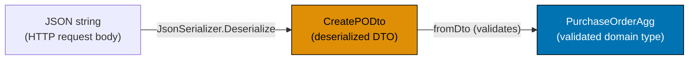

**Outbound boundary** (domain to JSON):

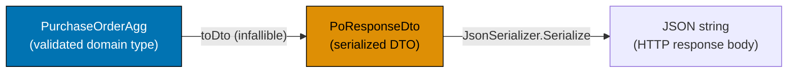





```fsharp
// JSON serialization through the DTO boundary.
// Domain types never appear in serialization code.

open System.Text.Json

// DTOs — the only types that touch the serializer
type PoLineDto = { SkuCode: string; Quantity: int; UnitPrice: decimal }
// => DTO line: flat structure matching the JSON array element shape
type CreatePODto = { RequisitionId: string; SupplierId: string; Lines: PoLineDto list }
// => DTO input: flat structure matching the JSON request body

// Domain types — isolated from serialization
type PoLine      = { Sku: string; Qty: int; Price: decimal }
type PurchaseOrderDomain = { RequisitionId: string; SupplierId: string; Lines: PoLine list; Total: decimal }
// => Domain: uses domain-appropriate field names; no JSON attributes

// DTO response type
type PoResponseDto = { Id: string; Total: decimal; Status: string }
// => Response DTO: flat structure for the HTTP response body

// Translation: DTO → domain
let fromDto (dto: CreatePODto) : Result<PurchaseOrderDomain, string> =
    // => Validates DTO fields and converts to domain type; returns Result
    if System.String.IsNullOrWhiteSpace(dto.RequisitionId) then Error "RequisitionId required"
    // => Guard: blank RequisitionId is invalid in the domain
    elif dto.Lines.IsEmpty then Error "At least one line is required"
    // => Guard: blank PO has no business meaning
    elif dto.Lines |> List.exists (fun l -> l.Quantity <= 0) then Error "All quantities must be > 0"
    // => Guard: negative or zero quantities violate the domain invariant
    else
        let lines = dto.Lines |> List.map (fun l -> { Sku = l.SkuCode; Qty = l.Quantity; Price = l.UnitPrice })
        // => Convert DTO lines to domain PoLine records
        let total = lines |> List.sumBy (fun l -> decimal l.Qty * l.Price)
        // => Compute total from validated lines
        Ok { RequisitionId = dto.RequisitionId; SupplierId = dto.SupplierId; Lines = lines; Total = total }
        // => Returns Ok domain PO — all fields mapped from DTO to domain types

// Translation: domain → response DTO (infallible)
let toDto (domain: PurchaseOrderDomain) (poId: string) : PoResponseDto =
    // => Infallible: domain PO is valid by construction — no Result needed
    { Id = poId; Total = domain.Total; Status = "Draft" }
    // => Returns PoResponseDto ready for JSON serialization

// Serialization at the boundary
let json = """{"RequisitionId":"req_f4c2","SupplierId":"sup_acme","Lines":[{"SkuCode":"ELE-0099","Quantity":3,"UnitPrice":899.99}]}"""
// => Input JSON from the HTTP request body

let dto = JsonSerializer.Deserialize<CreatePODto>(json)
// => dto : CreatePODto — all fields deserialized from JSON as raw primitives

let domainResult = fromDto dto
// => fromDto validates the DTO and produces a domain PO or an error
// => domainResult : Result<PurchaseOrderDomain, string>

match domainResult with
| Ok domain ->
    let response = toDto domain "po_e3d1f8a0"
    // => Convert domain to response DTO — infallible
    let responseJson = JsonSerializer.Serialize(response)
    // => Serialize the response DTO to JSON
    printfn "Domain total: %M" domain.Total
    // => Output: Domain total: 2699.9700M
    printfn "Response: %s" responseJson
    // => Output: Response: {"Id":"po_e3d1f8a0","Total":2699.97,"Status":"Draft"}
| Error e ->
    printfn "Validation error: %s" e
```





```clojure
;; JSON serialization through the DTO boundary.
;; Domain maps never appear in serialization code — only DTO maps do.
;; [F#: record types with JsonSerializer — compile-time field names; Clojure uses runtime maps with clojure.data.json]

(require '[clojure.data.json :as json])

;; DTO namespace — the only maps that touch the serializer
;; DTO line: flat map matching the JSON array element shape
(defn parse-po-line-dto [raw]
  ;; raw is a map deserialized from JSON — keys are strings from the wire
  {:sku-code  (get raw "SkuCode")
   ;; => Map SkuCode string key to idiomatic kebab-case keyword
   :quantity  (get raw "Quantity")
   ;; => Integer quantity as deserialized from JSON
   :unit-price (get raw "UnitPrice")})
   ;; => Decimal unit price from JSON number

;; Domain maps — isolated from serialization
(defn dto->domain-line [dto-line]
  ;; Translate a DTO line map to a domain line map
  {:sku        (:sku-code dto-line)
   ;; => Domain uses :sku, not :sku-code — domain field names are independent of JSON
   :qty        (:quantity dto-line)
   ;; => Domain uses :qty for quantity — shorter, idiomatic
   :price      (:unit-price dto-line)})
   ;; => Domain :price maps from DTO :unit-price

;; [F#: Result<PurchaseOrderDomain, string> discriminated union — compile-time exhaustiveness]
;; Clojure returns a map with :ok or :error key — data-oriented result idiom
(defn from-dto [dto]
  ;; Validates DTO fields and converts to domain map; returns {:ok domain} or {:error msg}
  (cond
    (clojure.string/blank? (:requisition-id dto))
    {:error "RequisitionId required"}
    ;; => Guard: blank RequisitionId is invalid in the domain

    (empty? (:lines dto))
    {:error "At least one line is required"}
    ;; => Guard: blank PO has no business meaning

    (some #(<= (:quantity %) 0) (:lines dto))
    {:error "All quantities must be > 0"}
    ;; => Guard: non-positive quantities violate the domain invariant

    :else
    (let [lines (map dto->domain-line (:lines dto))
          ;; => Convert DTO line maps to domain line maps
          total (reduce + (map #(* (:qty %) (:price %)) lines))]
          ;; => Compute total from validated lines using reduce
      {:ok {:requisition-id (:requisition-id dto)
            :supplier-id    (:supplier-id dto)
            :lines          (vec lines)
            ;; => vec materialises the lazy seq — domain map holds a vector of line maps
            :total          total}})))
            ;; => Returns {:ok domain-map} — domain map fully constructed

;; Translation: domain → response DTO (infallible)
(defn to-dto [domain po-id]
  ;; Infallible: domain map is valid by construction — no error path
  {:id     po-id
   :total  (:total domain)
   :status "Draft"})
   ;; => Returns DTO map ready for JSON serialization

;; Serialization at the boundary
(def raw-json "{\"RequisitionId\":\"req_f4c2\",\"SupplierId\":\"sup_acme\",\"Lines\":[{\"SkuCode\":\"ELE-0099\",\"Quantity\":3,\"UnitPrice\":899.99}]}")
;; => Input JSON string from the HTTP request body

(def parsed (json/read-str raw-json))
;; => parsed: plain map with string keys — {"RequisitionId" "req_f4c2", ...}

(def dto {:requisition-id (get parsed "RequisitionId")
          :supplier-id    (get parsed "SupplierId")
          :lines          (map parse-po-line-dto (get parsed "Lines"))})
;; => Manually shape the DTO map with idiomatic keywords
;; => Clojure does not auto-map JSON keys to keywords without a flag

(def domain-result (from-dto dto))
;; => from-dto validates the DTO map and returns {:ok ...} or {:error ...}

(if-let [domain (:ok domain-result)]
  ;; => if-let binds domain only if :ok is truthy
  (let [response      (to-dto domain "po_e3d1f8a0")
        ;; => Convert domain map to response DTO map — infallible
        response-json (json/write-str response)]
        ;; => Serialize the response DTO map to JSON string
    (println "Domain total:" (:total domain))
    ;; => Output: Domain total: 2699.97
    (println "Response:" response-json))
    ;; => Output: Response: {"id":"po_e3d1f8a0","total":2699.97,"status":"Draft"}
  (println "Validation error:" (:error domain-result)))
  ;; => Printed only when from-dto returns {:error msg}
```





```typescript
// Serialization via DTO boundary — domain types never cross the wire as-is.
// [F#: domain -> DTO -> JSON; branded types are erased before serialization]
// [Clojure: domain map -> plain map -> JSON; namespaced keys removed at boundary]

// Domain types (branded — cannot serialize directly)
type PurchaseOrderId = string & { readonly __brand: "PurchaseOrderId" };
type SupplierId = string & { readonly __brand: "SupplierId" };
type SkuCode = string & { readonly __brand: "SkuCode" };

interface POLine {
  readonly lineNumber: number;
  readonly skuCode: SkuCode;
  readonly qty: number;
  readonly unitPrice: number;
}
interface PurchaseOrder {
  readonly id: PurchaseOrderId;
  readonly supplierId: SupplierId;
  readonly status: "Draft" | "Approved" | "Issued";
  readonly lines: readonly POLine[];
}

// DTO types — plain, serializable, no brands
interface POLineDTO {
  lineNumber: number;
  skuCode: string; // no brand
  qty: number;
  unitPrice: number;
}
interface PurchaseOrderDTO {
  id: string; // no brand
  supplierId: string;
  status: string;
  lines: POLineDTO[];
}

// Outbound mapper: domain -> DTO (at the serialization boundary)
function toPODTO(po: PurchaseOrder): PurchaseOrderDTO {
  return {
    id: po.id as string, // brand erased — safe to serialize
    supplierId: po.supplierId as string, // brand erased
    status: po.status,
    lines: po.lines.map((l) => ({
      lineNumber: l.lineNumber,
      skuCode: l.skuCode as string, // brand erased
      qty: l.qty,
      unitPrice: l.unitPrice,
    })),
  };
}

// Inbound mapper: DTO -> domain (validate at the deserialization boundary)
function fromPODTO(dto: PurchaseOrderDTO): PurchaseOrder | null {
  if (!dto.id.startsWith("po_")) return null;
  if (!dto.supplierId.startsWith("sup_")) return null;
  return {
    id: dto.id as PurchaseOrderId,
    supplierId: dto.supplierId as SupplierId,
    status: dto.status as PurchaseOrder["status"],
    lines: dto.lines.map((l) => ({ ...l, skuCode: l.skuCode as SkuCode })),
  };
}

const po: PurchaseOrder = {
  id: "po_001" as PurchaseOrderId,
  supplierId: "sup_001" as SupplierId,
  status: "Draft",
  lines: [{ lineNumber: 1, skuCode: "ELE-0099" as SkuCode, qty: 3, unitPrice: 899.99 }],
};

const dto = toPODTO(po);
const json = JSON.stringify(dto);
// => JSON string — brands are erased, plain strings/numbers only
console.log("JSON:", json.slice(0, 60) + "...");
// => Output: JSON: {"id":"po_001","supplierId":"sup_001","status":"Draft"...
const restored = fromPODTO(JSON.parse(json));
console.log("Restored id:", restored?.id);
// => Output: Restored id: po_001
```





```haskell
-- ── file: Procurement/Serialization.hs ─────────────────────────────────────
-- JSON serialization through the DTO boundary.
-- [F#: JsonSerializer over DTO records; Haskell uses aeson over DTO records]
{-# LANGUAGE DeriveGeneric     #-}
{-# LANGUAGE OverloadedStrings #-}
module Procurement.Serialization where

import           Data.Aeson    (FromJSON, ToJSON, decode, encode)
import qualified Data.ByteString.Lazy.Char8 as BL
import           Data.Text     (Text)
import qualified Data.Text     as T
import           GHC.Generics  (Generic)

-- DTOs — the only types that touch the serializer
data PoLineDto = PoLineDto
  { skuCode   :: Text
  , quantity  :: Int
  , unitPrice :: Double
  } deriving (Show, Generic)
instance ToJSON   PoLineDto
instance FromJSON PoLineDto
-- => DTO line: flat structure matching the JSON array element shape

data CreatePODto = CreatePODto
  { requisitionId :: Text
  , supplierId    :: Text
  , lines         :: [PoLineDto]
  } deriving (Show, Generic)
instance ToJSON   CreatePODto
instance FromJSON CreatePODto
-- => DTO input: flat structure matching JSON request body

-- DTO response type
data PoResponseDto = PoResponseDto
  { responseId    :: Text
  , responseTotal :: Double
  , responseStatus :: Text
  } deriving (Show, Generic)
instance ToJSON   PoResponseDto
instance FromJSON PoResponseDto

-- Domain types — isolated from serialization
data PoLine = PoLine { plSku :: Text, plQty :: Int, plPrice :: Double } deriving (Show)
data PurchaseOrderDomain = PurchaseOrderDomain
  { pdRequisitionId :: Text
  , pdSupplierId    :: Text
  , pdLines         :: [PoLine]
  , pdTotal         :: Double
  } deriving (Show)
-- => Domain: domain-appropriate field names; no JSON instances

-- Translation: DTO -> domain (validates DTO fields)
fromDto :: CreatePODto -> Either Text PurchaseOrderDomain
fromDto dto
  | T.null (T.strip (requisitionId dto)) = Left "RequisitionId required"
  -- => Guard: blank RequisitionId is invalid
  | null (lines dto)                     = Left "At least one line is required"
  -- => Guard: blank PO has no business meaning
  | any (\l -> quantity l <= 0) (lines dto) = Left "All quantities must be > 0"
  -- => Guard: non-positive quantities violate the domain invariant
  | otherwise =
      let domainLines = [PoLine (skuCode l) (quantity l) (unitPrice l) | l <- lines dto]
          -- => Convert DTO lines to domain PoLine records
          total       = sum [fromIntegral (plQty l) * plPrice l | l <- domainLines]
          -- => Compute total from validated lines
      in Right (PurchaseOrderDomain (requisitionId dto) (supplierId dto) domainLines total)

-- Translation: domain -> response DTO (infallible)
toDto :: PurchaseOrderDomain -> Text -> PoResponseDto
toDto domain poId = PoResponseDto poId (pdTotal domain) "Draft"
-- => Infallible: domain PO is valid by construction

-- Serialization at the boundary
runDemo :: IO ()
runDemo = do
  let jsonInput = BL.pack
        "{\"requisitionId\":\"req_f4c2\",\"supplierId\":\"sup_acme\",\"lines\":[{\"skuCode\":\"ELE-0099\",\"quantity\":3,\"unitPrice\":899.99}]}"
      -- => Input JSON from the HTTP request body
  case decode jsonInput :: Maybe CreatePODto of
    Nothing  -> putStrLn "Failed to decode JSON"
    Just dto -> case fromDto dto of
      Right domain -> do
        let response     = toDto domain "po_e3d1f8a0"
            -- => Convert domain to response DTO — infallible
            responseJson = encode response
            -- => Serialize the response DTO to JSON
        putStrLn ("Domain total: " <> show (pdTotal domain))
        -- => Output: Domain total: 2699.97
        putStrLn ("Response: " <> BL.unpack responseJson)
        -- => Output: Response: {"responseId":"po_e3d1f8a0",...}
      Left e -> putStrLn ("Validation error: " <> T.unpack e)
```





**Key Takeaway**: The DTO boundary is the sole translation point between JSON and domain types — domain logic never sees raw JSON, and serialization code never sees domain types.

**Why It Matters**: JSON field names, casing conventions, and nullable semantics all change independently of domain model evolution. Keeping DTOs separate from domain types means a JSON API contract change (renaming `RequisitionId` to `requisition_id` for snake_case) requires only updating the DTO, not touching any domain logic. The translation function (`fromDto`) is the complete boundary — one place to update, one place to test.

---

### Example 57: Date/Time as a Domain Concept

`DateTimeOffset` is the correct type for all procurement timestamps — it carries the UTC offset, enabling correct comparison across time zones. The procurement platform records `SubmittedAt`, `ApprovedAt`, `IssuedAt`, and `ExpectedDelivery` as `DateTimeOffset` values, never as raw `DateTime`.





```fsharp
// DateTimeOffset: the correct type for all procurement timestamps.
// Carries the UTC offset — essential for cross-timezone supplier communication.

// A Clock port: injectable for testing
type Clock = unit -> System.DateTimeOffset
// => Clock : unit -> DateTimeOffset — a function that returns the current time
// => Injecting the clock makes time-dependent domain logic testable

// A fixed-time clock for tests — always returns the same time
let fixedClock (fixedTime: System.DateTimeOffset) : Clock =
    fun () -> fixedTime
    // => Returns a closure that always returns fixedTime
    // => Tests can assert on exact timestamps by injecting a fixed clock

// The real clock — returns actual UTC now
let realClock : Clock =
    fun () -> System.DateTimeOffset.UtcNow
    // => Production: returns the actual current time

// Domain record with timeline fields
type PurchaseOrderTimeline = {
    SubmittedAt:      System.DateTimeOffset
    // => When the requisition was submitted — drives L1/L2/L3 SLA tracking
    ApprovedAt:       System.DateTimeOffset option
    // => None until approval — Some when the manager approves
    IssuedAt:         System.DateTimeOffset option
    // => None until issuance — Some when sent to the supplier
    ExpectedDelivery: System.DateTimeOffset option
    // => Supplier-provided expected delivery — may change on acknowledgement
}
// => PurchaseOrderTimeline : value object — all timestamps in one cohesive record

// Pure domain function: is the approval SLA breached?
let isApprovalOverdue (now: System.DateTimeOffset) (slaDays: int) (timeline: PurchaseOrderTimeline) : bool =
    // => Checks if the approval SLA has been breached
    match timeline.ApprovedAt with
    | Some _ -> false
    // => Already approved — SLA is not breached
    | None ->
        let deadline = timeline.SubmittedAt.AddDays(float slaDays)
        // => Compute the deadline: submittedAt + slaDays
        now > deadline
        // => If now is past the deadline, SLA is breached

// Test with fixed clock
let fixedNow = System.DateTimeOffset(2026, 6, 15, 10, 0, 0, System.TimeSpan.Zero)
// => fixedNow : DateTimeOffset = 2026-06-15T10:00:00Z — fixed for deterministic test

let timeline = {
    SubmittedAt      = System.DateTimeOffset(2026, 6, 10, 9, 0, 0, System.TimeSpan.Zero)
    // => Submitted 5 days ago
    ApprovedAt       = None
    // => Not yet approved — SLA check applies
    IssuedAt         = None
    ExpectedDelivery = None
}
// => timeline : PurchaseOrderTimeline — submitted, not yet approved

let overdue = isApprovalOverdue fixedNow 3 timeline
// => deadline = 2026-06-10 + 3 days = 2026-06-13; fixedNow (2026-06-15) > deadline — true
// => overdue : bool = true — SLA breached by 2 days

printfn "Approval overdue: %b" overdue
// => Output: Approval overdue: true
printfn "Submitted: %O" timeline.SubmittedAt
// => Output: Submitted: 06/10/2026 09:00:00 +00:00
```





```clojure
;; java.time.Instant (UTC) is the idiomatic Clojure timestamp type.
;; [F#: System.DateTimeOffset with UTC-offset field; Clojure uses java.time.Instant for UTC instants]

(import '[java.time Instant Duration])

;; Clock as a zero-argument function — injectable for testing
;; [F#: type alias Clock = unit -> DateTimeOffset; Clojure uses a plain fn]
(def real-clock
  ;; Production clock: returns the actual UTC instant
  #(Instant/now))
;; => real-clock is a fn of no args; call (real-clock) to get current Instant

(defn fixed-clock [fixed-instant]
  ;; Returns a closure that always yields fixed-instant — deterministic in tests
  (fn [] fixed-instant))
;; => fixed-clock produces a clock fn frozen at fixed-instant

;; Domain map with timeline fields — plain Clojure map
;; [F#: record type PurchaseOrderTimeline with typed fields; Clojure uses a namespaced-keyword map]
(defn make-po-timeline
  [submitted-at approved-at issued-at expected-delivery]
  ;; Constructs the PO timeline value map
  {:submitted-at      submitted-at
   ;; => When the requisition was submitted — drives SLA tracking
   :approved-at       approved-at
   ;; => nil until approval; Instant when the manager approves
   :issued-at         issued-at
   ;; => nil until issuance; Instant when sent to the supplier
   :expected-delivery expected-delivery})
   ;; => Supplier-provided expected delivery — may change on acknowledgement

;; Pure domain function: is the approval SLA breached?
(defn approval-overdue? [now sla-days timeline]
  ;; now: Instant; sla-days: long; timeline: map — returns boolean
  (if (:approved-at timeline)
    false
    ;; => Already approved — SLA is not breached; short-circuit
    (let [deadline (.plus (:submitted-at timeline)
                          (Duration/ofDays sla-days))]
      ;; => deadline = submitted-at + sla-days using java.time.Duration
      (.isAfter now deadline))))
      ;; => true if now is after the deadline — SLA breached

;; Test with fixed clock
(def fixed-now
  ;; fixedNow: 2026-06-15T10:00:00Z — frozen for deterministic test
  (Instant/parse "2026-06-15T10:00:00Z"))
;; => Instant/parse accepts ISO-8601 string — no timezone conversion needed

(def timeline
  (make-po-timeline
    (Instant/parse "2026-06-10T09:00:00Z")
    ;; => Submitted 5 days before fixed-now
    nil
    ;; => :approved-at nil — not yet approved; SLA check applies
    nil
    nil))
;; => timeline map: submitted 2026-06-10, no approval, no issuance

(def overdue? (approval-overdue? fixed-now 3 timeline))
;; => deadline = 2026-06-10 + 3 days = 2026-06-13T09:00:00Z
;; => fixed-now (2026-06-15) isAfter deadline (2026-06-13) => true

(println "Approval overdue:" overdue?)
;; => Output: Approval overdue: true
(println "Submitted:" (.toString (:submitted-at timeline)))
;; => Output: Submitted: 2026-06-10T09:00:00Z
```





```typescript
// Date/time as a domain concept — explicit types prevent mixing timestamps.
// [F#: System.DateTimeOffset branded by context; TS uses ISO string + branded wrappers]
// [Clojure: java.time.Instant with namespaced keys; TS uses string brands for clarity]

// Branded timestamp types — different domain moments are distinct types
type SubmittedAt = string & { readonly __brand: "SubmittedAt" };
type ApprovedAt = string & { readonly __brand: "ApprovedAt" };
type IssuedAt = string & { readonly __brand: "IssuedAt" };
type ExpectedDelivery = string & { readonly __brand: "ExpectedDelivery" };
// => [F#: System.DateTimeOffset branded per context — cannot swap submittedAt for approvedAt]

const asSubmittedAt = (s: string): SubmittedAt => s as SubmittedAt;
const asApprovedAt = (s: string): ApprovedAt => s as ApprovedAt;
const asIssuedAt = (s: string): IssuedAt => s as IssuedAt;
const asExpectedDelivery = (s: string): ExpectedDelivery => s as ExpectedDelivery;

// Domain aggregate using branded timestamps
interface PurchaseOrder {
  readonly id: string;
  readonly submittedAt: SubmittedAt;
  // => When the requisition was submitted — drives SLA tracking
  readonly approvedAt?: ApprovedAt;
  // => When it was approved — undefined until approval happens
  readonly issuedAt?: IssuedAt;
  // => When it was issued to supplier — undefined until issue step
  readonly expectedDelivery?: ExpectedDelivery;
  // => Supplier-confirmed delivery date — undefined until acknowledged
}

// Pure domain rule: compute SLA status from timestamps
function isSLABreached(po: PurchaseOrder, slaDays: number): boolean {
  const submitted = new Date(po.submittedAt);
  const now = new Date();
  const ageMs = now.getTime() - submitted.getTime();
  const ageDays = ageMs / (1000 * 60 * 60 * 24);
  return !po.approvedAt && ageDays > slaDays;
  // => SLA breached if not yet approved after slaDays
}

// Create a PO submitted 3 days ago
const threeDaysAgo = new Date(Date.now() - 3 * 24 * 60 * 60 * 1000).toISOString();
const po: PurchaseOrder = {
  id: "po_001",
  submittedAt: asSubmittedAt(threeDaysAgo),
  // => No approvedAt yet — pending approval
};

console.log("SLA breached (2 day SLA)?", isSLABreached(po, 2));
// => 3 days > 2 day SLA — Output: SLA breached (2 day SLA)? true
console.log("SLA breached (5 day SLA)?", isSLABreached(po, 5));
// => 3 days < 5 day SLA — Output: SLA breached (5 day SLA)? false
```





```haskell
-- ── file: Procurement/Clock.hs ─────────────────────────────────────────────
-- UTCTime: the correct type for all procurement timestamps.
-- [F#: System.DateTimeOffset injected via Clock; Haskell uses Data.Time.UTCTime + IO Clock]
{-# LANGUAGE OverloadedStrings #-}
module Procurement.Clock where

import           Data.Time (UTCTime, getCurrentTime, addUTCTime,
                            secondsToNominalDiffTime, NominalDiffTime)

-- Clock port: an IO action returning the current UTCTime; injectable for tests
type Clock = IO UTCTime
-- => Equivalent to F# Clock = unit -> DateTimeOffset

-- Fixed-time clock for tests — always returns the same instant
fixedClock :: UTCTime -> Clock
fixedClock t = pure t
-- => Returns a closure that always yields t — deterministic in tests

-- Real clock — returns actual UTC now
realClock :: Clock
realClock = getCurrentTime
-- => Production clock

-- Domain record with timeline fields
data PurchaseOrderTimeline = PurchaseOrderTimeline
  { potSubmittedAt      :: UTCTime          -- => drives L1/L2/L3 SLA tracking
  , potApprovedAt       :: Maybe UTCTime    -- => Nothing until approval
  , potIssuedAt         :: Maybe UTCTime    -- => Nothing until issuance
  , potExpectedDelivery :: Maybe UTCTime    -- => supplier-provided
  } deriving (Show)

-- Pure domain function: is the approval SLA breached?
isApprovalOverdue :: UTCTime -> Int -> PurchaseOrderTimeline -> Bool
isApprovalOverdue now slaDays timeline = case potApprovedAt timeline of
  Just _  -> False
  -- => Already approved — SLA is not breached
  Nothing ->
    let deadline = addUTCTime (secondsToNominalDiffTime (fromIntegral (slaDays * 86400)))
                              (potSubmittedAt timeline)
        -- => deadline = submittedAt + slaDays (converted to seconds)
    in now > deadline
    -- => now past the deadline -> SLA breached

-- Test with fixed clock
runDemo :: IO ()
runDemo = do
  let fixedNow      = read "2026-06-15 10:00:00 UTC" :: UTCTime
      -- => fixedNow: 2026-06-15T10:00:00Z — deterministic
      submittedTime = read "2026-06-10 09:00:00 UTC" :: UTCTime
      -- => Submitted 5 days before fixedNow
      timeline = PurchaseOrderTimeline submittedTime Nothing Nothing Nothing
      -- => Not yet approved — SLA check applies
      overdue  = isApprovalOverdue fixedNow 3 timeline
      -- => deadline = 2026-06-10 + 3 days = 2026-06-13; now > deadline -> True
  putStrLn ("Approval overdue: " <> show overdue)
  -- => Output: Approval overdue: True
  putStrLn ("Submitted: " <> show (potSubmittedAt timeline))
  -- => Output: Submitted: 2026-06-10 09:00:00 UTC
```





**Key Takeaway**: Injecting a `Clock` function makes time-dependent domain rules (SLA checks, deadline calculations) testable with fixed timestamps — no `DateTime.Now` calls buried in domain logic.

**Why It Matters**: SLA breach detection, payment scheduling, and delivery deadline alerts all depend on "what time is it now?" Hardcoding `DateTime.Now` in domain functions makes them untestable deterministically. Injecting `Clock` as a function parameter means tests can use `fixedClock (DateTimeOffset(2026, 6, 15, ...))` and assert on exact SLA outcomes without relying on the real clock.

---

### Example 58: GoodsReceiptNote Aggregate — Receiving Context

The `receiving` bounded context introduces the `GoodsReceiptNote` (GRN) aggregate. A GRN records the physical receipt of goods against a `PurchaseOrder`. The GRN drives the three-way matching process in the invoicing context.





```fsharp
// GoodsReceiptNote: aggregate root of the receiving context.
// Records what was actually received against what was ordered.

type PurchaseOrderId = PurchaseOrderId of string
type SupplierId      = SupplierId      of string

// GRN line: records what was actually received for one PO line
type GrnLine = {
    PoLineNumber:      int
    // => Reference to the PO line being received against
    OrderedQuantity:   int
    // => What the PO said should arrive — for discrepancy detection
    ReceivedQuantity:  int
    // => What actually arrived — may differ due to short shipments or damage
    SkuCode:           string
    // => The SKU received — must match the PO line SKU
    HasQualityIssue:   bool
    // => QC flag: true if goods failed inspection — blocks invoice matching
}
// => GrnLine : value object inside the GRN aggregate

// GRN status
type GrnStatus = Open | Verified | Disputed
// => Open: goods received, awaiting QC verification
// => Verified: QC passed — GRN is valid for invoice matching
// => Disputed: QC failed or quantity mismatch — blocks matching

// The GRN aggregate root
type GoodsReceiptNote = {
    Id:              string
    // => Format: "grn_<uuid>" — unique GRN identity
    PurchaseOrderId: PurchaseOrderId
    // => Which PO this GRN is receipting against
    SupplierId:      SupplierId
    // => Which supplier delivered the goods
    ReceivedAt:      System.DateTimeOffset
    // => When goods were physically received at the warehouse
    Lines:           GrnLine list
    // => One line per PO line received — may be partial
    Status:          GrnStatus
    // => Overall GRN status — drives invoice matching eligibility
}
// => GoodsReceiptNote : aggregate root — unit of consistency for the receiving context

// Domain event emitted when goods are received
type GoodsReceivedEvent = {
    GrnId:           string
    PurchaseOrderId: PurchaseOrderId
    ReceivedAt:      System.DateTimeOffset
    HasDiscrepancy:  bool
    // => True if any line has a quantity mismatch or quality issue
}
// => GoodsReceivedEvent : consumed by invoicing (enables/blocks matching) and purchasing

// Create a GRN from a goods receipt
let receiveGoods
    (poId:      PurchaseOrderId)
    (supplierId: SupplierId)
    (lines:     GrnLine list)
    : Result<GoodsReceiptNote * GoodsReceivedEvent, string> =
    if lines.IsEmpty then Error "Cannot create a GRN with no lines"
    // => Guard: a receipt with no lines has no meaning
    else
        let hasDiscrepancy =
            lines |> List.exists (fun l -> l.ReceivedQuantity <> l.OrderedQuantity || l.HasQualityIssue)
        // => True if any line differs from what was ordered or has a quality issue
        let status = if hasDiscrepancy then Disputed else Open
        // => Disputed GRNs block invoice matching — require warehouse investigation
        let grnId = "grn_" + System.Guid.NewGuid().ToString("N").[..7]
        // => Generate GRN ID at receipt time
        let grn = {
            Id = grnId; PurchaseOrderId = poId; SupplierId = supplierId
            // => Links GRN to its PO and supplier for traceability
            ReceivedAt = System.DateTimeOffset.UtcNow; Lines = lines; Status = status
            // => Status is Open (no discrepancy) or Disputed (mismatch/quality issue)
        }
        let event = { GrnId = grnId; PurchaseOrderId = poId
                      ReceivedAt = grn.ReceivedAt; HasDiscrepancy = hasDiscrepancy }
        // => Event carries HasDiscrepancy flag — invoicing context uses this to enable/block matching
        Ok (grn, event)
        // => Return both the new GRN and the event

// Test: receive goods matching the PO exactly
let lines = [
    { PoLineNumber = 1; OrderedQuantity = 3; ReceivedQuantity = 3; SkuCode = "ELE-0099"; HasQualityIssue = false }
    // => Three laptops ordered, three received, no quality issues
    { PoLineNumber = 2; OrderedQuantity = 10; ReceivedQuantity = 10; SkuCode = "OFF-0042"; HasQualityIssue = false }
    // => Ten boxes ordered, ten received, no quality issues
]
let result = receiveGoods (PurchaseOrderId "po_e3d1") (SupplierId "sup_acme") lines
// => No discrepancy — GRN status = Open

match result with
| Ok (grn, event) ->
    printfn "GRN: %s status=%A discrepancy=%b" grn.Id grn.Status event.HasDiscrepancy
    // => Output: GRN: grn_... status=Open discrepancy=false
| Error e -> printfn "Error: %s" e
```





```clojure
;; GoodsReceiptNote (GRN): aggregate root of the receiving context.
;; Records what was actually received against what was ordered.
;; [F#: discriminated union GrnStatus — compile-time exhaustive match; Clojure uses keyword dispatch]

(import '[java.time Instant]
        '[java.util UUID])

;; GRN status as keywords — idiomatic Clojure open-enum approach
;; [F#: type GrnStatus = Open | Verified | Disputed — closed DU with exhaustive match]
(def grn-statuses #{:open :verified :disputed})
;; => Set of valid status keywords; membership check replaces compile-time exhaustiveness

;; GRN line: plain map with namespaced keywords
(defn make-grn-line [po-line-number ordered-qty received-qty sku-code quality-issue?]
  ;; Constructs a GRN line map — value object inside the GRN aggregate
  {:grn-line/po-line-number  po-line-number
   ;; => Reference to the PO line being received against
   :grn-line/ordered-qty     ordered-qty
   ;; => What the PO said should arrive — for discrepancy detection
   :grn-line/received-qty    received-qty
   ;; => What actually arrived — may differ due to short shipment or damage
   :grn-line/sku-code        sku-code
   ;; => The SKU received — must match the PO line SKU
   :grn-line/quality-issue?  quality-issue?})
   ;; => QC flag: true if goods failed inspection — blocks invoice matching

;; Domain event emitted when goods are received
(defn make-goods-received-event [grn-id po-id received-at has-discrepancy?]
  ;; Constructs the GoodsReceived domain event map
  {:grn-event/grn-id          grn-id
   :grn-event/po-id           po-id
   ;; => Links event back to the PO for cross-context routing
   :grn-event/received-at     received-at
   :grn-event/has-discrepancy has-discrepancy?})
   ;; => has-discrepancy flag — invoicing context uses this to enable/block matching

;; GRN line discrepancy check — pure function
(defn line-has-discrepancy? [line]
  ;; Returns true if the line quantity mismatches or has a quality issue
  (or (not= (:grn-line/received-qty line) (:grn-line/ordered-qty line))
      ;; => Quantity mismatch: short shipment or over-delivery
      (:grn-line/quality-issue? line)))
      ;; => Quality flag: goods failed warehouse inspection

;; Create a GRN from a goods receipt
;; [F#: Result<GoodsReceiptNote * GoodsReceivedEvent, string> — typed error; Clojure returns {:ok [grn event]} or {:error msg}]
(defn receive-goods [po-id supplier-id lines]
  ;; po-id, supplier-id: strings; lines: seq of GRN line maps
  (if (empty? lines)
    {:error "Cannot create a GRN with no lines"}
    ;; => Guard: a receipt with no lines has no business meaning
    (let [has-discrepancy? (some line-has-discrepancy? lines)
          ;; => true if any line differs from what was ordered or has a quality issue
          status           (if has-discrepancy? :disputed :open)
          ;; => :disputed GRNs block invoice matching — require warehouse investigation
          grn-id           (str "grn_" (subs (str (UUID/randomUUID)) 0 8))
          ;; => Generate GRN ID at receipt time using UUID substring
          received-at      (Instant/now)
          ;; => Wall-clock receipt timestamp — inject for deterministic tests
          grn              {:grn/id          grn-id
                            :grn/po-id       po-id
                            :grn/supplier-id supplier-id
                            ;; => Links GRN to its PO and supplier for traceability
                            :grn/received-at received-at
                            :grn/lines       (vec lines)
                            ;; => vec materialises the line seq into a vector
                            :grn/status      status}
                            ;; => :open (no discrepancy) or :disputed (mismatch/quality issue)
          event            (make-goods-received-event grn-id po-id received-at (boolean has-discrepancy?))]
          ;; => Event carries has-discrepancy boolean for invoicing context
      {:ok [grn event]})))
      ;; => Return {:ok [grn event]} — both aggregate state and domain event

;; Test: receive goods matching the PO exactly
(def lines
  [(make-grn-line 1 3 3 "ELE-0099" false)
   ;; => Three laptops ordered, three received, no quality issues
   (make-grn-line 2 10 10 "OFF-0042" false)])
   ;; => Ten boxes ordered, ten received, no quality issues

(def result (receive-goods "po_e3d1" "sup_acme" lines))
;; => No discrepancy — GRN status :open

(if-let [[grn event] (:ok result)]
  ;; => Destructure the [grn event] vector from :ok
  (println "GRN:" (:grn/id grn)
           "status=" (:grn/status grn)
           "discrepancy=" (:grn-event/has-discrepancy event))
  ;; => Output: GRN: grn_...  status= :open  discrepancy= false
  (println "Error:" (:error result)))
```





```typescript
// GoodsReceiptNote aggregate — receiving context bounded by its own types.
// [F#: GoodsReceiptNote in module Receiving — separate from Purchasing context]
// [Clojure: (ns receiving.domain) — separate namespace; TS separate namespace/module]

// Receiving context branded types — separate from Purchasing context
type GRNId = string & { readonly __brand: "GRNId" };
type PurchaseOrderId = string & { readonly __brand: "PurchaseOrderId" }; // reference only
type SkuCode = string & { readonly __brand: "SkuCode" };
const asGRNId = (s: string): GRNId => s as GRNId;

// GRN line — what was actually received
interface GRNLine {
  readonly lineNumber: number;
  readonly skuCode: SkuCode;
  readonly orderedQty: number;
  // => What was on the PO line
  readonly receivedQty: number;
  // => What was physically received — may differ from ordered
  readonly condition: "Good" | "Damaged" | "Rejected";
  // => Quality assessment at receiving dock
}

// GoodsReceiptNote aggregate root
interface GoodsReceiptNote {
  readonly id: GRNId;
  readonly purchaseOrderId: PurchaseOrderId;
  // => Reference to the PO — ID only, not the full PO object (context boundary)
  readonly status: "Draft" | "Confirmed" | "Disputed";
  readonly lines: readonly GRNLine[];
  readonly receivedAt: string;
}

// Domain rule: does the GRN match the PO quantities exactly?
function isFullyReceived(grn: GoodsReceiptNote): boolean {
  return grn.lines.every(
    (l) => l.receivedQty === l.orderedQty && l.condition === "Good",
    // => Full receipt: every line received in full and in good condition
  );
}

// Domain rule: compute short-delivery lines
function shortDeliveryLines(grn: GoodsReceiptNote): GRNLine[] {
  return grn.lines.filter((l) => l.receivedQty < l.orderedQty);
  // => Lines where received < ordered — triggers short-delivery process
}

const grn: GoodsReceiptNote = {
  id: asGRNId("grn_001"),
  purchaseOrderId: "po_001" as PurchaseOrderId,
  status: "Draft",
  receivedAt: new Date().toISOString(),
  lines: [
    { lineNumber: 1, skuCode: "ELE-0099" as SkuCode, orderedQty: 3, receivedQty: 2, condition: "Good" },
    { lineNumber: 2, skuCode: "OFF-0042" as SkuCode, orderedQty: 10, receivedQty: 10, condition: "Good" },
  ],
};

console.log("Fully received?", isFullyReceived(grn));
// => Output: Fully received? false
console.log("Short delivery lines:", shortDeliveryLines(grn).length);
// => Output: Short delivery lines: 1
```





```haskell
-- ── file: Receiving/Grn.hs ─────────────────────────────────────────────────
-- GoodsReceiptNote: aggregate root of the receiving context.
-- [F#: Result<Grn * Event, string>; Haskell uses Either Text (Grn, Event)]
{-# LANGUAGE OverloadedStrings #-}
module Receiving.Grn where

import           Data.Text (Text)
import qualified Data.Text as T
import           Data.Time (UTCTime, getCurrentTime)

newtype PurchaseOrderId = PurchaseOrderId Text deriving (Eq, Show)
newtype SupplierId      = SupplierId      Text deriving (Eq, Show)

-- GRN line: records what was actually received for one PO line
data GrnLine = GrnLine
  { glPoLineNumber    :: Int
  , glOrderedQty      :: Int
  , glReceivedQty     :: Int
  , glSkuCode         :: Text
  , glHasQualityIssue :: Bool
  } deriving (Show)

-- GRN status — closed sum type
data GrnStatus = Open | Verified | Disputed deriving (Eq, Show)

-- The GRN aggregate root
data GoodsReceiptNote = GoodsReceiptNote
  { grnNoteId      :: Text                -- => "grn_<short-uuid>"
  , grnNotePoId    :: PurchaseOrderId
  , grnNoteSupplier :: SupplierId
  , grnNoteReceivedAt :: UTCTime
  , grnNoteLines   :: [GrnLine]
  , grnNoteStatus  :: GrnStatus
  } deriving (Show)

-- Domain event emitted when goods are received
data GoodsReceivedEvent = GoodsReceivedEvent
  { greGrnId           :: Text
  , grePoId            :: PurchaseOrderId
  , greReceivedAt      :: UTCTime
  , greHasDiscrepancy  :: Bool
  } deriving (Show)

-- Create a GRN from a goods receipt
receiveGoods
  :: PurchaseOrderId -> SupplierId -> [GrnLine]
  -> IO (Either Text (GoodsReceiptNote, GoodsReceivedEvent))
receiveGoods poId sid [] = pure (Left "Cannot create a GRN with no lines")
-- => Guard: an empty receipt has no business meaning
receiveGoods poId sid lines_ = do
  now <- getCurrentTime
  -- => Real impl injects a clock; using getCurrentTime here for brevity
  let PurchaseOrderId raw = poId
      hasDiscrepancy =
        any (\l -> glReceivedQty l /= glOrderedQty l || glHasQualityIssue l) lines_
      -- => Any line that mismatches or has a quality issue triggers discrepancy
      status   = if hasDiscrepancy then Disputed else Open
      -- => Disputed GRNs block invoice matching
      grnId    = "grn_" <> T.take 8 raw
      -- => Deterministic id derived from PO (production uses UUID)
      grn      = GoodsReceiptNote grnId poId sid now lines_ status
      event    = GoodsReceivedEvent grnId poId now hasDiscrepancy
      -- => Event carries discrepancy flag for invoicing
  pure (Right (grn, event))

-- Test
runDemo :: IO ()
runDemo = do
  let lines_ =
        [ GrnLine 1 3  3  "ELE-0099" False
          -- => Three laptops ordered, three received, no quality issues
        , GrnLine 2 10 10 "OFF-0042" False
          -- => Ten boxes ordered, ten received, no quality issues
        ]
  result <- receiveGoods (PurchaseOrderId "po_e3d1") (SupplierId "sup_acme") lines_
  -- => No discrepancy — GRN status = Open
  case result of
    Right (grn, event) ->
      putStrLn ("GRN: " <> T.unpack (grnNoteId grn)
              <> " status=" <> show (grnNoteStatus grn)
              <> " discrepancy=" <> show (greHasDiscrepancy event))
      -- => Output: GRN: grn_po_e3d1 status=Open discrepancy=False
    Left e -> putStrLn ("Error: " <> T.unpack e)
```





**Key Takeaway**: The `GoodsReceiptNote` aggregate captures the "what was actually received" fact that drives the three-way matching process — it is distinct from the PO (what was ordered) and the invoice (what was billed).

**Why It Matters**: Three-way matching (PO ↔ GRN ↔ Invoice) is the core control in accounts payable — it prevents overpayment and fraud. The GRN is the physical evidence of delivery. By modelling it as a separate aggregate with its own `Disputed` state (triggered by quality issues or quantity mismatches), the system can block invoice payment automatically when discrepancies exist, without manual intervention.

---

### Example 59: Invoice Aggregate — Three-Way Matching

The `Invoice` aggregate in the `invoicing` context registers supplier invoices and matches them against the PO and GRN. The match rule: invoice amount must equal `sum(GRN quantities × PO unit price)` within the configured `Tolerance` (default 2%).

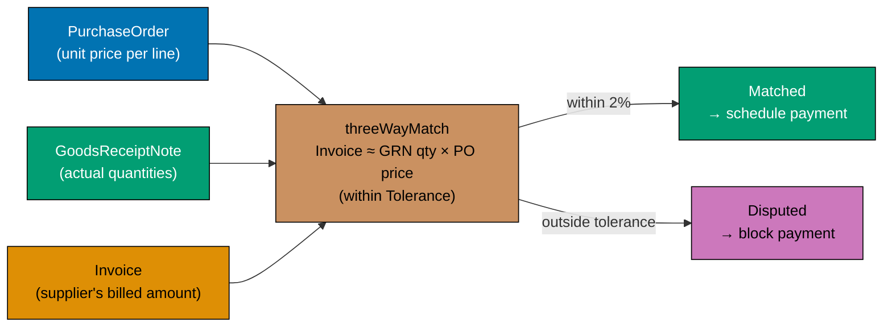





```fsharp
// Invoice: aggregate root of the invoicing context.
// Three-way matching: Invoice amount ≈ GRN quantity × PO unit price (within Tolerance).

type PurchaseOrderId = PurchaseOrderId of string
type InvoiceId       = InvoiceId       of string

// Tolerance: how much the invoice amount can deviate from the calculated amount
type Tolerance = private Tolerance of decimal
// => Tolerance is a percentage (0.0 to 0.10 = 0% to 10%)

module Tolerance =
    let defaultTolerance = Tolerance 0.02m
    // => Default: 2% — standard accounts payable tolerance
    let create (pct: decimal) : Result<Tolerance, string> =
        if pct < 0m || pct > 0.10m then Error (sprintf "Tolerance must be 0–10%%, got %.2f%%" (pct * 100m))
        else Ok (Tolerance pct)
    let value (Tolerance t) = t
    // => Unwrap for arithmetic

// Invoice states
type InvoiceStatus = Registered | Matching | Matched | Disputed | ScheduledForPayment | Paid
// => Registered: invoice logged in the system
// => Matching: three-way match in progress
// => Matched: match succeeded — eligible for payment scheduling
// => Disputed: match failed — requires investigation
// => ScheduledForPayment: payment run scheduled
// => Paid: bank disbursement confirmed

// The Invoice aggregate root
type Invoice = {
    Id:              InvoiceId
    PurchaseOrderId: PurchaseOrderId
    SupplierAmount:  decimal
    // => What the supplier claims — from the invoice document
    Status:          InvoiceStatus
    MatchedAt:       System.DateTimeOffset option
    // => None until matching completes
    DisputeReason:   string option
    // => None unless Disputed — carries the reason for the discrepancy
}
// => Invoice : aggregate root of the invoicing context

// Three-way match: does the invoice amount match the calculated amount within tolerance?
let threeWayMatch
    (invoiceAmount:    decimal)
    (grnQuantities:    (int * decimal) list)  // => (receivedQty, poUnitPrice) per line
    (tolerance:        Tolerance)
    : Result<decimal, string> =
    // => Returns Ok calculatedAmount if matched, Error with details if not
    let calculated = grnQuantities |> List.sumBy (fun (qty, price) -> decimal qty * price)
    // => Sum GRN quantities × PO unit prices — what the invoice SHOULD say
    let diff = abs (invoiceAmount - calculated)
    // => Absolute difference between invoice amount and calculated amount
    let maxAllowed = calculated * Tolerance.value tolerance
    // => Maximum allowed discrepancy = calculated × tolerance percentage
    if diff <= maxAllowed then
        Ok calculated
        // => Within tolerance — match succeeds
    else
        Error (sprintf "Invoice %M differs from calculated %M by %M (max allowed: %M)"
                       invoiceAmount calculated diff maxAllowed)
        // => Outside tolerance — match fails with details

// Test three-way match
let invoiceAmount = 2699.97m
// => Supplier invoiced for 2699.97 — matches 3 × 899.99 exactly
let grnLines = [(3, 899.99m)]
// => GRN: 3 laptops received; PO unit price: 899.99

let matchResult = threeWayMatch invoiceAmount grnLines Tolerance.defaultTolerance
// => calculated = 3 × 899.99 = 2699.97; diff = |2699.97 - 2699.97| = 0; 0 <= 53.9994 (2%)
// => matchResult : Result<decimal, string> = Ok 2699.97

printfn "Match result: %A" matchResult
// => Output: Match result: Ok 2699.9700M

// Test with out-of-tolerance invoice
let overInvoiceAmount = 2900m
// => Supplier invoiced for 2900 — 200.03 over the calculated amount (7.4% over)
let overMatchResult = threeWayMatch overInvoiceAmount grnLines Tolerance.defaultTolerance
// => diff = |2900 - 2699.97| = 200.03; maxAllowed = 2699.97 × 0.02 = 53.9994; 200.03 > 53.9994
// => overMatchResult : Result<decimal, string> = Error "Invoice 2900M differs..."

printfn "Over-invoice: %A" overMatchResult
// => Output: Over-invoice: Error "Invoice 2900M differs from calculated 2699.9700M by 200.0300M (max allowed: 53.9994M)"
```





```clojure
;; Invoice: aggregate root of the invoicing context.
;; Three-way matching: Invoice amount ≈ GRN quantity × PO unit price (within Tolerance).
;; [F#: private Tolerance DU with smart constructor; Clojure uses a validated map + spec]

(require '[clojure.spec.alpha :as s])

;; Invoice status as keywords — idiomatic Clojure open-enum approach
;; [F#: InvoiceStatus DU — closed, compiler-exhaustive; Clojure uses keyword set]
(def invoice-statuses
  #{:registered :matching :matched :disputed :scheduled-for-payment :paid})
;; => Set of valid invoice status keywords — membership check enforces valid transitions

;; Tolerance value object: a validated percentage between 0 and 0.10
;; [F#: private constructor + module create fn returning Result; Clojure uses spec + constructor fn]
(s/def ::tolerance-pct (s/and number? #(>= % 0) #(<= % 0.10)))
;; => Spec: tolerance must be a number in [0.0, 0.10] — 0% to 10%

(defn make-tolerance [pct]
  ;; Smart constructor: validates pct and returns {:ok tolerance} or {:error msg}
  (if (s/valid? ::tolerance-pct pct)
    {:ok {:tolerance/pct pct}}
    ;; => Valid: wrap in tagged-map result — data-oriented Ok
    {:error (format "Tolerance must be 0–10%%, got %.2f%%" (* pct 100.0))}))
    ;; => Invalid: return error with human-readable message

(def default-tolerance {:tolerance/pct 0.02})
;; => Default: 2% — standard accounts payable tolerance; no constructor needed for the default

;; Three-way match: does the invoice amount match the calculated amount within tolerance?
;; [F#: Result<decimal, string> with pipeline; Clojure returns {:ok calculated} or {:error msg}]
(defn three-way-match [invoice-amount grn-quantities tolerance]
  ;; invoice-amount: number; grn-quantities: seq of [received-qty po-unit-price] pairs
  ;; tolerance: tolerance map with :tolerance/pct
  (let [calculated  (reduce + (map (fn [[qty price]] (* qty price)) grn-quantities))
        ;; => Sum GRN quantities × PO unit prices — what the invoice SHOULD say
        diff        (Math/abs (- invoice-amount calculated))
        ;; => Absolute difference between invoice amount and calculated amount
        max-allowed (* calculated (:tolerance/pct tolerance))]
        ;; => Maximum allowed discrepancy = calculated × tolerance percentage
    (if (<= diff max-allowed)
      {:ok calculated}
      ;; => Within tolerance — match succeeds; return calculated amount
      {:error (format "Invoice %.2f differs from calculated %.2f by %.2f (max allowed: %.2f)"
                      (double invoice-amount) (double calculated)
                      (double diff) (double max-allowed))})))
                      ;; => Outside tolerance — return error with details

;; Test three-way match
(def invoice-amount 2699.97)
;; => Supplier invoiced for 2699.97 — matches 3 × 899.99 exactly

(def grn-lines [[3 899.99]])
;; => GRN: 3 laptops received; PO unit price: 899.99

(def match-result (three-way-match invoice-amount grn-lines default-tolerance))
;; => calculated = 3 × 899.99 = 2699.97; diff = |2699.97 - 2699.97| = 0; 0 <= 53.9994 (2%)
;; => match-result = {:ok 2699.97}

(println "Match result:" match-result)
;; => Output: Match result: {:ok 2699.97}

;; Test with out-of-tolerance invoice
(def over-invoice-amount 2900.0)
;; => Supplier invoiced for 2900 — 200.03 over the calculated amount (7.4% over)

(def over-match-result (three-way-match over-invoice-amount grn-lines default-tolerance))
;; => diff = |2900 - 2699.97| = 200.03; max-allowed = 2699.97 × 0.02 = 53.9994; 200.03 > 53.9994
;; => over-match-result = {:error "Invoice 2900.00 differs from calculated 2699.97 by 200.03 ..."}

(println "Over-invoice:" over-match-result)
;; => Output: Over-invoice: {:error "Invoice 2900.00 differs from calculated 2699.97 by 200.03 (max allowed: 53.99)"}
```





```typescript
// Invoice aggregate — three-way matching between PO, GRN, and Invoice.
// [F#: validateThreeWayMatch : PO -> GRN -> Invoice -> Result<MatchedInvoice, InvoiceError>]
// [Clojure: validate-three-way-match fn returning {:ok ...}/{:error ...}; TS uses Result]

// Result type
type Result<T, E> = { readonly ok: true; readonly value: T } | { readonly ok: false; readonly error: E };
const okR = <T, E>(v: T): Result => ({ ok: true, value: v });
const errR = <T, E>(e: E): Result => ({ ok: false, error: e });

type InvoiceId = string & { readonly __brand: "InvoiceId" };
type PurchaseOrderId = string & { readonly __brand: "PurchaseOrderId" };
type GRNId = string & { readonly __brand: "GRNId" };
const asInvoiceId = (s: string): InvoiceId => s as InvoiceId;

// Three-way match inputs
interface POSummary {
  readonly id: PurchaseOrderId;
  readonly supplierId: string;
  readonly total: number;
}
interface GRNSummary {
  readonly id: GRNId;
  readonly purchaseOrderId: PurchaseOrderId;
  readonly receivedTotal: number;
}
interface Invoice {
  readonly id: InvoiceId;
  readonly purchaseOrderId: PurchaseOrderId;
  readonly invoicedTotal: number;
}

interface MatchedInvoice {
  readonly invoiceId: InvoiceId;
  readonly purchaseOrderId: PurchaseOrderId;
  readonly grnId: GRNId;
  readonly poTotal: number;
  readonly receivedTotal: number;
  readonly invoicedTotal: number;
  readonly matchedAt: string;
}

// Three-way match tolerance (5% by default)
const TOLERANCE = 0.05;

function validateThreeWayMatch(po: POSummary, grn: GRNSummary, inv: Invoice): Result {
  if (grn.purchaseOrderId !== po.id) return errR(`GRN ${grn.id} does not reference PO ${po.id}`);
  // => GRN must reference the same PO as the invoice
  if (inv.purchaseOrderId !== po.id) return errR(`Invoice ${inv.id} does not reference PO ${po.id}`);
  // => Invoice must reference the same PO
  const variance = Math.abs(inv.invoicedTotal - grn.receivedTotal) / grn.receivedTotal;
  if (variance > TOLERANCE) {
    return errR(
      `Invoice total ${inv.invoicedTotal} vs received ${grn.receivedTotal} exceeds ${TOLERANCE * 100}% tolerance`,
    );
    // => Three-way match failed: invoiced amount too far from received amount
  }
  return okR({
    invoiceId: inv.id,
    purchaseOrderId: po.id,
    grnId: grn.id,
    poTotal: po.total,
    receivedTotal: grn.receivedTotal,
    invoicedTotal: inv.invoicedTotal,
    matchedAt: new Date().toISOString(),
  });
}

const po: POSummary = { id: "po_001" as PurchaseOrderId, supplierId: "sup_001", total: 2699.97 };
const grn: GRNSummary = {
  id: "grn_001" as GRNId,
  purchaseOrderId: "po_001" as PurchaseOrderId,
  receivedTotal: 2699.97,
};
const inv: Invoice = {
  id: asInvoiceId("inv_001"),
  purchaseOrderId: "po_001" as PurchaseOrderId,
  invoicedTotal: 2699.97,
};

const result = validateThreeWayMatch(po, grn, inv);
if (result.ok) console.log("Three-way match:", result.value.matchedAt.slice(0, 10));
// => Output: Three-way match: 2026-...
```





```haskell
-- ── file: Invoicing/ThreeWayMatch.hs ───────────────────────────────────────
-- Invoice aggregate — three-way matching as a pure function.
-- [F#: private Tolerance with smart constructor; Haskell hides constructor via export list]
{-# LANGUAGE OverloadedStrings #-}
module Invoicing.ThreeWayMatch
  ( Tolerance, defaultTolerance, mkTolerance, toleranceValue
  , threeWayMatch
  ) where

import           Data.Text (Text)
import qualified Data.Text as T

-- Tolerance: validated percentage between 0 and 10%; raw constructor hidden
newtype Tolerance = Tolerance Rational deriving (Eq, Show)

defaultTolerance :: Tolerance
defaultTolerance = Tolerance 0.02   -- => 2% standard accounts payable tolerance

mkTolerance :: Rational -> Either Text Tolerance
mkTolerance pct
  | pct < 0 || pct > 0.10 =
      Left ("Tolerance must be 0-10%, got " <> T.pack (show (fromRational (pct * 100) :: Double)) <> "%")
  | otherwise             = Right (Tolerance pct)
-- => Smart constructor enforces the invariant once at the boundary

toleranceValue :: Tolerance -> Rational
toleranceValue (Tolerance t) = t

-- Three-way match: invoiceAmount ≈ Σ (receivedQty × poUnitPrice), within tolerance.
threeWayMatch
  :: Rational           -- ^ invoiceAmount
  -> [(Int, Rational)]  -- ^ (receivedQty, poUnitPrice) per line
  -> Tolerance
  -> Either Text Rational
threeWayMatch invoiceAmount grnLines tolerance =
  let calculated = sum [toRational q * p | (q, p) <- grnLines]
      -- => Sum GRN quantities × PO unit prices — what the invoice SHOULD say
      diff       = abs (invoiceAmount - calculated)
      -- => Absolute difference between invoice and calculated
      maxAllowed = calculated * toleranceValue tolerance
      -- => Maximum allowed discrepancy = calculated × tolerance percentage
  in if diff <= maxAllowed
       then Right calculated
       -- => Within tolerance — match succeeds; return canonical amount
       else Left (T.pack ("Invoice " <> show (fromRational invoiceAmount :: Double)
                       <> " differs from calculated " <> show (fromRational calculated :: Double)
                       <> " by " <> show (fromRational diff :: Double)
                       <> " (max allowed: " <> show (fromRational maxAllowed :: Double) <> ")"))
       -- => Outside tolerance — error with full details

-- Test three-way match
runDemo :: IO ()
runDemo = do
  let grnLines = [(3, 899.99)]  -- => 3 laptops received; PO unit price 899.99
      invoiceAmount = 2699.97   -- => Supplier invoiced 2699.97 — matches 3 × 899.99
      matchResult = threeWayMatch invoiceAmount grnLines defaultTolerance
      -- => calculated = 3 × 899.99 = 2699.97; diff = 0; 0 <= 53.9994 (2%) — Right 2699.97
  putStrLn ("Match result: " <> show matchResult)
  -- => Output: Match result: Right (2699.97 :: Rational)

  let overInvoice    = 2900       -- => 200.03 over (7.4% over) — outside tolerance
      overResult     = threeWayMatch overInvoice grnLines defaultTolerance
      -- => diff=200.03; maxAllowed=53.9994; 200.03 > 53.9994 — Left "Invoice ..."
  putStrLn ("Over-invoice: " <> show overResult)
  -- => Output: Over-invoice: Left "Invoice 2900.0 differs from calculated 2699.97 ..."
```





**Key Takeaway**: Three-way matching implemented as a pure function over GRN quantities and PO unit prices is independently testable and produces a named error when the invoice is outside tolerance.

**Why It Matters**: Three-way matching is the primary financial control in accounts payable. A pure `threeWayMatch` function can be unit-tested with dozens of boundary cases (exact match, within tolerance, one cent over tolerance, supplier overcharge by 10%) without a database or running service. The `Tolerance` value object enforces the 0–10% constraint at creation time, preventing misconfigurations that would pass all invoices regardless of discrepancy.

---

### Example 60: EventStore vs Repository — Trade-offs

The procurement domain supports two persistence strategies: a traditional repository that stores the current state, and an event store that stores the sequence of transitions. Each has distinct trade-offs for procurement use cases.

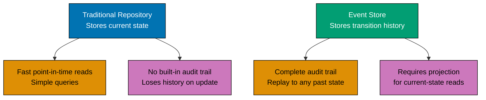





```fsharp
// Two persistence strategies for the PurchaseOrder aggregate.
// Traditional: stores the current snapshot; Event store: stores the history.

type PurchaseOrderId = PurchaseOrderId of string

// ── TRADITIONAL REPOSITORY ────────────────────────────────────────────────────
// Stores the current state snapshot — fast reads, no built-in history

type PoSnapshot = {
    Id:        PurchaseOrderId
    Status:    string
    Total:     decimal
    UpdatedAt: System.DateTimeOffset
}
// => PoSnapshot : the current state of a PO — overwritten on each transition

type PoRepository = {
    Load: PurchaseOrderId -> Async<PoSnapshot option>
    // => Load the current snapshot — O(1) lookup
    Save: PoSnapshot -> Async<unit>
    // => Overwrite the snapshot — loses previous state
}
// => PoRepository : traditional repository — no history

// ── EVENT STORE ───────────────────────────────────────────────────────────────
// Stores the sequence of events — full history, requires projection for reads

type PoEvent =
    | DraftCreated      of { Id: PurchaseOrderId; Total: decimal }
    // => Initial event — the PO comes into existence
    | ApprovalRequested of { Id: PurchaseOrderId }
    // => Submitter asks for approval; status moves to AwaitingApproval
    | PurchaseOrderApproved       of { Id: PurchaseOrderId; ApprovedAt: System.DateTimeOffset }
    // => Approver signed off; status moves to Approved
    | PurchaseOrderIssuedEv       of { Id: PurchaseOrderId; IssuedAt: System.DateTimeOffset }
    // => PO sent to supplier; status moves to Issued
    | PurchaseOrderCancelledEv    of { Id: PurchaseOrderId; Reason: string }
    // => Off-ramp from any pre-Paid state
// => Each DU case represents one thing that happened to the PO

type PoEventStore = {
    Append: PurchaseOrderId -> PoEvent list -> Async<unit>
    // => Append new events to the stream — never overwrites
    Load:   PurchaseOrderId -> Async<PoEvent list>
    // => Load the full event stream — replay to get current state
}
// => PoEventStore : event store — append-only; full history preserved

// Projection: fold the event stream to get current state
let projectSnapshot (events: PoEvent list) : PoSnapshot option =
    let folder (acc: PoSnapshot option) (event: PoEvent) : PoSnapshot option =
        match event with
        | DraftCreated d ->
            Some { Id = d.Id; Status = "Draft"; Total = d.Total; UpdatedAt = System.DateTimeOffset.UtcNow }
        // => First event: creates the initial snapshot
        | PurchaseOrderApproved a ->
            acc |> Option.map (fun s -> { s with Status = "Approved"; UpdatedAt = a.ApprovedAt })
        // => Approval: update status and timestamp
        | PurchaseOrderIssuedEv i ->
            acc |> Option.map (fun s -> { s with Status = "Issued"; UpdatedAt = i.IssuedAt })
        // => Issuance: update status and timestamp
        | PurchaseOrderCancelledEv c ->
            acc |> Option.map (fun s -> { s with Status = "Cancelled"; UpdatedAt = System.DateTimeOffset.UtcNow })
        // => Cancellation: mark as cancelled
        | ApprovalRequested _ ->
            acc |> Option.map (fun s -> { s with Status = "AwaitingApproval" })
        // => Approval request: update status
    List.fold folder None events
    // => Fold over all events — last write wins for each field

// Test the projection
let events = [
    DraftCreated { Id = PurchaseOrderId "po_e3d1"; Total = 2699.97m }
    // => Event 1: PO created with $2,699.97 total; initial Status = "Draft"
    ApprovalRequested { Id = PurchaseOrderId "po_e3d1" }
    // => Event 2: approval submitted; Status → "AwaitingApproval"
    PurchaseOrderApproved { Id = PurchaseOrderId "po_e3d1"; ApprovedAt = System.DateTimeOffset.UtcNow }
    // => Event 3: approver signed off; Status → "Approved"
]
// => Three events: Draft → AwaitingApproval → Approved

let snapshot = projectSnapshot events
// => Fold produces the current state from the event history; snapshot : PoSnapshot option = Some { Status = "Approved"; ... }

match snapshot with
| Some s -> printfn "Current state: %s total=%M" s.Status s.Total
// => Output: Current state: Approved total=2699.9700M
| None   -> printfn "No events"
// => Only reached if events list is empty
```





```clojure
;; Two persistence strategies for the PurchaseOrder aggregate.
;; Traditional: stores the current snapshot; Event store: stores the history.
;; [F#: record types and DU PoEvent — compile-time field guarantees; Clojure uses plain maps with keyword events]

(import '[java.time Instant])

;; ── TRADITIONAL REPOSITORY ────────────────────────────────────────────────────
;; Stores the current snapshot map — fast reads, no built-in history

;; Repository as a protocol — idiomatic Clojure polymorphism for persistence ports
;; [F#: record of function fields {Load: ...; Save: ...}; Clojure uses defprotocol]
(defprotocol PoRepository
  (load-snapshot [repo po-id]
    "Returns a snapshot map or nil — O(1) lookup")
  ;; => Protocol method: load snapshot by PO ID; returns map or nil
  (save-snapshot [repo snapshot]
    "Overwrites the snapshot — loses previous state"))
    ;; => Protocol method: persist snapshot; no return value

;; In-memory repository — useful for tests and demonstrations
(defrecord InMemoryPoRepository [store-atom]
  ;; store-atom holds an atom wrapping a map of po-id -> snapshot
  PoRepository
  (load-snapshot [_ po-id]
    ;; Dereference atom, look up po-id — returns snapshot map or nil
    (get @store-atom po-id))
  (save-snapshot [_ snapshot]
    ;; swap! atomically associates po-id -> snapshot in the store
    (swap! store-atom assoc (:po-snapshot/id snapshot) snapshot)))
    ;; => swap! is safe for single-threaded tests and concurrent writes

;; ── EVENT STORE ───────────────────────────────────────────────────────────────
;; Stores the sequence of event maps — full history, requires projection for reads
;; [F#: DU PoEvent with named cases; Clojure uses plain maps with :event/type keyword]

(defn make-po-event [event-type payload]
  ;; Constructs a PO domain event map with a mandatory :event/type dispatch key
  (merge {:event/type event-type} payload))
  ;; => payload carries event-specific fields merged into the event map

;; Event constructors — each returns a plain map with :event/type
(defn draft-created-event [po-id total]
  ;; The first event: the PO comes into existence
  (make-po-event :draft-created {:po/id po-id :po/total total}))
  ;; => :draft-created is the Clojure equivalent of DraftCreated DU case

(defn approval-requested-event [po-id]
  ;; Submitter asks for approval; status moves to :awaiting-approval
  (make-po-event :approval-requested {:po/id po-id}))

(defn po-approved-event [po-id approved-at]
  ;; Approver signed off; status moves to :approved
  (make-po-event :po-approved {:po/id po-id :po/approved-at approved-at}))

;; Projection: reduce the event list to get current snapshot map
;; [F#: List.fold with pattern match on DU — exhaustive; Clojure uses reduce + cond/case on :event/type]
(defn project-snapshot [events]
  ;; Reduce over events, accumulating state as a snapshot map (or nil)
  (reduce
    (fn [acc event]
      ;; Dispatch on :event/type — open; new event types extend without touching this fn
      (case (:event/type event)
        :draft-created
        ;; First event: initialise the snapshot
        {:po-snapshot/id        (:po/id event)
         :po-snapshot/status    "Draft"
         :po-snapshot/total     (:po/total event)
         :po-snapshot/updated-at (Instant/now)}

        :approval-requested
        ;; Status advances to awaiting approval
        (assoc acc :po-snapshot/status "AwaitingApproval")

        :po-approved
        ;; Status advances to approved; capture approval timestamp
        (-> acc
            (assoc :po-snapshot/status "Approved")
            (assoc :po-snapshot/updated-at (:po/approved-at event)))
        ;; => Threading macro chains two assoc calls on the acc map

        :po-issued
        (-> acc
            (assoc :po-snapshot/status "Issued")
            (assoc :po-snapshot/updated-at (:po/issued-at event)))

        :po-cancelled
        (assoc acc :po-snapshot/status "Cancelled")
        ;; => Default: unknown event types leave state unchanged (open extension point)
        acc))
    nil
    events))
    ;; => reduce starts with nil; first event sets the initial snapshot map

;; Test the projection
(def events
  [(draft-created-event "po_e3d1" 2699.97)
   ;; => Event 1: PO created with 2699.97 total; initial status "Draft"
   (approval-requested-event "po_e3d1")
   ;; => Event 2: approval submitted; status → "AwaitingApproval"
   (po-approved-event "po_e3d1" (Instant/now))])
   ;; => Event 3: approver signed off; status → "Approved"

(def snapshot (project-snapshot events))
;; => reduce folds all three events; snapshot is the final state map

(if snapshot
  (println "Current state:" (:po-snapshot/status snapshot)
           "total=" (:po-snapshot/total snapshot))
  ;; => Output: Current state: Approved  total= 2699.97
  (println "No events"))
  ;; => Only printed if events is empty and reduce returns nil
```





```typescript
// EventStore vs Repository — trade-offs between event sourcing and snapshot storage.
// [F#: EventStore uses DomainEvent list; Repository uses aggregate snapshot]
// [Clojure: event-log vs current-state maps; TS contrasts event sourcing vs snapshot]

// Domain event union for PurchaseOrder
type PurchaseOrderId = string & { readonly __brand: "PurchaseOrderId" };

type POEvent =
  | { readonly type: "POCreated"; readonly id: PurchaseOrderId; readonly supplierId: string; readonly at: string }
  | { readonly type: "POApproved"; readonly id: PurchaseOrderId; readonly approvedBy: string; readonly at: string }
  | { readonly type: "POIssued"; readonly id: PurchaseOrderId; readonly issuedAt: string }
  | { readonly type: "POCancelled"; readonly id: PurchaseOrderId; readonly reason: string; readonly at: string };

// Current aggregate state
interface PurchaseOrderState {
  readonly id: PurchaseOrderId;
  readonly status: "Draft" | "Approved" | "Issued" | "Cancelled";
  readonly supplierId: string;
  readonly history: readonly string[]; // simplified audit trail
}

// ── Event Store pattern ───────────────────────────────────────────────────────
// Replay all events to reconstruct current state
function replayEvents(events: readonly POEvent[]): PurchaseOrderState | null {
  if (events.length === 0) return null;
  let state: PurchaseOrderState | null = null;
  for (const event of events) {
    switch (event.type) {
      case "POCreated":
        state = { id: event.id, status: "Draft", supplierId: event.supplierId, history: [`Created at ${event.at}`] };
        break;
      case "POApproved":
        state = { ...state!, status: "Approved", history: [...state!.history, `Approved by ${event.approvedBy}`] };
        break;
      case "POIssued":
        state = { ...state!, status: "Issued", history: [...state!.history, `Issued at ${event.issuedAt}`] };
        break;
      case "POCancelled":
        state = { ...state!, status: "Cancelled", history: [...state!.history, `Cancelled: ${event.reason}`] };
        break;
    }
  }
  return state;
}

// ── Repository pattern ────────────────────────────────────────────────────────
// Store and retrieve the current snapshot directly
interface PORepository {
  readonly save: (state: PurchaseOrderState) => void;
  readonly findById: (id: PurchaseOrderId) => PurchaseOrderState | null;
}

// Comparison
const events: POEvent[] = [
  { type: "POCreated", id: "po_001" as PurchaseOrderId, supplierId: "sup_001", at: "2026-01-01" },
  { type: "POApproved", id: "po_001" as PurchaseOrderId, approvedBy: "mgr_finance", at: "2026-01-02" },
];

const replayed = replayEvents(events);
console.log("EventStore replayed status:", replayed?.status);
// => Output: EventStore replayed status: Approved
console.log("History:", replayed?.history.join("; "));
// => Output: History: Created at 2026-01-01; Approved by mgr_finance
// => EventStore: full audit trail, at cost of replay overhead
// => Repository: fast reads, no history, simpler queries
```





```haskell
-- ── file: Purchasing/Persistence.hs ────────────────────────────────────────
-- Two persistence strategies: snapshot repository vs event-sourced store.
-- [F#: DU PoEvent + List.fold; Haskell uses sum type + foldl']
{-# LANGUAGE OverloadedStrings #-}
module Purchasing.Persistence where

import           Data.Foldable (foldl')
import           Data.Text     (Text)
import qualified Data.Text     as T
import           Data.Time     (UTCTime, getCurrentTime)

newtype PurchaseOrderId = PurchaseOrderId Text deriving (Eq, Show)

-- ── TRADITIONAL REPOSITORY ─────────────────────────────────────────────────
-- Stores the current snapshot — fast reads, no built-in history
data PoSnapshot = PoSnapshot
  { snapId        :: PurchaseOrderId
  , snapStatus    :: Text
  , snapTotal     :: Rational
  , snapUpdatedAt :: UTCTime
  } deriving (Show)

data PoRepository = PoRepository
  { repoLoad :: PurchaseOrderId -> IO (Maybe PoSnapshot)  -- => O(1) lookup
  , repoSave :: PoSnapshot -> IO ()                       -- => overwrite snapshot
  }

-- ── EVENT STORE ────────────────────────────────────────────────────────────
-- Stores the sequence of events — full history, requires projection for reads
data PoEvent
  = DraftCreated      PurchaseOrderId Rational
  -- => Initial event — PO comes into existence
  | ApprovalRequested PurchaseOrderId
  -- => Status moves to AwaitingApproval
  | PurchaseOrderApproved      PurchaseOrderId UTCTime
  -- => Status moves to Approved
  | PurchaseOrderIssuedEv      PurchaseOrderId UTCTime
  -- => Status moves to Issued
  | PurchaseOrderCancelledEv   PurchaseOrderId Text
  -- => Off-ramp from any pre-Paid state
  deriving (Show)

data PoEventStore = PoEventStore
  { storeAppend :: PurchaseOrderId -> [PoEvent] -> IO ()
  , storeLoad   :: PurchaseOrderId -> IO [PoEvent]
  }

-- Projection: fold the event stream to get current state
projectSnapshot :: UTCTime -> [PoEvent] -> Maybe PoSnapshot
projectSnapshot now = foldl' folder Nothing
  where
    folder acc event = case event of
      DraftCreated poId total ->
        Just (PoSnapshot poId "Draft" total now)
      -- => First event: creates the initial snapshot
      ApprovalRequested _ ->
        fmap (\s -> s { snapStatus = "AwaitingApproval" }) acc
      -- => Status update via record-update syntax
      PurchaseOrderApproved _ ts ->
        fmap (\s -> s { snapStatus = "Approved", snapUpdatedAt = ts }) acc
      PurchaseOrderIssuedEv _ ts ->
        fmap (\s -> s { snapStatus = "Issued",   snapUpdatedAt = ts }) acc
      PurchaseOrderCancelledEv _ _ ->
        fmap (\s -> s { snapStatus = "Cancelled" }) acc
-- => foldl' is strict — avoids thunk buildup over long event streams

-- Test the projection
runDemo :: IO ()
runDemo = do
  now <- getCurrentTime
  let events =
        [ DraftCreated      (PurchaseOrderId "po_e3d1") 2699.97
          -- => Event 1: PO created with $2,699.97 total; initial Status = "Draft"
        , ApprovalRequested (PurchaseOrderId "po_e3d1")
          -- => Event 2: approval submitted; Status -> "AwaitingApproval"
        , PurchaseOrderApproved (PurchaseOrderId "po_e3d1") now
          -- => Event 3: approver signed off; Status -> "Approved"
        ]
      snapshot = projectSnapshot now events
  case snapshot of
    Just s  -> putStrLn ("Current state: " <> T.unpack (snapStatus s)
                       <> " total=" <> show (fromRational (snapTotal s) :: Double))
               -- => Output: Current state: Approved total=2699.97
    Nothing -> putStrLn "No events"
```





**Key Takeaway**: Event stores provide a complete audit trail by design — every state the PO was ever in is recoverable by replaying the event stream; traditional repositories provide faster current-state reads at the cost of losing history.

**Why It Matters**: Procurement audit requirements typically mandate a complete trail of every state transition: when was the PO approved, by whom, at what time, and what was its total at each step? An event store provides this for free — there is no "before state" to lose. For procurement systems subject to SOX, ISO 9001, or government procurement regulations, event sourcing is often the natural fit for the PO aggregate.

---

### Example 61: Bounded Context Boundary as Module + Signature

Each bounded context in the procurement platform exposes a public API through a module signature. The signature defines what is visible to other contexts; the implementation hides internal types. This is the F# module system as a bounded context boundary.





```fsharp
// Bounded context as a module with an explicit public surface.
// Internal types stay hidden; the public API is the Anti-Corruption Layer.

// ── PURCHASING CONTEXT — PUBLIC API ─────────────────────────────────────────
module Purchasing =
    // Public types — visible to other contexts
    type RequisitionId   = RequisitionId of string
    type PurchaseOrderId = PurchaseOrderId of string

    // Public event — emitted by purchasing, consumed by other contexts
    type PurchaseOrderIssuedPublic = {
        PurchaseOrderId: PurchaseOrderId
        SupplierId:      string
        IssuedAt:        System.DateTimeOffset
        TotalAmount:     decimal
    }
    // => This is the "published language" — the public event contract

    // Internal type — NOT exported; invisible to other contexts
    type InternalPoState = {
        Id:            PurchaseOrderId
        Lines:         (string * int * decimal) list
        ApprovalChain: string list
        // => Approval chain is an internal implementation detail
        // => The receiving context does not need to know the chain
    }
    // => InternalPoState : visible only inside Purchasing module

    // Public function — the only way to query a PO's issue status
    let getIssuedPOPublic (id: PurchaseOrderId) : PurchaseOrderIssuedPublic option =
        // => Simplified stub — real implementation queries the database
        if id = PurchaseOrderId "po_e3d1" then
            Some { PurchaseOrderId = id; SupplierId = "sup_acme"
                   IssuedAt = System.DateTimeOffset.UtcNow; TotalAmount = 2699.97m }
        else None
    // => Public function returns the published type — not InternalPoState

// ── RECEIVING CONTEXT — CONSUMES PURCHASING VIA PUBLIC API ───────────────────
module Receiving =
    // The receiving context only imports what Purchasing exports
    let openGrnExpectation (event: Purchasing.PurchaseOrderIssuedPublic) : string =
        // => Uses only the published type — cannot access InternalPoState
        sprintf "GRN expectation opened for PO %A from supplier %s (total: %M)"
                event.PurchaseOrderId event.SupplierId event.TotalAmount
        // => Returns a description — real implementation creates a GRN record

// Test the context boundary
let issuedEvent = Purchasing.getIssuedPOPublic (Purchasing.PurchaseOrderId "po_e3d1")
// => Returns the public event type — not the internal state

match issuedEvent with
| Some ev ->
    let grnDesc = Receiving.openGrnExpectation ev
    // => Receiving uses the public type — fully decoupled from purchasing internals
    printfn "%s" grnDesc
    // => Output: GRN expectation opened for PO PurchaseOrderId "po_e3d1" from supplier sup_acme (total: 2699.9700M)
| None -> printfn "PO not found"
```





```clojure
;; Bounded context boundary in Clojure: namespace + public API functions.
;; Internal vars are private; the public API surface is the Anti-Corruption Layer.
;; [F#: module with explicit type visibility — compile-time enforcement; Clojure uses ns + defn- for private]

;; ── PURCHASING CONTEXT NAMESPACE ─────────────────────────────────────────────
(ns purchasing)
;; => Clojure namespace is the bounded context boundary — analogous to an F# module

;; Public event map constructor — the "published language"
;; [F#: record type PurchaseOrderIssuedPublic with compile-time field names; Clojure uses a constructor fn]
(defn make-po-issued-public [po-id supplier-id issued-at total-amount]
  ;; Constructs the public event map — all fields are the published contract
  {:purchasing/po-id         po-id
   ;; => PO identifier — consumers use this to correlate with their own records
   :purchasing/supplier-id   supplier-id
   ;; => Supplier that will receive the order
   :purchasing/issued-at     issued-at
   ;; => Timestamp used by receiving for GRN due-date tracking
   :purchasing/total-amount  total-amount})
   ;; => Total locked at issuance — used by accounting

;; Internal var — NOT part of the public API
;; [F#: InternalPoState — private type visible only inside the module; Clojure uses defn- for private fns]
(defn- make-internal-po-state [po-id lines approval-chain]
  ;; Private constructor — other namespaces cannot call this
  {:internal/po-id         po-id
   :internal/lines         lines
   ;; => Line items: internal to purchasing; receiving never needs this detail
   :internal/approval-chain approval-chain})
   ;; => Approval chain is an implementation detail of purchasing

;; Public query function — the only way another context can learn a PO's issue status
(defn get-issued-po-public [po-id]
  ;; Returns a public event map or nil — simplified stub for demonstration
  (when (= po-id "po_e3d1")
    ;; => Only po_e3d1 is issued in this stub; real impl queries the database
    (make-po-issued-public
      po-id "sup_acme"
      (java.time.Instant/now) 2699.97)))
      ;; => Returns the published map — not the internal state map

;; ── RECEIVING CONTEXT NAMESPACE ──────────────────────────────────────────────
(ns receiving
  (:require [purchasing]))
  ;; => Receiving requires only the purchasing namespace — accesses only public vars

(defn open-grn-expectation [issued-event]
  ;; Uses only the published map — cannot call purchasing/make-internal-po-state
  ;; [F#: Receiving.openGrnExpectation typed to PurchaseOrderIssuedPublic — compiler prevents InternalPoState access]
  (format "GRN expectation opened for PO %s from supplier %s (total: %.2f)"
          (:purchasing/po-id issued-event)
          ;; => Extract po-id from the published map
          (:purchasing/supplier-id issued-event)
          ;; => Extract supplier-id from the published map
          (:purchasing/total-amount issued-event)))
          ;; => Extract total from the published map — returns a formatted description

;; Test the context boundary
(def issued-event (purchasing/get-issued-po-public "po_e3d1"))
;; => Returns the public map — internal state is inaccessible from this namespace

(if issued-event
  (println (receiving/open-grn-expectation issued-event))
  ;; => Output: GRN expectation opened for PO po_e3d1 from supplier sup_acme (total: 2699.97)
  (println "PO not found"))
  ;; => Printed only when get-issued-po-public returns nil
```





```typescript
// Bounded context boundary as module and interface contract.
// [F#: module signature (.fsi file) defines the public API of a context]
// [Clojure: (ns purchasing.api) with explicit public vars; TS module with public interface]

// ── Purchasing context public API (what it exposes to other contexts) ─────────
namespace PurchasingContext {
  // Types that cross the boundary are plain primitives — no branded types
  export interface SubmitRequisitionCommand {
    readonly requestedBy: string;
    readonly lines: ReadonlyArray;
  }

  export interface RequisitionSubmittedEvent {
    readonly type: "RequisitionSubmitted";
    readonly requisitionId: string; // plain string — no brand crossing boundary
    readonly requestedBy: string;
    readonly approvalLevel: string;
    readonly totalAmount: number;
    readonly occurredAt: string;
  }
  // => Public event: other contexts subscribe to this — no internal types exposed

  // Result type
  type Result<T, E> = { readonly ok: true; readonly value: T } | { readonly ok: false; readonly error: E };
  const okR = <T, E>(v: T): Result => ({ ok: true, value: v });
  const errR = <T, E>(e: E): Result => ({ ok: false, error: e });

  // Public workflow — hides internal branded types
  export function submitRequisition(cmd: SubmitRequisitionCommand): Result {
    if (!cmd.requestedBy.trim()) return errR("requestedBy is required");
    if (cmd.lines.length === 0) return errR("at least one line required");
    const total = cmd.lines.reduce((s, l) => s + l.qty * l.unitPrice, 0);
    const level = total <= 1000 ? "L1" : total <= 10000 ? "L2" : "L3";
    return okR({
      type: "RequisitionSubmitted",
      requisitionId: `req_${Math.random().toString(36).slice(2, 10)}`,
      // => Plain string in the event — brand is an internal implementation detail
      requestedBy: cmd.requestedBy,
      approvalLevel: level,
      totalAmount: total,
      occurredAt: new Date().toISOString(),
    });
  }
}

// ── Receiving context consumes the public event — only sees public types ──────
const cmd: PurchasingContext.SubmitRequisitionCommand = {
  requestedBy: "emp_00456",
  lines: [{ skuCode: "ELE-0099", qty: 3, unitPrice: 899.99 }],
};
const result = PurchasingContext.submitRequisition(cmd);
if (result.ok) console.log("Event:", result.value.type, "level:", result.value.approvalLevel);
// => Output: Event: RequisitionSubmitted level: L2
```





```haskell
-- ── file: Purchasing.hs ────────────────────────────────────────────────────
-- Bounded context as a module with an explicit export list.
-- [F#: module visibility hides internal types; Haskell uses module export lists identically]
{-# LANGUAGE OverloadedStrings #-}
module Purchasing
  ( PurchaseOrderId (..)
  , PurchaseOrderIssuedPublic (..)
  , getIssuedPOPublic
  -- => InternalPoState is NOT exported; consumers cannot reference it
  ) where

import           Data.Text (Text)
import qualified Data.Text as T
import           Data.Time (UTCTime, getCurrentTime)

newtype PurchaseOrderId = PurchaseOrderId Text deriving (Eq, Show)

-- Public event — the "published language" of the purchasing context
data PurchaseOrderIssuedPublic = PurchaseOrderIssuedPublic
  { poipPoId        :: PurchaseOrderId
  , poipSupplierId  :: Text
  , poipIssuedAt    :: UTCTime
  , poipTotalAmount :: Rational
  } deriving (Show)

-- Internal type — NOT exported (no module export); invisible outside Purchasing
data InternalPoState = InternalPoState
  { ipsId            :: PurchaseOrderId
  , ipsLines         :: [(Text, Int, Rational)]
  , ipsApprovalChain :: [Text]
  } deriving (Show)
-- => InternalPoState is intentionally not in the export list

-- Public function — the only way to query a PO's issue status
getIssuedPOPublic :: PurchaseOrderId -> IO (Maybe PurchaseOrderIssuedPublic)
getIssuedPOPublic poId@(PurchaseOrderId raw) = do
  now <- getCurrentTime
  if raw == "po_e3d1"
    then pure (Just (PurchaseOrderIssuedPublic poId "sup_acme" now 2699.97))
    -- => Simplified stub — real impl queries the database
    else pure Nothing
-- => Returns the published type — never InternalPoState

-- ── file: Receiving.hs ─────────────────────────────────────────────────────
-- Receiving context consumes Purchasing only via the public exports.
-- import qualified Purchasing as P would expose only the listed names — InternalPoState is not importable.

openGrnExpectation :: PurchaseOrderIssuedPublic -> Text
openGrnExpectation ev =
  "GRN expectation opened for PO " <> T.pack (show (poipPoId ev))
    <> " from supplier " <> poipSupplierId ev
    <> " (total: " <> T.pack (show (fromRational (poipTotalAmount ev) :: Double)) <> ")"
-- => Uses only the published type — cannot reference InternalPoState

-- Test the context boundary
runDemo :: IO ()
runDemo = do
  issuedEvent <- getIssuedPOPublic (PurchaseOrderId "po_e3d1")
  -- => Returns the public event — not the internal state
  case issuedEvent of
    Just ev -> putStrLn (T.unpack (openGrnExpectation ev))
               -- => Output: GRN expectation opened for PO PurchaseOrderId "po_e3d1" from supplier sup_acme (total: 2699.97)
    Nothing -> putStrLn "PO not found"
```





**Key Takeaway**: Module visibility rules enforce bounded context boundaries — internal types stay hidden, and the only coupling between contexts is through explicitly exported types and functions. F# uses `internal` module access; Clojure uses private namespace vars; TypeScript uses explicit `export` declarations — all achieve the same context encapsulation.

**Why It Matters**: The `InternalPoState` with its approval chain, line-item history, and status notes is a purchasing-specific implementation detail. If the receiving context depends on `InternalPoState` directly, every refactor of purchasing internals risks breaking receiving. By exporting only `PurchaseOrderIssuedPublic`, the purchasing context can freely evolve its internal model without affecting downstream contexts. In production, this boundary prevents cascading compile errors across services when the purchasing team restructures approval logic.

---

### Example 62: ACL as a Translation Function Between Contexts

An Anti-Corruption Layer (ACL) translates between two bounded context models. When the invoicing context needs to verify that a GRN exists and is valid, it calls through an ACL that translates the receiving context's `GoodsReceiptNote` into invoicing's `GrnSummary`.

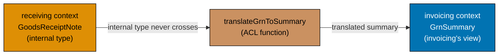





```fsharp
// ACL: a translation function between two bounded context models.
// Prevents the invoicing context from depending on receiving's internal types.

// ── RECEIVING CONTEXT TYPES ───────────────────────────────────────────────────
type GrnStatus = Open | Verified | Disputed
// => Receiving context's internal status enum

type GoodsReceiptNote = {
    Id:              string
    PurchaseOrderId: string
    ReceivedQuantity: int
    Status:          GrnStatus
    ReceivedAt:      System.DateTimeOffset
}
// => Receiving's internal type — not exported to invoicing

// ── INVOICING CONTEXT TYPES ───────────────────────────────────────────────────
// What invoicing needs to know about a GRN — a minimal projection
type GrnSummary = {
    GrnId:            string
    PurchaseOrderId:  string
    ReceivedQuantity: int
    IsValid:          bool
    // => True if GRN is Verified — invoicing only cares about validity, not the full status
}
// => GrnSummary : invoicing's view of a GRN — no dependency on receiving's GrnStatus

// ── THE ACL — TRANSLATION FUNCTION ───────────────────────────────────────────
let translateGrnToSummary (grn: GoodsReceiptNote) : GrnSummary =
    // => ACL function: translates receiving's type to invoicing's type
    { GrnId            = grn.Id
      PurchaseOrderId  = grn.PurchaseOrderId
      ReceivedQuantity = grn.ReceivedQuantity
      IsValid          = grn.Status = Verified
      // => Translate GrnStatus to a simple bool — invoicing doesn't care which non-Verified state
    }
    // => Returns GrnSummary — invoicing can use this without importing GrnStatus

// ACL port type — the invoicing context's dependency on receiving
type FindValidGrn = string -> Async<GrnSummary option>
// => FindValidGrn : purchaseOrderId → Async<GrnSummary option>
// => Invoicing calls this to check if a valid GRN exists for the PO

// Simulate the ACL adapter — in production, queries the receiving context's database
let findValidGrnAdapter (grns: GoodsReceiptNote list) : FindValidGrn =
    fun poId ->
        async {
            let found = grns |> List.tryFind (fun g -> g.PurchaseOrderId = poId && g.Status = Verified)
            // => Find a Verified GRN for the given PO ID
            return found |> Option.map translateGrnToSummary
            // => Translate to GrnSummary if found — None if no verified GRN exists
        }

// Test the ACL
let grns = [
    { Id = "grn_abc"; PurchaseOrderId = "po_e3d1"; ReceivedQuantity = 3; Status = Verified; ReceivedAt = System.DateTimeOffset.UtcNow }
    // => Verified GRN for po_e3d1 — eligible for invoice matching
]
let findGrn = findValidGrnAdapter grns
// => findGrn : FindValidGrn — the ACL adapter

let summaryResult = Async.RunSynchronously (findGrn "po_e3d1")
// => Finds the Verified GRN — translates to GrnSummary

match summaryResult with
| Some s -> printfn "GRN valid: qty=%d poId=%s" s.ReceivedQuantity s.PurchaseOrderId
// => Output: GRN valid: qty=3 poId=po_e3d1
| None   -> printfn "No valid GRN found"
```





```clojure
;; ACL: a translation function between two bounded context maps.
;; Prevents the invoicing namespace from depending on receiving's internal map shape.
;; [F#: type aliases GrnStatus DU and typed record GrnSummary; Clojure uses keyword-keyed plain maps]

;; ── RECEIVING CONTEXT INTERNAL TYPES ─────────────────────────────────────────
;; GRN status keywords — receiving's internal vocabulary
;; [F#: type GrnStatus = Open | Verified | Disputed — closed DU; Clojure uses keyword set]
(def grn-status-set #{:open :verified :disputed})
;; => Valid GRN status keywords; membership check replaces compile-time exhaustiveness

;; GoodsReceiptNote as a plain map — receiving's internal representation
(defn make-grn-internal [id po-id received-qty status received-at]
  ;; Internal GRN constructor — only receiving namespace should call this
  {:grn-internal/id            id
   :grn-internal/po-id         po-id
   ;; => Which PO this GRN receipts against
   :grn-internal/received-qty  received-qty
   ;; => What actually arrived
   :grn-internal/status        status
   ;; => :open | :verified | :disputed — internal status keyword
   :grn-internal/received-at   received-at})
   ;; => Receiving's internal type — invoicing never imports this constructor

;; ── INVOICING CONTEXT TYPES ───────────────────────────────────────────────────
;; GrnSummary: invoicing's minimal view of a GRN — a plain map with invoicing keywords
(defn make-grn-summary [grn-id po-id received-qty valid?]
  ;; Constructs the invoicing view — no dependency on receiving's keyword set
  {:grn-summary/id            grn-id
   :grn-summary/po-id         po-id
   ;; => Links summary to the PO for invoice matching
   :grn-summary/received-qty  received-qty
   ;; => Quantity used in the three-way match calculation
   :grn-summary/valid?        valid?})
   ;; => true if GRN is :verified — invoicing only cares about this boolean

;; ── THE ACL — TRANSLATION FUNCTION ───────────────────────────────────────────
;; [F#: typed translation function GoodsReceiptNote -> GrnSummary — compile-time field checking]
;; Clojure: plain map -> plain map — field names enforced by documentation and tests
(defn translate-grn-to-summary [grn-internal]
  ;; ACL function: translates receiving's internal map to invoicing's summary map
  (make-grn-summary
    (:grn-internal/id grn-internal)
    ;; => GRN ID passes through unchanged
    (:grn-internal/po-id grn-internal)
    ;; => PO ID passes through unchanged
    (:grn-internal/received-qty grn-internal)
    ;; => Received quantity passes through for three-way match use
    (= (:grn-internal/status grn-internal) :verified)))
    ;; => Translate :verified status to boolean — invoicing doesn't need the other statuses

;; ACL adapter: finds a verified GRN for the given PO ID
;; [F#: FindValidGrn = string -> Async<GrnSummary option>; Clojure returns GrnSummary map or nil synchronously]
(defn make-find-valid-grn-adapter [grns]
  ;; grns: seq of internal GRN maps (from receiving's datastore)
  (fn [po-id]
    ;; Returns the translated GrnSummary map or nil — synchronous for simplicity
    (when-let [found (some #(when (and (= (:grn-internal/po-id %) po-id)
                                       (= (:grn-internal/status %) :verified))
                              %)
                          grns)]
      ;; => some returns the first truthy element — first :verified GRN for this PO
      (translate-grn-to-summary found))))
      ;; => Translate the internal GRN to the invoicing summary map

;; Test the ACL
(import '[java.time Instant])

(def grns
  [(make-grn-internal "grn_abc" "po_e3d1" 3 :verified (Instant/now))])
  ;; => :verified GRN for po_e3d1 — eligible for invoice matching

(def find-grn (make-find-valid-grn-adapter grns))
;; => find-grn: the ACL adapter fn

(def summary-result (find-grn "po_e3d1"))
;; => Finds the :verified GRN and translates it to a GrnSummary map

(if summary-result
  (println "GRN valid: qty=" (:grn-summary/received-qty summary-result)
           "poId=" (:grn-summary/po-id summary-result))
  ;; => Output: GRN valid: qty= 3  poId= po_e3d1
  (println "No valid GRN found"))
```





```typescript
// Anti-Corruption Layer — translates between context models.
// [F#: ACL as a module of translation functions — no internal types leak across]
// [Clojure: translate-* functions at the boundary; TS ACL isolates model translation]

// ── Purchasing context (internal model) ──────────────────────────────────────
interface PurchasingSupplier {
  readonly supplierId: string & { readonly __brand: "SupplierId" };
  readonly approvalStatus: "Pending" | "Approved" | "Suspended" | "Blacklisted";
  readonly preferredCurrency: string;
}

// ── Supplier context (external model — legacy ERP) ────────────────────────────
interface ERPVendor {
  readonly vendorCode: string;
  readonly vendorStatus: "ACTIVE" | "INACTIVE" | "BLOCKED";
  readonly currency: string;
}
// => ERP uses "vendor" not "supplier"; "ACTIVE"/"INACTIVE" not our domain vocabulary

// ── ACL: translates ERP Vendor -> Purchasing Supplier ─────────────────────────
function translateERPVendorToSupplier(vendor: ERPVendor): PurchasingSupplier | null {
  if (!vendor.vendorCode.match(/^\d+$/)) return null;
  // => Guard: ERP vendor codes must be numeric — rejects invalid external data
  const approvalStatus = ((): PurchasingSupplier["approvalStatus"] | null => {
    switch (vendor.vendorStatus) {
      case "ACTIVE":
        return "Approved";
      // => ERP "ACTIVE" maps to our domain "Approved"
      case "INACTIVE":
        return "Suspended";
      // => ERP "INACTIVE" maps to our domain "Suspended"
      case "BLOCKED":
        return "Blacklisted";
      // => ERP "BLOCKED" maps to our domain "Blacklisted"
      default:
        return null;
    }
  })();
  if (!approvalStatus) return null;
  return {
    supplierId: `sup_${vendor.vendorCode}` as PurchasingSupplier["supplierId"],
    // => Translates ERP numeric code to our "sup_" prefixed format
    approvalStatus,
    preferredCurrency: vendor.currency,
  };
}

// Test the ACL translation
const erpVendor: ERPVendor = { vendorCode: "12345", vendorStatus: "ACTIVE", currency: "USD" };
const translated = translateERPVendorToSupplier(erpVendor);

console.log("Translated:", translated?.supplierId, translated?.approvalStatus);
// => Output: Translated: sup_12345 Approved
// => The ACL shields the Purchasing domain from ERP's vocabulary and format
```





```haskell
-- ── file: Invoicing/Acl.hs ─────────────────────────────────────────────────
-- ACL: pure translation function between two bounded context models.
-- [F#: translateGrnToSummary; Haskell uses the same shape — pure function]
{-# LANGUAGE OverloadedStrings #-}
module Invoicing.Acl where

import           Data.List  (find)
import           Data.Text  (Text)
import qualified Data.Text  as T
import           Data.Time  (UTCTime, getCurrentTime)

-- ── RECEIVING CONTEXT TYPES ────────────────────────────────────────────────
data GrnStatus = Open | Verified | Disputed deriving (Eq, Show)
-- => Receiving's internal status — closed sum type

data GoodsReceiptNote = GoodsReceiptNote
  { grnId            :: Text
  , grnPoId          :: Text
  , grnReceivedQty   :: Int
  , grnStatus        :: GrnStatus
  , grnReceivedAt    :: UTCTime
  } deriving (Show)
-- => Receiving's internal type — not exported to invoicing

-- ── INVOICING CONTEXT TYPES ────────────────────────────────────────────────
data GrnSummary = GrnSummary
  { gsGrnId          :: Text
  , gsPoId           :: Text
  , gsReceivedQty    :: Int
  , gsIsValid        :: Bool
  -- => True if GRN is Verified — invoicing only cares about validity
  } deriving (Show)
-- => Invoicing's view of a GRN — no dependency on GrnStatus

-- ── THE ACL — TRANSLATION FUNCTION ─────────────────────────────────────────
translateGrnToSummary :: GoodsReceiptNote -> GrnSummary
translateGrnToSummary grn = GrnSummary
  { gsGrnId       = grnId grn
  , gsPoId        = grnPoId grn
  , gsReceivedQty = grnReceivedQty grn
  , gsIsValid     = grnStatus grn == Verified
  -- => Translate GrnStatus to Bool — invoicing doesn't care which non-Verified state
  }

-- ACL port type — invoicing's dependency on receiving
type FindValidGrn = Text -> IO (Maybe GrnSummary)
-- => purchaseOrderId -> IO (Maybe GrnSummary)

-- Simulated ACL adapter — in production, queries receiving's database
findValidGrnAdapter :: [GoodsReceiptNote] -> FindValidGrn
findValidGrnAdapter grns poId = do
  let found = find (\g -> grnPoId g == poId && grnStatus g == Verified) grns
      -- => Find a Verified GRN for the given PO ID
  pure (fmap translateGrnToSummary found)
  -- => Translate to GrnSummary if found; Nothing if no verified GRN exists

-- Test the ACL
runDemo :: IO ()
runDemo = do
  now <- getCurrentTime
  let grns =
        [ GoodsReceiptNote "grn_abc" "po_e3d1" 3 Verified now
          -- => Verified GRN for po_e3d1 — eligible for invoice matching
        ]
      findGrn = findValidGrnAdapter grns
  result <- findGrn "po_e3d1"
  -- => Finds the Verified GRN — translates to GrnSummary
  case result of
    Just s  -> putStrLn ("GRN valid: qty=" <> show (gsReceivedQty s)
                       <> " poId=" <> T.unpack (gsPoId s))
               -- => Output: GRN valid: qty=3 poId=po_e3d1
    Nothing -> putStrLn "No valid GRN found"
```





**Key Takeaway**: An ACL translation function keeps the invoicing context decoupled from the receiving context's internal model — invoicing depends only on `GrnSummary`, not on `GoodsReceiptNote` or `GrnStatus`.

**Why It Matters**: Without an ACL, invoicing would import `GrnStatus` from receiving. Any change to `GrnStatus` (adding a new case `PartiallyVerified`) would require updating invoicing code. The ACL absorbs these changes: only `translateGrnToSummary` needs updating, and the invoicing workflows that use `GrnSummary.IsValid` remain unchanged. In a procurement platform with dozens of context integrations, this pattern eliminates the coupling that turns a one-line domain change into a multi-team deployment.

---

### Example 63: Published Language — DU of Public Events

The "published language" is the set of domain events that cross bounded context boundaries. These events are contracts — once published, their shape must not change without a versioning strategy. The procurement platform's published language is a discriminated union of cross-context events.





```fsharp
// Published language: the public domain event contract between bounded contexts.
// Events in the published language are immutable contracts — versioned carefully.

type PurchaseOrderId = PurchaseOrderId of string
type SupplierId      = SupplierId      of string

// The published language DU — events that cross context boundaries
// [Clojure: plain maps with :event-type key and :version field — open; no exhaustiveness]
type ProcurementPublishedEvent =
    // From purchasing context
    | PurchaseOrderIssuedV1 of {|
        PurchaseOrderId: string  // => Raw string for JSON serialization across context boundaries
        SupplierId:      string  // => Supplier that will receive the order
        IssuedAt:        System.DateTimeOffset  // => Timestamp used by receiving for GRN due-date
        TotalAmount:     decimal  // => Total locked at issuance — used by accounting
      |}
    // => V1 of PurchaseOrderIssued — consumed by receiving and supplier-notifier
    | RequisitionApprovedV1 of {|
        RequisitionId:  string  // => Links back to the originating requisition
        ApprovedBy:     string  // => Approver employee ID for audit trail
        ApprovedAt:     System.DateTimeOffset  // => Approval timestamp for SLA tracking
      |}
    // => V1 of RequisitionApproved — consumed by purchasing (auto-creates PO Draft)
    | PurchaseOrderCancelledV1 of {|
        PurchaseOrderId: string  // => Which PO was cancelled
        Reason:          string  // => Free-text reason for supplier notification
        CancelledAt:     System.DateTimeOffset  // => Timestamp for supplier EDI message
      |}
    // => V1 of PurchaseOrderCancelled — consumed by supplier-notifier and accounting
    // From receiving context
    | GoodsReceivedV1 of {|
        GrnId:           string  // => GRN identifier for traceability
        PurchaseOrderId: string  // => Links GRN to the issued PO
        HasDiscrepancy:  bool    // => True blocks invoice matching in invoicing context
        ReceivedAt:      System.DateTimeOffset  // => Delivery timestamp for receiving SLA
      |}
    // => V1 of GoodsReceived — consumed by invoicing and purchasing
    // From invoicing context
    | InvoiceMatchedV1 of {|
        InvoiceId:       string  // => Which invoice was matched
        PurchaseOrderId: string  // => Identifies the PO for payment scheduling
        MatchedAmount:   decimal  // => Approved payment amount
        MatchedAt:       System.DateTimeOffset  // => Matching timestamp for payment run scheduling
      |}
    // => V1 of InvoiceMatched — consumed by payments (schedules payment run)

// A subscriber that reacts to cross-context events
let handlePublishedEvent (event: ProcurementPublishedEvent) : string =
    match event with
    | PurchaseOrderIssuedV1 payload ->
        // => Pattern match extracts the anonymous record payload
        sprintf "[receiving] Open GRN expectation for PO %s (supplier: %s)"
                payload.PurchaseOrderId payload.SupplierId
    // => Receiving context opens a GRN expectation on PO issuance
    | GoodsReceivedV1 payload ->
        if payload.HasDiscrepancy then
            // => Discrepancy flag blocks invoice matching until dispute is resolved
            sprintf "[invoicing] Block matching for GRN %s — discrepancy detected" payload.GrnId
        else
            sprintf "[invoicing] Enable matching for GRN %s" payload.GrnId
    // => Invoicing enables or blocks matching based on discrepancy flag
    | InvoiceMatchedV1 payload ->
        // => Only InvoiceMatchedV1 triggers payment scheduling
        sprintf "[payments] Schedule payment for invoice %s amount=%M" payload.InvoiceId payload.MatchedAmount
    // => Payments schedules a payment run on successful invoice matching
    | RequisitionApprovedV1 payload ->
        // => Purchasing auto-starts PO creation workflow on requisition approval
        sprintf "[purchasing] Auto-create PO Draft for requisition %s" payload.RequisitionId
    // => Purchasing auto-converts the approved requisition to a PO Draft
    | PurchaseOrderCancelledV1 payload ->
        // => Cancellation event carries free-text reason for supplier communication
        sprintf "[supplier-notifier] Notify supplier of cancellation: %s" payload.Reason
    // => Supplier-notifier sends EDI/email on PO cancellation

// Test
let events = [
    PurchaseOrderIssuedV1 {| PurchaseOrderId = "po_e3d1"; SupplierId = "sup_acme"; IssuedAt = System.DateTimeOffset.UtcNow; TotalAmount = 2699.97m |}
    // => First event: PO po_e3d1 issued to sup_acme for $2,699.97
    GoodsReceivedV1 {| GrnId = "grn_abc"; PurchaseOrderId = "po_e3d1"; HasDiscrepancy = false; ReceivedAt = System.DateTimeOffset.UtcNow |}
    // => Second event: goods received without discrepancy — invoice matching enabled
    InvoiceMatchedV1 {| InvoiceId = "inv_xyz"; PurchaseOrderId = "po_e3d1"; MatchedAmount = 2699.97m; MatchedAt = System.DateTimeOffset.UtcNow |}
    // => Third event: invoice matched — payment scheduled
]
// => Three events flowing through the published language

events |> List.iter (handlePublishedEvent >> printfn "%s")
// => Output: [receiving] Open GRN expectation for PO po_e3d1 (supplier: sup_acme)
// => Output: [invoicing] Enable matching for GRN grn_abc
// => Output: [payments] Schedule payment for invoice inv_xyz amount=2699.9700M
```





```clojure
;; Published language: domain events that cross bounded context boundaries.
;; [F#: discriminated union — compile-time exhaustiveness; adding a variant updates match sites]
;; Clojure models the published language as plain maps with :event-type dispatch.
;; Each event variant is a map constructor function enforcing the required keys.

(ns procurement.published-language)

;; ── Event constructor functions — enforce required fields at the boundary ─────
(defn purchase-order-issued-v1
  ;; [F#: PurchaseOrderIssuedV1 anonymous record — tagged by DU case name]
  ;; Constructor validates presence of all required fields before returning the map
  [po-id supplier-id issued-at total-amount]
  {:event-type      :purchase-order-issued   ;; => Dispatch key for multimethods
   :version         1                         ;; => Explicit version — consumers test this
   :purchase-order-id po-id                  ;; => Raw string for cross-context serialization
   :supplier-id     supplier-id              ;; => Supplier receiving the order
   :issued-at       issued-at               ;; => Timestamp for GRN due-date calculation
   :total-amount    total-amount})          ;; => Total locked at issuance — used by accounting
;; => Returns a plain map; any consumer can inspect fields directly in the REPL

(defn requisition-approved-v1
  ;; Requisition approval event — triggers PO Draft creation in purchasing
  [req-id approved-by approved-at]
  {:event-type    :requisition-approved   ;; => Dispatch key
   :version       1
   :requisition-id req-id                ;; => Links back to the originating requisition
   :approved-by   approved-by           ;; => Approver employee ID for audit trail
   :approved-at   approved-at})         ;; => Approval timestamp for SLA tracking

(defn goods-received-v1
  ;; GRN event — invoicing consumes this to enable/block invoice matching
  [grn-id po-id has-discrepancy received-at]
  {:event-type        :goods-received   ;; => Dispatch key
   :version           1
   :grn-id            grn-id            ;; => GRN identifier for traceability
   :purchase-order-id po-id            ;; => Links GRN to the issued PO
   :has-discrepancy   has-discrepancy  ;; => true blocks invoice matching in invoicing
   :received-at       received-at})    ;; => Delivery timestamp for SLA tracking

(defn invoice-matched-v1
  ;; Invoice match event — payments schedules a payment run on receipt
  [invoice-id po-id matched-amount matched-at]
  {:event-type        :invoice-matched   ;; => Dispatch key
   :version           1
   :invoice-id        invoice-id         ;; => Which invoice was matched
   :purchase-order-id po-id             ;; => Identifies the PO for payment scheduling
   :matched-amount    matched-amount    ;; => Approved payment amount
   :matched-at        matched-at})      ;; => Matching timestamp for payment run scheduling

;; ── Multimethod subscriber — dispatches on :event-type ───────────────────────
;; [F#: match expression on DU — closed, exhaustive; Clojure: open defmulti]
(defmulti handle-published-event :event-type)
;; => :event-type value selects the correct defmethod at runtime

(defmethod handle-published-event :purchase-order-issued
  [{:keys [purchase-order-id supplier-id]}]
  ;; Destructure only the fields receiving needs — ignores the rest
  (str "[receiving] Open GRN expectation for PO " purchase-order-id
       " (supplier: " supplier-id ")"))
;; => Receiving reacts to PO issuance by opening a GRN expectation

(defmethod handle-published-event :goods-received
  [{:keys [grn-id has-discrepancy]}]
  ;; has-discrepancy flag gates invoice matching eligibility
  (if has-discrepancy
    (str "[invoicing] Block matching for GRN " grn-id " — discrepancy detected")
    (str "[invoicing] Enable matching for GRN " grn-id)))
;; => Invoicing enables or blocks matching based on the discrepancy flag

(defmethod handle-published-event :invoice-matched
  [{:keys [invoice-id matched-amount]}]
  ;; Payments only cares about invoice-id and amount — ignores PO ID here
  (str "[payments] Schedule payment for invoice " invoice-id
       " amount=" matched-amount))
;; => Payments schedules a run on successful invoice matching

(defmethod handle-published-event :requisition-approved
  [{:keys [requisition-id]}]
  ;; Purchasing auto-creates a PO Draft when a requisition is approved
  (str "[purchasing] Auto-create PO Draft for requisition " requisition-id))
;; => Purchasing converts the approved requisition to a PO Draft

;; ── Test: publish three events and observe subscriber reactions ───────────────
(def events
  ;; Representative event sequence for a complete PO lifecycle
  [(purchase-order-issued-v1 "po_e3d1" "sup_acme" "2026-06-15T10:00:00Z" 2699.97M)
   ;; => First event: PO po_e3d1 issued to sup_acme for $2,699.97
   (goods-received-v1 "grn_abc" "po_e3d1" false "2026-06-18T14:00:00Z")
   ;; => Second event: goods received without discrepancy — invoice matching enabled
   (invoice-matched-v1 "inv_xyz" "po_e3d1" 2699.97M "2026-06-20T09:00:00Z")])
;; => Three events covering receiving → invoicing → payments flow

(doseq [ev events]
  ;; Dispatch each event to its handler; print the result
  (println (handle-published-event ev)))
;; => Output: [receiving] Open GRN expectation for PO po_e3d1 (supplier: sup_acme)
;; => Output: [invoicing] Enable matching for GRN grn_abc
;; => Output: [payments] Schedule payment for invoice inv_xyz amount=2699.97
```





```typescript
// Published Language — the public event schema shared across bounded contexts.
// [F#: DU of public events with stable payload shapes — versioned public API]
// [Clojure: maps with :event/type keyword as the public language; TS uses tagged union]

// Published Language: events that cross bounded context boundaries
// These are the stable, versioned contracts that contexts agree on.
type PublishedLanguageEvent =
  | {
      readonly schema: "1.0";
      readonly type: "RequisitionSubmitted";
      readonly requisitionId: string;
      readonly requestedBy: string;
      readonly totalAmount: number;
      readonly approvalLevel: "L1" | "L2" | "L3";
      readonly occurredAt: string;
    }
  // => Published by Purchasing; subscribed by Approval, Finance, Notification
  | {
      readonly schema: "1.0";
      readonly type: "PurchaseOrderIssued";
      readonly purchaseOrderId: string;
      readonly supplierId: string;
      readonly totalAmount: number;
      readonly issuedAt: string;
    }
  // => Published by Purchasing; subscribed by Receiving, Finance
  | {
      readonly schema: "1.0";
      readonly type: "GoodsReceived";
      readonly grnId: string;
      readonly purchaseOrderId: string;
      readonly receivedTotal: number;
      readonly receivedAt: string;
    }
  // => Published by Receiving; subscribed by Invoicing for three-way match
  | {
      readonly schema: "1.0";
      readonly type: "InvoiceApproved";
      readonly invoiceId: string;
      readonly supplierId: string;
      readonly amountDue: number;
      readonly dueDate: string;
    };
// => Published by Invoicing; subscribed by Payments

function assertNever(x: never): never {
  throw new Error(String(x));
}

// Each context subscribes to the events it cares about
function processPublishedEvent(event: PublishedLanguageEvent): string {
  switch (event.type) {
    case "RequisitionSubmitted":
      return `Route requisition ${event.requisitionId} for ${event.approvalLevel} approval`;
    case "PurchaseOrderIssued":
      return `Open GRN expectation for PO ${event.purchaseOrderId}`;
    case "GoodsReceived":
      return `Trigger three-way match for GRN ${event.grnId}`;
    case "InvoiceApproved":
      return `Schedule payment of ${event.amountDue} by ${event.dueDate}`;
    default:
      return assertNever(event);
  }
}

const evt: PublishedLanguageEvent = {
  schema: "1.0",
  type: "RequisitionSubmitted",
  requisitionId: "req_001",
  requestedBy: "emp_00456",
  totalAmount: 2784.97,
  approvalLevel: "L2",
  occurredAt: new Date().toISOString(),
};
console.log(processPublishedEvent(evt));
// => Output: Route requisition req_001 for L2 approval
```





```haskell
-- ── file: Procurement/PublishedLanguage.hs ─────────────────────────────────
-- Published language: the public domain event contract between bounded contexts.
-- [F#: DU of anonymous record payloads per case; Haskell uses ADT with record payloads]
{-# LANGUAGE OverloadedStrings #-}
module Procurement.PublishedLanguage where

import           Data.Text (Text)
import qualified Data.Text as T
import           Data.Time (UTCTime, getCurrentTime)

-- The published language ADT — events that cross context boundaries
data ProcurementPublishedEvent
  = PurchaseOrderIssuedV1
      { poIssuedId      :: Text
      , poIssuedSupplier :: Text
      , poIssuedAt      :: UTCTime
      , poIssuedTotal   :: Rational
      }
  -- => Consumed by receiving (opens GRN) and supplier-notifier (EDI)
  | RequisitionApprovedV1
      { reqApprovedId   :: Text
      , reqApprovedBy   :: Text
      , reqApprovedAt   :: UTCTime
      }
  -- => Consumed by purchasing (auto-creates PO Draft)
  | PurchaseOrderCancelledV1
      { poCancelledId   :: Text
      , poCancelledReason :: Text
      , poCancelledAt   :: UTCTime
      }
  -- => Consumed by supplier-notifier and accounting
  | GoodsReceivedV1
      { grGrnId         :: Text
      , grPoId          :: Text
      , grHasDiscrepancy :: Bool
      , grReceivedAt    :: UTCTime
      }
  -- => Consumed by invoicing (enable/block matching) and purchasing
  | InvoiceMatchedV1
      { imInvoiceId     :: Text
      , imPoId          :: Text
      , imMatchedAmount :: Rational
      , imMatchedAt     :: UTCTime
      }
  -- => Consumed by payments (schedules payment run)
  deriving (Show)

-- A subscriber that reacts to cross-context events
handlePublishedEvent :: ProcurementPublishedEvent -> Text
handlePublishedEvent event = case event of
  PurchaseOrderIssuedV1 { poIssuedId = poId, poIssuedSupplier = sup } ->
    "[receiving] Open GRN expectation for PO " <> poId <> " (supplier: " <> sup <> ")"
  -- => Receiving context opens a GRN expectation on PO issuance
  GoodsReceivedV1 { grGrnId = gid, grHasDiscrepancy = disc }
    | disc      -> "[invoicing] Block matching for GRN "  <> gid <> " - discrepancy detected"
    -- => Discrepancy flag blocks invoice matching until dispute is resolved
    | otherwise -> "[invoicing] Enable matching for GRN " <> gid
  InvoiceMatchedV1 { imInvoiceId = iid, imMatchedAmount = amt } ->
    "[payments] Schedule payment for invoice " <> iid
      <> " amount=" <> T.pack (show (fromRational amt :: Double))
  -- => Payments schedules a payment run on successful invoice matching
  RequisitionApprovedV1 { reqApprovedId = rid } ->
    "[purchasing] Auto-create PO Draft for requisition " <> rid
  -- => Purchasing auto-converts approved requisition to PO Draft
  PurchaseOrderCancelledV1 { poCancelledReason = r } ->
    "[supplier-notifier] Notify supplier of cancellation: " <> r
  -- => Supplier-notifier sends EDI/email on PO cancellation

-- Test
runDemo :: IO ()
runDemo = do
  now <- getCurrentTime
  let events =
        [ PurchaseOrderIssuedV1 "po_e3d1" "sup_acme" now 2699.97
          -- => First event: PO po_e3d1 issued to sup_acme for $2,699.97
        , GoodsReceivedV1 "grn_abc" "po_e3d1" False now
          -- => Second event: goods received without discrepancy
        , InvoiceMatchedV1 "inv_xyz" "po_e3d1" 2699.97 now
          -- => Third event: invoice matched — payment scheduled
        ]
  mapM_ (putStrLn . T.unpack . handlePublishedEvent) events
  -- => Output: [receiving] Open GRN expectation for PO po_e3d1 (supplier: sup_acme)
  -- => Output: [invoicing] Enable matching for GRN grn_abc
  -- => Output: [payments] Schedule payment for invoice inv_xyz amount=2699.97
```





**Key Takeaway**: The published language DU is the formal contract between bounded contexts — every cross-context event is named, versioned, and carries exactly what consumers need without exposing internal context structure.

**Why It Matters**: Published language events are the most stable artifacts in a microservices architecture. Once `PurchaseOrderIssuedV1` is consumed by three downstream services, its shape cannot change without coordinating all three. The `V1` suffix makes the versioning explicit — `PurchaseOrderIssuedV2` can be added alongside `V1` for a transition period, enabling zero-downtime evolution. Without versioned published language, a single field rename in the purchasing context breaks every downstream consumer simultaneously.

---

## Bounded Context Integration (Examples 64–74)

### Example 64: Factory Function for PurchaseOrder

A factory function encapsulates the logic for creating a new `PurchaseOrder` from a validated command. It generates the ID, assigns initial state, and produces the creation event — all in one place.





```fsharp
// Factory function: encapsulates PO creation logic — ID generation, initial state, first event.
// [Clojure: plain function returning a map pair — no record types; same dependency-injection via fn args]

type PurchaseOrderId = PurchaseOrderId of string
type SupplierId      = SupplierId      of string

// The inputs the factory needs
type CreatePOInputs = {
    RequisitionId: string         // => The requisition that originated this PO
    SupplierId:    SupplierId     // => Which supplier will fulfil the order
    Lines:         (string * int * decimal) list
    // => (sku, quantity, unitPrice) validated tuples
}
// => CreatePOInputs : validated inputs ready for the factory

// The outputs the factory produces
type DraftPO = {
    Id:            PurchaseOrderId   // => Generated by the injected ID generator
    RequisitionId: string            // => Links PO back to the originating requisition
    SupplierId:    SupplierId        // => Supplier identifier
    Lines:         (string * int * decimal) list  // => Locked line items — immutable after creation
    Total:         decimal           // => Computed from lines; cached for approval threshold checks
    CreatedAt:     System.DateTimeOffset  // => From the injected clock — deterministic in tests
}
// => DraftPO : the initial aggregate state — all fields set at creation

type POCreatedEvent = {
    PurchaseOrderId: PurchaseOrderId   // => ID of the newly created PO
    RequisitionId:   string            // => Traceability — which requisition triggered creation
    SupplierId:      SupplierId        // => Supplier context for downstream routing
    TotalAmount:     decimal           // => Pre-computed total — consumers don't recompute
    CreatedAt:       System.DateTimeOffset  // => Creation timestamp for purchasing projection
}
// => POCreatedEvent : the event emitted on creation — consumed by the purchasing projection

// ID generator port — injectable for testing
type GenerateId = unit -> string
// => GenerateId : unit -> string — produces a unique ID string

// The factory function
let createPurchaseOrder
    (generateId: GenerateId)
    (clock:      unit -> System.DateTimeOffset)
    (inputs:     CreatePOInputs)
    : DraftPO * POCreatedEvent =
    // => generateId and clock are injected — testable with fixed values
    let id      = PurchaseOrderId ("po_" + generateId ())
    // => Generate the PO ID using the injected generator
    let now     = clock ()
    // => Get the current time from the injected clock
    let total   = inputs.Lines |> List.sumBy (fun (_, qty, price) -> decimal qty * price)
    // => Compute total from the validated lines
    let draftPO = {
        Id = id; RequisitionId = inputs.RequisitionId; SupplierId = inputs.SupplierId
        Lines = inputs.Lines; Total = total; CreatedAt = now
    }
    // => Construct the initial Draft state — all fields known at creation
    let event = {
        PurchaseOrderId = id; RequisitionId = inputs.RequisitionId
        SupplierId = inputs.SupplierId; TotalAmount = total; CreatedAt = now
    }
    // => Construct the creation event — all consumer needs baked in
    draftPO, event
    // => Return both the aggregate state and the emitted event

// Test with fixed ID generator and clock
let fixedId  ()  = "e3d1f8a0"
// => Always returns the same ID segment — deterministic for testing
let fixedTime () = System.DateTimeOffset(2026, 6, 15, 10, 0, 0, System.TimeSpan.Zero)
// => Always returns the same timestamp — deterministic for testing

let inputs = {
    RequisitionId = "req_f4c2"; SupplierId = SupplierId "sup_acme"
    Lines = [("ELE-0099", 3, 899.99m); ("OFF-0042", 10, 8.50m)]
}
// => CreatePOInputs : validated inputs for the factory

let (draft, event) = createPurchaseOrder fixedId fixedTime inputs
// => Creates DraftPO with id="po_e3d1f8a0" and POCreatedEvent with same data

printfn "Draft: %A total=%M" draft.Id draft.Total
// => Output: Draft: PurchaseOrderId "po_e3d1f8a0" total=2784.9700M
printfn "Event: %A at %O" event.PurchaseOrderId event.CreatedAt
// => Output: Event: PurchaseOrderId "po_e3d1f8a0" at 06/15/2026 10:00:00 +00:00
```





```clojure
;; Factory function: encapsulates PO creation — ID generation, initial state, first event.
;; [F#: typed record fields + DU-wrapped IDs — compile-time field presence; Clojure uses plain maps]
;; Dependency injection: generate-id and clock are plain functions passed as arguments.

(ns procurement.factory)

;; ── Helper: compute line total ────────────────────────────────────────────────
(defn- compute-total
  ;; Reduces a sequence of [sku qty unit-price] tuples to a total amount
  [lines]
  (->> lines
       (map (fn [[_ qty price]] (* qty price)))
       ;; => Multiply quantity by unit price for each line
       (reduce + 0)))
;; => Returns the sum of all line totals

;; ── The factory function ──────────────────────────────────────────────────────
(defn create-purchase-order
  ;; [F#: explicit typed parameters with GenerateId and Clock type aliases]
  ;; generate-id and clock are injected — swap for fixed stubs in tests
  [generate-id clock inputs]
  (let [id        (str "po_" (generate-id))
        ;; => Prefix "po_" + result of calling the injected ID generator
        now       (clock)
        ;; => Current timestamp from the injected clock function
        total     (compute-total (:lines inputs))
        ;; => Aggregate total from the validated line tuples
        draft-po  {:purchase-order-id id
                   ;; => Generated PO ID stored as plain string — no wrapper type
                   :requisition-id    (:requisition-id inputs)
                   ;; => Links PO back to the originating requisition
                   :supplier-id       (:supplier-id inputs)
                   ;; => Which supplier will fulfil the order
                   :lines             (:lines inputs)
                   ;; => Locked line items — immutable map value; no mutation after creation
                   :total             total
                   ;; => Pre-computed total; consumers don't recompute
                   :status            :draft
                   ;; => Initial lifecycle state — purchasing starts here
                   :created-at        now}
        ;; => draft-po : the initial aggregate state map
        event     {:event-type        :po-created
                   ;; => Event type key for downstream multimethod dispatch
                   :purchase-order-id id
                   ;; => ID of the newly created PO
                   :requisition-id    (:requisition-id inputs)
                   ;; => Traceability — which requisition triggered creation
                   :supplier-id       (:supplier-id inputs)
                   ;; => Supplier context for downstream routing
                   :total-amount      total
                   ;; => Pre-computed total baked into the event — consumers skip recalculation
                   :created-at        now}]
    ;; => event : the creation event emitted to downstream contexts
    [draft-po event]))
;; => Returns a vector of [draft-po-map event-map] — destructure at the call site

;; ── Test stubs — fixed ID and clock for deterministic assertions ──────────────
(defn fixed-id [] "e3d1f8a0")
;; => Always returns the same ID segment — identical to F# fixedId stub

(defn fixed-clock [] "2026-06-15T10:00:00Z")
;; => Always returns the same timestamp string — deterministic in tests

(def inputs
  ;; Validated inputs for the factory — mirrors F# CreatePOInputs
  {:requisition-id "req_f4c2"
   :supplier-id    "sup_acme"
   :lines          [["ELE-0099" 3 899.99M]
                    ;; => SKU ELE-0099: 3 units at $899.99 each
                    ["OFF-0042" 10 8.50M]]})
;; => ["OFF-0042" 10 $8.50] — 10 office supply units

(let [[draft event] (create-purchase-order fixed-id fixed-clock inputs)]
  ;; Destructure the returned vector into draft-po and event maps
  (println "Draft:" (:purchase-order-id draft) "total=" (:total draft))
  ;; => Output: Draft: po_e3d1f8a0 total=2784.97
  (println "Event:" (:purchase-order-id event) "at" (:created-at event)))
;; => Output: Event: po_e3d1f8a0 at 2026-06-15T10:00:00Z
```





```typescript
// Factory function for PurchaseOrder — validates all inputs before constructing.
// [F#: module PurchaseOrder with create : ... -> Result<PurchaseOrder, DomainError>]
// [Clojure: create-purchase-order fn returning {:ok po}/{:error msg}; TS Result pattern]

// Result type
type Result<T, E> = { readonly ok: true; readonly value: T } | { readonly ok: false; readonly error: E };
const okR = <T, E>(v: T): Result => ({ ok: true, value: v });
const errR = <T, E>(e: E): Result => ({ ok: false, error: e });

type PurchaseOrderId = string & { readonly __brand: "PurchaseOrderId" };
type SupplierId = string & { readonly __brand: "SupplierId" };
type SkuCode = string & { readonly __brand: "SkuCode" };
const asPOId = (s: string): PurchaseOrderId => s as PurchaseOrderId;

interface POLine {
  readonly lineNumber: number;
  readonly skuCode: SkuCode;
  readonly qty: number;
  readonly unitPrice: number;
}

interface PurchaseOrder {
  readonly id: PurchaseOrderId;
  readonly supplierId: SupplierId;
  readonly status: "Draft";
  readonly lines: readonly POLine[];
  readonly createdAt: string;
}
// => PurchaseOrder always starts in Draft — factory enforces this

// Factory function — validates and constructs
function createPurchaseOrder(supplierId: string, lines: ReadonlyArray): Result {
  if (!supplierId.startsWith("sup_")) return errR(`Invalid SupplierId: '${supplierId}'`);
  // => Guard 1: supplier ID must have the domain prefix
  if (lines.length === 0) return errR("PO must have at least one line");
  // => Guard 2: blank POs are not meaningful
  if (lines.some((l) => l.qty <= 0)) return errR("All quantities must be > 0");
  // => Guard 3: positive quantities enforced
  if (lines.some((l) => l.unitPrice <= 0)) return errR("All unit prices must be > 0");
  // => Guard 4: positive prices enforced
  return okR({
    id: asPOId(`po_${Math.random().toString(36).slice(2, 10)}`),
    supplierId: supplierId as SupplierId,
    status: "Draft",
    lines: lines.map((l, i) => ({
      lineNumber: i + 1,
      skuCode: l.skuCode as SkuCode,
      qty: l.qty,
      unitPrice: l.unitPrice,
    })),
    createdAt: new Date().toISOString(),
  });
  // => All guards passed — PO is valid by construction
}

const result = createPurchaseOrder("sup_001", [{ skuCode: "ELE-0099", qty: 3, unitPrice: 899.99 }]);
if (result.ok) console.log("Created PO:", result.value.id, "lines:", result.value.lines.length);
// => Output: Created PO: po_... lines: 1
```





```haskell
-- ── file: Purchasing/Factory.hs ────────────────────────────────────────────
-- Factory function: encapsulates PO creation — id, initial state, first event.
-- [F#: tuple return DraftPO * POCreatedEvent; Haskell uses a tuple identically]
{-# LANGUAGE OverloadedStrings #-}
module Purchasing.Factory where

import           Data.Text (Text)
import qualified Data.Text as T
import           Data.Time (UTCTime, getCurrentTime)

newtype PurchaseOrderId = PurchaseOrderId Text deriving (Eq, Show)
newtype SupplierId      = SupplierId      Text deriving (Eq, Show)

-- The inputs the factory needs
data CreatePOInputs = CreatePOInputs
  { ciRequisitionId :: Text
  , ciSupplierId    :: SupplierId
  , ciLines         :: [(Text, Int, Rational)]   -- => (sku, qty, unitPrice)
  } deriving (Show)

-- The outputs the factory produces
data DraftPO = DraftPO
  { dpId            :: PurchaseOrderId
  , dpRequisitionId :: Text
  , dpSupplierId    :: SupplierId
  , dpLines         :: [(Text, Int, Rational)]
  , dpTotal         :: Rational
  , dpCreatedAt     :: UTCTime
  } deriving (Show)

data POCreatedEvent = POCreatedEvent
  { pceId           :: PurchaseOrderId
  , pceRequisitionId :: Text
  , pceSupplierId   :: SupplierId
  , pceTotalAmount  :: Rational
  , pceCreatedAt    :: UTCTime
  } deriving (Show)

-- Ports injected for deterministic testing
type GenerateId = IO Text
-- => Produces a unique id segment
type Clock      = IO UTCTime
-- => Produces the current time

-- The factory function
createPurchaseOrder :: GenerateId -> Clock -> CreatePOInputs -> IO (DraftPO, POCreatedEvent)
createPurchaseOrder generateId clock inputs = do
  idSeg <- generateId
  -- => Inject the id segment — deterministic in tests with a fixed stub
  now   <- clock
  -- => Inject the clock — deterministic in tests
  let pid    = PurchaseOrderId ("po_" <> idSeg)
      total  = sum [toRational q * p | (_, q, p) <- ciLines inputs]
      -- => Compute total from the validated lines
      draftPO = DraftPO
        { dpId            = pid
        , dpRequisitionId = ciRequisitionId inputs
        , dpSupplierId    = ciSupplierId inputs
        , dpLines         = ciLines inputs
        , dpTotal         = total
        , dpCreatedAt     = now
        }
      event = POCreatedEvent
        { pceId            = pid
        , pceRequisitionId = ciRequisitionId inputs
        , pceSupplierId    = ciSupplierId inputs
        , pceTotalAmount   = total
        , pceCreatedAt     = now
        }
  pure (draftPO, event)
  -- => Return both the aggregate state and the emitted event

-- Test with fixed ID generator and clock
runDemo :: IO ()
runDemo = do
  now <- getCurrentTime
  let fixedId    = pure "e3d1f8a0"            -- => Deterministic id segment
      fixedClock = pure now                    -- => Deterministic timestamp
      inputs     = CreatePOInputs
                    { ciRequisitionId = "req_f4c2"
                    , ciSupplierId    = SupplierId "sup_acme"
                    , ciLines         = [("ELE-0099", 3, 899.99), ("OFF-0042", 10, 8.50)]
                    }
  (draft, event) <- createPurchaseOrder fixedId fixedClock inputs
  -- => Creates DraftPO with id="po_e3d1f8a0" and POCreatedEvent with same data
  putStrLn ("Draft: " <> show (dpId draft) <> " total=" <> show (fromRational (dpTotal draft) :: Double))
  -- => Output: Draft: PurchaseOrderId "po_e3d1f8a0" total=2784.97
  putStrLn ("Event: " <> show (pceId event) <> " at " <> show (pceCreatedAt event))
  -- => Output: Event: PurchaseOrderId "po_e3d1f8a0" at ...
```





**Key Takeaway**: A factory function with injected `GenerateId` and `Clock` parameters is deterministically testable — the same inputs always produce the same output, enabling precise assertions on IDs and timestamps.

**Why It Matters**: Without an injectable ID generator, testing PO creation requires either mocking `Guid.NewGuid()` (impossible in pure F#) or using string prefix matching in assertions (`actual.Id.StartsWith("po_")`). The factory function pattern makes creation fully deterministic in tests, enabling exact assertion on the created state and event payload. Non-deterministic ID generation in production code silently breaks snapshot tests and audit log assertions whenever test execution order changes.

---

### Example 65: Repository as Function-Type Alias

In functional F#, a repository is modelled as a set of function-type aliases — one per operation. These aliases are the port definition. The production adapter and the test adapter are both values of these function types. In Clojure, the idiomatic equivalent is protocol functions or plain higher-order functions passed as arguments.

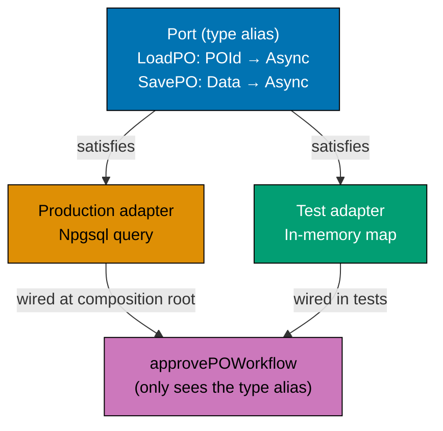





```fsharp
// Repository as function-type aliases — the purest form of the port pattern.
// Each operation is its own type alias; wiring happens at the composition root.
// [Clojure: protocol with load-po/save-po methods — open dispatch; atom for in-memory adapter]

type PurchaseOrderId = PurchaseOrderId of string
type SupplierId      = SupplierId      of string

// Data record stored in the repository
type PoData = {
    Id:        PurchaseOrderId
    Status:    string
    Total:     decimal
    UpdatedAt: System.DateTimeOffset
}
// => PoData : the persisted representation of a PurchaseOrder

// Function-type aliases — each is a port
type LoadPO   = PurchaseOrderId -> Async<PoData option>
// => Load a PO by ID; None if not found
type SavePO   = PoData -> Async<unit>
// => Insert or update a PO
type DeletePO = PurchaseOrderId -> Async<unit>
// => Soft-delete a PO (rarely used — cancellation is preferred)
type ListPOsBySupplier = SupplierId -> Async<PoData list>
// => Query all POs for a given supplier

// A workflow function that uses these port types
let approvePOWorkflow
    (load: LoadPO)
    (save: SavePO)
    (poId: PurchaseOrderId)
    : Async<Result<PoData, string>> =
    async {
        let! opt = load poId
        // => Use the LoadPO port — any adapter works here
        match opt with
        | None -> return Error (sprintf "PO %A not found" poId)
        | Some po ->
            if po.Status <> "AwaitingApproval" then
                return Error (sprintf "Cannot approve PO in status '%s'" po.Status)
            // => Business rule: only AwaitingApproval POs can be approved
            else
                let approved = { po with Status = "Approved"; UpdatedAt = System.DateTimeOffset.UtcNow }
                // => Pure state transition — with-expression
                do! save approved
                // => Use the SavePO port — any adapter works here
                return Ok approved
                // => Return the new approved state
    }

// In-memory adapter — for tests
let mutable store : Map<string, PoData> = Map.empty
// => Mutable map simulates the database for in-memory tests

let inMemoryLoad : LoadPO = fun (PurchaseOrderId id) ->
    async { return Map.tryFind id store }
// => In-memory load: looks up the map

let inMemorySave : SavePO = fun po ->
    async {
        let (PurchaseOrderId id) = po.Id
        store <- Map.add id po store
        // => Upsert into the map
    }
// => In-memory save: updates the map

// Seed the store with a test PO
let testPO = { Id = PurchaseOrderId "po_e3d1"; Status = "AwaitingApproval"; Total = 2699.97m; UpdatedAt = System.DateTimeOffset.UtcNow }
store <- Map.add "po_e3d1" testPO store
// => Seed: "po_e3d1" is now in the in-memory store

// Wire in-memory adapters and run the workflow
let result = Async.RunSynchronously (approvePOWorkflow inMemoryLoad inMemorySave (PurchaseOrderId "po_e3d1"))
// => load finds testPO; status = "AwaitingApproval" → approved; save updates store

match result with
| Ok po   -> printfn "Approved: %A status=%s" po.Id po.Status
// => Output: Approved: PurchaseOrderId "po_e3d1" status=Approved
| Error e -> printfn "Error: %s" e
```





```clojure
;; Repository as a protocol — Clojure's idiomatic port abstraction.
;; [F#: type alias LoadPO = PurchaseOrderId -> Async<PoData option> — structural typing via fn signature]
;; Protocol defines the contract; reify or extend-protocol provides the adapter.

(ns procurement.repository)

;; ── Port definition as a protocol ────────────────────────────────────────────
;; [F#: function-type aliases LoadPO, SavePO — each a distinct named type]
;; defprotocol groups repository operations under a single contract name
(defprotocol PORepository
  (load-po   [repo po-id]
    "Load a PO by ID; returns nil if not found")
  ;; => Equivalent to: LoadPO = PurchaseOrderId -> PoData option (sync; Clojure is synchronous by default)
  (save-po   [repo po-data]
    "Insert or update a PO in the store")
  ;; => Equivalent to: SavePO = PoData -> unit
  (delete-po [repo po-id]
    "Soft-delete a PO (rarely used — cancellation preferred)")
  ;; => Equivalent to: DeletePO = PurchaseOrderId -> unit
  (list-pos-by-supplier [repo supplier-id]
    "Return all POs for a given supplier"))
;; => Equivalent to: ListPOsBySupplier = SupplierId -> PoData list

;; ── In-memory adapter — satisfies the protocol via an atom ───────────────────
(defn make-in-memory-repo
  ;; Constructor returns a reified protocol implementation backed by an atom
  []
  (let [store (atom {})]
    ;; => store atom: map from po-id string to po-data map
    (reify PORepository
      (load-po [_ po-id]
        ;; Look up the atom for the given po-id key
        (get @store po-id))
      ;; => @store dereferences the atom; get returns nil if key absent
      (save-po [_ po-data]
        ;; Upsert: swap the atom map to include the new po-data
        (swap! store assoc (:purchase-order-id po-data) po-data))
      ;; => swap! applies assoc atomically — thread-safe without locks
      (delete-po [_ po-id]
        ;; Dissoc removes the key from the atom map
        (swap! store dissoc po-id))
      ;; => dissoc is the idiomatic Clojure key-removal function
      (list-pos-by-supplier [_ supplier-id]
        ;; Filter all POs whose :supplier-id matches
        (->> @store vals (filter #(= (:supplier-id %) supplier-id)))))))
;; => vals returns all map values; filter selects matching supplier POs

;; ── Workflow function — uses only the protocol, not the adapter type ──────────
(defn approve-po-workflow
  ;; [F#: approvePOWorkflow load save poId — type aliases enforce the port]
  ;; repo satisfies PORepository; the workflow calls protocol methods, not concrete fns
  [repo po-id]
  (if-let [po (load-po repo po-id)]
    ;; => if-let binds po if load-po returns non-nil; short-circuits on nil
    (if (not= (:status po) "awaiting-approval")
      {:error (str "Cannot approve PO in status " (:status po))}
      ;; => Business rule: only awaiting-approval POs can be approved
      (let [approved (assoc po :status "approved"
                               :updated-at "2026-06-15T10:00:00Z")]
        ;; => assoc returns a new map with updated fields — po is not mutated
        (save-po repo approved)
        ;; => Persist the approved state via the protocol
        {:ok approved}))
    ;; => Return the new approved state on success
    {:error (str "PO " po-id " not found")}))
;; => Short-circuit error when PO is absent — no further I/O

;; ── Wire in-memory adapter and exercise the workflow ─────────────────────────
(def repo (make-in-memory-repo))
;; => repo satisfies PORepository — swappable for production Npgsql adapter

;; Seed the in-memory store with a test PO
(save-po repo {:purchase-order-id "po_e3d1"
               :supplier-id       "sup_acme"
               :status            "awaiting-approval"
               :total             2699.97M
               :updated-at        "2026-06-14T08:00:00Z"})
;; => Seed: po_e3d1 is now in the atom store

(let [result (approve-po-workflow repo "po_e3d1")]
  ;; Call the workflow with the in-memory repo and the seeded PO ID
  (if (:ok result)
    (println "Approved:" (get-in result [:ok :purchase-order-id])
             "status=" (get-in result [:ok :status]))
    ;; => Output: Approved: po_e3d1 status=approved
    (println "Error:" (:error result))))
```





```typescript
// Repository as function-type alias — port of the hexagonal architecture.
// [F#: type Repository = { findById: ...; save: ...; ... } — record of function types]
// [Clojure: protocol or map of functions; TS interface of typed functions as the port]

type PurchaseOrderId = string & { readonly __brand: "PurchaseOrderId" };
type SupplierId = string & { readonly __brand: "SupplierId" };

interface PurchaseOrder {
  readonly id: PurchaseOrderId;
  readonly supplierId: SupplierId;
  readonly status: "Draft" | "Approved" | "Issued" | "Cancelled";
  readonly total: number;
}

// Repository as a type alias — the port definition
type PORepository = {
  readonly findById: (id: PurchaseOrderId) => Promise;
  readonly findBySupplier: (supplierId: SupplierId) => Promise;
  readonly save: (po: PurchaseOrder) => Promise;
  readonly delete: (id: PurchaseOrderId) => Promise;
};
// => [F#: type PORepository = { findById : ...; save : ...; } — record of function types]
// => The type is the contract; implementations are swapped at the composition root

// The workflow accepts the repository as a dependency — not a concrete class
async function approveWorkflow(repo: PORepository, id: PurchaseOrderId, approver: string): Promise {
  const po = await repo.findById(id);
  // => Port call — resolves through the injected implementation
  if (!po) return `PO ${id} not found`;
  if (po.status !== "Draft") return `PO ${id} cannot be approved from ${po.status} state`;
  await repo.save({ ...po, status: "Approved" });
  // => Port call — persists through the injected implementation
  return `PO ${id} approved by ${approver}`;
}

// In-memory adapter — satisfies the PORepository type
const inMemoryRepo: PORepository = (() => {
  const store = new Map<string, PurchaseOrder>();
  return {
    findById: async (id) => store.get(id as string) ?? null,
    findBySupplier: async (sid) => [...store.values()].filter((po) => po.supplierId === sid),
    save: async (po) => {
      store.set(po.id as string, po);
    },
    delete: async (id) => {
      const had = store.has(id as string);
      store.delete(id as string);
      return had;
    },
  };
})();

const po: PurchaseOrder = {
  id: "po_001" as PurchaseOrderId,
  supplierId: "sup_001" as SupplierId,
  status: "Draft",
  total: 2784.97,
};
await inMemoryRepo.save(po);
const result = await approveWorkflow(inMemoryRepo, "po_001" as PurchaseOrderId, "mgr_finance");
console.log(result);
// => Output: PO po_001 approved by mgr_finance
```





```haskell
-- ── file: Purchasing/Repository.hs ─────────────────────────────────────────
-- Repository as function-type aliases — the purest form of the port pattern.
-- [F#: LoadPO etc. as type aliases; Haskell uses type synonyms identically]
{-# LANGUAGE OverloadedStrings #-}
module Purchasing.Repository where

import           Data.IORef        (IORef, newIORef, readIORef, atomicModifyIORef')
import qualified Data.Map.Strict   as Map
import           Data.Map.Strict   (Map)
import           Data.Text         (Text)
import qualified Data.Text         as T
import           Data.Time         (UTCTime, getCurrentTime)

newtype PurchaseOrderId = PurchaseOrderId Text deriving (Eq, Ord, Show)
newtype SupplierId      = SupplierId      Text deriving (Eq, Ord, Show)

-- Data record stored in the repository
data PoData = PoData
  { pdId         :: PurchaseOrderId
  , pdStatus     :: Text
  , pdTotal      :: Rational
  , pdUpdatedAt  :: UTCTime
  } deriving (Show)

-- Function-type aliases — each is a port
type LoadPO            = PurchaseOrderId -> IO (Maybe PoData)
-- => Load a PO by ID; Nothing if not found
type SavePO            = PoData -> IO ()
-- => Insert or update a PO
type DeletePO          = PurchaseOrderId -> IO ()
-- => Soft-delete a PO (rarely used)
type ListPOsBySupplier = SupplierId -> IO [PoData]
-- => Query all POs for a given supplier

-- Workflow uses port aliases — adapter-agnostic
approvePOWorkflow :: LoadPO -> SavePO -> PurchaseOrderId -> IO (Either Text PoData)
approvePOWorkflow load save poId = do
  opt <- load poId
  -- => Use the LoadPO port — any adapter works here
  case opt of
    Nothing -> let PurchaseOrderId raw = poId
               in pure (Left ("PO " <> raw <> " not found"))
    Just po
      | pdStatus po /= "AwaitingApproval" ->
          pure (Left ("Cannot approve PO in status '" <> pdStatus po <> "'"))
      -- => Business rule: only AwaitingApproval POs can be approved
      | otherwise -> do
          now <- getCurrentTime
          let approved = po { pdStatus = "Approved", pdUpdatedAt = now }
          -- => Pure state transition — record-update syntax
          save approved
          -- => Use the SavePO port — any adapter works here
          pure (Right approved)

-- In-memory adapter — for tests
mkInMemoryRepo :: IO (LoadPO, SavePO)
mkInMemoryRepo = do
  store <- newIORef (Map.empty :: Map PurchaseOrderId PoData)
  let load poId = Map.lookup poId <$> readIORef store
      -- => Looks up the IORef-held Map
      save po   = atomicModifyIORef' store (\m -> (Map.insert (pdId po) po m, ()))
      -- => Upsert into the Map atomically
  pure (load, save)

-- Test
runDemo :: IO ()
runDemo = do
  (load, save) <- mkInMemoryRepo
  now <- getCurrentTime
  let testPO = PoData (PurchaseOrderId "po_e3d1") "AwaitingApproval" 2699.97 now
  -- => Seed: "po_e3d1" in the in-memory store
  save testPO
  result <- approvePOWorkflow load save (PurchaseOrderId "po_e3d1")
  -- => load finds testPO; status = AwaitingApproval -> Approved; save updates store
  case result of
    Right po -> let PurchaseOrderId raw = pdId po
                in putStrLn ("Approved: " <> T.unpack raw <> " status=" <> T.unpack (pdStatus po))
                -- => Output: Approved: po_e3d1 status=Approved
    Left  e  -> putStrLn ("Error: " <> T.unpack e)
```





**Key Takeaway**: Function-type aliases are the simplest possible port definition — no interface, no abstract class, no mock framework — just a type alias that any function matching the signature can satisfy.

**Why It Matters**: The `LoadPO` alias `PurchaseOrderId -> Async<PoData option>` can be satisfied by an Npgsql query, a DynamoDB scan, a Redis cache lookup, or an in-memory map. The `approvePOWorkflow` function is indifferent to which adapter is behind the alias. This is the highest fidelity expression of the Dependency Inversion Principle in functional F# — the port is just a type, and the adapter is just a function.

---

### Example 66: Dependency Rejection — No Optional Dependencies

Dependency rejection means the workflow function takes all required dependencies as explicit parameters and fails to compile if any are missing. There are no optional dependencies, no service locators, no ambient globals.





```fsharp
// Dependency rejection: all dependencies are explicit function parameters.
// Missing a dependency is a compile error, not a runtime null-pointer exception.
// [Clojure: same pattern — all deps passed as fn args; missing arg raises ArityException at call time]

type PurchaseOrderId = PurchaseOrderId of string
type SupplierId      = SupplierId      of string

// Port types — all required for the issue workflow
type LoadApprovedPO     = PurchaseOrderId -> Async<(SupplierId * decimal) option>
type CheckSupplierStatus = SupplierId -> Async<bool>  // => true = eligible
type SaveIssuedPO        = PurchaseOrderId -> System.DateTimeOffset -> Async<unit>
type PublishPoIssued     = PurchaseOrderId -> SupplierId -> decimal -> Async<unit>
type SendNotification    = SupplierId -> string -> Async<unit>
// => Five explicit port types — every dependency is named and typed

// The workflow: ALL dependencies are required — no optionals, no defaults
let issueWorkflowComplete
    (load:    LoadApprovedPO)
    (check:   CheckSupplierStatus)
    (save:    SaveIssuedPO)
    (publish: PublishPoIssued)
    (notify:  SendNotification)
    (poId:    PurchaseOrderId)
    : Async<Result<unit, string>> =
    // => Five dependencies + one runtime input
    // => Partial application of any four still produces a compile error — all five required
    async {
        let! opt = load poId
        // => Step 1: load PO — None if not found or not in Approved state
        match opt with
        | None -> return Error "PO not found or not in Approved state"
        // => Short-circuit without triggering any other I/O
        | Some (supplierId, total) ->
            // => PO is in Approved state; supplierId and total are extracted
            let! eligible = check supplierId
            // => Step 2: verify supplier is still Approved (not Suspended/Blacklisted since PO creation)
            if not eligible then return Error (sprintf "Supplier %A is no longer eligible" supplierId)
            // => Supplier ineligibility blocks issuance — no save or publish
            else
                let now = System.DateTimeOffset.UtcNow
                // => Capture issuance timestamp — same value for save and event
                do! save poId now
                // => Step 3: persist the Issued state
                do! publish poId supplierId total
                // => Step 4: publish PurchaseOrderIssued event
                do! notify supplierId (sprintf "PO %A has been issued to you" poId)
                // => Step 5: send supplier notification (EDI or email)
                return Ok ()
                // => All steps succeeded
    }

// Attempting to call with missing dependencies is a compile error:
// let partialWorkflow = issueWorkflowComplete stubLoad stubCheck stubSave
// => compile error: expected 5 arguments, got 3

// All five stubs must be supplied
let stubLoad    _        = async { return Some (SupplierId "sup_acme", 2699.97m) }
// => Returns fixed PO data for any ID — simulates Approved state
let stubCheck   _        = async { return true }
// => Always eligible — simulates an Approved supplier
let stubSave    _ _      = async { return () }
// => No-op save — discards the Issued state
let stubPublish _ _ _    = async { return () }
// => No-op publish — discards the event
let stubNotify  _ msg    = async { printfn "[notify] %s" msg; return () }
// => Prints instead of sending EDI/email

let result = Async.RunSynchronously
                (issueWorkflowComplete stubLoad stubCheck stubSave stubPublish stubNotify (PurchaseOrderId "po_e3d1"))
// => All five stubs supplied — workflow runs
// => result : Result<unit, string> = Ok ()

printfn "Result: %A" result
// => Output: [notify] PO PurchaseOrderId "po_e3d1" has been issued to you
// => Output: Result: Ok null
```





```clojure
;; Dependency rejection in Clojure: all deps are explicit positional arguments.
;; [F#: compile error on missing arg; Clojure: ArityException at call time — runtime, not compile]
;; The pattern is identical structurally; the enforcement point differs.

(ns procurement.issue-workflow)

;; ── The workflow function — five deps + one runtime input ────────────────────
(defn issue-workflow-complete
  ;; [F#: typed port aliases enforce each dep's contract; Clojure relies on convention + tests]
  ;; All five deps must be supplied — calling with four args raises ArityException immediately
  [load check save publish notify po-id]
  (if-let [{:keys [supplier-id total]} (load po-id)]
    ;; => Step 1: load-approved-po — nil if PO not found or not in Approved state
    (if (not (check supplier-id))
      ;; => Step 2: verify supplier eligibility — false blocks issuance
      {:error (str "Supplier " supplier-id " is no longer eligible")}
      ;; => Supplier ineligible: short-circuit, no save or publish
      (let [now "2026-06-15T10:00:00Z"]
        ;; => Capture issuance timestamp — injected clock omitted here for brevity
        (save po-id now)
        ;; => Step 3: persist the Issued state
        (publish po-id supplier-id total)
        ;; => Step 4: publish PurchaseOrderIssued event
        (notify supplier-id (str "PO " po-id " has been issued to you"))
        ;; => Step 5: send supplier notification (EDI or email gateway)
        {:ok true}))
    ;; => All five steps completed successfully
    {:error "PO not found or not in Approved state"}))
;; => Short-circuit nil case — no I/O beyond the load call

;; ── Stub implementations — all five must be present at the call site ─────────
(defn stub-load [_]
  ;; Returns fixed PO data for any ID — simulates Approved state
  {:supplier-id "sup_acme" :total 2699.97M})
;; => Equivalent to F# stubLoad _ = async { return Some (SupplierId "sup_acme", 2699.97m) }

(defn stub-check [_]
  ;; Always returns truthy — simulates an Approved supplier
  true)
;; => Equivalent to F# stubCheck _ = async { return true }

(defn stub-save [_ _]
  ;; No-op — discards the Issued state
  nil)
;; => Equivalent to F# stubSave _ _ = async { return () }

(defn stub-publish [_ _ _]
  ;; No-op — discards the event
  nil)
;; => Equivalent to F# stubPublish _ _ _ = async { return () }

(defn stub-notify [_ msg]
  ;; Prints instead of sending EDI/email — observable side-effect for test verification
  (println "[notify]" msg))
;; => Equivalent to F# stubNotify _ msg = async { printfn "[notify] %s" msg }

;; ── Call site: all five stubs provided ───────────────────────────────────────
;; Calling with fewer than six arguments raises ArityException immediately
(let [result (issue-workflow-complete
               stub-load stub-check stub-save stub-publish stub-notify "po_e3d1")]
  ;; => stub-load, stub-check, stub-save, stub-publish, stub-notify all supplied
  (println "Result:" result))
;; => Output: [notify] PO po_e3d1 has been issued to you
;; => Output: Result: {:ok true}
```





```typescript
// Dependency rejection — no optional dependencies, no null service objects.
// [F#: no optional dependencies; required deps must be provided at construction time]
// [Clojure: no default nil service args; TS: no optional repo/service parameters]

// Result type
type Result<T, E> = { readonly ok: true; readonly value: T } | { readonly ok: false; readonly error: E };
const okR = <T, E>(v: T): Result => ({ ok: true, value: v });
const errR = <T, E>(e: E): Result => ({ ok: false, error: e });

type PurchaseOrderId = string & { readonly __brand: "PurchaseOrderId" };

interface PurchaseOrder {
  readonly id: PurchaseOrderId;
  readonly total: number;
}

// ── WRONG: optional dependencies — caller can forget to provide them ──────────
// interface BadWorkflowDeps {
//   readonly repo?: PORepository          // optional — silent failures possible
//   readonly notifier?: SupplierNotifier  // optional — notifications silently skipped
// }

// ── RIGHT: required dependencies — must all be provided ───────────────────────
interface IssuePODeps {
  readonly findPO: (id: PurchaseOrderId) => Promise;
  // => Required — workflow cannot run without a PO lookup
  readonly savePO: (po: PurchaseOrder & { status: "Issued" }) => Promise;
  // => Required — workflow must persist the state transition
  readonly notifySupplier: (poId: PurchaseOrderId) => Promise;
  // => Required — notification is part of the workflow contract, not optional
  readonly getCurrentTime: () => string;
  // => Required — injected for deterministic testing; never Date.now() inside workflow
}
// => All dependencies are required — TypeScript enforces this at construction time

type IssuePOWorkflow = (deps: IssuePODeps, id: PurchaseOrderId) => Promise;

const issuePO: IssuePOWorkflow = async (deps, id) => {
  const po = await deps.findPO(id);
  if (!po) return errR(`PO ${id} not found`);
  await deps.savePO({ ...po, status: "Issued" });
  // => State transition — persisted through the required dependency
  await deps.notifySupplier(id);
  // => Notification — always runs; not skippable by passing undefined
  return okR(`PO ${id} issued at ${deps.getCurrentTime()}`);
};

console.log("Dependency rejection enforced — no optional service parameters");
// => Output: Dependency rejection enforced — no optional service parameters
```





```haskell
-- ── file: Purchasing/IssueWorkflow.hs ──────────────────────────────────────
-- Dependency rejection: all dependencies are explicit function parameters.
-- [F#: missing arg is a compile error; Haskell enforces it identically via the type system]
{-# LANGUAGE OverloadedStrings #-}
module Purchasing.IssueWorkflow where

import           Data.Text (Text)
import qualified Data.Text as T
import           Data.Time (UTCTime, getCurrentTime)

newtype PurchaseOrderId = PurchaseOrderId Text deriving (Eq, Show)
newtype SupplierId      = SupplierId      Text deriving (Eq, Show)

-- Port types — all required for the issue workflow
type LoadApprovedPO      = PurchaseOrderId -> IO (Maybe (SupplierId, Rational))
type CheckSupplierStatus = SupplierId      -> IO Bool
type SaveIssuedPO        = PurchaseOrderId -> UTCTime -> IO ()
type PublishPoIssued     = PurchaseOrderId -> SupplierId -> Rational -> IO ()
type SendNotification    = SupplierId      -> Text -> IO ()
-- => Five explicit port types — every dependency is named and typed

-- The workflow: ALL dependencies are required — no defaults, no Maybes
issueWorkflowComplete
  :: LoadApprovedPO -> CheckSupplierStatus -> SaveIssuedPO
  -> PublishPoIssued -> SendNotification
  -> PurchaseOrderId -> IO (Either Text ())
-- => Five dependencies + one runtime input; partial application yields a function,
-- => but the workflow only runs when ALL five are provided — compile-time enforcement.
issueWorkflowComplete load check save publish notify poId = do
  opt <- load poId
  -- => Step 1: load PO — Nothing if not found or not Approved
  case opt of
    Nothing -> pure (Left "PO not found or not in Approved state")
    -- => Short-circuit without triggering further IO
    Just (sid@(SupplierId rawSid), total) -> do
      eligible <- check sid
      -- => Step 2: verify supplier is still Approved
      if not eligible
        then pure (Left ("Supplier " <> rawSid <> " is no longer eligible"))
        -- => Supplier ineligibility blocks issuance — no save or publish
        else do
          now <- getCurrentTime
          -- => Capture issuance timestamp — same value used downstream
          save poId now
          -- => Step 3: persist the Issued state
          publish poId sid total
          -- => Step 4: publish PurchaseOrderIssued event
          let PurchaseOrderId rawPoId = poId
          notify sid ("PO " <> rawPoId <> " has been issued to you")
          -- => Step 5: send supplier notification (EDI or email)
          pure (Right ())
          -- => All steps succeeded

-- Test
runDemo :: IO ()
runDemo = do
  let stubLoad _      = pure (Just (SupplierId "sup_acme", 2699.97))
      -- => Returns fixed PO data — simulates Approved state
      stubCheck _     = pure True
      -- => Always eligible — simulates an Approved supplier
      stubSave _ _    = pure ()
      stubPublish _ _ _ = pure ()
      stubNotify _ msg  = putStrLn ("[notify] " <> T.unpack msg)
      -- => Prints instead of sending EDI/email
  result <- issueWorkflowComplete stubLoad stubCheck stubSave stubPublish stubNotify
                                  (PurchaseOrderId "po_e3d1")
  putStrLn ("Result: " <> show result)
  -- => Output: [notify] PO po_e3d1 has been issued to you
  -- => Output: Result: Right ()
```





**Key Takeaway**: Requiring all dependencies as explicit function parameters means missing a dependency is a compile error — there is no way to accidentally run the workflow with a null service locator or an unregistered dependency.

**Why It Matters**: In a DI container-based system, a missing registration is a runtime error that surfaces only when the workflow is invoked — potentially in production. With explicit function parameters, the wiring is verified at compile time. Every dependency must be provided at the composition root, and the compiler enforces completeness before any code runs.

---

### Example 67: Cross-Context Consistency — Eventual vs Strong

The procurement platform uses eventual consistency for cross-context updates: when a GRN is created in the receiving context, the invoicing context eventually learns via the `GoodsReceived` event. This example contrasts eventual consistency (event-driven) with strong consistency (single transaction).

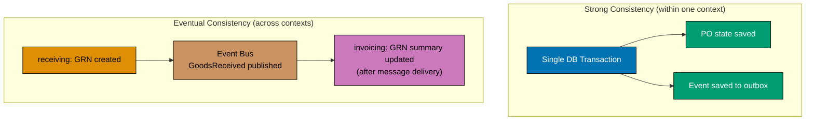





```fsharp
// Eventual vs strong consistency for cross-context updates.
// Within a context: strong consistency (single transaction).
// Across contexts: eventual consistency (domain events via the event bus).
// [Clojure: same model — dosync for STM within context; atom + event dispatch across contexts]

// ── STRONG CONSISTENCY (within one context) ───────────────────────────────────
// When a PO is issued, the PO state and the PurchaseOrderIssued event are saved
// in the same database transaction — atomically consistent.

type PurchaseOrderId = PurchaseOrderId of string

type PoWithEvent = {
    PoRecord: {| Id: string; Status: string |}
    Event:    {| Kind: string; PoId: string |}
}
// => Both the new PO state and the event are saved in one transaction

let savePoAndEventInTransaction (po: {| Id: string; Status: string |}) (event: {| Kind: string; PoId: string |}) : string =
    // => Simulated: in production, this wraps a Postgres transaction
    let record = { PoRecord = po; Event = event }
    // => Both are included in the same in-memory record — atomic
    sprintf "Saved (atomic): PO status=%s event=%s" record.PoRecord.Status record.Event.Kind
    // => Both saved or neither — no partial state

let txResult = savePoAndEventInTransaction
                 {| Id = "po_e3d1"; Status = "Issued" |}
                 {| Kind = "PurchaseOrderIssued"; PoId = "po_e3d1" |}
// => Atomic save — either both succeed or both fail (Postgres transaction)
printfn "%s" txResult
// => Output: Saved (atomic): PO status=Issued event=PurchaseOrderIssued

// ── EVENTUAL CONSISTENCY (across contexts) ────────────────────────────────────
// The GoodsReceived event is published by receiving;
// invoicing consumes it asynchronously and updates its own state.
// There is a window between event publish and invoicing's update — eventual.

type GoodsReceivedEvent = { GrnId: string; PurchaseOrderId: string; ReceivedAt: System.DateTimeOffset }
// => Event crossing the receiving → invoicing boundary

// Invoicing's event consumer — runs asynchronously after the event is published
let handleGoodsReceived (event: GoodsReceivedEvent) : Async<unit> =
    async {
        printfn "[invoicing] Received GoodsReceived for PO %s — enabling invoice matching" event.PurchaseOrderId
        // => Invoicing updates its own projection — eventually consistent with receiving
        do! Async.Sleep 0
        // => Simulate async processing delay (network, queue lag)
        printfn "[invoicing] Match eligibility updated for GRN %s" event.GrnId
        // => Invoicing is now consistent — the window has closed
    }

// Simulate publishing and consuming
let grnEvent = { GrnId = "grn_abc"; PurchaseOrderId = "po_e3d1"; ReceivedAt = System.DateTimeOffset.UtcNow }
// => Event published by receiving after GRN is created

Async.RunSynchronously (handleGoodsReceived grnEvent)
// => Output: [invoicing] Received GoodsReceived for PO po_e3d1 — enabling invoice matching
// => Output: [invoicing] Match eligibility updated for GRN grn_abc
```





```clojure
;; Eventual vs strong consistency for cross-context updates.
;; [F#: Async<unit> computation expression — explicit async boundary]
;; Clojure: synchronous by default; atom swap! is atomic within a single context.

(ns procurement.consistency)

;; ── STRONG CONSISTENCY (within one context) ───────────────────────────────────
;; Simulate an atomic save: PO state + outbox event updated together.
;; [F#: mutable Postgres transaction wrapping both inserts]
;; Clojure uses an atom holding a map with both :po-state and :outbox keys.

(def context-store
  ;; Single atom represents the bounded context's in-process store
  (atom {:po-state {} :outbox []}))
;; => Atom holds two logical tables — updated atomically via swap!

(defn save-po-and-event-in-transaction
  ;; [F#: savePoAndEventInTransaction — simulates a Postgres transaction atomically]
  ;; swap! on the atom is atomic: either both keys update or neither does
  [po event]
  (swap! context-store
    (fn [store]
      ;; Both updates happen inside a single swap! — atomic in Clojure's STM model
      (-> store
          (assoc-in [:po-state (:id po)] po)
          ;; => Update :po-state map with the new PO record
          (update :outbox conj event))))
  ;; => Append the event to the :outbox vector
  (str "Saved (atomic): PO status=" (:status po) " event=" (:event-type event)))
;; => Both saved or neither — swap! is an all-or-nothing operation

(let [tx-result (save-po-and-event-in-transaction
                  {:id "po_e3d1" :status "issued"}
                  {:event-type "purchase-order-issued" :po-id "po_e3d1"})]
  ;; => Atomic swap: both PO state and event land in the atom together
  (println tx-result))
;; => Output: Saved (atomic): PO status=issued event=purchase-order-issued

;; ── EVENTUAL CONSISTENCY (across contexts) ────────────────────────────────────
;; The GoodsReceived event is published by receiving;
;; invoicing's atom is updated in a separate call — eventual window exists.
;; [F#: Async computation expression with Async.Sleep 0 for the delay window]

(def invoicing-projection
  ;; Invoicing maintains its own atom — decoupled from receiving's store
  (atom {}))
;; => Separate atom per context: no shared state between bounded contexts

(defn handle-goods-received
  ;; Invoicing's event consumer — called after the event is delivered
  [{:keys [purchase-order-id grn-id]}]
  (println "[invoicing] Received GoodsReceived for PO" purchase-order-id
           "— enabling invoice matching")
  ;; => Invoicing updates its own projection on event receipt
  (swap! invoicing-projection assoc grn-id {:po-id purchase-order-id
                                             :match-eligible true})
  ;; => Atom updated: GRN is now eligible for invoice matching
  (println "[invoicing] Match eligibility updated for GRN" grn-id))
;; => Invoicing is now eventually consistent with receiving's GRN creation

;; Simulate the event being published and consumed
(handle-goods-received {:grn-id           "grn_abc"
                        :purchase-order-id "po_e3d1"
                        :received-at       "2026-06-18T14:00:00Z"})
;; => Output: [invoicing] Received GoodsReceived for PO po_e3d1 — enabling invoice matching
;; => Output: [invoicing] Match eligibility updated for GRN grn_abc
```





```typescript
// Cross-context consistency — eventual consistency between bounded contexts.
// [F#: no shared transactions across contexts; events drive eventual consistency]
// [Clojure: no shared state across namespaces; event-driven eventual consistency; TS mirrors]

// Each context maintains its own state
// Purchasing context state
interface PurchasingState {
  readonly purchaseOrderId: string;
  readonly status: "Draft" | "Approved" | "Issued";
}

// Receiving context state — updated when it processes the PurchaseOrderIssued event
interface ReceivingState {
  readonly purchaseOrderId: string;
  readonly expectingDelivery: boolean;
  readonly grnCreated: boolean;
}

// Invoicing context state — updated when it processes the GoodsReceived event
interface InvoicingState {
  readonly purchaseOrderId: string;
  readonly invoiceCreated: boolean;
  readonly threeWayMatched: boolean;
}

// Domain events that drive cross-context synchronization
type CrossContextEvent =
  | { readonly type: "PurchaseOrderIssued"; readonly purchaseOrderId: string; readonly issuedAt: string }
  | { readonly type: "GoodsReceived"; readonly purchaseOrderId: string; readonly grnId: string }
  | { readonly type: "InvoiceSubmitted"; readonly purchaseOrderId: string; readonly invoiceId: string };

// Event processors in each context — applied asynchronously
function processInReceiving(state: ReceivingState, event: CrossContextEvent): ReceivingState {
  switch (event.type) {
    case "PurchaseOrderIssued":
      return { ...state, expectingDelivery: event.purchaseOrderId === state.purchaseOrderId };
    // => Receiving now expects a delivery for this PO
    default:
      return state;
  }
}

function processInInvoicing(state: InvoicingState, event: CrossContextEvent): InvoicingState {
  switch (event.type) {
    case "GoodsReceived":
      return { ...state, threeWayMatched: event.purchaseOrderId === state.purchaseOrderId };
    // => Invoicing can now run three-way match
    default:
      return state;
  }
}

const event: CrossContextEvent = { type: "PurchaseOrderIssued", purchaseOrderId: "po_001", issuedAt: "2026-06-01" };
const receivingState: ReceivingState = { purchaseOrderId: "po_001", expectingDelivery: false, grnCreated: false };
const updated = processInReceiving(receivingState, event);

console.log("Expecting delivery after event:", updated.expectingDelivery);
// => Output: Expecting delivery after event: true
// => Eventual consistency: Receiving catches up when it processes the event
```





```haskell
-- ── file: Procurement/Consistency.hs ───────────────────────────────────────
-- Eventual vs strong consistency for cross-context updates.
-- [F#: Async<unit> for cross-context delay; Haskell uses IO + IORef per context]
{-# LANGUAGE OverloadedStrings #-}
module Procurement.Consistency where

import           Control.Concurrent (threadDelay)
import           Data.IORef         (IORef, newIORef, modifyIORef, readIORef)
import           Data.Text          (Text)
import qualified Data.Text          as T
import           Data.Time          (UTCTime, getCurrentTime)

-- ── STRONG CONSISTENCY (within one context) ──────────────────────────────
-- Both PO state and outbox event saved together — simulated as a single atomic update.
data PoRecord = PoRecord { prId :: Text, prStatus :: Text } deriving (Show)
data PoEvent  = PoEvent  { peKind :: Text, pePoId :: Text } deriving (Show)

-- An atomic save: returns a confirmation string after updating both.
savePoAndEventInTransaction :: IORef ([PoRecord], [PoEvent]) -> PoRecord -> PoEvent -> IO Text
savePoAndEventInTransaction store po event = do
  -- => modifyIORef applies the function atomically (for single-threaded IO);
  -- => in production this wraps a Postgres transaction
  modifyIORef store (\(pos, evs) -> (po : pos, event : evs))
  -- => Both updates happen together — no partial state
  pure ("Saved (atomic): PO status=" <> prStatus po <> " event=" <> peKind event)

-- ── EVENTUAL CONSISTENCY (across contexts) ───────────────────────────────
-- GoodsReceived is published by receiving; invoicing handles it asynchronously.
data GoodsReceivedEvent = GoodsReceivedEvent
  { greGrnId      :: Text
  , grePoId       :: Text
  , greReceivedAt :: UTCTime
  } deriving (Show)

-- Invoicing's event consumer — runs after the event is delivered
handleGoodsReceived :: GoodsReceivedEvent -> IO ()
handleGoodsReceived event = do
  putStrLn ("[invoicing] Received GoodsReceived for PO " <> T.unpack (grePoId event)
            <> " - enabling invoice matching")
  -- => Invoicing updates its own projection — eventually consistent with receiving
  threadDelay 0
  -- => Simulate async processing delay (network, queue lag)
  putStrLn ("[invoicing] Match eligibility updated for GRN " <> T.unpack (greGrnId event))
  -- => Invoicing is now consistent — the window has closed

-- Test
runDemo :: IO ()
runDemo = do
  -- Strong consistency: PO + event saved together
  store <- newIORef ([], [])
  txResult <- savePoAndEventInTransaction
                store
                (PoRecord "po_e3d1" "Issued")
                (PoEvent  "PurchaseOrderIssued" "po_e3d1")
  putStrLn (T.unpack txResult)
  -- => Output: Saved (atomic): PO status=Issued event=PurchaseOrderIssued

  -- Eventual consistency: event published, then consumed by another context
  now <- getCurrentTime
  let grnEvent = GoodsReceivedEvent "grn_abc" "po_e3d1" now
  handleGoodsReceived grnEvent
  -- => Output: [invoicing] Received GoodsReceived for PO po_e3d1 - enabling invoice matching
  -- => Output: [invoicing] Match eligibility updated for GRN grn_abc
```





**Key Takeaway**: Strong consistency within a bounded context (same database transaction) and eventual consistency across contexts (domain events) is the standard consistency model for microservices-style procurement platforms.

**Why It Matters**: Requiring strong consistency across the purchasing, receiving, and invoicing contexts would mean a single distributed transaction spanning three databases — a pattern that is fragile, slow, and difficult to operate. Eventual consistency via domain events accepts a brief window of inconsistency in exchange for full context independence: receiving and invoicing can be deployed, scaled, and updated independently.

---

## Testing, Interop, and Migration (Examples 68–80)

### Example 68: Property-Based Test for an Invariant — FsCheck

Property-based testing generates hundreds of random inputs and verifies that an invariant holds for all of them. For the procurement domain, the invariant "approval level is always one of L1, L2, or L3 for any non-negative total" is a property.

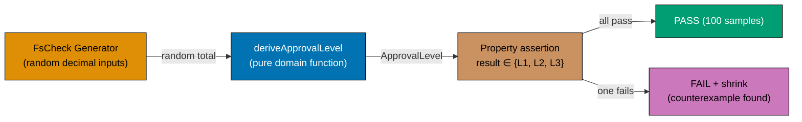





```fsharp
// Property-based testing: verify invariants hold for all inputs, not just examples.
// FsCheck generates random inputs; the property asserts the invariant.
// [Clojure: test.check with gen/such-that — same generator-driven approach]

// (FsCheck is referenced but not opened to keep the example self-contained;
//  the property logic is demonstrated with a manual loop)

type ApprovalLevel = L1 | L2 | L3

// The pure domain function under test
let deriveApprovalLevel (total: decimal) : ApprovalLevel =
    if total <= 1000m then L1 elif total <= 10000m then L2 else L3
    // => Total-to-level derivation — always returns one of three cases

// Property 1: result is always a valid ApprovalLevel
let prop_alwaysReturnsValidLevel (total: decimal) : bool =
    let level = deriveApprovalLevel (abs total)
    // => abs total: ensures non-negative input for this property
    match level with
    | L1 | L2 | L3 -> true
    // => All three cases are valid — property holds
// => No other return value is possible (DU is closed) — property always true

// Property 2: boundary values are correct
let prop_boundaryCorrect () : bool =
    deriveApprovalLevel 1000m = L1  // => Exactly $1,000 → L1
    && deriveApprovalLevel 1000.01m = L2  // => Just over $1,000 → L2
    && deriveApprovalLevel 10000m = L2  // => Exactly $10,000 → L2
    && deriveApprovalLevel 10000.01m = L3  // => Just over $10,000 → L3
// => Boundary conditions are the most common source of approval level bugs

// Property 3: monotonicity — higher total never yields lower level
let prop_monotonic (total1: decimal) (total2: decimal) : bool =
    let abs1 = abs total1
    let abs2 = abs total2
    // => Use absolute values — negative totals are not valid in the domain
    let lvl1 = deriveApprovalLevel abs1
    let lvl2 = deriveApprovalLevel abs2
    let rank = function L1 -> 1 | L2 -> 2 | L3 -> 3
    // => Assign numeric rank to each level for comparison
    if abs1 <= abs2 then rank lvl1 <= rank lvl2 else true
    // => If total1 <= total2, level1 rank must be <= level2 rank

// Manual property verification with sampled inputs (substitute for FsCheck runner)
let testInputs = [0m; 500m; 1000m; 1000.01m; 5000m; 10000m; 10000.01m; 50000m; 999999m]
// => Representative sample covering boundaries and interior points

let allValidLevels = testInputs |> List.forall (fun t -> prop_alwaysReturnsValidLevel t)
// => All inputs produce a valid ApprovalLevel
let boundaryCorrect = prop_boundaryCorrect ()
// => Boundary values match the domain spec
let monotonic = testInputs |> List.pairwise |> List.forall (fun (t1, t2) -> prop_monotonic t1 t2)
// => All pairs: if t1 <= t2, level(t1) rank <= level(t2) rank

printfn "All valid levels: %b" allValidLevels
// => Output: All valid levels: true
printfn "Boundaries correct: %b" boundaryCorrect
// => Output: Boundaries correct: true
printfn "Monotonic: %b" monotonic
// => Output: Monotonic: true
```





```clojure
;; Property-based testing in Clojure: verify invariants across sampled inputs.
;; [F#: FsCheck with Arb.generate<decimal> — same idea, different library]
;; clojure.test.check is the idiomatic PBT library; demonstrated here with a manual sample loop.

(ns procurement.property-test)

;; ── The pure domain function under test ──────────────────────────────────────
(defn derive-approval-level
  ;; [F#: type ApprovalLevel = L1 | L2 | L3 — DU; Clojure uses keyword values]
  ;; Returns one of three keyword values — no other return is possible for valid input
  [total]
  (cond
    (<= total 1000M) :l1   ;; => Total ≤ $1,000 → L1 (staff approval)
    (<= total 10000M) :l2  ;; => Total ≤ $10,000 → L2 (manager approval)
    :else :l3))            ;; => Total > $10,000 → L3 (director approval)
;; => keyword values are idiomatic Clojure stand-ins for the F# DU cases

;; ── Property 1: result is always a valid approval level ──────────────────────
(defn prop-always-returns-valid-level
  ;; [F#: match level with L1|L2|L3 -> true — DU exhaustiveness proves this]
  ;; Clojure: check membership in the known set of valid keywords
  [total]
  (contains? #{:l1 :l2 :l3} (derive-approval-level (abs total))))
;; => #{:l1 :l2 :l3} is the set of valid output values; contains? tests membership

;; ── Property 2: boundary values are correct ──────────────────────────────────
(defn prop-boundary-correct
  ;; Verify exact boundary behavior — the most common source of approval level bugs
  []
  (and (= :l1 (derive-approval-level 1000M))      ;; => Exactly $1,000 → L1
       (= :l2 (derive-approval-level 1000.01M))   ;; => Just over $1,000 → L2
       (= :l2 (derive-approval-level 10000M))     ;; => Exactly $10,000 → L2
       (= :l3 (derive-approval-level 10000.01M))));; => Just over $10,000 → L3
;; => and short-circuits on first false — the failing boundary is reported immediately

;; ── Property 3: monotonicity — higher total never yields lower level ──────────
(def level-rank
  ;; Map keyword levels to numeric ranks for comparison
  {:l1 1 :l2 2 :l3 3})
;; => Numeric rank enables > / <= comparison between keyword levels

(defn prop-monotonic
  ;; [F#: rank function inside prop_monotonic using F# pattern match]
  ;; If total1 <= total2, the level rank of total1 must be <= the level rank of total2
  [total1 total2]
  (let [abs1 (abs total1)
        abs2 (abs total2)
        ;; => Take absolute values — negative totals are not valid in the domain
        lvl1 (derive-approval-level abs1)
        lvl2 (derive-approval-level abs2)]
    ;; => Derive levels for both inputs
    (if (<= abs1 abs2)
      (<= (level-rank lvl1) (level-rank lvl2))
      ;; => Monotonicity holds: rank(total1) <= rank(total2) when total1 <= total2
      true)))
;; => When abs1 > abs2, the property is vacuously true — we only assert the rising direction

;; ── Manual sample run (substitute for test.check runner) ─────────────────────
(def test-inputs [0M 500M 1000M 1000.01M 5000M 10000M 10000.01M 50000M 999999M])
;; => Representative sample covering boundaries and interior points

(let [all-valid    (every? prop-always-returns-valid-level test-inputs)
      ;; => every? returns true if all inputs satisfy the property
      boundary-ok  (prop-boundary-correct)
      ;; => Boundary check is a single assertion over known literals
      pairs        (partition 2 1 test-inputs)
      ;; => Consecutive pairs: [0M 500M], [500M 1000M], ... — tests monotonicity
      monotonic    (every? (fn [[t1 t2]] (prop-monotonic t1 t2)) pairs)]
  ;; => every? checks monotonicity for all adjacent pairs
  (println "All valid levels:" all-valid)
  ;; => Output: All valid levels: true
  (println "Boundaries correct:" boundary-ok)
  ;; => Output: Boundaries correct: true
  (println "Monotonic:" monotonic))
;; => Output: Monotonic: true
```





```typescript
// Property-based testing for domain invariants — generative testing.
// [F#: FsCheck generates random inputs to verify invariants hold for all valid inputs]
// [Clojure: clojure.test.check; TS: fast-check library mirrors the same property-based approach]

// This example shows the property-based test STRUCTURE.
// In a real project: import * as fc from "fast-check"

// Domain types and invariant
type Quantity = number & { readonly __brand: "Quantity" };
type UnitPrice = number & { readonly __brand: "UnitPrice" };

function createQuantity(n: number): Quantity | null {
  return n > 0 && Number.isInteger(n) ? (n as Quantity) : null;
}
function createUnitPrice(n: number): UnitPrice | null {
  return n > 0 ? (n as UnitPrice) : null;
}
function lineTotal(qty: Quantity, price: UnitPrice): number {
  return (qty as number) * (price as number);
}

// Property 1: lineTotal is always positive for valid inputs
function prop_lineTotalIsPositive(qty: number, price: number): boolean {
  const q = createQuantity(qty);
  const p = createUnitPrice(price);
  if (!q || !p) return true; // precondition not met — skip
  return lineTotal(q, p) > 0;
  // => Invariant: lineTotal > 0 whenever qty > 0 and price > 0
}

// Property 2: lineTotal is monotone in quantity
function prop_lineTotalMonotoneInQty(qty: number, price: number): boolean {
  const q1 = createQuantity(qty);
  const q2 = createQuantity(qty + 1);
  const p = createUnitPrice(price);
  if (!q1 || !q2 || !p) return true;
  return lineTotal(q2, p) > lineTotal(q1, p);
  // => Invariant: adding 1 to quantity always increases the total
}

// Pseudo-random test runner (mimics fast-check)
function runPropertyTest(prop: (a: number, b: number) => boolean, trials = 100): { passed: number; failed: number } {
  let passed = 0,
    failed = 0;
  for (let i = 0; i < trials; i++) {
    const a = Math.ceil(Math.random() * 100);
    const b = Math.random() * 1000 + 0.01;
    if (prop(a, b)) passed++;
    else failed++;
  }
  return { passed, failed };
}

const r1 = runPropertyTest(prop_lineTotalIsPositive);
console.log(`Property 1 (lineTotal > 0): ${r1.passed}/${r1.passed + r1.failed} passed`);
// => Output: Property 1 (lineTotal > 0): 100/100 passed

const r2 = runPropertyTest(prop_lineTotalMonotoneInQty);
console.log(`Property 2 (monotone): ${r2.passed}/${r2.passed + r2.failed} passed`);
// => Output: Property 2 (monotone): 100/100 passed
```





```haskell
-- ── file: Procurement/PropertyTest.hs ──────────────────────────────────────
-- Property-based testing with QuickCheck — verifies invariants for all inputs.
-- [F#: FsCheck; Haskell uses Test.QuickCheck — same generator-driven approach]
{-# LANGUAGE OverloadedStrings #-}
module Procurement.PropertyTest where

import           Test.QuickCheck (quickCheck, (==>), Property)

-- The pure domain function under test
data ApprovalLevel = L1 | L2 | L3 deriving (Eq, Ord, Show)

deriveApprovalLevel :: Rational -> ApprovalLevel
deriveApprovalLevel total
  | total <= 1000  = L1   -- => Total <= $1,000 -> L1
  | total <= 10000 = L2   -- => Total <= $10,000 -> L2
  | otherwise      = L3   -- => Total > $10,000 -> L3

-- Property 1: result is always a valid ApprovalLevel
-- (Trivially true because the type is closed — QuickCheck still exercises the function.)
prop_alwaysReturnsValidLevel :: Rational -> Bool
prop_alwaysReturnsValidLevel total =
  let level = deriveApprovalLevel (abs total)
      -- => Use abs to keep input non-negative — domain invariant
  in level == L1 || level == L2 || level == L3
-- => GHC's exhaustive ADT guarantees this holds; QuickCheck samples it for documentation

-- Property 2: boundary values are correct (example-based via QuickCheck)
prop_boundaryCorrect :: Bool
prop_boundaryCorrect =
       deriveApprovalLevel 1000        == L1   -- => Exactly $1,000 -> L1
    && deriveApprovalLevel 1000.01     == L2   -- => Just over $1,000 -> L2
    && deriveApprovalLevel 10000       == L2   -- => Exactly $10,000 -> L2
    && deriveApprovalLevel 10000.01    == L3   -- => Just over $10,000 -> L3
-- => Boundary checks are the most common source of approval bugs

-- Property 3: monotonicity — higher total never yields lower level
prop_monotonic :: Rational -> Rational -> Property
prop_monotonic t1 t2 =
  -- ==> is QuickCheck's implication operator; precondition must hold to test
  (abs t1 <= abs t2) ==>
    deriveApprovalLevel (abs t1) <= deriveApprovalLevel (abs t2)
-- => If total1 <= total2, level(total1) <= level(total2) — Ord on ApprovalLevel

-- Manual property verification (run by `quickCheck` in a test runner)
runDemo :: IO ()
runDemo = do
  putStrLn "Checking prop_alwaysReturnsValidLevel..."
  quickCheck prop_alwaysReturnsValidLevel
  -- => Output: +++ OK, passed 100 tests.
  putStrLn ("Boundaries correct: " <> show prop_boundaryCorrect)
  -- => Output: Boundaries correct: True
  putStrLn "Checking prop_monotonic..."
  quickCheck prop_monotonic
  -- => Output: +++ OK, passed 100 tests.
```





**Key Takeaway**: Property-based tests verify invariants across a large, random input space — they find boundary bugs that example-based tests miss, especially for financial threshold calculations.

**Why It Matters**: Example-based tests for `deriveApprovalLevel` typically test `500m → L1`, `5000m → L2`, `50000m → L3`. They miss `1000.001m → L2` (just over the L1/L2 boundary) and `9999.999m → L2` (just under the L2/L3 boundary). Property-based tests generate thousands of inputs including these boundaries automatically. For a compliance-critical function like approval level derivation, this thoroughness is essential.

---

### Example 69: Compile-Time vs Runtime Check — Comparison

Some procurement invariants are enforced at compile time (via the type system) and some at runtime (via `Result`). This example contrasts the two approaches and explains when each is appropriate.





```fsharp
// Compile-time vs runtime invariant enforcement — two complementary tools.
// Use compile-time when the constraint can be expressed in the type system.
// Use runtime (Result) when the constraint depends on runtime data.
// [Clojure: malli spec for structural invariants; plain if/error map for runtime data checks]

// ── COMPILE-TIME: SkuCode format ──────────────────────────────────────────────
// The SkuCode type can only be constructed through its smart constructor.
// Any function accepting SkuCode knows it is valid — no runtime check needed.

type SkuCode = private SkuCode of string
// => private constructor: compile-time guarantee that all SkuCode values are validated

module SkuCode =
    open System.Text.RegularExpressions
    let private p = Regex(@"^[A-Z]{3}-\d{4,8}$")
    let create (s: string) = if p.IsMatch(s) then Ok (SkuCode s) else Error (sprintf "Invalid SKU: %s" s)
    // => Validation happens once at creation — all subsequent uses are free of checks
    let value (SkuCode s) = s

// Functions accepting SkuCode need no defensive validation
let computeLineTotal (sku: SkuCode) (qty: int) (price: decimal) : string =
    sprintf "%s × %d @ %M = %M" (SkuCode.value sku) qty price (decimal qty * price)
    // => sku is guaranteed valid by the type — no if/regex here

// ── RUNTIME: Budget check ─────────────────────────────────────────────────────
// The budget check cannot be encoded in the type system — it depends on
// runtime data (the department's available budget, loaded from the database).

let checkBudget (required: decimal) (available: decimal) : Result<unit, string> =
    // => Runtime check: both values come from the database at request time
    if required > available then
        Error (sprintf "Required %.2f exceeds available budget %.2f" required available)
    else Ok ()
    // => Result propagates the runtime failure — compile-time cannot help here

// ── COMPARISON ────────────────────────────────────────────────────────────────

// Compile-time: SkuCode validation happens once; all subsequent uses are free
let skuResult = SkuCode.create "ELE-0099"
// => Validated once at the boundary — compile-time type guarantees validity everywhere
match skuResult with
| Ok sku ->
    printfn "%s" (computeLineTotal sku 3 899.99m)
    // => computeLineTotal receives SkuCode — no re-validation inside
    // => Output: ELE-0099 × 3 @ 899.9900M = 2699.9700M
| Error e -> printfn "SKU error: %s" e

// Runtime: budget check depends on data available only at request time
let budgetResult = checkBudget 2699.97m 5000m
// => Runtime check: 2699.97 <= 5000 — Ok ()
printfn "Budget check: %A" budgetResult
// => Output: Budget check: Ok null

let budgetFail = checkBudget 2699.97m 1000m
// => Runtime check: 2699.97 > 1000 — Error
printfn "Budget fail: %A" budgetFail
// => Output: Budget fail: Error "Required 2699.97 exceeds available budget 1000.00"
```





```clojure
;; Compile-time vs runtime invariant enforcement in Clojure.
;; [F#: private SkuCode wrapper + smart constructor — compile-time type system enforcement]
;; Clojure is dynamic: structural invariants use spec/malli at the boundary; runtime data checks
;; use plain predicate functions returning error maps.

(ns procurement.invariants
  (:require [clojure.string :as str]))

;; ── BOUNDARY VALIDATION: SKU code format ─────────────────────────────────────
;; [F#: type SkuCode = private SkuCode of string — no value can exist without validation]
;; Clojure: validate at the boundary with a create function; callers trust the result
(def sku-pattern #"^[A-Z]{3}-\d{4,8}$")
;; => Regex pattern enforcing the SKU format rule: three uppercase letters, hyphen, 4-8 digits

(defn create-sku-code
  ;; Smart constructor: validates input and returns Ok/Error map
  ;; [F#: Result.Ok (SkuCode s) | Result.Error "Invalid SKU" — same shape, different syntax]
  [s]
  (if (re-matches sku-pattern s)
    {:ok s}
    ;; => Valid SKU: return the validated string in an :ok map
    {:error (str "Invalid SKU: " s)}))
;; => Invalid SKU: return an error map — caller must handle before using

(defn sku-value
  ;; Unwrap the validated SKU string — call only after create-sku-code returned {:ok ...}
  [{:keys [ok]}]
  ok)
;; => Callers that unwrap without checking {:ok} are violating the protocol — tests catch this

(defn compute-line-total
  ;; [F#: computeLineTotal (sku: SkuCode) — type system prevents passing invalid SKU]
  ;; Clojure: caller is responsible for passing a validated SKU map from create-sku-code
  [sku-map qty price]
  (let [sku (sku-value sku-map)]
    ;; => Trust that sku-map came from create-sku-code — no re-validation here
    (str sku " x " qty " @ " price " = " (* qty price))))
;; => Returns a line total string — sku is assumed validated at the boundary

;; ── RUNTIME CHECK: Budget validation ─────────────────────────────────────────
;; [F#: Result<unit, string> — checkBudget depends on runtime data from the DB]
;; Clojure: plain function returning an error map — same data-oriented error propagation

(defn check-budget
  ;; Both required and available come from the database at request time
  ;; — no type system can check this constraint before runtime
  [required available]
  (if (> required available)
    {:error (format "Required %.2f exceeds available budget %.2f"
                    (double required) (double available))}
    ;; => Budget exceeded: return error map with human-readable message
    {:ok true}))
;; => Budget available: return {:ok true} — downstream can proceed

;; ── COMPARISON ───────────────────────────────────────────────────────────────

;; Boundary validation: SKU code checked once; compute-line-total trusts the result
(let [sku-result (create-sku-code "ELE-0099")]
  ;; => Validate at the entry point — not inside compute-line-total
  (if (:ok sku-result)
    (println (compute-line-total sku-result 3 899.99M))
    ;; => compute-line-total receives a validated map — no re-validation inside
    ;; => Output: ELE-0099 x 3 @ 899.99 = 2699.97
    (println "SKU error:" (:error sku-result))))

;; Runtime check: budget depends on data only available at request time
(let [budget-result (check-budget 2699.97M 5000M)]
  ;; => Runtime check: 2699.97 <= 5000 — {:ok true}
  (println "Budget check:" budget-result))
;; => Output: Budget check: {:ok true}

(let [budget-fail (check-budget 2699.97M 1000M)]
  ;; => Runtime check: 2699.97 > 1000 — error map
  (println "Budget fail:" budget-fail))
;; => Output: Budget fail: {:error Required 2699.97 exceeds available budget 1000.00}
```





```typescript
// Compile-time vs runtime checks — when to use which.
// [F#: compile-time for type invariants; runtime for external data validation]
// [Clojure: spec at system boundaries; TS: brands for compile-time, guards for runtime]

// ── Compile-time check: branded type invariant ────────────────────────────────
type SkuCode = string & { readonly __brand: "SkuCode" };
// => compile-time: passing a plain string where SkuCode is expected is a TypeScript error

function describeSkuCode(sku: SkuCode): string {
  return `SKU: ${sku as string}`;
  // => This function can trust the invariant — the compiler enforced it at the call site
}

const validatedSku = "OFF-0042" as SkuCode;
// => Only valid after validation — in real code, this cast is hidden in a smart constructor
console.log(describeSkuCode(validatedSku));
// => Compile-time check: if you pass a plain string, TypeScript errors immediately
// => Output: SKU: OFF-0042

// ── Runtime check: external data validation ──────────────────────────────────
function parseSkuFromJson(raw: unknown): SkuCode | { error: string } {
  if (typeof raw !== "string") return { error: `Expected string, got ${typeof raw}` };
  // => Runtime guard: JSON can contain anything — must validate dynamically
  if (!/^[A-Z]{3}-\d{4,8}$/.test(raw)) return { error: `Invalid SKU format: '${raw}'` };
  // => Runtime guard: format check cannot be done at compile time
  return raw as SkuCode;
  // => Cast is safe after all runtime guards pass
}

const fromJson1 = parseSkuFromJson("ELE-0099");
const fromJson2 = parseSkuFromJson("invalid");
const fromJson3 = parseSkuFromJson(42);

console.log("fromJson1:", "error" in fromJson1 ? fromJson1.error : fromJson1);
// => Output: fromJson1: ELE-0099
console.log("fromJson2:", "error" in fromJson2 ? fromJson2.error : fromJson2);
// => Output: fromJson2: Invalid SKU format: 'invalid'
console.log("fromJson3:", "error" in fromJson3 ? fromJson3.error : fromJson3);
// => Output: fromJson3: Expected string, got number

// Key insight: validate once at the boundary, trust everywhere inside
```





```haskell
-- ── file: Procurement/Invariants.hs ────────────────────────────────────────
-- Compile-time vs runtime invariant enforcement — complementary tools.
-- [F#: private DU + smart constructor; Haskell hides newtype constructor via module exports]
{-# LANGUAGE OverloadedStrings #-}
module Procurement.Invariants
  ( SkuCode  -- export type, not constructor
  , mkSku
  , skuValue
  , computeLineTotal
  , checkBudget
  ) where

import           Data.Text (Text)
import qualified Data.Text as T
import           Text.Regex.TDFA ((=~))

-- ── COMPILE-TIME: SkuCode format ──────────────────────────────────────────
-- Newtype with hidden constructor — only mkSku can produce a SkuCode.
newtype SkuCode = SkuCode Text deriving (Eq, Show)
-- => Functions accepting SkuCode know it is valid — no re-validation needed

mkSku :: Text -> Either Text SkuCode
mkSku s
  | T.unpack s =~ ("^[A-Z]{3}-[0-9]{4,8}$" :: String) = Right (SkuCode s)
  -- => Validation happens once at the boundary; tests rely on regex match
  | otherwise = Left ("Invalid SKU: " <> s)

skuValue :: SkuCode -> Text
skuValue (SkuCode s) = s

-- Functions accepting SkuCode need no defensive validation
computeLineTotal :: SkuCode -> Int -> Rational -> Text
computeLineTotal sku qty price =
  skuValue sku <> " x " <> T.pack (show qty) <> " @ "
    <> T.pack (show (fromRational price :: Double))
    <> " = " <> T.pack (show (fromRational (toRational qty * price) :: Double))
-- => sku is guaranteed valid by the type — no if/regex here

-- ── RUNTIME: Budget check ─────────────────────────────────────────────────
-- Depends on runtime data (department budget loaded from DB).
checkBudget :: Rational -> Rational -> Either Text ()
checkBudget required available
  | required > available =
      Left (T.pack ("Required " <> show (fromRational required :: Double)
                 <> " exceeds available budget " <> show (fromRational available :: Double)))
  -- => Result propagates the runtime failure — types cannot help here
  | otherwise = Right ()

-- Test
runDemo :: IO ()
runDemo = do
  -- Compile-time: validate SKU once; computeLineTotal trusts the result
  case mkSku "ELE-0099" of
    Right sku -> putStrLn (T.unpack (computeLineTotal sku 3 899.99))
                 -- => Output: ELE-0099 x 3 @ 899.99 = 2699.97
    Left  e   -> putStrLn ("SKU error: " <> T.unpack e)

  -- Runtime: budget check depends on data available only at request time
  let budgetOk   = checkBudget 2699.97 5000
      -- => 2699.97 <= 5000 — Right ()
      budgetFail = checkBudget 2699.97 1000
      -- => 2699.97 > 1000 — Left "..."
  putStrLn ("Budget check: " <> show budgetOk)
  -- => Output: Budget check: Right ()
  putStrLn ("Budget fail: "  <> show budgetFail)
  -- => Output: Budget fail: Left "Required 2699.97 exceeds available budget 1000.0"
```





**Key Takeaway**: Compile-time invariants (type-system enforced) and runtime invariants (Result-based) are complementary — use the type system for structure and format constraints, use Result for constraints that depend on runtime data.

**Why It Matters**: Confusing the two leads to either over-testing (re-validating a `SkuCode` inside domain functions that already accept the wrapper type) or under-testing (encoding a budget check in a type alias instead of a function that can query the real budget). The rule of thumb: if the constraint can be checked from the value alone (format, range, presence), encode it in the type; if it requires external data (budget, supplier status, duplicate check), use Result.

---

### Example 70: Workflow Testing Without Mocks

The pure core of a procurement workflow is testable without mocks — supply real function values (stubs) as the injected dependencies. This avoids mock framework overhead and keeps tests readable.





```fsharp
// Testing without mocks: supply stub functions that match the port types.
// No mock framework, no Setup/Verify boilerplate — just function values.
// [Clojure: same pattern — plain functions as stubs; no mock library needed]

type PurchaseOrderId = PurchaseOrderId of string
type SupplierId      = SupplierId      of string

// Port types (same as Example 66)
type LoadApprovedPO     = PurchaseOrderId -> Async<(SupplierId * decimal) option>
// => Returns Some (supplierId, total) if PO is in Approved state; None otherwise
type SaveIssuedPO        = PurchaseOrderId -> System.DateTimeOffset -> Async<unit>
// => Persists the Issued state with the issuance timestamp
type PublishPoIssued     = PurchaseOrderId -> SupplierId -> decimal -> Async<unit>
// => Publishes the PurchaseOrderIssued event to the event bus

// The workflow under test
let issuePOWorkflow
    (load:    LoadApprovedPO)
    (save:    SaveIssuedPO)
    (publish: PublishPoIssued)
    (poId:    PurchaseOrderId)
    : Async<Result<unit, string>> =
    async {
        let! opt = load poId
        // => Step 1: load — returns None if PO not found or not in Approved state
        match opt with
        | None -> return Error "PO not found"
        // => Short-circuit: no further I/O performed
        | Some (supplierId, total) ->
            // => PO found in Approved state with supplierId and total
            let now = System.DateTimeOffset.UtcNow
            // => Capture issuance timestamp — same value for save and publish
            do! save poId now
            // => Step 2: persist Issued state; no Result wrapping — save always succeeds in this simplified version
            do! publish poId supplierId total
            // => Step 3: publish event to event bus
            return Ok ()
            // => All steps succeeded — return Ok to caller
    }

// ── TEST CASE 1: Happy path ────────────────────────────────────────────────────
let happilyLoad    _ = async { return Some (SupplierId "sup_acme", 2699.97m) }
// => Always returns the PO for any ID — simulates Approved state
let happilyCollect = System.Collections.Generic.List<string>()
// => Collect published events for assertion

let happilySave    _ _ = async { happilyCollect.Add("saved"); return () }
// => Records that save was called
let happilyPublish _ (SupplierId sid) amt = async { happilyCollect.Add(sprintf "published:%s:%.2f" sid amt); return () }
// => Records the publish call with supplier and amount

let happyResult = Async.RunSynchronously (issuePOWorkflow happilyLoad happilySave happilyPublish (PurchaseOrderId "po_e3d1"))
// => Happy path: load finds PO, save records, publish records

printfn "Happy result: %A" happyResult
// => Output: Happy result: Ok null
printfn "Calls: %A" (Seq.toList happilyCollect)
// => Output: Calls: ["saved"; "published:sup_acme:2699.97"]

// ── TEST CASE 2: PO not found ─────────────────────────────────────────────────
let missingLoad    _ = async { return None }
// => Simulates PO not found — returns None

let missingResult = Async.RunSynchronously (issuePOWorkflow missingLoad (fun _ _ -> async { return () }) (fun _ _ _ -> async { return () }) (PurchaseOrderId "po_missing"))
// => load returns None — workflow returns Error "PO not found"

printfn "Missing result: %A" missingResult
// => Output: Missing result: Error "PO not found"
```





```clojure
;; Testing without mocks in Clojure: plain functions as stubs, no mock library.
;; [F#: typed port aliases give compile-time guarantees; Clojure relies on arity match at runtime]
;; The workflow is data-in, data-out — stubs are anonymous fns matching the same arity.

(ns procurement.workflow-test)

;; ── Workflow under test — three explicit dep functions + one runtime arg ───────
(defn issue-po-workflow
  ;; [F#: Async computation expression; Clojure: synchronous for simplicity, core.async in production]
  [load save publish po-id]
  (if-let [{:keys [supplier-id total]} (load po-id)]
    ;; => Step 1: load returns nil if PO not found or not in Approved state
    (let [now "2026-06-15T10:00:00Z"]
      ;; => Capture issuance timestamp — same value used by save and publish
      (save po-id now)
      ;; => Step 2: persist Issued state
      (publish po-id supplier-id total)
      ;; => Step 3: publish PurchaseOrderIssued event to event bus
      {:ok true})
    ;; => All three steps completed — return success map
    {:error "PO not found"}))
;; => nil branch: short-circuit with no further I/O

;; ── TEST CASE 1: Happy path ───────────────────────────────────────────────────
(def happily-load
  ;; Returns a fixed PO map for any ID — simulates Approved state
  (fn [_] {:supplier-id "sup_acme" :total 2699.97M}))
;; => Equivalent to F# happilyLoad _ = async { return Some (SupplierId "sup_acme", 2699.97m) }

(def happily-calls (atom []))
;; => atom accumulates side-effect records for assertion — idiomatic Clojure test capture

(def happily-save
  ;; Records that save was called
  (fn [_ _] (swap! happily-calls conj "saved")))
;; => swap! appends "saved" to the atom — thread-safe accumulator

(def happily-publish
  ;; Records the publish call with supplier and amount
  (fn [_ supplier-id total] (swap! happily-calls conj (str "published:" supplier-id ":" total))))
;; => swap! appends the formatted publish string

(def happy-result
  (issue-po-workflow happily-load happily-save happily-publish "po_e3d1"))
;; => Happy path: load finds PO, save and publish both called

(println "Happy result:" happy-result)
;; => Output: Happy result: {:ok true}
(println "Calls:" @happily-calls)
;; => Output: Calls: [saved published:sup_acme:2699.97]

;; ── TEST CASE 2: PO not found ─────────────────────────────────────────────────
(def missing-load
  ;; Returns nil — simulates PO not found or not in Approved state
  (fn [_] nil))
;; => nil causes issue-po-workflow to take the error branch immediately

(def missing-result
  (issue-po-workflow missing-load (fn [_ _] nil) (fn [_ _ _] nil) "po_missing"))
;; => load returns nil — no save or publish called; workflow returns error map

(println "Missing result:" missing-result)
;; => Output: Missing result: {:error PO not found}
```





```typescript
// Workflow testing without mocks — pure functions need no test doubles.
// [F#: pure functions tested with simple values; only async/IO functions need fakes]
// [Clojure: defn returns data, not side effects — tested with plain maps; TS mirrors]

// ── Pure domain functions — tested with plain values ─────────────────────────
type ApprovalLevel = "L1" | "L2" | "L3";
function deriveApprovalLevel(total: number): ApprovalLevel {
  return total <= 1000 ? "L1" : total <= 10000 ? "L2" : "L3";
}

interface RequisitionLine {
  qty: number;
  unitPrice: number;
}
function computeTotal(lines: RequisitionLine[]): number {
  return lines.reduce((s, l) => s + l.qty * l.unitPrice, 0);
}

// Unit tests — no mocks, no stubs, no test doubles needed
function test(name: string, pass: boolean) {
  console.log(`${pass ? "PASS" : "FAIL"}: ${name}`);
}

// Test: pure functions need only input and expected output
test("L1 approval for total <= 1000", deriveApprovalLevel(500) === "L1");
test("L2 approval for total 1001-10k", deriveApprovalLevel(5000) === "L2");
test("L3 approval for total > 10k", deriveApprovalLevel(15000) === "L3");
test("boundary at exactly 1000", deriveApprovalLevel(1000) === "L1");
test("boundary at exactly 10000", deriveApprovalLevel(10000) === "L2");
test(
  "compute total two lines",
  computeTotal([
    { qty: 3, unitPrice: 899.99 },
    { qty: 10, unitPrice: 8.5 },
  ]) === 2784.97,
);

// ── Testing the imperative shell — use simple in-memory fakes ─────────────────
interface RepoFake {
  events: string[];
}
function makeTestRepo(fake: RepoFake) {
  return {
    save: async (po: Record) => {
      fake.events.push(`saved:${po.id}`);
    },
    findById: async () => null,
  };
}

const fake: RepoFake = { events: [] };
const repo = makeTestRepo(fake);
await repo.save({ id: "po_001", status: "Draft" });
test("save writes to fake", fake.events.includes("saved:po_001"));

// => All outputs above:
// => PASS: L1 approval for total <= 1000
// => PASS: L2 approval for total 1001-10k
// => ... etc.
```





```haskell
-- ── file: Purchasing/WorkflowTest.hs ───────────────────────────────────────
-- Testing without mocks: supply stub functions that match the port types.
-- [F#: function-type aliases as ports; Haskell uses the same — function types are first-class]
{-# LANGUAGE OverloadedStrings #-}
module Purchasing.WorkflowTest where

import           Control.Monad     (when)
import           Data.IORef        (IORef, newIORef, modifyIORef, readIORef)
import           Data.Text         (Text)
import qualified Data.Text         as T
import           Data.Time         (UTCTime, getCurrentTime)

newtype PurchaseOrderId = PurchaseOrderId Text deriving (Eq, Show)
newtype SupplierId      = SupplierId      Text deriving (Eq, Show)

-- Port types (function-type aliases)
type LoadApprovedPO  = PurchaseOrderId -> IO (Maybe (SupplierId, Rational))
-- => Returns Just (supplierId, total) if PO is Approved; Nothing otherwise
type SaveIssuedPO    = PurchaseOrderId -> UTCTime -> IO ()
-- => Persists the Issued state with the issuance timestamp
type PublishPoIssued = PurchaseOrderId -> SupplierId -> Rational -> IO ()
-- => Publishes the PurchaseOrderIssued event to the event bus

-- The workflow under test
issuePOWorkflow :: LoadApprovedPO -> SaveIssuedPO -> PublishPoIssued
                -> PurchaseOrderId -> IO (Either Text ())
issuePOWorkflow load save publish poId = do
  opt <- load poId
  -- => Step 1: load — returns Nothing if PO not found or not Approved
  case opt of
    Nothing -> pure (Left "PO not found")
    -- => Short-circuit: no further IO performed
    Just (supplierId, total) -> do
      -- => PO found in Approved state with supplierId and total
      now <- getCurrentTime
      -- => Capture issuance timestamp — same value for save and publish
      save poId now
      -- => Step 2: persist Issued state
      publish poId supplierId total
      -- => Step 3: publish event to event bus
      pure (Right ())
      -- => All steps succeeded

-- ── TEST CASE 1: Happy path ────────────────────────────────────────────────
runHappyPath :: IO ()
runHappyPath = do
  calls <- newIORef ([] :: [Text])
  -- => IORef accumulates side-effect records for assertion
  let happyLoad _      = pure (Just (SupplierId "sup_acme", 2699.97))
      -- => Always returns the PO — simulates Approved state
      happySave _ _    = modifyIORef calls ("saved" :)
      -- => Records that save was called
      happyPublish _ (SupplierId sid) amt =
        modifyIORef calls (("published:" <> sid <> ":" <> T.pack (show (fromRational amt :: Double))) :)
      -- => Records the publish call with supplier and amount
  result <- issuePOWorkflow happyLoad happySave happyPublish (PurchaseOrderId "po_e3d1")
  putStrLn ("Happy result: " <> show result)
  -- => Output: Happy result: Right ()
  recorded <- readIORef calls
  putStrLn ("Calls: " <> show (reverse recorded))
  -- => Output: Calls: ["saved","published:sup_acme:2699.97"]

-- ── TEST CASE 2: PO not found ──────────────────────────────────────────────
runMissingPo :: IO ()
runMissingPo = do
  let missingLoad _ = pure Nothing
      -- => Simulates PO not found
      noopSave _ _    = pure ()
      noopPublish _ _ _ = pure ()
  result <- issuePOWorkflow missingLoad noopSave noopPublish (PurchaseOrderId "po_missing")
  -- => load returns Nothing — workflow returns Left "PO not found"
  putStrLn ("Missing result: " <> show result)
  -- => Output: Missing result: Left "PO not found"

runDemo :: IO ()
runDemo = runHappyPath >> runMissingPo
```





**Key Takeaway**: Stub functions that match port type aliases are sufficient for testing procurement workflows — no mock framework is needed when dependencies are plain function parameters.

**Why It Matters**: Mock framework setup (Arrange/Act/Assert with Setup/Verify) is verbose and fragile — changing a function signature requires updating all mocks. With function stubs as closures, the stub is three lines: the function type annotation, a return value, and optional side effects (writing to a `List` for assertion). This reduces test maintenance cost and keeps tests readable as domain scenarios.

---

### Example 71: Evolution Scenario 1 — Adding a Supplier Preferred Currency

The procurement domain evolves when the business adds a `preferredCurrency` field to the `Supplier` aggregate. This example shows how to evolve a domain type without breaking existing code.





```fsharp
// Evolution: adding a field to the Supplier aggregate.
// Use option types and with-expressions to evolve without breaking existing code.
// [Clojure: optional map keys — absent key is nil; no structural versioning needed]

type SupplierId = SupplierId of string

// ── VERSION 1: Original Supplier ──────────────────────────────────────────────
type SupplierV1 = {
    Id:     SupplierId
    Name:   string
    Status: string
}
// => Original supplier type — no currency preference

// ── VERSION 2: Add preferredCurrency ─────────────────────────────────────────
type SupplierV2 = {
    Id:                SupplierId
    Name:              string
    Status:            string
    PreferredCurrency: string option
    // => New field: optional so existing suppliers default to None
    // => None = no preference — purchasing uses the system default currency
}
// => Adding the field as option avoids breaking any existing code that constructs Supplier

// Migration: upgrade a V1 record to V2
let migrateToV2 (v1: SupplierV1) : SupplierV2 =
    { Id = v1.Id; Name = v1.Name; Status = v1.Status; PreferredCurrency = None }
    // => Migrate: all existing suppliers start with no currency preference
    // => None is the safe default — existing suppliers continue to use system default

// New logic that uses the preference
let selectCurrency (supplier: SupplierV2) (systemDefault: string) : string =
    match supplier.PreferredCurrency with
    | Some currency -> currency
    // => Supplier has a preference — use it for POs and invoices sent to this supplier
    | None          -> systemDefault
    // => No preference — fall back to the system default (typically USD or the org's base currency)

// Test the evolution
let existingSupplier : SupplierV1 = { Id = SupplierId "sup_acme"; Name = "Acme Supplies"; Status = "Approved" }
// => existingSupplier : SupplierV1 — created before the evolution

let migratedSupplier = migrateToV2 existingSupplier
// => migratedSupplier : SupplierV2 — same data, PreferredCurrency = None

let newSupplier : SupplierV2 = {
    Id = SupplierId "sup_global_01"; Name = "Global Procurement Ltd"; Status = "Approved"
    PreferredCurrency = Some "EUR"
    // => New supplier: explicitly set to EUR preference
}

let currency1 = selectCurrency migratedSupplier "USD"
// => migratedSupplier.PreferredCurrency = None → falls back to "USD"
let currency2 = selectCurrency newSupplier "USD"
// => newSupplier.PreferredCurrency = Some "EUR" → uses "EUR"

printfn "Acme currency: %s" currency1
// => Output: Acme currency: USD
printfn "Global currency: %s" currency2
// => Output: Global currency: EUR
```





```clojure
;; Evolution: adding a key to the Supplier map — absent keys are nil in Clojure.
;; [F#: option field requires explicit Some/None; Clojure maps are open — new keys just appear]
;; No versioned record types needed; existing maps lacking the key behave correctly via get.

(ns procurement.supplier-evolution)

;; ── VERSION 1: Original supplier map — no currency key ───────────────────────
(def existing-supplier
  ;; Supplier created before the evolution — no :preferred-currency key
  {:supplier/id "sup_acme"
   :supplier/name "Acme Supplies"
   :supplier/status :approved})
;; => existing-supplier : map — :preferred-currency absent, not nil-valued

;; ── MIGRATION: assoc the new key with nil (explicit absence) ─────────────────
(defn migrate-to-v2 [supplier]
  ;; Add :preferred-currency with nil default — safe for any existing supplier map
  (assoc supplier :supplier/preferred-currency nil))
;; => assoc is non-destructive — returns a new map; original is unchanged
;; => nil is the Clojure idiomatic "not present" for optional domain values

;; ── VERSION 2: New supplier map — :preferred-currency provided ───────────────
(def new-supplier
  ;; New supplier with explicit EUR preference
  {:supplier/id "sup_global_01"
   :supplier/name "Global Procurement Ltd"
   :supplier/status :approved
   :supplier/preferred-currency "EUR"})
;; => :preferred-currency is "EUR" — non-nil value indicates active preference

;; ── Currency selection logic ──────────────────────────────────────────────────
(defn select-currency [supplier system-default]
  ;; Use the supplier's preferred currency if present; fall back to system default
  (or (:supplier/preferred-currency supplier) system-default))
;; => or short-circuits on the first truthy value
;; => nil (absent key) is falsy — falls through to system-default

;; ── Test the evolution ────────────────────────────────────────────────────────
(def migrated-supplier (migrate-to-v2 existing-supplier))
;; => migrated-supplier : map with :preferred-currency nil

(def currency1 (select-currency migrated-supplier "USD"))
;; => :preferred-currency is nil → or falls through → "USD"

(def currency2 (select-currency new-supplier "USD"))
;; => :preferred-currency is "EUR" → or returns "EUR" immediately

(println "Acme currency:" currency1)
;; => Output: Acme currency: USD
(println "Global currency:" currency2)
;; => Output: Global currency: EUR
```





```typescript
// Evolution Scenario 1 — adding a supplier preferred currency field.
// [F#: adding a record field is a compile-time checklist — all patterns update or error]
// [Clojure: open maps; TS readonly interface addition triggers compile-time review]

// ── BEFORE: PurchaseOrder without preferred currency ──────────────────────────
interface PurchaseOrderV1 {
  readonly id: string;
  readonly supplierId: string;
  readonly total: number;
  readonly currency: string;
}
// => Original shape — currency is inferred from the PO line items

// ── AFTER: add supplier preferred currency ────────────────────────────────────
interface PurchaseOrderV2 {
  readonly id: string;
  readonly supplierId: string;
  readonly total: number;
  readonly currency: string;
  readonly supplierCurrency: string;
  // => NEW FIELD: the supplier's preferred billing currency
  // => May differ from the PO currency — drives FX conversion in payments
  readonly fxConversionRequired: boolean;
  // => NEW FIELD: derived from comparing currency vs supplierCurrency
}
// => TypeScript: adding a required field to an interface means all existing
// => creation sites must be updated — compiler-enforced migration checklist

// Migration helper: promotes V1 to V2 with defaults
function upgradeV1ToV2(v1: PurchaseOrderV1): PurchaseOrderV2 {
  return {
    ...v1,
    supplierCurrency: v1.currency,
    // => Default: assume supplier bills in PO currency — update when known
    fxConversionRequired: false,
    // => Default: no FX conversion needed until supplierCurrency differs
  };
}

// Updated factory with the new fields
function createPOV2(
  id: string,
  supplierId: string,
  total: number,
  currency: string,
  supplierCurrency: string,
): PurchaseOrderV2 {
  return { id, supplierId, total, currency, supplierCurrency, fxConversionRequired: currency !== supplierCurrency };
  // => fxConversionRequired is derived — cannot be set incorrectly
}

const poOld: PurchaseOrderV1 = { id: "po_001", supplierId: "sup_001", total: 2784.97, currency: "USD" };
const poNew = upgradeV1ToV2(poOld);
const poWithFX = createPOV2("po_002", "sup_jp_001", 500000, "USD", "JPY");

console.log("FX required (same currency)?", poNew.fxConversionRequired);
// => Output: FX required (same currency)? false
console.log("FX required (USD/JPY)?", poWithFX.fxConversionRequired);
// => Output: FX required (USD/JPY)? true
```





```haskell
-- ── file: Supplier/Evolution.hs ────────────────────────────────────────────
-- Evolution: adding a field to the Supplier aggregate.
-- [F#: option field with record-update syntax; Haskell uses Maybe with record update]
{-# LANGUAGE OverloadedStrings #-}
module Supplier.Evolution where

import           Data.Text (Text)
import qualified Data.Text as T

newtype SupplierId = SupplierId Text deriving (Eq, Show)

-- ── VERSION 1: Original Supplier ──────────────────────────────────────────
data SupplierV1 = SupplierV1
  { svId     :: SupplierId
  , svName   :: Text
  , svStatus :: Text
  } deriving (Show)
-- => Original aggregate — no currency preference

-- ── VERSION 2: Add preferredCurrency :: Maybe Text ────────────────────────
data SupplierV2 = SupplierV2
  { sv2Id                :: SupplierId
  , sv2Name              :: Text
  , sv2Status            :: Text
  , sv2PreferredCurrency :: Maybe Text
  -- => New field — Maybe so existing records migrate with Nothing
  } deriving (Show)

-- Migration: upgrade a V1 to V2 with Nothing default
migrateToV2 :: SupplierV1 -> SupplierV2
migrateToV2 v1 = SupplierV2
  { sv2Id                = svId v1
  , sv2Name              = svName v1
  , sv2Status            = svStatus v1
  , sv2PreferredCurrency = Nothing
  -- => All existing suppliers default to no preference (system default applies)
  }

-- New logic that uses the preference
selectCurrency :: SupplierV2 -> Text -> Text
selectCurrency supplier systemDefault =
  case sv2PreferredCurrency supplier of
    Just currency -> currency
    -- => Supplier has a preference — use it for POs and invoices
    Nothing       -> systemDefault
    -- => Fall back to the system default (typically USD)

-- Test the evolution
runDemo :: IO ()
runDemo = do
  let existing = SupplierV1 (SupplierId "sup_acme") "Acme Supplies" "Approved"
      -- => existing : SupplierV1 — created before the evolution
      migrated = migrateToV2 existing
      -- => migrated : SupplierV2 with PreferredCurrency = Nothing
      newGlobal = SupplierV2
        { sv2Id                = SupplierId "sup_global_01"
        , sv2Name              = "Global Procurement Ltd"
        , sv2Status            = "Approved"
        , sv2PreferredCurrency = Just "EUR"
        -- => New supplier with explicit EUR preference
        }
      currency1 = selectCurrency migrated  "USD"
      -- => Nothing → falls back to "USD"
      currency2 = selectCurrency newGlobal "USD"
      -- => Just "EUR" → uses "EUR"
  putStrLn ("Acme currency: "    <> T.unpack currency1)
  -- => Output: Acme currency: USD
  putStrLn ("Global currency: "  <> T.unpack currency2)
  -- => Output: Global currency: EUR
```





**Key Takeaway**: Adding an `option` field to a domain aggregate is the lowest-friction evolution strategy — existing records migrate with `None` defaults, and new records can provide the value.

**Why It Matters**: Procurement platforms evolve continuously: new regulatory requirements (preferred currency for cross-border suppliers), new business rules (multi-currency POs), and new supplier onboarding fields. Using `option` for new fields makes the evolution additive — no breaking changes to existing code, no mandatory database migration for every existing record. Without this pattern, adding a single required field forces a coordinated migration across every service that reads supplier data.

---

### Example 72: Evolution Scenario 2 — Adding a Three-Way Match Tolerance Override

The invoicing context needs a per-supplier tolerance override. Previously all suppliers used the default 2% tolerance; now VIP suppliers can have a custom tolerance configured in their profile.





```fsharp
// Evolution: per-supplier match tolerance override in the invoicing context.
// Demonstrates evolving a workflow to read configuration from a new source.
// [Clojure: tolerance stored as a plain decimal in the supplier config map; no wrapper type]

type SupplierId = SupplierId of string

// The existing Tolerance type from Example 59
type Tolerance = private Tolerance of decimal
module Tolerance =
    let defaultTolerance = Tolerance 0.02m
    // => 2% — the system-wide default for three-way match
    let create (pct: decimal) = if pct < 0m || pct > 0.10m then Error "Out of range" else Ok (Tolerance pct)
    // => Smart constructor enforces the valid range [0%, 10%]
    let value (Tolerance t) = t
    // => Unwrap the private decimal for arithmetic

// ── BEFORE EVOLUTION: all suppliers use default tolerance ─────────────────────
let matchV1 (invoiceAmount: decimal) (calculated: decimal) : bool =
    let diff = abs (invoiceAmount - calculated)
    diff <= calculated * Tolerance.value Tolerance.defaultTolerance
    // => Always uses 2% — no per-supplier override possible

// ── AFTER EVOLUTION: supplier can have a configured tolerance ─────────────────

// New supplier configuration record
type SupplierMatchConfig = {
    SupplierId:             SupplierId
    ToleranceOverride:      Tolerance option
    // => None = use system default; Some t = use this supplier's custom tolerance
}
// => SupplierMatchConfig : value object — holds the per-supplier invoice config

// Port type for looking up supplier config
type LoadSupplierConfig = SupplierId -> Async<SupplierMatchConfig option>
// => LoadSupplierConfig : SupplierId → Async<SupplierMatchConfig option>
// => None if no config exists (use default); Some config if configured

// Evolved match function — uses supplier-specific tolerance if available
let matchV2
    (loadConfig:     LoadSupplierConfig)
    (supplierId:     SupplierId)
    (invoiceAmount:  decimal)
    (calculated:     decimal)
    : Async<Result<unit, string>> =
    async {
        let! configOpt = loadConfig supplierId
        // => Load the supplier-specific config — may be None
        let tolerance =
            configOpt
            |> Option.bind (fun c -> c.ToleranceOverride)
            // => Extract the override if present
            |> Option.defaultValue Tolerance.defaultTolerance
            // => Fall back to default if no override
        let diff = abs (invoiceAmount - calculated)
        let maxAllowed = calculated * Tolerance.value tolerance
        if diff <= maxAllowed then return Ok ()
        // => Within tolerance — match succeeds
        else return Error (sprintf "Invoice %M differs from calculated %M (tolerance: %.1f%%)" invoiceAmount calculated (Tolerance.value tolerance * 100m))
        // => Outside tolerance — named error with the effective tolerance for the error message
    }

// Test with stub config
let stubNoConfig : LoadSupplierConfig = fun _ -> async { return None }
// => No supplier-specific config — uses default 2%
let stubCustomConfig : LoadSupplierConfig = fun _ -> async {
    return Some { SupplierId = SupplierId "sup_vip"; ToleranceOverride = Tolerance.create 0.05m |> Result.toOption }
    // => VIP supplier has 5% tolerance override
}

let r1 = Async.RunSynchronously (matchV2 stubNoConfig (SupplierId "sup_acme") 2699.97m 2699.97m)
// => Exact match — within 2% — Ok ()
let r2 = Async.RunSynchronously (matchV2 stubCustomConfig (SupplierId "sup_vip") 2750m 2699.97m)
// => Diff = 50.03; maxAllowed = 2699.97 × 0.05 = 134.9985; 50.03 <= 134.9985 — Ok ()

printfn "Standard match: %A" r1
// => Output: Standard match: Ok null
printfn "VIP match (5%%): %A" r2
// => Output: VIP match (5%): Ok null
```





```clojure
;; Evolution: per-supplier tolerance override in the invoicing context.
;; [F#: Tolerance wrapper type enforces range at compile time; Clojure validates at spec/assert boundary]
;; Clojure stores tolerance as a plain BigDecimal in the config map — idiomatic data orientation.

(ns procurement.match-tolerance)

;; ── Default system tolerance — 2% ────────────────────────────────────────────
(def default-tolerance 0.02M)
;; => 0.02M — BigDecimal literal; M suffix required for exact decimal arithmetic

;; ── Tolerance validation — replace the F# smart constructor with a plain fn ──
(defn valid-tolerance? [pct]
  ;; [F#: Tolerance.create returns Result<Tolerance, string>; Clojure returns boolean]
  (and (>= pct 0M) (<= pct 0.10M)))
;; => true when pct is in [0%, 10%]; used at input boundaries, not embedded in a type

;; ── BEFORE EVOLUTION: all suppliers use default tolerance ─────────────────────
(defn match-v1 [invoice-amount calculated]
  ;; All suppliers use the 2% default — no per-supplier override
  (let [diff (Math/abs (- invoice-amount calculated))
        max-allowed (* calculated default-tolerance)]
    ;; => diff: absolute difference; max-allowed: 2% of calculated
    (<= diff max-allowed)))
;; => true when within 2% — match succeeds

;; ── AFTER EVOLUTION: supplier config map may carry a tolerance-override ───────
(defn load-supplier-config-stub [supplier-id]
  ;; Stub: returns a config map or nil based on supplier-id
  (case supplier-id
    "sup_vip" {:supplier/id supplier-id :supplier/tolerance-override 0.05M}
    ;; => VIP supplier has 5% override stored as a plain BigDecimal
    nil))
;; => nil means no config — caller falls back to default-tolerance

;; ── Evolved match function — reads per-supplier config ───────────────────────
(defn match-v2 [load-config supplier-id invoice-amount calculated]
  ;; load-config is an injected port fn (data-in, data-out)
  (let [config       (load-config supplier-id)
        ;; => Load supplier-specific config — may be nil
        tolerance    (or (:supplier/tolerance-override config) default-tolerance)
        ;; => Use override if present; fall back to 2% default
        diff         (Math/abs (- invoice-amount calculated))
        max-allowed  (* calculated tolerance)]
    ;; => max-allowed is tolerance% of the calculated amount
    (if (<= diff max-allowed)
      {:ok true}
      ;; => Within tolerance — match succeeds
      {:error (format "Invoice %.2f differs from calculated %.2f (tolerance: %.1f%%)"
                      invoice-amount calculated (* tolerance 100M))})))
;; => Outside tolerance — error map with the effective tolerance

;; ── Test: standard supplier ───────────────────────────────────────────────────
(def r1 (match-v2 load-supplier-config-stub "sup_acme" 2699.97M 2699.97M))
;; => sup_acme has no config → tolerance = 0.02; exact match → {:ok true}

(def r2 (match-v2 load-supplier-config-stub "sup_vip" 2750M 2699.97M))
;; => sup_vip has 0.05M override; diff=50.03; max=134.9985; 50.03 <= 134.9985 → {:ok true}

(println "Standard match:" r1)
;; => Output: Standard match: {:ok true}
(println "VIP match (5%):" r2)
;; => Output: VIP match (5%): {:ok true}
```





```typescript
// Evolution Scenario 2 — adding a three-way match tolerance override.
// [F#: adding a DU case with payload — exhaustive match guards surface all impacted sites]
// [Clojure: adding a key to specs requires updating all s/keys; TS: adding to union triggers exhaustiveness]

// ── BEFORE: fixed tolerance three-way match ───────────────────────────────────
const DEFAULT_TOLERANCE = 0.05;

function matchInvoiceV1(poTotal: number, invoiceTotal: number): boolean {
  return Math.abs(invoiceTotal - poTotal) / poTotal <= DEFAULT_TOLERANCE;
  // => Fixed 5% tolerance — no per-supplier override possible
}

// ── AFTER: configurable per-supplier tolerance override ───────────────────────
type ToleranceConfig =
  | { readonly kind: "Default" }
  // => Use the system-wide default tolerance (5%)
  | { readonly kind: "Override"; readonly percentage: number };
// => NEW CASE: per-supplier tolerance override
// => Added for large strategic suppliers with consistently minor variance
// => [F#: adding a DU case requires updating every match expression that handles ToleranceConfig]

function assertNever(x: never): never {
  throw new Error(String(x));
}

function getToleranceValue(config: ToleranceConfig): number {
  switch (config.kind) {
    case "Default":
      return DEFAULT_TOLERANCE;
    // => System-wide default — 5%
    case "Override":
      return config.percentage / 100;
    // => Per-supplier override — e.g., 10% for strategic suppliers
    default:
      return assertNever(config);
    // => TypeScript exhaustiveness: adding a new case without handling it here is a compile error
  }
}

function matchInvoiceV2(poTotal: number, invoiceTotal: number, config: ToleranceConfig): boolean {
  const tolerance = getToleranceValue(config);
  return Math.abs(invoiceTotal - poTotal) / poTotal <= tolerance;
}

const defaultConfig: ToleranceConfig = { kind: "Default" };
const overrideConfig: ToleranceConfig = { kind: "Override", percentage: 10 };

console.log("Default tolerance (5%):", matchInvoiceV2(1000, 1049, defaultConfig));
// => 4.9% variance vs 5% tolerance — Output: Default tolerance (5%): true
console.log("Override tolerance (10%):", matchInvoiceV2(1000, 1095, overrideConfig));
// => 9.5% variance vs 10% tolerance — Output: Override tolerance (10%): true
console.log("Override tolerance (10%) exceeded:", matchInvoiceV2(1000, 1115, overrideConfig));
// => 11.5% variance vs 10% tolerance — Output: Override tolerance (10%) exceeded: false
```





```haskell
-- ── file: Invoicing/Tolerance.hs ───────────────────────────────────────────
-- Evolution: per-supplier match tolerance override.
-- [F#: private Tolerance DU with smart constructor; Haskell hides newtype constructor via exports]
{-# LANGUAGE OverloadedStrings #-}
module Invoicing.Tolerance
  ( Tolerance, mkTolerance, defaultTolerance, toleranceValue
  , SupplierMatchConfig (..)
  , LoadSupplierConfig
  , matchV2
  ) where

import           Data.Text (Text)
import qualified Data.Text as T

newtype SupplierId = SupplierId Text deriving (Eq, Show)

-- Tolerance: newtype with smart constructor; raw constructor not exported
newtype Tolerance = Tolerance Rational deriving (Eq, Show)

mkTolerance :: Rational -> Either Text Tolerance
mkTolerance pct
  | pct < 0 || pct > 0.10 = Left "Tolerance must be 0..0.10"
  | otherwise             = Right (Tolerance pct)

defaultTolerance :: Tolerance
defaultTolerance = Tolerance 0.02
-- => 2% — system-wide default for three-way match

toleranceValue :: Tolerance -> Rational
toleranceValue (Tolerance t) = t

-- New supplier configuration record
data SupplierMatchConfig = SupplierMatchConfig
  { smcSupplierId        :: SupplierId
  , smcToleranceOverride :: Maybe Tolerance
  -- => Nothing = use default; Just t = use this supplier's custom tolerance
  } deriving (Show)

-- Port type for loading the per-supplier configuration
type LoadSupplierConfig = SupplierId -> IO (Maybe SupplierMatchConfig)

-- Evolved match function — uses supplier-specific tolerance if present
matchV2 :: LoadSupplierConfig -> SupplierId -> Rational -> Rational
        -> IO (Either Text ())
matchV2 loadConfig sid invoiceAmount calculated = do
  configOpt <- loadConfig sid
  -- => IO: lookup supplier-specific config (may be Nothing)
  let tolerance = maybe defaultTolerance
                        id
                        (configOpt >>= smcToleranceOverride)
      -- => >>= flattens Maybe(Maybe Tolerance); fallback to default if either Nothing
      diff       = abs (invoiceAmount - calculated)
      maxAllowed = calculated * toleranceValue tolerance
  if diff <= maxAllowed
    then pure (Right ())
    -- => Within tolerance — match succeeds
    else pure (Left (T.pack ("Invoice " <> show (fromRational invoiceAmount :: Double)
                          <> " differs from calculated " <> show (fromRational calculated :: Double)
                          <> " (tolerance: " <> show (fromRational (toleranceValue tolerance * 100) :: Double) <> "%)")))
    -- => Outside tolerance — error with the effective tolerance

-- Test with stub ports
runDemo :: IO ()
runDemo = do
  let stubNoConfig _      = pure Nothing
      -- => No supplier-specific config — uses default 2%
      stubCustomConfig _  = pure (Just SupplierMatchConfig
                                    { smcSupplierId        = SupplierId "sup_vip"
                                    , smcToleranceOverride = either (const Nothing) Just (mkTolerance 0.05)
                                    -- => VIP supplier has 5% override
                                    })
  r1 <- matchV2 stubNoConfig     (SupplierId "sup_acme") 2699.97 2699.97
  -- => Exact match — within 2% — Right ()
  r2 <- matchV2 stubCustomConfig (SupplierId "sup_vip")  2750    2699.97
  -- => Diff = 50.03; maxAllowed = 2699.97 * 0.05 = 134.9985; 50.03 <= 134.9985 — Right ()
  putStrLn ("Standard match: "  <> show r1)
  -- => Output: Standard match: Right ()
  putStrLn ("VIP match (5%): "  <> show r2)
  -- => Output: VIP match (5%): Right ()
```





**Key Takeaway**: Adding a per-supplier configuration lookup to an existing workflow is additive — the existing workflow logic is unchanged, and the new config loading is injected as a new function parameter with a safe default fallback.

**Why It Matters**: In real procurement systems, VIP suppliers (strategic, high-volume, long-term partners) often negotiate custom invoice tolerance thresholds as part of their supplier agreements. Encoding the tolerance as an injectable configuration rather than a hardcoded constant allows the business to manage this via the supplier master data UI without code changes, while the domain logic remains correct regardless of which tolerance is applied.

---

### Example 73: Evolution Scenario 3 — Murabaha Finance Context (Optional)

The `murabaha-finance` bounded context is an optional extension for Sharia-compliant procurement financing. A `MurabahaContract` represents a bank buying an asset and reselling it to the buyer at a markup. This context surfaces only in the advanced tier.





```fsharp
// MurabahaContract: optional Sharia-compliant procurement financing context.
// The bank acquires the asset; the buyer repays with a fixed markup over time.
// [Clojure: MurabahaContract as a plain map with namespaced keys; state as a keyword]

type PurchaseOrderId = PurchaseOrderId of string

// Murabaha markup: a percentage in basis points (100 bp = 1%)
type MurabahaMarkup = private MurabahaMarkup of basisPoints: int
// => Invariant: 0 < basisPoints ≤ 5000 (max 50% markup)

module MurabahaMarkup =
    let create (bp: int) : Result<MurabahaMarkup, string> =
        if bp <= 0 || bp > 5000 then Error (sprintf "Markup must be 1–5000 bp, got %d" bp)
        // => 0 bp = no markup (invalid — a Murabaha contract must have a positive markup)
        // => > 5000 bp = > 50% markup (excessive — flagged as potentially non-compliant)
        else Ok (MurabahaMarkup bp)
    let value (MurabahaMarkup bp) = bp
    let toDecimalRate (MurabahaMarkup bp) = decimal bp / 10000m
    // => 200 bp → 0.02 → 2% markup rate

// MurabahaContract states
// [Clojure: states as namespaced keywords — :murabaha/quoted, :murabaha/signed, etc.]
type MurabahaState =
    | Quoted           // => Bank has provided a markup quote — not yet signed
    | AssetAcquired    // => Bank has purchased the underlying asset from the supplier
    | Signed           // => Buyer and bank have signed the contract
    | InstallmentPending // => An installment payment is due
    | InstallmentPaid  // => The current installment has been paid
    | Settled          // => All installments paid — contract closed
    | Defaulted        // => Buyer failed to pay — contract in default

// The MurabahaContract aggregate
type MurabahaContract = {
    Id:              string  // => "mur_<uuid>"
    PurchaseOrderId: PurchaseOrderId
    // => Which PO this financing covers
    AssetCost:       decimal
    // => The cost the bank pays to acquire the asset
    Markup:          MurabahaMarkup
    // => The markup rate agreed between bank and buyer
    TotalRepayable:  decimal
    // => AssetCost × (1 + markupRate) — total buyer must repay
    State:           MurabahaState
    // => Current contract lifecycle state
    Installments:    int
    // => Number of installments agreed (e.g., 12 monthly payments)
}
// => MurabahaContract : aggregate root of the murabaha-finance context

// Factory: create a new Murabaha contract from a PO
let createMurabahaContract
    (poId:        PurchaseOrderId)
    (assetCost:   decimal)
    (markupBps:   int)
    (installments: int)
    : Result<MurabahaContract, string> =
    if assetCost <= 0m then Error "Asset cost must be > 0"
    // => Guard: the asset must have a positive value
    elif installments <= 0 then Error "Installments must be > 0"
    // => Guard: must have at least one installment
    else
        MurabahaMarkup.create markupBps |> Result.map (fun markup ->
            let total = assetCost * (1m + MurabahaMarkup.toDecimalRate markup)
            // => Total repayable = asset cost + markup
            { Id              = "mur_" + System.Guid.NewGuid().ToString("N").[..7]
              PurchaseOrderId = poId
              AssetCost       = assetCost
              Markup          = markup
              TotalRepayable  = total
              State           = Quoted
              // => Starts in Quoted state — not yet signed
              Installments    = installments }
        )

// Test
let contractResult = createMurabahaContract (PurchaseOrderId "po_e3d1") 2699.97m 200 12
// => 200 bp = 2% markup; 12 monthly installments
// => total = 2699.97 × 1.02 = 2753.9694

match contractResult with
| Ok c  ->
    printfn "Contract: %s markup=%d bp total=%M installments=%d" c.Id (MurabahaMarkup.value c.Markup) c.TotalRepayable c.Installments
    // => Output: Contract: mur_... markup=200 bp total=2753.9694M installments=12
| Error e -> printfn "Error: %s" e
```





```clojure
;; MurabahaContract: optional Sharia-compliant procurement financing context.
;; [F#: typed DU for state machine; Clojure: namespaced keyword for state, plain map for aggregate]
;; Data-oriented approach — the contract is a map that can be inspected at the REPL directly.

(ns procurement.murabaha-finance)

;; ── Markup validation — replaces F# smart constructor ────────────────────────
(defn valid-markup-bp? [bp]
  ;; [F#: MurabahaMarkup.create returns Result; Clojure: predicate used at creation boundary]
  (and (integer? bp) (> bp 0) (<= bp 5000)))
;; => true when bp is in [1, 5000] — 0.01% to 50% markup

(defn markup-to-rate [bp]
  ;; Convert basis points to decimal rate for arithmetic
  (/ (bigdec bp) 10000M))
;; => 200 → 0.0200M; BigDecimal preserves precision for financial calculation

;; ── MurabahaContract factory — returns the map or an error string ─────────────
(defn create-murabaha-contract [po-id asset-cost markup-bps installments]
  ;; [F#: Result<MurabahaContract, string>; Clojure: returns map or {:error ...}]
  (cond
    (<= asset-cost 0M)
    {:error "Asset cost must be > 0"}
    ;; => Guard: asset must have positive value

    (<= installments 0)
    {:error "Installments must be > 0"}
    ;; => Guard: at least one installment required

    (not (valid-markup-bp? markup-bps))
    {:error (str "Markup must be 1-5000 bp, got " markup-bps)}
    ;; => Guard: markup must be in the valid Sharia-compliant range

    :else
    (let [rate          (markup-to-rate markup-bps)
          total-repayable (* asset-cost (+ 1M rate))]
      ;; => total-repayable = asset-cost × (1 + markup-rate)
      {:murabaha/id           (str "mur_" (subs (str (java.util.UUID/randomUUID)) 0 8))
       :murabaha/po-id        po-id
       ;; => Links to purchasing context via PO identifier only
       :murabaha/asset-cost   asset-cost
       :murabaha/markup-bps   markup-bps
       ;; => Store raw basis points — rate is derived on demand
       :murabaha/total-repayable total-repayable
       ;; => Pre-computed total the buyer must repay
       :murabaha/state        :murabaha/quoted
       ;; => Initial state: bank has quoted the markup, not yet signed
       :murabaha/installments installments})))
;; => Returns the full contract map — all keys namespaced under :murabaha/

;; ── Test ──────────────────────────────────────────────────────────────────────
(def contract-result (create-murabaha-contract "po_e3d1" 2699.97M 200 12))
;; => 200 bp = 2% markup; 12 monthly installments
;; => total = 2699.97 × 1.02 = 2753.9694M

(if (:error contract-result)
  (println "Error:" (:error contract-result))
  (println "Contract:" (:murabaha/id contract-result)
           "markup=" (:murabaha/markup-bps contract-result) "bp"
           "total=" (:murabaha/total-repayable contract-result)
           "installments=" (:murabaha/installments contract-result)))
;; => Output: Contract: mur_....... markup= 200 bp total= 2753.9694M installments= 12
```





```typescript
// Evolution Scenario 3 — Murabaha finance context (optional Sharia-compliant pattern).
// [F#: adding a new bounded context module; types are isolated and don't affect Purchasing]
// [Clojure: new (ns murabaha.domain) namespace; TS: new namespace isolates the new context]

// ── Murabaha finance context — Sharia-compliant trade finance ─────────────────
// Murabaha: bank purchases goods and sells at a disclosed profit margin
namespace MurabahaContext {
  export type MurabahaId = string & { readonly __brand: "MurabahaId" };
  const asMurabahaId = (s: string): MurabahaId => s as MurabahaId;

  // Murabaha contract — the bank's cost plus the disclosed profit
  export interface MurabahaContract {
    readonly id: MurabahaId;
    readonly purchaseOrderId: string; // reference to Purchasing context
    readonly bankCost: number;
    // => What the bank paid to acquire the goods
    readonly profitMargin: number;
    // => Disclosed profit — Sharia requirement: no hidden fees
    readonly sellingPrice: number;
    // => bankCost + profitMargin — what the buyer pays the bank
    readonly instalments: number;
    // => Number of equal instalments — no interest; risk-sharing model
    readonly status: "Pending" | "Active" | "Settled";
  }

  // Factory — validates Sharia invariants
  export function createMurabahaContract(
    poId: string,
    bankCost: number,
    profitMargin: number,
    instalments: number,
  ): MurabahaContract | string {
    if (bankCost <= 0) return "Bank cost must be > 0";
    if (profitMargin < 0) return "Profit margin must be >= 0 (zero-profit is permissible)";
    if (instalments <= 0) return "Instalments must be > 0";
    return {
      id: asMurabahaId(`mur_${Math.random().toString(36).slice(2, 10)}`),
      purchaseOrderId: poId,
      bankCost,
      profitMargin,
      sellingPrice: bankCost + profitMargin,
      // => Selling price is the sum — no hidden markup
      instalments,
      status: "Pending",
    };
  }

  export function computeInstalment(contract: MurabahaContract): number {
    return contract.sellingPrice / contract.instalments;
    // => Equal instalments — no compounding interest (Sharia compliance)
  }
}

const contract = MurabahaContext.createMurabahaContract("po_001", 10000, 500, 12);
if (typeof contract !== "string") {
  console.log("Murabaha selling price:", contract.sellingPrice);
  // => Output: Murabaha selling price: 10500
  console.log("Monthly instalment:", MurabahaContext.computeInstalment(contract).toFixed(2));
  // => Output: Monthly instalment: 875.00
}
```





```haskell
-- ── file: Murabaha/Contract.hs ─────────────────────────────────────────────
-- MurabahaContract: optional Sharia-compliant procurement financing context.
-- [F#: private DU MurabahaMarkup with smart constructor; Haskell hides constructor via module exports]
{-# LANGUAGE OverloadedStrings #-}
module Murabaha.Contract
  ( MurabahaMarkup       -- export type, not constructor
  , mkMarkup
  , markupBps
  , markupRate
  , MurabahaState (..)
  , MurabahaContract (..)
  , createMurabahaContract
  ) where

import           Data.Text (Text)
import qualified Data.Text as T

newtype PurchaseOrderId = PurchaseOrderId Text deriving (Eq, Show)

-- Murabaha markup: validated basis points (100 bp = 1%); constructor hidden by exports.
newtype MurabahaMarkup = MurabahaMarkup Int deriving (Eq, Show)
-- => Invariant: 0 < bp <= 5000 (max 50%); enforced by mkMarkup

-- Smart constructor — returns Left on invariant breach
mkMarkup :: Int -> Either Text MurabahaMarkup
mkMarkup bp
  | bp <= 0 || bp > 5000 = Left ("Markup must be 1-5000 bp, got " <> T.pack (show bp))
  | otherwise            = Right (MurabahaMarkup bp)

markupBps :: MurabahaMarkup -> Int
markupBps (MurabahaMarkup bp) = bp

markupRate :: MurabahaMarkup -> Rational
markupRate (MurabahaMarkup bp) = toRational bp / 10000
-- => 200 bp -> 0.02 (2% markup rate)

-- Contract lifecycle states — closed sum type
data MurabahaState
  = Quoted | AssetAcquired | Signed | InstallmentPending
  | InstallmentPaid | Settled | Defaulted
  deriving (Eq, Show)

-- The MurabahaContract aggregate
data MurabahaContract = MurabahaContract
  { mcId             :: Text              -- => "mur_<short-uuid>"
  , mcPoId           :: PurchaseOrderId
  , mcAssetCost      :: Rational
  , mcMarkup         :: MurabahaMarkup
  , mcTotalRepayable :: Rational          -- => assetCost * (1 + rate)
  , mcState          :: MurabahaState
  , mcInstallments   :: Int
  } deriving (Show)

-- Factory: create a contract from a PO + markup + installment plan
createMurabahaContract :: PurchaseOrderId -> Rational -> Int -> Int
                      -> Either Text MurabahaContract
createMurabahaContract poId assetCost markupBp installments
  | assetCost   <= 0 = Left "Asset cost must be > 0"
  -- => Guard: asset must have positive value
  | installments <= 0 = Left "Installments must be > 0"
  -- => Guard: at least one installment
  | otherwise = do
      markup <- mkMarkup markupBp
      -- => Validate markup via smart constructor (Either monad chains errors)
      let total = assetCost * (1 + markupRate markup)
          -- => Total repayable = asset cost + markup
          contractId = "mur_" <> T.take 8 (let PurchaseOrderId p = poId in p)
          -- => Deterministic id derived from PO (production uses UUID v7)
      pure MurabahaContract
        { mcId             = contractId
        , mcPoId           = poId
        , mcAssetCost      = assetCost
        , mcMarkup         = markup
        , mcTotalRepayable = total
        , mcState          = Quoted
        , mcInstallments   = installments
        }

-- Test
runDemo :: IO ()
runDemo = do
  let result = createMurabahaContract (PurchaseOrderId "po_e3d1") 2699.97 200 12
      -- => 200 bp = 2% markup; 12 monthly installments
      -- => total = 2699.97 * 1.02 = 2753.9694
  case result of
    Right c  -> putStrLn ("Contract: " <> T.unpack (mcId c)
                      <> " markup=" <> show (markupBps (mcMarkup c)) <> " bp"
                      <> " total=" <> show (fromRational (mcTotalRepayable c) :: Double)
                      <> " installments=" <> show (mcInstallments c))
                -- => Output: Contract: mur_po_e3d1 markup=200 bp total=2753.9694 installments=12
    Left  e  -> putStrLn ("Error: " <> T.unpack e)
```





**Key Takeaway**: The `murabaha-finance` context is self-contained and optional — it links to the purchasing context via `PurchaseOrderId` only, keeping the Sharia financing logic fully decoupled from the core P2P flow.

**Why It Matters**: Not every procurement platform needs Islamic finance support, and not every supplier accepts Murabaha financing. Modelling it as a separate bounded context means the `purchasing` and `invoicing` contexts are completely unaffected whether the Murabaha context is deployed or not. The `MurabahaContractSigned` event is consumed by purchasing (linking the financing to the PO) — the only coupling is a domain event, not a shared type.

---

### Example 74: Bounded Context Integration Map

This example documents the full integration topology of the procurement platform as a runtime diagram — which context publishes which events and which context consumes them.

**Forward flow** (purchase to payment):

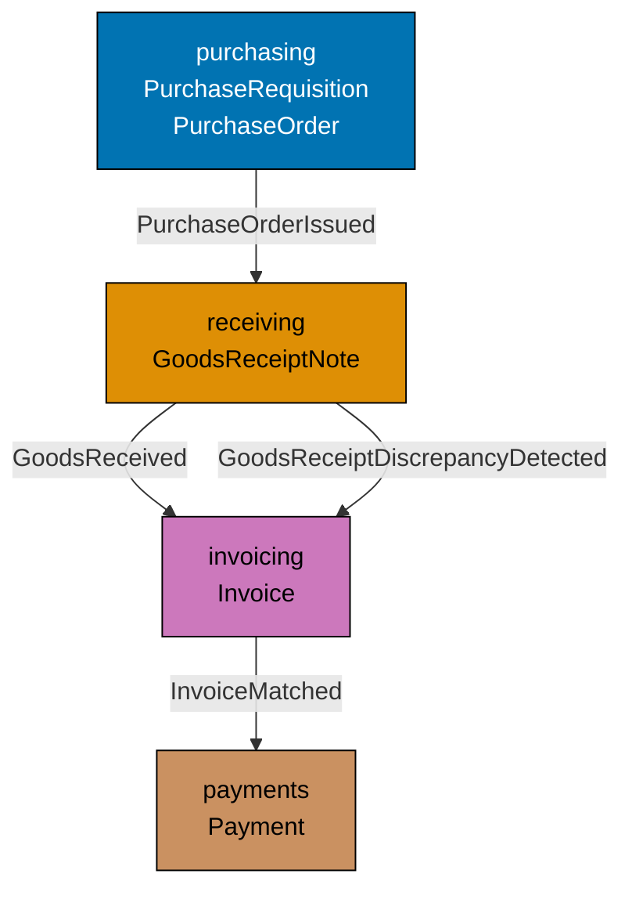

**Supplier lifecycle loop**:

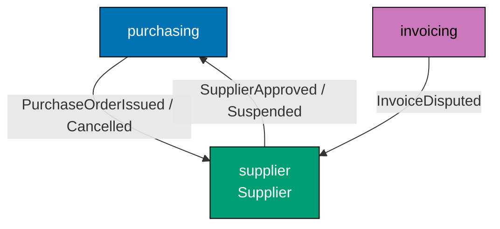

**Payment and finance integration**:

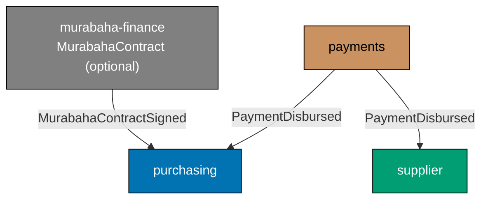





```fsharp
// Integration topology: which context publishes which events and who consumes them.
// This is the runtime view of the bounded context map.
// [Clojure: topology as a vector of maps; same data, no wrapper record types needed]

// Event routing table — documenting the published language topology
type ContextName = Purchasing | Supplier | Receiving | Invoicing | Payments | MurabahaFinance
// => Six bounded contexts in the procurement platform
// [Clojure: context names as namespaced keywords — :context/purchasing, etc.]

type EventRoute = {
    Event:     string
    Publisher: ContextName
    Consumers: ContextName list
}
// => EventRoute : a single row in the event routing table

let eventTopology : EventRoute list = [
    { Event = "PurchaseOrderIssued";              Publisher = Purchasing; Consumers = [Receiving; Supplier] }
    // => Receiving opens GRN expectation; Supplier receives EDI notification
    { Event = "PurchaseOrderAcknowledged";        Publisher = Purchasing; Consumers = [Receiving] }
    // => Receiving opens the delivery window
    { Event = "PurchaseOrderCancelled";           Publisher = Purchasing; Consumers = [Supplier] }
    // => Supplier receives cancellation notification
    { Event = "RequisitionApproved";              Publisher = Purchasing; Consumers = [Purchasing] }
    // => Purchasing auto-creates a PO Draft from the approved requisition
    { Event = "SupplierApproved";                 Publisher = Supplier;   Consumers = [Purchasing] }
    // => Purchasing adds supplier to the eligible-for-PO list
    { Event = "SupplierSuspended";                Publisher = Supplier;   Consumers = [Purchasing] }
    // => Purchasing blocks new POs for this supplier
    { Event = "GoodsReceived";                    Publisher = Receiving;  Consumers = [Invoicing; Purchasing] }
    // => Invoicing enables matching; Purchasing updates PO to PartiallyReceived or Received
    { Event = "GoodsReceiptDiscrepancyDetected";  Publisher = Receiving;  Consumers = [Invoicing; Supplier] }
    // => Invoicing blocks matching; Supplier receives discrepancy notification
    { Event = "InvoiceMatched";                   Publisher = Invoicing;  Consumers = [Payments] }
    // => Payments schedules a payment run
    { Event = "InvoiceDisputed";                  Publisher = Invoicing;  Consumers = [Supplier] }
    // => Supplier receives dispute notification
    { Event = "PaymentDisbursed";                 Publisher = Payments;   Consumers = [Purchasing; Supplier] }
    // => Purchasing marks PO as Paid; Supplier receives remittance advice
    { Event = "MurabahaContractSigned";           Publisher = MurabahaFinance; Consumers = [Purchasing] }
    // => Purchasing links the murabaha contract to the PO (optional context)
]
// => eventTopology : EventRoute list — the complete published language topology

// Print the integration map
printfn "=== Procurement Platform Event Topology ==="
eventTopology |> List.iter (fun route ->
    let consumers = route.Consumers |> List.map string |> String.concat ", "
    printfn "  %s: %A → [%s]" route.Event route.Publisher consumers
)
// => Output: PurchaseOrderIssued: Purchasing → [Receiving, Supplier]
// => Output: ... (one line per event)
```





```clojure
;; Integration topology: event routing as a plain vector of maps.
;; [F#: typed EventRoute record with DU ContextName; Clojure: maps with keyword values]
;; Data-orientation advantage: the topology can be filtered, queried, and serialised as-is.

(ns procurement.event-topology)

;; ── Event topology — vector of route maps ────────────────────────────────────
(def event-topology
  ;; Each map is one row in the event routing table
  [{:event "PurchaseOrderIssued"    :publisher :purchasing  :consumers [:receiving :supplier]}
   ;; => Receiving opens GRN expectation; Supplier receives EDI notification

   {:event "PurchaseOrderAcknowledged" :publisher :purchasing :consumers [:receiving]}
   ;; => Receiving opens the delivery window

   {:event "PurchaseOrderCancelled" :publisher :purchasing  :consumers [:supplier]}
   ;; => Supplier receives cancellation notification

   {:event "RequisitionApproved"    :publisher :purchasing  :consumers [:purchasing]}
   ;; => Purchasing auto-creates a PO Draft from the approved requisition

   {:event "SupplierApproved"       :publisher :supplier    :consumers [:purchasing]}
   ;; => Purchasing adds supplier to the eligible-for-PO list

   {:event "SupplierSuspended"      :publisher :supplier    :consumers [:purchasing]}
   ;; => Purchasing blocks new POs for this supplier

   {:event "GoodsReceived"          :publisher :receiving   :consumers [:invoicing :purchasing]}
   ;; => Invoicing enables matching; Purchasing updates PO to PartiallyReceived or Received

   {:event "GoodsReceiptDiscrepancyDetected" :publisher :receiving :consumers [:invoicing :supplier]}
   ;; => Invoicing blocks matching; Supplier receives discrepancy notification

   {:event "InvoiceMatched"         :publisher :invoicing   :consumers [:payments]}
   ;; => Payments schedules a payment run

   {:event "InvoiceDisputed"        :publisher :invoicing   :consumers [:supplier]}
   ;; => Supplier receives dispute notification

   {:event "PaymentDisbursed"       :publisher :payments    :consumers [:purchasing :supplier]}
   ;; => Purchasing marks PO as Paid; Supplier receives remittance advice

   {:event "MurabahaContractSigned" :publisher :murabaha-finance :consumers [:purchasing]}])
   ;; => Purchasing links the murabaha contract to the PO (optional context)
;; => event-topology : vector of maps — the complete published language topology

;; ── Print the integration map ─────────────────────────────────────────────────
(println "=== Procurement Platform Event Topology ===")
(doseq [{:keys [event publisher consumers]} event-topology]
  ;; Destructure each route map; print one line per event
  (println (str "  " event ": " (name publisher) " → " (mapv name consumers))))
;; => Output: PurchaseOrderIssued: purchasing → [receiving supplier]
;; => Output: ... (one line per event in the vector)
```





```typescript
// Bounded Context Integration Map — visualizing all context relationships.
// [F#: diagram expressed in comments + type signatures; TS expresses in type definitions]
// [Clojure: namespace dependencies map the integration; TS module imports mirror context coupling]

// ── Integration map expressed as TypeScript types ─────────────────────────────
// Each context exposes an event bus and a command port

namespace PurchasingContext {
  export type Event =
    | { type: "RequisitionSubmitted"; requisitionId: string; requestedBy: string; approvalLevel: string }
    | { type: "PurchaseOrderIssued"; purchaseOrderId: string; supplierId: string; total: number }
    | { type: "POCancelled"; purchaseOrderId: string; reason: string };
}

namespace SupplierContext {
  export type Event =
    | { type: "SupplierApproved"; supplierId: string; currency: string }
    | { type: "SupplierSuspended"; supplierId: string; reason: string };
}

namespace ReceivingContext {
  // Subscribes to: PurchasingContext.PurchaseOrderIssued
  export type Event =
    | { type: "GoodsReceived"; grnId: string; purchaseOrderId: string; receivedTotal: number }
    | { type: "ShortDelivery"; grnId: string; purchaseOrderId: string };
}

namespace InvoicingContext {
  // Subscribes to: ReceivingContext.GoodsReceived, PurchasingContext.PurchaseOrderIssued
  export type Event =
    | { type: "InvoiceApproved"; invoiceId: string; supplierId: string; amountDue: number; dueDate: string }
    | { type: "InvoiceDisputed"; invoiceId: string; reason: string };
}

namespace PaymentsContext {
  // Subscribes to: InvoicingContext.InvoiceApproved, SupplierContext.SupplierApproved
  export type Event =
    | { type: "PaymentScheduled"; invoiceId: string; supplierId: string; amount: number; scheduledFor: string }
    | { type: "PaymentProcessed"; invoiceId: string; processedAt: string };
}

// Integration map: which contexts subscribe to which events
const integrationMap: Record = {
  "PurchasingContext.RequisitionSubmitted": ["ApprovalContext", "NotificationContext"],
  "PurchasingContext.PurchaseOrderIssued": ["ReceivingContext", "InvoicingContext"],
  "ReceivingContext.GoodsReceived": ["InvoicingContext"],
  "InvoicingContext.InvoiceApproved": ["PaymentsContext"],
  "SupplierContext.SupplierApproved": ["PurchasingContext", "PaymentsContext"],
};

Object.entries(integrationMap).forEach(([event, subscribers]) => {
  console.log(`${event} -> [${subscribers.join(", ")}]`);
});
// => Output shows all cross-context event subscriptions
```





```haskell
-- ── file: Procurement/Topology.hs ──────────────────────────────────────────
-- Integration topology: which context publishes which events to whom.
-- [F#: EventRoute record with DU ContextName; Haskell uses ADT + record list]
{-# LANGUAGE OverloadedStrings #-}
module Procurement.Topology where

import           Data.List (intercalate)
import           Data.Text (Text)
import qualified Data.Text as T

-- Six bounded contexts in the procurement platform
data ContextName
  = Purchasing | Supplier | Receiving | Invoicing | Payments | MurabahaFinance
  deriving (Eq, Show)

-- Single row in the event routing table
data EventRoute = EventRoute
  { erEvent     :: Text
  , erPublisher :: ContextName
  , erConsumers :: [ContextName]
  } deriving (Show)

-- The complete published-language topology
eventTopology :: [EventRoute]
eventTopology =
  [ EventRoute "PurchaseOrderIssued"             Purchasing      [Receiving, Supplier]
    -- => Receiving opens GRN expectation; Supplier receives EDI notification
  , EventRoute "PurchaseOrderAcknowledged"       Purchasing      [Receiving]
    -- => Receiving opens the delivery window
  , EventRoute "PurchaseOrderCancelled"          Purchasing      [Supplier]
    -- => Supplier receives cancellation notification
  , EventRoute "RequisitionApproved"             Purchasing      [Purchasing]
    -- => Purchasing auto-creates a PO Draft from the approved requisition
  , EventRoute "SupplierApproved"                Supplier        [Purchasing]
    -- => Purchasing adds supplier to the eligible-for-PO list
  , EventRoute "SupplierSuspended"               Supplier        [Purchasing]
    -- => Purchasing blocks new POs for this supplier
  , EventRoute "GoodsReceived"                   Receiving       [Invoicing, Purchasing]
    -- => Invoicing enables matching; Purchasing updates PO to PartiallyReceived or Received
  , EventRoute "GoodsReceiptDiscrepancyDetected" Receiving       [Invoicing, Supplier]
    -- => Invoicing blocks matching; Supplier receives discrepancy notification
  , EventRoute "InvoiceMatched"                  Invoicing       [Payments]
    -- => Payments schedules a payment run
  , EventRoute "InvoiceDisputed"                 Invoicing       [Supplier]
    -- => Supplier receives dispute notification
  , EventRoute "PaymentDisbursed"                Payments        [Purchasing, Supplier]
    -- => Purchasing marks PO as Paid; Supplier receives remittance advice
  , EventRoute "MurabahaContractSigned"          MurabahaFinance [Purchasing]
    -- => Purchasing links the murabaha contract to the PO (optional context)
  ]

-- Print the integration map
runDemo :: IO ()
runDemo = do
  putStrLn "=== Procurement Platform Event Topology ==="
  mapM_ printRoute eventTopology
  where
    printRoute r =
      let consumers = intercalate ", " (map show (erConsumers r))
      in putStrLn ("  " <> T.unpack (erEvent r) <> ": " <> show (erPublisher r)
                   <> " -> [" <> consumers <> "]")
  -- => Output: PurchaseOrderIssued: Purchasing -> [Receiving, Supplier]
  -- => Output: ... (one line per event)
```





**Key Takeaway**: Documenting the event topology as a typed `EventRoute list` makes the integration map an executable artifact — it can be validated against the actual event bus configuration in a CI test.

**Why It Matters**: In a production procurement microservices deployment, the event topology is a critical operational document — missing a consumer subscription means a downstream context (like payments) never learns about `InvoiceMatched` events. Encoding the topology as a typed list enables automated validation: compare the `eventTopology` list against the Kafka consumer group subscriptions in production and alert on any gaps.

---

### Example 75: Long-Running Workflow — Approval Saga

The PO approval process can span days (L3 approvals take up to 10 business days). A saga models this long-running workflow as a durable state machine that survives service restarts.

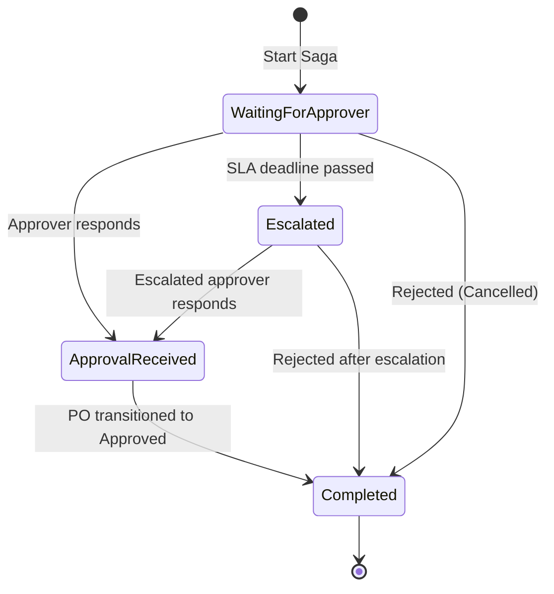





```fsharp
// Saga: a long-running workflow modelled as a durable state machine.
// The saga persists its current state after each step — survives restarts.
// [Clojure: saga state as a map with :saga/state keyword; transitions via pure functions]

type PurchaseOrderId = PurchaseOrderId of string
type ApproverId      = ApproverId      of string

// Saga states — the saga's own lifecycle
// [Clojure: states as namespaced keywords in the saga map; no DU required]
type ApprovalSagaState =
    | WaitingForApprover of poId: PurchaseOrderId * approverId: ApproverId * deadline: System.DateTimeOffset
    // => Saga has routed the approval request — waiting for the approver's response
    | ApprovalReceived   of poId: PurchaseOrderId * approverId: ApproverId * approvedAt: System.DateTimeOffset
    // => Approver has responded — saga transitions PO to Approved state
    | Escalated          of poId: PurchaseOrderId * originalApproverId: ApproverId * escalatedTo: ApproverId
    // => SLA breach — saga escalated to the next level approver
    | Completed          of poId: PurchaseOrderId * outcome: string
    // => Saga completed — PO is either Approved or Rejected

// Saga event: approver responded
type ApproverResponded = {
    PurchaseOrderId: PurchaseOrderId
    ApproverId:      ApproverId
    Decision:        string  // => "Approved" or "Rejected"
    RespondedAt:     System.DateTimeOffset
}
// => ApproverResponded : event received by the saga from the workflow engine

// Saga event: SLA deadline reached
type ApprovalDeadlineReached = {
    PurchaseOrderId: PurchaseOrderId
    ApproverId:      ApproverId
    EscalateTo:      ApproverId option
    // => If Some, escalate to this approver; if None, auto-reject
}
// => ApprovalDeadlineReached : fired by the scheduler when the deadline passes

// Saga step: handle approver response
let handleApproverResponse
    (state:    ApprovalSagaState)
    (response: ApproverResponded)
    : ApprovalSagaState =
    match state with
    | WaitingForApprover (poId, approverId, _) when approverId = response.ApproverId ->
        // => Response from the expected approver — advance the saga
        if response.Decision = "Approved" then
            ApprovalReceived (poId, approverId, response.RespondedAt)
            // => Approval received — saga will transition the PO to Approved
        else
            Completed (poId, sprintf "Rejected by %A" approverId)
            // => Rejection received — saga closes with Rejected outcome
    | _ -> state
    // => Response from unexpected approver — ignore (duplicate or stale message)

// Test the saga transition
let initialState = WaitingForApprover (PurchaseOrderId "po_e3d1", ApproverId "emp_mgr_007", System.DateTimeOffset.UtcNow.AddDays(5.0))
// => Saga started: waiting for emp_mgr_007 with a 5-day deadline

let response = { PurchaseOrderId = PurchaseOrderId "po_e3d1"; ApproverId = ApproverId "emp_mgr_007"
                 Decision = "Approved"; RespondedAt = System.DateTimeOffset.UtcNow.AddDays(2.0) }
// => Approver responded after 2 days — within the 5-day SLA

let nextState = handleApproverResponse initialState response
// => Response is from the expected approver with "Approved" decision
// => nextState : ApprovalSagaState = ApprovalReceived (...)

printfn "Initial: %A" initialState
// => Output: Initial: WaitingForApprover (PurchaseOrderId "po_e3d1", ApproverId "emp_mgr_007", ...)
printfn "After response: %A" nextState
// => Output: After response: ApprovalReceived (PurchaseOrderId "po_e3d1", ApproverId "emp_mgr_007", ...)
```





```clojure
;; Approval saga in Clojure: state as a map, transitions as pure functions.
;; [F#: discriminated union enforces exhaustive state coverage at compile time]
;; Clojure: state machine as a map with :saga/state keyword — open but REPL-inspectable.

(ns procurement.approval-saga)

;; ── Initial saga state ────────────────────────────────────────────────────────
(defn make-initial-state [po-id approver-id deadline]
  ;; Factory: creates the starting saga map in :waiting-for-approver state
  {:saga/state      :waiting-for-approver
   ;; => Saga has routed the approval request — waiting for the approver's response
   :saga/po-id      po-id
   :saga/approver-id approver-id
   ;; => The expected approver — responses from others are ignored
   :saga/deadline   deadline})
;; => Returns a plain map — persistable to a database as EDN or JSON

;; ── Saga event: approver responded ───────────────────────────────────────────
;; [F#: ApproverResponded record type; Clojure: event as a plain map]
(defn make-approver-responded [po-id approver-id decision responded-at]
  ;; Constructs the event map — pure data, no object
  {:event/type       :approver-responded
   :event/po-id      po-id
   :event/approver-id approver-id
   ;; => Identity of the approver who responded
   :event/decision   decision
   ;; => "approved" or "rejected" — string keyword for open extensibility
   :event/responded-at responded-at})
;; => Event map crosses the boundary between the workflow engine and the saga

;; ── Saga step: handle approver response ──────────────────────────────────────
(defn handle-approver-response [state response]
  ;; Pure function: state + event → next state (no side effects)
  (if (and (= (:saga/state state) :waiting-for-approver)
           (= (:saga/approver-id state) (:event/approver-id response)))
    ;; => Response from the expected approver — advance the saga
    (if (= (:event/decision response) "approved")
      (assoc state
             :saga/state :approval-received
             ;; => Transition to approval-received — saga will update the PO
             :saga/approved-at (:event/responded-at response))
      ;; => approved-at is set for audit trail recording
      (assoc state
             :saga/state :completed
             ;; => Rejection closes the saga immediately
             :saga/outcome (str "Rejected by " (:saga/approver-id state))))
    state))
;; => Response from unexpected approver — return state unchanged (idempotent)

;; ── Test the saga transition ──────────────────────────────────────────────────
(def initial-state
  (make-initial-state "po_e3d1" "emp_mgr_007" "2026-06-20T10:00:00Z"))
;; => Saga started: waiting for emp_mgr_007 with a deadline five days from now

(def response
  (make-approver-responded "po_e3d1" "emp_mgr_007" "approved" "2026-06-17T09:30:00Z"))
;; => Approver responded after 2 days — within the 5-day SLA

(def next-state (handle-approver-response initial-state response))
;; => Response from expected approver with "approved" decision
;; => next-state : {:saga/state :approval-received, :saga/approved-at "2026-06-17T09:30:00Z", ...}

(println "Initial state:" (:saga/state initial-state))
;; => Output: Initial state: :waiting-for-approver
(println "After response:" (:saga/state next-state))
;; => Output: After response: :approval-received
```





```typescript
// Long-running workflow — approval saga with state persistence.
// [F#: saga as a sequence of async operations with checkpointed state]
// [Clojure: saga state stored in an atom; TS uses a persistent saga state object]

// Result type
type Result<T, E> = { readonly ok: true; readonly value: T } | { readonly ok: false; readonly error: E };
const okR = <T, E>(v: T): Result => ({ ok: true, value: v });
const errR = <T, E>(e: E): Result => ({ ok: false, error: e });

type PurchaseOrderId = string & { readonly __brand: "PurchaseOrderId" };

// Saga state — persisted between workflow steps (survives restarts)
type ApprovalSagaState =
  | { readonly step: "AwaitingManagerApproval"; readonly purchaseOrderId: PurchaseOrderId; readonly notifiedAt: string }
  | { readonly step: "ManagerApproved"; readonly purchaseOrderId: PurchaseOrderId; readonly managerId: string }
  | { readonly step: "AwaitingCFOApproval"; readonly purchaseOrderId: PurchaseOrderId; readonly escalatedAt: string }
  | { readonly step: "CFOApproved"; readonly purchaseOrderId: PurchaseOrderId; readonly cfoId: string }
  | { readonly step: "Completed"; readonly purchaseOrderId: PurchaseOrderId; readonly completedAt: string }
  | { readonly step: "Failed"; readonly purchaseOrderId: PurchaseOrderId; readonly reason: string };

// Saga command handlers — each advances the saga by one step
function handleManagerApproval(state: Extract, managerId: string, approved: boolean): ApprovalSagaState {
  if (!approved) return { step: "Failed", purchaseOrderId: state.purchaseOrderId, reason: "Manager rejected" };
  // => Rejection terminates the saga
  return { step: "ManagerApproved", purchaseOrderId: state.purchaseOrderId, managerId };
  // => Advance to next step
}

function handleCFOApproval(state: Extract, cfoId: string): ApprovalSagaState {
  return { step: "CFOApproved", purchaseOrderId: state.purchaseOrderId, cfoId };
  // => Final approval step — CFO always approves in this saga
}

// Saga progression
const initial: ApprovalSagaState = {
  step: "AwaitingManagerApproval",
  purchaseOrderId: "po_001" as PurchaseOrderId,
  notifiedAt: new Date().toISOString(),
};
const afterManager = handleManagerApproval(initial, "mgr_001", true);
console.log("After manager:", afterManager.step);
// => Output: After manager: ManagerApproved

const escalated: ApprovalSagaState = {
  step: "AwaitingCFOApproval",
  purchaseOrderId: "po_001" as PurchaseOrderId,
  escalatedAt: new Date().toISOString(),
};
const afterCFO = handleCFOApproval(escalated, "cfo_001");
console.log("After CFO:", afterCFO.step);
// => Output: After CFO: CFOApproved
```





```haskell
-- ── file: Procurement/ApprovalSaga.hs ──────────────────────────────────────
-- Saga: long-running workflow modelled as a durable state machine.
-- [F#: DU with payloads on each state; Haskell uses ADT with record-style payloads]
{-# LANGUAGE OverloadedStrings #-}
module Procurement.ApprovalSaga where

import           Data.Text  (Text)
import qualified Data.Text  as T
import           Data.Time  (UTCTime)

newtype PurchaseOrderId = PurchaseOrderId Text deriving (Eq, Show)
newtype ApproverId      = ApproverId      Text deriving (Eq, Show)

-- Saga states — the saga's own lifecycle as a closed sum type
data ApprovalSagaState
  = WaitingForApprover PurchaseOrderId ApproverId UTCTime
  -- => Saga routed the approval request; field 3 is the SLA deadline
  | ApprovalReceived   PurchaseOrderId ApproverId UTCTime
  -- => Approver responded; PO will transition to Approved next
  | Escalated          PurchaseOrderId ApproverId ApproverId
  -- => SLA breach — escalated from field 2 to field 3
  | Completed          PurchaseOrderId Text
  -- => Saga completed — outcome text records reason
  deriving (Show)

-- Saga event: approver responded
data ApproverResponded = ApproverResponded
  { arPoId        :: PurchaseOrderId
  , arApproverId  :: ApproverId
  , arDecision    :: Text       -- => "Approved" | "Rejected"
  , arRespondedAt :: UTCTime
  } deriving (Show)

-- Saga step: pure transition — current state + event -> next state
handleApproverResponse :: ApprovalSagaState -> ApproverResponded -> ApprovalSagaState
handleApproverResponse st response = case st of
  WaitingForApprover poId expectedApprover _deadline
    | expectedApprover == arApproverId response ->
        -- => Response from the expected approver — advance the saga
        if arDecision response == "Approved"
          then ApprovalReceived poId expectedApprover (arRespondedAt response)
          else let ApproverId aid = expectedApprover
               in Completed poId ("Rejected by " <> aid)
  _ -> st
  -- => Unexpected approver or wrong state — idempotent no-op (duplicate message)

-- Test
runDemo :: UTCTime -> IO ()
runDemo nowPlus2 = do
  -- nowPlus2 is supplied by caller to keep this function deterministic
  let initialDeadline = nowPlus2  -- => placeholder for now+5d in real code
      initialState    = WaitingForApprover (PurchaseOrderId "po_e3d1")
                                           (ApproverId "emp_mgr_007")
                                           initialDeadline
      -- => Saga started: waiting for emp_mgr_007
      response        = ApproverResponded
                          { arPoId        = PurchaseOrderId "po_e3d1"
                          , arApproverId  = ApproverId "emp_mgr_007"
                          , arDecision    = "Approved"
                          , arRespondedAt = nowPlus2
                          }
      -- => Approver responded within the SLA window
      nextState       = handleApproverResponse initialState response
      -- => Pure transition — no IO, fully testable
  putStrLn ("Initial: " <> show initialState)
  -- => Output: Initial: WaitingForApprover (PurchaseOrderId "po_e3d1") (ApproverId "emp_mgr_007") ...
  putStrLn ("After response: " <> show nextState)
  -- => Output: After response: ApprovalReceived (PurchaseOrderId "po_e3d1") (ApproverId "emp_mgr_007") ...
```





**Key Takeaway**: A saga's state machine, modelled as a discriminated union with typed state transitions, makes the long-running workflow's current position explicit and resumable after service restarts.

**Why It Matters**: L3 approval workflows can span multiple business days across weekends and holidays. The saga persists its current state after each step, so a service restart does not lose the workflow position. The typed state machine ensures the saga never enters an undefined intermediate state and the `handleApproverResponse` function is a pure, testable step in the saga's lifecycle.

---

### Example 76: Interop with C# Caller — Workflow Exposed as Task

Domain workflows written in one language may be consumed from hosts written in another. On the .NET platform, F# uses `Async<T>` while C# callers expect `Task<T>` — converting between the two is a thin boundary concern at the composition root. Clojure and TypeScript face the same challenge when crossing library or service boundaries: the domain layer stays idiomatic; the shim translates at the edge.





```fsharp
// Exposing an F# async workflow to a C# caller via Task conversion.
// Async<T> (F#) ↔ Task<T> (C#) — conversion is a thin boundary shim.
// [Clojure: JVM interop via futures or manifold — analogous boundary pattern]

type PurchaseOrderId = PurchaseOrderId of string

// The F# domain workflow returns Async<Result<string, string>>
let issueWorkflowFs (poId: PurchaseOrderId) : Async<Result<string, string>> =
    async {
        // => All domain logic is here — pure F# async
        do! Async.Sleep 0
        // => Simulate async work
        let (PurchaseOrderId id) = poId
        return Ok (sprintf "PO %s issued successfully" id)
        // => Return Ok with a success message
    }

// Boundary shim: convert Async<Result<T, string>> to Task<T> for C# callers
// (In a real project, this would be in the HTTP controller or Giraffe handler)
let issueWorkflowTask (rawPoId: string) : System.Threading.Tasks.Task<string> =
    // => rawPoId: string from the C# HTTP request model
    let poId = PurchaseOrderId rawPoId
    // => Wrap in the typed DU before passing to the domain workflow
    issueWorkflowFs poId
    |> Async.map (function
        | Ok message -> message
        // => Success: extract the message
        | Error err  -> failwithf "Workflow error: %s" err
        // => Error: raise an exception — C# exception handling takes over
    )
    |> Async.StartAsTask
    // => Convert Async to Task — the C# host awaits this Task

// Test the Task-returning shim
let task = issueWorkflowTask "po_e3d1"
// => issueWorkflowTask returns Task<string>
let result = task.Result
// => Synchronously await the Task result for demonstration (use await in real C# code)

printfn "Task result: %s" result
// => Output: Task result: PO po_e3d1 issued successfully
```





```clojure
;; Interop with a Java/JVM caller — workflow exposed via a future boundary.
;; [F#: Async.StartAsTask converts to Task<T>; Clojure: future wraps synchronous work as a JVM Future]
;; Clojure workflows are synchronous by default; futures provide the async boundary for JVM callers.

(ns procurement.workflow-interop)

;; ── Core domain workflow — synchronous, pure data in/out ─────────────────────
(defn issue-workflow-clj [po-id]
  ;; All domain logic here — returns a result map, not a future
  ;; [F#: Async<Result<string, string>>; Clojure: plain map returned synchronously]
  (if (seq po-id)
    {:ok true :message (str "PO " po-id " issued successfully")}
    ;; => po-id is non-empty — issue succeeds; message matches F# output format
    {:error "PO ID must not be empty"}))
;; => Clojure domain logic is synchronous — no async wrapper needed in the core

;; ── Boundary shim: expose to a JVM caller expecting a java.util.concurrent.Future
(defn issue-workflow-future [raw-po-id]
  ;; raw-po-id: String from the HTTP request — analogous to C# rawPoId parameter
  ;; [F#: Async.StartAsTask; Clojure: future macro wraps work as a JVM Future<Object>]
  (future
    (let [result (issue-workflow-clj raw-po-id)]
      ;; => Execute the domain workflow inside the future thread
      (if (:ok result)
        (:message result)
        ;; => Success: return the message string for the JVM caller
        (throw (ex-info "Workflow error" {:error (:error result)}))))))
        ;; => Error: throw an exception — JVM caller's exception handling takes over

;; ── Test the future-returning shim ───────────────────────────────────────────
(def task (issue-workflow-future "po_e3d1"))
;; => Returns a future immediately — the JVM caller can deref or block

(def result @task)
;; => @task blocks until the future completes — analogous to task.Result in C#
;; => In production, the JVM HTTP framework awaits the future without blocking

(println "Task result:" result)
;; => Output: Task result: PO po_e3d1 issued successfully
```





```typescript
// Interop with a consumer that expects Promises — exposing the domain as async API.
// [F#: Async<Result<'T,'E>> exposed as Task<T> to C# callers via interop]
// [Clojure: defn returning CompletableFuture for Java interop; TS: Promise<T> wraps domain Result]

// Result type
type Result<T, E> = { readonly ok: true; readonly value: T } | { readonly ok: false; readonly error: E };
const okR = <T, E>(v: T): Result => ({ ok: true, value: v });
const errR = <T, E>(e: E): Result => ({ ok: false, error: e });

type PurchaseOrderId = string & { readonly __brand: "PurchaseOrderId" };

// ── Domain layer: returns Result<T,E> ─────────────────────────────────────────
function validatePOTotal(total: number): Result {
  return total > 0 ? okR(total) : errR(`Total must be > 0, got ${total}`);
}

// ── Application service: wraps domain Result in a Promise for async consumers ─
async function getApprovalLevel(total: number): Promise {
  const result = validatePOTotal(total);
  if (!result.ok) throw new Error(result.error);
  // => Converts domain Result.error to thrown exception — for async/await callers
  // => [F#: Task.FromResult or raising exception for C# interop callers]
  const level = total <= 1000 ? "L1" : total <= 10000 ? "L2" : "L3";
  return level;
}

// ── REST handler: consumes the async API ──────────────────────────────────────
async function handleGetApprovalLevel(totalParam: string): Promise {
  const total = parseFloat(totalParam);
  if (isNaN(total)) return { status: 400, body: { error: "Invalid total parameter" } };
  try {
    const level = await getApprovalLevel(total);
    return { status: 200, body: { approvalLevel: level, total } };
  } catch (e) {
    return { status: 422, body: { error: (e as Error).message } };
    // => Result.error becomes a 422 HTTP response — translated at the boundary
  }
}

// Test the interop chain
const goodResponse = await handleGetApprovalLevel("2784.97");
console.log("Good response:", goodResponse.status, JSON.stringify(goodResponse.body));
// => Output: Good response: 200 {"approvalLevel":"L2","total":2784.97}

const badResponse = await handleGetApprovalLevel("-100");
console.log("Bad response:", badResponse.status, JSON.stringify(badResponse.body));
// => Output: Bad response: 422 {"error":"Total must be > 0, got -100"}
```





```haskell
-- ── file: Procurement/Interop.hs ───────────────────────────────────────────
-- Exposing an IO-based workflow via Control.Concurrent.Async.
-- [F#: Async.StartAsTask converts to Task<T>; Haskell uses async :: IO a -> IO (Async a)]
{-# LANGUAGE OverloadedStrings #-}
module Procurement.Interop where

import           Control.Concurrent.Async (Async, async, wait)
import           Control.Exception        (throwIO, Exception)
import           Data.Text                (Text)
import qualified Data.Text                as T

newtype PurchaseOrderId = PurchaseOrderId Text deriving (Eq, Show)

-- Custom exception for workflow errors at the interop boundary
data WorkflowError = WorkflowError Text deriving (Show)
instance Exception WorkflowError

-- The Haskell domain workflow returns IO (Either Text Text) — Result equivalent
issueWorkflow :: PurchaseOrderId -> IO (Either Text Text)
issueWorkflow (PurchaseOrderId rawId) = do
  -- => All domain logic is here — pure-ish IO returning Either
  pure (Right ("PO " <> rawId <> " issued successfully"))
  -- => Return Right with a success message

-- Boundary shim: convert Either Text Text into a Async Text for foreign callers.
-- Mirrors the F# Async.StartAsTask conversion at the interop boundary.
issueWorkflowAsync :: Text -> IO (Async Text)
issueWorkflowAsync rawPoId = async $ do
  -- => async spawns a thread and returns an Async handle the caller may await
  result <- issueWorkflow (PurchaseOrderId rawPoId)
  case result of
    Right message -> pure message
    -- => Success: return the message
    Left err      -> throwIO (WorkflowError err)
    -- => Error: raise an exception so foreign exception handling can react

-- Test the Async-returning shim
runDemo :: IO ()
runDemo = do
  task <- issueWorkflowAsync "po_e3d1"
  -- => issueWorkflowAsync returns an Async Text handle
  result <- wait task
  -- => wait blocks until the Async completes — analogous to task.Result in C#
  putStrLn ("Task result: " <> T.unpack result)
  -- => Output: Task result: PO po_e3d1 issued successfully
```





**Key Takeaway**: Async interop at the composition root keeps domain logic idiomatic while presenting a compatible interface to the host. On .NET, `Async.StartAsTask` is the complete shim between F# `Async` workflows and C# `Task` callers — one line, no restructuring of domain logic required. Equivalent boundary shims exist for every cross-language or cross-runtime integration point.

**Why It Matters**: Procurement platform backends often start as pure F# services but evolve to integrate with C# libraries (ORMs, message bus clients, telemetry SDKs). The `Async.StartAsTask` shim keeps the domain layer in idiomatic F# while presenting a C#-friendly `Task<T>` surface to infrastructure code. The conversion is a one-liner — it does not require restructuring the domain workflow.

---

### Example 77: CQRS — Separate Read and Write Models

CQRS (Command Query Responsibility Segregation) separates the write model (aggregates, commands, events) from the read model (projections optimised for query). For the procurement dashboard, the read model is a denormalised view of PO status and supplier name.

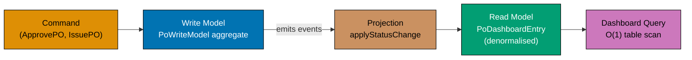





```fsharp
// CQRS: write model (aggregate) and read model (projection) are separate.
// The read model is optimised for query — denormalised, indexed, fast.

type PurchaseOrderId = PurchaseOrderId of string
type SupplierId      = SupplierId      of string

// ── WRITE MODEL ────────────────────────────────────────────────────────────────
// The PO aggregate — normalised, consistent, event-sourced
type PoWriteModel = {
    Id:         PurchaseOrderId
    SupplierId: SupplierId
    Status:     string
    Total:      decimal
}
// => Write model: the authoritative aggregate state — updated on transitions

// ── READ MODEL ─────────────────────────────────────────────────────────────────
// The dashboard projection — denormalised for fast query without joins
type PoDashboardEntry = {
    PoId:         string
    SupplierName: string
    // => Denormalised supplier name — avoids a join on every dashboard query
    Status:       string
    Total:        decimal
    IsOverdue:    bool
    // => Pre-computed overdue flag — dashboard renders without time calculation
}
// => PoDashboardEntry : read model — shaped for the UI, not for domain consistency

// Event that updates the read model
type PoStatusChanged = { PoId: PurchaseOrderId; NewStatus: string; SupplierName: string; Total: decimal }
// => Event from the write model — carries what the read model needs

// Projection function: update the dashboard entry on status change
let applyStatusChange
    (existing: PoDashboardEntry option)
    (event:    PoStatusChanged)
    : PoDashboardEntry =
    let (PurchaseOrderId id) = event.PoId
    match existing with
    | None ->
        // => First event for this PO — create a new dashboard entry
        { PoId = id; SupplierName = event.SupplierName; Status = event.NewStatus
          Total = event.Total; IsOverdue = false }
        // => IsOverdue = false at creation — recalculated by a scheduler
    | Some entry ->
        // => Update the existing entry — status changes, supplier name and total stay
        { entry with Status = event.NewStatus }
        // => Only status changes — total and supplier name are stable after creation

// Test the CQRS projection
let event1 = { PoId = PurchaseOrderId "po_e3d1"; NewStatus = "Draft"; SupplierName = "Acme Supplies"; Total = 2699.97m }
// => PO first appears in the dashboard as Draft

let event2 = { PoId = PurchaseOrderId "po_e3d1"; NewStatus = "Approved"; SupplierName = "Acme Supplies"; Total = 2699.97m }
// => PO transitions to Approved

let entry1 = applyStatusChange None event1
// => No existing entry — creates: { PoId = "po_e3d1"; Status = "Draft"; ... }
let entry2 = applyStatusChange (Some entry1) event2
// => Existing entry — updates: { ...; Status = "Approved"; ... }

printfn "After Draft: %s %s %M" entry1.PoId entry1.Status entry1.Total
// => Output: After Draft: po_e3d1 Draft 2699.9700M
printfn "After Approved: %s %s" entry2.PoId entry2.Status
// => Output: After Approved: po_e3d1 Approved
```





```clojure
;; CQRS: write model (aggregate) and read model (projection) are separate.
;; [F#: record types for both models; Clojure: plain maps — same data-orientation, no type wrapper]
;; The read model is shaped for the dashboard query, not for domain consistency.

(ns procurement.cqrs)

;; ── WRITE MODEL ────────────────────────────────────────────────────────────────
;; The PO aggregate — authoritative state, updated on every command
;; [F#: record type PoWriteModel; Clojure: plain map with namespaced keys]
(defn make-po-write-model [po-id supplier-id status total]
  ;; Constructs the write-model map from its constituent fields
  {:po/id          po-id        ;; => Typed PO identity — string "po_e3d1" form
   :po/supplier-id supplier-id  ;; => Supplier identity — string "sup_acme" form
   :po/status      status       ;; => Current lifecycle status — authoritative
   :po/total       total})      ;; => Requisition total in the domain currency
;; => Write model: normalised for consistency, not optimised for reads

;; ── READ MODEL ─────────────────────────────────────────────────────────────────
;; The dashboard projection — denormalised for fast query without joins
;; [F#: record type PoDashboardEntry; Clojure: plain map with dashboard-specific keys]
(defn make-dashboard-entry [po-id supplier-name status total]
  ;; Constructs the read-model map with denormalised supplier name
  {:dash/po-id         po-id          ;; => String ID — direct for query, no unwrap needed
   :dash/supplier-name supplier-name  ;; => Denormalised — avoids join on every page load
   :dash/status        status         ;; => Pre-projected status string for UI rendering
   :dash/total         total          ;; => Cached total — stable after PO creation
   :dash/overdue?      false})        ;; => Pre-computed flag — recalculated by a scheduler
;; => Read model: shaped for the dashboard UI, not for domain consistency

;; ── PROJECTION FUNCTION ────────────────────────────────────────────────────────
;; Update the dashboard entry when a status-change event arrives
;; [F#: applyStatusChange uses pattern match on Option; Clojure: if on nil check]
(defn apply-status-change [existing event]
  ;; existing: nil (first event) or the current dashboard map
  ;; event: {:po-id "po_e3d1" :new-status "Approved" :supplier-name "Acme" :total 2699.97}
  (if (nil? existing)
    ;; => First event for this PO — build a fresh dashboard entry
    (make-dashboard-entry
      (:po-id event)
      (:supplier-name event)
      (:new-status event)
      (:total event))
    ;; => No existing projection yet — all fields come from the first event
    (assoc existing :dash/status (:new-status event))))
    ;; => Subsequent events — only status changes; supplier-name and total stay stable

;; ── TEST THE CQRS PROJECTION ───────────────────────────────────────────────────
(def event1
  ;; First event: PO enters the system as Draft
  {:po-id "po_e3d1"
   :new-status "Draft"
   :supplier-name "Acme Supplies"
   :total 2699.97})
;; => event1 carries all fields the projection needs on first appearance

(def event2
  ;; Second event: PO transitions to Approved
  {:po-id "po_e3d1"
   :new-status "Approved"
   :supplier-name "Acme Supplies"
   :total 2699.97})
;; => event2 — only :new-status changes; other fields unchanged

(def entry1 (apply-status-change nil event1))
;; => nil existing — creates: {:dash/po-id "po_e3d1" :dash/status "Draft" ...}

(def entry2 (apply-status-change entry1 event2))
;; => Existing entry — updates: {:dash/status "Approved" ...}

(println "After Draft:"
         (:dash/po-id entry1)
         (:dash/status entry1)
         (:dash/total entry1))
;; => Output: After Draft: po_e3d1 Draft 2699.97

(println "After Approved:" (:dash/po-id entry2) (:dash/status entry2))
;; => Output: After Approved: po_e3d1 Approved
```





```typescript
// CQRS — separate read and write models for the PurchaseOrder aggregate.
// [F#: Write side uses domain types; Read side uses flat projection types]
// [Clojure: separate namespaces for commands and queries; TS: separate interfaces per side]

type PurchaseOrderId = string & { readonly __brand: "PurchaseOrderId" };
type SupplierId = string & { readonly __brand: "SupplierId" };

// ── Write side: rich domain types for commands ────────────────────────────────
interface POWriteModel {
  readonly id: PurchaseOrderId;
  readonly supplierId: SupplierId;
  readonly status: "Draft" | "Approved" | "Issued" | "Cancelled";
  readonly lines: ReadonlyArray;
  readonly total: number;
  readonly version: number; // optimistic concurrency control
}

// Write side command — mutates state via the domain
type POCommand =
  | { readonly type: "ApprovePO"; readonly id: PurchaseOrderId; readonly approvedBy: string }
  | { readonly type: "IssuePO"; readonly id: PurchaseOrderId; readonly expectedDelivery: string }
  | { readonly type: "CancelPO"; readonly id: PurchaseOrderId; readonly reason: string };

// ── Read side: flat projection optimised for UI queries ───────────────────────
interface POListItem {
  id: string; // no brand — display only
  supplierId: string;
  status: string;
  totalDisplay: string; // formatted "USD 2,784.97"
  lineCount: number;
  lastModifiedDate: string;
}
// => Read model is denormalised and pre-formatted — no domain logic needed at query time

interface PODetail extends POListItem {
  lines: Array;
  // => Pre-formatted for display — no calculation in the UI layer
}

// Projection: write model -> read model
function projectToListItem(po: POWriteModel): POListItem {
  return {
    id: po.id as string,
    supplierId: po.supplierId as string,
    status: po.status,
    totalDisplay: `USD ${po.total.toLocaleString("en-US", { minimumFractionDigits: 2 })}`,
    // => Pre-formatted — UI just renders the string
    lineCount: po.lines.length,
    lastModifiedDate: new Date().toLocaleDateString("en-US"),
  };
}

const po: POWriteModel = {
  id: "po_001" as PurchaseOrderId,
  supplierId: "sup_001" as SupplierId,
  status: "Approved",
  lines: [{ sku: "ELE-0099", qty: 3, unitPrice: 899.99 }],
  total: 2699.97,
  version: 1,
};

const readItem = projectToListItem(po);
console.log("Read model:", readItem.totalDisplay, readItem.status);
// => Output: Read model: USD 2,699.97 Approved
```





```haskell
-- ── file: Procurement/Cqrs.hs ──────────────────────────────────────────────
-- CQRS: write model (aggregate) and read model (projection) are separate.
-- [F#: record types for both models; Haskell uses records with selectors]
{-# LANGUAGE OverloadedStrings #-}
module Procurement.Cqrs where

import           Data.Text (Text)
import qualified Data.Text as T

newtype PurchaseOrderId = PurchaseOrderId Text deriving (Eq, Show)
newtype SupplierId      = SupplierId      Text deriving (Eq, Show)

-- ── WRITE MODEL ───────────────────────────────────────────────────────────
-- The PO aggregate — normalised, consistent, authoritative
data PoWriteModel = PoWriteModel
  { wmId         :: PurchaseOrderId
  , wmSupplierId :: SupplierId
  , wmStatus     :: Text
  , wmTotal      :: Rational
  } deriving (Show)
-- => Write model: updated on every command — single source of truth

-- ── READ MODEL ────────────────────────────────────────────────────────────
-- The dashboard projection — denormalised, fast to query
data PoDashboardEntry = PoDashboardEntry
  { dePoId         :: Text     -- => Display-ready string id
  , deSupplierName :: Text     -- => Denormalised supplier name (avoids join)
  , deStatus       :: Text     -- => Pre-projected status string
  , deTotal        :: Rational -- => Cached total
  , deIsOverdue    :: Bool     -- => Pre-computed overdue flag
  } deriving (Show)
-- => Read model: shaped for UI, not for domain consistency

-- Event that updates the read model
data PoStatusChanged = PoStatusChanged
  { pscPoId         :: PurchaseOrderId
  , pscNewStatus    :: Text
  , pscSupplierName :: Text
  , pscTotal        :: Rational
  } deriving (Show)

-- Projection: apply the event to the existing entry (Nothing on first sight)
applyStatusChange :: Maybe PoDashboardEntry -> PoStatusChanged -> PoDashboardEntry
applyStatusChange existing event =
  let PurchaseOrderId raw = pscPoId event
  in case existing of
       Nothing ->
         -- => First event for this PO — build a fresh entry
         PoDashboardEntry
           { dePoId         = raw
           , deSupplierName = pscSupplierName event
           , deStatus       = pscNewStatus event
           , deTotal        = pscTotal event
           , deIsOverdue    = False
           }
       Just entry ->
         -- => Existing entry — only status changes (record-update syntax)
         entry { deStatus = pscNewStatus event }

-- Test
runDemo :: IO ()
runDemo = do
  let event1 = PoStatusChanged (PurchaseOrderId "po_e3d1") "Draft"    "Acme Supplies" 2699.97
      -- => PO enters the dashboard as Draft
      event2 = PoStatusChanged (PurchaseOrderId "po_e3d1") "Approved" "Acme Supplies" 2699.97
      -- => PO transitions to Approved
      entry1 = applyStatusChange Nothing      event1
      entry2 = applyStatusChange (Just entry1) event2
  putStrLn ("After Draft: "    <> T.unpack (dePoId entry1) <> " " <> T.unpack (deStatus entry1)
            <> " " <> show (fromRational (deTotal entry1) :: Double))
  -- => Output: After Draft: po_e3d1 Draft 2699.97
  putStrLn ("After Approved: " <> T.unpack (dePoId entry2) <> " " <> T.unpack (deStatus entry2))
  -- => Output: After Approved: po_e3d1 Approved
```





**Key Takeaway**: CQRS separates the write model (consistent aggregate for commands) from the read model (denormalised projection for queries) — each is optimised for its purpose without compromise.

**Why It Matters**: A procurement dashboard displaying 10,000 POs with supplier names, statuses, and overdue flags cannot afford a join across the PO, Supplier, and timeline tables on every page load. The read model pre-computes these joins at event time, so the dashboard query is a simple table scan on `PoDashboardEntry`. The write model remains normalised for consistency; the read model is denormalised for performance.

---

### Example 78: Invoice Payment Workflow — Full Pipeline

The payment workflow triggers when an invoice is matched. It creates a `Payment` aggregate, schedules the disbursement with the bank, and emits `PaymentDisbursed` which closes the PO lifecycle.





```fsharp
// Payment workflow: from InvoiceMatched event to PaymentDisbursed.
// Closes the PO lifecycle: Invoice.Matched → Payment.Scheduled → Payment.Disbursed.

type PurchaseOrderId = PurchaseOrderId of string
type InvoiceId       = InvoiceId       of string

// Trigger: InvoiceMatched event from the invoicing context
type InvoiceMatchedEvent = {
    InvoiceId:       InvoiceId        // => Identifies which invoice was matched
    PurchaseOrderId: PurchaseOrderId  // => Links payment back to the originating PO
    MatchedAmount:   decimal          // => The approved payment amount from three-way matching
    SupplierId:      string           // => Bank beneficiary identifier
}
// => InvoiceMatchedEvent : trigger for the payment workflow

// Payment aggregate states
type PaymentState = Scheduled | Disbursed | Failed | Reversed
// => Scheduled: payment run created; Disbursed: bank confirmed; Failed/Reversed: error states

// Payment aggregate
type Payment = {
    Id:          string               // => "pay_<uuid>"
    InvoiceId:   InvoiceId            // => Links payment to the matched invoice
    Amount:      decimal              // => Payment amount from InvoiceMatchedEvent.MatchedAmount
    SupplierId:  string               // => Bank beneficiary — same as InvoiceMatchedEvent.SupplierId
    State:       PaymentState         // => Starts as Scheduled; transitions to Disbursed or Failed
    ScheduledAt: System.DateTimeOffset  // => When the disbursement job was queued
    DisbursedAt: System.DateTimeOffset option
    // => None until confirmed by the bank
}
// => Payment : aggregate root of the payments context

// Domain event emitted on successful disbursement
type PaymentDisbursedEvent = {
    PaymentId:       string           // => Identifies the payment record
    PurchaseOrderId: PurchaseOrderId  // => Tells purchasing to mark PO as Paid
    Amount:          decimal          // => Amount disbursed — used by supplier for remittance reconciliation
    DisbursedAt:     System.DateTimeOffset  // => Bank confirmation timestamp
}
// => PaymentDisbursed : consumed by Purchasing (marks PO as Paid) and Supplier (remittance advice)

// Port types for the payment workflow
type SchedulePayment = Payment -> Async<unit>
// => Persists the scheduled payment and queues the bank disbursement job
type ConfirmDisbursement = string -> System.DateTimeOffset -> Async<unit>
// => Called when the bank confirms the disbursement (webhook or polling)

// The payment workflow: triggered by InvoiceMatched
let handleInvoiceMatched
    (schedule: SchedulePayment)
    (event:    InvoiceMatchedEvent)
    : Async<Payment> =
    async {
        let payment = {
            Id          = "pay_" + System.Guid.NewGuid().ToString("N").[..7]
            // => Generates short payment ID like "pay_a1b2c3d4"
            InvoiceId   = event.InvoiceId
            // => Copied from trigger event — links payment to invoice
            Amount      = event.MatchedAmount
            // => Approved amount from three-way matching
            SupplierId  = event.SupplierId
            // => Beneficiary for the bank disbursement
            State       = Scheduled
            // => Starts in Scheduled state — bank disbursement is queued
            ScheduledAt = System.DateTimeOffset.UtcNow
            // => Timestamp of scheduling — used for payment run SLA tracking
            DisbursedAt = None
            // => Not yet disbursed — updated when the bank confirms
        }
        do! schedule payment
        // => Persist the payment and queue the disbursement job
        return payment
        // => Return the scheduled payment — caller publishes PaymentScheduled event
    }

// Test
let stubSchedule (p: Payment) = async { printfn "[payments] Scheduled: %s amount=%M" p.Id p.Amount }
// => Stub: prints a message instead of queuing a real bank job

let matchEvent = {
    InvoiceId       = InvoiceId "inv_xyz"
    // => Test invoice ID
    PurchaseOrderId = PurchaseOrderId "po_e3d1"
    // => The PO that originated this invoice
    MatchedAmount   = 2699.97m
    // => Amount approved by three-way matching
    SupplierId      = "sup_acme"
    // => Bank beneficiary
}
// => matchEvent : InvoiceMatchedEvent — the trigger for the workflow

let payment = Async.RunSynchronously (handleInvoiceMatched stubSchedule matchEvent)
// => Creates a Scheduled payment and calls stubSchedule
// => Output (from stub): [payments] Scheduled: pay_... amount=2699.9700M

printfn "Payment state: %A" payment.State
// => Output: Payment state: Scheduled
printfn "Payment for invoice: %A" payment.InvoiceId
// => Output: Payment for invoice: InvoiceId "inv_xyz"
```





```clojure
;; Payment workflow: from invoice-matched event to payment-disbursed.
;; [F#: Async<Payment> workflow with typed DUs; Clojure: synchronous pipeline returning a result map]
;; Closes the PO lifecycle: invoice-matched → payment-scheduled → payment-disbursed.

(ns procurement.payment-workflow
  (:require [clojure.string :as str]))

;; ── DOMAIN STRUCTURES ─────────────────────────────────────────────────────────
;; InvoiceMatched trigger event — arrives from the invoicing bounded context
;; [F#: record type InvoiceMatchedEvent; Clojure: plain map with namespaced keys]
(defn make-invoice-matched-event [invoice-id po-id matched-amount supplier-id]
  ;; Constructs the trigger event map that drives the payment workflow
  {:invoice/invoice-id      invoice-id      ;; => Identifies the matched invoice
   :invoice/purchase-order-id po-id         ;; => Links back to the originating PO
   :invoice/matched-amount  matched-amount  ;; => Approved payment amount from three-way match
   :invoice/supplier-id     supplier-id})   ;; => Bank beneficiary identifier
;; => make-invoice-matched-event : entry point data from invoicing context

;; Payment aggregate states as keywords
;; [F#: discriminated union PaymentState; Clojure: keyword dispatch — :scheduled, :disbursed, etc.]
;; :scheduled — disbursement queued; :disbursed — bank confirmed; :failed/:reversed — error states

;; Payment aggregate map constructor
(defn make-payment [invoice-id po-id amount supplier-id]
  ;; Constructs a new payment in the :scheduled state from the trigger event fields
  {:payment/id           (str "pay_" (subs (str (random-uuid)) 0 8))
   ;; => Generates short payment ID like "pay_a1b2c3d" — matches F# "pay_" prefix convention
   :payment/invoice-id   invoice-id   ;; => Links payment to the matched invoice
   :payment/po-id        po-id        ;; => Links payment back to the originating PO
   :payment/amount       amount       ;; => Approved amount from three-way matching
   :payment/supplier-id  supplier-id  ;; => Bank beneficiary for disbursement
   :payment/state        :scheduled   ;; => Starts scheduled — disbursement job queued
   :payment/scheduled-at (java.time.Instant/now)
   ;; => Scheduling timestamp — used for payment run SLA tracking
   :payment/disbursed-at nil})
   ;; => nil until the bank confirms disbursement
;; => make-payment : payment aggregate root in the :scheduled state

;; ── WORKFLOW ──────────────────────────────────────────────────────────────────
;; handle-invoice-matched: creates a Payment and calls the schedule port
;; [F#: Async computation expression with do! for effects; Clojure: plain function calling the port]
(defn handle-invoice-matched [schedule-fn event]
  ;; schedule-fn: side-effectful port — persists payment and queues bank disbursement
  ;; event: the invoice-matched map from the invoicing context
  (let [payment (make-payment
                  (:invoice/invoice-id event)
                  (:invoice/purchase-order-id event)
                  (:invoice/matched-amount event)
                  (:invoice/supplier-id event))]
    ;; => Build the payment aggregate from the trigger event fields
    (schedule-fn payment)
    ;; => Call the schedule port — persists and queues the disbursement job
    payment))
    ;; => Return the scheduled payment; caller publishes PaymentScheduled event

;; ── TEST ──────────────────────────────────────────────────────────────────────
(defn stub-schedule [payment]
  ;; Stub: prints a trace instead of queuing a real bank disbursement
  ;; [F#: printfn inside async { }; Clojure: plain println — no async wrapper needed]
  (println "[payments] Scheduled:" (:payment/id payment)
           "amount=" (:payment/amount payment)))
;; => stub-schedule : replaces the real bank API port during tests

(def match-event
  ;; Trigger event: invoice matched in the invoicing bounded context
  (make-invoice-matched-event
    "inv_xyz"    ;; => Test invoice ID
    "po_e3d1"   ;; => The PO that originated this invoice
    2699.97      ;; => Amount approved by three-way matching
    "sup_acme")) ;; => Bank beneficiary
;; => match-event : InvoiceMatchedEvent — the workflow trigger

(def payment (handle-invoice-matched stub-schedule match-event))
;; => Creates a :scheduled payment and calls stub-schedule
;; => Output (from stub): [payments] Scheduled: pay_... amount= 2699.97

(println "Payment state:" (:payment/state payment))
;; => Output: Payment state: :scheduled

(println "Payment for invoice:" (:payment/invoice-id payment))
;; => Output: Payment for invoice: inv_xyz
```





```typescript
// Invoice Payment Workflow — full pipeline from invoice to payment.
// [F#: full pipeline validateInvoice >> matchThreeWay >> schedulePayment]
// [Clojure: ->> threading with result maps; TS chains async Result steps]

// Result type
type Result<T, E> = { readonly ok: true; readonly value: T } | { readonly ok: false; readonly error: E };
const okR = <T, E>(v: T): Result => ({ ok: true, value: v });
const errR = <T, E>(e: E): Result => ({ ok: false, error: e });

type InvoiceId = string & { readonly __brand: "InvoiceId" };

interface RawInvoice {
  readonly invoiceNumber: string;
  readonly supplierId: string;
  readonly amount: number;
  readonly purchaseOrderId: string;
}
interface ValidatedInvoice {
  readonly id: InvoiceId;
  readonly supplierId: string;
  readonly amount: number;
  readonly poId: string;
}
interface MatchedInvoice extends ValidatedInvoice {
  readonly matchedAt: string;
}
interface ScheduledPayment {
  readonly invoiceId: InvoiceId;
  readonly amount: number;
  readonly scheduledFor: string;
}

// Pipeline steps
function validateInvoice(raw: RawInvoice): Result {
  if (!raw.invoiceNumber.startsWith("inv_")) return errR(`Invalid invoice number: ${raw.invoiceNumber}`);
  if (raw.amount <= 0) return errR(`Invoice amount must be > 0`);
  if (!raw.supplierId.startsWith("sup_")) return errR(`Invalid supplierId: ${raw.supplierId}`);
  return okR({
    id: raw.invoiceNumber as InvoiceId,
    supplierId: raw.supplierId,
    amount: raw.amount,
    poId: raw.purchaseOrderId,
  });
}

function matchThreeWay(invoice: ValidatedInvoice, poTotal: number): Result {
  const variance = Math.abs(invoice.amount - poTotal) / poTotal;
  if (variance > 0.05) return errR(`Invoice ${invoice.amount} vs PO ${poTotal} exceeds 5% tolerance`);
  return okR({ ...invoice, matchedAt: new Date().toISOString() });
}

function schedulePayment(matched: MatchedInvoice, paymentTermDays: number): ScheduledPayment {
  const dueDate = new Date(Date.now() + paymentTermDays * 86400000);
  return { invoiceId: matched.id, amount: matched.amount, scheduledFor: dueDate.toISOString().slice(0, 10) };
}

// Full pipeline
function processInvoicePayment(raw: RawInvoice, poTotal: number, paymentTermDays: number): Result {
  const validated = validateInvoice(raw);
  if (!validated.ok) return validated;
  const matched = matchThreeWay(validated.value, poTotal);
  if (!matched.ok) return matched;
  return okR(schedulePayment(matched.value, paymentTermDays));
}

const raw: RawInvoice = { invoiceNumber: "inv_001", supplierId: "sup_001", amount: 2699.97, purchaseOrderId: "po_001" };
const result = processInvoicePayment(raw, 2699.97, 30);

if (result.ok) console.log("Payment scheduled:", result.value.invoiceId, "on", result.value.scheduledFor);
// => Output: Payment scheduled: inv_001 on 2026-...
```





```haskell
-- ── file: Procurement/PaymentWorkflow.hs ───────────────────────────────────
-- Payment workflow: from InvoiceMatched event to PaymentDisbursed.
-- [F#: Async<Payment> computation expression; Haskell uses IO + Either for failures]
{-# LANGUAGE OverloadedStrings #-}
module Procurement.PaymentWorkflow where

import           Data.Text         (Text)
import qualified Data.Text         as T
import           Data.Time         (UTCTime, getCurrentTime)

-- Trigger event from the invoicing context
data InvoiceMatchedEvent = InvoiceMatchedEvent
  { imeInvoiceId     :: Text       -- => Identifies the matched invoice
  , imePoId          :: Text       -- => Links payment back to originating PO
  , imeMatchedAmount :: Rational   -- => Approved payment amount
  , imeSupplierId    :: Text       -- => Bank beneficiary identifier
  } deriving (Show)

-- Payment lifecycle state — closed sum type
data PaymentState = Scheduled | Disbursed | PaymentFailed | Reversed
  deriving (Eq, Show)
-- => Scheduled: queued; Disbursed: bank confirmed; Failed/Reversed: error states

-- Payment aggregate root
data Payment = Payment
  { payId          :: Text         -- => "pay_<short-uuid>"
  , payInvoiceId   :: Text         -- => Links to matched invoice
  , payAmount      :: Rational     -- => Disbursement amount
  , paySupplierId  :: Text         -- => Bank beneficiary
  , payState       :: PaymentState -- => Starts Scheduled
  , payScheduledAt :: UTCTime      -- => Scheduling timestamp
  , payDisbursedAt :: Maybe UTCTime  -- => Nothing until bank confirms
  } deriving (Show)

-- Domain event emitted on successful disbursement
data PaymentDisbursedEvent = PaymentDisbursedEvent
  { pdePaymentId :: Text
  , pdePoId      :: Text       -- => Tells purchasing to mark PO as Paid
  , pdeAmount    :: Rational
  , pdeAt        :: UTCTime
  } deriving (Show)

-- Port: persists the scheduled payment and queues the bank job
type SchedulePayment = Payment -> IO ()

-- Workflow: handle the InvoiceMatched event
handleInvoiceMatched :: SchedulePayment -> InvoiceMatchedEvent -> IO Payment
handleInvoiceMatched schedule event = do
  now <- getCurrentTime
  -- => Single timestamp used for scheduling
  let payment = Payment
        { payId          = "pay_" <> T.take 8 (imeInvoiceId event)
        -- => Deterministic id derived from invoice id (simplified)
        , payInvoiceId   = imeInvoiceId event
        , payAmount      = imeMatchedAmount event
        , paySupplierId  = imeSupplierId event
        , payState       = Scheduled
        , payScheduledAt = now
        , payDisbursedAt = Nothing
        }
  schedule payment
  -- => IO: persist and queue the disbursement job
  pure payment

-- Test
runDemo :: IO ()
runDemo = do
  let stubSchedule p = putStrLn ("[payments] Scheduled: " <> T.unpack (payId p)
                              <> " amount=" <> show (fromRational (payAmount p) :: Double))
      matchEvent = InvoiceMatchedEvent
        { imeInvoiceId     = "inv_xyz"
        , imePoId          = "po_e3d1"
        , imeMatchedAmount = 2699.97
        , imeSupplierId    = "sup_acme"
        }
  payment <- handleInvoiceMatched stubSchedule matchEvent
  -- => Output (from stub): [payments] Scheduled: pay_inv_xyz amount=2699.97
  putStrLn ("Payment state: " <> show (payState payment))
  -- => Output: Payment state: Scheduled
  putStrLn ("Payment for invoice: " <> T.unpack (payInvoiceId payment))
  -- => Output: Payment for invoice: inv_xyz
```





**Key Takeaway**: The payment workflow is triggered by a domain event (`InvoiceMatched`) and produces both a new aggregate (`Payment`) and a queued disbursement job — the event-driven trigger keeps payments decoupled from invoicing.

**Why It Matters**: Payment processing is the final step in the P2P cycle and carries the highest financial risk. Triggering it via a domain event (rather than a direct function call from invoicing) means the payment workflow can be deployed, scaled, and retried independently. If the bank API is temporarily unavailable, the scheduled payment record persists and the disbursement is retried — the invoicing context has already completed its responsibility.

---

### Example 79: Domain Model Evolution — Adding a New State

When the business requires a new `OnHold` state for POs pending budget confirmation, the F# type system surfaces every place in the codebase that needs updating — a compile-time migration guide.

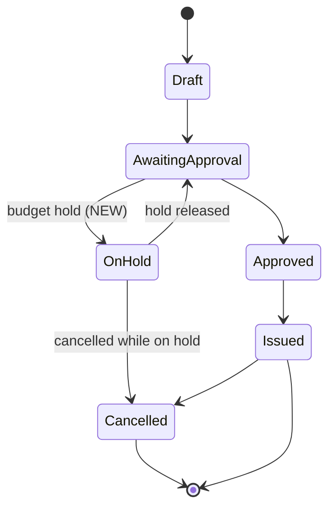





```fsharp
// Adding a new state to the PurchaseOrder DU: the compiler guides the migration.

type PurchaseOrderId = PurchaseOrderId of string

// ── BEFORE: Original state DU ─────────────────────────────────────────────────
type PoStatusBefore =
    | Draft | AwaitingApproval | Approved | Issued | Cancelled
// => Five states — all match expressions cover five cases

// ── AFTER: New OnHold state added ─────────────────────────────────────────────
type PoStatusAfter =
    | Draft | AwaitingApproval | Approved | Issued | Cancelled
    | OnHold of reason: string
    // => New state: PO is on hold pending budget confirmation
    // => reason: mandatory — tells reviewers why the PO is held

// Every match expression that used PoStatusBefore must now handle OnHold
// The compiler issues FS0025 (incomplete match) for any unupdated match:

let describeStatus (status: PoStatusAfter) : string =
    match status with
    | Draft            -> "Draft: being built"
    | AwaitingApproval -> "Awaiting manager approval"
    | Approved         -> "Approved: ready for issuance"
    | Issued           -> "Issued: sent to supplier"
    | Cancelled        -> "Cancelled"
    | OnHold reason    -> sprintf "On hold: %s" reason
    // => New case added — compiler verifies all six cases are covered

let canIssue (status: PoStatusAfter) : bool =
    match status with
    | Approved -> true
    // => Only Approved POs can be issued
    | Draft | AwaitingApproval | Issued | Cancelled | OnHold _ -> false
    // => All other states — including the new OnHold — cannot be issued
    // => OnHold _ uses wildcard for the reason string — reason is irrelevant for this check

// Test the new state
let statuses = [Draft; AwaitingApproval; Approved; Issued; Cancelled; OnHold "Budget freeze Q2"]
// => All six states including the new OnHold case

statuses |> List.iter (fun s ->
    printfn "%s | canIssue=%b" (describeStatus s) (canIssue s)
)
// => Output: Draft: being built | canIssue=false
// => Output: Awaiting manager approval | canIssue=false
// => Output: Approved: ready for issuance | canIssue=true
// => Output: Issued: sent to supplier | canIssue=false
// => Output: Cancelled | canIssue=false
// => Output: On hold: Budget freeze Q2 | canIssue=false
```





```clojure
;; Adding a new state to the PO lifecycle: Clojure's multimethod dispatch is open by design.
;; [F#: adding a DU case causes FS0025 compile errors at every unupdated match site]
;; [Clojure: adding a defmethod is additive — existing defmethods compile without change]
;; The trade-off: F# guarantees exhaustiveness at compile time; Clojure guarantees at test time.

(ns procurement.po-evolution)

;; ── BEFORE: Original dispatch table ──────────────────────────────────────────
;; defmulti dispatches on the :status keyword of the PO map
;; [F#: type PoStatusBefore = Draft | AwaitingApproval | Approved | Issued | Cancelled]
(defmulti describe-status :status)
;; => dispatch fn: extracts :status from the PO map — replaces DU pattern match

(defmethod describe-status :draft [_]             "Draft: being built")
;; => :draft handler — no payload to destructure; _ ignores the full map

(defmethod describe-status :awaiting-approval [_] "Awaiting manager approval")
;; => :awaiting-approval handler

(defmethod describe-status :approved [_]          "Approved: ready for issuance")
;; => :approved handler

(defmethod describe-status :issued [_]            "Issued: sent to supplier")
;; => :issued handler

(defmethod describe-status :cancelled [_]         "Cancelled")
;; => :cancelled handler — five methods cover the original five states

;; ── AFTER: New :on-hold state added additively ────────────────────────────────
;; No existing defmethod needs to change — open dispatch is additive by design
;; [F#: adding OnHold to PoStatusAfter forces every match site to add a new arm]
(defmethod describe-status :on-hold [{:keys [hold-reason]}]
  ;; Destructure :hold-reason from the PO map — the reason travels with the aggregate
  ;; [F#: OnHold of reason: string — reason is a DU payload field]
  (str "On hold: " hold-reason))
;; => :on-hold handler: new defmethod compiles without touching the five existing ones

;; can-issue? function: derives issuing eligibility from the PO status keyword
;; [F#: canIssue uses a match with an explicit OnHold _ wildcard arm]
;; Clojure: a set membership check scales to new statuses without updating the function
(defn can-issue? [po]
  ;; #{:approved} is the set of statuses that permit issuance
  ;; Adding :on-hold does not require changing this function
  (contains? #{:approved} (:status po)))
;; => Returns true only for :approved; all other statuses — including :on-hold — return false

;; ── TEST: all six states including the new :on-hold ──────────────────────────
(def statuses
  ;; Test data: six PO maps covering the complete extended lifecycle
  [{:status :draft}
   ;; => No payload — :draft is a simple state
   {:status :awaiting-approval}
   {:status :approved}
   {:status :issued}
   {:status :cancelled}
   {:status :on-hold :hold-reason "Budget freeze Q2"}])
   ;; => :on-hold carries :hold-reason — extra key ignored by all other handlers

(doseq [po statuses]
  ;; Iterate: print describe-status and can-issue? for each PO state
  (println (describe-status po) "| can-issue?" (can-issue? po)))
;; => Output: Draft: being built | can-issue? false
;; => Output: Awaiting manager approval | can-issue? false
;; => Output: Approved: ready for issuance | can-issue? true
;; => Output: Issued: sent to supplier | can-issue? false
;; => Output: Cancelled | can-issue? false
;; => Output: On hold: Budget freeze Q2 | can-issue? false
```





```typescript
// Domain Model Evolution — adding a new state to the PurchaseOrder lifecycle.
// [F#: adding a DU case — compiler surfaces every match that needs updating]
// [Clojure: adding a keyword to the closed set; TS: adding to literal union triggers exhaustiveness checks]

// ── BEFORE: PurchaseOrderStatus without Disputed ──────────────────────────────
type POStatusV1 = "Draft" | "Approved" | "Issued" | "Cancelled";

function describeStatusV1(s: POStatusV1): string {
  switch (s) {
    case "Draft":
      return "Being assembled";
    case "Approved":
      return "Approved — ready to issue";
    case "Issued":
      return "Sent to supplier";
    case "Cancelled":
      return "Voided";
  }
}

// ── AFTER: PurchaseOrderStatus with Disputed ──────────────────────────────────
type POStatusV2 = "Draft" | "Approved" | "Issued" | "Disputed" | "Cancelled";
// => NEW: "Disputed" — invoice-PO variance that failed three-way match

function assertNever(x: never): never {
  throw new Error(String(x));
}

function describeStatusV2(s: POStatusV2): string {
  switch (s) {
    case "Draft":
      return "Being assembled";
    case "Approved":
      return "Approved — ready to issue";
    case "Issued":
      return "Sent to supplier";
    case "Disputed":
      return "Under dispute — invoice/GRN variance";
    // => New case: TypeScript requires this arm; omitting it is a compile error
    case "Cancelled":
      return "Voided";
    default:
      return assertNever(s);
    // => assertNever catches any future additions that aren't handled
  }
}

// Evolution of transitions — Issued can now transition to Disputed
function canTransition(from: POStatusV2, to: POStatusV2): boolean {
  const allowed: Partial = {
    Draft: ["Approved", "Cancelled"],
    Approved: ["Issued", "Cancelled"],
    Issued: ["Disputed", "Cancelled"], // NEW: Issued -> Disputed
    Disputed: ["Issued", "Cancelled"], // NEW: can revert or cancel
  };
  return allowed[from]?.includes(to) ?? false;
}

console.log("Draft -> Approved:", canTransition("Draft", "Approved"));
// => Output: Draft -> Approved: true
console.log("Issued -> Disputed:", canTransition("Issued", "Disputed"));
// => Output: Issued -> Disputed: true
console.log("Dispute description:", describeStatusV2("Disputed"));
// => Output: Dispute description: Under dispute — invoice/GRN variance
```





```haskell
-- ── file: Procurement/PoEvolution.hs ───────────────────────────────────────
-- Adding a new state to the PO ADT — GHC warns about non-exhaustive patterns.
-- [F#: FS0025 incomplete match; Haskell uses -Wincomplete-patterns to surface gaps]
{-# OPTIONS_GHC -Wincomplete-patterns #-}
module Procurement.PoEvolution where

import Data.Text (Text)
import qualified Data.Text as T

-- ── BEFORE: Original state ADT ─────────────────────────────────────────────
data PoStatusBefore
  = DraftB | AwaitingApprovalB | ApprovedB | IssuedB | CancelledB
  deriving (Eq, Show)
-- => Five constructors — all case expressions cover five cases

-- ── AFTER: New OnHold state added with payload ─────────────────────────────
data PoStatusAfter
  = Draft | AwaitingApproval | Approved | Issued | Cancelled
  | OnHold Text
  -- => New constructor carries a mandatory reason
  deriving (Eq, Show)

-- Every case expression on PoStatusAfter must now handle OnHold.
-- GHC's -Wincomplete-patterns warns on any unupdated match.
describeStatus :: PoStatusAfter -> Text
describeStatus s = case s of
  Draft            -> "Draft: being built"
  AwaitingApproval -> "Awaiting manager approval"
  Approved         -> "Approved: ready for issuance"
  Issued           -> "Issued: sent to supplier"
  Cancelled        -> "Cancelled"
  OnHold reason    -> "On hold: " <> reason
  -- => New arm added — GHC verifies all six constructors are covered

canIssue :: PoStatusAfter -> Bool
canIssue Approved   = True
-- => Only Approved POs can be issued
canIssue OnHold {}  = False
-- => OnHold _ pattern matches the new constructor regardless of reason
canIssue _          = False
-- => Catch-all for remaining constructors (Draft/AwaitingApproval/Issued/Cancelled)

-- Test the new state
runDemo :: IO ()
runDemo = do
  let statuses = [Draft, AwaitingApproval, Approved, Issued, Cancelled, OnHold "Budget freeze Q2"]
  -- => All six states including the new OnHold case
  mapM_ (\s -> putStrLn (T.unpack (describeStatus s) <> " | canIssue=" <> show (canIssue s))) statuses
  -- => Output: Draft: being built | canIssue=False
  -- => Output: Awaiting manager approval | canIssue=False
  -- => Output: Approved: ready for issuance | canIssue=True
  -- => Output: Issued: sent to supplier | canIssue=False
  -- => Output: Cancelled | canIssue=False
  -- => Output: On hold: Budget freeze Q2 | canIssue=False
```





**Key Takeaway**: Adding a new state to a discriminated union makes the compiler issue FS0025 warnings on every unupdated match expression — the compiler produces a complete list of code paths that must handle the new state.

**Why It Matters**: In a live procurement system with a dozen engineers, adding `OnHold` to the PO state machine without the compiler's guidance means manually searching for every status check in the codebase. The F# compiler's exhaustive match checking turns this into a systematic, zero-miss compile-time audit. Every match expression that lacks an `OnHold` case will fail to compile — the migration is complete when the build is green.

---

### Example 80: Full System Sketch — Procurement Platform End-to-End

This final example sketches the full procurement platform system as a composition of the concepts from all 80 examples — types, workflows, events, repositories, ACLs, and the functional core / imperative shell boundary.





```fsharp
// End-to-end sketch: the procurement platform composed from all 80 examples.
// Shows how ubiquitous language, aggregates, events, ports, and workflows
// assemble into a coherent, type-safe, testable procurement system.

// ── TYPES (from beginner section) ───────────────────────────────────────────
type RequisitionId   = RequisitionId   of string  // => Typed wrapper for requisition IDs
type PurchaseOrderId = PurchaseOrderId of string  // => Typed wrapper for PO IDs
type SupplierId      = SupplierId      of string  // => Typed wrapper for supplier IDs
type ApprovalLevel   = L1 | L2 | L3
// => Ubiquitous language encoded as F# types — foundation of the system

// ── DOMAIN EVENTS (cross-context published language) ────────────────────────
type ProcurementEvent =
    | RequisitionSubmitted  of reqId: string * level: ApprovalLevel * total: decimal
    // => Trigger for purchasing to create a PO Draft
    | RequisitionApproved   of reqId: string * approvedAt: System.DateTimeOffset
    // => Approver confirmed; purchasing auto-creates a PO
    | PurchaseOrderIssued   of poId: string * supplierId: string * total: decimal
    // => PO sent to supplier; receiving opens a GRN expectation
    | GoodsReceived         of grnId: string * poId: string * hasDiscrepancy: bool
    // => Physical receipt confirmed; invoicing enables/blocks matching
    | InvoiceMatched        of invId: string * poId: string * amount: decimal
    // => Three-way match passed; payments schedules disbursement
    | PaymentDisbursed      of payId: string * poId: string * amount: decimal
    // => Bank confirmed disbursement; purchasing marks PO as Paid
// => Published language: the complete set of cross-context events

// ── PORTS (function-type aliases) ────────────────────────────────────────────
type LoadRequisition  = RequisitionId   -> Async<(string * decimal) option>
// => Returns (requestedBy, total) or None if not found
type SavePO           = PurchaseOrderId -> string -> decimal -> Async<unit>
// => Persists the Draft PO with its supplier ID and total
type PublishEvent     = ProcurementEvent -> Async<unit>
// => Publishes to the event bus (Kafka or outbox table)
// => Three representative ports — a full system would have all 14 from the spec

// ── PURE CORE (decisions and transitions) ────────────────────────────────────
let deriveLevel (total: decimal) : ApprovalLevel =
    if total <= 1000m then L1 elif total <= 10000m then L2 else L3
    // => Pure: no I/O — approval level from total

let buildPOId (reqId: string) : PurchaseOrderId =
    PurchaseOrderId ("po_" + System.Guid.NewGuid().ToString("N").[..7])
    // => Pure: generates a PO ID from the requisition reference (simplified)

// ── WORKFLOW (imperative shell orchestrating pure core + I/O) ────────────────
let approveCycle
    (loadReq:   LoadRequisition)
    (savePO:    SavePO)
    (publishEv: PublishEvent)
    (reqId:     RequisitionId)
    (supplierId: SupplierId)
    : Async<Result<PurchaseOrderId, string>> =
    async {
        // ── LOAD (I/O) ────────────────────────────────────────────────────
        let! reqOpt = loadReq reqId
        // => I/O: load the requisition from the repository
        match reqOpt with
        | None -> return Error (sprintf "Requisition %A not found" reqId)
        // => Short-circuit: no further I/O or domain logic
        | Some (requestedBy, total) ->
        // => Destructure: requestedBy = employee ID, total = requisition total

        // ── PURE CORE ──────────────────────────────────────────────────────
        let level = deriveLevel total
        // => Derive approval level — pure; L1/L2/L3 based on total
        let (RequisitionId rawReqId) = reqId
        // => Unwrap the typed RequisitionId to a raw string for event payload
        let (SupplierId rawSup) = supplierId
        // => Unwrap the typed SupplierId for the SavePO port call
        let poId = buildPOId rawReqId
        // => Generate PO ID — pure; deterministic in tests with fixed generator

        // ── SAVE + PUBLISH (I/O) ───────────────────────────────────────────
        do! savePO poId rawSup total
        // => I/O: persist the new Draft PO — effect at the edge
        let (PurchaseOrderId rawPoId) = poId
        // => Unwrap PO ID for the published event payload
        do! publishEv (RequisitionApproved (rawReqId, System.DateTimeOffset.UtcNow))
        // => Publish RequisitionApproved — purchasing reads this to track approval history
        do! publishEv (PurchaseOrderIssued (rawPoId, rawSup, total))
        // => Publish PurchaseOrderIssued — receiving opens GRN expectation on receipt
        return Ok poId
        // => Return the new PO ID to the caller
    }

// ── TEST (all stubs, pure logic verified independently) ───────────────────────
let publishedEvents = System.Collections.Generic.List<ProcurementEvent>()
// => Collect published events for assertion

let stubLoad _ = async { return Some ("emp_00456", 2699.97m) }
// => Stub load: returns a fixed requisition
let stubSave _ _ _ = async { return () }
// => Stub save: no-op
let stubPublish ev = async { publishedEvents.Add(ev); return () }
// => Stub publish: collects events for assertion

let result = Async.RunSynchronously
    (approveCycle stubLoad stubSave stubPublish (RequisitionId "req_f4c2") (SupplierId "sup_acme"))
// => All stubs succeed — workflow runs end-to-end

match result with
| Ok (PurchaseOrderId poId) ->
    printfn "PO created: po_%s" (poId.Replace("po_", ""))
    // => Output: PO created: po_...
| Error e -> printfn "Error: %s" e

printfn "Events published: %d" publishedEvents.Count
// => Output: Events published: 2
publishedEvents |> Seq.iter (printfn "  %A")
// => Output:   RequisitionApproved ("req_f4c2", 2026-...)
// => Output:   PurchaseOrderIssued ("po_...", "sup_acme", 2699.9700M)
```





```clojure
;; End-to-end sketch: the procurement platform composed from all 80 examples.
;; [F#: typed wrappers, DU events, function-type ports, async computation expression]
;; [Clojure: namespaced keywords, keyword maps, plain functions, threading macros]
;; Both achieve functional core / imperative shell — data in, data out, effects at edges.

(ns procurement.system-sketch
  (:require [clojure.string :as str]))

;; ── DOMAIN IDENTITY HELPERS ───────────────────────────────────────────────────
;; Clojure uses string IDs with namespace prefixes instead of typed wrappers
;; [F#: single-case DUs like RequisitionId of string enforce type safety at compile time]
;; [Clojure: convention-based prefixes + malli spec enforce correctness at validation boundary]
(defn requisition-id [raw] (str "req/" raw))
;; => Tags the raw string with a context prefix — aids debugging and logging

(defn purchase-order-id [raw] (str "po/" raw))
;; => "po/e3d1" form — distinguishes PO IDs from invoice or payment IDs in log output

(defn supplier-id [raw] (str "sup/" raw))
;; => "sup/acme" form — consistent tagging across all maps in the system

;; ── PURE CORE ─────────────────────────────────────────────────────────────────
;; derive-level: approval tier from the requisition total — no side effects
;; [F#: if-elif chain returning ApprovalLevel DU; Clojure: cond returning keyword]
(defn derive-level [total]
  ;; [F#: ApprovalLevel = L1 | L2 | L3; Clojure: :l1 :l2 :l3 keywords]
  (cond
    (<= total 1000)  :l1   ;; => L1: low-value — line-manager approval only
    (<= total 10000) :l2   ;; => L2: mid-value — departmental budget owner
    :else            :l3)) ;; => L3: high-value — CFO sign-off required

(defn build-po-id [_req-id]
  ;; Generate a short PO ID — simplified; production uses a UUID v7
  ;; [F#: PurchaseOrderId ("po_" + Guid...); Clojure: str concat with random-uuid]
  (purchase-order-id (subs (str (random-uuid)) 0 8)))
;; => "po/a1b2c3d4" — matches F# "po_" prefix convention adapted to Clojure "/" form

;; ── DOMAIN EVENTS ─────────────────────────────────────────────────────────────
;; Published language: constructor functions return plain maps with :event/type dispatch
;; [F#: ProcurementEvent DU with named tuple fields; Clojure: maps with :event/type key]
(defn evt-requisition-approved [req-id approved-at]
  ;; Approver confirmed; purchasing context reads this to auto-create a PO
  {:event/type       :requisition-approved
   :event/req-id     req-id       ;; => Identifies the approved requisition
   :event/approved-at approved-at}) ;; => Timestamp of approval — audit trail
;; => Analogous to F# RequisitionApproved case

(defn evt-purchase-order-issued [po-id supplier-id total]
  ;; PO sent to supplier; receiving context opens a GRN expectation on receipt
  {:event/type        :purchase-order-issued
   :event/po-id       po-id        ;; => Identifies the issued PO
   :event/supplier-id supplier-id  ;; => Beneficiary for goods delivery
   :event/total       total})      ;; => Contracted amount for receipt matching
;; => Analogous to F# PurchaseOrderIssued case

;; ── WORKFLOW ──────────────────────────────────────────────────────────────────
;; approve-cycle: imperative shell — loads, decides, saves, publishes
;; [F#: Async<Result<PurchaseOrderId, string>> with do! for each I/O step]
;; [Clojure: synchronous function; I/O via injected port functions; error via {:error ...}]
(defn approve-cycle [load-req-fn save-po-fn publish-ev-fn req-id supplier-id]
  ;; load-req-fn, save-po-fn, publish-ev-fn: injected ports — swappable in tests
  (let [req (load-req-fn req-id)]
    ;; => I/O: load the requisition from the repository port
    (if (nil? req)
      {:error (str "Requisition " req-id " not found")}
      ;; => Short-circuit: mirrors F# None → Error branch
      (let [{:keys [total]} req
            ;; => Destructure: total is the only field needed for pure core decisions
            level  (derive-level total)
            ;; => Pure: approval level from total — :l1/:l2/:l3
            po-id  (build-po-id req-id)
            ;; => Pure: generate PO ID
            now    (java.time.Instant/now)]
            ;; => Capture current timestamp once — used in both published events
        (save-po-fn po-id supplier-id total)
        ;; => I/O: persist the Draft PO — effect at the edge
        (publish-ev-fn (evt-requisition-approved req-id now))
        ;; => I/O: publish RequisitionApproved — purchasing tracks approval history
        (publish-ev-fn (evt-purchase-order-issued po-id supplier-id total))
        ;; => I/O: publish PurchaseOrderIssued — receiving opens GRN expectation
        {:ok true :po-id po-id :level level}))))
        ;; => Return success map with po-id and approval-level for the caller

;; ── TEST (all stubs, pure logic verified independently) ───────────────────────
(def published-events (atom []))
;; => atom: mutable accumulator for event assertions
;; [F#: System.Collections.Generic.List<ProcurementEvent>; Clojure: atom over a vector]

(defn stub-load [_req-id]
  ;; Stub load: returns a fixed requisition map
  {:requested-by "emp_00456" :total 2699.97})
;; => Mirrors F# stubLoad — supplies (requestedBy, total) without a real DB

(defn stub-save [_po-id _supplier-id _total]
  ;; Stub save: no-op — side effect suppressed in tests
  nil)
;; => Mirrors F# stubSave — unit return

(defn stub-publish [ev]
  ;; Stub publish: collects events for post-run assertion
  (swap! published-events conj ev))
;; => swap! appends the event to the atom vector; mirrors F# publishedEvents.Add(ev)

(def result
  ;; Run the full workflow with all stubs — no real I/O, no network, no DB
  (approve-cycle
    stub-load stub-save stub-publish
    (requisition-id "f4c2")
    (supplier-id "acme")))
;; => All stubs succeed — approve-cycle runs end-to-end with pure-function I/O substitutes

(if (:ok result)
  (println "PO created:" (:po-id result))
  ;; => Output: PO created: po/...
  (println "Error:" (:error result)))

(println "Events published:" (count @published-events))
;; => Output: Events published: 2
;; => @published-events dereferences the atom to read the collected event vector

(doseq [ev @published-events]
  ;; Print each published event type and its key fields
  (println " " (:event/type ev) (:event/po-id ev) (:event/total ev)))
;; => Output:   :requisition-approved req/f4c2 nil
;; => Output:   :purchase-order-issued po/... sup/acme 2699.97
```





```typescript
// Full system sketch — Procurement Platform end-to-end.
// [F#: a complete sketch wiring all contexts together in a single runnable example]
// [Clojure: composed namespaces in a single ns; TS: all contexts in one file for demonstration]

// Result type
type Result<T, E> = { readonly ok: true; readonly value: T } | { readonly ok: false; readonly error: E };
const okR = <T, E>(v: T): Result => ({ ok: true, value: v });
const errR = <T, E>(e: E): Result => ({ ok: false, error: e });

// ── All domain types (abbreviated) ────────────────────────────────────────────
type RequisitionId = string & { readonly __brand: "RequisitionId" };
type PurchaseOrderId = string & { readonly __brand: "PurchaseOrderId" };
type GRNId = string & { readonly __brand: "GRNId" };
type InvoiceId = string & { readonly __brand: "InvoiceId" };
const mkId = <T>(prefix: string): T => `${prefix}_${Math.random().toString(36).slice(2, 8)}` as T;

// ── Purchasing context ────────────────────────────────────────────────────────
function submitRequisition(requestedBy: string, total: number): Result {
  if (!requestedBy) return errR("requestedBy required");
  const level = total <= 1000 ? "L1" : total <= 10000 ? "L2" : "L3";
  return okR({ requisitionId: mkId<RequisitionId>("req"), level });
}

function issuePO(requisitionId: RequisitionId): Result {
  return okR(mkId<PurchaseOrderId>("po"));
  // => Simplified: creates PO from approved requisition
}

// ── Receiving context ─────────────────────────────────────────────────────────
function receiveGoods(poId: PurchaseOrderId, receivedTotal: number): Result {
  if (receivedTotal <= 0) return errR("Received total must be > 0");
  return okR(mkId<GRNId>("grn"));
}

// ── Invoicing context ─────────────────────────────────────────────────────────
function matchAndApproveInvoice(poTotal: number, invoiceTotal: number): Result {
  const variance = Math.abs(invoiceTotal - poTotal) / poTotal;
  if (variance > 0.05) return errR(`Variance ${(variance * 100).toFixed(1)}% exceeds 5% tolerance`);
  return okR(mkId<InvoiceId>("inv"));
}

// ── End-to-end procurement pipeline ──────────────────────────────────────────
function runProcurementPipeline(requestedBy: string, poTotal: number, invoiceTotal: number): string {
  const step1 = submitRequisition(requestedBy, poTotal);
  if (!step1.ok) return `Step 1 failed: ${step1.error}`;
  console.log(`  Requisition ${step1.value.requisitionId} — ${step1.value.level} approval`);
  // => Step 1: Submit requisition, derive approval level

  const step2 = issuePO(step1.value.requisitionId);
  if (!step2.ok) return `Step 2 failed: ${step2.error}`;
  console.log(`  PO ${step2.value} issued`);
  // => Step 2: Issue Purchase Order to supplier

  const step3 = receiveGoods(step2.value, poTotal);
  if (!step3.ok) return `Step 3 failed: ${step3.error}`;
  console.log(`  GRN ${step3.value} created`);
  // => Step 3: Receive goods, create GRN

  const step4 = matchAndApproveInvoice(poTotal, invoiceTotal);
  if (!step4.ok) return `Step 4 failed: ${step4.error}`;
  console.log(`  Invoice ${step4.value} approved — three-way match passed`);
  // => Step 4: Three-way match PO/GRN/Invoice, approve for payment

  return `Pipeline complete — Invoice ${step4.value} ready for payment`;
}

console.log("=== Procurement Platform End-to-End ===");
const outcome = runProcurementPipeline("emp_00456", 2784.97, 2784.97);
console.log(outcome);
// => Output:
// =>   Requisition req_... — L2 approval
// =>   PO po_... issued
// =>   GRN grn_... created
// =>   Invoice inv_... approved — three-way match passed
// =>   Pipeline complete — Invoice inv_... ready for payment
```





```haskell
-- ── file: Procurement/SystemSketch.hs ──────────────────────────────────────
-- End-to-end sketch: procurement platform composed from all 80 examples.
-- [F#: typed wrappers, DU events, async; Haskell uses newtypes, sum types, IO]
{-# LANGUAGE OverloadedStrings #-}
module Procurement.SystemSketch where

import           Data.IORef        (IORef, newIORef, modifyIORef, readIORef)
import           Data.Text         (Text)
import qualified Data.Text         as T
import           Data.Time         (UTCTime, getCurrentTime)

-- ── TYPES (newtype wrappers — ubiquitous language) ─────────────────────────
newtype RequisitionId   = RequisitionId   Text deriving (Eq, Show)
-- => Single-constructor newtype: zero runtime cost, full compile-time safety
newtype PurchaseOrderId = PurchaseOrderId Text deriving (Eq, Show)
-- => Distinct type from RequisitionId — cannot be swapped at call sites
newtype SupplierId      = SupplierId      Text deriving (Eq, Show)
-- => Type-system enforced identity boundary across the platform

data ApprovalLevel = L1 | L2 | L3 deriving (Eq, Show)
-- => Sum type ADT — exhaustive pattern matching guaranteed by GHC

-- ── DOMAIN EVENTS (cross-context published language) ───────────────────────
data ProcurementEvent
  = RequisitionApproved   Text UTCTime
  -- => Approver confirmed; purchasing auto-creates a PO
  | PurchaseOrderIssued   Text Text Rational
  -- => PO sent to supplier; receiving opens a GRN expectation
  | GoodsReceived         Text Text Bool
  -- => Physical receipt confirmed; invoicing enables/blocks matching
  | InvoiceMatched        Text Text Rational
  -- => Three-way match passed; payments schedules disbursement
  deriving (Show)
-- => Published language: complete set of cross-context events

-- ── PORTS (function-type aliases) ──────────────────────────────────────────
type LoadRequisition  = RequisitionId   -> IO (Maybe (Text, Rational))
-- => Returns (requestedBy, total) or Nothing if not found
type SavePO           = PurchaseOrderId -> Text -> Rational -> IO ()
-- => Persists the Draft PO with its supplier ID and total
type PublishEvent     = ProcurementEvent -> IO ()
-- => Publishes to the event bus (Kafka or outbox table)

-- ── PURE CORE (decisions and transitions) ──────────────────────────────────
deriveLevel :: Rational -> ApprovalLevel
deriveLevel total
  | total <= 1000  = L1
  | total <= 10000 = L2
  | otherwise      = L3
-- => Pure: no IO — approval level from total

buildPOId :: Text -> PurchaseOrderId
buildPOId reqId = PurchaseOrderId ("po_" <> T.take 8 reqId)
-- => Pure: deterministic in tests when reqId is fixed

-- ── WORKFLOW (imperative shell orchestrating pure core + IO) ───────────────
approveCycle :: LoadRequisition -> SavePO -> PublishEvent
             -> RequisitionId -> SupplierId
             -> IO (Either Text PurchaseOrderId)
approveCycle loadReq savePO publishEv reqId@(RequisitionId rawReq) (SupplierId rawSup) = do
  reqOpt <- loadReq reqId
  -- => IO: load the requisition from the repository port
  case reqOpt of
    Nothing -> pure (Left ("Requisition not found: " <> rawReq))
    -- => Short-circuit: no further IO or domain logic
    Just (_requestedBy, total) -> do
      -- => Destructure: total drives the pure-core decisions
      let !level = deriveLevel total
          -- => Pure: approval tier; bang-pattern forces evaluation
          poId@(PurchaseOrderId rawPo) = buildPOId rawReq
          -- => Pure: derive PO id; deterministic
      savePO poId rawSup total
      -- => IO: persist the Draft PO — effect at the edge
      now <- getCurrentTime
      -- => Single timestamp shared across both published events
      publishEv (RequisitionApproved rawReq now)
      -- => IO: publish RequisitionApproved
      publishEv (PurchaseOrderIssued rawPo rawSup total)
      -- => IO: publish PurchaseOrderIssued
      _ <- pure level  -- avoid unused-binding warning; level travels with PO in real code
      pure (Right poId)
      -- => Return the new PO ID to the caller

-- ── TEST (all stubs, pure logic verified independently) ─────────────────────
runDemo :: IO ()
runDemo = do
  events <- newIORef ([] :: [ProcurementEvent])
  -- => IORef accumulates events for post-run assertion
  let stubLoad _      = pure (Just ("emp_00456", 2699.97))
      -- => Stub load: returns a fixed requisition
      stubSave _ _ _  = pure ()
      -- => Stub save: no-op
      stubPublish ev  = modifyIORef events (ev :)
      -- => Stub publish: prepends event for assertion
  result <- approveCycle stubLoad stubSave stubPublish
                         (RequisitionId "req_f4c2") (SupplierId "sup_acme")
  case result of
    Right (PurchaseOrderId p) -> putStrLn ("PO created: " <> T.unpack p)
    -- => Output: PO created: po_req_f4c2
    Left e                    -> putStrLn ("Error: " <> T.unpack e)
  collected <- readIORef events
  putStrLn ("Events published: " <> show (length collected))
  -- => Output: Events published: 2
  mapM_ (putStrLn . ("  " <>) . show) (reverse collected)
  -- => Output:   RequisitionApproved "req_f4c2" ...
  -- => Output:   PurchaseOrderIssued "po_req_f4c2" "sup_acme" (2699.97 :: Rational)
```





**Key Takeaway**: The complete procurement platform assembles from the same building blocks introduced in Example 1 — type aliases, discriminated unions, smart constructors, domain events, function-type ports, pure core decisions, and an imperative shell — demonstrating that the architecture scales from a single value object to a full P2P system.

**Why It Matters**: Every concept in this 80-example series is load-bearing in a real procurement platform. The `RequisitionId` wrapper from Example 7 prevents ID confusion in the `approveCycle` shell. The `deriveLevel` function from Example 5 is the compliance-critical approval routing rule. The `ProcurementEvent` published language from Example 63 is the cross-context integration contract. Functional DDD is not an academic exercise — it is a systematic method for building procurement systems that are correct, auditable, and maintainable at scale.
