This intermediate section builds on the type vocabulary from the beginner section and introduces the pipeline mechanics that make functional DDD compelling in practice: function composition, Railway-Oriented Programming, the `PurchaseOrder` state machine, domain events (`PurchaseOrderIssued`, `RequisitionApproved`), and pushing effects to the edges.

## Function Composition and Pipelines (Examples 26–29)

### Example 26: Function Composition with >>

The `>>` operator composes two functions into one. It is the mathematical composition operator: `(f >> g) x = g(f(x))`. In procurement workflows, composition lets you assemble a pipeline from individually testable steps.

**Pipeline stages**:

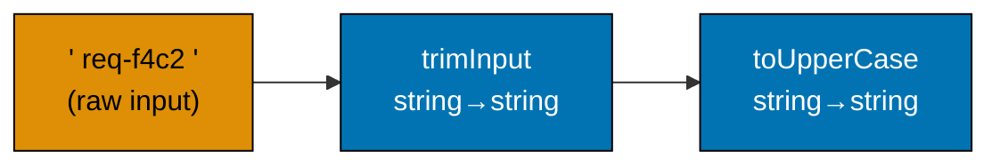

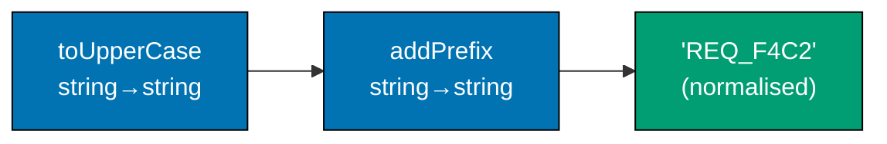





```fsharp
// >> is the forward composition operator: f >> g means "apply f then g".
// Each step is a pure function; the pipeline is their composition.

// Individual pipeline steps — each is a pure function, independently testable
let trimInput (s: string) : string =
    s.Trim()
    // => Removes leading and trailing whitespace from raw user input

let toUpperCase (s: string) : string =
    s.ToUpperInvariant()
    // => Normalises to uppercase for consistent storage in the requisition database

let normaliseReqId (s: string) : string =
    "REQ_" + s.Replace("-", "_")
    // => Applies the canonical requisition ID prefix and replaces hyphens with underscores

// Composing three steps into one function using >>
let normaliseRequisitionId : string -> string =
    trimInput >> toUpperCase >> normaliseReqId
    // => Reads left to right: trim, then uppercase, then normalise
    // => normaliseRequisitionId : string -> string — three functions become one

// Test the composed function
let raw = "  req-f4c2  "
// => raw : string = "  req-f4c2  " — has leading/trailing whitespace and hyphens
let normalised = normaliseRequisitionId raw
// => Step 1: trimInput "  req-f4c2  " = "req-f4c2"
// => Step 2: toUpperCase "req-f4c2" = "REQ-F4C2"
// => Step 3: normaliseReqId "REQ-F4C2" = "REQ_F4C2"
// => normalised = "REQ_F4C2"

printfn "Raw: '%s'" raw
// => Output: Raw: '  req-f4c2  '
printfn "Normalised: '%s'" normalised
// => Output: Normalised: 'REQ_F4C2'

// Each step can be tested independently
printfn "Trim only: '%s'" (trimInput raw)
// => Output: Trim only: 'req-f4c2'
```





```clojure
;; [F#: >> operator — left-to-right composition; Clojure uses comp (right-to-left) or -> threading macro]
;; comp in Clojure composes functions right-to-left; -> macro threads data left-to-right.
;; For left-to-right composition of named functions, comp reverses the argument order.

;; Individual pipeline steps — each is a pure function, independently testable
(defn trim-input [s]
  ;; clojure.string/trim removes leading and trailing whitespace
  (clojure.string/trim s))
  ;; => Returns the trimmed string; "  req-f4c2  " => "req-f4c2"

(defn to-upper-case [s]
  ;; clojure.string/upper-case normalises to uppercase for consistent storage
  (clojure.string/upper-case s))
  ;; => "req-f4c2" => "REQ-F4C2"

(defn normalise-req-id [s]
  ;; Applies the canonical REQ_ prefix and replaces hyphens with underscores
  (str "REQ_" (clojure.string/replace s "-" "_")))
  ;; => "REQ-F4C2" => "REQ_F4C2"

;; Composing three steps using comp — note: comp applies right-to-left
;; so arguments are listed in reverse execution order vs F#'s >>
(def normalise-requisition-id
  ;; comp returns a new function; call order: trim-input first, then to-upper-case, then normalise-req-id
  (comp normalise-req-id to-upper-case trim-input))
  ;; => normalise-requisition-id is a composed fn: string -> string

;; Test the composed function
(def raw "  req-f4c2  ")
;; => raw = "  req-f4c2  " — has leading/trailing whitespace and hyphens

(def normalised (normalise-requisition-id raw))
;; => Step 1: trim-input "  req-f4c2  " = "req-f4c2"
;; => Step 2: to-upper-case "req-f4c2" = "REQ-F4C2"
;; => Step 3: normalise-req-id "REQ-F4C2" = "REQ_F4C2"
;; => normalised = "REQ_F4C2"

(println (str "Raw: '" raw "'"))
;; => Output: Raw: '  req-f4c2  '
(println (str "Normalised: '" normalised "'"))
;; => Output: Normalised: 'REQ_F4C2'

;; Each step can be tested independently
(println (str "Trim only: '" (trim-input raw) "'"))
;; => Output: Trim only: 'req-f4c2'
```





```typescript
// Function composition with pipe — left-to-right function chaining.
// [F#: >> operator for left-to-right composition; TS uses explicit helper or chaining]
// [Clojure: comp (right-to-left) or -> threading macro; TS mirrors the pipe pattern]

// Compose helper: applies functions left-to-right (mirrors F# >>)
const pipe =
  <T>(...fns: Array) =>
  (x: T): T =>
    fns.reduce((v, f) => f(v), x);
// => pipe(f, g, h)(x) = h(g(f(x))) — matches F# f >> g >> h

// Individual pipeline steps — each is a pure function, independently testable
const trimInput = (s: string): string => s.trim();
// => Removes leading and trailing whitespace from raw user input

const toUpperCase = (s: string): string => s.toUpperCase();
// => Normalises to uppercase for consistent storage in the requisition database

const normaliseReqId = (s: string): string => `REQ_${s.replace(/-/g, "_")}`;
// => Applies the canonical REQ_ prefix and replaces hyphens with underscores

// Composing three steps into one function using pipe
const normaliseRequisitionId = pipe(trimInput, toUpperCase, normaliseReqId);
// => Reads left to right: trim, then uppercase, then normalise
// => normaliseRequisitionId : string -> string — three functions become one

// Test the composed function
const raw = "  req-f4c2  ";
// => raw : string = "  req-f4c2  " — has leading/trailing whitespace and hyphens
const normalised = normaliseRequisitionId(raw);
// => Step 1: trimInput "  req-f4c2  " = "req-f4c2"
// => Step 2: toUpperCase "req-f4c2" = "REQ-F4C2"
// => Step 3: normaliseReqId "REQ-F4C2" = "REQ_F4C2"
// => normalised = "REQ_F4C2"

console.log(`Raw: '${raw}'`);
// => Output: Raw: '  req-f4c2  '
console.log(`Normalised: '${normalised}'`);
// => Output: Normalised: 'REQ_F4C2'

// Each step can be tested independently
console.log(`Trim only: '${trimInput(raw)}'`);
// => Output: Trim only: 'req-f4c2'
```





```haskell
-- ── file: NormaliseRequisitionId.hs ──
-- [F#: >> for left-to-right composition — Haskell uses . (right-to-left) or >>> from Control.Category for left-to-right]
-- [Clojure: comp right-to-left, -> threading macro; Haskell mirrors comp via . and provides >>> for left-to-right reading]
import Data.Char (toUpper)             -- toUpper :: Char -> Char, used to uppercase a single character
import Data.Text (Text)                -- Text is the canonical efficient string type in production Haskell
import qualified Data.Text as T        -- qualified import keeps Text functions namespaced
import Control.Category ((>>>))        -- >>> is left-to-right composition, the direct analogue of F#'s >>

-- Individual pipeline steps — each is a pure function, independently testable
trimInput :: Text -> Text              -- Type signature reads "Text in, Text out"
trimInput = T.strip                    -- T.strip removes leading and trailing whitespace
-- => trimInput "  req-f4c2  " == "req-f4c2"

toUpperCase :: Text -> Text            -- Convert all characters to uppercase
toUpperCase = T.toUpper                -- T.toUpper is the Text-specific uppercase function
-- => toUpperCase "req-f4c2" == "REQ-F4C2"

normaliseReqId :: Text -> Text         -- Apply REQ_ prefix and replace hyphens with underscores
normaliseReqId s = "REQ_" <> T.replace "-" "_" s
                                       -- <> is the Semigroup append operator, equivalent to ++ for Text
-- => normaliseReqId "REQ-F4C2" == "REQ_F4C2"

-- Composing three steps using >>> — reads left-to-right like F#'s >>
normaliseRequisitionId :: Text -> Text
normaliseRequisitionId = trimInput >>> toUpperCase >>> normaliseReqId
                                       -- Equivalent: normaliseReqId . toUpperCase . trimInput
-- => normaliseRequisitionId : Text -> Text — three functions become one

-- Test the composed function
raw :: Text
raw = "  req-f4c2  "                   -- Raw user input with whitespace and hyphens
-- => raw == "  req-f4c2  "

normalised :: Text
normalised = normaliseRequisitionId raw
-- => Step 1: trimInput  -> "req-f4c2"
-- => Step 2: toUpperCase -> "REQ-F4C2"
-- => Step 3: normaliseReqId -> "REQ_F4C2"
-- => normalised == "REQ_F4C2"

main :: IO ()                          -- IO () is the entry point; printing is the only effect here
main = do
  putStrLn $ "Raw: '" <> T.unpack raw <> "'"
  -- => Output: Raw: '  req-f4c2  '
  putStrLn $ "Normalised: '" <> T.unpack normalised <> "'"
  -- => Output: Normalised: 'REQ_F4C2'
  putStrLn $ "Trim only: '" <> T.unpack (trimInput raw) <> "'"
  -- => Output: Trim only: 'req-f4c2'
```





**Key Takeaway**: The `>>` operator composes functions left-to-right, producing a single function from a sequence of steps, each of which can be tested and reasoned about independently.

**Why It Matters**: Composed pipelines replace long chains of intermediate `let` bindings with a single, readable declaration of intent. Each step in the composition is independently testable — you can unit test `trimInput`, `toUpperCase`, and `normaliseReqId` in isolation, then compose them with confidence. When a new normalisation step is needed (e.g., stripping special characters), it is inserted into the composition chain and the compiler verifies type alignment automatically.

---

### Example 27: Pipe Operator |>

The `|>` (pipe) operator passes a value as the last argument to a function: `x |> f = f x`. It enables a left-to-right reading of data transformations, matching how procurement domain experts describe workflows — "take the requisition, validate it, compute the total, derive the approval level."





```fsharp
// |> is the forward pipe operator: x |> f = f x.
// Enables left-to-right reading of data transformations.

type ApprovalLevel = L1 | L2 | L3
// => Three approval tiers in the procurement domain

// Pure domain functions
let validateNotEmpty (s: string) : string option =
    if System.String.IsNullOrWhiteSpace(s) then None
    else Some (s.Trim())
    // => Returns None for blank/whitespace, Some trimmed string for valid input

let computeLineTotal (qty: int) (price: decimal) : decimal =
    decimal qty * price
    // => Pure arithmetic — no side effects

let sumLineTotals (totals: decimal list) : decimal =
    List.sum totals
    // => Sum a list of decimal line totals into a requisition total

let deriveLevel (total: decimal) : ApprovalLevel =
    if total <= 1000m then L1
    elif total <= 10000m then L2
    else L3
    // => Pure derivation — same input always produces same output

// Reading a pipeline left-to-right using |>
let rawLines = [(10, 8.50m); (3, 899.99m); (5, 25.00m)]
// => rawLines : (int * decimal) list — (quantity, unitPrice) tuples

let approvalLevel =
    rawLines
    |> List.map (fun (qty, price) -> computeLineTotal qty price)
    // => Maps each (qty, price) to its line total: [85.00; 2699.97; 125.00]
    |> sumLineTotals
    // => Sums the list: 85.00 + 2699.97 + 125.00 = 2909.97
    |> deriveLevel
    // => 2909.97 > 1000 and <= 10000 — ApprovalLevel = L2
// => approvalLevel : ApprovalLevel = L2

printfn "Approval level: %A" approvalLevel
// => Output: Approval level: L2

// Contrast: without |>, the nesting reads right-to-left (inside-out)
let approvalLevelNested =
    deriveLevel (sumLineTotals (List.map (fun (qty, price) -> computeLineTotal qty price) rawLines))
// => Same result, but reads right-to-left — harder to follow
// => approvalLevelNested : ApprovalLevel = L2
printfn "Same result: %A" approvalLevelNested
// => Output: Same result: L2
```





```clojure
;; [F#: |> pipe operator — Clojure uses ->> (thread-last) for sequence pipelines]
;; ->> threads the value as the LAST argument of each form, matching how map/filter/reduce expect data.

;; Pure domain functions — each accepts and returns plain values
(defn compute-line-total [qty price]
  ;; Pure arithmetic: quantity multiplied by unit price
  (* qty price))
  ;; => (compute-line-total 10 8.50M) => 85.00M

(defn sum-line-totals [totals]
  ;; Reduces a sequence of line totals to a single sum
  (reduce + totals))
  ;; => (sum-line-totals [85.00M 2699.97M 125.00M]) => 2909.97M

(defn derive-level [total]
  ;; Pure derivation: same input always produces same output
  (cond
    (<= total 1000M)  :l1
    ;; => Totals up to $1,000 require L1 approval
    (<= total 10000M) :l2
    ;; => Totals up to $10,000 require L2 approval
    :else             :l3))
    ;; => Totals over $10,000 require L3 approval (CFO)

;; Reading a pipeline left-to-right using ->>
(def raw-lines [[10 8.50M] [3 899.99M] [5 25.00M]])
;; => raw-lines: vector of [qty price] pairs

(def approval-level
  ;; ->> threads raw-lines as the last arg through each transformation
  (->> raw-lines
       (map (fn [[qty price]] (compute-line-total qty price)))
       ;; => Maps each [qty price] to its line total: (85.00 2699.97 125.00)
       sum-line-totals
       ;; => Sums: 85.00 + 2699.97 + 125.00 = 2909.97
       derive-level))
       ;; => 2909.97 > 1000 and <= 10000 => :l2
;; => approval-level = :l2

(println "Approval level:" approval-level)
;; => Output: Approval level: :l2

;; Contrast: without ->>, the nesting reads inside-out (right-to-left)
(def approval-level-nested
  (derive-level (sum-line-totals (map (fn [[qty price]] (compute-line-total qty price)) raw-lines))))
;; => Same result, but reads inside-out — harder to follow
;; => approval-level-nested = :l2
(println "Same result:" approval-level-nested)
;; => Output: Same result: :l2
```





```typescript
// Pipe operator — passes a value through a sequence of functions left-to-right.
// [F#: x |> f = f(x) — built-in syntax; TS uses a pipe helper function]
// [Clojure: -> threading macro — same left-to-right semantics; TS mirrors this with reduce]

type ApprovalLevel = "L1" | "L2" | "L3";
// => Three approval tiers in the procurement domain

// Pure domain functions
const validateNotEmpty = (s: string): string | null => (s.trim().length > 0 ? s.trim() : null);
// => Returns null for blank/whitespace — mirrors F# None; string for valid input

const computeLineTotal = (qty: number, price: number): number => qty * price;
// => Pure arithmetic — no side effects

const sumLineTotals = (totals: number[]): number => totals.reduce((a, b) => a + b, 0);
// => Sum a list of number line totals into a requisition total

const deriveLevel = (total: number): ApprovalLevel => (total <= 1000 ? "L1" : total <= 10000 ? "L2" : "L3");
// => Pure derivation — same input always produces same output

// Reading a pipeline left-to-right using explicit chaining
const rawLines: Array = [
  [10, 8.5],
  [3, 899.99],
  [5, 25.0],
];
// => rawLines : [quantity, unitPrice][] — (quantity, unitPrice) pairs

const approvalLevel = deriveLevel(
  sumLineTotals(
    rawLines.map(([qty, price]) => computeLineTotal(qty, price)),
    // => Maps each [qty, price] to its line total: [85.00, 2699.97, 125.00]
  ),
  // => sumLineTotals([85.00, 2699.97, 125.00]) = 2909.97
);
// => deriveLevel(2909.97) — 2909.97 > 1000 and <= 10000 — "L2"

console.log("Approval level:", approvalLevel);
// => Output: Approval level: L2

// Cleaner with an explicit pipe helper
const pipe2 = <A, B, C, D>(a: A, f: (x: A) => B, g: (x: B) => C, h: (x: C) => D): D => h(g(f(a)));
// => pipe2(value, step1, step2, step3) mirrors F# value |> step1 |> step2 |> step3

const approvalLevelV2 = pipe2(
  rawLines,
  (lines) => lines.map(([qty, price]) => computeLineTotal(qty, price)),
  // => [85.00, 2699.97, 125.00]
  sumLineTotals,
  // => 2909.97
  deriveLevel,
  // => "L2"
);

console.log("Approval level v2:", approvalLevelV2);
// => Output: Approval level v2: L2
```





```haskell
-- ── file: ApprovalPipeline.hs ─────────
-- [F#: |> forward pipe — Haskell uses & (Data.Function) for left-to-right, or $ for right-to-left function application]
-- [Clojure: ->> thread-last — Haskell's & gives equivalent left-to-right reading at the value level]
import Data.Function ((&))               -- & is the flipped $: x & f == f x, mirroring F#'s |>
import Data.List (foldl')                -- strict left fold for summing without thunk build-up

data ApprovalLevel = L1 | L2 | L3 deriving (Show, Eq)
-- => Three approval tiers; deriving Show lets us print them, Eq supports equality checks

-- Pure domain functions — no IO, fully testable
validateNotEmpty :: String -> Maybe String
validateNotEmpty s
  | null (dropWhile (== ' ') s) = Nothing  -- treat whitespace-only as Nothing
  | otherwise = Just (dropWhile (== ' ') (reverse (dropWhile (== ' ') (reverse s))))
                                         -- => Returns Just trimmed for valid input, Nothing for empty

computeLineTotal :: Int -> Double -> Double
computeLineTotal qty price = fromIntegral qty * price
                                         -- fromIntegral converts Int -> Double for the multiplication
-- => Pure arithmetic — quantity times unit price

sumLineTotals :: [Double] -> Double
sumLineTotals = foldl' (+) 0             -- strict sum avoids space leak
-- => sumLineTotals [85.00, 2699.97, 125.00] == 2909.97

deriveLevel :: Double -> ApprovalLevel
deriveLevel total
  | total <= 1000  = L1                  -- Up to $1,000 — L1 line manager approval
  | total <= 10000 = L2                  -- Up to $10,000 — L2 department head
  | otherwise      = L3                  -- Over $10,000 — L3 CFO sign-off
-- => Pure derivation — referentially transparent

-- Reading a pipeline left-to-right using & (Haskell's pipe)
rawLines :: [(Int, Double)]
rawLines = [(10, 8.50), (3, 899.99), (5, 25.00)]
-- => list of (quantity, unitPrice) pairs

approvalLevel :: ApprovalLevel
approvalLevel =
  rawLines
    & map (uncurry computeLineTotal)     -- uncurry adapts the curried fn to take a pair
    -- => maps to [85.00, 2699.97, 125.00]
    & sumLineTotals
    -- => 85.00 + 2699.97 + 125.00 == 2909.97
    & deriveLevel
    -- => 2909.97 is > 1000 and <= 10000, so result is L2
-- => approvalLevel == L2

-- Contrast: without &, the nesting reads right-to-left via function application
approvalLevelNested :: ApprovalLevel
approvalLevelNested =
  deriveLevel (sumLineTotals (map (uncurry computeLineTotal) rawLines))
-- => Same answer, less readable composition direction
-- => approvalLevelNested == L2

main :: IO ()
main = do
  putStrLn $ "Approval level: " <> show approvalLevel
  -- => Output: Approval level: L2
  putStrLn $ "Same result: " <> show approvalLevelNested
  -- => Output: Same result: L2
```





**Key Takeaway**: The `|>` operator enables left-to-right pipeline reading that matches how procurement domain experts describe workflows, making code readable without sacrificing functional purity.

**Why It Matters**: The pipe operator is one of F#'s most-cited readability features. In a procurement context, the pipeline `rawLines |> computeTotals |> sumTotals |> deriveLevel` reads exactly like the domain description: "take the lines, compute their totals, sum them, then determine the approval level." This alignment between code and domain description reduces the translation overhead between domain expert and developer, a core goal of DDD.

---

### Example 28: Currying — Every Function is One-Arg

Every F# function technically takes one argument and returns a function or a value. This is currying. It enables partial application: supplying some arguments up front to produce a specialised function. In the procurement domain, partial application injects dependencies like approval thresholds into workflow functions.





```fsharp
// Every multi-argument F# function is syntactic sugar for a chain of one-arg functions.
// This enables partial application: supply some args to get a specialised function.

// A two-argument function
let applyApprovalThreshold (threshold: decimal) (total: decimal) : bool =
    // => applyApprovalThreshold : decimal -> decimal -> bool
    // => The arrow type shows the curried structure: threshold → (total → bool)
    total > threshold
    // => Returns true if the total exceeds the threshold — triggers escalation

// Partial application: supply the threshold, get back a (decimal -> bool) function
let requiresL2Approval : decimal -> bool =
    applyApprovalThreshold 1000m
    // => requiresL2Approval : decimal -> bool
    // => The threshold 1000m is baked in — only the total is needed at call time

let requiresL3Approval : decimal -> bool =
    applyApprovalThreshold 10000m
    // => requiresL3Approval : decimal -> bool
    // => The threshold 10000m is baked in

// Use the specialised functions
let total1 = 500m
// => total1 : decimal = 500 — under both thresholds
let total2 = 5000m
// => total2 : decimal = 5000 — over L2 threshold but under L3
let total3 = 50000m
// => total3 : decimal = 50000 — over both thresholds

printfn "$500: L2=%b, L3=%b" (requiresL2Approval total1) (requiresL3Approval total1)
// => 500 > 1000 = false; 500 > 10000 = false
// => Output: $500: L2=false, L3=false

printfn "$5000: L2=%b, L3=%b" (requiresL2Approval total2) (requiresL3Approval total2)
// => 5000 > 1000 = true; 5000 > 10000 = false
// => Output: $5000: L2=true, L3=false

printfn "$50000: L2=%b, L3=%b" (requiresL2Approval total3) (requiresL3Approval total3)
// => 50000 > 1000 = true; 50000 > 10000 = true
// => Output: $50000: L2=true, L3=true
```





```clojure
;; [F#: automatic currying — every multi-arg fn is curried by default; Clojure uses partial explicitly]
;; Clojure functions are NOT automatically curried; partial creates a specialised function from any fn.

;; A two-argument function — threshold and total are both required here
(defn apply-approval-threshold [threshold total]
  ;; Returns true if the requisition total exceeds the configured threshold
  (> total threshold))
  ;; => (apply-approval-threshold 1000M 500M) => false
  ;; => (apply-approval-threshold 1000M 5000M) => true

;; Partial application: bake in the threshold, return a (total -> bool) function
(def requires-l2-approval
  ;; partial returns a new fn with threshold already bound to 1000M
  (partial apply-approval-threshold 1000M))
  ;; => requires-l2-approval expects a single total argument
  ;; => Equivalent of F#'s applyApprovalThreshold 1000m

(def requires-l3-approval
  ;; Threshold 10000M is baked in — only total needed at call time
  (partial apply-approval-threshold 10000M))
  ;; => requires-l3-approval : total -> bool (threshold fixed at 10000M)

;; Use the specialised functions
(def total1 500M)
;; => total1 = 500M — under both thresholds
(def total2 5000M)
;; => total2 = 5000M — over L2 threshold but under L3
(def total3 50000M)
;; => total3 = 50000M — over both thresholds

(println "$500: L2=" (requires-l2-approval total1) "L3=" (requires-l3-approval total1))
;; => 500 > 1000 = false; 500 > 10000 = false
;; => Output: $500: L2= false L3= false

(println "$5000: L2=" (requires-l2-approval total2) "L3=" (requires-l3-approval total2))
;; => 5000 > 1000 = true; 5000 > 10000 = false
;; => Output: $5000: L2= true L3= false

(println "$50000: L2=" (requires-l3-approval total3) "L3=" (requires-l3-approval total3))
;; => 50000 > 1000 = true; 50000 > 10000 = true
;; => Output: $50000: L2= true L3= true
```





```typescript
// Currying via closures — functions that return functions.
// [F#: automatic currying — every multi-arg fn is curried by default]
// [Clojure: partial creates specialised functions; TS curries manually with arrow functions]

// A curried threshold function — returns a (total -> boolean) when given a threshold
const applyApprovalThreshold =
  (threshold: number) =>
  (total: number): boolean =>
    total > threshold;
// => applyApprovalThreshold : number -> (number -> boolean)
// => First call binds the threshold; second call tests the total

// Partial application: supply the threshold, get back a specialised function
const requiresL2Approval = applyApprovalThreshold(1000);
// => requiresL2Approval : (total: number) => boolean
// => The threshold 1000 is baked in — only the total is needed at call time

const requiresL3Approval = applyApprovalThreshold(10000);
// => requiresL3Approval : (total: number) => boolean
// => The threshold 10000 is baked in

// Use the specialised functions
const total1 = 500;
// => under both thresholds
const total2 = 5000;
// => over L2 threshold but under L3
const total3 = 50000;
// => over both thresholds

console.log(`$500: L2=${requiresL2Approval(total1)}, L3=${requiresL3Approval(total1)}`);
// => 500 > 1000 = false; 500 > 10000 = false
// => Output: $500: L2=false, L3=false

console.log(`$5000: L2=${requiresL2Approval(total2)}, L3=${requiresL3Approval(total2)}`);
// => 5000 > 1000 = true; 5000 > 10000 = false
// => Output: $5000: L2=true, L3=false

console.log(`$50000: L2=${requiresL2Approval(total3)}, L3=${requiresL3Approval(total3)}`);
// => 50000 > 1000 = true; 50000 > 10000 = true
// => Output: $50000: L2=true, L3=true
```





```haskell
-- ── file: ApprovalThreshold.hs ────────
-- [F#: automatic currying — every multi-arg fn is curried; Haskell is identical — all functions are curried by default]
-- [Clojure: explicit partial; Haskell partially applies just by omitting trailing arguments]

-- A two-argument function — its type a -> b -> Bool reveals the curried structure
applyApprovalThreshold :: Double -> Double -> Bool
applyApprovalThreshold threshold total = total > threshold
                                           -- => True when the total exceeds the threshold

-- Partial application: supply threshold, get a (Double -> Bool) function for free
requiresL2Approval :: Double -> Bool
requiresL2Approval = applyApprovalThreshold 1000
                                           -- => threshold 1000 baked in; only total is needed now

requiresL3Approval :: Double -> Bool
requiresL3Approval = applyApprovalThreshold 10000
                                           -- => threshold 10000 baked in

-- Use the specialised functions
total1, total2, total3 :: Double
total1 = 500                               -- => under both thresholds
total2 = 5000                              -- => over L2 threshold but under L3
total3 = 50000                             -- => over both thresholds

main :: IO ()
main = do
  putStrLn $ "$500: L2="   <> show (requiresL2Approval total1) <> ", L3=" <> show (requiresL3Approval total1)
  -- => Output: $500: L2=False, L3=False
  putStrLn $ "$5000: L2="  <> show (requiresL2Approval total2) <> ", L3=" <> show (requiresL3Approval total2)
  -- => Output: $5000: L2=True, L3=False
  putStrLn $ "$50000: L2=" <> show (requiresL2Approval total3) <> ", L3=" <> show (requiresL3Approval total3)
  -- => Output: $50000: L2=True, L3=True
```





**Key Takeaway**: Currying turns multi-argument functions into pipelines of one-argument functions, enabling partial application that bakes in dependencies (like approval thresholds) to produce specialised, reusable functions.

**Why It Matters**: Partial application is the functional equivalent of dependency injection without a container. In the procurement domain, thresholds like `$1,000` and `$10,000` come from configuration. Partially applying `applyApprovalThreshold` with a runtime-loaded threshold produces a specialised function (`requiresL2Approval`) that can be passed into workflows without coupling the workflow to configuration loading. This is the foundation of the dependency injection pattern explored in Examples 45–50.

---

### Example 29: Workflow Expressed as Function Composition

A complete procurement workflow is a composition of pure steps. The `submitAndRoute` workflow composes validation, total computation, approval level derivation, and event production into a single pipeline using `>>` and `|>`.

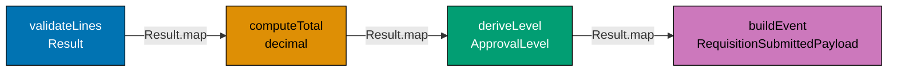





```fsharp
// A procurement workflow assembled from pure, composable steps.

type ApprovalLevel = L1 | L2 | L3
// => L1 ≤ $1k, L2 ≤ $10k, L3 > $10k
type RequisitionId = RequisitionId of string
// => Single-case DU wraps string for type safety

type RawLine = { Sku: string; Qty: int; Price: decimal }
// => Unvalidated line arriving from the HTTP layer

type RequisitionSubmittedPayload = {
    Id:            RequisitionId
    // => Wrapped id — type prevents mixing with PurchaseOrderId
    ApprovalLevel: ApprovalLevel
    // => L1/L2/L3 derived from total at submission time
    RequestedBy:   string
    // => Employee id of the requester
    TotalAmount:   decimal
    // => Sum of all line totals at submission time
}
// => Event payload — everything a downstream consumer needs

// Individual pure steps
let validateLines (lines: RawLine list) : Result<RawLine list, string> =
    if lines.IsEmpty then Error "At least one line item is required"
    // => Business rule: blank requisitions cannot be submitted
    elif lines |> List.exists (fun l -> l.Qty <= 0) then Error "All quantities must be > 0"
    // => Business rule: zero or negative quantities are invalid
    else Ok lines
    // => All lines pass basic validation

let computeTotal (lines: RawLine list) : decimal =
    lines |> List.sumBy (fun l -> decimal l.Qty * l.Price)
    // => Pure arithmetic — sums all line totals

let deriveLevel (total: decimal) : ApprovalLevel =
    if total <= 1000m then L1 elif total <= 10000m then L2 else L3
    // => Derives approval level from total — same input always yields same output

let buildEvent (requestedBy: string) (level: ApprovalLevel) (total: decimal) : RequisitionSubmittedPayload =
    { Id            = RequisitionId ("req_" + System.Guid.NewGuid().ToString("N").[..7])
      // => Generates a short req id like "req_a1b2c3d4"
      ApprovalLevel = level
      // => Captured at submission — immutable after this point
      RequestedBy   = requestedBy
      // => Identifies who triggered the workflow
      TotalAmount   = total }
      // => Locked in from validated lines; not recomputed downstream
    // => Assembles the event payload from validated, derived values

// Composed workflow
let submitRequisition (requestedBy: string) (lines: RawLine list) : Result<RequisitionSubmittedPayload, string> =
    lines
    |> validateLines
    // => Step 1: validate — returns Result; short-circuits on Error
    |> Result.map computeTotal
    // => Step 2: compute total from validated lines — runs only if Ok
    |> Result.map (fun total ->
        let level = deriveLevel total
        // => Step 3: derive approval level from total
        buildEvent requestedBy level total
        // => Step 4: build the event payload
    )
    // => Entire pipeline: validate → total → level → event

// Test
let lines = [{ Sku = "OFF-0042"; Qty = 10; Price = 8.50m }
             // => Line 1: 10 × $8.50 = $85.00
             { Sku = "ELE-0099"; Qty = 3;  Price = 899.99m }]
             // => Line 2: 3 × $899.99 = $2,699.97
// => Two valid lines — total = 85.00 + 2699.97 = 2784.97

let result = submitRequisition "emp_00456" lines
// => validateLines: Ok; computeTotal: 2784.97; deriveLevel: L2; buildEvent: Ok payload

match result with
| Ok payload -> printfn "Submitted: level=%A total=%M" payload.ApprovalLevel payload.TotalAmount
// => Output: Submitted: level=L2 total=2784.9700M
| Error e    -> printfn "Error: %s" e
// => Short-circuit: prints error message if any step fails
```





```clojure
;; [F#: Result<T,E> with Result.map — Clojure uses either/monadic map from a library, or plain cond]
;; Clojure's idiomatic approach: represent success/failure as {:ok value} or {:error msg} maps,
;; then use threading macros with helper fns. No built-in Result type; data-orientation prevails.

;; Domain: represent a line item as a plain map with namespaced keywords
;; raw-line shape: {:line/sku "OFF-0042" :line/qty 10 :line/price 8.50M}

;; Validate a seq of raw-line maps — returns {:ok lines} or {:error msg}
(defn validate-lines [lines]
  ;; Business rule: at least one line is required
  (cond
    (empty? lines)
    {:error "At least one line item is required"}
    ;; => Empty seq short-circuits with an error map

    (some #(<= (:line/qty %) 0) lines)
    {:error "All quantities must be > 0"}
    ;; => Any non-positive qty short-circuits with an error map

    :else
    {:ok lines}))
    ;; => All lines passed — wrap in {:ok ...} to signal success

;; Compute total from validated lines — pure arithmetic
(defn compute-total [lines]
  (->> lines
       (map (fn [l] (* (:line/qty l) (:line/price l))))
       ;; => Maps each line to its line total
       (reduce +)))
       ;; => Sums all line totals into one decimal

;; Derive approval level from total — pure, deterministic
(defn derive-level [total]
  (cond
    (<= total 1000M)  :l1
    ;; => L1: up to $1,000
    (<= total 10000M) :l2
    ;; => L2: up to $10,000
    :else             :l3))
    ;; => L3: over $10,000

;; Build event payload map — all fields captured at submission time
(defn build-event [requested-by level total]
  ;; Returns a plain map — REPL-friendly, serialisable, no class coupling
  {:event/id          (str "req_" (subs (str (random-uuid)) 0 8))
   ;; => Generates a short req id like "req_a1b2c3d"
   :event/level       level
   ;; => Approval level captured at submission — immutable after this point
   :event/requested-by requested-by
   ;; => Employee id of the requester
   :event/total-amount total})
   ;; => Locked in from validated lines; not recomputed downstream

;; Composed workflow using threading helpers for the {:ok}/{:error} pattern
(defn ok-then [result f]
  ;; If result is {:ok v}, call (f v); otherwise pass the error through
  (if (:ok result)
    (f (:ok result))
    result))
    ;; => Clojure's idiomatic equivalent of Result.map / Result.bind

(defn submit-requisition [requested-by lines]
  ;; Full pipeline: validate -> total -> level -> event
  (-> (validate-lines lines)
      ;; => Step 1: validate — returns {:ok lines} or {:error msg}
      (ok-then (fn [valid-lines]
        (let [total (compute-total valid-lines)
              ;; => Step 2: compute total from validated lines
              level (derive-level total)]
              ;; => Step 3: derive approval level from total
          {:ok (build-event requested-by level total)})))
          ;; => Step 4: build event payload — wraps result in {:ok ...}
      ))

;; Test
(def test-lines
  [{:line/sku "OFF-0042" :line/qty 10 :line/price 8.50M}
   ;; => Line 1: 10 × $8.50 = $85.00
   {:line/sku "ELE-0099" :line/qty 3  :line/price 899.99M}])
   ;; => Line 2: 3 × $899.99 = $2,699.97
;; => Two valid lines — total = 85.00 + 2699.97 = 2784.97

(def result (submit-requisition "emp_00456" test-lines))
;; => validate-lines: {:ok lines}; compute-total: 2784.97M; derive-level: :l2; build-event: {:ok payload}

(if (:ok result)
  (println "Submitted: level=" (get-in result [:ok :event/level])
           "total=" (get-in result [:ok :event/total-amount]))
  ;; => Output: Submitted: level= :l2 total= 2784.97M
  (println "Error:" (:error result)))
  ;; => Short-circuit: prints error message if any step fails
```





```typescript
// A complete procurement workflow assembled from pure composable steps.
// [F#: composed via Result.map and |> — each step is pure; errors short-circuit]
// [Clojure: threading macro with result maps; TS chains .map() on Result<T,E>]

// Result type
type Result<T, E> = { readonly ok: true; readonly value: T } | { readonly ok: false; readonly error: E };
const okR = <T, E>(v: T): Result => ({ ok: true, value: v });
const errR = <T, E>(e: E): Result => ({ ok: false, error: e });
const mapR = <T, U, E>(r: Result, f: (v: T) => U): Result => (r.ok ? okR(r.value) : r); // simplification — preserves error

type ApprovalLevel = "L1" | "L2" | "L3";
type RequisitionId = string & { readonly __brand: "RequisitionId" };
const asRequisitionId = (s: string): RequisitionId => s as RequisitionId;

interface RawLine {
  sku: string;
  qty: number;
  price: number;
}
// => Unvalidated line arriving from the HTTP layer

interface RequisitionSubmittedPayload {
  readonly id: RequisitionId;
  readonly approvalLevel: ApprovalLevel;
  readonly requestedBy: string;
  readonly totalAmount: number;
}
// => Event payload — everything a downstream consumer needs

// Individual pure steps
function validateLines(lines: RawLine[]): Result {
  if (lines.length === 0) return errR("At least one line item is required");
  // => Business rule: blank requisitions cannot be submitted
  if (lines.some((l) => l.qty <= 0)) return errR("All quantities must be > 0");
  // => Business rule: zero or negative quantities are invalid
  return okR(lines);
  // => All lines pass basic validation
}

const computeTotal = (lines: RawLine[]): number => lines.reduce((sum, l) => sum + l.qty * l.price, 0);
// => Pure arithmetic — sums all line totals

const deriveLevel = (total: number): ApprovalLevel => (total <= 1000 ? "L1" : total <= 10000 ? "L2" : "L3");

const buildEvent =
  (requestedBy: string) =>
  (level: ApprovalLevel) =>
  (total: number): RequisitionSubmittedPayload => ({
    id: asRequisitionId(`req_${Math.random().toString(36).slice(2, 10)}`),
    approvalLevel: level,
    requestedBy,
    totalAmount: total,
  });
// => Curried builder — requestedBy bound first, level second, total third

// Composed workflow
function submitRequisition(requestedBy: string, lines: RawLine[]): Result {
  const validated = validateLines(lines);
  // => Step 1: validate — returns Result; short-circuits on error
  if (!validated.ok) return validated;
  const total = computeTotal(validated.value);
  // => Step 2: compute total from validated lines
  const level = deriveLevel(total);
  // => Step 3: derive approval level from total
  return okR(buildEvent(requestedBy)(level)(total));
  // => Step 4: build the event payload
}

// Test
const lines: RawLine[] = [
  { sku: "OFF-0042", qty: 10, price: 8.5 },
  // => 10 x $8.50 = $85.00
  { sku: "ELE-0099", qty: 3, price: 899.99 },
  // => 3 x $899.99 = $2,699.97
];

const result = submitRequisition("emp_00456", lines);
// => validateLines: ok; computeTotal: 2784.97; deriveLevel: "L2"; buildEvent: ok payload

if (result.ok) console.log(`Submitted: level=${result.value.approvalLevel} total=${result.value.totalAmount}`);
// => Output: Submitted: level=L2 total=2784.97
else console.log("Error:", result.error);
```





```haskell
-- ── file: SubmitRequisition.hs ────────
-- [F#: Result<T,E> + Result.map; Haskell uses Either e a — Left = error, Right = success]
-- [Clojure: {:ok}/{:error} maps + threading; Haskell composes via fmap/(<$>) on Either]
{-# LANGUAGE OverloadedStrings #-}
import Data.Text (Text)                    -- production-grade text type
import qualified Data.Text as T

-- Domain types — newtype wrappers prevent mixing ids of different aggregates
newtype RequisitionId = RequisitionId Text deriving (Show, Eq)
data ApprovalLevel = L1 | L2 | L3 deriving (Show, Eq)
                                            -- => L1 ≤ $1k, L2 ≤ $10k, L3 > $10k

-- Raw line arriving from the HTTP layer; record syntax names fields explicitly
data RawLine = RawLine
  { sku   :: Text
  , qty   :: Int
  , price :: Double
  } deriving (Show)

-- Event payload — everything a downstream consumer needs
data RequisitionSubmittedPayload = RequisitionSubmittedPayload
  { reqId         :: RequisitionId
  , approvalLevel :: ApprovalLevel
  , requestedBy   :: Text
  , totalAmount   :: Double
  } deriving (Show)

-- Individual pure steps — each returns Either Text on the error side
validateLines :: [RawLine] -> Either Text [RawLine]
validateLines [] = Left "At least one line item is required"
                                            -- => empty list short-circuits with Left
validateLines ls
  | any (\l -> qty l <= 0) ls = Left "All quantities must be > 0"
                                            -- => zero/negative quantities are invalid
  | otherwise = Right ls                    -- => all lines pass basic validation

computeTotal :: [RawLine] -> Double
computeTotal = sum . map (\l -> fromIntegral (qty l) * price l)
                                            -- => pure: sums (qty * price) across lines

deriveLevel :: Double -> ApprovalLevel
deriveLevel total
  | total <= 1000  = L1                     -- => L1: up to $1,000
  | total <= 10000 = L2                     -- => L2: up to $10,000
  | otherwise      = L3                     -- => L3: over $10,000

buildEvent :: Text -> ApprovalLevel -> Double -> RequisitionSubmittedPayload
buildEvent rb lvl total =
  RequisitionSubmittedPayload
    { reqId         = RequisitionId "req_a1b2c3d4"  -- in production: UUID v4
    , approvalLevel = lvl                  -- captured at submission — immutable
    , requestedBy   = rb                   -- employee id of the requester
    , totalAmount   = total                -- locked from validated lines
    }

-- Composed workflow — fmap on Either short-circuits at the first Left
submitRequisition :: Text -> [RawLine] -> Either Text RequisitionSubmittedPayload
submitRequisition rb lines_ =
  fmap (\validLines ->
          let total = computeTotal validLines
              lvl   = deriveLevel total
          in  buildEvent rb lvl total)
       (validateLines lines_)
-- => Step 1 validate, Step 2 total, Step 3 level, Step 4 event payload

-- Test
testLines :: [RawLine]
testLines =
  [ RawLine "OFF-0042" 10 8.50      -- => 10 × $8.50 = $85.00
  , RawLine "ELE-0099" 3  899.99    -- => 3 × $899.99 = $2,699.97
  ]
-- => total = 85.00 + 2699.97 = 2784.97

main :: IO ()
main = case submitRequisition "emp_00456" testLines of
  Right p -> putStrLn $ "Submitted: level=" <> show (approvalLevel p)
                                            <> " total=" <> show (totalAmount p)
  -- => Output: Submitted: level=L2 total=2784.97
  Left  e -> putStrLn $ "Error: " <> T.unpack e
  -- => prints the error message on any short-circuit
```





**Key Takeaway**: A procurement workflow assembled from pure composable steps is easier to test, extend, and reason about than a single monolithic function — each step is independently testable and the composition is explicit.

**Why It Matters**: When an approval threshold changes from `$1,000` to `$2,000`, only `deriveLevel` needs updating. When a new validation rule is added, it is inserted into the pipeline as a new step. The composition makes the workflow's structure visible at a glance, and the `Result.map` chain ensures errors propagate cleanly without try/catch blocks scattered through the implementation.

---

## Railway-Oriented Programming (Examples 30–36)

### Example 30: Result Type — Ok and Error

The Result type models computations that can fail by returning either a success value or a typed error, without throwing exceptions. F# provides `Result<'T, 'Error>` as a built-in discriminated union with `Ok value` and `Error err` cases. Clojure uses a `[value nil]` / `[nil error]` pair convention or libraries such as `failjure`; TypeScript uses a discriminated union with `{ ok: true; value: T }` / `{ ok: false; error: E }`. All three keep failure handling in the type system and force callers to acknowledge both paths.





```fsharp
// Result<'T, 'Error> — the foundation of Railway-Oriented Programming.
// Ok carries the success value; Error carries the failure description.

// Domain errors for the purchasing context — named, not stringly-typed
type ProcurementError =
    | RequisitionNotFound    of id: string
    // => Database lookup returned nothing for this ID
    | InsufficientBudget     of required: decimal * available: decimal
    // => The requisition total exceeds the department budget
    | SupplierNotApproved    of supplierId: string
    // => The selected supplier is Suspended or Blacklisted
    | DuplicateRequisition   of existingId: string
    // => A requisition for the same items was already submitted this week

// Functions that can fail return Result — not throw exceptions
let findRequisition (id: string) (store: Map<string, string>) : Result<string, ProcurementError> =
    // => store: Map<string, string> simulates a lookup (id → serialised requisition)
    match Map.tryFind id store with
    | Some req -> Ok req
    // => Found — return the requisition as Ok
    | None     -> Error (RequisitionNotFound id)
    // => Not found — return a named error, not null, not an exception

let checkBudget (required: decimal) (available: decimal) : Result<unit, ProcurementError> =
    // => Checks that the required amount does not exceed available budget
    if required > available then
        Error (InsufficientBudget (required, available))
        // => Budget exceeded — named error with both amounts for the error message
    else
        Ok ()
        // => Budget sufficient — Ok unit (no useful success value to return here)

// Test the Result-returning functions
let store = Map.ofList [("req_f4c2a1b7", "requisition data")]
// => store : Map<string, string> — simulated data store with one entry

let found    = findRequisition "req_f4c2a1b7" store
// => "req_f4c2a1b7" is in the store — found : Result<string, ProcurementError> = Ok "requisition data"
let notFound = findRequisition "req_missing" store
// => "req_missing" is not in the store — notFound : Result<string, ProcurementError> = Error (RequisitionNotFound "req_missing")

let budgetOk  = checkBudget 2784.97m 5000m
// => 2784.97 <= 5000 — budgetOk : Result<unit, ProcurementError> = Ok ()
let budgetErr = checkBudget 2784.97m 1000m
// => 2784.97 > 1000 — budgetErr : Result<unit, ProcurementError> = Error (InsufficientBudget (2784.97, 1000))

match notFound with
| Ok req  -> printfn "Found: %s" req
| Error e -> printfn "Error: %A" e
// => Output: Error: RequisitionNotFound "req_missing"

match budgetErr with
| Ok ()   -> printfn "Budget ok"
| Error e -> printfn "Error: %A" e
// => Output: Error: InsufficientBudget (2784.97M, 1000M)
```





```clojure
;; [F#: Result<T,E> discriminated union — Clojure uses {:ok value} / {:error keyword} plain maps]
;; Clojure has no built-in Result type; the community convention is a tagged map with :ok or :error.
;; This keeps data REPL-friendly and avoids class coupling while being explicit about success/failure.

;; Domain errors represented as keyword tags — idiomatic Clojure data-orientation
;; Error map shape: {:error :requisition-not-found :id "req_missing"}
;;                 {:error :insufficient-budget :required 2784.97M :available 1000M}

;; Functions that can fail return a tagged map — not throw exceptions
(defn find-requisition [id store]
  ;; store: plain map simulating a lookup (id -> requisition-data string)
  (if-let [req (get store id)]
    {:ok req}
    ;; => Found — return {:ok requisition-data}
    {:error :requisition-not-found :id id}))
    ;; => Not found — return a named error map, not nil, not an exception
    ;; => [F#: Error (RequisitionNotFound id) — DU case with compile-time safety]

(defn check-budget [required available]
  ;; Checks that the required amount does not exceed the available budget
  (if (> required available)
    {:error :insufficient-budget :required required :available available}
    ;; => Budget exceeded — error map carries both amounts for the error response
    {:ok nil}))
    ;; => Budget sufficient — {:ok nil} signals success with no useful payload
    ;; => [F#: Ok () — unit result; Clojure uses nil in the :ok slot for the same intent]

;; Test the result-returning functions
(def store {"req_f4c2a1b7" "requisition data"})
;; => store: plain map — simulated data store with one entry

(def found    (find-requisition "req_f4c2a1b7" store))
;; => "req_f4c2a1b7" is in the store — found = {:ok "requisition data"}
(def not-found (find-requisition "req_missing" store))
;; => "req_missing" is absent — not-found = {:error :requisition-not-found :id "req_missing"}

(def budget-ok  (check-budget 2784.97M 5000M))
;; => 2784.97 <= 5000 — budget-ok = {:ok nil}
(def budget-err (check-budget 2784.97M 1000M))
;; => 2784.97 > 1000 — budget-err = {:error :insufficient-budget :required 2784.97M :available 1000M}

(if (:ok not-found)
  (println "Found:" (:ok not-found))
  (println "Error:" (:error not-found) "id:" (:id not-found)))
;; => Output: Error: :requisition-not-found id: req_missing

(if (:ok budget-err)
  (println "Budget ok")
  (println "Error:" (:error budget-err)
           "required:" (:required budget-err)
           "available:" (:available budget-err)))
;; => Output: Error: :insufficient-budget required: 2784.97M available: 1000M
```





```typescript
// Result<T,E> type — explicit success/failure without exceptions.
// [F#: built-in Result<'T,'E> with Ok/Error constructors and exhaustive match]
// [Clojure: {:ok value}/{:error msg} maps; TS Result type provides same explicit contract]

// Result type — either a success value or a failure
type Result<T, E> = { readonly ok: true; readonly value: T } | { readonly ok: false; readonly error: E };
const okR = <T, E>(v: T): Result => ({ ok: true, value: v });
const errR = <T, E>(e: E): Result => ({ ok: false, error: e });
// => [F#: Ok and Error constructors; TS: plain object constructors]

// Branded types
type RequisitionId = string & { readonly __brand: "RequisitionId" };
const asRequisitionId = (s: string): RequisitionId => s as RequisitionId;

// A fallible smart constructor — returns Result instead of throwing
function createRequisitionId(raw: string): Result {
  if (!raw || raw.trim() === "") return errR("RequisitionId cannot be blank");
  // => Error case: blank input
  if (!raw.startsWith("req_")) return errR(`RequisitionId '${raw}' must start with 'req_'`);
  // => Error case: wrong format
  return okR(asRequisitionId(raw));
  // => Ok case: valid branded ID
}

// Test cases
const ok1 = createRequisitionId("req_f4c2a1b7");
// => ok1 : Result<RequisitionId, string> = { ok: true, value: "req_f4c2a1b7" }
const err1 = createRequisitionId("");
// => err1 : Result<RequisitionId, string> = { ok: false, error: "RequisitionId cannot be blank" }
const err2 = createRequisitionId("12345");
// => err2 : Result<RequisitionId, string> = { ok: false, error: "RequisitionId '12345' must start with 'req_'" }

// Consuming the result — explicit check required
if (ok1.ok) console.log("Valid:", ok1.value);
// => Output: Valid: req_f4c2a1b7
if (!err1.ok) console.log("Error 1:", err1.error);
// => Output: Error 1: RequisitionId cannot be blank
if (!err2.ok) console.log("Error 2:", err2.error);
// => Output: Error 2: RequisitionId '12345' must start with 'req_'
```





```haskell
-- ── file: ProcurementError.hs ─────────
-- [F#: Result<'T,'E> built-in; Haskell uses Either e a — Left = failure, Right = success]
-- [Clojure: tagged maps; Haskell uses a sum type ADT for compile-time exhaustiveness]
{-# LANGUAGE OverloadedStrings #-}
import Data.Text (Text)                     -- production text type
import qualified Data.Text as T
import Data.Map.Strict (Map)                -- strict map for the lookup demo
import qualified Data.Map.Strict as Map

-- Domain errors as an algebraic data type — each constructor carries its own payload
data ProcurementError
  = RequisitionNotFound Text                -- => lookup returned nothing for this id
  | InsufficientBudget  Double Double       -- => required vs available amount
  | SupplierNotApproved Text                -- => supplier is Suspended or Blacklisted
  | DuplicateRequisition Text               -- => duplicate of an existing id
  deriving (Show, Eq)

-- Fallible functions return Either instead of throwing
findRequisition :: Text -> Map Text Text -> Either ProcurementError Text
findRequisition rid store =
  case Map.lookup rid store of              -- Map.lookup returns Maybe a
    Just req -> Right req                   -- => found — Right is the success rail
    Nothing  -> Left (RequisitionNotFound rid)
                                            -- => missing — Left carries a named error

checkBudget :: Double -> Double -> Either ProcurementError ()
checkBudget required available
  | required > available = Left (InsufficientBudget required available)
                                            -- => over budget — error carries both numbers
  | otherwise            = Right ()         -- => sufficient — Right () mirrors F#'s Ok ()

-- Test the Either-returning functions
store :: Map Text Text
store = Map.fromList [("req_f4c2a1b7", "requisition data")]
                                            -- single-entry simulated data store

found, notFound :: Either ProcurementError Text
found    = findRequisition "req_f4c2a1b7" store
                                            -- => Right "requisition data"
notFound = findRequisition "req_missing"   store
                                            -- => Left (RequisitionNotFound "req_missing")

budgetOk, budgetErr :: Either ProcurementError ()
budgetOk  = checkBudget 2784.97 5000        -- => Right ()
budgetErr = checkBudget 2784.97 1000        -- => Left (InsufficientBudget 2784.97 1000.0)

main :: IO ()
main = do
  case notFound of
    Right req -> putStrLn $ "Found: " <> T.unpack req
    Left  e   -> putStrLn $ "Error: " <> show e
  -- => Output: Error: RequisitionNotFound "req_missing"
  case budgetErr of
    Right () -> putStrLn "Budget ok"
    Left  e  -> putStrLn $ "Error: " <> show e
  -- => Output: Error: InsufficientBudget 2784.97 1000.0
```





**Key Takeaway**: `Result<'T, 'Error>` makes the possibility of failure explicit in the type system, forcing callers to handle both success and failure paths rather than relying on exceptions that can be silently swallowed.

**Why It Matters**: Procurement workflows have many potential failure modes: requisitions not found, budgets exceeded, suppliers suspended, duplicate submissions. Using named `ProcurementError` cases instead of generic exceptions means the API layer can map each error to the correct HTTP status code (404, 422, 409) with a meaningful error body. It also means the compiler prevents forgetting to handle a failure case — there is no equivalent of an unchecked exception.

---

### Example 31: Result.bind — Chaining Fallible Steps

`Result.bind` chains two fallible steps: if the first step succeeds, it passes the `Ok` value into the second step; if the first fails, the `Error` propagates without running the second step. This is the foundation of Railway-Oriented Programming.

**Happy track** (Input flows through three Result-returning steps to `Ok ApprovalLevel`):

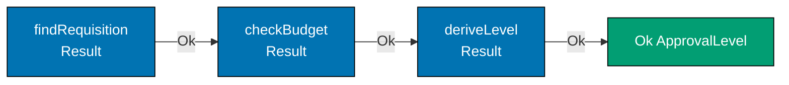

**Error track** (first failure short-circuits):

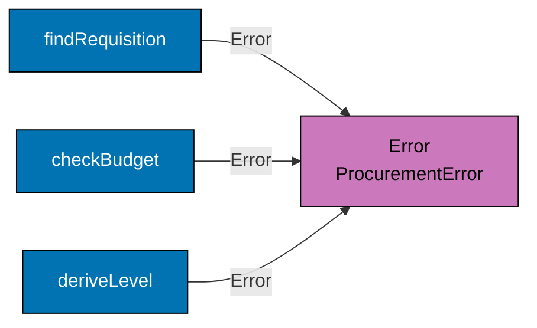





```fsharp
// Result.bind chains fallible steps — short-circuits on the first Error.
// This is the "railway" metaphor: Ok stays on the happy track, Error diverts.

type ApprovalLevel = L1 | L2 | L3

type ProcurementError =
    | RequisitionNotFound of id: string
    | InsufficientBudget  of required: decimal * available: decimal
    | SupplierNotApproved of supplierId: string

// Three fallible steps in the approval workflow
let lookupRequisition (id: string) : Result<decimal, ProcurementError> =
    // => Simulate: returns the requisition total if found
    if id = "req_f4c2a1b7" then Ok 2784.97m
    // => Found — return the total amount
    else Error (RequisitionNotFound id)
    // => Not found — short-circuit with a named error

let verifyBudget (total: decimal) : Result<decimal, ProcurementError> =
    // => Simulate: checks the department budget (budget = $5,000)
    if total <= 5000m then Ok total
    // => Within budget — pass the total forward
    else Error (InsufficientBudget (total, 5000m))
    // => Exceeds budget — short-circuit

let computeLevel (total: decimal) : Result<ApprovalLevel, ProcurementError> =
    // => Derives the approval level — always succeeds for valid totals
    let level = if total <= 1000m then L1 elif total <= 10000m then L2 else L3
    Ok level
    // => Wraps the level in Ok — could fail if additional constraints applied

// Chaining with Result.bind
let approvalWorkflow (reqId: string) : Result<ApprovalLevel, ProcurementError> =
    lookupRequisition reqId
    // => Step 1: look up — may fail with RequisitionNotFound
    |> Result.bind verifyBudget
    // => Step 2: verify budget — runs only if Step 1 was Ok; may fail with InsufficientBudget
    |> Result.bind computeLevel
    // => Step 3: compute level — runs only if Step 2 was Ok

// Happy path
let happy = approvalWorkflow "req_f4c2a1b7"
// => Step 1 Ok 2784.97 → Step 2 Ok 2784.97 → Step 3 Ok L2
// => happy : Result<ApprovalLevel, ProcurementError> = Ok L2

// Error path — fails at Step 1
let missing = approvalWorkflow "req_missing"
// => Step 1 Error (RequisitionNotFound "req_missing") — Steps 2 and 3 skipped
// => missing : Result<ApprovalLevel, ProcurementError> = Error (RequisitionNotFound "req_missing")

printfn "Happy: %A" happy
// => Output: Happy: Ok L2
printfn "Missing: %A" missing
// => Output: Missing: Error (RequisitionNotFound "req_missing")
```





```clojure
;; [F#: Result.bind — Clojure uses a hand-written bind-like helper over {:ok}/{:error} tagged maps]
;; Clojure has no Result.bind in the standard library; the idiomatic pattern is a threading helper
;; or plain cond chaining, keeping each step as a pure function returning a tagged map.

;; Helper: if result is {:ok v}, call (f v); propagate {:error ...} unchanged
(defn ok-bind [result f]
  ;; Equivalent of Result.bind — short-circuits on any {:error ...} result
  (if (:ok result)
    (f (:ok result))
    result))
    ;; => [F#: Result.bind — same short-circuit semantics; Clojure needs the helper explicitly]

;; Three fallible steps in the approval workflow
(defn lookup-requisition [id]
  ;; Returns the requisition total if found, or an error map
  (if (= id "req_f4c2a1b7")
    {:ok 2784.97M}
    ;; => Found — return {:ok total}
    {:error :requisition-not-found :id id}))
    ;; => Not found — short-circuit with a named error map

(defn verify-budget [total]
  ;; Checks the department budget (simulated budget = $5,000)
  (if (<= total 5000M)
    {:ok total}
    ;; => Within budget — pass the total forward wrapped in {:ok ...}
    {:error :insufficient-budget :required total :available 5000M}))
    ;; => Exceeds budget — short-circuit with an error map

(defn compute-level [total]
  ;; Derives the approval level — always succeeds for valid totals
  (let [level (cond
                (<= total 1000M)  :l1
                ;; => L1: up to $1,000
                (<= total 10000M) :l2
                ;; => L2: up to $10,000
                :else             :l3)]
                ;; => L3: over $10,000
    {:ok level}))
    ;; => Wraps the level in {:ok ...}

;; Chaining with ok-bind — mirrors the |> Result.bind pipeline
(defn approval-workflow [req-id]
  ;; Full pipeline: lookup -> verify budget -> compute level
  (-> (lookup-requisition req-id)
      ;; => Step 1: lookup — may produce {:error :requisition-not-found}
      (ok-bind verify-budget)
      ;; => Step 2: verify budget — runs only if Step 1 was {:ok ...}
      (ok-bind compute-level)))
      ;; => Step 3: compute level — runs only if Step 2 was {:ok ...}

;; Happy path
(def happy (approval-workflow "req_f4c2a1b7"))
;; => Step 1 {:ok 2784.97M} -> Step 2 {:ok 2784.97M} -> Step 3 {:ok :l2}
;; => happy = {:ok :l2}

;; Error path — fails at Step 1
(def missing (approval-workflow "req_missing"))
;; => Step 1 {:error :requisition-not-found} — Steps 2 and 3 skipped
;; => missing = {:error :requisition-not-found :id "req_missing"}

(println "Happy:" happy)
;; => Output: Happy: {:ok :l2}
(println "Missing:" missing)
;; => Output: Missing: {:error :requisition-not-found, :id req_missing}
```





```typescript
// Result.bind — chains fallible steps, short-circuiting on error.
// [F#: Result.bind f r — applies f to Ok value; Error passes through unchanged]
// [Clojure: threading with cond on :ok/:error keys; TS bind mirrors railway-oriented programming]

// Result type and bind
type Result<T, E> = { readonly ok: true; readonly value: T } | { readonly ok: false; readonly error: E };
const okR = <T, E>(v: T): Result => ({ ok: true, value: v });
const errR = <T, E>(e: E): Result => ({ ok: false, error: e });

// bind: applies f to Ok value; passes Error through unchanged
function bind<T, U, E>(r: Result, f: (v: T) => Result): Result {
  return r.ok ? f(r.value) : r;
  // => [F#: Result.bind f r — if Ok(v) then f(v) else Error passthrough]
}

// Branded types for the P2P domain
type SkuCode = string & { readonly __brand: "SkuCode" };
type SupplierId = string & { readonly __brand: "SupplierId" };

// Individual fallible validation steps
function validateSku(raw: string): Result {
  return /^[A-Z]{3}-\d{4,8}$/.test(raw) ? okR(raw as SkuCode) : errR(`Invalid SKU: '${raw}'`);
  // => Ok when format matches; Error otherwise
}

function validateSupplier(raw: string): Result {
  return raw.startsWith("sup_") ? okR(raw as SupplierId) : errR(`Invalid SupplierId: '${raw}' must start with 'sup_'`);
  // => Ok when starts with sup_; Error otherwise
}

interface ValidatedLine {
  readonly sku: SkuCode;
  readonly supplier: SupplierId;
  readonly qty: number;
}

function validateQty(qty: number, sku: SkuCode, supplier: SupplierId): Result {
  return qty > 0 ? okR({ sku, supplier, qty }) : errR(`Quantity must be > 0, got ${qty}`);
  // => Ok when positive; Error otherwise
}

// Chaining three fallible steps with bind
function validateOrderLine(rawSku: string, rawSupplier: string, qty: number): Result {
  return bind(
    bind(
      validateSku(rawSku),
      // => Step 1: validate SKU — short-circuits on invalid format
      (sku) =>
        bind(
          validateSupplier(rawSupplier),
          // => Step 2: validate supplier — short-circuits on wrong prefix
          (supplier) => validateQty(qty, sku, supplier),
          // => Step 3: validate quantity — all three steps chained
        ),
    ),
    (line) => okR(line),
  );
}

const good = validateOrderLine("OFF-0042", "sup_001", 10);
// => All three guards pass — { ok: true, value: ValidatedLine }
const bad = validateOrderLine("off-0042", "sup_001", 10);
// => Step 1 fails — { ok: false, error: "Invalid SKU: 'off-0042'" }

if (good.ok) console.log("Valid line:", good.value.sku, good.value.qty);
// => Output: Valid line: OFF-0042 10
if (!bad.ok) console.log("Error:", bad.error);
// => Output: Error: Invalid SKU: 'off-0042'
```





```haskell
-- ── file: ApprovalWorkflow.hs ─────────
-- [F#: Result.bind via |>; Haskell uses >>= (bind) on Either e a — short-circuits on Left]
-- [Clojure: hand-rolled ok-bind helper; Haskell gets it from the Monad Either instance for free]
{-# LANGUAGE OverloadedStrings #-}
import Data.Text (Text)

data ApprovalLevel = L1 | L2 | L3 deriving (Show, Eq)

data ProcurementError
  = RequisitionNotFound Text                  -- => not in the data store
  | InsufficientBudget  Double Double         -- => required vs available
  | SupplierNotApproved Text                  -- => supplier off-roster
  deriving (Show, Eq)

-- Three fallible steps; each returns Either to stay on the railway
lookupRequisition :: Text -> Either ProcurementError Double
lookupRequisition "req_f4c2a1b7" = Right 2784.97   -- => found — return the total
lookupRequisition rid            = Left (RequisitionNotFound rid)
                                                    -- => missing — short-circuits

verifyBudget :: Double -> Either ProcurementError Double
verifyBudget total
  | total <= 5000 = Right total               -- => within department budget of $5,000
  | otherwise     = Left (InsufficientBudget total 5000)
                                              -- => over budget — short-circuits

computeLevel :: Double -> Either ProcurementError ApprovalLevel
computeLevel total = Right level              -- always succeeds for non-negative totals
  where level                                 -- where-binding scopes the tier choice
          | total <= 1000  = L1               -- => L1 up to $1k
          | total <= 10000 = L2               -- => L2 up to $10k
          | otherwise      = L3               -- => L3 over $10k

-- Chaining with monadic bind — >>= is Either's Result.bind
approvalWorkflow :: Text -> Either ProcurementError ApprovalLevel
approvalWorkflow reqId =
  lookupRequisition reqId                     -- Step 1
    >>= verifyBudget                          -- => Step 2 runs only if Step 1 == Right
    >>= computeLevel                          -- => Step 3 runs only if Step 2 == Right

-- Happy path
happy :: Either ProcurementError ApprovalLevel
happy = approvalWorkflow "req_f4c2a1b7"       -- => Right L2

-- Error path — fails at Step 1; Steps 2 and 3 are skipped
missing :: Either ProcurementError ApprovalLevel
missing = approvalWorkflow "req_missing"      -- => Left (RequisitionNotFound "req_missing")

main :: IO ()
main = do
  putStrLn $ "Happy: "   <> show happy
  -- => Output: Happy: Right L2
  putStrLn $ "Missing: " <> show missing
  -- => Output: Missing: Left (RequisitionNotFound "req_missing")
```





**Key Takeaway**: `Result.bind` creates a clean error-propagation pipeline where the first failure short-circuits the rest of the chain — no nested if/else, no try/catch, no null checks.

**Why It Matters**: Without `Result.bind`, chaining three fallible steps requires nested match expressions or if/else chains that obscure the happy path. With `Result.bind`, the pipeline reads linearly and the error handling is structural. Adding a new step (e.g., checking supplier eligibility) means inserting one more `|> Result.bind checkSupplier` — no restructuring of the error-handling logic required.

---

### Example 32: Result.map — Transforming the Success Value

`Result.map` transforms the `Ok` value of a `Result` without touching the `Error` case. It is the non-fallible counterpart to `Result.bind` — use `map` when the transformation cannot fail, `bind` when it can.





```fsharp
// Result.map transforms the Ok value; Error passes through unchanged.
// Use map for infallible transformations inside a Result pipeline.

type ApprovalLevel = L1 | L2 | L3

type ApprovalRouting = {
    Level:         ApprovalLevel
    ApproverEmail: string
    SlaDays:       int
}
// => The output of the routing step — derived from ApprovalLevel

// An infallible transformation: ApprovalLevel → ApprovalRouting
let buildRouting (level: ApprovalLevel) : ApprovalRouting =
    // => This cannot fail — every ApprovalLevel maps to a routing record
    match level with
    | L1 -> { Level = L1; ApproverEmail = "manager@co.example"; SlaDays = 2 }
    // => L1: direct manager, 2-day SLA
    | L2 -> { Level = L2; ApproverEmail = "dept-head@co.example"; SlaDays = 5 }
    // => L2: department head, 5-day SLA
    | L3 -> { Level = L3; ApproverEmail = "cfo@co.example"; SlaDays = 10 }
    // => L3: CFO, 10-day SLA

// A fallible step that returns Result<ApprovalLevel, string>
let deriveLevel (total: decimal) : Result<ApprovalLevel, string> =
    if total < 0m then Error "Total cannot be negative"
    // => Guard: negative totals are a data error
    else Ok (if total <= 1000m then L1 elif total <= 10000m then L2 else L3)
    // => Derives the level — wrapped in Ok

// Using Result.map to apply the infallible buildRouting transformation
let routingResult =
    deriveLevel 2784.97m
    // => Ok L2 — 2784.97 is within L2 range
    |> Result.map buildRouting
    // => Result.map applies buildRouting to the L2 value inside Ok
    // => buildRouting L2 = { Level = L2; ApproverEmail = "dept-head@co.example"; SlaDays = 5 }
    // => routingResult : Result<ApprovalRouting, string> = Ok { Level = L2; ... }

// Error case — map is skipped
let errorResult =
    deriveLevel (-1m)
    // => Error "Total cannot be negative"
    |> Result.map buildRouting
    // => Result.map is skipped — Error passes through unchanged
    // => errorResult : Result<ApprovalRouting, string> = Error "Total cannot be negative"

match routingResult with
| Ok r  -> printfn "Route to %s (SLA: %d days)" r.ApproverEmail r.SlaDays
// => Output: Route to dept-head@co.example (SLA: 5 days)
| Error e -> printfn "Error: %s" e

match errorResult with
| Ok _    -> printfn "Should not reach here"
| Error e -> printfn "Error passthrough: %s" e
// => Output: Error passthrough: Total cannot be negative
```





```clojure
;; [F#: Result.map — Clojure uses an ok-map helper that applies an infallible fn to {:ok v}]
;; Result.map applies a pure transformation only on success; the error map passes through unchanged.
;; Clojure's data-orientation means the routing record is also a plain map.

;; Helper: if result is {:ok v}, apply (f v) and re-wrap; propagate {:error ...} unchanged
(defn ok-map [result f]
  ;; Applies an infallible transformation to the :ok value; passes errors through
  (if (:ok result)
    {:ok (f (:ok result))}
    ;; => Success: apply f and re-wrap in {:ok ...}
    result))
    ;; => Error: return the error map unchanged — f is never called
    ;; => [F#: Result.map — identical semantics; Clojure needs the helper; F# has it in the stdlib]

;; Approval level -> routing record (plain map) — this transformation cannot fail
(defn build-routing [level]
  ;; Every level has a designated approver and SLA — no failure path
  (case level
    :l1 {:routing/level :l1 :routing/approver-email "manager@co.example"    :routing/sla-days 2}
    ;; => L1: direct manager, 2-day SLA
    :l2 {:routing/level :l2 :routing/approver-email "dept-head@co.example"  :routing/sla-days 5}
    ;; => L2: department head, 5-day SLA
    :l3 {:routing/level :l3 :routing/approver-email "cfo@co.example"        :routing/sla-days 10}))
    ;; => L3: CFO, 10-day SLA

;; A fallible step that returns a tagged map
(defn derive-level [total]
  ;; Guard: negative totals are a data error; all non-negative totals succeed
  (if (< total 0M)
    {:error "Total cannot be negative"}
    ;; => Guard — error map for invalid input
    {:ok (cond
           (<= total 1000M)  :l1
           ;; => L1 threshold
           (<= total 10000M) :l2
           ;; => L2 threshold
           :else             :l3)}))
           ;; => L3 for amounts over $10,000

;; Using ok-map to apply the infallible build-routing transformation
(def routing-result
  (-> (derive-level 2784.97M)
      ;; => {:ok :l2} — 2784.97 is within the L2 range
      (ok-map build-routing)))
      ;; => ok-map applies build-routing to :l2 and re-wraps in {:ok ...}
      ;; => routing-result = {:ok {:routing/level :l2 :routing/approver-email "dept-head@co.example" ...}}

;; Error case — ok-map is skipped; error passes through unchanged
(def error-result
  (-> (derive-level -1M)
      ;; => {:error "Total cannot be negative"}
      (ok-map build-routing)))
      ;; => ok-map is skipped — error map returned unchanged
      ;; => error-result = {:error "Total cannot be negative"}

(if (:ok routing-result)
  (let [r (:ok routing-result)]
    (println "Route to" (:routing/approver-email r) "(SLA:" (:routing/sla-days r) "days)"))
    ;; => Output: Route to dept-head@co.example (SLA: 5 days)
  (println "Error:" (:error routing-result)))

(if (:ok error-result)
  (println "Should not reach here")
  (println "Error passthrough:" (:error error-result)))
  ;; => Output: Error passthrough: Total cannot be negative
```





```typescript
// Result.map — transforms the success value without touching the error channel.
// [F#: Result.map f r — applies f to Ok value; Error passes through unchanged]
// [Clojure: (when-let [v (:ok r)] (f v)); TS map mirrors F# railway-oriented map]

// Result type and map
type Result<T, E> = { readonly ok: true; readonly value: T } | { readonly ok: false; readonly error: E };
const okR = <T, E>(v: T): Result => ({ ok: true, value: v });
const errR = <T, E>(e: E): Result => ({ ok: false, error: e });

function mapR<T, U, E>(r: Result, f: (v: T) => U): Result {
  return r.ok ? okR(f(r.value)) : r;
  // => [F#: Result.map f — applies f when Ok; Error passes through unchanged]
}

// Branded type
type SkuCode = string & { readonly __brand: "SkuCode" };

// A validated SKU code result
function createSkuCode(raw: string): Result {
  return /^[A-Z]{3}-\d{4,8}$/.test(raw) ? okR(raw as SkuCode) : errR(`Invalid SKU: '${raw}'`);
}

// map: transform the success value — compute a label without touching the error
const skuResult = createSkuCode("OFF-0042");
// => skuResult : Result<SkuCode, string> = { ok: true, value: "OFF-0042" }

const labelResult = mapR(skuResult, (sku) => `Label: ${sku}`);
// => map applies the label function to the Ok value
// => labelResult : Result<string, string> = { ok: true, value: "Label: OFF-0042" }

const errResult = createSkuCode("bad");
// => errResult : Result<SkuCode, string> = { ok: false, error: "Invalid SKU: 'bad'" }

const errLabel = mapR(errResult, (sku) => `Label: ${sku}`);
// => map does NOT call the function — error passes through unchanged
// => errLabel : Result<string, string> = { ok: false, error: "Invalid SKU: 'bad'" }

// Chaining maps — computing a line total from a valid SKU
interface LineData {
  readonly sku: SkuCode;
  readonly qty: number;
  readonly price: number;
}
const lineResult: Result = mapR(
  createSkuCode("ELE-0099"),
  (sku) => ({ sku, qty: 3, price: 899.99 }),
  // => Wraps the valid SKU into a line data record
);
const totalResult = mapR(lineResult, (line) => line.qty * line.price);
// => maps the line to its total: 3 * 899.99 = 2699.97

if (labelResult.ok) console.log(labelResult.value);
// => Output: Label: OFF-0042
if (totalResult.ok) console.log(`Line total: ${totalResult.value}`);
// => Output: Line total: 2699.97
if (!errLabel.ok) console.log("Error passes through:", errLabel.error);
// => Output: Error passes through: Invalid SKU: 'bad'
```





```haskell
-- ── file: ApprovalRouting.hs ──────────
-- [F#: Result.map; Haskell uses fmap or <$> on Either — Functor instance is built-in]
-- [Clojure: ok-map helper; Haskell gets identical semantics from the Functor type class]
{-# LANGUAGE OverloadedStrings #-}
import Data.Text (Text)

data ApprovalLevel = L1 | L2 | L3 deriving (Show, Eq)

-- The output of the routing step — derived from an approval level
data ApprovalRouting = ApprovalRouting
  { routingLevel  :: ApprovalLevel
  , approverEmail :: Text
  , slaDays       :: Int
  } deriving (Show)

-- Infallible transformation: every ApprovalLevel maps to a routing record
buildRouting :: ApprovalLevel -> ApprovalRouting
buildRouting L1 = ApprovalRouting L1 "manager@co.example"   2
                                                -- => L1: direct manager, 2-day SLA
buildRouting L2 = ApprovalRouting L2 "dept-head@co.example" 5
                                                -- => L2: department head, 5-day SLA
buildRouting L3 = ApprovalRouting L3 "cfo@co.example"       10
                                                -- => L3: CFO, 10-day SLA

-- A fallible step returning Either Text ApprovalLevel
deriveLevel :: Double -> Either Text ApprovalLevel
deriveLevel total
  | total < 0      = Left "Total cannot be negative"
                                                -- => guard: negative totals invalid
  | total <= 1000  = Right L1                   -- => L1 tier
  | total <= 10000 = Right L2                   -- => L2 tier
  | otherwise      = Right L3                   -- => L3 tier

-- Using fmap (Functor instance for Either) to apply buildRouting
routingResult :: Either Text ApprovalRouting
routingResult = fmap buildRouting (deriveLevel 2784.97)
                                                -- => Right (ApprovalRouting L2 ...)

-- Equivalent infix syntax with <$> — common in production Haskell
routingResultInfix :: Either Text ApprovalRouting
routingResultInfix = buildRouting <$> deriveLevel 2784.97
                                                -- => same value as routingResult

-- Error case — fmap is skipped; Left passes through unchanged
errorResult :: Either Text ApprovalRouting
errorResult = fmap buildRouting (deriveLevel (-1))
                                                -- => Left "Total cannot be negative"

main :: IO ()
main = do
  case routingResult of
    Right r -> putStrLn $ "Route to " <> show (approverEmail r)
                                     <> " (SLA: " <> show (slaDays r) <> " days)"
    -- => Output: Route to "dept-head@co.example" (SLA: 5 days)
    Left e  -> putStrLn $ "Error: " <> show e
  case errorResult of
    Right _ -> putStrLn "Should not reach here"
    Left  e -> putStrLn $ "Error passthrough: " <> show e
  -- => Output: Error passthrough: "Total cannot be negative"
```





**Key Takeaway**: `Result.map` applies an infallible transformation to the `Ok` value and passes `Error` through unchanged — keeping the error channel clean without re-wrapping or unwrapping.

**Why It Matters**: In a procurement pipeline, many steps are infallible transformations: deriving approval routing from a level, formatting an email notification, building a PO number from a sequence. Using `Result.map` for these steps keeps the pipeline uniform — every step in the chain produces a `Result`, and the composition rules are consistent throughout.

---

### Example 33: Validation Accumulation with List of Errors

`Result.bind` short-circuits on the first error. But form validation requires collecting _all_ errors so the user can fix everything at once. Applicative validation accumulates errors using a custom `Validation` type.





```fsharp
// Validation accumulation: collect all errors, not just the first.
// Use this for user-facing form validation (HTTP 400 responses with full error list).
// [Clojure: s/explain-data on a spec — accumulates all failing predicates as data maps]

// A Validation type that accumulates errors in a list
type Validation<'a, 'e> =
    | ValidationOk    of 'a
    // => All fields passed — carry the valid value
    | ValidationError of 'e list
    // => One or more fields failed — carry the list of errors

// Lift a Result into a Validation (single-error case)
let ofResult (r: Result<'a, 'e>) : Validation<'a, 'e> =
    match r with
    | Ok v    -> ValidationOk v
    // => Success becomes ValidationOk
    | Error e -> ValidationError [e]
    // => Single error becomes a one-element list — ready for accumulation

// Apply: combine two Validations, accumulating errors from both
let apply (fVal: Validation<'a -> 'b, 'e>) (xVal: Validation<'a, 'e>) : Validation<'b, 'e> =
    match fVal, xVal with
    | ValidationOk f,    ValidationOk x    -> ValidationOk (f x)
    // => Both ok — apply the function to the value
    | ValidationError e, ValidationOk _    -> ValidationError e
    // => Function failed — carry its errors forward
    | ValidationOk _,    ValidationError e -> ValidationError e
    // => Value failed — carry its errors forward
    | ValidationError e1, ValidationError e2 -> ValidationError (e1 @ e2)
    // => Both failed — concatenate the error lists (accumulation!)

// Domain: validate a line item, accumulating all field errors
let validateSku (raw: string) : Validation<string, string> =
    if System.String.IsNullOrWhiteSpace(raw) then ValidationError ["SkuCode is required"]
    // => Blank SKU — collect this error
    elif raw.Length < 5 then ValidationError [sprintf "SkuCode '%s' is too short (min 5 chars)" raw]
    // => Too short — collect this error
    else ValidationOk raw
    // => Valid SKU

let validateQty (qty: int) : Validation<int, string> =
    if qty <= 0 then ValidationError [sprintf "Quantity must be > 0, got %d" qty]
    // => Non-positive quantity — collect this error
    else ValidationOk qty
    // => Valid quantity

let validatePrice (price: decimal) : Validation<decimal, string> =
    if price <= 0m then ValidationError [sprintf "UnitPrice must be > 0, got %M" price]
    // => Non-positive price — collect this error
    else ValidationOk price
    // => Valid price

// Accumulate all errors from a line item
type ValidLine = { Sku: string; Qty: int; Price: decimal }

let validateLine (sku: string) (qty: int) (price: decimal) : Validation<ValidLine, string> =
    let mkLine s q p = { Sku = s; Qty = q; Price = p }
    // => Constructor function for ValidLine — partially applied below
    apply (apply (apply (ValidationOk mkLine) (validateSku sku)) (validateQty qty)) (validatePrice price)
    // => Applicative style: accumulates errors from all three field validations

// Test: line with two errors
let result = validateLine "" (-1) 10m
// => SkuCode blank → ValidationError ["SkuCode is required"]
// => Quantity -1   → ValidationError ["Quantity must be > 0, got -1"]
// => UnitPrice 10  → ValidationOk 10
// => Combined:       ValidationError ["SkuCode is required"; "Quantity must be > 0, got -1"]

match result with
| ValidationOk line   -> printfn "Valid line: %A" line
| ValidationError errs -> errs |> List.iter (printfn "- %s")
// => Output: - SkuCode is required
// => Output: - Quantity must be > 0, got -1
```





```clojure
;; Validation accumulation: collect all errors, not just the first.
;; Use this for user-facing form validation (HTTP 400 responses with full error list).
;; [F#: custom Validation<'a,'e> DU with applicative apply — compile-time exhaustiveness on error cases]

(require '[clojure.string :as str])

;; Clojure idiom: validate each field independently, collect all error strings.
;; We use a simple reduce over a sequence of validators rather than an applicative type.
;; [F#: ValidationOk/ValidationError DU — Clojure uses plain vectors of error strings]

;; Individual field validators — each returns nil on success, an error string on failure
(defn validate-sku [raw]
  ;; Check blank first, then minimum length
  (cond
    (str/blank? raw)      "SkuCode is required"
    ;; => Blank or whitespace-only — collect this error
    (< (count raw) 5)     (str "SkuCode '" raw "' is too short (min 5 chars)")
    ;; => Too short — collect this error
    :else                 nil))
    ;; => Valid SKU — nil signals no error

(defn validate-qty [qty]
  ;; Non-positive quantities are a procurement data error
  (when (<= qty 0)
    (str "Quantity must be > 0, got " qty)))
  ;; => Returns error string if invalid; nil if valid

(defn validate-price [price]
  ;; Unit price must be positive; zero price implies a data entry mistake
  (when (<= price 0M)
    (str "UnitPrice must be > 0, got " price)))
  ;; => Returns error string if invalid; nil if valid

;; Accumulate: run all validators, collect non-nil errors into a vector
(defn validate-line [sku qty price]
  ;; [F#: applicative apply chains — Clojure collects errors with filterv + keep]
  (let [errors (filterv some? [(validate-sku sku)
                               ;; => Run sku validator; keep error if non-nil
                               (validate-qty qty)
                               ;; => Run qty validator; keep error if non-nil
                               (validate-price price)])]
                               ;; => Run price validator; keep error if non-nil
    (if (empty? errors)
      {:ok {:sku sku :qty qty :price price}}
      ;; => No errors — return the valid line as a map
      {:errors errors})))
      ;; => One or more errors — return the full error vector

;; Test: line with two errors (blank sku and negative qty)
(def result (validate-line "" -1 10M))
;; => validate-sku ""  => "SkuCode is required"
;; => validate-qty -1  => "Quantity must be > 0, got -1"
;; => validate-price 10M => nil (valid)
;; => result = {:errors ["SkuCode is required" "Quantity must be > 0, got -1"]}

(if (:ok result)
  (println "Valid line:" (:ok result))
  ;; => Not reached — result has errors
  (doseq [e (:errors result)]
    (println "-" e)))
    ;; => Output: - SkuCode is required
    ;; => Output: - Quantity must be > 0, got -1
```





```typescript
// Validation accumulation — collect ALL errors instead of short-circuiting on first.
// [F#: list<ValidationError> with List.append; TS mirrors by collecting errors in an array]
// [Clojure: reduce over fields collecting {:error ...} entries; TS uses similar reduce pattern]

// Validation result: either a valid value or a list of all errors
type ValidationResult<T> =
  | { readonly valid: true; readonly value: T }
  | { readonly valid: false; readonly errors: string[] };
const validR = <T>(v: T): ValidationResult => ({ valid: true, value: v });
const invalidR = (errors: string[]): ValidationResult => ({ valid: false, errors });
// => [F#: Ok value vs Error (errors : string list) — full list of failures]

// Validate a purchase order line and accumulate ALL errors
interface UnvalidatedPOLine {
  skuCode: string;
  quantity: number;
  unitPrice: number;
  unit: string;
}

interface ValidatedPOLine {
  readonly skuCode: string;
  readonly quantity: number;
  readonly unitPrice: number;
  readonly unit: string;
}

function validatePOLine(raw: UnvalidatedPOLine): ValidationResult {
  const errors: string[] = [];
  // => Accumulate all errors rather than short-circuiting
  if (!raw.skuCode || !/^[A-Z]{3}-\d{4,8}$/.test(raw.skuCode)) {
    errors.push(`SkuCode '${raw.skuCode}' must match ^[A-Z]{3}-\\d{4,8}$`);
    // => Error 1: invalid SKU format
  }
  if (raw.quantity <= 0) {
    errors.push(`Quantity must be > 0, got ${raw.quantity}`);
    // => Error 2: invalid quantity
  }
  if (raw.unitPrice <= 0) {
    errors.push(`UnitPrice must be > 0, got ${raw.unitPrice}`);
    // => Error 3: invalid unit price
  }
  if (!["EACH", "BOX", "KG", "LITRE", "HOUR"].includes(raw.unit)) {
    errors.push(`Unknown unit: '${raw.unit}'`);
    // => Error 4: invalid unit of measure
  }
  if (errors.length > 0) return invalidR(errors);
  // => Return ALL accumulated errors at once
  return validR({ skuCode: raw.skuCode, quantity: raw.quantity, unitPrice: raw.unitPrice, unit: raw.unit });
  // => All guards passed — return the validated line
}

// A fully invalid line — all four errors accumulate
const badLine = validatePOLine({ skuCode: "bad", quantity: 0, unitPrice: -1, unit: "each" });
// => badLine.valid = false; badLine.errors has all four error messages

if (!badLine.valid) {
  console.log(`${badLine.errors.length} errors found:`);
  badLine.errors.forEach((e, i) => console.log(`  ${i + 1}. ${e}`));
  // => Output: 4 errors found:
  // => Output:   1. SkuCode 'bad' must match ...
  // => Output:   2. Quantity must be > 0, got 0
  // => Output:   3. UnitPrice must be > 0, got -1
  // => Output:   4. Unknown unit: 'each'
}

const goodLine = validatePOLine({ skuCode: "OFF-0042", quantity: 10, unitPrice: 8.5, unit: "BOX" });
if (goodLine.valid) console.log("Valid line:", goodLine.value.skuCode);
// => Output: Valid line: OFF-0042
```





```haskell
-- ── file: ValidatePOLine.hs ───────────
-- [F#: applicative apply with custom Validation DU; Haskell uses Validation from `validation` (or `These`)]
-- [Clojure: filterv some? over a vector of errors; Haskell uses a Semigroup on the error side for accumulation]
{-# LANGUAGE OverloadedStrings #-}
import Data.Text (Text)
import qualified Data.Text as T

-- Lightweight Validation that accumulates errors via list concatenation
data Validation e a
  = Failure [e]                                 -- => one or more errors collected
  | Success a                                   -- => everything passed
  deriving (Show)

-- Applicative-like apply: combine errors from both sides
apV :: Validation e (a -> b) -> Validation e a -> Validation e b
apV (Success f)    (Success x)    = Success (f x)     -- => both succeed: apply f
apV (Failure es)   (Success _)    = Failure es        -- => carry function errors
apV (Success _)    (Failure es)   = Failure es        -- => carry value errors
apV (Failure es1)  (Failure es2)  = Failure (es1 <> es2)
                                                       -- => accumulate both sides

-- Field-level validators, each producing a Validation
validateSku :: Text -> Validation Text Text
validateSku raw
  | T.null (T.strip raw) = Failure ["SkuCode is required"]
                                                -- => blank guard
  | T.length raw < 5     = Failure ["SkuCode '" <> raw <> "' is too short (min 5 chars)"]
                                                -- => length guard
  | otherwise            = Success raw          -- => passes both guards

validateQty :: Int -> Validation Text Int
validateQty q
  | q <= 0    = Failure ["Quantity must be > 0, got " <> T.pack (show q)]
                                                -- => non-positive guard
  | otherwise = Success q

validatePrice :: Double -> Validation Text Double
validatePrice p
  | p <= 0    = Failure ["UnitPrice must be > 0, got " <> T.pack (show p)]
                                                -- => non-positive guard
  | otherwise = Success p

-- Validated line — record shape mirrors F#'s ValidLine
data ValidLine = ValidLine { sku :: Text, qty :: Int, price :: Double } deriving (Show)

-- Accumulate all field errors via three apV applications
validateLine :: Text -> Int -> Double -> Validation Text ValidLine
validateLine s q p =
  Success ValidLine                             -- lift the constructor
    `apV` validateSku   s                       -- => first field
    `apV` validateQty   q                       -- => second field
    `apV` validatePrice p                       -- => third field
-- => All three failures concatenate into one error list

-- Test: a line with two errors
result :: Validation Text ValidLine
result = validateLine "" (-1) 10
-- => Failure ["SkuCode is required", "Quantity must be > 0, got -1"]

main :: IO ()
main = case result of
  Success line -> putStrLn $ "Valid line: " <> show line
  Failure errs -> mapM_ (\e -> putStrLn ("- " <> T.unpack e)) errs
  -- => Output: - SkuCode is required
  -- => Output: - Quantity must be > 0, got -1
```





**Key Takeaway**: Applicative validation accumulates all errors from all fields simultaneously, enabling user-facing form validation that reports every problem at once rather than one at a time.

**Why It Matters**: A procurement requisition form with ten fields should report all validation errors in a single response, not force the user to submit and resubmit ten times. The applicative validation pattern separates "collect all errors" (validation) from "stop at first error" (domain pipeline). Both use `Result`-like types, but serve different concerns: validation serves the UI, `Result.bind` pipelines serve the domain logic.

---

### Example 34: Computation Expression for Result

Computation expressions (a.k.a. "do notation") let you write `Result.bind` chains in imperative-looking syntax without explicit nesting. In F#, the `result { }` CE desugars `let!` to `Result.bind`, making the pipeline read as sequential steps. Clojure achieves the same feel with threading macros (`->>`) plus an early-exit helper; TypeScript uses `async/await`-style patterns or generator-based monads for the same sequential illusion.





```fsharp
// The result computation expression: bind chains in imperative style.
// let! desugars to Result.bind; return desugars to Ok.
// [Clojure: threading macros (-> or ->>) with early-exit helpers — no native CE; same sequential feel]

// A simple Result CE builder
type ResultBuilder() =
    member _.Bind(m, f)   = Result.bind f m
    // => let! x = m desugars to Result.bind (fun x -> ...) m
    member _.Return(x)    = Ok x
    // => return x desugars to Ok x
    member _.ReturnFrom(m) = m
    // => return! m desugars to m (pass through)

let result = ResultBuilder()
// => result : ResultBuilder — the computation expression builder

type ProcurementError = NotFound of string | InvalidAmount of decimal | SupplierBlocked of string
// => Named errors for the procurement domain

// Functions that return Result
let loadRequisition (id: string) : Result<decimal, ProcurementError> =
    if id = "req_f4c2" then Ok 2784.97m
    else Error (NotFound id)
    // => Returns the total if found, NotFound error otherwise

let checkApprovalBudget (total: decimal) : Result<decimal, ProcurementError> =
    if total > 50000m then Error (InvalidAmount total)
    else Ok total
    // => Rejects totals over $50,000 without special override

let lookupSupplier (supplierId: string) : Result<string, ProcurementError> =
    if supplierId = "sup_blacklisted" then Error (SupplierBlocked supplierId)
    else Ok "approved-supplier"
    // => Returns supplier name if approved, SupplierBlocked if blacklisted

// Using the computation expression — reads like sequential imperative code
let approveRequisition (reqId: string) (supplierId: string) : Result<string, ProcurementError> =
    result {
        let! total    = loadRequisition reqId
        // => let! desugars to Result.bind — if Error, short-circuits here
        let! verified = checkApprovalBudget total
        // => Only runs if loadRequisition returned Ok
        let! supplier = lookupSupplier supplierId
        // => Only runs if checkApprovalBudget returned Ok
        return sprintf "Approved: req=%s total=%M supplier=%s" reqId verified supplier
        // => return desugars to Ok — reached only if all three steps succeed
    }

// Happy path
let happy = approveRequisition "req_f4c2" "sup_acme"
// => loadRequisition: Ok 2784.97 → checkApprovalBudget: Ok 2784.97 → lookupSupplier: Ok "approved-supplier"
// => happy : Result<string, ProcurementError> = Ok "Approved: req=req_f4c2 total=2784.9700M supplier=approved-supplier"

// Error path
let blocked = approveRequisition "req_f4c2" "sup_blacklisted"
// => loadRequisition: Ok → checkApprovalBudget: Ok → lookupSupplier: Error (SupplierBlocked "sup_blacklisted")
// => blocked : Result<string, ProcurementError> = Error (SupplierBlocked "sup_blacklisted")

printfn "%A" happy
// => Output: Ok "Approved: ..."
printfn "%A" blocked
// => Output: Error (SupplierBlocked "sup_blacklisted")
```





```clojure
;; Clojure idiom for sequential fallible pipelines: a bind helper over tagged maps.
;; [F#: result { let! ... } computation expression — desugars to Result.bind chains]
;; Clojure has no built-in CE mechanism; we express the same sequential railway with ok-bind.

;; ok-bind: if result is {:ok v}, call (f v); propagate {:error ...} unchanged.
;; [F#: ResultBuilder.Bind — same short-circuit semantics; Clojure encodes it as a plain function]
(defn ok-bind [result f]
  ;; Applies a fallible step only when the previous step succeeded
  (if (:ok result)
    (f (:ok result))
    ;; => Success: call f with the unwrapped ok value — f returns {:ok ...} or {:error ...}
    result))
    ;; => Error: pass the error map through unchanged — f is never called

;; Domain step 1: load a requisition by ID
(defn load-requisition [id]
  ;; Simulate a database lookup; returns tagged map
  (if (= id "req_f4c2")
    {:ok 2784.97M}
    ;; => Found — return total as :ok value
    {:error {:tag :not-found :id id}}))
    ;; => Not found — named error map; no generic exception

;; Domain step 2: check that the total is within the approval budget
(defn check-approval-budget [total]
  ;; Totals over $50,000 require a separate override workflow
  (if (> total 50000M)
    {:error {:tag :invalid-amount :amount total}}
    ;; => Exceeds threshold — return named error
    {:ok total}))
    ;; => Within threshold — pass total through

;; Domain step 3: verify the supplier is approved
(defn lookup-supplier [supplier-id]
  ;; Blocked suppliers cannot receive new purchase orders
  (if (= supplier-id "sup_blacklisted")
    {:error {:tag :supplier-blocked :id supplier-id}}
    ;; => Blacklisted — procurement must select a different supplier
    {:ok "approved-supplier"}))
    ;; => Eligible — return the supplier name

;; Compose the three steps with ok-bind — reads sequentially, short-circuits on first error.
;; [F#: result { let! total = ...; let! verified = ...; return ... } — identical structure]
(defn approve-requisition [req-id supplier-id]
  (-> (load-requisition req-id)
      ;; => Step 1: load requisition; produces {:ok 2784.97M} or {:error ...}
      (ok-bind (fn [total]
        (-> (check-approval-budget total)
            ;; => Step 2: budget check; short-circuits if step 1 failed
            (ok-bind (fn [verified]
              (-> (lookup-supplier supplier-id)
                  ;; => Step 3: supplier check; short-circuits if step 2 failed
                  (ok-bind (fn [supplier]
                    {:ok (str "Approved: req=" req-id " total=" verified " supplier=" supplier)})))))))))
                    ;; => All steps succeeded — build the confirmation string

;; Happy path
(def happy (approve-requisition "req_f4c2" "sup_acme"))
;; => Step 1 Ok → Step 2 Ok → Step 3 Ok
;; => happy = {:ok "Approved: req=req_f4c2 total=2784.97M supplier=approved-supplier"}

;; Error path — supplier blocked
(def blocked (approve-requisition "req_f4c2" "sup_blacklisted"))
;; => Step 1 Ok → Step 2 Ok → Step 3 {:error {:tag :supplier-blocked :id "sup_blacklisted"}}
;; => blocked = {:error {:tag :supplier-blocked :id "sup_blacklisted"}}

(println happy)
;; => Output: {:ok Approved: req=req_f4c2 total=2784.97M supplier=approved-supplier}
(println blocked)
;; => Output: {:error {:tag :supplier-blocked, :id sup_blacklisted}}
```





```typescript
// Computation expression pattern — sequential composition of Result operations.
// [F#: result { let! x = step1; let! y = step2 } — CE hides bind/map plumbing]
// [Clojure: nested if-let chains; TS: explicit sequential binding mirrors CE semantics]

// Result type
type Result<T, E> = { readonly ok: true; readonly value: T } | { readonly ok: false; readonly error: E };
const okR = <T, E>(v: T): Result => ({ ok: true, value: v });
const errR = <T, E>(e: E): Result => ({ ok: false, error: e });

// A helper that sequences Result steps — mirrors F# result CE
function resultOf<T, E>(steps: () => Result): Result {
  try {
    return steps();
  } catch (e) {
    return errR(e instanceof Error ? e.message : String(e)) as Result;
  }
}
// => resultOf(() => { const x = ...; const y = ... }) mirrors result { ... } CE block

type SkuCode = string & { readonly __brand: "SkuCode" };
const createSkuCode = (raw: string): Result =>
  /^[A-Z]{3}-\d{4,8}$/.test(raw) ? okR(raw as SkuCode) : errR(`Invalid SKU: '${raw}'`);

const createQuantity = (qty: number): Result => (qty > 0 ? okR(qty) : errR(`Quantity must be > 0, got ${qty}`));

const createUnitPrice = (price: number): Result =>
  price > 0 ? okR(price) : errR(`UnitPrice must be > 0, got ${price}`);

interface ValidatedLine {
  readonly sku: SkuCode;
  readonly qty: number;
  readonly price: number;
}

// Sequenced validation using explicit binding — mirrors F# result CE
function validateLine(rawSku: string, rawQty: number, rawPrice: number): Result {
  const skuResult = createSkuCode(rawSku);
  // => let! sku = createSkuCode rawSku
  if (!skuResult.ok) return skuResult;
  // => Propagates error — CE would auto-short-circuit here
  const qtyResult = createQuantity(rawQty);
  // => let! qty = createQuantity rawQty
  if (!qtyResult.ok) return qtyResult;
  const priceResult = createUnitPrice(rawPrice);
  // => let! price = createUnitPrice rawPrice
  if (!priceResult.ok) return priceResult;
  return okR({ sku: skuResult.value, qty: qtyResult.value, price: priceResult.value });
  // => return! { sku; qty; price } — all steps succeeded
}

const good = validateLine("OFF-0042", 10, 8.5);
// => All three steps succeed — { ok: true, value: ValidatedLine }
const bad = validateLine("bad", 10, 8.5);
// => Step 1 fails — { ok: false, error: "Invalid SKU: 'bad'" }

if (good.ok) console.log("Validated:", good.value.sku, "qty:", good.value.qty);
// => Output: Validated: OFF-0042 qty: 10
if (!bad.ok) console.log("Error:", bad.error);
// => Output: Error: Invalid SKU: 'bad'
```





```haskell
-- ── file: ApproveRequisition.hs ───────
-- [F#: result { let! } computation expression; Haskell uses do-notation on the Either monad]
-- [Clojure: ok-bind helper; Haskell gets sequential binding from Monad Either for free]
{-# LANGUAGE OverloadedStrings #-}
import Data.Text (Text)
import qualified Data.Text as T

-- Named errors for the procurement domain
data ProcurementError
  = NotFound Text                                -- => requisition id missing
  | InvalidAmount Double                         -- => total exceeds override threshold
  | SupplierBlocked Text                         -- => supplier on blocklist
  deriving (Show)

-- Three fallible steps returning Either
loadRequisition :: Text -> Either ProcurementError Double
loadRequisition "req_f4c2" = Right 2784.97       -- => found — return total
loadRequisition rid        = Left (NotFound rid) -- => missing — named error

checkApprovalBudget :: Double -> Either ProcurementError Double
checkApprovalBudget total
  | total > 50000 = Left (InvalidAmount total)   -- => requires special override
  | otherwise     = Right total                  -- => pass-through

lookupSupplier :: Text -> Either ProcurementError Text
lookupSupplier "sup_blacklisted" = Left (SupplierBlocked "sup_blacklisted")
                                                  -- => blocked
lookupSupplier _                 = Right "approved-supplier"
                                                  -- => eligible

-- do-notation on Either reads top-to-bottom like F#'s result CE
approveRequisition :: Text -> Text -> Either ProcurementError Text
approveRequisition reqId supplierId = do
  total    <- loadRequisition reqId               -- => <- desugars to >>=
                                                  --    short-circuits on Left
  verified <- checkApprovalBudget total           -- => runs only on prior Right
  supplier <- lookupSupplier supplierId           -- => third sequential step
  pure $ "Approved: req=" <> reqId
                          <> " total=" <> T.pack (show verified)
                          <> " supplier=" <> supplier
                                                  -- => pure = Right; the happy path

-- Happy path
happy :: Either ProcurementError Text
happy = approveRequisition "req_f4c2" "sup_acme"
-- => Right "Approved: req=req_f4c2 total=2784.97 supplier=approved-supplier"

-- Short-circuit path: supplier blocked
blocked :: Either ProcurementError Text
blocked = approveRequisition "req_f4c2" "sup_blacklisted"
-- => Left (SupplierBlocked "sup_blacklisted")

main :: IO ()
main = do
  print happy
  -- => Output: Right "Approved: req=req_f4c2 total=2784.97 supplier=approved-supplier"
  print blocked
  -- => Output: Left (SupplierBlocked "sup_blacklisted")
```





**Key Takeaway**: The `result` computation expression writes `Result.bind` chains in familiar sequential syntax, making complex multi-step procurement pipelines readable without sacrificing functional error propagation.

**Why It Matters**: The CE syntax is a significant ergonomic improvement for workflows with many sequential fallible steps. A five-step approval workflow using explicit `Result.bind` chains requires five levels of nesting or five `|>` operators; the CE writes it as five sequential `let!` bindings that read like straightforward procedural code while remaining purely functional in semantics.

---

### Example 35: Async Result — Effects at the Edges

Real procurement workflows involve I/O: loading a requisition from Postgres, calling the approval router API, publishing a domain event. `Async<Result<'T, 'Error>>` composes the two: `Async` handles the effect, `Result` handles the failure.





```fsharp
// Async<Result<'T, 'Error>> combines effects with structured failure handling.
// Async = I/O effect; Result = domain failure. Both compose cleanly.
// [Clojure: core.async channels with go blocks + tagged maps — same separation of concerns]

type ProcurementError = DbTimeout | NotFound of string | PublishFailed of string
// => Infrastructure errors join domain errors in the same union

// Simulated async operations (would call Postgres / Kafka in production)
let loadRequisitionAsync (id: string) : Async<Result<decimal, ProcurementError>> =
    async {
        do! Async.Sleep 0
        // => Simulate async I/O — zero delay for the example
        if id = "req_f4c2" then return Ok 2784.97m
        // => Found — return the requisition total
        else return Error (NotFound id)
        // => Not found — return named error
    }

let publishEventAsync (reqId: string) (total: decimal) : Async<Result<unit, ProcurementError>> =
    async {
        do! Async.Sleep 0
        // => Simulate async publish to Kafka/outbox
        printfn "[EventBus] Publishing RequisitionSubmitted for %s (total: %M)" reqId total
        // => Side effect: publishing the event — happens at the edge
        return Ok ()
        // => Publish succeeded
    }

// Composing Async<Result> steps with asyncResult helper
let bindAsyncResult
    (f: 'a -> Async<Result<'b, 'e>>)
    (ar: Async<Result<'a, 'e>>) : Async<Result<'b, 'e>> =
    async {
        let! r = ar
        // => Await the first Async to get its Result
        match r with
        | Ok v    -> return! f v
        // => Success — pass value into next async step
        | Error e -> return Error e
        // => Failure — short-circuit; don't run next step
    }

// The workflow: load requisition, then publish event
let submitWorkflow (reqId: string) : Async<Result<unit, ProcurementError>> =
    loadRequisitionAsync reqId
    // => Step 1: load from database (async I/O)
    |> bindAsyncResult (fun total -> publishEventAsync reqId total)
    // => Step 2: publish event (async I/O) — only if Step 1 succeeded

// Run the workflow
let runResult = Async.RunSynchronously (submitWorkflow "req_f4c2")
// => Runs the async workflow synchronously for demonstration purposes
// => Step 1: Ok 2784.97 → Step 2: publishes event → Ok ()

printfn "Result: %A" runResult
// => Output: [EventBus] Publishing RequisitionSubmitted for req_f4c2 (total: 2784.9700M)
// => Output: Result: Ok null
```





```clojure
;; Clojure idiom: core.async channels carry tagged result maps through async steps.
;; [F#: Async<Result<'T,'E>> — F# composes two monads in one type; Clojure uses channels of maps]
;; go blocks handle the effect (async); tagged maps handle the failure (result).

(require '[clojure.core.async :as async :refer [go chan >! <! <!!]])

;; Helper: if value on channel is {:ok v}, pass v to (f v); propagate {:error ...} unchanged.
;; [F#: bindAsyncResult — identical short-circuit semantics implemented as a channel transformer]
(defn async-ok-bind [ch f]
  ;; Returns a new channel that emits the chained result
  (let [out (chan)]
    (go (let [v (<! ch)]
          ;; Await the upstream channel
          (if (:ok v)
            (>! out (<! (f (:ok v))))
            ;; => Success: call f with the unwrapped value; await f's channel; forward result
            (>! out v))))
            ;; => Error: forward the error map without calling f
    out))
    ;; => Returns the output channel immediately; result arrives asynchronously

;; Simulated async operations — each returns a channel that will deliver a tagged map
(defn load-requisition-async [id]
  ;; Simulate a database read on a go-block channel
  (let [out (chan)]
    (go (if (= id "req_f4c2")
          (>! out {:ok 2784.97M})
          ;; => Found — deliver the requisition total
          (>! out {:error {:tag :not-found :id id}})))
          ;; => Not found — deliver named error map
    out))

(defn publish-event-async [req-id total]
  ;; Simulate publishing to the event bus (Kafka/outbox in production)
  (let [out (chan)]
    (go (println "[EventBus] Publishing RequisitionSubmitted for" req-id "(total:" total ")")
        ;; => Side effect at the edge — I/O happens here, not in domain logic
        (>! out {:ok nil}))
        ;; => Publish succeeded — deliver {:ok nil} (unit equivalent)
    out))

;; Compose the async steps: load requisition, then publish event
(defn submit-workflow [req-id]
  ;; [F#: loadRequisitionAsync |> bindAsyncResult (fun total -> publishEventAsync reqId total)]
  (async-ok-bind
    (load-requisition-async req-id)
    ;; => Step 1: load from database (async I/O)
    (fn [total]
      (publish-event-async req-id total))))
      ;; => Step 2: publish event — only if step 1 succeeded

;; Run the workflow synchronously for demonstration (<!! blocks the calling thread)
(def run-result (<!! (submit-workflow "req_f4c2")))
;; => Step 1 delivers {:ok 2784.97M}
;; => Step 2 prints the event and delivers {:ok nil}
;; => run-result = {:ok nil}

(println "Result:" run-result)
;; => Output: [EventBus] Publishing RequisitionSubmitted for req_f4c2 (total: 2784.97M)
;; => Output: Result: {:ok nil}
```





```typescript
// Async Result — effects at the edges; pure core remains synchronous.
// [F#: Async<Result<'T,'E>> — async CE with result CE composition]
// [Clojure: core.async channels or Promises with {:ok ...}/{:error ...}; TS uses Promise<Result<T,E>>]

// Result type
type Result<T, E> = { readonly ok: true; readonly value: T } | { readonly ok: false; readonly error: E };
const okR = <T, E>(v: T): Result => ({ ok: true, value: v });
const errR = <T, E>(e: E): Result => ({ ok: false, error: e });

// Branded types
type RequisitionId = string & { readonly __brand: "RequisitionId" };
const asRequisitionId = (s: string): RequisitionId => s as RequisitionId;

// Simulated async repository (effect at the edge)
async function fetchRequisitionFromDb(id: RequisitionId): Promise {
  await new Promise((r) => setTimeout(r, 0));
  // => Simulates async I/O — real implementation queries a database
  if (!(id as string).startsWith("req_")) return errR(`Requisition ${id} not found`);
  return okR({ id, total: 2784.97 });
  // => Returns Ok with a requisition summary — the domain object
}

// Pure domain function — no async, no I/O
function deriveApprovalLevel(total: number): "L1" | "L2" | "L3" {
  return total <= 1000 ? "L1" : total <= 10000 ? "L2" : "L3";
  // => Pure derivation — no side effects, no async
}

// Async Result chaining — effect wraps the pure core
async function getApprovalLevel(rawId: string): Promise {
  if (!rawId.startsWith("req_")) return errR(`Invalid RequisitionId: '${rawId}'`);
  // => Synchronous guard at the edge
  const reqResult = await fetchRequisitionFromDb(asRequisitionId(rawId));
  // => Async I/O at the edge — Promise<Result<...>>
  if (!reqResult.ok) return reqResult;
  // => Short-circuit on fetch error
  return okR(deriveApprovalLevel(reqResult.value.total));
  // => Pure core is called synchronously — no async needed inside domain logic
}

// Test
const result = await getApprovalLevel("req_f4c2a1b7");
// => Async I/O resolves; pure derivation runs; Result wraps outcome

if (result.ok) console.log("Approval level:", result.value);
// => Output: Approval level: L2
else console.log("Error:", result.error);
```





```haskell
-- ── file: SubmitWorkflowIO.hs ─────────
-- [F#: Async<Result<'T,'E>>; Haskell uses IO (Either e a), commonly wrapped as ExceptT e IO a]
-- [Clojure: core.async channels of tagged maps; Haskell composes IO + Either via the monad transformer ExceptT]
{-# LANGUAGE OverloadedStrings #-}
import Data.Text (Text)
import qualified Data.Text as T
import Control.Monad.Except (ExceptT(..), runExceptT, throwError, liftIO)
                                              -- ExceptT layers Either on top of IO

-- Named errors covering both infra and domain failures
data ProcurementError
  = DbTimeout                                 -- => infrastructure failure
  | NotFound Text                             -- => domain lookup miss
  | PublishFailed Text                        -- => message bus failure
  deriving (Show)

-- IO-bound load — returns IO (Either e a) so it composes with ExceptT
loadRequisitionAsync :: Text -> IO (Either ProcurementError Double)
loadRequisitionAsync "req_f4c2" = pure (Right 2784.97)
                                              -- => simulated DB hit
loadRequisitionAsync rid        = pure (Left (NotFound rid))
                                              -- => simulated miss

publishEventAsync :: Text -> Double -> IO (Either ProcurementError ())
publishEventAsync reqId total = do
  putStrLn $ "[EventBus] Publishing RequisitionSubmitted for "
           <> T.unpack reqId <> " (total: " <> show total <> ")"
                                              -- side effect happens at the edge
  pure (Right ())                             -- => simulated successful publish

-- The workflow composes inside ExceptT — Left short-circuits the chain
submitWorkflow :: Text -> ExceptT ProcurementError IO ()
submitWorkflow reqId = do
  total <- ExceptT (loadRequisitionAsync reqId)
                                              -- => Step 1: lift IO (Either) into ExceptT
  ExceptT (publishEventAsync reqId total)
                                              -- => Step 2: only runs if Step 1 succeeded

main :: IO ()
main = do
  result <- runExceptT (submitWorkflow "req_f4c2")
                                              -- runExceptT unwraps to IO (Either e a)
  case result of
    Right () -> putStrLn "Result: Ok ()"
    -- => Output: [EventBus] Publishing RequisitionSubmitted for req_f4c2 (total: 2784.97)
    -- => Output: Result: Ok ()
    Left  e  -> putStrLn $ "Result: Error " <> show e
```





**Key Takeaway**: `Async<Result<'T, 'Error>>` separates the concern of "this involves I/O" (Async) from "this can fail with a named error" (Result), composing both without losing either.

**Why It Matters**: In a production procurement system, almost every workflow step involves I/O: database reads, event publishing, supplier API calls, approval system webhooks. Mixing `Async` and `Result` without a principled composition strategy leads to deeply nested match expressions inside async blocks. The `Async<Result<>>` pattern gives both dimensions a clean composition model, enabling workflows of ten or more async fallible steps to be written as a flat pipeline.

---

### Example 36: Domain Error DU — Every Failure Mode Named

A comprehensive `ProcurementError` discriminated union names every failure mode the purchasing context can produce. Named errors enable precise API error mapping, monitoring alerts, and domain-specific retry policies.

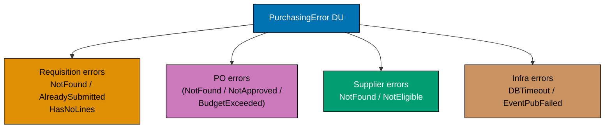





```fsharp
// Every failure mode in the purchasing context is a named DU case.
// This drives precise HTTP status codes, alerting, and retry logic.
// [Clojure: namespaced keywords as error tags in maps — open but not compiler-enforced exhaustive]

type RequisitionId   = RequisitionId   of string
type PurchaseOrderId = PurchaseOrderId of string
type SupplierId      = SupplierId      of string

// The complete purchasing context error DU
type PurchasingError =
    // Requisition errors
    | RequisitionNotFound      of RequisitionId
    // => The requisition ID does not exist in the database (404)
    | RequisitionAlreadySubmitted of RequisitionId
    // => Attempt to submit a requisition that is already Submitted (409 Conflict)
    | RequisitionHasNoLines    of RequisitionId
    // => Cannot submit a requisition with zero line items (422 Unprocessable)
    | InvalidSkuCode           of sku: string
    // => A line item's SKU does not match the required format (422)
    | NegativeQuantity         of sku: string * qty: int
    // => A line item's quantity is ≤ 0 (422)
    | NegativePrice            of sku: string * price: decimal
    // => A line item's unit price is ≤ 0 (422)
    // Supplier errors
    | SupplierNotFound         of SupplierId
    // => The selected supplier does not exist in the supplier master (404)
    | SupplierNotApproved      of SupplierId
    // => The supplier is Pending, Suspended, or Blacklisted — cannot receive POs (422)
    // Budget errors
    | BudgetExceeded           of required: decimal * available: decimal
    // => The requisition total exceeds the department's available budget (422)
    | ApprovalLevelNotMet      of required: string * actual: string
    // => The approver does not have sufficient authority level (403)

// Map error to HTTP status code — lives at the API boundary, not the domain
let toHttpStatus (error: PurchasingError) : int =
    match error with
    | RequisitionNotFound _            -> 404
    | SupplierNotFound _               -> 404
    // => Not found errors → 404
    | RequisitionAlreadySubmitted _    -> 409
    // => Conflict (duplicate action) → 409
    | ApprovalLevelNotMet _            -> 403
    // => Insufficient authority → 403
    | RequisitionHasNoLines _
    | InvalidSkuCode _
    | NegativeQuantity _
    | NegativePrice _
    | SupplierNotApproved _
    | BudgetExceeded _                 -> 422
    // => Business rule violations → 422 Unprocessable Entity

// Test
let err1 = SupplierNotApproved (SupplierId "sup_blocked")
// => err1 : PurchasingError = SupplierNotApproved (SupplierId "sup_blocked")
let err2 = BudgetExceeded (15000m, 10000m)
// => err2 : PurchasingError = BudgetExceeded (15000M, 10000M)

printfn "Status: %d — %A" (toHttpStatus err1) err1
// => Output: Status: 422 — SupplierNotApproved (SupplierId "sup_blocked")
printfn "Status: %d — %A" (toHttpStatus err2) err2
// => Output: Status: 422 — BudgetExceeded (15000M, 10000M)
```





```clojure
;; Every failure mode in the purchasing context is a namespaced keyword error tag.
;; [F#: discriminated union — compiler rejects non-exhaustive matches; Clojure dispatch is open]
;; Clojure idiom: error maps carry a :error/tag keyword; multimethod dispatches on the tag.

;; Error constructors — return plain maps with namespaced tag keyword
(defn requisition-not-found [req-id]
  {:error/tag :purchasing/requisition-not-found :req/id req-id})
  ;; => Tag drives HTTP status mapping and monitoring alert routing

(defn requisition-already-submitted [req-id]
  {:error/tag :purchasing/requisition-already-submitted :req/id req-id})
  ;; => 409 Conflict — caller attempted a duplicate submission

(defn requisition-has-no-lines [req-id]
  {:error/tag :purchasing/requisition-has-no-lines :req/id req-id})
  ;; => 422 Unprocessable — a requisition must have at least one line before submission

(defn invalid-sku-code [sku]
  {:error/tag :purchasing/invalid-sku-code :line/sku sku})
  ;; => 422 — SKU does not match the required format

(defn negative-quantity [sku qty]
  {:error/tag :purchasing/negative-quantity :line/sku sku :line/qty qty})
  ;; => 422 — line item quantity is <= 0

(defn negative-price [sku price]
  {:error/tag :purchasing/negative-price :line/sku sku :line/price price})
  ;; => 422 — line item unit price is <= 0

(defn supplier-not-found [supplier-id]
  {:error/tag :purchasing/supplier-not-found :supplier/id supplier-id})
  ;; => 404 — supplier ID does not exist in the supplier master

(defn supplier-not-approved [supplier-id]
  {:error/tag :purchasing/supplier-not-approved :supplier/id supplier-id})
  ;; => 422 — supplier is Pending, Suspended, or Blacklisted

(defn budget-exceeded [required available]
  {:error/tag :purchasing/budget-exceeded :budget/required required :budget/available available})
  ;; => 422 — requisition total exceeds department budget

(defn approval-level-not-met [required actual]
  {:error/tag :purchasing/approval-level-not-met :level/required required :level/actual actual})
  ;; => 403 — approver does not have sufficient authority

;; Map error tag to HTTP status — dispatches on the :error/tag keyword.
;; [F#: exhaustive match on PurchasingError DU — compiler enforces all cases are handled]
;; Clojure multimethod is open: new tags need a new defmethod, but compiler will not warn on gaps.
(defmulti to-http-status :error/tag)

(defmethod to-http-status :purchasing/requisition-not-found [_]  404)
;; => Requisition not found in database — 404

(defmethod to-http-status :purchasing/supplier-not-found [_]     404)
;; => Supplier not found in master data — 404

(defmethod to-http-status :purchasing/requisition-already-submitted [_] 409)
;; => Duplicate submission attempt — 409 Conflict

(defmethod to-http-status :purchasing/approval-level-not-met [_] 403)
;; => Insufficient approver authority — 403 Forbidden

(defmethod to-http-status :default [_] 422)
;; => All remaining purchasing errors are business rule violations — 422

;; Test
(def err1 (supplier-not-approved "sup_blocked"))
;; => err1 = {:error/tag :purchasing/supplier-not-approved :supplier/id "sup_blocked"}

(def err2 (budget-exceeded 15000M 10000M))
;; => err2 = {:error/tag :purchasing/budget-exceeded :budget/required 15000M :budget/available 10000M}

(println "Status:" (to-http-status err1) "—" err1)
;; => Output: Status: 422 — {:error/tag :purchasing/supplier-not-approved ...}
(println "Status:" (to-http-status err2) "—" err2)
;; => Output: Status: 422 — {:error/tag :purchasing/budget-exceeded ...}
```





```typescript
// Domain Error union — every failure mode is a named, typed value.
// [F#: DU type DomainError = ... | ... — exhaustive match forces handling all cases]
// [Clojure: keyword set #{:error/...}; TS uses a closed tagged union with exhaustive switch]

// Domain error union — closed set of all procurement failure modes
type DomainError =
  | { readonly kind: "RequisitionNotFound"; readonly id: string }
  // => Requisition ID does not exist in the database
  | { readonly kind: "DuplicateRequisition"; readonly id: string }
  // => Requisition with this ID was already submitted
  | { readonly kind: "InsufficientBudget"; readonly required: number; readonly available: number }
  // => Line total exceeds the remaining budget for the cost centre
  | { readonly kind: "SupplierNotApproved"; readonly supplierId: string }
  // => Supplier has not passed the procurement approval process
  | { readonly kind: "BudgetPeriodClosed"; readonly period: string }
  // => Budget period is closed — no new requisitions can be submitted
  | { readonly kind: "InvalidApprovalLevel"; readonly level: string };
// => Approval level is not one of L1/L2/L3

// Exhaustiveness helper
function assertNever(x: never): never {
  throw new Error(`Unhandled: ${String(x)}`);
}

// Exhaustive handler — TypeScript forces all cases to be covered
function describeDomainError(error: DomainError): string {
  switch (error.kind) {
    case "RequisitionNotFound":
      return `Requisition ${error.id} not found`;
    case "DuplicateRequisition":
      return `Requisition ${error.id} already submitted`;
    case "InsufficientBudget":
      return `Insufficient budget: need ${error.required}, have ${error.available}`;
    case "SupplierNotApproved":
      return `Supplier ${error.supplierId} has not been approved for procurement`;
    case "BudgetPeriodClosed":
      return `Budget period ${error.period} is closed`;
    case "InvalidApprovalLevel":
      return `Invalid approval level: '${error.level}'`;
    default:
      return assertNever(error);
  }
}

// HTTP status mapping from domain error to API response code
function httpStatusFor(error: DomainError): number {
  switch (error.kind) {
    case "RequisitionNotFound":
      return 404;
    case "DuplicateRequisition":
      return 409;
    case "InsufficientBudget":
    case "SupplierNotApproved":
    case "BudgetPeriodClosed":
    case "InvalidApprovalLevel":
      return 422;
    default:
      return assertNever(error);
  }
}

const err1: DomainError = { kind: "RequisitionNotFound", id: "req_f4c2a1b7" };
const err2: DomainError = { kind: "InsufficientBudget", required: 5000, available: 2000 };

console.log(describeDomainError(err1), "->", httpStatusFor(err1));
// => Output: Requisition req_f4c2a1b7 not found -> 404
console.log(describeDomainError(err2), "->", httpStatusFor(err2));
// => Output: Insufficient budget: need 5000, have 2000 -> 422
```





```haskell
-- ── file: PurchasingError.hs ──────────
-- [F#: discriminated union with exhaustive match; Haskell ADT + pattern match — same compile-time exhaustiveness]
-- [Clojure: namespaced keywords + multimethod, no exhaustiveness check; Haskell catches missing cases at compile time]
{-# LANGUAGE OverloadedStrings #-}
import Data.Text (Text)

-- Newtype wrappers prevent mixing IDs of different aggregates at the type level
newtype RequisitionId   = RequisitionId   Text deriving (Show, Eq)
newtype PurchaseOrderId = PurchaseOrderId Text deriving (Show, Eq)
newtype SupplierId      = SupplierId      Text deriving (Show, Eq)

-- The complete purchasing-context error ADT — every constructor is a named failure mode
data PurchasingError
  = RequisitionNotFound RequisitionId         -- => 404: missing requisition
  | RequisitionAlreadySubmitted RequisitionId -- => 409: duplicate submit attempt
  | RequisitionHasNoLines RequisitionId       -- => 422: empty requisition
  | InvalidSkuCode Text                       -- => 422: malformed SKU
  | NegativeQuantity Text Int                 -- => 422: non-positive qty
  | NegativePrice Text Double                 -- => 422: non-positive price
  | SupplierNotFound SupplierId               -- => 404: missing supplier
  | SupplierNotApproved SupplierId            -- => 422: supplier off-roster
  | BudgetExceeded Double Double              -- => 422: required vs available
  | ApprovalLevelNotMet Text Text             -- => 403: required vs actual level
  deriving (Show, Eq)

-- Exhaustive pattern match — the compiler warns on any missing constructor with -Wall
toHttpStatus :: PurchasingError -> Int
toHttpStatus (RequisitionNotFound      _)       = 404
toHttpStatus (SupplierNotFound         _)       = 404
toHttpStatus (RequisitionAlreadySubmitted _)    = 409
toHttpStatus (ApprovalLevelNotMet      _ _)     = 403
toHttpStatus (RequisitionHasNoLines    _)       = 422
toHttpStatus (InvalidSkuCode           _)       = 422
toHttpStatus (NegativeQuantity         _ _)     = 422
toHttpStatus (NegativePrice            _ _)     = 422
toHttpStatus (SupplierNotApproved      _)       = 422
toHttpStatus (BudgetExceeded           _ _)     = 422
-- => Every business-rule violation maps to 422 Unprocessable Entity

-- Test
err1, err2 :: PurchasingError
err1 = SupplierNotApproved (SupplierId "sup_blocked")
                                              -- => named failure with payload
err2 = BudgetExceeded 15000 10000
                                              -- => named failure with two amounts

main :: IO ()
main = do
  putStrLn $ "Status: " <> show (toHttpStatus err1) <> " — " <> show err1
  -- => Output: Status: 422 — SupplierNotApproved (SupplierId "sup_blocked")
  putStrLn $ "Status: " <> show (toHttpStatus err2) <> " — " <> show err2
  -- => Output: Status: 422 — BudgetExceeded 15000.0 10000.0
```





**Key Takeaway**: A comprehensive named error DU makes every failure mode visible, testable, and precisely mappable to API responses — stringly-typed errors or generic exceptions cannot provide this level of precision.

**Why It Matters**: In a procurement API, returning the right HTTP status code and error body is contractual — clients (web UIs, ERP integrations, EDI systems) rely on these codes to decide whether to retry, alert, or present a user-facing message. A named `PurchasingError` DU makes the `toHttpStatus` mapping exhaustive (the compiler enforces it) and documents every error mode as part of the domain contract.

---

## Workflow Signatures and Domain Architecture (Examples 37–50)

### Example 37: PurchaseOrder Aggregate — Full State Machine

The `PurchaseOrder` is the workhorse aggregate of the purchasing context. Its state machine governs the full lifecycle from `Draft` through `Issued`, `Received`, `Invoiced`, and `Paid` to `Closed`, with off-ramps to `Cancelled` and `Disputed`.

**Approval flow** (forward path from Draft to Issued):

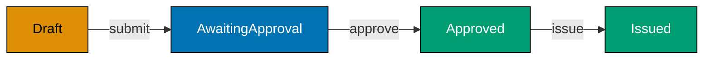

**Off-ramps and disputes** (Cancelled / Disputed states from various points):

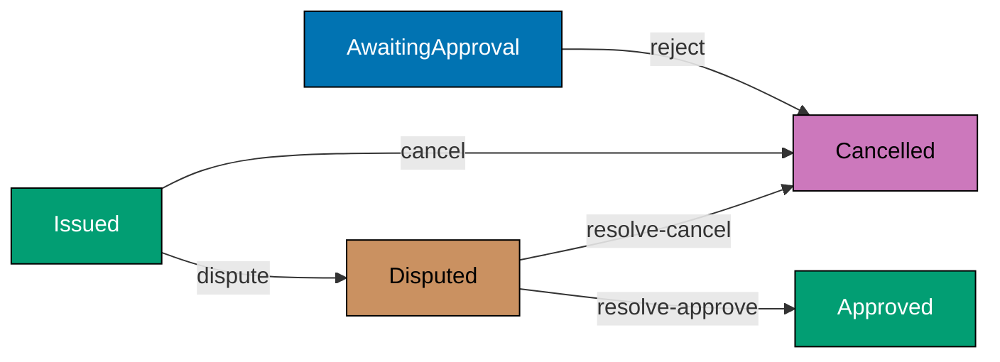





```fsharp
// PurchaseOrder: the primary aggregate of the purchasing context.
// States model the full lifecycle; transitions are typed functions.
// [Clojure: :po/status keyword in a map; multimethods dispatch on status — open but not type-safe]

type PurchaseOrderId = PurchaseOrderId of string
type RequisitionId   = RequisitionId   of string
type SupplierId      = SupplierId      of string

// Line item on the purchase order
type PoLine = { Sku: string; Quantity: int; UnitPrice: decimal }
// => Simplified for this example — full version uses SkuCode, Quantity, UnitPrice value objects

// PurchaseOrder states — each case carries only the data meaningful in that state
type PurchaseOrder =
    | Draft of {| Id: PurchaseOrderId; RequisitionId: RequisitionId; Lines: PoLine list |}
    // => Draft: being built — lines can still be modified
    | AwaitingApproval of {| Id: PurchaseOrderId; SupplierId: SupplierId; Lines: PoLine list; Total: decimal |}
    // => Submitted for approval — lines are now locked for the review period
    | Approved of {| Id: PurchaseOrderId; SupplierId: SupplierId; Lines: PoLine list; Total: decimal; ApprovedAt: System.DateTimeOffset |}
    // => Approved — ready to be issued to the supplier
    | Issued of {| Id: PurchaseOrderId; SupplierId: SupplierId; IssuedAt: System.DateTimeOffset |}
    // => Formally sent to the supplier — lines are now immutable
    | Cancelled of {| Id: PurchaseOrderId; Reason: string |}
    // => Cancelled — off-ramp from any pre-Paid state
    | Disputed of {| Id: PurchaseOrderId; DisputeReason: string |}
    // => Under dispute — can resolve to Approved or Cancelled

// Transition: Draft → AwaitingApproval
let submitPO (supplierId: SupplierId) (po: PurchaseOrder) : Result<PurchaseOrder, string> =
    match po with
    | Draft d ->
        // => Only Draft POs can be submitted for approval
        if d.Lines.IsEmpty then Error "Cannot submit a PO with no line items"
        // => Invariant: at least one line item required before submission
        else
            let total = d.Lines |> List.sumBy (fun l -> decimal l.Quantity * l.UnitPrice)
            // => Compute total at submission time — drives approval level routing
            Ok (AwaitingApproval {| Id = d.Id; SupplierId = supplierId; Lines = d.Lines; Total = total |})
            // => Produces AwaitingApproval state with total baked in
    | other -> Error (sprintf "Cannot submit PO in state: %A" other)
    // => Any non-Draft state is an invalid transition — rejected

// Build a sample Draft PO
let draft = Draft {| Id = PurchaseOrderId "po_e3d1f8a0"; RequisitionId = RequisitionId "req_f4c2"; Lines = [{ Sku = "ELE-0099"; Quantity = 3; UnitPrice = 899.99m }] |}
// => draft : PurchaseOrder = Draft { Id = ...; Lines = [{ Sku = "ELE-0099"; Quantity = 3; UnitPrice = 899.99 }] }

let submitted = submitPO (SupplierId "sup_acme") draft
// => Lines not empty, supplier provided — transitions Draft → AwaitingApproval
// => submitted : Result<PurchaseOrder, string> = Ok (AwaitingApproval { ...; Total = 2699.97 })

printfn "Submitted: %A" submitted
// => Output: Ok (AwaitingApproval {| Id = ...; Total = 2699.97M; ... |})
```





```clojure
;; PurchaseOrder: the primary aggregate of the purchasing context.
;; Clojure idiom: the PO is a plain map; :po/status is the lifecycle field.
;; [F#: discriminated union with typed state payloads — compile-time illegal-state prevention]
;; Clojure trades compile-time state safety for data flexibility and REPL inspectability.

;; Constructor: build a new Draft PO from a requisition
(defn make-draft-po [po-id req-id lines]
  ;; A Draft PO carries only the fields meaningful in the Draft state
  {:po/id          po-id
   ;; => PO identity — format "po_<uuid>"
   :po/req-id      req-id
   ;; => Originating requisition — reference by ID only
   :po/status      :draft
   ;; => Lifecycle starts at :draft — eligible for line addition
   :po/lines       lines
   ;; => Line items owned by this PO aggregate
   :po/total       (reduce + 0M (map (fn [l] (* (:line/qty l) (:line/price l))) lines))})
   ;; => Derived total — kept consistent with lines inside the aggregate boundary

;; Transition: :draft -> :awaiting-approval
;; [F#: submitPO returns Result<PurchaseOrder, string> — Clojure returns tagged map]
(defn submit-po [supplier-id po]
  ;; Only Draft POs can be submitted; lines must be non-empty
  (cond
    (not= (:po/status po) :draft)
    {:error (str "Cannot submit PO in status: " (:po/status po))}
    ;; => Guard: invalid transition from non-Draft state — return error map

    (empty? (:po/lines po))
    {:error "Cannot submit a PO with no line items"}
    ;; => Guard: at least one line required before submission — procurement invariant

    :else
    (let [total (reduce + 0M (map (fn [l] (* (:line/qty l) (:line/price l))) (:po/lines po)))]
      ;; => Recompute total at submission time — drives approval level routing
      {:ok (assoc po
             :po/status      :awaiting-approval
             ;; => Transition to :awaiting-approval — lines are now locked for review
             :po/supplier-id supplier-id
             ;; => Supplier baked in at submission — cannot be changed during approval
             :po/total       total)})))
             ;; => Updated total consistent with current lines

;; Build a sample Draft PO
(def draft-po
  (make-draft-po "po_e3d1f8a0" "req_f4c2"
                 [{:line/sku "ELE-0099" :line/qty 3 :line/price 899.99M}]))
;; => draft-po : {:po/status :draft :po/lines [...] :po/total 2699.97M ...}

;; Attempt the submit transition
(def submitted (submit-po "sup_acme" draft-po))
;; => Lines non-empty, status :draft, supplier provided — valid transition
;; => submitted = {:ok {:po/status :awaiting-approval :po/total 2699.97M ...}}

(if (:ok submitted)
  (println "Submitted with total:" (get-in submitted [:ok :po/total]))
  ;; => Output: Submitted with total: 2699.97M
  (println "Error:" (:error submitted)))
```





```typescript
// PurchaseOrder aggregate — full state machine encoded in the type system.
// [F#: DU where each case carries state-specific payload — access to wrong field is compile error]
// [Clojure: map with :status key dispatched by defmulti; TS uses tagged union with narrowing]

type PurchaseOrderId = string & { readonly __brand: "PurchaseOrderId" };
type SupplierId = string & { readonly __brand: "SupplierId" };
const asPOId = (s: string): PurchaseOrderId => s as PurchaseOrderId;

// Each state carries only the data meaningful in that state
interface PODraftState {
  readonly status: "Draft";
  readonly purchaseOrderId: PurchaseOrderId;
  readonly supplierId: SupplierId;
  readonly lines: readonly { sku: string; qty: number; price: number }[];
}
// => Draft: assembled but not yet sent to supplier for approval

interface POApprovedState {
  readonly status: "Approved";
  readonly purchaseOrderId: PurchaseOrderId;
  readonly supplierId: SupplierId;
  readonly approvedAt: string;
  readonly approvedBy: string;
}
// => Approved: internal approval granted — ready to be issued

interface POIssuedState {
  readonly status: "Issued";
  readonly purchaseOrderId: PurchaseOrderId;
  readonly supplierId: SupplierId;
  readonly issuedAt: string;
  readonly expectedDelivery: string;
}
// => Issued: formally sent to supplier — delivery expected

interface POCancelledState {
  readonly status: "Cancelled";
  readonly purchaseOrderId: PurchaseOrderId;
  readonly reason: string;
  readonly cancelledAt: string;
}
// => Cancelled: PO voided — no delivery will occur

// The full PO lifecycle union
type PurchaseOrder = PODraftState | POApprovedState | POIssuedState | POCancelledState;

// Typed transitions — each takes the correct state
function approvePO(draft: PODraftState, approvedBy: string): POApprovedState {
  return {
    status: "Approved",
    purchaseOrderId: draft.purchaseOrderId,
    supplierId: draft.supplierId,
    approvedAt: new Date().toISOString(),
    approvedBy,
  };
  // => approvePO : PODraftState -> POApprovedState — cannot approve a cancelled PO
}

function issuePO(approved: POApprovedState, expectedDelivery: string): POIssuedState {
  return {
    status: "Issued",
    purchaseOrderId: approved.purchaseOrderId,
    supplierId: approved.supplierId,
    issuedAt: new Date().toISOString(),
    expectedDelivery,
  };
  // => issuePO : POApprovedState -> POIssuedState — cannot issue a draft PO
}

const draft: PODraftState = {
  status: "Draft",
  purchaseOrderId: asPOId("po_e3d1f8a0"),
  supplierId: "sup_001" as SupplierId,
  lines: [{ sku: "ELE-0099", qty: 3, price: 899.99 }],
};
const approved = approvePO(draft, "mgr_finance");
const issued = issuePO(approved, "2026-06-15");

console.log("PO status:", issued.status, "supplier:", issued.supplierId);
// => Output: PO status: Issued supplier: sup_001
```





```haskell
-- ── file: PurchaseOrder.hs ────────────
-- [F#: DU with anonymous records per case; Haskell uses ADT with one record per state — same illegal-state-impossible guarantee]
-- [Clojure: :po/status keyword on a map; Haskell encodes status in the type itself, not a field]
{-# LANGUAGE OverloadedStrings #-}
{-# LANGUAGE DuplicateRecordFields #-}
import Data.Text (Text)
import Data.Time (UTCTime, getCurrentTime)

newtype PurchaseOrderId = PurchaseOrderId Text deriving (Show, Eq)
newtype RequisitionId   = RequisitionId   Text deriving (Show, Eq)
newtype SupplierId      = SupplierId      Text deriving (Show, Eq)

-- Line item record — shared across states that retain lines
data PoLine = PoLine { sku :: Text, qty :: Int, price :: Double } deriving (Show)

-- Each constructor carries only the fields meaningful in that state
data PurchaseOrder
  = Draft            { poId :: PurchaseOrderId
                     , reqId :: RequisitionId
                     , lines_ :: [PoLine]
                     }                                -- => Draft: editable lines
  | AwaitingApproval { poId :: PurchaseOrderId
                     , supplier :: SupplierId
                     , lines_ :: [PoLine]
                     , total :: Double
                     }                                -- => Submitted; lines locked
  | Approved         { poId :: PurchaseOrderId
                     , supplier :: SupplierId
                     , total :: Double
                     , approvedAt :: UTCTime
                     }                                -- => Approved; ready to issue
  | Issued           { poId :: PurchaseOrderId
                     , supplier :: SupplierId
                     , issuedAt :: UTCTime
                     }                                -- => Sent to supplier; immutable
  | Cancelled        { poId :: PurchaseOrderId
                     , reason :: Text
                     }                                -- => Off-ramp from any pre-Paid state
  | Disputed         { poId :: PurchaseOrderId
                     , disputeReason :: Text
                     }                                -- => Under dispute
  deriving (Show)

-- Transition: Draft -> AwaitingApproval; Either Text rejects illegal moves
submitPO :: SupplierId -> PurchaseOrder -> Either Text PurchaseOrder
submitPO supId (Draft pid _ ls)
  | null ls   = Left "Cannot submit a PO with no line items"
                                                      -- => invariant: at least one line
  | otherwise = Right $ AwaitingApproval pid supId ls totalAmt
                                                      -- => compute total at submit time
  where totalAmt = sum [fromIntegral (qty l) * price l | l <- ls]
submitPO _ other = Left $ "Cannot submit PO in state: "
                       <> case other of               -- show only the constructor name
                            AwaitingApproval{} -> "AwaitingApproval"
                            Approved{}         -> "Approved"
                            Issued{}           -> "Issued"
                            Cancelled{}        -> "Cancelled"
                            Disputed{}         -> "Disputed"
                            Draft{}            -> "Draft"   -- unreachable, exhaustive

-- Build a sample Draft PO
draftPO :: PurchaseOrder
draftPO = Draft (PurchaseOrderId "po_e3d1f8a0")
                (RequisitionId   "req_f4c2")
                [PoLine "ELE-0099" 3 899.99]          -- single-line example

main :: IO ()
main = do
  let submitted = submitPO (SupplierId "sup_acme") draftPO
                                                      -- => Right (AwaitingApproval ... 2699.97)
  print submitted
  -- => Output: Right (AwaitingApproval ... {total = 2699.97})
```





**Key Takeaway**: Modelling `PurchaseOrder` states as discriminated union cases with typed payloads enforces the state machine at the type level — a transition function that accepts `Draft` cannot be accidentally called with `Issued`.

**Why It Matters**: The `PurchaseOrder` state machine is the compliance heart of any P2P system. Illegal transitions (issuing a PO that was never approved, paying an invoice before three-way matching) are not just business logic errors — they are audit failures. The typed state machine makes these errors impossible to produce, replacing runtime checks and test coverage with compile-time enforcement.

---

### Example 38: Domain Events from State Transitions

When a `PurchaseOrder` transitions to `Issued`, it emits a `PurchaseOrderIssued` event. Domain events are the outputs of aggregate state transitions — they notify downstream contexts (`receiving`, `invoicing`, `supplier-notifier`) that something happened.





```fsharp
// Domain events are emitted by aggregate state transitions.
// Each event carries enough context for all downstream consumers.
// [Clojure: events are plain maps with :event/type keyword — same data, no static type hierarchy]

type PurchaseOrderId = PurchaseOrderId of string
type SupplierId      = SupplierId      of string

// Domain event emitted when a PO is issued to a supplier
type PurchaseOrderIssued = {
    PurchaseOrderId: PurchaseOrderId
    // => Identity of the issued PO — used by receiving to open a GRN expectation
    SupplierId:      SupplierId
    // => Which supplier receives the PO — supplier-notifier sends EDI/email
    IssuedAt:        System.DateTimeOffset
    // => Timestamp — for SLA tracking and audit trail
    TotalAmount:     decimal
    // => Total value — for accounting to record the commitment
}
// => PurchaseOrderIssued : event payload — past tense, carries all consumer needs

// Domain event emitted when a requisition is approved
type RequisitionApproved = {
    RequisitionId: string
    // => Which requisition was approved
    ApprovedBy:    string
    // => Which manager approved it — for audit trail
    ApprovedAt:    System.DateTimeOffset
    // => Approval timestamp — for SLA reporting
}
// => RequisitionApproved : purchasing emits this; purchasing auto-converts to PO Draft

// Union of all purchasing domain events
type PurchasingEvent =
    | PurchaseOrderIssued  of PurchaseOrderIssued
    | RequisitionApproved  of RequisitionApproved
    | PurchaseOrderCancelled of purchaseOrderId: string * reason: string
    // => Cancelled event — supplier-notifier and accounting are consumers

// A transition function returns both the new state and the events it emits
type PoLine = { Sku: string; Quantity: int; UnitPrice: decimal }

type ApprovedPo = {| Id: PurchaseOrderId; SupplierId: SupplierId; Lines: PoLine list; Total: decimal; ApprovedAt: System.DateTimeOffset |}
type IssuedPo   = {| Id: PurchaseOrderId; SupplierId: SupplierId; IssuedAt: System.DateTimeOffset |}

// Issue transition: Approved → Issued, emitting PurchaseOrderIssued
let issuePO (approved: ApprovedPo) : IssuedPo * PurchasingEvent list =
    let issuedAt = System.DateTimeOffset.UtcNow
    // => Capture issuance timestamp — used in the new state and the event
    let newState = {| Id = approved.Id; SupplierId = approved.SupplierId; IssuedAt = issuedAt |}
    // => New Issued state — lines dropped (immutable from this point; stored in event log)
    let event = PurchaseOrderIssued {
        PurchaseOrderId = approved.Id
        // => Same ID carries across the transition — traceability
        SupplierId      = approved.SupplierId
        // => Supplier needs to know this PO was issued to them
        IssuedAt        = issuedAt
        // => Same timestamp as the state transition — consistency
        TotalAmount     = approved.Total
        // => Total baked into the event — accounting doesn't need to reload the PO
    }
    newState, [event]
    // => Returns the new state AND the list of events — caller routes events to the bus

// Test
let approvedPo = {| Id = PurchaseOrderId "po_e3d1f8a0"; SupplierId = SupplierId "sup_acme"
                    Lines = [{ Sku = "ELE-0099"; Quantity = 3; UnitPrice = 899.99m }]
                    Total = 2699.97m; ApprovedAt = System.DateTimeOffset.UtcNow |}
// => approvedPo : ApprovedPo — in Approved state, ready to be issued

let (issuedState, events) = issuePO approvedPo
// => issuedState : IssuedPo — PO is now Issued
// => events : PurchasingEvent list = [PurchaseOrderIssued { ... }]

printfn "Issued: %A" issuedState.Id
// => Output: Issued: PurchaseOrderId "po_e3d1f8a0"
printfn "Events: %d" events.Length
// => Output: Events: 1
```





```clojure
;; Domain events are emitted by aggregate state transitions.
;; Clojure idiom: events are plain maps carrying an :event/type keyword.
;; [F#: typed DU PurchasingEvent — exhaustive match on consumers; Clojure dispatch is open via multimethod]

;; Event constructors — return plain maps; :event/type drives consumer dispatch
(defn purchase-order-issued [po-id supplier-id issued-at total-amount]
  {:event/type          :purchasing/purchase-order-issued
   ;; => Past tense name — signals something already happened
   :po/id               po-id
   ;; => Identity of the issued PO — receiving uses this to open a GRN expectation
   :po/supplier-id      supplier-id
   ;; => Which supplier — supplier-notifier sends EDI/email using this value
   :event/occurred-at   issued-at
   ;; => Timestamp — for SLA tracking and audit trail
   :po/total-amount     total-amount})
   ;; => Total baked into the event — accounting records the commitment without reloading the PO

(defn requisition-approved [req-id approved-by approved-at]
  {:event/type         :purchasing/requisition-approved
   ;; => Purchasing emits this; auto-conversion to PO Draft is a downstream policy
   :req/id             req-id
   ;; => Which requisition was approved
   :event/approved-by  approved-by
   ;; => Which manager approved — for audit trail
   :event/occurred-at  approved-at})
   ;; => Approval timestamp — SLA reporting reads this field

(defn purchase-order-cancelled [po-id reason]
  {:event/type    :purchasing/purchase-order-cancelled
   ;; => Consumer: supplier-notifier (send cancellation notice) and accounting (reverse commitment)
   :po/id         po-id
   :cancel/reason reason})

;; Issue transition: :approved -> :issued, returning [new-state events].
;; [F#: (newState, events) tuple — structurally identical pattern; Clojure uses a map return]
(defn issue-po [approved-po]
  ;; Transition is valid only from :approved status; guard omitted here for brevity
  (let [issued-at (java.time.Instant/now)
        ;; => Capture issuance timestamp — used in new state AND event for consistency
        new-state (-> approved-po
                      (assoc :po/status :issued)
                      ;; => Transition to :issued — lines become immutable from this point
                      (assoc :po/issued-at issued-at)
                      ;; => Record issuance timestamp on the aggregate
                      (dissoc :po/lines))
                      ;; => Lines dropped from active state — stored in event log / history
        event     (purchase-order-issued
                    (:po/id approved-po)
                    ;; => Same PO ID carries across — traceability through all events
                    (:po/supplier-id approved-po)
                    issued-at
                    (:po/total approved-po))]
                    ;; => Total baked into event — downstream consumers don't reload the PO
    {:new-state new-state
     ;; => Caller persists the new state to the aggregate store
     :events    [event]}))
     ;; => Caller routes events to the event bus — co-located with transition, cannot be omitted

;; Test
(def approved-po
  {:po/id          "po_e3d1f8a0"
   :po/supplier-id "sup_acme"
   :po/status      :approved
   :po/lines       [{:line/sku "ELE-0099" :line/qty 3 :line/price 899.99M}]
   :po/total       2699.97M
   :po/approved-at (java.time.Instant/now)})
;; => approved-po : map in :approved status, ready to be issued

(def result (issue-po approved-po))
;; => result = {:new-state {:po/status :issued ...} :events [{:event/type :purchasing/purchase-order-issued ...}]}

(println "Issued PO ID:" (get-in result [:new-state :po/id]))
;; => Output: Issued PO ID: po_e3d1f8a0
(println "Events emitted:" (count (:events result)))
;; => Output: Events emitted: 1
```





```typescript
// Domain events from state transitions — each transition emits an immutable event.
// [F#: state transition function returns (NewState * Event list) — events are the record of change]
// [Clojure: transition function returns {:state new-state :events [...]}; TS mirrors this tuple]

type PurchaseOrderId = string & { readonly __brand: "PurchaseOrderId" };
type SupplierId = string & { readonly __brand: "SupplierId" };
const asPOId = (s: string): PurchaseOrderId => s as PurchaseOrderId;

// State types
interface PODraftState {
  readonly status: "Draft";
  readonly purchaseOrderId: PurchaseOrderId;
  readonly supplierId: SupplierId;
  readonly lines: readonly { sku: string; qty: number; price: number }[];
}
interface POApprovedState {
  readonly status: "Approved";
  readonly purchaseOrderId: PurchaseOrderId;
  readonly approvedAt: string;
}

// Domain event union — past-tense, immutable facts
type POEvent =
  | { readonly type: "PurchaseOrderApproved"; readonly purchaseOrderId: PurchaseOrderId; readonly approvedAt: string }
  // => Fired when the PO transitions from Draft to Approved
  | {
      readonly type: "PurchaseOrderIssued";
      readonly purchaseOrderId: PurchaseOrderId;
      readonly supplierId: SupplierId;
      readonly issuedAt: string;
    };
// => Fired when the PO is formally sent to the supplier

// Transition returns (NewState, Events[]) tuple — events are the audit trail
function approvePO(draft: PODraftState): [POApprovedState, POEvent[]] {
  const approvedAt = new Date().toISOString();
  const newState: POApprovedState = {
    status: "Approved",
    purchaseOrderId: draft.purchaseOrderId,
    // => Preserve identity through the transition
    approvedAt,
  };
  const events: POEvent[] = [
    {
      type: "PurchaseOrderApproved",
      purchaseOrderId: draft.purchaseOrderId,
      approvedAt,
      // => Event captures what changed and when — for downstream consumers
    },
  ];
  return [newState, events];
  // => Returns (new state, events) — mirrors F# (NewState * DomainEvent list)
}

// Usage
const draft: PODraftState = {
  status: "Draft",
  purchaseOrderId: asPOId("po_e3d1f8a0"),
  supplierId: "sup_001" as SupplierId,
  lines: [{ sku: "ELE-0099", qty: 3, price: 899.99 }],
};

const [approvedState, events] = approvePO(draft);
// => approvePO returns [new state, emitted events]

console.log("New state:", approvedState.status);
// => Output: New state: Approved
console.log(`Events emitted: ${events.length}`);
// => Output: Events emitted: 1
console.log("Event type:", events[0].type);
// => Output: Event type: PurchaseOrderApproved
```





```haskell
-- ── file: PurchaseOrderEvents.hs ──────
-- [F#: DU event payload returned in a tuple with new state; Haskell ADT + tuple — same structural pattern]
-- [Clojure: plain maps with :event/type; Haskell ADT gives compile-time exhaustive consumer dispatch]
{-# LANGUAGE OverloadedStrings #-}
import Data.Text (Text)
import Data.Time (UTCTime, getCurrentTime)

newtype PurchaseOrderId = PurchaseOrderId Text deriving (Show)
newtype SupplierId      = SupplierId      Text deriving (Show)

-- Specific event payloads — each event is its own record
data PurchaseOrderIssuedEv = PurchaseOrderIssuedEv
  { evPoId       :: PurchaseOrderId               -- => receiving uses this for GRN expectation
  , evSupplierId :: SupplierId                    -- => supplier-notifier addresses EDI/email
  , evIssuedAt   :: UTCTime                       -- => SLA tracking + audit trail
  , evTotal      :: Double                        -- => accounting records commitment value
  } deriving (Show)

data RequisitionApprovedEv = RequisitionApprovedEv
  { evReqId      :: Text                          -- => which requisition was approved
  , evApprovedBy :: Text                          -- => manager id for audit trail
  , evApprovedAt :: UTCTime                       -- => SLA reporting reads this
  } deriving (Show)

-- Union of all purchasing events — consumers pattern-match exhaustively
data PurchasingEvent
  = EvPurchaseOrderIssued    PurchaseOrderIssuedEv
  | EvRequisitionApproved    RequisitionApprovedEv
  | EvPurchaseOrderCancelled PurchaseOrderId Text  -- => carries reason for accounting reversal
  deriving (Show)

-- State records — minimal for the example
data PoLine     = PoLine { sku :: Text, qty :: Int, price :: Double } deriving (Show)
data ApprovedPo = ApprovedPo
  { apId         :: PurchaseOrderId
  , apSupplier   :: SupplierId
  , apLines      :: [PoLine]
  , apTotal      :: Double
  , apApprovedAt :: UTCTime
  } deriving (Show)
data IssuedPo   = IssuedPo
  { ipId         :: PurchaseOrderId
  , ipSupplier   :: SupplierId
  , ipIssuedAt   :: UTCTime
  } deriving (Show)

-- Transition returns (newState, events) — emission is structural, not optional
issuePO :: ApprovedPo -> IO (IssuedPo, [PurchasingEvent])
issuePO ap = do
  ts <- getCurrentTime                            -- capture once; used in state + event
  let newState = IssuedPo (apId ap) (apSupplier ap) ts
      event    = EvPurchaseOrderIssued
                   (PurchaseOrderIssuedEv (apId ap) (apSupplier ap) ts (apTotal ap))
                                                  -- payload mirrors apTotal for accounting
  pure (newState, [event])
                                                  -- => caller routes events to the bus

main :: IO ()
main = do
  now <- getCurrentTime
  let approvedPo = ApprovedPo
        (PurchaseOrderId "po_e3d1f8a0")
        (SupplierId      "sup_acme")
        [PoLine "ELE-0099" 3 899.99]
        2699.97
        now
  (issuedState, events) <- issuePO approvedPo
                                                  -- => transition + events together
  putStrLn $ "Issued: " <> show (ipId issuedState)
  -- => Output: Issued: PurchaseOrderId "po_e3d1f8a0"
  putStrLn $ "Events: " <> show (length events)
  -- => Output: Events: 1
```





**Key Takeaway**: State transition functions that return `(newState, events)` pairs keep event emission co-located with the state change — ensuring events are always emitted when the transition occurs, never accidentally omitted.

**Why It Matters**: `PurchaseOrderIssued` is consumed by at least three downstream contexts: `receiving` (opens a GRN expectation), `supplier-notifier` (sends the EDI/email to the supplier), and `accounting` (records the commitment). If event emission is separate from the state transition (e.g., called manually after saving), it is easy to forget to emit under certain error conditions. The `(newState, events)` return pattern makes emission structural — it cannot be omitted.

---

### Example 39: Supplier Aggregate — Lifecycle States

The `Supplier` aggregate lives in the `supplier` bounded context. Its lifecycle (`Pending → Approved → Suspended → Blacklisted`) determines whether the purchasing context can issue new POs to it.

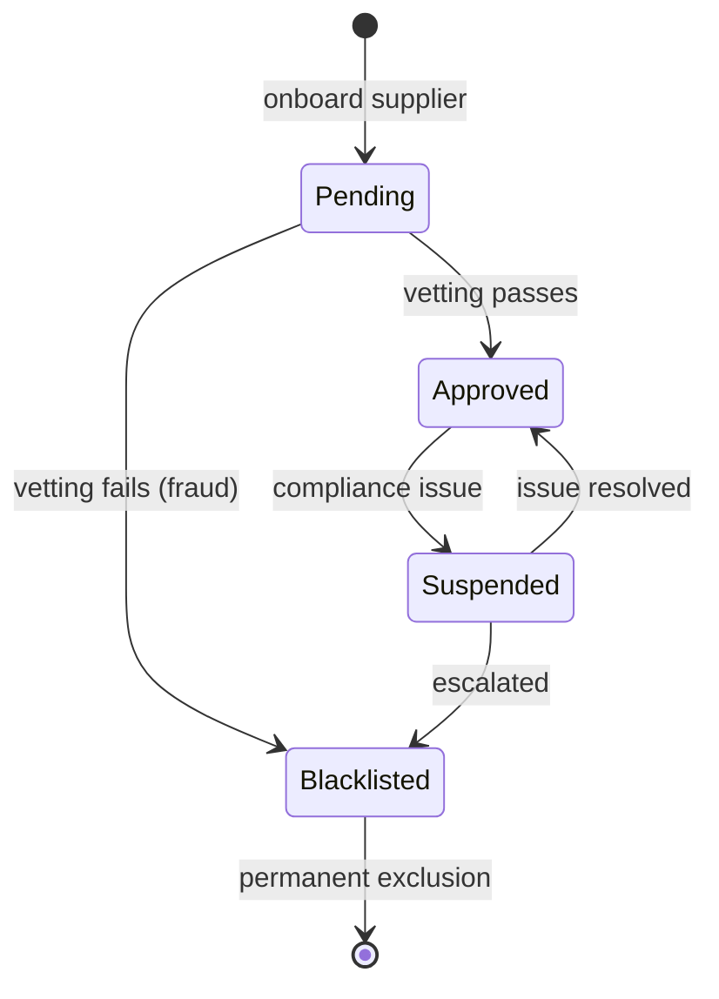





```fsharp
// Supplier: aggregate root of the supplier bounded context.
// Lifecycle state determines eligibility for new POs.
// [Clojure: :supplier/status keyword in map; multimethod dispatch on status tag]

type SupplierId = SupplierId of string
type Email      = Email      of string

// Supplier lifecycle states
type SupplierStatus =
    | Pending     // => Submitted for vendor approval — not yet vetted
    | Approved    // => Vetted and active — eligible for new POs
    | Suspended   // => Temporarily ineligible — existing POs continue; no new POs
    | Blacklisted // => Permanently excluded — existing POs forced to Disputed
// => Exactly one state is active at any time — discriminated union enforces this

// The supplier aggregate
type Supplier = {
    Id:        SupplierId
    // => Supplier identity — format "sup_<uuid>"
    Name:      string
    // => Legal entity name — appears on POs and invoices
    Email:     Email
    // => Primary contact email — receives PO notifications via SupplierNotifierPort
    Status:    SupplierStatus
    // => Current lifecycle state — drives eligibility checks in the purchasing context
    RiskScore: int option
    // => Optional risk score (0–100) — populated after compliance vetting (None while Pending)
}
// => Supplier : aggregate root with identity, contact, status, and optional risk data

// Domain events emitted by the supplier context
type SupplierEvent =
    | SupplierApproved  of SupplierId
    // => Consumer: purchasing (eligible-for-PO list updated)
    | SupplierSuspended of SupplierId * reason: string
    // => Consumer: purchasing (blocks new POs to this supplier)
    | SupplierBlacklisted of SupplierId * reason: string
    // => Consumer: purchasing (forces existing POs to Disputed)

// Transition: approve a pending supplier
let approveSupplier (riskScore: int) (supplier: Supplier) : Result<Supplier * SupplierEvent list, string> =
    match supplier.Status with
    | Pending ->
        // => Only Pending suppliers can be approved
        if riskScore < 0 || riskScore > 100 then
            Error (sprintf "Risk score must be 0–100, got %d" riskScore)
            // => Validate the risk score before applying it
        else
            let approved = { supplier with Status = Approved; RiskScore = Some riskScore }
            // => with-expression: create new Supplier record in Approved state
            let event    = SupplierApproved supplier.Id
            // => Emit SupplierApproved — purchasing context will add to eligible list
            Ok (approved, [event])
            // => Return new state and events together
    | other -> Error (sprintf "Cannot approve a supplier in state: %A" other)
    // => Non-Pending states cannot be approved — guard against invalid transitions

// Test
let pendingSupplier = {
    Id        = SupplierId "sup_acme_001"
    Name      = "Acme Office Supplies Pte Ltd"
    Email     = Email "procurement@acme-supplies.com"
    Status    = Pending
    // => Starts in Pending — not yet eligible for POs
    RiskScore = None
    // => No risk score until vetting is complete
}

let approvalResult = approveSupplier 35 pendingSupplier
// => Status is Pending — valid transition; riskScore 35 is in 0–100 range
// => approvalResult : Result<Supplier * SupplierEvent list, string>

match approvalResult with
| Ok (s, events) ->
    printfn "Supplier status: %A, risk: %A" s.Status s.RiskScore
    // => Output: Supplier status: Approved, risk: Some 35
    printfn "Events emitted: %d" events.Length
    // => Output: Events emitted: 1
| Error e -> printfn "Error: %s" e
```





```clojure
;; Supplier: aggregate root of the supplier bounded context.
;; Clojure idiom: the supplier is a plain map; :supplier/status is the lifecycle field.
;; [F#: discriminated union SupplierStatus — compile-time state enumeration; Clojure uses open keywords]

;; Constructor: create a new Pending supplier (entry state for all onboardings)
(defn make-pending-supplier [id name email]
  {:supplier/id         id
   ;; => Supplier identity — format "sup_<uuid>"
   :supplier/name       name
   ;; => Legal entity name — appears on POs and invoices
   :supplier/email      email
   ;; => Primary contact — receives PO notifications via supplier-notifier port
   :supplier/status     :pending
   ;; => All suppliers start at :pending — not yet vetted for eligibility
   :supplier/risk-score nil})
   ;; => nil until compliance vetting assigns a score (0–100 range)

;; Eligibility check: can the purchasing context issue a new PO to this supplier?
(defn eligible-for-po? [supplier]
  ;; Only :approved suppliers can receive new POs
  (= :approved (:supplier/status supplier)))
  ;; => :pending, :suspended, and :blacklisted all return false

;; Transition: :pending -> :approved
;; [F#: Result<Supplier * SupplierEvent list, string> — Clojure returns tagged result map]
(defn approve-supplier [risk-score supplier]
  ;; Guard: only :pending suppliers can be approved
  (cond
    (not= :pending (:supplier/status supplier))
    {:error (str "Cannot approve a supplier in status: " (:supplier/status supplier))}
    ;; => :approved, :suspended, and :blacklisted are invalid source states

    (or (< risk-score 0) (> risk-score 100))
    {:error (str "Risk score must be 0-100, got " risk-score)}
    ;; => Risk score range enforced before applying the transition

    :else
    (let [approved (-> supplier
                       (assoc :supplier/status :approved)
                       ;; => Transition to :approved — eligible for new POs
                       (assoc :supplier/risk-score risk-score))
                       ;; => Bake the risk score in — populated after compliance vetting
          event    {:event/type          :supplier/supplier-approved
                    ;; => Consumer: purchasing updates its eligible-supplier list
                    :supplier/id         (:supplier/id supplier)
                    :event/occurred-at   (java.time.Instant/now)}]
      {:ok {:new-state approved
            ;; => Caller persists the approved supplier record
            :events    [event]}})))
            ;; => Caller routes SupplierApproved to the event bus

;; Test: create a pending supplier and run the approval transition
(def pending-supplier
  (make-pending-supplier "sup_acme_001" "Acme Office Supplies Pte Ltd" "procurement@acme-supplies.com"))
;; => pending-supplier : {:supplier/status :pending :supplier/risk-score nil ...}

(def approval-result (approve-supplier 35 pending-supplier))
;; => Status is :pending — valid transition; risk-score 35 is within 0–100
;; => approval-result = {:ok {:new-state {:supplier/status :approved :supplier/risk-score 35 ...} :events [...]}}

(if (:ok approval-result)
  (let [{:keys [new-state events]} (:ok approval-result)]
    (println "Supplier status:" (:supplier/status new-state) "risk:" (:supplier/risk-score new-state))
    ;; => Output: Supplier status: :approved risk: 35
    (println "Events emitted:" (count events)))
    ;; => Output: Events emitted: 1
  (println "Error:" (:error approval-result)))
```





```typescript
// Supplier aggregate — lifecycle states as a tagged union.
// [F#: DU SupplierState with payload per case — exhaustive match enforced by compiler]
// [Clojure: map with :supplier/status keyword dispatched by multimethod; TS uses tagged union]

type SupplierId = string & { readonly __brand: "SupplierId" };
const asSupplierId = (s: string): SupplierId => s as SupplierId;

// Supplier lifecycle states — each carries state-specific data
interface SupplierPendingState {
  readonly status: "Pending";
  readonly supplierId: SupplierId;
  readonly name: string;
  readonly submittedAt: string;
}
// => Pending: application submitted — awaiting procurement approval

interface SupplierApprovedState {
  readonly status: "Approved";
  readonly supplierId: SupplierId;
  readonly name: string;
  readonly approvedAt: string;
  readonly currency: string;
}
// => Approved: qualified vendor — can receive POs

interface SupplierSuspendedState {
  readonly status: "Suspended";
  readonly supplierId: SupplierId;
  readonly reason: string;
  readonly suspendedAt: string;
}
// => Suspended: temporarily blocked — quality/compliance issue

interface SupplierBlacklistedState {
  readonly status: "Blacklisted";
  readonly supplierId: SupplierId;
  readonly reason: string;
  readonly blacklistedAt: string;
}
// => Blacklisted: permanently excluded — serious violation

type Supplier = SupplierPendingState | SupplierApprovedState | SupplierSuspendedState | SupplierBlacklistedState;

// Typed transition: Pending -> Approved
function approveSupplier(pending: SupplierPendingState, currency: string): SupplierApprovedState {
  return {
    status: "Approved",
    supplierId: pending.supplierId,
    name: pending.name,
    approvedAt: new Date().toISOString(),
    currency,
  };
  // => approveSupplier only accepts SupplierPendingState — compiler enforces this
}

// Exhaustive description
function describeSupplier(s: Supplier): string {
  switch (s.status) {
    case "Pending":
      return `${s.name} pending approval`;
    case "Approved":
      return `${s.name} approved (${s.currency})`;
    case "Suspended":
      return `Suspended: ${s.reason}`;
    case "Blacklisted":
      return `Blacklisted: ${s.reason}`;
  }
}

const pending: SupplierPendingState = {
  status: "Pending",
  supplierId: asSupplierId("sup_001"),
  name: "ACME Supplies",
  submittedAt: new Date().toISOString(),
};
const approved = approveSupplier(pending, "USD");

console.log(describeSupplier(pending));
// => Output: ACME Supplies pending approval
console.log(describeSupplier(approved));
// => Output: ACME Supplies approved (USD)
```





```haskell
-- ── file: Supplier.hs ─────────────────
-- [F#: DU SupplierStatus + record Supplier; Haskell models status as a sum type embedded in the record]
-- [Clojure: keyword-tagged map; Haskell encodes status with type-level distinction via ADT]
{-# LANGUAGE OverloadedStrings #-}
import Data.Text (Text)

newtype SupplierId = SupplierId Text deriving (Show, Eq)
newtype Email      = Email      Text deriving (Show, Eq)

-- Supplier lifecycle states — exactly one is active at a time
data SupplierStatus
  = Pending                                       -- => awaiting compliance vetting
  | Approved                                      -- => eligible for new POs
  | Suspended                                     -- => temporarily ineligible
  | Blacklisted                                   -- => permanently excluded
  deriving (Show, Eq)

-- Supplier aggregate root
data Supplier = Supplier
  { supplierId  :: SupplierId
  , supplierNm  :: Text                           -- legal entity name
  , supplierEm  :: Email                          -- primary contact email
  , status      :: SupplierStatus                 -- current lifecycle state
  , riskScore   :: Maybe Int                      -- Nothing until vetting complete
  } deriving (Show)

-- Domain events emitted by supplier transitions
data SupplierEvent
  = SupplierApproved    SupplierId               -- => purchasing updates eligible list
  | SupplierSuspended   SupplierId Text          -- => purchasing blocks new POs
  | SupplierBlacklisted SupplierId Text          -- => purchasing forces existing POs to Disputed
  deriving (Show)

-- Transition: approve a Pending supplier
approveSupplier :: Int -> Supplier -> Either Text (Supplier, [SupplierEvent])
approveSupplier rs supplier
  | status supplier /= Pending =
      Left $ "Cannot approve a supplier in state: " <> textOf (status supplier)
                                                    -- guard: only Pending may be approved
  | rs < 0 || rs > 100 =
      Left $ "Risk score must be 0-100, got " <> textOf rs
                                                    -- guard: risk score range
  | otherwise =
      Right ( supplier { status = Approved, riskScore = Just rs }
                                                    -- record update via copy syntax
            , [SupplierApproved (supplierId supplier)]
                                                    -- emit SupplierApproved
            )
  where textOf x = pack (show x)
        pack = id . (\s -> s) . (Data.Text.pack . show) -- inline alias to avoid extra import
        -- demo-only show helper; production code would use Data.Text.pack directly

-- Test
pendingSupplier :: Supplier
pendingSupplier = Supplier
  { supplierId = SupplierId "sup_acme_001"
  , supplierNm = "Acme Office Supplies Pte Ltd"
  , supplierEm = Email "procurement@acme-supplies.com"
  , status     = Pending                            -- starts at Pending
  , riskScore  = Nothing                            -- not yet vetted
  }

main :: IO ()
main = case approveSupplier 35 pendingSupplier of
  Right (s, events) -> do
    putStrLn $ "Supplier status: " <> show (status s)
                                  <> ", risk: " <> show (riskScore s)
    -- => Output: Supplier status: Approved, risk: Just 35
    putStrLn $ "Events emitted: " <> show (length events)
    -- => Output: Events emitted: 1
  Left e -> putStrLn $ "Error: " <> show e
```





**Key Takeaway**: The `Supplier` aggregate's discriminated union status makes eligibility checks (`isEligibleForNewPO`) compile-time safe — the purchasing context checks the status before creating a PO, and the status field cannot be in an undefined intermediate state.

**Why It Matters**: A supplier transitioning to `Blacklisted` has material consequences: all its existing `Issued` POs must be moved to `Disputed`, and no new POs can be created until the dispute is resolved. Modelling this as a named state rather than a boolean `isBlacklisted` flag makes the transition explicit, auditable, and testable. The emitted `SupplierBlacklisted` event is consumed by the purchasing context to trigger the forced-Disputed transitions.

---

### Example 40: Aggregate Boundary — What Goes Inside

The aggregate boundary defines what is consistent together and what is communicated via events. A `PurchaseOrder` owns its lines and status. It does not own the `Supplier` record or the `Invoice` — those are in different aggregates with their own boundaries.

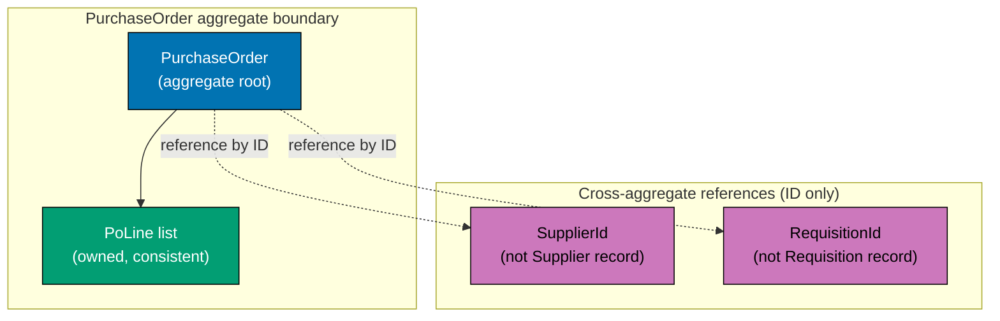





```fsharp
// Aggregate boundaries: what is consistent together, what communicates via events.
// A PurchaseOrder owns its lines. It references suppliers and invoices by ID only.

type PurchaseOrderId = PurchaseOrderId of string
type SupplierId      = SupplierId      of string  // => Reference only — not the Supplier aggregate
type RequisitionId   = RequisitionId   of string  // => Reference only — not the Requisition aggregate

// The PurchaseOrder owns its lines — lines are part of the PO aggregate
type PoLine = {
    LineNumber: int
    Sku:        string
    Quantity:   int
    UnitPrice:  decimal
}
// => PoLine is inside the PO aggregate boundary — updated atomically with the PO

// PO states (simplified to key states for boundary illustration)
type PoStatus = Draft | AwaitingApproval | Approved | Issued | Cancelled
// => Status is inside the boundary — must be consistent with the lines

// The PurchaseOrder aggregate — owns only what must be consistent together
type PurchaseOrderAgg = {
    Id:            PurchaseOrderId
    // => Aggregate identity
    RequisitionId: RequisitionId
    // => Reference to the originating requisition — ID only, not the full Requisition
    SupplierId:    SupplierId
    // => Reference to the supplier — ID only, not the full Supplier aggregate
    Status:        PoStatus
    // => Inside the boundary — status and lines must be consistent
    Lines:         PoLine list
    // => Inside the boundary — lines are owned by this PO
    Total:         decimal
    // => Derived from lines — stored for performance (avoids recomputing on every load)
    UpdatedAt:     System.DateTimeOffset
    // => Optimistic concurrency token — updated on every state transition
}
// => PurchaseOrderAgg : aggregate root — consistent unit; all fields update atomically

// Invariant: once Issued, lines cannot change
let addLine (line: PoLine) (po: PurchaseOrderAgg) : Result<PurchaseOrderAgg, string> =
    match po.Status with
    | Draft ->
        // => Only Draft POs can have lines added
        let newLines = po.Lines @ [line]
        // => Append the new line — creates a new list (immutable)
        let newTotal = newLines |> List.sumBy (fun l -> decimal l.Quantity * l.UnitPrice)
        // => Recompute total — kept consistent with lines inside the aggregate
        Ok { po with Lines = newLines; Total = newTotal; UpdatedAt = System.DateTimeOffset.UtcNow }
        // => with-expression: atomic update of lines, total, and timestamp
    | Issued | Approved | AwaitingApproval ->
        Error "Lines are locked — PO has been submitted or issued"
        // => Invariant: once submitted, lines are immutable until Cancelled
    | Cancelled -> Error "Cannot add lines to a Cancelled PO"
    // => Cancelled POs are terminal — no modifications allowed

// Test
let emptyDraft = {
    Id = PurchaseOrderId "po_e3d1"; RequisitionId = RequisitionId "req_f4c2"
    SupplierId = SupplierId "sup_acme"; Status = Draft; Lines = []; Total = 0m
    UpdatedAt = System.DateTimeOffset.UtcNow
}
let addResult = addLine { LineNumber = 1; Sku = "ELE-0099"; Quantity = 3; UnitPrice = 899.99m } emptyDraft
// => Status is Draft — line addition allowed; total updated to 2699.97

match addResult with
| Ok po   -> printfn "Lines: %d, Total: %M" po.Lines.Length po.Total
// => Output: Lines: 1, Total: 2699.9700M
| Error e -> printfn "Error: %s" e
```





```clojure
;; Aggregate boundaries: what is consistent together, what communicates via events.
;; A PurchaseOrder owns its lines. It references suppliers and requisitions by ID only.
;; [F#: record types with typed wrappers — compile-time ID distinction; Clojure uses namespaced keywords for the same semantic separation]

(ns procurement.purchase-order)

;; Domain entity maps — IDs are plain strings tagged by key name
;; ::po/id, ::supplier/id, ::requisition/id distinguish identity by namespace, not wrapper type
;; [F#: discriminated-union wrappers enforce ID distinction at compile time; Clojure uses namespaced keys for convention-based separation]

(defn make-po-line
  ;; Constructor for a validated line item inside the aggregate boundary
  [line-number sku quantity unit-price]
  ;; => All four fields are owned inside the PO aggregate — they update atomically with the PO
  {:po-line/line-number line-number
   :po-line/sku         sku
   :po-line/quantity    quantity
   :po-line/unit-price  unit-price})
;; => make-po-line returns a plain map — REPL-inspectable, no class coupling

(defn make-draft-po
  ;; Constructs the initial aggregate root map for a Draft PurchaseOrder
  [po-id requisition-id supplier-id]
  ;; => po-id, requisition-id, supplier-id are cross-aggregate references — IDs only, not full entity maps
  {:po/id            po-id
   :po/requisition-id requisition-id  ;; => Reference only — not the full Requisition map
   :po/supplier-id   supplier-id      ;; => Reference only — not the full Supplier map
   :po/status        :draft           ;; => Inside boundary — must stay consistent with lines
   :po/lines         []               ;; => Inside boundary — owned by this PO, updated atomically
   :po/total         0M               ;; => Derived from lines; recomputed on every line change
   :po/updated-at    (java.time.Instant/now)})
;; => make-draft-po : aggregate root map — all fields form a consistent unit

(defn add-line
  ;; Invariant enforcer: only Draft POs may have lines added
  [po line]
  ;; => po is the current aggregate map; line is a po-line map to append
  (case (:po/status po)
    :draft
    ;; => Status is :draft — line addition is allowed
    (let [new-lines (conj (:po/lines po) line)
          ;; => conj appends to the vector — creates a new vector (persistent data structure)
          new-total (->> new-lines
                         (map #(* (:po-line/quantity %) (:po-line/unit-price %)))
                         (reduce + 0M))]
          ;; => Recompute total from all lines — kept consistent inside the aggregate boundary
      {:ok (assoc po
                  :po/lines      new-lines
                  :po/total      new-total
                  :po/updated-at (java.time.Instant/now))})
          ;; => assoc returns a new map — immutable structural sharing; all three fields updated together
    (:issued :approved :awaiting-approval)
    {:error "Lines are locked — PO has been submitted or issued"}
    ;; => Invariant: once submitted, lines are immutable until cancelled
    :cancelled
    {:error "Cannot add lines to a Cancelled PO"}))
    ;; => Cancelled POs are terminal — no modifications allowed

;; Test
(def empty-draft
  (make-draft-po "po_e3d1" "req_f4c2" "sup_acme"))
;; => empty-draft : Draft PO map with no lines and zero total

(def new-line
  (make-po-line 1 "ELE-0099" 3 899.99M))
;; => new-line : po-line map for 3 units at 899.99 each

(def add-result (add-line empty-draft new-line))
;; => Status is :draft — line addition allowed; total updated to 2699.97M

(if-let [po (:ok add-result)]
  (println "Lines:" (count (:po/lines po)) "Total:" (:po/total po))
  ;; => Output: Lines: 1 Total: 2699.97M
  (println "Error:" (:error add-result)))
```





```typescript
// Aggregate boundary — what belongs inside vs outside.
// [F#: module with encapsulated types and functions — boundary enforced by type visibility]
// [Clojure: namespace boundary with private helpers; TS uses class or module pattern]

// The PurchaseOrder aggregate root — contains only what it owns
type PurchaseOrderId = string & { readonly __brand: "PurchaseOrderId" };
type SupplierId = string & { readonly __brand: "SupplierId" };
type SkuCode = string & { readonly __brand: "SkuCode" };

interface POLine {
  readonly lineNumber: number;
  readonly skuCode: SkuCode;
  readonly qty: number;
  readonly unitPrice: number;
}
// => POLine is INSIDE the aggregate — owned and validated by PO

interface PurchaseOrder {
  readonly id: PurchaseOrderId;
  // => Aggregate identity — drives all lookups
  readonly supplierId: SupplierId;
  // => Reference to Supplier aggregate — just the ID, not the full Supplier object
  // => [F#: IDs only across aggregate boundaries — no deep object graphs]
  readonly status: "Draft" | "Approved" | "Issued" | "Cancelled";
  readonly lines: readonly POLine[];
  // => Line items are INSIDE the aggregate — owned, not referenced
  readonly createdAt: string;
}
// => PurchaseOrder is the aggregate root — lines are part of it, Supplier is external

// Operations on the aggregate — enforced invariants
function addLineToPO(po: PurchaseOrder, line: POLine): PurchaseOrder {
  if (po.status !== "Draft") throw new Error(`Cannot add lines to a PO in ${po.status} state`);
  // => Domain rule: lines can only be added to Draft POs
  return { ...po, lines: [...po.lines, line] };
  // => Immutable update — returns new PO with the line added
}

function computePOTotal(po: PurchaseOrder): number {
  return po.lines.reduce((sum, l) => sum + l.qty * l.unitPrice, 0);
  // => Aggregate encapsulates its own total computation
}

const po: PurchaseOrder = {
  id: "po_e3d1f8a0" as PurchaseOrderId,
  supplierId: "sup_001" as SupplierId,
  // => Only the SupplierId — not the full Supplier object
  status: "Draft",
  lines: [],
  createdAt: new Date().toISOString(),
};

const withLine = addLineToPO(po, { lineNumber: 1, skuCode: "ELE-0099" as SkuCode, qty: 3, unitPrice: 899.99 });
console.log(`PO total: ${computePOTotal(withLine).toFixed(2)}`);
// => Output: PO total: 2699.97
console.log("Lines count:", withLine.lines.length);
// => Output: Lines count: 1
```





```haskell
-- ── file: PurchaseOrderAgg.hs ─────────
-- [F#: record + DU; Haskell record + ADT — owns its lines, references other aggregates by id]
-- [Clojure: namespaced keys; Haskell uses newtype wrappers for cross-aggregate id distinction]
{-# LANGUAGE OverloadedStrings #-}
import Data.Text (Text)
import Data.Time (UTCTime, getCurrentTime)

-- Cross-aggregate references are id-only — never embed full aggregates
newtype PurchaseOrderId = PurchaseOrderId Text deriving (Show, Eq)
newtype SupplierId      = SupplierId      Text deriving (Show, Eq)  -- => reference only
newtype RequisitionId   = RequisitionId   Text deriving (Show, Eq)  -- => reference only

-- Line owned inside the PO aggregate
data PoLine = PoLine
  { lineNumber :: Int
  , sku        :: Text
  , quantity   :: Int
  , unitPrice  :: Double
  } deriving (Show)

-- Status lives inside the boundary — must stay consistent with lines
data PoStatus = Draft | AwaitingApproval | Approved | Issued | Cancelled
  deriving (Show, Eq)

-- Aggregate root: only fields that must update atomically
data PurchaseOrderAgg = PurchaseOrderAgg
  { poId          :: PurchaseOrderId             -- aggregate identity
  , poReqId       :: RequisitionId               -- id-only reference
  , poSupplierId  :: SupplierId                  -- id-only reference
  , poStatus      :: PoStatus                    -- inside boundary
  , poLines       :: [PoLine]                    -- inside boundary; owned
  , poTotal       :: Double                      -- derived; stored for perf
  , poUpdatedAt   :: UTCTime                     -- optimistic concurrency token
  } deriving (Show)

-- Invariant enforcer: lines can only change while Draft
addLine :: PoLine -> PurchaseOrderAgg -> IO (Either Text PurchaseOrderAgg)
addLine line po = case poStatus po of
  Draft -> do
    now <- getCurrentTime                        -- single timestamp for atomic update
    let newLines = poLines po <> [line]          -- append, returning new list
        newTotal = sum [fromIntegral (quantity l) * unitPrice l | l <- newLines]
                                                  -- recompute total inside boundary
    pure $ Right po { poLines = newLines
                    , poTotal = newTotal
                    , poUpdatedAt = now
                    }                            -- atomic three-field update
  AwaitingApproval -> pure $ Left "Lines are locked — PO has been submitted"
  Approved         -> pure $ Left "Lines are locked — PO has been approved"
  Issued           -> pure $ Left "Lines are locked — PO has been issued"
  Cancelled        -> pure $ Left "Cannot add lines to a Cancelled PO"

main :: IO ()
main = do
  now <- getCurrentTime
  let emptyDraft = PurchaseOrderAgg
        (PurchaseOrderId "po_e3d1")
        (RequisitionId   "req_f4c2")
        (SupplierId      "sup_acme")
        Draft [] 0 now                           -- new Draft PO with no lines
  result <- addLine (PoLine 1 "ELE-0099" 3 899.99) emptyDraft
  case result of
    Right po -> putStrLn $ "Lines: " <> show (length (poLines po))
                                    <> ", Total: " <> show (poTotal po)
    -- => Output: Lines: 1, Total: 2699.97
    Left e   -> putStrLn $ "Error: " <> show e
```





**Key Takeaway**: An aggregate owns everything that must be consistent together and references other aggregates by ID only — this keeps transaction boundaries small and prevents cross-aggregate consistency violations.

**Why It Matters**: If the `PurchaseOrder` held the full `Supplier` record inside itself, updating a supplier's contact email would require loading and saving every PO that references that supplier — a transaction spanning potentially thousands of records. By holding only `SupplierId`, the PO aggregate stays small, its transaction boundary is local, and supplier data is fetched via a separate query. This is the DDD aggregate boundary principle applied to the procurement domain.

---

### Example 41: Refactor Primitive Obsession — Typed Wrapper

Primitive obsession is the anti-pattern of using raw `string`, `int`, or `decimal` where a domain type should be used. This example shows a before/after refactor of a PO approval function that suffers from primitive obsession and the improvement from introducing typed wrappers.





```fsharp
// Before: primitive obsession — all IDs are strings; easy to mix up
let approvePrimitive (poId: string) (approverId: string) (approvedAt: System.DateTimeOffset) : string =
    // => poId and approverId are both strings — nothing stops them being swapped at call site
    sprintf "PO %s approved by %s at %O" poId approverId approvedAt
    // => Returns a string status — caller cannot pattern-match on success vs failure

// After: typed wrappers eliminate the confusion
type PurchaseOrderId = PurchaseOrderId of string
// => Distinct type for PO identity
type ApproverId      = ApproverId      of string
// => Distinct type for the approver identity — cannot be passed where PurchaseOrderId expected

type ApprovalRecord = {
    PoId:       PurchaseOrderId
    // => Typed PO identity — compiler blocks passing an ApproverId here
    ApproverId: ApproverId
    // => Typed approver identity
    ApprovedAt: System.DateTimeOffset
    // => Approval timestamp — immutable once recorded
}
// => ApprovalRecord : value object — groups the three components of an approval

let approveTyped (poId: PurchaseOrderId) (approverId: ApproverId) (at: System.DateTimeOffset) : ApprovalRecord =
    // => All three parameters have distinct types — swapping them is a compile error
    { PoId = poId; ApproverId = approverId; ApprovedAt = at }
    // => Returns a structured record — caller can pattern-match and extract fields

// Usage
let (PurchaseOrderId rawPoId)    = PurchaseOrderId "po_e3d1f8a0"
// => Destructure to access the raw string for display
let (ApproverId rawApproverId)   = ApproverId "emp_mgr_007"
// => Destructure the approver ID

let record = approveTyped (PurchaseOrderId "po_e3d1f8a0") (ApproverId "emp_mgr_007") System.DateTimeOffset.UtcNow
// => approveTyped accepts typed arguments — swapping poId and approverId is a compile error
// => record : ApprovalRecord = { PoId = ...; ApproverId = ...; ApprovedAt = ... }

printfn "Approved: PO=%s by=%s" rawPoId rawApproverId
// => Output: Approved: PO=po_e3d1f8a0 by=emp_mgr_007
printfn "Record: %A" record
// => Output: Record: { PoId = PurchaseOrderId "po_e3d1f8a0"; ApproverId = ApproverId "emp_mgr_007"; ... }
```





```clojure
;; Primitive obsession: before/after refactor in Clojure's data-oriented style.
;; [F#: single-case DU wrappers give compile-time ID separation; Clojure uses namespaced keywords and spec validation for the equivalent runtime guarantee]

(ns procurement.approval)

;; BEFORE: primitive obsession — all IDs are plain strings
(defn approve-primitive
  ;; Bad: po-id and approver-id are indistinguishable string arguments
  [po-id approver-id approved-at]
  ;; => Nothing prevents the caller from passing approver-id as the first arg
  (str "PO " po-id " approved by " approver-id " at " approved-at))
  ;; => Returns a string — caller cannot destructure success vs failure

;; AFTER: namespaced keys enforce domain identity by convention
;; [F#: typed wrappers enforce at compile time; Clojure enforces at validation time with spec or malli]

(defn make-approval-record
  ;; Constructor that tags each argument with its domain role
  [po-id approver-id]
  ;; => po-id and approver-id are plain strings; the key namespace encodes their identity
  {:approval/po-id       po-id
   ;; => :approval/po-id cannot be confused with :approval/approver-id at the key level
   :approval/approver-id approver-id
   ;; => namespaced key distinguishes approver identity from PO identity
   :approval/approved-at (java.time.Instant/now)})
   ;; => approved-at recorded immutably at construction time

;; Spec-based guard — validates identity format at the boundary
;; [F#: DU wrappers reject wrong type at compile time; Clojure spec rejects wrong format at runtime]
(require '[clojure.spec.alpha :as s])

(s/def :approval/po-id       (s/and string? #(clojure.string/starts-with? % "po_")))
;; => :approval/po-id must be a string starting with "po_" — format guard at boundary
(s/def :approval/approver-id (s/and string? #(clojure.string/starts-with? % "emp_")))
;; => :approval/approver-id must start with "emp_" — guards against ID class swap

(defn approve-validated
  ;; Validates both IDs before building the approval record
  [po-id approver-id]
  (cond
    (not (s/valid? :approval/po-id po-id))
    {:error (str "Invalid PO ID: " po-id)}
    ;; => Guard 1: reject malformed PO ID at the boundary
    (not (s/valid? :approval/approver-id approver-id))
    {:error (str "Invalid approver ID: " approver-id)}
    ;; => Guard 2: reject malformed approver ID — catches the ID-swap class of bug at runtime
    :else
    {:ok (make-approval-record po-id approver-id)}))
    ;; => Both IDs valid — construct and return the approval record map

;; Usage
(def result (approve-validated "po_e3d1f8a0" "emp_mgr_007"))
;; => Both IDs pass spec validation — result is {:ok {...}}

(when-let [record (:ok result)]
  (println "Approved: PO=" (:approval/po-id record)
           "by=" (:approval/approver-id record)))
  ;; => Output: Approved: PO= po_e3d1f8a0 by= emp_mgr_007

;; Demonstrate the guard catching the swap bug
(def bad-result (approve-validated "emp_mgr_007" "po_e3d1f8a0"))
;; => Swapped arguments — emp_ prefix fails the :approval/po-id spec
(println "Swap caught:" (:error bad-result))
;; => Output: Swap caught: Invalid PO ID: emp_mgr_007
```





```typescript
// Refactor primitive obsession — replacing raw strings with branded types.
// [F#: replace string fields with single-case DU wrappers — type safety without overhead]
// [Clojure: replace plain strings with spec-validated keys; TS replaces with branded types]

// BEFORE: primitive obsession — all fields are raw strings
interface POLineBefore {
  skuCode: string; // raw — could be any string
  supplierId: string; // raw — could be confused with a requisitionId
  currency: string; // raw — could be "USD" or "dollars" or ""
  qty: number;
  unitPrice: number;
}
// => All string fields are indistinguishable — easy to swap them accidentally

// AFTER: branded types eliminate primitive obsession
type SkuCode = string & { readonly __brand: "SkuCode" };
type SupplierId = string & { readonly __brand: "SupplierId" };
type Currency = string & { readonly __brand: "Currency" };

// Smart constructors — validation happens at the boundary
const createSkuCode = (s: string): SkuCode | null => (/^[A-Z]{3}-\d{4,8}$/.test(s) ? (s as SkuCode) : null);
const createSupplierId = (s: string): SupplierId | null => (s.startsWith("sup_") ? (s as SupplierId) : null);
const createCurrency = (s: string): Currency | null => (/^[A-Z]{3}$/.test(s) ? (s as Currency) : null);
// => Each constructor validates the invariant before branding

// AFTER: all fields are distinct branded types
interface POLineAfter {
  readonly skuCode: SkuCode;
  readonly supplierId: SupplierId;
  // => Cannot accidentally swap skuCode and supplierId — different brands
  readonly currency: Currency;
  // => Cannot pass "dollars" — must be a valid ISO 4217 code
  readonly qty: number;
  readonly unitPrice: number;
}

// Constructing with validation at the boundary
const sku = createSkuCode("OFF-0042");
const supplier = createSupplierId("sup_001");
const currency = createCurrency("USD");

if (sku && supplier && currency) {
  const line: POLineAfter = { skuCode: sku, supplierId: supplier, currency, qty: 10, unitPrice: 8.5 };
  // => Valid by construction — all fields passed their smart constructors
  console.log("Line:", line.skuCode, "@", line.currency, "x", line.qty);
  // => Output: Line: OFF-0042 @ USD x 10
}
```





```haskell
-- ── file: TypedIds.hs ─────────────────
-- [F#: single-case DU wrappers; Haskell uses newtype — zero-cost, compile-time distinction]
-- [Clojure: namespaced keys + spec; Haskell catches ID swaps at compile time without runtime checks]
{-# LANGUAGE OverloadedStrings #-}
import Data.Text (Text)
import qualified Data.Text as T
import Data.Time (UTCTime, getCurrentTime)

-- BEFORE: primitive obsession — both ids are Text, indistinguishable to the compiler
approvePrimitive :: Text -> Text -> UTCTime -> Text
approvePrimitive poId approverId at =
  "PO " <> poId <> " approved by " <> approverId <> " at " <> T.pack (show at)
-- => caller can swap poId and approverId; compiler won't flag it

-- AFTER: newtype wrappers create distinct types
newtype PurchaseOrderId = PurchaseOrderId Text deriving (Show, Eq)
                                                    -- => identity for purchase orders
newtype ApproverId      = ApproverId      Text deriving (Show, Eq)
                                                    -- => identity for approvers

-- Value object grouping the three components of an approval
data ApprovalRecord = ApprovalRecord
  { recPoId       :: PurchaseOrderId               -- typed PO id
  , recApproverId :: ApproverId                    -- typed approver id
  , recApprovedAt :: UTCTime                       -- immutable timestamp
  } deriving (Show)

-- Now swapping arguments is a compile error
approveTyped :: PurchaseOrderId -> ApproverId -> UTCTime -> ApprovalRecord
approveTyped poId aid at = ApprovalRecord poId aid at
                                                    -- => returns a structured record

main :: IO ()
main = do
  now <- getCurrentTime
  let record = approveTyped
                 (PurchaseOrderId "po_e3d1f8a0")    -- typed PO id
                 (ApproverId      "emp_mgr_007")    -- typed approver id
                 now
  putStrLn $ "Approved: PO=po_e3d1f8a0 by=emp_mgr_007"
  -- => Output: Approved: PO=po_e3d1f8a0 by=emp_mgr_007
  print record
  -- => Output: ApprovalRecord {recPoId = PurchaseOrderId "po_e3d1f8a0", ...}

  -- Try uncommenting the next line — it will not compile:
  -- let bad = approveTyped (ApproverId "emp_mgr_007") (PurchaseOrderId "po_e3d1f8a0") now
  -- => GHC rejects with "expected PurchaseOrderId, got ApproverId"
```





**Key Takeaway**: Replacing raw primitives with named wrapper types eliminates the ID-confusion class of bugs at compile time — the cost is minimal syntactic overhead for a permanent correctness guarantee.

**Why It Matters**: In a procurement system, confusing `PurchaseOrderId` with `RequisitionId` or `SupplierId` is a realistic bug: all three are UUID-formatted strings, all appear in the same function signatures, and the mistake is invisible in unit tests that use hardcoded values. Typed wrappers make the mistake a compile error, caught before any code runs.

---

### Example 42: ValidatedPurchaseOrder Type — Emitted by Validation Step

The validation step of the approval workflow produces a `ValidatedPurchaseOrder` — a type that can only exist if all business rules passed. Downstream functions accept this type, not the raw `UnvalidatedPurchaseOrderCommand`, making the validation guarantee structural.





```fsharp
// ValidatedPurchaseOrder: produced by the validation step; consumed by downstream steps.
// If a ValidatedPurchaseOrder exists, all field-level invariants have been checked.

type PurchaseOrderId = PurchaseOrderId of string
type SupplierId      = SupplierId      of string

// The raw command arriving from the HTTP layer
type CreatePOCommand = {
    RequisitionId: string  // => Raw — may be blank or wrong format
    SupplierId:    string  // => Raw — may reference a non-existent supplier
    Lines:         (string * int * decimal) list  // => Raw tuples — not validated
}
// => CreatePOCommand : DTO-shaped input — primitive types only

// The validated result — only creatable through the validation function
type ValidatedPoLine = {
    Sku:      string   // => Validated SKU (format checked)
    Quantity: int      // => Validated > 0
    Price:    decimal  // => Validated > 0
}
// => ValidatedPoLine : validated line item — invariants met

type ValidatedPurchaseOrder = {
    Id:            PurchaseOrderId  // => Assigned at validation time
    RequisitionId: string           // => Validated non-blank
    SupplierId:    SupplierId       // => Validated non-blank, wrapped
    Lines:         ValidatedPoLine list  // => All lines validated
    Total:         decimal          // => Computed from validated lines
}
// => ValidatedPurchaseOrder : only exists if all validation passed

// Validation function — the sole constructor for ValidatedPurchaseOrder
let validateCreatePO (cmd: CreatePOCommand) : Result<ValidatedPurchaseOrder, string> =
    if System.String.IsNullOrWhiteSpace(cmd.RequisitionId) then Error "RequisitionId required"
    // => Guard 1: requisition reference is mandatory
    elif System.String.IsNullOrWhiteSpace(cmd.SupplierId) then Error "SupplierId required"
    // => Guard 2: supplier reference is mandatory
    elif cmd.Lines.IsEmpty then Error "At least one line item required"
    // => Guard 3: blank PO has no business meaning
    else
        let validLines =
            cmd.Lines |> List.mapi (fun i (sku, qty, price) ->
                if qty <= 0 then Error (sprintf "Line %d: quantity must be > 0" (i+1))
                elif price <= 0m then Error (sprintf "Line %d: price must be > 0" (i+1))
                else Ok { Sku = sku; Quantity = qty; Price = price }
            )
        // => Validate each line; collect Results
        let errors = validLines |> List.choose (function Error e -> Some e | Ok _ -> None)
        // => Extract all Error cases
        if not errors.IsEmpty then Error (String.concat "; " errors)
        // => If any line failed, return concatenated errors
        else
            let lines = validLines |> List.choose (function Ok l -> Some l | Error _ -> None)
            // => Extract all Ok cases — safe because errors.IsEmpty
            let total = lines |> List.sumBy (fun l -> decimal l.Quantity * l.Price)
            // => Compute total from validated lines
            Ok { Id = PurchaseOrderId ("po_" + System.Guid.NewGuid().ToString("N").[..7])
                 RequisitionId = cmd.RequisitionId; SupplierId = SupplierId cmd.SupplierId
                 Lines = lines; Total = total }
            // => Return validated PO — all invariants guaranteed

// Test
let cmd = { RequisitionId = "req_f4c2"; SupplierId = "sup_acme"
            Lines = [("ELE-0099", 3, 899.99m); ("OFF-0042", 10, 8.50m)] }
// => cmd : CreatePOCommand — two valid raw lines

let validated = validateCreatePO cmd
// => All guards pass — returns Ok ValidatedPurchaseOrder with total 2784.97

match validated with
| Ok po   -> printfn "Validated PO: %A total=%M" po.Id po.Total
// => Output: Validated PO: PurchaseOrderId "po_..." total=2784.9700M
| Error e -> printfn "Error: %s" e
```





```clojure
;; ValidatedPurchaseOrder equivalent: validated map produced by the validation step.
;; If the {:ok ...} path is returned, all field-level invariants have been checked.
;; [F#: distinct ValidatedPurchaseOrder type prevents calling downstream functions without validation; Clojure uses a tagged result map and spec validation for the same guarantee]

(ns procurement.validation
  (:require [clojure.spec.alpha :as s]
            [clojure.string :as str]))

;; Specs for the raw command fields — guards at the boundary
(s/def :create-po-cmd/requisition-id (s/and string? (complement str/blank?)))
;; => Must be a non-blank string — rejects empty or whitespace-only requisition IDs
(s/def :create-po-cmd/supplier-id    (s/and string? (complement str/blank?)))
;; => Must be a non-blank string — rejects missing supplier references
(s/def :create-po-cmd/lines          (s/and vector? seq))
;; => Must be a non-empty vector — a blank PO has no business meaning

;; Specs for each validated line item
(s/def :po-line/sku      string?)
(s/def :po-line/quantity (s/and int? pos?))
;; => Quantity must be a positive integer — zero or negative is invalid
(s/def :po-line/price    (s/and decimal? pos?))
;; => Price must be a positive decimal — zero or negative is invalid

(defn validate-line
  ;; Validates a single raw line tuple [sku qty price]
  [index [sku qty price]]
  ;; => index used in error messages; destructure the triple directly
  (cond
    (not (pos? qty))
    {:error (str "Line " (inc index) ": quantity must be > 0")}
    ;; => Guard: non-positive quantity is a domain invariant violation
    (not (pos? price))
    {:error (str "Line " (inc index) ": price must be > 0")}
    ;; => Guard: non-positive price is a domain invariant violation
    :else
    {:ok {:po-line/sku sku :po-line/quantity qty :po-line/price price}}))
    ;; => Valid line — return tagged success map with namespaced keys

(defn validate-create-po
  ;; Sole constructor for the validated PO map — enforces all invariants
  [{:keys [requisition-id supplier-id lines]}]
  ;; => Destructure raw command; each key checked independently
  (cond
    (str/blank? requisition-id)
    {:error "RequisitionId required"}
    ;; => Guard 1: requisition reference is mandatory
    (str/blank? supplier-id)
    {:error "SupplierId required"}
    ;; => Guard 2: supplier reference is mandatory
    (empty? lines)
    {:error "At least one line item required"}
    ;; => Guard 3: blank PO has no business meaning
    :else
    (let [line-results (map-indexed validate-line lines)
          ;; => Validate each raw line tuple; collect tagged result maps
          errors       (keep :error line-results)]
          ;; => Extract all :error entries — keep filters out nils
      (if (seq errors)
        {:error (str/join "; " errors)}
        ;; => Any line failed — return concatenated error string
        (let [valid-lines (map :ok line-results)
              ;; => All lines passed — extract :ok maps
              total       (->> valid-lines
                               (map #(* (:po-line/quantity %) (:po-line/price %)))
                               (reduce + 0M))]
                               ;; => Compute total from validated lines
          {:ok {:validated-po/id            (str "po_" (subs (str (random-uuid)) 0 8))
                ;; => Assign a new PO ID at validation time
                :validated-po/requisition-id requisition-id
                ;; => Validated non-blank; promoted from raw command
                :validated-po/supplier-id    supplier-id
                ;; => Validated non-blank; promoted from raw command
                :validated-po/lines          (vec valid-lines)
                ;; => All lines validated — only valid-line maps in the result
                :validated-po/total          total}})))))
                ;; => Computed from validated lines — consistent inside the validated map

;; Test
(def cmd {:requisition-id "req_f4c2"
          :supplier-id    "sup_acme"
          :lines          [["ELE-0099" 3 899.99M] ["OFF-0042" 10 8.50M]]})
;; => Raw command map — two line tuples, both valid

(def validated (validate-create-po cmd))
;; => All guards pass — validated is {:ok {:validated-po/id "po_..." :validated-po/total 2784.97M ...}}

(if-let [po (:ok validated)]
  (println "Validated PO:" (:validated-po/id po) "total=" (:validated-po/total po))
  ;; => Output: Validated PO: po_... total= 2784.97M
  (println "Error:" (:error validated)))
```





```typescript
// ValidatedPurchaseOrder — a type emitted by the validation step of the workflow.
// [F#: distinct type for each workflow stage — only the validate step produces this type]
// [Clojure: separate map schemas per stage; TS uses distinct interfaces to encode stage]

type PurchaseOrderId = string & { readonly __brand: "PurchaseOrderId" };
type SupplierId = string & { readonly __brand: "SupplierId" };
type SkuCode = string & { readonly __brand: "SkuCode" };
const asPOId = (s: string): PurchaseOrderId => s as PurchaseOrderId;

// The raw DTO arriving from the HTTP layer
interface UnvalidatedPO {
  readonly supplierId: string;
  readonly lines: ReadonlyArray;
}
// => All fields are primitives — domain invariants not yet checked

// The validated PO — emitted ONLY by the validation step
interface ValidatedPurchaseOrder {
  readonly __validated: true; // phantom field — prevents accidental construction
  readonly purchaseOrderId: PurchaseOrderId;
  readonly supplierId: SupplierId;
  readonly lines: ReadonlyArray;
  readonly validatedAt: string;
}
// => ValidatedPurchaseOrder : emitted only by validatePO — downstream steps can trust it

// The validation step — the only function that can produce a ValidatedPurchaseOrder
type Result<T, E> = { readonly ok: true; readonly value: T } | { readonly ok: false; readonly error: E };
const okR = <T, E>(v: T): Result => ({ ok: true, value: v });
const errR = <T, E>(e: E): Result => ({ ok: false, error: e });

function validatePO(raw: UnvalidatedPO): Result {
  if (!raw.supplierId.startsWith("sup_")) return errR(`Invalid SupplierId: '${raw.supplierId}'`);
  if (raw.lines.length === 0) return errR("PO must have at least one line");
  const lines = raw.lines.map((l) => ({ skuCode: l.skuCode as SkuCode, qty: l.qty, unitPrice: l.unitPrice }));
  return okR({
    __validated: true,
    purchaseOrderId: asPOId(`po_${Math.random().toString(36).slice(2, 10)}`),
    supplierId: raw.supplierId as SupplierId,
    lines,
    validatedAt: new Date().toISOString(),
  } as ValidatedPurchaseOrder);
  // => __validated: true phantom field marks this as having passed validation
}

const raw: UnvalidatedPO = { supplierId: "sup_001", lines: [{ skuCode: "ELE-0099", qty: 3, unitPrice: 899.99 }] };
const result = validatePO(raw);
if (result.ok) console.log("Validated PO:", result.value.purchaseOrderId, result.value.lines.length, "lines");
// => Output: Validated PO: po_... 1 lines
```





```haskell
-- ── file: ValidatedPurchaseOrder.hs ───
-- [F#: distinct ValidatedPurchaseOrder record produced by validation; Haskell uses a separate ADT — same parse-don't-validate guarantee]
-- [Clojure: tagged map with spec validation; Haskell encodes the validation stage in the type itself]
{-# LANGUAGE OverloadedStrings #-}
import Data.Text (Text)
import qualified Data.Text as T

newtype PurchaseOrderId = PurchaseOrderId Text deriving (Show)
newtype SupplierId      = SupplierId      Text deriving (Show)

-- Raw command arriving from the HTTP layer
data CreatePOCommand = CreatePOCommand
  { rawReqId    :: Text                       -- raw — may be blank
  , rawSupId    :: Text                       -- raw — may be blank
  , rawLines    :: [(Text, Int, Double)]      -- raw tuples — not validated
  } deriving (Show)

-- Validated line — invariants met by construction
data ValidatedPoLine = ValidatedPoLine
  { vlSku   :: Text                           -- format-checked SKU
  , vlQty   :: Int                            -- > 0 guarantee
  , vlPrice :: Double                         -- > 0 guarantee
  } deriving (Show)

-- Validated PO — only producible by validateCreatePO
data ValidatedPurchaseOrder = ValidatedPurchaseOrder
  { vpoId     :: PurchaseOrderId              -- assigned at validation time
  , vpoReqId  :: Text                         -- validated non-blank
  , vpoSupId  :: SupplierId                   -- validated, wrapped
  , vpoLines  :: [ValidatedPoLine]            -- all lines validated
  , vpoTotal  :: Double                       -- computed from validated lines
  } deriving (Show)

-- Validate a single line (1-based index for human-friendly error messages)
validateLine :: Int -> (Text, Int, Double) -> Either Text ValidatedPoLine
validateLine i (sku, qty, price)
  | qty   <= 0 = Left $ "Line " <> T.pack (show i) <> ": quantity must be > 0"
  | price <= 0 = Left $ "Line " <> T.pack (show i) <> ": price must be > 0"
  | otherwise  = Right (ValidatedPoLine sku qty price)

-- Sole constructor for ValidatedPurchaseOrder
validateCreatePO :: CreatePOCommand -> Either Text ValidatedPurchaseOrder
validateCreatePO cmd
  | T.null (T.strip (rawReqId cmd)) = Left "RequisitionId required"
                                                -- guard 1
  | T.null (T.strip (rawSupId cmd)) = Left "SupplierId required"
                                                -- guard 2
  | null (rawLines cmd)             = Left "At least one line item required"
                                                -- guard 3
  | otherwise = do
      let lineResults = zipWith validateLine [1..] (rawLines cmd)
                                                -- validate each line
          errs        = [e | Left e <- lineResults]
                                                -- collect all error messages
      if not (null errs)
        then Left (T.intercalate "; " errs)     -- concatenate errors
        else do
          let valids = [v | Right v <- lineResults]
              total  = sum [fromIntegral (vlQty l) * vlPrice l | l <- valids]
                                                -- total from validated lines
          Right ValidatedPurchaseOrder
            { vpoId    = PurchaseOrderId "po_a1b2c3d4"  -- production: UUID
            , vpoReqId = rawReqId cmd
            , vpoSupId = SupplierId (rawSupId cmd)
            , vpoLines = valids
            , vpoTotal = total
            }

-- Test
testCmd :: CreatePOCommand
testCmd = CreatePOCommand "req_f4c2" "sup_acme"
            [ ("ELE-0099", 3,  899.99)
            , ("OFF-0042", 10, 8.50)
            ]                                   -- both lines valid

main :: IO ()
main = case validateCreatePO testCmd of
  Right po -> putStrLn $ "Validated PO: " <> show (vpoId po)
                                        <> " total=" <> show (vpoTotal po)
  -- => Output: Validated PO: PurchaseOrderId "po_a1b2c3d4" total=2784.97
  Left e   -> putStrLn $ "Error: " <> show e
```





**Key Takeaway**: Introducing a `ValidatedPurchaseOrder` type makes the validation guarantee structural — downstream functions that accept it cannot be called before validation runs, because the type cannot be constructed any other way.

**Why It Matters**: Without a `ValidatedPurchaseOrder` type, any function in the approval workflow might be accidentally called with an unvalidated command, relying on the caller to have validated first. The type eliminates this assumption by making the valid state a distinct type — the compiler enforces the validation step as a prerequisite for every downstream operation.

---

### Example 43: IssuedPurchaseOrder Type — Emitted by Issue Step

After an `Approved` PO is issued to the supplier, it enters the `Issued` state. The `IssuedPurchaseOrder` type carries the issuance timestamp and the event that was emitted, providing a typed record that downstream steps (receiving context) can depend on.





```fsharp
// IssuedPurchaseOrder: the result of issuing an Approved PO to a supplier.
// Carries the new state and the emitted event — both needed by the caller.

type PurchaseOrderId = PurchaseOrderId of string
type SupplierId      = SupplierId      of string

// Input: the approved PO ready to be issued
type ApprovedPurchaseOrder = {
    Id:         PurchaseOrderId  // => Typed wrapper — same ID as the original DraftPO
    SupplierId: SupplierId       // => Supplier that will receive the issued order
    Total:      decimal          // => Total locked at approval — cannot change post-approval
    ApprovedAt: System.DateTimeOffset  // => When approval was granted — audit trail
}
// => ApprovedPurchaseOrder : can only exist after the approve transition

// Output: the issued PO state
type IssuedPurchaseOrder = {
    Id:         PurchaseOrderId  // => Same ID throughout the lifecycle
    SupplierId: SupplierId       // => Supplier receiving the order
    IssuedAt:   System.DateTimeOffset  // => When PO was transmitted to the supplier
}
// => IssuedPurchaseOrder : issued state — lines are now immutable

// Domain event produced by the issuance
type PurchaseOrderIssuedEvent = {
    PurchaseOrderId: PurchaseOrderId  // => Identifies which PO was issued
    SupplierId:      SupplierId       // => Routes the event to the right supplier context
    IssuedAt:        System.DateTimeOffset  // => Issuance timestamp for SLA tracking
    TotalAmount:     decimal           // => Total for accounting and receiving contexts
}
// => PurchaseOrderIssuedEvent : consumed by receiving, supplier-notifier, accounting

// Issue transition — returns both new state and the emitted event
let issuePO (approved: ApprovedPurchaseOrder) : IssuedPurchaseOrder * PurchaseOrderIssuedEvent =
    let now = System.DateTimeOffset.UtcNow
    // => Capture issuance timestamp — same value used in both state and event
    let issued = { Id = approved.Id; SupplierId = approved.SupplierId; IssuedAt = now }
    // => New IssuedPurchaseOrder state — carries only what is meaningful post-issuance
    let event  = { PurchaseOrderId = approved.Id; SupplierId = approved.SupplierId
                   IssuedAt = now; TotalAmount = approved.Total }
    // => PurchaseOrderIssuedEvent — all consumer needs in one payload
    issued, event
    // => Return tuple: (new state, emitted event)

// Test
let approved = {
    Id = PurchaseOrderId "po_e3d1f8a0"; SupplierId = SupplierId "sup_acme"
    Total = 2699.97m; ApprovedAt = System.DateTimeOffset.UtcNow
}
// => approved : ApprovedPurchaseOrder — ready to be issued

let (issued, event) = issuePO approved
// => issued : IssuedPurchaseOrder — new state
// => event  : PurchaseOrderIssuedEvent — to be published to the event bus

printfn "Issued PO: %A at %O" issued.Id issued.IssuedAt
// => Output: Issued PO: PurchaseOrderId "po_e3d1f8a0" at 2026-...
printfn "Event total: %M" event.TotalAmount
// => Output: Event total: 2699.9700M
```





```clojure
;; IssuedPurchaseOrder equivalent: plain maps for the issued state and the domain event.
;; The issue-po function returns both in a vector — state and event are inseparable outputs.
;; [F#: distinct record types IssuedPurchaseOrder and PurchaseOrderIssuedEvent prevent mixing state and event; Clojure uses namespaced keys to distinguish the two maps at the data level]

(ns procurement.issue)

(defn make-approved-po
  ;; Constructs the input map representing an Approved PO ready to be issued
  [po-id supplier-id total approved-at]
  ;; => All four fields required — total is locked at approval and cannot change post-approval
  {:approved-po/id          po-id
   :approved-po/supplier-id supplier-id  ;; => Supplier that will receive the issued order
   :approved-po/total       total        ;; => Total locked at approval — carried into the event
   :approved-po/approved-at approved-at}) ;; => Approval timestamp — audit trail for the transition

(defn issue-po
  ;; Issue transition: Approved → Issued
  ;; Returns a vector [issued-state event] — both outputs are required by the caller
  [approved-po]
  ;; => approved-po is the input map produced by the approve step
  (let [now (java.time.Instant/now)
        ;; => Capture issuance timestamp once — same instant in both state and event
        issued-state {:issued-po/id          (:approved-po/id approved-po)
                      ;; => Same PO ID throughout the lifecycle — identity preserved across states
                      :issued-po/supplier-id (:approved-po/supplier-id approved-po)
                      ;; => Supplier receiving the order — carried from approved state
                      :issued-po/issued-at   now}
                      ;; => Issuance timestamp — when the PO was transmitted to the supplier
        domain-event {:po-issued-event/purchase-order-id (:approved-po/id approved-po)
                      ;; => Identifies which PO was issued — routes the event to subscribers
                      :po-issued-event/supplier-id        (:approved-po/supplier-id approved-po)
                      ;; => Routes the event to the right supplier context
                      :po-issued-event/issued-at          now
                      ;; => Issuance timestamp for SLA tracking in the receiving context
                      :po-issued-event/total-amount       (:approved-po/total approved-po)}]
                      ;; => Total for accounting and receiving contexts — they need not query back
    [issued-state domain-event]))
    ;; => Return vector [issued-state event] — caller must handle both; event emission is not optional
    ;; [F#: tuple return (IssuedPO * IssuedEvent) same pattern; Clojure uses vector for the same two-output contract]

;; Test
(def approved
  (make-approved-po "po_e3d1f8a0" "sup_acme" 2699.97M (java.time.Instant/now)))
;; => approved : Approved PO map — ready to be issued

(def [issued event] (issue-po approved))
;; => Destructure the vector — issued is the new state, event is the domain event
;; => issued : {:issued-po/id "po_e3d1f8a0" :issued-po/supplier-id "sup_acme" ...}
;; => event  : {:po-issued-event/purchase-order-id "po_e3d1f8a0" :po-issued-event/total-amount 2699.97M ...}

(println "Issued PO:" (:issued-po/id issued) "at" (:issued-po/issued-at issued))
;; => Output: Issued PO: po_e3d1f8a0 at 2026-...
(println "Event total:" (:po-issued-event/total-amount event))
;; => Output: Event total: 2699.97M
```





```typescript
// IssuedPurchaseOrder — a type emitted only by the issue step of the workflow.
// [F#: IssuedPurchaseOrder distinct type — can only be created by the issuePO function]
// [Clojure: separate map schema per stage; TS uses distinct interface with phantom brand]

type PurchaseOrderId = string & { readonly __brand: "PurchaseOrderId" };
type SupplierId = string & { readonly __brand: "SupplierId" };
type SkuCode = string & { readonly __brand: "SkuCode" };

// The approved PO — input to the issue step
interface ApprovedPurchaseOrder {
  readonly purchaseOrderId: PurchaseOrderId;
  readonly supplierId: SupplierId;
  readonly lines: ReadonlyArray;
  readonly approvedAt: string;
}

// The issued PO — emitted ONLY by the issue step
interface IssuedPurchaseOrder {
  readonly __issued: true; // phantom field — marks this as issued
  readonly purchaseOrderId: PurchaseOrderId;
  readonly supplierId: SupplierId;
  readonly lines: ReadonlyArray;
  readonly approvedAt: string;
  readonly issuedAt: string;
  readonly expectedDelivery: string;
}
// => IssuedPurchaseOrder can only be created by issuePO — downstream trusts it

type Result<T, E> = { readonly ok: true; readonly value: T } | { readonly ok: false; readonly error: E };
const okR = <T, E>(v: T): Result => ({ ok: true, value: v });
const errR = <T, E>(e: E): Result => ({ ok: false, error: e });

// The issue step — the only function that can produce an IssuedPurchaseOrder
function issuePO(approved: ApprovedPurchaseOrder, expectedDelivery: string): Result {
  if (!expectedDelivery) return errR("Expected delivery date is required");
  return okR({
    __issued: true,
    purchaseOrderId: approved.purchaseOrderId,
    supplierId: approved.supplierId,
    lines: approved.lines,
    approvedAt: approved.approvedAt,
    issuedAt: new Date().toISOString(),
    expectedDelivery,
  } as IssuedPurchaseOrder);
  // => __issued: true marks this as having been formally issued to the supplier
}

const approved: ApprovedPurchaseOrder = {
  purchaseOrderId: "po_e3d1f8a0" as PurchaseOrderId,
  supplierId: "sup_001" as SupplierId,
  lines: [{ skuCode: "ELE-0099" as SkuCode, qty: 3, unitPrice: 899.99 }],
  approvedAt: new Date().toISOString(),
};
const result = issuePO(approved, "2026-06-15");
if (result.ok) console.log("Issued PO:", result.value.purchaseOrderId, "delivery:", result.value.expectedDelivery);
// => Output: Issued PO: po_e3d1f8a0 delivery: 2026-06-15
```





```haskell
-- ── file: IssuePO.hs ──────────────────
-- [F#: tuple return (IssuedPurchaseOrder * Event); Haskell uses a plain tuple — event emission is structurally required]
-- [Clojure: vector return [state event]; Haskell tuple gives same "both outputs required" contract]
{-# LANGUAGE OverloadedStrings #-}
import Data.Text (Text)
import Data.Time (UTCTime, getCurrentTime)

newtype PurchaseOrderId = PurchaseOrderId Text deriving (Show)
newtype SupplierId      = SupplierId      Text deriving (Show)

-- Input: the approved PO ready to be issued
data ApprovedPurchaseOrder = ApprovedPurchaseOrder
  { apoId         :: PurchaseOrderId           -- same id throughout lifecycle
  , apoSupplierId :: SupplierId                -- supplier receiving the order
  , apoTotal      :: Double                    -- total locked at approval
  , apoApprovedAt :: UTCTime                   -- audit trail for the transition
  } deriving (Show)

-- Output: the issued PO state — only fields meaningful post-issuance
data IssuedPurchaseOrder = IssuedPurchaseOrder
  { ipoId         :: PurchaseOrderId           -- preserve identity
  , ipoSupplierId :: SupplierId                -- supplier receiving
  , ipoIssuedAt   :: UTCTime                   -- transmission timestamp
  } deriving (Show)

-- Domain event produced by issuance — fields needed by downstream consumers
data PurchaseOrderIssuedEvent = PurchaseOrderIssuedEvent
  { evtPoId        :: PurchaseOrderId          -- routes the event
  , evtSupplierId  :: SupplierId               -- supplier context routing
  , evtIssuedAt    :: UTCTime                  -- SLA tracking
  , evtTotalAmount :: Double                   -- accounting/receiving consumer payload
  } deriving (Show)

-- Issue transition: returns (state, event); caller cannot discard the event
issuePO :: ApprovedPurchaseOrder -> IO (IssuedPurchaseOrder, PurchaseOrderIssuedEvent)
issuePO approved = do
  now <- getCurrentTime                        -- same timestamp in state + event
  let issued = IssuedPurchaseOrder (apoId approved) (apoSupplierId approved) now
      event  = PurchaseOrderIssuedEvent
                 (apoId approved) (apoSupplierId approved) now (apoTotal approved)
  pure (issued, event)
                                                -- => structural co-emission

main :: IO ()
main = do
  now <- getCurrentTime
  let approved = ApprovedPurchaseOrder
                   (PurchaseOrderId "po_e3d1f8a0")
                   (SupplierId      "sup_acme")
                   2699.97
                   now
  (issued, event) <- issuePO approved
  putStrLn $ "Issued PO: " <> show (ipoId issued)
                          <> " at "  <> show (ipoIssuedAt issued)
  -- => Output: Issued PO: PurchaseOrderId "po_e3d1f8a0" at ...
  putStrLn $ "Event total: " <> show (evtTotalAmount event)
  -- => Output: Event total: 2699.97
```





**Key Takeaway**: Returning `(IssuedPurchaseOrder, PurchaseOrderIssuedEvent)` from the issue transition makes event emission inseparable from the state change — the caller cannot save the new state without also handling the event.

**Why It Matters**: Separating state persistence from event emission is a common source of consistency bugs: saving the new state to the database but failing to publish the event means downstream contexts (receiving, supplier-notifier) never react. The tuple return type makes the event a first-class output of the transition, not an optional side effect.

---

### Example 44: ApprovePO Workflow Signature with Dependencies

The `ApprovePO` workflow needs access to the supplier repository (to check eligibility) and the approval router (to record the approval decision). These dependencies are expressed as function parameters, not class fields — the functional equivalent of constructor injection.

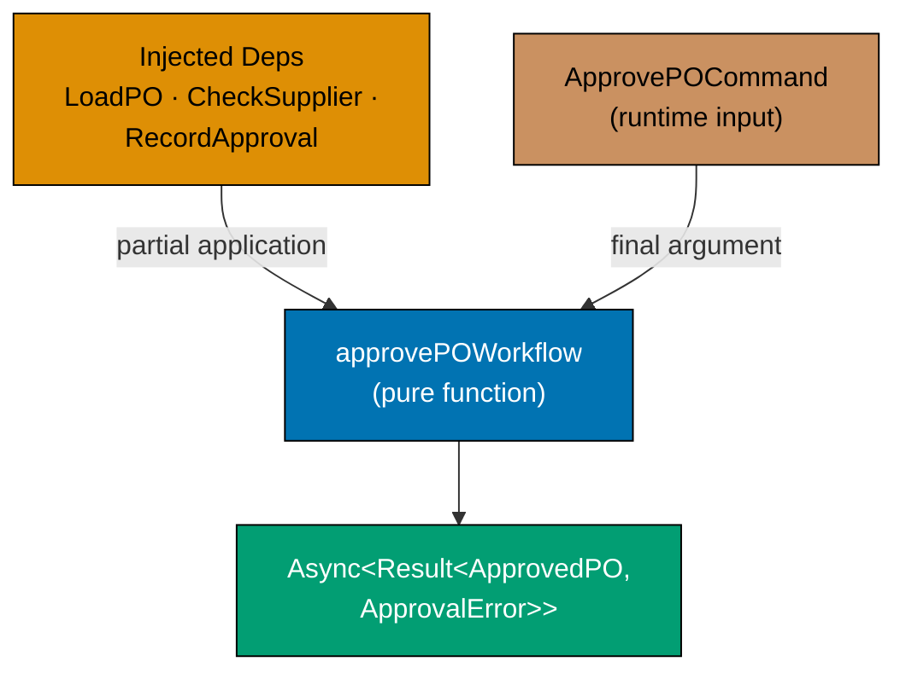





```fsharp
// ApprovePO workflow: dependencies expressed as function parameters.
// No IoC container, no service locator — just function types and partial application.

type PurchaseOrderId = PurchaseOrderId of string
type SupplierId      = SupplierId      of string
type ApproverId      = ApproverId      of string

// The command arriving from the HTTP layer
type ApprovePOCommand = {
    PurchaseOrderId: string  // => Raw PO ID from the request
    ApproverId:      string  // => Raw approver ID from the JWT
}
// => ApprovePOCommand : DTO input — primitive types only

// Domain error cases
type ApprovalError =
    | PONotFound       of string
    | AlreadyApproved  of PurchaseOrderId
    | SupplierBlocked  of SupplierId
    | InsufficientAuth of ApproverId
// => Named errors — each maps to a specific HTTP status and alert

// Port types — expressed as function type aliases (no interfaces, no classes)
type LoadPurchaseOrder = PurchaseOrderId -> Async<Result<decimal * SupplierId, ApprovalError>>
// => LoadPurchaseOrder : PurchaseOrderId → Async<Result<(total, supplierId), error>>
// => Loads the PO total and supplier reference — what the approval step needs

type CheckSupplierEligibility = SupplierId -> Async<Result<unit, ApprovalError>>
// => CheckSupplierEligibility : SupplierId → Async<Result<unit, error>>
// => Returns Ok () if supplier is Approved; Error SupplierBlocked otherwise

type RecordApproval = PurchaseOrderId -> ApproverId -> Async<Result<unit, ApprovalError>>
// => RecordApproval : PurchaseOrderId → ApproverId → Async<Result<unit, error>>
// => Persists the approval record and timestamps

// The workflow function — dependencies injected as parameters
let approvePO
    (loadPO:      LoadPurchaseOrder)
    (checkSupplier: CheckSupplierEligibility)
    (recordApproval: RecordApproval)
    (cmd: ApprovePOCommand)
    : Async<Result<string, ApprovalError>> =
    // => loadPO, checkSupplier, recordApproval are the injected dependencies
    // => cmd is the runtime input
    async {
        let poId     = PurchaseOrderId cmd.PurchaseOrderId
        let approvId = ApproverId      cmd.ApproverId
        // => Wrap raw strings in typed wrappers — validation would go here in full impl
        let! (_, supplierId) = loadPO poId |> Async.map (Result.defaultWith (fun e -> failwithf "%A" e))
        // => Load PO to get the supplier reference — simplified for demonstration
        do! checkSupplier supplierId |> Async.map (Result.defaultWith (fun e -> failwithf "%A" e)) |> Async.Ignore
        // => Check supplier eligibility — raises if blocked
        do! recordApproval poId approvId |> Async.map (Result.defaultWith (fun e -> failwithf "%A" e)) |> Async.Ignore
        // => Record the approval — raises if persistence fails
        return Ok (sprintf "PO %s approved by %s" cmd.PurchaseOrderId cmd.ApproverId)
        // => Return success message — events would be emitted here in full impl
    }

// The workflow TYPE signature — the domain contract
type ApprovePOWorkflow =
    LoadPurchaseOrder -> CheckSupplierEligibility -> RecordApproval -> ApprovePOCommand -> Async<Result<string, ApprovalError>>
// => Arrow type reads: inject deps, then accept command, then produce async result
// => Each arrow is a partial application step

printfn "ApprovePO workflow signature defined — dependencies are function parameters"
// => Output: ApprovePO workflow signature defined — dependencies are function parameters
```





```clojure
;; ApprovePO workflow: dependencies expressed as higher-order function arguments.
;; No IoC container, no service locator — dependencies are plain functions passed at call time.
;; [F#: partial application wires deps first, then accepts the command; Clojure uses a single map argument or threading for the same composition]

(ns procurement.approve-workflow
  (:require [clojure.core.async :as async :refer [go <!]]))

;; Dependency signatures (documented as specs on the function shapes)
;; load-po      : po-id -> channel<{:ok {:total decimal :supplier-id string} | :error keyword}>
;; check-supplier: supplier-id -> channel<{:ok nil | :error keyword}>
;; record-approval: po-id approver-id -> channel<{:ok nil | :error keyword}>
;; [F#: type aliases for each port make the contract part of the type system; Clojure relies on docstrings and spec for the equivalent contract]

(defn approve-po-workflow
  ;; The workflow function — three dependency fns + the runtime command map
  ;; [F#: curried parameter list injects deps via partial application; Clojure passes all as explicit args]
  [load-po check-supplier record-approval cmd]
  ;; => load-po, check-supplier, record-approval are the injected dependency functions
  ;; => cmd is the runtime input map {:purchase-order-id "..." :approver-id "..."}
  (go
    (let [po-id      (:purchase-order-id cmd)
          approver-id (:approver-id cmd)]
          ;; => Extract raw IDs from the command map
      (let [load-result (<! (load-po po-id))]
        ;; => Step 1: load the PO to get supplier reference — park until result arrives
        (if-let [load-err (:error load-result)]
          {:error load-err}
          ;; => PO not found or not in expected state — short-circuit with error
          (let [supplier-id (get-in load-result [:ok :supplier-id])
                check-result (<! (check-supplier supplier-id))]
                ;; => Step 2: check supplier eligibility — park until result arrives
            (if-let [check-err (:error check-result)]
              {:error check-err}
              ;; => Supplier blocked — short-circuit before recording approval
              (let [record-result (<! (record-approval po-id approver-id))]
                ;; => Step 3: record the approval decision — park until result arrives
                (if-let [record-err (:error record-result)]
                  {:error record-err}
                  ;; => Persistence failed — short-circuit; approval not persisted
                  {:ok (str "PO " po-id " approved by " approver-id)})))))))))
                  ;; => All three steps succeeded — return success message

;; Stub implementations for testing — replace with real adapters at the composition root
(defn stub-load-po [po-id]
  ;; => Simulates a DB that returns the PO total and supplier reference
  (go {:ok {:total 2699.97M :supplier-id "sup_acme"}}))
  ;; => Always returns Ok — supplier is sup_acme for any PO ID

(defn stub-check-supplier [supplier-id]
  ;; => Simulates eligibility check — always returns Ok (supplier is approved)
  (go {:ok nil}))

(defn stub-record-approval [po-id approver-id]
  ;; => Simulates writing approval to DB — always succeeds
  (go {:ok nil}))

;; Wire stubs together and run the workflow
(def cmd {:purchase-order-id "po_e3d1" :approver-id "emp_mgr_007"})
;; => Raw command map — would come from the HTTP handler in production

(def result-ch
  (approve-po-workflow stub-load-po stub-check-supplier stub-record-approval cmd))
;; => Returns a core.async channel — the result arrives asynchronously

(def result (async/<!! result-ch))
;; => Block and take the result from the channel (acceptable in REPL / test context)
;; => result : {:ok "PO po_e3d1 approved by emp_mgr_007"}

(println "Workflow result:" (:ok result))
;; => Output: Workflow result: PO po_e3d1 approved by emp_mgr_007
```





```typescript
// ApprovePO workflow signature with dependencies — function receives its dependencies.
// [F#: type alias ApprovePO = Dependencies -> ApprovedPO -> Result<...>]
// [Clojure: defn with injected function args; TS uses dependency parameter objects]

type Result<T, E> = { readonly ok: true; readonly value: T } | { readonly ok: false; readonly error: E };
const okR = <T, E>(v: T): Result => ({ ok: true, value: v });
const errR = <T, E>(e: E): Result => ({ ok: false, error: e });

type PurchaseOrderId = string & { readonly __brand: "PurchaseOrderId" };
type SupplierId = string & { readonly __brand: "SupplierId" };

interface PendingApprovalPO {
  readonly purchaseOrderId: PurchaseOrderId;
  readonly supplierId: SupplierId;
  readonly total: number;
  readonly requestedBy: string;
}
interface ApprovedPO {
  readonly purchaseOrderId: PurchaseOrderId;
  readonly approvedBy: string;
  readonly approvedAt: string;
}
type POApprovedEvent = {
  readonly type: "POApproved";
  readonly purchaseOrderId: PurchaseOrderId;
  readonly approvedBy: string;
};

// Dependencies the ApprovePO workflow needs — injected, not imported
interface ApprovePODeps {
  readonly getApprovalThreshold: (requestedBy: string) => Promise;
  // => Looks up the approval threshold for this employee's level — async I/O
  readonly savePO: (po: ApprovedPO) => Promise;
  // => Persists the approved PO to the database — async I/O
  readonly currentApprover: string;
  // => The identity of the approver — injected at the edge
}

// The workflow function type — dependencies are explicit parameters
type ApprovePOWorkflow = (deps: ApprovePODeps, po: PendingApprovalPO) => Promise;

// Implementation
const approvePO: ApprovePOWorkflow = async (deps, po) => {
  const threshold = await deps.getApprovalThreshold(po.requestedBy);
  // => Async I/O at the edge — pure domain logic follows
  if (po.total > threshold) return errR(`Total ${po.total} exceeds approval threshold ${threshold}`);
  // => Pure domain rule: amount must be within the approver's authority
  const approvedPO: ApprovedPO = {
    purchaseOrderId: po.purchaseOrderId,
    approvedBy: deps.currentApprover,
    approvedAt: new Date().toISOString(),
  };
  await deps.savePO(approvedPO);
  // => Async I/O at the edge — persist the approved state
  return okR({ type: "POApproved", purchaseOrderId: po.purchaseOrderId, approvedBy: deps.currentApprover });
  // => Return the domain event — downstream consumers react to POApproved
};

console.log("ApprovePO workflow signature defined — dependencies are explicit parameters");
// => Output: ApprovePO workflow signature defined — dependencies are explicit parameters
```





```haskell
-- ── file: ApprovePOWorkflow.hs ────────
-- [F#: type aliases for each port; Haskell uses type aliases over function types — same compile-time contract]
-- [Clojure: explicit fn arguments + docstring contract; Haskell encodes the contract in the type signature]
{-# LANGUAGE OverloadedStrings #-}
import Data.Text (Text)
import qualified Data.Text as T

newtype PurchaseOrderId = PurchaseOrderId Text deriving (Show)
newtype SupplierId      = SupplierId      Text deriving (Show)
newtype ApproverId      = ApproverId      Text deriving (Show)

-- Command DTO from the HTTP layer
data ApprovePOCommand = ApprovePOCommand
  { cmdPoId :: Text                              -- raw PO id from request body
  , cmdApId :: Text                              -- raw approver id from JWT
  } deriving (Show)

-- Named domain errors — each maps to an HTTP status at the boundary
data ApprovalError
  = PONotFound       Text
  | AlreadyApproved  PurchaseOrderId
  | SupplierBlocked  SupplierId
  | InsufficientAuth ApproverId
  deriving (Show)

-- Port aliases — dependencies expressed as function types (no classes, no DI container)
type LoadPurchaseOrder        =
  PurchaseOrderId -> IO (Either ApprovalError (Double, SupplierId))
                                                  -- => returns total + supplier id

type CheckSupplierEligibility =
  SupplierId -> IO (Either ApprovalError ())
                                                  -- => Ok () if supplier Approved

type RecordApproval           =
  PurchaseOrderId -> ApproverId -> IO (Either ApprovalError ())
                                                  -- => persists approval record

-- Workflow signature — dependencies are explicit function parameters
type ApprovePOWorkflow =
     LoadPurchaseOrder
  -> CheckSupplierEligibility
  -> RecordApproval
  -> ApprovePOCommand
  -> IO (Either ApprovalError Text)
                                                  -- => returns confirmation text

-- One implementation of the workflow shape; production wires real adapters
approvePO :: ApprovePOWorkflow
approvePO loadPO checkSupplier recordApproval cmd = do
  let poId  = PurchaseOrderId (cmdPoId cmd)
      apvId = ApproverId      (cmdApId cmd)
                                                  -- wrap raw IDs at the boundary
  loadResult <- loadPO poId
  case loadResult of
    Left e -> pure (Left e)                       -- => short-circuit on load failure
    Right (_total, supId) -> do
      checkResult <- checkSupplier supId          -- => Step 2: supplier eligibility
      case checkResult of
        Left e  -> pure (Left e)
        Right () -> do
          recResult <- recordApproval poId apvId  -- => Step 3: persist approval
          case recResult of
            Left  e  -> pure (Left e)
            Right () -> pure $ Right $
              "PO " <> cmdPoId cmd <> " approved by " <> cmdApId cmd
                                                  -- => happy path summary

-- Stub adapters for testing — replace with real adapters at the composition root
stubLoadPO :: LoadPurchaseOrder
stubLoadPO _ = pure (Right (2699.97, SupplierId "sup_acme"))

stubCheckSupplier :: CheckSupplierEligibility
stubCheckSupplier _ = pure (Right ())

stubRecordApproval :: RecordApproval
stubRecordApproval _ _ = pure (Right ())

main :: IO ()
main = do
  let cmd = ApprovePOCommand "po_e3d1" "emp_mgr_007"
  result <- approvePO stubLoadPO stubCheckSupplier stubRecordApproval cmd
  case result of
    Right msg -> putStrLn $ T.unpack msg
    -- => Output: PO po_e3d1 approved by emp_mgr_007
    Left  e   -> putStrLn $ "Error: " <> show e
```





**Key Takeaway**: Expressing workflow dependencies as function-type parameters makes the contract explicit — the caller must supply real or test implementations for every dependency, and the compiler verifies the types match.

**Why It Matters**: Function-type parameters are testable without mocking frameworks: pass a test implementation (`fun poId -> async { return Ok (2699.97m, SupplierId "sup_test") }`) in unit tests, and the production implementation (querying Postgres) in production. The workflow function itself never changes — only the injected implementations differ. This is the functional core / imperative shell principle applied to dependency management.

---

### Example 45: IssuePO Workflow Signature with Dependencies

The `IssuePO` workflow composes four steps: load the approved PO, verify it is in `Approved` state, persist the `Issued` state, and publish the `PurchaseOrderIssued` event. Each dependency is a function type parameter.





```fsharp
// IssuePO: four-step workflow with typed function dependencies.

type PurchaseOrderId = PurchaseOrderId of string
type SupplierId      = SupplierId      of string

type IssuedPO = { Id: PurchaseOrderId; SupplierId: SupplierId; IssuedAt: System.DateTimeOffset }
// => The issued state produced by the transition — carries only post-issuance fields

type PoIssuedEvent = { PurchaseOrderId: PurchaseOrderId; SupplierId: SupplierId; IssuedAt: System.DateTimeOffset; Total: decimal }
// => Event payload for downstream contexts — consuming contexts do not query back for total

type IssueError =
    | PONotFound    of PurchaseOrderId  // => PO does not exist — 404
    | NotApproved   of PurchaseOrderId  // => Can only issue from Approved state — 422
    | SaveFailed    of string           // => DB write failed — 503, retry eligible
    | PublishFailed of string           // => Event bus write failed — 503, retry eligible
// => Named error union — each case drives a different alert/retry policy

// Port type aliases
type LoadApprovedPO  = PurchaseOrderId -> Async<Result<decimal * SupplierId, IssueError>>
// => Loads the PO total and supplier ID; Error PONotFound if missing; Error NotApproved if wrong state
type SaveIssuedPO    = IssuedPO -> Async<Result<unit, IssueError>>
// => Persists the new Issued state to the database
type PublishEvent    = PoIssuedEvent -> Async<Result<unit, IssueError>>
// => Publishes to the event bus (outbox or direct Kafka)

// The workflow — four sequential async steps
let issuePOWorkflow
    (load:    LoadApprovedPO)
    (save:    SaveIssuedPO)
    (publish: PublishEvent)
    (poId:    PurchaseOrderId)
    : Async<Result<IssuedPO, IssueError>> =
    async {
        let! loadResult = load poId
        // => Step 1: load the approved PO from the repository
        match loadResult with
        | Error e -> return Error e
        // => Not found or not in Approved state — short-circuit
        | Ok (total, supplierId) ->
            let now    = System.DateTimeOffset.UtcNow
            // => Capture issuance timestamp
            let issued = { Id = poId; SupplierId = supplierId; IssuedAt = now }
            // => Build the new Issued state
            let event  = { PurchaseOrderId = poId; SupplierId = supplierId; IssuedAt = now; Total = total }
            // => Build the domain event
            let! saveResult = save issued
            // => Step 2: persist the new state
            match saveResult with
            | Error e -> return Error e
            // => Persistence failed — short-circuit; event not published (at-least-once with outbox)
            | Ok () ->
                let! publishResult = publish event
                // => Step 3: publish the domain event
                match publishResult with
                | Error e -> return Error e
                // => Publish failed — caller can retry; state already saved
                | Ok () -> return Ok issued
                // => All steps succeeded — return the new Issued state
    }

// Test with stub implementations
let stubLoad   _ = async { return Ok (2699.97m, SupplierId "sup_acme") }
// => Stub load: always returns Ok with a fixed total and supplier
let stubSave   _ = async { return Ok () }
// => Stub save: always succeeds
let stubPublish _ = async { return Ok () }
// => Stub publish: always succeeds

let result = Async.RunSynchronously (issuePOWorkflow stubLoad stubSave stubPublish (PurchaseOrderId "po_e3d1"))
// => All stubs return Ok — result : Result<IssuedPO, IssueError> = Ok { Id = ...; ... }

match result with
| Ok issued -> printfn "Issued: %A at %O" issued.Id issued.IssuedAt
// => Output: Issued: PurchaseOrderId "po_e3d1" at 2026-...
| Error e   -> printfn "Error: %A" e
```





```clojure
;; IssuePO: four-step workflow with function dependencies in Clojure's data-oriented style.
;; [F#: typed port aliases (LoadApprovedPO, SaveIssuedPO, PublishEvent) express each dependency's contract in the type system; Clojure conveys the same contract via docstrings and spec]

(ns procurement.issue-workflow
  (:require [clojure.core.async :as async :refer [go <!]]))

;; Dependency contract (documented, not enforced by type system)
;; load-approved-po : po-id -> channel<{:ok {:total decimal :supplier-id string} | :error keyword}>
;; [F#: LoadApprovedPO type alias makes this contract checked by the compiler]
;; save-issued-po   : issued-po-map -> channel<{:ok nil | :error string}>
;; publish-event    : event-map -> channel<{:ok nil | :error string}>

(defn issue-po-workflow
  ;; Four-step async workflow: load → build-state → save → publish
  ;; [F#: async computation expression sequences steps with let!; Clojure uses go block with <!]
  [load-approved-po save-issued-po publish-event po-id]
  ;; => Three dependency functions + the runtime PO ID
  (go
    (let [load-result (<! (load-approved-po po-id))]
      ;; => Step 1: load the approved PO — park until the channel delivers the result
      (if-let [load-err (:error load-result)]
        {:error load-err}
        ;; => Not found or not in Approved state — short-circuit; downstream steps not executed
        (let [{:keys [total supplier-id]} (:ok load-result)
              ;; => Destructure the loaded PO data: total and supplier-id
              now        (java.time.Instant/now)
              ;; => Capture issuance timestamp — same instant used in both state and event
              issued-po  {:issued-po/id          po-id
                          :issued-po/supplier-id supplier-id
                          ;; => Supplier carrying the order — from the loaded PO
                          :issued-po/issued-at   now}
                          ;; => Issuance timestamp — when PO was transmitted to the supplier
              issued-event {:po-issued-event/purchase-order-id po-id
                            :po-issued-event/supplier-id        supplier-id
                            :po-issued-event/issued-at          now
                            ;; => Issuance timestamp repeated in event for SLA tracking
                            :po-issued-event/total-amount       total}]
                            ;; => Total carried in event — receivers need not query back
          (let [save-result (<! (save-issued-po issued-po))]
            ;; => Step 2: persist the new Issued state — park until DB confirms
            (if-let [save-err (:error save-result)]
              {:error save-err}
              ;; => DB write failed — short-circuit; event not published (at-least-once via outbox)
              (let [pub-result (<! (publish-event issued-event))]
                ;; => Step 3: publish the domain event — park until bus confirms
                (if-let [pub-err (:error pub-result)]
                  {:error pub-err}
                  ;; => Publish failed — caller can retry; state already saved in DB
                  {:ok issued-po})))))))))
                  ;; => All steps succeeded — return the Issued PO state map

;; Stub implementations — replace with real adapters at the composition root
(defn stub-load [po-id]
  ;; => Always returns Ok with a fixed total and supplier — no DB needed
  (go {:ok {:total 2699.97M :supplier-id "sup_acme"}}))

(defn stub-save [issued-po]
  ;; => Always succeeds — simulates a DB write
  (go {:ok nil}))

(defn stub-publish [event]
  ;; => Always succeeds — simulates an event bus write
  (go {:ok nil}))

;; Run the workflow with stubs
(def result-ch
  (issue-po-workflow stub-load stub-save stub-publish "po_e3d1"))
;; => Wires stubs as dependencies; returns a channel delivering the result

(def result (async/<!! result-ch))
;; => Block and take from the channel (acceptable in test / REPL context)
;; => result : {:ok {:issued-po/id "po_e3d1" :issued-po/supplier-id "sup_acme" ...}}

(if-let [issued (:ok result)]
  (println "Issued:" (:issued-po/id issued) "at" (:issued-po/issued-at issued))
  ;; => Output: Issued: po_e3d1 at 2026-...
  (println "Error:" (:error result)))
```





```typescript
// IssuePO workflow signature with dependencies — issued PO triggers supplier notification.
// [F#: type alias IssuePO = IssuePODeps -> ApprovedPO -> AsyncResult<POIssuedEvent, DomainError>]
// [Clojure: defn with injected function args; TS uses dependency parameter object]

type Result<T, E> = { readonly ok: true; readonly value: T } | { readonly ok: false; readonly error: E };
const okR = <T, E>(v: T): Result => ({ ok: true, value: v });
const errR = <T, E>(e: E): Result => ({ ok: false, error: e });

type PurchaseOrderId = string & { readonly __brand: "PurchaseOrderId" };
type SupplierId = string & { readonly __brand: "SupplierId" };

interface ApprovedPO {
  readonly purchaseOrderId: PurchaseOrderId;
  readonly supplierId: SupplierId;
  readonly lines: readonly { sku: string; qty: number; price: number }[];
  readonly total: number;
}

interface IssuedPO {
  readonly purchaseOrderId: PurchaseOrderId;
  readonly supplierId: SupplierId;
  readonly issuedAt: string;
  readonly expectedDelivery: string;
}

type POIssuedEvent = {
  readonly type: "POIssued";
  readonly purchaseOrderId: PurchaseOrderId;
  readonly supplierId: SupplierId;
};

// Dependencies the IssuePO workflow needs — injected, not imported
interface IssuePODeps {
  readonly validateSupplierStatus: (supplierId: SupplierId) => Promise;
  // => Checks that the supplier is still Approved — async I/O
  readonly savePO: (po: IssuedPO) => Promise;
  // => Persists the issued PO — async I/O
  readonly notifySupplier: (supplierId: SupplierId, poId: PurchaseOrderId) => Promise;
  // => Sends PO to supplier via EDI or email — async I/O
  readonly computeExpectedDelivery: (supplierId: SupplierId) => string;
  // => Computes delivery date from supplier SLA rules — pure function injected
}

type IssuePOWorkflow = (deps: IssuePODeps, approved: ApprovedPO) => Promise;

const issuePO: IssuePOWorkflow = async (deps, approved) => {
  const supplierOk = await deps.validateSupplierStatus(approved.supplierId);
  // => I/O at the edge: verify supplier is still approved
  if (!supplierOk) return errR(`Supplier ${approved.supplierId} is not approved`);
  const expectedDelivery = deps.computeExpectedDelivery(approved.supplierId);
  // => Pure function: computes delivery date from SLA — no I/O
  const issued: IssuedPO = {
    purchaseOrderId: approved.purchaseOrderId,
    supplierId: approved.supplierId,
    issuedAt: new Date().toISOString(),
    expectedDelivery,
  };
  await deps.savePO(issued);
  await deps.notifySupplier(approved.supplierId, approved.purchaseOrderId);
  // => I/O at the edge: persist and notify
  return okR({ type: "POIssued", purchaseOrderId: approved.purchaseOrderId, supplierId: approved.supplierId });
};

console.log("IssuePO workflow signature defined — all effects injected as dependencies");
// => Output: IssuePO workflow signature defined — all effects injected as dependencies
```





```haskell
-- ── file: IssuePOWorkflow.hs ──────────
-- [F#: Async<Result<>> + port aliases; Haskell uses IO + Either with type aliases for each port]
-- [Clojure: core.async channels of tagged maps; Haskell composes the same four steps via do-notation]
{-# LANGUAGE OverloadedStrings #-}
import Data.Text (Text)
import Data.Time (UTCTime, getCurrentTime)

newtype PurchaseOrderId = PurchaseOrderId Text deriving (Show)
newtype SupplierId      = SupplierId      Text deriving (Show)

-- States and event payload
data IssuedPO = IssuedPO
  { ipoId         :: PurchaseOrderId
  , ipoSupplierId :: SupplierId
  , ipoIssuedAt   :: UTCTime
  } deriving (Show)

data PoIssuedEvent = PoIssuedEvent
  { peId         :: PurchaseOrderId
  , peSupplierId :: SupplierId
  , peIssuedAt   :: UTCTime
  , peTotal      :: Double
  } deriving (Show)

-- Each constructor drives a different alert + retry policy
data IssueError
  = PONotFound    PurchaseOrderId               -- => 404
  | NotApproved   PurchaseOrderId               -- => 422: wrong state
  | SaveFailed    Text                          -- => 503, retry-eligible
  | PublishFailed Text                          -- => 503, retry-eligible
  deriving (Show)

-- Port aliases — each dependency is a function type
type LoadApprovedPO = PurchaseOrderId -> IO (Either IssueError (Double, SupplierId))
type SaveIssuedPO   = IssuedPO        -> IO (Either IssueError ())
type PublishEvent   = PoIssuedEvent   -> IO (Either IssueError ())

-- Four sequential steps; short-circuits on the first Left
issuePOWorkflow
  :: LoadApprovedPO -> SaveIssuedPO -> PublishEvent
  -> PurchaseOrderId
  -> IO (Either IssueError IssuedPO)
issuePOWorkflow load save publish poId = do
  loadR <- load poId
  case loadR of
    Left e -> pure (Left e)                     -- => Step 1 short-circuit
    Right (total, supId) -> do
      now <- getCurrentTime                     -- single timestamp for state + event
      let issued = IssuedPO poId supId now
          event  = PoIssuedEvent poId supId now total
      saveR <- save issued                      -- => Step 2: persist new state
      case saveR of
        Left e -> pure (Left e)                 --   short-circuit on DB failure
        Right () -> do
          pubR <- publish event                 -- => Step 3: publish to event bus
          case pubR of
            Left e   -> pure (Left e)           --   short-circuit on publish failure
            Right () -> pure (Right issued)     -- => Step 4: return new state

-- Stub adapters for testing
stubLoad :: LoadApprovedPO
stubLoad _ = pure (Right (2699.97, SupplierId "sup_acme"))

stubSave :: SaveIssuedPO
stubSave _ = pure (Right ())

stubPublish :: PublishEvent
stubPublish _ = pure (Right ())

main :: IO ()
main = do
  result <- issuePOWorkflow stubLoad stubSave stubPublish (PurchaseOrderId "po_e3d1")
  case result of
    Right issued -> putStrLn $ "Issued: " <> show (ipoId issued)
                                         <> " at "  <> show (ipoIssuedAt issued)
    -- => Output: Issued: PurchaseOrderId "po_e3d1" at ...
    Left  e      -> putStrLn $ "Error: " <> show e
```





**Key Takeaway**: A four-step async workflow expressed with typed function dependencies is fully testable with in-memory stubs — no database, no Kafka, no network required to test the workflow logic.

**Why It Matters**: The four steps of `issuePOWorkflow` (load, build state, save, publish) have a defined order with specific failure modes at each step. Testing this order and the failure short-circuiting with stub functions is trivial and fast. The production wiring — injecting the real Postgres adapter and the Kafka publisher — happens at the composition root, not inside the workflow.

---

### Example 46: AcknowledgePO Workflow Signature

Once a `PurchaseOrder` is issued to the supplier, the supplier acknowledges receipt. The `AcknowledgePO` workflow transitions `Issued → Acknowledged` and emits `PurchaseOrderAcknowledged`, which opens a GRN expectation in the receiving context.





```fsharp
// AcknowledgePO: supplier acknowledges receipt of the issued PO.
// Transitions Issued → Acknowledged; opens GRN expectation in receiving context.

type PurchaseOrderId = PurchaseOrderId of string
type SupplierId      = SupplierId      of string

// The state after supplier acknowledgement
type AcknowledgedPO = {
    Id:              PurchaseOrderId
    // => Typed wrapper — prevents mixing with RequisitionId
    SupplierId:      SupplierId
    // => Which supplier acknowledged
    AcknowledgedAt:  System.DateTimeOffset
    // => Timestamp of acknowledgement
    ExpectedDelivery: System.DateTimeOffset option
    // => Supplier may provide an expected delivery date — optional at acknowledgement time
}
// => AcknowledgedPO : Acknowledged state — opens the receiving window

// Event consumed by the receiving context
type PurchaseOrderAcknowledgedEvent = {
    PurchaseOrderId:  PurchaseOrderId
    // => Identifies which PO was acknowledged
    SupplierId:       SupplierId
    // => Mirrors AcknowledgedPO — receiving needs both
    AcknowledgedAt:   System.DateTimeOffset
    // => When the supplier confirmed
    ExpectedDelivery: System.DateTimeOffset option
    // => Receiving context uses this to set GRN due date
}
// => Receiving context reacts: creates a GoodsReceiptNote expectation

// Command from the supplier's acknowledgement API call
type AcknowledgePOCommand = {
    PurchaseOrderId:  string                        // => Raw PO ID
    ExpectedDelivery: System.DateTimeOffset option  // => Optional delivery date from supplier
}
// => AcknowledgePOCommand : DTO from the supplier portal or EDI system

type AckError = PONotFound of string | NotIssued of string | SaveFailed
// => PONotFound: PO doesn't exist; NotIssued: PO not in Issued state; SaveFailed: DB write failed

// Port types
type LoadIssuedPO    = PurchaseOrderId -> Async<Result<SupplierId, AckError>>
// => Loads the PO and verifies it is in Issued state
type SaveAcknowledged = AcknowledgedPO -> Async<Result<unit, AckError>>
// => Persists the Acknowledged state
type PublishAckEvent  = PurchaseOrderAcknowledgedEvent -> Async<Result<unit, AckError>>
// => Publishes to the event bus

// The workflow
let acknowledgePO
    (load:    LoadIssuedPO)
    (save:    SaveAcknowledged)
    (publish: PublishAckEvent)
    (cmd:     AcknowledgePOCommand)
    : Async<Result<AcknowledgedPO, AckError>> =
    async {
        let poId = PurchaseOrderId cmd.PurchaseOrderId
        // => Wrap the raw string in the typed wrapper
        let! loadResult = load poId
        // => Load and verify the PO is in Issued state
        match loadResult with
        | Error e -> return Error e
        // => Not found or not Issued — short-circuit
        | Ok supplierId ->
            let now = System.DateTimeOffset.UtcNow
            let acked = { Id = poId; SupplierId = supplierId
                          AcknowledgedAt = now; ExpectedDelivery = cmd.ExpectedDelivery }
            // => New Acknowledged state — carries optional delivery date
            let event = { PurchaseOrderId = poId; SupplierId = supplierId
                          AcknowledgedAt = now; ExpectedDelivery = cmd.ExpectedDelivery }
            // => Event payload for the receiving context
            let! saveResult = save acked
            match saveResult with
            | Error e -> return Error e
            | Ok () ->
                let! _ = publish event
                // => Publish — receiving context opens GRN expectation on receipt
                return Ok acked
                // => Return the Acknowledged state
    }

// Demonstrate with stubs
let stubLoad _    = async { return Ok (SupplierId "sup_acme") }
// => Simulates a DB that returns sup_acme for any PO ID
let stubSave _    = async { return Ok () }
// => No-op save — always succeeds
let stubPublish _ = async { return Ok () }
// => No-op publish — event is discarded in test

let cmd = { PurchaseOrderId = "po_e3d1"; ExpectedDelivery = Some (System.DateTimeOffset.UtcNow.AddDays(7.0)) }
// => cmd : AcknowledgePOCommand — with a 7-day expected delivery

let result = Async.RunSynchronously (acknowledgePO stubLoad stubSave stubPublish cmd)
// => All stubs succeed — result : Result<AcknowledgedPO, AckError> = Ok { ... }

match result with
| Ok acked -> printfn "Acknowledged: delivery=%A" acked.ExpectedDelivery
// => Output: Acknowledged: delivery=Some 2026-...
| Error e  -> printfn "Error: %A" e
// => Error branch: prints AckError DU case (e.g. PONotFound "po_e3d1")
```





```clojure
;; AcknowledgePO: supplier acknowledges receipt of the issued PO.
;; Transitions Issued → Acknowledged; emits an event that opens a GRN expectation.
;; [F#: AcknowledgePOCommand, AcknowledgedPO, and PurchaseOrderAcknowledgedEvent are distinct record types; Clojure represents all three as plain maps distinguished by namespaced keys]

(ns procurement.acknowledge-workflow
  (:require [clojure.core.async :as async :refer [go <!]]))

;; Port contract (by convention, not type-checked)
;; load-issued-po    : po-id -> channel<{:ok {:supplier-id string} | :error keyword}>
;; save-acknowledged : acked-map -> channel<{:ok nil | :error string}>
;; publish-ack-event : event-map -> channel<{:ok nil | :error string}>
;; [F#: LoadIssuedPO, SaveAcknowledged, PublishAckEvent type aliases make this contract part of the type system]

(defn acknowledge-po-workflow
  ;; Three dependency functions + the runtime command map
  ;; Command map: {:purchase-order-id string :expected-delivery inst-or-nil}
  [load-issued-po save-acknowledged publish-ack-event cmd]
  ;; => load-issued-po, save-acknowledged, publish-ack-event are injected dependency functions
  ;; => cmd carries the raw PO ID and the optional delivery date from the supplier
  (go
    (let [po-id            (:purchase-order-id cmd)
          expected-delivery (:expected-delivery cmd)]
          ;; => Extract fields from the command map — expected-delivery may be nil
      (let [load-result (<! (load-issued-po po-id))]
        ;; => Step 1: load the PO and verify it is in Issued state — park until result arrives
        (if-let [load-err (:error load-result)]
          {:error load-err}
          ;; => PO not found or not in Issued state — short-circuit; no state change persisted
          (let [supplier-id (:supplier-id (:ok load-result))
                ;; => Extract supplier-id from the loaded PO
                now         (java.time.Instant/now)
                ;; => Capture acknowledgement timestamp — same instant in state and event
                acked-po    {:acked-po/id               po-id
                             :acked-po/supplier-id       supplier-id
                             ;; => Which supplier acknowledged the PO
                             :acked-po/acknowledged-at   now
                             ;; => Timestamp of supplier acknowledgement
                             :acked-po/expected-delivery expected-delivery}
                             ;; => Optional delivery date provided by the supplier — may be nil
                ack-event   {:po-acked-event/purchase-order-id po-id
                             ;; => Identifies the PO being acknowledged — routes the event
                             :po-acked-event/supplier-id        supplier-id
                             ;; => Receiving context needs supplier identity alongside the PO ID
                             :po-acked-event/acknowledged-at    now
                             ;; => When the supplier confirmed — audit and SLA tracking
                             :po-acked-event/expected-delivery  expected-delivery}]
                             ;; => Receiving context uses this to set the GRN due date
            (let [save-result (<! (save-acknowledged acked-po))]
              ;; => Step 2: persist the Acknowledged state — park until DB confirms
              (if-let [save-err (:error save-result)]
                {:error save-err}
                ;; => Persistence failed — event not published; caller can retry
                (let [pub-result (<! (publish-ack-event ack-event))]
                  ;; => Step 3: publish the domain event — receiving context opens GRN expectation
                  (if-let [pub-err (:error pub-result)]
                    {:error pub-err}
                    ;; => Event publish failed — state already saved; caller can retry publish
                    {:ok acked-po}))))))))))
                    ;; => All steps succeeded — return the Acknowledged state map

;; Stub implementations for the test run
(defn stub-load [po-id]
  ;; => Returns Ok with sup_acme for any PO ID — no DB required
  (go {:ok {:supplier-id "sup_acme"}}))

(defn stub-save [acked-po]
  ;; => Simulates a DB write — always succeeds
  (go {:ok nil}))

(defn stub-publish [event]
  ;; => Simulates an event bus write — always succeeds in the test
  (go {:ok nil}))

;; Wire stubs and run the workflow
(def cmd {:purchase-order-id  "po_e3d1"
          :expected-delivery  (java.time.Instant/now)})
;; => Command map — includes a 7-day-out expected delivery date (simplified to now for the example)

(def result-ch
  (acknowledge-po-workflow stub-load stub-save stub-publish cmd))
;; => Returns a channel; result arrives asynchronously from the go block

(def result (async/<!! result-ch))
;; => Block and take from the channel (REPL / test context)
;; => result : {:ok {:acked-po/id "po_e3d1" :acked-po/supplier-id "sup_acme" ...}}

(if-let [acked (:ok result)]
  (println "Acknowledged: delivery=" (:acked-po/expected-delivery acked))
  ;; => Output: Acknowledged: delivery= 2026-...
  (println "Error:" (:error result)))
;; => Error branch: prints the error keyword (e.g. :po-not-found or :not-issued)
```





```typescript
// AcknowledgePO workflow signature — supplier acknowledges receipt of the issued PO.
// [F#: AcknowledgePO = AcknowledgePODeps -> IssuedPO -> AsyncResult<POAcknowledgedEvent, DomainError>]
// [Clojure: defn with injected function args; TS explicit dependency parameter]

type Result<T, E> = { readonly ok: true; readonly value: T } | { readonly ok: false; readonly error: E };
const okR = <T, E>(v: T): Result => ({ ok: true, value: v });
const errR = <T, E>(e: E): Result => ({ ok: false, error: e });

type PurchaseOrderId = string & { readonly __brand: "PurchaseOrderId" };
type SupplierId = string & { readonly __brand: "SupplierId" };

interface IssuedPO {
  readonly purchaseOrderId: PurchaseOrderId;
  readonly supplierId: SupplierId;
  readonly issuedAt: string;
  readonly expectedDelivery: string;
}

interface AcknowledgedPO {
  readonly purchaseOrderId: PurchaseOrderId;
  readonly acknowledgedAt: string;
  readonly confirmedDelivery: string;
}

type POAcknowledgedEvent = {
  readonly type: "POAcknowledged";
  readonly purchaseOrderId: PurchaseOrderId;
  readonly confirmedDelivery: string;
};
// => Fired when the supplier formally acknowledges receiving and accepting the PO

// Dependencies needed by the AcknowledgePO workflow
interface AcknowledgePODeps {
  readonly getCurrentTime: () => string;
  // => Current UTC timestamp — injected so the workflow is deterministic in tests
  readonly savePO: (po: AcknowledgedPO) => Promise;
  // => Persists the acknowledged state — async I/O at the edge
  readonly sendAcknowledgmentNotification: (poId: PurchaseOrderId) => Promise;
  // => Notifies the purchasing team — async I/O at the edge
}

type AcknowledgePOWorkflow = (deps: AcknowledgePODeps, issued: IssuedPO, confirmedDelivery: string) => Promise;

const acknowledgePO: AcknowledgePOWorkflow = async (deps, issued, confirmedDelivery) => {
  if (!confirmedDelivery) return errR("Confirmed delivery date is required");
  // => Domain rule: supplier must commit to a specific delivery date
  const acknowledged: AcknowledgedPO = {
    purchaseOrderId: issued.purchaseOrderId,
    acknowledgedAt: deps.getCurrentTime(),
    // => Timestamp injected — no Date.now() inside domain function
    confirmedDelivery,
  };
  await deps.savePO(acknowledged);
  await deps.sendAcknowledgmentNotification(issued.purchaseOrderId);
  return okR({ type: "POAcknowledged", purchaseOrderId: issued.purchaseOrderId, confirmedDelivery });
};

console.log("AcknowledgePO workflow signature defined — timestamp is an injected dependency");
// => Output: AcknowledgePO workflow signature defined — timestamp is an injected dependency
```





```haskell
-- ── file: AcknowledgePOWorkflow.hs ────
-- [F#: same load/save/publish ports — Haskell uses identical function-type aliases]
-- [Clojure: docstring contract; Haskell encodes contract in the type signature]
{-# LANGUAGE OverloadedStrings #-}
import Data.Text (Text)
import Data.Time (UTCTime, getCurrentTime)

newtype PurchaseOrderId = PurchaseOrderId Text deriving (Show)
newtype SupplierId      = SupplierId      Text deriving (Show)

-- Acknowledged state — opens the GRN receiving window
data AcknowledgedPO = AcknowledgedPO
  { ackPoId             :: PurchaseOrderId
  , ackSupplierId       :: SupplierId
  , ackAcknowledgedAt   :: UTCTime
  , ackExpectedDelivery :: Maybe UTCTime         -- supplier-provided, optional
  } deriving (Show)

-- Event payload consumed by the receiving context
data POAcknowledgedEvent = POAcknowledgedEvent
  { eaPoId             :: PurchaseOrderId
  , eaSupplierId       :: SupplierId
  , eaAcknowledgedAt   :: UTCTime
  , eaExpectedDelivery :: Maybe UTCTime
  } deriving (Show)

-- Command from supplier portal or EDI ingestion
data AcknowledgePOCommand = AcknowledgePOCommand
  { cmdPoId          :: Text                     -- raw PO id
  , cmdDelivery      :: Maybe UTCTime            -- optional delivery commitment
  } deriving (Show)

-- Named errors driving HTTP status + retry policy
data AckError
  = PONotFound Text
  | NotIssued  Text
  | SaveFailed
  deriving (Show)

-- Port aliases
type LoadIssuedPO     = PurchaseOrderId -> IO (Either AckError SupplierId)
type SaveAcknowledged = AcknowledgedPO  -> IO (Either AckError ())
type PublishAckEvent  = POAcknowledgedEvent -> IO (Either AckError ())

-- Workflow shape — three injected ports + one command
acknowledgePO
  :: LoadIssuedPO -> SaveAcknowledged -> PublishAckEvent
  -> AcknowledgePOCommand
  -> IO (Either AckError AcknowledgedPO)
acknowledgePO load save publish cmd = do
  let poId = PurchaseOrderId (cmdPoId cmd)        -- typed wrapper at boundary
  loadR <- load poId
  case loadR of
    Left e -> pure (Left e)                       -- => not Issued or missing
    Right supId -> do
      now <- getCurrentTime                       -- single timestamp
      let acked = AcknowledgedPO poId supId now (cmdDelivery cmd)
          event = POAcknowledgedEvent poId supId now (cmdDelivery cmd)
      saveR <- save acked
      case saveR of
        Left e -> pure (Left e)                   -- => persistence failure
        Right () -> do
          _ <- publish event                      -- => receiving opens GRN expectation
          pure (Right acked)

-- Stubs for testing
stubLoad :: LoadIssuedPO
stubLoad _ = pure (Right (SupplierId "sup_acme"))

stubSave :: SaveAcknowledged
stubSave _ = pure (Right ())

stubPublish :: PublishAckEvent
stubPublish _ = pure (Right ())

main :: IO ()
main = do
  now <- getCurrentTime
  let cmd = AcknowledgePOCommand "po_e3d1" (Just now)
  result <- acknowledgePO stubLoad stubSave stubPublish cmd
  case result of
    Right acked -> putStrLn $ "Acknowledged: delivery=" <> show (ackExpectedDelivery acked)
    -- => Output: Acknowledged: delivery=Just ...
    Left  e     -> putStrLn $ "Error: " <> show e
```





**Key Takeaway**: The `AcknowledgePO` workflow is structurally identical to `IssuePO` — load, build, save, publish — demonstrating that the same composition pattern scales to every step in the PO lifecycle.

**Why It Matters**: When every workflow in the purchasing context follows the same (load, validate, transition, save, publish) structure, new developers can understand a new workflow immediately by recognising the pattern. Consistency also means tooling — logging middleware, retry logic, observability — can be applied uniformly at the composition layer rather than being hand-rolled in each workflow.

---

## Workflow Architecture (Examples 47–55)

### Example 47: Pipeline Composition — Wiring Three Workflow Steps

The complete PO lifecycle from Draft to Issued involves three workflow steps: `CreateDraftPO → ApprovePO → IssuePO`. Composing them in a pipeline demonstrates how functional workflow orchestration works without a workflow engine.

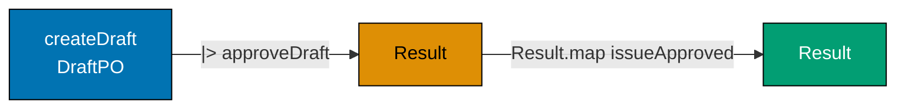





```fsharp
// Three PO lifecycle steps composed into a single pipeline.
// Each step is a pure function or an async function with injected deps.

type PurchaseOrderId = PurchaseOrderId of string
type SupplierId      = SupplierId      of string

// Simplified state types for composition demonstration
type DraftPO     = { Id: PurchaseOrderId; Total: decimal; SupplierId: SupplierId }
type ApprovedPO  = { Id: PurchaseOrderId; Total: decimal; SupplierId: SupplierId; ApprovedAt: System.DateTimeOffset }
type IssuedPO    = { Id: PurchaseOrderId; SupplierId: SupplierId; IssuedAt: System.DateTimeOffset }

// Step 1: create a draft PO (pure — no I/O)
let createDraft (total: decimal) (supplierId: SupplierId) : DraftPO =
    { Id = PurchaseOrderId ("po_" + System.Guid.NewGuid().ToString("N").[..7])
      Total = total; SupplierId = supplierId }
    // => Pure: no side effects, no Result needed — creation always succeeds

// Step 2: approve the draft (pure — business rule only)
let approveDraft (draft: DraftPO) : Result<ApprovedPO, string> =
    if draft.Total <= 0m then Error "Cannot approve a zero-total PO"
    // => Business rule: zero-value POs cannot be approved
    else Ok { Id = draft.Id; Total = draft.Total; SupplierId = draft.SupplierId
              ApprovedAt = System.DateTimeOffset.UtcNow }
    // => Approved state carries the approval timestamp

// Step 3: issue the approved PO (pure — returns both state and event)
let issueApproved (approved: ApprovedPO) : IssuedPO * string =
    let issued = { Id = approved.Id; SupplierId = approved.SupplierId; IssuedAt = System.DateTimeOffset.UtcNow }
    // => New Issued state
    let eventSummary = sprintf "PurchaseOrderIssued: %A to %A total=%M" approved.Id approved.SupplierId approved.Total
    // => Simplified event summary — full version would produce a typed event record
    issued, eventSummary
    // => Return both state and event

// Pipeline: wire all three steps
let lifeCyclePipeline (total: decimal) (supplierId: SupplierId) : Result<IssuedPO * string, string> =
    let draft = createDraft total supplierId
    // => Step 1: create draft — always succeeds (pure)
    draft
    |> approveDraft
    // => Step 2: approve — may fail if total <= 0
    |> Result.map issueApproved
    // => Step 3: issue — infallible if approve succeeded (Result.map)

// Test
let result = lifeCyclePipeline 2699.97m (SupplierId "sup_acme")
// => createDraft: DraftPO; approveDraft: Ok ApprovedPO; issueApproved: (IssuedPO, eventSummary)

match result with
| Ok (issued, event) ->
    printfn "Issued: %A" issued.Id
    // => Output: Issued: PurchaseOrderId "po_..."
    printfn "Event: %s" event
    // => Output: Event: PurchaseOrderIssued: PurchaseOrderId "po_..." to SupplierId "sup_acme" total=2699.9700M
| Error e -> printfn "Pipeline error: %s" e

// Error path: zero-total PO
let errorResult = lifeCyclePipeline 0m (SupplierId "sup_acme")
// => approveDraft returns Error "Cannot approve a zero-total PO"
// => issueApproved is skipped via Result.map
match errorResult with
| Ok _    -> printfn "Should not reach here"
| Error e -> printfn "Error: %s" e
// => Output: Error: Cannot approve a zero-total PO
```





```clojure
;; Three PO lifecycle steps composed into a single threading pipeline.
;; [F#: |> pipe operator + Result.map; Clojure: ->> thread-last + map over result wrapper]
;; Each step is a pure function returning a result map {:ok value} or {:error msg}.

(ns procurement.lifecycle-pipeline)

;; Step 1: create a draft PO (pure — always succeeds)
(defn create-draft
  ;; [F#: DraftPO record type — compile-time field names; Clojure: plain map with namespaced keys]
  [total supplier-id]
  ;; => total: decimal, supplier-id: string — both required
  {:draft-po/id          (str "po_" (subs (str (java.util.UUID/randomUUID)) 0 8))
   ;; => Generate a short opaque ID — mirrors F# Guid.NewGuid().[..7]
   :draft-po/total       total
   ;; => The PO monetary total — drives approval level and budget checks
   :draft-po/supplier-id supplier-id})
   ;; => Pure: no side effects; creation always returns a map (no result wrapper needed)

;; Step 2: approve the draft (pure — business rule check)
(defn approve-draft
  ;; Validates the draft and transitions to approved state
  [draft-po]
  ;; => draft-po: map with :draft-po/total and :draft-po/supplier-id
  (let [total (:draft-po/total draft-po)]
    (if (<= total 0)
      {:error "Cannot approve a zero-total PO"}
      ;; => Business rule: zero-value POs cannot be approved — mirrors F# Error branch
      {:ok {:approved-po/id          (:draft-po/id draft-po)
            ;; => Carry forward the PO identity
            :approved-po/total       total
            ;; => Total preserved — needed by issue step for the event summary
            :approved-po/supplier-id (:draft-po/supplier-id draft-po)
            ;; => Supplier identity carried into the Approved state
            :approved-po/approved-at (java.time.Instant/now)}})))
            ;; => Approval timestamp — Clojure uses java.time.Instant instead of DateTimeOffset

;; Step 3: issue the approved PO (pure — returns state and event summary)
(defn issue-approved
  ;; Transitions Approved → Issued; produces state and event in a single map
  [approved-po]
  ;; => approved-po: map with :approved-po/* keys
  (let [now (java.time.Instant/now)]
    {:issued-po  {:issued-po/id          (:approved-po/id approved-po)
                  ;; => PO identity threaded through all states
                  :issued-po/supplier-id (:approved-po/supplier-id approved-po)
                  ;; => Supplier identity carried into Issued state
                  :issued-po/issued-at   now}
                  ;; => Issuance timestamp
     :event-summary (str "PurchaseOrderIssued: " (:approved-po/id approved-po)
                         " to " (:approved-po/supplier-id approved-po)
                         " total=" (:approved-po/total approved-po))}))
                         ;; => Simplified event summary — mirrors F# sprintf format

;; Result combinator: apply f to :ok value, pass :error through unchanged
(defn result-map
  ;; [F#: Result.map — built-in combinator; Clojure: hand-rolled because Result is not a first-class type]
  ;; [Clojure: tagged map {:ok v} / {:error e} is the idiomatic result representation]
  [f result]
  ;; => f: fn applied to the :ok value; result: {:ok v} or {:error e}
  (if-let [v (:ok result)]
    (f v)
    ;; => Unwrap :ok and apply f — matches F# Result.map semantics
    result))
    ;; => Pass :error through unchanged — short-circuit without calling f

;; Pipeline: wire all three steps using ->> threading
(defn lifecycle-pipeline
  ;; [F#: |> pipe + Result.map compose three steps linearly; Clojure: ->> thread-last achieves the same left-to-right readability]
  [total supplier-id]
  ;; => total: decimal, supplier-id: string — inputs to the pipeline
  (->> (create-draft total supplier-id)
       ;; => Step 1: create draft — always returns a plain map (no result wrapper)
       (approve-draft)
       ;; => Step 2: approve — returns {:ok ApprovedPO} or {:error msg}
       (result-map issue-approved)))
       ;; => Step 3: issue — applied only when Step 2 succeeded; skipped on :error

;; Test: happy path
(def result (lifecycle-pipeline 2699.97 "sup_acme"))
;; => create-draft: plain map; approve-draft: {:ok approved-po}; issue-approved: {:issued-po ... :event-summary ...}

(if-let [ok (:ok result)]
  (do (println "Issued:" (:issued-po/id (:issued-po ok)))
      ;; => Output: Issued: po_xxxxxxxx
      (println "Event: " (:event-summary ok)))
      ;; => Output: Event:  PurchaseOrderIssued: po_xxxxxxxx to sup_acme total=2699.97
  (println "Pipeline error:" (:error result)))

;; Test: error path — zero-total PO
(def error-result (lifecycle-pipeline 0 "sup_acme"))
;; => approve-draft returns {:error "Cannot approve a zero-total PO"}
;; => result-map skips issue-approved — short-circuits to {:error ...}

(if-let [ok (:ok error-result)]
  (println "Should not reach here")
  (println "Error:" (:error error-result)))
;; => Output: Error: Cannot approve a zero-total PO
```





```typescript
// Pipeline composition — wiring three workflow steps end-to-end.
// [F#: validatePO >> approvePO >> issuePO chained via AsyncResult.bind]
// [Clojure: sequential async operations; TS chains async/await with Result checks]

type Result<T, E> = { readonly ok: true; readonly value: T } | { readonly ok: false; readonly error: E };
const okR = <T, E>(v: T): Result => ({ ok: true, value: v });
const errR = <T, E>(e: E): Result => ({ ok: false, error: e });

type PurchaseOrderId = string & { readonly __brand: "PurchaseOrderId" };
type SupplierId = string & { readonly __brand: "SupplierId" };
const asPOId = (s: string): PurchaseOrderId => s as PurchaseOrderId;

// Types for each workflow stage
interface UnvalidatedPO {
  readonly supplierId: string;
  readonly total: number;
  readonly requestedBy: string;
}
interface ValidatedPO {
  readonly purchaseOrderId: PurchaseOrderId;
  readonly supplierId: SupplierId;
  readonly total: number;
  readonly requestedBy: string;
}
interface ApprovedPO {
  readonly purchaseOrderId: PurchaseOrderId;
  readonly supplierId: SupplierId;
  readonly approvedBy: string;
}
interface IssuedPO {
  readonly purchaseOrderId: PurchaseOrderId;
  readonly issuedAt: string;
}

// Individual workflow steps
function validatePO(raw: UnvalidatedPO): Result {
  if (!raw.supplierId.startsWith("sup_")) return errR(`Invalid supplier: ${raw.supplierId}`);
  return okR({
    purchaseOrderId: asPOId(`po_${Math.random().toString(36).slice(2, 10)}`),
    supplierId: raw.supplierId as SupplierId,
    total: raw.total,
    requestedBy: raw.requestedBy,
  });
}

async function approvePO(validated: ValidatedPO): Promise {
  await new Promise((r) => setTimeout(r, 0));
  // => Simulates async approval lookup
  return okR({
    purchaseOrderId: validated.purchaseOrderId,
    supplierId: validated.supplierId,
    approvedBy: "mgr_finance",
  });
}

async function issuePO(approved: ApprovedPO): Promise {
  await new Promise((r) => setTimeout(r, 0));
  // => Simulates async EDI notification to supplier
  return okR({ purchaseOrderId: approved.purchaseOrderId, issuedAt: new Date().toISOString() });
}

// Composed pipeline — validate >> approve >> issue
async function submitAndIssuePO(raw: UnvalidatedPO): Promise {
  const validated = validatePO(raw);
  // => Step 1: synchronous validation — short-circuit on error
  if (!validated.ok) return validated;
  const approved = await approvePO(validated.value);
  // => Step 2: async approval — short-circuit on error
  if (!approved.ok) return approved;
  return issuePO(approved.value);
  // => Step 3: async issue — complete the pipeline
}

const result = await submitAndIssuePO({ supplierId: "sup_001", total: 2784.97, requestedBy: "emp_00456" });
if (result.ok) console.log("Issued PO:", result.value.purchaseOrderId, "at", result.value.issuedAt.slice(0, 10));
// => Output: Issued PO: po_... at 2026-...
```





```haskell
-- ── file: LifecyclePipeline.hs ────────
-- [F#: createDraft |> approveDraft |> Result.map issueApproved; Haskell composes via fmap on Either]
-- [Clojure: ->> threading + result-map helper; Haskell gets the same via the Functor instance]
{-# LANGUAGE OverloadedStrings #-}
import Data.Text (Text)
import qualified Data.Text as T
import Data.Time (UTCTime, getCurrentTime)

newtype PurchaseOrderId = PurchaseOrderId Text deriving (Show)
newtype SupplierId      = SupplierId      Text deriving (Show)

-- Simplified state records for each stage
data DraftPO    = DraftPO    { dpId :: PurchaseOrderId, dpTotal :: Double, dpSup :: SupplierId } deriving (Show)
data ApprovedPO = ApprovedPO { apId :: PurchaseOrderId, apTotal :: Double, apSup :: SupplierId, apApprovedAt :: UTCTime } deriving (Show)
data IssuedPO   = IssuedPO   { ipId :: PurchaseOrderId, ipSup :: SupplierId, ipIssuedAt :: UTCTime } deriving (Show)

-- Step 1: pure — creation always succeeds
createDraft :: Double -> SupplierId -> DraftPO
createDraft total supId =
  DraftPO (PurchaseOrderId "po_a1b2c3d4") total supId
                                                  -- production uses UUID generation

-- Step 2: pure — business rule check
approveDraft :: UTCTime -> DraftPO -> Either Text ApprovedPO
approveDraft now d
  | dpTotal d <= 0 = Left "Cannot approve a zero-total PO"
                                                  -- => business rule: positive total
  | otherwise      = Right (ApprovedPO (dpId d) (dpTotal d) (dpSup d) now)

-- Step 3: pure — returns new state + event summary
issueApproved :: UTCTime -> ApprovedPO -> (IssuedPO, Text)
issueApproved now ap =
  ( IssuedPO (apId ap) (apSup ap) now
  , "PurchaseOrderIssued: " <> tShow (apId ap)
                            <> " to "  <> tShow (apSup ap)
                            <> " total=" <> tShow (apTotal ap)
                                                  -- event summary mirrors F# sprintf
  )
  where tShow = T.pack . show

-- Pipeline: wire all three steps via fmap on Either
lifecyclePipeline :: UTCTime -> Double -> SupplierId -> Either Text (IssuedPO, Text)
lifecyclePipeline now total supId =
  fmap (issueApproved now) (approveDraft now (createDraft total supId))
                                                  -- => fmap = Result.map for Either

main :: IO ()
main = do
  now <- getCurrentTime

  -- Happy path
  case lifecyclePipeline now 2699.97 (SupplierId "sup_acme") of
    Right (issued, ev) -> do
      putStrLn $ "Issued: " <> show (ipId issued)
      -- => Output: Issued: PurchaseOrderId "po_a1b2c3d4"
      putStrLn $ "Event: "  <> T.unpack ev
      -- => Output: Event: PurchaseOrderIssued: ...
    Left e -> putStrLn $ "Pipeline error: " <> T.unpack e

  -- Error path
  case lifecyclePipeline now 0 (SupplierId "sup_acme") of
    Right _ -> putStrLn "Should not reach here"
    Left e  -> putStrLn $ "Error: " <> T.unpack e
    -- => Output: Error: Cannot approve a zero-total PO
```





**Key Takeaway**: Composing three workflow steps into a pipeline using `|>` and `Result.map` produces a readable, linear representation of the PO lifecycle without nested conditionals or try/catch blocks.

**Why It Matters**: A three-step pipeline that reads `createDraft |> approveDraft |> issueApproved` tells the entire PO lifecycle story in three lines. When a compliance auditor asks "what happens between requisition approval and supplier notification?", a developer can point to this pipeline and walk through it step by step. The pipeline is also the natural insertion point for new workflow steps — adding budget verification between approval and issuance means inserting one more `|> Result.bind verifyBudget`.

---

### Example 48: Domain Error DU — Every Purchasing Failure Named

A comprehensive `PurchasingContextError` DU covers every failure the purchasing workflows can produce — from field-level validation to infrastructure failures. This is the full error taxonomy for the context.





```fsharp
// Complete purchasing context error DU — every failure mode is named.
// Named errors drive: HTTP status codes, alerting severity, retry eligibility.

type PurchaseOrderId = PurchaseOrderId of string
type RequisitionId   = RequisitionId   of string
type SupplierId      = SupplierId      of string

type PurchasingContextError =
    // ── Requisition errors ───────────────────────────────────────────────────
    | RequisitionNotFound      of RequisitionId
    // => 404: ID does not exist
    | RequisitionAlreadyExists of RequisitionId
    // => 409: duplicate submission
    | RequisitionHasNoLines    of RequisitionId
    // => 422: no line items
    | InvalidSkuFormat         of sku: string
    // => 422: SKU does not match ^[A-Z]{3}-\d{4,8}$
    | InvalidQuantity          of sku: string * qty: int
    // => 422: quantity ≤ 0
    | InvalidUnitPrice         of sku: string * price: decimal
    // => 422: price ≤ 0
    // ── PO errors ────────────────────────────────────────────────────────────
    | PONotFound               of PurchaseOrderId
    // => 404: PO ID does not exist
    | POInvalidTransition      of from: string * ``to``: string
    // => 422: attempted state transition is not permitted
    | POLinesLocked            of PurchaseOrderId
    // => 422: attempt to modify lines on a submitted/issued PO
    // ── Supplier errors ───────────────────────────────────────────────────────
    | SupplierNotFound         of SupplierId
    // => 404: supplier ID does not exist in the supplier master
    | SupplierNotEligible      of SupplierId
    // => 422: supplier is Pending/Suspended/Blacklisted
    // ── Budget / authority errors ────────────────────────────────────────────
    | BudgetExceeded           of required: decimal * available: decimal
    // => 422: requisition total exceeds department budget
    | ApprovalAuthorityTooLow  of approver: string * required: string
    // => 403: approver's level is insufficient for this PO's total
    // ── Infrastructure errors ─────────────────────────────────────────────────
    | DatabaseTimeout          of operation: string
    // => 503: database did not respond within the SLA (retry eligible)
    | EventPublishFailed       of event: string
    // => 500: event could not be published (outbox compensates)
    | ConcurrencyConflict      of PurchaseOrderId
    // => 409: optimistic lock conflict — caller should reload and retry

// Map each error to HTTP status and retry eligibility
let errorPolicy (err: PurchasingContextError) : int * bool =
    // => Returns (httpStatus, isRetryEligible)
    match err with
    | RequisitionNotFound _ | PONotFound _ | SupplierNotFound _ -> (404, false)
    // => Not found: no retry — the resource doesn't exist
    | RequisitionAlreadyExists _ | ConcurrencyConflict _ -> (409, true)
    // => Conflict: retry after reload
    | ApprovalAuthorityTooLow _ -> (403, false)
    // => Forbidden: retry won't help — need a different approver
    | DatabaseTimeout _ | EventPublishFailed _ -> (503, true)
    // => Infrastructure: retry eligible with backoff
    | _ -> (422, false)
    // => Business rule violations: no retry — data must be fixed first

// Test
let errors = [RequisitionNotFound (RequisitionId "req_missing"); BudgetExceeded (15000m, 10000m); DatabaseTimeout "save_po"]
// => Three different error categories

errors |> List.iter (fun e ->
    let (status, retry) = errorPolicy e
    printfn "%A → status=%d retry=%b" e status retry
)
// => Output: RequisitionNotFound ... → status=404 retry=false
// => Output: BudgetExceeded ... → status=422 retry=false
// => Output: DatabaseTimeout ... → status=503 retry=true
```





```clojure
;; Complete purchasing context error taxonomy — every failure mode is a namespaced keyword.
;; [F#: discriminated union with case-specific payload types; Clojure: plain maps with :error/type keyword dispatch]
;; [F#: compiler enforces exhaustive match; Clojure: multimethods provide open extension with no exhaustiveness guarantee]

(ns procurement.error-policy)

;; Constructor helpers: each error category is a plain map with a namespaced :error/type key
;; [F#: DU cases carry typed payloads; Clojure: maps carry arbitrary keyword-keyed data — no type annotation needed]

;; ── Requisition errors ──────────────────────────────────────────────────────
(defn requisition-not-found [req-id]
  ;; => 404: the requisition ID does not exist in the system
  {:error/type :requisition/not-found :error/id req-id})

(defn requisition-already-exists [req-id]
  ;; => 409: duplicate submission guard — idempotency check failed
  {:error/type :requisition/already-exists :error/id req-id})

(defn requisition-has-no-lines [req-id]
  ;; => 422: cannot approve or submit a requisition with zero line items
  {:error/type :requisition/has-no-lines :error/id req-id})

(defn invalid-sku-format [sku]
  ;; => 422: SKU does not match ^[A-Z]{3}-\d{4,8}$ — rejected at parse time
  {:error/type :requisition/invalid-sku-format :error/sku sku})

(defn invalid-quantity [sku qty]
  ;; => 422: quantity must be > 0 — zero or negative quantities violate procurement rules
  {:error/type :requisition/invalid-quantity :error/sku sku :error/qty qty})

(defn invalid-unit-price [sku price]
  ;; => 422: unit price must be > 0 — zero-priced items indicate a data entry error
  {:error/type :requisition/invalid-unit-price :error/sku sku :error/price price})

;; ── PO errors ───────────────────────────────────────────────────────────────
(defn po-not-found [po-id]
  ;; => 404: PO ID does not exist — load failed; no state change possible
  {:error/type :po/not-found :error/id po-id})

(defn po-invalid-transition [from-state to-state]
  ;; => 422: attempted state transition is not permitted by the lifecycle FSM
  {:error/type :po/invalid-transition :error/from from-state :error/to to-state})

(defn po-lines-locked [po-id]
  ;; => 422: cannot modify lines on a submitted, approved, or issued PO
  {:error/type :po/lines-locked :error/id po-id})

;; ── Supplier errors ─────────────────────────────────────────────────────────
(defn supplier-not-found [supplier-id]
  ;; => 404: supplier ID not in the supplier master — data integrity issue
  {:error/type :supplier/not-found :error/id supplier-id})

(defn supplier-not-eligible [supplier-id]
  ;; => 422: supplier is Pending, Suspended, or Blacklisted — cannot issue new POs
  {:error/type :supplier/not-eligible :error/id supplier-id})

;; ── Budget / authority errors ────────────────────────────────────────────────
(defn budget-exceeded [required available]
  ;; => 422: requisition total exceeds department budget — amounts surface in error for the requester
  {:error/type :budget/exceeded :error/required required :error/available available})

(defn approval-authority-too-low [approver required-level]
  ;; => 403: approver's authority level is insufficient for this PO's total
  {:error/type :approval/authority-too-low :error/approver approver :error/required-level required-level})

;; ── Infrastructure errors ────────────────────────────────────────────────────
(defn database-timeout [operation]
  ;; => 503: database did not respond within the SLA — retry is safe with exponential backoff
  {:error/type :infra/database-timeout :error/operation operation})

(defn event-publish-failed [event]
  ;; => 500: event could not be published — outbox pattern compensates on restart
  {:error/type :infra/event-publish-failed :error/event event})

(defn concurrency-conflict [po-id]
  ;; => 409: optimistic lock conflict — caller should reload the PO and retry the operation
  {:error/type :infra/concurrency-conflict :error/id po-id})

;; Map each error to HTTP status and retry eligibility
;; [F#: pattern match on DU — exhaustiveness enforced by the compiler]
;; [Clojure: cond dispatch on :error/type — open; a missing case returns the default]
(defn error-policy
  ;; => Returns {:http-status int :retry-eligible boolean}
  [err]
  (let [t (:error/type err)]
    (cond
      (#{:requisition/not-found :po/not-found :supplier/not-found} t)
      {:http-status 404 :retry-eligible false}
      ;; => Not found: no retry — the resource genuinely does not exist

      (#{:requisition/already-exists :infra/concurrency-conflict} t)
      {:http-status 409 :retry-eligible true}
      ;; => Conflict: safe to retry after reload

      (= t :approval/authority-too-low)
      {:http-status 403 :retry-eligible false}
      ;; => Forbidden: a different approver is required; retrying with the same approver won't help

      (#{:infra/database-timeout :infra/event-publish-failed} t)
      {:http-status 503 :retry-eligible true}
      ;; => Infrastructure: transient failure — retry with backoff is safe

      :else
      {:http-status 422 :retry-eligible false})))
      ;; => Business rule violations: data must be fixed first; retrying unchanged input won't help

;; Test: three different error categories
(def errors [(requisition-not-found "req_missing")
             (budget-exceeded 15000 10000)
             (database-timeout "save_po")])
;; => Three errors spanning not-found, business rule, and infrastructure categories

(doseq [e errors]
  (let [{:keys [http-status retry-eligible]} (error-policy e)]
    (println (:error/type e) "→ status=" http-status "retry=" retry-eligible)))
;; => Output: :requisition/not-found → status= 404 retry= false
;; => Output: :budget/exceeded → status= 422 retry= false
;; => Output: :infra/database-timeout → status= 503 retry= true
```





```typescript
// Domain Error union — every purchasing failure mode is a named, typed value.
// [F#: DU PurchasingError with detailed cases — exhaustive match required; TS uses tagged union]
// [Clojure: keyword set of error kinds; TS closed tagged union with exhaustive switch]

// Comprehensive domain error union for the purchasing context
type PurchasingError =
  | { readonly kind: "RequisitionNotFound"; readonly requisitionId: string }
  | { readonly kind: "PONotFound"; readonly purchaseOrderId: string }
  | { readonly kind: "SupplierNotApproved"; readonly supplierId: string }
  | { readonly kind: "BudgetExceeded"; readonly required: number; readonly available: number }
  | { readonly kind: "DuplicatePO"; readonly purchaseOrderId: string }
  | { readonly kind: "InvalidTransition"; readonly from: string; readonly to: string }
  | { readonly kind: "LineItemValidationFailed"; readonly lineNumber: number; readonly message: string };

function assertNever(x: never): never {
  throw new Error(String(x));
}

// Exhaustive error description — TypeScript enforces all cases
function describeError(e: PurchasingError): string {
  switch (e.kind) {
    case "RequisitionNotFound":
      return `Requisition ${e.requisitionId} not found`;
    case "PONotFound":
      return `PO ${e.purchaseOrderId} not found`;
    case "SupplierNotApproved":
      return `Supplier ${e.supplierId} is not approved`;
    case "BudgetExceeded":
      return `Budget exceeded: need ${e.required}, have ${e.available}`;
    case "DuplicatePO":
      return `Duplicate PO: ${e.purchaseOrderId} already exists`;
    case "InvalidTransition":
      return `Invalid transition: ${e.from} -> ${e.to}`;
    case "LineItemValidationFailed":
      return `Line ${e.lineNumber}: ${e.message}`;
    default:
      return assertNever(e);
  }
}

// HTTP status mapping — exhaustive switch ensures no case is missed
function httpStatus(e: PurchasingError): number {
  switch (e.kind) {
    case "RequisitionNotFound":
    case "PONotFound":
      return 404;
    case "DuplicatePO":
      return 409;
    case "SupplierNotApproved":
    case "BudgetExceeded":
    case "InvalidTransition":
    case "LineItemValidationFailed":
      return 422;
    default:
      return assertNever(e);
  }
}

const err1: PurchasingError = { kind: "BudgetExceeded", required: 15000, available: 10000 };
const err2: PurchasingError = { kind: "SupplierNotApproved", supplierId: "sup_999" };

console.log(describeError(err1), "->", httpStatus(err1));
// => Output: Budget exceeded: need 15000, have 10000 -> 422
console.log(describeError(err2), "->", httpStatus(err2));
// => Output: Supplier sup_999 is not approved -> 422
```





```haskell
-- ── file: PurchasingContextError.hs ───
-- [F#: detailed DU with categories; Haskell ADT — same exhaustive match with -Wall]
-- [Clojure: error maps + cond dispatch; Haskell encodes policy via exhaustive pattern matching]
{-# LANGUAGE OverloadedStrings #-}
import Data.Text (Text)

newtype PurchaseOrderId = PurchaseOrderId Text deriving (Show)
newtype RequisitionId   = RequisitionId   Text deriving (Show)
newtype SupplierId      = SupplierId      Text deriving (Show)

-- Comprehensive error ADT — categories grouped by comment blocks
data PurchasingContextError
  -- Requisition errors
  = RequisitionNotFound       RequisitionId       -- => 404
  | RequisitionAlreadyExists  RequisitionId       -- => 409
  | RequisitionHasNoLines     RequisitionId       -- => 422
  | InvalidSkuFormat          Text                -- => 422
  | InvalidQuantity           Text Int            -- => 422
  | InvalidUnitPrice          Text Double         -- => 422
  -- PO errors
  | PONotFound                PurchaseOrderId     -- => 404
  | POInvalidTransition       Text Text           -- => 422: from/to states
  | POLinesLocked             PurchaseOrderId     -- => 422
  -- Supplier errors
  | SupplierNotFound          SupplierId          -- => 404
  | SupplierNotEligible       SupplierId          -- => 422
  -- Budget / authority errors
  | BudgetExceeded            Double Double       -- => 422
  | ApprovalAuthorityTooLow   Text Text           -- => 403
  -- Infrastructure errors
  | DatabaseTimeout           Text                -- => 503 retry-eligible
  | EventPublishFailed        Text                -- => 500
  | ConcurrencyConflict       PurchaseOrderId     -- => 409 retry-eligible
  deriving (Show)

-- (httpStatus, isRetryEligible) policy table
errorPolicy :: PurchasingContextError -> (Int, Bool)
errorPolicy (RequisitionNotFound _)      = (404, False)
errorPolicy (PONotFound _)               = (404, False)
errorPolicy (SupplierNotFound _)         = (404, False)
errorPolicy (RequisitionAlreadyExists _) = (409, True)
errorPolicy (ConcurrencyConflict _)      = (409, True)
errorPolicy (ApprovalAuthorityTooLow _ _) = (403, False)
errorPolicy (DatabaseTimeout _)          = (503, True)
errorPolicy (EventPublishFailed _)       = (500, True)
errorPolicy _                            = (422, False)
                                                   -- => business rule violations

-- Test
errors :: [PurchasingContextError]
errors =
  [ RequisitionNotFound (RequisitionId "req_missing")
  , BudgetExceeded 15000 10000
  , DatabaseTimeout "save_po"
  ]

main :: IO ()
main = mapM_ printPolicy errors
  where
    printPolicy e = do
      let (status, retry) = errorPolicy e
      putStrLn $ show e <> " -> status=" <> show status
                       <> " retry=" <> show retry
      -- => Output: RequisitionNotFound ... -> status=404 retry=False
      -- => Output: BudgetExceeded 15000.0 10000.0 -> status=422 retry=False
      -- => Output: DatabaseTimeout "save_po" -> status=503 retry=True
```





**Key Takeaway**: A comprehensive named error DU enables precise, policy-driven handling at the API boundary — each error case maps to an exact HTTP status, alerting severity, and retry eligibility without string parsing or `instanceof` checks.

**Why It Matters**: Infrastructure errors (`DatabaseTimeout`) should trigger automatic retry with exponential backoff. Business rule violations (`BudgetExceeded`) should return 422 and surface a user-friendly message. Concurrency conflicts (`ConcurrencyConflict`) should trigger an optimistic lock retry loop. All of these policies are encoded as pattern matches on the named error DU — a new error case is added to the DU, the compiler highlights every policy function that needs updating, and the coverage is guaranteed complete.

---

### Example 49: Mapping Domain Error to API Error at the Boundary

The API boundary translates `PurchasingContextError` into HTTP responses. This translation is a pure function that lives outside the domain — it is infrastructure, not domain logic.





```fsharp
// Translating domain errors to HTTP responses at the API boundary.
// The translation is a pure function — no side effects, fully testable.

type PurchaseOrderId = PurchaseOrderId of string
type SupplierId      = SupplierId      of string

type PurchasingContextError =
    | RequisitionNotFound of id: string
    // => 404: resource-not-found class
    | BudgetExceeded      of required: decimal * available: decimal
    // => 422: business rule violation — amounts tell the requester what to trim
    | SupplierNotEligible of SupplierId
    // => 422: supplier is Pending, Suspended, or Blacklisted
    | DatabaseTimeout     of operation: string
    // => 503: transient infrastructure error — retry is safe
// => Subset of the full error DU for this example

// API error response — the DTO returned to the HTTP client
type ApiError = {
    Status:  int
    // => HTTP status code (200/404/422/503)
    Code:    string
    // => Machine-readable error code for client handling
    Message: string
    // => Human-readable description for display
    Retry:   bool
    // => Tells the client whether to retry automatically
}
// => ApiError : the JSON body shape returned on error responses

// Pure translation function — domain error → API error DTO
let toApiError (err: PurchasingContextError) : ApiError =
    match err with
    | RequisitionNotFound id ->
        { Status = 404; Code = "REQUISITION_NOT_FOUND"
          Message = sprintf "Requisition '%s' not found" id; Retry = false }
        // => 404: resource missing — message identifies which ID was not found
    | BudgetExceeded (required, available) ->
        { Status = 422; Code = "BUDGET_EXCEEDED"
          Message = sprintf "Required %.2f exceeds available budget %.2f" required available
          Retry   = false }
        // => 422: business rule violation — message helps the requester know how much to trim
    | SupplierNotEligible (SupplierId sid) ->
        { Status = 422; Code = "SUPPLIER_NOT_ELIGIBLE"
          Message = sprintf "Supplier '%s' is not approved for new purchase orders" sid
          Retry   = false }
        // => 422: supplier state is Pending, Suspended, or Blacklisted
    | DatabaseTimeout op ->
        { Status = 503; Code = "SERVICE_UNAVAILABLE"
          Message = sprintf "Database operation '%s' timed out — please retry" op
          Retry   = true }
        // => 503: transient infrastructure error — retry is safe and encouraged

// The API handler: run the domain workflow, translate the result
let handleRequest (domainResult: Result<string, PurchasingContextError>) : int * string =
    // => domainResult comes from the workflow function
    // => Returns (httpStatus, responseBody) for the HTTP framework
    match domainResult with
    | Ok message ->
        (200, sprintf """{"status":"ok","message":"%s"}""" message)
        // => 200: success — wrap the domain message in a JSON envelope
    | Error err ->
        let apiErr = toApiError err
        // => Translate domain error to API error DTO
        (apiErr.Status, sprintf """{"code":"%s","message":"%s","retry":%b}""" apiErr.Code apiErr.Message apiErr.Retry)
        // => Return the HTTP status and JSON-serialised error body

// Test the translation
let domainOk    = Ok "PO po_e3d1 approved"
// => Simulates a successful workflow result
let domainError = Error (BudgetExceeded (15000m, 10000m))
// => Simulates a budget-exceeded domain failure
// => Two test results: success and a budget-exceeded error

let (status1, body1) = handleRequest domainOk
// => 200, JSON success body
let (status2, body2) = handleRequest domainError
// => 422, JSON error body with code, message, retry=false

printfn "Success: %d %s" status1 body1
// => Output: Success: 200 {"status":"ok","message":"PO po_e3d1 approved"}
printfn "Error:   %d %s" status2 body2
// => Output: Error:   422 {"code":"BUDGET_EXCEEDED","message":"Required 15000.00 exceeds available budget 10000.00","retry":false}
```





```clojure
;; Translating domain errors to API responses at the HTTP boundary.
;; [F#: PurchasingContextError DU with named case payloads; Clojure: namespaced keyword maps as error values]
;; The translation is a pure function — no side effects, fully testable in isolation.

(ns procurement.api-boundary)

;; Domain errors as plain maps with :error/type dispatch (subset for this example)
;; [F#: ApiError record type enforces field presence at compile time; Clojure: plain map — missing keys return nil]

;; Pure translation: domain error map → API response map
(defn to-api-error
  ;; [F#: exhaustive match enforced by compiler; Clojure: cond — missing case falls through to :else]
  [err]
  ;; => err: a domain error map with :error/type and payload keys
  (let [t (:error/type err)]
    (cond
      (= t :requisition/not-found)
      {:api/status  404
       ;; => 404: the requisition ID was not found in the system
       :api/code    "REQUISITION_NOT_FOUND"
       ;; => Machine-readable code for the client's error-handler
       :api/message (str "Requisition '" (:error/id err) "' not found")
       ;; => Human-readable message identifying the missing ID
       :api/retry   false}
       ;; => Not found is deterministic — retrying the same request won't help

      (= t :budget/exceeded)
      {:api/status  422
       ;; => 422: business rule violation — requester must reduce the total
       :api/code    "BUDGET_EXCEEDED"
       :api/message (format "Required %.2f exceeds available budget %.2f"
                            (double (:error/required err))
                            (double (:error/available err)))
       ;; => Amounts included so the requester knows exactly how much to trim
       :api/retry   false}
       ;; => Business rule violation — retrying unchanged data won't help

      (= t :supplier/not-eligible)
      {:api/status  422
       ;; => 422: supplier in a non-approvable state (Pending / Suspended / Blacklisted)
       :api/code    "SUPPLIER_NOT_ELIGIBLE"
       :api/message (str "Supplier '" (:error/id err) "' is not approved for new purchase orders")
       ;; => Tells the requester which supplier to replace
       :api/retry   false}
       ;; => Supplier state must change before retrying — not a transient failure

      (= t :infra/database-timeout)
      {:api/status  503
       ;; => 503: transient infrastructure failure — retry with exponential backoff
       :api/code    "SERVICE_UNAVAILABLE"
       :api/message (str "Database operation '" (:error/operation err) "' timed out — please retry")
       ;; => Includes the operation name for operator diagnostics
       :api/retry   true}
       ;; => Infrastructure failure — client should retry after a brief delay

      :else
      {:api/status 500 :api/code "INTERNAL_ERROR"
       :api/message "An unexpected error occurred" :api/retry false})))
       ;; => Fallback for any unrecognised error type — should not occur in production

;; The API handler: run the domain workflow, translate the result
(defn handle-request
  ;; [F#: Result<string, PurchasingContextError> — type-safe discriminated result; Clojure: {:ok v} or {:error map}]
  ;; => Returns a pair [http-status response-body-string]
  [domain-result]
  (if-let [msg (:ok domain-result)]
    ;; => Success path: wrap the domain message in a JSON envelope
    [200 (str "{\"status\":\"ok\",\"message\":\"" msg "\"}")]
    ;; => 200: success — mirrors F# (200, sprintf ...) branch
    (let [api-err (to-api-error (:error domain-result))]
      ;; => Error path: translate the domain error to an API error map
      [(:api/status api-err)
       (str "{\"code\":\"" (:api/code api-err)
            "\",\"message\":\"" (:api/message api-err)
            "\",\"retry\":" (:api/retry api-err) "}")])))
       ;; => Return the HTTP status and JSON-serialised error body

;; Test: two cases — success and budget-exceeded error
(def domain-ok    {:ok "PO po_e3d1 approved"})
;; => Simulates a successful workflow result
(def domain-error {:error {:error/type :budget/exceeded
                           :error/required 15000
                           :error/available 10000}})
;; => Simulates a budget-exceeded domain failure

(let [[status1 body1] (handle-request domain-ok)
      [status2 body2] (handle-request domain-error)]
  (println "Success:" status1 body1)
  ;; => Output: Success: 200 {"status":"ok","message":"PO po_e3d1 approved"}
  (println "Error:  " status2 body2))
  ;; => Output: Error:   422 {"code":"BUDGET_EXCEEDED","message":"Required 15000.00 exceeds available budget 10000.00","retry":false}
```





```typescript
// Mapping domain errors to API errors at the HTTP boundary.
// [F#: mapToHttpError : DomainError -> HttpApiError — translate at the controller layer]
// [Clojure: domain-error->api-response function at the route handler; TS mirrors at controller]

type PurchasingError =
  | { readonly kind: "RequisitionNotFound"; readonly requisitionId: string }
  | { readonly kind: "SupplierNotApproved"; readonly supplierId: string }
  | { readonly kind: "BudgetExceeded"; readonly required: number; readonly available: number }
  | { readonly kind: "InvalidTransition"; readonly from: string; readonly to: string };

// API error format — what the HTTP layer returns to clients
interface ApiError {
  readonly statusCode: number;
  readonly errorCode: string;
  // => Machine-readable code for clients to handle programmatically
  readonly message: string;
  // => Human-readable message for developers
  readonly details?: Record;
  // => Optional structured details for rich error responses
}

function assertNever(x: never): never {
  throw new Error(String(x));
}

// Mapper: translate domain error to API error — runs at the HTTP boundary only
function mapDomainErrorToApiError(error: PurchasingError): ApiError {
  switch (error.kind) {
    case "RequisitionNotFound":
      return {
        statusCode: 404,
        errorCode: "REQUISITION_NOT_FOUND",
        message: `Requisition ${error.requisitionId} not found`,
      };
    // => 404: resource doesn't exist
    case "SupplierNotApproved":
      return {
        statusCode: 422,
        errorCode: "SUPPLIER_NOT_APPROVED",
        message: `Supplier ${error.supplierId} has not been approved for procurement`,
      };
    // => 422: business rule violation
    case "BudgetExceeded":
      return {
        statusCode: 422,
        errorCode: "BUDGET_EXCEEDED",
        message: "Requisition total exceeds available budget",
        details: { required: error.required, available: error.available },
      };
    // => 422: with structured details for the client to display
    case "InvalidTransition":
      return {
        statusCode: 422,
        errorCode: "INVALID_STATE_TRANSITION",
        message: `Cannot transition from ${error.from} to ${error.to}`,
      };
    // => 422: workflow rule violation
    default:
      return assertNever(error);
    // => All cases covered — no silent failures
  }
}

const domainErr: PurchasingError = { kind: "BudgetExceeded", required: 5000, available: 2000 };
const apiError = mapDomainErrorToApiError(domainErr);

console.log("API Error:", apiError.statusCode, apiError.errorCode);
// => Output: API Error: 422 BUDGET_EXCEEDED
console.log("Message:", apiError.message);
// => Output: Message: Requisition total exceeds available budget
console.log("Details:", apiError.details);
// => Output: Details: { required: 5000, available: 2000 }
```





```haskell
-- ── file: ApiErrorMapping.hs ──────────
-- [F#: pure toApiError function with exhaustive match; Haskell uses the same pure function with ADT pattern matching]
-- [Clojure: cond-based dispatch on :error/type; Haskell encodes exhaustiveness in the type system]
{-# LANGUAGE OverloadedStrings #-}
import Data.Text (Text)
import qualified Data.Text as T
import Text.Printf (printf)

newtype SupplierId = SupplierId Text deriving (Show)

-- Subset of PurchasingContextError for this example
data PurchasingContextError
  = RequisitionNotFound Text                       -- => 404
  | BudgetExceeded      Double Double              -- => 422 (required, available)
  | SupplierNotEligible SupplierId                 -- => 422
  | DatabaseTimeout     Text                       -- => 503 retry-eligible
  deriving (Show)

-- API error response DTO — what the HTTP layer returns
data ApiError = ApiError
  { apiStatus  :: Int                              -- HTTP status code
  , apiCode    :: Text                             -- machine-readable code
  , apiMessage :: Text                             -- human-readable message
  , apiRetry   :: Bool                             -- whether retry is safe
  } deriving (Show)

-- Pure boundary translation — fully testable, no IO
toApiError :: PurchasingContextError -> ApiError
toApiError (RequisitionNotFound rid) = ApiError
  { apiStatus  = 404
  , apiCode    = "REQUISITION_NOT_FOUND"
  , apiMessage = "Requisition '" <> rid <> "' not found"
  , apiRetry   = False                             -- => deterministic miss
  }
toApiError (BudgetExceeded required available) = ApiError
  { apiStatus  = 422
  , apiCode    = "BUDGET_EXCEEDED"
  , apiMessage = T.pack $ printf "Required %.2f exceeds available budget %.2f"
                                  required available
  , apiRetry   = False                             -- => business-rule failure
  }
toApiError (SupplierNotEligible (SupplierId sid)) = ApiError
  { apiStatus  = 422
  , apiCode    = "SUPPLIER_NOT_ELIGIBLE"
  , apiMessage = "Supplier '" <> sid
                              <> "' is not approved for new purchase orders"
  , apiRetry   = False                             -- => requires state change
  }
toApiError (DatabaseTimeout op) = ApiError
  { apiStatus  = 503
  , apiCode    = "SERVICE_UNAVAILABLE"
  , apiMessage = "Database operation '" <> op <> "' timed out — please retry"
  , apiRetry   = True                              -- => transient infrastructure
  }

-- Handler: runs the domain workflow, translates the result for HTTP
handleRequest :: Either PurchasingContextError Text -> (Int, Text)
handleRequest (Right msg) =
  (200, "{\"status\":\"ok\",\"message\":\"" <> msg <> "\"}")
                                                   -- => success envelope
handleRequest (Left err) =
  let a = toApiError err                           -- pure translation
  in  ( apiStatus a
      , "{\"code\":\"" <> apiCode a
      <> "\",\"message\":\"" <> apiMessage a
      <> "\",\"retry\":" <> T.pack (show (apiRetry a)) <> "}"
      )

main :: IO ()
main = do
  let okResult  = handleRequest (Right "PO po_e3d1 approved")
      errResult = handleRequest (Left (BudgetExceeded 15000 10000))
  putStrLn $ "Success: " <> show (fst okResult)  <> " " <> T.unpack (snd okResult)
  -- => Output: Success: 200 {"status":"ok","message":"PO po_e3d1 approved"}
  putStrLn $ "Error:   " <> show (fst errResult) <> " " <> T.unpack (snd errResult)
  -- => Output: Error:   422 {"code":"BUDGET_EXCEEDED","message":"...","retry":False}
```





**Key Takeaway**: The API boundary translation is a pure function from domain errors to HTTP responses — it lives outside the domain, is independently testable, and keeps HTTP concerns out of the domain layer.

**Why It Matters**: Domain logic must never contain HTTP status codes or JSON field names — those are infrastructure concerns. A pure `toApiError` translation function keeps the boundary clean: domain layer knows only `PurchasingContextError`, API layer knows only `ApiError`. When the API contract changes (adding a `retryAfterSeconds` field), only `toApiError` needs updating, not the domain workflows.

---

### Example 50: Pushing Effects to the Edges

The functional core of the procurement domain is pure — no I/O, no side effects. Effects (database access, event publishing, email sending) are pushed to the edges of the system and injected as function parameters. The domain core is always testable without infrastructure.

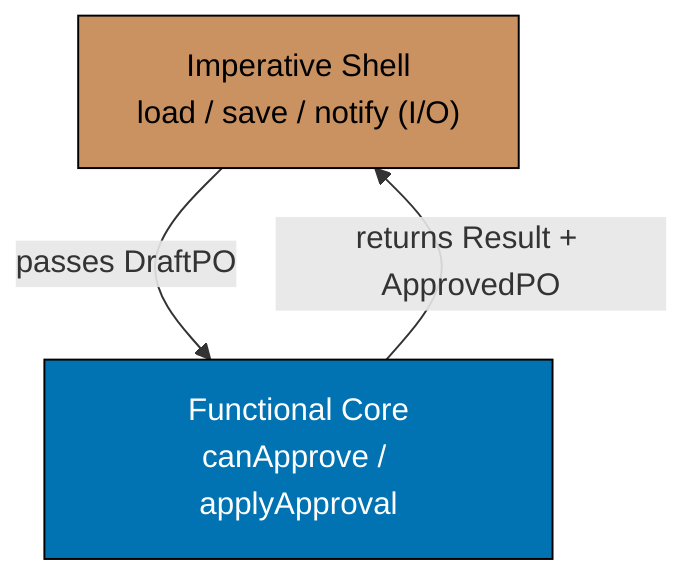





```fsharp
// Functional core / imperative shell: domain logic is pure; I/O is at the edges.
// The core computes; the shell executes.

type PurchaseOrderId = PurchaseOrderId of string
type SupplierId      = SupplierId      of string

// ── FUNCTIONAL CORE ─────────────────────────────────────────────────────────
// Pure domain types and functions — no I/O, no Async, no side effects

type DraftPO   = { Id: PurchaseOrderId; SupplierId: SupplierId; Total: decimal }
type ApprovedPO = { Id: PurchaseOrderId; SupplierId: SupplierId; Total: decimal; ApprovedAt: System.DateTimeOffset }

// Pure business rule: can this PO be approved?
let canApprove (po: DraftPO) (approverBudget: decimal) : Result<unit, string> =
    if po.Total <= 0m then Error "Cannot approve a zero-total PO"
    // => Business rule 1: zero-value POs cannot be approved
    elif po.Total > approverBudget then Error (sprintf "PO total %.2f exceeds approver budget %.2f" po.Total approverBudget)
    // => Business rule 2: approver cannot exceed their authority
    else Ok ()
    // => Both rules pass — approval is permissible

// Pure state transition: Draft → Approved
let applyApproval (po: DraftPO) : ApprovedPO =
    { Id = po.Id; SupplierId = po.SupplierId; Total = po.Total; ApprovedAt = System.DateTimeOffset.UtcNow }
    // => Pure transition — no I/O; caller handles persistence

// ── IMPERATIVE SHELL ─────────────────────────────────────────────────────────
// The shell orchestrates I/O; delegates all decisions to the pure core

// Effect types (function type aliases for the ports)
type LoadDraftPO    = PurchaseOrderId -> Async<DraftPO option>
// => Loads the PO from the database; None if not found
type SaveApprovedPO = ApprovedPO -> Async<unit>
// => Persists the approved state
type NotifyApprover = PurchaseOrderId -> Async<unit>
// => Sends notification email to the supplier or requester

// The shell function: orchestrate I/O, delegate decisions to the pure core
let approvePOShell
    (load:   LoadDraftPO)
    (save:   SaveApprovedPO)
    (notify: NotifyApprover)
    (poId:   PurchaseOrderId)
    (approverBudget: decimal)
    : Async<Result<ApprovedPO, string>> =
    async {
        let! poOpt = load poId
        // => I/O: load from database — effect at the edge
        match poOpt with
        | None    -> return Error (sprintf "PO %A not found" poId)
        // => Infrastructure failure — no domain logic involved
        | Some po ->
            match canApprove po approverBudget with
            // => PURE CORE: domain decision — no I/O here
            | Error e -> return Error e
            // => Business rule failed — return without any I/O
            | Ok () ->
                let approved = applyApproval po
                // => PURE CORE: state transition — no I/O
                do! save approved
                // => I/O: persist new state — effect at the edge
                do! notify poId
                // => I/O: send notification — effect at the edge
                return Ok approved
                // => Return the approved state to the caller
    }

// The pure core is testable without any async infrastructure
let draft = { Id = PurchaseOrderId "po_e3d1"; SupplierId = SupplierId "sup_acme"; Total = 2699.97m }
// => draft : DraftPO — in-memory, no database

let canApproveResult = canApprove draft 5000m
// => 2699.97 > 0 and <= 5000 — Ok () — approver budget sufficient
// => canApproveResult : Result<unit, string> = Ok ()

printfn "canApprove: %A" canApproveResult
// => Output: canApprove: Ok null
let approved = applyApproval draft
// => Pure transition — no I/O needed
printfn "Approved at: %O" approved.ApprovedAt
// => Output: Approved at: 2026-...
```





```clojure
;; Functional core / imperative shell: pure domain logic at the centre; I/O at the edges.
;; [F#: Async<Result<ApprovedPO, string>> — typed async shell; Clojure: core.async channels for the shell; pure core is synchronous in both]

(ns procurement.functional-core
  (:require [clojure.core.async :as async :refer [go <! chan >!]]))

;; ── FUNCTIONAL CORE ──────────────────────────────────────────────────────────
;; Pure functions — no I/O, no channels, no side effects

(defn can-approve
  ;; Two business rules enforced as pure predicates — mirrors F# canApprove
  ;; [F#: Result<unit, string>; Clojure: {:ok nil} or {:error string} — same semantics, different representation]
  [draft-po approver-budget]
  ;; => draft-po: map with :draft-po/total; approver-budget: decimal
  (let [total (:draft-po/total draft-po)]
    (cond
      (<= total 0)
      {:error "Cannot approve a zero-total PO"}
      ;; => Business rule 1: zero-value POs cannot be approved

      (> total approver-budget)
      {:error (format "PO total %.2f exceeds approver budget %.2f" (double total) (double approver-budget))}
      ;; => Business rule 2: approver cannot exceed their authority

      :else {:ok nil})))
      ;; => Both rules pass — approval is permissible

(defn apply-approval
  ;; Pure state transition: draft → approved
  ;; [F#: record with keyword = ApprovedAt; Clojure: assoc new key onto existing map]
  [draft-po]
  ;; => Returns a new map with :approved-po/* namespace and :approved-po/approved-at timestamp
  {:approved-po/id          (:draft-po/id draft-po)
   ;; => Carry forward the typed PO identity
   :approved-po/supplier-id (:draft-po/supplier-id draft-po)
   ;; => Supplier identity persists into the Approved state
   :approved-po/total       (:draft-po/total draft-po)
   ;; => Total carries forward — needed for event summary and audit
   :approved-po/approved-at (java.time.Instant/now)})
   ;; => Pure: DateTimeOffset.UtcNow equivalent; caller handles persistence

;; ── IMPERATIVE SHELL ─────────────────────────────────────────────────────────
;; Orchestrates I/O channels; delegates all decisions to the pure core

(defn approve-po-shell
  ;; [F#: type aliases (LoadDraftPO, SaveApprovedPO, NotifyApprover); Clojure: function args — types by convention, not enforcement]
  ;; load-fn: po-id -> channel yielding {:ok draft-po} or {:error msg}
  ;; save-fn: approved-po -> channel yielding {:ok nil} or {:error msg}
  ;; notify-fn: po-id -> channel yielding {:ok nil} or {:error msg}
  [load-fn save-fn notify-fn po-id approver-budget]
  ;; => Returns a channel; result arrives asynchronously via go block
  (go
    (let [load-result (<! (load-fn po-id))]
      ;; => I/O: load from database — effect at the edge; park until result arrives
      (if-let [load-err (:error load-result)]
        {:error (str "PO " po-id " not found: " load-err)}
        ;; => Infrastructure failure — no domain logic involved; short-circuit
        (let [draft-po (:ok load-result)
              can-result (can-approve draft-po approver-budget)]
              ;; => PURE CORE: domain decision — no I/O here; synchronous call
          (if-let [rule-err (:error can-result)]
            {:error rule-err}
            ;; => Business rule failed — return without any I/O side effects
            (let [approved (apply-approval draft-po)]
              ;; => PURE CORE: state transition — no I/O
              (<! (save-fn approved))
              ;; => I/O: persist new approved state — effect at the edge
              (<! (notify-fn po-id))
              ;; => I/O: send supplier/requester notification — effect at the edge
              {:ok approved})))))))
              ;; => Return the approved state to the caller

;; The pure core is testable synchronously — no channels or I/O required
(def draft {:draft-po/id "po_e3d1" :draft-po/supplier-id "sup_acme" :draft-po/total 2699.97})
;; => draft: plain map — constructed in memory; no database required

(def can-approve-result (can-approve draft 5000))
;; => 2699.97 > 0 and <= 5000 — both rules pass — {:ok nil}
;; => can-approve-result : {:ok nil}

(println "can-approve:" can-approve-result)
;; => Output: can-approve: {:ok nil}

(def approved (apply-approval draft))
;; => Pure state transition — no I/O needed
(println "Approved at:" (:approved-po/approved-at approved))
;; => Output: Approved at: 2026-...
```





```typescript
// Pushing effects to the edges — I/O at the boundary, pure core in the middle.
// [F#: async CE for I/O wrappers; pure domain functions have no async]
// [Clojure: side effects in defn wrappers; pure core functions are plain defn; TS: async at edge]

// Result type
type Result<T, E> = { readonly ok: true; readonly value: T } | { readonly ok: false; readonly error: E };
const okR = <T, E>(v: T): Result => ({ ok: true, value: v });
const errR = <T, E>(e: E): Result => ({ ok: false, error: e });

type PurchaseOrderId = string & { readonly __brand: "PurchaseOrderId" };
type SupplierId = string & { readonly __brand: "SupplierId" };

// ── Pure core — no I/O, no async, no side effects ────────────────────────────
interface POLine {
  readonly sku: string;
  readonly qty: number;
  readonly price: number;
}
interface PO {
  readonly id: PurchaseOrderId;
  readonly supplierId: SupplierId;
  readonly lines: readonly POLine[];
}

function computeTotal(po: PO): number {
  return po.lines.reduce((sum, l) => sum + l.qty * l.price, 0);
  // => Pure arithmetic — no I/O, deterministic, testable without infrastructure
}

function validateApprovalAmount(total: number, threshold: number): Result {
  return total <= threshold ? okR(total) : errR(`Total ${total} exceeds approval threshold ${threshold}`);
  // => Pure domain rule — no database, no clock, no randomness
}

function buildApprovalEvent(id: PurchaseOrderId, approvedBy: string): Record {
  return { type: "POApproved", purchaseOrderId: id, approvedBy };
  // => Pure event construction — no side effects
}

// ── Imperative shell — I/O wraps the pure core ───────────────────────────────
interface ApprovePOPort {
  readonly loadPO: (id: PurchaseOrderId) => Promise;
  readonly getThreshold: (approver: string) => Promise;
  readonly saveApproval: (event: Record) => Promise;
}

async function approvePOShell(port: ApprovePOPort, id: PurchaseOrderId, approver: string): Promise {
  const po = await port.loadPO(id);
  // => I/O at the edge: load from database
  if (!po) return errR(`PO ${id} not found`);
  const threshold = await port.getThreshold(approver);
  // => I/O at the edge: fetch approval threshold
  const total = computeTotal(po);
  // => Pure core: compute total — no I/O
  const validation = validateApprovalAmount(total, threshold);
  // => Pure core: validate — no I/O
  if (!validation.ok) return validation;
  const event = buildApprovalEvent(id, approver);
  // => Pure core: build event — no I/O
  await port.saveApproval(event);
  // => I/O at the edge: persist
  return okR(`PO ${id} approved`);
}

console.log("Pure core defined — effects pushed to the shell");
// => Output: Pure core defined — effects pushed to the shell
```





```haskell
-- ── file: PureCoreImperativeShell.hs ──
-- [F#: Async-wrapped shell + pure core; Haskell uses IO for the shell + pure functions for the core]
-- [Clojure: core.async channels for shell; Haskell composes the same separation via IO + pure values]
{-# LANGUAGE OverloadedStrings #-}
import Data.Text (Text)
import qualified Data.Text as T
import Data.Time (UTCTime, getCurrentTime)

newtype PurchaseOrderId = PurchaseOrderId Text deriving (Show)
newtype SupplierId      = SupplierId      Text deriving (Show)

-- ── PURE CORE ────────────────────────────────────────────────────────────────
data DraftPO    = DraftPO    { dpId :: PurchaseOrderId, dpSup :: SupplierId, dpTotal :: Double }
  deriving (Show)
data ApprovedPO = ApprovedPO { apId :: PurchaseOrderId, apSup :: SupplierId
                             , apTotal :: Double, apApprovedAt :: UTCTime }
  deriving (Show)

-- Pure business rule check — no IO, returns Either
canApprove :: DraftPO -> Double -> Either Text ()
canApprove po budget
  | dpTotal po <= 0      = Left "Cannot approve a zero-total PO"
                                                    -- => Rule 1
  | dpTotal po > budget  = Left $ T.pack $
      "PO total " <> show (dpTotal po) <> " exceeds approver budget " <> show budget
                                                    -- => Rule 2
  | otherwise            = Right ()                 -- => both rules pass

-- Pure transition — caller supplies the timestamp, keeping core deterministic
applyApproval :: UTCTime -> DraftPO -> ApprovedPO
applyApproval now po = ApprovedPO (dpId po) (dpSup po) (dpTotal po) now

-- ── IMPERATIVE SHELL ─────────────────────────────────────────────────────────
-- Port aliases capture the I/O contract
type LoadDraftPO    = PurchaseOrderId -> IO (Maybe DraftPO)
type SaveApprovedPO = ApprovedPO       -> IO ()
type NotifyApprover = PurchaseOrderId  -> IO ()

-- Shell function — orchestrates I/O; pure core decisions are inlined
approvePOShell
  :: LoadDraftPO -> SaveApprovedPO -> NotifyApprover
  -> PurchaseOrderId -> Double
  -> IO (Either Text ApprovedPO)
approvePOShell load save notify poId budget = do
  mPo <- load poId                                  -- => I/O: load PO
  case mPo of
    Nothing -> pure $ Left (T.pack $ "PO " <> show poId <> " not found")
    Just po -> case canApprove po budget of         -- => PURE CORE decision
      Left e   -> pure (Left e)                     --   no I/O on rule failure
      Right () -> do
        now <- getCurrentTime                       -- => I/O: clock at the edge
        let approved = applyApproval now po         -- => PURE CORE transition
        save approved                                -- => I/O: persist
        notify poId                                  -- => I/O: notify
        pure (Right approved)

-- The pure core is testable without any IO infrastructure
draftSample :: DraftPO
draftSample = DraftPO (PurchaseOrderId "po_e3d1") (SupplierId "sup_acme") 2699.97

main :: IO ()
main = do
  let canResult = canApprove draftSample 5000       -- => Right ()
  putStrLn $ "canApprove: " <> show canResult
  -- => Output: canApprove: Right ()
  now <- getCurrentTime
  let approved = applyApproval now draftSample
  putStrLn $ "Approved at: " <> show (apApprovedAt approved)
  -- => Output: Approved at: ...
```





**Key Takeaway**: Separating pure domain logic (decisions, transitions) from I/O effects (database, events, notifications) produces a domain core that is testable without infrastructure and a shell that is straightforward to replace or adapt.

**Why It Matters**: The functional core / imperative shell pattern is the most important architectural boundary in a procurement system. Approval rules, budget checks, and state transitions are the domain core — they must be testable in milliseconds without Postgres or Kafka. Database loading, event publishing, and email notifications are the shell — they deal with the real world. Keeping them separate means compliance tests for the approval rules run in the CI pipeline in under a second.

---

### Example 51: Pure Core Wrapping at the Edge

The edge of the system is where pure domain functions meet impure I/O. This example shows the precise composition point: the shell reads from I/O, passes the data to the pure core, collects the output, and writes the output back to I/O.

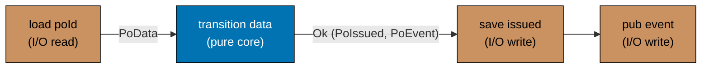





```fsharp
// The composition point: pure core sandwiched between I/O reads and I/O writes.
// Load → pure → save → publish. Each boundary is explicit.

type PurchaseOrderId = PurchaseOrderId of string
type SupplierId      = SupplierId      of string

// Data types
type PoData    = { Id: PurchaseOrderId; SupplierId: SupplierId; Total: decimal; Status: string }
type PoIssued  = { Id: PurchaseOrderId; SupplierId: SupplierId; IssuedAt: System.DateTimeOffset }
type PoEvent   = { Kind: string; PoId: string; At: System.DateTimeOffset }
// => Simplified types for composition illustration

// ── PURE CORE ────────────────────────────────────────────────────────────────
let transition (data: PoData) : Result<PoIssued * PoEvent, string> =
    // => Pure: no I/O — takes data, returns new state + event or error
    if data.Status <> "Approved" then
        Error (sprintf "Cannot issue PO in status '%s' — must be Approved" data.Status)
        // => Business rule: only Approved POs can be issued
    else
        let now    = System.DateTimeOffset.UtcNow
        let issued = { Id = data.Id; SupplierId = data.SupplierId; IssuedAt = now }
        // => Pure state transition — no database, no clock side effect beyond DateTimeOffset.UtcNow
        let event  = { Kind = "PurchaseOrderIssued"; PoId = string data.Id; At = now }
        // => Pure event construction — caller publishes it
        Ok (issued, event)
        // => Return both outputs — caller saves and publishes

// ── IMPERATIVE SHELL ─────────────────────────────────────────────────────────
type LoadPo    = PurchaseOrderId -> Async<PoData option>
// => I/O read: load from database
type SaveIssued = PoIssued -> Async<unit>
// => I/O write: save new state
type PublishEv  = PoEvent -> Async<unit>
// => I/O write: publish event

let issueShell (load: LoadPo) (save: SaveIssued) (pub: PublishEv) (poId: PurchaseOrderId) : Async<Result<PoIssued, string>> =
    async {
        // ── LOAD (I/O read) ────────────────────────────────────────────────
        let! dataOpt = load poId
        // => Reads from database — impure
        match dataOpt with
        | None -> return Error (sprintf "PO %A not found" poId)
        | Some data ->

        // ── PURE CORE ──────────────────────────────────────────────────────
        match transition data with
        // => All domain logic is here — pure, no I/O
        | Error e -> return Error e
        | Ok (issued, event) ->

        // ── SAVE + PUBLISH (I/O writes) ────────────────────────────────────
        do! save issued
        // => Writes new state to database — impure
        do! pub event
        // => Publishes event — impure
        return Ok issued
        // => Return the result of the pure transition
    }

// Test the pure core in isolation — no async needed
let testData = { Id = PurchaseOrderId "po_e3d1"; SupplierId = SupplierId "sup_acme"
                 Total = 2699.97m; Status = "Approved" }
// => testData : PoData — constructed in memory; no database required

let coreResult = transition testData
// => Pure transition: Status = "Approved" → Ok (PoIssued, PoEvent)
// => coreResult : Result<PoIssued * PoEvent, string>

match coreResult with
| Ok (issued, event) ->
    printfn "Core: issued=%A event=%s" issued.Id event.Kind
    // => Output: Core: issued=PurchaseOrderId "po_e3d1" event=PurchaseOrderIssued
| Error e -> printfn "Error: %s" e
```





```clojure
;; The composition point: pure core sandwiched between I/O reads and I/O writes.
;; [F#: async { let! ... match ... do! } computation expression; Clojure: go block with <!  channels]
;; Load → pure-transition → save → publish. Each phase boundary is explicit and testable.

(ns procurement.pure-core-edge
  (:require [clojure.core.async :as async :refer [go <! chan]]))

;; ── PURE CORE ────────────────────────────────────────────────────────────────
(defn transition
  ;; Pure: accepts a plain data map, returns {:ok [issued-po event]} or {:error string}
  ;; [F#: Result<PoIssued * PoEvent, string>; Clojure: tagged map {:ok [map map]} or {:error string}]
  [po-data]
  ;; => po-data: map with :po-data/status, :po-data/id, :po-data/supplier-id, :po-data/total
  (if (not= (:po-data/status po-data) "Approved")
    {:error (str "Cannot issue PO in status '" (:po-data/status po-data) "' — must be Approved")}
    ;; => Business rule: only Approved POs can be issued; matches F# Error branch
    (let [now    (java.time.Instant/now)
          issued {:issued-po/id          (:po-data/id po-data)
                  ;; => Pure state transition — no database; mirrors F# PoIssued record
                  :issued-po/supplier-id (:po-data/supplier-id po-data)
                  ;; => Supplier identity carried into the Issued state
                  :issued-po/issued-at   now}
                  ;; => Issuance timestamp — same instant used for both state and event
          event  {:po-event/kind  "PurchaseOrderIssued"
                  ;; => Event type name consumed by subscribing contexts
                  :po-event/po-id (:po-data/id po-data)
                  ;; => Identifies which PO was issued
                  :po-event/at    now}]
                  ;; => Timestamp matches issued-at — snapshot consistency
      {:ok [issued event]})))
      ;; => Return both outputs as a vector — caller saves state and publishes event

;; ── IMPERATIVE SHELL ─────────────────────────────────────────────────────────
;; [F#: LoadPo / SaveIssued / PublishEv type aliases; Clojure: plain function params — types by convention]
(defn issue-shell
  ;; load-fn: po-id -> channel yielding {:ok po-data} or {:error msg}
  ;; save-fn: issued-po -> channel yielding {:ok nil}
  ;; pub-fn:  po-event  -> channel yielding {:ok nil}
  [load-fn save-fn pub-fn po-id]
  ;; => Returns a channel — result arrives asynchronously from the go block
  (go
    ;; ── LOAD (I/O read) ────────────────────────────────────────────────────
    (let [load-result (<! (load-fn po-id))]
      ;; => Park until database load completes — impure; effect at the edge
      (if-let [load-err (:error load-result)]
        {:error (str "PO " po-id " not found: " load-err)}
        ;; => Load failed — short-circuit; no domain logic runs
        (let [po-data    (:ok load-result)
              ;; ── PURE CORE ──────────────────────────────────────────────
              core-result (transition po-data)]
              ;; => All domain logic here — pure synchronous call; no channel needed
          (if-let [core-err (:error core-result)]
            {:error core-err}
            ;; => Business rule failed — return without any I/O side effects
            (let [[issued event] (:ok core-result)]
              ;; => Destructure the [issued-po, po-event] pair returned by transition
              ;; ── SAVE + PUBLISH (I/O writes) ──────────────────────────
              (<! (save-fn issued))
              ;; => Persist the new Issued state — impure; effect at the edge
              (<! (pub-fn event))
              ;; => Publish the domain event — impure; effect at the edge
              {:ok issued})))))))
              ;; => Return the issued-po map to the caller

;; Test the pure core in isolation — no channels required
(def test-data {:po-data/id "po_e3d1" :po-data/supplier-id "sup_acme"
                :po-data/total 2699.97 :po-data/status "Approved"})
;; => Plain map — constructed in memory; no database required

(def core-result (transition test-data))
;; => Pure transition: status "Approved" → {:ok [issued-po po-event]}
;; => core-result : {:ok [{:issued-po/id "po_e3d1" ...} {:po-event/kind "PurchaseOrderIssued" ...}]}

(if-let [[issued event] (:ok core-result)]
  (println "Core: issued=" (:issued-po/id issued) "event=" (:po-event/kind event))
  ;; => Output: Core: issued= po_e3d1 event= PurchaseOrderIssued
  (println "Error:" (:error core-result)))
```





```typescript
// Pure core wrapped at the edge — the application service layer.
// [F#: async functions at the edge call pure domain functions in the core]
// [Clojure: route handler calls pure domain fns; TS async handler wraps pure core]

// Result type
type Result<T, E> = { readonly ok: true; readonly value: T } | { readonly ok: false; readonly error: E };
const okR = <T, E>(v: T): Result => ({ ok: true, value: v });
const errR = <T, E>(e: E): Result => ({ ok: false, error: e });

type PurchaseOrderId = string & { readonly __brand: "PurchaseOrderId" };
const asPOId = (s: string): PurchaseOrderId => s as PurchaseOrderId;

// ── Pure domain core ─────────────────────────────────────────────────────────
interface RequisitionLine {
  readonly sku: string;
  readonly qty: number;
  readonly price: number;
}
interface ValidatedRequisition {
  readonly requestedBy: string;
  readonly lines: readonly RequisitionLine[];
  readonly total: number;
}
type ApprovalLevel = "L1" | "L2" | "L3";

function validateRequisition(requestedBy: string, lines: RequisitionLine[]): Result {
  if (!requestedBy.trim()) return errR("RequestedBy is required");
  if (lines.length === 0) return errR("At least one line required");
  return okR({ requestedBy, lines, total: lines.reduce((s, l) => s + l.qty * l.price, 0) });
}

function deriveApprovalLevel(total: number): ApprovalLevel {
  return total <= 1000 ? "L1" : total <= 10000 ? "L2" : "L3";
}

// ── Application service (the "edge wrapper") ─────────────────────────────────
interface SubmitRequisitionPort {
  readonly generateId: () => PurchaseOrderId;
  readonly persistEvent: (event: Record) => Promise;
}

async function submitRequisitionHandler(
  port: SubmitRequisitionPort,
  requestedBy: string,
  lines: RequisitionLine[],
): Promise {
  // ── Edge: resolve dependencies ────────────────────────────────────────────
  const id = port.generateId();
  // => I/O: generate ID (could involve a sequence in the DB)

  // ── Pure core: validate and derive ───────────────────────────────────────
  const validated = validateRequisition(requestedBy, lines);
  if (!validated.ok) return validated;
  const level = deriveApprovalLevel(validated.value.total);

  // ── Edge: persist and emit ────────────────────────────────────────────────
  const event = { type: "RequisitionSubmitted", id, requestedBy, level, total: validated.value.total };
  await port.persistEvent(event);
  // => I/O: persist the domain event

  return okR(event);
}

console.log("Pure core wrapped at the edge — application service pattern");
// => Output: Pure core wrapped at the edge — application service pattern
```





```haskell
-- ── file: PureCoreEdge.hs ─────────────
-- [F#: pure transition + async shell; Haskell uses pure functions + IO wrapper — same load/pure/save/publish sandwich]
-- [Clojure: go block with <! between pure call; Haskell composes via do-notation in IO]
{-# LANGUAGE OverloadedStrings #-}
import Data.Text (Text)
import qualified Data.Text as T
import Data.Time (UTCTime, getCurrentTime)

newtype PurchaseOrderId = PurchaseOrderId Text deriving (Show)
newtype SupplierId      = SupplierId      Text deriving (Show)

-- Data types — minimal records for the sandwich pattern
data PoData   = PoData
  { pdId       :: PurchaseOrderId
  , pdSupplier :: SupplierId
  , pdTotal    :: Double
  , pdStatus   :: Text
  } deriving (Show)

data PoIssued = PoIssued
  { piId       :: PurchaseOrderId
  , piSupplier :: SupplierId
  , piIssuedAt :: UTCTime
  } deriving (Show)

data PoEvent  = PoEvent
  { peKind :: Text
  , pePoId :: Text
  , peAt   :: UTCTime
  } deriving (Show)

-- ── PURE CORE ────────────────────────────────────────────────────────────────
-- Pure: takes data + timestamp, returns Either with new state and event
transition :: UTCTime -> PoData -> Either Text (PoIssued, PoEvent)
transition now d
  | pdStatus d /= "Approved" =
      Left $ "Cannot issue PO in status '" <> pdStatus d <> "' — must be Approved"
                                                    -- => business rule guard
  | otherwise =
      let issued = PoIssued (pdId d) (pdSupplier d) now
          event  = PoEvent "PurchaseOrderIssued"
                           (T.pack (show (pdId d))) now
      in  Right (issued, event)                     -- => both outputs returned

-- ── IMPERATIVE SHELL ─────────────────────────────────────────────────────────
type LoadPo     = PurchaseOrderId -> IO (Maybe PoData)
type SaveIssued = PoIssued        -> IO ()
type PublishEv  = PoEvent         -> IO ()

issueShell :: LoadPo -> SaveIssued -> PublishEv
           -> PurchaseOrderId
           -> IO (Either Text PoIssued)
issueShell load save publish poId = do
  -- ── LOAD (I/O read) ───────────────────────────────────────
  mData <- load poId
  case mData of
    Nothing   -> pure $ Left (T.pack $ "PO " <> show poId <> " not found")
    Just dat  -> do
      now <- getCurrentTime                         -- => clock effect at edge
      -- ── PURE CORE ────────────────────────────────────────
      case transition now dat of
        Left e -> pure (Left e)                     --   no I/O on guard failure
        Right (issued, event) -> do
          -- ── SAVE + PUBLISH (I/O writes) ────────────────
          save issued                               -- => persist state
          publish event                             -- => publish event
          pure (Right issued)

-- Test the pure core in isolation — no IO infrastructure needed
testData :: PoData
testData = PoData (PurchaseOrderId "po_e3d1")
                  (SupplierId      "sup_acme")
                  2699.97 "Approved"                -- Approved → eligible

main :: IO ()
main = do
  now <- getCurrentTime
  case transition now testData of
    Right (issued, event) -> putStrLn $
      "Core: issued=" <> show (piId issued)
                     <> " event=" <> T.unpack (peKind event)
      -- => Output: Core: issued=PurchaseOrderId "po_e3d1" event=PurchaseOrderIssued
    Left e -> putStrLn $ "Error: " <> T.unpack e
```





**Key Takeaway**: The composition point has a clear three-phase structure: I/O read → pure core → I/O write. This structure makes the boundary visible, testable, and replaceable at each phase independently.

**Why It Matters**: Being able to test `transition` in isolation means every business rule in the PO issuance logic — status check, state construction, event payload — is verifiable without spinning up a database or a message broker. The CI pipeline can run thousands of such tests in seconds. The shell (load, save, publish) is tested separately with integration tests against real infrastructure.

---

### Example 52: Dependency Injection via Partial Application

Partial application wires the production implementations of port functions into workflow functions at the composition root. The workflow is defined with all dependencies as parameters; the composition root supplies the real implementations.





```fsharp
// Partial application as dependency injection — composition root wires everything.
// The workflow is generic; the composition root binds it to production implementations.

type PurchaseOrderId = PurchaseOrderId of string
type SupplierId      = SupplierId      of string

// Port type aliases
type LoadPO      = PurchaseOrderId -> Async<(decimal * SupplierId) option>
type SavePO      = PurchaseOrderId -> System.DateTimeOffset -> Async<unit>
type PublishIssuedEvent = PurchaseOrderId -> SupplierId -> decimal -> Async<unit>
// => Three port types — one for each I/O operation in the workflow

// Workflow with all dependencies as parameters
let issueWorkflow
    (load:    LoadPO)
    (save:    SavePO)
    (publish: PublishIssuedEvent)
    (poId:    PurchaseOrderId)
    : Async<Result<unit, string>> =
    async {
        let! dataOpt = load poId
        match dataOpt with
        | None -> return Error (sprintf "PO %A not found" poId)
        | Some (total, supplierId) ->
            let now = System.DateTimeOffset.UtcNow
            do! save poId now
            // => Persist the issued timestamp
            do! publish poId supplierId total
            // => Publish the PurchaseOrderIssued event
            return Ok ()
    }

// ── Stub implementations (used in tests) ────────────────────────────────────
let stubLoad    _      = async { return Some (2699.97m, SupplierId "sup_acme") }
// => Always returns a fixed PO — no database needed
let stubSave    _ _    = async { return () }
// => No-op save — test verifies workflow logic, not persistence
let stubPublish _ _ _  = async {
    printfn "[stub] PurchaseOrderIssued published"
    // => Simulates event publication — test can capture this output
    return ()
}

// ── Production implementations (wired at composition root) ──────────────────
// In production these would call the real database and Kafka:
// let pgLoad    = PgPurchaseOrderRepository.load pgConnection
// let pgSave    = PgPurchaseOrderRepository.saveIssued pgConnection
// let kafkaPub  = KafkaEventPublisher.publish kafkaProducer

// ── Partial application: bind dependencies ────────────────────────────────────
let testIssueWorkflow : PurchaseOrderId -> Async<Result<unit, string>> =
    issueWorkflow stubLoad stubSave stubPublish
    // => Partially apply all three stubs — testIssueWorkflow is now a single-arg function
    // => testIssueWorkflow : PurchaseOrderId -> Async<Result<unit, string>>

// In production:
// let productionIssueWorkflow = issueWorkflow pgLoad pgSave kafkaPub

// Test
let result = Async.RunSynchronously (testIssueWorkflow (PurchaseOrderId "po_e3d1"))
// => All stubs succeed — result : Result<unit, string> = Ok ()

printfn "Result: %A" result
// => Output: [stub] PurchaseOrderIssued published
// => Output: Result: Ok null
```





```clojure
;; Partial application as dependency injection via partial + closures — composition root wires everything.
;; [F#: curried function — partial application is automatic; Clojure: partial or closure — explicit]
;; The workflow is generic; the composition root binds it to production or stub implementations.

(ns procurement.partial-application-di
  (:require [clojure.core.async :as async :refer [go <! chan >!]]))

;; Workflow function with all dependencies as the first parameters
(defn issue-workflow
  ;; [F#: let issueWorkflow (load: LoadPO) (save: SavePO) (publish: PublishIssuedEvent) — curried automatically]
  ;; [Clojure: partial applied explicitly at the composition root — same semantics, different syntax]
  ;; load-fn:    po-id -> channel<{:ok {:total decimal :supplier-id string} | :error string}>
  ;; save-fn:    po-id now -> channel<{:ok nil | :error string}>
  ;; publish-fn: po-id supplier-id total -> channel<{:ok nil | :error string}>
  [load-fn save-fn publish-fn po-id]
  ;; => Returns a channel; result arrives asynchronously from the go block
  (go
    (let [load-result (<! (load-fn po-id))]
      ;; => I/O: load the PO data — park until the channel yields a result
      (if-let [load-err (:error load-result)]
        {:error (str "PO " po-id " not found: " load-err)}
        ;; => Not found — short-circuit without any further I/O
        (let [{:keys [total supplier-id]} (:ok load-result)
              ;; => Destructure the loaded PO data
              now (java.time.Instant/now)]
              ;; => Capture issuance timestamp — used in both save and publish
          (<! (save-fn po-id now))
          ;; => I/O: persist the issued timestamp — effect at the edge
          (<! (publish-fn po-id supplier-id total))
          ;; => I/O: publish the PurchaseOrderIssued event — effect at the edge
          {:ok nil})))))
          ;; => Workflow succeeded — mirrors F# Ok ()

;; ── Stub implementations (used in tests) ─────────────────────────────────────
(defn stub-load [po-id]
  ;; => Always returns a fixed PO — no database required for testing
  (go {:ok {:total 2699.97 :supplier-id "sup_acme"}}))

(defn stub-save [po-id now]
  ;; => No-op save — test verifies workflow logic, not persistence side effects
  (go {:ok nil}))

(defn stub-publish [po-id supplier-id total]
  ;; => Simulates event publication — side effect visible in test output
  (println "[stub] PurchaseOrderIssued published")
  ;; => Output: [stub] PurchaseOrderIssued published
  (go {:ok nil}))

;; ── Composition root: bind stubs via partial ──────────────────────────────────
(def test-issue-workflow
  ;; [F#: let testIssueWorkflow = issueWorkflow stubLoad stubSave stubPublish — curried partial application]
  ;; [Clojure: partial explicitly binds the first N args; remaining arg (po-id) is supplied at call time]
  (partial issue-workflow stub-load stub-save stub-publish))
  ;; => test-issue-workflow : fn [po-id] -> channel — single-arg function ready for use

;; In production (wired at composition root):
;; (def production-issue-workflow (partial issue-workflow pg-load pg-save kafka-publish))
;; => Swap stubs for real implementations — workflow code is unchanged

;; Test
(def result-ch (test-issue-workflow "po_e3d1"))
;; => Call the partially applied workflow with just the PO ID
;; => Returns a channel — go block runs asynchronously

(def result (async/<!! result-ch))
;; => Block and take from the channel (REPL / test context)
;; => result : {:ok nil}

(println "Result:" result)
;; => Output: [stub] PurchaseOrderIssued published
;; => Output: Result: {:ok nil}
```





```typescript
// Dependency injection via currying — partial application bakes in dependencies.
// [F#: partial application with curried functions — dependencies bound first]
// [Clojure: partial or closure captures dependencies; TS uses curried arrow functions]

// Result type
type Result<T, E> = { readonly ok: true; readonly value: T } | { readonly ok: false; readonly error: E };
const okR = <T, E>(v: T): Result => ({ ok: true, value: v });
const errR = <T, E>(e: E): Result => ({ ok: false, error: e });

type PurchaseOrderId = string & { readonly __brand: "PurchaseOrderId" };
type SupplierId = string & { readonly __brand: "SupplierId" };

// Dependency interfaces (ports)
interface PORepository {
  readonly findById: (id: PurchaseOrderId) => Promise;
  readonly save: (po: Record) => Promise;
}
interface ApprovalService {
  readonly getThreshold: (approver: string) => Promise;
}

// Pure domain function — no dependencies, no async
function validateApprovalThreshold(total: number, threshold: number): Result {
  return total <= threshold ? okR(total) : errR(`${total} exceeds threshold ${threshold}`);
}

// Curried workflow factory — takes dependencies first, returns the workflow function
const makeApprovePOWorkflow =
  (repo: PORepository, approval: ApprovalService) =>
  async (id: PurchaseOrderId, approver: string): Promise => {
    const po = await repo.findById(id);
    // => I/O: load PO from repo
    if (!po) return errR(`PO ${id} not found`);
    const threshold = await approval.getThreshold(approver);
    // => I/O: fetch threshold from approval service
    const result = validateApprovalThreshold(po.total, threshold);
    // => Pure domain rule: no I/O
    if (!result.ok) return result;
    await repo.save({ ...po, status: "Approved", approvedBy: approver });
    // => I/O: persist
    return okR(`PO ${id} approved`);
  };
// => makeApprovePOWorkflow : (repo, approval) => (id, approver) => Promise<Result<string, string>>
// => Dependencies are baked in at composition time; only business args needed at call time

// Wiring at the composition root
const mockRepo: PORepository = { findById: async () => null, save: async () => {} };
const mockApproval: ApprovalService = { getThreshold: async () => 10000 };
const approvePO = makeApprovePOWorkflow(mockRepo, mockApproval);
// => approvePO : (id, approver) => Promise<Result<string, string>>
// => Dependencies are fully bound — only business parameters remain

console.log("Dependency injection via currying — dependencies baked in at composition root");
// => Output: Dependency injection via currying — dependencies baked in at composition root
```





```haskell
-- ── file: PartialAppDI.hs ─────────────
-- [F#: partial application via curried let bindings; Haskell is identical — all functions are curried]
-- [Clojure: explicit `partial`; Haskell needs no helper — supply fewer arguments]
{-# LANGUAGE OverloadedStrings #-}
import Data.Text (Text)
import qualified Data.Text as T
import Data.Time (UTCTime, getCurrentTime)

newtype PurchaseOrderId = PurchaseOrderId Text deriving (Show)
newtype SupplierId      = SupplierId      Text deriving (Show)

-- Port aliases — one per I/O operation
type LoadPO             = PurchaseOrderId -> IO (Maybe (Double, SupplierId))
type SavePO             = PurchaseOrderId -> UTCTime -> IO ()
type PublishIssuedEvent = PurchaseOrderId -> SupplierId -> Double -> IO ()

-- Workflow function with all deps as explicit parameters
issueWorkflow
  :: LoadPO -> SavePO -> PublishIssuedEvent
  -> PurchaseOrderId
  -> IO (Either Text ())
issueWorkflow load save publish poId = do
  mPo <- load poId                              -- => I/O: load PO
  case mPo of
    Nothing -> pure $ Left (T.pack $ "PO " <> show poId <> " not found")
    Just (total, supId) -> do
      now <- getCurrentTime                     -- => I/O: clock at the edge
      save poId now                             -- => I/O: persist
      publish poId supId total                  -- => I/O: emit event
      pure (Right ())

-- ── Stub adapters (test) ─────────────────────────────────────────────────────
stubLoad :: LoadPO
stubLoad _ = pure (Just (2699.97, SupplierId "sup_acme"))

stubSave :: SavePO
stubSave _ _ = pure ()                          -- no-op for tests

stubPublish :: PublishIssuedEvent
stubPublish _ _ _ = putStrLn "[stub] PurchaseOrderIssued published"

-- ── Composition root: partial application binds the dependencies ─────────────
testIssueWorkflow :: PurchaseOrderId -> IO (Either Text ())
testIssueWorkflow = issueWorkflow stubLoad stubSave stubPublish
                                                -- => single-arg function ready to call

-- In production: replace stubs with real adapters at this point
-- productionIssueWorkflow = issueWorkflow pgLoad pgSave kafkaPublish

main :: IO ()
main = do
  result <- testIssueWorkflow (PurchaseOrderId "po_e3d1")
  putStrLn $ "Result: " <> show result
  -- => Output: [stub] PurchaseOrderIssued published
  -- => Output: Result: Right ()
```





**Key Takeaway**: Partial application binds dependencies to workflows at the composition root — the workflow function itself never changes, only the implementations supplied to it, making production and test configurations a matter of which functions are partially applied.

**Why It Matters**: The composition root is the single point where production dependencies (Postgres connection pool, Kafka producer) are wired into workflow functions. In tests, the composition root supplies stubs. The workflow code is identical in both cases — there is no test-specific branching inside domain logic. This is the purest form of the dependency inversion principle, achieved with zero framework overhead.

---

### Example 53: Persistence Interface as a Record of Functions

In functional F#, a repository is not an interface or an abstract class — it is a record of functions. This record is the port; the PostgreSQL implementation is one value of this record type; the in-memory test implementation is another.





```fsharp
// Repository as a record of functions — the functional port pattern.
// One record type = one port; multiple record values = multiple adapters.

type PurchaseOrderId = PurchaseOrderId of string
type SupplierId      = SupplierId      of string

// Simplified PO data
type PoRecord = { Id: PurchaseOrderId; SupplierId: SupplierId; Status: string; Total: decimal }
// => The full PO record stored in and loaded from the repository

// The repository port — a record of functions (NOT an interface)
type PurchaseOrderRepository = {
    Load:   PurchaseOrderId -> Async<PoRecord option>
    // => Load a PO by ID; None if not found
    Save:   PoRecord -> Async<unit>
    // => Insert or update the PO record
    ListBySupplier: SupplierId -> Async<PoRecord list>
    // => Query all POs for a given supplier — used by the supplier dashboard
}
// => PurchaseOrderRepository : record type — the port definition

// In-memory implementation (test adapter)
let inMemoryRepo (store: System.Collections.Generic.Dictionary<string, PoRecord>) : PurchaseOrderRepository =
    { Load = fun (PurchaseOrderId id) ->
        async {
            match store.TryGetValue(id) with
            | true, po -> return Some po
            // => Found in the dictionary
            | _         -> return None
            // => Not found — returns None
        }
      Save = fun po ->
        async {
            let (PurchaseOrderId id) = po.Id
            store.[id] <- po
            // => Upsert into the dictionary — thread-unsafe for simplicity
        }
      ListBySupplier = fun supplierId ->
        async {
            return store.Values |> Seq.filter (fun po -> po.SupplierId = supplierId) |> Seq.toList
            // => Linear scan — acceptable for in-memory test adapter
        }
    }
// => inMemoryRepo : PurchaseOrderRepository — test adapter, no database required

// Using the repository in a workflow
let loadAndPrint (repo: PurchaseOrderRepository) (poId: PurchaseOrderId) : Async<unit> =
    async {
        let! result = repo.Load poId
        // => Call through the port — works with any adapter (in-memory or Postgres)
        match result with
        | Some po -> printfn "PO: %A status=%s total=%M" po.Id po.Status po.Total
        // => Found — print the PO details
        | None    -> printfn "PO %A not found" poId
        // => Not found — log the miss
    }

// Wire up the in-memory adapter
let store = System.Collections.Generic.Dictionary<string, PoRecord>()
// => Empty in-memory store
let testPO = { Id = PurchaseOrderId "po_e3d1"; SupplierId = SupplierId "sup_acme"; Status = "Draft"; Total = 2699.97m }
store.["po_e3d1"] <- testPO
// => Seed the store with a test PO

let repo = inMemoryRepo store
// => repo : PurchaseOrderRepository — in-memory adapter

Async.RunSynchronously (loadAndPrint repo (PurchaseOrderId "po_e3d1"))
// => Output: PO: PurchaseOrderId "po_e3d1" status=Draft total=2699.9700M

Async.RunSynchronously (loadAndPrint repo (PurchaseOrderId "po_missing"))
// => Output: PO: PurchaseOrderId "po_missing" not found
```





```clojure
;; Repository as a protocol + in-memory implementation — the Clojure port pattern.
;; [F#: record of functions — a single value groups all port operations; Clojure: protocol + reify — open extension; the in-memory impl is a reified protocol value]
;; [Clojure: defprotocol is idiomatic for named, swappable port contracts; defrecord as a value-semantics clone of F# record-of-functions is non-idiomatic]

(ns procurement.repository-port)

;; The repository port — a Clojure protocol (open, not typed)
;; [F#: PurchaseOrderRepository record type — closed; one value per adapter]
;; [Clojure: defprotocol — open; any type can extend it; reify creates anonymous implementations]
(defprotocol PurchaseOrderRepository
  (load-po [repo po-id]
    ;; => Load a PO by ID; returns {:ok po-map} or {:error :not-found}
    )
  (save-po [repo po-map]
    ;; => Insert or update the PO record; returns {:ok nil} or {:error string}
    )
  (list-by-supplier [repo supplier-id]
    ;; => Query all POs for a given supplier; returns {:ok [po-map ...]}
    ))
;; => PurchaseOrderRepository : protocol — the port definition; implemented by each adapter

;; In-memory implementation (test adapter) using an atom-backed map
;; [F#: Dictionary<string, PoRecord> passed by reference; Clojure: atom wraps a persistent map — thread-safe]
(defn in-memory-repo
  ;; Creates an in-memory repository adapter; store-atom holds the persistent map
  [store-atom]
  ;; => store-atom: (atom {}) — mutable container for an immutable map
  (reify PurchaseOrderRepository
    (load-po [_ po-id]
      ;; => Look up the PO ID in the current snapshot of the atom
      (if-let [po (get @store-atom po-id)]
        {:ok po}
        ;; => Found in the map — return the PO map
        {:error :not-found}))
        ;; => Not found — return tagged error; mirrors F# None → Error branch

    (save-po [_ po-map]
      ;; => Upsert: swap! atomically updates the map — thread-safe unlike Dictionary
      (swap! store-atom assoc (:po/id po-map) po-map)
      ;; => assoc returns a new map; swap! installs it atomically
      {:ok nil})
      ;; => Mirrors F# Save returning Async<unit>

    (list-by-supplier [_ supplier-id]
      ;; => Linear scan over all POs — acceptable for in-memory test adapter
      (let [pos (->> (vals @store-atom)
                     (filter #(= (:po/supplier-id %) supplier-id))
                     ;; => Keep only POs belonging to this supplier
                     (vec))]
                     ;; => Materialize the lazy sequence into a vector
        {:ok pos}))))
        ;; => Mirrors F# ListBySupplier returning Async<PoRecord list>

;; Use the repository in a workflow (synchronous for simplicity)
(defn load-and-print
  ;; Accepts any value satisfying PurchaseOrderRepository — protocol dispatch
  ;; [F#: repo: PurchaseOrderRepository — statically typed; Clojure: duck-typed via protocol]
  [repo po-id]
  (let [result (load-po repo po-id)]
    ;; => Call through the protocol port — works with any adapter (in-memory or Postgres)
    (if-let [po (:ok result)]
      (println "PO:" (:po/id po) "status=" (:po/status po) "total=" (:po/total po))
      ;; => Found — print the PO details; mirrors F# printfn "PO: %A status=%s total=%M"
      (println "PO" po-id "not found"))))
      ;; => Not found — log the miss

;; Wire up the in-memory adapter
(def store (atom {}))
;; => Empty in-memory store wrapped in an atom — thread-safe, immutable inside
(def test-po {:po/id "po_e3d1" :po/supplier-id "sup_acme" :po/status "Draft" :po/total 2699.97})
(swap! store assoc "po_e3d1" test-po)
;; => Seed the store with a test PO

(def repo (in-memory-repo store))
;; => repo : satisfies PurchaseOrderRepository — in-memory adapter

(load-and-print repo "po_e3d1")
;; => Output: PO: po_e3d1 status= Draft total= 2699.97

(load-and-print repo "po_missing")
;; => Output: PO po_missing not found
```





```typescript
// Persistence interface as an object of functions — the repository pattern.
// [F#: persistence as a record of functions — no classes, no inheritance]
// [Clojure: protocol or map of functions; TS uses an interface of functions as the abstraction]

type PurchaseOrderId = string & { readonly __brand: "PurchaseOrderId" };
type SupplierId = string & { readonly __brand: "SupplierId" };

// Domain aggregate
interface PurchaseOrder {
  readonly id: PurchaseOrderId;
  readonly supplierId: SupplierId;
  readonly status: "Draft" | "Approved" | "Issued" | "Cancelled";
  readonly total: number;
}

// Repository interface — an object of typed functions
interface PORepository {
  readonly findById: (id: PurchaseOrderId) => Promise;
  // => Loads a PO by its identity — null when not found
  readonly save: (po: PurchaseOrder) => Promise;
  // => Persists a PO (insert or update)
  readonly findBySupplier: (supplierId: SupplierId) => Promise;
  // => Lists all POs for a given supplier — for supplier portal view
  readonly delete: (id: PurchaseOrderId) => Promise;
  // => Removes a cancelled PO — returns true if deleted, false if not found
}
// => [F#: type PORepository = { findById: ...; save: ...; ... } — record of functions]

// In-memory implementation for testing — satisfies the interface
function makeInMemoryPORepository(): PORepository {
  const store = new Map<string, PurchaseOrder>();
  // => In-memory store — state is encapsulated in the closure
  return {
    findById: async (id) => store.get(id as string) ?? null,
    save: async (po) => {
      store.set(po.id as string, po);
    },
    findBySupplier: async (supplierId) => [...store.values()].filter((po) => po.supplierId === supplierId),
    delete: async (id) => {
      const existed = store.has(id as string);
      store.delete(id as string);
      return existed;
    },
  };
}

// Wiring and usage
const repo = makeInMemoryPORepository();
const po: PurchaseOrder = {
  id: "po_001" as PurchaseOrderId,
  supplierId: "sup_001" as SupplierId,
  status: "Draft",
  total: 2784.97,
};

await repo.save(po);
const loaded = await repo.findById("po_001" as PurchaseOrderId);
console.log("Loaded PO status:", loaded?.status);
// => Output: Loaded PO status: Draft
```





```haskell
-- ── file: RepositoryPort.hs ───────────
-- [F#: record of functions; Haskell uses a record of functions — same first-class port pattern]
-- [Clojure: defprotocol; Haskell prefers explicit records over type classes for swappable adapters]
{-# LANGUAGE OverloadedStrings #-}
import Data.Text (Text)
import qualified Data.Text as T
import Data.Map.Strict (Map)
import qualified Data.Map.Strict as Map
import Data.IORef

newtype PurchaseOrderId = PurchaseOrderId Text deriving (Show, Eq, Ord)
newtype SupplierId      = SupplierId      Text deriving (Show, Eq)

-- Simplified PO record stored in the repository
data PoRecord = PoRecord
  { poId       :: PurchaseOrderId
  , poSupplier :: SupplierId
  , poStatus   :: Text
  , poTotal    :: Double
  } deriving (Show)

-- The repository port — a record of functions (no type class, no inheritance)
data PurchaseOrderRepository = PurchaseOrderRepository
  { load           :: PurchaseOrderId -> IO (Maybe PoRecord)
  , save           :: PoRecord -> IO ()
  , listBySupplier :: SupplierId -> IO [PoRecord]
  }                                                 -- first-class port value

-- In-memory adapter — closure captures the IORef-backed store
inMemoryRepo :: IORef (Map PurchaseOrderId PoRecord) -> PurchaseOrderRepository
inMemoryRepo storeRef = PurchaseOrderRepository
  { load = \pid -> do
      store <- readIORef storeRef                   -- snapshot the current map
      pure (Map.lookup pid store)                   -- => Maybe PoRecord
  , save = \po -> modifyIORef' storeRef (Map.insert (poId po) po)
                                                    -- => atomic upsert
  , listBySupplier = \sid -> do
      store <- readIORef storeRef
      pure [p | p <- Map.elems store, poSupplier p == sid]
                                                    -- linear scan, fine for tests
  }

-- Use the repository through the port — agnostic of adapter
loadAndPrint :: PurchaseOrderRepository -> PurchaseOrderId -> IO ()
loadAndPrint repo pid = do
  mPo <- load repo pid
  case mPo of
    Just po -> putStrLn $ "PO: " <> show (poId po)
                                <> " status=" <> T.unpack (poStatus po)
                                <> " total="  <> show (poTotal po)
    Nothing -> putStrLn $ "PO " <> show pid <> " not found"

main :: IO ()
main = do
  storeRef <- newIORef Map.empty                    -- empty in-memory store
  let testPO = PoRecord (PurchaseOrderId "po_e3d1")
                        (SupplierId "sup_acme")
                        "Draft" 2699.97
  modifyIORef' storeRef (Map.insert (poId testPO) testPO)
                                                    -- seed the store
  let repo = inMemoryRepo storeRef                  -- wire the in-memory adapter
  loadAndPrint repo (PurchaseOrderId "po_e3d1")
  -- => Output: PO: PurchaseOrderId "po_e3d1" status=Draft total=2699.97
  loadAndPrint repo (PurchaseOrderId "po_missing")
  -- => Output: PO PurchaseOrderId "po_missing" not found
```





**Key Takeaway**: A record of functions (F#), a protocol (Clojure), or an interface-shaped object (TypeScript) groups related I/O operations into a cohesive port that can be swapped between test and production implementations without changing the workflow code. The concept is identical across all three: the port is a value, not a base class.

**Why It Matters**: The record-of-functions pattern makes the port boundary explicit and first-class without requiring abstract classes or mock frameworks. Passing an `inMemoryRepo` in tests and a `pgRepo` (backed by Npgsql) in production is a matter of constructing different records. The workflow function (`loadAndPrint`) receives `PurchaseOrderRepository` and never knows which adapter is behind it.

---

### Example 54: Approval Level Enforcement — Invariant in the Domain

The invariant "a PO with total > $10,000 must be approved at L3" is a domain rule. It is checked inside the approval workflow, not in the controller or the database. If the approver's level is L1 or L2, the workflow returns a named error before any persistence occurs.





```fsharp
// Approval level enforcement: a domain invariant checked in the pure core.
// The controller never makes this decision — the domain does.

type PurchaseOrderId = PurchaseOrderId of string
type ApprovalLevel   = L1 | L2 | L3
// => Three approval tiers — derived from PO total

type ApproverId = ApproverId of string
// => Typed approver identity

type ApproverProfile = {
    Id:    ApproverId
    Level: ApprovalLevel
    // => The highest approval level this approver holds
    Name:  string
    // => Display name for audit trail
}
// => ApproverProfile : value object — drives the authority check

type ApprovalError =
    | InsufficientAuthority of required: ApprovalLevel * actual: ApprovalLevel
    // => Approver's level is too low for the PO total
    | AlreadyApproved       of PurchaseOrderId
    // => PO is already in Approved state
// => Named errors for the approval step

// Pure domain rule: derives the required approval level from the total
let requiredLevel (total: decimal) : ApprovalLevel =
    if total <= 1000m then L1 elif total <= 10000m then L2 else L3
    // => Same rule as Example 5 — consistent across the codebase

// Pure invariant check: can this approver approve this PO?
let checkAuthority (approver: ApproverProfile) (poTotal: decimal) : Result<unit, ApprovalError> =
    let required = requiredLevel poTotal
    // => Compute the required level from the total
    let sufficient =
        match approver.Level, required with
        | L3, _        -> true   // => L3 approver can approve any PO
        | L2, (L1|L2)  -> true   // => L2 approver can approve L1 and L2 POs
        | L1, L1       -> true   // => L1 approver can only approve L1 POs
        | _,  _        -> false  // => All other combinations are insufficient
    // => Exhaustive match — compiler verifies all ApprovalLevel × ApprovalLevel combinations
    if sufficient then Ok ()
    // => Authority is sufficient — approval is permitted
    else Error (InsufficientAuthority (required, approver.Level))
    // => Authority is insufficient — named error carries both levels for the error message

// Test the invariant
let l2Approver = { Id = ApproverId "emp_mgr_dept"; Level = L2; Name = "Department Head" }
// => l2Approver can approve L1 and L2 POs (up to $10,000)

let smallPO = checkAuthority l2Approver 500m
// => requiredLevel 500 = L1; L2 can approve L1 — Ok ()
let mediumPO = checkAuthority l2Approver 5000m
// => requiredLevel 5000 = L2; L2 can approve L2 — Ok ()
let largePO  = checkAuthority l2Approver 50000m
// => requiredLevel 50000 = L3; L2 cannot approve L3 — Error (InsufficientAuthority (L3, L2))

printfn "Small PO: %A" smallPO
// => Output: Small PO: Ok null
printfn "Large PO: %A" largePO
// => Output: Large PO: Error (InsufficientAuthority (L3, L2))
```





```clojure
;; Approval level enforcement: a domain invariant checked as pure functions.
;; [F#: ApprovalLevel DU — L1 | L2 | L3; Clojure: keywords :l1 :l2 :l3 — dynamic, no exhaustiveness at compile time]
;; [F#: match approver.Level, required — compiler-enforced exhaustive matrix; Clojure: cond — open, runtime-checked]

(ns procurement.approval-authority)

;; Pure domain rule: derives the required approval level keyword from the PO total
;; [F#: ApprovalLevel discriminated union; Clojure: keywords as lightweight sum type — idiomatic, REPL-printable]
(defn required-level
  ;; Three tiers match the F# L1/L2/L3 rule exactly — same thresholds
  [total]
  ;; => total: numeric — the PO monetary total
  (cond
    (<= total 1000)  :l1
    ;; => Up to $1,000 — department manager authority (L1)
    (<= total 10000) :l2
    ;; => Up to $10,000 — senior manager authority (L2)
    :else            :l3))
    ;; => Over $10,000 — director or CFO authority required (L3)

;; Pure approval authority matrix
;; [F#: match approver.Level, required — exhaustive 3x3 matrix verified at compile time]
;; [Clojure: cond — equivalent runtime logic; a missing case would fall through to :else false]
(defn sufficient-authority?
  ;; Returns true if the approver's level can authorise a PO at the required level
  [approver-level required]
  ;; => approver-level: :l1/:l2/:l3; required: :l1/:l2/:l3
  (cond
    (= approver-level :l3) true
    ;; => L3 approver can authorise any PO regardless of required level
    (and (= approver-level :l2) (#{:l1 :l2} required)) true
    ;; => L2 approver covers L1 and L2 requirements
    (and (= approver-level :l1) (= required :l1)) true
    ;; => L1 approver covers only L1 requirements
    :else false))
    ;; => All other combinations are insufficient — mirrors F# _ -> false

;; Pure invariant check: can this approver approve this PO?
(defn check-authority
  ;; [F#: Result<unit, ApprovalError>; Clojure: {:ok nil} or {:error map} — structurally equivalent]
  [approver-profile po-total]
  ;; => approver-profile: map with :approver/level and :approver/id; po-total: decimal
  (let [required      (required-level po-total)
        ;; => Compute the required level from the total
        approver-level (:approver/level approver-profile)]
        ;; => Extract the approver's authority level from the profile map
    (if (sufficient-authority? approver-level required)
      {:ok nil}
      ;; => Authority is sufficient — mirrors F# Ok ()
      {:error {:approval-error/type     :insufficient-authority
               ;; [F#: InsufficientAuthority DU case; Clojure: namespaced keyword in a map — no compile-time tagging]
               :approval-error/required required
               ;; => Which level was needed — surfaces in the error message
               :approval-error/actual   approver-level}})))
               ;; => Which level the approver holds — pair allows precise error messaging

;; Test the invariant
(def l2-approver {:approver/id "emp_mgr_dept" :approver/level :l2 :approver/name "Department Head"})
;; => L2 approver can approve POs up to $10,000

(def small-po  (check-authority l2-approver 500))
;; => required-level 500 = :l1; L2 covers :l1 — {:ok nil}
(def medium-po (check-authority l2-approver 5000))
;; => required-level 5000 = :l2; L2 covers :l2 — {:ok nil}
(def large-po  (check-authority l2-approver 50000))
;; => required-level 50000 = :l3; L2 does NOT cover :l3 — {:error {:approval-error/type :insufficient-authority ...}}

(println "Small PO: " small-po)
;; => Output: Small PO:  {:ok nil}
(println "Large PO: " large-po)
;; => Output: Large PO:  {:error {:approval-error/type :insufficient-authority :approval-error/required :l3 :approval-error/actual :l2}}
```





```typescript
// Approval level enforcement — invariant encoded in the domain layer.
// [F#: approvalRequired : PurchaseOrder -> Result<ApprovalLevel, DomainError>]
// [Clojure: pure defn returning :ok/:error; TS pure function with Result type]

// Result type
type Result<T, E> = { readonly ok: true; readonly value: T } | { readonly ok: false; readonly error: E };
const okR = <T, E>(v: T): Result => ({ ok: true, value: v });
const errR = <T, E>(e: E): Result => ({ ok: false, error: e });

type ApprovalLevel = "L1" | "L2" | "L3";

interface PurchaseOrder {
  readonly status: "Draft" | "PendingApproval" | "Approved" | "Issued" | "Cancelled";
  readonly total: number;
  readonly requestedBy: string;
}

// Approval invariant: enforced in the domain layer, not in the HTTP layer
function requiresApproval(po: PurchaseOrder): Result {
  if (po.status !== "PendingApproval") {
    return errR(`Approval only valid in PendingApproval state; got ${po.status}`);
    // => Invariant: approval only applies to the correct state
  }
  if (po.total <= 0) {
    return errR("PO total must be > 0 to determine approval level");
    // => Guard: degenerate PO
  }
  if (po.total <= 1000) return okR("L1");
  // => L1: direct manager approval
  if (po.total <= 10000) return okR("L2");
  // => L2: department head approval
  return okR("L3");
  // => L3: CFO-level approval
}

// Approval router: uses the domain result to determine next action
function routeForApproval(po: PurchaseOrder): string {
  const result = requiresApproval(po);
  if (!result.ok) return `Cannot route: ${result.error}`;
  switch (result.value) {
    case "L1":
      return `Route to direct manager`;
    case "L2":
      return `Route to department head`;
    case "L3":
      return `Route to CFO committee`;
  }
}

const pending: PurchaseOrder = { status: "PendingApproval", total: 2784.97, requestedBy: "emp_00456" };
const draft: PurchaseOrder = { status: "Draft", total: 2784.97, requestedBy: "emp_00456" };

console.log(routeForApproval(pending));
// => Output: Route to department head
console.log(routeForApproval(draft));
// => Output: Cannot route: Approval only valid in PendingApproval state; got Draft
```





```haskell
-- ── file: ApprovalAuthority.hs ────────
-- [F#: ApprovalLevel DU + exhaustive matrix; Haskell ADT + pattern match — compile-time exhaustiveness]
-- [Clojure: keywords + cond; Haskell catches missing combinations at compile time]
{-# LANGUAGE OverloadedStrings #-}
import Data.Text (Text)

newtype PurchaseOrderId = PurchaseOrderId Text deriving (Show)
newtype ApproverId      = ApproverId      Text deriving (Show)

-- Three approval tiers — derived from PO total
data ApprovalLevel = L1 | L2 | L3 deriving (Show, Eq, Ord)

data ApproverProfile = ApproverProfile
  { aprId    :: ApproverId
  , aprLevel :: ApprovalLevel
  , aprName  :: Text
  } deriving (Show)

-- Named errors for the approval step
data ApprovalError
  = InsufficientAuthority ApprovalLevel ApprovalLevel  -- required, actual
  | AlreadyApproved       PurchaseOrderId
  deriving (Show)

-- Pure domain rule: required level from total
requiredLevel :: Double -> ApprovalLevel
requiredLevel total
  | total <= 1000  = L1                              -- => up to $1k
  | total <= 10000 = L2                              -- => up to $10k
  | otherwise      = L3                              -- => over $10k

-- Authority matrix as pure function — Ord lets us compare levels directly
sufficient :: ApprovalLevel -> ApprovalLevel -> Bool
sufficient approver required = approver >= required
                                                    -- => L3 >= L2 >= L1 ordering
                                                    --    matches the F# matrix

-- Pure invariant check: returns Either with named error
checkAuthority :: ApproverProfile -> Double -> Either ApprovalError ()
checkAuthority appr poTotal =
  let required = requiredLevel poTotal
  in  if sufficient (aprLevel appr) required
        then Right ()                                -- => permitted
        else Left (InsufficientAuthority required (aprLevel appr))
                                                    -- => carries both levels

-- Test the invariant
l2Approver :: ApproverProfile
l2Approver = ApproverProfile (ApproverId "emp_mgr_dept") L2 "Department Head"
                                                    -- L2 covers L1+L2

main :: IO ()
main = do
  print $ checkAuthority l2Approver 500
  -- => Output: Right ()  (small PO needs L1; L2 sufficient)
  print $ checkAuthority l2Approver 5000
  -- => Output: Right ()  (medium PO needs L2; L2 sufficient)
  print $ checkAuthority l2Approver 50000
  -- => Output: Left (InsufficientAuthority L3 L2)
```





**Key Takeaway**: Domain invariants enforced as pure functions in the domain layer are independently testable and guaranteed consistent — the same rule applies whether the approval request comes from the web UI, a batch job, or an API integration.

**Why It Matters**: Approval authority rules are among the most audited in any procurement system. Placing the check in the domain layer (not the controller, not the database trigger) means it is version-controlled alongside the domain model, testable with pure unit tests, and guaranteed to run regardless of which entry point triggered the approval. A database trigger enforcing the same rule would be invisible in code review and untestable without a running database.

---

### Example 55: Cancellation Workflow — Off-Ramp from Any Pre-Paid State

The cancellation off-ramp applies to any PO in a pre-`Paid` state. Modelling cancellation as a typed transition that accepts a union of cancellable states prevents it from being accidentally called on a `Paid` or `Closed` PO.





```fsharp
// Cancellation: an off-ramp from any pre-Paid PO state.
// A union type for "cancellable states" prevents calling cancel on terminal states.

type PurchaseOrderId = PurchaseOrderId of string
type SupplierId      = SupplierId      of string

// States that can be cancelled
type CancellablePO =
    | CancellableDraft          of id: PurchaseOrderId
    // => Draft POs can be cancelled before submission
    | CancellableAwaitingApproval of id: PurchaseOrderId * supplierId: SupplierId
    // => AwaitingApproval POs can be cancelled (approval rejected or withdrawn)
    | CancellableApproved       of id: PurchaseOrderId * supplierId: SupplierId
    // => Approved POs can be cancelled before issuance
    | CancellableIssued         of id: PurchaseOrderId * supplierId: SupplierId
    // => Issued POs can be cancelled (supplier notified)
// => Terminal states (Paid, Closed) are NOT in this union — cannot be cancelled

// The result of a cancellation
type CancelledPO = {
    Id:         PurchaseOrderId
    SupplierId: SupplierId option
    // => Some supplier if the PO had been assigned; None for Draft
    Reason:     string
    // => Mandatory cancellation reason — for audit trail and supplier notification
    CancelledAt: System.DateTimeOffset
    // => Timestamp of cancellation — for SLA and reporting
}
// => CancelledPO : the terminal state — no further transitions possible

// Domain event emitted on cancellation
type PurchaseOrderCancelledEvent = {
    PurchaseOrderId: PurchaseOrderId
    Reason:          string
    CancelledAt:     System.DateTimeOffset
}
// => Consumer: supplier-notifier (EDI/email), accounting (reverse commitment)

// Cancel transition — accepts only cancellable states
let cancelPO (reason: string) (po: CancellablePO) : CancelledPO * PurchaseOrderCancelledEvent =
    // => reason: why the PO is being cancelled — mandatory
    if reason = "" then failwith "Cancellation reason is required"
    // => Guard: blank reason is not allowed — audit trail requires context
    let (id, supplierOpt) =
        match po with
        | CancellableDraft id                        -> id, None
        // => Draft: no supplier assigned yet
        | CancellableAwaitingApproval (id, sup)      -> id, Some sup
        // => AwaitingApproval: supplier may have been selected
        | CancellableApproved (id, sup)              -> id, Some sup
        // => Approved: supplier is confirmed
        | CancellableIssued (id, sup)                -> id, Some sup
        // => Issued: supplier must be notified via the event
    let now = System.DateTimeOffset.UtcNow
    let cancelled = { Id = id; SupplierId = supplierOpt; Reason = reason; CancelledAt = now }
    // => New CancelledPO state — carries the reason and timestamp
    let event = { PurchaseOrderId = id; Reason = reason; CancelledAt = now }
    // => Event for supplier-notifier and accounting
    cancelled, event
    // => Return state and event — caller persists state and publishes event

// Test: cancel a PO that is awaiting approval
let awaitingPO = CancellableAwaitingApproval (PurchaseOrderId "po_e3d1", SupplierId "sup_acme")
// => awaitingPO : CancellablePO — in AwaitingApproval state

let (cancelled, event) = cancelPO "Budget freeze — all non-essential POs cancelled" awaitingPO
// => reason non-blank — cancellation proceeds
// => cancelled : CancelledPO = { Id = ...; SupplierId = Some ...; Reason = "Budget freeze..."; ... }
// => event : PurchaseOrderCancelledEvent = { PurchaseOrderId = ...; Reason = "Budget freeze..."; ... }

printfn "Cancelled PO: %A" cancelled.Id
// => Output: Cancelled PO: PurchaseOrderId "po_e3d1"
printfn "Reason: %s" cancelled.Reason
// => Output: Reason: Budget freeze — all non-essential POs cancelled
printfn "Event: %A at %O" event.PurchaseOrderId event.CancelledAt
// => Output: Event: PurchaseOrderId "po_e3d1" at 2026-...
```





```clojure
;; Cancellation: an off-ramp from any pre-Paid PO state.
;; [F#: CancellablePO discriminated union — compile-time set of cancellable states; Clojure: allowed-states set — runtime guard]
;; [Clojure: calling cancel-po on a :paid or :closed PO fails at runtime; F# prevents this at compile time]

(ns procurement.cancellation-workflow)

;; Define which statuses are cancellable — the runtime equivalent of the CancellablePO DU
;; [F#: CancellablePO union type restricts the compiler to accepting only these states]
;; [Clojure: set used as a predicate — (allowed-statuses status) returns truthy if cancellable]
(def cancellable-statuses
  #{:draft :awaiting-approval :approved :issued})
  ;; => :paid and :closed are deliberately absent — mirrors F# excluding Paid/Closed from CancellablePO

;; Pure cancel transition — accepts any pre-Paid PO map and validates the status at runtime
(defn cancel-po
  ;; [F#: cancelPO accepts CancellablePO — type system blocks Paid/Closed at compile time]
  ;; [Clojure: runtime guard with cancellable-statuses set — same protection, enforced at call time]
  [reason po-map]
  ;; => reason: string — mandatory; po-map: map with :po/status, :po/id, :po/supplier-id
  (when (clojure.string/blank? reason)
    (throw (ex-info "Cancellation reason is required"
                    {:po-id (:po/id po-map)})))
    ;; => Guard: blank reason rejected — audit trail requires context; mirrors F# failwith

  (when-not (cancellable-statuses (:po/status po-map))
    (throw (ex-info (str "Cannot cancel PO in status " (:po/status po-map))
                    {:po-id (:po/id po-map) :status (:po/status po-map)})))
    ;; => Runtime guard: :paid and :closed POs cannot be cancelled — mirrors F# type boundary

  (let [now         (java.time.Instant/now)
        po-id       (:po/id po-map)
        ;; => PO identity — threaded through state and event
        supplier-id (:po/supplier-id po-map)
        ;; => nil for :draft (no supplier assigned yet); present for all other cancellable states
        cancelled-po {:cancelled-po/id          po-id
                      ;; => Typed identity carried into the terminal state
                      :cancelled-po/supplier-id  supplier-id
                      ;; => nil if PO was in Draft; supplier-id otherwise — mirrors F# SupplierId option
                      :cancelled-po/reason       reason
                      ;; => Mandatory cancellation reason — recorded for audit trail
                      :cancelled-po/cancelled-at now}
                      ;; => Cancellation timestamp — for SLA reporting
        cancel-event {:po-cancelled-event/purchase-order-id po-id
                      ;; => Routes the event to supplier-notifier and accounting consumers
                      :po-cancelled-event/reason             reason
                      ;; => Reason propagated in the event — supplier notification content
                      :po-cancelled-event/cancelled-at       now}]
                      ;; => Timestamp matches cancelled-po — snapshot consistency
    [cancelled-po cancel-event]))
    ;; => Return a vector [state event] — caller persists state and publishes event

;; Test: cancel a PO that is awaiting approval
(def awaiting-po {:po/id "po_e3d1" :po/supplier-id "sup_acme" :po/status :awaiting-approval})
;; => awaiting-po: plain map in :awaiting-approval state — in the cancellable set

(def result (cancel-po "Budget freeze — all non-essential POs cancelled" awaiting-po))
;; => reason non-blank; :awaiting-approval is in cancellable-statuses — proceeds
;; => result: [cancelled-po-map cancel-event-map]

(let [[cancelled event] result]
  (println "Cancelled PO:" (:cancelled-po/id cancelled))
  ;; => Output: Cancelled PO: po_e3d1
  (println "Reason:" (:cancelled-po/reason cancelled))
  ;; => Output: Reason: Budget freeze — all non-essential POs cancelled
  (println "Event:" (:po-cancelled-event/purchase-order-id event)
           "at" (:po-cancelled-event/cancelled-at event)))
  ;; => Output: Event: po_e3d1 at 2026-...
```





```typescript
// Cancellation workflow — off-ramp from any pre-paid state.
// [F#: cancel : PurchaseOrder -> Result<CancelledPO, DomainError> — handles all cancellable states]
// [Clojure: cancel fn with cond guard on :status; TS uses tagged union narrowing]

// Result type
type Result<T, E> = { readonly ok: true; readonly value: T } | { readonly ok: false; readonly error: E };
const okR = <T, E>(v: T): Result => ({ ok: true, value: v });
const errR = <T, E>(e: E): Result => ({ ok: false, error: e });

type PurchaseOrderId = string & { readonly __brand: "PurchaseOrderId" };

// States — only some can be cancelled
type CancellableState = "Draft" | "PendingApproval" | "Approved";
type NonCancellableState = "Issued" | "Cancelled" | "Closed";
type POStatus = CancellableState | NonCancellableState;

interface PurchaseOrder {
  readonly id: PurchaseOrderId;
  readonly status: POStatus;
  readonly total: number;
}
interface CancelledPO {
  readonly id: PurchaseOrderId;
  readonly cancelledAt: string;
  readonly reason: string;
}
type POCancelledEvent = { readonly type: "POCancelled"; readonly id: PurchaseOrderId; readonly reason: string };

// Domain rule: which states allow cancellation?
const cancellableStatuses: Set = new Set(["Draft", "PendingApproval", "Approved"]);

function cancelPO(po: PurchaseOrder, reason: string): Result {
  if (!cancellableStatuses.has(po.status as CancellableState)) {
    return errR(
      `Cannot cancel a PO in ${po.status} state — only Draft, PendingApproval, and Approved can be cancelled`,
    );
    // => Domain invariant: Issued/Closed POs cannot be cancelled
  }
  if (!reason.trim()) {
    return errR("Cancellation reason is required");
    // => Business rule: every cancellation must have a documented reason
  }
  const cancelledAt = new Date().toISOString();
  const cancelledPO: CancelledPO = { id: po.id, cancelledAt, reason };
  const event: POCancelledEvent = { type: "POCancelled", id: po.id, reason };
  return okR([cancelledPO, event]);
  // => Returns (new state, event) tuple — mirrors F# (CancelledPO * DomainEvent list)
}

const draftPO: PurchaseOrder = { id: "po_001" as PurchaseOrderId, status: "Draft", total: 500 };
const issuedPO: PurchaseOrder = { id: "po_002" as PurchaseOrderId, status: "Issued", total: 2784.97 };

const r1 = cancelPO(draftPO, "Budget cut — Q3 freeze");
const r2 = cancelPO(issuedPO, "Duplicate order");

if (r1.ok) console.log("Cancelled:", r1.value[1].type, "reason:", r1.value[1].reason);
// => Output: Cancelled: POCancelled reason: Budget cut — Q3 freeze
if (!r2.ok) console.log("Error:", r2.error);
// => Output: Error: Cannot cancel a PO in Issued state — only Draft, PendingApproval, and Approved can be cancelled
```





```haskell
-- ── file: CancelPO.hs ─────────────────
-- [F#: CancellablePO DU restricts callable source states; Haskell ADT — same compile-time impossibility]
-- [Clojure: runtime set guard; Haskell prevents calling cancel on Paid/Closed at compile time]
{-# LANGUAGE OverloadedStrings #-}
import Data.Text (Text)
import qualified Data.Text as T
import Data.Time (UTCTime, getCurrentTime)

newtype PurchaseOrderId = PurchaseOrderId Text deriving (Show)
newtype SupplierId      = SupplierId      Text deriving (Show)

-- Only cancellable states — Paid and Closed are deliberately absent
data CancellablePO
  = CancellableDraft            PurchaseOrderId
                                                    -- => no supplier yet
  | CancellableAwaitingApproval PurchaseOrderId SupplierId
  | CancellableApproved         PurchaseOrderId SupplierId
  | CancellableIssued           PurchaseOrderId SupplierId
                                                    -- => supplier must be notified
  deriving (Show)

-- Terminal state — no further transitions allowed
data CancelledPO = CancelledPO
  { cpId          :: PurchaseOrderId
  , cpSupplierId  :: Maybe SupplierId               -- Nothing for Draft
  , cpReason      :: Text                           -- mandatory audit context
  , cpCancelledAt :: UTCTime                        -- SLA + reporting
  } deriving (Show)

-- Event consumed by supplier-notifier + accounting
data PurchaseOrderCancelledEvent = PurchaseOrderCancelledEvent
  { evCanPoId    :: PurchaseOrderId
  , evCanReason  :: Text
  , evCanWhen    :: UTCTime
  } deriving (Show)

-- Cancel transition — pattern-match guarantees only cancellable states are accepted
cancelPO :: Text -> CancellablePO -> IO (CancelledPO, PurchaseOrderCancelledEvent)
cancelPO reason po
  | T.null (T.strip reason) =
      error "Cancellation reason is required"       -- blank reason guard
  | otherwise = do
      now <- getCurrentTime                         -- single timestamp
      let (pid, mSup) = case po of
            CancellableDraft i              -> (i, Nothing)
            CancellableAwaitingApproval i s -> (i, Just s)
            CancellableApproved         i s -> (i, Just s)
            CancellableIssued           i s -> (i, Just s)
          cancelled = CancelledPO pid mSup reason now
          event     = PurchaseOrderCancelledEvent pid reason now
      pure (cancelled, event)

-- Test: cancel a PO that is awaiting approval
awaitingPO :: CancellablePO
awaitingPO = CancellableAwaitingApproval
               (PurchaseOrderId "po_e3d1")
               (SupplierId      "sup_acme")

main :: IO ()
main = do
  (cancelled, event) <- cancelPO "Budget freeze — all non-essential POs cancelled"
                                 awaitingPO
  putStrLn $ "Cancelled PO: " <> show (cpId cancelled)
  -- => Output: Cancelled PO: PurchaseOrderId "po_e3d1"
  putStrLn $ "Reason: " <> T.unpack (cpReason cancelled)
  -- => Output: Reason: Budget freeze — all non-essential POs cancelled
  putStrLn $ "Event: " <> show (evCanPoId event)
                       <> " at " <> show (evCanWhen event)
  -- => Output: Event: PurchaseOrderId "po_e3d1" at ...
```





**Key Takeaway**: A `CancellablePO` union type restricts the cancellation workflow to only valid source states — calling `cancelPO` on a `Paid` PO is a compile error because `Paid` is not a case of `CancellablePO`.

**Why It Matters**: Cancelling a paid PO is a severe compliance issue in any procurement system — it would require reversing bank disbursements, notifying the supplier, and triggering an accounting credit note. The type system preventing this call at compile time is more reliable than any runtime check or validation test. When a new "cancellable" state is added to the procurement workflow, the developer adds it to the `CancellablePO` union and the compiler highlights every match expression that must handle it.
