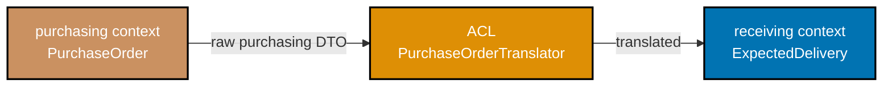
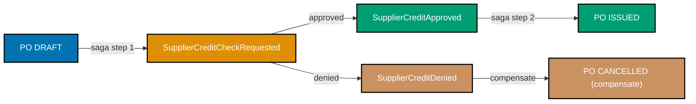
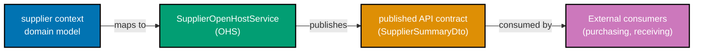

Examples 56–73 cover strategic and advanced tactical DDD using the `receiving`, `invoicing`, `payments`, and `murabaha-finance` bounded contexts of the `procurement-platform-be` — a Procure-to-Pay (P2P) backend. Every example builds on the same shared domain; see `beginner.md` for `purchasing` context foundations and `intermediate.md` for `PurchaseOrder` aggregate invariants. Each code block is self-contained. Annotation density targets 1.0–2.25 comment lines per code line per example.

## Cross-Context Integration Patterns (Examples 56–61)

### Example 56: Anti-Corruption Layer — translating `purchasing` vocabulary into `receiving`

When the `receiving` context imports a `PurchaseOrder` from `purchasing`, it must not let purchasing vocabulary leak into receiving's model. An ACL class sits at the boundary and translates.






```java
// ── purchasing context DTO (we cannot change this class) ─────────────────────
// purchasing publishes this shape over an event bus; receiving consumes it
record PurchaseOrderIssuedEvent(
    String purchaseOrderId,          // => format "po_<uuid>" per spec
    String supplierId,               // => format "sup_<uuid>"
    java.util.List<LineDto> lines    // => list of ordered lines
) {}
record LineDto(String skuCode, int qty, String unit, double unitPriceCents) {}
// => LineDto is purchasing language; "qty" not "receivedQuantity"

// ── receiving context's own model ────────────────────────────────────────────
// receiving cares about expected quantity against a PO — nothing about price
record PurchaseOrderId(String value) {}       // => strong ID type in receiving context
record ExpectedDeliveryLine(String skuCode, int expectedQty, String unit) {}
// => "expectedQty" is receiving ubiquitous language — no price data here
record ExpectedDelivery(PurchaseOrderId poId, java.util.List<ExpectedDeliveryLine> lines) {}
// => receiving's aggregate input: what goods should arrive, and how many

// ── Anti-Corruption Layer ────────────────────────────────────────────────────
// Translator knows both models; neither model knows the translator
class PurchaseOrderTranslator {               // => class PurchaseOrderTranslator
    public ExpectedDelivery translate(PurchaseOrderIssuedEvent event) { // => translate method
        // => Receives purchasing's event; returns receiving's clean model
        var lines = event.lines().stream()
            .map(l -> new ExpectedDeliveryLine(
                l.skuCode(),                  // => skuCode passes through — same concept
                l.qty(),                      // => "qty" renamed to "expectedQty" in receiving
                l.unit()                      // => unit of measure passes through
            ))
            .toList();                        // => collect all lines; price data is discarded
        return new ExpectedDelivery(
            new PurchaseOrderId(event.purchaseOrderId()), // => wraps raw string in typed ID
            lines                             // => translated lines with no purchasing pricing
        );
    }
}

// ── Usage ────────────────────────────────────────────────────────────────────
class AclDemo {
    public static void main(String[] args) {
        var event = new PurchaseOrderIssuedEvent(
            "po_550e8400-e29b-41d4-a716-446655440000",
            "sup_7c9e6679-7425-40de-944b-e07fc1f90ae7",
            java.util.List.of(new LineDto("OFF-001234", 50, "BOX", 2500))
        );                                    // => simulate event arriving from purchasing context
        var acl = new PurchaseOrderTranslator();
        var delivery = acl.translate(event);
        System.out.println(delivery.poId());  // => PurchaseOrderId[value=po_550e8400-...]
        System.out.println(delivery.lines()); // => [ExpectedDeliveryLine[skuCode=OFF-001234, expectedQty=50, unit=BOX]]
        // => Price data gone; receiving model contains only what receiving cares about
    }
}
```




```kotlin
// ── purchasing context DTO (upstream — cannot change) ────────────────────────
// purchasing publishes this shape over an event bus; receiving consumes it
data class PurchaseOrderIssuedEvent(
    val purchaseOrderId: String,          // => format "po_<uuid>" per spec
    val supplierId: String,               // => format "sup_<uuid>"
    val lines: List<LineDto>              // => list of ordered lines from purchasing
)
data class LineDto(val skuCode: String, val qty: Int, val unit: String, val unitPriceCents: Double)
// => LineDto carries purchasing language — "qty" not "receivedQuantity"; price included

// ── receiving context's own model ────────────────────────────────────────────
// receiving cares only about expected arrival quantities — price is irrelevant here
@JvmInline value class PurchaseOrderId(val value: String) // => inline wrapper; zero runtime overhead
data class ExpectedDeliveryLine(val skuCode: String, val expectedQty: Int, val unit: String)
// => "expectedQty" is receiving's ubiquitous language — no pricing field present
data class ExpectedDelivery(val poId: PurchaseOrderId, val lines: List<ExpectedDeliveryLine>)
// => receiving's aggregate input: which goods to expect and how many

// ── Anti-Corruption Layer ─────────────────────────────────────────────────────
// Translator is the only class that knows both vocabularies
class PurchaseOrderTranslator {                    // => ACL class; single responsibility
    fun translate(event: PurchaseOrderIssuedEvent): ExpectedDelivery { // => translate method
        // => Converts purchasing's DTO into receiving's clean domain model
        val lines = event.lines.map { l ->
            ExpectedDeliveryLine(
                skuCode     = l.skuCode,           // => skuCode concept shared; name identical
                expectedQty = l.qty,               // => "qty" renamed to "expectedQty" — UL alignment
                unit        = l.unit               // => unit of measure passes through unchanged
            )                                      // => unitPriceCents discarded; receiving has no use for it
        }
        return ExpectedDelivery(
            poId  = PurchaseOrderId(event.purchaseOrderId), // => raw String wrapped in typed ID
            lines = lines                          // => translated lines; no purchasing pricing data
        )
    }
}

// ── Usage ─────────────────────────────────────────────────────────────────────
fun main() {
    val event = PurchaseOrderIssuedEvent(
        purchaseOrderId = "po_550e8400-e29b-41d4-a716-446655440000",
        supplierId      = "sup_7c9e6679-7425-40de-944b-e07fc1f90ae7",
        lines           = listOf(LineDto("OFF-001234", 50, "BOX", 2500.0))
    )                                              // => simulates event arriving from purchasing context
    val acl      = PurchaseOrderTranslator()
    val delivery = acl.translate(event)
    println(delivery.poId)                         // => PurchaseOrderId(value=po_550e8400-...)
    println(delivery.lines)                        // => [ExpectedDeliveryLine(skuCode=OFF-001234, expectedQty=50, unit=BOX)]
    // => Price data absent; receiving model contains only what receiving cares about
}
```




```csharp
// ── purchasing context DTO (upstream — cannot change) ────────────────────────
// purchasing publishes this shape over an event bus; receiving consumes it
public sealed record PurchaseOrderIssuedEvent(
    string PurchaseOrderId,              // => format "po_<uuid>" per spec
    string SupplierId,                   // => format "sup_<uuid>"
    IReadOnlyList<LineDto> Lines         // => list of ordered lines from purchasing
);
public sealed record LineDto(string SkuCode, int Qty, string Unit, decimal UnitPriceCents);
// => LineDto is purchasing vocabulary — "Qty" not "ReceivedQuantity"; price present

// ── receiving context's own model ────────────────────────────────────────────
// receiving cares only about expected arrival quantities — price is not its concern
public readonly record struct PurchaseOrderId(string Value); // => typed ID; struct = zero-alloc
public sealed record ExpectedDeliveryLine(string SkuCode, int ExpectedQty, string Unit);
// => "ExpectedQty" is receiving's ubiquitous language — no pricing field
public sealed record ExpectedDelivery(PurchaseOrderId PoId, IReadOnlyList<ExpectedDeliveryLine> Lines);
// => receiving's aggregate input: which goods to expect and how many

// ── Anti-Corruption Layer ─────────────────────────────────────────────────────
// Translator is the only class that knows both vocabularies
public sealed class PurchaseOrderTranslator       // => ACL; single responsibility
{
    public ExpectedDelivery Translate(PurchaseOrderIssuedEvent evt) // => Translate method
    {
        // => Converts purchasing's DTO into receiving's clean domain model
        var lines = evt.Lines
            .Select(l => new ExpectedDeliveryLine(
                SkuCode:     l.SkuCode,            // => skuCode concept shared; name identical
                ExpectedQty: l.Qty,                // => "Qty" renamed to "ExpectedQty" — UL alignment
                Unit:        l.Unit                // => unit of measure passes through unchanged
            ))                                     // => UnitPriceCents discarded; receiving has no use for it
            .ToList()
            .AsReadOnly();                         // => immutable list; receiving model is read-only
        return new ExpectedDelivery(
            PoId:  new PurchaseOrderId(evt.PurchaseOrderId), // => raw string wrapped in typed ID
            Lines: lines                           // => translated lines; no purchasing pricing data
        );
    }
}

// ── Usage ─────────────────────────────────────────────────────────────────────
public static class AclDemo
{
    public static void Run()
    {
        var evt = new PurchaseOrderIssuedEvent(
            PurchaseOrderId: "po_550e8400-e29b-41d4-a716-446655440000",
            SupplierId:      "sup_7c9e6679-7425-40de-944b-e07fc1f90ae7",
            Lines:           new[] { new LineDto("OFF-001234", 50, "BOX", 2500m) }
        );                                         // => simulates event arriving from purchasing context
        var acl      = new PurchaseOrderTranslator();
        var delivery = acl.Translate(evt);
        Console.WriteLine(delivery.PoId);          // => PurchaseOrderId { Value = po_550e8400-... }
        Console.WriteLine(delivery.Lines[0]);      // => ExpectedDeliveryLine { SkuCode = OFF-001234, ExpectedQty = 50, Unit = BOX }
        // => Price data absent; receiving model contains only what receiving cares about
    }
}
```




```typescript
// Anti-Corruption Layer: translating purchasing vocabulary into receiving context
// => ACL translator is the only class that knows both models

// purchasing context DTO (upstream — we cannot change this)
interface PurchaseOrderIssuedEvent {
  purchaseOrderId: string; // => format "po_<uuid>" per spec
  supplierId: string; // => format "sup_<uuid>"
  lines: LineDto[]; // => list of ordered lines from purchasing
}
interface LineDto {
  skuCode: string;
  qty: number; // => purchasing language: "qty"
  unit: string;
  unitPriceCents: number; // => purchasing carries price; receiving does not need it
}

// receiving context's own model (domain-specific vocabulary)
class PurchaseOrderId {
  // => typed ID in receiving context
  constructor(readonly value: string) {}
}
interface ExpectedDeliveryLine {
  skuCode: string;
  expectedQty: number; // => receiving language: "expectedQty" (not "qty")
  unit: string;
  // => no price field — receiving context does not care about pricing
}
interface ExpectedDelivery {
  poId: PurchaseOrderId;
  lines: ExpectedDeliveryLine[];
}

// Anti-Corruption Layer: translator lives at the boundary
class PurchaseOrderTranslator {
  // => ACL class; single responsibility
  translate(event: PurchaseOrderIssuedEvent): ExpectedDelivery {
    // => Converts purchasing's DTO into receiving's clean domain model
    const lines: ExpectedDeliveryLine[] = event.lines.map((l) => ({
      skuCode: l.skuCode, // => skuCode concept shared; name identical
      expectedQty: l.qty, // => "qty" renamed to "expectedQty" — UL alignment
      unit: l.unit, // => unit of measure passes through unchanged
      // => unitPriceCents discarded; receiving context has no use for it
    }));
    return {
      poId: new PurchaseOrderId(event.purchaseOrderId), // => raw string wrapped in typed ID
      lines, // => translated lines; no purchasing pricing data
    };
  }
}

// Usage
const event: PurchaseOrderIssuedEvent = {
  purchaseOrderId: "po_550e8400-e29b-41d4-a716-446655440000",
  supplierId: "sup_7c9e6679-7425-40de-944b-e07fc1f90ae7",
  lines: [{ skuCode: "OFF-001234", qty: 50, unit: "BOX", unitPriceCents: 2500 }],
}; // => simulates event arriving from purchasing context
const acl = new PurchaseOrderTranslator();
const delivery = acl.translate(event);
console.log(delivery.poId.value); // => Output: po_550e8400-e29b-41d4-a716-446655440000
console.log(delivery.lines[0]);
// => Output: { skuCode: "OFF-001234", expectedQty: 50, unit: "BOX" }
// => Price data absent; receiving model contains only what receiving cares about
```




**Key Takeaway**: An ACL translates at the seam — neither the upstream event nor the downstream model is polluted by the other's vocabulary.

**Why It Matters**: Without an ACL, purchasing's naming conventions bleed into receiving's code. A rename in purchasing ("qty" → "orderedQuantity") forces changes in receiving. With the ACL, the translator absorbs the rename in one place and the rest of receiving never changes. Amazon's fulfilment systems use this pattern extensively — ordering, warehouse, and shipping each have their own models with translators at every seam, enabling each team to evolve independently.

---

### Example 57: ACL with sealed-type state translation — `Invoice` matching status

The `invoicing` context receives a `GoodsReceived` event from `receiving`. Receiving uses a boolean `qcPassed` flag; invoicing needs its own sealed type hierarchy `MatchReadiness` so its logic never depends on receiving's internal flag semantics.




```java
// ── receiving context's event (we cannot change) ─────────────────────────────
// receiving publishes after warehouse staff record goods arrival
record GoodsReceivedEvent(
    String grnId,            // => format "grn_<uuid>"
    String purchaseOrderId,  // => links to the originating PO
    boolean qcPassed,        // => receiving's flag — true = no defects found
    int receivedQty          // => actual quantity inspected and accepted
) {}

// ── invoicing context's sealed hierarchy for match readiness ─────────────────
// invoicing models "can we match this?" more expressively than a boolean
sealed interface MatchReadiness permits MatchReadiness.Ready, MatchReadiness.Blocked {
    // => sealed: compiler guarantees exhaustive when in switch
    record Ready(String grnId, int qty) implements MatchReadiness {}
    // => Ready: all QC passed; qty is available for three-way match
    record Blocked(String grnId, String reason) implements MatchReadiness {}
    // => Blocked: QC failed; reason carries human-readable explanation for dispute
}

// ── ACL for invoicing ────────────────────────────────────────────────────────
class GoodsReceiptTranslator {          // => class GoodsReceiptTranslator
    public MatchReadiness translate(GoodsReceivedEvent event) { // => translate method
        // => Converts receiving's boolean into invoicing's domain concept
        if (event.qcPassed()) {
            return new MatchReadiness.Ready(event.grnId(), event.receivedQty());
            // => QC passed → invoicing can proceed to three-way match
        }
        return new MatchReadiness.Blocked(event.grnId(), "QC failed at receiving");
        // => QC failed → invoicing is blocked; reason surfaces in Invoice dispute log
    }
}

// ── invoicing usage ──────────────────────────────────────────────────────────
class InvoicingAclDemo {
    public static void main(String[] args) {
        var translator = new GoodsReceiptTranslator();

        // Scenario A: goods passed QC
        var passedEvent = new GoodsReceivedEvent("grn_abc", "po_xyz", true, 50);
        var readiness = translator.translate(passedEvent);
        System.out.println(
            switch (readiness) {                // => exhaustive switch — sealed type
                case MatchReadiness.Ready r    -> "Ready to match: " + r.qty() + " units"; // => Ready case
                case MatchReadiness.Blocked b  -> "Blocked: " + b.reason();                 // => Blocked case
            }
        );                                      // => Ready to match: 50 units

        // Scenario B: goods failed QC
        var failedEvent = new GoodsReceivedEvent("grn_def", "po_xyz", false, 0);
        System.out.println(
            switch (translator.translate(failedEvent)) {
                case MatchReadiness.Ready r    -> "Ready: " + r.qty();  // => would not print here
                case MatchReadiness.Blocked b  -> "Blocked: " + b.reason(); // => Blocked: QC failed at receiving
            }
        );
    }
}
```




```kotlin
// ── receiving context's event (upstream — cannot change) ─────────────────────
// receiving publishes after warehouse staff record goods arrival
data class GoodsReceivedEvent(
    val grnId:          String,  // => format "grn_<uuid>"
    val purchaseOrderId: String, // => links to the originating PO
    val qcPassed:       Boolean, // => receiving's flag — true = no defects found
    val receivedQty:    Int      // => actual quantity inspected and accepted
)

// ── invoicing context's sealed hierarchy for match readiness ──────────────────
// invoicing models "can we match this?" more expressively than a boolean
sealed class MatchReadiness {                         // => sealed: exhaustive when in when-expression
    data class Ready(val grnId: String, val qty: Int) : MatchReadiness()
    // => Ready: QC passed; qty available for three-way match
    data class Blocked(val grnId: String, val reason: String) : MatchReadiness()
    // => Blocked: QC failed; reason surfaces in Invoice dispute log
}

// ── ACL for invoicing ─────────────────────────────────────────────────────────
class GoodsReceiptTranslator {                        // => ACL class; single responsibility
    fun translate(event: GoodsReceivedEvent): MatchReadiness { // => translate method
        // => Converts receiving's Boolean into invoicing's richer domain concept
        return if (event.qcPassed) {
            MatchReadiness.Ready(event.grnId, event.receivedQty)
            // => QC passed → invoicing can proceed to three-way match
        } else {
            MatchReadiness.Blocked(event.grnId, "QC failed at receiving")
            // => QC failed → invoicing is blocked; reason logged in dispute workflow
        }
    }
}

// ── invoicing usage ───────────────────────────────────────────────────────────
fun main() {
    val translator = GoodsReceiptTranslator()

    // Scenario A: goods passed QC
    val passedEvent = GoodsReceivedEvent("grn_abc", "po_xyz", qcPassed = true, receivedQty = 50)
    val readiness   = translator.translate(passedEvent)
    println(
        when (readiness) {                            // => exhaustive when — sealed class
            is MatchReadiness.Ready   -> "Ready to match: ${readiness.qty} units" // => Ready branch
            is MatchReadiness.Blocked -> "Blocked: ${readiness.reason}"           // => Blocked branch
        }
    )                                                 // => Ready to match: 50 units

    // Scenario B: goods failed QC
    val failedEvent = GoodsReceivedEvent("grn_def", "po_xyz", qcPassed = false, receivedQty = 0)
    println(
        when (val r = translator.translate(failedEvent)) {
            is MatchReadiness.Ready   -> "Ready: ${r.qty}"    // => would not execute here
            is MatchReadiness.Blocked -> "Blocked: ${r.reason}" // => Blocked: QC failed at receiving
        }
    )
}
```




```csharp
// ── receiving context's event (upstream — cannot change) ─────────────────────
// receiving publishes after warehouse staff record goods arrival
public sealed record GoodsReceivedEvent(
    string GrnId,            // => format "grn_<uuid>"
    string PurchaseOrderId,  // => links to the originating PO
    bool   QcPassed,         // => receiving's flag — true = no defects found
    int    ReceivedQty       // => actual quantity inspected and accepted
);

// ── invoicing context's discriminated union for match readiness ───────────────
// invoicing models "can we match this?" more expressively than a bool
public abstract record MatchReadiness          // => abstract base; compiler enforces exhaustion via pattern matching
{
    public sealed record Ready(string GrnId, int Qty) : MatchReadiness();
    // => Ready: QC passed; Qty available for three-way match
    public sealed record Blocked(string GrnId, string Reason) : MatchReadiness();
    // => Blocked: QC failed; Reason surfaces in Invoice dispute log
    private MatchReadiness() {}               // => private constructor blocks external subclasses
}

// ── ACL for invoicing ─────────────────────────────────────────────────────────
public sealed class GoodsReceiptTranslator    // => ACL class; single responsibility
{
    public MatchReadiness Translate(GoodsReceivedEvent evt) // => Translate method
    {
        // => Converts receiving's bool into invoicing's richer domain type
        return evt.QcPassed
            ? new MatchReadiness.Ready(evt.GrnId, evt.ReceivedQty)
            // => QC passed → invoicing can proceed to three-way match
            : new MatchReadiness.Blocked(evt.GrnId, "QC failed at receiving");
            // => QC failed → invoicing is blocked; reason logged in dispute workflow
    }
}

// ── invoicing usage ───────────────────────────────────────────────────────────
public static class InvoicingAclDemo
{
    public static void Run()
    {
        var translator = new GoodsReceiptTranslator();

        // Scenario A: goods passed QC
        var passedEvent = new GoodsReceivedEvent("grn_abc", "po_xyz", QcPassed: true, ReceivedQty: 50);
        var readiness   = translator.Translate(passedEvent);
        Console.WriteLine(readiness switch          // => exhaustive switch expression — sealed hierarchy
        {
            MatchReadiness.Ready   r => $"Ready to match: {r.Qty} units", // => Ready branch
            MatchReadiness.Blocked b => $"Blocked: {b.Reason}",           // => Blocked branch
            _ => throw new UnreachableException()   // => satisfies compiler; never reached
        });                                         // => Ready to match: 50 units

        // Scenario B: goods failed QC
        var failedEvent = new GoodsReceivedEvent("grn_def", "po_xyz", QcPassed: false, ReceivedQty: 0);
        Console.WriteLine(translator.Translate(failedEvent) switch
        {
            MatchReadiness.Ready   r => $"Ready: {r.Qty}",                // => would not execute here
            MatchReadiness.Blocked b => $"Blocked: {b.Reason}",           // => Blocked: QC failed at receiving
            _ => throw new UnreachableException()
        });
    }
}
```




```typescript
// ACL with discriminated union state translation in TypeScript
// => receiving's boolean qcPassed → invoicing's MatchReadiness discriminated union

// receiving context's event (upstream — cannot change)
interface GoodsReceivedEvent {
  grnId: string; // => format "grn_<uuid>"
  purchaseOrderId: string; // => links to the originating PO
  qcPassed: boolean; // => receiving's flag — true = no defects found
  receivedQty: number; // => actual quantity inspected and accepted
}

// invoicing context's discriminated union for match readiness
// => models "can we match this?" more expressively than a boolean
type MatchReadiness =
  | { readonly tag: "Ready"; readonly grnId: string; readonly qty: number }
  | { readonly tag: "Blocked"; readonly grnId: string; readonly reason: string };
// => Ready: QC passed; Blocked: QC failed — TypeScript exhaustive switch enforces both cases

// ACL for invoicing context
class GoodsReceiptTranslator {
  translate(event: GoodsReceivedEvent): MatchReadiness {
    // => Converts receiving's boolean into invoicing's domain concept
    if (event.qcPassed) {
      return { tag: "Ready", grnId: event.grnId, qty: event.receivedQty };
      // => QC passed → invoicing can proceed to three-way match
    }
    return { tag: "Blocked", grnId: event.grnId, reason: "QC failed at receiving" };
    // => QC failed → invoicing is blocked; reason surfaces in Invoice dispute log
  }
}

// Helper: exhaustive switch over MatchReadiness
function describeReadiness(readiness: MatchReadiness): string {
  switch (readiness.tag) {
    case "Ready":
      return `Ready to match: ${readiness.qty} units`;
    case "Blocked":
      return `Blocked: ${readiness.reason}`;
    default: {
      const _x: never = readiness; // => compile error if a case is missing
      throw new Error(`Unhandled: ${(_x as any).tag}`);
    }
  }
}

const translator = new GoodsReceiptTranslator();

// Scenario A: goods passed QC
const passedEvent: GoodsReceivedEvent = {
  grnId: "grn_abc",
  purchaseOrderId: "po_xyz",
  qcPassed: true,
  receivedQty: 50,
};
console.log(describeReadiness(translator.translate(passedEvent)));
// => Output: Ready to match: 50 units

// Scenario B: goods failed QC
const failedEvent: GoodsReceivedEvent = {
  grnId: "grn_def",
  purchaseOrderId: "po_xyz",
  qcPassed: false,
  receivedQty: 0,
};
console.log(describeReadiness(translator.translate(failedEvent)));
// => Output: Blocked: QC failed at receiving
```




**Key Takeaway**: The ACL translates primitive upstream types (boolean) into expressive downstream domain types (sealed hierarchy), giving invoicing a richer vocabulary without depending on receiving's internals.

**Why It Matters**: A boolean flag carries no domain meaning — it is always wrong to branch on `if (qcPassed)` scattered across invoicing logic. The sealed `MatchReadiness` type centralises the semantics and forces exhaustive handling everywhere. When receiving adds a third QC outcome (partial pass), only the ACL and the `MatchReadiness` sealed interface need to change, not every branching site in invoicing.

---

### Example 58: Domain event as cross-context integration contract — `InvoiceMatched`

After a successful three-way match, invoicing emits `InvoiceMatched`. The `payments` context consumes it to schedule a payment run. The event is the contract; no direct dependency exists between the two bounded contexts.




```java
// ── invoicing context publishes this event ───────────────────────────────────
// Event is a Java record: immutable, value-equality, named constructor
record InvoiceMatched(
    String invoiceId,        // => format "inv_<uuid>"
    String purchaseOrderId,  // => links back to the originating PO
    String supplierId,       // => "sup_<uuid>" — payments needs to know who to pay
    long amountCents,        // => matched amount in minor currency units
    String currency,         // => ISO 4217 e.g. "USD"
    java.time.Instant matchedAt // => timestamp of match confirmation
) {}
// => Record: final fields, auto-generated equals/hashCode/toString

// ── payments context: event consumer ────────────────────────────────────────
// payments has no import of invoicing classes — only the shared event record
record PaymentId(String value) {}        // => payments' own ID type
record Money(long amountCents, String currency) {}  // => payments' own Money VO
enum PaymentStatus { SCHEDULED, DISBURSED, REMITTED, FAILED }

class PaymentScheduler {                  // => class PaymentScheduler
    // => Application service in payments context — handles InvoiceMatched
    public PaymentId scheduleFrom(InvoiceMatched event) { // => scheduleFrom method
        // => Translates invoicing event fields into payments' own model inline
        // => No ACL class needed when translation is trivial (single field reuse)
        var paymentId = new PaymentId("pay_" + java.util.UUID.randomUUID()); // => new unique PaymentId
        var amount = new Money(event.amountCents(), event.currency()); // => wraps event money
        System.out.printf(
            "Scheduling payment %s to supplier %s for %d %s%n",
            paymentId.value(), event.supplierId(), amount.amountCents(), amount.currency()
        );                                // => log: Scheduling payment pay_... to supplier sup_... for 125000 USD
        return paymentId;                 // => returns new PaymentId for the scheduled payment run
    }
}

class EventIntegrationDemo {
    public static void main(String[] args) {
        var event = new InvoiceMatched(
            "inv_111", "po_222", "sup_333",
            125_000L, "USD", java.time.Instant.now()
        );                               // => simulate event arriving from invoicing context
        var scheduler = new PaymentScheduler();
        var pid = scheduler.scheduleFrom(event);
        System.out.println("Scheduled: " + pid.value()); // => Scheduled: pay_<uuid>
    }
}
```




```kotlin
// ── invoicing context publishes this event ────────────────────────────────────
// Kotlin data class: immutable, structural equality, copy() available
data class InvoiceMatched(
    val invoiceId:       String,             // => format "inv_<uuid>"
    val purchaseOrderId: String,             // => links back to the originating PO
    val supplierId:      String,             // => "sup_<uuid>" — payments needs to know who to pay
    val amountCents:     Long,               // => matched amount in minor currency units
    val currency:        String,             // => ISO 4217 e.g. "USD"
    val matchedAt:       java.time.Instant   // => timestamp of match confirmation
)
// => data class: equals/hashCode/toString generated; all fields are val (immutable)

// ── payments context: event consumer ─────────────────────────────────────────
// payments has no import of invoicing classes — only the shared event data class
@JvmInline value class PaymentId(val value: String)  // => inline wrapper; zero heap overhead
data class Money(val amountCents: Long, val currency: String) // => payments' own Money VO
enum class PaymentStatus { SCHEDULED, DISBURSED, REMITTED, FAILED }

class PaymentScheduler {                             // => application service in payments context
    fun scheduleFrom(event: InvoiceMatched): PaymentId { // => scheduleFrom function
        // => Translates invoicing event fields into payments' own model inline
        // => No ACL class needed when translation is trivial (single field reuse)
        val paymentId = PaymentId("pay_${java.util.UUID.randomUUID()}") // => new unique PaymentId
        val amount    = Money(event.amountCents, event.currency)        // => wraps event money into payments VO
        println(
            "Scheduling payment ${paymentId.value} to supplier ${event.supplierId} " +
            "for ${amount.amountCents} ${amount.currency}"
        )                                            // => Scheduling payment pay_... to supplier sup_... for 125000 USD
        return paymentId                             // => returns new PaymentId for the scheduled payment run
    }
}

// ── Usage ─────────────────────────────────────────────────────────────────────
fun main() {
    val event = InvoiceMatched(
        invoiceId       = "inv_111",
        purchaseOrderId = "po_222",
        supplierId      = "sup_333",
        amountCents     = 125_000L,
        currency        = "USD",
        matchedAt       = java.time.Instant.now()
    )                                                // => simulates event arriving from invoicing context
    val scheduler = PaymentScheduler()
    val pid       = scheduler.scheduleFrom(event)
    println("Scheduled: ${pid.value}")               // => Scheduled: pay_<uuid>
}
```




```csharp
// ── invoicing context publishes this event ────────────────────────────────────
// C# record: immutable by default, structural equality, with-expression available
public sealed record InvoiceMatched(
    string           InvoiceId,        // => format "inv_<uuid>"
    string           PurchaseOrderId,  // => links back to the originating PO
    string           SupplierId,       // => "sup_<uuid>" — payments needs to know who to pay
    long             AmountCents,      // => matched amount in minor currency units
    string           Currency,         // => ISO 4217 e.g. "USD"
    DateTimeOffset   MatchedAt         // => timestamp of match confirmation; offset preserves timezone
);
// => record: Equals/GetHashCode/ToString auto-generated; init-only properties

// ── payments context: event consumer ─────────────────────────────────────────
// payments has no reference to invoicing assemblies — only the shared event record
public readonly record struct PaymentId(string Value); // => struct: stack-allocated; zero heap overhead
public sealed record Money(long AmountCents, string Currency); // => payments' own Money VO
public enum PaymentStatus { Scheduled, Disbursed, Remitted, Failed }

public sealed class PaymentScheduler              // => application service in payments context
{
    public PaymentId ScheduleFrom(InvoiceMatched evt) // => ScheduleFrom method
    {
        // => Translates invoicing event fields into payments' own model inline
        // => No ACL class needed when translation is trivial (single field reuse)
        var paymentId = new PaymentId($"pay_{Guid.NewGuid()}"); // => new unique PaymentId
        var amount    = new Money(evt.AmountCents, evt.Currency); // => wraps event money into payments VO
        Console.WriteLine(
            $"Scheduling payment {paymentId.Value} to supplier {evt.SupplierId} " +
            $"for {amount.AmountCents} {amount.Currency}"
        );                                         // => Scheduling payment pay_... to supplier sup_... for 125000 USD
        return paymentId;                          // => returns new PaymentId for the scheduled payment run
    }
}

// ── Usage ─────────────────────────────────────────────────────────────────────
public static class EventIntegrationDemo
{
    public static void Run()
    {
        var evt = new InvoiceMatched(
            InvoiceId:       "inv_111",
            PurchaseOrderId: "po_222",
            SupplierId:      "sup_333",
            AmountCents:     125_000L,
            Currency:        "USD",
            MatchedAt:       DateTimeOffset.UtcNow
        );                                         // => simulates event arriving from invoicing context
        var scheduler = new PaymentScheduler();
        var pid       = scheduler.ScheduleFrom(evt);
        Console.WriteLine($"Scheduled: {pid.Value}"); // => Scheduled: pay_<uuid>
    }
}
```




```typescript
// Domain event as cross-context integration contract in TypeScript
// => InvoiceMatched event published by invoicing; consumed by payments context

// invoicing context: publishes InvoiceMatchedEvent when 3-way match succeeds
interface InvoiceMatchedEvent {
  readonly type: "InvoiceMatched"; // => discriminated union tag
  readonly invoiceId: string; // => which invoice was matched
  readonly purchaseOrderId: string; // => originating PO
  readonly grnId: string; // => goods receipt note
  readonly amount: number; // => approved payment amount
  readonly currency: string; // => ISO 4217 currency code
  readonly matchedAt: Date; // => UTC timestamp
}

// payments context: receives the event and schedules payment
interface PaymentSchedule {
  readonly invoiceId: string;
  readonly amount: number;
  readonly currency: string;
  readonly dueDate: Date; // => computed from supplier payment terms
}

// Application service in payments context: handles InvoiceMatchedEvent
function schedulePaymentFromEvent(
  event: InvoiceMatchedEvent,
  paymentTermsDays: number, // => from supplier record (e.g. NET_30 = 30 days)
): PaymentSchedule {
  const dueDate = new Date(event.matchedAt);
  dueDate.setDate(dueDate.getDate() + paymentTermsDays);
  // => due date = match date + payment terms; e.g. NET_30 → match date + 30 days

  return {
    invoiceId: event.invoiceId,
    amount: event.amount,
    currency: event.currency,
    dueDate,
  };
}

// Usage
const event: InvoiceMatchedEvent = {
  type: "InvoiceMatched",
  invoiceId: "inv_001",
  purchaseOrderId: "po_550e8400-0001",
  grnId: "grn_abc",
  amount: 5000.0,
  currency: "USD",
  matchedAt: new Date("2026-01-15"),
};

const schedule = schedulePaymentFromEvent(event, 30); // => NET_30 terms
console.log(schedule.invoiceId); // => Output: inv_001
console.log(schedule.amount); // => Output: 5000
console.log(schedule.currency); // => Output: USD
console.log(schedule.dueDate.toISOString().slice(0, 10)); // => Output: 2026-02-14
```




**Key Takeaway**: Domain events decouple bounded contexts — invoicing and payments share only the event record, never implementation classes.

**Why It Matters**: Direct method calls between bounded contexts create compile-time coupling; any invoicing refactor cascades into payments. Event-based integration lets both contexts deploy independently. Netflix and Uber use event-driven coupling between their microservice bounded contexts precisely for this reason — a payment service consumes invoicing events without knowing anything about how three-way matching works internally.

---

### Example 59: Context Map — Open Host Service for supplier-facing API

The `purchasing` context exposes a published, versioned API (Open Host Service) that `receiving` and `invoicing` consume. Upstream never breaks its contract without a versioning strategy.




```java
// ── Open Host Service: purchasing publishes a stable API contract ─────────────
// Any downstream can consume this; purchasing owns its stability
interface PurchasingQueryPort {           // => output port / Open Host Service interface
    PurchaseOrderView findById(String purchaseOrderId); // => stable query operation
    // => "View" suffix: this is a read model, not the aggregate itself
}

record PurchaseOrderView(
    String purchaseOrderId,              // => typed ID in string form for cross-context use
    String supplierId,
    java.util.List<PurchaseOrderLineView> lines,
    String status                        // => state machine status as a string — stable representation
) {}
record PurchaseOrderLineView(String skuCode, int orderedQty, String unit) {}
// => View record omits internal aggregate fields (approval level, version) — not part of OHS

// ── invoicing context: consumer of the Open Host Service ────────────────────
class ThreeWayMatchService {             // => class ThreeWayMatchService
    private final PurchasingQueryPort purchasing; // => depends on the interface, not any class
    // => Dependency Inversion: invoicing owns the interface; purchasing provides the impl

    ThreeWayMatchService(PurchasingQueryPort purchasing) {
        this.purchasing = purchasing;    // => injected at construction; swappable for tests
    }

    public boolean canMatch(String poId, String skuCode, int invoicedQty) {
        // => Three-way match: PO quantity must cover the invoiced quantity
        var view = purchasing.findById(poId); // => calls Open Host Service
        if (view == null) return false;       // => PO not found — cannot match
        return view.lines().stream()
            .filter(l -> l.skuCode().equals(skuCode)) // => find the matching line
            .anyMatch(l -> l.orderedQty() >= invoicedQty); // => PO qty must cover invoice qty
        // => Returns true if any line has enough quantity for this invoice
    }
}

// ── in-memory stub (replaces real HTTP call in tests) ────────────────────────
class StubPurchasingQuery implements PurchasingQueryPort { // => test stub
    public PurchaseOrderView findById(String id) {
        // => Returns a hardcoded view for unit tests — no HTTP, no database
        return new PurchaseOrderView(
            id, "sup_abc",
            java.util.List.of(new PurchaseOrderLineView("OFF-001234", 100, "BOX")),
            "Issued"
        );
    }
}

class OhsDemo {
    public static void main(String[] args) {
        var service = new ThreeWayMatchService(new StubPurchasingQuery());
        System.out.println(service.canMatch("po_xyz", "OFF-001234", 80)); // => true
        System.out.println(service.canMatch("po_xyz", "OFF-001234", 120)); // => false (120 > 100)
    }
}
```




```kotlin
// ── Open Host Service: purchasing publishes a stable API contract ─────────────
// Any downstream can consume this; purchasing owns its stability
interface PurchasingQueryPort {           // => output port / Open Host Service interface
    fun findById(purchaseOrderId: String): PurchaseOrderView? // => stable query; null = not found
    // => "View" suffix: this is a read model, not the aggregate itself
}

data class PurchaseOrderView(
    val purchaseOrderId: String,          // => typed ID in string form for cross-context use
    val supplierId:      String,
    val lines:           List<PurchaseOrderLineView>,
    val status:          String           // => state machine status as a string — stable representation
)
data class PurchaseOrderLineView(val skuCode: String, val orderedQty: Int, val unit: String)
// => View omits internal aggregate fields (approval level, version) — not part of OHS

// ── invoicing context: consumer of the Open Host Service ─────────────────────
class ThreeWayMatchService(              // => primary constructor; dependency injected
    private val purchasing: PurchasingQueryPort // => depends on interface, not any class
    // => Dependency Inversion: invoicing owns the interface; purchasing provides the impl
) {
    fun canMatch(poId: String, skuCode: String, invoicedQty: Int): Boolean {
        // => Three-way match: PO quantity must cover the invoiced quantity
        val view = purchasing.findById(poId) ?: return false // => null = PO not found; cannot match
        return view.lines
            .filter { it.skuCode == skuCode }              // => find the matching line
            .any { it.orderedQty >= invoicedQty }           // => PO qty must cover invoice qty
        // => Returns true if any line has enough quantity for this invoice
    }
}

// ── in-memory stub (replaces real HTTP call in tests) ────────────────────────
class StubPurchasingQuery : PurchasingQueryPort { // => test stub; implements interface
    override fun findById(id: String): PurchaseOrderView {
        // => Returns a hardcoded view for unit tests — no HTTP, no database
        return PurchaseOrderView(
            purchaseOrderId = id,
            supplierId      = "sup_abc",
            lines           = listOf(PurchaseOrderLineView("OFF-001234", 100, "BOX")),
            status          = "Issued"
        )
    }
}

fun main() {
    val service = ThreeWayMatchService(StubPurchasingQuery())
    println(service.canMatch("po_xyz", "OFF-001234", 80))  // => true
    println(service.canMatch("po_xyz", "OFF-001234", 120)) // => false (120 > 100)
}
```




```csharp
// ── Open Host Service: purchasing publishes a stable API contract ─────────────
// Any downstream can consume this; purchasing owns its stability
public interface IPurchasingQueryPort    // => output port / Open Host Service interface
{
    PurchaseOrderView? FindById(string purchaseOrderId); // => stable query; null = not found
    // => "View" suffix: this is a read model, not the aggregate itself
}

public sealed record PurchaseOrderView(
    string                          PurchaseOrderId, // => typed ID in string form for cross-context use
    string                          SupplierId,
    IReadOnlyList<PurchaseOrderLineView> Lines,
    string                          Status           // => state machine status — stable representation
);
public sealed record PurchaseOrderLineView(string SkuCode, int OrderedQty, string Unit);
// => View omits internal aggregate fields (approval level, version) — not part of OHS

// ── invoicing context: consumer of the Open Host Service ─────────────────────
public sealed class ThreeWayMatchService // => application service in invoicing context
{
    private readonly IPurchasingQueryPort _purchasing; // => depends on interface, not any class
    // => Dependency Inversion: invoicing owns the interface; purchasing provides the impl

    public ThreeWayMatchService(IPurchasingQueryPort purchasing)
    {
        _purchasing = purchasing;         // => injected at construction; swappable for tests
    }

    public bool CanMatch(string poId, string skuCode, int invoicedQty)
    {
        // => Three-way match: PO quantity must cover the invoiced quantity
        var view = _purchasing.FindById(poId);
        if (view is null) return false;   // => PO not found — cannot match
        return view.Lines
            .Where(l => l.SkuCode == skuCode)     // => find the matching line
            .Any(l => l.OrderedQty >= invoicedQty); // => PO qty must cover invoice qty
        // => Returns true if any line has enough quantity for this invoice
    }
}

// ── in-memory stub (replaces real HTTP call in tests) ────────────────────────
public sealed class StubPurchasingQuery : IPurchasingQueryPort // => test stub
{
    public PurchaseOrderView FindById(string id)
    {
        // => Returns a hardcoded view for unit tests — no HTTP, no database
        return new PurchaseOrderView(
            PurchaseOrderId: id,
            SupplierId:      "sup_abc",
            Lines:           new[] { new PurchaseOrderLineView("OFF-001234", 100, "BOX") },
            Status:          "Issued"
        );
    }
}

public static class OhsDemo
{
    public static void Run()
    {
        var service = new ThreeWayMatchService(new StubPurchasingQuery());
        Console.WriteLine(service.CanMatch("po_xyz", "OFF-001234", 80));  // => True
        Console.WriteLine(service.CanMatch("po_xyz", "OFF-001234", 120)); // => False (120 > 100)
    }
}
```




```typescript
// Context Map: Open Host Service (OHS) pattern in TypeScript
// => OHS publishes a stable, versioned API for external supplier consumers

// Internal domain model (not exposed directly)
interface InternalPurchaseOrder {
  id: string;
  supplierId: string;
  status: string;
  lines: Array;
  totalAmount: number;
  currency: string;
}

// Open Host Service: published language (stable contract for external consumers)
// => Version prefix allows breaking changes without disrupting consumers
interface SupplierPOViewV1 {
  // => V1 = version 1 of the published language
  readonly orderId: string; // => "orderId" not "id" — supplier vocabulary
  readonly orderDate: string; // => ISO 8601 date string; no Date object across boundary
  readonly items: SupplierItemV1[]; // => "items" not "lines" — supplier vocabulary
  readonly totalUsd: number; // => flattened; no currency object in published API
}
interface SupplierItemV1 {
  readonly sku: string;
  readonly ordered: number;
  readonly unit: string;
}

// OHS Translator: maps internal model to published language
class PurchaseOrderOpenHostService {
  toSupplierView(po: InternalPurchaseOrder, orderDate: Date): SupplierPOViewV1 {
    return {
      orderId: po.id, // => map internal id → orderId (supplier vocabulary)
      orderDate: orderDate.toISOString().slice(0, 10), // => ISO date string
      items: po.lines.map((l) => ({
        sku: l.skuCode, // => map skuCode → sku (shorter, supplier-friendly)
        ordered: l.quantity, // => map quantity → ordered (clearer for supplier)
        unit: l.unit,
      })),
      totalUsd: po.totalAmount, // => flatten currency into field name (OHS simplification)
    };
  }
}

// Usage
const internalPO: InternalPurchaseOrder = {
  id: "po_550e8400-0001",
  supplierId: "sup_001",
  status: "ISSUED",
  lines: [
    { skuCode: "OFF-001234", quantity: 50, unit: "BOX", unitPrice: 20 },
    { skuCode: "TLS-9999", quantity: 10, unit: "EACH", unitPrice: 150 },
  ],
  totalAmount: 2500,
  currency: "USD",
};

const ohs = new PurchaseOrderOpenHostService();
const view = ohs.toSupplierView(internalPO, new Date("2026-01-15"));
console.log(view.orderId); // => Output: po_550e8400-0001
console.log(view.orderDate); // => Output: 2026-01-15
console.log(view.items.length); // => Output: 2
console.log(view.items[0].sku); // => Output: OFF-001234
console.log(view.items[0].ordered); // => Output: 50
console.log(view.totalUsd); // => Output: 2500
```




**Key Takeaway**: An Open Host Service publishes a stable, versioned interface that downstream contexts consume without depending on the aggregate's internal structure.

**Why It Matters**: Without an OHS, every context reaches into the aggregate directly, coupling it to internal representation changes. Stripe's API is the real-world canonical Open Host Service — all downstream integrations use the published contract, and Stripe can refactor its internal implementation freely. In a P2P platform, invoicing and receiving both consume purchasing's OHS without needing to know how `PurchaseOrder` is stored or structured internally.

---

## Factory Pattern for Complex Aggregate Creation (Examples 60–63)

### Example 60: Factory method — creating `GoodsReceiptNote` from validated inputs

A `GoodsReceiptNote` aggregate has complex construction rules: the PO must exist, quantities must be positive, and QC status must be determined. A factory method encapsulates this logic and keeps the constructor simple.




```java
import java.time.Instant;
import java.util.List;
import java.util.UUID;

// ── Value objects in the receiving context ───────────────────────────────────
record GoodsReceiptNoteId(String value) {
    // => format "grn_<uuid>"; receiving's own ID type
    static GoodsReceiptNoteId generate() {
        return new GoodsReceiptNoteId("grn_" + UUID.randomUUID()); // => factory helper
    }
}
record PurchaseOrderId(String value) {}  // => receiving's reference to purchasing context
enum QcStatus { PASSED, FAILED, PARTIAL } // => QC outcome from warehouse inspection
record ReceivedLine(String skuCode, int qty, String unit, QcStatus qc) {}
// => One line of a goods receipt: what arrived, how much, and QC result

// ── GoodsReceiptNote aggregate (simple constructor) ──────────────────────────
class GoodsReceiptNote {                 // => class GoodsReceiptNote
    private final GoodsReceiptNoteId id;
    private final PurchaseOrderId poId;  // => which PO this receipt is against
    private final List<ReceivedLine> lines;
    private final Instant receivedAt;
    private boolean closed = false;      // => mutable state: GRN can be closed after review

    // => Package-private constructor: only the factory creates GRNs
    GoodsReceiptNote(GoodsReceiptNoteId id, PurchaseOrderId poId,
                     List<ReceivedLine> lines, Instant receivedAt) {
        this.id = id; this.poId = poId;
        this.lines = List.copyOf(lines); // => defensive copy — lines are immutable after creation
        this.receivedAt = receivedAt;
    }

    public GoodsReceiptNoteId id() { return id; }
    public boolean hasDiscrepancy() {
        return lines.stream().anyMatch(l -> l.qc() != QcStatus.PASSED); // => any non-PASSED line = discrepancy
    }
    public void close() { this.closed = true; } // => state transition: GRN closed after payment
    public boolean isClosed() { return closed; }
}

// ── Factory class ────────────────────────────────────────────────────────────
// Factory enforces preconditions; aggregate constructor stays clean
class GoodsReceiptNoteFactory {          // => class GoodsReceiptNoteFactory
    public GoodsReceiptNote create(
            String rawPoId,
            List<ReceivedLine> lines,
            Instant receivedAt) {
        // => Precondition 1: PO ID must not be blank
        if (rawPoId == null || rawPoId.isBlank())
            throw new IllegalArgumentException("PO ID required for goods receipt");
        // => Precondition 2: must receive at least one line
        if (lines == null || lines.isEmpty())
            throw new IllegalArgumentException("GRN must have at least one received line");
        // => Precondition 3: all quantities must be positive
        if (lines.stream().anyMatch(l -> l.qty() <= 0))
            throw new IllegalArgumentException("Received quantity must be positive");
        // => All preconditions passed; generate ID and construct aggregate
        return new GoodsReceiptNote(
            GoodsReceiptNoteId.generate(),   // => factory generates the ID
            new PurchaseOrderId(rawPoId),
            lines,
            receivedAt
        );
    }
}

class FactoryDemo {
    public static void main(String[] args) {
        var factory = new GoodsReceiptNoteFactory();
        var lines = List.of(
            new ReceivedLine("OFF-001234", 50, "BOX", QcStatus.PASSED),
            new ReceivedLine("OFF-005678", 10, "KG",  QcStatus.PARTIAL)
        );
        var grn = factory.create("po_550e8400-e29b-41d4-a716-446655440000", lines, Instant.now());
        System.out.println(grn.id());             // => GoodsReceiptNoteId[value=grn_<uuid>]
        System.out.println(grn.hasDiscrepancy()); // => true (PARTIAL line present)
    }
}
```




```kotlin
import java.time.Instant
import java.util.UUID

// ── Value objects in the receiving context ────────────────────────────────────
@JvmInline value class GoodsReceiptNoteId(val value: String) { // => inline wrapper; zero heap overhead
    companion object {
        fun generate() = GoodsReceiptNoteId("grn_${UUID.randomUUID()}") // => factory helper
        // => generates "grn_<uuid>" — receiving's own ID format
    }
}
@JvmInline value class PurchaseOrderId(val value: String) // => receiving's reference to purchasing context
enum class QcStatus { PASSED, FAILED, PARTIAL }           // => QC outcome from warehouse inspection
data class ReceivedLine(val skuCode: String, val qty: Int, val unit: String, val qc: QcStatus)
// => One line of a goods receipt: what arrived, how much, and QC result

// ── GoodsReceiptNote aggregate (simple constructor) ───────────────────────────
class GoodsReceiptNote internal constructor( // => internal constructor: only factory creates GRNs
    val id:          GoodsReceiptNoteId,
    val poId:        PurchaseOrderId,        // => which PO this receipt is against
    val lines:       List<ReceivedLine>,     // => copied at construction; immutable after
    val receivedAt:  Instant
) {
    private var closed = false               // => mutable state: GRN can be closed after review

    fun hasDiscrepancy(): Boolean =
        lines.any { it.qc != QcStatus.PASSED } // => any non-PASSED line = discrepancy

    fun close() { closed = true }           // => state transition: GRN closed after payment
    fun isClosed(): Boolean = closed
}

// ── Factory class ─────────────────────────────────────────────────────────────
// Factory enforces preconditions; aggregate constructor stays clean
class GoodsReceiptNoteFactory {             // => class GoodsReceiptNoteFactory
    fun create(
        rawPoId:     String,
        lines:       List<ReceivedLine>,
        receivedAt:  Instant
    ): GoodsReceiptNote {
        // => Precondition 1: PO ID must not be blank
        require(rawPoId.isNotBlank()) { "PO ID required for goods receipt" }
        // => Precondition 2: must receive at least one line
        require(lines.isNotEmpty()) { "GRN must have at least one received line" }
        // => Precondition 3: all quantities must be positive
        require(lines.all { it.qty > 0 }) { "Received quantity must be positive" }
        // => All preconditions passed; generate ID and construct aggregate
        return GoodsReceiptNote(
            id         = GoodsReceiptNoteId.generate(), // => factory generates the ID
            poId       = PurchaseOrderId(rawPoId),
            lines      = lines.toList(),                // => defensive copy via toList()
            receivedAt = receivedAt
        )
    }
}

fun main() {
    val factory = GoodsReceiptNoteFactory()
    val lines = listOf(
        ReceivedLine("OFF-001234", 50, "BOX", QcStatus.PASSED),
        ReceivedLine("OFF-005678", 10, "KG",  QcStatus.PARTIAL)
    )
    val grn = factory.create("po_550e8400-e29b-41d4-a716-446655440000", lines, Instant.now())
    println(grn.id)             // => GoodsReceiptNoteId(value=grn_<uuid>)
    println(grn.hasDiscrepancy()) // => true (PARTIAL line present)
}
```




```csharp
using System;
using System.Collections.Generic;
using System.Linq;

// ── Value objects in the receiving context ────────────────────────────────────
public readonly record struct GoodsReceiptNoteId(string Value) // => struct: stack-allocated; zero heap overhead
{
    public static GoodsReceiptNoteId Generate() =>
        new($"grn_{Guid.NewGuid()}"); // => factory helper; generates "grn_<guid>"
}
public readonly record struct PurchaseOrderId(string Value); // => receiving's reference to purchasing context
public enum QcStatus { Passed, Failed, Partial }             // => QC outcome from warehouse inspection
public sealed record ReceivedLine(string SkuCode, int Qty, string Unit, QcStatus Qc);
// => One line of a goods receipt: what arrived, how much, and QC result

// ── GoodsReceiptNote aggregate (internal constructor) ────────────────────────
public sealed class GoodsReceiptNote                 // => aggregate root in receiving context
{
    public GoodsReceiptNoteId            Id          { get; }
    public PurchaseOrderId               PoId        { get; } // => which PO this receipt is against
    public IReadOnlyList<ReceivedLine>   Lines       { get; } // => immutable after construction
    public DateTimeOffset                ReceivedAt  { get; }
    private bool _closed;                            // => mutable state: GRN can be closed after review

    internal GoodsReceiptNote(                       // => internal ctor: only factory creates GRNs
        GoodsReceiptNoteId id, PurchaseOrderId poId,
        IReadOnlyList<ReceivedLine> lines, DateTimeOffset receivedAt)
    {
        Id = id; PoId = poId; Lines = lines; ReceivedAt = receivedAt;
    }

    public bool HasDiscrepancy() =>
        Lines.Any(l => l.Qc != QcStatus.Passed);    // => any non-Passed line = discrepancy

    public void Close() => _closed = true;           // => state transition: GRN closed after payment
    public bool IsClosed => _closed;
}

// ── Factory class ─────────────────────────────────────────────────────────────
// Factory enforces preconditions; aggregate constructor stays clean
public sealed class GoodsReceiptNoteFactory          // => class GoodsReceiptNoteFactory
{
    public GoodsReceiptNote Create(
        string rawPoId,
        IReadOnlyList<ReceivedLine> lines,
        DateTimeOffset receivedAt)
    {
        // => Precondition 1: PO ID must not be blank
        if (string.IsNullOrWhiteSpace(rawPoId))
            throw new ArgumentException("PO ID required for goods receipt");
        // => Precondition 2: must receive at least one line
        if (lines is null || lines.Count == 0)
            throw new ArgumentException("GRN must have at least one received line");
        // => Precondition 3: all quantities must be positive
        if (lines.Any(l => l.Qty <= 0))
            throw new ArgumentException("Received quantity must be positive");
        // => All preconditions passed; generate ID and construct aggregate
        return new GoodsReceiptNote(
            GoodsReceiptNoteId.Generate(),            // => factory generates the ID
            new PurchaseOrderId(rawPoId),
            lines,
            receivedAt
        );
    }
}

public static class FactoryDemo
{
    public static void Run()
    {
        var factory = new GoodsReceiptNoteFactory();
        var lines = new[]
        {
            new ReceivedLine("OFF-001234", 50, "BOX", QcStatus.Passed),
            new ReceivedLine("OFF-005678", 10, "KG",  QcStatus.Partial)
        };
        var grn = factory.Create("po_550e8400-e29b-41d4-a716-446655440000", lines, DateTimeOffset.UtcNow);
        Console.WriteLine(grn.Id);             // => GoodsReceiptNoteId { Value = grn_<guid> }
        Console.WriteLine(grn.HasDiscrepancy()); // => True (Partial line present)
    }
}
```




```typescript
// Factory method: GoodsReceiptNote creation from validated inputs in TypeScript
// => Static factory enforces creation-time business rules

class GoodsReceiptNoteId {
  private constructor(readonly value: string) {}
  static of(v: string): GoodsReceiptNoteId {
    if (!v.startsWith("grn_")) throw new Error("GoodsReceiptNoteId must start with grn_");
    return new GoodsReceiptNoteId(v);
  }
}

class PurchaseOrderId {
  private constructor(readonly value: string) {}
  static of(v: string): PurchaseOrderId {
    if (!v.startsWith("po_")) throw new Error("PurchaseOrderId must start with po_");
    return new PurchaseOrderId(v);
  }
}

type UnitOfMeasure = "EACH" | "BOX" | "KG" | "LITRE" | "HOUR";

interface ReceivedLine {
  skuCode: string;
  receivedQty: { value: number; unit: UnitOfMeasure };
}

type GRNStatus = "OPEN" | "PARTIALLY_RECEIVED" | "FULLY_RECEIVED";

class GoodsReceiptNote {
  readonly id: GoodsReceiptNoteId;
  readonly purchaseOrderId: PurchaseOrderId;
  readonly receivedBy: string;
  readonly receivedAt: Date;
  private _status: GRNStatus = "OPEN";
  private readonly _lines: ReceivedLine[] = [];

  // Private constructor: callers must use factory
  private constructor(id: GoodsReceiptNoteId, purchaseOrderId: PurchaseOrderId, receivedBy: string, receivedAt: Date) {
    this.id = id;
    this.purchaseOrderId = purchaseOrderId;
    this.receivedBy = receivedBy;
    this.receivedAt = receivedAt;
  }

  // Factory method: validates creation-time business rules
  static create(
    id: GoodsReceiptNoteId,
    purchaseOrderId: PurchaseOrderId,
    receivedBy: string,
    receivedAt: Date,
  ): GoodsReceiptNote {
    if (!receivedBy || receivedBy.trim() === "")
      throw new Error("receivedBy required; goods receipt must be traceable to a person");
    if (receivedAt > new Date()) throw new Error("receivedAt cannot be in the future");
    // => Future: validate PO is in ISSUED state (repository check in application layer)
    return new GoodsReceiptNote(id, purchaseOrderId, receivedBy, receivedAt);
  }

  get status(): GRNStatus {
    return this._status;
  }
  get lines(): readonly ReceivedLine[] {
    return [...this._lines];
  }

  recordLine(line: ReceivedLine): void {
    if (this._status === "FULLY_RECEIVED") throw new Error("GRN already fully received");
    this._lines.push(line);
    this._status = "PARTIALLY_RECEIVED";
  }

  close(): void {
    if (this._lines.length === 0) throw new Error("No lines recorded");
    this._status = "FULLY_RECEIVED";
  }
}

// Usage
const grn = GoodsReceiptNote.create(
  GoodsReceiptNoteId.of("grn_001"),
  PurchaseOrderId.of("po_550e8400-0001"),
  "warehouse-staff-007",
  new Date("2026-01-20"),
);
grn.recordLine({ skuCode: "OFF-001234", receivedQty: { value: 45, unit: "BOX" } });
console.log(grn.status); // => Output: PARTIALLY_RECEIVED
grn.close();
console.log(grn.status); // => Output: FULLY_RECEIVED

// Invalid: future receivedAt
try {
  GoodsReceiptNote.create(
    GoodsReceiptNoteId.of("grn_002"),
    PurchaseOrderId.of("po_550e8400-0002"),
    "staff-008",
    new Date("2099-01-01"), // => future date rejected
  );
} catch (e: unknown) {
  console.log((e as Error).message); // => Output: receivedAt cannot be in the future
}
```




**Key Takeaway**: Factory methods centralise complex construction rules so aggregate constructors stay thin and easy to test in isolation.

**Why It Matters**: Construction logic scattered across service classes is untestable and duplicated. A factory is a single test target: given bad inputs, it throws; given good inputs, it returns a valid aggregate. In procurement systems, invalid GRNs (zero-quantity lines, missing PO references) cause downstream matching failures that surface weeks later during payment runs. Catching them at construction time with a factory eliminates an entire class of production bugs.

---

### Example 61: Static factory with sealed result type — `Invoice.register`

When registering an `Invoice`, several preconditions may fail independently. A sealed result type (`RegistrationResult`) communicates all failure reasons explicitly without throwing exceptions.




```java
import java.math.BigDecimal;
import java.util.UUID;

// ── invoicing context value objects ─────────────────────────────────────────
record InvoiceId(String value) {
    static InvoiceId generate() { return new InvoiceId("inv_" + UUID.randomUUID()); }
}
record SupplierId(String value) {}       // => format "sup_<uuid>"
record Money(BigDecimal amount, String currency) {
    static Money of(String amount, String currency) {
        // => Factory helper: validates amount is non-negative
        var bd = new BigDecimal(amount);
        if (bd.compareTo(BigDecimal.ZERO) < 0)
            throw new IllegalArgumentException("Invoice amount cannot be negative");
        return new Money(bd, currency);
    }
}

// ── sealed result type ───────────────────────────────────────────────────────
// Caller is forced to handle success and every failure branch
sealed interface RegistrationResult
    permits RegistrationResult.Success, RegistrationResult.Failure {
    record Success(InvoiceId id) implements RegistrationResult {}
    // => Happy path: invoice registered, ID returned
    record Failure(String reason) implements RegistrationResult {}
    // => Failure: reason describes the first violated precondition
}

// ── Invoice aggregate with static factory ───────────────────────────────────
class Invoice {                          // => class Invoice
    private final InvoiceId id;
    private final SupplierId supplierId;
    private final String purchaseOrderId; // => links back to purchasing context
    private final Money amount;
    private String status = "Registered"; // => initial state in Invoice state machine

    private Invoice(InvoiceId id, SupplierId supplierId, String poId, Money amount) {
        this.id = id; this.supplierId = supplierId;
        this.purchaseOrderId = poId; this.amount = amount;
        // => Private constructor: only register() factory method may create instances
    }

    // => Static factory: returns result type instead of throwing
    public static RegistrationResult register(
            String supplierId, String poId, String amountStr, String currency) {
        if (supplierId == null || supplierId.isBlank())
            return new RegistrationResult.Failure("Supplier ID is required");
        // => Validate supplier ID first — most common omission
        if (poId == null || poId.isBlank())
            return new RegistrationResult.Failure("Purchase Order reference is required");
        // => Three-way match requires a PO reference
        if (!poId.startsWith("po_"))
            return new RegistrationResult.Failure("PO ID must have 'po_' prefix per domain spec");
        // => Enforce naming convention at the domain boundary
        try {
            var money = Money.of(amountStr, currency); // => may throw on invalid amount
            var invoice = new Invoice(InvoiceId.generate(), new SupplierId(supplierId), poId, money);
            return new RegistrationResult.Success(invoice.id);
            // => All checks passed; invoice created and ID returned
        } catch (NumberFormatException | IllegalArgumentException e) {
            return new RegistrationResult.Failure("Invalid amount: " + e.getMessage());
            // => Amount validation failed; wrap in Failure result
        }
    }

    public InvoiceId id() { return id; }
    public String status() { return status; }
}

class InvoiceFactoryDemo {
    public static void main(String[] args) {
        // Success path
        var ok = Invoice.register("sup_abc", "po_xyz", "12500.00", "USD");
        System.out.println(
            switch (ok) {
                case RegistrationResult.Success s  -> "Registered: " + s.id().value(); // => inv_<uuid>
                case RegistrationResult.Failure f  -> "Failed: " + f.reason();
            }
        );
        // Failure path: missing PO reference
        var fail = Invoice.register("sup_abc", "", "100.00", "USD");
        System.out.println(
            switch (fail) {
                case RegistrationResult.Success s  -> "Registered: " + s.id();
                case RegistrationResult.Failure f  -> "Failed: " + f.reason(); // => Failed: Purchase Order reference is required
            }
        );
    }
}
```




```kotlin
import java.math.BigDecimal
import java.util.UUID

// ── invoicing context value objects ──────────────────────────────────────────
@JvmInline value class InvoiceId(val value: String) { // => inline wrapper; zero heap overhead
    companion object {
        fun generate() = InvoiceId("inv_${UUID.randomUUID()}") // => factory helper
    }
}
@JvmInline value class SupplierId(val value: String)  // => format "sup_<uuid>"
data class Money(val amount: BigDecimal, val currency: String) {
    companion object {
        fun of(amount: String, currency: String): Money {
            // => Factory helper: validates amount is non-negative
            val bd = BigDecimal(amount)
            require(bd >= BigDecimal.ZERO) { "Invoice amount cannot be negative" }
            return Money(bd, currency)
        }
    }
}

// ── sealed result type ────────────────────────────────────────────────────────
// Caller is forced to handle success and every failure branch via when-expression
sealed class RegistrationResult {
    data class Success(val id: InvoiceId) : RegistrationResult()
    // => Happy path: invoice registered, ID returned
    data class Failure(val reason: String) : RegistrationResult()
    // => Failure: reason describes the first violated precondition
}

// ── Invoice aggregate with companion-object factory ───────────────────────────
class Invoice private constructor(      // => private constructor: only register() creates instances
    val id:              InvoiceId,
    val supplierId:      SupplierId,
    val purchaseOrderId: String,         // => links back to purchasing context
    val amount:          Money,
    var status:          String = "Registered" // => initial state in Invoice state machine
) {
    companion object {
        // => Companion factory: returns result type instead of throwing
        fun register(supplierId: String, poId: String, amountStr: String, currency: String): RegistrationResult {
            if (supplierId.isBlank())
                return RegistrationResult.Failure("Supplier ID is required")
            // => Validate supplier ID first — most common omission
            if (poId.isBlank())
                return RegistrationResult.Failure("Purchase Order reference is required")
            // => Three-way match requires a PO reference
            if (!poId.startsWith("po_"))
                return RegistrationResult.Failure("PO ID must have 'po_' prefix per domain spec")
            // => Enforce naming convention at the domain boundary
            return try {
                val money   = Money.of(amountStr, currency) // => may throw on invalid amount
                val invoice = Invoice(InvoiceId.generate(), SupplierId(supplierId), poId, money)
                RegistrationResult.Success(invoice.id)
                // => All checks passed; invoice created and ID returned
            } catch (e: Exception) {
                RegistrationResult.Failure("Invalid amount: ${e.message}")
                // => Amount validation failed; wrap in Failure result
            }
        }
    }
}

fun main() {
    // Success path
    val ok = Invoice.register("sup_abc", "po_xyz", "12500.00", "USD")
    println(when (ok) {
        is RegistrationResult.Success -> "Registered: ${ok.id.value}" // => inv_<uuid>
        is RegistrationResult.Failure -> "Failed: ${ok.reason}"
    })
    // Failure path: missing PO reference
    val fail = Invoice.register("sup_abc", "", "100.00", "USD")
    println(when (fail) {
        is RegistrationResult.Success -> "Registered: ${fail.id}"
        is RegistrationResult.Failure -> "Failed: ${fail.reason}" // => Failed: Purchase Order reference is required
    })
}
```




```csharp
using System;

// ── invoicing context value objects ──────────────────────────────────────────
public readonly record struct InvoiceId(string Value) // => struct: stack-allocated; zero heap overhead
{
    public static InvoiceId Generate() => new($"inv_{Guid.NewGuid()}"); // => factory helper
}
public readonly record struct SupplierId(string Value); // => format "sup_<uuid>"
public sealed record Money(decimal Amount, string Currency)
{
    public static Money Of(string amount, string currency)
    {
        // => Factory helper: validates amount is non-negative
        if (!decimal.TryParse(amount, out var d))
            throw new ArgumentException("Amount is not a valid decimal");
        if (d < 0) throw new ArgumentException("Invoice amount cannot be negative");
        return new Money(d, currency);
    }
}

// ── discriminated union result type ──────────────────────────────────────────
// Caller is forced to handle success and every failure branch via pattern match
public abstract record RegistrationResult       // => abstract base; sealed hierarchy
{
    public sealed record Success(InvoiceId Id) : RegistrationResult();
    // => Happy path: invoice registered, ID returned
    public sealed record Failure(string Reason) : RegistrationResult();
    // => Failure: reason describes the first violated precondition
    private RegistrationResult() {}             // => private ctor blocks external subclasses
}

// ── Invoice aggregate with static factory ────────────────────────────────────
public sealed class Invoice                     // => aggregate root in invoicing context
{
    public InvoiceId   Id              { get; }
    public SupplierId  SupplierId      { get; }
    public string      PurchaseOrderId { get; } // => links back to purchasing context
    public Money       Amount          { get; }
    public string      Status          { get; private set; } = "Registered";
    // => initial state in Invoice state machine

    private Invoice(InvoiceId id, SupplierId supplierId, string poId, Money amount)
    {
        Id = id; SupplierId = supplierId; PurchaseOrderId = poId; Amount = amount;
        // => private ctor: only Register() factory method may create instances
    }

    // => Static factory: returns result type instead of throwing
    public static RegistrationResult Register(string supplierId, string poId, string amountStr, string currency)
    {
        if (string.IsNullOrWhiteSpace(supplierId))
            return new RegistrationResult.Failure("Supplier ID is required");
        // => Validate supplier ID first — most common omission
        if (string.IsNullOrWhiteSpace(poId))
            return new RegistrationResult.Failure("Purchase Order reference is required");
        // => Three-way match requires a PO reference
        if (!poId.StartsWith("po_"))
            return new RegistrationResult.Failure("PO ID must have 'po_' prefix per domain spec");
        // => Enforce naming convention at the domain boundary
        try
        {
            var money   = Money.Of(amountStr, currency); // => may throw on invalid amount
            var invoice = new Invoice(InvoiceId.Generate(), new SupplierId(supplierId), poId, money);
            return new RegistrationResult.Success(invoice.Id);
            // => All checks passed; invoice created and ID returned
        }
        catch (ArgumentException e)
        {
            return new RegistrationResult.Failure($"Invalid amount: {e.Message}");
            // => Amount validation failed; wrap in Failure result
        }
    }
}

public static class InvoiceFactoryDemo
{
    public static void Run()
    {
        // Success path
        var ok = Invoice.Register("sup_abc", "po_xyz", "12500.00", "USD");
        Console.WriteLine(ok switch
        {
            RegistrationResult.Success s => $"Registered: {s.Id.Value}", // => inv_<guid>
            RegistrationResult.Failure f => $"Failed: {f.Reason}",
            _ => throw new UnreachableException()
        });
        // Failure path: missing PO reference
        var fail = Invoice.Register("sup_abc", "", "100.00", "USD");
        Console.WriteLine(fail switch
        {
            RegistrationResult.Success s => $"Registered: {s.Id}",
            RegistrationResult.Failure f => $"Failed: {f.Reason}", // => Failed: Purchase Order reference is required
            _ => throw new UnreachableException()
        });
    }
}
```




```typescript
// Abstract factory: constructing Invoice variants in TypeScript
// => StandardInvoice vs MurabahaInvoice have different construction rules

// Shared types
class InvoiceId {
  private constructor(readonly value: string) {}
  static of(v: string): InvoiceId {
    if (!v.startsWith("inv_")) throw new Error("InvoiceId must start with inv_");
    return new InvoiceId(v);
  }
}

interface Money {
  amount: number;
  currency: string;
}

// Base invoice type
abstract class Invoice {
  abstract readonly type: "Standard" | "Murabaha";
  abstract readonly id: InvoiceId;
  abstract readonly amount: Money;
  abstract readonly supplierId: string;
}

// Standard invoice: straightforward payment
class StandardInvoice extends Invoice {
  readonly type = "Standard" as const;
  private constructor(
    readonly id: InvoiceId,
    readonly amount: Money,
    readonly supplierId: string,
    readonly purchaseOrderId: string,
  ) {
    super();
  }

  static create(id: InvoiceId, amount: Money, supplierId: string, poId: string): StandardInvoice {
    if (amount.amount <= 0) throw new Error("Invoice amount must be > 0");
    if (!supplierId.startsWith("sup_")) throw new Error("Invalid supplierId");
    return new StandardInvoice(id, amount, supplierId, poId);
  }
}

// Murabaha invoice: Islamic finance instrument with markup
class MurabahaInvoice extends Invoice {
  readonly type = "Murabaha" as const;
  private constructor(
    readonly id: InvoiceId,
    readonly amount: Money,
    readonly supplierId: string,
    readonly costPrice: Money, // => original cost (revealed in Murabaha contract)
    readonly markupRate: number, // => profit markup percentage (e.g. 0.05 = 5%)
  ) {
    super();
  }

  static create(id: InvoiceId, costPrice: Money, markupRate: number, supplierId: string): MurabahaInvoice {
    if (costPrice.amount <= 0) throw new Error("costPrice must be > 0");
    if (markupRate <= 0 || markupRate > 1) throw new Error("markupRate must be > 0 and ≤ 1");
    const totalAmount = costPrice.amount * (1 + markupRate);
    return new MurabahaInvoice(
      id,
      { amount: totalAmount, currency: costPrice.currency },
      supplierId,
      costPrice,
      markupRate,
    );
  }
}

// Abstract factory: selects the correct Invoice variant
class InvoiceFactory {
  static createStandard(id: InvoiceId, amount: Money, supplierId: string, poId: string): StandardInvoice {
    return StandardInvoice.create(id, amount, supplierId, poId);
  }

  static createMurabaha(id: InvoiceId, costPrice: Money, markupRate: number, supplierId: string): MurabahaInvoice {
    return MurabahaInvoice.create(id, costPrice, markupRate, supplierId);
  }
}

// Usage
const stdInv = InvoiceFactory.createStandard(
  InvoiceId.of("inv_001"),
  { amount: 5000, currency: "USD" },
  "sup_001",
  "po_001",
);
console.log(stdInv.type); // => Output: Standard
console.log(stdInv.amount.amount); // => Output: 5000

const murabahaInv = InvoiceFactory.createMurabaha(
  InvoiceId.of("inv_002"),
  { amount: 10000, currency: "MYR" }, // => cost price
  0.05, // => 5% markup
  "sup_002",
);
console.log(murabahaInv.type); // => Output: Murabaha
console.log(murabahaInv.amount.amount); // => Output: 10500 (10000 * 1.05)
console.log(murabahaInv.markupRate); // => Output: 0.05
```




**Key Takeaway**: Sealed result types from factory methods make all failure modes explicit in the type system rather than hidden in exception documentation.

**Why It Matters**: Exception-based factory errors are invisible at the call site — callers forget to catch them, or catch the wrong exception type. A sealed `RegistrationResult` forces exhaustive handling at every call site the compiler checks. In invoice processing for a procurement system, unregistered invoices with bad data cause payment failures weeks later when the payment run queries a missing invoice. Catching all failure cases at registration time prevents silent data corruption from propagating.

---

### Example 62: Factory with external dependencies — `GoodsReceiptNote` using repository check

Some factories need to validate against persisted state (e.g., checking the PO exists before creating a GRN). The factory takes repository interfaces as dependencies, keeping it testable.




```java
import java.util.Optional;

// ── Repository interface (domain layer owns this) ────────────────────────────
// Interface lives in domain; implementation lives in infrastructure
interface PurchaseOrderRepository {       // => output port — domain interface
    Optional<PurchaseOrderView> findById(String purchaseOrderId);
    // => Returns empty if PO not found; never throws for missing data
}

// ── Minimal view used by the factory ────────────────────────────────────────
record PurchaseOrderView(String id, String status, int totalOrderedQty) {}
// => Factory only needs status and total qty — not the full aggregate

// ── Factory with repository dependency ──────────────────────────────────────
class GrnFactory {                        // => class GrnFactory
    private final PurchaseOrderRepository poRepo; // => injected — swappable in tests

    GrnFactory(PurchaseOrderRepository poRepo) {
        this.poRepo = poRepo;             // => repository injected at construction
    }

    public GoodsReceiptNote createForPo(String poId, java.util.List<ReceivedLine> lines) {
        // => Step 1: verify PO exists in purchasing context
        var poView = poRepo.findById(poId)
            .orElseThrow(() -> new IllegalArgumentException("PO not found: " + poId));
        // => Optional.orElseThrow: clean way to express "must exist" precondition
        // => Step 2: PO must be in Issued or Acknowledged state to accept receipt
        if (!java.util.Set.of("Issued", "Acknowledged").contains(poView.status()))
            throw new IllegalStateException("Cannot receive goods for PO in state: " + poView.status());
        // => Guard: receiving against a Draft or Cancelled PO is a process error
        // => Step 3: received qty must not exceed ordered qty (basic over-delivery guard)
        int receivedTotal = lines.stream().mapToInt(ReceivedLine::qty).sum();
        if (receivedTotal > poView.totalOrderedQty())
            throw new IllegalArgumentException(
                "Received " + receivedTotal + " exceeds ordered " + poView.totalOrderedQty());
        // => Over-delivery rule: protects against warehouse errors
        return new GoodsReceiptNote(
            GoodsReceiptNoteId.generate(), new PurchaseOrderId(poId),
            lines, java.time.Instant.now()
        );                                // => Aggregate created only after all validations pass
    }
}

// ── In-memory stub for testing ───────────────────────────────────────────────
class InMemoryPoRepository implements PurchaseOrderRepository {
    private final java.util.Map<String, PurchaseOrderView> store = new java.util.HashMap<>();

    void save(PurchaseOrderView view) { store.put(view.id(), view); }

    public Optional<PurchaseOrderView> findById(String id) {
        return Optional.ofNullable(store.get(id)); // => returns empty if not found
    }
}

class GrnFactoryWithRepoDemo {
    public static void main(String[] args) {
        var repo = new InMemoryPoRepository();
        repo.save(new PurchaseOrderView("po_111", "Issued", 100));
        // => Pre-load a PO in "Issued" state for the factory to validate against

        var factory = new GrnFactory(repo);
        var lines = java.util.List.of(new ReceivedLine("OFF-001234", 60, "BOX", QcStatus.PASSED));
        var grn = factory.createForPo("po_111", lines);
        System.out.println(grn.id()); // => GoodsReceiptNoteId[value=grn_<uuid>]

        // Attempt over-delivery
        var tooMany = java.util.List.of(new ReceivedLine("OFF-001234", 150, "BOX", QcStatus.PASSED));
        try {
            factory.createForPo("po_111", tooMany);
        } catch (IllegalArgumentException e) {
            System.out.println(e.getMessage()); // => Received 150 exceeds ordered 100
        }
    }
}
```




```kotlin
import java.time.Instant
import java.util.UUID

// ── Repository interface (domain layer owns this) ────────────────────────────
// Interface lives in domain; implementation lives in infrastructure
interface PurchaseOrderRepository {       // => output port — domain interface
    fun findById(purchaseOrderId: String): PurchaseOrderView?
    // => Returns null if PO not found; never throws for missing data
}

// ── Minimal view used by the factory ─────────────────────────────────────────
data class PurchaseOrderView(val id: String, val status: String, val totalOrderedQty: Int)
// => Factory only needs status and total qty — not the full aggregate

// ── GRN value types (reused from Example 60) ──────────────────────────────────
@JvmInline value class GoodsReceiptNoteId(val value: String) {
    companion object { fun generate() = GoodsReceiptNoteId("grn_${UUID.randomUUID()}") }
    // => companion factory; generates "grn_<uuid>"
}
@JvmInline value class PurchaseOrderId(val value: String) // => receiving's typed PO reference
enum class QcStatus { PASSED, FAILED, PARTIAL }           // => warehouse QC outcome
data class ReceivedLine(val skuCode: String, val qty: Int, val unit: String, val qc: QcStatus)
// => one line from a goods receipt: item, quantity, unit, and QC result

// ── GoodsReceiptNote aggregate ────────────────────────────────────────────────
class GoodsReceiptNote internal constructor( // => internal ctor: only factory creates GRNs
    val id: GoodsReceiptNoteId,
    val poId: PurchaseOrderId,               // => which PO this receipt is against
    val lines: List<ReceivedLine>,
    val receivedAt: Instant
) {
    private var closed = false               // => mutable state: GRN closed after payment

    fun hasDiscrepancy(): Boolean = lines.any { it.qc != QcStatus.PASSED }
    // => any non-PASSED line means a discrepancy exists

    fun close() { closed = true }            // => state transition: GRN closed after match
    fun isClosed(): Boolean = closed
}

// ── Factory with repository dependency ───────────────────────────────────────
class GrnFactory(                            // => primary constructor; dependency injected
    private val poRepo: PurchaseOrderRepository // => interface, not implementation — swappable
) {
    fun createForPo(poId: String, lines: List<ReceivedLine>): GoodsReceiptNote {
        // => Step 1: verify PO exists in purchasing context
        val poView = poRepo.findById(poId)
            ?: throw IllegalArgumentException("PO not found: $poId")
        // => Elvis operator: concise "must exist" precondition
        // => Step 2: PO must be Issued or Acknowledged to accept receipt
        check(poView.status in setOf("Issued", "Acknowledged")) {
            "Cannot receive goods for PO in state: ${poView.status}"
        }
        // => check(): idiomatic Kotlin precondition; throws IllegalStateException on failure
        // => Step 3: received qty must not exceed ordered qty
        val receivedTotal = lines.sumOf { it.qty }
        require(receivedTotal <= poView.totalOrderedQty) {
            "Received $receivedTotal exceeds ordered ${poView.totalOrderedQty}"
        }
        // => require(): throws IllegalArgumentException — domain over-delivery guard
        return GoodsReceiptNote(
            id         = GoodsReceiptNoteId.generate(), // => factory generates the ID
            poId       = PurchaseOrderId(poId),
            lines      = lines.toList(),                // => defensive copy
            receivedAt = Instant.now()
        )                                               // => aggregate created only after all checks pass
    }
}

// ── In-memory stub for testing ────────────────────────────────────────────────
class InMemoryPoRepository : PurchaseOrderRepository {
    private val store = mutableMapOf<String, PurchaseOrderView>()
    // => map keyed by PO ID string

    fun save(view: PurchaseOrderView) { store[view.id] = view }
    // => test helper: add a PO to the in-memory store

    override fun findById(id: String): PurchaseOrderView? = store[id]
    // => returns null if not found — matches interface contract
}

fun main() {
    val repo = InMemoryPoRepository()
    repo.save(PurchaseOrderView("po_111", "Issued", 100))
    // => Pre-load a PO in "Issued" state for the factory to validate against

    val factory = GrnFactory(repo)
    val lines   = listOf(ReceivedLine("OFF-001234", 60, "BOX", QcStatus.PASSED))
    val grn     = factory.createForPo("po_111", lines)
    println(grn.id)                           // => GoodsReceiptNoteId(value=grn_<uuid>)

    // Attempt over-delivery
    val tooMany = listOf(ReceivedLine("OFF-001234", 150, "BOX", QcStatus.PASSED))
    runCatching { factory.createForPo("po_111", tooMany) }
        .onFailure { println(it.message) }    // => Received 150 exceeds ordered 100
}
```




```csharp
using System;
using System.Collections.Generic;
using System.Linq;

// ── Repository interface (domain layer owns this) ────────────────────────────
// Interface lives in domain; implementation lives in infrastructure
public interface IPurchaseOrderRepository  // => output port — domain interface
{
    PurchaseOrderView? FindById(string purchaseOrderId);
    // => Returns null if PO not found; never throws for missing data
}

// ── Minimal view used by the factory ─────────────────────────────────────────
public sealed record PurchaseOrderView(string Id, string Status, int TotalOrderedQty);
// => Factory only needs Status and TotalOrderedQty — not the full aggregate

// ── GRN value types ───────────────────────────────────────────────────────────
public readonly record struct GoodsReceiptNoteId(string Value)
{
    public static GoodsReceiptNoteId Generate() => new($"grn_{Guid.NewGuid()}");
    // => factory helper; generates "grn_<guid>"
}
public readonly record struct PurchaseOrderId(string Value); // => receiving's typed PO reference
public enum QcStatus { Passed, Failed, Partial }             // => warehouse QC outcome
public sealed record ReceivedLine(string SkuCode, int Qty, string Unit, QcStatus Qc);
// => one line from a goods receipt: item, quantity, unit, and QC result

// ── GoodsReceiptNote aggregate ────────────────────────────────────────────────
public sealed class GoodsReceiptNote          // => aggregate root in receiving context
{
    public GoodsReceiptNoteId          Id         { get; }
    public PurchaseOrderId             PoId       { get; } // => which PO this receipt is against
    public IReadOnlyList<ReceivedLine> Lines      { get; } // => immutable after construction
    public DateTimeOffset              ReceivedAt { get; }
    private bool _closed;                                  // => mutable state: GRN closed after payment

    internal GoodsReceiptNote(                             // => internal ctor: only factory creates GRNs
        GoodsReceiptNoteId id, PurchaseOrderId poId,
        IReadOnlyList<ReceivedLine> lines, DateTimeOffset receivedAt)
    {
        Id = id; PoId = poId; Lines = lines; ReceivedAt = receivedAt;
    }

    public bool HasDiscrepancy() => Lines.Any(l => l.Qc != QcStatus.Passed);
    // => any non-Passed line means a discrepancy exists

    public void Close() => _closed = true;                 // => state transition: GRN closed after match
    public bool IsClosed => _closed;
}

// ── Factory with repository dependency ───────────────────────────────────────
public sealed class GrnFactory                // => sealed: no external subclassing
{
    private readonly IPurchaseOrderRepository _poRepo; // => interface, not implementation

    public GrnFactory(IPurchaseOrderRepository poRepo)
    {
        _poRepo = poRepo;                     // => repository injected at construction; swappable in tests
    }

    public GoodsReceiptNote CreateForPo(string poId, IReadOnlyList<ReceivedLine> lines)
    {
        // => Step 1: verify PO exists in purchasing context
        var poView = _poRepo.FindById(poId)
            ?? throw new ArgumentException($"PO not found: {poId}");
        // => null-coalescing throw: concise "must exist" precondition
        // => Step 2: PO must be Issued or Acknowledged to accept receipt
        if (poView.Status is not ("Issued" or "Acknowledged"))
            throw new InvalidOperationException($"Cannot receive goods for PO in state: {poView.Status}");
        // => pattern matching on string: guards against Draft or Cancelled PO
        // => Step 3: received qty must not exceed ordered qty
        var receivedTotal = lines.Sum(l => l.Qty);
        if (receivedTotal > poView.TotalOrderedQty)
            throw new ArgumentException(
                $"Received {receivedTotal} exceeds ordered {poView.TotalOrderedQty}");
        // => over-delivery guard: protects against warehouse errors
        return new GoodsReceiptNote(
            GoodsReceiptNoteId.Generate(),    // => factory generates the ID
            new PurchaseOrderId(poId),
            lines,
            DateTimeOffset.UtcNow
        );                                    // => aggregate created only after all checks pass
    }
}

// ── In-memory stub for testing ────────────────────────────────────────────────
public sealed class InMemoryPoRepository : IPurchaseOrderRepository
{
    private readonly Dictionary<string, PurchaseOrderView> _store = new();
    // => keyed by PO ID string

    public void Save(PurchaseOrderView view) => _store[value: view.Id] = view;
    // => test helper: add a PO to the in-memory store

    public PurchaseOrderView? FindById(string id) =>
        _store.TryGetValue(id, out var v) ? v : null;
    // => returns null if not found — matches interface contract
}

public static class GrnFactoryWithRepoDemo
{
    public static void Run()
    {
        var repo = new InMemoryPoRepository();
        repo.Save(new PurchaseOrderView("po_111", "Issued", 100));
        // => Pre-load a PO in "Issued" state for the factory to validate against

        var factory = new GrnFactory(repo);
        var lines   = new[] { new ReceivedLine("OFF-001234", 60, "BOX", QcStatus.Passed) };
        var grn     = factory.CreateForPo("po_111", lines);
        Console.WriteLine(grn.Id);                          // => GoodsReceiptNoteId { Value = grn_<guid> }

        // Attempt over-delivery
        var tooMany = new[] { new ReceivedLine("OFF-001234", 150, "BOX", QcStatus.Passed) };
        try { factory.CreateForPo("po_111", tooMany); }
        catch (ArgumentException e) { Console.WriteLine(e.Message); } // => Received 150 exceeds ordered 100
    }
}
```




```typescript
// Repository interface: domain owns the contract; infrastructure provides the implementation
// => TypeScript interface defined in domain layer; class in infrastructure layer

class InvoiceId {
  private constructor(readonly value: string) {}
  static of(v: string): InvoiceId {
    if (!v.startsWith("inv_")) throw new Error("InvoiceId must start with inv_");
    return new InvoiceId(v);
  }
}

interface Money {
  amount: number;
  currency: string;
}

class Invoice {
  constructor(
    readonly id: InvoiceId,
    readonly supplierId: string,
    readonly amount: Money,
    readonly status: string = "PENDING_MATCH",
  ) {}
}

// Repository port: defined in domain layer
interface InvoiceRepository {
  save(invoice: Invoice): Promise;
  findById(id: InvoiceId): Promise;
  findBySupplier(supplierId: string): Promise;
  findPendingMatch(): Promise;
  remove(id: InvoiceId): Promise;
}

// Infrastructure adapter: in-memory implementation
class InMemoryInvoiceRepository implements InvoiceRepository {
  private readonly _store = new Map<string, Invoice>();

  async save(invoice: Invoice): Promise {
    this._store.set(invoice.id.value, invoice); // => upsert
  }

  async findById(id: InvoiceId): Promise {
    return this._store.get(id.value) ?? null; // => null if not found
  }

  async findBySupplier(supplierId: string): Promise {
    return [...this._store.values()].filter((i) => i.supplierId === supplierId);
  }

  async findPendingMatch(): Promise {
    return [...this._store.values()].filter((i) => i.status === "PENDING_MATCH");
  }

  async remove(id: InvoiceId): Promise {
    this._store.delete(id.value); // => idempotent
  }
}

// Usage
async function demo(): Promise {
  const repo: InvoiceRepository = new InMemoryInvoiceRepository();

  const inv1 = new Invoice(InvoiceId.of("inv_001"), "sup_001", { amount: 5000, currency: "USD" });
  const inv2 = new Invoice(InvoiceId.of("inv_002"), "sup_001", { amount: 3000, currency: "USD" });
  const inv3 = new Invoice(InvoiceId.of("inv_003"), "sup_002", { amount: 7000, currency: "USD" }, "MATCHED");

  await repo.save(inv1);
  await repo.save(inv2);
  await repo.save(inv3);

  console.log((await repo.findById(InvoiceId.of("inv_001")))?.amount.amount); // => Output: 5000
  console.log((await repo.findBySupplier("sup_001")).length); // => Output: 2
  console.log((await repo.findPendingMatch()).length); // => Output: 2
  console.log(await repo.findById(InvoiceId.of("inv_999"))); // => Output: null
}
demo();
```




**Key Takeaway**: Factories can take repository interfaces as dependencies to validate against persisted state without coupling the domain layer to infrastructure.

**Why It Matters**: Without the repository check, a GRN can be created for a non-existent or closed PO, causing a cascade of orphaned records across receiving and invoicing. Injecting the repository as an interface keeps the factory testable with in-memory stubs — no database required in unit tests. This is the factory pattern's practical power in production DDD systems.

---

### Example 63: Abstract factory — constructing `Invoice` variants for standard vs Murabaha procurement

Standard invoices and Murabaha (Sharia-compliant) invoices share structure but differ in validation: a Murabaha invoice must reference a signed `MurabahaContract`. An abstract factory selects the right construction strategy at runtime.




```java
import java.math.BigDecimal;
import java.util.UUID;

// ── Common invoice structure ──────────────────────────────────────────────────
record InvoiceId(String value) {
    static InvoiceId generate() { return new InvoiceId("inv_" + UUID.randomUUID()); }
}
enum InvoiceType { STANDARD, MURABAHA }

class Invoice {
    final InvoiceId id;
    final String supplierId;
    final String purchaseOrderId;
    final BigDecimal amount;
    final InvoiceType type;
    final String murabahaContractId; // => null for standard invoices

    Invoice(InvoiceId id, String supplierId, String poId,
            BigDecimal amount, InvoiceType type, String murabahaContractId) {
        this.id = id; this.supplierId = supplierId;
        this.purchaseOrderId = poId; this.amount = amount;
        this.type = type; this.murabahaContractId = murabahaContractId;
    }
}

// ── Abstract factory interface ────────────────────────────────────────────────
interface InvoiceFactory {               // => abstract factory: each impl creates a variant
    Invoice create(String supplierId, String poId, BigDecimal amount);
}

// ── Standard invoice factory ─────────────────────────────────────────────────
class StandardInvoiceFactory implements InvoiceFactory {
    public Invoice create(String supplierId, String poId, BigDecimal amount) {
        // => Standard invoice: no Murabaha contract; straightforward three-way match
        if (amount.compareTo(BigDecimal.ZERO) <= 0)
            throw new IllegalArgumentException("Invoice amount must be positive");
        return new Invoice(InvoiceId.generate(), supplierId, poId,
                           amount, InvoiceType.STANDARD, null); // => null: no contract
    }
}

// ── Murabaha invoice factory ─────────────────────────────────────────────────
// Murabaha: bank acquires the asset and resells to buyer at a declared markup
class MurabahaInvoiceFactory implements InvoiceFactory {
    private final String murabahaContractId; // => must reference a signed contract

    MurabahaInvoiceFactory(String murabahaContractId) {
        if (murabahaContractId == null || !murabahaContractId.startsWith("mc_"))
            throw new IllegalArgumentException("Murabaha contract ID required with 'mc_' prefix");
        // => Enforce contract reference at factory construction — fail early
        this.murabahaContractId = murabahaContractId;
    }

    public Invoice create(String supplierId, String poId, BigDecimal amount) {
        // => Murabaha invoice: same preconditions plus contract linkage
        if (amount.compareTo(BigDecimal.ZERO) <= 0)
            throw new IllegalArgumentException("Murabaha invoice amount must be positive");
        return new Invoice(InvoiceId.generate(), supplierId, poId,
                           amount, InvoiceType.MURABAHA, murabahaContractId);
        // => Contract ID embedded in invoice; accounting uses it for Islamic finance posting
    }
}

class AbstractFactoryDemo {
    static void processInvoice(InvoiceFactory factory, String supplierId, String poId, BigDecimal amt) {
        var invoice = factory.create(supplierId, poId, amt);
        System.out.printf("Created %s invoice %s%n", invoice.type, invoice.id.value());
        // => Output: Created STANDARD inv_<uuid>  OR  Created MURABAHA inv_<uuid>
        if (invoice.murabahaContractId != null)
            System.out.println("  Contract: " + invoice.murabahaContractId);
        // => Only prints for Murabaha invoices
    }

    public static void main(String[] args) {
        // Standard procurement path
        processInvoice(new StandardInvoiceFactory(),
                       "sup_abc", "po_111", new BigDecimal("12500.00"));

        // Sharia-compliant Murabaha path (optional; uses same interface)
        processInvoice(new MurabahaInvoiceFactory("mc_550e8400-e29b-41d4-a716-446655440000"),
                       "sup_abc", "po_111", new BigDecimal("13125.00")); // => 5% markup included
    }
}
```




```kotlin
import java.math.BigDecimal
import java.util.UUID

// ── Common invoice structure ───────────────────────────────────────────────────
@JvmInline value class InvoiceId(val value: String) { // => inline wrapper; zero heap overhead
    companion object { fun generate() = InvoiceId("inv_${UUID.randomUUID()}") }
    // => factory helper: generates "inv_<uuid>"
}
enum class InvoiceType { STANDARD, MURABAHA } // => discriminates invoice construction path

data class Invoice(                            // => data class: equals/hashCode/toString generated
    val id:                  InvoiceId,
    val supplierId:          String,
    val purchaseOrderId:     String,
    val amount:              BigDecimal,
    val type:                InvoiceType,
    val murabahaContractId:  String?           // => null for standard invoices
)

// ── Abstract factory interface ─────────────────────────────────────────────────
fun interface InvoiceFactory {                 // => SAM interface — each lambda IS a factory
    fun create(supplierId: String, poId: String, amount: BigDecimal): Invoice
    // => single method: callers never know which variant they are creating
}

// ── Standard invoice factory ───────────────────────────────────────────────────
class StandardInvoiceFactory : InvoiceFactory {
    override fun create(supplierId: String, poId: String, amount: BigDecimal): Invoice {
        // => Standard invoice: no Murabaha contract; straightforward three-way match
        require(amount > BigDecimal.ZERO) { "Invoice amount must be positive" }
        // => require(): throws IllegalArgumentException on violation
        return Invoice(
            id                 = InvoiceId.generate(),
            supplierId         = supplierId,
            purchaseOrderId    = poId,
            amount             = amount,
            type               = InvoiceType.STANDARD,
            murabahaContractId = null          // => null: standard path has no contract
        )
    }
}

// ── Murabaha invoice factory ───────────────────────────────────────────────────
// Murabaha: bank acquires the asset and resells to buyer at a declared markup
class MurabahaInvoiceFactory(                  // => primary constructor carries contract reference
    private val murabahaContractId: String     // => must reference a signed contract
) : InvoiceFactory {
    init {
        require(murabahaContractId.startsWith("mc_")) {
            "Murabaha contract ID required with 'mc_' prefix"
        }
        // => init block: enforces contract reference at factory construction — fail early
    }

    override fun create(supplierId: String, poId: String, amount: BigDecimal): Invoice {
        // => Murabaha invoice: same preconditions plus contract linkage
        require(amount > BigDecimal.ZERO) { "Murabaha invoice amount must be positive" }
        return Invoice(
            id                 = InvoiceId.generate(),
            supplierId         = supplierId,
            purchaseOrderId    = poId,
            amount             = amount,
            type               = InvoiceType.MURABAHA,
            murabahaContractId = murabahaContractId
            // => contract ID embedded; accounting uses it for Islamic finance posting
        )
    }
}

fun processInvoice(factory: InvoiceFactory, supplierId: String, poId: String, amt: BigDecimal) {
    val invoice = factory.create(supplierId, poId, amt)
    println("Created ${invoice.type} invoice ${invoice.id.value}")
    // => Created STANDARD inv_<uuid>  OR  Created MURABAHA inv_<uuid>
    invoice.murabahaContractId?.let { println("  Contract: $it") }
    // => let block: only prints for Murabaha invoices (null-safe call)
}

fun main() {
    // Standard procurement path
    processInvoice(StandardInvoiceFactory(), "sup_abc", "po_111", BigDecimal("12500.00"))

    // Sharia-compliant Murabaha path — same interface, different factory
    processInvoice(
        MurabahaInvoiceFactory("mc_550e8400-e29b-41d4-a716-446655440000"),
        "sup_abc", "po_111", BigDecimal("13125.00") // => 5% markup included in amount
    )
}
```




```csharp
using System;

// ── Common invoice structure ───────────────────────────────────────────────────
public readonly record struct InvoiceId(string Value)
{
    public static InvoiceId Generate() => new($"inv_{Guid.NewGuid()}");
    // => factory helper: generates "inv_<guid>"
}
public enum InvoiceType { Standard, Murabaha } // => discriminates invoice construction path

public sealed record Invoice(              // => immutable record: all properties init-only
    InvoiceId   Id,
    string      SupplierId,
    string      PurchaseOrderId,
    decimal     Amount,
    InvoiceType Type,
    string?     MurabahaContractId         // => null for standard invoices
);

// ── Abstract factory interface ─────────────────────────────────────────────────
public interface IInvoiceFactory           // => I-prefix: C# naming convention for interfaces
{
    Invoice Create(string supplierId, string poId, decimal amount);
    // => single method: callers never know which variant they are creating
}

// ── Standard invoice factory ───────────────────────────────────────────────────
public sealed class StandardInvoiceFactory : IInvoiceFactory
{
    public Invoice Create(string supplierId, string poId, decimal amount)
    {
        // => Standard invoice: no Murabaha contract; straightforward three-way match
        if (amount <= 0)
            throw new ArgumentException("Invoice amount must be positive");
        // => guard: positive amount is a domain invariant for all invoice types
        return new Invoice(
            Id:                  InvoiceId.Generate(),
            SupplierId:          supplierId,
            PurchaseOrderId:     poId,
            Amount:              amount,
            Type:                InvoiceType.Standard,
            MurabahaContractId:  null      // => null: standard path has no contract
        );
    }
}

// ── Murabaha invoice factory ───────────────────────────────────────────────────
// Murabaha: bank acquires the asset and resells to buyer at a declared markup
public sealed class MurabahaInvoiceFactory : IInvoiceFactory
{
    private readonly string _murabahaContractId; // => must reference a signed contract

    public MurabahaInvoiceFactory(string murabahaContractId)
    {
        if (!murabahaContractId.StartsWith("mc_"))
            throw new ArgumentException("Murabaha contract ID required with 'mc_' prefix");
        // => enforce contract reference at factory construction — fail early
        _murabahaContractId = murabahaContractId;
    }

    public Invoice Create(string supplierId, string poId, decimal amount)
    {
        // => Murabaha invoice: same preconditions plus contract linkage
        if (amount <= 0)
            throw new ArgumentException("Murabaha invoice amount must be positive");
        return new Invoice(
            Id:                  InvoiceId.Generate(),
            SupplierId:          supplierId,
            PurchaseOrderId:     poId,
            Amount:              amount,
            Type:                InvoiceType.Murabaha,
            MurabahaContractId:  _murabahaContractId
            // => contract ID embedded; accounting uses it for Islamic finance posting
        );
    }
}

public static class AbstractFactoryDemo
{
    static void ProcessInvoice(IInvoiceFactory factory, string supplierId, string poId, decimal amt)
    {
        var invoice = factory.Create(supplierId, poId, amt);
        Console.WriteLine($"Created {invoice.Type} invoice {invoice.Id.Value}");
        // => Created Standard inv_<guid>  OR  Created Murabaha inv_<guid>
        if (invoice.MurabahaContractId is not null)
            Console.WriteLine($"  Contract: {invoice.MurabahaContractId}");
        // => only prints for Murabaha invoices
    }

    public static void Run()
    {
        // Standard procurement path
        ProcessInvoice(new StandardInvoiceFactory(), "sup_abc", "po_111", 12500.00m);

        // Sharia-compliant Murabaha path — same interface, different factory
        ProcessInvoice(
            new MurabahaInvoiceFactory("mc_550e8400-e29b-41d4-a716-446655440000"),
            "sup_abc", "po_111", 13125.00m  // => 5% markup included in amount
        );
    }
}
```




```typescript
// Repository with Unit of Work: coordinating Invoice and GoodsReceiptNote updates
// => UoW ensures both aggregates save atomically; partial updates are prevented

interface DomainRepository<T, ID> {
  save(entity: T): Promise;
  findById(id: ID): Promise;
}

interface UnitOfWork {
  begin(): Promise;
  commit(): Promise;
  rollback(): Promise;
}

// Simplified Invoice and GRN types
class InvoiceId {
  constructor(readonly value: string) {}
}
class GRNId {
  constructor(readonly value: string) {}
}

interface Invoice {
  id: InvoiceId;
  status: string;
  matchedGrnId?: string;
}
interface GRN {
  id: GRNId;
  status: string;
  matchedInvoiceId?: string;
}

// In-memory implementations with UoW simulation
class InMemoryInvoiceRepo implements DomainRepository {
  readonly store = new Map<string, Invoice>();
  async save(i: Invoice): Promise {
    this.store.set(i.id.value, i);
  }
  async findById(id: InvoiceId): Promise {
    return this.store.get(id.value) ?? null;
  }
}

class InMemoryGRNRepo implements DomainRepository {
  readonly store = new Map<string, GRN>();
  async save(g: GRN): Promise {
    this.store.set(g.id.value, g);
  }
  async findById(id: GRNId): Promise {
    return this.store.get(id.value) ?? null;
  }
}

// Simple in-memory UoW (simulates transaction semantics)
class InMemoryUnitOfWork implements UnitOfWork {
  private _committed = false;
  async begin(): Promise {
    this._committed = false;
  }
  async commit(): Promise {
    this._committed = true;
    console.log("UoW: committed");
  }
  async rollback(): Promise {
    this._committed = false;
    console.log("UoW: rolled back");
  }
}

// Application service: match invoice to GRN within a UoW
async function matchInvoiceToGRN(
  invoiceRepo: DomainRepository,
  grnRepo: DomainRepository,
  uow: UnitOfWork,
  invoiceId: InvoiceId,
  grnId: GRNId,
): Promise {
  await uow.begin();
  try {
    const invoice = await invoiceRepo.findById(invoiceId);
    if (!invoice) throw new Error(`Invoice not found: ${invoiceId.value}`);

    const grn = await grnRepo.findById(grnId);
    if (!grn) throw new Error(`GRN not found: ${grnId.value}`);

    const updatedInvoice: Invoice = { ...invoice, status: "MATCHED", matchedGrnId: grnId.value };
    const updatedGRN: GRN = { ...grn, status: "MATCHED", matchedInvoiceId: invoiceId.value };

    await invoiceRepo.save(updatedInvoice);
    await grnRepo.save(updatedGRN);
    await uow.commit();
    // => Both saves committed atomically
  } catch (e) {
    await uow.rollback();
    throw e;
  }
}

// Usage
async function demo(): Promise {
  const invoiceRepo = new InMemoryInvoiceRepo();
  const grnRepo = new InMemoryGRNRepo();
  const uow = new InMemoryUnitOfWork();

  await invoiceRepo.save({ id: new InvoiceId("inv_001"), status: "PENDING_MATCH" });
  await grnRepo.save({ id: new GRNId("grn_001"), status: "OPEN" });

  await matchInvoiceToGRN(invoiceRepo, grnRepo, uow, new InvoiceId("inv_001"), new GRNId("grn_001"));
  // => Output: UoW: committed

  const inv = await invoiceRepo.findById(new InvoiceId("inv_001"));
  console.log(inv?.status); // => Output: MATCHED
  console.log(inv?.matchedGrnId); // => Output: grn_001
}
demo();
```




**Key Takeaway**: Abstract factory selects the correct construction strategy at runtime while all callers use a single `InvoiceFactory` interface — business rules vary by invoice type, not by callers.

**Why It Matters**: Without the abstract factory, callers scatter `if (isMurabaha)` conditions throughout application services. Each new invoice variant requires touching all those sites. With the factory, callers never see the variant; only the factory and its variants know the construction differences. Islamic finance platforms serving both conventional and Murabaha procurement must handle this exact variance without polluting application-layer code with financing-mode conditionals.

---

## Repository Interface in Domain / Implementation in Infrastructure (Examples 64–67)

### Example 64: Repository interface — domain owns the contract, infrastructure provides the implementation

The `GoodsReceiptRepository` interface lives in the `receiving` domain package. The PostgreSQL implementation lives in infrastructure. The domain never imports infrastructure classes.




```java
import java.util.List;
import java.util.Optional;

// ── Domain layer: repository interface ──────────────────────────────────────
// Package: receiving.domain — pure domain; no JDBC, no JPA, no Spring annotations
interface GoodsReceiptRepository {       // => output port owned by domain
    void save(GoodsReceiptNote grn);     // => persists or updates the aggregate
    Optional<GoodsReceiptNote> findById(GoodsReceiptNoteId id); // => load by identity
    List<GoodsReceiptNote> findByPurchaseOrderId(PurchaseOrderId poId); // => query by PO
    // => All return types are domain types — no ORM entities or raw rows
}

// ── Domain service using the repository ─────────────────────────────────────
// Package: receiving.domain — depends only on the interface above
class GrnDomainService {                 // => class GrnDomainService
    private final GoodsReceiptRepository repo; // => interface, not implementation
    private final GrnFactory factory;

    GrnDomainService(GoodsReceiptRepository repo, GrnFactory factory) {
        this.repo = repo; this.factory = factory; // => both injected — fully testable
    }

    public GoodsReceiptNote receiveGoods(String poId, List<ReceivedLine> lines) {
        // => Check: no open GRN already exists for this PO
        var existing = repo.findByPurchaseOrderId(new PurchaseOrderId(poId));
        if (existing.stream().anyMatch(g -> !g.isClosed()))
            throw new IllegalStateException("An open GRN already exists for PO: " + poId);
        // => Prevent duplicate open GRNs for the same PO
        var grn = factory.createForPo(poId, lines); // => factory validates and constructs
        repo.save(grn);                  // => persist through domain-owned interface
        return grn;                      // => return aggregate for caller to emit domain event
    }
}

// ── Infrastructure layer: in-memory implementation for tests ─────────────────
// Package: receiving.infrastructure — knows JDBC/JPA; domain does not import this
class InMemoryGoodsReceiptRepository implements GoodsReceiptRepository {
    private final java.util.Map<String, GoodsReceiptNote> store = new java.util.HashMap<>();

    public void save(GoodsReceiptNote grn) {
        store.put(grn.id().value(), grn); // => store by string key — in-memory
    }
    public Optional<GoodsReceiptNote> findById(GoodsReceiptNoteId id) {
        return Optional.ofNullable(store.get(id.value())); // => null-safe lookup
    }
    public List<GoodsReceiptNote> findByPurchaseOrderId(PurchaseOrderId poId) {
        return store.values().stream()
            .filter(g -> g.poId().value().equals(poId.value())) // => filter by PO reference
            .toList();
    }
}

class RepositoryDemo {
    public static void main(String[] args) {
        var repo = new InMemoryGoodsReceiptRepository();
        var poRepo = new InMemoryPoRepository();
        poRepo.save(new PurchaseOrderView("po_222", "Issued", 200));

        var factory = new GrnFactory(poRepo);
        var service = new GrnDomainService(repo, factory);

        var lines = List.of(new ReceivedLine("OFF-001234", 100, "BOX", QcStatus.PASSED));
        var grn = service.receiveGoods("po_222", lines);
        System.out.println(grn.id()); // => GoodsReceiptNoteId[value=grn_<uuid>]

        // Attempt duplicate open GRN
        try {
            service.receiveGoods("po_222", lines);
        } catch (IllegalStateException e) {
            System.out.println(e.getMessage()); // => An open GRN already exists for PO: po_222
        }
    }
}
```




```kotlin
import java.time.Instant
import java.util.UUID

// ── Domain value types (self-contained) ───────────────────────────────────────
@JvmInline value class GoodsReceiptNoteId(val value: String) {
    companion object { fun generate() = GoodsReceiptNoteId("grn_${UUID.randomUUID()}") }
    // => factory helper: generates "grn_<uuid>"
}
@JvmInline value class PurchaseOrderId(val value: String)    // => receiving's typed PO reference
enum class QcStatus { PASSED, FAILED, PARTIAL }               // => warehouse QC outcome
data class ReceivedLine(val skuCode: String, val qty: Int, val unit: String, val qc: QcStatus)
// => one goods-receipt line: item, quantity, unit, and QC result

// ── GoodsReceiptNote aggregate ────────────────────────────────────────────────
class GoodsReceiptNote internal constructor(  // => internal ctor: only factory creates GRNs
    val id:         GoodsReceiptNoteId,
    val poId:       PurchaseOrderId,          // => which PO this receipt is against
    val lines:      List<ReceivedLine>,
    val receivedAt: Instant
) {
    private var closed = false                // => mutable state: GRN can be closed after match

    fun hasDiscrepancy(): Boolean = lines.any { it.qc != QcStatus.PASSED }
    // => any non-PASSED line = discrepancy; blocks three-way match

    fun close() { closed = true }            // => state transition: GRN closed after payment
    fun isClosed(): Boolean = closed
}

// ── Domain layer: repository interface ────────────────────────────────────────
// Package: receiving.domain — pure domain; no JDBC, no JPA, no Spring annotations
interface GoodsReceiptRepository {           // => output port owned by domain
    fun save(grn: GoodsReceiptNote)          // => persists or updates the aggregate
    fun findById(id: GoodsReceiptNoteId): GoodsReceiptNote?
    // => returns null if not found; never throws for missing data
    fun findByPurchaseOrderId(poId: PurchaseOrderId): List<GoodsReceiptNote>
    // => all return types are domain types — no ORM entities or raw rows
}

// ── Domain service using the repository ───────────────────────────────────────
// Package: receiving.domain — depends only on the interface above
class GrnDomainService(                      // => primary constructor; both dependencies injected
    private val repo:    GoodsReceiptRepository, // => interface, not implementation
    private val factory: GrnFactory              // => factory validated and constructed GRNs
) {
    fun receiveGoods(poId: String, lines: List<ReceivedLine>): GoodsReceiptNote {
        // => Check: no open GRN already exists for this PO
        val existing = repo.findByPurchaseOrderId(PurchaseOrderId(poId))
        check(existing.none { !it.isClosed() }) {
            "An open GRN already exists for PO: $poId"
        }
        // => check(): throws IllegalStateException — prevents duplicate open GRNs for same PO
        val grn = factory.createForPo(poId, lines) // => factory validates and constructs
        repo.save(grn)                             // => persist through domain-owned interface
        return grn                                 // => return aggregate for caller to emit domain event
    }
}

// ── Infrastructure layer: in-memory implementation for tests ──────────────────
// Package: receiving.infrastructure — knows JDBC/JPA; domain does not import this
class InMemoryGoodsReceiptRepository : GoodsReceiptRepository {
    private val store = mutableMapOf<String, GoodsReceiptNote>()
    // => keyed by GRN ID string

    override fun save(grn: GoodsReceiptNote) { store[grn.id.value] = grn }
    // => store by string key — in-memory; replaces existing entry on re-save

    override fun findById(id: GoodsReceiptNoteId): GoodsReceiptNote? = store[id.value]
    // => returns null if not found — matches interface contract

    override fun findByPurchaseOrderId(poId: PurchaseOrderId): List<GoodsReceiptNote> =
        store.values.filter { it.poId.value == poId.value }
    // => filter in-memory by PO reference; equivalent to SQL WHERE po_id = ?
}

// ── In-memory PO repository stub ─────────────────────────────────────────────
data class PurchaseOrderView(val id: String, val status: String, val totalOrderedQty: Int)
// => minimal projection used by GrnFactory to validate before creation

interface PurchaseOrderRepository { fun findById(id: String): PurchaseOrderView? }
// => domain port for purchasing context data

class InMemoryPoRepository : PurchaseOrderRepository {
    private val store = mutableMapOf<String, PurchaseOrderView>()
    fun save(v: PurchaseOrderView) { store[v.id] = v } // => test helper
    override fun findById(id: String): PurchaseOrderView? = store[id]
    // => null if not found
}

// ── GrnFactory stub ───────────────────────────────────────────────────────────
class GrnFactory(private val poRepo: PurchaseOrderRepository) {
    fun createForPo(poId: String, lines: List<ReceivedLine>): GoodsReceiptNote {
        val poView = poRepo.findById(poId)
            ?: throw IllegalArgumentException("PO not found: $poId")
        // => must exist in purchasing context before a GRN can be created
        check(poView.status in setOf("Issued", "Acknowledged")) {
            "Cannot receive goods for PO in state: ${poView.status}"
        }
        // => PO must be in an active state to accept goods
        val total = lines.sumOf { it.qty }
        require(total <= poView.totalOrderedQty) {
            "Received $total exceeds ordered ${poView.totalOrderedQty}"
        }
        // => over-delivery guard; domain invariant for receiving
        return GoodsReceiptNote(GoodsReceiptNoteId.generate(), PurchaseOrderId(poId), lines, Instant.now())
        // => aggregate created only after all preconditions pass
    }
}

fun main() {
    val repo   = InMemoryGoodsReceiptRepository()
    val poRepo = InMemoryPoRepository()
    poRepo.save(PurchaseOrderView("po_222", "Issued", 200))
    // => pre-load a PO in Issued state for the factory to validate against

    val factory = GrnFactory(poRepo)
    val service = GrnDomainService(repo, factory)

    val lines = listOf(ReceivedLine("OFF-001234", 100, "BOX", QcStatus.PASSED))
    val grn   = service.receiveGoods("po_222", lines)
    println(grn.id)                             // => GoodsReceiptNoteId(value=grn_<uuid>)

    // Attempt duplicate open GRN
    runCatching { service.receiveGoods("po_222", lines) }
        .onFailure { println(it.message) }      // => An open GRN already exists for PO: po_222
}
```




```csharp
using System;
using System.Collections.Generic;
using System.Linq;

// ── Domain value types ────────────────────────────────────────────────────────
public readonly record struct GoodsReceiptNoteId(string Value)
{
    public static GoodsReceiptNoteId Generate() => new($"grn_{Guid.NewGuid()}");
    // => factory helper: generates "grn_<guid>"
}
public readonly record struct PurchaseOrderId(string Value);  // => receiving's typed PO reference
public enum QcStatus { Passed, Failed, Partial }               // => warehouse QC outcome
public sealed record ReceivedLine(string SkuCode, int Qty, string Unit, QcStatus Qc);
// => one goods-receipt line: item, quantity, unit, and QC result

// ── GoodsReceiptNote aggregate ────────────────────────────────────────────────
public sealed class GoodsReceiptNote                   // => aggregate root in receiving context
{
    public GoodsReceiptNoteId          Id         { get; }
    public PurchaseOrderId             PoId       { get; } // => which PO this receipt is against
    public IReadOnlyList<ReceivedLine> Lines      { get; } // => immutable after construction
    public DateTimeOffset              ReceivedAt { get; }
    private bool _closed;                                  // => mutable state: GRN closed after match

    internal GoodsReceiptNote(                             // => internal ctor: only factory creates GRNs
        GoodsReceiptNoteId id, PurchaseOrderId poId,
        IReadOnlyList<ReceivedLine> lines, DateTimeOffset receivedAt)
    {
        Id = id; PoId = poId; Lines = lines; ReceivedAt = receivedAt;
    }

    public bool HasDiscrepancy() => Lines.Any(l => l.Qc != QcStatus.Passed);
    // => any non-Passed line = discrepancy; blocks three-way match

    public void Close() => _closed = true;                 // => state transition after payment
    public bool IsClosed => _closed;
}

// ── Domain layer: repository interface ────────────────────────────────────────
// Namespace: Receiving.Domain — pure domain; no EF Core, no Dapper, no attributes
public interface IGoodsReceiptRepository               // => output port owned by domain
{
    void Save(GoodsReceiptNote grn);                   // => persists or updates the aggregate
    GoodsReceiptNote? FindById(GoodsReceiptNoteId id); // => load by identity; null = not found
    IReadOnlyList<GoodsReceiptNote> FindByPurchaseOrderId(PurchaseOrderId poId);
    // => all return types are domain types — no EF entities or raw DataRows
}

// ── Domain service using the repository ───────────────────────────────────────
// Namespace: Receiving.Domain — depends only on the interface above
public sealed class GrnDomainService                   // => application service in domain layer
{
    private readonly IGoodsReceiptRepository _repo;    // => interface, not implementation
    private readonly GrnFactory              _factory;

    public GrnDomainService(IGoodsReceiptRepository repo, GrnFactory factory)
    {
        _repo = repo; _factory = factory;              // => both injected — fully testable
    }

    public GoodsReceiptNote ReceiveGoods(string poId, IReadOnlyList<ReceivedLine> lines)
    {
        // => Check: no open GRN already exists for this PO
        var existing = _repo.FindByPurchaseOrderId(new PurchaseOrderId(poId));
        if (existing.Any(g => !g.IsClosed))
            throw new InvalidOperationException($"An open GRN already exists for PO: {poId}");
        // => prevents duplicate open GRNs; domain invariant enforced in service
        var grn = _factory.CreateForPo(poId, lines);  // => factory validates and constructs
        _repo.Save(grn);                               // => persist through domain-owned interface
        return grn;                                    // => return aggregate for caller to emit domain event
    }
}

// ── Infrastructure layer: in-memory implementation for tests ──────────────────
// Namespace: Receiving.Infrastructure — knows EF Core; domain does not reference this
public sealed class InMemoryGoodsReceiptRepository : IGoodsReceiptRepository
{
    private readonly Dictionary<string, GoodsReceiptNote> _store = new();
    // => keyed by GRN ID string

    public void Save(GoodsReceiptNote grn) => _store[grn.Id.Value] = grn;
    // => replaces existing entry on re-save — in-memory upsert

    public GoodsReceiptNote? FindById(GoodsReceiptNoteId id) =>
        _store.TryGetValue(id.Value, out var v) ? v : null;
    // => returns null if not found — matches interface contract

    public IReadOnlyList<GoodsReceiptNote> FindByPurchaseOrderId(PurchaseOrderId poId) =>
        _store.Values.Where(g => g.PoId.Value == poId.Value).ToList().AsReadOnly();
    // => LINQ filter; equivalent to SQL WHERE po_id = ?
}

// ── Supporting stubs (PO repository + factory) ────────────────────────────────
public sealed record PurchaseOrderView(string Id, string Status, int TotalOrderedQty);
// => minimal projection: factory only needs Status and TotalOrderedQty

public interface IPurchaseOrderRepository { PurchaseOrderView? FindById(string id); }
// => domain port for purchasing context data

public sealed class InMemoryPoRepository : IPurchaseOrderRepository
{
    private readonly Dictionary<string, PurchaseOrderView> _store = new();
    public void Save(PurchaseOrderView v) => _store[v.Id] = v; // => test helper
    public PurchaseOrderView? FindById(string id) =>
        _store.TryGetValue(id, out var v) ? v : null;          // => null if not found
}

public sealed class GrnFactory
{
    private readonly IPurchaseOrderRepository _poRepo; // => domain port; injected

    public GrnFactory(IPurchaseOrderRepository poRepo) { _poRepo = poRepo; }

    public GoodsReceiptNote CreateForPo(string poId, IReadOnlyList<ReceivedLine> lines)
    {
        var poView = _poRepo.FindById(poId)
            ?? throw new ArgumentException($"PO not found: {poId}");
        // => must exist in purchasing context before a GRN can be created
        if (poView.Status is not ("Issued" or "Acknowledged"))
            throw new InvalidOperationException($"Cannot receive goods for PO in state: {poView.Status}");
        // => PO must be in an active state to accept goods
        var total = lines.Sum(l => l.Qty);
        if (total > poView.TotalOrderedQty)
            throw new ArgumentException($"Received {total} exceeds ordered {poView.TotalOrderedQty}");
        // => over-delivery guard; domain invariant for receiving
        return new GoodsReceiptNote(
            GoodsReceiptNoteId.Generate(), new PurchaseOrderId(poId), lines, DateTimeOffset.UtcNow);
        // => aggregate created only after all preconditions pass
    }
}

public static class RepositoryDemo
{
    public static void Run()
    {
        var repo   = new InMemoryGoodsReceiptRepository();
        var poRepo = new InMemoryPoRepository();
        poRepo.Save(new PurchaseOrderView("po_222", "Issued", 200));
        // => pre-load a PO in Issued state for the factory to validate against

        var factory = new GrnFactory(poRepo);
        var service = new GrnDomainService(repo, factory);

        var lines = new[] { new ReceivedLine("OFF-001234", 100, "BOX", QcStatus.Passed) };
        var grn   = service.ReceiveGoods("po_222", lines);
        Console.WriteLine(grn.Id);                      // => GoodsReceiptNoteId { Value = grn_<guid> }

        // Attempt duplicate open GRN
        try { service.ReceiveGoods("po_222", lines); }
        catch (InvalidOperationException e) { Console.WriteLine(e.Message); }
        // => An open GRN already exists for PO: po_222
    }
}
```




```typescript
// Repository with specification pattern: querying Invoice by business criteria
// => Specifications are composable domain predicates; repository accepts them

interface Invoice {
  id: string;
  supplierId: string;
  status: string;
  amount: number;
  currency: string;
  dueDate: Date;
}

// Specification type
type InvoiceSpec = { isSatisfiedBy(invoice: Invoice): boolean };

// Domain specifications
const pendingMatchSpec: InvoiceSpec = {
  isSatisfiedBy: (inv) => inv.status === "PENDING_MATCH",
};

const overdueSpec = (today: Date): InvoiceSpec => ({
  isSatisfiedBy: (inv) => inv.dueDate < today && inv.status !== "PAID",
  // => overdue: due date passed and not yet paid
});

const highValueSpec = (threshold: number): InvoiceSpec => ({
  isSatisfiedBy: (inv) => inv.amount > threshold,
});

function andSpec(left: InvoiceSpec, right: InvoiceSpec): InvoiceSpec {
  return { isSatisfiedBy: (inv) => left.isSatisfiedBy(inv) && right.isSatisfiedBy(inv) };
}

// Repository with specification support
class InvoiceRepository {
  private readonly _store: Invoice[] = [];

  save(invoice: Invoice): void {
    this._store.push(invoice);
  }

  findBySpec(spec: InvoiceSpec): Invoice[] {
    return this._store.filter((inv) => spec.isSatisfiedBy(inv));
    // => generic query: no SQL here; spec encapsulates the predicate
  }
}

// Usage
const repo = new InvoiceRepository();
const today = new Date("2026-02-01");
const invoices: Invoice[] = [
  {
    id: "inv_001",
    supplierId: "sup_001",
    status: "PENDING_MATCH",
    amount: 15000,
    currency: "USD",
    dueDate: new Date("2026-01-15"),
  },
  {
    id: "inv_002",
    supplierId: "sup_001",
    status: "PENDING_MATCH",
    amount: 800,
    currency: "USD",
    dueDate: new Date("2026-03-01"),
  },
  {
    id: "inv_003",
    supplierId: "sup_002",
    status: "MATCHED",
    amount: 20000,
    currency: "USD",
    dueDate: new Date("2026-01-20"),
  },
  {
    id: "inv_004",
    supplierId: "sup_002",
    status: "PENDING_MATCH",
    amount: 12000,
    currency: "USD",
    dueDate: new Date("2026-02-20"),
  },
];
invoices.forEach((i) => repo.save(i));

// Find: pending + overdue + high value (> $10,000)
const urgentSpec = andSpec(andSpec(pendingMatchSpec, overdueSpec(today)), highValueSpec(10000));
const urgent = repo.findBySpec(urgentSpec);
console.log(urgent.length); // => Output: 1 (inv_001: pending + overdue + high value)
console.log(urgent[0].id); // => Output: inv_001
```




**Key Takeaway**: When the domain owns the repository interface and infrastructure provides the implementation, the dependency arrow points inward — infrastructure depends on domain, never the reverse.

**Why It Matters**: Teams that skip this inversion end up with domain classes importing JPA annotations or Spring stereotypes. Any ORM migration (say, JPA → jOOQ) cascades into every aggregate. With the interface in domain and the implementation in infrastructure, only the infrastructure class changes on an ORM migration. This is the "Ports and Adapters" principle applied to persistence — the domain never knows what database backs it.

---

### Example 65: Repository with Unit of Work — coordinating `Invoice` and `GoodsReceiptNote` in one transaction

Three-way match updates both `Invoice` and `GoodsReceiptNote` atomically. A `UnitOfWork` interface keeps the domain free of transaction API details.




```java
// ── Unit of Work interface in domain ─────────────────────────────────────────
interface UnitOfWork {                   // => domain-owned transaction boundary
    void begin();                        // => start a unit of work
    void commit();                       // => persist all changes atomically
    void rollback();                     // => undo all changes on failure
}

// ── Invoice repository interface ─────────────────────────────────────────────
interface InvoiceRepository {
    void save(Invoice invoice);
    Optional<Invoice> findById(InvoiceId id);
}

// ── Three-way match application service ─────────────────────────────────────
class ThreeWayMatchApplicationService { // => class ThreeWayMatchApplicationService
    private final InvoiceRepository invoiceRepo;
    private final GoodsReceiptRepository grnRepo;
    private final UnitOfWork uow;

    ThreeWayMatchApplicationService(
            InvoiceRepository invoiceRepo,
            GoodsReceiptRepository grnRepo,
            UnitOfWork uow) {
        this.invoiceRepo = invoiceRepo;
        this.grnRepo = grnRepo;
        this.uow = uow;                  // => UoW injected — swap in tests with no-op impl
    }

    public void matchInvoice(String invoiceId, String grnId) {
        uow.begin();                     // => start transaction
        try {
            var invoice = invoiceRepo.findById(new InvoiceId(invoiceId))
                .orElseThrow(() -> new IllegalArgumentException("Invoice not found: " + invoiceId));
            // => Load invoice; domain object, not a DTO
            var grn = grnRepo.findById(new GoodsReceiptNoteId(grnId))
                .orElseThrow(() -> new IllegalArgumentException("GRN not found: " + grnId));
            // => Load GRN; both loaded before any mutation

            if (grn.hasDiscrepancy())
                throw new IllegalStateException("Cannot match: GRN " + grnId + " has discrepancy");
            // => Domain rule: matching blocked when GRN has QC failures

            // => Domain mutations — update both aggregates
            grn.close();                 // => GRN closed after successful match
            invoiceRepo.save(invoice);   // => re-save invoice (status would update here in full impl)
            grnRepo.save(grn);           // => re-save GRN with closed=true

            uow.commit();                // => atomic: both updates committed together
        } catch (Exception e) {
            uow.rollback();              // => rollback on any failure — no partial state
            throw e;                     // => re-throw so caller can handle or log
        }
    }
}

// ── No-op Unit of Work for tests ─────────────────────────────────────────────
class NoOpUnitOfWork implements UnitOfWork {
    public void begin()    { /* no-op in tests */ }
    public void commit()   { /* no-op in tests */ }
    public void rollback() { /* no-op in tests */ }
}

class UowDemo {
    public static void main(String[] args) {
        // Wire up in-memory stubs
        var invoiceRepo = new java.util.HashMap<String, Invoice>();
        var grnRepo = new InMemoryGoodsReceiptRepository();

        // Pre-load a GRN with no discrepancy
        var grn = new GoodsReceiptNote(
            new GoodsReceiptNoteId("grn_abc"), new PurchaseOrderId("po_xyz"),
            java.util.List.of(new ReceivedLine("OFF-001234", 50, "BOX", QcStatus.PASSED)),
            java.time.Instant.now()
        );
        grnRepo.save(grn);
        System.out.println("GRN closed before match: " + grn.isClosed()); // => false
        grn.close(); // simulate match
        System.out.println("GRN closed after match: " + grn.isClosed());  // => true
    }
}
```




```kotlin
import java.time.Instant
import java.util.UUID

// ── Unit of Work interface in domain ─────────────────────────────────────────
// Domain-owned interface; infrastructure provides the implementation
interface UnitOfWork {                   // => domain-owned transaction boundary
    fun begin()                          // => start a unit of work
    fun commit()                         // => persist all changes atomically
    fun rollback()                       // => undo all changes on failure
}

// ── Value types (reused from receiving context) ───────────────────────────────
@JvmInline value class InvoiceId(val value: String)
@JvmInline value class GoodsReceiptNoteId(val value: String)
@JvmInline value class PurchaseOrderId(val value: String)
enum class QcStatus { PASSED, FAILED, PARTIAL }
// => sealed enum: only these three QC outcomes are valid
data class ReceivedLine(val skuCode: String, val qty: Int, val unit: String, val qc: QcStatus)

// ── GoodsReceiptNote aggregate ────────────────────────────────────────────────
class GoodsReceiptNote(                  // => aggregate root in receiving context
    val id: GoodsReceiptNoteId,
    val poId: PurchaseOrderId,
    val lines: List<ReceivedLine>,
    val receivedAt: Instant
) {
    private var closed = false           // => mutable lifecycle flag
    fun hasDiscrepancy(): Boolean = lines.any { it.qc != QcStatus.PASSED }
    // => any non-PASSED line blocks matching — encapsulates QC rule inside aggregate
    fun close()    { closed = true }     // => state transition; idempotent by design
    fun isClosed() = closed
}

// ── Invoice repository interface ──────────────────────────────────────────────
interface InvoiceRepository {
    fun save(invoice: Invoice)
    fun findById(id: InvoiceId): Invoice?
    // => returns null if not found; no checked exception needed in Kotlin
}

// ── GoodsReceiptNote repository interface ─────────────────────────────────────
interface GoodsReceiptRepository {
    fun save(grn: GoodsReceiptNote)
    fun findById(id: GoodsReceiptNoteId): GoodsReceiptNote?
}

// ── Minimal Invoice aggregate (enough for this example) ───────────────────────
data class Invoice(
    val id: InvoiceId,
    val supplierId: String,
    val purchaseOrderId: String,
    var status: String = "Registered"    // => mutable: transitions during service call
)

// ── Three-way match application service ──────────────────────────────────────
class ThreeWayMatchApplicationService(  // => primary constructor; all deps injected
    private val invoiceRepo: InvoiceRepository,    // => interface, swappable in tests
    private val grnRepo: GoodsReceiptRepository,   // => interface, swappable in tests
    private val uow: UnitOfWork                    // => UoW injected — swap with NoOpUnitOfWork in tests
) {
    fun matchInvoice(invoiceId: String, grnId: String) {
        uow.begin()                       // => start transaction boundary
        runCatching {
            // => Load both aggregates before any mutation — fail fast if either missing
            val invoice = invoiceRepo.findById(InvoiceId(invoiceId))
                ?: error("Invoice not found: $invoiceId")
            // => error(): Kotlin stdlib; throws IllegalStateException with message
            val grn = grnRepo.findById(GoodsReceiptNoteId(grnId))
                ?: error("GRN not found: $grnId")
            // => both loaded before mutation — consistent read

            check(!grn.hasDiscrepancy()) {
                "Cannot match: GRN $grnId has discrepancy"
            }
            // => check(): domain rule; throws IllegalStateException on failure

            // => Domain mutations — update both aggregates
            grn.close()                   // => GRN transitions to closed
            invoice.status = "Matched"    // => Invoice transitions to matched
            invoiceRepo.save(invoice)     // => persist invoice state change
            grnRepo.save(grn)             // => persist GRN closure
            uow.commit()                  // => atomic: both writes committed together
        }.onFailure {
            uow.rollback()                // => rollback on any failure — no partial state
            throw it                      // => re-throw so caller can handle or log
        }
    }
}

// ── No-op Unit of Work for tests ─────────────────────────────────────────────
class NoOpUnitOfWork : UnitOfWork {
    override fun begin()    {}           // => no-op: in-memory repos need no transaction
    override fun commit()   {}           // => no-op: changes already visible in memory
    override fun rollback() {}           // => no-op: test failures handled by assertions
}

// ── In-memory stubs ────────────────────────────────────────────────────────────
class InMemoryInvoiceRepository : InvoiceRepository {
    private val store = mutableMapOf<InvoiceId, Invoice>()
    override fun save(invoice: Invoice) { store[invoice.id] = invoice }
    override fun findById(id: InvoiceId): Invoice? = store[id]
}
class InMemoryGoodsReceiptRepository : GoodsReceiptRepository {
    private val store = mutableMapOf<GoodsReceiptNoteId, GoodsReceiptNote>()
    override fun save(grn: GoodsReceiptNote) { store[grn.id] = grn }
    override fun findById(id: GoodsReceiptNoteId): GoodsReceiptNote? = store[id]
}

fun main() {
    // Wire up no-op UoW and in-memory repos for demonstration
    val invoiceRepo = InMemoryInvoiceRepository()
    val grnRepo     = InMemoryGoodsReceiptRepository()
    val uow         = NoOpUnitOfWork()   // => swap for real JDBC UoW in production

    // Seed an invoice and a clean GRN (no discrepancy)
    val invoice = Invoice(InvoiceId("inv_abc"), "sup_xyz", "po_111")
    val grn = GoodsReceiptNote(
        id = GoodsReceiptNoteId("grn_abc"),
        poId = PurchaseOrderId("po_111"),
        lines = listOf(ReceivedLine("OFF-001234", 50, "BOX", QcStatus.PASSED)),
        receivedAt = Instant.now()
    )
    invoiceRepo.save(invoice)
    grnRepo.save(grn)

    println("GRN closed before match: ${grn.isClosed()}")  // => false
    println("Invoice status before: ${invoice.status}")    // => Registered

    val service = ThreeWayMatchApplicationService(invoiceRepo, grnRepo, uow)
    service.matchInvoice("inv_abc", "grn_abc")
    // => uow.begin() → load both → close GRN → match invoice → save both → uow.commit()

    println("GRN closed after match: ${grn.isClosed()}")   // => true
    println("Invoice status after: ${invoice.status}")     // => Matched
}
```




```csharp
using System;
using System.Collections.Generic;

// ── Unit of Work interface in domain ─────────────────────────────────────────
// Domain-owned interface; infrastructure provides the implementation
public interface IUnitOfWork             // => domain-owned transaction boundary
{
    void Begin();                        // => start a unit of work
    void Commit();                       // => persist all changes atomically
    void Rollback();                     // => undo all changes on failure
}

// ── Value types ────────────────────────────────────────────────────────────────
public readonly record struct InvoiceId(string Value);
public readonly record struct GoodsReceiptNoteId(string Value);
public readonly record struct PurchaseOrderId(string Value);
public enum QcStatus { Passed, Failed, Partial }
// => sealed enum: only these three QC outcomes are valid
public sealed record ReceivedLine(string SkuCode, int Qty, string Unit, QcStatus Qc);

// ── GoodsReceiptNote aggregate ────────────────────────────────────────────────
public sealed class GoodsReceiptNote     // => aggregate root in receiving context
{
    public GoodsReceiptNoteId          Id         { get; }
    public PurchaseOrderId             PoId       { get; }
    public IReadOnlyList<ReceivedLine> Lines      { get; }
    public DateTimeOffset              ReceivedAt { get; }
    private bool _closed;                         // => mutable lifecycle flag

    public GoodsReceiptNote(GoodsReceiptNoteId id, PurchaseOrderId poId,
        IReadOnlyList<ReceivedLine> lines, DateTimeOffset receivedAt)
    {
        Id = id; PoId = poId; Lines = lines; ReceivedAt = receivedAt;
    }

    public bool HasDiscrepancy() =>
        Lines.Exists(l => l.Qc != QcStatus.Passed);
    // => any non-Passed line blocks matching — QC rule encapsulated in aggregate

    public void Close() => _closed = true; // => state transition; idempotent by design
    public bool IsClosed => _closed;
}

// ── Minimal Invoice aggregate ─────────────────────────────────────────────────
public sealed class Invoice              // => mutable aggregate; status driven by domain service
{
    public InvoiceId Id           { get; }
    public string    SupplierId   { get; }
    public string    PurchaseOrderId { get; }
    public string    Status       { get; private set; } = "Registered";
    // => private set: only Invoice itself can advance its status

    public Invoice(InvoiceId id, string supplierId, string purchaseOrderId)
    {
        Id = id; SupplierId = supplierId; PurchaseOrderId = purchaseOrderId;
    }

    public void MarkMatched() => Status = "Matched";
    // => explicit domain method: no direct property assignment from outside
}

// ── Repository interfaces ─────────────────────────────────────────────────────
public interface IInvoiceRepository
{
    void Save(Invoice invoice);
    Invoice? FindById(InvoiceId id);  // => returns null if not found
}
public interface IGoodsReceiptRepository
{
    void Save(GoodsReceiptNote grn);
    GoodsReceiptNote? FindById(GoodsReceiptNoteId id);
}

// ── Three-way match application service ──────────────────────────────────────
public sealed class ThreeWayMatchApplicationService // => sealed: no subclassing intended
{
    private readonly IInvoiceRepository      _invoiceRepo; // => interface, swappable in tests
    private readonly IGoodsReceiptRepository _grnRepo;     // => interface, swappable in tests
    private readonly IUnitOfWork             _uow;         // => UoW injected — swap in tests

    public ThreeWayMatchApplicationService(
        IInvoiceRepository invoiceRepo,
        IGoodsReceiptRepository grnRepo,
        IUnitOfWork uow)
    {
        _invoiceRepo = invoiceRepo; _grnRepo = grnRepo; _uow = uow;
    }

    public void MatchInvoice(string invoiceId, string grnId)
    {
        _uow.Begin();                     // => start transaction boundary
        try
        {
            // => Load both aggregates before any mutation — fail fast if either missing
            var invoice = _invoiceRepo.FindById(new InvoiceId(invoiceId))
                ?? throw new ArgumentException($"Invoice not found: {invoiceId}");
            // => null-coalescing throw: concise "must exist" precondition
            var grn = _grnRepo.FindById(new GoodsReceiptNoteId(grnId))
                ?? throw new ArgumentException($"GRN not found: {grnId}");
            // => both loaded before mutation — consistent read

            if (grn.HasDiscrepancy())
                throw new InvalidOperationException(
                    $"Cannot match: GRN {grnId} has discrepancy");
            // => domain rule guard: blocks matching when QC failures present

            // => Domain mutations — update both aggregates
            grn.Close();                  // => GRN transitions to closed
            invoice.MarkMatched();        // => Invoice transitions via domain method
            _invoiceRepo.Save(invoice);   // => persist invoice state change
            _grnRepo.Save(grn);           // => persist GRN closure
            _uow.Commit();                // => atomic: both writes committed together
        }
        catch
        {
            _uow.Rollback();              // => rollback on any failure — no partial state
            throw;                        // => re-throw so caller can handle or log
        }
    }
}

// ── No-op Unit of Work for tests ─────────────────────────────────────────────
public sealed class NoOpUnitOfWork : IUnitOfWork
{
    public void Begin()    {}            // => no-op: in-memory repos need no transaction
    public void Commit()   {}            // => no-op: changes already visible in memory
    public void Rollback() {}            // => no-op: test failures handled by assertions
}

// ── In-memory stubs ────────────────────────────────────────────────────────────
public sealed class InMemoryInvoiceRepository : IInvoiceRepository
{
    private readonly Dictionary<InvoiceId, Invoice> _store = new();
    public void Save(Invoice inv)            => _store[inv.Id] = inv;
    public Invoice? FindById(InvoiceId id)   =>
        _store.TryGetValue(id, out var v) ? v : null;
}
public sealed class InMemoryGoodsReceiptRepository : IGoodsReceiptRepository
{
    private readonly Dictionary<GoodsReceiptNoteId, GoodsReceiptNote> _store = new();
    public void Save(GoodsReceiptNote grn)            => _store[grn.Id] = grn;
    public GoodsReceiptNote? FindById(GoodsReceiptNoteId id) =>
        _store.TryGetValue(id, out var v) ? v : null;
}

public static class UowDemo
{
    public static void Run()
    {
        var invoiceRepo = new InMemoryInvoiceRepository();
        var grnRepo     = new InMemoryGoodsReceiptRepository();
        var uow         = new NoOpUnitOfWork(); // => swap for real DbContext UoW in production

        // Seed an invoice and a clean GRN (no discrepancy)
        var invoice = new Invoice(new InvoiceId("inv_abc"), "sup_xyz", "po_111");
        var grn = new GoodsReceiptNote(
            new GoodsReceiptNoteId("grn_abc"),
            new PurchaseOrderId("po_111"),
            new[] { new ReceivedLine("OFF-001234", 50, "BOX", QcStatus.Passed) },
            DateTimeOffset.UtcNow
        );
        invoiceRepo.Save(invoice);
        grnRepo.Save(grn);

        Console.WriteLine($"GRN closed before match: {grn.IsClosed}");   // => False
        Console.WriteLine($"Invoice status before: {invoice.Status}");   // => Registered

        var service = new ThreeWayMatchApplicationService(invoiceRepo, grnRepo, uow);
        service.MatchInvoice("inv_abc", "grn_abc");
        // => Begin() → load both → close GRN → match invoice → save both → Commit()

        Console.WriteLine($"GRN closed after match: {grn.IsClosed}");    // => True
        Console.WriteLine($"Invoice status after: {invoice.Status}");    // => Matched
    }
}
```




```typescript
// Repository + domain event outbox: InvoiceMatched written atomically
// => Outbox pattern ensures events are not lost if process crashes after save

interface DomainEvent {
  readonly id: string;
  readonly type: string;
  readonly payload: unknown;
  readonly occurredAt: Date;
}

interface OutboxRepository {
  saveEvent(event: DomainEvent): Promise;
  pullUnpublished(): Promise;
  markPublished(id: string): Promise;
}

// Invoice aggregate
class Invoice {
  readonly id: string;
  private _status: string = "PENDING_MATCH";
  private readonly _outboxEvents: DomainEvent[] = [];

  constructor(id: string) {
    this.id = id;
  }

  get status(): string {
    return this._status;
  }

  match(grnId: string): DomainEvent {
    if (this._status !== "PENDING_MATCH") throw new Error("Can only match PENDING_MATCH invoices");
    this._status = "MATCHED"; // => state transition

    const event: DomainEvent = {
      // => create outbox event
      id: crypto.randomUUID?.() ?? `evt_${Date.now()}`,
      type: "InvoiceMatched",
      payload: { invoiceId: this.id, grnId, matchedAt: new Date() },
      occurredAt: new Date(),
    };
    this._outboxEvents.push(event); // => collected; not dispatched inside aggregate
    return event;
  }

  pullOutboxEvents(): DomainEvent[] {
    const events = [...this._outboxEvents];
    this._outboxEvents.length = 0; // => clear after pull; one-shot delivery
    return events;
  }
}

// In-memory outbox repository
class InMemoryOutboxRepository implements OutboxRepository {
  private readonly _events = new Map<string, { event: DomainEvent; published: boolean }>();

  async saveEvent(event: DomainEvent): Promise {
    this._events.set(event.id, { event, published: false });
  }

  async pullUnpublished(): Promise {
    return [...this._events.values()].filter((e) => !e.published).map((e) => e.event);
  }

  async markPublished(id: string): Promise {
    const entry = this._events.get(id);
    if (entry) entry.published = true; // => mark as dispatched
  }
}

// Application service: save invoice + outbox event atomically
async function matchInvoice(invoice: Invoice, grnId: string, outboxRepo: OutboxRepository): Promise {
  const event = invoice.match(grnId); // => mutate aggregate; collect event
  await outboxRepo.saveEvent(event); // => persist event (simulates atomic save in transaction)
  // => In production: invoice save + outbox save in same DB transaction
}

// Usage
async function demo(): Promise {
  const invoice = new Invoice("inv_001");
  const outboxRepo = new InMemoryOutboxRepository();

  await matchInvoice(invoice, "grn_001", outboxRepo);
  console.log(invoice.status); // => Output: MATCHED

  const pending = await outboxRepo.pullUnpublished();
  console.log(pending.length); // => Output: 1
  console.log(pending[0].type); // => Output: InvoiceMatched

  await outboxRepo.markPublished(pending[0].id);
  console.log((await outboxRepo.pullUnpublished()).length); // => Output: 0 (published)
}
demo();
```




**Key Takeaway**: The `UnitOfWork` interface keeps atomic transaction semantics in the domain vocabulary without importing JDBC or Spring `@Transactional`.

**Why It Matters**: Scattering `@Transactional` in domain services ties them to Spring. Swapping to a different transaction manager, or running in a serverless context with manual transactions, requires changing domain classes. With `UnitOfWork` as an interface, the infrastructure swap is isolated to the implementation class — domain code and tests are unaffected.

---

### Example 66: Repository with specification pattern — querying `Invoice` by business criteria

Instead of adding a method for every possible query combination, a `Specification` object encapsulates business criteria and the repository accepts it as a parameter.




```java
import java.math.BigDecimal;
import java.util.List;
import java.util.function.Predicate;

// ── Specification interface ──────────────────────────────────────────────────
// Encapsulates a single business criterion; composable via and/or
interface Specification<T> {
    boolean isSatisfiedBy(T candidate); // => evaluate the candidate against the criterion
    default Specification<T> and(Specification<T> other) {
        return candidate -> this.isSatisfiedBy(candidate) && other.isSatisfiedBy(candidate);
        // => Compose two specifications with logical AND
    }
    default Specification<T> or(Specification<T> other) {
        return candidate -> this.isSatisfiedBy(candidate) || other.isSatisfiedBy(candidate);
        // => Compose two specifications with logical OR
    }
}

// ── Business specifications for Invoice ─────────────────────────────────────
class UnmatchedInvoiceSpec implements Specification<Invoice> {
    public boolean isSatisfiedBy(Invoice inv) {
        return "Registered".equals(inv.status()); // => only Registered invoices need matching
    }
}
class LargeInvoiceSpec implements Specification<Invoice> {
    private final BigDecimal threshold;
    LargeInvoiceSpec(BigDecimal threshold) { this.threshold = threshold; }
    public boolean isSatisfiedBy(Invoice inv) {
        return inv.amount.compareTo(threshold) > 0; // => exceeds threshold — needs extra review
    }
}

// ── Invoice repository with specification query ──────────────────────────────
interface InvoiceQueryRepository {
    List<Invoice> findSatisfying(Specification<Invoice> spec); // => query by spec, not raw SQL
}

class InMemoryInvoiceQueryRepository implements InvoiceQueryRepository {
    private final List<Invoice> store;
    InMemoryInvoiceQueryRepository(List<Invoice> invoices) { this.store = List.copyOf(invoices); }
    public List<Invoice> findSatisfying(Specification<Invoice> spec) {
        return store.stream()
            .filter(spec::isSatisfiedBy) // => delegate filtering to the specification
            .toList();
    }
}

class SpecificationDemo {
    public static void main(String[] args) {
        // Seed test invoices in various states
        var inv1 = new Invoice(new InvoiceId("inv_1"), "sup_a", "po_1", new BigDecimal("5000"), InvoiceType.STANDARD, null);
        var inv2 = new Invoice(new InvoiceId("inv_2"), "sup_b", "po_2", new BigDecimal("50000"), InvoiceType.STANDARD, null);
        // => inv2 has a large amount; both start in "Registered" state

        var repo = new InMemoryInvoiceQueryRepository(List.of(inv1, inv2));

        // Query: unmatched AND large (amount > 10000)
        var spec = new UnmatchedInvoiceSpec()
            .and(new LargeInvoiceSpec(new BigDecimal("10000")));

        var results = repo.findSatisfying(spec);
        results.forEach(inv -> System.out.println(inv.id.value() + " amount: " + inv.amount));
        // => inv_2 amount: 50000  (inv_1 excluded: below threshold)
    }
}
```




```kotlin
import java.math.BigDecimal

// ── Specification interface ──────────────────────────────────────────────────
// Encapsulates a single business criterion; composable via and/or
fun interface Specification<T> {        // => fun interface: SAM-compatible, lambda-friendly
    fun isSatisfiedBy(candidate: T): Boolean
    // => evaluate the candidate against this criterion

    infix fun and(other: Specification<T>): Specification<T> =
        Specification { isSatisfiedBy(it) && other.isSatisfiedBy(it) }
    // => infix: enables natural DSL syntax — spec1 and spec2

    infix fun or(other: Specification<T>): Specification<T> =
        Specification { isSatisfiedBy(it) || other.isSatisfiedBy(it) }
    // => infix: enables natural DSL syntax — spec1 or spec2
}

// ── Minimal Invoice model for this example ────────────────────────────────────
@JvmInline value class InvoiceId(val value: String)
// => inline value class: zero-overhead typed wrapper at runtime

data class Invoice(                     // => data class: equals/hashCode/toString for free
    val id: InvoiceId,
    val supplierId: String,
    val purchaseOrderId: String,
    val amount: BigDecimal,
    val status: String = "Registered",  // => default: all new invoices start Registered
    val murabahaContractId: String? = null
    // => nullable: null for standard invoices; non-null only for Murabaha
)

// ── Business specifications for Invoice ──────────────────────────────────────
class UnmatchedInvoiceSpec : Specification<Invoice> {
    override fun isSatisfiedBy(candidate: Invoice): Boolean =
        candidate.status == "Registered"
    // => only Registered invoices are awaiting three-way match
}

class LargeInvoiceSpec(private val threshold: BigDecimal) : Specification<Invoice> {
    override fun isSatisfiedBy(candidate: Invoice): Boolean =
        candidate.amount > threshold
    // => exceeds threshold — requires additional finance-team review before payment
}

// ── Invoice repository with specification query ───────────────────────────────
interface InvoiceQueryRepository {
    fun findSatisfying(spec: Specification<Invoice>): List<Invoice>
    // => query by spec, not raw SQL — domain-level predicate
}

class InMemoryInvoiceQueryRepository(
    invoices: List<Invoice>             // => seed data passed at construction
) : InvoiceQueryRepository {
    private val store: List<Invoice> = invoices.toList()
    // => defensive copy: repository owns its data after construction

    override fun findSatisfying(spec: Specification<Invoice>): List<Invoice> =
        store.filter { spec.isSatisfiedBy(it) }
    // => idiomatic Kotlin: filter with SAM lambda; identical semantics to Java stream/filter
}

fun main() {
    // Seed invoices: one small (5 000), one large (50 000); both Registered
    val inv1 = Invoice(InvoiceId("inv_1"), "sup_a", "po_1", BigDecimal("5000"))
    val inv2 = Invoice(InvoiceId("inv_2"), "sup_b", "po_2", BigDecimal("50000"))
    // => inv2 has a large amount; both start in "Registered" state

    val repo = InMemoryInvoiceQueryRepository(listOf(inv1, inv2))

    // Compose specifications with infix and — reads like natural language
    val spec: Specification<Invoice> =
        UnmatchedInvoiceSpec() and LargeInvoiceSpec(BigDecimal("10000"))
    // => compound spec: Registered AND amount > 10 000

    val results = repo.findSatisfying(spec)
    results.forEach { println("${it.id.value} amount: ${it.amount}") }
    // => inv_2 amount: 50000  (inv_1 excluded: below threshold)
}
```




```csharp
using System;
using System.Collections.Generic;
using System.Linq;

// ── Specification interface ──────────────────────────────────────────────────
// Encapsulates a single business criterion; composable via And/Or
public interface ISpecification<T>      // => generic contract; one method to implement
{
    bool IsSatisfiedBy(T candidate);    // => evaluate the candidate against this criterion
}

// ── Specification extension methods for composition ───────────────────────────
public static class SpecificationExtensions
{
    public static ISpecification<T> And<T>(
        this ISpecification<T> left, ISpecification<T> right) =>
        new AndSpecification<T>(left, right);
    // => fluent composition: spec.And(otherSpec) — no new repository method needed

    public static ISpecification<T> Or<T>(
        this ISpecification<T> left, ISpecification<T> right) =>
        new OrSpecification<T>(left, right);
    // => fluent composition: spec.Or(otherSpec)
}

// ── Composite specifications ──────────────────────────────────────────────────
file sealed class AndSpecification<T>(ISpecification<T> Left, ISpecification<T> Right)
    : ISpecification<T>
{
    public bool IsSatisfiedBy(T candidate) =>
        Left.IsSatisfiedBy(candidate) && Right.IsSatisfiedBy(candidate);
    // => short-circuit AND: Right not evaluated if Left is false
}
file sealed class OrSpecification<T>(ISpecification<T> Left, ISpecification<T> Right)
    : ISpecification<T>
{
    public bool IsSatisfiedBy(T candidate) =>
        Left.IsSatisfiedBy(candidate) || Right.IsSatisfiedBy(candidate);
    // => short-circuit OR: Right not evaluated if Left is true
}

// ── Minimal Invoice model for this example ────────────────────────────────────
public readonly record struct InvoiceId(string Value);
// => record struct: value equality + zero heap allocation

public sealed record Invoice(           // => record: structural equality, with-expressions
    InvoiceId Id,
    string SupplierId,
    string PurchaseOrderId,
    decimal Amount,
    string Status = "Registered",       // => default: all new invoices start Registered
    string? MurabahaContractId = null   // => nullable: null for standard; non-null for Murabaha
);

// ── Business specifications for Invoice ──────────────────────────────────────
public sealed class UnmatchedInvoiceSpec : ISpecification<Invoice>
{
    public bool IsSatisfiedBy(Invoice candidate) =>
        candidate.Status == "Registered";
    // => only Registered invoices are awaiting three-way match
}

public sealed class LargeInvoiceSpec : ISpecification<Invoice>
{
    private readonly decimal _threshold; // => threshold injected: flexible for different contexts

    public LargeInvoiceSpec(decimal threshold) => _threshold = threshold;

    public bool IsSatisfiedBy(Invoice candidate) =>
        candidate.Amount > _threshold;
    // => exceeds threshold — requires additional finance-team review before payment
}

// ── Invoice repository with specification query ───────────────────────────────
public interface IInvoiceQueryRepository
{
    IReadOnlyList<Invoice> FindSatisfying(ISpecification<Invoice> spec);
    // => query by spec, not raw SQL — domain-level predicate
}

public sealed class InMemoryInvoiceQueryRepository : IInvoiceQueryRepository
{
    private readonly IReadOnlyList<Invoice> _store; // => immutable after construction

    public InMemoryInvoiceQueryRepository(IEnumerable<Invoice> invoices) =>
        _store = invoices.ToList().AsReadOnly();
    // => defensive copy: repository owns its data after construction

    public IReadOnlyList<Invoice> FindSatisfying(ISpecification<Invoice> spec) =>
        _store.Where(spec.IsSatisfiedBy).ToList().AsReadOnly();
    // => LINQ Where delegates predicate to the specification object
}

public static class SpecificationDemo
{
    public static void Run()
    {
        // Seed invoices: one small (5 000), one large (50 000); both Registered
        var inv1 = new Invoice(new InvoiceId("inv_1"), "sup_a", "po_1", 5_000m);
        var inv2 = new Invoice(new InvoiceId("inv_2"), "sup_b", "po_2", 50_000m);
        // => inv2 has a large amount; both start in "Registered" state

        var repo = new InMemoryInvoiceQueryRepository(new[] { inv1, inv2 });

        // Compose specifications with And extension — reads like natural language
        ISpecification<Invoice> spec =
            new UnmatchedInvoiceSpec().And(new LargeInvoiceSpec(10_000m));
        // => compound spec: Registered AND amount > 10 000

        var results = repo.FindSatisfying(spec);
        foreach (var inv in results)
            Console.WriteLine($"{inv.Id.Value} amount: {inv.Amount}");
        // => inv_2 amount: 50000  (inv_1 excluded: below threshold)
    }
}
```




```typescript
// Dependency Inversion: PaymentSchedulingService depends on ports, not adapters
// => TypeScript interfaces as ports; concrete classes injected at startup

// ── Ports (domain / application layer) ────────────────────────────────────────

interface Invoice {
  id: string;
  supplierId: string;
  amount: number;
  currency: string;
  status: string;
}

interface Supplier {
  id: string;
  paymentTermsDays: number; // => e.g. 30 for NET_30
}

interface InvoiceQueryPort {
  findMatchedInvoices(): Promise;
}

interface SupplierQueryPort {
  findById(supplierId: string): Promise;
}

interface PaymentSchedulePort {
  schedule(invoiceId: string, dueDate: Date, amount: number, currency: string): Promise;
}

// ── Application Service (depends only on ports) ────────────────────────────────

class PaymentSchedulingService {
  constructor(
    private readonly invoiceQuery: InvoiceQueryPort, // => injected port
    private readonly supplierQuery: SupplierQueryPort, // => injected port
    private readonly paymentSchedule: PaymentSchedulePort, // => injected port
  ) {}

  async scheduleAllPendingPayments(): Promise {
    const invoices = await this.invoiceQuery.findMatchedInvoices();
    // => retrieve all matched invoices waiting for payment scheduling

    for (const invoice of invoices) {
      const supplier = await this.supplierQuery.findById(invoice.supplierId);
      if (!supplier) {
        console.warn(`Supplier not found: ${invoice.supplierId}; skipping invoice ${invoice.id}`);
        continue;
      }

      const dueDate = new Date();
      dueDate.setDate(dueDate.getDate() + supplier.paymentTermsDays);
      // => due date = today + supplier payment terms

      await this.paymentSchedule.schedule(invoice.id, dueDate, invoice.amount, invoice.currency);
      // => schedule payment; adapter handles actual persistence / queue
    }
  }
}

// ── Adapters (infrastructure layer) ────────────────────────────────────────────

class InMemoryInvoiceAdapter implements InvoiceQueryPort {
  private readonly _invoices: Invoice[] = [];
  addInvoice(inv: Invoice): void {
    this._invoices.push(inv);
  }
  async findMatchedInvoices(): Promise {
    return this._invoices.filter((i) => i.status === "MATCHED");
  }
}

class InMemorySupplierAdapter implements SupplierQueryPort {
  private readonly _suppliers = new Map<string, Supplier>();
  addSupplier(s: Supplier): void {
    this._suppliers.set(s.id, s);
  }
  async findById(id: string): Promise {
    return this._suppliers.get(id) ?? null;
  }
}

class LoggingPaymentScheduleAdapter implements PaymentSchedulePort {
  readonly scheduled: Array = [];
  async schedule(invoiceId: string, dueDate: Date, amount: number, currency: string): Promise {
    this.scheduled.push({ invoiceId, dueDate, amount });
    console.log(`Scheduled payment for ${invoiceId}: ${amount} ${currency} due ${dueDate.toISOString().slice(0, 10)}`);
  }
}

// Usage
async function demo(): Promise {
  const invoiceAdapter = new InMemoryInvoiceAdapter();
  const supplierAdapter = new InMemorySupplierAdapter();
  const paymentAdapter = new LoggingPaymentScheduleAdapter();

  invoiceAdapter.addInvoice({ id: "inv_001", supplierId: "sup_001", amount: 5000, currency: "USD", status: "MATCHED" });
  supplierAdapter.addSupplier({ id: "sup_001", paymentTermsDays: 30 }); // => NET_30

  const service = new PaymentSchedulingService(invoiceAdapter, supplierAdapter, paymentAdapter);
  await service.scheduleAllPendingPayments();
  // => Output: Scheduled payment for inv_001: 5000 USD due YYYY-MM-DD

  console.log(paymentAdapter.scheduled.length); // => Output: 1
}
demo();
```




**Key Takeaway**: The Specification pattern externalises business queries from repositories, keeping repositories generic and business rules composable.

**Why It Matters**: Repository methods like `findUnmatchedInvoicesAboveThreshold` proliferate as business rules grow. Each new query requires a new method and new SQL. Specifications compose at the application layer with no new repository methods. Domain experts can describe criteria in natural language, and each `Specification` implementation maps one-to-one to that description, making audits straightforward in regulated procurement environments.

---

### Example 67: Repository + domain event outbox — `InvoiceMatched` written atomically with aggregate state

When the `Invoice` transitions to `Matched`, the `InvoiceMatched` event must be persisted in the same transaction as the aggregate change — the outbox pattern achieves this without distributed transactions.




```java
import java.time.Instant;
import java.util.ArrayList;
import java.util.List;

// ── Domain event base ─────────────────────────────────────────────────────────
record InvoiceMatchedEvent(
    String invoiceId, String supplierId, String purchaseOrderId,
    long amountCents, String currency, Instant matchedAt
) {}
// => Immutable record: safe to pass across context boundaries

// ── Aggregate with internal event collection ──────────────────────────────────
class InvoiceWithEvents {                 // => class InvoiceWithEvents
    private final String invoiceId;
    private final String supplierId;
    private final String purchaseOrderId;
    private final long amountCents;
    private final String currency;
    private String status;
    private final List<InvoiceMatchedEvent> uncommittedEvents = new ArrayList<>();
    // => Uncommitted events: collected during aggregate method call, flushed by repository

    InvoiceWithEvents(String invoiceId, String supplierId, String poId,
                      long amountCents, String currency) {
        this.invoiceId = invoiceId; this.supplierId = supplierId;
        this.purchaseOrderId = poId; this.amountCents = amountCents;
        this.currency = currency; this.status = "Registered";
    }

    public void markMatched(Instant now) {  // => domain method: state transition
        if (!"Registered".equals(status) && !"Matching".equals(status))
            throw new IllegalStateException("Invoice in " + status + " cannot be matched");
        // => Guard: only registered/in-progress invoices can be matched
        this.status = "Matched";            // => state transition
        this.uncommittedEvents.add(         // => record the event inside the aggregate
            new InvoiceMatchedEvent(invoiceId, supplierId, purchaseOrderId,
                                    amountCents, currency, now)
        );
        // => Event is uncommitted — not published until repository saves the aggregate
    }

    public List<InvoiceMatchedEvent> drainEvents() {
        var events = List.copyOf(uncommittedEvents); // => snapshot current events
        uncommittedEvents.clear();           // => clear after draining — prevent double publish
        return events;
    }

    public String status() { return status; }
    public String invoiceId() { return invoiceId; }
}

// ── Outbox repository: saves aggregate + events atomically ───────────────────
class InvoiceOutboxRepository {           // => class InvoiceOutboxRepository
    private final java.util.Map<String, InvoiceWithEvents> aggregateStore = new java.util.HashMap<>();
    private final List<InvoiceMatchedEvent> outbox = new ArrayList<>(); // => outbox table

    public void saveWithEvents(InvoiceWithEvents invoice) {
        aggregateStore.put(invoice.invoiceId(), invoice); // => persist aggregate state
        outbox.addAll(invoice.drainEvents());             // => persist events atomically in same "transaction"
        // => Outbox worker will publish these events to the event bus asynchronously
    }

    public List<InvoiceMatchedEvent> pendingOutboxEvents() { return List.copyOf(outbox); }
}

class OutboxDemo {
    public static void main(String[] args) {
        var invoice = new InvoiceWithEvents("inv_abc", "sup_xyz", "po_111", 125_000L, "USD");
        System.out.println("Before match: " + invoice.status()); // => Registered

        invoice.markMatched(Instant.now()); // => state transition + event collected
        System.out.println("After match: " + invoice.status());  // => Matched

        var repo = new InvoiceOutboxRepository();
        repo.saveWithEvents(invoice);       // => saves aggregate + drains events into outbox

        var pending = repo.pendingOutboxEvents();
        System.out.println("Pending events: " + pending.size()); // => 1
        System.out.println("Event invoice: " + pending.get(0).invoiceId()); // => inv_abc
    }
}
```




```kotlin
import java.time.Instant

// ── Domain event ──────────────────────────────────────────────────────────────
data class InvoiceMatchedEvent(          // => data class: structural equality, copy()
    val invoiceId: String,
    val supplierId: String,
    val purchaseOrderId: String,
    val amountCents: Long,
    val currency: String,
    val matchedAt: Instant               // => immutable timestamp: set once at transition time
)
// => domain event: pure value object, safe to pass across context and thread boundaries

// ── Aggregate with internal event collection ──────────────────────────────────
class InvoiceWithEvents(                 // => primary constructor: all identity fields final
    val invoiceId: String,
    val supplierId: String,
    val purchaseOrderId: String,
    val amountCents: Long,
    val currency: String
) {
    var status: String = "Registered"
        private set                      // => private set: only aggregate methods advance status

    private val _uncommittedEvents: MutableList<InvoiceMatchedEvent> = mutableListOf()
    // => internal mutable list; drained by repository after save — prevents double publish

    fun markMatched(now: Instant = Instant.now()) {
        // => default argument: callers can inject a clock for deterministic tests
        check(status == "Registered" || status == "Matching") {
            "Invoice in $status cannot be matched"
        }
        // => check(): domain guard; throws IllegalStateException with readable message
        status = "Matched"               // => state transition committed inside aggregate
        _uncommittedEvents += InvoiceMatchedEvent(
            invoiceId       = invoiceId,
            supplierId      = supplierId,
            purchaseOrderId = purchaseOrderId,
            amountCents     = amountCents,
            currency        = currency,
            matchedAt       = now
        )
        // => event recorded inside aggregate — not published until repository drains it
    }

    fun drainEvents(): List<InvoiceMatchedEvent> {
        val snapshot = _uncommittedEvents.toList() // => defensive snapshot before clearing
        _uncommittedEvents.clear()                 // => clear: prevents double publish
        return snapshot                            // => caller receives event list; list is detached
    }
}

// ── Outbox repository: saves aggregate + events atomically ────────────────────
class InvoiceOutboxRepository {          // => simple in-memory stand-in for the outbox table
    private val aggregateStore = mutableMapOf<String, InvoiceWithEvents>()
    // => aggregate table keyed by invoiceId string

    private val outbox = mutableListOf<InvoiceMatchedEvent>()
    // => outbox table: events pending asynchronous dispatch by the outbox worker

    fun saveWithEvents(invoice: InvoiceWithEvents) {
        aggregateStore[invoice.invoiceId] = invoice  // => persist aggregate state
        outbox += invoice.drainEvents()              // => persist events in same "transaction"
        // => in a real DB: both writes happen inside the same JDBC transaction or EF SaveChanges
        // => outbox worker (Debezium / polling relay) publishes events after commit
    }

    fun pendingOutboxEvents(): List<InvoiceMatchedEvent> = outbox.toList()
    // => defensive copy: callers cannot mutate the internal outbox list
}

fun main() {
    val invoice = InvoiceWithEvents("inv_abc", "sup_xyz", "po_111", 125_000L, "USD")
    println("Before match: ${invoice.status}")    // => Registered

    invoice.markMatched()                          // => state transition + event collected
    println("After match: ${invoice.status}")      // => Matched

    val repo = InvoiceOutboxRepository()
    repo.saveWithEvents(invoice)                   // => saves aggregate + drains events into outbox

    val pending = repo.pendingOutboxEvents()
    println("Pending events: ${pending.size}")     // => 1
    println("Event invoice: ${pending[0].invoiceId}") // => inv_abc
}
```




```csharp
using System;
using System.Collections.Generic;
using System.Linq;

// ── Domain event ──────────────────────────────────────────────────────────────
public sealed record InvoiceMatchedEvent( // => record: structural equality, with-expressions
    string InvoiceId,
    string SupplierId,
    string PurchaseOrderId,
    long   AmountCents,
    string Currency,
    DateTimeOffset MatchedAt             // => immutable timestamp: set once at transition time
);
// => domain event: pure value object, safe to pass across context and thread boundaries

// ── Aggregate with internal event collection ──────────────────────────────────
public sealed class InvoiceWithEvents    // => sealed: no external subclassing intended
{
    public string InvoiceId       { get; }
    public string SupplierId      { get; }
    public string PurchaseOrderId { get; }
    public long   AmountCents     { get; }
    public string Currency        { get; }
    public string Status          { get; private set; } = "Registered";
    // => private set: only aggregate methods advance status

    private readonly List<InvoiceMatchedEvent> _uncommittedEvents = new();
    // => internal list; drained by repository after save — prevents double publish

    public InvoiceWithEvents(
        string invoiceId, string supplierId, string purchaseOrderId,
        long amountCents, string currency)
    {
        InvoiceId = invoiceId; SupplierId = supplierId;
        PurchaseOrderId = purchaseOrderId; AmountCents = amountCents;
        Currency = currency;
    }

    public void MarkMatched(DateTimeOffset? now = null)
    {
        // => default argument: callers can inject a clock for deterministic tests
        if (Status is not ("Registered" or "Matching"))
            throw new InvalidOperationException(
                $"Invoice in {Status} cannot be matched");
        // => pattern matching on string: domain guard; readable in code reviews
        Status = "Matched";              // => state transition committed inside aggregate
        _uncommittedEvents.Add(new InvoiceMatchedEvent(
            InvoiceId:       InvoiceId,
            SupplierId:      SupplierId,
            PurchaseOrderId: PurchaseOrderId,
            AmountCents:     AmountCents,
            Currency:        Currency,
            MatchedAt:       now ?? DateTimeOffset.UtcNow
            // => null-coalescing: use injected clock if provided, UTC now otherwise
        ));
        // => event recorded inside aggregate — not published until repository drains it
    }

    public IReadOnlyList<InvoiceMatchedEvent> DrainEvents()
    {
        var snapshot = _uncommittedEvents.ToList().AsReadOnly(); // => defensive snapshot
        _uncommittedEvents.Clear();      // => clear: prevents double publish
        return snapshot;                 // => caller receives detached event list
    }
}

// ── Outbox repository: saves aggregate + events atomically ────────────────────
public sealed class InvoiceOutboxRepository // => simple in-memory stand-in for the outbox table
{
    private readonly Dictionary<string, InvoiceWithEvents> _aggregateStore = new();
    // => aggregate table keyed by InvoiceId string

    private readonly List<InvoiceMatchedEvent> _outbox = new();
    // => outbox table: events pending asynchronous dispatch by the outbox worker

    public void SaveWithEvents(InvoiceWithEvents invoice)
    {
        _aggregateStore[invoice.InvoiceId] = invoice; // => persist aggregate state
        _outbox.AddRange(invoice.DrainEvents());       // => persist events in same "transaction"
        // => in a real DB: both writes inside the same DbContext.SaveChanges() call
        // => outbox worker (Debezium / polling relay) publishes events after commit
    }

    public IReadOnlyList<InvoiceMatchedEvent> PendingOutboxEvents() =>
        _outbox.ToList().AsReadOnly();
    // => defensive copy: callers cannot mutate the internal outbox list
}

public static class OutboxDemo
{
    public static void Run()
    {
        var invoice = new InvoiceWithEvents("inv_abc", "sup_xyz", "po_111", 125_000L, "USD");
        Console.WriteLine($"Before match: {invoice.Status}");   // => Registered

        invoice.MarkMatched();            // => state transition + event collected
        Console.WriteLine($"After match: {invoice.Status}");    // => Matched

        var repo = new InvoiceOutboxRepository();
        repo.SaveWithEvents(invoice);     // => saves aggregate + drains events into outbox

        var pending = repo.PendingOutboxEvents();
        Console.WriteLine($"Pending events: {pending.Count}");  // => 1
        Console.WriteLine($"Event invoice: {pending[0].InvoiceId}"); // => inv_abc
    }
}
```




```typescript
// MurabahaContract aggregate: Sharia-compliant procurement financing in TypeScript
// => Murabaha: bank buys goods at cost, sells to buyer at cost + disclosed markup

class MurabahaContractId {
  private constructor(readonly value: string) {}
  static of(v: string): MurabahaContractId {
    if (!v.startsWith("mur_")) throw new Error("MurabahaContractId must start with mur_");
    return new MurabahaContractId(v);
  }
}

interface Money {
  amount: number;
  currency: string;
}

// Murabaha-specific value objects
class MarkupRate {
  private constructor(readonly value: number) {} // => 0 < value ≤ 1 (e.g. 0.05 = 5%)
  static of(rate: number): MarkupRate {
    if (rate <= 0 || rate > 1) throw new Error(`MarkupRate must be > 0 and ≤ 1, got: ${rate}`);
    return new MarkupRate(rate);
  }
}

type MurabahaStatus = "PENDING" | "ACTIVE" | "SETTLED" | "DEFAULTED";

class MurabahaContract {
  readonly id: MurabahaContractId;
  readonly costPrice: Money; // => amount bank paid to supplier (disclosed to buyer)
  readonly markupRate: MarkupRate; // => disclosed profit margin (Sharia requires full disclosure)
  readonly salePrice: Money; // => costPrice * (1 + markupRate); agreed price to buyer
  readonly buyerId: string;
  private _status: MurabahaStatus = "PENDING";

  private constructor(id: MurabahaContractId, costPrice: Money, markupRate: MarkupRate, buyerId: string) {
    this.id = id;
    this.costPrice = costPrice;
    this.markupRate = markupRate;
    this.salePrice = {
      amount: costPrice.amount * (1 + markupRate.value),
      currency: costPrice.currency,
    }; // => disclosed sale price; transparent to buyer
    this.buyerId = buyerId;
  }

  static create(id: MurabahaContractId, costPrice: Money, markupRate: MarkupRate, buyerId: string): MurabahaContract {
    if (costPrice.amount <= 0) throw new Error("costPrice must be > 0");
    if (!buyerId.trim()) throw new Error("buyerId required");
    return new MurabahaContract(id, costPrice, markupRate, buyerId);
  }

  get status(): MurabahaStatus {
    return this._status;
  }

  activate(): void {
    if (this._status !== "PENDING") throw new Error("Can only activate a PENDING contract");
    this._status = "ACTIVE";
  }

  settle(): void {
    if (this._status !== "ACTIVE") throw new Error("Can only settle an ACTIVE contract");
    this._status = "SETTLED";
  }

  default_(): void {
    if (this._status === "SETTLED" || this._status === "DEFAULTED")
      throw new Error(`Cannot default a ${this._status} contract`);
    this._status = "DEFAULTED";
  }
}

// Usage
const contract = MurabahaContract.create(
  MurabahaContractId.of("mur_001"),
  { amount: 10000, currency: "MYR" }, // => cost price
  MarkupRate.of(0.05), // => 5% markup — disclosed to buyer
  "buyer-001",
);
console.log(contract.costPrice.amount); // => Output: 10000
console.log(contract.salePrice.amount); // => Output: 10500 (10000 * 1.05)
console.log(contract.markupRate.value); // => Output: 0.05
console.log(contract.status); // => Output: PENDING

contract.activate();
console.log(contract.status); // => Output: ACTIVE
contract.settle();
console.log(contract.status); // => Output: SETTLED
```




**Key Takeaway**: The outbox pattern guarantees aggregate state and domain events are written atomically — no event is lost if the process crashes between save and publish.

**Why It Matters**: Publishing events after a database save but before commit is the classic dual-write bug — the aggregate is saved but the event is never sent. The outbox table is written in the same database transaction as the aggregate, then an outbox worker reads and publishes to Kafka. Every major event-driven system (Debezium, Eventuate Tram) implements this exact pattern. In P2P platforms, a lost `InvoiceMatched` event means payments are never scheduled — the outbox makes that impossible.

---

## Dependency Inversion and Advanced Patterns (Examples 68–73)

### Example 68: Dependency Inversion in application services — `PaymentSchedulingService`

The `payments` context schedules payments after receiving `InvoiceMatched` events. The application service depends on domain interfaces, not concrete infrastructure classes. Constructor injection wires everything — no framework annotation is visible in the domain layer.




```java
import java.math.BigDecimal;
import java.time.LocalDate;
import java.util.Optional;
import java.util.UUID;

// ── payments context domain types ─────────────────────────────────────────────
record PaymentId(String value) {
    static PaymentId generate() { return new PaymentId("pay_" + UUID.randomUUID()); }
}
record BankAccount(String iban, String bic) {
    BankAccount {
        if (iban == null || iban.isBlank()) throw new IllegalArgumentException("IBAN required");
        if (bic == null || (bic.length() != 8 && bic.length() != 11))
            throw new IllegalArgumentException("BIC must be 8 or 11 characters");
        // => BIC validation per SWIFT standard; 8 or 11 chars only
    }
}
record PaymentAmount(BigDecimal value, String currency) {}

// ── Domain interfaces (owned by payments domain layer) ────────────────────────
interface PaymentRepository {
    void save(ScheduledPayment payment);
    Optional<ScheduledPayment> findById(PaymentId id);
}
interface BankingPort {                  // => output port: initiates real bank disbursement
    void initiateDisbursement(PaymentId id, BankAccount account, PaymentAmount amount);
}
interface SupplierBankAccountPort {      // => output port: fetches supplier's bank account
    Optional<BankAccount> findForSupplier(String supplierId);
}

// ── Domain aggregate ──────────────────────────────────────────────────────────
class ScheduledPayment {
    final PaymentId id;
    final String supplierId;
    final String invoiceId;
    final PaymentAmount amount;
    final LocalDate scheduledDate;
    String status = "Scheduled";

    ScheduledPayment(PaymentId id, String supplierId, String invoiceId,
                     PaymentAmount amount, LocalDate scheduledDate) {
        this.id = id; this.supplierId = supplierId;
        this.invoiceId = invoiceId; this.amount = amount;
        this.scheduledDate = scheduledDate;
    }
    void markDisbursed() { this.status = "Disbursed"; }
}

// ── Application service ───────────────────────────────────────────────────────
// Depends only on domain interfaces — no Spring, no JDBC, no HTTP client visible here
class PaymentSchedulingService {         // => class PaymentSchedulingService
    private final PaymentRepository repo;
    private final BankingPort banking;
    private final SupplierBankAccountPort supplierAccounts;

    PaymentSchedulingService(PaymentRepository repo, BankingPort banking,
                             SupplierBankAccountPort supplierAccounts) {
        this.repo = repo; this.banking = banking;
        this.supplierAccounts = supplierAccounts; // => all injected — fully invertable
    }

    public PaymentId schedulePayment(String supplierId, String invoiceId,
                                     BigDecimal amountValue, String currency) {
        var account = supplierAccounts.findForSupplier(supplierId)
            .orElseThrow(() -> new IllegalArgumentException("No bank account for supplier: " + supplierId));
        // => Fetch bank account via port — infrastructure provides the implementation
        var payment = new ScheduledPayment(
            PaymentId.generate(), supplierId, invoiceId,
            new PaymentAmount(amountValue, currency),
            LocalDate.now().plusDays(30)   // => standard 30-day payment term
        );
        repo.save(payment);               // => persist via domain-owned interface
        return payment.id;                // => return ID for downstream reference
    }

    public void disburse(PaymentId paymentId) {
        var payment = repo.findById(paymentId)
            .orElseThrow(() -> new IllegalArgumentException("Payment not found: " + paymentId.value()));
        var account = supplierAccounts.findForSupplier(payment.supplierId)
            .orElseThrow(() -> new IllegalArgumentException("Bank account missing"));
        banking.initiateDisbursement(payment.id, account, payment.amount);
        // => Calls banking port — adapter sends real HTTP request to bank API in production
        payment.markDisbursed();
        repo.save(payment);               // => persist updated status
    }
}

// ── Stub implementations for demo ─────────────────────────────────────────────
class StubBankingPort implements BankingPort {
    public void initiateDisbursement(PaymentId id, BankAccount account, PaymentAmount amount) {
        System.out.printf("STUB: Disbursing %s %s to IBAN %s%n",
            amount.value(), amount.currency(), account.iban()); // => simulates bank call
    }
}
class StubSupplierAccountPort implements SupplierBankAccountPort {
    public Optional<BankAccount> findForSupplier(String supplierId) {
        return Optional.of(new BankAccount("GB29NWBK60161331926819", "NWBKGB2L"));
        // => Returns a fixed valid bank account; BIC is 8 chars — passes validation
    }
}
class InMemoryPaymentRepository implements PaymentRepository {
    private final java.util.Map<String, ScheduledPayment> store = new java.util.HashMap<>();
    public void save(ScheduledPayment p) { store.put(p.id.value(), p); }
    public Optional<ScheduledPayment> findById(PaymentId id) {
        return Optional.ofNullable(store.get(id.value()));
    }
}

class DependencyInversionDemo {
    public static void main(String[] args) {
        var service = new PaymentSchedulingService(
            new InMemoryPaymentRepository(),
            new StubBankingPort(),
            new StubSupplierAccountPort()
        );
        var pid = service.schedulePayment("sup_abc", "inv_xyz", new BigDecimal("12500"), "USD");
        System.out.println("Scheduled: " + pid.value()); // => Scheduled: pay_<uuid>
        service.disburse(pid);
        // => STUB: Disbursing 12500 USD to IBAN GB29NWBK60161331926819
    }
}
```




```kotlin
import java.math.BigDecimal
import java.time.LocalDate
import java.util.UUID

// ── payments context domain types ─────────────────────────────────────────────
@JvmInline value class PaymentId(val value: String) {
    companion object {
        fun generate() = PaymentId("pay_${UUID.randomUUID()}")
        // => inline class: typed ID with zero heap overhead at runtime
    }
}

data class BankAccount(val iban: String, val bic: String) {
    init {
        require(iban.isNotBlank()) { "IBAN required" }
        // => require(): Kotlin precondition; throws IllegalArgumentException on failure
        require(bic.length == 8 || bic.length == 11) {
            "BIC must be 8 or 11 characters"
        }
        // => BIC validation per SWIFT standard; 8 or 11 chars only
    }
}

data class PaymentAmount(val value: BigDecimal, val currency: String)
// => data class: structural equality — two amounts with same value and currency are equal

// ── Domain interfaces (owned by payments domain layer) ────────────────────────
interface PaymentRepository {
    fun save(payment: ScheduledPayment)
    fun findById(id: PaymentId): ScheduledPayment?
    // => Kotlin nullable return: no Optional wrapper needed
}

interface BankingPort {                  // => output port: initiates real bank disbursement
    fun initiateDisbursement(id: PaymentId, account: BankAccount, amount: PaymentAmount)
    // => adapter implementation sends HTTP to bank API; stub used in tests
}

interface SupplierBankAccountPort {      // => output port: fetches supplier's registered bank account
    fun findForSupplier(supplierId: String): BankAccount?
    // => returns null if supplier has no registered account; caller decides how to handle
}

// ── Domain aggregate ──────────────────────────────────────────────────────────
data class ScheduledPayment(
    val id: PaymentId,
    val supplierId: String,
    val invoiceId: String,
    val amount: PaymentAmount,
    val scheduledDate: LocalDate,
    val status: String = "Scheduled"     // => default: all new payments start Scheduled
) {
    fun markDisbursed(): ScheduledPayment = copy(status = "Disbursed")
    // => copy(): returns new immutable instance with status updated — original unchanged
}

// ── Application service ───────────────────────────────────────────────────────
// Depends only on domain interfaces — no Spring, no JDBC, no HTTP client visible here
class PaymentSchedulingService(          // => primary constructor; all deps injected
    private val repo: PaymentRepository,             // => interface, swappable in tests
    private val banking: BankingPort,                // => interface, swappable in tests
    private val supplierAccounts: SupplierBankAccountPort // => interface, swappable in tests
) {
    fun schedulePayment(
        supplierId: String, invoiceId: String,
        amountValue: BigDecimal, currency: String
    ): PaymentId {
        val account = supplierAccounts.findForSupplier(supplierId)
            ?: error("No bank account for supplier: $supplierId")
        // => error(): Kotlin stdlib; throws IllegalStateException with message
        // => ?: null-coalescing operator — throws if supplier has no registered account
        val payment = ScheduledPayment(
            id            = PaymentId.generate(),
            supplierId    = supplierId,
            invoiceId     = invoiceId,
            amount        = PaymentAmount(amountValue, currency),
            scheduledDate = LocalDate.now().plusDays(30) // => standard 30-day payment term
        )
        repo.save(payment)               // => persist via domain-owned interface
        return payment.id                // => return ID for downstream reference
    }

    fun disburse(paymentId: PaymentId) {
        val payment = repo.findById(paymentId)
            ?: error("Payment not found: ${paymentId.value}")
        // => fail fast: if payment not found, no point continuing
        val account = supplierAccounts.findForSupplier(payment.supplierId)
            ?: error("Bank account missing for supplier: ${payment.supplierId}")
        banking.initiateDisbursement(payment.id, account, payment.amount)
        // => Calls banking port — adapter sends real HTTP request to bank API in production
        repo.save(payment.markDisbursed()) // => chain: transition + persist in one line
        // => Kotlin idiom: markDisbursed() returns new instance; save persists it atomically
    }
}

// ── Stub implementations for demo ─────────────────────────────────────────────
class StubBankingPort : BankingPort {
    override fun initiateDisbursement(id: PaymentId, account: BankAccount, amount: PaymentAmount) {
        println("STUB: Disbursing ${amount.value} ${amount.currency} to IBAN ${account.iban}")
        // => simulates bank call without touching real infrastructure
    }
}

class StubSupplierAccountPort : SupplierBankAccountPort {
    override fun findForSupplier(supplierId: String): BankAccount =
        BankAccount("GB29NWBK60161331926819", "NWBKGB2L")
    // => Returns fixed valid account; BIC is 8 chars — passes validation
    // => In tests, swap this stub for one that returns null to test the missing-account path
}

class InMemoryPaymentRepository : PaymentRepository {
    private val store = mutableMapOf<PaymentId, ScheduledPayment>()
    // => mutableMapOf: Kotlin stdlib; no explicit type parameter needed due to inference
    override fun save(payment: ScheduledPayment) { store[payment.id] = payment }
    override fun findById(id: PaymentId): ScheduledPayment? = store[id]
    // => operator-style map access; returns null if key not present
}

fun main() {
    val service = PaymentSchedulingService(
        repo             = InMemoryPaymentRepository(),
        banking          = StubBankingPort(),
        supplierAccounts = StubSupplierAccountPort()
        // => named arguments: self-documenting wiring; order does not matter
    )
    val pid = service.schedulePayment("sup_abc", "inv_xyz", BigDecimal("12500"), "USD")
    println("Scheduled: ${pid.value}")   // => Scheduled: pay_<uuid>
    service.disburse(pid)
    // => STUB: Disbursing 12500 USD to IBAN GB29NWBK60161331926819
}
```




```csharp
using System;
using System.Collections.Generic;

// ── payments context domain types ─────────────────────────────────────────────
public readonly record struct PaymentId(string Value)
{
    public static PaymentId Generate() => new($"pay_{Guid.NewGuid()}");
    // => record struct: value equality + zero heap allocation; Generate() is factory method
}

public sealed record BankAccount(string Iban, string Bic)
{
    public BankAccount : this(Iban, Bic)   // => primary constructor forwarding
    {
        if (string.IsNullOrWhiteSpace(Iban))
            throw new ArgumentException("IBAN required");
        if (Bic.Length != 8 && Bic.Length != 11)
            throw new ArgumentException("BIC must be 8 or 11 characters");
        // => BIC validation per SWIFT standard; 8 or 11 chars only
    }
}

public sealed record PaymentAmount(decimal Value, string Currency);
// => sealed record: structural equality — two amounts with same value/currency are equal
// => decimal for monetary values: no floating-point rounding errors

// ── Domain interfaces (owned by payments domain layer) ────────────────────────
public interface IPaymentRepository
{
    void Save(ScheduledPayment payment);
    ScheduledPayment? FindById(PaymentId id); // => nullable return: no Optional wrapper needed
}

public interface IBankingPort               // => output port: initiates real bank disbursement
{
    void InitiateDisbursement(PaymentId id, BankAccount account, PaymentAmount amount);
    // => adapter implementation sends HTTP to bank API; stub used in tests
}

public interface ISupplierBankAccountPort  // => output port: fetches supplier's registered account
{
    BankAccount? FindForSupplier(string supplierId);
    // => returns null if supplier has no registered account; caller decides how to handle
}

// ── Domain aggregate ──────────────────────────────────────────────────────────
public sealed record ScheduledPayment(
    PaymentId   Id,
    string      SupplierId,
    string      InvoiceId,
    PaymentAmount Amount,
    DateOnly    ScheduledDate,
    string      Status = "Scheduled"        // => default: all new payments start Scheduled
) {
    public ScheduledPayment MarkDisbursed() => this with { Status = "Disbursed" };
    // => with-expression: returns new immutable record with Status updated — original unchanged
    // => same semantics as Kotlin copy(); idiomatic C# for immutable state transitions
}

// ── Application service ───────────────────────────────────────────────────────
// Depends only on domain interfaces — no EF Core, no HttpClient visible here
public sealed class PaymentSchedulingService // => sealed: no subclassing intended
{
    private readonly IPaymentRepository          _repo;            // => interface, swappable in tests
    private readonly IBankingPort                _banking;         // => interface, swappable in tests
    private readonly ISupplierBankAccountPort    _supplierAccounts; // => interface, swappable in tests

    public PaymentSchedulingService(
        IPaymentRepository repo,
        IBankingPort banking,
        ISupplierBankAccountPort supplierAccounts)
    {
        _repo = repo; _banking = banking; _supplierAccounts = supplierAccounts;
        // => all injected through constructor — no service locator, no static globals
    }

    public PaymentId SchedulePayment(
        string supplierId, string invoiceId,
        decimal amountValue, string currency)
    {
        var account = _supplierAccounts.FindForSupplier(supplierId)
            ?? throw new ArgumentException($"No bank account for supplier: {supplierId}");
        // => null-coalescing throw: concise "must exist" precondition in C# 7+
        // => infrastructure adapter provides the real implementation at runtime
        var payment = new ScheduledPayment(
            Id:            PaymentId.Generate(),
            SupplierId:    supplierId,
            InvoiceId:     invoiceId,
            Amount:        new PaymentAmount(amountValue, currency),
            ScheduledDate: DateOnly.FromDateTime(DateTime.UtcNow.AddDays(30))
            // => standard 30-day payment term; DateOnly avoids time-zone confusion
        );
        _repo.Save(payment);             // => persist via domain-owned interface
        return payment.Id;               // => return ID for downstream reference
    }

    public void Disburse(PaymentId paymentId)
    {
        var payment = _repo.FindById(paymentId)
            ?? throw new ArgumentException($"Payment not found: {paymentId.Value}");
        // => fail fast: if payment not found, no point continuing
        var account = _supplierAccounts.FindForSupplier(payment.SupplierId)
            ?? throw new InvalidOperationException(
                $"Bank account missing for supplier: {payment.SupplierId}");
        _banking.InitiateDisbursement(payment.Id, account, payment.Amount);
        // => Calls banking port — adapter sends real HTTP request to bank API in production
        _repo.Save(payment.MarkDisbursed()); // => chain: transition + persist in one line
        // => C# idiom: MarkDisbursed() returns new record; Save persists it atomically
    }
}

// ── Stub implementations for demo ─────────────────────────────────────────────
public sealed class StubBankingPort : IBankingPort
{
    public void InitiateDisbursement(PaymentId id, BankAccount account, PaymentAmount amount) =>
        Console.WriteLine($"STUB: Disbursing {amount.Value} {amount.Currency} to IBAN {account.Iban}");
    // => simulates bank call without touching real infrastructure
}

public sealed class StubSupplierAccountPort : ISupplierBankAccountPort
{
    public BankAccount? FindForSupplier(string supplierId) =>
        new("GB29NWBK60161331926819", "NWBKGB2L");
    // => Returns fixed valid account; BIC is 8 chars — passes validation
    // => In tests, swap this stub for one returning null to test the missing-account path
}

public sealed class InMemoryPaymentRepository : IPaymentRepository
{
    private readonly Dictionary<PaymentId, ScheduledPayment> _store = new();
    // => Dictionary keyed on PaymentId value struct; record struct equality used for lookup
    public void Save(ScheduledPayment payment) => _store[payment.Id] = payment;
    public ScheduledPayment? FindById(PaymentId id) =>
        _store.TryGetValue(id, out var v) ? v : null;
    // => TryGetValue: dictionary lookup; returns null via ternary if key not found
}

public static class DependencyInversionDemo
{
    public static void Run()
    {
        var service = new PaymentSchedulingService(
            new InMemoryPaymentRepository(),
            new StubBankingPort(),
            new StubSupplierAccountPort()
        );
        var pid = service.SchedulePayment("sup_abc", "inv_xyz", 12_500m, "USD");
        Console.WriteLine($"Scheduled: {pid.Value}"); // => Scheduled: pay_<guid>
        service.Disburse(pid);
        // => STUB: Disbursing 12500 USD to IBAN GB29NWBK60161331926819
    }
}
```




```typescript
// Immutable aggregate state transitions in TypeScript: spread operator + readonly
// => Equivalent to Kotlin data class copy() — new objects; no mutation

// Readonly aggregate state (immutable value-style aggregate)
interface GoodsReceiptNoteState {
  readonly id: string;
  readonly purchaseOrderId: string;
  readonly status: "OPEN" | "PARTIALLY_RECEIVED" | "FULLY_RECEIVED";
  readonly lines: readonly ReceivedLineState[];
  readonly receivedBy: string;
  readonly receivedAt: Date;
}

interface ReceivedLineState {
  readonly lineId: string;
  readonly skuCode: string;
  readonly receivedQty: number;
  readonly unit: string;
}

// Domain functions: return new state; no mutation
function createGRN(id: string, purchaseOrderId: string, receivedBy: string): GoodsReceiptNoteState {
  return Object.freeze({
    id,
    purchaseOrderId,
    status: "OPEN" as const,
    lines: [],
    receivedBy,
    receivedAt: new Date(),
  }); // => Object.freeze: runtime enforcement of immutability
}

function addLine(grn: GoodsReceiptNoteState, line: ReceivedLineState): GoodsReceiptNoteState {
  if (grn.status === "FULLY_RECEIVED") throw new Error("GRN is already fully received");
  if (grn.lines.some((l) => l.lineId === line.lineId)) throw new Error(`Duplicate lineId: ${line.lineId}`);
  return Object.freeze({
    ...grn, // => spread: copy all fields
    lines: Object.freeze([...grn.lines, line]), // => new frozen array with added line
    status: "PARTIALLY_RECEIVED" as const, // => update status field
  }); // => original grn is unchanged; new state returned
}

function closeGRN(grn: GoodsReceiptNoteState): GoodsReceiptNoteState {
  if (grn.lines.length === 0) throw new Error("No lines recorded; cannot close");
  return Object.freeze({ ...grn, status: "FULLY_RECEIVED" as const });
  // => new state with updated status; original untouched
}

// Usage: immutable state pipeline
let grn = createGRN("grn_001", "po_001", "warehouse-staff");
console.log(grn.status); // => Output: OPEN

grn = addLine(grn, { lineId: "L1", skuCode: "OFF-001234", receivedQty: 45, unit: "BOX" });
console.log(grn.status); // => Output: PARTIALLY_RECEIVED
console.log(grn.lines.length); // => Output: 1

const closedGRN = closeGRN(grn);
console.log(closedGRN.status); // => Output: FULLY_RECEIVED
console.log(grn.status); // => Output: PARTIALLY_RECEIVED (original unchanged)
```




**Key Takeaway**: Constructor-injected domain interfaces make the application service free of infrastructure imports and 100% unit-testable with stubs.

**Why It Matters**: Application services with `new JdbcPaymentRepository()` or `new HttpBankingClient()` inline are untestable without real infrastructure. Constructor injection and interface abstraction let every test run in milliseconds with in-memory stubs. In payment processing, this is non-negotiable — a test that hits a real bank API in CI is both slow and potentially harmful. Dependency inversion is what makes safe, fast payment logic testing possible.

---

### Example 69: `MurabahaContract` aggregate — Sharia-compliant procurement financing

A `MurabahaContract` represents the bank acquiring an asset and reselling it to the buyer at a declared markup. It has its own sealed state machine independent of the `PurchaseOrder` lifecycle.




```java
import java.math.BigDecimal;
import java.math.RoundingMode;
import java.time.LocalDate;
import java.util.UUID;

// ── murabaha-finance context value objects ────────────────────────────────────
record MurabahaContractId(String value) {
    static MurabahaContractId generate() {
        return new MurabahaContractId("mc_" + UUID.randomUUID()); // => "mc_" prefix per spec
    }
}
record MurabahaMarkup(int basisPoints) {
    MurabahaMarkup {
        if (basisPoints <= 0 || basisPoints > 5000)
            throw new IllegalArgumentException("Markup must be 1–5000 basis points (max 50%)");
        // => 5000 bp = 50% maximum markup per domain spec
    }
    BigDecimal factor() {
        return BigDecimal.ONE.add(
            new BigDecimal(basisPoints).divide(new BigDecimal("10000"), 6, RoundingMode.HALF_UP)
        );                               // => e.g. 500 bp → factor 1.050000
    }
}

// ── MurabahaContract sealed state machine ────────────────────────────────────
sealed interface ContractState
    permits ContractState.Quoted, ContractState.AssetAcquired,
            ContractState.Signed, ContractState.Settled, ContractState.Defaulted {
    record Quoted()       implements ContractState {}
    record AssetAcquired() implements ContractState {}
    record Signed(LocalDate signedOn) implements ContractState {}
    record Settled()      implements ContractState {}
    record Defaulted()    implements ContractState {}
}

// ── MurabahaContract aggregate ────────────────────────────────────────────────
class MurabahaContract {                 // => class MurabahaContract
    private final MurabahaContractId id;
    private final String purchaseOrderId; // => links to the financed PO in purchasing context
    private final BigDecimal assetCostUsd;
    private final MurabahaMarkup markup;
    private ContractState state;

    // => Package-private: use factory to create
    MurabahaContract(MurabahaContractId id, String purchaseOrderId,
                     BigDecimal assetCostUsd, MurabahaMarkup markup) {
        this.id = id; this.purchaseOrderId = purchaseOrderId;
        this.assetCostUsd = assetCostUsd; this.markup = markup;
        this.state = new ContractState.Quoted(); // => initial state
    }

    public BigDecimal totalRepaymentUsd() {
        return assetCostUsd.multiply(markup.factor()).setScale(2, RoundingMode.HALF_UP);
        // => Total buyer pays = cost × (1 + markup factor); includes bank's profit
    }

    public void acquireAsset() {         // => bank acquires the asset from supplier
        if (!(state instanceof ContractState.Quoted))
            throw new IllegalStateException("Asset can only be acquired from Quoted state");
        this.state = new ContractState.AssetAcquired(); // => state transition
    }

    public void sign(LocalDate signedOn) { // => buyer signs the resale contract
        if (!(state instanceof ContractState.AssetAcquired))
            throw new IllegalStateException("Contract can only be signed after asset acquisition");
        this.state = new ContractState.Signed(signedOn); // => state transition with timestamp
    }

    public void settle() {               // => all installments paid; contract complete
        if (!(state instanceof ContractState.Signed))
            throw new IllegalStateException("Only signed contracts can be settled");
        this.state = new ContractState.Settled();
    }

    public ContractState state() { return state; }
    public MurabahaContractId id() { return id; }
    public String purchaseOrderId() { return purchaseOrderId; }
}

class MurabahaDemo {
    public static void main(String[] args) {
        var contract = new MurabahaContract(
            MurabahaContractId.generate(),
            "po_550e8400-e29b-41d4-a716-446655440000",
            new BigDecimal("100000.00"),  // => asset cost USD 100,000
            new MurabahaMarkup(500)       // => 500 basis points = 5% markup
        );
        System.out.println("State: " + contract.state());                      // => Quoted[]
        System.out.println("Repayment: USD " + contract.totalRepaymentUsd());  // => 105000.00

        contract.acquireAsset();
        System.out.println("State: " + contract.state());           // => AssetAcquired[]

        contract.sign(LocalDate.of(2026, 6, 1));
        System.out.println("State: " + contract.state());           // => Signed[signedOn=2026-06-01]

        contract.settle();
        System.out.println("State: " + contract.state());           // => Settled[]

        // Attempt invalid transition
        try { contract.settle(); }
        catch (IllegalStateException e) { System.out.println(e.getMessage()); }
        // => Only signed contracts can be settled
    }
}
```




```kotlin
import java.math.BigDecimal
import java.math.RoundingMode
import java.time.LocalDate
import java.util.UUID

// ── murabaha-finance context value objects ────────────────────────────────────
@JvmInline value class MurabahaContractId(val value: String) {
    companion object {
        fun generate() = MurabahaContractId("mc_${UUID.randomUUID()}")
        // => "mc_" prefix per spec; companion object acts as Java static factory
    }
}

data class MurabahaMarkup(val basisPoints: Int) {
    init {
        require(basisPoints in 1..5000) {
            "Markup must be 1–5000 basis points (max 50%)"
        }
        // => require(): Kotlin precondition; throws IllegalArgumentException on failure
        // => 5000 bp = 50% maximum markup per domain spec
    }
    fun factor(): BigDecimal =
        BigDecimal.ONE.add(
            BigDecimal(basisPoints).divide(BigDecimal("10000"), 6, RoundingMode.HALF_UP)
        )
    // => e.g. 500 bp → factor 1.050000; pure function — no side effects
}

// ── MurabahaContract sealed state hierarchy ───────────────────────────────────
// Kotlin sealed classes: compiler enforces exhaustive when-expressions
sealed class ContractState {
    object Quoted        : ContractState()          // => initial state; no additional data
    object AssetAcquired : ContractState()          // => bank has taken ownership of asset
    data class Signed(val signedOn: LocalDate) : ContractState()
    // => data class: signedOn captured at transition time; structural equality for tests
    object Settled       : ContractState()          // => all installments paid; contract done
    object Defaulted     : ContractState()          // => buyer failed to repay; contract terminated
}

// ── MurabahaContract aggregate ────────────────────────────────────────────────
class MurabahaContract(                  // => primary constructor; immutable identity fields
    val id: MurabahaContractId,
    val purchaseOrderId: String,         // => cross-context reference by ID string only
    val assetCostUsd: BigDecimal,
    val markup: MurabahaMarkup
) {
    var state: ContractState = ContractState.Quoted
        private set                      // => private set: only aggregate methods advance state

    fun totalRepaymentUsd(): BigDecimal =
        assetCostUsd.multiply(markup.factor()).setScale(2, RoundingMode.HALF_UP)
    // => Total buyer pays = cost × (1 + markup factor); includes bank's profit
    // => Pure function: no mutation — safe to call multiple times for auditing

    fun acquireAsset() {                 // => bank acquires the asset from supplier
        check(state is ContractState.Quoted) {
            "Asset can only be acquired from Quoted state"
        }
        // => check(): domain guard; throws IllegalStateException with readable message
        state = ContractState.AssetAcquired // => state transition: Quoted → AssetAcquired
    }

    fun sign(signedOn: LocalDate) {      // => buyer signs the murabaha resale contract
        check(state is ContractState.AssetAcquired) {
            "Contract can only be signed after asset acquisition"
        }
        state = ContractState.Signed(signedOn) // => captures signing date in state
        // => Signed is a data class: signedOn is immutable once set
    }

    fun settle() {                       // => all installments paid; contract complete
        check(state is ContractState.Signed) {
            "Only signed contracts can be settled"
        }
        state = ContractState.Settled    // => terminal state: no further transitions allowed
    }
}

fun main() {
    val contract = MurabahaContract(
        id              = MurabahaContractId.generate(),
        purchaseOrderId = "po_550e8400-e29b-41d4-a716-446655440000",
        assetCostUsd    = BigDecimal("100000.00"), // => asset cost USD 100,000
        markup          = MurabahaMarkup(500)      // => 500 basis points = 5% markup
    )
    println("State: ${contract.state}")                         // => Quoted
    println("Repayment: USD ${contract.totalRepaymentUsd()}")   // => 105000.00

    contract.acquireAsset()
    println("State: ${contract.state}")                         // => AssetAcquired

    contract.sign(LocalDate.of(2026, 6, 1))
    println("State: ${contract.state}")                         // => Signed(signedOn=2026-06-01)

    contract.settle()
    println("State: ${contract.state}")                         // => Settled

    // Attempt invalid transition — expect IllegalStateException
    runCatching { contract.settle() }
        .onFailure { println(it.message) }
    // => runCatching: Kotlin idiom to capture result without try-catch boilerplate
    // => Only signed contracts can be settled
}
```




```csharp
using System;

// ── murabaha-finance context value objects ────────────────────────────────────
public readonly record struct MurabahaContractId(string Value)
{
    public static MurabahaContractId Generate() => new($"mc_{Guid.NewGuid()}");
    // => record struct: value equality + zero heap allocation; Generate() is factory method
    // => "mc_" prefix per domain spec; Guid ensures global uniqueness
}

public sealed record MurabahaMarkup(int BasisPoints)
{
    public MurabahaMarkup : this(BasisPoints)  // => primary constructor validation
    {
        if (BasisPoints is <= 0 or > 5000)
            throw new ArgumentOutOfRangeException(nameof(BasisPoints),
                "Markup must be 1–5000 basis points (max 50%)");
        // => pattern matching in if: <= 0 or > 5000 reads like domain language
        // => 5000 bp = 50% maximum markup per domain spec
    }
    public decimal Factor =>
        1m + (decimal)BasisPoints / 10000m;
    // => e.g. 500 bp → factor 1.0500; decimal arithmetic: no floating-point rounding errors
    // => pure computed property — no side effects; safe to call multiple times
}

// ── MurabahaContract sealed state hierarchy ───────────────────────────────────
// C# abstract record hierarchy: compiler-visible exhaustive switch expressions
public abstract record ContractState
{
    public sealed record Quoted        : ContractState;   // => initial state
    public sealed record AssetAcquired : ContractState;   // => bank owns asset
    public sealed record Signed(DateOnly SignedOn) : ContractState;
    // => positional record: SignedOn captured at transition time; value equality for tests
    public sealed record Settled       : ContractState;   // => all installments paid
    public sealed record Defaulted     : ContractState;   // => buyer failed to repay
}

// ── MurabahaContract aggregate ────────────────────────────────────────────────
public sealed class MurabahaContract    // => sealed: no external subclassing intended
{
    public MurabahaContractId Id              { get; }
    public string             PurchaseOrderId { get; }   // => cross-context reference by ID
    public decimal            AssetCostUsd    { get; }   // => decimal: no floating-point errors
    public MurabahaMarkup     Markup          { get; }
    public ContractState      State           { get; private set; } = new ContractState.Quoted();
    // => private set: only aggregate methods advance state

    public MurabahaContract(MurabahaContractId id, string purchaseOrderId,
        decimal assetCostUsd, MurabahaMarkup markup)
    {
        Id = id; PurchaseOrderId = purchaseOrderId;
        AssetCostUsd = assetCostUsd; Markup = markup;
        // => all fields set in constructor; no partial initialisation possible
    }

    public decimal TotalRepaymentUsd =>
        Math.Round(AssetCostUsd * Markup.Factor, 2, MidpointRounding.AwayFromZero);
    // => Total buyer pays = cost × (1 + markup factor); includes bank's declared profit
    // => AwayFromZero rounding: standard commercial rounding per IFRS

    public void AcquireAsset()           // => bank acquires the asset from supplier
    {
        if (State is not ContractState.Quoted)
            throw new InvalidOperationException("Asset can only be acquired from Quoted state");
        // => pattern matching: State is not ContractState.Quoted reads like domain language
        State = new ContractState.AssetAcquired(); // => Quoted → AssetAcquired
    }

    public void Sign(DateOnly signedOn)  // => buyer signs the murabaha resale contract
    {
        if (State is not ContractState.AssetAcquired)
            throw new InvalidOperationException(
                "Contract can only be signed after asset acquisition");
        State = new ContractState.Signed(signedOn); // => captures signing date in state
        // => DateOnly: no time component; avoids UTC/local time ambiguity for legal dates
    }

    public void Settle()                 // => all installments paid; contract complete
    {
        if (State is not ContractState.Signed)
            throw new InvalidOperationException("Only signed contracts can be settled");
        State = new ContractState.Settled(); // => terminal state: no further transitions
    }
}

public static class MurabahaDemo
{
    public static void Run()
    {
        var contract = new MurabahaContract(
            MurabahaContractId.Generate(),
            "po_550e8400-e29b-41d4-a716-446655440000",
            100_000m,                    // => asset cost USD 100,000; m suffix = decimal
            new MurabahaMarkup(500)      // => 500 basis points = 5% markup
        );
        Console.WriteLine($"State: {contract.State}");                       // => Quoted { }
        Console.WriteLine($"Repayment: USD {contract.TotalRepaymentUsd}");   // => 105000.00

        contract.AcquireAsset();
        Console.WriteLine($"State: {contract.State}");           // => AssetAcquired { }

        contract.Sign(new DateOnly(2026, 6, 1));
        Console.WriteLine($"State: {contract.State}");           // => Signed { SignedOn = 01/06/2026 }

        contract.Settle();
        Console.WriteLine($"State: {contract.State}");           // => Settled { }

        // Attempt invalid transition — expect InvalidOperationException
        try { contract.Settle(); }
        catch (InvalidOperationException e) { Console.WriteLine(e.Message); }
        // => Only signed contracts can be settled
    }
}
```




```typescript
// Immutable receiving aggregate in TypeScript: withXxx methods return new state
// => Equivalent to C# 'with' expression for records

interface ReceivedLine {
  readonly lineId: string;
  readonly skuCode: string;
  readonly receivedQty: number;
  readonly unit: string;
}

type GRNStatus = "OPEN" | "PARTIALLY_RECEIVED" | "FULLY_RECEIVED" | "OVER_RECEIVED";

// Immutable GRN class: all mutations return new instances
class GoodsReceiptNote {
  // Private constructor: all construction through factory or withXxx methods
  private constructor(
    readonly id: string,
    readonly purchaseOrderId: string,
    readonly status: GRNStatus,
    readonly lines: readonly ReceivedLine[],
    readonly receivedBy: string,
  ) {}

  static create(id: string, purchaseOrderId: string, receivedBy: string): GoodsReceiptNote {
    if (!id.startsWith("grn_")) throw new Error("id must start with grn_");
    if (!purchaseOrderId.startsWith("po_")) throw new Error("purchaseOrderId must start with po_");
    if (!receivedBy) throw new Error("receivedBy required");
    return new GoodsReceiptNote(id, purchaseOrderId, "OPEN", [], receivedBy);
  }

  // withLine: returns new GRN with added line; original unchanged
  withLine(line: ReceivedLine): GoodsReceiptNote {
    if (this.status === "FULLY_RECEIVED") throw new Error("Cannot add lines to a fully received GRN");
    if (this.lines.some((l) => l.lineId === line.lineId)) throw new Error(`Duplicate lineId: ${line.lineId}`);
    return new GoodsReceiptNote(
      this.id,
      this.purchaseOrderId,
      "PARTIALLY_RECEIVED", // => updated status
      [...this.lines, line], // => new array with added line
      this.receivedBy,
    ); // => original GRN unchanged; new instance returned
  }

  // withStatus: returns new GRN with updated status
  withStatus(status: GRNStatus): GoodsReceiptNote {
    return new GoodsReceiptNote(this.id, this.purchaseOrderId, status, this.lines, this.receivedBy);
  }

  close(): GoodsReceiptNote {
    if (this.lines.length === 0) throw new Error("No lines recorded");
    return this.withStatus("FULLY_RECEIVED");
  }
}

// Usage: immutable chain
const original = GoodsReceiptNote.create("grn_001", "po_001", "staff-007");
console.log(original.status); // => Output: OPEN

const withLine1 = original.withLine({ lineId: "L1", skuCode: "OFF-001234", receivedQty: 45, unit: "BOX" });
console.log(withLine1.status); // => Output: PARTIALLY_RECEIVED
console.log(original.status); // => Output: OPEN (original unchanged)

const closed = withLine1.close();
console.log(closed.status); // => Output: FULLY_RECEIVED
console.log(withLine1.status); // => Output: PARTIALLY_RECEIVED (withLine1 unchanged)
```




**Key Takeaway**: `MurabahaContract` owns its own sealed state machine; its lifecycle is completely independent of `PurchaseOrder` and integrates only through the shared `purchaseOrderId` reference.

**Why It Matters**: Islamic finance products have distinct legal and regulatory rules that must not contaminate conventional procurement logic. A separate `murabaha-finance` bounded context with its own aggregate ensures Sharia compliance rules are localised, auditable, and independently evolvable. Regulations governing murabaha (asset ownership timing, markup declaration, installment schedule) vary by jurisdiction — a dedicated aggregate makes those rules explicit and testable without touching purchasing or payments code.

---

### Example 70: Immutable Aggregate State Transitions via Copy / With

Immutable aggregate state means each state transition returns a new instance instead of mutating in place. The tabs below show how the same pattern is expressed across all four languages: Java (records + wither-style factory), Kotlin (data class with `copy`), C# (records with `with`), and TypeScript (readonly classes with factory methods).




```java
import java.time.Instant;
import java.util.List;
import java.util.UUID;

// ── Value objects ─────────────────────────────────────────────────────────────
record GoodsReceiptNoteId(String value) {
    static GoodsReceiptNoteId generate() {
        return new GoodsReceiptNoteId("grn_" + UUID.randomUUID());
        // => "grn_" prefix per spec; UUID ensures global uniqueness
    }
}
// => Java record: compact immutable value object; equals/hashCode/toString auto-generated

enum QcOutcome { PASSED, PARTIAL, FAILED }
// => sealed enum: compiler enforces exhaustive switch on QC outcomes

record ReceivedLine(String skuCode, int qty, QcOutcome qc) {}
// => record: structural equality; immutable after construction

// ── Immutable aggregate ───────────────────────────────────────────────────────
// Java records are immutable by design — the "wither" pattern replaces copy()
record GoodsReceiptNote(
    GoodsReceiptNoteId id,
    String purchaseOrderId,             // => cross-context reference by ID string only
    List<ReceivedLine> lines,
    Instant receivedAt,
    boolean closed                      // => lifecycle flag; transitions create new record
) {
    // Compact constructor: validate before storing
    GoodsReceiptNote {
        lines = List.copyOf(lines);     // => defensive copy: immutable list inside record
        // => prevent caller from mutating lines after construction
    }

    boolean hasDiscrepancy() {
        return lines.stream().anyMatch(l -> l.qc() != QcOutcome.PASSED);
        // => Pure method: no side effects; safe to call multiple times for auditing
        // => any non-PASSED line signals a receiving discrepancy
    }

    GoodsReceiptNote close() {          // => wither pattern: returns new record with closed=true
        if (closed) throw new IllegalStateException("GRN " + id.value() + " is already closed");
        // => Precondition: prevent double-close; idempotent protection
        return new GoodsReceiptNote(id, purchaseOrderId, lines, receivedAt, true);
        // => Original record is unchanged — all fields copied, only closed flips to true
        // => Referentially transparent: caller holds both old and new record simultaneously
    }
}

// ── Factory method ────────────────────────────────────────────────────────────
static GoodsReceiptNote createGoodsReceiptNote(String purchaseOrderId, List<ReceivedLine> lines) {
    if (purchaseOrderId == null || purchaseOrderId.isBlank())
        throw new IllegalArgumentException("PO ID is required");
    if (lines == null || lines.isEmpty())
        throw new IllegalArgumentException("At least one received line required");
    if (lines.stream().anyMatch(l -> l.qty() <= 0))
        throw new IllegalArgumentException("All received quantities must be positive");
    // => Three preconditions mirror Kotlin require() calls; throws IllegalArgumentException
    return new GoodsReceiptNote(
        GoodsReceiptNoteId.generate(), purchaseOrderId, lines, Instant.now(), false
    );
    // => factory initialises closed=false; callers cannot skip this invariant
}

class ImmutableAggregateDemo {
    public static void main(String[] args) {
        var grn = createGoodsReceiptNote(
            "po_abc",
            List.of(
                new ReceivedLine("OFF-001234", 50, QcOutcome.PASSED),
                new ReceivedLine("OFF-005678",  5, QcOutcome.PARTIAL)
                // => second line is PARTIAL — triggers discrepancy flag
            )
        );
        System.out.println("Open: " + grn.closed());              // => Open: false
        System.out.println("Discrepancy: " + grn.hasDiscrepancy()); // => Discrepancy: true

        var closedGrn = grn.close();    // => wither: returns new record; original grn unchanged
        System.out.println("Original closed: " + grn.closed());      // => Original closed: false
        System.out.println("New closed: " + closedGrn.closed());      // => New closed: true
        // => Both records coexist; neither reference mutated the other
    }
}
```




```kotlin
import java.time.Instant
import java.util.UUID

// ── Value objects ─────────────────────────────────────────────────────────────
@JvmInline value class GoodsReceiptNoteId(val value: String) {
    companion object { fun generate() = GoodsReceiptNoteId("grn_${UUID.randomUUID()}") }
}
// => Inline class: zero heap overhead; type-safe identity

enum class QcOutcome { PASSED, PARTIAL, FAILED }

data class ReceivedLine(val skuCode: String, val qty: Int, val qc: QcOutcome)
// => data class: structural equality; copy() available for derived instances

// ── Immutable aggregate ───────────────────────────────────────────────────────
data class GoodsReceiptNote(
    val id: GoodsReceiptNoteId,
    val purchaseOrderId: String,        // => cross-context reference by ID string
    val lines: List<ReceivedLine>,
    val receivedAt: Instant,
    val closed: Boolean = false         // => default false; transitions use copy()
) {
    fun hasDiscrepancy(): Boolean =
        lines.any { it.qc != QcOutcome.PASSED } // => any non-passed line = discrepancy
    // => Pure function: no side effects; safe to call multiple times

    fun close(): GoodsReceiptNote {     // => returns new instance with closed = true
        check(!closed) { "GRN ${id.value} is already closed" }
        // => Precondition: idempotent close prevention
        return copy(closed = true)      // => Kotlin copy: only closed field changes
    }
    // => Original GRN is unchanged — referentially transparent state transition
}

// ── Factory function ──────────────────────────────────────────────────────────
fun createGoodsReceiptNote(purchaseOrderId: String, lines: List<ReceivedLine>): GoodsReceiptNote {
    require(purchaseOrderId.isNotBlank()) { "PO ID is required" }
    require(lines.isNotEmpty()) { "At least one received line required" }
    require(lines.all { it.qty > 0 }) { "All received quantities must be positive" }
    // => require: Kotlin idiom for preconditions; throws IllegalArgumentException on failure
    return GoodsReceiptNote(
        id = GoodsReceiptNoteId.generate(),
        purchaseOrderId = purchaseOrderId,
        lines = lines,
        receivedAt = Instant.now()
    )
}

fun main() {
    val grn = createGoodsReceiptNote(
        "po_abc",
        listOf(
            ReceivedLine("OFF-001234", 50, QcOutcome.PASSED),
            ReceivedLine("OFF-005678", 5,  QcOutcome.PARTIAL)
        )
    )
    println("Open: ${grn.closed}")           // => Open: false
    println("Discrepancy: ${grn.hasDiscrepancy()}") // => Discrepancy: true

    val closedGrn = grn.close()             // => returns new immutable instance
    println("Original closed: ${grn.closed}")    // => Original closed: false (unchanged)
    println("New closed: ${closedGrn.closed}")   // => New closed: true
    // => Immutability: original grn and closedGrn coexist without interference
}
```




```csharp
using System;
using System.Collections.Generic;
using System.Linq;

// ── Value objects ─────────────────────────────────────────────────────────────
public readonly record struct GoodsReceiptNoteId(string Value)
{
    public static GoodsReceiptNoteId Generate() =>
        new($"grn_{Guid.NewGuid()}");    // => "grn_" prefix per spec; Guid ensures uniqueness
}
// => readonly record struct: value equality + zero heap allocation

public enum QcOutcome { Passed, Partial, Failed }
// => sealed enum: compiler enforces exhaustive switch on QC outcomes

public sealed record ReceivedLine(string SkuCode, int Qty, QcOutcome Qc);
// => positional record: immutable, structural equality, deconstruction support

// ── Immutable aggregate ───────────────────────────────────────────────────────
public sealed record GoodsReceiptNote(
    GoodsReceiptNoteId         Id,
    string                     PurchaseOrderId,  // => cross-context reference by ID string only
    IReadOnlyList<ReceivedLine> Lines,
    DateTimeOffset             ReceivedAt,
    bool                       Closed = false    // => default false; transitions use with
) {
    public bool HasDiscrepancy =>
        Lines.Any(l => l.Qc != QcOutcome.Passed);
    // => computed property: no side effects; safe to call multiple times for auditing
    // => any non-Passed line signals a receiving discrepancy

    public GoodsReceiptNote Close()      // => with-expression: returns new record with Closed = true
    {
        if (Closed)
            throw new InvalidOperationException($"GRN {Id.Value} is already closed");
        // => Precondition: prevent double-close; idempotent protection
        return this with { Closed = true };
        // => with-expression: all fields copied; only Closed flips to true
        // => Original record is unchanged — referentially transparent state transition
        // => Same semantics as Kotlin copy(closed = true)
    }
}

// ── Factory ───────────────────────────────────────────────────────────────────
public static class GoodsReceiptNoteFactory
{
    public static GoodsReceiptNote Create(
        string purchaseOrderId, IReadOnlyList<ReceivedLine> lines)
    {
        if (string.IsNullOrWhiteSpace(purchaseOrderId))
            throw new ArgumentException("PO ID is required");
        // => mirrors Kotlin require(purchaseOrderId.isNotBlank())
        if (lines is null || lines.Count == 0)
            throw new ArgumentException("At least one received line required");
        if (lines.Any(l => l.Qty <= 0))
            throw new ArgumentException("All received quantities must be positive");
        // => three preconditions; caller cannot skip invariant via direct constructor
        return new GoodsReceiptNote(
            GoodsReceiptNoteId.Generate(),
            purchaseOrderId,
            lines,
            DateTimeOffset.UtcNow
            // => Closed defaults to false — no need to pass it explicitly
        );
    }
}

public static class ImmutableAggregateDemo
{
    public static void Run()
    {
        var lines = new List<ReceivedLine>
        {
            new("OFF-001234", 50, QcOutcome.Passed),
            new("OFF-005678",  5, QcOutcome.Partial)
            // => second line is Partial — triggers HasDiscrepancy flag
        };
        var grn = GoodsReceiptNoteFactory.Create("po_abc", lines);
        Console.WriteLine($"Open: {grn.Closed}");               // => Open: False
        Console.WriteLine($"Discrepancy: {grn.HasDiscrepancy}"); // => Discrepancy: True

        var closedGrn = grn.Close();     // => with: returns new record; original grn unchanged
        Console.WriteLine($"Original: {grn.Closed}");            // => Original: False
        Console.WriteLine($"New: {closedGrn.Closed}");           // => New: True
        // => Both records coexist; neither reference mutated the other
        // => Identical semantics to Kotlin's copy(closed = true)
    }
}
```




```typescript
// Three-way match domain service: receiving, invoicing, and purchasing contexts
// => Domain service coordinates cross-aggregate match logic; doesn't belong to any aggregate

// Cross-context types (each context exposes its own read model)
interface POLine {
  lineId: string;
  skuCode: string;
  orderedQty: number;
  unitPrice: number;
  currency: string;
}
interface GRNLine {
  lineId: string;
  skuCode: string;
  receivedQty: number;
}
interface InvoiceLine {
  lineId: string;
  skuCode: string;
  invoicedQty: number;
  invoicedPrice: number;
}

interface ThreeWayMatchResult {
  readonly matched: boolean;
  readonly discrepancies: string[];
}

// Domain service: three-way match logic encapsulated here
class ThreeWayMatchService {
  match(
    poLines: POLine[],
    grnLines: GRNLine[],
    invoiceLines: InvoiceLine[],
    qtyTolerancePct: number = 5, // => 5% tolerance on quantity
  ): ThreeWayMatchResult {
    const discrepancies: string[] = [];

    for (const poLine of poLines) {
      const grn = grnLines.find((l) => l.skuCode === poLine.skuCode);
      const invoice = invoiceLines.find((l) => l.skuCode === poLine.skuCode);

      if (!grn) {
        discrepancies.push(`GRN missing for SKU: ${poLine.skuCode}`);
        continue;
      }
      if (!invoice) {
        discrepancies.push(`Invoice missing for SKU: ${poLine.skuCode}`);
        continue;
      }

      // Quantity tolerance check
      const qtyDeltaPct = (Math.abs(grn.receivedQty - poLine.orderedQty) / poLine.orderedQty) * 100;
      if (qtyDeltaPct > qtyTolerancePct) {
        discrepancies.push(
          `Quantity mismatch for ${poLine.skuCode}: ordered=${poLine.orderedQty}, received=${
            grn.receivedQty
          } (${qtyDeltaPct.toFixed(1)}% delta)`,
        );
      }

      // Price check: invoiced price must match PO unit price
      if (Math.abs(invoice.invoicedPrice - poLine.unitPrice) > 0.01) {
        discrepancies.push(
          `Price mismatch for ${poLine.skuCode}: PO=${poLine.unitPrice}, invoice=${invoice.invoicedPrice}`,
        );
      }
    }

    return { matched: discrepancies.length === 0, discrepancies };
  }
}

// Usage
const service = new ThreeWayMatchService();

const poLines: POLine[] = [
  { lineId: "L1", skuCode: "OFF-001234", orderedQty: 50, unitPrice: 20.0, currency: "USD" },
  { lineId: "L2", skuCode: "TLS-9999", orderedQty: 10, unitPrice: 150.0, currency: "USD" },
];
const grnLines: GRNLine[] = [
  { lineId: "L1", skuCode: "OFF-001234", receivedQty: 49 }, // => 2% under; within 5% tolerance
  { lineId: "L2", skuCode: "TLS-9999", receivedQty: 10 },
];
const invoiceLines: InvoiceLine[] = [
  { lineId: "L1", skuCode: "OFF-001234", invoicedQty: 49, invoicedPrice: 20.0 },
  { lineId: "L2", skuCode: "TLS-9999", invoicedQty: 10, invoicedPrice: 155.0 }, // => price mismatch!
];

const result = service.match(poLines, grnLines, invoiceLines);
console.log(result.matched); // => Output: false
console.log(result.discrepancies.length); // => Output: 1
console.log(result.discrepancies[0]);
// => Output: Price mismatch for TLS-9999: PO=150, invoice=155
```




**Key Takeaway**: Kotlin `data class` with `copy` delivers immutable aggregates — each state transition is a pure function returning a new instance, making event-sourcing and testing straightforward.

**Why It Matters**: Mutable aggregates require careful defensive copying and are hard to reason about in concurrent scenarios. Immutable aggregates with `copy` transitions are trivially safe in multi-threaded event processors. They also compose naturally with event sourcing — each state is a value that can be stored and replayed. Kotlin's first-class `copy` support makes this pattern nearly free compared to Java, where the equivalent requires manual builder patterns.

---

### Example 71: Immutable Record Aggregates with Structural Copy in the Receiving Context

Structural copy expressions enable immutable aggregate state transitions in the `receiving` context. All four languages express the same DDD principle — each state transition returns a new aggregate instance rather than mutating in place.




```java
import java.time.Instant;
import java.util.List;
import java.util.UUID;

// ── Value objects ─────────────────────────────────────────────────────────────
record GoodsReceiptNoteId(String value) {
    // => Value object: typed identity; prevents passing raw String as GRN id
    static GoodsReceiptNoteId generate() {
        return new GoodsReceiptNoteId("grn_" + UUID.randomUUID());
        // => "grn_" prefix: domain-specific ID namespace; distinguishes GRN from Invoice IDs
    }
}

enum QcOutcome { PASSED, PARTIAL, FAILED }
// => Sealed set of QC results; PARTIAL means partial acceptance by warehouse

record ReceivedLine(String skuCode, int qty, QcOutcome qc) {
    // => Immutable Java record: structural equality; no setters
    ReceivedLine {
        if (qty <= 0)
            throw new IllegalArgumentException("Received qty must be positive for SKU: " + skuCode);
        // => Precondition enforced at construction; invalid data never enters the aggregate
    }
}

// ── Immutable aggregate with wither-style methods ─────────────────────────────
// Java records are immutable; state transitions produce new instances via "wither" pattern
final class GoodsReceiptNote {
    final GoodsReceiptNoteId id;
    final String purchaseOrderId;       // => cross-context reference by ID string only
    final List<ReceivedLine> lines;     // => defensive copy taken in constructor
    final Instant receivedAt;
    final boolean closed;               // => immutable field; transitions return new instance

    // Package-private constructor: use factory or wither methods to create instances
    GoodsReceiptNote(GoodsReceiptNoteId id, String purchaseOrderId,
                     List<ReceivedLine> lines, Instant receivedAt, boolean closed) {
        this.id = id;
        this.purchaseOrderId = purchaseOrderId;
        this.lines = List.copyOf(lines); // => defensive copy: aggregate owns its lines
        this.receivedAt = receivedAt;
        this.closed = closed;
    }

    boolean hasDiscrepancy() {
        return lines.stream().anyMatch(l -> l.qc() != QcOutcome.PASSED);
        // => Any non-PASSED line signals receiving discrepancy requiring AP review
    }

    GoodsReceiptNote close() {
        // => Wither pattern: returns a NEW GoodsReceiptNote with closed = true
        if (closed) throw new IllegalStateException("GRN " + id.value() + " is already closed");
        // => Precondition: idempotent close prevention; same guard as Kotlin check()
        return new GoodsReceiptNote(id, purchaseOrderId, lines, receivedAt, true);
        // => Original instance unchanged; caller receives new closed instance
    }
}

// ── Factory enforcing domain invariants at construction ───────────────────────
class GoodsReceiptNoteFactory {
    static GoodsReceiptNote create(String purchaseOrderId, List<ReceivedLine> lines) {
        if (purchaseOrderId == null || purchaseOrderId.isBlank())
            throw new IllegalArgumentException("PO ID is required");
        // => Without PO reference, GRN cannot be matched in three-way match
        if (lines == null || lines.isEmpty())
            throw new IllegalArgumentException("At least one received line required");
        // => An empty GRN is a data error; receiving must record at least one SKU
        return new GoodsReceiptNote(
            GoodsReceiptNoteId.generate(),
            purchaseOrderId,
            lines,
            Instant.now(),
            false           // => all new GRNs start open (not closed)
        );
    }
}

class GoodsReceiptNoteDemo {
    public static void main(String[] args) {
        var lines = List.of(
            new ReceivedLine("OFF-001234", 50, QcOutcome.PASSED),
            new ReceivedLine("OFF-005678",  5, QcOutcome.PARTIAL)
        );
        var grn = GoodsReceiptNoteFactory.create("po_abc", lines);
        System.out.println("Discrepancy: " + grn.hasDiscrepancy()); // => Discrepancy: true
        System.out.println("Closed: " + grn.closed);                // => Closed: false

        var closedGrn = grn.close();       // => wither returns new instance
        System.out.println("Original: " + grn.closed);              // => Original: false
        System.out.println("New: " + closedGrn.closed);             // => New: true
        // => Both instances coexist; neither mutates the other — safe for event sourcing
    }
}
```




```kotlin
import java.time.Instant
import java.util.UUID

// ── Value objects ─────────────────────────────────────────────────────────────
@JvmInline value class GoodsReceiptNoteId(val value: String) {
    companion object {
        fun generate() = GoodsReceiptNoteId("grn_${UUID.randomUUID()}")
        // => Inline value class: zero heap overhead; erased to String at runtime
    }
}

enum class QcOutcome { PASSED, PARTIAL, FAILED }
// => PARTIAL means warehouse accepted a subset of the delivered quantity

data class ReceivedLine(val skuCode: String, val qty: Int, val qc: QcOutcome) {
    // => data class: structural equality; copy() available for derived test fixtures
    init {
        require(qty > 0) { "Received qty must be positive for SKU: $skuCode" }
        // => require: Kotlin idiom; throws IllegalArgumentException if false
    }
}

// ── Immutable aggregate with copy() transitions ───────────────────────────────
data class GoodsReceiptNote(
    val id: GoodsReceiptNoteId,
    val purchaseOrderId: String,        // => cross-context reference by ID string only
    val lines: List<ReceivedLine>,
    val receivedAt: Instant,
    val closed: Boolean = false         // => default false; transitions use copy()
) {
    fun hasDiscrepancy(): Boolean =
        lines.any { it.qc != QcOutcome.PASSED }
    // => Pure function: no side effects; safe to call from any read path

    fun close(): GoodsReceiptNote {     // => returns new instance with closed = true
        check(!closed) { "GRN ${id.value} is already closed" }
        // => check: Kotlin precondition; throws IllegalStateException if already closed
        return copy(closed = true)      // => Kotlin copy: only closed field changes
        // => Original GRN unchanged — referentially transparent state transition
    }
}

// ── Factory function enforcing domain invariants ───────────────────────────────
fun createGoodsReceiptNote(purchaseOrderId: String, lines: List<ReceivedLine>): GoodsReceiptNote {
    require(purchaseOrderId.isNotBlank()) { "PO ID is required" }
    require(lines.isNotEmpty()) { "At least one received line required" }
    // => require: precondition idiom; both checks throw IllegalArgumentException on failure
    return GoodsReceiptNote(
        id = GoodsReceiptNoteId.generate(),
        purchaseOrderId = purchaseOrderId,
        lines = lines,
        receivedAt = Instant.now()
        // => closed defaults to false — all GRNs start open
    )
}

fun main() {
    val grn = createGoodsReceiptNote(
        "po_abc",
        listOf(
            ReceivedLine("OFF-001234", 50, QcOutcome.PASSED),
            ReceivedLine("OFF-005678",  5, QcOutcome.PARTIAL)
        )
    )
    println("Discrepancy: ${grn.hasDiscrepancy()}") // => Discrepancy: true
    println("Closed: ${grn.closed}")                // => Closed: false

    val closedGrn = grn.close()         // => returns new immutable instance
    println("Original closed: ${grn.closed}")       // => Original closed: false (unchanged)
    println("New closed: ${closedGrn.closed}")       // => New closed: true
    // => Immutability: both grn and closedGrn coexist without interference
}
```




```csharp
using System;
using System.Collections.Generic;
using System.Linq;

// ── Value objects ─────────────────────────────────────────────────────────────
public readonly record struct GoodsReceiptNoteId(string Value)
{
    public static GoodsReceiptNoteId Generate() =>
        new($"grn_{Guid.NewGuid()}");    // => generates unique GRN ID with domain prefix
    // => readonly record struct: value equality + zero heap allocation (stack-allocated)
}

public enum QcOutcome { Passed, Partial, Failed }
// => Partial: warehouse accepted fewer units than invoiced — triggers discrepancy report

public record ReceivedLine(string SkuCode, int Qty, QcOutcome Qc);
// => Positional record: immutable, value equality, deconstruction support
// => No init validation here — factory enforces preconditions at aggregate level

// ── Immutable aggregate ───────────────────────────────────────────────────────
public record GoodsReceiptNote(
    GoodsReceiptNoteId Id,
    string PurchaseOrderId,             // => cross-context reference by typed ID
    IReadOnlyList<ReceivedLine> Lines,
    DateTimeOffset ReceivedAt,
    bool Closed = false                 // => default false; with-expression produces new record
) {
    public bool HasDiscrepancy =>
        Lines.Any(l => l.Qc != QcOutcome.Passed); // => computed property; no side effects
    // => Any non-Passed line signals receiving discrepancy requiring AP team action

    public GoodsReceiptNote Close()
    {
        if (Closed) throw new InvalidOperationException($"GRN {Id.Value} is already closed");
        // => Precondition: prevent double-close; mirrors Kotlin check() and Java guard
        return this with { Closed = true }; // => with-expression: returns new record instance
        // => Original record unchanged; new record has Closed = true
        // => C# `with` is the exact equivalent of Kotlin copy() and Java wither pattern
    }
}

// ── Factory enforcing domain invariants ──────────────────────────────────────
public static class GoodsReceiptNoteFactory
{
    public static GoodsReceiptNote Create(string purchaseOrderId, IReadOnlyList<ReceivedLine> lines)
    {
        if (string.IsNullOrWhiteSpace(purchaseOrderId))
            throw new ArgumentException("PO ID is required");
        // => Without PO reference, three-way match cannot link GRN to purchase order
        if (lines is null || lines.Count == 0)
            throw new ArgumentException("At least one received line required");
        // => An empty GRN is a data error; receiving must record at least one SKU line
        if (lines.Any(l => l.Qty <= 0))
            throw new ArgumentException("All received quantities must be positive");
        // => Negative or zero quantities would corrupt expected-amount calculation in match
        return new GoodsReceiptNote(
            GoodsReceiptNoteId.Generate(),
            purchaseOrderId, lines, DateTimeOffset.UtcNow
        );
        // => Closed defaults to false — all new GRNs start open
    }
}

class Program
{
    static void Main()
    {
        var lines = new List<ReceivedLine>
        {
            new("OFF-001234", 50, QcOutcome.Passed),
            new("OFF-005678",  5, QcOutcome.Partial)
        };
        var grn = GoodsReceiptNoteFactory.Create("po_abc", lines);
        Console.WriteLine($"Discrepancy: {grn.HasDiscrepancy}"); // => Discrepancy: True
        Console.WriteLine($"Closed: {grn.Closed}");              // => Closed: False

        var closedGrn = grn.Close();            // => with-expression produces new record
        Console.WriteLine($"Original: {grn.Closed}");            // => Original: False
        Console.WriteLine($"New: {closedGrn.Closed}");           // => New: True
        // => Both records exist simultaneously; neither mutates the other
        // => Pattern is identical to Kotlin copy() and Java wither — language syntax differs
    }
}
```




```typescript
// Aggregate boundary decision: Invoice and GoodsReceiptNote as separate aggregates
// => Each aggregate enforces its own invariants independently; match is a domain service concern

// Invoice aggregate (invoicing context)
class Invoice {
  readonly id: string;
  private _status: string = "PENDING_MATCH";
  private _matchedGrnId: string | null = null;

  constructor(id: string) {
    this.id = id;
  }

  get status(): string {
    return this._status;
  }
  get matchedGrnId(): string | null {
    return this._matchedGrnId;
  }

  // => Invoice enforces its own invariants: cannot double-match
  markMatched(grnId: string): void {
    if (this._status !== "PENDING_MATCH")
      throw new Error(`Invoice ${this.id} is already ${this._status}; cannot match again`);
    if (!grnId) throw new Error("grnId required for matching");
    this._matchedGrnId = grnId;
    this._status = "MATCHED";
    // => Invoice boundary: only Invoice knows its own match rules
  }
}

// GoodsReceiptNote aggregate (receiving context)
class GoodsReceiptNote {
  readonly id: string;
  private _status: string = "OPEN";
  private _matchedInvoiceId: string | null = null;

  constructor(id: string) {
    this.id = id;
  }

  get status(): string {
    return this._status;
  }
  get matchedInvoiceId(): string | null {
    return this._matchedInvoiceId;
  }

  // => GRN enforces its own invariants: cannot double-match
  markMatched(invoiceId: string): void {
    if (this._status === "MATCHED") throw new Error(`GRN ${this.id} is already matched; cannot match again`);
    if (!invoiceId) throw new Error("invoiceId required for matching");
    this._matchedInvoiceId = invoiceId;
    this._status = "MATCHED";
    // => GRN boundary: only GRN knows its own match rules
  }
}

// Domain service: coordinates matching across both aggregates
// => Neither aggregate reaches into the other; service updates both
class InvoiceMatchingService {
  match(invoice: Invoice, grn: GoodsReceiptNote): void {
    // => Both must be in matchable state before we update either
    if (invoice.status !== "PENDING_MATCH") throw new Error(`Invoice ${invoice.id} is not in PENDING_MATCH state`);
    if (grn.status === "MATCHED") throw new Error(`GRN ${grn.id} is already matched`);

    invoice.markMatched(grn.id); // => update invoice through its own boundary
    grn.markMatched(invoice.id); // => update GRN through its own boundary
    // => Both aggregates updated; service owns the coordination; neither owns the other
  }
}

// Usage
const invoice = new Invoice("inv_001");
const grn = new GoodsReceiptNote("grn_001");
const service = new InvoiceMatchingService();

service.match(invoice, grn);
console.log(invoice.status); // => Output: MATCHED
console.log(invoice.matchedGrnId); // => Output: grn_001
console.log(grn.status); // => Output: MATCHED
console.log(grn.matchedInvoiceId); // => Output: inv_001

// Guard: cannot match an already-matched invoice
try {
  service.match(invoice, new GoodsReceiptNote("grn_002"));
} catch (e: unknown) {
  console.log((e as Error).message);
  // => Output: Invoice inv_001 is not in PENDING_MATCH state
}
```




**Key Takeaway**: C# positional records with `with` expressions achieve the same immutable aggregate pattern as Kotlin `data class` with `copy` and Java wither methods — the language primitives differ, the domain design principle is identical.

**Why It Matters**: C# teams adopting DDD often reach for mutable entities by default because that is what Entity Framework encourages. Positional records with `with` offer an immutable alternative with zero runtime overhead and full EF Core 7+ support via owned entity mappings. Switching to immutable aggregates eliminates a class of concurrency bugs in ASP.NET Core's async pipelines, where mutable shared state under `async/await` leads to race conditions.

---

### Example 72: Three-way match domain service — `receiving`, `invoicing`, and `purchasing` coordinated

Three-way matching is the core financial control in a P2P system: the invoice amount must match the GRN quantity times the PO unit price, within the declared tolerance. This domain service coordinates all three contexts via interfaces.




```java
import java.math.BigDecimal;
import java.math.RoundingMode;
import java.util.List;

// ── Tolerance value object ────────────────────────────────────────────────────
record Tolerance(BigDecimal percentage) {
    static final Tolerance DEFAULT = new Tolerance(new BigDecimal("0.02")); // => 2% default
    Tolerance {
        if (percentage.compareTo(BigDecimal.ZERO) < 0 || percentage.compareTo(new BigDecimal("0.10")) > 0)
            throw new IllegalArgumentException("Tolerance must be 0–10% per domain spec");
        // => Domain spec caps tolerance at 10%; prevents gaming the matching rule
    }
    boolean isWithin(BigDecimal actual, BigDecimal expected) {
        if (expected.compareTo(BigDecimal.ZERO) == 0) return actual.compareTo(BigDecimal.ZERO) == 0;
        var variance = actual.subtract(expected).abs()
            .divide(expected, 6, RoundingMode.HALF_UP); // => |actual - expected| / expected
        return variance.compareTo(percentage) <= 0;     // => within tolerance if variance ≤ threshold
    }
}

// ── Query models from each context ────────────────────────────────────────────
record PoLineView(String skuCode, int orderedQty, BigDecimal unitPriceUsd) {}
// => purchasing view: includes unit price for amount calculation
record GrnLineView(String skuCode, int receivedQty, boolean qcPassed) {}
// => receiving view: quantity received and QC outcome

// ── Query ports ────────────────────────────────────────────────────────────────
interface PoLineQueryPort {
    List<PoLineView> findLinesForPo(String purchaseOrderId);
}
interface GrnLineQueryPort {
    List<GrnLineView> findLinesForGrn(String grnId);
}

// ── Three-way match result ────────────────────────────────────────────────────
sealed interface MatchResult
    permits MatchResult.Matched, MatchResult.Disputed {
    record Matched(BigDecimal matchedAmountUsd) implements MatchResult {}
    record Disputed(String reason) implements MatchResult {}
}

// ── Three-way match domain service ───────────────────────────────────────────
class ThreeWayMatchDomainService {       // => class ThreeWayMatchDomainService
    private final PoLineQueryPort poLines;
    private final GrnLineQueryPort grnLines;
    private final Tolerance tolerance;

    ThreeWayMatchDomainService(PoLineQueryPort poLines, GrnLineQueryPort grnLines, Tolerance tolerance) {
        this.poLines = poLines; this.grnLines = grnLines; this.tolerance = tolerance;
    }

    public MatchResult match(String purchaseOrderId, String grnId, BigDecimal invoiceAmountUsd) {
        var poLinesData = poLines.findLinesForPo(purchaseOrderId);
        var grnLinesData = grnLines.findLinesForGrn(grnId);
        // => Load lines from both contexts via query ports — no direct aggregate access

        // Step 1: check all GRN lines passed QC
        var failedQc = grnLinesData.stream().filter(l -> !l.qcPassed()).toList();
        if (!failedQc.isEmpty())
            return new MatchResult.Disputed("QC failed for: " +
                failedQc.stream().map(GrnLineView::skuCode).toList());
        // => If any line failed QC, matching is blocked — return Disputed immediately

        // Step 2: calculate expected invoice amount from PO lines × GRN quantities
        var expectedAmount = grnLinesData.stream()
            .map(grnLine -> {
                var poLine = poLinesData.stream()
                    .filter(p -> p.skuCode().equals(grnLine.skuCode()))
                    .findFirst()
                    .orElseThrow(() -> new IllegalStateException("GRN SKU not in PO: " + grnLine.skuCode()));
                // => Each GRN line must have a matching PO line — orphan SKUs are a data error
                return poLine.unitPriceUsd().multiply(BigDecimal.valueOf(grnLine.receivedQty()));
                // => Expected amount for this line = unit price × received qty
            })
            .reduce(BigDecimal.ZERO, BigDecimal::add); // => sum across all lines

        // Step 3: check invoice amount is within tolerance of expected
        if (!tolerance.isWithin(invoiceAmountUsd, expectedAmount))
            return new MatchResult.Disputed(String.format(
                "Invoice %.2f deviates from expected %.2f by more than %.0f%%",
                invoiceAmountUsd, expectedAmount, tolerance.percentage().multiply(new BigDecimal("100"))));
        // => Outside tolerance → Disputed; AP team reviews manually

        return new MatchResult.Matched(expectedAmount);
        // => All checks passed: GRN quantity × PO price within tolerance of invoice amount
    }
}

class ThreeWayMatchDemo {
    public static void main(String[] args) {
        // Stub data: PO has 100 units at $10 each = $1000 expected
        PoLineQueryPort poPort = poId -> List.of(
            new PoLineView("OFF-001234", 100, new BigDecimal("10.00"))
        );
        // GRN received 95 units, all QC passed
        GrnLineQueryPort grnPort = grnId -> List.of(
            new GrnLineView("OFF-001234", 95, true)
        );                               // => expected amount = 95 × $10 = $950

        var service = new ThreeWayMatchDomainService(poPort, grnPort, Tolerance.DEFAULT);

        // Invoice for $952 — within 2% of $950
        var result1 = service.match("po_111", "grn_222", new BigDecimal("952.00"));
        System.out.println(switch (result1) {
            case MatchResult.Matched m   -> "Matched at: $" + m.matchedAmountUsd(); // => Matched at: $950.00
            case MatchResult.Disputed d  -> "Disputed: " + d.reason();
        });

        // Invoice for $1100 — outside 2% of $950
        var result2 = service.match("po_111", "grn_222", new BigDecimal("1100.00"));
        System.out.println(switch (result2) {
            case MatchResult.Matched m   -> "Matched at: $" + m.matchedAmountUsd();
            case MatchResult.Disputed d  -> "Disputed: " + d.reason(); // => Disputed: Invoice 1100.00 deviates...
        });
    }
}
```




```kotlin
import java.math.BigDecimal
import java.math.RoundingMode

// ── Tolerance value object ────────────────────────────────────────────────────
data class Tolerance(val percentage: BigDecimal) {
    // => data class: structural equality; DEFAULT companion object acts as singleton
    init {
        require(percentage >= BigDecimal.ZERO && percentage <= BigDecimal("0.10")) {
            "Tolerance must be 0–10% per domain spec"
        }
        // => Domain spec caps tolerance at 10%; prevents gaming the matching rule
    }

    fun isWithin(actual: BigDecimal, expected: BigDecimal): Boolean {
        if (expected.compareTo(BigDecimal.ZERO) == 0) return actual.compareTo(BigDecimal.ZERO) == 0
        val variance = actual.subtract(expected).abs()
            .divide(expected, 6, RoundingMode.HALF_UP) // => |actual - expected| / expected
        return variance <= percentage                   // => within tolerance if variance ≤ threshold
    }

    companion object {
        val DEFAULT = Tolerance(BigDecimal("0.02")) // => 2% default; standard P2P tolerance
    }
}

// ── Query models from each context ────────────────────────────────────────────
data class PoLineView(val skuCode: String, val orderedQty: Int, val unitPriceUsd: BigDecimal)
// => purchasing view: includes unit price for expected-amount calculation

data class GrnLineView(val skuCode: String, val receivedQty: Int, val qcPassed: Boolean)
// => receiving view: quantity received and QC outcome from warehouse

// ── Query ports (functional interfaces for SAM lambda usage in tests) ─────────
fun interface PoLineQueryPort {
    fun findLinesForPo(purchaseOrderId: String): List<PoLineView>
    // => fun interface: enables SAM lambda syntax in Kotlin callers
}
fun interface GrnLineQueryPort {
    fun findLinesForGrn(grnId: String): List<GrnLineView>
}

// ── Three-way match result — sealed hierarchy ─────────────────────────────────
sealed class MatchResult {
    data class Matched(val matchedAmountUsd: BigDecimal) : MatchResult()
    // => Matched: invoice accepted; amount recorded for payment authorisation
    data class Disputed(val reason: String) : MatchResult()
    // => Disputed: invoice rejected; feeds AP exception management workflow
}

// ── Three-way match domain service ───────────────────────────────────────────
class ThreeWayMatchDomainService(
    private val poLines: PoLineQueryPort,
    private val grnLines: GrnLineQueryPort,
    private val tolerance: Tolerance
) {
    // => Constructor injection: all ports swappable — no database dependency at domain layer

    fun match(purchaseOrderId: String, grnId: String, invoiceAmountUsd: BigDecimal): MatchResult {
        val poLinesData  = poLines.findLinesForPo(purchaseOrderId)
        val grnLinesData = grnLines.findLinesForGrn(grnId)
        // => Load lines from both contexts via query ports — no direct aggregate access

        // Step 1: check all GRN lines passed QC
        val failedQc = grnLinesData.filter { !it.qcPassed }
        if (failedQc.isNotEmpty())
            return MatchResult.Disputed("QC failed for: ${failedQc.map { it.skuCode }}")
        // => If any line failed QC, matching is blocked — return Disputed immediately

        // Step 2: calculate expected invoice amount from PO lines × GRN quantities
        val expectedAmount = grnLinesData.sumOf { grnLine ->
            val poLine = poLinesData.firstOrNull { it.skuCode == grnLine.skuCode }
                ?: error("GRN SKU not in PO: ${grnLine.skuCode}")
            // => Each GRN line must have a matching PO line — orphan SKUs are a data error
            poLine.unitPriceUsd.multiply(BigDecimal(grnLine.receivedQty))
            // => Expected amount for this line = unit price × received qty
        }

        // Step 3: check invoice amount is within tolerance of expected
        if (!tolerance.isWithin(invoiceAmountUsd, expectedAmount))
            return MatchResult.Disputed(
                "Invoice $invoiceAmountUsd deviates from expected $expectedAmount " +
                "by more than ${tolerance.percentage.multiply(BigDecimal("100"))}%"
            )
        // => Outside tolerance → Disputed; AP team reviews manually

        return MatchResult.Matched(expectedAmount)
        // => All checks passed: GRN quantity × PO price within tolerance of invoice amount
    }
}

fun main() {
    // Stub data: PO has 100 units at $10 each = $1000 expected; GRN received 95 — $950
    val service = ThreeWayMatchDomainService(
        poLines  = { _ -> listOf(PoLineView("OFF-001234", 100, BigDecimal("10.00"))) },
        grnLines = { _ -> listOf(GrnLineView("OFF-001234", 95, true)) },
        // => SAM lambdas: fun interface allows concise lambda syntax for stub ports
        tolerance = Tolerance.DEFAULT
    )

    // Invoice for $952 — within 2% of $950
    when (val r = service.match("po_111", "grn_222", BigDecimal("952.00"))) {
        is MatchResult.Matched  -> println("Matched at: $${r.matchedAmountUsd}") // => Matched at: $950.00
        is MatchResult.Disputed -> println("Disputed: ${r.reason}")
    }

    // Invoice for $1100 — outside 2% of $950
    when (val r = service.match("po_111", "grn_222", BigDecimal("1100.00"))) {
        is MatchResult.Matched  -> println("Matched at: $${r.matchedAmountUsd}")
        is MatchResult.Disputed -> println("Disputed: ${r.reason}") // => Disputed: Invoice 1100...
    }
}
```




```csharp
using System;
using System.Collections.Generic;
using System.Linq;

// ── Tolerance value object ────────────────────────────────────────────────────
public sealed record Tolerance(decimal Percentage)
{
    // => sealed record: value equality; immutable; DEFAULT acts as singleton constant
    public static readonly Tolerance Default = new(0.02m); // => 2% default tolerance

    public Tolerance
    {
        if (Percentage < 0m || Percentage > 0.10m)
            throw new ArgumentException("Tolerance must be 0–10% per domain spec");
        // => Domain spec caps tolerance at 10%; prevents gaming the matching rule
    }

    public bool IsWithin(decimal actual, decimal expected)
    {
        if (expected == 0m) return actual == 0m;
        var variance = Math.Abs(actual - expected) / expected; // => |actual - expected| / expected
        return variance <= Percentage;                          // => within tolerance if variance ≤ threshold
    }
}

// ── Query models from each context ────────────────────────────────────────────
public sealed record PoLineView(string SkuCode, int OrderedQty, decimal UnitPriceUsd);
// => purchasing view: includes unit price for amount calculation; sealed = no subclassing

public sealed record GrnLineView(string SkuCode, int ReceivedQty, bool QcPassed);
// => receiving view: quantity received and QC outcome from warehouse

// ── Query port interfaces ─────────────────────────────────────────────────────
public interface IPoLineQueryPort
{
    IReadOnlyList<PoLineView> FindLinesForPo(string purchaseOrderId);
    // => query port: domain-owned contract; infrastructure provides SQL/EF implementation
}
public interface IGrnLineQueryPort
{
    IReadOnlyList<GrnLineView> FindLinesForGrn(string grnId);
}

// ── Three-way match result — discriminated union via sealed hierarchy ──────────
public abstract record MatchResult
{
    public sealed record Matched(decimal MatchedAmountUsd) : MatchResult;
    // => Matched: invoice accepted; amount recorded for payment authorisation
    public sealed record Disputed(string Reason) : MatchResult;
    // => Disputed: invoice rejected; feeds AP exception management workflow
}

// ── Three-way match domain service ───────────────────────────────────────────
public sealed class ThreeWayMatchDomainService
{
    private readonly IPoLineQueryPort _poLines;
    private readonly IGrnLineQueryPort _grnLines;
    private readonly Tolerance _tolerance;
    // => all dependencies injected; no infrastructure import in this file

    public ThreeWayMatchDomainService(
        IPoLineQueryPort poLines, IGrnLineQueryPort grnLines, Tolerance tolerance)
    {
        _poLines = poLines; _grnLines = grnLines; _tolerance = tolerance;
    }

    public MatchResult Match(string purchaseOrderId, string grnId, decimal invoiceAmountUsd)
    {
        var poLinesData  = _poLines.FindLinesForPo(purchaseOrderId);
        var grnLinesData = _grnLines.FindLinesForGrn(grnId);
        // => Load lines from both contexts via query ports — no direct aggregate access

        // Step 1: check all GRN lines passed QC
        var failedQc = grnLinesData.Where(l => !l.QcPassed).ToList();
        if (failedQc.Count > 0)
            return new MatchResult.Disputed(
                $"QC failed for: {string.Join(", ", failedQc.Select(l => l.SkuCode))}");
        // => If any line failed QC, matching is blocked — return Disputed immediately

        // Step 2: calculate expected invoice amount from PO lines × GRN quantities
        var expectedAmount = grnLinesData.Sum(grnLine =>
        {
            var poLine = poLinesData.FirstOrDefault(p => p.SkuCode == grnLine.SkuCode)
                ?? throw new InvalidOperationException($"GRN SKU not in PO: {grnLine.SkuCode}");
            // => Each GRN line must have a matching PO line — orphan SKUs are a data error
            return poLine.UnitPriceUsd * grnLine.ReceivedQty;
            // => Expected amount for this line = unit price × received qty
        });

        // Step 3: check invoice amount is within tolerance of expected
        if (!_tolerance.IsWithin(invoiceAmountUsd, expectedAmount))
            return new MatchResult.Disputed(
                $"Invoice {invoiceAmountUsd:F2} deviates from expected {expectedAmount:F2} " +
                $"by more than {_tolerance.Percentage * 100:F0}%");
        // => Outside tolerance → Disputed; AP team reviews manually

        return new MatchResult.Matched(expectedAmount);
        // => All checks passed: GRN quantity × PO price within tolerance of invoice amount
    }
}

// ── Lambda stub implementations for the demo ─────────────────────────────────
file sealed class LambdaPoPort(Func<string, IReadOnlyList<PoLineView>> fn) : IPoLineQueryPort
{
    public IReadOnlyList<PoLineView> FindLinesForPo(string poId) => fn(poId);
    // => file-scoped: invisible outside this compilation unit; test fixture only
}
file sealed class LambdaGrnPort(Func<string, IReadOnlyList<GrnLineView>> fn) : IGrnLineQueryPort
{
    public IReadOnlyList<GrnLineView> FindLinesForGrn(string grnId) => fn(grnId);
}

public static class ThreeWayMatchDemo
{
    public static void Run()
    {
        // Stub data: PO has 100 units at $10 each = $1000 expected; GRN received 95 — $950
        var service = new ThreeWayMatchDomainService(
            new LambdaPoPort(_ => new[] { new PoLineView("OFF-001234", 100, 10.00m) }),
            new LambdaGrnPort(_ => new[] { new GrnLineView("OFF-001234", 95, true) }),
            Tolerance.Default
        );

        // Invoice for $952 — within 2% of $950
        var r1 = service.Match("po_111", "grn_222", 952.00m);
        Console.WriteLine(r1 switch {
            MatchResult.Matched m  => $"Matched at: ${m.MatchedAmountUsd}", // => Matched at: $950.00
            MatchResult.Disputed d => $"Disputed: {d.Reason}",
            _                      => throw new InvalidOperationException()
        });

        // Invoice for $1100 — outside 2% of $950
        var r2 = service.Match("po_111", "grn_222", 1100.00m);
        Console.WriteLine(r2 switch {
            MatchResult.Matched m  => $"Matched at: ${m.MatchedAmountUsd}",
            MatchResult.Disputed d => $"Disputed: {d.Reason}", // => Disputed: Invoice 1100.00 deviates...
            _                      => throw new InvalidOperationException()
        });
    }
}
```




```typescript
// Temporal value object: ValidityPeriod for contract terms in TypeScript
// => Encapsulates start/end date pair with domain-specific predicates

class ValidityPeriod {
  private constructor(
    readonly startDate: Date,
    readonly endDate: Date,
  ) {}

  static of(startDate: Date, endDate: Date): ValidityPeriod {
    if (endDate <= startDate) throw new Error("endDate must be after startDate");
    return new ValidityPeriod(
      new Date(startDate), // => defensive copy; callers cannot mutate after construction
      new Date(endDate),
    );
  }

  // Domain predicates
  isActiveOn(date: Date): boolean {
    return date >= this.startDate && date <= this.endDate;
    // => true if date falls within the validity window (inclusive)
  }

  hasExpired(asOf: Date): boolean {
    return asOf > this.endDate;
    // => true if the period has ended before asOf date
  }

  overlaps(other: ValidityPeriod): boolean {
    return this.startDate < other.endDate && this.endDate > other.startDate;
    // => true if intervals share any point; classic interval overlap formula
  }

  durationDays(): number {
    const msPerDay = 1000 * 60 * 60 * 24;
    return Math.round((this.endDate.getTime() - this.startDate.getTime()) / msPerDay);
    // => number of days in the validity period (rounded to avoid DST artefacts)
  }

  toString(): string {
    return `ValidityPeriod(${this.startDate.toISOString().slice(0, 10)} → ${this.endDate.toISOString().slice(0, 10)})`;
  }
}

// Usage: contract validity period
const contractPeriod = ValidityPeriod.of(new Date("2026-01-01"), new Date("2026-12-31"));

console.log(contractPeriod.isActiveOn(new Date("2026-06-15"))); // => Output: true
console.log(contractPeriod.isActiveOn(new Date("2025-12-31"))); // => Output: false
console.log(contractPeriod.hasExpired(new Date("2027-01-01"))); // => Output: true
console.log(contractPeriod.durationDays()); // => Output: 364

// Overlap check: does renewal period overlap with current period?
const renewalPeriod = ValidityPeriod.of(new Date("2026-10-01"), new Date("2027-09-30"));
console.log(contractPeriod.overlaps(renewalPeriod)); // => Output: true (both cover Oct-Dec 2026)

// Guard: end must be after start
try {
  ValidityPeriod.of(new Date("2026-12-31"), new Date("2026-01-01"));
} catch (e: unknown) {
  console.log((e as Error).message); // => Output: endDate must be after startDate
}
```




**Key Takeaway**: Three-way match is a cross-context domain service — it coordinates query ports from `purchasing`, `receiving`, and `invoicing` without owning any aggregate directly.

**Why It Matters**: Three-way matching is the financial control that prevents fraudulent or erroneous payments in every enterprise procurement system. SAP, Oracle, and Workday all implement this as a core AP (Accounts Payable) control. Expressing it as a domain service with sealed `MatchResult` makes every outcome explicit, auditable, and testable without a real database. Disputes surfaced by `MatchResult.Disputed` feed directly into an exception management workflow — the domain service produces the input to that workflow rather than silently dropping mismatches.

---

### Example 73: Aggregate boundary decision — why `Invoice` and `GoodsReceiptNote` are separate aggregates

A common design mistake is nesting `GoodsReceiptNote` inside `Invoice` or vice versa. This example illustrates why they are separate aggregates with cross-reference only by ID.




```java
import java.math.BigDecimal;
import java.util.UUID;

// ── ANTI-PATTERN: nesting GRN inside Invoice ──────────────────────────────────
// Do NOT do this — demonstrates why it fails
class AntiPatternInvoice {
    final String id;
    final java.util.List<AntiPatternGrn> grns; // => GRN embedded inside Invoice — wrong!
    // => Problem 1: GRN lifecycle is independent — it can be closed before Invoice is matched
    // => Problem 2: Loading Invoice loads ALL GRNs — N+1 risk for invoices with many receipts
    // => Problem 3: GRN changes (QC update) require going through Invoice — wrong transaction boundary
    AntiPatternInvoice(String id) { this.id = id; this.grns = new java.util.ArrayList<>(); }
    void addGrn(AntiPatternGrn grn) { grns.add(grn); }
}
class AntiPatternGrn {
    final String id; final int qty;
    AntiPatternGrn(String id, int qty) { this.id = id; this.qty = qty; }
}

// ── CORRECT PATTERN: separate aggregates linked by ID ────────────────────────
// Each aggregate is a consistency boundary; they reference each other by typed ID only
record GoodsReceiptNoteId(String value) {
    static GoodsReceiptNoteId generate() { return new GoodsReceiptNoteId("grn_" + UUID.randomUUID()); }
}
record InvoiceId(String value) {
    static InvoiceId generate() { return new InvoiceId("inv_" + UUID.randomUUID()); }
}

// GoodsReceiptNote: receiving context aggregate
// No knowledge of Invoice; can be closed independently after physical receipt
class GoodsReceiptNote {
    final GoodsReceiptNoteId id;
    final String purchaseOrderId;       // => cross-context ref by string only
    final int receivedQty;
    boolean closed = false;

    GoodsReceiptNote(GoodsReceiptNoteId id, String purchaseOrderId, int receivedQty) {
        this.id = id; this.purchaseOrderId = purchaseOrderId; this.receivedQty = receivedQty;
    }
    void close() {
        if (closed) throw new IllegalStateException("Already closed");
        closed = true;                   // => state transition independent of Invoice
    }
}

// Invoice: invoicing context aggregate
// References GRN by ID — never holds a GoodsReceiptNote object reference
class Invoice {
    final InvoiceId id;
    final String grnId;                 // => ID reference only — no object coupling
    final String purchaseOrderId;
    final BigDecimal amount;
    String status = "Registered";

    Invoice(InvoiceId id, String grnId, String purchaseOrderId, BigDecimal amount) {
        this.id = id; this.grnId = grnId; this.purchaseOrderId = purchaseOrderId; this.amount = amount;
        // => grnId is a String, not a GoodsReceiptNote — domain layer has no cross-context object ref
    }
    void markMatched() {
        if (!"Registered".equals(status))
            throw new IllegalStateException("Only Registered invoices can be matched");
        status = "Matched";              // => Invoice state transitions independently of GRN
    }
}

// ── Benefits of separate aggregates ──────────────────────────────────────────
class AggregateBoundaryDemo {
    public static void main(String[] args) {
        // GRN can be created and closed before invoice arrives — independent lifecycle
        var grn = new GoodsReceiptNote(GoodsReceiptNoteId.generate(), "po_111", 100);
        grn.close();                     // => GRN closed: goods accepted by warehouse
        System.out.println("GRN closed: " + grn.closed); // => true

        // Invoice registered independently — only references GRN by ID string
        var invoice = new Invoice(InvoiceId.generate(), grn.id.value(), "po_111", new BigDecimal("1000"));
        System.out.println("Invoice status: " + invoice.status); // => Registered
        System.out.println("Invoice references GRN: " + invoice.grnId); // => grn_<uuid>

        // Invoice matched separately — no need to load GRN object here
        invoice.markMatched();
        System.out.println("Invoice status: " + invoice.status); // => Matched
        // => GRN and Invoice updated in separate transactions; no lock contention
    }
}
```




```kotlin
import java.math.BigDecimal
import java.util.UUID

// ── ANTI-PATTERN: nesting GRN inside Invoice ──────────────────────────────────
// Do NOT do this — demonstrates why it fails
class AntiPatternInvoice(val id: String) {
    val grns: MutableList<AntiPatternGrn> = mutableListOf() // => GRN embedded — wrong!
    // => Problem 1: GRN lifecycle is independent; it can be closed before Invoice is matched
    // => Problem 2: Loading Invoice forces loading ALL GRNs — N+1 risk for many receipts
    // => Problem 3: GRN changes (QC update) must go through Invoice — wrong transaction boundary
    fun addGrn(grn: AntiPatternGrn) { grns.add(grn) }
}
data class AntiPatternGrn(val id: String, val qty: Int)

// ── CORRECT PATTERN: separate aggregates linked by typed ID ───────────────────
// Each aggregate is a consistency boundary; they reference each other by typed ID value class
@JvmInline value class GoodsReceiptNoteId(val value: String) {
    companion object {
        fun generate() = GoodsReceiptNoteId("grn_${UUID.randomUUID()}")
        // => Inline value class: type safety without heap allocation
    }
}
@JvmInline value class InvoiceId(val value: String) {
    companion object {
        fun generate() = InvoiceId("inv_${UUID.randomUUID()}")
    }
}

// GoodsReceiptNote: receiving context aggregate
// No knowledge of Invoice; can be closed independently after physical goods receipt
class GoodsReceiptNote(
    val id: GoodsReceiptNoteId,
    val purchaseOrderId: String,    // => cross-context reference by string only
    val receivedQty: Int,
    var closed: Boolean = false     // => var here: mutable aggregate (no copy pattern needed for demo)
) {
    fun close() {
        check(!closed) { "GRN ${id.value} is already closed" }
        // => check: throws IllegalStateException; idiomatic Kotlin precondition
        closed = true               // => state transition independent of Invoice lifecycle
    }
}

// Invoice: invoicing context aggregate
// References GRN by ID — never holds a GoodsReceiptNote object reference
class Invoice(
    val id: InvoiceId,
    val grnId: String,              // => ID reference only — no object coupling across contexts
    val purchaseOrderId: String,
    val amount: BigDecimal,
    var status: String = "Registered"
) {
    fun markMatched() {
        require(status == "Registered") { "Only Registered invoices can be matched" }
        // => require: throws IllegalArgumentException; guards state machine entry point
        status = "Matched"          // => Invoice state transitions independently of GRN
    }
}

// ── Benefits of separate aggregates ──────────────────────────────────────────
fun main() {
    // GRN can be created and closed before invoice arrives — independent lifecycle
    val grn = GoodsReceiptNote(GoodsReceiptNoteId.generate(), "po_111", 100)
    grn.close()                     // => GRN closed: goods accepted by warehouse team
    println("GRN closed: ${grn.closed}") // => GRN closed: true

    // Invoice registered independently — only references GRN by ID string
    val invoice = Invoice(InvoiceId.generate(), grn.id.value, "po_111", BigDecimal("1000"))
    println("Invoice status: ${invoice.status}")          // => Invoice status: Registered
    println("Invoice references GRN: ${invoice.grnId}")  // => Invoice references GRN: grn_<uuid>

    // Invoice matched separately — no need to load GRN object here
    invoice.markMatched()
    println("Invoice status: ${invoice.status}")          // => Invoice status: Matched
    // => GRN and Invoice updated in separate transactions; no lock contention
    // => Independent loading: Invoice repository need not know GoodsReceiptNote repository exists
}
```




```csharp
using System;

// ── ANTI-PATTERN: nesting GRN inside Invoice ──────────────────────────────────
// Do NOT do this — demonstrates why it fails
public sealed class AntiPatternInvoice(string id)
{
    public string Id { get; } = id;
    public List<AntiPatternGrn> Grns { get; } = new(); // => GRN embedded inside Invoice — wrong!
    // => Problem 1: GRN lifecycle is independent; it can be closed before Invoice is matched
    // => Problem 2: Loading Invoice forces loading ALL GRNs — N+1 risk for many receipts
    // => Problem 3: GRN QC updates must go through Invoice — wrong transaction boundary

    public void AddGrn(AntiPatternGrn grn) => Grns.Add(grn);
}
public sealed record AntiPatternGrn(string Id, int Qty);

// ── CORRECT PATTERN: separate aggregates linked by typed ID ───────────────────
// Each aggregate is a consistency boundary; they reference each other by typed ID only
public readonly record struct GoodsReceiptNoteId(string Value)
{
    public static GoodsReceiptNoteId Generate() =>
        new($"grn_{Guid.NewGuid()}"); // => typed ID: prevents accidentally passing Invoice ID here
}
public readonly record struct InvoiceId(string Value)
{
    public static InvoiceId Generate() =>
        new($"inv_{Guid.NewGuid()}");
}

// GoodsReceiptNote: receiving context aggregate
// No knowledge of Invoice; can be closed independently after physical goods receipt
public sealed class GoodsReceiptNote(GoodsReceiptNoteId id, string purchaseOrderId, int receivedQty)
{
    public GoodsReceiptNoteId Id { get; } = id;
    public string PurchaseOrderId { get; } = purchaseOrderId; // => cross-context ref by typed ID
    public int ReceivedQty { get; } = receivedQty;
    public bool Closed { get; private set; } = false;
    // => private set: only Close() mutates this field; external code cannot bypass the guard

    public void Close()
    {
        if (Closed) throw new InvalidOperationException($"GRN {Id.Value} is already closed");
        // => Guard: idempotent close prevention; mirrors Kotlin check() and Java guard
        Closed = true;              // => state transition independent of Invoice lifecycle
    }
}

// Invoice: invoicing context aggregate
// References GRN by ID — never holds a GoodsReceiptNote object reference
public sealed class Invoice(InvoiceId id, string grnId, string purchaseOrderId, decimal amount)
{
    public InvoiceId Id { get; } = id;
    public string GrnId { get; } = grnId;     // => string ID only — no object coupling across contexts
    public string PurchaseOrderId { get; } = purchaseOrderId;
    public decimal Amount { get; } = amount;
    public string Status { get; private set; } = "Registered";

    public void MarkMatched()
    {
        if (Status != "Registered")
            throw new InvalidOperationException("Only Registered invoices can be matched");
        // => State machine guard: prevents double-match or late-match anomalies
        Status = "Matched";         // => Invoice state transitions independently of GRN
    }
}

// ── Benefits of separate aggregates ──────────────────────────────────────────
public static class AggregateBoundaryDemo
{
    public static void Run()
    {
        // GRN can be created and closed before invoice arrives — independent lifecycle
        var grn = new GoodsReceiptNote(GoodsReceiptNoteId.Generate(), "po_111", 100);
        grn.Close();                // => GRN closed: goods accepted by warehouse team
        Console.WriteLine($"GRN closed: {grn.Closed}"); // => GRN closed: True

        // Invoice registered independently — only references GRN by ID value
        var invoice = new Invoice(InvoiceId.Generate(), grn.Id.Value, "po_111", 1000m);
        Console.WriteLine($"Invoice status: {invoice.Status}");          // => Invoice status: Registered
        Console.WriteLine($"Invoice references GRN: {invoice.GrnId}");  // => Invoice references GRN: grn_<guid>

        // Invoice matched separately — no need to load GRN object here
        invoice.MarkMatched();
        Console.WriteLine($"Invoice status: {invoice.Status}");          // => Invoice status: Matched
        // => GRN and Invoice updated in separate transactions; no lock contention
        // => ASP.NET Core: each aggregate can be cached and loaded via its own DbContext scope
    }
}
```




```typescript
// Saga: coordinating PurchaseOrder issuance across purchasing and supplier contexts
// => Saga manages distributed workflow; each step is compensatable

type SagaStatus = "RUNNING" | "COMPLETED" | "COMPENSATING" | "FAILED";

interface SagaEvent {
  readonly type: string;
  readonly payload: unknown;
}

// Saga state: immutable snapshot of saga progress
interface IssuanceSagaState {
  readonly sagaId: string;
  readonly purchaseOrderId: string;
  readonly supplierId: string;
  readonly status: SagaStatus;
  readonly completedSteps: string[];
  readonly failureReason: string | null;
}

// Saga: coordinates PO issuance across contexts
class PurchaseOrderIssuanceSaga {
  private _state: IssuanceSagaState;

  constructor(sagaId: string, purchaseOrderId: string, supplierId: string) {
    this._state = {
      sagaId,
      purchaseOrderId,
      supplierId,
      status: "RUNNING",
      completedSteps: [],
      failureReason: null,
    };
  }

  get state(): IssuanceSagaState {
    return this._state;
  }

  // Step 1: verify supplier is approved
  async verifySupplier(isApproved: boolean): Promise {
    if (!isApproved) {
      this._state = { ...this._state, status: "FAILED", failureReason: "Supplier not approved" };
      throw new Error("Saga failed: Supplier not approved");
    }
    this._state = { ...this._state, completedSteps: [...this._state.completedSteps, "supplier-verified"] };
  }

  // Step 2: issue the purchase order
  async issuePurchaseOrder(issuedSuccessfully: boolean): Promise {
    if (this._state.status !== "RUNNING") throw new Error("Saga is not in RUNNING state");
    if (!issuedSuccessfully) {
      this._state = { ...this._state, status: "COMPENSATING", failureReason: "PO issuance failed" };
      throw new Error("Saga compensating: PO issuance failed");
    }
    this._state = {
      ...this._state,
      completedSteps: [...this._state.completedSteps, "po-issued"],
      status: "COMPLETED",
    };
  }

  // Compensation: reverse completed steps on failure
  async compensate(): Promise {
    console.log(`Compensating saga ${this._state.sagaId}: reversing steps ${this._state.completedSteps.join(", ")}`);
    // => In production: each completed step has a compensation action (e.g. cancel PO)
    this._state = { ...this._state, status: "FAILED" };
  }
}

// Usage: happy path
async function runHappyPath(): Promise {
  const saga = new PurchaseOrderIssuanceSaga("saga_001", "po_001", "sup_001");
  await saga.verifySupplier(true); // => Step 1: supplier is approved
  await saga.issuePurchaseOrder(true); // => Step 2: PO issued successfully
  console.log(saga.state.status); // => Output: COMPLETED
  console.log(saga.state.completedSteps); // => Output: ["supplier-verified", "po-issued"]
}

// Usage: failure + compensation
async function runFailurePath(): Promise {
  const saga = new PurchaseOrderIssuanceSaga("saga_002", "po_002", "sup_002");
  await saga.verifySupplier(true); // => Step 1 passes
  try {
    await saga.issuePurchaseOrder(false); // => Step 2 fails
  } catch {
    await saga.compensate(); // => compensate all completed steps
  }
  console.log(saga.state.status); // => Output: FAILED
}

runHappyPath();
runFailurePath();
```




**Key Takeaway**: Aggregates in different bounded contexts never hold object references to each other — only typed ID strings cross boundaries, preventing accidental coupling between context lifecycles.

**Why It Matters**: When `Invoice` and `GoodsReceiptNote` share an object reference, every Invoice load requires loading the full GRN — including all its lines, measurements, and QC notes — even when the invoice operation only needs the GRN status. In a procurement system processing thousands of invoices daily, that extra load amplifies database reads by 5–10x. Separate aggregates with ID references allow each to be loaded, cached, and scaled independently.

---

## Temporal Modelling and Anti-Patterns (Examples 74–79)

### Example 74: Temporal value object — `ValidityPeriod` for contract terms

Procurement contracts and Murabaha financing arrangements have explicit start and end dates. A `ValidityPeriod` value object encapsulates date-range logic — overlap detection, containment checks — and rejects invalid ranges at construction.




```java
import java.time.LocalDate;

// ── ValidityPeriod value object ───────────────────────────────────────────────
record ValidityPeriod(LocalDate start, LocalDate end) {
    ValidityPeriod {
        if (start == null)
            throw new IllegalArgumentException("ValidityPeriod.start must not be null");
        // => start date is required; open-ended periods use MAX_DATE sentinel
        if (end == null)
            throw new IllegalArgumentException("ValidityPeriod.end must not be null");
        // => end date is required; use LocalDate.MAX for indefinite periods
        if (!end.isAfter(start))
            throw new IllegalArgumentException("ValidityPeriod.end must be after start; got start=" + start + " end=" + end);
        // => zero-duration and negative-duration periods are domain invariant violations
    }

    boolean contains(LocalDate date) {
        return !date.isBefore(start) && !date.isAfter(end);
        // => inclusive on both ends: [start, end]
    }

    boolean overlaps(ValidityPeriod other) {
        return start.isBefore(other.end) && end.isAfter(other.start);
        // => overlap when neither period ends before the other starts
    }

    boolean isActiveOn(LocalDate referenceDate) {
        return contains(referenceDate);
        // => alias for contains; more expressive in business context
    }
}

// ── MurabahaContract using ValidityPeriod ─────────────────────────────────────
record MurabahaContractId(String value) {}
record Money(java.math.BigDecimal amount, String currency) {}

class MurabahaContract {              // => aggregate for Sharia-compliant financing
    final MurabahaContractId id;
    final Money principalAmount;
    final Money markupAmount;
    final ValidityPeriod term;        // => financing window; payments must fall within

    MurabahaContract(MurabahaContractId id, Money principalAmount,
                     Money markupAmount, ValidityPeriod term) {
        this.id              = id;
        this.principalAmount = principalAmount;
        this.markupAmount    = markupAmount;
        this.term            = term;
        // => all fields are final; Murabaha contracts are immutable once agreed
    }

    boolean acceptsPaymentOn(LocalDate paymentDate) {
        return term.isActiveOn(paymentDate);
        // => payments outside the contract term are rejected by domain rule
    }
}

// ── Usage ─────────────────────────────────────────────────────────────────────
var period = new ValidityPeriod(LocalDate.of(2026, 1, 1), LocalDate.of(2026, 12, 31));
System.out.println(period.contains(LocalDate.of(2026, 6, 15)));    // => Output: true
System.out.println(period.contains(LocalDate.of(2027, 1, 1)));     // => Output: false
System.out.println(period.isActiveOn(LocalDate.of(2026, 1, 1)));   // => Output: true (inclusive start)
System.out.println(period.isActiveOn(LocalDate.of(2026, 12, 31))); // => Output: true (inclusive end)

var overlap = new ValidityPeriod(LocalDate.of(2026, 10, 1), LocalDate.of(2027, 3, 31));
System.out.println(period.overlaps(overlap));  // => Output: true (Oct-Dec 2026 overlap)

var contract = new MurabahaContract(
    new MurabahaContractId("mur_001"),
    new Money(new java.math.BigDecimal("100000"), "USD"),
    new Money(new java.math.BigDecimal("8000"),   "USD"),
    period
);
System.out.println(contract.acceptsPaymentOn(LocalDate.of(2026, 9, 30))); // => Output: true
System.out.println(contract.acceptsPaymentOn(LocalDate.of(2025, 12, 31))); // => Output: false

try {
    new ValidityPeriod(LocalDate.of(2026, 6, 1), LocalDate.of(2026, 1, 1));
    // => end before start — domain invariant violation
} catch (IllegalArgumentException e) {
    System.out.println(e.getMessage()); // => Output: ValidityPeriod.end must be after start; got start=2026-06-01 end=2026-01-01
}
```




```kotlin
import java.time.LocalDate

// ── ValidityPeriod value object ───────────────────────────────────────────────
// Kotlin data class gives structural equality, copy(), toString() for free
data class ValidityPeriod(val start: LocalDate, val end: LocalDate) {
    init {
        require(end.isAfter(start)) {
            "ValidityPeriod.end must be after start; got start=$start end=$end"
        }
        // => init block runs after primary constructor; require() throws IllegalArgumentException
        // => zero-duration and negative-duration periods are domain invariant violations
    }

    fun contains(date: LocalDate): Boolean =
        !date.isBefore(start) && !date.isAfter(end)
    // => inclusive on both ends: [start, end]; single-expression function avoids return keyword

    fun overlaps(other: ValidityPeriod): Boolean =
        start.isBefore(other.end) && end.isAfter(other.start)
    // => classic half-open interval overlap test; works for any two ValidityPeriods

    fun isActiveOn(referenceDate: LocalDate): Boolean =
        contains(referenceDate)
    // => semantic alias for contains; reads naturally in business rule expressions
}

// ── MurabahaContract using ValidityPeriod ─────────────────────────────────────
@JvmInline value class MurabahaContractId(val value: String)
// => inline class: zero heap overhead at runtime; type-safe ID cannot be confused with other IDs

data class Money(val amount: java.math.BigDecimal, val currency: String)
// => value object: structural equality; two Money instances with same amount/currency are equal

// Murabaha: Sharia-compliant cost-plus financing — seller buys asset and resells at disclosed markup
data class MurabahaContract(
    val id: MurabahaContractId,
    val principalAmount: Money,           // => original purchase price paid to supplier
    val markupAmount: Money,              // => disclosed profit margin; fixed at signing
    val term: ValidityPeriod              // => financing window; payments must fall within
) {
    fun acceptsPaymentOn(paymentDate: LocalDate): Boolean =
        term.isActiveOn(paymentDate)
    // => payments outside the contract term are rejected by domain rule
    // => wrapping term.isActiveOn keeps the contract's own vocabulary clear
}

// ── Usage ─────────────────────────────────────────────────────────────────────
val period = ValidityPeriod(LocalDate.of(2026, 1, 1), LocalDate.of(2026, 12, 31))
// => full calendar-year financing window

println(period.contains(LocalDate.of(2026, 6, 15)))    // => Output: true
println(period.contains(LocalDate.of(2027, 1, 1)))     // => Output: false
println(period.isActiveOn(LocalDate.of(2026, 1, 1)))   // => Output: true  (inclusive start)
println(period.isActiveOn(LocalDate.of(2026, 12, 31))) // => Output: true  (inclusive end)

val overlap = ValidityPeriod(LocalDate.of(2026, 10, 1), LocalDate.of(2027, 3, 31))
println(period.overlaps(overlap))  // => Output: true  (Oct-Dec 2026 shared window)

val contract = MurabahaContract(
    id = MurabahaContractId("mur_001"),
    principalAmount = Money(java.math.BigDecimal("100000"), "USD"),
    markupAmount    = Money(java.math.BigDecimal("8000"),   "USD"),
    term            = period
)
println(contract.acceptsPaymentOn(LocalDate.of(2026, 9, 30)))  // => Output: true
println(contract.acceptsPaymentOn(LocalDate.of(2025, 12, 31))) // => Output: false

runCatching {
    ValidityPeriod(LocalDate.of(2026, 6, 1), LocalDate.of(2026, 1, 1))
    // => end before start — triggers init block require()
}.onFailure { println(it.message) }
// => Output: ValidityPeriod.end must be after start; got start=2026-06-01 end=2026-01-01
```




```csharp
using System;

// ── ValidityPeriod value object ───────────────────────────────────────────────
// readonly record struct: stack-allocated value type; structural equality via compiler synthesis
// DateOnly (C# 6+): date without time-of-day; avoids timezone ambiguity in contract dates
public readonly record struct ValidityPeriod
{
    public DateOnly Start { get; init; }
    public DateOnly End { get; init; }
    // => init-only setters: values set at construction and never mutated

    public ValidityPeriod(DateOnly start, DateOnly end)
    {
        if (end <= start)
            throw new ArgumentException(
                $"ValidityPeriod.End must be after Start; got Start={start} End={end}");
        // => zero-duration and negative-duration periods are domain invariant violations
        // => DateOnly comparison uses calendar ordering; no timezone drift
        Start = start;
        End   = end;
    }

    public bool Contains(DateOnly date) =>
        date >= Start && date <= End;
    // => inclusive on both ends: [Start, End]; expression-bodied member stays concise

    public bool Overlaps(ValidityPeriod other) =>
        Start < other.End && End > other.Start;
    // => classic overlap test: two periods overlap when neither ends before the other starts

    public bool IsActiveOn(DateOnly referenceDate) =>
        Contains(referenceDate);
    // => semantic alias; makes business rule expressions read naturally
}

// ── MurabahaContract using ValidityPeriod ─────────────────────────────────────
public readonly record struct MurabahaContractId(string Value);
// => readonly record struct ID: zero overhead; type-safe; cannot be swapped with InvoiceId

public record Money(decimal Amount, string Currency);
// => decimal: exact fixed-point arithmetic for monetary values; avoids float rounding errors

// Murabaha: Sharia-compliant cost-plus financing — seller buys asset and resells at disclosed markup
public record MurabahaContract(
    MurabahaContractId Id,
    Money PrincipalAmount,               // => original cost paid to supplier; disclosed upfront
    Money MarkupAmount,                  // => agreed profit margin; fixed at contract signing
    ValidityPeriod Term                  // => financing window; payment dates must fall within
)
{
    public bool AcceptsPaymentOn(DateOnly paymentDate) =>
        Term.IsActiveOn(paymentDate);
    // => delegates to ValidityPeriod; single responsibility: contract knows its own term
    // => payments outside the term are domain violations, not just validation errors
}

// ── Usage ─────────────────────────────────────────────────────────────────────
var period = new ValidityPeriod(new DateOnly(2026, 1, 1), new DateOnly(2026, 12, 31));
// => full calendar-year financing window for 2026

Console.WriteLine(period.Contains(new DateOnly(2026, 6, 15)));    // => Output: True
Console.WriteLine(period.Contains(new DateOnly(2027, 1, 1)));     // => Output: False
Console.WriteLine(period.IsActiveOn(new DateOnly(2026, 1, 1)));   // => Output: True  (inclusive start)
Console.WriteLine(period.IsActiveOn(new DateOnly(2026, 12, 31))); // => Output: True  (inclusive end)

var overlap = new ValidityPeriod(new DateOnly(2026, 10, 1), new DateOnly(2027, 3, 31));
Console.WriteLine(period.Overlaps(overlap));  // => Output: True  (Oct-Dec 2026 shared)

var contract = new MurabahaContract(
    Id: new MurabahaContractId("mur_001"),
    PrincipalAmount: new Money(100_000m, "USD"),  // => m suffix: decimal literal
    MarkupAmount:    new Money(8_000m,   "USD"),
    Term: period
);
Console.WriteLine(contract.AcceptsPaymentOn(new DateOnly(2026, 9, 30)));  // => Output: True
Console.WriteLine(contract.AcceptsPaymentOn(new DateOnly(2025, 12, 31))); // => Output: False

try
{
    _ = new ValidityPeriod(new DateOnly(2026, 6, 1), new DateOnly(2026, 1, 1));
    // => end before start — triggers constructor guard
}
catch (ArgumentException e)
{
    Console.WriteLine(e.Message);
    // => Output: ValidityPeriod.End must be after Start; got Start=06/01/2026 End=01/01/2026
}
```




```typescript
// Event sourcing: replaying PurchaseRequisition history in TypeScript
// => Aggregate state rebuilt by replaying ordered domain events

type EventType =
  | "RequisitionCreated"
  | "LineAdded"
  | "RequisitionSubmitted"
  | "RequisitionApproved"
  | "RequisitionRejected";

interface DomainEvent {
  readonly eventId: string;
  readonly type: EventType;
  readonly occurredAt: Date;
  readonly payload: Record;
}

// Event store: append-only log
class EventStore {
  private readonly _streams = new Map<string, DomainEvent[]>();

  append(streamId: string, events: DomainEvent[]): void {
    const existing = this._streams.get(streamId) ?? [];
    this._streams.set(streamId, [...existing, ...events]);
    // => append-only; no updates or deletes
  }

  loadStream(streamId: string): DomainEvent[] {
    return this._streams.get(streamId) ?? [];
  }
}

// Aggregate rebuilt from events (no ORM snapshot needed)
class PurchaseRequisition {
  id: string = "";
  requesterId: string = "";
  status: string = "DRAFT";
  lines: Array = [];
  total: number = 0;

  // Apply: advances state based on event type
  apply(event: DomainEvent): void {
    switch (event.type) {
      case "RequisitionCreated":
        this.id = event.payload.id as string;
        this.requesterId = event.payload.requesterId as string;
        this.status = "DRAFT";
        break;
      case "LineAdded":
        this.lines.push({
          lineId: event.payload.lineId as string,
          skuCode: event.payload.skuCode as string,
          quantity: event.payload.quantity as number,
        });
        this.total += event.payload.amount as number;
        break;
      case "RequisitionSubmitted":
        this.status = "SUBMITTED";
        break;
      case "RequisitionApproved":
        this.status = "APPROVED";
        break;
      case "RequisitionRejected":
        this.status = "REJECTED";
        break;
    }
  }

  static reconstitute(events: DomainEvent[]): PurchaseRequisition {
    const req = new PurchaseRequisition();
    for (const event of events) {
      req.apply(event);
    }
    return req; // => fully reconstituted from event history
  }
}

// Usage
const store = new EventStore();
const streamId = "req_550e8400-e29b-41d4-a716-446655440000";

store.append(streamId, [
  {
    eventId: "e1",
    type: "RequisitionCreated",
    occurredAt: new Date("2026-01-10"),
    payload: { id: streamId, requesterId: "emp-42" },
  },
  {
    eventId: "e2",
    type: "LineAdded",
    occurredAt: new Date("2026-01-10"),
    payload: { lineId: "L1", skuCode: "OFF-001234", quantity: 500, amount: 250 },
  },
  {
    eventId: "e3",
    type: "LineAdded",
    occurredAt: new Date("2026-01-10"),
    payload: { lineId: "L2", skuCode: "PPR-8500", quantity: 10, amount: 250 },
  },
  { eventId: "e4", type: "RequisitionSubmitted", occurredAt: new Date("2026-01-11"), payload: {} },
  {
    eventId: "e5",
    type: "RequisitionApproved",
    occurredAt: new Date("2026-01-12"),
    payload: { approvedBy: "manager-42" },
  },
]);

const req = PurchaseRequisition.reconstitute(store.loadStream(streamId));
console.log(req.id); // => Output: req_550e8400-e29b-41d4-a716-446655440000
console.log(req.status); // => Output: APPROVED
console.log(req.lines.length); // => Output: 2
console.log(req.total); // => Output: 500
```




**Key Takeaway**: Temporal value objects encapsulate date-range logic — overlap, containment, and validity — as named, tested predicates rather than scattered `if (date.before(end) && date.after(start))` expressions across the codebase.

**Why It Matters**: Procurement contracts, payment schedules, and Murabaha financing terms all have validity windows. Without a `ValidityPeriod` type, date-range checks are duplicated across invoice validators, payment schedulers, and contract services — diverging silently over time. Centralising the logic in one value object means a single fix corrects the boundary condition everywhere, and the object's tests document the intended semantics (inclusive vs exclusive bounds) unambiguously.

---

### Example 75: Saga — coordinating `PurchaseOrder` issuance across `purchasing` and `supplier` contexts

A saga orchestrates a multi-step business process that spans bounded contexts. Each step publishes an event; if a later step fails, compensating actions roll back prior steps. Here, `PurchaseOrderIssuanceSaga` coordinates supplier credit-check with PO issuance.






```java
import java.util.ArrayList;
import java.util.List;

// ── Integration events (cross-context contracts) ──────────────────────────────
record PurchaseOrderIssuanceRequested(String poId, String supplierId, double totalUsd) {}
// => purchasing emits this to kick off the saga

record SupplierCreditCheckRequested(String sagaId, String supplierId, double amountUsd) {}
// => saga emits this to the supplier context

record SupplierCreditApproved(String sagaId) {}
// => supplier context replies with this when credit is confirmed

record SupplierCreditDenied(String sagaId, String reason) {}
// => supplier context replies with this when credit is refused

record PurchaseOrderIssued(String poId) {}
// => saga emits this to purchasing when all steps complete

record PurchaseOrderCancelled(String poId, String reason) {}
// => compensating event: saga rolls back by cancelling the PO

// ── Saga state ────────────────────────────────────────────────────────────────
enum SagaStatus { STARTED, CREDIT_REQUESTED, COMPLETED, COMPENSATED }

class PurchaseOrderIssuanceSaga {
    final String sagaId;
    final String poId;
    final String supplierId;
    final double totalUsd;
    SagaStatus status;
    final List<Object> outbox = new ArrayList<>(); // => events to publish

    PurchaseOrderIssuanceSaga(String sagaId, PurchaseOrderIssuanceRequested trigger) {
        this.sagaId     = sagaId;
        this.poId       = trigger.poId();
        this.supplierId = trigger.supplierId();
        this.totalUsd   = trigger.totalUsd();
        this.status     = SagaStatus.STARTED;     // => initial state
    }

    void start() {
        // => Step 1: request credit check from supplier context
        outbox.add(new SupplierCreditCheckRequested(sagaId, supplierId, totalUsd));
        // => saga publishes event; supplier context will reply asynchronously
        status = SagaStatus.CREDIT_REQUESTED;
    }

    void onCreditApproved(SupplierCreditApproved event) {
        if (status != SagaStatus.CREDIT_REQUESTED)
            throw new IllegalStateException("Unexpected credit approval in state: " + status);
        // => guard: only accept approval when we're waiting for it
        outbox.add(new PurchaseOrderIssued(poId));  // => Step 2: issue the PO
        status = SagaStatus.COMPLETED;
    }

    void onCreditDenied(SupplierCreditDenied event) {
        if (status != SagaStatus.CREDIT_REQUESTED)
            throw new IllegalStateException("Unexpected credit denial in state: " + status);
        // => compensate: cancel the PO that was in DRAFT awaiting issuance
        outbox.add(new PurchaseOrderCancelled(poId, "Supplier credit denied: " + event.reason()));
        status = SagaStatus.COMPENSATED;
    }
}

// ── Usage ─────────────────────────────────────────────────────────────────────
var trigger = new PurchaseOrderIssuanceRequested("po_001", "sup_abc", 15000.0);
var saga    = new PurchaseOrderIssuanceSaga("saga_001", trigger);
saga.start();                                         // => Step 1 executed
System.out.println(saga.status);                      // => Output: CREDIT_REQUESTED
System.out.println(saga.outbox.get(0).getClass().getSimpleName()); // => Output: SupplierCreditCheckRequested

// Simulate approval arriving
saga.onCreditApproved(new SupplierCreditApproved("saga_001"));
System.out.println(saga.status);                      // => Output: COMPLETED
System.out.println(saga.outbox.get(1).getClass().getSimpleName()); // => Output: PurchaseOrderIssued

// Simulate denial scenario (new saga)
var saga2 = new PurchaseOrderIssuanceSaga("saga_002", trigger);
saga2.start();
saga2.onCreditDenied(new SupplierCreditDenied("saga_002", "credit limit exceeded"));
System.out.println(saga2.status);                     // => Output: COMPENSATED
System.out.println(saga2.outbox.get(1).getClass().getSimpleName()); // => Output: PurchaseOrderCancelled
```




```kotlin
// ── Integration events (cross-context contracts) ──────────────────────────────
// Kotlin data classes: structural equality; concise constructor; copy() available for updates
data class PurchaseOrderIssuanceRequested(val poId: String, val supplierId: String, val totalUsd: Double)
// => purchasing context emits this to kick off the saga

data class SupplierCreditCheckRequested(val sagaId: String, val supplierId: String, val amountUsd: Double)
// => saga emits this to the supplier context; supplier replies asynchronously

data class SupplierCreditApproved(val sagaId: String)
// => supplier context replies with this when credit is confirmed

data class SupplierCreditDenied(val sagaId: String, val reason: String)
// => supplier context replies with this when credit is refused

data class PurchaseOrderIssued(val poId: String)
// => saga emits this to purchasing when all steps complete successfully

data class PurchaseOrderCancelled(val poId: String, val reason: String)
// => compensating event: saga rolls back by cancelling the PO

// ── Saga state ────────────────────────────────────────────────────────────────
enum class SagaStatus { STARTED, CREDIT_REQUESTED, COMPLETED, COMPENSATED }
// => sealed enum: compiler warns on non-exhaustive when() branches

class PurchaseOrderIssuanceSaga(
    val sagaId: String,
    trigger: PurchaseOrderIssuanceRequested
) {
    val poId: String        = trigger.poId        // => extract from trigger event; saga owns a copy
    val supplierId: String  = trigger.supplierId  // => identifies which supplier's credit to check
    val totalUsd: Double    = trigger.totalUsd    // => amount to validate against credit limit
    var status: SagaStatus  = SagaStatus.STARTED  // => initial state; transitions on each reply
    val outbox: MutableList<Any> = mutableListOf()// => events waiting to be published to broker

    fun start() {
        // => Step 1: request credit check from supplier bounded context
        outbox += SupplierCreditCheckRequested(sagaId, supplierId, totalUsd)
        // => `+=` on MutableList appends; event will be published by infrastructure layer
        status = SagaStatus.CREDIT_REQUESTED
        // => saga is now waiting for SupplierCreditApproved or SupplierCreditDenied
    }

    fun onCreditApproved(event: SupplierCreditApproved) {
        check(status == SagaStatus.CREDIT_REQUESTED) {
            "Unexpected credit approval in state: $status"
        }
        // => check(): Kotlin idiom for state guard; throws IllegalStateException on failure
        outbox += PurchaseOrderIssued(poId)  // => Step 2: issue the PO to purchasing context
        status = SagaStatus.COMPLETED
        // => saga reached terminal happy path; no further events expected
    }

    fun onCreditDenied(event: SupplierCreditDenied) {
        check(status == SagaStatus.CREDIT_REQUESTED) {
            "Unexpected credit denial in state: $status"
        }
        // => compensate: cancel the PO that was in DRAFT awaiting issuance
        outbox += PurchaseOrderCancelled(poId, "Supplier credit denied: ${event.reason}")
        status = SagaStatus.COMPENSATED
        // => saga reached terminal compensation path; PO is cancelled in purchasing context
    }
}

// ── Usage ─────────────────────────────────────────────────────────────────────
val trigger = PurchaseOrderIssuanceRequested("po_001", "sup_abc", 15000.0)
val saga    = PurchaseOrderIssuanceSaga("saga_001", trigger)
saga.start()                                          // => Step 1 executed
println(saga.status)                                  // => Output: CREDIT_REQUESTED
println(saga.outbox[0]::class.simpleName)             // => Output: SupplierCreditCheckRequested

// Simulate approval arriving from supplier context
saga.onCreditApproved(SupplierCreditApproved("saga_001"))
println(saga.status)                                  // => Output: COMPLETED
println(saga.outbox[1]::class.simpleName)             // => Output: PurchaseOrderIssued

// Simulate denial scenario (new saga instance)
val saga2 = PurchaseOrderIssuanceSaga("saga_002", trigger)
saga2.start()
saga2.onCreditDenied(SupplierCreditDenied("saga_002", "credit limit exceeded"))
println(saga2.status)                                 // => Output: COMPENSATED
println(saga2.outbox[1]::class.simpleName)            // => Output: PurchaseOrderCancelled
```




```csharp
using System.Collections.Generic;

// ── Integration events (cross-context contracts) ──────────────────────────────
// C# records: structural equality; with-expression for derived instances; concise syntax
public record PurchaseOrderIssuanceRequested(string PoId, string SupplierId, double TotalUsd);
// => purchasing context emits this to kick off the saga

public record SupplierCreditCheckRequested(string SagaId, string SupplierId, double AmountUsd);
// => saga emits this to the supplier context; supplier replies asynchronously

public record SupplierCreditApproved(string SagaId);
// => supplier context replies with this when credit is confirmed

public record SupplierCreditDenied(string SagaId, string Reason);
// => supplier context replies with this when credit is refused

public record PurchaseOrderIssued(string PoId);
// => saga emits this to purchasing when all steps complete successfully

public record PurchaseOrderCancelled(string PoId, string Reason);
// => compensating event: saga rolls back by cancelling the PO in the purchasing context

// ── Saga state ────────────────────────────────────────────────────────────────
public enum SagaStatus { Started, CreditRequested, Completed, Compensated }
// => PascalCase enum members follow C# conventions; exhaustive switch enforced by compiler

public sealed class PurchaseOrderIssuanceSaga
{
    // => sealed: prevents accidental subclassing that could bypass state machine invariants
    public string SagaId { get; }
    public string PoId { get; }
    public string SupplierId { get; }
    public double TotalUsd { get; }
    public SagaStatus Status { get; private set; }  // => private set: only saga mutates its own status
    public List<object> Outbox { get; } = new();    // => events waiting to be published to broker

    public PurchaseOrderIssuanceSaga(string sagaId, PurchaseOrderIssuanceRequested trigger)
    {
        SagaId     = sagaId;
        PoId       = trigger.PoId;          // => extract from trigger event; saga owns its own copy
        SupplierId = trigger.SupplierId;    // => identifies which supplier's credit to check
        TotalUsd   = trigger.TotalUsd;      // => amount to validate against supplier credit limit
        Status     = SagaStatus.Started;    // => initial state; transitions on each incoming reply
    }

    public void Start()
    {
        // => Step 1: request credit check from supplier bounded context
        Outbox.Add(new SupplierCreditCheckRequested(SagaId, SupplierId, TotalUsd));
        // => event appended to outbox; infrastructure layer publishes to message broker
        Status = SagaStatus.CreditRequested;
        // => saga is now waiting for SupplierCreditApproved or SupplierCreditDenied
    }

    public void OnCreditApproved(SupplierCreditApproved _)
    {
        if (Status != SagaStatus.CreditRequested)
            throw new InvalidOperationException($"Unexpected credit approval in state: {Status}");
        // => guard: only accept approval when waiting for it; prevents out-of-order event processing
        Outbox.Add(new PurchaseOrderIssued(PoId));  // => Step 2: issue the PO to purchasing context
        Status = SagaStatus.Completed;
        // => saga reached terminal happy path; no further events expected
    }

    public void OnCreditDenied(SupplierCreditDenied evt)
    {
        if (Status != SagaStatus.CreditRequested)
            throw new InvalidOperationException($"Unexpected credit denial in state: {Status}");
        // => compensate: cancel the PO that was in DRAFT awaiting issuance
        Outbox.Add(new PurchaseOrderCancelled(PoId, $"Supplier credit denied: {evt.Reason}"));
        Status = SagaStatus.Compensated;
        // => saga reached terminal compensation path; PO cancelled in purchasing context
    }
}

// ── Usage ─────────────────────────────────────────────────────────────────────
var trigger = new PurchaseOrderIssuanceRequested("po_001", "sup_abc", 15000.0);
var saga    = new PurchaseOrderIssuanceSaga("saga_001", trigger);
saga.Start();                                          // => Step 1 executed
Console.WriteLine(saga.Status);                        // => Output: CreditRequested
Console.WriteLine(saga.Outbox[0].GetType().Name);      // => Output: SupplierCreditCheckRequested

// Simulate approval arriving from supplier context
saga.OnCreditApproved(new SupplierCreditApproved("saga_001"));
Console.WriteLine(saga.Status);                        // => Output: Completed
Console.WriteLine(saga.Outbox[1].GetType().Name);      // => Output: PurchaseOrderIssued

// Simulate denial scenario (new saga instance)
var saga2 = new PurchaseOrderIssuanceSaga("saga_002", trigger);
saga2.Start();
saga2.OnCreditDenied(new SupplierCreditDenied("saga_002", "credit limit exceeded"));
Console.WriteLine(saga2.Status);                       // => Output: Compensated
Console.WriteLine(saga2.Outbox[1].GetType().Name);     // => Output: PurchaseOrderCancelled
```




```typescript
// Anti-pattern: Anemic Domain Model in TypeScript procurement
// => Business logic scattered across service classes; domain objects are data bags

// ── ANTI-PATTERN: anemic domain objects ──────────────────────────────────────

// Anemic: PurchaseOrder is just a data holder; all logic is in services
class AnemicPurchaseOrder {
  id: string = "";
  supplierId: string = "";
  status: string = "DRAFT";
  totalAmount: number = 0;
  lines: AnemicLine[] = [];
  // => No domain methods; just public mutable fields
}

class AnemicLine {
  lineId: string = "";
  skuCode: string = "";
  quantity: number = 0;
  unitPrice: number = 0;
}

// Anemic: service does all the work; domain model provides no protection
class POServiceAnemic {
  submit(po: AnemicPurchaseOrder): void {
    if (po.status !== "DRAFT")
      // => business rule scattered here
      throw new Error("Only DRAFT POs can be submitted");
    if (po.lines.length === 0)
      // => validation scattered here
      throw new Error("PO must have at least one line");
    po.status = "AWAITING_APPROVAL"; // => direct mutation from outside
    po.totalAmount = po.lines.reduce((s, l) => s + l.quantity * l.unitPrice, 0);
    // => total computed here, not in the domain object
  }
}

// ── CORRECT PATTERN: rich domain model ───────────────────────────────────────

class PurchaseOrderLine {
  constructor(
    readonly lineId: string,
    readonly skuCode: string,
    readonly quantity: number,
    readonly unitPrice: number,
  ) {}
  lineTotal(): number {
    return this.quantity * this.unitPrice;
  }
  // => domain behaviour lives here, not in a service
}

class PurchaseOrder {
  private _status: string = "DRAFT";
  private readonly _lines: PurchaseOrderLine[] = [];
  constructor(
    readonly id: string,
    readonly supplierId: string,
  ) {}

  get status(): string {
    return this._status;
  }

  addLine(line: PurchaseOrderLine): void {
    if (this._status !== "DRAFT") throw new Error("Only in DRAFT"); // => guard in domain
    this._lines.push(line);
  }

  estimatedTotal(): number {
    return this._lines.reduce((s, l) => s + l.lineTotal(), 0); // => domain behaviour
  }

  submit(): void {
    if (this._status !== "DRAFT") throw new Error("Only DRAFT POs can be submitted");
    if (this._lines.length === 0) throw new Error("PO must have at least one line");
    this._status = "AWAITING_APPROVAL"; // => status protected by method
  }
}

// Compare
const rich = new PurchaseOrder("po_001", "sup_001");
rich.addLine(new PurchaseOrderLine("L1", "OFF-001234", 10, 25));
rich.submit();
console.log(rich.status); // => Output: AWAITING_APPROVAL
console.log(rich.estimatedTotal()); // => Output: 250

// Anemic: any caller can set status directly — no protection
const anemic = new AnemicPurchaseOrder();
anemic.status = "APPROVED"; // => ANTI-PATTERN: bypasses all business rules!
console.log(anemic.status); // => Output: APPROVED (silently wrong)
```




**Key Takeaway**: A saga models a long-running multi-context process as explicit state with compensating actions. Each step emits integration events; the saga reacts to replies and compensates on failure.

**Why It Matters**: PO issuance in real procurement involves credit checks, ERP reservation of budget codes, and supplier notification — all in different systems. Without a saga, this coordination happens via synchronous calls that leave systems in inconsistent states when any step fails. With a saga, every failure triggers a documented compensating sequence. Amazon's order fulfilment and Shopify's checkout both use saga patterns to coordinate across services without distributed transactions.

---

### Example 76: Event sourcing — replaying `PurchaseRequisition` history

In event sourcing, aggregate state is derived entirely from an ordered sequence of past events. There is no mutable database row; `apply` methods fold each event into state. The aggregate can be reconstituted at any point in time by replaying a subset of events.




```java
import java.time.Instant;
import java.util.ArrayList;
import java.util.List;

// ── Domain events (immutable records) ─────────────────────────────────────────
sealed interface PurchaseRequisitionEvent permits
    PrCreated, PrSubmitted, PrApproved, PrRejected, PrConvertedToPo {}

record PrCreated(String prId, String requestorId, Instant occurredAt) implements PurchaseRequisitionEvent {}
// => first event; carries identity and requestor

record PrSubmitted(String prId, Instant occurredAt) implements PurchaseRequisitionEvent {}
// => requestor submitted for approval; manager review begins

record PrApproved(String prId, String approverId, Instant occurredAt) implements PurchaseRequisitionEvent {}
// => manager approved; can now be converted to PO

record PrRejected(String prId, String approverId, String reason, Instant occurredAt)
    implements PurchaseRequisitionEvent {}
// => manager rejected with stated reason; terminal state

record PrConvertedToPo(String prId, String poId, Instant occurredAt) implements PurchaseRequisitionEvent {}
// => converted to PurchaseOrder; another terminal state

// ── Aggregate state ────────────────────────────────────────────────────────────
enum PrStatus { DRAFT, SUBMITTED, MANAGER_REVIEW, APPROVED, REJECTED, CONVERTED_TO_PO }

class PurchaseRequisition {           // => event-sourced aggregate
    String id;
    String requestorId;
    PrStatus status;
    String rejectionReason;
    String resultingPoId;
    int version;                      // => number of events applied; optimistic locking key

    // => Private constructor; use reconstitute() to rebuild from events
    private PurchaseRequisition() { this.version = 0; }

    // ── apply: pure fold — no guards, no side effects ─────────────────────────
    private void apply(PurchaseRequisitionEvent event) {
        switch (event) {
            case PrCreated e -> {
                id          = e.prId();
                requestorId = e.requestorId();
                status      = PrStatus.DRAFT;        // => initial state after creation
            }
            case PrSubmitted e -> {
                status = PrStatus.SUBMITTED;         // => awaiting manager pickup
            }
            case PrApproved e -> {
                status = PrStatus.APPROVED;          // => ready for PO conversion
            }
            case PrRejected e -> {
                status          = PrStatus.REJECTED;
                rejectionReason = e.reason();        // => capture reason for audit trail
            }
            case PrConvertedToPo e -> {
                status        = PrStatus.CONVERTED_TO_PO;
                resultingPoId = e.poId();            // => link to the resulting PO
            }
        }
        version++;                                   // => increment version on each applied event
    }

    // ── Reconstitute from event stream ────────────────────────────────────────
    static PurchaseRequisition reconstitute(List<PurchaseRequisitionEvent> history) {
        var pr = new PurchaseRequisition();
        history.forEach(pr::apply);                  // => fold each event in order
        return pr;
        // => state is entirely derived from events; no raw DB row needed
    }

    // ── Point-in-time replay: state after first N events ─────────────────────
    static PurchaseRequisition reconstituteAt(List<PurchaseRequisitionEvent> history, int upToVersion) {
        var pr = new PurchaseRequisition();
        history.stream().limit(upToVersion).forEach(pr::apply);
        // => replay only the first upToVersion events; useful for audit/debugging
        return pr;
    }
}

// ── Usage ─────────────────────────────────────────────────────────────────────
var history = List.of(
    new PrCreated("pr_001", "emp_alice", Instant.parse("2026-01-10T09:00:00Z")),
    new PrSubmitted("pr_001",            Instant.parse("2026-01-10T10:00:00Z")),
    new PrApproved("pr_001", "mgr_bob",  Instant.parse("2026-01-11T08:30:00Z")),
    new PrConvertedToPo("pr_001", "po_999", Instant.parse("2026-01-11T09:00:00Z"))
);

var current = PurchaseRequisition.reconstitute(history);
System.out.println(current.status);        // => Output: CONVERTED_TO_PO
System.out.println(current.resultingPoId); // => Output: po_999
System.out.println(current.version);       // => Output: 4 (four events applied)

// Point-in-time: state after submission (event 2)
var afterSubmit = PurchaseRequisition.reconstituteAt(history, 2);
System.out.println(afterSubmit.status);    // => Output: SUBMITTED
System.out.println(afterSubmit.version);   // => Output: 2
// => useful for: "what was the PR status when the manager logged in at 10:30?"
```




```kotlin
import java.time.Instant

// ── Domain events (immutable data classes) ────────────────────────────────────
// Kotlin sealed interface: compiler enforces exhaustive when() on all subtypes
sealed interface PurchaseRequisitionEvent

data class PrCreated(val prId: String, val requestorId: String, val occurredAt: Instant)
    : PurchaseRequisitionEvent
// => first event; carries identity and requestor; identity of aggregate established here

data class PrSubmitted(val prId: String, val occurredAt: Instant)
    : PurchaseRequisitionEvent
// => requestor submitted for approval; manager review begins

data class PrApproved(val prId: String, val approverId: String, val occurredAt: Instant)
    : PurchaseRequisitionEvent
// => manager approved; can now be converted to PO

data class PrRejected(val prId: String, val approverId: String, val reason: String, val occurredAt: Instant)
    : PurchaseRequisitionEvent
// => manager rejected with stated reason; terminal state

data class PrConvertedToPo(val prId: String, val poId: String, val occurredAt: Instant)
    : PurchaseRequisitionEvent
// => converted to PurchaseOrder; another terminal state

// ── Aggregate state ────────────────────────────────────────────────────────────
enum class PrStatus { DRAFT, SUBMITTED, MANAGER_REVIEW, APPROVED, REJECTED, CONVERTED_TO_PO }

class PurchaseRequisition private constructor() {
    // => private constructor: callers must use reconstitute() or reconstituteAt()
    // => this prevents creating an uninitialized aggregate accidentally

    var id: String = ""               // => set by first PrCreated event
    var requestorId: String = ""      // => identity of the requesting employee
    var status: PrStatus = PrStatus.DRAFT
    var rejectionReason: String? = null  // => null unless rejected; nullable by design
    var resultingPoId: String? = null    // => set only when converted; nullable by design
    var version: Int = 0              // => number of events applied; optimistic locking key

    // ── apply: pure fold — no guards, no side effects ─────────────────────────
    // when() here is exhaustive: sealed interface guarantees all subtypes are covered
    private fun apply(event: PurchaseRequisitionEvent) {
        when (event) {
            is PrCreated       -> { id = event.prId; requestorId = event.requestorId; status = PrStatus.DRAFT }
            // => initial state after creation; identity established
            is PrSubmitted     -> status = PrStatus.SUBMITTED
            // => awaiting manager pickup
            is PrApproved      -> status = PrStatus.APPROVED
            // => ready for PO conversion
            is PrRejected      -> { status = PrStatus.REJECTED; rejectionReason = event.reason }
            // => capture reason for audit trail
            is PrConvertedToPo -> { status = PrStatus.CONVERTED_TO_PO; resultingPoId = event.poId }
            // => link to the resulting PO
        }
        version++  // => increment version on each applied event; enables optimistic locking
    }

    companion object {
        // ── Reconstitute from event stream ────────────────────────────────────
        fun reconstitute(history: List<PurchaseRequisitionEvent>): PurchaseRequisition {
            val pr = PurchaseRequisition()
            history.forEach(pr::apply)           // => fold each event in chronological order
            return pr
            // => state entirely derived from events; no raw DB row needed
        }

        // ── Point-in-time replay: state after first N events ─────────────────
        fun reconstituteAt(history: List<PurchaseRequisitionEvent>, upToVersion: Int): PurchaseRequisition {
            val pr = PurchaseRequisition()
            history.take(upToVersion).forEach(pr::apply)
            // => take(n) is idiomatic Kotlin; applies only the first n events
            // => useful for audit: "what was the state at event 2?"
            return pr
        }
    }
}

// ── Usage ─────────────────────────────────────────────────────────────────────
val history = listOf(
    PrCreated("pr_001", "emp_alice", Instant.parse("2026-01-10T09:00:00Z")),
    PrSubmitted("pr_001",            Instant.parse("2026-01-10T10:00:00Z")),
    PrApproved("pr_001", "mgr_bob",  Instant.parse("2026-01-11T08:30:00Z")),
    PrConvertedToPo("pr_001", "po_999", Instant.parse("2026-01-11T09:00:00Z"))
)

val current = PurchaseRequisition.reconstitute(history)
println(current.status)         // => Output: CONVERTED_TO_PO
println(current.resultingPoId)  // => Output: po_999
println(current.version)        // => Output: 4 (four events applied)

// Point-in-time: state after submission (event 2)
val afterSubmit = PurchaseRequisition.reconstituteAt(history, 2)
println(afterSubmit.status)     // => Output: SUBMITTED
println(afterSubmit.version)    // => Output: 2
// => useful for: "what was the PR status when the manager logged in at 10:30?"
```




```csharp
using System;
using System.Collections.Generic;
using System.Linq;

// ── Domain events (immutable records) ─────────────────────────────────────────
// abstract record: base type for all PR events; pattern matching via switch expression
public abstract record PurchaseRequisitionEvent;

public record PrCreated(string PrId, string RequestorId, DateTimeOffset OccurredAt)
    : PurchaseRequisitionEvent;
// => first event; carries identity and requestor; establishes aggregate identity

public record PrSubmitted(string PrId, DateTimeOffset OccurredAt)
    : PurchaseRequisitionEvent;
// => requestor submitted for approval; manager review begins

public record PrApproved(string PrId, string ApproverId, DateTimeOffset OccurredAt)
    : PurchaseRequisitionEvent;
// => manager approved; can now be converted to PO

public record PrRejected(string PrId, string ApproverId, string Reason, DateTimeOffset OccurredAt)
    : PurchaseRequisitionEvent;
// => manager rejected with stated reason; terminal state

public record PrConvertedToPo(string PrId, string PoId, DateTimeOffset OccurredAt)
    : PurchaseRequisitionEvent;
// => converted to PurchaseOrder; another terminal state

// ── Aggregate state ────────────────────────────────────────────────────────────
public enum PrStatus { Draft, Submitted, ManagerReview, Approved, Rejected, ConvertedToPo }
// => PascalCase per C# convention; exhaustive switch via compiler warning

public sealed class PurchaseRequisition
{
    // => sealed: prevents unintended subclassing that could bypass state machine invariants
    public string Id { get; private set; } = string.Empty;
    // => set by first PrCreated event; private set prevents external mutation
    public string RequestorId { get; private set; } = string.Empty;
    public PrStatus Status { get; private set; } = PrStatus.Draft;
    public string? RejectionReason { get; private set; }  // => null unless rejected
    public string? ResultingPoId { get; private set; }    // => null until converted
    public int Version { get; private set; }              // => optimistic locking key

    // => Private constructor: callers must use Reconstitute() or ReconstituteAt()
    private PurchaseRequisition() { }

    // ── Apply: pure fold — no guards, no side effects ─────────────────────────
    private void Apply(PurchaseRequisitionEvent evt)
    {
        switch (evt)
        {
            case PrCreated e:
                Id          = e.PrId;
                RequestorId = e.RequestorId;
                Status      = PrStatus.Draft;             // => initial state after creation
                break;
            case PrSubmitted:
                Status = PrStatus.Submitted;              // => awaiting manager pickup
                break;
            case PrApproved:
                Status = PrStatus.Approved;               // => ready for PO conversion
                break;
            case PrRejected e:
                Status           = PrStatus.Rejected;
                RejectionReason  = e.Reason;              // => capture reason for audit trail
                break;
            case PrConvertedToPo e:
                Status        = PrStatus.ConvertedToPo;
                ResultingPoId = e.PoId;                   // => link to the resulting PO
                break;
        }
        Version++;  // => increment version on each applied event; enables optimistic locking
    }

    // ── Reconstitute from event stream ────────────────────────────────────────
    public static PurchaseRequisition Reconstitute(IEnumerable<PurchaseRequisitionEvent> history)
    {
        var pr = new PurchaseRequisition();
        foreach (var evt in history) pr.Apply(evt);  // => fold each event in chronological order
        return pr;
        // => state entirely derived from events; no raw DB row needed
    }

    // ── Point-in-time replay: state after first N events ─────────────────────
    public static PurchaseRequisition ReconstituteAt(
        IEnumerable<PurchaseRequisitionEvent> history, int upToVersion)
    {
        var pr = new PurchaseRequisition();
        foreach (var evt in history.Take(upToVersion)) pr.Apply(evt);
        // => LINQ Take(n) applies only the first n events; useful for audit queries
        return pr;
    }
}

// ── Usage ─────────────────────────────────────────────────────────────────────
var history = new List<PurchaseRequisitionEvent>
{
    new PrCreated("pr_001", "emp_alice", DateTimeOffset.Parse("2026-01-10T09:00:00Z")),
    new PrSubmitted("pr_001",            DateTimeOffset.Parse("2026-01-10T10:00:00Z")),
    new PrApproved("pr_001", "mgr_bob",  DateTimeOffset.Parse("2026-01-11T08:30:00Z")),
    new PrConvertedToPo("pr_001", "po_999", DateTimeOffset.Parse("2026-01-11T09:00:00Z"))
};

var current = PurchaseRequisition.Reconstitute(history);
Console.WriteLine(current.Status);         // => Output: ConvertedToPo
Console.WriteLine(current.ResultingPoId);  // => Output: po_999
Console.WriteLine(current.Version);        // => Output: 4 (four events applied)

// Point-in-time: state after submission (event 2)
var afterSubmit = PurchaseRequisition.ReconstituteAt(history, 2);
Console.WriteLine(afterSubmit.Status);     // => Output: Submitted
Console.WriteLine(afterSubmit.Version);    // => Output: 2
// => useful for: "what was the PR status when the manager logged in at 10:30?"
```




```typescript
// Anti-pattern: Leaky Abstraction and primitive obsession in TypeScript procurement
// => Raw strings and numbers leak infrastructure concerns into domain

// ── ANTI-PATTERN: primitive obsession ────────────────────────────────────────

// Leaky: raw strings everywhere; compiler cannot detect wrong-argument-order bugs
function processOrderAntiPattern(
  orderId: string, // => could accidentally pass supplierId here
  supplierId: string,
  amount: number, // => no currency; no validation
  currency: string, // => could pass "INVALID" — not caught until much later
): void {
  // => Deep in business logic, wrong argument silently produces corrupt data
  console.log(`Processing ${orderId} for ${supplierId}: ${amount} ${currency}`);
}

// Accidentally swapped arguments — compiler cannot help
processOrderAntiPattern("sup_001", "po_001", -500, "INVALID");
// => Output: Processing sup_001 for po_001: -500 INVALID (wrong! but no error)

// ── CORRECT PATTERN: typed value objects ──────────────────────────────────────

class PurchaseOrderId {
  private readonly _brand = "PurchaseOrderId" as const;
  private constructor(readonly value: string) {}
  static of(v: string): PurchaseOrderId {
    if (!v.startsWith("po_")) throw new Error("PurchaseOrderId must start with po_");
    return new PurchaseOrderId(v);
  }
}

class SupplierId {
  private readonly _brand = "SupplierId" as const;
  private constructor(readonly value: string) {}
  static of(v: string): SupplierId {
    if (!v.startsWith("sup_")) throw new Error("SupplierId must start with sup_");
    return new SupplierId(v);
  }
}

class Money {
  private constructor(
    readonly amount: number,
    readonly currency: string,
  ) {}
  static of(amount: number, currency: string): Money {
    if (amount < 0) throw new Error("amount must be >= 0");
    if (currency.length !== 3) throw new Error("currency must be 3-letter ISO code");
    return new Money(amount, currency.toUpperCase());
  }
  toString(): string {
    return `${this.amount} ${this.currency}`;
  }
}

function processOrder(orderId: PurchaseOrderId, supplierId: SupplierId, amount: Money): void {
  console.log(`Processing ${orderId.value} for ${supplierId.value}: ${amount}`);
}

// Correct usage — typed arguments prevent accidental swaps
const poId = PurchaseOrderId.of("po_550e8400-0001");
const supId = SupplierId.of("sup_660f9511-0001");
const money = Money.of(5000, "USD");
processOrder(poId, supId, money); // => Output: Processing po_550e8400-0001 for sup_660f9511-0001: 5000 USD

// Swapped arguments: TypeScript compiler error (type brands prevent it)
// processOrder(supId, poId, money); // => COMPILE ERROR: SupplierId is not assignable to PurchaseOrderId

// Invalid money: caught at construction
try {
  Money.of(-500, "INVALID");
} catch (e: unknown) {
  console.log((e as Error).message); // => Output: amount must be >= 0
}
```




**Key Takeaway**: Event-sourced aggregates have no mutable state column — `apply` methods are pure folds that derive current state from ordered event history. Point-in-time replay is free.

**Why It Matters**: Procurement auditors routinely ask: "Who approved this requisition, when, and what was the total at that moment?" With a mutable aggregate, the answer requires audit log tables maintained separately — and they drift. With event sourcing, the question is answered by replaying to the approval event. Regulated industries (finance, healthcare procurement, government contracting) increasingly require immutable audit trails; event sourcing provides this structurally, not as an add-on.

---

### Example 77: Common anti-pattern — Anemic Domain Model in procurement

The Anemic Domain Model places all business logic in services, leaving aggregates as plain data bags. This is one of the most prevalent DDD anti-patterns and the primary failure mode of Java EE / Spring layered architectures.




```java
import java.math.BigDecimal;

// ── Anti-pattern: Anemic Domain Model ─────────────────────────────────────────
// => PurchaseOrder is a pure data bag — no behaviour, no invariants
class AnemicPurchaseOrder {            // => DATA BAG: all fields public, no logic
    public String id;
    public String supplierId;
    public String status;              // => String instead of enum — no type safety
    public BigDecimal totalAmount;
    public boolean approved;
    public boolean issued;
    public boolean cancelled;          // => multiple boolean flags instead of state machine
    // => Any code can set any combination: approved=true AND cancelled=true (invalid!)
}

// ── Anti-pattern: Fat Service does all the work ───────────────────────────────
// => All procurement logic lives here; aggregate is just a struct
class AnemicPurchaseOrderService {
    public void approve(AnemicPurchaseOrder po, String approverId) {
        // => Manually checking state that the aggregate should enforce
        if (po.cancelled) throw new RuntimeException("Cannot approve cancelled PO");
        if (po.approved)  throw new RuntimeException("Already approved");
        // => These guards are scattered: also appear in issue(), cancel(), and every
        //    other service that touches PurchaseOrder. When the rule changes, every
        //    service must be updated — and one will be missed.
        po.approved = true;
        po.status   = "APPROVED";      // => String status AND boolean — inconsistency risk
        // => What prevents po.approved=true but po.status="CANCELLED"?  Nothing.
    }

    public void issue(AnemicPurchaseOrder po) {
        if (!po.approved)  throw new RuntimeException("Must be approved first");
        if (po.cancelled)  throw new RuntimeException("Cannot issue cancelled PO");
        if (po.issued)     throw new RuntimeException("Already issued");
        po.issued = true;
        po.status = "ISSUED";
        // => Three flags; one enum would make invalid states unrepresentable
    }
}

// ── Correct: Rich Domain Model ─────────────────────────────────────────────────
// => Behaviour lives ON the aggregate; invalid states are unrepresentable
enum PoStatus { DRAFT, APPROVED, ISSUED, CANCELLED }    // => type-safe state

class RichPurchaseOrder {
    private final String id;
    private PoStatus status = PoStatus.DRAFT;             // => single source of truth
    private final BigDecimal totalAmount;

    RichPurchaseOrder(String id, BigDecimal totalAmount) {
        this.id = id; this.totalAmount = totalAmount;
        // => starts in DRAFT; only valid initial state
    }

    void approve() {
        if (status != PoStatus.DRAFT)
            throw new IllegalStateException("Only DRAFT POs can be approved; current: " + status);
        // => guard encoded once, in the aggregate; services call this method
        status = PoStatus.APPROVED;
    }

    void issue() {
        if (status != PoStatus.APPROVED)
            throw new IllegalStateException("Only APPROVED POs can be issued; current: " + status);
        status = PoStatus.ISSUED;
    }

    void cancel() {
        if (status == PoStatus.ISSUED)
            throw new IllegalStateException("Cannot cancel an already-issued PO");
        // => DRAFT and APPROVED can be cancelled; ISSUED cannot
        status = PoStatus.CANCELLED;
    }

    PoStatus getStatus() { return status; } // => read-only; mutation only via behaviour methods
}

// ── Comparison ────────────────────────────────────────────────────────────────
// Anemic: invalid state is possible
var anemic = new AnemicPurchaseOrder();
anemic.approved  = true;
anemic.cancelled = true;          // => domain says this is impossible; model allows it
System.out.println(anemic.approved + " " + anemic.cancelled); // => true true (INVALID)

// Rich: invalid state is impossible
var rich = new RichPurchaseOrder("po_001", new BigDecimal("5000"));
rich.approve();
System.out.println(rich.getStatus()); // => APPROVED
try {
    rich.cancel();  // => APPROVED can be cancelled
    rich.issue();   // => cannot issue a cancelled PO
} catch (IllegalStateException e) {
    System.out.println(e.getMessage()); // => Only APPROVED POs can be issued; current: CANCELLED
}
// => Rich model: transition logic in one place; services just call aggregate methods
```




```kotlin
import java.math.BigDecimal

// ── Anti-pattern: Anemic Domain Model ─────────────────────────────────────────
// => Kotlin var fields with no encapsulation — same problem as Java, just shorter syntax
data class AnemicPurchaseOrder(          // => data class used as struct; no invariants
    var id: String = "",
    var supplierId: String = "",
    var status: String = "",             // => raw String instead of sealed class or enum
    var totalAmount: BigDecimal = BigDecimal.ZERO,
    var approved: Boolean = false,
    var issued: Boolean = false,
    var cancelled: Boolean = false       // => three flags; any combination possible, including invalid
    // => approved=true AND cancelled=true is structurally allowed — domain lies
)

// ── Anti-pattern: Fat Service owns all logic ──────────────────────────────────
// => Kotlin class still suffers from scattered invariant enforcement
class AnemicPurchaseOrderService {
    fun approve(po: AnemicPurchaseOrder, approverId: String) {
        // => same guards duplicated in every method that touches the aggregate
        if (po.cancelled) throw RuntimeException("Cannot approve cancelled PO")
        if (po.approved)  throw RuntimeException("Already approved")
        // => when approval rules change (e.g., two-person sign-off required), every
        //    service that calls approve() must be found and updated — fragile
        po.approved = true
        po.status   = "APPROVED"         // => String AND Boolean flag — can diverge silently
    }

    fun issue(po: AnemicPurchaseOrder) {
        if (!po.approved)  throw RuntimeException("Must be approved first")
        if (po.cancelled)  throw RuntimeException("Cannot issue cancelled PO")
        if (po.issued)     throw RuntimeException("Already issued")
        po.issued = true
        po.status = "ISSUED"
        // => three booleans; a sealed class hierarchy eliminates all invalid states structurally
    }
}

// ── Correct: Rich Domain Model with sealed class state machine ────────────────
// => sealed class makes every reachable state explicit at the type level
sealed class PoStatus {
    object Draft     : PoStatus()  // => only valid starting state
    object Approved  : PoStatus()  // => reached only via approve()
    object Issued    : PoStatus()  // => reached only via issue() from Approved
    object Cancelled : PoStatus()  // => reached from Draft or Approved; not from Issued
}
// => exhaustive when-expressions over PoStatus never have a surprise branch

class RichPurchaseOrder(
    private val id: String,
    private val totalAmount: BigDecimal
) {
    // => private var: only the aggregate mutates its own state
    var status: PoStatus = PoStatus.Draft
        private set        // => callers read status; only internal methods write it

    fun approve() {
        check(status is PoStatus.Draft) {
            "Only DRAFT POs can be approved; current: ${status::class.simpleName}"
        }
        // => check() throws IllegalStateException; Kotlin idiomatic precondition
        // => guard encoded once here; all callers receive enforcement for free
        status = PoStatus.Approved
    }

    fun issue() {
        check(status is PoStatus.Approved) {
            "Only APPROVED POs can be issued; current: ${status::class.simpleName}"
        }
        status = PoStatus.Issued
    }

    fun cancel() {
        check(status !is PoStatus.Issued) {
            "Cannot cancel an already-issued PO"
        }
        // => Draft and Approved can be cancelled; Issued cannot
        // => sealed class exhaustiveness means no hidden state can slip through
        status = PoStatus.Cancelled
    }
}

// ── Comparison ────────────────────────────────────────────────────────────────
// Anemic: invalid state is structurally possible
val anemic = AnemicPurchaseOrder()
anemic.approved  = true
anemic.cancelled = true              // => domain says impossible; Kotlin lets it through
println("${anemic.approved} ${anemic.cancelled}") // => true true  (INVALID STATE)

// Rich: invalid state cannot be represented
val rich = RichPurchaseOrder("po_001", BigDecimal("5000"))
rich.approve()
println(rich.status::class.simpleName)  // => Approved

runCatching {
    rich.cancel()   // => Approved can be cancelled
    rich.issue()    // => cannot issue a cancelled PO
}.onFailure { println(it.message) }
// => Output: Only APPROVED POs can be issued; current: Cancelled
// => Rich model: sealed class + private set = compile-time + runtime invariant enforcement
```




```csharp
using System;

// ── Anti-pattern: Anemic Domain Model ─────────────────────────────────────────
// => All properties are public with set accessors — no encapsulation, no invariants
public class AnemicPurchaseOrder          // => plain data holder; C# equivalent of Java POJO
{
    public string Id { get; set; } = "";
    public string SupplierId { get; set; } = "";
    public string Status { get; set; } = "";       // => raw string; no type safety
    public decimal TotalAmount { get; set; }        // => decimal is correct for money
    public bool Approved { get; set; }
    public bool Issued { get; set; }
    public bool Cancelled { get; set; }             // => three flags; no state machine
    // => Approved=true AND Cancelled=true is representable — silent domain violation
}

// ── Anti-pattern: Fat Service owns all logic ──────────────────────────────────
// => all invariant checks live in the service layer; aggregate knows nothing
public class AnemicPurchaseOrderService
{
    public void Approve(AnemicPurchaseOrder po, string approverId)
    {
        // => guard duplicated in Approve, Issue, Cancel, and every future method
        if (po.Cancelled) throw new InvalidOperationException("Cannot approve cancelled PO");
        if (po.Approved)  throw new InvalidOperationException("Already approved");
        // => when approval rules change (e.g., requires dual sign-off), every caller
        //    must be patched; one missed call silently bypasses the rule
        po.Approved = true;
        po.Status   = "APPROVED";    // => string status AND bool — can diverge after copy
    }

    public void Issue(AnemicPurchaseOrder po)
    {
        if (!po.Approved)  throw new InvalidOperationException("Must be approved first");
        if (po.Cancelled)  throw new InvalidOperationException("Cannot issue cancelled PO");
        if (po.Issued)     throw new InvalidOperationException("Already issued");
        po.Issued = true;
        po.Status = "ISSUED";
        // => three booleans; a discriminated union (enum + pattern match) eliminates this
    }
}

// ── Correct: Rich Domain Model with enum state machine ────────────────────────
// => enum restricts reachable states; pattern matching exhausts all branches
public enum PoStatus { Draft, Approved, Issued, Cancelled }

public sealed class RichPurchaseOrder        // => sealed: no external subclassing
{
    public string Id { get; }
    public decimal TotalAmount { get; }
    public PoStatus Status { get; private set; } = PoStatus.Draft;
    // => private set: only this class mutates status; callers read via property

    public RichPurchaseOrder(string id, decimal totalAmount)
    {
        Id          = id;
        TotalAmount = totalAmount;
        // => constructor sets initial state to Draft; no other starting state is valid
    }

    public void Approve()
    {
        if (Status != PoStatus.Draft)
            throw new InvalidOperationException(
                $"Only DRAFT POs can be approved; current: {Status}");
        // => guard encoded once; all service callers automatically enforce this rule
        Status = PoStatus.Approved;
    }

    public void Issue()
    {
        if (Status != PoStatus.Approved)
            throw new InvalidOperationException(
                $"Only APPROVED POs can be issued; current: {Status}");
        Status = PoStatus.Issued;
    }

    public void Cancel()
    {
        if (Status == PoStatus.Issued)
            throw new InvalidOperationException("Cannot cancel an already-issued PO");
        // => Draft and Approved may be cancelled; Issued may not
        // => C# switch expression can exhaustively match all PoStatus values
        Status = PoStatus.Cancelled;
    }
}

// ── Comparison ────────────────────────────────────────────────────────────────
// Anemic: invalid state is structurally possible
var anemic = new AnemicPurchaseOrder();
anemic.Approved  = true;
anemic.Cancelled = true;               // => domain says impossible; C# allows it silently
Console.WriteLine($"{anemic.Approved} {anemic.Cancelled}"); // => True True  (INVALID)

// Rich: invalid state cannot be represented
var rich = new RichPurchaseOrder("po_001", 5000m);
rich.Approve();
Console.WriteLine(rich.Status);        // => Approved

try
{
    rich.Cancel();   // => Approved can be cancelled
    rich.Issue();    // => cannot issue a cancelled PO
}
catch (InvalidOperationException e)
{
    Console.WriteLine(e.Message);      // => Only APPROVED POs can be issued; current: Cancelled
}
// => Rich model: private set + guard methods = invalid states are unrepresentable
```




```typescript
// Static factory with Result type: Invoice.register returns success or error
// => TypeScript discriminated union as Result<T, E> pattern

// Result type: discriminated union
type Result<T, E> = { readonly ok: true; readonly value: T } | { readonly ok: false; readonly error: E };

function Ok<T>(value: T): Result {
  return { ok: true, value };
}
function Err<E>(error: E): Result {
  return { ok: false, error };
}

// Registration error types
type InvoiceRegistrationError =
  | { readonly kind: "InvalidAmount"; readonly message: string }
  | { readonly kind: "DuplicateInvoice"; readonly invoiceId: string }
  | { readonly kind: "SupplierNotFound"; readonly supplierId: string };

class InvoiceId {
  private constructor(readonly value: string) {}
  static of(v: string): InvoiceId {
    if (!v.startsWith("inv_")) throw new Error("InvoiceId must start with inv_");
    return new InvoiceId(v);
  }
}

interface Money {
  amount: number;
  currency: string;
}

class Invoice {
  private constructor(
    readonly id: InvoiceId,
    readonly supplierId: string,
    readonly amount: Money,
  ) {}

  // Static factory with Result: caller handles errors explicitly; no exceptions for business rules
  static register(
    id: InvoiceId,
    supplierId: string,
    amount: Money,
    existingInvoiceIds: Set,
    knownSupplierIds: Set,
  ): Result {
    if (amount.amount <= 0) return Err({ kind: "InvalidAmount", message: `amount must be > 0, got: ${amount.amount}` });

    if (existingInvoiceIds.has(id.value)) return Err({ kind: "DuplicateInvoice", invoiceId: id.value });
    // => duplicate check: invoice already registered; return error, not exception

    if (!knownSupplierIds.has(supplierId)) return Err({ kind: "SupplierNotFound", supplierId });
    // => supplier existence check: fail explicitly

    return Ok(new Invoice(id, supplierId, amount)); // => all checks passed; return invoice
  }
}

// Usage
const existingIds = new Set(["inv_001"]);
const knownSuppliers = new Set(["sup_001"]);

// Success case
const result1 = Invoice.register(
  InvoiceId.of("inv_002"),
  "sup_001",
  { amount: 5000, currency: "USD" },
  existingIds,
  knownSuppliers,
);
if (result1.ok) {
  console.log(`Registered: ${result1.value.id.value}`); // => Output: Registered: inv_002
}

// Duplicate invoice
const result2 = Invoice.register(
  InvoiceId.of("inv_001"),
  "sup_001",
  { amount: 3000, currency: "USD" },
  existingIds,
  knownSuppliers,
);
if (!result2.ok && result2.error.kind === "DuplicateInvoice") {
  console.log(`Duplicate: ${result2.error.invoiceId}`); // => Output: Duplicate: inv_001
}

// Supplier not found
const result3 = Invoice.register(
  InvoiceId.of("inv_003"),
  "sup_unknown",
  { amount: 1000, currency: "USD" },
  existingIds,
  knownSuppliers,
);
if (!result3.ok && result3.error.kind === "SupplierNotFound") {
  console.log(`Supplier not found: ${result3.error.supplierId}`); // => Output: Supplier not found: sup_unknown
}
```




**Key Takeaway**: The Anemic Domain Model externalises all business logic into services, leaving aggregates as data bags. The Rich Domain Model encodes logic and invariants on the aggregate — invalid states become unrepresentable.

**Why It Matters**: Anemic models produce "services that know everything and aggregates that know nothing". As the codebase grows, invariant enforcement scatters across dozens of service methods that each partially re-implement the rules. When a rule changes — say, approved POs can no longer be cancelled after 48 hours — every service that calls `cancel()` must be updated. With a rich model, the change is made once in the aggregate's `cancel()` method and is enforced everywhere automatically.

---

### Example 78: Common anti-pattern — Leaky Abstraction and primitive obsession

Primitive obsession uses raw `String` and `int` where domain types should be used. It causes leaky abstractions — callers must know the format of the string, enabling subtle bugs that types would prevent at compile time.




```java
// ── Anti-pattern: Primitive obsession ─────────────────────────────────────────
// => All IDs are plain String; all amounts are double; no domain types
class PrimitivePurchaseOrderService {
    // => What is "supplierId"? "sup_xxx"? "SUP-xxx"? A UUID? Any string?
    public void createOrder(String purchaseOrderId, String supplierId,
                            double amount, String currency) {
        // => Nothing prevents caller from swapping purchaseOrderId and supplierId
        // => swap bug: createOrder(supplierId, purchaseOrderId, ...) — compiles, runs, fails silently
        if (amount < 0) throw new IllegalArgumentException("Amount must be >= 0");
        // => double for money: floating-point arithmetic causes rounding errors
        // => 0.1 + 0.2 = 0.30000000000000004 in IEEE 754; catastrophic in finance
        System.out.println("Creating PO: " + purchaseOrderId + " for supplier: " + supplierId);
    }

    public void approveOrder(String poId) {
        // => Is poId "po_abc"? "PO-abc"? A numeric string? Service cannot know.
        System.out.println("Approving: " + poId);
    }
}

// ── Demonstrating the swap bug ─────────────────────────────────────────────────
var primService = new PrimitivePurchaseOrderService();
primService.createOrder(
    "sup_xyz",          // => THIS IS WRONG: supplier id passed as purchase order id
    "po_abc",           // => THIS IS WRONG: po id passed as supplier id
    1500.50,
    "USD"
);
// => Compiler: no error. Runtime: logic corruption. Auditor: ???

// ── Correct: strong domain types ──────────────────────────────────────────────
import java.math.BigDecimal;

record PurchaseOrderId(String value) {
    PurchaseOrderId {
        if (value == null || !value.startsWith("po_"))
            throw new IllegalArgumentException("PurchaseOrderId must start with po_; got: " + value);
        // => invalid format rejected at construction — no silent corruption
    }
}
record SupplierId(String value) {
    SupplierId {
        if (value == null || !value.startsWith("sup_"))
            throw new IllegalArgumentException("SupplierId must start with sup_; got: " + value);
        // => supplier id format enforced at type boundary
    }
}
record Money(BigDecimal amount, String currency) {
    Money {
        if (amount == null || amount.compareTo(BigDecimal.ZERO) < 0)
            throw new IllegalArgumentException("Money.amount must be >= 0");
        // => BigDecimal for money: exact decimal arithmetic; no IEEE 754 rounding
    }
}

class TypedPurchaseOrderService {
    public void createOrder(PurchaseOrderId id, SupplierId supplierId, Money total) {
        // => PurchaseOrderId and SupplierId are distinct types — swap is a compile error
        System.out.println("Creating PO " + id.value() + " for supplier " + supplierId.value());
    }
}

// ── Usage: swap bug is now a compile error ────────────────────────────────────
var typedService = new TypedPurchaseOrderService();
// typedService.createOrder(new SupplierId("sup_xyz"), new PurchaseOrderId("po_abc"), ...);
// => COMPILE ERROR: argument type SupplierId cannot be applied to PurchaseOrderId
// => Swap bug caught by type checker; no runtime test needed

typedService.createOrder(
    new PurchaseOrderId("po_abc"),    // => format enforced: must start with po_
    new SupplierId("sup_xyz"),        // => format enforced: must start with sup_
    new Money(new BigDecimal("1500.50"), "USD")  // => exact decimal; no float rounding
);
// => Output: Creating PO po_abc for supplier sup_xyz

try {
    new PurchaseOrderId("sup_xyz");   // => wrong prefix caught immediately
} catch (IllegalArgumentException e) {
    System.out.println(e.getMessage()); // => Output: PurchaseOrderId must start with po_; got: sup_xyz
}
```




```kotlin
import java.math.BigDecimal

// ── Anti-pattern: Primitive obsession ─────────────────────────────────────────
// => All IDs are plain String; amount is Double — Kotlin makes the syntax shorter
//    but the bug surface is identical to Java
class PrimitivePurchaseOrderService {
    // => No type distinction between purchaseOrderId and supplierId — any String accepted
    fun createOrder(purchaseOrderId: String, supplierId: String,
                    amount: Double, currency: String) {
        // => caller can silently swap the two String arguments; compiler will not warn
        // => swap bug: createOrder(supplierId, purchaseOrderId, ...) — compiles, corrupts data
        require(amount >= 0) { "Amount must be >= 0" }
        // => Double for money: IEEE 754 rounding errors identical to Java's double
        // => 0.1 + 0.2 = 0.30000000000000004; unacceptable in financial systems
        println("Creating PO: $purchaseOrderId for supplier: $supplierId")
    }

    fun approveOrder(poId: String) {
        // => Is poId "po_abc"? "PO-abc"? A UUID? Service cannot enforce format.
        println("Approving: $poId")
    }
}

// ── Demonstrating the swap bug ─────────────────────────────────────────────────
val primService = PrimitivePurchaseOrderService()
primService.createOrder(
    "sup_xyz",    // => WRONG: supplier id in the purchaseOrderId slot
    "po_abc",     // => WRONG: PO id in the supplierId slot
    1500.50,
    "USD"
)
// => Compiler: no error. Runtime: logic corruption. Auditor: ???

// ── Correct: strong domain types with @JvmInline value class ─────────────────
// => @JvmInline value class: zero heap overhead at runtime; represented as wrapped
//    type on the JVM; prevents accidental mixing of PurchaseOrderId and SupplierId
@JvmInline value class PurchaseOrderId(val value: String) {
    init {
        require(value.startsWith("po_")) {
            "PurchaseOrderId must start with po_; got: $value"
        }
        // => invalid format rejected at construction; no silent corruption downstream
    }
}

@JvmInline value class SupplierId(val value: String) {
    init {
        require(value.startsWith("sup_")) {
            "SupplierId must start with sup_; got: $value"
        }
        // => distinct type from PurchaseOrderId; compiler rejects swapped arguments
    }
}

data class Money(val amount: BigDecimal, val currency: String) {
    init {
        require(amount >= BigDecimal.ZERO) { "Money.amount must be >= 0" }
        // => BigDecimal: exact decimal arithmetic; no IEEE 754 rounding in finance
    }
}

class TypedPurchaseOrderService {
    fun createOrder(id: PurchaseOrderId, supplierId: SupplierId, total: Money) {
        // => PurchaseOrderId and SupplierId are incompatible types — swap is a compile error
        // => @JvmInline erases to String at runtime; zero overhead compared to String directly
        println("Creating PO ${id.value} for supplier ${supplierId.value}")
    }
}

// ── Usage: swap bug is now a compile error ────────────────────────────────────
val typedService = TypedPurchaseOrderService()
// typedService.createOrder(SupplierId("sup_xyz"), PurchaseOrderId("po_abc"), ...)
// => COMPILE ERROR: type mismatch — SupplierId is not PurchaseOrderId
// => Swap bug detected at compile time; no runtime test required

typedService.createOrder(
    PurchaseOrderId("po_abc"),               // => format enforced: must start with po_
    SupplierId("sup_xyz"),                   // => format enforced: must start with sup_
    Money(BigDecimal("1500.50"), "USD")      // => exact decimal; no floating-point drift
)
// => Output: Creating PO po_abc for supplier sup_xyz

runCatching { PurchaseOrderId("sup_xyz") }  // => wrong prefix triggers require()
    .onFailure { println(it.message) }
// => Output: PurchaseOrderId must start with po_; got: sup_xyz
```




```csharp
using System;

// ── Anti-pattern: Primitive obsession ─────────────────────────────────────────
// => All IDs are plain string; amount is double — same bug surface as Java/Kotlin
public class PrimitivePurchaseOrderService
{
    // => No type distinction between purchaseOrderId and supplierId — any string accepted
    public void CreateOrder(string purchaseOrderId, string supplierId,
                            double amount, string currency)
    {
        // => caller can silently swap the two string arguments; compiler will not warn
        // => swap bug: CreateOrder(supplierId, purchaseOrderId, ...) — compiles, corrupts
        if (amount < 0) throw new ArgumentException("Amount must be >= 0");
        // => double for money: IEEE 754 rounding errors; never use for financial arithmetic
        // => use decimal (128-bit fixed-point) in C# for money; not double or float
        Console.WriteLine($"Creating PO: {purchaseOrderId} for supplier: {supplierId}");
    }

    public void ApproveOrder(string poId)
    {
        // => Is poId "po_abc"? "PO-abc"? A GUID string? No format contract at boundary.
        Console.WriteLine($"Approving: {poId}");
    }
}

// ── Demonstrating the swap bug ─────────────────────────────────────────────────
var primService = new PrimitivePurchaseOrderService();
primService.CreateOrder(
    "sup_xyz",   // => WRONG: supplier id in the purchaseOrderId slot
    "po_abc",    // => WRONG: PO id in the supplierId slot
    1500.50,
    "USD"
);
// => Compiler: no error. Runtime: logic corruption. Auditor: ???

// ── Correct: strong domain types with readonly record struct ──────────────────
// => readonly record struct: stack-allocated, zero heap overhead; structural equality;
//    distinct types prevent argument swapping at compile time
public readonly record struct PurchaseOrderId(string Value)
{
    public PurchaseOrderId(string value) : this(value)
    {
        if (!value.StartsWith("po_", StringComparison.Ordinal))
            throw new ArgumentException($"PurchaseOrderId must start with po_; got: {value}");
        // => invalid format rejected at construction; compiler makes swap impossible
    }
}

public readonly record struct SupplierId(string Value)
{
    public SupplierId(string value) : this(value)
    {
        if (!value.StartsWith("sup_", StringComparison.Ordinal))
            throw new ArgumentException($"SupplierId must start with sup_; got: {value}");
        // => distinct struct type; PurchaseOrderId and SupplierId cannot be swapped
    }
}

public record Money(decimal Amount, string Currency)
{
    public Money(decimal amount, string currency) : this(amount, currency)
    {
        if (amount < 0)
            throw new ArgumentException("Money.Amount must be >= 0");
        // => decimal: 128-bit fixed-point; exact for financial arithmetic; no IEEE 754 rounding
    }
}

public class TypedPurchaseOrderService
{
    public void CreateOrder(PurchaseOrderId id, SupplierId supplierId, Money total)
    {
        // => struct types are incompatible — compiler rejects swapped arguments outright
        // => readonly record struct: value semantics; equality by Value field, not reference
        Console.WriteLine($"Creating PO {id.Value} for supplier {supplierId.Value}");
    }
}

// ── Usage: swap bug is now a compile error ────────────────────────────────────
var typedService = new TypedPurchaseOrderService();
// typedService.CreateOrder(new SupplierId("sup_xyz"), new PurchaseOrderId("po_abc"), ...);
// => COMPILE ERROR: cannot convert SupplierId to PurchaseOrderId
// => Swap bug caught by type system; no runtime guard needed

typedService.CreateOrder(
    new PurchaseOrderId("po_abc"),              // => format enforced: must start with po_
    new SupplierId("sup_xyz"),                  // => format enforced: must start with sup_
    new Money(1500.50m, "USD")                  // => m suffix = decimal literal; no float
);
// => Output: Creating PO po_abc for supplier sup_xyz

try
{
    _ = new PurchaseOrderId("sup_xyz");          // => wrong prefix triggers constructor guard
}
catch (ArgumentException e)
{
    Console.WriteLine(e.Message);
    // => Output: PurchaseOrderId must start with po_; got: sup_xyz
}
```




```typescript
// Factory with external dependencies: GoodsReceiptNote using repository check
// => Application-layer factory validates PO existence before creating GRN

class GoodsReceiptNoteId {
  private constructor(readonly value: string) {}
  static of(v: string): GoodsReceiptNoteId {
    if (!v.startsWith("grn_")) throw new Error("id must start with grn_");
    return new GoodsReceiptNoteId(v);
  }
}

class PurchaseOrderId {
  private constructor(readonly value: string) {}
  static of(v: string): PurchaseOrderId {
    if (!v.startsWith("po_")) throw new Error("id must start with po_");
    return new PurchaseOrderId(v);
  }
}

// Domain aggregate
class GoodsReceiptNote {
  readonly id: GoodsReceiptNoteId;
  readonly purchaseOrderId: PurchaseOrderId;
  readonly receivedBy: string;
  readonly status = "OPEN" as const;

  private constructor(id: GoodsReceiptNoteId, poId: PurchaseOrderId, receivedBy: string) {
    this.id = id;
    this.purchaseOrderId = poId;
    this.receivedBy = receivedBy;
  }

  // Domain-only constructor validation (no external checks here)
  static createFromValidatedInput(
    id: GoodsReceiptNoteId,
    purchaseOrderId: PurchaseOrderId,
    receivedBy: string,
  ): GoodsReceiptNote {
    if (!receivedBy) throw new Error("receivedBy required");
    return new GoodsReceiptNote(id, purchaseOrderId, receivedBy);
  }
}

// Repository port for PO existence check
interface PurchaseOrderExistsPort {
  existsAndIsIssued(id: PurchaseOrderId): Promise;
}

// Application-layer factory: coordinates domain + external validation
class GoodsReceiptNoteApplicationFactory {
  constructor(private readonly poCheck: PurchaseOrderExistsPort) {}

  async create(id: GoodsReceiptNoteId, purchaseOrderId: PurchaseOrderId, receivedBy: string): Promise {
    const exists = await this.poCheck.existsAndIsIssued(purchaseOrderId);
    if (!exists) {
      throw new Error(`PurchaseOrder ${purchaseOrderId.value} not found or not in ISSUED state`); // => external validation: PO must be ISSUED before GRN can be created
    }
    return GoodsReceiptNote.createFromValidatedInput(id, purchaseOrderId, receivedBy);
    // => domain factory runs after external check; invariants guaranteed
  }
}

// Usage
async function demo(): Promise {
  const issuedPOs = new Set(["po_550e8400-0001"]);

  const poCheck: PurchaseOrderExistsPort = {
    existsAndIsIssued: async (id) => issuedPOs.has(id.value),
  };

  const factory = new GoodsReceiptNoteApplicationFactory(poCheck);

  // Valid: PO exists and is ISSUED
  const grn = await factory.create(
    GoodsReceiptNoteId.of("grn_001"),
    PurchaseOrderId.of("po_550e8400-0001"),
    "warehouse-staff-007",
  );
  console.log(grn.status); // => Output: OPEN
  console.log(grn.purchaseOrderId.value); // => Output: po_550e8400-0001

  // Invalid: PO not in ISSUED state
  try {
    await factory.create(GoodsReceiptNoteId.of("grn_002"), PurchaseOrderId.of("po_unknown"), "staff-008");
  } catch (e: unknown) {
    console.log((e as Error).message);
    // => Output: PurchaseOrder po_unknown not found or not in ISSUED state
  }
}
demo();
```




**Key Takeaway**: Primitive obsession uses `String` and `double` where domain types should be used. Strong types — `PurchaseOrderId`, `SupplierId`, `Money` — make argument-swap bugs compile errors and enforce format invariants at construction.

**Why It Matters**: In a procurement system processing thousands of POs daily, a silent argument-swap bug routes approvals to wrong suppliers. These bugs are notoriously hard to reproduce in testing because any string is valid. Domain types eliminate the entire class of bug structurally. `BigDecimal` for money prevents the rounding errors that surface as $0.01 discrepancies in three-way match — discrepancies that trigger expensive manual reconciliation cycles in accounts payable.

---

### Example 79: Open Host Service — publishing a `supplier` API for external consumers

An Open Host Service (OHS) exposes a context's capabilities via a well-defined, versioned API. External consumers interact with the OHS contract, not the internal domain model, protecting the domain from external coupling.






```java
// ── supplier context internal domain model ────────────────────────────────────
record SupplierId(String value) {}
record Email(String address) {}
enum SupplierStatus { PENDING, APPROVED, SUSPENDED, BLACKLISTED }
record BankAccount(String iban, String bic) {}

class Supplier {                              // => internal aggregate; NOT exposed directly
    final SupplierId id;
    final String legalName;
    final Email contactEmail;
    SupplierStatus status;
    BankAccount paymentAccount;               // => sensitive; not in OHS contract

    Supplier(SupplierId id, String legalName, Email contactEmail, SupplierStatus status) {
        this.id           = id;
        this.legalName    = legalName;
        this.contactEmail = contactEmail;
        this.status       = status;
    }
}

// ── OHS published contract — stable, versioned, consumer-shaped ───────────────
// => This DTO is the API; consumers depend on it, NOT on Supplier internals
record SupplierSummaryDto(     // => v1 of the OHS contract; never remove fields here
    String supplierId,         // => String, not SupplierId — no domain type in contract
    String legalName,
    String status,             // => String enum name: "APPROVED", "SUSPENDED"
    boolean isApproved,        // => convenience flag; avoids string comparison in consumers
    String contactEmail        // => included; bank details excluded from public contract
) {}

// ── Open Host Service — maps domain to contract ───────────────────────────────
class SupplierOpenHostService {
    // => Maps Supplier aggregate to SupplierSummaryDto; never exposes internal types
    public SupplierSummaryDto findSupplier(SupplierId id, java.util.List<Supplier> store) {
        var supplier = store.stream()
            .filter(s -> s.id.value().equals(id.value()))
            .findFirst()
            .orElseThrow(() -> new IllegalArgumentException("Supplier not found: " + id.value()));
        // => domain lookup; OHS does not expose repository interface directly
        return toDto(supplier);
    }

    private SupplierSummaryDto toDto(Supplier s) {
        return new SupplierSummaryDto(
            s.id.value(),                     // => String from typed ID — no domain type leaks
            s.legalName,
            s.status.name(),                  // => enum name as String for API stability
            s.status == SupplierStatus.APPROVED, // => convenience flag for consumers
            s.contactEmail.address()          // => email included; BankAccount excluded
            // => paymentAccount intentionally excluded: financial data requires separate auth
        );
    }
}

// ── Usage ─────────────────────────────────────────────────────────────────────
var suppliers = java.util.List.of(
    new Supplier(new SupplierId("sup_abc"), "Acme Corp",    new Email("acme@example.com"),   SupplierStatus.APPROVED),
    new Supplier(new SupplierId("sup_xyz"), "Beta Supplies", new Email("beta@example.com"),  SupplierStatus.SUSPENDED)
);

var ohs = new SupplierOpenHostService();

var dto = ohs.findSupplier(new SupplierId("sup_abc"), suppliers);
System.out.println(dto.legalName());    // => Output: Acme Corp
System.out.println(dto.status());       // => Output: APPROVED
System.out.println(dto.isApproved());   // => Output: true
System.out.println(dto.supplierId());   // => Output: sup_abc

var suspended = ohs.findSupplier(new SupplierId("sup_xyz"), suppliers);
System.out.println(suspended.isApproved()); // => Output: false
// => BankAccount not in DTO — payment details are protected from OHS consumers
```




```kotlin
// ── supplier context internal domain model ────────────────────────────────────
// => @JvmInline value class: zero heap overhead; type-safe IDs that cannot be swapped
@JvmInline value class SupplierId(val value: String)
@JvmInline value class Email(val address: String)

enum class SupplierStatus { PENDING, APPROVED, SUSPENDED, BLACKLISTED }
// => sealed enum: exhaustive when-expressions; no missing branch surprises

data class BankAccount(val iban: String, val bic: String)
// => sensitive payment data; intentionally excluded from the OHS contract

data class Supplier(                         // => internal aggregate; NOT exposed directly
    val id: SupplierId,
    val legalName: String,
    val contactEmail: Email,
    val status: SupplierStatus,
    val paymentAccount: BankAccount? = null  // => nullable: may not be registered yet
    // => paymentAccount is sensitive; OHS contract never exposes this field
)

// ── OHS published contract — stable, versioned, consumer-shaped ───────────────
// => data class DTO: structural equality; easy JSON serialisation; no behaviour
data class SupplierSummaryDto(               // => v1 of the OHS contract
    val supplierId: String,                  // => String, not SupplierId — no domain type leaks
    val legalName: String,
    val status: String,                      // => enum name: "APPROVED", "SUSPENDED"
    val isApproved: Boolean,                 // => convenience flag; avoids string comparison in consumers
    val contactEmail: String                 // => email included; BankAccount excluded
    // => adding fields in future versions is backward-compatible; removing fields is breaking
)

// ── Open Host Service — maps domain to contract ───────────────────────────────
class SupplierOpenHostService {
    // => OHS is a translation layer; it owns the mapping from domain to contract
    fun findSupplier(id: SupplierId, store: List<Supplier>): SupplierSummaryDto {
        val supplier = store.firstOrNull { it.id == id }
            ?: throw IllegalArgumentException("Supplier not found: ${id.value}")
        // => firstOrNull + Elvis: idiomatic Kotlin; avoids verbose Optional boilerplate
        return supplier.toDto()
        // => toDto() is a private extension function; keeps OHS class lean
    }

    // => private extension function: Supplier knows how to map itself to the contract
    private fun Supplier.toDto() = SupplierSummaryDto(
        supplierId   = id.value,             // => String from typed ID — value class unwrapped
        legalName    = legalName,
        status       = status.name,          // => enum name as String; API-stable string
        isApproved   = status == SupplierStatus.APPROVED, // => computed convenience flag
        contactEmail = contactEmail.address  // => email included; paymentAccount excluded
        // => paymentAccount intentionally absent: financial data needs separate authorisation
    )
}

// ── Usage ─────────────────────────────────────────────────────────────────────
val suppliers = listOf(
    Supplier(SupplierId("sup_abc"), "Acme Corp",     Email("acme@example.com"),  SupplierStatus.APPROVED),
    Supplier(SupplierId("sup_xyz"), "Beta Supplies", Email("beta@example.com"),  SupplierStatus.SUSPENDED)
)
// => listOf: immutable list; OHS receives a snapshot; no mutation risk

val ohs = SupplierOpenHostService()

val dto = ohs.findSupplier(SupplierId("sup_abc"), suppliers)
println(dto.legalName)      // => Output: Acme Corp
println(dto.status)         // => Output: APPROVED
println(dto.isApproved)     // => Output: true
println(dto.supplierId)     // => Output: sup_abc
// => consumers access stable String fields; never touch Supplier internals

val suspended = ohs.findSupplier(SupplierId("sup_xyz"), suppliers)
println(suspended.isApproved)  // => Output: false
// => BankAccount not in DTO — payment details protected from OHS consumers
```




```csharp
using System;
using System.Collections.Generic;
using System.Linq;

// ── supplier context internal domain model ────────────────────────────────────
// => readonly record struct IDs: stack-allocated; type-safe; cannot be swapped with other IDs
public readonly record struct SupplierId(string Value);
public readonly record struct Email(string Address);

public enum SupplierStatus { Pending, Approved, Suspended, Blacklisted }
// => C# enum: switch expression exhaustiveness; pattern matching in OHS mapping

public record BankAccount(string Iban, string Bic);
// => sensitive financial data; intentionally excluded from the OHS published contract

public record Supplier(                      // => internal aggregate; NOT exposed directly
    SupplierId Id,
    string LegalName,
    Email ContactEmail,
    SupplierStatus Status,
    BankAccount? PaymentAccount = null       // => nullable: may not be registered yet
    // => PaymentAccount is sensitive; OHS contract never includes this field
);

// ── OHS published contract — stable, versioned, consumer-shaped ───────────────
// => record: immutable DTO with structural equality; serialisation-friendly
public record SupplierSummaryDto(            // => v1 of the OHS contract
    string SupplierId,                       // => string, not SupplierId struct — no domain type leaks
    string LegalName,
    string Status,                           // => enum name: "Approved", "Suspended"
    bool IsApproved,                         // => convenience flag; avoids string comparison in consumers
    string ContactEmail                      // => email included; BankAccount excluded
    // => adding init-only properties in future versions is additive and backward-compatible
);

// ── Open Host Service — maps domain to contract ───────────────────────────────
public class SupplierOpenHostService
{
    // => OHS owns the translation from domain aggregate to public contract DTO
    public SupplierSummaryDto FindSupplier(SupplierId id, IReadOnlyList<Supplier> store)
    {
        var supplier = store.FirstOrDefault(s => s.Id == id)
            ?? throw new InvalidOperationException($"Supplier not found: {id.Value}");
        // => FirstOrDefault + null-coalescing throw: idiomatic C#; avoids exception in hot path
        // => IReadOnlyList signals read-only intent; OHS does not mutate the store
        return ToDto(supplier);
    }

    private static SupplierSummaryDto ToDto(Supplier s) =>
        new SupplierSummaryDto(
            SupplierId:    s.Id.Value,       // => string from struct ID — no domain type crosses boundary
            LegalName:     s.LegalName,
            Status:        s.Status.ToString(), // => enum name as string; API-stable representation
            IsApproved:    s.Status == SupplierStatus.Approved, // => computed convenience flag
            ContactEmail:  s.ContactEmail.Address // => email included; PaymentAccount excluded
            // => PaymentAccount intentionally absent: financial data needs separate authorisation channel
        );
    // => static: ToDto does not depend on OHS instance state; pure mapping function
}

// ── Usage ─────────────────────────────────────────────────────────────────────
IReadOnlyList<Supplier> suppliers =
[
    new(new SupplierId("sup_abc"), "Acme Corp",     new Email("acme@example.com"),  SupplierStatus.Approved),
    new(new SupplierId("sup_xyz"), "Beta Supplies", new Email("beta@example.com"),  SupplierStatus.Suspended),
];
// => collection expression (C# 12): concise list initialisation; IReadOnlyList enforces read-only

var ohs = new SupplierOpenHostService();

var dto = ohs.FindSupplier(new SupplierId("sup_abc"), suppliers);
Console.WriteLine(dto.LegalName);     // => Output: Acme Corp
Console.WriteLine(dto.Status);        // => Output: Approved
Console.WriteLine(dto.IsApproved);    // => Output: True
Console.WriteLine(dto.SupplierId);    // => Output: sup_abc
// => consumers access stable string/bool fields; Supplier internals are hidden

var suspended = ohs.FindSupplier(new SupplierId("sup_xyz"), suppliers);
Console.WriteLine(suspended.IsApproved); // => Output: False
// => BankAccount not in DTO — payment details protected from OHS consumers
```




```typescript
// Open Host Service: publishing a supplier-facing API in TypeScript
// => OHS exposes a stable versioned API; internal model changes don't break consumers

// Internal supplier domain model
interface InternalSupplier {
  readonly id: string;
  readonly name: string;
  readonly status: string;
  readonly registrationDate: Date;
  readonly paymentTermsDays: number;
  readonly bankAccount: { accountNumber: string; bankCode: string; currency: string } | null;
  readonly contacts: Array;
}

// Open Host Service: published language (stable, versioned contract)
interface SupplierProfileV2 {
  // => V2: added contacts in this version
  readonly supplierId: string;
  readonly supplierName: string; // => "name" → "supplierName" for clarity
  readonly isActive: boolean; // => boolean instead of status string
  readonly onboardedDate: string; // => ISO date string; no Date across API boundary
  readonly paymentTerms: string; // => "NET_30", "NET_60" etc. (human-readable)
  readonly bankDetails: { iban: string; swiftBic: string; currency: string } | null;
  readonly primaryContact: { name: string; email: string } | null;
}

class SupplierOpenHostServiceV2 {
  toPublishedView(supplier: InternalSupplier): SupplierProfileV2 {
    return {
      supplierId: supplier.id,
      supplierName: supplier.name, // => "name" renamed to "supplierName" in published API
      isActive: supplier.status === "APPROVED",
      // => translate internal status string to stable boolean
      onboardedDate: supplier.registrationDate.toISOString().slice(0, 10),
      // => Date object → ISO string for stable serialization
      paymentTerms: this.formatPaymentTerms(supplier.paymentTermsDays),
      bankDetails: supplier.bankAccount
        ? {
            iban: supplier.bankAccount.accountNumber, // => map internal name to published name
            swiftBic: supplier.bankAccount.bankCode,
            currency: supplier.bankAccount.currency,
          }
        : null,
      primaryContact: supplier.contacts.find((c) => c.role === "PRIMARY")
        ? {
            name: supplier.contacts.find((c) => c.role === "PRIMARY")!.name,
            email: supplier.contacts.find((c) => c.role === "PRIMARY")!.email,
          }
        : null,
    };
  }

  private formatPaymentTerms(days: number): string {
    const map: Record = { 0: "IMMEDIATE", 30: "NET_30", 60: "NET_60", 90: "NET_90" };
    return map[days] ?? `NET_${days}`; // => fallback for non-standard terms
  }
}

// Usage
const internalSupplier: InternalSupplier = {
  id: "sup_660f9511-0001",
  name: "Acme Office Supplies",
  status: "APPROVED",
  registrationDate: new Date("2025-06-01"),
  paymentTermsDays: 30,
  bankAccount: { accountNumber: "GB29NWBK60161331926819", bankCode: "NWBKGB2L", currency: "GBP" },
  contacts: [
    { name: "Alice Smith", email: "alice@acme.example", role: "PRIMARY" },
    { name: "Bob Jones", email: "bob@acme.example", role: "BILLING" },
  ],
};

const ohs = new SupplierOpenHostServiceV2();
const profile = ohs.toPublishedView(internalSupplier);

console.log(profile.supplierId); // => Output: sup_660f9511-0001
console.log(profile.supplierName); // => Output: Acme Office Supplies
console.log(profile.isActive); // => Output: true
console.log(profile.paymentTerms); // => Output: NET_30
console.log(profile.bankDetails?.iban); // => Output: GB29NWBK60161331926819
console.log(profile.primaryContact?.name); // => Output: Alice Smith
```




**Key Takeaway**: An Open Host Service maps the domain aggregate to a stable, versioned, consumer-shaped DTO. Internal domain types never cross the OHS boundary; sensitive fields are explicitly excluded.

**Why It Matters**: Without an OHS, external consumers import domain types directly — coupling their code to every refactoring inside the supplier context. When the `SupplierStatus` enum gains a new value (`PROBATIONARY`), every consumer breaks. The OHS contract evolves independently: a new `isProbationary` field can be added without removing `isApproved`, giving consumers time to migrate. Stripe's API versioning model and Shopify's Admin API follow exactly this pattern — stable public contracts insulated from internal model churn.

**Why It Matters**: Embedding GRN inside Invoice creates a distributed transaction hidden as an ORM join — loading Invoice automatically loads all related GRNs, defeating lazy loading and causing performance issues at scale. Separate aggregates allow each to evolve its schema, its transaction boundary, and its lifecycle independently. In high-volume procurement systems processing thousands of invoices per day, this separation is the difference between millisecond invoice registration and seconds-long lock contention on a shared aggregate tree.
