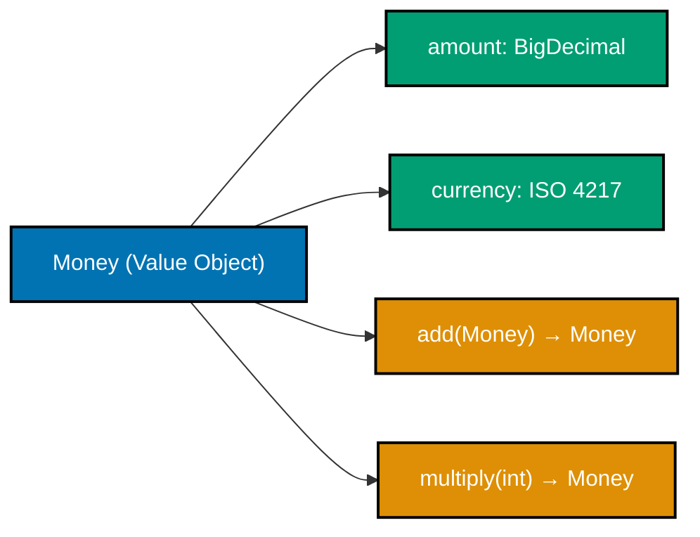
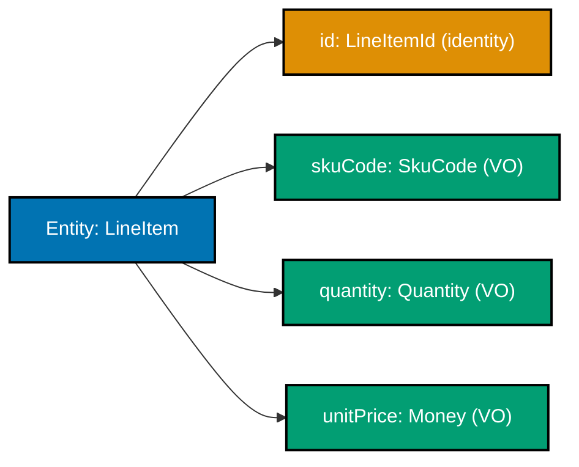
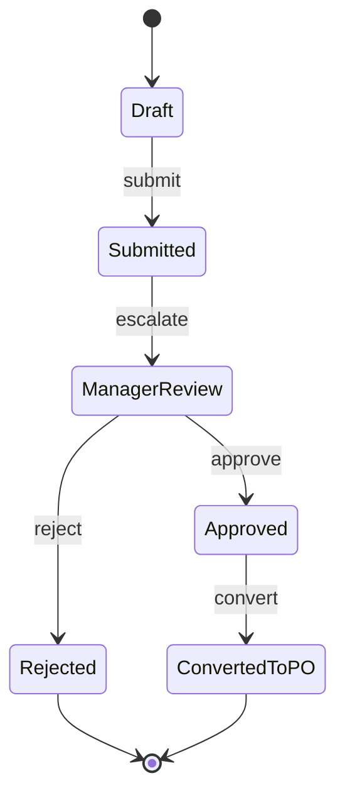

Examples 1–25 walk through DDD tactical patterns using the `purchasing` bounded context of a Procure-to-Pay (P2P) platform. The aggregate is `PurchaseRequisition`; value objects are `Money`, `SkuCode`, `Quantity`, `RequisitionId`, `ApprovalLevel`, and `UnitOfMeasure`. Every code block is self-contained. Annotation density targets 1.0–2.25 comment lines per code line per example.

## Ubiquitous Language and Value Objects (Examples 1–5)

### Example 1: Ubiquitous Language — naming domain types from the purchasing glossary

Every class name comes directly from the domain glossary that procurement specialists use. When code says `PurchaseRequisition`, `Money`, and `Quantity`, developers and business analysts share a single vocabulary with no silent translation layer.




```java
// Ubiquitous Language: class names match the purchasing domain glossary exactly
// => "PurchaseRequisition" not "RequestForm"; "Money" not "BigDecimal"; "SkuCode" not "String"
public record PurchaseRequisition(
    RequisitionId id,      // => Strongly-typed id, not raw String or long
    SkuCode       skuCode, // => Domain concept; validates format at construction
    Quantity      quantity, // => Carries unit of measure — int alone does not
    Money         estimatedCost // => Money carries currency — double does not
) {}

// Anti-pattern: primitive names lose all purchasing domain meaning
// => String id, String sku — same type, easy to pass in wrong order
// => double amount — what currency? what rounding mode?
public record AntiPattern(String id, String sku, int qty, double amount) {}

// Ubiquitous Language version reads like a business requirement
PurchaseRequisition req = new PurchaseRequisition(
    new RequisitionId("req_550e8400-e29b-41d4-a716-446655440000"), // => typed id; wrong kind caught at compile time
    new SkuCode("OFF-001234"),   // => validates regex at construction
    new Quantity(10, UnitOfMeasure.BOX), // => unit embedded in value
    new Money("250.00", "USD")   // => currency embedded; cannot lose it
);
```




```kotlin
// Ubiquitous Language: Kotlin data classes mirror domain glossary vocabulary exactly
// => "PurchaseRequisition" not "RequestForm"; domain names are non-negotiable
data class PurchaseRequisition(
    val id: RequisitionId,          // => typed id; compiler blocks RequisitionId/PurchaseOrderId swap
    val skuCode: SkuCode,           // => domain concept; enforces catalog format at construction
    val quantity: Quantity,         // => carries UnitOfMeasure — Int alone cannot express that
    val estimatedCost: Money        // => currency embedded in value — Double cannot carry currency
)

// Anti-pattern: primitive obsession — all meaning lost in raw types
// => String id, String sku — identical types; compiler cannot detect wrong-order args
// => Double amount — currency is invisible; rounding mode is undefined
data class AntiPattern(val id: String, val sku: String, val qty: Int, val amount: Double)

// Ubiquitous Language version reads exactly like a procurement business requirement
val req = PurchaseRequisition(
    id           = RequisitionId("req_550e8400-e29b-41d4-a716-446655440000"), // => typed; compile error if PurchaseOrderId used
    skuCode      = SkuCode("OFF-001234"),                   // => validates regex at construction; "invalid" throws
    quantity     = Quantity(10, UnitOfMeasure.BOX),         // => unit paired with count — inseparable
    estimatedCost = Money("250.00", "USD")                  // => currency locked in; cannot become naked number
)
```




```csharp
// Ubiquitous Language: C# records use domain glossary names directly
// => "PurchaseRequisition" not "RequestForm"; every name comes from the procurement glossary
public sealed record PurchaseRequisition(
    RequisitionId Id,            // => typed id; wrong-kind id is a compile error, not a runtime surprise
    SkuCode       SkuCode,       // => domain concept; catalog format enforced at construction
    Quantity      Quantity,      // => carries UnitOfMeasure — int alone cannot express procurement units
    Money         EstimatedCost  // => currency embedded; decimal alone loses currency context
);

// Anti-pattern: primitive obsession — domain semantics are invisible
// => string id, string sku — same type; compiler cannot block argument transposition
// => decimal amount — what currency? what rounding convention?
public sealed record AntiPattern(string Id, string Sku, int Qty, decimal Amount);

// Ubiquitous Language version reads like a procurement specification
var req = new PurchaseRequisition(
    Id:            new RequisitionId("req_550e8400-e29b-41d4-a716-446655440000"), // => typed; PurchaseOrderId rejected at compile time
    SkuCode:       new SkuCode("OFF-001234"),               // => validates regex; "invalid" throws ArgumentException
    Quantity:      new Quantity(10, UnitOfMeasure.Box),     // => unit paired with count; no ambiguity
    EstimatedCost: new Money("250.00", "USD")               // => currency bound; cannot strip it accidentally
);
```




```typescript
// Ubiquitous Language: TypeScript classes use domain glossary names exactly
// => "PurchaseRequisition" not "RequestForm"; private readonly constructors enforce VO semantics

// Typed wrappers enforce domain vocabulary at compile time
class RequisitionId {
  // => private constructor: callers must use factory; no direct 'new RequisitionId("...")'
  private constructor(readonly value: string) {}
  static of(value: string): RequisitionId {
    if (!value.startsWith("req_"))
      // => format guard: req_ prefix required
      throw new Error(`RequisitionId must start with 'req_', got: ${value}`);
    return new RequisitionId(value);
  }
  toString(): string {
    return this.value;
  } // => "req_550e8400-..."
}

class SkuCode {
  private constructor(readonly value: string) {} // => private constructor
  static of(value: string): SkuCode {
    if (!/^[A-Z]{3}-\d{4,8}$/.test(value))
      // => regex guard; "invalid" throws
      throw new Error(`SkuCode must match [A-Z]{3}-\d{4,8}, got: ${value}`);
    return new SkuCode(value);
  }
}

// Structural interface — carries UnitOfMeasure alongside count
type UnitOfMeasure = "EACH" | "BOX" | "KG" | "LITRE" | "HOUR"; // => closed union; no stray strings

// readonly tuple-like object: quantity pairs count with unit — inseparable
class Quantity {
  private constructor(
    readonly value: number,
    readonly unit: UnitOfMeasure,
  ) {}
  // => private constructor: callers use Quantity.of factory
  static of(value: number, unit: UnitOfMeasure): Quantity {
    if (value <= 0) throw new Error(`Quantity.value must be > 0, got: ${value}`);
    return new Quantity(value, unit);
  }
}

// Money: amount + currency — neither can be stripped
class Money {
  private constructor(
    readonly amount: number,
    readonly currency: string,
  ) {}
  static of(amount: string, currency: string): Money {
    const parsed = parseFloat(amount); // => parse string amount
    if (isNaN(parsed) || parsed < 0)
      // => NaN and negative rejected
      throw new Error(`Money amount must be >= 0, got: ${amount}`);
    if (currency.length !== 3)
      // => ISO 4217 = 3 letters
      throw new Error(`currency must be 3-letter ISO code, got: ${currency}`);
    return new Money(parsed, currency.toUpperCase()); // => normalise; "usd" -> "USD"
  }
}

// Anti-pattern: primitive obsession — all domain meaning is lost
type AntiPattern = { id: string; sku: string; qty: number; amount: number };
// => same primitive types; compiler cannot block wrong-order arguments

// Ubiquitous Language version reads like a procurement requirement
const req = {
  id: RequisitionId.of("req_550e8400-e29b-41d4-a716-446655440000"),
  // => typed; wrong-kind id is a runtime error (factory guards) and IDE type error
  skuCode: SkuCode.of("OFF-001234"), // => validates regex at construction
  quantity: Quantity.of(10, "BOX"), // => unit paired with count
  estimatedCost: Money.of("250.00", "USD"), // => currency locked in
};
console.log(req.id.toString()); // => Output: req_550e8400-e29b-41d4-a716-446655440000
console.log(req.skuCode.value); // => Output: OFF-001234
```




**Key Takeaway**: Name every domain type using exact vocabulary from the purchasing glossary. When code reads like a procurement business requirement, specification drift surfaces in code review rather than in production.

**Why It Matters**: Teams using Ubiquitous Language eliminate the silent translation layer between requirements and code. A buyer saying "requisition" and a developer coding `PurchaseRequisition` speak the same word. Any mismatch becomes immediately visible during review rather than silently causing wrong behavior months later in a live procurement system.

---

### Example 2: Value Object — immutable `Money`

A Value Object has no identity. Two `Money` instances with the same amount and currency are equal. Immutability means no operation modifies an existing instance — arithmetic always returns a new `Money`.






```java
import java.math.BigDecimal; // => exact decimal arithmetic; never use double for money
import java.util.Objects;    // => null-safe hash helper

// Value Object: identity-free; equal fields = interchangeable instances
// => No id field; Money IS its amount + currency
public final class Money { // => final: no subclass can weaken immutability guarantee
    private final BigDecimal amount;   // => final: field cannot be reassigned
    private final String     currency; // => ISO 4217 code, e.g. "USD", "IDR"

    public Money(String amount, String currency) { // => String input: avoids double imprecision
        // => Validate before storing — invalid Money must never exist as an object
        if (amount == null)                                    // => null guard
            throw new IllegalArgumentException("amount is null"); // => fails fast; no null Money
        BigDecimal bd = new BigDecimal(amount);               // => NumberFormatException if malformed
        if (bd.compareTo(BigDecimal.ZERO) < 0)                // => domain invariant: amount >= 0
            throw new IllegalArgumentException("amount must be >= 0"); // => negative money rejected
        if (currency == null || currency.length() != 3)       // => ISO 4217 = 3 uppercase letters
            throw new IllegalArgumentException("currency must be 3-letter ISO code"); // => "USDD" or "" rejected
        this.amount   = bd;       // => stored only after validation passes
        this.currency = currency.toUpperCase(); // => normalise; "usd" == "USD"
    }

    // Operations return NEW instances; originals are unchanged
    public Money add(Money other) { // => never void; immutable design principle
        if (!this.currency.equals(other.currency))            // => domain rule: cannot add USD + IDR
            throw new IllegalArgumentException("Currency mismatch"); // => cross-currency add is a domain error
        return new Money(this.amount.add(other.amount).toPlainString(), this.currency);
        // => new Money; neither this nor other is mutated
    }

    public Money multiply(int factor) { // => scale quantity cost in line items
        if (factor <= 0)                                      // => domain guard: factor must be positive
            throw new IllegalArgumentException("factor must be > 0"); // => multiply by 0 or negative makes no sense
        return new Money(this.amount.multiply(BigDecimal.valueOf(factor)).toPlainString(), this.currency);
        // => new Money returned; this is unchanged
    }

    public BigDecimal getAmount()  { return amount; }   // => read-only accessor
    public String    getCurrency() { return currency; } // => read-only accessor

    @Override public boolean equals(Object o) { // => structural equality required for VO
        if (!(o instanceof Money m)) return false; // => pattern match; safe cast
        return amount.compareTo(m.amount) == 0 && currency.equals(m.currency);
        // => compareTo not equals: "10.00".equals("10") is false; compareTo is true
    }
    @Override public int hashCode() {
        return Objects.hash(amount.stripTrailingZeros(), currency); // => consistent with compareTo
    }
    @Override public String toString() { return amount + " " + currency; } // => "250.00 USD"
}

Money unitPrice = new Money("25.00", "USD");  // => unitPrice = 25.00 USD
Money total     = unitPrice.multiply(10);     // => total     = 250.00 USD (new object)
// unitPrice is still 25.00 USD — immutability guaranteed
Money tax       = new Money("12.50", "USD");  // => tax = 12.50 USD
Money grandTotal = total.add(tax);            // => grandTotal = 262.50 USD
```




```kotlin
import java.math.BigDecimal // => exact decimal arithmetic; Double loses precision for monetary values

// Value Object: no identity field; two Money instances with same amount+currency are equal
// => Kotlin class marked final by default; no open keyword needed to prevent subclassing
class Money(amount: String, currency: String) {
    // => Properties are val (immutable); Kotlin enforces immutability at the language level
    val amount:   BigDecimal // => stored as BigDecimal after validation
    val currency: String     // => ISO 4217 three-letter code, uppercase

    init {
        // => init block runs at construction; replaces Java constructor body
        // => Validate before assignment — invalid Money must never reach a usable state
        requireNotNull(amount) { "amount is null" }          // => Kotlin stdlib guard; throws IllegalArgumentException
        val bd = BigDecimal(amount)                          // => NumberFormatException if malformed string
        require(bd >= BigDecimal.ZERO) { "amount must be >= 0" } // => domain invariant; negative money rejected
        require(currency.length == 3) { "currency must be 3-letter ISO code" } // => "USDD" or "" rejected
        this.amount   = bd                                   // => stored only after all checks pass
        this.currency = currency.uppercase()                 // => normalise; "usd" == "USD"
    }

    // Operations return NEW instances — originals are structurally unchanged
    fun add(other: Money): Money {                           // => returns Money, never Unit; immutable contract
        require(currency == other.currency) { "Currency mismatch" } // => cross-currency add is a domain error
        return Money(amount.add(other.amount).toPlainString(), currency)
        // => new Money; neither this nor other is mutated
    }

    fun multiply(factor: Int): Money {                       // => scale line-item cost by quantity
        require(factor > 0) { "factor must be > 0" }        // => multiply by 0 or negative is a domain error
        return Money(amount.multiply(BigDecimal.valueOf(factor.toLong())).toPlainString(), currency)
        // => new Money returned; this remains unchanged
    }

    // => Structural equality: two Money instances are equal when amount and currency match
    override fun equals(other: Any?): Boolean {
        if (other !is Money) return false                    // => smart cast; safe without explicit cast
        return amount.compareTo(other.amount) == 0 && currency == other.currency
        // => compareTo handles "10.00" vs "10" correctly; == would not
    }
    override fun hashCode(): Int = 31 * amount.stripTrailingZeros().hashCode() + currency.hashCode()
    // => stripTrailingZeros ensures consistent hash when amounts are numerically equal
    override fun toString(): String = "$amount $currency"   // => "250.00 USD"
}

val unitPrice  = Money("25.00", "USD")   // => unitPrice  = 25.00 USD
val total      = unitPrice.multiply(10)  // => total      = 250.00 USD (new object; unitPrice unchanged)
// => unitPrice is still "25.00 USD" — Kotlin val + immutable class guarantee this
val tax        = Money("12.50", "USD")   // => tax        = 12.50 USD
val grandTotal = total.add(tax)          // => grandTotal = 262.50 USD
```




```csharp
using System;
// => System.Decimal is the idiomatic C# type for monetary values; avoids float/double imprecision

// Value Object: no identity; structural equality defined by amount + currency
// => sealed record: compiler generates Equals, GetHashCode, ToString from properties
public sealed class Money
{
    // => Properties are init-only (C# 9+); once set in constructor they cannot change
    public decimal Amount   { get; }  // => decimal: 28-digit precision; ideal for money
    public string  Currency { get; }  // => ISO 4217 three-letter code, uppercase

    public Money(string amount, string currency)
    {
        // => Validate before assignment — invalid Money must never reach a usable state
        ArgumentNullException.ThrowIfNull(amount,   nameof(amount));   // => null guard; .NET 7+ API
        ArgumentNullException.ThrowIfNull(currency, nameof(currency)); // => null guard
        if (!decimal.TryParse(amount, out var parsed))                  // => parse safely; no exceptions from bad input
            throw new ArgumentException($"amount is not a valid decimal: {amount}");
        if (parsed < 0)                                                 // => domain invariant: non-negative
            throw new ArgumentException("amount must be >= 0");
        if (currency.Length != 3)                                       // => ISO 4217 = exactly 3 letters
            throw new ArgumentException("currency must be 3-letter ISO code");
        Amount   = parsed;                    // => stored only after all guards pass
        Currency = currency.ToUpperInvariant(); // => normalise; "usd" → "USD"
    }

    // Operations return NEW instances; originals are unchanged
    public Money Add(Money other)
    {
        // => domain rule: cross-currency addition is invalid; must be caught at the boundary
        if (Currency != other.Currency)
            throw new InvalidOperationException("Currency mismatch");
        return new Money((Amount + other.Amount).ToString("G"), Currency);
        // => new Money; neither this nor other is mutated
    }

    public Money Multiply(int factor)
    {
        if (factor <= 0)                      // => domain guard: scale factor must be positive
            throw new ArgumentException("factor must be > 0");
        return new Money((Amount * factor).ToString("G"), Currency);
        // => new Money returned; this remains unchanged
    }

    // => Override Equals for structural (value) equality — default reference equality is wrong for VOs
    public override bool Equals(object? obj) =>
        obj is Money m && Amount == m.Amount && Currency == m.Currency;
    public override int  GetHashCode() => HashCode.Combine(Amount, Currency); // => stable hash from fields
    public override string ToString()  => $"{Amount} {Currency}";             // => "250.00 USD"
}

var unitPrice  = new Money("25.00", "USD");  // => unitPrice  = 25.00 USD
var total      = unitPrice.Multiply(10);     // => total      = 250.00 USD (new object; unitPrice unchanged)
// => unitPrice remains "25.00 USD" — C# readonly field + new-instance pattern enforces immutability
var tax        = new Money("12.50", "USD");  // => tax        = 12.50 USD
var grandTotal = total.Add(tax);             // => grandTotal = 262.50 USD
```




```typescript
// Value Object: TypeScript class with private constructor enforces immutability
// => No identity field; Money IS its amount + currency

class Money {
  // => private constructor: no direct 'new Money(...)'; all construction via Money.of()
  private constructor(
    readonly amount: number, // => stored as number (use Decimal.js in production)
    readonly currency: string, // => ISO 4217 three-letter code, uppercase
  ) {}

  // => Factory method: validates before constructing; invalid Money never exists
  static of(amount: string, currency: string): Money {
    if (amount === null || amount === undefined)
      // => null guard
      throw new Error("amount is required");
    const parsed = parseFloat(amount); // => parse from string to avoid float imprecision
    if (isNaN(parsed))
      // => non-numeric string rejected
      throw new Error(`amount is not a valid number: ${amount}`);
    if (parsed < 0)
      // => domain invariant: amount >= 0
      throw new Error("amount must be >= 0");
    if (!currency || currency.length !== 3)
      // => ISO 4217 = 3 uppercase letters
      throw new Error("currency must be 3-letter ISO code");
    return new Money(parsed, currency.toUpperCase()); // => normalised; "usd" -> "USD"
  }

  // Operations return NEW instances; originals are unchanged (immutability)
  add(other: Money): Money {
    if (this.currency !== other.currency)
      // => domain rule: cannot add USD + IDR
      throw new Error("Currency mismatch");
    return Money.of(String(this.amount + other.amount), this.currency);
    // => new Money; neither this nor other is mutated
  }

  multiply(factor: number): Money {
    if (factor <= 0)
      // => domain guard: factor must be positive
      throw new Error("factor must be > 0");
    return Money.of(String(this.amount * factor), this.currency);
    // => new Money returned; this is unchanged
  }

  // => Structural equality: two Money instances are equal when amount and currency match
  equals(other: Money): boolean {
    return this.amount === other.amount && this.currency === other.currency;
  }

  toString(): string {
    return `${this.amount} ${this.currency}`;
  } // => "250.00 USD"
}

const unitPrice = Money.of("25.00", "USD"); // => unitPrice = 25.00 USD
const total = unitPrice.multiply(10); // => total     = 250.00 USD (new object)
// => unitPrice is still 25.00 USD — immutability guaranteed by private constructor + new returns
const tax = Money.of("12.50", "USD"); // => tax = 12.50 USD
const grandTotal = total.add(tax); // => grandTotal = 262.50 USD
console.log(grandTotal.toString()); // => Output: 262.5 USD
```




**Key Takeaway**: Value Objects are immutable and identity-free. All operations return new instances, making shared-state bugs structurally impossible.

**Why It Matters**: In procurement, prices appear on requisitions, purchase orders, invoices, and payment records simultaneously. If `Money` were mutable, a price change on one document could silently corrupt another. Immutability eliminates that entire class of concurrency and reference-sharing bugs — the JVM garbage collector handles disposal automatically.

---

### Example 3: Value Object — `SkuCode` with regex validation

`SkuCode` wraps a plain string but enforces the procurement catalog format `^[A-Z]{3}-\d{4,8}$`. Once constructed, the code is guaranteed valid. Callers never need to re-validate.




```java
import java.util.regex.Pattern; // => compile regex once; reuse for all validations

// Value Object with format invariant: guarantees well-formed SKU throughout system
// => Wrapping String in a type also prevents passing arbitrary strings where SkuCode is expected
public final class SkuCode {
    // => compile once at class load; Pattern.compile is expensive
    private static final Pattern FORMAT = Pattern.compile("^[A-Z]{3}-\\d{4,8}$");
    private final String value; // => final: immutable after construction

    public SkuCode(String value) {           // => smart constructor enforces invariant
        if (value == null)                   // => null guard first
            throw new IllegalArgumentException("SkuCode cannot be null"); // => null SkuCode is not a SKU
        if (!FORMAT.matcher(value).matches()) // => regex check
            throw new IllegalArgumentException(
                "SkuCode must match [A-Z]{3}-\\d{4,8}, got: " + value); // => e.g. "invalid" or "AB-123" rejected
        this.value = value; // => stored only after validation passes
    }

    public String getValue() { return value; } // => read-only; no setter

    @Override public boolean equals(Object o) { // => structural equality
        return o instanceof SkuCode s && value.equals(s.value);
    }
    @Override public int    hashCode() { return value.hashCode(); }
    @Override public String toString() { return value; } // => "OFF-001234"
}

// Valid usage
SkuCode office = new SkuCode("OFF-001234"); // => office = SkuCode("OFF-001234")
SkuCode tools  = new SkuCode("TLS-9999");  // => tools  = SkuCode("TLS-9999")
System.out.println(office);               // => Output: OFF-001234

// Invalid — throws at construction, not later
try {
    SkuCode bad = new SkuCode("invalid");  // => IllegalArgumentException; regex fails
} catch (IllegalArgumentException e) {
    System.out.println(e.getMessage());   // => Output: SkuCode must match [A-Z]{3}-\d{4,8}, got: invalid
}
// => bad was never created; invalid state structurally impossible
```




```kotlin
// => Regex compiled once as a companion object property; shared across all SkuCode instances
// => companion object is Kotlin's equivalent of Java static; initialised at class load time
class SkuCode(value: String) {
    companion object {
        // => Regex.toRegex() compiles the pattern; stored in companion = compiled once
        private val FORMAT = Regex("^[A-Z]{3}-\\d{4,8}$")
    }

    // => val: property is read-only after init block; Kotlin enforces immutability
    val value: String

    init {
        // => requireNotNull + require: idiomatic Kotlin guards; both throw IllegalArgumentException
        requireNotNull(value) { "SkuCode cannot be null" }       // => null guard (Kotlin String is non-null by type)
        require(FORMAT.matches(value)) {                          // => regex check; matches() checks entire string
            "SkuCode must match [A-Z]{3}-\\d{4,8}, got: $value"  // => template string; "invalid" or "AB-123" rejected
        }
        this.value = value // => stored only after both guards pass
    }

    // => equals and hashCode: delegate to the wrapped String value (structural equality)
    override fun equals(other: Any?): Boolean = other is SkuCode && value == other.value
    override fun hashCode(): Int = value.hashCode() // => consistent with equals
    override fun toString(): String = value         // => "OFF-001234"
}

// Valid usage — construction succeeds
val office = SkuCode("OFF-001234") // => office.value = "OFF-001234"
val tools  = SkuCode("TLS-9999")  // => tools.value  = "TLS-9999"
println(office)                    // => Output: OFF-001234

// Invalid — throws at construction; bad is never assigned
runCatching { SkuCode("invalid") }  // => runCatching captures the exception without try/catch syntax
    .onFailure { println(it.message) } // => Output: SkuCode must match [A-Z]{3}-\d{4,8}, got: invalid
// => SkuCode("invalid") was never created; invalid state is structurally impossible
```




```csharp
using System.Text.RegularExpressions; // => Regex class; compiled regex avoids repeated compilation

// Value Object with format invariant: every SkuCode in the system is guaranteed well-formed
// => sealed: no subclass can bypass the validation logic in the constructor
public sealed class SkuCode
{
    // => static readonly: compiled once at class load; RegexOptions.Compiled = JIT-compiled to IL
    private static readonly Regex Format =
        new Regex(@"^[A-Z]{3}-\d{4,8}$", RegexOptions.Compiled);

    // => Property with private set: readable externally, writable only in constructor
    public string Value { get; }

    public SkuCode(string value)
    {
        // => ArgumentNullException for null; ArgumentException for format violation
        ArgumentNullException.ThrowIfNull(value, nameof(value)); // => null guard first
        if (!Format.IsMatch(value))                               // => regex check
            throw new ArgumentException(
                $"SkuCode must match [A-Z]{{3}}-\\d{{4,8}}, got: {value}"); // => "invalid" or "AB-123" rejected
        Value = value; // => stored only after both guards pass
    }

    // => Override Equals for structural equality — two SkuCode instances with same Value are equal
    public override bool   Equals(object? obj) => obj is SkuCode s && Value == s.Value;
    public override int    GetHashCode()        => Value.GetHashCode(StringComparison.Ordinal);
    public override string ToString()           => Value; // => "OFF-001234"
}

// Valid usage
var office = new SkuCode("OFF-001234"); // => office.Value = "OFF-001234"
var tools  = new SkuCode("TLS-9999");  // => tools.Value  = "TLS-9999"
Console.WriteLine(office);             // => Output: OFF-001234

// Invalid — throws at construction; bad is never assigned
try
{
    var bad = new SkuCode("invalid");  // => ArgumentException; regex fails
}
catch (ArgumentException e)
{
    Console.WriteLine(e.Message);     // => Output: SkuCode must match [A-Z]{3}-\d{4,8}, got: invalid
}
// => bad was never created; invalid state is structurally impossible
```




```typescript
// Value Object with format invariant: guarantees well-formed SKU throughout system
// => Wrapping string in a class prevents passing arbitrary strings where SkuCode is expected

class SkuCode {
  // => Regex compiled as static constant; no re-compilation per call
  private static readonly FORMAT = /^[A-Z]{3}-\d{4,8}$/;
  readonly value: string; // => read-only; no setter

  private constructor(value: string) {
    // => private constructor; factory enforces invariant
    this.value = value;
  }

  static of(value: string): SkuCode {
    // => factory method (smart constructor)
    if (!value || value.trim() === "")
      // => null/blank guard first
      throw new Error("SkuCode cannot be blank");
    if (!SkuCode.FORMAT.test(value))
      // => regex check against full string
      throw new Error(
        `SkuCode must match [A-Z]{3}-\d{4,8}, got: ${value}`, // => e.g. "invalid" or "AB-123" rejected
      );
    return new SkuCode(value); // => stored only after validation passes
  }

  // => Structural equality: two SkuCode instances with same value are equal
  equals(other: SkuCode): boolean {
    return this.value === other.value;
  }
  toString(): string {
    return this.value;
  } // => "OFF-001234"
}

// Valid usage
const office = SkuCode.of("OFF-001234"); // => office.value = "OFF-001234"
const tools = SkuCode.of("TLS-9999"); // => tools.value  = "TLS-9999"
console.log(office.toString()); // => Output: OFF-001234

// Invalid — throws at construction, not later
try {
  SkuCode.of("invalid"); // => regex fails; Error thrown
} catch (e: unknown) {
  console.log((e as Error).message);
  // => Output: SkuCode must match [A-Z]{3}-\d{4,8}, got: invalid
}
// => bad was never created; invalid state structurally impossible
```




**Key Takeaway**: Encode format invariants in the constructor so every `SkuCode` in the system is guaranteed valid. Downstream code never needs defensive checks.

**Why It Matters**: In a catalog with thousands of SKUs, a single malformed code silently routes to a non-existent product. Catching that at the construction boundary — not at purchase order issuance or goods receipt — compresses the distance between error and detection from days to milliseconds.

---

### Example 4: Value Object — `Quantity` with `UnitOfMeasure`

`Quantity` pairs a positive integer count with an immutable unit of measure. The enum `UnitOfMeasure` closes the set of valid units — no magic strings allowed.




```java
// Closed enum: exactly these units exist in the procurement domain
// => Adding "PALLET" requires a deliberate code change, not a stray string
public enum UnitOfMeasure {
    EACH,  // => individual items, e.g. pens
    BOX,   // => packaged boxes
    KG,    // => kilogram weight
    LITRE, // => liquid volume
    HOUR   // => service time, e.g. consulting hours
}

// Value Object: count + unit form an inseparable pair
// => Java 21 record: immutable by default; equals/hashCode/toString generated
public record Quantity(int value, UnitOfMeasure unit) {
    // => Compact constructor: runs inside record; no boilerplate field assignments
    public Quantity { // => compact constructor syntax
        if (value <= 0)  // => domain invariant: quantity must be positive
            throw new IllegalArgumentException("Quantity.value must be > 0, got: " + value);
        if (unit == null) // => unit is required; enum ensures valid values
            throw new IllegalArgumentException("UnitOfMeasure required");
        // => fields assigned automatically by record after compact constructor body
    }
}

Quantity pens    = new Quantity(500, UnitOfMeasure.EACH);  // => pens    = Quantity[value=500, unit=EACH]
Quantity paper   = new Quantity(10,  UnitOfMeasure.BOX);   // => paper   = Quantity[value=10, unit=BOX]
Quantity consult = new Quantity(8,   UnitOfMeasure.HOUR);  // => consult = Quantity[value=8,  unit=HOUR]
System.out.println(pens);    // => Output: Quantity[value=500, unit=EACH]
System.out.println(paper);   // => Output: Quantity[value=10, unit=BOX]

// Invalid — throws immediately
try {
    new Quantity(-1, UnitOfMeasure.KG); // => value <= 0 triggers guard
} catch (IllegalArgumentException e) {
    System.out.println(e.getMessage()); // => Output: Quantity.value must be > 0, got: -1
}
```




```kotlin
// Closed enum: Kotlin enum class closes the set of procurement units
// => Adding PALLET requires a code change, not a stray string — compiler enforces exhaustiveness
enum class UnitOfMeasure {
    EACH,  // => individual items, e.g. pens
    BOX,   // => packaged boxes
    KG,    // => kilogram weight
    LITRE, // => liquid volume
    HOUR   // => service time, e.g. consulting hours
}

// Value Object: Kotlin data class pairs count with unit — both are val, so immutable
// => data class generates equals, hashCode, toString; no boilerplate needed
data class Quantity(val value: Int, val unit: UnitOfMeasure) {
    init {
        // => init block validates before properties are observable outside constructor
        require(value > 0) { "Quantity.value must be > 0, got: $value" }
        // => domain invariant: positive count enforced; require throws IllegalArgumentException
        // => unit is non-nullable Kotlin type; null is a compile error, not a runtime risk
    }
}

val pens    = Quantity(500, UnitOfMeasure.EACH)  // => pens    = Quantity(value=500, unit=EACH)
val paper   = Quantity(10,  UnitOfMeasure.BOX)   // => paper   = Quantity(value=10,  unit=BOX)
val consult = Quantity(8,   UnitOfMeasure.HOUR)  // => consult = Quantity(value=8,   unit=HOUR)
println(pens)    // => Output: Quantity(value=500, unit=EACH)
println(paper)   // => Output: Quantity(value=10, unit=BOX)

// Invalid — throws at construction; pens object is never created
runCatching { Quantity(-1, UnitOfMeasure.KG) }   // => runCatching captures exception without try/catch syntax
    .onFailure { println(it.message) }            // => Output: Quantity.value must be > 0, got: -1
```




```csharp
// Closed enum: C# enum closes the set of valid procurement units
// => Compiler rejects out-of-range values; switch exhaustiveness checked with pattern matching
public enum UnitOfMeasure
{
    Each,  // => individual items, e.g. pens
    Box,   // => packaged boxes
    Kg,    // => kilogram weight
    Litre, // => liquid volume
    Hour   // => service time, e.g. consulting hours
}

// Value Object: C# record struct — immutable, stack-allocated for small VOs
// => sealed record: compiler generates Equals, GetHashCode, ToString, Deconstruct
public sealed record Quantity(int Value, UnitOfMeasure Unit)
{
    // => Primary constructor validation via property init; public init triggers on construction
    public int Value { get; } = Value > 0
        ? Value
        : throw new ArgumentException($"Quantity.Value must be > 0, got: {Value}");
    // => ternary-throw idiom: validation inline with property initialisation
    // => UnitOfMeasure is a non-nullable value type; null is a compile error
}

var pens    = new Quantity(500, UnitOfMeasure.Each);  // => pens    = Quantity { Value = 500, Unit = Each }
var paper   = new Quantity(10,  UnitOfMeasure.Box);   // => paper   = Quantity { Value = 10,  Unit = Box }
var consult = new Quantity(8,   UnitOfMeasure.Hour);  // => consult = Quantity { Value = 8,   Unit = Hour }
Console.WriteLine(pens);    // => Output: Quantity { Value = 500, Unit = Each }
Console.WriteLine(paper);   // => Output: Quantity { Value = 10, Unit = Box }

// Invalid — throws at construction; bad is never assigned
try
{
    var bad = new Quantity(-1, UnitOfMeasure.Kg); // => Value guard fires; ArgumentException thrown
}
catch (ArgumentException e)
{
    Console.WriteLine(e.Message); // => Output: Quantity.Value must be > 0, got: -1
}
```




```typescript
// Closed union type: exactly these units exist in the procurement domain
// => Adding "PALLET" requires a deliberate code change, not a stray string
type UnitOfMeasure = "EACH" | "BOX" | "KG" | "LITRE" | "HOUR";
// => TypeScript union acts as a closed enum; out-of-range value is a compile error

// Value Object: count + unit form an inseparable pair
// => private constructor enforces immutability and validation
class Quantity {
  private constructor(
    readonly value: number, // => positive integer count; > 0 guaranteed
    readonly unit: UnitOfMeasure, // => unit is part of the value
  ) {}

  static of(value: number, unit: UnitOfMeasure): Quantity {
    if (!Number.isInteger(value) || value <= 0)
      // => domain invariant: must be a positive integer
      throw new Error(`Quantity.value must be > 0, got: ${value}`);
    // => unit is enforced by TypeScript's union type at compile time; no runtime check needed
    return new Quantity(value, unit);
  }

  toString(): string {
    return `Quantity(${this.value}, ${this.unit})`;
  }
  // => "Quantity(500, EACH)"
}

const pens = Quantity.of(500, "EACH"); // => pens    = Quantity(500, EACH)
const paper = Quantity.of(10, "BOX"); // => paper   = Quantity(10, BOX)
const consult = Quantity.of(8, "HOUR"); // => consult = Quantity(8, HOUR)
console.log(pens.toString()); // => Output: Quantity(500, EACH)
console.log(paper.toString()); // => Output: Quantity(10, BOX)

// Invalid — throws at construction
try {
  Quantity.of(-1, "KG"); // => value <= 0 triggers guard
} catch (e: unknown) {
  console.log((e as Error).message); // => Output: Quantity.value must be > 0, got: -1
}
```




**Key Takeaway**: `Quantity` as a record pairs count with unit, and the compact constructor enforces the positive-value invariant. The closed enum prevents unit drift from free-form strings.

**Why It Matters**: A receiving team once misread "500" (EACH) as "500 KG" because both were raw integers in a shared spreadsheet column. Embedding the unit in the type makes that confusion structurally impossible — you cannot create a `Quantity` without committing to a `UnitOfMeasure`.

---

### Example 5: Value Object — `RequisitionId` as a typed identity handle

`RequisitionId` wraps a UUID string in the format `req_<uuid>`. Strong typing prevents accidentally using a `PurchaseOrderId` where a `RequisitionId` is expected — the compiler catches the mistake.




```java
// Identity value object: not for the aggregate's identity per se, but as a typed reference
// => Record provides equals/hashCode/toString; id comparison is structural
public record RequisitionId(String value) {
    private static final String PREFIX = "req_"; // => format prefix constant

    public RequisitionId { // => compact constructor
        if (value == null || value.isBlank()) // => null/blank guard
            throw new IllegalArgumentException("RequisitionId cannot be blank");
        if (!value.startsWith(PREFIX))        // => prefix format check
            throw new IllegalArgumentException("RequisitionId must start with 'req_', got: " + value);
        // => No UUID regex for brevity; production code would add UUID format check
    }

    @Override public String toString() { return value; } // => "req_550e8400-..."
}

// Separate type for PO ids — compiler blocks accidental swap
public record PurchaseOrderId(String value) {
    public PurchaseOrderId {
        if (value == null || !value.startsWith("po_")) // => prefix check
            throw new IllegalArgumentException("PurchaseOrderId must start with 'po_'");
    }
}

RequisitionId rid = new RequisitionId("req_550e8400-e29b-41d4-a716-446655440000");
// => rid = RequisitionId[value=req_550e8400-...]

PurchaseOrderId pid = new PurchaseOrderId("po_6ba7b810-9dad-11d1-80b4-00c04fd430c8");
// => pid = PurchaseOrderId[value=po_6ba7b810-...]

// The following would be a compile error — type safety enforced
// void approve(RequisitionId id) {}
// approve(pid); // => COMPILE ERROR: PurchaseOrderId ≠ RequisitionId
```




```kotlin
// Identity value object: Kotlin value class wraps String with zero runtime overhead
// => @JvmInline value class: compiler inlines the wrapped type; no heap allocation in most paths
@JvmInline
value class RequisitionId(val value: String) {
    init {
        // => init block validates before the value class is handed to callers
        require(value.isNotBlank()) { "RequisitionId cannot be blank" }
        // => isNotBlank() rejects empty and whitespace-only strings
        require(value.startsWith("req_")) {
            "RequisitionId must start with 'req_', got: $value"
            // => prefix check; production code would also validate UUID segment
        }
    }
    override fun toString(): String = value // => "req_550e8400-..."
}

// Separate value class for PO ids — distinct type; compiler blocks accidental swap
@JvmInline
value class PurchaseOrderId(val value: String) {
    init {
        require(value.startsWith("po_")) {
            "PurchaseOrderId must start with 'po_', got: $value"
            // => different prefix; RequisitionId("po_...") would fail its own prefix check
        }
    }
}

val rid = RequisitionId("req_550e8400-e29b-41d4-a716-446655440000")
// => rid.value = "req_550e8400-e29b-41d4-a716-446655440000"

val pid = PurchaseOrderId("po_6ba7b810-9dad-11d1-80b4-00c04fd430c8")
// => pid.value = "po_6ba7b810-9dad-11d1-80b4-00c04fd430c8"

// The following would be a compile error — distinct value class types are not interchangeable
// fun approve(id: RequisitionId) {}
// approve(pid) // => COMPILE ERROR: PurchaseOrderId is not RequisitionId
```




```csharp
// Identity value object: C# readonly record struct — value semantics, stack allocation
// => sealed record: compiler generates Equals, GetHashCode, ToString, == operator
public sealed record RequisitionId(string Value)
{
    // => Primary constructor property validation via init expression
    public string Value { get; } = !string.IsNullOrWhiteSpace(Value) && Value.StartsWith("req_")
        ? Value
        : throw new ArgumentException($"RequisitionId must start with 'req_', got: {Value}");
    // => ternary-throw: null, blank, and prefix violations all rejected before assignment
    // => no UUID regex for brevity; production code would add UUID segment check
}

// Separate record for PO ids — distinct type; compiler prevents argument transposition
public sealed record PurchaseOrderId(string Value)
{
    public string Value { get; } = !string.IsNullOrWhiteSpace(Value) && Value.StartsWith("po_")
        ? Value
        : throw new ArgumentException($"PurchaseOrderId must start with 'po_', got: {Value}");
    // => different prefix guard; types are nominally distinct even with same structure
}

var rid = new RequisitionId("req_550e8400-e29b-41d4-a716-446655440000");
// => rid.Value = "req_550e8400-e29b-41d4-a716-446655440000"

var pid = new PurchaseOrderId("po_6ba7b810-9dad-11d1-80b4-00c04fd430c8");
// => pid.Value = "po_6ba7b810-9dad-11d1-80b4-00c04fd430c8"

// The following would be a compile error — record types are nominally distinct
// void Approve(RequisitionId id) {}
// Approve(pid); // => COMPILE ERROR: cannot convert PurchaseOrderId to RequisitionId
```




```typescript
// Identity value object: typed wrapper prevents using wrong id type
// => private constructor + factory pattern enforces prefix format

class RequisitionId {
  // => private constructor: only the factory can create valid instances
  private constructor(readonly value: string) {}

  static of(value: string): RequisitionId {
    if (!value || value.trim() === "")
      // => null/blank guard
      throw new Error("RequisitionId cannot be blank");
    if (!value.startsWith("req_"))
      // => prefix format check
      throw new Error(`RequisitionId must start with 'req_', got: ${value}`);
    return new RequisitionId(value);
  }

  toString(): string {
    return this.value;
  } // => "req_550e8400-..."
}

// Separate class for PO ids — distinct type; TypeScript structural typing means we use
// a brand tag to distinguish these nominally
class PurchaseOrderId {
  // => private brand field forces nominal distinction; TypeScript is structurally typed by default
  private readonly _brand = "PurchaseOrderId" as const;
  private constructor(readonly value: string) {}

  static of(value: string): PurchaseOrderId {
    if (!value || !value.startsWith("po_"))
      // => prefix check
      throw new Error("PurchaseOrderId must start with 'po_'");
    return new PurchaseOrderId(value);
  }
}

const rid = RequisitionId.of("req_550e8400-e29b-41d4-a716-446655440000");
// => rid.value = "req_550e8400-e29b-41d4-a716-446655440000"

const pid = PurchaseOrderId.of("po_6ba7b810-9dad-11d1-80b4-00c04fd430c8");
// => pid.value = "po_6ba7b810-9dad-11d1-80b4-00c04fd430c8"

// TypeScript: passing pid where RequisitionId expected is a compile-time type error
// function approve(id: RequisitionId): void {}
// approve(pid); // => COMPILE ERROR: Type 'PurchaseOrderId' is not assignable to type 'RequisitionId'
console.log(rid.toString()); // => Output: req_550e8400-e29b-41d4-a716-446655440000
console.log(pid.value); // => Output: po_6ba7b810-9dad-11d1-80b4-00c04fd430c8
```




**Key Takeaway**: Wrapping each id category in its own record makes id-type mix-ups a compile error instead of a runtime bug traced through logs at 2 AM.

**Why It Matters**: In a P2P system every workflow step passes multiple ids (requisition, purchase order, supplier, invoice). Primitive id strings are interchangeable in a function call — a compiler cannot help. Typed id records make every incorrect pass visible immediately in the IDE, before the code ever runs.

---

## Smart Constructors and Validation (Examples 6–10)

### Example 6: Smart constructor — preventing invalid `Money` creation

A smart constructor is a factory method or constructor body that rejects invalid inputs before they can reach field assignment. The object is either fully valid or it does not exist.




```java
// Smart constructor: validation inside constructor; no separate validate() step
// => Pattern: check → throw → assign. Never assign then check.
public final class Money {
    private final java.math.BigDecimal amount;
    private final String currency;

    public Money(String rawAmount, String rawCurrency) {
        // => Step 1: null guards (fail fast on obviously wrong input)
        if (rawAmount  == null) throw new IllegalArgumentException("amount is null");
        if (rawCurrency == null) throw new IllegalArgumentException("currency is null");

        // => Step 2: parse — NumberFormatException surfaces malformed strings
        java.math.BigDecimal bd;
        try {
            bd = new java.math.BigDecimal(rawAmount); // => may throw NumberFormatException
        } catch (NumberFormatException e) {
            throw new IllegalArgumentException("amount is not a valid decimal: " + rawAmount, e);
            // => wrap in IllegalArgumentException with context; caller gets clear message
        }

        // => Step 3: domain invariants — amount >= 0, currency is 3-letter ISO code
        if (bd.compareTo(java.math.BigDecimal.ZERO) < 0)
            throw new IllegalArgumentException("amount must be >= 0, got: " + rawAmount);
        if (rawCurrency.length() != 3 || !rawCurrency.matches("[A-Z]{3}"))
            throw new IllegalArgumentException("currency must be 3-letter uppercase ISO code, got: " + rawCurrency);

        // => Step 4: assign ONLY after all checks pass; partial state is impossible
        this.amount   = bd;
        this.currency = rawCurrency;
    }

    public java.math.BigDecimal getAmount()  { return amount;   }
    public String               getCurrency(){ return currency; }
    @Override public String toString()       { return amount + " " + currency; }
}

// Valid: passes all guards
Money m1 = new Money("250.00", "USD"); // => Money[250.00 USD]
System.out.println(m1);               // => Output: 250.00 USD

// Invalid: negative amount
try {
    new Money("-1.00", "USD");         // => guard at Step 3 fires
} catch (IllegalArgumentException e) {
    System.out.println(e.getMessage()); // => Output: amount must be >= 0, got: -1.00
}

// Invalid: malformed decimal
try {
    new Money("twenty", "USD");        // => NumberFormatException caught at Step 2
} catch (IllegalArgumentException e) {
    System.out.println(e.getMessage()); // => Output: amount is not a valid decimal: twenty
}
```




```kotlin
import java.math.BigDecimal // => exact decimal arithmetic; Double loses precision for monetary values

// Smart constructor pattern in Kotlin: init block validates before properties become accessible
// => Kotlin class is final by default; no open keyword needed to prevent subclass bypass
class Money(rawAmount: String, rawCurrency: String) {
    val amount:   BigDecimal // => stored after validation; val = immutable after assignment
    val currency: String     // => ISO 4217 three-letter code

    init {
        // => Step 1: null safety — Kotlin non-nullable String type eliminates most null cases
        // => rawAmount and rawCurrency cannot be null (Kotlin type system enforces this)
        requireNotNull(rawAmount)   { "amount is null" }   // => defensive: catches Java callers passing null
        requireNotNull(rawCurrency) { "currency is null" } // => defensive: catches Java callers passing null

        // => Step 2: parse — NumberFormatException surfaces malformed strings
        val bd = runCatching { BigDecimal(rawAmount) }      // => runCatching wraps potential NumberFormatException
            .getOrElse {
                throw IllegalArgumentException("amount is not a valid decimal: $rawAmount", it)
                // => re-throw as IllegalArgumentException with context message
            }

        // => Step 3: domain invariants — non-negative amount, 3-letter ISO currency code
        require(bd >= BigDecimal.ZERO) { "amount must be >= 0, got: $rawAmount" }
        // => require throws IllegalArgumentException when condition is false
        require(rawCurrency.length == 3 && rawCurrency.matches(Regex("[A-Z]{3}"))) {
            "currency must be 3-letter uppercase ISO code, got: $rawCurrency"
            // => Regex("[A-Z]{3}") validated inline; "USD" passes, "us" or "USDD" fail
        }

        // => Step 4: assign ONLY after all checks pass; partial state is structurally impossible
        this.amount   = bd
        this.currency = rawCurrency
    }

    override fun toString(): String = "$amount $currency" // => "250.00 USD"
}

// Valid: passes all guards
val m1 = Money("250.00", "USD") // => m1.amount = 250.00, m1.currency = "USD"
println(m1)                     // => Output: 250.00 USD

// Invalid: negative amount — Step 3 guard fires
runCatching { Money("-1.00", "USD") }
    .onFailure { println(it.message) } // => Output: amount must be >= 0, got: -1.00

// Invalid: malformed decimal — Step 2 parse fails
runCatching { Money("twenty", "USD") }
    .onFailure { println(it.message) } // => Output: amount is not a valid decimal: twenty
```




```csharp
// Smart constructor pattern in C#: validate before assignment; no separate Validate() step
// => Pattern: null-check → parse → domain invariant → assign. Order matters.
public sealed class Money
{
    public decimal Amount   { get; } // => readonly after construction; decimal = 28-digit precision
    public string  Currency { get; } // => ISO 4217 code, three uppercase letters

    public Money(string rawAmount, string rawCurrency)
    {
        // => Step 1: null guards — ArgumentNullException is the idiomatic .NET null sentinel
        ArgumentNullException.ThrowIfNull(rawAmount,   nameof(rawAmount));   // => null guard; .NET 7+ API
        ArgumentNullException.ThrowIfNull(rawCurrency, nameof(rawCurrency)); // => null guard

        // => Step 2: parse — TryParse avoids exception overhead on bad input
        if (!decimal.TryParse(rawAmount, out var parsed))
            throw new ArgumentException($"amount is not a valid decimal: {rawAmount}");
        // => out var parsed: C# 7+ inline declaration; parsed is only valid when TryParse returns true

        // => Step 3: domain invariants — non-negative amount, 3-letter ISO currency code
        if (parsed < 0)
            throw new ArgumentException($"amount must be >= 0, got: {rawAmount}");
        if (rawCurrency.Length != 3 || !System.Text.RegularExpressions.Regex.IsMatch(rawCurrency, "^[A-Z]{3}$"))
            throw new ArgumentException($"currency must be 3-letter uppercase ISO code, got: {rawCurrency}");

        // => Step 4: assign ONLY after all guards pass; partial/invalid state is impossible
        Amount   = parsed;
        Currency = rawCurrency;
    }

    public override string ToString() => $"{Amount} {Currency}"; // => "250.00 USD"
}

// Valid: passes all guards
var m1 = new Money("250.00", "USD"); // => m1.Amount = 250.00M, m1.Currency = "USD"
Console.WriteLine(m1);              // => Output: 250.00 USD

// Invalid: negative amount — Step 3 guard fires
try { new Money("-1.00", "USD"); }
catch (ArgumentException e) { Console.WriteLine(e.Message); }
// => Output: amount must be >= 0, got: -1.00

// Invalid: malformed decimal — Step 2 parse fails
try { new Money("twenty", "USD"); }
catch (ArgumentException e) { Console.WriteLine(e.Message); }
// => Output: amount is not a valid decimal: twenty
```




```typescript
// Smart constructor: validation inside factory; no separate validate() step
// => Pattern: check → throw → construct. Never construct then check.

class Money {
  readonly amount: number; // => stored after validation; read-only after construction
  readonly currency: string; // => ISO 4217 three-letter code

  private constructor(amount: number, currency: string) {
    this.amount = amount;
    this.currency = currency;
  }

  static of(rawAmount: string, rawCurrency: string): Money {
    // => Step 1: null/undefined guards
    if (rawAmount == null) throw new Error("amount is null");
    if (rawCurrency == null) throw new Error("currency is null");

    // => Step 2: parse — NaN surfaces malformed strings
    const parsed = parseFloat(rawAmount);
    if (isNaN(parsed))
      // => "twenty" → NaN → rejected
      throw new Error(`amount is not a valid number: ${rawAmount}`);

    // => Step 3: domain invariants — non-negative amount, 3-letter ISO currency code
    if (parsed < 0) throw new Error(`amount must be >= 0, got: ${rawAmount}`);
    if (!/^[A-Z]{3}$/.test(rawCurrency.toUpperCase()))
      throw new Error(`currency must be 3-letter uppercase ISO code, got: ${rawCurrency}`);

    // => Step 4: construct ONLY after all guards pass; partial/invalid state impossible
    return new Money(parsed, rawCurrency.toUpperCase()); // => normalise currency
  }

  toString(): string {
    return `${this.amount} ${this.currency}`;
  } // => "250.00 USD"
}

// Valid: passes all guards
const m1 = Money.of("250.00", "USD"); // => m1.amount = 250, m1.currency = "USD"
console.log(m1.toString()); // => Output: 250 USD

// Invalid: negative amount — Step 3 guard fires
try {
  Money.of("-1.00", "USD");
} catch (e: unknown) {
  console.log((e as Error).message);
}
// => Output: amount must be >= 0, got: -1.00

// Invalid: malformed decimal — Step 2 parse fails
try {
  Money.of("twenty", "USD");
} catch (e: unknown) {
  console.log((e as Error).message);
}
// => Output: amount is not a valid number: twenty
```




**Key Takeaway**: The smart constructor validates in order (null → parse → domain invariant → assign), making invalid object states structurally impossible.

**Why It Matters**: If validation lives in a separate `validate()` method, callers can forget to call it. A constructor that validates before assignment makes valid state the only path to existence — the guarantee holds even when callers are written months later by a different team.

---

### Example 7: Compact Constructor / Init Block for `Quantity`

Java 21 records compact constructors express invariants concisely without boilerplate field assignment — the compiler inserts assignments after the constructor body. Kotlin and C# achieve the same guarantee through `init` blocks and primary constructor validation, respectively.




```java
// Java 21 record with compact constructor
// => No "this.value = value" needed; compiler inserts it after compact body
public record Quantity(int value, UnitOfMeasure unit) {
    public Quantity { // => compact constructor: no parameter list; fields auto-assigned after
        // => Invariant 1: purchasing domain requires positive quantity
        if (value <= 0)
            throw new IllegalArgumentException("Quantity.value must be > 0, got: " + value);
        // => Invariant 2: unit required; closed enum prevents invalid strings
        if (unit == null)
            throw new IllegalArgumentException("unit is required");
        // => After this block, compiler emits: this.value = value; this.unit = unit;
    }
    // => equals/hashCode/toString generated by record; no manual code needed
}

enum UnitOfMeasure { EACH, BOX, KG, LITRE, HOUR } // => closed set; no stray strings

// Records have generated accessor methods: value() and unit() (not getters)
Quantity q = new Quantity(10, UnitOfMeasure.BOX);
System.out.println(q.value()); // => Output: 10
System.out.println(q.unit());  // => Output: BOX
System.out.println(q);         // => Output: Quantity[value=10, unit=BOX]

// Structural equality: two records with same fields are equal
Quantity q2 = new Quantity(10, UnitOfMeasure.BOX);
System.out.println(q.equals(q2)); // => Output: true (same value+unit)
System.out.println(q == q2);      // => Output: false (different object references; irrelevant for VO)

// Invalid
try {
    new Quantity(0, UnitOfMeasure.EACH); // => compact constructor fires; value <= 0
} catch (IllegalArgumentException e) {
    System.out.println(e.getMessage()); // => Output: Quantity.value must be > 0, got: 0
}
```




```kotlin
// Kotlin data class: compiler generates equals, hashCode, toString, copy — no boilerplate
// => val fields are immutable after construction; data class does not allow var for true VO
data class Quantity(val value: Int, val unit: UnitOfMeasure) {
    init {
        // => init block runs inside the primary constructor; validates before fields are readable
        // => Invariant 1: purchasing domain requires a positive count
        require(value > 0) { "Quantity.value must be > 0, got: $value" }
        // => require throws IllegalArgumentException when false; message lambda is lazy (not evaluated on success)
        // => Invariant 2: UnitOfMeasure is a non-nullable Kotlin type; passing null is a compile error
        // => Closed enum class prevents any string that is not a declared constant
    }
    // => equals/hashCode/toString generated by data class; no manual override needed
}

// Closed enum class: Kotlin enforces exhaustiveness in when-expressions
enum class UnitOfMeasure { EACH, BOX, KG, LITRE, HOUR } // => closed set; no stray strings

val q  = Quantity(10, UnitOfMeasure.BOX)   // => q  = Quantity(value=10, unit=BOX)
val q2 = Quantity(10, UnitOfMeasure.BOX)   // => q2 = Quantity(value=10, unit=BOX) (separate instance)
println(q.value)         // => Output: 10
println(q.unit)          // => Output: BOX
println(q)               // => Output: Quantity(value=10, unit=BOX)

// Structural equality: data class compares field-by-field
println(q == q2)         // => Output: true  (structural ==; field values match)
println(q === q2)        // => Output: false (referential ===; different instances)

// Invalid — init block fires; Quantity is never created
runCatching { Quantity(0, UnitOfMeasure.EACH) }  // => runCatching captures exception
    .onFailure { println(it.message) }            // => Output: Quantity.value must be > 0, got: 0
```




```csharp
// C# sealed record: compiler generates ==, GetHashCode, ToString, Deconstruct — no boilerplate
// => sealed: prevents subclass from bypassing validation by inheriting and overriding
public sealed record Quantity
{
    // => Properties with get-only: set once at construction; no mutation path after that
    public int           Value { get; }
    public UnitOfMeasure Unit  { get; }

    public Quantity(int value, UnitOfMeasure unit)
    {
        // => Invariant 1: purchasing domain requires a positive count
        if (value <= 0)
            throw new ArgumentException($"Quantity.Value must be > 0, got: {value}");
        // => ArgumentException: idiomatic .NET exception for bad argument values
        // => Invariant 2: UnitOfMeasure is a C# enum; invalid numeric casts caught separately
        // => Assign ONLY after both guards pass; partial state is structurally impossible
        Value = value;
        Unit  = unit;
    }
    // => Equals, GetHashCode, ToString generated by record; == uses structural equality
}

// Closed enum: C# enum closes the set; out-of-range values require explicit cast
public enum UnitOfMeasure { Each, Box, Kg, Litre, Hour } // => PascalCase per .NET convention

var q  = new Quantity(10, UnitOfMeasure.Box);  // => q  = Quantity { Value = 10, Unit = Box }
var q2 = new Quantity(10, UnitOfMeasure.Box);  // => q2 = Quantity { Value = 10, Unit = Box } (separate instance)
Console.WriteLine(q.Value);   // => Output: 10
Console.WriteLine(q.Unit);    // => Output: Box
Console.WriteLine(q);         // => Output: Quantity { Value = 10, Unit = Box }

// Structural equality: record == compares all properties
Console.WriteLine(q == q2);              // => Output: True  (structural ==)
Console.WriteLine(ReferenceEquals(q, q2)); // => Output: False (different references)

// Invalid — constructor throws; q3 is never assigned
try
{
    var q3 = new Quantity(0, UnitOfMeasure.Each); // => Value guard fires
}
catch (ArgumentException e)
{
    Console.WriteLine(e.Message); // => Output: Quantity.Value must be > 0, got: 0
}
```




```typescript
// TypeScript equivalent of Java 21 record compact constructor for Quantity
// => Private constructor + factory static method delivers the same guarantee

type UnitOfMeasure = "EACH" | "BOX" | "KG" | "LITRE" | "HOUR"; // => closed union

// Quantity class with private constructor enforcing the positive-count invariant
class Quantity {
  private constructor(
    readonly value: number, // => positive count; invariant enforced by factory
    readonly unit: UnitOfMeasure, // => unit is part of the value; TypeScript union prevents strays
  ) {}

  static of(value: number, unit: UnitOfMeasure): Quantity {
    // => Invariant 1: purchasing domain requires a positive count
    if (!Number.isInteger(value) || value <= 0) throw new Error(`Quantity.value must be > 0, got: ${value}`);
    // => Invariant 2: unit is constrained by the union type at compile time
    return new Quantity(value, unit);
    // => Constructed ONLY after all checks pass; invalid Quantity cannot exist
  }

  equals(other: Quantity): boolean {
    return this.value === other.value && this.unit === other.unit;
    // => Structural equality: same count + unit = equal Quantity
  }

  toString(): string {
    return `Quantity(${this.value}, ${this.unit})`;
  }
}

const q = Quantity.of(10, "BOX"); // => q  = Quantity(10, BOX)
const q2 = Quantity.of(10, "BOX"); // => q2 = Quantity(10, BOX) (separate instance)
console.log(q.value); // => Output: 10
console.log(q.unit); // => Output: BOX
console.log(q.toString()); // => Output: Quantity(10, BOX)

// Structural equality: both fields match
console.log(q.equals(q2)); // => Output: true  (structural equality)
console.log(q === q2); // => Output: false (different object references; irrelevant for VO)

// Invalid — factory throws; q3 is never assigned
try {
  Quantity.of(0, "EACH"); // => value <= 0 triggers guard
} catch (e: unknown) {
  console.log((e as Error).message); // => Output: Quantity.value must be > 0, got: 0
}
```




**Key Takeaway**: Records with compact constructors deliver immutability, structural equality, and validation in minimal lines — they are the canonical Java 21 Value Object implementation. Kotlin `data class` with `init` and C# `record` with constructor guards achieve identical guarantees in their idioms.

**Why It Matters**: Before Java 21 records, a manually written immutable class required `final` fields, a constructor, two accessors, `equals`, `hashCode`, and `toString` — about 40 lines for a two-field value. Records collapse that to under 10 lines while being provably equivalent. Less boilerplate means fewer opportunities to introduce bugs in the plumbing.

---

### Example 8: `ApprovalLevel` derived from `Money` total

`ApprovalLevel` is a value object derived from the requisition's estimated cost. The derivation rule lives in a factory method rather than in the caller — one source of truth. Kotlin uses a companion object function; C# uses a static factory method on the enum-equivalent sealed class.




```java
// ApprovalLevel enum: derived from PO/requisition total; one derivation rule in one place
// => L1 <= $1000, L2 <= $10000, L3 > $10000
public enum ApprovalLevel {
    L1, // => team lead approval; up to $1,000
    L2, // => department head; $1,001 – $10,000
    L3; // => CFO / board; above $10,000

    // Factory method: deriving level from Money keeps rule in the enum, not in callers
    public static ApprovalLevel from(Money total) {
        if (total == null) // => null guard; Money could theoretically be null in early code
            throw new IllegalArgumentException("total is required to derive ApprovalLevel");
        java.math.BigDecimal amount = total.getAmount(); // => extract comparable value
        java.math.BigDecimal oneK   = new java.math.BigDecimal("1000");  // => $1,000 threshold
        java.math.BigDecimal tenK   = new java.math.BigDecimal("10000"); // => $10,000 threshold

        if (amount.compareTo(oneK) <= 0)  return L1; // => amount <= 1000 => L1
        if (amount.compareTo(tenK) <= 0)  return L2; // => 1000 < amount <= 10000 => L2
        return L3;                                    // => amount > 10000 => L3
    }
}

// Usage: level derived at need; no magic number scattered across services
Money small  = new Money("500.00",   "USD"); // => small  = 500.00 USD
Money medium = new Money("5000.00",  "USD"); // => medium = 5000.00 USD
Money large  = new Money("15000.00", "USD"); // => large  = 15000.00 USD

System.out.println(ApprovalLevel.from(small));  // => Output: L1
System.out.println(ApprovalLevel.from(medium)); // => Output: L2
System.out.println(ApprovalLevel.from(large));  // => Output: L3
// => Boundary value: exactly $1000
Money boundary = new Money("1000.00", "USD");
System.out.println(ApprovalLevel.from(boundary)); // => Output: L1 (amount <= 1000)
```




```kotlin
import java.math.BigDecimal

// Kotlin enum class: companion object holds the factory function
// => companion object is Kotlin's equivalent of Java static scope
enum class ApprovalLevel {
    L1, // => team lead approval; up to $1,000
    L2, // => department head; $1,001 – $10,000
    L3; // => CFO / board; above $10,000

    companion object {
        // => from() is a factory function on the companion; callers use ApprovalLevel.from(total)
        fun from(total: Money): ApprovalLevel {
            requireNotNull(total) { "total is required to derive ApprovalLevel" }
            // => requireNotNull: Kotlin stdlib; throws NullPointerException with message when null
            val amount = total.amount        // => BigDecimal extracted from Money VO
            val oneK   = BigDecimal("1000")  // => $1,000 threshold constant; avoids magic literal
            val tenK   = BigDecimal("10000") // => $10,000 threshold constant

            return when {
                amount <= oneK -> L1  // => Kotlin when: cleaner than chained if-else
                amount <= tenK -> L2  // => 1000 < amount <= 10000
                else           -> L3  // => amount > 10000; compiler verifies exhaustiveness
            }
        }
    }
}

// Money stub for this example (amount is a BigDecimal property)
data class Money(val amount: BigDecimal, val currency: String)

// Usage: level derived at call site; thresholds live only inside ApprovalLevel
val small    = Money(BigDecimal("500.00"),   "USD") // => small    = Money(500.00, USD)
val medium   = Money(BigDecimal("5000.00"),  "USD") // => medium   = Money(5000.00, USD)
val large    = Money(BigDecimal("15000.00"), "USD") // => large    = Money(15000.00, USD)
val boundary = Money(BigDecimal("1000.00"),  "USD") // => boundary = Money(1000.00, USD)

println(ApprovalLevel.from(small))    // => Output: L1
println(ApprovalLevel.from(medium))   // => Output: L2
println(ApprovalLevel.from(large))    // => Output: L3
println(ApprovalLevel.from(boundary)) // => Output: L1 (1000 <= oneK)
```




```csharp
// C# does not support methods on enums directly; idiomatic pattern uses static class + enum
// => Separate static factory class keeps derivation logic co-located and centralised
public enum ApprovalLevel
{
    L1, // => team lead approval; up to $1,000
    L2, // => department head; $1,001 – $10,000
    L3  // => CFO / board; above $10,000
}

public static class ApprovalLevelFactory
{
    // => Static factory method: single source of truth for threshold derivation
    // => Callers never embed threshold literals; one change here propagates everywhere
    public static ApprovalLevel From(Money total)
    {
        ArgumentNullException.ThrowIfNull(total, nameof(total));
        // => null guard: .NET 7+ API; throws ArgumentNullException with parameter name

        var amount = total.Amount;          // => decimal extracted from Money VO
        const decimal oneK = 1000m;         // => $1,000 threshold; m suffix = decimal literal
        const decimal tenK = 10000m;        // => $10,000 threshold

        if (amount <= oneK) return ApprovalLevel.L1; // => amount <= 1000 => L1
        if (amount <= tenK) return ApprovalLevel.L2; // => 1000 < amount <= 10000 => L2
        return ApprovalLevel.L3;                      // => amount > 10000 => L3
    }
}

// Money stub for this example
public sealed record Money(decimal Amount, string Currency);

// Usage: thresholds live only in ApprovalLevelFactory; callers remain threshold-ignorant
var small    = new Money(500.00m,   "USD"); // => small    = Money(500.00, USD)
var medium   = new Money(5000.00m,  "USD"); // => medium   = Money(5000.00, USD)
var large    = new Money(15000.00m, "USD"); // => large    = Money(15000.00, USD)
var boundary = new Money(1000.00m,  "USD"); // => boundary = Money(1000.00, USD)

Console.WriteLine(ApprovalLevelFactory.From(small));    // => Output: L1
Console.WriteLine(ApprovalLevelFactory.From(medium));   // => Output: L2
Console.WriteLine(ApprovalLevelFactory.From(large));    // => Output: L3
Console.WriteLine(ApprovalLevelFactory.From(boundary)); // => Output: L1 (1000m <= oneK)
```




```typescript
// ApprovalLevel: TypeScript const enum equivalent; factory function derives level from Money total
// => Factory function as a module-level utility; single source of truth for thresholds

// Closed union type for approval levels
type ApprovalLevel = "L1" | "L2" | "L3";
// => L1 <= $1000, L2 <= $10000, L3 > $10000

// Money stub for this example
interface MoneyValue {
  amount: number;
  currency: string;
}

// Factory function: deriving level from Money keeps rule in one place, not in callers
function approvalLevelFrom(total: MoneyValue): ApprovalLevel {
  if (total == null)
    // => null guard
    throw new Error("total is required to derive ApprovalLevel");
  const { amount } = total;

  if (amount <= 1000) return "L1"; // => amount <= 1000 => L1
  if (amount <= 10000) return "L2"; // => 1000 < amount <= 10000 => L2
  return "L3"; // => amount > 10000 => L3
}

// Usage: level derived at need; no magic number scattered across services
const small: MoneyValue = { amount: 500, currency: "USD" }; // => small  = 500 USD
const medium: MoneyValue = { amount: 5000, currency: "USD" }; // => medium = 5000 USD
const large: MoneyValue = { amount: 15000, currency: "USD" }; // => large  = 15000 USD
const boundary: MoneyValue = { amount: 1000, currency: "USD" }; // => boundary = 1000 USD

console.log(approvalLevelFrom(small)); // => Output: L1
console.log(approvalLevelFrom(medium)); // => Output: L2
console.log(approvalLevelFrom(large)); // => Output: L3
console.log(approvalLevelFrom(boundary)); // => Output: L1 (1000 <= 1000 threshold)
```




**Key Takeaway**: Centralise derivation logic in a factory method on the enum. Callers never need to know threshold values — they call `ApprovalLevel.from(total)` and get a typed result.

**Why It Matters**: In a procurement system, approval thresholds change over time. If the rule is embedded in fifteen different service methods, a threshold change requires finding and updating all fifteen. A single factory method contains the rule in one place — one change, zero missed spots.

---

### Example 9: `data class` / `record` `copy` and `with` — Value Object cloning pitfall

Kotlin's `data class` generates `copy()` and Java `record` and C# `record` generate `with`-expression support. All three enable creating modified instances without mutation — but each has a nuance around whether invariants re-run.




```java
import java.math.BigDecimal;

// Java 21 record: compiler generates a copy constructor used by with-expressions in preview
// => Java records do NOT have a built-in with-expression in standard Java 21
// => Idiomatic Java pattern: provide an explicit withCurrency() factory method to retain validation
public record Money(BigDecimal amount, String currency) {
    public Money { // => compact constructor enforces invariants
        if (amount == null || amount.compareTo(BigDecimal.ZERO) < 0)
            throw new IllegalArgumentException("amount must be >= 0");
        // => null and negative amount rejected; every Money is born valid
        if (currency == null || currency.length() != 3)
            throw new IllegalArgumentException("currency must be 3-letter ISO code");
        // => currency null and wrong-length rejected
    }

    // => Explicit copy factory: re-runs the record constructor, so invariants ARE enforced
    public Money withCurrency(String newCurrency) {
        return new Money(this.amount, newCurrency); // => compact constructor validates newCurrency
    }

    public Money add(Money other) { // => immutable: returns new Money; this unchanged
        if (!currency.equals(other.currency)) throw new IllegalArgumentException("Currency mismatch");
        return new Money(amount.add(other.amount), currency);
    }

    public Money multiply(int factor) { // => scale line-item cost by quantity
        if (factor <= 0) throw new IllegalArgumentException("factor must be > 0");
        return new Money(amount.multiply(BigDecimal.valueOf(factor)), currency);
    }
}

Money unitPrice  = new Money(new BigDecimal("25.00"),  "USD"); // => unitPrice  = Money[25.00, USD]
Money lineTotal  = unitPrice.multiply(10);                     // => lineTotal  = Money[250.00, USD]
Money tax        = new Money(new BigDecimal("12.50"),  "USD"); // => tax        = Money[12.50, USD]
Money grandTotal = lineTotal.add(tax);                         // => grandTotal = Money[262.50, USD]
System.out.println(grandTotal); // => Output: Money[amount=262.50, currency=USD]

// Safe copy: withCurrency re-runs the compact constructor, so "IDR" is validated
Money converted = grandTotal.withCurrency("IDR"); // => converted = Money[262.50, IDR]
System.out.println(converted);                    // => Output: Money[amount=262.50, currency=IDR]

// Guarded bad copy: compact constructor catches the violation
try {
    grandTotal.withCurrency("XX"); // => currency length != 3; compact constructor rejects
} catch (IllegalArgumentException e) {
    System.out.println(e.getMessage()); // => Output: currency must be 3-letter ISO code
}
```




```kotlin
import java.math.BigDecimal

// data class: structural equality, copy(), and toString generated by compiler
// => val fields = immutable after construction; no var allowed for true VO
data class Money(val amount: BigDecimal, val currency: String) {
    init {
        // => init block runs after primary constructor; enforces invariants
        require(amount >= BigDecimal.ZERO) { "amount must be >= 0: $amount" }
        // => require: Kotlin standard; throws IllegalArgumentException on failure
        require(currency.length == 3 && currency.all { it.isUpperCase() }) {
            "currency must be 3-letter uppercase ISO code: $currency"
        }
        // => If both pass, fields are already assigned (Kotlin constructor order)
    }

    fun add(other: Money): Money { // => returns new Money; this is unchanged
        require(currency == other.currency) { "Currency mismatch: $currency vs ${other.currency}" }
        return Money(amount + other.amount, currency) // => + operator on BigDecimal works in Kotlin
    }

    fun multiply(factor: Int): Money { // => scale for line-item cost
        require(factor > 0) { "factor must be > 0: $factor" }
        return Money(amount * BigDecimal.valueOf(factor.toLong()), currency)
    }
}

val unitPrice  = Money(BigDecimal("25.00"), "USD") // => unitPrice  = Money(amount=25.00, currency=USD)
val lineTotal  = unitPrice.multiply(10)             // => lineTotal  = Money(amount=250.00, currency=USD)
val tax        = Money(BigDecimal("12.50"), "USD")  // => tax        = Money(amount=12.50, currency=USD)
val grandTotal = lineTotal.add(tax)                 // => grandTotal = Money(amount=262.50, currency=USD)
println(grandTotal) // => Output: Money(amount=262.50, currency=USD)

// copy(): change one field, keep others — useful for currency conversion scenarios
val converted = grandTotal.copy(currency = "IDR") // => Money(amount=262.50, currency=IDR)
// => WARNING: copy() in Kotlin DOES re-run init in Kotlin 2.0+; older versions skip it
// => In Kotlin < 2.0, copy(amount = BigDecimal("-1")) bypasses the >= 0 guard — footgun!
// => Mitigation: override copy() or use an explicit factory function for critical constraints
println(converted) // => Output: Money(amount=262.50, currency=IDR)
```




```csharp
// C# sealed record: with-expression creates a copy via the compiler-generated copy constructor
// => with-expression DOES re-run property init expressions; invariants defined there are enforced
public sealed record Money
{
    public decimal Amount   { get; } // => get-only; immutable after construction
    public string  Currency { get; } // => ISO 4217 three-letter uppercase code

    public Money(decimal amount, string currency)
    {
        // => Validate before assignment; partial state is impossible
        if (amount < 0)
            throw new ArgumentException($"amount must be >= 0, got: {amount}");
        // => Negative amounts rejected; domain invariant enforced at the boundary
        if (currency is not { Length: 3 })
            throw new ArgumentException($"currency must be 3-letter ISO code, got: {currency}");
        // => C# pattern matching on string length; "XX" or null rejected
        Amount   = amount;
        Currency = currency;
    }

    public Money Add(Money other) // => immutable: returns new Money; this is unchanged
    {
        if (Currency != other.Currency) throw new InvalidOperationException("Currency mismatch");
        return new Money(Amount + other.Amount, Currency); // => constructor validates result
    }

    public Money Multiply(int factor) // => scale line-item cost by quantity
    {
        if (factor <= 0) throw new ArgumentException("factor must be > 0");
        return new Money(Amount * factor, Currency); // => constructor validates result
    }
}

var unitPrice  = new Money(25.00m,  "USD"); // => unitPrice  = Money { Amount = 25.00, Currency = USD }
var lineTotal  = unitPrice.Multiply(10);    // => lineTotal  = Money { Amount = 250.00, Currency = USD }
var tax        = new Money(12.50m,  "USD"); // => tax        = Money { Amount = 12.50, Currency = USD }
var grandTotal = lineTotal.Add(tax);        // => grandTotal = Money { Amount = 262.50, Currency = USD }
Console.WriteLine(grandTotal); // => Output: Money { Amount = 262.50, Currency = USD }

// with-expression: creates modified copy; C# compiler routes through the regular constructor
var converted = grandTotal with { Currency = "IDR" }; // => Money { Amount = 262.50, Currency = IDR }
// => with-expression calls the compiler-generated copy constructor, then sets named properties
// => The regular constructor runs its guards — "IDR" (3 letters) passes; "XX" would throw
Console.WriteLine(converted); // => Output: Money { Amount = 262.50, Currency = IDR }

// Bad with-expression: invariant catches the violation
try
{
    var bad = grandTotal with { Currency = "XX" }; // => currency length != 3; constructor throws
}
catch (ArgumentException e)
{
    Console.WriteLine(e.Message); // => Output: currency must be 3-letter ISO code, got: XX
}
```




```typescript
// Value Object copy-and-modify: TypeScript uses Object.freeze + spread or withXxx method
// => Private constructor + factory ensures invariants run on every construction

class Money {
  private constructor(
    readonly amount: number,
    readonly currency: string,
  ) {}

  static of(amount: number, currency: string): Money {
    if (amount < 0) throw new Error("amount must be >= 0");
    if (currency.length !== 3) throw new Error("currency must be 3-letter ISO code");
    return new Money(amount, currency.toUpperCase());
  }

  add(other: Money): Money {
    if (this.currency !== other.currency) throw new Error("Currency mismatch");
    return Money.of(this.amount + other.amount, this.currency); // => new Money; this unchanged
  }

  multiply(factor: number): Money {
    if (factor <= 0) throw new Error("factor must be > 0");
    return Money.of(this.amount * factor, this.currency); // => new Money; this unchanged
  }

  // => withCurrency: immutable copy with new currency; factory validates the new value
  withCurrency(newCurrency: string): Money {
    return Money.of(this.amount, newCurrency); // => factory validates newCurrency; invariant re-runs
  }

  equals(other: Money): boolean {
    return this.amount === other.amount && this.currency === other.currency;
  }

  toString(): string {
    return `${this.amount} ${this.currency}`;
  }
}

const unitPrice = Money.of(25.0, "USD"); // => unitPrice  = 25.00 USD
const lineTotal = unitPrice.multiply(10); // => lineTotal  = 250.00 USD (new object; unitPrice unchanged)
const tax = Money.of(12.5, "USD"); // => tax        = 12.50 USD
const grandTotal = lineTotal.add(tax); // => grandTotal = 262.50 USD
console.log(grandTotal.toString()); // => Output: 262.5 USD

// Safe copy: withCurrency re-runs factory; "IDR" is validated
const converted = grandTotal.withCurrency("IDR"); // => converted = 262.50 IDR
console.log(converted.toString()); // => Output: 262.5 IDR

// Guarded bad copy: factory catches the violation
try {
  grandTotal.withCurrency("XX"); // => currency length != 3; factory rejects
} catch (e: unknown) {
  console.log((e as Error).message); // => Output: currency must be 3-letter ISO code
}
```




**Key Takeaway**: Kotlin `data class` with `init` delivers Value Object guarantees in fewer lines than Java. `copy()` is useful but bypasses `init` in some Kotlin versions — verify invariants hold after copy in critical code. C# `with`-expressions route through the constructor and re-enforce all guards.

**Why It Matters**: The `copy()` bypass is a real footgun: `Money(BigDecimal("-1"), "USD")` cannot be constructed directly, but `validMoney.copy(amount = BigDecimal("-1"))` can in some Kotlin versions. Understanding this nuance prevents subtle bugs when VO constraints are security-critical (e.g., negative procurement amounts triggering accounting reversals).

---

### Example 10: Record/data-class as Value Object — `SkuCode` with `with`/`copy` semantics

Records and data classes in Java, Kotlin, and C# provide structural equality, immutable fields, and copy-construction. Each language has a distinct idiom for creating modified copies without mutation.




```java
import java.util.regex.Pattern;

// Java 21 record: compiler generates equals, hashCode, toString, and accessor methods
// => sealed interface would enforce closed hierarchy; record alone gives VO semantics
public record SkuCode(String value) {
    // => Compile regex once at class load — Pattern.compile is expensive per call
    private static final Pattern FORMAT = Pattern.compile("^[A-Z]{3}-\\d{4,8}$");

    public SkuCode { // => compact constructor; compiler assigns fields after this body
        if (value == null || value.isBlank())      // => null/blank guard first
            throw new IllegalArgumentException("SkuCode cannot be blank");
        if (!FORMAT.matcher(value).matches())      // => regex guard against full string
            throw new IllegalArgumentException(
                "SkuCode must match [A-Z]{3}-\\d{4,8}, got: " + value);
        // => Fields assigned automatically after compact constructor body
    }

    // => Java 21 lacks a built-in with-expression; explicit copy method re-runs the compact constructor
    public SkuCode withValue(String newValue) {
        return new SkuCode(newValue); // => compact constructor validates newValue; invariant re-enforced
    }

    @Override public String toString() { return value; } // => "OFF-001234"
}

// Valid construction
var office = new SkuCode("OFF-001234"); // => office = SkuCode[value=OFF-001234]
var tools  = new SkuCode("TLS-9999");  // => tools  = SkuCode[value=TLS-9999]
System.out.println(office.equals(tools));                    // => Output: false (different values)
System.out.println(office.equals(new SkuCode("OFF-001234"))); // => Output: true  (structural ==)

// Copy with new value — invariant validated at construction
var renamed = office.withValue("TLS-0001"); // => renamed = SkuCode[value=TLS-0001]; office unchanged
System.out.println(renamed);               // => Output: TLS-0001

// Invalid — throws at construction; bad is never assigned
try {
    new SkuCode("invalid");              // => regex fails; compact constructor fires
} catch (IllegalArgumentException e) {
    System.out.println(e.getMessage()); // => Output: SkuCode must match [A-Z]{3}-\d{4,8}, got: invalid
}
```




```kotlin
// Kotlin class with companion object: compiled regex shared across all instances
// => val property: immutable after init block; Kotlin enforces this at the language level
class SkuCode(value: String) {
    companion object {
        // => Regex compiled once as companion property; equivalent to Java static final
        private val FORMAT = Regex("^[A-Z]{3}-\\d{4,8}$")
    }

    val value: String // => assigned in init block after validation; read-only externally

    init {
        // => requireNotNull is defensive; Kotlin String is non-nullable so null is a compile error
        requireNotNull(value) { "SkuCode cannot be blank" }
        require(value.isNotBlank()) { "SkuCode cannot be blank" }
        // => matches() checks the entire string; partial matches return false
        require(FORMAT.matches(value)) {
            "SkuCode must match [A-Z]{3}-\\d{4,8}, got: $value"
            // => Template string interpolates value into the error message
        }
        this.value = value // => assigned only after all guards pass
    }

    // => Explicit copy function re-runs init; invariant is always enforced on the new value
    fun withValue(newValue: String): SkuCode = SkuCode(newValue)
    // => SkuCode(newValue) triggers the init block; invalid newValue throws immediately

    override fun equals(other: Any?): Boolean = other is SkuCode && value == other.value
    // => Smart cast: Kotlin pattern; no explicit cast needed after is-check
    override fun hashCode(): Int = value.hashCode()   // => consistent with equals
    override fun toString(): String = value            // => "OFF-001234"
}

// Valid construction
val office = SkuCode("OFF-001234") // => office.value = "OFF-001234"
val tools  = SkuCode("TLS-9999")  // => tools.value  = "TLS-9999"
println(office == tools)                  // => Output: false (different values)
println(office == SkuCode("OFF-001234")) // => Output: true  (structural equality)

// Copy with new value — init block re-runs; invariant enforced
val renamed = office.withValue("TLS-0001") // => renamed.value = "TLS-0001"; office unchanged
println(renamed)                           // => Output: TLS-0001

// Invalid — throws; SkuCode("invalid") never reaches the assignment
runCatching { SkuCode("invalid") }
    .onFailure { println(it.message) } // => Output: SkuCode must match [A-Z]{3}-\d{4,8}, got: invalid
```




```csharp
using System.Text.RegularExpressions;

// C# sealed record: primary constructor, structural ==, with-expressions, ToString
// => sealed: no subclass can relax the invariant
public sealed record SkuCode
{
    // => Private setter enforces immutability; only constructor can assign
    public string Value { get; }

    private static readonly Regex Format = new(@"^[A-Z]{3}-\d{4,8}$", RegexOptions.Compiled);
    // => Compiled regex: pattern compiled once at class load for performance

    public SkuCode(string value) // => constructor validation; no public setter
    {
        if (string.IsNullOrWhiteSpace(value))      // => null/blank guard
            throw new ArgumentException("SkuCode cannot be blank");
        if (!Format.IsMatch(value))                // => regex guard
            throw new ArgumentException($"SkuCode must match [A-Z]{{3}}-\\d{{4,8}}, got: {value}");
        Value = value; // => assign only after validation; immutable from here
    }

    // => with-expression syntax works via record copy constructor; Value is the only field
    // => with { Value = "TLS-0001" } routes through the regular constructor — guard is re-enforced
    public override string ToString() => Value; // => "OFF-001234"
}

// Valid
var office = new SkuCode("OFF-001234"); // => office = SkuCode { Value = OFF-001234 }
var tools  = new SkuCode("TLS-9999");  // => tools  = SkuCode { Value = TLS-9999 }
Console.WriteLine(office == tools);     // => Output: False (structural ==)
Console.WriteLine(office == new SkuCode("OFF-001234")); // => Output: True

// with-expression: creates a new SkuCode with updated Value; constructor guard re-enforced
var renamed = office with { Value = "TLS-0001" }; // => renamed = SkuCode { Value = TLS-0001 }
// => office is unchanged; renamed is a new instance validated by the constructor
Console.WriteLine(renamed); // => Output: TLS-0001

// Invalid — throws at construction
try
{
    var bad = new SkuCode("invalid");  // => regex fails
}
catch (ArgumentException e)
{
    Console.WriteLine(e.Message); // => Output: SkuCode must match [A-Z]{3}-\d{4,8}, got: invalid
}
```




```typescript
// SkuCode with copy-and-modify: TypeScript private constructor + withValue method
// => Unlike Java, TypeScript has no built-in with-expression; explicit method achieves the same

class SkuCode {
  private static readonly FORMAT = /^[A-Z]{3}-\d{4,8}$/; // => compiled regex constant
  readonly value: string;

  private constructor(value: string) {
    this.value = value;
  }

  static of(value: string): SkuCode {
    if (!value || value.trim() === "")
      // => null/blank guard
      throw new Error("SkuCode cannot be blank");
    if (!SkuCode.FORMAT.test(value))
      // => regex check against full string
      throw new Error(`SkuCode must match [A-Z]{3}-\d{4,8}, got: ${value}`);
    return new SkuCode(value); // => stored only after validation passes
  }

  // => withValue: explicit copy method; re-runs factory → invariant is always enforced
  withValue(newValue: string): SkuCode {
    return SkuCode.of(newValue); // => factory validates newValue; invalid throws
  }

  equals(other: SkuCode): boolean {
    return this.value === other.value;
  }
  toString(): string {
    return this.value;
  } // => "OFF-001234"
}

// Valid construction
const office = SkuCode.of("OFF-001234"); // => office.value = "OFF-001234"
const tools = SkuCode.of("TLS-9999"); // => tools.value  = "TLS-9999"
console.log(office.equals(tools)); // => Output: false (different values)
console.log(office.equals(SkuCode.of("OFF-001234"))); // => Output: true (structural equality)

// Copy with new value — factory invariant enforced on the new value
const renamed = office.withValue("TLS-0001"); // => renamed.value = "TLS-0001"; office unchanged
console.log(renamed.toString()); // => Output: TLS-0001

// Invalid — throws; SkuCode("invalid") never reaches assignment
try {
  SkuCode.of("invalid"); // => regex fails; Error thrown
} catch (e: unknown) {
  console.log((e as Error).message);
  // => Output: SkuCode must match [A-Z]{3}-\d{4,8}, got: invalid
}
```




**Key Takeaway**: Java records use explicit copy methods to re-run compact-constructor guards; Kotlin uses a `withValue` function that triggers the `init` block; C# `with`-expressions route through the regular constructor and re-enforce all validation.

**Why It Matters**: In a procurement catalog, an invalid SKU silently routes to a ghost product. Catching malformed codes at construction — not at purchase order creation hours later — compresses the error-detection window from hours to milliseconds and keeps the error message close to the cause.

---

## Entities and the Aggregate Root (Examples 11–15)

### Example 11: Entity vs Value Object — identity matters

An Entity has a unique identity that persists across state changes. Two `LineItem` entities with identical fields but different ids are NOT the same entity.






```java
// LineItemId: typed identity for this entity
public record LineItemId(String value) {
    public LineItemId { // => compact constructor
        if (value == null || value.isBlank())
            throw new IllegalArgumentException("LineItemId cannot be blank");
    }
}

// Entity: equality based on id, NOT field values
// => Two line items with identical sku/qty/price but different ids are DIFFERENT entities
public class LineItem {
    private final LineItemId id;      // => identity; never changes after creation
    private final SkuCode    skuCode; // => what is being requisitioned
    private Quantity         quantity; // => mutable: quantity can be revised pre-approval
    private final Money      unitPrice; // => final: price locked at requisition time

    public LineItem(LineItemId id, SkuCode skuCode, Quantity quantity, Money unitPrice) {
        // => All required; no partial construction
        if (id == null || skuCode == null || quantity == null || unitPrice == null)
            throw new IllegalArgumentException("All LineItem fields required");
        this.id        = id;
        this.skuCode   = skuCode;
        this.quantity  = quantity;
        this.unitPrice = unitPrice;
    }

    // => Domain method: revise quantity pre-approval; business operation, not raw setter
    public void reviseQuantity(Quantity newQty) {
        if (newQty == null) throw new IllegalArgumentException("newQty required");
        this.quantity = newQty; // => allowed before requisition is submitted
    }

    public Money lineTotal() {
        return unitPrice.multiply(quantity.value()); // => computed; not stored
    }

    // => Entity equality: ONLY id matters; two items with same sku are still different
    @Override public boolean equals(Object o) {
        return o instanceof LineItem li && id.equals(li.id);
    }
    @Override public int hashCode() { return id.hashCode(); }
    @Override public String toString() {
        return "LineItem[" + id + ", " + skuCode + ", " + quantity + ", " + unitPrice + "]";
    }
}

// Demonstrate identity-based equality
LineItemId idA = new LineItemId("li-001");
LineItemId idB = new LineItemId("li-002");
SkuCode    sku = new SkuCode("OFF-001234");
Quantity   qty = new Quantity(10, UnitOfMeasure.BOX);
Money      prc = new Money("25.00", "USD");

LineItem itemA = new LineItem(idA, sku, qty, prc); // => idA entity
LineItem itemB = new LineItem(idB, sku, qty, prc); // => idB entity; same fields, different id
System.out.println(itemA.equals(itemB)); // => Output: false (different ids)

LineItem itemA2 = new LineItem(idA, sku, qty, prc); // => same id as itemA
System.out.println(itemA.equals(itemA2)); // => Output: true (same id)
```




```kotlin
import java.math.BigDecimal

// Typed id: Kotlin value class gives compile-time type safety with zero runtime overhead
// => @JvmInline: compiler inlines the wrapped String; no heap allocation in most call sites
@JvmInline
value class LineItemId(val value: String) {
    init {
        require(value.isNotBlank()) { "LineItemId cannot be blank" }
        // => require: Kotlin stdlib; throws IllegalArgumentException when false
    }
}

// Stub value objects for this example
data class SkuCode(val value: String)
data class Quantity(val value: Int, val unit: String)
data class Money(val amount: BigDecimal, val currency: String) {
    fun multiply(factor: Int): Money =
        Money(amount * BigDecimal.valueOf(factor.toLong()), currency)
        // => returns new Money; this is unchanged — immutable pattern
}

// Entity: class with identity-based equality; NOT a data class
// => data class would generate field-based equals; entity equality must be id-only
class LineItem(
    val id:        LineItemId, // => identity; val: cannot be reassigned after construction
    val skuCode:   SkuCode,    // => what is being requisitioned; val: immutable reference
    var quantity:  Quantity,   // => var: mutable — quantity can be revised pre-approval
    val unitPrice: Money       // => val: price locked at requisition time; never changes
) {
    init {
        // => No null check needed: Kotlin non-nullable types enforce non-null at compile time
        require(id.value.isNotBlank())    { "LineItem id required" }
        // => All constructor parameters are required by the non-nullable type signatures
    }

    // => Domain method: revise quantity; named to express business intent, not "setQuantity"
    fun reviseQuantity(newQty: Quantity) {
        quantity = newQty // => direct assignment; Kotlin var field; no setter boilerplate
        // => allowed only in DRAFT state; aggregate root enforces lifecycle guard externally
    }

    fun lineTotal(): Money = unitPrice.multiply(quantity.value)
    // => computed on demand; storing it would risk stale values on quantity revision

    // => Entity equality: ONLY id matters — two items with same fields but different ids are different
    override fun equals(other: Any?): Boolean = other is LineItem && id == other.id
    // => Smart cast after is-check; value class equality delegates to its wrapped String
    override fun hashCode(): Int = id.hashCode()
    override fun toString(): String = "LineItem[$id, $skuCode, $quantity, $unitPrice]"
}

// Demonstrate identity-based equality
val idA = LineItemId("li-001")            // => idA.value = "li-001"
val idB = LineItemId("li-002")            // => idB.value = "li-002"
val sku = SkuCode("OFF-001234")           // => identical SkuCode for both items
val qty = Quantity(10, "BOX")             // => identical quantity for both items
val prc = Money(BigDecimal("25.00"), "USD") // => identical unit price for both items

val itemA  = LineItem(idA, sku, qty, prc) // => entity with id li-001
val itemB  = LineItem(idB, sku, qty, prc) // => entity with id li-002; same field values, different id
println(itemA == itemB)                   // => Output: false (different ids; entity equality is id-only)

val itemA2 = LineItem(idA, sku, qty, prc) // => new instance; same id as itemA
println(itemA == itemA2)                  // => Output: true  (same id = same entity)
```




```csharp
// Typed id: C# readonly record struct — value semantics, stack allocation, structural ==
// => sealed record: compiler generates Equals, GetHashCode, == from the single Value property
public sealed record LineItemId(string Value)
{
    public string Value { get; } = !string.IsNullOrWhiteSpace(Value)
        ? Value
        : throw new ArgumentException("LineItemId cannot be blank");
    // => ternary-throw idiom: null and blank both rejected before the property is assigned
}

// Stub value objects for this example
public sealed record SkuCode(string Value);
public sealed record Quantity(int Value, string Unit);
public sealed record Money(decimal Amount, string Currency)
{
    public Money Multiply(int factor) => new(Amount * factor, Currency);
    // => returns new Money; this is unchanged — immutable Value Object pattern
}

// Entity: class with identity-based equality; NOT a record (records default to structural ==)
// => Override Equals/GetHashCode to use only Id; field changes do not affect entity identity
public class LineItem
{
    public LineItemId Id        { get; }      // => identity; init-only after construction
    public SkuCode    SkuCode   { get; }      // => what is being requisitioned; immutable reference
    public Quantity   Quantity  { get; private set; } // => private set: mutable only through domain methods
    public Money      UnitPrice { get; }      // => price locked at requisition time; never changes

    public LineItem(LineItemId id, SkuCode skuCode, Quantity quantity, Money unitPrice)
    {
        // => ArgumentNullException for null values; .NET 7+ API pattern
        ArgumentNullException.ThrowIfNull(id,        nameof(id));
        ArgumentNullException.ThrowIfNull(skuCode,   nameof(skuCode));
        ArgumentNullException.ThrowIfNull(quantity,  nameof(quantity));
        ArgumentNullException.ThrowIfNull(unitPrice, nameof(unitPrice));
        Id        = id;
        SkuCode   = skuCode;
        Quantity  = quantity;
        UnitPrice = unitPrice;
    }

    // => Domain method: revise quantity pre-approval; expresses business intent, not raw setter
    public void ReviseQuantity(Quantity newQty)
    {
        ArgumentNullException.ThrowIfNull(newQty, nameof(newQty));
        Quantity = newQty; // => private set; only this method can mutate Quantity
        // => aggregate root enforces DRAFT-only lifecycle guard externally
    }

    public Money LineTotal() => UnitPrice.Multiply(Quantity.Value);
    // => computed on demand; no stored field to go stale after ReviseQuantity

    // => Entity equality: ONLY Id matters; field values are irrelevant
    public override bool   Equals(object? obj) => obj is LineItem li && Id == li.Id;
    public override int    GetHashCode()        => Id.GetHashCode();
    public override string ToString() =>
        $"LineItem[{Id}, {SkuCode}, {Quantity}, {UnitPrice}]";
}

// Demonstrate identity-based equality
var idA = new LineItemId("li-001");               // => idA.Value = "li-001"
var idB = new LineItemId("li-002");               // => idB.Value = "li-002"
var sku = new SkuCode("OFF-001234");              // => identical SkuCode for both items
var qty = new Quantity(10, "Box");                // => identical quantity for both items
var prc = new Money(25.00m, "USD");               // => identical unit price for both items

var itemA  = new LineItem(idA, sku, qty, prc);    // => entity with Id li-001
var itemB  = new LineItem(idB, sku, qty, prc);    // => entity with Id li-002; same fields, different id
Console.WriteLine(itemA.Equals(itemB));           // => Output: False (different Ids; entity equality is id-only)

var itemA2 = new LineItem(idA, sku, qty, prc);    // => new instance; same Id as itemA
Console.WriteLine(itemA.Equals(itemA2));          // => Output: True  (same Id = same entity)
```




```typescript
// Entity vs Value Object: TypeScript class with id-based equality for entities

// Typed id: private brand for nominal distinction in TypeScript's structural type system
class LineItemId {
  private readonly _brand = "LineItemId" as const; // => brand prevents structural confusion
  private constructor(readonly value: string) {}
  static of(value: string): LineItemId {
    if (!value || value.trim() === "") throw new Error("LineItemId cannot be blank");
    return new LineItemId(value);
  }
  toString(): string {
    return this.value;
  }
}

// Stub value objects for this example
class SkuCode {
  constructor(readonly value: string) {}
}
class Quantity {
  constructor(
    readonly value: number,
    readonly unit: string,
  ) {}
}
class Money {
  constructor(
    readonly amount: number,
    readonly currency: string,
  ) {}
  multiply(factor: number): Money {
    return new Money(this.amount * factor, this.currency); // => new Money; this unchanged
  }
}

// Entity: equality based on id only — NOT on field values
class LineItem {
  constructor(
    readonly id: LineItemId, // => identity; never changes after creation
    readonly skuCode: SkuCode, // => what is being requisitioned
    private _quantity: Quantity, // => mutable: quantity can be revised pre-approval
    readonly unitPrice: Money, // => price locked at requisition time
  ) {}

  // => Domain method: revise quantity; named to express business intent
  reviseQuantity(newQty: Quantity): void {
    if (newQty == null) throw new Error("newQty required");
    this._quantity = newQty; // => allowed before requisition is submitted
  }

  lineTotal(): Money {
    return this.unitPrice.multiply(this._quantity.value);
  }
  get quantity(): Quantity {
    return this._quantity;
  }

  // => Entity equality: ONLY id matters; two items with same sku are still different
  equals(other: LineItem): boolean {
    return this.id.value === other.id.value;
  }
  toString(): string {
    return `LineItem[${this.id}, ${this.skuCode.value}, ${this._quantity.value}]`;
  }
}

// Demonstrate identity-based equality
const idA = LineItemId.of("li-001"); // => idA.value = "li-001"
const idB = LineItemId.of("li-002"); // => idB.value = "li-002"
const sku = new SkuCode("OFF-001234"); // => identical SkuCode for both items
const qty = new Quantity(10, "BOX"); // => identical quantity for both items
const prc = new Money(25.0, "USD"); // => identical unit price for both items

const itemA = new LineItem(idA, sku, qty, prc); // => entity with id li-001
const itemB = new LineItem(idB, sku, qty, prc); // => entity with id li-002; same fields, different id
console.log(itemA.equals(itemB)); // => Output: false (different ids)

const itemA2 = new LineItem(idA, sku, qty, prc); // => new instance; same id as itemA
console.log(itemA.equals(itemA2)); // => Output: true (same id = same entity)
```




**Key Takeaway**: Entities carry identity; two entities are equal only if their ids match, regardless of field values. Value Objects are equal if all fields match, regardless of reference.

**Why It Matters**: A procurement line item must be traceable from requisition through delivery. If equality were field-based, updating a quantity would make the "updated" item appear to be a completely new item — audit trails would break and receiving teams would have no way to match deliveries back to original lines.

---

### Example 12: `PurchaseRequisition` as the Aggregate Root

`PurchaseRequisition` is the Aggregate Root of the `purchasing` bounded context. All state changes go through its methods — no external code modifies its internals directly.




```java
import java.util.ArrayList;
import java.util.Collections;
import java.util.List;

// PurchaseRequisition: Aggregate Root
// => Controls all state changes; external code calls methods, never fields
public class PurchaseRequisition {
    public enum Status { DRAFT, SUBMITTED, MANAGER_REVIEW, APPROVED, REJECTED, CONVERTED_TO_PO }

    private final RequisitionId      id;       // => identity; immutable
    private final String             requesterId; // => who raised the requisition
    private       Status             status;   // => mutable; lifecycle state
    private final List<LineItem>     lineItems; // => encapsulated; exposed read-only

    public PurchaseRequisition(RequisitionId id, String requesterId) {
        if (id == null || requesterId == null || requesterId.isBlank())
            throw new IllegalArgumentException("id and requesterId required");
        this.id          = id;
        this.requesterId = requesterId;
        this.status      = Status.DRAFT;    // => starts in DRAFT; only valid initial state
        this.lineItems   = new ArrayList<>(); // => starts empty; lines added via addLine()
    }

    // => Domain method: add a line item; only allowed in DRAFT
    public void addLine(LineItem line) {
        if (status != Status.DRAFT)           // => guard: cannot add lines after submission
            throw new IllegalStateException("Lines can only be added in DRAFT, current: " + status);
        if (line == null)
            throw new IllegalArgumentException("line is required");
        lineItems.add(line); // => protected by the aggregate root; no direct list access
    }

    // => Domain method: submit for review; guards business rules
    public void submit() {
        if (status != Status.DRAFT)           // => idempotency guard; cannot submit twice
            throw new IllegalStateException("Can only submit from DRAFT, current: " + status);
        if (lineItems.isEmpty())              // => domain rule: no empty requisitions
            throw new IllegalStateException("Cannot submit a requisition with no line items");
        this.status = Status.SUBMITTED;       // => state transition; recorded here
    }

    // => Derived value: total computed from all lines; not stored to avoid sync issues
    public Money estimatedTotal() {
        return lineItems.stream()
            .map(LineItem::lineTotal)         // => each line's unit price * quantity
            .reduce(new Money("0.00", "USD"), Money::add); // => fold; default 0.00 USD
    }

    // => Derived value: approval level from total
    public ApprovalLevel requiredApprovalLevel() {
        return ApprovalLevel.from(estimatedTotal()); // => delegates to enum factory
    }

    // => Read-only view; callers cannot mutate the list
    public List<LineItem> getLineItems() { return Collections.unmodifiableList(lineItems); }
    public RequisitionId  getId()        { return id; }
    public Status         getStatus()    { return status; }
    public String         getRequesterId(){ return requesterId; }
}
```




```kotlin
import java.math.BigDecimal

// Stub types for this self-contained example
@JvmInline value class RequisitionId(val value: String)
data class Money(val amount: BigDecimal, val currency: String) {
    fun add(other: Money): Money {
        require(currency == other.currency) { "Currency mismatch" }
        return Money(amount + other.amount, currency) // => new Money; neither changed
    }
}
data class LineItem(val id: String, val skuCode: String, val quantity: Int, val unitPrice: Money) {
    fun lineTotal(): Money = unitPrice.copy(amount = unitPrice.amount * BigDecimal.valueOf(quantity.toLong()))
    // => copy() creates new Money with scaled amount; original unitPrice unchanged
}

// Enum: closed set of lifecycle states; Kotlin when-expressions enforce exhaustiveness
enum class Status { DRAFT, SUBMITTED, MANAGER_REVIEW, APPROVED, REJECTED, CONVERTED_TO_PO }

// Aggregate Root: single entry point for all state changes
// => Kotlin class is final by default; open would allow subclass to bypass invariants
class PurchaseRequisition(
    val id:          RequisitionId, // => identity; val: cannot be reassigned
    val requesterId: String         // => who raised the requisition; val: immutable
) {
    // => Status starts as DRAFT; only valid initial state for a new requisition
    var status: Status = Status.DRAFT
        private set // => private set: only methods inside this class can change status

    // => MutableList internally; exposed as read-only List to callers
    private val _lineItems: MutableList<LineItem> = mutableListOf()
    val lineItems: List<LineItem> get() = _lineItems.toList()
    // => toList() returns an immutable snapshot; callers cannot mutate the internal list

    init {
        require(requesterId.isNotBlank()) { "requesterId required" }
        // => id is non-nullable value class; blank check is sufficient
    }

    // => Domain method: add a line item; only allowed when status is DRAFT
    fun addLine(line: LineItem) {
        check(status == Status.DRAFT) {
            "Lines can only be added in DRAFT, current: $status"
            // => check throws IllegalStateException; idiomatic Kotlin for state violations
        }
        _lineItems.add(line) // => list is private; only the aggregate root adds to it
    }

    // => Domain method: submit for approval; guards lifecycle and domain rules
    fun submit() {
        check(status == Status.DRAFT) {
            "Can only submit from DRAFT, current: $status"
            // => idempotency guard; submitting twice is a domain error
        }
        check(_lineItems.isNotEmpty()) {
            "Cannot submit a requisition with no line items"
            // => domain rule: empty requisitions have no business meaning
        }
        status = Status.SUBMITTED // => private set; this is the only assignment path
    }

    // => Derived value: fold all line totals; not stored to avoid stale-value risk
    fun estimatedTotal(): Money =
        _lineItems.fold(Money(BigDecimal.ZERO, "USD")) { acc, item ->
            acc.add(item.lineTotal())
            // => fold: functional accumulation; acc is the running total
        }
}

// Demonstrate aggregate root behaviour
val req = PurchaseRequisition(RequisitionId("req_001"), "emp-42")
// => req.status = DRAFT, req.lineItems = []

req.addLine(LineItem("li-001", "OFF-001234", 500, Money(BigDecimal("0.50"), "USD")))
// => li-001: 500 × 0.50 = 250.00 USD
req.addLine(LineItem("li-002", "PPR-8500",   10,  Money(BigDecimal("25.00"), "USD")))
// => li-002: 10 × 25.00 = 250.00 USD

println(req.estimatedTotal()) // => Output: Money(amount=500.00, currency=USD)
req.submit()                  // => status transitions DRAFT → SUBMITTED
println(req.status)           // => Output: SUBMITTED

// Guard: cannot add lines after submission
runCatching { req.addLine(LineItem("li-003", "OFF-001235", 1, Money(BigDecimal("1.00"), "USD"))) }
    .onFailure { println(it.message) }
    // => Output: Lines can only be added in DRAFT, current: SUBMITTED
```




```csharp
using System.Collections.Generic;
using System.Collections.ObjectModel;

// Stub types for this self-contained example
public sealed record RequisitionId(string Value);
public sealed record Money(decimal Amount, string Currency)
{
    public Money Add(Money other)
    {
        if (Currency != other.Currency) throw new InvalidOperationException("Currency mismatch");
        return new Money(Amount + other.Amount, Currency); // => new record; originals unchanged
    }
}
public sealed record LineItem(string Id, string SkuCode, int Quantity, Money UnitPrice)
{
    public Money LineTotal() => new Money(UnitPrice.Amount * Quantity, UnitPrice.Currency);
    // => computed on demand; no stored field to go stale after quantity revision
}

// Enum: closed set of lifecycle states; switch expressions enforce exhaustiveness in C# 8+
public enum Status { Draft, Submitted, ManagerReview, Approved, Rejected, ConvertedToPo }

// Aggregate Root: sole entry point for all state changes
// => sealed class: no subclass can bypass the aggregate's invariant-enforcement methods
public sealed class PurchaseRequisition
{
    public RequisitionId Id          { get; }          // => identity; init-only
    public string        RequesterId { get; }          // => who raised; immutable after construction
    public Status        Status      { get; private set; } // => private set: only methods here mutate it

    // => Backing list is private; callers get a read-only wrapper via LineItems property
    private readonly List<LineItem> _lineItems = new();
    public  IReadOnlyList<LineItem> LineItems  => _lineItems.AsReadOnly();
    // => AsReadOnly(): O(1) wrapper; callers cannot add/remove/clear through the property

    public PurchaseRequisition(RequisitionId id, string requesterId)
    {
        ArgumentNullException.ThrowIfNull(id,          nameof(id));          // => null guard
        ArgumentNullException.ThrowIfNull(requesterId, nameof(requesterId)); // => null guard
        if (string.IsNullOrWhiteSpace(requesterId))
            throw new ArgumentException("requesterId required");
        Id          = id;
        RequesterId = requesterId;
        Status      = Status.Draft; // => initial state is always Draft; no other valid start
    }

    // => Domain method: add a line item; lifecycle guard enforced here, not by caller
    public void AddLine(LineItem line)
    {
        if (Status != Status.Draft)
            throw new InvalidOperationException(
                $"Lines can only be added in Draft, current: {Status}");
        // => InvalidOperationException: idiomatic .NET exception for wrong-state operations
        ArgumentNullException.ThrowIfNull(line, nameof(line)); // => null guard after state check
        _lineItems.Add(line); // => private list; only the aggregate root writes to it
    }

    // => Domain method: submit for approval; guards lifecycle and domain business rules
    public void Submit()
    {
        if (Status != Status.Draft)
            throw new InvalidOperationException(
                $"Can only submit from Draft, current: {Status}");
        // => idempotency guard: submitting twice is a domain error, not an allowed operation
        if (_lineItems.Count == 0)
            throw new InvalidOperationException("Cannot submit a requisition with no line items");
        // => domain rule: empty requisitions have no business meaning in procurement
        Status = Status.Submitted; // => private set; this is the only assignment path to Submitted
    }

    // => Derived value: aggregate all line totals; computed fresh to avoid stale-value risk
    public Money EstimatedTotal()
    {
        var zero = new Money(0m, "USD"); // => identity element for Add; 0.00 USD
        return _lineItems.Aggregate(zero, (acc, item) => acc.Add(item.LineTotal()));
        // => LINQ Aggregate: functional fold; acc accumulates running total
    }
}

// Demonstrate aggregate root behaviour
var req = new PurchaseRequisition(new RequisitionId("req_001"), "emp-42");
// => req.Status = Draft, req.LineItems = []

req.AddLine(new LineItem("li-001", "OFF-001234", 500, new Money(0.50m, "USD")));
// => li-001: 500 × 0.50 = 250.00 USD
req.AddLine(new LineItem("li-002", "PPR-8500",   10,  new Money(25.00m, "USD")));
// => li-002: 10 × 25.00 = 250.00 USD

Console.WriteLine(req.EstimatedTotal()); // => Output: Money { Amount = 500, Currency = USD }
req.Submit();                            // => Status transitions Draft → Submitted
Console.WriteLine(req.Status);           // => Output: Submitted

// Guard: cannot add lines after submission
try { req.AddLine(new LineItem("li-003", "OFF-001235", 1, new Money(1.00m, "USD"))); }
catch (InvalidOperationException e) { Console.WriteLine(e.Message); }
// => Output: Lines can only be added in Draft, current: Submitted
```




```typescript
// PurchaseRequisition as Aggregate Root in TypeScript
// => Private backing list + readonly public list view enforces encapsulation

type RequisitionStatus = "DRAFT" | "SUBMITTED" | "MANAGER_REVIEW" | "APPROVED" | "REJECTED" | "CONVERTED_TO_PO";

interface LineItem {
  id: string;
  skuCode: string;
  quantity: number;
  unitPrice: { amount: number; currency: string };
  lineTotal(): { amount: number; currency: string };
}

// Aggregate Root: single entry point for all state changes
class PurchaseRequisition {
  readonly id: string; // => identity; immutable
  readonly requesterId: string; // => who raised the requisition
  private _status: RequisitionStatus = "DRAFT"; // => starts in DRAFT
  private readonly _lineItems: LineItem[] = []; // => encapsulated; exposed read-only

  constructor(id: string, requesterId: string) {
    if (!id || !requesterId || requesterId.trim() === "") throw new Error("id and requesterId required");
    this.id = id;
    this.requesterId = requesterId;
  }

  get status(): RequisitionStatus {
    return this._status;
  }
  get lineItems(): readonly LineItem[] {
    return [...this._lineItems];
  }
  // => spread creates a shallow copy; caller cannot mutate aggregate's internal array

  // => Domain method: add a line item; only allowed in DRAFT
  addLine(line: LineItem): void {
    if (this._status !== "DRAFT")
      // => guard: cannot add lines after submission
      throw new Error(`Lines can only be added in DRAFT, current: ${this._status}`);
    if (line == null) throw new Error("line is required");
    this._lineItems.push(line); // => protected by aggregate root; no direct array access
  }

  // => Domain method: submit for review; guards business rules
  submit(): void {
    if (this._status !== "DRAFT")
      // => idempotency guard; cannot submit twice
      throw new Error(`Can only submit from DRAFT, current: ${this._status}`);
    if (this._lineItems.length === 0)
      // => domain rule: no empty requisitions
      throw new Error("Cannot submit a requisition with no line items");
    this._status = "SUBMITTED"; // => state transition
  }

  // => Derived value: total computed from all lines; not stored to avoid sync issues
  estimatedTotal(): { amount: number; currency: string } {
    return this._lineItems.reduce(
      (acc, item) => {
        const lt = item.lineTotal();
        return { amount: acc.amount + lt.amount, currency: acc.currency };
      },
      { amount: 0, currency: "USD" },
    ); // => accumulate all line totals
  }
}
```




**Key Takeaway**: The Aggregate Root is the sole entry point for all state changes. External code calls its methods; it protects internal consistency.

**Why It Matters**: Without an Aggregate Root, any code can reach in and modify line items directly, bypassing status checks. In procurement, that means a line could be added to an already-approved requisition without triggering the approval workflow again — a compliance failure that real audit committees flag.

---

### Example 13: Adding line items and computing `estimatedTotal`

Demonstrating the full lifecycle of a `PurchaseRequisition` from construction through total computation.




```java
// Setup: value objects
RequisitionId rid  = new RequisitionId("req_550e8400-e29b-41d4-a716-446655440000");
String requesterId = "emp-42"; // => who raised the requisition

// Create aggregate in DRAFT state
PurchaseRequisition req = new PurchaseRequisition(rid, requesterId);
// => req.status = DRAFT; req.lineItems = []

// Build line items (entities)
LineItem item1 = new LineItem(
    new LineItemId("li-001"),
    new SkuCode("OFF-001234"),       // => office supplies SKU
    new Quantity(500, UnitOfMeasure.EACH),
    new Money("0.50", "USD")         // => $0.50 per pen
); // => li-001: 500 EACH × $0.50 = $250.00

LineItem item2 = new LineItem(
    new LineItemId("li-002"),
    new SkuCode("PPR-8500"),         // => paper SKU
    new Quantity(10,  UnitOfMeasure.BOX),
    new Money("25.00", "USD")        // => $25.00 per box
); // => li-002: 10 BOX × $25.00 = $250.00

// Add through aggregate root (guards apply)
req.addLine(item1); // => lineItems = [li-001]
req.addLine(item2); // => lineItems = [li-001, li-002]

// Derived values
Money total = req.estimatedTotal();
// => total = 250.00 + 250.00 = 500.00 USD
System.out.println(total); // => Output: 500.00 USD

ApprovalLevel level = req.requiredApprovalLevel();
// => 500.00 <= 1000.00 => L1
System.out.println(level); // => Output: L1

// Submit
req.submit(); // => status transitions DRAFT -> SUBMITTED
System.out.println(req.getStatus()); // => Output: SUBMITTED

// Guard: cannot add lines after submission
try {
    req.addLine(item1); // => throws; status is SUBMITTED not DRAFT
} catch (IllegalStateException e) {
    System.out.println(e.getMessage()); // => Output: Lines can only be added in DRAFT, current: SUBMITTED
}
```




```kotlin
import java.math.BigDecimal

// Stub types for this self-contained example
@JvmInline value class RequisitionId(val value: String)
@JvmInline value class LineItemId(val value: String)
data class SkuCode(val value: String)
data class Quantity(val value: Int, val unit: String)
data class Money(val amount: BigDecimal, val currency: String) {
    // => add: returns new Money; neither instance is mutated — immutable VO pattern
    fun add(other: Money): Money {
        require(currency == other.currency) { "Currency mismatch" }
        return Money(amount + other.amount, currency)
    }
    // => multiply: scales amount; used by lineTotal to compute line cost
    fun multiply(factor: Int): Money = Money(amount * BigDecimal.valueOf(factor.toLong()), currency)
}
data class LineItem(val id: LineItemId, val skuCode: SkuCode, val quantity: Quantity, val unitPrice: Money) {
    // => computed on demand; no stored field to go stale on quantity revision
    fun lineTotal(): Money = unitPrice.multiply(quantity.value)
}

enum class Status { DRAFT, SUBMITTED, MANAGER_REVIEW, APPROVED, REJECTED, CONVERTED_TO_PO }
enum class ApprovalLevel {
    L1, L2, L3;
    companion object {
        // => factory: single source of truth for threshold derivation; no magic numbers in callers
        fun from(total: Money): ApprovalLevel = when {
            total.amount <= BigDecimal("1000")  -> L1 // => <= $1,000: team lead
            total.amount <= BigDecimal("10000") -> L2 // => <= $10,000: department head
            else                                -> L3 // => > $10,000: CFO/board
        }
    }
}

// Aggregate Root: all mutations go through its methods; lifecycle guarded internally
class PurchaseRequisition(val id: RequisitionId, val requesterId: String) {
    var status: Status = Status.DRAFT
        private set                              // => only internal methods may change status
    private val _lineItems: MutableList<LineItem> = mutableListOf()
    val lineItems: List<LineItem> get() = _lineItems.toList() // => immutable snapshot for callers

    // => addLine: DRAFT guard keeps list consistent with lifecycle
    fun addLine(line: LineItem) {
        check(status == Status.DRAFT) { "Lines can only be added in DRAFT, current: $status" }
        _lineItems.add(line) // => only the aggregate root writes to the list
    }

    // => submit: two guards; cannot submit empty or non-DRAFT requisition
    fun submit() {
        check(status == Status.DRAFT)        { "Can only submit from DRAFT, current: $status" }
        check(_lineItems.isNotEmpty())       { "Cannot submit with no line items" }
        status = Status.SUBMITTED            // => private set; single assignment path
    }

    // => fold all line totals into a single Money; computed fresh to avoid stale values
    fun estimatedTotal(): Money =
        _lineItems.fold(Money(BigDecimal.ZERO, "USD")) { acc, item -> acc.add(item.lineTotal()) }

    // => derives level from total; delegates rule to ApprovalLevel factory — no duplication
    fun requiredApprovalLevel(): ApprovalLevel = ApprovalLevel.from(estimatedTotal())
}

// Setup: value objects
val rid         = RequisitionId("req_550e8400-e29b-41d4-a716-446655440000")
val requesterId = "emp-42"          // => who raised the requisition

// Create aggregate in DRAFT state
val req = PurchaseRequisition(rid, requesterId)
// => req.status = DRAFT; req.lineItems = []

// Build line items (entities)
val item1 = LineItem(
    LineItemId("li-001"),
    SkuCode("OFF-001234"),          // => office supplies SKU
    Quantity(500, "EACH"),
    Money(BigDecimal("0.50"), "USD") // => $0.50 per pen
) // => li-001: 500 EACH × $0.50 = $250.00

val item2 = LineItem(
    LineItemId("li-002"),
    SkuCode("PPR-8500"),            // => paper SKU
    Quantity(10, "BOX"),
    Money(BigDecimal("25.00"), "USD") // => $25.00 per box
) // => li-002: 10 BOX × $25.00 = $250.00

// Add through aggregate root — lifecycle guard in addLine applies
req.addLine(item1) // => _lineItems = [li-001]
req.addLine(item2) // => _lineItems = [li-001, li-002]

// Derived values computed from current state
val total = req.estimatedTotal()
// => total = 250.00 + 250.00 = 500.00 USD
println(total) // => Output: Money(amount=500.00, currency=USD)

val level = req.requiredApprovalLevel()
// => 500.00 <= 1000.00 => L1
println(level) // => Output: L1

// Submit: transitions status and enforces guards
req.submit()                        // => status: DRAFT → SUBMITTED
println(req.status)                 // => Output: SUBMITTED

// Guard: addLine is blocked after submission
runCatching { req.addLine(item1) }
    .onFailure { println(it.message) }
    // => Output: Lines can only be added in DRAFT, current: SUBMITTED
```




```csharp
using System.Collections.Generic;

// Stub types for this self-contained example
public sealed record RequisitionId(string Value);
public sealed record LineItemId(string Value);
public sealed record SkuCode(string Value);
public sealed record Quantity(int Value, string Unit);
public sealed record Money(decimal Amount, string Currency)
{
    // => Add: returns new Money; originals unchanged — immutable Value Object pattern
    public Money Add(Money other)
    {
        if (Currency != other.Currency) throw new InvalidOperationException("Currency mismatch");
        return new Money(Amount + other.Amount, Currency);
    }
    // => Multiply: scales amount by factor; used by LineTotal to compute line cost
    public Money Multiply(int factor) => new Money(Amount * factor, Currency);
}
public sealed record LineItem(LineItemId Id, SkuCode SkuCode, Quantity Quantity, Money UnitPrice)
{
    // => computed on demand; no stored value to go stale after a quantity revision
    public Money LineTotal() => UnitPrice.Multiply(Quantity.Value);
}

public enum Status { Draft, Submitted, ManagerReview, Approved, Rejected, ConvertedToPo }
public enum ApprovalLevel { L1, L2, L3 }
public static class ApprovalLevelFactory
{
    // => single source of truth for threshold derivation; callers never embed literal thresholds
    public static ApprovalLevel From(Money total) => total.Amount switch
    {
        <= 1000m  => ApprovalLevel.L1, // => team lead approval
        <= 10000m => ApprovalLevel.L2, // => department head approval
        _         => ApprovalLevel.L3  // => CFO / board approval
    };
}

// Aggregate Root: sealed class; no subclass can bypass invariant-enforcement methods
public sealed class PurchaseRequisition
{
    public RequisitionId Id          { get; }
    public string        RequesterId { get; }
    public Status        Status      { get; private set; } // => private set: only methods here mutate

    private readonly List<LineItem> _lineItems = new();
    public IReadOnlyList<LineItem> LineItems => _lineItems.AsReadOnly();
    // => AsReadOnly: O(1) wrapper; callers cannot add/remove through the property

    public PurchaseRequisition(RequisitionId id, string requesterId)
    {
        ArgumentNullException.ThrowIfNull(id,          nameof(id));
        ArgumentNullException.ThrowIfNull(requesterId, nameof(requesterId));
        Id          = id;
        RequesterId = requesterId;
        Status      = Status.Draft; // => always starts in Draft; no other valid initial state
    }

    // => AddLine: DRAFT guard keeps the list consistent with the requisition lifecycle
    public void AddLine(LineItem line)
    {
        if (Status != Status.Draft)
            throw new InvalidOperationException($"Lines can only be added in Draft, current: {Status}");
        ArgumentNullException.ThrowIfNull(line, nameof(line));
        _lineItems.Add(line); // => only the aggregate root writes to the backing list
    }

    // => Submit: two guards; empty or non-Draft requisitions are rejected
    public void Submit()
    {
        if (Status != Status.Draft)
            throw new InvalidOperationException($"Can only submit from Draft, current: {Status}");
        if (_lineItems.Count == 0)
            throw new InvalidOperationException("Cannot submit with no line items");
        Status = Status.Submitted; // => private set; single assignment path
    }

    // => LINQ Aggregate: functional fold; accumulates running total across all line items
    public Money EstimatedTotal()
    {
        var zero = new Money(0m, "USD"); // => identity element for Add; 0.00 USD
        return _lineItems.Aggregate(zero, (acc, item) => acc.Add(item.LineTotal()));
    }

    // => derives level from total; delegates rule to factory — no duplication in aggregate
    public ApprovalLevel RequiredApprovalLevel() => ApprovalLevelFactory.From(EstimatedTotal());
}

// Setup: typed value objects
var rid         = new RequisitionId("req_550e8400-e29b-41d4-a716-446655440000");
var requesterId = "emp-42";             // => who raised the requisition

// Create aggregate in Draft state
var req = new PurchaseRequisition(rid, requesterId);
// => req.Status = Draft; req.LineItems = []

// Build line items (entities)
var item1 = new LineItem(
    new LineItemId("li-001"),
    new SkuCode("OFF-001234"),          // => office supplies SKU
    new Quantity(500, "Each"),
    new Money(0.50m, "USD")             // => $0.50 per pen
); // => li-001: 500 Each × $0.50 = $250.00

var item2 = new LineItem(
    new LineItemId("li-002"),
    new SkuCode("PPR-8500"),            // => paper SKU
    new Quantity(10, "Box"),
    new Money(25.00m, "USD")            // => $25.00 per box
); // => li-002: 10 Box × $25.00 = $250.00

// Add through aggregate root — lifecycle guard in AddLine applies
req.AddLine(item1); // => _lineItems = [li-001]
req.AddLine(item2); // => _lineItems = [li-001, li-002]

// Derived values computed from current state
var total = req.EstimatedTotal();
// => total = 250.00 + 250.00 = 500.00 USD
Console.WriteLine(total); // => Output: Money { Amount = 500, Currency = USD }

var level = req.RequiredApprovalLevel();
// => 500.00 <= 1000 => L1
Console.WriteLine(level); // => Output: L1

// Submit: transitions status and enforces guards
req.Submit();                               // => Status: Draft → Submitted
Console.WriteLine(req.Status);             // => Output: Submitted

// Guard: AddLine is blocked after submission
try { req.AddLine(item1); }
catch (InvalidOperationException e) { Console.WriteLine(e.Message); }
// => Output: Lines can only be added in Draft, current: Submitted
```




```typescript
// Full lifecycle: PurchaseRequisition with line items and estimated total

type RequisitionStatus = "DRAFT" | "SUBMITTED" | "MANAGER_REVIEW" | "APPROVED" | "REJECTED" | "CONVERTED_TO_PO";
type ApprovalLevel = "L1" | "L2" | "L3";

interface LineItemData {
  id: string;
  skuCode: string;
  quantity: { value: number; unit: string };
  unitPrice: { amount: number; currency: string };
}

function lineTotal(item: LineItemData): number {
  return item.unitPrice.amount * item.quantity.value; // => unit price × quantity count
}

function approvalLevelFrom(totalAmount: number): ApprovalLevel {
  if (totalAmount <= 1000) return "L1"; // => team lead approval
  if (totalAmount <= 10000) return "L2"; // => department head
  return "L3"; // => CFO/board
}

class PurchaseRequisition {
  readonly id: string;
  readonly requesterId: string;
  private _status: RequisitionStatus = "DRAFT";
  private readonly _lineItems: LineItemData[] = [];

  constructor(id: string, requesterId: string) {
    if (!id || !requesterId) throw new Error("id and requesterId required");
    this.id = id;
    this.requesterId = requesterId;
  }

  get status(): RequisitionStatus {
    return this._status;
  }
  get lineItems(): readonly LineItemData[] {
    return [...this._lineItems];
  }

  addLine(line: LineItemData): void {
    if (this._status !== "DRAFT") throw new Error(`Lines can only be added in DRAFT, current: ${this._status}`);
    this._lineItems.push(line);
  }

  submit(): void {
    if (this._status !== "DRAFT") throw new Error(`Can only submit from DRAFT, current: ${this._status}`);
    if (this._lineItems.length === 0) throw new Error("Cannot submit with no line items");
    this._status = "SUBMITTED";
  }

  estimatedTotal(): number {
    return this._lineItems.reduce((sum, item) => sum + lineTotal(item), 0);
    // => reduce accumulates all line totals
  }

  requiredApprovalLevel(): ApprovalLevel {
    return approvalLevelFrom(this.estimatedTotal()); // => delegates rule to factory
  }
}

// Setup: typed value objects
const req = new PurchaseRequisition("req_550e8400-e29b-41d4-a716-446655440000", "emp-42"); // => status=DRAFT; lineItems=[]

// Build line items
const item1: LineItemData = {
  id: "li-001",
  skuCode: "OFF-001234",
  quantity: { value: 500, unit: "EACH" },
  unitPrice: { amount: 0.5, currency: "USD" },
}; // => li-001: 500 EACH × $0.50 = $250.00

const item2: LineItemData = {
  id: "li-002",
  skuCode: "PPR-8500",
  quantity: { value: 10, unit: "BOX" },
  unitPrice: { amount: 25.0, currency: "USD" },
}; // => li-002: 10 BOX × $25.00 = $250.00

req.addLine(item1); // => lineItems = [li-001]
req.addLine(item2); // => lineItems = [li-001, li-002]

const total = req.estimatedTotal();
// => total = 250.00 + 250.00 = 500.00 USD
console.log(`Total: ${total} USD`); // => Output: Total: 500 USD

console.log(`Level: ${req.requiredApprovalLevel()}`); // => Output: Level: L1

req.submit(); // => status transitions DRAFT -> SUBMITTED
console.log(`Status: ${req.status}`); // => Output: Status: SUBMITTED

// Guard: cannot add lines after submission
try {
  req.addLine(item1);
} catch (e: unknown) {
  console.log((e as Error).message);
}
// => Output: Lines can only be added in DRAFT, current: SUBMITTED
```




**Key Takeaway**: The Aggregate Root's domain methods sequence validation, state change, and computation in a single cohesive unit. Callers never manage these steps manually.

**Why It Matters**: If callers orchestrate validation, state change, and total computation themselves, each caller can get the sequence subtly wrong. Centralising it in `submit()` means that even a new developer adding a tenth entry point cannot accidentally bypass the "no empty requisition" rule.

---

### Example 14: Immutability in practice — `with`-style copy via records

Java 21 records have no `with`-expression built-in (unlike C#), but a manual `withQuantity` builder method on a `LineItem` record delivers the same semantics.




```java
// LineItem as a record: immutable, with a domain-specific copy helper
// => Records in Java 21 cannot have with-expressions; we write a targeted copy method
public record LineItem(LineItemId id, SkuCode skuCode, Quantity quantity, Money unitPrice) {
    public LineItem { // => compact constructor: validate all fields
        if (id == null || skuCode == null || quantity == null || unitPrice == null)
            throw new IllegalArgumentException("All fields required");
    }

    // Domain method: create a revised copy with updated quantity
    // => Immutable pattern: never modify; return new instance
    public LineItem withQuantity(Quantity newQuantity) {
        if (newQuantity == null) throw new IllegalArgumentException("newQuantity required");
        return new LineItem(id, skuCode, newQuantity, unitPrice);
        // => id, skuCode, unitPrice unchanged; only quantity is replaced
    }

    public Money lineTotal() {
        return unitPrice.multiply(quantity.value()); // => computed from current quantity
    }
}

// Demonstrate immutable revision
LineItem original = new LineItem(
    new LineItemId("li-001"),
    new SkuCode("OFF-001234"),
    new Quantity(500, UnitOfMeasure.EACH),
    new Money("0.50", "USD")
); // => original: 500 EACH × $0.50 = $250.00
System.out.println(original.lineTotal()); // => Output: 250.00 USD

LineItem revised = original.withQuantity(new Quantity(1000, UnitOfMeasure.EACH));
// => revised: 1000 EACH × $0.50 = $500.00; original is unchanged
System.out.println(revised.lineTotal());  // => Output: 500.00 USD
System.out.println(original.lineTotal()); // => Output: 250.00 USD (original intact)

// Identity preserved in revision
System.out.println(original.id().equals(revised.id())); // => Output: true (same id)
// => Same entity identity, different value snapshot — correct for domain revision tracking
```




```kotlin
import java.math.BigDecimal

// Stub types for this self-contained example
@JvmInline value class LineItemId(val value: String)
data class SkuCode(val value: String)
data class Quantity(val value: Int, val unit: String)
data class Money(val amount: BigDecimal, val currency: String) {
    // => multiply: scales amount by factor; used in lineTotal to compute line cost
    fun multiply(factor: Int): Money = Money(amount * BigDecimal.valueOf(factor.toLong()), currency)
}

// LineItem as a data class: structural equality, copy(), and toString generated automatically
// => val fields: all immutable after construction; no mutation path exists
data class LineItem(
    val id:        LineItemId, // => entity identity; never changes across revisions
    val skuCode:   SkuCode,    // => what is being requisitioned; locked at creation
    val quantity:  Quantity,   // => the one field that domain revision changes
    val unitPrice: Money       // => price locked at requisition time; never revised
) {
    // => lineTotal: computed from current quantity; no stored value to go stale
    fun lineTotal(): Money = unitPrice.multiply(quantity.value)

    // => withQuantity: wraps data class copy() with domain-meaningful name; only quantity changes
    fun withQuantity(newQuantity: Quantity): LineItem {
        require(newQuantity.value > 0) { "newQuantity.value must be > 0" }
        // => guard mirrors the Quantity invariant; invalid revision rejected here
        return copy(quantity = newQuantity)
        // => copy() creates new LineItem; id, skuCode, unitPrice preserved unchanged
    }
}

// Demonstrate immutable revision
val original = LineItem(
    id        = LineItemId("li-001"),
    skuCode   = SkuCode("OFF-001234"),
    quantity  = Quantity(500, "EACH"),  // => 500 pens
    unitPrice = Money(BigDecimal("0.50"), "USD") // => $0.50 per pen
) // => original: 500 EACH × $0.50 = $250.00
println(original.lineTotal()) // => Output: Money(amount=250.00, currency=USD)

val revised = original.withQuantity(Quantity(1000, "EACH"))
// => revised: 1000 EACH × $0.50 = $500.00; original instance is structurally unchanged
println(revised.lineTotal())   // => Output: Money(amount=500.00, currency=USD)
println(original.lineTotal())  // => Output: Money(amount=250.00, currency=USD) (original intact)

// Identity preserved: same id across both snapshots
println(original.id == revised.id) // => Output: true (value class equality; same "li-001")
// => Same entity identity, different quantity snapshot — correct for audit-trail tracking
```




```csharp
// Stub types for this self-contained example
public sealed record LineItemId(string Value);
public sealed record SkuCode(string Value);
public sealed record Quantity(int Value, string Unit)
{
    // => Primary constructor guard: Quantity must be positive to be meaningful in procurement
    public int Value { get; } = Value > 0
        ? Value
        : throw new ArgumentException($"Quantity.Value must be > 0, got: {Value}");
}
public sealed record Money(decimal Amount, string Currency)
{
    // => Multiply: returns new Money; this is unchanged — immutable Value Object pattern
    public Money Multiply(int factor) => new Money(Amount * factor, Currency);
}

// LineItem as a sealed record: structural equality and with-expressions built in
// => sealed: no subclass can bypass the primary constructor validation
public sealed record LineItem(LineItemId Id, SkuCode SkuCode, Quantity Quantity, Money UnitPrice)
{
    // => computed on demand; no stored LineTotal field to go stale on quantity revision
    public Money LineTotal() => UnitPrice.Multiply(Quantity.Value);

    // => WithQuantity: wraps the with-expression in a domain-meaningful method name
    public LineItem WithQuantity(Quantity newQuantity)
    {
        ArgumentNullException.ThrowIfNull(newQuantity, nameof(newQuantity));
        // => null guard; with-expression alone would throw NullReferenceException without this
        return this with { Quantity = newQuantity };
        // => with-expression: C# creates a new LineItem; Id, SkuCode, UnitPrice are preserved
        // => Quantity's own primary constructor guard re-runs; invalid values are rejected
    }
}

// Demonstrate immutable revision
var original = new LineItem(
    Id:        new LineItemId("li-001"),
    SkuCode:   new SkuCode("OFF-001234"),
    Quantity:  new Quantity(500, "Each"),  // => 500 pens
    UnitPrice: new Money(0.50m, "USD")     // => $0.50 per pen
); // => original: 500 Each × $0.50 = $250.00
Console.WriteLine(original.LineTotal()); // => Output: Money { Amount = 250, Currency = USD }

var revised = original.WithQuantity(new Quantity(1000, "Each"));
// => revised: 1000 Each × $0.50 = $500.00; original record is structurally unchanged
Console.WriteLine(revised.LineTotal());   // => Output: Money { Amount = 500, Currency = USD }
Console.WriteLine(original.LineTotal());  // => Output: Money { Amount = 250, Currency = USD } (original intact)

// Identity preserved: both snapshots share the same Id
Console.WriteLine(original.Id == revised.Id); // => Output: True (record structural ==; same "li-001")
// => Same entity identity, different Quantity snapshot — enables before/after audit log generation
```




```typescript
// Immutable copy-and-modify in TypeScript: withQuantity method returns new object

interface QuantityVO {
  value: number;
  unit: string;
}
interface MoneyVO {
  amount: number;
  currency: string;
}

// LineItem: immutable object with domain-specific copy helper
// => TypeScript interfaces + readonly properties provide immutability guarantees

class LineItem {
  private constructor(
    readonly id: string, // => entity identity; never changes across revisions
    readonly skuCode: string, // => what is being requisitioned
    readonly quantity: QuantityVO, // => the one field domain revision changes
    readonly unitPrice: MoneyVO, // => price locked at requisition time; never revised
  ) {}

  static of(id: string, skuCode: string, quantity: QuantityVO, unitPrice: MoneyVO): LineItem {
    if (!id || !skuCode || !quantity || !unitPrice) throw new Error("All fields required");
    return new LineItem(id, skuCode, quantity, unitPrice);
  }

  lineTotal(): number {
    return this.unitPrice.amount * this.quantity.value;
  }
  // => computed on demand; no stored field to go stale

  // => withQuantity: immutable copy; only quantity changes; returns new LineItem
  withQuantity(newQuantity: QuantityVO): LineItem {
    if (newQuantity.value <= 0) throw new Error("newQuantity.value must be > 0");
    // => guard mirrors the Quantity invariant; invalid revision rejected here
    return new LineItem(this.id, this.skuCode, newQuantity, this.unitPrice);
    // => new LineItem; id, skuCode, unitPrice preserved unchanged
  }
}

// Demonstrate immutable revision
const original = LineItem.of(
  "li-001",
  "OFF-001234",
  { value: 500, unit: "EACH" }, // => 500 pens
  { amount: 0.5, currency: "USD" }, // => $0.50 per pen
); // => original: 500 EACH × $0.50 = $250.00
console.log(original.lineTotal()); // => Output: 250

const revised = original.withQuantity({ value: 1000, unit: "EACH" });
// => revised: 1000 EACH × $0.50 = $500.00; original instance is unchanged
console.log(revised.lineTotal()); // => Output: 500
console.log(original.lineTotal()); // => Output: 250 (original intact)

// Identity preserved in revision
console.log(original.id === revised.id); // => Output: true (same entity id)
// => Same entity identity, different quantity snapshot — correct for audit-trail tracking
```




**Key Takeaway**: Returning a new instance from copy-methods (`withQuantity`) preserves immutability while enabling domain-driven revision semantics. The original is never lost.

**Why It Matters**: Procurement audits require the history of quantity revisions. If `setQuantity` mutated in place, the original value would be gone. Immutable copy-returns make it natural to store both versions — before and after — enabling audit log generation without extra infrastructure.

---

### Example 15: Factory method — `PurchaseRequisition.create`

A static factory method encapsulates construction logic, provides a meaningful name, and can enforce creation-time invariants that go beyond a single constructor call.




```java
// Factory method: named, discoverable, validates creation context
// => hides constructor; callers see intent, not plumbing
public class PurchaseRequisition {
    public enum Status { DRAFT, SUBMITTED, MANAGER_REVIEW, APPROVED, REJECTED, CONVERTED_TO_PO }

    private final RequisitionId  id;
    private final String         requesterId;
    private       Status         status;
    private final java.util.List<LineItem> lineItems = new java.util.ArrayList<>();

    // Private constructor: callers must use factory
    private PurchaseRequisition(RequisitionId id, String requesterId) {
        this.id          = id;
        this.requesterId = requesterId;
        this.status      = Status.DRAFT;
    }

    // Factory method: validates, names intent, constructs
    // => "create" communicates domain action; "new" communicates plumbing
    public static PurchaseRequisition create(RequisitionId id, String requesterId) {
        if (id == null)
            throw new IllegalArgumentException("RequisitionId required");
        if (requesterId == null || requesterId.isBlank())
            throw new IllegalArgumentException("requesterId required; cannot be anonymous");
        // => Future: check requester exists in employee service (application layer concern)
        return new PurchaseRequisition(id, requesterId); // => valid state guaranteed
    }

    public void addLine(LineItem line) {
        if (status != Status.DRAFT)
            throw new IllegalStateException("Lines only in DRAFT, current: " + status);
        lineItems.add(line);
    }
    public void submit() {
        if (status != Status.DRAFT)  throw new IllegalStateException("Only from DRAFT");
        if (lineItems.isEmpty())     throw new IllegalStateException("No line items");
        status = Status.SUBMITTED;
    }
    public RequisitionId getId()     { return id; }
    public Status        getStatus() { return status; }
}

// Usage: factory method communicates intent
PurchaseRequisition req = PurchaseRequisition.create(
    new RequisitionId("req_550e8400-e29b-41d4-a716-446655440000"),
    "emp-42"
); // => req.status = DRAFT
System.out.println(req.getStatus()); // => Output: DRAFT

// Invalid requesterId rejected at factory, not deep inside business logic
try {
    PurchaseRequisition.create(
        new RequisitionId("req_550e8400-e29b-41d4-a716-446655440000"),
        ""   // => blank requesterId; anonymous requisition not allowed
    );
} catch (IllegalArgumentException e) {
    System.out.println(e.getMessage()); // => Output: requesterId required; cannot be anonymous
}
```




```kotlin
// Stub types for this self-contained example
@JvmInline value class RequisitionId(val value: String)

enum class Status { DRAFT, SUBMITTED, MANAGER_REVIEW, APPROVED, REJECTED, CONVERTED_TO_PO }

// Aggregate Root: private constructor forces all callers through the factory function
// => Kotlin class is final by default; companion object holds the factory — idiomatic pattern
class PurchaseRequisition private constructor(
    val id:          RequisitionId, // => identity; val: cannot be reassigned after construction
    val requesterId: String         // => who raised the requisition; locked at creation
) {
    var status: Status = Status.DRAFT
        private set // => private set: only internal methods may change status

    private val _lineItems: MutableList<String> = mutableListOf()
    // => Using String as stub LineItem for brevity; production code uses full LineItem entity

    companion object {
        // => Factory function: validates, names creation intent, constructs
        // => "create" expresses domain action; direct constructor call would express plumbing
        fun create(id: RequisitionId, requesterId: String): PurchaseRequisition {
            require(id.value.isNotBlank()) { "RequisitionId required" }
            // => require: Kotlin stdlib; throws IllegalArgumentException on failure
            require(requesterId.isNotBlank()) {
                "requesterId required; cannot be anonymous"
                // => domain rule: every requisition must be traceable to a named employee
            }
            // => Future: validate requester exists in employee directory (application layer)
            return PurchaseRequisition(id, requesterId) // => valid state guaranteed; private ctor
        }
    }

    // => addLine: DRAFT guard; lines locked after submission
    fun addLine(line: String) {
        check(status == Status.DRAFT) { "Lines only in DRAFT, current: $status" }
        _lineItems.add(line) // => aggregate root controls list; no external write path
    }

    // => submit: lifecycle guard + domain rule (no empty requisitions)
    fun submit() {
        check(status == Status.DRAFT)        { "Only from DRAFT" }
        check(_lineItems.isNotEmpty())       { "No line items" }
        status = Status.SUBMITTED            // => private set; single assignment path
    }
}

// Usage: factory communicates intent; private constructor is inaccessible
val req = PurchaseRequisition.create(
    id          = RequisitionId("req_550e8400-e29b-41d4-a716-446655440000"),
    requesterId = "emp-42"
) // => req.status = DRAFT
println(req.status) // => Output: DRAFT

// Invalid requesterId rejected at factory — not deep inside business logic
runCatching {
    PurchaseRequisition.create(
        id          = RequisitionId("req_550e8400-e29b-41d4-a716-446655440000"),
        requesterId = ""  // => blank requesterId; anonymous requisition rejected
    )
}.onFailure { println(it.message) }
// => Output: requesterId required; cannot be anonymous
```




```csharp
// Stub types for this self-contained example
public sealed record RequisitionId(string Value);

public enum Status { Draft, Submitted, ManagerReview, Approved, Rejected, ConvertedToPo }

// Aggregate Root: private constructor forces all callers through the static factory method
// => sealed class: no subclass can expose a public constructor and bypass validation
public sealed class PurchaseRequisition
{
    public RequisitionId Id          { get; }
    public string        RequesterId { get; }
    public Status        Status      { get; private set; } // => private set: only internal methods mutate

    private readonly List<string> _lineItems = new();
    // => Using string as stub LineItem for brevity; production code uses full LineItem entity

    // Private constructor: callers cannot new up directly; must go through Create
    private PurchaseRequisition(RequisitionId id, string requesterId)
    {
        Id          = id;
        RequesterId = requesterId;
        Status      = Status.Draft; // => always starts in Draft; no other valid initial state
    }

    // => Static factory method: validates, names creation intent, delegates to private ctor
    // => "Create" expresses domain action; "new PurchaseRequisition(...)" expresses plumbing
    public static PurchaseRequisition Create(RequisitionId id, string requesterId)
    {
        ArgumentNullException.ThrowIfNull(id, nameof(id));
        // => null guard first; .NET 7+ API; throws ArgumentNullException with parameter name
        if (string.IsNullOrWhiteSpace(requesterId))
            throw new ArgumentException("requesterId required; cannot be anonymous");
        // => domain rule: every requisition must be traceable to a named employee
        // => Future: validate requester exists in employee directory (application layer concern)
        return new PurchaseRequisition(id, requesterId); // => private ctor; valid state guaranteed
    }

    // => AddLine: DRAFT guard; lines cannot be added after submission
    public void AddLine(string line)
    {
        if (Status != Status.Draft)
            throw new InvalidOperationException($"Lines only in Draft, current: {Status}");
        _lineItems.Add(line); // => aggregate root controls list; no external write path
    }

    // => Submit: lifecycle guard + domain rule (empty requisitions have no business meaning)
    public void Submit()
    {
        if (Status != Status.Draft)    throw new InvalidOperationException("Only from Draft");
        if (_lineItems.Count == 0)     throw new InvalidOperationException("No line items");
        Status = Status.Submitted;     // => private set; single assignment path to Submitted
    }
}

// Usage: static factory communicates intent; private constructor is inaccessible outside class
var req = PurchaseRequisition.Create(
    id:          new RequisitionId("req_550e8400-e29b-41d4-a716-446655440000"),
    requesterId: "emp-42"
); // => req.Status = Draft
Console.WriteLine(req.Status); // => Output: Draft

// Invalid requesterId rejected at factory — not buried in business logic
try
{
    PurchaseRequisition.Create(
        id:          new RequisitionId("req_550e8400-e29b-41d4-a716-446655440000"),
        requesterId: ""  // => blank requesterId; anonymous requisition not allowed
    );
}
catch (ArgumentException e)
{
    Console.WriteLine(e.Message); // => Output: requesterId required; cannot be anonymous
}
```




```typescript
// Factory method: TypeScript static factory pattern with private constructor
// => Named factory communicates intent; hides constructor; validates creation-time rules

type RequisitionStatus = "DRAFT" | "SUBMITTED" | "MANAGER_REVIEW" | "APPROVED" | "REJECTED" | "CONVERTED_TO_PO";

class PurchaseRequisition {
  readonly id: string;
  readonly requesterId: string;
  private _status: RequisitionStatus = "DRAFT";
  private readonly _lineItems: string[] = []; // => using string stub for brevity

  // Private constructor: callers must use static factory
  private constructor(id: string, requesterId: string) {
    this.id = id;
    this.requesterId = requesterId;
  }

  // Static factory method: validates, names intent, constructs
  // => "create" communicates domain action; "new PurchaseRequisition(...)" expresses plumbing
  static create(id: string, requesterId: string): PurchaseRequisition {
    if (!id || id.trim() === "") throw new Error("RequisitionId required");
    if (!requesterId || requesterId.trim() === "") throw new Error("requesterId required; cannot be anonymous");
    // => Future: check requester exists in employee service (application layer concern)
    return new PurchaseRequisition(id, requesterId); // => valid state guaranteed
  }

  get status(): RequisitionStatus {
    return this._status;
  }

  addLine(line: string): void {
    if (this._status !== "DRAFT") throw new Error(`Lines only in DRAFT, current: ${this._status}`);
    this._lineItems.push(line);
  }

  submit(): void {
    if (this._status !== "DRAFT") throw new Error("Only from DRAFT");
    if (this._lineItems.length === 0) throw new Error("No line items");
    this._status = "SUBMITTED";
  }
}

// Usage: factory communicates intent; private constructor is inaccessible
const req = PurchaseRequisition.create("req_550e8400-e29b-41d4-a716-446655440000", "emp-42"); // => req.status = DRAFT
console.log(req.status); // => Output: DRAFT

// Invalid requesterId rejected at factory — not deep inside business logic
try {
  PurchaseRequisition.create(
    "req_550e8400-e29b-41d4-a716-446655440000",
    "", // => blank requesterId; anonymous requisition rejected
  );
} catch (e: unknown) {
  console.log((e as Error).message);
  // => Output: requesterId required; cannot be anonymous
}
```




**Key Takeaway**: Static factory methods name the creation intent, control the constructor's visibility, and validate creation-time business rules in a single discoverable location.

**Why It Matters**: In procurement compliance, a requisition must always be traceable to a named requester. Hiding the constructor behind `create` ensures that requirement is enforced at the only creation point, not scattered across every caller that might remember (or forget) to check requesterId.

---

## State Machines and Lifecycle (Examples 16–20)

### Example 16: State machine — `PurchaseRequisition` lifecycle

The `Status` enum with a transition table makes invalid state changes a runtime error rather than a silent no-op.






```java
import java.util.EnumSet;
import java.util.Map;

// Transition table: maps current status to allowed next statuses
// => Explicit table; no ad-hoc if-else scattered across methods
public class PurchaseRequisition {
    public enum Status {
        DRAFT, SUBMITTED, MANAGER_REVIEW, APPROVED, REJECTED, CONVERTED_TO_PO;

        private static final Map<Status, EnumSet<Status>> TRANSITIONS = Map.of(
            DRAFT,           EnumSet.of(SUBMITTED),           // => DRAFT -> SUBMITTED only
            SUBMITTED,       EnumSet.of(MANAGER_REVIEW),      // => SUBMITTED -> MANAGER_REVIEW
            MANAGER_REVIEW,  EnumSet.of(APPROVED, REJECTED),  // => manager decides
            APPROVED,        EnumSet.of(CONVERTED_TO_PO),     // => approved -> PO
            REJECTED,        EnumSet.noneOf(Status.class),    // => terminal state
            CONVERTED_TO_PO, EnumSet.noneOf(Status.class)     // => terminal state
        );

        public Status transitionTo(Status next) { // => guard then return
            if (!TRANSITIONS.getOrDefault(this, EnumSet.noneOf(Status.class)).contains(next))
                throw new IllegalStateException(
                    "Invalid transition: " + this + " -> " + next);
            return next; // => caller assigns result; this enum value is immutable
        }
    }

    private final RequisitionId id;
    private       Status        status = Status.DRAFT;

    public PurchaseRequisition(RequisitionId id) {
        if (id == null) throw new IllegalArgumentException("id required");
        this.id = id;
    }

    private void transition(Status next) {
        this.status = status.transitionTo(next); // => guard in transitionTo; assigns if valid
    }

    public void submit()       { transition(Status.SUBMITTED); }       // => DRAFT -> SUBMITTED
    public void escalate()     { transition(Status.MANAGER_REVIEW); }  // => SUBMITTED -> MANAGER_REVIEW
    public void approve()      { transition(Status.APPROVED); }        // => MANAGER_REVIEW -> APPROVED
    public void reject()       { transition(Status.REJECTED); }        // => MANAGER_REVIEW -> REJECTED
    public void convertToPO()  { transition(Status.CONVERTED_TO_PO); } // => APPROVED -> CONVERTED_TO_PO

    public Status getStatus()    { return status; }
    public RequisitionId getId() { return id; }
}

// Happy path
PurchaseRequisition req = new PurchaseRequisition(
    new RequisitionId("req_550e8400-e29b-41d4-a716-446655440000"));
req.submit();     // => DRAFT -> SUBMITTED
req.escalate();   // => SUBMITTED -> MANAGER_REVIEW
req.approve();    // => MANAGER_REVIEW -> APPROVED
req.convertToPO(); // => APPROVED -> CONVERTED_TO_PO
System.out.println(req.getStatus()); // => Output: CONVERTED_TO_PO

// Invalid transition
PurchaseRequisition req2 = new PurchaseRequisition(
    new RequisitionId("req_550e8400-e29b-41d4-a716-000000000001"));
req2.submit();
try {
    req2.approve(); // => SUBMITTED -> APPROVED is not in table; must go through MANAGER_REVIEW
} catch (IllegalStateException e) {
    System.out.println(e.getMessage()); // => Output: Invalid transition: SUBMITTED -> APPROVED
}
```




```kotlin
// Stub type for this self-contained example
@JvmInline value class RequisitionId(val value: String)

// Transition table encoded in a companion object — initialised once at class load
// => mapOf: immutable Map; setOf: immutable Set; no EnumSet needed (Kotlin Set is sufficient)
class PurchaseRequisition(id: RequisitionId) {
    enum class Status {
        DRAFT, SUBMITTED, MANAGER_REVIEW, APPROVED, REJECTED, CONVERTED_TO_PO;

        companion object {
            // => Explicit table: every legal transition listed once; no scattered if-chains
            private val TRANSITIONS: Map<Status, Set<Status>> = mapOf(
                DRAFT           to setOf(SUBMITTED),                    // => DRAFT -> SUBMITTED only
                SUBMITTED       to setOf(MANAGER_REVIEW),               // => must escalate before approval
                MANAGER_REVIEW  to setOf(APPROVED, REJECTED),           // => manager decides
                APPROVED        to setOf(CONVERTED_TO_PO),              // => approved -> PO
                REJECTED        to emptySet(),                          // => terminal: no exit
                CONVERTED_TO_PO to emptySet()                           // => terminal: no exit
            )
        }

        // => transitionTo: pure guard; returns validated next state
        fun transitionTo(next: Status): Status {
            val allowed = TRANSITIONS[this] ?: emptySet()               // => unknown state = nothing allowed
            check(allowed.contains(next)) {                             // => check throws IllegalStateException
                "Invalid transition: $this -> $next"                    // => message shows both states
            }
            return next // => caller assigns; enum value itself is immutable
        }
    }

    val id: RequisitionId = id              // => identity; val: cannot change after construction
    var status: Status = Status.DRAFT
        private set                         // => private set: only internal methods advance state

    private fun transition(next: Status) {
        status = status.transitionTo(next)  // => guard in transitionTo; assigns only when valid
    }

    fun submit()      { transition(Status.SUBMITTED) }        // => DRAFT -> SUBMITTED
    fun escalate()    { transition(Status.MANAGER_REVIEW) }   // => SUBMITTED -> MANAGER_REVIEW
    fun approve()     { transition(Status.APPROVED) }         // => MANAGER_REVIEW -> APPROVED
    fun reject()      { transition(Status.REJECTED) }         // => MANAGER_REVIEW -> REJECTED
    fun convertToPO() { transition(Status.CONVERTED_TO_PO) }  // => APPROVED -> CONVERTED_TO_PO
}

// Happy path
val req = PurchaseRequisition(RequisitionId("req_550e8400-e29b-41d4-a716-446655440000"))
req.submit()      // => DRAFT -> SUBMITTED
req.escalate()    // => SUBMITTED -> MANAGER_REVIEW
req.approve()     // => MANAGER_REVIEW -> APPROVED
req.convertToPO() // => APPROVED -> CONVERTED_TO_PO
println(req.status) // => Output: CONVERTED_TO_PO

// Invalid transition — check() throws IllegalStateException
val req2 = PurchaseRequisition(RequisitionId("req_550e8400-e29b-41d4-a716-000000000001"))
req2.submit()
runCatching { req2.approve() }                    // => SUBMITTED -> APPROVED not in table
    .onFailure { println(it.message) }             // => Output: Invalid transition: SUBMITTED -> APPROVED
```




```csharp
// Stub type for this self-contained example
public sealed record RequisitionId(string Value);

// Transition table as a static readonly dictionary — initialised once
// => ImmutableHashSet: no mutation after creation; safe to share across instances
public class PurchaseRequisition
{
    public enum Status
    {
        Draft, Submitted, ManagerReview, Approved, Rejected, ConvertedToPo
    }

    // => Static dictionary: maps each Status to its allowed successors
    // => HashSet<Status> for O(1) contains-check; IReadOnlySet for immutability at use site
    private static readonly IReadOnlyDictionary<Status, IReadOnlySet<Status>> Transitions =
        new Dictionary<Status, IReadOnlySet<Status>>
        {
            [Status.Draft]          = new HashSet<Status> { Status.Submitted },          // => Draft -> Submitted only
            [Status.Submitted]      = new HashSet<Status> { Status.ManagerReview },      // => must escalate before approval
            [Status.ManagerReview]  = new HashSet<Status> { Status.Approved, Status.Rejected }, // => manager decides
            [Status.Approved]       = new HashSet<Status> { Status.ConvertedToPo },      // => approved -> PO
            [Status.Rejected]       = new HashSet<Status>(),                             // => terminal: no exit
            [Status.ConvertedToPo]  = new HashSet<Status>()                              // => terminal: no exit
        };

    public RequisitionId Id     { get; }
    public Status        State  { get; private set; } = Status.Draft;
    // => private set: only internal methods may advance state; callers observe via property

    public PurchaseRequisition(RequisitionId id)
    {
        ArgumentNullException.ThrowIfNull(id, nameof(id)); // => null guard; .NET 7+ API
        Id = id;
    }

    // => Transition: validates against table then assigns; single choke point for state changes
    private void Transition(Status next)
    {
        if (!Transitions.TryGetValue(State, out var allowed) || !allowed.Contains(next))
            throw new InvalidOperationException($"Invalid transition: {State} -> {next}");
        State = next; // => assigned only after guard passes
    }

    public void Submit()      => Transition(Status.Submitted);       // => Draft -> Submitted
    public void Escalate()    => Transition(Status.ManagerReview);   // => Submitted -> ManagerReview
    public void Approve()     => Transition(Status.Approved);        // => ManagerReview -> Approved
    public void Reject()      => Transition(Status.Rejected);        // => ManagerReview -> Rejected
    public void ConvertToPO() => Transition(Status.ConvertedToPo);   // => Approved -> ConvertedToPo
}

// Happy path
var req = new PurchaseRequisition(new RequisitionId("req_550e8400-e29b-41d4-a716-446655440000"));
req.Submit();      // => Draft -> Submitted
req.Escalate();    // => Submitted -> ManagerReview
req.Approve();     // => ManagerReview -> Approved
req.ConvertToPO(); // => Approved -> ConvertedToPo
Console.WriteLine(req.State); // => Output: ConvertedToPo

// Invalid transition — InvalidOperationException thrown
var req2 = new PurchaseRequisition(new RequisitionId("req_550e8400-e29b-41d4-a716-000000000001"));
req2.Submit();
try
{
    req2.Approve(); // => Submitted -> Approved not in table; must go through ManagerReview
}
catch (InvalidOperationException e)
{
    Console.WriteLine(e.Message); // => Output: Invalid transition: Submitted -> Approved
}
```




```typescript
// State machine: TypeScript transition table makes invalid state changes a runtime error
// => Explicit Map of allowed transitions; no ad-hoc if-else scattered across methods

type Status = "DRAFT" | "SUBMITTED" | "MANAGER_REVIEW" | "APPROVED" | "REJECTED" | "CONVERTED_TO_PO";

// Transition table: maps current status to set of allowed next statuses
const TRANSITIONS = new Map<Status, Set<Status>>([
  ["DRAFT", new Set<Status>(["SUBMITTED"])], // => DRAFT -> SUBMITTED only
  ["SUBMITTED", new Set<Status>(["MANAGER_REVIEW"])], // => must escalate before approval
  ["MANAGER_REVIEW", new Set<Status>(["APPROVED", "REJECTED"])], // => manager decides
  ["APPROVED", new Set<Status>(["CONVERTED_TO_PO"])], // => approved -> PO
  ["REJECTED", new Set<Status>()], // => terminal state
  ["CONVERTED_TO_PO", new Set<Status>()], // => terminal state
]);

function transitionTo(current: Status, next: Status): Status {
  const allowed = TRANSITIONS.get(current) ?? new Set<Status>();
  if (!allowed.has(next))
    // => check against table
    throw new Error(`Invalid transition: ${current} -> ${next}`);
  return next; // => returns validated next state
}

class PurchaseRequisition {
  readonly id: string;
  private _status: Status = "DRAFT";

  constructor(id: string) {
    if (!id) throw new Error("id required");
    this.id = id;
  }

  get status(): Status {
    return this._status;
  }

  private transition(next: Status): void {
    this._status = transitionTo(this._status, next); // => guard in transitionTo; assigns if valid
  }

  submit(): void {
    this.transition("SUBMITTED");
  } // => DRAFT -> SUBMITTED
  escalate(): void {
    this.transition("MANAGER_REVIEW");
  } // => SUBMITTED -> MANAGER_REVIEW
  approve(): void {
    this.transition("APPROVED");
  } // => MANAGER_REVIEW -> APPROVED
  reject(): void {
    this.transition("REJECTED");
  } // => MANAGER_REVIEW -> REJECTED
  convertToPO(): void {
    this.transition("CONVERTED_TO_PO");
  } // => APPROVED -> CONVERTED_TO_PO
}

// Happy path
const req = new PurchaseRequisition("req_550e8400-e29b-41d4-a716-446655440000");
req.submit(); // => DRAFT -> SUBMITTED
req.escalate(); // => SUBMITTED -> MANAGER_REVIEW
req.approve(); // => MANAGER_REVIEW -> APPROVED
req.convertToPO(); // => APPROVED -> CONVERTED_TO_PO
console.log(req.status); // => Output: CONVERTED_TO_PO

// Invalid transition
const req2 = new PurchaseRequisition("req_550e8400-e29b-41d4-a716-000000000001");
req2.submit();
try {
  req2.approve(); // => SUBMITTED -> APPROVED not in table; must go through MANAGER_REVIEW
} catch (e: unknown) {
  console.log((e as Error).message); // => Output: Invalid transition: SUBMITTED -> APPROVED
}
```




**Key Takeaway**: A transition table makes every legal state change explicit and enforces it at runtime, preventing silent invalid transitions.

**Why It Matters**: Approval workflow bypasses are a common source of fraud in procurement systems. An explicit transition table means a requisition cannot skip the manager review step — not by accident, not by a rushed developer, and not by a misconfigured UI. The domain itself enforces the workflow.

---

### Example 17: Guard methods — `canSubmit` and `canApprove`

Guard predicates expose read-only queries about state eligibility, useful for UI enablement and pre-submission checks without triggering state changes.




```java
// Adding guard predicates to PurchaseRequisition aggregate
// => canX methods: pure query; no side effects; safe to call any time
public class PurchaseRequisition {
    public enum Status { DRAFT, SUBMITTED, MANAGER_REVIEW, APPROVED, REJECTED, CONVERTED_TO_PO }

    private final RequisitionId    id;
    private final java.util.List<LineItem> lineItems = new java.util.ArrayList<>();
    private       Status           status = Status.DRAFT;

    public PurchaseRequisition(RequisitionId id) {
        this.id = id;
    }

    // => Pure predicate: answers "can this req be submitted now?"
    public boolean canSubmit() {
        return status == Status.DRAFT && !lineItems.isEmpty();
        // => Both conditions required: must be DRAFT and have at least one line
    }

    // => Pure predicate: answers "is manager approval currently possible?"
    public boolean canApprove() {
        return status == Status.MANAGER_REVIEW;
        // => Only valid when escalated to manager review
    }

    public void addLine(LineItem line) {
        if (status != Status.DRAFT)
            throw new IllegalStateException("Only in DRAFT");
        lineItems.add(line);
    }

    public void submit() {
        if (!canSubmit())   // => reuse guard; single source of truth for submit eligibility
            throw new IllegalStateException(
                "Cannot submit: status=" + status + ", lineCount=" + lineItems.size());
        status = Status.SUBMITTED;
    }

    public void approve() {
        if (!canApprove())  // => reuse guard
            throw new IllegalStateException("Cannot approve: status=" + status);
        status = Status.APPROVED;
    }

    public Status getStatus()    { return status; }
    public int    lineCount()    { return lineItems.size(); }
}

PurchaseRequisition req = new PurchaseRequisition(
    new RequisitionId("req_550e8400-e29b-41d4-a716-446655440000"));

System.out.println(req.canSubmit()); // => Output: false (no line items)

req.addLine(new LineItem(
    new LineItemId("li-001"),
    new SkuCode("OFF-001234"),
    new Quantity(10, UnitOfMeasure.BOX),
    new Money("25.00", "USD")
)); // => lineItems = [li-001]

System.out.println(req.canSubmit()); // => Output: true (DRAFT + has lines)
System.out.println(req.canApprove()); // => Output: false (not in MANAGER_REVIEW)

req.submit(); // => DRAFT -> SUBMITTED
System.out.println(req.canSubmit()); // => Output: false (no longer DRAFT)
```




```kotlin
// Stub types for this self-contained example
@JvmInline value class RequisitionId(val value: String)

// Guard predicates as pure functions on the aggregate
// => canX functions: no state change; safe to call from UI, API pre-checks, or domain methods
class PurchaseRequisition(id: RequisitionId) {
    enum class Status { DRAFT, SUBMITTED, MANAGER_REVIEW, APPROVED, REJECTED, CONVERTED_TO_PO }

    val id: RequisitionId = id                        // => identity; val: immutable
    private val lineItems: MutableList<String> = mutableListOf()
    // => String as stub LineItem; production uses full LineItem entity
    var status: Status = Status.DRAFT
        private set                                   // => private set: mutation through methods only

    // => Pure predicate: "can this req be submitted right now?"
    fun canSubmit(): Boolean =
        status == Status.DRAFT && lineItems.isNotEmpty()
        // => Both conditions required: DRAFT state AND at least one line item

    // => Pure predicate: "can manager approve right now?"
    fun canApprove(): Boolean =
        status == Status.MANAGER_REVIEW
        // => Only valid after escalation; no other path leads to approval

    fun addLine(line: String) {
        check(status == Status.DRAFT) { "Only in DRAFT" }  // => check throws IllegalStateException
        lineItems.add(line)                                 // => aggregate controls list; no external write
    }

    fun submit() {
        // => reuse canSubmit: single source of truth for submit eligibility
        check(canSubmit()) { "Cannot submit: status=$status, lineCount=${lineItems.size}" }
        status = Status.SUBMITTED                           // => private set; one assignment path
    }

    fun approve() {
        check(canApprove()) { "Cannot approve: status=$status" } // => reuse canApprove
        status = Status.APPROVED
    }

    val lineCount: Int get() = lineItems.size              // => computed property; no stored Int needed
}

val req = PurchaseRequisition(RequisitionId("req_550e8400-e29b-41d4-a716-446655440000"))

println(req.canSubmit())  // => Output: false (no line items yet)

req.addLine("OFF-001234 x10 BOX @ 25.00 USD") // => lineItems = [one entry]

println(req.canSubmit())  // => Output: true (DRAFT + has lines)
println(req.canApprove()) // => Output: false (not in MANAGER_REVIEW)

req.submit()              // => DRAFT -> SUBMITTED
println(req.canSubmit())  // => Output: false (status is now SUBMITTED, not DRAFT)
```




```csharp
// Stub type for this self-contained example
public sealed record RequisitionId(string Value);

// Guard predicates as pure computed properties
// => CanX properties: expression-body; no side effects; callable from UI, API, or domain methods
public class PurchaseRequisition
{
    public enum Status { Draft, Submitted, ManagerReview, Approved, Rejected, ConvertedToPo }

    public RequisitionId Id     { get; }
    public Status        State  { get; private set; } = Status.Draft;
    // => private set: only this class advances the lifecycle

    private readonly List<string> _lineItems = new();
    // => string as stub LineItem; production uses full LineItem entity

    public PurchaseRequisition(RequisitionId id)
    {
        ArgumentNullException.ThrowIfNull(id, nameof(id)); // => null guard; .NET 7+ API
        Id = id;
    }

    // => Pure computed property: "can this req be submitted right now?"
    public bool CanSubmit =>
        State == Status.Draft && _lineItems.Count > 0;
        // => Both required: Draft state AND at least one line item

    // => Pure computed property: "can manager approve right now?"
    public bool CanApprove =>
        State == Status.ManagerReview;
        // => Only valid after escalation; Submitted cannot skip to Approved

    public void AddLine(string line)
    {
        if (State != Status.Draft)
            throw new InvalidOperationException("Only in Draft"); // => lifecycle guard
        _lineItems.Add(line); // => aggregate controls list; no external write path
    }

    public void Submit()
    {
        // => Reuse CanSubmit: single source of truth for submit eligibility
        if (!CanSubmit)
            throw new InvalidOperationException(
                $"Cannot submit: state={State}, lineCount={_lineItems.Count}");
        State = Status.Submitted; // => private set; one path to Submitted
    }

    public void Approve()
    {
        if (!CanApprove)          // => reuse CanApprove property
            throw new InvalidOperationException($"Cannot approve: state={State}");
        State = Status.Approved;
    }
}

var req = new PurchaseRequisition(new RequisitionId("req_550e8400-e29b-41d4-a716-446655440000"));

Console.WriteLine(req.CanSubmit);  // => Output: False (no line items yet)

req.AddLine("OFF-001234 x10 Box @ 25.00 USD"); // => _lineItems = [one entry]

Console.WriteLine(req.CanSubmit);  // => Output: True (Draft + has lines)
Console.WriteLine(req.CanApprove); // => Output: False (not in ManagerReview)

req.Submit();                      // => Draft -> Submitted
Console.WriteLine(req.CanSubmit);  // => Output: False (state is now Submitted, not Draft)
```




```typescript
// Guard predicates: TypeScript getter properties for read-only eligibility queries
// => canSubmit, canApprove: pure queries; no side effects; safe to call any time

type Status = "DRAFT" | "SUBMITTED" | "MANAGER_REVIEW" | "APPROVED" | "REJECTED" | "CONVERTED_TO_PO";

class PurchaseRequisition {
  readonly id: string;
  private _status: Status = "DRAFT";
  private readonly _lineItems: string[] = []; // => string stub; production uses LineItem entity

  constructor(id: string) {
    if (!id) throw new Error("id required");
    this.id = id;
  }

  get status(): Status {
    return this._status;
  }

  // => Pure getter: "can this req be submitted now?"
  get canSubmit(): boolean {
    return this._status === "DRAFT" && this._lineItems.length > 0;
    // => Both conditions required: DRAFT state AND at least one line item
  }

  // => Pure getter: "is manager approval currently possible?"
  get canApprove(): boolean {
    return this._status === "MANAGER_REVIEW";
    // => Only valid when escalated to manager review
  }

  addLine(line: string): void {
    if (this._status !== "DRAFT") throw new Error("Only in DRAFT");
    this._lineItems.push(line);
  }

  submit(): void {
    if (!this.canSubmit)
      // => reuse guard; single source of truth for submit eligibility
      throw new Error(`Cannot submit: status=${this._status}, lineCount=${this._lineItems.length}`);
    this._status = "SUBMITTED";
  }

  approve(): void {
    if (!this.canApprove)
      // => reuse guard
      throw new Error(`Cannot approve: status=${this._status}`);
    this._status = "APPROVED";
  }
}

const req = new PurchaseRequisition("req_550e8400-e29b-41d4-a716-446655440000");

console.log(req.canSubmit); // => Output: false (no line items yet)

req.addLine("OFF-001234 x10 BOX @ 25.00 USD"); // => _lineItems = [one entry]

console.log(req.canSubmit); // => Output: true (DRAFT + has lines)
console.log(req.canApprove); // => Output: false (not in MANAGER_REVIEW)

req.submit(); // => DRAFT -> SUBMITTED
console.log(req.canSubmit); // => Output: false (status is now SUBMITTED, not DRAFT)
```




**Key Takeaway**: Guard predicates (`canSubmit`, `canApprove`) are pure queries that expose eligibility without side effects. Domain methods reuse them so eligibility logic has one source of truth.

**Why It Matters**: Without guard predicates, the eligibility condition is duplicated in the domain method and in every UI button or API pre-check. When the rule changes — say, requiring two line items instead of one — only one method needs updating instead of five.

---

### Example 18: Domain events — recording what happened

A domain event is an immutable record of a significant occurrence in the domain. `RequisitionSubmitted` is raised when `PurchaseRequisition.submit()` succeeds.




```java
import java.time.Instant;

// Domain Event: immutable record of a fact that occurred in the domain
// => Record: structural equality, toString, hashCode generated; all fields final
public record RequisitionSubmitted(
    RequisitionId requisitionId,  // => which requisition was submitted
    String        requesterId,    // => who submitted it
    Money         estimatedTotal, // => total at time of submission (snapshot)
    ApprovalLevel requiredLevel,  // => approval level needed
    Instant       occurredAt      // => when it happened; Instant = UTC always
) {}

// PurchaseRequisition collects events internally
public class PurchaseRequisition {
    public enum Status { DRAFT, SUBMITTED, MANAGER_REVIEW, APPROVED, REJECTED, CONVERTED_TO_PO }

    private final RequisitionId id;
    private final String requesterId;
    private       Status  status = Status.DRAFT;
    private final java.util.List<LineItem>             lineItems   = new java.util.ArrayList<>();
    private final java.util.List<RequisitionSubmitted> domainEvents = new java.util.ArrayList<>();
    // => events collected here; application layer dispatches after transaction commit

    public PurchaseRequisition(RequisitionId id, String requesterId) {
        this.id = id; this.requesterId = requesterId;
    }
    public void addLine(LineItem l) { if (status==Status.DRAFT) lineItems.add(l); }

    public void submit() {
        if (status != Status.DRAFT || lineItems.isEmpty())
            throw new IllegalStateException("Cannot submit");
        status = Status.SUBMITTED; // => state change first

        Money total = lineItems.stream()
            .map(LineItem::lineTotal)
            .reduce(new Money("0.00","USD"), Money::add); // => compute total

        domainEvents.add(new RequisitionSubmitted( // => record the fact
            id, requesterId, total,
            ApprovalLevel.from(total),
            Instant.now()   // => UTC timestamp; wall clock at commit time
        )); // => event collected; not dispatched here; application layer dispatches
    }

    public java.util.List<RequisitionSubmitted> pullEvents() {
        var copy = java.util.List.copyOf(domainEvents); // => immutable snapshot
        domainEvents.clear();                           // => clear after pull; events are one-shot
        return copy;
    }
    public Status getStatus() { return status; }
}

// Usage
PurchaseRequisition req = new PurchaseRequisition(
    new RequisitionId("req_550e8400-e29b-41d4-a716-446655440000"), "emp-42");
req.addLine(new LineItem(new LineItemId("li-001"), new SkuCode("OFF-001234"),
    new Quantity(500, UnitOfMeasure.EACH), new Money("0.50","USD")));
req.submit(); // => raises RequisitionSubmitted event internally

var events = req.pullEvents(); // => [RequisitionSubmitted{...}]
System.out.println(events.size());                  // => Output: 1
System.out.println(events.get(0).estimatedTotal()); // => Output: 250.00 USD
System.out.println(events.get(0).requiredLevel());  // => Output: L1
```




```kotlin
import java.time.Instant

// Stub types for this self-contained example
@JvmInline value class RequisitionId(val value: String)
enum class ApprovalLevel { L1, L2, L3 } // => stub; production derives from Money total

// Domain Event: data class with val properties — immutable by construction
// => data class: equals, hashCode, toString, copy generated; all properties are val
data class RequisitionSubmitted(
    val requisitionId:  RequisitionId,  // => which requisition was submitted
    val requesterId:    String,          // => who submitted it
    val estimatedTotal: String,          // => total snapshot at submission time (stub String for brevity)
    val requiredLevel:  ApprovalLevel,   // => approval level derived from total
    val occurredAt:     Instant          // => Instant = UTC; wall-clock at commit time
)

// PurchaseRequisition collects domain events internally
// => Application layer calls pullEvents() and dispatches after transaction commit
class PurchaseRequisition(
    val id:          RequisitionId, // => identity; val: immutable
    val requesterId: String          // => who raised this requisition; locked at creation
) {
    enum class Status { DRAFT, SUBMITTED, MANAGER_REVIEW, APPROVED, REJECTED, CONVERTED_TO_PO }

    var status: Status = Status.DRAFT
        private set                                          // => private set: lifecycle advances internally

    private val lineItems:   MutableList<String>               = mutableListOf()
    // => String stub for LineItem; production uses full LineItem entity with lineTotal()
    private val domainEvents: MutableList<RequisitionSubmitted> = mutableListOf()
    // => events accumulated here; not dispatched inside aggregate — avoids double-dispatch on retry

    fun addLine(line: String) {
        check(status == Status.DRAFT) { "Only in DRAFT" } // => lifecycle guard
        lineItems.add(line)                                // => aggregate controls list
    }

    fun submit() {
        check(status == Status.DRAFT && lineItems.isNotEmpty()) { "Cannot submit" }
        status = Status.SUBMITTED                          // => state change first

        // => Stub total computation; production reduces lineItems.map { it.lineTotal() }
        val total = "${lineItems.size * 50}.00 USD"       // => simplified for example clarity

        domainEvents.add(RequisitionSubmitted(             // => record the fact
            requisitionId  = id,
            requesterId    = requesterId,
            estimatedTotal = total,
            requiredLevel  = ApprovalLevel.L1,             // => stub; production: ApprovalLevel.from(total)
            occurredAt     = Instant.now()                 // => UTC timestamp; wall clock at commit time
        )) // => collected; application layer dispatches after commit — not here
    }

    // => pullEvents: returns snapshot then clears; events are one-shot delivery
    fun pullEvents(): List<RequisitionSubmitted> {
        val copy = domainEvents.toList()                   // => immutable snapshot of current events
        domainEvents.clear()                               // => clear after pull; prevents re-dispatch
        return copy
    }
}

// Usage
val req = PurchaseRequisition(
    id          = RequisitionId("req_550e8400-e29b-41d4-a716-446655440000"),
    requesterId = "emp-42"
)
req.addLine("OFF-001234 x500 EACH @ 0.50 USD") // => lineItems = [one entry]
req.submit()                                    // => raises RequisitionSubmitted internally

val events = req.pullEvents()                   // => [RequisitionSubmitted{...}]
println(events.size)                            // => Output: 1
println(events[0].estimatedTotal)               // => Output: 50.00 USD (stub)
println(events[0].requiredLevel)                // => Output: L1
```




```csharp
using System;
using System.Collections.Generic;

// Stub types for this self-contained example
public sealed record RequisitionId(string Value);
public enum ApprovalLevel { L1, L2, L3 } // => stub; production derives from Money total

// Domain Event: sealed record — immutable; init-only properties; compiler-generated equality
// => sealed: no subclass can add mutable state and break the immutability guarantee
public sealed record RequisitionSubmitted(
    RequisitionId RequisitionId,   // => which requisition was submitted
    string        RequesterId,     // => who submitted it
    string        EstimatedTotal,  // => total snapshot at submission time (stub string for brevity)
    ApprovalLevel RequiredLevel,   // => approval level derived from total
    DateTimeOffset OccurredAt      // => DateTimeOffset preserves UTC offset; never DateTime
);

// PurchaseRequisition collects domain events in a private list
// => Application layer calls PullEvents() after transaction commit and dispatches
public class PurchaseRequisition
{
    public enum Status { Draft, Submitted, ManagerReview, Approved, Rejected, ConvertedToPo }

    public RequisitionId Id          { get; }
    public string        RequesterId { get; }
    public Status        State       { get; private set; } = Status.Draft;
    // => private set: only internal methods advance the lifecycle

    private readonly List<string>               _lineItems    = new();
    // => string stub for LineItem; production uses full LineItem with LineTotal()
    private readonly List<RequisitionSubmitted> _domainEvents = new();
    // => events collected here; dispatched by application layer after commit — not inside aggregate

    public PurchaseRequisition(RequisitionId id, string requesterId)
    {
        ArgumentNullException.ThrowIfNull(id,          nameof(id));          // => null guard
        ArgumentNullException.ThrowIfNull(requesterId, nameof(requesterId)); // => null guard
        Id          = id;
        RequesterId = requesterId;
    }

    public void AddLine(string line)
    {
        if (State != Status.Draft)
            throw new InvalidOperationException("Only in Draft"); // => lifecycle guard
        _lineItems.Add(line); // => aggregate controls list; no external write path
    }

    public void Submit()
    {
        if (State != Status.Draft || _lineItems.Count == 0)
            throw new InvalidOperationException("Cannot submit"); // => domain invariant
        State = Status.Submitted; // => state change first; event records after

        // => Stub total; production: _lineItems.Sum(li => li.LineTotal())
        var total = $"{_lineItems.Count * 50}.00 USD";            // => simplified for example clarity

        _domainEvents.Add(new RequisitionSubmitted(               // => record the fact
            RequisitionId:  Id,
            RequesterId:    RequesterId,
            EstimatedTotal: total,
            RequiredLevel:  ApprovalLevel.L1,                     // => stub; production: ApprovalLevel.From(total)
            OccurredAt:     DateTimeOffset.UtcNow                 // => UTC; no ambiguous local time
        )); // => collected; application layer dispatches after commit — never inside aggregate
    }

    // => PullEvents: snapshot then clear; one-shot delivery prevents re-dispatch on retry
    public IReadOnlyList<RequisitionSubmitted> PullEvents()
    {
        var copy = _domainEvents.AsReadOnly();                    // => immutable view of current events
        // => Note: AsReadOnly wraps existing list; production may prefer List.copyOf pattern
        var snapshot = new List<RequisitionSubmitted>(_domainEvents); // => defensive copy
        _domainEvents.Clear();                                    // => clear after pull; events are one-shot
        return snapshot.AsReadOnly();
    }
}

// Usage
var req = new PurchaseRequisition(
    id:          new RequisitionId("req_550e8400-e29b-41d4-a716-446655440000"),
    requesterId: "emp-42"
);
req.AddLine("OFF-001234 x500 EACH @ 0.50 USD"); // => _lineItems = [one entry]
req.Submit();                                    // => raises RequisitionSubmitted internally

var events = req.PullEvents();                   // => [RequisitionSubmitted{...}]
Console.WriteLine(events.Count);                 // => Output: 1
Console.WriteLine(events[0].EstimatedTotal);     // => Output: 50.00 USD (stub)
Console.WriteLine(events[0].RequiredLevel);      // => Output: L1
```




```typescript
// Domain events: TypeScript readonly interface as immutable event record
// => Aggregate collects events; application layer dispatches after transaction commit

// Domain Event: readonly interface ensures immutability at the type level
interface RequisitionSubmittedEvent {
  readonly type: "RequisitionSubmitted"; // => discriminated union tag
  readonly requisitionId: string; // => which requisition was submitted
  readonly requesterId: string; // => who submitted it
  readonly estimatedTotal: string; // => total snapshot at submission time
  readonly requiredLevel: "L1" | "L2" | "L3"; // => approval level derived from total
  readonly occurredAt: Date; // => when it happened; UTC Date
}

type Status = "DRAFT" | "SUBMITTED" | "MANAGER_REVIEW" | "APPROVED" | "REJECTED" | "CONVERTED_TO_PO";
type ApprovalLevel = "L1" | "L2" | "L3";

class PurchaseRequisition {
  readonly id: string;
  readonly requesterId: string;
  private _status: Status = "DRAFT";
  private readonly _lineItems: string[] = [];
  private readonly _domainEvents: RequisitionSubmittedEvent[] = [];
  // => events accumulated here; dispatched by application layer after commit

  constructor(id: string, requesterId: string) {
    if (!id || !requesterId) throw new Error("id and requesterId required");
    this.id = id;
    this.requesterId = requesterId;
  }

  get status(): Status {
    return this._status;
  }

  addLine(line: string): void {
    if (this._status !== "DRAFT") throw new Error("Only in DRAFT");
    this._lineItems.push(line);
  }

  submit(): void {
    if (this._status !== "DRAFT" || this._lineItems.length === 0) throw new Error("Cannot submit");
    this._status = "SUBMITTED"; // => state change first

    // => Stub total computation; production sums LineItem.lineTotal() values
    const total = `${this._lineItems.length * 50}.00 USD`;

    this._domainEvents.push({
      // => record the fact
      type: "RequisitionSubmitted",
      requisitionId: this.id,
      requesterId: this.requesterId,
      estimatedTotal: total,
      requiredLevel: "L1", // => stub; production: approvalLevelFrom(total)
      occurredAt: new Date(), // => UTC timestamp at commit time
    }); // => collected; application layer dispatches after commit — not here
  }

  // => pullEvents: snapshot then clear; one-shot delivery prevents re-dispatch
  pullEvents(): readonly RequisitionSubmittedEvent[] {
    const snapshot = [...this._domainEvents]; // => spread copy; immutable slice
    this._domainEvents.length = 0; // => clear after pull; events are one-shot
    return snapshot;
  }
}

// Usage
const req = new PurchaseRequisition("req_550e8400-e29b-41d4-a716-446655440000", "emp-42");
req.addLine("OFF-001234 x500 EACH @ 0.50 USD"); // => lineItems = [one entry]
req.submit(); // => raises RequisitionSubmitted internally

const events = req.pullEvents(); // => [RequisitionSubmittedEvent{...}]
console.log(events.length); // => Output: 1
console.log(events[0].estimatedTotal); // => Output: 50.00 USD (stub)
console.log(events[0].requiredLevel); // => Output: L1
```




**Key Takeaway**: Domain events capture significant state transitions as immutable facts. The aggregate collects them; the application layer dispatches them after the transaction commits.

**Why It Matters**: Dispatching events inside the aggregate's own transaction risks double-dispatch on retry. Collecting and pulling after commit is the established pattern for reliable once-exactly event delivery in procurement workflows where duplicate approval emails or duplicate payment triggers are serious compliance issues.

---

### Example 19: Optional — representing absent domain values

`Optional<T>` (Java), nullable types (Kotlin), and nullable reference types (C#) all make absent domain values explicit. In domain code, `findById` either returns a `PurchaseRequisition` or signals "nothing found" — callers cannot ignore the absent case.




```java
import java.util.HashMap;
import java.util.Map;
import java.util.Optional;

// Simple in-memory repository for illustration
// => Production: this would be an interface; implementation lives in the infrastructure layer
public class InMemoryRequisitionRepository {
    private final Map<String, PurchaseRequisition> store = new HashMap<>();
    // => String key is the RequisitionId.value(); Map is the backing store

    public void save(PurchaseRequisition req) {
        store.put(req.getId().value(), req); // => upsert; same id overwrites
    }

    // => Returns Optional: caller must explicitly handle the "not found" case
    public Optional<PurchaseRequisition> findById(RequisitionId id) {
        if (id == null) return Optional.empty(); // => null id => empty Optional; no NPE
        return Optional.ofNullable(store.get(id.value()));
        // => ofNullable: empty if not in map; present if found
    }
}

// Usage: Optional makes the "not found" branch visible at the call site
InMemoryRequisitionRepository repo = new InMemoryRequisitionRepository();

PurchaseRequisition req = new PurchaseRequisition(
    new RequisitionId("req_550e8400-e29b-41d4-a716-446655440000"), "emp-42");
repo.save(req); // => stored

// Found case
Optional<PurchaseRequisition> found = repo.findById(
    new RequisitionId("req_550e8400-e29b-41d4-a716-446655440000"));
// => found = Optional[PurchaseRequisition{...}]
found.ifPresent(r -> System.out.println("Found: " + r.getId()));
// => Output: Found: req_550e8400-e29b-41d4-a716-446655440000

// Not found case
Optional<PurchaseRequisition> missing = repo.findById(
    new RequisitionId("req_00000000-0000-0000-0000-000000000000"));
// => missing = Optional.empty()
PurchaseRequisition result = missing.orElseThrow(
    () -> new IllegalStateException("Requisition not found"));
// => throws IllegalStateException; caller handles domain "not found" explicitly
```




```kotlin
// Kotlin uses nullable types (T?) instead of Optional<T>
// => The type system itself distinguishes "value present" from "value absent"
// => No wrapper object; ? suffix on return type forces callers to handle null

// Stub type for this self-contained example
@JvmInline value class RequisitionId(val value: String)
// => @JvmInline value class: zero-overhead wrapper; erased to String on JVM

// Simple in-memory repository returning nullable PurchaseRequisition?
class InMemoryRequisitionRepository {
    // => mutableMapOf: Kotlin idiom for HashMap; key is the raw String id value
    private val store: MutableMap<String, String> = mutableMapOf()
    // => Storing String stub for brevity; production stores full PurchaseRequisition

    fun save(id: RequisitionId, data: String) {
        store[id.value] = data // => upsert; operator syntax for put
    }

    // => Returns String? (nullable): compiler forces caller to handle both cases
    fun findById(id: RequisitionId): String? {
        return store[id.value] // => null if key absent; present if found
        // => No Optional needed; Kotlin type system encodes absence directly
    }
}

val repo = InMemoryRequisitionRepository()
val reqId = RequisitionId("req_550e8400-e29b-41d4-a716-446655440000")
repo.save(reqId, "PurchaseRequisition(emp-42)") // => stored

// Found case: safe call operator ?.
val found: String? = repo.findById(reqId)
// => found = "PurchaseRequisition(emp-42)"
found?.let { println("Found: $it") }
// => Output: Found: PurchaseRequisition(emp-42)
// => ?.let: block runs only when found is non-null; skipped silently if null

// Not found case: Elvis operator ?: throws on absent value
val missingId = RequisitionId("req_00000000-0000-0000-0000-000000000000")
val result: String = repo.findById(missingId)
    ?: throw IllegalStateException("Requisition not found")
// => ?: is the Elvis operator; right side executes only when left side is null
// => throws IllegalStateException; caller handles domain "not found" explicitly
println(result) // => never reached; exception raised above
```




```csharp
using System;
using System.Collections.Generic;

// C# nullable reference types (NRT, C# 8+) replace Optional<T>
// => Enable in project file: <Nullable>enable</Nullable>
// => Return type T? signals "may be absent"; compiler warns if caller ignores null

// Stub record for this self-contained example
public sealed record RequisitionId(string Value);
// => sealed record: immutable typed wrapper; Value equality built in

// Simple in-memory repository returning nullable reference type
public class InMemoryRequisitionRepository
{
    // => Dictionary<string, string>: backing store keyed by RequisitionId.Value
    // => string stub for value; production stores full PurchaseRequisition
    private readonly Dictionary<string, string> _store = new();

    public void Save(RequisitionId id, string data)
    {
        _store[id.Value] = data; // => upsert; indexer syntax replaces TryAdd/Add
    }

    // => Returns string? (nullable): compiler forces callers to handle the null case
    public string? FindById(RequisitionId id)
    {
        _store.TryGetValue(id.Value, out var result); // => out var: pattern-match style
        return result;                                 // => null when key absent; value when found
        // => TryGetValue sets result to null on miss; no exception thrown
    }
}

var repo = new InMemoryRequisitionRepository();
var reqId = new RequisitionId("req_550e8400-e29b-41d4-a716-446655440000");
repo.Save(reqId, "PurchaseRequisition(emp-42)"); // => stored

// Found case: null-conditional operator ?.
var found = repo.FindById(reqId);
// => found = "PurchaseRequisition(emp-42)"
if (found is not null)
    Console.WriteLine($"Found: {found}");
// => Output: Found: PurchaseRequisition(emp-42)
// => 'is not null' pattern: idiomatic C# 9+ null check; clearer than != null

// Not found case: null-coalescing throw ??
var missingId = new RequisitionId("req_00000000-0000-0000-0000-000000000000");
var result = repo.FindById(missingId)
    ?? throw new InvalidOperationException("Requisition not found");
// => ?? throw: C# 7+ null-coalescing throw; right side executes only when left is null
// => throws InvalidOperationException; caller handles domain "not found" explicitly
Console.WriteLine(result); // => never reached; exception raised above
```




```typescript
// Optional domain values: TypeScript uses T | null or T | undefined to encode absence
// => No Optional<T> wrapper needed; TypeScript type system encodes absence directly

// Simple in-memory repository returning nullable type
class InMemoryRequisitionRepository {
  // => Map backed store; key is the raw id string
  private readonly store = new Map<string, string>();

  save(id: string, data: string): void {
    this.store.set(id, data); // => upsert; Map.set overwrites existing
  }

  // => Returns string | null: TypeScript forces callers to handle both cases
  findById(id: string): string | null {
    if (!id) return null; // => null id => null; no exception
    return this.store.get(id) ?? null; // => ?? null: undefined -> null for consistency
    // => No Optional wrapper; TypeScript type system encodes absence directly
  }
}

const repo = new InMemoryRequisitionRepository();
const reqId = "req_550e8400-e29b-41d4-a716-446655440000";
repo.save(reqId, "PurchaseRequisition(emp-42)"); // => stored

// Found case: optional chaining on nullable value
const found: string | null = repo.findById(reqId);
// => found = "PurchaseRequisition(emp-42)"
if (found !== null) {
  console.log(`Found: ${found}`);
  // => Output: Found: PurchaseRequisition(emp-42)
}

// Not found case: nullish coalescing throw pattern
const missingId = "req_00000000-0000-0000-0000-000000000000";
const result = repo.findById(missingId);
if (result === null) {
  throw new Error("Requisition not found");
  // => throws Error; caller handles domain "not found" explicitly
}
console.log(result); // => never reached; exception raised above
```




**Key Takeaway**: `Optional<T>` (Java), nullable types `T?` (Kotlin), and nullable reference types `T?` (C#) all make absent values explicit at the API boundary, forcing callers to handle both found and not-found cases rather than receiving a null and failing later.

**Why It Matters**: In a procurement system, a "not found" requisition could mean it was never created, it was deleted, or the caller has the wrong id. Returning `null` silently propagates that ambiguity until a NPE surfaces somewhere unexpected. Each language's absence type forces the caller to decide what the absence means — in the right place, at the right time.

---

### Example 20: Line item entity — operator overloads and entity equality

A `LineItem` entity uses operator overloads on `Money` for readable arithmetic and overrides equality to use identity (id) rather than structural field comparison. The pattern is shown in all three languages.




```java
import java.math.BigDecimal;

// Stub value objects for this self-contained example
final class Money {
    final BigDecimal amount;
    final String     currency;
    Money(String amount, String currency) {
        this.amount   = new BigDecimal(amount); // => parse once at construction
        this.currency = currency.toUpperCase(); // => normalise to uppercase
    }
    Money multiply(int factor) {                // => scaling: returns new Money
        return new Money(amount.multiply(BigDecimal.valueOf(factor)).toPlainString(), currency);
    }
    @Override public String toString() { return amount.toPlainString() + " " + currency; }
}

enum UnitOfMeasure { EACH, BOX, KG, LITRE, HOUR }

final class Quantity {
    final int           value;
    final UnitOfMeasure unit;
    Quantity(int value, UnitOfMeasure unit) {
        if (value <= 0) throw new IllegalArgumentException("value > 0 required");
        this.value = value; // => stored after guard
        this.unit  = unit;
    }
}

// LineItem as an entity: identity lives in id, not in field values
// => Entity equality uses id only; structural equality would confuse two items for same SKU
public final class LineItem {
    private final String      id;        // => entity identity field
    private final String      skuCode;   // => simplified; production uses SkuCode VO
    private final Quantity    quantity;
    private final Money       unitPrice;

    public LineItem(String id, String skuCode, Quantity quantity, Money unitPrice) {
        this.id        = id;        // => identity; never changes
        this.skuCode   = skuCode;
        this.quantity  = quantity;
        this.unitPrice = unitPrice;
    }

    public Money lineTotal() {
        return unitPrice.multiply(quantity.value); // => unit price × quantity count
        // => returns new Money; unitPrice unchanged
    }

    // => Entity equality: two LineItems are the same entity if they share the same id
    // => Ignores skuCode, quantity, unitPrice — those are attributes, not identity
    @Override public boolean equals(Object o) { return o instanceof LineItem l && id.equals(l.id); }
    @Override public int     hashCode()        { return id.hashCode(); }
    @Override public String  toString()        { return "LineItem(" + id + ", " + skuCode + ")"; }
}

// Usage
LineItem item = new LineItem("li-001", "OFF-001234",
    new Quantity(500, UnitOfMeasure.EACH), new Money("0.50", "USD"));
// => item = LineItem(li-001, OFF-001234, qty=500 EACH, unitPrice=0.50 USD)

System.out.println(item.lineTotal()); // => Output: 250.00 USD

// "Revised" item: same id, different quantity — same entity in the domain
LineItem revised = new LineItem("li-001", "OFF-001234",
    new Quantity(1000, UnitOfMeasure.EACH), new Money("0.50", "USD"));
// => revised shares id "li-001" with item

System.out.println(revised.lineTotal()); // => Output: 500.00 USD
System.out.println(item.lineTotal());    // => Output: 250.00 USD (item unchanged; immutable Money)
System.out.println(item.equals(revised)); // => Output: true (same id; entity equality)
```




```kotlin
import java.math.BigDecimal

// Stub value objects as data classes for this self-contained example
data class Money(val amount: BigDecimal, val currency: String) {
    init {
        require(amount >= BigDecimal.ZERO) { "amount >= 0 required" } // => domain guard
        require(currency.length == 3)      { "3-letter ISO currency required" } // => ISO 4217
    }
    operator fun plus(other: Money): Money { // => + operator overload; enables total + tax syntax
        require(currency == other.currency)  { "currency mismatch" } // => cross-currency guard
        return Money(amount + other.amount, currency)
        // => new Money; neither this nor other is mutated
    }
    operator fun times(factor: Int): Money { // => * operator overload; enables price * qty syntax
        require(factor > 0) { "factor > 0 required" } // => guard: nonsense to multiply by 0
        return Money(amount * BigDecimal.valueOf(factor.toLong()), currency)
        // => new Money returned; this is unchanged
    }
}

enum class UnitOfMeasure { EACH, BOX, KG, LITRE, HOUR }

// Quantity as data class with compact validation
data class Quantity(val value: Int, val unit: UnitOfMeasure) {
    init { require(value > 0) { "value > 0 required" } } // => guard at construction; negative qty rejected
}

// LineItem as data class: Kotlin generates equals/hashCode from all constructor params by default
// => In Kotlin, data class equality is structural; for entity semantics, override equals
data class LineItem(
    val id: String,         // => entity identity; overridden equals uses this only
    val skuCode: String,    // => simplified for illustration; production uses SkuCode VO
    val quantity: Quantity,
    val unitPrice: Money
) {
    fun lineTotal(): Money = unitPrice * quantity.value // => * via operator overload; reads like math
    // => unitPrice.times(quantity.value); returns new Money

    // => Entity equality: override data class default to use id only
    // => Without this override, two items for same SKU but different ids would be "equal" — wrong
    override fun equals(other: Any?) = other is LineItem && id == other.id
    override fun hashCode()          = id.hashCode() // => consistent with equals
}

// Usage
val item = LineItem(
    id        = "li-001",
    skuCode   = "OFF-001234",
    quantity  = Quantity(500, UnitOfMeasure.EACH),
    unitPrice = Money(BigDecimal("0.50"), "USD")
) // => item = LineItem(id=li-001, ..., unitPrice=Money(0.50, USD))

val total = item.lineTotal()             // => Money(250.00, USD) via operator overload
println(total)                           // => Output: Money(amount=250.00, currency=USD)

val revised = item.copy(quantity = Quantity(1000, UnitOfMeasure.EACH))
// => copy: data class shallow clone; only quantity field changes; id preserved
println(revised.lineTotal())             // => Output: Money(amount=500.00, currency=USD)
println(item.lineTotal())               // => Output: Money(amount=250.00, currency=USD) (unchanged)
println(item == revised)                // => Output: true (same id; entity equality via override)
```




```csharp
using System;

// Stub value objects for this self-contained example
public sealed class Money
{
    public decimal Amount   { get; }   // => init-only; immutable after construction
    public string  Currency { get; }   // => ISO 4217 code, uppercase

    public Money(string amount, string currency)
    {
        if (!decimal.TryParse(amount, out var parsed))
            throw new ArgumentException($"Invalid amount: {amount}"); // => parse guard
        if (parsed < 0)
            throw new ArgumentException("amount >= 0 required");      // => domain guard
        if (currency.Length != 3)
            throw new ArgumentException("3-letter ISO currency required"); // => ISO guard
        Amount   = parsed;
        Currency = currency.ToUpperInvariant(); // => normalise; "usd" → "USD"
    }

    public Money Multiply(int factor)
    {
        if (factor <= 0)
            throw new ArgumentException("factor > 0 required"); // => domain guard
        return new Money((Amount * factor).ToString("G"), Currency);
        // => new Money; this is unchanged; immutability preserved
    }

    public override string ToString() => $"{Amount} {Currency}"; // => "250.00 USD"
}

public enum UnitOfMeasure { Each, Box, Kg, Litre, Hour }

public sealed record Quantity(int Value, UnitOfMeasure Unit)
{
    // => Primary constructor validation via init accessor
    public int Value { get; } = Value > 0 ? Value
        : throw new ArgumentException("value > 0 required"); // => guard at construction
}

// LineItem entity: identity is Id; structural fields are attributes, not identity
// => class (not record) chosen deliberately: default record equality is structural, which is wrong for entities
public sealed class LineItem
{
    public string      Id        { get; }    // => entity identity; never changes after construction
    public string      SkuCode   { get; }    // => simplified; production uses SkuCode VO
    public Quantity    Quantity  { get; }
    public Money       UnitPrice { get; }

    public LineItem(string id, string skuCode, Quantity quantity, Money unitPrice)
    {
        Id        = id;        // => identity; locked at creation
        SkuCode   = skuCode;
        Quantity  = quantity;
        UnitPrice = unitPrice;
    }

    public Money LineTotal() => UnitPrice.Multiply(Quantity.Value);
    // => price × count; returns new Money; UnitPrice unchanged

    // => Entity equality: two LineItems are the same entity if they share the same Id
    // => Structural equality (from record) would incorrectly equate items with same fields but different Ids
    public override bool   Equals(object? obj) => obj is LineItem l && Id == l.Id;
    public override int    GetHashCode()        => Id.GetHashCode(); // => consistent with Equals
    public override string ToString()           => $"LineItem({Id}, {SkuCode})";
}

// Usage
var item = new LineItem("li-001", "OFF-001234",
    new Quantity(500, UnitOfMeasure.Each), new Money("0.50", "USD"));
// => item = LineItem(li-001, OFF-001234, qty=500 Each, unitPrice=0.50 USD)

Console.WriteLine(item.LineTotal());  // => Output: 250.00 USD

// Revised item: same Id, different quantity — same entity in the domain
var revised = new LineItem("li-001", "OFF-001234",
    new Quantity(1000, UnitOfMeasure.Each), new Money("0.50", "USD"));
// => revised.Id == item.Id => same entity

Console.WriteLine(revised.LineTotal()); // => Output: 500.00 USD
Console.WriteLine(item.LineTotal());    // => Output: 250.00 USD (item unchanged; Money is immutable)
Console.WriteLine(item.Equals(revised)); // => Output: True (same Id; entity equality)
```




```typescript
// LineItem entity with id-based equality and Money multiplication in TypeScript
// => Operator overloads don't exist in TypeScript; use named methods instead

class Money {
  constructor(
    readonly amount: number,
    readonly currency: string,
  ) {
    if (amount < 0) throw new Error("amount >= 0 required");
    if (currency.length !== 3) throw new Error("3-letter ISO currency required");
  }

  add(other: Money): Money {
    // => add: returns new Money; this unchanged
    if (this.currency !== other.currency) throw new Error("currency mismatch");
    return new Money(this.amount + other.amount, this.currency);
  }

  multiply(factor: number): Money {
    // => multiply: returns new Money; scaling
    if (factor <= 0) throw new Error("factor > 0 required");
    return new Money(this.amount * factor, this.currency);
  }

  toString(): string {
    return `${this.amount} ${this.currency}`;
  }
}

type UnitOfMeasure = "EACH" | "BOX" | "KG" | "LITRE" | "HOUR";

class Quantity {
  constructor(
    readonly value: number,
    readonly unit: UnitOfMeasure,
  ) {
    if (value <= 0) throw new Error("value > 0 required");
  }
}

// LineItem entity: equality is id-only, NOT structural
// => TypeScript class with overridden equals method for entity semantics
class LineItem {
  constructor(
    readonly id: string, // => entity identity field
    readonly skuCode: string, // => simplified; production uses SkuCode VO
    readonly quantity: Quantity,
    readonly unitPrice: Money,
  ) {}

  lineTotal(): Money {
    return this.unitPrice.multiply(this.quantity.value); // => unit price × quantity count
    // => returns new Money; unitPrice unchanged
  }

  // => Entity equality: two LineItems are the same entity if they share the same id
  equals(other: LineItem): boolean {
    return this.id === other.id;
  }
  toString(): string {
    return `LineItem(${this.id}, ${this.skuCode})`;
  }
}

// Usage
const item = new LineItem("li-001", "OFF-001234", new Quantity(500, "EACH"), new Money(0.5, "USD"));
// => item = LineItem(li-001, OFF-001234, qty=500 EACH, unitPrice=0.50 USD)

console.log(item.lineTotal().toString()); // => Output: 250 USD

// "Revised" item: same id, different quantity — same entity in the domain
const revised = new LineItem("li-001", "OFF-001234", new Quantity(1000, "EACH"), new Money(0.5, "USD"));
// => revised shares id "li-001" with item

console.log(revised.lineTotal().toString()); // => Output: 500 USD
console.log(item.lineTotal().toString()); // => Output: 250 USD (item unchanged; Money is immutable)
console.log(item.equals(revised)); // => Output: true (same id; entity equality)
```




**Key Takeaway**: Entity equality uses identity (id), not structural field comparison. Operator overloads on `Money` make line-item total computation read as natural arithmetic while preserving immutability.

**Why It Matters**: Structural equality on a line item would incorrectly treat two separate items for the same SKU as duplicates in a `HashSet` or dictionary. In procurement, that silently drops one item from the requisition. Overriding equality to use id restores correct entity semantics while keeping the concise data-class or record syntax in Kotlin and C#.

---

## Advanced Value Object Patterns (Examples 21–25)

### Example 21: Value Object comparison and ordering — `Money`

Business rules often require ordering `Money` values (e.g., checking whether a requisition total exceeds a threshold). Each language provides a standard ordering interface: `Comparable<Money>` in Java, `Comparable<Money>` in Kotlin, and `IComparable<Money>` in C#.




```java
import java.math.BigDecimal;
import java.util.Objects;

// Money with Comparable: enables direct comparisons and sorting
// => Comparable<Money> allows use in TreeSet, sort(), and compareTo() calls
public final class Money implements Comparable<Money> {
    private final BigDecimal amount;
    private final String     currency;

    public Money(String amount, String currency) {
        if (amount == null)  throw new IllegalArgumentException("amount required");
        BigDecimal bd = new BigDecimal(amount);
        if (bd.compareTo(BigDecimal.ZERO) < 0)
            throw new IllegalArgumentException("amount >= 0 required");
        if (currency == null || currency.length() != 3)
            throw new IllegalArgumentException("3-letter currency required");
        this.amount   = bd;
        this.currency = currency.toUpperCase(); // => normalise; "usd" → "USD"
    }

    // => compareTo: natural ordering by amount within same currency
    @Override public int compareTo(Money other) {
        if (!this.currency.equals(other.currency))         // => guard: only compare same currency
            throw new IllegalArgumentException(
                "Cannot compare Money across currencies: " + currency + " vs " + other.currency);
        return this.amount.compareTo(other.amount);
        // => negative: this < other; 0: equal; positive: this > other
    }

    public boolean isGreaterThan(Money other) { return compareTo(other) > 0; }  // => this > other
    public boolean isLessThan(Money other)    { return compareTo(other) < 0; }  // => this < other

    public BigDecimal getAmount()  { return amount; }
    public String     getCurrency(){ return currency; }

    @Override public boolean equals(Object o) {
        if (!(o instanceof Money m)) return false;
        return amount.compareTo(m.amount) == 0 && currency.equals(m.currency);
        // => compareTo handles "10.00" vs "10"; String equals would not
    }
    @Override public int    hashCode() { return Objects.hash(amount.stripTrailingZeros(), currency); }
    @Override public String toString() { return amount + " " + currency; }
}

// Threshold check: does this requisition require L3 approval?
Money total   = new Money("15000.00", "USD"); // => total   = 15000.00 USD
Money l3Floor = new Money("10000.00", "USD"); // => L3 approval threshold

System.out.println(total.isGreaterThan(l3Floor)); // => Output: true (15000 > 10000)

// Sorting multiple line totals ascending
java.util.List<Money> totals = java.util.List.of(
    new Money("5000.00",  "USD"),
    new Money("250.00",   "USD"),
    new Money("15000.00", "USD")
);
totals.stream()
    .sorted()                         // => uses compareTo; ascending natural order
    .forEach(System.out::println);
// => Output: 250.00 USD
// => Output: 5000.00 USD
// => Output: 15000.00 USD
```




```kotlin
import java.math.BigDecimal

// Kotlin Comparable<T>: same interface as Java; enables sortedBy, max, min, comparison operators
// => Implementing Comparable allows < > <= >= operators on Money instances directly
class Money(amount: String, currency: String) : Comparable<Money> {
    val amount:   BigDecimal // => val: immutable after init block
    val currency: String     // => ISO 4217, uppercase

    init {
        val bd = BigDecimal(amount)                          // => NumberFormatException if malformed
        require(bd >= BigDecimal.ZERO) { "amount >= 0 required" } // => domain guard
        require(currency.length == 3)  { "3-letter currency required" } // => ISO 4217 guard
        this.amount   = bd
        this.currency = currency.uppercase()                 // => normalise; "usd" → "USD"
    }

    // => compareTo: natural ordering by amount; throws on cross-currency (avoids silent wrong order)
    override fun compareTo(other: Money): Int {
        require(currency == other.currency) {
            "Cannot compare Money across currencies: $currency vs ${other.currency}"
        } // => cross-currency comparison is a domain error; fail loudly
        return amount.compareTo(other.amount)
        // => negative: this < other; 0: equal; positive: this > other
    }

    // => Infix extension: reads like natural English in business rule code
    fun isGreaterThan(other: Money): Boolean = compareTo(other) > 0  // => this > other
    fun isLessThan(other: Money):    Boolean = compareTo(other) < 0  // => this < other

    override fun equals(other: Any?): Boolean {
        if (other !is Money) return false                   // => smart cast; type-safe
        return amount.compareTo(other.amount) == 0 && currency == other.currency
        // => compareTo handles "10.00" vs "10"; == would not
    }
    override fun hashCode(): Int = 31 * amount.stripTrailingZeros().hashCode() + currency.hashCode()
    override fun toString(): String = "$amount $currency"  // => "15000.00 USD"
}

// Threshold check: does this requisition require L3 approval?
val total   = Money("15000.00", "USD") // => total   = 15000.00 USD
val l3Floor = Money("10000.00", "USD") // => L3 approval threshold

println(total.isGreaterThan(l3Floor)) // => Output: true (15000 > 10000)
println(total > l3Floor)              // => Output: true (Comparable enables > operator in Kotlin)

// Sorting multiple line totals ascending via sorted()
val totals = listOf(
    Money("5000.00",  "USD"),
    Money("250.00",   "USD"),
    Money("15000.00", "USD")
)
totals.sorted().forEach(::println)
// => Output: 250.00 USD
// => Output: 5000.00 USD
// => Output: 15000.00 USD
// => sorted() uses Comparable<Money>.compareTo; no custom comparator needed
```




```csharp
using System;
using System.Collections.Generic;

// IComparable<T>: standard .NET ordering interface; enables List.Sort, SortedSet, LINQ OrderBy
// => Implementing IComparable<Money> integrates Money with all BCL ordering infrastructure
public sealed class Money : IComparable<Money>
{
    public decimal Amount   { get; }   // => init-only; immutable after constructor
    public string  Currency { get; }   // => ISO 4217, uppercase

    public Money(string amount, string currency)
    {
        if (!decimal.TryParse(amount, out var parsed))
            throw new ArgumentException($"Invalid amount: {amount}"); // => parse guard
        if (parsed < 0)
            throw new ArgumentException("amount >= 0 required");       // => domain guard
        if (currency.Length != 3)
            throw new ArgumentException("3-letter ISO currency required"); // => ISO guard
        Amount   = parsed;
        Currency = currency.ToUpperInvariant(); // => normalise; "usd" → "USD"
    }

    // => CompareTo: natural ordering by Amount; throws on cross-currency
    public int CompareTo(Money? other)
    {
        ArgumentNullException.ThrowIfNull(other, nameof(other)); // => null guard; .NET 7+ API
        if (Currency != other.Currency)
            throw new InvalidOperationException(
                $"Cannot compare Money across currencies: {Currency} vs {other.Currency}");
        // => cross-currency comparison is a domain error; fail loudly rather than silently wrong order
        return Amount.CompareTo(other.Amount);
        // => negative: this < other; 0: equal; positive: this > other
    }

    // => Convenience domain methods; read like business rule prose
    public bool IsGreaterThan(Money other) => CompareTo(other) > 0;  // => this > other
    public bool IsLessThan(Money other)    => CompareTo(other) < 0;  // => this < other

    public override bool Equals(object? obj) =>
        obj is Money m && Amount == m.Amount && Currency == m.Currency;
    public override int  GetHashCode() => HashCode.Combine(Amount, Currency); // => stable hash
    public override string ToString()  => $"{Amount} {Currency}";             // => "15000.00 USD"
}

// Threshold check: does this requisition require L3 approval?
var total   = new Money("15000.00", "USD"); // => total   = 15000.00 USD
var l3Floor = new Money("10000.00", "USD"); // => L3 approval threshold

Console.WriteLine(total.IsGreaterThan(l3Floor)); // => Output: True (15000 > 10000)

// Sorting multiple line totals ascending via LINQ OrderBy
var totals = new List<Money>
{
    new Money("5000.00",  "USD"),
    new Money("250.00",   "USD"),
    new Money("15000.00", "USD")
};
totals.Sort(); // => List<T>.Sort() uses IComparable<Money>.CompareTo; no comparer lambda needed
foreach (var m in totals)
    Console.WriteLine(m);
// => Output: 250.00 USD
// => Output: 5000.00 USD
// => Output: 15000.00 USD
```




```typescript
// Money with comparison support in TypeScript
// => TypeScript has no Comparable interface; implement comparison methods directly

class Money {
  private constructor(
    readonly amount: number,
    readonly currency: string,
  ) {}

  static of(amount: string, currency: string): Money {
    const parsed = parseFloat(amount);
    if (isNaN(parsed) || parsed < 0) throw new Error("amount >= 0 required");
    if (currency.length !== 3) throw new Error("3-letter currency required");
    return new Money(parsed, currency.toUpperCase());
  }

  // => compareTo: natural ordering by amount within same currency
  compareTo(other: Money): number {
    if (this.currency !== other.currency)
      throw new Error(`Cannot compare Money across currencies: ${this.currency} vs ${other.currency}`);
    // => negative: this < other; 0: equal; positive: this > other
    return this.amount - other.amount;
  }

  isGreaterThan(other: Money): boolean {
    return this.compareTo(other) > 0;
  } // => this > other
  isLessThan(other: Money): boolean {
    return this.compareTo(other) < 0;
  } // => this < other

  equals(other: Money): boolean {
    return this.amount === other.amount && this.currency === other.currency;
  }

  toString(): string {
    return `${this.amount} ${this.currency}`;
  }
}

// Threshold check: does this requisition require L3 approval?
const total = Money.of("15000.00", "USD"); // => total   = 15000.00 USD
const l3Floor = Money.of("10000.00", "USD"); // => L3 approval threshold

console.log(total.isGreaterThan(l3Floor)); // => Output: true (15000 > 10000)

// Sorting multiple line totals ascending using Array.sort
const totals = [Money.of("5000.00", "USD"), Money.of("250.00", "USD"), Money.of("15000.00", "USD")];
totals.sort((a, b) => a.compareTo(b)); // => compareTo provides sort order
totals.forEach((m) => console.log(m.toString()));
// => Output: 250 USD
// => Output: 5000 USD
// => Output: 15000 USD
```




**Key Takeaway**: Implementing the platform's ordering interface (`Comparable` in Java/Kotlin, `IComparable<T>` in C#) on a Value Object enables direct ordering, making threshold checks and sorting idiomatic and safe.

**Why It Matters**: Procurement systems compare request totals against approval thresholds constantly. Without the ordering interface, callers extract the raw numeric amount and compare it directly — losing the currency-mismatch guard. With `compareTo`/`CompareTo` on `Money`, a cross-currency comparison fails loudly instead of silently producing a meaningless ordering.

---

### Example 22: Defensive copying — protecting mutable collections in the aggregate

The aggregate must not expose mutable internal collections. Returning an unmodifiable view or a defensive copy prevents external code from bypassing domain logic.




```java
import java.util.ArrayList;
import java.util.Collections;
import java.util.List;

// Aggregate: demonstrates defensive copy patterns for internal collections
public class PurchaseRequisition {
    public enum Status { DRAFT, SUBMITTED, APPROVED }
    private final RequisitionId id;
    private       Status        status = Status.DRAFT;
    private final List<LineItem> lineItems = new ArrayList<>(); // => mutable internally

    public PurchaseRequisition(RequisitionId id) { this.id = id; }

    public void addLine(LineItem line) {
        if (status != Status.DRAFT) throw new IllegalStateException("Only in DRAFT");
        lineItems.add(line);
    }

    // Pattern A: unmodifiable view (cheapest; backed by original list)
    // => Changes to internal list visible through view, but caller cannot add/remove
    public List<LineItem> getLineItems() {
        return Collections.unmodifiableList(lineItems); // => wrapper; O(1)
        // => UnsupportedOperationException if caller calls add/remove
    }

    // Pattern B: defensive copy (most isolated; caller gets a snapshot)
    // => Caller changes don't affect aggregate; aggregate changes don't surprise caller
    public List<LineItem> getLineItemsCopy() {
        return List.copyOf(lineItems); // => Java 9+; immutable copy; O(n)
        // => caller has a frozen snapshot; fine for read-only consumers
    }

    public Status getStatus() { return status; }
}

PurchaseRequisition req = new PurchaseRequisition(
    new RequisitionId("req_550e8400-e29b-41d4-a716-446655440000"));
req.addLine(new LineItem(new LineItemId("li-001"), new SkuCode("OFF-001234"),
    new Quantity(10, UnitOfMeasure.BOX), new Money("25.00","USD")));

// Pattern A: unmodifiable view
List<LineItem> view = req.getLineItems();
System.out.println(view.size()); // => Output: 1

try {
    view.add(null); // => UnsupportedOperationException; cannot mutate through view
} catch (UnsupportedOperationException e) {
    System.out.println("Add rejected by unmodifiable view"); // => Output: Add rejected by unmodifiable view
}

// Pattern B: copy
List<LineItem> copy = req.getLineItemsCopy();
System.out.println(copy.size()); // => Output: 1 (snapshot)
// Adding another line to aggregate does not affect the copy already taken
req.addLine(new LineItem(new LineItemId("li-002"), new SkuCode("PPR-8500"),
    new Quantity(5, UnitOfMeasure.BOX), new Money("50.00","USD")));
System.out.println(copy.size()); // => Output: 1 (snapshot frozen at copy time)
System.out.println(req.getLineItems().size()); // => Output: 2 (live view)
```




```kotlin
// Kotlin: defensive collection exposure using unmodifiable views and snapshot copies
// => MutableList held privately; public API exposes only safe read-only surfaces

class PurchaseRequisition(private val id: RequisitionId) {
    enum class Status { DRAFT, SUBMITTED, APPROVED }

    private var status = Status.DRAFT            // => mutable state; encapsulated
    private val lineItems = mutableListOf<LineItem>() // => mutable internally; never leaked directly

    fun addLine(line: LineItem) {
        check(status == Status.DRAFT) { "Only in DRAFT" } // => domain guard; throws IllegalStateException
        lineItems.add(line)                       // => aggregate controls all additions
    }

    // Pattern A: unmodifiable view — toList() returns a new read-only List backed by a snapshot
    // => In Kotlin, List<T> is already a read-only interface; MutableList<T> exposes mutation methods
    fun getLineItems(): List<LineItem> = lineItems.toList()
    // => toList() creates a new List snapshot; O(n) but safe — caller cannot mutate

    // Pattern B: explicit immutable snapshot — same as toList() semantics in Kotlin
    // => toList() already provides a copy; documented separately for clarity
    fun getLineItemsCopy(): List<LineItem> = lineItems.toList()
    // => caller holds a frozen snapshot; subsequent aggregate changes do not affect it

    fun getStatus(): Status = status
}

// Stub types for self-contained compilation
data class RequisitionId(val value: String)
data class LineItemId(val value: String)
data class SkuCode(val value: String)
data class Quantity(val value: Int, val unit: String)
data class Money(val amount: String, val currency: String)
data class LineItem(val id: LineItemId, val sku: SkuCode, val qty: Quantity, val price: Money)

val req = PurchaseRequisition(RequisitionId("req_550e8400-e29b-41d4-a716-446655440000"))
req.addLine(LineItem(LineItemId("li-001"), SkuCode("OFF-001234"),
    Quantity(10, "BOX"), Money("25.00","USD")))
// => aggregate now has 1 line item

// Pattern A: view
val view = req.getLineItems()      // => read-only snapshot
println(view.size)                 // => Output: 1

// Kotlin's List<T> is read-only; no add() method exists at compile time
// => no runtime exception needed; the type system prevents mutation entirely

// Pattern B: copy taken before adding a second line
val copy = req.getLineItemsCopy()  // => snapshot: 1 item
println(copy.size)                 // => Output: 1

req.addLine(LineItem(LineItemId("li-002"), SkuCode("PPR-8500"),
    Quantity(5, "BOX"), Money("50.00","USD")))
// => aggregate now has 2 lines

println(copy.size)                 // => Output: 1 (snapshot frozen at copy time)
println(req.getLineItems().size)   // => Output: 2 (fresh snapshot from aggregate)
```




```csharp
using System;
using System.Collections.Generic;
using System.Collections.ObjectModel;

// C#: defensive collection exposure via ReadOnlyCollection wrapper and list copies
// => Internal List<T> stays private; public API surfaces only safe read-only types

public sealed class PurchaseRequisition
{
    public enum Status { Draft, Submitted, Approved }

    private readonly RequisitionId _id;
    private          Status        _status    = Status.Draft;
    private readonly List<LineItem> _lineItems = new();  // => mutable internally; never returned directly

    public PurchaseRequisition(RequisitionId id) { _id = id; }

    public void AddLine(LineItem line)
    {
        if (_status != Status.Draft)
            throw new InvalidOperationException("Only in Draft"); // => domain guard
        _lineItems.Add(line);                              // => aggregate controls all additions
    }

    // Pattern A: ReadOnlyCollection<T> wrapper — O(1); backed by original list
    // => Changes to internal list are visible through the wrapper (live view)
    // => But caller cannot call Add/Remove; throws NotSupportedException at runtime
    public IReadOnlyList<LineItem> GetLineItems()
        => new ReadOnlyCollection<LineItem>(_lineItems);
    // => ReadOnlyCollection wraps without copying; add/remove attempts throw NotSupportedException

    // Pattern B: defensive copy — AsReadOnly copy; O(n); caller gets a frozen snapshot
    // => Subsequent aggregate mutations do not affect the returned list
    public IReadOnlyList<LineItem> GetLineItemsCopy()
        => _lineItems.AsReadOnly().ToList().AsReadOnly();
    // => ToList() clones; AsReadOnly() prevents mutation; caller gets isolated snapshot

    public Status GetStatus() => _status;
}

// Stub types for self-contained compilation
public sealed record RequisitionId(string Value);
public sealed record LineItemId(string Value);
public sealed record SkuCode(string Value);
public sealed record Quantity(int Value, string Unit);
public sealed record Money(string Amount, string Currency);
public sealed record LineItem(LineItemId Id, SkuCode Sku, Quantity Qty, Money Price);

var req = new PurchaseRequisition(new RequisitionId("req_550e8400-e29b-41d4-a716-446655440000"));
req.AddLine(new LineItem(new LineItemId("li-001"), new SkuCode("OFF-001234"),
    new Quantity(10, "BOX"), new Money("25.00","USD")));
// => aggregate now has 1 line item

// Pattern A: live read-only wrapper
var view = req.GetLineItems();
Console.WriteLine(view.Count); // => Output: 1

try
{
    ((IList<LineItem>)view).Add(default!); // => NotSupportedException; read-only collection
}
catch (NotSupportedException)
{
    Console.WriteLine("Add rejected by read-only wrapper"); // => Output: Add rejected by read-only wrapper
}

// Pattern B: snapshot copy taken before adding second line
var copy = req.GetLineItemsCopy();
Console.WriteLine(copy.Count); // => Output: 1 (snapshot)

req.AddLine(new LineItem(new LineItemId("li-002"), new SkuCode("PPR-8500"),
    new Quantity(5, "BOX"), new Money("50.00","USD")));
// => aggregate now has 2 lines

Console.WriteLine(copy.Count);               // => Output: 1 (snapshot frozen at copy time)
Console.WriteLine(req.GetLineItems().Count); // => Output: 2 (live wrapper reflects aggregate)
```




```typescript
// Defensive copying in TypeScript: Object.freeze or return copies to protect aggregate internals
// => TypeScript arrays are mutable by default; spread [...arr] or slice() creates safe copies

type Status = "DRAFT" | "SUBMITTED" | "APPROVED";

interface LineItemVO {
  id: string;
  skuCode: string;
  quantity: number;
  unitPrice: number;
}

class PurchaseRequisition {
  private _status: Status = "DRAFT";
  private readonly _lineItems: LineItemVO[] = []; // => mutable internally; never returned directly

  constructor(readonly id: string) {}

  addLine(line: LineItemVO): void {
    if (this._status !== "DRAFT") throw new Error("Only in DRAFT");
    this._lineItems.push(line);
  }

  // Pattern A: spread copy (most defensive; caller gets a snapshot)
  // => Subsequent aggregate mutations do NOT affect the returned array
  getLineItems(): readonly LineItemVO[] {
    return [...this._lineItems] as const; // => spread creates a new array; O(n)
    // => 'as const' makes TypeScript infer readonly; caller cannot push/pop
  }

  // Pattern B: frozen snapshot (structural immutability for shallow objects)
  getLineItemsFrozen(): readonly LineItemVO[] {
    return Object.freeze([...this._lineItems]); // => frozen array; add/remove throws at runtime
    // => Note: freeze is shallow; nested objects are still mutable
  }

  getStatus(): Status {
    return this._status;
  }
}

// Stub types for compilation
const req = new PurchaseRequisition("req_550e8400-e29b-41d4-a716-446655440000");
req.addLine({ id: "li-001", skuCode: "OFF-001234", quantity: 10, unitPrice: 25.0 });

// Pattern A: spread copy
const view = req.getLineItems();
console.log(view.length); // => Output: 1

// TypeScript's readonly prevents push at compile time (error in strict mode)
// view.push(null); // => TypeScript compile error: push not on readonly array

// Adding another line to aggregate does not affect the copy already taken
const copyBefore = req.getLineItems(); // => snapshot: 1 item
req.addLine({ id: "li-002", skuCode: "PPR-8500", quantity: 5, unitPrice: 50.0 });

console.log(copyBefore.length); // => Output: 1 (snapshot frozen at copy time)
console.log(req.getLineItems().length); // => Output: 2 (fresh spread from aggregate)
```




**Key Takeaway**: Expose internal collections only through unmodifiable views or defensive copies. This is the boundary that keeps the Aggregate Root the sole controller of its state.

**Why It Matters**: A mutable list reference returned directly allows any caller to add, remove, or reorder line items without triggering domain guards. In procurement, that means bypassing quantity checks, status guards, and approval recalculation — all silently. Defensive exposure makes the encapsulation boundary real, not just a naming convention.

---

### Example 23: Immutable copy-and-modify — `Quantity` revision across languages

Each language provides a native mechanism for creating a modified copy of an immutable value: Java uses a manual `withValue` factory method on records, Kotlin uses `copy()` on data classes, and C# uses `with`-expressions on records. All three preserve the original and produce a distinct revised instance.




```java
// Java 21 record: immutable by construction; manual withValue factory for copy-and-modify
// => Records do not support field setters; to revise, produce a new instance
public record Quantity(int value, UnitOfMeasure unit) {
    Quantity {
        if (value <= 0)  throw new IllegalArgumentException("value > 0 required"); // => domain guard
        if (unit == null) throw new IllegalArgumentException("unit required");       // => null guard
    }

    // withValue: idiomatic Java record "copy-and-modify" factory; preserves unit
    // => Naming convention: "with<Field>" mirrors Kotlin copy() and C# with-expression intent
    public Quantity withValue(int newValue) {
        return new Quantity(newValue, this.unit); // => new instance; original untouched
    }
}

enum UnitOfMeasure { EACH, BOX, KG, LITRE, HOUR }

// LineItem record: holds a Quantity; demonstrates copy-and-modify through the aggregate
public record LineItem(String id, String skuCode, Quantity quantity, double unitPrice) {
    public double lineTotal() { return unitPrice * quantity.value(); } // => derived; no backing field
}

// Demonstrate manual copy-and-modify on LineItem
LineItem original = new LineItem("li-001", "OFF-001234",
    new Quantity(500, UnitOfMeasure.EACH), 0.50);
// => original: 500 EACH × $0.50 = $250.00
System.out.println(original.lineTotal()); // => Output: 250.0

// Revise quantity by producing a new Quantity and reconstructing the LineItem record
Quantity revisedQty = original.quantity().withValue(1000);
// => revisedQty: 1000 EACH; original.quantity() still 500 EACH
LineItem revised = new LineItem(original.id(), original.skuCode(), revisedQty, original.unitPrice());
// => revised: 1000 EACH × $0.50 = $500.00
System.out.println(revised.lineTotal());  // => Output: 500.0
System.out.println(original.lineTotal()); // => Output: 250.0 (original intact)

// Identity and equality
System.out.println(original.id().equals(revised.id())); // => Output: true (same entity id)
System.out.println(original.equals(revised));           // => Output: false (Quantity differs; structural ==)
```




```kotlin
// Kotlin data class: copy() built-in; idiomatic copy-and-modify without boilerplate
// => copy() accepts named arguments for any subset of properties; unspecified fields stay the same
data class Quantity(val value: Int, val unit: UnitOfMeasure) {
    init {
        require(value > 0)  { "value > 0 required" }  // => domain guard; throws IllegalArgumentException
        // unit is an enum; Kotlin guarantees non-null for non-nullable parameter
    }
}

enum class UnitOfMeasure { EACH, BOX, KG, LITRE, HOUR }

// LineItem data class: copy() enables per-field revision while preserving the rest
data class LineItem(val id: String, val skuCode: String, val quantity: Quantity, val unitPrice: Double) {
    val lineTotal: Double get() = unitPrice * quantity.value // => computed property; recalculated on access
}

// Demonstrate copy() on LineItem — Kotlin's native copy-and-modify
val original = LineItem(
    id        = "li-001",
    skuCode   = "OFF-001234",
    quantity  = Quantity(500, UnitOfMeasure.EACH),
    unitPrice = 0.50
) // => original: 500 EACH × $0.50 = $250.00
println(original.lineTotal) // => Output: 250.0

// copy(): creates new instance changing only the specified field; all others copied verbatim
val revised = original.copy(quantity = Quantity(1000, UnitOfMeasure.EACH))
// => revised: 1000 EACH × $0.50 = $500.00; original.quantity still 500 EACH
println(revised.lineTotal)   // => Output: 500.0
println(original.lineTotal)  // => Output: 250.0 (original intact; copy() is non-destructive)

// Identity and equality
println(original.id == revised.id)   // => Output: true (same entity id)
println(original == revised)         // => Output: false (quantity differs; data class structural ==)
println(original === revised)        // => Output: false (different object references)
```




```csharp
// C# sealed record: primary constructor syntax; with-expressions built in
// => sealed: no subclass can add mutable state
public sealed record Quantity(int Value, UnitOfMeasure Unit)
{
    // => Primary constructor validation via positional record syntax
    public Quantity
    {
        if (Value <= 0)   // => domain invariant
            throw new ArgumentException($"Quantity.Value must be > 0, got: {Value}");
        if (Unit == default) // => default(UnitOfMeasure) = 0; treat as unset
            throw new ArgumentException("UnitOfMeasure required");
    }
}

public enum UnitOfMeasure { Each, Box, Kg, Litre, Hour }

// LineItem record: with-expression enables immutable field revision
public sealed record LineItem(string Id, string SkuCode, Quantity Quantity, decimal UnitPrice)
{
    public decimal LineTotal => UnitPrice * Quantity.Value; // => computed property; no backing field
}

// Demonstrate with-expression for immutable revision
var original = new LineItem(
    Id       : "li-001",
    SkuCode  : "OFF-001234",
    Quantity : new Quantity(500, UnitOfMeasure.Each),
    UnitPrice: 0.50m
); // => original: 500 Each × $0.50 = $250.00
Console.WriteLine(original.LineTotal); // => Output: 250

// with-expression: creates new record, changes only Quantity field
var revised = original with { Quantity = new Quantity(1000, UnitOfMeasure.Each) };
// => revised: 1000 Each × $0.50 = $500.00; original is unchanged
Console.WriteLine(revised.LineTotal);  // => Output: 500
Console.WriteLine(original.LineTotal); // => Output: 250 (original intact)

// Identity preserved
Console.WriteLine(original.Id == revised.Id); // => Output: True (same entity id)
Console.WriteLine(original == revised);       // => Output: False (Quantity differs; structural ==)
```




```typescript
// Immutable copy-and-modify in TypeScript: explicit withValue and spread pattern
// => TypeScript has no built-in with-expression; explicit methods achieve the same

type UnitOfMeasure = "EACH" | "BOX" | "KG" | "LITRE" | "HOUR";

class Quantity {
  private constructor(
    readonly value: number,
    readonly unit: UnitOfMeasure,
  ) {}

  static of(value: number, unit: UnitOfMeasure): Quantity {
    if (value <= 0) throw new Error(`Quantity.value must be > 0, got: ${value}`);
    return new Quantity(value, unit);
  }

  // withValue: named copy-and-modify factory; preserves unit
  withValue(newValue: number): Quantity {
    return Quantity.of(newValue, this.unit); // => new Quantity; unit preserved; guard re-runs
  }
}

class LineItem {
  private constructor(
    readonly id: string,
    readonly skuCode: string,
    readonly quantity: Quantity,
    readonly unitPrice: number,
  ) {}

  static of(id: string, skuCode: string, quantity: Quantity, unitPrice: number): LineItem {
    return new LineItem(id, skuCode, quantity, unitPrice);
  }

  lineTotal(): number {
    return this.unitPrice * this.quantity.value;
  }
  // => computed property; no backing field to go stale

  // withQuantity: wraps the copy pattern in a domain-meaningful method name
  withQuantity(newQuantity: Quantity): LineItem {
    if (newQuantity.value <= 0) throw new Error("newQuantity.value must be > 0");
    return new LineItem(this.id, this.skuCode, newQuantity, this.unitPrice);
    // => new LineItem; id, skuCode, unitPrice preserved unchanged
  }
}

// Demonstrate copy-and-modify
const original = LineItem.of("li-001", "OFF-001234", Quantity.of(500, "EACH"), 0.5); // => original: 500 EACH × $0.50 = $250.00
console.log(original.lineTotal()); // => Output: 250

const revised = original.withQuantity(Quantity.of(1000, "EACH"));
// => revised: 1000 EACH × $0.50 = $500.00; original is unchanged
console.log(revised.lineTotal()); // => Output: 500
console.log(original.lineTotal()); // => Output: 250 (original intact)

// Identity preserved
console.log(original.id === revised.id); // => Output: true (same entity id)
console.log(original === revised); // => Output: false (different object references)
```




**Key Takeaway**: All three languages provide a native copy-and-modify mechanism for immutable types — Java's `with<Field>` factory, Kotlin's `copy()`, and C#'s `with`-expression — each producing a new instance while leaving the original unchanged.

**Why It Matters**: The copy-and-modify pattern is not just syntactic sugar — it communicates "this is an immutable copy with one field changed," which is exactly the intent when revising a procurement line item before approval. That intent is lost when callers call a setter or construct from scratch with scattered arguments.

---

### Example 24: Aggregate boundary — rejecting external line item mutation

This example tests the aggregate's encapsulation boundary directly: external code should not be able to mutate line items by keeping a reference from before they were added.




```java
import java.util.ArrayList;
import java.util.Collections;
import java.util.List;

// Demonstrates that aggregate encapsulation holds even when caller holds a reference
// => Key test: does mutating the original object mutate the aggregate's internal state?

// For this test, LineItem is a mutable entity (pre-Java-record style)
class MutableLineItem {
    private final String id;
    private       int    quantity; // => mutable: can be changed

    MutableLineItem(String id, int quantity) {
        this.id = id;
        this.quantity = quantity;
    }

    void setQuantity(int q) { this.quantity = q; } // => setter: mutation point
    int  getQuantity()      { return quantity; }
    String getId()          { return id; }
}

class ReqWithMutableLines {
    private final List<MutableLineItem> lines = new ArrayList<>();

    // Defensive store: does NOT copy; stores reference directly (anti-pattern shown)
    void addLineDirect(MutableLineItem line) { lines.add(line); } // => anti-pattern

    // Defensive store: copies on input (correct pattern)
    void addLineSafe(MutableLineItem line) {
        lines.add(new MutableLineItem(line.getId(), line.getQuantity())); // => defensive copy
        // => now internal copy is independent of caller's reference
    }

    List<MutableLineItem> getLines() { return Collections.unmodifiableList(lines); }
}

MutableLineItem external = new MutableLineItem("li-001", 10);
// => external.quantity = 10

ReqWithMutableLines badReq = new ReqWithMutableLines();
badReq.addLineDirect(external); // => stores reference; no copy
System.out.println(badReq.getLines().get(0).getQuantity()); // => Output: 10

external.setQuantity(999); // => caller mutates original
System.out.println(badReq.getLines().get(0).getQuantity()); // => Output: 999 (leaked mutation!)
// => aggregate's internal state was silently changed; encapsulation broken

ReqWithMutableLines goodReq = new ReqWithMutableLines();
goodReq.addLineSafe(external); // => stores defensive copy
System.out.println(goodReq.getLines().get(0).getQuantity()); // => Output: 999 (copy took current value)

external.setQuantity(12345); // => caller mutates again
System.out.println(goodReq.getLines().get(0).getQuantity()); // => Output: 999 (copy unaffected)
// => aggregate's copy is independent; encapsulation holds
```




```kotlin
// Kotlin: same encapsulation test — mutable class exposes mutation risk
// => Anti-pattern: storing the caller's reference; correct: copy on input

// Mutable entity (simulates legacy or JPA-managed mutable state)
class MutableLineItem(val id: String, var quantity: Int)
// => var quantity: mutable; caller can change it after construction

class ReqWithMutableLines {
    private val lines = mutableListOf<MutableLineItem>()

    // Anti-pattern: addLineDirect stores the exact reference the caller holds
    fun addLineDirect(line: MutableLineItem) {
        lines.add(line)              // => no copy; caller retains mutation ability
    }

    // Correct pattern: copy on input; aggregate stores its own independent instance
    fun addLineSafe(line: MutableLineItem) {
        lines.add(MutableLineItem(line.id, line.quantity)) // => defensive copy; new object
        // => caller's mutations to the original no longer affect aggregate state
    }

    fun getLines(): List<MutableLineItem> = lines.toList() // => read-only snapshot
}

val external = MutableLineItem("li-001", 10)
// => external.quantity = 10

val badReq = ReqWithMutableLines()
badReq.addLineDirect(external)          // => stores reference; no copy
println(badReq.getLines()[0].quantity)  // => Output: 10

external.quantity = 999                 // => caller mutates original object
println(badReq.getLines()[0].quantity)  // => Output: 999 (leaked mutation!)
// => aggregate's internal state changed silently; encapsulation broken

val goodReq = ReqWithMutableLines()
goodReq.addLineSafe(external)           // => stores defensive copy; current value = 999
println(goodReq.getLines()[0].quantity) // => Output: 999 (copy took current value at add time)

external.quantity = 12345               // => caller mutates again
println(goodReq.getLines()[0].quantity) // => Output: 999 (copy unaffected; encapsulation holds)
// => aggregate's internal copy is fully independent of caller's reference
```




```csharp
using System;
using System.Collections.Generic;
using System.Collections.ObjectModel;

// C#: encapsulation boundary test with mutable class
// => Anti-pattern: storing caller's reference; correct: defensive copy on Add

// Mutable entity (simulates EF Core entity or legacy mutable state)
public class MutableLineItem
{
    public string Id       { get; }            // => init-only; identity stable
    public int    Quantity { get; set; }       // => set: mutation point; intentionally public for test

    public MutableLineItem(string id, int quantity)
    {
        Id       = id;
        Quantity = quantity;
    }
}

public class ReqWithMutableLines
{
    private readonly List<MutableLineItem> _lines = new();

    // Anti-pattern: AddDirect stores the caller's reference with no copy
    public void AddLineDirect(MutableLineItem line) {
        _lines.Add(line);                                    // => reference stored; no defensive copy
    }

    // Correct pattern: AddSafe copies on input; aggregate owns its own instance
    public void AddLineSafe(MutableLineItem line) {
        _lines.Add(new MutableLineItem(line.Id, line.Quantity)); // => defensive copy; new object
        // => caller retains their reference but aggregate is shielded from future mutations
    }

    public IReadOnlyList<MutableLineItem> GetLines()
        => new ReadOnlyCollection<MutableLineItem>(_lines);  // => prevents list mutation; not field mutation
}

var external = new MutableLineItem("li-001", 10);
// => external.Quantity = 10

var badReq = new ReqWithMutableLines();
badReq.AddLineDirect(external);                             // => stores reference; no copy
Console.WriteLine(badReq.GetLines()[0].Quantity);           // => Output: 10

external.Quantity = 999;                                    // => caller mutates original object
Console.WriteLine(badReq.GetLines()[0].Quantity);           // => Output: 999 (leaked mutation!)
// => aggregate's internal state changed silently; encapsulation broken

var goodReq = new ReqWithMutableLines();
goodReq.AddLineSafe(external);                              // => stores defensive copy; Quantity = 999
Console.WriteLine(goodReq.GetLines()[0].Quantity);          // => Output: 999 (copy took current value)

external.Quantity = 12345;                                  // => caller mutates again
Console.WriteLine(goodReq.GetLines()[0].Quantity);          // => Output: 999 (copy unaffected)
// => aggregate's copy is independent; encapsulation holds
```




```typescript
// Aggregate boundary test: TypeScript demonstrates encapsulation with mutable objects
// => Anti-pattern: storing reference; correct: copy on input

// Mutable entity (simulates legacy or ORM-managed mutable state)
class MutableLineItem {
  readonly id: string;
  quantity: number; // => public mutable field; mutation point

  constructor(id: string, quantity: number) {
    this.id = id;
    this.quantity = quantity;
  }
}

class ReqWithMutableLines {
  private readonly _lines: MutableLineItem[] = [];

  // Anti-pattern: addLineDirect stores the exact reference the caller holds
  addLineDirect(line: MutableLineItem): void {
    this._lines.push(line); // => no copy; caller retains mutation ability
  }

  // Correct pattern: addLineSafe copies on input; aggregate stores its own instance
  addLineSafe(line: MutableLineItem): void {
    this._lines.push(new MutableLineItem(line.id, line.quantity));
    // => defensive copy: new object; caller's future mutations do not affect aggregate
  }

  getLines(): readonly MutableLineItem[] {
    return [...this._lines]; // => spread copy; callers cannot mutate the returned array
  }
}

const external = new MutableLineItem("li-001", 10);
// => external.quantity = 10

const badReq = new ReqWithMutableLines();
badReq.addLineDirect(external); // => stores reference; no copy
console.log(badReq.getLines()[0].quantity); // => Output: 10

external.quantity = 999; // => caller mutates original object
console.log(badReq.getLines()[0].quantity); // => Output: 999 (leaked mutation!)
// => aggregate's internal state changed silently; encapsulation broken

const goodReq = new ReqWithMutableLines();
goodReq.addLineSafe(external); // => stores defensive copy; quantity = 999
console.log(goodReq.getLines()[0].quantity); // => Output: 999 (copy took current value)

external.quantity = 12345; // => caller mutates again
console.log(goodReq.getLines()[0].quantity); // => Output: 999 (copy unaffected)
// => aggregate's copy is independent; encapsulation holds
```




**Key Takeaway**: Storing references to mutable objects breaks aggregate encapsulation — external mutation leaks through. Defensive copy on input prevents the leak.

**Why It Matters**: Records and immutable Value Objects eliminate this class of problem entirely. If mutable entities must be used, defensive copying on input is the safety net that prevents external code from bypassing aggregate guards. In procurement, a bypassed guard could mean a line item quantity changes after manager approval — a compliance gap detectable only by a full audit.

---

### Example 25: Putting it together — full `PurchaseRequisition` lifecycle

A complete end-to-end demonstration: create a requisition, add lines with value objects, submit, verify approval level, and check the domain event raised.




```java
import java.math.BigDecimal;
import java.time.Instant;
import java.util.*;

// ---- Value Objects (abbreviated; full validation shown in earlier examples) ----
record RequisitionId(String value) {
    RequisitionId { Objects.requireNonNull(value, "id required"); }
}
record SkuCode(String value) {
    SkuCode { if (value == null || !value.matches("^[A-Z]{3}-\\d{4,8}$"))
                  throw new IllegalArgumentException("invalid SkuCode: " + value); }
}
record Quantity(int value, UnitOfMeasure unit) {
    Quantity { if (value <= 0) throw new IllegalArgumentException("qty > 0 required"); }
}
enum UnitOfMeasure { EACH, BOX, KG, LITRE, HOUR }

final class Money {
    final BigDecimal amount; final String currency;
    Money(String a, String c) {
        amount = new BigDecimal(a);
        if (amount.compareTo(BigDecimal.ZERO) < 0) throw new IllegalArgumentException("amount >= 0");
        if (c == null || c.length() != 3)           throw new IllegalArgumentException("3-letter currency");
        currency = c.toUpperCase();
    }
    Money add(Money o) {
        if (!currency.equals(o.currency)) throw new IllegalArgumentException("currency mismatch");
        return new Money(amount.add(o.amount).toPlainString(), currency);
    }
    Money multiply(int f) {
        if (f <= 0) throw new IllegalArgumentException("factor > 0");
        return new Money(amount.multiply(BigDecimal.valueOf(f)).toPlainString(), currency);
    }
    @Override public String toString() { return amount + " " + currency; }
}

enum ApprovalLevel {
    L1, L2, L3;
    static ApprovalLevel from(Money m) {
        BigDecimal a = m.amount;
        if (a.compareTo(new BigDecimal("1000")) <= 0) return L1;
        if (a.compareTo(new BigDecimal("10000")) <= 0) return L2;
        return L3;
    }
}

// ---- Entity ----
record LineItem(String id, SkuCode skuCode, Quantity quantity, Money unitPrice) {
    Money lineTotal() { return unitPrice.multiply(quantity.value()); }
}

// ---- Domain Event ----
record RequisitionSubmitted(RequisitionId id, Money total, ApprovalLevel level, Instant at) {}

// ---- Aggregate Root ----
class PurchaseRequisition {
    enum Status { DRAFT, SUBMITTED }
    private final RequisitionId id;
    private final String        requesterId;
    private       Status        status     = Status.DRAFT;
    private final List<LineItem>             lines  = new ArrayList<>();
    private final List<RequisitionSubmitted> events = new ArrayList<>();

    static PurchaseRequisition create(RequisitionId id, String requesterId) {
        if (id == null || requesterId == null || requesterId.isBlank())
            throw new IllegalArgumentException("id and requesterId required");
        return new PurchaseRequisition(id, requesterId);
    }
    private PurchaseRequisition(RequisitionId id, String requesterId) {
        this.id = id; this.requesterId = requesterId;
    }

    void addLine(LineItem l) {
        if (status != Status.DRAFT) throw new IllegalStateException("only in DRAFT");
        lines.add(l); // => aggregate controls all line additions
    }

    void submit() {
        if (status != Status.DRAFT || lines.isEmpty())
            throw new IllegalStateException("cannot submit");
        status = Status.SUBMITTED;                         // => state transition
        Money total = lines.stream()
            .map(LineItem::lineTotal)
            .reduce(new Money("0.00","USD"), Money::add);  // => compute total
        events.add(new RequisitionSubmitted(id, total, ApprovalLevel.from(total), Instant.now()));
        // => domain event collected; application layer will dispatch
    }

    List<RequisitionSubmitted> pullEvents() {
        var e = List.copyOf(events); events.clear(); return e; // => pull and clear
    }
    Status getStatus()       { return status; }
    RequisitionId getId()    { return id; }
    Money estimatedTotal()   {
        return lines.stream().map(LineItem::lineTotal).reduce(new Money("0.00","USD"), Money::add);
    }
}

// ---- Full lifecycle demonstration ----
PurchaseRequisition req = PurchaseRequisition.create(
    new RequisitionId("req_550e8400-e29b-41d4-a716-446655440000"),
    "emp-42"
); // => status=DRAFT; lines=[]

req.addLine(new LineItem("li-001", new SkuCode("OFF-001234"),
    new Quantity(500, UnitOfMeasure.EACH), new Money("0.50","USD")));
// => li-001: 500 EACH × $0.50 = $250.00

req.addLine(new LineItem("li-002", new SkuCode("PPR-8500"),
    new Quantity(10, UnitOfMeasure.BOX), new Money("25.00","USD")));
// => li-002: 10 BOX × $25.00 = $250.00

System.out.println("Total: " + req.estimatedTotal()); // => Output: Total: 500.00 USD
System.out.println("Level: " + ApprovalLevel.from(req.estimatedTotal())); // => Output: Level: L1

req.submit(); // => DRAFT -> SUBMITTED; raises RequisitionSubmitted event
System.out.println("Status: " + req.getStatus()); // => Output: Status: SUBMITTED

var events = req.pullEvents(); // => [RequisitionSubmitted{...}]
System.out.println("Events: " + events.size());              // => Output: Events: 1
System.out.println("Event total: " + events.get(0).total()); // => Output: Event total: 500.00 USD
System.out.println("Event level: " + events.get(0).level()); // => Output: Event level: L1
```




```kotlin
import java.math.BigDecimal
import java.time.Instant

// ---- Value Objects ----
@JvmInline value class RequisitionId(val value: String) {
    init { require(value.isNotBlank()) { "id required" } } // => inline class; no heap allocation
}
data class SkuCode(val value: String) {
    init { require(value.matches(Regex("^[A-Z]{3}-\\d{4,8}$"))) { "invalid SkuCode: $value" } }
}
enum class UnitOfMeasure { EACH, BOX, KG, LITRE, HOUR }
data class Quantity(val value: Int, val unit: UnitOfMeasure) {
    init { require(value > 0) { "qty > 0 required" } }     // => domain guard on construction
}

class Money(amount: String, currency: String) {
    val amount:   BigDecimal = BigDecimal(amount).also {
        require(it >= BigDecimal.ZERO) { "amount >= 0" }   // => non-negative guard
    }
    val currency: String     = currency.uppercase().also {
        require(it.length == 3) { "3-letter currency required" } // => ISO 4217 guard
    }

    fun add(other: Money): Money {
        require(this.currency == other.currency) { "currency mismatch" }
        return Money(this.amount.add(other.amount).toPlainString(), this.currency)
        // => returns new Money; both operands unchanged
    }
    fun multiply(factor: Int): Money {
        require(factor > 0) { "factor > 0" }
        return Money(amount.multiply(BigDecimal.valueOf(factor.toLong())).toPlainString(), currency)
    }
    override fun toString() = "$amount $currency"          // => "500.00 USD"
}

enum class ApprovalLevel {
    L1, L2, L3;
    companion object {
        fun from(m: Money): ApprovalLevel = when {          // => when-expression: exhaustive
            m.amount <= BigDecimal("1000")  -> L1           // => up to $1 000 → L1
            m.amount <= BigDecimal("10000") -> L2           // => up to $10 000 → L2
            else                            -> L3           // => above $10 000 → L3
        }
    }
}

// ---- Entity ----
data class LineItem(val id: String, val skuCode: SkuCode, val quantity: Quantity, val unitPrice: Money) {
    fun lineTotal(): Money = unitPrice.multiply(quantity.value) // => derived; computed on demand
}

// ---- Domain Event ----
data class RequisitionSubmitted(
    val id: RequisitionId, val total: Money, val level: ApprovalLevel, val at: Instant
) // => immutable data record; safe to pass across layer boundaries

// ---- Aggregate Root ----
class PurchaseRequisition private constructor(
    private val id: RequisitionId,
    private val requesterId: String
) {
    enum class Status { DRAFT, SUBMITTED }

    private var status = Status.DRAFT                       // => encapsulated; changed only via submit()
    private val lines  = mutableListOf<LineItem>()          // => private; not exposed directly
    private val domainEvents = mutableListOf<RequisitionSubmitted>()

    companion object {
        fun create(id: RequisitionId, requesterId: String): PurchaseRequisition {
            require(requesterId.isNotBlank()) { "requesterId required" } // => guard
            return PurchaseRequisition(id, requesterId)    // => private constructor; factory controls creation
        }
    }

    fun addLine(line: LineItem) {
        check(status == Status.DRAFT) { "only in DRAFT" }  // => IllegalStateException if violated
        lines.add(line)                                    // => aggregate controls all additions
    }

    fun submit() {
        check(status == Status.DRAFT && lines.isNotEmpty()) { "cannot submit" }
        status = Status.SUBMITTED                          // => state transition
        val total = lines.fold(Money("0.00","USD")) { acc, l -> acc.add(l.lineTotal()) }
        // => fold accumulates line totals; returns aggregate Money sum
        domainEvents.add(RequisitionSubmitted(id, total, ApprovalLevel.from(total), Instant.now()))
        // => domain event collected; application layer will dispatch to event bus
    }

    fun pullEvents(): List<RequisitionSubmitted> {
        val snapshot = domainEvents.toList()               // => copy before clearing
        domainEvents.clear()                               // => events consumed; cleared
        return snapshot
    }
    fun getStatus() = status
    fun estimatedTotal() = lines.fold(Money("0.00","USD")) { acc, l -> acc.add(l.lineTotal()) }
}

// ---- Full lifecycle demonstration ----
val req = PurchaseRequisition.create(
    RequisitionId("req_550e8400-e29b-41d4-a716-446655440000"),
    "emp-42"
) // => status=DRAFT; lines=[]

req.addLine(LineItem("li-001", SkuCode("OFF-001234"),
    Quantity(500, UnitOfMeasure.EACH), Money("0.50","USD")))
// => li-001: 500 EACH × $0.50 = $250.00

req.addLine(LineItem("li-002", SkuCode("PPR-8500"),
    Quantity(10, UnitOfMeasure.BOX), Money("25.00","USD")))
// => li-002: 10 BOX × $25.00 = $250.00

println("Total: ${req.estimatedTotal()}")                        // => Output: Total: 500.00 USD
println("Level: ${ApprovalLevel.from(req.estimatedTotal())}")    // => Output: Level: L1

req.submit()                                                     // => DRAFT -> SUBMITTED; raises event
println("Status: ${req.getStatus()}")                            // => Output: Status: SUBMITTED

val events = req.pullEvents()                                    // => [RequisitionSubmitted{...}]
println("Events: ${events.size}")                                // => Output: Events: 1
println("Event total: ${events[0].total}")                       // => Output: Event total: 500.00 USD
println("Event level: ${events[0].level}")                       // => Output: Event level: L1
```




```csharp
using System;
using System.Collections.Generic;
using System.Linq;

// ---- Value Objects ----
public sealed record RequisitionId(string Value)
{
    public RequisitionId : this(Value)                     // => primary constructor validation
    { if (string.IsNullOrWhiteSpace(Value)) throw new ArgumentException("id required"); }
}
public sealed record SkuCode(string Value)
{
    public SkuCode : this(Value)
    {
        if (!System.Text.RegularExpressions.Regex.IsMatch(Value, @"^[A-Z]{3}-\d{4,8}$"))
            throw new ArgumentException($"invalid SkuCode: {Value}"); // => format guard
    }
}
public enum UnitOfMeasure { Each, Box, Kg, Litre, Hour }
public sealed record Quantity(int Value, UnitOfMeasure Unit)
{
    public Quantity : this(Value, Unit) { if (Value <= 0) throw new ArgumentException("qty > 0"); }
}

public sealed class Money
{
    public decimal Amount   { get; }   // => init-only; immutable after constructor
    public string  Currency { get; }   // => ISO 4217, uppercase

    public Money(string amount, string currency)
    {
        if (!decimal.TryParse(amount, out var a) || a < 0)
            throw new ArgumentException($"invalid amount: {amount}");    // => parse + range guard
        if (currency.Length != 3) throw new ArgumentException("3-letter currency required");
        Amount   = a;
        Currency = currency.ToUpperInvariant();                          // => normalise
    }

    public Money Add(Money other)
    {
        if (Currency != other.Currency) throw new InvalidOperationException("currency mismatch");
        return new Money((Amount + other.Amount).ToString(), Currency);  // => new instance; no mutation
    }
    public Money Multiply(int factor)
    {
        if (factor <= 0) throw new ArgumentException("factor > 0");
        return new Money((Amount * factor).ToString(), Currency);
    }
    public override string ToString() => $"{Amount} {Currency}";        // => "500.00 USD"
}

public enum ApprovalLevel { L1, L2, L3 }
public static class ApprovalLevelExtensions
{
    public static ApprovalLevel From(Money m) => m.Amount switch
    {
        <= 1000  => ApprovalLevel.L1,   // => up to $1 000 → L1
        <= 10000 => ApprovalLevel.L2,   // => up to $10 000 → L2
        _        => ApprovalLevel.L3    // => above $10 000 → L3
    };
}

// ---- Entity ----
public sealed record LineItem(string Id, SkuCode SkuCode, Quantity Quantity, Money UnitPrice)
{
    public Money LineTotal() => UnitPrice.Multiply(Quantity.Value); // => derived; no backing field
}

// ---- Domain Event ----
public sealed record RequisitionSubmitted(
    RequisitionId Id, Money Total, ApprovalLevel Level, DateTimeOffset At);
// => immutable record; safe to pass across application layer boundaries

// ---- Aggregate Root ----
public sealed class PurchaseRequisition
{
    public enum Status { Draft, Submitted }

    private readonly RequisitionId       _id;
    private readonly string              _requesterId;
    private          Status              _status       = Status.Draft;
    private readonly List<LineItem>      _lines        = new();
    private readonly List<RequisitionSubmitted> _events = new();

    private PurchaseRequisition(RequisitionId id, string requesterId)
    { _id = id; _requesterId = requesterId; }  // => private; factory controls creation

    public static PurchaseRequisition Create(RequisitionId id, string requesterId)
    {
        if (string.IsNullOrWhiteSpace(requesterId)) throw new ArgumentException("requesterId required");
        return new PurchaseRequisition(id, requesterId); // => factory method; validates before constructing
    }

    public void AddLine(LineItem line)
    {
        if (_status != Status.Draft) throw new InvalidOperationException("only in Draft"); // => domain guard
        _lines.Add(line);                               // => aggregate controls all additions
    }

    public void Submit()
    {
        if (_status != Status.Draft || !_lines.Any())
            throw new InvalidOperationException("cannot submit");
        _status = Status.Submitted;                     // => state transition
        var total = _lines.Aggregate(new Money("0.00","USD"), (acc, l) => acc.Add(l.LineTotal()));
        // => Aggregate (LINQ) folds line totals; returns cumulative Money sum
        _events.Add(new RequisitionSubmitted(_id, total, ApprovalLevelExtensions.From(total), DateTimeOffset.UtcNow));
        // => domain event collected; application layer will dispatch to event bus
    }

    public IReadOnlyList<RequisitionSubmitted> PullEvents()
    {
        var snapshot = _events.ToList();                // => copy before clearing
        _events.Clear();                                // => events consumed; cleared
        return snapshot.AsReadOnly();
    }
    public Status    GetStatus()       => _status;
    public Money EstimatedTotal() => _lines.Aggregate(new Money("0.00","USD"), (acc, l) => acc.Add(l.LineTotal()));
}

// ---- Full lifecycle demonstration ----
var req = PurchaseRequisition.Create(
    new RequisitionId("req_550e8400-e29b-41d4-a716-446655440000"),
    "emp-42"
); // => status=Draft; lines=[]

req.AddLine(new LineItem("li-001", new SkuCode("OFF-001234"),
    new Quantity(500, UnitOfMeasure.Each), new Money("0.50","USD")));
// => li-001: 500 Each × $0.50 = $250.00

req.AddLine(new LineItem("li-002", new SkuCode("PPR-8500"),
    new Quantity(10, UnitOfMeasure.Box), new Money("25.00","USD")));
// => li-002: 10 Box × $25.00 = $250.00

Console.WriteLine($"Total: {req.EstimatedTotal()}");                            // => Output: Total: 500.00 USD
Console.WriteLine($"Level: {ApprovalLevelExtensions.From(req.EstimatedTotal())}"); // => Output: Level: L1

req.Submit();                                                                   // => Draft -> Submitted; raises event
Console.WriteLine($"Status: {req.GetStatus()}");                                // => Output: Status: Submitted

var events = req.PullEvents();                                                  // => [RequisitionSubmitted{...}]
Console.WriteLine($"Events: {events.Count}");                                   // => Output: Events: 1
Console.WriteLine($"Event total: {events[0].Total}");                           // => Output: Event total: 500.00 USD
Console.WriteLine($"Event level: {events[0].Level}");                           // => Output: Event level: L1
```




```typescript
// Full PurchaseRequisition lifecycle in TypeScript

// ── Value Objects ──────────────────────────────────────────────────────────────
class RequisitionId {
  private constructor(readonly value: string) {}
  static of(value: string): RequisitionId {
    if (!value || !value.startsWith("req_")) throw new Error(`RequisitionId must start with 'req_', got: ${value}`);
    return new RequisitionId(value);
  }
  toString(): string {
    return this.value;
  }
}

class SkuCode {
  private constructor(readonly value: string) {}
  static of(value: string): SkuCode {
    if (!/^[A-Z]{3}-\d{4,8}$/.test(value)) throw new Error(`invalid SkuCode: ${value}`);
    return new SkuCode(value);
  }
}

type UnitOfMeasure = "EACH" | "BOX" | "KG" | "LITRE" | "HOUR";

class Quantity {
  private constructor(
    readonly value: number,
    readonly unit: UnitOfMeasure,
  ) {}
  static of(value: number, unit: UnitOfMeasure): Quantity {
    if (value <= 0) throw new Error("qty > 0 required");
    return new Quantity(value, unit);
  }
}

class Money {
  private constructor(
    readonly amount: number,
    readonly currency: string,
  ) {}
  static of(amount: number, currency: string): Money {
    if (amount < 0) throw new Error("amount >= 0");
    if (currency.length !== 3) throw new Error("3-letter currency required");
    return new Money(amount, currency.toUpperCase());
  }
  add(other: Money): Money {
    if (this.currency !== other.currency) throw new Error("currency mismatch");
    return Money.of(this.amount + other.amount, this.currency);
  }
  multiply(factor: number): Money {
    if (factor <= 0) throw new Error("factor > 0");
    return Money.of(this.amount * factor, this.currency);
  }
  toString(): string {
    return `${this.amount} ${this.currency}`;
  }
}

type ApprovalLevel = "L1" | "L2" | "L3";

function approvalLevelFrom(total: Money): ApprovalLevel {
  if (total.amount <= 1000) return "L1"; // => up to $1 000 → L1
  if (total.amount <= 10000) return "L2"; // => up to $10 000 → L2
  return "L3"; // => above $10 000 → L3
}

// ── Entity ─────────────────────────────────────────────────────────────────────
class LineItem {
  constructor(
    readonly id: string,
    readonly skuCode: SkuCode,
    readonly quantity: Quantity,
    readonly unitPrice: Money,
  ) {}
  lineTotal(): Money {
    return this.unitPrice.multiply(this.quantity.value);
  }
}

// ── Domain Event ───────────────────────────────────────────────────────────────
interface RequisitionSubmittedEvent {
  readonly type: "RequisitionSubmitted";
  readonly id: RequisitionId;
  readonly total: Money;
  readonly level: ApprovalLevel;
  readonly at: Date;
}

// ── Aggregate Root ─────────────────────────────────────────────────────────────
type Status = "DRAFT" | "SUBMITTED";

class PurchaseRequisition {
  private _status: Status = "DRAFT";
  private readonly _lines: LineItem[] = [];
  private readonly _events: RequisitionSubmittedEvent[] = [];

  private constructor(
    readonly id: RequisitionId,
    readonly requesterId: string,
  ) {}

  static create(id: RequisitionId, requesterId: string): PurchaseRequisition {
    if (!requesterId || requesterId.trim() === "") throw new Error("requesterId required");
    return new PurchaseRequisition(id, requesterId);
  }

  get status(): Status {
    return this._status;
  }

  addLine(line: LineItem): void {
    if (this._status !== "DRAFT") throw new Error("only in DRAFT");
    this._lines.push(line);
  }

  submit(): void {
    if (this._status !== "DRAFT" || this._lines.length === 0) throw new Error("cannot submit");
    this._status = "SUBMITTED";
    const total = this._lines.reduce((acc, l) => acc.add(l.lineTotal()), Money.of(0, "USD")); // => fold all line totals
    this._events.push({
      type: "RequisitionSubmitted",
      id: this.id,
      total,
      level: approvalLevelFrom(total),
      at: new Date(), // => UTC timestamp; wall clock at commit time
    }); // => event collected; application layer dispatches after commit
  }

  pullEvents(): readonly RequisitionSubmittedEvent[] {
    const snapshot = [...this._events]; // => copy before clearing
    this._events.length = 0; // => clear after pull; events are one-shot
    return snapshot;
  }

  estimatedTotal(): Money {
    return this._lines.reduce((acc, l) => acc.add(l.lineTotal()), Money.of(0, "USD"));
  }
}

// ── Full lifecycle demonstration ───────────────────────────────────────────────
const req = PurchaseRequisition.create(RequisitionId.of("req_550e8400-e29b-41d4-a716-446655440000"), "emp-42"); // => status=DRAFT; lines=[]

req.addLine(new LineItem("li-001", SkuCode.of("OFF-001234"), Quantity.of(500, "EACH"), Money.of(0.5, "USD")));
// => li-001: 500 EACH × $0.50 = $250.00

req.addLine(new LineItem("li-002", SkuCode.of("PPR-8500"), Quantity.of(10, "BOX"), Money.of(25.0, "USD")));
// => li-002: 10 BOX × $25.00 = $250.00

console.log(`Total: ${req.estimatedTotal()}`); // => Output: Total: 500 USD
console.log(`Level: ${approvalLevelFrom(req.estimatedTotal())}`); // => Output: Level: L1

req.submit(); // => DRAFT -> SUBMITTED; raises event
console.log(`Status: ${req.status}`); // => Output: Status: SUBMITTED

const events = req.pullEvents(); // => [RequisitionSubmittedEvent{...}]
console.log(`Events: ${events.length}`); // => Output: Events: 1
console.log(`Event total: ${events[0].total}`); // => Output: Event total: 500 USD
console.log(`Event level: ${events[0].level}`); // => Output: Event level: L1
```




**Key Takeaway**: The full lifecycle — value object construction, entity creation, aggregate-root-gated operations, derived values, and domain event collection — flows through a single coherent model without any framework annotations in the domain layer.

**Why It Matters**: Pure domain models are independently testable, portable across frameworks, and readable by non-engineers familiar with the procurement domain. When the entire requisition lifecycle can be exercised with no framework context or database, the domain is correctly isolated — and onboarding a new developer takes minutes, not days.
