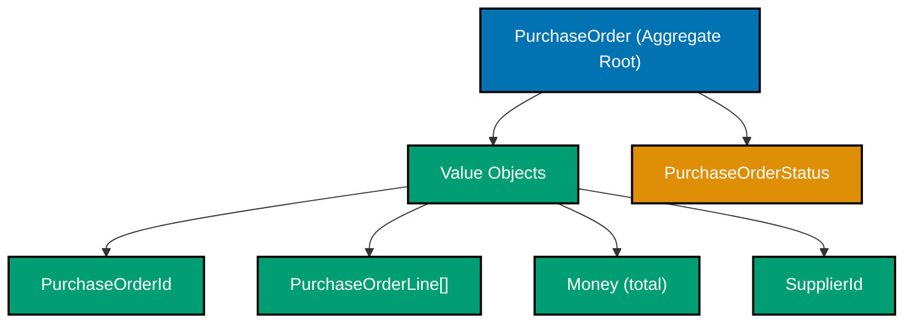
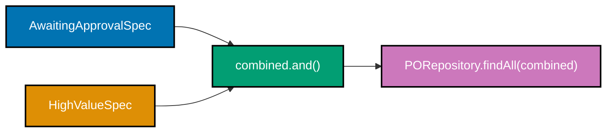
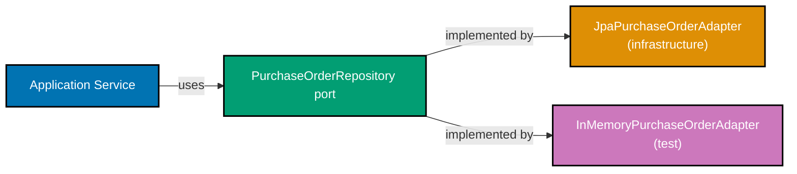

Examples 26–51 extend the beginner building blocks into the intermediate tier of DDD: aggregate roots, state-machine enforcement, immutable domain events, factory methods, repository interfaces, CQRS, hexagonal architecture, domain exception hierarchies, and bounded context packaging. Every code block is self-contained with all necessary type definitions. The domain stays in the `purchasing` and `supplier` bounded contexts of the Procure-to-Pay (P2P) platform introduced in the beginner section.

## Aggregate Root Basics (Examples 26–29)

### Example 26: Aggregate root — `PurchaseOrder` identity and boundary

An aggregate root is the single entry point for a cluster of related objects. All invariants inside the cluster are enforced by the root; no outside code bypasses it to mutate interior objects directly. `PurchaseOrder` is the root for the purchasing bounded context at the order level.






```java
import java.math.BigDecimal;
import java.util.ArrayList;
import java.util.Collections;
import java.util.List;

// ── Value Objects (self-contained; same shapes as beginner section) ─────────
record PurchaseOrderId(String value) {           // => record PurchaseOrderId
    PurchaseOrderId {                            // => compact constructor (Java 16+)
        if (value == null || !value.startsWith("po_"))  // => format rule: po_<uuid>
            throw new IllegalArgumentException("PurchaseOrderId must start with po_"); // => "po_" prefix guards the identity
    }
}
record SupplierId(String value) {               // => record SupplierId
    SupplierId {
        if (value == null || !value.startsWith("sup_")) // => format rule: sup_<uuid>
            throw new IllegalArgumentException("SupplierId must start with sup_"); // => "sup_" prefix guards supplier identity
    }
}
record Money(BigDecimal amount, String currency) {  // => record Money
    Money {
        if (amount == null || amount.compareTo(BigDecimal.ZERO) < 0) // => non-negative
            throw new IllegalArgumentException("Money amount must be >= 0"); // => negative amounts are domain violations
    }
}
enum UnitOfMeasure { EACH, BOX, KG, LITRE, HOUR }  // => closed enum from spec
record Quantity(int value, UnitOfMeasure unit) {    // => record Quantity
    Quantity { if (value <= 0) throw new IllegalArgumentException("Quantity.value > 0"); } // => zero/negative quantity is not a quantity

// ── Line item — owned by PurchaseOrder, NOT an aggregate root itself ─────────
record PurchaseOrderLine(                       // => record PurchaseOrderLine
    String lineId,                             // => simple surrogate within aggregate boundary
    String skuCode,                            // => matches SkuCode format; kept as String for brevity
    Quantity quantity,                         // => carries unit of measure
    Money unitPrice                            // => price per unit at time of PO creation
) {}

// ── Aggregate root ────────────────────────────────────────────────────────────
enum PurchaseOrderStatus { DRAFT, AWAITING_APPROVAL, APPROVED, ISSUED, CANCELLED }
// => Five states used in intermediate examples; full machine extended later

class PurchaseOrder {                          // => class PurchaseOrder (aggregate root)
    private final PurchaseOrderId id;          // => identity; final — never changes
    private final SupplierId supplierId;       // => reference to supplier aggregate by id only
    // => Aggregate roots reference other roots by id, never by object reference
    private final List<PurchaseOrderLine> lines; // => mutable internally; exposed as unmodifiable
    private PurchaseOrderStatus status;        // => mutable — changes on each valid transition

    PurchaseOrder(PurchaseOrderId id, SupplierId supplierId) { // => constructor
        this.id         = id;
        this.supplierId = supplierId;
        this.lines      = new ArrayList<>();   // => starts with empty line list
        this.status     = PurchaseOrderStatus.DRAFT; // => all POs begin in Draft
    }

    public PurchaseOrderId getId()       { return id; }          // => read-only
    public SupplierId getSupplierId()    { return supplierId; }  // => read-only
    public PurchaseOrderStatus getStatus(){ return status; }     // => read-only
    public List<PurchaseOrderLine> getLines() {
        return Collections.unmodifiableList(lines); // => defensive copy prevents external mutation
    }
}

// ── Usage ─────────────────────────────────────────────────────────────────────
var po = new PurchaseOrder(                    // => po created
    new PurchaseOrderId("po_550e8400-0000"),   // => valid id; starts with po_
    new SupplierId("sup_660f9511-0001")        // => supplier referenced by id only
);
System.out.println(po.getStatus());            // => Output: DRAFT
System.out.println(po.getLines().size());      // => Output: 0
```




```kotlin
import java.math.BigDecimal

// ── Value Objects (self-contained) ────────────────────────────────────────────
@JvmInline value class PurchaseOrderId(val value: String) { // => inline value class; zero allocation at runtime
    init { require(value.startsWith("po_")) { "PurchaseOrderId must start with po_" } }
    // => require() throws IllegalArgumentException on false; format: po_<uuid>
}
@JvmInline value class SupplierId(val value: String) {      // => inline value class for supplier identity
    init { require(value.startsWith("sup_")) { "SupplierId must start with sup_" } }
    // => "sup_" prefix guards supplier identity; compiler treats SupplierId as distinct from PurchaseOrderId
}
data class Money(val amount: BigDecimal, val currency: String) { // => data class; structural equality
    init { require(amount >= BigDecimal.ZERO) { "Money amount must be >= 0" } }
    // => negative amounts are domain violations; init block runs after primary constructor
}
enum class UnitOfMeasure { EACH, BOX, KG, LITRE, HOUR }     // => closed enum matching domain spec
data class Quantity(val value: Int, val unit: UnitOfMeasure) { // => value object carrying unit
    init { require(value > 0) { "Quantity.value > 0" } }     // => zero/negative quantity is not a quantity
}

// ── Line item — NOT an aggregate root; owned by PurchaseOrder ─────────────────
data class PurchaseOrderLine(                               // => data class; immutable line item
    val lineId: String,                                     // => simple surrogate within aggregate boundary
    val skuCode: String,                                    // => catalog SKU; kept as String for brevity
    val quantity: Quantity,                                 // => carries unit of measure alongside count
    val unitPrice: Money                                    // => price per unit at time of PO creation
)

// ── Aggregate root ────────────────────────────────────────────────────────────
enum class PurchaseOrderStatus { DRAFT, AWAITING_APPROVAL, APPROVED, ISSUED, CANCELLED }
// => Five states; full state machine extended in later examples

class PurchaseOrder(                                        // => primary constructor; aggregate root
    val id: PurchaseOrderId,                               // => identity; val — immutable after creation
    val supplierId: SupplierId                             // => reference by id only — never by object reference
) {
    // => Aggregate roots reference other roots by id, never by object graph
    private val _lines: MutableList<PurchaseOrderLine> = mutableListOf() // => internal mutable list
    val lines: List<PurchaseOrderLine> get() = _lines.toList()           // => exposed as immutable copy
    var status: PurchaseOrderStatus = PurchaseOrderStatus.DRAFT           // => all POs begin in DRAFT
        private set                                                       // => only transitions via methods
}

// ── Usage ─────────────────────────────────────────────────────────────────────
val po = PurchaseOrder(                                     // => po created
    id         = PurchaseOrderId("po_550e8400-0000"),       // => valid id; starts with po_
    supplierId = SupplierId("sup_660f9511-0001")            // => supplier referenced by id only
)
println(po.status)                                          // => Output: DRAFT
println(po.lines.size)                                      // => Output: 0
```




```csharp
using System;
using System.Collections.Generic;
using System.Linq;

// ── Value Objects (self-contained) ────────────────────────────────────────────
public sealed record PurchaseOrderId(string Value) {        // => positional record; structural equality
    public PurchaseOrderId : this(Value) {                  // => primary constructor validation
        if (!Value.StartsWith("po_"))                       // => format rule: po_<uuid>
            throw new ArgumentException("PurchaseOrderId must start with po_"); // => "po_" prefix guards identity
    }
}
public sealed record SupplierId(string Value) {             // => record for supplier identity
    public SupplierId : this(Value) {
        if (!Value.StartsWith("sup_"))                      // => format rule: sup_<uuid>
            throw new ArgumentException("SupplierId must start with sup_"); // => "sup_" prefix guards supplier identity
    }
}
public sealed record Money(decimal Amount, string Currency) { // => record Money; immutable value object
    public Money : this(Amount, Currency) {
        if (Amount < 0)                                     // => non-negative amount guard
            throw new ArgumentException("Money amount must be >= 0"); // => negative amounts are domain violations
    }
}
public enum UnitOfMeasure { Each, Box, Kg, Litre, Hour }    // => closed enum from domain spec
public sealed record Quantity(int Value, UnitOfMeasure Unit) { // => value object with embedded unit
    public Quantity : this(Value, Unit) {
        if (Value <= 0) throw new ArgumentException("Quantity.Value > 0"); // => zero/negative is not a quantity
    }
}

// ── Line item — NOT an aggregate root; owned by PurchaseOrder ─────────────────
public sealed record PurchaseOrderLine(                     // => positional record; immutable
    string LineId,                                          // => simple surrogate within aggregate boundary
    string SkuCode,                                         // => catalog SKU; kept as string for brevity
    Quantity Quantity,                                      // => carries unit of measure
    Money UnitPrice                                         // => price per unit at PO creation time
);

// ── Aggregate root ────────────────────────────────────────────────────────────
public enum PurchaseOrderStatus { Draft, AwaitingApproval, Approved, Issued, Cancelled }
// => Five states; full state machine extended in later examples

public sealed class PurchaseOrder {                         // => sealed class; aggregate root
    public PurchaseOrderId Id { get; }                      // => identity; init-only — never changes
    public SupplierId SupplierId { get; }                   // => reference by id only, never by object graph
    // => Aggregate roots reference other roots by id, never by object reference
    private readonly List<PurchaseOrderLine> _lines = new(); // => internal mutable list; not exposed directly
    public IReadOnlyList<PurchaseOrderLine> Lines => _lines.AsReadOnly(); // => defensive read-only view
    public PurchaseOrderStatus Status { get; private set; } = PurchaseOrderStatus.Draft;
    // => all POs begin in Draft; private set prevents external mutation

    public PurchaseOrder(PurchaseOrderId id, SupplierId supplierId) { // => constructor
        Id         = id;
        SupplierId = supplierId;
        // => lines list and Draft status initialized via field initializers above
    }
}

// ── Usage ─────────────────────────────────────────────────────────────────────
var po = new PurchaseOrder(                                 // => po created
    new PurchaseOrderId("po_550e8400-0000"),                // => valid id; starts with po_
    new SupplierId("sup_660f9511-0001")                     // => supplier referenced by id only
);
Console.WriteLine(po.Status);                               // => Output: Draft
Console.WriteLine(po.Lines.Count);                          // => Output: 0
```




```typescript
// PurchaseOrder aggregate root: TypeScript with private readonly fields
// => private backing array + readonly public view enforces encapsulation

// Typed identities with brand tags for nominal distinction
class PurchaseOrderId {
  private readonly _brand = "PurchaseOrderId" as const;
  private constructor(readonly value: string) {}
  static of(value: string): PurchaseOrderId {
    if (!value.startsWith("po_"))
      // => format rule: po_<uuid>
      throw new Error("PurchaseOrderId must start with po_");
    return new PurchaseOrderId(value);
  }
}

class SupplierId {
  private readonly _brand = "SupplierId" as const;
  private constructor(readonly value: string) {}
  static of(value: string): SupplierId {
    if (!value.startsWith("sup_"))
      // => format rule: sup_<uuid>
      throw new Error("SupplierId must start with sup_");
    return new SupplierId(value);
  }
}

type UnitOfMeasure = "EACH" | "BOX" | "KG" | "LITRE" | "HOUR";

interface Money {
  amount: number;
  currency: string;
}
interface Quantity {
  value: number;
  unit: UnitOfMeasure;
}

interface PurchaseOrderLine {
  // => line item owned by PurchaseOrder
  lineId: string;
  skuCode: string;
  quantity: Quantity;
  unitPrice: Money;
}

type PurchaseOrderStatus = "DRAFT" | "AWAITING_APPROVAL" | "APPROVED" | "ISSUED" | "CANCELLED";
// => five states; full state machine extended later

// Aggregate root: encapsulates all state behind domain methods
class PurchaseOrder {
  readonly id: PurchaseOrderId; // => identity; readonly — never changes
  readonly supplierId: SupplierId; // => reference by id only — never by object graph
  private readonly _lines: PurchaseOrderLine[] = []; // => internal mutable array
  private _status: PurchaseOrderStatus = "DRAFT"; // => all POs begin in DRAFT

  constructor(id: PurchaseOrderId, supplierId: SupplierId) {
    this.id = id;
    this.supplierId = supplierId;
  }

  get status(): PurchaseOrderStatus {
    return this._status;
  }
  get lines(): readonly PurchaseOrderLine[] {
    return [...this._lines];
  }
  // => spread creates an immutable copy; caller cannot push/pop
}

// Usage
const po = new PurchaseOrder(
  PurchaseOrderId.of("po_550e8400-0000"), // => valid id; starts with po_
  SupplierId.of("sup_660f9511-0001"), // => supplier referenced by id only
);
console.log(po.status); // => Output: DRAFT
console.log(po.lines.length); // => Output: 0
```




**Key Takeaway**: An aggregate root enforces all invariants for the cluster it owns. External code interacts exclusively through the root's public methods — never through direct mutation of interior objects.

**Why It Matters**: In a procurement system, a `PurchaseOrder` and its line items must always be consistent: the total must equal the sum of lines, lines must be immutable once issued, and the supplier reference must remain stable. Without a disciplined root, any service could silently corrupt that consistency, creating discrepancies that are impossible to trace in an audit log.

---

### Example 27: Adding lines with aggregate-level invariant enforcement

The aggregate root's `addLine` method enforces every invariant before accepting a new line. Callers cannot bypass this by constructing a `PurchaseOrderLine` and injecting it directly — the list is encapsulated.




```java
import java.math.BigDecimal;
import java.util.ArrayList;
import java.util.Collections;
import java.util.List;

// ── Minimal supporting types (self-contained) ─────────────────────────────────
record PurchaseOrderId(String value) {}
record SupplierId(String value) {}
record Money(BigDecimal amount, String currency) {}
enum UnitOfMeasure { EACH, BOX, KG, LITRE, HOUR }
record Quantity(int value, UnitOfMeasure unit) {
    Quantity { if (value <= 0) throw new IllegalArgumentException("Quantity > 0"); }
}
record PurchaseOrderLine(String lineId, String skuCode, Quantity quantity, Money unitPrice) {}
enum PurchaseOrderStatus { DRAFT, AWAITING_APPROVAL, APPROVED, ISSUED, CANCELLED }

class PurchaseOrder {
    private final PurchaseOrderId id;
    private final SupplierId supplierId;
    private final List<PurchaseOrderLine> lines = new ArrayList<>();
    private PurchaseOrderStatus status = PurchaseOrderStatus.DRAFT;

    PurchaseOrder(PurchaseOrderId id, SupplierId supplierId) {
        this.id = id; this.supplierId = supplierId;
    }

    // ── Invariant-enforcing mutator ───────────────────────────────────────────
    public void addLine(PurchaseOrderLine line) {    // => addLine called
        if (status != PurchaseOrderStatus.DRAFT) {  // => invariant: lines only added in Draft
            throw new IllegalStateException(
                "Lines can only be added to a DRAFT PurchaseOrder, current: " + status);
        }
        // => Once Issued, lines are immutable per domain spec
        if (line == null)                           // => null guard; fail fast
            throw new IllegalArgumentException("line must not be null");
        boolean duplicate = lines.stream()
            .anyMatch(l -> l.lineId().equals(line.lineId())); // => duplicate line id check
        if (duplicate)                              // => domain rule: unique lineId within PO
            throw new IllegalArgumentException("Duplicate lineId: " + line.lineId());
        lines.add(line);                            // => mutation allowed only through this method
    }

    public Money computeTotal() {                   // => computeTotal derived from lines
        BigDecimal sum = lines.stream()
            .map(l -> l.unitPrice().amount()
                       .multiply(BigDecimal.valueOf(l.quantity().value()))) // => line total
            .reduce(BigDecimal.ZERO, BigDecimal::add); // => sum all lines
        String currency = lines.isEmpty() ? "USD" : lines.get(0).unitPrice().currency();
        return new Money(sum, currency);            // => returns new Money; no field stored
    }

    public List<PurchaseOrderLine> getLines() { return Collections.unmodifiableList(lines); }
    public PurchaseOrderStatus getStatus()    { return status; }
    public PurchaseOrderId getId()            { return id; }
}

// ── Usage ─────────────────────────────────────────────────────────────────────
var po = new PurchaseOrder(
    new PurchaseOrderId("po_550e8400-0001"),
    new SupplierId("sup_660f9511-0001")
);
po.addLine(new PurchaseOrderLine(               // => line added successfully
    "L1", "OFF-001234",
    new Quantity(5, UnitOfMeasure.BOX),
    new Money(new BigDecimal("20.00"), "USD")
));
po.addLine(new PurchaseOrderLine(               // => second line added
    "L2", "TLS-9999",
    new Quantity(2, UnitOfMeasure.EACH),
    new Money(new BigDecimal("150.00"), "USD")
));
System.out.println(po.getLines().size());       // => Output: 2
System.out.println(po.computeTotal().amount()); // => Output: 400.00 (5*20 + 2*150)

try {
    po.getLines().add(null);                    // => UnsupportedOperationException
} catch (UnsupportedOperationException e) {
    System.out.println("Cannot mutate lines externally"); // => Output: Cannot mutate lines externally
}
```




```kotlin
import java.math.BigDecimal

// ── Minimal supporting types (self-contained) ─────────────────────────────────
data class PurchaseOrderId(val value: String)                // => data class; structural equality
data class SupplierId(val value: String)                     // => data class for supplier identity
data class Money(val amount: BigDecimal, val currency: String) // => value object; immutable
enum class UnitOfMeasure { EACH, BOX, KG, LITRE, HOUR }     // => closed enum from domain spec
data class Quantity(val value: Int, val unit: UnitOfMeasure) { // => quantity with embedded unit
    init { require(value > 0) { "Quantity > 0" } }           // => zero/negative is not a quantity
}
data class PurchaseOrderLine(                               // => immutable line item
    val lineId: String,                                     // => simple surrogate within aggregate
    val skuCode: String,                                    // => catalog SKU
    val quantity: Quantity,                                 // => carries unit of measure
    val unitPrice: Money                                    // => price per unit at PO creation time
)
enum class PurchaseOrderStatus { DRAFT, AWAITING_APPROVAL, APPROVED, ISSUED, CANCELLED }

class PurchaseOrder(val id: PurchaseOrderId, val supplierId: SupplierId) {
    // => primary constructor; id and supplierId are val — immutable after creation
    private val _lines: MutableList<PurchaseOrderLine> = mutableListOf() // => internal mutable list
    val lines: List<PurchaseOrderLine> get() = _lines.toList()           // => defensive copy on access
    var status: PurchaseOrderStatus = PurchaseOrderStatus.DRAFT           // => starts in DRAFT
        private set                                                       // => transitions via methods only

    // ── Invariant-enforcing mutator ───────────────────────────────────────────
    fun addLine(line: PurchaseOrderLine) {                  // => addLine enforces all guards
        check(status == PurchaseOrderStatus.DRAFT) {        // => Kotlin check() → IllegalStateException
            "Lines can only be added to a DRAFT PurchaseOrder, current: $status"
        }
        // => Once Issued, lines are immutable per domain spec
        require(_lines.none { it.lineId == line.lineId }) { // => duplicate lineId check
            "Duplicate lineId: ${line.lineId}"              // => domain rule: unique lineId within PO
        }
        _lines.add(line)                                    // => mutation allowed only via this method
    }

    fun computeTotal(): Money {                             // => derived from lines; no stored field
        val sum = _lines.fold(BigDecimal.ZERO) { acc, l -> // => fold accumulates line totals
            acc + l.unitPrice.amount * l.quantity.value.toBigDecimal() // => line total: price × qty
        }
        val currency = _lines.firstOrNull()?.unitPrice?.currency ?: "USD" // => currency from first line
        return Money(sum, currency)                         // => new Money; not mutating any state
    }
}

// ── Usage ─────────────────────────────────────────────────────────────────────
val po = PurchaseOrder(PurchaseOrderId("po_550e8400-0001"), SupplierId("sup_660f9511-0001"))
// => po created; status = DRAFT, lines = empty
po.addLine(PurchaseOrderLine("L1", "OFF-001234", Quantity(5, UnitOfMeasure.BOX),  Money(BigDecimal("20.00"), "USD")))
// => L1 added; 5 BOX × $20.00
po.addLine(PurchaseOrderLine("L2", "TLS-9999",   Quantity(2, UnitOfMeasure.EACH), Money(BigDecimal("150.00"), "USD")))
// => L2 added; 2 EACH × $150.00
println(po.lines.size)                                      // => Output: 2
println(po.computeTotal().amount)                           // => Output: 400.00 (5*20 + 2*150)

val snapshot = po.lines                                     // => snapshot is a defensive copy
println(snapshot === po.lines)                              // => Output: false (different list instances)
// => external code cannot mutate the aggregate's internal list
```




```csharp
using System;
using System.Collections.Generic;
using System.Linq;

// ── Minimal supporting types (self-contained) ─────────────────────────────────
public sealed record PurchaseOrderId(string Value);          // => positional record; structural equality
public sealed record SupplierId(string Value);               // => record for supplier identity
public sealed record Money(decimal Amount, string Currency); // => immutable value object
public enum UnitOfMeasure { Each, Box, Kg, Litre, Hour }    // => closed enum from domain spec
public sealed record Quantity(int Value, UnitOfMeasure Unit) { // => value object with embedded unit
    public Quantity : this(Value, Unit) {
        if (Value <= 0) throw new ArgumentException("Quantity.Value > 0"); // => zero/negative is not a quantity
    }
}
public sealed record PurchaseOrderLine(                      // => positional record; immutable
    string LineId,                                           // => simple surrogate within aggregate
    string SkuCode,                                          // => catalog SKU
    Quantity Quantity,                                       // => carries unit of measure
    Money UnitPrice                                          // => price per unit at PO creation time
);
public enum PurchaseOrderStatus { Draft, AwaitingApproval, Approved, Issued, Cancelled }

public sealed class PurchaseOrder {                          // => sealed class; aggregate root
    public PurchaseOrderId Id { get; }                       // => init-only; identity never changes
    public SupplierId SupplierId { get; }                    // => reference by id only
    private readonly List<PurchaseOrderLine> _lines = new(); // => internal mutable list
    public IReadOnlyList<PurchaseOrderLine> Lines => _lines.AsReadOnly(); // => defensive read-only view
    public PurchaseOrderStatus Status { get; private set; } = PurchaseOrderStatus.Draft;
    // => private set; external code cannot bypass invariants

    public PurchaseOrder(PurchaseOrderId id, SupplierId supplierId) { // => constructor
        Id = id; SupplierId = supplierId;
        // => _lines and Draft status initialized via field/property initializers above
    }

    // ── Invariant-enforcing mutator ───────────────────────────────────────────
    public void AddLine(PurchaseOrderLine line) {            // => AddLine enforces all guards
        if (Status != PurchaseOrderStatus.Draft)             // => invariant: lines only in Draft
            throw new InvalidOperationException(
                $"Lines can only be added to a Draft PurchaseOrder, current: {Status}");
        // => Once Issued, lines are immutable per domain spec
        if (line is null) throw new ArgumentNullException(nameof(line)); // => null guard; fail fast
        if (_lines.Any(l => l.LineId == line.LineId))        // => duplicate lineId check
            throw new ArgumentException($"Duplicate LineId: {line.LineId}"); // => domain rule: unique LineId
        _lines.Add(line);                                    // => mutation only via this method
    }

    public Money ComputeTotal() {                            // => derived; no stored field
        var sum = _lines.Aggregate(0m, (acc, l) =>          // => fold accumulates line totals
            acc + l.UnitPrice.Amount * l.Quantity.Value);   // => line total: price × qty
        var currency = _lines.FirstOrDefault()?.UnitPrice.Currency ?? "USD"; // => currency from first line
        return new Money(sum, currency);                     // => new Money record; no mutation
    }
}

// ── Usage ─────────────────────────────────────────────────────────────────────
var po = new PurchaseOrder(new PurchaseOrderId("po_550e8400-0001"), new SupplierId("sup_660f9511-0001"));
// => po created; Status = Draft, Lines = empty
po.AddLine(new PurchaseOrderLine("L1", "OFF-001234", new Quantity(5, UnitOfMeasure.Box),  new Money(20.00m, "USD")));
// => L1 added; 5 Box × $20.00
po.AddLine(new PurchaseOrderLine("L2", "TLS-9999",   new Quantity(2, UnitOfMeasure.Each), new Money(150.00m, "USD")));
// => L2 added; 2 Each × $150.00
Console.WriteLine(po.Lines.Count);                          // => Output: 2
Console.WriteLine(po.ComputeTotal().Amount);                // => Output: 400.00 (5*20 + 2*150)

try {
    ((List<PurchaseOrderLine>)po.Lines).Add(null!);         // => InvalidCastException or NotSupportedException
} catch (Exception e) {
    Console.WriteLine("Cannot mutate lines externally");    // => Output: Cannot mutate lines externally
}
```




```typescript
// PurchaseOrder with addLine enforcing all invariants
// => TypeScript uses private array; callers cannot bypass addLine

type UnitOfMeasure = "EACH" | "BOX" | "KG" | "LITRE" | "HOUR";
type PurchaseOrderStatus = "DRAFT" | "AWAITING_APPROVAL" | "APPROVED" | "ISSUED" | "CANCELLED";

interface Money {
  amount: number;
  currency: string;
}
interface Quantity {
  value: number;
  unit: UnitOfMeasure;
}

interface PurchaseOrderLine {
  lineId: string;
  skuCode: string;
  quantity: Quantity;
  unitPrice: Money;
}

class PurchaseOrder {
  readonly id: string;
  readonly supplierId: string;
  private readonly _lines: PurchaseOrderLine[] = [];
  private _status: PurchaseOrderStatus = "DRAFT";

  constructor(id: string, supplierId: string) {
    this.id = id;
    this.supplierId = supplierId;
  }

  get status(): PurchaseOrderStatus {
    return this._status;
  }
  get lines(): readonly PurchaseOrderLine[] {
    return [...this._lines];
  }

  // Invariant-enforcing mutator
  addLine(line: PurchaseOrderLine): void {
    if (this._status !== "DRAFT")
      // => invariant: lines only added in DRAFT
      throw new Error(`Lines can only be added to a DRAFT PurchaseOrder, current: ${this._status}`);
    if (line == null)
      // => null guard; fail fast
      throw new Error("line must not be null");
    const duplicate = this._lines.some((l) => l.lineId === line.lineId);
    if (duplicate)
      // => domain rule: unique lineId within PO
      throw new Error(`Duplicate lineId: ${line.lineId}`);
    this._lines.push(line); // => mutation allowed only through this method
  }

  computeTotal(): Money {
    const sum = this._lines.reduce((acc, l) => acc + l.unitPrice.amount * l.quantity.value, 0); // => sum of all line totals
    const currency = this._lines.length === 0 ? "USD" : this._lines[0].unitPrice.currency;
    return { amount: sum, currency };
  }
}

// Usage
const po = new PurchaseOrder("po_550e8400-0001", "sup_660f9511-0001");
po.addLine({
  lineId: "L1",
  skuCode: "OFF-001234",
  quantity: { value: 5, unit: "BOX" },
  unitPrice: { amount: 20.0, currency: "USD" },
});
po.addLine({
  lineId: "L2",
  skuCode: "TLS-9999",
  quantity: { value: 2, unit: "EACH" },
  unitPrice: { amount: 150.0, currency: "USD" },
});
console.log(po.lines.length); // => Output: 2
console.log(po.computeTotal().amount); // => Output: 400 (5*20 + 2*150)

// TypeScript's readonly prevents direct push at compile time
// (po.lines as PurchaseOrderLine[]).push(null); // => compile error: push not on readonly
try {
  po.addLine({
    lineId: "L1",
    skuCode: "OFF-001234", // => duplicate lineId
    quantity: { value: 1, unit: "EACH" },
    unitPrice: { amount: 10, currency: "USD" },
  });
} catch (e: unknown) {
  console.log((e as Error).message); // => Output: Duplicate lineId: L1
}
```




**Key Takeaway**: Expose only behaviour-carrying methods from the aggregate root. Return unmodifiable views of collections to prevent external bypasses of invariants.

**Why It Matters**: Procurement lines carry financial obligations. Allowing external code to add lines without passing through the aggregate's guard means any service can create a PO whose total does not match the sum of its lines — a discrepancy that surfaces only during invoice matching, not at the time of the error.

---

### Example 28: `ApprovalLevel` derived value object — computed from `Money`

`ApprovalLevel` is a value object whose value is derived from the PO total at submission time. The derivation logic lives in the domain, not in a service, keeping the business rule co-located with the data it operates on.




```java
import java.math.BigDecimal;

// ── Supporting types ──────────────────────────────────────────────────────────
record Money(BigDecimal amount, String currency) {}

// ── Domain enum with derivation logic ────────────────────────────────────────
enum ApprovalLevel {                        // => enum ApprovalLevel
    L1,   // => ≤ $1,000 — first-line manager
    L2,   // => ≤ $10,000 — department head
    L3;   // => > $10,000 — CFO or board

    // Factory method on the enum: derivation rule expressed in one place
    public static ApprovalLevel from(Money total) {  // => static factory; Money → ApprovalLevel
        if (total == null)                           // => guard: Money must be provided
            throw new IllegalArgumentException("total is required");
        BigDecimal amount = total.amount();
        // => Thresholds from domain spec: L1 ≤ 1k, L2 ≤ 10k, L3 above
        if (amount.compareTo(new BigDecimal("1000.00")) <= 0)  return L1; // => ≤ 1,000
        if (amount.compareTo(new BigDecimal("10000.00")) <= 0) return L2; // => ≤ 10,000
        return L3;                                   // => > 10,000 — highest approval needed
    }
}

// ── Usage ─────────────────────────────────────────────────────────────────────
Money smallPO    = new Money(new BigDecimal("500.00"),   "USD"); // => 500 USD
Money mediumPO   = new Money(new BigDecimal("5000.00"),  "USD"); // => 5,000 USD
Money largePO    = new Money(new BigDecimal("25000.00"), "USD"); // => 25,000 USD

System.out.println(ApprovalLevel.from(smallPO));  // => Output: L1
System.out.println(ApprovalLevel.from(mediumPO)); // => Output: L2
System.out.println(ApprovalLevel.from(largePO));  // => Output: L3

// Derived value used in aggregate submission logic:
ApprovalLevel level = ApprovalLevel.from(largePO); // => level = L3
System.out.println(level == ApprovalLevel.L3);     // => Output: true
// => L3 POs must route to CFO for approval per domain spec
```




```kotlin
import java.math.BigDecimal

// ── Supporting types ──────────────────────────────────────────────────────────
data class Money(val amount: BigDecimal, val currency: String) // => immutable value object

// ── Domain enum with derivation logic ────────────────────────────────────────
enum class ApprovalLevel {                  // => enum class ApprovalLevel
    L1,   // => ≤ $1,000 — first-line manager
    L2,   // => ≤ $10,000 — department head
    L3;   // => > $10,000 — CFO or board

    companion object {                      // => companion object hosts the static-like factory
        fun from(total: Money): ApprovalLevel { // => factory; Money → ApprovalLevel; named idiom
            // => Thresholds from domain spec: L1 ≤ 1k, L2 ≤ 10k, L3 above
            return when {
                total.amount <= BigDecimal("1000.00")  -> L1 // => ≤ 1,000 → first-line manager
                total.amount <= BigDecimal("10000.00") -> L2 // => ≤ 10,000 → department head
                else                                   -> L3 // => > 10,000 → CFO or board
            }
        }
    }
}

// ── Usage ─────────────────────────────────────────────────────────────────────
val smallPO  = Money(BigDecimal("500.00"),   "USD") // => 500 USD
val mediumPO = Money(BigDecimal("5000.00"),  "USD") // => 5,000 USD
val largePO  = Money(BigDecimal("25000.00"), "USD") // => 25,000 USD

println(ApprovalLevel.from(smallPO))               // => Output: L1
println(ApprovalLevel.from(mediumPO))              // => Output: L2
println(ApprovalLevel.from(largePO))               // => Output: L3

// Derived value used in aggregate submission logic:
val level = ApprovalLevel.from(largePO)            // => level = L3
println(level == ApprovalLevel.L3)                 // => Output: true
// => L3 POs must route to CFO for approval per domain spec
```




```csharp
using System;

// ── Supporting types ──────────────────────────────────────────────────────────
public sealed record Money(decimal Amount, string Currency); // => immutable value object

// ── Domain enum with derivation logic ────────────────────────────────────────
public enum ApprovalLevel {                 // => enum ApprovalLevel
    L1,   // => ≤ $1,000 — first-line manager
    L2,   // => ≤ $10,000 — department head
    L3    // => > $10,000 — CFO or board
}

public static class ApprovalLevelExtensions {        // => extension class hosts the factory method
    public static ApprovalLevel From(this Money total) { // => extension method; Money.From() call site reads naturally
        if (total is null) throw new ArgumentNullException(nameof(total)); // => guard: Money must be provided
        // => Thresholds from domain spec: L1 ≤ 1k, L2 ≤ 10k, L3 above
        return total.Amount switch {
            <= 1_000.00m  => ApprovalLevel.L1, // => ≤ 1,000 → first-line manager
            <= 10_000.00m => ApprovalLevel.L2, // => ≤ 10,000 → department head
            _             => ApprovalLevel.L3  // => > 10,000 → CFO or board
        };
    }
}

// ── Usage ─────────────────────────────────────────────────────────────────────
var smallPO  = new Money(500.00m,    "USD"); // => 500 USD
var mediumPO = new Money(5_000.00m,  "USD"); // => 5,000 USD
var largePO  = new Money(25_000.00m, "USD"); // => 25,000 USD

Console.WriteLine(smallPO.From());           // => Output: L1
Console.WriteLine(mediumPO.From());          // => Output: L2
Console.WriteLine(largePO.From());           // => Output: L3

// Derived value used in aggregate submission logic:
var level = largePO.From();                  // => level = L3
Console.WriteLine(level == ApprovalLevel.L3); // => Output: True
// => L3 POs must route to CFO for approval per domain spec
```




```typescript
// ApprovalLevel derived value object: TypeScript function + const enum pattern
// => Single factory function; all threshold logic in one place

interface Money {
  amount: number;
  currency: string;
}

type ApprovalLevel = "L1" | "L2" | "L3";
// => L1 ≤ $1,000 — first-line manager
// => L2 ≤ $10,000 — department head
// => L3 > $10,000 — CFO or board

// Factory function on the module level: Money → ApprovalLevel; single source of truth
function approvalLevelFrom(total: Money): ApprovalLevel {
  if (total == null) throw new Error("total is required");
  // => Thresholds from domain spec: L1 ≤ 1k, L2 ≤ 10k, L3 above
  if (total.amount <= 1000) return "L1"; // => ≤ 1,000 → first-line manager
  if (total.amount <= 10000) return "L2"; // => ≤ 10,000 → department head
  return "L3"; // => > 10,000 → CFO or board
}

// Usage
const smallPO: Money = { amount: 500, currency: "USD" }; // => 500 USD
const mediumPO: Money = { amount: 5000, currency: "USD" }; // => 5,000 USD
const largePO: Money = { amount: 25000, currency: "USD" }; // => 25,000 USD

console.log(approvalLevelFrom(smallPO)); // => Output: L1
console.log(approvalLevelFrom(mediumPO)); // => Output: L2
console.log(approvalLevelFrom(largePO)); // => Output: L3

// Derived value used in aggregate submission logic
const level = approvalLevelFrom(largePO); // => level = "L3"
console.log(level === "L3"); // => Output: true
// => L3 POs must route to CFO for approval per domain spec
```




**Key Takeaway**: Encoding derivation rules as static factory methods on domain enums keeps business thresholds in the domain layer, not scattered in application services.

**Why It Matters**: Procurement approval thresholds are regulatory and financial policy — $10k vs $1k boundaries appear in audit reports and compliance reviews. When the threshold changes, there is one class to update and one test to fix, with no risk of a forgotten service-layer conditional silently applying the old rule.

---

### Example 29: `Supplier` aggregate root with approval lifecycle

`Supplier` is the aggregate root for the `supplier` bounded context. Its lifecycle states (`Pending → Approved → Suspended → Blacklisted`) determine whether a `PurchaseOrder` can reference it. The business rule "blacklisted suppliers force existing POs to Disputed" is enforced at the aggregate boundary.




```java
// ── Supporting types ──────────────────────────────────────────────────────────
record SupplierId(String value) {                // => record SupplierId; structural equality
    SupplierId {
        if (value == null || !value.startsWith("sup_")) // => format rule: sup_<uuid>
            throw new IllegalArgumentException("SupplierId must start with sup_"); // => "sup_" prefix guards identity
    }
}

record Email(String address) {                   // => Email value object
    Email {
        if (address == null || !address.contains("@")) // => minimal RFC-5322 guard
            throw new IllegalArgumentException("Email must contain @"); // => production would use a full library
    }
}

// ── Supplier lifecycle states ─────────────────────────────────────────────────
enum SupplierStatus {
    PENDING,      // => newly registered; cannot receive POs
    APPROVED,     // => vetted; eligible for new POs
    SUSPENDED,    // => temporarily ineligible; existing POs continue
    BLACKLISTED   // => excluded from all activity; existing POs forced to Disputed
}

// ── Aggregate root ────────────────────────────────────────────────────────────
class Supplier {                                 // => class Supplier; aggregate root for supplier context
    private final SupplierId id;                 // => identity; final — never changes
    private final Email email;                   // => contact address; immutable after creation
    private SupplierStatus status;               // => mutable; only transitions via methods

    Supplier(SupplierId id, Email email) {       // => constructor: all POs begin with PENDING supplier
        this.id     = id;
        this.email  = email;
        this.status = SupplierStatus.PENDING;    // => all new suppliers start in PENDING
    }

    public SupplierId getId()       { return id; }      // => read-only identity
    public Email getEmail()         { return email; }   // => read-only email
    public SupplierStatus getStatus() { return status; } // => read-only status

    public void approve() {                      // => approve() — valid from PENDING only
        if (status != SupplierStatus.PENDING)    // => guard: must be PENDING
            throw new IllegalStateException(
                "Can only approve a PENDING supplier, current: " + status);
        status = SupplierStatus.APPROVED;        // => transition: PENDING → APPROVED
    }

    public void suspend() {                      // => suspend() — valid from APPROVED only
        if (status != SupplierStatus.APPROVED)   // => guard: must be APPROVED
            throw new IllegalStateException(
                "Can only suspend an APPROVED supplier, current: " + status);
        status = SupplierStatus.SUSPENDED;       // => transition: APPROVED → SUSPENDED
    }

    public void blacklist() {                    // => blacklist() — from APPROVED or SUSPENDED
        if (status != SupplierStatus.APPROVED && status != SupplierStatus.SUSPENDED)
            throw new IllegalStateException("Cannot blacklist from " + status);
        status = SupplierStatus.BLACKLISTED;     // => transition to terminal state
        // => Caller responsible for triggering Disputed state on existing POs
    }

    public boolean isEligibleForNewPurchaseOrders() { // => eligibility derived from current status
        return status == SupplierStatus.APPROVED; // => only APPROVED suppliers receive new POs
    }
}

// ── Usage ─────────────────────────────────────────────────────────────────────
var supplier = new Supplier(new SupplierId("sup_660f9511-0001"), new Email("vendor@acme.com"));
System.out.println(supplier.getStatus());                   // => Output: PENDING
supplier.approve();
System.out.println(supplier.getStatus());                   // => Output: APPROVED
System.out.println(supplier.isEligibleForNewPurchaseOrders()); // => Output: true
supplier.suspend();
System.out.println(supplier.isEligibleForNewPurchaseOrders()); // => Output: false

try {
    supplier.approve();                          // => IllegalStateException: SUSPENDED is not PENDING
} catch (IllegalStateException e) {
    System.out.println(e.getMessage());          // => Output: Can only approve a PENDING supplier, current: SUSPENDED
}
```




```kotlin
// ── Supporting types ──────────────────────────────────────────────────────────
@JvmInline value class SupplierId(val value: String) {  // => inline value class; zero allocation
    init { require(value.startsWith("sup_")) { "SupplierId must start with sup_" } }
    // => Kotlin's require throws IllegalArgumentException on false
}

data class Email(val address: String) {           // => Email value object
    init { require(address.contains("@")) { "Email must contain @" } }
    // => Minimal RFC-5322 guard; production would use a proper library
}

// ── Supplier lifecycle states ─────────────────────────────────────────────────
enum class SupplierStatus {
    PENDING,      // => newly registered; cannot receive POs
    APPROVED,     // => vetted; eligible for new POs
    SUSPENDED,    // => temporarily ineligible; existing POs continue
    BLACKLISTED   // => excluded from all activity; existing POs forced to Disputed
}

// ── Aggregate root ────────────────────────────────────────────────────────────
class Supplier(val id: SupplierId, val email: Email) { // => primary constructor
    var status: SupplierStatus = SupplierStatus.PENDING // => starts in PENDING
        private set                                     // => only transitions via methods

    fun approve() {                                     // => approve() — valid from PENDING only
        check(status == SupplierStatus.PENDING) {       // => Kotlin check() → IllegalStateException
            "Can only approve a PENDING supplier, current: $status"
        }
        status = SupplierStatus.APPROVED                // => transition: PENDING → APPROVED
    }

    fun suspend() {                                     // => suspend() — valid from APPROVED only
        check(status == SupplierStatus.APPROVED) {
            "Can only suspend an APPROVED supplier, current: $status"
        }
        status = SupplierStatus.SUSPENDED               // => transition: APPROVED → SUSPENDED
    }

    fun blacklist() {                                   // => blacklist() — from APPROVED or SUSPENDED
        check(status == SupplierStatus.APPROVED || status == SupplierStatus.SUSPENDED) {
            "Cannot blacklist from $status"
        }
        status = SupplierStatus.BLACKLISTED             // => transition to terminal state
        // => Caller responsible for triggering Disputed state on existing POs
    }

    fun isEligibleForNewPurchaseOrders(): Boolean =     // => eligibility derived from status
        status == SupplierStatus.APPROVED               // => only APPROVED suppliers receive new POs
}

// ── Usage ─────────────────────────────────────────────────────────────────────
val supplier = Supplier(SupplierId("sup_660f9511-0001"), Email("vendor@acme.com"))
println(supplier.status)                         // => Output: PENDING
supplier.approve()
println(supplier.status)                         // => Output: APPROVED
println(supplier.isEligibleForNewPurchaseOrders()) // => Output: true
supplier.suspend()
println(supplier.isEligibleForNewPurchaseOrders()) // => Output: false

try {
    supplier.approve()                            // => IllegalStateException: SUSPENDED is not PENDING
} catch (e: IllegalStateException) {
    println(e.message)                            // => Output: Can only approve a PENDING supplier, current: SUSPENDED
}
```




```csharp
using System;

// ── Supporting types ──────────────────────────────────────────────────────────
public sealed record SupplierId(string Value) {          // => positional record; structural equality
    public SupplierId : this(Value) {
        if (!Value.StartsWith("sup_"))                   // => format rule: sup_<uuid>
            throw new ArgumentException("SupplierId must start with sup_"); // => "sup_" prefix guards identity
    }
}

public sealed record Email(string Address) {             // => Email value object; immutable
    public Email : this(Address) {
        if (!Address.Contains("@"))                      // => minimal RFC-5322 guard
            throw new ArgumentException("Email must contain @"); // => production would use a full library
    }
}

// ── Supplier lifecycle states ─────────────────────────────────────────────────
public enum SupplierStatus {
    Pending,      // => newly registered; cannot receive POs
    Approved,     // => vetted; eligible for new POs
    Suspended,    // => temporarily ineligible; existing POs continue
    Blacklisted   // => excluded from all activity; existing POs forced to Disputed
}

// ── Aggregate root ────────────────────────────────────────────────────────────
public sealed class Supplier {                           // => sealed class; aggregate root for supplier context
    public SupplierId Id { get; }                        // => identity; init-only — never changes
    public Email Email { get; }                          // => contact address; init-only
    public SupplierStatus Status { get; private set; } = SupplierStatus.Pending;
    // => private set; only transitions via methods; starts in Pending

    public Supplier(SupplierId id, Email email) {        // => constructor
        Id    = id;
        Email = email;
        // => Status initialized to Pending via property initializer above
    }

    public void Approve() {                              // => Approve() — valid from Pending only
        if (Status != SupplierStatus.Pending)            // => guard: must be Pending
            throw new InvalidOperationException(
                $"Can only approve a Pending supplier, current: {Status}");
        Status = SupplierStatus.Approved;                // => transition: Pending → Approved
    }

    public void Suspend() {                              // => Suspend() — valid from Approved only
        if (Status != SupplierStatus.Approved)           // => guard: must be Approved
            throw new InvalidOperationException(
                $"Can only suspend an Approved supplier, current: {Status}");
        Status = SupplierStatus.Suspended;               // => transition: Approved → Suspended
    }

    public void Blacklist() {                            // => Blacklist() — from Approved or Suspended
        if (Status != SupplierStatus.Approved && Status != SupplierStatus.Suspended)
            throw new InvalidOperationException($"Cannot blacklist from {Status}");
        Status = SupplierStatus.Blacklisted;             // => transition to terminal state
        // => Caller responsible for triggering Disputed state on existing POs
    }

    public bool IsEligibleForNewPurchaseOrders() =>      // => eligibility derived from current status
        Status == SupplierStatus.Approved;               // => only Approved suppliers receive new POs
}

// ── Usage ─────────────────────────────────────────────────────────────────────
var supplier = new Supplier(new SupplierId("sup_660f9511-0001"), new Email("vendor@acme.com"));
Console.WriteLine(supplier.Status);                       // => Output: Pending
supplier.Approve();
Console.WriteLine(supplier.Status);                       // => Output: Approved
Console.WriteLine(supplier.IsEligibleForNewPurchaseOrders()); // => Output: True
supplier.Suspend();
Console.WriteLine(supplier.IsEligibleForNewPurchaseOrders()); // => Output: False

try {
    supplier.Approve();                                   // => InvalidOperationException: Suspended is not Pending
} catch (InvalidOperationException e) {
    Console.WriteLine(e.Message);                         // => Output: Can only approve a Pending supplier, current: Suspended
}
```




```typescript
// Supplier aggregate root with approval lifecycle in TypeScript
// => State transitions guarded by domain methods; no direct field mutation

class SupplierId {
  private readonly _brand = "SupplierId" as const;
  private constructor(readonly value: string) {}
  static of(value: string): SupplierId {
    if (!value.startsWith("sup_")) throw new Error("SupplierId must start with sup_");
    return new SupplierId(value);
  }
}

class Email {
  private constructor(readonly address: string) {}
  static of(address: string): Email {
    if (!address || !address.includes("@"))
      // => minimal format guard
      throw new Error("Email must contain @");
    return new Email(address);
  }
}

type SupplierStatus = "PENDING" | "APPROVED" | "SUSPENDED" | "BLACKLISTED";
// => PENDING: newly registered; APPROVED: vetted; SUSPENDED: temporarily ineligible;
// => BLACKLISTED: excluded from all activity

class Supplier {
  readonly id: SupplierId; // => identity; readonly — never changes
  readonly email: Email; // => contact address; immutable after creation
  private _status: SupplierStatus = "PENDING"; // => all new suppliers start PENDING

  constructor(id: SupplierId, email: Email) {
    this.id = id;
    this.email = email;
    // => status starts PENDING; only transitions via methods
  }

  get status(): SupplierStatus {
    return this._status;
  }

  approve(): void {
    // => valid from PENDING only
    if (this._status !== "PENDING") throw new Error(`Can only approve a PENDING supplier, current: ${this._status}`);
    this._status = "APPROVED"; // => transition: PENDING → APPROVED
  }

  suspend(): void {
    // => valid from APPROVED only
    if (this._status !== "APPROVED") throw new Error(`Can only suspend an APPROVED supplier, current: ${this._status}`);
    this._status = "SUSPENDED"; // => transition: APPROVED → SUSPENDED
  }

  reinstate(): void {
    // => valid from SUSPENDED only
    if (this._status !== "SUSPENDED")
      throw new Error(`Can only reinstate a SUSPENDED supplier, current: ${this._status}`);
    this._status = "APPROVED"; // => transition: SUSPENDED → APPROVED
  }

  blacklist(): void {
    // => valid from APPROVED or SUSPENDED
    if (this._status !== "APPROVED" && this._status !== "SUSPENDED")
      throw new Error(`Cannot blacklist a ${this._status} supplier`);
    this._status = "BLACKLISTED"; // => terminal-like state; no exit in normal flow
  }
}

// Happy path
const sup = new Supplier(SupplierId.of("sup_660f9511-0001"), Email.of("contact@supplier.example"));
console.log(sup.status); // => Output: PENDING
sup.approve(); // => PENDING → APPROVED
console.log(sup.status); // => Output: APPROVED
sup.suspend(); // => APPROVED → SUSPENDED
console.log(sup.status); // => Output: SUSPENDED
sup.reinstate(); // => SUSPENDED → APPROVED
console.log(sup.status); // => Output: APPROVED

// Guard: cannot approve an already-APPROVED supplier
try {
  sup.approve();
} catch (e: unknown) {
  console.log((e as Error).message);
  // => Output: Can only approve a PENDING supplier, current: APPROVED
}
```




**Key Takeaway**: Model lifecycle states as an enum and guard transitions inside the aggregate root's methods. Never allow external code to set status directly.

**Why It Matters**: A supplier mistakenly set to `APPROVED` while blacklisted could receive new purchase orders and goods — a compliance failure in a procurement audit. Encapsulating transitions in the aggregate ensures every status change passes through validation, creating a trustworthy audit trail.

---

## State Machine (Examples 30–34)

### Example 30: Sealed types for exhaustive state modeling

Sealed type hierarchies (sealed interfaces in Java 21+, sealed classes in Kotlin, abstract record hierarchies in C#, and discriminated union types in TypeScript) let the compiler enforce that all states are handled. Using a closed, exhaustive type for `PurchaseOrderStatus` means a forgotten branch is a compile error, not a runtime NullPointerException.




```java
// ── Sealed class hierarchy: each state is its own type ───────────────────────
// => Sealed permits exactly five subtypes; no other class may extend PurchaseOrderStatus
sealed interface PurchaseOrderStatus
    permits PurchaseOrderStatus.Draft,
            PurchaseOrderStatus.AwaitingApproval,
            PurchaseOrderStatus.Approved,
            PurchaseOrderStatus.Issued,
            PurchaseOrderStatus.Cancelled {

    record Draft() implements PurchaseOrderStatus {}         // => Draft: no extra data
    record AwaitingApproval() implements PurchaseOrderStatus {} // => AwaitingApproval state
    record Approved() implements PurchaseOrderStatus {}      // => Approved state
    record Issued() implements PurchaseOrderStatus {}        // => Issued state
    record Cancelled(String reason) implements PurchaseOrderStatus {} // => Cancelled carries reason
    // => Cancelled is the only terminal state that carries context; reason aids audit trail
}

// ── Pattern-match with exhaustive switch (Java 21 preview, enabled by default in 21+) ─
static String describe(PurchaseOrderStatus s) {    // => static helper for demo
    return switch (s) {                            // => sealed switch: compiler checks all arms
        case PurchaseOrderStatus.Draft d           -> "Draft: awaiting line items";
        case PurchaseOrderStatus.AwaitingApproval a-> "Awaiting approval from manager";
        case PurchaseOrderStatus.Approved ap       -> "Approved: ready to issue to supplier";
        case PurchaseOrderStatus.Issued i          -> "Issued: supplier has been notified";
        case PurchaseOrderStatus.Cancelled c       -> "Cancelled: " + c.reason();
        // => No default needed: sealed types guarantee exhaustiveness at compile time
    };
}

// ── Usage ─────────────────────────────────────────────────────────────────────
PurchaseOrderStatus draft  = new PurchaseOrderStatus.Draft();         // => draft state
PurchaseOrderStatus issued = new PurchaseOrderStatus.Issued();        // => issued state
PurchaseOrderStatus cancelled = new PurchaseOrderStatus.Cancelled("Vendor out of stock");

System.out.println(describe(draft));     // => Output: Draft: awaiting line items
System.out.println(describe(issued));    // => Output: Issued: supplier has been notified
System.out.println(describe(cancelled)); // => Output: Cancelled: Vendor out of stock
```




```kotlin
// ── Sealed class hierarchy: each state is its own type ───────────────────────
// => sealed class closes the hierarchy; compiler knows every subtype at compile time
sealed class PurchaseOrderStatus {
    object Draft : PurchaseOrderStatus()            // => object: singleton; no extra data
    object AwaitingApproval : PurchaseOrderStatus() // => object: singleton state
    object Approved : PurchaseOrderStatus()         // => object: singleton state
    object Issued : PurchaseOrderStatus()           // => object: singleton state
    data class Cancelled(val reason: String) : PurchaseOrderStatus()
    // => data class: carries cancellation reason; reason aids audit trail
}

// ── Exhaustive when expression ────────────────────────────────────────────────
fun describe(s: PurchaseOrderStatus): String =      // => extension-style helper for demo
    when (s) {                                      // => when on sealed type: compiler enforces exhaustiveness
        is PurchaseOrderStatus.Draft            -> "Draft: awaiting line items"
        is PurchaseOrderStatus.AwaitingApproval -> "Awaiting approval from manager"
        is PurchaseOrderStatus.Approved         -> "Approved: ready to issue to supplier"
        is PurchaseOrderStatus.Issued           -> "Issued: supplier has been notified"
        is PurchaseOrderStatus.Cancelled        -> "Cancelled: ${s.reason}"
        // => No else needed: sealed hierarchy exhausted; missing branch = compile error
    }

// ── Usage ─────────────────────────────────────────────────────────────────────
val draft     = PurchaseOrderStatus.Draft                          // => singleton; no allocation
val issued    = PurchaseOrderStatus.Issued                         // => singleton; no allocation
val cancelled = PurchaseOrderStatus.Cancelled("Vendor out of stock") // => data class with reason

println(describe(draft))     // => Output: Draft: awaiting line items
println(describe(issued))    // => Output: Issued: supplier has been notified
println(describe(cancelled)) // => Output: Cancelled: Vendor out of stock
```




```csharp
using System;

// ── Discriminated union via abstract record hierarchy ─────────────────────────
// => C# does not have sealed interfaces like Java 21; abstract record + sealed subtypes achieves the same guarantee
public abstract record PurchaseOrderStatus {
    public sealed record Draft : PurchaseOrderStatus;            // => Draft: no extra data
    public sealed record AwaitingApproval : PurchaseOrderStatus; // => AwaitingApproval state
    public sealed record Approved : PurchaseOrderStatus;         // => Approved state
    public sealed record Issued : PurchaseOrderStatus;           // => Issued state
    public sealed record Cancelled(string Reason) : PurchaseOrderStatus;
    // => Cancelled carries reason; sealed prevents further derivation; reason aids audit trail
}

// ── Exhaustive pattern match via switch expression ────────────────────────────
static string Describe(PurchaseOrderStatus s) =>     // => static helper; switch expression is expression-bodied
    s switch {                                        // => pattern match on record type
        PurchaseOrderStatus.Draft            => "Draft: awaiting line items",
        PurchaseOrderStatus.AwaitingApproval => "Awaiting approval from manager",
        PurchaseOrderStatus.Approved         => "Approved: ready to issue to supplier",
        PurchaseOrderStatus.Issued           => "Issued: supplier has been notified",
        PurchaseOrderStatus.Cancelled c      => $"Cancelled: {c.Reason}",
        // => No default arm: compiler warns if a sealed subtype is missing (exhaustiveness check)
        _ => throw new ArgumentOutOfRangeException(nameof(s), "Unknown status")
        // => Defensive wildcard: fires only if someone adds a subtype without updating this switch
    };

// ── Usage ─────────────────────────────────────────────────────────────────────
PurchaseOrderStatus draft     = new PurchaseOrderStatus.Draft();            // => Draft record instance
PurchaseOrderStatus issued    = new PurchaseOrderStatus.Issued();           // => Issued record instance
PurchaseOrderStatus cancelled = new PurchaseOrderStatus.Cancelled("Vendor out of stock");
// => Cancelled carries reason; structural equality via record

Console.WriteLine(Describe(draft));     // => Output: Draft: awaiting line items
Console.WriteLine(Describe(issued));    // => Output: Issued: supplier has been notified
Console.WriteLine(Describe(cancelled)); // => Output: Cancelled: Vendor out of stock
```




```typescript
// Sealed types for exhaustive state modeling in TypeScript
// => TypeScript discriminated union + exhaustive switch replaces sealed classes

// Discriminated union: each variant carries its own payload
type PurchaseOrderState =
  | { readonly tag: "Draft" }
  | { readonly tag: "AwaitingApproval"; readonly submittedAt: Date }
  | { readonly tag: "Approved"; readonly approvedBy: string; readonly approvedAt: Date }
  | { readonly tag: "Issued"; readonly issuedAt: Date }
  | { readonly tag: "Cancelled"; readonly reason: string };
// => Each variant has a discriminant tag and variant-specific fields

// Exhaustive switch: TypeScript enforces all cases are handled
function describeState(state: PurchaseOrderState): string {
  switch (state.tag) {
    case "Draft":
      return "PO is in draft; lines can still be added";
    case "AwaitingApproval":
      return `Submitted on ${state.submittedAt.toISOString()}; awaiting approval`;
    case "Approved":
      return `Approved by ${state.approvedBy} on ${state.approvedAt.toISOString()}`;
    case "Issued":
      return `Issued to supplier on ${state.issuedAt.toISOString()}`;
    case "Cancelled":
      return `Cancelled: ${state.reason}`;
    default: {
      // => This branch is unreachable if all cases are covered — TypeScript enforces it
      const _exhaustive: never = state; // => compile error if a case is missing
      throw new Error(`Unhandled state: ${(_exhaustive as any).tag}`);
    }
  }
}

// Usage
const draft: PurchaseOrderState = { tag: "Draft" };
const awaiting: PurchaseOrderState = { tag: "AwaitingApproval", submittedAt: new Date("2026-01-10") };
const approved: PurchaseOrderState = {
  tag: "Approved",
  approvedBy: "emp-42",
  approvedAt: new Date("2026-01-11"),
};
const cancelled: PurchaseOrderState = { tag: "Cancelled", reason: "Budget freeze" };

console.log(describeState(draft)); // => Output: PO is in draft; lines can still be added
console.log(describeState(awaiting)); // => Output: Submitted on 2026-01-10T00:00:00.000Z; awaiting approval
console.log(describeState(approved)); // => Output: Approved by emp-42 on ...
console.log(describeState(cancelled)); // => Output: Cancelled: Budget freeze
```




**Key Takeaway**: Sealed types with record variants turn state into a closed set known at compile time. Pattern matching then guarantees every case is handled — no default escape hatch.

**Why It Matters**: Procurement systems have regulatory requirements around state transitions. A missed state in a switch statement that routes approval notifications silently drops approvals. Sealed types make the omission a build failure instead of a production defect.

---

### Example 31: State machine transitions on the aggregate root

The aggregate root exposes behavior methods (`submit`, `approve`, `issue`) that perform the state transition and enforce guards. Callers invoke behavior, not setters.




```java
import java.math.BigDecimal;
import java.util.ArrayList;
import java.util.List;

// ── Minimal supporting types ───────────────────────────────────────────────────
record PurchaseOrderId(String value) {}
record SupplierId(String value) {}
record Money(BigDecimal amount, String currency) {}
enum UnitOfMeasure { EACH, BOX }
record Quantity(int value, UnitOfMeasure unit) {}
record PurchaseOrderLine(String lineId, String skuCode, Quantity qty, Money unitPrice) {}

enum POStatus { DRAFT, AWAITING_APPROVAL, APPROVED, ISSUED, CANCELLED }

// ── Aggregate with state machine ───────────────────────────────────────────────
class PurchaseOrder {
    private final PurchaseOrderId id;
    private final SupplierId supplierId;
    private final List<PurchaseOrderLine> lines = new ArrayList<>();
    private POStatus status = POStatus.DRAFT;    // => always starts in DRAFT

    PurchaseOrder(PurchaseOrderId id, SupplierId supplierId) {
        this.id = id; this.supplierId = supplierId;
    }

    public void addLine(PurchaseOrderLine line) {           // => addLine: DRAFT only
        require(status == POStatus.DRAFT, "addLine requires DRAFT, got " + status);
        lines.add(line);
    }

    public void submit() {                                  // => DRAFT → AWAITING_APPROVAL
        require(status == POStatus.DRAFT, "submit requires DRAFT");
        require(!lines.isEmpty(), "Cannot submit PO with no line items"); // => domain invariant
        status = POStatus.AWAITING_APPROVAL;                // => transition committed
    }

    public void approve() {                                 // => AWAITING_APPROVAL → APPROVED
        require(status == POStatus.AWAITING_APPROVAL, "approve requires AWAITING_APPROVAL");
        status = POStatus.APPROVED;
    }

    public void issue() {                                   // => APPROVED → ISSUED
        require(status == POStatus.APPROVED, "issue requires APPROVED");
        status = POStatus.ISSUED;
        // => Once ISSUED, lines become immutable — enforced in addLine guard
    }

    public void cancel(String reason) {                     // => any pre-ISSUED → CANCELLED
        require(status != POStatus.ISSUED && status != POStatus.CANCELLED,
            "Cannot cancel from " + status);
        status = POStatus.CANCELLED;
    }

    private void require(boolean cond, String msg) {        // => guard helper
        if (!cond) throw new IllegalStateException(msg);
    }

    public POStatus getStatus() { return status; }
    public PurchaseOrderId getId() { return id; }
    public List<PurchaseOrderLine> getLines() { return List.copyOf(lines); }
}

// ── Usage: happy path ─────────────────────────────────────────────────────────
var po = new PurchaseOrder(new PurchaseOrderId("po_550e8400-0031"),
                           new SupplierId("sup_660f9511-0001"));
po.addLine(new PurchaseOrderLine("L1", "OFF-001234",
    new Quantity(3, UnitOfMeasure.BOX),
    new Money(new BigDecimal("40.00"), "USD")));    // => line added in DRAFT
po.submit();                                        // => DRAFT → AWAITING_APPROVAL
System.out.println(po.getStatus());                 // => Output: AWAITING_APPROVAL
po.approve();                                       // => AWAITING_APPROVAL → APPROVED
po.issue();                                         // => APPROVED → ISSUED
System.out.println(po.getStatus());                 // => Output: ISSUED

// ── Invalid transition ────────────────────────────────────────────────────────
try {
    po.addLine(new PurchaseOrderLine("L2", "TLS-9999",
        new Quantity(1, UnitOfMeasure.EACH),
        new Money(new BigDecimal("100.00"), "USD"))); // => IllegalStateException
} catch (IllegalStateException e) {
    System.out.println(e.getMessage());             // => Output: addLine requires DRAFT, got ISSUED
}
```




```kotlin
import java.math.BigDecimal

// ── Minimal supporting types ──────────────────────────────────────────────────
data class PurchaseOrderId(val value: String)                    // => data class; structural equality
data class SupplierId(val value: String)                         // => data class for supplier identity
data class Money(val amount: BigDecimal, val currency: String)   // => immutable value object
enum class UnitOfMeasure { EACH, BOX }                           // => closed enum from domain spec
data class Quantity(val value: Int, val unit: UnitOfMeasure)     // => value object with embedded unit
data class PurchaseOrderLine(                                    // => immutable line item
    val lineId: String,                                          // => simple surrogate within aggregate
    val skuCode: String,                                         // => catalog SKU
    val qty: Quantity,                                           // => carries unit of measure
    val unitPrice: Money                                         // => price per unit at PO creation time
)

enum class POStatus { DRAFT, AWAITING_APPROVAL, APPROVED, ISSUED, CANCELLED }
// => Five states covering the intermediate state machine

// ── Aggregate with state machine ──────────────────────────────────────────────
class PurchaseOrder(val id: PurchaseOrderId, val supplierId: SupplierId) {
    // => primary constructor; id and supplierId are val — immutable after creation
    private val _lines: MutableList<PurchaseOrderLine> = mutableListOf() // => internal mutable list
    val lines: List<PurchaseOrderLine> get() = _lines.toList()           // => defensive copy on access
    var status: POStatus = POStatus.DRAFT                                 // => always starts in DRAFT
        private set                                                       // => transitions via methods only

    fun addLine(line: PurchaseOrderLine) {                       // => addLine: DRAFT only
        check(status == POStatus.DRAFT) { "addLine requires DRAFT, got $status" }
        // => check() → IllegalStateException; Kotlin idiom mirrors Java require()
        _lines.add(line)                                         // => mutation only via this method
    }

    fun submit() {                                               // => DRAFT → AWAITING_APPROVAL
        check(status == POStatus.DRAFT) { "submit requires DRAFT" }
        check(_lines.isNotEmpty()) { "Cannot submit PO with no line items" }
        // => domain invariant: at least one line required before submission
        status = POStatus.AWAITING_APPROVAL                      // => transition committed
    }

    fun approve() {                                              // => AWAITING_APPROVAL → APPROVED
        check(status == POStatus.AWAITING_APPROVAL) { "approve requires AWAITING_APPROVAL" }
        status = POStatus.APPROVED
    }

    fun issue() {                                                // => APPROVED → ISSUED
        check(status == POStatus.APPROVED) { "issue requires APPROVED" }
        status = POStatus.ISSUED
        // => Once ISSUED, lines become immutable — enforced in addLine guard
    }

    fun cancel(reason: String) {                                 // => any pre-ISSUED → CANCELLED
        check(status != POStatus.ISSUED && status != POStatus.CANCELLED) {
            "Cannot cancel from $status"                         // => ISSUED and CANCELLED are terminal
        }
        status = POStatus.CANCELLED
    }
}

// ── Usage: happy path ─────────────────────────────────────────────────────────
val po = PurchaseOrder(PurchaseOrderId("po_550e8400-0031"), SupplierId("sup_660f9511-0001"))
po.addLine(PurchaseOrderLine("L1", "OFF-001234",
    Quantity(3, UnitOfMeasure.BOX),
    Money(BigDecimal("40.00"), "USD")))              // => line added in DRAFT
po.submit()                                          // => DRAFT → AWAITING_APPROVAL
println(po.status)                                   // => Output: AWAITING_APPROVAL
po.approve()                                         // => AWAITING_APPROVAL → APPROVED
po.issue()                                           // => APPROVED → ISSUED
println(po.status)                                   // => Output: ISSUED

// ── Invalid transition ────────────────────────────────────────────────────────
try {
    po.addLine(PurchaseOrderLine("L2", "TLS-9999",
        Quantity(1, UnitOfMeasure.EACH),
        Money(BigDecimal("100.00"), "USD")))          // => IllegalStateException
} catch (e: IllegalStateException) {
    println(e.message)                               // => Output: addLine requires DRAFT, got ISSUED
}
```




```csharp
using System;
using System.Collections.Generic;

// ── Minimal supporting types ──────────────────────────────────────────────────
public sealed record PurchaseOrderId(string Value);           // => positional record; structural equality
public sealed record SupplierId(string Value);                // => record for supplier identity
public sealed record Money(decimal Amount, string Currency);  // => immutable value object
public enum UnitOfMeasure { Each, Box }                       // => closed enum from domain spec
public sealed record Quantity(int Value, UnitOfMeasure Unit); // => value object with embedded unit
public sealed record PurchaseOrderLine(                       // => positional record; immutable
    string LineId,                                            // => simple surrogate within aggregate
    string SkuCode,                                           // => catalog SKU
    Quantity Qty,                                             // => carries unit of measure
    Money UnitPrice                                           // => price per unit at PO creation time
);

public enum POStatus { Draft, AwaitingApproval, Approved, Issued, Cancelled }
// => Five states covering the intermediate state machine; PascalCase per C# convention

// ── Aggregate with state machine ──────────────────────────────────────────────
public sealed class PurchaseOrder {                           // => sealed class; aggregate root
    public PurchaseOrderId Id { get; }                        // => init-only identity
    public SupplierId SupplierId { get; }                     // => init-only supplier reference
    private readonly List<PurchaseOrderLine> _lines = new(); // => internal mutable list
    public IReadOnlyList<PurchaseOrderLine> Lines => _lines.AsReadOnly(); // => defensive read-only view
    public POStatus Status { get; private set; } = POStatus.Draft;
    // => private set; always starts in Draft; external code cannot bypass guards

    public PurchaseOrder(PurchaseOrderId id, SupplierId supplierId) { // => constructor
        Id = id; SupplierId = supplierId;
        // => _lines and Draft status initialized via field/property initializers above
    }

    public void AddLine(PurchaseOrderLine line) {             // => AddLine: Draft only
        if (Status != POStatus.Draft)
            throw new InvalidOperationException($"AddLine requires Draft, got {Status}");
        // => guard: lines accepted only while the PO is being assembled
        _lines.Add(line);                                     // => mutation only via this method
    }

    public void Submit() {                                    // => Draft → AwaitingApproval
        if (Status != POStatus.Draft)
            throw new InvalidOperationException("Submit requires Draft");
        if (_lines.Count == 0)
            throw new InvalidOperationException("Cannot submit PO with no line items");
        // => domain invariant: at least one line required before submission
        Status = POStatus.AwaitingApproval;                   // => transition committed
    }

    public void Approve() {                                   // => AwaitingApproval → Approved
        if (Status != POStatus.AwaitingApproval)
            throw new InvalidOperationException("Approve requires AwaitingApproval");
        Status = POStatus.Approved;
    }

    public void Issue() {                                     // => Approved → Issued
        if (Status != POStatus.Approved)
            throw new InvalidOperationException("Issue requires Approved");
        Status = POStatus.Issued;
        // => Once Issued, lines become immutable — enforced in AddLine guard
    }

    public void Cancel(string reason) {                       // => any pre-Issued → Cancelled
        if (Status == POStatus.Issued || Status == POStatus.Cancelled)
            throw new InvalidOperationException($"Cannot cancel from {Status}");
        Status = POStatus.Cancelled;
    }
}

// ── Usage: happy path ─────────────────────────────────────────────────────────
var po = new PurchaseOrder(new PurchaseOrderId("po_550e8400-0031"),
                           new SupplierId("sup_660f9511-0001"));
po.AddLine(new PurchaseOrderLine("L1", "OFF-001234",
    new Quantity(3, UnitOfMeasure.Box),
    new Money(40.00m, "USD")));                               // => line added in Draft
po.Submit();                                                  // => Draft → AwaitingApproval
Console.WriteLine(po.Status);                                 // => Output: AwaitingApproval
po.Approve();                                                 // => AwaitingApproval → Approved
po.Issue();                                                   // => Approved → Issued
Console.WriteLine(po.Status);                                 // => Output: Issued

// ── Invalid transition ────────────────────────────────────────────────────────
try {
    po.AddLine(new PurchaseOrderLine("L2", "TLS-9999",
        new Quantity(1, UnitOfMeasure.Each),
        new Money(100.00m, "USD")));                          // => InvalidOperationException
} catch (InvalidOperationException e) {
    Console.WriteLine(e.Message);                             // => Output: AddLine requires Draft, got Issued
}
```




```typescript
// State machine: transition table + typed status in TypeScript
// => Map<Status, Set<Status>> makes invalid transitions a runtime Error

type POStatus = "DRAFT" | "AWAITING_APPROVAL" | "APPROVED" | "ISSUED" | "CANCELLED";

// Transition table: maps current status to allowed next statuses
const TRANSITIONS = new Map<POStatus, Set>([
  ["DRAFT", new Set<POStatus>(["AWAITING_APPROVAL", "CANCELLED"])],
  ["AWAITING_APPROVAL", new Set<POStatus>(["APPROVED", "CANCELLED"])],
  ["APPROVED", new Set<POStatus>(["ISSUED", "CANCELLED"])],
  ["ISSUED", new Set<POStatus>()], // => terminal state
  ["CANCELLED", new Set<POStatus>()], // => terminal state
]);

function validateTransition(from: POStatus, to: POStatus): void {
  const allowed = TRANSITIONS.get(from) ?? new Set<POStatus>();
  if (!allowed.has(to))
    // => guard against table
    throw new Error(`Invalid transition: ${from} -> ${to}`);
}

class PurchaseOrder {
  readonly id: string;
  private _status: POStatus = "DRAFT";

  constructor(id: string) {
    if (!id) throw new Error("id required");
    this.id = id;
  }

  get status(): POStatus {
    return this._status;
  }

  private transition(next: POStatus): void {
    validateTransition(this._status, next); // => guard in validateTransition
    this._status = next; // => assigned only after guard passes
  }

  submitForApproval(): void {
    this.transition("AWAITING_APPROVAL");
  }
  approve(): void {
    this.transition("APPROVED");
  }
  issue(): void {
    this.transition("ISSUED");
  }
  cancel(): void {
    this.transition("CANCELLED");
  }
}

// Happy path
const po = new PurchaseOrder("po_550e8400-0001");
po.submitForApproval(); // => DRAFT → AWAITING_APPROVAL
po.approve(); // => AWAITING_APPROVAL → APPROVED
po.issue(); // => APPROVED → ISSUED
console.log(po.status); // => Output: ISSUED

// Invalid transition
const po2 = new PurchaseOrder("po_550e8400-0002");
po2.submitForApproval();
try {
  po2.issue(); // => AWAITING_APPROVAL → ISSUED not allowed; must approve first
} catch (e: unknown) {
  console.log((e as Error).message);
  // => Output: Invalid transition: AWAITING_APPROVAL -> ISSUED
}
```




**Key Takeaway**: Expose state transitions as named business operations with guard clauses. Each method is a verb from the domain language — `submit`, `approve`, `issue` — not a generic `setStatus`.

**Why It Matters**: Named transition methods serve as the exact vocabulary for conversations with procurement managers. When a business analyst asks "why can't the system approve an already-cancelled PO?", the answer is in `approve()` — readable without translating from `setStatus(APPROVED)` back to business language.

---

### Example 32: Handling invalid transitions with domain exceptions

A custom `DomainException` hierarchy communicates guard failures in terms the application layer understands without coupling to `IllegalStateException` semantics.




```java
// ── Domain exception hierarchy ────────────────────────────────────────────────
// => Base class for all domain rule violations; distinct from infrastructure errors
class DomainException extends RuntimeException {
    DomainException(String message) { super(message); }
}

// => Specific subtype for state machine violations; callers can catch selectively
class InvalidTransitionException extends DomainException {
    private final String from;   // => current state name
    private final String to;     // => attempted target state name
    InvalidTransitionException(String from, String to) {
        super("Invalid transition from " + from + " to " + to);
        this.from = from; this.to = to;
    }
    public String getFrom() { return from; } // => allows callers to log structured diagnostics
    public String getTo()   { return to; }
}

// => Raised when a PO with no lines is submitted — separate concern from state
class EmptyPurchaseOrderException extends DomainException {
    EmptyPurchaseOrderException() { super("A PurchaseOrder must have at least one line before submission"); }
}

// ── Aggregate using typed exceptions ─────────────────────────────────────────
enum POStatus { DRAFT, AWAITING_APPROVAL, APPROVED, ISSUED, CANCELLED }

class PurchaseOrderSM {                               // => simplified for this example
    private POStatus status = POStatus.DRAFT;
    private int lineCount = 0;

    public void addLine() { lineCount++; }            // => simplified line addition

    public void submit() {                            // => DRAFT → AWAITING_APPROVAL
        if (status != POStatus.DRAFT)
            throw new InvalidTransitionException(status.name(), "AWAITING_APPROVAL");
            // => Structured: caller knows from-state and to-state
        if (lineCount == 0)
            throw new EmptyPurchaseOrderException();  // => separate domain rule
        status = POStatus.AWAITING_APPROVAL;
    }

    public void approve() {
        if (status != POStatus.AWAITING_APPROVAL)
            throw new InvalidTransitionException(status.name(), "APPROVED");
        status = POStatus.APPROVED;
    }

    public POStatus getStatus() { return status; }
}

// ── Usage ─────────────────────────────────────────────────────────────────────
var po = new PurchaseOrderSM();

try {
    po.submit();                                      // => EmptyPurchaseOrderException; no lines
} catch (EmptyPurchaseOrderException e) {
    System.out.println(e.getMessage());
    // => Output: A PurchaseOrder must have at least one line before submission
}

po.addLine();
po.submit();                                          // => DRAFT → AWAITING_APPROVAL

try {
    po.submit();                                      // => InvalidTransitionException; already AWAITING
} catch (InvalidTransitionException e) {
    System.out.println("From: " + e.getFrom());      // => Output: From: AWAITING_APPROVAL
    System.out.println("To: " + e.getTo());          // => Output: To: AWAITING_APPROVAL
    System.out.println(e.getMessage());
    // => Output: Invalid transition from AWAITING_APPROVAL to AWAITING_APPROVAL
}
```




```kotlin
// ── Domain exception hierarchy ────────────────────────────────────────────────
// => Base class for all domain rule violations; keeps infrastructure exceptions separate
open class DomainException(message: String) : RuntimeException(message)

// => Specific subtype for state machine violations; callers can catch selectively
class InvalidTransitionException(val from: String, val to: String) :
    DomainException("Invalid transition from $from to $to")
    // => Kotlin primary constructor stores from/to as val properties automatically

// => Raised when a PO with no lines is submitted — separate concern from state
class EmptyPurchaseOrderException :
    DomainException("A PurchaseOrder must have at least one line before submission")

// ── Aggregate using typed exceptions ──────────────────────────────────────────
enum class POStatus { DRAFT, AWAITING_APPROVAL, APPROVED, ISSUED, CANCELLED }

class PurchaseOrderSM {                               // => simplified aggregate for this example
    var status: POStatus = POStatus.DRAFT             // => always starts in DRAFT
        private set                                   // => only transitions via methods
    private var lineCount = 0                         // => simplified line counter

    fun addLine() { lineCount++ }                     // => simplified line addition

    fun submit() {                                    // => DRAFT → AWAITING_APPROVAL
        if (status != POStatus.DRAFT)
            throw InvalidTransitionException(status.name, "AWAITING_APPROVAL")
            // => Structured: caller knows from-state and to-state
        if (lineCount == 0)
            throw EmptyPurchaseOrderException()       // => separate domain rule violation
        status = POStatus.AWAITING_APPROVAL           // => transition committed
    }

    fun approve() {                                   // => AWAITING_APPROVAL → APPROVED
        if (status != POStatus.AWAITING_APPROVAL)
            throw InvalidTransitionException(status.name, "APPROVED")
        status = POStatus.APPROVED
    }
}

// ── Usage ─────────────────────────────────────────────────────────────────────
val po = PurchaseOrderSM()

try {
    po.submit()                                       // => EmptyPurchaseOrderException; no lines
} catch (e: EmptyPurchaseOrderException) {
    println(e.message)
    // => Output: A PurchaseOrder must have at least one line before submission
}

po.addLine()
po.submit()                                          // => DRAFT → AWAITING_APPROVAL

try {
    po.submit()                                      // => InvalidTransitionException; already AWAITING
} catch (e: InvalidTransitionException) {
    println("From: ${e.from}")                       // => Output: From: AWAITING_APPROVAL
    println("To: ${e.to}")                           // => Output: To: AWAITING_APPROVAL
    println(e.message)
    // => Output: Invalid transition from AWAITING_APPROVAL to AWAITING_APPROVAL
}
```




```csharp
using System;

// ── Domain exception hierarchy ────────────────────────────────────────────────
// => Base class for all domain rule violations; distinct from infrastructure exceptions
public class DomainException : Exception {
    public DomainException(string message) : base(message) { }
}

// => Specific subtype for state machine violations; callers can catch selectively
public class InvalidTransitionException : DomainException {
    public string From { get; }   // => current state name; read-only property
    public string To { get; }     // => attempted target state name; read-only property
    public InvalidTransitionException(string from, string to)
        : base($"Invalid transition from {from} to {to}") {
        From = from; To = to;     // => structured data for logging diagnostics
    }
}

// => Raised when a PO with no lines is submitted — separate concern from state
public class EmptyPurchaseOrderException : DomainException {
    public EmptyPurchaseOrderException()
        : base("A PurchaseOrder must have at least one line before submission") { }
}

// ── Aggregate using typed exceptions ──────────────────────────────────────────
public enum POStatus { Draft, AwaitingApproval, Approved, Issued, Cancelled }
// => PascalCase per C# convention; five states in the intermediate machine

public class PurchaseOrderSM {                        // => simplified aggregate for this example
    public POStatus Status { get; private set; } = POStatus.Draft;
    // => private set: external code cannot bypass guards
    private int _lineCount = 0;                       // => simplified line counter

    public void AddLine() { _lineCount++; }           // => simplified line addition

    public void Submit() {                            // => Draft → AwaitingApproval
        if (Status != POStatus.Draft)
            throw new InvalidTransitionException(Status.ToString(), "AwaitingApproval");
            // => Structured: caller knows From and To from exception properties
        if (_lineCount == 0)
            throw new EmptyPurchaseOrderException();  // => separate domain rule violation
        Status = POStatus.AwaitingApproval;           // => transition committed
    }

    public void Approve() {                           // => AwaitingApproval → Approved
        if (Status != POStatus.AwaitingApproval)
            throw new InvalidTransitionException(Status.ToString(), "Approved");
        Status = POStatus.Approved;
    }
}

// ── Usage ─────────────────────────────────────────────────────────────────────
var po = new PurchaseOrderSM();

try {
    po.Submit();                                      // => EmptyPurchaseOrderException; no lines
} catch (EmptyPurchaseOrderException e) {
    Console.WriteLine(e.Message);
    // => Output: A PurchaseOrder must have at least one line before submission
}

po.AddLine();
po.Submit();                                         // => Draft → AwaitingApproval

try {
    po.Submit();                                     // => InvalidTransitionException; already AwaitingApproval
} catch (InvalidTransitionException e) {
    Console.WriteLine($"From: {e.From}");            // => Output: From: AwaitingApproval
    Console.WriteLine($"To: {e.To}");               // => Output: To: AwaitingApproval
    Console.WriteLine(e.Message);
    // => Output: Invalid transition from AwaitingApproval to AwaitingApproval
}
```




```typescript
// Domain exception hierarchy in TypeScript
// => Custom error classes with discriminant fields for structured error handling

// Base domain error
class DomainError extends Error {
  readonly type: string;
  constructor(type: string, message: string) {
    super(message);
    this.type = type;
    this.name = type; // => name shows the domain error type in stack traces
  }
}

// Specific domain exception for invalid state transitions
class InvalidTransitionError extends DomainError {
  readonly from: string;
  readonly to: string;
  constructor(from: string, to: string) {
    super("InvalidTransitionError", `Invalid state transition: ${from} -> ${to}`);
    this.from = from;
    this.to = to;
  }
}

// Domain exception for business rule violations
class DomainRuleViolationError extends DomainError {
  readonly rule: string;
  constructor(rule: string, message: string) {
    super("DomainRuleViolationError", message);
    this.rule = rule;
  }
}

type POStatus = "DRAFT" | "AWAITING_APPROVAL" | "APPROVED" | "ISSUED" | "CANCELLED";
const ALLOWED = new Map<POStatus, Set>([
  ["DRAFT", new Set<POStatus>(["AWAITING_APPROVAL", "CANCELLED"])],
  ["AWAITING_APPROVAL", new Set<POStatus>(["APPROVED", "CANCELLED"])],
  ["APPROVED", new Set<POStatus>(["ISSUED", "CANCELLED"])],
  ["ISSUED", new Set<POStatus>()],
  ["CANCELLED", new Set<POStatus>()],
]);

class PurchaseOrder {
  readonly id: string;
  private _status: POStatus = "DRAFT";
  private readonly _lines: string[] = [];

  constructor(id: string) {
    this.id = id;
  }

  get status(): POStatus {
    return this._status;
  }

  addLine(line: string): void {
    if (this._status !== "DRAFT")
      throw new DomainRuleViolationError("lines-only-in-draft", `Cannot add lines: PO is ${this._status}`);
    this._lines.push(line);
  }

  submitForApproval(): void {
    const allowed = ALLOWED.get(this._status)!;
    if (!allowed.has("AWAITING_APPROVAL")) throw new InvalidTransitionError(this._status, "AWAITING_APPROVAL");
    if (this._lines.length === 0)
      throw new DomainRuleViolationError("no-lines-on-submit", "Cannot submit a PO with no line items");
    this._status = "AWAITING_APPROVAL";
  }
}

// Usage
const po = new PurchaseOrder("po_550e8400-0001");

// Domain rule violation: no lines on submit
try {
  po.submitForApproval();
} catch (e: unknown) {
  if (e instanceof DomainRuleViolationError) {
    console.log(`Rule violated: ${e.rule} — ${e.message}`);
    // => Output: Rule violated: no-lines-on-submit — Cannot submit a PO with no line items
  }
}

po.addLine("OFF-001234 x5 BOX @ 20.00 USD");
po.submitForApproval(); // => DRAFT → AWAITING_APPROVAL

// Invalid transition
try {
  po.submitForApproval(); // => already AWAITING_APPROVAL; cannot re-submit
} catch (e: unknown) {
  if (e instanceof InvalidTransitionError) {
    console.log(`Transition error: ${e.from} -> ${e.to}`);
    // => Output: Transition error: AWAITING_APPROVAL -> AWAITING_APPROVAL
  }
}
```




**Key Takeaway**: Use a custom domain exception hierarchy so the application layer can distinguish state-machine violations from business rule violations without parsing exception messages.

**Why It Matters**: A generic `IllegalStateException` forces the HTTP controller to catch everything and return a 500. A typed `InvalidTransitionException` maps cleanly to HTTP 409 Conflict while `EmptyPurchaseOrderException` maps to 422 Unprocessable Entity — enabling precise API error responses without leaking domain details into infrastructure code.

---

### Example 33: Cancellation off-ramp — pre-Paid states

Cancellation is an off-ramp valid from any state before `Paid`. Encoding this as a predicate on the current state keeps the guard logic in one method rather than repeated conditions across the codebase.




```java
import java.util.EnumSet;
import java.util.Set;

// ── Status enum ────────────────────────────────────────────────────────────────
enum POStatus {
    DRAFT, AWAITING_APPROVAL, APPROVED, ISSUED, CANCELLED
    // => Intermediate subset; full machine adds more states in advanced section
}

// ── Aggregate with cancellation off-ramp ──────────────────────────────────────
class PurchaseOrder {
    private final String id;           // => init-only: set once in constructor
    private POStatus status = POStatus.DRAFT; // => starts in DRAFT

    private static final Set<POStatus> CANCELLABLE_STATES = EnumSet.of(
        POStatus.DRAFT,
        POStatus.AWAITING_APPROVAL,
        POStatus.APPROVED
        // => ISSUED is the last state before PAID where cancellation remains valid
        // => Per spec: (any pre-Paid) --cancel--> CANCELLED
    );
    // => EnumSet: memory-efficient bit-vector; O(1) contains(); computed once at class load

    PurchaseOrder(String id) {
        if (id == null || !id.startsWith("po_")) // => format guard
            throw new IllegalArgumentException("Id must start with po_");
        this.id = id;
    }

    public void submit() {
        if (status != POStatus.DRAFT)             // => state guard
            throw new IllegalStateException("Cannot submit from " + status);
        status = POStatus.AWAITING_APPROVAL;      // => DRAFT → AWAITING_APPROVAL
    }

    public void approve() {
        if (status != POStatus.AWAITING_APPROVAL)
            throw new IllegalStateException("Cannot approve from " + status);
        status = POStatus.APPROVED;               // => AWAITING_APPROVAL → APPROVED
    }

    public void cancel(String reason) {
        if (!CANCELLABLE_STATES.contains(status)) // => O(1) EnumSet lookup
            throw new IllegalStateException(
                "Cannot cancel from " + status + ". Cancellable: DRAFT, AWAITING_APPROVAL, APPROVED");
        // => reason is logged/used by application layer; aggregate just transitions
        status = POStatus.CANCELLED;              // => → CANCELLED
    }

    public POStatus getStatus() { return status; }
    public String getId()       { return id; }
}

// ── Usage ─────────────────────────────────────────────────────────────────────
var po = new PurchaseOrder("po_550e8400-0033");
po.submit();
po.approve();
po.cancel("Supplier no longer available");          // => APPROVED → CANCELLED
System.out.println(po.getStatus());                 // => Output: CANCELLED

var po2 = new PurchaseOrder("po_550e8400-0034");
try {
    po2.cancel("Test");                             // => valid: DRAFT is cancellable
    System.out.println(po2.getStatus());            // => Output: CANCELLED
} catch (Exception e) {
    System.out.println(e.getMessage());
}
```




```kotlin
// ── Status enum ────────────────────────────────────────────────────────────────
enum class POStatus {
    DRAFT, AWAITING_APPROVAL, APPROVED, ISSUED, CANCELLED
    // => Intermediate subset; full machine adds more states in advanced section
}

// ── Aggregate with cancellation off-ramp ──────────────────────────────────────
class PurchaseOrder(val id: String) {              // => primary constructor
    init {
        require(id.startsWith("po_")) { "Id must start with po_" }
        // => require() throws IllegalArgumentException on false; format guard at creation time
    }

    var status: POStatus = POStatus.DRAFT          // => always starts in DRAFT
        private set                                // => transitions via methods only

    companion object {
        private val CANCELLABLE_STATES = setOf(    // => immutable Set; computed once at class load
            POStatus.DRAFT,
            POStatus.AWAITING_APPROVAL,
            POStatus.APPROVED
            // => ISSUED is the last state before PAID where cancellation remains valid
        )
    }
    // => setOf() returns a read-only LinkedHashSet; contains() is O(1)

    fun submit() {
        check(status == POStatus.DRAFT) { "Cannot submit from $status" }
        // => check() → IllegalStateException; idiomatic Kotlin state guard
        status = POStatus.AWAITING_APPROVAL        // => DRAFT → AWAITING_APPROVAL
    }

    fun approve() {
        check(status == POStatus.AWAITING_APPROVAL) { "Cannot approve from $status" }
        status = POStatus.APPROVED                 // => AWAITING_APPROVAL → APPROVED
    }

    fun cancel(reason: String) {
        check(status in CANCELLABLE_STATES) {      // => idiomatic Kotlin: `in` operator on Set
            "Cannot cancel from $status. Cancellable: DRAFT, AWAITING_APPROVAL, APPROVED"
        }
        // => reason is used by application layer for audit log; aggregate just transitions
        status = POStatus.CANCELLED                // => → CANCELLED
    }
}

// ── Usage ─────────────────────────────────────────────────────────────────────
val po = PurchaseOrder("po_550e8400-0033")
po.submit()
po.approve()
po.cancel("Supplier no longer available")           // => APPROVED → CANCELLED
println(po.status)                                  // => Output: CANCELLED

val po2 = PurchaseOrder("po_550e8400-0034")
try {
    po2.cancel("Test")                             // => valid: DRAFT is in CANCELLABLE_STATES
    println(po2.status)                            // => Output: CANCELLED
} catch (e: IllegalStateException) {
    println(e.message)
}
```




```csharp
using System;
using System.Collections.Generic;

// ── Status enum ────────────────────────────────────────────────────────────────
public enum POStatus
{
    Draft, AwaitingApproval, Approved, Issued, Cancelled
    // => Intermediate subset; full machine adds more states in advanced section
}

// ── Aggregate with cancellation off-ramp ──────────────────────────────────────
public class PurchaseOrder
{
    public string Id { get; }           // => init-only: set once in constructor
    public POStatus Status { get; private set; } = POStatus.Draft; // => starts in Draft

    private static readonly HashSet<POStatus> CancellableStates = new()
    {
        POStatus.Draft,
        POStatus.AwaitingApproval,
        POStatus.Approved
        // => Issued is the last state before PAID where cancellation remains valid
        // => Per spec: (any pre-Paid) --cancel--> Cancelled
    };
    // => Static set computed once; O(1) lookup per cancel() call

    public PurchaseOrder(string id)
    {
        if (string.IsNullOrEmpty(id) || !id.StartsWith("po_")) // => format guard
            throw new ArgumentException("Id must start with po_");
        Id = id;
    }

    public void Submit()
    {
        if (Status != POStatus.Draft)                          // => state guard
            throw new InvalidOperationException($"Cannot submit from {Status}");
        Status = POStatus.AwaitingApproval;
    }

    public void Approve()
    {
        if (Status != POStatus.AwaitingApproval)
            throw new InvalidOperationException($"Cannot approve from {Status}");
        Status = POStatus.Approved;
    }

    public void Cancel(string reason)
    {
        if (!CancellableStates.Contains(Status))               // => O(1) HashSet lookup
            throw new InvalidOperationException(
                $"Cannot cancel from {Status}. Cancellable: Draft, AwaitingApproval, Approved");
        // => reason is logged/used by application layer; aggregate just transitions
        Status = POStatus.Cancelled;
    }
}

// ── Usage ─────────────────────────────────────────────────────────────────────
var po = new PurchaseOrder("po_550e8400-0033");
po.Submit();
po.Approve();
po.Cancel("Supplier no longer available");          // => Approved → Cancelled
Console.WriteLine(po.Status);                       // => Output: Cancelled

var po2 = new PurchaseOrder("po_550e8400-0034");
try {
    po2.Cancel("Test");                             // => valid: Draft is cancellable
    Console.WriteLine(po2.Status);                  // => Output: Cancelled
} catch (Exception e) {
    Console.WriteLine(e.Message);
}
```




```typescript
// Cancellation off-ramp: TypeScript handles cancel() from multiple pre-paid states

type InvoiceStatus = "PENDING_MATCH" | "MATCHED" | "DISPUTED" | "APPROVED_FOR_PAYMENT" | "PAID" | "CANCELLED";
// => PAID is terminal; CANCELLED is a terminal exit from pre-paid states

class Invoice {
  readonly id: string;
  private _status: InvoiceStatus = "PENDING_MATCH";

  constructor(id: string) {
    if (!id) throw new Error("id required");
    this.id = id;
  }

  get status(): InvoiceStatus {
    return this._status;
  }

  // => Domain method: cancel() valid from any pre-paid state
  cancel(reason: string): void {
    const cancelableStates: InvoiceStatus[] = ["PENDING_MATCH", "MATCHED", "DISPUTED", "APPROVED_FOR_PAYMENT"];
    if (!cancelableStates.includes(this._status))
      // => guard: cannot cancel PAID
      throw new Error(`Cannot cancel invoice in ${this._status} state; only from pre-paid states`);
    if (!reason || reason.trim() === "")
      // => domain rule: reason required for audit
      throw new Error("Cancellation reason is required");
    this._status = "CANCELLED";
    // => In production: record cancellationReason and raise InvoiceCancelled domain event
  }

  match(): void {
    if (this._status !== "PENDING_MATCH")
      throw new Error(`Can only match from PENDING_MATCH, current: ${this._status}`);
    this._status = "MATCHED";
  }

  approveForPayment(): void {
    if (this._status !== "MATCHED") throw new Error(`Can only approve from MATCHED, current: ${this._status}`);
    this._status = "APPROVED_FOR_PAYMENT";
  }

  pay(): void {
    if (this._status !== "APPROVED_FOR_PAYMENT")
      throw new Error(`Can only pay from APPROVED_FOR_PAYMENT, current: ${this._status}`);
    this._status = "PAID";
  }
}

// Happy path: cancel from MATCHED
const inv = new Invoice("inv_001");
inv.match();
console.log(inv.status); // => Output: MATCHED
inv.cancel("Duplicate invoice");
console.log(inv.status); // => Output: CANCELLED

// Guard: cannot cancel a PAID invoice
const inv2 = new Invoice("inv_002");
inv2.match();
inv2.approveForPayment();
inv2.pay();
try {
  inv2.cancel("Late claim");
} catch (e: unknown) {
  console.log((e as Error).message);
  // => Output: Cannot cancel invoice in PAID state; only from pre-paid states
}
```




**Key Takeaway**: Model the cancellable set as a static `HashSet` on the aggregate. This documents allowed states declaratively and allows O(1) lookup rather than a chain of `||` comparisons that grows with each new state.

**Why It Matters**: Procurement cancellations must be audited — who cancelled, from which state, and why. Encoding valid cancel states explicitly in the aggregate means the application layer can always determine legality before attempting it, and the reason string travels through the domain boundary cleanly for the audit log.

---

### Example 34: `Quantity` value object and tolerance for goods receipt matching

`Tolerance` is a value object from the invoicing context describing an acceptable percentage deviation in matched quantities. Combined with `Quantity`, it provides the three-way match rule: invoice amount within tolerance of `GRN quantity × PO unit price`.




```java
import java.math.BigDecimal;
import java.math.RoundingMode;

// ── Value objects ─────────────────────────────────────────────────────────────
enum UnitOfMeasure { EACH, BOX, KG, LITRE, HOUR }

record Quantity(int value, UnitOfMeasure unit) { // => record Quantity
    Quantity {
        if (value <= 0)                          // => domain invariant: must be positive
            throw new IllegalArgumentException("Quantity.value must be > 0, got " + value);
    }
    public boolean isSameUnit(Quantity other) {  // => unit-compatibility check
        return this.unit == other.unit;          // => enum equality: fast, exact
    }
}

record Tolerance(BigDecimal percentage) {        // => record Tolerance
    Tolerance {
        if (percentage == null
            || percentage.compareTo(BigDecimal.ZERO) < 0    // => 0% minimum
            || percentage.compareTo(new BigDecimal("0.10")) > 0) // => 10% maximum per spec
            throw new IllegalArgumentException("Tolerance must be 0 ≤ pct ≤ 0.10");
    }

    // Returns true if actual is within tolerance of expected
    public boolean isWithin(BigDecimal expected, BigDecimal actual) {
        if (expected.compareTo(BigDecimal.ZERO) == 0) // => zero expected: exact match required
            return actual.compareTo(BigDecimal.ZERO) == 0;
        BigDecimal deviation = actual.subtract(expected).abs()
            .divide(expected, 6, RoundingMode.HALF_UP); // => |actual - expected| / expected
        return deviation.compareTo(percentage) <= 0;    // => within tolerance?
    }
}

// ── Three-way match helper ─────────────────────────────────────────────────────
static boolean threeWayMatch(
    BigDecimal poUnitPrice,   // => price per unit from PurchaseOrder
    Quantity grnQty,          // => quantity from GoodsReceiptNote
    BigDecimal invoiceAmount, // => total on Invoice
    Tolerance tolerance) {    // => acceptable deviation (default 2%)

    BigDecimal expected = poUnitPrice
        .multiply(BigDecimal.valueOf(grnQty.value())); // => expected = price × received qty
    return tolerance.isWithin(expected, invoiceAmount); // => is invoice within tolerance?
}

// ── Usage ─────────────────────────────────────────────────────────────────────
var tolerance = new Tolerance(new BigDecimal("0.02")); // => 2% default tolerance from spec

// Perfect match
boolean exact = threeWayMatch(
    new BigDecimal("20.00"),
    new Quantity(5, UnitOfMeasure.BOX),
    new BigDecimal("100.00"),  // => 5 × 20 = 100.00 exact
    tolerance
);
System.out.println("Exact match: " + exact);         // => Output: Exact match: true

// Within tolerance (1.5% deviation)
boolean within = threeWayMatch(
    new BigDecimal("20.00"),
    new Quantity(5, UnitOfMeasure.BOX),
    new BigDecimal("101.50"),  // => 1.5% above expected 100.00
    tolerance
);
System.out.println("Within tolerance: " + within);   // => Output: Within tolerance: true

// Outside tolerance (3% deviation)
boolean outside = threeWayMatch(
    new BigDecimal("20.00"),
    new Quantity(5, UnitOfMeasure.BOX),
    new BigDecimal("103.00"),  // => 3% above expected; exceeds 2% tolerance
    tolerance
);
System.out.println("Outside tolerance: " + outside); // => Output: Outside tolerance: false
```




```kotlin
import java.math.BigDecimal
import java.math.RoundingMode

// ── Value objects ─────────────────────────────────────────────────────────────
enum class UnitOfMeasure { EACH, BOX, KG, LITRE, HOUR }

data class Quantity(val value: Int, val unit: UnitOfMeasure) { // => data class; structural equality
    init {
        require(value > 0) { "Quantity.value must be > 0, got $value" }
        // => require() throws IllegalArgumentException on false; domain invariant
    }
    fun isSameUnit(other: Quantity): Boolean = unit == other.unit
    // => enum equality: fast, exact; checks unit compatibility before arithmetic
}

data class Tolerance(val percentage: BigDecimal) { // => value object; immutable
    init {
        require(percentage >= BigDecimal.ZERO && percentage <= BigDecimal("0.10")) {
            "Tolerance must be 0 ≤ pct ≤ 0.10"
            // => 0% minimum; 10% maximum per procurement spec
        }
    }

    // Returns true if actual is within tolerance of expected
    fun isWithin(expected: BigDecimal, actual: BigDecimal): Boolean {
        if (expected.compareTo(BigDecimal.ZERO) == 0)    // => zero expected: exact match required
            return actual.compareTo(BigDecimal.ZERO) == 0
        val deviation = (actual - expected).abs()
            .divide(expected, 6, RoundingMode.HALF_UP)   // => |actual - expected| / expected
        return deviation <= percentage                    // => within tolerance? Kotlin operator overload
    }
}

// ── Three-way match helper ─────────────────────────────────────────────────────
fun threeWayMatch(
    poUnitPrice: BigDecimal,    // => price per unit from PurchaseOrder
    grnQty: Quantity,           // => quantity from GoodsReceiptNote
    invoiceAmount: BigDecimal,  // => total on Invoice
    tolerance: Tolerance        // => acceptable deviation (default 2%)
): Boolean {
    val expected = poUnitPrice * grnQty.value.toBigDecimal() // => expected = price × received qty
    return tolerance.isWithin(expected, invoiceAmount)        // => is invoice within tolerance?
}

// ── Usage ─────────────────────────────────────────────────────────────────────
val tolerance = Tolerance(BigDecimal("0.02"))                 // => 2% default tolerance from spec

// Perfect match
val exact = threeWayMatch(
    BigDecimal("20.00"),
    Quantity(5, UnitOfMeasure.BOX),
    BigDecimal("100.00"),  // => 5 × 20 = 100.00 exact
    tolerance
)
println("Exact match: $exact")                               // => Output: Exact match: true

// Within tolerance (1.5% deviation)
val within = threeWayMatch(
    BigDecimal("20.00"),
    Quantity(5, UnitOfMeasure.BOX),
    BigDecimal("101.50"),  // => 1.5% above expected 100.00
    tolerance
)
println("Within tolerance: $within")                         // => Output: Within tolerance: true

// Outside tolerance (3% deviation)
val outside = threeWayMatch(
    BigDecimal("20.00"),
    Quantity(5, UnitOfMeasure.BOX),
    BigDecimal("103.00"),  // => 3% above expected; exceeds 2% tolerance
    tolerance
)
println("Outside tolerance: $outside")                       // => Output: Outside tolerance: false
```




```csharp
using System;

// ── Value objects ─────────────────────────────────────────────────────────────
public enum UnitOfMeasure { Each, Box, Kg, Litre, Hour }

public sealed record Quantity(int Value, UnitOfMeasure Unit) { // => positional record; immutable
    public Quantity : this(Value, Unit) {
        if (Value <= 0)                               // => domain invariant: must be positive
            throw new ArgumentException($"Quantity.Value must be > 0, got {Value}");
    }
    public bool IsSameUnit(Quantity other) => Unit == other.Unit;
    // => enum equality: fast, exact; checks unit compatibility before arithmetic
}

public sealed record Tolerance(decimal Percentage) {  // => value object; immutable record
    public Tolerance : this(Percentage) {
        if (Percentage < 0m || Percentage > 0.10m)   // => 0% minimum; 10% maximum per spec
            throw new ArgumentException("Tolerance must be 0 ≤ pct ≤ 0.10");
    }

    // Returns true if actual is within tolerance of expected
    public bool IsWithin(decimal expected, decimal actual) {
        if (expected == 0m)                           // => zero expected: exact match required
            return actual == 0m;
        var deviation = Math.Abs(actual - expected) / expected; // => |actual - expected| / expected
        return deviation <= Percentage;               // => within tolerance?
    }
}

// ── Three-way match helper ─────────────────────────────────────────────────────
static bool ThreeWayMatch(
    decimal poUnitPrice,    // => price per unit from PurchaseOrder
    Quantity grnQty,        // => quantity from GoodsReceiptNote
    decimal invoiceAmount,  // => total on Invoice
    Tolerance tolerance) {  // => acceptable deviation (default 2%)

    var expected = poUnitPrice * grnQty.Value;        // => expected = price × received qty
    return tolerance.IsWithin(expected, invoiceAmount); // => is invoice within tolerance?
}

// ── Usage ─────────────────────────────────────────────────────────────────────
var tolerance = new Tolerance(0.02m);                 // => 2% default tolerance from spec

// Perfect match
var exact = ThreeWayMatch(
    20.00m,
    new Quantity(5, UnitOfMeasure.Box),
    100.00m,  // => 5 × 20 = 100.00 exact
    tolerance
);
Console.WriteLine($"Exact match: {exact}");           // => Output: Exact match: True

// Within tolerance (1.5% deviation)
var within = ThreeWayMatch(
    20.00m,
    new Quantity(5, UnitOfMeasure.Box),
    101.50m,  // => 1.5% above expected 100.00
    tolerance
);
Console.WriteLine($"Within tolerance: {within}");     // => Output: Within tolerance: True

// Outside tolerance (3% deviation)
var outside = ThreeWayMatch(
    20.00m,
    new Quantity(5, UnitOfMeasure.Box),
    103.00m,  // => 3% above expected; exceeds 2% tolerance
    tolerance
);
Console.WriteLine($"Outside tolerance: {outside}");   // => Output: Outside tolerance: False
```




```typescript
// Quantity tolerance matching for goods receipt: TypeScript
// => Domain rule: received quantity within tolerance of ordered quantity is acceptable

type UnitOfMeasure = "EACH" | "BOX" | "KG" | "LITRE" | "HOUR";

class Quantity {
  private constructor(
    readonly value: number,
    readonly unit: UnitOfMeasure,
  ) {}

  static of(value: number, unit: UnitOfMeasure): Quantity {
    if (value <= 0) throw new Error(`Quantity.value must be > 0, got: ${value}`);
    return new Quantity(value, unit);
  }

  // => Domain method: is this quantity within tolerance of an expected quantity?
  isWithinTolerance(expected: Quantity, tolerancePct: number): boolean {
    if (this.unit !== expected.unit)
      // => cross-unit comparison is a domain error
      throw new Error(`Cannot compare quantities with different units: ${this.unit} vs ${expected.unit}`);
    if (tolerancePct < 0 || tolerancePct > 100) throw new Error(`tolerancePct must be 0-100, got: ${tolerancePct}`);
    const delta = (Math.abs(this.value - expected.value) / expected.value) * 100;
    return delta <= tolerancePct; // => within tolerance if deviation ≤ tolerancePct
  }

  toString(): string {
    return `Quantity(${this.value}, ${this.unit})`;
  }
}

// Usage: three-way match — ordered vs received with 5% tolerance
const ordered = Quantity.of(100, "BOX"); // => ordered: 100 BOX
const received = Quantity.of(98, "BOX"); // => received: 98 BOX (2% short)
const excess = Quantity.of(108, "BOX"); // => excess:  108 BOX (8% over)

console.log(received.isWithinTolerance(ordered, 5)); // => Output: true  (2% ≤ 5%)
console.log(excess.isWithinTolerance(ordered, 5)); // => Output: false (8% > 5%)
console.log(received.isWithinTolerance(ordered, 1)); // => Output: false (2% > 1%)

// Guard: cross-unit comparison rejected
try {
  const kgQty = Quantity.of(50, "KG");
  received.isWithinTolerance(kgQty, 5);
} catch (e: unknown) {
  console.log((e as Error).message);
  // => Output: Cannot compare quantities with different units: BOX vs KG
}
```




**Key Takeaway**: Encode business tolerance rules in a value object with a dedicated `isWithin` method. This removes magic-number percentage checks from service code and makes the matching rule testable in isolation.

**Why It Matters**: Three-way matching is the core financial control in accounts payable. An off-by-one percentage tolerance check can approve invoices that should be disputed, resulting in overpayment to suppliers. Isolating the logic in a tested `Tolerance` value object means a single verified implementation governs every matching decision.

---

## Domain Events (Examples 35–38)

### Example 35: Immutable domain events as records

Domain events are facts — things that happened. They are immutable, carry only the data needed by consumers, and are named in past tense. Record and data-class constructs across all four languages — Java records, Kotlin data classes, C# positional records, and TypeScript readonly interfaces with frozen objects — are natural fits: immutable by construction, with structural equality and compact syntax.




```java
import java.time.Instant;

// ── Minimal ID types ──────────────────────────────────────────────────────────
record PurchaseOrderId(String value) {}
record RequisitionId(String value) {}
record SupplierId(String value) {}

// ── Domain events: past-tense names, immutable records ───────────────────────
// => Each event carries only the data consumers need — no full aggregate snapshot
record PurchaseOrderIssued(              // => purchasing context event
    PurchaseOrderId purchaseOrderId,     // => which PO was issued
    SupplierId supplierId,               // => which supplier receives the notification
    Instant issuedAt                     // => when the transition occurred
) {}
// => Consumers: supplier-notifier (EDI/email), receiving (opens GRN expectation)

record RequisitionApproved(             // => purchasing context event
    RequisitionId requisitionId,        // => which requisition was approved
    String approverId,                  // => who approved (user id from identity context)
    Instant approvedAt                  // => timestamp of approval
) {}
// => Consumer: purchasing auto-converts this to a PO Draft

record SupplierApproved(                // => supplier context event
    SupplierId supplierId,              // => which supplier is now eligible
    Instant approvedAt
) {}
// => Consumer: purchasing eligible-for-PO list

// ── Records are immutable by default — no setters ────────────────────────────
PurchaseOrderIssued evt = new PurchaseOrderIssued(
    new PurchaseOrderId("po_550e8400-0035"),  // => po id
    new SupplierId("sup_660f9511-0001"),      // => supplier id
    Instant.now()                             // => current UTC timestamp
);
System.out.println(evt.purchaseOrderId().value()); // => Output: po_550e8400-0035
System.out.println(evt.supplierId().value());      // => Output: sup_660f9511-0001

// Structural equality — same data means equal events (useful in tests)
PurchaseOrderIssued same = new PurchaseOrderIssued(
    evt.purchaseOrderId(), evt.supplierId(), evt.issuedAt()
);
System.out.println(evt.equals(same));  // => Output: true
// => Record equals compares all fields; no custom equals() needed
```




```kotlin
import java.time.Instant

// ── Minimal ID types ──────────────────────────────────────────────────────────
@JvmInline value class PurchaseOrderId(val value: String) // => inline value class; zero allocation
@JvmInline value class RequisitionId(val value: String)   // => inline value class for requisitions
@JvmInline value class SupplierId(val value: String)      // => inline value class for suppliers

// ── Domain events: past-tense names, immutable data classes ──────────────────
// => Each event carries only the data consumers need — no full aggregate snapshot
data class PurchaseOrderIssued(              // => purchasing context event; data class = immutable + equals/hashCode
    val purchaseOrderId: PurchaseOrderId,    // => which PO was issued
    val supplierId: SupplierId,              // => which supplier receives the notification
    val issuedAt: Instant                    // => when the transition occurred
)
// => Consumers: supplier-notifier (EDI/email), receiving (opens GRN expectation)

data class RequisitionApproved(             // => purchasing context event
    val requisitionId: RequisitionId,       // => which requisition was approved
    val approverId: String,                 // => who approved (user id from identity context)
    val approvedAt: Instant                 // => timestamp of approval
)
// => Consumer: purchasing auto-converts this to a PO Draft

data class SupplierApproved(               // => supplier context event
    val supplierId: SupplierId,            // => which supplier is now eligible
    val approvedAt: Instant                // => when the approval occurred
)
// => Consumer: purchasing eligible-for-PO list

// ── Data classes are immutable — no setters generated ────────────────────────
val evt = PurchaseOrderIssued(
    purchaseOrderId = PurchaseOrderId("po_550e8400-0035"), // => po id
    supplierId      = SupplierId("sup_660f9511-0001"),     // => supplier id
    issuedAt        = Instant.now()                        // => current UTC timestamp
)
println(evt.purchaseOrderId.value) // => Output: po_550e8400-0035
println(evt.supplierId.value)      // => Output: sup_660f9511-0001

// Structural equality — data class equals compares all fields
val same = evt.copy()              // => copy() creates identical instance
println(evt == same)               // => Output: true
// => data class equals compares all component fields; no custom equals() needed
```




```csharp
using System;

// ── Minimal ID types ──────────────────────────────────────────────────────────
public sealed record PurchaseOrderId(string Value); // => positional record; structural equality
public sealed record RequisitionId(string Value);   // => positional record for requisitions
public sealed record SupplierId(string Value);      // => positional record for suppliers

// ── Domain events: past-tense names, immutable positional records ─────────────
// => Each event carries only the data consumers need — no full aggregate snapshot
public sealed record PurchaseOrderIssued(            // => purchasing context event
    PurchaseOrderId PurchaseOrderId,                 // => which PO was issued
    SupplierId SupplierId,                           // => which supplier receives the notification
    DateTimeOffset IssuedAt                          // => when the transition occurred
);
// => Consumers: supplier-notifier (EDI/email), receiving (opens GRN expectation)

public sealed record RequisitionApproved(            // => purchasing context event
    RequisitionId RequisitionId,                     // => which requisition was approved
    string ApproverId,                               // => who approved (user id from identity context)
    DateTimeOffset ApprovedAt                        // => timestamp of approval
);
// => Consumer: purchasing auto-converts this to a PO Draft

public sealed record SupplierApproved(               // => supplier context event
    SupplierId SupplierId,                           // => which supplier is now eligible
    DateTimeOffset ApprovedAt                        // => when the approval occurred
);
// => Consumer: purchasing eligible-for-PO list

// ── Records are immutable by default — init-only properties ──────────────────
var evt = new PurchaseOrderIssued(
    new PurchaseOrderId("po_550e8400-0035"),         // => po id
    new SupplierId("sup_660f9511-0001"),             // => supplier id
    DateTimeOffset.UtcNow                            // => current UTC timestamp
);
Console.WriteLine(evt.PurchaseOrderId.Value); // => Output: po_550e8400-0035
Console.WriteLine(evt.SupplierId.Value);      // => Output: sup_660f9511-0001

// Structural equality — same data means equal events (useful in tests)
var same = evt with { };                      // => with-expression copies all fields
Console.WriteLine(evt == same);               // => Output: True
// => record == compares all fields; no custom Equals() needed
```




```typescript
// Immutable domain events in TypeScript: readonly interface + Object.freeze
// => Domain events are facts; once recorded they cannot change

// Domain event: readonly interface enforces immutability at the type level
interface PurchaseOrderIssued {
  readonly type: "PurchaseOrderIssued"; // => discriminated union tag
  readonly purchaseOrderId: string; // => which PO was issued
  readonly supplierId: string; // => to which supplier
  readonly totalAmount: number; // => amount at time of issuance
  readonly currency: string; // => ISO 4217 currency code
  readonly issuedAt: Date; // => UTC timestamp
}

interface PurchaseOrderCancelled {
  readonly type: "PurchaseOrderCancelled";
  readonly purchaseOrderId: string;
  readonly reason: string;
  readonly cancelledAt: Date;
}

// Union type for all PurchaseOrder events
type PurchaseOrderEvent = PurchaseOrderIssued | PurchaseOrderCancelled;

// Factory functions construct events with guaranteed immutability
function createPOIssuedEvent(poId: string, supplierId: string, total: number, currency: string): PurchaseOrderIssued {
  return Object.freeze({
    // => Object.freeze prevents mutation at runtime
    type: "PurchaseOrderIssued" as const,
    purchaseOrderId: poId,
    supplierId,
    totalAmount: total,
    currency: currency.toUpperCase(),
    issuedAt: new Date(), // => UTC wall clock
  });
}

// Usage
const event: PurchaseOrderEvent = createPOIssuedEvent("po_550e8400-0001", "sup_660f9511-0001", 400.0, "USD");

console.log(event.type); // => Output: PurchaseOrderIssued
if (event.type === "PurchaseOrderIssued") {
  console.log(event.totalAmount); // => Output: 400
  // => TypeScript narrows to PurchaseOrderIssued inside this branch
}

// Attempt to mutate frozen event (runtime check — TypeScript also prevents with readonly)
try {
  (event as any).totalAmount = 9999; // => strict mode: TypeError; silent fail in sloppy mode
} catch (e: unknown) {
  console.log("Event is immutable — mutation rejected");
}
```




**Key Takeaway**: Records for domain events guarantee immutability, structural equality, and compact syntax — three properties events require by definition.

**Why It Matters**: Events stored in an event log must never be mutated after being written. Mutable event objects enable accidental corruption of history. In a procurement audit trail, a mutated `PurchaseOrderIssued` event could change the visible record of when a supplier was notified — a compliance violation with regulatory consequences.

---

### Example 36: Collecting domain events on the aggregate

The aggregate collects domain events in a private list during transitions. The application layer drains and dispatches these events after saving the aggregate to the repository. This pattern keeps event publishing coupled to successful persistence, not to the transition itself.




```java
import java.math.BigDecimal;
import java.time.Instant;
import java.util.ArrayList;
import java.util.Collections;
import java.util.List;

// ── Types ─────────────────────────────────────────────────────────────────────
record PurchaseOrderId(String value) {}
record SupplierId(String value) {}
record Money(BigDecimal amount, String currency) {}
enum UnitOfMeasure { EACH, BOX }
record Quantity(int value, UnitOfMeasure unit) {}
record PurchaseOrderLine(String lineId, String skuCode, Quantity qty, Money unitPrice) {}

// ── Domain event ──────────────────────────────────────────────────────────────
record PurchaseOrderIssued(PurchaseOrderId purchaseOrderId, SupplierId supplierId, Instant issuedAt) {}

enum POStatus { DRAFT, AWAITING_APPROVAL, APPROVED, ISSUED, CANCELLED }

// ── Aggregate collecting events ───────────────────────────────────────────────
class PurchaseOrder {
    private final PurchaseOrderId id;
    private final SupplierId supplierId;
    private final List<PurchaseOrderLine> lines = new ArrayList<>();
    private POStatus status = POStatus.DRAFT;

    // => Domain events collected here; drained by application layer after save
    private final List<Object> domainEvents = new ArrayList<>();

    PurchaseOrder(PurchaseOrderId id, SupplierId supplierId) {
        this.id = id; this.supplierId = supplierId;
    }

    public void addLine(PurchaseOrderLine line) {
        if (status != POStatus.DRAFT)
            throw new IllegalStateException("addLine requires DRAFT");
        lines.add(line);
    }

    public void submit() {
        if (status != POStatus.DRAFT) throw new IllegalStateException("submit requires DRAFT");
        if (lines.isEmpty()) throw new IllegalStateException("Cannot submit empty PO");
        status = POStatus.AWAITING_APPROVAL;  // => DRAFT → AWAITING_APPROVAL
        // => No event on submit: approval routing is triggered by RequisitionApproved, not here
    }

    public void approve() {
        if (status != POStatus.AWAITING_APPROVAL) throw new IllegalStateException("approve requires AWAITING_APPROVAL");
        status = POStatus.APPROVED;           // => AWAITING_APPROVAL → APPROVED
    }

    public void issue() {
        if (status != POStatus.APPROVED) throw new IllegalStateException("issue requires APPROVED");
        status = POStatus.ISSUED;             // => APPROVED → ISSUED
        domainEvents.add(new PurchaseOrderIssued(id, supplierId, Instant.now()));
        // => Event registered but NOT dispatched — persisted first, then dispatched
    }

    // ── Application layer API ─────────────────────────────────────────────────
    public List<Object> drainDomainEvents() {          // => called by app layer after save
        var snapshot = List.copyOf(domainEvents);      // => copy before clearing
        domainEvents.clear();                          // => drain: events not dispatched twice
        return snapshot;                               // => caller dispatches these events
    }

    public POStatus getStatus()          { return status; }
    public PurchaseOrderId getId()       { return id; }
    public List<PurchaseOrderLine> getLines() { return Collections.unmodifiableList(lines); }
}

// ── Usage ─────────────────────────────────────────────────────────────────────
var po = new PurchaseOrder(new PurchaseOrderId("po_550e8400-0036"),
                           new SupplierId("sup_660f9511-0001"));
po.addLine(new PurchaseOrderLine("L1", "OFF-001234",
    new Quantity(2, UnitOfMeasure.BOX),
    new Money(new BigDecimal("50.00"), "USD")));
po.submit();
po.approve();
po.issue();                                     // => ISSUED; PurchaseOrderIssued event queued

List<Object> events = po.drainDomainEvents();   // => application layer drains after save
System.out.println(events.size());              // => Output: 1
System.out.println(events.get(0).getClass().getSimpleName()); // => Output: PurchaseOrderIssued

List<Object> empty = po.drainDomainEvents();    // => already drained; no double dispatch
System.out.println(empty.size());               // => Output: 0
```




```kotlin
import java.math.BigDecimal
import java.time.Instant

// ── Types ─────────────────────────────────────────────────────────────────────
data class PurchaseOrderId(val value: String)              // => data class; structural equality
data class SupplierId(val value: String)                   // => data class for supplier identity
data class Money(val amount: BigDecimal, val currency: String) // => immutable value object
enum class UnitOfMeasure { EACH, BOX }                     // => closed enum from domain spec
data class Quantity(val value: Int, val unit: UnitOfMeasure) // => quantity with embedded unit
data class PurchaseOrderLine(                              // => immutable line item
    val lineId: String,
    val skuCode: String,
    val qty: Quantity,
    val unitPrice: Money
)

// ── Domain event ──────────────────────────────────────────────────────────────
data class PurchaseOrderIssued(                            // => event: immutable data class
    val purchaseOrderId: PurchaseOrderId,                  // => which PO was issued
    val supplierId: SupplierId,                            // => which supplier is notified
    val issuedAt: Instant                                  // => timestamp of the transition
)

enum class POStatus { DRAFT, AWAITING_APPROVAL, APPROVED, ISSUED, CANCELLED }

// ── Aggregate collecting events ───────────────────────────────────────────────
class PurchaseOrder(val id: PurchaseOrderId, val supplierId: SupplierId) {
    // => primary constructor; id and supplierId are val — immutable after creation
    private val _lines: MutableList<PurchaseOrderLine> = mutableListOf() // => internal mutable list
    val lines: List<PurchaseOrderLine> get() = _lines.toList()           // => defensive copy on access
    var status: POStatus = POStatus.DRAFT
        private set                                                       // => transitions via methods only

    // => Domain events collected here; drained by application layer after save
    private val _domainEvents: MutableList<Any> = mutableListOf()        // => event accumulator

    fun addLine(line: PurchaseOrderLine) {                 // => addLine enforces DRAFT guard
        check(status == POStatus.DRAFT) { "addLine requires DRAFT" }
        _lines.add(line)                                   // => mutation only through this method
    }

    fun submit() {                                         // => submit transitions DRAFT → AWAITING_APPROVAL
        check(status == POStatus.DRAFT) { "submit requires DRAFT" }
        check(_lines.isNotEmpty()) { "Cannot submit empty PO" }
        status = POStatus.AWAITING_APPROVAL                // => DRAFT → AWAITING_APPROVAL
        // => No event on submit: approval routing triggered by RequisitionApproved
    }

    fun approve() {                                        // => approve transitions to APPROVED
        check(status == POStatus.AWAITING_APPROVAL) { "approve requires AWAITING_APPROVAL" }
        status = POStatus.APPROVED                         // => AWAITING_APPROVAL → APPROVED
    }

    fun issue() {                                          // => issue transitions to ISSUED and records event
        check(status == POStatus.APPROVED) { "issue requires APPROVED" }
        status = POStatus.ISSUED                           // => APPROVED → ISSUED
        _domainEvents.add(PurchaseOrderIssued(id, supplierId, Instant.now()))
        // => Event registered but NOT dispatched — persisted first, then dispatched
    }

    // ── Application layer API ─────────────────────────────────────────────────
    fun drainDomainEvents(): List<Any> {                   // => called by app layer after save
        val snapshot = _domainEvents.toList()              // => copy before clearing
        _domainEvents.clear()                              // => drain: events not dispatched twice
        return snapshot                                    // => caller dispatches these events
    }
}

// ── Usage ─────────────────────────────────────────────────────────────────────
val po = PurchaseOrder(PurchaseOrderId("po_550e8400-0036"), SupplierId("sup_660f9511-0001"))
// => po created; status = DRAFT, lines = empty
po.addLine(PurchaseOrderLine("L1", "OFF-001234", Quantity(2, UnitOfMeasure.BOX), Money(BigDecimal("50.00"), "USD")))
// => L1 added; 2 BOX × $50.00
po.submit()                                                // => DRAFT → AWAITING_APPROVAL
po.approve()                                               // => AWAITING_APPROVAL → APPROVED
po.issue()                                                 // => APPROVED → ISSUED; event queued

val events = po.drainDomainEvents()                        // => application layer drains after save
println(events.size)                                       // => Output: 1
println(events[0]::class.simpleName)                       // => Output: PurchaseOrderIssued

val empty = po.drainDomainEvents()                         // => already drained; no double dispatch
println(empty.size)                                        // => Output: 0
```




```csharp
using System;
using System.Collections.Generic;
using System.Linq;

// ── Types ─────────────────────────────────────────────────────────────────────
public sealed record PurchaseOrderId(string Value);          // => positional record; structural equality
public sealed record SupplierId(string Value);               // => record for supplier identity
public sealed record Money(decimal Amount, string Currency); // => immutable value object
public enum UnitOfMeasure { Each, Box }                      // => closed enum from domain spec
public sealed record Quantity(int Value, UnitOfMeasure Unit); // => value object with embedded unit
public sealed record PurchaseOrderLine(                      // => immutable line item
    string LineId,
    string SkuCode,
    Quantity Qty,
    Money UnitPrice
);

// ── Domain event ──────────────────────────────────────────────────────────────
public sealed record PurchaseOrderIssued(                    // => event: immutable positional record
    PurchaseOrderId PurchaseOrderId,                         // => which PO was issued
    SupplierId SupplierId,                                   // => which supplier is notified
    DateTimeOffset IssuedAt                                  // => timestamp of the transition
);

public enum POStatus { Draft, AwaitingApproval, Approved, Issued, Cancelled }

// ── Aggregate collecting events ───────────────────────────────────────────────
public sealed class PurchaseOrder {                          // => sealed class; aggregate root
    public PurchaseOrderId Id { get; }                       // => identity; init-only — never changes
    public SupplierId SupplierId { get; }                    // => reference by id only
    private readonly List<PurchaseOrderLine> _lines = new(); // => internal mutable list
    public IReadOnlyList<PurchaseOrderLine> Lines => _lines.AsReadOnly(); // => defensive read-only view
    public POStatus Status { get; private set; } = POStatus.Draft;
    // => private set; external code cannot bypass invariants

    // => Domain events collected here; drained by application layer after save
    private readonly List<object> _domainEvents = new();     // => event accumulator

    public PurchaseOrder(PurchaseOrderId id, SupplierId supplierId) { // => constructor
        Id = id; SupplierId = supplierId;
    }

    public void AddLine(PurchaseOrderLine line) {            // => AddLine enforces Draft guard
        if (Status != POStatus.Draft)
            throw new InvalidOperationException("AddLine requires Draft");
        _lines.Add(line);                                    // => mutation only through this method
    }

    public void Submit() {                                   // => Submit transitions Draft → AwaitingApproval
        if (Status != POStatus.Draft) throw new InvalidOperationException("Submit requires Draft");
        if (!_lines.Any()) throw new InvalidOperationException("Cannot submit empty PO");
        Status = POStatus.AwaitingApproval;                  // => Draft → AwaitingApproval
        // => No event on Submit: approval routing triggered by RequisitionApproved
    }

    public void Approve() {                                  // => Approve transitions to Approved
        if (Status != POStatus.AwaitingApproval)
            throw new InvalidOperationException("Approve requires AwaitingApproval");
        Status = POStatus.Approved;                          // => AwaitingApproval → Approved
    }

    public void Issue() {                                    // => Issue transitions to Issued and records event
        if (Status != POStatus.Approved)
            throw new InvalidOperationException("Issue requires Approved");
        Status = POStatus.Issued;                            // => Approved → Issued
        _domainEvents.Add(new PurchaseOrderIssued(Id, SupplierId, DateTimeOffset.UtcNow));
        // => Event registered but NOT dispatched — persisted first, then dispatched
    }

    // ── Application layer API ─────────────────────────────────────────────────
    public IReadOnlyList<object> DrainDomainEvents() {       // => called by app layer after save
        var snapshot = _domainEvents.ToList();               // => copy before clearing
        _domainEvents.Clear();                               // => drain: events not dispatched twice
        return snapshot;                                     // => caller dispatches these events
    }
}

// ── Usage ─────────────────────────────────────────────────────────────────────
var po = new PurchaseOrder(new PurchaseOrderId("po_550e8400-0036"), new SupplierId("sup_660f9511-0001"));
// => po created; Status = Draft, Lines = empty
po.AddLine(new PurchaseOrderLine("L1", "OFF-001234", new Quantity(2, UnitOfMeasure.Box), new Money(50.00m, "USD")));
// => L1 added; 2 Box × $50.00
po.Submit();                                                 // => Draft → AwaitingApproval
po.Approve();                                                // => AwaitingApproval → Approved
po.Issue();                                                  // => Approved → Issued; event queued

var events = po.DrainDomainEvents();                         // => application layer drains after save
Console.WriteLine(events.Count);                             // => Output: 1
Console.WriteLine(events[0].GetType().Name);                 // => Output: PurchaseOrderIssued

var empty = po.DrainDomainEvents();                          // => already drained; no double dispatch
Console.WriteLine(empty.Count);                              // => Output: 0
```




```typescript
// Aggregate collecting domain events: TypeScript private event array + pullEvents()
// => Application layer dispatches events after transaction commit

interface DomainEvent {
  readonly type: string;
  readonly occurredAt: Date;
}

interface POIssuedEvent extends DomainEvent {
  readonly type: "PurchaseOrderIssued";
  readonly purchaseOrderId: string;
  readonly totalAmount: number;
}

type POStatus = "DRAFT" | "AWAITING_APPROVAL" | "APPROVED" | "ISSUED" | "CANCELLED";

class PurchaseOrder {
  readonly id: string;
  private _status: POStatus = "DRAFT";
  private readonly _lines: Array = [];
  private readonly _events: DomainEvent[] = []; // => internal event log

  constructor(id: string) {
    this.id = id;
  }

  get status(): POStatus {
    return this._status;
  }

  addLine(lineId: string, amount: number): void {
    if (this._status !== "DRAFT") throw new Error("Only in DRAFT");
    this._lines.push({ lineId, amount });
  }

  submitForApproval(): void {
    if (this._status !== "DRAFT") throw new Error("Only from DRAFT");
    if (this._lines.length === 0) throw new Error("No line items");
    this._status = "AWAITING_APPROVAL";
  }

  approve(): void {
    if (this._status !== "AWAITING_APPROVAL") throw new Error("Not awaiting approval");
    this._status = "APPROVED";
  }

  issue(): void {
    if (this._status !== "APPROVED") throw new Error("Must be APPROVED to issue");
    this._status = "ISSUED"; // => state transition first

    const total = this._lines.reduce((s, l) => s + l.amount, 0);
    // => compute total from lines

    this._events.push(
      Object.freeze({
        // => record the domain event
        type: "PurchaseOrderIssued" as const,
        purchaseOrderId: this.id,
        totalAmount: total,
        occurredAt: new Date(),
      }),
    );
    // => event collected; application layer will dispatch after commit
  }

  // => pullEvents: snapshot then clear; one-shot delivery
  pullEvents(): readonly DomainEvent[] {
    const snapshot = [...this._events]; // => copy before clearing
    this._events.length = 0; // => clear after pull; events are one-shot
    return snapshot;
  }
}

// Usage
const po = new PurchaseOrder("po_550e8400-0001");
po.addLine("L1", 200.0);
po.addLine("L2", 150.0);
po.submitForApproval();
po.approve();
po.issue(); // => raises POIssuedEvent

const events = po.pullEvents(); // => [POIssuedEvent{...}]
console.log(events.length); // => Output: 1
const issued = events[0] as POIssuedEvent;
console.log(issued.type); // => Output: PurchaseOrderIssued
console.log(issued.totalAmount); // => Output: 350

// Pull again: events cleared
const again = po.pullEvents();
console.log(again.length); // => Output: 0 (already pulled)
```




**Key Takeaway**: Collect domain events in a private list on the aggregate and drain them only after the aggregate is successfully persisted. This prevents publishing stale events when a database transaction rolls back.

**Why It Matters**: In a distributed procurement system, a `PurchaseOrderIssued` event triggers an EDI notification to the supplier. If the database save fails but the event is already dispatched, the supplier receives a PO that does not exist in the system — an operational and financial error. Draining after save ensures event and state are always consistent.

---

### Example 37: `RequisitionApproved` event triggering PO creation — domain event handler

When `RequisitionApproved` fires, a domain event handler in the `purchasing` context auto-converts the approved requisition into a `PurchaseOrder` in Draft state. This shows cross-aggregate communication via events rather than direct method calls.




```java
import java.math.BigDecimal;
import java.time.Instant;
import java.util.UUID;

// ── Types ─────────────────────────────────────────────────────────────────────
record RequisitionId(String value) {}
record PurchaseOrderId(String value) {}
record SupplierId(String value) {}
record Money(BigDecimal amount, String currency) {}
enum UnitOfMeasure { EACH, BOX }
record Quantity(int value, UnitOfMeasure unit) {}

// ── Incoming event ────────────────────────────────────────────────────────────
record RequisitionApproved(    // => emitted by PurchaseRequisition aggregate after approval
    RequisitionId requisitionId,
    SupplierId preferredSupplierId, // => operator selected supplier during approval
    String skuCode,
    Quantity quantity,
    Money estimatedCost,
    Instant approvedAt
) {}

// ── Resulting aggregate (created by handler) ───────────────────────────────────
record PurchaseOrderLine(String lineId, String skuCode, Quantity qty, Money unitPrice) {}

enum POStatus { DRAFT, AWAITING_APPROVAL, APPROVED, ISSUED }

class PurchaseOrder {
    final PurchaseOrderId id;
    final SupplierId supplierId;
    final java.util.List<PurchaseOrderLine> lines = new java.util.ArrayList<>();
    POStatus status = POStatus.DRAFT;      // => created in DRAFT; ready for further enrichment

    PurchaseOrder(PurchaseOrderId id, SupplierId supplierId) {
        this.id = id; this.supplierId = supplierId;
    }
    void addLine(PurchaseOrderLine l) { lines.add(l); }
}

// ── Domain event handler ───────────────────────────────────────────────────────
// => Stateless: takes event, applies domain logic, returns new aggregate
// => No Spring annotations: pure domain; infrastructure wires this up
static PurchaseOrder onRequisitionApproved(RequisitionApproved event) {
    // => Generate a new PurchaseOrderId from the requisition id for traceability
    var poId = new PurchaseOrderId(
        "po_" + UUID.randomUUID().toString().replace("-", "").substring(0, 16));
    // => The approved supplier becomes the PO's supplier
    var po = new PurchaseOrder(poId, event.preferredSupplierId());
    // => Seed PO with one line derived from the requisition
    po.addLine(new PurchaseOrderLine(
        "L1",
        event.skuCode(),
        event.quantity(),
        event.estimatedCost()     // => estimated cost becomes unit price on initial PO
    ));
    // => PO is DRAFT; procurement officer can adjust before submission
    return po;
}

// ── Usage ─────────────────────────────────────────────────────────────────────
var event = new RequisitionApproved(
    new RequisitionId("req_550e8400-aaaa"),
    new SupplierId("sup_660f9511-0001"),
    "OFF-001234",
    new Quantity(5, UnitOfMeasure.BOX),
    new Money(new BigDecimal("200.00"), "USD"),
    Instant.now()
);
PurchaseOrder po = onRequisitionApproved(event); // => new PO created from event
System.out.println(po.status);                  // => Output: DRAFT
System.out.println(po.lines.size());            // => Output: 1
System.out.println(po.supplierId.value());      // => Output: sup_660f9511-0001
```




```kotlin
import java.math.BigDecimal
import java.time.Instant
import java.util.UUID

// ── Types ─────────────────────────────────────────────────────────────────────
data class RequisitionId(val value: String)                // => data class; structural equality
data class PurchaseOrderId(val value: String)              // => data class for PO identity
data class SupplierId(val value: String)                   // => data class for supplier identity
data class Money(val amount: BigDecimal, val currency: String) // => immutable value object
enum class UnitOfMeasure { EACH, BOX }                     // => closed enum from domain spec
data class Quantity(val value: Int, val unit: UnitOfMeasure) // => quantity with embedded unit

// ── Incoming event ────────────────────────────────────────────────────────────
data class RequisitionApproved(                            // => emitted by PurchaseRequisition aggregate after approval
    val requisitionId: RequisitionId,
    val preferredSupplierId: SupplierId,                   // => operator selected supplier during approval
    val skuCode: String,
    val quantity: Quantity,
    val estimatedCost: Money,
    val approvedAt: Instant
)

// ── Resulting aggregate (created by handler) ──────────────────────────────────
data class PurchaseOrderLine(                              // => immutable line item
    val lineId: String,
    val skuCode: String,
    val qty: Quantity,
    val unitPrice: Money
)

enum class POStatus { DRAFT, AWAITING_APPROVAL, APPROVED, ISSUED }

class PurchaseOrder(val id: PurchaseOrderId, val supplierId: SupplierId) {
    // => primary constructor; id and supplierId are val — immutable after creation
    private val _lines: MutableList<PurchaseOrderLine> = mutableListOf() // => internal mutable list
    val lines: List<PurchaseOrderLine> get() = _lines.toList()           // => defensive copy on access
    var status: POStatus = POStatus.DRAFT                                // => created in DRAFT
        private set                                                       // => transitions via methods only

    fun addLine(l: PurchaseOrderLine) { _lines.add(l) }    // => mutation only through this method
}

// ── Domain event handler ──────────────────────────────────────────────────────
// => Stateless top-level function: event in, new aggregate out
// => No framework annotations: pure domain; infrastructure wires this up
fun onRequisitionApproved(event: RequisitionApproved): PurchaseOrder {
    // => Generate a new PurchaseOrderId for traceability back to the requisition
    val poId = PurchaseOrderId(
        "po_" + UUID.randomUUID().toString().replace("-", "").substring(0, 16)
    )
    // => The approved supplier becomes the PO's supplier
    val po = PurchaseOrder(poId, event.preferredSupplierId)
    // => Seed PO with one line derived from the requisition
    po.addLine(PurchaseOrderLine(
        lineId    = "L1",
        skuCode   = event.skuCode,
        qty       = event.quantity,
        unitPrice = event.estimatedCost  // => estimated cost becomes unit price on initial PO
    ))
    // => PO is DRAFT; procurement officer can adjust before submission
    return po
}

// ── Usage ─────────────────────────────────────────────────────────────────────
val event = RequisitionApproved(
    requisitionId       = RequisitionId("req_550e8400-aaaa"),
    preferredSupplierId = SupplierId("sup_660f9511-0001"),
    skuCode             = "OFF-001234",
    quantity            = Quantity(5, UnitOfMeasure.BOX),
    estimatedCost       = Money(BigDecimal("200.00"), "USD"),
    approvedAt          = Instant.now()
)
val po = onRequisitionApproved(event)       // => new PO created from event
println(po.status)                          // => Output: DRAFT
println(po.lines.size)                      // => Output: 1
println(po.supplierId.value)                // => Output: sup_660f9511-0001
```




```csharp
using System;
using System.Collections.Generic;

// ── Types ─────────────────────────────────────────────────────────────────────
public sealed record RequisitionId(string Value);            // => positional record; structural equality
public sealed record PurchaseOrderId(string Value);          // => positional record for PO identity
public sealed record SupplierId(string Value);               // => positional record for supplier identity
public sealed record Money(decimal Amount, string Currency); // => immutable value object
public enum UnitOfMeasure { Each, Box }                      // => closed enum from domain spec
public sealed record Quantity(int Value, UnitOfMeasure Unit); // => value object with embedded unit

// ── Incoming event ────────────────────────────────────────────────────────────
public sealed record RequisitionApproved(                    // => emitted by PurchaseRequisition aggregate after approval
    RequisitionId RequisitionId,
    SupplierId PreferredSupplierId,                          // => operator selected supplier during approval
    string SkuCode,
    Quantity Quantity,
    Money EstimatedCost,
    DateTimeOffset ApprovedAt
);

// ── Resulting aggregate (created by handler) ──────────────────────────────────
public sealed record PurchaseOrderLine(                      // => immutable positional record
    string LineId,
    string SkuCode,
    Quantity Qty,
    Money UnitPrice
);

public enum POStatus { Draft, AwaitingApproval, Approved, Issued }

public sealed class PurchaseOrder {                          // => sealed class; aggregate root
    public PurchaseOrderId Id { get; }                       // => identity; init-only — never changes
    public SupplierId SupplierId { get; }                    // => reference by id only
    private readonly List<PurchaseOrderLine> _lines = new(); // => internal mutable list
    public IReadOnlyList<PurchaseOrderLine> Lines => _lines.AsReadOnly(); // => defensive read-only view
    public POStatus Status { get; private set; } = POStatus.Draft;
    // => private set; created in Draft; transitions via methods only

    public PurchaseOrder(PurchaseOrderId id, SupplierId supplierId) { // => constructor
        Id = id; SupplierId = supplierId;
    }

    public void AddLine(PurchaseOrderLine l) { _lines.Add(l); } // => mutation only through this method
}

// ── Domain event handler ──────────────────────────────────────────────────────
// => Stateless static method: event in, new aggregate out
// => No framework attributes: pure domain; infrastructure wires this up
static PurchaseOrder OnRequisitionApproved(RequisitionApproved evt) {
    // => Generate a new PurchaseOrderId for traceability back to the requisition
    var poId = new PurchaseOrderId(
        "po_" + Guid.NewGuid().ToString("N").Substring(0, 16));
    // => The approved supplier becomes the PO's supplier
    var po = new PurchaseOrder(poId, evt.PreferredSupplierId);
    // => Seed PO with one line derived from the requisition
    po.AddLine(new PurchaseOrderLine(
        LineId:    "L1",
        SkuCode:   evt.SkuCode,
        Qty:       evt.Quantity,
        UnitPrice: evt.EstimatedCost  // => estimated cost becomes unit price on initial PO
    ));
    // => PO is Draft; procurement officer can adjust before submission
    return po;
}

// ── Usage ─────────────────────────────────────────────────────────────────────
var evt = new RequisitionApproved(
    RequisitionId:       new RequisitionId("req_550e8400-aaaa"),
    PreferredSupplierId: new SupplierId("sup_660f9511-0001"),
    SkuCode:             "OFF-001234",
    Quantity:            new Quantity(5, UnitOfMeasure.Box),
    EstimatedCost:       new Money(200.00m, "USD"),
    ApprovedAt:          DateTimeOffset.UtcNow
);
var po = OnRequisitionApproved(evt);                         // => new PO created from event
Console.WriteLine(po.Status);                                // => Output: Draft
Console.WriteLine(po.Lines.Count);                           // => Output: 1
Console.WriteLine(po.SupplierId.Value);                      // => Output: sup_660f9511-0001
```




```typescript
// Domain event handler: RequisitionApproved triggers PO creation in TypeScript
// => Application layer receives event; calls factory to create PO in purchasing context

// Cross-context domain event (integration event)
interface RequisitionApprovedEvent {
  readonly type: "RequisitionApproved";
  readonly requisitionId: string;
  readonly supplierId: string;
  readonly totalAmount: number;
  readonly currency: string;
  readonly approvedBy: string;
  readonly approvedAt: Date;
}

// PurchaseOrder value objects
class PurchaseOrderId {
  private constructor(readonly value: string) {}
  static of(value: string): PurchaseOrderId {
    if (!value.startsWith("po_")) throw new Error("PurchaseOrderId must start with po_");
    return new PurchaseOrderId(value);
  }
}

// PurchaseOrder aggregate (simplified for event-handler demo)
class PurchaseOrder {
  readonly id: PurchaseOrderId;
  readonly supplierId: string;
  readonly sourceRequisitionId: string; // => tracks which requisition originated this PO
  readonly status = "DRAFT" as const;

  private constructor(id: PurchaseOrderId, supplierId: string, sourceReqId: string) {
    this.id = id;
    this.supplierId = supplierId;
    this.sourceRequisitionId = sourceReqId;
  }

  // Factory method: creates PO from RequisitionApproved event
  // => Named factory communicates domain intent; "create" > "new"
  static fromApprovedRequisition(event: RequisitionApprovedEvent): PurchaseOrder {
    const id = PurchaseOrderId.of(`po_${event.requisitionId.replace("req_", "")}`);
    // => Derive PO id from requisition id; production uses a UUID generator
    return new PurchaseOrder(id, event.supplierId, event.requisitionId);
  }
}

// Application layer: domain event handler
function handleRequisitionApproved(event: RequisitionApprovedEvent): PurchaseOrder {
  // => Create PO; all validation inside the factory
  const po = PurchaseOrder.fromApprovedRequisition(event);
  // => In production: persist po, then dispatch po domain events
  return po;
}

// Usage
const event: RequisitionApprovedEvent = {
  type: "RequisitionApproved",
  requisitionId: "req_550e8400-e29b-41d4-a716-446655440000",
  supplierId: "sup_660f9511-0001",
  totalAmount: 500.0,
  currency: "USD",
  approvedBy: "manager-42",
  approvedAt: new Date(),
};

const po = handleRequisitionApproved(event);
console.log(po.id.value); // => Output: po_550e8400-e29b-41d4-a716-446655440000
console.log(po.supplierId); // => Output: sup_660f9511-0001
console.log(po.sourceRequisitionId); // => Output: req_550e8400-e29b-41d4-a716-446655440000
console.log(po.status); // => Output: DRAFT
```




**Key Takeaway**: Domain event handlers translate events into aggregate state changes. They are pure functions: event in, new aggregate (or mutation) out, with no infrastructure dependencies.

**Why It Matters**: Direct method calls between aggregates create tight coupling — if `PurchaseRequisition.approve()` directly creates a `PurchaseOrder`, both aggregates must load together, destroying boundary isolation. Event-driven coupling lets each context evolve independently: the requisition context publishes facts, the purchasing context reacts without knowing how requisitions work internally.

---

### Example 38: `SupplierApproved` event — cross-context notification

`SupplierApproved` flows from the `supplier` context to the `purchasing` context, which maintains an in-memory eligible-supplier list. This shows how bounded contexts remain decoupled while staying aware of each other through events.




```java
import java.time.Instant;
import java.util.HashSet;
import java.util.Set;

// ── Value object ──────────────────────────────────────────────────────────────
record SupplierId(String value) {                    // => record SupplierId; structural equality
    SupplierId {
        if (value == null || !value.startsWith("sup_")) // => format rule: sup_<uuid>
            throw new IllegalArgumentException("SupplierId must start with sup_"); // => "sup_" prefix guards identity
    }
}

// ── Event emitted by supplier context ─────────────────────────────────────────
record SupplierApproved(                             // => immutable domain event; record for structural equality
    SupplierId supplierId,                           // => who was approved — identity reference only
    Instant approvedAt                               // => when the approval occurred; captured for audit trail
) {}
// => Consumer: purchasing context's eligible-supplier list — decoupled via event

// ── Recipient: purchasing context policy ───────────────────────────────────────
class EligibleSupplierPolicy {                       // => pure domain policy; no framework annotations
    private final Set<SupplierId> eligibleIds = new HashSet<>(); // => in-memory set of eligible suppliers
    // => Production: persisted in purchasing aggregate's read-model projection

    public void handle(SupplierApproved event) {     // => event handler: reacts to cross-context notification
        eligibleIds.add(event.supplierId());          // => add to eligible set when supplier approved
        // => Purchasing can now create POs referencing this supplier
    }

    public boolean isEligible(SupplierId supplierId) { // => query used before PO creation; avoids cross-context call
        return eligibleIds.contains(supplierId);      // => O(1) hash lookup; local decision — no remote call needed
    }

    public int eligibleCount() { return eligibleIds.size(); } // => observable size for tests
}

// ── Usage ─────────────────────────────────────────────────────────────────────
var policy = new EligibleSupplierPolicy();           // => policy owns its own read model
var sup1 = new SupplierId("sup_660f9511-0001");      // => supplier 1
var sup2 = new SupplierId("sup_660f9511-0002");      // => supplier 2

System.out.println(policy.isEligible(sup1));         // => Output: false — not yet approved

policy.handle(new SupplierApproved(sup1, Instant.now())); // => sup1 approved
System.out.println(policy.isEligible(sup1));         // => Output: true
System.out.println(policy.isEligible(sup2));         // => Output: false — sup2 never approved
System.out.println(policy.eligibleCount());          // => Output: 1

policy.handle(new SupplierApproved(sup2, Instant.now())); // => sup2 approved
System.out.println(policy.eligibleCount());          // => Output: 2
```




```kotlin
import java.time.Instant

// ── Value object ──────────────────────────────────────────────────────────────
@JvmInline value class SupplierId(val value: String) { // => inline value class; zero allocation at runtime
    init { require(value.startsWith("sup_")) { "SupplierId must start with sup_" } }
    // => require() throws IllegalArgumentException on false; format: sup_<uuid>
}

// ── Event emitted by supplier context ─────────────────────────────────────────
data class SupplierApproved(           // => immutable data class; structural equality via copy
    val supplierId: SupplierId,        // => who was approved — identity reference only
    val approvedAt: Instant            // => when the approval occurred; captured for audit trail
)
// => Consumer: purchasing context's eligible-supplier list — decoupled via event

// ── Recipient: purchasing context policy ───────────────────────────────────────
class EligibleSupplierPolicy {         // => pure domain policy; no Spring annotations
    private val eligibleIds = mutableSetOf<SupplierId>() // => in-memory set of eligible suppliers
    // => Production: persisted in purchasing aggregate's read model

    fun handle(event: SupplierApproved) { // => event handler method
        eligibleIds.add(event.supplierId) // => add to eligible set on approval
        // => Purchasing can now create POs referencing this supplier
    }

    fun isEligible(supplierId: SupplierId): Boolean = // => query used before PO creation; avoids cross-context call
        supplierId in eligibleIds         // => Kotlin in-operator delegates to contains(); O(1) hash lookup

    fun eligibleCount(): Int = eligibleIds.size // => observable size for tests
}

// ── Usage ─────────────────────────────────────────────────────────────────────
val policy = EligibleSupplierPolicy()           // => policy owns its own read model
val sup1 = SupplierId("sup_660f9511-0001")      // => supplier 1
val sup2 = SupplierId("sup_660f9511-0002")      // => supplier 2

println(policy.isEligible(sup1))   // => Output: false — not yet approved

policy.handle(SupplierApproved(sup1, Instant.now())) // => sup1 approved
println(policy.isEligible(sup1))   // => Output: true
println(policy.isEligible(sup2))   // => Output: false — sup2 never approved
println(policy.eligibleCount())    // => Output: 1

policy.handle(SupplierApproved(sup2, Instant.now())) // => sup2 approved
println(policy.eligibleCount())    // => Output: 2
```




```csharp
using System;
using System.Collections.Generic;

// ── Value object ──────────────────────────────────────────────────────────────
public sealed record SupplierId(string Value) {      // => positional record; structural equality
    public SupplierId : this(Value) {
        if (!Value.StartsWith("sup_"))               // => format rule: sup_<uuid>
            throw new ArgumentException("SupplierId must start with sup_"); // => "sup_" prefix guards identity
    }
}

// ── Event emitted by supplier context ─────────────────────────────────────────
public sealed record SupplierApproved(               // => immutable domain event; record for structural equality
    SupplierId SupplierId,                           // => who was approved — identity reference only
    DateTimeOffset ApprovedAt                        // => when the approval occurred; captured for audit trail
);
// => Consumer: purchasing context's eligible-supplier list — decoupled via event

// ── Recipient: purchasing context policy ───────────────────────────────────────
public sealed class EligibleSupplierPolicy {         // => pure domain policy; no framework attributes
    private readonly HashSet<SupplierId> _eligibleIds = new(); // => in-memory set of eligible suppliers
    // => Production: persisted in purchasing aggregate's read-model projection

    public void Handle(SupplierApproved @event) {    // => event handler: reacts to cross-context notification
        _eligibleIds.Add(@event.SupplierId);         // => add to eligible set when supplier approved
        // => Purchasing can now create POs referencing this supplier
    }

    public bool IsEligible(SupplierId supplierId) => // => query used before PO creation; avoids cross-context call
        _eligibleIds.Contains(supplierId);           // => O(1) hash lookup; local decision — no remote call needed

    public int EligibleCount() => _eligibleIds.Count; // => observable size for tests
}

// ── Usage ─────────────────────────────────────────────────────────────────────
var policy = new EligibleSupplierPolicy();           // => policy owns its own read model
var sup1 = new SupplierId("sup_660f9511-0001");      // => supplier 1
var sup2 = new SupplierId("sup_660f9511-0002");      // => supplier 2

Console.WriteLine(policy.IsEligible(sup1));          // => Output: False — not yet approved

policy.Handle(new SupplierApproved(sup1, DateTimeOffset.UtcNow)); // => sup1 approved
Console.WriteLine(policy.IsEligible(sup1));          // => Output: True
Console.WriteLine(policy.IsEligible(sup2));          // => Output: False — sup2 never approved
Console.WriteLine(policy.EligibleCount());           // => Output: 1

policy.Handle(new SupplierApproved(sup2, DateTimeOffset.UtcNow)); // => sup2 approved
Console.WriteLine(policy.EligibleCount());           // => Output: 2
```




```typescript
// SupplierApproved event: cross-context integration event in TypeScript
// => supplier context publishes event; purchasing context listens and unblocks POs

interface SupplierApprovedEvent {
  readonly type: "SupplierApproved";
  readonly supplierId: string;
  readonly approvedBy: string;
  readonly approvedAt: Date;
}

// Purchasing context: pending POs held until supplier is approved
class PendingPurchaseOrderRegistry {
  // => Map from supplierId to list of pending PO ids
  private readonly _pending = new Map<string, string[]>();

  enqueueForSupplier(supplierId: string, poId: string): void {
    const list = this._pending.get(supplierId) ?? [];
    this._pending.set(supplierId, [...list, poId]);
    // => PO queued; cannot be submitted until supplier is approved
  }

  // => Called by event handler when SupplierApproved is received
  releasePendingOrders(supplierId: string): string[] {
    const poIds = this._pending.get(supplierId) ?? [];
    this._pending.delete(supplierId); // => release all pending POs for this supplier
    return poIds; // => caller submits each released PO
  }
}

// Application layer event handler in purchasing context
function handleSupplierApproved(event: SupplierApprovedEvent, registry: PendingPurchaseOrderRegistry): string[] {
  // => Cross-context: event arrives via message bus; handler is in purchasing context
  const releasedPoIds = registry.releasePendingOrders(event.supplierId);
  // => In production: submit each PO through its aggregate root method
  return releasedPoIds;
}

// Usage
const registry = new PendingPurchaseOrderRegistry();
registry.enqueueForSupplier("sup_660f9511-0001", "po_550e8400-0001");
registry.enqueueForSupplier("sup_660f9511-0001", "po_550e8400-0002");
// => two POs are waiting for this supplier to be approved

const event: SupplierApprovedEvent = {
  type: "SupplierApproved",
  supplierId: "sup_660f9511-0001",
  approvedBy: "procurement-admin",
  approvedAt: new Date(),
};

const released = handleSupplierApproved(event, registry);
console.log(released.length); // => Output: 2
console.log(released[0]); // => Output: po_550e8400-0001
console.log(released[1]); // => Output: po_550e8400-0002
```




**Key Takeaway**: A policy class encapsulates how a bounded context reacts to events from another context. It owns its own read model, keeping the two contexts decoupled.

**Why It Matters**: Procurement teams cannot create purchase orders for unvetted suppliers — it bypasses supplier risk scoring and compliance checks. The `EligibleSupplierPolicy` gives purchasing a local, always-consistent answer to "is this supplier eligible?" without needing to query the supplier context on every PO creation, avoiding distributed query latency and coupling.

---

## Factory Methods and Repository Interface (Examples 39–42)

### Example 39: Factory method on the aggregate — `PurchaseOrder.create`

A static factory method named `create` encapsulates all construction logic: generating a new ID, validating inputs, and setting initial state. Callers never use `new PurchaseOrder(...)` directly.




```java
import java.math.BigDecimal;
import java.time.Instant;
import java.util.ArrayList;
import java.util.List;
import java.util.UUID;

// ── Value objects ─────────────────────────────────────────────────────────────
record PurchaseOrderId(String value) {
    PurchaseOrderId { require(value != null && value.startsWith("po_"), "id must start with po_"); }
    // => compact constructor guards format; po_ prefix is domain spec requirement
    private static void require(boolean c, String m) { if (!c) throw new IllegalArgumentException(m); }
    // => helper: avoids repeating if-throw in compact constructors
}
record SupplierId(String value) {
    SupplierId { if (value == null || !value.startsWith("sup_")) throw new IllegalArgumentException("SupplierId invalid"); }
    // => sup_ prefix guards supplier identity
}
record Money(BigDecimal amount, String currency) {
    Money { if (amount == null || amount.compareTo(BigDecimal.ZERO) < 0) throw new IllegalArgumentException("Money amount >= 0"); }
    // => non-negative invariant; null amount also rejected
}
enum UnitOfMeasure { EACH, BOX, KG }             // => closed enum from domain spec
record Quantity(int value, UnitOfMeasure unit) {
    Quantity { if (value <= 0) throw new IllegalArgumentException("Quantity > 0"); }
    // => zero/negative quantity is not a quantity
}
record PurchaseOrderLine(String lineId, String skuCode, Quantity qty, Money unitPrice) {}
// => line item owned by PurchaseOrder; not an aggregate root itself

enum POStatus { DRAFT, AWAITING_APPROVAL, APPROVED, ISSUED, CANCELLED }
// => five lifecycle states; transitions enforced inside aggregate
record PurchaseOrderIssued(PurchaseOrderId id, SupplierId sid, Instant issuedAt) {}
// => domain event raised when PO is issued to supplier

// ── Aggregate with factory method ─────────────────────────────────────────────
class PurchaseOrder {
    private final PurchaseOrderId id;            // => identity; final — never changes after creation
    private final SupplierId supplierId;         // => reference by id only; never by object graph
    private final Instant createdAt;             // => captured at creation for audit trail
    private final List<PurchaseOrderLine> lines = new ArrayList<>();
    // => internal mutable list; exposed only as unmodifiable view
    private POStatus status = POStatus.DRAFT;    // => all new POs start in DRAFT
    private final List<Object> domainEvents  = new ArrayList<>();
    // => event buffer; drained by application layer after aggregate method returns

    private PurchaseOrder(PurchaseOrderId id, SupplierId supplierId, Instant createdAt) {
        this.id = id; this.supplierId = supplierId; this.createdAt = createdAt;
        // => private constructor: only factory methods can call this; callers use create() or reconstitute()
    }

    // ── Static factory ────────────────────────────────────────────────────────
    public static PurchaseOrder create(SupplierId supplierId) { // => factory hides ID generation
        if (supplierId == null) throw new IllegalArgumentException("supplierId required");
        // => null guard: supplier is mandatory at creation time
        var id = new PurchaseOrderId("po_" + UUID.randomUUID().toString().replace("-", "")); // => new unique id
        // => UUID v4 with "po_" prefix; format matches spec: po_<32 hex chars>
        return new PurchaseOrder(id, supplierId, Instant.now()); // => creation timestamp from clock
        // => Instant.now() provides an audit-grade timestamp; clock can be injected for testing
    }

    // ── Reconstitution factory (used by repository, NOT for new POs) ─────────
    public static PurchaseOrder reconstitute(PurchaseOrderId id, SupplierId supplierId,
                                             Instant createdAt, POStatus status) {
        var po = new PurchaseOrder(id, supplierId, createdAt); // => id and timestamp restored from DB
        po.status = status;                                    // => status restored; no invariant check
        // => Reconstitution skips domain validation: DB rows are assumed already-valid past facts
        return po;
    }

    public void addLine(PurchaseOrderLine l) {
        if (status != POStatus.DRAFT) throw new IllegalStateException("addLine: DRAFT only");
        // => lines are immutable once PO exits Draft
        lines.add(l);
    }

    public void issue() {
        if (status != POStatus.APPROVED) throw new IllegalStateException("issue: APPROVED only");
        // => guard: issuing requires prior approval; prevents skipping approval step
        status = POStatus.ISSUED;
        domainEvents.add(new PurchaseOrderIssued(id, supplierId, Instant.now()));
        // => raise domain event; application layer dispatches it after transaction commits
    }

    public List<Object> drainDomainEvents() {    // => drainDomainEvents: returns events and clears buffer
        var snap = List.copyOf(domainEvents); domainEvents.clear(); return snap;
        // => copy-then-clear: caller processes events exactly once
    }

    public PurchaseOrderId getId()    { return id; }        // => read-only identity
    public SupplierId getSupplierId() { return supplierId; } // => read-only supplier reference
    public POStatus getStatus()       { return status; }    // => read-only status
    public Instant getCreatedAt()     { return createdAt; } // => read-only creation timestamp
}

// ── Usage ─────────────────────────────────────────────────────────────────────
var po = PurchaseOrder.create(new SupplierId("sup_660f9511-0001")); // => factory; id auto-generated
System.out.println(po.getId().value().startsWith("po_")); // => Output: true
System.out.println(po.getStatus());                       // => Output: DRAFT
System.out.println(po.getCreatedAt() != null);            // => Output: true

// Reconstitution from persisted row
var reconstituted = PurchaseOrder.reconstitute(
    new PurchaseOrderId("po_550e8400-existing"),
    new SupplierId("sup_660f9511-0001"),
    Instant.parse("2026-01-15T08:00:00Z"),
    POStatus.APPROVED                          // => restored without triggering approval logic
);
System.out.println(reconstituted.getStatus()); // => Output: APPROVED
```




```kotlin
import java.math.BigDecimal
import java.time.Instant
import java.util.UUID

// ── Value objects ─────────────────────────────────────────────────────────────
@JvmInline value class PurchaseOrderId(val value: String) { // => inline value class; zero allocation
    init { require(value.startsWith("po_")) { "id must start with po_" } }
    // => po_ prefix is domain spec requirement; require() throws IllegalArgumentException on false
}
@JvmInline value class SupplierId(val value: String) { // => inline value class for supplier identity
    init { require(value.startsWith("sup_")) { "SupplierId invalid" } }
    // => sup_ prefix guards supplier identity
}
data class Money(val amount: BigDecimal, val currency: String) { // => value object; structural equality
    init { require(amount >= BigDecimal.ZERO) { "Money amount >= 0" } }
    // => non-negative invariant enforced at construction
}
enum class UnitOfMeasure { EACH, BOX, KG }          // => closed enum from domain spec
data class Quantity(val value: Int, val unit: UnitOfMeasure) { // => value object with embedded unit
    init { require(value > 0) { "Quantity > 0" } }  // => zero/negative quantity is not a quantity
}
data class PurchaseOrderLine(val lineId: String, val skuCode: String, val qty: Quantity, val unitPrice: Money)
// => line item owned by PurchaseOrder; not an aggregate root itself

enum class POStatus { DRAFT, AWAITING_APPROVAL, APPROVED, ISSUED, CANCELLED }
// => five lifecycle states; transitions enforced inside aggregate
data class PurchaseOrderIssued(val id: PurchaseOrderId, val sid: SupplierId, val issuedAt: Instant)
// => domain event raised when PO is issued to supplier

// ── Aggregate with factory method ─────────────────────────────────────────────
class PurchaseOrder private constructor(             // => private constructor: callers use create() or reconstitute()
    val id: PurchaseOrderId,                         // => identity; val — immutable after creation
    val supplierId: SupplierId,                      // => reference by id only; never by object graph
    val createdAt: Instant                           // => captured at creation for audit trail
) {
    private val _lines: MutableList<PurchaseOrderLine> = mutableListOf() // => internal mutable list
    val lines: List<PurchaseOrderLine> get() = _lines.toList()           // => defensive copy on access
    var status: POStatus = POStatus.DRAFT            // => all new POs start in DRAFT
        private set                                  // => transitions via methods only
    private val _domainEvents: MutableList<Any> = mutableListOf() // => event buffer

    companion object {
        // ── Static factory ────────────────────────────────────────────────────
        fun create(supplierId: SupplierId): PurchaseOrder { // => factory hides ID generation
            val id = PurchaseOrderId("po_" + UUID.randomUUID().toString().replace("-", "")) // => new unique id
            // => UUID v4 with "po_" prefix; format matches spec: po_<32 hex chars>
            return PurchaseOrder(id, supplierId, Instant.now())  // => creation timestamp from clock
            // => Instant.now() provides an audit-grade timestamp; inject clock for testing
        }

        // ── Reconstitution factory ─────────────────────────────────────────────
        fun reconstitute(id: PurchaseOrderId, supplierId: SupplierId,
                         createdAt: Instant, status: POStatus): PurchaseOrder {
            val po = PurchaseOrder(id, supplierId, createdAt)   // => id and timestamp restored from DB
            po.status = status                                   // => status restored; no invariant check
            // => Reconstitution skips domain validation: DB rows are assumed already-valid past facts
            return po
        }
    }

    fun addLine(line: PurchaseOrderLine) {
        check(status == POStatus.DRAFT) { "addLine: DRAFT only" } // => lines are immutable once PO exits Draft
        _lines.add(line)
    }

    fun issue() {
        check(status == POStatus.APPROVED) { "issue: APPROVED only" } // => guard: prevents skipping approval step
        status = POStatus.ISSUED
        _domainEvents.add(PurchaseOrderIssued(id, supplierId, Instant.now()))
        // => raise domain event; application layer dispatches after transaction commits
    }

    fun drainDomainEvents(): List<Any> {             // => returns events and clears buffer
        val snap = _domainEvents.toList(); _domainEvents.clear(); return snap
        // => copy-then-clear: caller processes events exactly once
    }
}

// ── Usage ─────────────────────────────────────────────────────────────────────
val po = PurchaseOrder.create(SupplierId("sup_660f9511-0001"))  // => factory; id auto-generated
println(po.id.value.startsWith("po_"))           // => Output: true
println(po.status)                               // => Output: DRAFT
println(po.createdAt != null)                    // => Output: true

// Reconstitution from persisted row
val reconstituted = PurchaseOrder.reconstitute(  // => restores aggregate from stored state
    PurchaseOrderId("po_550e8400-existing"),
    SupplierId("sup_660f9511-0001"),
    Instant.parse("2026-01-15T08:00:00Z"),
    POStatus.APPROVED                            // => restored without triggering approval logic
)
println(reconstituted.status)                    // => Output: APPROVED
```




```csharp
using System;
using System.Collections.Generic;
using System.Linq;

// ── Value objects ─────────────────────────────────────────────────────────────
public sealed record PurchaseOrderId(string Value) { // => positional record; structural equality
    public PurchaseOrderId : this(Value) {
        if (!Value.StartsWith("po_"))                // => po_ prefix is domain spec requirement
            throw new ArgumentException("id must start with po_"); // => format guard at construction
    }
}
public sealed record SupplierId(string Value) {      // => record for supplier identity
    public SupplierId : this(Value) {
        if (!Value.StartsWith("sup_"))               // => sup_ prefix guards supplier identity
            throw new ArgumentException("SupplierId invalid");
    }
}
public sealed record Money(decimal Amount, string Currency) { // => immutable value object
    public Money : this(Amount, Currency) {
        if (Amount < 0)                              // => non-negative invariant enforced at construction
            throw new ArgumentException("Money amount >= 0");
    }
}
public enum UnitOfMeasure { Each, Box, Kg }          // => closed enum from domain spec
public sealed record Quantity(int Value, UnitOfMeasure Unit) { // => value object with embedded unit
    public Quantity : this(Value, Unit) {
        if (Value <= 0) throw new ArgumentException("Quantity > 0"); // => zero/negative is not a quantity
    }
}
public sealed record PurchaseOrderLine(string LineId, string SkuCode, Quantity Qty, Money UnitPrice);
// => line item owned by PurchaseOrder; not an aggregate root itself

public enum POStatus { Draft, AwaitingApproval, Approved, Issued, Cancelled }
// => five lifecycle states; transitions enforced inside aggregate
public sealed record PurchaseOrderIssued(PurchaseOrderId Id, SupplierId Sid, DateTimeOffset IssuedAt);
// => domain event raised when PO is issued to supplier

// ── Aggregate with factory method ─────────────────────────────────────────────
public sealed class PurchaseOrder {
    public PurchaseOrderId Id { get; }               // => identity; init-only — never changes
    public SupplierId SupplierId { get; }            // => reference by id only; never by object graph
    public DateTimeOffset CreatedAt { get; }         // => captured at creation for audit trail
    private readonly List<PurchaseOrderLine> _lines = new();
    // => internal mutable list; exposed only as read-only view
    public IReadOnlyList<PurchaseOrderLine> Lines => _lines.AsReadOnly(); // => defensive read-only view
    public POStatus Status { get; private set; } = POStatus.Draft;
    // => all new POs start in Draft; private set prevents external mutation
    private readonly List<object> _domainEvents = new();
    // => event buffer; drained by application layer after aggregate method returns

    private PurchaseOrder(PurchaseOrderId id, SupplierId supplierId, DateTimeOffset createdAt) {
        // => private constructor: callers use Create() or Reconstitute()
        Id = id; SupplierId = supplierId; CreatedAt = createdAt;
    }

    // ── Static factory ────────────────────────────────────────────────────────
    public static PurchaseOrder Create(SupplierId supplierId) { // => factory hides ID generation
        if (supplierId is null) throw new ArgumentNullException(nameof(supplierId));
        // => null guard: supplier is mandatory at creation time
        var id = new PurchaseOrderId("po_" + Guid.NewGuid().ToString("N")); // => new unique id
        // => Guid.NewGuid().ToString("N") produces 32-char hex; format: po_<32 hex chars>
        return new PurchaseOrder(id, supplierId, DateTimeOffset.UtcNow);
        // => DateTimeOffset.UtcNow provides an audit-grade timestamp; inject clock for testing
    }

    // ── Reconstitution factory ─────────────────────────────────────────────────
    public static PurchaseOrder Reconstitute(PurchaseOrderId id, SupplierId supplierId,
                                             DateTimeOffset createdAt, POStatus status) {
        var po = new PurchaseOrder(id, supplierId, createdAt); // => id and timestamp restored from DB
        po.Status = status;                                    // => status restored; no invariant check
        // => Reconstitution skips domain validation: DB rows are assumed already-valid past facts
        return po;
    }

    public void AddLine(PurchaseOrderLine line) {
        if (Status != POStatus.Draft) throw new InvalidOperationException("AddLine: Draft only");
        // => lines are immutable once PO exits Draft
        _lines.Add(line);
    }

    public void Issue() {
        if (Status != POStatus.Approved) throw new InvalidOperationException("Issue: Approved only");
        // => guard: prevents skipping approval step
        Status = POStatus.Issued;
        _domainEvents.Add(new PurchaseOrderIssued(Id, SupplierId, DateTimeOffset.UtcNow));
        // => raise domain event; application layer dispatches after transaction commits
    }

    public IReadOnlyList<object> DrainDomainEvents() {  // => returns events and clears buffer
        var snap = _domainEvents.ToList(); _domainEvents.Clear(); return snap;
        // => copy-then-clear: caller processes events exactly once
    }
}

// ── Usage ─────────────────────────────────────────────────────────────────────
var po = PurchaseOrder.Create(new SupplierId("sup_660f9511-0001")); // => factory; id auto-generated
Console.WriteLine(po.Id.Value.StartsWith("po_")); // => Output: True
Console.WriteLine(po.Status);                     // => Output: Draft
Console.WriteLine(po.CreatedAt != default);       // => Output: True

// Reconstitution from persisted row
var reconstituted = PurchaseOrder.Reconstitute(   // => restores aggregate from stored state
    new PurchaseOrderId("po_550e8400-existing"),
    new SupplierId("sup_660f9511-0001"),
    DateTimeOffset.Parse("2026-01-15T08:00:00Z"),
    POStatus.Approved                             // => restored without triggering approval logic
);
Console.WriteLine(reconstituted.Status);          // => Output: Approved
```




```typescript
// Factory method on PurchaseOrder aggregate in TypeScript
// => Static create() forces all callers through validated construction path

class PurchaseOrderId {
  private constructor(readonly value: string) {}
  static of(value: string): PurchaseOrderId {
    if (!value.startsWith("po_")) throw new Error("PurchaseOrderId must start with po_");
    return new PurchaseOrderId(value);
  }
}

class SupplierId {
  private constructor(readonly value: string) {}
  static of(value: string): SupplierId {
    if (!value.startsWith("sup_")) throw new Error("SupplierId must start with sup_");
    return new SupplierId(value);
  }
}

type POStatus = "DRAFT" | "AWAITING_APPROVAL" | "APPROVED" | "ISSUED" | "CANCELLED";

class PurchaseOrder {
  readonly id: PurchaseOrderId;
  readonly supplierId: SupplierId;
  readonly requesterId: string;
  private _status: POStatus = "DRAFT";
  private readonly _lines: string[] = [];

  // Private constructor: callers must use static factory
  private constructor(id: PurchaseOrderId, supplierId: SupplierId, requesterId: string) {
    this.id = id;
    this.supplierId = supplierId;
    this.requesterId = requesterId;
  }

  // Static factory: validates, names creation intent, constructs
  // => "create" communicates domain action; direct constructor expresses plumbing
  static create(id: PurchaseOrderId, supplierId: SupplierId, requesterId: string): PurchaseOrder {
    if (!requesterId || requesterId.trim() === "") throw new Error("requesterId required; anonymous POs not allowed");
    // => Future: validate supplier is APPROVED in supplier context (application layer)
    return new PurchaseOrder(id, supplierId, requesterId);
  }

  get status(): POStatus {
    return this._status;
  }

  addLine(line: string): void {
    if (this._status !== "DRAFT") throw new Error("Only in DRAFT");
    this._lines.push(line);
  }

  submitForApproval(): void {
    if (this._status !== "DRAFT") throw new Error("Only from DRAFT");
    if (this._lines.length === 0) throw new Error("No line items");
    this._status = "AWAITING_APPROVAL";
  }
}

// Usage
const po = PurchaseOrder.create(PurchaseOrderId.of("po_550e8400-0001"), SupplierId.of("sup_660f9511-0001"), "emp-42"); // => po.status = DRAFT
console.log(po.status); // => Output: DRAFT

// Invalid requesterId rejected at factory
try {
  PurchaseOrder.create(
    PurchaseOrderId.of("po_550e8400-0002"),
    SupplierId.of("sup_660f9511-0001"),
    "", // => blank requesterId; anonymous PO not allowed
  );
} catch (e: unknown) {
  console.log((e as Error).message);
  // => Output: requesterId required; anonymous POs not allowed
}
```




**Key Takeaway**: Two factory methods serve distinct purposes: `create` for new aggregates (generates ID, sets timestamp, enforces all invariants) and `reconstitute` for rehydrating from persistence (restores state without re-running invariant guards).

**Why It Matters**: In a procurement system, purchase orders are reloaded from the database thousands of times per day for status checks, approval routing, and invoice matching. Reloading must not re-trigger `IllegalArgumentException` on valid past data. Separating creation from reconstitution lets construction and persistence serve their distinct purposes without compromise.

---

### Example 40: Repository interface — persistence contract without infrastructure

The repository interface defines the persistence contract for the aggregate in pure domain terms: `save`, `findById`, and `findBySupplier`. No SQL, no JPA annotations, no Spring — just the contract.




```java
import java.util.List;
import java.util.Optional;

// ── Minimal types ─────────────────────────────────────────────────────────────
record PurchaseOrderId(String value) {}          // => record PurchaseOrderId; structural equality
record SupplierId(String value) {}               // => record SupplierId; structural equality

// ── Aggregate placeholder ─────────────────────────────────────────────────────
class PurchaseOrder {                            // => full aggregate; simplified for interface demo
    private final PurchaseOrderId id;            // => identity field
    private final SupplierId supplierId;         // => reference by id only
    PurchaseOrder(PurchaseOrderId id, SupplierId supplierId) {
        this.id = id; this.supplierId = supplierId;
    }
    public PurchaseOrderId getId()    { return id; }        // => read-only identity
    public SupplierId getSupplierId() { return supplierId; } // => read-only supplier reference
}

// ── Repository interface — domain layer ────────────────────────────────────────
// => Interface lives in the domain package; implementation lives in infrastructure
// => Hexagonal architecture: domain defines the port, infra provides the adapter
interface PurchaseOrderRepository {
    void save(PurchaseOrder order);              // => persist new or update existing aggregate
    // => Upsert semantics: infrastructure decides INSERT vs UPDATE based on id existence

    Optional<PurchaseOrder> findById(PurchaseOrderId id);
    // => Optional: caller must handle the not-found case explicitly
    // => Never returns null — nulls cause NPE bugs in calling code

    List<PurchaseOrder> findBySupplier(SupplierId supplierId);
    // => Bounded query: returns all POs for a given supplier
    // => Used by supplier suspension logic to locate affected orders

    default boolean exists(PurchaseOrderId id) { // => default implementation using findById
        return findById(id).isPresent();         // => avoids repeated boilerplate in callers
    }
}

// ── In-memory test implementation (no JPA, no SQL) ────────────────────────────
class InMemoryPurchaseOrderRepository implements PurchaseOrderRepository {
    private final java.util.Map<PurchaseOrderId, PurchaseOrder> store = new java.util.HashMap<>();
    // => HashMap: O(1) put/get; fine for tests; production uses JDBC/JPA adapter

    @Override
    public void save(PurchaseOrder order) {
        store.put(order.getId(), order);         // => upsert: put overwrites on duplicate key
    }

    @Override
    public Optional<PurchaseOrder> findById(PurchaseOrderId id) {
        return Optional.ofNullable(store.get(id)); // => Optional.ofNullable: wraps null safely
    }

    @Override
    public List<PurchaseOrder> findBySupplier(SupplierId supplierId) {
        return store.values().stream()
            .filter(po -> po.getSupplierId().equals(supplierId)) // => linear scan; fine for tests
            .toList();
        // => toList(): immutable list; production uses indexed SQL WHERE clause
    }
}

// ── Usage (as domain/application layer code would use it) ─────────────────────
PurchaseOrderRepository repo = new InMemoryPurchaseOrderRepository();
// => typed as interface: application layer sees only the port, not the adapter

var po1 = new PurchaseOrder(new PurchaseOrderId("po_550e8400-0040"),
                             new SupplierId("sup_660f9511-0001"));
var po2 = new PurchaseOrder(new PurchaseOrderId("po_550e8400-0041"),
                             new SupplierId("sup_660f9511-0001")); // => same supplier — two POs
repo.save(po1);                                  // => stored
repo.save(po2);                                  // => stored

Optional<PurchaseOrder> found = repo.findById(new PurchaseOrderId("po_550e8400-0040"));
System.out.println(found.isPresent());           // => Output: true

List<PurchaseOrder> bySupplier = repo.findBySupplier(new SupplierId("sup_660f9511-0001"));
System.out.println(bySupplier.size());           // => Output: 2

boolean missing = repo.exists(new PurchaseOrderId("po_nonexistent-9999"));
System.out.println(missing);                     // => Output: false
```




```kotlin
// ── Minimal types ─────────────────────────────────────────────────────────────
data class PurchaseOrderId(val value: String)    // => data class; structural equality
data class SupplierId(val value: String)         // => data class; structural equality

// ── Aggregate placeholder ─────────────────────────────────────────────────────
class PurchaseOrder(                             // => full aggregate; simplified for interface demo
    val id: PurchaseOrderId,                     // => identity; val — immutable after creation
    val supplierId: SupplierId                   // => reference by id only; never by object graph
)

// ── Repository interface — domain layer ────────────────────────────────────────
// => Interface lives in the domain package; implementation lives in infrastructure
// => Hexagonal architecture: domain defines the port, infra provides the adapter
interface PurchaseOrderRepository {
    fun save(order: PurchaseOrder)               // => persist new or update existing aggregate
    // => Upsert semantics: infrastructure decides INSERT vs UPDATE based on id existence

    fun findById(id: PurchaseOrderId): PurchaseOrder?
    // => Nullable return: Kotlin's null safety forces callers to handle not-found explicitly
    // => Preferred over Optional<T> in idiomatic Kotlin; null has compiler-enforced handling

    fun findBySupplier(supplierId: SupplierId): List<PurchaseOrder>
    // => Bounded query: returns all POs for a given supplier
    // => Used by supplier suspension logic to locate affected orders

    fun exists(id: PurchaseOrderId): Boolean =   // => default implementation using findById
        findById(id) != null                     // => avoids repeated boilerplate in callers
}

// ── In-memory test implementation (no JPA, no SQL) ────────────────────────────
class InMemoryPurchaseOrderRepository : PurchaseOrderRepository {
    private val store: MutableMap<PurchaseOrderId, PurchaseOrder> = mutableMapOf()
    // => MutableMap: O(1) put/get via HashMap internally; fine for tests; production uses JDBC/JPA adapter

    override fun save(order: PurchaseOrder) {
        store[order.id] = order                  // => upsert: [] operator overwrites on duplicate key
    }

    override fun findById(id: PurchaseOrderId): PurchaseOrder? =
        store[id]                                // => map lookup; returns null if absent — Kotlin nullable
    // => No Optional wrapper needed: Kotlin's type system distinguishes PurchaseOrder vs PurchaseOrder?

    override fun findBySupplier(supplierId: SupplierId): List<PurchaseOrder> =
        store.values.filter { it.supplierId == supplierId } // => linear scan; fine for tests
    // => data class equality on SupplierId: structural == by value; production uses indexed SQL WHERE
}

// ── Usage ─────────────────────────────────────────────────────────────────────
val repo: PurchaseOrderRepository = InMemoryPurchaseOrderRepository()
// => typed as interface: application layer sees only the port, not the adapter

val po1 = PurchaseOrder(PurchaseOrderId("po_550e8400-0040"), SupplierId("sup_660f9511-0001"))
val po2 = PurchaseOrder(PurchaseOrderId("po_550e8400-0041"), SupplierId("sup_660f9511-0001"))
// => same supplier — two POs
repo.save(po1)                                   // => stored
repo.save(po2)                                   // => stored

val found = repo.findById(PurchaseOrderId("po_550e8400-0040"))
println(found != null)                           // => Output: true

val bySupplier = repo.findBySupplier(SupplierId("sup_660f9511-0001"))
println(bySupplier.size)                         // => Output: 2

val missing = repo.exists(PurchaseOrderId("po_nonexistent-9999"))
println(missing)                                 // => Output: false
```




```csharp
using System.Collections.Generic;
using System.Linq;

// ── Minimal types ─────────────────────────────────────────────────────────────
public sealed record PurchaseOrderId(string Value); // => positional record; structural equality
public sealed record SupplierId(string Value);      // => positional record; structural equality

// ── Aggregate placeholder ─────────────────────────────────────────────────────
public sealed class PurchaseOrder {              // => full aggregate; simplified for interface demo
    public PurchaseOrderId Id { get; }           // => identity; init-only — never changes
    public SupplierId SupplierId { get; }        // => reference by id only; never by object graph
    public PurchaseOrder(PurchaseOrderId id, SupplierId supplierId) {
        Id = id; SupplierId = supplierId;
    }
}

// ── Repository interface — domain layer ────────────────────────────────────────
// => Interface lives in the domain namespace; implementation lives in infrastructure
// => Hexagonal architecture: domain defines the port, infra provides the adapter
public interface IPurchaseOrderRepository {
    void Save(PurchaseOrder order);              // => persist new or update existing aggregate
    // => Upsert semantics: infrastructure decides INSERT vs UPDATE based on id existence

    PurchaseOrder? FindById(PurchaseOrderId id);
    // => Nullable reference return: C# 8+ nullable annotations force callers to handle not-found
    // => Preferred over throwing NotFoundException for normal not-found paths

    IReadOnlyList<PurchaseOrder> FindBySupplier(SupplierId supplierId);
    // => Bounded query: returns all POs for a given supplier
    // => Used by supplier suspension logic to locate affected orders

    bool Exists(PurchaseOrderId id) => FindById(id) is not null;
    // => default interface method (C# 8+): avoids repeated boilerplate in callers
}

// ── In-memory test implementation (no EF, no SQL) ─────────────────────────────
public sealed class InMemoryPurchaseOrderRepository : IPurchaseOrderRepository {
    private readonly Dictionary<PurchaseOrderId, PurchaseOrder> _store = new();
    // => Dictionary: O(1) Add/TryGetValue; fine for tests; production uses EF Core/Dapper adapter

    public void Save(PurchaseOrder order) {
        _store[order.Id] = order;                // => indexer assignment: upsert; overwrites on duplicate key
    }

    public PurchaseOrder? FindById(PurchaseOrderId id) =>
        _store.TryGetValue(id, out var po) ? po : null;
    // => TryGetValue: avoids KeyNotFoundException; returns null if absent
    // => Record structural equality on PurchaseOrderId: hash/compare by Value string

    public IReadOnlyList<PurchaseOrder> FindBySupplier(SupplierId supplierId) =>
        _store.Values.Where(po => po.SupplierId == supplierId).ToList();
    // => LINQ Where: linear scan; fine for tests; record equality on SupplierId
    // => production uses indexed SQL WHERE supplier_id = @supplierId
}

// ── Usage ─────────────────────────────────────────────────────────────────────
IPurchaseOrderRepository repo = new InMemoryPurchaseOrderRepository();
// => typed as interface: application layer sees only the port, not the adapter

var po1 = new PurchaseOrder(new PurchaseOrderId("po_550e8400-0040"), new SupplierId("sup_660f9511-0001"));
var po2 = new PurchaseOrder(new PurchaseOrderId("po_550e8400-0041"), new SupplierId("sup_660f9511-0001"));
// => same supplier — two POs
repo.Save(po1);                                  // => stored
repo.Save(po2);                                  // => stored

var found = repo.FindById(new PurchaseOrderId("po_550e8400-0040"));
Console.WriteLine(found is not null);            // => Output: True

var bySupplier = repo.FindBySupplier(new SupplierId("sup_660f9511-0001"));
Console.WriteLine(bySupplier.Count);             // => Output: 2

var missing = repo.Exists(new PurchaseOrderId("po_nonexistent-9999"));
Console.WriteLine(missing);                      // => Output: False
```




```typescript
// Repository interface: domain owns the contract; infrastructure provides the implementation
// => TypeScript interface in domain layer; class in infrastructure layer

class PurchaseOrderId {
  private constructor(readonly value: string) {}
  static of(value: string): PurchaseOrderId {
    if (!value.startsWith("po_")) throw new Error("PurchaseOrderId must start with po_");
    return new PurchaseOrderId(value);
  }
}

// PurchaseOrder aggregate (simplified)
class PurchaseOrder {
  constructor(
    readonly id: PurchaseOrderId,
    readonly supplierId: string,
    readonly status: string = "DRAFT",
  ) {}
}

// Repository interface: defined in domain layer, not infrastructure
// => Domain code depends only on this interface, never on concrete implementations
interface PurchaseOrderRepository {
  save(po: PurchaseOrder): Promise;
  // => save: upsert; creates or updates the PO

  findById(id: PurchaseOrderId): Promise;
  // => findById: returns null when not found; never throws for "not found"

  findBySupplier(supplierId: string): Promise;
  // => findBySupplier: returns empty array when no results

  remove(id: PurchaseOrderId): Promise;
  // => remove: idempotent; no error if already absent
}

// Infrastructure layer: in-memory implementation for tests
class InMemoryPurchaseOrderRepository implements PurchaseOrderRepository {
  private readonly _store = new Map<string, PurchaseOrder>();
  // => Map key is id.value; backing store for the in-memory repository

  async save(po: PurchaseOrder): Promise {
    this._store.set(po.id.value, po); // => upsert
  }

  async findById(id: PurchaseOrderId): Promise {
    return this._store.get(id.value) ?? null; // => null if not found
  }

  async findBySupplier(supplierId: string): Promise {
    return [...this._store.values()].filter((po) => po.supplierId === supplierId);
    // => filter returns empty array when no matches
  }

  async remove(id: PurchaseOrderId): Promise {
    this._store.delete(id.value); // => idempotent; no error if absent
  }
}

// Usage
async function demo(): Promise {
  const repo: PurchaseOrderRepository = new InMemoryPurchaseOrderRepository();

  const po1 = new PurchaseOrder(PurchaseOrderId.of("po_550e8400-0001"), "sup_660f9511-0001");
  const po2 = new PurchaseOrder(PurchaseOrderId.of("po_550e8400-0002"), "sup_660f9511-0001");
  await repo.save(po1);
  await repo.save(po2);

  const found = await repo.findById(PurchaseOrderId.of("po_550e8400-0001"));
  console.log(found?.supplierId); // => Output: sup_660f9511-0001

  const bySupplier = await repo.findBySupplier("sup_660f9511-0001");
  console.log(bySupplier.length); // => Output: 2

  const missing = await repo.findById(PurchaseOrderId.of("po_000000-0000"));
  console.log(missing); // => Output: null
}
demo();
```




**Key Takeaway**: Define the repository as a domain interface with domain-typed parameters and `Optional` returns. The in-memory implementation enables full domain testing with zero infrastructure.

**Why It Matters**: A domain model that imports JPA annotations couples business logic to a database technology. Swapping PostgreSQL for CockroachDB or a document store means modifying domain classes — a violation of the Dependency Inversion Principle. The interface-only contract lets the domain remain database-agnostic while the infrastructure adapter takes full responsibility for persistence details.

---

### Example 41: Specification pattern for querying the repository

A `Specification` encapsulates a query predicate in domain terms. Applied to the in-memory repository, it replaces `filter` lambdas scattered across services; in production it translates to SQL predicates.




```java
import java.math.BigDecimal;
import java.util.List;

// ── Supporting types ──────────────────────────────────────────────────────────
record PurchaseOrderId(String value) {}
record SupplierId(String value) {}
record Money(BigDecimal amount, String currency) {}
enum POStatus { DRAFT, AWAITING_APPROVAL, APPROVED, ISSUED, CANCELLED }

class PurchaseOrder {
    private final PurchaseOrderId id;
    private final SupplierId supplierId;
    private final Money total;
    private final POStatus status;
    PurchaseOrder(PurchaseOrderId id, SupplierId supplierId, Money total, POStatus status) {
        this.id = id; this.supplierId = supplierId; this.total = total; this.status = status;
    }
    public PurchaseOrderId getId()    { return id; }
    public SupplierId getSupplierId() { return supplierId; }
    public Money getTotal()           { return total; }
    public POStatus getStatus()       { return status; }
}

// ── Specification interface ───────────────────────────────────────────────────
interface POSpecification {                        // => domain-typed; not generic for clarity
    boolean isSatisfiedBy(PurchaseOrder po);
    default POSpecification and(POSpecification other) { // => composable
        return po -> this.isSatisfiedBy(po) && other.isSatisfiedBy(po);
        // => Logical AND composition; chains multiple rules
    }
}

// ── Concrete specifications ───────────────────────────────────────────────────
class AwaitingApprovalSpec implements POSpecification {
    @Override
    public boolean isSatisfiedBy(PurchaseOrder po) {
        return po.getStatus() == POStatus.AWAITING_APPROVAL; // => status predicate
    }
}

class RequiresL3ApprovalSpec implements POSpecification {
    private static final BigDecimal L3_THRESHOLD = new BigDecimal("10000.00");
    @Override
    public boolean isSatisfiedBy(PurchaseOrder po) {
        return po.getTotal().amount().compareTo(L3_THRESHOLD) > 0; // => financial threshold
    }
}

// ── Repository method accepting specification ─────────────────────────────────
class InMemoryPORepo {
    private final List<PurchaseOrder> store;
    InMemoryPORepo(List<PurchaseOrder> pos) { this.store = pos; }

    public List<PurchaseOrder> findBy(POSpecification spec) {
        return store.stream()
            .filter(spec::isSatisfiedBy)  // => specification applied as stream predicate
            .toList();
    }
}

// ── Usage ─────────────────────────────────────────────────────────────────────
var pos = List.of(
    new PurchaseOrder(new PurchaseOrderId("po_0001"), new SupplierId("sup_0001"),
        new Money(new BigDecimal("500.00"), "USD"), POStatus.AWAITING_APPROVAL),
    new PurchaseOrder(new PurchaseOrderId("po_0002"), new SupplierId("sup_0001"),
        new Money(new BigDecimal("15000.00"), "USD"), POStatus.AWAITING_APPROVAL),
    new PurchaseOrder(new PurchaseOrderId("po_0003"), new SupplierId("sup_0002"),
        new Money(new BigDecimal("200.00"), "USD"), POStatus.DRAFT)
);
var repo = new InMemoryPORepo(pos);

var awaitingSpec  = new AwaitingApprovalSpec();
var l3Spec        = new RequiresL3ApprovalSpec();
var l3Awaiting    = awaitingSpec.and(l3Spec); // => composed: awaiting AND > $10k

List<PurchaseOrder> l3Results = repo.findBy(l3Awaiting);
System.out.println(l3Results.size()); // => Output: 1 — only po_0002 matches both

List<PurchaseOrder> awaiting = repo.findBy(awaitingSpec);
System.out.println(awaiting.size());  // => Output: 2 — po_0001 and po_0002
```




```kotlin
import java.math.BigDecimal

// ── Supporting types ──────────────────────────────────────────────────────────
data class PurchaseOrderId(val value: String)                    // => structural equality; wrapped string identity
data class SupplierId(val value: String)                         // => distinct type prevents id mix-ups
data class Money(val amount: BigDecimal, val currency: String)   // => immutable value object
enum class POStatus { DRAFT, AWAITING_APPROVAL, APPROVED, ISSUED, CANCELLED } // => closed lifecycle enum

data class PurchaseOrder(                                        // => data class; immutable snapshot for queries
    val id: PurchaseOrderId,                                     // => identity; val — never changes
    val supplierId: SupplierId,                                  // => cross-context reference by id only
    val total: Money,                                            // => total monetary value of the order
    val status: POStatus                                         // => current lifecycle state
)

// ── Specification interface ───────────────────────────────────────────────────
fun interface POSpecification {                                  // => SAM interface; lambda-compatible in Kotlin
    fun isSatisfiedBy(po: PurchaseOrder): Boolean               // => single abstract method; predicate contract
}

// => Extension function adds composability without modifying the interface
infix fun POSpecification.and(other: POSpecification): POSpecification =
    POSpecification { po -> this.isSatisfiedBy(po) && other.isSatisfiedBy(po) }
    // => infix allows: awaitingSpec and l3Spec — reads like domain language

// ── Concrete specifications ───────────────────────────────────────────────────
val awaitingApprovalSpec = POSpecification { po ->               // => lambda implementation; terse and readable
    po.status == POStatus.AWAITING_APPROVAL                      // => status predicate; single domain rule
}

val l3Threshold = BigDecimal("10000.00")                         // => financial threshold from domain spec
val requiresL3ApprovalSpec = POSpecification { po ->            // => financial threshold predicate
    po.total.amount > l3Threshold                               // => amounts above $10k require CFO approval
}

// ── Repository method accepting specification ─────────────────────────────────
class InMemoryPORepo(private val store: List<PurchaseOrder>) {  // => primary constructor; store is val
    fun findBy(spec: POSpecification): List<PurchaseOrder> =    // => returns filtered snapshot
        store.filter { spec.isSatisfiedBy(it) }                 // => specification applied as filter predicate
}

// ── Usage ─────────────────────────────────────────────────────────────────────
val pos = listOf(
    PurchaseOrder(PurchaseOrderId("po_0001"), SupplierId("sup_0001"),
        Money(BigDecimal("500.00"), "USD"), POStatus.AWAITING_APPROVAL),    // => $500 awaiting approval
    PurchaseOrder(PurchaseOrderId("po_0002"), SupplierId("sup_0001"),
        Money(BigDecimal("15000.00"), "USD"), POStatus.AWAITING_APPROVAL),  // => $15k awaiting approval — L3
    PurchaseOrder(PurchaseOrderId("po_0003"), SupplierId("sup_0002"),
        Money(BigDecimal("200.00"), "USD"), POStatus.DRAFT)                 // => $200 draft — not in approval flow
)
val repo = InMemoryPORepo(pos)

val l3Awaiting = awaitingApprovalSpec and requiresL3ApprovalSpec // => infix AND composition; reads as domain rule

val l3Results = repo.findBy(l3Awaiting)
println(l3Results.size)   // => Output: 1 — only po_0002 matches both (awaiting AND > $10k)

val awaiting = repo.findBy(awaitingApprovalSpec)
println(awaiting.size)    // => Output: 2 — po_0001 and po_0002 are both awaiting approval
```




```csharp
using System;
using System.Collections.Generic;
using System.Linq;

// ── Supporting types ──────────────────────────────────────────────────────────
public sealed record PurchaseOrderId(string Value);              // => positional record; structural equality
public sealed record SupplierId(string Value);                   // => distinct type prevents id mix-ups
public sealed record Money(decimal Amount, string Currency);     // => immutable value object
public enum POStatus { Draft, AwaitingApproval, Approved, Issued, Cancelled } // => closed lifecycle enum

public sealed record PurchaseOrder(                              // => positional record; immutable snapshot
    PurchaseOrderId Id,                                          // => identity; record property — init-only
    SupplierId SupplierId,                                       // => cross-context reference by id only
    Money Total,                                                 // => total monetary value of the order
    POStatus Status                                              // => current lifecycle state
);

// ── Specification interface ───────────────────────────────────────────────────
public interface IPOSpecification {                              // => domain-typed interface; not generic for clarity
    bool IsSatisfiedBy(PurchaseOrder po);                        // => single predicate method; contract for all specs
}

// ── Extension for composability ───────────────────────────────────────────────
public static class POSpecificationExtensions {
    public static IPOSpecification And(                          // => extension method adds AND composition
        this IPOSpecification left, IPOSpecification right) =>   // => this = left operand; reads left.And(right)
        new AndSpecification(left, right);                       // => returns composite specification object
}

// ── AND composite ─────────────────────────────────────────────────────────────
file sealed class AndSpecification(                              // => file-scoped; invisible outside this file
    IPOSpecification Left, IPOSpecification Right) : IPOSpecification {
    public bool IsSatisfiedBy(PurchaseOrder po) =>              // => delegates to both; true only if both pass
        Left.IsSatisfiedBy(po) && Right.IsSatisfiedBy(po);      // => short-circuits on false left operand
}

// ── Concrete specifications ───────────────────────────────────────────────────
public sealed class AwaitingApprovalSpec : IPOSpecification {    // => sealed; no further subclassing needed
    public bool IsSatisfiedBy(PurchaseOrder po) =>              // => expression-bodied; concise predicate
        po.Status == POStatus.AwaitingApproval;                  // => single status predicate; domain rule
}

public sealed class RequiresL3ApprovalSpec : IPOSpecification {  // => encapsulates $10k threshold from domain spec
    private static readonly decimal L3Threshold = 10_000.00m;   // => threshold constant; domain policy
    public bool IsSatisfiedBy(PurchaseOrder po) =>
        po.Total.Amount > L3Threshold;                           // => amounts above $10k require CFO approval
}

// ── Repository method accepting specification ─────────────────────────────────
public sealed class InMemoryPORepo {                             // => sealed; in-memory test double
    private readonly IReadOnlyList<PurchaseOrder> _store;        // => immutable store after construction
    public InMemoryPORepo(IReadOnlyList<PurchaseOrder> pos) => _store = pos; // => ctor assigns store

    public IReadOnlyList<PurchaseOrder> FindBy(IPOSpecification spec) => // => returns filtered read-only list
        _store.Where(spec.IsSatisfiedBy).ToList().AsReadOnly();  // => specification applied as LINQ predicate
}

// ── Usage ─────────────────────────────────────────────────────────────────────
var pos = new List<PurchaseOrder> {
    new(new PurchaseOrderId("po_0001"), new SupplierId("sup_0001"),
        new Money(500.00m, "USD"), POStatus.AwaitingApproval),           // => $500 awaiting approval
    new(new PurchaseOrderId("po_0002"), new SupplierId("sup_0001"),
        new Money(15_000.00m, "USD"), POStatus.AwaitingApproval),        // => $15k awaiting approval — L3
    new(new PurchaseOrderId("po_0003"), new SupplierId("sup_0002"),
        new Money(200.00m, "USD"), POStatus.Draft)                        // => $200 draft — not in approval flow
}.AsReadOnly();
var repo = new InMemoryPORepo(pos);

var awaitingSpec = new AwaitingApprovalSpec();
var l3Spec       = new RequiresL3ApprovalSpec();
var l3Awaiting   = awaitingSpec.And(l3Spec);                             // => composed: awaiting AND > $10k

var l3Results = repo.FindBy(l3Awaiting);
Console.WriteLine(l3Results.Count);   // => Output: 1 — only po_0002 matches both

var awaiting = repo.FindBy(awaitingSpec);
Console.WriteLine(awaiting.Count);    // => Output: 2 — po_0001 and po_0002 are both awaiting approval
```




```typescript
// Specification pattern in TypeScript: composable predicate objects
// => Specification<T> encapsulates a query criterion; they compose with and/or/not

interface PurchaseOrder {
  id: string;
  supplierId: string;
  status: string;
  totalAmount: number;
}

// Specification interface: single method isSatisfiedBy(candidate)
interface Specification<T> {
  isSatisfiedBy(candidate: T): boolean;
  and(other: Specification): Specification;
  or(other: Specification): Specification;
  not(): Specification;
}

// Base implementation with default and/or/not combinators
abstract class AbstractSpecification<T> implements Specification {
  abstract isSatisfiedBy(candidate: T): boolean;

  and(other: Specification): Specification {
    return new AndSpecification(this, other); // => both must be satisfied
  }
  or(other: Specification): Specification {
    return new OrSpecification(this, other); // => either must be satisfied
  }
  not(): Specification {
    return new NotSpecification(this); // => must NOT be satisfied
  }
}

class AndSpecification<T> extends AbstractSpecification {
  constructor(
    private readonly left: Specification,
    private readonly right: Specification,
  ) {
    super();
  }
  isSatisfiedBy(c: T): boolean {
    return this.left.isSatisfiedBy(c) && this.right.isSatisfiedBy(c);
  }
}
class OrSpecification<T> extends AbstractSpecification {
  constructor(
    private readonly left: Specification,
    private readonly right: Specification,
  ) {
    super();
  }
  isSatisfiedBy(c: T): boolean {
    return this.left.isSatisfiedBy(c) || this.right.isSatisfiedBy(c);
  }
}
class NotSpecification<T> extends AbstractSpecification {
  constructor(private readonly inner: Specification) {
    super();
  }
  isSatisfiedBy(c: T): boolean {
    return !this.inner.isSatisfiedBy(c);
  }
}

// Domain specifications
class IssuedPOSpec extends AbstractSpecification {
  isSatisfiedBy(po: PurchaseOrder): boolean {
    return po.status === "ISSUED";
  }
}
class HighValuePOSpec extends AbstractSpecification {
  constructor(private readonly threshold: number) {
    super();
  }
  isSatisfiedBy(po: PurchaseOrder): boolean {
    return po.totalAmount > this.threshold;
  }
}

// Usage
const pos: PurchaseOrder[] = [
  { id: "po_001", supplierId: "sup_001", status: "ISSUED", totalAmount: 15000 },
  { id: "po_002", supplierId: "sup_001", status: "DRAFT", totalAmount: 20000 },
  { id: "po_003", supplierId: "sup_002", status: "ISSUED", totalAmount: 500 },
  { id: "po_004", supplierId: "sup_002", status: "AWAITING_APPROVAL", totalAmount: 12000 },
];

const issuedAndHighValue = new IssuedPOSpec().and(new HighValuePOSpec(10000));
// => Specification: ISSUED AND totalAmount > 10,000

const matching = pos.filter((po) => issuedAndHighValue.isSatisfiedBy(po));
console.log(matching.length); // => Output: 1 (only po_001)
console.log(matching[0].id); // => Output: po_001
```




**Key Takeaway**: Composable specifications encode named query predicates in domain language. Composed with `and`, they replace ad-hoc filter chains while remaining readable to procurement analysts.

**Why It Matters**: In a live procurement system, the approval dashboard must show all POs awaiting L3 approval. Encoding that query as a composed specification rather than a raw SQL fragment means the business rule lives in the domain layer, is testable without a database, and can be translated to any persistence technology (JDBC, JPA Criteria API, Elasticsearch) by the infrastructure adapter.

---

### Example 42: `GoodsReceiptNote` aggregate — receiving context introduction

`GoodsReceiptNote` (GRN) is the aggregate root for the `receiving` bounded context. It records which items arrived against a `PurchaseOrder` and flags quality discrepancies. Intermediate tutorials introduce `receiving` to show how a second bounded context references the first by ID only.




```java
import java.math.BigDecimal;
import java.time.Instant;
import java.util.ArrayList;
import java.util.List;

// ── Cross-context IDs (value objects only; no PO object reference) ─────────────
record PurchaseOrderId(String value) {}  // => reference to purchasing context by id only
enum UnitOfMeasure { EACH, BOX, KG, LITRE }
record Quantity(int value, UnitOfMeasure unit) {
    Quantity { if (value <= 0) throw new IllegalArgumentException("Quantity > 0"); }
}

// ── GRN line with QC flag ─────────────────────────────────────────────────────
record GRNLine(
    String lineId,          // => surrogate within aggregate
    String skuCode,         // => matches PO line sku for three-way match
    Quantity received,      // => actual quantity received
    Quantity expected,      // => copied from PO line at GRN creation for comparison
    boolean qualityFlagged  // => true = QC team flagged discrepancy
) {
    public boolean hasDiscrepancy() {     // => derived: qty or QC issue
        return qualityFlagged
            || received.value() != expected.value(); // => quantity mismatch counts as discrepancy
    }
}

// ── GRN aggregate root ────────────────────────────────────────────────────────
enum GRNStatus { OPEN, COMPLETE, DISPUTED }

class GoodsReceiptNote {
    private final String id;                     // => grn_<uuid>
    private final PurchaseOrderId purchaseOrderId; // => reference by id; no PO object
    private final Instant receivedAt;
    private final List<GRNLine> lines = new ArrayList<>();
    private GRNStatus status = GRNStatus.OPEN;   // => OPEN until all lines recorded

    GoodsReceiptNote(String id, PurchaseOrderId poId) {
        if (id == null || !id.startsWith("grn_"))
            throw new IllegalArgumentException("GRN id must start with grn_");
        this.id = id;
        this.purchaseOrderId = poId;
        this.receivedAt = Instant.now();
    }

    public void addLine(GRNLine line) {           // => add received line
        if (status != GRNStatus.OPEN)             // => can only add lines while OPEN
            throw new IllegalStateException("Cannot add lines to " + status + " GRN");
        lines.add(line);
    }

    public void close() {                         // => finalize receipt
        if (status != GRNStatus.OPEN) throw new IllegalStateException("GRN not OPEN");
        boolean anyDiscrepancy = lines.stream().anyMatch(GRNLine::hasDiscrepancy);
        status = anyDiscrepancy ? GRNStatus.DISPUTED : GRNStatus.COMPLETE;
        // => DISPUTED triggers GoodsReceiptDiscrepancyDetected event (not shown for brevity)
    }

    public GRNStatus getStatus()         { return status; }
    public PurchaseOrderId getPoId()     { return purchaseOrderId; }
    public List<GRNLine> getLines()      { return List.copyOf(lines); }
    public long discrepancyCount()       { return lines.stream().filter(GRNLine::hasDiscrepancy).count(); }
}

// ── Usage ─────────────────────────────────────────────────────────────────────
var grn = new GoodsReceiptNote("grn_770a1234-0042",
                               new PurchaseOrderId("po_550e8400-0036")); // => references PO by id
grn.addLine(new GRNLine("L1", "OFF-001234",
    new Quantity(5, UnitOfMeasure.BOX),   // => received exactly 5
    new Quantity(5, UnitOfMeasure.BOX),   // => expected 5
    false));                              // => no QC flag — perfect receipt
grn.addLine(new GRNLine("L2", "TLS-9999",
    new Quantity(1, UnitOfMeasure.EACH),  // => received 1
    new Quantity(2, UnitOfMeasure.EACH),  // => expected 2 — quantity discrepancy
    false));
grn.close();
System.out.println(grn.getStatus());       // => Output: DISPUTED
System.out.println(grn.discrepancyCount()); // => Output: 1
```




```kotlin
import java.time.Instant

// ── Cross-context IDs (value objects only; no PO object reference) ─────────────
data class PurchaseOrderId(val value: String)    // => reference to purchasing context by id; no PO object
enum class UnitOfMeasure { EACH, BOX, KG, LITRE } // => unit enum shared with purchasing context by value copy
data class Quantity(val value: Int, val unit: UnitOfMeasure) { // => value object with embedded unit
    init { require(value > 0) { "Quantity > 0" } } // => zero/negative is not a quantity; fail fast
}

// ── GRN line with QC flag ─────────────────────────────────────────────────────
data class GRNLine(
    val lineId: String,            // => surrogate within aggregate boundary
    val skuCode: String,           // => matches PO line sku for three-way match
    val received: Quantity,        // => actual quantity received from supplier
    val expected: Quantity,        // => copied from PO line at GRN creation for comparison
    val qualityFlagged: Boolean    // => true = QC team flagged a discrepancy
) {
    fun hasDiscrepancy(): Boolean =     // => derived property: quantity mismatch or QC flag
        qualityFlagged || received.value != expected.value
        // => either condition forces DISPUTED status on close()
}

// ── GRN aggregate root ────────────────────────────────────────────────────────
enum class GRNStatus { OPEN, COMPLETE, DISPUTED }  // => OPEN until all lines recorded; then COMPLETE or DISPUTED

class GoodsReceiptNote(                            // => primary constructor; aggregate root for receiving context
    val id: String,                                // => grn_<uuid>; validated below
    val purchaseOrderId: PurchaseOrderId           // => reference by id only; no PO object crossing context boundary
) {
    init {
        require(id.startsWith("grn_")) { "GRN id must start with grn_" }
        // => format guard ensures identity discipline; prefix identifies aggregate type
    }
    val receivedAt: Instant = Instant.now()        // => wall-clock timestamp; captured at construction
    private val _lines: MutableList<GRNLine> = mutableListOf() // => internal mutable list; not exposed directly
    val lines: List<GRNLine> get() = _lines.toList()           // => defensive copy; callers cannot mutate
    var status: GRNStatus = GRNStatus.OPEN          // => starts OPEN; transitions via methods only
        private set

    fun addLine(line: GRNLine) {                    // => addLine enforces OPEN-only invariant
        check(status == GRNStatus.OPEN) { "Cannot add lines to $status GRN" }
        // => Kotlin check() → IllegalStateException; status guard prevents post-close mutations
        _lines.add(line)                            // => internal list grows; only via this method
    }

    fun close() {                                   // => finalize receipt; transitions to COMPLETE or DISPUTED
        check(status == GRNStatus.OPEN) { "GRN not OPEN" } // => guard: cannot close twice
        val anyDiscrepancy = _lines.any { it.hasDiscrepancy() } // => scan all lines for discrepancies
        status = if (anyDiscrepancy) GRNStatus.DISPUTED else GRNStatus.COMPLETE
        // => DISPUTED triggers GoodsReceiptDiscrepancyDetected event (not shown for brevity)
    }

    fun discrepancyCount(): Long =                  // => derived metric; count lines with discrepancy
        _lines.count { it.hasDiscrepancy() }.toLong() // => toLong() matches Java API surface for compatibility
}

// ── Usage ─────────────────────────────────────────────────────────────────────
val grn = GoodsReceiptNote(
    id             = "grn_770a1234-0042",           // => valid grn_ prefix
    purchaseOrderId = PurchaseOrderId("po_550e8400-0036") // => references PO by id only; no PO object
)
grn.addLine(GRNLine("L1", "OFF-001234",
    received = Quantity(5, UnitOfMeasure.BOX),     // => received exactly 5 BOX
    expected = Quantity(5, UnitOfMeasure.BOX),     // => expected 5 BOX — perfect match
    qualityFlagged = false))                        // => no QC flag; clean receipt
grn.addLine(GRNLine("L2", "TLS-9999",
    received = Quantity(1, UnitOfMeasure.EACH),    // => received 1 EACH
    expected = Quantity(2, UnitOfMeasure.EACH),    // => expected 2 EACH — quantity discrepancy
    qualityFlagged = false))                        // => no QC flag, but qty mismatch triggers DISPUTED
grn.close()
println(grn.status)            // => Output: DISPUTED
println(grn.discrepancyCount()) // => Output: 1
```




```csharp
using System;
using System.Collections.Generic;
using System.Linq;

// ── Cross-context IDs (value objects only; no PO object reference) ─────────────
public sealed record PurchaseOrderId(string Value); // => reference to purchasing context by id only
public enum UnitOfMeasure { Each, Box, Kg, Litre }  // => enum shared by value copy; no shared assembly coupling
public sealed record Quantity(int Value, UnitOfMeasure Unit) { // => value object with embedded unit
    public Quantity : this(Value, Unit) {
        if (Value <= 0) throw new ArgumentException("Quantity.Value > 0"); // => zero/negative is not a quantity
    }
}

// ── GRN line with QC flag ─────────────────────────────────────────────────────
public sealed record GRNLine(
    string LineId,             // => surrogate within aggregate boundary
    string SkuCode,            // => matches PO line SKU for three-way match
    Quantity Received,         // => actual quantity received from supplier
    Quantity Expected,         // => copied from PO line at GRN creation for comparison
    bool QualityFlagged        // => true = QC team flagged a discrepancy
) {
    public bool HasDiscrepancy() =>                // => derived predicate: quantity mismatch or QC flag
        QualityFlagged || Received.Value != Expected.Value;
        // => either condition forces DISPUTED status on Close()
}

// ── GRN aggregate root ────────────────────────────────────────────────────────
public enum GRNStatus { Open, Complete, Disputed } // => OPEN until all lines recorded; then Complete or Disputed

public sealed class GoodsReceiptNote {             // => sealed class; aggregate root for receiving context
    public string Id { get; }                      // => grn_<uuid>; validated in constructor
    public PurchaseOrderId PurchaseOrderId { get; } // => cross-context reference by id; no PO object
    public DateTimeOffset ReceivedAt { get; }      // => wall-clock timestamp captured at construction
    private readonly List<GRNLine> _lines = new(); // => internal mutable list; not exposed directly
    public IReadOnlyList<GRNLine> Lines => _lines.AsReadOnly(); // => defensive read-only view
    public GRNStatus Status { get; private set; } = GRNStatus.Open;
    // => private set; all transitions via methods; starts Open

    public GoodsReceiptNote(string id, PurchaseOrderId purchaseOrderId) { // => constructor
        if (!id.StartsWith("grn_"))                // => format guard: grn_ prefix identifies aggregate type
            throw new ArgumentException("GRN id must start with grn_");
        Id             = id;
        PurchaseOrderId = purchaseOrderId;
        ReceivedAt     = DateTimeOffset.UtcNow;    // => UTC timestamp; consistent across timezones
    }

    public void AddLine(GRNLine line) {            // => AddLine enforces Open-only invariant
        if (Status != GRNStatus.Open)              // => guard: cannot add lines after Close()
            throw new InvalidOperationException($"Cannot add lines to {Status} GRN");
        _lines.Add(line);                          // => mutation only via this method
    }

    public void Close() {                          // => finalize receipt; transitions to Complete or Disputed
        if (Status != GRNStatus.Open)              // => guard: cannot close twice
            throw new InvalidOperationException("GRN not Open");
        var anyDiscrepancy = _lines.Any(l => l.HasDiscrepancy()); // => scan all lines for discrepancies
        Status = anyDiscrepancy ? GRNStatus.Disputed : GRNStatus.Complete;
        // => Disputed triggers GoodsReceiptDiscrepancyDetected event (not shown for brevity)
    }

    public long DiscrepancyCount() =>              // => derived metric; count lines with discrepancies
        _lines.Count(l => l.HasDiscrepancy());     // => LINQ Count with predicate; matches domain language
}

// ── Usage ─────────────────────────────────────────────────────────────────────
var grn = new GoodsReceiptNote(
    id              : "grn_770a1234-0042",          // => valid grn_ prefix
    purchaseOrderId : new PurchaseOrderId("po_550e8400-0036") // => PO referenced by id only
);
grn.AddLine(new GRNLine("L1", "OFF-001234",
    Received      : new Quantity(5, UnitOfMeasure.Box),  // => received exactly 5 Box
    Expected      : new Quantity(5, UnitOfMeasure.Box),  // => expected 5 Box — perfect match
    QualityFlagged: false));                              // => no QC flag; clean receipt
grn.AddLine(new GRNLine("L2", "TLS-9999",
    Received      : new Quantity(1, UnitOfMeasure.Each), // => received 1 Each
    Expected      : new Quantity(2, UnitOfMeasure.Each), // => expected 2 Each — quantity discrepancy
    QualityFlagged: false));                              // => qty mismatch → HasDiscrepancy() = true
grn.Close();
Console.WriteLine(grn.Status);            // => Output: Disputed
Console.WriteLine(grn.DiscrepancyCount()); // => Output: 1
```




```typescript
// GoodsReceiptNote aggregate: receiving context introduction in TypeScript
// => Separate aggregate from PurchaseOrder; encapsulates receipt lifecycle

class GoodsReceiptNoteId {
  private constructor(readonly value: string) {}
  static of(value: string): GoodsReceiptNoteId {
    if (!value.startsWith("grn_")) throw new Error("GoodsReceiptNoteId must start with grn_");
    return new GoodsReceiptNoteId(value);
  }
}

type UnitOfMeasure = "EACH" | "BOX" | "KG" | "LITRE" | "HOUR";
interface ReceivedLine {
  lineId: string;
  skuCode: string;
  receivedQty: { value: number; unit: UnitOfMeasure };
}

type GRNStatus = "OPEN" | "PARTIALLY_RECEIVED" | "FULLY_RECEIVED" | "OVER_RECEIVED";

class GoodsReceiptNote {
  readonly id: GoodsReceiptNoteId;
  readonly purchaseOrderId: string; // => references PO by id only
  private _status: GRNStatus = "OPEN";
  private readonly _lines: ReceivedLine[] = [];

  private constructor(id: GoodsReceiptNoteId, poId: string) {
    this.id = id;
    this.purchaseOrderId = poId;
  }

  static create(id: GoodsReceiptNoteId, purchaseOrderId: string): GoodsReceiptNote {
    if (!purchaseOrderId.startsWith("po_")) throw new Error("purchaseOrderId must start with po_");
    return new GoodsReceiptNote(id, purchaseOrderId);
  }

  get status(): GRNStatus {
    return this._status;
  }
  get lines(): readonly ReceivedLine[] {
    return [...this._lines];
  }

  recordReceipt(line: ReceivedLine): void {
    if (this._status === "FULLY_RECEIVED") throw new Error("GRN is already fully received; no more lines accepted");
    if (this._lines.some((l) => l.lineId === line.lineId)) throw new Error(`Duplicate lineId: ${line.lineId}`);
    this._lines.push(line);
    this._status = "PARTIALLY_RECEIVED"; // => at least one line received
    // => Production: compare with PO ordered quantities to determine FULLY_RECEIVED
  }

  close(): void {
    if (this._lines.length === 0) throw new Error("Cannot close a GRN with no lines");
    this._status = "FULLY_RECEIVED";
    // => In production: raise GoodsFullyReceived domain event
  }
}

// Usage
const grn = GoodsReceiptNote.create(GoodsReceiptNoteId.of("grn_001"), "po_550e8400-0001");
console.log(grn.status); // => Output: OPEN

grn.recordReceipt({
  lineId: "L1",
  skuCode: "OFF-001234",
  receivedQty: { value: 4, unit: "BOX" }, // => received 4 of ordered 5 BOX
});
console.log(grn.status); // => Output: PARTIALLY_RECEIVED
console.log(grn.lines.length); // => Output: 1

grn.close();
console.log(grn.status); // => Output: FULLY_RECEIVED
```




**Key Takeaway**: Reference aggregates from other bounded contexts using only their ID value object, never by object pointer. Each context owns its own model of shared concepts.

**Why It Matters**: In procurement, the receiving team and the purchasing team may have different database schemas, different deployment cadences, and different data ownership. Coupling `GoodsReceiptNote` directly to `PurchaseOrder` objects forces both contexts to share schema migrations and deploy together — destroying the independence that makes bounded contexts valuable.

---

## Advanced Aggregate Patterns (Examples 43–45)

### Example 43: Aggregate reconstitution — loading from an event store

Event sourcing stores every domain event rather than current state. Reconstituting an aggregate means replaying events in order. This example shows `apply` methods that fold each event into the aggregate's state.




```java
import java.math.BigDecimal;
import java.time.Instant;
import java.util.ArrayList;
import java.util.List;

// ── Value objects ──────────────────────────────────────────────────────────────
record PurchaseOrderId(String value) {}
record SupplierId(String value) {}
record Money(BigDecimal amount, String currency) {}
enum UnitOfMeasure { EACH, BOX }
record Quantity(int value, UnitOfMeasure unit) {}

// ── Event types ───────────────────────────────────────────────────────────────
sealed interface POEvent permits POEvent.Created, POEvent.LineAdded,
                                 POEvent.Submitted, POEvent.Approved, POEvent.Issued {
    record Created(PurchaseOrderId id, SupplierId supplierId, Instant at) implements POEvent {}
    record LineAdded(String lineId, String skuCode, Quantity qty, Money unitPrice) implements POEvent {}
    record Submitted(Instant at) implements POEvent {}
    record Approved(String approverId, Instant at) implements POEvent {}
    record Issued(Instant at) implements POEvent {}
}

// ── Aggregate with event-fold reconstitution ──────────────────────────────────
enum POStatus { DRAFT, AWAITING_APPROVAL, APPROVED, ISSUED }

class PurchaseOrderES {                        // => ES = event-sourced variant
    private PurchaseOrderId id;
    private SupplierId supplierId;
    private final List<String> lineIds = new ArrayList<>();
    private POStatus status;
    private final List<POEvent> uncommittedEvents = new ArrayList<>();

    // ── Static reconstitution from event stream ───────────────────────────────
    public static PurchaseOrderES reconstitute(List<POEvent> history) {
        var po = new PurchaseOrderES();       // => empty aggregate; no state yet
        for (POEvent event : history) {       // => replay each event in sequence
            po.apply(event);                  // => fold event into state; no guards here
        }
        return po;                            // => aggregate state reflects full history
    }

    // ── apply: pure state fold, no guards, no event collection ───────────────
    private void apply(POEvent event) {
        switch (event) {                      // => exhaustive sealed switch
            case POEvent.Created c -> {
                this.id = c.id();             // => restore id from event
                this.supplierId = c.supplierId(); // => restore supplier from event
                this.status = POStatus.DRAFT; // => initial state from Created event
            }
            case POEvent.LineAdded la -> lineIds.add(la.lineId()); // => restore line tracking
            case POEvent.Submitted s  -> status = POStatus.AWAITING_APPROVAL;
            case POEvent.Approved a   -> status = POStatus.APPROVED;
            case POEvent.Issued i     -> status = POStatus.ISSUED;
        }
    }

    // ── Command: raise event then apply ───────────────────────────────────────
    public void approve(String approverId) {
        if (status != POStatus.AWAITING_APPROVAL)
            throw new IllegalStateException("approve requires AWAITING_APPROVAL");
        var event = new POEvent.Approved(approverId, Instant.now()); // => create event
        apply(event);                         // => apply immediately to update in-memory state
        uncommittedEvents.add(event);         // => queue for persistence to event store
    }

    public List<POEvent> drainUncommittedEvents() {
        var snap = List.copyOf(uncommittedEvents); uncommittedEvents.clear(); return snap;
    }

    public POStatus getStatus()      { return status; }
    public PurchaseOrderId getId()   { return id; }
    public int lineCount()           { return lineIds.size(); }
}

// ── Usage: reconstitute from stored events ────────────────────────────────────
List<POEvent> storedHistory = List.of(
    new POEvent.Created(new PurchaseOrderId("po_550e8400-0043"),
                        new SupplierId("sup_660f9511-0001"),
                        Instant.parse("2026-01-10T08:00:00Z")),
    new POEvent.LineAdded("L1", "OFF-001234",
                          new Quantity(3, UnitOfMeasure.BOX),
                          new Money(new BigDecimal("30.00"), "USD")),
    new POEvent.Submitted(Instant.parse("2026-01-10T09:00:00Z"))
);
var po = PurchaseOrderES.reconstitute(storedHistory); // => state rebuilt from history
System.out.println(po.getStatus());                   // => Output: AWAITING_APPROVAL
System.out.println(po.lineCount());                   // => Output: 1

po.approve("user_cfo_001");                           // => valid transition; event queued
System.out.println(po.getStatus());                   // => Output: APPROVED

List<POEvent> newEvents = po.drainUncommittedEvents();
System.out.println(newEvents.size());                 // => Output: 1
System.out.println(newEvents.get(0).getClass().getSimpleName()); // => Output: Approved
```




```kotlin
import java.math.BigDecimal
import java.time.Instant

// ── Value objects ──────────────────────────────────────────────────────────────
data class PurchaseOrderId(val value: String)                    // => structural equality; wrapped string identity
data class SupplierId(val value: String)                         // => distinct type prevents id mix-ups
data class Money(val amount: BigDecimal, val currency: String)   // => immutable value object
enum class UnitOfMeasure { EACH, BOX }                           // => closed enum from domain spec
data class Quantity(val value: Int, val unit: UnitOfMeasure)     // => quantity carries its unit of measure

// ── Event types ───────────────────────────────────────────────────────────────
sealed class POEvent {                                            // => sealed class hierarchy; exhaustive when
    data class Created(                                           // => captures all data needed to restore state
        val id: PurchaseOrderId,
        val supplierId: SupplierId,
        val at: Instant
    ) : POEvent()
    data class LineAdded(                                         // => tracks lineId for count; full data for replay
        val lineId: String,
        val skuCode: String,
        val qty: Quantity,
        val unitPrice: Money
    ) : POEvent()
    data class Submitted(val at: Instant) : POEvent()            // => timestamp for audit trail
    data class Approved(val approverId: String, val at: Instant) : POEvent() // => who approved and when
    data class Issued(val at: Instant) : POEvent()               // => terminal state; PO sent to supplier
}

// ── Aggregate with event-fold reconstitution ──────────────────────────────────
enum class POStatus { DRAFT, AWAITING_APPROVAL, APPROVED, ISSUED } // => four lifecycle states

class PurchaseOrderES {                                           // => ES = event-sourced variant
    var id: PurchaseOrderId? = null                               // => null until Created event replayed
        private set
    var supplierId: SupplierId? = null                           // => null until Created event replayed
        private set
    private val _lineIds: MutableList<String> = mutableListOf()  // => internal list; tracks line count
    val lineCount: Int get() = _lineIds.size                     // => derived metric; no separate field
    var status: POStatus? = null                                  // => null until Created event replayed
        private set
    private val _uncommittedEvents: MutableList<POEvent> = mutableListOf() // => events awaiting persistence

    // ── Static reconstitution from event stream ───────────────────────────────
    companion object {
        fun reconstitute(history: List<POEvent>): PurchaseOrderES { // => factory; replays event stream
            val po = PurchaseOrderES()                            // => empty aggregate; no state yet
            history.forEach { po.apply(it) }                     // => fold each event; no guards in apply
            return po                                             // => aggregate state reflects full history
        }
    }

    // ── apply: pure state fold, no guards, no event collection ───────────────
    private fun apply(event: POEvent) {                           // => pure fold; called during reconstitution
        when (event) {                                            // => exhaustive sealed when; compiler checks all cases
            is POEvent.Created  -> {
                id         = event.id                             // => restore id from Created event
                supplierId = event.supplierId                     // => restore supplier reference from event
                status     = POStatus.DRAFT                       // => initial state; Created → DRAFT
            }
            is POEvent.LineAdded  -> _lineIds.add(event.lineId)  // => restore line tracking; count only
            is POEvent.Submitted  -> status = POStatus.AWAITING_APPROVAL // => Submitted → awaiting
            is POEvent.Approved   -> status = POStatus.APPROVED   // => Approved → approved
            is POEvent.Issued     -> status = POStatus.ISSUED      // => Issued → terminal state
        }
    }

    // ── Command: guard then raise event then apply ────────────────────────────
    fun approve(approverId: String) {                             // => command method; guards live here
        check(status == POStatus.AWAITING_APPROVAL) {            // => Kotlin check() → IllegalStateException
            "approve requires AWAITING_APPROVAL, current: $status"
        }
        val event = POEvent.Approved(approverId, Instant.now())  // => create event with actor and timestamp
        apply(event)                                              // => update in-memory state immediately
        _uncommittedEvents.add(event)                            // => queue for persistence to event store
    }

    fun drainUncommittedEvents(): List<POEvent> {                 // => called by infrastructure after persistence
        val snap = _uncommittedEvents.toList()                    // => snapshot before clearing
        _uncommittedEvents.clear()                               // => clear queue; events now persisted
        return snap                                               // => return events for downstream publishing
    }
}

// ── Usage: reconstitute from stored events ────────────────────────────────────
val storedHistory = listOf(
    POEvent.Created(PurchaseOrderId("po_550e8400-0043"),
                    SupplierId("sup_660f9511-0001"),
                    Instant.parse("2026-01-10T08:00:00Z")),       // => first event: aggregate born
    POEvent.LineAdded("L1", "OFF-001234",
                      Quantity(3, UnitOfMeasure.BOX),
                      Money(BigDecimal("30.00"), "USD")),           // => second event: line added
    POEvent.Submitted(Instant.parse("2026-01-10T09:00:00Z"))       // => third event: submitted for approval
)
val po = PurchaseOrderES.reconstitute(storedHistory)               // => state rebuilt by replaying events
println(po.status)    // => Output: AWAITING_APPROVAL
println(po.lineCount) // => Output: 1

po.approve("user_cfo_001")                                         // => valid transition; Approved event queued
println(po.status)    // => Output: APPROVED

val newEvents = po.drainUncommittedEvents()
println(newEvents.size)                    // => Output: 1
println(newEvents[0]::class.simpleName)    // => Output: Approved
```




```csharp
using System;
using System.Collections.Generic;
using System.Linq;

// ── Value objects ──────────────────────────────────────────────────────────────
public sealed record PurchaseOrderId(string Value);              // => positional record; structural equality
public sealed record SupplierId(string Value);                   // => distinct type prevents id mix-ups
public sealed record Money(decimal Amount, string Currency);     // => immutable value object
public enum UnitOfMeasure { Each, Box }                          // => closed enum from domain spec
public sealed record Quantity(int Value, UnitOfMeasure Unit);    // => quantity carries its unit of measure

// ── Event types ───────────────────────────────────────────────────────────────
public abstract record POEvent {                                  // => abstract record base; pattern-matched below
    public sealed record Created(                                 // => captures all data needed to restore state
        PurchaseOrderId Id,
        SupplierId SupplierId,
        DateTimeOffset At
    ) : POEvent;
    public sealed record LineAdded(                               // => tracks lineId for count; full data for replay
        string LineId,
        string SkuCode,
        Quantity Qty,
        Money UnitPrice
    ) : POEvent;
    public sealed record Submitted(DateTimeOffset At) : POEvent; // => timestamp for audit trail
    public sealed record Approved(string ApproverId, DateTimeOffset At) : POEvent; // => actor + timestamp
    public sealed record Issued(DateTimeOffset At) : POEvent;    // => terminal event; PO sent to supplier
}

// ── Aggregate with event-fold reconstitution ──────────────────────────────────
public enum POStatus { Draft, AwaitingApproval, Approved, Issued } // => four lifecycle states

public sealed class PurchaseOrderES {                            // => ES = event-sourced variant
    public PurchaseOrderId? Id { get; private set; }             // => null until Created replayed
    public SupplierId? SupplierId { get; private set; }          // => null until Created replayed
    public POStatus? Status { get; private set; }                // => null until Created replayed
    private readonly List<string> _lineIds = new();              // => internal list; tracks line count only
    public int LineCount => _lineIds.Count;                      // => derived metric; no separate field
    private readonly List<POEvent> _uncommittedEvents = new();   // => events awaiting persistence

    // ── Static reconstitution from event stream ───────────────────────────────
    public static PurchaseOrderES Reconstitute(IEnumerable<POEvent> history) { // => factory; replays event stream
        var po = new PurchaseOrderES();                          // => empty aggregate; no state yet
        foreach (var evt in history) po.Apply(evt);              // => fold each event; no guards in Apply
        return po;                                               // => aggregate state reflects full history
    }

    // ── Apply: pure state fold, no guards, no event collection ───────────────
    private void Apply(POEvent evt) {                            // => pure fold; called during reconstitution
        switch (evt) {                                           // => exhaustive switch; compiler warns on missing cases
            case POEvent.Created c:
                Id         = c.Id;                               // => restore id from Created event
                SupplierId = c.SupplierId;                       // => restore supplier reference from event
                Status     = POStatus.Draft;                     // => initial state; Created → Draft
                break;
            case POEvent.LineAdded la:
                _lineIds.Add(la.LineId);                         // => restore line tracking; count only
                break;
            case POEvent.Submitted:
                Status = POStatus.AwaitingApproval;              // => Submitted → awaiting approval
                break;
            case POEvent.Approved:
                Status = POStatus.Approved;                      // => Approved → approved state
                break;
            case POEvent.Issued:
                Status = POStatus.Issued;                        // => Issued → terminal state
                break;
        }
    }

    // ── Command: guard then raise event then apply ────────────────────────────
    public void Approve(string approverId) {                     // => command method; guards live here only
        if (Status != POStatus.AwaitingApproval)                 // => guard: only valid from AwaitingApproval
            throw new InvalidOperationException(
                $"Approve requires AwaitingApproval, current: {Status}");
        var evt = new POEvent.Approved(approverId, DateTimeOffset.UtcNow); // => event carries actor + timestamp
        Apply(evt);                                              // => update in-memory state immediately
        _uncommittedEvents.Add(evt);                            // => queue for persistence to event store
    }

    public IReadOnlyList<POEvent> DrainUncommittedEvents() {     // => called by infrastructure after persistence
        var snap = _uncommittedEvents.ToList().AsReadOnly();     // => snapshot before clearing
        _uncommittedEvents.Clear();                              // => clear queue; events now persisted
        return snap;                                             // => return events for downstream publishing
    }
}

// ── Usage: reconstitute from stored events ────────────────────────────────────
var storedHistory = new List<POEvent> {
    new POEvent.Created(new PurchaseOrderId("po_550e8400-0043"),
                        new SupplierId("sup_660f9511-0001"),
                        DateTimeOffset.Parse("2026-01-10T08:00:00Z")),  // => first event: aggregate born
    new POEvent.LineAdded("L1", "OFF-001234",
                          new Quantity(3, UnitOfMeasure.Box),
                          new Money(30.00m, "USD")),                     // => second event: line added
    new POEvent.Submitted(DateTimeOffset.Parse("2026-01-10T09:00:00Z")) // => third event: submitted for approval
};
var po = PurchaseOrderES.Reconstitute(storedHistory);                    // => state rebuilt by replaying events
Console.WriteLine(po.Status);    // => Output: AwaitingApproval
Console.WriteLine(po.LineCount); // => Output: 1

po.Approve("user_cfo_001");                                              // => valid transition; Approved event queued
Console.WriteLine(po.Status);    // => Output: Approved

var newEvents = po.DrainUncommittedEvents();
Console.WriteLine(newEvents.Count);           // => Output: 1
Console.WriteLine(newEvents[0].GetType().Name); // => Output: Approved
```




```typescript
// Aggregate reconstitution from event store in TypeScript
// => Replay events to rebuild aggregate state without loading from a relational DB

interface DomainEvent {
  readonly type: string;
  readonly occurredAt: Date;
}

interface POCreatedEvent extends DomainEvent {
  readonly type: "POCreated";
  readonly id: string;
  readonly supplierId: string;
}
interface LineAddedEvent extends DomainEvent {
  readonly type: "LineAdded";
  readonly lineId: string;
  readonly amount: number;
}
interface POSubmittedEvent extends DomainEvent {
  readonly type: "POSubmitted";
}
interface POApprovedEvent extends DomainEvent {
  readonly type: "POApproved";
  readonly approvedBy: string;
}

type POEvent = POCreatedEvent | LineAddedEvent | POSubmittedEvent | POApprovedEvent;
type POStatus = "DRAFT" | "AWAITING_APPROVAL" | "APPROVED";

// Aggregate with reconstitution from events
class PurchaseOrder {
  id: string = "";
  supplierId: string = "";
  status: POStatus = "DRAFT";
  lines: Array = [];

  // => Apply: pure function; takes current state + event → returns new state
  // => No side effects; just state transition
  apply(event: POEvent): void {
    switch (event.type) {
      case "POCreated":
        this.id = event.id;
        this.supplierId = event.supplierId;
        this.status = "DRAFT";
        break;
      case "LineAdded":
        this.lines.push({ lineId: event.lineId, amount: event.amount });
        break;
      case "POSubmitted":
        this.status = "AWAITING_APPROVAL";
        break;
      case "POApproved":
        this.status = "APPROVED";
        break;
    }
  }

  // Static reconstitution: replay events in order to rebuild state
  static reconstitute(events: readonly POEvent[]): PurchaseOrder {
    const po = new PurchaseOrder(); // => empty aggregate; no state yet
    for (const event of events) {
      po.apply(event); // => each event advances state
    }
    return po; // => fully reconstituted from event history
  }
}

// Simulate event store: historical events for po_001
const eventHistory: POEvent[] = [
  { type: "POCreated", id: "po_001", supplierId: "sup_001", occurredAt: new Date("2026-01-10") },
  { type: "LineAdded", lineId: "L1", amount: 200.0, occurredAt: new Date("2026-01-10") },
  { type: "LineAdded", lineId: "L2", amount: 150.0, occurredAt: new Date("2026-01-10") },
  { type: "POSubmitted", occurredAt: new Date("2026-01-11") },
  { type: "POApproved", approvedBy: "emp-42", occurredAt: new Date("2026-01-12") },
];

const po = PurchaseOrder.reconstitute(eventHistory);
console.log(po.id); // => Output: po_001
console.log(po.status); // => Output: APPROVED
console.log(po.lines.length); // => Output: 2
console.log(po.lines.reduce((s, l) => s + l.amount, 0)); // => Output: 350
```




**Key Takeaway**: In event sourcing, `apply` folds one event into aggregate state without guards. Guards live only in command methods (`approve`, `issue`). Reconstitution replays history through `apply` exclusively — no business rules re-evaluated.

**Why It Matters**: An auditable procurement trail needs every state change recorded as a durable fact. Event sourcing delivers this naturally: the event log is the source of truth, and the current state is always derivable by replay. When a compliance auditor asks "who approved PO-0043 and when?", the `Approved` event carries the answer without requiring a separate audit table.

---

### Example 44: Aggregate with `BankAccount` value object — supplier payment details

`BankAccount` is a value object associated with `Supplier` for payment disbursement. It enforces IBAN format presence and BIC length at construction. This example shows a richer value object with multi-field validation.




```java
import java.util.regex.Pattern;

// ── BankAccount value object ───────────────────────────────────────────────────
record BankAccount(String iban, String bic) {      // => record: structural equality built-in
    private static final Pattern IBAN_PATTERN =
        Pattern.compile("^[A-Z]{2}\\d{2}[A-Z0-9]{1,30}$");
    // => Pattern compiled once at class-load time; reused across all constructions
    // => Covers common IBAN shapes; production would use a dedicated IBAN library

    BankAccount {                                  // => compact constructor validates all fields
        if (iban == null || iban.isBlank())
            throw new IllegalArgumentException("IBAN is required");
        // => null/blank guard before regex — avoids NullPointerException in matcher
        if (!IBAN_PATTERN.matcher(iban).matches())
            throw new IllegalArgumentException("Invalid IBAN format: " + iban);
        // => format guard: rejects malformed IBANs early at construction
        if (bic == null || bic.isBlank())
            throw new IllegalArgumentException("BIC is required");
        // => BIC null/blank guard
        if (bic.length() != 8 && bic.length() != 11)
            throw new IllegalArgumentException(
                "BIC must be 8 or 11 characters, got: " + bic.length());
        // => BIC length rule per ISO 9362 spec
        iban = iban.toUpperCase();                 // => normalise to uppercase; records permit reassignment in compact constructor
        bic  = bic.toUpperCase();                  // => normalise BIC to uppercase
    }
    // Java records provide equals/hashCode/toString automatically
    // => Two BankAccounts with same IBAN and BIC are equal — value semantics
}

// ── Supplier aggregate referencing BankAccount ─────────────────────────────────
enum SupplierStatus { PENDING, APPROVED, SUSPENDED }

class Supplier {
    private final String id;                       // => sup_<uuid>; identity; immutable
    private SupplierStatus status = SupplierStatus.PENDING; // => initial state
    private BankAccount paymentAccount;            // => null until supplier registers bank details
    // => null: supplier may be approved before payment details are registered

    Supplier(String id) {
        if (!id.startsWith("sup_"))
            throw new IllegalArgumentException("Id must start with sup_");
        // => format guard at construction; ensures identity invariant holds
        this.id = id;
    }

    public void registerBankAccount(BankAccount account) {
        if (account == null) throw new IllegalArgumentException("account must not be null");
        this.paymentAccount = account;             // => bank details can be updated; not immutable on supplier
    }

    public void approve() {
        if (status != SupplierStatus.PENDING)
            throw new IllegalStateException("Cannot approve from " + status);
        // => guard: only PENDING suppliers can be approved
        status = SupplierStatus.APPROVED;          // => state transition; PENDING → APPROVED
    }

    public BankAccount getPaymentAccount() { return paymentAccount; }
    public SupplierStatus getStatus()      { return status; }
}

// ── Usage ─────────────────────────────────────────────────────────────────────
var supplier = new Supplier("sup_660f9511-0044");  // => create supplier in PENDING state
supplier.approve();                                // => PENDING → APPROVED

var bank = new BankAccount("GB29NWBK60161331926819", "NWBKGB2L");
// => valid IBAN, 8-char BIC; construction succeeds
supplier.registerBankAccount(bank);
System.out.println(supplier.getPaymentAccount().iban()); // => Output: GB29NWBK60161331926819
System.out.println(supplier.getPaymentAccount().bic());  // => Output: NWBKGB2L

// Structural equality: same data = same value
var same = new BankAccount("GB29NWBK60161331926819", "NWBKGB2L");
System.out.println(bank.equals(same));             // => Output: true (record equality)

try {
    new BankAccount("GB29NWBK60161331926819", "TOOLONG12345"); // => 12 chars; invalid per spec
} catch (IllegalArgumentException e) {
    System.out.println(e.getMessage());            // => Output: BIC must be 8 or 11 characters, got: 12
}
```




```kotlin
// ── BankAccount value object ───────────────────────────────────────────────────
data class BankAccount private constructor(        // => private constructor; only factory creates instances
    val iban: String,                              // => normalised IBAN; uppercase; validated
    val bic: String                                // => normalised BIC; uppercase; validated
) {
    companion object {
        private val IBAN_PATTERN = Regex("^[A-Z]{2}\\d{2}[A-Z0-9]{1,30}$")
        // => Regex compiled once; reused across all BankAccount creations
        // => Covers common IBAN shapes; production would use a dedicated library

        fun of(iban: String, bic: String): BankAccount {
            // => factory validates and normalises before constructing
            require(iban.isNotBlank()) { "IBAN is required" }
            // => blank guard: Kotlin require() throws IllegalArgumentException
            require(IBAN_PATTERN.matches(iban.uppercase())) { "Invalid IBAN format: $iban" }
            // => format guard: normalise to uppercase before matching
            require(bic.isNotBlank()) { "BIC is required" }
            // => BIC blank guard
            require(bic.length == 8 || bic.length == 11) {
                "BIC must be 8 or 11 characters, got: ${bic.length}"
            }
            // => BIC length rule per ISO 9362 spec
            return BankAccount(iban.uppercase(), bic.uppercase())
            // => normalise at construction; stored form is always uppercase
        }
    }
    // data class provides equals/hashCode/copy/toString automatically
    // => Two BankAccounts with same iban and bic are equal — value semantics
}

// ── Supplier aggregate referencing BankAccount ─────────────────────────────────
enum class SupplierStatus { PENDING, APPROVED, SUSPENDED } // => closed set of lifecycle states

class Supplier(id: String) {
    val id: String                                 // => sup_<uuid>; identity; immutable
    var status: SupplierStatus = SupplierStatus.PENDING
        private set                                // => only aggregate methods mutate status
    var paymentAccount: BankAccount? = null        // => null until supplier registers bank details
        private set                                // => only registerBankAccount can assign

    init {
        require(id.startsWith("sup_")) { "Id must start with sup_" }
        // => format guard at initialiser; ensures identity invariant
        this.id = id
    }

    fun registerBankAccount(account: BankAccount) {
        paymentAccount = account                   // => bank details can be updated; not final on supplier
    }

    fun approve() {
        check(status == SupplierStatus.PENDING) { "Cannot approve from $status" }
        // => Kotlin check() throws IllegalStateException; guard lives here only
        status = SupplierStatus.APPROVED           // => state transition: PENDING → APPROVED
    }
}

// ── Usage ─────────────────────────────────────────────────────────────────────
val supplier = Supplier("sup_660f9511-0044")       // => create supplier in PENDING state
supplier.approve()                                 // => PENDING → APPROVED

val bank = BankAccount.of("GB29NWBK60161331926819", "NWBKGB2L")
// => valid IBAN, 8-char BIC; factory succeeds and returns normalised BankAccount
supplier.registerBankAccount(bank)
println(supplier.paymentAccount?.iban)             // => Output: GB29NWBK60161331926819
println(supplier.paymentAccount?.bic)              // => Output: NWBKGB2L

// Structural equality: same data = same value
val same = BankAccount.of("GB29NWBK60161331926819", "NWBKGB2L")
println(bank == same)                              // => Output: true (data class equality)

try {
    BankAccount.of("GB29NWBK60161331926819", "TOOLONG12345") // => 12 chars; invalid
} catch (e: IllegalArgumentException) {
    println(e.message)                             // => Output: BIC must be 8 or 11 characters, got: 12
}
```




```csharp
using System;
using System.Text.RegularExpressions;

// ── BankAccount value object ───────────────────────────────────────────────────
public sealed record BankAccount      // => sealed record: immutable value object
{
    public string Iban { get; }       // => init-only after construction
    public string Bic  { get; }       // => init-only after construction

    private static readonly Regex IbanPattern =
        new(@"^[A-Z]{2}\d{2}[A-Z0-9]{1,30}$", RegexOptions.Compiled);
    // => Regex compiled once; reused across all BankAccount constructions
    // => Pattern covers common IBAN shapes; production would use a dedicated library

    public BankAccount(string iban, string bic)
    {
        if (string.IsNullOrWhiteSpace(iban))          // => null/empty guard
            throw new ArgumentException("IBAN is required");
        if (!IbanPattern.IsMatch(iban))               // => format guard
            throw new ArgumentException($"Invalid IBAN format: {iban}");
        if (string.IsNullOrWhiteSpace(bic))           // => BIC null guard
            throw new ArgumentException("BIC is required");
        if (bic.Length != 8 && bic.Length != 11)      // => BIC is 8 or 11 chars per spec
            throw new ArgumentException($"BIC must be 8 or 11 characters, got: {bic.Length}");
        Iban = iban.ToUpperInvariant();               // => normalise to uppercase
        Bic  = bic.ToUpperInvariant();                // => normalise to uppercase
    }

    // C# records provide structural equality automatically
    // => Two BankAccounts with same IBAN and BIC are equal — value semantics
}

// ── Supplier aggregate referencing BankAccount ─────────────────────────────────
public enum SupplierStatus { Pending, Approved, Suspended }

public class Supplier
{
    public string Id       { get; }           // => sup_<uuid>; identity
    public SupplierStatus Status { get; private set; } = SupplierStatus.Pending;
    public BankAccount? PaymentAccount { get; private set; } // => nullable until supplier sets up payment
    // => ? nullable: supplier may be approved before bank details are registered

    public Supplier(string id)
    {
        if (!id.StartsWith("sup_")) throw new ArgumentException("Id must start with sup_");
        Id = id;
    }

    public void RegisterBankAccount(BankAccount account)
    {
        if (account is null) throw new ArgumentNullException(nameof(account));
        PaymentAccount = account;              // => bank details can be updated; not immutable on supplier
    }

    public void Approve()
    {
        if (Status != SupplierStatus.Pending)
            throw new InvalidOperationException($"Cannot approve from {Status}");
        Status = SupplierStatus.Approved;
    }
}

// ── Usage ─────────────────────────────────────────────────────────────────────
var supplier = new Supplier("sup_660f9511-0044");
supplier.Approve();

var bank = new BankAccount("GB29NWBK60161331926819", "NWBKGB2L"); // => valid IBAN, 8-char BIC
supplier.RegisterBankAccount(bank);
Console.WriteLine(supplier.PaymentAccount?.Iban);  // => Output: GB29NWBK60161331926819
Console.WriteLine(supplier.PaymentAccount?.Bic);   // => Output: NWBKGB2L

// Structural equality: same data = same value
var same = new BankAccount("GB29NWBK60161331926819", "NWBKGB2L");
Console.WriteLine(bank == same);                   // => Output: True (record equality)

try {
    var badBic = new BankAccount("GB29NWBK60161331926819", "TOOLONG12345"); // => 12 chars; invalid
} catch (ArgumentException e) {
    Console.WriteLine(e.Message);                  // => Output: BIC must be 8 or 11 characters, got: 12
}
```




```typescript
// BankAccount value object: supplier payment details in TypeScript
// => private constructor + factory enforces IBAN/account number format

class BankAccount {
  private constructor(
    readonly accountNumber: string, // => IBAN or local account number
    readonly bankCode: string, // => SWIFT/BIC or local routing code
    readonly currency: string, // => ISO 4217; account currency
  ) {}

  static of(accountNumber: string, bankCode: string, currency: string): BankAccount {
    if (!accountNumber || accountNumber.trim().length < 8)
      throw new Error("accountNumber must be at least 8 characters (IBAN/local format)");
    if (!bankCode || bankCode.trim().length < 4)
      throw new Error("bankCode must be at least 4 characters (SWIFT/BIC format)");
    if (!currency || currency.length !== 3) throw new Error("currency must be 3-letter ISO code");
    return new BankAccount(accountNumber.trim(), bankCode.trim().toUpperCase(), currency.toUpperCase());
  }

  equals(other: BankAccount): boolean {
    return (
      this.accountNumber === other.accountNumber && this.bankCode === other.bankCode && this.currency === other.currency
    );
  }

  toString(): string {
    return `BankAccount(${this.accountNumber}, ${this.bankCode}, ${this.currency})`;
  }
}

class SupplierId {
  private constructor(readonly value: string) {}
  static of(value: string): SupplierId {
    if (!value.startsWith("sup_")) throw new Error("SupplierId must start with sup_");
    return new SupplierId(value);
  }
}

// Supplier aggregate with BankAccount value object
class Supplier {
  readonly id: SupplierId;
  private _bankAccount: BankAccount | null = null; // => null until supplier provides details

  constructor(id: SupplierId) {
    this.id = id;
  }

  get bankAccount(): BankAccount | null {
    return this._bankAccount;
  }

  // => Domain method: update payment details; named for business intent
  updatePaymentDetails(account: BankAccount): void {
    this._bankAccount = account;
    // => In production: raise SupplierBankAccountUpdated domain event
  }
}

// Usage
const supplier = new Supplier(SupplierId.of("sup_660f9511-0001"));
console.log(supplier.bankAccount); // => Output: null (not yet provided)

const account = BankAccount.of("GB29NWBK60161331926819", "NWBKGB2L", "GBP");
// => Valid IBAN + SWIFT code
supplier.updatePaymentDetails(account);
console.log(supplier.bankAccount?.toString());
// => Output: BankAccount(GB29NWBK60161331926819, NWBKGB2L, GBP)

// Invalid: short account number
try {
  BankAccount.of("ABC", "NWBK", "GBP");
} catch (e: unknown) {
  console.log((e as Error).message);
  // => Output: accountNumber must be at least 8 characters (IBAN/local format)
}
```




**Key Takeaway**: Multi-field value objects like `BankAccount` validate all invariants in the constructor, normalise data at construction, and provide structural equality through records. The enclosing aggregate references it as an optional field — nullable until supplied.

**Why It Matters**: An invalid IBAN causes payment disbursement failures at the bank gateway, typically after the PO lifecycle is complete and the supplier is already expecting payment. Enforcing format at construction means the procurement system rejects bad bank details at supplier onboarding, not at payment runtime.

---

### Example 45: Anti-corruption layer — translating a legacy supplier DTO into the domain

When integrating with a legacy ERP system that represents suppliers as flat DTOs with string-typed fields, an Anti-Corruption Layer (ACL) translates the foreign model into the clean domain model without polluting domain classes with legacy concepts.




```java
import java.util.Optional;

// ── Legacy ERP DTO (simulates external system shape) ─────────────────────────
// => This is NOT a domain class; it mirrors the legacy system's JSON/XML payload
record LegacySupplierDto(
    String vendorCode,    // => legacy id field; may or may not have "sup_" prefix
    String vendorEmail,   // => always lowercase in legacy system
    String statusFlag,    // => "A" = active, "S" = suspended, "B" = blacklisted, other = pending
    String ibanRaw,       // => may have spaces; legacy doesn't normalise
    String bicRaw         // => may be empty string if not set
) {}

// ── Domain types ──────────────────────────────────────────────────────────────
record SupplierId(String value) {
    SupplierId { if (value == null || !value.startsWith("sup_")) throw new IllegalArgumentException("Invalid SupplierId"); }
}
record Email(String address) {
    Email { if (address == null || !address.contains("@")) throw new IllegalArgumentException("Invalid Email"); }
}
enum SupplierStatus { PENDING, APPROVED, SUSPENDED, BLACKLISTED }

// ── Anti-Corruption Layer ─────────────────────────────────────────────────────
// => Pure translation function: legacy type in, domain type out
// => No domain logic here — only mapping; domain model stays clean
class SupplierAcl {

    public record TranslationResult(       // => structured result: domain object + warnings
        SupplierId id,
        Email email,
        SupplierStatus status,
        java.util.List<String> warnings    // => non-fatal mapping issues logged for ops team
    ) {}

    public static TranslationResult translate(LegacySupplierDto dto) {
        var warnings = new java.util.ArrayList<String>();

        // ── ID translation ────────────────────────────────────────────────────
        String rawId = dto.vendorCode();
        String domainId = rawId.startsWith("sup_") ? rawId : "sup_" + rawId;
        // => Legacy system may omit the prefix; ACL normalises it

        // ── Email translation ─────────────────────────────────────────────────
        var email = new Email(dto.vendorEmail().toLowerCase()); // => already lowercase; safe

        // ── Status translation ────────────────────────────────────────────────
        SupplierStatus status = switch (dto.statusFlag()) {
            case "A" -> SupplierStatus.APPROVED;
            case "S" -> SupplierStatus.SUSPENDED;
            case "B" -> SupplierStatus.BLACKLISTED;
            default  -> {
                warnings.add("Unknown statusFlag '" + dto.statusFlag() + "', defaulting to PENDING");
                yield SupplierStatus.PENDING; // => safe default; ops team alerted via warning
            }
        };

        return new TranslationResult(new SupplierId(domainId), email, status, warnings);
    }
}

// ── Usage ─────────────────────────────────────────────────────────────────────
var legacyDto = new LegacySupplierDto(
    "V-10023",                           // => no sup_ prefix in legacy system
    "vendor@acme.com",
    "A",                                 // => "A" maps to APPROVED
    "GB29 NWBK 6016 1331 9268 19",       // => spaces in IBAN — legacy doesn't strip
    "NWBKGB2L"
);

var result = SupplierAcl.translate(legacyDto);
System.out.println(result.id().value()); // => Output: sup_V-10023
System.out.println(result.status());     // => Output: APPROVED
System.out.println(result.warnings().isEmpty()); // => Output: true

var unknownDto = new LegacySupplierDto("V-99999", "x@y.com", "X", "", "");
var unknownResult = SupplierAcl.translate(unknownDto);
System.out.println(unknownResult.status()); // => Output: PENDING
System.out.println(unknownResult.warnings().get(0));
// => Output: Unknown statusFlag 'X', defaulting to PENDING
```




```kotlin
// ── Legacy ERP DTO (simulates external system shape) ─────────────────────────
// => This is NOT a domain class; it mirrors the legacy system's JSON/XML payload
data class LegacySupplierDto(
    val vendorCode: String,   // => legacy id field; may or may not have "sup_" prefix
    val vendorEmail: String,  // => always lowercase in legacy system
    val statusFlag: String,   // => "A" = active, "S" = suspended, "B" = blacklisted
    val ibanRaw: String,      // => may have spaces; legacy doesn't normalise
    val bicRaw: String        // => may be empty string if not set
)

// ── Domain types ──────────────────────────────────────────────────────────────
data class SupplierId(val value: String) {
    init {
        require(value.startsWith("sup_")) { "Invalid SupplierId: $value" }
        // => init block validates at construction; Kotlin require() throws IllegalArgumentException
    }
}
data class Email(val address: String) {
    init {
        require(address.contains("@")) { "Invalid Email: $address" }
        // => minimal validation; production would use a full RFC-5322 parser
    }
}
enum class SupplierStatus { PENDING, APPROVED, SUSPENDED, BLACKLISTED } // => closed domain vocabulary

// ── Anti-Corruption Layer ─────────────────────────────────────────────────────
// => Object with single translate function: legacy type in, domain type out
// => No domain logic here — only mapping; domain model stays clean
object SupplierAcl {

    data class TranslationResult(          // => structured result: domain objects + warnings
        val id: SupplierId,
        val email: Email,
        val status: SupplierStatus,
        val warnings: List<String>         // => non-fatal mapping issues logged for ops team
    )

    fun translate(dto: LegacySupplierDto): TranslationResult {
        val warnings = mutableListOf<String>()

        // ── ID translation ────────────────────────────────────────────────────
        val domainId = if (dto.vendorCode.startsWith("sup_")) dto.vendorCode
                       else "sup_${dto.vendorCode}"
        // => Legacy system may omit the "sup_" prefix; ACL normalises it

        // ── Email translation ─────────────────────────────────────────────────
        val email = Email(dto.vendorEmail.lowercase())
        // => already lowercase per legacy spec; lowercase() is idempotent and safe

        // ── Status translation ────────────────────────────────────────────────
        val status = when (dto.statusFlag) {
            "A"  -> SupplierStatus.APPROVED      // => "A" = active in legacy; APPROVED in domain
            "S"  -> SupplierStatus.SUSPENDED     // => "S" = suspended; maps 1:1
            "B"  -> SupplierStatus.BLACKLISTED   // => "B" = blacklisted; maps 1:1
            else -> {
                warnings += "Unknown statusFlag '${dto.statusFlag}', defaulting to PENDING"
                // => non-fatal; ops team alerted via warning list; domain defaults to safe state
                SupplierStatus.PENDING           // => safe default for unrecognised flags
            }
        }

        return TranslationResult(SupplierId(domainId), email, status, warnings)
        // => structured result carries domain objects and any translation warnings
    }
}

// ── Usage ─────────────────────────────────────────────────────────────────────
val legacyDto = LegacySupplierDto(
    vendorCode  = "V-10023",              // => no sup_ prefix in legacy system
    vendorEmail = "vendor@acme.com",
    statusFlag  = "A",                    // => "A" maps to APPROVED
    ibanRaw     = "GB29 NWBK 6016 1331 9268 19", // => spaces; legacy doesn't strip
    bicRaw      = "NWBKGB2L"
)

val result = SupplierAcl.translate(legacyDto)
println(result.id.value)         // => Output: sup_V-10023
println(result.status)           // => Output: APPROVED
println(result.warnings.isEmpty()) // => Output: true

val unknownDto = LegacySupplierDto("V-99999", "x@y.com", "X", "", "")
val unknownResult = SupplierAcl.translate(unknownDto)
println(unknownResult.status)    // => Output: PENDING
println(unknownResult.warnings[0])
// => Output: Unknown statusFlag 'X', defaulting to PENDING
```




```csharp
using System;
using System.Collections.Generic;

// ── Legacy ERP DTO (simulates external system shape) ─────────────────────────
// => This is NOT a domain class; it mirrors the legacy system's JSON/XML payload
public sealed record LegacySupplierDto(
    string VendorCode,   // => legacy id field; may or may not have "sup_" prefix
    string VendorEmail,  // => always lowercase in legacy system
    string StatusFlag,   // => "A" = active, "S" = suspended, "B" = blacklisted
    string IbanRaw,      // => may have spaces; legacy doesn't normalise
    string BicRaw        // => may be empty string if not set
);

// ── Domain types ──────────────────────────────────────────────────────────────
public sealed record SupplierId(string Value) {
    public SupplierId : this(Value) {           // => primary constructor with validation
        if (!Value.StartsWith("sup_"))
            throw new ArgumentException($"Invalid SupplierId: {Value}");
        // => enforces sup_ prefix invariant at construction; record is then always valid
    }
}
public sealed record Email(string Address) {
    public Email : this(Address) {
        if (!Address.Contains('@'))
            throw new ArgumentException($"Invalid Email: {Address}");
        // => minimal validation; production would use MailAddress or a full RFC parser
    }
}
public enum SupplierStatus { Pending, Approved, Suspended, Blacklisted } // => closed domain vocabulary

// ── Anti-Corruption Layer ─────────────────────────────────────────────────────
// => Static class: pure translation; no state; legacy type in, domain type out
// => No domain logic here — only mapping; domain model stays clean
public static class SupplierAcl
{
    public sealed record TranslationResult(     // => structured result: domain objects + warnings
        SupplierId Id,
        Email Email,
        SupplierStatus Status,
        IReadOnlyList<string> Warnings          // => non-fatal mapping issues logged for ops team
    );

    public static TranslationResult Translate(LegacySupplierDto dto)
    {
        var warnings = new List<string>();

        // ── ID translation ────────────────────────────────────────────────────
        var domainId = dto.VendorCode.StartsWith("sup_")
            ? dto.VendorCode
            : $"sup_{dto.VendorCode}";
        // => Legacy system may omit the "sup_" prefix; ACL normalises it

        // ── Email translation ─────────────────────────────────────────────────
        var email = new Email(dto.VendorEmail.ToLowerInvariant());
        // => already lowercase per legacy spec; ToLowerInvariant is culture-safe

        // ── Status translation ────────────────────────────────────────────────
        var status = dto.StatusFlag switch {
            "A" => SupplierStatus.Approved,      // => "A" = active; APPROVED in domain
            "S" => SupplierStatus.Suspended,     // => "S" = suspended; maps 1:1
            "B" => SupplierStatus.Blacklisted,   // => "B" = blacklisted; maps 1:1
            _   => DefaultPending()              // => unknown flag; warn and default
        };

        return new TranslationResult(new SupplierId(domainId), email, status, warnings);
        // => structured result carries domain objects and any translation warnings

        SupplierStatus DefaultPending() {
            warnings.Add($"Unknown statusFlag '{dto.StatusFlag}', defaulting to Pending");
            // => non-fatal; ops team alerted via warnings list
            return SupplierStatus.Pending;       // => safe default for unrecognised flags
        }
    }
}

// ── Usage ─────────────────────────────────────────────────────────────────────
var legacyDto = new LegacySupplierDto(
    VendorCode:  "V-10023",                     // => no sup_ prefix in legacy system
    VendorEmail: "vendor@acme.com",
    StatusFlag:  "A",                           // => "A" maps to Approved
    IbanRaw:     "GB29 NWBK 6016 1331 9268 19", // => spaces; legacy doesn't strip
    BicRaw:      "NWBKGB2L"
);

var result = SupplierAcl.Translate(legacyDto);
Console.WriteLine(result.Id.Value);             // => Output: sup_V-10023
Console.WriteLine(result.Status);               // => Output: Approved
Console.WriteLine(result.Warnings.Count == 0);  // => Output: True

var unknownDto = new LegacySupplierDto("V-99999", "x@y.com", "X", "", "");
var unknownResult = SupplierAcl.Translate(unknownDto);
Console.WriteLine(unknownResult.Status);        // => Output: Pending
Console.WriteLine(unknownResult.Warnings[0]);
// => Output: Unknown statusFlag 'X', defaulting to Pending
```




```typescript
// Anti-Corruption Layer: translating a legacy supplier DTO into the domain model
// => ACL lives at the boundary; domain model stays clean of legacy concepts

// Legacy DTO (external system format — not our domain vocabulary)
interface LegacySupplierDTO {
  vendor_id: string; // => legacy: "vendor" not "supplier"
  vendor_name: string;
  active_flag: 0 | 1; // => legacy: 1=active, 0=inactive
  payment_terms: string; // => legacy: e.g. "NET30", "NET60"
  contact_email: string;
}

// Domain model (our vocabulary)
class SupplierId {
  private constructor(readonly value: string) {}
  static of(raw: string): SupplierId {
    const normalized = raw.startsWith("sup_") ? raw : `sup_${raw}`;
    return new SupplierId(normalized); // => translate legacy vendor_id to domain SupplierId
  }
}

type SupplierStatus = "ACTIVE" | "INACTIVE";
type PaymentTerms = "NET_30" | "NET_60" | "NET_90" | "IMMEDIATE";

interface SupplierRecord {
  id: SupplierId;
  name: string;
  status: SupplierStatus;
  paymentTerms: PaymentTerms;
  email: string;
}

// ACL translator: maps legacy DTO to domain record
class SupplierAntiCorruptionLayer {
  translate(dto: LegacySupplierDTO): SupplierRecord {
    return {
      id: SupplierId.of(dto.vendor_id), // => vendor_id → SupplierId
      name: dto.vendor_name,
      status: dto.active_flag === 1 ? "ACTIVE" : "INACTIVE",
      // => translate integer flag to domain status
      paymentTerms: this.translatePaymentTerms(dto.payment_terms),
      email: dto.contact_email,
    };
  }

  private translatePaymentTerms(legacy: string): PaymentTerms {
    const map: Record = {
      NET30: "NET_30", // => legacy "NET30" → domain "NET_30"
      NET60: "NET_60",
      NET90: "NET_90",
      IMMED: "IMMEDIATE",
    };
    const result = map[legacy.toUpperCase()];
    if (!result) throw new Error(`Unknown legacy payment terms: ${legacy}`);
    return result;
  }
}

// Usage
const acl = new SupplierAntiCorruptionLayer();
const legacyDTO: LegacySupplierDTO = {
  vendor_id: "V00123",
  vendor_name: "Acme Supplies",
  active_flag: 1,
  payment_terms: "NET30",
  contact_email: "billing@acme.example",
};

const domainRecord = acl.translate(legacyDTO);
console.log(domainRecord.id.value); // => Output: sup_V00123
console.log(domainRecord.status); // => Output: ACTIVE
console.log(domainRecord.paymentTerms); // => Output: NET_30
```




**Key Takeaway**: The ACL lives at the boundary between external and domain models. It takes responsibility for all translation — prefix normalisation, status mapping, default handling — keeping domain classes clean of legacy concerns.

**Why It Matters**: Enterprise integrations routinely connect new domain models to decade-old ERPs that encode business rules as cryptic flag strings. Without an ACL, every domain class that touches supplier data must understand "A", "S", "B" flags. With the ACL, that knowledge lives in one translator; the domain model always speaks in `APPROVED`, `SUSPENDED`, `BLACKLISTED`. When the legacy system adds a new flag, only one class changes.

---

## Bounded Context Packaging and Module Separation (Examples 46–51)

### Example 46: Bounded context as a package / namespace — module boundary enforcement

A bounded context maps directly to a Java package (or module in Java 9+). Classes in `purchasing` are not imported directly by `receiving`; instead, only integration events cross the boundary.




```java
// ── purchasing package (package purchasing;) ──────────────────────────────────
// => All classes below belong to: package purchasing;

record PurchaseOrderId(String value) {             // => strong ID in purchasing context
    PurchaseOrderId {
        if (value == null || !value.startsWith("po_"))
            throw new IllegalArgumentException("PurchaseOrderId must start with po_");
        // => enforces po_<uuid> format at context boundary
    }
}

// Integration event — the ONLY thing that crosses to other contexts
record PurchaseOrderIssuedIntegrationEvent(
    String purchaseOrderId,   // => serialised as String — no typed IDs cross context boundary
    String supplierId,        // => same: String, not SupplierId record
    java.util.List<String> skuCodes // => simplified line summary
) {}
// => Integration events are plain data; domain types stay inside the context

// ── receiving package (package receiving;) ────────────────────────────────────
// => Receiving imports the integration event — NOT PurchaseOrderId or Money
// => receiving never imports: import purchasing.PurchaseOrderId;  ← FORBIDDEN

record ExpectedDeliveryId(String value) {}         // => receiving's own ID type
record ExpectedDelivery(
    ExpectedDeliveryId id,
    String purchaseOrderRef,   // => stores po id as String — no coupling to purchasing type
    java.util.List<String> skuCodes
) {}

class ExpectedDeliveryFactory {
    // => Creates receiving aggregate from purchasing integration event
    public static ExpectedDelivery fromIntegrationEvent(PurchaseOrderIssuedIntegrationEvent event) {
        var id = new ExpectedDeliveryId("ed_" + java.util.UUID.randomUUID());
        // => ExpectedDeliveryId is receiving's own concept; not reusing purchasing's ID
        return new ExpectedDelivery(id, event.purchaseOrderId(), event.skuCodes());
        // => purchaseOrderRef stored as String — reference only, no object coupling
    }
}

// ── Usage ─────────────────────────────────────────────────────────────────────
var event = new PurchaseOrderIssuedIntegrationEvent(
    "po_abc123",                          // => purchasing emits this over message bus
    "sup_xyz789",
    java.util.List.of("OFF-001", "OFF-002")
);
var delivery = ExpectedDeliveryFactory.fromIntegrationEvent(event);
System.out.println(delivery.purchaseOrderRef()); // => Output: po_abc123
System.out.println(delivery.skuCodes());         // => Output: [OFF-001, OFF-002]
// => receiving knows the PO reference but has no dependency on purchasing package
```




```kotlin
// ── purchasing package (package purchasing) ───────────────────────────────────
// => All declarations below belong to package purchasing

data class PurchaseOrderId(val value: String) {    // => strong typed ID; belongs to purchasing only
    init {
        require(value.startsWith("po_")) { "PurchaseOrderId must start with po_" }
        // => Kotlin require() throws IllegalArgumentException; enforces po_<uuid> format
    }
}

// Integration event — the ONLY thing that crosses to other contexts
data class PurchaseOrderIssuedIntegrationEvent(
    val purchaseOrderId: String,    // => serialised as String — no typed IDs cross context boundary
    val supplierId: String,         // => same: String, not SupplierId data class
    val skuCodes: List<String>      // => simplified line summary; plain data only
)
// => Integration events are plain data classes; domain types (PurchaseOrderId) stay inside context

// ── receiving package (package receiving) ─────────────────────────────────────
// => Receiving imports the integration event — NOT PurchaseOrderId or Money
// => receiving NEVER imports: import purchasing.PurchaseOrderId  ← FORBIDDEN

data class ExpectedDeliveryId(val value: String)   // => receiving's own ID type; not reusing purchasing's
data class ExpectedDelivery(
    val id: ExpectedDeliveryId,
    val purchaseOrderRef: String,   // => stores po id as plain String — no coupling to purchasing type
    val skuCodes: List<String>
)

object ExpectedDeliveryFactory {
    // => Creates receiving aggregate from purchasing integration event
    fun fromIntegrationEvent(event: PurchaseOrderIssuedIntegrationEvent): ExpectedDelivery {
        val id = ExpectedDeliveryId("ed_${java.util.UUID.randomUUID()}")
        // => ExpectedDeliveryId is receiving's own concept; independently generated; no shared type
        return ExpectedDelivery(
            id             = id,
            purchaseOrderRef = event.purchaseOrderId, // => String reference only; no object coupling
            skuCodes       = event.skuCodes            // => plain list; safe to share across context boundary
        )
    }
}

// ── Usage ─────────────────────────────────────────────────────────────────────
val event = PurchaseOrderIssuedIntegrationEvent(
    purchaseOrderId = "po_abc123",             // => purchasing emits this over message bus
    supplierId      = "sup_xyz789",
    skuCodes        = listOf("OFF-001", "OFF-002")
)
val delivery = ExpectedDeliveryFactory.fromIntegrationEvent(event)
println(delivery.purchaseOrderRef)             // => Output: po_abc123
println(delivery.skuCodes)                     // => Output: [OFF-001, OFF-002]
// => receiving knows the PO reference string but has no import from purchasing package
```




```csharp
using System;
using System.Collections.Generic;

// ── Purchasing namespace ──────────────────────────────────────────────────────
// => All types below belong to namespace Purchasing
namespace Purchasing
{
    public sealed record PurchaseOrderId(string Value)  // => strong typed ID; belongs to Purchasing only
    {
        public PurchaseOrderId : this(Value) {
            if (!Value.StartsWith("po_"))
                throw new ArgumentException("PurchaseOrderId must start with po_");
            // => enforces po_<uuid> format; invalid IDs rejected at construction
        }
    }

    // Integration event — the ONLY thing that crosses to other contexts
    public sealed record PurchaseOrderIssuedIntegrationEvent(
        string PurchaseOrderId,      // => serialised as string — no typed IDs cross context boundary
        string SupplierId,           // => same: string, not SupplierId record
        IReadOnlyList<string> SkuCodes // => simplified line summary; plain data only
    );
    // => Integration events are plain records; domain types (PurchaseOrderId record) stay inside namespace
}

// ── Receiving namespace ───────────────────────────────────────────────────────
// => Receiving imports the integration event — NOT Purchasing.PurchaseOrderId or Purchasing.Money
// => receiving NEVER uses: using Purchasing; and then Purchasing.PurchaseOrderId ← FORBIDDEN as domain type
namespace Receiving
{
    using Purchasing;   // => allowed only to receive PurchaseOrderIssuedIntegrationEvent (the integration event)

    public sealed record ExpectedDeliveryId(string Value); // => receiving's own ID type; not reusing Purchasing's

    public sealed record ExpectedDelivery(
        ExpectedDeliveryId Id,
        string PurchaseOrderRef,             // => stores po id as plain string — no coupling to Purchasing type
        IReadOnlyList<string> SkuCodes
    );

    public static class ExpectedDeliveryFactory
    {
        // => Creates receiving aggregate from purchasing integration event
        public static ExpectedDelivery FromIntegrationEvent(
            PurchaseOrderIssuedIntegrationEvent evt)
        {
            var id = new ExpectedDeliveryId($"ed_{Guid.NewGuid()}");
            // => ExpectedDeliveryId is receiving's own concept; independently generated
            return new ExpectedDelivery(
                Id:               id,
                PurchaseOrderRef: evt.PurchaseOrderId, // => String reference only; no object coupling
                SkuCodes:         evt.SkuCodes          // => plain list; safe to share across boundary
            );
        }
    }
}

// ── Usage ─────────────────────────────────────────────────────────────────────
using Purchasing;
using Receiving;

var evt = new PurchaseOrderIssuedIntegrationEvent(
    PurchaseOrderId: "po_abc123",                 // => purchasing emits this over message bus
    SupplierId:      "sup_xyz789",
    SkuCodes:        new[] { "OFF-001", "OFF-002" }
);
var delivery = ExpectedDeliveryFactory.FromIntegrationEvent(evt);
Console.WriteLine(delivery.PurchaseOrderRef);     // => Output: po_abc123
Console.WriteLine(string.Join(", ", delivery.SkuCodes)); // => Output: OFF-001, OFF-002
// => Receiving knows the PO reference string but has no dependency on Purchasing domain types
```




```typescript
// Bounded context as a TypeScript module: explicit import boundaries
// => Each bounded context exports only its public API; internals stay encapsulated

// ── purchasing/index.ts (public API of purchasing context) ────────────────────
// In TypeScript, export controls visibility between bounded contexts

// Public API types
interface PurchaseOrderSummary {
  readonly id: string;
  readonly supplierId: string;
  readonly status: string;
  readonly totalAmount: number;
  readonly currency: string;
}

// Public API: PurchaseOrderQuery (read model for cross-context queries)
class PurchaseOrderQuery {
  private readonly _store = new Map<string, PurchaseOrderSummary>();

  save(summary: PurchaseOrderSummary): void {
    this._store.set(summary.id, summary); // => upsert read model
  }

  findById(id: string): PurchaseOrderSummary | null {
    return this._store.get(id) ?? null; // => null if not found
  }

  findBySupplier(supplierId: string): PurchaseOrderSummary[] {
    return [...this._store.values()].filter((s) => s.supplierId === supplierId);
  }
}

// ── supplier/index.ts (public API of supplier context) ──────────────────────

interface SupplierSummary {
  readonly id: string;
  readonly name: string;
  readonly status: string;
}

// ── approvals/index.ts — cross-context service using both bounded contexts ──
// => approvals context depends on summaries from purchasing and supplier — never on internals

function buildApprovalView(
  poSummary: PurchaseOrderSummary,
  supplierSummary: SupplierSummary,
): { needsApproval: boolean; reason: string } {
  if (supplierSummary.status !== "APPROVED") {
    return { needsApproval: true, reason: "Supplier not yet approved" };
  }
  if (poSummary.totalAmount > 10000) {
    return { needsApproval: true, reason: "PO exceeds L2 threshold — requires L3 approval" };
  }
  return { needsApproval: false, reason: "Auto-approve: supplier approved and below L2 threshold" };
}

// Usage
const poQuery = new PurchaseOrderQuery();
poQuery.save({ id: "po_001", supplierId: "sup_001", status: "AWAITING_APPROVAL", totalAmount: 15000, currency: "USD" });

const po = poQuery.findById("po_001")!;
const supplier: SupplierSummary = { id: "sup_001", name: "Acme Supplies", status: "APPROVED" };

const view = buildApprovalView(po, supplier);
console.log(view.needsApproval); // => Output: true
console.log(view.reason); // => Output: PO exceeds L2 threshold — requires L3 approval
```




**Key Takeaway**: A bounded context is a hard package boundary. Integration events carry only primitive types across; domain types never cross.

**Why It Matters**: When teams enforce package boundaries statically — via Java modules or ArchUnit rules — cross-context import violations become compile errors. Teams can evolve their domain models independently, deploy separately, and avoid the "big ball of mud" that emerges when context boundaries are treated as advisory rather than enforced. Netflix's platform teams each own their own domain packages; no cross-team imports are permitted at compile time.

---

### Example 47: Specification pattern — composing query predicates from domain concepts

A `Specification<T>` encapsulates a named business predicate. Specifications compose with `and`, `or`, `not` — building complex queries from simple, tested, domain-language predicates.






```java
import java.math.BigDecimal;
import java.util.List;
import java.util.function.Predicate;

// ── Domain types ──────────────────────────────────────────────────────────────
record Money(BigDecimal amount, String currency) {}
enum PurchaseOrderStatus { DRAFT, AWAITING_APPROVAL, APPROVED, ISSUED, CANCELLED }
record PurchaseOrderId(String value) {}
record PurchaseOrderSummary(              // => lightweight summary for queries
    PurchaseOrderId id,
    PurchaseOrderStatus status,
    Money totalValue                      // => total line value in currency
) {}

// ── Specification interface ───────────────────────────────────────────────────
@FunctionalInterface
interface Specification<T> {
    boolean isSatisfiedBy(T candidate);  // => returns true if candidate meets the predicate
    // => composable: and(), or(), not() default methods below

    default Specification<T> and(Specification<T> other) {
        return candidate -> this.isSatisfiedBy(candidate) && other.isSatisfiedBy(candidate);
        // => logical AND; short-circuits on first false
    }
    default Specification<T> or(Specification<T> other) {
        return candidate -> this.isSatisfiedBy(candidate) || other.isSatisfiedBy(candidate);
        // => logical OR; short-circuits on first true
    }
    default Specification<T> not() {
        return candidate -> !this.isSatisfiedBy(candidate);
        // => logical NOT; useful for exclusion queries
    }
}

// ── Named specifications — domain language predicates ─────────────────────────
class AwaitingApprovalSpec implements Specification<PurchaseOrderSummary> {
    public boolean isSatisfiedBy(PurchaseOrderSummary po) {
        return po.status() == PurchaseOrderStatus.AWAITING_APPROVAL;
        // => true only for POs sitting in the approval queue
    }
}

class HighValueSpec implements Specification<PurchaseOrderSummary> {
    private final BigDecimal threshold;
    HighValueSpec(BigDecimal threshold) { this.threshold = threshold; }
    // => threshold is injected — reusable with different L2 / L3 limits

    public boolean isSatisfiedBy(PurchaseOrderSummary po) {
        return po.totalValue().amount().compareTo(threshold) > 0;
        // => true when PO total exceeds threshold; triggers senior-manager routing
    }
}

// ── In-memory repository stub (illustrates specification usage) ───────────────
class InMemoryPurchaseOrderQueryService {
    private final List<PurchaseOrderSummary> store;
    InMemoryPurchaseOrderQueryService(List<PurchaseOrderSummary> store) {
        this.store = List.copyOf(store);  // => defensive copy; query service is read-only
    }
    public List<PurchaseOrderSummary> findAll(Specification<PurchaseOrderSummary> spec) {
        return store.stream()
            .filter(spec::isSatisfiedBy)  // => applies predicate; no SQL here
            .toList();                    // => returns matching summaries
    }
}

// ── Usage ─────────────────────────────────────────────────────────────────────
var pos = List.of(
    new PurchaseOrderSummary(new PurchaseOrderId("po_001"), PurchaseOrderStatus.AWAITING_APPROVAL, new Money(new BigDecimal("15000"), "USD")),
    new PurchaseOrderSummary(new PurchaseOrderId("po_002"), PurchaseOrderStatus.AWAITING_APPROVAL, new Money(new BigDecimal("500"),   "USD")),
    new PurchaseOrderSummary(new PurchaseOrderId("po_003"), PurchaseOrderStatus.APPROVED,          new Money(new BigDecimal("20000"), "USD"))
);
var service = new InMemoryPurchaseOrderQueryService(pos);

var awaitingApproval = new AwaitingApprovalSpec();
var highValue        = new HighValueSpec(new BigDecimal("10000"));
var combined         = awaitingApproval.and(highValue);  // => composite predicate

var results = service.findAll(combined);
System.out.println(results.size());                     // => Output: 1
System.out.println(results.get(0).id().value());        // => Output: po_001
// => po_002 excluded: awaiting but low-value; po_003 excluded: high-value but not awaiting
```




```kotlin
import java.math.BigDecimal

// ── Domain types ──────────────────────────────────────────────────────────────
@JvmInline value class PurchaseOrderId(val value: String)
// => inline class erases to String at runtime; zero-cost type safety

data class Money(val amount: BigDecimal, val currency: String)
// => immutable value object; data class provides structural equality

enum class PurchaseOrderStatus { DRAFT, AWAITING_APPROVAL, APPROVED, ISSUED, CANCELLED }

data class PurchaseOrderSummary(   // => lightweight projection for queries; not the aggregate
    val id: PurchaseOrderId,
    val status: PurchaseOrderStatus,
    val totalValue: Money           // => carries currency alongside amount
)

// ── Specification as fun interface — single abstract method enables lambda syntax ──
fun interface Specification<T> {
    fun isSatisfiedBy(candidate: T): Boolean
    // => fun interface: Kotlin allows `AwaitingApprovalSpec { it.status == … }` literal
}

// ── Composition extensions — infix notation reads like domain language ─────────
infix fun <T> Specification<T>.and(other: Specification<T>): Specification<T> =
    Specification { candidate -> this.isSatisfiedBy(candidate) && other.isSatisfiedBy(candidate) }
    // => infix call: `awaitingApproval and highValue` — no operator noise

infix fun <T> Specification<T>.or(other: Specification<T>): Specification<T> =
    Specification { candidate -> this.isSatisfiedBy(candidate) || other.isSatisfiedBy(candidate) }
    // => logical OR; short-circuits on first true

fun <T> Specification<T>.not(): Specification<T> =
    Specification { candidate -> !this.isSatisfiedBy(candidate) }
    // => extension function for negation; keeps Specification interface clean

// ── Named specifications — domain language predicates ─────────────────────────
val awaitingApprovalSpec: Specification<PurchaseOrderSummary> =
    Specification { it.status == PurchaseOrderStatus.AWAITING_APPROVAL }
    // => lambda-constructed from fun interface; named val documents intent clearly

fun highValueSpec(threshold: BigDecimal): Specification<PurchaseOrderSummary> =
    Specification { it.totalValue.amount > threshold }
    // => factory function; threshold captured in closure — reusable for L2 / L3 limits

// ── In-memory query service — takes a Specification, returns matching rows ────
class InMemoryPurchaseOrderQueryService(store: List<PurchaseOrderSummary>) {
    private val store = store.toList()   // => defensive copy; read-only snapshot
    fun findAll(spec: Specification<PurchaseOrderSummary>): List<PurchaseOrderSummary> =
        store.filter(spec::isSatisfiedBy) // => Kotlin stdlib filter delegates to spec predicate
}

// ── Usage ─────────────────────────────────────────────────────────────────────
val pos = listOf(
    PurchaseOrderSummary(PurchaseOrderId("po_001"), PurchaseOrderStatus.AWAITING_APPROVAL, Money(BigDecimal("15000"), "USD")),
    // => po_001: awaiting + high-value → should match combined spec
    PurchaseOrderSummary(PurchaseOrderId("po_002"), PurchaseOrderStatus.AWAITING_APPROVAL, Money(BigDecimal("500"),   "USD")),
    // => po_002: awaiting but low-value → fails highValueSpec
    PurchaseOrderSummary(PurchaseOrderId("po_003"), PurchaseOrderStatus.APPROVED,          Money(BigDecimal("20000"), "USD"))
    // => po_003: high-value but not awaiting → fails awaitingApprovalSpec
)

val service = InMemoryPurchaseOrderQueryService(pos)

val combined = awaitingApprovalSpec and highValueSpec(BigDecimal("10000"))
// => infix `and` builds composite specification; reads as business sentence

val results = service.findAll(combined)
println(results.size)               // => Output: 1
println(results[0].id.value)        // => Output: po_001
// => only po_001 satisfies both predicates; others filtered out at domain layer
```




```csharp
using System;
using System.Collections.Generic;
using System.Linq;

// ── Domain types ──────────────────────────────────────────────────────────────
namespace Purchasing;

public readonly record struct PurchaseOrderId(string Value);
// => readonly record struct: stack-allocated, zero-heap overhead for ID comparison

public record Money(decimal Amount, string Currency);
// => decimal for monetary arithmetic; avoids floating-point rounding errors

public enum PurchaseOrderStatus { Draft, AwaitingApproval, Approved, Issued, Cancelled }

public record PurchaseOrderSummary(    // => read-model projection; not the aggregate
    PurchaseOrderId Id,
    PurchaseOrderStatus Status,
    Money TotalValue                   // => carries currency alongside amount for display
);

// ── Specification interface ───────────────────────────────────────────────────
public interface ISpecification<T>
{
    bool IsSatisfiedBy(T candidate);
    // => single-method contract; implementations encode one named business predicate

    ISpecification<T> And(ISpecification<T> other) =>
        new AndSpecification<T>(this, other);
    // => default interface method — C# 8+; no base class needed

    ISpecification<T> Or(ISpecification<T> other) =>
        new OrSpecification<T>(this, other);
    // => default interface method for OR composition

    ISpecification<T> Not() =>
        new NotSpecification<T>(this);
    // => default interface method for negation
}

// ── Composite specification implementations ───────────────────────────────────
public sealed record AndSpecification<T>(
    ISpecification<T> Left,
    ISpecification<T> Right) : ISpecification<T>
{
    public bool IsSatisfiedBy(T candidate) =>
        Left.IsSatisfiedBy(candidate) && Right.IsSatisfiedBy(candidate);
    // => logical AND using record primary constructor; Left and Right are init-only
}

public sealed record OrSpecification<T>(
    ISpecification<T> Left,
    ISpecification<T> Right) : ISpecification<T>
{
    public bool IsSatisfiedBy(T candidate) =>
        Left.IsSatisfiedBy(candidate) || Right.IsSatisfiedBy(candidate);
    // => short-circuits on first true; Right never evaluated if Left is true
}

public sealed record NotSpecification<T>(ISpecification<T> Inner) : ISpecification<T>
{
    public bool IsSatisfiedBy(T candidate) => !Inner.IsSatisfiedBy(candidate);
    // => wraps any specification; useful for exclusion queries on dashboards
}

// ── Named specifications — domain language predicates ─────────────────────────
public sealed class AwaitingApprovalSpec : ISpecification<PurchaseOrderSummary>
{
    public bool IsSatisfiedBy(PurchaseOrderSummary po) =>
        po.Status == PurchaseOrderStatus.AwaitingApproval;
    // => matches POs sitting in the approval queue; single responsibility
}

public sealed class HighValueSpec(decimal Threshold) : ISpecification<PurchaseOrderSummary>
{
    public bool IsSatisfiedBy(PurchaseOrderSummary po) =>
        po.TotalValue.Amount > Threshold;
    // => primary constructor captures Threshold in closure; reusable for L2 / L3 limits
}

// ── In-memory query service ───────────────────────────────────────────────────
public sealed class InMemoryPurchaseOrderQueryService(IEnumerable<PurchaseOrderSummary> store)
{
    private readonly IReadOnlyList<PurchaseOrderSummary> _store =
        store.ToList().AsReadOnly();  // => defensive copy; service is read-only

    public IReadOnlyList<PurchaseOrderSummary> FindAll(ISpecification<PurchaseOrderSummary> spec) =>
        _store.Where(spec.IsSatisfiedBy).ToList().AsReadOnly();
    // => LINQ Where delegates to specification predicate; no SQL leaks here
}

// ── Usage ─────────────────────────────────────────────────────────────────────
var pos = new List<PurchaseOrderSummary>
{
    new(new PurchaseOrderId("po_001"), PurchaseOrderStatus.AwaitingApproval, new Money(15000m, "USD")),
    // => po_001: awaiting + high-value → should satisfy combined spec
    new(new PurchaseOrderId("po_002"), PurchaseOrderStatus.AwaitingApproval, new Money(500m,   "USD")),
    // => po_002: awaiting but low-value → fails HighValueSpec
    new(new PurchaseOrderId("po_003"), PurchaseOrderStatus.Approved,         new Money(20000m, "USD")),
    // => po_003: high-value but not awaiting → fails AwaitingApprovalSpec
};

var service = new InMemoryPurchaseOrderQueryService(pos);

ISpecification<PurchaseOrderSummary> awaitingApproval = new AwaitingApprovalSpec();
ISpecification<PurchaseOrderSummary> highValue        = new HighValueSpec(10000m);
var combined = awaitingApproval.And(highValue);        // => composite predicate via default interface method

var results = service.FindAll(combined);
Console.WriteLine(results.Count);                      // => Output: 1
Console.WriteLine(results[0].Id.Value);                // => Output: po_001
// => po_002 excluded: awaiting but low-value; po_003 excluded: high-value but approved
```




```typescript
// Specification composition: TypeScript chained specifications for procurement queries

interface PurchaseOrderSpec {
  id: string;
  supplierId: string;
  status: string;
  totalAmount: number;
  currency: string;
  requesterId: string;
}

// Generic composable specification
type Spec<T> = { isSatisfiedBy(item: T): boolean };

function and<T>(left: Spec, right: Spec): Spec {
  return { isSatisfiedBy: (i: T) => left.isSatisfiedBy(i) && right.isSatisfiedBy(i) };
}
function or<T>(left: Spec, right: Spec): Spec {
  return { isSatisfiedBy: (i: T) => left.isSatisfiedBy(i) || right.isSatisfiedBy(i) };
}
function not<T>(spec: Spec): Spec {
  return { isSatisfiedBy: (i: T) => !spec.isSatisfiedBy(i) };
}

// Domain specifications for PurchaseOrder
const awaitingApproval: Spec = {
  isSatisfiedBy: (po) => po.status === "AWAITING_APPROVAL",
};
const highValue: Spec = {
  isSatisfiedBy: (po) => po.totalAmount > 10000, // => L3 threshold
};
const fromRequester = (id: string): Spec => ({
  isSatisfiedBy: (po) => po.requesterId === id, // => filter by requester
});

// Compose: awaiting approval AND (high value OR from specific requester)
const urgentApproval = and(awaitingApproval, or(highValue, fromRequester("emp-cfo")));

const orders: PurchaseOrderSpec[] = [
  {
    id: "po_001",
    supplierId: "sup_001",
    status: "AWAITING_APPROVAL",
    totalAmount: 15000,
    currency: "USD",
    requesterId: "emp-42",
  },
  {
    id: "po_002",
    supplierId: "sup_001",
    status: "AWAITING_APPROVAL",
    totalAmount: 500,
    currency: "USD",
    requesterId: "emp-cfo",
  },
  { id: "po_003", supplierId: "sup_001", status: "DRAFT", totalAmount: 20000, currency: "USD", requesterId: "emp-42" },
  {
    id: "po_004",
    supplierId: "sup_001",
    status: "AWAITING_APPROVAL",
    totalAmount: 800,
    currency: "USD",
    requesterId: "emp-99",
  },
];

const urgent = orders.filter((po) => urgentApproval.isSatisfiedBy(po));
console.log(urgent.length); // => Output: 2 (po_001: high value; po_002: from cfo)
console.log(urgent[0].id); // => Output: po_001
console.log(urgent[1].id); // => Output: po_002
```




**Key Takeaway**: Specifications encode named business predicates that compose algebraically; they are tested in isolation and applied to repositories or in-memory collections without SQL leaking into domain logic.

**Why It Matters**: Procurement dashboards routinely need queries like "show all POs awaiting approval with value above L2 threshold assigned to Category A". Without specifications, this logic scatters across SQL WHERE clauses in repositories, controller query params, and frontend filters — impossible to test as a unit. Specifications centralise the predicate in domain language, making it testable with any list of in-memory objects before the database exists.

---

### Example 48: CQRS split — separate read model for the approval dashboard

Command Query Responsibility Segregation (CQRS) separates writes (commands against the domain aggregate) from reads (queries against a denormalised read model). The read model is shaped for the UI, not for domain invariants.




```java
import java.math.BigDecimal;
import java.time.LocalDate;

// ── Write side: aggregate for commands ───────────────────────────────────────
// (same PurchaseOrder aggregate from earlier examples — abbreviated here)
enum PurchaseOrderStatus { DRAFT, AWAITING_APPROVAL, APPROVED, ISSUED, CANCELLED }
record PurchaseOrderId(String value) {}
record Money(BigDecimal amount, String currency) {}

class PurchaseOrder {                          // => aggregate root on the write side
    private final PurchaseOrderId id;
    private PurchaseOrderStatus status;
    private Money totalValue;
    private String requestorName;
    private LocalDate requestedDate;

    PurchaseOrder(PurchaseOrderId id, String requestorName, Money totalValue) {
        this.id            = id;
        this.status        = PurchaseOrderStatus.DRAFT;       // => initial state
        this.totalValue    = totalValue;
        this.requestorName = requestorName;
        this.requestedDate = LocalDate.now();
    }

    void submitForApproval() {
        if (status != PurchaseOrderStatus.DRAFT)
            throw new IllegalStateException("Only DRAFT POs can be submitted");
        // => enforce domain invariant: submission only from DRAFT
        status = PurchaseOrderStatus.AWAITING_APPROVAL;       // => state transition
    }

    PurchaseOrderId getId()       { return id; }
    PurchaseOrderStatus getStatus(){ return status; }
    Money getTotalValue()         { return totalValue; }
    String getRequestorName()     { return requestorName; }
    LocalDate getRequestedDate()  { return requestedDate; }
}

// ── Read side: flat read model shaped for the approval dashboard ──────────────
// => NOT the aggregate; no invariants here — just data the dashboard needs
record ApprovalDashboardRow(          // => read model: one row per PO awaiting approval
    String poId,                      // => String, not PurchaseOrderId — no domain type on read side
    String requestor,
    String totalDisplay,              // => pre-formatted "USD 15,000.00" — view-ready
    String requestedDate,             // => pre-formatted "2026-05-15" — view-ready
    String statusLabel                // => human label: "Awaiting Approval"
) {}

// ── Read model projector — updates read model from domain events ──────────────
// => In real CQRS this is an event handler; here simplified as a direct updater
class ApprovalDashboardProjector {
    private final java.util.List<ApprovalDashboardRow> rows = new java.util.ArrayList<>();

    public void project(PurchaseOrder po) {
        // => Only project POs that belong on the dashboard
        if (po.getStatus() != PurchaseOrderStatus.AWAITING_APPROVAL) return;

        var row = new ApprovalDashboardRow(
            po.getId().value(),
            po.getRequestorName(),
            po.getTotalValue().currency() + " " + po.getTotalValue().amount().toPlainString(),
            // => formatted at projection time — not at query time
            po.getRequestedDate().toString(),
            "Awaiting Approval"
        );
        rows.add(row);                        // => append to read model store
    }

    public java.util.List<ApprovalDashboardRow> getRows() {
        return java.util.Collections.unmodifiableList(rows); // => read-only view
    }
}

// ── Usage ─────────────────────────────────────────────────────────────────────
var po = new PurchaseOrder(new PurchaseOrderId("po_001"), "Alice", new Money(new BigDecimal("15000"), "USD"));
po.submitForApproval();                       // => DRAFT → AWAITING_APPROVAL

var projector = new ApprovalDashboardProjector();
projector.project(po);                        // => read model updated

var dashboard = projector.getRows();
System.out.println(dashboard.size());         // => Output: 1
System.out.println(dashboard.get(0).totalDisplay()); // => Output: USD 15000
System.out.println(dashboard.get(0).statusLabel());  // => Output: Awaiting Approval
// => Read model is flat, denormalised, pre-formatted — no joins at query time
```




```kotlin
import java.math.BigDecimal
import java.time.LocalDate

// ── Write side: aggregate for commands ───────────────────────────────────────
@JvmInline value class PurchaseOrderId(val value: String)
// => inline class; zero runtime overhead, strong typing without boxing

data class Money(val amount: BigDecimal, val currency: String)
// => immutable value object; structural equality via data class

enum class PurchaseOrderStatus { DRAFT, AWAITING_APPROVAL, APPROVED, ISSUED, CANCELLED }

class PurchaseOrder(                           // => aggregate root — mutable only inside
    val id: PurchaseOrderId,
    val requestorName: String,
    val totalValue: Money
) {
    var status: PurchaseOrderStatus = PurchaseOrderStatus.DRAFT
        private set                            // => write access restricted to class itself
    val requestedDate: LocalDate = LocalDate.now()
    // => captured at creation time; immutable after construction

    fun submitForApproval() {
        require(status == PurchaseOrderStatus.DRAFT) {
            "Only DRAFT POs can be submitted"  // => require throws IllegalArgumentException on failure
        }
        status = PurchaseOrderStatus.AWAITING_APPROVAL
        // => state transition; private setter prevents external mutation
    }
}

// ── Read side: flat read model shaped for the approval dashboard ──────────────
// => data class with only primitive / String fields — no domain types cross the CQRS boundary
data class ApprovalDashboardRow(
    val poId: String,                          // => plain String; not PurchaseOrderId
    val requestor: String,
    val totalDisplay: String,                  // => pre-formatted "USD 15000" — view-ready
    val requestedDate: String,                 // => ISO date string — no LocalDate on read side
    val statusLabel: String                    // => human-readable label for UI rendering
)

// ── Read model projector — transforms aggregate state into read rows ───────────
class ApprovalDashboardProjector {
    private val _rows = mutableListOf<ApprovalDashboardRow>()
    val rows: List<ApprovalDashboardRow> get() = _rows.toList()
    // => toList() returns a snapshot; callers cannot mutate the internal store

    fun project(po: PurchaseOrder) {
        if (po.status != PurchaseOrderStatus.AWAITING_APPROVAL) return
        // => only POs in the approval queue appear on the dashboard

        _rows += ApprovalDashboardRow(
            poId          = po.id.value,
            requestor     = po.requestorName,
            totalDisplay  = "${po.totalValue.currency} ${po.totalValue.amount.toPlainString()}",
            // => string interpolation formats at projection time; queries are zero-cost reads
            requestedDate = po.requestedDate.toString(),
            statusLabel   = "Awaiting Approval"
        )
    }
}

// ── Usage ─────────────────────────────────────────────────────────────────────
val po = PurchaseOrder(
    id            = PurchaseOrderId("po_001"),
    requestorName = "Alice",
    totalValue    = Money(BigDecimal("15000"), "USD")
)
po.submitForApproval()                         // => DRAFT → AWAITING_APPROVAL; private setter enforces invariant

val projector = ApprovalDashboardProjector()
projector.project(po)                          // => read model snapshot created

val dashboard = projector.rows
println(dashboard.size)                        // => Output: 1
println(dashboard[0].totalDisplay)             // => Output: USD 15000
println(dashboard[0].statusLabel)              // => Output: Awaiting Approval
// => read model is denormalised, pre-formatted; dashboard query touches no aggregate
```




```csharp
using System;
using System.Collections.Generic;
using System.Linq;

// ── Write side: aggregate for commands ───────────────────────────────────────
namespace Purchasing;

public readonly record struct PurchaseOrderId(string Value);
// => readonly record struct: value semantics, stack-allocated, ideal for IDs

public record Money(decimal Amount, string Currency);
// => decimal eliminates floating-point rounding; record gives structural equality

public enum PurchaseOrderStatus { Draft, AwaitingApproval, Approved, Issued, Cancelled }

public sealed class PurchaseOrder
{
    public PurchaseOrderId Id { get; }
    public string RequestorName { get; }
    public Money TotalValue { get; }
    public PurchaseOrderStatus Status { get; private set; } = PurchaseOrderStatus.Draft;
    // => private set restricts mutation to class methods; external code cannot bypass invariants
    public DateOnly RequestedDate { get; } = DateOnly.FromDateTime(DateTime.Today);
    // => DateOnly (C# 10+) for calendar dates; no time-of-day precision needed

    public PurchaseOrder(PurchaseOrderId id, string requestorName, Money totalValue)
    {
        Id            = id;
        RequestorName = requestorName;
        TotalValue    = totalValue;
        // => Status and RequestedDate initialised above with defaults
    }

    public void SubmitForApproval()
    {
        if (Status != PurchaseOrderStatus.Draft)
            throw new InvalidOperationException("Only Draft POs can be submitted");
        // => guard enforces state-machine invariant; throws before mutation
        Status = PurchaseOrderStatus.AwaitingApproval;
        // => state transition; private setter prevents bypassing this method
    }
}

// ── Read side: flat read model shaped for the approval dashboard ──────────────
// => record with only primitive / string fields — no domain types on the read side
public sealed record ApprovalDashboardRow(
    string PoId,            // => plain string; no PurchaseOrderId on read model
    string Requestor,
    string TotalDisplay,    // => pre-formatted "USD 15000" — view-ready
    string RequestedDate,   // => ISO date string — no DateOnly on read side
    string StatusLabel      // => human-readable label for Blazor / React rendering
);

// ── Read model projector ──────────────────────────────────────────────────────
// => In real CQRS this handles domain events; here simplified as a direct call
public sealed class ApprovalDashboardProjector
{
    private readonly List<ApprovalDashboardRow> _rows = new();

    public IReadOnlyList<ApprovalDashboardRow> Rows => _rows.AsReadOnly();
    // => AsReadOnly() wraps list in a read-only view; no defensive copy needed

    public void Project(PurchaseOrder po)
    {
        if (po.Status != PurchaseOrderStatus.AwaitingApproval) return;
        // => filter at projection time; dashboard only shows approval-queue items

        _rows.Add(new ApprovalDashboardRow(
            PoId:         po.Id.Value,
            Requestor:    po.RequestorName,
            TotalDisplay: $"{po.TotalValue.Currency} {po.TotalValue.Amount}",
            // => string interpolation formats currency at projection time; queries are free
            RequestedDate: po.RequestedDate.ToString("yyyy-MM-dd"),
            StatusLabel:  "Awaiting Approval"
        ));
        // => named arguments document each field mapping; records are init-only after construction
    }
}

// ── Usage ─────────────────────────────────────────────────────────────────────
var po = new PurchaseOrder(
    new PurchaseOrderId("po_001"),
    "Alice",
    new Money(15000m, "USD")
);
po.SubmitForApproval();                        // => Draft → AwaitingApproval; Status private set enforces this

var projector = new ApprovalDashboardProjector();
projector.Project(po);                         // => read model updated from aggregate state

var dashboard = projector.Rows;
Console.WriteLine(dashboard.Count);            // => Output: 1
Console.WriteLine(dashboard[0].TotalDisplay);  // => Output: USD 15000
Console.WriteLine(dashboard[0].StatusLabel);   // => Output: Awaiting Approval
// => read model is flat, denormalised, pre-formatted — no joins or aggregate reconstitution at query time
```




```typescript
// CQRS: separate command and query models for the approval dashboard in TypeScript
// => Commands mutate aggregate; queries use optimized read models

// ── Command model (write side) ─────────────────────────────────────────────────
type POStatus = "DRAFT" | "AWAITING_APPROVAL" | "APPROVED" | "ISSUED" | "CANCELLED";

class PurchaseOrder {
  readonly id: string;
  private _status: POStatus = "DRAFT";
  private readonly _lines: Array = [];

  constructor(id: string) {
    this.id = id;
  }

  get status(): POStatus {
    return this._status;
  }

  addLine(id: string, amount: number): void {
    if (this._status !== "DRAFT") throw new Error("Only in DRAFT");
    this._lines.push({ id, amount });
  }

  submitForApproval(): void {
    if (this._status !== "DRAFT") throw new Error("Only from DRAFT");
    if (this._lines.length === 0) throw new Error("No lines");
    this._status = "AWAITING_APPROVAL";
  }

  total(): number {
    return this._lines.reduce((s, l) => s + l.amount, 0);
  }
}

// ── Read model (query side) ────────────────────────────────────────────────────

// Optimized read model for the approval dashboard; flat projection, no aggregate traversal
interface ApprovalDashboardItem {
  readonly poId: string;
  readonly supplierId: string;
  readonly requesterId: string;
  readonly totalAmount: number;
  readonly currency: string;
  readonly lineCount: number;
  readonly submittedAt: Date;
  readonly approvalLevel: "L1" | "L2" | "L3";
}

class ApprovalDashboardReadModel {
  private readonly _items = new Map<string, ApprovalDashboardItem>();

  upsert(item: ApprovalDashboardItem): void {
    this._items.set(item.poId, item); // => denormalized projection; updated on command completion
  }

  pendingApprovals(): ApprovalDashboardItem[] {
    return [...this._items.values()]; // => full dashboard; no aggregate traversal needed
  }

  highValuePending(): ApprovalDashboardItem[] {
    return [...this._items.values()].filter((i) => i.approvalLevel === "L3");
    // => L3 items require CFO approval; filtered in-memory from read model
  }
}

// Usage
const dashboard = new ApprovalDashboardReadModel();

// When a PO is submitted, the application layer projects it into the read model
const po = new PurchaseOrder("po_001");
po.addLine("L1", 8000);
po.addLine("L2", 7000);
po.submitForApproval();

dashboard.upsert({
  poId: po.id,
  supplierId: "sup_001",
  requesterId: "emp-42",
  totalAmount: po.total(),
  currency: "USD",
  lineCount: 2,
  submittedAt: new Date(),
  approvalLevel: po.total() > 10000 ? "L3" : "L2", // => derived at projection time
});

console.log(dashboard.pendingApprovals().length); // => Output: 1
console.log(dashboard.highValuePending()[0].poId); // => Output: po_001
console.log(dashboard.highValuePending()[0].approvalLevel); // => Output: L3
```




**Key Takeaway**: CQRS separates the write model (aggregate enforcing invariants) from the read model (denormalised, view-shaped data). Each is optimised for its purpose.

**Why It Matters**: A procurement approval dashboard may serve hundreds of managers simultaneously while a purchase order aggregate is written to infrequently. With CQRS, the dashboard queries a denormalised read table — no joins, no aggregate reconstitution, sub-millisecond response. The write side remains lean and invariant-focused. Major ERP vendors like SAP use this separation internally; procurement dashboards are read-optimised views, not ORM-mapped aggregate queries.

---

### Example 49: Hexagonal architecture — port and adapter for `PurchaseOrderRepository`

The hexagonal (ports-and-adapters) architecture separates the domain from infrastructure. The domain defines a `port` (interface); infrastructure provides the `adapter` (implementation). Tests swap adapters freely.






```java
import java.math.BigDecimal;
import java.util.HashMap;
import java.util.Map;
import java.util.Optional;

// ── Domain types (abbreviated) ────────────────────────────────────────────────
record PurchaseOrderId(String value) {}
record Money(BigDecimal amount, String currency) {}
enum PurchaseOrderStatus { DRAFT, AWAITING_APPROVAL, APPROVED }

class PurchaseOrder {                          // => aggregate root (abbreviated)
    final PurchaseOrderId id;
    PurchaseOrderStatus status = PurchaseOrderStatus.DRAFT;
    final Money totalValue;
    PurchaseOrder(PurchaseOrderId id, Money totalValue) {
        this.id = id; this.totalValue = totalValue;
    }
}

// ── PORT: domain-owned interface ──────────────────────────────────────────────
// => Lives in the domain package; no import of JPA, JDBC, or Spring here
interface PurchaseOrderRepository {            // => the port
    void save(PurchaseOrder po);               // => persist or update
    Optional<PurchaseOrder> findById(PurchaseOrderId id); // => retrieve by identity
    // => No SQL, no EntityManager; purely domain concepts
}

// ── ADAPTER (in-memory, used in unit tests) ────────────────────────────────────
class InMemoryPurchaseOrderAdapter implements PurchaseOrderRepository {
    // => test adapter: stores POs in a Map — no database needed
    private final Map<String, PurchaseOrder> store = new HashMap<>();

    public void save(PurchaseOrder po) {
        store.put(po.id.value(), po);          // => key is the String value of PurchaseOrderId
        // => simple HashMap.put; fulfils port contract without JPA
    }
    public Optional<PurchaseOrder> findById(PurchaseOrderId id) {
        return Optional.ofNullable(store.get(id.value())); // => returns empty if not found
    }
}

// ── APPLICATION SERVICE: depends only on the port ─────────────────────────────
class ApprovePurchaseOrderService {
    private final PurchaseOrderRepository repo; // => depends on PORT, not adapter
    ApprovePurchaseOrderService(PurchaseOrderRepository repo) {
        this.repo = repo;                      // => injected — adapter chosen at wiring time
    }
    public void approve(PurchaseOrderId id) {
        var po = repo.findById(id).orElseThrow(() ->
            new IllegalArgumentException("PurchaseOrder not found: " + id.value()));
        // => throws domain-meaningful error if PO missing
        po.status = PurchaseOrderStatus.APPROVED; // => domain state transition
        repo.save(po);                           // => persist via port — adapter handles SQL
    }
}

// ── Usage (no database required) ─────────────────────────────────────────────
var adapter = new InMemoryPurchaseOrderAdapter();    // => swap for JpaAdapter in production
var po = new PurchaseOrder(new PurchaseOrderId("po_001"), new Money(new BigDecimal("5000"), "USD"));
adapter.save(po);                                   // => stored in memory

var service = new ApprovePurchaseOrderService(adapter);
service.approve(new PurchaseOrderId("po_001"));     // => service uses port; no JPA knowledge
System.out.println(adapter.findById(new PurchaseOrderId("po_001")).get().status);
// => Output: APPROVED
// => In tests: swap adapter for InMemoryPurchaseOrderAdapter; in prod: use JpaAdapter
```




```kotlin
import java.math.BigDecimal

// ── Domain types (abbreviated) ────────────────────────────────────────────────
@JvmInline value class PurchaseOrderId(val value: String)
// => inline value class: type-safe ID with zero runtime overhead compared to String

data class Money(val amount: BigDecimal, val currency: String)
// => immutable; data class gives copy(), equals(), hashCode() for free

enum class PurchaseOrderStatus { DRAFT, AWAITING_APPROVAL, APPROVED }

class PurchaseOrder(                           // => aggregate root — mutable only through domain methods
    val id: PurchaseOrderId,
    val totalValue: Money
) {
    var status: PurchaseOrderStatus = PurchaseOrderStatus.DRAFT
        internal set                           // => internal set: writable within module, read-only outside
}

// ── PORT: domain-owned interface ──────────────────────────────────────────────
// => Declared in domain package; no reference to Exposed, Room, or any ORM here
interface PurchaseOrderRepository {            // => the port
    fun save(po: PurchaseOrder)                // => persist or update; returns Unit (no ORM entity)
    fun findById(id: PurchaseOrderId): PurchaseOrder?
    // => nullable return — Kotlin idiomatic for "not found" without Optional wrapper
    // => No SQL, no coroutines required at the port level; adapters add that
}

// ── ADAPTER (in-memory, used in unit tests) ───────────────────────────────────
class InMemoryPurchaseOrderAdapter : PurchaseOrderRepository {
    // => test adapter: HashMap-backed; zero infrastructure setup required
    private val store = mutableMapOf<String, PurchaseOrder>()

    override fun save(po: PurchaseOrder) {
        store[po.id.value] = po                // => HashMap put; key is unwrapped ID string
        // => fulfils port contract; no JPA EntityManager or transaction needed
    }

    override fun findById(id: PurchaseOrderId): PurchaseOrder? =
        store[id.value]                        // => returns null if absent — safe nullable return
}

// ── APPLICATION SERVICE: depends only on the port ─────────────────────────────
class ApprovePurchaseOrderService(
    private val repo: PurchaseOrderRepository  // => depends on PORT, not adapter; DI supplies adapter
) {
    fun approve(id: PurchaseOrderId) {
        val po = repo.findById(id)
            ?: throw IllegalArgumentException("PurchaseOrder not found: ${id.value}")
        // => Elvis operator ?: throws domain-meaningful error; no Optional.orElseThrow boilerplate

        po.status = PurchaseOrderStatus.APPROVED
        // => state transition; internal set ensures only service (in same module) mutates status

        repo.save(po)                          // => persist via port; adapter decides SQL vs memory
    }
}

// ── Usage (no database required) ─────────────────────────────────────────────
val adapter = InMemoryPurchaseOrderAdapter()   // => swap for ExposedAdapter or RoomAdapter in production
val po      = PurchaseOrder(PurchaseOrderId("po_001"), Money(BigDecimal("5000"), "USD"))
adapter.save(po)                               // => stored in HashMap

val service = ApprovePurchaseOrderService(adapter)
// => service constructed with in-memory adapter; no Spring context, no DB, no container

service.approve(PurchaseOrderId("po_001"))     // => approve call goes through port
println(adapter.findById(PurchaseOrderId("po_001"))?.status)
// => Output: APPROVED
// => same code runs in production with JPA adapter; domain layer is adapter-agnostic
```




```csharp
using System;
using System.Collections.Generic;

// ── Domain types (abbreviated) ────────────────────────────────────────────────
namespace Purchasing;

public readonly record struct PurchaseOrderId(string Value);
// => readonly record struct: value semantics, stack-allocated — ideal for identity objects

public record Money(decimal Amount, string Currency);
// => decimal precision required for monetary values; record gives structural equality

public enum PurchaseOrderStatus { Draft, AwaitingApproval, Approved }

public sealed class PurchaseOrder
{
    public PurchaseOrderId Id { get; }
    public Money TotalValue { get; }
    public PurchaseOrderStatus Status { get; internal set; } = PurchaseOrderStatus.Draft;
    // => internal set: writable within assembly (domain + application layers), read-only outside

    public PurchaseOrder(PurchaseOrderId id, Money totalValue)
    {
        Id         = id;
        TotalValue = totalValue;
        // => Status initialised to Draft via property initialiser above
    }
}

// ── PORT: domain-owned interface ──────────────────────────────────────────────
// => Lives in domain assembly; no reference to EF Core, Dapper, or any ORM namespace
public interface IPurchaseOrderRepository     // => the port; I-prefix follows .NET convention
{
    void Save(PurchaseOrder po);              // => persist or update; void return — no ORM entity
    PurchaseOrder? FindById(PurchaseOrderId id);
    // => nullable return — C# 8+ nullable reference types; null means not found
    // => No DbContext, no IQueryable; purely domain concepts at the port boundary
}

// ── ADAPTER (in-memory, used in unit tests) ───────────────────────────────────
public sealed class InMemoryPurchaseOrderAdapter : IPurchaseOrderRepository
{
    // => test adapter: Dictionary-backed; no EF Core, no SQLite, no TestContainers needed
    private readonly Dictionary<string, PurchaseOrder> _store = new();

    public void Save(PurchaseOrder po)
    {
        _store[po.Id.Value] = po;              // => Dictionary indexer upserts by ID string
        // => fulfils port contract; HashMap semantics without any ORM overhead
    }

    public PurchaseOrder? FindById(PurchaseOrderId id) =>
        _store.TryGetValue(id.Value, out var po) ? po : null;
    // => TryGetValue avoids KeyNotFoundException; returns null naturally for missing entries
}

// ── APPLICATION SERVICE: depends only on the port ─────────────────────────────
public sealed class ApprovePurchaseOrderService(IPurchaseOrderRepository repo)
// => primary constructor (C# 12) injects port dependency; service never knows adapter details
{
    public void Approve(PurchaseOrderId id)
    {
        var po = repo.FindById(id)
            ?? throw new InvalidOperationException($"PurchaseOrder not found: {id.Value}");
        // => null-coalescing throw (C# 7+): concise guard without nested null check

        po.Status = PurchaseOrderStatus.Approved;
        // => state transition; internal set means only code in same assembly can mutate

        repo.Save(po);                         // => persist through port; adapter handles SQL
    }
}

// ── Usage (no database required) ─────────────────────────────────────────────
var adapter = new InMemoryPurchaseOrderAdapter();     // => swap for EfCorePurchaseOrderAdapter in production
var po      = new PurchaseOrder(new PurchaseOrderId("po_001"), new Money(5000m, "USD"));
adapter.Save(po);                                    // => stored in Dictionary

var service = new ApprovePurchaseOrderService(adapter);
// => service receives in-memory adapter; no EF Core DbContext, no test database required

service.Approve(new PurchaseOrderId("po_001"));      // => flows through port; adapter-agnostic call
Console.WriteLine(adapter.FindById(new PurchaseOrderId("po_001"))?.Status);
// => Output: Approved
// => production swap: replace InMemoryPurchaseOrderAdapter with EfCoreAdapter; zero domain-code change
```




```typescript
// Hexagonal architecture (Ports & Adapters) in TypeScript
// => Domain defines the port (interface); adapters implement it

// ── Port (domain layer) ────────────────────────────────────────────────────────

class PurchaseOrderId {
  private constructor(readonly value: string) {}
  static of(v: string): PurchaseOrderId {
    return new PurchaseOrderId(v);
  }
}

class PurchaseOrder {
  constructor(
    readonly id: PurchaseOrderId,
    readonly supplierId: string,
    readonly totalAmount: number,
    readonly status: string = "DRAFT",
  ) {}
}

// Port: defined in domain layer; implementation in infrastructure
interface PurchaseOrderPort {
  save(po: PurchaseOrder): Promise;
  findById(id: PurchaseOrderId): Promise;
  findPendingApprovals(): Promise;
}

// ── Adapter (infrastructure layer) ────────────────────────────────────────────

// In-memory adapter: used in tests and demos
class InMemoryPurchaseOrderAdapter implements PurchaseOrderPort {
  private readonly _store = new Map<string, PurchaseOrder>();

  async save(po: PurchaseOrder): Promise {
    this._store.set(po.id.value, po); // => simple upsert in memory
  }

  async findById(id: PurchaseOrderId): Promise {
    return this._store.get(id.value) ?? null;
  }

  async findPendingApprovals(): Promise {
    return [...this._store.values()].filter((po) => po.status === "AWAITING_APPROVAL");
    // => filter in memory; SQL adapter would issue a WHERE clause instead
  }
}

// ── Application service (domain layer) ────────────────────────────────────────

// Application service depends only on the Port, never on the Adapter
class PurchaseOrderApplicationService {
  constructor(private readonly repo: PurchaseOrderPort) {}
  // => repo is injected; service works with any adapter (in-memory, SQL, etc.)

  async submitForApproval(poId: PurchaseOrderId): Promise {
    const po = await this.repo.findById(poId);
    if (!po) throw new Error(`PurchaseOrder not found: ${poId.value}`);
    if (po.status !== "DRAFT") throw new Error(`Can only submit from DRAFT, current: ${po.status}`);
    const updated = new PurchaseOrder(po.id, po.supplierId, po.totalAmount, "AWAITING_APPROVAL");
    await this.repo.save(updated);
  }
}

// Usage: wire adapter to application service
async function demo(): Promise {
  const adapter = new InMemoryPurchaseOrderAdapter();
  const service = new PurchaseOrderApplicationService(adapter);

  const poId = PurchaseOrderId.of("po_001");
  await adapter.save(new PurchaseOrder(poId, "sup_001", 5000));
  await service.submitForApproval(poId);

  const po = await adapter.findById(poId);
  console.log(po?.status); // => Output: AWAITING_APPROVAL

  const pending = await adapter.findPendingApprovals();
  console.log(pending.length); // => Output: 1
}
demo();
```




**Key Takeaway**: Ports (interfaces) belong to the domain; adapters (implementations) belong to infrastructure. The application service depends only on the port — it never imports JPA, JDBC, or any framework class.

**Why It Matters**: Procurement system tests that spin up a real database are slow (30–120 seconds per suite) and flaky. With hexagonal architecture, the entire domain and application layer is tested using in-memory adapters in milliseconds. When the JPA adapter is swapped in at runtime, no domain code changes. Teams at Zalando and ThoughtWorks routinely enforce this with ArchUnit — domain packages must not import `javax.persistence` or `org.springframework.data`.

---

### Example 50: Domain exception hierarchy — modelling procurement failures

Domain exceptions carry business meaning. A flat `IllegalArgumentException` tells a caller nothing about _which_ invariant fired; a typed exception hierarchy enables callers to distinguish `BudgetExceededException` from `SupplierNotApprovedException`.




```java
// ── Domain exception hierarchy — purchasing bounded context ───────────────────
// => All exceptions extend PurchasingDomainException; never RuntimeException directly
class PurchasingDomainException extends RuntimeException {
    PurchasingDomainException(String message) { super(message); }
    // => base class for all purchasing domain errors; callers can catch at this level
}

class BudgetExceededException extends PurchasingDomainException {
    final java.math.BigDecimal requested;
    final java.math.BigDecimal remaining;
    BudgetExceededException(java.math.BigDecimal requested, java.math.BigDecimal remaining) {
        super("Budget exceeded: requested " + requested + " but only " + remaining + " remaining");
        // => message is human-readable; fields are machine-readable for API error responses
        this.requested = requested;
        this.remaining = remaining;
    }
}

class SupplierNotApprovedException extends PurchasingDomainException {
    final String supplierId;
    SupplierNotApprovedException(String supplierId) {
        super("Supplier " + supplierId + " is not approved for procurement");
        // => includes supplier id; ops team can look up the supplier directly from the error
        this.supplierId = supplierId;
    }
}

class DuplicatePurchaseOrderException extends PurchasingDomainException {
    final String existingPoId;
    DuplicatePurchaseOrderException(String existingPoId) {
        super("Duplicate purchase order; existing PO: " + existingPoId);
        // => caller can redirect user to the existing PO instead of retrying
        this.existingPoId = existingPoId;
    }
}

// ── Aggregate using the hierarchy ─────────────────────────────────────────────
record PurchaseOrderId(String value) {}
record Money(java.math.BigDecimal amount, String currency) {}
record SupplierId(String value) {}

class PurchaseOrderFactory {
    private final java.math.BigDecimal remainingBudget;
    private final java.util.Set<String> approvedSupplierIds;
    private final java.util.Set<String> existingPoIds;

    PurchaseOrderFactory(java.math.BigDecimal remainingBudget,
                         java.util.Set<String> approvedSupplierIds,
                         java.util.Set<String> existingPoIds) {
        this.remainingBudget     = remainingBudget;
        this.approvedSupplierIds = approvedSupplierIds;
        this.existingPoIds       = existingPoIds;
    }

    public PurchaseOrderId create(SupplierId supplier, Money total, String idempotencyKey) {
        // => guard: supplier approved?
        if (!approvedSupplierIds.contains(supplier.value()))
            throw new SupplierNotApprovedException(supplier.value());
        // => guard: budget available?
        if (total.amount().compareTo(remainingBudget) > 0)
            throw new BudgetExceededException(total.amount(), remainingBudget);
        // => guard: duplicate?
        if (existingPoIds.contains(idempotencyKey))
            throw new DuplicatePurchaseOrderException(idempotencyKey);
        var newId = new PurchaseOrderId("po_" + java.util.UUID.randomUUID());
        existingPoIds.add(idempotencyKey);     // => mark idempotency key as used
        return newId;                          // => returns new PO identity; caller persists
    }
}

// ── Usage ─────────────────────────────────────────────────────────────────────
var factory = new PurchaseOrderFactory(
    new java.math.BigDecimal("10000"),         // => remaining budget
    java.util.Set.of("sup_abc"),               // => approved suppliers
    new java.util.HashSet<>()                  // => no existing POs yet
);

try {
    factory.create(new SupplierId("sup_xyz"),  // => sup_xyz is NOT approved
        new Money(new java.math.BigDecimal("500"), "USD"), "idem-001");
} catch (SupplierNotApprovedException e) {
    System.out.println(e.getMessage());        // => Output: Supplier sup_xyz is not approved for procurement
    System.out.println(e.supplierId);          // => Output: sup_xyz
}

try {
    factory.create(new SupplierId("sup_abc"),  // => approved; but amount exceeds budget
        new Money(new java.math.BigDecimal("50000"), "USD"), "idem-002");
} catch (BudgetExceededException e) {
    System.out.println(e.getMessage());        // => Output: Budget exceeded: requested 50000 but only 10000 remaining
    System.out.println(e.remaining);           // => Output: 10000
}
```




```kotlin
import java.math.BigDecimal

// ── Domain exception hierarchy — purchasing bounded context ───────────────────
// => sealed hierarchy: compiler enforces exhaustiveness in when-expressions
open class PurchasingDomainException(message: String) : RuntimeException(message)
// => open class: subclasses extend it; callers can catch at this base level

class BudgetExceededException(
    val requested: BigDecimal,
    val remaining: BigDecimal
) : PurchasingDomainException(
    "Budget exceeded: requested $requested but only $remaining remaining"
    // => message is human-readable; fields are machine-readable for API error responses
)

class SupplierNotApprovedException(
    val supplierId: String
) : PurchasingDomainException(
    "Supplier $supplierId is not approved for procurement"
    // => includes supplierId; ops team can look up the supplier directly from the error
)

class DuplicatePurchaseOrderException(
    val existingPoId: String
) : PurchasingDomainException(
    "Duplicate purchase order; existing PO: $existingPoId"
    // => caller can redirect user to the existing PO instead of retrying
)

// ── Domain types ──────────────────────────────────────────────────────────────
@JvmInline value class PurchaseOrderId(val value: String)
// => inline value class: type-safe identity with zero runtime overhead
@JvmInline value class SupplierId(val value: String)
// => prevents mixing up String IDs for different aggregates at compile time

data class Money(val amount: BigDecimal, val currency: String)
// => immutable value object; data class gives equals/hashCode/copy for free

// ── Factory using the hierarchy ───────────────────────────────────────────────
class PurchaseOrderFactory(
    private val remainingBudget: BigDecimal,
    private val approvedSupplierIds: Set<String>,
    private val existingPoIds: MutableSet<String>
) {
    fun create(supplier: SupplierId, total: Money, idempotencyKey: String): PurchaseOrderId {
        // => guard: supplier approved?
        if (supplier.value !in approvedSupplierIds)
            throw SupplierNotApprovedException(supplier.value)
        // => guard: budget available?
        if (total.amount > remainingBudget)
            throw BudgetExceededException(total.amount, remainingBudget)
        // => guard: duplicate?
        if (idempotencyKey in existingPoIds)
            throw DuplicatePurchaseOrderException(idempotencyKey)

        val newId = PurchaseOrderId("po_${java.util.UUID.randomUUID()}")
        existingPoIds += idempotencyKey        // => mark idempotency key as used
        return newId                           // => returns new PO identity; caller persists
    }
}

// ── Usage ─────────────────────────────────────────────────────────────────────
val factory = PurchaseOrderFactory(
    remainingBudget    = BigDecimal("10000"),  // => remaining budget
    approvedSupplierIds = setOf("sup_abc"),    // => approved suppliers
    existingPoIds       = mutableSetOf()      // => no existing POs yet
)

try {
    factory.create(SupplierId("sup_xyz"),      // => sup_xyz is NOT approved
        Money(BigDecimal("500"), "USD"), "idem-001")
} catch (e: SupplierNotApprovedException) {
    println(e.message)                         // => Output: Supplier sup_xyz is not approved for procurement
    println(e.supplierId)                      // => Output: sup_xyz
}

try {
    factory.create(SupplierId("sup_abc"),      // => approved; but amount exceeds budget
        Money(BigDecimal("50000"), "USD"), "idem-002")
} catch (e: BudgetExceededException) {
    println(e.message)                         // => Output: Budget exceeded: requested 50000 but only 10000 remaining
    println(e.remaining)                       // => Output: 10000
}
```




```csharp
using System;
using System.Collections.Generic;

// ── Domain exception hierarchy — purchasing bounded context ───────────────────
// => All exceptions inherit from PurchasingDomainException; never Exception directly
public class PurchasingDomainException : Exception
{
    public PurchasingDomainException(string message) : base(message) { }
    // => base class for all purchasing domain errors; callers can catch at this level
}

public sealed class BudgetExceededException : PurchasingDomainException
{
    public decimal Requested { get; }
    public decimal Remaining { get; }
    // => machine-readable fields alongside human-readable message for API error responses

    public BudgetExceededException(decimal requested, decimal remaining)
        : base($"Budget exceeded: requested {requested} but only {remaining} remaining")
    {
        Requested = requested;
        Remaining = remaining;
        // => interpolated message; properties are structured data for error serialisation
    }
}

public sealed class SupplierNotApprovedException : PurchasingDomainException
{
    public string SupplierId { get; }
    // => ops team can look up the supplier directly from the error's SupplierId property

    public SupplierNotApprovedException(string supplierId)
        : base($"Supplier {supplierId} is not approved for procurement")
    {
        SupplierId = supplierId;
        // => structured property enables HTTP 409 response body to include supplierId field
    }
}

public sealed class DuplicatePurchaseOrderException : PurchasingDomainException
{
    public string ExistingPoId { get; }
    // => caller can redirect user to the existing PO instead of retrying

    public DuplicatePurchaseOrderException(string existingPoId)
        : base($"Duplicate purchase order; existing PO: {existingPoId}")
    {
        ExistingPoId = existingPoId;
        // => ExistingPoId lets the caller surface a deep-link to the conflicting PO
    }
}

// ── Domain types ──────────────────────────────────────────────────────────────
public readonly record struct PurchaseOrderId(string Value);
// => readonly record struct: value semantics, stack-allocated — ideal for identity objects
public readonly record struct SupplierId(string Value);
// => prevents mixing String IDs of different aggregates at compile time

public record Money(decimal Amount, string Currency);
// => decimal required for monetary precision; record gives structural equality

// ── Factory using the hierarchy ───────────────────────────────────────────────
public sealed class PurchaseOrderFactory(
    decimal remainingBudget,
    IReadOnlySet<string> approvedSupplierIds,
    HashSet<string> existingPoIds)
// => primary constructor (C# 12): all guards expressed against constructor parameters
{
    public PurchaseOrderId Create(SupplierId supplier, Money total, string idempotencyKey)
    {
        // => guard: supplier approved?
        if (!approvedSupplierIds.Contains(supplier.Value))
            throw new SupplierNotApprovedException(supplier.Value);
        // => guard: budget available?
        if (total.Amount > remainingBudget)
            throw new BudgetExceededException(total.Amount, remainingBudget);
        // => guard: duplicate?
        if (existingPoIds.Contains(idempotencyKey))
            throw new DuplicatePurchaseOrderException(idempotencyKey);

        var newId = new PurchaseOrderId($"po_{Guid.NewGuid()}");
        existingPoIds.Add(idempotencyKey);     // => mark idempotency key as used
        return newId;                          // => returns new PO identity; caller persists
    }
}

// ── Usage ─────────────────────────────────────────────────────────────────────
var factory = new PurchaseOrderFactory(
    remainingBudget:     10_000m,              // => remaining budget (decimal literal)
    approvedSupplierIds: new HashSet<string> { "sup_abc" }, // => approved suppliers
    existingPoIds:       new HashSet<string>() // => no existing POs yet
);

try
{
    factory.Create(new SupplierId("sup_xyz"),  // => sup_xyz is NOT approved
        new Money(500m, "USD"), "idem-001");
}
catch (SupplierNotApprovedException e)
{
    Console.WriteLine(e.Message);              // => Output: Supplier sup_xyz is not approved for procurement
    Console.WriteLine(e.SupplierId);           // => Output: sup_xyz
}

try
{
    factory.Create(new SupplierId("sup_abc"),  // => approved; but amount exceeds budget
        new Money(50_000m, "USD"), "idem-002");
}
catch (BudgetExceededException e)
{
    Console.WriteLine(e.Message);              // => Output: Budget exceeded: requested 50000 but only 10000 remaining
    Console.WriteLine(e.Remaining);            // => Output: 10000
}
```




```typescript
// Domain exception hierarchy in TypeScript
// => Structured error classes with domain-specific fields for typed error handling

// Root domain error
class ProcurementError extends Error {
  readonly domain = "procurement" as const;
  constructor(message: string) {
    super(message);
    this.name = new.target.name; // => subclass name appears in stack traces
  }
}

// Validation errors (bad input)
class ValidationError extends ProcurementError {
  constructor(
    readonly field: string,
    message: string,
  ) {
    super(`Validation failed for '${field}': ${message}`);
  }
}

// State transition errors (lifecycle violations)
class InvalidStateTransitionError extends ProcurementError {
  constructor(
    readonly from: string,
    readonly to: string,
    readonly entity: string,
  ) {
    super(`${entity}: invalid transition ${from} → ${to}`);
  }
}

// Business rule violations (domain invariants)
class BusinessRuleViolationError extends ProcurementError {
  constructor(
    readonly rule: string,
    message: string,
  ) {
    super(`Business rule violated [${rule}]: ${message}`);
  }
}

// Not found errors (repository misses)
class EntityNotFoundError extends ProcurementError {
  constructor(
    readonly entityType: string,
    readonly id: string,
  ) {
    super(`${entityType} not found: ${id}`);
  }
}

// Usage: typed error handling for each domain case
function processOrder(status: string, lineCount: number): void {
  if (status !== "AWAITING_APPROVAL") throw new InvalidStateTransitionError(status, "APPROVED", "PurchaseOrder");
  if (lineCount === 0)
    throw new BusinessRuleViolationError("po-must-have-lines", "Cannot approve a PurchaseOrder with no line items");
}

try {
  processOrder("DRAFT", 2);
} catch (e: unknown) {
  if (e instanceof InvalidStateTransitionError) {
    console.log(`State error: ${e.from} → ${e.to} on ${e.entity}`);
    // => Output: State error: DRAFT → APPROVED on PurchaseOrder
  }
}

try {
  processOrder("AWAITING_APPROVAL", 0);
} catch (e: unknown) {
  if (e instanceof BusinessRuleViolationError) {
    console.log(`Rule: ${e.rule} — ${e.message}`);
    // => Output: Rule: po-must-have-lines — Business rule violated [po-must-have-lines]: ...
  }
}

try {
  throw new EntityNotFoundError("PurchaseOrder", "po_unknown");
} catch (e: unknown) {
  if (e instanceof EntityNotFoundError) {
    console.log(e.message);
    // => Output: PurchaseOrder not found: po_unknown
  }
}
```




**Key Takeaway**: A typed domain exception hierarchy communicates _which_ business invariant was violated, not just that something went wrong. Each exception class carries machine-readable fields alongside a human-readable message.

**Why It Matters**: REST APIs that catch `RuntimeException` and return HTTP 500 for every domain error force clients to parse error messages to determine recovery strategy. With a typed exception hierarchy, the application layer maps `BudgetExceededException` → HTTP 422 with a structured body, `SupplierNotApprovedException` → HTTP 409, giving API clients enough information to prompt users with actionable next steps rather than generic error pages.

---

### Example 51: Domain service — three-currency budget check across `purchasing` lines

A domain service encapsulates logic that naturally operates across multiple aggregates or value objects without belonging to any single aggregate. Here, `BudgetCheckService` validates a multi-currency purchase requisition against a budget expressed in a base currency.




```java
import java.math.BigDecimal;
import java.math.RoundingMode;
import java.util.List;

// ── Value objects ──────────────────────────────────────────────────────────────
record Money(BigDecimal amount, String currency) {
    Money {
        if (amount == null || amount.compareTo(BigDecimal.ZERO) < 0)
            throw new IllegalArgumentException("Money.amount must be >= 0");
        // => non-negative invariant enforced at construction
        if (currency == null || currency.isBlank())
            throw new IllegalArgumentException("Money.currency must not be blank");
        // => currency code required; blank string is not a valid ISO 4217 code
    }
    Money add(Money other) {
        if (!currency.equals(other.currency()))
            throw new IllegalArgumentException("Cannot add different currencies: " + currency + " + " + other.currency());
        // => same-currency guard; cross-currency addition requires explicit conversion
        return new Money(amount.add(other.amount()), currency);
    }
}

record RequisitionLine(String skuCode, Money unitPrice, int quantity) {
    Money lineTotal() {
        return new Money(unitPrice.amount().multiply(BigDecimal.valueOf(quantity)), unitPrice.currency());
        // => lineTotal = unitPrice × quantity; inherits the line's currency
    }
}

// ── FX rate provider interface (port — infra implements this) ─────────────────
interface FxRateProvider {
    BigDecimal rateToBase(String fromCurrency, String baseCurrency);
    // => returns how many baseCurrency units equal 1 fromCurrency unit
}

// ── Domain service — no aggregate state, pure logic ───────────────────────────
class BudgetCheckService {
    private final FxRateProvider fxProvider;
    private final String baseCurrency;         // => e.g. "USD"

    BudgetCheckService(FxRateProvider fxProvider, String baseCurrency) {
        this.fxProvider   = fxProvider;
        this.baseCurrency = baseCurrency;
    }

    public record BudgetCheckResult(boolean approved, BigDecimal totalInBase, BigDecimal budget) {}

    public BudgetCheckResult check(List<RequisitionLine> lines, Money budget) {
        if (!budget.currency().equals(baseCurrency))
            throw new IllegalArgumentException("Budget must be in base currency " + baseCurrency);
        // => budget currency must match service base currency for meaningful comparison

        BigDecimal totalInBase = lines.stream()
            .map(line -> {
                var lineTotal = line.lineTotal();  // => unitPrice × qty in line's currency
                if (lineTotal.currency().equals(baseCurrency)) {
                    return lineTotal.amount();     // => already in base; no conversion needed
                }
                var rate = fxProvider.rateToBase(lineTotal.currency(), baseCurrency);
                return lineTotal.amount().multiply(rate).setScale(2, RoundingMode.HALF_UP);
                // => convert to base currency; round to 2 dp for monetary precision
            })
            .reduce(BigDecimal.ZERO, BigDecimal::add); // => sum all line totals in base

        boolean approved = totalInBase.compareTo(budget.amount()) <= 0;
        // => approved when total does not exceed budget
        return new BudgetCheckResult(approved, totalInBase, budget.amount());
    }
}

// ── Usage ─────────────────────────────────────────────────────────────────────
// Stub FX rates: 1 EUR = 1.08 USD, 1 GBP = 1.27 USD
FxRateProvider fxStub = (from, base) -> switch (from) {
    case "EUR" -> new BigDecimal("1.08");
    case "GBP" -> new BigDecimal("1.27");
    default    -> BigDecimal.ONE;
};

var service = new BudgetCheckService(fxStub, "USD");

var lines = List.of(
    new RequisitionLine("OFF-001", new Money(new BigDecimal("500"),  "USD"), 10),
    // => 500 USD × 10 = 5000 USD (no conversion)
    new RequisitionLine("OFF-002", new Money(new BigDecimal("200"),  "EUR"), 5),
    // => 200 EUR × 5 = 1000 EUR → 1080 USD
    new RequisitionLine("OFF-003", new Money(new BigDecimal("100"),  "GBP"), 3)
    // => 100 GBP × 3 = 300 GBP → 381 USD
);

var result = service.check(lines, new Money(new BigDecimal("10000"), "USD"));
System.out.println(result.totalInBase());  // => Output: 6461.00
System.out.println(result.approved());     // => Output: true  (6461 <= 10000)

var tightBudget = new Money(new BigDecimal("5000"), "USD");
var tightResult = service.check(lines, tightBudget);
System.out.println(tightResult.approved()); // => Output: false (6461 > 5000)
System.out.println(tightResult.totalInBase()); // => Output: 6461.00
```




```kotlin
import java.math.BigDecimal
import java.math.RoundingMode

// ── Value objects ──────────────────────────────────────────────────────────────
@JvmInline value class CurrencyCode(val code: String)
// => inline value class: type-safe ISO 4217 currency code with zero runtime overhead

data class Money(val amount: BigDecimal, val currency: CurrencyCode) {
    init {
        require(amount >= BigDecimal.ZERO) { "Money.amount must be >= 0" }
        // => non-negative invariant enforced at construction via require (throws IllegalArgumentException)
        require(currency.code.isNotBlank()) { "Money.currency must not be blank" }
        // => currency code required; blank string is not a valid ISO 4217 code
    }
    fun add(other: Money): Money {
        require(currency == other.currency) {
            "Cannot add different currencies: ${currency.code} + ${other.currency.code}"
        }
        // => same-currency guard; cross-currency addition requires explicit FX conversion
        return copy(amount = amount + other.amount)
        // => copy() preserves currency; amount is the only field changed
    }
}

data class RequisitionLine(val skuCode: String, val unitPrice: Money, val quantity: Int) {
    fun lineTotal(): Money = unitPrice.copy(amount = unitPrice.amount * quantity.toBigDecimal())
    // => lineTotal = unitPrice × quantity; inherits the line's currency via copy()
}

// ── FX rate provider interface (port — infra implements this) ─────────────────
fun interface FxRateProvider {
    fun rateToBase(fromCurrency: CurrencyCode, baseCurrency: CurrencyCode): BigDecimal
    // => fun interface: single-abstract-method; enables lambda/SAM syntax at call site
    // => returns how many baseCurrency units equal 1 fromCurrency unit
}

// ── Result type — sealed class for exhaustive when-matching ───────────────────
sealed class BudgetCheckResult {
    data class Approved(val totalInBase: BigDecimal, val budget: BigDecimal) : BudgetCheckResult()
    // => Approved carries structured data; caller extracts fields without instanceof checks
    data class Rejected(val totalInBase: BigDecimal, val budget: BigDecimal) : BudgetCheckResult()
    // => Rejected mirrors Approved shape; when-expression handles both exhaustively
}

// ── Domain service — no aggregate state, pure logic ───────────────────────────
class BudgetCheckService(
    private val fxProvider: FxRateProvider,
    private val baseCurrency: CurrencyCode    // => e.g. CurrencyCode("USD")
) {
    fun check(lines: List<RequisitionLine>, budget: Money): BudgetCheckResult {
        require(budget.currency == baseCurrency) {
            "Budget must be in base currency ${baseCurrency.code}"
        }
        // => budget currency must match service base currency for meaningful comparison

        val totalInBase = lines.sumOf { line ->
            val lineTotal = line.lineTotal()   // => unitPrice × qty in line's currency
            if (lineTotal.currency == baseCurrency) {
                lineTotal.amount               // => already in base; no conversion needed
            } else {
                val rate = fxProvider.rateToBase(lineTotal.currency, baseCurrency)
                (lineTotal.amount * rate).setScale(2, RoundingMode.HALF_UP)
                // => convert to base currency; round to 2 dp for monetary precision
            }
        }
        // => sumOf accumulates BigDecimal totals across all lines

        return if (totalInBase <= budget.amount)
            BudgetCheckResult.Approved(totalInBase, budget.amount)
        else
            BudgetCheckResult.Rejected(totalInBase, budget.amount)
        // => sealed result type: caller uses exhaustive when; no boolean field to misread
    }
}

// ── Usage ─────────────────────────────────────────────────────────────────────
val usd = CurrencyCode("USD")
val eur = CurrencyCode("EUR")
val gbp = CurrencyCode("GBP")

// Stub FX rates: 1 EUR = 1.08 USD, 1 GBP = 1.27 USD
val fxStub = FxRateProvider { from, _ ->
    when (from) {
        eur  -> BigDecimal("1.08")
        gbp  -> BigDecimal("1.27")
        else -> BigDecimal.ONE
    }
}
// => SAM conversion: FxRateProvider is a fun interface; lambda assigned directly

val service = BudgetCheckService(fxStub, usd)

val lines = listOf(
    RequisitionLine("OFF-001", Money(BigDecimal("500"), usd), 10),
    // => 500 USD × 10 = 5000 USD (no conversion)
    RequisitionLine("OFF-002", Money(BigDecimal("200"), eur), 5),
    // => 200 EUR × 5 = 1000 EUR → 1080 USD
    RequisitionLine("OFF-003", Money(BigDecimal("100"), gbp), 3)
    // => 100 GBP × 3 = 300 GBP → 381 USD
)

when (val result = service.check(lines, Money(BigDecimal("10000"), usd))) {
    is BudgetCheckResult.Approved -> {
        println(result.totalInBase)            // => Output: 6461.00
        println("Approved")                    // => Output: Approved  (6461 <= 10000)
    }
    is BudgetCheckResult.Rejected -> println("Rejected: ${result.totalInBase}")
}
// => exhaustive when: compiler rejects missing branches; no runtime ClassCastException

when (val tight = service.check(lines, Money(BigDecimal("5000"), usd))) {
    is BudgetCheckResult.Rejected -> {
        println(tight.totalInBase)             // => Output: 6461.00
        println("Rejected")                    // => Output: Rejected  (6461 > 5000)
    }
    is BudgetCheckResult.Approved -> println("Approved: ${tight.totalInBase}")
}
```




```csharp
using System;
using System.Collections.Generic;
using System.Linq;

// ── Value objects ──────────────────────────────────────────────────────────────
public readonly record struct CurrencyCode(string Code)
{
    // => readonly record struct: value semantics, stack-allocated, equality by Code value
    public override string ToString() => Code;
    // => used in interpolated strings and error messages for human-readable output
}

public record Money(decimal Amount, CurrencyCode Currency)
{
    // => record: structural equality; decimal for monetary precision (no floating-point error)
    public Money
    {
        if (Amount < 0)
            throw new ArgumentException("Money.Amount must be >= 0");
        // => non-negative invariant enforced at construction
        if (string.IsNullOrWhiteSpace(Currency.Code))
            throw new ArgumentException("Money.Currency must not be blank");
        // => currency code required; blank string is not a valid ISO 4217 code
    }
    public Money Add(Money other)
    {
        if (Currency != other.Currency)
            throw new InvalidOperationException(
                $"Cannot add different currencies: {Currency} + {other.Currency}");
        // => same-currency guard; cross-currency addition requires explicit FX conversion
        return this with { Amount = Amount + other.Amount };
        // => with-expression: produces new record with only Amount changed; Currency preserved
    }
}

public record RequisitionLine(string SkuCode, Money UnitPrice, int Quantity)
{
    public Money LineTotal() => UnitPrice with { Amount = UnitPrice.Amount * Quantity };
    // => LineTotal = UnitPrice × Quantity; inherits the line's currency via with-expression
}

// ── FX rate provider interface (port — infra implements this) ─────────────────
public interface IFxRateProvider
{
    decimal RateToBase(CurrencyCode fromCurrency, CurrencyCode baseCurrency);
    // => returns how many baseCurrency units equal 1 fromCurrency unit
    // => I-prefix follows .NET interface convention; implementations live in infra layer
}

// ── Result type — abstract record hierarchy for pattern matching ───────────────
public abstract record BudgetCheckResult(decimal TotalInBase, decimal Budget);
// => abstract record: base carries shared data; subrecords refine the outcome

public sealed record ApprovedResult(decimal TotalInBase, decimal Budget)
    : BudgetCheckResult(TotalInBase, Budget);
// => sealed: no further subclassing; switch expression handles it exhaustively

public sealed record RejectedResult(decimal TotalInBase, decimal Budget)
    : BudgetCheckResult(TotalInBase, Budget);
// => mirrors ApprovedResult shape; caller distinguishes via pattern matching switch

// ── Domain service — no aggregate state, pure logic ───────────────────────────
public sealed class BudgetCheckService(IFxRateProvider fxProvider, CurrencyCode baseCurrency)
// => primary constructor (C# 12): parameters captured as fields without explicit declaration
{
    public BudgetCheckResult Check(IReadOnlyList<RequisitionLine> lines, Money budget)
    {
        if (budget.Currency != baseCurrency)
            throw new ArgumentException($"Budget must be in base currency {baseCurrency}");
        // => budget currency must match service base currency for meaningful comparison

        var totalInBase = lines.Sum(line =>
        {
            var lineTotal = line.LineTotal();  // => UnitPrice × Quantity in line's currency
            if (lineTotal.Currency == baseCurrency)
                return lineTotal.Amount;       // => already in base; no conversion needed

            var rate = fxProvider.RateToBase(lineTotal.Currency, baseCurrency);
            return Math.Round(lineTotal.Amount * rate, 2, MidpointRounding.AwayFromZero);
            // => convert to base currency; round to 2 dp for monetary precision
        });
        // => LINQ Sum accumulates decimal totals across all lines

        return totalInBase <= budget.Amount
            ? new ApprovedResult(totalInBase, budget.Amount)
            : new RejectedResult(totalInBase, budget.Amount);
        // => ternary produces typed result; caller uses switch pattern matching
    }
}

// ── Usage ─────────────────────────────────────────────────────────────────────
var usd = new CurrencyCode("USD");
var eur = new CurrencyCode("EUR");
var gbp = new CurrencyCode("GBP");

// Stub FX rates: 1 EUR = 1.08 USD, 1 GBP = 1.27 USD
IFxRateProvider fxStub = new StubFxRateProvider(eur, gbp);
// => StubFxRateProvider defined inline below; no real HTTP call required

var service = new BudgetCheckService(fxStub, usd);

var lines = new List<RequisitionLine>
{
    new("OFF-001", new Money(500m,  usd), 10),
    // => 500 USD × 10 = 5000 USD (no conversion)
    new("OFF-002", new Money(200m,  eur), 5),
    // => 200 EUR × 5 = 1000 EUR → 1080 USD
    new("OFF-003", new Money(100m,  gbp), 3)
    // => 100 GBP × 3 = 300 GBP → 381 USD
};

var result = service.Check(lines, new Money(10_000m, usd));
Console.WriteLine(result switch
{
    ApprovedResult r => $"Approved — total: {r.TotalInBase}",
    RejectedResult r => $"Rejected — total: {r.TotalInBase}",
    _                => throw new InvalidOperationException("Unknown result")
});
// => Output: Approved — total: 6461.00  (6461 <= 10000)
// => switch expression is exhaustive; _ arm makes compiler happy for abstract base

var tightResult = service.Check(lines, new Money(5_000m, usd));
Console.WriteLine(tightResult switch
{
    RejectedResult r => $"Rejected — total: {r.TotalInBase}",
    ApprovedResult r => $"Approved — total: {r.TotalInBase}",
    _                => throw new InvalidOperationException("Unknown result")
});
// => Output: Rejected — total: 6461.00  (6461 > 5000)

// ── Inline stub (keeps example self-contained) ────────────────────────────────
sealed class StubFxRateProvider(CurrencyCode eur, CurrencyCode gbp) : IFxRateProvider
{
    public decimal RateToBase(CurrencyCode from, CurrencyCode _) =>
        from == eur ? 1.08m : from == gbp ? 1.27m : 1m;
    // => ternary chain covers EUR, GBP, and default (same-currency) cases
    // => real implementation would call an FX API or read from a rates table
}
```




```typescript
// Domain service: three-currency budget check across purchasing lines in TypeScript
// => Domain service holds cross-entity logic that doesn't belong to any single aggregate

interface Money {
  readonly amount: number;
  readonly currency: string;
}
interface PurchaseOrderLine {
  readonly lineId: string;
  readonly unitPrice: Money;
  readonly quantity: number;
}

// Currency conversion port (domain knows the interface; infrastructure provides rates)
interface ExchangeRatePort {
  getRate(from: string, to: string): number; // => returns conversion rate from -> to
}

// In-memory exchange rate adapter for demo
class InMemoryExchangeRateAdapter implements ExchangeRatePort {
  private readonly _rates = new Map<string, number>([
    ["USD-IDR", 16000], // => 1 USD = 16,000 IDR
    ["IDR-USD", 0.0000625],
    ["USD-MYR", 4.75], // => 1 USD = 4.75 MYR
    ["MYR-USD", 0.2105],
    ["USD-USD", 1.0],
    ["IDR-IDR", 1.0],
    ["MYR-MYR", 1.0],
  ]);

  getRate(from: string, to: string): number {
    const key = `${from}-${to}`;
    const rate = this._rates.get(key);
    if (rate == null) throw new Error(`No exchange rate for ${from} -> ${to}`);
    return rate;
  }
}

// Domain service: budget check across lines with mixed currencies
class BudgetCheckDomainService {
  constructor(private readonly exchangeRates: ExchangeRatePort) {}

  // => Converts all line totals to a reference currency and compares against budget
  isWithinBudget(lines: PurchaseOrderLine[], budget: Money, referenceCurrency: string): boolean {
    const totalInRef = lines.reduce((sum, line) => {
      const lineAmount = line.unitPrice.amount * line.quantity; // => line total
      const rate = this.exchangeRates.getRate(line.unitPrice.currency, referenceCurrency);
      return sum + lineAmount * rate; // => convert to reference currency
    }, 0);

    const budgetInRef = budget.amount * this.exchangeRates.getRate(budget.currency, referenceCurrency);

    return totalInRef <= budgetInRef; // => within budget if total ≤ budget
  }
}

// Usage
const exchangeRates = new InMemoryExchangeRateAdapter();
const budgetService = new BudgetCheckDomainService(exchangeRates);

const lines: PurchaseOrderLine[] = [
  { lineId: "L1", unitPrice: { amount: 100, currency: "USD" }, quantity: 5 }, // => $500 USD
  { lineId: "L2", unitPrice: { amount: 1000000, currency: "IDR" }, quantity: 2 }, // => 2M IDR ≈ $125 USD
  { lineId: "L3", unitPrice: { amount: 50, currency: "MYR" }, quantity: 3 }, // => 150 MYR ≈ $31.6 USD
];

const budget: Money = { amount: 700, currency: "USD" };
// => Total ≈ $500 + $125 + $31.6 = $656.6 USD

console.log(budgetService.isWithinBudget(lines, budget, "USD")); // => Output: true ($656.6 ≤ $700)

const tightBudget: Money = { amount: 600, currency: "USD" };
console.log(budgetService.isWithinBudget(lines, tightBudget, "USD")); // => Output: false ($656.6 > $600)
```




**Key Takeaway**: Domain services house stateless logic that spans multiple value objects or aggregates and does not belong to any single one. They depend on ports (interfaces), not infrastructure adapters.

**Why It Matters**: Multi-currency procurement is the norm in global organisations. A budget check that ignores currency conversion approves orders that exceed budget when converted to the base currency — resulting in finance team escalations and PO cancellations after supplier commitment. Placing the conversion logic in a domain service keeps it testable with a stub FX provider and separates it cleanly from any individual aggregate's responsibility.

**Why It Matters**: Legacy ERP systems are rarely rewritten; procurement platforms integrate with them for years. Without an ACL, ERP quirks leak into domain aggregates: a `statusFlag` field with magic strings pollutes `Supplier` domain logic and forces every domain test to import legacy knowledge. The ACL is the quarantine zone — it absorbs all integration complexity so the domain stays expressive and stable.
