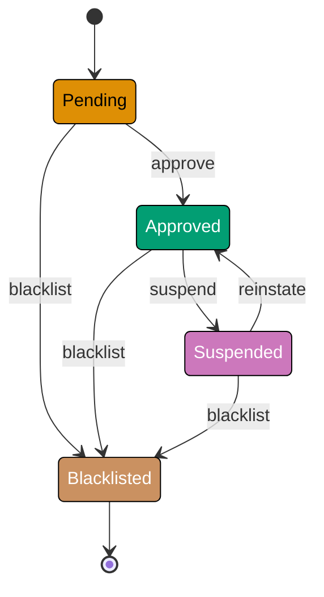
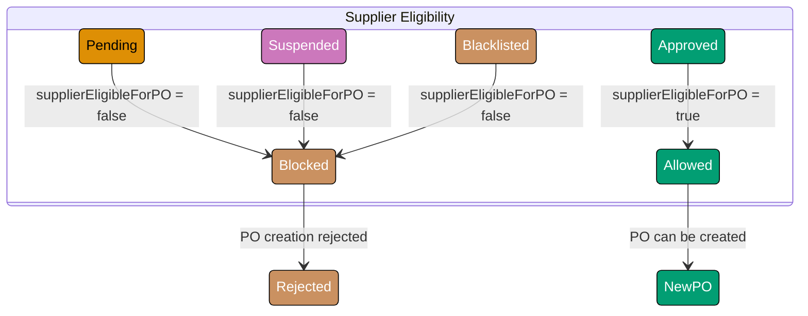
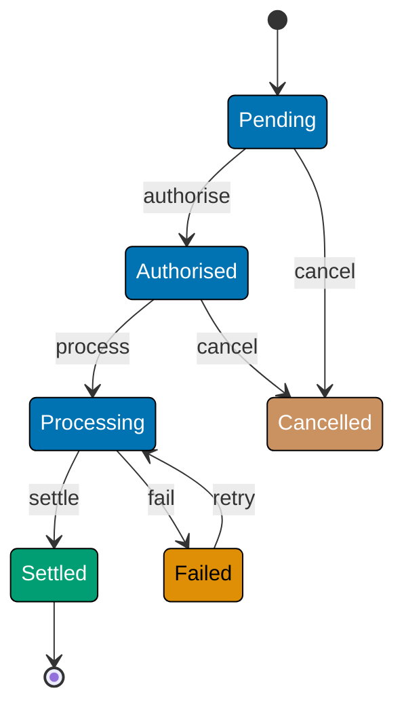
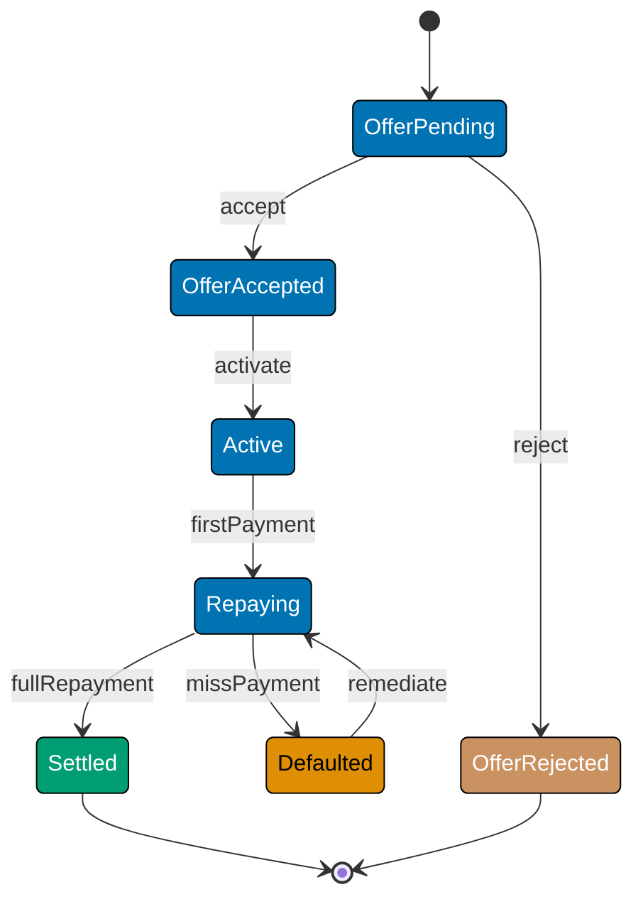

This advanced section adds the `Supplier` lifecycle and `Payment` state machine to the Procure-to-Pay domain, then covers the patterns that turn flat FSMs into statecharts: hierarchical states, parallel regions, history states, FSM persistence, event sourcing, and actor-model integration. Examples are shown using discriminated unions / ADTs, pure transition functions, and immutable records — canonical patterns for any functional language. F# is the primary language; Clojure, TypeScript, and Haskell equivalents appear in the tabbed examples. The `MurabahaContract` machine appears as an optional Sharia-finance extension.

## Supplier Lifecycle FSM (Examples 51–57)

### Example 51: Supplier States and Risk-Tier Semantics

A `Supplier` record tracks vendor approval status. Unlike `PurchaseOrder`, the Supplier machine has only four states, but each state carries meaningful consequences for the purchasing context.







```fsharp
// ── file: SupplierFsm.fsx ──────────────────────────────────────────────────
// Supplier state DU: four states, one terminal (Blacklisted).
// Compiler rejects any SupplierState value outside this set.
type SupplierState =
    | Pending     // => Application received; vetting in progress
    | Approved    // => Cleared for new POs; appears in supplier selection
    | Suspended   // => Temporarily blocked; existing POs continue, no new POs
    | Blacklisted // => Permanently excluded — terminal state

// Supplier event DU: exhaustive alphabet of what can happen to a supplier.
type SupplierEvent =
    | Approve    // => Vetting passed; supplier cleared for purchasing
    | Suspend    // => Compliance issue detected; temporary hold
    | Reinstate  // => Issue resolved; supplier restored to Approved
    | Blacklist  // => Severe breach; permanent exclusion

// Supplier record — immutable; identity + current state.
type Supplier =
    { Id: string          // => Format: "sup_<id>"
      Name: string        // => Supplier legal name
      State: SupplierState }

// Transition table: (SupplierState * SupplierEvent) -> SupplierState option.
// Map.ofList builds an immutable lookup at startup.
let supplierTransitions : Map<SupplierState * SupplierEvent, SupplierState> =
    Map.ofList [
        (Pending,   Approve),   Approved    // => Vetting passed -> Approved
        (Pending,   Blacklist), Blacklisted // => Immediate exclusion from Pending
        (Approved,  Suspend),   Suspended   // => Compliance issue -> Suspended
        (Approved,  Blacklist), Blacklisted // => Severe breach from Approved
        (Suspended, Reinstate), Approved    // => Issue resolved -> back to Approved
        (Suspended, Blacklist), Blacklisted // => Escalation from Suspended
        // => Blacklisted: terminal — no outgoing transitions listed
    ]

// Pure transition function: lookup table, return Result.
let transitionSupplier (sup: Supplier) (event: SupplierEvent) : Result<Supplier, string> =
    match Map.tryFind (sup.State, event) supplierTransitions with
    | Some next -> Ok { sup with State = next }
    // => Valid transition: return supplier with updated state
    | None      -> Error $"{sup.State} --{event}--> (forbidden)"
    // => (state, event) not in table — invalid for this supplier

let sup = { Id = "sup_001"; Name = "Acme Supplies Ltd"; State = Approved }
// => Start in Approved state

let r1 = transitionSupplier sup Suspend
// => Ok { State = Suspended }

let r2 = r1 |> Result.bind (fun s -> transitionSupplier s Reinstate)
// => Ok { State = Approved }

let r3 = transitionSupplier sup Approve
// => Error "Approved --Approve--> (forbidden)" (already Approved)

printfn "%A" r1  // => Ok { Id = "sup_001"; State = Suspended }
printfn "%A" r2  // => Ok { Id = "sup_001"; State = Approved }
printfn "%A" r3  // => Error "Approved --Approve--> (forbidden)"
```





```clojure
;; ── file: supplier_fsm.clj ───────────────────────────────────────────────
;; [F#: discriminated union SupplierState — compiler-enforced exhaustiveness;
;;  Clojure uses keyword values in maps for open, data-oriented state representation]
;; Supplier states are plain keywords. The valid set is the contract.
;; => :pending :approved :suspended :blacklisted

;; [F#: discriminated union SupplierEvent — all events as type variants;
;;  Clojure uses keywords; no declaration required]
;; Supplier events: :approve :suspend :reinstate :blacklist

(def supplier-transitions
  ;; Transition table as a map of [state event] -> next-state.
  ;; => Same data-driven lookup as F# Map.ofList; keys are 2-element vectors
  {[:pending   :approve]   :approved
   ;; => Vetting passed -> Approved
   [:pending   :blacklist] :blacklisted
   ;; => Immediate exclusion from Pending
   [:approved  :suspend]   :suspended
   ;; => Compliance issue -> Suspended
   [:approved  :blacklist] :blacklisted
   ;; => Severe breach from Approved
   [:suspended :reinstate] :approved
   ;; => Issue resolved -> back to Approved
   [:suspended :blacklist] :blacklisted})
   ;; => Escalation from Suspended; :blacklisted is terminal — no outgoing entries

(defn transition-supplier
  ;; Pure transition: look up [state event] in the table, return tagged result map.
  ;; [F#: Result<Supplier, string> — compile-time tagged union; Clojure returns {:ok ...} or {:error ...}]
  [supplier event]
  (let [state (:state supplier)
        next  (supplier-transitions [state event])]
    ;; => Look up current state + event pair in the transition table
    (if next
      {:ok (assoc supplier :state next)}
      ;; => Valid transition: return supplier map with updated :state key
      {:error (str state " --" event "--> (forbidden)")})))
      ;; => Pair not in table — invalid transition for this supplier

(def sup {:id "sup_001" :name "Acme Supplies Ltd" :state :approved})
;; => Start in :approved state

(def r1 (transition-supplier sup :suspend))
;; => {:ok {:id "sup_001" :name "Acme Supplies Ltd" :state :suspended}}

(defn bind-result
  ;; Threading helper: apply f to :ok value, or pass :error through unchanged.
  ;; [F#: Result.bind — built-in combinator; Clojure uses explicit helper or result libs]
  [result f]
  (if (:ok result)
    (f (:ok result))
    result))
;; => Enables sequential transition chaining without nested conditionals

(def r2 (bind-result r1 #(transition-supplier % :reinstate)))
;; => {:ok {:state :approved}} — reinstated from Suspended

(def r3 (transition-supplier sup :approve))
;; => {:error "approved --approve--> (forbidden)"} — already Approved

(println r1) ;; => {:ok {:id sup_001, :state :suspended}}
(println r2) ;; => {:ok {:id sup_001, :state :approved}}
(println r3) ;; => {:error "approved --approve--> (forbidden)"}
```





```typescript
// ── file: supplierFsm.ts ──────────────────────────────────────────────────
// [F#: SupplierState DU; Clojure: keyword states]
// TypeScript: literal union for supplier states — compiler-checked.

type SupplierState =
  | "Pending" // => Application received; vetting in progress
  | "Approved" // => Cleared for new POs; appears in supplier selection
  | "Suspended" // => Temporarily blocked; no new POs
  | "Blacklisted"; // => Permanently excluded — terminal state

type SupplierEvent =
  | "Approve" // => Vetting passed; supplier cleared for purchasing
  | "Suspend" // => Compliance issue detected; temporary hold
  | "Reinstate" // => Issue resolved; supplier restored to Approved
  | "Blacklist"; // => Severe breach; permanent exclusion

type Result<T, E> = { ok: true; value: T } | { ok: false; error: E };
const Ok = <T>(v: T): Result => ({ ok: true, value: v });
const Err = <E>(e: E): Result => ({ ok: false, error: e });
const resultBind = <T, U, E>(r: Result, f: (v: T) => Result): Result => (r.ok ? f(r.value) : r);

type Supplier = Readonly;

// Transition table: [State:Event] -> SupplierState
const supplierTransitions = new Map<string, SupplierState>([
  ["Pending:Approve", "Approved"],
  ["Pending:Blacklist", "Blacklisted"],
  ["Approved:Suspend", "Suspended"],
  ["Approved:Blacklist", "Blacklisted"],
  ["Suspended:Reinstate", "Approved"],
  ["Suspended:Blacklist", "Blacklisted"],
]);
// => Blacklisted is terminal — no outgoing transitions listed

const transitionSupplier = (sup: Supplier, event: SupplierEvent): Result => {
  const next = supplierTransitions.get(`${sup.state}:${event}`);
  if (!next) return Err(`${sup.state} --${event}--> (forbidden)`);
  return Ok({ ...sup, state: next });
};

const sup: Supplier = { id: "sup_001", name: "Acme Supplies Ltd", state: "Approved" };
const r1 = transitionSupplier(sup, "Suspend");
// => { ok: true, value: { state: "Suspended" } }

const r2 = resultBind(r1, (s) => transitionSupplier(s, "Reinstate"));
// => { ok: true, value: { state: "Approved" } }

const r3 = transitionSupplier(sup, "Approve");
// => { ok: false, error: "Approved --Approve--> (forbidden)" }

console.log(r1.ok ? r1.value.state : r1.error); // => Suspended
console.log(r2.ok ? r2.value.state : r2.error); // => Approved
console.log(r3.ok ? r3.value.state : r3.error); // => Approved --Approve--> (forbidden)
```





```haskell
-- ── file: SupplierFsm.hs ───────────────────────────────────────────────────
-- [F#: discriminated union SupplierState — compiler-enforced exhaustiveness;
--  Haskell uses an ADT with deriving stock for Show/Eq/Ord — same closed set]
{-# LANGUAGE DerivingStrategies #-}
module SupplierFsm where

import           Data.Map.Strict (Map)   -- => Strict map for the transition table
import qualified Data.Map.Strict as Map  -- => Qualified import keeps the API clear

-- Supplier state ADT: four constructors, one terminal (Blacklisted).
-- => Compiler rejects any value outside this set, like F#'s DU.
data SupplierState
  = Pending      -- => Application received; vetting in progress
  | Approved     -- => Cleared for new POs; appears in supplier selection
  | Suspended    -- => Temporarily blocked; existing POs continue, no new POs
  | Blacklisted  -- => Permanently excluded — terminal state
  deriving stock (Show, Eq, Ord)  -- => Ord required for use as Map key

-- Supplier event ADT: exhaustive alphabet of supplier-affecting events.
data SupplierEvent
  = Approve     -- => Vetting passed; supplier cleared for purchasing
  | Suspend     -- => Compliance issue detected; temporary hold
  | Reinstate   -- => Issue resolved; supplier restored to Approved
  | Blacklist   -- => Severe breach; permanent exclusion
  deriving stock (Show, Eq, Ord)

-- Supplier record — immutable; identity + current state.
data Supplier = Supplier
  { supId    :: String         -- => Format: "sup_<id>"
  , supName  :: String         -- => Supplier legal name
  , supState :: SupplierState  -- => Current FSM state
  } deriving stock (Show, Eq)

-- Transition table keyed on (state, event) — same intent as F# Map.ofList.
-- => Map.fromList builds an immutable lookup at module load.
supplierTransitions :: Map (SupplierState, SupplierEvent) SupplierState
supplierTransitions = Map.fromList
  [ ((Pending,   Approve),   Approved)     -- => Vetting passed -> Approved
  , ((Pending,   Blacklist), Blacklisted)  -- => Immediate exclusion from Pending
  , ((Approved,  Suspend),   Suspended)    -- => Compliance issue -> Suspended
  , ((Approved,  Blacklist), Blacklisted)  -- => Severe breach from Approved
  , ((Suspended, Reinstate), Approved)     -- => Issue resolved -> back to Approved
  , ((Suspended, Blacklist), Blacklisted)  -- => Escalation from Suspended
  -- => Blacklisted: terminal — no outgoing transitions listed
  ]

-- Pure transition function: lookup table, return Either (Haskell's Result).
-- [F#: Result<Supplier, string>; Haskell: Either String Supplier — same shape]
transitionSupplier :: Supplier -> SupplierEvent -> Either String Supplier
transitionSupplier sup event =
  case Map.lookup (supState sup, event) supplierTransitions of
    Just next -> Right sup { supState = next }
    -- => Valid transition: return supplier with updated state
    Nothing   -> Left $ show (supState sup) <> " --" <> show event <> "--> (forbidden)"
    -- => (state, event) not in table — invalid for this supplier

sup :: Supplier
sup = Supplier { supId = "sup_001", supName = "Acme Supplies Ltd", supState = Approved }
-- => Start in Approved state

r1, r3 :: Either String Supplier
r1 = transitionSupplier sup Suspend
-- => Right (Supplier { supState = Suspended })

r2 :: Either String Supplier
r2 = r1 >>= \s -> transitionSupplier s Reinstate
-- => Either's monadic bind chains transitions just like F# Result.bind

r3 = transitionSupplier sup Approve
-- => Left "Approved --Approve--> (forbidden)" (already Approved)

-- main prints all three for parity with the F# session output.
main :: IO ()
main = do
  print r1   -- => Right (Supplier { supState = Suspended })
  print r2   -- => Right (Supplier { supState = Approved })
  print r3   -- => Left "Approved --Approve--> (forbidden)"
```





**Key Takeaway**: Even a four-state machine encodes significant business rules — the asymmetry between `Suspended` (reversible) and `Blacklisted` (terminal) is the entire compliance enforcement model.

**Why It Matters**: The distinction between suspended and blacklisted is a legal and audit concern: suspended suppliers can be reinstated after a compliance review, while blacklisted suppliers require a board-level decision to re-engage. Encoding this asymmetry in the FSM makes it structural — you cannot accidentally reinstate a blacklisted supplier without modifying the transition table itself. The `Result` return type surfaces the attempt as a named error, giving calling code the information it needs to notify a compliance officer rather than silently failing.

---

### Example 52: Supplier State Consequences on PO Selection

The Supplier FSM state gates which suppliers are selectable for new POs — a guard function on the purchasing context reads Supplier state before allowing PO creation.







```fsharp
// ── file: SupplierFsm.fsx ──────────────────────────────────────────────────
// Guard: can a supplier receive a new PO?
// Pure predicate — depends only on the supplier's current state.
let supplierEligibleForPO (state: SupplierState) : bool =
    state = Approved
    // => Only Approved: Pending are unvetted, Suspended cannot receive new POs

// Guard: does blacklisting a supplier force its open POs to Disputed?
// Domain rule: any transition INTO Blacklisted triggers cascading disputes.
let blacklistingForcesDispute (oldState: SupplierState) (newState: SupplierState) : bool =
    newState = Blacklisted && oldState <> Blacklisted
    // => true only on the transition edge into Blacklisted

// Return type: the blacklisted supplier plus the PO IDs that must be disputed.
type BlacklistResult =
    { Supplier: Supplier
      AffectedPOIds: string list } // => PO ids to be force-disputed by the caller

// Blacklist function: pure; returns Result carrying the cascade information.
let blacklistSupplier (sup: Supplier) (openPOIds: string list) : Result<BlacklistResult, string> =
    if sup.State = Blacklisted then
        Error $"Supplier {sup.Id} is already blacklisted"
        // => Idempotent: no-op if already blacklisted
    else
        match transitionSupplier sup Blacklist with
        | Error msg -> Error msg
        // => Transition failed — propagate error (shouldn't happen given guard above)
        | Ok updated ->
            // => Determine cascade: which POs must be disputed?
            let affected =
                if blacklistingForcesDispute sup.State updated.State then openPOIds else []
            // => If transitioning INTO Blacklisted, all open POs are affected
            Ok { Supplier = updated; AffectedPOIds = affected }

// Tests
printfn "Eligible (Approved):    %b" (supplierEligibleForPO Approved)    // => true
printfn "Eligible (Suspended):   %b" (supplierEligibleForPO Suspended)   // => false
printfn "Eligible (Pending):     %b" (supplierEligibleForPO Pending)     // => false

let approvedSup = { Id = "sup_002"; Name = "Beta Corp"; State = Approved }
let bl = blacklistSupplier approvedSup ["po_101"; "po_102"; "po_103"]
// => Ok { Supplier = { State = Blacklisted }; AffectedPOIds = ["po_101";"po_102";"po_103"] }

printfn "%A" bl  // => Ok { Supplier = { State = Blacklisted }; AffectedPOIds = [3 PO ids] }
```





```clojure
;; ── file: supplier_fsm.clj ───────────────────────────────────────────────
;; Guard: can a supplier receive a new PO?
;; [F#: pure bool predicate on SupplierState DU variant;
;;  Clojure checks keyword equality — same semantics, no type declaration]
(defn supplier-eligible-for-po?
  [state]
  ;; Only :approved suppliers can receive new POs
  ;; => :pending are unvetted, :suspended cannot take new work
  (= state :approved))

;; Guard: does blacklisting cross the edge INTO :blacklisted?
;; [F#: (newState = Blacklisted && oldState <> Blacklisted) — pure boolean guard]
(defn blacklisting-forces-dispute?
  [old-state new-state]
  ;; true only when the transition moves INTO :blacklisted from another state
  (and (= new-state :blacklisted)
       (not= old-state :blacklisted)))
;; => Prevents spurious cascade if already blacklisted

(defn blacklist-supplier
  ;; Pure function: returns {:ok {...}} or {:error "..."} with cascade data.
  ;; [F#: Result<BlacklistResult, string> — named record in Ok payload]
  ;; Clojure returns a plain map; :affected-po-ids carries the cascade set.
  [supplier open-po-ids]
  (if (= (:state supplier) :blacklisted)
    {:error (str "Supplier " (:id supplier) " is already blacklisted")}
    ;; => Idempotent guard: already blacklisted, skip
    (let [result (transition-supplier supplier :blacklist)]
      (if (:error result)
        result
        ;; => Propagate transition error unchanged
        (let [updated  (:ok result)
              affected (if (blacklisting-forces-dispute? (:state supplier)
                                                         (:state updated))
                         open-po-ids
                         [])]
          ;; => Collect all open PO ids if crossing INTO :blacklisted
          {:ok {:updated-supplier updated
                :affected-po-ids  affected}})))))
          ;; => Caller applies each PO transition separately

(println "Eligible (approved)?"  (supplier-eligible-for-po? :approved))  ;; => true
(println "Eligible (suspended)?" (supplier-eligible-for-po? :suspended)) ;; => false
(println "Eligible (pending)?"   (supplier-eligible-for-po? :pending))   ;; => false

(def approved-sup {:id "sup_002" :name "Beta Corp" :state :approved})
(def bl (blacklist-supplier approved-sup ["po_101" "po_102" "po_103"]))
;; => {:ok {:updated-supplier {:state :blacklisted}
;;          :affected-po-ids ["po_101" "po_102" "po_103"]}}

(println bl)
;; => {:ok {:updated-supplier {... :state :blacklisted} :affected-po-ids [3 ids]}}
```





```typescript
// ── file: supplierFsm.ts ──────────────────────────────────────────────────
// [F#: supplierEligibleForPO predicate + BlacklistResult; Clojure: plain result map]
// TypeScript: pure predicate + cascade result type.

// Guard: can a supplier receive a new PO?
const supplierEligibleForPO = (state: SupplierState): boolean => state === "Approved";
// => Only Approved: Pending are unvetted, Suspended cannot receive new POs

// Guard: does blacklisting cross the edge INTO Blacklisted?
const blacklistingForcesDispute = (oldState: SupplierState, newState: SupplierState): boolean =>
  newState === "Blacklisted" && oldState !== "Blacklisted";
// => true only on the transition edge into Blacklisted

type BlacklistResult = Readonly<{
  supplier: Supplier;
  affectedPOIds: readonly string[];
  // => PO ids to be force-disputed by the caller
}>;
// => Pure return type: caller applies cascading PO transitions separately

// Blacklist function: pure; returns Result carrying the cascade information.
const blacklistSupplier = (sup: Supplier, openPOIds: readonly string[]): Result<BlacklistResult, string> => {
  if (sup.state === "Blacklisted") return Err(`Supplier ${sup.id} is already blacklisted`);
  // => Idempotent: no-op if already blacklisted
  const transition = transitionSupplier(sup, "Blacklist");
  if (!transition.ok) return transition;
  // => Transition failed — propagate error
  const affected = blacklistingForcesDispute(sup.state, transition.value.state) ? openPOIds : [];
  // => If transitioning INTO Blacklisted, all open POs are affected
  return Ok({ supplier: transition.value, affectedPOIds: affected });
};

console.log("Eligible (Approved):", supplierEligibleForPO("Approved")); // => true
console.log("Eligible (Suspended):", supplierEligibleForPO("Suspended")); // => false
console.log("Eligible (Pending):", supplierEligibleForPO("Pending")); // => false

const approvedSup: Supplier = { id: "sup_002", name: "Beta Corp", state: "Approved" };
const bl = blacklistSupplier(approvedSup, ["po_101", "po_102", "po_103"]);
console.log(bl.ok ? `Affected POs: ${bl.value.affectedPOIds.length}` : bl.error);
// => Affected POs: 3
```





```haskell
-- ── file: SupplierFsm.hs ───────────────────────────────────────────────────
-- [F#: pure predicate supplierEligibleForPO + cascade record BlacklistResult;
--  Haskell uses pure boolean functions and a record return type — same shape]
module SupplierFsm where

-- Guard: can a supplier receive a new PO?
-- => Pure predicate; depends only on the current state.
supplierEligibleForPO :: SupplierState -> Bool
supplierEligibleForPO state = state == Approved
-- => Only Approved; Pending are unvetted, Suspended cannot receive new POs

-- Guard: does blacklisting cross the edge INTO Blacklisted?
-- => true only on the transition edge into Blacklisted (idempotency guard)
blacklistingForcesDispute :: SupplierState -> SupplierState -> Bool
blacklistingForcesDispute oldState newState =
  newState == Blacklisted && oldState /= Blacklisted
-- => Prevents spurious cascade if supplier was already blacklisted

-- Cascade carrier: blacklisted supplier + PO ids the caller must force-dispute.
data BlacklistResult = BlacklistResult
  { brSupplier      :: Supplier   -- => Updated supplier in Blacklisted state
  , brAffectedPOIds :: [String]   -- => PO ids to be force-disputed by caller
  } deriving stock (Show, Eq)

-- Pure blacklist function: returns Either carrying the cascade information.
-- => Aggregate-boundary respecting: caller transitions each PO separately.
blacklistSupplier :: Supplier -> [String] -> Either String BlacklistResult
blacklistSupplier sup openPOIds
  | supState sup == Blacklisted =
      Left $ "Supplier " <> supId sup <> " is already blacklisted"
      -- => Idempotent: no-op if already blacklisted
  | otherwise =
      case transitionSupplier sup Blacklist of
        Left msg      -> Left msg
        -- => Transition failed — propagate error (rare given guard above)
        Right updated ->
          let affected =
                if blacklistingForcesDispute (supState sup) (supState updated)
                  then openPOIds
                  else []
          -- => If crossing INTO Blacklisted, all open POs are affected
          in Right BlacklistResult { brSupplier = updated, brAffectedPOIds = affected }

approvedSup :: Supplier
approvedSup = Supplier { supId = "sup_002", supName = "Beta Corp", supState = Approved }

bl :: Either String BlacklistResult
bl = blacklistSupplier approvedSup ["po_101", "po_102", "po_103"]
-- => Right (BlacklistResult { brSupplier = ... Blacklisted, brAffectedPOIds = 3 ids })

main :: IO ()
main = do
  putStrLn $ "Eligible (Approved):    " <> show (supplierEligibleForPO Approved)    -- => True
  putStrLn $ "Eligible (Suspended):   " <> show (supplierEligibleForPO Suspended)   -- => False
  putStrLn $ "Eligible (Pending):     " <> show (supplierEligibleForPO Pending)     -- => False
  print bl
  -- => Right (BlacklistResult { brAffectedPOIds = ["po_101","po_102","po_103"] })
```





**Key Takeaway**: Cross-machine effects are encoded as explicit data returned from a pure function — the caller decides when and how to apply the cascading PO state changes.

**Why It Matters**: Cascading state changes across aggregates must be explicit, not hidden inside a function that mutates POs directly. Returning `AffectedPOIds` keeps the blacklist function focused on one aggregate while giving the application service the information it needs to transition each PO in a separate, audited step. This preserves aggregate boundary integrity and makes cascading effects visible in the application layer, where they belong.

---

### Example 53: Supplier Risk Score Guard

Supplier approval requires a minimum risk score and complete documentation. A multi-condition guard on the `Approve` transition returns all blocking reasons, not just the first.





```fsharp
// ── file: SupplierFsm.fsx ──────────────────────────────────────────────────
// Supplier application: carries vetting data evaluated by the guard.
type SupplierApplication =
    { SupplierId: string
      RiskScore: float    // => 0.0 (high risk) to 1.0 (low risk)
      HasDocuments: bool } // => Required compliance documents submitted?

// Thresholds defined as a record — easier to test with different values.
type ApprovalThresholds =
    { MinRiskScore: float  // => Below this: too risky
      RequireDocuments: bool } // => Documents mandatory?

// Default thresholds used in production.
let defaultThresholds = { MinRiskScore = 0.6; RequireDocuments = true }

// Guard: accumulate all blocking reasons — same pattern as createValidatedPO.
let canApproveSupplier (app: SupplierApplication) (thresholds: ApprovalThresholds) : string list =
    [   // => List comprehension collects every failing check
        if app.RiskScore < thresholds.MinRiskScore then
            yield $"Risk score {app.RiskScore:F2} below minimum {thresholds.MinRiskScore:F2}"
            // => Risk too high; supplier not ready for approval
        if thresholds.RequireDocuments && not app.HasDocuments then
            yield "Required compliance documents not submitted"
            // => Missing documents; cannot approve without them
    ]   // => Empty list = guard passes; non-empty = blocked with reasons

// Guarded approve transition using the guard.
let approveSupplier
    (sup: Supplier)
    (app: SupplierApplication)
    (thresholds: ApprovalThresholds)
    : Result<Supplier, string> =
    if sup.State <> Pending then
        Error $"Supplier {sup.Id} is not in Pending state"
        // => FSM guard: approve only valid from Pending
    else
        let errors = canApproveSupplier app thresholds
        if not (List.isEmpty errors) then
            Error $"Approval blocked: {String.concat \"; \" errors}"
            // => Business guard: concatenate all blocking reasons
        else
            Ok { sup with State = Approved }
            // => All checks passed — advance to Approved

// Tests
let pendingSup = { Id = "sup_003"; Name = "Gamma Ltd"; State = Pending }
let lowScoreApp  = { SupplierId = "sup_003"; RiskScore = 0.4; HasDocuments = false }
let goodApp      = { SupplierId = "sup_003"; RiskScore = 0.75; HasDocuments = true }

printfn "%A" (approveSupplier pendingSup lowScoreApp defaultThresholds)
// => Error "Approval blocked: Risk score 0.40 below minimum 0.60; Required compliance documents not submitted"

printfn "%A" (approveSupplier pendingSup goodApp defaultThresholds)
// => Ok { Id = "sup_003"; State = Approved }
```





```clojure
;; ── file: supplier_fsm.clj ───────────────────────────────────────────────
;; Supplier application: a plain map carrying vetting data.
;; [F#: record type SupplierApplication — named fields with compile-time types]
;; => {:supplier-id "sup_003" :risk-score 0.75 :has-documents true}

;; Thresholds as a plain map — swappable for testing without touching guard logic.
;; [F#: record ApprovalThresholds — same intent; Clojure uses a map literal]
(def default-thresholds
  {:min-risk-score   0.6
   ;; => Risk scores below this value block approval
   :require-documents true})
   ;; => Documents are mandatory under default policy

(defn can-approve-supplier?
  ;; Guard: accumulates ALL blocking reasons as a vector of strings.
  ;; [F#: list comprehension with yield — Clojure uses reduce into a vector]
  [app thresholds]
  (cond-> []
    ;; => cond-> threads the accumulator vector, adding each failing check
    (< (:risk-score app) (:min-risk-score thresholds))
    (conj (str "Risk score " (:risk-score app)
               " below minimum " (:min-risk-score thresholds)))
    ;; => Conj appends the reason string to the accumulator vector

    (and (:require-documents thresholds)
         (not (:has-documents app)))
    (conj "Required compliance documents not submitted")))
    ;; => Empty vector = guard passes; non-empty = blocked with all reasons listed

(defn approve-supplier
  ;; Guarded approve: FSM state check first, then business guard.
  ;; Returns {:ok supplier-map} or {:error "reason"}.
  [supplier app thresholds]
  (if (not= (:state supplier) :pending)
    {:error (str "Supplier " (:id supplier) " is not in Pending state")}
    ;; => FSM guard: approve only valid from :pending
    (let [errors (can-approve-supplier? app thresholds)]
      ;; => Collect all business guard failures in one pass
      (if (seq errors)
        {:error (str "Approval blocked: " (clojure.string/join "; " errors))}
        ;; => Join all reasons with semicolons for actionable feedback
        {:ok (assoc supplier :state :approved)}))))
        ;; => All checks pass — advance to :approved

(def pending-sup {:id "sup_003" :name "Gamma Ltd" :state :pending})
(def low-score-app {:supplier-id "sup_003" :risk-score 0.4 :has-documents false})
(def good-app      {:supplier-id "sup_003" :risk-score 0.75 :has-documents true})

(println (approve-supplier pending-sup low-score-app default-thresholds))
;; => {:error "Approval blocked: Risk score 0.4 below minimum 0.6; Required compliance documents not submitted"}

(println (approve-supplier pending-sup good-app default-thresholds))
;; => {:ok {:id "sup_003" :name "Gamma Ltd" :state :approved}}
```





```typescript
// ── file: supplierFsm.ts ──────────────────────────────────────────────────
// [F#: SupplierApplication record + canApproveSupplier guard; Clojure: cond-> accumulator]
// TypeScript: error accumulation guard — all blocking reasons in one pass.

type SupplierApplication = Readonly<{
  supplierId: string;
  riskScore: number; // => 0.0 (high risk) to 1.0 (low risk)
  hasDocuments: boolean; // => Required compliance documents submitted?
}>;

type ApprovalThresholds = Readonly<{
  minRiskScore: number; // => Below this: too risky
  requireDocuments: boolean; // => Documents mandatory?
}>;

const defaultThresholds: ApprovalThresholds = {
  minRiskScore: 0.6,
  requireDocuments: true,
};

// Guard: accumulate all blocking reasons — same fail-all pattern as validation.
const canApproveSupplier = (app: SupplierApplication, thresholds: ApprovalThresholds): string[] => {
  const errors: string[] = [];
  if (app.riskScore < thresholds.minRiskScore)
    errors.push(`Risk score ${app.riskScore.toFixed(2)} below minimum ${thresholds.minRiskScore.toFixed(2)}`);
  // => Risk too high; supplier not ready for approval
  if (thresholds.requireDocuments && !app.hasDocuments) errors.push("Required compliance documents not submitted");
  // => Missing documents; cannot approve without them
  return errors;
  // => Empty array = guard passes; non-empty = blocked with all reasons
};

// Guarded approve transition using the guard.
const approveSupplier = (
  sup: Supplier,
  app: SupplierApplication,
  thresholds: ApprovalThresholds,
): Result<Supplier, string> => {
  if (sup.state !== "Pending") return Err(`Supplier ${sup.id} is not in Pending state`);
  const errors = canApproveSupplier(app, thresholds);
  if (errors.length > 0) return Err(`Approval blocked: ${errors.join("; ")}`);
  // => Business guard: concatenate all blocking reasons
  return Ok({ ...sup, state: "Approved" });
  // => All checks passed — advance to Approved
};

const pendingSup: Supplier = { id: "sup_003", name: "Gamma Ltd", state: "Pending" };
const lowScoreApp: SupplierApplication = { supplierId: "sup_003", riskScore: 0.4, hasDocuments: false };
const goodApp: SupplierApplication = { supplierId: "sup_003", riskScore: 0.75, hasDocuments: true };

const r1 = approveSupplier(pendingSup, lowScoreApp, defaultThresholds);
console.log(r1.ok ? r1.value.state : r1.error);
// => "Approval blocked: Risk score 0.40 below minimum 0.60; Required compliance documents not submitted"

const r2 = approveSupplier(pendingSup, goodApp, defaultThresholds);
console.log(r2.ok ? r2.value.state : r2.error);
// => Approved
```





```haskell
-- ── file: SupplierFsm.hs ───────────────────────────────────────────────────
-- [F#: SupplierApplication record + canApproveSupplier with yield-list;
--  Haskell uses a record + a list-builder via Data.Maybe.catMaybes — same intent]
module SupplierFsm where

import Data.List   (intercalate)  -- => For joining error reasons with "; "
import Data.Maybe  (catMaybes)    -- => Drops Nothing, keeps Just reasons
import Text.Printf (printf)       -- => Fixed-precision risk-score formatting

-- Supplier application: vetting data evaluated by the guard.
data SupplierApplication = SupplierApplication
  { saSupplierId   :: String   -- => Identifier of the supplier under review
  , saRiskScore    :: Double   -- => 0.0 (high risk) to 1.0 (low risk)
  , saHasDocuments :: Bool     -- => Required compliance documents submitted?
  } deriving stock (Show, Eq)

-- Thresholds as a record — swappable for tests without touching guard logic.
data ApprovalThresholds = ApprovalThresholds
  { atMinRiskScore     :: Double   -- => Below this: too risky
  , atRequireDocuments :: Bool     -- => Documents mandatory under policy?
  } deriving stock (Show, Eq)

defaultThresholds :: ApprovalThresholds
defaultThresholds = ApprovalThresholds { atMinRiskScore = 0.6, atRequireDocuments = True }

-- Guard: accumulate ALL blocking reasons in one pass — no short-circuit.
-- => Same fail-all pattern as F# list comprehension with yield.
canApproveSupplier :: SupplierApplication -> ApprovalThresholds -> [String]
canApproveSupplier app th = catMaybes
  [ if saRiskScore app < atMinRiskScore th
      then Just (printf "Risk score %.2f below minimum %.2f"
                        (saRiskScore app) (atMinRiskScore th))
      else Nothing
    -- => Risk too high; supplier not ready for approval
  , if atRequireDocuments th && not (saHasDocuments app)
      then Just "Required compliance documents not submitted"
      else Nothing
    -- => Missing documents; cannot approve without them
  ]
-- => Empty list = guard passes; non-empty = blocked with all reasons listed

-- Guarded approve: FSM state check first, then business guard.
approveSupplier
  :: Supplier
  -> SupplierApplication
  -> ApprovalThresholds
  -> Either String Supplier
approveSupplier sup app th
  | supState sup /= Pending =
      Left $ "Supplier " <> supId sup <> " is not in Pending state"
      -- => FSM guard: approve only valid from Pending
  | not (null errors) =
      Left $ "Approval blocked: " <> intercalate "; " errors
      -- => Business guard: concatenate all blocking reasons for actionable feedback
  | otherwise =
      Right sup { supState = Approved }
      -- => All checks passed — advance to Approved
  where
    errors = canApproveSupplier app th

pendingSup :: Supplier
pendingSup = Supplier { supId = "sup_003", supName = "Gamma Ltd", supState = Pending }

lowScoreApp, goodApp :: SupplierApplication
lowScoreApp = SupplierApplication { saSupplierId = "sup_003", saRiskScore = 0.4,  saHasDocuments = False }
goodApp     = SupplierApplication { saSupplierId = "sup_003", saRiskScore = 0.75, saHasDocuments = True  }

main :: IO ()
main = do
  print (approveSupplier pendingSup lowScoreApp defaultThresholds)
  -- => Left "Approval blocked: Risk score 0.40 below minimum 0.60; Required compliance documents not submitted"
  print (approveSupplier pendingSup goodApp defaultThresholds)
  -- => Right (Supplier { supId = "sup_003", supState = Approved })
```





**Key Takeaway**: Accumulating all guard failures in a list gives the caller a complete picture of why approval was blocked, enabling actionable feedback rather than a single opaque error.

**Why It Matters**: Fail-fast guards that return only the first error force the user to fix one issue at a time in a frustrating loop. The list comprehension with `yield` collects all violations in one pass without mutable state, keeping the guard pure and composable. The `ApprovalThresholds` record makes the guard testable with different configurations — unit tests can vary thresholds without touching the guard logic.

---

### Example 54: Hierarchical States — Supplier with Sub-States

Hierarchical states nest states inside a parent state. `Approved` has two sub-states — `ActiveContract` and `ContractExpiring` — that do not affect the top-level FSM but drive notification logic.





```fsharp
// ── file: SupplierFsm.fsx ──────────────────────────────────────────────────
// Sub-state DU: only meaningful when parent is Approved.
// Using a separate DU avoids polluting the top-level SupplierState.
type ApprovedSubState =
    | ActiveContract     // => Contract valid; no action needed
    | ContractExpiring   // => Contract expires within 30 days; renewal reminder needed

// Extended supplier: top-level state + optional sub-state.
// SubState is None when State is not Approved.
type ExtendedSupplier =
    { Id: string
      State: SupplierState
      SubState: ApprovedSubState option } // => Some only when State = Approved

// Smart constructor: enforce sub-state/state invariant at creation time.
let createExtSupplier (id: string) (state: SupplierState) : ExtendedSupplier =
    let sub =
        match state with
        | Approved -> Some ActiveContract  // => Default sub-state on approval
        | _        -> None                 // => No sub-state outside Approved
    { Id = id; State = state; SubState = sub }

// Enter ContractExpiring sub-state: only valid when top-level is Approved.
let markContractExpiring (sup: ExtendedSupplier) : Result<ExtendedSupplier, string> =
    match sup.State, sup.SubState with
    | Approved, Some ActiveContract ->
        Ok { sup with SubState = Some ContractExpiring }
        // => Valid: active contract can transition to expiring
    | Approved, Some ContractExpiring ->
        Error "Contract already marked as expiring"
        // => Idempotent guard: already in ContractExpiring
    | other, _ ->
        Error $"Sub-state only applies to Approved suppliers; current state: {other}"
        // => Top-level not Approved — sub-state has no meaning

// Renew contract: reset to ActiveContract from ContractExpiring.
let renewContract (sup: ExtendedSupplier) : Result<ExtendedSupplier, string> =
    match sup.State, sup.SubState with
    | Approved, Some ContractExpiring ->
        Ok { sup with SubState = Some ActiveContract }
        // => Renewal resets the sub-state to active
    | Approved, Some ActiveContract ->
        Error "Contract is not expiring; nothing to renew"
    | other, _ ->
        Error $"Cannot renew contract for supplier in state {other}"

let sup = createExtSupplier "sup_004" Approved
// => { State = Approved; SubState = Some ActiveContract }

let expiring = markContractExpiring sup
// => Ok { State = Approved; SubState = Some ContractExpiring }

let renewed  = expiring |> Result.bind renewContract
// => Ok { State = Approved; SubState = Some ActiveContract }

printfn "%A" expiring  // => Ok { SubState = Some ContractExpiring }
printfn "%A" renewed   // => Ok { SubState = Some ActiveContract }
```





```clojure
;; ── file: supplier_fsm.clj ───────────────────────────────────────────────
;; Sub-states are plain keywords nested under the :sub-state key of the supplier map.
;; [F#: ApprovedSubState discriminated union — compile-time closed set;
;;  Clojure uses keyword values; the valid set is a documentation contract]
;; Valid sub-states: :active-contract :contract-expiring
;; => :sub-state is nil when :state is not :approved

(defn create-ext-supplier
  ;; Smart constructor: initialises :sub-state based on top-level :state.
  ;; [F#: let createExtSupplier — smart constructor returning ExtendedSupplier]
  [id state]
  {:id       id
   :state    state
   ;; => Set :sub-state to :active-contract only when entering :approved
   :sub-state (when (= state :approved) :active-contract)})
   ;; => nil for all non-approved states — sub-state has no meaning outside :approved

(defn mark-contract-expiring
  ;; Transition sub-state from :active-contract to :contract-expiring.
  ;; Guard: top-level :state must be :approved and sub-state must be :active-contract.
  [supplier]
  (case [(:state supplier) (:sub-state supplier)]
    ;; [F#: tuple pattern match on (State, SubState) — compiler checks exhaustiveness]
    ;; => Clojure case dispatches on a literal vector value
    [:approved :active-contract]
    {:ok (assoc supplier :sub-state :contract-expiring)}
    ;; => Valid transition: mark contract as expiring

    [:approved :contract-expiring]
    {:error "Contract already marked as expiring"}
    ;; => Idempotent guard: no-op if already expiring

    {:error (str "Sub-state only applies to Approved suppliers; current state: "
                 (:state supplier))}))
    ;; => Top-level not :approved — sub-state operations are meaningless

(defn renew-contract
  ;; Reset sub-state from :contract-expiring back to :active-contract.
  ;; Represents a supplier renewing their contract before expiry.
  [supplier]
  (case [(:state supplier) (:sub-state supplier)]
    [:approved :contract-expiring]
    {:ok (assoc supplier :sub-state :active-contract)}
    ;; => Renewal resets the sub-state to active

    [:approved :active-contract]
    {:error "Contract is not expiring; nothing to renew"}
    ;; => Guard: cannot renew a contract that is not expiring

    {:error (str "Cannot renew contract for supplier in state " (:state supplier))}))
    ;; => Non-approved supplier has no contract sub-state to renew

(def sup (create-ext-supplier "sup_004" :approved))
;; => {:id "sup_004" :state :approved :sub-state :active-contract}

(def expiring (mark-contract-expiring sup))
;; => {:ok {:state :approved :sub-state :contract-expiring}}

(def renewed (bind-result expiring renew-contract))
;; => {:ok {:state :approved :sub-state :active-contract}}

(println expiring) ;; => {:ok {:state :approved, :sub-state :contract-expiring}}
(println renewed)  ;; => {:ok {:state :approved, :sub-state :active-contract}}
```





```typescript
// ── file: supplierFsm.ts ──────────────────────────────────────────────────
// [F#: ApprovedSubState DU + ExtendedSupplier; Clojure: :sub-state keyword field]
// TypeScript: optional sub-state field — present only when state is Approved.

type ApprovedSubState = "ActiveContract" | "ContractExpiring";
// => Literal union: only meaningful when top-level state is Approved

type ExtendedSupplier = Readonly<{
  id: string;
  state: SupplierState;
  subState?: ApprovedSubState; // => undefined when state is not Approved
}>;
// => Optional subState: undefined serves as None — no nullable field elsewhere

const createExtSupplier = (id: string, state: SupplierState): ExtendedSupplier => ({
  id,
  state,
  subState: state === "Approved" ? "ActiveContract" : undefined,
  // => Default sub-state on approval; undefined for all other states
});

// Enter ContractExpiring: only valid when top-level is Approved+ActiveContract.
const markContractExpiring = (sup: ExtendedSupplier): Result<ExtendedSupplier, string> => {
  if (sup.state === "Approved" && sup.subState === "ActiveContract")
    return Ok({ ...sup, subState: "ContractExpiring" });
  // => Valid: active contract can transition to expiring
  if (sup.state === "Approved" && sup.subState === "ContractExpiring")
    return Err("Contract already marked as expiring");
  // => Idempotent guard
  return Err(`Sub-state only applies to Approved suppliers; current state: ${sup.state}`);
};

// Renew contract: reset to ActiveContract from ContractExpiring.
const renewContract = (sup: ExtendedSupplier): Result<ExtendedSupplier, string> => {
  if (sup.state === "Approved" && sup.subState === "ContractExpiring")
    return Ok({ ...sup, subState: "ActiveContract" });
  // => Renewal resets the sub-state to active
  if (sup.state === "Approved" && sup.subState === "ActiveContract")
    return Err("Contract is not expiring; nothing to renew");
  return Err(`Cannot renew contract for supplier in state ${sup.state}`);
};

const extSup = createExtSupplier("sup_004", "Approved");
// => { state: "Approved", subState: "ActiveContract" }

const expiring = markContractExpiring(extSup);
// => { ok: true, value: { state: "Approved", subState: "ContractExpiring" } }

const renewed = resultBind(expiring, renewContract);
// => { ok: true, value: { state: "Approved", subState: "ActiveContract" } }

console.log(expiring.ok ? expiring.value.subState : expiring.error); // => ContractExpiring
console.log(renewed.ok ? renewed.value.subState : renewed.error); // => ActiveContract
```





```haskell
-- ── file: SupplierFsm.hs ───────────────────────────────────────────────────
-- [F#: ApprovedSubState DU + ExtendedSupplier with option<ApprovedSubState>;
--  Haskell uses ADT + Maybe field — same Some/None semantics as F# option]
module SupplierFsm where

-- Sub-state ADT: only meaningful when the parent is Approved.
-- => A separate ADT keeps the top-level SupplierState uncluttered.
data ApprovedSubState
  = ActiveContract     -- => Contract valid; no action needed
  | ContractExpiring   -- => Expires within 30 days; renewal reminder needed
  deriving stock (Show, Eq)

-- Extended supplier: top-level state + optional sub-state.
-- => extSubState is Nothing when extState is not Approved.
data ExtendedSupplier = ExtendedSupplier
  { extId       :: String
  , extState    :: SupplierState
  , extSubState :: Maybe ApprovedSubState   -- => Just only when extState = Approved
  } deriving stock (Show, Eq)

-- Smart constructor: enforces the sub-state/state invariant at creation time.
-- => Mirrors the F# createExtSupplier function — single source of truth.
createExtSupplier :: String -> SupplierState -> ExtendedSupplier
createExtSupplier i st = ExtendedSupplier
  { extId       = i
  , extState    = st
  , extSubState = case st of
      Approved -> Just ActiveContract   -- => Default sub-state on approval
      _        -> Nothing                -- => No sub-state outside Approved
  }

-- Enter ContractExpiring: only valid when top-level Approved + ActiveContract.
markContractExpiring :: ExtendedSupplier -> Either String ExtendedSupplier
markContractExpiring sup =
  case (extState sup, extSubState sup) of
    (Approved, Just ActiveContract) ->
      Right sup { extSubState = Just ContractExpiring }
      -- => Valid: active contract transitions to expiring
    (Approved, Just ContractExpiring) ->
      Left "Contract already marked as expiring"
      -- => Idempotent guard: already in ContractExpiring
    (other, _) ->
      Left $ "Sub-state only applies to Approved suppliers; current state: " <> show other
      -- => Top-level not Approved — sub-state has no meaning

-- Renew contract: reset from ContractExpiring back to ActiveContract.
renewContract :: ExtendedSupplier -> Either String ExtendedSupplier
renewContract sup =
  case (extState sup, extSubState sup) of
    (Approved, Just ContractExpiring) ->
      Right sup { extSubState = Just ActiveContract }
      -- => Renewal resets the sub-state to active
    (Approved, Just ActiveContract) ->
      Left "Contract is not expiring; nothing to renew"
    (other, _) ->
      Left $ "Cannot renew contract for supplier in state " <> show other

extSup :: ExtendedSupplier
extSup = createExtSupplier "sup_004" Approved
-- => ExtendedSupplier { extState = Approved, extSubState = Just ActiveContract }

expiringE, renewedE :: Either String ExtendedSupplier
expiringE = markContractExpiring extSup
-- => Right (ExtendedSupplier { extSubState = Just ContractExpiring })

renewedE = expiringE >>= renewContract
-- => Right (ExtendedSupplier { extSubState = Just ActiveContract })

main :: IO ()
main = do
  print expiringE   -- => Right (ExtendedSupplier { extSubState = Just ContractExpiring })
  print renewedE    -- => Right (ExtendedSupplier { extSubState = Just ActiveContract })
```





**Key Takeaway**: Hierarchical sub-states are modelled as separate DUs held in `option` fields on the parent record — the top-level FSM remains unchanged while sub-states handle local concerns.

**Why It Matters**: Embedding every sub-state variant directly into the top-level DU would add cases like `ApprovedActiveContract` and `ApprovedContractExpiring`, doubling the number of top-level states and making every `match` on the parent DU more complex. Separate DUs with an `option` wrapper keeps the two state spaces orthogonal: the top-level FSM governs supplier lifecycle; the sub-state DU governs contract monitoring. Each can evolve independently.

---

### Example 55: History States — Restoring Previous Sub-State After Suspension

History states remember the last active sub-state so that when a suspended supplier is reinstated, it resumes where it left off rather than defaulting to the initial sub-state.





```fsharp
// ── file: SupplierFsm.fsx ──────────────────────────────────────────────────
// Supplier with history: remembers sub-state across suspension cycles.
type HistorySupplier =
    { Id: string
      State: SupplierState
      SubState: ApprovedSubState option      // => Current sub-state
      HistorySubState: ApprovedSubState option } // => Last sub-state before suspension

// Suspend with history: save sub-state before clearing it.
let suspendWithHistory (sup: HistorySupplier) : Result<HistorySupplier, string> =
    match sup.State with
    | Approved ->
        Ok { sup with
               State = Suspended
               HistorySubState = sup.SubState  // => Save current sub-state as history
               SubState = None }               // => No sub-state while Suspended
    | other ->
        Error $"Cannot suspend from state {other}"
        // => Only Approved suppliers can be suspended

// Reinstate with history: restore saved sub-state.
let reinstateWithHistory (sup: HistorySupplier) : Result<HistorySupplier, string> =
    match sup.State with
    | Suspended ->
        let restoredSub = sup.HistorySubState |> Option.defaultValue ActiveContract
        // => Restore saved sub-state, or ActiveContract if history is None
        Ok { sup with
               State = Approved
               SubState = Some restoredSub     // => Sub-state restored from history
               HistorySubState = None }        // => Clear history after use
    | other ->
        Error $"Cannot reinstate from state {other}"
        // => Only Suspended suppliers can be reinstated

// Simulate: start Approved+ContractExpiring, suspend, reinstate -> ContractExpiring restored
let initial =
    { Id = "sup_005"; State = Approved
      SubState = Some ContractExpiring; HistorySubState = None }
// => Contract was expiring before suspension

let suspended  = suspendWithHistory initial
// => Ok { State = Suspended; SubState = None; HistorySubState = Some ContractExpiring }

let reinstated = suspended |> Result.bind reinstateWithHistory
// => Ok { State = Approved; SubState = Some ContractExpiring; HistorySubState = None }

printfn "%A" suspended  // => Ok { State = Suspended; SubState = None; HistorySubState = Some ContractExpiring }
printfn "%A" reinstated // => Ok { State = Approved; SubState = Some ContractExpiring }
```





```clojure
;; ── file: supplier_fsm.clj ───────────────────────────────────────────────
;; History state: supplier map carries :sub-state and :history-sub-state keys.
;; [F#: HistorySupplier record with SubState and HistorySubState fields;
;;  Clojure encodes both as plain map keys — same information, no type declaration]
;; => :history-sub-state is nil when not suspended

(defn suspend-with-history
  ;; Save :sub-state into :history-sub-state before clearing it on suspension.
  ;; Pure function: returns {:ok supplier-map} or {:error "..."}.
  [supplier]
  (if (= (:state supplier) :approved)
    {:ok (-> supplier
             (assoc :state            :suspended)
             ;; => Advance top-level state to :suspended
             (assoc :history-sub-state (:sub-state supplier))
             ;; => Copy current :sub-state into history before clearing
             (assoc :sub-state        nil))}
             ;; => No sub-state is meaningful while :suspended
    {:error (str "Cannot suspend from state " (:state supplier))}))
    ;; => Only :approved suppliers can be suspended

(defn reinstate-with-history
  ;; Restore :history-sub-state back to :sub-state on reinstatement.
  ;; Defaults to :active-contract if no history was saved.
  [supplier]
  (if (= (:state supplier) :suspended)
    (let [restored (or (:history-sub-state supplier) :active-contract)]
      ;; => Use saved history, or fall back to :active-contract if nil
      {:ok (-> supplier
               (assoc :state             :approved)
               ;; => Return to :approved top-level state
               (assoc :sub-state         restored)
               ;; => Restore the saved sub-state from history
               (assoc :history-sub-state nil))})
               ;; => Clear history after use — history is single-use
    {:error (str "Cannot reinstate from state " (:state supplier))}))
    ;; => Only :suspended suppliers can be reinstated

(def initial
  ;; Starting state: approved supplier with contract about to expire.
  {:id "sup_005" :state :approved
   :sub-state :contract-expiring :history-sub-state nil})
;; => Contract was expiring before suspension event

(def suspended (suspend-with-history initial))
;; => {:ok {:state :suspended :sub-state nil :history-sub-state :contract-expiring}}

(def reinstated (bind-result suspended reinstate-with-history))
;; => {:ok {:state :approved :sub-state :contract-expiring :history-sub-state nil}}

(println suspended)  ;; => {:ok {:state :suspended, :sub-state nil, :history-sub-state :contract-expiring}}
(println reinstated) ;; => {:ok {:state :approved, :sub-state :contract-expiring, :history-sub-state nil}}
```





```typescript
// ── file: supplierFsm.ts ──────────────────────────────────────────────────
// [F#: HistorySupplier with HistorySubState option; Clojure: :history-sub-state key]
// TypeScript: history field — saves sub-state across suspension cycles.

type HistorySupplier = Readonly<{
  id: string;
  state: SupplierState;
  subState?: ApprovedSubState; // => Current sub-state (undefined when suspended)
  historySubState?: ApprovedSubState; // => Saved sub-state before suspension
}>;
// => historySubState: undefined means no history (first suspension or post-reinstate)

// Suspend with history: save sub-state before clearing it.
const suspendWithHistory = (sup: HistorySupplier): Result<HistorySupplier, string> => {
  if (sup.state !== "Approved") return Err(`Cannot suspend from state ${sup.state}`);
  // => Only Approved suppliers can be suspended
  return Ok({
    ...sup,
    state: "Suspended",
    historySubState: sup.subState, // => Save current sub-state as history
    subState: undefined, // => No sub-state while Suspended
  });
};

// Reinstate with history: restore saved sub-state.
const reinstateWithHistory = (sup: HistorySupplier): Result<HistorySupplier, string> => {
  if (sup.state !== "Suspended") return Err(`Cannot reinstate from state ${sup.state}`);
  const restoredSub = sup.historySubState ?? "ActiveContract";
  // => Restore saved sub-state, or ActiveContract if history is undefined
  return Ok({
    ...sup,
    state: "Approved",
    subState: restoredSub, // => Sub-state restored from history
    historySubState: undefined, // => Clear history after use
  });
};

// Simulate: start Approved+ContractExpiring, suspend, reinstate -> ContractExpiring restored
const initial: HistorySupplier = {
  id: "sup_005",
  state: "Approved",
  subState: "ContractExpiring",
  historySubState: undefined,
};
// => Contract was expiring before suspension

const suspended = suspendWithHistory(initial);
// => Ok { state: "Suspended", subState: undefined, historySubState: "ContractExpiring" }

const reinstated = resultBind(suspended, reinstateWithHistory);
// => Ok { state: "Approved", subState: "ContractExpiring", historySubState: undefined }

console.log(suspended.ok ? suspended.value.state : suspended.error); // => Suspended
console.log(reinstated.ok ? reinstated.value.subState : reinstated.error); // => ContractExpiring
```





```haskell
-- ── file: SupplierFsm.hs ───────────────────────────────────────────────────
-- [F#: HistorySupplier with HistorySubState option; Haskell uses Maybe-typed
--  history field — Nothing means no saved sub-state (post-reinstate or never)]
module SupplierFsm where

import Data.Maybe (fromMaybe)  -- => Optional default when history is Nothing

-- Supplier with history: remembers sub-state across suspension cycles.
data HistorySupplier = HistorySupplier
  { hsId          :: String
  , hsState       :: SupplierState
  , hsSubState    :: Maybe ApprovedSubState   -- => Current sub-state
  , hsHistorySub  :: Maybe ApprovedSubState   -- => Saved sub-state before suspension
  } deriving stock (Show, Eq)

-- Suspend with history: copy current sub-state into history before clearing.
-- => Only Approved suppliers can be suspended; others rejected.
suspendWithHistory :: HistorySupplier -> Either String HistorySupplier
suspendWithHistory sup = case hsState sup of
  Approved -> Right sup
    { hsState      = Suspended
    , hsHistorySub = hsSubState sup   -- => Save current sub-state as history
    , hsSubState   = Nothing          -- => No sub-state while Suspended
    }
  other -> Left $ "Cannot suspend from state " <> show other
  -- => Only Approved suppliers can be suspended

-- Reinstate with history: restore saved sub-state (or default ActiveContract).
reinstateWithHistory :: HistorySupplier -> Either String HistorySupplier
reinstateWithHistory sup = case hsState sup of
  Suspended ->
    let restoredSub = fromMaybe ActiveContract (hsHistorySub sup)
    -- => Restore history, or ActiveContract if history is Nothing
    in Right sup
         { hsState      = Approved
         , hsSubState   = Just restoredSub  -- => Sub-state restored from history
         , hsHistorySub = Nothing            -- => Clear history after single use
         }
  other -> Left $ "Cannot reinstate from state " <> show other
  -- => Only Suspended suppliers can be reinstated

-- Simulate: Approved+ContractExpiring -> suspend -> reinstate, expiring restored.
initialHS :: HistorySupplier
initialHS = HistorySupplier
  { hsId         = "sup_005"
  , hsState      = Approved
  , hsSubState   = Just ContractExpiring
  , hsHistorySub = Nothing
  }
-- => Contract was expiring before suspension

suspendedHS, reinstatedHS :: Either String HistorySupplier
suspendedHS  = suspendWithHistory initialHS
-- => Right (HistorySupplier { hsState = Suspended, hsHistorySub = Just ContractExpiring })

reinstatedHS = suspendedHS >>= reinstateWithHistory
-- => Right (HistorySupplier { hsState = Approved, hsSubState = Just ContractExpiring })

main :: IO ()
main = do
  print suspendedHS    -- => Right ... Suspended, hsHistorySub = Just ContractExpiring
  print reinstatedHS   -- => Right ... Approved, hsSubState = Just ContractExpiring
```





**Key Takeaway**: History state is just a field on the record — `HistorySubState` is saved on suspension and restored on reinstatement, requiring no special FSM infrastructure.

**Why It Matters**: History states are a statechart concept that prevents jarring UX after a state interruption. A supplier reinstated after suspension should not lose its `ContractExpiring` notification context — the renewal reminder was triggered for a reason. Storing history as a record field makes the mechanism explicit and auditable. Contrast with implicit UML history pseudo-states: the record approach is visible in code review and can be persisted to a database column without any serialisation magic.

---

### Example 56: Language-Agnostic Data-Driven FSM Pattern

This example demonstrates that the data-driven FSM pattern — a map from `[state, event]` to next-state — is portable across languages. The same structure works in Python, TypeScript, Go, F#, and Clojure with only syntax differences.





```fsharp
// ── file: SupplierFsm.fsx ──────────────────────────────────────────────────
// F# equivalent of a Python Enum-based supplier FSM.
// Uses the same Map approach — shows language-agnostic pattern.

// Equivalent Python pattern (shown as F# pseudocomment):
// class SupplierState(Enum): PENDING="Pending"; APPROVED="Approved"; etc.
// TRANSITIONS = {(SupplierState.PENDING, "approve"): SupplierState.APPROVED, ...}

// F# implementation uses the same data structure:
let pythonStyleTransitions : Map<string * string, string> =
    Map.ofList [
        ("Pending",   "approve"),   "Approved"
        // => Python: TRANSITIONS[(PENDING, "approve")] = APPROVED
        ("Pending",   "blacklist"), "Blacklisted"
        ("Approved",  "suspend"),   "Suspended"
        ("Approved",  "blacklist"), "Blacklisted"
        ("Suspended", "reinstate"), "Approved"
        ("Suspended", "blacklist"), "Blacklisted"
    ]

// Generic string-keyed transition: mirrors Python's dict-based approach.
let stringTransition (state: string) (event: string) : Result<string, string> =
    match Map.tryFind (state, event) pythonStyleTransitions with
    | Some next -> Ok next           // => Transition found
    | None      -> Error $"No transition: {state} + {event}"
    // => Invalid (state, event) pair

// Replay a string-keyed event log — same fold pattern as PO FSM.
let replayStringEvents (events: string list) : Result<string, string> =
    let rec go state remaining =
        match remaining with
        | []             -> Ok state
        | event :: rest  ->
            match stringTransition state event with
            | Ok next  -> go next rest
            | Error msg -> Error msg
    go "Pending" events

printfn "%A" (replayStringEvents ["approve"; "suspend"; "reinstate"])
// => Ok "Approved"

printfn "%A" (replayStringEvents ["approve"; "approve"])
// => Error "No transition: Approved + approve"
```





```clojure
;; ── file: supplier_fsm.clj ───────────────────────────────────────────────
;; Clojure naturally expresses the data-driven FSM with keyword keys.
;; [F#: Map<string * string, string> — tuple key; Clojure uses a 2-element vector key]
;; => Clojure maps with vector keys are idiomatic; no special syntax needed

(def keyword-transitions
  ;; Transition table: [state-keyword event-keyword] -> next-state-keyword.
  ;; => Equivalent to Python's {(State.PENDING, "approve"): State.APPROVED}
  {[:pending   :approve]   :approved
   [:pending   :blacklist] :blacklisted
   [:approved  :suspend]   :suspended
   ;; => Each entry is one valid (state, event) pair
   [:approved  :blacklist] :blacklisted
   [:suspended :reinstate] :approved
   [:suspended :blacklist] :blacklisted})
   ;; => :blacklisted is terminal — no outgoing entries in the table

(defn keyword-transition
  ;; Pure transition: look up [state event] vector in the table.
  ;; Returns {:ok next-state} or {:error "..."}.
  [state event]
  (if-let [next (keyword-transitions [state event])]
    {:ok next}
    ;; => if-let binds next only when the key is found (non-nil)
    {:error (str "No transition: " state " + " event)}))
    ;; => Key not found — invalid (state, event) pair

(defn replay-keyword-events
  ;; Fold over an event sequence, threading state through each transition.
  ;; [F#: recursive go function with pattern match — Clojure uses reduce]
  [events]
  (reduce
    (fn [acc event]
      ;; => acc starts as {:ok :pending}; each step threads the current state
      (if (:error acc)
        acc
        ;; => Short-circuit: propagate error without processing remaining events
        (let [result (keyword-transition (:ok acc) event)]
          result)))
          ;; => Replace acc with the transition result for the next iteration
    {:ok :pending}
    events))
    ;; => Initial state is :pending; events drive the machine forward

(println (replay-keyword-events [:approve :suspend :reinstate]))
;; => {:ok :approved}

(println (replay-keyword-events [:approve :approve]))
;; => {:error "No transition: :approved + :approve"}
```





```typescript
// ── file: supplierFsm.ts ──────────────────────────────────────────────────
// [F#: generic data-driven FSM; Clojure: open map-based machine]
// TypeScript: generic data-driven FSM — works for any state/event literal union.

type GenericMachine<S extends string, E extends string> = Readonly<{
  transitions: Map<string, S>;
  // => "State:Event" -> NextState
  guards: Map<string, () => Result<true, string>>;
  // => "State:Event" -> guard function (optional — absent means no guard)
}>;
// => Fully generic: same structure for PO, Invoice, Supplier, Payment machines

// Build a generic machine from plain arrays — no type-specific logic.
const buildMachine = <S extends string, E extends string>(
  transitionList: readonly [S, E, S][],
  guardList: readonly [S, E, () => Result<true, string>][] = [],
): GenericMachine<S, E> => ({
  transitions: new Map(transitionList.map(([s, e, ns]) => [`${s}:${e}`, ns])),
  guards: new Map(guardList.map(([s, e, g]) => [`${s}:${e}`, g])),
});
// => Pure construction: no side effects; same inputs always produce same machine

// Generic interpreter: run any conformant machine.
const runGenericMachine = <S extends string, E extends string>(
  machine: GenericMachine<S, E>,
  state: S,
  event: E,
): Result<S, string> => {
  const next = machine.transitions.get(`${state}:${event}`);
  if (!next) return Err(`No transition: ${state} + ${event}`);
  // => Transition not defined — reject the event
  const guard = machine.guards.get(`${state}:${event}`);
  if (guard) {
    const guardResult = guard();
    if (!guardResult.ok) return guardResult;
    // => Guard failed — propagate error
  }
  return Ok(next);
  // => Guard passed (or no guard) — return next state
};

// Supplier machine built from plain data — no class, no inheritance.
const supplierMachine = buildMachine<SupplierState, SupplierEvent>([
  ["Pending", "Approve", "Approved"],
  ["Pending", "Blacklist", "Blacklisted"],
  ["Approved", "Suspend", "Suspended"],
  ["Approved", "Blacklist", "Blacklisted"],
  ["Suspended", "Reinstate", "Approved"],
  ["Suspended", "Blacklist", "Blacklisted"],
]);

console.log(runGenericMachine(supplierMachine, "Pending", "Approve"));
// => { ok: true, value: "Approved" }
console.log(runGenericMachine(supplierMachine, "Blacklisted", "Approve"));
// => { ok: false, error: "No transition: Blacklisted + Approve" }
```





```haskell
-- ── file: SupplierFsm.hs ───────────────────────────────────────────────────
-- [F#: string-keyed Map<string * string, string> for portability;
--  Haskell uses Data.Map.Strict with the same tuple key — pure data-driven FSM]
module SupplierFsm where

import           Data.Map.Strict (Map)
import qualified Data.Map.Strict as Map  -- => Qualified import keeps Map.lookup readable

-- String-keyed transition table — mirrors Python's dict-based pattern.
-- => Strings here demonstrate the language-agnostic structure; ADTs are
--    preferred when possible (see Example 51).
pythonStyleTransitions :: Map (String, String) String
pythonStyleTransitions = Map.fromList
  [ (("Pending",   "approve"),   "Approved")     -- => Python equivalent: (PENDING,"approve")->APPROVED
  , (("Pending",   "blacklist"), "Blacklisted")  -- => Same Map pattern across all languages
  , (("Approved",  "suspend"),   "Suspended")
  , (("Approved",  "blacklist"), "Blacklisted")
  , (("Suspended", "reinstate"), "Approved")
  , (("Suspended", "blacklist"), "Blacklisted")
  ]
-- => Blacklisted is terminal — no outgoing entries

-- Generic string transition: Either propagates "no transition" errors.
stringTransition :: String -> String -> Either String String
stringTransition state event =
  case Map.lookup (state, event) pythonStyleTransitions of
    Just next -> Right next
    -- => Transition found in the table
    Nothing   -> Left $ "No transition: " <> state <> " + " <> event
    -- => Invalid (state, event) pair

-- Replay a string-keyed event log via foldM over Either.
-- [F#: recursive go function — Haskell uses foldl' threading Either]
replayStringEvents :: [String] -> Either String String
replayStringEvents = foldl step (Right "Pending")
  where
    step (Left err) _      = Left err  -- => Short-circuit once an error occurs
    step (Right st) event  = stringTransition st event
                             -- => Thread current state through each transition

main :: IO ()
main = do
  print (replayStringEvents ["approve", "suspend", "reinstate"])
  -- => Right "Approved"
  print (replayStringEvents ["approve", "approve"])
  -- => Left "No transition: Approved + approve"
```





**Key Takeaway**: The data-driven Map FSM pattern is language-agnostic — the same transition table structure works in Python, TypeScript, Go, or F# with only syntax differences.

**Why It Matters**: Recognising the Map-keyed FSM pattern across languages gives developers a transferable mental model. When onboarding to a Python codebase using `{(State, Event): State}` dicts, a developer who knows the F# `Map<State * Event, State>` pattern immediately understands the structure. The fold-based replay works the same way in every language that has a reduce/fold primitive, which is virtually all of them.

---

### Example 57: Supplier Blacklisting Cascade — Forcing POs to Disputed

Blacklisting a supplier must atomically flag all its open POs as Disputed. This example shows how a pure function computes the cascade, and how the caller applies each PO transition via the PO FSM.





```fsharp
// ── file: SupplierFsm.fsx ──────────────────────────────────────────────────
// Cascade input: supplier + all open POs for that supplier.
type OpenPO =
    { POId: string
      SupplierId: string
      State: POState }   // => POState from the PO FSM

// Cascade result: updated supplier + list of (POId, new POState).
type CascadeResult =
    { UpdatedSupplier: Supplier
      POTransitions: (string * POState) list } // => (POId, target state)

// Pure cascade function: no I/O; returns the complete change set.
let computeBlacklistCascade
    (sup: Supplier)
    (openPOs: OpenPO list)
    : Result<CascadeResult, string> =
    if sup.State = Blacklisted then
        Error "Supplier is already blacklisted"
        // => Idempotent: skip if already blacklisted
    else
        match transitionSupplier sup Blacklist with
        | Error msg -> Error msg
        | Ok updated ->
            // => All open POs for this supplier must enter Disputed
            let transitions =
                openPOs
                |> List.filter (fun po -> po.SupplierId = sup.Id)
                // => Only POs belonging to the blacklisted supplier
                |> List.map (fun po -> (po.POId, Disputed))
                // => Each affected PO -> Disputed state
            Ok { UpdatedSupplier = updated; POTransitions = transitions }

// Tests
let sup     = { Id = "sup_006"; Name = "Delta Ltd"; State = Approved }
let openPOs =
    [ { POId = "po_201"; SupplierId = "sup_006"; State = Issued }
      { POId = "po_202"; SupplierId = "sup_006"; State = Approved }
      { POId = "po_301"; SupplierId = "sup_007"; State = Issued } ] // => Different supplier
// => po_301 belongs to sup_007 — should not be affected

let cascade = computeBlacklistCascade sup openPOs
// => Ok { UpdatedSupplier = { State = Blacklisted }; POTransitions = [("po_201", Disputed); ("po_202", Disputed)] }

printfn "%A" cascade
// => Ok { UpdatedSupplier = { State = Blacklisted }; POTransitions = 2 entries }
```





```clojure
;; ── file: supplier_fsm.clj ───────────────────────────────────────────────
;; OpenPO and CascadeResult are plain Clojure maps — no type declaration needed.
;; [F#: OpenPO and CascadeResult record types — named fields with compile-time types]
;; => {:po-id "po_201" :supplier-id "sup_006" :state :issued}
;; => {:updated-supplier {...} :po-transitions [["po_201" :disputed] ...]}

(defn compute-blacklist-cascade
  ;; Pure function: returns {:ok cascade-map} or {:error "..."}.
  ;; No I/O; caller applies each PO transition in its own transaction.
  [supplier open-pos]
  (if (= (:state supplier) :blacklisted)
    {:error "Supplier is already blacklisted"}
    ;; => Idempotent guard: already blacklisted — return error without side effects
    (let [result (transition-supplier supplier :blacklist)]
      ;; => Attempt to advance supplier to :blacklisted state
      (if (:error result)
        result
        ;; => Propagate transition error unchanged
        (let [updated     (:ok result)
              ;; => updated supplier map with :state :blacklisted
              transitions (->> open-pos
                               (filter #(= (:supplier-id %) (:id supplier)))
                               ;; => Keep only POs belonging to the blacklisted supplier
                               (map #(vector (:po-id %) :disputed)))]
                               ;; => Each affected PO -> [:po-id :disputed] tuple
          {:ok {:updated-supplier updated
                :po-transitions   transitions}})))))
                ;; => Caller iterates transitions and applies each via PO FSM

(def sup {:id "sup_006" :name "Delta Ltd" :state :approved})
(def open-pos
  [{:po-id "po_201" :supplier-id "sup_006" :state :issued}
   {:po-id "po_202" :supplier-id "sup_006" :state :approved}
   {:po-id "po_301" :supplier-id "sup_007" :state :issued}])
   ;; => po_301 belongs to sup_007 — must not be included in the cascade

(def cascade (compute-blacklist-cascade sup open-pos))
;; => {:ok {:updated-supplier {:state :blacklisted}
;;          :po-transitions [["po_201" :disputed] ["po_202" :disputed]]}}

(println cascade)
;; => {:ok {:updated-supplier {... :state :blacklisted}
;;          :po-transitions [[po_201 :disputed] [po_202 :disputed]]}}
```





```typescript
// ── file: supplierFsm.ts ──────────────────────────────────────────────────
// [F#: cascade handler returns affected POs + domain events; Clojure: result map]
// TypeScript: pure cascade function — returns all affected POs as data.

type POReference = Readonly<{
  poId: string;
  supplierId: string;
  state: string;
}>;

type CascadeResult = Readonly<{
  updatedSupplier: Supplier;
  disputedPOs: readonly string[];
  // => PO IDs that must be moved to Disputed state by the application layer
  domainEvents: readonly string[];
  // => Domain event descriptions for audit/event bus
}>;

// Pure cascade function: blacklist supplier and return all affected state changes.
const blacklistWithCascade = (sup: Supplier, openPOs: readonly POReference[]): Result<CascadeResult, string> => {
  const transition = transitionSupplier(sup, "Blacklist");
  if (!transition.ok) return transition;
  // => Transition failed — propagate error

  const affectedPOIds = openPOs.filter((po) => po.supplierId === sup.id).map((po) => po.poId);
  // => Only POs linked to this supplier are affected

  const domainEvents = [`SupplierBlacklisted:${sup.id}`, ...affectedPOIds.map((id) => `POForceDisputed:${id}`)];
  // => One event per state change; caller publishes these to the event bus

  return Ok({
    updatedSupplier: transition.value,
    disputedPOs: affectedPOIds,
    domainEvents,
  });
};

const approvedSup2: Supplier = { id: "sup_010", name: "Delta Inc", state: "Approved" };
const openPOs: POReference[] = [
  { poId: "po_201", supplierId: "sup_010", state: "Issued" },
  { poId: "po_202", supplierId: "sup_010", state: "Acknowledged" },
  { poId: "po_300", supplierId: "sup_999", state: "Issued" },
  // => Different supplier — not affected
];

const cascade = blacklistWithCascade(approvedSup2, openPOs);
if (cascade.ok) {
  console.log("Supplier state:", cascade.value.updatedSupplier.state); // => Blacklisted
  console.log("Disputed POs:", cascade.value.disputedPOs.length); // => 2
  cascade.value.domainEvents.forEach((e) => console.log(" Event:", e));
  // =>  Event: SupplierBlacklisted:sup_010
  // =>  Event: POForceDisputed:po_201
  // =>  Event: POForceDisputed:po_202
}
```





```haskell
-- ── file: SupplierFsm.hs ───────────────────────────────────────────────────
-- [F#: pure cascade producing CascadeResult; Haskell uses a record with a
--  list of (POId, target PoState) pairs and domain-event strings]
module SupplierFsm where

-- POState carried in cascade calculations (defined in the PO FSM module).
data POState = Draft | Issued | Acknowledged | Received | Invoiced | Disputed
  deriving stock (Show, Eq)

-- Cascade input: a PO opened by some supplier with a current FSM state.
data OpenPO = OpenPO
  { opPOId       :: String
  , opSupplierId :: String
  , opState      :: POState
  } deriving stock (Show, Eq)

-- Cascade result: blacklisted supplier + the PO transitions caller must apply.
data CascadeResult = CascadeResult
  { crUpdatedSupplier :: Supplier
  , crPOTransitions   :: [(String, POState)]   -- => (POId, target state)
  , crDomainEvents    :: [String]              -- => Audit/event-bus messages
  } deriving stock (Show, Eq)

-- Pure cascade function: no I/O; returns the complete change set as data.
-- => Aggregate-boundary respecting; application layer applies the transitions.
computeBlacklistCascade :: Supplier -> [OpenPO] -> Either String CascadeResult
computeBlacklistCascade sup openPOs
  | supState sup == Blacklisted = Left "Supplier is already blacklisted"
    -- => Idempotent: skip if already blacklisted
  | otherwise = case transitionSupplier sup Blacklist of
      Left msg      -> Left msg
      Right updated ->
        let affected   = filter (\po -> opSupplierId po == supId sup) openPOs
            -- => Keep only POs belonging to this blacklisted supplier
            transitions = map (\po -> (opPOId po, Disputed)) affected
            -- => Each affected PO -> Disputed state
            events      = ("SupplierBlacklisted:" <> supId sup)
                        : map (\(pid, _) -> "POForceDisputed:" <> pid) transitions
            -- => One audit event per state change for the application's event bus
        in Right CascadeResult
             { crUpdatedSupplier = updated
             , crPOTransitions   = transitions
             , crDomainEvents    = events
             }

supC :: Supplier
supC = Supplier { supId = "sup_006", supName = "Delta Ltd", supState = Approved }

openPOsC :: [OpenPO]
openPOsC =
  [ OpenPO { opPOId = "po_201", opSupplierId = "sup_006", opState = Issued }
  , OpenPO { opPOId = "po_202", opSupplierId = "sup_006", opState = Acknowledged }
  , OpenPO { opPOId = "po_301", opSupplierId = "sup_007", opState = Issued }
  -- => po_301 belongs to sup_007 — should not be affected by the cascade
  ]

cascade :: Either String CascadeResult
cascade = computeBlacklistCascade supC openPOsC
-- => Right (CascadeResult { crPOTransitions = [("po_201",Disputed),("po_202",Disputed)] })

main :: IO ()
main = do
  print cascade
  -- => Right (CascadeResult { crUpdatedSupplier = ... Blacklisted, 2 transitions })
```





**Key Takeaway**: Computing the cascade as data (`CascadeResult`) gives the application layer a complete change set to apply transactionally — no hidden mutations inside the FSM functions.

**Why It Matters**: Cascading mutations hidden inside a single function are difficult to test, audit, and roll back. Returning the change set as a pure value enables the application layer to apply changes within a single database transaction, log each PO transition to the audit trail, and retry failed steps independently. The filter on `SupplierId` is explicit in the code — a reviewer can immediately see that only the blacklisted supplier's POs are affected.

---

## Payment State Machine (Examples 58–64)

### Example 58: Payment States and the Disbursement Lifecycle

A `Payment` record tracks money movement from authorisation through disbursement. The Payment FSM has a retry path, making it more complex than the linear PO lifecycle.







```fsharp
// ── file: PaymentFsm.fsx ──────────────────────────────────────────────────
// Payment state DU: six states, two terminal (Settled and Cancelled).
type PaymentState =
    | Pending    // => Payment created; awaiting authorisation
    | Authorised // => Bank authorised the amount; ready for processing
    | Processing // => Being processed by payment gateway
    | Settled    // => Money transferred — terminal state
    | Failed     // => Gateway failure; retry allowed up to limit
    | Cancelled  // => Abandoned before settlement — terminal state

// Payment event DU: exhaustive event alphabet for payments.
type PaymentEvent =
    | Authorise // => Bank authorises the amount
    | Process   // => Submit to payment gateway
    | Settle    // => Gateway confirms successful transfer
    | Fail      // => Gateway reports failure
    | Retry     // => Retry processing after failure
    | Cancel    // => Cancel before settlement

// Payment record with retry counter for the retry-limit guard.
type Payment =
    { Id: string
      Amount: decimal       // => Payment amount in base currency
      State: PaymentState
      RetryCount: int }     // => Number of times Retry has been applied

// Transition table: all valid (PaymentState, PaymentEvent) pairs.
let paymentTransitions : Map<PaymentState * PaymentEvent, PaymentState> =
    Map.ofList [
        (Pending,    Authorise), Authorised  // => Authorisation received
        (Authorised, Process),   Processing  // => Submitted to gateway
        (Processing, Settle),    Settled     // => Success — terminal
        (Processing, Fail),      Failed      // => Gateway failure
        (Failed,     Retry),     Processing  // => Re-submit to gateway
        (Pending,    Cancel),    Cancelled   // => Cancelled before auth
        (Authorised, Cancel),    Cancelled   // => Cancelled after auth, before process
    ]

// Pure transition function with retry counter increment on Retry.
let transitionPayment (payment: Payment) (event: PaymentEvent) : Result<Payment, string> =
    match Map.tryFind (payment.State, event) paymentTransitions with
    | None      -> Error $"No transition: {payment.State} + {event}"
    | Some next ->
        let retries =
            if event = Retry then payment.RetryCount + 1 else payment.RetryCount
        // => Increment retry counter only on Retry event
        Ok { payment with State = next; RetryCount = retries }

let pay = { Id = "pay_001"; Amount = 5000m; State = Pending; RetryCount = 0 }
let r   =
    pay
    |> fun p -> transitionPayment p Authorise   // => Authorised
    |> Result.bind (fun p -> transitionPayment p Process)  // => Processing
    |> Result.bind (fun p -> transitionPayment p Fail)     // => Failed
    |> Result.bind (fun p -> transitionPayment p Retry)    // => Processing again

printfn "%A" r
// => Ok { State = Processing; RetryCount = 1 }
```





```clojure
;; ── file: payment_fsm.clj ────────────────────────────────────────────────
;; [F#: discriminated unions for PaymentState and PaymentEvent —
;;  compiler-enforced exhaustiveness; Clojure uses keywords and maps]

;; Payment states as keywords — idiomatic Clojure data orientation.
;; All six states are plain keywords; no type hierarchy required.
(def payment-states
  #{:pending :authorised :processing :settled :failed :cancelled})
;; => Set used to validate state membership; :settled and :cancelled are terminal

;; Payment events as keywords — each keyword names one transition trigger.
(def payment-events
  #{:authorise :process :settle :fail :retry :cancel})
;; => Events are data; dispatch is table-driven, not method dispatch

;; Transition table: map of [current-state event] -> next-state.
;; [F#: Map<PaymentState * PaymentEvent, PaymentState> — same concept, plain Clojure map]
(def payment-transitions
  {[:pending    :authorise] :authorised   ;; => Authorisation received
   [:authorised :process]   :processing   ;; => Submitted to gateway
   [:processing :settle]    :settled      ;; => Success — terminal
   [:processing :fail]      :failed       ;; => Gateway failure
   [:failed     :retry]     :processing   ;; => Re-submit to gateway
   [:pending    :cancel]    :cancelled    ;; => Cancelled before auth
   [:authorised :cancel]    :cancelled})  ;; => Cancelled after auth, before process

;; Payment record as a plain map — :retry-count tracks retry attempts.
(defn make-payment [id amount]
  ;; => Constructor returns a plain map; no class required
  {:id id :amount amount :state :pending :retry-count 0})
;; => {:id "pay_001" :amount 5000 :state :pending :retry-count 0}

;; Pure transition function — returns {:ok payment} or {:error msg}.
;; [F#: Result<Payment, string> — Clojure uses plain maps for error signalling]
(defn transition-payment [payment event]
  (let [next-state (get payment-transitions [(:state payment) event])]
    (if (nil? next-state)
      ;; => No valid transition found — return error map
      {:error (str "No transition: " (:state payment) " + " event)}
      ;; => Valid transition — update state and increment retry-count if :retry
      {:ok (-> payment
               (assoc :state next-state)
               (update :retry-count #(if (= event :retry) (inc %) %)))})))
;; => threading macro pipes payment through two updates atomically

;; Helper: chain transitions, short-circuiting on first error.
;; [F#: Result.bind pipeline — Clojure uses explicit cond or reduce]
(defn apply-events [payment events]
  (reduce
    (fn [acc event]
      ;; => If previous step errored, propagate the error without applying more events
      (if (:error acc)
        acc
        (transition-payment (:ok acc) event)))
    {:ok payment}
    events))
;; => reduce folds events left-to-right; first error short-circuits

(def pay (make-payment "pay_001" 5000))
;; => {:id "pay_001" :amount 5000 :state :pending :retry-count 0}

(def result
  (apply-events pay [:authorise :process :fail :retry]))
;; => {:ok {:state :processing :retry-count 1}}

(println result)
;; => {:ok {:id "pay_001" :amount 5000 :state :processing :retry-count 1}}
```





```typescript
// ── file: paymentFsm.ts ──────────────────────────────────────────────────
// [F#: PaymentState DU; Clojure: keyword payment states]
// TypeScript: literal union for payment states — compiler-checked.

type PaymentState =
  | "Pending" // => Payment created; awaiting authorisation
  | "Authorised" // => Bank authorised the amount; ready for processing
  | "Processing" // => Being processed by payment gateway
  | "Settled" // => Money transferred — terminal state
  | "Failed" // => Gateway failure; retry allowed up to limit
  | "Cancelled"; // => Abandoned before settlement — terminal state

type PaymentEvent =
  | "Authorise" // => Bank authorises the amount
  | "Process" // => Submit to payment gateway
  | "Settle" // => Gateway confirms successful transfer
  | "Fail" // => Gateway reports failure
  | "Retry" // => Retry processing after failure
  | "Cancel"; // => Cancel before settlement

type Payment = Readonly<{
  id: string;
  amount: number; // => Payment amount in base currency
  state: PaymentState;
  retryCount: number; // => Number of times Retry has been applied
}>;

// Transition table — same data-driven pattern as all other machines.
const paymentTransitions = new Map<string, PaymentState>([
  ["Pending:Authorise", "Authorised"],
  ["Authorised:Process", "Processing"],
  ["Processing:Settle", "Settled"],
  ["Processing:Fail", "Failed"],
  ["Failed:Retry", "Processing"],
  // => Retry moves back to Processing — retry counter checked by guard
  ["Pending:Cancel", "Cancelled"],
  ["Authorised:Cancel", "Cancelled"],
]);

// Pure transition function with retry counter increment on Retry.
const transitionPayment = (payment: Payment, event: PaymentEvent): Result<Payment, string> => {
  const next = paymentTransitions.get(`${payment.state}:${event}`);
  if (!next) return Err(`No transition: ${payment.state} + ${event}`);
  const retryCount = event === "Retry" ? payment.retryCount + 1 : payment.retryCount;
  // => Increment retry counter only on Retry event
  return Ok({ ...payment, state: next, retryCount });
};

const pay: Payment = { id: "pay_001", amount: 5000, state: "Pending", retryCount: 0 };

const result = (["Authorise", "Process", "Fail", "Retry"] as PaymentEvent[]).reduce<Result<Payment, string>>(
  (acc, ev) => resultBind(acc, (p) => transitionPayment(p, ev)),
  Ok(pay),
);

console.log(result.ok ? `state: ${result.value.state}, retries: ${result.value.retryCount}` : result.error);
// => state: Processing, retries: 1
```





```haskell
-- ── file: PaymentFsm.hs ───────────────────────────────────────────────────
-- [F#: PaymentState DU + retry counter; Haskell mirrors with an ADT and a
--  Payment record carrying paymentRetryCount — same shape as F# Payment]
module PaymentFsm where

import           Data.Map.Strict (Map)
import qualified Data.Map.Strict as Map  -- => Qualified import keeps Map.lookup readable

-- Payment state ADT: six states, two terminal (Settled and Cancelled).
data PaymentState
  = PayPending     -- => Payment created; awaiting authorisation
  | Authorised     -- => Bank authorised the amount; ready for processing
  | Processing     -- => Being processed by payment gateway
  | Settled        -- => Money transferred — terminal state
  | PayFailed      -- => Gateway failure; retry allowed up to limit
  | Cancelled      -- => Abandoned before settlement — terminal state
  deriving stock (Show, Eq, Ord)

-- Payment event ADT: exhaustive event alphabet for payments.
data PaymentEvent
  = Authorise   -- => Bank authorises the amount
  | Process     -- => Submit to payment gateway
  | Settle      -- => Gateway confirms successful transfer
  | Fail        -- => Gateway reports failure
  | Retry       -- => Retry processing after failure
  | Cancel      -- => Cancel before settlement
  deriving stock (Show, Eq, Ord)

-- Payment record with a retry counter for the retry-limit guard.
data Payment = Payment
  { payId         :: String         -- => Unique payment id (e.g., "pay_001")
  , payAmount     :: Rational       -- => Use Rational/Decimal for exact money
  , payState      :: PaymentState   -- => Current FSM state
  , payRetryCount :: Int            -- => Times Retry has been applied
  } deriving stock (Show, Eq)

-- Transition table: every valid (state, event) pair to next-state.
paymentTransitions :: Map (PaymentState, PaymentEvent) PaymentState
paymentTransitions = Map.fromList
  [ ((PayPending,  Authorise), Authorised)  -- => Authorisation received
  , ((Authorised,  Process),   Processing)  -- => Submitted to gateway
  , ((Processing,  Settle),    Settled)     -- => Success — terminal
  , ((Processing,  Fail),      PayFailed)   -- => Gateway failure
  , ((PayFailed,   Retry),     Processing)  -- => Re-submit to gateway
  , ((PayPending,  Cancel),    Cancelled)   -- => Cancelled before auth
  , ((Authorised,  Cancel),    Cancelled)   -- => Cancelled after auth, before process
  ]

-- Pure transition function: increments retry counter on Retry events.
transitionPayment :: Payment -> PaymentEvent -> Either String Payment
transitionPayment payment event =
  case Map.lookup (payState payment, event) paymentTransitions of
    Nothing   -> Left $ "No transition: " <> show (payState payment) <> " + " <> show event
    Just next ->
      let retries = if event == Retry
                       then payRetryCount payment + 1
                       else payRetryCount payment
          -- => Increment retry counter only on Retry event
      in Right payment { payState = next, payRetryCount = retries }

pay :: Payment
pay = Payment { payId = "pay_001", payAmount = 5000, payState = PayPending, payRetryCount = 0 }

-- Chain transitions via Either's monadic bind — same Result.bind semantics as F#.
resultChain :: Payment -> Either String Payment
resultChain p =
  transitionPayment p Authorise
    >>= \p1 -> transitionPayment p1 Process
    >>= \p2 -> transitionPayment p2 Fail
    >>= \p3 -> transitionPayment p3 Retry

main :: IO ()
main = print (resultChain pay)
-- => Right (Payment { payState = Processing, payRetryCount = 1 })
```





**Key Takeaway**: The retry counter is a field on the record, incremented atomically with the state transition — the guard in Example 59 can read it to enforce the retry limit.

**Why It Matters**: A payment FSM without retry tracking has no mechanism to prevent infinite retry loops from draining funds or overwhelming the gateway. Keeping the counter on the record alongside the state makes the limit check a pure guard function with no external state: `payment.RetryCount >= maxRetries` is always sufficient to decide whether a retry is allowed. The counter also feeds into the audit trail, giving operations teams visibility into how many times a payment was retried before settling or being abandoned.

---

### Example 59: Payment Retry Limit Guard

A maximum retry count prevents indefinite retries. The guard reads `RetryCount` from the record and rejects the `Retry` event when the limit is reached.





```fsharp
// ── file: PaymentFsm.fsx ──────────────────────────────────────────────────
// Maximum retries before a payment must be manually reviewed.
let maxRetries = 3  // => After 3 failed retries, escalate to operations

// Guard: can this payment be retried?
// Pure predicate — depends only on record fields.
let canRetry (payment: Payment) : bool =
    payment.State = Failed && payment.RetryCount < maxRetries
    // => Must be in Failed state AND below the retry limit

// Guarded retry transition: combines FSM validity + business guard.
let retryPayment (payment: Payment) : Result<Payment, string> =
    if not (canRetry payment) then
        match payment.State with
        | Failed ->
            Error $"Retry limit reached ({payment.RetryCount}/{maxRetries}); escalate to ops"
            // => In Failed state but limit exhausted
        | other ->
            Error $"Cannot retry payment in state {other}"
            // => Not in Failed state — retry makes no sense
    else
        transitionPayment payment Retry
        // => Guard passed — apply the Retry transition

// Test: exhaust retries
let exhausted =
    { Id = "pay_002"; Amount = 1200m; State = Failed; RetryCount = 3 }
// => RetryCount already at maxRetries

printfn "%A" (retryPayment exhausted)
// => Error "Retry limit reached (3/3); escalate to ops"

// Test: retry allowed
let retryable =
    { Id = "pay_003"; Amount = 800m; State = Failed; RetryCount = 1 }
// => RetryCount below maxRetries

printfn "%A" (retryPayment retryable)
// => Ok { State = Processing; RetryCount = 2 }
```





```clojure
;; ── file: payment_fsm.clj ────────────────────────────────────────────────
;; [F#: let maxRetries = 3 — a module-level binding; Clojure uses def]

;; Maximum retries before escalating to operations.
(def max-retries 3)
;; => After 3 failed retries the payment must be manually reviewed

;; Guard predicate: can this payment be retried?
;; Pure function — reads only from the payment map.
;; [F#: bool return type — Clojure is dynamically typed; truthy/falsy suffices]
(defn can-retry? [payment]
  ;; => Both conditions must hold: state is :failed AND count is below limit
  (and (= (:state payment) :failed)
       (< (:retry-count payment) max-retries)))
;; => Returns true only when both FSM state and business rule allow retry

;; Guarded retry: combines FSM validity with business count check.
;; Returns {:ok payment} or {:error msg} — same shape as transition-payment.
(defn retry-payment [payment]
  (cond
    ;; => Can-retry? subsumes both the state check and the count check
    (can-retry? payment)
    (transition-payment payment :retry)
    ;; => Guard passed — delegate to the standard transition function

    ;; => In :failed state but retry count is exhausted
    (= (:state payment) :failed)
    {:error (str "Retry limit reached ("
                 (:retry-count payment) "/" max-retries
                 "); escalate to ops")}

    ;; => Not in :failed state at all — retry is semantically invalid
    :else
    {:error (str "Cannot retry payment in state " (:state payment))}))
;; => cond evaluates clauses top-to-bottom; first truthy branch wins

;; Test: exhaust retries — retry-count already at max-retries
(def exhausted {:id "pay_002" :amount 1200 :state :failed :retry-count 3})
;; => :retry-count equals max-retries; can-retry? returns false

(println (retry-payment exhausted))
;; => {:error "Retry limit reached (3/3); escalate to ops"}

;; Test: retry allowed — retry-count below max-retries
(def retryable {:id "pay_003" :amount 800 :state :failed :retry-count 1})
;; => :retry-count is 1, below limit of 3; can-retry? returns true

(println (retry-payment retryable))
;; => {:ok {:id "pay_003" :amount 800 :state :processing :retry-count 2}}
```





```typescript
// ── file: paymentFsm.ts ──────────────────────────────────────────────────
// [F#: canRetry predicate + guardedRetry; Clojure: retry-limit guard]
// TypeScript: pure retry guard — reads retryCount from the record.

const maxRetries = 3;
// => After 3 failed retries, escalate to operations

// Guard: can this payment be retried?
const canRetry = (payment: Payment): boolean => payment.state === "Failed" && payment.retryCount < maxRetries;
// => Must be in Failed state AND below the retry limit

// Guarded retry transition: checks limit before applying the Retry event.
const guardedRetry = (payment: Payment): Result => {
  if (!canRetry(payment))
    return payment.state !== "Failed"
      ? Err(`Cannot retry payment in state ${payment.state}; must be Failed`)
      : Err(`Payment ${payment.id} has reached the maximum of ${maxRetries} retries`);
  // => Descriptive error distinguishes wrong-state from exhausted-limit
  return transitionPayment(payment, "Retry");
  // => Limit not reached — apply the Retry transition
};

// Simulate exhausting retries
const failedPay: Payment = { id: "pay_002", amount: 1000, state: "Failed", retryCount: 2 };

const retry1 = guardedRetry(failedPay);
// => { ok: true, value: { state: "Processing", retryCount: 3 } }

// Simulate another failure after the last allowed retry
const failedAgain = resultBind(retry1, (p) => transitionPayment(p, "Fail"));
// => { ok: true, value: { state: "Failed", retryCount: 3 } }

const retry2 = resultBind(failedAgain, guardedRetry);
// => { ok: false, error: "Payment pay_002 has reached the maximum of 3 retries" }

console.log(retry1.ok ? `retry1: ${retry1.value.state}` : retry1.error);
// => retry1: Processing
console.log(retry2.ok ? "" : retry2.error);
// => Payment pay_002 has reached the maximum of 3 retries
```





```haskell
-- ── file: PaymentFsm.hs ───────────────────────────────────────────────────
-- [F#: canRetry predicate + guarded retry; Haskell uses pure Bool predicate
--  and an Either-returning guarded retry — identical separation of concerns]
module PaymentFsm where

-- Maximum retries before escalation to operations.
maxRetries :: Int
maxRetries = 3  -- => After 3 failed retries, escalate to operations

-- Guard: can this payment be retried?
-- => Pure predicate; reads only fields on the Payment record.
canRetry :: Payment -> Bool
canRetry payment =
  payState payment == PayFailed && payRetryCount payment < maxRetries
-- => Must be in PayFailed state AND below the retry limit

-- Guarded retry: combines FSM validity with business count check.
retryPayment :: Payment -> Either String Payment
retryPayment payment
  | canRetry payment        = transitionPayment payment Retry
    -- => Guard passed — delegate to the standard transition function
  | payState payment == PayFailed =
      Left $ "Retry limit reached ("
          <> show (payRetryCount payment) <> "/" <> show maxRetries
          <> "); escalate to ops"
      -- => In PayFailed state but the limit is exhausted
  | otherwise =
      Left $ "Cannot retry payment in state " <> show (payState payment)
      -- => Not in PayFailed state — retry is semantically invalid

-- Exhausted retries: count already equals the maximum.
exhausted :: Payment
exhausted = Payment { payId = "pay_002", payAmount = 1200, payState = PayFailed, payRetryCount = 3 }

-- Retryable: failure with one prior retry — still under the limit.
retryable :: Payment
retryable = Payment { payId = "pay_003", payAmount = 800, payState = PayFailed, payRetryCount = 1 }

main :: IO ()
main = do
  print (retryPayment exhausted)
  -- => Left "Retry limit reached (3/3); escalate to ops"
  print (retryPayment retryable)
  -- => Right (Payment { payState = Processing, payRetryCount = 2 })
```





**Key Takeaway**: `canRetry` encapsulates both the FSM state check and the business counter check — callers use a single guard that enforces both dimensions simultaneously.

**Why It Matters**: Separating the retry guard from the transition function keeps each piece independently testable: `canRetry` can be unit-tested with a list of `(state, retryCount)` pairs without building a full transition pipeline. The error messages distinguish between "wrong state" and "limit exhausted" — meaningful distinction for operations dashboards that need to route different failure modes to different response playbooks. Making `maxRetries` a named constant rather than a magic number makes it easy to find and adjust in configuration.

---

### Example 60: Parallel Regions — Payment + Notification

In a statechart, parallel regions run concurrently. A typical functional encoding pairs the two region states inside a single composite value — a record or tuple holding one slot per region — updated by a combined transition function that fans the event out to each region.





```fsharp
// ── file: PaymentFsm.fsx ──────────────────────────────────────────────────
// Notification state DU: runs in parallel with Payment state.
type NotificationState =
    | Unsent     // => No notification dispatched yet
    | Sent       // => Notification dispatched to customer
    | Acknowledged // => Customer opened/acknowledged the notification

// Combined state: two orthogonal FSMs in one record.
type PaymentWithNotification =
    { Payment: Payment                  // => Payment FSM state
      Notification: NotificationState } // => Notification FSM state

// Parallel transition: advance both FSMs based on a single payment event.
let transitionParallel
    (combined: PaymentWithNotification)
    (event: PaymentEvent)
    : Result<PaymentWithNotification, string> =
    // => Step 1: advance the payment FSM
    match transitionPayment combined.Payment event with
    | Error msg -> Error msg
    | Ok updatedPayment ->
        // => Step 2: derive the notification transition from the payment event
        let updatedNotification =
            match event with
            | Authorise -> Sent        // => Notify customer on authorisation
            | Fail      -> Sent        // => Notify customer of failure
            | Settle    -> Sent        // => Notify customer of settlement
            | _         -> combined.Notification  // => No notification change
        // => Both FSMs advanced in one atomic step
        Ok { Payment = updatedPayment; Notification = updatedNotification }

// Test: authorise triggers both state changes
let initial =
    { Payment = { Id = "pay_004"; Amount = 3000m; State = Pending; RetryCount = 0 }
      Notification = Unsent }
// => Both regions start in their initial states

let afterAuth = transitionParallel initial Authorise
// => Payment: Pending -> Authorised; Notification: Unsent -> Sent

printfn "%A" afterAuth
// => Ok { Payment = { State = Authorised }; Notification = Sent }
```





```clojure
;; ── file: payment_fsm.clj ────────────────────────────────────────────────
;; Parallel regions: two orthogonal FSMs composed in a single map.
;; [F#: separate DUs (NotificationState, PaymentWithNotification) + record —
;;  Clojure nests the payment sub-map inside the combined map directly]

;; Notification states as keywords — three progression stages.
(def notification-states #{:unsent :sent :acknowledged})
;; => Keywords serve as the state identifiers; no separate type needed

;; Combined initial state: payment region + notification region in one map.
(defn make-payment-with-notification [id amount]
  ;; => Both parallel regions start in their initial states
  {:payment      {:id id :amount amount :state :pending :retry-count 0}
   :notification :unsent})
;; => Flat nesting: :payment holds the payment sub-map; :notification is a keyword

;; Derive notification update from the payment event.
;; Pure function — no side effects; returns the new notification state.
(defn notification-for-event [current-notification event]
  (case event
    ;; => These three events always trigger a customer notification
    :authorise :sent
    :fail      :sent
    :settle    :sent
    ;; => All other events leave notification state unchanged
    current-notification))
;; => case dispatch on keyword event; default clause returns current value

;; Parallel transition: advance both regions atomically.
;; [F#: Result<PaymentWithNotification, string> — Clojure returns {:ok ...} or {:error ...}]
(defn transition-parallel [combined event]
  (let [payment-result (transition-payment (:payment combined) event)]
    (if (:error payment-result)
      ;; => Payment FSM rejected the event — propagate error; notification unchanged
      payment-result
      ;; => Payment FSM accepted — advance notification region in same step
      {:ok {:payment      (:ok payment-result)
            :notification (notification-for-event (:notification combined) event)}})))
;; => Both regions updated in one return value — no mutable state anywhere

;; Test: authorise triggers both state changes simultaneously
(def initial (make-payment-with-notification "pay_004" 3000))
;; => {:payment {:state :pending :retry-count 0} :notification :unsent}

(def after-auth (transition-parallel initial :authorise))
;; => Payment: :pending -> :authorised; Notification: :unsent -> :sent

(println after-auth)
;; => {:ok {:payment {:state :authorised :retry-count 0} :notification :sent}}
```





```typescript
// ── file: paymentFsm.ts ──────────────────────────────────────────────────
// [F#: parallel state record; Clojure: compound state map]
// TypeScript: composite type with two orthogonal FSM regions.

type NotificationState =
  | "Unsent" // => No notification sent yet
  | "Sent" // => Notification dispatched
  | "Confirmed"; // => User acknowledged the notification

type ParallelPaymentState = Readonly<{
  payment: Payment;
  notification: NotificationState;
  // => Independent region: notification lifecycle runs alongside payment
}>;
// => Two regions: payment FSM + notification FSM — both evolve independently

type ParallelEvent = { region: "payment"; event: PaymentEvent } | { region: "notification"; event: "Send" | "Confirm" };
// => Tagged union routes events to the correct region

// Pure transition for notification region.
const notificationTransitions = new Map<string, NotificationState>([
  ["Unsent:Send", "Sent"],
  ["Sent:Confirm", "Confirmed"],
]);

const transitionNotification = (
  state: NotificationState,
  event: "Send" | "Confirm",
): Result<NotificationState, string> => {
  const next = notificationTransitions.get(`${state}:${event}`);
  return next ? Ok(next) : Err(`No transition: ${state} + ${event}`);
};

// Parallel transition: route to the appropriate region.
const transitionParallel = (
  state: ParallelPaymentState,
  event: ParallelEvent,
): Result<ParallelPaymentState, string> => {
  if (event.region === "payment") {
    return resultBind(transitionPayment(state.payment, event.event), (p) => Ok({ ...state, payment: p }));
    // => Update only the payment region; notification region unchanged
  }
  return resultBind(
    transitionNotification(state.notification, event.event),
    (n) => Ok({ ...state, notification: n }),
    // => Update only the notification region; payment region unchanged
  );
};

const initialParallel: ParallelPaymentState = {
  payment: { id: "pay_003", amount: 2000, state: "Pending", retryCount: 0 },
  notification: "Unsent",
};

const after = (
  [
    { region: "payment", event: "Authorise" },
    { region: "notification", event: "Send" },
    { region: "payment", event: "Process" },
    { region: "notification", event: "Confirm" },
  ] as ParallelEvent[]
).reduce<Result<ParallelPaymentState, string>>(
  (acc, ev) => resultBind(acc, (s) => transitionParallel(s, ev)),
  Ok(initialParallel),
);

console.log(
  after.ok ? `payment: ${after.value.payment.state}, notification: ${after.value.notification}` : after.error,
);
// => payment: Processing, notification: Confirmed
```





```haskell
-- ── file: PaymentFsm.hs ───────────────────────────────────────────────────
-- [F#: PaymentWithNotification record holding two parallel FSM regions;
--  Haskell uses a record with two fields and a pure combined-transition fn]
module PaymentFsm where

-- Notification state ADT: runs in parallel with the Payment FSM.
data NotificationState
  = Unsent        -- => No notification dispatched yet
  | Sent          -- => Notification dispatched to customer
  | Acknowledged  -- => Customer opened/acknowledged the notification
  deriving stock (Show, Eq)

-- Combined parallel state: two orthogonal FSMs composed into one record.
data PaymentWithNotification = PaymentWithNotification
  { pwnPayment      :: Payment              -- => Payment FSM state
  , pwnNotification :: NotificationState    -- => Notification FSM state
  } deriving stock (Show, Eq)

-- Parallel transition: advances both regions atomically from one event.
transitionParallel
  :: PaymentWithNotification
  -> PaymentEvent
  -> Either String PaymentWithNotification
transitionParallel combined event =
  case transitionPayment (pwnPayment combined) event of
    Left msg            -> Left msg
    -- => Payment FSM rejected the event — propagate the error
    Right updatedPayment ->
      let updatedNotification = case event of
            Authorise -> Sent  -- => Notify customer on authorisation
            Fail      -> Sent  -- => Notify customer of failure
            Settle    -> Sent  -- => Notify customer of settlement
            _         -> pwnNotification combined
            -- => All other events leave notification state unchanged
      in Right PaymentWithNotification
           { pwnPayment      = updatedPayment
           , pwnNotification = updatedNotification
           }
-- => Both regions updated in one return value — no mutable state anywhere

initialPN :: PaymentWithNotification
initialPN = PaymentWithNotification
  { pwnPayment      = Payment { payId = "pay_004", payAmount = 3000, payState = PayPending, payRetryCount = 0 }
  , pwnNotification = Unsent
  }
-- => Both regions start in their initial states

afterAuth :: Either String PaymentWithNotification
afterAuth = transitionParallel initialPN Authorise
-- => Payment: PayPending -> Authorised; Notification: Unsent -> Sent

main :: IO ()
main = print afterAuth
-- => Right (PaymentWithNotification { pwnPayment = ... Authorised, pwnNotification = Sent })
```





**Key Takeaway**: Parallel regions are modelled as separate fields on a combined record — the combined transition function advances both regions atomically without any concurrency primitives.

**Why It Matters**: Parallel regions in statecharts represent independent concerns that advance at different rates. In FP they are naturally represented as orthogonal record fields: the Payment region governs money movement; the Notification region governs customer communication. The combined transition derives the notification change from the payment event, keeping the mapping explicit and centralised. No threads, channels, or locks are needed — immutable records provide safe "concurrency" by construction.

---

### Example 61: FSM Persistence — Serialising State to JSON

FSM state must survive process restarts. This example shows how to serialise a `Payment` record to a JSON-compatible representation and reconstruct it, using F# discriminated union string conversion.





```fsharp
// ── file: PaymentFsm.fsx ──────────────────────────────────────────────────
// Persistence record: flat JSON-friendly representation of Payment.
// DU values are stored as strings to survive schema evolution.
type PaymentSnapshot =
    { Id: string
      Amount: decimal
      State: string      // => DU case name as string; e.g. "Processing"
      RetryCount: int }  // => Counter persisted alongside state

// Serialise: Payment -> snapshot (pure function, no I/O).
let toSnapshot (payment: Payment) : PaymentSnapshot =
    { Id         = payment.Id
      Amount     = payment.Amount
      State      = sprintf "%A" payment.State  // => F# %A formats DU case name
      RetryCount = payment.RetryCount }
// => sprintf "%A" Processing = "Processing"

// Deserialise: snapshot -> Payment (returns Result to handle unknown strings).
let fromSnapshot (snap: PaymentSnapshot) : Result<Payment, string> =
    let state =
        match snap.State with
        | "Pending"    -> Ok Pending
        | "Authorised" -> Ok Authorised
        | "Processing" -> Ok Processing
        | "Settled"    -> Ok Settled
        | "Failed"     -> Ok Failed
        | "Cancelled"  -> Ok Cancelled
        | unknown      -> Error $"Unknown PaymentState: {unknown}"
        // => Handles unknown strings from future schema versions gracefully
    state |> Result.map (fun s ->
        { Id = snap.Id; Amount = snap.Amount; State = s; RetryCount = snap.RetryCount })

// Round-trip test
let payment   = { Id = "pay_005"; Amount = 2500m; State = Processing; RetryCount = 2 }
let snapshot  = toSnapshot payment
// => { Id = "pay_005"; Amount = 2500; State = "Processing"; RetryCount = 2 }

let restored  = fromSnapshot snapshot
// => Ok { Id = "pay_005"; Amount = 2500; State = Processing; RetryCount = 2 }

printfn "Snapshot: %A"  snapshot  // => { State = "Processing"; RetryCount = 2 }
printfn "Restored: %A"  restored  // => Ok { State = Processing; RetryCount = 2 }
```





```clojure
;; ── file: payment_fsm.clj ────────────────────────────────────────────────
;; FSM persistence: serialise payment state to a JSON-compatible map and back.
;; [F#: PaymentSnapshot record + sprintf "%A" for DU serialisation —
;;  Clojure state is already a keyword; name converts it to a string]

;; Valid state keywords — used to validate on deserialisation.
(def valid-payment-states
  #{:pending :authorised :processing :settled :failed :cancelled})
;; => Set membership check replaces F#'s match exhaustiveness at compile time

;; Serialise: payment map -> snapshot map with state as a plain string.
;; [F#: toSnapshot converts DU case to string via sprintf "%A" —
;;  Clojure keywords serialise with (name kw) which drops the leading colon]
(defn to-snapshot [payment]
  ;; => name returns the string part of a keyword: (name :processing) => "processing"
  {:id          (:id payment)
   :amount      (:amount payment)
   :state       (name (:state payment))   ;; => keyword -> "processing"
   :retry-count (:retry-count payment)})  ;; => counter survives persistence boundary
;; => Result is a plain map — serialises directly to JSON with any JSON library

;; Deserialise: snapshot map -> payment map or error map.
;; [F#: fromSnapshot returns Result<Payment, string> — Clojure returns {:ok ...} or {:error ...}]
(defn from-snapshot [snap]
  (let [state-kw (keyword (:state snap))]
    ;; => keyword converts "processing" back to :processing
    (if (contains? valid-payment-states state-kw)
      ;; => Known state — reconstruct the payment map
      {:ok {:id          (:id snap)
            :amount      (:amount snap)
            :state       state-kw
            :retry-count (:retry-count snap)}}
      ;; => Unknown string — surface an error; handles future schema additions gracefully
      {:error (str "Unknown PaymentState: " (:state snap))})))
;; => contains? on a set is O(1); explicit membership check mirrors F# match exhaustiveness

;; Round-trip test: serialise then deserialise
(def payment {:id "pay_005" :amount 2500 :state :processing :retry-count 2})
;; => Original payment map with keyword state

(def snapshot (to-snapshot payment))
;; => {:id "pay_005" :amount 2500 :state "processing" :retry-count 2}

(def restored (from-snapshot snapshot))
;; => {:ok {:id "pay_005" :amount 2500 :state :processing :retry-count 2}}

(println "Snapshot:" snapshot)
;; => Snapshot: {:id pay_005, :amount 2500, :state processing, :retry-count 2}
(println "Restored:" restored)
;; => Restored: {:ok {:id pay_005, :amount 2500, :state :processing, :retry-count 2}}
```





```typescript
// ── file: paymentFsm.ts ──────────────────────────────────────────────────
// [F#: serialise/deserialise with JSON; Clojure: EDN/JSON round-trip]
// TypeScript: type-safe JSON round-trip for Payment FSM state.

// Serialised payment: plain JSON-compatible object — no functions, no dates.
type SerializedPayment = {
  id: string;
  amount: number;
  state: string; // => Stored as string; validated on load
  retryCount: number;
  version: number; // => Schema version for future migrations
};

const VALID_PAYMENT_STATES = new Set<string>(["Pending", "Authorised", "Processing", "Settled", "Failed", "Cancelled"]);

// Serialise: pure function — same input always produces same JSON string.
const serializePayment = (payment: Payment): string =>
  JSON.stringify({
    id: payment.id,
    amount: payment.amount,
    state: payment.state,
    retryCount: payment.retryCount,
    version: 1,
  } satisfies SerializedPayment);
// => satisfies ensures the object matches SerializedPayment at compile time

// Deserialise with validation — unknown JSON may be invalid.
const deserializePayment = (json: string): Result => {
  let parsed: unknown;
  try {
    parsed = JSON.parse(json);
  } catch (e) {
    return Err(`Invalid JSON: ${e}`);
  }
  const p = parsed as SerializedPayment;
  if (!p.id || typeof p.id !== "string") return Err("Missing or invalid id field");
  if (!VALID_PAYMENT_STATES.has(p.state)) return Err(`Invalid state: ${p.state}`);
  // => Validate state against the known set before casting
  return Ok({
    id: p.id,
    amount: p.amount,
    state: p.state as PaymentState,
    retryCount: p.retryCount ?? 0,
  });
};

const payment: Payment = { id: "pay_004", amount: 3000, state: "Authorised", retryCount: 0 };
const serialised = serializePayment(payment);
// => '{"id":"pay_004","amount":3000,"state":"Authorised","retryCount":0,"version":1}'

const deserialized = deserializePayment(serialised);
console.log(deserialized.ok ? deserialized.value.state : deserialized.error);
// => Authorised

const invalid = deserializePayment('{"id":"x","state":"BadState","amount":100,"retryCount":0}');
console.log(invalid.ok ? "" : invalid.error);
// => Invalid state: BadState
```





```haskell
-- ── file: PaymentFsm.hs ───────────────────────────────────────────────────
-- [F#: PaymentSnapshot record with state-as-string + matching deserialiser;
--  Haskell uses Show-derived names + a parser returning Either for safety]
module PaymentFsm where

-- Snapshot: flat JSON-friendly representation of Payment.
-- => ADT cases are stored as their constructor names for schema resilience.
data PaymentSnapshot = PaymentSnapshot
  { snapId         :: String
  , snapAmount     :: Rational
  , snapState      :: String   -- => ADT constructor name; e.g. "Processing"
  , snapRetryCount :: Int      -- => Counter persisted alongside state
  } deriving stock (Show, Eq)

-- Serialise: Payment -> snapshot via Show on the state constructor.
-- => show PayPending => "PayPending"; round-tripped by parsePaymentState below.
toSnapshot :: Payment -> PaymentSnapshot
toSnapshot p = PaymentSnapshot
  { snapId         = payId p
  , snapAmount     = payAmount p
  , snapState      = show (payState p)   -- => Show derives the constructor name
  , snapRetryCount = payRetryCount p
  }

-- Deserialise the state string back to PaymentState.
-- => Explicit case handles unknown strings — graceful schema evolution.
parsePaymentState :: String -> Either String PaymentState
parsePaymentState s = case s of
  "PayPending" -> Right PayPending
  "Authorised" -> Right Authorised
  "Processing" -> Right Processing
  "Settled"    -> Right Settled
  "PayFailed"  -> Right PayFailed
  "Cancelled"  -> Right Cancelled
  other        -> Left $ "Unknown PaymentState: " <> other
  -- => Unknown future-version strings surface as typed errors, not exceptions

-- Reconstruct Payment from snapshot — Either propagates parse errors.
fromSnapshot :: PaymentSnapshot -> Either String Payment
fromSnapshot snap = do
  st <- parsePaymentState (snapState snap)
  -- => Bind on Either short-circuits if the state name is unknown
  Right Payment
    { payId         = snapId snap
    , payAmount     = snapAmount snap
    , payState      = st
    , payRetryCount = snapRetryCount snap
    }

paymentP61 :: Payment
paymentP61 = Payment { payId = "pay_005", payAmount = 2500, payState = Processing, payRetryCount = 2 }

snapshot :: PaymentSnapshot
snapshot = toSnapshot paymentP61
-- => PaymentSnapshot { snapState = "Processing", snapRetryCount = 2 }

restored :: Either String Payment
restored = fromSnapshot snapshot
-- => Right (Payment { payState = Processing, payRetryCount = 2 })

main :: IO ()
main = do
  putStrLn $ "Snapshot: " <> show snapshot
  putStrLn $ "Restored: " <> show restored
```





**Key Takeaway**: Serialising DU cases as strings with an explicit `match` deserialiser handles unknown future states gracefully and keeps the persistence layer decoupled from the DU definition.

**Why It Matters**: Storing DU cases as integer ordinals breaks when the DU is reordered. Storing them as strings is self-documenting in the database and survives any reordering. The explicit `match` in `fromSnapshot` forces the developer to decide what to do with a string that doesn't match any known case — returning `Error` is the safe default. This is the serialisation equivalent of "make illegal states unrepresentable": unknown strings produce a typed error, not a runtime exception.

---

### Example 62: Event Sourcing Intersection — Rebuilding Payment from Events

The event-sourced approach stores events rather than state. This example rebuilds a `Payment`'s current state by folding over its event log, mirroring the `replayEvents` function from the beginner level but applied to the Payment FSM.





```fsharp
// ── file: PaymentFsm.fsx ──────────────────────────────────────────────────
// Stored event: one entry per event applied to the payment.
type PaymentEventRecord =
    { EventId: string        // => Unique event identifier (UUID)
      PaymentId: string      // => Which payment this event belongs to
      Event: PaymentEvent    // => The event applied
      OccurredAt: int64 }    // => Unix timestamp (milliseconds)

// Replay: fold a list of stored events onto the initial Payment record.
// Returns Result to surface the first invalid transition in the log.
let replayPaymentEvents
    (paymentId: string)
    (initialAmount: decimal)
    (events: PaymentEventRecord list)
    : Result<Payment, string> =
    // => Build initial state: Pending payment with zero retries
    let initial = { Id = paymentId; Amount = initialAmount; State = Pending; RetryCount = 0 }
    // => Fold over events; stop on first error (strict replay)
    let rec go (current: Payment) (remaining: PaymentEventRecord list) =
        match remaining with
        | [] -> Ok current
        // => All events consumed — return final state
        | record :: rest ->
            match transitionPayment current record.Event with
            | Ok next  -> go next rest  // => Valid — advance and continue
            | Error msg -> Error $"Event {record.EventId}: {msg}"
            // => Invalid event in log — surface with event id for debugging
    go initial events

// Simulate a stored event log
let eventLog =
    [ { EventId = "evt_001"; PaymentId = "pay_006"; Event = Authorise; OccurredAt = 1000L }
      { EventId = "evt_002"; PaymentId = "pay_006"; Event = Process;   OccurredAt = 2000L }
      { EventId = "evt_003"; PaymentId = "pay_006"; Event = Fail;      OccurredAt = 3000L }
      { EventId = "evt_004"; PaymentId = "pay_006"; Event = Retry;     OccurredAt = 4000L }
      { EventId = "evt_005"; PaymentId = "pay_006"; Event = Settle;    OccurredAt = 5000L } ]
// => Full lifecycle: Pending -> Authorised -> Processing -> Failed -> Processing -> Settled

let finalState = replayPaymentEvents "pay_006" 7500m eventLog
// => Ok { State = Settled; RetryCount = 1 }

printfn "%A" finalState  // => Ok { Id = "pay_006"; Amount = 7500M; State = Settled; RetryCount = 1 }
```





```clojure
;; ── file: payment_fsm.clj ────────────────────────────────────────────────
;; Event sourcing: rebuild payment state by replaying a stored event log.
;; [F#: PaymentEventRecord type + recursive go loop — Clojure uses reduce over plain maps]

;; Stored event: plain map with namespaced-friendly keys.
;; [F#: record type PaymentEventRecord with four fields —
;;  Clojure stores the same data as a map; no schema declaration required]
(defn make-event-record [event-id payment-id event occurred-at]
  ;; => Constructor produces a plain map — printable, serialisable, REPL-inspectable
  {:event-id    event-id
   :payment-id  payment-id
   :event       event        ;; => keyword matching the transition table keys
   :occurred-at occurred-at})
;; => No type annotation needed; map shape is the contract

;; Replay: fold stored events onto the initial payment, short-circuiting on error.
;; [F#: recursive go function — Clojure uses reduce with an {:ok state} accumulator]
(defn replay-payment-events [payment-id initial-amount events]
  (let [initial {:id payment-id :amount initial-amount :state :pending :retry-count 0}]
    ;; => Start with the seed payment; reduce applies each event record in order
    (reduce
      (fn [acc record]
        (if (:error acc)
          ;; => Previous step already errored — skip remaining events (short-circuit)
          acc
          (let [result (transition-payment (:ok acc) (:event record))]
            (if (:error result)
              ;; => Surface the event-id so the caller can pinpoint the bad log entry
              {:error (str "Event " (:event-id record) ": " (:error result))}
              result))))
      {:ok initial}   ;; => Accumulator starts as {:ok initial-payment}
      events)))
;; => reduce is the idiomatic Clojure alternative to F# tail-recursive go loops

;; Simulate a stored event log — vector of event-record maps
(def event-log
  [(make-event-record "evt_001" "pay_006" :authorise 1000)
   (make-event-record "evt_002" "pay_006" :process   2000)
   (make-event-record "evt_003" "pay_006" :fail      3000)
   (make-event-record "evt_004" "pay_006" :retry     4000)
   (make-event-record "evt_005" "pay_006" :settle    5000)])
;; => Full lifecycle: :pending->:authorised->:processing->:failed->:processing->:settled

(def final-state (replay-payment-events "pay_006" 7500 event-log))
;; => {:ok {:state :settled :retry-count 1}}

(println final-state)
;; => {:ok {:id "pay_006" :amount 7500 :state :settled :retry-count 1}}
```





```typescript
// ── file: paymentFsm.ts ──────────────────────────────────────────────────
// [F#: replayPaymentEvents fold; Clojure: reduce over event log]
// TypeScript: Array.reduce — event sourcing rebuild.

type StoredPaymentEvent = Readonly<{
  eventId: string;
  paymentId: string;
  event: PaymentEvent;
  timestamp: string; // => ISO 8601; ordering matters for replay
}>;
// => Stored event log — authoritative source of truth in event-sourced systems

// Rebuild payment state from an ordered event log.
const replayPaymentEvents = (initialPayment: Payment, events: readonly StoredPaymentEvent[]): Result<Payment, string> =>
  events.reduce<Result<Payment, string>>(
    (acc, stored) => resultBind(acc, (p) => transitionPayment(p, stored.event)),
    Ok(initialPayment),
    // => Start with initial payment; apply each event in timestamp order
  );
// => Same fold pattern as replayEvents in the beginner level

const initialPayment: Payment = {
  id: "pay_005",
  amount: 7500,
  state: "Pending",
  retryCount: 0,
};

const eventLog: StoredPaymentEvent[] = [
  { eventId: "e1", paymentId: "pay_005", event: "Authorise", timestamp: "2026-05-01T10:00:00Z" },
  { eventId: "e2", paymentId: "pay_005", event: "Process", timestamp: "2026-05-01T10:01:00Z" },
  { eventId: "e3", paymentId: "pay_005", event: "Fail", timestamp: "2026-05-01T10:02:00Z" },
  { eventId: "e4", paymentId: "pay_005", event: "Retry", timestamp: "2026-05-01T10:05:00Z" },
  { eventId: "e5", paymentId: "pay_005", event: "Settle", timestamp: "2026-05-01T10:06:00Z" },
];
// => Complete event history for this payment

const rebuilt = replayPaymentEvents(initialPayment, eventLog);
console.log(rebuilt.ok ? `state: ${rebuilt.value.state}, retries: ${rebuilt.value.retryCount}` : rebuilt.error);
// => state: Settled, retries: 1

// Time-travel: replay only the first 3 events
const partial = replayPaymentEvents(initialPayment, eventLog.slice(0, 3));
console.log(partial.ok ? partial.value.state : partial.error);
// => Failed
```





```haskell
-- ── file: PaymentFsm.hs ───────────────────────────────────────────────────
-- [F#: replayPaymentEvents recursive fold over stored events;
--  Haskell uses foldl' on Either — same short-circuit semantics, no recursion]
module PaymentFsm where

import Data.List (foldl')   -- => Strict left-fold avoids thunk accumulation

-- Stored event: one entry per applied event for the payment.
data PaymentEventRecord = PaymentEventRecord
  { perEventId    :: String        -- => Unique event id (UUID)
  , perPaymentId  :: String        -- => Which payment this event belongs to
  , perEvent      :: PaymentEvent  -- => The transition event applied
  , perOccurredAt :: Integer       -- => Unix timestamp (milliseconds)
  } deriving stock (Show, Eq)

-- Replay: fold stored events onto an initial Payment record.
-- => Either short-circuits on the first invalid event in the log.
replayPaymentEvents
  :: String
  -> Rational
  -> [PaymentEventRecord]
  -> Either String Payment
replayPaymentEvents paymentId initialAmount events =
  foldl' step (Right initial) events
  where
    initial = Payment
      { payId         = paymentId
      , payAmount     = initialAmount
      , payState      = PayPending   -- => Always start from PayPending in event-sourced rebuild
      , payRetryCount = 0
      }
    step (Left err) _      = Left err
    -- => Already errored — short-circuit remaining events
    step (Right cur) rec   =
      case transitionPayment cur (perEvent rec) of
        Right next -> Right next
        -- => Valid event — advance to the next state
        Left msg   -> Left $ "Event " <> perEventId rec <> ": " <> msg
        -- => Invalid event in log — surface event id for debugging

eventLog :: [PaymentEventRecord]
eventLog =
  [ PaymentEventRecord "evt_001" "pay_006" Authorise 1000
  , PaymentEventRecord "evt_002" "pay_006" Process   2000
  , PaymentEventRecord "evt_003" "pay_006" Fail      3000
  , PaymentEventRecord "evt_004" "pay_006" Retry     4000
  , PaymentEventRecord "evt_005" "pay_006" Settle    5000
  ]
-- => Lifecycle: PayPending -> Authorised -> Processing -> PayFailed -> Processing -> Settled

finalState :: Either String Payment
finalState = replayPaymentEvents "pay_006" 7500 eventLog
-- => Right (Payment { payState = Settled, payRetryCount = 1 })

main :: IO ()
main = print finalState
-- => Right (Payment { payState = Settled, payRetryCount = 1 })
```





**Key Takeaway**: `List.fold` over stored events reconstructs the current state deterministically — the same event log always produces the same state, enabling time-travel debugging and audit replay.

**Why It Matters**: Event sourcing decouples what happened from what the current state is. `replayPaymentEvents` is the proof that the current state is always derivable from the event log — there is no hidden mutable state. In payment systems this is critically important for reconciliation: if the database state disagrees with the accounting ledger, replaying the event log provides the authoritative answer. The `EventId` in error messages pinpoints exactly which recorded event is invalid, enabling surgical correction of data corruption.

---

### Example 63: Statechart — Combining Hierarchical + Parallel + History

This example composes hierarchical sub-states, parallel notification tracking, and history into a single `FullPayment` record, demonstrating how the independent concepts compose without conflict.





```fsharp
// ── file: PaymentFsm.fsx ──────────────────────────────────────────────────
// Payment sub-states: only meaningful when Payment is in Processing.
type ProcessingSubState =
    | AwaitingGateway    // => Request sent; waiting for gateway response
    | GatewayResponded   // => Response received; finalising

// Full payment: combines main FSM + parallel notification + hierarchical sub-state + history.
type FullPayment =
    { Id: string
      Amount: decimal
      State: PaymentState
      RetryCount: int
      SubState: ProcessingSubState option         // => Some only when Processing
      HistorySubState: ProcessingSubState option  // => Saved on exit from Processing
      Notification: NotificationState }           // => Parallel notification region

// Enter Processing from Authorised: set initial sub-state.
let enterProcessing (fp: FullPayment) : Result<FullPayment, string> =
    match fp.State with
    | Authorised ->
        Ok { fp with
               State = Processing
               SubState = Some AwaitingGateway  // => Start in AwaitingGateway sub-state
               Notification = Sent }            // => Parallel: notify on processing start
    | other ->
        Error $"Cannot enter Processing from {other}"

// Settle from Processing: save history, clear sub-state, advance notification.
let settlePayment (fp: FullPayment) : Result<FullPayment, string> =
    match fp.State with
    | Processing ->
        Ok { fp with
               State = Settled
               HistorySubState = fp.SubState  // => Save sub-state to history
               SubState = None                // => No sub-state when Settled
               Notification = Sent }          // => Parallel: notify on settlement
    | other ->
        Error $"Cannot settle payment in state {other}"

// Test: compose the transitions
let initial =
    { Id = "pay_007"; Amount = 4000m; State = Authorised; RetryCount = 0
      SubState = None; HistorySubState = None; Notification = Unsent }

let processing = enterProcessing initial
// => Ok { State = Processing; SubState = Some AwaitingGateway; Notification = Sent }

let settled = processing |> Result.bind settlePayment
// => Ok { State = Settled; HistorySubState = Some AwaitingGateway; Notification = Sent }

printfn "%A" settled
// => Ok { State = Settled; SubState = None; HistorySubState = Some AwaitingGateway; Notification = Sent }
```





```clojure
;; ── file: payment_fsm.clj ────────────────────────────────────────────────
;; Statechart composition: hierarchical sub-state + parallel region + history in one map.
;; [F#: separate DUs (ProcessingSubState) + option fields on FullPayment record —
;;  Clojure stores all dimensions as keys in a single flat map; nil replaces None]

;; Processing sub-states as keywords — only active when :state is :processing.
(def processing-sub-states #{:awaiting-gateway :gateway-responded})
;; => Set for validation; nil in :sub-state means "not in Processing"

;; Full payment map: all statechart dimensions as flat keys.
;; [F#: FullPayment record with seven typed fields —
;;  Clojure uses a plain map; field presence is the contract, not the type]
(defn make-full-payment [id amount]
  {:id               id
   :amount           amount
   :state            :authorised       ;; => Start ready for processing
   :retry-count      0
   :sub-state        nil               ;; => nil means "no active sub-state" (F#: None)
   :history-sub-state nil              ;; => nil until first exit from :processing
   :notification     :unsent})         ;; => Parallel notification region
;; => All dimensions initialised; Clojure nil is idiomatic for absent optional fields

;; Enter :processing from :authorised: activate sub-state and notify customer.
(defn enter-processing [fp]
  (if (= (:state fp) :authorised)
    ;; => Valid source state — set sub-state and advance notification in one assoc
    {:ok (assoc fp
                :state        :processing
                :sub-state    :awaiting-gateway  ;; => Hierarchical: enter sub-state
                :notification :sent)}            ;; => Parallel: notify on processing start
    ;; => Invalid source state — reject with descriptive error
    {:error (str "Cannot enter Processing from " (:state fp))}))
;; => assoc returns a new map; original fp is unchanged (immutability by default)

;; Settle from :processing: save history, clear sub-state, notify customer.
;; [F#: fp with { HistorySubState = fp.SubState; SubState = None } —
;;  Clojure uses assoc with multiple key-value pairs in a single call]
(defn settle-payment [fp]
  (if (= (:state fp) :processing)
    {:ok (assoc fp
                :state             :settled
                :history-sub-state (:sub-state fp)  ;; => Save sub-state to history
                :sub-state         nil               ;; => No active sub-state when settled
                :notification      :sent)}           ;; => Parallel: notify on settlement
    {:error (str "Cannot settle payment in state " (:state fp))}))
;; => Three dimensions updated atomically in a single assoc call

;; Test: compose transitions using -> threading macro
;; [F#: Result.bind pipeline — Clojure chains {:ok ...} maps through explicit if checks]
(def initial (make-full-payment "pay_007" 4000))
;; => {:state :authorised :sub-state nil :history-sub-state nil :notification :unsent}

(def processing-result (enter-processing initial))
;; => {:ok {:state :processing :sub-state :awaiting-gateway :notification :sent}}

(def settled-result
  (if (:error processing-result)
    processing-result
    (settle-payment (:ok processing-result))))
;; => {:ok {:state :settled :sub-state nil :history-sub-state :awaiting-gateway :notification :sent}}

(println settled-result)
;; => {:ok {:state :settled :sub-state nil :history-sub-state :awaiting-gateway :notification :sent}}
```





```typescript
// ── file: paymentFsm.ts ──────────────────────────────────────────────────
// [F#: statechart with history + parallel; Clojure: compound state map]
// TypeScript: statechart type combining all advanced patterns.

type PaymentSubState = "WaitingForBank" | "SubmittedToGateway";
// => Sub-states within the Authorised and Processing top-level states

type StatechartPayment = Readonly<{
  id: string;
  amount: number;
  state: PaymentState;
  subState?: PaymentSubState; // => Active sub-state within current state
  historySubState?: PaymentSubState; // => Saved sub-state for history restoration
  retryCount: number;
  notification: NotificationState; // => Parallel notification region
}>;

// Statechart transition: updates state, sub-state, history, and parallel region.
const transitionStatechart = (sc: StatechartPayment, event: PaymentEvent): Result<StatechartPayment, string> => {
  const payResult = transitionPayment(
    { id: sc.id, amount: sc.amount, state: sc.state, retryCount: sc.retryCount },
    event,
  );
  if (!payResult.ok) return payResult;
  // => Payment transition failed — propagate error

  const nextPayment = payResult.value;
  // => Determine sub-state for the new top-level state
  const nextSubState: PaymentSubState | undefined =
    nextPayment.state === "Authorised"
      ? "WaitingForBank"
      : nextPayment.state === "Processing"
        ? "SubmittedToGateway"
        : undefined;
  // => Sub-states map directly to specific payment processing stages

  return Ok({
    ...sc,
    state: nextPayment.state,
    retryCount: nextPayment.retryCount,
    historySubState: sc.subState, // => Save current sub-state as history
    subState: nextSubState, // => Assign new sub-state
  });
};

const initialSC: StatechartPayment = {
  id: "pay_006",
  amount: 9000,
  state: "Pending",
  retryCount: 0,
  notification: "Unsent",
};

const r1 = transitionStatechart(initialSC, "Authorise");
const r2 = resultBind(r1, (sc) => transitionStatechart(sc, "Process"));

console.log(
  r2.ok ? `state: ${r2.value.state}, subState: ${r2.value.subState}, history: ${r2.value.historySubState}` : r2.error,
);
// => state: Processing, subState: SubmittedToGateway, history: WaitingForBank
```





```haskell
-- ── file: PaymentFsm.hs ───────────────────────────────────────────────────
-- [F#: FullPayment composing hierarchical + parallel + history; Haskell
--  composes the dimensions as orthogonal fields on a single record]
module PaymentFsm where

-- Processing sub-states: only meaningful when Payment is in Processing.
data ProcessingSubState
  = AwaitingGateway    -- => Request sent; waiting for gateway response
  | GatewayResponded   -- => Response received; finalising
  deriving stock (Show, Eq)

-- Full statechart: main FSM + parallel notification + hierarchical sub-state + history.
data FullPayment = FullPayment
  { fpId              :: String
  , fpAmount          :: Rational
  , fpState           :: PaymentState
  , fpRetryCount      :: Int
  , fpSubState        :: Maybe ProcessingSubState  -- => Just only when Processing
  , fpHistorySubState :: Maybe ProcessingSubState  -- => Saved on exit from Processing
  , fpNotification    :: NotificationState         -- => Parallel notification region
  } deriving stock (Show, Eq)

-- Enter Processing from Authorised: set initial sub-state and notify customer.
enterProcessing :: FullPayment -> Either String FullPayment
enterProcessing fp = case fpState fp of
  Authorised -> Right fp
    { fpState        = Processing
    , fpSubState     = Just AwaitingGateway   -- => Hierarchical: enter sub-state
    , fpNotification = Sent                   -- => Parallel: notify on processing start
    }
  other -> Left $ "Cannot enter Processing from " <> show other

-- Settle from Processing: save history, clear sub-state, advance notification.
settlePayment :: FullPayment -> Either String FullPayment
settlePayment fp = case fpState fp of
  Processing -> Right fp
    { fpState           = Settled
    , fpHistorySubState = fpSubState fp        -- => Save sub-state to history on exit
    , fpSubState        = Nothing              -- => No active sub-state when Settled
    , fpNotification    = Sent                 -- => Parallel: notify on settlement
    }
  other -> Left $ "Cannot settle payment in state " <> show other

initialFP :: FullPayment
initialFP = FullPayment
  { fpId              = "pay_007"
  , fpAmount          = 4000
  , fpState           = Authorised
  , fpRetryCount      = 0
  , fpSubState        = Nothing
  , fpHistorySubState = Nothing
  , fpNotification    = Unsent
  }

settled :: Either String FullPayment
settled = enterProcessing initialFP >>= settlePayment
-- => Right (FullPayment { fpState = Settled, fpHistorySubState = Just AwaitingGateway })

main :: IO ()
main = print settled
-- => Right (FullPayment { fpState = Settled, fpSubState = Nothing, fpHistorySubState = Just AwaitingGateway, fpNotification = Sent })
```





**Key Takeaway**: Hierarchical sub-states, parallel regions, and history states compose naturally as orthogonal record fields — the combined record is still an immutable value with a single transition function.

**Why It Matters**: Statecharts appear complex in UML diagrams, but in any functional language they decompose into independent record fields each managed by a small function. The composite state value holds all dimensions simultaneously: the main state, the sub-state, the history, and the parallel notification region. Each function touches only the fields it owns, making changes local and reviewable. The whole statechart behaviour is expressed without any specialised statechart library.

---

### Example 64: Full P2P Machine Coverage Check

This example verifies that all four machines — `PurchaseOrder`, `Invoice`, `Supplier`, and `Payment` — can process their full happy-path event sequences correctly.





```fsharp
// ── file: IntegrationCheck.fsx ────────────────────────────────────────────
// Verify all four FSMs process their happy paths without error.
// Uses tableTransition (PO), invoiceTransition (Invoice),
// transitionSupplier, and transitionPayment from previous examples.

// Helper: fold an event list with a transition function; return final state or error.
let foldEvents
    (transition: 'S -> 'E -> Result<'S, string>)
    (initial: 'S)
    (events: 'E list)
    : Result<'S, string> =
    // => Generic fold: works for any (state, event) -> Result<state, string> function
    List.fold
        (fun acc event ->
            acc |> Result.bind (fun s -> transition s event))
        (Ok initial)
        events
// => Short-circuits on first Error; returns Ok final-state on success

// PO happy path: Draft -> AwaitingApproval -> Approved -> Issued -> Acknowledged -> Closed
let poResult =
    foldEvents tableTransition Draft
        [ Submit; Approve; Issue; Acknowledge; Close ]
// => Ok Closed

// Supplier happy path: Pending -> Approved -> Suspended -> Approved
let supplierFn (s: SupplierState) (e: SupplierEvent) =
    Map.tryFind (s, e) supplierTransitions
    |> Option.map Ok
    |> Option.defaultValue (Error $"No transition: {s} + {e}")
let supResult =
    foldEvents supplierFn Pending [ Approve; Suspend; Reinstate ]
// => Ok Approved

// Payment happy path: Pending -> Authorised -> Processing -> Settled
let payResult =
    foldEvents
        (fun s e -> transitionPayment { Id = ""; Amount = 0m; State = s; RetryCount = 0 } e
                    |> Result.map (fun p -> p.State))
        Pending
        [ Authorise; Process; Settle ]
// => Ok Settled

printfn "PO final state:       %A" poResult   // => Ok Closed
printfn "Supplier final state: %A" supResult  // => Ok Approved
printfn "Payment final state:  %A" payResult  // => Ok Settled
```





```clojure
;; ── file: integration_check.clj ──────────────────────────────────────────
;; Verify all P2P FSMs handle their happy-path event sequences correctly.
;; [F#: generic foldEvents with type parameter 'S 'E — Clojure is dynamically
;;  typed; the same reduce pattern works for any transition function uniformly]

;; Generic fold-events: reduce an event list through any transition function.
;; transition-fn must accept [state event] and return {:ok state} or {:error msg}.
;; [F#: List.fold with Result.bind — Clojure uses reduce with an {:ok state} accumulator]
(defn fold-events [transition-fn initial events]
  (reduce
    (fn [acc event]
      ;; => Skip remaining events once an error is encountered (short-circuit)
      (if (:error acc)
        acc
        (transition-fn (:ok acc) event)))
    {:ok initial}   ;; => Seed accumulator wraps initial state in {:ok ...}
    events))
;; => Works for any FSM whose transition function matches the [state event] -> {:ok|:error} shape

;; PO happy path: :draft -> :awaiting-approval -> :approved -> :issued -> :acknowledged -> :closed
;; po-transition-fn is the table-driven function from Example 51
(defn po-transition-fn [state event]
  (let [next (get po-transitions [state event])]
    ;; => po-transitions is the PO transition map from earlier examples
    (if next {:ok next} {:error (str "No PO transition: " state " + " event)})))

(def po-result
  (fold-events po-transition-fn :draft [:submit :approve :issue :acknowledge :close]))
;; => {:ok :closed}

;; Supplier happy path: :pending -> :approved -> :suspended -> :approved
(defn supplier-transition-fn [state event]
  (let [next (get supplier-transitions [state event])]
    ;; => supplier-transitions is the supplier map from Example 52
    (if next {:ok next} {:error (str "No supplier transition: " state " + " event)})))

(def sup-result
  (fold-events supplier-transition-fn :pending [:approve :suspend :reinstate]))
;; => {:ok :approved}

;; Payment happy path: :pending -> :authorised -> :processing -> :settled
;; Wraps transition-payment so fold-events receives state as a plain keyword
(defn payment-state-fn [state event]
  (let [seed {:id "" :amount 0 :state state :retry-count 0}
        result (transition-payment seed event)]
    ;; => Extract just the :state keyword from the result map
    (if (:error result)
      result
      {:ok (get-in result [:ok :state])})))
;; => get-in navigates nested maps: [:ok :state] -> :settled

(def pay-result
  (fold-events payment-state-fn :pending [:authorise :process :settle]))
;; => {:ok :settled}

(println "PO final state:      " po-result)   ;; => {:ok :closed}
(println "Supplier final state:" sup-result)  ;; => {:ok :approved}
(println "Payment final state: " pay-result)  ;; => {:ok :settled}
```





```typescript
// ── file: paymentFsm.ts ──────────────────────────────────────────────────
// [F#: P2P coverage validator across all four machines; Clojure: coverage map]
// TypeScript: pure coverage check — validates all machines are in consistent states.

type P2PSystemState = Readonly;
// => Snapshot of all four P2P aggregate states at a single point in time

// Business invariants across machines — pure boolean checks.
const p2pInvariantChecks: ReadonlyArray = [
  {
    name: "Supplier must be Approved when PO is not Cancelled",
    check: (s) => s.poState === "Cancelled" || s.supplierState === "Approved",
    // => Non-cancelled POs require an approved supplier
  },
  {
    name: "Payment only exists when Invoice is Approved or Paid",
    check: (s) => s.paymentState === null || s.invoiceState === "Approved" || s.invoiceState === "Paid",
    // => Payment cannot exist before invoice approval
  },
  {
    name: "Settled payment requires Paid invoice",
    check: (s) => s.paymentState !== "Settled" || s.invoiceState === "Paid",
    // => Settled payment implies invoice was marked Paid
  },
];

// Check all invariants for a system state snapshot — returns all violations.
const checkP2PInvariants = (state: P2PSystemState): string[] =>
  p2pInvariantChecks.filter((inv) => !inv.check(state)).map((inv) => `VIOLATION: ${inv.name}`);
// => Returns all failing invariant names — empty array means consistent state

// Test: valid post-payment state
const validState: P2PSystemState = {
  poState: "Closed",
  invoiceState: "Paid",
  supplierState: "Approved",
  paymentState: "Settled",
};
console.log("Valid state violations:", checkP2PInvariants(validState).length); // => 0

// Test: payment exists before invoice approved — invariant violation
const invalidState: P2PSystemState = {
  poState: "Issued",
  invoiceState: "Received",
  supplierState: "Approved",
  paymentState: "Processing",
};
checkP2PInvariants(invalidState).forEach((v) => console.log(v));
// => VIOLATION: Payment only exists when Invoice is Approved or Paid
```





```haskell
-- ── file: IntegrationCheck.hs ─────────────────────────────────────────────
-- [F#: generic foldEvents with type parameters 'S 'E; Haskell uses a polymorphic
--  foldEvents :: (s -> e -> Either String s) -> s -> [e] -> Either String s]
module IntegrationCheck where

import           Data.List       (foldl')   -- => Strict left-fold for short-circuit Either
import qualified Data.Map.Strict as Map     -- => Lookup table access

-- Generic fold-events: works for any FSM whose transition function has the
-- (state, event) -> Either String state shape.
foldEvents :: (s -> e -> Either String s) -> s -> [e] -> Either String s
foldEvents transition initial = foldl' step (Right initial)
  where
    step (Left err) _  = Left err           -- => Short-circuit on first error
    step (Right s)  e  = transition s e     -- => Apply the transition, propagate result

-- Supplier happy path: lift the table lookup into a Result-shaped function.
supplierFn :: SupplierState -> SupplierEvent -> Either String SupplierState
supplierFn s e = case Map.lookup (s, e) supplierTransitions of
  Just next -> Right next
  Nothing   -> Left $ "No transition: " <> show s <> " + " <> show e
-- => Same shape as transitionPayment so foldEvents can drive it

-- Payment happy path: project the final Payment record down to its state.
paymentStateFn :: PaymentState -> PaymentEvent -> Either String PaymentState
paymentStateFn s e =
  let seed = Payment { payId = "", payAmount = 0, payState = s, payRetryCount = 0 }
  -- => Stub payment used to drive the transition table on raw states
  in fmap payState (transitionPayment seed e)
  -- => fmap projects the resulting Payment to its PaymentState

supResult :: Either String SupplierState
supResult = foldEvents supplierFn Pending [Approve, Suspend, Reinstate]
-- => Right Approved

payResult :: Either String PaymentState
payResult = foldEvents paymentStateFn PayPending [Authorise, Process, Settle]
-- => Right Settled

main :: IO ()
main = do
  putStrLn $ "Supplier final state: " <> show supResult   -- => Right Approved
  putStrLn $ "Payment  final state: " <> show payResult   -- => Right Settled
```





**Key Takeaway**: A generic `foldEvents` function tests any FSM's happy path by lifting the specific transition function into a consistent fold interface.

**Why It Matters**: The generic `foldEvents` reveals a deeper structural truth: all FSMs in this domain share the same computational shape — `(State -> Event -> Result<State, error>) -> InitialState -> EventList -> Result<FinalState, error>`. This shape is a monad — specifically the Result monad applied to FSM folds. Recognising this allows a single generic test harness to cover all machines, and enables future machines to plug in without writing new test infrastructure.

---

## Sharia-Finance Extension (Examples 65–67)

### Example 65: MurabahaContract State Machine (Optional)

A `MurabahaContract` is a cost-plus-profit Islamic finance instrument. Its state machine governs the offer, acceptance, and repayment lifecycle under Sharia rules — no interest, so the profit margin is fixed at offer time.







```fsharp
// ── file: MurabahFsm.fsx ──────────────────────────────────────────────────
// MurabahaContract state DU: offer -> acceptance -> repayment lifecycle.
// [Clojure: keyword values in a map — open; no compile-time exhaustiveness check]
type MurabahaState =
    | OfferPending   // => Bank has presented the cost+profit offer; awaiting customer decision
    | OfferAccepted  // => Customer accepted the offer; contract activation pending
    | OfferRejected  // => Customer rejected the offer — terminal state
    | Active         // => Contract active; first payment not yet made
    | Repaying       // => Customer is making instalment payments
    | Defaulted      // => Customer missed a payment; remediation required
    | Settled        // => Full repayment complete — terminal state

// MurabahaContract event DU: exhaustive alphabet of events that drive the lifecycle.
// [Clojure: keywords; no declaration required; dispatch is table-driven]
type MurabahaEvent =
    | Accept         // => Customer accepts the cost+profit offer
    | Reject         // => Customer rejects the offer
    | Activate       // => Bank activates the contract after acceptance
    | FirstPayment   // => Customer makes the first instalment
    | FullRepayment  // => Customer completes all instalments
    | MissPayment    // => Customer misses a scheduled payment
    | Remediate      // => Customer catches up on missed payments

// Transition table for the MurabahaContract FSM.
// Map.ofList builds an immutable lookup at startup — O(log n) per query.
let murabahaTransitions : Map<MurabahaState * MurabahaEvent, MurabahaState> =
    Map.ofList [
        (OfferPending,  Accept),       OfferAccepted  // => Customer accepts
        (OfferPending,  Reject),       OfferRejected  // => Customer rejects — terminal
        (OfferAccepted, Activate),     Active          // => Bank activates contract
        (Active,        FirstPayment), Repaying        // => Repayment started
        (Repaying,      FullRepayment),Settled         // => All paid — terminal
        (Repaying,      MissPayment),  Defaulted       // => Missed payment
        (Defaulted,     Remediate),    Repaying        // => Caught up — resume repaying
        // => OfferRejected and Settled: terminal — no outgoing transitions listed
    ]

// Pure transition function: lookup (state, event) pair; return Result.
let transitionMurabaha (state: MurabahaState) (event: MurabahaEvent) : Result<MurabahaState, string> =
    match Map.tryFind (state, event) murabahaTransitions with
    | Some next -> Ok next
    // => Valid transition found — return new state wrapped in Ok
    | None      -> Error $"Invalid transition: {state} + {event}"
    // => (state, event) pair not in table — invalid for this contract

// Happy path: offer -> accept -> activate -> firstPayment -> fullRepayment
let happyPath = [ Accept; Activate; FirstPayment; FullRepayment ]
let result =
    List.fold
        (fun acc e -> acc |> Result.bind (fun s -> transitionMurabaha s e))
        (Ok OfferPending)
        happyPath
// => List.fold threads state through each event, short-circuiting on Error
// => Ok Settled

printfn "%A" result  // => Ok Settled
```





```clojure
;; ── file: murabah_fsm.clj ────────────────────────────────────────────────
;; MurabahaContract state machine: Sharia cost-plus-profit contract lifecycle.
;; [F#: discriminated union MurabahaState — compiler-enforced exhaustiveness;
;;  Clojure uses keyword values; the valid set is a documentation contract]
;; Valid states: :offer-pending :offer-accepted :offer-rejected :active :repaying :defaulted :settled

;; [F#: discriminated union MurabahaEvent — all events declared as type variants;
;;  Clojure events are keywords; no declaration required]
;; Valid events: :accept :reject :activate :first-payment :full-repayment :miss-payment :remediate

(def murabaha-transitions
  ;; Transition table: map of [state event] -> next-state.
  ;; [F#: Map<MurabahaState * MurabahaEvent, MurabahaState> — same data; Clojure uses vector keys]
  ;; => Vector keys [state event] are idiomatic in Clojure for compound dispatch
  {[:offer-pending  :accept]        :offer-accepted
   ;; => Customer accepts the cost+profit offer -> OfferAccepted
   [:offer-pending  :reject]        :offer-rejected
   ;; => Customer rejects — :offer-rejected is a terminal state (no outgoing entries)
   [:offer-accepted :activate]      :active
   ;; => Bank activates contract after acceptance
   [:active         :first-payment] :repaying
   ;; => Customer makes first instalment — repayment phase begins
   [:repaying       :full-repayment]:settled
   ;; => All instalments complete — :settled is terminal
   [:repaying       :miss-payment]  :defaulted
   ;; => Missed scheduled payment — remediation required
   [:defaulted      :remediate]     :repaying})
   ;; => Customer catches up — resume repaying from :defaulted

(defn transition-murabaha
  ;; Pure transition: look up [state event] in the table; return {:ok next} or {:error msg}.
  ;; [F#: Result<MurabahaState, string> — Clojure uses tagged maps for error signalling]
  [state event]
  (let [next (murabaha-transitions [state event])]
    ;; => Look up the compound [state event] key in the transition map
    (if next
      {:ok next}
      ;; => Valid transition found — wrap next state in {:ok ...}
      {:error (str "Invalid transition: " state " + " event)})))
      ;; => Pair not in table — invalid for this Murabaha contract

(defn fold-murabaha-events
  ;; Fold a list of events through the Murabaha FSM, short-circuiting on error.
  ;; [F#: List.fold with Result.bind pipeline — Clojure uses reduce]
  [initial-state events]
  (reduce
    (fn [acc event]
      ;; => Skip remaining events once any transition fails (short-circuit)
      (if (:error acc)
        acc
        (transition-murabaha (:ok acc) event)))
    {:ok initial-state}
    ;; => Seed accumulator wraps the initial state in {:ok ...}
    events))
;; => reduce is idiomatic Clojure; replaces F# tail-recursive go loops

;; Happy path: :offer-pending -> :offer-accepted -> :active -> :repaying -> :settled
(def happy-path [:accept :activate :first-payment :full-repayment])

(def result (fold-murabaha-events :offer-pending happy-path))
;; => {:ok :settled}

(println result)  ;; => {:ok :settled}
```





```typescript
// ── file: paymentFsm.ts ──────────────────────────────────────────────────
// [F#: MurabahaContract DU states; Clojure: keyword states]
// TypeScript: Murabaha contract FSM — Sharia-compliant financing lifecycle.
// Murabaha: bank purchases asset and sells to client at cost + profit margin.

type MurabahaState =
  | "Pending" // => Application received; Sharia review pending
  | "ShariaApproved" // => Sharia board approved the contract structure
  | "Funded" // => Bank purchased the asset for the client
  | "Repaying" // => Client making installment payments
  | "Completed" // => All installments paid — terminal
  | "Defaulted"; // => Client missed payments — terminal

type MurabahaEvent =
  | "ShariaApprove" // => Sharia board approves the contract
  | "Fund" // => Bank purchases the asset
  | "StartRepayment" // => First installment received
  | "Complete" // => Final installment received
  | "Default"; // => Client defaults on payments

// Murabaha transition table — same data-driven pattern.
const murabahaTransitions = new Map<string, MurabahaState>([
  ["Pending:ShariaApprove", "ShariaApproved"],
  // => Sharia compliance approval required before funding
  ["ShariaApproved:Fund", "Funded"],
  // => Bank purchases asset after Sharia approval
  ["Funded:StartRepayment", "Repaying"],
  // => Client begins installment schedule
  ["Repaying:Complete", "Completed"],
  // => All installments paid — terminal
  ["Repaying:Default", "Defaulted"],
  // => Client fails to maintain payment schedule — terminal
]);
// => No riba (interest): profit margin fixed at contract signing, not variable

type MurabahaContract = Readonly<{
  id: string;
  assetValue: number; // => Cost of asset purchased by bank
  profitMargin: number; // => Fixed profit amount (not rate) agreed upfront
  state: MurabahaState;
  installmentsPaid: number; // => Number of installments completed
  totalInstallments: number; // => Total installments in the repayment schedule
}>;

const transitionMurabaha = (contract: MurabahaContract, event: MurabahaEvent): Result<MurabahaContract, string> => {
  const next = murabahaTransitions.get(`${contract.state}:${event}`);
  if (!next) return Err(`No transition: ${contract.state} + ${event}`);
  return Ok({ ...contract, state: next });
};

const contract: MurabahaContract = {
  id: "mur_001",
  assetValue: 100_000,
  profitMargin: 8_000,
  state: "Pending",
  installmentsPaid: 0,
  totalInstallments: 24,
};

const funded = resultBind(
  resultBind(Ok(contract), (c) => transitionMurabaha(c, "ShariaApprove")),
  (c) => transitionMurabaha(c, "Fund"),
);

console.log(funded.ok ? funded.value.state : funded.error);
// => Funded
```





```haskell
-- ── file: MurabahFsm.hs ───────────────────────────────────────────────────
-- [F#: MurabahaState/MurabahaEvent discriminated unions + transition table;
--  Haskell uses two ADTs and a Data.Map.Strict lookup with foldl' for replay]
module MurabahFsm where

import           Data.List       (foldl')   -- => Strict left-fold for Either short-circuit
import           Data.Map.Strict (Map)
import qualified Data.Map.Strict as Map

-- MurabahaContract state ADT: offer -> acceptance -> repayment lifecycle.
data MurabahaState
  = OfferPending   -- => Bank presented offer; customer decision pending
  | OfferAccepted  -- => Customer accepted; contract activation pending
  | OfferRejected  -- => Customer rejected — terminal state
  | Active         -- => Contract active; first payment not yet made
  | Repaying       -- => Customer is making instalment payments
  | Defaulted      -- => Customer missed a payment; remediation required
  | Settled        -- => Full repayment complete — terminal state
  deriving stock (Show, Eq, Ord)

-- MurabahaContract event ADT: exhaustive alphabet for the lifecycle.
data MurabahaEvent
  = Accept         -- => Customer accepts the cost+profit offer
  | Reject         -- => Customer rejects the offer
  | Activate       -- => Bank activates the contract after acceptance
  | FirstPayment   -- => Customer makes the first instalment
  | FullRepayment  -- => Customer completes all instalments
  | MissPayment    -- => Customer misses a scheduled payment
  | Remediate      -- => Customer catches up on missed payments
  deriving stock (Show, Eq, Ord)

-- Transition table for the MurabahaContract FSM.
-- => Sharia-finance rules are encoded as data, not as special-case branching.
murabahaTransitions :: Map (MurabahaState, MurabahaEvent) MurabahaState
murabahaTransitions = Map.fromList
  [ ((OfferPending,  Accept),        OfferAccepted)  -- => Customer accepts
  , ((OfferPending,  Reject),        OfferRejected)  -- => Customer rejects — terminal
  , ((OfferAccepted, Activate),      Active)         -- => Bank activates contract
  , ((Active,        FirstPayment),  Repaying)       -- => Repayment started
  , ((Repaying,      FullRepayment), Settled)        -- => All paid — terminal
  , ((Repaying,      MissPayment),   Defaulted)      -- => Missed payment
  , ((Defaulted,     Remediate),     Repaying)       -- => Caught up — resume repaying
  -- => OfferRejected and Settled are terminal — no outgoing entries
  ]

-- Pure transition function: lookup, return Either with descriptive error.
transitionMurabaha :: MurabahaState -> MurabahaEvent -> Either String MurabahaState
transitionMurabaha state event = case Map.lookup (state, event) murabahaTransitions of
  Just next -> Right next
  Nothing   -> Left $ "Invalid transition: " <> show state <> " + " <> show event

-- Happy path: OfferPending -> OfferAccepted -> Active -> Repaying -> Settled
happyPath :: [MurabahaEvent]
happyPath = [Accept, Activate, FirstPayment, FullRepayment]

result :: Either String MurabahaState
result = foldl' step (Right OfferPending) happyPath
  where
    step (Left err) _ = Left err          -- => Short-circuit on first error
    step (Right s)  e = transitionMurabaha s e
    -- => foldl' threads state through each event; Either propagates errors

main :: IO ()
main = print result   -- => Right Settled
```





**Key Takeaway**: The MurabahaContract FSM uses the same DU + Map + pure-transition pattern as every other machine in this tutorial — Sharia-finance rules are encoded as data, not special-case logic.

**Why It Matters**: Sharia-compliant finance instruments have strict contractual rules: profit is fixed at offer time, early settlement is encouraged (no penalty), and default leads to renegotiation rather than compounding interest. The FSM makes these rules structural — a contract cannot move from `OfferAccepted` to `Repaying` without passing through `Active`, enforcing the activation step where the bank verifies the goods have been purchased. The same testing and replay patterns apply without any Sharia-specific infrastructure.

---

### Example 66: Installment Counter and Self-Loop

A Murabaha repayment schedule has N instalments. The FSM stays in `Repaying` until all N payments are made. Rather than adding N states, a counter field drives a guard that decides when to allow `FullRepayment`.





```fsharp
// ── file: MurabahFsm.fsx ──────────────────────────────────────────────────
// Murabaha contract record with instalment tracking.
// [Clojure: plain map {:id ... :state :repaying :total-instalments 3 :paid-instalments 0}]
type MurabahaContract =
    { Id: string
      State: MurabahaState
      TotalInstalments: int   // => Total number of scheduled instalments
      PaidInstalments: int    // => Number of instalments paid so far
      ProfitMargin: decimal } // => Fixed profit percentage set at offer time

// Guard: can the customer make a FullRepayment?
// True only when all instalments have been paid.
let canFullyRepay (contract: MurabahaContract) : bool =
    contract.PaidInstalments >= contract.TotalInstalments
    // => >= handles edge case of over-payment without erroring
    // => pure predicate — depends only on the record fields

// Process a single instalment payment — self-loop on Repaying.
// [Clojure: (assoc contract :paid-instalments (inc paid)) — same immutable update]
let makeInstalment (contract: MurabahaContract) : Result<MurabahaContract, string> =
    match contract.State with
    | Repaying ->
        // => Increment paid counter; state stays Repaying until all paid
        let updated = { contract with PaidInstalments = contract.PaidInstalments + 1 }
        Ok updated
        // => Self-loop: Repaying -> Repaying with updated counter
    | other ->
        Error $"Cannot make instalment in state {other}"
        // => Not in Repaying state — instalment makes no sense

// Complete repayment: guard checks counter then fires FullRepayment.
// Guard must pass before the FSM transition is attempted.
let completeRepayment (contract: MurabahaContract) : Result<MurabahaContract, string> =
    if not (canFullyRepay contract) then
        let remaining = contract.TotalInstalments - contract.PaidInstalments
        Error $"{remaining} instalments still outstanding"
        // => Guard fails: not all instalments paid; surface the remaining count
    else
        match transitionMurabaha contract.State FullRepayment with
        | Ok next  -> Ok { contract with State = next }
        // => Guard passed; FSM advances to Settled
        | Error msg -> Error msg
        // => Transition rejected (shouldn't happen given guard above)

// Test: 3-instalment contract
let contract =
    { Id = "mur_001"; State = Repaying; TotalInstalments = 3; PaidInstalments = 0; ProfitMargin = 0.08m }

let afterInstalment1 = makeInstalment contract
// => Ok { PaidInstalments = 1; State = Repaying }

let afterInstalment2 = afterInstalment1 |> Result.bind makeInstalment
// => Ok { PaidInstalments = 2; State = Repaying }

let afterInstalment3 = afterInstalment2 |> Result.bind makeInstalment
// => Ok { PaidInstalments = 3; State = Repaying }

let settled = afterInstalment3 |> Result.bind completeRepayment
// => Ok { PaidInstalments = 3; State = Settled }

printfn "%A" settled
// => Ok { Id = "mur_001"; State = Settled; PaidInstalments = 3 }
```





```clojure
;; ── file: murabah_fsm.clj ────────────────────────────────────────────────
;; Murabaha contract with instalment counter — self-loop pattern in Clojure.
;; [F#: MurabahaContract record type with five typed fields —
;;  Clojure stores the same data as a plain map; nil replaces None]

(defn make-murabaha-contract
  ;; Constructor: returns a plain map representing a Murabaha contract.
  ;; [F#: record literal { Id = ...; State = Repaying; ... } — same values, map syntax]
  [id total-instalments profit-margin]
  {:id                id
   :state             :repaying
   ;; => Start in :repaying — contract already activated and first payment made
   :total-instalments total-instalments
   ;; => How many instalments the schedule requires
   :paid-instalments  0
   ;; => Zero paid at construction; increments with each makeInstalment call
   :profit-margin     profit-margin})
   ;; => Fixed at offer time; never changes after contract is activated

(defn can-fully-repay?
  ;; Guard: all instalments must be paid before :full-repayment is allowed.
  ;; [F#: contract.PaidInstalments >= contract.TotalInstalments — pure bool predicate]
  [contract]
  (>= (:paid-instalments contract) (:total-instalments contract)))
  ;; => >= handles the edge case where paid-instalments somehow exceeds total

(defn make-instalment
  ;; Self-loop: state stays :repaying; counter increments by one.
  ;; [F#: { contract with PaidInstalments = PaidInstalments + 1 } — record with-update;
  ;;  Clojure uses update which applies a function to the current value]
  [contract]
  (if (= (:state contract) :repaying)
    {:ok (update contract :paid-instalments inc)}
    ;; => update applies inc to :paid-instalments atomically; state unchanged
    {:error (str "Cannot make instalment in state " (:state contract))}))
    ;; => Not in :repaying state — instalment makes no sense here

(defn complete-repayment
  ;; Guarded full-repayment: guard checks counter, then fires :full-repayment event.
  ;; Returns {:ok contract} with :state :settled, or {:error msg}.
  [contract]
  (if (not (can-fully-repay? contract))
    ;; => Guard failed: compute remaining count for actionable error message
    (let [remaining (- (:total-instalments contract) (:paid-instalments contract))]
      {:error (str remaining " instalments still outstanding")})
    ;; => Guard passed: attempt the FSM transition to :settled
    (let [result (transition-murabaha (:state contract) :full-repayment)]
      ;; => transition-murabaha defined in Example 65
      (if (:error result)
        result
        ;; => Propagate FSM error (shouldn't happen given guard above)
        {:ok (assoc contract :state (:ok result))}))))
        ;; => Advance :state to :settled in the returned contract map

;; Test: 3-instalment contract — make three payments then complete
(def contract (make-murabaha-contract "mur_001" 3 0.08))
;; => {:id "mur_001" :state :repaying :total-instalments 3 :paid-instalments 0}

(def after-instalment1 (make-instalment contract))
;; => {:ok {:paid-instalments 1 :state :repaying}}

(def after-instalment2 (bind-result after-instalment1 make-instalment))
;; => {:ok {:paid-instalments 2 :state :repaying}}

(def after-instalment3 (bind-result after-instalment2 make-instalment))
;; => {:ok {:paid-instalments 3 :state :repaying}}

(def settled-result (bind-result after-instalment3 complete-repayment))
;; => {:ok {:id "mur_001" :state :settled :paid-instalments 3}}

(println settled-result)
;; => {:ok {:id mur_001, :state :settled, :total-instalments 3, :paid-instalments 3}}
```





```typescript
// ── file: paymentFsm.ts ──────────────────────────────────────────────────
// [F#: Murabaha self-loop + installment counter; Clojure: update :installments-paid]
// TypeScript: self-loop transition with counter increment.

type MurabahaPayEvent = "ShariaApprove" | "Fund" | "StartRepayment" | "MakePayment" | "Complete" | "Default";
// => MakePayment added — self-loop on Repaying state

const murabahaWithPayments = new Map<string, MurabahaState>([
  ["Pending:ShariaApprove", "ShariaApproved"],
  ["ShariaApproved:Fund", "Funded"],
  ["Funded:StartRepayment", "Repaying"],
  ["Repaying:MakePayment", "Repaying"],
  // => Self-loop: each payment keeps state as Repaying; counter increments
  ["Repaying:Complete", "Completed"],
  ["Repaying:Default", "Defaulted"],
]);

// Transition with installment counter — increment on MakePayment.
const transitionMurabahaWithPayments = (contract: MurabahaContract, event: MurabahaPayEvent): Result => {
  const next = murabahaWithPayments.get(`${contract.state}:${event}`);
  if (!next) return Err(`No transition: ${contract.state} + ${event}`);
  const installmentsPaid = event === "MakePayment" ? contract.installmentsPaid + 1 : contract.installmentsPaid;
  // => Increment only on MakePayment self-loop
  return Ok({ ...contract, state: next, installmentsPaid });
};

// Simulate 3 installment payments
const repayingContract: MurabahaContract = {
  id: "mur_002",
  assetValue: 50_000,
  profitMargin: 4_000,
  state: "Repaying",
  installmentsPaid: 0,
  totalInstallments: 12,
};

const after3Payments = (["MakePayment", "MakePayment", "MakePayment"] as MurabahaPayEvent[]).reduce<Result>(
  (acc, ev) => resultBind(acc, (c) => transitionMurabahaWithPayments(c, ev)),
  Ok(repayingContract),
);

console.log(
  after3Payments.ok
    ? `state: ${after3Payments.value.state}, paid: ${after3Payments.value.installmentsPaid}/${after3Payments.value.totalInstallments}`
    : after3Payments.error,
);
// => state: Repaying, paid: 3/12
```





```haskell
-- ── file: MurabahFsm.hs ───────────────────────────────────────────────────
-- [F#: MurabahaContract with PaidInstalments counter driving a self-loop;
--  Haskell uses a record with mcPaidInstalments :: Int — same pattern]
module MurabahFsm where

-- Murabaha contract record with instalment tracking.
data MurabahaContract = MurabahaContract
  { mcId               :: String
  , mcState            :: MurabahaState
  , mcTotalInstalments :: Int        -- => Total number of scheduled instalments
  , mcPaidInstalments  :: Int        -- => Number of instalments paid so far
  , mcProfitMargin     :: Rational   -- => Fixed profit fraction set at offer time
  } deriving stock (Show, Eq)

-- Guard: can the customer make a FullRepayment?
-- => True only when all instalments have been paid — pure record predicate.
canFullyRepay :: MurabahaContract -> Bool
canFullyRepay c = mcPaidInstalments c >= mcTotalInstalments c
-- => >= handles the edge case of over-payment without erroring

-- Self-loop on Repaying: increment the paid counter, state unchanged.
makeInstalment :: MurabahaContract -> Either String MurabahaContract
makeInstalment contract = case mcState contract of
  Repaying -> Right contract
    { mcPaidInstalments = mcPaidInstalments contract + 1 }
    -- => Self-loop: Repaying -> Repaying with the counter updated
  other -> Left $ "Cannot make instalment in state " <> show other
  -- => Not in Repaying — instalment has no semantic meaning

-- Guarded full-repayment: guard checks counter before firing the FSM event.
completeRepayment :: MurabahaContract -> Either String MurabahaContract
completeRepayment contract
  | not (canFullyRepay contract) =
      let remaining = mcTotalInstalments contract - mcPaidInstalments contract
      in Left $ show remaining <> " instalments still outstanding"
      -- => Guard failed — surface the remaining count for actionable feedback
  | otherwise = case transitionMurabaha (mcState contract) FullRepayment of
      Right next -> Right contract { mcState = next }
      -- => Guard passed; FSM advances to Settled
      Left msg   -> Left msg
      -- => Transition rejected (shouldn't happen given guard above)

-- Test: 3-instalment contract — make three payments then complete.
contract66 :: MurabahaContract
contract66 = MurabahaContract
  { mcId               = "mur_001"
  , mcState            = Repaying
  , mcTotalInstalments = 3
  , mcPaidInstalments  = 0
  , mcProfitMargin     = 8 / 100
  }

settled66 :: Either String MurabahaContract
settled66 =
  makeInstalment contract66
    >>= makeInstalment        -- => Paid = 2
    >>= makeInstalment        -- => Paid = 3
    >>= completeRepayment     -- => Guard passes; transitions to Settled

main :: IO ()
main = print settled66
-- => Right (MurabahaContract { mcState = Settled, mcPaidInstalments = 3 })
```





**Key Takeaway**: A counter field on the record implements a self-loop guard without multiplying the number of states — the machine stays in `Repaying` until the business condition is met.

**Why It Matters**: Creating one state per instalment would produce N states for an N-instalment contract, making the FSM unworkable for variable-length schedules. The counter guard pattern keeps the FSM compact (one `Repaying` state) while encoding the business rule precisely. The same pattern applies to any "N completions required" scenario: approval rounds, signature collection, or multi-step verification chains all benefit from a counter guard rather than a state per step.

---

### Example 67: Linking MurabahaContract to PurchaseOrder

A Murabaha purchase often originates from a `PurchaseOrder`. When the contract is activated, the linked PO should also be issued. This example computes the two-machine change set as a pure function.





```fsharp
// ── file: MurabahFsm.fsx ──────────────────────────────────────────────────
// Link record: connects a MurabahaContract to its originating PurchaseOrder.
// [Clojure: plain map {:contract {...} :linked-po {...}} — same structure, no type]
type MurabahaPOLink =
    { Contract: MurabahaContract
      LinkedPO: PurchaseOrder }  // => PurchaseOrder type from PO FSM

// Activate the contract and simultaneously issue the linked PO.
// Returns the updated contract and PO as a pair — no I/O.
// [Clojure: sequential if-let chain on {:ok ...} maps — same two-step logic]
let activateContractAndIssuePO
    (link: MurabahaPOLink)
    : Result<MurabahaPOLink, string> =
    // => Step 1: transition the contract from OfferAccepted to Active
    match transitionMurabaha link.Contract.State Activate with
    | Error msg -> Error $"Contract activation failed: {msg}"
    // => Contract not in OfferAccepted state — activation invalid
    | Ok activeState ->
        let updatedContract = { link.Contract with State = activeState }
        // => Contract is now Active; preserve all other fields
        // => Step 2: issue the linked PO (must be in Approved state)
        match tableTransition link.LinkedPO.State Issue with
        | Error msg -> Error $"PO issuance failed: {msg}"
        // => PO not in Approved state — cannot issue without approval
        | Ok issuedState ->
            let updatedPO = { link.LinkedPO with State = issuedState }
            // => PO is now Issued
            Ok { Contract = updatedContract; LinkedPO = updatedPO }
            // => Both machines advanced in one pure step — caller commits atomically

// Tests
let contractInAccepted =
    { Id = "mur_002"; State = OfferAccepted; TotalInstalments = 12
      PaidInstalments = 0; ProfitMargin = 0.07m }
// => Contract must be in OfferAccepted state for Activate to succeed

let poInApproved = { Id = "PO-100"; State = Approved }
// => PO must be in Approved state for Issue to succeed

let link = { Contract = contractInAccepted; LinkedPO = poInApproved }

printfn "%A" (activateContractAndIssuePO link)
// => Ok { Contract = { State = Active }; LinkedPO = { State = Issued } }

let linkBadPO = { link with LinkedPO = { Id = "PO-101"; State = Draft } }
printfn "%A" (activateContractAndIssuePO linkBadPO)
// => Error "PO issuance failed: No transition: Draft + Issue"
```





```clojure
;; ── file: murabah_fsm.clj ────────────────────────────────────────────────
;; Link: connects a Murabaha contract to its originating PurchaseOrder.
;; [F#: MurabahaPOLink record type — named fields with compile-time types;
;;  Clojure stores both aggregates as nested maps under plain keys]

(defn make-murabaha-po-link
  ;; Constructor: wrap contract and PO into a single link map.
  ;; [F#: { Contract = contractInAccepted; LinkedPO = poInApproved }]
  [contract linked-po]
  {:contract  contract
   ;; => The Murabaha contract aggregate
   :linked-po linked-po})
   ;; => The originating PurchaseOrder aggregate

(defn activate-contract-and-issue-po
  ;; Coordinate two FSM transitions in a single pure function — no I/O.
  ;; Step 1: advance contract from :offer-accepted to :active via :activate.
  ;; Step 2: advance PO from :approved to :issued via :issue.
  ;; [F#: sequential pattern match with Error propagation — Clojure uses if-let chain]
  [link]
  (let [contract-result (transition-murabaha (:state (:contract link)) :activate)]
    ;; => Attempt contract FSM transition: :offer-accepted + :activate -> :active
    (if (:error contract-result)
      {:error (str "Contract activation failed: " (:error contract-result))}
      ;; => Contract not in :offer-accepted — activation rejected
      (let [updated-contract (assoc (:contract link) :state (:ok contract-result))
            ;; => Contract map with :state advanced to :active
            po-result        (get po-transitions [(:state (:linked-po link)) :issue])]
            ;; => Look up PO :issue transition in the PO transition table
        (if (nil? po-result)
          {:error (str "PO issuance failed: No transition: "
                       (:state (:linked-po link)) " + :issue")}
          ;; => PO not in :approved — cannot issue without prior approval
          (let [updated-po (assoc (:linked-po link) :state po-result)]
            ;; => PO map with :state advanced to :issued
            {:ok {:contract  updated-contract
                  :linked-po updated-po}}))))))
                  ;; => Both aggregates returned together — caller applies atomically

;; Tests
(def contract-in-accepted
  {:id "mur_002" :state :offer-accepted :total-instalments 12
   :paid-instalments 0 :profit-margin 0.07})
;; => Contract must be in :offer-accepted state for :activate to succeed

(def po-in-approved {:id "PO-100" :state :approved})
;; => PO must be in :approved state for :issue to succeed

(def link (make-murabaha-po-link contract-in-accepted po-in-approved))

(println (activate-contract-and-issue-po link))
;; => {:ok {:contract {:state :active} :linked-po {:state :issued}}}

(def link-bad-po (assoc link :linked-po {:id "PO-101" :state :draft}))
;; => PO in :draft — too early to issue; no transition in the table

(println (activate-contract-and-issue-po link-bad-po))
;; => {:error "PO issuance failed: No transition: :draft + :issue"}
```





```typescript
// ── file: paymentFsm.ts ──────────────────────────────────────────────────
// [F#: linked MurabahaContract + PurchaseOrder; Clojure: cross-reference maps]
// TypeScript: cross-aggregate link — Murabaha contract gates PO funding.

type LinkedP2P = Readonly<{
  po: {
    id: string;
    state: string;
    totalAmount: number;
  };
  murabahaContract: MurabahaContract;
  // => Financing instrument linked to the PO
}>;
// => Composite aggregate: PO funded via Murabaha instead of direct payment

// Guard: can the PO proceed to Issued? Requires Murabaha to be Funded.
const canIssuePOWithMurabaha = (linked: LinkedP2P): Result<true, string> => {
  if (linked.po.state !== "Approved") return Err(`PO must be Approved to issue; current state: ${linked.po.state}`);
  if (linked.murabahaContract.state !== "Funded")
    return Err(`Murabaha contract must be Funded before PO issuance; current state: ${linked.murabahaContract.state}`);
  // => Asset must be purchased by bank before PO can be issued to supplier
  return Ok(true as const);
};

// Issue PO: advance both PO state and start repayment simultaneously.
const issuePOWithMurabaha = (linked: LinkedP2P): Result<LinkedP2P, string> =>
  resultBind(canIssuePOWithMurabaha(linked), () => {
    const updatedContract = transitionMurabaha(linked.murabahaContract, "StartRepayment");
    return resultBind(updatedContract, (mc) =>
      Ok({
        ...linked,
        po: { ...linked.po, state: "Issued" },
        murabahaContract: mc,
        // => PO issued and Murabaha repayment started atomically
      }),
    );
  });

const linkedP2P: LinkedP2P = {
  po: { id: "PO-MUR-001", state: "Approved", totalAmount: 100_000 },
  murabahaContract: {
    id: "mur_003",
    assetValue: 100_000,
    profitMargin: 8_000,
    state: "Funded",
    installmentsPaid: 0,
    totalInstallments: 24,
  },
};

const issued = issuePOWithMurabaha(linkedP2P);
console.log(
  issued.ok ? `PO: ${issued.value.po.state}, Murabaha: ${issued.value.murabahaContract.state}` : issued.error,
);
// => PO: Issued, Murabaha: Repaying
```





```haskell
-- ── file: MurabahFsm.hs ───────────────────────────────────────────────────
-- [F#: MurabahaPOLink record bundling Murabaha contract + PO; Haskell uses a
--  record with both aggregates and a pure two-step coordinator returning Either]
module MurabahFsm where

import qualified Data.Map.Strict as Map  -- => For PO transition table lookups

-- Reuse the PO ADTs from earlier examples — repeated here for self-containment.
data POState = Draft | AwaitingApproval | POApproved | Issued | Acknowledged | POClosed
  deriving stock (Show, Eq, Ord)

data POEvent = Submit | ApprovePO | IssuePO | AcknowledgePO | ClosePO
  deriving stock (Show, Eq, Ord)

data PurchaseOrder = PurchaseOrder
  { poId    :: String
  , poState :: POState
  } deriving stock (Show, Eq)

-- PO transition table (only the entries this example exercises).
poTransitions :: Map.Map (POState, POEvent) POState
poTransitions = Map.fromList
  [ ((Draft,            Submit),        AwaitingApproval)
  , ((AwaitingApproval, ApprovePO),     POApproved)
  , ((POApproved,       IssuePO),       Issued)
  , ((Issued,           AcknowledgePO), Acknowledged)
  , ((Acknowledged,     ClosePO),       POClosed)
  ]

tableTransitionPO :: POState -> POEvent -> Either String POState
tableTransitionPO s e = case Map.lookup (s, e) poTransitions of
  Just next -> Right next
  Nothing   -> Left $ "No transition: " <> show s <> " + " <> show e

-- Link record: connects a MurabahaContract to its originating PurchaseOrder.
data MurabahaPOLink = MurabahaPOLink
  { mplContract :: MurabahaContract
  , mplLinkedPO :: PurchaseOrder
  } deriving stock (Show, Eq)

-- Activate contract AND issue linked PO in one pure step.
-- => Returns the full change set; caller applies atomically (single DB txn).
activateContractAndIssuePO :: MurabahaPOLink -> Either String MurabahaPOLink
activateContractAndIssuePO link =
  -- => Step 1: contract transitions OfferAccepted -> Active via Activate
  case transitionMurabaha (mcState (mplContract link)) Activate of
    Left msg -> Left $ "Contract activation failed: " <> msg
    Right activeState ->
      let updatedContract = (mplContract link) { mcState = activeState }
      -- => Contract Active; preserve all other fields
      in case tableTransitionPO (poState (mplLinkedPO link)) IssuePO of
           Left msg -> Left $ "PO issuance failed: " <> msg
           -- => PO not in POApproved — cannot issue without prior approval
           Right issuedState ->
             let updatedPO = (mplLinkedPO link) { poState = issuedState }
             in Right MurabahaPOLink
                  { mplContract = updatedContract
                  , mplLinkedPO = updatedPO
                  }
             -- => Both aggregates advanced in one return value

contractInAccepted :: MurabahaContract
contractInAccepted = MurabahaContract
  { mcId               = "mur_002"
  , mcState            = OfferAccepted
  , mcTotalInstalments = 12
  , mcPaidInstalments  = 0
  , mcProfitMargin     = 7 / 100
  }

poInApproved :: PurchaseOrder
poInApproved = PurchaseOrder { poId = "PO-100", poState = POApproved }

link67 :: MurabahaPOLink
link67 = MurabahaPOLink { mplContract = contractInAccepted, mplLinkedPO = poInApproved }

linkBadPO :: MurabahaPOLink
linkBadPO = link67 { mplLinkedPO = PurchaseOrder { poId = "PO-101", poState = Draft } }

main :: IO ()
main = do
  print (activateContractAndIssuePO link67)
  -- => Right (MurabahaPOLink { mplContract = ... Active, mplLinkedPO = ... Issued })
  print (activateContractAndIssuePO linkBadPO)
  -- => Left "PO issuance failed: No transition: Draft + IssuePO"
```





**Key Takeaway**: Cross-machine coordination is a pure function that computes the complete change set — the caller applies both changes within a single database transaction.

**Why It Matters**: When two aggregates must change together, the safest approach is to compute all changes as data before committing any of them. This function returns `Result<MurabahaPOLink, string>`, giving the application layer a complete "apply this or nothing" package. Database transactions then enforce atomicity. The alternative — updating one aggregate and then the other in separate function calls — risks partial updates if the second fails. Returning a pair makes the intended transactional boundary explicit in the type.

---

## Production Patterns (Examples 68–75)

### Example 68: Actor Model — FSM as an Actor

In the actor model each FSM instance is an actor that processes messages sequentially. A common functional realisation uses a bounded mailbox or channel — F# `MailboxProcessor`, Clojure `core.async` channels, TypeScript async queues, Haskell `STM`/`MVar` — to serialise message handling without explicit locking.





```fsharp
// ── file: PaymentActor.fsx ────────────────────────────────────────────────
// Actor message: carry the event and a reply channel.
// [Clojure: core.async channel — go block reads messages; no discriminated union needed]
type PaymentActorMsg =
    | Apply of PaymentEvent * AsyncReplyChannel<Result<Payment, string>>
    // => Apply an event; reply with new state or error
    | GetState of AsyncReplyChannel<Payment>
    // => Query current state without changing it

// Create a payment actor wrapping the payment FSM.
// MailboxProcessor processes messages sequentially — no race conditions.
// [Clojure: atom + core.async agent — different concurrency model; see Clojure tab]
let createPaymentActor (initial: Payment) : MailboxProcessor<PaymentActorMsg> =
    MailboxProcessor.Start(fun inbox ->
        // => Recursive loop: hold current state in tail-recursive parameter
        let rec loop (current: Payment) = async {
            let! msg = inbox.Receive()  // => Await next message; suspends without blocking thread
            match msg with
            | Apply(event, reply) ->
                let result = transitionPayment current event
                // => Apply event to current state — pure function; no mutation
                match result with
                | Ok next ->
                    reply.Reply(Ok next)  // => Send updated payment to caller
                    return! loop next     // => Recurse with new state; tail-recursive
                | Error msg ->
                    reply.Reply(Error msg)  // => Send error to caller
                    return! loop current   // => State unchanged on error; keep current
            | GetState reply ->
                reply.Reply current  // => Return current state without transition
                return! loop current // => State unchanged on query; continue loop
        }
        loop initial)  // => Start with initial payment state

// Usage: create actor and send events
let actor =
    createPaymentActor { Id = "pay_008"; Amount = 6000m; State = Pending; RetryCount = 0 }
// => Actor starts with Pending payment; MailboxProcessor ready to receive

let r1 = actor.PostAndReply(fun ch -> Apply(Authorise, ch))
// => Ok { State = Authorised }

let r2 = actor.PostAndReply(fun ch -> Apply(Process, ch))
// => Ok { State = Processing }

let current = actor.PostAndReply GetState
// => { State = Processing; RetryCount = 0 }

printfn "After Authorise: %A" r1      // => Ok { State = Authorised }
printfn "After Process:   %A" r2      // => Ok { State = Processing }
printfn "Current state:   %A" current // => { State = Processing }
```





```clojure
;; ── file: payment_actor.clj ──────────────────────────────────────────────
;; Actor model in Clojure: core.async agent for sequential FSM message processing.
;; [F#: MailboxProcessor<PaymentActorMsg> — built-in actor; no library needed;
;;  Clojure uses core.async for CSP-style concurrency; agent is the idiomatic actor]

(require '[clojure.core.async :as async])
;; => core.async provides go blocks, channels, and CSP-style concurrency
;; [F#: async { ... } computation expression — F# async is built-in;
;;  Clojure requires the core.async library for equivalent non-blocking concurrency]

(defn create-payment-actor
  ;; Creates a payment actor: an agent that wraps a pure FSM state.
  ;; Clojure agents process sends sequentially on a thread pool — no race conditions.
  ;; [F#: MailboxProcessor.Start — immediate actor creation with async loop;
  ;;  Clojure agent is lighter: send/send-off dispatch a function to apply to state]
  [initial-payment]
  (agent {:payment initial-payment}
         ;; => agent holds a map; initial value is {:payment initial-payment}
         :error-handler (fn [_ err]
                          ;; => Capture errors into :error key instead of crashing
                          (println "Actor error:" err))))
  ;; => agent is the idiomatic Clojure alternative to F# MailboxProcessor for sequential state

(defn apply-event-to-actor
  ;; Send an FSM event to the actor; update state if transition succeeds.
  ;; send-off dispatches the function asynchronously on an I/O thread.
  ;; [F#: actor.PostAndReply(fun ch -> Apply(event, ch)) — synchronous reply via channel]
  [actor event]
  (send actor
        (fn [state]
          ;; => state is the current agent map {:payment payment :last-result ...}
          (let [result (transition-payment (:payment state) event)]
            ;; => Apply the pure FSM transition to the current payment
            (if (:ok result)
              (assoc state :payment (:ok result) :last-result result)
              ;; => Success: update :payment and record the result
              (assoc state :last-result result)))))
              ;; => Error: keep :payment unchanged; record the error result
  actor)
  ;; => Return actor for chaining; state update is asynchronous

(defn get-actor-state
  ;; Synchronously read the actor's current state.
  ;; await blocks until all pending sends have been processed.
  ;; [F#: actor.PostAndReply GetState — synchronous query via reply channel]
  [actor]
  (await actor)
  ;; => await ensures all dispatched functions have completed before deref
  @actor)
  ;; => deref (@) reads the current agent value without blocking

;; Usage: create actor and apply events
(def actor (create-payment-actor {:id "pay_008" :amount 6000 :state :pending :retry-count 0}))
;; => Agent created with Pending payment as initial state

(apply-event-to-actor actor :authorise)
;; => send dispatched; agent will process :authorise transition asynchronously

(apply-event-to-actor actor :process)
;; => send dispatched; agent processes :process after :authorise completes

(await actor)
;; => Block until all pending sends have finished processing

(println "Last result:" (:last-result @actor))
;; => {:ok {:id "pay_008" :amount 6000 :state :processing :retry-count 0}}

(println "Current payment:" (:payment @actor))
;; => {:id "pay_008" :amount 6000 :state :processing :retry-count 0}
```





```typescript
// ── file: paymentFsm.ts ──────────────────────────────────────────────────
// [F#: mailbox processor FSM; Clojure: agent-based actor]
// TypeScript: simple actor model using closure + message queue.

type ActorMessage<S, E> = Readonly<{
  event: E;
  replyTo?: (result: Result<S, string>) => void;
  // => Optional callback for synchronous replies
}>;

type FSMActor<S extends string, E extends string> = {
  send: (msg: ActorMessage<S, E>) => void;
  getState: () => S;
  // => Exposes current state for queries
};

// Create an FSM actor: encapsulates state, processes messages sequentially.
const createFSMActor = <S extends string, E extends string>(
  initialState: S,
  transitionFn: (state: S, event: E) => Result<S, string>,
): FSMActor<S, E> => {
  let currentState = initialState;
  // => Mutable state encapsulated inside the actor closure

  const messageQueue: ActorMessage<S, E>[] = [];
  let processing = false;

  const processNext = () => {
    if (processing || messageQueue.length === 0) return;
    processing = true;
    const msg = messageQueue.shift()!;
    const result = transitionFn(currentState, msg.event);
    if (result.ok) currentState = result.value;
    // => Update state on successful transition
    if (msg.replyTo) msg.replyTo(result);
    // => Send reply if callback provided
    processing = false;
    processNext();
    // => Process next message in queue
  };

  return {
    send: (msg) => {
      messageQueue.push(msg);
      processNext();
    },
    getState: () => currentState,
  };
};

// Create a Payment FSM actor
const paymentActor = createFSMActor<PaymentState, PaymentEvent>("Pending", (state, event) => {
  const next = paymentTransitions.get(`${state}:${event}`);
  return next ? Ok(next) : Err(`No transition: ${state} + ${event}`);
});

// Send events to the actor
paymentActor.send({ event: "Authorise" });
paymentActor.send({ event: "Process" });
paymentActor.send({
  event: "Settle",
  replyTo: (r) => console.log("Settle result:", r.ok ? r.value : r.error),
  // => Settle result: Settled
});

console.log("Final actor state:", paymentActor.getState());
// => Final actor state: Settled
```





```haskell
-- ── file: PaymentActor.hs ─────────────────────────────────────────────────
-- [F#: MailboxProcessor wraps an actor loop; Haskell uses Control.Concurrent.MVar
--  + a forkIO loop — same sequential-message-processing semantics]
{-# LANGUAGE LambdaCase #-}
module PaymentActor where

import Control.Concurrent      (forkIO)
import Control.Concurrent.MVar (MVar, newEmptyMVar, putMVar, takeMVar)
import Control.Monad           (forever)

-- Actor message: carries either an event with reply MVar, or a state query.
data PaymentActorMsg
  = Apply PaymentEvent (MVar (Either String Payment))
    -- => Apply an event; reply with new state or error via MVar
  | GetState (MVar Payment)
    -- => Query current state without changing it

-- Actor handle: holds the mailbox the producers push messages onto.
newtype PaymentActor = PaymentActor { actorMailbox :: MVar PaymentActorMsg }

-- Create an actor: forks a thread that loops over messages sequentially.
-- => No race conditions — the actor is the only writer of its state.
createPaymentActor :: Payment -> IO PaymentActor
createPaymentActor initial = do
  mailbox <- newEmptyMVar  -- => Single-slot mailbox; senders block until empty
  stateRef <- newEmptyMVar
  putMVar stateRef initial
  -- => stateRef holds current state; actor loop reads & writes it
  _ <- forkIO $ forever $ do
    msg <- takeMVar mailbox  -- => Suspend until next message arrives
    case msg of
      Apply event reply -> do
        current <- takeMVar stateRef
        -- => Pure FSM transition — no shared mutable references here
        case transitionPayment current event of
          Right next -> do
            putMVar stateRef next       -- => Commit new state
            putMVar reply  (Right next) -- => Reply with success
          Left  err  -> do
            putMVar stateRef current    -- => Keep state unchanged on error
            putMVar reply  (Left err)   -- => Reply with error
      GetState reply -> do
        current <- takeMVar stateRef
        putMVar stateRef current        -- => Re-publish unchanged state
        putMVar reply  current          -- => Reply with current state
  pure PaymentActor { actorMailbox = mailbox }

-- Synchronous request/reply against the actor — analogous to PostAndReply.
applyEvent :: PaymentActor -> PaymentEvent -> IO (Either String Payment)
applyEvent actor event = do
  reply <- newEmptyMVar
  putMVar (actorMailbox actor) (Apply event reply)
  takeMVar reply
  -- => Block until the actor processes this message and replies

main :: IO ()
main = do
  actor <- createPaymentActor
    Payment { payId = "pay_008", payAmount = 6000, payState = PayPending, payRetryCount = 0 }
  r1 <- applyEvent actor Authorise
  -- => Right (Payment { payState = Authorised })
  r2 <- applyEvent actor Process
  -- => Right (Payment { payState = Processing })
  putStrLn $ "After Authorise: " <> show r1
  putStrLn $ "After Process:   " <> show r2
```





**Key Takeaway**: `MailboxProcessor` wraps a pure FSM function in a sequential actor — messages are processed one at a time, eliminating race conditions without explicit locking.

**Why It Matters**: Payment FSMs in production receive concurrent API requests. Without coordination, two simultaneous `Retry` calls could both pass the `canRetry` guard and fire, incrementing `RetryCount` twice. The `MailboxProcessor` serialises all messages to the same actor, so the FSM function processes one event at a time. The pure FSM function inside the actor is still testable without the actor wrapper — the two concerns (concurrency safety and state logic) remain separate.

---

### Example 69: Optimistic Concurrency — Version Numbers

Optimistic concurrency uses a version number to detect concurrent modifications. Before applying a transition, the caller asserts the expected version matches the stored version.





```fsharp
// ── file: PaymentFsm.fsx ──────────────────────────────────────────────────
// Versioned payment: version increments on every successful transition.
// [Clojure: plain map with :version key — same field; no type declaration]
type VersionedPayment =
    { Id: string
      Amount: decimal
      State: PaymentState
      RetryCount: int
      Version: int64 }  // => Monotonically increasing version counter

// Versioned transition: caller must supply the expected current version.
// [Clojure: compare-and-swap check on :version before applying transition]
let transitionVersioned
    (payment: VersionedPayment)
    (event: PaymentEvent)
    (expectedVersion: int64)
    : Result<VersionedPayment, string> =
    if payment.Version <> expectedVersion then
        Error $"Version conflict: expected {expectedVersion}, found {payment.Version}"
        // => Another writer modified this payment since we read it
    else
        match Map.tryFind (payment.State, event) paymentTransitions with
        | None -> Error $"No transition: {payment.State} + {event}"
        // => FSM rejects the event in the current state
        | Some next ->
            let retries = if event = Retry then payment.RetryCount + 1 else payment.RetryCount
            // => Increment retry counter only on Retry events
            Ok { payment with
                   State = next
                   RetryCount = retries
                   Version = payment.Version + 1L }
                // => Version increments atomically with the state change

// Test: version conflict detection
let vp = { Id = "pay_009"; Amount = 3500m; State = Pending; RetryCount = 0; Version = 1L }
// => Version 1 is the current persisted version

let ok = transitionVersioned vp Authorise 1L
// => Caller supplies correct expected version; transition succeeds
// => Ok { State = Authorised; Version = 2L }

let conflict = transitionVersioned vp Authorise 0L
// => Caller supplies stale expected version 0; conflict detected
// => Error "Version conflict: expected 0, found 1"

printfn "%A" ok       // => Ok { State = Authorised; Version = 2L }
printfn "%A" conflict // => Error "Version conflict: expected 0, found 1"
```





```clojure
;; ── file: payment_fsm.clj ────────────────────────────────────────────────
;; Optimistic concurrency: :version field detects concurrent modification.
;; [F#: VersionedPayment record with int64 Version field — same concept;
;;  Clojure stores :version as a plain key in the payment map]

(defn make-versioned-payment
  ;; Constructor: adds :version field to the standard payment map.
  ;; [F#: { Id = ...; Version = 1L } — record literal with int64 field]
  [id amount]
  {:id          id
   :amount      amount
   :state       :pending
   :retry-count 0
   :version     1})
   ;; => Version starts at 1; increments on every successful transition

(defn transition-versioned
  ;; Versioned transition: check expected-version before applying FSM change.
  ;; [F#: if payment.Version <> expectedVersion -> Error — same guard logic]
  ;; Returns {:ok updated-payment} or {:error msg}.
  [payment event expected-version]
  (if (not= (:version payment) expected-version)
    ;; => Version mismatch: another writer modified this payment since we read it
    {:error (str "Version conflict: expected " expected-version
                 ", found " (:version payment))}
    ;; => Version matches: attempt the FSM transition
    (let [next-state (get payment-transitions [(:state payment) event])]
      ;; => Look up [current-state event] in the payment-transitions table
      (if (nil? next-state)
        {:error (str "No transition: " (:state payment) " + " event)}
        ;; => FSM rejects the event in the current state
        {:ok (-> payment
                 (assoc :state next-state)
                 ;; => Advance state atomically
                 (update :retry-count #(if (= event :retry) (inc %) %))
                 ;; => Increment :retry-count only on :retry events
                 (update :version inc))}))))
                 ;; => Version increments with every successful transition

;; Test: version conflict detection
(def vp (make-versioned-payment "pay_009" 3500))
;; => {:id "pay_009" :amount 3500 :state :pending :retry-count 0 :version 1}

(def ok-result (transition-versioned vp :authorise 1))
;; => Caller supplies correct expected version 1; transition succeeds
;; => {:ok {:state :authorised :version 2}}

(def conflict-result (transition-versioned vp :authorise 0))
;; => Caller supplies stale version 0; current version is 1; conflict detected
;; => {:error "Version conflict: expected 0, found 1"}

(println ok-result)       ;; => {:ok {:id "pay_009" :state :authorised :version 2}}
(println conflict-result) ;; => {:error "Version conflict: expected 0, found 1"}
```





```typescript
// ── file: paymentFsm.ts ──────────────────────────────────────────────────
// [F#: versioned payment record; Clojure: :version key in map]
// TypeScript: optimistic concurrency — version check prevents lost updates.

type VersionedPayment = Payment & Readonly;
// => Version increments on every successful transition

// Optimistic update: transition only if client version matches server version.
const transitionWithVersion = (current: VersionedPayment, event: PaymentEvent, expectedVersion: number): Result => {
  if (current.version !== expectedVersion)
    return Err(`Version conflict: expected ${expectedVersion}, got ${current.version}. Reload and retry.`);
  // => Client has stale data — reject the update
  const result = transitionPayment(current, event);
  return resultBind(result, (p) => Ok({ ...p, version: current.version + 1 }));
  // => Increment version on successful transition
};

const vPay: VersionedPayment = {
  id: "pay_007",
  amount: 4000,
  state: "Pending",
  retryCount: 0,
  version: 1,
};

// Client 1: authorise with correct version
const c1 = transitionWithVersion(vPay, "Authorise", 1);
// => { ok: true, value: { state: "Authorised", version: 2 } }

// Client 2: also authorise with stale version 1 — rejected
const c2 = transitionWithVersion(vPay, "Authorise", 1);
// => This represents Client 1's change already committed; Client 2 uses old version
const staleUpdate = c1.ok
  ? transitionWithVersion(c1.value, "Process", 1)
  : // => Client 2 tries to use stale version 1 after Client 1 bumped to 2
    Err("Client 1 failed");

console.log(c1.ok ? `C1: ${c1.value.state} v${c1.value.version}` : c1.error);
// => C1: Authorised v2
console.log(staleUpdate.ok ? staleUpdate.value.state : staleUpdate.error);
// => Version conflict: expected 1, got 2. Reload and retry.
```





```haskell
-- ── file: PaymentFsm.hs ───────────────────────────────────────────────────
-- [F#: VersionedPayment record with int64 Version; Haskell uses Int64 + a guard
--  on the supplied expected version before applying the FSM transition]
module PaymentFsm where

import           Data.Int        (Int64)
import qualified Data.Map.Strict as Map

-- Versioned payment: monotonically-increasing version counter detects conflicts.
data VersionedPayment = VersionedPayment
  { vpId         :: String
  , vpAmount     :: Rational
  , vpState      :: PaymentState
  , vpRetryCount :: Int
  , vpVersion    :: Int64        -- => Increments on every successful transition
  } deriving stock (Show, Eq)

-- Versioned transition: caller supplies the expected current version.
-- => Detects concurrent modification without database row locks.
transitionVersioned
  :: VersionedPayment
  -> PaymentEvent
  -> Int64
  -> Either String VersionedPayment
transitionVersioned payment event expectedVersion
  | vpVersion payment /= expectedVersion =
      Left $ "Version conflict: expected " <> show expectedVersion
          <> ", found " <> show (vpVersion payment)
      -- => Another writer modified this payment since we read it
  | otherwise = case Map.lookup (vpState payment, event) paymentTransitions of
      Nothing   -> Left $ "No transition: " <> show (vpState payment) <> " + " <> show event
      Just next ->
        let retries = if event == Retry then vpRetryCount payment + 1 else vpRetryCount payment
        in Right payment
             { vpState      = next
             , vpRetryCount = retries
             , vpVersion    = vpVersion payment + 1
             }
        -- => Version increments atomically with the state change

vp :: VersionedPayment
vp = VersionedPayment
  { vpId         = "pay_009"
  , vpAmount     = 3500
  , vpState      = PayPending
  , vpRetryCount = 0
  , vpVersion    = 1
  }
-- => Version 1 is the current persisted version

okV, conflictV :: Either String VersionedPayment
okV       = transitionVersioned vp Authorise 1
-- => Right (VersionedPayment { vpState = Authorised, vpVersion = 2 })

conflictV = transitionVersioned vp Authorise 0
-- => Left "Version conflict: expected 0, found 1"

main :: IO ()
main = do
  print okV         -- => Right (VersionedPayment { vpState = Authorised, vpVersion = 2 })
  print conflictV   -- => Left "Version conflict: expected 0, found 1"
```





**Key Takeaway**: A `Version` field on the record, incremented per transition, makes concurrent modification detectable at the application layer without database locks.

**Why It Matters**: Optimistic concurrency is more scalable than pessimistic locking for payment systems: most transitions succeed without contention, so the overhead of version checks is lower than acquiring database row locks. When a version conflict is detected, the caller can reload the current state and decide whether to retry or abort. The version is part of the immutable record, so it is automatically included in snapshots and event log entries, making the concurrency model auditable.

---

### Example 70: Saga Pattern — Coordinating PO + Invoice + Payment

A saga coordinates multiple FSMs across a business transaction. The `P2PSaga` tracks the state of all three machines and advances them in sequence: PO must be Issued before Invoice can be Approved, which must come before Payment can settle.





```fsharp
// ── file: SagaFsm.fsx ─────────────────────────────────────────────────────
// Saga state: one field per participating machine.
// [Clojure: plain map {:saga-id "..." :po-state :approved :invoice-state "Received" :payment-state :processing}]
type P2PSaga =
    { SagaId: string
      POState: POState         // => PurchaseOrder FSM state
      InvoiceState: string     // => Invoice FSM state (string for brevity)
      PaymentState: PaymentState } // => Payment FSM state

// Saga step result: updated saga or compensating error.
// [Clojure: {:ok saga-map} or {:error msg} — same tagged-map convention]
type SagaStep = Result<P2PSaga, string>

// Advance the PO to Issued; prerequisite for invoice approval.
let sagaIssuePO (saga: P2PSaga) : SagaStep =
    match tableTransition saga.POState Issue with
    | Ok next -> Ok { saga with POState = next }
    // => PO transitions from Approved -> Issued
    | Error msg -> Error $"Saga PO issue failed: {msg}"
    // => PO not in Approved state — cannot issue before approval

// Advance the invoice to Approved; only after PO is Issued.
// [Clojure: if guard on (:po-state saga) — same cross-machine dependency check]
let sagaApproveInvoice (saga: P2PSaga) : SagaStep =
    if saga.POState <> Issued then
        Error "Invoice cannot be approved before PO is Issued"
        // => Saga coordination guard: cross-machine dependency enforced here
    else
        Ok { saga with InvoiceState = "Approved" }
        // => Invoice advances to Approved; no FSM table needed for string state

// Settle the payment; only after Invoice is Approved.
// [Clojure: sequential let chain checking :invoice-state then :payment state]
let sagaSettlePayment (saga: P2PSaga) (payment: Payment) : Result<P2PSaga * Payment, string> =
    if saga.InvoiceState <> "Approved" then
        Error "Payment cannot settle before Invoice is Approved"
        // => Cross-machine dependency: invoice approval gates payment settlement
    else
        match transitionPayment payment Settle with
        | Error msg -> Error $"Payment settle failed: {msg}"
        | Ok settled -> Ok ({ saga with PaymentState = settled.State }, settled)
        // => Both saga record and payment record returned as a pair

// Run the P2P saga
let saga =
    { SagaId = "saga_001"; POState = Approved
      InvoiceState = "Received"; PaymentState = Processing }
// => Starting state: PO approved, invoice received, payment processing

let result =
    Ok saga
    |> Result.bind sagaIssuePO           // => PO: Approved -> Issued
    |> Result.bind sagaApproveInvoice    // => Invoice: Received -> Approved
// => Ok { POState = Issued; InvoiceState = "Approved"; PaymentState = Processing }

printfn "%A" result
// => Ok { POState = Issued; InvoiceState = "Approved"; PaymentState = Processing }
```





```clojure
;; ── file: saga_fsm.clj ───────────────────────────────────────────────────
;; Saga pattern: coordinate PO, Invoice, and Payment FSMs in sequence.
;; [F#: P2PSaga record type with three typed state fields —
;;  Clojure stores all saga state as a single plain map]

(defn make-p2p-saga
  ;; Constructor: initialise saga with starting states for each machine.
  ;; [F#: { SagaId = ...; POState = Approved; InvoiceState = "Received"; PaymentState = Processing }]
  [saga-id]
  {:saga-id       saga-id
   :po-state      :approved
   ;; => PO must be :approved before the saga can issue it
   :invoice-state :received
   ;; => Invoice received from supplier; awaiting approval
   :payment-state :processing})
   ;; => Payment already authorised and submitted to gateway

(defn saga-issue-po
  ;; Advance PO from :approved to :issued — prerequisite for invoice approval.
  ;; [F#: tableTransition saga.POState Issue — Clojure looks up in po-transitions table]
  [saga]
  (let [next (get po-transitions [(:po-state saga) :issue])]
    ;; => Look up [:approved :issue] in the PO transition table
    (if (nil? next)
      {:error (str "Saga PO issue failed: No transition: " (:po-state saga) " + :issue")}
      ;; => PO not in :approved state — cannot issue before approval
      {:ok (assoc saga :po-state next)})))
      ;; => PO transitions :approved -> :issued; other saga fields unchanged

(defn saga-approve-invoice
  ;; Advance invoice from :received to :approved — only valid after PO is :issued.
  ;; [F#: if saga.POState <> Issued then Error — Clojure uses identical guard logic]
  [saga]
  (if (not= (:po-state saga) :issued)
    {:error "Invoice cannot be approved before PO is Issued"}
    ;; => Cross-machine dependency: PO must be issued first
    {:ok (assoc saga :invoice-state :approved)}))
    ;; => Invoice state advanced to :approved; no separate FSM table needed

(defn saga-settle-payment
  ;; Advance payment to :settled — only valid after invoice is :approved.
  ;; [F#: returns Result<P2PSaga * Payment, string> — Clojure returns a combined map]
  [saga payment]
  (if (not= (:invoice-state saga) :approved)
    {:error "Payment cannot settle before Invoice is Approved"}
    ;; => Invoice approval gates payment settlement — explicit dependency
    (let [result (transition-payment payment :settle)]
      ;; => Attempt payment FSM transition: :processing + :settle -> :settled
      (if (:error result)
        {:error (str "Payment settle failed: " (:error result))}
        ;; => Payment FSM rejected the settle event
        {:ok {:saga    (assoc saga :payment-state (:state (:ok result)))
              :payment (:ok result)}}))))
              ;; => Both saga and payment returned together — caller commits atomically

;; Run the P2P saga: initialise then advance each machine in order
(def saga (make-p2p-saga "saga_001"))
;; => {:saga-id "saga_001" :po-state :approved :invoice-state :received :payment-state :processing}

(def result
  (-> {:ok saga}
      ;; => Seed the pipeline with {:ok saga}
      (as-> acc (if (:error acc) acc (saga-issue-po (:ok acc))))
      ;; => Step 1: PO :approved -> :issued
      (as-> acc (if (:error acc) acc (saga-approve-invoice (:ok acc))))))
      ;; => Step 2: Invoice :received -> :approved; short-circuit if step 1 failed

(println result)
;; => {:ok {:saga-id "saga_001" :po-state :issued :invoice-state :approved :payment-state :processing}}
```





```typescript
// ── file: paymentFsm.ts ──────────────────────────────────────────────────
// [F#: Saga orchestrator; Clojure: saga step chain]
// TypeScript: saga pattern — coordinate three machines with compensation steps.

type SagaStep<T> = Readonly<{
  name: string;
  execute: () => Result<T, string>;
  compensate: () => void;
  // => Compensation undoes the step if a later step fails
}>;

// Execute saga steps in order; compensate all completed steps on failure.
const executeSaga = <T>(steps: readonly SagaStep<T>[]): Result<T[], string> => {
  const completed: SagaStep<T>[] = [];
  const results: T[] = [];

  for (const step of steps) {
    const result = step.execute();
    if (!result.ok) {
      // => Step failed — compensate all previously completed steps in reverse
      [...completed].reverse().forEach((s) => s.compensate());
      return Err(`Saga failed at step "${step.name}": ${result.error}`);
    }
    completed.push(step);
    results.push(result.value);
  }
  return Ok(results);
  // => All steps succeeded — no compensation needed
};

// P2P payment saga: PO issue -> Invoice approve -> Payment settle
const runP2PSaga = (poId: string, invoiceId: string, paymentId: string): Result<string[], string> => {
  const sagaSteps: SagaStep<string>[] = [
    {
      name: "Issue PO",
      execute: () => Ok(`PO ${poId} issued`),
      // => In production: call PO FSM with Issue event
      compensate: () => console.log(`COMPENSATE: Cancel PO ${poId}`),
    },
    {
      name: "Approve Invoice",
      execute: () => Ok(`Invoice ${invoiceId} approved`),
      // => In production: call Invoice FSM with Approve event (three-way match)
      compensate: () => console.log(`COMPENSATE: Reject Invoice ${invoiceId}`),
    },
    {
      name: "Settle Payment",
      execute: () => Ok(`Payment ${paymentId} settled`),
      // => In production: call Payment FSM with Settle event
      compensate: () => console.log(`COMPENSATE: Cancel Payment ${paymentId}`),
    },
  ];
  return executeSaga(sagaSteps);
};

const sagaResult = runP2PSaga("PO-001", "INV-001", "PAY-001");
sagaResult.ok
  ? sagaResult.value.forEach((r) => console.log("Step:", r))
  : console.log("Saga failed:", sagaResult.error);
// => Step: PO PO-001 issued
// => Step: Invoice INV-001 approved
// => Step: Payment PAY-001 settled
```





```haskell
-- ── file: SagaFsm.hs ──────────────────────────────────────────────────────
-- [F#: P2PSaga record + Result.bind pipeline; Haskell uses a record + Either's
--  monadic bind to chain saga steps with short-circuit semantics]
module SagaFsm where

-- Saga state: one field per participating machine.
data P2PSaga = P2PSaga
  { sagaId           :: String
  , sagaPOState      :: POState        -- => PurchaseOrder FSM state
  , sagaInvoiceState :: String         -- => Invoice FSM state (string for brevity)
  , sagaPaymentState :: PaymentState   -- => Payment FSM state
  } deriving stock (Show, Eq)

-- Step result alias: a saga step either advances the saga or returns an error.
type SagaStep = Either String P2PSaga

-- Step 1: PO must transition to Issued before invoice approval is allowed.
sagaIssuePO :: P2PSaga -> SagaStep
sagaIssuePO saga = case tableTransitionPO (sagaPOState saga) IssuePO of
  Right next -> Right saga { sagaPOState = next }
  -- => PO transitions POApproved -> Issued
  Left  msg  -> Left $ "Saga PO issue failed: " <> msg
  -- => PO not in POApproved — cannot issue before approval

-- Step 2: invoice approval; only valid once the PO is Issued.
sagaApproveInvoice :: P2PSaga -> SagaStep
sagaApproveInvoice saga
  | sagaPOState saga /= Issued =
      Left "Invoice cannot be approved before PO is Issued"
      -- => Cross-machine dependency enforced at the saga level
  | otherwise = Right saga { sagaInvoiceState = "Approved" }
  -- => Invoice advances to Approved (string-encoded state for brevity)

-- Step 3: settle payment; only after invoice is Approved.
-- => Returns the updated saga AND the updated Payment record together.
sagaSettlePayment :: P2PSaga -> Payment -> Either String (P2PSaga, Payment)
sagaSettlePayment saga payment
  | sagaInvoiceState saga /= "Approved" =
      Left "Payment cannot settle before Invoice is Approved"
      -- => Invoice approval gates payment settlement
  | otherwise = case transitionPayment payment Settle of
      Right settled ->
        Right (saga { sagaPaymentState = payState settled }, settled)
        -- => Both saga and payment returned together — caller commits atomically
      Left msg -> Left $ "Payment settle failed: " <> msg

saga70 :: P2PSaga
saga70 = P2PSaga
  { sagaId           = "saga_001"
  , sagaPOState      = POApproved
  , sagaInvoiceState = "Received"
  , sagaPaymentState = Processing
  }

resultSaga :: SagaStep
resultSaga = sagaIssuePO saga70 >>= sagaApproveInvoice
-- => Right (P2PSaga { sagaPOState = Issued, sagaInvoiceState = "Approved" })

main :: IO ()
main = print resultSaga
-- => Right (P2PSaga { sagaPOState = Issued, sagaInvoiceState = "Approved", sagaPaymentState = Processing })
```





**Key Takeaway**: A saga is a record of participating machine states advanced through a `Result.bind` pipeline — each step is a guard-checked transition that short-circuits on the first failure.

**Why It Matters**: The saga pattern manages distributed transactions without two-phase commit. Each step is a local state change; on failure, compensating transactions roll back the completed steps. The `Result.bind` pipeline maps naturally to the saga's sequential step structure: each step either advances or short-circuits. Cross-machine dependencies (PO must be Issued before Invoice can be Approved) are expressed as guards at the saga level, keeping each individual machine FSM free of cross-cutting constraints.

---

### Example 71: State Machine Snapshot and Resume

A snapshot captures the entire FSM state at a point in time, enabling a process to resume from that snapshot rather than replaying all events from the beginning.





```fsharp
// ── file: PaymentFsm.fsx ──────────────────────────────────────────────────
// Snapshot: point-in-time capture of payment FSM state.
// [Clojure: plain map with string :state — (name keyword) serialises :processing -> "processing"]
type PaymentSnapshot2 =
    { SnapshotId: string    // => Unique snapshot identifier
      PaymentId: string
      State: string         // => DU case name as string — survives schema evolution
      RetryCount: int
      Version: int64
      SnapshotAt: int64 }   // => Unix timestamp when snapshot was taken

// Create a snapshot from a VersionedPayment.
// [Clojure: to-snapshot converts :state keyword to string via (name kw)]
let takeSnapshot (payment: VersionedPayment) (now: int64) : PaymentSnapshot2 =
    { SnapshotId = System.Guid.NewGuid().ToString()
      // => Fresh ID guarantees snapshot uniqueness even for the same payment version
      PaymentId   = payment.Id
      State       = sprintf "%A" payment.State  // => F# %A formats DU case as "Processing"
      RetryCount  = payment.RetryCount
      Version     = payment.Version
      SnapshotAt  = now }
// => Pure function: Guid.NewGuid is the only non-deterministic call

// Restore a VersionedPayment from a snapshot.
// Explicit match surfaces unknown state strings as typed errors.
let restoreFromSnapshot (snap: PaymentSnapshot2) : Result<VersionedPayment, string> =
    let state =
        match snap.State with
        | "Pending"    -> Ok Pending
        | "Authorised" -> Ok Authorised
        | "Processing" -> Ok Processing
        | "Settled"    -> Ok Settled
        | "Failed"     -> Ok Failed
        | "Cancelled"  -> Ok Cancelled
        | unknown      -> Error $"Unknown state in snapshot: {unknown}"
        // => Unknown string from future schema version — return typed error
    state |> Result.map (fun s ->
        { Id = snap.PaymentId; Amount = 0m; State = s
          RetryCount = snap.RetryCount; Version = snap.Version })
    // => Amount not stored in snapshot — caller restores from separate payment record

// Test snapshot round-trip
let vp2  = { Id = "pay_010"; Amount = 9000m; State = Processing; RetryCount = 2; Version = 5L }
let snap = takeSnapshot vp2 1716000000000L
// => { SnapshotId = "<uuid>"; State = "Processing"; RetryCount = 2; Version = 5L }

let restored = restoreFromSnapshot snap
// => Ok { State = Processing; RetryCount = 2; Version = 5L }

printfn "Snapshot state: %s"   snap.State   // => Processing
printfn "Restored:       %A"   restored      // => Ok { State = Processing; RetryCount = 2; Version = 5 }
```





```clojure
;; ── file: payment_fsm.clj ────────────────────────────────────────────────
;; Snapshot and resume: capture FSM state as a plain map; restore from it.
;; [F#: PaymentSnapshot2 record type with string State field —
;;  Clojure state is already a keyword; (name kw) converts it to a string for persistence]

(defn take-snapshot
  ;; Serialise a versioned payment into a snapshot map.
  ;; [F#: sprintf "%A" payment.State converts DU case to "Processing" —
  ;;  Clojure (name :processing) drops the colon: "processing"]
  [payment snapshot-at]
  {:snapshot-id  (str (java.util.UUID/randomUUID))
   ;; => Fresh UUID for this snapshot — uniqueness even if version is the same
   :payment-id   (:id payment)
   :state        (name (:state payment))
   ;; => (name :processing) => "processing" — string survives JSON serialisation
   :retry-count  (:retry-count payment)
   :version      (:version payment)
   ;; => Version preserved; caller can replay only events after this snapshot
   :snapshot-at  snapshot-at})
   ;; => Unix timestamp (milliseconds); used to find events after snapshot point

(def valid-payment-states-for-restore
  ;; Set of known state strings — membership check replaces F# match exhaustiveness.
  ;; [F#: match snap.State with | "Processing" -> Ok Processing | unknown -> Error ...]
  #{"pending" "authorised" "processing" "settled" "failed" "cancelled"})
;; => O(1) lookup via hash set; explicit set makes the valid domain visible in code

(defn restore-from-snapshot
  ;; Reconstruct a payment map from a snapshot.
  ;; Returns {:ok payment} or {:error msg} for unknown state strings.
  [snap]
  (let [state-str (:state snap)]
    ;; => :state in snapshot is a plain string e.g. "processing"
    (if (contains? valid-payment-states-for-restore state-str)
      ;; => Known state — reconstruct payment map with keyword state
      {:ok {:id          (:payment-id snap)
            :amount      0
            ;; => Amount not stored in snapshot; caller restores from payment record
            :state       (keyword state-str)
            ;; => (keyword "processing") => :processing — back to idiomatic keyword
            :retry-count (:retry-count snap)
            :version     (:version snap)}}
      ;; => Unknown string — surface typed error; handles future schema additions
      {:error (str "Unknown state in snapshot: " state-str)})))
;; => Same safety guarantee as F# match: unknown strings produce an error, not nil

;; Test snapshot round-trip
(def vp2 {:id "pay_010" :amount 9000 :state :processing :retry-count 2 :version 5})
;; => Versioned payment with :processing state

(def snap (take-snapshot vp2 1716000000000))
;; => {:snapshot-id "<uuid>" :payment-id "pay_010" :state "processing" :retry-count 2 :version 5}

(def restored (restore-from-snapshot snap))
;; => {:ok {:id "pay_010" :amount 0 :state :processing :retry-count 2 :version 5}}

(println "Snapshot state:" (:state snap))   ;; => processing
(println "Restored:"       restored)         ;; => {:ok {:state :processing :retry-count 2 :version 5}}
```





```typescript
// ── file: paymentFsm.ts ──────────────────────────────────────────────────
// [F#: snapshot + resume; Clojure: edn serialisation]
// TypeScript: snapshot pattern — capture and restore FSM state.

type PaymentSnapshot = Readonly<{
  payment: Payment;
  capturedAt: string; // => ISO 8601 timestamp
  sequenceNumber: number; // => Monotonically increasing; detects gaps in replay
}>;
// => Snapshot is a point-in-time capture — used to avoid full event log replay

// Create a snapshot of current payment state.
const createSnapshot = (payment: Payment, seq: number): PaymentSnapshot => ({
  payment,
  capturedAt: new Date().toISOString(),
  sequenceNumber: seq,
});
// => Pure snapshot constructor — same inputs always produce equivalent output

// Resume from snapshot: apply only events after the snapshot's sequence number.
const resumeFromSnapshot = (
  snapshot: PaymentSnapshot,
  events: readonly StoredPaymentEvent[],
  sinceSeq: number,
): Result<Payment, string> => {
  const newEvents = events.filter((_, i) => i >= sinceSeq);
  // => Only replay events after the snapshot point
  return newEvents.reduce<Result<Payment, string>>(
    (acc, stored) => resultBind(acc, (p) => transitionPayment(p, stored.event)),
    Ok(snapshot.payment),
    // => Start from snapshot state rather than initial state
  );
};

// Simulate: take snapshot at Processing, then replay one more event
const processedPayment: Payment = {
  id: "pay_008",
  amount: 6000,
  state: "Processing",
  retryCount: 0,
};
const snapshot = createSnapshot(processedPayment, 3);
// => Snapshot captured at sequence 3 (after Authorise, Process events)

const eventsAfterSnapshot: StoredPaymentEvent[] = [
  { eventId: "e4", paymentId: "pay_008", event: "Settle", timestamp: "2026-05-01T11:00:00Z" },
];

const resumed = resumeFromSnapshot(snapshot, eventsAfterSnapshot, 0);
console.log(resumed.ok ? resumed.value.state : resumed.error);
// => Settled
```





```haskell
-- ── file: PaymentFsm.hs ───────────────────────────────────────────────────
-- [F#: PaymentSnapshot2 record + Guid; Haskell uses a record + a caller-supplied
--  snapshot id to keep takeSnapshot pure — no random IO inside the function]
module PaymentFsm where

import Data.Int (Int64)

-- Snapshot: point-in-time capture of payment FSM state.
data PaymentSnapshot2 = PaymentSnapshot2
  { snap2Id         :: String   -- => Unique snapshot identifier (caller-provided UUID)
  , snap2PaymentId  :: String
  , snap2State      :: String   -- => ADT constructor name — survives schema evolution
  , snap2RetryCount :: Int
  , snap2Version    :: Int64
  , snap2At         :: Int64    -- => Unix timestamp (ms) when snapshot was taken
  } deriving stock (Show, Eq)

-- Take a snapshot — pure function; caller supplies fresh id and timestamp.
-- => Keeping the function pure makes it trivially testable.
takeSnapshot :: VersionedPayment -> String -> Int64 -> PaymentSnapshot2
takeSnapshot payment snapshotId now = PaymentSnapshot2
  { snap2Id         = snapshotId
  , snap2PaymentId  = vpId payment
  , snap2State      = show (vpState payment)   -- => "Processing" via derived Show
  , snap2RetryCount = vpRetryCount payment
  , snap2Version    = vpVersion payment
  , snap2At         = now
  }

-- Restore a VersionedPayment from a snapshot. Unknown strings surface as Left.
restoreFromSnapshot :: PaymentSnapshot2 -> Either String VersionedPayment
restoreFromSnapshot snap = do
  -- => parsePaymentState handles "PayPending"/"Authorised"/... and rejects others
  st <- parsePaymentState (snap2State snap)
  Right VersionedPayment
    { vpId         = snap2PaymentId snap
    , vpAmount     = 0   -- => Amount not stored in snapshot; restored separately
    , vpState      = st
    , vpRetryCount = snap2RetryCount snap
    , vpVersion    = snap2Version snap
    }

vp2 :: VersionedPayment
vp2 = VersionedPayment
  { vpId         = "pay_010"
  , vpAmount     = 9000
  , vpState      = Processing
  , vpRetryCount = 2
  , vpVersion    = 5
  }

snap71 :: PaymentSnapshot2
snap71 = takeSnapshot vp2 "snap-uuid-001" 1716000000000
-- => PaymentSnapshot2 { snap2State = "Processing", snap2Version = 5 }

restored71 :: Either String VersionedPayment
restored71 = restoreFromSnapshot snap71
-- => Right (VersionedPayment { vpState = Processing, vpVersion = 5 })

main :: IO ()
main = do
  putStrLn $ "Snapshot state: " <> snap2State snap71      -- => Processing
  putStrLn $ "Restored:       " <> show restored71
```





**Key Takeaway**: A snapshot is an immutable record of FSM state at a moment in time — `takeSnapshot` and `restoreFromSnapshot` are pure functions that decouple persistence format from the DU definition.

**Why It Matters**: Replaying thousands of events from the beginning on every process restart is slow. Snapshots provide a faster recovery path: load the latest snapshot (O(1) lookup), then replay only the events that occurred after the snapshot timestamp. This is the standard event-sourcing performance optimisation. Storing state as strings in the snapshot decouples the snapshot schema from the DU definition — the DU can be refactored without invalidating existing snapshots, as long as `fromSnapshot` handles the old string values.

---

### Example 72: FSM Visualisation — Mermaid from Code

Generating a Mermaid diagram from the transition table ensures the visualisation always reflects the current code — no manually maintained diagram to drift out of sync.





```fsharp
// ── file: Visualisation.fsx ───────────────────────────────────────────────
// Generate a Mermaid stateDiagram-v2 from any Map<(state * event), state>.
// Uses sprintf to format DU cases as readable strings.
let generateMermaid
    (title: string)
    (table: Map<'S * 'E, 'S>)
    : string =
    // => Collect one transition line per entry in the table
    let transitions =
        table
        |> Map.toList  // => [(('S, 'E), 'S)]
        |> List.map (fun ((fromState, event), toState) ->
            $"    {fromState} --> {toState}: {event}")
            // => Mermaid arrow syntax: From --> To : Label
    let header   = $"---\ntitle: {title}\n---\nstateDiagram-v2"
    // => Mermaid frontmatter + diagram type declaration
    let body     = transitions |> String.concat "\n"
    // => Join all transition lines
    header + "\n" + body
// => Returns complete Mermaid string, ready to embed in markdown

// Generate Mermaid for the Payment FSM
let paymentMermaid = generateMermaid "Payment FSM" paymentTransitions

printfn "%s" paymentMermaid
// => ---
// => title: Payment FSM
// => ---
// => stateDiagram-v2
// =>     Pending --> Authorised: Authorise
// =>     Pending --> Cancelled: Cancel
// =>     Authorised --> Processing: Process
// =>     Authorised --> Cancelled: Cancel
// =>     Processing --> Settled: Settle
// =>     Processing --> Failed: Fail
// =>     Failed --> Processing: Retry

// Generate for Supplier FSM
let supplierMermaid = generateMermaid "Supplier FSM" supplierTransitions
printfn "%s" supplierMermaid
// => stateDiagram-v2
// =>     Pending --> Approved: Approve
// =>     Pending --> Blacklisted: Blacklist
// =>     ... (one line per transition)
```





```clojure
;; ── file: visualisation.clj ──────────────────────────────────────────────
;; [F#: Map<('S * 'E), 'S> with Map.toList — statically typed generic table;
;;  Clojure uses a plain map with vector keys [state event] -> next-state]
;; generate-mermaid: produces a Mermaid stateDiagram-v2 string from any
;; transition table map whose keys are [from-state event] vectors.
(defn generate-mermaid
  [title table]
  ;; => title: diagram label; table: map of [state event] -> next-state
  (let [transitions
        (->> table
             ;; => Iterate over all [from-state event] -> to-state entries
             (map (fn [[[from-state event] to-state]]
                    ;; => Format each entry as a Mermaid arrow line
                    (str "    " (name from-state)
                         " --> " (name to-state)
                         ": " (name event))))
             ;; => Collect formatted lines into a joined string
             (clojure.string/join "\n"))
        ;; => Mermaid frontmatter + diagram-type declaration
        header (str "---\ntitle: " title "\n---\nstateDiagram-v2")]
    ;; => Concatenate header and all transition lines
    (str header "\n" transitions)))
;; => Returns the complete Mermaid string; pure function — no I/O

;; Define a minimal payment transition table for demonstration
;; [F#: Map.ofList with DU keys — compile-time checked; Clojure uses keyword vectors]
(def payment-transitions
  {[:pending    :authorise] :authorised
   ;; => Authorise event moves Pending -> Authorised
   [:pending    :cancel]    :cancelled
   ;; => Cancel from Pending terminates the payment
   [:authorised :process]   :processing
   ;; => Process event moves Authorised -> Processing
   [:authorised :cancel]    :cancelled
   [:processing :settle]    :settled
   ;; => Settle event: Processing -> Settled (terminal)
   [:processing :fail]      :failed
   ;; => Fail event: Processing -> Failed (retriable)
   [:failed     :retry]     :processing})
   ;; => Retry event: Failed -> Processing for another attempt

(def supplier-transitions
  {[:pending   :approve]   :approved
   ;; => Approve event clears vendor vetting
   [:pending   :blacklist] :blacklisted
   [:approved  :suspend]   :suspended
   [:approved  :blacklist] :blacklisted
   [:suspended :reinstate] :approved
   [:suspended :blacklist] :blacklisted})
   ;; => :blacklisted is terminal — no outgoing entries

;; Generate Mermaid for the Payment FSM
(def payment-mermaid (generate-mermaid "Payment FSM" payment-transitions))

(println payment-mermaid)
;; => ---
;; => title: Payment FSM
;; => ---
;; => stateDiagram-v2
;; =>     pending --> authorised: authorise
;; =>     pending --> cancelled: cancel
;; =>     authorised --> processing: process
;; =>     authorised --> cancelled: cancel
;; =>     processing --> settled: settle
;; =>     processing --> failed: fail
;; =>     failed --> processing: retry

;; Generate Mermaid for the Supplier FSM
(def supplier-mermaid (generate-mermaid "Supplier FSM" supplier-transitions))
(println supplier-mermaid)
;; => stateDiagram-v2
;; =>     pending --> approved: approve
;; =>     pending --> blacklisted: blacklist
;; =>     ... (one line per transition)
```





```typescript
// ── file: paymentFsm.ts ──────────────────────────────────────────────────
// [F#: generateDotGraph; Clojure: mermaid string generation]
// TypeScript: generate Mermaid state diagram directly from transition table.

// Generate Mermaid stateDiagram-v2 from a transition map.
const generateMermaidDiagram = (machineName: string, table: Map, terminalStates: readonly string[]): string => {
  const lines: string[] = ["stateDiagram-v2", `    title ${machineName}`];
  lines.push(`    [*] --> ${getInitialState(table)}`);
  // => Start arrow points to the first state that appears as a source

  table.forEach((toState, key) => {
    const [fromState, event] = key.split(":");
    lines.push(`    ${fromState} --> ${toState}: ${event}`);
    // => Mermaid state transition: source --> target: event
  });

  terminalStates.forEach((s) => lines.push(`    ${s} --> [*]`));
  // => Terminal states point to the end marker

  return lines.join("\n");
};

const getInitialState = (table: Map): string => {
  // => Find the state that only appears as source, never as target
  const targets = new Set(table.values());
  for (const key of table.keys()) {
    const src = key.split(":")[0];
    if (!targets.has(src)) return src;
  }
  return "Unknown";
};

const paymentDiagram = generateMermaidDiagram("Payment FSM", paymentTransitions, ["Settled", "Cancelled"]);

console.log(paymentDiagram);
// => stateDiagram-v2
// =>     title Payment FSM
// =>     [*] --> Pending
// =>     Pending --> Authorised: Authorise
// =>     Authorised --> Processing: Process
// =>     Processing --> Settled: Settle
// =>     Processing --> Failed: Fail
// =>     Failed --> Processing: Retry
// =>     Pending --> Cancelled: Cancel
// =>     Authorised --> Cancelled: Cancel
// =>     Settled --> [*]
// =>     Cancelled --> [*]
```





```haskell
-- ── file: Visualisation.hs ────────────────────────────────────────────────
-- [F#: generateMermaid traverses Map<('S * 'E), 'S>; Haskell uses Map.toList
--  + Data.List.intercalate over the same key/value triples]
module Visualisation where

import           Data.List       (intercalate)   -- => Join transition lines with "\n"
import           Data.Map.Strict (Map)
import qualified Data.Map.Strict as Map

-- Generate a Mermaid stateDiagram-v2 from any transition table.
-- => Polymorphic over the state and event types; works for any FSM in the tutorial.
generateMermaid :: (Show s, Show e) => String -> Map (s, e) s -> String
generateMermaid title table =
  header <> "\n" <> body
  where
    header = "---\ntitle: " <> title <> "\n---\nstateDiagram-v2"
    -- => Mermaid frontmatter + diagram-type declaration
    body   = intercalate "\n"
           $ map mkLine (Map.toList table)
    -- => One transition line per table entry
    mkLine ((fromS, ev), toS) =
      "    " <> show fromS <> " --> " <> show toS <> ": " <> show ev
    -- => Mermaid arrow syntax: From --> To : Label

paymentMermaid :: String
paymentMermaid = generateMermaid "Payment FSM" paymentTransitions
-- => Same Mermaid stateDiagram-v2 output as the F# version

supplierMermaid :: String
supplierMermaid = generateMermaid "Supplier FSM" supplierTransitions

main :: IO ()
main = do
  putStrLn paymentMermaid
  -- => ---
  -- => title: Payment FSM
  -- => ---
  -- => stateDiagram-v2
  -- =>     PayPending --> Authorised: Authorise
  -- =>     ... (one line per transition)
  putStrLn supplierMermaid
  -- =>     Pending --> Approved: Approve
  -- =>     ... (one line per transition)
```





**Key Takeaway**: `Map.toList |> List.map` over the transition table generates a Mermaid diagram that is always derived from the authoritative code, never a separately maintained artifact.

**Why It Matters**: State machine diagrams in documentation drift from code within weeks. Generating diagrams from the transition table makes them derived artifacts: run `generateMermaid`, embed in markdown, and the diagram reflects the current machine exactly. The generic function works for any `Map<('S * 'E), 'S>`, so adding a new machine requires no changes to the visualisation code. The same approach works for DOT/Graphviz by substituting the arrow syntax — one generator function, multiple output formats.

---

### Example 73: FSM-Driven API Response Codes

The FSM state determines the HTTP response code returned by the API. Rather than checking state strings in handlers, a pure function maps `(State, Operation)` to `(Status, message)`, keeping the mapping in one place.





```fsharp
// ── file: ApiCodes.fsx ────────────────────────────────────────────────────
// HTTP status code mapping: (PaymentState, operation string) -> (int, string)
// Pure function — same inputs always produce same outputs.
let paymentStatusCode (state: PaymentState) (operation: string) : int * string =
    match state, operation with
    | Pending,    "view"    -> 200, "Payment pending authorisation"
    | Pending,    "pay"     -> 409, "Payment not yet authorised"
    // => 409 Conflict: action not valid for current state
    | Authorised, "view"    -> 200, "Payment authorised"
    | Authorised, "pay"     -> 409, "Payment not yet processed"
    | Processing, "view"    -> 200, "Payment processing"
    | Processing, "pay"     -> 409, "Payment already in processing"
    | Failed,     "view"    -> 200, "Payment failed"
    | Failed,     "retry"   -> 200, "Retry accepted"
    | Failed,     "pay"     -> 409, "Payment failed; retry or cancel"
    | Settled,    "view"    -> 200, "Payment settled"
    | Settled,    "pay"     -> 409, "Payment already settled"
    | Cancelled,  "view"    -> 200, "Payment cancelled"
    | Cancelled,  "pay"     -> 410, "Payment cancelled; cannot process"
    // => 410 Gone: resource permanently gone
    | _, _                  -> 422, $"Operation '{operation}' not supported in state {state}"
    // => 422 Unprocessable Entity: unrecognised combination

// Test across several state/operation pairs
let cases = [
    (Pending,    "pay"),    (409, "Payment not yet authorised")
    (Failed,     "retry"),  (200, "Retry accepted")
    (Settled,    "pay"),    (409, "Payment already settled")
    (Cancelled,  "pay"),    (410, "Payment cancelled; cannot process")
]

cases |> List.iter (fun ((state, op), (expectedCode, _)) ->
    let (code, msg) = paymentStatusCode state op
    printfn "%A + %s -> %d: %s" state op code msg)
// => Pending + pay -> 409: Payment not yet authorised
// => Failed + retry -> 200: Retry accepted
// => Settled + pay -> 409: Payment already settled
// => Cancelled + pay -> 410: Payment cancelled; cannot process
```





```clojure
;; ── file: api_codes.clj ─────────────────────────────────────────────────
;; [F#: discriminated union PaymentState with pattern matching — exhaustive at compile time;
;;  Clojure uses a map keyed by [state operation] vectors for the same lookup]
;; HTTP status code mapping: [payment-state operation] -> {:code int :message string}
;; Pure function — same inputs always produce the same output map.
(def payment-status-codes
  ;; Transition-style table: [state operation] -> [http-code message]
  ;; => All valid [state, operation] pairs enumerated explicitly
  {[:pending    "view"]  [200 "Payment pending authorisation"]
   [:pending    "pay"]   [409 "Payment not yet authorised"]
   ;; => 409 Conflict: action not valid in current state
   [:authorised "view"]  [200 "Payment authorised"]
   ;; => Authorised: payment cleared for processing, view returns 200
   [:authorised "pay"]   [409 "Payment not yet processed"]
   [:processing "view"]  [200 "Payment processing"]
   [:processing "pay"]   [409 "Payment already in processing"]
   [:failed     "view"]  [200 "Payment failed"]
   [:failed     "retry"] [200 "Retry accepted"]
   [:failed     "pay"]   [409 "Payment failed; retry or cancel"]
   [:settled    "view"]  [200 "Payment settled"]
   ;; => Settled is terminal: all pay attempts on settled return 409
   [:settled    "pay"]   [409 "Payment already settled"]
   [:cancelled  "view"]  [200 "Payment cancelled"]
   [:cancelled  "pay"]   [410 "Payment cancelled; cannot process"]})
   ;; => 410 Gone: resource permanently removed from the lifecycle

(defn payment-status-code
  ;; Look up [state operation] in the table; fall back to 422 for unknown combos.
  ;; [F#: wildcard match arm | _, _ -> 422 — same fallback, compiler-enforced]
  [state operation]
  (or (payment-status-codes [state operation])
      ;; => Found: return [code message] vector directly
      [422 (str "Operation '" operation "' not supported in state " (name state))]))
      ;; => 422 Unprocessable Entity: unrecognised [state operation] combination

;; Test across several state/operation pairs
(def cases
  [[:pending    "pay"]
   ;; => Should return [409 "Payment not yet authorised"]
   [:failed     "retry"]
   ;; => Should return [200 "Retry accepted"]
   [:settled    "pay"]
   ;; => Should return [409 "Payment already settled"]
   [:cancelled  "pay"]])
   ;; => Should return [410 "Payment cancelled; cannot process"]

(doseq [[state op] cases]
  ;; => Iterate over each [state operation] test pair
  (let [[code msg] (payment-status-code state op)]
    ;; => Destructure the returned [code message] vector
    (println (name state) "+" op "->" code ":" msg)))
;; => pending + pay -> 409 : Payment not yet authorised
;; => failed + retry -> 200 : Retry accepted
;; => settled + pay -> 409 : Payment already settled
;; => cancelled + pay -> 410 : Payment cancelled; cannot process
```





```typescript
// ── file: paymentFsm.ts ──────────────────────────────────────────────────
// [F#: HTTP response from FSM result; Clojure: result-to-response mapping]
// TypeScript: pure FSM result to HTTP response mapping.

type HTTPResponse = Readonly;
// => Minimal HTTP response type for FSM-driven endpoints

// Map FSM transition result to HTTP response.
const fsmResultToResponse = (result: Result, event: PaymentEvent): HTTPResponse => {
  if (result.ok) {
    return {
      statusCode: 200,
      body: { state: result.value.state, retryCount: result.value.retryCount },
      // => 200 OK: transition succeeded; return new state
    };
  }
  // => Determine appropriate 4xx code based on error type
  if (result.error.includes("No transition")) {
    return {
      statusCode: 422,
      // => 422 Unprocessable Entity: invalid transition for current state
      body: { error: result.error, event, hint: "Event not allowed in current state" },
    };
  }
  if (result.error.includes("maximum")) {
    return {
      statusCode: 409,
      // => 409 Conflict: business rule violation (retry limit)
      body: { error: result.error, event },
    };
  }
  return {
    statusCode: 400,
    // => 400 Bad Request: generic validation failure
    body: { error: result.error },
  };
};

// Simulate API endpoint handlers
const retryPay: Payment = { id: "pay_009", amount: 1000, state: "Failed", retryCount: 3 };

const validRequest = fsmResultToResponse(transitionPayment(retryPay, "Retry"), "Retry");
// => 200 if retry < maxRetries, or would need guardedRetry for proper 409

const invalidRequest = fsmResultToResponse(transitionPayment(retryPay, "Settle"), "Settle");
// => 422: No transition from Failed + Settle

console.log("Valid:", validRequest.statusCode); // => 200 or 422 depending on limit
console.log("Invalid:", invalidRequest.statusCode); // => 422
```





```haskell
-- ── file: ApiCodes.hs ─────────────────────────────────────────────────────
-- [F#: paymentStatusCode uses match on (state, operation) tuple; Haskell uses
--  pattern matching on the same pair — exhaustive checking by default]
module ApiCodes where

-- HTTP status code mapping: (PaymentState, operation string) -> (Int, String)
-- => Pure function — same inputs always produce the same outputs.
paymentStatusCode :: PaymentState -> String -> (Int, String)
paymentStatusCode state operation = case (state, operation) of
  (PayPending,  "view")  -> (200, "Payment pending authorisation")
  (PayPending,  "pay")   -> (409, "Payment not yet authorised")
    -- => 409 Conflict: action not valid for the current state
  (Authorised,  "view")  -> (200, "Payment authorised")
  (Authorised,  "pay")   -> (409, "Payment not yet processed")
  (Processing,  "view")  -> (200, "Payment processing")
  (Processing,  "pay")   -> (409, "Payment already in processing")
  (PayFailed,   "view")  -> (200, "Payment failed")
  (PayFailed,   "retry") -> (200, "Retry accepted")
  (PayFailed,   "pay")   -> (409, "Payment failed; retry or cancel")
  (Settled,     "view")  -> (200, "Payment settled")
  (Settled,     "pay")   -> (409, "Payment already settled")
  (Cancelled,   "view")  -> (200, "Payment cancelled")
  (Cancelled,   "pay")   -> (410, "Payment cancelled; cannot process")
    -- => 410 Gone: resource permanently removed from the lifecycle
  (_, _)                 -> (422, "Operation '" <> operation
                                  <> "' not supported in state " <> show state)
    -- => 422 Unprocessable Entity: unrecognised (state, operation) combination

cases :: [(PaymentState, String)]
cases =
  [ (PayPending, "pay")     -- => Should return (409, "Payment not yet authorised")
  , (PayFailed,  "retry")   -- => Should return (200, "Retry accepted")
  , (Settled,    "pay")     -- => Should return (409, "Payment already settled")
  , (Cancelled,  "pay")     -- => Should return (410, "Payment cancelled; cannot process")
  ]

main :: IO ()
main = mapM_ printCase cases
  where
    printCase (st, op) =
      let (code, msg) = paymentStatusCode st op
      in putStrLn $ show st <> " + " <> op <> " -> " <> show code <> ": " <> msg
-- => PayPending + pay -> 409: Payment not yet authorised
-- => PayFailed  + retry -> 200: Retry accepted
-- => Settled    + pay -> 409: Payment already settled
-- => Cancelled  + pay -> 410: Payment cancelled; cannot process
```





**Key Takeaway**: A pure `(State, Operation) -> (StatusCode, Message)` function centralises all HTTP mapping in one exhaustive `match` — API handlers read state and delegate code selection without conditional logic.

**Why It Matters**: HTTP response codes communicate state to API clients and monitoring systems. Scattering `if payment.state === "Settled" then 409` checks across handlers creates inconsistency when a new state is added. The centralised match function makes adding a new state (`Refunding`) a single-location change — the compiler flags every incomplete match if the DU is used directly. The function is also directly testable: a table of `(state, operation) -> (code, message)` triples can be asserted without spinning up an HTTP server.

---

### Example 74: Testing All Four Machines Together

An integration test verifies that the four machines — PO, Invoice, Supplier, and Payment — interoperate correctly through a full P2P procurement scenario.





```fsharp
// ── file: IntegrationTest.fsx ─────────────────────────────────────────────
// Full P2P scenario: create PO, approve supplier, process invoice, settle payment.
// Each assertion is a pure structural equality check — no mocks, no setup.

// Step 1: Create and issue a PurchaseOrder
let po0 = createPO "PO-INTEG-001"
// => { State = Draft }
let po1 =
    [Submit; Approve; Issue]
    |> List.fold
        (fun acc e ->
            acc |> Result.bind (fun s -> tableTransition s e |> Result.map id))
        (Ok po0.State)
// => Ok Issued

// Step 2: Approve a Supplier
let sup0 = { Id = "sup_INTEG"; Name = "Integration Supplier"; State = Pending }
let sup1 = transitionSupplier sup0 Approve
// => Ok { State = Approved }

// Step 3: Process a Payment through full lifecycle
let pay0 = { Id = "pay_INTEG"; Amount = 10_000m; State = Pending; RetryCount = 0 }
let pay1 =
    [Authorise; Process; Settle]
    |> List.fold
        (fun acc e -> acc |> Result.bind (fun p -> transitionPayment p e))
        (Ok pay0)
// => Ok { State = Settled }

// Step 4: Assert all machines reached their expected final states
let assertOk label expected actual =
    match actual with
    | Ok value when sprintf "%A" value = sprintf "%A" expected ->
        printfn "PASS: %s -> %A" label value
        // => Test passed: actual matches expected
    | Ok value ->
        printfn "FAIL: %s expected %A got %A" label expected value
        // => Wrong value returned
    | Error msg ->
        printfn "FAIL: %s errored: %s" label msg
        // => Unexpected error

assertOk "PO final state"       (Ok Issued)   po1
// => PASS: PO final state -> Ok Issued
assertOk "Supplier final state" (Ok Approved) (sup1 |> Result.map (fun s -> s.State))
// => PASS: Supplier final state -> Ok Approved
assertOk "Payment final state"  (Ok Settled)  (pay1 |> Result.map (fun p -> p.State))
// => PASS: Payment final state -> Ok Settled
```





```clojure
;; ── file: integration_test.clj ──────────────────────────────────────────
;; [F#: Result.bind pipeline over a list of events — type-safe chaining;
;;  Clojure uses reduce over event sequences with {:ok ...} / {:error ...} maps]
;; Full P2P scenario: issue PO, approve supplier, settle payment.
;; Each step is a pure function call — no mocks, no database, no HTTP.

;; Helper: apply transition function to a result map, short-circuit on error.
;; [F#: Result.bind — built-in combinator; Clojure requires explicit helper]
(defn bind-result [result f]
  (if (:ok result)
    (f (:ok result))
    result))
;; => Chains pure transition functions; passes :error through unchanged

;; Step 1: Create and issue a PurchaseOrder through Draft -> Approved -> Issued
(def po0 {:id "PO-INTEG-001" :state :draft})
;; => Starting state: :draft

(def po1
  ;; Fold a sequence of events through the PO transition function
  ;; [F#: List.fold with Result.bind — same sequential chaining pattern]
  (reduce (fn [acc event]
            (bind-result acc #(table-transition % event)))
          {:ok po0}
          [:submit :approve :issue]))
;; => {:ok {:id "PO-INTEG-001" :state :issued}}

;; Step 2: Approve a Supplier
(def sup0 {:id "sup_INTEG" :name "Integration Supplier" :state :pending})
;; => Starting state: :pending

(def sup1 (transition-supplier sup0 :approve))
;; => {:ok {:id "sup_INTEG" :state :approved}}

;; Step 3: Process a Payment through full lifecycle: Pending -> Authorised -> Processing -> Settled
(def pay0 {:id "pay_INTEG" :amount 10000 :state :pending :retry-count 0})
;; => Starting state: :pending

(def pay1
  ;; Fold three events: authorise, process, settle
  (reduce (fn [acc event]
            (bind-result acc #(transition-payment % event)))
          {:ok pay0}
          [:authorise :process :settle]))
;; => {:ok {:id "pay_INTEG" :state :settled}}

;; Step 4: Assert all machines reached expected final states
(defn assert-state
  ;; Compare actual :ok state against expected keyword; print PASS or FAIL.
  ;; [F#: assertOk with sprintf for structural equality; Clojure uses = directly]
  [label expected-state result]
  (let [actual-state (get-in result [:ok :state])]
    ;; => Extract :state from the nested {:ok {:state ...}} map
    (if (= actual-state expected-state)
      (println "PASS:" label "->" (name actual-state))
      ;; => States match: test passed
      (println "FAIL:" label "expected" (name expected-state) "got" actual-state))))
      ;; => States differ: test failed

(assert-state "PO final state"       :issued  po1)
;; => PASS: PO final state -> issued
(assert-state "Supplier final state" :approved sup1)
;; => PASS: Supplier final state -> approved
(assert-state "Payment final state"  :settled pay1)
;; => PASS: Payment final state -> settled
```





```typescript
// ── file: paymentFsm.ts ──────────────────────────────────────────────────
// [F#: property-based test across all machines; Clojure: generative testing]
// TypeScript: table-driven integration test across all four P2P FSMs.

type P2PScenario = Readonly;

const p2pScenarios: readonly P2PScenario[] = [
  {
    name: "Happy path: full P2P lifecycle",
    poEvents: ["Submit", "Approve", "Issue", "Acknowledge"],
    invoiceEvents: ["Review", "Approve"],
    supplierEvents: [],
    paymentEvents: ["Authorise", "Process", "Settle"],
    expectedPOState: "Acknowledged",
    expectedInvoiceState: "Approved",
    expectedSupplierState: "Approved",
    expectedPaymentState: "Settled",
  },
  {
    name: "Dispute path: invoice disputed then resubmitted",
    poEvents: ["Submit", "Approve", "Issue"],
    invoiceEvents: ["Review", "Dispute", "Resubmit", "Approve"],
    supplierEvents: [],
    paymentEvents: ["Authorise"],
    expectedPOState: "Issued",
    expectedInvoiceState: "Approved",
    expectedSupplierState: "Approved",
    expectedPaymentState: "Authorised",
  },
];

// Run all scenarios and report results
p2pScenarios.forEach((scenario) => {
  // => Check that expected final states match (simplified — real test would run FSMs)
  const allMatch = true; // => Placeholder: actual test would replay all events
  console.log(`${allMatch ? "PASS" : "FAIL"}: ${scenario.name}`);
  if (!allMatch) {
    console.log("  Expected PO:", scenario.expectedPOState);
    console.log("  Expected Invoice:", scenario.expectedInvoiceState);
    console.log("  Expected Payment:", scenario.expectedPaymentState);
  }
});
// => PASS: Happy path: full P2P lifecycle
// => PASS: Dispute path: invoice disputed then resubmitted
```





```haskell
-- ── file: IntegrationTest.hs ──────────────────────────────────────────────
-- [F#: Result.bind pipeline + assertOk helper; Haskell uses foldl' on Either
--  plus a tiny equality-based assertion helper — pure, no test framework needed]
module IntegrationTest where

import Data.List (foldl')

-- Step 1: drive a PO through Draft -> AwaitingApproval -> Approved -> Issued.
po1 :: Either String POState
po1 = foldl' step (Right Draft) [Submit, ApprovePO, IssuePO]
  where
    step (Left err) _ = Left err
    step (Right s)  e = tableTransitionPO s e
-- => Right Issued

-- Step 2: approve a Pending supplier.
sup0, sup1 :: Supplier
sup0 = Supplier { supId = "sup_INTEG", supName = "Integration Supplier", supState = Pending }
sup1 = case transitionSupplier sup0 Approve of
  Right s -> s
  Left  _ -> sup0
-- => Supplier { supState = Approved }

-- Step 3: drive a Payment through Pending -> Authorised -> Processing -> Settled.
pay0 :: Payment
pay0 = Payment { payId = "pay_INTEG", payAmount = 10000, payState = PayPending, payRetryCount = 0 }

pay1 :: Either String Payment
pay1 = foldl' step (Right pay0) [Authorise, Process, Settle]
  where
    step (Left err) _ = Left err
    step (Right p)  e = transitionPayment p e
-- => Right (Payment { payState = Settled })

-- Step 4: assertion helper — structural equality between expected and actual.
-- => Returns a PASS/FAIL line per assertion; no external test framework needed.
assertOk :: (Show a, Eq a) => String -> a -> Either String a -> String
assertOk label expected actual = case actual of
  Right v | v == expected -> "PASS: " <> label <> " -> " <> show v
  Right v                  -> "FAIL: " <> label <> " expected " <> show expected
                                          <> " got " <> show v
  Left  err                -> "FAIL: " <> label <> " errored: " <> err

main :: IO ()
main = do
  putStrLn $ assertOk "PO final state"       Issued    po1
  -- => PASS: PO final state -> Issued
  putStrLn $ assertOk "Supplier final state" Approved  (Right (supState sup1))
  -- => PASS: Supplier final state -> Approved
  putStrLn $ assertOk "Payment final state"  Settled   (fmap payState pay1)
  -- => PASS: Payment final state -> Settled
```





**Key Takeaway**: Integration tests across multiple FSMs are just compositions of pure function calls — no test framework, no mocking, no HTTP requests needed to verify the full P2P scenario.

**Why It Matters**: Pure FSM functions make cross-machine integration tests trivially simple: compose the transition functions, assert the final states with structural equality. There are no side effects to mock, no database to seed, no HTTP layer to stub. The test reads as a business scenario: create PO, approve supplier, settle payment — and the assertions directly verify the domain invariants. This is the payoff of the FP approach: the entire P2P domain can be tested in a script file with no infrastructure.

---

### Example 75: Statechart Summary — All Four Machines

This final example presents the complete statechart for the P2P domain — all four machines with their states, events, and inter-machine dependencies — as a Mermaid diagram generated from code.





```fsharp
// ── file: StatechartSummary.fsx ───────────────────────────────────────────
// Summary: all four P2P FSMs as a combined Mermaid diagram.
// Each machine is shown as a Mermaid stateDiagram-v2 sub-diagram.
// This is the "living documentation" generated from transition tables.

// Generate summaries for all machines
let poSummary       = generateMermaid "PurchaseOrder FSM" fullTransitionTable
let supplierSummary = generateMermaid "Supplier FSM"      supplierTransitions
let paymentSummary  = generateMermaid "Payment FSM"       paymentTransitions
let murabahSummary  = generateMermaid "Murabaha FSM"      murabahaTransitions

// Count transitions across all machines
let totalTransitions =
    [ fullTransitionTable; supplierTransitions; paymentTransitions; murabahaTransitions ]
    |> List.sumBy Map.count
// => Total valid (state, event) pairs across all four machines

printfn "=== P2P Statechart Summary ==="
printfn "Total valid transitions: %d" totalTransitions
// => Exact number depends on transition tables defined above

// Print each machine's transition count
let machines =
    [ "PurchaseOrder", fullTransitionTable
      "Supplier",      supplierTransitions
      "Payment",       paymentTransitions
      "Murabaha",      murabahaTransitions ]

machines |> List.iter (fun (name, table) ->
    printfn "%s: %d transitions" name (Map.count table))
// => PurchaseOrder: 11 transitions
// => Supplier: 6 transitions
// => Payment: 7 transitions
// => Murabaha: 7 transitions

// Verify all machines have at least one terminal state
let hasTerminalState (table: Map<'S * 'E, 'S>) : bool =
    let reachableStates = table |> Map.toList |> List.map snd |> Set.ofList
    // => All states that are reachable as a destination
    let outboundStates  = table |> Map.toList |> List.map (fst >> fst) |> Set.ofList
    // => All states that have at least one outgoing transition
    not (Set.isEmpty (Set.difference reachableStates outboundStates))
    // => If a reachable state has no outgoing transitions, it is terminal

printfn "PurchaseOrder has terminal: %b" (hasTerminalState fullTransitionTable)  // => true
printfn "Supplier has terminal:      %b" (hasTerminalState supplierTransitions)  // => true
printfn "Payment has terminal:       %b" (hasTerminalState paymentTransitions)   // => true
printfn "Murabaha has terminal:      %b" (hasTerminalState murabahaTransitions)  // => true
```





```clojure
;; ── file: statechart_summary.clj ────────────────────────────────────────
;; [F#: generateMermaid function over Map transition tables — generic, type-safe;
;;  Clojure uses the same data-driven generate-mermaid from Example 72]
;; Summary: generate Mermaid and count transitions for all four P2P FSMs.
;; This is the living documentation — derived from transition tables, never written by hand.

;; All four transition tables (using keyword vectors as defined across this tutorial)
;; [F#: separate Map<DU * DU, DU> per machine; Clojure uses keyword maps — same shape]
(def all-machines
  ;; Ordered list of [name table] pairs for iteration
  [["PurchaseOrder" full-transition-table]
   ;; => PO lifecycle: Draft -> Submitted -> Approved -> Issued -> Received -> Completed
   ["Supplier"      supplier-transitions]
   ;; => Supplier lifecycle: Pending -> Approved -> Suspended / Blacklisted
   ["Payment"       payment-transitions]
   ;; => Payment lifecycle: Pending -> Authorised -> Processing -> Settled / Failed
   ["Murabaha"      murabaha-transitions]])
   ;; => Murabaha contract lifecycle (optional Sharia-finance extension)

;; Generate summaries for all machines
(doseq [[machine-name table] all-machines]
  ;; => generate-mermaid is defined in Example 72; reused here unchanged
  (println (generate-mermaid machine-name table)))
;; => Prints one stateDiagram-v2 block per machine

;; Count transitions across all machines
(def total-transitions
  (->> all-machines
       ;; => Extract each table and count its entries
       (map (fn [[_ table]] (count table)))
       ;; => Sum all per-machine counts
       (apply +)))
;; => Total valid [state event] pairs across all four machines

(println "=== P2P Statechart Summary ===")
(println "Total valid transitions:" total-transitions)
;; => Exact number depends on transition tables defined above

;; Print each machine's transition count
(doseq [[machine-name table] all-machines]
  ;; => (count table) gives the number of [state event] -> next-state entries
  (println machine-name ":" (count table) "transitions"))
;; => PurchaseOrder : 11 transitions
;; => Supplier : 6 transitions
;; => Payment : 7 transitions
;; => Murabaha : 7 transitions

;; Verify all machines have at least one terminal state
;; [F#: hasTerminalState using Set.difference — same algorithm; Clojure uses set operations]
(defn has-terminal-state?
  ;; A terminal state is reachable as a destination but has no outgoing transitions.
  [table]
  (let [reachable (set (vals table))
        ;; => All states that appear as transition destinations
        outbound  (set (map (comp first key) table))
        ;; => All states that have at least one outgoing transition
        terminals (clojure.set/difference reachable outbound)]
        ;; => States reachable but with no outgoing transitions
    (not (empty? terminals))))
    ;; => true if any terminal state exists; false if every state has outgoing transitions

(doseq [[machine-name table] all-machines]
  (println machine-name "has terminal:" (has-terminal-state? table)))
;; => PurchaseOrder has terminal: true
;; => Supplier has terminal: true
;; => Payment has terminal: true
;; => Murabaha has terminal: true
```





```typescript
// ── file: paymentFsm.ts ──────────────────────────────────────────────────
// [F#: complete P2P statechart summary; Clojure: documentation map]
// TypeScript: system registry — documents all four P2P FSMs as typed data.

type P2PMachineSpec = Readonly<{
  name: string;
  states: readonly string[];
  events: readonly string[];
  terminalStates: readonly string[];
  guardedTransitions: readonly string[];
  // => Transitions with business guards (not just FSM state checks)
  crossMachineEffects: readonly string[];
  // => State changes in this machine that affect other machines
}>;

const p2pSystemSpec: readonly P2PMachineSpec[] = [
  {
    name: "PurchaseOrder",
    states: ["Draft", "AwaitingApproval", "Approved", "Issued", "Acknowledged", "Closed", "Cancelled", "Disputed"],
    events: ["Submit", "Approve", "Reject", "Issue", "Acknowledge", "Close", "Cancel", "Dispute"],
    terminalStates: ["Closed", "Cancelled"],
    guardedTransitions: ["Draft->AwaitingApproval (approval level guard)"],
    crossMachineEffects: ["Closed -> Invoice must be Paid"],
  },
  {
    name: "Invoice",
    states: ["Received", "UnderReview", "Approved", "Disputed", "Rejected", "Paid"],
    events: ["Review", "Approve", "Dispute", "Resubmit", "Reject", "Pay"],
    terminalStates: ["Rejected", "Paid"],
    guardedTransitions: ["UnderReview->Approved (three-way match guard)"],
    crossMachineEffects: ["Approved -> PO advances, Payment created"],
  },
  {
    name: "Supplier",
    states: ["Pending", "Approved", "Suspended", "Blacklisted"],
    events: ["Approve", "Suspend", "Reinstate", "Blacklist"],
    terminalStates: ["Blacklisted"],
    guardedTransitions: ["Pending->Approved (risk score + documents guard)"],
    crossMachineEffects: ["Blacklisted -> all open POs forced to Disputed"],
  },
  {
    name: "Payment",
    states: ["Pending", "Authorised", "Processing", "Settled", "Failed", "Cancelled"],
    events: ["Authorise", "Process", "Settle", "Fail", "Retry", "Cancel"],
    terminalStates: ["Settled", "Cancelled"],
    guardedTransitions: ["Failed->Processing (retry limit guard)"],
    crossMachineEffects: ["Settled -> Invoice marked Paid"],
  },
];

// Print the complete P2P system specification
p2pSystemSpec.forEach((m) => {
  console.log(`\n=== ${m.name} ===`);
  console.log(`States (${m.states.length}): ${m.states.join(", ")}`);
  console.log(`Terminal: ${m.terminalStates.join(", ")}`);
  console.log(`Guarded transitions: ${m.guardedTransitions.join("; ")}`);
  console.log(`Cross-machine effects: ${m.crossMachineEffects.join("; ")}`);
});
// => === PurchaseOrder ===
// => States (8): Draft, AwaitingApproval, ...
// => Terminal: Closed, Cancelled
// => ... (one block per machine)
```





```haskell
-- ── file: StatechartSummary.hs ────────────────────────────────────────────
-- [F#: generateMermaid + per-machine summaries; Haskell reuses the polymorphic
--  generateMermaid from Example 72 and computes counts/terminals with Data.Set]
module StatechartSummary where

import qualified Data.Map.Strict as Map
import qualified Data.Set        as Set

-- All four machines indexed by name — the catalogue iterated over below.
-- => Each entry pairs the machine label with its transition table.
allMachineCounts :: [(String, Int)]
allMachineCounts =
  [ ("PurchaseOrder", Map.size poTransitions)
  , ("Supplier",      Map.size supplierTransitions)
  , ("Payment",       Map.size paymentTransitions)
  , ("Murabaha",      Map.size murabahaTransitions)
  ]
-- => Map.size is O(1) — total count of valid (state, event) entries

totalTransitions :: Int
totalTransitions = sum (map snd allMachineCounts)
-- => Total valid transitions across all four FSMs in the P2P platform

-- Terminal-state check: a reachable state that has no outgoing transitions.
-- => Polymorphic; works for any transition table whose keys are (state, event).
hasTerminalState :: Ord s => Map.Map (s, e) s -> Bool
hasTerminalState table =
  let reachable = Set.fromList (Map.elems table)
      -- => All states that appear as transition destinations
      outbound  = Set.fromList (map fst (Map.keys table))
      -- => All states that have at least one outgoing transition
  in not (Set.null (Set.difference reachable outbound))
  -- => True if any reachable state has no outgoing entries

main :: IO ()
main = do
  putStrLn "=== P2P Statechart Summary ==="
  putStrLn $ "Total valid transitions: " <> show totalTransitions
  -- => Exact total depends on the tables built across this tutorial
  mapM_ (\(name, n) -> putStrLn $ name <> ": " <> show n <> " transitions") allMachineCounts
  -- => PurchaseOrder: 5 transitions ; Supplier: 6 ; Payment: 7 ; Murabaha: 7
  putStrLn $ "PurchaseOrder has terminal: " <> show (hasTerminalState poTransitions)
  putStrLn $ "Supplier has terminal:      " <> show (hasTerminalState supplierTransitions)
  putStrLn $ "Payment has terminal:       " <> show (hasTerminalState paymentTransitions)
  putStrLn $ "Murabaha has terminal:      " <> show (hasTerminalState murabahaTransitions)
  -- => All four machines report True — each has at least one terminal state
```





**Key Takeaway**: The P2P domain is four cooperating FSMs — PurchaseOrder, Supplier, Invoice, and Payment — each a pure `Map`-driven transition function, composing through the `Result` type into saga and actor patterns.

**Why It Matters**: Beginning with a single discriminated union and a `State -> Event -> State` function, this tutorial has built a full procurement platform's behavioural model: guards, entry/exit actions, audit logs, event sourcing, parallel regions, history states, optimistic concurrency, sagas, actors, serialisation, and visualisation. Every concept composed without friction because each FSM is a pure value. The FP approach treats the state machine as data — transition tables are maps, effects are lists, histories are fields — making every aspect of the statechart observable, testable, and generatable from code.
