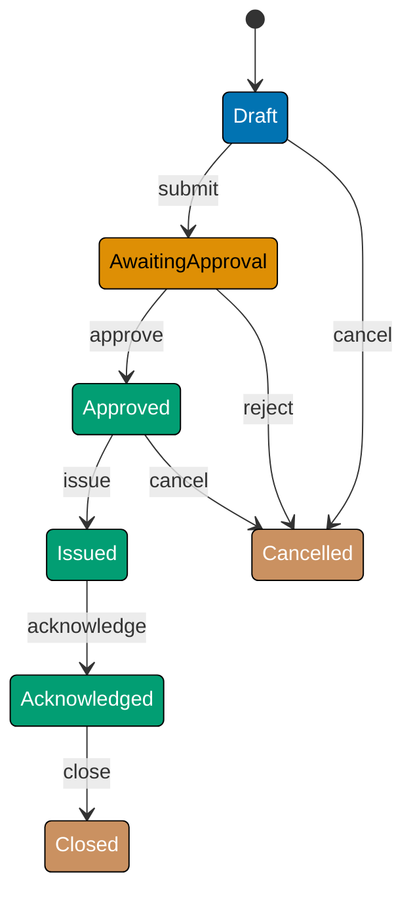

This beginner section introduces Finite State Machine fundamentals through 25 annotated examples grounded in the `PurchaseOrder` aggregate from a Procure-to-Pay procurement platform. The central thesis — **model states as a closed union type and transitions as a pure `State -> Event -> State` function with exhaustive pattern matching** — applies across functional languages. Examples are shown in F# (canonical), with Clojure, TypeScript, and Haskell equivalents. The full PO approval-issuance lifecycle serves as the running domain throughout.

## What Is a Finite State Machine? (Examples 1–5)

### Example 1: States as a Discriminated Union

A `PurchaseOrder` moves through a defined set of states: Draft, AwaitingApproval, Approved, Issued, Acknowledged, Closed, Cancelled, and Disputed. Encoding the valid state set as a closed union type means the compiler rejects any value outside this set at compile time — no runtime "unknown state" bugs. In F# this is a discriminated union; in Clojure a spec-constrained keyword set; in TypeScript a string literal union type; in Haskell an ADT (algebraic data type) with no payload, deriving `Eq` for structural comparison.







```fsharp
// ── file: PurchaseOrderFsm.fsx ────────────────────────────────────────────
// Discriminated union: every valid PO state listed exactly once.
// The compiler makes it impossible to create a POState outside this set.
// [Clojure: keyword constants in a set — open by default; no compile-time exhaustiveness]
type POState =
    | Draft            // => PO created, not yet submitted for approval
    | AwaitingApproval // => Submitted; waiting for manager decision
    | Approved         // => Manager approved; ready to issue to supplier
    | Issued           // => Sent to supplier; lines are now immutable
    | Acknowledged     // => Supplier confirmed receipt of the PO
    | Closed           // => PO fully complete — terminal state
    | Cancelled        // => Abandoned before payment — terminal state
    | Disputed         // => Discrepancy detected; resolution required

// Pure predicate: is this state terminal?
// No side effects — result depends solely on the input value.
let isTerminal (state: POState) : bool =
    // => Pattern match exhaustively; compiler warns if a case is missing
    match state with
    | Closed | Cancelled -> true  // => Two terminal states
    | _ -> false                  // => All others allow further transitions

printfn "isTerminal Draft = %b"     (isTerminal Draft)      // => false
printfn "isTerminal Closed = %b"    (isTerminal Closed)     // => true
printfn "isTerminal Cancelled = %b" (isTerminal Cancelled)  // => true
```





```clojure
;; ── file: purchase-order-fsm.clj ─────────────────────────────────────────
;; [F#: discriminated union — compiler-enforced exhaustiveness; adding a case
;;  triggers compile errors at every incomplete match site]
;; Clojure models state as a set of keywords; membership check replaces the DU.
(def po-states
  ;; => All valid PO states declared as a literal set — O(1) membership test
  #{:draft :awaiting-approval :approved :issued :acknowledged
    :closed :cancelled :disputed})
;; => po-states is a Clojure persistent set; contains? tests membership

;; Terminal states: a sub-set of po-states
;; Defining them as their own set makes the predicate a single contains? call.
(def terminal-states
  ;; => #{:closed :cancelled} — two states after which no further events fire
  #{:closed :cancelled})

;; Pure predicate: is this state terminal?
;; No side effects — result depends solely on the argument keyword.
(defn terminal?
  ;; => Uses set as a function: (terminal-states state) returns the keyword or nil
  [state]
  (contains? terminal-states state))
;; => true when state is :closed or :cancelled; false otherwise

(println "terminal? :draft"     (terminal? :draft))     ;; => false
(println "terminal? :closed"    (terminal? :closed))    ;; => true
(println "terminal? :cancelled" (terminal? :cancelled)) ;; => true
```





```typescript
// ── file: purchaseOrderFsm.ts ────────────────────────────────────────────────
// [F#: discriminated union; Clojure: keyword set]
// TypeScript tagged union: each variant is a plain object with a literal "kind" key.
// The compiler makes it impossible to construct a POState outside this union.

// Branded ApproverId prevents raw strings from being passed as approver identifiers.
declare const __approverBrand: unique symbol;
type ApproverId = string & { [__approverBrand]: true };
const toApproverId = (s: string): ApproverId => s as ApproverId;
// => Branding forces callers to use the constructor; raw strings are rejected at call sites

// Full PurchaseOrder state as a tagged union (discriminated union in TS).
type POState =
  | { kind: "Draft" }
  // => PO created, not yet submitted for approval
  | { kind: "AwaitingApproval" }
  // => Submitted; waiting for manager decision
  | { kind: "Approved"; approvedBy: ApproverId }
  // => Manager approved; payload carries who approved
  | { kind: "Issued" }
  // => Sent to supplier; lines are now immutable
  | { kind: "Acknowledged" }
  // => Supplier confirmed receipt
  | { kind: "Closed" }
  // => PO fully complete — terminal state
  | { kind: "Cancelled" }
  // => Abandoned before payment — terminal state
  | { kind: "Disputed" };
// => Discrepancy detected; resolution required

// Pure predicate: exhaustive switch via never enforces completeness.
// [F#: | Closed | Cancelled -> true | _ -> false]
const isTerminal = (state: POState): boolean => {
  switch (state.kind) {
    case "Closed":
    case "Cancelled":
      return true;
    // => Two terminal states
    case "Draft":
    case "AwaitingApproval":
    case "Approved":
    case "Issued":
    case "Acknowledged":
    case "Disputed":
      return false;
    // => All others allow further transitions
    default: {
      const _exhaustive: never = state;
      // => TypeScript never type: compiler errors if a case is missing
      return _exhaustive;
    }
  }
};

console.log("isTerminal Draft =", isTerminal({ kind: "Draft" }));
// => false
console.log("isTerminal Closed =", isTerminal({ kind: "Closed" }));
// => true
console.log("isTerminal Cancelled =", isTerminal({ kind: "Cancelled" }));
// => true
```





```haskell
-- ── file: PurchaseOrderFsm.hs ───────────────────────────────────────────────
-- [F#: discriminated union with pattern match — Haskell uses ADT case-of]
-- ADT (algebraic data type): every valid PO state listed exactly once.
-- The compiler rejects any value outside this set and -Wincomplete-patterns
-- warns on non-exhaustive case-of expressions.
{-# LANGUAGE DerivingStrategies #-}
module PurchaseOrderFsm where

-- | All eight PO states; deriving Show/Eq makes them printable and comparable.
data POState
  = Draft            -- => PO created, not yet submitted for approval
  | AwaitingApproval -- => Submitted; waiting for manager decision
  | Approved         -- => Manager approved; ready to issue to supplier
  | Issued           -- => Sent to supplier; lines are now immutable
  | Acknowledged     -- => Supplier confirmed receipt of the PO
  | Closed           -- => PO fully complete — terminal state
  | Cancelled        -- => Abandoned before payment — terminal state
  | Disputed         -- => Discrepancy detected; resolution required
  deriving stock (Show, Eq)

-- | Pure predicate: is this state terminal?
-- No side effects — result depends solely on the input value.
isTerminal :: POState -> Bool
isTerminal state = case state of
  Closed    -> True   -- => Two terminal states
  Cancelled -> True
  _         -> False  -- => All others allow further transitions

main :: IO ()
main = do
  putStrLn ("isTerminal Draft = "     <> show (isTerminal Draft))      -- => False
  putStrLn ("isTerminal Closed = "    <> show (isTerminal Closed))     -- => True
  putStrLn ("isTerminal Cancelled = " <> show (isTerminal Cancelled))  -- => True
```





**Key Takeaway**: A closed union type seals the state space at compile time — the compiler enforces exhaustiveness so no invalid state can ever exist. F# uses a discriminated union; Clojure uses a spec-constrained keyword; TypeScript uses a string literal union with exhaustive `never` checks; Haskell uses an ADT with `-Wincomplete-patterns` for the same guarantee.

**Why It Matters**: In an OOP State pattern each state is a class; adding a state means adding a file and updating every visitor. In FP the DU is the single source of truth. Adding `PartiallyReceived` to the DU causes every incomplete `match` expression in the codebase to produce a compiler warning, guiding the developer to every place that needs updating. The type system acts as a living checklist, eliminating the category of "forgot to handle the new state" bugs before the code runs.

---

### Example 2: The Minimal FSM Record

A state machine needs identity and current state. In FP an immutable record (or map/record-like value) bundles these two fields. Because the value is immutable, "transitioning" means producing a new value — the old state is preserved, which simplifies auditing and testing.





```fsharp
// ── file: PurchaseOrderFsm.fsx ────────────────────────────────────────────
// Immutable record holds identity + current state.
// F# records are value-equality by default — ideal for testing.
// [Clojure: plain map with keyword keys — no separate type declaration needed]
type PurchaseOrder =
    { Id: string       // => Business identifier (e.g. "PO-001")
      State: POState } // => Current FSM state; starts as Draft

// Smart constructor: build a PO in its only legal initial state.
// Returning the record directly ensures the caller cannot set State = Issued.
let createPO (id: string) : PurchaseOrder =
    { Id = id          // => Bind the provided identifier
      State = Draft }  // => FSM always starts in Draft — invariant enforced here

let po = createPO "PO-001"
// => po = { Id = "PO-001"; State = Draft }

printfn "PO id: %s, state: %A" po.Id po.State
// => Output: PO id: PO-001, state: Draft
```





```clojure
;; ── file: purchase-order-fsm.clj ─────────────────────────────────────────
;; [F#: immutable record with named fields and value-equality — PurchaseOrder type]
;; Clojure represents a PO as a plain persistent map; no type declaration required.
;; The map is immutable: "updating" state returns a new map via assoc.

;; Smart constructor: enforces the "always start in :draft" invariant.
;; Returns a plain map — callers cannot bypass the initial state.
(defn create-po
  ;; => id: string identifier for the purchase order
  [id]
  {:id    id       ;; => :id field holds the business identifier
   :state :draft}) ;; => FSM always starts in :draft — invariant enforced here
;; => Returns {:id "PO-001" :state :draft}

(def po (create-po "PO-001"))
;; => po is {:id "PO-001" :state :draft}

(println "PO id:" (:id po) "state:" (:state po))
;; => Output: PO id: PO-001 state: :draft
```





```typescript
// ── file: purchaseOrderFsm.ts ────────────────────────────────────────────────
// [F#: immutable record with value-equality; Clojure: plain persistent map]
// TypeScript: readonly interface — structural immutability via Readonly<>.

type PORecord = Readonly<{
  id: string; // => Business identifier (e.g. "PO-001")
  state: POState; // => Current FSM state; starts as Draft
}>;
// => Readonly<> prevents mutation at the type level after construction

// Smart constructor: build a PO in its only legal initial state.
// Return type encodes that state starts as Draft — callers cannot set state = Issued.
const createPO = (id: string): PORecord => ({
  id,
  // => Bind the provided identifier
  state: { kind: "Draft" },
  // => FSM always starts in Draft — invariant enforced here
});

const po = createPO("PO-001");
// => po = { id: "PO-001", state: { kind: "Draft" } }

console.log("PO id:", po.id, "state:", po.state.kind);
// => Output: PO id: PO-001 state: Draft
```





```haskell
-- ── file: PurchaseOrderFsm.hs ───────────────────────────────────────────────
-- [F#: record with value-equality — Haskell record syntax + deriving Eq]
-- Immutable record holds identity + current state.
-- Haskell records are immutable; "update" returns a new value via record-update syntax.
{-# LANGUAGE DerivingStrategies #-}
import Data.Text (Text)
import qualified Data.Text as T
import qualified Data.Text.IO as TIO

-- | Plain record with two named fields; deriving Eq gives structural equality.
data PurchaseOrder = PurchaseOrder
  { poId    :: Text     -- => Business identifier (e.g. "PO-001")
  , poState :: POState  -- => Current FSM state; starts as Draft
  }
  deriving stock (Show, Eq)

-- | Smart constructor: build a PO in its only legal initial state.
-- Hiding the data constructor (via module export list) prevents callers from
-- bypassing this function; the FSM always starts in Draft.
createPO :: Text -> PurchaseOrder
createPO i = PurchaseOrder
  { poId    = i      -- => Bind the provided identifier
  , poState = Draft  -- => FSM always starts in Draft — invariant enforced here
  }

main :: IO ()
main = do
  let po = createPO (T.pack "PO-001")
  -- => po = PurchaseOrder { poId = "PO-001", poState = Draft }
  TIO.putStrLn (T.pack "PO id: " <> poId po <> T.pack ", state: " <> T.pack (show (poState po)))
  -- => Output: PO id: PO-001, state: Draft
```





**Key Takeaway**: An immutable record with a smart constructor enforces the "always start in Draft" invariant — no caller can skip straight to Approved.

**Why It Matters**: OOP state machines often expose a mutable `State` setter that any code can call directly. The FP approach hides construction behind a factory function and relies on record immutability to prevent mutation. The only way to change state is through the explicit transition function, making the lifecycle visible and auditable. Tests can compare records with structural equality (`=`) instead of writing field-by-field assertions.

---

### Example 3: The Transition Table as a Map

Before writing a transition function, it helps to make the allowed transitions explicit as data. A `Map<POState * POEvent, POState>` is a declarative table: given current state and event, look up the next state. Invalid combinations return `None`.





```fsharp
// ── file: PurchaseOrderFsm.fsx ────────────────────────────────────────────
// Events are also a discriminated union — exhaustive, compiler-checked.
// [Clojure: event keywords in a set — open; no exhaustiveness enforcement]
type POEvent =
    | Submit      // => Employee submits draft for approval
    | Approve     // => Manager approves the PO
    | Reject      // => Manager rejects — PO is cancelled
    | Issue       // => Finance issues PO to supplier
    | Acknowledge // => Supplier acknowledges receipt
    | Close       // => Finance closes fully-received PO
    | Cancel      // => Stakeholder cancels before payment
    | Dispute     // => Discrepancy detected; enter dispute

// Transition table: (CurrentState, Event) -> NextState
// Map.ofList builds an immutable lookup structure at startup.
let transitionTable : Map<POState * POEvent, POState> =
    Map.ofList [
        // => Each entry is a ((state, event), nextState) pair
        (Draft,            Submit),      AwaitingApproval
        (AwaitingApproval, Approve),     Approved
        (AwaitingApproval, Reject),      Cancelled
        (Approved,         Issue),       Issued
        (Issued,           Acknowledge), Acknowledged
        (Acknowledged,     Close),       Closed
        (Draft,            Cancel),      Cancelled
        (Approved,         Cancel),      Cancelled
        (Issued,           Dispute),     Disputed
    ]
// => 9 valid transitions; all other (state, event) pairs are implicitly invalid

// Lookup: pure function, no exceptions
let lookupTransition (state: POState) (event: POEvent) : POState option =
    // => Map.tryFind returns None for missing keys — safe, no KeyNotFoundException
    Map.tryFind (state, event) transitionTable

printfn "%A" (lookupTransition Draft Submit)
// => Some AwaitingApproval
printfn "%A" (lookupTransition Closed Submit)
// => None  (terminal state rejects all events)
```





```clojure
;; ── file: purchase-order-fsm.clj ─────────────────────────────────────────
;; [F#: discriminated union POEvent — compiler ensures all events are handled]
;; Clojure events are plain keywords; the transition table encodes validity.

;; Transition table: maps [current-state event] vectors to next-state keywords.
;; A plain map keyed by two-element vectors is idiomatic Clojure for pair lookups.
(def transition-table
  ;; => Each key is [current-state event]; value is the next state
  {[:draft            :submit]      :awaiting-approval
   [:awaiting-approval :approve]    :approved
   [:awaiting-approval :reject]     :cancelled
   [:approved         :issue]       :issued
   [:issued           :acknowledge] :acknowledged
   [:acknowledged     :close]       :closed
   [:draft            :cancel]      :cancelled
   [:approved         :cancel]      :cancelled
   [:issued           :dispute]     :disputed})
;; => 9 entries; pairs not present in the map are implicitly invalid

;; Lookup: pure function, returns nil for missing pairs (no exception thrown).
;; get returns the default (nil) when the key is absent — safe O(log n) lookup.
(defn lookup-transition
  ;; => state and event are both keywords
  [state event]
  (get transition-table [state event]))
;; => Returns the next-state keyword or nil if the transition is invalid

(println (lookup-transition :draft :submit))
;; => :awaiting-approval
(println (lookup-transition :closed :submit))
;; => nil  (terminal state; key absent from table)
```





```typescript
// ── file: purchaseOrderFsm.ts ────────────────────────────────────────────────
// [F#: DU POEvent — exhaustive; Clojure: keyword events — open]
// TypeScript: literal union for events — closed set, compiler-checked.

type POEvent = "Submit" | "Approve" | "Reject" | "Issue" | "Acknowledge" | "Close" | "Cancel" | "Dispute";
// => Literal union: compiler rejects any string outside this set

// Transition table: (kind, event) -> kind
// Map keys are "State:Event" composite strings for O(1) lookup.
// [F#: Map<POState*POEvent,POState>; Clojure: {[state event] next-state}]
const transitionTable = new Map<string, POState["kind"]>([
  ["Draft:Submit", "AwaitingApproval"],
  // => Draft + Submit -> AwaitingApproval (first lifecycle step)
  ["AwaitingApproval:Approve", "Approved"],
  // => Manager approval granted
  ["AwaitingApproval:Reject", "Cancelled"],
  // => Manager rejected — terminal
  ["Approved:Issue", "Issued"],
  // => PO sent to supplier
  ["Issued:Acknowledge", "Acknowledged"],
  // => Supplier confirmed receipt
  ["Acknowledged:Close", "Closed"],
  // => Lifecycle complete — terminal
  ["Draft:Cancel", "Cancelled"],
  // => Cancel before submission — terminal
  ["Approved:Cancel", "Cancelled"],
  // => Cancel after approval — terminal
  ["Issued:Dispute", "Disputed"],
  // => Discrepancy detected
]);
// => 9 valid transitions; all other (state, event) pairs are implicitly invalid

// Lookup: pure function, returns undefined for missing pairs — no exception thrown.
const lookupTransition = (state: POState, event: POEvent): POState["kind"] | undefined =>
  transitionTable.get(`${state.kind}:${event}`);
// => Returns the next-state kind string or undefined for invalid pairs

console.log(lookupTransition({ kind: "Draft" }, "Submit"));
// => "AwaitingApproval"
console.log(lookupTransition({ kind: "Closed" }, "Submit"));
// => undefined  (terminal state rejects all events)
```





```haskell
-- ── file: PurchaseOrderFsm.hs ───────────────────────────────────────────────
-- [F#: discriminated union POEvent + Map<POState*POEvent,POState> — Haskell ADT + Data.Map]
-- Events are also an ADT — exhaustive case-of expressions are compiler-checked.
{-# LANGUAGE DerivingStrategies #-}
import qualified Data.Map.Strict as Map
import Data.Map.Strict (Map)

-- | Event ADT: one constructor per business event.
data POEvent
  = Submit      -- => Employee submits draft for approval
  | Approve     -- => Manager approves the PO
  | Reject      -- => Manager rejects — PO is cancelled
  | Issue       -- => Finance issues PO to supplier
  | Acknowledge -- => Supplier acknowledges receipt
  | Close       -- => Finance closes fully-received PO
  | Cancel      -- => Stakeholder cancels before payment
  | Dispute     -- => Discrepancy detected; enter dispute
  deriving stock (Show, Eq, Ord)

-- | Transition table keyed by (POState, POEvent) tuple — values are POState.
-- Data.Map.Strict.fromList builds an immutable balanced tree at module init time.
transitionTable :: Map (POState, POEvent) POState
transitionTable = Map.fromList
  [ ((Draft,            Submit),      AwaitingApproval)
  , ((AwaitingApproval, Approve),     Approved)
  , ((AwaitingApproval, Reject),      Cancelled)
  , ((Approved,         Issue),       Issued)
  , ((Issued,           Acknowledge), Acknowledged)
  , ((Acknowledged,     Close),       Closed)
  , ((Draft,            Cancel),      Cancelled)
  , ((Approved,         Cancel),      Cancelled)
  , ((Issued,           Dispute),     Disputed)
  ]
-- => 9 valid transitions; all other (state, event) pairs are implicitly invalid

-- | Lookup: pure function — returns Nothing for missing keys (no exceptions).
lookupTransition :: POState -> POEvent -> Maybe POState
lookupTransition s e = Map.lookup (s, e) transitionTable
-- => Map.lookup returns Maybe; the type forces callers to handle absence

main :: IO ()
main = do
  print (lookupTransition Draft Submit)
  -- => Just AwaitingApproval
  print (lookupTransition Closed Submit)
  -- => Nothing  (terminal state rejects all events)
```





**Key Takeaway**: A data-driven transition table separates the "what transitions are valid" decision from the "how to execute a transition" logic, making the FSM readable as a specification.

**Why It Matters**: When the procurement team asks "can we cancel an Issued PO?", a developer can answer by reading the table directly — no need to trace through class hierarchies. The table also enables machine-generated documentation: a simple fold over `transitionTable` produces a DOT graph or Mermaid diagram. Data-driven FSMs are easier to diff in code review and easier to extend without changing control flow logic.

---

### Example 4: The Pure Transition Function

The canonical FP FSM function signature is `POState -> POEvent -> POState`. It takes the current state and an event, then returns the next state. The implementation uses `match` on the state-event pair. Invalid transitions return the same state (or raise — see Example 7 for `Result`).





```fsharp
// ── file: PurchaseOrderFsm.fsx ────────────────────────────────────────────
// Pure transition function: no mutable state, no I/O, no exceptions.
// The compiler enforces that every (state, event) pair is handled.
// [Clojure: case/cond dispatch on keyword pairs — runtime, not compile-time]
let transition (state: POState) (event: POEvent) : POState =
    match state, event with
    // => Happy path: linear approval-issuance lifecycle
    | Draft,            Submit      -> AwaitingApproval // => Draft + Submit -> AwaitingApproval
    | AwaitingApproval, Approve     -> Approved         // => Approval granted
    | AwaitingApproval, Reject      -> Cancelled        // => Approval denied -> terminal
    | Approved,         Issue       -> Issued           // => PO sent to supplier
    | Issued,           Acknowledge -> Acknowledged     // => Supplier confirmed
    | Acknowledged,     Close       -> Closed           // => Fully complete -> terminal
    // => Cancel from any non-terminal non-paid state
    | Draft,    Cancel -> Cancelled  // => Cancel before submission
    | Approved, Cancel -> Cancelled  // => Cancel after approval but before issue
    // => Dispute path
    | Issued, Dispute -> Disputed    // => Discrepancy on issued PO
    // => Default: invalid event for current state — return unchanged
    // => In production, return Result<POState, string> instead (see Example 7)
    | _, _ -> state

// Simulate a PO through its happy path
let po0 = createPO "PO-001"           // => { State = Draft }
let po1 = { po0 with State = transition po0.State Submit }
// => { State = AwaitingApproval }
let po2 = { po1 with State = transition po1.State Approve }
// => { State = Approved }
let po3 = { po2 with State = transition po2.State Issue }
// => { State = Issued }

printfn "After Submit:   %A" po1.State // => AwaitingApproval
printfn "After Approve:  %A" po2.State // => Approved
printfn "After Issue:    %A" po3.State // => Issued
```





```clojure
;; ── file: purchase-order-fsm.clj ─────────────────────────────────────────
;; [F#: match on (state, event) tuple — exhaustive, compile-time checked]
;; Clojure uses the transition-table lookup as the dispatch mechanism.
;; Falling through to current state mirrors F#'s wildcard arm for invalid pairs.

;; Pure transition function: looks up [state event] in the table.
;; Returns next state on valid transition, or current state for invalid events.
(defn transition
  ;; => state and event are both keywords
  [state event]
  (or (get transition-table [state event])
      ;; => get returns nil when pair is absent; or falls back to current state
      state))
;; => Same signature as F#: State -> Event -> State (keywords in, keyword out)

;; Simulate a PO through its happy path using assoc to "update" the immutable map.
(def po0 (create-po "PO-001"))
;; => {:id "PO-001" :state :draft}

(def po1 (assoc po0 :state (transition (:state po0) :submit)))
;; => assoc returns a NEW map with :state updated — po0 is unchanged
;; => po1 is {:id "PO-001" :state :awaiting-approval}

(def po2 (assoc po1 :state (transition (:state po1) :approve)))
;; => po2 is {:id "PO-001" :state :approved}

(def po3 (assoc po2 :state (transition (:state po2) :issue)))
;; => po3 is {:id "PO-001" :state :issued}

(println "After submit: " (:state po1)) ;; => :awaiting-approval
(println "After approve:" (:state po2)) ;; => :approved
(println "After issue:  " (:state po3)) ;; => :issued
```





```typescript
// ── file: purchaseOrderFsm.ts ────────────────────────────────────────────────
// [F#: pure State -> Event -> State function; Clojure: table lookup + fallback]
// TypeScript: pure transition function — invalid transitions return unchanged state.

const transition = (state: POState, event: POEvent): POState => {
  switch (state.kind) {
    case "Draft":
      if (event === "Submit") return { kind: "AwaitingApproval" };
      // => Draft + Submit -> AwaitingApproval
      if (event === "Cancel") return { kind: "Cancelled" };
      // => Cancel before submission
      return state;
    case "AwaitingApproval":
      if (event === "Approve") return { kind: "Approved", approvedBy: toApproverId("manager@company.com") };
      // => Approval granted; approvedBy payload set here
      if (event === "Reject") return { kind: "Cancelled" };
      // => Approval denied -> terminal
      return state;
    case "Approved":
      if (event === "Issue") return { kind: "Issued" };
      // => PO sent to supplier
      if (event === "Cancel") return { kind: "Cancelled" };
      // => Cancel after approval but before issue
      return state;
    case "Issued":
      if (event === "Acknowledge") return { kind: "Acknowledged" };
      if (event === "Dispute") return { kind: "Disputed" };
      return state;
    case "Acknowledged":
      if (event === "Close") return { kind: "Closed" };
      return state;
    default:
      return state;
    // => Terminal and Disputed states reject all events — return unchanged
  }
};

// Simulate a PO through its happy path
let po0 = createPO("PO-001");
// => { state: { kind: "Draft" } }
let po1 = { ...po0, state: transition(po0.state, "Submit") };
// => { state: { kind: "AwaitingApproval" } }
let po2 = { ...po1, state: transition(po1.state, "Approve") };
// => { state: { kind: "Approved" } }
let po3 = { ...po2, state: transition(po2.state, "Issue") };
// => { state: { kind: "Issued" } }

console.log("After Submit:  ", po1.state.kind); // => AwaitingApproval
console.log("After Approve: ", po2.state.kind); // => Approved
console.log("After Issue:   ", po3.state.kind); // => Issued
```





```haskell
-- ── file: PurchaseOrderFsm.hs ───────────────────────────────────────────────
-- [F#: match on (state, event) tuple — Haskell uses case-of on the tuple]
-- Pure transition function: no mutation, no IO, no exceptions.
-- Adding -Wincomplete-patterns at the top of the module triggers a warning when
-- a case is missing, so exhaustiveness is opt-in but compiler-checked.
{-# OPTIONS_GHC -Wincomplete-patterns #-}

-- | Pure State -> Event -> State function. Invalid pairs return the unchanged state.
transition :: POState -> POEvent -> POState
transition state event = case (state, event) of
  -- => Happy path: linear approval-issuance lifecycle
  (Draft,            Submit)      -> AwaitingApproval  -- => Draft + Submit -> AwaitingApproval
  (AwaitingApproval, Approve)     -> Approved          -- => Approval granted
  (AwaitingApproval, Reject)      -> Cancelled         -- => Approval denied -> terminal
  (Approved,         Issue)       -> Issued            -- => PO sent to supplier
  (Issued,           Acknowledge) -> Acknowledged      -- => Supplier confirmed
  (Acknowledged,     Close)       -> Closed            -- => Fully complete -> terminal
  -- => Cancel paths
  (Draft,    Cancel)              -> Cancelled         -- => Cancel before submission
  (Approved, Cancel)              -> Cancelled         -- => Cancel after approval
  -- => Dispute path
  (Issued,   Dispute)             -> Disputed          -- => Discrepancy on issued PO
  -- => Default: invalid event for current state — return unchanged
  -- => In production prefer Either Text POState (see Example 7)
  _                               -> state

-- | Helper to update only the poState field of a PurchaseOrder.
withState :: PurchaseOrder -> POState -> PurchaseOrder
withState po s = po { poState = s }
-- => Record update syntax: builds a new value; original po is unchanged

main :: IO ()
main = do
  let po0 = createPO (T.pack "PO-001")              -- => poState = Draft
      po1 = withState po0 (transition (poState po0) Submit)
      -- => poState = AwaitingApproval
      po2 = withState po1 (transition (poState po1) Approve)
      -- => poState = Approved
      po3 = withState po2 (transition (poState po2) Issue)
      -- => poState = Issued
  putStrLn ("After Submit:   " <> show (poState po1))  -- => AwaitingApproval
  putStrLn ("After Approve:  " <> show (poState po2))  -- => Approved
  putStrLn ("After Issue:    " <> show (poState po3))  -- => Issued
```





**Key Takeaway**: `State -> Event -> State` is the minimal, pure FSM function — every transition is visible in one `match` expression and testable without any setup.

**Why It Matters**: The OOP State pattern spreads transition logic across multiple classes. Here, one function holds all transitions. A reviewer reads top-to-bottom to understand every allowed lifecycle path. The function is a pure value: pass the same `(state, event)` pair and always get the same result. This makes property-based testing trivial — generate random valid sequences and verify the machine never enters an invalid state.

---

### Example 5: Exhaustiveness Checking with Match

Exhaustiveness checking warns when a pattern-match expression does not cover every case. This example deliberately triggers the warning to show how exhaustiveness acts as a safety net — every time the state type gains a new case, the compiler flags every incomplete handler. F# raises a compile warning on non-exhaustive `match`; TypeScript raises a type error via the `never` fallthrough pattern; Clojure uses spec conformance checks; Haskell emits a "Pattern match(es) are non-exhaustive" warning under `-Wincomplete-patterns`.





```fsharp
// ── file: PurchaseOrderFsm.fsx ────────────────────────────────────────────
// Demonstrate exhaustiveness: describe each state in a human-readable string.
// The compiler verifies every DU case is covered.
// [Clojure: defmulti dispatch — open; a missing defmethod silently returns nil]
let describeState (state: POState) : string =
    match state with
    | Draft            -> "PO created; awaiting submission"
    // => If Disputed were missing here, F# emits: "incomplete pattern matches"
    | AwaitingApproval -> "Submitted; awaiting manager decision"
    | Approved         -> "Approved; ready to issue to supplier"
    | Issued           -> "Issued to supplier; lines locked"
    | Acknowledged     -> "Supplier acknowledged receipt"
    | Closed           -> "Lifecycle complete"
    | Cancelled        -> "Abandoned; no further action"
    | Disputed         -> "Discrepancy under investigation"
    // => Every POState case is covered — compiler is satisfied

// Iterate all states to verify descriptions compile and run
let allStates =
    [ Draft; AwaitingApproval; Approved; Issued
      Acknowledged; Closed; Cancelled; Disputed ]
// => All 8 states listed

allStates
|> List.iter (fun s -> printfn "%A: %s" s (describeState s))
// => Draft: PO created; awaiting submission
// => AwaitingApproval: Submitted; awaiting manager decision
// => Approved: Approved; ready to issue to supplier
// => Issued: Issued to supplier; lines locked
// => Acknowledged: Supplier acknowledged receipt
// => Closed: Lifecycle complete
// => Cancelled: Abandoned; no further action
// => Disputed: Discrepancy under investigation
```





```clojure
;; ── file: purchase-order-fsm.clj ─────────────────────────────────────────
;; [F#: exhaustive match — compiler flags incomplete coverage; Clojure dispatch is open]
;; Clojure's closest idiomatic equivalent is defmulti dispatching on the state keyword.
;; A missing defmethod returns nil at runtime rather than a compile-time error.
(defmulti describe-state
  ;; => identity dispatch: the state keyword IS the dispatch value
  identity)

(defmethod describe-state :draft [_]
  ;; => _ ignores the argument; the dispatch already matched :draft
  "PO created; awaiting submission")

(defmethod describe-state :awaiting-approval [_]
  "Submitted; awaiting manager decision")

(defmethod describe-state :approved [_]
  "Approved; ready to issue to supplier")

(defmethod describe-state :issued [_]
  "Issued to supplier; lines locked")

(defmethod describe-state :acknowledged [_]
  "Supplier acknowledged receipt")

(defmethod describe-state :closed [_]
  "Lifecycle complete")

(defmethod describe-state :cancelled [_]
  "Abandoned; no further action")

(defmethod describe-state :disputed [_]
  "Discrepancy under investigation")
;; => All 8 states handled; adding a 9th state silently returns nil until a defmethod is added

;; Iterate all states and print descriptions
(def all-states
  ;; => Ordered vector of all valid PO state keywords
  [:draft :awaiting-approval :approved :issued
   :acknowledged :closed :cancelled :disputed])

(doseq [s all-states]
  ;; => doseq iterates for side effects; no return value collected
  (println s ":" (describe-state s)))
;; => :draft : PO created; awaiting submission
;; => :awaiting-approval : Submitted; awaiting manager decision
;; => ... (one line per state)
```





```typescript
// ── file: purchaseOrderFsm.ts ────────────────────────────────────────────────
// [F#: exhaustive match — compiler flags incomplete coverage]
// TypeScript: exhaustive switch via the never trick.
// If a POState variant is added but not handled, the compiler errors on the never cast.

const describeState = (state: POState): string => {
  switch (state.kind) {
    case "Draft":
      return "PO created; awaiting submission";
    // => If Disputed were missing, TS emits: "Type '...' is not assignable to type 'never'"
    case "AwaitingApproval":
      return "Submitted; awaiting manager decision";
    case "Approved":
      return "Approved; ready to issue to supplier";
    case "Issued":
      return "Issued to supplier; lines locked";
    case "Acknowledged":
      return "Supplier acknowledged receipt";
    case "Closed":
      return "Lifecycle complete";
    case "Cancelled":
      return "Abandoned; no further action";
    case "Disputed":
      return "Discrepancy under investigation";
    default: {
      const _exhaustive: never = state;
      // => never trick: compiler error if any variant is unhandled
      throw new Error(`Unhandled state: ${JSON.stringify(_exhaustive)}`);
    }
  }
};

const allStates: POState[] = [
  { kind: "Draft" },
  { kind: "AwaitingApproval" },
  { kind: "Approved", approvedBy: toApproverId("mgr") },
  { kind: "Issued" },
  { kind: "Acknowledged" },
  { kind: "Closed" },
  { kind: "Cancelled" },
  { kind: "Disputed" },
];
// => All 8 state variants listed

allStates.forEach((s) => console.log(s.kind + ":", describeState(s)));
// => Draft: PO created; awaiting submission
// => AwaitingApproval: Submitted; awaiting manager decision
// => ... (one line per state variant)
```





```haskell
-- ── file: PurchaseOrderFsm.hs ───────────────────────────────────────────────
-- [F#: exhaustive match flags missing cases — Haskell -Wincomplete-patterns does the same]
-- Exhaustive case-of: every POState constructor must appear once.
-- Compile with -Wall to see "Pattern match(es) are non-exhaustive" warnings.
{-# OPTIONS_GHC -Wincomplete-patterns -Wall #-}

-- | Describe each state in a human-readable string. Compiler verifies coverage.
describeState :: POState -> String
describeState state = case state of
  Draft            -> "PO created; awaiting submission"
  -- => If Disputed were missing here, GHC emits: "Pattern match(es) are non-exhaustive"
  AwaitingApproval -> "Submitted; awaiting manager decision"
  Approved         -> "Approved; ready to issue to supplier"
  Issued           -> "Issued to supplier; lines locked"
  Acknowledged     -> "Supplier acknowledged receipt"
  Closed           -> "Lifecycle complete"
  Cancelled        -> "Abandoned; no further action"
  Disputed         -> "Discrepancy under investigation"
  -- => Every POState constructor covered — compiler is satisfied

-- | Enumerate all states by hand; alternatively derive Enum and Bounded.
allStates :: [POState]
allStates =
  [ Draft, AwaitingApproval, Approved, Issued
  , Acknowledged, Closed, Cancelled, Disputed
  ]
-- => All 8 states listed

main :: IO ()
main = mapM_ (\s -> putStrLn (show s <> ": " <> describeState s)) allStates
-- => Draft: PO created; awaiting submission
-- => AwaitingApproval: Submitted; awaiting manager decision
-- => ... (one line per state)
```





**Key Takeaway**: Exhaustive `match` expressions turn the addition of any new state into a compile-time task list — every handler that needs updating is immediately flagged.

**Why It Matters**: In an enum-backed switch statement, a `default` clause silently absorbs new cases. Closed-sum pattern matching in FP languages (no default arm) makes the compiler the FSM auditor: when a new state is added, every match expression that needs a new arm is flagged at compile time, making completeness verifiable before the first test runs. When a product manager requests a new `PendingAmendment` state, the compiler immediately lists every function that needs updating.

---

## Guards and Invalid Transitions (Examples 6–11)

### Example 6: Approval-Level Guard

Not every Submit event should succeed. A guard is a predicate evaluated before the transition fires. In FP a guard is just a function `context -> bool`. This example defines an approval-level guard that checks the requester's spending authority.





```fsharp
// ── file: PurchaseOrderFsm.fsx ────────────────────────────────────────────
// Domain types for the guard context
// [Clojure: approval level as a keyword; context as a plain map]
type ApprovalLevel = L1 | L2 | L3  // => L1: up to 10k, L2: up to 100k, L3: unlimited

// Guard context carries the business data needed to evaluate the condition.
type ApprovalContext =
    { RequesterLevel: ApprovalLevel  // => Requester's authority level
      POTotal: decimal }             // => Total value of the purchase order

// Pure guard function: returns true when the requester has sufficient authority.
// No side effects — depends only on context fields.
let canApprove (ctx: ApprovalContext) : bool =
    match ctx.RequesterLevel with
    | L1 -> ctx.POTotal <= 10_000m   // => L1 limit: 10,000
    | L2 -> ctx.POTotal <= 100_000m  // => L2 limit: 100,000
    | L3 -> true                     // => L3: unlimited authority

// Test guard with sample contexts
let ctx1 = { RequesterLevel = L1; POTotal = 5_000m }
// => 5,000 <= 10,000 -> true
let ctx2 = { RequesterLevel = L1; POTotal = 15_000m }
// => 15,000 > 10,000 -> false
let ctx3 = { RequesterLevel = L2; POTotal = 75_000m }
// => 75,000 <= 100,000 -> true

printfn "L1/5k:  %b" (canApprove ctx1)  // => true
printfn "L1/15k: %b" (canApprove ctx2)  // => false
printfn "L2/75k: %b" (canApprove ctx3)  // => true
```





```clojure
;; ── file: purchase-order-fsm.clj ─────────────────────────────────────────
;; [F#: ApprovalLevel discriminated union — compile-time exhaustive match]
;; Clojure represents approval level as a keyword; authority limits as a map.

;; Authority limits keyed by level keyword — data-driven, easy to extend.
(def approval-limits
  ;; => :l3 is absent — unlimited authority means no upper-bound check
  {:l1 10000M   ;; => L1 authority ceiling: 10,000
   :l2 100000M}) ;; => L2 authority ceiling: 100,000
;; => M suffix denotes BigDecimal literal — precise monetary arithmetic

;; Pure guard function: true when the requester's level covers the PO total.
;; ctx is a plain map with :requester-level and :po-total keys.
(defn can-approve?
  ;; => Destructure the context map at the argument position
  [{:keys [requester-level po-total]}]
  (let [limit (get approval-limits requester-level)]
    ;; => get returns nil for :l3 (unlimited); nil? check grants unlimited authority
    (or (nil? limit)
        ;; => :l3 has no entry — nil means unlimited
        (<= po-total limit))))
;; => Returns true when requester authority covers the PO total

;; Test guard with sample context maps
(def ctx1 {:requester-level :l1 :po-total 5000M})
;; => 5,000 <= 10,000 -> true
(def ctx2 {:requester-level :l1 :po-total 15000M})
;; => 15,000 > 10,000 -> false
(def ctx3 {:requester-level :l2 :po-total 75000M})
;; => 75,000 <= 100,000 -> true

(println "L1/5k: " (can-approve? ctx1))  ;; => true
(println "L1/15k:" (can-approve? ctx2))  ;; => false
(println "L2/75k:" (can-approve? ctx3))  ;; => true
```





```typescript
// ── file: purchaseOrderFsm.ts ────────────────────────────────────────────────
// [F#: ApprovalLevel DU with pattern match; Clojure: authority map + keyword]
// TypeScript: literal union for approval level + data-driven authority limits map.

type ApprovalLevel = "L1" | "L2" | "L3";
// => Literal union: compiler rejects any string outside this set

type ApprovalContext = Readonly<{
  requesterLevel: ApprovalLevel; // => Requester's authority level
  poTotal: number; // => Total value of the purchase order
}>;
// => Readonly prevents callers from mutating the context after construction

// Authority limits map — data-driven, easy to extend.
// L3 is absent: undefined limit means unlimited authority.
const approvalLimits: Partial<Record<ApprovalLevel, number>> = {
  L1: 10_000, // => L1 authority ceiling: 10,000
  L2: 100_000, // => L2 authority ceiling: 100,000
};
// => L3 deliberately absent — undefined limit means unlimited authority

// Pure guard function: returns true when requester has sufficient authority.
const canApprove = (ctx: ApprovalContext): boolean => {
  const limit = approvalLimits[ctx.requesterLevel];
  // => undefined means unlimited (L3)
  return limit === undefined || ctx.poTotal <= limit;
};
// => Returns true when authority limit covers the PO total or level is unlimited (L3)

const ctx1: ApprovalContext = { requesterLevel: "L1", poTotal: 5_000 };
// => 5,000 <= 10,000 -> true
const ctx2: ApprovalContext = { requesterLevel: "L1", poTotal: 15_000 };
// => 15,000 > 10,000 -> false
const ctx3: ApprovalContext = { requesterLevel: "L2", poTotal: 75_000 };
// => 75,000 <= 100,000 -> true

console.log("L1/5k: ", canApprove(ctx1)); // => true
console.log("L1/15k:", canApprove(ctx2)); // => false
console.log("L2/75k:", canApprove(ctx3)); // => true
```





```haskell
-- ── file: PurchaseOrderFsm.hs ───────────────────────────────────────────────
-- [F#: ApprovalLevel DU with pattern match — Haskell uses ADT case-of]
-- Pure guard function: predicate on a context record, no side effects.
{-# LANGUAGE DerivingStrategies #-}
import Data.Decimal (Decimal)  -- => Data.Decimal from the Decimal package for exact money

-- | Authority levels for purchase-order approval.
data ApprovalLevel = L1 | L2 | L3
  deriving stock (Show, Eq)
-- => L1 ceiling 10,000; L2 ceiling 100,000; L3 unlimited

-- | Guard context: requester level + the PO total being approved.
data ApprovalContext = ApprovalContext
  { requesterLevel :: ApprovalLevel  -- => Requester's authority level
  , poTotal        :: Decimal        -- => Total value of the purchase order
  }
  deriving stock (Show, Eq)

-- | Pure predicate: does the requester have sufficient authority?
-- No IO, no mutation — depends only on context fields.
canApprove :: ApprovalContext -> Bool
canApprove ctx = case requesterLevel ctx of
  L1 -> poTotal ctx <= 10000   -- => L1 limit: 10,000
  L2 -> poTotal ctx <= 100000  -- => L2 limit: 100,000
  L3 -> True                   -- => L3: unlimited authority

main :: IO ()
main = do
  let ctx1 = ApprovalContext L1 5000     -- => 5,000 <= 10,000 -> True
      ctx2 = ApprovalContext L1 15000    -- => 15,000 > 10,000 -> False
      ctx3 = ApprovalContext L2 75000    -- => 75,000 <= 100,000 -> True
  putStrLn ("L1/5k:  " <> show (canApprove ctx1))  -- => True
  putStrLn ("L1/15k: " <> show (canApprove ctx2))  -- => False
  putStrLn ("L2/75k: " <> show (canApprove ctx3))  -- => True
```





**Key Takeaway**: A guard is a pure predicate on a context record — it is fully testable in isolation before being wired into the transition function.

**Why It Matters**: Mixing guard logic into the transition function creates a monolithic function that handles both FSM routing and business rules. Separating them as `canApprove: Context -> bool` and `transition: State -> Event -> State` gives each function a single responsibility. Guards can be unit-tested with every boundary case without constructing a full FSM. They can also be composed: `canApprove ctx && hasBudget ctx` combines two guards without modifying either.

---

### Example 7: Guarded Transition with Result

When a guard fails, the transition should communicate why — not silently stay in the same state. `Result<POState, string>` encodes success (new state) or failure (error message) in the return type, forcing callers to handle both outcomes.





```fsharp
// ── file: PurchaseOrderFsm.fsx ────────────────────────────────────────────
// Guarded transition: returns Result to communicate guard failures explicitly.
// Callers must handle Ok and Error — the compiler enforces this.
// [Clojure: tagged map {:status :ok/:error :value ...} — data-first; no compiler enforcement]
let guardedTransition
    (state: POState)
    (event: POEvent)
    (ctx: ApprovalContext)
    : Result<POState, string> =
    match state, event with
    | Draft, Submit ->
        // => Guard: check requester authority before transitioning
        if canApprove ctx then
            Ok AwaitingApproval         // => Guard passed — advance state
        else
            Error $"Requester level {ctx.RequesterLevel} cannot approve PO of {ctx.POTotal}"
            // => Guard failed — return descriptive error, state unchanged
    | AwaitingApproval, Approve -> Ok Approved   // => No guard on manager approval
    | AwaitingApproval, Reject  -> Ok Cancelled  // => Rejection always valid
    | Approved, Issue           -> Ok Issued     // => Issue requires no guard here
    | Issued, Acknowledge       -> Ok Acknowledged
    | Acknowledged, Close       -> Ok Closed
    | Draft,    Cancel          -> Ok Cancelled
    | Approved, Cancel          -> Ok Cancelled
    | Issued,   Dispute         -> Ok Disputed
    | _, _ ->
        // => Invalid transition: state does not accept this event
        Error $"Invalid transition: {state} + {event}"

// Run guarded transitions and inspect results
let highCtx = { RequesterLevel = L1; POTotal = 50_000m }
let result1 = guardedTransition Draft Submit highCtx
// => Error "Requester level L1 cannot approve PO of 50000"

let lowCtx  = { RequesterLevel = L2; POTotal = 50_000m }
let result2 = guardedTransition Draft Submit lowCtx
// => Ok AwaitingApproval

printfn "%A" result1  // => Error "Requester level L1 cannot approve PO of 50000"
printfn "%A" result2  // => Ok AwaitingApproval
```





```clojure
;; ── file: purchase-order-fsm.clj ─────────────────────────────────────────
;; [F#: Result<POState,string> — compiler forces callers to handle Ok/Error]
;; Clojure idiom: return a tagged result map {:status :ok/:error :value ...}.
;; Callers check :status explicitly; no compiler enforcement — convention-driven.

;; Helper constructors for the result map — keeps call sites readable.
(defn ok [value]
  ;; => Wraps a successful value in the result envelope
  {:status :ok :value value})

(defn error-result [message]
  ;; => Wraps a failure message in the result envelope
  {:status :error :message message})
;; => Named error-result to avoid shadowing clojure.core/Error

;; Guarded transition: returns a result map — not a raw state keyword.
;; Callers must check :status before extracting :value.
(defn guarded-transition
  ;; => state: current state keyword; event: event keyword; ctx: authority context map
  [state event ctx]
  (cond
    ;; => Submit from :draft requires the approval guard
    (and (= state :draft) (= event :submit))
    (if (can-approve? ctx)
      (ok :awaiting-approval)              ;; => Guard passed — advance state
      (error-result
        (str "Level " (:requester-level ctx)
             " cannot approve PO of " (:po-total ctx))))
    ;; => Guard failed — descriptive message returned

    ;; => Remaining valid transitions: no guard required
    (and (= state :awaiting-approval) (= event :approve)) (ok :approved)
    (and (= state :awaiting-approval) (= event :reject))  (ok :cancelled)
    (and (= state :approved)          (= event :issue))   (ok :issued)
    (and (= state :issued)       (= event :acknowledge))  (ok :acknowledged)
    (and (= state :acknowledged)      (= event :close))   (ok :closed)
    (and (= state :draft)             (= event :cancel))  (ok :cancelled)
    (and (= state :approved)          (= event :cancel))  (ok :cancelled)
    (and (= state :issued)            (= event :dispute)) (ok :disputed)

    ;; => Default: invalid (state, event) pair
    :else
    (error-result (str "Invalid transition: " state " + " event))))

;; Test the guarded transition
(def high-ctx {:requester-level :l1 :po-total 50000M})
(def result1 (guarded-transition :draft :submit high-ctx))
;; => {:status :error :message "Level :l1 cannot approve PO of 50000"}

(def low-ctx {:requester-level :l2 :po-total 50000M})
(def result2 (guarded-transition :draft :submit low-ctx))
;; => {:status :ok :value :awaiting-approval}

(println result1) ;; => {:status :error, :message "Level :l1 cannot approve PO of 50000"}
(println result2) ;; => {:status :ok, :value :awaiting-approval}
```





```typescript
// ── file: purchaseOrderFsm.ts ────────────────────────────────────────────────
// [F#: Result<POState,string> — compiler forces Ok/Error handling]
// TypeScript: tagged Result type — callers must narrow via .ok before accessing value.

type Result<T, E> = { ok: true; value: T } | { ok: false; error: E };
// => Tagged union: callers must check .ok before accessing .value or .error

const Ok = <T>(value: T): Result => ({ ok: true, value });
const Err = <E>(error: E): Result => ({ ok: false, error });
// => Constructor helpers keep call sites readable

// Guarded transition: returns Result to communicate guard failures explicitly.
// [F#: compiler forces callers to handle Ok/Error; TS: type system enforces the same]
const guardedTransition = (state: POState, event: POEvent, ctx: ApprovalContext): Result => {
  if (state.kind === "Draft" && event === "Submit") {
    // => Guard: check requester authority before transitioning
    if (canApprove(ctx)) return Ok({ kind: "AwaitingApproval" });
    // => Guard passed — advance state
    return Err(`Requester level ${ctx.requesterLevel} cannot approve PO of ${ctx.poTotal}`);
    // => Guard failed — descriptive error, state unchanged
  }
  if (state.kind === "AwaitingApproval" && event === "Approve")
    return Ok({ kind: "Approved", approvedBy: toApproverId("manager@company.com") });
  if (state.kind === "AwaitingApproval" && event === "Reject") return Ok({ kind: "Cancelled" });
  if (state.kind === "Approved" && event === "Issue") return Ok({ kind: "Issued" });
  if (state.kind === "Issued" && event === "Acknowledge") return Ok({ kind: "Acknowledged" });
  if (state.kind === "Acknowledged" && event === "Close") return Ok({ kind: "Closed" });
  if ((state.kind === "Draft" || state.kind === "Approved") && event === "Cancel") return Ok({ kind: "Cancelled" });
  if (state.kind === "Issued" && event === "Dispute") return Ok({ kind: "Disputed" });
  return Err(`Invalid transition: ${state.kind} + ${event}`);
  // => Catch-all: invalid (state, event) combination
};

const highCtx: ApprovalContext = { requesterLevel: "L1", poTotal: 50_000 };
const result1 = guardedTransition({ kind: "Draft" }, "Submit", highCtx);
// => { ok: false, error: "Requester level L1 cannot approve PO of 50000" }

const lowCtx: ApprovalContext = { requesterLevel: "L2", poTotal: 50_000 };
const result2 = guardedTransition({ kind: "Draft" }, "Submit", lowCtx);
// => { ok: true, value: { kind: "AwaitingApproval" } }

console.log(result1); // => { ok: false, error: "Requester level L1 cannot approve PO of 50000" }
console.log(result2); // => { ok: true, value: { kind: "AwaitingApproval" } }
```





```haskell
-- ── file: PurchaseOrderFsm.hs ───────────────────────────────────────────────
-- [F#: Result<POState,string> with Ok/Error — Haskell uses Either Text POState]
-- Either is the idiomatic Haskell Result. Left carries the error; Right the value.
-- Callers MUST handle both via case-of or fmap — no silent ignoring.
{-# LANGUAGE OverloadedStrings #-}
import Data.Text (Text)
import qualified Data.Text as T

-- | Guarded transition returns Either to communicate guard failures explicitly.
guardedTransition
  :: POState
  -> POEvent
  -> ApprovalContext
  -> Either Text POState
guardedTransition state event ctx = case (state, event) of
  (Draft, Submit) ->
    -- => Guard: check requester authority before transitioning
    if canApprove ctx
      then Right AwaitingApproval         -- => Guard passed — advance state
      else Left ("Requester level " <> T.pack (show (requesterLevel ctx))
              <> " cannot approve PO of " <> T.pack (show (poTotal ctx)))
      -- => Guard failed — return descriptive error, state unchanged
  (AwaitingApproval, Approve) -> Right Approved   -- => No guard on manager approval
  (AwaitingApproval, Reject)  -> Right Cancelled  -- => Rejection always valid
  (Approved,         Issue)   -> Right Issued
  (Issued,           Acknowledge) -> Right Acknowledged
  (Acknowledged,     Close)   -> Right Closed
  (Draft,            Cancel)  -> Right Cancelled
  (Approved,         Cancel)  -> Right Cancelled
  (Issued,           Dispute) -> Right Disputed
  _ ->
    -- => Invalid transition: state does not accept this event
    Left ("Invalid transition: " <> T.pack (show state)
       <> " + " <> T.pack (show event))

main :: IO ()
main = do
  let highCtx = ApprovalContext L1 50000
      lowCtx  = ApprovalContext L2 50000
  print (guardedTransition Draft Submit highCtx)
  -- => Left "Requester level L1 cannot approve PO of 50000"
  print (guardedTransition Draft Submit lowCtx)
  -- => Right AwaitingApproval
```





**Key Takeaway**: `Result<POState, string>` makes guard failures explicit in the type system — callers cannot accidentally ignore a failed transition.

**Why It Matters**: A transition function that returns the unchanged state on guard failure provides no signal to the caller. With `Result`, the caller must `match` on `Ok`/`Error` or use `Result.bind` — both force error handling at the call site. This is the functional equivalent of checked exceptions, but without the implicit control-flow disruption. It also enables chaining: `guardedTransition Draft Submit ctx |> Result.bind (fun s -> guardedTransition s Approve ctx2)` builds pipelines of dependent transitions where any failure short-circuits the chain.

---

### Example 8: Line-Item Guard

A PO with zero line items should not be submittable. This guard validates the line-item collection before the Submit transition fires, demonstrating that guards can inspect aggregate contents, not just scalar fields.





```fsharp
// ── file: PurchaseOrderFsm.fsx ────────────────────────────────────────────
// Domain types for line items
// [Clojure: line item as a plain map with namespaced keywords — no type declaration]
type LineItem =
    { Sku: string       // => Stock-keeping unit identifier
      Quantity: int     // => Requested quantity (must be > 0)
      UnitPrice: decimal } // => Price per unit

// Guard: a PO must have at least one line item to be submittable.
// Pure function — no I/O, no mutation.
let hasAtLeastOneLineItem (lines: LineItem list) : bool =
    // => List.isEmpty is O(1) — checks the head only
    not (List.isEmpty lines)
// => Returns true when lines has one or more elements

// Guard: every line item must have a positive quantity.
// List.forall short-circuits on the first false.
let allQuantitiesPositive (lines: LineItem list) : bool =
    List.forall (fun li -> li.Quantity > 0) lines
// => true only when every Quantity field is > 0

// Combined line-item guard for submission
// [Clojure: result map {:status :ok/:error :message ...} — no compiler-enforced handling]
let lineItemsValid (lines: LineItem list) : Result<unit, string> =
    if not (hasAtLeastOneLineItem lines) then
        Error "PO must have at least one line item"  // => Empty PO rejected
    elif not (allQuantitiesPositive lines) then
        Error "All line-item quantities must be positive"  // => Zero qty rejected
    else
        Ok ()  // => All checks passed

// Tests
let emptyLines  : LineItem list = []
// => hasAtLeastOneLineItem [] = false

let validLines =
    [ { Sku = "SKU-001"; Quantity = 3; UnitPrice = 150m }
      { Sku = "SKU-002"; Quantity = 1; UnitPrice = 800m } ]
// => hasAtLeastOneLineItem validLines = true
// => allQuantitiesPositive validLines = true

printfn "%A" (lineItemsValid emptyLines) // => Error "PO must have at least one line item"
printfn "%A" (lineItemsValid validLines) // => Ok ()
```





```clojure
;; ── file: purchase-order-fsm.clj ─────────────────────────────────────────
;; [F#: LineItem record type — compile-time field names; Clojure uses plain maps]
;; Line items in Clojure are plain persistent maps with keyword keys.
;; No type declaration required — structure is enforced by guard functions.

;; Guard: a PO must have at least one line item to be submittable.
;; Pure function — no I/O, no mutation, no side effects.
(defn has-at-least-one-line-item?
  ;; => lines: a sequential collection of line-item maps
  [lines]
  (seq lines))
;; => seq returns nil for empty collections (falsy) and a non-nil seq otherwise
;; => equivalent to (not (empty? lines)) but more idiomatic in Clojure

;; Guard: every line item must have a positive quantity.
;; every? short-circuits on the first false-returning predicate.
(defn all-quantities-positive?
  ;; => lines: collection of line-item maps each having a :quantity key
  [lines]
  (every? #(pos? (:quantity %)) lines))
;; => pos? returns true only for strictly positive numbers
;; => % is the anonymous-function argument; :quantity extracts the field

;; Combined guard: validate the line-item collection before submission.
;; [F#: Result<unit,string> — compiler forces callers to handle Ok/Error]
;; Returns a tagged result map — callers check :status by convention.
(defn line-items-valid?
  ;; => lines: collection of line-item maps
  [lines]
  (cond
    ;; => cond tests predicates in order; first truthy branch wins
    (not (has-at-least-one-line-item? lines))
    {:status :error :message "PO must have at least one line item"}
    ;; => Empty collection rejected before quantity check

    (not (all-quantities-positive? lines))
    {:status :error :message "All line-item quantities must be positive"}
    ;; => Zero or negative quantity rejected

    :else
    {:status :ok}))
;; => :else is always truthy — acts as the default branch

;; Tests
(def empty-lines [])
;; => has-at-least-one-line-item? [] -> nil (falsy)

(def valid-lines
  ;; => Two line items with positive quantities
  [{:sku "SKU-001" :quantity 3 :unit-price 150M}
   {:sku "SKU-002" :quantity 1 :unit-price 800M}])
;; => M suffix: BigDecimal for precise monetary arithmetic

(println (line-items-valid? empty-lines))
;; => {:status :error, :message "PO must have at least one line item"}
(println (line-items-valid? valid-lines))
;; => {:status :ok}
```





```typescript
// ── file: purchaseOrderFsm.ts ────────────────────────────────────────────────
// [F#: LineItem record + list guards; Clojure: plain maps with every?]
// TypeScript: readonly tuple types for line items + array combinators for guards.

type LineItem = Readonly<{
  sku: string; // => Stock-keeping unit identifier
  quantity: number; // => Requested quantity (must be > 0)
  unitPrice: number; // => Price per unit
}>;
// => Readonly prevents callers from mutating line items after construction

// Guard: a PO must have at least one line item to be submittable.
const hasAtLeastOneLineItem = (lines: readonly LineItem[]): boolean => lines.length > 0;
// => Returns true when lines has one or more elements

// Guard: every line item must have a positive quantity.
// Array.every short-circuits on the first false predicate.
const allQuantitiesPositive = (lines: readonly LineItem[]): boolean => lines.every((li) => li.quantity > 0);
// => true only when every quantity field is strictly greater than zero

// Combined line-item guard for submission.
// [F#: Result<unit,string>; Clojure: tagged result map]
const lineItemsValid = (lines: readonly LineItem[]): Result<true, string> => {
  if (!hasAtLeastOneLineItem(lines)) return Err("PO must have at least one line item");
  // => Empty PO rejected
  if (!allQuantitiesPositive(lines)) return Err("All line-item quantities must be positive");
  // => Zero qty rejected
  return Ok(true as const);
  // => All checks passed
};

const emptyLines: LineItem[] = [];
// => hasAtLeastOneLineItem([]) = false

const validLines: LineItem[] = [
  { sku: "SKU-001", quantity: 3, unitPrice: 150 },
  // => 3 units at 150 each
  { sku: "SKU-002", quantity: 1, unitPrice: 800 },
  // => 1 unit at 800
];

console.log(lineItemsValid(emptyLines));
// => { ok: false, error: "PO must have at least one line item" }
console.log(lineItemsValid(validLines));
// => { ok: true, value: true }
```





```haskell
-- ── file: PurchaseOrderFsm.hs ───────────────────────────────────────────────
-- [F#: LineItem record + list guards — Haskell record + list combinators]
-- Guards on collection fields use standard Prelude functions: null and all.
{-# LANGUAGE DerivingStrategies, OverloadedStrings #-}
import Data.Text (Text)
import qualified Data.Text as T
import Data.Decimal (Decimal)

-- | A single line item on a PO.
data LineItem = LineItem
  { sku       :: Text     -- => Stock-keeping unit identifier
  , quantity  :: Int      -- => Requested quantity (must be > 0)
  , unitPrice :: Decimal  -- => Price per unit
  }
  deriving stock (Show, Eq)

-- | Guard: a PO must have at least one line item to be submittable.
hasAtLeastOneLineItem :: [LineItem] -> Bool
hasAtLeastOneLineItem = not . null
-- => Function composition: not after null; O(1) check on the spine

-- | Guard: every line item must have a positive quantity.
allQuantitiesPositive :: [LineItem] -> Bool
allQuantitiesPositive = all (\li -> quantity li > 0)
-- => all short-circuits on the first False predicate result

-- | Combined line-item guard for submission.
-- Either Text () — Right () signals success with no payload.
lineItemsValid :: [LineItem] -> Either Text ()
lineItemsValid lines'
  | not (hasAtLeastOneLineItem lines') =
      Left "PO must have at least one line item"   -- => Empty PO rejected
  | not (allQuantitiesPositive lines') =
      Left "All line-item quantities must be positive"  -- => Zero qty rejected
  | otherwise = Right ()                            -- => All checks passed

main :: IO ()
main = do
  let emptyLines :: [LineItem]
      emptyLines = []
      validLines =
        [ LineItem (T.pack "SKU-001") 3 150
        , LineItem (T.pack "SKU-002") 1 800
        ]
  print (lineItemsValid emptyLines)  -- => Left "PO must have at least one line item"
  print (lineItemsValid validLines)  -- => Right ()
```





**Key Takeaway**: Guards on collection fields use standard list combinators (`List.isEmpty`, `List.forall`) — no special FSM infrastructure needed.

**Why It Matters**: Business invariants often involve aggregate contents, not just scalar state fields. Expressing these as small, composable predicate functions keeps each rule individually testable and independently readable. The `lineItemsValid` combinator chains two guards with short-circuit logic, following the pattern of building complex rules from simple atomic predicates. This composability is a direct benefit of the functional style: guards are values that can be combined with `&&`, `||`, or `Result.bind`.

---

### Example 9: Immutable Lines After Issue

Once a PO is Issued, its line items must not change. In FP this invariant is enforced structurally: the transition function returns a record with locked lines, and callers work with that new record. This example models the lock as a type-level distinction.





```fsharp
// ── file: PurchaseOrderFsm.fsx ────────────────────────────────────────────
// Two flavours of PO: one with mutable-friendly lines, one locked.
// Using different types makes the lock visible at the call site.
// [Clojure: a single map with a :locked? flag — no separate type; validation by convention]
type DraftPO =
    { Id: string
      Lines: LineItem list   // => Lines can be changed while in Draft
      State: POState }

type IssuedPO =
    { Id: string
      Lines: LineItem list   // => Same field name, but this record cannot go back to DraftPO
      State: POState }       // => State is always Issued or later

// Transition from DraftPO -> IssuedPO: lines are copied and frozen by the type change.
// The caller can no longer call any "add line" function that accepts DraftPO.
// [Clojure: assoc :state :issued — no type boundary; immutability enforced by convention]
let issuePO (po: DraftPO) : Result<IssuedPO, string> =
    match po.State with
    | Approved ->
        // => Type conversion enforces the lock: IssuedPO has no mutating operations
        Ok { Id = po.Id; Lines = po.Lines; State = Issued }
    | other ->
        Error $"Cannot issue PO in state {other}; must be Approved"
        // => Guard: only Approved POs can be issued

let draft =
    { Id = "PO-002"
      Lines = [ { Sku = "SKU-A"; Quantity = 5; UnitPrice = 200m } ]
      State = Approved }
// => DraftPO in Approved state — ready to issue

let issued = issuePO draft
// => Ok { Id = "PO-002"; Lines = [...]; State = Issued }

printfn "%A" issued  // => Ok { Id = "PO-002"; Lines = [{ ... }]; State = Issued }
```





```clojure
;; ── file: purchase-order-fsm.clj ─────────────────────────────────────────
;; [F#: two distinct record types DraftPO/IssuedPO — compile-time type boundary]
;; Clojure models PO lifecycle phases as a single map with a :locked? flag.
;; Data orientation: immutability is enforced by guard functions, not the type system.
;; This is the Clojure closest-native-equivalent to "make illegal states unrepresentable."

;; A PO map has :id, :lines, :state, and optionally :locked? true after issuance.
;; add-line-item checks :locked? and rejects modification for issued POs.
(defn add-line-item
  ;; => po: PO map; line: line-item map to add
  [po line]
  (if (:locked? po)
    ;; => Issued POs are locked — mutation attempt rejected with error result
    {:status :error :message "Cannot modify lines: PO is locked after issuance"}
    ;; => Draft POs accept new lines; update returns a new map, not mutating po
    {:status :ok :value (update po :lines conj line)}))
;; => conj appends line to the :lines vector; update applies fn to the field value

;; Issue a PO: transition :state to :issued and set :locked? true.
;; [F#: returns IssuedPO type — caller cannot pass it to add-line-item]
;; Clojure enforces the lock at runtime via the :locked? flag.
(defn issue-po
  ;; => po: PO map currently in :approved state
  [po]
  (if (= (:state po) :approved)
    ;; => Guard: only :approved POs can be issued
    {:status :ok
     :value (assoc po :state :issued :locked? true)}
    ;; => assoc returns new map; :locked? true signals no further line changes
    {:status :error
     :message (str "Cannot issue PO in state " (:state po) "; must be :approved")}))
;; => Returns tagged result map; caller checks :status

;; Test: attempt to add a line to an issued PO
(def draft-po
  ;; => A PO in :approved state with one line
  {:id "PO-002"
   :lines [{:sku "SKU-A" :quantity 5 :unit-price 200M}]
   :state :approved})
;; => M suffix: BigDecimal for precise monetary arithmetic

(def issue-result (issue-po draft-po))
;; => {:status :ok, :value {:id "PO-002" :lines [...] :state :issued :locked? true}}

(def issued-po (:value issue-result))
;; => Extract the issued PO map from the result envelope

(println "issue-result:" issue-result)
;; => {:status :ok, :value {..., :state :issued, :locked? true}}

(println "add-line after issue:"
         (add-line-item issued-po {:sku "SKU-B" :quantity 1 :unit-price 50M}))
;; => {:status :error, :message "Cannot modify lines: PO is locked after issuance"}
```





```typescript
// ── file: purchaseOrderFsm.ts ────────────────────────────────────────────────
// [F#: two distinct record types DraftPO/IssuedPO; Clojure: :locked? flag]
// TypeScript: branded types — DraftPO and IssuedPO are structurally distinct brands.

declare const __draftBrand: unique symbol;
type DraftPO = Readonly & { [__draftBrand]: true };
// => Brand makes DraftPO a distinct type — cannot be passed where IssuedPO expected

declare const __issuedBrand: unique symbol;
type IssuedPO = Readonly & { [__issuedBrand]: true };
// => Brand makes IssuedPO distinct — no "addLine" function accepts IssuedPO

// Transition from DraftPO -> IssuedPO: type change enforces the lock.
// [F#: returns IssuedPO type; TS: brand enforces same constraint at call sites]
const issuePO = (po: DraftPO): Result => {
  if (po.state.kind !== "Approved") return Err(`Cannot issue PO in state ${po.state.kind}; must be Approved`);
  // => Guard: only Approved POs can be issued
  return Ok({
    id: po.id,
    lines: po.lines,
    // => Lines copied — the brand change is the "lock" signal to the type system
    state: { kind: "Issued" },
    [__issuedBrand]: true,
  } as IssuedPO);
};

const draftPO = {
  id: "PO-002",
  lines: [{ sku: "SKU-A", quantity: 5, unitPrice: 200 }],
  state: { kind: "Approved", approvedBy: toApproverId("mgr") } as POState,
  [__draftBrand]: true,
} as DraftPO;
// => DraftPO in Approved state — ready to issue

const issued = issuePO(draftPO);
// => { ok: true, value: { id: "PO-002", lines: [...], state: { kind: "Issued" } } }

console.log(issued.ok ? issued.value.state.kind : issued.error);
// => Issued
```





```haskell
-- ── file: PurchaseOrderFsm.hs ───────────────────────────────────────────────
-- [F#: two distinct record types DraftPO/IssuedPO — Haskell uses two newtypes /
--  data types so the type system rejects mixing them; smart constructor enforces it]
-- "Make illegal states unrepresentable": IssuedPO has no function that adds a line.
{-# LANGUAGE DerivingStrategies, OverloadedStrings #-}
import Data.Text (Text)
import qualified Data.Text as T

-- | Editable, pre-issue PO; carries line items that can still change.
data DraftPO = DraftPO
  { draftId    :: Text
  , draftLines :: [LineItem]
  , draftState :: POState  -- => Always Draft, AwaitingApproval, or Approved
  }
  deriving stock (Show, Eq)

-- | Frozen, post-issue PO; no public function accepts it to add a line.
data IssuedPO = IssuedPO
  { issuedId    :: Text
  , issuedLines :: [LineItem]
  , issuedStateField :: POState  -- => Always Issued or later
  }
  deriving stock (Show, Eq)

-- | Smart constructor for the type boundary: DraftPO -> IssuedPO.
-- Returning Either makes the failure explicit; Issued carries the locked lines.
issuePO :: DraftPO -> Either Text IssuedPO
issuePO po = case draftState po of
  Approved ->
    -- => Lines copied verbatim; the type change IS the lock signal
    Right IssuedPO
      { issuedId         = draftId po
      , issuedLines      = draftLines po
      , issuedStateField = Issued
      }
  other ->
    Left ("Cannot issue PO in state " <> T.pack (show other)
       <> "; must be Approved")
    -- => Guard: only Approved POs can be issued

main :: IO ()
main = do
  let draftPO = DraftPO
        { draftId    = T.pack "PO-002"
        , draftLines = [LineItem (T.pack "SKU-A") 5 200]
        , draftState = Approved
        }
  print (issuePO draftPO)
  -- => Right (IssuedPO {issuedId = "PO-002", issuedLines = [...], issuedStateField = Issued})
```





**Key Takeaway**: Modelling pre-issue and post-issue POs as different types makes line-item immutability a compile-time guarantee rather than a runtime check. F# expresses this distinction as separate discriminated union cases with different payloads; TypeScript as separate type aliases with discriminant fields; Clojure through spec shapes validated at the state-entry boundary; Haskell as separate `data` declarations so the type system rejects mixing them.

**Why It Matters**: The OOP approach guards immutability with a mutable boolean flag checked at runtime. The FP type-level approach makes the invalid operation unrepresentable: no function accepts an `IssuedPO` and adds a line item. This technique — "make illegal states unrepresentable" — is the defining idiom of type-driven domain modelling. It shifts enforcement from "validate at runtime and hope" to "encode in the type and let the compiler verify".

---

### Example 10: Cancel From Any Pre-Paid State

Cancellation is allowed from Draft and Approved but not from Issued, Acknowledged, or Closed. Rather than listing every allowed state, a guard function expresses the rule positively: "cancellable if not yet issued and not already terminal."





```fsharp
// ── file: PurchaseOrderFsm.fsx ────────────────────────────────────────────
// Cancellable states: those before the PO reaches Issued or later.
// Pure predicate — no I/O.
// [Clojure: a set membership test — #{:draft :approved}; same whitelist logic]
let isCancellable (state: POState) : bool =
    match state with
    | Draft | Approved -> true   // => Allowed to cancel before issuance
    | _ -> false                 // => Issued, Acknowledged, Closed, Cancelled, Disputed: no cancel

// Guarded cancel transition
// [Clojure: tagged result map {:status :ok/:error ...} — no compiler-enforced handling]
let cancelPO (po: PurchaseOrder) : Result<PurchaseOrder, string> =
    if isCancellable po.State then
        Ok { po with State = Cancelled }  // => Record update expression: copy with new State
    else
        Error $"Cannot cancel PO in state {po.State}"
        // => Terminal or post-issue states cannot be cancelled

// Test across several states
let draftPO    = createPO "PO-003"
// => { State = Draft }
let approvedPO = { draftPO with State = Approved }
// => { State = Approved }
let issuedPO   = { draftPO with State = Issued }
// => { State = Issued }

printfn "%A" (cancelPO draftPO)    // => Ok { State = Cancelled }
printfn "%A" (cancelPO approvedPO) // => Ok { State = Cancelled }
printfn "%A" (cancelPO issuedPO)   // => Error "Cannot cancel PO in state Issued"
```





```clojure
;; ── file: purchase-order-fsm.clj ─────────────────────────────────────────
;; [F#: isCancellable with exhaustive match — compiler warns on new state addition]
;; Clojure uses a set as the whitelist: membership test replaces the pattern match.
;; New states are non-cancellable by default — must be explicitly added to the set.

;; Cancellable states whitelist: only pre-issuance states.
(def cancellable-states
  ;; => #{:draft :approved} — a Clojure persistent set
  #{:draft :approved})
;; => Membership check is O(1); adding a new cancellable state is a one-character change

;; Pure predicate: is this PO state eligible for cancellation?
(defn cancellable?
  ;; => state: a keyword representing the current PO state
  [state]
  (contains? cancellable-states state))
;; => contains? tests set membership; returns true or false
;; => Any state not in cancellable-states defaults to false — safe by design

;; Guarded cancel transition: returns a tagged result map.
;; [F#: Result<PurchaseOrder,string> — compiler forces Ok/Error handling]
(defn cancel-po
  ;; => po: PO map with a :state keyword
  [po]
  (if (cancellable? (:state po))
    ;; => Guard passed: transition to :cancelled via assoc
    {:status :ok
     :value  (assoc po :state :cancelled)}
    ;; => assoc returns a new map; original po is unchanged
    {:status :error
     :message (str "Cannot cancel PO in state " (:state po))}))
;; => Post-issue and terminal states rejected with descriptive message

;; Test across several states
(def draft-po    (create-po "PO-003"))
;; => {:id "PO-003" :state :draft}

(def approved-po (assoc draft-po :state :approved))
;; => {:id "PO-003" :state :approved}

(def issued-po   (assoc draft-po :state :issued))
;; => {:id "PO-003" :state :issued}

(println (cancel-po draft-po))
;; => {:status :ok, :value {:id "PO-003", :state :cancelled}}
(println (cancel-po approved-po))
;; => {:status :ok, :value {:id "PO-003", :state :cancelled}}
(println (cancel-po issued-po))
;; => {:status :error, :message "Cannot cancel PO in state :issued"}
```





```typescript
// ── file: purchaseOrderFsm.ts ────────────────────────────────────────────────
// [F#: isCancellable with exhaustive match; Clojure: #{:draft :approved} whitelist]
// TypeScript: Set-based whitelist — new states default to non-cancellable.

const cancellableKinds = new Set<POState["kind"]>(["Draft", "Approved"]);
// => Whitelist: only pre-issuance states; adding new states requires explicit opt-in

const isCancellable = (state: POState): boolean => cancellableKinds.has(state.kind);
// => O(1) Set membership check; mirrors F# | Draft | Approved -> true | _ -> false

// Guarded cancel transition.
// [F#: Result<PurchaseOrder,string>; Clojure: tagged result map]
const cancelPO = (po: PORecord): Result => {
  if (!isCancellable(po.state)) return Err(`Cannot cancel PO in state ${po.state.kind}`);
  // => Terminal or post-issue states cannot be cancelled
  return Ok({ ...po, state: { kind: "Cancelled" } });
  // => Spread creates new object — original po is unchanged
};

const draftPORecord = createPO("PO-003");
// => { state: { kind: "Draft" } }
const approvedRecord: PORecord = {
  ...draftPORecord,
  state: { kind: "Approved", approvedBy: toApproverId("mgr") },
};
// => { state: { kind: "Approved" } }
const issuedRecord: PORecord = { ...draftPORecord, state: { kind: "Issued" } };
// => { state: { kind: "Issued" } }

console.log(cancelPO(draftPORecord).ok ? "Ok Cancelled" : "Error"); // => Ok Cancelled
console.log(cancelPO(approvedRecord).ok ? "Ok Cancelled" : "Error"); // => Ok Cancelled
const r3 = cancelPO(issuedRecord);
console.log(!r3.ok ? r3.error : "");
// => "Cannot cancel PO in state Issued"
```





```haskell
-- ── file: PurchaseOrderFsm.hs ───────────────────────────────────────────────
-- [F#: isCancellable with exhaustive match — Haskell uses case-of with -Wall]
-- Set-based whitelist: Data.Set membership replaces a manual disjunction.
{-# LANGUAGE OverloadedStrings #-}
import qualified Data.Set as Set
import Data.Set (Set)
import Data.Text (Text)
import qualified Data.Text as T

-- | Whitelist: only pre-issuance states are cancellable.
cancellableStates :: Set POState
cancellableStates = Set.fromList [Draft, Approved]
-- => Adding a state to the whitelist is a one-line data change

-- | Pure predicate: is this PO state eligible for cancellation?
isCancellable :: POState -> Bool
isCancellable s = Set.member s cancellableStates
-- => O(log n) Set membership; mirrors F# | Draft | Approved -> True | _ -> False

-- | Guarded cancel transition: Either Text PurchaseOrder.
cancelPO :: PurchaseOrder -> Either Text PurchaseOrder
cancelPO po
  | isCancellable (poState po) =
      Right (po { poState = Cancelled })
      -- => Record update syntax: build new value with Cancelled
  | otherwise =
      Left ("Cannot cancel PO in state " <> T.pack (show (poState po)))
      -- => Terminal or post-issue states cannot be cancelled

main :: IO ()
main = do
  let draftPO'    = createPO (T.pack "PO-003")          -- => Draft
      approvedPO' = draftPO' { poState = Approved }     -- => Approved
      issuedPO'   = draftPO' { poState = Issued }       -- => Issued
  print (cancelPO draftPO')     -- => Right (... poState = Cancelled)
  print (cancelPO approvedPO')  -- => Right (... poState = Cancelled)
  print (cancelPO issuedPO')    -- => Left "Cannot cancel PO in state Issued"
```





**Key Takeaway**: A single `isCancellable` predicate centralises the cancellation policy — change the rule in one place and every caller inherits the update.

**Why It Matters**: Spreading cancellation checks across multiple handlers — one per state — creates consistency risk: a developer might add a new state and forget to update one handler. The predicate approach inverts the logic: define what IS cancellable (two states) rather than what is NOT (six states). This "whitelist" approach is robust to new states: a new `PendingAmendment` state defaults to non-cancellable until explicitly added to the match, which the compiler flags if `isCancellable` has no wildcard.

---

### Example 11: Dispute Transition and Resolution

A dispute can arise when an issued PO has a delivery discrepancy. The Disputed state can resolve back to Acknowledged (discrepancy cleared) or to Cancelled (unresolvable). This example shows a two-outcome resolution using `Result`.





```fsharp
// ── file: PurchaseOrderFsm.fsx ────────────────────────────────────────────
// Dispute resolution event: carry the outcome as payload.
// [Clojure: resolution keyword :resolved/:unresolved — no DU; open by convention]
type DisputeResolution =
    | Resolved   // => Discrepancy cleared; PO proceeds
    | Unresolved // => Discrepancy cannot be resolved; PO cancelled

// Enter dispute from Issued state only.
// [Clojure: tagged result map — callers check :status by convention]
let enterDispute (po: PurchaseOrder) : Result<PurchaseOrder, string> =
    match po.State with
    | Issued -> Ok { po with State = Disputed }
    // => Only Issued POs can enter dispute
    | other  -> Error $"Cannot dispute PO in state {other}"
    // => Rejected for all other states

// Resolve a disputed PO: outcome determines next state.
// Result.bind chains the two fallible steps — first error short-circuits the pipeline.
let resolveDispute
    (po: PurchaseOrder)
    (resolution: DisputeResolution)
    : Result<PurchaseOrder, string> =
    match po.State, resolution with
    | Disputed, Resolved   -> Ok { po with State = Acknowledged }
    // => Discrepancy cleared — treat as if supplier acknowledged
    | Disputed, Unresolved -> Ok { po with State = Cancelled }
    // => Cannot resolve — cancel the PO
    | other, _ ->
        Error $"Cannot resolve dispute for PO in state {other}"
        // => Not in Disputed state — resolution makes no sense

// Simulate dispute lifecycle
let issuedPO2 = { (createPO "PO-004") with State = Issued }
// => Start in Issued state

let disputed =
    issuedPO2
    |> enterDispute                          // => Ok { State = Disputed }
    |> Result.bind (fun po -> resolveDispute po Resolved)
// => Ok { State = Acknowledged }

printfn "%A" disputed  // => Ok { Id = "PO-004"; State = Acknowledged }
```





```clojure
;; ── file: purchase-order-fsm.clj ─────────────────────────────────────────
;; [F#: DisputeResolution discriminated union — exhaustive match; Clojure uses keywords]
;; Resolution outcomes are plain keywords in Clojure; no DU declaration needed.
;; Threading macro ->> chains fallible steps; error short-circuits naturally via cond.

;; Enter dispute from :issued state only.
;; Returns tagged result map so caller must check :status before extracting :value.
(defn enter-dispute
  ;; => po: PO map with a :state keyword
  [po]
  (if (= (:state po) :issued)
    ;; => Guard: only issued POs can enter dispute
    {:status :ok :value (assoc po :state :disputed)}
    ;; => assoc returns a NEW map; :disputed is the next state
    {:status :error
     :message (str "Cannot dispute PO in state " (:state po))}))
;; => Any other state is rejected with a descriptive message

;; Resolve a disputed PO: resolution keyword determines the next state.
;; [F#: pattern match on (Disputed, Resolved/Unresolved) tuple — exhaustive]
;; Clojure uses cond with explicit equality checks — open dispatch by convention.
(defn resolve-dispute
  ;; => po: PO map; resolution: :resolved or :unresolved keyword
  [po resolution]
  (cond
    ;; => Only :disputed POs can be resolved
    (not= (:state po) :disputed)
    {:status :error
     :message (str "Cannot resolve dispute for PO in state " (:state po))}

    (= resolution :resolved)
    ;; => Discrepancy cleared — treat as supplier acknowledged
    {:status :ok :value (assoc po :state :acknowledged)}

    (= resolution :unresolved)
    ;; => Cannot resolve — cancel the PO
    {:status :ok :value (assoc po :state :cancelled)}

    :else
    {:status :error :message (str "Unknown resolution: " resolution)}))
;; => :else branch guards against unexpected resolution values

;; Simulate dispute lifecycle: chain two fallible steps via result threading.
;; [F#: Result.bind pipeline — Clojure uses a let chain with status checks]
(def issued-po2 (assoc (create-po "PO-004") :state :issued))
;; => {:id "PO-004" :state :issued}

(def dispute-result (enter-dispute issued-po2))
;; => {:status :ok, :value {:id "PO-004", :state :disputed}}

(def disputed-result
  ;; => Only proceed to resolve if enter-dispute succeeded
  (if (= (:status dispute-result) :ok)
    (resolve-dispute (:value dispute-result) :resolved)
    dispute-result))
;; => {:status :ok, :value {:id "PO-004", :state :acknowledged}}

(println disputed-result)
;; => {:status :ok, :value {:id "PO-004", :state :acknowledged}}
```





```typescript
// ── file: purchaseOrderFsm.ts ────────────────────────────────────────────────
// [F#: DisputeResolution DU — exhaustive; Clojure: keyword outcomes]
// TypeScript: literal union for resolution outcomes — compiler-checked.

type DisputeResolution = "Resolved" | "Unresolved";
// => Two outcomes; compiler rejects any other string

// Enter dispute from Issued state only.
const enterDispute = (po: PORecord): Result => {
  if (po.state.kind !== "Issued") return Err(`Cannot dispute PO in state ${po.state.kind}`);
  // => Only Issued POs can enter dispute
  return Ok({ ...po, state: { kind: "Disputed" } });
};

// Resolve a disputed PO: resolution determines next state.
const resolveDispute = (po: PORecord, resolution: DisputeResolution): Result => {
  if (po.state.kind !== "Disputed") return Err(`Cannot resolve dispute for PO in state ${po.state.kind}`);
  // => Not in Disputed state — resolution makes no sense
  switch (resolution) {
    case "Resolved":
      return Ok({ ...po, state: { kind: "Acknowledged" } });
    // => Discrepancy cleared — treat as if supplier acknowledged
    case "Unresolved":
      return Ok({ ...po, state: { kind: "Cancelled" } });
    // => Cannot resolve — cancel the PO
    default: {
      const _exhaustive: never = resolution;
      throw new Error(`Unhandled resolution: ${_exhaustive}`);
    }
  }
};

// Result.bind helper: chain two fallible steps.
const resultBind = <T, U, E>(r: Result, f: (v: T) => Result): Result => (r.ok ? f(r.value) : r);
// => Short-circuits on error — same semantics as F# Result.bind

const issuedPO2: PORecord = { ...createPO("PO-004"), state: { kind: "Issued" } };
// => Start in Issued state

const disputed = resultBind(resultBind(Ok(issuedPO2), enterDispute), (po) => resolveDispute(po, "Resolved"));
// => { ok: true, value: { state: { kind: "Acknowledged" } } }

console.log(disputed.ok ? disputed.value.state.kind : disputed.error);
// => "Acknowledged"
```





```haskell
-- ── file: PurchaseOrderFsm.hs ───────────────────────────────────────────────
-- [F#: DisputeResolution DU + Result.bind pipeline — Haskell uses ADT and >>= on Either]
-- Either is a Monad, so (>>=) chains fallible transitions and short-circuits on Left.
{-# LANGUAGE DerivingStrategies, OverloadedStrings #-}
import Data.Text (Text)
import qualified Data.Text as T

-- | Resolution outcome ADT — two cases only.
data DisputeResolution
  = Resolved    -- => Discrepancy cleared; PO proceeds
  | Unresolved  -- => Discrepancy cannot be resolved; PO cancelled
  deriving stock (Show, Eq)

-- | Enter dispute from the Issued state only.
enterDispute :: PurchaseOrder -> Either Text PurchaseOrder
enterDispute po = case poState po of
  Issued -> Right (po { poState = Disputed })
  -- => Only Issued POs can enter dispute
  other  -> Left ("Cannot dispute PO in state " <> T.pack (show other))
  -- => Rejected for all other states

-- | Resolve a disputed PO; outcome ADT determines next state.
resolveDispute :: PurchaseOrder -> DisputeResolution -> Either Text PurchaseOrder
resolveDispute po resolution = case (poState po, resolution) of
  (Disputed, Resolved)   -> Right (po { poState = Acknowledged })
  -- => Discrepancy cleared — treat as supplier acknowledged
  (Disputed, Unresolved) -> Right (po { poState = Cancelled })
  -- => Cannot resolve — cancel the PO
  (other, _)             -> Left ("Cannot resolve dispute for PO in state "
                                <> T.pack (show other))
  -- => Not in Disputed state — resolution makes no sense

main :: IO ()
main = do
  let issuedPO2 = (createPO (T.pack "PO-004")) { poState = Issued }
      -- => Start in Issued state
      result = enterDispute issuedPO2 >>= \po -> resolveDispute po Resolved
      -- => >>= is Either's monadic bind; short-circuits on Left
  print result
  -- => Right (PurchaseOrder { poId = "PO-004", poState = Acknowledged })
```





**Key Takeaway**: Modelling dispute resolution as a `Result.bind` pipeline makes the two-step lifecycle (enter dispute, then resolve) explicit and composable.

**Why It Matters**: The `Result.bind` (railway-oriented) style threads the happy-path value through a sequence of fallible steps while automatically propagating the first error. This eliminates the need for nested `if/else` or `try/catch` blocks. Each step is independently testable, and the pipeline reads left-to-right as a business narrative: "take an issued PO, dispute it, then resolve the dispute." Adding a third step (e.g., `sendNotification`) requires adding one more `|> Result.bind` without modifying the existing steps.

---

## Transition Tables and Full Lifecycle (Examples 12–17)

### Example 12: The Full Transition Table

The full PO transition table lists every valid (state, event) pair. Encoding it as an immutable map creates a queryable specification that can also drive tests and documentation generators.





```fsharp
// ── file: PurchaseOrderFsm.fsx ────────────────────────────────────────────
// Full PO transition table as an immutable Map.
// Map.ofList: O(n log n) construction, O(log n) lookup.
// [Clojure: plain map keyed by [state event] vectors — identical lookup semantics]
let fullTransitionTable : Map<POState * POEvent, POState> =
    Map.ofList [
        // => Draft transitions
        (Draft,            Submit),      AwaitingApproval
        (Draft,            Cancel),      Cancelled
        // => AwaitingApproval transitions
        (AwaitingApproval, Approve),     Approved
        (AwaitingApproval, Reject),      Cancelled
        // => Approved transitions
        (Approved,         Issue),       Issued
        (Approved,         Cancel),      Cancelled
        // => Issued transitions
        (Issued,           Acknowledge), Acknowledged
        (Issued,           Dispute),     Disputed
        // => Acknowledged transitions
        (Acknowledged,     Close),       Closed
        // => Disputed transitions
        (Disputed,         Approve),     Acknowledged  // => Resolution: cleared
        (Disputed,         Cancel),      Cancelled     // => Resolution: unresolvable
    ]
// => 11 valid transitions defined; all others are implicitly invalid

// Table-driven transition function: lookup then fallback to Error.
// [Clojure: (get table [state event]) — nil means invalid; no Some/None wrapping]
let tableTransition (state: POState) (event: POEvent) : Result<POState, string> =
    match Map.tryFind (state, event) fullTransitionTable with
    | Some next -> Ok next
    // => Valid transition found
    | None      -> Error $"No transition: {state} + {event}"
    // => (state, event) pair not in table -> invalid

printfn "%A" (tableTransition Draft Submit)
// => Ok AwaitingApproval
printfn "%A" (tableTransition Closed Submit)
// => Error "No transition: Closed + Submit"
printfn "%A" (tableTransition Disputed Approve)
// => Ok Acknowledged
```





```clojure
;; ── file: purchase-order-fsm.clj ─────────────────────────────────────────
;; [F#: Map<POState*POEvent,POState> — typed tuple keys; Clojure uses keyword vectors]
;; Full transition table: plain Clojure map keyed by [current-state event] vectors.
;; Persistent maps in Clojure are structurally shared — no copying on lookup.

(def full-transition-table
  ;; => Each key is a two-element vector [current-state event-keyword]
  {[:draft             :submit]      :awaiting-approval
   [:draft             :cancel]      :cancelled
   ;; => AwaitingApproval transitions
   [:awaiting-approval :approve]     :approved
   [:awaiting-approval :reject]      :cancelled
   ;; => Approved transitions
   [:approved          :issue]       :issued
   [:approved          :cancel]      :cancelled
   ;; => Issued transitions
   [:issued            :acknowledge] :acknowledged
   [:issued            :dispute]     :disputed
   ;; => Acknowledged transitions
   [:acknowledged      :close]       :closed
   ;; => Disputed transitions — resolution paths
   [:disputed          :approve]     :acknowledged  ;; => Cleared: treat as acknowledged
   [:disputed          :cancel]      :cancelled})   ;; => Unresolvable: cancel the PO
;; => 11 entries; all other [state event] pairs map to nil (invalid)

;; Table-driven transition function: lookup then wrap in tagged result.
;; [F#: Map.tryFind returns Some/None — Clojure get returns value or nil]
(defn table-transition
  ;; => state and event are both keywords
  [state event]
  (if-let [next (get full-transition-table [state event])]
    ;; => if-let binds next when non-nil (truthy)
    {:status :ok :value next}
    ;; => Valid transition found — return ok result
    {:status :error
     :message (str "No transition: " state " + " event)}))
;; => nil from get means the pair is not in the table

(println (table-transition :draft :submit))
;; => {:status :ok, :value :awaiting-approval}
(println (table-transition :closed :submit))
;; => {:status :error, :message "No transition: :closed + :submit"}
(println (table-transition :disputed :approve))
;; => {:status :ok, :value :acknowledged}
```





```typescript
// ── file: purchaseOrderFsm.ts ────────────────────────────────────────────────
// [F#: Map<POState*POEvent,POState>; Clojure: plain map with vector keys]
// TypeScript: Map<string, POState["kind"]> — composite "State:Event" keys.

const fullTransitionTable = new Map<string, POState["kind"]>([
  // => Draft transitions
  ["Draft:Submit", "AwaitingApproval"],
  ["Draft:Cancel", "Cancelled"],
  // => AwaitingApproval transitions
  ["AwaitingApproval:Approve", "Approved"],
  ["AwaitingApproval:Reject", "Cancelled"],
  // => Approved transitions
  ["Approved:Issue", "Issued"],
  ["Approved:Cancel", "Cancelled"],
  // => Issued transitions
  ["Issued:Acknowledge", "Acknowledged"],
  ["Issued:Dispute", "Disputed"],
  // => Acknowledged transitions
  ["Acknowledged:Close", "Closed"],
  // => Disputed resolution paths
  ["Disputed:Approve", "Acknowledged"],
  // => Resolution: cleared — treat as acknowledged
  ["Disputed:Cancel", "Cancelled"],
  // => Resolution: unresolvable — cancel the PO
]);
// => 11 valid transitions; all other [state, event] pairs are implicitly invalid

// Table-driven transition: lookup then wrap in Result.
const tableTransition = (state: POState, event: POEvent): Result => {
  const next = fullTransitionTable.get(`${state.kind}:${event}`);
  if (!next) return Err(`No transition: ${state.kind} + ${event}`);
  // => Pair not in table — invalid
  if (next === "Approved") return Ok({ kind: "Approved", approvedBy: toApproverId("manager@company.com") });
  return Ok({ kind: next } as POState);
  // => Valid transition found
};

console.log(tableTransition({ kind: "Draft" }, "Submit"));
// => { ok: true, value: { kind: "AwaitingApproval" } }
console.log(tableTransition({ kind: "Closed" }, "Submit"));
// => { ok: false, error: "No transition: Closed + Submit" }
console.log(tableTransition({ kind: "Disputed" }, "Approve"));
// => { ok: true, value: { kind: "Acknowledged" } }
```





```haskell
-- ── file: PurchaseOrderFsm.hs ───────────────────────────────────────────────
-- [F#: Map<POState*POEvent,POState> with Map.tryFind — Haskell Data.Map.Strict.lookup]
-- Full transition table as an immutable Map keyed by the tuple (state, event).
{-# LANGUAGE OverloadedStrings #-}
import qualified Data.Map.Strict as Map
import Data.Map.Strict (Map)
import Data.Text (Text)
import qualified Data.Text as T

-- | Full PO transition table: 11 valid pairs; all others implicitly invalid.
fullTransitionTable :: Map (POState, POEvent) POState
fullTransitionTable = Map.fromList
  [ -- => Draft transitions
    ((Draft,            Submit),      AwaitingApproval)
  , ((Draft,            Cancel),      Cancelled)
    -- => AwaitingApproval transitions
  , ((AwaitingApproval, Approve),     Approved)
  , ((AwaitingApproval, Reject),      Cancelled)
    -- => Approved transitions
  , ((Approved,         Issue),       Issued)
  , ((Approved,         Cancel),      Cancelled)
    -- => Issued transitions
  , ((Issued,           Acknowledge), Acknowledged)
  , ((Issued,           Dispute),     Disputed)
    -- => Acknowledged transitions
  , ((Acknowledged,     Close),       Closed)
    -- => Disputed resolution paths
  , ((Disputed,         Approve),     Acknowledged)   -- => Cleared
  , ((Disputed,         Cancel),      Cancelled)      -- => Unresolvable
  ]
-- => 11 entries; any other (state, event) pair is invalid

-- | Table-driven transition: lookup then wrap in Either with descriptive error.
tableTransition :: POState -> POEvent -> Either Text POState
tableTransition s e = case Map.lookup (s, e) fullTransitionTable of
  Just next -> Right next  -- => Valid transition found
  Nothing   -> Left ("No transition: " <> T.pack (show s)
                  <> " + " <> T.pack (show e))
  -- => Pair not in table -> invalid

main :: IO ()
main = do
  print (tableTransition Draft Submit)       -- => Right AwaitingApproval
  print (tableTransition Closed Submit)      -- => Left "No transition: Closed + Submit"
  print (tableTransition Disputed Approve)   -- => Right Acknowledged
```





**Key Takeaway**: A `Map`-based transition table is both a runtime lookup and a machine-readable specification of every valid FSM transition.

**Why It Matters**: The table-driven approach decouples the set of valid transitions from the dispatch mechanism. Changing the FSM means editing the table, not the function body. The table can be iterated to count states (`Map.keys`), generate diagrams, or verify that every state has at least one exit transition. It is also easier to diff in code review: adding `(PartiallyReceived, Close), Closed` is a one-line change in the data, not a new branch inside a complex function.

---

### Example 13: Event Log and Audit Trail

Procurement systems require an audit trail. Each transition should record what happened and when. In FP the audit log is a plain list of event records accumulated as a fold over the event sequence — no mutable state needed.





```fsharp
// ── file: PurchaseOrderFsm.fsx ────────────────────────────────────────────
// Audit entry: captures one transition with metadata.
// [Clojure: audit entry as a plain map with keyword keys — no type declaration]
type AuditEntry =
    { FromState: POState  // => State before the transition
      Event: POEvent      // => Event that triggered the transition
      ToState: POState    // => State after the transition
      Note: string }      // => Optional business note

// FSM with embedded audit log — immutable list grows rightward.
// [Clojure: audited PO as a map with :audit-log vector — conj appends to vector]
type AuditedPO =
    { Id: string
      State: POState
      AuditLog: AuditEntry list }  // => Append-only; newest entry at tail

// Apply one event to an AuditedPO; returns new AuditedPO with log appended.
// tableTransition returns Result<POState,string> — match handles both outcomes.
let applyEvent (po: AuditedPO) (event: POEvent) (note: string) : AuditedPO =
    match tableTransition po.State event with
    | Ok nextState ->
        // => Build audit entry for this transition
        let entry = { FromState = po.State; Event = event; ToState = nextState; Note = note }
        { po with State = nextState; AuditLog = po.AuditLog @ [entry] }
        // => @ appends the entry to the log; for large logs prefer List.rev . (::)
    | Error msg ->
        // => Invalid event: log the attempt but do not change state
        let entry = { FromState = po.State; Event = event; ToState = po.State; Note = $"REJECTED: {msg}" }
        { po with AuditLog = po.AuditLog @ [entry] }

// Run PO through submit -> approve
let initialAuditedPO = { Id = "PO-005"; State = Draft; AuditLog = [] }
// => Starting state: Draft, empty log

let finalPO =
    initialAuditedPO
    |> fun po -> applyEvent po Submit "Employee submitted"
    |> fun po -> applyEvent po Approve "Manager approved"
// => After two events: { State = Approved; AuditLog = [entry1; entry2] }

finalPO.AuditLog |> List.iter (fun e ->
    printfn "%A -> %A (%s): %s" e.FromState e.ToState e.Note (e.Event.ToString()))
// => Draft -> AwaitingApproval (Employee submitted): Submit
// => AwaitingApproval -> Approved (Manager approved): Approve
```





```clojure
;; ── file: purchase-order-fsm.clj ─────────────────────────────────────────
;; [F#: AuditEntry record type; AuditedPO record — named fields, value equality]
;; Clojure represents both as plain maps with keyword keys.
;; :audit-log is a vector of entry maps; conj appends to the tail — O(1) amortized.

;; Apply one event to an audited PO; return a new PO map with the log updated.
;; table-transition returns a tagged result map; we check :status to branch.
(defn apply-event
  ;; => po: audited PO map with :id, :state, :audit-log
  ;; => event: keyword (e.g. :submit); note: string annotation for the audit
  [po event note]
  (let [result (table-transition (:state po) event)]
    ;; => table-transition returns {:status :ok/:error ...}
    (if (= (:status result) :ok)
      (let [next-state (:value result)
            ;; => Extract the next state keyword from the ok result
            entry {:from-state (:state po)
                   :event      event
                   :to-state   next-state
                   :note       note}]
        ;; => Build audit entry map for this successful transition
        (-> po
            (assoc :state next-state)
            ;; => Update state field — returns new map
            (update :audit-log conj entry)))
            ;; => update applies conj to :audit-log; conj appends to vector
      (let [msg (:message result)
            ;; => Extract rejection message from error result
            entry {:from-state (:state po)
                   :event      event
                   :to-state   (:state po)
                   :note       (str "REJECTED: " msg)}]
        ;; => State unchanged; only the audit log records the failed attempt
        (update po :audit-log conj entry)))))
;; => Returns new PO map; original po is not modified (persistent data structure)

;; Run PO through submit -> approve
(def initial-audited-po
  ;; => Starting state: :draft, empty audit log
  {:id "PO-005" :state :draft :audit-log []})

(def final-po
  ;; => Thread PO through two events using ->> to pass as last arg
  (->> initial-audited-po
       (#(apply-event % :submit "Employee submitted"))
       (#(apply-event % :approve "Manager approved"))))
;; => {:id "PO-005" :state :approved :audit-log [{...} {...}]}

(doseq [entry (:audit-log final-po)]
  ;; => doseq iterates for side effects; destructure each entry map
  (println (:from-state entry) "->" (:to-state entry)
           (str "(" (:note entry) "):") (:event entry)))
;; => :draft -> :awaiting-approval (Employee submitted): :submit
;; => :awaiting-approval -> :approved (Manager approved): :approve
```





```typescript
// ── file: purchaseOrderFsm.ts ────────────────────────────────────────────────
// [F#: AuditEntry record + AuditedPO; Clojure: plain maps with :audit-log vector]
// TypeScript: readonly record types — append-only audit log via array spread.

type AuditEntry = Readonly<{
  fromState: POState["kind"]; // => State before the transition
  event: POEvent; // => Event that triggered the transition
  toState: POState["kind"]; // => State after the transition
  note: string; // => Optional business note
}>;

type AuditedPO = Readonly<{
  id: string;
  state: POState;
  auditLog: readonly AuditEntry[]; // => Append-only; newest entry at tail
}>;
// => readonly array: TypeScript prevents push/pop/splice at the type level

const applyEvent = (po: AuditedPO, event: POEvent, note: string): AuditedPO => {
  const result = tableTransition(po.state, event);
  if (result.ok) {
    const entry: AuditEntry = {
      fromState: po.state.kind,
      event,
      toState: result.value.kind,
      note,
    };
    // => Build audit entry for this successful transition
    return { ...po, state: result.value, auditLog: [...po.auditLog, entry] };
    // => Spread creates new arrays — po is unchanged
  }
  const entry: AuditEntry = {
    fromState: po.state.kind,
    event,
    toState: po.state.kind,
    note: `REJECTED: ${result.error}`,
    // => Log the rejection attempt with the error message
  };
  return { ...po, auditLog: [...po.auditLog, entry] };
  // => State unchanged; audit log records the failed attempt
};

const initialAuditedPO: AuditedPO = { id: "PO-005", state: { kind: "Draft" }, auditLog: [] };
// => Starting state: Draft, empty log

const finalPO = applyEvent(applyEvent(initialAuditedPO, "Submit", "Employee submitted"), "Approve", "Manager approved");
// => After two events: { state: Approved, auditLog: [entry1, entry2] }

finalPO.auditLog.forEach((e) => console.log(`${e.fromState} -> ${e.toState} (${e.note}): ${e.event}`));
// => Draft -> AwaitingApproval (Employee submitted): Submit
// => AwaitingApproval -> Approved (Manager approved): Approve
```





```haskell
-- ── file: PurchaseOrderFsm.hs ───────────────────────────────────────────────
-- [F#: AuditEntry + AuditedPO records — Haskell records with strict fields]
-- Append-only audit log built up by repeated record-update with (++).
{-# LANGUAGE DerivingStrategies, OverloadedStrings #-}
import Data.Text (Text)
import qualified Data.Text as T

-- | One captured transition with metadata.
data AuditEntry = AuditEntry
  { fromState :: POState   -- => State before the transition
  , event     :: POEvent   -- => Event that triggered the transition
  , toState   :: POState   -- => State after the transition
  , note      :: Text      -- => Optional business note
  }
  deriving stock (Show, Eq)

-- | FSM record with an embedded audit log; AuditLog is a plain list.
data AuditedPO = AuditedPO
  { audId       :: Text
  , audState    :: POState
  , audLog      :: [AuditEntry]   -- => Append-only; newest entry at the tail
  }
  deriving stock (Show, Eq)

-- | Apply one event; record the outcome in the audit log either way.
applyEvent :: AuditedPO -> POEvent -> Text -> AuditedPO
applyEvent po ev n = case tableTransition (audState po) ev of
  Right nextState ->
    let entry = AuditEntry (audState po) ev nextState n
    in po { audState = nextState, audLog = audLog po ++ [entry] }
    -- => (++) appends; for large logs prefer Difference Lists or a snoc-able sequence
  Left msg ->
    let entry = AuditEntry (audState po) ev (audState po)
                           (T.pack "REJECTED: " <> msg)
    in po { audLog = audLog po ++ [entry] }
    -- => State unchanged; the rejection is recorded

main :: IO ()
main = do
  let initialPO = AuditedPO (T.pack "PO-005") Draft []
      finalPO   = applyEvent
                    (applyEvent initialPO Submit (T.pack "Employee submitted"))
                    Approve (T.pack "Manager approved")
  mapM_ (\e -> putStrLn (show (fromState e) <> " -> " <> show (toState e)
                       <> " (" <> T.unpack (note e) <> "): "
                       <> show (event e)))
        (audLog finalPO)
  -- => Draft -> AwaitingApproval (Employee submitted): Submit
  -- => AwaitingApproval -> Approved (Manager approved): Approve
```





**Key Takeaway**: Accumulating transitions into an immutable list gives a complete audit trail as a natural by-product of applying events — no separate logging infrastructure required.

**Why It Matters**: The audit log is the FSM's memory. In event-sourced systems the log IS the system state: replaying it from the beginning always reproduces the current state. Modelling the log as an immutable list makes it tamper-evident: there is no `Remove` or `Update` operation. The FP pipeline style (`|> fun po -> applyEvent po event note`) reads as a sequence of business operations, making the test readable as a business scenario.

---

### Example 14: FSM Record with Validation

A PO created with invalid data (empty ID, no lines) should fail at construction time, not at transition time. This example combines the smart constructor from Example 2 with validation, returning `Result<PurchaseOrder, string list>` to accumulate multiple errors.





```fsharp
// ── file: PurchaseOrderFsm.fsx ────────────────────────────────────────────
// Full PO record including line items for validation.
// [Clojure: ValidatedPO as a plain map — no separate type; spec validates structure]
type ValidatedPO =
    { Id: string
      Lines: LineItem list
      State: POState }

// Validate all fields and accumulate errors before constructing the record.
// Returns Result<ValidatedPO, string list> — a list of all validation failures.
// [Clojure: returns {:status :error :errors [...]} — list accumulation via reduce]
let createValidatedPO (id: string) (lines: LineItem list) : Result<ValidatedPO, string list> =
    // => Collect all errors rather than failing on the first
    let errors =
        [ if System.String.IsNullOrWhiteSpace(id) then
              yield "PO id must not be empty"              // => Blank id rejected
          if List.isEmpty lines then
              yield "PO must have at least one line item"  // => Empty lines rejected
          for li in lines do
              if li.Quantity <= 0 then
                  yield $"Line {li.Sku}: quantity must be positive"  // => Per-line check
              if li.UnitPrice < 0m then
                  yield $"Line {li.Sku}: unit price must be non-negative" ]
    // => errors is a string list; empty means all validations passed
    match errors with
    | []   -> Ok { Id = id; Lines = lines; State = Draft }
    // => No errors — construct PO in initial Draft state
    | errs -> Error errs
    // => One or more errors — return them all for the caller to display

// Tests
let badResult = createValidatedPO "" []
// => Error ["PO id must not be empty"; "PO must have at least one line item"]

let goodResult =
    createValidatedPO "PO-006"
        [ { Sku = "SKU-X"; Quantity = 2; UnitPrice = 500m } ]
// => Ok { Id = "PO-006"; Lines = [...]; State = Draft }

printfn "%A" badResult   // => Error [...]
printfn "%A" goodResult  // => Ok { ... }
```





```clojure
;; ── file: purchase-order-fsm.clj ─────────────────────────────────────────
;; [F#: Result<ValidatedPO, string list> — compiler forces error list handling]
;; Clojure accumulates validation errors into a vector; returns a tagged result map.
;; reduce over a list of validator functions is the idiomatic Clojure approach.

;; Individual validator functions: each takes [id lines] and returns an error string or nil.
(defn validate-id
  ;; => id: string identifier for the PO
  [id _lines]
  (when (or (nil? id) (clojure.string/blank? id))
    ;; => when returns nil when condition is false — nil filters out in keep
    "PO id must not be empty"))
;; => Returns error string if id is blank; nil otherwise

(defn validate-has-lines
  ;; => lines: collection of line-item maps
  [_id lines]
  (when (empty? lines)
    "PO must have at least one line item"))
;; => empty? covers nil and zero-length collections

(defn validate-line-quantities
  ;; => Checks each line item; returns a vector of per-line error strings
  [_id lines]
  (keep (fn [li]
          ;; => keep retains non-nil values; filters out nils automatically
          (when-not (pos? (:quantity li))
            (str "Line " (:sku li) ": quantity must be positive")))
        lines))
;; => Returns a lazy seq of error strings for lines with non-positive quantities

(defn validate-line-prices
  ;; => Checks each line item for negative unit prices
  [_id lines]
  (keep (fn [li]
          (when (neg? (:unit-price li))
            ;; => neg? true for values strictly less than zero
            (str "Line " (:sku li) ": unit price must be non-negative")))
        lines))
;; => Returns a lazy seq of error strings for lines with negative prices

;; Accumulate all validation errors then decide ok or error.
;; [F#: list comprehension with yield — Clojure uses keep + concat]
(defn create-validated-po
  ;; => id: string identifier; lines: vector of line-item maps
  [id lines]
  (let [errors
        ;; => concat flattens the mix of single strings and seqs into one error list
        (concat
          (keep identity [(validate-id id lines)
                          (validate-has-lines id lines)])
          ;; => keep identity removes nils from the scalar validators
          (validate-line-quantities id lines)
          (validate-line-prices     id lines))]
    ;; => errors is a lazy seq; empty? tests whether it has any elements
    (if (empty? errors)
      {:status :ok
       :value  {:id id :lines lines :state :draft}}
      ;; => No errors — construct PO in initial :draft state
      {:status :error
       :errors (vec errors)})))
;; => vec materialises the lazy seq for printing and indexed access

;; Tests
(def bad-result (create-validated-po "" []))
;; => {:status :error, :errors ["PO id must not be empty" "PO must have at least one line item"]}

(def good-result
  (create-validated-po "PO-006"
    [{:sku "SKU-X" :quantity 2 :unit-price 500M}]))
;; => {:status :ok, :value {:id "PO-006" :lines [{...}] :state :draft}}

(println bad-result)
;; => {:status :error, :errors ["PO id must not be empty" "PO must have at least one line item"]}
(println good-result)
;; => {:status :ok, :value {:id "PO-006", :lines [...], :state :draft}}
```





```typescript
// ── file: purchaseOrderFsm.ts ────────────────────────────────────────────────
// [F#: Result<ValidatedPO,string list>; Clojure: error accumulation]
// TypeScript: accumulate all errors — fail-all, not fail-fast.

type ValidatedPO = Readonly;

const createValidatedPO = (id: string, lines: readonly LineItem[]): Result => {
  // => Collect all errors — do not stop at the first failure
  const errors: string[] = [];

  if (!id || id.trim() === "") errors.push("PO id must not be empty");
  // => Blank id rejected

  if (lines.length === 0) errors.push("PO must have at least one line item");
  // => Empty lines rejected

  lines.forEach((li) => {
    if (li.quantity <= 0) errors.push(`Line ${li.sku}: quantity must be positive`);
    // => Per-line quantity check
    if (li.unitPrice < 0) errors.push(`Line ${li.sku}: unit price must be non-negative`);
    // => Per-line price check
  });

  if (errors.length > 0) return Err(errors);
  // => One or more errors — return them all
  return Ok({ id, lines, state: { kind: "Draft" } });
  // => No errors — construct PO in initial Draft state
};

const badResult = createValidatedPO("", []);
// => { ok: false, error: ["PO id must not be empty", "PO must have at least one line item"] }

const goodResult = createValidatedPO("PO-006", [{ sku: "SKU-X", quantity: 2, unitPrice: 500 }]);
// => { ok: true, value: { id: "PO-006", lines: [...], state: { kind: "Draft" } } }

console.log(badResult);
console.log(goodResult);
```





```haskell
-- ── file: PurchaseOrderFsm.hs ───────────────────────────────────────────────
-- [F#: Result<ValidatedPO,string list> with yield-based accumulation — Haskell list comprehension]
-- Accumulate all errors first, then decide Right or Left ([Text]).
{-# LANGUAGE DerivingStrategies, OverloadedStrings #-}
import Data.Text (Text)
import qualified Data.Text as T
import Data.Maybe (catMaybes)

-- | Validated PO carries a guaranteed-non-empty line set after construction.
data ValidatedPO = ValidatedPO
  { vId    :: Text
  , vLines :: [LineItem]
  , vState :: POState
  }
  deriving stock (Show, Eq)

-- | Accumulate every validation error; return Left only when the list is non-empty.
createValidatedPO :: Text -> [LineItem] -> Either [Text] ValidatedPO
createValidatedPO i ls =
  let -- => Scalar checks return Maybe Text — Nothing means the check passed
      idErr   = if T.null (T.strip i)
                  then Just "PO id must not be empty"
                  else Nothing
      lineErr = if null ls
                  then Just "PO must have at least one line item"
                  else Nothing
      -- => Per-line checks via list comprehension; one error per violation
      qtyErrs   = [ "Line " <> sku li <> ": quantity must be positive"
                  | li <- ls, quantity li <= 0
                  ]
      priceErrs = [ "Line " <> sku li <> ": unit price must be non-negative"
                  | li <- ls, unitPrice li < 0
                  ]
      errors    = catMaybes [idErr, lineErr] ++ qtyErrs ++ priceErrs
      -- => catMaybes drops Nothing values; (++) appends the lists
  in case errors of
       [] -> Right (ValidatedPO i ls Draft)
       -- => No errors — construct PO in initial Draft state
       es -> Left es
       -- => One or more errors — return them all for the caller

main :: IO ()
main = do
  print (createValidatedPO (T.pack "") [])
  -- => Left ["PO id must not be empty","PO must have at least one line item"]
  print (createValidatedPO (T.pack "PO-006")
                           [LineItem (T.pack "SKU-X") 2 500])
  -- => Right (ValidatedPO {vId = "PO-006", vLines = [...], vState = Draft})
```





**Key Takeaway**: Returning `Result<_, string list>` from the constructor accumulates all validation errors in one pass — the caller sees a complete picture of what is wrong.

**Why It Matters**: Fail-fast validation (stopping at the first error) forces users to fix one issue at a time, creating a frustrating loop. Accumulating all errors upfront is more respectful of the user's time and maps directly to how form validation works in practice. Collecting errors into a list or vector without mutable accumulators is a natural fit for functional style: each check either contributes an error or contributes nothing, making the validation logic pure and easy to extend.

---

### Example 15: Event DU and Typed Transition

Replacing the `POEvent` string-based enum with a discriminated union that carries payload makes transitions self-documenting and eliminates stringly-typed bugs. This example introduces a `Submit` case carrying the requester's authority level.





```fsharp
// ── file: PurchaseOrderFsm.fsx ────────────────────────────────────────────
// Rich event DU: cases carry the data they need for guard evaluation.
type RichPOEvent =
    | Submit of approverLevel: ApprovalLevel * total: decimal
    // => Submit carries requester context needed for the approval guard
    | Approve                   // => Manager approves — no extra data
    | Reject                    // => Manager rejects — no extra data
    | Issue                     // => Finance issues PO to supplier
    | Acknowledge               // => Supplier acknowledges
    | Close                     // => Finance closes completed PO
    | Cancel                    // => Stakeholder cancels
    | Dispute                   // => Discrepancy detected

// Transition function with inline guard on the Submit case.
// [Clojure: map dispatch on :event key — open; no compile-time exhaustiveness check]
let richTransition (state: POState) (event: RichPOEvent) : Result<POState, string> =
    match state, event with
    | Draft, Submit(level, total) ->
        // => Guard is evaluated inside the match arm — close to the state it guards
        let ctx = { RequesterLevel = level; POTotal = total }
        if canApprove ctx then Ok AwaitingApproval
        else Error $"Level {level} cannot approve {total}"
    | AwaitingApproval, Approve -> Ok Approved
    | AwaitingApproval, Reject  -> Ok Cancelled
    | Approved, Issue           -> Ok Issued
    | Issued, Acknowledge       -> Ok Acknowledged
    | Acknowledged, Close       -> Ok Closed
    | Draft,    Cancel          -> Ok Cancelled
    | Approved, Cancel          -> Ok Cancelled
    | Issued,   Dispute         -> Ok Disputed
    | _, _ -> Error $"Invalid transition: {state} + {event}"

// Test: Submit with insufficient authority
let r1 = richTransition Draft (Submit(L1, 50_000m))
// => Error "Level L1 cannot approve 50000"

// Test: Submit with sufficient authority
let r2 = richTransition Draft (Submit(L2, 50_000m))
// => Ok AwaitingApproval

printfn "%A" r1  // => Error "Level L1 cannot approve 50000"
printfn "%A" r2  // => Ok AwaitingApproval
```





```clojure
;; ── file: purchase-order-fsm.clj ─────────────────────────────────────────
;; [F#: discriminated union with typed payload — compile-time exhaustiveness;
;;  each case carries exactly the data it needs]
;; Clojure models events as maps; the :event key drives dispatch.
;; Payload fields sit alongside :event in the same map — plain data.

;; Approval levels encoded as keywords for REPL legibility
(def approval-levels #{:l1 :l2 :l3})
;; => :l1 < :l2 < :l3 in authority; modelled as ordered comparison below

(defn can-approve?
  ;; Guard: L2 or higher may approve any amount; L1 may approve up to 10000.
  [{:keys [level total]}]
  ;; => Destructure the context map; both keys required
  (or (= level :l2) (= level :l3)
      ;; => L2/L3 pass unconditionally
      (and (= level :l1) (< total 10000M))))
;; => L1 passes only for totals below the threshold

;; Rich transition: dispatch on [state event-type] pair.
;; [F#: pattern match on (state, event) tuple — exhaustiveness enforced by compiler]
(defn rich-transition
  ;; Pure function: returns {:ok next-state} or {:error message}
  [{:keys [state event level total] :as ctx}]
  ;; => ctx is the full invocation map; event drives dispatch
  (cond
    (and (= state :draft) (= event :submit))
    ;; => Guard evaluated here — equivalent to the F# match arm with inline if
    (if (can-approve? {:level level :total total})
      {:ok :awaiting-approval}
      {:error (str "Level " (name level) " cannot approve " total)})

    (and (= state :awaiting-approval) (= event :approve))
    {:ok :approved}
    ;; => Manager approved — advance to Approved

    (and (= state :awaiting-approval) (= event :reject))
    {:ok :cancelled}

    (and (= state :approved) (= event :issue))
    {:ok :issued}

    (and (= state :issued) (= event :acknowledge))
    {:ok :acknowledged}

    (and (= state :acknowledged) (= event :close))
    {:ok :closed}

    (#{:draft :approved} state) (= event :cancel)
    {:ok :cancelled}
    ;; => Cancel valid from Draft or Approved

    (and (= state :issued) (= event :dispute))
    {:ok :disputed}

    :else
    {:error (str "Invalid transition: " state " + " event)}))
;; => :else catches every unhandled [state, event] combination

;; Test: Submit with insufficient authority
(def r1 (rich-transition {:state :draft :event :submit :level :l1 :total 50000M}))
;; => {:error "Level l1 cannot approve 50000"}

;; Test: Submit with sufficient authority
(def r2 (rich-transition {:state :draft :event :submit :level :l2 :total 50000M}))
;; => {:ok :awaiting-approval}

(println r1)  ;; => {:error "Level l1 cannot approve 50000"}
(println r2)  ;; => {:ok :awaiting-approval}
```





```typescript
// ── file: purchaseOrderFsm.ts ────────────────────────────────────────────────
// [F#: RichPOEvent DU with typed payload; Clojure: event maps with :event key]
// TypeScript: tagged union for events — each variant carries its own payload shape.

type RichPOEvent =
  | { kind: "Submit"; approverLevel: ApprovalLevel; total: number }
  // => Submit carries requester context needed for the approval guard
  | { kind: "Approve" }
  | { kind: "Reject" }
  | { kind: "Issue" }
  | { kind: "Acknowledge" }
  | { kind: "Close" }
  | { kind: "Cancel" }
  | { kind: "Dispute" };
// => Exhaustive tagged union: each case carries exactly the data it needs

const richTransition = (state: POState, event: RichPOEvent): Result => {
  if (state.kind === "Draft" && event.kind === "Submit") {
    // => Destructure payload from the Submit variant
    const ctx: ApprovalContext = {
      requesterLevel: event.approverLevel,
      poTotal: event.total,
    };
    if (canApprove(ctx)) return Ok({ kind: "AwaitingApproval" });
    // => Guard passed — advance state
    return Err(`Level ${event.approverLevel} cannot approve ${event.total}`);
    // => Guard failed — close to the state it guards
  }
  if (state.kind === "AwaitingApproval" && event.kind === "Approve")
    return Ok({ kind: "Approved", approvedBy: toApproverId("manager@company.com") });
  if (state.kind === "AwaitingApproval" && event.kind === "Reject") return Ok({ kind: "Cancelled" });
  if (state.kind === "Approved" && event.kind === "Issue") return Ok({ kind: "Issued" });
  if (state.kind === "Issued" && event.kind === "Acknowledge") return Ok({ kind: "Acknowledged" });
  if (state.kind === "Acknowledged" && event.kind === "Close") return Ok({ kind: "Closed" });
  if ((state.kind === "Draft" || state.kind === "Approved") && event.kind === "Cancel")
    return Ok({ kind: "Cancelled" });
  if (state.kind === "Issued" && event.kind === "Dispute") return Ok({ kind: "Disputed" });
  return Err(`Invalid transition: ${state.kind} + ${event.kind}`);
};

const r1 = richTransition({ kind: "Draft" }, { kind: "Submit", approverLevel: "L1", total: 50_000 });
// => { ok: false, error: "Level L1 cannot approve 50000" }

const r2 = richTransition({ kind: "Draft" }, { kind: "Submit", approverLevel: "L2", total: 50_000 });
// => { ok: true, value: { kind: "AwaitingApproval" } }

console.log(r1); // => { ok: false, error: "Level L1 cannot approve 50000" }
console.log(r2); // => { ok: true, value: { kind: "AwaitingApproval" } }
```





```haskell
-- ── file: PurchaseOrderFsm.hs ───────────────────────────────────────────────
-- [F#: discriminated union with typed payload — Haskell ADT constructors carry fields]
-- Rich event ADT: cases carry exactly the data the guard needs.
{-# LANGUAGE DerivingStrategies, OverloadedStrings #-}
import Data.Text (Text)
import qualified Data.Text as T
import Data.Decimal (Decimal)

-- | Each constructor carries the data the guard for that event needs.
data RichPOEvent
  = RSubmit ApprovalLevel Decimal  -- => Carries requester context for the guard
  | RApprove                       -- => Manager approves — no extra data
  | RReject                        -- => Manager rejects — no extra data
  | RIssue                         -- => Finance issues PO to supplier
  | RAcknowledge                   -- => Supplier acknowledges
  | RClose                         -- => Finance closes completed PO
  | RCancel                        -- => Stakeholder cancels
  | RDispute                       -- => Discrepancy detected
  deriving stock (Show, Eq)

-- | Transition with inline guard on the Submit case; pattern binds payload at use site.
richTransition :: POState -> RichPOEvent -> Either Text POState
richTransition state ev = case (state, ev) of
  (Draft, RSubmit level total) ->
    -- => Pattern binds level and total directly from the constructor
    let ctx = ApprovalContext level total
    in if canApprove ctx
         then Right AwaitingApproval
         else Left ("Level " <> T.pack (show level)
                  <> " cannot approve " <> T.pack (show total))
  (AwaitingApproval, RApprove) -> Right Approved
  (AwaitingApproval, RReject)  -> Right Cancelled
  (Approved,         RIssue)   -> Right Issued
  (Issued,           RAcknowledge) -> Right Acknowledged
  (Acknowledged,     RClose)   -> Right Closed
  (Draft,            RCancel)  -> Right Cancelled
  (Approved,         RCancel)  -> Right Cancelled
  (Issued,           RDispute) -> Right Disputed
  _ -> Left ("Invalid transition: " <> T.pack (show state)
          <> " + " <> T.pack (show ev))

main :: IO ()
main = do
  print (richTransition Draft (RSubmit L1 50000))
  -- => Left "Level L1 cannot approve 50000"
  print (richTransition Draft (RSubmit L2 50000))
  -- => Right AwaitingApproval
```





**Key Takeaway**: Carrying guard context as event payload eliminates a separate `context` parameter — the event itself is self-contained and self-documenting.

**Why It Matters**: When event data is separate from the event type, callers must remember to pass both, and the function signature grows with each new event that needs context. Embedding context in the DU case keeps each event's requirements explicit in the type: `Submit of approverLevel * total` documents exactly what information submission requires. Pattern matching on `Submit(level, total)` binds the payload at the call site, making the guard code read as a coherent clause rather than a series of parameter lookups.

---

### Example 16: Entry Action on AwaitingApproval

Entry actions execute when a state is entered. In FP they are modelled as commands returned alongside the new state. The FSM function returns `(POState * SideEffect list)` so the caller decides when to execute the effects — keeping the transition itself pure.





```fsharp
// ── file: PurchaseOrderFsm.fsx ────────────────────────────────────────────
// Commands (deferred side effects) returned by the transition function.
// The caller (application layer) executes these after the state is persisted.
// [Clojure: side effects returned as plain maps in a vector — same "effects as data" pattern]
type SideEffect =
    | SendEmail of to': string * subject: string  // => Notification command
    | LogAudit  of message: string                // => Audit log command

// Transition returns (nextState, effects list).
// Pure: same inputs always produce same outputs.
let transitionWithEffects
    (state: POState)
    (event: POEvent)
    : POState * SideEffect list =
    match state, event with
    | Draft, Submit ->
        // => Entry action for AwaitingApproval: notify manager
        let effects = [ SendEmail("manager@company.com", "PO awaiting your approval")
                        LogAudit "PO submitted for approval" ]
        AwaitingApproval, effects
        // => Transition fires; effects queued for caller to execute
    | AwaitingApproval, Approve ->
        let effects = [ SendEmail("requester@company.com", "Your PO was approved")
                        LogAudit "PO approved by manager" ]
        Approved, effects
    | _, _ ->
        // => No entry action for this transition
        transition state event, []
        // => Reuse base transition; empty effect list

// Run and inspect effects
let (nextState, effects) = transitionWithEffects Draft Submit
// => nextState = AwaitingApproval
// => effects = [SendEmail(...); LogAudit "..."]

printfn "Next state: %A" nextState           // => AwaitingApproval
effects |> List.iter (printfn "Effect: %A")
// => Effect: SendEmail ("manager@company.com", "PO awaiting your approval")
// => Effect: LogAudit "PO submitted for approval"
```





```clojure
;; ── file: purchase-order-fsm.clj ─────────────────────────────────────────
;; [F#: SideEffect discriminated union — compiler checks all cases at match sites]
;; Clojure models side effects as plain maps; :effect-type drives later dispatch.
;; No type hierarchy — any map with :effect-type is a valid command.

(defn make-send-email
  ;; Constructor for an email command; returns a plain data map.
  [to subject]
  ;; => {:effect-type :send-email :to to :subject subject}
  {:effect-type :send-email :to to :subject subject})

(defn make-log-audit
  ;; Constructor for an audit-log command.
  [message]
  ;; => {:effect-type :log-audit :message message}
  {:effect-type :log-audit :message message})

(defn transition-with-effects
  ;; Pure: returns {:next-state kw :effects [cmd ...]}
  ;; Caller executes effects after persisting next-state.
  [{:keys [state event]}]
  ;; => Dispatch on [state event] pair using cond
  (cond
    (and (= state :draft) (= event :submit))
    ;; => Entry action: notify manager when PO enters :awaiting-approval
    {:next-state :awaiting-approval
     :effects [(make-send-email "manager@company.com" "PO awaiting your approval")
               (make-log-audit "PO submitted for approval")]}
    ;; => Two commands queued; neither runs until caller decides to execute them

    (and (= state :awaiting-approval) (= event :approve))
    {:next-state :approved
     :effects [(make-send-email "requester@company.com" "Your PO was approved")
               (make-log-audit "PO approved by manager")]}

    :else
    ;; => No entry action for this [state, event] combination
    {:next-state (base-transition state event) :effects []}))
;; => Empty effects vector — caller sees no work to do

;; Run and inspect effects
(def result (transition-with-effects {:state :draft :event :submit}))
;; => {:next-state :awaiting-approval :effects [{:effect-type :send-email ...} ...]}

(println "Next state:" (:next-state result))  ;; => :awaiting-approval
(doseq [e (:effects result)]
  ;; => Iterate the effects vector; each map describes one command
  (println "Effect:" e))
;; => Effect: {:effect-type :send-email :to "manager@company.com" ...}
;; => Effect: {:effect-type :log-audit :message "PO submitted for approval"}
```





```typescript
// ── file: purchaseOrderFsm.ts ────────────────────────────────────────────────
// [F#: SideEffect DU — commands as data; Clojure: tagged effect maps]
// TypeScript: tagged union for side effects — caller executes them after persistence.

type SideEffect =
  | { kind: "SendEmail"; to: string; subject: string }
  // => Email notification command
  | { kind: "LogAudit"; message: string };
// => Audit log command
// => Effects are plain data — not method calls; caller decides when to execute them

// Transition returns [nextState, effects[]] — pure: same inputs, same outputs.
const transitionWithEffects = (state: POState, event: POEvent): [POState, SideEffect[]] => {
  if (state.kind === "Draft" && event === "Submit") {
    const effects: SideEffect[] = [
      { kind: "SendEmail", to: "manager@company.com", subject: "PO awaiting your approval" },
      // => Entry action for AwaitingApproval: notify manager
      { kind: "LogAudit", message: "PO submitted for approval" },
      // => Audit log command queued
    ];
    return [{ kind: "AwaitingApproval" }, effects];
    // => Transition fires; effects returned for caller to execute after persistence
  }
  if (state.kind === "AwaitingApproval" && event === "Approve") {
    const effects: SideEffect[] = [
      { kind: "SendEmail", to: "requester@company.com", subject: "Your PO was approved" },
      { kind: "LogAudit", message: "PO approved by manager" },
    ];
    return [{ kind: "Approved", approvedBy: toApproverId("manager@company.com") }, effects];
  }
  return [transition(state, event), []];
  // => No entry action for this transition; reuse base transition
};

const [nextState, effects] = transitionWithEffects({ kind: "Draft" }, "Submit");
// => nextState = { kind: "AwaitingApproval" }
// => effects = [SendEmail(...), LogAudit(...)]

console.log("Next state:", nextState.kind); // => AwaitingApproval
effects.forEach((e) => console.log("Effect:", e.kind));
// => Effect: SendEmail
// => Effect: LogAudit
```





```haskell
-- ── file: PurchaseOrderFsm.hs ───────────────────────────────────────────────
-- [F#: SideEffect DU — Haskell ADT for commands-as-data]
-- Transition returns (POState, [SideEffect]); caller interprets the effects
-- only after persisting the state, keeping the function pure.
{-# LANGUAGE DerivingStrategies, OverloadedStrings #-}
import Data.Text (Text)
import qualified Data.Text as T

-- | Effects are plain data: not IO actions. The caller decides when to run them.
data SideEffect
  = SendEmail Text Text  -- => to, subject — notification command
  | LogAudit  Text       -- => message — audit log command
  deriving stock (Show, Eq)

-- | Transition with effects; pure: same input always returns the same pair.
transitionWithEffects :: POState -> POEvent -> (POState, [SideEffect])
transitionWithEffects state event = case (state, event) of
  (Draft, Submit) ->
    -- => Entry action for AwaitingApproval: notify manager
    ( AwaitingApproval
    , [ SendEmail (T.pack "manager@company.com") (T.pack "PO awaiting your approval")
      , LogAudit  (T.pack "PO submitted for approval")
      ]
    )
  (AwaitingApproval, Approve) ->
    ( Approved
    , [ SendEmail (T.pack "requester@company.com") (T.pack "Your PO was approved")
      , LogAudit  (T.pack "PO approved by manager")
      ]
    )
  _ ->
    -- => No entry action for this transition; reuse base transition with no effects
    (transition state event, [])

main :: IO ()
main = do
  let (nextState, effects) = transitionWithEffects Draft Submit
  putStrLn ("Next state: " <> show nextState)         -- => AwaitingApproval
  mapM_ (\e -> putStrLn ("Effect: " <> show e)) effects
  -- => Effect: SendEmail "manager@company.com" "PO awaiting your approval"
  -- => Effect: LogAudit "PO submitted for approval"
```





**Key Takeaway**: Returning side effects as a list keeps the transition function pure — the caller executes effects only after persisting the new state, preventing lost updates.

**Why It Matters**: A common bug in FSM implementations is sending an email before persisting the new state. If persistence fails, the email is sent but the state never changes — an inconsistency. The "return effects as data" pattern (also called the command pattern or the interpreter pattern) decouples the decision ("send this email") from the execution ("call the SMTP server now"). The application layer can persist state transactionally and then process the effect list, achieving at-least-once delivery semantics with minimal infrastructure.

---

### Example 17: Exit Action on Issued

Exit actions fire when a state is left. This example triggers an action when the PO leaves AwaitingApproval — either to Approved or to Cancelled — to close the manager notification ticket.





```fsharp
// ── file: PurchaseOrderFsm.fsx ────────────────────────────────────────────
// Exit action: fires when leaving a specific state, regardless of destination.
// Modelled as an additional effect appended to the transition's effect list.
// [Clojure: exit-action returns a vector of effect maps — same additive composition]
let exitAction (fromState: POState) : SideEffect list =
    match fromState with
    | AwaitingApproval ->
        // => Close the pending approval task when leaving AwaitingApproval
        [ LogAudit "Approval task closed" ]
    | Issued ->
        // => Archive the issued PO document when leaving Issued
        [ LogAudit "Issued PO document archived" ]
    | _ -> []  // => No exit action for other states

// Transition function that includes both entry (destination) and exit (source) actions.
let transitionWithExitAction
    (state: POState)
    (event: POEvent)
    : POState * SideEffect list =
    let (nextState, entryEffects) = transitionWithEffects state event
    // => Compute entry effects from destination state
    let exitEffects = exitAction state
    // => Compute exit effects from source state
    nextState, exitEffects @ entryEffects
    // => Exit effects run first (conventional FSM order: exit, then transition, then entry)

// Test: approve moves out of AwaitingApproval
let (ns, effs) = transitionWithExitAction AwaitingApproval Approve
// => nextState = Approved
// => effs = [LogAudit "Approval task closed"; SendEmail "Your PO was approved"; LogAudit "PO approved..."]

printfn "Next: %A" ns            // => Approved
effs |> List.iter (printfn "%A") // => LogAudit "Approval task closed"
                                 // => SendEmail (...)
                                 // => LogAudit "PO approved by manager"
```





```clojure
;; ── file: purchase-order-fsm.clj ─────────────────────────────────────────
;; [F#: exitAction function returns SideEffect list — pattern match on POState DU]
;; Clojure models exit actions as a function from state keyword to vector of effect maps.
;; No class hierarchy — just data and a pure function.

(defn exit-action
  ;; Returns a vector of effect maps to execute when leaving from-state.
  ;; Empty vector means no exit action for that state.
  [from-state]
  ;; => Dispatch on state keyword with cond; mirrors F# match exhaustiveness by convention
  (cond
    (= from-state :awaiting-approval)
    ;; => Close the pending approval task when leaving :awaiting-approval
    [{:effect-type :log-audit :message "Approval task closed"}]

    (= from-state :issued)
    ;; => Archive the issued PO document when leaving :issued
    [{:effect-type :log-audit :message "Issued PO document archived"}]

    :else []))
;; => :else returns an empty vector — no exit action for other states

(defn transition-with-exit-action
  ;; Composes exit effects (source state) with entry effects (destination state).
  ;; Returns {:next-state kw :effects [cmd ...]} — same shape as transition-with-effects.
  [{:keys [state event] :as ctx}]
  (let [entry-result (transition-with-effects ctx)
        ;; => Compute entry effects from the destination state
        exit-effects (exit-action state)]
        ;; => Compute exit effects from the source state
    {:next-state (:next-state entry-result)
     ;; => Exit effects prepended — FSM convention: exit → transition → entry
     :effects (into exit-effects (:effects entry-result))}))
;; => into concatenates two vectors; exit effects come first

;; Test: approve moves out of :awaiting-approval
(def result (transition-with-exit-action {:state :awaiting-approval :event :approve}))
;; => {:next-state :approved :effects [{:log-audit "Approval task closed"} {:send-email ...} ...]}

(println "Next:" (:next-state result))  ;; => :approved
(doseq [e (:effects result)]
  ;; => Iterate the combined effects vector in order
  (println "Effect:" e))
;; => Effect: {:effect-type :log-audit :message "Approval task closed"}
;; => Effect: {:effect-type :send-email :to "requester@company.com" ...}
;; => Effect: {:effect-type :log-audit :message "PO approved by manager"}
```





```typescript
// ── file: purchaseOrderFsm.ts ────────────────────────────────────────────────
// [F#: exitAction returns SideEffect list — additive composition; Clojure: effect maps]
// TypeScript: exit action function — prepended to entry effects (exit before entry).

const exitAction = (fromState: POState): SideEffect[] => {
  if (fromState.kind === "AwaitingApproval") return [{ kind: "LogAudit", message: "Approval task closed" }];
  // => Close the pending approval task when leaving AwaitingApproval
  if (fromState.kind === "Issued") return [{ kind: "LogAudit", message: "Issued PO document archived" }];
  // => Archive the issued PO document when leaving Issued
  return [];
  // => No exit action for other states
};

// Transition function with both entry (destination) and exit (source) actions.
const transitionWithExitAction = (state: POState, event: POEvent): [POState, SideEffect[]] => {
  const [nextState, entryEffects] = transitionWithEffects(state, event);
  // => Compute entry effects from destination state
  const exitEffects = exitAction(state);
  // => Compute exit effects from source state
  return [nextState, [...exitEffects, ...entryEffects]];
  // => Exit effects run first — FSM convention: exit, then transition, then entry
};

const [ns, effs] = transitionWithExitAction({ kind: "AwaitingApproval" }, "Approve");
// => ns = { kind: "Approved" }
// => effs = [LogAudit "Approval task closed", SendEmail "Your PO was approved", LogAudit "PO approved..."]

console.log("Next:", ns.kind); // => Approved
effs.forEach((e) => console.log(e.kind, e.kind === "SendEmail" ? e.subject : e.message));
// => LogAudit Approval task closed
// => SendEmail Your PO was approved
// => LogAudit PO approved by manager
```





```haskell
-- ── file: PurchaseOrderFsm.hs ───────────────────────────────────────────────
-- [F#: exitAction returns SideEffect list — Haskell pattern-matches POState to [SideEffect]]
-- Exit effects prepended to entry effects: FSM convention is exit -> transition -> entry.
{-# LANGUAGE OverloadedStrings #-}
import qualified Data.Text as T

-- | Exit action: returns the list of effects to run when leaving a state.
exitAction :: POState -> [SideEffect]
exitAction fromS = case fromS of
  AwaitingApproval ->
    -- => Close the pending approval task when leaving AwaitingApproval
    [ LogAudit (T.pack "Approval task closed") ]
  Issued ->
    -- => Archive the issued PO document when leaving Issued
    [ LogAudit (T.pack "Issued PO document archived") ]
  _ -> []  -- => No exit action for other states

-- | Compose exit effects (source) with entry effects (destination).
transitionWithExitAction :: POState -> POEvent -> (POState, [SideEffect])
transitionWithExitAction state event =
  let (nextState, entryEffects) = transitionWithEffects state event
      -- => Compute entry effects from destination state
      exitEffects = exitAction state
      -- => Compute exit effects from source state
  in (nextState, exitEffects ++ entryEffects)
  -- => (++) concatenates; exit effects first per FSM convention

main :: IO ()
main = do
  let (ns, effs) = transitionWithExitAction AwaitingApproval Approve
  putStrLn ("Next: " <> show ns)         -- => Approved
  mapM_ (\e -> putStrLn (show e)) effs
  -- => LogAudit "Approval task closed"
  -- => SendEmail "requester@company.com" "Your PO was approved"
  -- => LogAudit "PO approved by manager"
```





**Key Takeaway**: Exit actions are modelled as an additive effect list prepended to entry effects — the composition is explicit and the order is controllable by the caller.

**Why It Matters**: In the OOP State pattern, exit actions are virtual methods that must be overridden in every state class. In FP they are a function `State -> SideEffect list` that appends to the effect list from the transition. The two are composed at the call site with `@`, making the order (exit before entry) explicit rather than implicit in the class hierarchy. Adding a new exit action means adding one case to `exitAction` — no inheritance, no overriding, no risk of forgetting a `super.exit()` call.

---

## Testing, Derivations, and Protocol (Examples 18–25)

### Example 18: Testing FSM Transitions

Table-driven tests verify every valid transition and every invalid one in a single loop, making it easy to spot gaps in FSM coverage. F# uses script assertions (`assert` or `if/then/failwith`) to run the table inline; Clojure uses `clojure.test/is` assertions; TypeScript uses Jest `test.each`; Haskell uses a plain list of records filtered for mismatches — all four iterate the same transition matrix.





```fsharp
// ── file: PurchaseOrderFsm.fsx ────────────────────────────────────────────
// Table-driven test: list of (state, event, expected result) triples.
// No test framework needed — pure function composition.
// [Clojure: test rows are plain maps in a vector — same structure, no record types]
type TransitionTest =
    { State: POState
      Event: POEvent
      Expected: Result<POState, string> }

let transitionTests = [
    { State = Draft;            Event = Submit;      Expected = Ok AwaitingApproval }
    { State = AwaitingApproval; Event = Approve;     Expected = Ok Approved }
    { State = AwaitingApproval; Event = Reject;      Expected = Ok Cancelled }
    { State = Approved;         Event = Issue;       Expected = Ok Issued }
    { State = Issued;           Event = Acknowledge; Expected = Ok Acknowledged }
    { State = Acknowledged;     Event = Close;       Expected = Ok Closed }
    { State = Draft;            Event = Cancel;      Expected = Ok Cancelled }
    { State = Approved;         Event = Cancel;      Expected = Ok Cancelled }
    { State = Issued;           Event = Dispute;     Expected = Ok Disputed }
    // => Invalid: terminal state rejects events
    { State = Closed;           Event = Submit;      Expected = Error "No transition: Closed + Submit" }
]

// Run all tests and report failures
let failures =
    transitionTests
    |> List.filter (fun t -> tableTransition t.State t.Event <> t.Expected)
// => List.filter keeps only failing tests
// => <> is structural inequality — works because Result is a DU

if List.isEmpty failures then
    printfn "All transition tests passed (%d tests)" (List.length transitionTests)
    // => All 10 tests passed
else
    failures |> List.iter (fun t ->
        printfn "FAIL: %A + %A expected %A got %A"
            t.State t.Event t.Expected (tableTransition t.State t.Event))
```





```clojure
;; ── file: purchase-order-fsm.clj ─────────────────────────────────────────
;; [F#: record type TransitionTest with typed fields — compiler enforces shape]
;; Clojure uses plain maps for test rows; no record type needed.
;; Each map has :state, :event, and :expected keys — readable and REPL-friendly.

(def transition-tests
  ;; Vector of test-case maps; each describes one expected FSM transition.
  [{:state :draft            :event :submit      :expected {:ok :awaiting-approval}}
   {:state :awaiting-approval :event :approve    :expected {:ok :approved}}
   {:state :awaiting-approval :event :reject     :expected {:ok :cancelled}}
   {:state :approved         :event :issue       :expected {:ok :issued}}
   {:state :issued           :event :acknowledge :expected {:ok :acknowledged}}
   {:state :acknowledged     :event :close       :expected {:ok :closed}}
   {:state :draft            :event :cancel      :expected {:ok :cancelled}}
   {:state :approved         :event :cancel      :expected {:ok :cancelled}}
   {:state :issued           :event :dispute     :expected {:ok :disputed}}
   ;; => Invalid: terminal state rejects all events
   {:state :closed :event :submit
    :expected {:error "No transition: closed + submit"}}])
;; => 10 test cases covering valid transitions and one invalid terminal-state case

(defn run-test
  ;; Returns nil on pass; a failure map on mismatch.
  [{:keys [state event expected]}]
  ;; => Destructure the test-case map
  (let [actual (table-transition {:state state :event event})]
    ;; => table-transition is the pure function under test
    (when (not= actual expected)
      ;; => when returns nil on pass; only builds the map on failure
      {:state state :event event :expected expected :actual actual})))

;; Run all tests and collect failures
(def failures
  ;; => keep returns only non-nil values; nil means the test passed
  (keep run-test transition-tests))
;; => failures is a lazy sequence of failure maps

(if (empty? failures)
  (println "All transition tests passed (" (count transition-tests) "tests)")
  ;; => All 10 tests passed
  (doseq [f failures]
    ;; => Report each failure with state, event, expected, and actual
    (println "FAIL:" f)))
```





```typescript
// ── file: purchaseOrderFsm.ts ────────────────────────────────────────────────
// [F#: TransitionTest record + table-driven tests; Clojure: plain map test rows]
// TypeScript: readonly array of test cases — pure function testing, no test framework needed.

type TransitionTest = Readonly<{
  state: POState;
  event: POEvent;
  expectedKind: POState["kind"] | null;
  // => null means we expect an error (invalid transition)
}>;

const transitionTests: readonly TransitionTest[] = [
  { state: { kind: "Draft" }, event: "Submit", expectedKind: "AwaitingApproval" },
  { state: { kind: "AwaitingApproval" }, event: "Approve", expectedKind: "Approved" },
  { state: { kind: "AwaitingApproval" }, event: "Reject", expectedKind: "Cancelled" },
  { state: { kind: "Approved", approvedBy: toApproverId("m") }, event: "Issue", expectedKind: "Issued" },
  { state: { kind: "Issued" }, event: "Acknowledge", expectedKind: "Acknowledged" },
  { state: { kind: "Acknowledged" }, event: "Close", expectedKind: "Closed" },
  { state: { kind: "Draft" }, event: "Cancel", expectedKind: "Cancelled" },
  { state: { kind: "Approved", approvedBy: toApproverId("m") }, event: "Cancel", expectedKind: "Cancelled" },
  { state: { kind: "Issued" }, event: "Dispute", expectedKind: "Disputed" },
  // => Invalid: terminal state rejects all events
  { state: { kind: "Closed" }, event: "Submit", expectedKind: null },
];
// => 10 test cases covering valid transitions and one invalid terminal-state case

const failures = transitionTests.filter((t) => {
  const result = tableTransition(t.state, t.event);
  if (t.expectedKind === null) return result.ok;
  // => Expect an error result — fail if transition succeeded
  return !result.ok || result.value.kind !== t.expectedKind;
  // => Fail when result is error or kind doesn't match
});

if (failures.length === 0) {
  console.log(`All transition tests passed (${transitionTests.length} tests)`);
  // => All 10 tests passed
} else {
  failures.forEach((t) => console.log(`FAIL: ${t.state.kind} + ${t.event} expected ${t.expectedKind}`));
}
```





```haskell
-- ── file: PurchaseOrderFsm.hs ───────────────────────────────────────────────
-- [F#: table-driven transition tests — Haskell uses a list of records]
-- Pure function tests: no framework required; filter for mismatches.
{-# LANGUAGE DerivingStrategies, OverloadedStrings #-}
import Data.Text (Text)
import qualified Data.Text as T

-- | One row of the test table.
data TransitionTest = TransitionTest
  { testState    :: POState
  , testEvent    :: POEvent
  , testExpected :: Either Text POState
  }
  deriving stock (Show, Eq)

-- | Test rows: 9 valid + 1 invalid transition example.
transitionTests :: [TransitionTest]
transitionTests =
  [ TransitionTest Draft            Submit      (Right AwaitingApproval)
  , TransitionTest AwaitingApproval Approve     (Right Approved)
  , TransitionTest AwaitingApproval Reject      (Right Cancelled)
  , TransitionTest Approved         Issue       (Right Issued)
  , TransitionTest Issued           Acknowledge (Right Acknowledged)
  , TransitionTest Acknowledged     Close       (Right Closed)
  , TransitionTest Draft            Cancel      (Right Cancelled)
  , TransitionTest Approved         Cancel      (Right Cancelled)
  , TransitionTest Issued           Dispute     (Right Disputed)
  -- => Invalid: terminal state rejects events
  , TransitionTest Closed Submit
      (Left (T.pack "No transition: Closed + Submit"))
  ]

main :: IO ()
main = do
  let failures =
        filter (\t -> tableTransition (testState t) (testEvent t)
                  /= testExpected t)
               transitionTests
      -- => (/=) is structural inequality on Either — Eq derived for ADTs
  if null failures
    then putStrLn ("All transition tests passed ("
                 <> show (length transitionTests) <> " tests)")
    -- => All 10 tests passed
    else mapM_ (\t -> putStrLn ("FAIL: " <> show (testState t)
                              <> " + " <> show (testEvent t)
                              <> " expected " <> show (testExpected t)))
               failures
```





**Key Takeaway**: Table-driven tests on a pure function require no test framework, no mocking, and no setup — just lists of inputs and expected outputs.

**Why It Matters**: Pure FSM transition functions are exceptionally easy to test. The input is `(state, event)`, the output is `Result<POState, string>`, and the function has no side effects or external dependencies. This makes property-based testing natural: generate random valid event sequences, apply them, and verify the machine never enters a state not in the DU. The test table also serves as living documentation of the FSM specification, more accurate than a separate prose document that can drift from the code.

---

### Example 19: Deriving Total from Line Items

The PO total is derived from line items — it is not a stored field. Deriving it as a pure function eliminates the consistency problem of a stored total diverging from the actual lines.





```fsharp
// ── file: PurchaseOrderFsm.fsx ────────────────────────────────────────────
// Derive the PO total from its line items.
// Pure function: same lines always produce the same total.
// [Clojure: reduce over a sequence of maps — same derivation, idiomatic ->> pipeline]
let calculateTotal (lines: LineItem list) : decimal =
    // => List.sumBy applies the selector and sums results
    List.sumBy (fun li -> decimal li.Quantity * li.UnitPrice) lines
// => Result is the sum of (quantity * unitPrice) for every line

// Tax calculation: apply a percentage rate to the total.
let applyTax (rate: decimal) (total: decimal) : decimal =
    total * (1m + rate)  // => e.g. 0.11m for 11% VAT

// Sample PO lines
let sampleLines =
    [ { Sku = "SKU-001"; Quantity = 3; UnitPrice = 150m }  // => 3 * 150 = 450
      { Sku = "SKU-002"; Quantity = 1; UnitPrice = 800m }  // => 1 * 800 = 800
      { Sku = "SKU-003"; Quantity = 2; UnitPrice = 250m } ]// => 2 * 250 = 500

let subtotal = calculateTotal sampleLines
// => 450 + 800 + 500 = 1750.00

let totalWithTax = applyTax 0.11m subtotal
// => 1750 * 1.11 = 1942.50

printfn "Subtotal: %M" subtotal      // => 1750.00
printfn "With 11%% VAT: %M" totalWithTax // => 1942.50
```





```clojure
;; ── file: purchase-order-fsm.clj ─────────────────────────────────────────
;; [F#: List.sumBy with typed LineItem record — compiler checks field access]
;; Clojure uses ->> (thread-last) to pipeline sequence operations.
;; Line items are plain maps with :sku, :quantity, and :unit-price keys.

(defn line-amount
  ;; Derives the monetary amount for a single line item.
  [{:keys [quantity unit-price]}]
  ;; => Destructure the line map; both fields required
  (* quantity unit-price))
;; => Returns (* quantity unit-price); BigDecimal arithmetic if inputs are BigDecimal

(defn calculate-total
  ;; Sums line-amount across all lines.
  ;; Pure: same lines vector always produces the same total.
  [lines]
  (->> lines
       ;; => Thread lines through the pipeline left-to-right
       (map line-amount)
       ;; => Produces a lazy sequence of per-line amounts
       (reduce + 0)))
;; => reduce accumulates the sum; initial value 0 handles empty lines safely

(defn apply-tax
  ;; Applies a decimal rate to the subtotal.
  ;; e.g. rate 0.11M for 11% VAT.
  [rate total]
  (* total (+ 1 rate)))
;; => Same formula as F#: total * (1 + rate)

;; Sample PO lines as plain maps
(def sample-lines
  [{:sku "SKU-001" :quantity 3 :unit-price 150M}  ;; => 3 * 150 = 450
   {:sku "SKU-002" :quantity 1 :unit-price 800M}  ;; => 1 * 800 = 800
   {:sku "SKU-003" :quantity 2 :unit-price 250M}]);; => 2 * 250 = 500

(def subtotal (calculate-total sample-lines))
;; => 450 + 800 + 500 = 1750M

(def total-with-tax (apply-tax 0.11M subtotal))
;; => 1750 * 1.11 = 1942.50M

(println "Subtotal:" subtotal)       ;; => 1750M
(println "With 11% VAT:" total-with-tax) ;; => 1942.50M
```





```typescript
// ── file: purchaseOrderFsm.ts ────────────────────────────────────────────────
// [F#: List.sumBy; Clojure: ->> map reduce pipeline]
// TypeScript: Array.reduce — same functional derivation pattern.

// Derive the PO total from its line items.
// Pure function: same lines always produce the same total.
const calculateTotal = (lines: readonly LineItem[]): number =>
  lines.reduce((sum, li) => sum + li.quantity * li.unitPrice, 0);
// => reduce accumulates sum of (quantity * unitPrice); 0 handles empty lines safely

// Tax calculation: apply a percentage rate to the total.
const applyTax = (rate: number, total: number): number => total * (1 + rate);
// => Same formula as F#: total * (1 + rate)

const sampleLines: LineItem[] = [
  { sku: "SKU-001", quantity: 3, unitPrice: 150 }, // => 3 * 150 = 450
  { sku: "SKU-002", quantity: 1, unitPrice: 800 }, // => 1 * 800 = 800
  { sku: "SKU-003", quantity: 2, unitPrice: 250 }, // => 2 * 250 = 500
];

const subtotal = calculateTotal(sampleLines);
// => 450 + 800 + 500 = 1750

const totalWithTax = applyTax(0.11, subtotal);
// => 1750 * 1.11 = 1942.50

console.log("Subtotal:", subtotal); // => 1750
console.log("With 11% VAT:", totalWithTax); // => 1942.5
```





```haskell
-- ── file: PurchaseOrderFsm.hs ───────────────────────────────────────────────
-- [F#: List.sumBy with typed records — Haskell uses sum + map (or foldr with (+))]
-- Derive the PO total from its line items; pure function, no stored field.
{-# LANGUAGE OverloadedStrings #-}
import qualified Data.Text as T
import Data.Decimal (Decimal)

-- | Sum (quantity * unitPrice) across all lines. Empty list yields 0.
calculateTotal :: [LineItem] -> Decimal
calculateTotal = sum . map (\li -> fromIntegral (quantity li) * unitPrice li)
-- => fromIntegral converts Int to Decimal so the multiplication type-checks

-- | Apply a tax rate to the total: total * (1 + rate).
applyTax :: Decimal -> Decimal -> Decimal
applyTax rate total = total * (1 + rate)
-- => 0.11 for 11% VAT

main :: IO ()
main = do
  let sampleLines =
        [ LineItem (T.pack "SKU-001") 3 150  -- => 3 * 150 = 450
        , LineItem (T.pack "SKU-002") 1 800  -- => 1 * 800 = 800
        , LineItem (T.pack "SKU-003") 2 250  -- => 2 * 250 = 500
        ]
      subtotal     = calculateTotal sampleLines
      -- => 450 + 800 + 500 = 1750.00
      totalWithTax = applyTax 0.11 subtotal
      -- => 1750 * 1.11 = 1942.50
  putStrLn ("Subtotal: " <> show subtotal)              -- => 1750
  putStrLn ("With 11% VAT: " <> show totalWithTax)       -- => 1942.50
```





**Key Takeaway**: Deriving aggregate values with `List.sumBy` keeps the total consistent with lines and eliminates the synchronisation bug of a cached total.

**Why It Matters**: A stored PO total that can be edited independently of line items is a data integrity time bomb. In FP-style domain modelling, derived values are computed from source data on demand. The tradeoff is CPU vs. consistency — in practice, totals are cheap to recompute and rarely on the critical path. When performance matters, the derived value can be memoised or stored as a read model that is rebuilt from the authoritative line-item list whenever lines change.

---

### Example 20: Constructing the Initial PO with Validation

Combining line-item validation, total derivation, and smart construction into one `createPO` pipeline shows how FP composition builds a robust domain constructor from small, reusable pieces.





```fsharp
// ── file: PurchaseOrderFsm.fsx ────────────────────────────────────────────
// Full PO domain model with derived total.
// [Clojure: full PO is a plain map; validation via clojure.spec or malli schema]
type FullPO =
    { Id: string
      Lines: LineItem list
      Total: decimal          // => Derived at construction; never mutated independently
      State: POState }

// Pipeline constructor: validate -> derive -> construct.
let buildPO (id: string) (lines: LineItem list) : Result<FullPO, string list> =
    // => Step 1: validate inputs
    match createValidatedPO id lines with
    | Error errs -> Error errs
    // => Validation failed — propagate errors to caller
    | Ok _ ->
        // => Step 2: derive total from validated lines
        let total = calculateTotal lines
        // => Step 3: construct the fully initialised record
        Ok { Id = id; Lines = lines; Total = total; State = Draft }

// Tests
let bad = buildPO "PO-007" []
// => Error ["PO must have at least one line item"]

let good =
    buildPO "PO-007"
        [ { Sku = "A"; Quantity = 5; UnitPrice = 100m } ]
// => Ok { Id = "PO-007"; Total = 500.00; State = Draft }

printfn "%A" bad   // => Error [...]
printfn "%A" good  // => Ok { Id = "PO-007"; Lines = [...]; Total = 500.0M; State = Draft }
```





```clojure
;; ── file: purchase-order-fsm.clj ─────────────────────────────────────────
;; [F#: FullPO record type — compiler enforces all fields present and typed]
;; Clojure represents a fully validated PO as a plain map.
;; build-po is the smart constructor: validate first, then derive, then assemble.

(defn validate-po-inputs
  ;; Returns a vector of error strings or nil on success.
  ;; [F#: createValidatedPO returns Result<_, string list> — same semantics]
  [id lines]
  (let [errors (cond-> []
                 (clojure.string/blank? id)
                 ;; => Blank ID is always invalid
                 (conj "PO ID must not be blank")
                 (empty? lines)
                 ;; => At least one line item is required
                 (conj "PO must have at least one line item"))]
    (when (seq errors) errors)))
;; => Returns nil (truthy absence) when valid; a non-empty vector when invalid

(defn build-po
  ;; Smart constructor: validates, derives total, assembles the PO map.
  ;; Returns {:ok po-map} or {:error [err-strings]}.
  [id lines]
  (if-let [errors (validate-po-inputs id lines)]
    ;; => if-let binds errors only when validate returns a non-nil vector
    {:error errors}
    ;; => Validation failed — propagate errors to caller
    (let [total (calculate-total lines)]
      ;; => Derive total from validated lines — never stored separately
      {:ok {:id id :lines lines :total total :state :draft}})))
;; => :state :draft — every new PO starts in Draft

;; Tests
(def bad (build-po "PO-007" []))
;; => {:error ["PO must have at least one line item"]}

(def good
  (build-po "PO-007"
            [{:sku "A" :quantity 5 :unit-price 100M}]))
;; => {:ok {:id "PO-007" :lines [...] :total 500M :state :draft}}

(println bad)   ;; => {:error ["PO must have at least one line item"]}
(println good)  ;; => {:ok {:id "PO-007" :lines [...] :total 500M :state :draft}}
```





```typescript
// ── file: purchaseOrderFsm.ts ────────────────────────────────────────────────
// [F#: buildPO pipeline; Clojure: build-po smart constructor]
// TypeScript: pipeline constructor — validate, derive, assemble in sequence.

type FullPO = Readonly<{
  id: string;
  lines: readonly LineItem[];
  total: number; // => Derived at construction; never mutated independently
  state: POState;
}>;
// => FullPO is always in a valid state — invariant enforced by buildPO

// Pipeline constructor: validate -> derive -> construct.
const buildPO = (id: string, lines: readonly LineItem[]): Result<FullPO, string[]> => {
  // => Step 1: validate inputs
  const validation = createValidatedPO(id, lines);
  if (!validation.ok) return Err(validation.error);
  // => Validation failed — propagate errors to caller

  // => Step 2: derive total from validated lines
  const total = calculateTotal(lines);
  // => Step 3: construct the fully initialised record
  return Ok({ id, lines, total, state: { kind: "Draft" } });
  // => state: Draft — every new PO starts in Draft
};

const bad = buildPO("PO-007", []);
// => { ok: false, error: ["PO must have at least one line item"] }

const good = buildPO("PO-007", [{ sku: "A", quantity: 5, unitPrice: 100 }]);
// => { ok: true, value: { id: "PO-007", total: 500, state: { kind: "Draft" } } }

console.log(bad);
console.log(good.ok ? `Total: ${good.value.total}` : good.error);
// => Total: 500
```





```haskell
-- ── file: PurchaseOrderFsm.hs ───────────────────────────────────────────────
-- [F#: buildPO pipeline with Result chaining — Haskell composes via Either bind]
-- Smart constructor combining validation, derivation, and assembly in sequence.
{-# LANGUAGE DerivingStrategies, OverloadedStrings #-}
import Data.Text (Text)
import qualified Data.Text as T
import Data.Decimal (Decimal)

-- | FullPO with a derived total field; never mutated after construction.
data FullPO = FullPO
  { fId    :: Text
  , fLines :: [LineItem]
  , fTotal :: Decimal     -- => Derived once at construction
  , fState :: POState
  }
  deriving stock (Show, Eq)

-- | Pipeline: validate -> derive -> construct.
-- Either's Monad instance gives us natural short-circuiting on Left.
buildPO :: Text -> [LineItem] -> Either [Text] FullPO
buildPO i ls = do
  -- => do-notation desugars to >>= over Either; Left short-circuits
  _ <- createValidatedPO i ls    -- => Step 1: validate inputs
  let total = calculateTotal ls  -- => Step 2: derive total from validated lines
  Right (FullPO i ls total Draft)
  -- => Step 3: construct the fully initialised record

main :: IO ()
main = do
  print (buildPO (T.pack "PO-007") [])
  -- => Left ["PO must have at least one line item"]
  print (buildPO (T.pack "PO-007")
                 [LineItem (T.pack "A") 5 100])
  -- => Right (FullPO {fId = "PO-007", fLines = [...], fTotal = 500, fState = Draft})
```





**Key Takeaway**: Composing validation, derivation, and construction into a `Result`-threaded pipeline gives a single entry point that either produces a valid PO or a complete list of reasons it could not.

**Why It Matters**: A domain object constructed in a valid state that then mutates itself into an invalid state is the central failure mode of permissive OOP models. The smart constructor pattern, combined with immutable records, guarantees that any `FullPO` in scope was valid at the moment it was created. The `Total` field is set once at construction from the authoritative `Lines` and never changes independently — the derived field and its source are always consistent by construction.

---

### Example 21: State as a Nested DU

Sometimes a state carries data specific to that state — for example, Approved carries the approver's name. Nesting payload inside a DU case removes the need for nullable optional fields on the record and makes illegal combinations unrepresentable.





```fsharp
// ── file: PurchaseOrderFsm.fsx ────────────────────────────────────────────
// Rich state DU: some cases carry state-specific data.
// Compare: a flat record with "approvedBy: string option" allows Draft to have approvedBy.
// [Clojure: rich states as maps with :status key plus optional payload keys — open]
type RichPOState =
    | Draft                              // => No extra data
    | AwaitingApproval of submittedBy: string
    // => Tracks who submitted the PO
    | Approved of approvedBy: string * approvedAt: System.DateTime
    // => Tracks who approved and when
    | Issued of issuedAt: System.DateTime
    // => Tracks when PO was sent to supplier
    | Acknowledged                       // => Supplier ack — no extra data
    | Closed                             // => Terminal — no extra data
    | Cancelled of reason: string        // => Carries cancellation reason
    | Disputed of description: string    // => Carries dispute description

// Transition with rich states: payload is destructured in match arms.
let richStateTransition
    (state: RichPOState)
    (event: POEvent)
    : Result<RichPOState, string> =
    match state, event with
    | Draft, Submit ->
        Ok (AwaitingApproval "employee@company.com")
        // => Payload set at transition time
    | AwaitingApproval _, Approve ->
        Ok (Approved ("manager@company.com", System.DateTime.UtcNow))
        // => _ ignores the submittedBy payload — it is no longer needed
    | Approved _, Issue ->
        Ok (Issued System.DateTime.UtcNow)
    | Issued _, Acknowledge ->
        Ok Acknowledged
    | Acknowledged, Close ->
        Ok Closed
    | Draft, Cancel ->
        Ok (Cancelled "Cancelled before submission")
    | _, _ ->
        Error $"Invalid transition from {state} + {event}"

let r = richStateTransition Draft Submit
// => Ok (AwaitingApproval "employee@company.com")

printfn "%A" r  // => Ok (AwaitingApproval "employee@company.com")
```





```clojure
;; ── file: purchase-order-fsm.clj ─────────────────────────────────────────
;; [F#: RichPOState discriminated union — each case carries typed payload or none]
;; Clojure represents rich states as maps; :status is the discriminating key.
;; Optional payload fields coexist in the same map — no type hierarchy needed.
;; This is the idiomatic Clojure approach: data-oriented, REPL-friendly.

;; Helper constructors produce maps with the :status key set.
;; Payload fields are added to the same map — absent keys simply don't exist.
(defn awaiting-approval-state [submitted-by]
  ;; => {:status :awaiting-approval :submitted-by "..."} — submitted-by scoped to this state
  {:status :awaiting-approval :submitted-by submitted-by})

(defn approved-state [approved-by approved-at]
  ;; => {:status :approved :approved-by "..." :approved-at inst}
  {:status :approved :approved-by approved-by :approved-at approved-at})

(defn issued-state [issued-at]
  ;; => {:status :issued :issued-at inst}
  {:status :issued :issued-at issued-at})

(defn rich-state-transition
  ;; Pure transition function for rich states.
  ;; Returns {:ok state-map} or {:error message}.
  [{:keys [state event]}]
  ;; => Dispatch on :status key of state map and event keyword
  (let [status (:status state :draft)]
    ;; => :draft as default handles the initial map {:status :draft}
    (cond
      (and (= status :draft) (= event :submit))
      {:ok (awaiting-approval-state "employee@company.com")}
      ;; => Payload set at transition time — same as F# AwaitingApproval "..."

      (and (= status :awaiting-approval) (= event :approve))
      {:ok (approved-state "manager@company.com" (java.time.Instant/now))}
      ;; => Ignore :submitted-by from the source state; it is no longer needed

      (and (= status :approved) (= event :issue))
      {:ok (issued-state (java.time.Instant/now))}

      (and (= status :issued) (= event :acknowledge))
      {:ok {:status :acknowledged}}

      (and (= status :acknowledged) (= event :close))
      {:ok {:status :closed}}

      (and (= status :draft) (= event :cancel))
      {:ok {:status :cancelled :reason "Cancelled before submission"}}
      ;; => :reason key only present in :cancelled state

      :else
      {:error (str "Invalid transition from " status " + " event)})))

(def r (rich-state-transition {:state {:status :draft} :event :submit}))
;; => {:ok {:status :awaiting-approval :submitted-by "employee@company.com"}}

(println r)
;; => {:ok {:status :awaiting-approval :submitted-by "employee@company.com"}}
```





```typescript
// ── file: purchaseOrderFsm.ts ────────────────────────────────────────────────
// [F#: RichPOState DU with per-variant payload; Clojure: maps with :status key]
// TypeScript: per-variant payload — "make illegal states unrepresentable".

type RichPOState =
  | { kind: "Draft" }
  | { kind: "AwaitingApproval"; submittedBy: string }
  // => Tracks who submitted; only present in this state
  | { kind: "Approved"; approvedBy: string; approvedAt: Date }
  // => Tracks who approved and when; only present in this state
  | { kind: "Issued"; issuedAt: Date }
  // => Tracks when PO was sent to supplier
  | { kind: "Acknowledged" }
  | { kind: "Closed" }
  | { kind: "Cancelled"; reason: string }
  // => Carries cancellation reason; only present in Cancelled
  | { kind: "Disputed"; description: string };
// => Carries dispute description; only present in Disputed
// => No nullable fields — each variant carries exactly the data it needs

const richStateTransition = (state: RichPOState, event: POEvent): Result => {
  if (state.kind === "Draft" && event === "Submit")
    return Ok({ kind: "AwaitingApproval", submittedBy: "employee@company.com" });
  // => Payload set at transition time — same as F# AwaitingApproval "employee@..."
  if (state.kind === "AwaitingApproval" && event === "Approve")
    return Ok({ kind: "Approved", approvedBy: "manager@company.com", approvedAt: new Date() });
  // => Ignores submittedBy — it is no longer needed after approval
  if (state.kind === "Approved" && event === "Issue") return Ok({ kind: "Issued", issuedAt: new Date() });
  if (state.kind === "Issued" && event === "Acknowledge") return Ok({ kind: "Acknowledged" });
  if (state.kind === "Acknowledged" && event === "Close") return Ok({ kind: "Closed" });
  if (state.kind === "Draft" && event === "Cancel")
    return Ok({ kind: "Cancelled", reason: "Cancelled before submission" });
  return Err(`Invalid transition from ${state.kind} + ${event}`);
};

const r = richStateTransition({ kind: "Draft" }, "Submit");
// => { ok: true, value: { kind: "AwaitingApproval", submittedBy: "employee@company.com" } }

console.log(r);
```





```haskell
-- ── file: PurchaseOrderFsm.hs ───────────────────────────────────────────────
-- [F#: RichPOState DU with typed payload per case — Haskell ADT carries fields per constructor]
-- Per-variant payload: only Approved carries an approver name; no nullable fields.
{-# LANGUAGE DerivingStrategies, OverloadedStrings #-}
import Data.Text (Text)
import qualified Data.Text as T
import Data.Time (UTCTime, getCurrentTime)

-- | Rich state ADT: each constructor carries exactly what the state needs.
data RichPOState
  = RDraft                                  -- => No extra data
  | RAwaitingApproval Text                  -- => submittedBy
  | RApproved Text UTCTime                  -- => approvedBy, approvedAt
  | RIssued UTCTime                         -- => issuedAt
  | RAcknowledged                           -- => Supplier ack — no extra data
  | RClosed                                 -- => Terminal — no extra data
  | RCancelled Text                         -- => reason
  | RDisputed Text                          -- => description
  deriving stock (Show, Eq)

-- | Transition pattern-matches on the (state, event) tuple and destructures payloads.
richStateTransition :: RichPOState -> POEvent -> UTCTime -> Either Text RichPOState
richStateTransition state event now = case (state, event) of
  (RDraft, Submit) ->
    Right (RAwaitingApproval (T.pack "employee@company.com"))
    -- => Payload set at transition time
  (RAwaitingApproval _, Approve) ->
    Right (RApproved (T.pack "manager@company.com") now)
    -- => _ ignores submittedBy; it is no longer needed after approval
  (RApproved _ _, Issue) ->
    Right (RIssued now)
  (RIssued _, Acknowledge) ->
    Right RAcknowledged
  (RAcknowledged, Close) ->
    Right RClosed
  (RDraft, Cancel) ->
    Right (RCancelled (T.pack "Cancelled before submission"))
  _ ->
    Left ("Invalid transition from " <> T.pack (show state)
       <> " + " <> T.pack (show event))

main :: IO ()
main = do
  now <- getCurrentTime
  print (richStateTransition RDraft Submit now)
  -- => Right (RAwaitingApproval "employee@company.com")
```





**Key Takeaway**: Payload inside DU cases scopes state-specific data to the states that need it — no nullable fields, no runtime null checks.

**Why It Matters**: A flat record with `approvedBy: string option` allows the `approvedBy` field to be `Some "Alice"` while the state is `Draft` — a logically inconsistent combination. Rich DU states eliminate this: only `Approved` carries an approver name, making inconsistency unrepresentable. The tradeoff is that pattern matching becomes slightly more verbose, but the gain in type safety and self-documentation outweighs the cost. This pattern is sometimes called "parse, don't validate" applied to FSM state.

---

### Example 22: Logging State Transitions for Observability

Observability requires knowing what state transitions happened in production. This example wraps the transition function with a logging decorator that records every state change to a `printfn` sink (replaceable with a structured logger).





```fsharp
// ── file: PurchaseOrderFsm.fsx ────────────────────────────────────────────
// Higher-order function: wraps any transition function with logging.
// The logger is injected — easy to swap printfn for Serilog in production.
let withLogging
    (logger: string -> unit)
    (transitionFn: POState -> POEvent -> Result<POState, string>)
    : POState -> POEvent -> Result<POState, string> =
    // => Returns a new function with the same signature as the original
    fun state event ->
        let result = transitionFn state event
        // => Call the wrapped function first
        match result with
        | Ok nextState ->
            logger $"[FSM] {state} --{event}--> {nextState}"
            // => Log successful transition with arrow notation
        | Error msg ->
            logger $"[FSM] REJECTED {state} + {event}: {msg}"
            // => Log rejection with reason
        result
        // => Return the original result unchanged — pure wrapper

// Compose: logged version of tableTransition
let loggedTransition = withLogging (printfn "%s") tableTransition
// => printfn "%s" is the logger — replace with structured logger in prod

let _ = loggedTransition Draft Submit
// => [FSM] Draft --Submit--> AwaitingApproval
let _ = loggedTransition Closed Submit
// => [FSM] REJECTED Closed + Submit: No transition: Closed + Submit
```





```clojure
;; ── file: purchase-order-fsm.clj ─────────────────────────────────────────
;; [F#: higher-order withLogging wrapping a typed function — compile-time signature match]
;; Clojure wraps the transition function with a higher-order decorator; no type annotation
;; required — the wrapped fn is passed as a plain value and called with apply.

;; Logger abstraction: accepts a string and produces a side effect.
;; In production replace println with a structured logger call.
(defn with-logging
  ;; Returns a new function that calls transition-fn and logs the result.
  ;; logger: fn [String -> unit]; transition-fn: fn [state event -> result-map]
  [logger transition-fn]
  ;; => transition-fn is closed over — no global mutation
  (fn [state event]
    (let [result (transition-fn state event)]
      ;; => Call the wrapped function first; result is a tagged map
      (if (= (:status result) :ok)
        (logger (str "[FSM] " state " --" event "--> " (:value result)))
        ;; => Log successful transition with arrow notation
        (logger (str "[FSM] REJECTED " state " + " event ": " (:message result))))
        ;; => Log rejection with the reason from the error result
      result)))
;; => Returns the original result unchanged — pure wrapper adds only the side effect

;; Compose: logged version of table-transition
;; println plays the role of F#'s (printfn "%s") — a unit-returning sink
(def logged-transition (with-logging println table-transition))
;; => logged-transition has the same call signature as table-transition

(logged-transition :draft :submit)
;; => [FSM] :draft --:submit--> :awaiting-approval
;; => Returns {:status :ok, :value :awaiting-approval}

(logged-transition :closed :submit)
;; => [FSM] REJECTED :closed + :submit: No transition: :closed + :submit
;; => Returns {:status :error, :message "No transition: :closed + :submit"}
```





```typescript
// ── file: purchaseOrderFsm.ts ────────────────────────────────────────────────
// [F#: withLogging higher-order function; Clojure: with-logging wrapping fn]
// TypeScript: higher-order decorator — injects a logger without modifying the transition.

type TransitionFn = (state: POState, event: POEvent) => Result;

// Higher-order function: wraps any transition function with logging.
// The logger is injected — swap console.log for Winston/Pino in production.
const withLogging =
  (logger: (msg: string) => void, fn: TransitionFn): TransitionFn =>
  (state, event) => {
    const result = fn(state, event);
    // => Call the wrapped function first
    if (result.ok) {
      logger(`[FSM] ${state.kind} --${event}--> ${result.value.kind}`);
      // => Log successful transition with arrow notation
    } else {
      logger(`[FSM] REJECTED ${state.kind} + ${event}: ${result.error}`);
      // => Log rejection with reason
    }
    return result;
    // => Return the original result unchanged — pure wrapper adds only the side effect
  };

// Compose: logged version of tableTransition
const loggedTransition = withLogging(console.log, tableTransition);
// => console.log plays the role of F#'s (printfn "%s") — replace with structured logger

loggedTransition({ kind: "Draft" }, "Submit");
// => [FSM] Draft --Submit--> AwaitingApproval
loggedTransition({ kind: "Closed" }, "Submit");
// => [FSM] REJECTED Closed + Submit: No transition: Closed + Submit
```





```haskell
-- ── file: PurchaseOrderFsm.hs ───────────────────────────────────────────────
-- [F#: withLogging higher-order function — Haskell uses function-of-function]
-- The logger is injected. The wrapper returns the same Either; only adds an IO effect.
{-# LANGUAGE OverloadedStrings #-}
import Data.Text (Text)
import qualified Data.Text as T
import qualified Data.Text.IO as TIO

-- | Wrap any pure transition with a logging side effect.
-- The resulting function is IO-returning because logging is impure.
withLogging
  :: (Text -> IO ())
  -> (POState -> POEvent -> Either Text POState)
  -> POState
  -> POEvent
  -> IO (Either Text POState)
withLogging logger fn state event = do
  let result = fn state event
  -- => Call the wrapped function first; result is pure
  case result of
    Right nextState ->
      logger (T.pack "[FSM] " <> T.pack (show state)
           <> T.pack " --" <> T.pack (show event)
           <> T.pack "--> " <> T.pack (show nextState))
      -- => Log successful transition with arrow notation
    Left msg ->
      logger (T.pack "[FSM] REJECTED " <> T.pack (show state)
           <> T.pack " + " <> T.pack (show event)
           <> T.pack ": " <> msg)
      -- => Log rejection with reason
  pure result
  -- => Return the original result unchanged — pure wrapper adds only IO

main :: IO ()
main = do
  let loggedTransition = withLogging TIO.putStrLn tableTransition
      -- => putStrLn from Data.Text.IO is the logger sink
  _ <- loggedTransition Draft Submit
  -- => [FSM] Draft --Submit--> AwaitingApproval
  _ <- loggedTransition Closed Submit
  -- => [FSM] REJECTED Closed + Submit: No transition: Closed + Submit
  pure ()
```





**Key Takeaway**: A higher-order `withLogging` wrapper adds observability to any transition function without modifying it — open/closed principle applied functionally.

**Why It Matters**: Logging is a cross-cutting concern. The OOP solution is often a mutable logging call inserted into each state's handler. The FP solution wraps the pure function in a decorator that adds the side effect. This keeps the core transition function testable without log assertions, while the wrapper can be tested independently by injecting a mock logger (a `string list ref` collector). The composition `withLogging logger tableTransition` creates a new function at startup cost once, not on every call.

---

### Example 23: Replaying Events to Reconstruct State

In event-sourced systems the current state is derived by replaying all past events from the initial state. A `List.fold` over the event log naturally implements this — no stored current state needed.





```fsharp
// ── file: PurchaseOrderFsm.fsx ────────────────────────────────────────────
// Replay: fold a list of events over the initial state to reconstruct current state.
// List.fold: (accumulator -> element -> accumulator) -> initial -> list -> result
let replayEvents (events: POEvent list) : POState =
    // => Start from Draft; apply each event in order
    List.fold
        (fun currentState event ->
            // => tableTransition returns Result; extract Ok value or keep state on Error
            match tableTransition currentState event with
            | Ok nextState -> nextState    // => Valid transition — advance
            | Error _      -> currentState // => Invalid event — skip (or raise in strict mode)
        )
        Draft    // => Initial state: always Draft
        events   // => Event log to replay

// Simulate an event log stored in a database
let eventLog = [ Submit; Approve; Issue; Acknowledge ]
// => Full approval-issuance lifecycle as an event sequence

let reconstructedState = replayEvents eventLog
// => Fold: Draft -> AwaitingApproval -> Approved -> Issued -> Acknowledged

printfn "Reconstructed state: %A" reconstructedState
// => Acknowledged

// Replay partial log: where was the PO after just Submit?
let partialState = replayEvents [ Submit ]
// => AwaitingApproval
printfn "After Submit only: %A" partialState  // => AwaitingApproval
```





```clojure
;; ── file: purchase-order-fsm.clj ─────────────────────────────────────────
;; [F#: List.fold with typed accumulator POState — compiler ensures the fold stays in type]
;; Clojure uses reduce over a vector of event keywords; initial value is :draft.
;; reduce is the Clojure equivalent of F#'s List.fold — same left-to-right accumulation.

;; Replay: reduce a vector of events over the initial state.
;; Pure function — no I/O, no mutation; result depends only on events.
(defn replay-events
  ;; events: sequential collection of event keywords (e.g. [:submit :approve :issue])
  [events]
  (reduce
    (fn [current-state event]
      ;; => current-state: keyword accumulator; event: keyword from the event log
      (let [result (table-transition current-state event)]
        ;; => table-transition returns {:status :ok/:error ...}
        (if (= (:status result) :ok)
          (:value result)
          ;; => Valid transition — advance to next state
          current-state)))
          ;; => Invalid event — skip silently (strict mode would throw instead)
    :draft   ;; => Initial state: always :draft — same invariant as F#
    events)) ;; => Event log to reduce over
;; => Returns the keyword of the final reconstructed state

;; Simulate an event log stored in a database
(def event-log [:submit :approve :issue :acknowledge])
;; => Full approval-issuance lifecycle as a keyword sequence

(def reconstructed-state (replay-events event-log))
;; => reduce: :draft -> :awaiting-approval -> :approved -> :issued -> :acknowledged

(println "Reconstructed state:" reconstructed-state)
;; => :acknowledged

;; Replay partial log: where was the PO after just :submit?
(def partial-state (replay-events [:submit]))
;; => :awaiting-approval
(println "After submit only:" partial-state)  ;; => :awaiting-approval
```





```typescript
// ── file: purchaseOrderFsm.ts ────────────────────────────────────────────────
// [F#: List.fold over event log; Clojure: reduce over keyword events]
// TypeScript: Array.reduce — exact functional equivalent of F# List.fold.

// Replay: reduce a list of events over the initial state to reconstruct current state.
const replayEvents = (events: readonly POEvent[]): POState =>
  events.reduce<POState>(
    (currentState, event) => {
      // => currentState: accumulator; event: POEvent from the log
      const result = tableTransition(currentState, event);
      // => tableTransition returns Result<POState,string>
      return result.ok ? result.value : currentState;
      // => Valid transition — advance; invalid event — skip silently
    },
    { kind: "Draft" },
    // => Initial state: always Draft — same invariant as F#
  );

const eventLog: POEvent[] = ["Submit", "Approve", "Issue", "Acknowledge"];
// => Full approval-issuance lifecycle as an event sequence

const reconstructedState = replayEvents(eventLog);
// => reduce: Draft -> AwaitingApproval -> Approved -> Issued -> Acknowledged

console.log("Reconstructed state:", reconstructedState.kind);
// => Acknowledged

const partialState = replayEvents(["Submit"]);
// => AwaitingApproval
console.log("After Submit only:", partialState.kind); // => AwaitingApproval
```





```haskell
-- ── file: PurchaseOrderFsm.hs ───────────────────────────────────────────────
-- [F#: List.fold reconstructs state from events — Haskell uses foldl' over the event list]
-- Replay: foldl' is the strict left fold; suitable for an accumulator that should not
-- accumulate thunks.
import Data.List (foldl')

-- | Replay events from Draft using foldl'; invalid events are skipped silently.
replayEvents :: [POEvent] -> POState
replayEvents = foldl' step Draft
  -- => Start from Draft; apply each event in order
  where
    step :: POState -> POEvent -> POState
    step currentState ev = case tableTransition currentState ev of
      Right nextState -> nextState   -- => Valid transition — advance
      Left _          -> currentState -- => Invalid event — keep current (or error in strict mode)

main :: IO ()
main = do
  let eventLog = [Submit, Approve, Issue, Acknowledge]
      -- => Full approval-issuance lifecycle as an event sequence
      reconstructedState = replayEvents eventLog
      -- => foldl': Draft -> AwaitingApproval -> Approved -> Issued -> Acknowledged
  putStrLn ("Reconstructed state: " <> show reconstructedState)
  -- => Acknowledged
  let partialState = replayEvents [Submit]
      -- => AwaitingApproval
  putStrLn ("After Submit only: " <> show partialState)  -- => AwaitingApproval
```





**Key Takeaway**: `List.fold` over an event sequence is the minimal implementation of event-sourced state reconstruction — no framework, just standard functional combinators.

**Why It Matters**: Event sourcing stores the sequence of what happened, not the current state. `List.fold` applied to that sequence is the mathematical definition of FSM execution. This means the current state is always derivable from the event log, making time-travel debugging (replay to any point) trivial. The fold also makes the relationship between events and state explicit: each event is a step in a sequence, not a mutation of an object. For audit-heavy domains like procurement, this is architecturally valuable.

---

### Example 24: State Machine Visualisation (Generating a DOT Graph)

A DOT graph string can be generated from the transition table data without any external tool. Feeding the string to Graphviz produces a visual state diagram that stays in sync with the code.





```fsharp
// ── file: PurchaseOrderFsm.fsx ────────────────────────────────────────────
// Generate a DOT language graph from the fullTransitionTable.
// Pure function: same table always produces the same graph string.
let generateDotGraph (table: Map<POState * POEvent, POState>) : string =
    // => Collect edges: one line per transition
    let edges =
        table
        |> Map.toList  // => [(state * event, nextState)]
        |> List.map (fun ((fromState, event), toState) ->
            $"    {fromState} -> {toState} [label=\"{event}\"];")
            // => DOT edge syntax: From -> To [label="Event"]
    let header = "digraph PurchaseOrderFSM {"
    // => DOT digraph declaration
    let footer = "}"
    // => Closing brace
    [ header ] @ edges @ [ footer ]
    |> String.concat "\n"
    // => Join all lines into a single newline-separated string

let dotGraph = generateDotGraph fullTransitionTable
// => Full DOT string for the PO FSM

printfn "%s" dotGraph
// => digraph PurchaseOrderFSM {
// =>     Draft -> AwaitingApproval [label="Submit"];
// =>     Draft -> Cancelled [label="Cancel"];
// =>     AwaitingApproval -> Approved [label="Approve"];
// =>     ... (one line per transition)
// => }
```





```clojure
;; ── file: purchase-order-fsm.clj ─────────────────────────────────────────
;; [F#: Map.toList then List.map — typed tuple destructuring ((state,event),next)]
;; Clojure iterates the transition table with map over its key-value pairs.
;; Keys are [state event] vectors; values are next-state keywords.

;; Generate a DOT language graph from the full-transition-table.
;; Pure function: same table always produces the same graph string.
(defn generate-dot-graph
  ;; table: a Clojure map keyed by [from-state event] vectors
  [table]
  (let [edges
        ;; => map over each [key value] pair in the table
        (map (fn [[[from-state event] to-state]]
               ;; => Destructure the entry: key is [from-state event], value is to-state
               (str "    " (name from-state)
                    " -> " (name to-state)
                    " [label=\"" (name event) "\"];"))
               ;; => name converts a keyword to its string label (":draft" -> "draft")
             table)
        header "digraph PurchaseOrderFSM {"
        ;; => DOT digraph declaration
        footer "}"]
        ;; => Closing brace
    (clojure.string/join "\n"
      ;; => join concatenates all lines with newline separators
      (concat [header] edges [footer]))))
;; => Returns a single newline-separated DOT string

(def dot-graph (generate-dot-graph full-transition-table))
;; => Full DOT string for the PO FSM — same content as the F# output

(println dot-graph)
;; => digraph PurchaseOrderFSM {
;; =>     draft -> awaiting-approval [label="submit"];
;; =>     draft -> cancelled [label="cancel"];
;; =>     awaiting-approval -> approved [label="approve"];
;; =>     ... (one line per transition in the table)
;; => }
```





```typescript
// ── file: purchaseOrderFsm.ts ────────────────────────────────────────────────
// [F#: Map.toList + List.map; Clojure: map over table entries]
// TypeScript: Map.entries() iteration — same functional approach.

// Generate a DOT language graph from the fullTransitionTable.
// Pure function: same table always produces the same graph string.
const generateDotGraph = (table: Map): string => {
  const edges: string[] = [];
  table.forEach((toState, key) => {
    // => key is "FromState:Event"; toState is the next-state kind
    const colonIdx = key.indexOf(":");
    const fromState = key.slice(0, colonIdx);
    const event = key.slice(colonIdx + 1);
    // => Split composite key into its two components
    edges.push(`    ${fromState} -> ${toState} [label="${event}"];`);
    // => DOT edge syntax: From -> To [label="Event"]
  });
  return ["digraph PurchaseOrderFSM {", ...edges, "}"].join("\n");
  // => Join all lines into a single newline-separated DOT string
};

const dotGraph = generateDotGraph(fullTransitionTable);
console.log(dotGraph);
// => digraph PurchaseOrderFSM {
// =>     Draft -> AwaitingApproval [label="Submit"];
// =>     Draft -> Cancelled [label="Cancel"];
// =>     AwaitingApproval -> Approved [label="Approve"];
// =>     ... (one line per transition in the table)
// => }
```





```haskell
-- ── file: PurchaseOrderFsm.hs ───────────────────────────────────────────────
-- [F#: Map.toList + List.map producing DOT lines — Haskell uses Map.toList + map + unlines]
-- Pure DOT-graph generator from the fullTransitionTable.
import qualified Data.Map.Strict as Map
import Data.List (intercalate)

-- | Generate a DOT digraph string from the transition table.
generateDotGraph :: Map.Map (POState, POEvent) POState -> String
generateDotGraph table =
  let edges =
        map (\((fromS, ev), toS) ->
              "    " <> show fromS <> " -> " <> show toS
                  <> " [label=\"" <> show ev <> "\"];")
            (Map.toList table)
      -- => One DOT edge line per (state, event, next-state) triple
      header = "digraph PurchaseOrderFSM {"
      -- => DOT digraph declaration
      footer = "}"
      -- => Closing brace
  in intercalate "\n" ([header] ++ edges ++ [footer])
  -- => intercalate joins lines with newlines; same as Data.Text.intercalate

main :: IO ()
main = putStrLn (generateDotGraph fullTransitionTable)
-- => digraph PurchaseOrderFSM {
-- =>     Draft -> AwaitingApproval [label="Submit"];
-- =>     Draft -> Cancelled [label="Cancel"];
-- =>     AwaitingApproval -> Approved [label="Approve"];
-- =>     ... (one line per transition)
-- => }
```





**Key Takeaway**: The transition table as data enables automatic diagram generation — the visualisation is always derived from the code, never a separately maintained artifact.

**Why It Matters**: State machine diagrams in documentation drift from the code within weeks of creation. Generating the diagram from the `fullTransitionTable` makes the diagram a derived artifact: run `generateDotGraph`, pipe to `dot -Tpng`, and the image reflects the current code exactly. This is the difference between documentation that is maintained and documentation that is generated. The same approach works for Mermaid: replace DOT syntax with `graph LR` syntax in the fold.

---

### Example 25: The PO FSM as a Protocol

An FSM defines a protocol: a valid sequence of messages (events) that a PO can accept. This example makes the protocol explicit by providing a `validateSequence` function that checks whether an event list represents a valid lifecycle without actually executing the transitions.





```fsharp
// ── file: PurchaseOrderFsm.fsx ────────────────────────────────────────────
// Validate an event sequence against the FSM without executing side effects.
// Returns Ok final-state or Error with the first invalid step.
let validateSequence (events: POEvent list) : Result<POState, string> =
    // => Fold with error accumulation: stop at first invalid transition
    let rec go (state: POState) (remaining: POEvent list) =
        match remaining with
        | [] -> Ok state
        // => All events consumed — return final state
        | event :: rest ->
            match tableTransition state event with
            | Ok nextState -> go nextState rest
            // => Valid step — recurse with new state
            | Error msg    -> Error $"At state {state}, event {event}: {msg}"
            // => Invalid step — report and stop
    go Draft events

// Test sequences
let validSeq   = [ Submit; Approve; Issue; Acknowledge; Close ]
let invalidSeq = [ Submit; Issue ]  // => Issue not valid from AwaitingApproval

printfn "%A" (validateSequence validSeq)
// => Ok Closed

printfn "%A" (validateSequence invalidSeq)
// => Error "At state AwaitingApproval, event Issue: No transition: AwaitingApproval + Issue"

// The FSM as a protocol: any valid event sequence represents a legal PO lifecycle.
// Property: validateSequence events = Ok s implies replayEvents events = s
let consistent =
    let seq = [ Submit; Approve; Issue ]
    validateSequence seq = Ok (replayEvents seq)
// => true — validate and replay agree on the final state

printfn "Validate/replay consistent: %b" consistent  // => true
```





```clojure
;; ── file: purchase-order-fsm.clj ─────────────────────────────────────────
;; [F#: recursive go with Result accumulator — compiler enforces Result<POState,string>]
;; Clojure uses reduce-style recursion via loop/recur; no TCO annotation needed
;; because loop/recur compiles to a JVM loop, not a stack-consuming recursion.

;; Validate an event sequence without executing side effects.
;; Returns {:ok final-state} or {:error "At state ... event ...: msg"}.
(defn validate-sequence
  ;; events: sequential collection of event keywords to validate
  [events]
  (loop [state   :draft      ;; => Start from :draft — same invariant as F#
         remaining (seq events)] ;; => seq returns nil for empty, lazy seq otherwise
    (if (nil? remaining)
      {:ok state}
      ;; => All events consumed — return final state wrapped in ok
      (let [event (first remaining)
            ;; => Take the head of the event list
            result (table-transition state event)]
            ;; => table-transition returns {:status :ok/:error ...}
        (if (= (:status result) :ok)
          (recur (:value result) (next remaining))
          ;; => Valid step — recur with new state and rest of events
          {:error (str "At state " state ", event " event ": " (:message result))})))))
          ;; => Invalid step — stop and report the first bad transition

;; Test sequences
(def valid-seq   [:submit :approve :issue :acknowledge :close])
;; => Full approval-issuance lifecycle
(def invalid-seq [:submit :issue])
;; => :issue not valid from :awaiting-approval

(println (validate-sequence valid-seq))
;; => {:ok :closed}

(println (validate-sequence invalid-seq))
;; => {:error "At state :awaiting-approval, event :issue: No transition: :awaiting-approval + :issue"}

;; Protocol consistency property: validate and replay agree on the final state.
;; [F#: structural equality on Result DU — Clojure uses = on maps]
(def seq-to-check [:submit :approve :issue])
;; => Partial lifecycle: Draft -> AwaitingApproval -> Approved -> Issued

(def validate-result (validate-sequence seq-to-check))
;; => {:ok :issued}

(def replay-result {:ok (replay-events seq-to-check)})
;; => Wrap replay result in the same tagged map shape for equality comparison
;; => replay-events returns :issued; {:ok :issued}

(def consistent (= validate-result replay-result))
;; => true — validate-sequence and replay-events agree on the final state

(println "Validate/replay consistent:" consistent)
;; => true
```





```typescript
// ── file: purchaseOrderFsm.ts ────────────────────────────────────────────────
// [F#: validateSequence recursive function; Clojure: loop/recur with short-circuit]
// TypeScript: for-of loop with early return — same semantics without a stack.

// Validate an event sequence against the FSM without executing side effects.
const validateSequence = (events: readonly POEvent[]): Result => {
  let state: POState = { kind: "Draft" };
  // => Start from Draft — same invariant as F#

  for (const event of events) {
    const result = tableTransition(state, event);
    if (!result.ok) return Err(`At state ${state.kind}, event ${event}: ${result.error}`);
    // => Invalid step — report and stop
    state = result.value;
    // => Valid step — advance to next state
  }
  return Ok(state);
  // => All events consumed — return final state
};

const validSeq: POEvent[] = ["Submit", "Approve", "Issue", "Acknowledge", "Close"];
const invalidSeq: POEvent[] = ["Submit", "Issue"];
// => Issue not valid from AwaitingApproval

console.log(validateSequence(validSeq));
// => { ok: true, value: { kind: "Closed" } }

console.log(validateSequence(invalidSeq));
// => { ok: false, error: "At state AwaitingApproval, event Issue: No transition: AwaitingApproval + Issue" }

// Protocol consistency: validateSequence and replayEvents agree on the final state.
const seqToCheck: POEvent[] = ["Submit", "Approve", "Issue"];
const vResult = validateSequence(seqToCheck);
const rResult = replayEvents(seqToCheck);
const consistent = vResult.ok && vResult.value.kind === rResult.kind;
// => true — validate and replay agree on the final state

console.log("Validate/replay consistent:", consistent); // => true
```





```haskell
-- ── file: PurchaseOrderFsm.hs ───────────────────────────────────────────────
-- [F#: recursive go with Result accumulator — Haskell uses foldM with Either monad]
-- Validate an event sequence without executing side effects.
{-# LANGUAGE OverloadedStrings #-}
import Data.Text (Text)
import qualified Data.Text as T
import Control.Monad (foldM)

-- | Validate a sequence: thread state through tableTransition via foldM on Either.
-- Either is a Monad; foldM short-circuits on the first Left.
validateSequence :: [POEvent] -> Either Text POState
validateSequence = foldM step Draft
  where
    step :: POState -> POEvent -> Either Text POState
    step state ev = case tableTransition state ev of
      Right nextState -> Right nextState
      -- => Valid step — continue with new state
      Left msg ->
        Left ("At state " <> T.pack (show state)
           <> ", event " <> T.pack (show ev)
           <> ": " <> msg)
      -- => Invalid step — annotate and stop

main :: IO ()
main = do
  let validSeq   = [Submit, Approve, Issue, Acknowledge, Close]
      invalidSeq = [Submit, Issue]
      -- => Issue not valid from AwaitingApproval
  print (validateSequence validSeq)
  -- => Right Closed
  print (validateSequence invalidSeq)
  -- => Left "At state AwaitingApproval, event Issue: No transition: AwaitingApproval + Issue"

  -- Consistency: validateSequence and replayEvents agree on the final state.
  let seqToCheck = [Submit, Approve, Issue]
      vResult    = validateSequence seqToCheck   -- => Right Issued
      rResult    = replayEvents seqToCheck       -- => Issued
      consistent = vResult == Right rResult
      -- => Right Issued == Right Issued -> True
  putStrLn ("Validate/replay consistent: " <> show consistent)  -- => True
```





**Key Takeaway**: `validateSequence` makes the FSM's protocol role explicit — it answers "is this sequence of events a valid PO lifecycle?" without any side effects.

**Why It Matters**: A finite state machine is a formal protocol specification. The `validateSequence` function turns that specification into an executable validator: integration tests can assert that a sequence of API calls represents a valid PO lifecycle before making any database writes. This is the bridge between FSM theory and practical API contract testing. The consistency property `validateSequence events = Ok (replayEvents events)` is a formal invariant that can be verified with property-based testing across thousands of randomly generated valid sequences.
