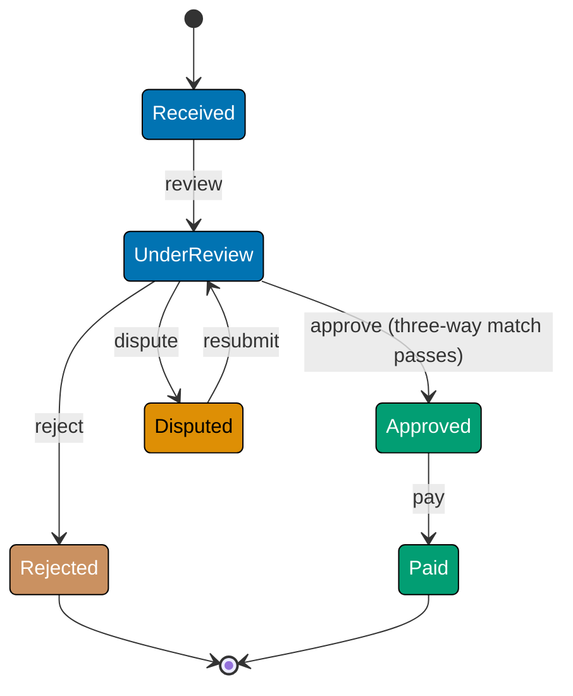
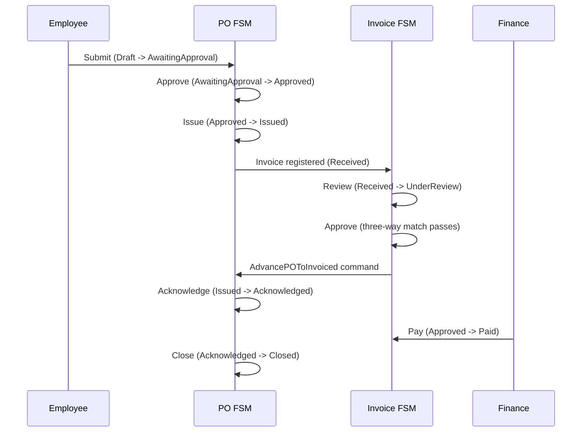

This intermediate section adds the `Invoice` state machine to the Procure-to-Pay domain, building on the `PurchaseOrder` FSM from the beginner level. The central patterns here are multi-machine coordination, three-way match guards, returning side-effect commands from transitions, and composing two FSMs that must stay in sync.

## Invoice State Machine (Examples 26–33)

### Example 26: Invoice States and the Three-Way Match

An invoice in a P2P system must pass a three-way match before it can be approved: the invoice amount must match the PO amount and the goods-receipt amount within tolerance. The state machine enforces this as a guard on the `Approve` transition.







```fsharp
// ── file: InvoiceFsm.fsx ─────────────────────────────────────────────────
// Invoice state discriminated union: every valid invoice state listed once.
// Compiler rejects any InvoiceState value outside this set.
type InvoiceState =
    | Received     // => Invoice registered in the system; not yet reviewed
    | UnderReview  // => AP team is reviewing against PO and receipt
    | Approved     // => Three-way match passed; ready for payment
    | Disputed     // => Discrepancy found; awaiting supplier correction
    | Rejected     // => Invoice rejected — terminal state
    | Paid         // => Payment disbursed — terminal state

// Invoice event DU: all events that can drive an invoice through its lifecycle.
type InvoiceEvent =
    | Review    // => AP team starts review
    | Approve   // => Three-way match passes; AP approves
    | Dispute   // => Discrepancy flagged during review
    | Resubmit  // => Supplier corrects and resubmits
    | Reject    // => AP permanently rejects invoice
    | Pay       // => Finance disburses payment

// Pure predicate: is this invoice state terminal?
let isInvoiceTerminal (state: InvoiceState) : bool =
    match state with
    | Rejected | Paid -> true  // => Two terminal states for invoices
    | _               -> false // => All others allow further transitions

printfn "Received terminal: %b" (isInvoiceTerminal Received)  // => false
printfn "Paid terminal: %b"     (isInvoiceTerminal Paid)      // => true
```





```clojure
;; ── file: invoice_fsm.clj ────────────────────────────────────────────────
;; [F#: discriminated union — compiler-enforced; Clojure uses keyword values in maps]
;; Invoice states are plain Clojure keywords — no type declaration needed.
;; Valid states: :received, :under-review, :approved, :disputed, :rejected, :paid
;; => Clojure's open, data-oriented model: states exist as values, not types

;; Invoice events are also keywords — a natural vocabulary for this domain.
;; => :review :approve :dispute :resubmit :reject :pay
;; => No event DU declaration; the set of valid keywords is the contract

(def terminal-states
  ;; Collect terminal states in a set for O(1) membership lookup.
  ;; => #{:rejected :paid} — two terminal lifecycle endpoints
  #{:rejected :paid})

;; Pure predicate: is this invoice state terminal?
;; Clojure sets act as functions — (terminal-states :paid) returns :paid (truthy).
(defn invoice-terminal?
  ;; [F#: pattern match — explicit case analysis; Clojure uses set membership]
  [state]
  ;; => (terminal-states :received) returns nil (falsy) — not terminal
  ;; => (terminal-states :paid) returns :paid (truthy) — is terminal
  (boolean (terminal-states state)))

(println "received terminal?" (invoice-terminal? :received)) ;; => false
(println "paid terminal?"     (invoice-terminal? :paid))     ;; => true
```





```typescript
// ── file: invoiceFsm.ts ────────────────────────────────────────────────────
// [F#: InvoiceState DU; Clojure: keyword values]
// TypeScript: literal union for invoice states — compiler-checked.

type InvoiceState = "Received" | "UnderReview" | "Approved" | "Disputed" | "Rejected" | "Paid";
// => Literal union: compiler rejects any string outside this set

type InvoiceEvent = "Review" | "Approve" | "Dispute" | "Resubmit" | "Reject" | "Pay";
// => All events that can drive an invoice through its lifecycle

// Branded Result type for all invoice operations
type Result<T, E> = { ok: true; value: T } | { ok: false; error: E };
const Ok = <T>(v: T): Result => ({ ok: true, value: v });
const Err = <E>(e: E): Result => ({ ok: false, error: e });

// Pure predicate: is this invoice state terminal?
// [F#: | Rejected | Paid -> true | _ -> false]
const isInvoiceTerminal = (state: InvoiceState): boolean => state === "Rejected" || state === "Paid";
// => Two terminal invoice states; all others allow further transitions

console.log("Received terminal?", isInvoiceTerminal("Received")); // => false
console.log("Paid terminal?", isInvoiceTerminal("Paid")); // => true
```





```haskell
-- ── file: InvoiceFsm.hs ────────────────────────────────────────────────
-- [F#: InvoiceState/InvoiceEvent discriminated unions; Clojure: keyword values]
-- Haskell: sum types (ADTs) — compiler enforces exhaustive pattern matching.

{-# LANGUAGE DerivingStrategies #-}
module InvoiceFsm where

-- Invoice state ADT: every valid invoice state listed once.
-- The compiler rejects any InvoiceState value outside this set.
data InvoiceState
  = Received     -- => Invoice registered in the system; not yet reviewed
  | UnderReview  -- => AP team is reviewing against PO and receipt
  | Approved     -- => Three-way match passed; ready for payment
  | Disputed     -- => Discrepancy found; awaiting supplier correction
  | Rejected     -- => Invoice rejected — terminal state
  | Paid         -- => Payment disbursed — terminal state
  deriving stock (Show, Eq, Ord)
  -- => Show enables printing; Eq/Ord enable comparisons and map keys

-- Invoice event ADT: all events that drive an invoice through its lifecycle.
data InvoiceEvent
  = Review    -- => AP team starts review
  | ApproveE  -- => Three-way match passes; AP approves
  | Dispute   -- => Discrepancy flagged during review
  | Resubmit  -- => Supplier corrects and resubmits
  | RejectE   -- => AP permanently rejects invoice
  | PayE      -- => Finance disburses payment
  deriving stock (Show, Eq, Ord)

-- Pure predicate: is this invoice state terminal?
-- The two terminal states are listed explicitly; the wildcard handles the rest.
isInvoiceTerminal :: InvoiceState -> Bool
isInvoiceTerminal Rejected = True   -- => Rejected is terminal
isInvoiceTerminal Paid     = True   -- => Paid is terminal
isInvoiceTerminal _        = False  -- => All other states allow further events

-- Demo: exercise the predicate over a few state values.
demo :: IO ()
demo = do
  putStrLn ("Received terminal: " <> show (isInvoiceTerminal Received))
  -- => Received terminal: False
  putStrLn ("Paid terminal: "     <> show (isInvoiceTerminal Paid))
  -- => Paid terminal: True
```





**Key Takeaway**: The Invoice FSM mirrors the PO FSM structure — DU states, DU events, pure terminal predicate — establishing a consistent pattern across all aggregates in the domain.

**Why It Matters**: Using the same structural pattern (DU states, DU events, pure transition function) across all machines in the domain makes the codebase predictable. A developer familiar with the PO FSM immediately understands the Invoice FSM without reading documentation. Consistency across machines also enables generic infrastructure: a single `withLogging` wrapper, a single `replayEvents` fold, and a single DOT generator work for any machine that follows the `State -> Event -> Result<State, string>` protocol.

---

### Example 27: The Three-Way Match Guard

The three-way match checks that invoice amount, PO committed amount, and goods-receipt amount agree within a configurable tolerance. The guard is a pure function on domain values — easy to test in isolation from the FSM.





```fsharp
// ── file: InvoiceFsm.fsx ─────────────────────────────────────────────────
// Three-way match context: the three amounts that must agree.
type ThreeWayMatchContext =
    { InvoiceAmount: decimal    // => Amount billed by the supplier
      POAmount: decimal         // => Amount committed on the purchase order
      ReceiptAmount: decimal    // => Amount confirmed received by the warehouse
      TolerancePercent: decimal }// => Allowed variance (e.g. 0.02 for 2%)

// Pure guard: all three amounts must agree within the tolerance percentage.
// Returns Result to carry the reason for failure.
let threeWayMatch (ctx: ThreeWayMatchContext) : Result<unit, string> =
    // => Helper: is |a - b| within tolerance of b?
    let withinTolerance (a: decimal) (b: decimal) =
        let diff = abs (a - b)          // => Absolute difference
        let allowed = b * ctx.TolerancePercent // => Max allowed variance
        diff <= allowed                 // => True if within tolerance

    if not (withinTolerance ctx.InvoiceAmount ctx.POAmount) then
        Error $"Invoice {ctx.InvoiceAmount} vs PO {ctx.POAmount}: outside tolerance {ctx.TolerancePercent}"
        // => Invoice amount diverges too much from the PO commitment
    elif not (withinTolerance ctx.InvoiceAmount ctx.ReceiptAmount) then
        Error $"Invoice {ctx.InvoiceAmount} vs receipt {ctx.ReceiptAmount}: outside tolerance {ctx.TolerancePercent}"
        // => Invoice amount diverges too much from what was actually received
    else
        Ok ()
        // => All three amounts agree within tolerance — match passes

// Test guard with sample data
let ctx1 =
    { InvoiceAmount = 1010m; POAmount = 1000m
      ReceiptAmount = 1005m; TolerancePercent = 0.02m }
// => 1010 vs 1000: diff=10, allowed=20 -> within tolerance
// => 1010 vs 1005: diff=5, allowed=20.1 -> within tolerance

let ctx2 =
    { InvoiceAmount = 1100m; POAmount = 1000m
      ReceiptAmount = 1000m; TolerancePercent = 0.02m }
// => 1100 vs 1000: diff=100, allowed=20 -> outside tolerance

printfn "%A" (threeWayMatch ctx1)  // => Ok ()
printfn "%A" (threeWayMatch ctx2)  // => Error "Invoice 1100 vs PO 1000..."
```





```clojure
;; ── file: invoice_fsm.clj ────────────────────────────────────────────────
;; [F#: record type ThreeWayMatchContext — Clojure uses a plain map with namespaced keys]
;; Three-way match context is a plain map; no declaration needed.
;; => {:invoice/amount 1010 :po/amount 1000 :receipt/amount 1005 :match/tolerance 0.02}

(defn within-tolerance?
  ;; Pure helper: is the absolute difference within the allowed percentage of base?
  ;; [F#: nested let binding — Clojure inlines the arithmetic directly]
  [a b tolerance]
  (let [diff    (Math/abs (- a b))   ;; => absolute difference between the two amounts
        allowed (* b tolerance)]     ;; => maximum allowed variance at this tolerance
    (<= diff allowed)))              ;; => true when difference is within bounds

(defn three-way-match
  ;; Pure guard: all three amounts must agree within the tolerance percentage.
  ;; [F#: Result<unit, string> — Clojure returns {:ok true} or {:error msg}]
  ;; => Clojure has no built-in Result type; {:ok true} is the idiomatic data response
  [{:keys [invoice-amount po-amount receipt-amount tolerance]}]
  (cond
    ;; => Check invoice vs PO first — most common mismatch in procurement
    (not (within-tolerance? invoice-amount po-amount tolerance))
    {:error (str "Invoice " invoice-amount " vs PO " po-amount
                 ": outside tolerance " tolerance)}
    ;; => Check invoice vs receipt — confirms goods actually received
    (not (within-tolerance? invoice-amount receipt-amount tolerance))
    {:error (str "Invoice " invoice-amount " vs receipt " receipt-amount
                 ": outside tolerance " tolerance)}
    ;; => All three amounts agree — match passes
    :else {:ok true}))

;; Test guard with sample data
(def ctx1 {:invoice-amount 1010 :po-amount 1000 :receipt-amount 1005 :tolerance 0.02})
;; => 1010 vs 1000: diff=10, allowed=20 -> within tolerance
;; => 1010 vs 1005: diff=5, allowed=20.2 -> within tolerance

(def ctx2 {:invoice-amount 1100 :po-amount 1000 :receipt-amount 1000 :tolerance 0.02})
;; => 1100 vs 1000: diff=100, allowed=20 -> outside tolerance

(println (three-way-match ctx1)) ;; => {:ok true}
(println (three-way-match ctx2)) ;; => {:error "Invoice 1100 vs PO 1000: outside tolerance 0.02"}
```





```typescript
// ── file: invoiceFsm.ts ────────────────────────────────────────────────────
// [F#: ThreeWayMatchContext record + pure guard; Clojure: plain map guard]
// TypeScript: readonly context type + pure guard function.

type ThreeWayMatchContext = Readonly<{
  invoiceAmount: number; // => Amount billed by the supplier
  poAmount: number; // => Amount committed on the purchase order
  receiptAmount: number; // => Amount confirmed received by the warehouse
  tolerancePercent: number; // => Allowed variance (e.g. 0.02 for 2%)
}>;
// => Readonly enforces immutability after construction

// Pure helper: is |a - b| within tolerance of b?
const withinTolerance = (a: number, b: number, tol: number): boolean => Math.abs(a - b) <= b * tol;
// => Same formula as F# helper function

// Pure guard: all three amounts must agree within the tolerance percentage.
// [F#: Result<unit,string>; TS: Result<true,string>]
const threeWayMatch = (ctx: ThreeWayMatchContext): Result<true, string> => {
  if (!withinTolerance(ctx.invoiceAmount, ctx.poAmount, ctx.tolerancePercent))
    return Err(`Invoice ${ctx.invoiceAmount} vs PO ${ctx.poAmount}: outside tolerance ${ctx.tolerancePercent}`);
  // => Invoice amount diverges too much from the PO commitment
  if (!withinTolerance(ctx.invoiceAmount, ctx.receiptAmount, ctx.tolerancePercent))
    return Err(
      `Invoice ${ctx.invoiceAmount} vs receipt ${ctx.receiptAmount}: outside tolerance ${ctx.tolerancePercent}`,
    );
  // => Invoice amount diverges too much from what was actually received
  return Ok(true as const);
  // => All three amounts agree within tolerance — match passes
};

const ctx1: ThreeWayMatchContext = {
  invoiceAmount: 1010,
  poAmount: 1000,
  receiptAmount: 1005,
  tolerancePercent: 0.02,
};
// => 1010 vs 1000: diff=10, allowed=20 -> within tolerance

const ctx2: ThreeWayMatchContext = {
  invoiceAmount: 1100,
  poAmount: 1000,
  receiptAmount: 1000,
  tolerancePercent: 0.02,
};
// => 1100 vs 1000: diff=100, allowed=20 -> outside tolerance

console.log(threeWayMatch(ctx1)); // => { ok: true, value: true }
console.log(threeWayMatch(ctx2)); // => { ok: false, error: "Invoice 1100 vs PO 1000..." }
```





```haskell
-- ── file: ThreeWayMatch.hs ─────────────────────────────────────────────
-- [F#: ThreeWayMatchContext record + threeWayMatch; Clojure: plain map]
-- Haskell: record + pure guard using Either Text () to carry failure detail.

{-# LANGUAGE DerivingStrategies #-}
{-# LANGUAGE OverloadedStrings #-}
module ThreeWayMatch where

import Data.Text (Text)
import qualified Data.Text as T
import Text.Printf (printf)                  -- => Compose helpful error strings

-- Three-way match context: the three amounts that must agree.
data ThreeWayMatchContext = ThreeWayMatchContext
  { invoiceAmount    :: Double   -- => Amount billed by the supplier
  , poAmount         :: Double   -- => Amount committed on the purchase order
  , receiptAmount    :: Double   -- => Amount confirmed by the warehouse
  , tolerancePercent :: Double   -- => Allowed variance (e.g. 0.02 for 2%)
  } deriving stock (Show, Eq)    -- => Show used by demo printouts

-- Helper: is |a - b| within tolerance of b?
withinTolerance :: Double -> Double -> Double -> Bool
withinTolerance a b tol = abs (a - b) <= b * tol
-- => True when the absolute difference falls inside the allowed band

-- Pure guard: all three amounts must agree within the tolerance percentage.
-- Either Text () mirrors F#'s Result<unit, string>.
threeWayMatch :: ThreeWayMatchContext -> Either Text ()
threeWayMatch ctx
  | not (withinTolerance (invoiceAmount ctx)
                         (poAmount ctx)
                         (tolerancePercent ctx)) =
      Left (T.pack $ printf "Invoice %.2f vs PO %.2f: outside tolerance %.2f"
                            (invoiceAmount ctx) (poAmount ctx)
                            (tolerancePercent ctx))
      -- => Invoice amount diverges too much from PO commitment
  | not (withinTolerance (invoiceAmount ctx)
                         (receiptAmount ctx)
                         (tolerancePercent ctx)) =
      Left (T.pack $ printf
              "Invoice %.2f vs receipt %.2f: outside tolerance %.2f"
              (invoiceAmount ctx) (receiptAmount ctx)
              (tolerancePercent ctx))
      -- => Invoice amount diverges too much from what was received
  | otherwise = Right ()
      -- => All three amounts agree within tolerance: match passes

-- Test guard with sample data.
demo :: IO ()
demo = do
  let ctx1 = ThreeWayMatchContext 1010 1000 1005 0.02
  -- => 1010 vs 1000: diff=10, allowed=20 -> within
  -- => 1010 vs 1005: diff=5, allowed=20.1 -> within
  print (threeWayMatch ctx1)
  -- => Right ()
  let ctx2 = ThreeWayMatchContext 1100 1000 1000 0.02
  -- => 1100 vs 1000: diff=100, allowed=20 -> outside
  print (threeWayMatch ctx2)
  -- => Left "Invoice 1100.00 vs PO 1000.00: outside tolerance 0.02"
```





**Key Takeaway**: The three-way match is a composable pure function on domain values — it can be tested exhaustively before being wired into the transition function.

**Why It Matters**: The three-way match is a critical procurement control: it prevents paying for goods not ordered or not received. Encoding it as a pure function makes it independently auditable: finance can verify the tolerance configuration and test boundary cases without running the full FSM. The `Result<unit, string>` return type integrates naturally with `Result.bind` chains, allowing the match to gate the Approve transition without any special handling at the FSM layer.

---

### Example 28: Guarded Invoice Transition

Combining the three-way match guard with the invoice transition function produces a full guarded FSM. The Approve event succeeds only when `threeWayMatch` returns `Ok ()`.





```fsharp
// ── file: InvoiceFsm.fsx ─────────────────────────────────────────────────
// Invoice record with embedded three-way match context.
type Invoice =
    { Id: string
      State: InvoiceState
      MatchCtx: ThreeWayMatchContext }  // => Context needed by the Approve guard

// Guarded invoice transition: Approve event requires three-way match.
let invoiceTransition
    (inv: Invoice)
    (event: InvoiceEvent)
    : Result<Invoice, string> =
    match inv.State, event with
    | Received, Review ->
        // => No guard: start review unconditionally
        Ok { inv with State = UnderReview }
    | UnderReview, Approve ->
        // => Guard: three-way match must pass before approval
        threeWayMatch inv.MatchCtx
        |> Result.map (fun () -> { inv with State = Approved })
        // => Result.map: if Ok () -> Ok { inv with State = Approved }
        // => If Error msg -> Error msg propagates unchanged
    | UnderReview, Dispute ->
        Ok { inv with State = Disputed }
    | Disputed, Resubmit ->
        Ok { inv with State = UnderReview }
        // => Resubmit returns to UnderReview for re-evaluation
    | UnderReview, Reject ->
        Ok { inv with State = Rejected }
    | Approved, Pay ->
        Ok { inv with State = Paid }
    | _, _ ->
        Error $"Invalid invoice transition: {inv.State} + {event}"

// Simulate approve with passing three-way match
let goodCtx =
    { InvoiceAmount = 1010m; POAmount = 1000m
      ReceiptAmount = 1005m; TolerancePercent = 0.02m }
// => Three-way match passes within 2% tolerance

let inv = { Id = "INV-001"; State = UnderReview; MatchCtx = goodCtx }
let approved = invoiceTransition inv Approve
// => Ok { State = Approved; ... }

printfn "%A" approved  // => Ok { Id = "INV-001"; State = Approved; ... }

// Simulate approve with failing three-way match
let badCtx = { goodCtx with InvoiceAmount = 1200m }
// => Invoice amount too high — match will fail
let inv2 = { inv with MatchCtx = badCtx }
let rejected = invoiceTransition inv2 Approve
// => Error "Invoice 1200 vs PO 1000..."

printfn "%A" rejected  // => Error "Invoice 1200 vs PO 1000..."
```





```clojure
;; ── file: invoice_fsm.clj ────────────────────────────────────────────────
;; [F#: record type Invoice — Clojure uses a plain map with namespaced keys]
;; Invoice is a plain map: {:invoice/id "INV-001" :invoice/state :under-review :invoice/match-ctx {...}}

(defn invoice-transition
  ;; Guarded invoice transition: Approve event requires three-way match.
  ;; [F#: pattern match on (State, Event) tuple — Clojure uses cond with predicates]
  [inv event]
  (let [state (:invoice/state inv)   ;; => extract current state from the map
        ctx   (:invoice/match-ctx inv)] ;; => extract match context for guard evaluation
    (cond
      ;; => :received + :review — no guard; advance unconditionally
      (and (= state :received) (= event :review))
      {:ok (assoc inv :invoice/state :under-review)}

      ;; => :under-review + :approve — three-way match guard must pass
      (and (= state :under-review) (= event :approve))
      (let [match-result (three-way-match ctx)]
        ;; => evaluate the guard; propagate error or advance state
        (if (:error match-result)
          match-result                              ;; => guard failed — return the error map
          {:ok (assoc inv :invoice/state :approved)})) ;; => guard passed — advance to :approved

      (and (= state :under-review) (= event :dispute))
      {:ok (assoc inv :invoice/state :disputed)}
      ;; => :under-review + :dispute — no guard; flag discrepancy

      (and (= state :disputed) (= event :resubmit))
      {:ok (assoc inv :invoice/state :under-review)}
      ;; => :disputed + :resubmit — return to review for re-evaluation

      (and (= state :under-review) (= event :reject))
      {:ok (assoc inv :invoice/state :rejected)}

      (and (= state :approved) (= event :pay))
      {:ok (assoc inv :invoice/state :paid)}

      ;; => catch-all: invalid state/event combination
      :else {:error (str "Invalid invoice transition: " state " + " event)})))

;; Simulate approve with passing three-way match
(def good-ctx {:invoice-amount 1010 :po-amount 1000 :receipt-amount 1005 :tolerance 0.02})
;; => Three-way match passes within 2% tolerance

(def inv {:invoice/id "INV-001" :invoice/state :under-review :invoice/match-ctx good-ctx})
(def approved (invoice-transition inv :approve))
;; => {:ok {:invoice/id "INV-001" :invoice/state :approved :invoice/match-ctx {...}}}

(println approved)

;; Simulate approve with failing three-way match
(def bad-ctx (assoc good-ctx :invoice-amount 1200))
;; => Invoice amount too high — match will fail
(def inv2 (assoc inv :invoice/match-ctx bad-ctx))
(println (invoice-transition inv2 :approve))
;; => {:error "Invoice 1200 vs PO 1000: outside tolerance 0.02"}
```





```typescript
// ── file: invoiceFsm.ts ────────────────────────────────────────────────────
// [F#: Invoice record + guarded invoiceTransition; Clojure: cond dispatch]
// TypeScript: Invoice type + switch-based guarded transition.

type Invoice = Readonly<{
  id: string;
  state: InvoiceState;
  matchCtx: ThreeWayMatchContext; // => Context needed by the Approve guard
}>;

const resultBind = <T, U, E>(r: Result<T, E>, f: (v: T) => Result<U, E>): Result<U, E> => (r.ok ? f(r.value) : r);
// => Short-circuits on error — same semantics as F# Result.bind

const invoiceTransition = (inv: Invoice, event: InvoiceEvent): Result<Invoice, string> => {
  const s = inv.state;
  if (s === "Received" && event === "Review") return Ok({ ...inv, state: "UnderReview" });
  // => No guard: start review unconditionally
  if (s === "UnderReview" && event === "Approve") {
    // => Guard: three-way match must pass before approval
    return resultBind(threeWayMatch(inv.matchCtx), () => Ok({ ...inv, state: "Approved" }));
    // => Result.bind: if Ok() -> Ok Approved; if Error msg -> Error msg propagates
  }
  if (s === "UnderReview" && event === "Dispute") return Ok({ ...inv, state: "Disputed" });
  if (s === "Disputed" && event === "Resubmit") return Ok({ ...inv, state: "UnderReview" });
  // => Resubmit returns to UnderReview for re-evaluation
  if (s === "UnderReview" && event === "Reject") return Ok({ ...inv, state: "Rejected" });
  if (s === "Approved" && event === "Pay") return Ok({ ...inv, state: "Paid" });
  return Err(`Invalid invoice transition: ${s} + ${event}`);
};

const goodCtx: ThreeWayMatchContext = {
  invoiceAmount: 1010,
  poAmount: 1000,
  receiptAmount: 1005,
  tolerancePercent: 0.02,
};
const inv: Invoice = { id: "INV-001", state: "UnderReview", matchCtx: goodCtx };
const approved = invoiceTransition(inv, "Approve");
// => { ok: true, value: { state: "Approved" } }

console.log(approved.ok ? approved.value.state : approved.error);
// => "Approved"

const badCtx: ThreeWayMatchContext = { ...goodCtx, invoiceAmount: 1200 };
const inv2: Invoice = { ...inv, matchCtx: badCtx };
const rejected = invoiceTransition(inv2, "Approve");
// => { ok: false, error: "Invoice 1200 vs PO 1000..." }

console.log(rejected.ok ? "" : rejected.error);
```





```haskell
-- ── file: InvoiceTransition.hs ─────────────────────────────────────────
-- [F#: invoiceTransition match + Result.map; Clojure: cond + bind-result]
-- Haskell: Either monad's fmap/>>= compose the guard with the state update.

{-# LANGUAGE DerivingStrategies #-}
{-# LANGUAGE OverloadedStrings #-}
module InvoiceTransition where

import Data.Text (Text)
import qualified Data.Text as T

-- Invoice and event ADTs.
data InvState = Received | UnderReview | Approved | Disputed | Rejected | Paid
  deriving stock (Show, Eq, Ord)

data InvEvent = Review | ApproveE | Dispute | Resubmit | RejectE | PayE
  deriving stock (Show, Eq, Ord)

-- Three-way match context kept on the invoice for guard evaluation.
data MatchCtx = MatchCtx
  { invoiceAmount    :: Double
  , poAmount         :: Double
  , receiptAmount    :: Double
  , tolerancePercent :: Double
  } deriving stock (Show, Eq)

-- Invoice record with embedded three-way match context.
data Invoice = Invoice
  { invId       :: Text
  , invState    :: InvState
  , invMatchCtx :: MatchCtx
  } deriving stock (Show, Eq)

-- Three-way match guard returning Either to thread error info.
threeWayMatch :: MatchCtx -> Either Text ()
threeWayMatch ctx
  | abs (invoiceAmount ctx - poAmount ctx)
      <= poAmount ctx * tolerancePercent ctx &&
    abs (invoiceAmount ctx - receiptAmount ctx)
      <= receiptAmount ctx * tolerancePercent ctx
      = Right ()                              -- => All within tolerance
  | otherwise = Left "three-way match failed" -- => Outside tolerance

-- Guarded invoice transition.
-- The Approve case uses fmap (Functor for Either) to lift the state update.
invoiceTransition :: Invoice -> InvEvent -> Either Text Invoice
invoiceTransition inv ev = case (invState inv, ev) of
  (Received, Review) ->
    Right inv { invState = UnderReview }      -- => No guard
  (UnderReview, ApproveE) ->
    fmap (\() -> inv { invState = Approved })
         (threeWayMatch (invMatchCtx inv))
    -- => fmap: if Right () -> Right (inv { Approved }); Left propagates
  (UnderReview, Dispute) ->
    Right inv { invState = Disputed }
  (Disputed, Resubmit) ->
    Right inv { invState = UnderReview }      -- => Re-enter review
  (UnderReview, RejectE) ->
    Right inv { invState = Rejected }
  (Approved, PayE) ->
    Right inv { invState = Paid }
  (s, e) ->
    Left (T.pack $ "Invalid invoice transition: "
                <> show s <> " + " <> show e)

-- Simulate approve with passing and failing three-way matches.
demo :: IO ()
demo = do
  let goodCtx = MatchCtx 1010 1000 1005 0.02
      inv     = Invoice "INV-001" UnderReview goodCtx
  print (invoiceTransition inv ApproveE)
  -- => Right (Invoice {invState = Approved, ...})
  let badCtx = goodCtx { invoiceAmount = 1200 }
      inv2   = inv { invMatchCtx = badCtx }
  print (invoiceTransition inv2 ApproveE)
  -- => Left "three-way match failed"
```





**Key Takeaway**: `Result.map` threads the guard result into the state update without nested `match` expressions — the guard failure propagates automatically.

**Why It Matters**: The pattern `guard |> Result.map (fun () -> newState)` is the idiomatic way to gate a transition behind a pure guard. Compare the OOP equivalent: a `canApprove()` method that throws an exception, which breaks the pure transition contract and couples the state class to exception handling. The FP `Result.map` approach is referentially transparent: the same guard context always produces the same result, the transition function has no side effects, and the entire approval logic is visible in one `match` arm.

---

### Example 29: Linking Invoice and PurchaseOrder State Machines

An invoice is always linked to a PO. When an invoice is approved, the PO may need to advance to `Invoiced`. This example shows how to coordinate two FSMs by returning a command list from the invoice transition.





```fsharp
// ── file: InvoiceFsm.fsx ─────────────────────────────────────────────────
// Cross-machine commands: actions the application layer must execute
// after the invoice transition completes.
type InvoiceCommand =
    | AdvancePOToInvoiced of poId: string  // => Tell PO FSM to advance
    | SendPaymentRequest   of invoiceId: string * amount: decimal
    | NotifyRequester      of poId: string * message: string

// Transition returns (newInvoice, commands list).
// Pure: no direct calls to PO FSM — returns commands instead.
let invoiceTransitionWithCommands
    (inv: Invoice)
    (event: InvoiceEvent)
    : Result<Invoice * InvoiceCommand list, string> =
    match inv.State, event with
    | Received, Review ->
        Ok ({ inv with State = UnderReview }, [])
        // => Review: no cross-machine commands needed
    | UnderReview, Approve ->
        threeWayMatch inv.MatchCtx
        |> Result.map (fun () ->
            let cmds =
                [ AdvancePOToInvoiced "PO-001"          // => Coordinate PO state
                  SendPaymentRequest (inv.Id, inv.MatchCtx.InvoiceAmount)
                  // => Queue payment
                  NotifyRequester ("PO-001", "Invoice approved") ]
                  // => Notify employee
            { inv with State = Approved }, cmds)
    | UnderReview, Dispute ->
        Ok ({ inv with State = Disputed },
            [ NotifyRequester ("PO-001", "Invoice disputed — awaiting supplier") ])
    | Disputed, Resubmit ->
        Ok ({ inv with State = UnderReview }, [])
    | Approved, Pay ->
        Ok ({ inv with State = Paid }, [])
    | _, _ ->
        Error $"Invalid: {inv.State} + {event}"

// Simulate approval
let inv3 =
    { Id = "INV-002"
      State = UnderReview
      MatchCtx = { InvoiceAmount = 500m; POAmount = 500m
                   ReceiptAmount = 500m; TolerancePercent = 0.01m } }

match invoiceTransitionWithCommands inv3 Approve with
| Ok (nextInv, cmds) ->
    printfn "Next state: %A" nextInv.State  // => Approved
    cmds |> List.iter (printfn "Command: %A")
    // => Command: AdvancePOToInvoiced "PO-001"
    // => Command: SendPaymentRequest ("INV-002", 500.0M)
    // => Command: NotifyRequester ("PO-001", "Invoice approved")
| Error msg -> printfn "Error: %s" msg
```





```clojure
;; ── file: invoice_fsm.clj ────────────────────────────────────────────────
;; [F#: discriminated union InvoiceCommand — Clojure uses maps with a :cmd/type key]
;; Commands are plain maps; the :cmd/type keyword identifies the command variant.
;; => {:cmd/type :advance-po-to-invoiced :cmd/po-id "PO-001"}
;; => {:cmd/type :send-payment-request :cmd/invoice-id "INV-002" :cmd/amount 500}
;; => {:cmd/type :notify-requester :cmd/po-id "PO-001" :cmd/message "Invoice approved"}

(defn invoice-transition-with-commands
  ;; Transition returns {:ok {:invoice next-inv :commands [...]}} or {:error msg}.
  ;; [F#: Result<Invoice * InvoiceCommand list, string> — Clojure uses a data map]
  ;; Pure: no direct calls to PO FSM — emits command maps instead.
  [inv event]
  (let [state (:invoice/state inv)
        ctx   (:invoice/match-ctx inv)
        id    (:invoice/id inv)]
    (cond
      ;; => :received + :review — advance; no cross-machine commands needed
      (and (= state :received) (= event :review))
      {:ok {:invoice (assoc inv :invoice/state :under-review) :commands []}}

      ;; => :under-review + :approve — guard first, then emit coordination commands
      (and (= state :under-review) (= event :approve))
      (let [match-result (three-way-match ctx)]
        (if (:error match-result)
          match-result
          ;; => Guard passed — build command list for application layer
          {:ok {:invoice   (assoc inv :invoice/state :approved)
                :commands  [{:cmd/type :advance-po-to-invoiced :cmd/po-id "PO-001"}
                            ;; => Tell PO FSM to advance its state
                            {:cmd/type :send-payment-request
                             :cmd/invoice-id id
                             :cmd/amount (:invoice-amount ctx)}
                            ;; => Queue payment disbursement
                            {:cmd/type :notify-requester
                             :cmd/po-id "PO-001"
                             :cmd/message "Invoice approved"}]}}))
                ;; => Notify the original requester

      (and (= state :under-review) (= event :dispute))
      {:ok {:invoice  (assoc inv :invoice/state :disputed)
            :commands [{:cmd/type :notify-requester
                        :cmd/po-id "PO-001"
                        :cmd/message "Invoice disputed — awaiting supplier"}]}}

      (and (= state :disputed) (= event :resubmit))
      {:ok {:invoice (assoc inv :invoice/state :under-review) :commands []}}

      (and (= state :approved) (= event :pay))
      {:ok {:invoice (assoc inv :invoice/state :paid) :commands []}}

      :else {:error (str "Invalid: " state " + " event)})))

;; Simulate approval
(def inv3 {:invoice/id "INV-002"
           :invoice/state :under-review
           :invoice/match-ctx {:invoice-amount 500 :po-amount 500
                               :receipt-amount 500 :tolerance 0.01}})

(let [result (invoice-transition-with-commands inv3 :approve)]
  (if (:error result)
    (println "Error:" (:error result))
    (let [{:keys [invoice commands]} (:ok result)]
      (println "Next state:" (:invoice/state invoice)) ;; => :approved
      (doseq [cmd commands]
        (println "Command:" cmd)))))
;; => Command: {:cmd/type :advance-po-to-invoiced, :cmd/po-id "PO-001"}
;; => Command: {:cmd/type :send-payment-request, :cmd/invoice-id "INV-002", :cmd/amount 500}
;; => Command: {:cmd/type :notify-requester, :cmd/po-id "PO-001", :cmd/message "Invoice approved"}
```





```typescript
// ── file: invoiceFsm.ts ────────────────────────────────────────────────────
// [F#: InvoiceCommand DU; Clojure: tagged command maps]
// TypeScript: tagged union for cross-machine commands — application layer executes them.

type InvoiceCommand =
  | { kind: "AdvancePOToInvoiced"; poId: string }
  // => Tell PO FSM to advance
  | { kind: "SendPaymentRequest"; invoiceId: string; amount: number }
  // => Queue payment disbursement
  | { kind: "NotifyRequester"; poId: string; message: string };
// => Notify the requester

// Transition returns [newInvoice, commands[]] — pure, no direct PO FSM calls.
const invoiceTransitionWithCommands = (inv: Invoice, event: InvoiceEvent): Result => {
  const s = inv.state;
  if (s === "Received" && event === "Review") return Ok([{ ...inv, state: "UnderReview" }, []]);
  // => Review: no cross-machine commands needed
  if (s === "UnderReview" && event === "Approve") {
    return resultBind(threeWayMatch(inv.matchCtx), () => {
      const cmds: InvoiceCommand[] = [
        { kind: "AdvancePOToInvoiced", poId: "PO-001" },
        // => Coordinate PO state
        { kind: "SendPaymentRequest", invoiceId: inv.id, amount: inv.matchCtx.invoiceAmount },
        // => Queue payment
        { kind: "NotifyRequester", poId: "PO-001", message: "Invoice approved" },
        // => Notify employee
      ];
      return Ok([{ ...inv, state: "Approved" } as Invoice, cmds] as [Invoice, InvoiceCommand[]]);
    });
  }
  if (s === "UnderReview" && event === "Dispute")
    return Ok([
      { ...inv, state: "Disputed" },
      [{ kind: "NotifyRequester", poId: "PO-001", message: "Invoice disputed — awaiting supplier" }],
    ]);
  if (s === "Disputed" && event === "Resubmit") return Ok([{ ...inv, state: "UnderReview" }, []]);
  if (s === "Approved" && event === "Pay") return Ok([{ ...inv, state: "Paid" }, []]);
  return Err(`Invalid: ${s} + ${event}`);
};

const inv3: Invoice = {
  id: "INV-002",
  state: "UnderReview",
  matchCtx: { invoiceAmount: 500, poAmount: 500, receiptAmount: 500, tolerancePercent: 0.01 },
};
const r = invoiceTransitionWithCommands(inv3, "Approve");
if (r.ok) {
  const [nextInv, cmds] = r.value;
  console.log("Next state:", nextInv.state); // => Approved
  cmds.forEach((c) => console.log("Command:", c.kind));
  // => Command: AdvancePOToInvoiced
  // => Command: SendPaymentRequest
  // => Command: NotifyRequester
}
```





```haskell
-- ── file: InvoiceCommands.hs ───────────────────────────────────────────
-- [F#: InvoiceCommand DU + tuple result; Clojure: command maps + result map]
-- Haskell: ADT for cross-machine commands; transition returns (state, [cmd]).

{-# LANGUAGE DerivingStrategies #-}
{-# LANGUAGE OverloadedStrings #-}
module InvoiceCommands where

import Data.Text (Text)
import qualified Data.Text as T

-- Invoice ADTs and MatchCtx (subset).
data InvState = Received | UnderReview | Approved | Disputed | Rejected | Paid
  deriving stock (Show, Eq, Ord)

data InvEvent = Review | ApproveE | Dispute | Resubmit | RejectE | PayE
  deriving stock (Show, Eq, Ord)

data MatchCtx = MatchCtx
  { invoiceAmount    :: Double
  , poAmount         :: Double
  , receiptAmount    :: Double
  , tolerancePercent :: Double
  } deriving stock (Show, Eq)

data Invoice = Invoice
  { invId       :: Text
  , invState    :: InvState
  , invMatchCtx :: MatchCtx
  } deriving stock (Show, Eq)

-- Three-way match guard.
threeWayMatch :: MatchCtx -> Either Text ()
threeWayMatch ctx
  | abs (invoiceAmount ctx - poAmount ctx)
      <= poAmount ctx * tolerancePercent ctx
      = Right ()
  | otherwise = Left "outside tolerance"

-- Cross-machine commands the application layer must execute.
data InvoiceCommand
  = AdvancePOToInvoiced Text                       -- => Tell PO FSM to advance
  | SendPaymentRequest  Text Double                -- => Queue payment
  | NotifyRequester     Text Text                  -- => Notify employee
  deriving stock (Show, Eq)

-- Transition returns (newInvoice, commands) — pure, no direct PO FSM calls.
invoiceTransitionWithCommands
  :: Invoice -> InvEvent -> Either Text (Invoice, [InvoiceCommand])
invoiceTransitionWithCommands inv ev = case (invState inv, ev) of
  (Received, Review) ->
    Right (inv { invState = UnderReview }, [])     -- => No commands
  (UnderReview, ApproveE) -> do
    _ <- threeWayMatch (invMatchCtx inv)           -- => Three-way match guard
    let cmds = [ AdvancePOToInvoiced "PO-001"      -- => Coordinate PO state
               , SendPaymentRequest (invId inv)
                                    (invoiceAmount (invMatchCtx inv))
               , NotifyRequester "PO-001" "Invoice approved" ]
    Right (inv { invState = Approved }, cmds)
  (UnderReview, Dispute) ->
    Right ( inv { invState = Disputed }
          , [NotifyRequester "PO-001"
                             "Invoice disputed — awaiting supplier"] )
  (Disputed, Resubmit) ->
    Right (inv { invState = UnderReview }, [])
  (Approved, PayE) ->
    Right (inv { invState = Paid }, [])
  (s, e) ->
    Left (T.pack $ "Invalid: " <> show s <> " + " <> show e)

-- Simulate approval and inspect the produced commands.
demo :: IO ()
demo = do
  let inv3 = Invoice "INV-002" UnderReview (MatchCtx 500 500 500 0.01)
  case invoiceTransitionWithCommands inv3 ApproveE of
    Right (next, cmds) -> do
      putStrLn ("Next state: " <> show (invState next))   -- => Approved
      mapM_ print cmds                                     -- => one per command
    Left err -> putStrLn ("Error: " <> T.unpack err)
```





**Key Takeaway**: Returning a command list from the invoice transition delegates cross-machine coordination to the application layer — the FSM itself remains a pure function.

**Why It Matters**: Direct FSM-to-FSM calls inside a transition function create tight coupling and make testing require constructing both machines. Returning commands defers the orchestration: the application layer receives the invoice's new state and the list of commands, then dispatches each command — possibly through a message bus, in a database transaction, or via direct function calls. This is the CQRS pattern applied to FSM coordination: the transition produces a "write model" (new state) and a set of "commands" for downstream effects, cleanly separated.

---

### Example 30: Invoice FSM with Tolerance Check

Different procurement categories have different match tolerances. This example shows parameterising the tolerance at the FSM level, so the same transition function works for capital goods (strict) and consumables (relaxed).





```fsharp
// ── file: InvoiceFsm.fsx ─────────────────────────────────────────────────
// Procurement category determines match tolerance.
type ProcurementCategory =
    | CapitalGoods    // => High-value equipment; strict tolerance (0.5%)
    | Consumables     // => Everyday supplies; relaxed tolerance (3%)
    | Services        // => Professional services; moderate tolerance (1%)

// Look up tolerance by category.
// Pure function: deterministic, no I/O.
let toleranceFor (category: ProcurementCategory) : decimal =
    match category with
    | CapitalGoods -> 0.005m  // => 0.5% — tight control for expensive assets
    | Consumables  -> 0.03m   // => 3% — relaxed for bulk low-value items
    | Services     -> 0.01m   // => 1% — moderate for service invoices

// Build a match context with category-derived tolerance.
let buildMatchCtx
    (invoiceAmt: decimal)
    (poAmt: decimal)
    (receiptAmt: decimal)
    (category: ProcurementCategory)
    : ThreeWayMatchContext =
    { InvoiceAmount    = invoiceAmt
      POAmount         = poAmt
      ReceiptAmount    = receiptAmt
      TolerancePercent = toleranceFor category }  // => Tolerance from category

// Test: same amounts, different categories
let amt = (10_200m, 10_000m, 10_100m)  // => 2% variance on invoice vs PO
let (inv4, po4, rec4) = amt

let capitalCtx     = buildMatchCtx inv4 po4 rec4 CapitalGoods
// => tolerance = 0.5% — 2% variance fails
let consumablesCtx = buildMatchCtx inv4 po4 rec4 Consumables
// => tolerance = 3% — 2% variance passes

printfn "CapitalGoods:  %A" (threeWayMatch capitalCtx)
// => Error "Invoice 10200 vs PO 10000: outside tolerance 0.005"
printfn "Consumables:   %A" (threeWayMatch consumablesCtx)
// => Ok ()
```





```clojure
;; ── file: invoice_fsm.clj ────────────────────────────────────────────────
;; [F#: discriminated union ProcurementCategory — Clojure uses keyword keys in a map]
;; Category tolerance policy is a plain map — data, not code.
;; => Clojure favours data-driven configuration over match expressions for simple lookups
(def category-tolerances
  ;; Lookup table: procurement category keyword -> tolerance percentage
  {:capital-goods 0.005   ;; => 0.5% — tight control for expensive assets
   :consumables   0.03    ;; => 3% — relaxed for bulk low-value items
   :services      0.01})  ;; => 1% — moderate for service invoices

(defn tolerance-for
  ;; Pure lookup: deterministic, no I/O.
  ;; [F#: pattern match — Clojure uses map lookup for data-driven configuration]
  [category]
  ;; => category-tolerances is a map; get returns nil for unknown categories
  (or (get category-tolerances category)
      (throw (ex-info "Unknown procurement category" {:category category}))))
      ;; => Fail fast on unknown category — same semantics as F# exhaustive match

(defn build-match-ctx
  ;; Build a match context with category-derived tolerance.
  [invoice-amt po-amt receipt-amt category]
  {:invoice-amount invoice-amt
   :po-amount      po-amt
   :receipt-amount receipt-amt
   :tolerance      (tolerance-for category)}) ;; => tolerance from category lookup

;; Test: same amounts, different categories — 2% variance on invoice vs PO
(def capital-ctx    (build-match-ctx 10200 10000 10100 :capital-goods))
;; => tolerance = 0.005 (0.5%) — 2% variance exceeds this limit
(def consumables-ctx (build-match-ctx 10200 10000 10100 :consumables))
;; => tolerance = 0.03 (3%) — 2% variance is within this limit

(println "capital-goods: " (three-way-match capital-ctx))
;; => {:error "Invoice 10200 vs PO 10000: outside tolerance 0.005"}
(println "consumables:   " (three-way-match consumables-ctx))
;; => {:ok true}
```





```typescript
// ── file: invoiceFsm.ts ────────────────────────────────────────────────────
// [F#: ProcurementCategory DU; Clojure: category-tolerances map]
// TypeScript: literal union for category + data-driven tolerance lookup.

type ProcurementCategory = "CapitalGoods" | "Consumables" | "Services";
// => Literal union: compiler rejects unknown categories

// Tolerance policy as a lookup object — data-driven, easy to extend.
const categoryTolerances: Record = {
  CapitalGoods: 0.005, // => 0.5% — tight control for expensive assets
  Consumables: 0.03, // => 3% — relaxed for bulk low-value items
  Services: 0.01, // => 1% — moderate for service invoices
};
// => Record type ensures all categories have an entry — compiler-checked

// Pure lookup: deterministic, no I/O.
const toleranceFor = (category: ProcurementCategory): number => categoryTolerances[category];
// => TypeScript Record guarantees the key exists — no undefined return

// Build a match context with category-derived tolerance.
const buildMatchCtx = (
  invoiceAmt: number,
  poAmt: number,
  receiptAmt: number,
  category: ProcurementCategory,
): ThreeWayMatchContext => ({
  invoiceAmount: invoiceAmt,
  poAmount: poAmt,
  receiptAmount: receiptAmt,
  tolerancePercent: toleranceFor(category),
  // => Tolerance from category lookup — caller does not set it directly
});

// Test: same amounts, different categories — 2% variance on invoice vs PO
const capitalCtx = buildMatchCtx(10200, 10000, 10100, "CapitalGoods");
// => tolerance = 0.5% — 2% variance exceeds this limit
const consumablesCtx = buildMatchCtx(10200, 10000, 10100, "Consumables");
// => tolerance = 3% — 2% variance is within this limit

console.log("CapitalGoods: ", threeWayMatch(capitalCtx).ok ? "pass" : "fail");
// => fail
console.log("Consumables:  ", threeWayMatch(consumablesCtx).ok ? "pass" : "fail");
// => pass
```





```haskell
-- ── file: InvoiceCategory.hs ───────────────────────────────────────────
-- [F#: ProcurementCategory DU + toleranceFor; Clojure: category-tolerances map]
-- Haskell: ADT for category + exhaustive lookup function, no Map needed.

{-# LANGUAGE DerivingStrategies #-}
module InvoiceCategory where

import Data.Text (Text)

-- Procurement category determines match tolerance.
data ProcurementCategory
  = CapitalGoods    -- => High-value equipment; strict tolerance (0.5%)
  | Consumables     -- => Everyday supplies; relaxed tolerance (3%)
  | Services        -- => Professional services; moderate tolerance (1%)
  deriving stock (Show, Eq, Ord)

-- Three-way match context (subset for this example).
data MatchCtx = MatchCtx
  { invoiceAmount    :: Double
  , poAmount         :: Double
  , receiptAmount    :: Double
  , tolerancePercent :: Double
  } deriving stock (Show, Eq)

-- Look up tolerance by category — pure pattern match.
-- The compiler enforces exhaustive coverage when a new category is added.
toleranceFor :: ProcurementCategory -> Double
toleranceFor CapitalGoods = 0.005   -- => 0.5% — tight control
toleranceFor Consumables  = 0.03    -- => 3% — relaxed for bulk
toleranceFor Services     = 0.01    -- => 1% — moderate

-- Build a match context with category-derived tolerance.
buildMatchCtx
  :: Double -> Double -> Double -> ProcurementCategory -> MatchCtx
buildMatchCtx invAmt poAmt recAmt cat = MatchCtx
  { invoiceAmount    = invAmt
  , poAmount         = poAmt
  , receiptAmount    = recAmt
  , tolerancePercent = toleranceFor cat   -- => Tolerance derived from category
  }

-- Three-way match: returns Right () if all amounts agree within tolerance.
threeWayMatch :: MatchCtx -> Either Text ()
threeWayMatch ctx
  | abs (invoiceAmount ctx - poAmount ctx)
      <= poAmount ctx * tolerancePercent ctx &&
    abs (invoiceAmount ctx - receiptAmount ctx)
      <= receiptAmount ctx * tolerancePercent ctx
      = Right ()
  | otherwise = Left "outside tolerance"

-- Test: same amounts, different categories.
demo :: IO ()
demo = do
  let capitalCtx     = buildMatchCtx 10200 10000 10100 CapitalGoods
      consumablesCtx = buildMatchCtx 10200 10000 10100 Consumables
  print (threeWayMatch capitalCtx)
  -- => Left "outside tolerance"  (2% variance > 0.5% tolerance)
  print (threeWayMatch consumablesCtx)
  -- => Right ()  (2% variance < 3% tolerance)
```





**Key Takeaway**: Parameterising tolerance by category keeps the guard function generic while expressing category-specific business rules as data, not branching logic.

**Why It Matters**: Hardcoding tolerance values inside the guard function makes them invisible to business stakeholders and hard to change without touching code. Modelling them as a lookup from a category enum makes the policy explicit and auditable. Finance can review `toleranceFor` and understand exactly what each category's variance policy is. Adding a new category (`RawMaterials`) requires one new match arm in `toleranceFor` — no changes to the guard logic itself.

---

### Example 31: Invoice FSM with Result Chaining

A complete invoice approval workflow involves multiple steps: validate the invoice, run the three-way match, check budget availability, then approve. `Result.bind` chains these into a pipeline where any failure short-circuits the rest.





```fsharp
// ── file: InvoiceFsm.fsx ─────────────────────────────────────────────────
// Budget check: ensure the department has remaining budget for this invoice.
// Pure function — assumes budget data is passed as a parameter.
let checkBudget (departmentBudget: decimal) (invoiceAmount: decimal) : Result<unit, string> =
    if invoiceAmount <= departmentBudget then
        Ok ()  // => Budget available
    else
        Error $"Invoice {invoiceAmount} exceeds remaining budget {departmentBudget}"
        // => Budget exceeded — approval blocked

// Multi-step approval pipeline using Result.bind.
// Each step must succeed before the next is attempted.
let approveInvoicePipeline
    (inv: Invoice)
    (departmentBudget: decimal)
    : Result<Invoice, string> =
    // => Step 1: must be in UnderReview state
    (if inv.State = UnderReview then Ok inv
     else Error $"Invoice must be UnderReview, got {inv.State}")
    // => Step 2: three-way match must pass
    |> Result.bind (fun i ->
        threeWayMatch i.MatchCtx
        |> Result.map (fun () -> i))
    // => Step 3: budget must be available
    |> Result.bind (fun i ->
        checkBudget departmentBudget i.MatchCtx.InvoiceAmount
        |> Result.map (fun () -> i))
    // => Step 4: advance state to Approved
    |> Result.map (fun i -> { i with State = Approved })

// Test: all checks pass
let invOk =
    { Id = "INV-003"
      State = UnderReview
      MatchCtx = { InvoiceAmount = 800m; POAmount = 800m
                   ReceiptAmount = 800m; TolerancePercent = 0.02m } }

printfn "%A" (approveInvoicePipeline invOk 1000m)
// => Ok { State = Approved; ... }

// Test: budget exceeded
printfn "%A" (approveInvoicePipeline invOk 500m)
// => Error "Invoice 800 exceeds remaining budget 500"
```





```clojure
;; ── file: invoice_fsm.clj ────────────────────────────────────────────────
;; [F#: Result.bind pipeline — Clojure uses a reduce-based short-circuit chain]
;; Clojure has no built-in Result monad; the idiomatic approach threads {:ok v} / {:error e}
;; maps through a sequence of validation steps, stopping at the first error.

(defn check-budget
  ;; Pure predicate: does the department budget cover this invoice?
  [department-budget invoice-amount]
  (if (<= invoice-amount department-budget)
    {:ok true}     ;; => Budget available — step passes
    {:error (str "Invoice " invoice-amount
                 " exceeds remaining budget " department-budget)}))
    ;; => Budget exceeded — approval blocked

(defn bind-result
  ;; Helper: if result is {:ok v}, call (f v); otherwise propagate the error.
  ;; [F#: Result.bind — Clojure implements the same sequencing with a helper fn]
  [result f]
  (if (:error result) result (f (:ok result))))
  ;; => Short-circuits on error — identical semantics to F# Result.bind

(defn approve-invoice-pipeline
  ;; Multi-step approval pipeline: each step must pass before the next runs.
  ;; Steps: state check -> three-way match -> budget check -> state advance.
  [inv department-budget]
  (let [ctx (:invoice/match-ctx inv)]
    ;; => Step 1: must be in :under-review state
    (-> (if (= (:invoice/state inv) :under-review)
          {:ok inv}
          {:error (str "Invoice must be :under-review, got " (:invoice/state inv))})
        ;; => Step 2: three-way match must pass
        (bind-result (fn [i]
          (let [match-result (three-way-match ctx)]
            (if (:error match-result) match-result {:ok i}))))
        ;; => Step 3: budget must be available
        (bind-result (fn [i]
          (let [budget-result (check-budget department-budget (:invoice-amount ctx))]
            (if (:error budget-result) budget-result {:ok i}))))
        ;; => Step 4: advance state to :approved
        (bind-result (fn [i]
          {:ok (assoc i :invoice/state :approved)})))))

;; Test: all checks pass
(def inv-ok {:invoice/id "INV-003"
             :invoice/state :under-review
             :invoice/match-ctx {:invoice-amount 800 :po-amount 800
                                 :receipt-amount 800 :tolerance 0.02}})

(println (approve-invoice-pipeline inv-ok 1000))
;; => {:ok {:invoice/id "INV-003" :invoice/state :approved ...}}

;; Test: budget exceeded — pipeline short-circuits at step 3
(println (approve-invoice-pipeline inv-ok 500))
;; => {:error "Invoice 800 exceeds remaining budget 500"}
```





```typescript
// ── file: invoiceFsm.ts ────────────────────────────────────────────────────
// [F#: Result.bind pipeline; Clojure: manual bind-result chain]
// TypeScript: Result pipeline helper — sequential guards short-circuit on first error.

// Budget check: ensure department has remaining budget for this invoice.
const checkBudget = (departmentBudget: number, invoiceAmount: number): Result =>
  invoiceAmount <= departmentBudget
    ? Ok(true as const)
    : // => Budget available
      Err(`Invoice ${invoiceAmount} exceeds remaining budget ${departmentBudget}`);
// => Budget exceeded — approval blocked

// Multi-step approval pipeline using Result.bind.
const approveInvoicePipeline = (inv: Invoice, departmentBudget: number): Result =>
  // => Step 1: must be in UnderReview state
  resultBind(
    inv.state === "UnderReview" ? Ok(inv) : Err(`Invoice must be UnderReview, got ${inv.state}`),
    // => Step 2: three-way match must pass
    (i) =>
      resultBind(
        threeWayMatch(i.matchCtx),
        // => Step 3: budget must be available
        () =>
          resultBind(
            checkBudget(departmentBudget, i.matchCtx.invoiceAmount),
            // => Step 4: advance state to Approved
            () => Ok({ ...i, state: "Approved" as InvoiceState }),
          ),
      ),
  );
// => Each bind step only runs if the previous step returned Ok

const invOk: Invoice = {
  id: "INV-003",
  state: "UnderReview",
  matchCtx: { invoiceAmount: 800, poAmount: 800, receiptAmount: 800, tolerancePercent: 0.02 },
};

console.log(approveInvoicePipeline(invOk, 1000));
// => { ok: true, value: { state: "Approved" } }

console.log(approveInvoicePipeline(invOk, 500));
// => { ok: false, error: "Invoice 800 exceeds remaining budget 500" }
```





```haskell
-- ── file: InvoicePipeline.hs ───────────────────────────────────────────
-- [F#: Result.bind pipeline; Clojure: bind-result helper]
-- Haskell: Either monad's >>= IS the pipeline — short-circuits on first Left.

{-# LANGUAGE DerivingStrategies #-}
{-# LANGUAGE OverloadedStrings #-}
module InvoicePipeline where

import Data.Text (Text)
import qualified Data.Text as T

-- Invoice ADTs and MatchCtx.
data InvState = Received | UnderReview | Approved | Disputed | Rejected | Paid
  deriving stock (Show, Eq, Ord)

data MatchCtx = MatchCtx
  { invoiceAmount    :: Double
  , poAmount         :: Double
  , receiptAmount    :: Double
  , tolerancePercent :: Double
  } deriving stock (Show, Eq)

data Invoice = Invoice
  { invId       :: Text
  , invState    :: InvState
  , invMatchCtx :: MatchCtx
  } deriving stock (Show, Eq)

-- Three-way match guard.
threeWayMatch :: MatchCtx -> Either Text ()
threeWayMatch ctx
  | abs (invoiceAmount ctx - poAmount ctx)
      <= poAmount ctx * tolerancePercent &&
    abs (invoiceAmount ctx - receiptAmount ctx)
      <= receiptAmount ctx * tolerancePercent
      = Right ()                              -- => Within tolerance
  | otherwise = Left "three-way match failed" -- => Outside tolerance

-- Budget check: ensure department has remaining budget for this invoice.
checkBudget :: Double -> Double -> Either Text ()
checkBudget departmentBudget invoiceAmt
  | invoiceAmt <= departmentBudget = Right ()  -- => Budget available
  | otherwise =
      Left (T.pack $ "Invoice " <> show invoiceAmt
                  <> " exceeds remaining budget " <> show departmentBudget)
      -- => Budget exceeded: approval blocked

-- Multi-step approval pipeline using do-notation over Either.
-- Each step must succeed before the next runs; failure aborts the chain.
approveInvoicePipeline :: Invoice -> Double -> Either Text Invoice
approveInvoicePipeline inv departmentBudget = do
  -- => Step 1: must be in UnderReview state
  _ <- if invState inv == UnderReview
         then Right ()
         else Left (T.pack $ "Invoice must be UnderReview, got "
                          <> show (invState inv))
  -- => Step 2: three-way match must pass
  _ <- threeWayMatch (invMatchCtx inv)
  -- => Step 3: budget must be available
  _ <- checkBudget departmentBudget (invoiceAmount (invMatchCtx inv))
  -- => Step 4: advance state to Approved
  Right inv { invState = Approved }

-- Test: all checks pass.
demo :: IO ()
demo = do
  let invOk = Invoice "INV-003" UnderReview (MatchCtx 800 800 800 0.02)
  print (approveInvoicePipeline invOk 1000)
  -- => Right (Invoice {invState = Approved, ...})
  print (approveInvoicePipeline invOk 500)
  -- => Left "Invoice 800.0 exceeds remaining budget 500.0"
```





**Key Takeaway**: `Result.bind` chains compose multi-step approval logic into a single readable pipeline where each step is independently testable.

**Why It Matters**: Railway-oriented programming (Result chaining) is the functional equivalent of a validation pipeline. Each `Result.bind` is a step that either continues the happy path or diverts to the error track. The pipeline reads top-to-bottom as a business process: "state check, then three-way match, then budget check, then approve." Adding a new step (e.g., `checkSanctionsList`) requires one additional `|> Result.bind` — no conditionals inside the approval function, no risk of accidentally skipping a step.

---

### Example 32: Declarative Machine Definition as a Map

A declarative FSM definition stores both the transition table and guard functions in a data structure. The interpreter is a generic function that looks up the transition and evaluates the guard — no machine-specific code required.





```fsharp
// ── file: InvoiceFsm.fsx ─────────────────────────────────────────────────
// A machine definition is a map from (State, Event) to (Guard, NextState).
// Guard is a function: unit -> Result<unit, string>.
// Using unit -> Result because the guard context is captured in a closure.
type TransitionDef<'S, 'E when 'S: comparison and 'E: comparison> =
    { Guard: unit -> Result<unit, string>  // => Guard predicate (or always Ok)
      NextState: 'S }                       // => Target state if guard passes

type MachineDef<'S, 'E when 'S: comparison and 'E: comparison> =
    Map<'S * 'E, TransitionDef<'S, 'E>>

// Build the invoice machine definition with all guards embedded as closures.
let buildInvoiceMachine (matchCtx: ThreeWayMatchContext) : MachineDef<InvoiceState, InvoiceEvent> =
    Map.ofList [
        // => Received + Review: no guard
        (Received, Review),
            { Guard = fun () -> Ok (); NextState = UnderReview }
        // => UnderReview + Approve: three-way match guard
        (UnderReview, Approve),
            { Guard = fun () -> threeWayMatch matchCtx; NextState = Approved }
        // => UnderReview + Dispute: no guard
        (UnderReview, Dispute),
            { Guard = fun () -> Ok (); NextState = Disputed }
        // => Disputed + Resubmit: no guard
        (Disputed, Resubmit),
            { Guard = fun () -> Ok (); NextState = UnderReview }
        // => UnderReview + Reject: no guard
        (UnderReview, Reject),
            { Guard = fun () -> Ok (); NextState = Rejected }
        // => Approved + Pay: no guard
        (Approved, Pay),
            { Guard = fun () -> Ok (); NextState = Paid }
    ]

// Generic interpreter: same code runs any machine built this way.
let runMachine
    (machine: MachineDef<'S, 'E>)
    (state: 'S)
    (event: 'E)
    : Result<'S, string> =
    match Map.tryFind (state, event) machine with
    | None -> Error $"No transition for this state/event pair"
    | Some def ->
        def.Guard ()                        // => Evaluate guard
        |> Result.map (fun () -> def.NextState) // => If Ok, return next state

// Test
let ctx = { InvoiceAmount = 1000m; POAmount = 1000m; ReceiptAmount = 1000m; TolerancePercent = 0.01m }
let machine = buildInvoiceMachine ctx

printfn "%A" (runMachine machine UnderReview Approve)
// => Ok Approved
printfn "%A" (runMachine machine Received Pay)
// => Error "No transition for this state/event pair"
```





```clojure
;; ── file: invoice_fsm.clj ────────────────────────────────────────────────
;; [F#: generic record TransitionDef + Map — Clojure uses a plain map of maps natively]
;; Clojure's map-of-maps is already the declarative representation — no type scaffolding needed.
;; Machine definition: a map keyed by [state event] vectors to {:guard fn :next-state kw}.

(defn build-invoice-machine
  ;; Build the invoice machine definition; guards are closures capturing match-ctx.
  ;; [F#: MachineDef generic type — Clojure uses a plain map; no type parameter needed]
  [match-ctx]
  ;; => Each entry: [current-state event] -> {:guard fn :next-state keyword}
  {[:received    :review]   {:guard (fn [] {:ok true}) :next-state :under-review}
   ;; => :received + :review — no guard; always allowed
   [:under-review :approve]  {:guard (fn [] (three-way-match match-ctx))
                              :next-state :approved}
   ;; => :under-review + :approve — three-way match guard (closure captures match-ctx)
   [:under-review :dispute]  {:guard (fn [] {:ok true}) :next-state :disputed}
   ;; => :under-review + :dispute — no guard
   [:disputed    :resubmit]  {:guard (fn [] {:ok true}) :next-state :under-review}
   ;; => :disputed + :resubmit — return to review
   [:under-review :reject]   {:guard (fn [] {:ok true}) :next-state :rejected}
   [:approved    :pay]       {:guard (fn [] {:ok true}) :next-state :paid}})
   ;; => :approved + :pay — no guard; disburse payment

(defn run-machine
  ;; Generic interpreter: looks up transition, evaluates guard, returns next state.
  ;; [F#: Map.tryFind + Result.map — Clojure uses get + result map threading]
  ;; Same interpreter drives any machine conforming to the {:guard fn :next-state kw} shape.
  [machine state event]
  (let [def (get machine [state event])]
    (if (nil? def)
      {:error (str "No transition for " state " + " event)}
      ;; => Transition not defined — reject the event
      (let [guard-result ((:guard def))]
        ;; => Evaluate the guard closure; returns {:ok true} or {:error msg}
        (if (:error guard-result)
          guard-result
          {:ok (:next-state def)})))))
          ;; => Guard passed — return the next state

;; Test
(def ctx {:invoice-amount 1000 :po-amount 1000 :receipt-amount 1000 :tolerance 0.01})
(def machine (build-invoice-machine ctx))

(println (run-machine machine :under-review :approve))
;; => {:ok :approved}
(println (run-machine machine :received :pay))
;; => {:error "No transition for :received + :pay"}
```





```typescript
// ── file: invoiceFsm.ts ────────────────────────────────────────────────────
// [F#: MachineDef generic Map; Clojure: map of maps]
// TypeScript: data-driven machine definition — generic interpreter.

type TransitionDef<S extends string> = {
  guard: () => Result; // => Guard closure (or always-pass)
  nextState: S; // => Target state if guard passes
};
// => Generic over state type so the same interpreter drives any machine

type MachineDef<S extends string, E extends string> = Map;
// => Keys are "State:Event" composite strings

// Build the invoice machine definition with guards embedded as closures.
const buildInvoiceMachine = (matchCtx: ThreeWayMatchContext): MachineDef => {
  const alwaysOk = (): Result => Ok(true as const);
  // => Reusable no-guard sentinel — keeps definitions concise
  return new Map([
    ["Received:Review", { guard: alwaysOk, nextState: "UnderReview" }],
    // => :received + :review — no guard
    ["UnderReview:Approve", { guard: () => threeWayMatch(matchCtx), nextState: "Approved" }],
    // => :under-review + :approve — three-way match guard (closure captures matchCtx)
    ["UnderReview:Dispute", { guard: alwaysOk, nextState: "Disputed" }],
    ["Disputed:Resubmit", { guard: alwaysOk, nextState: "UnderReview" }],
    ["UnderReview:Reject", { guard: alwaysOk, nextState: "Rejected" }],
    ["Approved:Pay", { guard: alwaysOk, nextState: "Paid" }],
  ]);
};

// Generic interpreter: same code runs any conformant machine definition.
const runMachine = <S extends string, E extends string>(machine: MachineDef, state: S, event: E): Result => {
  const def = machine.get(`${state}:${event}`);
  if (!def) return Err(`No transition for ${state} + ${event}`);
  // => Transition not defined — reject the event
  return resultBind(def.guard(), () => Ok(def.nextState));
  // => Guard passed — return the next state
};

const ctx: ThreeWayMatchContext = {
  invoiceAmount: 1000,
  poAmount: 1000,
  receiptAmount: 1000,
  tolerancePercent: 0.01,
};
const machine = buildInvoiceMachine(ctx);

console.log(runMachine(machine, "UnderReview", "Approve"));
// => { ok: true, value: "Approved" }
console.log(runMachine(machine, "Received", "Pay"));
// => { ok: false, error: "No transition for Received + Pay" }
```





```haskell
-- ── file: InvoiceMachineDef.hs ─────────────────────────────────────────
-- [F#: MachineDef Map<State*Event, TransitionDef>; Clojure: map-of-maps]
-- Haskell: parametric Map-based machine definition + generic interpreter.

{-# LANGUAGE DerivingStrategies #-}
{-# LANGUAGE OverloadedStrings #-}
module InvoiceMachineDef where

import Data.Map.Strict (Map)
import qualified Data.Map.Strict as Map
import Data.Text (Text)
import qualified Data.Text as T

-- Invoice ADTs and MatchCtx (subset).
data InvState = Received | UnderReview | Approved | Disputed | Rejected | Paid
  deriving stock (Show, Eq, Ord)

data InvEvent = Review | ApproveE | Dispute | Resubmit | RejectE | PayE
  deriving stock (Show, Eq, Ord)

data MatchCtx = MatchCtx
  { invoiceAmount    :: Double
  , poAmount         :: Double
  , receiptAmount    :: Double
  , tolerancePercent :: Double
  } deriving stock (Show, Eq)

threeWayMatch :: MatchCtx -> Either Text ()
threeWayMatch ctx
  | abs (invoiceAmount ctx - poAmount ctx)
      <= poAmount ctx * tolerancePercent
      = Right ()
  | otherwise = Left "three-way match failed"

-- A transition definition pairs a guard with the target state.
-- () -> Either Text () lets us capture the guard context in a closure.
data TransitionDef s = TransitionDef
  { transGuard :: () -> Either Text ()        -- => Lazy guard predicate
  , transNext  :: s                           -- => Target state on success
  }

-- Generic machine definition: any (s, e) pair maps to a TransitionDef.
type MachineDef s e = Map (s, e) (TransitionDef s)

-- Helper for the no-guard case (always passes).
noGuard :: () -> Either Text ()
noGuard () = Right ()

-- Build the invoice machine definition with all guards as closures.
buildInvoiceMachine :: MatchCtx -> MachineDef InvState InvEvent
buildInvoiceMachine ctx = Map.fromList
  [ ((Received,    Review),   TransitionDef noGuard                  UnderReview)
  -- => Received + Review: no guard required
  , ((UnderReview, ApproveE), TransitionDef (\() -> threeWayMatch ctx) Approved)
  -- => UnderReview + Approve: three-way match must pass (closure captures ctx)
  , ((UnderReview, Dispute),  TransitionDef noGuard                  Disputed)
  , ((Disputed,    Resubmit), TransitionDef noGuard                  UnderReview)
  , ((UnderReview, RejectE),  TransitionDef noGuard                  Rejected)
  , ((Approved,    PayE),     TransitionDef noGuard                  Paid)
  ]

-- Generic interpreter: same code runs any conformant MachineDef.
runMachine
  :: (Ord s, Ord e, Show s, Show e)
  => MachineDef s e -> s -> e -> Either Text s
runMachine machine s e = case Map.lookup (s, e) machine of
  Nothing  -> Left "No transition for this state/event pair"
  Just def -> do
    _ <- transGuard def ()                    -- => Evaluate guard
    Right (transNext def)                     -- => Guard passed: return next

-- Test the declarative machine.
demo :: IO ()
demo = do
  let ctx     = MatchCtx 1000 1000 1000 0.01
      machine = buildInvoiceMachine ctx
  print (runMachine machine UnderReview ApproveE)
  -- => Right Approved
  print (runMachine machine Received PayE)
  -- => Left "No transition for this state/event pair"
```





**Key Takeaway**: A declarative machine definition separates FSM data from FSM execution — the same generic `runMachine` interpreter drives any conformant machine definition.

**Why It Matters**: The declarative approach enables FSM definitions to be loaded from configuration (JSON, database, feature flags) without changing the interpreter. It also makes the complete set of transitions and guards visible as data, enabling runtime introspection, graph generation, and coverage analysis. The tradeoff is that closures captured in guard functions cannot be serialised — for persistence, use the named guard pattern where guards are stored as identifiers and resolved at runtime.

---

### Example 33: Guards in Declarative Machine Config

Extending the declarative machine with named guards — identified by string keys and resolved through a registry — makes the machine definition serialisable and the guards swappable at runtime.





```fsharp
// ── file: InvoiceFsm.fsx ─────────────────────────────────────────────────
// Named guard: identified by a string key for serialisation.
type NamedTransitionDef<'S, 'E when 'S: comparison and 'E: comparison> =
    { GuardName: string option    // => None means "no guard (always passes)"
      NextState: 'S }

// Guard registry: maps guard names to their implementations.
// In production this would be a dependency-injected service.
type GuardRegistry = Map<string, unit -> Result<unit, string>>

// Resolve and run a named guard from the registry.
let resolveGuard
    (registry: GuardRegistry)
    (guardName: string option)
    : Result<unit, string> =
    match guardName with
    | None ->
        Ok ()  // => No guard — transition always allowed
    | Some name ->
        match Map.tryFind name registry with
        | Some guardFn -> guardFn ()
        // => Guard found — evaluate it
        | None -> Error $"Guard '{name}' not found in registry"
        // => Missing guard — fail safe (reject the transition)

// Serialisable machine definition — no closures, just strings.
let serialisableInvoiceMachine : Map<InvoiceState * InvoiceEvent, NamedTransitionDef<InvoiceState, InvoiceEvent>> =
    Map.ofList [
        (Received,    Review),   { GuardName = None;               NextState = UnderReview }
        (UnderReview, Approve),  { GuardName = Some "threeWayMatch"; NextState = Approved }
        (UnderReview, Dispute),  { GuardName = None;               NextState = Disputed }
        (Disputed,    Resubmit), { GuardName = None;               NextState = UnderReview }
        (UnderReview, Reject),   { GuardName = None;               NextState = Rejected }
        (Approved,    Pay),      { GuardName = None;               NextState = Paid }
    ]

// Build registry with the concrete guard implementations.
let buildRegistry (matchCtx: ThreeWayMatchContext) : GuardRegistry =
    Map.ofList [ "threeWayMatch", fun () -> threeWayMatch matchCtx ]

// Run with named guards
let runNamedMachine registry machine state event =
    match Map.tryFind (state, event) machine with
    | None -> Error $"No transition: {state} + {event}"
    | Some def ->
        resolveGuard registry def.GuardName
        |> Result.map (fun () -> def.NextState)

let ctx5 = { InvoiceAmount = 950m; POAmount = 1000m; ReceiptAmount = 990m; TolerancePercent = 0.05m }
let registry = buildRegistry ctx5

printfn "%A" (runNamedMachine registry serialisableInvoiceMachine UnderReview Approve)
// => Ok Approved  (950 vs 1000 = 5% difference, tolerance = 5%)
```





```clojure
;; ── file: invoice_fsm.clj ────────────────────────────────────────────────
;; [F#: NamedTransitionDef record + GuardRegistry Map — Clojure uses plain maps natively]
;; Named guards store guard identifiers (keywords) rather than closures,
;; enabling the machine definition to be serialised to EDN, JSON, or a database.

(def serialisable-invoice-machine
  ;; Machine definition: [state event] -> {:guard-name kw-or-nil :next-state kw}
  ;; nil :guard-name means "no guard — always allowed"
  {[:received    :review]    {:guard-name nil            :next-state :under-review}
   ;; => :received + :review — unconditional transition
   [:under-review :approve]  {:guard-name :three-way-match :next-state :approved}
   ;; => :under-review + :approve — requires three-way-match guard to pass
   [:under-review :dispute]  {:guard-name nil            :next-state :disputed}
   [:disputed    :resubmit]  {:guard-name nil            :next-state :under-review}
   ;; => :disputed + :resubmit — return to review unconditionally
   [:under-review :reject]   {:guard-name nil            :next-state :rejected}
   [:approved    :pay]       {:guard-name nil            :next-state :paid}})
   ;; => :approved + :pay — disburse unconditionally

(defn build-registry
  ;; Guard registry: maps guard name keywords to their implementation functions.
  ;; [F#: Map<string, unit -> Result> — Clojure uses a plain map of keyword->fn]
  ;; The registry is built once at startup with runtime context (match-ctx) captured.
  [match-ctx]
  {:three-way-match (fn [] (three-way-match match-ctx))})
  ;; => Only :three-way-match defined; new guards added by assoc-ing into the map

(defn resolve-guard
  ;; Resolve a named guard from the registry and evaluate it.
  ;; Returns {:ok true} when guard-name is nil (no guard required).
  [registry guard-name]
  (if (nil? guard-name)
    {:ok true}
    ;; => No guard — transition always allowed
    (let [guard-fn (get registry guard-name)]
      (if (nil? guard-fn)
        {:error (str "Guard " guard-name " not found in registry")}
        ;; => Missing guard — fail safe (reject the transition)
        (guard-fn)))))
        ;; => Guard found — evaluate it and return its result

(defn run-named-machine
  ;; Generic interpreter for the named-guard machine format.
  ;; [F#: Map.tryFind + resolveGuard + Result.map — Clojure threads through get + resolve]
  [registry machine state event]
  (let [def (get machine [state event])]
    (if (nil? def)
      {:error (str "No transition: " state " + " event)}
      ;; => No matching transition — reject the event
      (let [guard-result (resolve-guard registry (:guard-name def))]
        (if (:error guard-result)
          guard-result
          ;; => Guard failed — propagate error
          {:ok (:next-state def)})))))
          ;; => Guard passed — return the next state keyword

;; Test
(def ctx5 {:invoice-amount 950 :po-amount 1000 :receipt-amount 990 :tolerance 0.05})
(def registry (build-registry ctx5))

(println (run-named-machine registry serialisable-invoice-machine :under-review :approve))
;; => {:ok :approved}  (950 vs 1000 = 5% difference, tolerance = 5%)
```





```typescript
// ── file: invoiceFsm.ts ────────────────────────────────────────────────────
// [F#: NamedTransitionDef + GuardRegistry; Clojure: named-guard map]
// TypeScript: serialisable machine definition + runtime guard registry.

type NamedTransitionDef<S extends string> = {
  guardName: string | null; // => null means "no guard — always passes"
  nextState: S;
};
// => No closures — definition is serialisable to JSON/database

type GuardRegistry = Map;
// => Maps guard name strings to their implementations; built at startup

// Resolve and run a named guard from the registry.
const resolveGuard = (registry: GuardRegistry, guardName: string | null): Result => {
  if (guardName === null) return Ok(true as const);
  // => No guard — transition always allowed
  const guardFn = registry.get(guardName);
  if (!guardFn) return Err(`Guard '${guardName}' not found in registry`);
  // => Missing guard — fail safe (reject the transition)
  return guardFn();
  // => Guard found — evaluate it
};

// Serialisable invoice machine definition — no closures, just strings.
const serialisableInvoiceMachine = new Map<string, NamedTransitionDef>([
  ["Received:Review", { guardName: null, nextState: "UnderReview" }],
  ["UnderReview:Approve", { guardName: "threeWayMatch", nextState: "Approved" }],
  ["UnderReview:Dispute", { guardName: null, nextState: "Disputed" }],
  ["Disputed:Resubmit", { guardName: null, nextState: "UnderReview" }],
  ["UnderReview:Reject", { guardName: null, nextState: "Rejected" }],
  ["Approved:Pay", { guardName: null, nextState: "Paid" }],
]);
// => Each entry stores a guard name string, not a closure — safe to serialise

// Build registry with concrete guard implementations.
const buildRegistry = (matchCtx: ThreeWayMatchContext): GuardRegistry =>
  new Map([["threeWayMatch", () => threeWayMatch(matchCtx)]]);
// => Only "threeWayMatch" defined; new guards added by setting additional entries

// Generic named-machine runner.
const runNamedMachine = (registry: GuardRegistry, machine: Map, state: InvoiceState, event: InvoiceEvent): Result => {
  const def = machine.get(`${state}:${event}`);
  if (!def) return Err(`No transition: ${state} + ${event}`);
  return resultBind(resolveGuard(registry, def.guardName), () => Ok(def.nextState));
};

const ctx5: ThreeWayMatchContext = {
  invoiceAmount: 950,
  poAmount: 1000,
  receiptAmount: 990,
  tolerancePercent: 0.05,
};
const registry = buildRegistry(ctx5);

console.log(runNamedMachine(registry, serialisableInvoiceMachine, "UnderReview", "Approve"));
// => { ok: true, value: "Approved" }  (950 vs 1000 = 5% difference, tolerance = 5%)
```





```haskell
-- ── file: InvoiceNamedGuards.hs ────────────────────────────────────────
-- [F#: NamedTransitionDef + GuardRegistry; Clojure: serialisable map + registry]
-- Haskell: named guards as Text identifiers + a Map registry resolving names to fns.

{-# LANGUAGE DerivingStrategies #-}
{-# LANGUAGE OverloadedStrings #-}
module InvoiceNamedGuards where

import Data.Map.Strict (Map)
import qualified Data.Map.Strict as Map
import Data.Text (Text)
import qualified Data.Text as T

-- Invoice ADTs and MatchCtx (subset).
data InvState = Received | UnderReview | Approved | Disputed | Rejected | Paid
  deriving stock (Show, Eq, Ord)

data InvEvent = Review | ApproveE | Dispute | Resubmit | RejectE | PayE
  deriving stock (Show, Eq, Ord)

data MatchCtx = MatchCtx
  { invoiceAmount    :: Double
  , poAmount         :: Double
  , receiptAmount    :: Double
  , tolerancePercent :: Double
  } deriving stock (Show, Eq)

threeWayMatch :: MatchCtx -> Either Text ()
threeWayMatch ctx
  | abs (invoiceAmount ctx - poAmount ctx)
      <= poAmount ctx * tolerancePercent
      = Right ()                                    -- => Within tolerance
  | otherwise = Left "three-way match failed"

-- Named transition: identified by a Text key for serialisation.
data NamedTransitionDef s = NamedTransitionDef
  { guardName :: Maybe Text                          -- => Nothing = no guard
  , nextState :: s                                   -- => Target state
  } deriving stock (Show, Eq)

-- Guard registry: maps guard names to their implementations.
-- In production this would be dependency-injected at startup.
type GuardRegistry = Map Text (Either Text ())

-- Build registry with the concrete guard implementations.
buildRegistry :: MatchCtx -> GuardRegistry
buildRegistry ctx = Map.fromList
  [ ("threeWayMatch", threeWayMatch ctx) ]           -- => Evaluated up front

-- Resolve and run a named guard from the registry.
resolveGuard :: GuardRegistry -> Maybe Text -> Either Text ()
resolveGuard _        Nothing     = Right ()         -- => No guard
resolveGuard registry (Just name) =
  case Map.lookup name registry of
    Just result -> result                            -- => Found: use result
    Nothing     -> Left (T.pack $ "Guard '" <> T.unpack name
                                <> "' not found in registry")
                   -- => Missing guard: fail safe

-- Serialisable machine definition — no closures, just Text guard names.
serialisableInvoiceMachine
  :: Map (InvState, InvEvent) (NamedTransitionDef InvState)
serialisableInvoiceMachine = Map.fromList
  [ ((Received,    Review),   NamedTransitionDef Nothing                UnderReview)
  , ((UnderReview, ApproveE), NamedTransitionDef (Just "threeWayMatch") Approved)
  , ((UnderReview, Dispute),  NamedTransitionDef Nothing                Disputed)
  , ((Disputed,    Resubmit), NamedTransitionDef Nothing                UnderReview)
  , ((UnderReview, RejectE),  NamedTransitionDef Nothing                Rejected)
  , ((Approved,    PayE),     NamedTransitionDef Nothing                Paid)
  ]

-- Run a named-guard machine: look up transition, resolve guard, return state.
runNamedMachine
  :: GuardRegistry
  -> Map (InvState, InvEvent) (NamedTransitionDef InvState)
  -> InvState -> InvEvent -> Either Text InvState
runNamedMachine registry machine s e =
  case Map.lookup (s, e) machine of
    Nothing  -> Left (T.pack $ "No transition: "
                            <> show s <> " + " <> show e)
    Just def -> do
      _ <- resolveGuard registry (guardName def)     -- => Evaluate guard
      Right (nextState def)                          -- => Return target

demo :: IO ()
demo = do
  let ctx      = MatchCtx 950 1000 990 0.05
      registry = buildRegistry ctx
  print (runNamedMachine registry serialisableInvoiceMachine UnderReview ApproveE)
  -- => Right Approved  (950 vs 1000 = 5% diff, tolerance = 5%)
```





**Key Takeaway**: Named guards decouple the machine definition from guard implementations — the definition can be stored in a database while implementations are registered at startup.

**Why It Matters**: Production FSMs often need to be modified by operations teams without deploying new code. Storing the machine definition (state, event, guard name, next state) as database rows and the guard implementations in a registry enables runtime reconfiguration. New transitions can be added by inserting a row; new guards require a code deploy (acceptable). This architecture is used in workflow engines, approval systems, and policy-as-code platforms where the FSM definition is a business artifact, not just a technical implementation detail.

---

## State Coordination and Composition (Examples 34–44)

### Example 34: State Entry Actions as Command Lists

Entry actions are business operations that must execute when a state is entered. Modelling them as a `InvoiceState -> Command list` function keeps the transition pure — effects are queued, not executed.





```fsharp
// ── file: InvoiceFsm.fsx ─────────────────────────────────────────────────
// Commands triggered on state entry — one list per target state.
// Application layer executes these after persisting the new state.
type InvoiceEntryCommand =
    | AssignReviewer    of invoiceId: string  // => Assign AP reviewer on entry to UnderReview
    | SchedulePayment   of invoiceId: string * amount: decimal  // => Queue payment on Approved
    | ArchiveInvoice    of invoiceId: string  // => Archive on terminal states

// Entry action function: pure, deterministic, no side effects.
let entryActions (state: InvoiceState) (inv: Invoice) : InvoiceEntryCommand list =
    match state with
    | UnderReview ->
        [ AssignReviewer inv.Id ]
        // => Assign a reviewer when invoice enters review
    | Approved ->
        [ SchedulePayment (inv.Id, inv.MatchCtx.InvoiceAmount) ]
        // => Schedule payment when invoice is approved
    | Rejected | Paid ->
        [ ArchiveInvoice inv.Id ]
        // => Archive when lifecycle ends (either terminal state)
    | _ ->
        []  // => No entry action for Received, Disputed

// Combine transition and entry action into one result.
let invoiceTransitionWithEntry
    (inv: Invoice)
    (event: InvoiceEvent)
    : Result<Invoice * InvoiceEntryCommand list, string> =
    invoiceTransition inv event              // => Run the transition
    |> Result.map (fun nextInv ->
        let cmds = entryActions nextInv.State nextInv  // => Compute entry actions
        nextInv, cmds)                       // => Return (newState, commands)

// Test: transition to Approved triggers SchedulePayment
let invU =
    { Id = "INV-004"
      State = UnderReview
      MatchCtx = { InvoiceAmount = 600m; POAmount = 600m
                   ReceiptAmount = 600m; TolerancePercent = 0.01m } }

match invoiceTransitionWithEntry invU Approve with
| Ok (nextInv, cmds) ->
    printfn "State: %A" nextInv.State  // => Approved
    cmds |> List.iter (printfn "%A")   // => SchedulePayment ("INV-004", 600.0M)
| Error e -> printfn "Error: %s" e
```





```clojure
;; ── file: invoice_fsm.clj ────────────────────────────────────────────────
;; [F#: discriminated union InvoiceEntryCommand — Clojure uses tagged maps as commands]
;; Commands are plain maps with a :type key; no type hierarchy required.
;; The application layer dispatches on :type to execute the right effect.

(defn entry-actions
  ;; Pure function: given a target state and invoice map, return a vector of commands.
  ;; [F#: pattern match on InvoiceState DU — Clojure dispatches on :state keyword]
  ;; Commands are data (maps), not method calls — effects are deferred to the caller.
  [state invoice]
  (condp = state
    :under-review
    [{:type :assign-reviewer :invoice-id (:id invoice)}]
    ;; => Assign an AP reviewer when invoice enters review state

    :approved
    [{:type :schedule-payment
      :invoice-id (:id invoice)
      :amount (get-in invoice [:match-ctx :invoice-amount])}]
    ;; => Queue a payment disbursement when invoice reaches Approved

    :rejected
    [{:type :archive-invoice :invoice-id (:id invoice)}]
    ;; => Archive when lifecycle ends in rejection

    :paid
    [{:type :archive-invoice :invoice-id (:id invoice)}]
    ;; => Archive when lifecycle ends in payment

    []))
    ;; => :received and :disputed require no entry actions

(defn invoice-transition-with-entry
  ;; Combines the state transition with the entry-action computation.
  ;; Returns {:ok {:invoice next-inv :commands cmds}} or {:error msg}.
  ;; [F#: Result.map tuple — Clojure returns a plain result map]
  [invoice event]
  (let [result (invoice-transition invoice event)]
    (if (:error result)
      result
      ;; => Transition failed — propagate the error, no commands
      (let [next-inv (:ok result)
            cmds     (entry-actions (:state next-inv) next-inv)]
        ;; => Compute entry actions for the target state
        {:ok {:invoice next-inv :commands cmds}}))))
        ;; => Return both the updated invoice and the command list

;; Test: transition to :approved triggers :schedule-payment command
(def inv-u
  {:id "INV-004"
   :state :under-review
   :match-ctx {:invoice-amount 600 :po-amount 600 :receipt-amount 600 :tolerance 0.01}})

(let [result (invoice-transition-with-entry inv-u :approve)]
  (if (:error result)
    (println "Error:" (:error result))
    (let [{:keys [invoice commands]} (:ok result)]
      (println "State:" (:state invoice))
      ;; => :approved
      (doseq [cmd commands]
        (println cmd)))))
        ;; => {:type :schedule-payment, :invoice-id "INV-004", :amount 600}
```





```typescript
// ── file: invoiceFsm.ts ────────────────────────────────────────────────────
// [F#: InvoiceEntryCommand DU; Clojure: tagged command maps]
// TypeScript: tagged union for entry commands — deferred execution pattern.

type InvoiceEntryCommand =
  | { kind: "AssignReviewer"; invoiceId: string }
  // => Assign AP reviewer on entry to UnderReview
  | { kind: "SchedulePayment"; invoiceId: string; amount: number }
  // => Queue payment on Approved
  | { kind: "ArchiveInvoice"; invoiceId: string };
// => Archive on terminal states

// Entry action function: pure, deterministic, no side effects.
const entryActions = (state: InvoiceState, inv: Invoice): InvoiceEntryCommand[] => {
  switch (state) {
    case "UnderReview":
      return [{ kind: "AssignReviewer", invoiceId: inv.id }];
    // => Assign a reviewer when invoice enters review
    case "Approved":
      return [{ kind: "SchedulePayment", invoiceId: inv.id, amount: inv.matchCtx.invoiceAmount }];
    // => Schedule payment when invoice is approved
    case "Rejected":
    case "Paid":
      return [{ kind: "ArchiveInvoice", invoiceId: inv.id }];
    // => Archive when lifecycle ends — both terminal states
    default:
      return [];
    // => No entry action for Received, Disputed
  }
};

// Combine transition and entry action into one result.
const invoiceTransitionWithEntry = (inv: Invoice, event: InvoiceEvent): Result =>
  resultBind(invoiceTransition(inv, event), (nextInv) =>
    Ok([nextInv, entryActions(nextInv.state, nextInv)] as [Invoice, InvoiceEntryCommand[]]),
  );
// => Entry actions computed for the target state after transition succeeds

const invU: Invoice = {
  id: "INV-004",
  state: "UnderReview",
  matchCtx: { invoiceAmount: 600, poAmount: 600, receiptAmount: 600, tolerancePercent: 0.01 },
};

const r = invoiceTransitionWithEntry(invU, "Approve");
if (r.ok) {
  const [nextInv, cmds] = r.value;
  console.log("State:", nextInv.state); // => Approved
  cmds.forEach((c) => console.log(c.kind, c.kind === "SchedulePayment" ? c.amount : ""));
  // => SchedulePayment 600
}
```





```haskell
-- ── file: InvoiceEntry.hs ──────────────────────────────────────────────
-- [F#: InvoiceEntryCommand DU + entryActions; Clojure: tagged maps + condp]
-- Haskell: ADT for entry commands; pure function deferring effects to caller.

{-# LANGUAGE DerivingStrategies #-}
module InvoiceEntry where

import Data.Text (Text)
import qualified Data.Text as T

-- Invoice ADTs and MatchCtx (subset).
data InvState = Received | UnderReview | Approved | Disputed | Rejected | Paid
  deriving stock (Show, Eq, Ord)

data InvEvent = Review | ApproveE | Dispute | Resubmit | RejectE | PayE
  deriving stock (Show, Eq, Ord)

data MatchCtx = MatchCtx { invoiceAmount :: Double }
  deriving stock (Show, Eq)

data Invoice = Invoice
  { invId       :: Text
  , invState    :: InvState
  , invMatchCtx :: MatchCtx
  } deriving stock (Show, Eq)

-- Commands triggered on state entry — one list per target state.
data InvoiceEntryCommand
  = AssignReviewer Text                          -- => Entry to UnderReview
  | SchedulePayment Text Double                  -- => Entry to Approved
  | ArchiveInvoice Text                          -- => Entry to Rejected/Paid
  deriving stock (Show, Eq)

-- Entry action function: pure, deterministic, no side effects.
entryActions :: InvState -> Invoice -> [InvoiceEntryCommand]
entryActions UnderReview inv = [AssignReviewer (invId inv)]
-- => Assign a reviewer when invoice enters review
entryActions Approved    inv = [SchedulePayment (invId inv)
                                                (invoiceAmount (invMatchCtx inv))]
-- => Schedule payment when invoice is approved
entryActions Rejected    inv = [ArchiveInvoice (invId inv)]
entryActions Paid        inv = [ArchiveInvoice (invId inv)]
-- => Archive when lifecycle ends (either terminal state)
entryActions _           _   = []                       -- => No actions

-- Stub base transition for demo (Approve case only).
invoiceTransition :: Invoice -> InvEvent -> Either Text Invoice
invoiceTransition inv ApproveE
  | invState inv == UnderReview = Right inv { invState = Approved }
invoiceTransition inv _ = Left (T.pack $ "Invalid in state " <> show (invState inv))

-- Combine transition and entry action into one result.
invoiceTransitionWithEntry
  :: Invoice -> InvEvent -> Either Text (Invoice, [InvoiceEntryCommand])
invoiceTransitionWithEntry inv event = do
  next <- invoiceTransition inv event              -- => Run the transition
  let cmds = entryActions (invState next) next     -- => Compute entry actions
  Right (next, cmds)

-- Test: transition to Approved triggers SchedulePayment.
demo :: IO ()
demo = do
  let invU = Invoice "INV-004" UnderReview (MatchCtx 600)
  case invoiceTransitionWithEntry invU ApproveE of
    Right (next, cmds) -> do
      putStrLn ("State: " <> show (invState next))   -- => Approved
      mapM_ print cmds                                -- => SchedulePayment ...
    Left err -> putStrLn ("Error: " <> T.unpack err)
```





**Key Takeaway**: `entryActions state inv` separates the "what should happen when entering this state" decision from the "execute those effects" step — the transition function stays pure.

**Why It Matters**: Entry actions in OOP state machines are typically virtual methods called by the state machine runner. In FP they are a data-producing function called by the application layer after persistence. This separation enables transactional consistency: persist the new state, then execute the commands. If persistence fails, no commands execute. If a command fails, the state is already persisted and the command can be retried. This is the foundation of at-least-once delivery in event-driven systems.

---

### Example 35: Modelling Invoice Resubmission History

When a supplier resubmits a disputed invoice, the system should track how many times resubmission has occurred. This example extends the invoice record with a counter maintained by the FSM.





```fsharp
// ── file: InvoiceFsm.fsx ─────────────────────────────────────────────────
// Invoice record extended with resubmission tracking.
type TrackedInvoice =
    { Id: string
      State: InvoiceState
      MatchCtx: ThreeWayMatchContext
      ResubmissionCount: int     // => Increments on every Resubmit event
      MaxResubmissions: int }    // => Business rule: max retries allowed

// Guard: resubmission is only allowed below the maximum.
let canResubmit (inv: TrackedInvoice) : Result<unit, string> =
    if inv.ResubmissionCount < inv.MaxResubmissions then
        Ok ()  // => Below limit — allow resubmission
    else
        Error $"Invoice {inv.Id} has reached the maximum of {inv.MaxResubmissions} resubmissions"
        // => Limit reached — must reject or escalate

// Transition function for tracked invoice.
let trackedInvoiceTransition
    (inv: TrackedInvoice)
    (event: InvoiceEvent)
    : Result<TrackedInvoice, string> =
    match inv.State, event with
    | Received, Review ->
        Ok { inv with State = UnderReview }
    | UnderReview, Approve ->
        threeWayMatch inv.MatchCtx
        |> Result.map (fun () -> { inv with State = Approved })
    | UnderReview, Dispute ->
        Ok { inv with State = Disputed }
    | Disputed, Resubmit ->
        // => Guard: check resubmission limit before allowing
        canResubmit inv
        |> Result.map (fun () ->
            { inv with
                State = UnderReview
                ResubmissionCount = inv.ResubmissionCount + 1 })
                // => Increment counter on every successful resubmit
    | UnderReview, Reject ->
        Ok { inv with State = Rejected }
    | Approved, Pay ->
        Ok { inv with State = Paid }
    | _, _ -> Error $"Invalid: {inv.State} + {event}"

let tinv =
    { Id = "INV-005"; State = Disputed
      MatchCtx = { InvoiceAmount = 500m; POAmount = 500m; ReceiptAmount = 500m; TolerancePercent = 0.01m }
      ResubmissionCount = 2; MaxResubmissions = 2 }

printfn "%A" (trackedInvoiceTransition tinv Resubmit)
// => Error "Invoice INV-005 has reached the maximum of 2 resubmissions"
```





```clojure
;; ── file: invoice_fsm.clj ────────────────────────────────────────────────
;; [F#: TrackedInvoice record — Clojure extends the invoice map with tracking fields]
;; No new type required; map fields :resubmission-count and :max-resubmissions are added inline.
;; This reflects Clojure's data-orientation: extend maps, not types.

(defn can-resubmit?
  ;; Guard: returns {:ok true} when resubmission count is below the maximum.
  ;; [F#: Result<unit,string> — Clojure returns a plain result map]
  ;; Separating the guard from the transition keeps each function small and testable.
  [invoice]
  (if (< (:resubmission-count invoice) (:max-resubmissions invoice))
    {:ok true}
    ;; => Below limit — allow the resubmission
    {:error (str "Invoice " (:id invoice)
                 " has reached the maximum of "
                 (:max-resubmissions invoice)
                 " resubmissions")}))
                 ;; => Limit reached — must reject or escalate

(defn tracked-invoice-transition
  ;; Transition function for invoices with resubmission tracking.
  ;; [F#: match on (State * Event) tuple — Clojure dispatches via cond on pairs]
  ;; The :resubmission-count field lives directly in the invoice map.
  [invoice event]
  (let [state (:state invoice)]
    (cond
      (and (= state :received)    (= event :review))
      {:ok (assoc invoice :state :under-review)}
      ;; => Simple transition — no guard needed

      (and (= state :under-review) (= event :approve))
      (let [guard (three-way-match (:match-ctx invoice))]
        (if (:error guard)
          guard
          {:ok (assoc invoice :state :approved)}))
      ;; => Three-way match must pass before approval

      (and (= state :under-review) (= event :dispute))
      {:ok (assoc invoice :state :disputed)}

      (and (= state :disputed) (= event :resubmit))
      (let [guard (can-resubmit? invoice)]
        (if (:error guard)
          guard
          ;; => Guard failed — propagate the resubmission-limit error
          {:ok (-> invoice
                   (assoc :state :under-review)
                   (update :resubmission-count inc))}))
                   ;; => Increment counter atomically with the state change

      (and (= state :under-review) (= event :reject))
      {:ok (assoc invoice :state :rejected)}

      (and (= state :approved) (= event :pay))
      {:ok (assoc invoice :state :paid)}

      :else
      {:error (str "Invalid: " state " + " event)})))
      ;; => No matching transition — reject the event

;; Test: resubmission blocked at maximum
(def tinv
  {:id "INV-005"
   :state :disputed
   :match-ctx {:invoice-amount 500 :po-amount 500 :receipt-amount 500 :tolerance 0.01}
   :resubmission-count 2
   :max-resubmissions 2})
;; => resubmission-count equals max-resubmissions — next :resubmit must be blocked

(println (tracked-invoice-transition tinv :resubmit))
;; => {:error "Invoice INV-005 has reached the maximum of 2 resubmissions"}
```





```typescript
// ── file: invoiceFsm.ts ────────────────────────────────────────────────────
// [F#: TrackedInvoice record; Clojure: extended map with resubmission fields]
// TypeScript: extends Invoice with resubmission tracking fields.

type TrackedInvoice = Invoice &
  Readonly<{
    resubmissionCount: number; // => Increments on every Resubmit event
    maxResubmissions: number; // => Business rule: max retries allowed
  }>;
// => Intersection type adds tracking fields to the base Invoice type

// Guard: resubmission only allowed below the maximum.
const canResubmit = (inv: TrackedInvoice): Result<true, string> =>
  inv.resubmissionCount < inv.maxResubmissions
    ? Ok(true as const)
    : // => Below limit — allow resubmission
      Err(`Invoice ${inv.id} has reached the maximum of ${inv.maxResubmissions} resubmissions`);
// => Limit reached — must reject or escalate

// Transition function for tracked invoice.
const trackedInvoiceTransition = (inv: TrackedInvoice, event: InvoiceEvent): Result<TrackedInvoice, string> => {
  const s = inv.state;
  if (s === "Received" && event === "Review") return Ok({ ...inv, state: "UnderReview" });
  if (s === "UnderReview" && event === "Approve")
    return resultBind(threeWayMatch(inv.matchCtx), () => Ok({ ...inv, state: "Approved" }));
  if (s === "UnderReview" && event === "Dispute") return Ok({ ...inv, state: "Disputed" });
  if (s === "Disputed" && event === "Resubmit")
    // => Guard: check resubmission limit before allowing
    return resultBind(canResubmit(inv), () =>
      Ok({ ...inv, state: "UnderReview", resubmissionCount: inv.resubmissionCount + 1 }),
    );
  // => Increment counter atomically with the state change
  if (s === "UnderReview" && event === "Reject") return Ok({ ...inv, state: "Rejected" });
  if (s === "Approved" && event === "Pay") return Ok({ ...inv, state: "Paid" });
  return Err(`Invalid: ${s} + ${event}`);
};

const tinv: TrackedInvoice = {
  id: "INV-005",
  state: "Disputed",
  matchCtx: { invoiceAmount: 500, poAmount: 500, receiptAmount: 500, tolerancePercent: 0.01 },
  resubmissionCount: 2,
  maxResubmissions: 2,
};

const result = trackedInvoiceTransition(tinv, "Resubmit");
console.log(result.ok ? "" : result.error);
// => "Invoice INV-005 has reached the maximum of 2 resubmissions"
```





```haskell
-- ── file: TrackedInvoice.hs ────────────────────────────────────────────
-- [F#: TrackedInvoice record + canResubmit guard; Clojure: extended map]
-- Haskell: record extension + retry-limit guard composed with Either monad.

{-# LANGUAGE DerivingStrategies #-}
module TrackedInvoice where

import Data.Text (Text)
import qualified Data.Text as T

-- Invoice ADTs and three-way match context (subset).
data InvState = Received | UnderReview | Approved | Disputed | Rejected | Paid
  deriving stock (Show, Eq, Ord)

data InvEvent = Review | ApproveE | Dispute | Resubmit | RejectE | PayE
  deriving stock (Show, Eq, Ord)

data MatchCtx = MatchCtx
  { invoiceAmount    :: Double
  , poAmount         :: Double
  , receiptAmount    :: Double
  , tolerancePercent :: Double
  } deriving stock (Show, Eq)

-- Stub three-way match guard (full version lives elsewhere).
threeWayMatch :: MatchCtx -> Either Text ()
threeWayMatch ctx
  | abs (invoiceAmount ctx - poAmount ctx)
      <= poAmount ctx * tolerancePercent &&
    abs (invoiceAmount ctx - receiptAmount ctx)
      <= receiptAmount ctx * tolerancePercent
      = Right ()                                          -- => Within tolerance
  | otherwise = Left "three-way match failed"             -- => Outside tolerance

-- Tracked invoice carries resubmission counter and maximum allowed retries.
data TrackedInvoice = TrackedInvoice
  { tiId                :: Text
  , tiState             :: InvState
  , tiMatchCtx          :: MatchCtx
  , tiResubmissionCount :: Int                  -- => Increments on each Resubmit
  , tiMaxResubmissions  :: Int                  -- => Business rule limit
  } deriving stock (Show, Eq)

-- Guard: resubmission is only allowed below the maximum.
canResubmit :: TrackedInvoice -> Either Text ()
canResubmit inv
  | tiResubmissionCount inv < tiMaxResubmissions inv = Right ()  -- => Below limit
  | otherwise =
      Left (T.pack $ "Invoice " <> T.unpack (tiId inv)
                  <> " has reached the maximum of "
                  <> show (tiMaxResubmissions inv) <> " resubmissions")
      -- => Limit reached: caller must reject or escalate

-- Transition function for tracked invoice.
trackedInvoiceTransition
  :: TrackedInvoice -> InvEvent -> Either Text TrackedInvoice
trackedInvoiceTransition inv ev = case (tiState inv, ev) of
  (Received,    Review)   -> Right inv { tiState = UnderReview }
  (UnderReview, ApproveE) -> do
    _ <- threeWayMatch (tiMatchCtx inv)                  -- => Three-way match
    Right inv { tiState = Approved }
  (UnderReview, Dispute)  -> Right inv { tiState = Disputed }
  (Disputed,    Resubmit) -> do
    _ <- canResubmit inv                                 -- => Guard: limit check
    Right inv { tiState = UnderReview                    -- => Back to review
              , tiResubmissionCount = tiResubmissionCount inv + 1 }
              -- => Increment counter on every successful resubmit
  (UnderReview, RejectE)  -> Right inv { tiState = Rejected }
  (Approved,    PayE)     -> Right inv { tiState = Paid }
  (s, e) ->
    Left (T.pack $ "Invalid: " <> show s <> " + " <> show e)

-- Test: resubmission blocked at maximum.
demo :: IO ()
demo = do
  let tinv = TrackedInvoice
               "INV-005" Disputed
               (MatchCtx 500 500 500 0.01)
               2 2                                       -- => Already at max
  print (trackedInvoiceTransition tinv Resubmit)
  -- => Left "Invoice INV-005 has reached the maximum of 2 resubmissions"
```





**Key Takeaway**: Embedding a resubmission counter in the record and guarding `Resubmit` against a maximum keeps retry-limit enforcement inside the FSM — no external counter needed.

**Why It Matters**: Retry limits are a common procurement control: an invoice that cannot be matched after three attempts should be escalated, not endlessly resubmitted. Embedding the counter in the domain record and incrementing it inside the `Resubmit` transition makes the business rule visible in the code. The alternative — a separate counter in a service or a database column checked by middleware — creates invisible coupling and makes the rule hard to find and change. The FSM owns the rule because the rule governs the lifecycle.

---

### Example 36: FSM as Protocol Enforcement

An FSM is a protocol: only certain event sequences are valid. Enforcing the protocol at the API layer means rejecting HTTP requests that would trigger invalid transitions before any database writes occur.





```fsharp
// ── file: InvoiceFsm.fsx ─────────────────────────────────────────────────
// Protocol validator: given current state and requested event, check legality.
// Pure — no I/O. Returns a detailed rejection reason.
let enforceProtocol
    (currentState: InvoiceState)
    (requestedEvent: InvoiceEvent)
    : Result<unit, string> =
    // => Check the serialisable machine definition for a valid transition
    match Map.tryFind (currentState, requestedEvent) serialisableInvoiceMachine with
    | Some _ -> Ok ()
    // => Transition exists — event is legal in current state
    | None ->
        Error $"Event '{requestedEvent}' is not allowed when invoice is in state '{currentState}'"
        // => No matching transition — protocol violation

// Simulate API request handling
let handleApproveRequest (currentState: InvoiceState) =
    match enforceProtocol currentState Approve with
    | Error msg ->
        printfn "HTTP 422: %s" msg  // => Unprocessable Entity
    | Ok () ->
        printfn "HTTP 200: Approval transition is valid — proceeding"

handleApproveRequest UnderReview  // => HTTP 200: Approval transition is valid
handleApproveRequest Received     // => HTTP 422: Event 'Approve' not allowed in state 'Received'
handleApproveRequest Paid         // => HTTP 422: Event 'Approve' not allowed in state 'Paid'
```





```clojure
;; ── file: invoice_fsm.clj ────────────────────────────────────────────────
;; Protocol enforcement reuses the serialisable-invoice-machine defined in Example 33.
;; [F#: Map.tryFind on the machine definition — Clojure uses get on the same map]
;; The machine map is the single source of truth for legality checks.

(defn enforce-protocol
  ;; Pure validator: check whether the requested event is legal in the current state.
  ;; Returns {:ok true} if the transition exists, {:error msg} if it does not.
  ;; [F#: Result<unit,string> — Clojure returns a plain result map]
  ;; No I/O — safe to call at the API boundary before any database access.
  [machine current-state requested-event]
  (if (get machine [current-state requested-event])
    {:ok true}
    ;; => Transition found in the machine definition — event is legal
    {:error (str "Event '" requested-event
                 "' is not allowed when invoice is in state '"
                 current-state "'")}))
                 ;; => No matching transition — protocol violation

(defn handle-approve-request
  ;; Simulate API layer: validate protocol then proceed (or reject with HTTP 422).
  ;; [F#: pattern match on Result — Clojure uses if on the result map]
  [machine current-state]
  (let [result (enforce-protocol machine current-state :approve)]
    (if (:error result)
      (println "HTTP 422:" (:error result))
      ;; => Unprocessable Entity — reject before any database write
      (println "HTTP 200: Approval transition is valid — proceeding"))))
      ;; => Transition is legal — proceed to guard evaluation and persistence

;; Reuse the serialisable machine from Example 33
(handle-approve-request serialisable-invoice-machine :under-review)
;; => HTTP 200: Approval transition is valid — proceeding
(handle-approve-request serialisable-invoice-machine :received)
;; => HTTP 422: Event ':approve' is not allowed when invoice is in state ':received'
(handle-approve-request serialisable-invoice-machine :paid)
;; => HTTP 422: Event ':approve' is not allowed when invoice is in state ':paid'
```





```typescript
// ── file: invoiceFsm.ts ────────────────────────────────────────────────────
// [F#: enforceProtocol using Map.tryFind; Clojure: get on machine map]
// TypeScript: protocol validator at the API boundary — pure, no I/O.

// Protocol validator: check whether the requested event is legal in the current state.
const enforceProtocol = (machine: Map, currentState: InvoiceState, requestedEvent: InvoiceEvent): Result =>
  machine.has(`${currentState}:${requestedEvent}`)
    ? Ok(true as const)
    : // => Transition found in the machine definition — event is legal
      Err(`Event '${requestedEvent}' is not allowed when invoice is in state '${currentState}'`);
// => No matching transition — protocol violation

// Simulate API request handling
const handleApproveRequest = (machine: Map, currentState: InvoiceState): void => {
  const result = enforceProtocol(machine, currentState, "Approve");
  if (!result.ok) {
    console.log("HTTP 422:", result.error);
    // => Unprocessable Entity — reject before any database write
  } else {
    console.log("HTTP 200: Approval transition is valid — proceeding");
    // => Transition is legal — proceed to guard evaluation and persistence
  }
};

// Use the serialisable machine from Example 33
const ctx5b: ThreeWayMatchContext = {
  invoiceAmount: 1000,
  poAmount: 1000,
  receiptAmount: 1000,
  tolerancePercent: 0.01,
};
const reg5b = buildRegistry(ctx5b);
// => registry not needed for protocol check — only machine definition required

handleApproveRequest(serialisableInvoiceMachine, "UnderReview");
// => HTTP 200: Approval transition is valid — proceeding
handleApproveRequest(serialisableInvoiceMachine, "Received");
// => HTTP 422: Event 'Approve' is not allowed when invoice is in state 'Received'
handleApproveRequest(serialisableInvoiceMachine, "Paid");
// => HTTP 422: Event 'Approve' is not allowed when invoice is in state 'Paid'
```





```haskell
-- ── file: InvoiceProtocol.hs ───────────────────────────────────────────
-- [F#: enforceProtocol via Map.tryFind; Clojure: get on machine map]
-- Haskell: pure protocol validator using Map.member on the machine definition.

{-# LANGUAGE DerivingStrategies #-}
{-# LANGUAGE OverloadedStrings #-}
module InvoiceProtocol where

import Data.Map.Strict (Map)
import qualified Data.Map.Strict as Map
import Data.Text (Text)
import qualified Data.Text as T

-- Invoice state and event ADTs.
data InvState = Received | UnderReview | Approved | Disputed | Rejected | Paid
  deriving stock (Show, Eq, Ord)

data InvEvent = Review | ApproveE | Dispute | Resubmit | RejectE | PayE
  deriving stock (Show, Eq, Ord)

-- Serialisable machine definition: (state, event) -> next-state.
-- No closures — pure data, safe to store in a database.
serialisableInvoiceMachine :: Map (InvState, InvEvent) InvState
serialisableInvoiceMachine = Map.fromList
  [ ((Received,    Review),   UnderReview) -- => Received + Review allowed
  , ((UnderReview, ApproveE), Approved)    -- => UnderReview + Approve
  , ((UnderReview, Dispute),  Disputed)    -- => UnderReview + Dispute
  , ((Disputed,    Resubmit), UnderReview) -- => Disputed + Resubmit
  , ((UnderReview, RejectE),  Rejected)    -- => UnderReview + Reject
  , ((Approved,    PayE),     Paid)        -- => Approved + Pay
  ]

-- Pure validator: legality check at the API boundary — no I/O, no DB access.
enforceProtocol :: InvState -> InvEvent -> Either Text ()
enforceProtocol currentState requestedEvent =
  if Map.member (currentState, requestedEvent) serialisableInvoiceMachine
    then Right ()                              -- => Transition exists: legal
    else Left (T.pack $ "Event '"              -- => Build rejection message
                     <> show requestedEvent
                     <> "' is not allowed when invoice is in state '"
                     <> show currentState <> "'")

-- Simulate API request handling for Approve.
handleApproveRequest :: InvState -> IO ()
handleApproveRequest s = case enforceProtocol s ApproveE of
  Left  msg -> putStrLn ("HTTP 422: " <> T.unpack msg)
               -- => Unprocessable Entity: reject before any DB write
  Right ()  -> putStrLn "HTTP 200: Approval transition is valid — proceeding"

demo :: IO ()
demo = do
  handleApproveRequest UnderReview  -- => HTTP 200: ... valid
  handleApproveRequest Received     -- => HTTP 422: not allowed in 'Received'
  handleApproveRequest Paid         -- => HTTP 422: not allowed in 'Paid'
```





**Key Takeaway**: Using the machine definition as a protocol enforcer at the API layer prevents invalid state transitions before any database access — cheap, early rejection.

**Why It Matters**: Without FSM-based protocol enforcement, the validation logic is scattered across service methods: each handler checks "if state is X, do Y". When a new state is added, every handler must be audited. With the transition table as the single source of truth, `enforceProtocol` is the only place that decides legality. API handlers become state-agnostic: "does the transition table allow this?" replaces "is the current state one of [list of valid states]?" This also makes the API self-documenting: the set of allowed events per state is directly readable from the table.

---

### Example 37: PO Lifecycle — PartiallyReceived State

The PO lifecycle needs a `PartiallyReceived` state for partial deliveries. This example introduces it as a new DU case and shows how F#'s exhaustiveness check immediately flags every incomplete handler.





```fsharp
// ── file: InvoiceFsm.fsx ─────────────────────────────────────────────────
// Extended PO state DU with PartiallyReceived.
// Adding this case causes the compiler to flag every non-wildcard match.
type ExtendedPOState =
    | Draft
    | AwaitingApproval
    | Approved
    | Issued
    | PartiallyReceived  // => New: partial delivery confirmed by warehouse
    | Acknowledged       // => Full delivery confirmed
    | Closed
    | Cancelled
    | Disputed

// Extended event DU with ReceivePartial.
type ExtendedPOEvent =
    | Submit | Approve | Reject | Issue | ReceivePartial | Acknowledge | Close | Cancel | Dispute

// Extended transition function — compiler forces handling PartiallyReceived.
let extendedTransition
    (state: ExtendedPOState)
    (event: ExtendedPOEvent)
    : Result<ExtendedPOState, string> =
    match state, event with
    | Draft,              Submit          -> Ok AwaitingApproval
    | AwaitingApproval,   Approve         -> Ok Approved
    | AwaitingApproval,   Reject          -> Ok Cancelled
    | Approved,           Issue           -> Ok Issued
    | Issued,             ReceivePartial  -> Ok PartiallyReceived
    // => New transition: partial receipt moves to PartiallyReceived
    | PartiallyReceived,  ReceivePartial  -> Ok PartiallyReceived
    // => Self-loop: another partial delivery keeps state the same
    | PartiallyReceived,  Acknowledge     -> Ok Acknowledged
    // => Full receipt acknowledged from partial state
    | Issued,             Acknowledge     -> Ok Acknowledged
    // => Full receipt from Issued without partial step
    | Acknowledged,       Close           -> Ok Closed
    | Draft,              Cancel          -> Ok Cancelled
    | Approved,           Cancel          -> Ok Cancelled
    | Issued,             Dispute         -> Ok Disputed
    | PartiallyReceived,  Dispute         -> Ok Disputed
    // => Dispute can also arise after a partial delivery
    | _, _ -> Error $"No transition: {state} + {event}"

// Test the new PartiallyReceived path
let result =
    Ok (Issued : ExtendedPOState)
    |> Result.bind (fun s -> extendedTransition s ReceivePartial)
    |> Result.bind (fun s -> extendedTransition s ReceivePartial)
    |> Result.bind (fun s -> extendedTransition s Acknowledge)
// => Ok Acknowledged  (two partial deliveries then full acknowledgement)

printfn "%A" result  // => Ok Acknowledged
```





```clojure
;; ── file: invoice_fsm.clj ────────────────────────────────────────────────
;; [F#: ExtendedPOState discriminated union — Clojure uses keyword values in the map]
;; Adding :partially-received requires only new entries in the transition table.
;; [F#: compiler exhaustiveness warning — Clojure relies on test coverage for completeness]
;; The key trade-off: F# compile-time safety vs Clojure open-extension flexibility.

(def extended-po-machine
  ;; Extended machine definition including :partially-received state.
  ;; [F#: match arms for each (state, event) pair — Clojure uses a lookup map]
  ;; Each new state is just a new keyword; no type change required.
  {[:draft             :submit]          {:next-state :awaiting-approval}
   ;; => Initial submission — no guard
   [:awaiting-approval :approve]         {:next-state :approved}
   [:awaiting-approval :reject]          {:next-state :cancelled}
   [:approved          :issue]           {:next-state :issued}
   [:issued            :receive-partial] {:next-state :partially-received}
   ;; => First partial delivery — moves to :partially-received
   [:partially-received :receive-partial] {:next-state :partially-received}
   ;; => Self-loop: additional partial deliveries keep state the same
   [:partially-received :acknowledge]    {:next-state :acknowledged}
   ;; => Full receipt acknowledged from partial state — completes delivery
   [:issued            :acknowledge]     {:next-state :acknowledged}
   ;; => Full receipt from issued without partial step
   [:acknowledged      :close]           {:next-state :closed}
   [:draft             :cancel]          {:next-state :cancelled}
   [:approved          :cancel]          {:next-state :cancelled}
   [:issued            :dispute]         {:next-state :disputed}
   [:partially-received :dispute]        {:next-state :disputed}})
   ;; => Dispute can arise after a partial delivery as well

(defn extended-transition
  ;; Generic interpreter for the extended PO machine.
  ;; [F#: Result.bind chain — Clojure uses a reduce-like threading approach]
  ;; Returns {:ok :next-state-kw} or {:error msg} for invalid transitions.
  [machine state event]
  (let [def (get machine [state event])]
    (if (nil? def)
      {:error (str "No transition: " state " + " event)}
      ;; => No match — reject the event
      {:ok (:next-state def)})))
      ;; => Transition found — return the next state

;; Test: two partial deliveries then full acknowledgement
(defn chain-transitions
  ;; Apply a sequence of events to a PO, threading state through each transition.
  ;; [F#: |> Result.bind chain — Clojure uses reduce over event vector]
  [machine initial-state events]
  (reduce
    (fn [result event]
      (if (:error result)
        result
        ;; => Short-circuit on first error
        (extended-transition machine (:ok result) event)))
    {:ok initial-state}
    ;; => Start with the initial state wrapped in {:ok ...}
    events))

(println (chain-transitions
           extended-po-machine
           :issued
           [:receive-partial :receive-partial :acknowledge]))
;; => {:ok :acknowledged}  (two partial deliveries then full acknowledgement)
```





```typescript
// ── file: invoiceFsm.ts ────────────────────────────────────────────────────
// [F#: ExtendedPOState DU — compiler flags incomplete handlers; Clojure: new keywords]
// TypeScript: extended literal union — adding new variant requires handling in all switches.

type ExtendedPOState =
  | "Draft"
  | "AwaitingApproval"
  | "Approved"
  | "Issued"
  | "PartiallyReceived" // => New: partial delivery confirmed by warehouse
  | "Acknowledged" // => Full delivery confirmed
  | "Closed"
  | "Cancelled"
  | "Disputed";
// => Adding "PartiallyReceived" makes exhaustive switches require a new case

type ExtendedPOEvent =
  | "Submit"
  | "Approve"
  | "Reject"
  | "Issue"
  | "ReceivePartial"
  | "Acknowledge"
  | "Close"
  | "Cancel"
  | "Dispute";

// Extended transition table — data-driven, easy to add new transitions.
const extendedPOTable = new Map<string, ExtendedPOState>([
  ["Draft:Submit", "AwaitingApproval"],
  ["AwaitingApproval:Approve", "Approved"],
  ["AwaitingApproval:Reject", "Cancelled"],
  ["Approved:Issue", "Issued"],
  ["Issued:ReceivePartial", "PartiallyReceived"],
  // => New transition: partial receipt moves to PartiallyReceived
  ["PartiallyReceived:ReceivePartial", "PartiallyReceived"],
  // => Self-loop: another partial delivery keeps state the same
  ["PartiallyReceived:Acknowledge", "Acknowledged"],
  // => Full receipt acknowledged from partial state
  ["Issued:Acknowledge", "Acknowledged"],
  // => Full receipt from Issued without partial step
  ["Acknowledged:Close", "Closed"],
  ["Draft:Cancel", "Cancelled"],
  ["Approved:Cancel", "Cancelled"],
  ["Issued:Dispute", "Disputed"],
  ["PartiallyReceived:Dispute", "Disputed"],
  // => Dispute can also arise after a partial delivery
]);

const extendedTransition = (state: ExtendedPOState, event: ExtendedPOEvent): Result => {
  const next = extendedPOTable.get(`${state}:${event}`);
  if (!next) return Err(`No transition: ${state} + ${event}`);
  return Ok(next);
};

// Test: two partial deliveries then full acknowledgement
const chainResult = (["ReceivePartial", "ReceivePartial", "Acknowledge"] as ExtendedPOEvent[]).reduce<Result>(
  (acc, ev) => resultBind(acc, (s) => extendedTransition(s, ev)),
  Ok("Issued" as ExtendedPOState),
);

console.log(chainResult);
// => { ok: true, value: "Acknowledged" }
```





```haskell
-- ── file: ExtendedPO.hs ────────────────────────────────────────────────
-- [F#: ExtendedPOState DU + extendedTransition; Clojure: keyword + table]
-- Haskell: ADT extension produces non-exhaustive warnings for incomplete handlers.

{-# LANGUAGE DerivingStrategies #-}
{-# LANGUAGE OverloadedStrings #-}
module ExtendedPO where

import Data.Text (Text)
import qualified Data.Text as T

-- Extended PO state ADT with PartiallyReceived.
-- Adding this case causes ghc to flag every non-wildcard pattern match.
data ExtendedPOState
  = Draft
  | AwaitingApproval
  | Approved'
  | Issued
  | PartiallyReceived       -- => New: partial delivery confirmed
  | Acknowledged            -- => Full delivery confirmed
  | Closed
  | Cancelled
  | Disputed
  deriving stock (Show, Eq, Ord)

-- Extended event ADT with ReceivePartial.
data ExtendedPOEvent
  = Submit | ApproveE | Reject | Issue' | ReceivePartial
  | Acknowledge | Close | Cancel | Dispute
  deriving stock (Show, Eq, Ord)

-- Extended transition function — ghc forces exhaustive matching.
extendedTransition
  :: ExtendedPOState -> ExtendedPOEvent -> Either Text ExtendedPOState
extendedTransition Draft            Submit         = Right AwaitingApproval
extendedTransition AwaitingApproval ApproveE       = Right Approved'
extendedTransition AwaitingApproval Reject         = Right Cancelled
extendedTransition Approved'        Issue'         = Right Issued
extendedTransition Issued           ReceivePartial = Right PartiallyReceived
-- => First partial delivery moves to PartiallyReceived
extendedTransition PartiallyReceived ReceivePartial = Right PartiallyReceived
-- => Self-loop: more partial deliveries keep state the same
extendedTransition PartiallyReceived Acknowledge   = Right Acknowledged
-- => Full receipt acknowledged from partial state
extendedTransition Issued            Acknowledge   = Right Acknowledged
-- => Full receipt from Issued without partial step
extendedTransition Acknowledged      Close         = Right Closed
extendedTransition Draft             Cancel        = Right Cancelled
extendedTransition Approved'         Cancel        = Right Cancelled
extendedTransition Issued            Dispute       = Right Disputed
extendedTransition PartiallyReceived Dispute       = Right Disputed
-- => Dispute can arise after a partial delivery
extendedTransition state event =
  Left (T.pack $ "No transition: " <> show state <> " + " <> show event)

-- Bind helper: chain transitions with short-circuit on Left.
chain
  :: Either Text ExtendedPOState
  -> ExtendedPOEvent
  -> Either Text ExtendedPOState
chain acc ev = acc >>= \s -> extendedTransition s ev

-- Test: two partial deliveries then full acknowledgement.
demo :: IO ()
demo = do
  let result = foldl chain (Right Issued)
                [ReceivePartial, ReceivePartial, Acknowledge]
  print result
  -- => Right Acknowledged
```





**Key Takeaway**: Adding `PartiallyReceived` to the DU and adding two new `match` arms — one for the new state and one for the self-loop — is the complete change required; the compiler flags every other handler that needs updating.

**Why It Matters**: The compile-time completeness guarantee is the primary advantage of DU-based FSMs over enum-switch FSMs. In a Java `switch (state)`, a new state silently falls through to the `default` arm. In F#, every non-wildcard `match` on `ExtendedPOState` becomes a warning. This makes adding a new state a structured refactoring task: the compiler produces a list of locations to update, the developer updates them, and the result is a complete and consistent FSM. The effort is proportional to the number of handlers, not hidden in undiscovered code paths.

---

### Example 38: Combining PO and Invoice with an Event Bus

When an invoice is approved, the PO must advance to `Invoiced`. This example models a simple in-process event bus that routes the `InvoiceApproved` domain event to the PO FSM handler.





```fsharp
// ── file: InvoiceFsm.fsx ─────────────────────────────────────────────────
// Domain events published to the event bus after state transitions.
type DomainEvent =
    | InvoiceApproved of invoiceId: string * poId: string * amount: decimal
    | InvoicePaid     of invoiceId: string * poId: string
    | POInvoiced      of poId: string

// Simple in-process event bus: a list of handlers per event type.
// In production: replace with a message broker or effect system.
type EventBus = { Publish: DomainEvent -> unit }

// PO FSM handler for InvoiceApproved event.
// Pure computation; side effects (persistence) done by caller.
let handleInvoiceApproved
    (poId: string)
    (currentPOState: POState)
    : Result<POState * DomainEvent list, string> =
    match currentPOState with
    | Issued | Acknowledged ->
        // => When invoice approved, advance PO to conceptual Invoiced
        // => Here modelled as returning to Acknowledged (simplified)
        Ok (Acknowledged, [ POInvoiced poId ])
        // => Emit POInvoiced domain event for downstream consumers
    | other ->
        Error $"PO {poId} in state {other} cannot be marked Invoiced"

// Simulate event bus dispatch
let simulateApproval () =
    // => Invoice transitions to Approved
    let invEvent = InvoiceApproved ("INV-006", "PO-010", 1500m)
    // => Application layer receives event and dispatches to PO handler
    match invEvent with
    | InvoiceApproved (invId, poId, amt) ->
        printfn "Handling InvoiceApproved: inv=%s po=%s amt=%M" invId poId amt
        match handleInvoiceApproved poId Issued with
        | Ok (newPOState, cmds) ->
            printfn "PO new state: %A" newPOState  // => Acknowledged
            cmds |> List.iter (printfn "Emitted: %A")  // => POInvoiced "PO-010"
        | Error e -> printfn "Error: %s" e
    | _ -> ()

simulateApproval ()
```





```clojure
;; ── file: invoice_fsm.clj ────────────────────────────────────────────────
;; [F#: DomainEvent discriminated union — Clojure uses plain maps with :type dispatch]
;; Domain events are plain maps; no tagged union type required.
;; The event bus is a multimethod that dispatches on the :type key of the event map.

;; [F#: type DomainEvent = | InvoiceApproved | ... — Clojure uses map :type keys]
;; Event structure: {:type :invoice-approved :invoice-id "..." :po-id "..." :amount N}

(defmulti handle-domain-event
  ;; Event bus dispatcher: routes domain events to registered handlers.
  ;; [F#: match invEvent with | InvoiceApproved ... — Clojure uses defmulti on :type]
  ;; New event types are handled by adding defmethod — no match site to update.
  :type)

(defn handle-invoice-approved-for-po
  ;; Pure handler: given a PO and the InvoiceApproved event, compute the next PO state.
  ;; Returns {:ok {:po-state kw :events [...]}} or {:error msg}.
  ;; [F#: Result<POState * DomainEvent list, string> — Clojure returns a result map]
  [po-id current-po-state]
  (if (#{:issued :acknowledged} current-po-state)
    {:ok {:po-state :acknowledged
          :events   [{:type :po-invoiced :po-id po-id}]}}
    ;; => PO is in a valid state — advance to acknowledged and emit POInvoiced
    {:error (str "PO " po-id " in state " current-po-state " cannot be marked Invoiced")}))
    ;; => PO is not in a state that allows invoicing — reject

(defmethod handle-domain-event :invoice-approved
  ;; Handler for :invoice-approved events on the multimethod bus.
  ;; [F#: | InvoiceApproved (invId, poId, amt) -> ... — Clojure destructures the map]
  [{:keys [invoice-id po-id amount]}]
  (println "Handling :invoice-approved: inv=" invoice-id "po=" po-id "amt=" amount)
  ;; => Destructure the event map to extract correlation identifiers
  (let [result (handle-invoice-approved-for-po po-id :issued)]
    (if (:error result)
      (println "Error:" (:error result))
      (let [{:keys [po-state events]} (:ok result)]
        (println "PO new state:" po-state)
        ;; => :acknowledged
        (doseq [event events]
          (println "Emitted:" event))))))
          ;; => {:type :po-invoiced, :po-id "PO-010"}

;; Simulate event bus dispatch
(handle-domain-event
  {:type :invoice-approved :invoice-id "INV-006" :po-id "PO-010" :amount 1500})
;; => Handling :invoice-approved: inv= INV-006 po= PO-010 amt= 1500
;; => PO new state: :acknowledged
;; => Emitted: {:type :po-invoiced, :po-id "PO-010"}
```





```typescript
// ── file: invoiceFsm.ts ────────────────────────────────────────────────────
// [F#: DomainEvent DU + EventBus; Clojure: defmulti on :type key]
// TypeScript: tagged union for domain events + Map-based dispatcher.

type DomainEvent =
  | { kind: "InvoiceApproved"; invoiceId: string; poId: string; amount: number }
  | { kind: "InvoicePaid"; invoiceId: string; poId: string }
  | { kind: "POInvoiced"; poId: string };
// => Tagged union: discriminates on kind string; payload varies per event

// PO FSM handler for InvoiceApproved event — pure, no side effects.
type POState2 = "Issued" | "Acknowledged" | "Closed";
// => Simplified PO states used in this example

const handleInvoiceApproved = (poId: string, currentPOState: POState2): Result => {
  if (currentPOState === "Issued" || currentPOState === "Acknowledged")
    return Ok(["Acknowledged", [{ kind: "POInvoiced", poId }]]);
  // => Advance PO to Acknowledged; emit POInvoiced for downstream consumers
  return Err(`PO ${poId} in state ${currentPOState} cannot be marked Invoiced`);
};

// Simple in-process event bus: Map of handlers keyed by event kind.
type EventHandler<E extends DomainEvent> = (event: E) => void;
const eventBus = new Map<DomainEvent["kind"], EventHandler>();
// => Handlers registered at startup; event processing is synchronous and pure

// Register the PO handler for InvoiceApproved
eventBus.set("InvoiceApproved", (event: Extract) => {
  console.log("Handling InvoiceApproved:", event.invoiceId, event.poId, event.amount);
  const result = handleInvoiceApproved(event.poId, "Issued");
  if (result.ok) {
    const [newPOState, emittedEvents] = result.value;
    console.log("PO new state:", newPOState); // => Acknowledged
    emittedEvents.forEach((e) => console.log("Emitted:", e.kind, (e as any).poId));
    // => Emitted: POInvoiced PO-010
  } else {
    console.log("Error:", result.error);
  }
});

// Dispatch an event through the bus
const dispatch = (event: DomainEvent): void => {
  const handler = eventBus.get(event.kind);
  if (handler) handler(event);
};

dispatch({ kind: "InvoiceApproved", invoiceId: "INV-006", poId: "PO-010", amount: 1500 });
// => Handling InvoiceApproved: INV-006 PO-010 1500
// => PO new state: Acknowledged
// => Emitted: POInvoiced PO-010
```





```haskell
-- ── file: P2PEventBus.hs ───────────────────────────────────────────────
-- [F#: DomainEvent DU + EventBus; Clojure: defmulti on :type]
-- Haskell: tagged ADT for domain events + Map-based handler dispatch.

{-# LANGUAGE DerivingStrategies #-}
{-# LANGUAGE OverloadedStrings #-}
module P2PEventBus where

import Data.Map.Strict (Map)
import qualified Data.Map.Strict as Map
import Data.Text (Text)
import qualified Data.Text as T

-- Simplified PO state ADT for this example.
data POState2 = Issued | Acknowledged | Closed
  deriving stock (Show, Eq, Ord)

-- Domain events published to the event bus after state transitions.
data DomainEvent
  = InvoiceApproved Text Text Double          -- => (invoiceId, poId, amount)
  | InvoicePaid     Text Text                 -- => (invoiceId, poId)
  | POInvoiced      Text                      -- => (poId)
  deriving stock (Show, Eq)

-- PO FSM handler for InvoiceApproved event.
-- Pure computation; side effects are deferred to the caller.
handleInvoiceApproved
  :: Text -> POState2 -> Either Text (POState2, [DomainEvent])
handleInvoiceApproved poId Issued =
  Right (Acknowledged, [POInvoiced poId])      -- => Emit POInvoiced
handleInvoiceApproved poId Acknowledged =
  Right (Acknowledged, [POInvoiced poId])      -- => Same response
handleInvoiceApproved poId other =
  Left (T.pack $ "PO " <> T.unpack poId
                <> " in state " <> show other
                <> " cannot be marked Invoiced")

-- Simple in-process event bus: a map from event tag to a handler action.
-- IO is appropriate here because handlers log; production would use a STM queue.
type EventHandler = DomainEvent -> IO ()

-- Tag is a discriminator extracted from the constructor for map keys.
eventTag :: DomainEvent -> Text
eventTag (InvoiceApproved {}) = "InvoiceApproved"
eventTag (InvoicePaid {})     = "InvoicePaid"
eventTag (POInvoiced {})      = "POInvoiced"

-- Register a single handler for InvoiceApproved that drives the PO FSM.
poHandler :: EventHandler
poHandler (InvoiceApproved invId poId amount) = do
  putStrLn $ "Handling InvoiceApproved: inv=" <> T.unpack invId
           <> " po=" <> T.unpack poId <> " amt=" <> show amount
  case handleInvoiceApproved poId Issued of
    Right (newState, emitted) -> do
      putStrLn ("PO new state: " <> show newState)        -- => Acknowledged
      mapM_ print emitted                                  -- => POInvoiced "..."
    Left err -> putStrLn ("Error: " <> T.unpack err)
poHandler _ = pure ()                                      -- => Ignore others

-- The event bus is a Map from event-tag to its handler.
eventBus :: Map Text EventHandler
eventBus = Map.fromList [ ("InvoiceApproved", poHandler) ]

-- Dispatch an event through the bus.
dispatch :: DomainEvent -> IO ()
dispatch ev = case Map.lookup (eventTag ev) eventBus of
  Just handler -> handler ev                               -- => Found handler
  Nothing      -> pure ()                                  -- => No subscribers

-- Demo dispatch of an InvoiceApproved event.
demo :: IO ()
demo = dispatch (InvoiceApproved "INV-006" "PO-010" 1500.0)
-- => Handling InvoiceApproved: inv=INV-006 po=PO-010 amt=1500.0
-- => PO new state: Acknowledged
-- => POInvoiced "PO-010"
```





**Key Takeaway**: An event bus decouples the Invoice and PO FSMs — each machine publishes domain events, and handlers update the other machine, without direct function calls between machines.

**Why It Matters**: Direct FSM-to-FSM calls create a call graph that becomes a dependency graph: changing the Invoice FSM requires understanding its effect on every machine it calls. An event bus inverts this: the Invoice FSM publishes events it does not know who handles. New consumers (PO FSM, notification service, analytics) can subscribe without modifying the Invoice FSM. In a distributed system, the event bus is a message broker; in a monolith, it is an in-process dispatch table. The FP command list pattern from earlier examples maps naturally to event publication.

---

### Example 39: Testing Invoice-PO Coordination

Testing cross-machine coordination requires verifying that the correct commands and events are produced, not that side effects occurred. This example tests the coordination logic by inspecting the returned command list.





```fsharp
// ── file: InvoiceFsm.fsx ─────────────────────────────────────────────────
// Test harness: apply a sequence of events and collect all commands produced.
// Pure — no I/O, no mutable state.
let applyInvoiceEvents
    (inv: Invoice)
    (events: InvoiceEvent list)
    : Result<Invoice * InvoiceCommand list, string> =
    // => Fold: accumulate both the invoice state and all commands.
    List.fold
        (fun acc event ->
            acc |> Result.bind (fun (currentInv, allCmds) ->
                invoiceTransitionWithCommands currentInv event
                |> Result.map (fun (nextInv, newCmds) ->
                    nextInv, allCmds @ newCmds)))
                // => Append new commands to accumulated list
        (Ok (inv, []))  // => Initial accumulator: Ok with empty command list
        events

// Test: full invoice lifecycle from Received to Paid
let startInv =
    { Id = "INV-007"
      State = Received
      MatchCtx = { InvoiceAmount = 1000m; POAmount = 1000m
                   ReceiptAmount = 1000m; TolerancePercent = 0.01m } }

let lifecycle = [ Review; Approve; Pay ]
// => Full happy-path event sequence

match applyInvoiceEvents startInv lifecycle with
| Ok (finalInv, cmds) ->
    printfn "Final state: %A" finalInv.State
    // => Paid
    printfn "Commands produced: %d" (List.length cmds)
    // => 3 (one per transition that has commands)
    cmds |> List.iteri (fun i c -> printfn "  [%d] %A" i c)
    // => [0] AdvancePOToInvoiced "PO-001"
    // => [1] SendPaymentRequest ("INV-007", 1000.0M)
    // => [2] NotifyRequester ("PO-001", "Invoice approved")
| Error e -> printfn "Error: %s" e
```





```clojure
;; ── file: invoice_fsm.clj ────────────────────────────────────────────────
;; Test harness: apply a sequence of events to an invoice, collecting all commands.
;; [F#: List.fold with Result.bind — Clojure uses reduce with short-circuit on error]
;; Pure — no I/O, no atoms, no side effects; safe to run in parallel test suites.

(defn apply-invoice-events
  ;; Fold over a sequence of events, accumulating the final invoice state and all commands.
  ;; Returns {:ok {:invoice final-inv :commands all-cmds}} or {:error msg}.
  ;; [F#: List.fold + Result.bind — Clojure uses reduce with a result-aware accumulator]
  [invoice events]
  (reduce
    (fn [acc event]
      (if (:error acc)
        acc
        ;; => Short-circuit: stop processing once a transition fails
        (let [current-inv (:invoice (:ok acc))
              result      (invoice-transition-with-commands current-inv event)]
          (if (:error result)
            result
            ;; => Transition failed — propagate error
            (let [{:keys [invoice commands]} (:ok result)]
              {:ok {:invoice  invoice
                    :commands (into (:commands (:ok acc)) commands)}})))))
                    ;; => Append new commands to the accumulated command vector
    {:ok {:invoice invoice :commands []}}
    ;; => Initial accumulator: Ok with the starting invoice and an empty command list
    events))

;; Test: full invoice lifecycle from :received to :paid
(def start-inv
  {:id "INV-007"
   :state :received
   :match-ctx {:invoice-amount 1000 :po-amount 1000 :receipt-amount 1000 :tolerance 0.01}})
;; => Perfect match — all three-way match guards will pass

(def lifecycle [:review :approve :pay])
;; => Happy-path event sequence: review -> approve -> pay

(let [result (apply-invoice-events start-inv lifecycle)]
  (if (:error result)
    (println "Error:" (:error result))
    (let [{:keys [invoice commands]} (:ok result)]
      (println "Final state:" (:state invoice))
      ;; => :paid
      (println "Commands produced:" (count commands))
      ;; => 3 (one per transition that has associated commands)
      (doseq [[i cmd] (map-indexed vector commands)]
        (println (str "  [" i "] " cmd))))))
        ;; => [0] {:type :advance-po-to-invoiced, :po-id "PO-001"}
        ;; => [1] {:type :send-payment-request, :invoice-id "INV-007", :amount 1000}
        ;; => [2] {:type :notify-requester, :po-id "PO-001", :message "Invoice approved"}
```





```typescript
// ── file: invoiceFsm.ts ────────────────────────────────────────────────────
// [F#: List.fold + Result.bind test harness; Clojure: reduce with short-circuit]
// TypeScript: Array.reduce accumulator — collect all commands in one pass.

const applyInvoiceEvents = (inv: Invoice, events: readonly InvoiceEvent[]): Result =>
  events.reduce<Result>(
    (acc, event) =>
      resultBind(acc, ([currentInv, allCmds]) =>
        resultBind(invoiceTransitionWithCommands(currentInv, event), ([nextInv, newCmds]) =>
          Ok([nextInv, [...allCmds, ...newCmds]] as [Invoice, InvoiceCommand[]]),
        ),
      ),
    Ok([inv, []] as [Invoice, InvoiceCommand[]]),
    // => Start with the initial invoice and an empty command list
  );
// => reduce threads state and commands; first error stops processing

const startInv: Invoice = {
  id: "INV-007",
  state: "Received",
  matchCtx: { invoiceAmount: 1000, poAmount: 1000, receiptAmount: 1000, tolerancePercent: 0.01 },
};
const lifecycle: InvoiceEvent[] = ["Review", "Approve", "Pay"];
// => Full happy-path event sequence

const result = applyInvoiceEvents(startInv, lifecycle);
if (result.ok) {
  const [finalInv, cmds] = result.value;
  console.log("Final state:", finalInv.state); // => Paid
  console.log("Commands produced:", cmds.length); // => 3
  cmds.forEach((c, i) => console.log(`  [${i}]`, c.kind));
  // => [0] AdvancePOToInvoiced
  // => [1] SendPaymentRequest
  // => [2] NotifyRequester
}
```





```haskell
-- ── file: InvoiceTestHarness.hs ────────────────────────────────────────
-- [F#: applyInvoiceEvents fold; Clojure: reduce with short-circuit]
-- Haskell: foldl with Either threads invoice state and collects all commands.

{-# LANGUAGE DerivingStrategies #-}
{-# LANGUAGE OverloadedStrings #-}
module InvoiceTestHarness where

import Data.Text (Text)
import qualified Data.Text as T

-- Invoice ADTs (mirrors prior examples).
data InvState = Received | UnderReview | Approved | Paid
  deriving stock (Show, Eq, Ord)

data InvEvent = Review | ApproveE | PayE
  deriving stock (Show, Eq, Ord)

data MatchCtx = MatchCtx { invAmt :: Double } deriving stock (Show, Eq)

data Invoice = Invoice
  { invId       :: Text
  , invState    :: InvState
  , invMatchCtx :: MatchCtx
  } deriving stock (Show, Eq)

-- Cross-machine commands.
data InvCommand
  = AdvancePO Text
  | SendPaymentRequest Text Double
  | NotifyRequester Text Text
  deriving stock (Show, Eq)

-- Stub transition with commands.
invoiceTransitionWithCommands
  :: Invoice -> InvEvent -> Either Text (Invoice, [InvCommand])
invoiceTransitionWithCommands inv ev = case (invState inv, ev) of
  (Received, Review) ->
    Right (inv { invState = UnderReview }, [])              -- => No commands
  (UnderReview, ApproveE) ->
    let next = inv { invState = Approved }                   -- => Approved
        cmds = [ AdvancePO "PO-001"
               , SendPaymentRequest (invId inv) (invAmt (invMatchCtx inv))
               , NotifyRequester "PO-001" "Invoice approved" ]
    in Right (next, cmds)
  (Approved, PayE) ->
    Right (inv { invState = Paid }, [])                      -- => No new cmds
  (s, e) ->
    Left (T.pack $ "Invalid: " <> show s <> " + " <> show e)

-- Test harness: apply events, collect commands; pure short-circuit on error.
applyInvoiceEvents
  :: Invoice -> [InvEvent] -> Either Text (Invoice, [InvCommand])
applyInvoiceEvents initial = foldl step (Right (initial, []))
  where
    step (Left e) _   = Left e                               -- => Propagate err
    step (Right (cur, allCmds)) ev =                         -- => Apply event
      case invoiceTransitionWithCommands cur ev of
        Right (nxt, newCmds) ->
          Right (nxt, allCmds ++ newCmds)                    -- => Concat cmds
        Left err -> Left err                                  -- => Halt

-- Test: full invoice lifecycle from Received to Paid.
demo :: IO ()
demo = do
  let startInv = Invoice "INV-007" Received (MatchCtx 1000.0)
      lifecycle = [Review, ApproveE, PayE]                   -- => Happy path
  case applyInvoiceEvents startInv lifecycle of
    Right (final, cmds) -> do
      putStrLn ("Final state: "       <> show (invState final))
      putStrLn ("Commands produced: " <> show (length cmds))
      mapM_ (\(i, c) -> putStrLn ("  [" <> show i <> "] " <> show c))
            (zip [0 :: Int ..] cmds)
      -- => Final state: Paid
      -- => Commands produced: 3
      -- => [0] AdvancePO "PO-001"
      -- => [1] SendPaymentRequest "INV-007" 1000.0
      -- => [2] NotifyRequester "PO-001" "Invoice approved"
    Left err -> putStrLn ("Error: " <> T.unpack err)
```





**Key Takeaway**: Testing FSM coordination by inspecting the returned command list requires no mocking, no I/O, and no test doubles — commands are plain data.

**Why It Matters**: The command-list pattern makes integration testing trivial: assert that the right commands appear in the right order without executing any of them. This is faster than integration tests that need databases and message brokers, and more precise than mocking frameworks that count method calls. The test is a pure function call: given this invoice and these events, assert these commands are produced. Parallelising such tests is safe because there is no shared mutable state.

---

### Example 40: Validation Error Accumulation

Invoice creation requires multiple field validations. Using a list of errors rather than fail-fast gives the supplier a complete picture of what needs correcting, reducing the number of correction-resubmission cycles.





```fsharp
// ── file: InvoiceFsm.fsx ─────────────────────────────────────────────────
// Invoice creation input — raw data before validation.
type InvoiceInput =
    { InvoiceId: string
      POReference: string
      Amount: decimal
      LineCount: int }

// Validate all fields and accumulate errors.
// Returns Result<Invoice, string list> — all failures in one pass.
let validateInvoice
    (input: InvoiceInput)
    (matchCtx: ThreeWayMatchContext)
    : Result<Invoice, string list> =
    // => Build error list using list comprehension with yield
    let errors =
        [ if System.String.IsNullOrWhiteSpace(input.InvoiceId) then
              yield "Invoice ID must not be empty"
          if System.String.IsNullOrWhiteSpace(input.POReference) then
              yield "PO reference must not be empty"
          if input.Amount <= 0m then
              yield "Invoice amount must be positive"
          if input.LineCount <= 0 then
              yield "Invoice must have at least one line" ]
    match errors with
    | [] ->
        Ok { Id = input.InvoiceId
             State = Received
             MatchCtx = matchCtx }
        // => No errors — construct invoice in initial Received state
    | errs -> Error errs
    // => Return all errors for the caller to display

// Test with multiple invalid fields
let badInput =
    { InvoiceId = ""; POReference = ""; Amount = -100m; LineCount = 0 }

let goodCtx2 =
    { InvoiceAmount = 0m; POAmount = 0m; ReceiptAmount = 0m; TolerancePercent = 0.01m }

match validateInvoice badInput goodCtx2 with
| Error errs ->
    printfn "Validation errors:"
    errs |> List.iter (printfn "  - %s")
    // => - Invoice ID must not be empty
    // => - PO reference must not be empty
    // => - Invoice amount must be positive
    // => - Invoice must have at least one line
| Ok _ -> printfn "Invoice created"
```





```clojure
;; ── file: invoice_fsm.clj ────────────────────────────────────────────────
;; Invoice creation input as a plain map with namespaced keywords.
;; [F#: record type InvoiceInput — named fields with static types]
(ns invoice-fsm)

;; Each validator is a function that returns nil (valid) or an error string.
;; Collecting all validators into a vector enables a single-pass accumulation.
(def invoice-validators
  ;; => Vector of predicate+message pairs — add new validators by conj-ing here
  [{:pred #(not (clojure.string/blank? (:invoice-id %)))
    ;; => blank? returns true for nil, empty, or whitespace-only strings
    :msg "Invoice ID must not be empty"}
   {:pred #(not (clojure.string/blank? (:po-reference %)))
    ;; => Same guard covers nil and empty PO reference
    :msg "PO reference must not be empty"}
   {:pred #(pos? (:amount %))
    ;; => pos? returns true only when amount is strictly greater than zero
    :msg "Invoice amount must be positive"}
   {:pred #(pos-int? (:line-count %))
    ;; => pos-int? requires a positive integer — rules out 0 and non-integers
    :msg "Invoice must have at least one line"}])

(defn validate-invoice
  ;; [F#: Result<Invoice, string list> — compiler enforces handling both branches]
  ;; Clojure returns a map {:ok invoice} or {:errors [...]} — data-oriented result
  [input match-ctx]
  ;; => Collect all failing messages into a vector in one pass
  (let [errors (->> invoice-validators
                    ;; => Thread the validator vector through filter and map
                    (filter #(not ((:pred %) input)))
                    ;; => Keep only validators whose predicate returns false
                    (mapv :msg))]
                    ;; => Extract :msg from each failing validator; mapv returns a vector
    (if (empty? errors)
      ;; => No errors — construct invoice map in initial :received state
      {:ok {:invoice-id (:invoice-id input)
            :state      :received
            :match-ctx  match-ctx}}
      ;; => Return all error messages for the caller to display
      {:errors errors})))

;; Test with multiple invalid fields — all four fields fail simultaneously
(def bad-input {:invoice-id "" :po-reference "" :amount -100 :line-count 0})
(def good-ctx  {:invoice-amount 0 :po-amount 0 :receipt-amount 0 :tolerance-pct 0.01})

(let [result (validate-invoice bad-input good-ctx)]
  ;; => result is {:errors [...]} when any validator fails
  (if-let [errors (:errors result)]
    (do
      (println "Validation errors:")
      (doseq [e errors] (println " -" e)))
      ;; => - Invoice ID must not be empty
      ;; => - PO reference must not be empty
      ;; => - Invoice amount must be positive
      ;; => - Invoice must have at least one line
    (println "Invoice created")))
```





```typescript
// ── file: invoiceFsm.ts ────────────────────────────────────────────────────
// [F#: Result<Invoice, string list>; Clojure: error accumulation vector]
// TypeScript: accumulate all validation errors in one pass — same fail-all pattern.

type InvoiceInput = Readonly;
// => Raw input before validation — may contain invalid fields

type Validator = (input: InvoiceInput) => string | null;
// => Returns an error string or null (valid)

const invoiceValidators: readonly Validator[] = [
  (i) => (!i.invoiceId || i.invoiceId.trim() === "" ? "Invoice ID must not be empty" : null),
  // => Blank ID rejected
  (i) => (!i.poReference || i.poReference.trim() === "" ? "PO reference must not be empty" : null),
  // => Blank PO reference rejected
  (i) => (i.amount <= 0 ? "Invoice amount must be positive" : null),
  // => Non-positive amount rejected
  (i) => (i.lineCount <= 0 ? "Invoice must have at least one line" : null),
  // => Zero or negative line count rejected
];
// => Array of validators — add new checks by appending, no branching logic to change

const validateInvoice = (input: InvoiceInput, matchCtx: ThreeWayMatchContext): Result => {
  const errors = invoiceValidators.map((v) => v(input)).filter((e): e is string => e !== null);
  // => Collect all failing validators; filter removes nulls (passing validators)
  if (errors.length > 0) return Err(errors);
  // => Return all errors for the caller to display
  return Ok({ id: input.invoiceId, state: "Received", matchCtx });
  // => No errors — construct invoice in initial Received state
};

const badInput: InvoiceInput = { invoiceId: "", poReference: "", amount: -100, lineCount: 0 };
const goodCtx2: ThreeWayMatchContext = {
  invoiceAmount: 0,
  poAmount: 0,
  receiptAmount: 0,
  tolerancePercent: 0.01,
};

const vResult = validateInvoice(badInput, goodCtx2);
if (!vResult.ok) {
  console.log("Validation errors:");
  vResult.error.forEach((e) => console.log(" -", e));
  // => - Invoice ID must not be empty
  // => - PO reference must not be empty
  // => - Invoice amount must be positive
  // => - Invoice must have at least one line
}
```





```haskell
-- ── file: InvoiceValidate.hs ───────────────────────────────────────────
-- [F#: Result<Invoice, string list>; Clojure: validators vector + filter+map]
-- Haskell: accumulate all validation errors in a single pass with mapMaybe.

{-# LANGUAGE DerivingStrategies #-}
module InvoiceValidate where

import Data.Maybe (mapMaybe)             -- => mapMaybe = map + catMaybes
import Data.Text (Text)
import qualified Data.Text as T

-- Three-way match context kept for the Invoice record body.
data MatchCtx = MatchCtx
  { invoiceAmount    :: Double
  , poAmount         :: Double
  , receiptAmount    :: Double
  , tolerancePercent :: Double
  } deriving stock (Show, Eq)

-- Invoice state ADT and Invoice record.
data InvState = Received | UnderReview | Approved | Paid
  deriving stock (Show, Eq, Ord)

data Invoice = Invoice
  { invId       :: Text
  , invState    :: InvState
  , invMatchCtx :: MatchCtx
  } deriving stock (Show, Eq)

-- Raw input before validation — may contain invalid fields.
data InvoiceInput = InvoiceInput
  { inpInvoiceId   :: Text
  , inpPOReference :: Text
  , inpAmount      :: Double
  , inpLineCount   :: Int
  } deriving stock (Show, Eq)

-- A validator returns Just error or Nothing (valid).
type Validator = InvoiceInput -> Maybe Text

-- Validators as data — add new checks by appending to this list.
invoiceValidators :: [Validator]
invoiceValidators =
  [ \i -> if T.null (T.strip (inpInvoiceId i))
            then Just "Invoice ID must not be empty" else Nothing
          -- => Blank invoice id rejected
  , \i -> if T.null (T.strip (inpPOReference i))
            then Just "PO reference must not be empty" else Nothing
          -- => Blank PO reference rejected
  , \i -> if inpAmount i <= 0
            then Just "Invoice amount must be positive" else Nothing
          -- => Non-positive amount rejected
  , \i -> if inpLineCount i <= 0
            then Just "Invoice must have at least one line" else Nothing
          -- => Zero or negative line count rejected
  ]

-- Validate all fields and accumulate errors in one pass.
-- Either [Text] Invoice is Haskell's idiomatic shape for fail-all validation.
validateInvoice :: InvoiceInput -> MatchCtx -> Either [Text] Invoice
validateInvoice input ctx =
  case mapMaybe ($ input) invoiceValidators of   -- => Run every validator
    []     -> Right (Invoice (inpInvoiceId input) Received ctx)
              -- => All validators passed: construct Invoice in Received state
    errors -> Left errors
              -- => Return all errors at once for the caller to display

-- Test with multiple invalid fields.
demo :: IO ()
demo = do
  let badInput = InvoiceInput "" "" (-100) 0
      goodCtx  = MatchCtx 0 0 0 0.01
  case validateInvoice badInput goodCtx of
    Left errs -> do
      putStrLn "Validation errors:"
      mapM_ (\e -> putStrLn ("  - " <> T.unpack e)) errs
      -- =>   - Invoice ID must not be empty
      -- =>   - PO reference must not be empty
      -- =>   - Invoice amount must be positive
      -- =>   - Invoice must have at least one line
    Right _ -> putStrLn "Invoice created"
```





**Key Takeaway**: `Result<Invoice, string list>` accumulates all validation errors in a single pass — the caller sees a complete list, not just the first failure.

**Why It Matters**: Fail-fast validation forces a loop: submit, get one error, fix it, resubmit, get the next error, fix it. For an invoice with four invalid fields this means four submissions. Error accumulation surfaces all four errors at once, enabling a single correction and resubmission. This is both more efficient and more respectful of the supplier's time. The F# list comprehension with `yield` inside `[ if ... then yield ... ]` is the idiomatic accumulation pattern — no mutable list, no monoid concatenation.

---

### Example 41: State Machine Composition — Invoice Inside PO Lifecycle

A PO aggregate can own its associated invoices. This example models a `CompositePO` that holds both the PO state and a list of invoice states, with a transition function that coordinates both.





```fsharp
// ── file: InvoiceFsm.fsx ─────────────────────────────────────────────────
// Composite PO: PO state machine owns its invoices.
type CompositePO =
    { Id: string
      POState: POState
      Invoices: Invoice list }  // => Associated invoices

// Derive PO state from invoice states: can PO close?
// PO can close only when all invoices are Paid.
let allInvoicesPaid (invoices: Invoice list) : bool =
    // => List.forall returns true for empty list — OK if no invoices yet
    List.forall (fun inv -> inv.State = Paid) invoices

// Guarded close: PO can only close when all invoices are paid.
let closePO (po: CompositePO) : Result<CompositePO, string> =
    match po.POState with
    | Acknowledged ->
        if allInvoicesPaid po.Invoices then
            Ok { po with POState = Closed }
            // => All invoices paid — PO can close
        else
            Error "Cannot close PO: not all invoices are paid"
            // => Outstanding invoices — block closing
    | other ->
        Error $"Cannot close PO in state {other}: must be Acknowledged"

// Test: one invoice paid, one pending
let mockCtx =
    { InvoiceAmount = 500m; POAmount = 500m; ReceiptAmount = 500m; TolerancePercent = 0.01m }

let paidInv    = { Id = "INV-A"; State = Paid;     MatchCtx = mockCtx }
let pendingInv = { Id = "INV-B"; State = Approved; MatchCtx = mockCtx }

let cpo =
    { Id = "PO-020"
      POState = Acknowledged
      Invoices = [ paidInv; pendingInv ] }
// => One invoice paid, one not — PO should not close

printfn "%A" (closePO cpo)
// => Error "Cannot close PO: not all invoices are paid"

let cpoPaid = { cpo with Invoices = [ paidInv; { pendingInv with State = Paid } ] }
printfn "%A" (closePO cpoPaid)
// => Ok { POState = Closed; ... }
```





```clojure
;; ── file: invoice_fsm.clj ────────────────────────────────────────────────
;; Composite PO: PO map owns its invoices as a vector of invoice maps.
;; [F#: record CompositePO — named fields, with-syntax for updates]
;; Clojure composes by nesting plain maps; assoc/update mutate a path non-destructively.

(defn all-invoices-paid?
  ;; => Predicate: true when every invoice in the vector has :state :paid
  [invoices]
  ;; [F#: List.forall — same semantics; every? is the Clojure equivalent]
  (every? #(= :paid (:state %)) invoices))
  ;; => every? returns true for an empty collection — consistent with F# List.forall

(defn close-po
  ;; Guarded close: PO can only close when all invoices are paid.
  ;; Returns {:ok updated-po} or {:error message} — Clojure data-oriented result.
  ;; [F#: Result<CompositePO, string> — compiler enforces exhaustive handling]
  [po]
  (case (:po-state po)
    ;; => case dispatches on the :po-state keyword value
    :acknowledged
    (if (all-invoices-paid? (:invoices po))
      ;; => All invoices paid — update PO state to :closed
      {:ok (assoc po :po-state :closed)}
      ;; => assoc returns a new map; the original po is unchanged
      {:error "Cannot close PO: not all invoices are paid"})
      ;; => Outstanding invoices block closing; caller displays the message
    {:error (str "Cannot close PO in state " (:po-state po) ": must be :acknowledged")}))
    ;; => Default branch: any state other than :acknowledged is rejected

;; Test data: mock context and two invoice maps
(def mock-ctx {:invoice-amount 500 :po-amount 500 :receipt-amount 500 :tolerance-pct 0.01})
(def paid-inv    {:id "INV-A" :state :paid     :match-ctx mock-ctx})
(def pending-inv {:id "INV-B" :state :approved :match-ctx mock-ctx})

(def cpo
  ;; => Composite PO with one paid and one pending invoice
  {:id "PO-020" :po-state :acknowledged :invoices [paid-inv pending-inv]})

(println (close-po cpo))
;; => {:error "Cannot close PO: not all invoices are paid"}

(def cpo-paid
  ;; => Update the pending invoice to :paid using assoc inside update
  (update cpo :invoices #(mapv (fn [inv] (assoc inv :state :paid)) %)))
  ;; => mapv returns a new vector; all invoices now have :state :paid

(println (close-po cpo-paid))
;; => {:ok {:id "PO-020", :po-state :closed, :invoices [...]}}
```





```typescript
// ── file: invoiceFsm.ts ────────────────────────────────────────────────────
// [F#: CompositePO record + allInvoicesPaid guard; Clojure: nested map]
// TypeScript: composite type with cross-aggregate guard.

type CompositePO = Readonly<{
  id: string;
  poState: "Acknowledged" | "Closed" | string;
  // => Simplified PO state for this example
  invoices: readonly Invoice[];
  // => Associated invoices — PO owns its invoices
}>;

// Derive PO state from invoice states: can PO close?
const allInvoicesPaid = (invoices: readonly Invoice[]): boolean => invoices.every((inv) => inv.state === "Paid");
// => Array.every returns true for empty array — consistent with F# List.forall

// Guarded close: PO can only close when all invoices are paid.
const closePO = (po: CompositePO): Result<CompositePO, string> => {
  if (po.poState !== "Acknowledged") return Err(`Cannot close PO in state ${po.poState}: must be Acknowledged`);
  // => Wrong state — reject
  if (!allInvoicesPaid(po.invoices)) return Err("Cannot close PO: not all invoices are paid");
  // => Outstanding invoices — block closing
  return Ok({ ...po, poState: "Closed" });
  // => All invoices paid — PO can close
};

const mockCtx: ThreeWayMatchContext = {
  invoiceAmount: 500,
  poAmount: 500,
  receiptAmount: 500,
  tolerancePercent: 0.01,
};
const paidInv: Invoice = { id: "INV-A", state: "Paid", matchCtx: mockCtx };
const pendingInv: Invoice = { id: "INV-B", state: "Approved", matchCtx: mockCtx };

const cpo: CompositePO = {
  id: "PO-020",
  poState: "Acknowledged",
  invoices: [paidInv, pendingInv],
};
// => One invoice paid, one not — PO should not close

console.log(closePO(cpo));
// => { ok: false, error: "Cannot close PO: not all invoices are paid" }

const cpoPaid: CompositePO = {
  ...cpo,
  invoices: [paidInv, { ...pendingInv, state: "Paid" }],
};
console.log(closePO(cpoPaid));
// => { ok: true, value: { poState: "Closed", ... } }
```





```haskell
-- ── file: CompositePO.hs ───────────────────────────────────────────────
-- [F#: CompositePO record + allInvoicesPaid; Clojure: nested map; TS: composite]
-- Haskell: composite ADT with cross-aggregate guard reading invoice states.

{-# LANGUAGE DerivingStrategies #-}
module CompositePO where

import Data.Text (Text)
import qualified Data.Text as T

-- Invoice state and Invoice record (mirrors prior examples).
data InvState = Received | UnderReview | Approved | Paid
  deriving stock (Show, Eq, Ord)

data Invoice = Invoice
  { invId    :: Text                  -- => Stable invoice identifier
  , invState :: InvState              -- => Current FSM state
  } deriving stock (Show, Eq)

-- Simplified PO state ADT for this example.
data POState = Acknowledged | Closed | OtherPO
  deriving stock (Show, Eq, Ord)

-- Composite PO: PO state machine owns its invoices.
data CompositePO = CompositePO
  { cpoId       :: Text               -- => PO identifier
  , cpoPOState  :: POState            -- => Current PO FSM state
  , cpoInvoices :: [Invoice]          -- => Associated invoices
  } deriving stock (Show, Eq)

-- Predicate: are all invoices paid? Returns True for the empty list.
-- all matches F#'s List.forall semantics on the empty collection.
allInvoicesPaid :: [Invoice] -> Bool
allInvoicesPaid = all (\inv -> invState inv == Paid)

-- Guarded close: PO can only close when all invoices are paid.
closePO :: CompositePO -> Either Text CompositePO
closePO po
  | cpoPOState po /= Acknowledged =
      Left (T.pack $ "Cannot close PO in state "       -- => Wrong state
                  <> show (cpoPOState po)
                  <> ": must be Acknowledged")
  | not (allInvoicesPaid (cpoInvoices po)) =
      Left "Cannot close PO: not all invoices are paid" -- => Outstanding
  | otherwise =
      Right po { cpoPOState = Closed }                  -- => All paid: close

-- Test: one invoice paid, one pending.
demo :: IO ()
demo = do
  let paidInv    = Invoice "INV-A" Paid
      pendingInv = Invoice "INV-B" Approved
      cpo = CompositePO "PO-020" Acknowledged [paidInv, pendingInv]
  print (closePO cpo)
  -- => Left "Cannot close PO: not all invoices are paid"
  let cpoPaid = cpo { cpoInvoices = [paidInv, pendingInv { invState = Paid }] }
  print (closePO cpoPaid)
  -- => Right (CompositePO {..., cpoPOState = Closed, ...})
```





**Key Takeaway**: Composing PO and Invoice states into a `CompositePO` record enables guards that span both machines — the PO close guard reads invoice states from the same record.

**Why It Matters**: A PO that closes before its invoices are paid creates an accounting discrepancy. The composite record pattern keeps related state co-located, making cross-machine guards natural: `allInvoicesPaid po.Invoices` reads directly from the PO's owned invoice list. This is the aggregate root pattern from DDD applied functionally: the PO is the root, invoices are members, and the FSM enforces invariants across the entire aggregate boundary.

---

### Example 42: Timeout Guards

An invoice that has been under review for more than a configurable number of days should escalate automatically. This example models timeout as a guard that compares the review start date against the current date.





```fsharp
// ── file: InvoiceFsm.fsx ─────────────────────────────────────────────────
// Invoice with review start timestamp for timeout detection.
type TimedInvoice =
    { Id: string
      State: InvoiceState
      MatchCtx: ThreeWayMatchContext
      ReviewStartedAt: System.DateTime option }  // => Set when entering UnderReview

// Timeout guard: returns Error if review has exceeded the SLA.
let withinReviewSla
    (slaHours: int)
    (now: System.DateTime)
    (inv: TimedInvoice)
    : Result<unit, string> =
    match inv.ReviewStartedAt with
    | None ->
        Ok ()  // => Review hasn't started — no timeout applicable
    | Some startedAt ->
        let elapsed = (now - startedAt).TotalHours
        // => Calculate elapsed review time in hours
        if elapsed <= float slaHours then
            Ok ()  // => Within SLA window
        else
            Error $"Invoice {inv.Id} review SLA exceeded: {elapsed:.1f}h > {slaHours}h"
            // => Timeout: must escalate

// Timed transition: approval blocked if SLA is exceeded.
let timedApprove
    (inv: TimedInvoice)
    (now: System.DateTime)
    (slaHours: int)
    : Result<TimedInvoice, string> =
    match inv.State with
    | UnderReview ->
        withinReviewSla slaHours now inv   // => Check timeout guard
        |> Result.bind (fun () -> threeWayMatch inv.MatchCtx)
        // => Also require three-way match to pass
        |> Result.map (fun () -> { inv with State = Approved; ReviewStartedAt = None })
        // => Clear timestamp on approval
    | other -> Error $"Cannot approve invoice in state {other}"

// Test: invoice started 50 hours ago with 48-hour SLA
let reviewStart = System.DateTime.UtcNow.AddHours(-50.0)
let timedInv =
    { Id = "INV-008"; State = UnderReview
      MatchCtx = { InvoiceAmount = 300m; POAmount = 300m; ReceiptAmount = 300m; TolerancePercent = 0.01m }
      ReviewStartedAt = Some reviewStart }

printfn "%A" (timedApprove timedInv System.DateTime.UtcNow 48)
// => Error "Invoice INV-008 review SLA exceeded: 50.0h > 48h"
```





```clojure
;; ── file: invoice_fsm.clj ────────────────────────────────────────────────
;; Timed invoice: plain map carrying a :review-started-at epoch-milliseconds value.
;; [F#: option<DateTime> — presence/absence encoded as Some/None; Clojure uses nil]
;; nil serves as the absent case — no wrapper type needed.

(defn within-review-sla?
  ;; Timeout guard: returns {:ok nil} or {:error message}.
  ;; [F#: Result<unit, string> — unit is the Ok payload when there is no value to return]
  ;; Clojure returns {:ok nil} for the no-value success case.
  [sla-hours now-ms inv]
  (if-let [started-at (:review-started-at inv)]
    ;; => if-let binds started-at only when :review-started-at is non-nil
    (let [elapsed-hours (/ (- now-ms started-at) 3600000.0)]
      ;; => Convert millisecond difference to hours (1h = 3 600 000 ms)
      (if (<= elapsed-hours sla-hours)
        {:ok nil}
        ;; => Within SLA — return success with nil payload
        {:error (format "Invoice %s review SLA exceeded: %.1fh > %dh"
                        (:id inv) elapsed-hours sla-hours)}))
        ;; => SLA exceeded: caller must escalate or reject
    {:ok nil}))
    ;; => No :review-started-at — review hasn't started; no timeout applicable

(defn three-way-match-ok?
  ;; Guard: invoice amount must equal PO and receipt amounts within tolerance.
  [match-ctx]
  (let [{:keys [invoice-amount po-amount receipt-amount tolerance-pct]} match-ctx
        ;; => Destructure the match context map into local bindings
        pct-diff (if (zero? po-amount) 0.0
                   (Math/abs (/ (- invoice-amount po-amount) (double po-amount))))]
                   ;; => Percentage deviation from PO amount
    (and (<= pct-diff tolerance-pct)
         ;; => Invoice amount within tolerance of PO amount
         (= receipt-amount po-amount))))
         ;; => Receipt confirms goods received match PO value

(defn timed-approve
  ;; Approval transition guarded by SLA and three-way match.
  ;; [F#: Result.bind chain — sequential guards short-circuit on first Error]
  ;; Clojure chains guards with cond and returns on first failure.
  [inv now-ms sla-hours]
  (if (not= :under-review (:state inv))
    {:error (str "Cannot approve invoice in state " (:state inv))}
    ;; => Wrong state: reject immediately
    (let [sla-result (within-review-sla? sla-hours now-ms inv)]
      ;; => Check SLA guard first
      (if (:error sla-result)
        sla-result
        ;; => SLA exceeded — propagate error without checking match
        (if-not (three-way-match-ok? (:match-ctx inv))
          {:error "Three-way match failed"}
          ;; => Match failed — block approval
          {:ok (-> inv
                   (assoc :state :approved)
                   (dissoc :review-started-at))})))))
                   ;; => Clear :review-started-at; thread-first -> updates the map

;; Test: invoice started 50 hours ago with 48-hour SLA
(def review-start-ms (- (System/currentTimeMillis) (* 50 3600000)))
;; => Subtract 50 hours in milliseconds from current epoch time
(def timed-inv
  {:id "INV-008" :state :under-review
   :match-ctx {:invoice-amount 300 :po-amount 300 :receipt-amount 300 :tolerance-pct 0.01}
   :review-started-at review-start-ms})

(println (timed-approve timed-inv (System/currentTimeMillis) 48))
;; => {:error "Invoice INV-008 review SLA exceeded: 50.0h > 48h"}
```





```typescript
// ── file: invoiceFsm.ts ────────────────────────────────────────────────────
// [F#: TimedInvoice record + withinReviewSla; Clojure: review-started-at ms]
// TypeScript: optional Date field + SLA guard function.

type TimedInvoice = Invoice &
  Readonly<{
    reviewStartedAt?: Date; // => Set when entering UnderReview; undefined if not started
  }>;
// => Optional reviewStartedAt: undefined serves as None (no timeout applicable)

// Timeout guard: returns error if review has exceeded the SLA.
const withinReviewSla = (slaHours: number, now: Date, inv: TimedInvoice): Result<true, string> => {
  if (!inv.reviewStartedAt) return Ok(true as const);
  // => Review hasn't started — no timeout applicable
  const elapsedHours = (now.getTime() - inv.reviewStartedAt.getTime()) / 3_600_000;
  // => Convert millisecond difference to hours
  if (elapsedHours <= slaHours) return Ok(true as const);
  // => Within SLA window — allow approval
  return Err(`Invoice ${inv.id} review SLA exceeded: ${elapsedHours.toFixed(1)}h > ${slaHours}h`);
  // => Timeout: must escalate
};

// Timed transition: approval blocked if SLA is exceeded.
const timedApprove = (inv: TimedInvoice, now: Date, slaHours: number): Result<TimedInvoice, string> => {
  if (inv.state !== "UnderReview") return Err(`Cannot approve invoice in state ${inv.state}`);
  return resultBind(withinReviewSla(slaHours, now, inv), () =>
    resultBind(
      threeWayMatch(inv.matchCtx),
      () => Ok({ ...inv, state: "Approved" as InvoiceState, reviewStartedAt: undefined }),
      // => Clear timestamp on approval
    ),
  );
};

// Test: invoice started 50 hours ago with 48-hour SLA
const reviewStart = new Date(Date.now() - 50 * 3_600_000);
// => Subtract 50 hours from current time
const timedInv: TimedInvoice = {
  id: "INV-008",
  state: "UnderReview",
  matchCtx: { invoiceAmount: 300, poAmount: 300, receiptAmount: 300, tolerancePercent: 0.01 },
  reviewStartedAt: reviewStart,
};

console.log(timedApprove(timedInv, new Date(), 48));
// => { ok: false, error: "Invoice INV-008 review SLA exceeded: 50.0h > 48h" }
```





```haskell
-- ── file: InvoiceTimeout.hs ────────────────────────────────────────────
-- [F#: TimedInvoice + withinReviewSla; Clojure: review-started-at ms]
-- Haskell: timeout guard composes with three-way match via Either monad.

{-# LANGUAGE DerivingStrategies #-}
module InvoiceTimeout where

import Data.Time (UTCTime, diffUTCTime, NominalDiffTime) -- => Time arithmetic
import Data.Text (Text)
import qualified Data.Text as T
import Text.Printf (printf)

-- Invoice state ADT (simplified).
data InvState = Received | UnderReview | Approved | Paid
  deriving stock (Show, Eq, Ord)

-- Three-way match context (subset used here).
data MatchCtx = MatchCtx
  { invoiceAmount    :: Double
  , poAmount         :: Double
  , receiptAmount    :: Double
  , tolerancePercent :: Double
  } deriving stock (Show, Eq)

-- Timed invoice carrying an optional review start timestamp.
data TimedInvoice = TimedInvoice
  { tiId              :: Text
  , tiState           :: InvState
  , tiMatchCtx        :: MatchCtx
  , tiReviewStartedAt :: Maybe UTCTime  -- => Nothing = not yet under review
  } deriving stock (Show, Eq)

-- Pure helper: |a - b| <= b * tolerance.
withinTolerance :: Double -> Double -> Double -> Bool
withinTolerance a b tol = abs (a - b) <= b * tol

-- Three-way match guard.
threeWayMatch :: MatchCtx -> Either Text ()
threeWayMatch ctx
  | not (withinTolerance (invoiceAmount ctx) (poAmount ctx) (tolerancePercent ctx)) =
      Left "Invoice vs PO outside tolerance"
  | not (withinTolerance (invoiceAmount ctx) (receiptAmount ctx) (tolerancePercent ctx)) =
      Left "Invoice vs receipt outside tolerance"
  | otherwise = Right ()                              -- => Match passes

-- Timeout guard: returns Left if review has exceeded the SLA.
withinReviewSla :: Int -> UTCTime -> TimedInvoice -> Either Text ()
withinReviewSla _ _ inv
  | tiReviewStartedAt inv == Nothing = Right ()       -- => Review not started
withinReviewSla slaHours now inv =
  case tiReviewStartedAt inv of
    Nothing -> Right ()                               -- => No start: no timeout
    Just startedAt ->
      let elapsed :: NominalDiffTime
          elapsed = diffUTCTime now startedAt          -- => Seconds elapsed
          elapsedH :: Double
          elapsedH = realToFrac elapsed / 3600.0       -- => Convert to hours
      in if elapsedH <= fromIntegral slaHours
           then Right ()                               -- => Within SLA window
           else Left (T.pack $ printf
                "Invoice %s review SLA exceeded: %.1fh > %dh"
                (T.unpack (tiId inv)) elapsedH slaHours)
                -- => SLA breached: caller must escalate

-- Timed approval: SLA guard, then three-way match, then state advance.
-- Either is the natural composition vehicle (the >>= chain short-circuits).
timedApprove
  :: TimedInvoice -> UTCTime -> Int -> Either Text TimedInvoice
timedApprove inv now slaHours
  | tiState inv /= UnderReview =
      Left (T.pack $ "Cannot approve in state " <> show (tiState inv))
  | otherwise = do
      _ <- withinReviewSla slaHours now inv            -- => Step 1: timeout
      _ <- threeWayMatch (tiMatchCtx inv)              -- => Step 2: match
      Right inv { tiState = Approved                   -- => Step 3: advance
                , tiReviewStartedAt = Nothing }        -- => Clear timestamp

-- => Example: invoice started 50h ago with 48h SLA returns Left "...SLA exceeded".
-- => Pure: same inputs always yield the same Either — no clock side effect.
```





**Key Takeaway**: Timeout guards are pure functions that compare timestamps — they integrate with the `Result.bind` chain like any other guard, requiring no special FSM infrastructure.

**Why It Matters**: SLA enforcement in workflow systems often requires a separate scheduler or cron job. The guard-based approach makes the SLA a first-class domain rule: the transition function itself enforces the timeout. When the scheduler fires a `checkTimeout` job, it can call `timedApprove` with `DateTime.UtcNow` and immediately receive either `Ok (approvedInvoice)` or `Error (slaMessage)`. The SLA configuration (`slaHours`) can be injected at runtime, enabling per-category SLAs without changing the guard logic.

---

### Example 43: Building an Invoice FSM Runner

A runner applies a sequence of events to an invoice, threading the state through each transition and collecting all commands. It is the invoice equivalent of the `replayEvents` function from the beginner level.





```fsharp
// ── file: InvoiceFsm.fsx ─────────────────────────────────────────────────
// FSM runner: apply a sequence of events to an invoice, accumulating commands.
// Returns the final invoice state and all commands produced by all transitions.
let runInvoiceFSM
    (initialInv: Invoice)
    (events: InvoiceEvent list)
    : Result<Invoice * InvoiceCommand list, string> =
    // => Left fold: process events left-to-right; stop on first error.
    List.fold
        (fun acc event ->
            // => Bind: propagate Ok, pass Error through unchanged
            acc |> Result.bind (fun (inv, cmds) ->
                invoiceTransitionWithCommands inv event
                |> Result.map (fun (nextInv, newCmds) ->
                    nextInv, cmds @ newCmds)))
        (Ok (initialInv, []))  // => Start with initial invoice and empty command list
        events

// Run a complete lifecycle from Received through to Paid
let freshInv =
    { Id = "INV-009"; State = Received
      MatchCtx = { InvoiceAmount = 2500m; POAmount = 2500m
                   ReceiptAmount = 2500m; TolerancePercent = 0.02m } }

let events = [ Review; Approve; Pay ]

match runInvoiceFSM freshInv events with
| Ok (finalInv, cmds) ->
    printfn "Final state: %A" finalInv.State
    // => Paid
    printfn "Total commands: %d" (List.length cmds)
    // => 3 commands from the Approve transition
    cmds |> List.iteri (fun i c -> printfn "[%d] %A" i c)
    // => [0] AdvancePOToInvoiced "PO-001"
    // => [1] SendPaymentRequest ("INV-009", 2500.0M)
    // => [2] NotifyRequester ("PO-001", "Invoice approved")
| Error e -> printfn "Runner error: %s" e
```





```clojure
;; ── file: invoice_fsm.clj ────────────────────────────────────────────────
;; FSM runner: apply a sequence of events to an invoice map, accumulating commands.
;; [F#: List.fold + Result.bind — fold with short-circuit on error]
;; Clojure uses reduce with a reduced sentinel to short-circuit on first failure.

(defn invoice-transition-with-commands
  ;; Stub transition: returns {:ok [next-inv commands]} or {:error msg}.
  ;; In production this would dispatch to per-event handlers.
  ;; [F#: invoiceTransitionWithCommands — same signature, typed Result]
  [inv event]
  (case event
    :review
    {:ok [(assoc inv :state :under-review) []]}
    ;; => Transition to :under-review; no commands emitted on review start
    :approve
    (if (= :under-review (:state inv))
      {:ok [(assoc inv :state :approved)
            [{:cmd :advance-po-to-invoiced :po-id "PO-001"}
             {:cmd :send-payment-request   :inv-id (:id inv) :amount (get-in inv [:match-ctx :invoice-amount])}
             {:cmd :notify-requester       :po-id "PO-001" :msg "Invoice approved"}]]}
             ;; => Three commands emitted on approval transition
      {:error (str "Cannot approve invoice in state " (:state inv))})
    :pay
    (if (= :approved (:state inv))
      {:ok [(assoc inv :state :paid) []]}
      ;; => Transition to :paid; payment already requested by approve commands
      {:error (str "Cannot pay invoice in state " (:state inv))})
    {:error (str "Unknown event: " event)}))
    ;; => Unknown events produce an error rather than a silent no-op

(defn run-invoice-fsm
  ;; Runner: thread invoice state through events, collect all commands.
  ;; Returns {:ok [final-inv all-commands]} or {:error message}.
  ;; [F#: returns Result<Invoice * InvoiceCommand list, string>]
  [initial-inv events]
  (reduce
    (fn [{:keys [ok] :as acc} event]
      ;; => acc is {:ok [inv cmds]} until the first error
      (if-let [[inv cmds] ok]
        ;; => Destructure the ok pair: current invoice and accumulated commands
        (let [result (invoice-transition-with-commands inv event)]
          (if-let [[next-inv new-cmds] (:ok result)]
            ;; => Transition succeeded: append new commands to accumulator
            {:ok [next-inv (into cmds new-cmds)]}
            ;; => into is more efficient than concat for vector accumulation
            (reduced result)))
            ;; => reduced short-circuits the reduce — no further events processed
        (reduced acc)))
        ;; => Already in error state: short-circuit immediately
    {:ok [initial-inv []]}
    ;; => Start accumulator: initial invoice with empty command vector
    events))

;; Run a complete lifecycle: Received -> UnderReview -> Approved -> Paid
(def fresh-inv
  {:id "INV-009" :state :received
   :match-ctx {:invoice-amount 2500 :po-amount 2500 :receipt-amount 2500 :tolerance-pct 0.02}})

(let [result (run-invoice-fsm fresh-inv [:review :approve :pay])]
  (if-let [[final-inv cmds] (:ok result)]
    (do
      (println "Final state:" (:state final-inv))
      ;; => :paid
      (println "Total commands:" (count cmds))
      ;; => 3 commands from the :approve transition
      (doseq [[i c] (map-indexed vector cmds)]
        (println (str "[" i "]") c)))
        ;; => [0] {:cmd :advance-po-to-invoiced, :po-id "PO-001"}
        ;; => [1] {:cmd :send-payment-request, :inv-id "INV-009", :amount 2500}
        ;; => [2] {:cmd :notify-requester, :po-id "PO-001", :msg "Invoice approved"}
    (println "Runner error:" (:error result))))
```





```typescript
// ── file: invoiceFsm.ts ────────────────────────────────────────────────────
// [F#: runInvoiceFSM with List.fold + Result.bind; Clojure: reduce with reduced]
// TypeScript: Array.reduce — collect final state and all commands.

const runInvoiceFSM = (initialInv: Invoice, events: readonly InvoiceEvent[]): Result =>
  events.reduce<Result>(
    (acc, event) =>
      resultBind(acc, ([inv, cmds]) =>
        resultBind(invoiceTransitionWithCommands(inv, event), ([nextInv, newCmds]) =>
          Ok([nextInv, [...cmds, ...newCmds]] as [Invoice, InvoiceCommand[]]),
        ),
      ),
    Ok([initialInv, []] as [Invoice, InvoiceCommand[]]),
    // => Start with initial invoice and empty command list
  );
// => Left fold: process events left-to-right; first error stops processing

// Run a complete lifecycle from Received through to Paid
const freshInv: Invoice = {
  id: "INV-009",
  state: "Received",
  matchCtx: { invoiceAmount: 2500, poAmount: 2500, receiptAmount: 2500, tolerancePercent: 0.02 },
};
const events: InvoiceEvent[] = ["Review", "Approve", "Pay"];

const runResult = runInvoiceFSM(freshInv, events);
if (runResult.ok) {
  const [finalInv, cmds] = runResult.value;
  console.log("Final state:", finalInv.state); // => Paid
  console.log("Total commands:", cmds.length); // => 3 commands from the Approve transition
  cmds.forEach((c, i) => console.log(`[${i}]`, c.kind));
  // => [0] AdvancePOToInvoiced
  // => [1] SendPaymentRequest
  // => [2] NotifyRequester
} else {
  console.log("Runner error:", runResult.error);
}
```





```haskell
-- ── file: InvoiceRunner.hs ─────────────────────────────────────────────
-- [F#: runInvoiceFSM with List.fold + Result.bind; Clojure: reduce + reduced]
-- Haskell: foldl with Either threads state through events; short-circuits on Left.

{-# LANGUAGE DerivingStrategies #-}
{-# LANGUAGE OverloadedStrings #-}
module InvoiceRunner where

import Data.Text (Text)
import qualified Data.Text as T
import Data.Text.IO as TIO

-- Invoice ADT and event ADT (simplified).
data InvState = Received | UnderReview | Approved | Paid
  deriving stock (Show, Eq, Ord)

data InvEvent = Review | ApproveE | PayE
  deriving stock (Show, Eq, Ord)

data Invoice = Invoice
  { invId    :: Text                  -- => Stable invoice id
  , invState :: InvState              -- => Current FSM state
  , invAmt   :: Double                -- => Invoice amount (for command payload)
  } deriving stock (Show, Eq)

-- Cross-machine commands emitted by transitions.
data InvCommand
  = AdvancePO Text                          -- => Tell PO FSM to advance
  | SendPaymentRequest Text Double          -- => Queue payment
  | NotifyRequester Text Text               -- => Notify employee
  deriving stock (Show, Eq)

-- Transition with commands: pure, deterministic, no I/O.
invoiceTransitionWithCommands
  :: Invoice -> InvEvent -> Either Text (Invoice, [InvCommand])
invoiceTransitionWithCommands inv ev = case (invState inv, ev) of
  (Received, Review) ->
    Right (inv { invState = UnderReview }, [])         -- => No commands
  (UnderReview, ApproveE) ->
    let next = inv { invState = Approved }              -- => Approved invoice
        cmds = [ AdvancePO "PO-001"                     -- => Coordinate PO
               , SendPaymentRequest (invId inv) (invAmt inv) -- => Queue pay
               , NotifyRequester "PO-001" "Invoice approved" ]
    in Right (next, cmds)
  (Approved, PayE) ->
    Right (inv { invState = Paid }, [])                 -- => No new commands
  (s, e) ->
    Left (T.pack $ "Invalid: " <> show s <> " + " <> show e)

-- Runner: apply a sequence of events; accumulate commands; short-circuit on Left.
runInvoiceFSM
  :: Invoice -> [InvEvent] -> Either Text (Invoice, [InvCommand])
runInvoiceFSM initial = foldl step (Right (initial, []))
  -- => Left fold threads (invoice, cmds) pair through events
  where
    step (Left err) _ = Left err                        -- => Propagate prior error
    step (Right (inv, cmds)) ev =                       -- => Apply next event
      case invoiceTransitionWithCommands inv ev of
        Right (next, newCmds) ->
          Right (next, cmds ++ newCmds)                 -- => Append new cmds
        Left err -> Left err                            -- => Halt on failure

-- Run a complete lifecycle from Received through to Paid.
demo :: IO ()
demo = do
  let freshInv = Invoice "INV-009" Received 2500.0       -- => Starting invoice
      events   = [Review, ApproveE, PayE]                -- => Happy-path log
  case runInvoiceFSM freshInv events of
    Right (final, cmds) -> do
      TIO.putStrLn ("Final state: " <> T.pack (show (invState final)))
      TIO.putStrLn ("Total commands: " <> T.pack (show (length cmds)))
      mapM_ print cmds                                   -- => Show each command
      -- => Final state: Paid
      -- => Total commands: 3
      -- => AdvancePO "PO-001"
      -- => SendPaymentRequest "INV-009" 2500.0
      -- => NotifyRequester "PO-001" "Invoice approved"
    Left err -> TIO.putStrLn ("Runner error: " <> err)
```





**Key Takeaway**: A generic FSM runner built on `List.fold` and `Result.bind` applies any sequence of events to any machine that follows the `(State, Event) -> Result<(State, Commands), Error>` signature.

**Why It Matters**: The runner is infrastructure, not domain code. It knows nothing about invoices — it just threads state through a function. This means the same runner pattern works for PO, Invoice, Supplier, and Payment FSMs. Generic runners also enable test harnesses that exercise entire lifecycles with a single function call, making scenario-based testing (end-to-end lifecycle from Received to Paid) as concise as unit-testing a single transition. The fold-based runner also naturally supports backpressure: if any event fails, the fold terminates early and returns the error with the accumulated state up to that point.

---

### Example 44: Coverage Snapshot — PO + Invoice Machine States

Tracking all states across both machines provides a coverage map that shows which lifecycle combinations are possible and which are mutually exclusive.





```fsharp
// ── file: InvoiceFsm.fsx ─────────────────────────────────────────────────
// Coverage snapshot: enumerate all (POState, InvoiceState) pairs in the domain.
// Not all combinations are reachable — this documents the valid combinations.
type P2PCoverageState =
    { POState: POState
      InvoiceState: InvoiceState option }
    // => None means no invoice yet created for this PO

// Valid lifecycle snapshots — the reachable (PO, Invoice) pairs.
let validCoverageSnapshots =
    [ { POState = Draft;            InvoiceState = None }
      // => PO in Draft — no invoice yet
      { POState = AwaitingApproval; InvoiceState = None }
      // => PO under manager review — no invoice yet
      { POState = Approved;         InvoiceState = None }
      // => PO approved, not yet issued — no invoice
      { POState = Issued;           InvoiceState = None }
      // => PO issued to supplier — invoice may arrive
      { POState = Issued;           InvoiceState = Some Received }
      // => Invoice just registered against an issued PO
      { POState = Acknowledged;     InvoiceState = Some UnderReview }
      // => Goods received; invoice under AP review
      { POState = Acknowledged;     InvoiceState = Some Approved }
      // => Invoice approved; payment scheduled
      { POState = Acknowledged;     InvoiceState = Some Paid }
      // => Invoice paid; PO can now close
      { POState = Closed;           InvoiceState = Some Paid }
      // => Terminal: PO closed, invoice paid — fully complete
    ]

// Summarise coverage
printfn "Valid P2P state combinations: %d" (List.length validCoverageSnapshots)
// => 9

validCoverageSnapshots
|> List.iter (fun s ->
    printfn "  PO: %-20A | Invoice: %A" s.POState s.InvoiceState)
// => PO: Draft               | Invoice: <None>
// => PO: AwaitingApproval    | Invoice: <None>
// => ... (one line per snapshot)
```





```clojure
;; ── file: invoice_fsm.clj ────────────────────────────────────────────────
;; Coverage snapshot: enumerate valid (PO state, invoice state) pairs as a vector of maps.
;; [F#: record P2PCoverageState with option<InvoiceState> — nil serves as None in Clojure]
;; nil for :invoice-state signals no invoice has been created yet for this PO.

(def valid-coverage-snapshots
  ;; => Vector of plain maps — each map is one reachable (PO, invoice) combination.
  ;; Ordering matches the procurement lifecycle from earliest to latest state.
  [{:po-state :draft            :invoice-state nil}
   ;; => PO in Draft — no invoice yet
   {:po-state :awaiting-approval :invoice-state nil}
   ;; => PO under manager review — no invoice yet
   {:po-state :approved          :invoice-state nil}
   ;; => PO approved, not yet issued — no invoice
   {:po-state :issued            :invoice-state nil}
   ;; => PO issued to supplier — invoice may arrive
   {:po-state :issued            :invoice-state :received}
   ;; => Invoice just registered against an issued PO
   {:po-state :acknowledged      :invoice-state :under-review}
   ;; => Goods received; invoice under AP review
   {:po-state :acknowledged      :invoice-state :approved}
   ;; => Invoice approved; payment scheduled
   {:po-state :acknowledged      :invoice-state :paid}
   ;; => Invoice paid; PO can now close
   {:po-state :closed            :invoice-state :paid}])
   ;; => Terminal: PO closed, invoice paid — fully complete

;; Summarise coverage: count and print each snapshot
(println "Valid P2P state combinations:" (count valid-coverage-snapshots))
;; => 9

(doseq [s valid-coverage-snapshots]
  ;; => Iterate each snapshot map and print PO and invoice states side-by-side
  (println (format "  PO: %-22s | Invoice: %s"
                   (str (:po-state s))
                   (str (:invoice-state s)))))
;; => PO: :draft                  | Invoice: null
;; => PO: :awaiting-approval      | Invoice: null
;; => PO: :issued                 | Invoice: :received
;; => ... (one line per snapshot)
```





```typescript
// ── file: invoiceFsm.ts ────────────────────────────────────────────────────
// [F#: P2PCoverageState record list; Clojure: vector of plain maps]
// TypeScript: readonly array of snapshot objects — living documentation.

type P2PCoverageSnapshot = Readonly<{
  poState: string;
  invoiceState: InvoiceState | null;
  // => null means no invoice yet created for this PO
}>;
// => Documents which (PO, Invoice) combinations are reachable in the P2P domain

const validCoverageSnapshots: readonly P2PCoverageSnapshot[] = [
  { poState: "Draft", invoiceState: null },
  // => PO in Draft — no invoice yet
  { poState: "AwaitingApproval", invoiceState: null },
  // => PO under manager review — no invoice yet
  { poState: "Approved", invoiceState: null },
  // => PO approved, not yet issued — no invoice
  { poState: "Issued", invoiceState: null },
  // => PO issued to supplier — invoice may arrive
  { poState: "Issued", invoiceState: "Received" },
  // => Invoice just registered against an issued PO
  { poState: "Acknowledged", invoiceState: "UnderReview" },
  // => Goods received; invoice under AP review
  { poState: "Acknowledged", invoiceState: "Approved" },
  // => Invoice approved; payment scheduled
  { poState: "Acknowledged", invoiceState: "Paid" },
  // => Invoice paid; PO can now close
  { poState: "Closed", invoiceState: "Paid" },
  // => Terminal: PO closed, invoice paid — fully complete P2P lifecycle
];
// => 9 valid combinations — documents the reachable state space

console.log(`Valid P2P state combinations: ${validCoverageSnapshots.length}`);
// => 9

validCoverageSnapshots.forEach((s) =>
  console.log(`  PO: ${s.poState.padEnd(20)} | Invoice: ${s.invoiceState ?? "<none>"}`),
);
// => PO: Draft                | Invoice: <none>
// => PO: AwaitingApproval     | Invoice: <none>
// => ... (one line per snapshot)
```





```haskell
-- ── file: P2PCoverage.hs ───────────────────────────────────────────────
-- [F#: P2PCoverageState list; Clojure: snapshot vector; TS: array of records]
-- Haskell: data-driven snapshot of valid (PO, Invoice) state combinations.

{-# LANGUAGE DerivingStrategies #-}
module P2PCoverage where

import Text.Printf (printf)               -- => Padding for column alignment

-- PO and Invoice state ADTs.
data POState  = Draft | AwaitingApproval | Approved' | Issued
              | Acknowledged | Closed
  deriving stock (Show, Eq, Ord)

data InvState = Received | UnderReview | Approved | Paid
  deriving stock (Show, Eq, Ord)

-- Coverage record: pairs a PO state with an optional invoice state.
-- Maybe encodes "no invoice yet created" without using a separate field.
data P2PCoverageState = P2PCoverageState
  { coverPO  :: POState                  -- => Current PO lifecycle position
  , coverInv :: Maybe InvState           -- => Nothing = no invoice yet
  } deriving stock (Show, Eq)

-- Valid lifecycle snapshots — the reachable (PO, Invoice) pairs.
validCoverageSnapshots :: [P2PCoverageState]
validCoverageSnapshots =
  [ P2PCoverageState Draft            Nothing             -- => No invoice yet
  , P2PCoverageState AwaitingApproval Nothing             -- => Still no invoice
  , P2PCoverageState Approved'        Nothing             -- => Pre-issuance
  , P2PCoverageState Issued           Nothing             -- => Invoice may arrive
  , P2PCoverageState Issued           (Just Received)     -- => Invoice registered
  , P2PCoverageState Acknowledged     (Just UnderReview)  -- => Goods received
  , P2PCoverageState Acknowledged     (Just Approved)     -- => Three-way ok
  , P2PCoverageState Acknowledged     (Just Paid)         -- => Payment done
  , P2PCoverageState Closed           (Just Paid)         -- => Terminal: complete
  ]
  -- => 9 reachable combinations — adding a state requires extending this list

-- Summarise coverage: count and print one line per snapshot.
demo :: IO ()
demo = do
  printf "Valid P2P state combinations: %d\n"
         (length validCoverageSnapshots)              -- => 9
  mapM_ printRow validCoverageSnapshots               -- => One row per snapshot
  where
    printRow s = printf "  PO: %-20s | Invoice: %s\n"
                        (show (coverPO s))            -- => PO state label
                        (maybe "<none>" show (coverInv s))
                        -- => "<none>" or wrapped Invoice state name
-- => Valid P2P state combinations: 9
-- => PO: Draft                | Invoice: <none>
-- => PO: AwaitingApproval     | Invoice: <none>
-- => PO: Issued               | Invoice: Received
-- => ... (one line per snapshot)
```





**Key Takeaway**: Enumerating valid cross-machine state combinations as data makes the P2P lifecycle specification explicit and queryable — a snapshot test can assert this list is stable.

**Why It Matters**: In a system with multiple coordinated state machines, the total state space is the Cartesian product of individual state sets. Not all combinations are reachable. Documenting the reachable combinations as a list of `P2PCoverageState` records serves two purposes: it is a design record that shows the team agreed on these as the valid states, and it is a test artifact that can be used to verify that the FSMs, taken together, never reach an undocumented combination. This is a lightweight alternative to formal model checking that is accessible to domain experts.

---

## Advanced Intermediate Patterns (Examples 45–50)

### Example 45: Idempotent Transitions

Network retries can cause the same event to arrive twice. An idempotent transition function returns `Ok currentState` when the transition has already been applied, rather than `Error`.





```fsharp
// ── file: InvoiceFsm.fsx ─────────────────────────────────────────────────
// Idempotent transition: already-applied events are accepted silently.
// Returns Ok currentState when the transition was already applied.
let idempotentInvoiceTransition
    (inv: Invoice)
    (event: InvoiceEvent)
    : Result<Invoice * bool, string> =
    // => bool indicates whether a real transition occurred (true) or was idempotent (false)
    let alreadyApplied =
        match inv.State, event with
        | UnderReview, Review -> true   // => Already in UnderReview — Review is idempotent
        | Approved,    Approve -> true  // => Already Approved — Approve is idempotent
        | Paid,        Pay -> true      // => Already Paid — Pay is idempotent
        | _ -> false                    // => Not a duplicate

    if alreadyApplied then
        Ok (inv, false)  // => Return current state unchanged; false = no-op
    else
        invoiceTransition inv event
        |> Result.map (fun nextInv -> nextInv, true)
        // => Real transition occurred; true = state changed

// Test: duplicate Approve event
let approvedInv = { Id = "INV-010"; State = Approved; MatchCtx = goodCtx }
let r1 = idempotentInvoiceTransition approvedInv Approve
// => Ok ({ State = Approved }, false) — idempotent, no change

let reviewedInv = { approvedInv with State = UnderReview }
let r2 = idempotentInvoiceTransition reviewedInv Approve
// => Ok ({ State = Approved }, true) — real transition

printfn "%A" r1  // => Ok ({ State = Approved; ... }, false)
printfn "%A" r2  // => Ok ({ State = Approved; ... }, true)
```





```clojure
;; ── file: invoice_fsm.clj ────────────────────────────────────────────────
;; Idempotent transition: already-applied events are accepted silently.
;; [F#: Result<Invoice * bool, string> — tuple carries a transition-occurred flag]
;; Clojure returns {:ok [next-inv transitioned?]} — data map with boolean flag.

(def idempotent-pairs
  ;; Set of [state event] pairs that are already-applied and should be no-ops.
  ;; [F#: match (inv.State, event) pattern — static tuple matching at compile time]
  ;; Clojure uses a set for O(1) membership lookup at runtime.
  #{[:under-review :review]
    ;; => Already in :under-review — Review event is idempotent
    [:approved     :approve]
    ;; => Already :approved — Approve event is idempotent
    [:paid         :pay]})
    ;; => Already :paid — Pay event is idempotent

(defn invoice-transition
  ;; Stub base transition used by idempotent wrapper below.
  ;; Real implementation would dispatch on [state event].
  [inv event]
  (case [(:state inv) event]
    [:received     :review]  {:ok (assoc inv :state :under-review)}
    [:under-review :approve] {:ok (assoc inv :state :approved)}
    [:approved     :pay]     {:ok (assoc inv :state :paid)}
    {:error (str "Invalid transition: " (:state inv) " + " event)}))

(defn idempotent-invoice-transition
  ;; Wraps the base transition: duplicate events return the current state unchanged.
  ;; Returns {:ok [next-inv transitioned?]} where transitioned? is false for no-ops.
  [inv event]
  (if (contains? idempotent-pairs [(:state inv) event])
    ;; => This (state, event) pair is a known idempotent: return unchanged
    {:ok [inv false]}
    ;; => false signals a no-op; caller should skip command execution
    (let [result (invoice-transition inv event)]
      ;; => Not idempotent: delegate to base transition
      (if-let [next-inv (:ok result)]
        {:ok [next-inv true]}
        ;; => Real transition succeeded; true signals state changed
        result))))
        ;; => Propagate error from base transition unchanged

;; Test: duplicate :approve event on an already-approved invoice
(def good-ctx {:invoice-amount 300 :po-amount 300 :receipt-amount 300 :tolerance-pct 0.01})
(def approved-inv {:id "INV-010" :state :approved :match-ctx good-ctx})
(def r1 (idempotent-invoice-transition approved-inv :approve))
;; => {:ok [{:id "INV-010", :state :approved, ...} false]} — idempotent, no change

(def reviewed-inv (assoc approved-inv :state :under-review))
;; => Same invoice with :state reset to :under-review for testing the real transition
(def r2 (idempotent-invoice-transition reviewed-inv :approve))
;; => {:ok [{:id "INV-010", :state :approved, ...} true]} — real transition

(println r1)  ;; => {:ok [{...approved...} false]}
(println r2)  ;; => {:ok [{...approved...} true]}
```





```typescript
// ── file: invoiceFsm.ts ────────────────────────────────────────────────────
// [F#: idempotentInvoiceTransition returning (Invoice * bool); Clojure: Set of idempotent pairs]
// TypeScript: Set-based idempotency check + boolean flag in result.

const idempotentPairs = new Set<string>([
  "UnderReview:Review",
  // => Already in UnderReview — Review event is idempotent
  "Approved:Approve",
  // => Already Approved — Approve event is idempotent
  "Paid:Pay",
  // => Already Paid — Pay event is idempotent
]);
// => Set of "State:Event" composite keys that represent already-applied operations

const idempotentInvoiceTransition = (inv: Invoice, event: InvoiceEvent): Result => {
  if (idempotentPairs.has(`${inv.state}:${event}`)) return Ok([inv, false]);
  // => false signals a no-op; caller should skip command execution
  return resultBind(invoiceTransition(inv, event), (nextInv) => Ok([nextInv, true] as [Invoice, boolean]));
  // => true signals a real transition; caller should execute commands
};

const approvedInv: Invoice = {
  id: "INV-010",
  state: "Approved",
  matchCtx: { invoiceAmount: 300, poAmount: 300, receiptAmount: 300, tolerancePercent: 0.01 },
};
const r1 = idempotentInvoiceTransition(approvedInv, "Approve");
// => { ok: true, value: [{ state: "Approved" }, false] } — idempotent, no change

const reviewedInv: Invoice = { ...approvedInv, state: "UnderReview" };
const r2 = idempotentInvoiceTransition(reviewedInv, "Approve");
// => { ok: true, value: [{ state: "Approved" }, true] } — real transition

console.log(r1.ok ? `transitioned: ${r1.value[1]}` : r1.error);
// => transitioned: false
console.log(r2.ok ? `transitioned: ${r2.value[1]}` : r2.error);
// => transitioned: true
```





```haskell
-- ── file: InvoiceIdempotent.hs ─────────────────────────────────────────
-- [F#: idempotentInvoiceTransition + bool flag; Clojure: idempotent-pairs set]
-- Haskell: Set-based idempotency check; (newState, transitioned?) pair result.

{-# LANGUAGE DerivingStrategies #-}
module InvoiceIdempotent where

import Data.Set (Set)                    -- => Set for O(log n) membership
import qualified Data.Set as Set         -- => Qualified import idiomatic in Haskell
import Data.Text (Text)
import qualified Data.Text as T

-- Invoice state and event ADTs (simplified for this example).
data InvState = Received | UnderReview | Approved | Paid
  deriving stock (Show, Eq, Ord)        -- => Ord required for Set membership

data InvEvent = Review | ApproveE | PayE
  deriving stock (Show, Eq, Ord)

-- Invoice record (smart constructor would normally hide the data constructor).
data Invoice = Invoice
  { invId    :: Text                    -- => Stable invoice identifier
  , invState :: InvState                -- => Current FSM state
  } deriving stock (Show, Eq)

-- Set of (state, event) pairs that are already-applied and should be no-ops.
idempotentPairs :: Set (InvState, InvEvent)
idempotentPairs = Set.fromList
  [ (UnderReview, Review)               -- => Already UnderReview: Review is no-op
  , (Approved,    ApproveE)             -- => Already Approved: Approve is no-op
  , (Paid,        PayE)                 -- => Already Paid: Pay is no-op
  ]

-- Base transition function (kept small for clarity).
invoiceTransition :: Invoice -> InvEvent -> Either Text Invoice
invoiceTransition inv ev = case (invState inv, ev) of
  (Received,    Review)   -> Right inv { invState = UnderReview }
  (UnderReview, ApproveE) -> Right inv { invState = Approved }
  (Approved,    PayE)     -> Right inv { invState = Paid }
  (s, e)                  ->
    Left (T.pack $ "Invalid: " <> show s <> " + " <> show e)

-- Idempotent wrapper: already-applied events are accepted silently.
-- Returns (next-invoice, transitioned?) — False signals a no-op for the caller.
idempotentTransition :: Invoice -> InvEvent -> Either Text (Invoice, Bool)
idempotentTransition inv ev
  | Set.member (invState inv, ev) idempotentPairs =
      Right (inv, False)                -- => Idempotent: return unchanged
  | otherwise =
      case invoiceTransition inv ev of  -- => Delegate to base transition
        Right next -> Right (next, True)            -- => Real transition occurred
        Left  err  -> Left err                      -- => Propagate base error

-- Test: duplicate Approve event on an already-Approved invoice.
demo :: IO ()
demo = do
  let approvedInv = Invoice "INV-010" Approved          -- => Already approved
      r1 = idempotentTransition approvedInv ApproveE    -- => Should be no-op
      reviewedInv = approvedInv { invState = UnderReview }
      r2 = idempotentTransition reviewedInv ApproveE    -- => Real transition
  print r1
  -- => Right (Invoice {invId = "INV-010", invState = Approved}, False)
  print r2
  -- => Right (Invoice {invId = "INV-010", invState = Approved}, True)
```





**Key Takeaway**: Idempotency is a property of the transition function, not the messaging infrastructure — encoding it here makes the FSM safe to use with at-least-once delivery messaging.

**Why It Matters**: At-least-once delivery is the practical guarantee of most message brokers. Without idempotent transitions, a duplicate `Approve` message could cause double-scheduling of payments or duplicate notifications. Encoding idempotency in the FSM makes each transition safe to replay: the second application of `Approve` to an already-Approved invoice returns the current state unchanged. The `bool` return value allows the application layer to skip command execution for no-op transitions, preventing duplicate side effects.

---

### Example 46: Event Versioning — Migrating FSM State

Over time, the domain model evolves. An `InvoiceState` value serialised two years ago may not match the current DU definition. This example shows a migration function that upgrades old state values to the current model.





```fsharp
// ── file: InvoiceFsm.fsx ─────────────────────────────────────────────────
// Versioned state: wraps the state DU with a schema version number.
type VersionedInvoiceState =
    | V1 of legacyState: string  // => Old states stored as raw strings
    | V2 of currentState: InvoiceState  // => Current DU representation

// Migration function: upgrade any version to the current V2 representation.
// Pure — no I/O. Returns Result to handle unknown legacy states gracefully.
let migrateInvoiceState (versioned: VersionedInvoiceState) : Result<InvoiceState, string> =
    match versioned with
    | V2 current -> Ok current
    // => Already current — no migration needed
    | V1 "new" -> Ok Received
    // => V1 "new" maps to V2 Received
    | V1 "in_review" -> Ok UnderReview
    // => V1 "in_review" maps to V2 UnderReview
    | V1 "approved" -> Ok Approved
    // => V1 "approved" maps to V2 Approved
    | V1 "paid" -> Ok Paid
    // => V1 "paid" maps to V2 Paid
    | V1 "rejected" -> Ok Rejected
    // => V1 "rejected" maps to V2 Rejected
    | V1 unknown ->
        Error $"Unknown V1 invoice state: '{unknown}' — manual migration required"
        // => Unknown legacy state: fail safe, require human intervention

// Test migration from V1 states
let legacyStates = [ V1 "new"; V1 "in_review"; V1 "approved"; V1 "legacy_unknown" ]

legacyStates
|> List.map migrateInvoiceState
|> List.iter (printfn "%A")
// => Ok Received
// => Ok UnderReview
// => Ok Approved
// => Error "Unknown V1 invoice state: 'legacy_unknown' — manual migration required"
```





```clojure
;; ── file: invoice_fsm.clj ────────────────────────────────────────────────
;; Versioned state: a map carries {:version :v1 :raw-state "new"} or {:version :v2 :state :received}.
;; [F#: discriminated union VersionedInvoiceState — compiler-verified V1/V2 branches]
;; Clojure uses a :version keyword in a plain map; dispatch is via cond or case at runtime.

(def v1->v2-mapping
  ;; Lookup table: V1 raw string -> V2 keyword state.
  ;; [F#: match V1 "new" -> Ok Received — exhaustive pattern match on string literal]
  ;; Clojure externalises the mapping as data; unknown keys fall through to the error branch.
  {"new"       :received
   ;; => V1 "new" maps to current :received state
   "in_review" :under-review
   ;; => V1 "in_review" maps to current :under-review state
   "approved"  :approved
   ;; => V1 "approved" maps to current :approved state
   "paid"      :paid
   ;; => V1 "paid" maps to current :paid state
   "rejected"  :rejected})
   ;; => V1 "rejected" maps to current :rejected state

(defn migrate-invoice-state
  ;; Migration function: upgrade versioned state to current V2 keyword representation.
  ;; Returns {:ok keyword-state} or {:error message} — data-oriented result.
  ;; [F#: Result<InvoiceState, string> — compiler enforces handling both branches]
  [versioned]
  (case (:version versioned)
    :v2
    {:ok (:state versioned)}
    ;; => Already V2 — return :state directly, no migration needed
    :v1
    (if-let [current-state (get v1->v2-mapping (:raw-state versioned))]
      ;; => get returns nil for unknown keys — if-let guards against that
      {:ok current-state}
      ;; => Known V1 state: return the mapped V2 keyword
      {:error (str "Unknown V1 invoice state: '" (:raw-state versioned)
                   "' — manual migration required")})
      ;; => Unknown raw state: fail safe; do not guess the mapping
    {:error (str "Unknown version: " (:version versioned))}))
    ;; => Unknown version tag: reject rather than apply a wrong migration

;; Test migration from V1 raw states
(def legacy-states
  ;; => Four versioned state maps covering known and unknown V1 values
  [{:version :v1 :raw-state "new"}
   {:version :v1 :raw-state "in_review"}
   {:version :v1 :raw-state "approved"}
   {:version :v1 :raw-state "legacy_unknown"}])

(doseq [s legacy-states]
  (println (migrate-invoice-state s)))
;; => {:ok :received}
;; => {:ok :under-review}
;; => {:ok :approved}
;; => {:error "Unknown V1 invoice state: 'legacy_unknown' — manual migration required"}
```





```typescript
// ── file: invoiceFsm.ts ────────────────────────────────────────────────────
// [F#: event versioning with discriminated union + migration; Clojure: schema evolution]
// TypeScript: versioned event union + pure migration function.

// Versioned event type: V1 events use string state; V2 events use typed payload.
type InvoiceEventV1 = Readonly<{
  version: 1;
  type: string; // => "review" | "approve" | ...
  invoiceId: string;
}>;
// => Legacy format — type is an untyped string

type InvoiceEventV2 = Readonly<{
  version: 2;
  type: InvoiceEvent; // => Typed literal union — compiler-checked
  invoiceId: string;
  timestamp: string; // => ISO 8601 timestamp added in V2
}>;
// => Current format — type is a literal union with compiler enforcement

type VersionedInvoiceEvent = InvoiceEventV1 | InvoiceEventV2;
// => Discriminated union on "version" field — exhaustive switch enforced

// Pure migration function: upgrade V1 events to V2.
const migrateEvent = (event: VersionedInvoiceEvent): InvoiceEventV2 => {
  switch (event.version) {
    case 1:
      return {
        version: 2,
        type: event.type as InvoiceEvent,
        // => Cast V1 untyped string to typed literal — safe if V1 data was valid
        invoiceId: event.invoiceId,
        timestamp: new Date(0).toISOString(),
        // => Default timestamp for migrated events: epoch start
      };
    case 2:
      return event;
    // => Already V2 — pass through unchanged
    default: {
      const _exhaustive: never = event;
      throw new Error(`Unhandled event version: ${JSON.stringify(_exhaustive)}`);
    }
  }
};

// Test migration
const v1Event: InvoiceEventV1 = { version: 1, type: "approve", invoiceId: "INV-011" };
const migrated = migrateEvent(v1Event);
// => { version: 2, type: "approve", invoiceId: "INV-011", timestamp: "1970-01-01T00:00:00.000Z" }

console.log(migrated);
// => { version: 2, type: "approve", invoiceId: "INV-011", timestamp: "..." }

const v2Event: InvoiceEventV2 = {
  version: 2,
  type: "Approve",
  invoiceId: "INV-012",
  timestamp: new Date().toISOString(),
};
console.log(migrateEvent(v2Event) === v2Event); // => true (pass-through)
```





```haskell
-- ── file: InvoiceMigration.hs ──────────────────────────────────────────
-- [F#: VersionedInvoiceState DU + migrateInvoiceState; Clojure: v1->v2 map]
-- Haskell: versioned ADT wrapper + total migration function returning Either.

{-# LANGUAGE DerivingStrategies #-}
module InvoiceMigration where

import Data.Text (Text)
import qualified Data.Text as T

-- Current canonical state ADT.
data InvState = Received | UnderReview | Approved | Disputed | Rejected | Paid
  deriving stock (Show, Eq, Ord)

-- Versioned state: V1 legacy strings or V2 typed ADT.
data VersionedInvoiceState
  = V1 Text          -- => Old states stored as raw strings
  | V2 InvState      -- => Current ADT representation
  deriving stock (Show, Eq)

-- Migration: upgrade any version to the V2 representation.
-- Total function — every legacy string explicitly listed; unknown -> Left.
migrateInvoiceState :: VersionedInvoiceState -> Either Text InvState
migrateInvoiceState (V2 current) = Right current      -- => Already current
migrateInvoiceState (V1 "new")        = Right Received     -- => V1 "new" -> Received
migrateInvoiceState (V1 "in_review")  = Right UnderReview  -- => V1 -> UnderReview
migrateInvoiceState (V1 "approved")   = Right Approved     -- => V1 -> Approved
migrateInvoiceState (V1 "paid")       = Right Paid         -- => V1 -> Paid
migrateInvoiceState (V1 "rejected")   = Right Rejected     -- => V1 -> Rejected
migrateInvoiceState (V1 unknown)      =                    -- => Unknown legacy value
  Left ("Unknown V1 invoice state: '" <> unknown
        <> "' — manual migration required")
  -- => Fail safe — refuse to guess the mapping for unknown legacy strings

-- Test migration from V1 raw states.
demo :: IO ()
demo = do
  let legacy = [ V1 "new", V1 "in_review", V1 "approved"
               , V1 "legacy_unknown", V2 Paid ]            -- => Mixed inputs
  mapM_ printResult (map migrateInvoiceState legacy)
  where
    printResult (Right s) = putStrLn ("Ok " <> show s)
    printResult (Left e)  = putStrLn ("Error " <> T.unpack e)
-- => Ok Received
-- => Ok UnderReview
-- => Ok Approved
-- => Error Unknown V1 invoice state: 'legacy_unknown' — manual migration required
-- => Ok Paid
```





**Key Takeaway**: A versioned state wrapper with a migration function makes schema evolution explicit — unknown legacy values produce recoverable `Error` results rather than silent data corruption.

**Why It Matters**: FSMs that persist state to a database face the schema evolution problem: the DU cases in code may not match the strings stored in the database from a year ago. A migration function with an explicit version wrapper makes every V1 → V2 mapping visible and testable. Unknown legacy values produce `Error` rather than being silently mapped to a wrong state — fail-safe behaviour is correct for a financial system. The migration function also serves as documentation of what V1 states existed and how they relate to the current model.

---

### Example 47: Read-Only State Queries

The FSM defines which operations are currently available. A query function derives this from the current state, providing the UI with an up-to-date set of allowed actions without coupling the UI to FSM internals.





```fsharp
// ── file: InvoiceFsm.fsx ─────────────────────────────────────────────────
// Available actions for a given invoice state — drives UI button visibility.
type InvoiceAction =
    | CanReview   // => "Start Review" button
    | CanApprove  // => "Approve" button
    | CanDispute  // => "Flag Dispute" button
    | CanResubmit // => "Resubmit" button (supplier portal)
    | CanReject   // => "Reject" button
    | CanPay      // => "Process Payment" button

// Pure query: derive available actions from current state.
// No I/O — the UI calls this to decide which buttons to show.
let availableActions (state: InvoiceState) : InvoiceAction list =
    match state with
    | Received    -> [ CanReview ]
    // => Only "Start Review" available when invoice just received
    | UnderReview -> [ CanApprove; CanDispute; CanReject ]
    // => AP reviewer can approve, flag dispute, or reject
    | Disputed    -> [ CanResubmit ]
    // => Supplier can only resubmit; AP waits for resubmission
    | Approved    -> [ CanPay ]
    // => Finance can process payment on approved invoice
    | Rejected    -> []
    // => Terminal: no actions available
    | Paid        -> []
    // => Terminal: no actions available

// Generate action labels for display
let actionLabel (action: InvoiceAction) : string =
    match action with
    | CanReview   -> "Start Review"
    | CanApprove  -> "Approve Invoice"
    | CanDispute  -> "Flag Dispute"
    | CanResubmit -> "Resubmit Invoice"
    | CanReject   -> "Reject Invoice"
    | CanPay      -> "Process Payment"

// Test: query available actions for each state
[ Received; UnderReview; Disputed; Approved; Paid ]
|> List.iter (fun s ->
    let actions = availableActions s |> List.map actionLabel
    printfn "%A: [%s]" s (String.concat ", " actions))
// => Received: [Start Review]
// => UnderReview: [Approve Invoice, Flag Dispute, Reject Invoice]
// => Disputed: [Resubmit Invoice]
// => Approved: [Process Payment]
// => Paid: []
```





```clojure
;; ── file: invoice_fsm.clj ────────────────────────────────────────────────
;; Available actions per invoice state — drives UI button visibility.
;; Actions are plain keyword vectors; no type hierarchy is needed.
;; [F#: discriminated union InvoiceAction — compiler-exhaustive; Clojure uses keyword sets]

(def available-actions
  ;; Data table: maps each state keyword to the vector of allowed action keywords.
  ;; [F#: pattern match availableActions — closed cases; adding a state requires updating match]
  ;; Clojure externalises the mapping as a plain map; new states require only a new map entry.
  {:received    [:can-review]
   ;; => Only "Start Review" available when invoice just received
   :under-review [:can-approve :can-dispute :can-reject]
   ;; => AP reviewer can approve, flag dispute, or reject
   :disputed    [:can-resubmit]
   ;; => Supplier can only resubmit; AP waits for resubmission
   :approved    [:can-pay]
   ;; => Finance can process payment on approved invoice
   :rejected    []
   ;; => Terminal: no actions available
   :paid        []})
   ;; => Terminal: no actions available

(def action-labels
  ;; Lookup table: action keyword -> human-readable label for display.
  ;; Pure data; no function dispatch required for simple string lookup.
  {:can-review   "Start Review"
   ;; => Label for AP team action
   :can-approve  "Approve Invoice"
   ;; => Label for three-way match approval
   :can-dispute  "Flag Dispute"
   ;; => Label for flagging a discrepancy
   :can-resubmit "Resubmit Invoice"
   ;; => Label for supplier resubmission action
   :can-reject   "Reject Invoice"
   ;; => Label for permanent rejection
   :can-pay      "Process Payment"})
   ;; => Label for finance payment disbursement

(defn describe-actions
  ;; Query available actions for a state and return their display labels.
  ;; Pure function: takes state keyword, returns vector of label strings.
  [state]
  (->> (get available-actions state [])
       ;; => Look up the action keywords for this state; default to empty vector
       (mapv action-labels)))
       ;; => Map each action keyword to its display label via the lookup table

;; Test: query available actions for each state
(doseq [s [:received :under-review :disputed :approved :paid]]
  ;; => Iterate over all states to verify query output
  (println (name s) ":" (describe-actions s)))
;; => received : [Start Review]
;; => under-review : [Approve Invoice Flag Dispute Reject Invoice]
;; => disputed : [Resubmit Invoice]
;; => approved : [Process Payment]
;; => paid : []
```





```typescript
// ── file: invoiceFsm.ts ────────────────────────────────────────────────────
// [F#: pure query functions on Invoice record; Clojure: pure data queries]
// TypeScript: pure query functions — derive answers from state without side effects.

// Query: what events are valid in the current state?
const validEventsForState = (machine: Map, state: InvoiceState): InvoiceEvent[] => {
  const valid: InvoiceEvent[] = [];
  machine.forEach((_, key) => {
    const [s, e] = key.split(":") as [InvoiceState, InvoiceEvent];
    if (s === state) valid.push(e);
    // => Collect all events that are valid in the given state
  });
  return valid;
};
// => Returns the list of currently allowed events — drives UI action buttons

// Query: has the invoice passed the point of no return?
const isInvoicePostApproval = (state: InvoiceState): boolean => state === "Approved" || state === "Paid";
// => Post-approval invoices cannot be disputed or rejected — used by UI guards

// Query: what is the display label for a state?
const invoiceStateLabel = (state: InvoiceState): string => {
  switch (state) {
    case "Received":
      return "Registered — awaiting review";
    case "UnderReview":
      return "Under AP Review";
    case "Approved":
      return "Approved — payment scheduled";
    case "Disputed":
      return "Disputed — awaiting supplier";
    case "Rejected":
      return "Rejected — terminal";
    case "Paid":
      return "Paid — complete";
    default: {
      const _exhaustive: never = state;
      throw new Error(`Unhandled state: ${_exhaustive}`);
    }
  }
};
// => Exhaustive switch: adding a new InvoiceState variant produces a compiler error

// Test queries using the serialisable machine from Example 33
const validForReview = validEventsForState(serialisableInvoiceMachine, "UnderReview");
console.log("Valid events for UnderReview:", validForReview);
// => ["Approve", "Dispute", "Reject"]  (from the machine definition entries)

console.log(isInvoicePostApproval("Approved")); // => true
console.log(isInvoicePostApproval("Disputed")); // => false

console.log(invoiceStateLabel("UnderReview")); // => "Under AP Review"
```





```haskell
-- ── file: InvoiceQueries.hs ────────────────────────────────────────────
-- [F#: InvoiceAction DU + availableActions; Clojure: action lookup map]
-- Haskell: pure query functions deriving UI actions from FSM state.

{-# LANGUAGE DerivingStrategies #-}
module InvoiceQueries where

import Data.Text (Text)

-- Invoice state ADT (mirrors the canonical InvoiceState).
data InvState = Received | UnderReview | Approved | Disputed | Rejected | Paid
  deriving stock (Show, Eq, Ord)         -- => Show/Eq/Ord for tests and maps

-- Available actions for a given invoice state — drives UI button visibility.
data InvoiceAction
  = CanReview     -- => "Start Review" button
  | CanApprove    -- => "Approve" button
  | CanDispute    -- => "Flag Dispute" button
  | CanResubmit   -- => "Resubmit" button (supplier portal)
  | CanReject     -- => "Reject" button
  | CanPay        -- => "Process Payment" button
  deriving stock (Show, Eq)              -- => Show used by mapM_ print below

-- Pure query: derive available actions from current state.
-- Exhaustive — adding a new InvState case yields a non-exhaustive warning.
availableActions :: InvState -> [InvoiceAction]
availableActions Received    = [CanReview]                              -- => Only review
availableActions UnderReview = [CanApprove, CanDispute, CanReject]      -- => AP options
availableActions Disputed    = [CanResubmit]                            -- => Supplier resubmits
availableActions Approved    = [CanPay]                                 -- => Finance pays
availableActions Rejected    = []                                       -- => Terminal
availableActions Paid        = []                                       -- => Terminal

-- Generate human-readable labels for display.
actionLabel :: InvoiceAction -> Text
actionLabel CanReview   = "Start Review"
actionLabel CanApprove  = "Approve Invoice"
actionLabel CanDispute  = "Flag Dispute"
actionLabel CanResubmit = "Resubmit Invoice"
actionLabel CanReject   = "Reject Invoice"
actionLabel CanPay      = "Process Payment"

-- Test: query available actions for each state.
demo :: IO ()
demo = mapM_ printState [Received, UnderReview, Disputed, Approved, Paid]
  where
    printState s = do
      let labels = map actionLabel (availableActions s)   -- => Look up labels
      putStrLn $ show s <> ": " <> show labels            -- => Print pair
-- => Received: ["Start Review"]
-- => UnderReview: ["Approve Invoice","Flag Dispute","Reject Invoice"]
-- => Disputed: ["Resubmit Invoice"]
-- => Approved: ["Process Payment"]
-- => Paid: []
```





**Key Takeaway**: `availableActions` is a pure query on the FSM state — the UI reads it to show only valid actions, eliminating the need for per-button permission checks scattered across the frontend.

**Why It Matters**: UI action availability driven by FSM state is a clean separation of concerns: the FSM defines what is valid, the UI renders what is available. When a new state is added, `availableActions` gains a new case (compiler-flagged if the match is non-exhaustive), and the UI automatically shows the correct buttons. Compare the alternative: scattered `if (state === 'UnderReview')` checks in each UI component, which drift from the FSM definition and require separate updates. The FSM-as-protocol approach makes the UI a direct projection of the domain model.

---

### Example 48: Two-Machine Sequence Diagram

A sequence diagram shows how the PO FSM and Invoice FSM interact over the P2P lifecycle. This example generates the sequence as text for embedding in documentation or rendering with a Mermaid sequence diagram.







```fsharp
// ── file: InvoiceFsm.fsx ─────────────────────────────────────────────────
// Simulate the two-machine interaction as a fold over a shared event log.
// Each event targets either the PO FSM or the Invoice FSM.
type P2PEvent =
    | POEvent   of POEvent    // => Targets the PO FSM
    | InvEvent  of InvoiceEvent  // => Targets the Invoice FSM

// Shared state: both machines run concurrently, held in a record.
type P2PState =
    { PO: PurchaseOrder
      Invoice: Invoice option }  // => Invoice may not exist yet

// Step function: apply one P2P event to the shared state.
let applyP2PEvent (state: P2PState) (p2pEvent: P2PEvent) : Result<P2PState, string> =
    match p2pEvent with
    | POEvent event ->
        tableTransition state.PO.State event
        |> Result.map (fun nextPOState -> { state with PO = { state.PO with State = nextPOState } })
        // => Apply to PO FSM; Invoice unchanged
    | InvEvent event ->
        match state.Invoice with
        | None -> Error "No invoice to process"
        // => Invoice event arrived before invoice was registered
        | Some inv ->
            invoiceTransition inv event
            |> Result.map (fun nextInv -> { state with Invoice = Some nextInv })
            // => Apply to Invoice FSM; PO unchanged

// Run a combined P2P lifecycle
let initPO = createPO "PO-030"
// => { State = Draft }
let initCtx = { InvoiceAmount = 1000m; POAmount = 1000m; ReceiptAmount = 1000m; TolerancePercent = 0.01m }
let initInv = { Id = "INV-020"; State = Received; MatchCtx = initCtx }

let initP2P = { PO = initPO; Invoice = Some initInv }

let p2pEvents =
    [ POEvent Submit; POEvent Approve; POEvent Issue
      InvEvent Review; InvEvent Approve ]

let finalP2P =
    List.fold
        (fun acc ev -> acc |> Result.bind (fun s -> applyP2PEvent s ev))
        (Ok initP2P)
        p2pEvents

match finalP2P with
| Ok s -> printfn "PO: %A | Invoice: %A" s.PO.State (s.Invoice |> Option.map (fun i -> i.State))
// => PO: Issued | Invoice: Some Approved
| Error e -> printfn "Error: %s" e
```





```clojure
;; ── file: invoice_fsm.clj ────────────────────────────────────────────────
;; Co-simulate two FSMs by reducing over a shared event log.
;; Each event is a tagged map {:machine :po/:invoice :event keyword}.
;; [F#: discriminated union P2PEvent — compiler-verified machine tag]
;; Clojure uses a :machine key in a plain map; dispatch is via cond at runtime.

(def po-transitions
  ;; PO FSM transition table: {[state event] -> next-state}.
  ;; Pure data; the step function reads from this map.
  {[:draft :submit]                  :awaiting-approval
   ;; => Draft + submit -> AwaitingApproval
   [:awaiting-approval :approve]     :approved
   ;; => AwaitingApproval + approve -> Approved
   [:approved :issue]                :issued
   ;; => Approved + issue -> Issued
   [:issued :acknowledge]            :acknowledged
   ;; => Issued + acknowledge -> Acknowledged
   [:acknowledged :close]            :closed})
   ;; => Acknowledged + close -> Closed (terminal)

(def inv-transitions
  ;; Invoice FSM transition table: {[state event] -> next-state}.
  {[:received :review]               :under-review
   ;; => Received + review -> UnderReview
   [:under-review :approve]          :approved
   ;; => UnderReview + approve -> Approved (three-way match assumed passed)
   [:approved :pay]                  :paid})
   ;; => Approved + pay -> Paid (terminal)

(defn apply-p2p-event
  ;; Step function: apply one tagged event to the shared {:po-state :invoice-state} map.
  ;; Returns {:ok updated-state} or {:error message} — data-oriented result.
  ;; [F#: Result<P2PState, string> via Result.map/Result.bind pipeline]
  [state {:keys [machine event]}]
  (case machine
    :po
    (if-let [next (get po-transitions [(:po-state state) event])]
      ;; => Look up transition; nil means invalid event for current PO state
      {:ok (assoc state :po-state next)}
      ;; => Return updated state with new PO state; invoice state unchanged
      {:error (str "Invalid PO event " event " in state " (:po-state state))})
    :invoice
    (if-let [next (get inv-transitions [(:invoice-state state) event])]
      ;; => Look up transition; nil means invalid event for current invoice state
      {:ok (assoc state :invoice-state next)}
      ;; => Return updated state with new invoice state; PO state unchanged
      {:error (str "Invalid invoice event " event " in state " (:invoice-state state))})
    {:error (str "Unknown machine: " machine)}))
    ;; => Reject unknown machine tags; fail-safe behaviour

(def init-p2p
  ;; Initial shared state: both machines at their starting states.
  {:po-state :draft :invoice-state :received})
  ;; => PO begins at Draft; Invoice begins at Received

(def p2p-events
  ;; Ordered event log: PO events first, then invoice events — mirrors the sequence diagram.
  [{:machine :po      :event :submit}
   ;; => Employee submits PO
   {:machine :po      :event :approve}
   ;; => Manager approves PO
   {:machine :po      :event :issue}
   ;; => PO issued to supplier
   {:machine :invoice :event :review}
   ;; => AP starts invoice review
   {:machine :invoice :event :approve}])
   ;; => Invoice approved after three-way match

(def final-p2p
  ;; Fold over the event log; short-circuit on first error via reduce.
  ;; [F#: List.fold with Result.bind — same pattern, idiomatic in both languages]
  (reduce
    (fn [acc ev]
      ;; => acc is {:ok state} or {:error msg} from previous step
      (if-let [s (:ok acc)]
        (apply-p2p-event s ev)
        ;; => If previous step succeeded, apply next event
        acc))
        ;; => Propagate existing error; stop processing
    {:ok init-p2p}
    p2p-events))
    ;; => Wrap initial state in {:ok ...} to match the result shape

(println "PO state:     " (:po-state (:ok final-p2p)))
;; => PO state:      :issued
(println "Invoice state:" (:invoice-state (:ok final-p2p)))
;; => Invoice state: :approved
```





```typescript
// ── file: invoiceFsm.ts ────────────────────────────────────────────────────
// [F#: Mermaid sequence diagram as string; Clojure: same string generation]
// TypeScript: pure function generates a Mermaid sequence diagram from event sequences.

type EventStep = Readonly<{
  actor: string; // => Who sends the event (e.g. "Employee", "Manager")
  machine: string; // => Which FSM receives it (e.g. "PO-FSM", "Invoice-FSM")
  event: string; // => Event name
  result: string; // => Result state after the transition
}>;
// => Describes one step in a multi-machine interaction sequence

// Pure function: generate a Mermaid sequence diagram from steps.
const generateSequenceDiagram = (steps: readonly EventStep[]): string => {
  const lines: string[] = ["sequenceDiagram"];
  // => Mermaid sequence diagram header
  steps.forEach((step) => {
    lines.push(`    ${step.actor}->>+${step.machine}: ${step.event}`);
    // => Arrow from actor to machine with event label
    lines.push(`    ${step.machine}-->>-${step.actor}: ${step.result}`);
    // => Reply arrow from machine to actor with result state
  });
  return lines.join("\n");
};

// PO + Invoice happy-path interaction sequence
const p2pSequence: readonly EventStep[] = [
  { actor: "Employee", machine: "PO-FSM", event: "Submit", result: "AwaitingApproval" },
  // => Employee submits PO for approval
  { actor: "Manager", machine: "PO-FSM", event: "Approve", result: "Approved" },
  // => Manager grants approval
  { actor: "Finance", machine: "PO-FSM", event: "Issue", result: "Issued" },
  // => Finance issues PO to supplier
  { actor: "Supplier", machine: "Invoice-FSM", event: "Review", result: "UnderReview" },
  // => Invoice enters AP review queue
  { actor: "AP-Team", machine: "Invoice-FSM", event: "Approve", result: "Approved" },
  // => Three-way match passes; invoice approved
  { actor: "Finance", machine: "Invoice-FSM", event: "Pay", result: "Paid" },
  // => Payment disbursed
];

const diagram = generateSequenceDiagram(p2pSequence);
console.log(diagram);
// => sequenceDiagram
// =>     Employee->>+PO-FSM: Submit
// =>     PO-FSM-->>-Employee: AwaitingApproval
// =>     ... (one pair per step)
```





```haskell
-- ── file: P2PCoSim.hs ──────────────────────────────────────────────────
-- [F#: P2PEvent DU + applyP2PEvent; Clojure: tagged event map; TS: diagram gen]
-- Haskell: co-simulate PO and Invoice FSMs by folding over a tagged event log.

{-# LANGUAGE DerivingStrategies #-}
module P2PCoSim where

import Data.Map.Strict (Map)            -- => Strict map for transition tables
import qualified Data.Map.Strict as Map -- => Qualified to avoid name clashes
import Data.Text (Text)
import qualified Data.Text as T

-- PO and Invoice state ADTs (simplified for this example).
data POState  = Draft | AwaitApprove | POApproved | Issued | Acknowledged | Closed
  deriving stock (Show, Eq, Ord)

data POEvent  = Submit | ApproveP | Issue' | AckE | CloseE
  deriving stock (Show, Eq, Ord)

data InvState = Received | UnderReview | InvApproved | Paid
  deriving stock (Show, Eq, Ord)

data InvEvent = Review | ApproveI | PayE
  deriving stock (Show, Eq, Ord)

-- Tagged P2P event: targets either the PO FSM or the Invoice FSM.
data P2PEvent = PoEv POEvent | InvEv InvEvent
  deriving stock (Show, Eq)             -- => Sum type discriminates by machine

-- Shared state: both machines run concurrently, held in a record.
data P2PState = P2PState
  { poState  :: POState                  -- => Current PO state
  , invState :: Maybe InvState           -- => Maybe: invoice may not exist yet
  } deriving stock (Show, Eq)

-- PO transition table (closed map; lookup is total via Maybe).
poTable :: Map (POState, POEvent) POState
poTable = Map.fromList
  [ ((Draft,        Submit),   AwaitApprove)  -- => Submit moves to AwaitApprove
  , ((AwaitApprove, ApproveP), POApproved)    -- => Manager approves
  , ((POApproved,   Issue'),   Issued)        -- => Issue to supplier
  , ((Issued,       AckE),     Acknowledged)  -- => Supplier acknowledges
  , ((Acknowledged, CloseE),   Closed)        -- => Close terminal
  ]

-- Invoice transition table.
invTable :: Map (InvState, InvEvent) InvState
invTable = Map.fromList
  [ ((Received,    Review),   UnderReview)   -- => AP starts review
  , ((UnderReview, ApproveI), InvApproved)   -- => Three-way match assumed ok
  , ((InvApproved, PayE),     Paid)          -- => Disburse payment
  ]

-- Step function: apply one P2P event to the shared state.
applyP2PEvent :: P2PState -> P2PEvent -> Either Text P2PState
applyP2PEvent st (PoEv ev) =                  -- => Route to PO FSM
  case Map.lookup (poState st, ev) poTable of
    Just next -> Right st { poState = next }  -- => Update PO state only
    Nothing   -> Left (T.pack $ "PO bad event: "
                              <> show ev <> " in " <> show (poState st))
applyP2PEvent st (InvEv ev) =                 -- => Route to Invoice FSM
  case invState st of
    Nothing -> Left "No invoice to process"   -- => Event before invoice exists
    Just s  -> case Map.lookup (s, ev) invTable of
      Just next -> Right st { invState = Just next }  -- => Update invoice only
      Nothing   -> Left (T.pack $ "Inv bad event: "
                                <> show ev <> " in " <> show s)

-- Fold a shared event log; short-circuit on first Left.
runP2PLog :: P2PState -> [P2PEvent] -> Either Text P2PState
runP2PLog = foldl step . Right                -- => Seed reduce with Right initial
  where
    step (Left e)  _  = Left e                -- => Propagate error
    step (Right s) ev = applyP2PEvent s ev    -- => Apply next event

-- Run a combined P2P lifecycle and report the final state of both machines.
demo :: IO ()
demo = do
  let initial = P2PState Draft (Just Received)        -- => Both machines start
      events  = [ PoEv Submit, PoEv ApproveP, PoEv Issue'
                , InvEv Review, InvEv ApproveI ]      -- => Mixed event sequence
  case runP2PLog initial events of
    Right s ->
      putStrLn $ "PO: " <> show (poState s)           -- => Issued
              <> " | Inv: " <> show (invState s)      -- => Just InvApproved
    Left  e -> putStrLn $ "Error: " <> T.unpack e
```





**Key Takeaway**: Modelling the two-machine interaction as a fold over a shared event log produces a co-simulation: both FSMs advance in response to the same ordered event stream.

**Why It Matters**: The shared event log is the formal model for testing cross-machine interactions. By encoding PO events and Invoice events in a single `P2PEvent` DU and folding over a combined list, the test can verify the exact sequence of state transitions across both machines without a running database or message broker. This technique — co-simulation by fold — scales to any number of coordinated machines and is the basis for integration tests that verify multi-machine protocols without external infrastructure.

---

### Example 49: Encoding SLA in FSM Metadata

SLA metadata — review deadlines, payment terms, escalation thresholds — can be attached to the FSM as a record of policy values. This example associates SLA metadata with each invoice state.





```fsharp
// ── file: InvoiceFsm.fsx ─────────────────────────────────────────────────
// SLA metadata for each invoice state.
// Pure data — no functions, no side effects.
type InvoiceSLA =
    { ReviewDeadlineHours: int       // => Hours allowed in UnderReview before escalation
      PaymentTermsDays: int          // => Days from approval to payment due date
      DisputeResolutionDays: int }   // => Days to resolve a dispute before escalation

// Default SLA policy — typically loaded from configuration.
let defaultSLA =
    { ReviewDeadlineHours = 48    // => 48-hour review window
      PaymentTermsDays = 30       // => Net 30 payment terms
      DisputeResolutionDays = 5 } // => 5-day dispute resolution window

// State-specific SLA: how long may the invoice stay in each state?
let stateDeadlineHours (sla: InvoiceSLA) (state: InvoiceState) : int option =
    match state with
    | UnderReview -> Some sla.ReviewDeadlineHours
    // => AP review must complete within the deadline
    | Disputed    -> Some (sla.DisputeResolutionDays * 24)
    // => Convert dispute days to hours for uniform comparison
    | Approved    -> Some (sla.PaymentTermsDays * 24)
    // => Payment must be processed within payment terms
    | _           -> None
    // => No deadline for other states

// Check if an invoice is overdue in its current state.
let isOverdue
    (sla: InvoiceSLA)
    (inv: TimedInvoice)
    (now: System.DateTime)
    : bool =
    match inv.ReviewStartedAt, stateDeadlineHours sla inv.State with
    | Some startedAt, Some deadlineHours ->
        (now - startedAt).TotalHours > float deadlineHours
        // => Elapsed time exceeds the state's deadline
    | _ -> false  // => No start time or no deadline — not overdue

// Test: invoice started 50 hours ago, 48-hour SLA
let overdueInv =
    { Id = "INV-011"; State = UnderReview
      MatchCtx = goodCtx
      ReviewStartedAt = Some (System.DateTime.UtcNow.AddHours(-50.0)) }

printfn "Overdue: %b" (isOverdue defaultSLA overdueInv System.DateTime.UtcNow)
// => true  (50h elapsed > 48h deadline)
```





```clojure
;; ── file: invoice_fsm.clj ────────────────────────────────────────────────
;; SLA metadata as a plain map — pure data, no functions, no side effects.
;; [F#: record type InvoiceSLA — named fields with compiler-verified types]
;; Clojure uses a map with namespaced keywords; shape is enforced by spec or malli if needed.

(def default-sla
  ;; Default SLA policy — typically loaded from configuration at startup.
  ;; Values are readable by finance managers without understanding the codebase.
  {:invoice/review-deadline-hours  48
   ;; => 48-hour review window before escalation
   :invoice/payment-terms-days     30
   ;; => Net 30 payment terms from approval to payment due date
   :invoice/dispute-resolution-days 5})
   ;; => 5-day dispute resolution window before escalation

(defn state-deadline-hours
  ;; Derive the deadline (in hours) for the given state from the SLA map.
  ;; Returns nil when the state has no time constraint.
  ;; [F#: int option — Some deadline or None; Clojure returns nil for absent deadline]
  [sla state]
  (case state
    :under-review (:invoice/review-deadline-hours sla)
    ;; => AP review must complete within the review deadline
    :disputed     (* (:invoice/dispute-resolution-days sla) 24)
    ;; => Convert dispute days to hours for uniform comparison
    :approved     (* (:invoice/payment-terms-days sla) 24)
    ;; => Payment must be processed within payment terms
    nil))
    ;; => No deadline for received, rejected, or paid states

(defn overdue?
  ;; Check if an invoice has exceeded its state's SLA deadline.
  ;; Pure function: takes SLA map, invoice map, and current epoch-ms timestamp.
  ;; [F#: isOverdue — same pure signature; Clojure uses epoch-ms instead of DateTime]
  [sla invoice now-ms]
  (let [started-at  (:invoice/review-started-at invoice)
        ;; => nil if review has not started yet
        deadline-h  (state-deadline-hours sla (:invoice/state invoice))]
        ;; => nil if this state has no SLA deadline
    (if (and started-at deadline-h)
      ;; => Both values must be present for a meaningful comparison
      (> (/ (- now-ms started-at) 3600000.0) deadline-h)
      ;; => Convert millisecond difference to hours; compare to deadline
      false)))
      ;; => No start time or no deadline — not overdue by definition

;; Test: invoice started 50 hours ago, 48-hour SLA
(def fifty-hours-ago-ms
  ;; Compute epoch-ms for 50 hours ago using Java interop.
  (- (System/currentTimeMillis) (* 50 3600000)))
  ;; => 50 hours * 3600 seconds/hour * 1000 ms/second

(def overdue-inv
  ;; Invoice map: state :under-review, review started 50 hours ago.
  {:invoice/id               "INV-011"
   :invoice/state            :under-review
   ;; => State where the 48-hour SLA applies
   :invoice/review-started-at fifty-hours-ago-ms})
   ;; => Timestamp in epoch milliseconds

(println "Overdue:" (overdue? default-sla overdue-inv (System/currentTimeMillis)))
;; => Overdue: true  (50h elapsed > 48h deadline)
```





```typescript
// ── file: invoiceFsm.ts ────────────────────────────────────────────────────
// [F#: SLA metadata embedded in machine definition; Clojure: map with :sla-hours]
// TypeScript: extended machine definition with SLA metadata field.

type TransitionDefWithSLA<S extends string> = NamedTransitionDef<S> &
  Readonly<{
    slaHours?: number; // => Optional SLA for this transition step
  }>;
// => Intersection type adds SLA metadata without changing the base definition

// Invoice machine with SLA annotations — same data-driven approach.
const invoiceMachineWithSLA = new Map<string, TransitionDefWithSLA<InvoiceState>>([
  ["Received:Review", { guardName: null, nextState: "UnderReview", slaHours: 24 }],
  // => AP team must start review within 24 hours of receipt
  [
    "UnderReview:Approve",
    {
      guardName: "threeWayMatch",
      nextState: "Approved",
      slaHours: 48,
    },
  ],
  // => AP team has 48 hours to approve or dispute after review starts
  ["UnderReview:Dispute", { guardName: null, nextState: "Disputed", slaHours: undefined }],
  // => Disputes have no fixed SLA — handled by escalation policy
  ["Disputed:Resubmit", { guardName: null, nextState: "UnderReview" }],
  ["UnderReview:Reject", { guardName: null, nextState: "Rejected" }],
  ["Approved:Pay", { guardName: null, nextState: "Paid", slaHours: 30 }],
  // => Finance must disburse payment within 30 hours of invoice approval
]);

// Pure query: what is the SLA for reaching a given state?
const slaFor = (machine: Map<string, TransitionDefWithSLA<InvoiceState>>, state: InvoiceState): number | undefined => {
  for (const [key, def] of machine.entries()) {
    if (key.endsWith(`:${"Review"}`) && def.nextState === state) return def.slaHours;
    // => Find the transition that leads to this state and return its SLA
    if (def.nextState === state) return def.slaHours;
  }
  return undefined;
};

// Summarise SLAs for all transitions
invoiceMachineWithSLA.forEach((def, key) => {
  if (def.slaHours !== undefined) console.log(`${key} -> ${def.nextState}: SLA ${def.slaHours}h`);
  // => Only print transitions with explicit SLAs
});
// => Received:Review -> UnderReview: SLA 24h
// => UnderReview:Approve -> Approved: SLA 48h
// => Approved:Pay -> Paid: SLA 30h
```





```haskell
-- ── file: InvoiceSla.hs ─────────────────────────────────────────────────
-- [F#: InvoiceSLA record + isOverdue; Clojure: SLA map + overdue?]
-- Haskell: SLA record + pure overdue check using UTCTime.

{-# LANGUAGE DerivingStrategies #-}
module InvoiceSla where

import Data.Time (UTCTime, NominalDiffTime, diffUTCTime) -- => Time arithmetic
import Data.Text (Text)                                  -- => Text identifiers

-- SLA metadata — pure data, no functions, no side effects.
data InvoiceSLA = InvoiceSLA
  { reviewDeadlineHours   :: Int   -- => Hours allowed in UnderReview
  , paymentTermsDays      :: Int   -- => Days from approval to payment due
  , disputeResolutionDays :: Int   -- => Days to resolve a dispute
  } deriving stock (Show, Eq)      -- => Show/Eq enable testing and printing

-- Default SLA policy — typically loaded from configuration.
defaultSLA :: InvoiceSLA
defaultSLA = InvoiceSLA
  { reviewDeadlineHours   = 48     -- => 48-hour review window
  , paymentTermsDays      = 30     -- => Net 30 payment terms
  , disputeResolutionDays = 5      -- => 5-day dispute resolution window
  }

-- Invoice state ADT (simplified for this example).
data InvState = Received | UnderReview | Approved | Disputed | Rejected | Paid
  deriving stock (Show, Eq)

-- State-specific SLA: how long may the invoice stay in each state?
stateDeadlineHours :: InvoiceSLA -> InvState -> Maybe Int
stateDeadlineHours sla UnderReview =
  Just (reviewDeadlineHours sla)               -- => Review deadline applies
stateDeadlineHours sla Disputed   =
  Just (disputeResolutionDays sla * 24)        -- => Days converted to hours
stateDeadlineHours sla Approved   =
  Just (paymentTermsDays sla * 24)             -- => Payment terms in hours
stateDeadlineHours _   _          = Nothing    -- => No deadline elsewhere

-- Timed invoice: pairs an invoice id+state with optional review start time.
data TimedInvoice = TimedInvoice
  { tiId              :: Text
  , tiState           :: InvState
  , tiReviewStartedAt :: Maybe UTCTime          -- => Set when entering UnderReview
  } deriving stock (Show, Eq)

-- Check if an invoice is overdue — pure given an explicit "now" parameter.
isOverdue :: InvoiceSLA -> TimedInvoice -> UTCTime -> Bool
isOverdue sla inv now =
  case (tiReviewStartedAt inv, stateDeadlineHours sla (tiState inv)) of
    (Just startedAt, Just deadlineH) ->
      let elapsed :: NominalDiffTime
          elapsed = diffUTCTime now startedAt    -- => Time elapsed since start
          elapsedH :: Double
          elapsedH = realToFrac elapsed / 3600.0 -- => Convert seconds to hours
      in elapsedH > fromIntegral deadlineH       -- => True when over deadline
    _ -> False                                   -- => Missing data => not overdue

-- => Example use: with a 50-hour-old review and a 48-hour SLA, returns True.
-- => Pure: same inputs always yield the same Bool — no implicit clock.
```





**Key Takeaway**: SLA metadata as a record attached to the FSM makes policy values auditable and configurable without changing the transition logic.

**Why It Matters**: Hardcoding SLA values inside guard functions makes them invisible to business stakeholders and hard to change. An `InvoiceSLA` record makes the policy explicit: finance managers can read `defaultSLA` and understand the review window, payment terms, and dispute deadline. Different procurement categories can have different SLA records. The `isOverdue` function is pure and takes the SLA as a parameter, enabling parameterised testing with both compliant and non-compliant SLA configurations.

---

### Example 50: Summary — FSM as System Architecture

The PO and Invoice FSMs together define the core protocol of a Procure-to-Pay system. This summary example demonstrates how composition, guards, commands, and replay combine into a coherent architectural pattern.





```fsharp
// ── file: InvoiceFsm.fsx ─────────────────────────────────────────────────
// Architectural summary: the P2P FSM system in one cohesive example.

// 1. Domain types: DU states, DU events, records — no classes.
// 2. Transition functions: State -> Event -> Result<State, Error>.
// 3. Guards: Context -> Result<unit, Error>, composed with Result.bind.
// 4. Entry actions: State -> Command list, returned not executed.
// 5. Replay: List.fold over event log reconstructs current state.
// 6. Protocol: validateSequence verifies any event list is a legal lifecycle.

// Summary function: run a P2P lifecycle and report the final state of both machines.
let runP2PLifecycle
    (poEvents: POEvent list)
    (invEvents: InvoiceEvent list)
    (inv: Invoice)
    : unit =
    // => Step A: replay PO events from Draft
    let finalPOState = replayEvents poEvents
    // => Step B: run invoice events through the FSM runner
    let invResult = runInvoiceFSM inv invEvents
    // => Step C: report outcomes
    printfn "=== P2P Lifecycle Summary ==="
    printfn "PO final state:      %A" finalPOState
    match invResult with
    | Ok (finalInv, cmds) ->
        printfn "Invoice final state: %A" finalInv.State
        printfn "Commands produced:   %d" (List.length cmds)
    | Error e ->
        printfn "Invoice error: %s" e

// Run the canonical P2P happy path
let summaryInv =
    { Id = "INV-SUMMARY"; State = Received
      MatchCtx = { InvoiceAmount = 5000m; POAmount = 5000m
                   ReceiptAmount = 5000m; TolerancePercent = 0.01m } }

runP2PLifecycle
    [ Submit; Approve; Issue; Acknowledge ]
    [ Review; Approve; Pay ]
    summaryInv
// => === P2P Lifecycle Summary ===
// => PO final state:      Acknowledged
// => Invoice final state: Paid
// => Commands produced:   3
```





```clojure
;; ── file: invoice_fsm.clj ────────────────────────────────────────────────
;; Architectural summary: the P2P FSM system in one cohesive Clojure example.
;; Six structural patterns demonstrated across this namespace:
;; 1. Domain data: plain maps with namespaced keywords — no classes.
;; 2. Transition tables: map of [state event] -> next-state — data, not code.
;; 3. Guards: predicate functions returning {:ok ...} or {:error ...} maps.
;; 4. Entry actions: transition produces a vector of command maps — not executed inline.
;; 5. Replay: reduce over event log reconstructs current state from scratch.
;; 6. Protocol: sequential reduce with error short-circuit verifies legal lifecycle.

(def po-table
  ;; PO transition table — data-first; readable by non-programmers.
  ;; [F#: tableTransition match expression — closed, compiler-exhaustive]
  ;; Clojure map is open: add a key to extend without modifying existing code.
  {[:draft :submit]               :awaiting-approval
   ;; => Employee submits PO; moves from Draft to AwaitingApproval
   [:awaiting-approval :approve]  :approved
   ;; => Manager approves; moves from AwaitingApproval to Approved
   [:approved :issue]             :issued
   ;; => PO issued to supplier; moves from Approved to Issued
   [:issued :acknowledge]         :acknowledged
   ;; => Supplier acknowledges PO; moves from Issued to Acknowledged
   [:acknowledged :close]         :closed})
   ;; => PO closed after payment; terminal state

(def inv-table
  ;; Invoice transition table — same data-first pattern as po-table.
  ;; Each entry is a [state event] vector mapped to the next state keyword.
  {[:received :review]            :under-review
   ;; => AP team starts review; Received -> UnderReview
   [:under-review :approve]       :approved
   ;; => Three-way match passes; UnderReview -> Approved
   [:approved :pay]               :paid})
   ;; => Finance disburses payment; Approved -> Paid (terminal)

(defn apply-event
  ;; Generic step function: look up next state in the table; return result map.
  ;; [F#: applyP2PEvent — Result<P2PState, string> via pattern match on P2PEvent DU]
  ;; Clojure dispatches on the table argument — no type tag or DU union needed.
  [table state event]
  (if-let [next (get table [state event])]
    ;; => Transition found in table: wrap next state in success map
    {:ok next :commands (get-in {} [:entry-actions next] [])}
    ;; => Commands empty here; a full implementation would look up entry-action vectors
    {:error (str "Invalid transition: " state " + " event)}))
    ;; => Transition not found: return error map — fail-safe, no silent default state

(defn run-p2p-lifecycle
  ;; Run PO and Invoice event logs independently; report final states.
  ;; [F#: runP2PLifecycle — same three-step pattern: replay PO, run invoice, report]
  ;; Pure orchestration: no I/O except the final println block.
  [po-events inv-events inv-state]
  (let [po-result
        ;; => Step A: replay all PO events from :draft via reduce
        (reduce
          (fn [acc ev]
            ;; => acc is {:ok state} after each successful step
            (if-let [s (:ok acc)]
              (apply-event po-table s ev)
              ;; => Apply next event if previous step succeeded
              acc))
              ;; => Short-circuit: propagate first error without further processing
          {:ok :draft}
          ;; => Seed the reduce with Draft as the initial PO state
          po-events)
        inv-result
        ;; => Step B: replay invoice events from the provided initial state
        (reduce
          (fn [acc ev]
            ;; => acc is {:ok state} after each successful invoice step
            (if-let [s (:ok acc)]
              (apply-event inv-table s ev)
              ;; => Apply next invoice event if no prior error
              acc))
              ;; => Short-circuit on error: same pattern as PO reduce
          {:ok inv-state}
          ;; => Seed with the caller-supplied initial invoice state
          inv-events)]
    ;; => Step C: report outcomes for both machines
    (println "=== P2P Lifecycle Summary ===")
    ;; => Header line matches F# output format
    (println "PO final state:     " (:ok po-result))
    ;; => Print PO final state; nil if an error occurred
    (println "Invoice final state:" (:ok inv-result))
    ;; => Print Invoice final state; nil if an error occurred
    (when (:error po-result)  (println "PO error:"      (:error po-result)))
    ;; => Print PO error message only when present
    (when (:error inv-result) (println "Invoice error:" (:error inv-result)))))
    ;; => Print invoice error message only when present

;; Run the canonical P2P happy path
(run-p2p-lifecycle
  [:submit :approve :issue :acknowledge]
  ;; => PO lifecycle: Draft -> AwaitingApproval -> Approved -> Issued -> Acknowledged
  [:review :approve :pay]
  ;; => Invoice lifecycle: Received -> UnderReview -> Approved -> Paid
  :received)
  ;; => Invoice starts at :received — passed as inv-state argument
;; => === P2P Lifecycle Summary ===
;; => PO final state:      :acknowledged
;; => Invoice final state: :paid
```





```typescript
// ── file: invoiceFsm.ts ────────────────────────────────────────────────────
// [F#: module summary with protocol documentation; Clojure: namespace summary]
// TypeScript: FSM system summary — all machines and their invariants as typed data.

// System-level FSM registry: documents all machines in the P2P domain.
type MachineRegistryEntry = Readonly;
// => Each entry documents one FSM aggregate

const p2pMachineRegistry: readonly MachineRegistryEntry[] = [
  {
    name: "PurchaseOrder",
    states: ["Draft", "AwaitingApproval", "Approved", "Issued", "Acknowledged", "Closed", "Cancelled", "Disputed"],
    events: ["Submit", "Approve", "Reject", "Issue", "Acknowledge", "Close", "Cancel", "Dispute"],
    terminalStates: ["Closed", "Cancelled"],
    description: "Core P2P lifecycle: creation through approval to issuance and receipt",
  },
  {
    name: "Invoice",
    states: ["Received", "UnderReview", "Approved", "Disputed", "Rejected", "Paid"],
    events: ["Review", "Approve", "Dispute", "Resubmit", "Reject", "Pay"],
    terminalStates: ["Rejected", "Paid"],
    description: "Invoice three-way match lifecycle: receipt through AP review to payment",
  },
];
// => Registry documents the domain vocabulary; used by tooling and onboarding docs

// Pure summary function: produce a human-readable overview.
const summariseMachines = (registry: readonly MachineRegistryEntry[]): string =>
  registry
    .map((m) =>
      [
        `Machine: ${m.name}`,
        `  States (${m.states.length}): ${m.states.join(", ")}`,
        `  Events (${m.events.length}): ${m.events.join(", ")}`,
        `  Terminal: ${m.terminalStates.join(", ")}`,
        `  Purpose: ${m.description}`,
      ].join("\n"),
    )
    .join("\n\n");
// => Maps each registry entry to a formatted string block; joins with blank line

console.log(summariseMachines(p2pMachineRegistry));
// => Machine: PurchaseOrder
// =>   States (8): Draft, AwaitingApproval, ...
// =>   Events (8): Submit, Approve, ...
// =>   Terminal: Closed, Cancelled
// =>   Purpose: Core P2P lifecycle: creation through approval to issuance and receipt
// =>
// => Machine: Invoice
// => ...
```





```haskell
-- ── file: InvoiceFsm.hs ──────────────────────────────────────────────────
-- [F#: runP2PLifecycle; Clojure: run-p2p-lifecycle; TS: machine registry]
-- Architectural summary: small, composable pieces for the P2P FSM system.

{-# LANGUAGE DerivingStrategies #-}
{-# LANGUAGE OverloadedStrings #-}
module InvoiceFsm where

import Data.Map.Strict (Map)            -- => Strict map for transition tables
import qualified Data.Map.Strict as Map -- => Qualified import avoids clashes
import Data.Text (Text)                 -- => Text for human-readable identifiers
import qualified Data.Text as T         -- => Text helpers for output formatting
import qualified Data.Text.IO as TIO    -- => IO operations limited to logging

-- 1. Domain data: ADTs for states, events, records — no classes.
data POState  = Draft | AwaitingApproval | Approved' | Issued | Acknowledged | Closed
  deriving stock (Show, Eq, Ord)        -- => Show/Eq/Ord enable maps and printing

data POEvent  = Submit | ApproveP | Issue' | AckE | CloseE
  deriving stock (Show, Eq, Ord)        -- => Event ADT mirrors PO lifecycle

data InvState = Received | UnderReview | Approved | Paid
  deriving stock (Show, Eq, Ord)        -- => Simplified invoice state ADT

data InvEvent = Review | ApproveI | PayE
  deriving stock (Show, Eq, Ord)        -- => Simplified invoice event ADT

-- 2. Transition tables: pure data; the runner reads them.
poTable :: Map (POState, POEvent) POState
poTable = Map.fromList
  [ ((Draft,            Submit),   AwaitingApproval) -- => Employee submits
  , ((AwaitingApproval, ApproveP), Approved')        -- => Manager approves
  , ((Approved',        Issue'),   Issued)           -- => PO issued
  , ((Issued,           AckE),     Acknowledged)     -- => Supplier acks
  , ((Acknowledged,     CloseE),   Closed)           -- => PO closed
  ]
  -- => Closed key-set — adding a transition requires editing this table

invTable :: Map (InvState, InvEvent) InvState
invTable = Map.fromList
  [ ((Received,    Review),   UnderReview) -- => AP starts review
  , ((UnderReview, ApproveI), Approved)    -- => Three-way match ok
  , ((Approved,    PayE),     Paid)        -- => Payment disbursed
  ]

-- 3. Generic step: lookup the table; Either carries the error track.
applyEvent
  :: (Ord s, Ord e, Show s, Show e)
  => Map (s, e) s -> s -> e -> Either Text s
applyEvent table s e =
  case Map.lookup (s, e) table of
    Just next -> Right next                            -- => Transition found
    Nothing   -> Left (T.pack $ "Invalid: "            -- => Build error message
                              <> show s <> " + " <> show e)

-- 4. Runner: foldM over an event log, short-circuiting on Left.
runLog
  :: (Ord s, Ord e, Show s, Show e)
  => Map (s, e) s -> s -> [e] -> Either Text s
runLog table = foldl step . Right                      -- => Seed with Right initial
  where
    step (Left err) _ = Left err                       -- => Propagate prior error
    step (Right s)  e = applyEvent table s e           -- => Apply next event

-- 5. Orchestration: run both machines and print the summary.
runP2PLifecycle :: [POEvent] -> [InvEvent] -> InvState -> IO ()
runP2PLifecycle poEvs invEvs invStart = do
  let poRes  = runLog poTable  Draft     poEvs        -- => Replay PO log
      invRes = runLog invTable invStart  invEvs       -- => Replay invoice log
  TIO.putStrLn "=== P2P Lifecycle Summary ==="        -- => Header line
  case poRes of                                       -- => Branch on PO outcome
    Right s  -> TIO.putStrLn ("PO final state:      " <> T.pack (show s))
    Left  e  -> TIO.putStrLn ("PO error:            " <> e)
  case invRes of                                      -- => Branch on invoice outcome
    Right s  -> TIO.putStrLn ("Invoice final state: " <> T.pack (show s))
    Left  e  -> TIO.putStrLn ("Invoice error:       " <> e)

-- Run the canonical P2P happy path
main :: IO ()
main = runP2PLifecycle
         [Submit, ApproveP, Issue', AckE]              -- => PO lifecycle events
         [Review, ApproveI, PayE]                      -- => Invoice lifecycle events
         Received
-- => === P2P Lifecycle Summary ===
-- => PO final state:      Acknowledged
-- => Invoice final state: Paid
```





**Key Takeaway**: The P2P FSM system emerges from composing small, pure functions — DU types, `Result`-returning transitions, guard chains, and fold-based replay — with no mutable state and no framework dependency.

**Why It Matters**: The patterns demonstrated across Examples 26–50 form a complete FP architecture for multi-machine workflow systems. Each pattern is independently valuable: guards compose without coupling, commands decouple effects from decisions, replay enables event sourcing, and the declarative table enables runtime reconfiguration. Together they produce a system where every business rule is a named, tested, independently readable function. The architecture scales from a single FSM in a script to a distributed event-sourced system with dozens of machines — the structural patterns remain identical, only the infrastructure layer changes.
