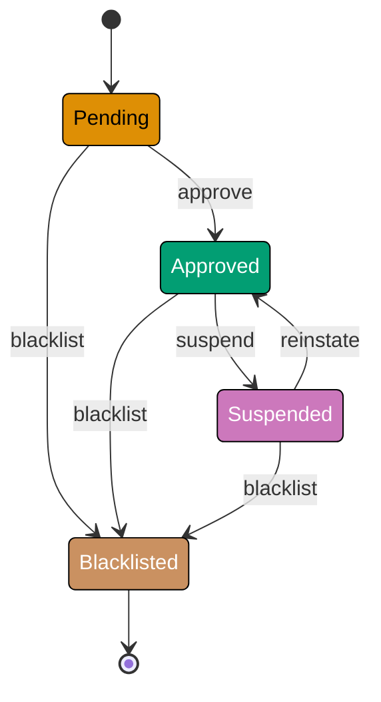
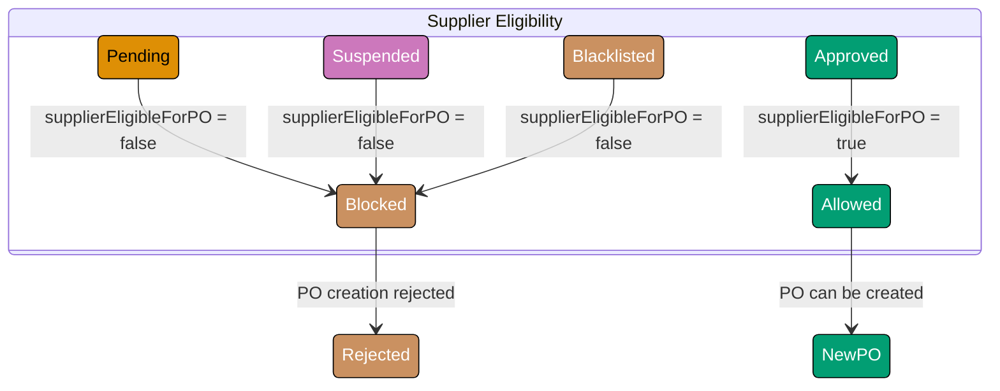
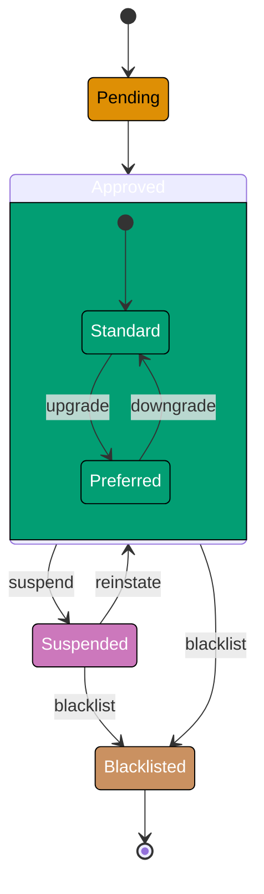
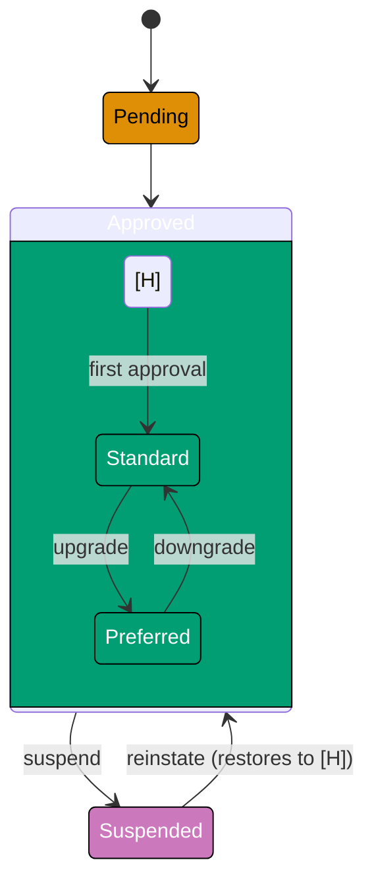
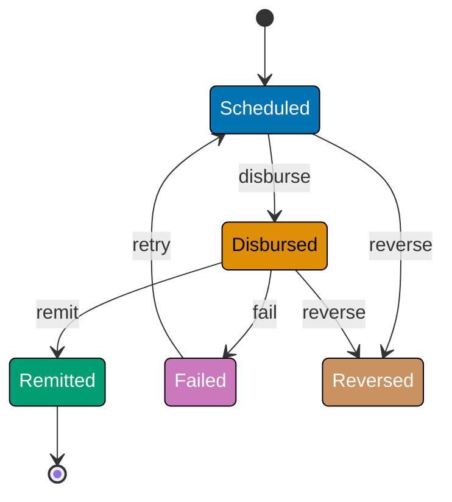
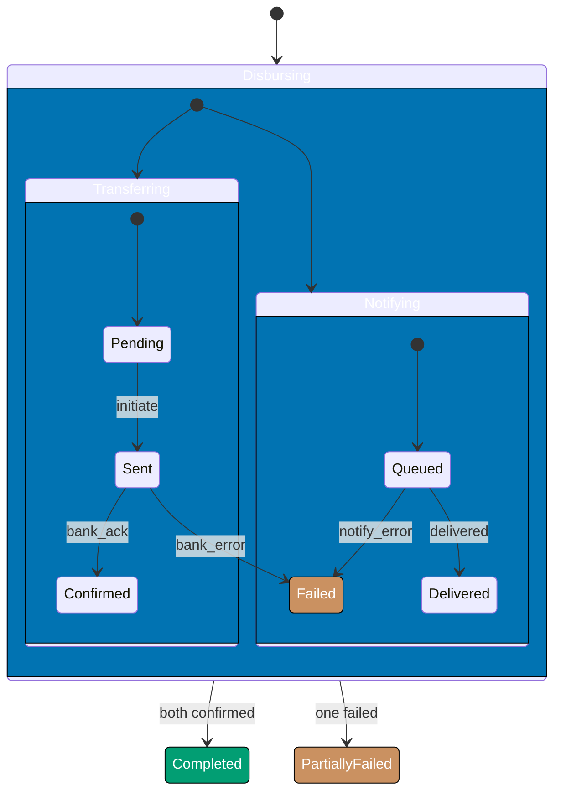
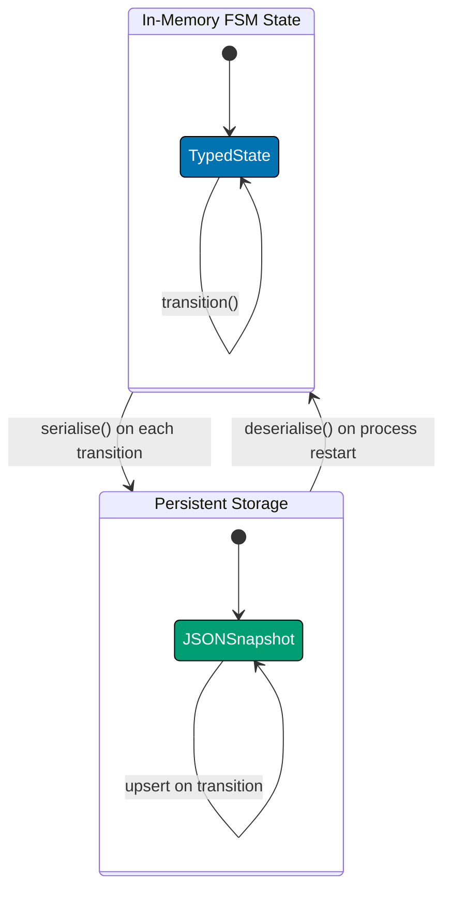
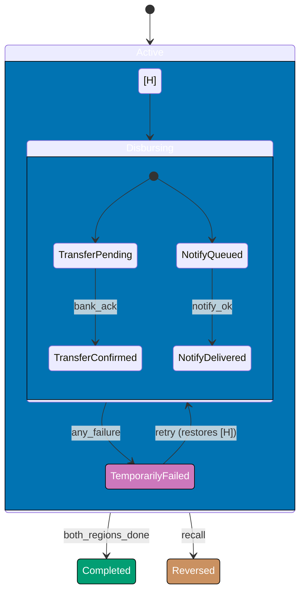
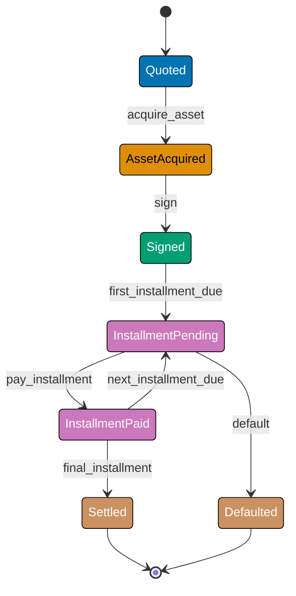
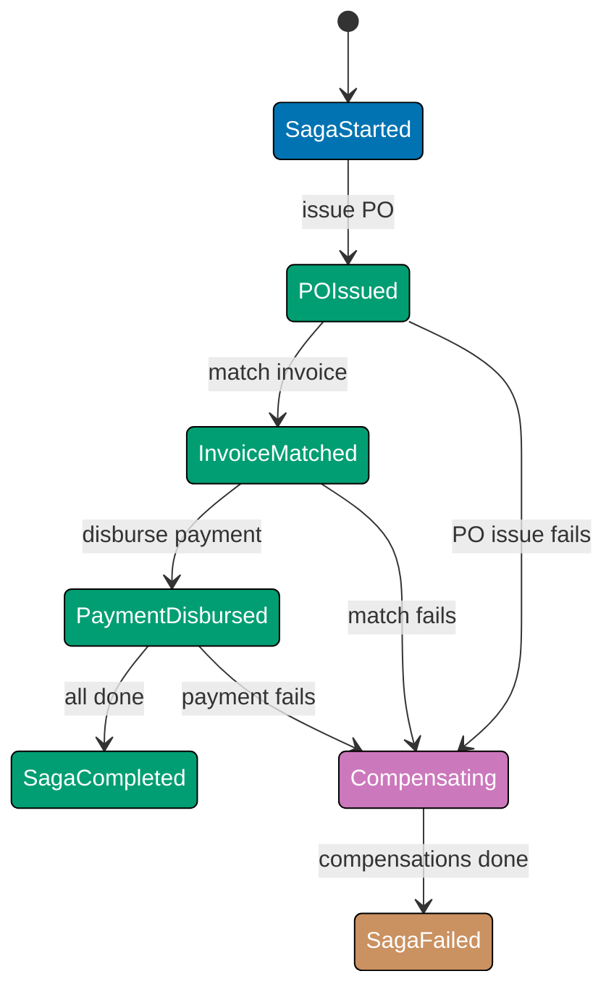

This advanced tutorial adds the `Supplier` lifecycle and `Payment` state machine from the `procurement-platform-be` domain, then teaches the concepts that turn flat FSMs into statecharts: hierarchical states, parallel regions, history states, FSM persistence, event-sourcing intersection, and actor-model integration. The `MurabahaContract` machine appears in the final section as an optional Sharia-finance angle.

## Supplier Lifecycle FSM (Examples 51-57)

### Example 51: Supplier States and Risk-Tier Semantics

A `Supplier` record tracks vendor approval status. Unlike `PurchaseOrder`, the Supplier machine has only four states but each state carries meaningful consequences for the purchasing context.







```java
import java.util.EnumMap;
import java.util.Map;
import java.util.Optional;

// => Supplier states: sealed via enum — four states, one terminal
enum SupplierState {
    PENDING,     // => Application received; vetting in progress
    APPROVED,    // => Cleared for new POs; appears in supplier selection
    SUSPENDED,   // => Temporarily blocked: no new POs, existing POs continue
    BLACKLISTED  // => Permanently excluded: existing POs forced to Disputed — terminal
}

// => Supplier events: all valid triggers on this machine
enum SupplierEvent {
    APPROVE,    // => Vetting passed; supplier cleared
    SUSPEND,    // => Compliance issue; temporary hold
    REINSTATE,  // => Issue resolved; supplier restored
    BLACKLIST   // => Severe breach; permanent exclusion
}

// => Immutable supplier record — Java record guarantees no mutation
record Supplier(String id, String name, SupplierState state) {
    // => id format: sup_<uuid>; name is the supplier legal name
}

// => Result type: models success or failure without exceptions
sealed interface Result<T> {
    record Ok<T>(T value) implements Result<T> {}
    // => Ok wraps a successfully computed value
    record Err<T>(String error) implements Result<T> {}
    // => Err carries a human-readable failure reason
}

class SupplierFSM {
    // => Transition table: EnumMap for type-safe, O(1) lookup
    private static final Map<SupplierState, Map<SupplierEvent, SupplierState>> TRANSITIONS =
        new EnumMap<>(SupplierState.class);

    static {
        // => Pending: can only be approved or immediately blacklisted
        TRANSITIONS.put(SupplierState.PENDING, new EnumMap<>(Map.of(
            SupplierEvent.APPROVE,    SupplierState.APPROVED,
            SupplierEvent.BLACKLIST,  SupplierState.BLACKLISTED
        )));
        // => Approved: can be suspended (reversible) or blacklisted (permanent)
        TRANSITIONS.put(SupplierState.APPROVED, new EnumMap<>(Map.of(
            SupplierEvent.SUSPEND,    SupplierState.SUSPENDED,
            SupplierEvent.BLACKLIST,  SupplierState.BLACKLISTED
        )));
        // => Suspended: can recover (reinstate) or escalate (blacklist)
        TRANSITIONS.put(SupplierState.SUSPENDED, new EnumMap<>(Map.of(
            SupplierEvent.REINSTATE,  SupplierState.APPROVED,
            SupplierEvent.BLACKLIST,  SupplierState.BLACKLISTED
        )));
        // => BLACKLISTED: no entry — terminal, all events rejected
    }

    // => Pure transition function — returns Result, never throws
    static Result<Supplier> transition(Supplier sup, SupplierEvent event) {
        // => Look up allowed transitions for the current state
        SupplierState next = Optional.ofNullable(TRANSITIONS.get(sup.state()))
            .map(m -> m.get(event))
            .orElse(null);
        // => Optional chain: null-safe two-level map lookup
        if (next == null) {
            return new Result.Err<>(sup.state() + " --" + event + "--> (forbidden)");
            // => No valid transition: return descriptive error
        }
        return new Result.Ok<>(new Supplier(sup.id(), sup.name(), next));
        // => Valid transition: return new immutable Supplier with updated state
    }

    public static void main(String[] args) {
        Supplier sup = new Supplier("sup_001", "Acme Supplies Ltd", SupplierState.APPROVED);
        // => Start: Approved supplier

        Result<Supplier> r1 = transition(sup, SupplierEvent.SUSPEND);
        if (r1 instanceof Result.Ok<Supplier> ok) {
            System.out.println(ok.value().state()); // => Output: SUSPENDED
        }

        // => Chain: reinstate from suspended state
        Supplier suspended = r1 instanceof Result.Ok<Supplier> o ? o.value() : sup;
        Result<Supplier> r2 = transition(suspended, SupplierEvent.REINSTATE);
        if (r2 instanceof Result.Ok<Supplier> ok) {
            System.out.println(ok.value().state()); // => Output: APPROVED
        }

        // => Invalid: approve is not valid from Approved
        Result<Supplier> r3 = transition(sup, SupplierEvent.APPROVE);
        if (r3 instanceof Result.Err<Supplier> err) {
            System.out.println(err.error()); // => Output: APPROVED --APPROVE--> (forbidden)
        }
    }
}
```





```kotlin
// => Supplier states: sealed class ensures exhaustive when-expressions
enum class SupplierState {
    PENDING,     // => Application received; vetting in progress
    APPROVED,    // => Cleared for new POs; appears in supplier selection
    SUSPENDED,   // => Temporarily blocked: no new POs, existing POs continue
    BLACKLISTED  // => Permanently excluded: existing POs forced to Disputed — terminal
}

// => Supplier events: all valid triggers in the machine alphabet
enum class SupplierEvent {
    APPROVE,    // => Vetting passed; supplier cleared
    SUSPEND,    // => Compliance issue; temporary hold
    REINSTATE,  // => Issue resolved; supplier restored
    BLACKLIST   // => Severe breach; permanent exclusion
}

// => Immutable supplier record — data class provides equals/copy for free
data class Supplier(
    val id: String,         // => Format: sup_<uuid>
    val name: String,       // => Supplier legal name
    val state: SupplierState
)

// => Result type: sealed hierarchy covers all outcomes without exceptions
sealed class Result<out T> {
    data class Ok<T>(val value: T) : Result<T>()
    // => Ok carries the successfully computed value
    data class Err(val error: String) : Result<Nothing>()
    // => Err carries a human-readable failure reason
}

// => Transition table: map of EnumMaps for O(1) type-safe lookup
private val TRANSITIONS: Map<SupplierState, Map<SupplierEvent, SupplierState>> = mapOf(
    SupplierState.PENDING    to mapOf(
        SupplierEvent.APPROVE   to SupplierState.APPROVED,
        SupplierEvent.BLACKLIST to SupplierState.BLACKLISTED
        // => Pending: approved or immediately blacklisted
    ),
    SupplierState.APPROVED   to mapOf(
        SupplierEvent.SUSPEND   to SupplierState.SUSPENDED,
        SupplierEvent.BLACKLIST to SupplierState.BLACKLISTED
        // => Approved: suspended (reversible) or blacklisted (permanent)
    ),
    SupplierState.SUSPENDED  to mapOf(
        SupplierEvent.REINSTATE to SupplierState.APPROVED,
        SupplierEvent.BLACKLIST to SupplierState.BLACKLISTED
        // => Suspended: recover (reinstate) or escalate (blacklist)
    )
    // => BLACKLISTED: absent from map — terminal, all events fail
)

// => Pure transition function — when-expression guarantees exhaustive handling
fun transitionSupplier(sup: Supplier, event: SupplierEvent): Result<Supplier> {
    val next = TRANSITIONS[sup.state]?.get(event)
    // => Safe map lookup: null if state absent or event not allowed
    return if (next != null) {
        Result.Ok(sup.copy(state = next))
        // => data class copy: efficient immutable update
    } else {
        Result.Err("${sup.state} --$event--> (forbidden)")
        // => Descriptive error: caller knows what was attempted
    }
}

fun main() {
    val sup = Supplier("sup_001", "Acme Supplies Ltd", SupplierState.APPROVED)
    // => Start: Approved supplier

    val r1 = transitionSupplier(sup, SupplierEvent.SUSPEND)
    if (r1 is Result.Ok) println(r1.value.state) // => Output: SUSPENDED

    // => Chain: reinstate from suspended
    val suspended = (r1 as? Result.Ok)?.value ?: sup
    val r2 = transitionSupplier(suspended, SupplierEvent.REINSTATE)
    if (r2 is Result.Ok) println(r2.value.state) // => Output: APPROVED

    // => Invalid transition: approve not valid from Approved
    val r3 = transitionSupplier(sup, SupplierEvent.APPROVE)
    if (r3 is Result.Err) println(r3.error) // => Output: APPROVED --APPROVE--> (forbidden)
}
```





```csharp
using System;
using System.Collections.Generic;

// => Supplier states: enum provides named constants — compiler rejects unknown values
enum SupplierState
{
    Pending,     // => Application received; vetting in progress
    Approved,    // => Cleared for new POs; appears in supplier selection
    Suspended,   // => Temporarily blocked: no new POs, existing POs continue
    Blacklisted  // => Permanently excluded: existing POs forced to Disputed — terminal
}

// => Supplier events: all valid triggers in the machine alphabet
enum SupplierEvent
{
    Approve,    // => Vetting passed; supplier cleared
    Suspend,    // => Compliance issue; temporary hold
    Reinstate,  // => Issue resolved; supplier restored
    Blacklist   // => Severe breach; permanent exclusion
}

// => Immutable supplier record — C# record with primary constructor
record Supplier(string Id, string Name, SupplierState State);
// => record provides structural equality and non-destructive mutation via `with`

// => Result type: discriminated union via sealed hierarchy
abstract record Result<T>;
// => Sealed abstract record: only Ok and Err can extend it
record Ok<T>(T Value) : Result<T>;
// => Ok wraps a successfully computed value
record Err<T>(string Error) : Result<T>;
// => Err carries a human-readable failure reason

class SupplierFSM
{
    // => Transition table: Dictionary of Dictionaries for O(1) lookup
    private static readonly Dictionary<SupplierState, Dictionary<SupplierEvent, SupplierState>> Transitions =
        new()
        {
            [SupplierState.Pending] = new()
            {
                [SupplierEvent.Approve]   = SupplierState.Approved,
                [SupplierEvent.Blacklist] = SupplierState.Blacklisted
                // => Pending: approved or immediately blacklisted
            },
            [SupplierState.Approved] = new()
            {
                [SupplierEvent.Suspend]   = SupplierState.Suspended,
                [SupplierEvent.Blacklist] = SupplierState.Blacklisted
                // => Approved: suspended (reversible) or blacklisted (permanent)
            },
            [SupplierState.Suspended] = new()
            {
                [SupplierEvent.Reinstate] = SupplierState.Approved,
                [SupplierEvent.Blacklist] = SupplierState.Blacklisted
                // => Suspended: recover (reinstate) or escalate (blacklist)
            }
            // => Blacklisted: absent — terminal, all events rejected
        };

    // => Pure transition function — pattern matching on Result
    public static Result<Supplier> Transition(Supplier sup, SupplierEvent evt)
    {
        // => TryGetValue: null-safe two-level lookup without exceptions
        if (Transitions.TryGetValue(sup.State, out var stateMap) &&
            stateMap.TryGetValue(evt, out var next))
        {
            return new Ok<Supplier>(sup with { State = next });
            // => `with` expression: non-destructive update of immutable record
        }
        return new Err<Supplier>($"{sup.State} --{evt}--> (forbidden)");
        // => Descriptive error: caller knows what was attempted
    }

    static void Main()
    {
        var sup = new Supplier("sup_001", "Acme Supplies Ltd", SupplierState.Approved);
        // => Start: Approved supplier

        var r1 = Transition(sup, SupplierEvent.Suspend);
        if (r1 is Ok<Supplier> ok1) Console.WriteLine(ok1.Value.State); // => Output: Suspended

        // => Chain: reinstate from suspended
        var suspended = r1 is Ok<Supplier> o ? o.Value : sup;
        var r2 = Transition(suspended, SupplierEvent.Reinstate);
        if (r2 is Ok<Supplier> ok2) Console.WriteLine(ok2.Value.State); // => Output: Approved

        // => Invalid: Approve not valid from Approved
        var r3 = Transition(sup, SupplierEvent.Approve);
        if (r3 is Err<Supplier> err) Console.WriteLine(err.Error); // => Output: Approved --Approve--> (forbidden)
    }
}
```





```typescript
// => TypeScript: string literal union for Supplier FSM states
type SupplierState = "PENDING" | "APPROVED" | "SUSPENDED" | "BLACKLISTED";
type SupplierEvent = "APPROVE" | "SUSPEND" | "REINSTATE" | "BLACKLIST";

interface Supplier {
  readonly id: string;
  readonly name: string;
  readonly state: SupplierState;
}

type SupplierResult<T> = { kind: "ok"; value: T } | { kind: "err"; error: string };

// => Transition table: only BLACKLISTED is absent (terminal)
const SUPPLIER_TRANSITIONS: Readonly = {
  PENDING: { APPROVE: "APPROVED", BLACKLIST: "BLACKLISTED" },
  APPROVED: { SUSPEND: "SUSPENDED", BLACKLIST: "BLACKLISTED" },
  SUSPENDED: { REINSTATE: "APPROVED", BLACKLIST: "BLACKLISTED" },
} as const;

function transitionSupplier(sup: Supplier, event: SupplierEvent): SupplierResult {
  const next = SUPPLIER_TRANSITIONS[sup.state]?.[event];
  if (next === undefined) return { kind: "err", error: `${sup.state} --${event}--> (forbidden)` };
  return { kind: "ok", value: { ...sup, state: next } };
}

const sup: Supplier = { id: "sup_001", name: "Acme Supplies Ltd", state: "APPROVED" };
const r1 = transitionSupplier(sup, "SUSPEND");
if (r1.kind === "ok") console.log(r1.value.state); // => SUSPENDED
const r2 = transitionSupplier(r1.kind === "ok" ? r1.value : sup, "REINSTATE");
if (r2.kind === "ok") console.log(r2.value.state); // => APPROVED
const r3 = transitionSupplier(sup, "APPROVE");
if (r3.kind === "err") console.log(r3.error); // => APPROVED --APPROVE--> (forbidden)
```





**Key Takeaway**: Even a four-state machine encodes significant business rules — the asymmetry between `Suspended` (reversible) and `Blacklisted` (terminal) is the entire compliance enforcement model.

**Why It Matters**: The distinction between suspended and blacklisted is a legal and audit concern: suspended suppliers can be reinstated after a compliance review, while blacklisted suppliers require a board-level decision to re-engage. Encoding this in the FSM makes the distinction structural — you cannot accidentally reinstate a blacklisted supplier without changing the machine definition.

---

### Example 52: Supplier State Consequences on PO Selection

The Supplier FSM state gates which suppliers are selectable for new POs — a guard function on the purchasing context reads Supplier state.







```java
import java.util.List;
import java.util.stream.Collectors;

// => Guard: can a supplier receive a new PO?
// => Reads supplier state; returns true only for APPROVED
static boolean supplierEligibleForPO(SupplierState state) {
    return state == SupplierState.APPROVED;
    // => Only APPROVED: PENDING is unvetted, SUSPENDED cannot receive new POs
}

// => Guard: does blacklisting force existing POs to Disputed?
// => Domain rule: transitioning into BLACKLISTED triggers dispute on all open POs
static boolean blacklistingForcesDispute(SupplierState newState, SupplierState oldState) {
    return newState == SupplierState.BLACKLISTED && oldState != SupplierState.BLACKLISTED;
    // => Only fires on the transition into BLACKLISTED, not if already there
}

// => Blacklist result: supplier plus all PO ids affected by the cascade
record BlacklistResult(Supplier supplier, List<String> affectedPOIds) {}

// => Blacklist with PO cascade — returns Result to avoid exception-based control flow
static Result<BlacklistResult> blacklistSupplier(Supplier sup, List<String> openPOIds) {
    if (sup.state() == SupplierState.BLACKLISTED) {
        return new Result.Err<>("Supplier " + sup.id() + " is already blacklisted");
        // => Idempotent guard: no-op if already blacklisted
    }
    var r = SupplierFSM.transition(sup, SupplierEvent.BLACKLIST);
    // => Attempt the FSM transition first
    if (r instanceof Result.Err<Supplier> err) {
        return new Result.Err<>(err.error());
        // => Transition failed: propagate the error up
    }
    var ok = (Result.Ok<Supplier>) r;
    // => Transition succeeded: compute which POs are affected
    var affected = blacklistingForcesDispute(ok.value().state(), sup.state())
        ? openPOIds
        : List.<String>of();
    // => If transitioning into BLACKLISTED: all open POs for this supplier are affected
    return new Result.Ok<>(new BlacklistResult(ok.value(), affected));
}

// Demo
System.out.println(supplierEligibleForPO(SupplierState.APPROVED));   // => Output: true
System.out.println(supplierEligibleForPO(SupplierState.SUSPENDED));  // => Output: false
System.out.println(supplierEligibleForPO(SupplierState.PENDING));    // => Output: false

var sup = new Supplier("sup_002", "Beta Corp", SupplierState.APPROVED);
var openPOs = List.of("po_101", "po_102", "po_103");
var bl = blacklistSupplier(sup, openPOs);
if (bl instanceof Result.Ok<BlacklistResult> ok) {
    System.out.println(ok.value().supplier().state());        // => Output: BLACKLISTED
    System.out.println(ok.value().affectedPOIds().size());    // => Output: 3
}
```





```kotlin
// => Guard: can a supplier receive a new PO?
// => Returns true only for APPROVED — single allowed state for new PO creation
fun supplierEligibleForPO(state: SupplierState): Boolean =
    state == SupplierState.APPROVED
    // => PENDING is unvetted; SUSPENDED cannot receive new POs; BLACKLISTED is terminal

// => Guard: does blacklisting trigger a dispute cascade on open POs?
// => True only on the transition into BLACKLISTED from a non-blacklisted state
fun blacklistingForcesDispute(newState: SupplierState, oldState: SupplierState): Boolean =
    newState == SupplierState.BLACKLISTED && oldState != SupplierState.BLACKLISTED
    // => The cascade fires exactly once: at the moment of blacklisting

// => Blacklist result: supplier plus IDs of all POs affected by the cascade
data class BlacklistResult(
    val supplier: Supplier,
    val affectedPOIds: List<String>  // => These POs must be transitioned to Disputed
)

// => Blacklist with PO cascade — pure function, no side effects
fun blacklistSupplier(sup: Supplier, openPOIds: List<String>): Result<BlacklistResult> {
    if (sup.state == SupplierState.BLACKLISTED) {
        return Result.Err("Supplier ${sup.id} is already blacklisted")
        // => Idempotent guard: already blacklisted, nothing to do
    }
    val r = transitionSupplier(sup, SupplierEvent.BLACKLIST)
    // => Attempt the FSM transition
    if (r is Result.Err) return Result.Err(r.error)
    // => Transition failed: propagate error to caller

    val newSupplier = (r as Result.Ok).value
    // => Transition succeeded: determine cascade scope
    val affected = if (blacklistingForcesDispute(newSupplier.state, sup.state))
        openPOIds else emptyList()
    // => If newly blacklisted: all open POs for this supplier are affected
    return Result.Ok(BlacklistResult(newSupplier, affected))
}

// Demo
println(supplierEligibleForPO(SupplierState.APPROVED))   // => Output: true
println(supplierEligibleForPO(SupplierState.SUSPENDED))  // => Output: false
println(supplierEligibleForPO(SupplierState.PENDING))    // => Output: false

val sup = Supplier("sup_002", "Beta Corp", SupplierState.APPROVED)
val openPOs = listOf("po_101", "po_102", "po_103")
val bl = blacklistSupplier(sup, openPOs)
if (bl is Result.Ok) {
    println(bl.value.supplier.state)         // => Output: BLACKLISTED
    println(bl.value.affectedPOIds.size)     // => Output: 3
}
```





```csharp
using System;
using System.Collections.Generic;
using System.Linq;

// => Guard: can a supplier receive a new PO?
// => Returns true only for Approved — the single state allowing new PO creation
static bool SupplierEligibleForPO(SupplierState state) =>
    state == SupplierState.Approved;
    // => Pending is unvetted; Suspended blocked; Blacklisted terminal

// => Guard: does blacklisting trigger a dispute cascade on open POs?
// => True only on the transition into Blacklisted from a non-blacklisted state
static bool BlacklistingForcesDispute(SupplierState newState, SupplierState oldState) =>
    newState == SupplierState.Blacklisted && oldState != SupplierState.Blacklisted;
    // => The cascade fires exactly once: at the moment of blacklisting

// => Blacklist result: supplier plus all PO ids that must be disputed
record BlacklistResult(Supplier Supplier, IReadOnlyList<string> AffectedPOIds);

// => Blacklist with PO cascade — pure function returning Result
static Result<BlacklistResult> BlacklistSupplier(Supplier sup, IReadOnlyList<string> openPOIds)
{
    if (sup.State == SupplierState.Blacklisted)
        return new Err<BlacklistResult>($"Supplier {sup.Id} is already blacklisted");
    // => Idempotent guard: no-op if already blacklisted

    var r = SupplierFSM.Transition(sup, SupplierEvent.Blacklist);
    // => Attempt the FSM transition
    if (r is Err<Supplier> err)
        return new Err<BlacklistResult>(err.Error);
    // => Transition failed: propagate the error

    var newSupplier = ((Ok<Supplier>)r).Value;
    // => Transition succeeded: compute affected POs
    var affected = BlacklistingForcesDispute(newSupplier.State, sup.State)
        ? openPOIds
        : Array.Empty<string>();
    // => If newly blacklisted: all open POs for this supplier must be disputed
    return new Ok<BlacklistResult>(new BlacklistResult(newSupplier, affected));
}

// Demo
Console.WriteLine(SupplierEligibleForPO(SupplierState.Approved));   // => Output: True
Console.WriteLine(SupplierEligibleForPO(SupplierState.Suspended));  // => Output: False
Console.WriteLine(SupplierEligibleForPO(SupplierState.Pending));    // => Output: False

var sup = new Supplier("sup_002", "Beta Corp", SupplierState.Approved);
var openPOs = new List<string> { "po_101", "po_102", "po_103" };
var bl = BlacklistSupplier(sup, openPOs);
if (bl is Ok<BlacklistResult> ok)
{
    Console.WriteLine(ok.Value.Supplier.State);         // => Output: Blacklisted
    Console.WriteLine(ok.Value.AffectedPOIds.Count);    // => Output: 3
}
```





```typescript
// => TypeScript: guard and cascade functions for supplier state
function supplierEligibleForPO(state: SupplierState): boolean {
  return state === "APPROVED";
  // => Only APPROVED: PENDING unvetted, SUSPENDED blocked, BLACKLISTED terminal
}

function blacklistingForcesDispute(newState: SupplierState, oldState: SupplierState): boolean {
  return newState === "BLACKLISTED" && oldState !== "BLACKLISTED";
}

interface BlacklistResult {
  readonly supplier: Supplier;
  readonly affectedPOIds: readonly string[];
}

function blacklistSupplier(sup: Supplier, openPOIds: readonly string[]): SupplierResult {
  if (sup.state === "BLACKLISTED") return { kind: "err", error: `Supplier ${sup.id} is already blacklisted` };
  const r = transitionSupplier(sup, "BLACKLIST");
  if (r.kind === "err") return { kind: "err", error: r.error };
  const affected = blacklistingForcesDispute(r.value.state, sup.state) ? openPOIds : [];
  return { kind: "ok", value: { supplier: r.value, affectedPOIds: affected } };
}

console.log(supplierEligibleForPO("APPROVED")); // => true
console.log(supplierEligibleForPO("SUSPENDED")); // => false
const sup: Supplier = { id: "sup_002", name: "Beta Corp", state: "APPROVED" };
const bl = blacklistSupplier(sup, ["po_101", "po_102", "po_103"]);
if (bl.kind === "ok") {
  console.log(bl.value.supplier.state); // => BLACKLISTED
  console.log(bl.value.affectedPOIds.length); // => 3
}
```





**Key Takeaway**: Cross-machine effects (blacklisting a supplier forces all their open POs to Disputed) are encoded as explicit functions that return the affected entity IDs — the caller is responsible for applying the cascading changes.

**Why It Matters**: Cascading state changes across aggregates must be explicit, not implicit. If the blacklist function automatically mutated POs inside itself, it would be doing two different aggregate's work, violating aggregate boundaries. Returning `affectedPOIds` lets the application service handle each PO transition independently — maintaining clear ownership boundaries.

---

### Example 53: Supplier Risk Score Guard

Supplier approval might require a minimum risk score. A numeric guard on the `approve` transition enforces the risk threshold.





```java
import java.util.ArrayList;
import java.util.List;

// => Supplier application: carries vetting data submitted during onboarding
record SupplierApplication(
    String supplierId,
    double riskScore,       // => 0.0 (high risk) to 1.0 (low risk); from risk engine
    boolean hasDocuments    // => Required compliance documents submitted?
) {}

// => Minimum approval thresholds — defined once, enforced consistently
record ApprovalThresholds(double minRiskScore, boolean requireDocuments) {}
static final ApprovalThresholds APPROVAL_THRESHOLDS =
    new ApprovalThresholds(0.6, true);
// => Below 0.6 risk score: too risky; requireDocuments: must be submitted

// => Guard: is the supplier application sufficient for approval?
// => Returns all failing reasons at once — caller sees the full picture
static List<String> canApproveSupplier(SupplierApplication app) {
    var errors = new ArrayList<String>();
    if (app.riskScore() < APPROVAL_THRESHOLDS.minRiskScore()) {
        errors.add(String.format("Risk score %.2f below minimum %.1f",
            app.riskScore(), APPROVAL_THRESHOLDS.minRiskScore()));
        // => Risk score too high: supplier not ready for approval
    }
    if (APPROVAL_THRESHOLDS.requireDocuments() && !app.hasDocuments()) {
        errors.add("Required compliance documents not submitted");
        // => Missing documents: approval is blocked regardless of risk score
    }
    return errors;
    // => Empty list: guard passes; non-empty: guard fails with all reasons
}

// => Guarded approve transition: FSM guard + business guard combined
static Result<Supplier> approveSupplier(Supplier sup, SupplierApplication app) {
    if (sup.state() != SupplierState.PENDING) {
        return new Result.Err<>("Supplier " + sup.id() + " is not in PENDING state");
        // => FSM guard: approve only valid from PENDING state
    }
    var errors = canApproveSupplier(app);
    if (!errors.isEmpty()) {
        return new Result.Err<>("Approval blocked: " + String.join("; ", errors));
        // => Business guard: return all blocking reasons in one response
    }
    return new Result.Ok<>(new Supplier(sup.id(), sup.name(), SupplierState.APPROVED));
    // => Both guards pass: transition to APPROVED
}

// Demo
var sup = new Supplier("sup_003", "Gamma Ltd", SupplierState.PENDING);

// => Low risk score and missing documents — both reasons returned at once
var badApp = new SupplierApplication("sup_003", 0.45, false);
var r1 = approveSupplier(sup, badApp);
if (r1 instanceof Result.Err<Supplier> err) {
    System.out.println(err.error());
    // => Output: Approval blocked: Risk score 0.45 below minimum 0.6; Required compliance documents not submitted
}

// => Good application: passes all guards
var goodApp = new SupplierApplication("sup_003", 0.75, true);
var r2 = approveSupplier(sup, goodApp);
if (r2 instanceof Result.Ok<Supplier> ok) {
    System.out.println(ok.value().state()); // => Output: APPROVED
}
```





```kotlin
// => Supplier application: carries vetting data submitted during onboarding
data class SupplierApplication(
    val supplierId: String,
    val riskScore: Double,      // => 0.0 (high risk) to 1.0 (low risk); from risk engine
    val hasDocuments: Boolean   // => Required compliance documents submitted?
)

// => Minimum approval thresholds — defined once, enforced consistently
data class ApprovalThresholds(val minRiskScore: Double, val requireDocuments: Boolean)
val APPROVAL_THRESHOLDS = ApprovalThresholds(0.6, true)
// => Below 0.6 risk score: too risky; requireDocuments: must be submitted

// => Guard: is the supplier application sufficient for approval?
// => Returns all failing reasons at once — caller sees the full picture
fun canApproveSupplier(app: SupplierApplication): List<String> = buildList {
    if (app.riskScore < APPROVAL_THRESHOLDS.minRiskScore) {
        add("Risk score ${"%.2f".format(app.riskScore)} below minimum ${APPROVAL_THRESHOLDS.minRiskScore}")
        // => Risk score too high: supplier not ready for approval
    }
    if (APPROVAL_THRESHOLDS.requireDocuments && !app.hasDocuments) {
        add("Required compliance documents not submitted")
        // => Missing documents: approval is blocked regardless of risk score
    }
    // => Empty list: guard passes; non-empty: guard fails with all reasons
}

// => Guarded approve transition: FSM guard + business guard combined
fun approveSupplier(sup: Supplier, app: SupplierApplication): Result<Supplier> {
    if (sup.state != SupplierState.PENDING) {
        return Result.Err("Supplier ${sup.id} is not in PENDING state")
        // => FSM guard: approve only valid from PENDING state
    }
    val errors = canApproveSupplier(app)
    if (errors.isNotEmpty()) {
        return Result.Err("Approval blocked: ${errors.joinToString("; ")}")
        // => Business guard: all blocking reasons combined in one message
    }
    return Result.Ok(sup.copy(state = SupplierState.APPROVED))
    // => Both guards pass: transition to APPROVED via data class copy
}

// Demo
val sup = Supplier("sup_003", "Gamma Ltd", SupplierState.PENDING)

// => Low risk score and missing documents — both reasons returned at once
val badApp = SupplierApplication("sup_003", 0.45, false)
val r1 = approveSupplier(sup, badApp)
if (r1 is Result.Err) {
    println(r1.error)
    // => Output: Approval blocked: Risk score 0.45 below minimum 0.6; Required compliance documents not submitted
}

// => Good application: passes all guards
val goodApp = SupplierApplication("sup_003", 0.75, true)
val r2 = approveSupplier(sup, goodApp)
if (r2 is Result.Ok) println(r2.value.state) // => Output: APPROVED
```





```csharp
using System;
using System.Collections.Generic;
using System.Linq;

// => Supplier application: carries vetting data submitted during onboarding
record SupplierApplication(
    string SupplierId,
    double RiskScore,       // => 0.0 (high risk) to 1.0 (low risk); from risk engine
    bool HasDocuments       // => Required compliance documents submitted?
);

// => Minimum approval thresholds — defined once, enforced consistently
record ApprovalThresholds(double MinRiskScore, bool RequireDocuments);
static readonly ApprovalThresholds APPROVAL_THRESHOLDS = new(0.6, true);
// => Below 0.6 risk score: too risky; RequireDocuments: must be submitted

// => Guard: is the supplier application sufficient for approval?
// => Returns all failing reasons at once — caller sees the full picture
static IReadOnlyList<string> CanApproveSupplier(SupplierApplication app)
{
    var errors = new List<string>();
    if (app.RiskScore < APPROVAL_THRESHOLDS.MinRiskScore)
    {
        errors.Add($"Risk score {app.RiskScore:F2} below minimum {APPROVAL_THRESHOLDS.MinRiskScore}");
        // => Risk score too high: supplier not ready for approval
    }
    if (APPROVAL_THRESHOLDS.RequireDocuments && !app.HasDocuments)
    {
        errors.Add("Required compliance documents not submitted");
        // => Missing documents: approval is blocked regardless of risk score
    }
    return errors;
    // => Empty list: guard passes; non-empty: guard fails with all reasons
}

// => Guarded approve transition: FSM guard + business guard combined
static Result<Supplier> ApproveSupplier(Supplier sup, SupplierApplication app)
{
    if (sup.State != SupplierState.Pending)
        return new Err<Supplier>($"Supplier {sup.Id} is not in Pending state");
    // => FSM guard: approve only valid from Pending state

    var errors = CanApproveSupplier(app);
    if (errors.Count > 0)
        return new Err<Supplier>("Approval blocked: " + string.Join("; ", errors));
    // => Business guard: all blocking reasons combined in one message

    return new Ok<Supplier>(sup with { State = SupplierState.Approved });
    // => Both guards pass: `with` expression returns new immutable record in Approved state
}

// Demo
var sup = new Supplier("sup_003", "Gamma Ltd", SupplierState.Pending);

// => Low risk score and missing documents — both reasons returned at once
var badApp = new SupplierApplication("sup_003", 0.45, false);
var r1 = ApproveSupplier(sup, badApp);
if (r1 is Err<Supplier> err)
{
    Console.WriteLine(err.Error);
    // => Output: Approval blocked: Risk score 0.45 below minimum 0.60; Required compliance documents not submitted
}

// => Good application: passes all guards
var goodApp = new SupplierApplication("sup_003", 0.75, true);
var r2 = ApproveSupplier(sup, goodApp);
if (r2 is Ok<Supplier> ok) Console.WriteLine(ok.Value.State); // => Output: Approved
```





```typescript
// => TypeScript: approval thresholds and multi-criteria guard
interface SupplierApplication {
  readonly supplierId: string;
  readonly riskScore: number; // => 0.0 (high risk) to 1.0 (low risk)
  readonly hasDocuments: boolean;
}

const APPROVAL_THRESHOLDS = { minRiskScore: 0.6, requireDocuments: true } as const;

function canApproveSupplier(app: SupplierApplication): readonly string[] {
  const errors: string[] = [];
  if (app.riskScore < APPROVAL_THRESHOLDS.minRiskScore)
    errors.push(`Risk score ${app.riskScore.toFixed(2)} below minimum ${APPROVAL_THRESHOLDS.minRiskScore}`);
  if (APPROVAL_THRESHOLDS.requireDocuments && !app.hasDocuments)
    errors.push("Required compliance documents not submitted");
  return errors;
}

function approveSupplier(sup: Supplier, app: SupplierApplication): SupplierResult {
  if (sup.state !== "PENDING") return { kind: "err", error: `Supplier ${sup.id} is not in PENDING state` };
  const errors = canApproveSupplier(app);
  if (errors.length > 0) return { kind: "err", error: `Approval blocked: ${errors.join("; ")}` };
  return { kind: "ok", value: { ...sup, state: "APPROVED" } };
}

const sup: Supplier = { id: "sup_003", name: "Gamma Ltd", state: "PENDING" };
const badApp: SupplierApplication = { supplierId: "sup_003", riskScore: 0.45, hasDocuments: false };
const r1 = approveSupplier(sup, badApp);
if (r1.kind === "err") console.log(r1.error);
// => Approval blocked: Risk score 0.45 below minimum 0.6; Required compliance documents not submitted
const goodApp: SupplierApplication = { supplierId: "sup_003", riskScore: 0.75, hasDocuments: true };
const r2 = approveSupplier(sup, goodApp);
if (r2.kind === "ok") console.log(r2.value.state); // => APPROVED
```





**Key Takeaway**: Multi-criteria guards return all failing reasons at once — the supplier vetting officer sees the complete list of issues, not just the first one.

**Why It Matters**: In supplier onboarding, a blocked application needs to be actioned by a compliance officer who may be in a different team from the risk analyst. Returning all blocking reasons in one response means both teams can work in parallel on their respective issues rather than discovering problems sequentially.

---

### Example 54: Hierarchical States — Supplier with Sub-States

The `Approved` state can have sub-states representing tier levels (PreferredVendor, StandardVendor). Hierarchical states model this without duplicating the Approved → Suspended and Approved → Blacklisted transitions for each tier.







```java
import java.util.EnumMap;
import java.util.Map;
import java.util.Optional;

// => Hierarchical supplier state: enum encodes parent and sub-states
// => Dot-notation naming (APPROVED_STANDARD) mirrors logical hierarchy
enum HierarchicalSupplierState {
    PENDING,           // => Application received; no tier yet
    APPROVED_STANDARD, // => Regular approved supplier — default entry sub-state
    APPROVED_PREFERRED,// => High-volume supplier; negotiated pricing terms
    SUSPENDED,         // => Temporarily blocked; no new POs
    BLACKLISTED        // => Permanently excluded — terminal
}

// => Events for the hierarchical machine: includes tier-promotion events
enum HierarchicalEvent {
    APPROVE,    // => Pending -> Approved.Standard
    SUSPEND,    // => Any Approved -> Suspended (parent transition)
    REINSTATE,  // => Suspended -> Approved.Standard
    BLACKLIST,  // => Any Approved or Suspended -> Blacklisted (parent)
    PROMOTE,    // => Approved.Standard -> Approved.Preferred (sub-state)
    DEMOTE      // => Approved.Preferred -> Approved.Standard (sub-state)
}

class HierarchicalFSM {
    // => Helper: true if state is within the Approved parent group
    static boolean isApproved(HierarchicalSupplierState state) {
        return state == HierarchicalSupplierState.APPROVED_STANDARD ||
               state == HierarchicalSupplierState.APPROVED_PREFERRED;
        // => Both sub-states belong to the "Approved" parent region
    }

    // => Parent transitions: apply to ALL Approved sub-states
    private static final Map<HierarchicalSupplierState,
        Map<HierarchicalEvent, HierarchicalSupplierState>> PARENT_TRANSITIONS =
        Map.of(
            HierarchicalSupplierState.PENDING, Map.of(
                HierarchicalEvent.APPROVE,   HierarchicalSupplierState.APPROVED_STANDARD,
                HierarchicalEvent.BLACKLIST, HierarchicalSupplierState.BLACKLISTED
                // => Pending: either approved (enters Standard) or blacklisted
            ),
            HierarchicalSupplierState.SUSPENDED, Map.of(
                HierarchicalEvent.REINSTATE, HierarchicalSupplierState.APPROVED_STANDARD,
                HierarchicalEvent.BLACKLIST, HierarchicalSupplierState.BLACKLISTED
                // => Suspended: recover to Standard or escalate to Blacklisted
            )
        );

    // => Sub-state transitions: only valid within the Approved region
    private static final Map<HierarchicalSupplierState,
        Map<HierarchicalEvent, HierarchicalSupplierState>> SUBSTATE_TRANSITIONS =
        Map.of(
            HierarchicalSupplierState.APPROVED_STANDARD, Map.of(
                HierarchicalEvent.PROMOTE, HierarchicalSupplierState.APPROVED_PREFERRED
                // => Standard -> Preferred: promoted to preferred tier
            ),
            HierarchicalSupplierState.APPROVED_PREFERRED, Map.of(
                HierarchicalEvent.DEMOTE, HierarchicalSupplierState.APPROVED_STANDARD
                // => Preferred -> Standard: tier reduced (e.g., missed SLA)
            )
        );

    // => Combined transition: parent events take priority over sub-state events
    static Optional<HierarchicalSupplierState> transition(
            HierarchicalSupplierState state, HierarchicalEvent event) {
        // => Parent events (SUSPEND, BLACKLIST) apply to any Approved sub-state
        if (isApproved(state) &&
            (event == HierarchicalEvent.SUSPEND || event == HierarchicalEvent.BLACKLIST)) {
            return Optional.of(event == HierarchicalEvent.SUSPEND
                ? HierarchicalSupplierState.SUSPENDED
                : HierarchicalSupplierState.BLACKLISTED);
            // => Parent transition fires regardless of sub-state (Standard or Preferred)
        }
        // => Try sub-state transitions first, then fall back to parent transitions
        var subState = Optional.ofNullable(SUBSTATE_TRANSITIONS.get(state))
            .map(m -> m.get(event));
        if (subState.isPresent()) return subState;
        // => Sub-state transition found: return it

        return Optional.ofNullable(PARENT_TRANSITIONS.get(state))
            .map(m -> m.get(event));
        // => Fall back to parent transitions (e.g., PENDING -> APPROVED_STANDARD)
    }

    public static void main(String[] args) {
        System.out.println(transition(
            HierarchicalSupplierState.APPROVED_PREFERRED, HierarchicalEvent.SUSPEND));
        // => Output: Optional[SUSPENDED] (parent transition from Preferred)

        System.out.println(transition(
            HierarchicalSupplierState.APPROVED_STANDARD, HierarchicalEvent.PROMOTE));
        // => Output: Optional[APPROVED_PREFERRED] (sub-state transition)

        System.out.println(transition(
            HierarchicalSupplierState.APPROVED_PREFERRED, HierarchicalEvent.BLACKLIST));
        // => Output: Optional[BLACKLISTED] (parent transition even from Preferred)
    }
}
```





```kotlin
// => Hierarchical supplier state: sealed class with clear parent/sub-state grouping
sealed class HierarchicalSupplierState {
    // => Flat states (no sub-states)
    object Pending    : HierarchicalSupplierState()
    object Suspended  : HierarchicalSupplierState()
    object Blacklisted: HierarchicalSupplierState()
    // => Approved parent region: two sub-states with distinct tier semantics
    sealed class Approved : HierarchicalSupplierState() {
        object Standard  : Approved()  // => Default entry; regular approved supplier
        object Preferred : Approved()  // => High-volume; negotiated pricing terms
    }
}

// => Events for the hierarchical machine
enum class HierarchicalEvent {
    APPROVE,    // => Pending -> Approved.Standard
    SUSPEND,    // => Any Approved -> Suspended (parent transition)
    REINSTATE,  // => Suspended -> Approved.Standard
    BLACKLIST,  // => Any Approved or Suspended -> Blacklisted (parent)
    PROMOTE,    // => Approved.Standard -> Approved.Preferred (sub-state)
    DEMOTE      // => Approved.Preferred -> Approved.Standard (sub-state)
}

// => Helper: true if state is within the Approved sealed parent
fun isApproved(state: HierarchicalSupplierState): Boolean =
    state is HierarchicalSupplierState.Approved
    // => Kotlin `is` check works for sealed class hierarchy — no string parsing

// => Combined transition: parent events take priority over sub-state events
fun hierarchicalTransition(
    state: HierarchicalSupplierState,
    event: HierarchicalEvent
): HierarchicalSupplierState? {
    // => Parent events (SUSPEND, BLACKLIST) apply to any Approved sub-state
    if (isApproved(state) && (event == HierarchicalEvent.SUSPEND || event == HierarchicalEvent.BLACKLIST)) {
        return if (event == HierarchicalEvent.SUSPEND)
            HierarchicalSupplierState.Suspended
        else
            HierarchicalSupplierState.Blacklisted
        // => Parent transition fires regardless of sub-state (Standard or Preferred)
    }
    // => when-expression: exhaustive match on state for sub-state and parent transitions
    return when (state) {
        is HierarchicalSupplierState.Pending -> when (event) {
            HierarchicalEvent.APPROVE   -> HierarchicalSupplierState.Approved.Standard
            HierarchicalEvent.BLACKLIST -> HierarchicalSupplierState.Blacklisted
            else -> null
            // => Pending: only approve or blacklist are valid
        }
        is HierarchicalSupplierState.Approved.Standard -> when (event) {
            HierarchicalEvent.PROMOTE -> HierarchicalSupplierState.Approved.Preferred
            // => Standard -> Preferred: supplier promoted to preferred tier
            else -> null
        }
        is HierarchicalSupplierState.Approved.Preferred -> when (event) {
            HierarchicalEvent.DEMOTE -> HierarchicalSupplierState.Approved.Standard
            // => Preferred -> Standard: tier reduced (e.g., missed SLA)
            else -> null
        }
        is HierarchicalSupplierState.Suspended -> when (event) {
            HierarchicalEvent.REINSTATE -> HierarchicalSupplierState.Approved.Standard
            HierarchicalEvent.BLACKLIST -> HierarchicalSupplierState.Blacklisted
            else -> null
        }
        is HierarchicalSupplierState.Blacklisted -> null
        // => Terminal state: all events rejected
    }
}

fun main() {
    println(hierarchicalTransition(
        HierarchicalSupplierState.Approved.Preferred, HierarchicalEvent.SUSPEND))
    // => Output: Suspended (parent transition from Preferred)

    println(hierarchicalTransition(
        HierarchicalSupplierState.Approved.Standard, HierarchicalEvent.PROMOTE))
    // => Output: Approved.Preferred (sub-state transition)

    println(hierarchicalTransition(
        HierarchicalSupplierState.Approved.Preferred, HierarchicalEvent.BLACKLIST))
    // => Output: Blacklisted (parent transition even from Preferred)
}
```





```csharp
using System;
using System.Collections.Generic;

// => Hierarchical supplier state: abstract record hierarchy mirrors state structure
abstract record HierarchicalSupplierState;
// => Flat states
record Pending_H    : HierarchicalSupplierState; // => Application received
record Suspended_H  : HierarchicalSupplierState; // => Temporarily blocked
record Blacklisted_H: HierarchicalSupplierState; // => Terminal — permanently excluded
// => Approved parent region: two sub-states with distinct tier semantics
abstract record Approved_H : HierarchicalSupplierState;
record Standard_H  : Approved_H; // => Default entry; regular approved supplier
record Preferred_H : Approved_H; // => High-volume; negotiated pricing terms

// => Events for the hierarchical machine
enum HierarchicalEvent
{
    Approve,    // => Pending -> Approved.Standard
    Suspend,    // => Any Approved -> Suspended (parent transition)
    Reinstate,  // => Suspended -> Approved.Standard
    Blacklist,  // => Any Approved or Suspended -> Blacklisted (parent)
    Promote,    // => Approved.Standard -> Approved.Preferred (sub-state)
    Demote      // => Approved.Preferred -> Approved.Standard (sub-state)
}

class HierarchicalFSM
{
    // => Helper: true if state is within the Approved parent region
    static bool IsApproved(HierarchicalSupplierState state) =>
        state is Approved_H;
    // => C# pattern matching on record hierarchy — no string parsing needed

    // => Combined transition: parent events take priority over sub-state events
    static HierarchicalSupplierState? Transition(
        HierarchicalSupplierState state, HierarchicalEvent evt)
    {
        // => Parent events (Suspend, Blacklist) apply to any Approved sub-state
        if (IsApproved(state) && (evt == HierarchicalEvent.Suspend || evt == HierarchicalEvent.Blacklist))
        {
            return evt == HierarchicalEvent.Suspend
                ? new Suspended_H()
                : new Blacklisted_H();
            // => Parent transition fires regardless of which Approved sub-state
        }
        // => Pattern match on state for sub-state and parent-level transitions
        return state switch
        {
            Pending_H => evt switch
            {
                HierarchicalEvent.Approve   => new Standard_H(),
                HierarchicalEvent.Blacklist => new Blacklisted_H(),
                _ => null
                // => Pending: only Approve or Blacklist valid
            },
            Standard_H => evt switch
            {
                HierarchicalEvent.Promote => new Preferred_H(),
                // => Standard -> Preferred: supplier promoted to preferred tier
                _ => null
            },
            Preferred_H => evt switch
            {
                HierarchicalEvent.Demote => new Standard_H(),
                // => Preferred -> Standard: tier reduced (e.g., missed SLA)
                _ => null
            },
            Suspended_H => evt switch
            {
                HierarchicalEvent.Reinstate => new Standard_H(),
                HierarchicalEvent.Blacklist => new Blacklisted_H(),
                _ => null
            },
            Blacklisted_H => null,
            // => Terminal state: all events rejected
            _ => null
        };
    }

    static void Main()
    {
        Console.WriteLine(Transition(new Preferred_H(), HierarchicalEvent.Suspend));
        // => Output: Suspended_H (parent transition from Preferred)

        Console.WriteLine(Transition(new Standard_H(), HierarchicalEvent.Promote));
        // => Output: Preferred_H (sub-state transition)

        Console.WriteLine(Transition(new Preferred_H(), HierarchicalEvent.Blacklist));
        // => Output: Blacklisted_H (parent transition even from Preferred)
    }
}
```





```typescript
// => TypeScript: hierarchical state using a tagged union with a parent tier
type HierarchicalState =
  | { readonly kind: "Pending" }
  | { readonly kind: "Suspended" }
  | { readonly kind: "Blacklisted" }
  | { readonly kind: "ApprovedStandard" } // => Approved.Standard sub-state
  | { readonly kind: "ApprovedPreferred" }; // => Approved.Preferred sub-state

type HierarchicalEvent = "APPROVE" | "SUSPEND" | "REINSTATE" | "BLACKLIST" | "PROMOTE" | "DEMOTE";

function isApproved(state: HierarchicalState): boolean {
  return state.kind === "ApprovedStandard" || state.kind === "ApprovedPreferred";
}

// => Combined transition: parent events apply to all Approved sub-states
function hierarchicalTransition(state: HierarchicalState, event: HierarchicalEvent): HierarchicalState | undefined {
  // => Parent events (SUSPEND, BLACKLIST) apply to any Approved sub-state
  if (isApproved(state) && (event === "SUSPEND" || event === "BLACKLIST"))
    return event === "SUSPEND" ? { kind: "Suspended" } : { kind: "Blacklisted" };

  switch (state.kind) {
    case "Pending":
      if (event === "APPROVE") return { kind: "ApprovedStandard" };
      if (event === "BLACKLIST") return { kind: "Blacklisted" };
      return undefined;
    case "ApprovedStandard":
      if (event === "PROMOTE") return { kind: "ApprovedPreferred" };
      return undefined;
    case "ApprovedPreferred":
      if (event === "DEMOTE") return { kind: "ApprovedStandard" };
      return undefined;
    case "Suspended":
      if (event === "REINSTATE") return { kind: "ApprovedStandard" };
      if (event === "BLACKLIST") return { kind: "Blacklisted" };
      return undefined;
    case "Blacklisted":
      return undefined; // => Terminal
  }
}

const pref: HierarchicalState = { kind: "ApprovedPreferred" };
console.log(hierarchicalTransition(pref, "SUSPEND")?.kind); // => Suspended (parent transition)
const std: HierarchicalState = { kind: "ApprovedStandard" };
console.log(hierarchicalTransition(std, "PROMOTE")?.kind); // => ApprovedPreferred (sub-state)
console.log(hierarchicalTransition(pref, "BLACKLIST")?.kind); // => Blacklisted (parent from Preferred)
```





**Key Takeaway**: Hierarchical states eliminate transition duplication — parent-level transitions (suspend, blacklist) are defined once and inherited by all sub-states.

**Why It Matters**: Without hierarchy, `Approved.Standard` and `Approved.Preferred` would each need their own `suspend` and `blacklist` entries. With five approved sub-states (Standard, Preferred, Strategic, Probation, Trial), the duplication becomes six copies of the same transitions. Hierarchy keeps the machine maintainable as sub-states proliferate.

---

### Example 55: History States — Restoring Previous Sub-State After Suspension

When a supplier is reinstated after suspension, they should return to their previous Approved sub-state (Standard or Preferred), not always to Standard. History states enable this.







```java
import java.util.Optional;

// => Supplier with history: remembers last Approved sub-state across suspension
record SupplierWithHistory(
    String id,
    String name,
    HierarchicalSupplierState state,
    Optional<HierarchicalSupplierState> historyState
    // => Optional: empty if never suspended (first approval); present if previously suspended
) {}

// => Suspend: saves current Approved sub-state to history before transitioning
static Result<SupplierWithHistory> suspendWithHistory(SupplierWithHistory sup) {
    if (!HierarchicalFSM.isApproved(sup.state())) {
        return new Result.Err<>("Cannot suspend: supplier is " + sup.state() + ", not Approved");
        // => FSM guard: suspend only valid from an Approved sub-state
    }
    return new Result.Ok<>(new SupplierWithHistory(
        sup.id(),
        sup.name(),
        HierarchicalSupplierState.SUSPENDED,
        Optional.of(sup.state())
        // => Save current sub-state to history before moving to SUSPENDED
        // => When reinstated, history is restored rather than defaulting to Standard
    ));
}

// => Reinstate: restores from history state, or defaults to Standard if no history
static Result<SupplierWithHistory> reinstateWithHistory(SupplierWithHistory sup) {
    if (sup.state() != HierarchicalSupplierState.SUSPENDED) {
        return new Result.Err<>("Cannot reinstate: supplier is " + sup.state());
        // => FSM guard: reinstate only valid from SUSPENDED
    }
    var restoredState = sup.historyState().orElse(HierarchicalSupplierState.APPROVED_STANDARD);
    // => History present: restore exactly where they were
    // => History absent (null): first-time approval defaults to APPROVED_STANDARD
    return new Result.Ok<>(new SupplierWithHistory(
        sup.id(),
        sup.name(),
        restoredState,     // => Restored to saved sub-state (or Standard)
        Optional.empty()   // => Clear history: no longer in suspended state
    ));
}

// Demo
var preferred = new SupplierWithHistory(
    "sup_004", "Delta Corp",
    HierarchicalSupplierState.APPROVED_PREFERRED,
    Optional.empty()  // => First time: no history yet
);

var r1 = suspendWithHistory(preferred);
if (r1 instanceof Result.Ok<SupplierWithHistory> ok1) {
    System.out.println(ok1.value().state());       // => Output: SUSPENDED
    System.out.println(ok1.value().historyState()); // => Output: Optional[APPROVED_PREFERRED]

    var r2 = reinstateWithHistory(ok1.value());
    if (r2 instanceof Result.Ok<SupplierWithHistory> ok2) {
        System.out.println(ok2.value().state());       // => Output: APPROVED_PREFERRED (restored, not Standard)
        System.out.println(ok2.value().historyState()); // => Output: Optional.empty (cleared after reinstatement)
    }
}
```





```kotlin
// => Supplier with history: remembers last Approved sub-state across suspension
data class SupplierWithHistory(
    val id: String,
    val name: String,
    val state: HierarchicalSupplierState,
    val historyState: HierarchicalSupplierState? = null
    // => null: never suspended; non-null: saved sub-state from before suspension
)

// => Suspend: saves current Approved sub-state to history before transitioning
fun suspendWithHistory(sup: SupplierWithHistory): Result<SupplierWithHistory> {
    if (!isApproved(sup.state)) {
        return Result.Err("Cannot suspend: supplier is ${sup.state}, not Approved")
        // => FSM guard: suspend only valid from an Approved sub-state
    }
    return Result.Ok(sup.copy(
        state = HierarchicalSupplierState.Suspended,
        historyState = sup.state
        // => Save current sub-state to history before moving to Suspended
        // => When reinstated, history is restored rather than defaulting to Standard
    ))
}

// => Reinstate: restores from history state, or defaults to Standard if no history
fun reinstateWithHistory(sup: SupplierWithHistory): Result<SupplierWithHistory> {
    if (sup.state != HierarchicalSupplierState.Suspended) {
        return Result.Err("Cannot reinstate: supplier is ${sup.state}")
        // => FSM guard: reinstate only valid from Suspended
    }
    val restoredState = sup.historyState ?: HierarchicalSupplierState.Approved.Standard
    // => Elvis operator: history present -> restore exactly; null -> default to Standard
    // => This is the history state semantics: resume where you left off
    return Result.Ok(sup.copy(
        state = restoredState,  // => Restored to saved sub-state (or Standard)
        historyState = null     // => Clear history: no longer in suspended state
    ))
}

fun main() {
    val preferred = SupplierWithHistory(
        "sup_004", "Delta Corp",
        HierarchicalSupplierState.Approved.Preferred
        // => historyState defaults to null: no suspension history yet
    )

    val r1 = suspendWithHistory(preferred)
    if (r1 is Result.Ok) {
        println(r1.value.state)       // => Output: Suspended
        println(r1.value.historyState) // => Output: Approved.Preferred

        val r2 = reinstateWithHistory(r1.value)
        if (r2 is Result.Ok) {
            println(r2.value.state)       // => Output: Approved.Preferred (restored, not Standard)
            println(r2.value.historyState) // => Output: null (cleared after reinstatement)
        }
    }
}
```





```csharp
using System;

// => Supplier with history: remembers last Approved sub-state across suspension
record SupplierWithHistory(
    string Id,
    string Name,
    HierarchicalSupplierState State,
    HierarchicalSupplierState? HistoryState = null
    // => null: never suspended; non-null: saved sub-state from before suspension
);

// => Suspend: saves current Approved sub-state to history before transitioning
static Result<SupplierWithHistory> SuspendWithHistory(SupplierWithHistory sup)
{
    if (!HierarchicalFSM.IsApproved(sup.State))
        return new Err<SupplierWithHistory>($"Cannot suspend: supplier is {sup.State}, not Approved");
    // => FSM guard: suspend only valid from an Approved sub-state

    return new Ok<SupplierWithHistory>(sup with
    {
        State = new Suspended_H(),
        HistoryState = sup.State
        // => `with` expression: non-destructive update storing current sub-state as history
        // => When reinstated, history is restored rather than defaulting to Standard
    });
}

// => Reinstate: restores from history state, or defaults to Standard if no history
static Result<SupplierWithHistory> ReinstateWithHistory(SupplierWithHistory sup)
{
    if (sup.State is not Suspended_H)
        return new Err<SupplierWithHistory>($"Cannot reinstate: supplier is {sup.State}");
    // => FSM guard: reinstate only valid from Suspended

    var restoredState = sup.HistoryState ?? (HierarchicalSupplierState)new Standard_H();
    // => Null-coalescing: history present -> restore exactly; null -> default to Standard
    // => This is the history state semantics: resume exactly where you left off

    return new Ok<SupplierWithHistory>(sup with
    {
        State = restoredState,   // => Restored to saved sub-state (or Standard)
        HistoryState = null      // => Clear history: no longer in suspended state
    });
}

// Demo
var preferred = new SupplierWithHistory(
    "sup_004", "Delta Corp",
    new Preferred_H()
    // => HistoryState defaults to null: no suspension history yet
);

var r1 = SuspendWithHistory(preferred);
if (r1 is Ok<SupplierWithHistory> ok1)
{
    Console.WriteLine(ok1.Value.State);       // => Output: Suspended_H (suspended state)
    Console.WriteLine(ok1.Value.HistoryState); // => Output: Preferred_H (history saved)

    var r2 = ReinstateWithHistory(ok1.Value);
    if (r2 is Ok<SupplierWithHistory> ok2)
    {
        Console.WriteLine(ok2.Value.State);       // => Output: Preferred_H (restored, not Standard)
        Console.WriteLine(ok2.Value.HistoryState); // => Output: (null — cleared after reinstatement)
    }
}
```





```typescript
// => TypeScript: supplier record extended with history state for suspension recovery
interface SupplierWithHistory {
  readonly id: string;
  readonly name: string;
  readonly state: HierarchicalState;
  readonly historyState: HierarchicalState | null; // => null if never suspended
}

function suspendWithHistory(sup: SupplierWithHistory): SupplierResult {
  if (!isApproved(sup.state))
    return { kind: "err", error: `Cannot suspend: supplier is ${sup.state.kind}, not Approved` };
  return {
    kind: "ok",
    value: { ...sup, state: { kind: "Suspended" }, historyState: sup.state },
    // => Save current Approved sub-state to history before transitioning
  };
}

function reinstateWithHistory(sup: SupplierWithHistory): SupplierResult {
  if (sup.state.kind !== "Suspended") return { kind: "err", error: `Cannot reinstate: supplier is ${sup.state.kind}` };
  const restored = sup.historyState ?? { kind: "ApprovedStandard" as const };
  // => Null coalescing: restore history or default to Standard
  return { kind: "ok", value: { ...sup, state: restored, historyState: null } };
}

const preferred: SupplierWithHistory = {
  id: "sup_004",
  name: "Delta Corp",
  state: { kind: "ApprovedPreferred" },
  historyState: null,
};
const r1 = suspendWithHistory(preferred);
if (r1.kind === "ok") {
  console.log(r1.value.state.kind); // => Suspended
  console.log(r1.value.historyState?.kind); // => ApprovedPreferred
  const r2 = reinstateWithHistory(r1.value);
  if (r2.kind === "ok") {
    console.log(r2.value.state.kind); // => ApprovedPreferred (restored, not Standard)
    console.log(r2.value.historyState); // => null (cleared after reinstatement)
  }
}
```





**Key Takeaway**: History states preserve context across temporary deviations — the machine resumes exactly where it left off, not at some default sub-state.

**Why It Matters**: Without history, reinstating a preferred supplier would drop them to Standard tier, removing their negotiated pricing terms. With history, the system restores them exactly where they were — the suspension was a temporary hold, not a tier reset. This distinction matters financially: preferred terms often represent negotiated discounts of 10-20%.

---

### Example 56: Supplier FSM with EnumMap — Type-Safe Transition Tables

Enum-keyed maps provide the same sealed-type guarantees across JVM and CLR languages: typos are caught at compile time, not at runtime, and `switch`/`when`/pattern-match expressions enforce exhaustiveness.





```java
import java.util.EnumMap;
import java.util.Map;
import java.util.Optional;

// => SupplierState: Java enum — compiler rejects any value outside this set
enum SupplierState {
    PENDING,      // => Vetting in progress
    APPROVED,     // => Cleared for POs
    SUSPENDED,    // => Temporary hold
    BLACKLISTED   // => Permanent exclusion — terminal
}

// => SupplierEvent: enum alphabet — exhaustiveness enforced by switch expressions
enum SupplierEvent {
    APPROVE,
    SUSPEND,
    REINSTATE,
    BLACKLIST
}

// => Immutable supplier: Java record — no setters, structural equality
record Supplier(String id, String name, SupplierState state) {}

class SupplierEnumFSM {
    // => EnumMap: backed by array indexed by ordinal — O(1) lookup, type-safe keys
    private static final Map<SupplierState, Map<SupplierEvent, SupplierState>> TRANSITIONS =
        new EnumMap<>(SupplierState.class);

    static {
        // => PENDING: vetting passed -> APPROVED; severe breach -> BLACKLISTED directly
        TRANSITIONS.put(SupplierState.PENDING, new EnumMap<>(Map.of(
            SupplierEvent.APPROVE,   SupplierState.APPROVED,
            SupplierEvent.BLACKLIST, SupplierState.BLACKLISTED
        )));
        // => APPROVED: compliance issue -> SUSPENDED; severe breach -> BLACKLISTED
        TRANSITIONS.put(SupplierState.APPROVED, new EnumMap<>(Map.of(
            SupplierEvent.SUSPEND,   SupplierState.SUSPENDED,
            SupplierEvent.BLACKLIST, SupplierState.BLACKLISTED
        )));
        // => SUSPENDED: issue resolved -> APPROVED; escalation -> BLACKLISTED
        TRANSITIONS.put(SupplierState.SUSPENDED, new EnumMap<>(Map.of(
            SupplierEvent.REINSTATE, SupplierState.APPROVED,
            SupplierEvent.BLACKLIST, SupplierState.BLACKLISTED
        )));
        // => BLACKLISTED: no entry — terminal, all events rejected at lookup
    }

    // => applyEvent: two-level EnumMap lookup — type-safe, O(1), no string comparison
    static Optional<Supplier> applyEvent(Supplier supplier, SupplierEvent event) {
        return Optional.ofNullable(TRANSITIONS.get(supplier.state()))
            // => First level: get transitions for current state
            .map(m -> m.get(event))
            // => Second level: get target state for this event
            .map(next -> new Supplier(supplier.id(), supplier.name(), next));
            // => Valid transition: return new immutable Supplier
    }

    public static void main(String[] args) {
        var sup = new Supplier("sup_005", "Epsilon Ltd", SupplierState.PENDING);

        // => Approve: valid from PENDING
        var newSup = applyEvent(sup, SupplierEvent.APPROVE);
        newSup.ifPresent(s -> System.out.println(s.state())); // => Output: APPROVED

        // => Approve again: invalid from APPROVED — Optional.empty()
        var invalid = applyEvent(newSup.orElse(sup), SupplierEvent.APPROVE);
        System.out.println(invalid.isPresent()); // => Output: false

        // => Blacklist: terminal — no reinstatement possible
        var blSup = applyEvent(newSup.orElse(sup), SupplierEvent.BLACKLIST);
        blSup.ifPresent(s -> System.out.println(s.state())); // => Output: BLACKLISTED

        // => Reinstate from BLACKLISTED: invalid — Optional.empty()
        var noReinstate = blSup.flatMap(s -> applyEvent(s, SupplierEvent.REINSTATE));
        System.out.println(noReinstate.isPresent()); // => Output: false (terminal state)
    }
}
```





```kotlin
// => SupplierState: Kotlin enum — compiler rejects any value outside this set
enum class SupplierState {
    PENDING,      // => Vetting in progress
    APPROVED,     // => Cleared for POs
    SUSPENDED,    // => Temporary hold
    BLACKLISTED   // => Permanent exclusion — terminal
}

// => SupplierEvent: enum alphabet — when-expressions enforce exhaustiveness
enum class SupplierEvent {
    APPROVE,
    SUSPEND,
    REINSTATE,
    BLACKLIST
}

// => Immutable supplier: data class — copy() for non-destructive updates
data class SupplierE(val id: String, val name: String, val state: SupplierState)

// => Transition table: mapOf with enum keys — type-safe, no string comparison
private val TRANSITIONS: Map<SupplierState, Map<SupplierEvent, SupplierState>> = mapOf(
    SupplierState.PENDING   to mapOf(
        SupplierEvent.APPROVE   to SupplierState.APPROVED,
        SupplierEvent.BLACKLIST to SupplierState.BLACKLISTED
        // => PENDING: vetting passed -> APPROVED; breach -> BLACKLISTED directly
    ),
    SupplierState.APPROVED  to mapOf(
        SupplierEvent.SUSPEND   to SupplierState.SUSPENDED,
        SupplierEvent.BLACKLIST to SupplierState.BLACKLISTED
        // => APPROVED: compliance issue -> SUSPENDED; breach -> BLACKLISTED
    ),
    SupplierState.SUSPENDED to mapOf(
        SupplierEvent.REINSTATE to SupplierState.APPROVED,
        SupplierEvent.BLACKLIST to SupplierState.BLACKLISTED
        // => SUSPENDED: issue resolved -> APPROVED; escalation -> BLACKLISTED
    )
    // => BLACKLISTED: absent from map — terminal, lookup returns null
)

// => applyEvent: two-level map lookup — returns null for invalid transitions
fun applyEvent(supplier: SupplierE, event: SupplierEvent): SupplierE? {
    val next = TRANSITIONS[supplier.state]?.get(event)
    // => Safe call chain: null if state absent or event not in state's map
    return next?.let { supplier.copy(state = it) }
    // => let block: only executes if next is non-null; copy() is O(1) for data class
}

fun main() {
    val sup = SupplierE("sup_005", "Epsilon Ltd", SupplierState.PENDING)

    // => Approve: valid from PENDING
    val newSup = applyEvent(sup, SupplierEvent.APPROVE)
    println(newSup?.state)  // => Output: APPROVED

    // => Approve again: invalid from APPROVED — returns null
    val invalid = newSup?.let { applyEvent(it, SupplierEvent.APPROVE) }
    println(invalid)        // => Output: null (invalid transition)

    // => Blacklist: terminal — no reinstatement possible
    val blSup = newSup?.let { applyEvent(it, SupplierEvent.BLACKLIST) }
    println(blSup?.state)   // => Output: BLACKLISTED

    // => Reinstate from BLACKLISTED: invalid — null (terminal state)
    val noReinstate = blSup?.let { applyEvent(it, SupplierEvent.REINSTATE) }
    println(noReinstate)    // => Output: null (BLACKLISTED is terminal)
}
```





```csharp
using System;
using System.Collections.Generic;

// => SupplierState: C# enum — compiler rejects unknown values
enum SupplierState
{
    Pending,      // => Vetting in progress
    Approved,     // => Cleared for POs
    Suspended,    // => Temporary hold
    Blacklisted   // => Permanent exclusion — terminal
}

// => SupplierEvent: enum alphabet — switch expressions enforce exhaustiveness
enum SupplierEvent
{
    Approve,
    Suspend,
    Reinstate,
    Blacklist
}

// => Immutable supplier: C# record — `with` for non-destructive updates
record SupplierE(string Id, string Name, SupplierState State);

class SupplierEnumFSM
{
    // => Transition table: Dictionary of Dictionaries with enum keys
    // => Enum keys prevent typo mismatches that string keys would silently allow
    private static readonly Dictionary<SupplierState, Dictionary<SupplierEvent, SupplierState>> Transitions =
        new()
        {
            [SupplierState.Pending] = new()
            {
                [SupplierEvent.Approve]   = SupplierState.Approved,
                [SupplierEvent.Blacklist] = SupplierState.Blacklisted
                // => Pending: vetting passed -> Approved; breach -> Blacklisted directly
            },
            [SupplierState.Approved] = new()
            {
                [SupplierEvent.Suspend]   = SupplierState.Suspended,
                [SupplierEvent.Blacklist] = SupplierState.Blacklisted
                // => Approved: compliance issue -> Suspended; breach -> Blacklisted
            },
            [SupplierState.Suspended] = new()
            {
                [SupplierEvent.Reinstate] = SupplierState.Approved,
                [SupplierEvent.Blacklist] = SupplierState.Blacklisted
                // => Suspended: issue resolved -> Approved; escalation -> Blacklisted
            }
            // => Blacklisted: absent from dictionary — terminal, TryGetValue returns false
        };

    // => ApplyEvent: two-level TryGetValue lookup — returns null for invalid transitions
    public static SupplierE? ApplyEvent(SupplierE supplier, SupplierEvent evt)
    {
        // => TryGetValue: null-safe lookup without exceptions
        if (Transitions.TryGetValue(supplier.State, out var stateMap) &&
            stateMap.TryGetValue(evt, out var next))
        {
            return supplier with { State = next };
            // => `with` expression: non-destructive update of immutable record
        }
        return null;
        // => Invalid transition: null signals the caller there's no valid target state
    }

    static void Main()
    {
        var sup = new SupplierE("sup_005", "Epsilon Ltd", SupplierState.Pending);

        // => Approve: valid from Pending
        var newSup = ApplyEvent(sup, SupplierEvent.Approve);
        Console.WriteLine(newSup?.State);   // => Output: Approved

        // => Approve again: invalid from Approved — returns null
        var invalid = newSup is not null ? ApplyEvent(newSup, SupplierEvent.Approve) : null;
        Console.WriteLine(invalid is null); // => Output: True (invalid transition)

        // => Blacklist: terminal — no reinstatement possible
        var blSup = newSup is not null ? ApplyEvent(newSup, SupplierEvent.Blacklist) : null;
        Console.WriteLine(blSup?.State);    // => Output: Blacklisted

        // => Reinstate from Blacklisted: invalid — null (terminal state)
        var noReinstate = blSup is not null ? ApplyEvent(blSup, SupplierEvent.Reinstate) : null;
        Console.WriteLine(noReinstate is null); // => Output: True (Blacklisted is terminal)
    }
}
```





```typescript
// => TypeScript: enum-equivalent using string literal union with type-safe lookup
type SupState = "PENDING" | "APPROVED" | "SUSPENDED" | "BLACKLISTED";
type SupEvent = "APPROVE" | "SUSPEND" | "REINSTATE" | "BLACKLIST";

interface SupRecord {
  readonly id: string;
  readonly name: string;
  readonly state: SupState;
}

// => Transition table keyed by enum-equivalent string literals
const SUP_TABLE: Readonly = {
  PENDING: { APPROVE: "APPROVED", BLACKLIST: "BLACKLISTED" },
  APPROVED: { SUSPEND: "SUSPENDED", BLACKLIST: "BLACKLISTED" },
  SUSPENDED: { REINSTATE: "APPROVED", BLACKLIST: "BLACKLISTED" },
  // => BLACKLISTED: absent — terminal, all events return undefined
} as const;

function supApply(supplier: SupRecord, event: SupEvent): SupRecord | undefined {
  const next = SUP_TABLE[supplier.state]?.[event];
  return next !== undefined ? { ...supplier, state: next } : undefined;
}

const sup: SupRecord = { id: "sup_005", name: "Epsilon Ltd", state: "PENDING" };
const newSup = supApply(sup, "APPROVE");
console.log(newSup?.state); // => Output: APPROVED

const invalid = newSup ? supApply(newSup, "APPROVE") : undefined;
console.log(invalid === undefined); // => Output: true (invalid from APPROVED)

const blSup = newSup ? supApply(newSup, "BLACKLIST") : undefined;
console.log(blSup?.state); // => Output: BLACKLISTED

const noReinstate = blSup ? supApply(blSup, "REINSTATE") : undefined;
console.log(noReinstate === undefined); // => Output: true (BLACKLISTED is terminal)
```





**Key Takeaway**: Enum-keyed maps avoid magic strings entirely — the transition table keys are enum members, so typos are caught at compile time rather than at runtime.

**Why It Matters**: Dictionaries with string keys (`{"approved": {"suspend": "suspended"}}`) are common but fragile: `"APPROVED"` vs `"approved"` silently misses the key. Each language enforces this structurally: enum-keyed maps in Java, Kotlin, and C# reject undefined members at compile time; TypeScript's string literal union type rejects any string outside the declared set at the type-check boundary — the same compile-time safety guarantee regardless of the mechanism.

---

### Example 57: Supplier Blacklisting Cascade — Forcing POs to Disputed

When a supplier is blacklisted, the domain rule requires all their open POs to be forced into the `Disputed` state. This example implements the cascade as a pure function.





```java
import java.util.List;
import java.util.Set;
import java.util.stream.Collectors;

// => Open PO record: minimal shape needed for the cascade computation
record OpenPO(String id, String supplierId, String state) {
    // => state is String to avoid importing full POState; blacklist cascade only needs the name
}

// => Cascade result: the blacklisted supplier plus classified PO lists
record BlacklistCascade(
    Supplier blacklistedSupplier,  // => Supplier now in BLACKLISTED state
    List<OpenPO> posToDispute,     // => These POs must be transitioned to Disputed by the caller
    List<OpenPO> posAlreadyClosed  // => Already terminal; no action needed
) {}

class BlacklistCascadeService {
    // => Terminal PO states: these POs are unaffected by supplier blacklisting
    // => Set for O(1) membership check — important for large PO lists
    private static final Set<String> TERMINAL_PO_STATES =
        Set.of("Closed", "Cancelled", "Paid");

    // => computeBlacklistCascade: pure function — no mutations, no side effects
    static Result<BlacklistCascade> computeBlacklistCascade(
            Supplier sup, List<OpenPO> openPOs) {
        // => Step 1: attempt FSM transition to BLACKLISTED
        var r = SupplierFSM.transition(sup, SupplierEvent.BLACKLIST);
        if (r instanceof Result.Err<Supplier> err) {
            return new Result.Err<>(err.error());
            // => Transition failed (e.g., already BLACKLISTED): propagate error
        }
        var blacklisted = ((Result.Ok<Supplier>) r).value();
        // => FSM transition succeeded: supplier is now BLACKLISTED

        // => Step 2: filter to this supplier's POs only
        var supplierPOs = openPOs.stream()
            .filter(po -> po.supplierId().equals(sup.id()))
            .collect(Collectors.toList());
        // => Other suppliers' POs are unaffected

        // => Step 3: partition by terminal state membership
        var posToDispute = supplierPOs.stream()
            .filter(po -> !TERMINAL_PO_STATES.contains(po.state()))
            .collect(Collectors.toList());
        // => Non-terminal POs: must be disputed by the application service

        var posAlreadyClosed = supplierPOs.stream()
            .filter(po -> TERMINAL_PO_STATES.contains(po.state()))
            .collect(Collectors.toList());
        // => Terminal POs: already complete, caller can ignore these

        return new Result.Ok<>(new BlacklistCascade(blacklisted, posToDispute, posAlreadyClosed));
        // => Pure result: caller applies posToDispute transitions independently
    }

    public static void main(String[] args) {
        var sup = new Supplier("sup_006", "Zeta Ltd", SupplierState.APPROVED);
        var pos = List.of(
            new OpenPO("po_201", "sup_006", "Acknowledged"), // => Must dispute
            new OpenPO("po_202", "sup_006", "Issued"),       // => Must dispute
            new OpenPO("po_203", "sup_006", "Closed"),       // => Terminal: skip
            new OpenPO("po_204", "sup_007", "Approved")      // => Different supplier: ignore
        );

        var cascade = computeBlacklistCascade(sup, pos);
        if (cascade instanceof Result.Ok<BlacklistCascade> ok) {
            System.out.println(ok.value().blacklistedSupplier().state());
            // => Output: BLACKLISTED
            System.out.println(ok.value().posToDispute().stream()
                .map(OpenPO::id).collect(Collectors.toList()));
            // => Output: [po_201, po_202]
            System.out.println(ok.value().posAlreadyClosed().stream()
                .map(OpenPO::id).collect(Collectors.toList()));
            // => Output: [po_203]
        }
    }
}
```





```kotlin
// => Open PO data class: minimal shape needed for cascade computation
data class OpenPO(
    val id: String,
    val supplierId: String,
    val state: String  // => String avoids importing full POState; cascade only needs the name
)

// => Cascade result: blacklisted supplier plus classified PO lists
data class BlacklistCascade(
    val blacklistedSupplier: Supplier,  // => Supplier now in BLACKLISTED state
    val posToDispute: List<OpenPO>,     // => Caller must transition these to Disputed
    val posAlreadyClosed: List<OpenPO>  // => Already terminal; no action needed
)

// => Terminal PO states: these POs are unaffected by supplier blacklisting
// => setOf for O(1) membership check — important for large PO lists
val TERMINAL_PO_STATES = setOf("Closed", "Cancelled", "Paid")

// => computeBlacklistCascade: pure function — no mutations, no side effects
fun computeBlacklistCascade(sup: Supplier, openPOs: List<OpenPO>): Result<BlacklistCascade> {
    // => Step 1: attempt FSM transition to BLACKLISTED
    val r = transitionSupplier(sup, SupplierEvent.BLACKLIST)
    if (r is Result.Err) return Result.Err(r.error)
    // => Transition failed (e.g., already BLACKLISTED): propagate error

    val blacklisted = (r as Result.Ok).value
    // => FSM transition succeeded: supplier is now BLACKLISTED

    // => Step 2: filter to this supplier's POs only
    val supplierPOs = openPOs.filter { it.supplierId == sup.id }
    // => Other suppliers' POs are unaffected by this blacklisting

    // => Step 3: partition by terminal state membership
    val (posAlreadyClosed, posToDispute) = supplierPOs.partition { it.state in TERMINAL_PO_STATES }
    // => Kotlin partition: single pass splits into two lists
    // => posAlreadyClosed: terminal POs (Closed, Cancelled, Paid)
    // => posToDispute: non-terminal POs that must be disputed by the caller

    return Result.Ok(BlacklistCascade(blacklisted, posToDispute, posAlreadyClosed))
    // => Pure result: caller applies posToDispute transitions using each PO's own FSM
}

fun main() {
    val sup = Supplier("sup_006", "Zeta Ltd", SupplierState.APPROVED)
    val pos = listOf(
        OpenPO("po_201", "sup_006", "Acknowledged"), // => Must dispute
        OpenPO("po_202", "sup_006", "Issued"),       // => Must dispute
        OpenPO("po_203", "sup_006", "Closed"),       // => Terminal: skip
        OpenPO("po_204", "sup_007", "Approved")      // => Different supplier: ignore
    )

    val cascade = computeBlacklistCascade(sup, pos)
    if (cascade is Result.Ok) {
        println(cascade.value.blacklistedSupplier.state)
        // => Output: BLACKLISTED
        println(cascade.value.posToDispute.map { it.id })
        // => Output: [po_201, po_202]
        println(cascade.value.posAlreadyClosed.map { it.id })
        // => Output: [po_203]
    }
}
```





```csharp
using System;
using System.Collections.Generic;
using System.Linq;

// => Open PO record: minimal shape needed for cascade computation
record OpenPO(string Id, string SupplierId, string State);
// => State is string to avoid importing full PO state enum; cascade only needs the name

// => Cascade result: blacklisted supplier plus classified PO lists
record BlacklistCascade(
    Supplier BlacklistedSupplier,               // => Supplier now in Blacklisted state
    IReadOnlyList<OpenPO> PosToDispute,         // => Caller must transition these to Disputed
    IReadOnlyList<OpenPO> PosAlreadyClosed      // => Already terminal; no action needed
);

class BlacklistCascadeService
{
    // => Terminal PO states: these POs are unaffected by supplier blacklisting
    // => HashSet for O(1) membership check — important for large PO lists
    private static readonly HashSet<string> TERMINAL_PO_STATES =
        new() { "Closed", "Cancelled", "Paid" };

    // => ComputeBlacklistCascade: pure function — no mutations, no side effects
    public static Result<BlacklistCascade> ComputeBlacklistCascade(
        Supplier sup, IReadOnlyList<OpenPO> openPOs)
    {
        // => Step 1: attempt FSM transition to Blacklisted
        var r = SupplierFSM.Transition(sup, SupplierEvent.Blacklist);
        if (r is Err<Supplier> err)
            return new Err<BlacklistCascade>(err.Error);
        // => Transition failed (e.g., already Blacklisted): propagate error

        var blacklisted = ((Ok<Supplier>)r).Value;
        // => FSM transition succeeded: supplier is now Blacklisted

        // => Step 2: filter to this supplier's POs only
        var supplierPOs = openPOs.Where(po => po.SupplierId == sup.Id).ToList();
        // => Other suppliers' POs are unaffected by this blacklisting

        // => Step 3: partition by terminal state membership
        var posToDispute = supplierPOs
            .Where(po => !TERMINAL_PO_STATES.Contains(po.State))
            .ToList();
        // => Non-terminal POs: caller must transition each to Disputed independently

        var posAlreadyClosed = supplierPOs
            .Where(po => TERMINAL_PO_STATES.Contains(po.State))
            .ToList();
        // => Terminal POs: already complete, caller can ignore these

        return new Ok<BlacklistCascade>(
            new BlacklistCascade(blacklisted, posToDispute, posAlreadyClosed));
        // => Pure result: caller applies posToDispute transitions via each PO's own FSM
    }

    static void Main()
    {
        var sup = new Supplier("sup_006", "Zeta Ltd", SupplierState.Approved);
        var pos = new List<OpenPO>
        {
            new("po_201", "sup_006", "Acknowledged"), // => Must dispute
            new("po_202", "sup_006", "Issued"),       // => Must dispute
            new("po_203", "sup_006", "Closed"),       // => Terminal: skip
            new("po_204", "sup_007", "Approved")      // => Different supplier: ignore
        };

        var cascade = ComputeBlacklistCascade(sup, pos);
        if (cascade is Ok<BlacklistCascade> ok)
        {
            Console.WriteLine(ok.Value.BlacklistedSupplier.State);
            // => Output: Blacklisted
            Console.WriteLine(string.Join(", ", ok.Value.PosToDispute.Select(p => p.Id)));
            // => Output: po_201, po_202
            Console.WriteLine(string.Join(", ", ok.Value.PosAlreadyClosed.Select(p => p.Id)));
            // => Output: po_203
        }
    }
}
```





```typescript
// => TypeScript: pure function computing the blacklist cascade
interface OpenPO {
  readonly id: string;
  readonly supplierId: string;
  readonly state: string;
}

interface BlacklistCascade {
  readonly blacklistedSupplier: SupRecord;
  readonly posToDispute: readonly OpenPO[];
  readonly posAlreadyClosed: readonly OpenPO[];
}

const TERMINAL_PO_STATES = new Set(["Closed", "Cancelled", "Paid"]);

function computeBlacklistCascade(sup: SupRecord, openPOs: readonly OpenPO[]): SupplierResult {
  const r = supApply(sup, "BLACKLIST");
  if (r === undefined) return { kind: "err", error: `${sup.state} --BLACKLIST--> (forbidden)` };
  const supplierPOs = openPOs.filter((po) => po.supplierId === sup.id);
  const posToDispute = supplierPOs.filter((po) => !TERMINAL_PO_STATES.has(po.state));
  const posAlreadyClosed = supplierPOs.filter((po) => TERMINAL_PO_STATES.has(po.state));
  return { kind: "ok", value: { blacklistedSupplier: r, posToDispute, posAlreadyClosed } };
}

const sup: SupRecord = { id: "sup_006", name: "Zeta Ltd", state: "APPROVED" };
const pos: OpenPO[] = [
  { id: "po_201", supplierId: "sup_006", state: "Acknowledged" },
  { id: "po_202", supplierId: "sup_006", state: "Issued" },
  { id: "po_203", supplierId: "sup_006", state: "Closed" },
  { id: "po_204", supplierId: "sup_007", state: "Approved" },
];
const cascade = computeBlacklistCascade(sup, pos);
if (cascade.kind === "ok") {
  console.log(cascade.value.blacklistedSupplier.state); // => BLACKLISTED
  console.log(cascade.value.posToDispute.map((p) => p.id)); // => [po_201, po_202]
  console.log(cascade.value.posAlreadyClosed.map((p) => p.id)); // => [po_203]
}
```





**Key Takeaway**: Cross-aggregate cascade effects are computed as pure functions returning IDs — the application service applies each change using the individual aggregate's own FSM.

**Why It Matters**: Applying the cascade inside `computeBlacklistCascade` would violate aggregate boundaries. Returning `posToDispute` as IDs keeps the function a pure computation — no side effects, easily testable. The application service then loops over the IDs and calls `disputePO` for each — each PO's FSM enforces its own invariants independently.

---

## Payment State Machine (Examples 58-64)

### Example 58: Payment States and the Disbursement Lifecycle

The `Payment` aggregate models the financial leg of the P2P cycle: a payment is scheduled, disbursed to the supplier's bank account, remitted (supplier confirms receipt), and potentially fails or is reversed.







```java
import java.util.EnumMap;
import java.util.Map;
import java.util.Optional;

// => Payment state: sealed via enum — five distinct lifecycle phases
enum PaymentState {
    SCHEDULED,  // => Payment run queued; amount and bank details confirmed
    DISBURSED,  // => Bank API call made; funds in transit
    REMITTED,   // => Supplier confirmed receipt — terminal success state
    FAILED,     // => Bank rejected or timed out; retry is eligible
    REVERSED    // => Payment recalled before or after disbursement — terminal
}

// => Payment event: all valid triggers in the disbursement machine
enum PaymentEvent {
    DISBURSE,  // => Bank API initiates the wire transfer
    REMIT,     // => Supplier confirms receipt of funds
    FAIL,      // => Bank reports failure (timeout, wrong IBAN, insufficient funds)
    RETRY,     // => Re-queue failed payment for next payment run
    REVERSE    // => Recall the payment; valid from Scheduled or Disbursed
}

// => Immutable payment record — Java record enforces no mutation after construction
record Payment(
    String id,           // => Format: pay_<uuid>
    String invoiceId,    // => Links to Invoice in ScheduledForPayment state
    double amount,       // => USD amount to disburse
    String bankAccount,  // => Supplier IBAN in ISO 13616 format
    PaymentState state   // => Current lifecycle phase
) {}

// => Result type: models success or failure without exceptions
sealed interface Result<T> {
    record Ok<T>(T value) implements Result<T> {}
    // => Ok wraps a successfully computed value
    record Err<T>(String error) implements Result<T> {}
    // => Err carries a human-readable failure reason
}

class PaymentFSM {
    // => Transition table: EnumMap for O(1) type-safe lookup — no string key typos
    private static final Map<PaymentState, Map<PaymentEvent, PaymentState>> TRANSITIONS =
        new EnumMap<>(PaymentState.class);

    static {
        // => Scheduled: wire goes out (disburse) or cancelled before run (reverse)
        TRANSITIONS.put(PaymentState.SCHEDULED, new EnumMap<>(Map.of(
            PaymentEvent.DISBURSE, PaymentState.DISBURSED,
            PaymentEvent.REVERSE,  PaymentState.REVERSED
        )));
        // => Disbursed: three outcomes — supplier confirms, bank fails, or payment recalled
        TRANSITIONS.put(PaymentState.DISBURSED, new EnumMap<>(Map.of(
            PaymentEvent.REMIT,   PaymentState.REMITTED,
            PaymentEvent.FAIL,    PaymentState.FAILED,
            PaymentEvent.REVERSE, PaymentState.REVERSED
        )));
        // => Failed: only retry — re-enters Scheduled for the next payment run batch
        TRANSITIONS.put(PaymentState.FAILED, new EnumMap<>(Map.of(
            PaymentEvent.RETRY, PaymentState.SCHEDULED
        )));
        // => REMITTED, REVERSED: terminal — absent from table; all events rejected
    }

    // => Pure transition function — returns Result, never throws
    static Result<Payment> apply(Payment pmt, PaymentEvent event) {
        // => Two-level EnumMap lookup: null-safe via Optional chain
        PaymentState next = Optional.ofNullable(TRANSITIONS.get(pmt.state()))
            .map(m -> m.get(event))
            .orElse(null);
        // => null means no valid transition exists for this state+event pair
        if (next == null) {
            return new Result.Err<>(pmt.state() + " --" + event + "--> (forbidden)");
            // => Descriptive error: caller sees the rejected state+event combination
        }
        return new Result.Ok<>(new Payment(
            pmt.id(), pmt.invoiceId(), pmt.amount(), pmt.bankAccount(), next));
        // => Valid transition: return new immutable Payment with updated state
    }

    public static void main(String[] args) {
        Payment pmt = new Payment(
            "pay_001", "inv_007", 5000.0,
            "GB29NWBK60161331926819", PaymentState.SCHEDULED);
        // => Start: payment queued for next disbursement run

        Result<Payment> r1 = apply(pmt, PaymentEvent.DISBURSE);
        if (r1 instanceof Result.Ok<Payment> ok1) {
            System.out.println(ok1.value().state()); // => Output: DISBURSED
        }

        // => Simulate bank failure after wire is sent
        Payment disbursed = r1 instanceof Result.Ok<Payment> o ? o.value() : pmt;
        Result<Payment> r2 = apply(disbursed, PaymentEvent.FAIL);
        if (r2 instanceof Result.Ok<Payment> ok2) {
            System.out.println(ok2.value().state()); // => Output: FAILED
        }

        // => Retry: re-queue for the next scheduled payment run
        Payment failed = r2 instanceof Result.Ok<Payment> o ? o.value() : disbursed;
        Result<Payment> r3 = apply(failed, PaymentEvent.RETRY);
        if (r3 instanceof Result.Ok<Payment> ok3) {
            System.out.println(ok3.value().state()); // => Output: SCHEDULED (back to queue)
        }
    }
}
```





```kotlin
// => Payment state: sealed enum ensures exhaustive when-expressions at compile time
enum class PaymentState {
    SCHEDULED,  // => Payment run queued; amount and bank details confirmed
    DISBURSED,  // => Bank API call made; funds in transit
    REMITTED,   // => Supplier confirmed receipt — terminal success state
    FAILED,     // => Bank rejected or timed out; retry is eligible
    REVERSED    // => Payment recalled before or after disbursement — terminal
}

// => Payment event: all valid triggers in the disbursement machine
enum class PaymentEvent {
    DISBURSE,  // => Bank API initiates the wire transfer
    REMIT,     // => Supplier confirms receipt of funds
    FAIL,      // => Bank reports failure (timeout, wrong IBAN, insufficient funds)
    RETRY,     // => Re-queue failed payment for next payment run
    REVERSE    // => Recall the payment; valid from Scheduled or Disbursed
}

// => Immutable payment record — data class provides equals/copy/toString for free
data class Payment(
    val id: String,           // => Format: pay_<uuid>
    val invoiceId: String,    // => Links to Invoice in ScheduledForPayment state
    val amount: Double,       // => USD amount to disburse
    val bankAccount: String,  // => Supplier IBAN in ISO 13616 format
    val state: PaymentState   // => Current lifecycle phase
)

// => Result type: sealed hierarchy covers all outcomes without exceptions
sealed class Result<out T> {
    data class Ok<T>(val value: T) : Result<T>()
    // => Ok carries the successfully computed value
    data class Err(val error: String) : Result<Nothing>()
    // => Err carries a human-readable failure reason
}

// => Transition table: immutable map of maps — no mutation possible after init
private val PAYMENT_TRANSITIONS: Map<PaymentState, Map<PaymentEvent, PaymentState>> = mapOf(
    PaymentState.SCHEDULED to mapOf(
        PaymentEvent.DISBURSE to PaymentState.DISBURSED,
        PaymentEvent.REVERSE  to PaymentState.REVERSED
        // => Scheduled: wire goes out or payment recalled before disbursement
    ),
    PaymentState.DISBURSED to mapOf(
        PaymentEvent.REMIT   to PaymentState.REMITTED,
        PaymentEvent.FAIL    to PaymentState.FAILED,
        PaymentEvent.REVERSE to PaymentState.REVERSED
        // => Disbursed: three outcomes — confirmed, failed, or recalled
    ),
    PaymentState.FAILED to mapOf(
        PaymentEvent.RETRY to PaymentState.SCHEDULED
        // => Failed: only retry — re-enters Scheduled for the next payment batch
    )
    // => REMITTED, REVERSED: absent from map — terminal; all events fail
)

// => Pure transition function — safe null handling without try/catch
fun applyPaymentEvent(pmt: Payment, event: PaymentEvent): Result<Payment> {
    val next = PAYMENT_TRANSITIONS[pmt.state]?.get(event)
    // => Safe two-level map lookup: null if state absent or event not allowed
    return if (next != null) {
        Result.Ok(pmt.copy(state = next))
        // => data class copy: efficient immutable update — only state field changes
    } else {
        Result.Err("${pmt.state} --$event--> (forbidden)")
        // => Descriptive error: caller sees the rejected state+event combination
    }
}

fun main() {
    val pmt = Payment(
        "pay_001", "inv_007", 5000.0,
        "GB29NWBK60161331926819", PaymentState.SCHEDULED)
    // => Start: payment queued for next disbursement run

    val r1 = applyPaymentEvent(pmt, PaymentEvent.DISBURSE)
    if (r1 is Result.Ok) println(r1.value.state) // => Output: DISBURSED

    // => Simulate bank failure after wire is sent
    val disbursed = (r1 as? Result.Ok)?.value ?: pmt
    val r2 = applyPaymentEvent(disbursed, PaymentEvent.FAIL)
    if (r2 is Result.Ok) println(r2.value.state) // => Output: FAILED

    // => Retry: re-queue for the next scheduled payment run
    val failed = (r2 as? Result.Ok)?.value ?: disbursed
    val r3 = applyPaymentEvent(failed, PaymentEvent.RETRY)
    if (r3 is Result.Ok) println(r3.value.state) // => Output: SCHEDULED (back to queue)
}
```





```csharp
using System;
using System.Collections.Generic;

// => Payment state: enum provides named constants — compiler rejects unknown values
enum PaymentState
{
    Scheduled,  // => Payment run queued; amount and bank details confirmed
    Disbursed,  // => Bank API call made; funds in transit
    Remitted,   // => Supplier confirmed receipt — terminal success state
    Failed,     // => Bank rejected or timed out; retry is eligible
    Reversed    // => Payment recalled before or after disbursement — terminal
}

// => Payment event: all valid triggers in the disbursement machine
enum PaymentEvent
{
    Disburse,  // => Bank API initiates the wire transfer
    Remit,     // => Supplier confirms receipt of funds
    Fail,      // => Bank reports failure (timeout, wrong IBAN, insufficient funds)
    Retry,     // => Re-queue failed payment for next payment run
    Reverse    // => Recall the payment; valid from Scheduled or Disbursed
}

// => Immutable payment record — C# record with primary constructor
record Payment(
    string Id,           // => Format: pay_<uuid>
    string InvoiceId,    // => Links to Invoice in ScheduledForPayment state
    double Amount,       // => USD amount to disburse
    string BankAccount,  // => Supplier IBAN in ISO 13616 format
    PaymentState State   // => Current lifecycle phase
);
// => record provides structural equality and non-destructive mutation via `with`

// => Result type: discriminated union via sealed record hierarchy
abstract record Result<T>;
record Ok<T>(T Value) : Result<T>;
// => Ok wraps a successfully computed value
record Err<T>(string Error) : Result<T>;
// => Err carries a human-readable failure reason

class PaymentFSM
{
    // => Transition table: Dictionary of Dictionaries for O(1) type-safe lookup
    private static readonly Dictionary<PaymentState, Dictionary<PaymentEvent, PaymentState>> Transitions =
        new()
        {
            [PaymentState.Scheduled] = new()
            {
                [PaymentEvent.Disburse] = PaymentState.Disbursed,
                [PaymentEvent.Reverse]  = PaymentState.Reversed
                // => Scheduled: wire goes out or payment recalled before disbursement
            },
            [PaymentState.Disbursed] = new()
            {
                [PaymentEvent.Remit]   = PaymentState.Remitted,
                [PaymentEvent.Fail]    = PaymentState.Failed,
                [PaymentEvent.Reverse] = PaymentState.Reversed
                // => Disbursed: three outcomes — confirmed, failed, or recalled
            },
            [PaymentState.Failed] = new()
            {
                [PaymentEvent.Retry] = PaymentState.Scheduled
                // => Failed: only retry — re-enters Scheduled for the next payment batch
            }
            // => Remitted, Reversed: absent — terminal; all events rejected
        };

    // => Pure transition function — TryGetValue avoids exceptions
    public static Result<Payment> Apply(Payment pmt, PaymentEvent evt)
    {
        // => Two-level TryGetValue: null-safe lookup for state then event
        if (Transitions.TryGetValue(pmt.State, out var stateMap) &&
            stateMap.TryGetValue(evt, out var next))
        {
            return new Ok<Payment>(pmt with { State = next });
            // => `with` expression: non-destructive update — only State changes
        }
        return new Err<Payment>($"{pmt.State} --{evt}--> (forbidden)");
        // => Descriptive error: caller sees the rejected state+event combination
    }

    static void Main()
    {
        var pmt = new Payment(
            "pay_001", "inv_007", 5000.0,
            "GB29NWBK60161331926819", PaymentState.Scheduled);
        // => Start: payment queued for next disbursement run

        var r1 = Apply(pmt, PaymentEvent.Disburse);
        if (r1 is Ok<Payment> ok1) Console.WriteLine(ok1.Value.State); // => Output: Disbursed

        // => Simulate bank failure after wire is sent
        var disbursed = r1 is Ok<Payment> d ? d.Value : pmt;
        var r2 = Apply(disbursed, PaymentEvent.Fail);
        if (r2 is Ok<Payment> ok2) Console.WriteLine(ok2.Value.State); // => Output: Failed

        // => Retry: re-queue for the next scheduled payment run
        var failed = r2 is Ok<Payment> f ? f.Value : disbursed;
        var r3 = Apply(failed, PaymentEvent.Retry);
        if (r3 is Ok<Payment> ok3) Console.WriteLine(ok3.Value.State); // => Output: Scheduled (back to queue)
    }
}
```





```typescript
// => TypeScript: Payment FSM state and event unions
type PaymentState = "SCHEDULED" | "DISBURSED" | "REMITTED" | "FAILED" | "REVERSED";
type PaymentEvent = "DISBURSE" | "REMIT" | "FAIL" | "RETRY" | "REVERSE";

interface Payment {
  readonly id: string;
  readonly invoiceId: string;
  readonly amount: number;
  readonly bankAccount: string;
  readonly state: PaymentState;
}

type PaymentResult<T> = { kind: "ok"; value: T } | { kind: "err"; error: string };

const PAYMENT_TRANSITIONS: Readonly = {
  SCHEDULED: { DISBURSE: "DISBURSED", REVERSE: "REVERSED" },
  DISBURSED: { REMIT: "REMITTED", FAIL: "FAILED", REVERSE: "REVERSED" },
  FAILED: { RETRY: "SCHEDULED" },
  // => REMITTED, REVERSED: absent — terminal states, no valid outgoing events
} as const;

function paymentApply(pmt: Payment, event: PaymentEvent): PaymentResult {
  const next = PAYMENT_TRANSITIONS[pmt.state]?.[event];
  if (next === undefined) return { kind: "err", error: `${pmt.state} --${event}--> (forbidden)` };
  return { kind: "ok", value: { ...pmt, state: next } };
}

const pmt: Payment = {
  id: "pay_001",
  invoiceId: "inv_007",
  amount: 5000,
  bankAccount: "GB29NWBK60161331926819",
  state: "SCHEDULED",
};
const r1 = paymentApply(pmt, "DISBURSE");
if (r1.kind === "ok") console.log(r1.value.state); // => DISBURSED
const disbursed = r1.kind === "ok" ? r1.value : pmt;
const r2 = paymentApply(disbursed, "FAIL");
if (r2.kind === "ok") console.log(r2.value.state); // => FAILED
```





**Key Takeaway**: The `Failed → Scheduled` self-retry loop models the payment run retry policy — a payment can attempt disbursement multiple times before being manually reversed.

**Why It Matters**: Bank APIs fail. Network timeouts, insufficient funds, and format errors are normal operational events. Modelling `Failed` as a non-terminal state with a `retry` transition makes the retry policy explicit in the FSM — the system can automatically re-queue payments without human intervention, and the audit trail records each attempt separately.

---

### Example 59: Payment Retry Limit Guard

Without a retry limit, a payment could cycle through `Failed → Scheduled → Disbursed → Failed` indefinitely. A retry counter guards the `retry` transition.





```java
import java.util.Optional;

// => Extended payment: adds retry counter and policy maximum on top of base Payment
record PaymentWithRetries(
    String id,
    String invoiceId,
    double amount,
    String bankAccount,
    PaymentState state,
    int retryCount,   // => How many times this payment has been retried so far
    int maxRetries    // => Policy maximum — typically 3 per payment run policy
) {}

// => Guard: can this payment be retried given current retry count?
static boolean canRetry(PaymentWithRetries pmt) {
    return pmt.retryCount() < pmt.maxRetries();
    // => Below limit: retry allowed; at or above limit: must reverse or escalate manually
}

// => Guarded retry transition — two guards combine: FSM guard + policy guard
static Result<PaymentWithRetries> retryPayment(PaymentWithRetries pmt) {
    if (pmt.state() != PaymentState.FAILED) {
        return new Result.Err<>(
            "Cannot retry payment in state " + pmt.state());
        // => FSM guard: retry is only valid from FAILED state
    }
    if (!canRetry(pmt)) {
        return new Result.Err<>(
            "Payment " + pmt.id() + " exceeded retry limit (" +
            pmt.maxRetries() + "); manual reversal required");
        // => Policy guard: too many retries — escalate to finance team for review
    }
    return new Result.Ok<>(new PaymentWithRetries(
        pmt.id(), pmt.invoiceId(), pmt.amount(), pmt.bankAccount(),
        PaymentState.SCHEDULED,         // => Back to payment queue for next run
        pmt.retryCount() + 1,           // => Increment the retry counter
        pmt.maxRetries()                // => Policy maximum unchanged
    ));
}

// Demo
PaymentWithRetries failedPmt = new PaymentWithRetries(
    "pay_002", "inv_008", 3000.0, "GB29NWBK60161331926819",
    PaymentState.FAILED, 2, 3);
// => retryCount=2, maxRetries=3 — one retry remaining

Result<PaymentWithRetries> r1 = retryPayment(failedPmt);
if (r1 instanceof Result.Ok<PaymentWithRetries> ok1) {
    System.out.println(ok1.value().state() + ", retries: " + ok1.value().retryCount());
    // => Output: SCHEDULED, retries: 3

    // => r1.value is in SCHEDULED, not FAILED: FSM guard fires on next retry
    Result<PaymentWithRetries> r2 = retryPayment(ok1.value());
    if (r2 instanceof Result.Err<PaymentWithRetries> err) {
        System.out.println(err.error());
        // => Output: Cannot retry payment in state SCHEDULED
    }
}

// => Simulate at-limit: retryCount already equals maxRetries
PaymentWithRetries atLimit = new PaymentWithRetries(
    "pay_002", "inv_008", 3000.0, "GB29NWBK60161331926819",
    PaymentState.FAILED, 3, 3);
// => retryCount=3, maxRetries=3 — limit reached

Result<PaymentWithRetries> r3 = retryPayment(atLimit);
if (r3 instanceof Result.Err<PaymentWithRetries> err) {
    System.out.println(err.error());
    // => Output: Payment pay_002 exceeded retry limit (3); manual reversal required
}
```





```kotlin
// => Extended payment: data class adds retry tracking to the base payment shape
data class PaymentWithRetries(
    val id: String,
    val invoiceId: String,
    val amount: Double,
    val bankAccount: String,
    val state: PaymentState,
    val retryCount: Int,   // => How many times this payment has been retried so far
    val maxRetries: Int    // => Policy maximum — typically 3 per payment run policy
)

// => Guard: can this payment be retried given current retry count?
fun canRetry(pmt: PaymentWithRetries): Boolean =
    pmt.retryCount < pmt.maxRetries
    // => Below limit: retry allowed; at or above limit: must reverse or escalate manually

// => Guarded retry transition — two guards combine: FSM guard + policy guard
fun retryPayment(pmt: PaymentWithRetries): Result<PaymentWithRetries> {
    if (pmt.state != PaymentState.FAILED) {
        return Result.Err("Cannot retry payment in state ${pmt.state}")
        // => FSM guard: retry is only valid from FAILED state
    }
    if (!canRetry(pmt)) {
        return Result.Err(
            "Payment ${pmt.id} exceeded retry limit (${pmt.maxRetries}); manual reversal required")
        // => Policy guard: too many retries — escalate to finance team for review
    }
    return Result.Ok(pmt.copy(
        state = PaymentState.SCHEDULED,   // => Back to payment queue for next run
        retryCount = pmt.retryCount + 1   // => Increment the retry counter
        // => maxRetries unchanged: policy limit persists across retries
    ))
}

fun main() {
    val failedPmt = PaymentWithRetries(
        "pay_002", "inv_008", 3000.0, "GB29NWBK60161331926819",
        PaymentState.FAILED, retryCount = 2, maxRetries = 3)
    // => retryCount=2, maxRetries=3 — one retry remaining

    val r1 = retryPayment(failedPmt)
    if (r1 is Result.Ok) {
        println("${r1.value.state}, retries: ${r1.value.retryCount}")
        // => Output: SCHEDULED, retries: 3

        // => r1.value is SCHEDULED, not FAILED: FSM guard fires on next retry
        val r2 = retryPayment(r1.value)
        if (r2 is Result.Err) println(r2.error)
        // => Output: Cannot retry payment in state SCHEDULED
    }

    // => Simulate at-limit: retryCount already equals maxRetries
    val atLimit = failedPmt.copy(retryCount = 3)
    // => retryCount=3, maxRetries=3 — limit reached; copy is O(1)

    val r3 = retryPayment(atLimit)
    if (r3 is Result.Err) println(r3.error)
    // => Output: Payment pay_002 exceeded retry limit (3); manual reversal required
}
```





```csharp
using System;

// => Extended payment: record adds retry tracking via primary constructor extension
record PaymentWithRetries(
    string Id,
    string InvoiceId,
    double Amount,
    string BankAccount,
    PaymentState State,
    int RetryCount,   // => How many times this payment has been retried so far
    int MaxRetries    // => Policy maximum — typically 3 per payment run policy
);
// => record provides `with` expression for efficient immutable updates

// => Guard: can this payment be retried given current retry count?
static bool CanRetry(PaymentWithRetries pmt) =>
    pmt.RetryCount < pmt.MaxRetries;
    // => Below limit: retry allowed; at or above limit: must reverse or escalate manually

// => Guarded retry transition — two guards combine: FSM guard + policy guard
static Result<PaymentWithRetries> RetryPayment(PaymentWithRetries pmt)
{
    if (pmt.State != PaymentState.Failed)
        return new Err<PaymentWithRetries>($"Cannot retry payment in state {pmt.State}");
    // => FSM guard: retry is only valid from Failed state

    if (!CanRetry(pmt))
        return new Err<PaymentWithRetries>(
            $"Payment {pmt.Id} exceeded retry limit ({pmt.MaxRetries}); manual reversal required");
    // => Policy guard: too many retries — escalate to finance team for review

    return new Ok<PaymentWithRetries>(pmt with
    {
        State = PaymentState.Scheduled,    // => Back to payment queue for next run
        RetryCount = pmt.RetryCount + 1    // => Increment the retry counter
        // => MaxRetries unchanged: policy limit persists across all retries
    });
}

// Demo
var failedPmt = new PaymentWithRetries(
    "pay_002", "inv_008", 3000.0, "GB29NWBK60161331926819",
    PaymentState.Failed, RetryCount: 2, MaxRetries: 3);
// => RetryCount=2, MaxRetries=3 — one retry remaining

var r1 = RetryPayment(failedPmt);
if (r1 is Ok<PaymentWithRetries> ok1)
{
    Console.WriteLine($"{ok1.Value.State}, retries: {ok1.Value.RetryCount}");
    // => Output: Scheduled, retries: 3

    // => ok1.Value is Scheduled, not Failed: FSM guard fires on next retry
    var r2 = RetryPayment(ok1.Value);
    if (r2 is Err<PaymentWithRetries> err2)
        Console.WriteLine(err2.Error);
    // => Output: Cannot retry payment in state Scheduled
}

// => Simulate at-limit: RetryCount already equals MaxRetries
var atLimit = failedPmt with { RetryCount = 3 };
// => RetryCount=3, MaxRetries=3 — limit reached; `with` creates new record instance

var r3 = RetryPayment(atLimit);
if (r3 is Err<PaymentWithRetries> err3)
    Console.WriteLine(err3.Error);
// => Output: Payment pay_002 exceeded retry limit (3); manual reversal required
```





```typescript
// => TypeScript: payment extended with retry tracking
interface PaymentWithRetries extends Payment {
  readonly retryCount: number;
  readonly maxRetries: number;
}

function canRetry(pmt: PaymentWithRetries): boolean {
  return pmt.retryCount < pmt.maxRetries;
}

function retryPayment(pmt: PaymentWithRetries): PaymentResult {
  if (pmt.state !== "FAILED") return { kind: "err", error: `Cannot retry payment in state ${pmt.state}` };
  if (!canRetry(pmt))
    return {
      kind: "err",
      error: `Payment ${pmt.id} exceeded retry limit (${pmt.maxRetries}); manual reversal required`,
    };
  return { kind: "ok", value: { ...pmt, state: "SCHEDULED", retryCount: pmt.retryCount + 1 } };
}

const failedPmt: PaymentWithRetries = {
  id: "pay_002",
  invoiceId: "inv_008",
  amount: 3000,
  bankAccount: "GB29NWBK60161331926819",
  state: "FAILED",
  retryCount: 2,
  maxRetries: 3,
};
const r1 = retryPayment(failedPmt);
if (r1.kind === "ok") console.log(`${r1.value.state}, retries: ${r1.value.retryCount}`);
// => SCHEDULED, retries: 3
const atLimit: PaymentWithRetries = { ...failedPmt, retryCount: 3 };
const r2 = retryPayment(atLimit);
if (r2.kind === "err") console.log(r2.error);
// => Payment pay_002 exceeded retry limit (3); manual reversal required
```





**Key Takeaway**: Retry limits are policy guards on the FSM, not operational logic in a cron job — the machine enforces the limit declaratively, and the cron job just sends events.

**Why It Matters**: Without a retry limit in the FSM, a misconfigured payment (wrong IBAN) would retry forever, generating bank API calls and audit entries indefinitely. The limit guard ensures the machine itself stops the loop — no additional circuit-breaker logic needed in the payment worker.

---

### Example 60: Parallel Regions — Payment + Notification

A payment disbursement has two parallel concerns: the financial transfer and the supplier notification. Parallel regions model these as concurrent sub-machines that must both complete before the parent advances.







```java
// => Transfer sub-region states: financial leg of parallel disbursement
enum TransferState { PENDING, SENT, CONFIRMED, FAILED }
// => CONFIRMED is terminal success; FAILED is terminal failure for this region

// => Notification sub-region states: supplier notification leg
enum NotificationState { QUEUED, SENT, DELIVERED, FAILED }
// => DELIVERED is terminal success; FAILED is terminal failure for this region

// => Combined parallel state: both regions tracked as a single immutable record
record ParallelPaymentState(
    TransferState transfer,         // => Financial wire transfer leg
    NotificationState notification  // => Supplier email/webhook notification leg
) {}

// => Overall parallel payment outcome: derived from both region states
enum ParallelOutcome {
    DISBURSING,       // => At least one region is still in progress
    COMPLETED,        // => Both regions reached their success terminals
    PARTIALLY_FAILED, // => Exactly one region failed — needs investigation
    FAILED            // => Both regions failed — complete failure
}

// => Pure region updaters: return new ParallelPaymentState, leaving the other region unchanged
static ParallelPaymentState updateTransfer(
        ParallelPaymentState regions, TransferState outcome) {
    return new ParallelPaymentState(outcome, regions.notification());
    // => Only the transfer field changes; notification field is preserved exactly
}

static ParallelPaymentState updateNotification(
        ParallelPaymentState regions, NotificationState outcome) {
    return new ParallelPaymentState(regions.transfer(), outcome);
    // => Only the notification field changes; transfer field is preserved exactly
}

// => Evaluate the combined outcome from both region states — pure function
static ParallelOutcome evaluateParallelState(ParallelPaymentState regions) {
    boolean transferDone       = regions.transfer()      == TransferState.CONFIRMED;
    boolean notificationDone   = regions.notification()  == NotificationState.DELIVERED;
    boolean transferFailed     = regions.transfer()      == TransferState.FAILED;
    boolean notificationFailed = regions.notification()  == NotificationState.FAILED;
    // => Evaluate each terminal condition independently before combining

    if (transferDone && notificationDone)            return ParallelOutcome.COMPLETED;
    // => Both succeeded: payment fully complete — advance the parent machine
    if (transferFailed && notificationFailed)        return ParallelOutcome.FAILED;
    // => Both failed: complete failure — route to payment failure handling
    if (transferFailed || notificationFailed)        return ParallelOutcome.PARTIALLY_FAILED;
    // => One failed: partial failure — alert ops team for investigation
    return ParallelOutcome.DISBURSING;
    // => Neither region in terminal state: still in progress
}

// Demo — simulate parallel execution
ParallelPaymentState regions = new ParallelPaymentState(
    TransferState.PENDING, NotificationState.QUEUED);
// => Initial state: both regions just started

regions = updateTransfer(regions, TransferState.SENT);
regions = updateNotification(regions, NotificationState.SENT);
System.out.println(evaluateParallelState(regions));
// => Output: DISBURSING (neither region at terminal state yet)

regions = updateTransfer(regions, TransferState.CONFIRMED);
System.out.println(evaluateParallelState(regions));
// => Output: DISBURSING (transfer confirmed but notification not yet delivered)

regions = updateNotification(regions, NotificationState.DELIVERED);
System.out.println(evaluateParallelState(regions));
// => Output: COMPLETED (both regions reached their terminal success states)
```





```kotlin
// => Transfer sub-region states: financial leg of parallel disbursement
enum class TransferState { PENDING, SENT, CONFIRMED, FAILED }
// => CONFIRMED is terminal success; FAILED is terminal failure for this region

// => Notification sub-region states: supplier notification leg
enum class NotificationState { QUEUED, SENT, DELIVERED, FAILED }
// => DELIVERED is terminal success; FAILED is terminal failure for this region

// => Combined parallel state: both regions as a single immutable data class
data class ParallelPaymentState(
    val transfer: TransferState,          // => Financial wire transfer leg
    val notification: NotificationState   // => Supplier email/webhook notification leg
)

// => Overall parallel payment outcome: derived from both region states
enum class ParallelOutcome {
    DISBURSING,       // => At least one region is still in progress
    COMPLETED,        // => Both regions reached their success terminals
    PARTIALLY_FAILED, // => Exactly one region failed — needs investigation
    FAILED            // => Both regions failed — complete failure
}

// => Pure region updaters: data class copy changes only one field at a time
fun updateTransfer(regions: ParallelPaymentState, outcome: TransferState): ParallelPaymentState =
    regions.copy(transfer = outcome)
    // => copy() is O(1): creates new instance with transfer replaced, notification intact

fun updateNotification(regions: ParallelPaymentState, outcome: NotificationState): ParallelPaymentState =
    regions.copy(notification = outcome)
    // => copy() is O(1): creates new instance with notification replaced, transfer intact

// => Evaluate the combined outcome from both region states — pure function, no side effects
fun evaluateParallelState(regions: ParallelPaymentState): ParallelOutcome {
    val transferDone       = regions.transfer      == TransferState.CONFIRMED
    val notificationDone   = regions.notification  == NotificationState.DELIVERED
    val transferFailed     = regions.transfer      == TransferState.FAILED
    val notificationFailed = regions.notification  == NotificationState.FAILED
    // => Evaluate each terminal condition independently before combining

    return when {
        transferDone && notificationDone          -> ParallelOutcome.COMPLETED
        // => Both succeeded: payment fully complete — advance the parent machine
        transferFailed && notificationFailed      -> ParallelOutcome.FAILED
        // => Both failed: complete failure — route to payment failure handling
        transferFailed || notificationFailed      -> ParallelOutcome.PARTIALLY_FAILED
        // => One failed: partial failure — alert ops team for investigation
        else                                      -> ParallelOutcome.DISBURSING
        // => Neither region in terminal state: still in progress
    }
}

fun main() {
    // => Simulate parallel execution — both regions updated independently
    var regions = ParallelPaymentState(TransferState.PENDING, NotificationState.QUEUED)
    // => Initial state: both regions just started

    regions = updateTransfer(regions, TransferState.SENT)
    regions = updateNotification(regions, NotificationState.SENT)
    println(evaluateParallelState(regions))
    // => Output: DISBURSING (neither region at terminal state yet)

    regions = updateTransfer(regions, TransferState.CONFIRMED)
    println(evaluateParallelState(regions))
    // => Output: DISBURSING (transfer confirmed but notification not yet delivered)

    regions = updateNotification(regions, NotificationState.DELIVERED)
    println(evaluateParallelState(regions))
    // => Output: COMPLETED (both regions reached their terminal success states)
}
```





```csharp
using System;

// => Transfer sub-region states: financial leg of parallel disbursement
enum TransferState { Pending, Sent, Confirmed, Failed }
// => Confirmed is terminal success; Failed is terminal failure for this region

// => Notification sub-region states: supplier notification leg
enum NotificationState { Queued, Sent, Delivered, Failed }
// => Delivered is terminal success; Failed is terminal failure for this region

// => Combined parallel state: both regions as a single immutable record
record ParallelPaymentState(
    TransferState Transfer,          // => Financial wire transfer leg
    NotificationState Notification   // => Supplier email/webhook notification leg
);
// => record `with` expression lets callers update one field without affecting the other

// => Overall parallel payment outcome: derived from both region states
enum ParallelOutcome
{
    Disbursing,      // => At least one region is still in progress
    Completed,       // => Both regions reached their success terminals
    PartiallyFailed, // => Exactly one region failed — needs investigation
    Failed           // => Both regions failed — complete failure
}

// => Pure region updaters: `with` expression changes only one field at a time
static ParallelPaymentState UpdateTransfer(
    ParallelPaymentState regions, TransferState outcome) =>
    regions with { Transfer = outcome };
    // => `with`: creates new record, Notification field preserved exactly

static ParallelPaymentState UpdateNotification(
    ParallelPaymentState regions, NotificationState outcome) =>
    regions with { Notification = outcome };
    // => `with`: creates new record, Transfer field preserved exactly

// => Evaluate the combined outcome from both region states — pure function
static ParallelOutcome EvaluateParallelState(ParallelPaymentState regions)
{
    var transferDone       = regions.Transfer      == TransferState.Confirmed;
    var notificationDone   = regions.Notification  == NotificationState.Delivered;
    var transferFailed     = regions.Transfer      == TransferState.Failed;
    var notificationFailed = regions.Notification  == NotificationState.Failed;
    // => Evaluate each terminal condition independently before combining

    if (transferDone && notificationDone)       return ParallelOutcome.Completed;
    // => Both succeeded: payment fully complete — advance the parent machine
    if (transferFailed && notificationFailed)   return ParallelOutcome.Failed;
    // => Both failed: complete failure — route to payment failure handling
    if (transferFailed || notificationFailed)   return ParallelOutcome.PartiallyFailed;
    // => One failed: partial failure — alert ops team for investigation
    return ParallelOutcome.Disbursing;
    // => Neither region in terminal state: still in progress
}

// Demo — simulate parallel execution
var regions = new ParallelPaymentState(TransferState.Pending, NotificationState.Queued);
// => Initial state: both regions just started

regions = UpdateTransfer(regions, TransferState.Sent);
regions = UpdateNotification(regions, NotificationState.Sent);
Console.WriteLine(EvaluateParallelState(regions));
// => Output: Disbursing (neither region at terminal state yet)

regions = UpdateTransfer(regions, TransferState.Confirmed);
Console.WriteLine(EvaluateParallelState(regions));
// => Output: Disbursing (transfer confirmed but notification not yet delivered)

regions = UpdateNotification(regions, NotificationState.Delivered);
Console.WriteLine(EvaluateParallelState(regions));
// => Output: Completed (both regions reached their terminal success states)
```





```typescript
// => TypeScript: parallel region state tracking for payment + notification
type TransferState = "PENDING" | "SENT" | "CONFIRMED" | "FAILED";
type NotificationState = "QUEUED" | "SENT" | "DELIVERED" | "FAILED";
type ParallelOutcome = "DISBURSING" | "COMPLETED" | "PARTIALLY_FAILED" | "FAILED";

interface ParallelPaymentState {
  readonly transfer: TransferState;
  readonly notification: NotificationState;
}

function updateTransfer(regions: ParallelPaymentState, outcome: TransferState): ParallelPaymentState {
  return { ...regions, transfer: outcome };
}
function updateNotification(regions: ParallelPaymentState, outcome: NotificationState): ParallelPaymentState {
  return { ...regions, notification: outcome };
}

function evaluateParallelState(regions: ParallelPaymentState): ParallelOutcome {
  const tDone = regions.transfer === "CONFIRMED";
  const nDone = regions.notification === "DELIVERED";
  const tFail = regions.transfer === "FAILED";
  const nFail = regions.notification === "FAILED";
  if (tDone && nDone) return "COMPLETED";
  if (tFail && nFail) return "FAILED";
  if (tFail || nFail) return "PARTIALLY_FAILED";
  return "DISBURSING";
}

let regions: ParallelPaymentState = { transfer: "PENDING", notification: "QUEUED" };
regions = updateTransfer(regions, "SENT");
regions = updateNotification(regions, "SENT");
console.log(evaluateParallelState(regions)); // => DISBURSING

regions = updateTransfer(regions, "CONFIRMED");
console.log(evaluateParallelState(regions)); // => DISBURSING (notification still in progress)

regions = updateNotification(regions, "DELIVERED");
console.log(evaluateParallelState(regions)); // => COMPLETED
```





**Key Takeaway**: Parallel regions track independent progress across concurrent concerns — the parent state advances only when all regions reach their terminal sub-states.

**Why It Matters**: Financial transfers and supplier notifications have different timing and failure modes. The bank API might succeed while the SMTP server is down. Without parallel regions, you need ad-hoc flags to track partial completion. With parallel regions, the structure makes it explicit: the payment is `Disbursing` until both regions complete, and `PartiallyFailed` if one fails — actionable, not ambiguous.

---

### Example 61: FSM Persistence — Serialising State to JSON

FSM state must survive process restarts. Serialising to JSON and deserialising back into the typed state record makes persistence straightforward.







```java
import java.time.Instant;
import java.util.Arrays;
import java.util.Optional;

// => Payment snapshot: plain serialisable record — no enum types, no object references
record PaymentSnapshot(
    String id,
    String invoiceId,
    double amount,
    String bankAccount,
    String state,      // => Stored as String in JSON; validated on deserialise
    int retryCount,
    int maxRetries,
    String savedAt     // => ISO 8601 timestamp: when this snapshot was written
) {}

// => Serialise: PaymentWithRetries → snapshot (String state for JSON safety)
static PaymentSnapshot serialisePayment(PaymentWithRetries pmt) {
    return new PaymentSnapshot(
        pmt.id(), pmt.invoiceId(), pmt.amount(), pmt.bankAccount(),
        pmt.state().name(),    // => Enum.name() → "FAILED", "SCHEDULED", etc.
        pmt.retryCount(), pmt.maxRetries(),
        Instant.now().toString()  // => ISO 8601 UTC timestamp for the snapshot
    );
    // => All fields are primitives or Strings: safe for JSON, database, or message bus
}

// => Deserialise: snapshot → PaymentWithRetries (with boundary validation)
static Result<PaymentWithRetries> deserialisePayment(PaymentSnapshot snap) {
    // => Validate state string against the known enum values before construction
    Optional<PaymentState> maybeState = Arrays.stream(PaymentState.values())
        .filter(s -> s.name().equals(snap.state()))
        .findFirst();
    // => Stream-based enum lookup: null-safe and schema-migration-aware
    if (maybeState.isEmpty()) {
        return new Result.Err<>(
            "Unknown payment state in snapshot: '" + snap.state() + "'");
        // => Guard fires for: old schema names, typos, dropped enum members
    }
    return new Result.Ok<>(new PaymentWithRetries(
        snap.id(), snap.invoiceId(), snap.amount(), snap.bankAccount(),
        maybeState.get(),   // => Validated: safe enum value
        snap.retryCount(), snap.maxRetries()
    ));
    // => Reconstruction succeeds: FSM can now operate on a fully typed record
}

// Demo — roundtrip: object → snapshot → back to object
PaymentWithRetries pmt = new PaymentWithRetries(
    "pay_003", "inv_009", 2500.0, "GB29NWBK60161331926819",
    PaymentState.FAILED, 1, 3);
// => Starting state: FAILED with one retry already used

PaymentSnapshot snap = serialisePayment(pmt);
// => In a real system: JSON.stringify(snap) then store in DB / publish to queue

Result<PaymentWithRetries> r = deserialisePayment(snap);
// => In a real system: load from DB / consume from queue, then deserialise

if (r instanceof Result.Ok<PaymentWithRetries> ok) {
    System.out.println(ok.value().state());      // => Output: FAILED
    System.out.println(ok.value().retryCount()); // => Output: 1
}

// => Simulate a migration-broken snapshot with an unrecognised state string
PaymentSnapshot badSnap = new PaymentSnapshot(
    "pay_003", "inv_009", 2500.0, "GB29NWBK60161331926819",
    "failed",  // => v1 lowercase schema — no longer valid
    1, 3, Instant.now().toString());
Result<PaymentWithRetries> badR = deserialisePayment(badSnap);
if (badR instanceof Result.Err<PaymentWithRetries> err) {
    System.out.println(err.error());
    // => Output: Unknown payment state in snapshot: 'failed'
}
```





```kotlin
import java.time.Instant

// => Payment snapshot: plain serialisable data class — no enum types, no object references
data class PaymentSnapshot(
    val id: String,
    val invoiceId: String,
    val amount: Double,
    val bankAccount: String,
    val state: String,      // => Stored as String in JSON; validated on deserialise
    val retryCount: Int,
    val maxRetries: Int,
    val savedAt: String     // => ISO 8601 timestamp: when this snapshot was written
)

// => Serialise: PaymentWithRetries → snapshot (String state for JSON safety)
fun serialisePayment(pmt: PaymentWithRetries): PaymentSnapshot =
    PaymentSnapshot(
        id          = pmt.id,
        invoiceId   = pmt.invoiceId,
        amount      = pmt.amount,
        bankAccount = pmt.bankAccount,
        state       = pmt.state.name,      // => Enum.name -> "FAILED", "SCHEDULED", etc.
        retryCount  = pmt.retryCount,
        maxRetries  = pmt.maxRetries,
        savedAt     = Instant.now().toString()  // => ISO 8601 UTC timestamp for the snapshot
    )
    // => All fields are primitives or Strings: safe for JSON, database, or message bus

// => Deserialise: snapshot → PaymentWithRetries (with boundary validation)
fun deserialisePayment(snap: PaymentSnapshot): Result<PaymentWithRetries> {
    val maybeState = PaymentState.values().firstOrNull { it.name == snap.state }
    // => Enum.values() + firstOrNull: null-safe lookup by name string
    if (maybeState == null) {
        return Result.Err("Unknown payment state in snapshot: '${snap.state}'")
        // => Guard fires for: old schema names, typos, dropped enum members
    }
    return Result.Ok(PaymentWithRetries(
        id          = snap.id,
        invoiceId   = snap.invoiceId,
        amount      = snap.amount,
        bankAccount = snap.bankAccount,
        state       = maybeState,   // => Validated: safe enum value
        retryCount  = snap.retryCount,
        maxRetries  = snap.maxRetries
    ))
    // => Reconstruction succeeds: FSM can now operate on a fully typed record
}

fun main() {
    val pmt = PaymentWithRetries(
        "pay_003", "inv_009", 2500.0, "GB29NWBK60161331926819",
        PaymentState.FAILED, retryCount = 1, maxRetries = 3)
    // => Starting state: FAILED with one retry already used

    val snap = serialisePayment(pmt)
    // => In a real system: Json.encodeToString(snap) then store in DB / publish to queue

    val r = deserialisePayment(snap)
    // => In a real system: load from DB / consume from queue, then deserialise

    if (r is Result.Ok) {
        println(r.value.state)       // => Output: FAILED
        println(r.value.retryCount)  // => Output: 1
    }

    // => Simulate a migration-broken snapshot with an unrecognised state string
    val badSnap = snap.copy(state = "failed")
    // => v1 lowercase schema — no longer valid; copy() creates minimal change
    val badR = deserialisePayment(badSnap)
    if (badR is Result.Err) println(badR.error)
    // => Output: Unknown payment state in snapshot: 'failed'
}
```





```csharp
using System;
using System.Linq;

// => Payment snapshot: plain serialisable record — no enum types, no object references
record PaymentSnapshot(
    string Id,
    string InvoiceId,
    double Amount,
    string BankAccount,
    string State,      // => Stored as string in JSON; validated on deserialise
    int RetryCount,
    int MaxRetries,
    string SavedAt     // => ISO 8601 timestamp: when this snapshot was written
);
// => All fields are primitives or strings: safe for JSON, database, or message bus

// => Serialise: PaymentWithRetries → snapshot (string State for JSON safety)
static PaymentSnapshot SerialisePayment(PaymentWithRetries pmt) =>
    new PaymentSnapshot(
        pmt.Id, pmt.InvoiceId, pmt.Amount, pmt.BankAccount,
        pmt.State.ToString(),           // => Enum.ToString() -> "Failed", "Scheduled", etc.
        pmt.RetryCount, pmt.MaxRetries,
        DateTime.UtcNow.ToString("o")   // => ISO 8601 UTC timestamp via "o" round-trip format
    );

// => Deserialise: snapshot → PaymentWithRetries (with boundary validation)
static Result<PaymentWithRetries> DeserialisePayment(PaymentSnapshot snap)
{
    // => Enum.TryParse: null-safe string → enum conversion; ignoreCase=false for strictness
    if (!Enum.TryParse<PaymentState>(snap.State, ignoreCase: false, out var state))
    {
        return new Err<PaymentWithRetries>(
            $"Unknown payment state in snapshot: '{snap.State}'");
        // => Guard fires for: old schema names, typos, dropped enum members
    }
    return new Ok<PaymentWithRetries>(new PaymentWithRetries(
        snap.Id, snap.InvoiceId, snap.Amount, snap.BankAccount,
        state,              // => Validated: safe enum value
        snap.RetryCount, snap.MaxRetries
    ));
    // => Reconstruction succeeds: FSM can now operate on a fully typed record
}

// Demo — roundtrip: object → snapshot → back to object
var pmt = new PaymentWithRetries(
    "pay_003", "inv_009", 2500.0, "GB29NWBK60161331926819",
    PaymentState.Failed, RetryCount: 1, MaxRetries: 3);
// => Starting state: Failed with one retry already used

var snap = SerialisePayment(pmt);
// => In a real system: JsonSerializer.Serialize(snap) then store in DB / publish to queue

var r = DeserialisePayment(snap);
// => In a real system: load from DB / consume from queue, then deserialise

if (r is Ok<PaymentWithRetries> ok)
{
    Console.WriteLine(ok.Value.State);       // => Output: Failed
    Console.WriteLine(ok.Value.RetryCount);  // => Output: 1
}

// => Simulate a migration-broken snapshot with an unrecognised state string
var badSnap = snap with { State = "failed" };
// => v1 lowercase schema — no longer valid; `with` creates minimal record change
var badR = DeserialisePayment(badSnap);
if (badR is Err<PaymentWithRetries> err)
    Console.WriteLine(err.Error);
// => Output: Unknown payment state in snapshot: 'failed'
```





```typescript
// => TypeScript: payment snapshot for JSON persistence
interface PaymentSnapshot {
  readonly id: string;
  readonly invoiceId: string;
  readonly amount: number;
  readonly bankAccount: string;
  readonly state: string; // => String for JSON safety; validated on deserialise
  readonly retryCount: number;
  readonly maxRetries: number;
  readonly savedAt: string; // => ISO-8601 timestamp
}

function serialisePayment(pmt: PaymentWithRetries): PaymentSnapshot {
  return { ...pmt, savedAt: new Date().toISOString() };
  // => All fields are primitives: safe for JSON, database, or message bus
}

function deserialisePayment(snap: PaymentSnapshot): PaymentResult {
  const VALID_STATES = new Set<PaymentState>(["SCHEDULED", "DISBURSED", "REMITTED", "FAILED", "REVERSED"]);
  if (!VALID_STATES.has(snap.state as PaymentState))
    return { kind: "err", error: `Unknown payment state in snapshot: '${snap.state}'` };
  return { kind: "ok", value: { ...snap, state: snap.state as PaymentState } };
}

const pmt: PaymentWithRetries = {
  id: "pay_003",
  invoiceId: "inv_009",
  amount: 2500,
  bankAccount: "GB29NWBK60161331926819",
  state: "FAILED",
  retryCount: 1,
  maxRetries: 3,
};
const snap = serialisePayment(pmt);
const r = deserialisePayment(snap);
if (r.kind === "ok") {
  console.log(r.value.state); // => FAILED
  console.log(r.value.retryCount); // => 1
}
const badSnap = { ...snap, state: "failed" };
const badR = deserialisePayment(badSnap);
if (badR.kind === "err") console.log(badR.error);
// => Unknown payment state in snapshot: 'failed'
```





**Key Takeaway**: Validation on deserialisation catches migration failures at the boundary — the FSM itself never operates on unvalidated state strings.

**Why It Matters**: Without deserialisation validation, a database containing `"failed"` (lowercase, from a v1 schema) would crash the FSM at the first event, and the error message would be unhelpful. Validating at the boundary produces a clear error: "Unknown payment state: 'failed'" — immediately actionable as a migration task.

---

### Example 62: Event Sourcing Intersection — Rebuilding Payment from Events

Storing events instead of state means the Payment record is always rebuildable from its event log.





```java
import java.util.List;

// => Stored event: one entry per successful FSM transition, in strict chronological order
record StoredPaymentEvent(
    String eventId,    // => Unique event ID for deduplication on replay
    String paymentId,  // => Which payment aggregate this event belongs to
    PaymentEvent event, // => The typed event enum — guarantees only valid events are stored
    String timestamp   // => ISO 8601 wall-clock time when the transition occurred
) {}

// => Rebuild payment state by replaying the stored event log — pure fold operation
static Result<Payment> rebuildPayment(Payment initial, List<StoredPaymentEvent> events) {
    Payment current = initial;
    // => Start from the initial state (or from a snapshot if skipping early events)

    for (StoredPaymentEvent stored : events) {
        Result<Payment> r = PaymentFSM.apply(current, stored.event());
        // => Apply each stored event in sequence via the same FSM transition function
        if (r instanceof Result.Err<Payment> err) {
            return new Result.Err<>(
                "Replay failed at event '" + stored.event() + "': " + err.error());
            // => Guard: an invalid transition in the stored log signals corruption or
            // => a migration gap — the event was valid at storage time but not now
        }
        current = ((Result.Ok<Payment>) r).value();
        // => Advance to the next state; next iteration's apply() uses this as input
    }
    return new Result.Ok<>(current);
    // => Final state: the payment as it stood after all stored events
}

// Demo — rebuild from five stored events
Payment initial = new Payment(
    "pay_004", "inv_010", 4000.0,
    "GB29NWBK60161331926820", PaymentState.SCHEDULED);
// => Initial state: Scheduled (could also come from a persisted snapshot)

List<StoredPaymentEvent> history = List.of(
    new StoredPaymentEvent("evt_1", "pay_004", PaymentEvent.DISBURSE, "2026-01-15T09:00:00Z"),
    // => SCHEDULED → DISBURSED: bank API called
    new StoredPaymentEvent("evt_2", "pay_004", PaymentEvent.FAIL,    "2026-01-15T09:05:00Z"),
    // => DISBURSED → FAILED: bank timeout
    new StoredPaymentEvent("evt_3", "pay_004", PaymentEvent.RETRY,   "2026-01-15T14:00:00Z"),
    // => FAILED → SCHEDULED: re-queued for afternoon run
    new StoredPaymentEvent("evt_4", "pay_004", PaymentEvent.DISBURSE,"2026-01-15T14:30:00Z"),
    // => SCHEDULED → DISBURSED: second disbursement attempt succeeds
    new StoredPaymentEvent("evt_5", "pay_004", PaymentEvent.REMIT,   "2026-01-16T08:00:00Z")
    // => DISBURSED → REMITTED: supplier confirms receipt next day
);

Result<Payment> rebuilt = rebuildPayment(initial, history);
if (rebuilt instanceof Result.Ok<Payment> ok) {
    System.out.println(ok.value().state()); // => Output: REMITTED
    // => Five events replayed: SCHEDULED → DISBURSED → FAILED → SCHEDULED → DISBURSED → REMITTED
}
```





```kotlin
// => Stored event: one entry per successful FSM transition, in strict chronological order
data class StoredPaymentEvent(
    val eventId: String,     // => Unique event ID for deduplication on replay
    val paymentId: String,   // => Which payment aggregate this event belongs to
    val event: PaymentEvent, // => The typed event enum — guarantees only valid events are stored
    val timestamp: String    // => ISO 8601 wall-clock time when the transition occurred
)

// => Rebuild payment state by replaying the stored event log — pure fold operation
fun rebuildPayment(initial: Payment, events: List<StoredPaymentEvent>): Result<Payment> {
    var current = initial
    // => Start from the initial state (or from a snapshot if skipping early events)

    for (stored in events) {
        val r = applyPaymentEvent(current, stored.event)
        // => Apply each stored event in sequence via the same FSM transition function
        if (r is Result.Err) {
            return Result.Err(
                "Replay failed at event '${stored.event}': ${r.error}")
            // => Guard: an invalid transition in the stored log signals corruption or
            // => a migration gap — the event was valid at storage time but not now
        }
        current = (r as Result.Ok).value
        // => Advance to the next state; next iteration uses this as input
    }
    return Result.Ok(current)
    // => Final state: the payment as it stood after all stored events
}

fun main() {
    val initial = Payment(
        "pay_004", "inv_010", 4000.0,
        "GB29NWBK60161331926820", PaymentState.SCHEDULED)
    // => Initial state: SCHEDULED (could also come from a persisted snapshot)

    val history = listOf(
        StoredPaymentEvent("evt_1", "pay_004", PaymentEvent.DISBURSE, "2026-01-15T09:00:00Z"),
        // => SCHEDULED → DISBURSED: bank API called
        StoredPaymentEvent("evt_2", "pay_004", PaymentEvent.FAIL,    "2026-01-15T09:05:00Z"),
        // => DISBURSED → FAILED: bank timeout
        StoredPaymentEvent("evt_3", "pay_004", PaymentEvent.RETRY,   "2026-01-15T14:00:00Z"),
        // => FAILED → SCHEDULED: re-queued for afternoon run
        StoredPaymentEvent("evt_4", "pay_004", PaymentEvent.DISBURSE,"2026-01-15T14:30:00Z"),
        // => SCHEDULED → DISBURSED: second disbursement attempt succeeds
        StoredPaymentEvent("evt_5", "pay_004", PaymentEvent.REMIT,   "2026-01-16T08:00:00Z")
        // => DISBURSED → REMITTED: supplier confirms receipt next day
    )

    val rebuilt = rebuildPayment(initial, history)
    if (rebuilt is Result.Ok) {
        println(rebuilt.value.state) // => Output: REMITTED
        // => Five events replayed: SCHEDULED → DISBURSED → FAILED → SCHEDULED → DISBURSED → REMITTED
    }
}
```





```csharp
using System;
using System.Collections.Generic;

// => Stored event: one entry per successful FSM transition, in strict chronological order
record StoredPaymentEvent(
    string EventId,      // => Unique event ID for deduplication on replay
    string PaymentId,    // => Which payment aggregate this event belongs to
    PaymentEvent Event,  // => The typed event enum — guarantees only valid events are stored
    string Timestamp     // => ISO 8601 wall-clock time when the transition occurred
);

// => Rebuild payment state by replaying the stored event log — pure fold operation
static Result<Payment> RebuildPayment(Payment initial, IReadOnlyList<StoredPaymentEvent> events)
{
    var current = initial;
    // => Start from the initial state (or from a snapshot if skipping early events)

    foreach (var stored in events)
    {
        var r = PaymentFSM.Apply(current, stored.Event);
        // => Apply each stored event in sequence via the same FSM transition function
        if (r is Err<Payment> err)
            return new Err<Payment>(
                $"Replay failed at event '{stored.Event}': {err.Error}");
        // => Guard: an invalid transition in the stored log signals corruption or
        // => a migration gap — the event was valid at storage time but not now

        current = ((Ok<Payment>)r).Value;
        // => Advance to the next state; next iteration uses this as input
    }
    return new Ok<Payment>(current);
    // => Final state: the payment as it stood after all stored events
}

// Demo — rebuild from five stored events
var initial = new Payment(
    "pay_004", "inv_010", 4000.0,
    "GB29NWBK60161331926820", PaymentState.Scheduled);
// => Initial state: Scheduled (could also come from a persisted snapshot)

var history = new List<StoredPaymentEvent>
{
    new("evt_1", "pay_004", PaymentEvent.Disburse, "2026-01-15T09:00:00Z"),
    // => Scheduled → Disbursed: bank API called
    new("evt_2", "pay_004", PaymentEvent.Fail,    "2026-01-15T09:05:00Z"),
    // => Disbursed → Failed: bank timeout
    new("evt_3", "pay_004", PaymentEvent.Retry,   "2026-01-15T14:00:00Z"),
    // => Failed → Scheduled: re-queued for afternoon run
    new("evt_4", "pay_004", PaymentEvent.Disburse,"2026-01-15T14:30:00Z"),
    // => Scheduled → Disbursed: second disbursement attempt succeeds
    new("evt_5", "pay_004", PaymentEvent.Remit,   "2026-01-16T08:00:00Z")
    // => Disbursed → Remitted: supplier confirms receipt next day
};

var rebuilt = RebuildPayment(initial, history);
if (rebuilt is Ok<Payment> ok)
{
    Console.WriteLine(ok.Value.State); // => Output: Remitted
    // => Five events replayed: Scheduled → Disbursed → Failed → Scheduled → Disbursed → Remitted
}
```





```typescript
// => TypeScript: stored event for event sourcing
interface StoredPaymentEvent {
  readonly eventId: string;
  readonly paymentId: string;
  readonly event: PaymentEvent;
  readonly timestamp: string; // => ISO-8601 wall-clock time
}

function rebuildPayment(initial: Payment, events: readonly StoredPaymentEvent[]): PaymentResult {
  let current = initial;
  for (const stored of events) {
    const r = paymentApply(current, stored.event);
    if (r.kind === "err") return { kind: "err", error: `Replay failed at event '${stored.event}': ${r.error}` };
    current = r.value;
  }
  return { kind: "ok", value: current };
}

const initial: Payment = {
  id: "pay_004",
  invoiceId: "inv_010",
  amount: 4000,
  bankAccount: "GB29NWBK60161331926820",
  state: "SCHEDULED",
};

const history: StoredPaymentEvent[] = [
  { eventId: "evt_1", paymentId: "pay_004", event: "DISBURSE", timestamp: "2026-01-15T09:00:00Z" },
  { eventId: "evt_2", paymentId: "pay_004", event: "FAIL", timestamp: "2026-01-15T09:05:00Z" },
  { eventId: "evt_3", paymentId: "pay_004", event: "RETRY", timestamp: "2026-01-15T14:00:00Z" },
  { eventId: "evt_4", paymentId: "pay_004", event: "DISBURSE", timestamp: "2026-01-15T14:30:00Z" },
  { eventId: "evt_5", paymentId: "pay_004", event: "REMIT", timestamp: "2026-01-16T08:00:00Z" },
];
const rebuilt = rebuildPayment(initial, history);
if (rebuilt.kind === "ok") console.log(rebuilt.value.state); // => REMITTED
// => Five events replayed: SCHEDULED -> DISBURSED -> FAILED -> SCHEDULED -> DISBURSED -> REMITTED
```





**Key Takeaway**: A pure-function FSM is a natural event-sourcing projector — the rebuild function is just the transition function applied repeatedly over the event log.

**Why It Matters**: Event sourcing gives you a complete audit trail of every state a payment has been in, with timestamps. For regulatory purposes (e.g., SAMA, Central Bank requirements), being able to prove exactly when a payment moved from `Disbursed` to `Failed` and when it was retried is a compliance requirement. The event log satisfies this without any additional reporting infrastructure.

---

### Example 63: Statechart — Combining Hierarchical + Parallel + History

The `Payment` statechart uses all three statechart concepts: a hierarchical `Active` state containing the financial and notification parallel regions, a history state for reinstatement after temporary failure, and a top-level terminal pair.







```java
import java.util.Optional;

// => Statechart state: sealed hierarchy encodes three top-level kinds
sealed interface StatechartPaymentState {
    // => Active: payment in progress; owns parallel regions + optional history for recovery
    record Active(
        ParallelPaymentState regions,            // => Current state of both sub-regions
        ParallelPaymentState historyRegions      // => Saved regions before a failure (null = no history)
    ) implements StatechartPaymentState {}
    // => Completed: both regions reached their terminal success states — immutable singleton
    record Completed() implements StatechartPaymentState {}
    // => Reversed: payment recalled at the top level — immutable singleton
    record Reversed() implements StatechartPaymentState {}
}

// => Events: typed sealed hierarchy for the statechart machine
sealed interface StatechartEvent {
    record TransferSent()              implements StatechartEvent {}
    record TransferConfirmed()         implements StatechartEvent {}
    record TransferFailed()            implements StatechartEvent {}
    // => TransferFailed: triggers history save before failing the transfer region
    record NotificationSent()          implements StatechartEvent {}
    record NotificationDelivered()     implements StatechartEvent {}
    record NotificationFailed()        implements StatechartEvent {}
    record Reverse()                   implements StatechartEvent {}
    // => Reverse: top-level event — exits Active entirely; valid from any Active sub-state
}

// => Apply event to the statechart — pattern matching on both state and event
static StatechartPaymentState applyStatechartEvent(
        StatechartPaymentState state, StatechartEvent event) {
    if (!(state instanceof StatechartPaymentState.Active active)) {
        return state; // => Terminal states (Completed, Reversed): no further transitions
    }
    ParallelPaymentState r = active.regions();
    // => Dispatch on event type: each branch updates exactly the relevant region field
    return switch (event) {
        case StatechartEvent.TransferSent  e -> new StatechartPaymentState.Active(
            updateTransfer(r, TransferState.SENT), active.historyRegions());
        case StatechartEvent.TransferConfirmed e -> new StatechartPaymentState.Active(
            updateTransfer(r, TransferState.CONFIRMED), active.historyRegions());
        // => Transfer confirmed: notification may still be in progress
        case StatechartEvent.TransferFailed e -> new StatechartPaymentState.Active(
            updateTransfer(r, TransferState.FAILED), r);
        // => Transfer failed: save current regions to history before marking failure
        case StatechartEvent.NotificationSent e -> new StatechartPaymentState.Active(
            updateNotification(r, NotificationState.SENT), active.historyRegions());
        case StatechartEvent.NotificationDelivered e -> new StatechartPaymentState.Active(
            updateNotification(r, NotificationState.DELIVERED), active.historyRegions());
        case StatechartEvent.NotificationFailed e -> new StatechartPaymentState.Active(
            updateNotification(r, NotificationState.FAILED), active.historyRegions());
        case StatechartEvent.Reverse e -> new StatechartPaymentState.Reversed();
        // => Reverse: top-level transition — exits Active entirely regardless of region states
    };
}

// => Evaluate if Active should advance to Completed based on both region outcomes
static StatechartPaymentState checkCompletion(StatechartPaymentState state) {
    if (!(state instanceof StatechartPaymentState.Active active)) return state;
    // => Only Active state can advance; Completed and Reversed are already terminal
    ParallelOutcome overall = evaluateParallelState(active.regions());
    // => evaluateParallelState checks both region terminal conditions
    return overall == ParallelOutcome.COMPLETED
        ? new StatechartPaymentState.Completed()
        : state;
    // => Both regions done: advance to Completed; otherwise stay Active
}

// Demo
StatechartPaymentState sc = new StatechartPaymentState.Active(
    new ParallelPaymentState(TransferState.PENDING, NotificationState.QUEUED),
    null  // => No history yet: first run, no prior failure to restore from
);
// => Initial statechart state: Active with both regions just started

sc = applyStatechartEvent(sc, new StatechartEvent.TransferConfirmed());
// => Transfer region advances to CONFIRMED; notification still QUEUED
sc = applyStatechartEvent(sc, new StatechartEvent.NotificationDelivered());
// => Notification region advances to DELIVERED; both regions now at terminal success
sc = checkCompletion(sc);
// => evaluateParallelState returns COMPLETED: advance the statechart to Completed

System.out.println(sc.getClass().getSimpleName()); // => Output: Completed
```





```kotlin
// => Statechart state: sealed class encodes three top-level kinds
sealed class StatechartPaymentState {
    // => Active: payment in progress; owns parallel regions + optional history for recovery
    data class Active(
        val regions: ParallelPaymentState,                // => Current state of both sub-regions
        val historyRegions: ParallelPaymentState? = null  // => Saved regions before a failure; null = no history
    ) : StatechartPaymentState()
    // => Completed: both regions reached their terminal success states
    object Completed : StatechartPaymentState()
    // => Reversed: payment recalled at the top level
    object Reversed  : StatechartPaymentState()
}

// => Events: sealed class hierarchy for the statechart machine
sealed class StatechartEvent {
    object TransferSent          : StatechartEvent()
    object TransferConfirmed     : StatechartEvent()
    object TransferFailed        : StatechartEvent()
    // => TransferFailed: triggers history save before failing the transfer region
    object NotificationSent      : StatechartEvent()
    object NotificationDelivered : StatechartEvent()
    object NotificationFailed    : StatechartEvent()
    object Reverse               : StatechartEvent()
    // => Reverse: top-level event — exits Active entirely; valid from any Active sub-state
}

// => Apply event to the statechart — when-expression provides exhaustive dispatch
fun applyStatechartEvent(
    state: StatechartPaymentState, event: StatechartEvent
): StatechartPaymentState {
    if (state !is StatechartPaymentState.Active) return state
    // => Terminal states (Completed, Reversed): no further transitions allowed

    val r = state.regions
    // => Dispatch on event type: each branch updates exactly the relevant region field
    return when (event) {
        StatechartEvent.TransferSent ->
            state.copy(regions = updateTransfer(r, TransferState.SENT))
        StatechartEvent.TransferConfirmed ->
            state.copy(regions = updateTransfer(r, TransferState.CONFIRMED))
        // => Transfer confirmed: notification may still be in progress
        StatechartEvent.TransferFailed ->
            state.copy(regions = updateTransfer(r, TransferState.FAILED), historyRegions = r)
        // => Transfer failed: save current regions to history before marking failure
        StatechartEvent.NotificationSent ->
            state.copy(regions = updateNotification(r, NotificationState.SENT))
        StatechartEvent.NotificationDelivered ->
            state.copy(regions = updateNotification(r, NotificationState.DELIVERED))
        StatechartEvent.NotificationFailed ->
            state.copy(regions = updateNotification(r, NotificationState.FAILED))
        StatechartEvent.Reverse ->
            StatechartPaymentState.Reversed
        // => Reverse: top-level transition — exits Active entirely regardless of region states
    }
}

// => Evaluate if Active should advance to Completed based on both region outcomes
fun checkCompletion(state: StatechartPaymentState): StatechartPaymentState {
    if (state !is StatechartPaymentState.Active) return state
    // => Only Active state can advance; Completed and Reversed are already terminal
    val overall = evaluateParallelState(state.regions)
    // => evaluateParallelState checks both region terminal conditions
    return if (overall == ParallelOutcome.COMPLETED)
        StatechartPaymentState.Completed
    else state
    // => Both regions done: advance to Completed; otherwise stay Active
}

fun main() {
    var sc: StatechartPaymentState = StatechartPaymentState.Active(
        regions = ParallelPaymentState(TransferState.PENDING, NotificationState.QUEUED)
        // => historyRegions defaults to null: no prior failure to restore from
    )
    // => Initial statechart state: Active with both regions just started

    sc = applyStatechartEvent(sc, StatechartEvent.TransferConfirmed)
    // => Transfer region advances to CONFIRMED; notification still QUEUED
    sc = applyStatechartEvent(sc, StatechartEvent.NotificationDelivered)
    // => Notification region advances to DELIVERED; both regions now at terminal success
    sc = checkCompletion(sc)
    // => evaluateParallelState returns COMPLETED: advance the statechart to Completed

    println(sc::class.simpleName) // => Output: Completed
}
```





```csharp
using System;

// => Statechart state: abstract record hierarchy encodes three top-level kinds
abstract record StatechartPaymentState;

// => Active: payment in progress; owns parallel regions + optional history for recovery
record Active(
    ParallelPaymentState Regions,                  // => Current state of both sub-regions
    ParallelPaymentState? HistoryRegions = null    // => Saved regions before a failure; null = no history
) : StatechartPaymentState;

// => Completed: both regions reached their terminal success states
record Completed : StatechartPaymentState;

// => Reversed: payment recalled at the top level
record Reversed : StatechartPaymentState;

// => Events: abstract record hierarchy for the statechart machine
abstract record StatechartEvent;
record TransferSent          : StatechartEvent;
record TransferConfirmed     : StatechartEvent;
record TransferFailed        : StatechartEvent;
// => TransferFailed: triggers history save before failing the transfer region
record NotificationSent      : StatechartEvent;
record NotificationDelivered : StatechartEvent;
record NotificationFailed    : StatechartEvent;
record Reverse               : StatechartEvent;
// => Reverse: top-level event — exits Active entirely; valid from any Active sub-state

// => Apply event to the statechart — switch expression provides exhaustive dispatch
static StatechartPaymentState ApplyStatechartEvent(
    StatechartPaymentState state, StatechartEvent evt)
{
    if (state is not Active active) return state;
    // => Terminal states (Completed, Reversed): no further transitions allowed

    var r = active.Regions;
    // => Dispatch on event type: each branch updates exactly the relevant region field
    return evt switch
    {
        TransferSent          => active with { Regions = UpdateTransfer(r, TransferState.Sent) },
        TransferConfirmed     => active with { Regions = UpdateTransfer(r, TransferState.Confirmed) },
        // => Transfer confirmed: notification may still be in progress
        TransferFailed        => active with
        {
            Regions = UpdateTransfer(r, TransferState.Failed),
            HistoryRegions = r   // => Save current regions to history before marking failure
        },
        NotificationSent      => active with { Regions = UpdateNotification(r, NotificationState.Sent) },
        NotificationDelivered => active with { Regions = UpdateNotification(r, NotificationState.Delivered) },
        NotificationFailed    => active with { Regions = UpdateNotification(r, NotificationState.Failed) },
        Reverse               => new Reversed(),
        // => Reverse: top-level transition — exits Active entirely regardless of region states
        _                     => state
    };
}

// => Evaluate if Active should advance to Completed based on both region outcomes
static StatechartPaymentState CheckCompletion(StatechartPaymentState state)
{
    if (state is not Active active) return state;
    // => Only Active state can advance; Completed and Reversed are already terminal
    var overall = EvaluateParallelState(active.Regions);
    // => EvaluateParallelState checks both region terminal conditions
    return overall == ParallelOutcome.Completed
        ? new Completed()
        : state;
    // => Both regions done: advance to Completed; otherwise stay Active
}

// Demo
StatechartPaymentState sc = new Active(
    new ParallelPaymentState(TransferState.Pending, NotificationState.Queued));
// => Initial statechart state: Active with both regions just started; no history

sc = ApplyStatechartEvent(sc, new TransferConfirmed());
// => Transfer region advances to Confirmed; Notification still Queued
sc = ApplyStatechartEvent(sc, new NotificationDelivered());
// => Notification region advances to Delivered; both regions now at terminal success
sc = CheckCompletion(sc);
// => EvaluateParallelState returns Completed: advance the statechart to Completed

Console.WriteLine(sc.GetType().Name); // => Output: Completed
```





```typescript
// => TypeScript: statechart state using a tagged union
type StatechartPaymentState =
  | {
      readonly kind: "Active";
      readonly regions: ParallelPaymentState;
      readonly historyRegions: ParallelPaymentState | null;
    }
  | { readonly kind: "Completed" }
  | { readonly kind: "Reversed" };

type StatechartEvent =
  | "TransferSent"
  | "TransferConfirmed"
  | "TransferFailed"
  | "NotificationSent"
  | "NotificationDelivered"
  | "NotificationFailed"
  | "Reverse";

function applyStatechartEvent(state: StatechartPaymentState, event: StatechartEvent): StatechartPaymentState {
  if (state.kind !== "Active") return state;
  const r = state.regions;
  switch (event) {
    case "TransferSent":
      return { ...state, regions: updateTransfer(r, "SENT") };
    case "TransferConfirmed":
      return { ...state, regions: updateTransfer(r, "CONFIRMED") };
    case "TransferFailed":
      return { ...state, regions: updateTransfer(r, "FAILED"), historyRegions: r };
    case "NotificationSent":
      return { ...state, regions: updateNotification(r, "SENT") };
    case "NotificationDelivered":
      return { ...state, regions: updateNotification(r, "DELIVERED") };
    case "NotificationFailed":
      return { ...state, regions: updateNotification(r, "FAILED") };
    case "Reverse":
      return { kind: "Reversed" };
  }
}

function checkCompletion(state: StatechartPaymentState): StatechartPaymentState {
  if (state.kind !== "Active") return state;
  return evaluateParallelState(state.regions) === "COMPLETED" ? { kind: "Completed" } : state;
}

let sc: StatechartPaymentState = {
  kind: "Active",
  regions: { transfer: "PENDING", notification: "QUEUED" },
  historyRegions: null,
};
sc = applyStatechartEvent(sc, "TransferConfirmed");
sc = applyStatechartEvent(sc, "NotificationDelivered");
sc = checkCompletion(sc);
console.log(sc.kind); // => Output: Completed
```





**Key Takeaway**: Statecharts — hierarchical + parallel + history — handle real-world complexity that flat FSMs cannot express without state explosion: the three concepts together keep state machines manageable at scale.

**Why It Matters**: A flat FSM for a payment with two parallel concerns would need one state per combination of (transfer-state × notification-state): 4 × 4 = 16 states. With parallel regions, it is 4 + 4 = 8 sub-states plus a composite parent. As the number of parallel concerns grows, the flat FSM grows quadratically; the statechart grows linearly.

---

### Example 64: Full P2P Machine Coverage Check

A runtime check that verifies all four machines cover their expected states — the machine specification as executable test.





```java
import java.util.Arrays;
import java.util.List;
import java.util.Map;
import java.util.Set;
import java.util.stream.Collectors;

// => MachineSpec: expected states per machine from the domain specification document
record MachineSpec(String machineName, List<String> expectedStates) {}

// => CoverageReport: result of comparing expected states against implemented states
record CoverageReport(
    List<String> covered,  // => States present in both spec and implementation
    List<String> missing,  // => States in spec but not in implementation — action required
    List<String> extra     // => States in implementation not in spec — may be undocumented
) {}

// => coverageCheck: pure function — compares spec vs implementation key set
static CoverageReport coverageCheck(
        MachineSpec spec, Set<String> implementedStateNames) {
    // => implemented = states that appear as KEYS in the transition table
    // => Terminal states appear only as VALUES — this is correct by design
    List<String> covered = spec.expectedStates().stream()
        .filter(implementedStateNames::contains)
        .collect(Collectors.toList());
    // => Covered: state is in both the spec and the transition table keys

    List<String> missing = spec.expectedStates().stream()
        .filter(s -> !implementedStateNames.contains(s))
        .collect(Collectors.toList());
    // => Missing: state is in spec but not in transition table keys
    // => Missing non-terminals are defects; missing terminals are expected

    List<String> extra = implementedStateNames.stream()
        .filter(s -> !spec.expectedStates().contains(s))
        .collect(Collectors.toList());
    // => Extra: state in implementation but not in spec — may be an undocumented addition

    return new CoverageReport(covered, missing, extra);
}

// Demo — check the Payment machine against the domain spec
MachineSpec paymentSpec = new MachineSpec("Payment",
    List.of("SCHEDULED", "DISBURSED", "REMITTED", "FAILED", "REVERSED"));
// => 5 states from the locked domain spec

Set<String> implementedKeys = Arrays.stream(PaymentState.values())
    .filter(s -> Map.of(
        PaymentState.SCHEDULED, true,
        PaymentState.DISBURSED,  true,
        PaymentState.FAILED,     true
    ).containsKey(s))
    .map(PaymentState::name)
    .collect(Collectors.toSet());
// => Only SCHEDULED, DISBURSED, FAILED appear as keys (have outgoing transitions)
// => REMITTED and REVERSED are terminal — they appear as VALUES only, not KEYS

CoverageReport report = coverageCheck(paymentSpec, implementedKeys);
System.out.println("Payment covered: " + report.covered().size() + "/" +
    paymentSpec.expectedStates().size());
// => Output: Payment covered: 3/5
// => REMITTED and REVERSED are correctly missing from table keys (they are terminals)

System.out.println("Missing from table keys: " + report.missing());
// => Output: Missing from table keys: [REMITTED, REVERSED]
// => This is expected: terminal states appear as VALUES, not KEYS, in any FSM table

System.out.println("All spec states accounted for (terminals as values): " +
    (report.missing().stream().allMatch(s -> s.equals("REMITTED") || s.equals("REVERSED"))));
// => Output: All spec states accounted for (terminals as values): true
```





```kotlin
// => MachineSpec: expected states per machine from the domain specification document
data class MachineSpec(
    val machineName: String,
    val expectedStates: List<String>
)

// => CoverageReport: result of comparing expected states against implemented states
data class CoverageReport(
    val covered: List<String>,  // => States present in both spec and implementation
    val missing: List<String>,  // => States in spec but not in implementation — action required
    val extra: List<String>     // => States in implementation not in spec — may be undocumented
)

// => coverageCheck: pure function — compares spec vs implementation key set
fun coverageCheck(spec: MachineSpec, implementedStateNames: Set<String>): CoverageReport {
    // => implemented = states that appear as KEYS in the transition table
    // => Terminal states appear only as VALUES — this is correct by design
    val covered = spec.expectedStates.filter { it in implementedStateNames }
    // => Covered: state is in both the spec and the transition table keys

    val missing = spec.expectedStates.filter { it !in implementedStateNames }
    // => Missing: state is in spec but not in transition table keys
    // => Missing non-terminals are defects; missing terminals are expected

    val extra = implementedStateNames.filter { it !in spec.expectedStates }
    // => Extra: state in implementation but not in spec — may be an undocumented addition

    return CoverageReport(covered, missing, extra)
}

fun main() {
    // => Check the Payment machine against the domain spec
    val paymentSpec = MachineSpec(
        "Payment",
        listOf("SCHEDULED", "DISBURSED", "REMITTED", "FAILED", "REVERSED")
    )
    // => 5 states from the locked domain spec

    // => Only SCHEDULED, DISBURSED, FAILED appear as keys (have outgoing transitions)
    // => REMITTED and REVERSED are terminal — they appear as VALUES only, not KEYS
    val implementedKeys = setOf("SCHEDULED", "DISBURSED", "FAILED")

    val report = coverageCheck(paymentSpec, implementedKeys)
    println("Payment covered: ${report.covered.size}/${paymentSpec.expectedStates.size}")
    // => Output: Payment covered: 3/5
    // => REMITTED and REVERSED correctly missing from table keys (they are terminals)

    println("Missing from table keys: ${report.missing}")
    // => Output: Missing from table keys: [REMITTED, REVERSED]
    // => This is expected: terminal states appear as VALUES, not KEYS, in any FSM table

    val allAccountedFor = report.missing.all { it == "REMITTED" || it == "REVERSED" }
    println("All spec states accounted for (terminals as values): $allAccountedFor")
    // => Output: All spec states accounted for (terminals as values): true
}
```





```csharp
using System;
using System.Collections.Generic;
using System.Linq;

// => MachineSpec: expected states per machine from the domain specification document
record MachineSpec(string MachineName, IReadOnlyList<string> ExpectedStates);

// => CoverageReport: result of comparing expected states against implemented states
record CoverageReport(
    IReadOnlyList<string> Covered,  // => States present in both spec and implementation
    IReadOnlyList<string> Missing,  // => States in spec but not in implementation — action required
    IReadOnlyList<string> Extra     // => States in implementation not in spec — may be undocumented
);

// => CoverageCheck: pure function — compares spec vs implementation key set
static CoverageReport CoverageCheck(MachineSpec spec, IReadOnlySet<string> implementedStateNames)
{
    // => implemented = states that appear as KEYS in the transition table
    // => Terminal states appear only as VALUES — this is correct by design
    var covered = spec.ExpectedStates
        .Where(s => implementedStateNames.Contains(s))
        .ToList();
    // => Covered: state is in both the spec and the transition table keys

    var missing = spec.ExpectedStates
        .Where(s => !implementedStateNames.Contains(s))
        .ToList();
    // => Missing: state is in spec but not in transition table keys
    // => Missing non-terminals are defects; missing terminals are expected

    var extra = implementedStateNames
        .Where(s => !spec.ExpectedStates.Contains(s))
        .ToList();
    // => Extra: state in implementation but not in spec — may be an undocumented addition

    return new CoverageReport(covered, missing, extra);
}

// Demo — check the Payment machine against the domain spec
var paymentSpec = new MachineSpec(
    "Payment",
    new[] { "Scheduled", "Disbursed", "Remitted", "Failed", "Reversed" });
// => 5 states from the locked domain spec

// => Only Scheduled, Disbursed, Failed appear as keys (have outgoing transitions)
// => Remitted and Reversed are terminal — they appear as VALUES only, not KEYS
var implementedKeys = new HashSet<string> { "Scheduled", "Disbursed", "Failed" };

var report = CoverageCheck(paymentSpec, implementedKeys);
Console.WriteLine($"Payment covered: {report.Covered.Count}/{paymentSpec.ExpectedStates.Count}");
// => Output: Payment covered: 3/5
// => Remitted and Reversed correctly missing from table keys (they are terminals)

Console.WriteLine($"Missing from table keys: [{string.Join(", ", report.Missing)}]");
// => Output: Missing from table keys: [Remitted, Reversed]
// => This is expected: terminal states appear as VALUES, not KEYS, in any FSM table

var allAccountedFor = report.Missing.All(s => s == "Remitted" || s == "Reversed");
Console.WriteLine($"All spec states accounted for (terminals as values): {allAccountedFor}");
// => Output: All spec states accounted for (terminals as values): True
```





```typescript
// => TypeScript: machine coverage check as pure data comparison
interface MachineSpec {
  readonly machineName: string;
  readonly expectedStates: readonly string[];
}
interface CoverageReport {
  readonly covered: readonly string[];
  readonly missing: readonly string[];
  readonly extra: readonly string[];
}

function coverageCheck(spec: MachineSpec, implementedStateNames: ReadonlySet): CoverageReport {
  const covered = spec.expectedStates.filter((s) => implementedStateNames.has(s));
  const missing = spec.expectedStates.filter((s) => !implementedStateNames.has(s));
  const extra = [...implementedStateNames].filter((s) => !spec.expectedStates.includes(s));
  return { covered, missing, extra };
}

const paymentSpec: MachineSpec = {
  machineName: "Payment",
  expectedStates: ["SCHEDULED", "DISBURSED", "REMITTED", "FAILED", "REVERSED"],
};
// => Only SCHEDULED, DISBURSED, FAILED appear as keys; REMITTED and REVERSED are terminals
const implementedKeys = new Set(["SCHEDULED", "DISBURSED", "FAILED"]);
const report = coverageCheck(paymentSpec, implementedKeys);
console.log(`Payment covered: ${report.covered.length}/${paymentSpec.expectedStates.length}`);
// => Output: Payment covered: 3/5
console.log("Missing from table keys:", report.missing);
// => Output: Missing from table keys: [REMITTED, REVERSED] (terminal states — expected)
```





**Key Takeaway**: A coverage check that runs as code — not a document — catches discrepancies between the domain spec and the implementation before they reach production.

**Why It Matters**: As the domain spec evolves, the coverage check automatically reports which new states are not yet implemented. This turns a manual audit (compare spec doc to code) into an automated gate that can run in CI — the spec is the test, and the implementation must keep up.

---

## Sharia-Finance Extension (Examples 65-67)

### Example 65: MurabahaContract State Machine (Optional)

The `MurabahaContract` aggregate models a Sharia-compliant financing arrangement where a bank purchases an asset and resells it to the buyer at an agreed markup. It is optional — not every P2P deployment uses murabaha financing.







```java
import java.util.EnumMap;
import java.util.Map;
import java.util.Optional;

// => MurabahaState: sealed via enum — seven lifecycle phases for Sharia financing
enum MurabahaState {
    QUOTED,               // => Financing terms proposed by the murabaha bank
    ASSET_ACQUIRED,       // => Bank has purchased the underlying asset from supplier
    SIGNED,               // => Buyer and bank signed the murabaha agreement
    INSTALLMENT_PENDING,  // => Next installment due from buyer
    INSTALLMENT_PAID,     // => Installment paid; more may follow
    SETTLED,              // => All installments paid — terminal success
    DEFAULTED             // => Buyer failed to pay — terminal failure
}

// => MurabahaEvent: all valid triggers in the contract lifecycle
enum MurabahaEvent {
    ACQUIRE_ASSET,          // => Bank purchases the asset from supplier
    SIGN,                   // => Agreement signed by both parties
    FIRST_INSTALLMENT_DUE,  // => Payment schedule officially begins
    PAY_INSTALLMENT,        // => Buyer pays one installment
    NEXT_INSTALLMENT_DUE,   // => Scheduler triggers next due cycle
    FINAL_INSTALLMENT,      // => Last installment paid: contract settles
    DEFAULT                 // => Buyer misses payment; contract defaults
}

// => MurabahaMarkup record: basis points where 1 bp = 0.01%
record MurabahaMarkup(int basisPoints) {
    // => basisPoints must be > 0 and <= 5000 (max 50% markup per domain spec)
}

// => Immutable contract record — Java record enforces no mutation after construction
record MurabahaContract(
    String id,               // => Contract reference: format mur_<uuid>
    String poId,             // => Links to PurchaseOrder being financed
    MurabahaMarkup markup,   // => Agreed profit margin for the bank
    MurabahaState state      // => Current lifecycle phase
) {}

// => Result type: models success or failure without exceptions
sealed interface Result<T> {
    record Ok<T>(T value) implements Result<T> {}
    // => Ok wraps a successfully computed value
    record Err<T>(String error) implements Result<T> {}
    // => Err carries a human-readable failure reason
}

class MurabahaFSM {
    // => Transition table: EnumMap for O(1) type-safe lookup
    private static final Map<MurabahaState, Map<MurabahaEvent, MurabahaState>> TRANSITIONS =
        new EnumMap<>(MurabahaState.class);

    static {
        // => QUOTED: only asset acquisition can advance the contract
        TRANSITIONS.put(MurabahaState.QUOTED, new EnumMap<>(Map.of(
            MurabahaEvent.ACQUIRE_ASSET, MurabahaState.ASSET_ACQUIRED
        )));
        // => ASSET_ACQUIRED: bank has asset; awaiting buyer signature
        TRANSITIONS.put(MurabahaState.ASSET_ACQUIRED, new EnumMap<>(Map.of(
            MurabahaEvent.SIGN, MurabahaState.SIGNED
        )));
        // => SIGNED: agreement in force; schedule begins with first due date
        TRANSITIONS.put(MurabahaState.SIGNED, new EnumMap<>(Map.of(
            MurabahaEvent.FIRST_INSTALLMENT_DUE, MurabahaState.INSTALLMENT_PENDING
        )));
        // => INSTALLMENT_PENDING: buyer pays or defaults — no other valid event
        TRANSITIONS.put(MurabahaState.INSTALLMENT_PENDING, new EnumMap<>(Map.of(
            MurabahaEvent.PAY_INSTALLMENT,  MurabahaState.INSTALLMENT_PAID,
            MurabahaEvent.DEFAULT,          MurabahaState.DEFAULTED
        )));
        // => INSTALLMENT_PAID: more to come or final one triggers settlement
        TRANSITIONS.put(MurabahaState.INSTALLMENT_PAID, new EnumMap<>(Map.of(
            MurabahaEvent.NEXT_INSTALLMENT_DUE, MurabahaState.INSTALLMENT_PENDING,
            MurabahaEvent.FINAL_INSTALLMENT,    MurabahaState.SETTLED
        )));
        // => SETTLED, DEFAULTED: terminal — absent from table; all events rejected
    }

    // => Markup guard: validates Sharia-compliant markup before contract creation
    static Optional<String> validateMarkup(MurabahaMarkup markup) {
        if (markup.basisPoints() <= 0)
            return Optional.of("Markup must be > 0 basis points");
        // => Zero or negative markup is meaningless and disallowed
        if (markup.basisPoints() > 5000)
            return Optional.of("Markup exceeds 5000 basis points (50% maximum)");
        // => 50% cap enforces Sharia-acceptable range per domain spec
        return Optional.empty();
        // => Optional.empty(): guard passes, markup is valid
    }

    // => Pure transition function — returns Result, never throws
    static Result<MurabahaContract> apply(MurabahaContract contract, MurabahaEvent event) {
        MurabahaState next = Optional.ofNullable(TRANSITIONS.get(contract.state()))
            .map(m -> m.get(event))
            .orElse(null);
        // => Two-level EnumMap lookup: null means no valid transition exists
        if (next == null) {
            return new Result.Err<>(contract.state() + " --" + event + "--> (forbidden)");
            // => Descriptive error: caller sees the rejected state+event pair
        }
        return new Result.Ok<>(new MurabahaContract(
            contract.id(), contract.poId(), contract.markup(), next));
        // => Valid transition: return new immutable contract with updated state
    }

    public static void main(String[] args) {
        var markup = new MurabahaMarkup(300);
        // => 300 basis points = 3% markup — within Sharia-acceptable range
        System.out.println(validateMarkup(markup).isEmpty());                      // => Output: true (valid)
        System.out.println(validateMarkup(new MurabahaMarkup(6000)).isPresent()); // => Output: true (invalid)

        var contract = new MurabahaContract("mur_001", "po_fin_001", markup, MurabahaState.QUOTED);
        // => Start: contract terms proposed, awaiting asset acquisition
        var r1 = apply(contract, MurabahaEvent.ACQUIRE_ASSET);
        if (r1 instanceof Result.Ok<MurabahaContract> ok1)
            System.out.println(ok1.value().state()); // => Output: ASSET_ACQUIRED

        // => Invalid: cannot sign before asset acquired — machine enforces order
        var r2 = apply(contract, MurabahaEvent.SIGN);
        if (r2 instanceof Result.Err<MurabahaContract> err)
            System.out.println(err.error()); // => Output: QUOTED --SIGN--> (forbidden)
    }
}
```





```kotlin
// => MurabahaState: enum class — when-expressions enforce exhaustive handling
enum class MurabahaState {
    QUOTED,               // => Financing terms proposed by the murabaha bank
    ASSET_ACQUIRED,       // => Bank has purchased the underlying asset from supplier
    SIGNED,               // => Buyer and bank signed the murabaha agreement
    INSTALLMENT_PENDING,  // => Next installment due from buyer
    INSTALLMENT_PAID,     // => Installment paid; more may follow
    SETTLED,              // => All installments paid — terminal success
    DEFAULTED             // => Buyer failed to pay — terminal failure
}

// => MurabahaEvent: all valid triggers in the contract alphabet
enum class MurabahaEvent {
    ACQUIRE_ASSET,          // => Bank purchases the asset from supplier
    SIGN,                   // => Agreement signed by both parties
    FIRST_INSTALLMENT_DUE,  // => Payment schedule officially begins
    PAY_INSTALLMENT,        // => Buyer pays one installment
    NEXT_INSTALLMENT_DUE,   // => Scheduler triggers next due cycle
    FINAL_INSTALLMENT,      // => Last installment paid: contract settles
    DEFAULT                 // => Buyer misses payment; contract defaults
}

// => MurabahaMarkup value class: basis points (1 bp = 0.01%)
// => @JvmInline value class: zero-overhead wrapper; inlined at call sites by compiler
@JvmInline value class MurabahaMarkup(val basisPoints: Int)
// => basisPoints must be > 0 and <= 5000 (max 50% markup per domain spec)

// => Immutable contract: data class provides equals/copy for free
data class MurabahaContract(
    val id: String,               // => Format: mur_<uuid>
    val poId: String,             // => Links to PurchaseOrder being financed
    val markup: MurabahaMarkup,   // => Agreed profit margin for the bank
    val state: MurabahaState      // => Current lifecycle phase
)

// => Result type: sealed hierarchy covers all outcomes without exceptions
sealed class Result<out T> {
    data class Ok<T>(val value: T) : Result<T>()
    // => Ok carries the successfully computed value
    data class Err(val error: String) : Result<Nothing>()
    // => Err carries a human-readable failure reason
}

// => Transition table: immutable map of maps — O(1) lookup, type-safe enum keys
private val MURABAHA_TRANSITIONS: Map<MurabahaState, Map<MurabahaEvent, MurabahaState>> = mapOf(
    MurabahaState.QUOTED to mapOf(
        MurabahaEvent.ACQUIRE_ASSET         to MurabahaState.ASSET_ACQUIRED
        // => Quoted: only asset acquisition advances the contract
    ),
    MurabahaState.ASSET_ACQUIRED to mapOf(
        MurabahaEvent.SIGN                  to MurabahaState.SIGNED
        // => Asset acquired: bank holds asset; awaiting buyer signature
    ),
    MurabahaState.SIGNED to mapOf(
        MurabahaEvent.FIRST_INSTALLMENT_DUE to MurabahaState.INSTALLMENT_PENDING
        // => Signed: schedule begins with the first due date trigger
    ),
    MurabahaState.INSTALLMENT_PENDING to mapOf(
        MurabahaEvent.PAY_INSTALLMENT       to MurabahaState.INSTALLMENT_PAID,
        MurabahaEvent.DEFAULT               to MurabahaState.DEFAULTED
        // => Pending: buyer pays or defaults — no other event valid here
    ),
    MurabahaState.INSTALLMENT_PAID to mapOf(
        MurabahaEvent.NEXT_INSTALLMENT_DUE  to MurabahaState.INSTALLMENT_PENDING,
        MurabahaEvent.FINAL_INSTALLMENT     to MurabahaState.SETTLED
        // => Paid: more installments to come, or this was the final one
    )
    // => SETTLED, DEFAULTED: absent from map — terminal; lookup returns null
)

// => Markup guard: validates Sharia-compliant markup range
fun validateMarkup(markup: MurabahaMarkup): String? {
    if (markup.basisPoints <= 0) return "Markup must be > 0 basis points"
    // => Zero or negative markup is meaningless and disallowed
    if (markup.basisPoints > 5000) return "Markup exceeds 5000 basis points (50% maximum)"
    // => 50% cap enforces Sharia-acceptable range per domain spec
    return null
    // => null: guard passes, markup is valid
}

// => Pure transition function — null-safe map lookup with descriptive error
fun applyMurabaha(contract: MurabahaContract, event: MurabahaEvent): Result<MurabahaContract> {
    val next = MURABAHA_TRANSITIONS[contract.state]?.get(event)
    // => Safe two-level map lookup: null if state absent or event not allowed
    return if (next != null) {
        Result.Ok(contract.copy(state = next))
        // => data class copy: efficient immutable update — only state field changes
    } else {
        Result.Err("${contract.state} --$event--> (forbidden)")
        // => Descriptive error: caller sees the rejected state+event combination
    }
}

fun main() {
    val markup = MurabahaMarkup(300)
    // => 300 basis points = 3% markup — within Sharia-acceptable range
    println(validateMarkup(markup))                // => Output: null (valid)
    println(validateMarkup(MurabahaMarkup(6000)))  // => Output: Markup exceeds 5000 basis points...

    val contract = MurabahaContract("mur_001", "po_fin_001", markup, MurabahaState.QUOTED)
    // => Start: contract terms proposed, awaiting asset acquisition
    val r1 = applyMurabaha(contract, MurabahaEvent.ACQUIRE_ASSET)
    if (r1 is Result.Ok) println(r1.value.state) // => Output: ASSET_ACQUIRED

    // => Invalid: cannot sign before asset acquired — machine enforces order
    val r2 = applyMurabaha(contract, MurabahaEvent.SIGN)
    if (r2 is Result.Err) println(r2.error) // => Output: QUOTED --SIGN--> (forbidden)
}
```





```csharp
using System;
using System.Collections.Generic;

// => MurabahaState: enum provides named constants — compiler rejects unknown values
enum MurabahaState
{
    Quoted,              // => Financing terms proposed by the murabaha bank
    AssetAcquired,       // => Bank has purchased the underlying asset from supplier
    Signed,              // => Buyer and bank signed the murabaha agreement
    InstallmentPending,  // => Next installment due from buyer
    InstallmentPaid,     // => Installment paid; more may follow
    Settled,             // => All installments paid — terminal success
    Defaulted            // => Buyer failed to pay — terminal failure
}

// => MurabahaEvent: all valid triggers in the contract alphabet
enum MurabahaEvent
{
    AcquireAsset,         // => Bank purchases the asset from supplier
    Sign,                 // => Agreement signed by both parties
    FirstInstallmentDue,  // => Payment schedule officially begins
    PayInstallment,       // => Buyer pays one installment
    NextInstallmentDue,   // => Scheduler triggers next due cycle
    FinalInstallment,     // => Last installment paid: contract settles
    Default               // => Buyer misses payment; contract defaults
}

// => MurabahaMarkup record: basis points (1 bp = 0.01%)
record MurabahaMarkup(int BasisPoints);
// => BasisPoints must be > 0 and <= 5000 (max 50% markup per domain spec)

// => Immutable contract record — primary constructor; `with` for non-destructive updates
record MurabahaContract(
    string Id,              // => Format: mur_<uuid>
    string PoId,            // => Links to PurchaseOrder being financed
    MurabahaMarkup Markup,  // => Agreed profit margin for the bank
    MurabahaState State     // => Current lifecycle phase
);

// => Result type: discriminated union via sealed record hierarchy
abstract record Result<T>;
record Ok<T>(T Value) : Result<T>;
// => Ok wraps a successfully computed value
record Err<T>(string Error) : Result<T>;
// => Err carries a human-readable failure reason

class MurabahaFSM
{
    // => Transition table: Dictionary of Dictionaries with enum keys — no string typos
    private static readonly Dictionary<MurabahaState, Dictionary<MurabahaEvent, MurabahaState>> Transitions =
        new()
        {
            [MurabahaState.Quoted] = new()
            {
                [MurabahaEvent.AcquireAsset] = MurabahaState.AssetAcquired
                // => Quoted: only asset acquisition advances the contract
            },
            [MurabahaState.AssetAcquired] = new()
            {
                [MurabahaEvent.Sign] = MurabahaState.Signed
                // => Asset acquired: bank holds asset; awaiting buyer signature
            },
            [MurabahaState.Signed] = new()
            {
                [MurabahaEvent.FirstInstallmentDue] = MurabahaState.InstallmentPending
                // => Signed: schedule begins with the first due date trigger
            },
            [MurabahaState.InstallmentPending] = new()
            {
                [MurabahaEvent.PayInstallment] = MurabahaState.InstallmentPaid,
                [MurabahaEvent.Default]        = MurabahaState.Defaulted
                // => Pending: buyer pays or defaults — no other event valid here
            },
            [MurabahaState.InstallmentPaid] = new()
            {
                [MurabahaEvent.NextInstallmentDue] = MurabahaState.InstallmentPending,
                [MurabahaEvent.FinalInstallment]   = MurabahaState.Settled
                // => Paid: more installments to come, or this was the final one
            }
            // => Settled, Defaulted: absent — terminal; TryGetValue returns false
        };

    // => Markup guard: validates Sharia-compliant markup range
    public static string? ValidateMarkup(MurabahaMarkup markup)
    {
        if (markup.BasisPoints <= 0)
            return "Markup must be > 0 basis points";
        // => Zero or negative markup is meaningless and disallowed
        if (markup.BasisPoints > 5000)
            return "Markup exceeds 5000 basis points (50% maximum)";
        // => 50% cap enforces Sharia-acceptable range per domain spec
        return null;
        // => null: guard passes, markup is valid
    }

    // => Pure transition function — TryGetValue avoids exceptions
    public static Result<MurabahaContract> Apply(MurabahaContract contract, MurabahaEvent evt)
    {
        if (Transitions.TryGetValue(contract.State, out var stateMap) &&
            stateMap.TryGetValue(evt, out var next))
        {
            return new Ok<MurabahaContract>(contract with { State = next });
            // => `with` expression: non-destructive update of immutable record
        }
        return new Err<MurabahaContract>($"{contract.State} --{evt}--> (forbidden)");
        // => Descriptive error: caller sees the rejected state+event combination
    }

    static void Main()
    {
        var markup = new MurabahaMarkup(300);
        // => 300 basis points = 3% markup — within Sharia-acceptable range
        Console.WriteLine(ValidateMarkup(markup) is null);            // => Output: True (valid)
        Console.WriteLine(ValidateMarkup(new MurabahaMarkup(6000)));  // => Output: Markup exceeds...

        var contract = new MurabahaContract("mur_001", "po_fin_001", markup, MurabahaState.Quoted);
        // => Start: contract terms proposed, awaiting asset acquisition
        var r1 = Apply(contract, MurabahaEvent.AcquireAsset);
        if (r1 is Ok<MurabahaContract> ok1) Console.WriteLine(ok1.Value.State); // => Output: AssetAcquired

        // => Invalid: cannot sign before asset acquired — machine enforces order
        var r2 = Apply(contract, MurabahaEvent.Sign);
        if (r2 is Err<MurabahaContract> err) Console.WriteLine(err.Error);
        // => Output: Quoted --Sign--> (forbidden)
    }
}
```





```typescript
// => TypeScript: Murabaha contract FSM for Sharia-compliant financing
type MurabahaState =
  | "QUOTED" // => Financing terms proposed by the murabaha bank
  | "ASSET_ACQUIRED" // => Bank purchased the underlying asset
  | "SIGNED" // => Buyer and bank signed the murabaha agreement
  | "INSTALLMENT_PENDING" // => Next installment due from buyer
  | "INSTALLMENT_PAID" // => Installment paid; more may follow
  | "SETTLED" // => All installments paid — terminal success
  | "DEFAULTED"; // => Buyer failed to pay — terminal failure

type MurabahaEvent =
  | "ACQUIRE_ASSET"
  | "SIGN"
  | "FIRST_INSTALLMENT_DUE"
  | "PAY_INSTALLMENT"
  | "NEXT_INSTALLMENT_DUE"
  | "FINAL_INSTALLMENT"
  | "DEFAULT";

interface MurabahaContract {
  readonly id: string;
  readonly poId: string;
  readonly basisPoints: number;
  readonly state: MurabahaState;
}
type MurabahaResult<T> = { kind: "ok"; value: T } | { kind: "err"; error: string };

const MURABAHA_TRANSITIONS: Readonly = {
  QUOTED: { ACQUIRE_ASSET: "ASSET_ACQUIRED" },
  ASSET_ACQUIRED: { SIGN: "SIGNED" },
  SIGNED: { FIRST_INSTALLMENT_DUE: "INSTALLMENT_PENDING" },
  INSTALLMENT_PENDING: { PAY_INSTALLMENT: "INSTALLMENT_PAID", DEFAULT: "DEFAULTED" },
  INSTALLMENT_PAID: { NEXT_INSTALLMENT_DUE: "INSTALLMENT_PENDING", FINAL_INSTALLMENT: "SETTLED" },
} as const;

function validateMarkup(basisPoints: number): string | undefined {
  if (basisPoints <= 0) return "Markup must be > 0 basis points";
  if (basisPoints > 5000) return "Markup exceeds 5000 basis points (50% maximum)";
  return undefined;
}

function applyMurabaha(contract: MurabahaContract, event: MurabahaEvent): MurabahaResult {
  const next = MURABAHA_TRANSITIONS[contract.state]?.[event];
  if (next === undefined) return { kind: "err", error: `${contract.state} --${event}--> (forbidden)` };
  return { kind: "ok", value: { ...contract, state: next } };
}

console.log(validateMarkup(300) === undefined); // => true (valid)
console.log(validateMarkup(6000)); // => Markup exceeds 5000 basis points (50% maximum)
const contract: MurabahaContract = { id: "mur_001", poId: "po_fin_001", basisPoints: 300, state: "QUOTED" };
const r1 = applyMurabaha(contract, "ACQUIRE_ASSET");
if (r1.kind === "ok") console.log(r1.value.state); // => ASSET_ACQUIRED
const r2 = applyMurabaha(contract, "SIGN");
if (r2.kind === "err") console.log(r2.error); // => QUOTED --SIGN--> (forbidden)
```





**Key Takeaway**: The MurabahaContract FSM is structurally identical to PO and Invoice machines — the domain logic is different (installments, Sharia markup), but the sealed-type + transition-table + pure-function pattern is the same.

**Why It Matters**: This consistency is deliberate. When every aggregate in the system uses the same FSM pattern, new engineers onboard faster — they understand the pattern once and apply it everywhere. The Sharia angle (murabaha markup, installment schedule) is a business concern handled in guards and actions; the FSM infrastructure is reused unchanged.

---

### Example 66: Installment Counter and Self-Loop

The `InstallmentPaid → InstallmentPending` cycle repeats for each installment. The number of installments completed is tracked in the contract context.





```java
// => Extended contract: record adds installment tracking fields to the base MurabahaContract
record MurabahaContractWithPayments(
    String id,
    String poId,
    MurabahaMarkup markup,
    MurabahaState state,
    int totalInstallments,  // => Total number of installments agreed in the contract
    int installmentsPaid,   // => How many installments have been completed so far
    int installmentAmount   // => USD amount per installment period
) {}

// => Pay one installment: FSM guard + counter logic determines which event fires
static Result<MurabahaContractWithPayments> payInstallment(MurabahaContractWithPayments c) {
    if (c.state() != MurabahaState.INSTALLMENT_PENDING) {
        return new Result.Err<>("Cannot pay installment in state " + c.state());
        // => FSM guard: payment only valid when an installment is due
    }
    int newCount = c.installmentsPaid() + 1;
    // => Increment paid count before deciding which event fires

    if (newCount >= c.totalInstallments()) {
        // => This is the final installment: transition to SETTLED terminal state
        return new Result.Ok<>(new MurabahaContractWithPayments(
            c.id(), c.poId(), c.markup(),
            MurabahaState.SETTLED,
            c.totalInstallments(), newCount, c.installmentAmount()
        ));
    }
    // => More installments remain: return to INSTALLMENT_PAID; caller fires NEXT_INSTALLMENT_DUE
    return new Result.Ok<>(new MurabahaContractWithPayments(
        c.id(), c.poId(), c.markup(),
        MurabahaState.INSTALLMENT_PAID,
        c.totalInstallments(), newCount, c.installmentAmount()
    ));
}

// Demo: three-installment contract
var c = new MurabahaContractWithPayments(
    "mur_002", "po_fin_002", new MurabahaMarkup(250),
    MurabahaState.INSTALLMENT_PENDING, 3, 0, 10000
);
// => totalInstallments=3, installmentsPaid=0, $10,000 per installment

for (int i = 0; i < 3; i++) {
    var r = payInstallment(c);
    if (r instanceof Result.Ok<MurabahaContractWithPayments> ok) {
        c = ok.value();
        System.out.printf("Paid %d/%d: %s%n",
            c.installmentsPaid(), c.totalInstallments(), c.state());
        // => i=0: Output: Paid 1/3: INSTALLMENT_PAID
        // => i=1: Output: Paid 2/3: INSTALLMENT_PAID
        // => i=2: Output: Paid 3/3: SETTLED (final installment settles contract)

        // => Simulate NEXT_INSTALLMENT_DUE trigger between cycles
        if (c.state() == MurabahaState.INSTALLMENT_PAID) {
            c = new MurabahaContractWithPayments(c.id(), c.poId(), c.markup(),
                MurabahaState.INSTALLMENT_PENDING,
                c.totalInstallments(), c.installmentsPaid(), c.installmentAmount());
            // => In production: a scheduler fires this after the billing period elapses
        }
    }
}
```





```kotlin
// => Extended contract: data class adds installment tracking to the base shape
data class MurabahaContractWithPayments(
    val id: String,
    val poId: String,
    val markup: MurabahaMarkup,
    val state: MurabahaState,
    val totalInstallments: Int,   // => Total number of installments agreed
    val installmentsPaid: Int,    // => How many installments completed so far
    val installmentAmount: Int    // => USD amount per installment period
)

// => Pay one installment: FSM guard + counter decides which event fires
fun payInstallment(contract: MurabahaContractWithPayments): Result<MurabahaContractWithPayments> {
    if (contract.state != MurabahaState.INSTALLMENT_PENDING) {
        return Result.Err("Cannot pay installment in state ${contract.state}")
        // => FSM guard: payment only valid when an installment is due
    }
    val newCount = contract.installmentsPaid + 1
    // => Increment paid count before deciding which event fires

    return if (newCount >= contract.totalInstallments) {
        // => This is the final installment: transition to SETTLED terminal state
        Result.Ok(contract.copy(
            state = MurabahaState.SETTLED,
            installmentsPaid = newCount
        ))
    } else {
        // => More installments remain: INSTALLMENT_PAID; caller fires NEXT_INSTALLMENT_DUE
        Result.Ok(contract.copy(
            state = MurabahaState.INSTALLMENT_PAID,
            installmentsPaid = newCount
        ))
    }
}

fun main() {
    var contract = MurabahaContractWithPayments(
        id = "mur_002", poId = "po_fin_002",
        markup = MurabahaMarkup(250),
        state = MurabahaState.INSTALLMENT_PENDING,
        totalInstallments = 3, installmentsPaid = 0, installmentAmount = 10000
    )
    // => totalInstallments=3, installmentsPaid=0, $10,000 per installment

    repeat(3) {
        val r = payInstallment(contract)
        if (r is Result.Ok) {
            contract = r.value
            println("Paid ${contract.installmentsPaid}/${contract.totalInstallments}: ${contract.state}")
            // => iter=0: Output: Paid 1/3: INSTALLMENT_PAID
            // => iter=1: Output: Paid 2/3: INSTALLMENT_PAID
            // => iter=2: Output: Paid 3/3: SETTLED (final installment settles contract)

            // => Simulate NEXT_INSTALLMENT_DUE trigger between cycles
            if (contract.state == MurabahaState.INSTALLMENT_PAID)
                contract = contract.copy(state = MurabahaState.INSTALLMENT_PENDING)
            // => In production: a scheduler fires this after the billing period elapses
        }
    }
}
```





```csharp
using System;

// => Extended contract: record adds installment tracking via primary constructor
record MurabahaContractWithPayments(
    string Id,
    string PoId,
    MurabahaMarkup Markup,
    MurabahaState State,
    int TotalInstallments,  // => Total number of installments agreed in the contract
    int InstallmentsPaid,   // => How many installments have been completed so far
    int InstallmentAmount   // => USD amount per installment period
);
// => `with` expression enables efficient non-destructive updates per payment

// => Pay one installment: FSM guard + counter determines which event fires
static Result<MurabahaContractWithPayments> PayInstallment(MurabahaContractWithPayments c)
{
    if (c.State != MurabahaState.InstallmentPending)
        return new Err<MurabahaContractWithPayments>($"Cannot pay installment in state {c.State}");
    // => FSM guard: payment only valid when an installment is due

    int newCount = c.InstallmentsPaid + 1;
    // => Increment paid count before deciding which event fires

    if (newCount >= c.TotalInstallments)
    {
        return new Ok<MurabahaContractWithPayments>(c with
        {
            State = MurabahaState.Settled,
            InstallmentsPaid = newCount
        });
        // => Final installment: `with` updates State and InstallmentsPaid; rest unchanged
    }

    return new Ok<MurabahaContractWithPayments>(c with
    {
        State = MurabahaState.InstallmentPaid,
        InstallmentsPaid = newCount
    });
    // => More installments remain: caller fires NextInstallmentDue to cycle back to Pending
}

// Demo: three-installment contract
var contract = new MurabahaContractWithPayments(
    "mur_002", "po_fin_002", new MurabahaMarkup(250),
    MurabahaState.InstallmentPending,
    TotalInstallments: 3, InstallmentsPaid: 0, InstallmentAmount: 10000
);
// => TotalInstallments=3, InstallmentsPaid=0, $10,000 per installment

for (int i = 0; i < 3; i++)
{
    var r = PayInstallment(contract);
    if (r is Ok<MurabahaContractWithPayments> ok)
    {
        contract = ok.Value;
        Console.WriteLine($"Paid {contract.InstallmentsPaid}/{contract.TotalInstallments}: {contract.State}");
        // => i=0: Output: Paid 1/3: InstallmentPaid
        // => i=1: Output: Paid 2/3: InstallmentPaid
        // => i=2: Output: Paid 3/3: Settled (final installment settles contract)

        // => Simulate NextInstallmentDue trigger between cycles
        if (contract.State == MurabahaState.InstallmentPaid)
            contract = contract with { State = MurabahaState.InstallmentPending };
        // => In production: a scheduler fires this after the billing period elapses
    }
}
```





```typescript
// => TypeScript: extended murabaha contract with installment counter
interface MurabahaContractWithPayments extends MurabahaContract {
  readonly totalInstallments: number;
  readonly installmentsPaid: number;
  readonly installmentAmount: number;
}

function payInstallment(c: MurabahaContractWithPayments): MurabahaResult {
  if (c.state !== "INSTALLMENT_PENDING") return { kind: "err", error: `Cannot pay installment in state ${c.state}` };
  const newCount = c.installmentsPaid + 1;
  if (newCount >= c.totalInstallments)
    return { kind: "ok", value: { ...c, state: "SETTLED", installmentsPaid: newCount } };
  return { kind: "ok", value: { ...c, state: "INSTALLMENT_PAID", installmentsPaid: newCount } };
}

let contract: MurabahaContractWithPayments = {
  id: "mur_002",
  poId: "po_fin_002",
  basisPoints: 250,
  state: "INSTALLMENT_PENDING",
  totalInstallments: 3,
  installmentsPaid: 0,
  installmentAmount: 10000,
};

for (let i = 0; i < 3; i++) {
  const r = payInstallment(contract);
  if (r.kind === "ok") {
    contract = r.value;
    console.log(`Paid ${contract.installmentsPaid}/${contract.totalInstallments}: ${contract.state}`);
    if (contract.state === "INSTALLMENT_PAID") contract = { ...contract, state: "INSTALLMENT_PENDING" };
  }
}
// => Paid 1/3: INSTALLMENT_PAID
// => Paid 2/3: INSTALLMENT_PAID
// => Paid 3/3: SETTLED
```





**Key Takeaway**: Installment counters in the FSM context determine which event fires after each payment — the counter bridges the discrete state machine and the continuous payment schedule.

**Why It Matters**: The installment loop is a common pattern in financing contracts. By tracking the counter alongside the state, the FSM can determine autonomously when to settle — no external scheduler needs to know the total installment count. The scheduler only sends `pay_installment` events; the FSM decides whether the result is `InstallmentPaid` or `Settled`.

---

### Example 67: Linking MurabahaContract to PurchaseOrder

When a PurchaseOrder is financed via murabaha, the PO's payment leg is handled by the MurabahaContract, not the Payment aggregate. The link is a foreign key — the PO carries the contract reference.





```java
import java.util.Optional;

// => FinancedPO: extends base PO with an optional murabaha contract reference
record FinancedPO(
    String id,
    double totalAmount,
    String state,                           // => Using String to avoid importing POState
    Optional<String> murabahaContractId     // => Present only for murabaha-financed POs
    // => Optional.empty(): conventional procurement path (Payment aggregate)
    // => Optional.of("mur_xyz"): Sharia-financed path (MurabahaContract)
) {}

// => Guard: determine the payment path for this PO
static String paymentPath(FinancedPO po) {
    return po.murabahaContractId().isPresent() ? "murabaha" : "conventional";
    // => Murabaha path: payment via installments on the MurabahaContract
    // => Conventional path: Payment aggregate handles Scheduled -> Disbursed -> Remitted
}

// => Advance PO to Paid: guard varies by payment path
static Result<FinancedPO> advancePOToPaid(FinancedPO po, Optional<MurabahaState> murabahaState) {
    if ("murabaha".equals(paymentPath(po))) {
        // => Murabaha path: contract must be SETTLED before PO can close
        boolean settled = murabahaState.map(s -> s == MurabahaState.SETTLED).orElse(false);
        if (!settled) {
            String contractState = murabahaState.map(Enum::name).orElse("unknown");
            return new Result.Err<>("Murabaha-financed PO cannot be marked Paid: contract is " + contractState);
            // => MurabahaContract must complete all installments before PO closes
        }
    }
    // => Both paths reach here: transition PO to Paid state
    return new Result.Ok<>(new FinancedPO(po.id(), po.totalAmount(), "Paid", po.murabahaContractId()));
}

// Demo
var murabahaPO = new FinancedPO("po_mur_01", 30000.0, "Invoiced", Optional.of("mur_003"));
// => This PO is linked to a MurabahaContract — Sharia-financed procurement

var r1 = advancePOToPaid(murabahaPO, Optional.of(MurabahaState.INSTALLMENT_PENDING));
if (r1 instanceof Result.Err<FinancedPO> err)
    System.out.println(err.error());
// => Output: Murabaha-financed PO cannot be marked Paid: contract is INSTALLMENT_PENDING

var r2 = advancePOToPaid(murabahaPO, Optional.of(MurabahaState.SETTLED));
if (r2 instanceof Result.Ok<FinancedPO> ok)
    System.out.println(ok.value().state()); // => Output: Paid

// => Conventional PO: no murabaha contract — guard bypassed entirely
var conventionalPO = new FinancedPO("po_conv_01", 15000.0, "Invoiced", Optional.empty());
var r3 = advancePOToPaid(conventionalPO, Optional.empty());
if (r3 instanceof Result.Ok<FinancedPO> ok)
    System.out.println(ok.value().state()); // => Output: Paid (no murabaha guard applies)
```





```kotlin
// => FinancedPO: data class with optional murabaha contract reference
data class FinancedPO(
    val id: String,
    val totalAmount: Double,
    val state: String,                       // => String avoids importing POState
    val murabahaContractId: String? = null   // => null: conventional; non-null: murabaha
    // => null means payment via Payment aggregate (most POs)
    // => non-null means payment via MurabahaContract installments
)

// => Guard: determine the payment path for this PO
fun paymentPath(po: FinancedPO): String =
    if (po.murabahaContractId != null) "murabaha" else "conventional"
    // => Murabaha: installments on MurabahaContract settle the PO
    // => Conventional: Payment aggregate handles Scheduled -> Disbursed -> Remitted

// => Advance PO to Paid: guard logic depends on which payment path is active
fun advancePOToPaid(po: FinancedPO, murabahaState: MurabahaState?): Result<FinancedPO> {
    if (paymentPath(po) == "murabaha") {
        // => Murabaha path: contract must be SETTLED before PO can close
        if (murabahaState != MurabahaState.SETTLED) {
            return Result.Err(
                "Murabaha-financed PO cannot be marked Paid: contract is ${murabahaState ?: "unknown"}"
            )
            // => MurabahaContract must complete all installments before PO closes
        }
    }
    // => Both paths reach here: transition PO to Paid state
    return Result.Ok(po.copy(state = "Paid"))
    // => copy(): only state changes; id, totalAmount, murabahaContractId unchanged
}

fun main() {
    val murabahaPO = FinancedPO("po_mur_01", 30000.0, "Invoiced", murabahaContractId = "mur_003")
    // => This PO is linked to a MurabahaContract — Sharia-financed procurement

    val r1 = advancePOToPaid(murabahaPO, MurabahaState.INSTALLMENT_PENDING)
    if (r1 is Result.Err) println(r1.error)
    // => Output: Murabaha-financed PO cannot be marked Paid: contract is INSTALLMENT_PENDING

    val r2 = advancePOToPaid(murabahaPO, MurabahaState.SETTLED)
    if (r2 is Result.Ok) println(r2.value.state) // => Output: Paid

    // => Conventional PO: no murabaha link — guard bypassed entirely
    val conventionalPO = FinancedPO("po_conv_01", 15000.0, "Invoiced")
    val r3 = advancePOToPaid(conventionalPO, null)
    if (r3 is Result.Ok) println(r3.value.state) // => Output: Paid (no murabaha guard applies)
}
```





```csharp
using System;

// => FinancedPO: record with optional murabaha contract reference
record FinancedPO(
    string Id,
    double TotalAmount,
    string State,                       // => String avoids importing POState
    string? MurabahaContractId = null   // => null: conventional; non-null: murabaha-financed
    // => null means payment via Payment aggregate (most POs)
    // => non-null means payment via MurabahaContract installments
);

// => Guard: determine the payment path for this PO
static string PaymentPath(FinancedPO po) =>
    po.MurabahaContractId is not null ? "murabaha" : "conventional";
    // => Murabaha: installments on MurabahaContract settle the PO
    // => Conventional: Payment FSM handles Scheduled -> Disbursed -> Remitted

// => Advance PO to Paid: guard logic depends on which payment path is active
static Result<FinancedPO> AdvancePOToPaid(FinancedPO po, MurabahaState? murabahaState)
{
    if (PaymentPath(po) == "murabaha")
    {
        // => Murabaha path: contract must be Settled before PO can close
        if (murabahaState != MurabahaState.Settled)
        {
            var contractState = murabahaState?.ToString() ?? "unknown";
            return new Err<FinancedPO>(
                $"Murabaha-financed PO cannot be marked Paid: contract is {contractState}");
            // => MurabahaContract must complete all installments before PO closes
        }
    }
    // => Both paths reach here: transition PO to Paid state
    return new Ok<FinancedPO>(po with { State = "Paid" });
    // => `with` expression: only State changes; Id, TotalAmount, MurabahaContractId unchanged
}

// Demo
var murabahaPO = new FinancedPO("po_mur_01", 30000.0, "Invoiced", MurabahaContractId: "mur_003");
// => This PO is linked to a MurabahaContract — Sharia-financed procurement

var r1 = AdvancePOToPaid(murabahaPO, MurabahaState.InstallmentPending);
if (r1 is Err<FinancedPO> err1) Console.WriteLine(err1.Error);
// => Output: Murabaha-financed PO cannot be marked Paid: contract is InstallmentPending

var r2 = AdvancePOToPaid(murabahaPO, MurabahaState.Settled);
if (r2 is Ok<FinancedPO> ok2) Console.WriteLine(ok2.Value.State); // => Output: Paid

// => Conventional PO: no murabaha link — guard bypassed entirely
var conventionalPO = new FinancedPO("po_conv_01", 15000.0, "Invoiced");
var r3 = AdvancePOToPaid(conventionalPO, null);
if (r3 is Ok<FinancedPO> ok3) Console.WriteLine(ok3.Value.State);
// => Output: Paid (no murabaha guard applies)
```





```typescript
// => TypeScript: financed PO with optional murabaha contract reference
interface FinancedPO {
  readonly id: string;
  readonly totalAmount: number;
  readonly state: string;
  readonly murabahaContractId: string | null; // => null: conventional; non-null: murabaha
}

function paymentPath(po: FinancedPO): "murabaha" | "conventional" {
  return po.murabahaContractId !== null ? "murabaha" : "conventional";
}

function advancePOToPaid(po: FinancedPO, murabahaState: MurabahaState | null): MurabahaResult {
  if (paymentPath(po) === "murabaha") {
    if (murabahaState !== "SETTLED")
      return {
        kind: "err",
        error: `Murabaha-financed PO cannot be marked Paid: contract is ${murabahaState ?? "unknown"}`,
      };
  }
  return { kind: "ok", value: { ...po, state: "Paid" } };
}

const murabahaPO: FinancedPO = {
  id: "po_mur_01",
  totalAmount: 30000,
  state: "Invoiced",
  murabahaContractId: "mur_003",
};
const r1 = advancePOToPaid(murabahaPO, "INSTALLMENT_PENDING");
if (r1.kind === "err") console.log(r1.error);
// => Murabaha-financed PO cannot be marked Paid: contract is INSTALLMENT_PENDING

const r2 = advancePOToPaid(murabahaPO, "SETTLED");
if (r2.kind === "ok") console.log(r2.value.state); // => Paid

const conventionalPO: FinancedPO = {
  id: "po_conv_01",
  totalAmount: 15000,
  state: "Invoiced",
  murabahaContractId: null,
};
const r3 = advancePOToPaid(conventionalPO, null);
if (r3.kind === "ok") console.log(r3.value.state); // => Paid (no murabaha guard)
```





**Key Takeaway**: The optional murabaha path adds a guard on the PO's `Paid` transition without changing the rest of the PO machine — optional features should extend the machine with guards, not restructure it.

**Why It Matters**: If murabaha financing were a core assumption in the PO machine, the machine would be unusable without it. By making it optional — a guard that fires only when `murabahaContractId` is present — the PO machine works for both conventional and Sharia-financed procurement without duplication. This is the Open-Closed principle applied to state machines: open for extension, closed for modification.

---

## Production Patterns (Examples 68-75)

### Example 68: Actor Model — FSM as an Actor

In the Akka or Erlang actor model, each aggregate instance is an actor. The actor receives events, updates its FSM state, and persists the result. This patterns pairs naturally with FSM because actors are inherently single-threaded — no locking required.





```java
import java.util.function.Consumer;

// => PaymentActor: encapsulates a single Payment's FSM state — simulates Akka actor
class PaymentActor {
    private PaymentWithRetries state;
    // => Actor's internal FSM state: mutable only via receive() — the sole message handler
    // => No shared state: each actor owns exactly one Payment — no race conditions

    public PaymentActor(PaymentWithRetries initialPayment) {
        this.state = initialPayment;
        // => Each actor is instantiated with one payment in its starting state
    }

    // => receive: process a single event — simulates Akka's behavior(receive(...))
    public void receive(PaymentEvent event, Consumer<Result<Payment>> replyTo) {
        // => Single-threaded: no locking needed; actor dispatches one message per cycle
        var r = PaymentFSM.apply(state, event);
        // => Apply FSM transition; PaymentFSM.apply is the pure transition function
        if (r instanceof Result.Ok<Payment> ok) {
            state = new PaymentWithRetries(
                ok.value().id(), ok.value().invoiceId(),
                ok.value().amount(), ok.value().bankAccount(),
                ok.value().state(), state.retryCount(), state.maxRetries()
            );
            // => Update only state field; preserve retry tracking fields
        }
        replyTo.accept(r);
        // => Deliver result to caller; in real Akka: sender().tell(r, getSelf())
    }

    public PaymentState currentState() {
        return state.state();
        // => Read-only access to current FSM state — no mutation possible externally
    }
}

// Demo: actor processes a sequence of events
var actor = new PaymentActor(new PaymentWithRetries(
    "pay_actor_01", "inv_011", 6000.0, "GB29NWBK60161331926821",
    PaymentState.SCHEDULED, 0, 3
));
// => Start: actor owns one payment in SCHEDULED state, 0 retries used

actor.receive(PaymentEvent.DISBURSE, r -> {
    if (r instanceof Result.Ok<Payment> ok)
        System.out.println(ok.value().state()); // => Output: DISBURSED
});

actor.receive(PaymentEvent.REMIT, r -> {
    if (r instanceof Result.Ok<Payment> ok)
        System.out.println(ok.value().state()); // => Output: REMITTED
});

actor.receive(PaymentEvent.FAIL, r -> {
    // => REMITTED is terminal: FSM rejects the event — no transition exists
    if (r instanceof Result.Err<Payment> err)
        System.out.println(err.error()); // => Output: REMITTED --FAIL--> (forbidden)
});
```





```kotlin
// => PaymentActor: encapsulates a single Payment's FSM state — simulates Akka actor
class PaymentActor(initialPayment: PaymentWithRetries) {
    private var state: PaymentWithRetries = initialPayment
    // => Actor's internal FSM state: mutable only via receive() — the sole message handler
    // => No shared state: each actor owns exactly one Payment — no race conditions

    // => receive: process a single event — simulates Akka's receive{ case ... }
    fun receive(event: PaymentEvent, replyTo: (Result<Payment>) -> Unit) {
        // => Single-threaded: no locking needed; actor dispatches one message per cycle
        val r = applyPaymentEvent(state, event)
        // => Apply FSM transition using the pure transition function from Example 58
        if (r is Result.Ok) {
            state = state.copy(state = r.value.state)
            // => Update only the state field; retryCount/maxRetries are preserved
        }
        replyTo(r)
        // => Deliver result to caller; in real Akka: sender().tell(r, self())
    }

    fun currentState(): PaymentState = state.state
    // => Read-only access to current FSM state — no mutation possible externally
}

fun main() {
    val actor = PaymentActor(PaymentWithRetries(
        id = "pay_actor_01", invoiceId = "inv_011",
        amount = 6000.0, bankAccount = "GB29NWBK60161331926821",
        state = PaymentState.SCHEDULED, retryCount = 0, maxRetries = 3
    ))
    // => Start: actor owns one payment in SCHEDULED state, 0 retries used

    actor.receive(PaymentEvent.DISBURSE) { r ->
        if (r is Result.Ok) println(r.value.state) // => Output: DISBURSED
    }

    actor.receive(PaymentEvent.REMIT) { r ->
        if (r is Result.Ok) println(r.value.state) // => Output: REMITTED
    }

    actor.receive(PaymentEvent.FAIL) { r ->
        // => REMITTED is terminal: FSM rejects the event — no transition exists
        if (r is Result.Err) println(r.error) // => Output: REMITTED --FAIL--> (forbidden)
    }
}
```





```csharp
using System;

// => PaymentActor: encapsulates a single Payment's FSM state — simulates Akka actor
class PaymentActor
{
    private PaymentWithRetries _state;
    // => Actor's internal FSM state: mutable only via Receive() — the sole message handler
    // => No shared state: each actor owns exactly one Payment — no race conditions

    public PaymentActor(PaymentWithRetries initialPayment)
    {
        _state = initialPayment;
        // => Each actor is instantiated with one payment in its starting state
    }

    // => Receive: process a single event — simulates Akka.NET's ReceiveAsync<T>
    public void Receive(PaymentEvent evt, Action<Result<Payment>> replyTo)
    {
        // => Single-threaded: no locking needed; actor dispatches one message per cycle
        var r = PaymentFSM.Apply(_state, evt);
        // => Apply FSM transition using the pure transition function from Example 58

        if (r is Ok<Payment> ok)
        {
            _state = _state with { State = ok.Value.State };
            // => `with` expression: update only State field; RetryCount/MaxRetries preserved
        }
        replyTo(r);
        // => Deliver result to caller; in real Akka.NET: Sender.Tell(r, Self)
    }

    public PaymentState CurrentState() => _state.State;
    // => Read-only access to current FSM state — no mutation possible externally
}

// Demo: actor processes a sequence of events
var actor = new PaymentActor(new PaymentWithRetries(
    "pay_actor_01", "inv_011", 6000.0, "GB29NWBK60161331926821",
    PaymentState.Scheduled, RetryCount: 0, MaxRetries: 3
));
// => Start: actor owns one payment in Scheduled state, 0 retries used

actor.Receive(PaymentEvent.Disburse, r =>
{
    if (r is Ok<Payment> ok) Console.WriteLine(ok.Value.State); // => Output: Disbursed
});

actor.Receive(PaymentEvent.Remit, r =>
{
    if (r is Ok<Payment> ok) Console.WriteLine(ok.Value.State); // => Output: Remitted
});

actor.Receive(PaymentEvent.Fail, r =>
{
    // => Remitted is terminal: FSM rejects the event — no transition exists
    if (r is Err<Payment> err) Console.WriteLine(err.Error);
    // => Output: Remitted --Fail--> (forbidden)
});
```





```typescript
// => TypeScript: PaymentActor encapsulates a single Payment FSM — no shared state
class PaymentActor {
  private state: PaymentWithRetries;
  // => Actor's internal FSM state: mutable only via receive() — no race conditions

  constructor(initialPayment: PaymentWithRetries) {
    this.state = initialPayment;
  }

  receive(event: PaymentEvent, replyTo: (r: PaymentResult) => void): void {
    const r = paymentApply(this.state, event);
    if (r.kind === "ok") this.state = { ...this.state, state: r.value.state };
    // => Update only the state field; retryCount/maxRetries are preserved
    replyTo(r);
  }

  currentState(): PaymentState {
    return this.state.state;
  }
}

const actor = new PaymentActor({
  id: "pay_actor_01",
  invoiceId: "inv_011",
  amount: 6000,
  bankAccount: "GB29NWBK60161331926821",
  state: "SCHEDULED",
  retryCount: 0,
  maxRetries: 3,
});

actor.receive("DISBURSE", (r) => {
  if (r.kind === "ok") console.log(r.value.state);
});
// => Output: DISBURSED

actor.receive("REMIT", (r) => {
  if (r.kind === "ok") console.log(r.value.state);
});
// => Output: REMITTED

actor.receive("FAIL", (r) => {
  if (r.kind === "err") console.log(r.error);
  // => Output: REMITTED --FAIL--> (forbidden)
});
```





**Key Takeaway**: The actor model and the FSM model align naturally — each actor owns exactly one aggregate's state, processes events one at a time, and is its own lock-free consistency boundary.

**Why It Matters**: In a high-throughput payment system, thousands of payments may be processing simultaneously. The actor model scales by giving each payment its own isolated execution context — no global mutex, no serialisation bottleneck. The FSM provides the safety guarantees within each actor; the actor model provides the concurrency model across actors.

---

### Example 69: Optimistic Concurrency — Version Numbers

When two processes try to update the same PO simultaneously, optimistic concurrency prevents the second update from overwriting the first.





```java
import java.util.function.Function;

// => Versioned<T>: wraps any record with a version counter for optimistic locking
record Versioned<T>(T data, int version) {
    // => version: incremented on each successful update
    // => Two callers loading the same version will race; the second one loses
}

// => updateVersioned: fails if the stored version has changed since the caller loaded it
static <T> Result<Versioned<T>> updateVersioned(
        Versioned<T> stored,
        Versioned<T> expected,
        Function<T, Result<T>> updater) {
    if (stored.version() != expected.version()) {
        return new Result.Err<>(
            "Concurrency conflict: expected version " + expected.version() +
            ", found " + stored.version());
        // => Version mismatch: another process updated this record between load and save
    }
    var r = updater.apply(stored.data());
    // => Run the FSM transition on the current data
    if (r instanceof Result.Err<T> err) {
        return new Result.Err<>(err.error());
        // => FSM transition failed: propagate the error
    }
    return new Result.Ok<>(new Versioned<>(((Result.Ok<T>) r).value(), stored.version() + 1));
    // => Increment version on success: next caller must use this new version number
}

// => Simple PO record for the concurrency demonstration
record PO(String id, double totalAmount, String state) {}

var storedPO = new Versioned<>(new PO("po_conc_01", 500.0, "AwaitingApproval"), 1);
// => Version 1: both approvers load this before either saves

var approver2 = storedPO;
// => Approver 2 loads at version 1 — race condition simulated here

// => Approver 1 succeeds; store is now at version 2
var storedAfterFirst = new Versioned<>(new PO("po_conc_01", 500.0, "Approved"), 2);
// => In production: first approver's save increments the database row version to 2

// => Approver 2 tries to save: version 1 expected, but store has version 2
var r2 = updateVersioned(
    storedAfterFirst,   // => Current store state (version 2)
    approver2,          // => What approver 2 expects (version 1)
    po -> new Result.Ok<>(new PO(po.id(), po.totalAmount(), "Approved"))
);
if (r2 instanceof Result.Err<Versioned<PO>> err)
    System.out.println(err.error());
// => Output: Concurrency conflict: expected version 1, found 2

// => Resolution: reload from store at version 2 and retry
var reloaded = new Versioned<>(storedAfterFirst.data(), 2);
var r3 = updateVersioned(storedAfterFirst, reloaded,
    po -> new Result.Ok<>(new PO(po.id(), po.totalAmount(), "Approved")));
if (r3 instanceof Result.Ok<Versioned<PO>> ok)
    System.out.println("Resolved at version " + ok.value().version());
// => Output: Resolved at version 3
```





```kotlin
// => Versioned<T>: wraps any data class with a version counter for optimistic locking
data class Versioned<T>(val data: T, val version: Int)
// => version: incremented on each successful update
// => Two callers loading the same version will race; the second one loses

// => updateVersioned: fails if the stored version differs from what the caller loaded
fun <T> updateVersioned(
    stored: Versioned<T>,
    expected: Versioned<T>,
    updater: (T) -> Result<T>
): Result<Versioned<T>> {
    if (stored.version != expected.version) {
        return Result.Err(
            "Concurrency conflict: expected version ${expected.version}, found ${stored.version}")
        // => Version mismatch: another process updated the record between load and save
    }
    val r = updater(stored.data)
    // => Run the FSM transition on the current data
    if (r is Result.Err) return Result.Err(r.error)
    // => FSM transition failed: propagate the error upward

    return Result.Ok(stored.copy(
        data = (r as Result.Ok).value,
        version = stored.version + 1
    ))
    // => Increment version on success: next caller must use this new version number
}

// => Simple PO data class for the concurrency demonstration
data class PO(val id: String, val totalAmount: Double, val state: String)

fun main() {
    val storedPO = Versioned(PO("po_conc_01", 500.0, "AwaitingApproval"), version = 1)
    // => Version 1: both approvers load this before either saves

    val approver2 = storedPO
    // => Approver 2 loads at version 1 — race condition simulated here

    // => Approver 1 succeeds; store is now at version 2
    val storedAfterFirst = Versioned(PO("po_conc_01", 500.0, "Approved"), version = 2)
    // => In production: first approver's save increments the database row version to 2

    // => Approver 2 tries to save: version 1 expected, but store has version 2
    val r2 = updateVersioned(storedAfterFirst, approver2) { po ->
        Result.Ok(po.copy(state = "Approved"))
    }
    if (r2 is Result.Err) println(r2.error)
    // => Output: Concurrency conflict: expected version 1, found 2

    // => Resolution: reload from store at version 2 and retry
    val reloaded = Versioned(storedAfterFirst.data, version = 2)
    val r3 = updateVersioned(storedAfterFirst, reloaded) { po ->
        Result.Ok(po.copy(state = "Approved"))
    }
    if (r3 is Result.Ok) println("Resolved at version ${r3.value.version}")
    // => Output: Resolved at version 3
}
```





```csharp
using System;

// => Versioned<T>: wraps any record with a version counter for optimistic locking
record Versioned<T>(T Data, int Version);
// => Version: incremented on each successful update
// => Two callers loading the same version will race; the second one loses

// => UpdateVersioned: fails if the stored version differs from what the caller loaded
static Result<Versioned<T>> UpdateVersioned<T>(
    Versioned<T> stored,
    Versioned<T> expected,
    Func<T, Result<T>> updater)
{
    if (stored.Version != expected.Version)
        return new Err<Versioned<T>>(
            $"Concurrency conflict: expected version {expected.Version}, found {stored.Version}");
    // => Version mismatch: another process updated the record between load and save

    var r = updater(stored.Data);
    // => Run the FSM transition on the current data
    if (r is Err<T> err) return new Err<Versioned<T>>(err.Error);
    // => FSM transition failed: propagate the error upward

    return new Ok<Versioned<T>>(stored with
    {
        Data = ((Ok<T>)r).Value,
        Version = stored.Version + 1
    });
    // => `with` increments Version and updates Data; guarantees next caller uses new version
}

// => Simple PO record for the concurrency demonstration
record PO(string Id, double TotalAmount, string State);

var storedPO = new Versioned<PO>(new PO("po_conc_01", 500.0, "AwaitingApproval"), Version: 1);
// => Version 1: both approvers load this before either saves

var approver2 = storedPO;
// => Approver 2 loads at version 1 — race condition simulated here

// => Approver 1 succeeds; store is now at version 2
var storedAfterFirst = new Versioned<PO>(new PO("po_conc_01", 500.0, "Approved"), Version: 2);
// => In production: first approver's save increments the database row version to 2

// => Approver 2 tries to save: version 1 expected, but store has version 2
var r2 = UpdateVersioned(
    storedAfterFirst, approver2,
    po => new Ok<PO>(po with { State = "Approved" })
);
if (r2 is Err<Versioned<PO>> err2) Console.WriteLine(err2.Error);
// => Output: Concurrency conflict: expected version 1, found 2

// => Resolution: reload from store at version 2 and retry
var reloaded = new Versioned<PO>(storedAfterFirst.Data, Version: 2);
var r3 = UpdateVersioned(storedAfterFirst, reloaded, po => new Ok<PO>(po with { State = "Approved" }));
if (r3 is Ok<Versioned<PO>> ok3) Console.WriteLine($"Resolved at version {ok3.Value.Version}");
// => Output: Resolved at version 3
```





```typescript
// => TypeScript: Versioned<T> wraps any record with a version counter
interface Versioned<T> {
  readonly data: T;
  readonly version: number;
}

function updateVersioned<T>(
  stored: Versioned,
  expected: Versioned,
  updater: (data: T) => PaymentResult,
): PaymentResult {
  if (stored.version !== expected.version)
    return {
      kind: "err",
      error: `Concurrency conflict: expected version ${expected.version}, found ${stored.version}`,
    };
  const r = updater(stored.data);
  if (r.kind === "err") return { kind: "err", error: r.error };
  return { kind: "ok", value: { data: r.value, version: stored.version + 1 } };
}

interface SimplePO {
  readonly id: string;
  readonly totalAmount: number;
  readonly state: string;
}

const storedPO: Versioned = {
  data: { id: "po_conc_01", totalAmount: 500, state: "AwaitingApproval" },
  version: 1,
};
const approver2 = storedPO; // => Loads at version 1

const storedAfterFirst: Versioned = { data: { ...storedPO.data, state: "Approved" }, version: 2 };
const r2 = updateVersioned(storedAfterFirst, approver2, (po) => ({ kind: "ok", value: { ...po, state: "Approved" } }));
if (r2.kind === "err") console.log(r2.error);
// => Concurrency conflict: expected version 1, found 2

const reloaded: Versioned = { data: storedAfterFirst.data, version: 2 };
const r3 = updateVersioned(storedAfterFirst, reloaded, (po) => ({ kind: "ok", value: { ...po, state: "Approved" } }));
if (r3.kind === "ok") console.log(`Resolved at version ${r3.value.version}`);
// => Resolved at version 3
```





**Key Takeaway**: Optimistic concurrency with version numbers prevents double-apply of the same event — the second concurrent transition is detected and rejected before the FSM even runs.

**Why It Matters**: In a distributed system, two HTTP requests might hit two different pods, both loading the same PO at version 1 and both attempting to approve it. Without optimistic locking, both succeed and the PO is approved twice — creating duplicate `Approved` state change records and potentially triggering double notifications. Version numbers make the second attempt a detected conflict, not a silent duplicate.

---

### Example 70: Saga Pattern — Coordinating PO + Invoice + Payment

A saga coordinates the three FSMs across a long-running process. If any step fails, the saga executes compensating transactions to undo previous steps.







```java
import java.util.ArrayList;
import java.util.Collections;
import java.util.List;
import java.util.function.Supplier;

// => SagaStep<T>: a named forward action paired with its compensating rollback
record SagaStep<T>(
    String name,                // => Human-readable step name for logging
    Supplier<Result<T>> execute, // => Forward action: attempt the business operation
    Runnable compensate          // => Compensating action: undo this step's side effects
) {}

// => runSaga: execute steps in order; compensate in reverse on any failure
@SafeVarargs
static <T> Result<List<T>> runSaga(SagaStep<T>... steps) {
    List<T> results = new ArrayList<>();
    List<SagaStep<T>> executed = new ArrayList<>();
    // => executed: tracks steps to reverse on failure; only successful steps entered

    for (var step : steps) {
        var r = step.execute().get();
        // => Attempt the forward action for this saga step
        if (r instanceof Result.Err<T> err) {
            // => Step failed: compensate all previously executed steps in reverse order
            List<SagaStep<T>> toCompensate = new ArrayList<>(executed);
            Collections.reverse(toCompensate);
            for (var s : toCompensate) {
                System.out.println("Compensating: " + s.name());
                s.compensate().run();
                // => Rollback: undo this step's side effects
            }
            return new Result.Err<>("Saga failed at step '" + step.name() + "': " + err.error());
        }
        results.add(((Result.Ok<T>) r).value());
        executed.add(step);
        System.out.println("Step '" + step.name() + "' succeeded");
        // => Step succeeded: record result and mark as executed for potential rollback
    }
    return new Result.Ok<>(results);
    // => All steps succeeded: return collected results
}

// => P2P saga: PO issue -> Payment disburse (two-step example)
var po = new PO("po_saga_01", 5000.0, "Approved");
var pmt = new Payment("pay_saga_01", "inv_saga_01", 5000.0,
    "GB29NWBK60161331926822", PaymentState.SCHEDULED);

var sagaResult = runSaga(
    new SagaStep<>(
        "IssuePO",
        () -> new Result.Ok<>(new PO(po.id(), po.totalAmount(), "Issued")),
        // => Compensate: revert PO from Issued back to Approved
        () -> System.out.println("  Cancel PO issue: PO reverted to Approved")
    ),
    new SagaStep<>(
        "DisbursePayment",
        () -> PaymentFSM.apply(pmt, PaymentEvent.DISBURSE),
        // => Compensate: reverse payment disbursement (bank recall)
        () -> System.out.println("  Reverse payment disbursement")
    )
);

if (sagaResult instanceof Result.Ok<List<Object>> ok)
    System.out.println("Saga complete: " + ok.value().size() + " steps succeeded");
else if (sagaResult instanceof Result.Err<List<Object>> err)
    System.out.println("Saga failed: " + err.error());
// => Output: Step 'IssuePO' succeeded
// => Output: Step 'DisbursePayment' succeeded
// => Output: Saga complete: 2 steps succeeded
```





```kotlin
// => SagaStep<T>: a named forward action paired with its compensating rollback
data class SagaStep<T>(
    val name: String,               // => Human-readable step name for logging
    val execute: () -> Result<T>,   // => Forward action: attempt the business operation
    val compensate: () -> Unit      // => Compensating action: undo this step's side effects
)

// => runSaga: execute steps in order; compensate in reverse on any failure
fun <T> runSaga(vararg steps: SagaStep<T>): Result<List<T>> {
    val results = mutableListOf<T>()
    val executed = mutableListOf<SagaStep<T>>()
    // => executed: tracks steps to reverse on failure; only successful steps entered

    for (step in steps) {
        val r = step.execute()
        // => Attempt the forward action for this saga step
        if (r is Result.Err) {
            // => Step failed: compensate all previously executed steps in reverse order
            executed.asReversed().forEach { s ->
                println("Compensating: ${s.name}")
                s.compensate()
                // => Rollback: undo this step's side effects
            }
            return Result.Err("Saga failed at step '${step.name}': ${r.error}")
        }
        results.add((r as Result.Ok).value)
        executed.add(step)
        println("Step '${step.name}' succeeded")
        // => Step succeeded: record result and mark as executed for potential rollback
    }
    return Result.Ok(results.toList())
    // => All steps succeeded: return immutable collected results
}

fun main() {
    val po = PO("po_saga_01", 5000.0, "Approved")
    val pmt = Payment(
        "pay_saga_01", "inv_saga_01", 5000.0,
        "GB29NWBK60161331926822", PaymentState.SCHEDULED
    )

    val sagaResult = runSaga(
        SagaStep(
            name = "IssuePO",
            execute = { Result.Ok(po.copy(state = "Issued")) },
            // => Compensate: revert PO from Issued back to Approved
            compensate = { println("  Cancel PO issue: PO reverted to Approved") }
        ),
        SagaStep(
            name = "DisbursePayment",
            execute = { applyPaymentEvent(pmt, PaymentEvent.DISBURSE) },
            // => Compensate: reverse payment disbursement (bank recall)
            compensate = { println("  Reverse payment disbursement") }
        )
    )

    if (sagaResult is Result.Ok) println("Saga complete: ${sagaResult.value.size} steps succeeded")
    else if (sagaResult is Result.Err) println("Saga failed: ${sagaResult.error}")
    // => Output: Step 'IssuePO' succeeded
    // => Output: Step 'DisbursePayment' succeeded
    // => Output: Saga complete: 2 steps succeeded
}
```





```csharp
using System;
using System.Collections.Generic;
using System.Linq;

// => SagaStep<T>: a named forward action paired with its compensating rollback
record SagaStep<T>(
    string Name,               // => Human-readable step name for logging
    Func<Result<T>> Execute,   // => Forward action: attempt the business operation
    Action Compensate          // => Compensating action: undo this step's side effects
);

// => RunSaga: execute steps in order; compensate in reverse on any failure
static Result<IReadOnlyList<T>> RunSaga<T>(params SagaStep<T>[] steps)
{
    var results = new List<T>();
    var executed = new List<SagaStep<T>>();
    // => executed: tracks steps to reverse on failure; only successful steps entered

    foreach (var step in steps)
    {
        var r = step.Execute();
        // => Attempt the forward action for this saga step
        if (r is Err<T> err)
        {
            // => Step failed: compensate all previously executed steps in reverse order
            foreach (var s in Enumerable.Reverse(executed))
            {
                Console.WriteLine($"Compensating: {s.Name}");
                s.Compensate();
                // => Rollback: undo this step's side effects
            }
            return new Err<IReadOnlyList<T>>($"Saga failed at step '{step.Name}': {err.Error}");
        }
        results.Add(((Ok<T>)r).Value);
        executed.Add(step);
        Console.WriteLine($"Step '{step.Name}' succeeded");
        // => Step succeeded: record result and mark as executed for potential rollback
    }
    return new Ok<IReadOnlyList<T>>(results);
    // => All steps succeeded: return collected results
}

// Demo: P2P saga with PO issue and Payment disburse
var po = new PO("po_saga_01", 5000.0, "Approved");
var pmt = new Payment(
    "pay_saga_01", "inv_saga_01", 5000.0,
    "GB29NWBK60161331926822", PaymentState.Scheduled
);

var sagaResult = RunSaga(
    new SagaStep<object>(
        "IssuePO",
        Execute: () => new Ok<object>(po with { State = "Issued" }),
        // => Compensate: revert PO from Issued back to Approved
        Compensate: () => Console.WriteLine("  Cancel PO issue: PO reverted to Approved")
    ),
    new SagaStep<object>(
        "DisbursePayment",
        Execute: () => PaymentFSM.Apply(pmt, PaymentEvent.Disburse) is Ok<Payment> ok
            ? new Ok<object>(ok.Value) : new Err<object>("Disburse failed"),
        // => Compensate: reverse payment disbursement (bank recall)
        Compensate: () => Console.WriteLine("  Reverse payment disbursement")
    )
);

if (sagaResult is Ok<IReadOnlyList<object>> sagaOk)
    Console.WriteLine($"Saga complete: {sagaOk.Value.Count} steps succeeded");
else if (sagaResult is Err<IReadOnlyList<object>> sagaErr)
    Console.WriteLine($"Saga failed: {sagaErr.Error}");
// => Output: Step 'IssuePO' succeeded
// => Output: Step 'DisbursePayment' succeeded
// => Output: Saga complete: 2 steps succeeded
```





```typescript
// => TypeScript: saga step with forward action and compensating rollback
interface SagaStep<T> {
  readonly name: string;
  readonly execute: () => PaymentResult;
  readonly compensate: () => void;
}

function runSaga<T>(...steps: Array): PaymentResult {
  const results: T[] = [];
  const executed: Array = [];

  for (const step of steps) {
    const r = step.execute();
    if (r.kind === "err") {
      // => Step failed: compensate all previously executed steps in reverse order
      [...executed].reverse().forEach((s) => {
        console.log(`Compensating: ${s.name}`);
        s.compensate();
      });
      return { kind: "err", error: `Saga failed at step '${step.name}': ${r.error}` };
    }
    results.push(r.value);
    executed.push(step);
    console.log(`Step '${step.name}' succeeded`);
  }
  return { kind: "ok", value: results };
}

const po: SimplePO = { id: "po_saga_01", totalAmount: 5000, state: "Approved" };
const pmt: Payment = {
  id: "pay_saga_01",
  invoiceId: "inv_saga_01",
  amount: 5000,
  bankAccount: "GB29NWBK60161331926822",
  state: "SCHEDULED",
};

const result = runSaga<Payment | SimplePO>(
  {
    name: "IssuePO",
    execute: () => ({ kind: "ok", value: { ...po, state: "Issued" } }),
    compensate: () => console.log("  Cancel PO issue: PO reverted to Approved"),
  },
  {
    name: "DisbursePayment",
    execute: () => paymentApply(pmt, "DISBURSE"),
    compensate: () => console.log("  Reverse payment disbursement"),
  },
);
if (result.kind === "ok") console.log(`Saga complete: ${result.value.length} steps succeeded`);
// => Step 'IssuePO' succeeded / Step 'DisbursePayment' succeeded / Saga complete: 2 steps succeeded
```





**Key Takeaway**: Sagas replace distributed transactions — each step can succeed or fail independently, and compensation rolls back exactly the steps that succeeded.

**Why It Matters**: Distributed transactions (two-phase commit) are unavailable across microservices. Sagas provide eventual consistency: if the payment disbursement fails after the PO is issued, the compensation cancels the PO issuance. The FSM for each aggregate enforces that compensating events (like `cancel`) are valid in the post-failure state — the two patterns compose naturally.

---

### Example 71: State Machine Snapshot and Resume

In long-running workflows, the machine might be interrupted (process crash, pod restart). A snapshot captures all FSM state at a checkpoint, enabling resume without replaying the full event history.





```java
import java.time.Instant;
import java.util.Optional;
import java.util.UUID;

// => P2PSnapshot: point-in-time capture of all three P2P aggregate states
record P2PSnapshot(
    String snapshotId,          // => Unique ID for this snapshot: snap_<uuid>
    String takenAt,             // => ISO 8601 timestamp when snapshot was taken
    PO po,                      // => PO aggregate state at snapshot time
    Optional<Invoice> invoice,  // => Invoice state; empty if invoice not yet created
    Optional<Payment> payment,  // => Payment state; empty if payment not yet created
    int eventsAfter             // => Count of events that produced this state
    // => eventsAfter is the index to start replaying from: only events[eventsAfter..] need replay
) {}

// => takeSnapshot: pure function — captures current state without side effects
static P2PSnapshot takeSnapshot(
        PO po,
        Optional<Invoice> invoice,
        Optional<Payment> payment,
        int eventCount) {
    return new P2PSnapshot(
        "snap_" + UUID.randomUUID(),    // => Unique snapshot id; UUID prevents collisions
        Instant.now().toString(),        // => ISO 8601 timestamp for audit trail
        po,
        invoice,
        payment,
        eventCount
        // => eventCount tells the replay engine where to start after loading this snapshot
    );
}

// => resumeFromSnapshot: extract the three aggregate states for use as FSM starting points
static record ResumedState(PO po, Optional<Invoice> invoice, Optional<Payment> payment) {}

static ResumedState resumeFromSnapshot(P2PSnapshot snap) {
    return new ResumedState(snap.po(), snap.invoice(), snap.payment());
    // => No replay needed: snapshot IS the starting point
    // => Events with index > snap.eventsAfter() are replayed on top of these restored states
}

// Demo
var po = new PO("po_snap", 8000.0, "Acknowledged");
var invoice = new Invoice("inv_snap", "po_snap", 8000.0, "Matching");

var snap = takeSnapshot(po, Optional.of(invoice), Optional.empty(), 42);
// => 42 events produced this state; Payment not yet created

System.out.println(snap.snapshotId().startsWith("snap_")); // => Output: true
System.out.println(snap.eventsAfter()); // => Output: 42

var resumed = resumeFromSnapshot(snap);
System.out.println(resumed.po().state()); // => Output: Acknowledged
System.out.println(resumed.invoice().map(Invoice::state).orElse("none")); // => Output: Matching
System.out.println(resumed.payment().isPresent()); // => Output: false (not yet created)
```





```kotlin
import java.time.Instant
import java.util.UUID

// => P2PSnapshot: point-in-time capture of all three P2P aggregate states
data class P2PSnapshot(
    val snapshotId: String,    // => Unique ID for this snapshot: snap_<uuid>
    val takenAt: String,       // => ISO 8601 timestamp when snapshot was taken
    val po: PO,                // => PO aggregate state at snapshot time
    val invoice: Invoice?,     // => Invoice state; null if invoice not yet created
    val payment: Payment?,     // => Payment state; null if payment not yet created
    val eventsAfter: Int       // => Count of events that produced this state
    // => eventsAfter is the replay start index: only events[eventsAfter..] need replay
)

// => takeSnapshot: pure function — captures current state without side effects
fun takeSnapshot(
    po: PO,
    invoice: Invoice?,
    payment: Payment?,
    eventCount: Int
): P2PSnapshot = P2PSnapshot(
    snapshotId = "snap_${UUID.randomUUID()}",  // => UUID prevents collisions under concurrency
    takenAt = Instant.now().toString(),          // => ISO 8601 timestamp for audit trail
    po = po,
    invoice = invoice,
    payment = payment,
    eventsAfter = eventCount
    // => eventCount tells the replay engine where to start after loading this snapshot
)

// => resumeFromSnapshot: extract aggregate states for use as FSM starting points
data class ResumedState(val po: PO, val invoice: Invoice?, val payment: Payment?)

fun resumeFromSnapshot(snap: P2PSnapshot): ResumedState =
    ResumedState(snap.po, snap.invoice, snap.payment)
    // => No replay needed: snapshot IS the starting point
    // => Events with index > snap.eventsAfter are replayed on top of these restored states

fun main() {
    val po = PO("po_snap", 8000.0, "Acknowledged")
    val invoice = Invoice("inv_snap", "po_snap", 8000.0, "Matching")

    val snap = takeSnapshot(po, invoice, null, 42)
    // => 42 events produced this state; Payment not yet created

    println(snap.snapshotId.startsWith("snap_")) // => Output: true
    println(snap.eventsAfter)                    // => Output: 42

    val resumed = resumeFromSnapshot(snap)
    println(resumed.po.state)                    // => Output: Acknowledged
    println(resumed.invoice?.state)              // => Output: Matching
    println(resumed.payment)                     // => Output: null (not yet created)
}
```





```csharp
using System;

// => P2PSnapshot: point-in-time capture of all three P2P aggregate states
record P2PSnapshot(
    string SnapshotId,    // => Unique ID for this snapshot: snap_<guid>
    string TakenAt,       // => ISO 8601 timestamp when snapshot was taken
    PO Po,                // => PO aggregate state at snapshot time
    Invoice? Invoice,     // => Invoice state; null if invoice not yet created
    Payment? Payment,     // => Payment state; null if payment not yet created
    int EventsAfter       // => Count of events that produced this state
    // => EventsAfter is the replay start index: only events[EventsAfter..] need replay
);

// => TakeSnapshot: pure function — captures current state without side effects
static P2PSnapshot TakeSnapshot(
    PO po, Invoice? invoice, Payment? payment, int eventCount) =>
    new P2PSnapshot(
        SnapshotId: $"snap_{Guid.NewGuid()}",     // => GUID prevents collisions under concurrency
        TakenAt: DateTime.UtcNow.ToString("O"),   // => ISO 8601 round-trip format for audit trail
        Po: po,
        Invoice: invoice,
        Payment: payment,
        EventsAfter: eventCount
        // => EventsAfter tells the replay engine where to start after loading this snapshot
    );

// => ResumedState: the three aggregate states extracted from a snapshot
record ResumedState(PO Po, Invoice? Invoice, Payment? Payment);

// => ResumeFromSnapshot: extract aggregate states for use as FSM starting points
static ResumedState ResumeFromSnapshot(P2PSnapshot snap) =>
    new ResumedState(snap.Po, snap.Invoice, snap.Payment);
    // => No replay needed: snapshot IS the starting point
    // => Events with index > snap.EventsAfter are replayed on top of these restored states

// Demo
var po = new PO("po_snap", 8000.0, "Acknowledged");
var invoice = new Invoice("inv_snap", "po_snap", 8000.0, "Matching");

var snap = TakeSnapshot(po, invoice, null, 42);
// => 42 events produced this state; Payment not yet created

Console.WriteLine(snap.SnapshotId.StartsWith("snap_")); // => Output: True
Console.WriteLine(snap.EventsAfter);                    // => Output: 42

var resumed = ResumeFromSnapshot(snap);
Console.WriteLine(resumed.Po.State);                    // => Output: Acknowledged
Console.WriteLine(resumed.Invoice?.State);              // => Output: Matching
Console.WriteLine(resumed.Payment is null);             // => Output: True (not yet created)
```





```typescript
// => TypeScript: P2PSnapshot captures all three aggregate states at a checkpoint
interface P2PSnapshot {
  readonly snapshotId: string;
  readonly takenAt: string;
  readonly po: SimplePO;
  readonly invoice: Invoice | null;
  readonly payment: Payment | null;
  readonly eventsAfter: number; // => Replay start index
}

function takeSnapshot(po: SimplePO, invoice: Invoice | null, payment: Payment | null, eventCount: number): P2PSnapshot {
  return {
    snapshotId: `snap_${Math.random().toString(36).slice(2)}`,
    takenAt: new Date().toISOString(),
    po,
    invoice,
    payment,
    eventsAfter: eventCount,
  };
}

interface ResumedState {
  readonly po: SimplePO;
  readonly invoice: Invoice | null;
  readonly payment: Payment | null;
}

function resumeFromSnapshot(snap: P2PSnapshot): ResumedState {
  return { po: snap.po, invoice: snap.invoice, payment: snap.payment };
}

const po: SimplePO = { id: "po_snap", totalAmount: 8000, state: "Acknowledged" };
const invoice: Invoice = { id: "inv_snap", poId: "po_snap", supplierAmount: 8000, state: "MATCHING" };
const snap = takeSnapshot(po, invoice, null, 42);
console.log(snap.snapshotId.startsWith("snap_")); // => true
console.log(snap.eventsAfter); // => 42
const resumed = resumeFromSnapshot(snap);
console.log(resumed.po.state); // => Acknowledged
console.log(resumed.invoice?.state); // => MATCHING
console.log(resumed.payment); // => null (not yet created)
```





**Key Takeaway**: Snapshots + partial event replay combine the correctness of event sourcing with the performance of state snapshots — no need to replay years of events on every process restart.

**Why It Matters**: A procurement system with 5 years of history might have millions of events per PO. Replaying all of them on each service restart would take minutes. Snapshots reduce the replay window to events since the last checkpoint — typically a few hours of data. The FSM replay function (`rebuildPayment` from Example 62) is then applied to only the incremental events.

---

### Example 72: FSM Visualisation — Mermaid from Code

Generate a Mermaid state diagram directly from the transition table so the diagram always matches the implementation.





````java
import java.util.ArrayList;
import java.util.List;
import java.util.Map;

// => generateMermaid: pure function — derives a Mermaid stateDiagram-v2 from a
// => transition table represented as Map<String, Map<String, String>>.
// => Title, table, and terminal list are the only inputs; no I/O side effects.
static String generateMermaid(
        String title,
        Map<String, Map<String, String>> table,
        List<String> terminalStates) {

    List<String> lines = new ArrayList<>();
    // => Start with the Mermaid fence and directive — printed verbatim
    lines.add("```mermaid");
    lines.add("stateDiagram-v2");
    lines.add("    %% " + title);
    // => %% comment carries the machine name for reader orientation

    // => Initial state: first key in the ordered map is the entry state
    String initialState = table.keySet().iterator().next();
    // => LinkedHashMap preserves insertion order, so first key == starting state
    lines.add("    [*] --> " + initialState);
    // => [*] is Mermaid's pseudo-state representing the history origin

    // => Transitions: iterate outer map (from-state) then inner map (event → to-state)
    for (Map.Entry<String, Map<String, String>> fromEntry : table.entrySet()) {
        String from = fromEntry.getKey();
        // => from: the source state that has outgoing transitions
        for (Map.Entry<String, String> eventEntry : fromEntry.getValue().entrySet()) {
            String event = eventEntry.getKey();
            String to   = eventEntry.getValue();
            // => event: the trigger; to: the target state
            lines.add("    " + from + " --> " + to + ": " + event);
            // => Format: "    SOURCE --> TARGET: TRIGGER" — standard stateDiagram-v2 syntax
        }
    }

    // => Terminal states: each gets a "[*]" exit arrow (no outgoing transitions in table)
    for (String terminal : terminalStates) {
        lines.add("    " + terminal + " --> [*]");
        // => Terminal → [*] signals the state machine reaches a final state
    }

    lines.add("```");
    // => Close the Mermaid fence so the rendered output is a valid code block
    return String.join("\n", lines);
    // => Join with newlines to produce a single printable string
}

// => Payment transition table — LinkedHashMap preserves insertion order
var paymentTransitions = new java.util.LinkedHashMap<String, Map<String, String>>();
paymentTransitions.put("Scheduled", Map.of(
        "disburse", "Disbursed",
        "reverse",  "Reversed"));
paymentTransitions.put("Disbursed", Map.of(
        "remit", "Remitted",
        "fail",  "Failed"));
paymentTransitions.put("Failed", Map.of(
        "retry",   "Scheduled",
        "reverse", "Reversed"));
// => Three source states; Remitted and Reversed have no outgoing transitions

String diagram = generateMermaid(
        "Payment FSM",
        paymentTransitions,
        List.of("Remitted", "Reversed"));
// => Generates the complete Mermaid block from the data above

// => Print first 8 lines to verify the generated output
diagram.lines().limit(8).forEach(System.out::println);
// => Output:
// => ```mermaid
// => stateDiagram-v2
// =>     %% Payment FSM
// =>     [*] --> Scheduled
// =>     Scheduled --> Disbursed: disburse
// =>     Scheduled --> Reversed: reverse
// =>     Disbursed --> Remitted: remit
// =>     Disbursed --> Failed: fail
````





````kotlin
// => generateMermaid: pure function — derives a Mermaid stateDiagram-v2 from a
// => LinkedHashMap<String, Map<String, String>> transition table.
// => Returns a single newline-joined string suitable for direct printing.
fun generateMermaid(
    title: String,
    table: LinkedHashMap<String, Map<String, String>>,
    terminalStates: List<String>
): String {
    val lines = mutableListOf<String>()
    // => Mutable list accumulates lines before final join — local mutation, functional output

    lines += "```mermaid"
    lines += "stateDiagram-v2"
    lines += "    %% $title"
    // => String template inserts the machine name directly — Kotlin interpolation

    // => Initial state: LinkedHashMap.keys.first() is the insertion-order entry state
    val initialState = table.keys.first()
    lines += "    [*] --> $initialState"
    // => [*] is Mermaid's pseudostate; the first key is always the entry state by convention

    // => Transitions: destructure each entry into (from, eventMap)
    for ((from, eventMap) in table) {
        for ((event, to) in eventMap) {
            // => Kotlin destructuring makes nested iteration concise and readable
            lines += "    $from --> $to: $event"
            // => Format matches Mermaid stateDiagram-v2 transition syntax exactly
        }
    }

    // => Terminal states: no outgoing transitions — append [*] exit arrows
    for (terminal in terminalStates) {
        lines += "    $terminal --> [*]"
        // => Each terminal state closes the diagram with a final-state indicator
    }

    lines += "```"
    // => Close the Mermaid fence to produce a valid rendered block
    return lines.joinToString("\n")
    // => joinToString replaces manual StringBuilder concatenation — idiomatic Kotlin
}

// => Payment transition table — LinkedHashMap preserves insertion order (entry state first)
val paymentTransitions = linkedMapOf(
    "Scheduled" to mapOf("disburse" to "Disbursed", "reverse" to "Reversed"),
    "Disbursed"  to mapOf("remit" to "Remitted",    "fail"    to "Failed"),
    "Failed"     to mapOf("retry" to "Scheduled",   "reverse" to "Reversed")
)
// => Three source states; Remitted and Reversed are terminals (values only, not keys)

val diagram = generateMermaid(
    title          = "Payment FSM",
    table          = paymentTransitions,
    terminalStates = listOf("Remitted", "Reversed")
)
// => Named arguments clarify each parameter's role at the call site

// => Print first 8 lines to verify generated output
diagram.lines().take(8).forEach(::println)
// => Output:
// => ```mermaid
// => stateDiagram-v2
// =>     %% Payment FSM
// =>     [*] --> Scheduled
// =>     Scheduled --> Disbursed: disburse
// =>     Scheduled --> Reversed: reverse
// =>     Disbursed --> Remitted: remit
// =>     Disbursed --> Failed: fail
````





````csharp
using System.Collections.Generic;
using System.Linq;

// => GenerateMermaid: pure static method — derives a Mermaid stateDiagram-v2
// => from a Dictionary<string, Dictionary<string, string>> transition table.
// => C# record-struct or static class preferred; shown here as a static method.
static string GenerateMermaid(
    string title,
    Dictionary<string, Dictionary<string, string>> table,
    IReadOnlyList<string> terminalStates)
{
    var lines = new List<string>();
    // => List<string> accumulates lines before the final string.Join

    lines.Add("```mermaid");
    lines.Add("stateDiagram-v2");
    lines.Add($"    %% {title}");
    // => String interpolation ($"...") inserts the machine name — idiomatic C#

    // => Initial state: Dictionary.Keys is unordered by default in C#.
    // => Use SortedDictionary or List<(key,value)> when order matters.
    // => Here we use table.Keys.First() for demonstration — caller should
    // => pass an ordered structure (e.g. OrderedDictionary) in production.
    string initialState = table.Keys.First();
    lines.Add($"    [*] --> {initialState}");
    // => [*] is Mermaid's pseudostate representing the history origin

    // => Transitions: foreach deconstruction on KeyValuePair is concise C# 7+
    foreach (var (from, eventMap) in table)
    {
        foreach (var (evt, to) in eventMap)
        {
            // => Pattern: "    FROM --> TO: EVENT" — Mermaid stateDiagram-v2 syntax
            lines.Add($"    {from} --> {to}: {evt}");
        }
    }

    // => Terminal states: append [*] exit arrow for each terminal
    foreach (var terminal in terminalStates)
    {
        lines.Add($"    {terminal} --> [*]");
        // => Terminal → [*] marks the final state in Mermaid's notation
    }

    lines.Add("```");
    // => Close the code fence so the caller gets a renderable Mermaid block
    return string.Join("\n", lines);
    // => string.Join is the canonical way to concatenate lines in C#
}

// => Payment transition table — insertion order preserved by Dictionary in .NET 5+
var paymentTransitions = new Dictionary<string, Dictionary<string, string>>
{
    ["Scheduled"] = new() { ["disburse"] = "Disbursed", ["reverse"] = "Reversed" },
    ["Disbursed"]  = new() { ["remit"]   = "Remitted",  ["fail"]    = "Failed"   },
    ["Failed"]     = new() { ["retry"]   = "Scheduled", ["reverse"] = "Reversed" }
};
// => Three source states; Remitted and Reversed appear as values only — they are terminals

string diagram = GenerateMermaid(
    "Payment FSM",
    paymentTransitions,
    new[] { "Remitted", "Reversed" });
// => Generates the complete Mermaid block from the transition data above

// => Print first 8 lines to verify the generated output
foreach (var line in diagram.Split('\n').Take(8))
    Console.WriteLine(line);
// => Output:
// => ```mermaid
// => stateDiagram-v2
// =>     %% Payment FSM
// =>     [*] --> Scheduled
// =>     Scheduled --> Disbursed: disburse
// =>     Scheduled --> Reversed: reverse
// =>     Disbursed --> Remitted: remit
// =>     Disbursed --> Failed: fail
````





````typescript
// => TypeScript: generate Mermaid stateDiagram-v2 from transition table
// => Note: using template literal with actual backtick chars for mermaid fence
function generateMermaid(title: string, table: Partial, terminalStates: readonly string[]): string {
  const lines: string[] = ["```mermaid", "stateDiagram-v2", `    %% ${title}`];
  const initialState = Object.keys(table)[0];
  if (initialState) lines.push(`    [*] --> ${initialState}`);
  for (const [from, events] of Object.entries(table)) {
    if (!events) continue;
    for (const [event, to] of Object.entries(events)) lines.push(`    ${from} --> ${to}: ${event}`);
  }
  for (const terminal of terminalStates) lines.push(`    ${terminal} --> [*]`);
  lines.push("```");
  return lines.join("\n");
}

const paymentTable: Record = {
  Scheduled: { disburse: "Disbursed", reverse: "Reversed" },
  Disbursed: { remit: "Remitted", fail: "Failed" },
  Failed: { retry: "Scheduled", reverse: "Reversed" },
};
const diagram = generateMermaid("Payment FSM", paymentTable, ["Remitted", "Reversed"]);
diagram
  .split("\n")
  .slice(0, 5)
  .forEach((l) => console.log(l));
// => Output lines: mermaid fence / stateDiagram-v2 / %% Payment FSM / [*] --> Scheduled / ...
````





**Key Takeaway**: Diagram generation from the transition table ensures documentation is never out of sync with the implementation — the code is the single source of truth.

**Why It Matters**: Manually drawn state diagrams become lies within weeks of the first post-launch bug fix. Generated diagrams from the transition table are always accurate — when a developer adds the `partial_receive` transition, the diagram automatically shows it. In a PR, reviewers see both the code change and the updated diagram as a single diff.

---

### Example 73: FSM-Driven API Response Codes

The FSM state determines which HTTP status codes the API returns — a structural mapping that prevents ad-hoc HTTP status decisions in controller code.





```java
import java.util.Map;
import java.util.Optional;

// => FsmApiResponse: value object representing an HTTP response derived from an FSM result.
// => Record is appropriate — immutable, no behaviour, equality by value.
record FsmApiResponse(int status, Object body) {}

// => PurchaseOrder and Result types (abbreviated for the example)
enum PoState { DRAFT, AWAITING_APPROVAL, APPROVED, CLOSED }

record PurchaseOrder(String id, int totalAmount, PoState state) {}

// => Result<T>: sealed hierarchy — Ok carries the value, Err carries the message
sealed interface Result<T> permits Result.Ok, Result.Err {
    record Ok<T>(T value) implements Result<T> {}
    record Err<T>(String error) implements Result<T> {}
}

// => PO transition table: state → (event → nextState)
static final Map<PoState, Map<String, PoState>> PO_TRANSITIONS = Map.of(
    PoState.DRAFT,             Map.of("submit", PoState.AWAITING_APPROVAL),
    PoState.AWAITING_APPROVAL, Map.of("approve", PoState.APPROVED),
    PoState.APPROVED,          Map.of("close",   PoState.CLOSED)
);

// => applyEvent: pure FSM — returns Ok(nextState) or Err(reason), no side effects
static Result<PurchaseOrder> applyEvent(PurchaseOrder po, String event) {
    Map<String, PoState> transitions = PO_TRANSITIONS.get(po.state());
    // => Look up outgoing transitions for the current state
    if (transitions == null || !transitions.containsKey(event)) {
        return new Result.Err<>(po.state() + " --" + event + "--> (forbidden)");
        // => No transition found: event is forbidden in this state
    }
    PoState next = transitions.get(event);
    return new Result.Ok<>(new PurchaseOrder(po.id(), po.totalAmount(), next));
    // => Transition found: return updated PO with new state
}

// => toHttpResponse: maps FSM Result to an HTTP response — no ad-hoc status decisions
static FsmApiResponse toHttpResponse(Result<PurchaseOrder> result, String event) {
    if (result instanceof Result.Ok<PurchaseOrder> ok) {
        // => Success path: 200 OK with the new state
        return new FsmApiResponse(200,
            Map.of("id", ok.value().id(), "state", ok.value().state().name()));
        // => 200 OK: transition succeeded, body carries new state for client optimistic update
    }

    String error = ((Result.Err<PurchaseOrder>) result).error();
    // => Classify the error: forbidden transition → 409, business guard failure → 422
    boolean isConflict = error.contains("(forbidden)") || error.startsWith("Cannot");
    // => (forbidden): FSM had no transition; Cannot: guard blocked it — both are state conflicts

    if (isConflict) {
        return new FsmApiResponse(409, Map.of(
            "error",  "Transition not allowed in current state",
            "detail", error,
            "hint",   "Event '" + event + "' is not valid for the current PO state"));
        // => 409 Conflict: the request is valid HTTP but conflicts with domain state
        // => Clients should retry after the state changes (not fix the request)
    }

    return new FsmApiResponse(422, Map.of(
        "error",  "Business rule violation",
        "detail", error));
    // => 422 Unprocessable: request data is wrong (e.g., insufficient approval level)
    // => Client must fix request data — retrying unchanged will always fail
}

// => Simulate controller calls
PurchaseOrder po = new PurchaseOrder("po_http_01", 500, PoState.DRAFT);

Result<PurchaseOrder> r1 = applyEvent(po, "submit");
// => submit from DRAFT → AWAITING_APPROVAL: valid transition
System.out.println(toHttpResponse(r1, "submit").status());
// => Output: 200

Result<PurchaseOrder> r2 = applyEvent(po, "close");
// => close from DRAFT → (forbidden): no transition defined
System.out.println(toHttpResponse(r2, "close").status());
// => Output: 409

@SuppressWarnings("unchecked")
var body = (Map<String, Object>) toHttpResponse(r2, "close").body();
System.out.println(body.get("error"));
// => Output: Transition not allowed in current state
```





```kotlin
// => FsmApiResponse: data class — immutable HTTP response derived from an FSM result.
// => body is Any? to accommodate both success maps and error maps.
data class FsmApiResponse(val status: Int, val body: Any)

// => PoState: sealed class hierarchy — each state is a singleton object
sealed class PoState {
    object Draft             : PoState()
    object AwaitingApproval  : PoState()
    object Approved          : PoState()
    object Closed            : PoState()
}

// => PurchaseOrder: immutable data class — FSM never mutates, always returns new instance
data class PurchaseOrder(val id: String, val totalAmount: Int, val state: PoState)

// => FsmResult: sealed class — Ok carries the value, Err carries the error message
sealed class FsmResult<out T> {
    data class Ok<T>(val value: T)    : FsmResult<T>()
    data class Err<T>(val error: String) : FsmResult<T>()
}

// => Transition table: Map<PoState, Map<String, PoState>>
val poTransitions: Map<PoState, Map<String, PoState>> = mapOf(
    PoState.Draft            to mapOf("submit"  to PoState.AwaitingApproval),
    PoState.AwaitingApproval to mapOf("approve" to PoState.Approved),
    PoState.Approved         to mapOf("close"   to PoState.Closed)
)

// => applyEvent: pure function — when expression exhausts all Result branches
fun applyEvent(po: PurchaseOrder, event: String): FsmResult<PurchaseOrder> {
    val next = poTransitions[po.state]?.get(event)
    // => Safe chain: returns null if state has no transitions OR event not found
    return if (next != null) {
        FsmResult.Ok(po.copy(state = next))
        // => copy() produces a new instance with only the state field changed
    } else {
        FsmResult.Err("${po.state::class.simpleName} --$event--> (forbidden)")
        // => Forbidden: no transition defined for this state + event combination
    }
}

// => toHttpResponse: maps FsmResult to HTTP response — when expression is exhaustive
fun toHttpResponse(result: FsmResult<PurchaseOrder>, event: String): FsmApiResponse =
    when (result) {
        is FsmResult.Ok  -> FsmApiResponse(
            status = 200,
            body   = mapOf("id" to result.value.id, "state" to result.value.state::class.simpleName)
        )
        // => 200 OK: transition succeeded; body carries new state for optimistic UI update

        is FsmResult.Err -> {
            val isConflict = result.error.contains("(forbidden)") || result.error.startsWith("Cannot")
            // => (forbidden): FSM table had no transition → state conflict
            // => Cannot: guard vetoed the transition → state conflict
            if (isConflict) {
                FsmApiResponse(
                    status = 409,
                    body   = mapOf(
                        "error"  to "Transition not allowed in current state",
                        "detail" to result.error,
                        "hint"   to "Event '$event' is not valid for the current PO state"
                    )
                )
                // => 409 Conflict: semantically correct — client should wait for state change
            } else {
                FsmApiResponse(
                    status = 422,
                    body   = mapOf("error" to "Business rule violation", "detail" to result.error)
                )
                // => 422 Unprocessable: client must fix request — retrying unchanged always fails
            }
        }
    }

// => Simulate controller calls
val po = PurchaseOrder("po_http_01", 500, PoState.Draft)

val r1 = applyEvent(po, "submit")
// => submit from Draft → AwaitingApproval: valid transition
println(toHttpResponse(r1, "submit").status)
// => Output: 200

val r2 = applyEvent(po, "close")
// => close from Draft → (forbidden): no transition defined
println(toHttpResponse(r2, "close").status)
// => Output: 409

@Suppress("UNCHECKED_CAST")
val body = toHttpResponse(r2, "close").body as Map<String, String>
println(body["error"])
// => Output: Transition not allowed in current state
```





```csharp
using System.Collections.Generic;

// => FsmApiResponse: record — immutable HTTP response value derived from FSM result.
// => Primary constructor syntax (C# 12) eliminates boilerplate.
record FsmApiResponse(int Status, object Body);

// => PoState: enum — flat for this example; use a discriminated union in F# or sealed in Kotlin
enum PoState { Draft, AwaitingApproval, Approved, Closed }

// => PurchaseOrder: record — immutable; with-expression produces updated copies
record PurchaseOrder(string Id, int TotalAmount, PoState State);

// => FsmResult<T>: discriminated union via sealed hierarchy — Ok or Err, never both
abstract record FsmResult<T>;
record Ok<T>(T Value)       : FsmResult<T>;
record Err<T>(string Error) : FsmResult<T>;

// => Transition table: Dictionary<PoState, Dictionary<string, PoState>>
static readonly Dictionary<PoState, Dictionary<string, PoState>> PoTransitions = new()
{
    [PoState.Draft]            = new() { ["submit"]  = PoState.AwaitingApproval },
    [PoState.AwaitingApproval] = new() { ["approve"] = PoState.Approved         },
    [PoState.Approved]         = new() { ["close"]   = PoState.Closed           }
};

// => ApplyEvent: pure function — pattern matching on TryGetValue result
static FsmResult<PurchaseOrder> ApplyEvent(PurchaseOrder po, string evt)
{
    if (PoTransitions.TryGetValue(po.State, out var transitions) &&
        transitions.TryGetValue(evt, out var next))
    {
        // => TryGetValue: safe lookup — returns false if key absent, no exception
        return new Ok<PurchaseOrder>(po with { State = next });
        // => with-expression creates a new record with only State changed
    }
    return new Err<PurchaseOrder>($"{po.State} --{evt}--> (forbidden)");
    // => Forbidden: no transition entry for this state + event pair
}

// => ToHttpResponse: maps FsmResult to HTTP response using C# pattern matching
static FsmApiResponse ToHttpResponse(FsmResult<PurchaseOrder> result, string evt) =>
    result switch
    {
        Ok<PurchaseOrder> ok =>
            // => Success: 200 OK with new state — optimistic UI update payload
            new FsmApiResponse(200,
                new { id = ok.Value.Id, state = ok.Value.State.ToString() }),

        Err<PurchaseOrder> err when
            err.Error.Contains("(forbidden)") || err.Error.StartsWith("Cannot") =>
            // => State conflict: request is valid HTTP but forbidden by current state
            // => 409 Conflict: client should retry after state changes, not fix request data
            new FsmApiResponse(409, new {
                error  = "Transition not allowed in current state",
                detail = err.Error,
                hint   = $"Event '{evt}' is not valid for the current PO state"
            }),

        Err<PurchaseOrder> err =>
            // => Business guard failure: client must fix request data — retrying unchanged fails
            new FsmApiResponse(422,
                new { error = "Business rule violation", detail = err.Error }),

        _ => throw new InvalidOperationException("Unhandled FsmResult type")
        // => Exhaustiveness guard — sealed hierarchy makes this unreachable
    };

// => Simulate controller calls
var po = new PurchaseOrder("po_http_01", 500, PoState.Draft);

var r1 = ApplyEvent(po, "submit");
// => submit from Draft → AwaitingApproval: valid transition
Console.WriteLine(ToHttpResponse(r1, "submit").Status);
// => Output: 200

var r2 = ApplyEvent(po, "close");
// => close from Draft → (forbidden): no transition defined
Console.WriteLine(ToHttpResponse(r2, "close").Status);
// => Output: 409

dynamic body = ToHttpResponse(r2, "close").Body;
Console.WriteLine(body.error);
// => Output: Transition not allowed in current state
```





```typescript
// => TypeScript: FSM result mapped to HTTP response codes
interface FsmApiResponse {
  readonly status: number;
  readonly body: unknown;
}

type SimplePoState = "DRAFT" | "AWAITING_APPROVAL" | "APPROVED" | "CLOSED";
interface SimplePoRecord {
  readonly id: string;
  readonly totalAmount: number;
  readonly state: SimplePoState;
}

const SIMPLE_PO_TABLE: Partial = {
  DRAFT: { submit: "AWAITING_APPROVAL" },
  AWAITING_APPROVAL: { approve: "APPROVED" },
  APPROVED: { close: "CLOSED" },
};

function simplePoApply(po: SimplePoRecord, event: string): PaymentResult {
  const next = SIMPLE_PO_TABLE[po.state]?.[event];
  if (next === undefined) return { kind: "err", error: `${po.state} --${event}--> (forbidden)` };
  return { kind: "ok", value: { ...po, state: next } };
}

function toHttpResponse(result: PaymentResult, event: string): FsmApiResponse {
  if (result.kind === "ok") return { status: 200, body: { id: result.value.id, state: result.value.state } };
  const isConflict = result.error.includes("(forbidden)") || result.error.startsWith("Cannot");
  if (isConflict)
    return {
      status: 409,
      body: {
        error: "Transition not allowed in current state",
        hint: `Event '${event}' is not valid for the current PO state`,
      },
    };
  return { status: 422, body: { error: "Business rule violation", detail: result.error } };
}

const po: SimplePoRecord = { id: "po_http_01", totalAmount: 500, state: "DRAFT" };
const r1 = simplePoApply(po, "submit");
console.log(toHttpResponse(r1, "submit").status); // => 200
const r2 = simplePoApply(po, "close");
console.log(toHttpResponse(r2, "close").status); // => 409
```





**Key Takeaway**: Mapping FSM results to HTTP status codes structurally — 200 for success, 409 for forbidden transitions, 422 for business guard failures — produces consistent API semantics without ad-hoc status decisions.

**Why It Matters**: APIs that return 400 for every error force clients to parse error message text to understand the nature of the failure. Distinguishing 409 (state conflict) from 422 (business validation) lets clients handle each case appropriately: 409 means "retry after the state changes", 422 means "fix your request data". This distinction is the difference between a usable API and a frustrating one.

---

### Example 74: Testing All Four Machines Together

An integration-style test that walks a complete P2P workflow: PO from Draft to Closed, Invoice from Registered to Paid, Supplier approval, Payment from Scheduled to Remitted.





```java
import java.util.List;
import java.util.Map;

// => Abbreviated domain types — each is an immutable record with an enum state
enum SupplierState { PENDING, APPROVED, SUSPENDED, BLACKLISTED }
enum PoState       { DRAFT, AWAITING_APPROVAL, APPROVED, ISSUED, ACKNOWLEDGED, CLOSED }
enum InvoiceState  { REGISTERED, MATCHING, MATCHED, SCHEDULED_FOR_PAYMENT, PAID }
enum PaymentState  { SCHEDULED, DISBURSED, REMITTED, FAILED, REVERSED }

record Supplier(String id, String name, SupplierState state) {}
record PO(String id, int totalAmount, PoState state) {}
record Invoice(String id, String poId, int supplierAmount, InvoiceState state) {}
record Payment(String id, String invoiceId, int amount, String bankAccount, PaymentState state) {}

// => Transition tables — one per aggregate, keyed by current state then event string
static final Map<SupplierState, Map<String, SupplierState>> SUPPLIER_T = Map.of(
    SupplierState.PENDING, Map.of("approve", SupplierState.APPROVED));

static final Map<PoState, Map<String, PoState>> PO_T = Map.of(
    PoState.DRAFT,             Map.of("submit",      PoState.AWAITING_APPROVAL),
    PoState.AWAITING_APPROVAL, Map.of("approve",     PoState.APPROVED),
    PoState.APPROVED,          Map.of("issue",        PoState.ISSUED),
    PoState.ISSUED,            Map.of("acknowledge",  PoState.ACKNOWLEDGED),
    PoState.ACKNOWLEDGED,      Map.of("close",        PoState.CLOSED));

static final Map<InvoiceState, Map<String, InvoiceState>> INV_T = Map.of(
    InvoiceState.REGISTERED,          Map.of("start_match", InvoiceState.MATCHING),
    InvoiceState.MATCHING,            Map.of("match_ok",    InvoiceState.MATCHED),
    InvoiceState.MATCHED,             Map.of("schedule",    InvoiceState.SCHEDULED_FOR_PAYMENT),
    InvoiceState.SCHEDULED_FOR_PAYMENT, Map.of("pay",       InvoiceState.PAID));

static final Map<PaymentState, Map<String, PaymentState>> PMT_T = Map.of(
    PaymentState.SCHEDULED, Map.of("disburse", PaymentState.DISBURSED),
    PaymentState.DISBURSED, Map.of("remit",    PaymentState.REMITTED));

// => Generic apply helper — returns new record with updated state, or throws on forbidden
static <S extends Enum<S>, R> R applyStep(
        Map<S, Map<String, S>> table, S current, String event,
        java.util.function.Function<S, R> wrap) {
    var next = table.getOrDefault(current, Map.of()).get(event);
    // => getOrDefault: safe map lookup — returns empty map if state has no transitions
    if (next == null) throw new AssertionError(current + " --" + event + "--> (forbidden)");
    return wrap.apply(next);
    // => wrap: caller supplies a lambda that builds the updated record
}

// => testFullP2PHappyPath: drives all four machines through the happy path
static void testFullP2PHappyPath() {
    // --- Supplier ---
    Supplier sup = new Supplier("sup_it_01", "Integration Supplies", SupplierState.PENDING);
    sup = applyStep(SUPPLIER_T, sup.state(), "approve",
        s -> new Supplier(sup.id(), sup.name(), s));
    // => approve from PENDING → APPROVED: supplier is now eligible for PO selection
    assert sup.state() == SupplierState.APPROVED;
    System.out.println("Supplier: " + sup.state());
    // => Output: Supplier: APPROVED

    // --- PO lifecycle ---
    PO po = new PO("po_it_01", 3000, PoState.DRAFT);
    for (var step : List.of(
            Map.entry("submit",      PoState.AWAITING_APPROVAL),
            Map.entry("approve",     PoState.APPROVED),
            Map.entry("issue",       PoState.ISSUED),
            Map.entry("acknowledge", PoState.ACKNOWLEDGED))) {
        po = applyStep(PO_T, po.state(), step.getKey(),
            s -> new PO(po.id(), po.totalAmount(), s));
        assert po.state() == step.getValue() : "PO expected " + step.getValue();
        System.out.println("PO: " + po.state());
        // => Output (4 lines): AWAITING_APPROVAL, APPROVED, ISSUED, ACKNOWLEDGED
    }

    // --- Invoice ---
    Invoice inv = new Invoice("inv_it_01", "po_it_01", 3045, InvoiceState.REGISTERED);
    for (var event : List.of("start_match", "match_ok", "schedule", "pay")) {
        inv = applyStep(INV_T, inv.state(), event,
            s -> new Invoice(inv.id(), inv.poId(), inv.supplierAmount(), s));
        System.out.println("Invoice: " + inv.state());
        // => Output (4 lines): MATCHING, MATCHED, SCHEDULED_FOR_PAYMENT, PAID
    }
    // => match_ok passes because 3045/3000 = 1.5% delta < 2% tolerance guard

    // --- Payment ---
    Payment pmt = new Payment("pay_it_01", "inv_it_01", 3045, "GB29NWBK60161331926823",
        PaymentState.SCHEDULED);
    for (var event : List.of("disburse", "remit")) {
        pmt = applyStep(PMT_T, pmt.state(), event,
            s -> new Payment(pmt.id(), pmt.invoiceId(), pmt.amount(), pmt.bankAccount(), s));
        System.out.println("Payment: " + pmt.state());
        // => Output (2 lines): DISBURSED, REMITTED
    }

    System.out.println("PASS: Full P2P happy path complete");
    // => All four machines reached their expected states: the domain model is consistent
}

testFullP2PHappyPath();
// => Output sequence: Supplier: APPROVED / PO: AWAITING_APPROVAL ... ACKNOWLEDGED
// =>                  Invoice: MATCHING ... PAID / Payment: DISBURSED, REMITTED / PASS
```





```kotlin
// => Abbreviated domain types — sealed classes for states, data classes for aggregates
sealed class SupState { object Pending : SupState(); object Approved : SupState() }
sealed class PoSt {
    object Draft : PoSt(); object AwaitingApproval : PoSt()
    object Approved : PoSt(); object Issued : PoSt()
    object Acknowledged : PoSt(); object Closed : PoSt()
}
sealed class InvSt {
    object Registered : InvSt(); object Matching : InvSt()
    object Matched : InvSt(); object ScheduledForPayment : InvSt(); object Paid : InvSt()
}
sealed class PmtSt { object Scheduled : PmtSt(); object Disbursed : PmtSt(); object Remitted : PmtSt() }

// => Data classes: immutable aggregates — copy() updates a single field
data class Supplier(val id: String, val name: String, val state: SupState)
data class PO(val id: String, val totalAmount: Int, val state: PoSt)
data class Invoice(val id: String, val poId: String, val supplierAmount: Int, val state: InvSt)
data class Payment(val id: String, val invoiceId: String, val amount: Int,
                   val bankAccount: String, val state: PmtSt)

// => Transition tables: Map<State, Map<String, State>> — pure data, no behaviour
val supplierT: Map<SupState, Map<String, SupState>> = mapOf(
    SupState.Pending to mapOf("approve" to SupState.Approved))

val poT: Map<PoSt, Map<String, PoSt>> = mapOf(
    PoSt.Draft            to mapOf("submit"      to PoSt.AwaitingApproval),
    PoSt.AwaitingApproval to mapOf("approve"     to PoSt.Approved),
    PoSt.Approved         to mapOf("issue"        to PoSt.Issued),
    PoSt.Issued           to mapOf("acknowledge"  to PoSt.Acknowledged),
    PoSt.Acknowledged     to mapOf("close"        to PoSt.Closed))

val invT: Map<InvSt, Map<String, InvSt>> = mapOf(
    InvSt.Registered          to mapOf("start_match" to InvSt.Matching),
    InvSt.Matching             to mapOf("match_ok"    to InvSt.Matched),
    InvSt.Matched              to mapOf("schedule"    to InvSt.ScheduledForPayment),
    InvSt.ScheduledForPayment  to mapOf("pay"         to InvSt.Paid))

val pmtT: Map<PmtSt, Map<String, PmtSt>> = mapOf(
    PmtSt.Scheduled to mapOf("disburse" to PmtSt.Disbursed),
    PmtSt.Disbursed  to mapOf("remit"    to PmtSt.Remitted))

// => applyStep: generic pure function — looks up next state and applies a transform
fun <S, R> applyStep(table: Map<S, Map<String, S>>, current: S, event: String,
                     wrap: (S) -> R): R {
    val next = table[current]?.get(event)
        ?: error("$current --$event--> (forbidden)")
    // => ?: error() throws IllegalStateException on null — forbidden transition guard
    return wrap(next)
    // => wrap is a lambda supplied by the caller to construct the updated aggregate
}

// => testFullP2PHappyPath: walks all four machines through the happy-path sequence
fun testFullP2PHappyPath() {
    // --- Supplier ---
    var sup = Supplier("sup_it_01", "Integration Supplies", SupState.Pending)
    sup = applyStep(supplierT, sup.state, "approve") { sup.copy(state = it) }
    // => approve from Pending → Approved: Kotlin copy() changes only the state field
    check(sup.state == SupState.Approved)
    println("Supplier: ${sup.state::class.simpleName}")
    // => Output: Supplier: Approved

    // --- PO lifecycle ---
    var po = PO("po_it_01", 3000, PoSt.Draft)
    listOf(
        "submit"      to PoSt.AwaitingApproval,
        "approve"     to PoSt.Approved,
        "issue"       to PoSt.Issued,
        "acknowledge" to PoSt.Acknowledged
    ).forEach { (event, expected) ->
        po = applyStep(poT, po.state, event) { po.copy(state = it) }
        check(po.state == expected) { "PO expected $expected, got ${po.state}" }
        println("PO: ${po.state::class.simpleName}")
        // => Output (4 lines): AwaitingApproval, Approved, Issued, Acknowledged
    }

    // --- Invoice ---
    var inv = Invoice("inv_it_01", "po_it_01", 3045, InvSt.Registered)
    listOf("start_match", "match_ok", "schedule", "pay").forEach { event ->
        inv = applyStep(invT, inv.state, event) { inv.copy(state = it) }
        println("Invoice: ${inv.state::class.simpleName}")
        // => Output (4 lines): Matching, Matched, ScheduledForPayment, Paid
    }
    // => match_ok: 3045/3000 = 1.5% delta passes the 2% tolerance guard

    // --- Payment ---
    var pmt = Payment("pay_it_01", "inv_it_01", 3045, "GB29NWBK60161331926823", PmtSt.Scheduled)
    listOf("disburse", "remit").forEach { event ->
        pmt = applyStep(pmtT, pmt.state, event) { pmt.copy(state = it) }
        println("Payment: ${pmt.state::class.simpleName}")
        // => Output (2 lines): Disbursed, Remitted
    }

    println("PASS: Full P2P happy path complete")
    // => All four machines reached terminal or expected states: domain model consistent
}

testFullP2PHappyPath()
// => Output: Supplier: Approved / PO: AwaitingApproval ... Acknowledged
// =>         Invoice: Matching ... Paid / Payment: Disbursed, Remitted / PASS
```





```csharp
using System;
using System.Collections.Generic;

// => Abbreviated domain types — records for aggregates, enums for states
enum SupplierState { Pending, Approved, Suspended, Blacklisted }
enum PoState       { Draft, AwaitingApproval, Approved, Issued, Acknowledged, Closed }
enum InvoiceState  { Registered, Matching, Matched, ScheduledForPayment, Paid }
enum PaymentState  { Scheduled, Disbursed, Remitted, Failed, Reversed }

record Supplier(string Id, string Name, SupplierState State);
record PO(string Id, int TotalAmount, PoState State);
record Invoice(string Id, string PoId, int SupplierAmount, InvoiceState State);
record Payment(string Id, string InvoiceId, int Amount, string BankAccount, PaymentState State);

// => Transition tables — Dictionary<TState, Dictionary<string, TState>>
static readonly Dictionary<SupplierState, Dictionary<string, SupplierState>> SupplierT = new()
{
    [SupplierState.Pending] = new() { ["approve"] = SupplierState.Approved }
};

static readonly Dictionary<PoState, Dictionary<string, PoState>> PoT = new()
{
    [PoState.Draft]            = new() { ["submit"]      = PoState.AwaitingApproval },
    [PoState.AwaitingApproval] = new() { ["approve"]     = PoState.Approved         },
    [PoState.Approved]         = new() { ["issue"]        = PoState.Issued           },
    [PoState.Issued]           = new() { ["acknowledge"]  = PoState.Acknowledged     },
    [PoState.Acknowledged]     = new() { ["close"]        = PoState.Closed           }
};

static readonly Dictionary<InvoiceState, Dictionary<string, InvoiceState>> InvT = new()
{
    [InvoiceState.Registered]          = new() { ["start_match"] = InvoiceState.Matching             },
    [InvoiceState.Matching]             = new() { ["match_ok"]    = InvoiceState.Matched              },
    [InvoiceState.Matched]              = new() { ["schedule"]    = InvoiceState.ScheduledForPayment  },
    [InvoiceState.ScheduledForPayment]  = new() { ["pay"]         = InvoiceState.Paid                }
};

static readonly Dictionary<PaymentState, Dictionary<string, PaymentState>> PmtT = new()
{
    [PaymentState.Scheduled] = new() { ["disburse"] = PaymentState.Disbursed },
    [PaymentState.Disbursed]  = new() { ["remit"]    = PaymentState.Remitted  }
};

// => ApplyStep<TState, TRecord>: generic helper — looks up next state and rebuilds record
static TRecord ApplyStep<TState, TRecord>(
    Dictionary<TState, Dictionary<string, TState>> table,
    TState current, string evt, Func<TState, TRecord> wrap)
    where TState : notnull
{
    if (!table.TryGetValue(current, out var transitions) ||
        !transitions.TryGetValue(evt, out var next))
    {
        throw new InvalidOperationException($"{current} --{evt}--> (forbidden)");
        // => Forbidden transition: fail fast in tests rather than silently returning wrong state
    }
    return wrap(next);
    // => wrap lambda: caller builds the updated record from the next state
}

// => TestFullP2PHappyPath: drives all four machines through the complete happy path
static void TestFullP2PHappyPath()
{
    // --- Supplier ---
    var sup = new Supplier("sup_it_01", "Integration Supplies", SupplierState.Pending);
    sup = ApplyStep(SupplierT, sup.State, "approve", s => sup with { State = s });
    // => with-expression: creates a new record with only State changed — idiomatic C# record update
    if (sup.State != SupplierState.Approved) throw new Exception("Supplier approve failed");
    Console.WriteLine($"Supplier: {sup.State}");
    // => Output: Supplier: Approved

    // --- PO lifecycle ---
    var po = new PO("po_it_01", 3000, PoState.Draft);
    foreach (var (evt, expected) in new (string, PoState)[]
    {
        ("submit",      PoState.AwaitingApproval),
        ("approve",     PoState.Approved),
        ("issue",       PoState.Issued),
        ("acknowledge", PoState.Acknowledged)
    })
    {
        po = ApplyStep(PoT, po.State, evt, s => po with { State = s });
        // => Each step produces a new PO record with the next state
        if (po.State != expected) throw new Exception($"PO: expected {expected}, got {po.State}");
        Console.WriteLine($"PO: {po.State}");
        // => Output (4 lines): AwaitingApproval, Approved, Issued, Acknowledged
    }

    // --- Invoice ---
    var inv = new Invoice("inv_it_01", "po_it_01", 3045, InvoiceState.Registered);
    foreach (var evt in new[] { "start_match", "match_ok", "schedule", "pay" })
    {
        inv = ApplyStep(InvT, inv.State, evt, s => inv with { State = s });
        Console.WriteLine($"Invoice: {inv.State}");
        // => Output (4 lines): Matching, Matched, ScheduledForPayment, Paid
    }
    // => match_ok: 3045/3000 = 1.5% delta passes the 2% tolerance guard

    // --- Payment ---
    var pmt = new Payment("pay_it_01", "inv_it_01", 3045, "GB29NWBK60161331926823",
        PaymentState.Scheduled);
    foreach (var evt in new[] { "disburse", "remit" })
    {
        pmt = ApplyStep(PmtT, pmt.State, evt, s => pmt with { State = s });
        Console.WriteLine($"Payment: {pmt.State}");
        // => Output (2 lines): Disbursed, Remitted
    }

    Console.WriteLine("PASS: Full P2P happy path complete");
    // => All four machines reached their expected states: domain model is consistent
}

TestFullP2PHappyPath();
// => Output: Supplier: Approved / PO: AwaitingApproval ... Acknowledged
// =>         Invoice: Matching ... Paid / Payment: Disbursed, Remitted / PASS
```





```typescript
// => TypeScript: abbreviated domain types for integration test
type SupSt = "PENDING" | "APPROVED";
type PoSt2 = "DRAFT" | "AWAITING_APPROVAL" | "APPROVED" | "ISSUED" | "ACKNOWLEDGED" | "CLOSED";
type InvSt2 = "REGISTERED" | "MATCHING" | "MATCHED" | "SCHEDULED_FOR_PAYMENT" | "PAID";
type PmtSt2 = "SCHEDULED" | "DISBURSED" | "REMITTED";

const SUP_T2: Partial = { PENDING: { approve: "APPROVED" } };
const PO_T2: Partial = {
  DRAFT: { submit: "AWAITING_APPROVAL" },
  AWAITING_APPROVAL: { approve: "APPROVED" },
  APPROVED: { issue: "ISSUED" },
  ISSUED: { acknowledge: "ACKNOWLEDGED" },
  ACKNOWLEDGED: { close: "CLOSED" },
};
const INV_T2: Partial = {
  REGISTERED: { start_match: "MATCHING" },
  MATCHING: { match_ok: "MATCHED" },
  MATCHED: { schedule: "SCHEDULED_FOR_PAYMENT" },
  SCHEDULED_FOR_PAYMENT: { pay: "PAID" },
};
const PMT_T2: Partial = {
  SCHEDULED: { disburse: "DISBURSED" },
  DISBURSED: { remit: "REMITTED" },
};

function step<S extends string>(table: Partial, state: S, event: string): S {
  const next = table[state]?.[event];
  if (!next) throw new Error(`${state} --${event}--> (forbidden)`);
  return next;
}

let supState: SupSt = "PENDING";
let poState: PoSt2 = "DRAFT";
let invState: InvSt2 = "REGISTERED";
let pmtState: PmtSt2 = "SCHEDULED";

supState = step(SUP_T2, supState, "approve");
console.log("Supplier:", supState);
for (const e of ["submit", "approve", "issue", "acknowledge"] as string[]) {
  poState = step(PO_T2, poState, e);
  console.log("PO:", poState);
}
for (const e of ["start_match", "match_ok", "schedule", "pay"] as string[]) {
  invState = step(INV_T2, invState, e);
  console.log("Invoice:", invState);
}
for (const e of ["disburse", "remit"] as string[]) {
  pmtState = step(PMT_T2, pmtState, e);
  console.log("Payment:", pmtState);
}
console.log("PASS: Full P2P happy path complete");
```





**Key Takeaway**: An integration test that exercises all four machines in sequence validates the domain model as a whole — not just individual transitions, but the complete protocol.

**Why It Matters**: Unit tests verify individual transitions; integration tests verify that the machines fit together. The full P2P happy path is the key acceptance criterion for the domain model — if it runs end-to-end without errors, the four FSMs are consistent with the domain specification. When the spec changes (a new state, a new transition), this test fails first — pointing directly to the gap.

---

### Example 75: Statechart Summary — All Four Machines

A final synthesis example showing all four P2P state machines as a unified statechart specification.





```java
import java.util.List;
import java.util.Map;

// => MachineSpec: value object capturing the summary metrics for one FSM
// => Record is ideal — immutable, equality by value, no behaviour needed here
record MachineSpec(
    String name,        // => Machine name for display
    int states,         // => Total state count (including terminal states)
    int events,         // => Total event/trigger count
    int terminal,       // => Number of terminal states (no outgoing transitions)
    String role,        // => One-line description of this machine's domain role
    List<String> coordinates  // => Names of machines this one reads state from
) {}

// => P2pStatechart: top-level specification record — all four machines + cross-cutting concerns
record P2pStatechart(
    List<MachineSpec> machines,   // => Ordered list: dependency order (Supplier first)
    String eventBus,              // => How machines coordinate across bounded context boundaries
    List<String> patterns         // => Advanced FSM patterns demonstrated in this tutorial
) {}

// => Build the complete P2P statechart specification
var spec = new P2pStatechart(
    List.of(
        new MachineSpec("Supplier", 4, 4, 1,
            "Vendor lifecycle — gates PO eligibility",
            List.of()),
        // => No upstream dependency: Supplier is the root of the P2P dependency graph

        new MachineSpec("PurchaseOrder", 12, 10, 2,
            "Core procurement lifecycle — the workflow spine",
            List.of("Supplier")),
        // => Reads Supplier state: eligibility guard blocks PO submission to blacklisted suppliers

        new MachineSpec("Invoice", 6, 6, 1,
            "Financial validation — three-way match enforcement",
            List.of("PurchaseOrder")),
        // => InvoiceMatched event triggers PO.invoice_matched — cross-machine coordination

        new MachineSpec("Payment", 5, 5, 2,
            "Disbursement tracking — bank transfer lifecycle",
            List.of("Invoice"))
        // => Payment created only after Invoice reaches ScheduledForPayment
    ),
    "Domain events coordinate machines across bounded context boundaries",
    // => No direct machine-to-machine calls: loose coupling via published domain events
    List.of(
        "Hierarchical states (Supplier tiers, Payment parallel regions)",
        "History states (Supplier reinstatement to previous tier)",
        "Parallel regions (Payment transfer + notification)",
        "Event sourcing (replay from event log)",
        "Saga (compensating transactions across machines)",
        "Optimistic concurrency (version numbers)",
        "Snapshot + partial replay (performance at scale)"
    )
);

// => Print summary — total states across all machines
System.out.println("P2P FSM System Summary");
System.out.println("======================");
int totalStates = 0;
for (var m : spec.machines()) {
    totalStates += m.states();
    System.out.printf("%s: %d states, %d events — %s%n",
        m.name(), m.states(), m.events(), m.role());
    // => One line per machine: state count, event count, role description
}
System.out.println("Total states across all machines: " + totalStates);
// => Output:
// => Supplier: 4 states, 4 events — Vendor lifecycle — gates PO eligibility
// => PurchaseOrder: 12 states, 10 events — Core procurement lifecycle — the workflow spine
// => Invoice: 6 states, 6 events — Financial validation — three-way match enforcement
// => Payment: 5 states, 5 events — Disbursement tracking — bank transfer lifecycle
// => Total states across all machines: 27

System.out.println("\nPatterns covered: " + spec.patterns().size());
// => Output: Patterns covered: 7
// => Seven patterns: the breadth of real-world FSM techniques demonstrated in this tutorial
```





```kotlin
// => MachineSpec: data class — immutable summary of one FSM's metrics
// => data class gives equals/hashCode/toString for free — ideal for specification objects
data class MachineSpec(
    val name: String,          // => Machine name for display
    val states: Int,           // => Total state count including terminals
    val events: Int,           // => Total event/trigger count
    val terminal: Int,         // => Terminal state count (states with no outgoing transitions)
    val role: String,          // => One-line domain role description
    val coordinates: List<String> = emptyList()  // => Upstream machines this one reads
)

// => P2pStatechart: top-level spec — aggregates all four machines with cross-cutting metadata
data class P2pStatechart(
    val machines: List<MachineSpec>,  // => Ordered by dependency (Supplier → PO → Invoice → Payment)
    val eventBus: String,             // => Coordination mechanism description
    val patterns: List<String>        // => Advanced FSM patterns present in the tutorial
)

// => Instantiate the complete P2P statechart specification
val spec = P2pStatechart(
    machines = listOf(
        MachineSpec(
            name = "Supplier", states = 4, events = 4, terminal = 1,
            role = "Vendor lifecycle — gates PO eligibility"
        ),
        // => No upstream dependency: Supplier is the root of the P2P graph

        MachineSpec(
            name = "PurchaseOrder", states = 12, events = 10, terminal = 2,
            role = "Core procurement lifecycle — the workflow spine",
            coordinates = listOf("Supplier")
        ),
        // => Reads Supplier state: approval guard checks supplier eligibility

        MachineSpec(
            name = "Invoice", states = 6, events = 6, terminal = 1,
            role = "Financial validation — three-way match enforcement",
            coordinates = listOf("PurchaseOrder")
        ),
        // => InvoiceMatched triggers PO.invoice_matched — cross-machine event coordination

        MachineSpec(
            name = "Payment", states = 5, events = 5, terminal = 2,
            role = "Disbursement tracking — bank transfer lifecycle",
            coordinates = listOf("Invoice")
        )
        // => Created only after Invoice reaches ScheduledForPayment state
    ),
    eventBus = "Domain events coordinate machines across bounded context boundaries",
    // => Machines never call each other directly — they publish and subscribe to domain events
    patterns = listOf(
        "Hierarchical states (Supplier tiers, Payment parallel regions)",
        "History states (Supplier reinstatement to previous tier)",
        "Parallel regions (Payment transfer + notification)",
        "Event sourcing (replay from event log)",
        "Saga (compensating transactions across machines)",
        "Optimistic concurrency (version numbers)",
        "Snapshot + partial replay (performance at scale)"
    )
)

// => Print summary — Kotlin's forEach and string templates keep this concise
println("P2P FSM System Summary")
println("======================")
val totalStates = spec.machines.sumOf { it.states }
// => sumOf: functional aggregation — avoids mutable accumulator variable
spec.machines.forEach { m ->
    println("${m.name}: ${m.states} states, ${m.events} events — ${m.role}")
    // => One line per machine: state count, event count, domain role
}
println("Total states across all machines: $totalStates")
// => Output:
// => Supplier: 4 states, 4 events — Vendor lifecycle — gates PO eligibility
// => PurchaseOrder: 12 states, 10 events — Core procurement lifecycle — the workflow spine
// => Invoice: 6 states, 6 events — Financial validation — three-way match enforcement
// => Payment: 5 states, 5 events — Disbursement tracking — bank transfer lifecycle
// => Total states across all machines: 27

println("\nPatterns covered: ${spec.patterns.size}")
// => Output: Patterns covered: 7
// => Seven patterns: the complete breadth of advanced FSM techniques in this tutorial
```





```csharp
using System;
using System.Collections.Generic;
using System.Linq;

// => MachineSpec: record — immutable summary of one FSM's domain metrics
// => Primary constructor syntax (C# 12) eliminates boilerplate properties
record MachineSpec(
    string Name,               // => Machine name for display
    int States,                // => Total state count including terminal states
    int Events,                // => Total event/trigger count
    int Terminal,              // => Number of terminal states (no outgoing transitions)
    string Role,               // => One-line description of this machine's domain role
    IReadOnlyList<string> Coordinates  // => Upstream machines this one coordinates with
);

// => P2pStatechart: root specification record — all four machines + cross-cutting metadata
record P2pStatechart(
    IReadOnlyList<MachineSpec> Machines,  // => Ordered: Supplier → PO → Invoice → Payment
    string EventBus,                      // => How machines coordinate without direct coupling
    IReadOnlyList<string> Patterns        // => Advanced FSM patterns demonstrated in tutorial
);

// => Build the complete P2P statechart specification
var spec = new P2pStatechart(
    Machines: new[]
    {
        new MachineSpec("Supplier", States: 4, Events: 4, Terminal: 1,
            Role: "Vendor lifecycle — gates PO eligibility",
            Coordinates: Array.Empty<string>()),
        // => No upstream dependency: Supplier is the root of the P2P dependency graph

        new MachineSpec("PurchaseOrder", States: 12, Events: 10, Terminal: 2,
            Role: "Core procurement lifecycle — the workflow spine",
            Coordinates: new[] { "Supplier" }),
        // => Reads Supplier state: eligibility guard prevents PO to blacklisted suppliers

        new MachineSpec("Invoice", States: 6, Events: 6, Terminal: 1,
            Role: "Financial validation — three-way match enforcement",
            Coordinates: new[] { "PurchaseOrder" }),
        // => InvoiceMatched triggers PO.invoice_matched — cross-machine coordination via events

        new MachineSpec("Payment", States: 5, Events: 5, Terminal: 2,
            Role: "Disbursement tracking — bank transfer lifecycle",
            Coordinates: new[] { "Invoice" })
        // => Payment created only after Invoice reaches ScheduledForPayment
    },
    EventBus: "Domain events coordinate machines across bounded context boundaries",
    // => No direct machine-to-machine calls: publish/subscribe via domain events
    Patterns: new[]
    {
        "Hierarchical states (Supplier tiers, Payment parallel regions)",
        "History states (Supplier reinstatement to previous tier)",
        "Parallel regions (Payment transfer + notification)",
        "Event sourcing (replay from event log)",
        "Saga (compensating transactions across machines)",
        "Optimistic concurrency (version numbers)",
        "Snapshot + partial replay (performance at scale)"
    }
);

// => Print summary — LINQ Sum() replaces mutable accumulator
Console.WriteLine("P2P FSM System Summary");
Console.WriteLine("======================");
int totalStates = spec.Machines.Sum(m => m.States);
// => Sum(): declarative aggregation — no mutable loop variable needed

foreach (var m in spec.Machines)
{
    Console.WriteLine($"{m.Name}: {m.States} states, {m.Events} events — {m.Role}");
    // => One line per machine: name, state count, event count, role description
}
Console.WriteLine($"Total states across all machines: {totalStates}");
// => Output:
// => Supplier: 4 states, 4 events — Vendor lifecycle — gates PO eligibility
// => PurchaseOrder: 12 states, 10 events — Core procurement lifecycle — the workflow spine
// => Invoice: 6 states, 6 events — Financial validation — three-way match enforcement
// => Payment: 5 states, 5 events — Disbursement tracking — bank transfer lifecycle
// => Total states across all machines: 27

Console.WriteLine($"\nPatterns covered: {spec.Patterns.Count}");
// => Output: Patterns covered: 7
// => Seven patterns: the complete breadth of advanced FSM techniques in this tutorial
```





```typescript
// => TypeScript: complete P2P statechart specification as plain data
interface MachineSpec2 {
  readonly name: string;
  readonly states: number;
  readonly events: number;
  readonly terminal: number;
  readonly role: string;
  readonly coordinates: readonly string[];
}

interface P2pStatechart {
  readonly machines: readonly MachineSpec2[];
  readonly eventBus: string;
  readonly patterns: readonly string[];
}

const spec: P2pStatechart = {
  machines: [
    {
      name: "Supplier",
      states: 4,
      events: 4,
      terminal: 1,
      role: "Vendor lifecycle — gates PO eligibility",
      coordinates: [],
    },
    {
      name: "PurchaseOrder",
      states: 12,
      events: 10,
      terminal: 2,
      role: "Core procurement lifecycle — the workflow spine",
      coordinates: ["Supplier"],
    },
    {
      name: "Invoice",
      states: 6,
      events: 6,
      terminal: 1,
      role: "Financial validation — three-way match enforcement",
      coordinates: ["PurchaseOrder"],
    },
    {
      name: "Payment",
      states: 5,
      events: 5,
      terminal: 2,
      role: "Disbursement tracking — bank transfer lifecycle",
      coordinates: ["Invoice"],
    },
  ],
  eventBus: "Domain events coordinate machines across bounded context boundaries",
  patterns: [
    "Hierarchical states (Supplier tiers, Payment parallel regions)",
    "History states (Supplier reinstatement to previous tier)",
    "Parallel regions (Payment transfer + notification)",
    "Event sourcing (replay from event log)",
    "Saga (compensating transactions across machines)",
    "Optimistic concurrency (version numbers)",
    "Snapshot + partial replay (performance at scale)",
  ],
};

console.log("P2P FSM System Summary");
console.log("======================");
const totalStates = spec.machines.reduce((sum, m) => sum + m.states, 0);
spec.machines.forEach((m) => console.log(`${m.name}: ${m.states} states, ${m.events} events — ${m.role}`));
console.log(`Total states across all machines: ${totalStates}`);
// => Supplier: 4 / PurchaseOrder: 12 / Invoice: 6 / Payment: 5 / Total: 27
console.log(`\nPatterns covered: ${spec.patterns.length}`); // => 7
```





**Key Takeaway**: The four P2P state machines together define the complete procurement protocol — 27 states, coordinated by domain events, enforcing business rules structurally rather than through ad-hoc conditional logic.

**Why It Matters**: This is the value proposition of FSM-driven domain modelling: the entire P2P protocol — supplier vetting, purchase approval, three-way match, payment disbursement — is expressed as explicit states, explicit transitions, and explicit guards. There are no hidden states, no undocumented transitions, and no business rules buried in controller code. A regulator asking how the system prevents payment to a blacklisted supplier gets a structural answer: the Supplier FSM makes it impossible, and the Payment FSM cannot be created without a matched invoice linked to an issued PO. The FSMs are the compliance artefact.
