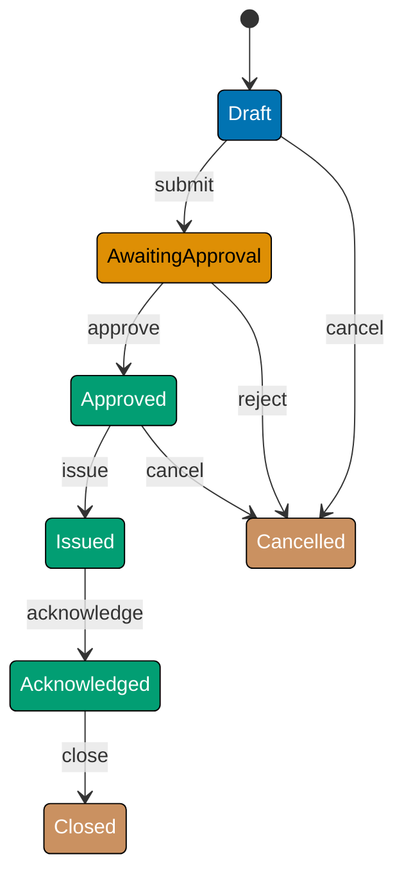
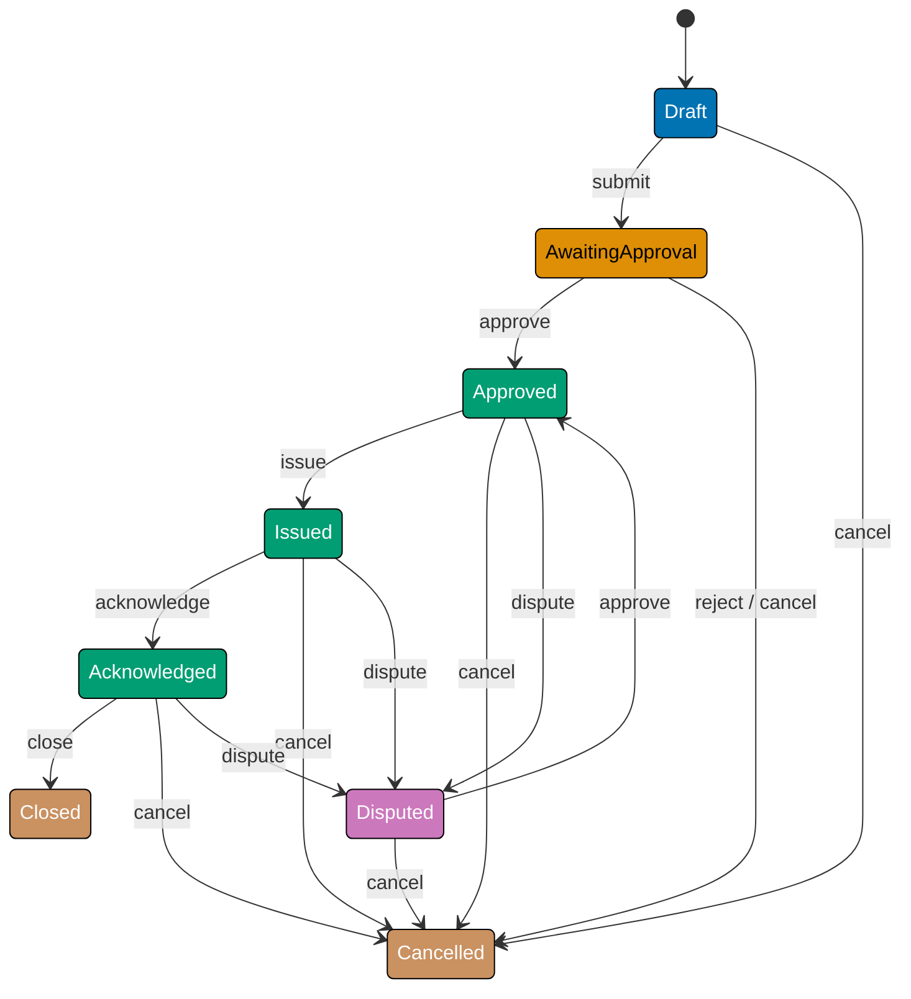
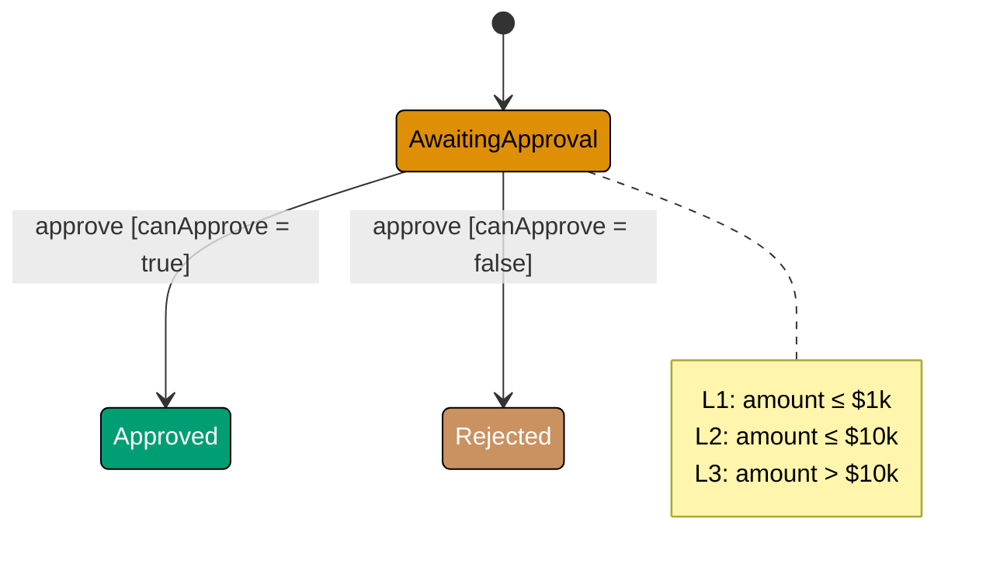
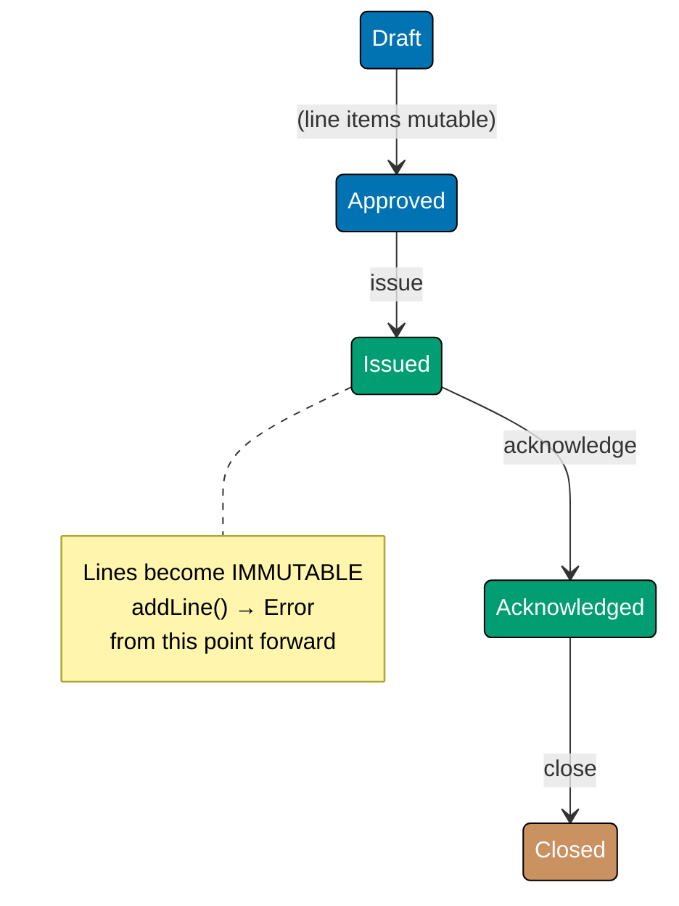
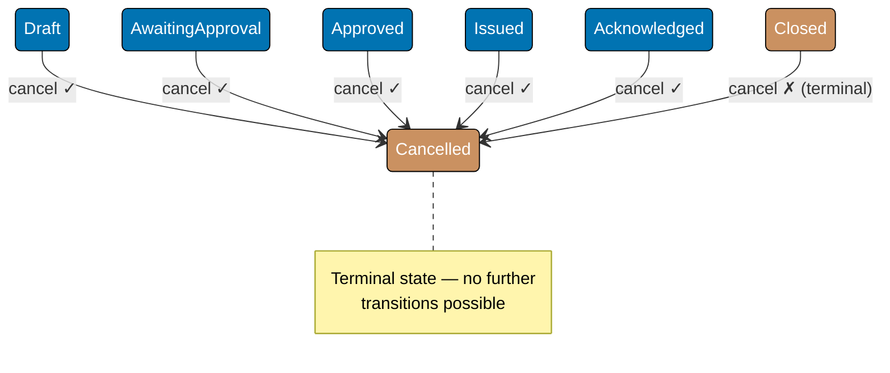
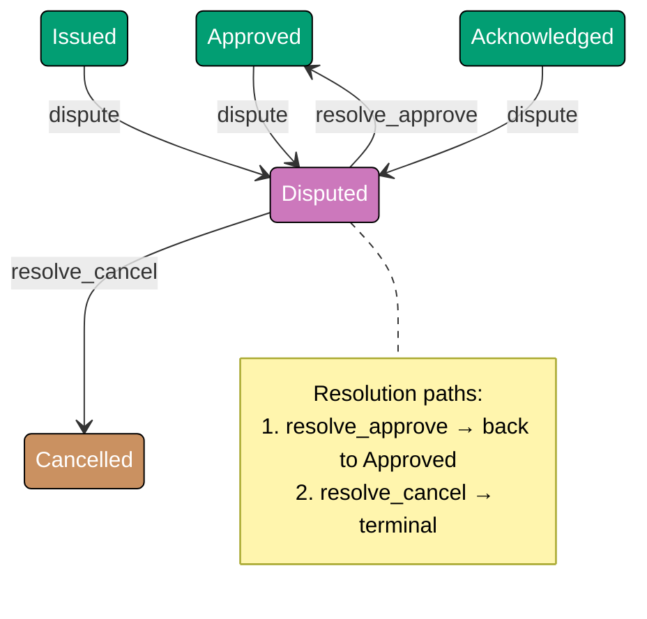
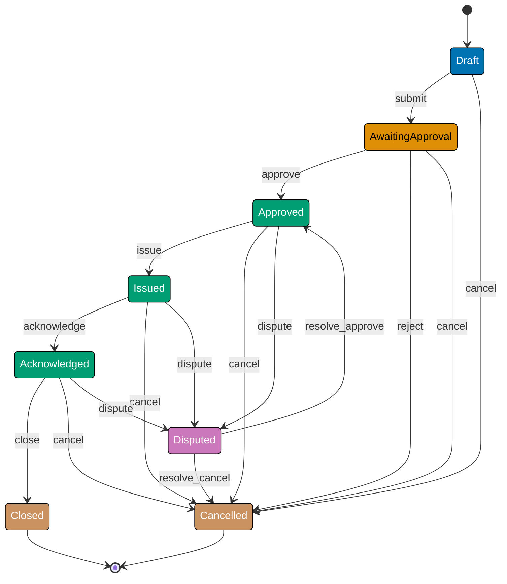
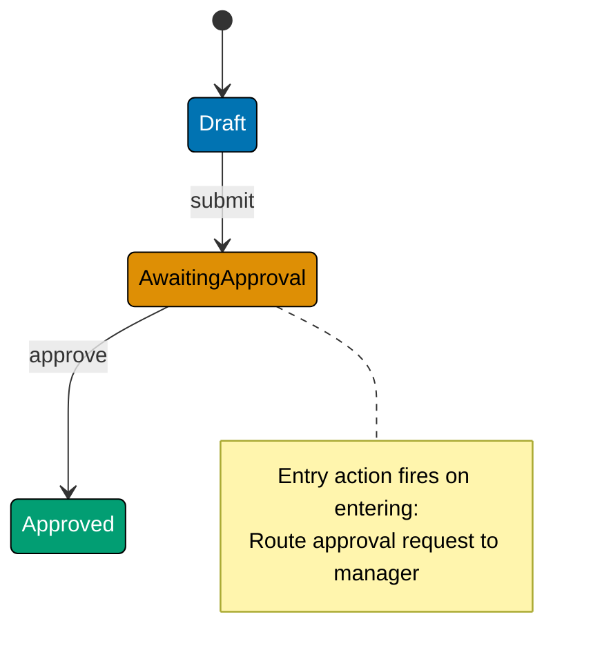
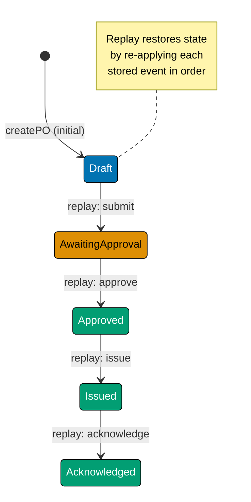
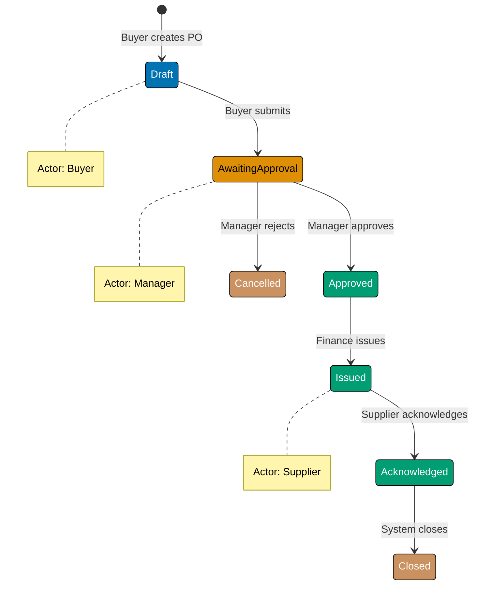

This beginner tutorial introduces Finite State Machine fundamentals through 25 annotated code examples grounded in the `PurchaseOrder` aggregate from the `procurement-platform-be` backend. You will learn how to model states as sealed types, encode transitions as pure functions, enforce guard conditions, and reject invalid transitions at the type level or with explicit errors.

> **Domain scope note**: The beginner `POState` covers the core approval-issuance lifecycle (Draft → AwaitingApproval → Approved → Issued → Acknowledged → Closed/Cancelled/Disputed). States from the full domain spec — `PartiallyReceived`, `Received`, `Invoiced`, and `Paid` — are intentionally deferred to intermediate and advanced levels, where multi-machine coordination and extended lifecycle patterns are introduced.

## What Is a Finite State Machine? (Examples 1-5)

### Example 1: States as a Sealed Type

A `PurchaseOrder` (PO) begins as a Draft, moves through approval, gets issued to a supplier, and eventually closes or is cancelled. The first FSM decision is how to represent the state set — a sealed union type prevents code from inventing states that do not exist in the model.






```java
// => Java: enum models the sealed state set — the compiler rejects any value
// => not in the enum body, providing the same safety as a sealed union type
public enum POState {
    DRAFT,            // => PO created, not yet submitted for approval
    AWAITING_APPROVAL, // => Submitted; waiting for manager decision
    APPROVED,         // => Manager approved; ready to issue to supplier
    ISSUED,           // => Sent to supplier; lines now immutable
    ACKNOWLEDGED,     // => Supplier confirmed receipt of PO
    CLOSED,           // => PO fully complete — terminal state
    CANCELLED,        // => Abandoned before payment — terminal state
    DISPUTED          // => Discrepancy detected; resolution required
}

// => Pure helper: decide whether a state allows no further transitions
// => No side effects — result determined solely by the input value
public static boolean isTerminal(POState state) {
    // => Two terminal states; switch exhausts all enum constants at compile time
    return state == POState.CLOSED || state == POState.CANCELLED;
}

// => Usage
POState initial = POState.DRAFT;          // => Type-safe: only enum constants compile
System.out.println(isTerminal(initial));  // => Output: false
System.out.println(isTerminal(POState.CLOSED)); // => Output: true
// => POState bad = "Pending";           // => Compile error: String is not POState
```




```kotlin
// => Kotlin: sealed class enumerates every valid PO state as an object
// => The `when` expression on a sealed class is exhaustive — the compiler
// => reports a missing branch as an error, not a silent runtime fallthrough
sealed class POState {
    object Draft : POState()            // => PO created, not yet submitted
    object AwaitingApproval : POState() // => Submitted; awaiting manager decision
    object Approved : POState()         // => Manager approved; ready to issue
    object Issued : POState()           // => Sent to supplier; lines immutable
    object Acknowledged : POState()     // => Supplier confirmed receipt
    object Closed : POState()           // => Terminal: fully complete
    object Cancelled : POState()        // => Terminal: abandoned before payment
    object Disputed : POState()         // => Discrepancy detected; resolution needed
}

// => Pure helper function — no side effects, no mutable state
// => Returns true only for the two terminal states
fun isTerminal(state: POState): Boolean =
    state is POState.Closed || state is POState.Cancelled
// => `is` performs smart-cast pattern match against the sealed hierarchy

// => Usage
val initial: POState = POState.Draft    // => Compiler enforces POState type
println(isTerminal(initial))            // => Output: false
println(isTerminal(POState.Closed))     // => Output: true
// => val bad: POState = "Pending"      // => Compile error: String ≠ POState
```




```csharp
// => C#: readonly record struct with an init-only State property models
// => the sealed set; a discriminated-union-style hierarchy keeps each
// => state name explicit and prevents construction of unlisted states
public abstract record POState
{
    // => Private constructor prevents external subclassing outside this file
    private POState() { }

    public sealed record Draft : POState();            // => Not yet submitted
    public sealed record AwaitingApproval : POState(); // => Awaiting manager decision
    public sealed record Approved : POState();         // => Ready to issue to supplier
    public sealed record Issued : POState();           // => Sent; lines now immutable
    public sealed record Acknowledged : POState();     // => Supplier confirmed receipt
    public sealed record Closed : POState();           // => Terminal: fully complete
    public sealed record Cancelled : POState();        // => Terminal: abandoned
    public sealed record Disputed : POState();         // => Resolution required

    // => Pure helper: pattern-matching switch decides terminal without reflection
    public static bool IsTerminal(POState state) => state switch
    {
        Closed or Cancelled => true,   // => Two terminal states matched by pattern
        _ => false                     // => All other states allow further transitions
    };
}

// => Usage
POState initial = new POState.Draft();
Console.WriteLine(POState.IsTerminal(initial));              // => Output: False
Console.WriteLine(POState.IsTerminal(new POState.Closed())); // => Output: True
// => POState bad = "Pending"; // => Compile error: String is not POState
```




**Key Takeaway**: Sealed union types turn the FSM state set into a compile-time contract — invalid states are errors, not bugs found in production.

**Why It Matters**: Every application has implicit states. Making them explicit with a sealed type eliminates an entire class of bugs: you cannot accidentally introduce `"pending"` vs `"Pending"` inconsistency, and the IDE guides you with exhaustive completion. For procurement workflows where an incorrect state might trigger a payment to a cancelled order, explicit sealed types provide low-cost, high-value safety.

---

### Example 2: The Minimal FSM Record

The machine is the state plus the transition function. This example models the simplest possible PO FSM as a plain record holding the current state.




```java
// => Java: an immutable record (Java 16+) holds all PO fields
// => No setters — every field is final; mutation produces a new object
public record PurchaseOrder(
    String id,           // => Immutable identifier, format "po_<uuid>"
    double totalAmount,  // => Monetary total in USD; guards compare against thresholds
    POState state        // => Current FSM state — the machine's single mutable concern
) {
    // => Compact constructor validates at construction time
    public PurchaseOrder {
        // => Guard: id must not be blank
        if (id == null || id.isBlank())
            throw new IllegalArgumentException("PO id must not be blank");
        // => Guard: totalAmount must be non-negative
        if (totalAmount < 0)
            throw new IllegalArgumentException("totalAmount must be >= 0");
    }
}

// => Factory: pure function — no side effects, always returns Draft state
public static PurchaseOrder createPO(String id, double totalAmount) {
    // => All POs begin in DRAFT — FSM invariant enforced here
    return new PurchaseOrder(id, totalAmount, POState.DRAFT);
}

// => Usage
PurchaseOrder po = createPO("po_abc123", 500);
System.out.println(po.state());       // => Output: DRAFT
System.out.println(po.totalAmount()); // => Output: 500.0
// => po.state = APPROVED;            // => Compile error: records have no setters
```




```kotlin
// => Kotlin: data class with val (immutable) fields mirrors the TS readonly interface
// => copy() provides the single idiomatic way to "mutate" — returning a new instance
data class PurchaseOrder(
    val id: String,          // => Immutable identifier, format "po_<uuid>"
    val totalAmount: Double, // => Monetary total in USD; used by approval guards
    val state: POState       // => Current FSM state — the only field transitions touch
) {
    // => init block validates invariants at construction time
    init {
        require(id.isNotBlank()) { "PO id must not be blank" }
        // => Blank id would make the PO untraceable in the audit log
        require(totalAmount >= 0) { "totalAmount must be >= 0" }
        // => Negative amount is a domain invariant violation
    }
}

// => Factory: extension-style top-level function; pure, no side effects
fun createPO(id: String, totalAmount: Double): PurchaseOrder =
    PurchaseOrder(id, totalAmount, POState.Draft)
// => All POs begin in Draft — FSM invariant

// => Usage
val po = createPO("po_abc123", 500.0)
println(po.state)       // => Output: Draft
println(po.totalAmount) // => Output: 500.0
// => po.state = POState.Approved  // => Compile error: val is immutable
```




```csharp
// => C# positional record with init-only properties — compiler generates
// => constructor, Equals, GetHashCode, and ToString automatically
public record PurchaseOrder(
    string Id,           // => Immutable identifier, format "po_<uuid>"
    decimal TotalAmount, // => Monetary total in USD; guards compare against thresholds
    POState State        // => Current FSM state — the only field transitions update
)
{
    // => Primary constructor validation runs at object creation
    public PurchaseOrder : this(Id, TotalAmount, State)
    {
        // => Guard: Id must not be empty or whitespace
        if (string.IsNullOrWhiteSpace(Id))
            throw new ArgumentException("PO Id must not be blank", nameof(Id));
        // => Guard: TotalAmount must be non-negative
        if (TotalAmount < 0)
            throw new ArgumentException("TotalAmount must be >= 0", nameof(TotalAmount));
    }
}

// => Factory: static helper returns a Draft-state PO — pure, no side effects
public static PurchaseOrder CreatePO(string id, decimal totalAmount) =>
    // => All POs begin in Draft — FSM invariant enforced in one place
    new PurchaseOrder(id, totalAmount, new POState.Draft());

// => Usage
var po = CreatePO("po_abc123", 500m);
Console.WriteLine(po.State);       // => Output: Draft { }
Console.WriteLine(po.TotalAmount); // => Output: 500
// => po.State = new POState.Approved(); // => Compile error: init-only property
```




**Key Takeaway**: Keeping state in an immutable record and behaviour in separate functions is the functional FSM pattern — it makes transitions testable in isolation.

**Why It Matters**: When state lives in a mutable class field, tests must instantiate the whole class to check one transition. When state is a plain record, tests create the minimal record and call the transition function — no constructor, no teardown, no mocks. This separation scales to large state machines without increasing test friction.

---

### Example 3: The Transition Table

A transition table maps `(currentState, event) → nextState`. Expressing it as data rather than nested `if`/`switch` statements makes the full machine inspectable and serialisable.






```java
// => Java: enum models every trigger that can change PO state
// => Using an enum prevents typos and exhausts all events in switch expressions
public enum POEvent {
    SUBMIT,      // => Buyer sends PO for approval
    APPROVE,     // => Manager approves the PO
    REJECT,      // => Manager rejects — PO transitions to CANCELLED
    ISSUE,       // => Finance issues PO to supplier
    ACKNOWLEDGE, // => Supplier acknowledges receipt
    CLOSE,       // => PO fully settled
    CANCEL,      // => Abandon PO at any pre-terminal state
    DISPUTE      // => Flag discrepancy between PO and receipt
}

// => Transition table as a nested immutable map: state → (event → nextState)
// => Map.of() and Map.copyOf() produce unmodifiable maps — no accidental mutation
import java.util.Map;
import java.util.Optional;

private static final Map<POState, Map<POEvent, POState>> TRANSITIONS = Map.of(
    POState.DRAFT,             Map.of(POEvent.SUBMIT, POState.AWAITING_APPROVAL,
                                     POEvent.CANCEL, POState.CANCELLED),
    // => Draft only allows submit (→ awaiting) or cancel (→ cancelled)
    POState.AWAITING_APPROVAL, Map.of(POEvent.APPROVE, POState.APPROVED,
                                     POEvent.REJECT,  POState.CANCELLED,
                                     POEvent.CANCEL,  POState.CANCELLED),
    // => Rejection and cancellation both lead to the same terminal state
    POState.APPROVED,          Map.of(POEvent.ISSUE,   POState.ISSUED,
                                     POEvent.CANCEL,  POState.CANCELLED,
                                     POEvent.DISPUTE, POState.DISPUTED),
    POState.ISSUED,            Map.of(POEvent.ACKNOWLEDGE, POState.ACKNOWLEDGED,
                                     POEvent.CANCEL,      POState.CANCELLED,
                                     POEvent.DISPUTE,     POState.DISPUTED),
    POState.ACKNOWLEDGED,      Map.of(POEvent.CLOSE,   POState.CLOSED,
                                     POEvent.CANCEL,  POState.CANCELLED,
                                     POEvent.DISPUTE, POState.DISPUTED),
    POState.DISPUTED,          Map.of(POEvent.APPROVE, POState.APPROVED,
                                     POEvent.CANCEL,  POState.CANCELLED)
    // => CLOSED and CANCELLED have no entries — terminal states allow no transitions
);

// => Pure lookup: returns empty Optional when transition is forbidden
// => Optional makes the absence of a transition explicit at the call site
public static Optional<POState> nextState(POState current, POEvent event) {
    return Optional.ofNullable(
        TRANSITIONS.getOrDefault(current, Map.of()).get(event)
    ); // => getOrDefault handles terminal states (no entry in outer map)
}

System.out.println(nextState(POState.DRAFT, POEvent.SUBMIT));
// => Output: Optional[AWAITING_APPROVAL]
System.out.println(nextState(POState.DRAFT, POEvent.APPROVE));
// => Output: Optional.empty  (invalid — Draft cannot be approved directly)
System.out.println(nextState(POState.CLOSED, POEvent.CANCEL));
// => Output: Optional.empty  (terminal — no further transitions)
```




```kotlin
// => Kotlin: sealed class for events gives the same exhaustiveness guarantee
// => as for states — the compiler rejects unhandled branches in `when`
sealed class POEvent {
    object Submit      : POEvent() // => Buyer sends PO for approval
    object Approve     : POEvent() // => Manager approves the PO
    object Reject      : POEvent() // => Manager rejects → Cancelled
    object Issue       : POEvent() // => Finance issues PO to supplier
    object Acknowledge : POEvent() // => Supplier acknowledges receipt
    object Close       : POEvent() // => PO fully settled
    object Cancel      : POEvent() // => Abandon PO at any pre-terminal state
    object Dispute     : POEvent() // => Flag discrepancy
}

// => Transition table as a nested immutable map using mapOf()
// => mapOf() returns a read-only Map; no put() possible at runtime
private val TRANSITIONS: Map<POState, Map<POEvent, POState>> = mapOf(
    POState.Draft             to mapOf(POEvent.Submit to POState.AwaitingApproval,
                                       POEvent.Cancel to POState.Cancelled),
    // => Draft → submit leads to AwaitingApproval; cancel leads to terminal
    POState.AwaitingApproval  to mapOf(POEvent.Approve to POState.Approved,
                                       POEvent.Reject  to POState.Cancelled,
                                       POEvent.Cancel  to POState.Cancelled),
    // => Both rejection and cancellation collapse to the same terminal state
    POState.Approved          to mapOf(POEvent.Issue   to POState.Issued,
                                       POEvent.Cancel  to POState.Cancelled,
                                       POEvent.Dispute to POState.Disputed),
    POState.Issued            to mapOf(POEvent.Acknowledge to POState.Acknowledged,
                                       POEvent.Cancel      to POState.Cancelled,
                                       POEvent.Dispute     to POState.Disputed),
    POState.Acknowledged      to mapOf(POEvent.Close   to POState.Closed,
                                       POEvent.Cancel  to POState.Cancelled,
                                       POEvent.Dispute to POState.Disputed),
    POState.Disputed          to mapOf(POEvent.Approve to POState.Approved,
                                       POEvent.Cancel  to POState.Cancelled)
    // => Closed and Cancelled have no entries — terminal states
)

// => Pure lookup: returns null when transition is forbidden
// => Nullable return type forces callers to handle the missing-transition case
fun nextState(current: POState, event: POEvent): POState? =
    TRANSITIONS[current]?.get(event)
// => Safe-call (?.) returns null if current has no entry (terminal states)

println(nextState(POState.Draft, POEvent.Submit))
// => Output: AwaitingApproval
println(nextState(POState.Draft, POEvent.Approve))
// => Output: null  (invalid — Draft cannot be directly approved)
println(nextState(POState.Closed, POEvent.Cancel))
// => Output: null  (terminal — no further transitions allowed)
```




```csharp
// => C#: sealed record hierarchy for events mirrors the state hierarchy
// => Pattern matching on sealed records is exhaustive — the compiler enforces it
public abstract record POEvent
{
    private POEvent() { }
    public sealed record Submit      : POEvent(); // => Buyer sends PO for approval
    public sealed record Approve     : POEvent(); // => Manager approves
    public sealed record Reject      : POEvent(); // => Manager rejects → Cancelled
    public sealed record Issue       : POEvent(); // => Finance issues PO to supplier
    public sealed record Acknowledge : POEvent(); // => Supplier acknowledges receipt
    public sealed record Close       : POEvent(); // => PO fully settled
    public sealed record Cancel      : POEvent(); // => Abandon PO
    public sealed record Dispute     : POEvent(); // => Flag discrepancy
}

// => Transition table as a nested IReadOnlyDictionary — immutable after construction
// => Dictionary<TKey,TValue>.AsReadOnly() prevents callers from adding entries
using System.Collections.Generic;

private static readonly IReadOnlyDictionary<Type, IReadOnlyDictionary<Type, POState>>
    Transitions = new Dictionary<Type, IReadOnlyDictionary<Type, POState>>
{
    // => Draft state: only submit and cancel are valid events
    [typeof(POState.Draft)] = new Dictionary<Type, POState>
    {
        [typeof(POEvent.Submit)] = new POState.AwaitingApproval(),
        [typeof(POEvent.Cancel)] = new POState.Cancelled()
    }.AsReadOnly(),
    // => AwaitingApproval: approve, reject, cancel all allowed
    [typeof(POState.AwaitingApproval)] = new Dictionary<Type, POState>
    {
        [typeof(POEvent.Approve)] = new POState.Approved(),
        [typeof(POEvent.Reject)]  = new POState.Cancelled(),
        [typeof(POEvent.Cancel)]  = new POState.Cancelled()
    }.AsReadOnly(),
    [typeof(POState.Approved)] = new Dictionary<Type, POState>
    {
        [typeof(POEvent.Issue)]   = new POState.Issued(),
        [typeof(POEvent.Cancel)]  = new POState.Cancelled(),
        [typeof(POEvent.Dispute)] = new POState.Disputed()
    }.AsReadOnly(),
    [typeof(POState.Issued)] = new Dictionary<Type, POState>
    {
        [typeof(POEvent.Acknowledge)] = new POState.Acknowledged(),
        [typeof(POEvent.Cancel)]      = new POState.Cancelled(),
        [typeof(POEvent.Dispute)]     = new POState.Disputed()
    }.AsReadOnly(),
    [typeof(POState.Acknowledged)] = new Dictionary<Type, POState>
    {
        [typeof(POEvent.Close)]   = new POState.Closed(),
        [typeof(POEvent.Cancel)]  = new POState.Cancelled(),
        [typeof(POEvent.Dispute)] = new POState.Disputed()
    }.AsReadOnly(),
    [typeof(POState.Disputed)] = new Dictionary<Type, POState>
    {
        [typeof(POEvent.Approve)] = new POState.Approved(),
        [typeof(POEvent.Cancel)]  = new POState.Cancelled()
    }.AsReadOnly()
    // => Closed and Cancelled have no entries — terminal states
}.AsReadOnly();

// => Pure lookup using runtime types as keys; returns null when forbidden
public static POState? NextState(POState current, POEvent evt)
{
    // => TryGetValue returns false for terminal states (no outer entry)
    if (!Transitions.TryGetValue(current.GetType(), out var eventMap))
        return null; // => Terminal state — no transitions defined
    eventMap.TryGetValue(evt.GetType(), out var next);
    return next;     // => null if event not listed for this state
}

Console.WriteLine(NextState(new POState.Draft(), new POEvent.Submit()));
// => Output: AwaitingApproval { }
Console.WriteLine(NextState(new POState.Draft(), new POEvent.Approve()));
// => Output: (null — invalid transition)
Console.WriteLine(NextState(new POState.Closed(), new POEvent.Cancel()));
// => Output: (null — terminal state)
```




**Key Takeaway**: A data-driven transition table decouples the FSM structure from the execution logic — you can print, diff, or migrate it without touching the interpreter.

**Why It Matters**: Hard-coded `switch` statements in large state machines become maintenance liabilities. When a new transition is needed, the developer must scan the entire `switch` to find the right `case`. A transition table is a single data structure — add one entry, and the interpreter picks it up automatically. This also enables tooling: you can generate state diagrams directly from the table.

---

### Example 4: The Pure Transition Function

Wrapping the table lookup in a function that returns a `Result` type makes the FSM's success/failure contract explicit without throwing exceptions.




```java
// => Java: sealed interface models the Result sum type (Java 17+)
// => Either Ok<T> (success) or Err (failure) — no other constructors possible
public sealed interface Result<T> permits Result.Ok, Result.Err {
    // => Ok variant carries the success value
    record Ok<T>(T value) implements Result<T> {}
    // => Err variant carries an error message — never throws
    record Err<T>(String error) implements Result<T> {}
}

// => Pure transition function: (PO, event) → Result<PO>
// => Never mutates its input; always returns a new record or an Err
public static Result<PurchaseOrder> transition(PurchaseOrder po, POEvent event) {
    // => Look up next state in the transition table
    var next = nextState(po.state(), event);

    if (next.isEmpty()) {
        // => Transition not found: return descriptive error, do not throw
        // => Caller must inspect the Result before using the value
        return new Result.Err<>(
            "Invalid transition: " + po.state() + " --" + event + "--> (no such transition)"
        );
    }

    // => Valid transition: build a new PO record with the updated state
    // => Java record's with() is not built-in; use constructor with spread semantics
    var updated = new PurchaseOrder(po.id(), po.totalAmount(), next.get());
    // => All other fields preserved; only state changes
    return new Result.Ok<>(updated);
}

// => Happy path
var po = createPO("po_abc123", 500);
var r1 = transition(po, POEvent.SUBMIT);
// => Pattern match on the sealed Result type (Java 21 switch expression)
switch (r1) {
    case Result.Ok<PurchaseOrder> ok -> System.out.println(ok.value().state());
    // => Output: AWAITING_APPROVAL
    case Result.Err<PurchaseOrder> err -> System.out.println(err.error());
}

// => Invalid transition
var r2 = transition(po, POEvent.CLOSE);
switch (r2) {
    case Result.Ok<PurchaseOrder> ok -> System.out.println(ok.value().state());
    case Result.Err<PurchaseOrder> err -> System.out.println(err.error());
    // => Output: Invalid transition: DRAFT --CLOSE--> (no such transition)
}
```




```kotlin
// => Kotlin: sealed class for Result mirrors the TS union type
// => when on a sealed class is exhaustive — the compiler enforces both branches
sealed class Result<out T> {
    // => Success variant: carries the new PO value
    data class Ok<T>(val value: T) : Result<T>()
    // => Failure variant: carries a descriptive error string — never throws
    data class Err(val error: String) : Result<Nothing>()
}

// => Pure transition function: (PO, event) → Result<PO>
// => Returns a new record on success; returns Err on invalid transition
fun transition(po: PurchaseOrder, event: POEvent): Result<PurchaseOrder> {
    // => Table lookup returns null for forbidden transitions
    val next = nextState(po.state, event)

    if (next == null) {
        // => Transition not found: return descriptive error, never throw
        // => Caller must handle Err branch — compiler enforces exhaustive when
        return Result.Err(
            "Invalid transition: ${po.state} --${event::class.simpleName}--> (no such transition)"
        )
    }

    // => Valid transition: data class copy() preserves all fields except state
    // => copy() is generated by the compiler for every data class
    return Result.Ok(po.copy(state = next))
}

// => Happy path
val po = createPO("po_abc123", 500.0)
val r1 = transition(po, POEvent.Submit)
// => Exhaustive when — both branches must be present or it won't compile
when (r1) {
    is Result.Ok  -> println(r1.value.state) // => Output: AwaitingApproval
    is Result.Err -> println(r1.error)
}

// => Invalid transition
val r2 = transition(po, POEvent.Close)
when (r2) {
    is Result.Ok  -> println(r2.value.state)
    is Result.Err -> println(r2.error)
    // => Output: Invalid transition: Draft --Close--> (no such transition)
}
```




```csharp
// => C#: discriminated union via sealed record hierarchy for Result<T>
// => Pattern matching switch expression enforces handling of both variants
public abstract record Result<T>
{
    private Result() { }
    // => Ok carries the success value
    public sealed record Ok(T Value) : Result<T>();
    // => Err carries a descriptive message — never throws an exception
    public sealed record Err(string Error) : Result<T>();
}

// => Pure transition function: (PO, event) → Result<PO>
// => Immutable: never mutates the input PO; always returns a new record
public static Result<PurchaseOrder> Transition(PurchaseOrder po, POEvent evt)
{
    // => Look up next state; returns null when transition is forbidden
    var next = NextState(po.State, evt);

    if (next is null)
    {
        // => Transition not found: return Err with descriptive message
        // => No throw — caller inspects the Result variant
        return new Result<PurchaseOrder>.Err(
            $"Invalid transition: {po.State.GetType().Name} --{evt.GetType().Name}--> (no such transition)"
        );
    }

    // => Valid transition: record `with` expression preserves all other fields
    // => Only State is replaced — id and TotalAmount stay identical
    return new Result<PurchaseOrder>.Ok(po with { State = next });
}

// => Happy path
var po = CreatePO("po_abc123", 500m);
var r1 = Transition(po, new POEvent.Submit());
// => C# switch expression on sealed record — all variants must be handled
var msg1 = r1 switch
{
    Result<PurchaseOrder>.Ok ok   => ok.Value.State.GetType().Name,
    Result<PurchaseOrder>.Err err => err.Error,
    _                             => throw new UnreachableException()
};
Console.WriteLine(msg1); // => Output: AwaitingApproval

// => Invalid transition
var r2 = Transition(po, new POEvent.Close());
var msg2 = r2 switch
{
    Result<PurchaseOrder>.Ok ok   => ok.Value.State.GetType().Name,
    Result<PurchaseOrder>.Err err => err.Error,
    _                             => throw new UnreachableException()
};
Console.WriteLine(msg2);
// => Output: Invalid transition: Draft --Close--> (no such transition)
```




**Key Takeaway**: Returning `Result` instead of throwing makes invalid transitions an explicit, typed outcome — callers must handle both paths, which prevents silent state corruption.

**Why It Matters**: Exception-based control flow means the compiler cannot force callers to handle the error case. A `Result` type forces the caller to branch on `ok`, making the error path as visible as the success path. For a procurement platform where a failed state transition might silently leave a PO in an inconsistent state, this explicitness is non-negotiable.

---

### Example 5: Exhaustiveness Checking with a Switch

Pattern-matching on the state with an exhaustive `switch` guarantees every state has been handled — the TypeScript compiler catches missing cases at compile time.




```java
// => Java: exhaustive switch expression on an enum (Java 14+)
// => The compiler reports an error if any enum constant is missing from the arms
// => This is the Java equivalent of TypeScript's `never`-default trick
public static String stateLabel(POState state) {
    // => switch expression (not statement) — every arm must return a value
    return switch (state) {
        case DRAFT             -> "Draft — pending submission";
        // => PO created, not yet submitted for approval
        case AWAITING_APPROVAL -> "Awaiting Approval";
        // => Submitted; waiting for manager decision
        case APPROVED          -> "Approved — ready to issue";
        // => Manager approved; finance may now issue to supplier
        case ISSUED            -> "Issued to Supplier";
        // => PO sent to supplier; lines now immutable
        case ACKNOWLEDGED      -> "Acknowledged by Supplier";
        // => Supplier confirmed receipt of the PO
        case CLOSED            -> "Closed";
        // => Terminal: PO fully complete and settled
        case CANCELLED         -> "Cancelled";
        // => Terminal: PO abandoned before payment
        case DISPUTED          -> "Disputed — resolution pending";
        // => Discrepancy flagged between PO and receipt/invoice
        // => No default branch: if a new constant is added to POState enum,
        // => this switch expression becomes a compile error until updated
    };
}

System.out.println(stateLabel(POState.DRAFT));
// => Output: Draft — pending submission
System.out.println(stateLabel(POState.ISSUED));
// => Output: Issued to Supplier
```




```kotlin
// => Kotlin: exhaustive `when` expression on a sealed class
// => The compiler requires all subclasses to be handled when `when` is used
// => as an expression — missing branches are compile errors, not runtime surprises
fun stateLabel(state: POState): String =
    // => `when` as expression: every sealed subtype must be covered
    when (state) {
        is POState.Draft             -> "Draft — pending submission"
        // => PO created, not yet submitted for approval
        is POState.AwaitingApproval  -> "Awaiting Approval"
        // => Submitted; waiting for manager decision
        is POState.Approved          -> "Approved — ready to issue"
        // => Manager approved; finance may now issue to supplier
        is POState.Issued            -> "Issued to Supplier"
        // => PO sent to supplier; lines now immutable
        is POState.Acknowledged      -> "Acknowledged by Supplier"
        // => Supplier confirmed receipt
        is POState.Closed            -> "Closed"
        // => Terminal: fully complete
        is POState.Cancelled         -> "Cancelled"
        // => Terminal: abandoned
        is POState.Disputed          -> "Disputed — resolution pending"
        // => Discrepancy flagged; resolution required
        // => No else branch needed — sealed class exhausts all cases at compile time
        // => Adding a new subclass to POState forces an update here
    }

println(stateLabel(POState.Draft))
// => Output: Draft — pending submission
println(stateLabel(POState.Issued))
// => Output: Issued to Supplier
```




```csharp
// => C#: exhaustive switch expression on the sealed record hierarchy
// => The compiler reports CS8509 (non-exhaustive switch) when a subtype is missing
// => This enforces the same invariant as TypeScript's `never` default
public static string StateLabel(POState state) =>
    // => Pattern-matching switch expression — must handle all sealed subtypes
    state switch
    {
        POState.Draft            => "Draft — pending submission",
        // => PO created, not yet submitted for approval
        POState.AwaitingApproval => "Awaiting Approval",
        // => Submitted; waiting for manager decision
        POState.Approved         => "Approved — ready to issue",
        // => Manager approved; finance may now issue to supplier
        POState.Issued           => "Issued to Supplier",
        // => PO sent to supplier; lines now immutable
        POState.Acknowledged     => "Acknowledged by Supplier",
        // => Supplier confirmed receipt of the PO
        POState.Closed           => "Closed",
        // => Terminal: fully complete
        POState.Cancelled        => "Cancelled",
        // => Terminal: abandoned
        POState.Disputed         => "Disputed — resolution pending",
        // => Discrepancy flagged; resolution required
        // => The discard pattern below acts as the unreachable safety net
        // => If all sealed subtypes are listed, the compiler may warn this is
        // => redundant — that warning IS the exhaustiveness signal
        _ => throw new UnreachableException($"Unhandled state: {state}")
    };

Console.WriteLine(StateLabel(new POState.Draft()));
// => Output: Draft — pending submission
Console.WriteLine(StateLabel(new POState.Issued()));
// => Output: Issued to Supplier
```




**Key Takeaway**: Exhaustive `switch` with a `never` default turns adding a new state without updating all handlers from a silent runtime bug into a compile-time error.

**Why It Matters**: In long-lived codebases, state machines grow. Without exhaustiveness checking, adding `"PartiallyReceived"` to `POState` means every `switch` on state silently falls through to the default — wrong labels, wrong behaviour, wrong UI rendering. The `never` trick costs one line and prevents the whole category of silent regression.

---

## Guards and Approval Levels (Examples 6-11)

### Example 6: Approval-Level Guard

The P2P domain defines approval thresholds: POs ≤ $1k need L1 approval, ≤ $10k need L2, and > $10k need L3. A guard function encodes this rule as a predicate that the transition checks before allowing the `approve` event.






```java
// => Java: enum for ApprovalLevel gives a fixed, ordered set of authority tiers
// => Enum ordinal() reflects the natural ranking: L1 < L2 < L3
public enum ApprovalLevel {
    L1, // => Line manager — authorises POs up to $1,000
    L2, // => Department head — authorises POs up to $10,000
    L3  // => CFO / finance committee — authorises POs above $10,000
}

// => Pure function: derive required approval level from PO monetary total
// => No side effects — result depends only on the totalAmount argument
public static ApprovalLevel requiredApprovalLevel(double totalAmount) {
    if (totalAmount <= 1_000)  return ApprovalLevel.L1;
    // => Up to $1,000: line manager is sufficient
    if (totalAmount <= 10_000) return ApprovalLevel.L2;
    // => $1,001–$10,000: department head required
    return ApprovalLevel.L3;
    // => Above $10,000: CFO or finance committee must approve
}

// => Guard: is the actor's level sufficient to approve this PO?
// => Returns true when actorLevel >= required level (by enum ordinal)
public static boolean canApprove(PurchaseOrder po, ApprovalLevel actorLevel) {
    var required = requiredApprovalLevel(po.totalAmount());
    // => ordinal() returns 0, 1, or 2 — higher value means higher authority
    return actorLevel.ordinal() >= required.ordinal();
    // => L3.ordinal() == 2, L2.ordinal() == 1, so L3 satisfies any requirement
}

var lowPO  = createPO("po_low",  800.0);   // => $800: needs L1
var highPO = createPO("po_high", 15_000.0); // => $15,000: needs L3

System.out.println(canApprove(lowPO,  ApprovalLevel.L1));
// => Output: true  ($800 <= $1k, L1 sufficient)
System.out.println(canApprove(highPO, ApprovalLevel.L2));
// => Output: false ($15k > $10k, L2 insufficient)
System.out.println(canApprove(highPO, ApprovalLevel.L3));
// => Output: true  (L3 is the highest authority tier)
```




```kotlin
// => Kotlin: enum class with an explicit rank property avoids relying on
// => ordinal() — rank makes the comparison intent self-documenting
enum class ApprovalLevel(val rank: Int) {
    L1(1), // => Rank 1 — line manager; authorises up to $1,000
    L2(2), // => Rank 2 — department head; authorises up to $10,000
    L3(3)  // => Rank 3 — CFO / finance committee; authorises above $10,000
}

// => Pure function: map monetary total to the minimum required level
// => No side effects — result determined solely by the totalAmount argument
fun requiredApprovalLevel(totalAmount: Double): ApprovalLevel = when {
    totalAmount <= 1_000.0  -> ApprovalLevel.L1
    // => Up to $1,000: line manager is sufficient
    totalAmount <= 10_000.0 -> ApprovalLevel.L2
    // => $1,001–$10,000: department head required
    else                    -> ApprovalLevel.L3
    // => Above $10,000: CFO or finance committee
}

// => Guard: true when the actor's rank meets or exceeds the required rank
// => Comparing rank Int values is clearer than relying on ordinal
fun canApprove(po: PurchaseOrder, actorLevel: ApprovalLevel): Boolean {
    val required = requiredApprovalLevel(po.totalAmount)
    // => required is the minimum authority tier for this PO's total
    return actorLevel.rank >= required.rank
    // => Actor rank >= required rank means approval is authorised
}

val lowPO  = createPO("po_low",  800.0)
// => $800: needs L1
val highPO = createPO("po_high", 15_000.0)
// => $15,000: needs L3

println(canApprove(lowPO,  ApprovalLevel.L1)) // => Output: true
println(canApprove(highPO, ApprovalLevel.L2)) // => Output: false
println(canApprove(highPO, ApprovalLevel.L3)) // => Output: true
```




```csharp
// => C#: readonly record struct for ApprovalLevel — value semantics,
// => zero heap allocation, and structural equality out of the box
public enum ApprovalLevel
{
    L1 = 1, // => Line manager — authorises POs up to $1,000
    L2 = 2, // => Department head — authorises POs up to $10,000
    L3 = 3  // => CFO / finance committee — authorises above $10,000
}
// => Explicit int values make the rank ordering self-documenting
// => and guard against future reordering of enum members

// => Pure function: derive required approval level from PO monetary total
// => No side effects; result depends only on totalAmount
public static ApprovalLevel RequiredApprovalLevel(decimal totalAmount) => totalAmount switch
{
    <= 1_000m  => ApprovalLevel.L1,  // => Up to $1,000: line manager sufficient
    <= 10_000m => ApprovalLevel.L2,  // => $1,001–$10,000: department head required
    _          => ApprovalLevel.L3   // => Above $10,000: CFO must approve
};

// => Guard: true when actor's level value >= required level value
// => Casting enum to int exposes the explicit numeric rank for comparison
public static bool CanApprove(PurchaseOrder po, ApprovalLevel actorLevel)
{
    var required = RequiredApprovalLevel(po.TotalAmount);
    // => (int) cast uses the explicit enum values defined above
    return (int)actorLevel >= (int)required;
    // => L3 (3) >= L3 (3) → true; L2 (2) >= L3 (3) → false
}

var lowPO  = CreatePO("po_low",  800m);
// => $800: needs L1
var highPO = CreatePO("po_high", 15_000m);
// => $15,000: needs L3

Console.WriteLine(CanApprove(lowPO,  ApprovalLevel.L1)); // => Output: True
Console.WriteLine(CanApprove(highPO, ApprovalLevel.L2)); // => Output: False
Console.WriteLine(CanApprove(highPO, ApprovalLevel.L3)); // => Output: True
```




**Key Takeaway**: Guards are pure predicates that sit between an event and a transition — they encode business rules without coupling them to state storage.

**Why It Matters**: Encoding approval thresholds directly in the guard function means the rule lives in one place. If the CFO decides L2 approval should cover up to $20k, one number changes. Without guards, the threshold check might be duplicated across the controller, the service, and the UI — three places to update and three places to desync.

---

### Example 7: Guarded Transition Function

Composing the guard with the transition function produces a single `approve` operation that enforces both the FSM state check and the business-rule guard.




```java
// => Java: ApprovableContext record bundles PO + actor level into one parameter
// => Using a record instead of two separate parameters keeps the method signature stable
// => when additional context fields (e.g. actorId) are added later
public record ApprovableContext(PurchaseOrder po, ApprovalLevel actorLevel) {}

// => Guarded approve: enforces FSM state check AND business-rule guard
// => Returns Result<PurchaseOrder> — never throws; both failure modes are typed
public static Result<PurchaseOrder> approvePO(ApprovableContext ctx) {
    var po         = ctx.po();
    var actorLevel = ctx.actorLevel();

    // => Guard 1: FSM structural check — PO must be in AWAITING_APPROVAL
    // => Any other state means the approval event is not in the transition table
    if (po.state() != POState.AWAITING_APPROVAL) {
        return new Result.Err<>(
            "Cannot approve PO in state: " + po.state()
        );
    }

    // => Guard 2: business-rule check — actor must have sufficient authority
    // => This is a domain invariant, not an FSM error; separated for testability
    if (!canApprove(po, actorLevel)) {
        var required = requiredApprovalLevel(po.totalAmount());
        return new Result.Err<>(
            "Actor level " + actorLevel + " cannot approve $" + po.totalAmount()
            + " PO (requires " + required + ")"
        );
    }

    // => Both guards pass: build new PO record with state APPROVED
    // => All other fields (id, totalAmount) are preserved unchanged
    var approved = new PurchaseOrder(po.id(), po.totalAmount(), POState.APPROVED);
    return new Result.Ok<>(approved);
}

// => Build an AwaitingApproval PO by constructing directly (simulates prior submit)
var po = new PurchaseOrder("po_001", 12_000.0, POState.AWAITING_APPROVAL);

var r1 = approvePO(new ApprovableContext(po, ApprovalLevel.L2));
// => L2 insufficient for $12k PO (requires L3)
var r2 = approvePO(new ApprovableContext(po, ApprovalLevel.L3));
// => L3 sufficient — should succeed

switch (r1) {
    case Result.Err<PurchaseOrder> err -> System.out.println(err.error());
    // => Output: Actor level L2 cannot approve $12000.0 PO (requires L3)
    case Result.Ok<PurchaseOrder>  ok  -> System.out.println(ok.value().state());
}
switch (r2) {
    case Result.Ok<PurchaseOrder>  ok  -> System.out.println(ok.value().state());
    // => Output: APPROVED
    case Result.Err<PurchaseOrder> err -> System.out.println(err.error());
}
```




```kotlin
// => Kotlin: data class for context — copy() and destructuring work automatically
// => Grouping po + actorLevel avoids a two-parameter function that grows over time
data class ApprovableContext(
    val po: PurchaseOrder,
    val actorLevel: ApprovalLevel
)

// => Guarded approve: two-layer guard returns Result, never throws
// => Callers must handle both Ok and Err via exhaustive `when`
fun approvePO(ctx: ApprovableContext): Result<PurchaseOrder> {
    val (po, actorLevel) = ctx
    // => Destructuring declaration unpacks the data class fields

    // => Guard 1: FSM structural check — state must be AwaitingApproval
    // => This is the transition-table check: the event is only valid here
    if (po.state !is POState.AwaitingApproval) {
        return Result.Err(
            "Cannot approve PO in state: ${po.state::class.simpleName}"
        )
    }

    // => Guard 2: business-rule authority check — actor rank >= required rank
    // => Separated from Guard 1 so each predicate is independently unit-testable
    if (!canApprove(po, actorLevel)) {
        val required = requiredApprovalLevel(po.totalAmount)
        return Result.Err(
            "Actor level $actorLevel cannot approve \$${po.totalAmount} PO (requires $required)"
        )
        // => Business rule rejection — not a structural FSM error
    }

    // => Both guards pass: data class copy() updates only the state field
    // => id and totalAmount remain identical to the input PO
    return Result.Ok(po.copy(state = POState.Approved))
}

// => Construct an AwaitingApproval PO directly (simulates a prior submit transition)
val po = PurchaseOrder("po_001", 12_000.0, POState.AwaitingApproval)

val r1 = approvePO(ApprovableContext(po, ApprovalLevel.L2))
// => L2 (rank 2) insufficient for $12k PO (requires L3, rank 3)
val r2 = approvePO(ApprovableContext(po, ApprovalLevel.L3))
// => L3 (rank 3) sufficient — transition to Approved

when (r1) {
    is Result.Err -> println(r1.error)
    // => Output: Actor level L2 cannot approve $12000.0 PO (requires L3)
    is Result.Ok  -> println(r1.value.state)
}
when (r2) {
    is Result.Ok  -> println(r2.value.state) // => Output: Approved
    is Result.Err -> println(r2.error)
}
```




```csharp
// => C#: primary-constructor record bundles PO + actor level into one parameter
// => Records provide structural equality and concise syntax with no boilerplate
public record ApprovableContext(PurchaseOrder Po, ApprovalLevel ActorLevel);

// => Guarded approve: enforces FSM structural check AND business-rule authority check
// => Returns Result<PurchaseOrder> — never throws; all failure modes are explicit
public static Result<PurchaseOrder> ApprovePO(ApprovableContext ctx)
{
    var (po, actorLevel) = (ctx.Po, ctx.ActorLevel);
    // => Tuple deconstruction extracts the two fields from the context record

    // => Guard 1: FSM structural check — PO must be in AwaitingApproval state
    // => Pattern match against the sealed hierarchy; all other states are rejected
    if (po.State is not POState.AwaitingApproval)
    {
        return new Result<PurchaseOrder>.Err(
            $"Cannot approve PO in state: {po.State.GetType().Name}"
        );
    }

    // => Guard 2: business-rule authority check — actor's level must meet requirement
    // => This predicate is independent of the FSM; it can be unit-tested with numbers alone
    if (!CanApprove(po, actorLevel))
    {
        var required = RequiredApprovalLevel(po.TotalAmount);
        return new Result<PurchaseOrder>.Err(
            $"Actor level {actorLevel} cannot approve ${po.TotalAmount} PO (requires {required})"
        );
        // => Business rule rejection — domain invariant, not a state-machine error
    }

    // => Both guards pass: record `with` expression updates only the State property
    // => Id and TotalAmount are preserved unchanged from the input record
    return new Result<PurchaseOrder>.Ok(po with { State = new POState.Approved() });
}

// => Construct an AwaitingApproval PO (simulates result of a prior Submit transition)
var po = new PurchaseOrder("po_001", 12_000m, new POState.AwaitingApproval());

var r1 = ApprovePO(new ApprovableContext(po, ApprovalLevel.L2));
// => L2 insufficient for $12k PO (requires L3)
var r2 = ApprovePO(new ApprovableContext(po, ApprovalLevel.L3));
// => L3 sufficient — transition to Approved

var msg1 = r1 switch
{
    Result<PurchaseOrder>.Err err => err.Error,
    Result<PurchaseOrder>.Ok  ok  => ok.Value.State.GetType().Name,
    _                             => throw new UnreachableException()
};
Console.WriteLine(msg1);
// => Output: Actor level L2 cannot approve $12000 PO (requires L3)

var msg2 = r2 switch
{
    Result<PurchaseOrder>.Ok  ok  => ok.Value.State.GetType().Name,
    Result<PurchaseOrder>.Err err => err.Error,
    _                             => throw new UnreachableException()
};
Console.WriteLine(msg2); // => Output: Approved
```




**Key Takeaway**: Layering domain guards on top of FSM state checks produces a single, testable function that enforces both structural and business invariants.

**Why It Matters**: Separating the FSM check (`state === "AwaitingApproval"`) from the business guard (`canApprove`) keeps each predicate focused. You can unit-test `canApprove` with just numbers and approval levels — no FSM setup needed. You can test the state check independently. The composed `approvePO` function then has exactly two failure modes, each tested by a single case.

---

### Example 8: Line-Item Guard

A PO cannot move past `Approved` without at least one line item. This is a structural invariant, not an approval-level rule — it lives in its own guard.




```java
// => POLine record: immutable value object for one product line
// => Java record auto-generates constructor, getters, equals, hashCode, toString
public record POLine(
    String skuCode,   // => Product SKU, format "ELC-XXXXX"
    int quantity,     // => Must be > 0 (domain invariant enforced by guard)
    double unitPrice  // => Price per unit in USD
) {}

// => PurchaseOrderWithLines: PO record extended with an ordered list of lines
// => Using List<POLine> — List.copyOf ensures the field is unmodifiable
public record PurchaseOrderWithLines(
    String id,
    double totalAmount,
    POState state,
    List<POLine> lines   // => Immutable snapshot: List.copyOf at construction time
) {
    // => Compact canonical constructor: enforce immutability on lines
    public PurchaseOrderWithLines {
        lines = List.copyOf(lines);
        // => List.copyOf: returns unmodifiable view — mutations throw UnsupportedOperationException
    }
}

// => Guard function: checks the structural invariant "at least one line with positive quantity"
// => Returns Optional.empty() if the guard passes, Optional.of(errorMessage) if it fails
public static Optional<String> guardAtLeastOneLine(PurchaseOrderWithLines po) {
    if (po.lines().isEmpty()) {
        // => Domain invariant: a PO with no items is commercially meaningless
        return Optional.of("Cannot issue PO: no line items (add at least one product line)");
    }
    boolean anyZeroQuantity = po.lines().stream()
        .anyMatch(l -> l.quantity() <= 0);
        // => Stream.anyMatch: short-circuits on first match — O(1) best case
    if (anyZeroQuantity) {
        return Optional.of("Cannot issue PO: all line quantities must be > 0");
        // => Per-line invariant: zero or negative quantity has no procurement meaning
    }
    return Optional.empty(); // => Guard passes: no structural violation found
}

// => Guarded issue transition: returns Result wrapping new PO or error
public static Result<PurchaseOrderWithLines> issuePO(PurchaseOrderWithLines po) {
    if (po.state() != POState.APPROVED) {
        // => Pre-condition: can only issue from Approved state
        return Result.failure("Cannot issue PO in state " + po.state());
    }
    Optional<String> lineError = guardAtLeastOneLine(po);
    // => Run structural guard before committing the transition
    if (lineError.isPresent()) {
        return Result.failure(lineError.get());
        // => Guard failed: propagate the specific error to the caller
    }
    PurchaseOrderWithLines issued = new PurchaseOrderWithLines(
        po.id(), po.totalAmount(), POState.ISSUED, po.lines()
    );
    // => New record: state promoted to ISSUED, all other fields unchanged
    return Result.success(issued);
    // => Transition complete: lines are now immutable per domain rules
}

// => Test: PO with no lines cannot be issued
PurchaseOrderWithLines poNoLines = new PurchaseOrderWithLines(
    "po_002", 500.0, POState.APPROVED, List.of()
    // => List.of(): creates empty unmodifiable list — idiomatic Java
);
Result<PurchaseOrderWithLines> r = issuePO(poNoLines);
System.out.println(r.isSuccess()); // => Output: false
System.out.println(r.error());
// => Output: Cannot issue PO: no line items (add at least one product line)
```




```kotlin
// => POLine: immutable data class — one product line in the PO
// => data class auto-generates equals, hashCode, toString, copy
data class POLine(
    val skuCode: String,    // => Product SKU, format "ELC-XXXXX"
    val quantity: Int,      // => Must be > 0 (enforced by guard, not constructor)
    val unitPrice: Double   // => Price per unit in USD
)

// => PurchaseOrderWithLines: extends PO concept with an ordered, immutable line list
// => List<POLine> in Kotlin is read-only by default — no add/remove methods exposed
data class PurchaseOrderWithLines(
    val id: String,
    val totalAmount: Double,
    val state: POState,
    val lines: List<POLine> = emptyList()
    // => emptyList(): singleton empty list — no allocation for the common empty case
)

// => Sealed Result: models success or failure without throwing exceptions
sealed class Result<out T> {
    data class Success<T>(val value: T) : Result<T>()
    // => Success wraps the happy-path value
    data class Failure(val error: String) : Result<Nothing>()
    // => Failure wraps the error message; Nothing is the bottom type
}

// => Guard: checks structural invariant "at least one line with positive quantity"
// => Returns null if guard passes, an error String if it fails
fun guardAtLeastOneLine(po: PurchaseOrderWithLines): String? {
    if (po.lines.isEmpty()) {
        // => Domain invariant: a PO with no items is commercially meaningless
        return "Cannot issue PO: no line items (add at least one product line)"
    }
    val hasZeroQuantity = po.lines.any { it.quantity <= 0 }
    // => any{}: Kotlin stdlib, short-circuits on first match — idiomatic predicate check
    if (hasZeroQuantity) {
        return "Cannot issue PO: all line quantities must be > 0"
        // => Per-line invariant: zero or negative quantity has no procurement meaning
    }
    return null // => Guard passes: null signals no violation
}

// => Guarded issue transition: pure function, returns Result
fun issuePO(po: PurchaseOrderWithLines): Result<PurchaseOrderWithLines> {
    if (po.state != POState.APPROVED) {
        // => Pre-condition check before running guards
        return Result.Failure("Cannot issue PO in state ${po.state}")
    }
    val lineError = guardAtLeastOneLine(po)
    // => Run structural guard; null means pass, non-null means fail
    if (lineError != null) {
        return Result.Failure(lineError)
        // => Propagate guard error to caller unchanged
    }
    return Result.Success(po.copy(state = POState.ISSUED))
    // => copy(): creates new instance with only state changed — all lines preserved
}

// => Test: PO with no lines cannot be issued
val poNoLines = PurchaseOrderWithLines(
    id = "po_002", totalAmount = 500.0,
    state = POState.APPROVED, lines = emptyList()
    // => Named arguments: self-documenting, order-independent
)
val result = issuePO(poNoLines)
when (result) {
    is Result.Success -> println(result.value.state)
    is Result.Failure -> println(result.error)
    // => when is exhaustive on sealed class: compiler enforces all branches
}
// => Output: Cannot issue PO: no line items (add at least one product line)
```




```csharp
// => POLine: readonly record struct — stack-allocated, immutable value object
// => record struct auto-generates Equals, GetHashCode, ToString, and with-expressions
public readonly record struct POLine(
    string SkuCode,    // => Product SKU, format "ELC-XXXXX"
    int Quantity,      // => Must be > 0 (enforced by guard, not constructor)
    decimal UnitPrice  // => decimal: exact decimal arithmetic — required for money
);

// => PurchaseOrderWithLines: immutable record with a line collection
// => IReadOnlyList<POLine>: read-only interface — no Add/Remove exposed to callers
public record PurchaseOrderWithLines(
    string Id,
    decimal TotalAmount,
    POState State,
    IReadOnlyList<POLine> Lines  // => Read-only view: callers cannot mutate the collection
) {
    // => Constructor guard: always wrap incoming list in read-only projection
    public PurchaseOrderWithLines(string id, decimal totalAmount, POState state, IReadOnlyList<POLine> lines)
        : this(id, totalAmount, state, lines.ToList().AsReadOnly())
    // => AsReadOnly(): returns ReadOnlyCollection<T> — any mutation attempt throws
    { }
}

// => Result<T>: discriminated union for success/failure (no exceptions for domain logic)
public abstract record Result<T>
{
    public sealed record Success(T Value) : Result<T>();
    // => Success: wraps the happy-path value
    public sealed record Failure(string Error) : Result<T>();
    // => Failure: wraps the error message
}

// => Guard: checks "at least one line with positive quantity"
// => Returns null if guard passes, an error string if it fails
public static string? GuardAtLeastOneLine(PurchaseOrderWithLines po)
{
    if (po.Lines.Count == 0)
    {
        // => Domain invariant: a PO with no items has no procurement meaning
        return "Cannot issue PO: no line items (add at least one product line)";
    }
    bool hasZeroQuantity = po.Lines.Any(l => l.Quantity <= 0);
    // => LINQ Any(): deferred, short-circuits on first match — O(1) best case
    if (hasZeroQuantity)
    {
        return "Cannot issue PO: all line quantities must be > 0";
        // => Per-line invariant: quantity must be positive for a valid order
    }
    return null; // => Guard passes: null signals no violation
}

// => Guarded issue transition: pure function returning Result<T>
public static Result<PurchaseOrderWithLines> IssuePO(PurchaseOrderWithLines po)
{
    if (po.State != POState.Approved)
    {
        // => Pre-condition: can only issue from Approved state
        return new Result<PurchaseOrderWithLines>.Failure($"Cannot issue PO in state {po.State}");
    }
    string? lineError = GuardAtLeastOneLine(po);
    // => Run structural guard before committing the transition
    if (lineError is not null)
    {
        return new Result<PurchaseOrderWithLines>.Failure(lineError);
        // => Propagate guard error unchanged — caller decides how to present it
    }
    PurchaseOrderWithLines issued = po with { State = POState.Issued };
    // => with-expression: creates new record with only State changed — all lines preserved
    return new Result<PurchaseOrderWithLines>.Success(issued);
}

// => Test: PO with no lines cannot be issued
var poNoLines = new PurchaseOrderWithLines(
    "po_002", 500m, POState.Approved, Array.Empty<POLine>()
    // => Array.Empty<T>(): singleton empty array — no allocation
);
var result = IssuePO(poNoLines);
Console.WriteLine(result switch
{
    Result<PurchaseOrderWithLines>.Success s => s.Value.State.ToString(),
    Result<PurchaseOrderWithLines>.Failure f => f.Error,
    _ => "unexpected"
    // => switch expression on abstract record: pattern-matched exhaustively
});
// => Output: Cannot issue PO: no line items (add at least one product line)
```




**Key Takeaway**: Structural invariants (must have lines) belong in dedicated guard functions, not buried in the transition table — each guard tests one rule and one rule only.

**Why It Matters**: A PO with zero lines is not a business error in the same category as an underpowered approver — it is a data completeness violation. Keeping them in separate guard functions makes the code self-documenting: `guardAtLeastOneLine` is searchable, testable, and reviewable independently of the approval logic.

---

### Example 9: Immutable Lines After Issue

Once a PO is `Issued`, its lines must not change. Enforcing this at the state level — reject any line mutation when `state === "Issued"` — is a core FSM invariant.






```java
// => Set of states after which lines become immutable — a legal commitment exists
// => EnumSet: highly efficient set for enum constants, O(1) contains()
import java.util.EnumSet;
import java.util.Set;

private static final Set<POState> IMMUTABLE_STATES =
    EnumSet.of(POState.ISSUED, POState.ACKNOWLEDGED, POState.CLOSED);
    // => EnumSet.of: creates a compact bit-vector set for enum constants

// => addLine: attempts to append a POLine to a PO
// => Returns Result.failure if state forbids mutation, Result.success with new PO otherwise
public static Result<PurchaseOrderWithLines> addLine(
        PurchaseOrderWithLines po, POLine line) {

    if (IMMUTABLE_STATES.contains(po.state())) {
        // => Guard: once Issued or beyond, lines are a legal supplier commitment
        return Result.failure(
            "Cannot modify lines: PO is " + po.state() + " (lines immutable after issue)"
        );
        // => Error message names the current state — aids debugging and audit logging
    }

    if (line.quantity() <= 0) {
        // => Per-line invariant: quantity must be positive to have procurement meaning
        return Result.failure("Line quantity must be > 0");
    }

    // => Build new line list: prepend existing lines, append new line
    List<POLine> newLines = new ArrayList<>(po.lines());
    newLines.add(line);
    // => ArrayList copy + add: O(n) but acceptable for PO line counts (typically < 100)

    PurchaseOrderWithLines updated = new PurchaseOrderWithLines(
        po.id(), po.totalAmount(), po.state(), List.copyOf(newLines)
        // => List.copyOf: wraps in unmodifiable list — contract preserved
    );
    return Result.success(updated);
    // => New record returned: original po reference unchanged (immutable update)
}

// => Test: cannot add a line to an already-issued PO
PurchaseOrderWithLines issuedPO = new PurchaseOrderWithLines(
    "po_003", 800.0, POState.ISSUED,
    List.of(new POLine("ELC-0042", 10, 80.0))
    // => List.of: creates unmodifiable singleton list for the existing line
);
POLine newLine = new POLine("ELC-0099", 5, 50.0);
Result<PurchaseOrderWithLines> r = addLine(issuedPO, newLine);
System.out.println(r.isSuccess()); // => Output: false
System.out.println(r.error());
// => Output: Cannot modify lines: PO is ISSUED (lines immutable after issue)
```




```kotlin
// => Set of states after which lines are immutable — legal commitment to supplier
// => setOf: immutable Kotlin Set, backed by LinkedHashSet internally
private val IMMUTABLE_STATES: Set<POState> =
    setOf(POState.ISSUED, POState.ACKNOWLEDGED, POState.CLOSED)
    // => setOf with enum constants: idiomatic; EnumSet available via Java interop if perf needed

// => addLine: pure function — returns new PurchaseOrderWithLines or a Failure
fun addLine(po: PurchaseOrderWithLines, line: POLine): Result<PurchaseOrderWithLines> {
    if (po.state in IMMUTABLE_STATES) {
        // => `in` operator: delegates to Set.contains() — clean, readable guard
        // => Once Issued or beyond, lines represent a legal supplier commitment
        return Result.Failure(
            "Cannot modify lines: PO is ${po.state} (lines immutable after issue)"
        )
    }

    if (line.quantity <= 0) {
        // => Per-line invariant: zero or negative quantity has no procurement meaning
        return Result.Failure("Line quantity must be > 0")
    }

    val newLines = po.lines + line
    // => List + element: Kotlin stdlib operator, returns new List<POLine> — original unchanged
    // => No mutation: + creates a new list with the appended element

    return Result.Success(po.copy(lines = newLines))
    // => copy(): generates new data class instance with only `lines` field replaced
    // => All other fields (id, totalAmount, state) are preserved from the original
}

// => Test: cannot add a line to an already-issued PO
val issuedPO = PurchaseOrderWithLines(
    id = "po_003",
    totalAmount = 800.0,
    state = POState.ISSUED,
    lines = listOf(POLine("ELC-0042", 10, 80.0))
    // => listOf: immutable list — idiomatic Kotlin for read-only collections
)
val newLine = POLine(skuCode = "ELC-0099", quantity = 5, unitPrice = 50.0)
val result = addLine(issuedPO, newLine)
when (result) {
    is Result.Success -> println(result.value.state)
    is Result.Failure -> println(result.error)
    // => when on sealed class: compiler enforces all branches are handled
}
// => Output: Cannot modify lines: PO is ISSUED (lines immutable after issue)
```




```csharp
// => Set of states after which lines are immutable — a legal commitment exists
// => HashSet<POState>: O(1) Contains() for enum values
private static readonly IReadOnlySet<POState> ImmutableStates =
    new HashSet<POState> { POState.Issued, POState.Acknowledged, POState.Closed };
    // => IReadOnlySet<T>: exposes only read operations — mutation impossible through the interface

// => AddLine: pure function returning Result<T> — no exceptions for domain violations
public static Result<PurchaseOrderWithLines> AddLine(
    PurchaseOrderWithLines po, POLine line)
{
    if (ImmutableStates.Contains(po.State))
    {
        // => Once Issued or beyond, lines are a legal commitment to the supplier
        return new Result<PurchaseOrderWithLines>.Failure(
            $"Cannot modify lines: PO is {po.State} (lines immutable after issue)"
        );
        // => Error message includes current state — aids debugging and audit trails
    }

    if (line.Quantity <= 0)
    {
        // => Per-line invariant: zero or negative quantity has no procurement meaning
        return new Result<PurchaseOrderWithLines>.Failure("Line quantity must be > 0");
    }

    var newLines = po.Lines.Append(line).ToList().AsReadOnly();
    // => Append(): LINQ extension — deferred; ToList() forces evaluation
    // => AsReadOnly(): wraps in ReadOnlyCollection<T> — mutations throw NotSupportedException

    var updated = po with { Lines = newLines };
    // => with-expression: creates new record with only Lines replaced — all other fields preserved
    // => Original po record unchanged — referential transparency maintained

    return new Result<PurchaseOrderWithLines>.Success(updated);
}

// => Test: cannot add a line to an already-issued PO
var issuedPO = new PurchaseOrderWithLines(
    "po_003", 800m, POState.Issued,
    new[] { new POLine("ELC-0042", 10, 80m) }
    // => Array initializer with record struct: concise, stack-friendly for small collections
);
var newLine = new POLine("ELC-0099", 5, 50m);
var result = AddLine(issuedPO, newLine);
Console.WriteLine(result switch
{
    Result<PurchaseOrderWithLines>.Success s => s.Value.State.ToString(),
    Result<PurchaseOrderWithLines>.Failure f => f.Error,
    _ => "unexpected"
    // => switch expression: exhaustive pattern match on the Result hierarchy
});
// => Output: Cannot modify lines: PO is Issued (lines immutable after issue)
```




**Key Takeaway**: FSM state is not just routing logic — it also gates data mutations. Tying mutation guards to state makes the immutability rule automatic and auditable.

**Why It Matters**: In a procurement system, an issued PO is a legal commitment. If a buyer can add a $50k item after the CFO approved a $5k PO, the approval is meaningless. Tying the line-item mutation guard to the FSM state ensures the commitment model is enforced structurally, not by convention or code review.

---

### Example 10: Cancel From Any Pre-Paid State (Python)

The same PO machine in Python illustrates how the "cancel from any pre-paid state" rule reads cleanly with a set of allowed source states.






```java
// => EnumSet of cancellable states: explicit allow-list (safer than deny-list)
// => Any state NOT in this set is non-cancellable by default — conservative choice
import java.util.EnumSet;
import java.util.Set;

private static final Set<POState> CANCELLABLE = EnumSet.of(
    POState.DRAFT, POState.AWAITING_APPROVAL, POState.APPROVED,
    POState.ISSUED, POState.ACKNOWLEDGED, POState.DISPUTED
    // => Closed and Cancelled are terminal — omitting them defaults to non-cancellable
);
// => EnumSet: bit-vector backed, O(1) contains() — ideal for enum membership tests

// => cancelPO: pure function — returns Optional.of(newPO) or Optional.empty() + error
// => Using a simple record to return both (Optional<PO>, Optional<String>) pairs
public record CancelResult(
    java.util.Optional<PurchaseOrder> po,
    java.util.Optional<String> error
) {
    // => Convenience factories for the two cases
    static CancelResult success(PurchaseOrder po) {
        return new CancelResult(java.util.Optional.of(po), java.util.Optional.empty());
    }
    static CancelResult failure(String error) {
        return new CancelResult(java.util.Optional.empty(), java.util.Optional.of(error));
    }
}

public static CancelResult cancelPO(PurchaseOrder po) {
    if (!CANCELLABLE.contains(po.state())) {
        // => State not in allow-list: cancel forbidden
        // => Conservative default: new states added to the enum are non-cancellable
        return CancelResult.failure("Cannot cancel PO in state '" + po.state() + "'");
    }
    PurchaseOrder cancelled = new PurchaseOrder(
        po.id(), po.totalAmount(), POState.CANCELLED
        // => New record: only state changes; id and totalAmount preserved
    );
    return CancelResult.success(cancelled);
    // => dataclasses.replace equivalent in Java: constructor call with changed field
}

// => Test: cancellable state (APPROVED → CANCELLED)
PurchaseOrder approved = new PurchaseOrder("po_xyz", 1500.0, POState.APPROVED);
CancelResult r1 = cancelPO(approved);
r1.po().ifPresent(p -> System.out.println(p.state())); // => Output: CANCELLED

// => Test: terminal state (CLOSED → error)
PurchaseOrder closed = new PurchaseOrder("po_xyz", 1500.0, POState.CLOSED);
CancelResult r2 = cancelPO(closed);
r2.error().ifPresent(System.out::println);
// => Output: Cannot cancel PO in state 'CLOSED'
```




```kotlin
// => Cancellable states as an explicit allow-list (safer than deny-list)
// => setOf with enum constants: immutable Kotlin Set — idiomatic for membership tests
private val CANCELLABLE: Set<POState> = setOf(
    POState.DRAFT, POState.AWAITING_APPROVAL, POState.APPROVED,
    POState.ISSUED, POState.ACKNOWLEDGED, POState.DISPUTED
    // => CLOSED and CANCELLED omitted: terminal states must not be cancellable
)
// => Allow-list: any new POState added to the enum defaults to non-cancellable — safe by design

// => Sealed Result: models success/failure without throwing exceptions
sealed class CancelResult {
    data class Success(val po: PurchaseOrder) : CancelResult()
    // => Success: wraps the new cancelled PO
    data class Failure(val error: String) : CancelResult()
    // => Failure: wraps the error description for the caller
}

// => cancelPO: pure function, no side effects — returns CancelResult
fun cancelPO(po: PurchaseOrder): CancelResult {
    if (po.state !in CANCELLABLE) {
        // => !in: Kotlin infix operator for Set.contains negation — highly readable
        // => Conservative default: state not in allow-list means cancel is forbidden
        return CancelResult.Failure("Cannot cancel PO in state '${po.state}'")
    }
    return CancelResult.Success(po.copy(state = POState.CANCELLED))
    // => copy(): generates new data class instance with only state changed
    // => id and totalAmount are preserved unchanged from the original PO
}

// => Test: cancellable state (APPROVED → CANCELLED)
val approved = PurchaseOrder(id = "po_xyz", totalAmount = 1500.0, state = POState.APPROVED)
val result1 = cancelPO(approved)
when (result1) {
    is CancelResult.Success -> println(result1.po.state) // => Output: CANCELLED
    is CancelResult.Failure -> println(result1.error)
    // => when on sealed class: compiler enforces all branches — no default needed
}

// => Test: terminal state (CLOSED → error)
val closed = PurchaseOrder(id = "po_xyz", totalAmount = 1500.0, state = POState.CLOSED)
val result2 = cancelPO(closed)
when (result2) {
    is CancelResult.Success -> println(result2.po.state)
    is CancelResult.Failure -> println(result2.error)
    // => Output: Cannot cancel PO in state 'CLOSED'
}
```




```csharp
// => Cancellable states as an explicit allow-list — conservative by design
// => HashSet<POState>: O(1) Contains(), unmodifiable via IReadOnlySet<T> interface
private static readonly IReadOnlySet<POState> Cancellable =
    new HashSet<POState>
    {
        POState.Draft, POState.AwaitingApproval, POState.Approved,
        POState.Issued, POState.Acknowledged, POState.Disputed
        // => Closed and Cancelled omitted: terminal states cannot be cancelled
    };
// => Allow-list: any new POState enum value defaults to non-cancellable — safe baseline

// => CancelResult: discriminated union via sealed record hierarchy
public abstract record CancelResult
{
    public sealed record Success(PurchaseOrder Po) : CancelResult();
    // => Success: wraps the new CANCELLED PO record
    public sealed record Failure(string Error) : CancelResult();
    // => Failure: wraps the domain error message for the caller
}

// => CancelPO: pure function — no exceptions thrown for domain violations
public static CancelResult CancelPO(PurchaseOrder po)
{
    if (!Cancellable.Contains(po.State))
    {
        // => State not in allow-list: cancel forbidden
        // => Conservative default: unrecognised or terminal states are non-cancellable
        return new CancelResult.Failure($"Cannot cancel PO in state '{po.State}'");
    }
    var cancelled = po with { State = POState.Cancelled };
    // => with-expression: creates new record with only State changed
    // => Id and TotalAmount preserved unchanged — referential transparency
    return new CancelResult.Success(cancelled);
}

// => Test: cancellable state (Approved → Cancelled)
var approved = new PurchaseOrder("po_xyz", 1500m, POState.Approved);
var result1 = CancelPO(approved);
Console.WriteLine(result1 switch
{
    CancelResult.Success s => s.Po.State.ToString(),  // => Output: Cancelled
    CancelResult.Failure f => f.Error,
    _ => "unexpected"
    // => switch expression: exhaustive pattern match on the CancelResult hierarchy
});

// => Test: terminal state (Closed → error)
var closed = new PurchaseOrder("po_xyz", 1500m, POState.Closed);
var result2 = CancelPO(closed);
Console.WriteLine(result2 switch
{
    CancelResult.Success s => s.Po.State.ToString(),
    CancelResult.Failure f => f.Error,  // => Output: Cannot cancel PO in state 'Closed'
    _ => "unexpected"
});
```




**Key Takeaway**: An explicit allow-list (`CANCELLABLE`) is safer than a deny-list — new states default to non-cancellable, which is the conservative choice for a procurement platform.

**Why It Matters**: Deny-lists require the developer to remember to add every non-cancellable state. Allow-lists require only that the developer adds a state to the list when cancel should be permitted. For a financial workflow, the conservative default (cannot cancel) is the correct failure mode.

---

### Example 11: Dispute Transition and Resolution (Java)

The `Disputed` state is an off-ramp from several states and resolves back to either `Approved` or `Cancelled`. Java enums model the state set with inherent exhaustiveness.






```java
// => Java enum: every state is a named constant — no magic strings, no typos possible
public enum POState {
    DRAFT, AWAITING_APPROVAL, APPROVED, ISSUED,
    ACKNOWLEDGED, DISPUTED, CLOSED, CANCELLED;
    // => Enum constants: compile-time safe, exhaustively matchable in switch expressions
}

// => POEvent: typed event alphabet — only valid events exist at compile time
public enum POEvent {
    SUBMIT, APPROVE, REJECT, ISSUE,
    ACKNOWLEDGE, CLOSE, CANCEL, DISPUTE,
    RESOLVE_APPROVE, RESOLVE_CANCEL;
    // => RESOLVE_APPROVE: dispute resolved in PO's favour — reinstates to Approved
    // => RESOLVE_CANCEL: dispute unrecoverable — PO terminates as Cancelled
}

// => PurchaseOrder: immutable record — Java 16+, auto-generates equals/hashCode/toString
public record PurchaseOrder(String id, double totalAmount, POState state) {
    // => No setters: FSM transitions return NEW instances rather than mutating this one
    // => Record components become final fields — guarantees state is never altered in place
}

// => Dispute-aware transition function: handles dispute entry and both resolution paths
// => Optional<PurchaseOrder>: empty signals "no valid transition" — avoids null or exception
public static Optional<PurchaseOrder> transition(PurchaseOrder po, POEvent event) {

    return switch (po.state()) {
        // => Outer switch on current state — Java 21 switch expression, exhaustive
        case APPROVED -> switch (event) {
            // => Inner switch on event given state is APPROVED
            case ISSUE   -> Optional.of(new PurchaseOrder(po.id(), po.totalAmount(), POState.ISSUED));
            // => Approved + ISSUE → Issued: finance sends PO to supplier
            case DISPUTE -> Optional.of(new PurchaseOrder(po.id(), po.totalAmount(), POState.DISPUTED));
            // => Approved + DISPUTE → Disputed: discrepancy found post-approval
            case CANCEL  -> Optional.of(new PurchaseOrder(po.id(), po.totalAmount(), POState.CANCELLED));
            // => Approved + CANCEL → Cancelled: revoked before issue
            default      -> Optional.empty();
            // => All other events from APPROVED: invalid, return empty
        };
        case DISPUTED -> switch (event) {
            // => Two resolution paths out of DISPUTED state
            case RESOLVE_APPROVE -> Optional.of(new PurchaseOrder(po.id(), po.totalAmount(), POState.APPROVED));
            // => RESOLVE_APPROVE: data error corrected — PO reinstated to Approved
            case RESOLVE_CANCEL  -> Optional.of(new PurchaseOrder(po.id(), po.totalAmount(), POState.CANCELLED));
            // => RESOLVE_CANCEL: dispute unrecoverable — PO terminated
            default -> Optional.empty();
            // => Other events while in DISPUTED: invalid
        };
        default -> Optional.empty();
        // => All other states (DRAFT, CLOSED, CANCELLED, etc.): unhandled events return empty
    };
}

// => Example calls demonstrating the transition function
// transition(approvedPO, DISPUTE)         → Optional[PO{state=DISPUTED}]
// transition(disputedPO, RESOLVE_APPROVE) → Optional[PO{state=APPROVED}]
// transition(disputedPO, RESOLVE_CANCEL)  → Optional[PO{state=CANCELLED}]
// transition(closedPO,   DISPUTE)         → Optional.empty()
```




```kotlin
// => POState: sealed class hierarchy — each state is a singleton object
// => Sealed: compiler knows all subclasses; when expression can be exhaustive
sealed class POState {
    object Draft : POState()
    object AwaitingApproval : POState()
    object Approved : POState()
    object Issued : POState()
    object Acknowledged : POState()
    object Disputed : POState()      // => Off-ramp from Approved/Issued/Acknowledged
    object Closed : POState()        // => Terminal: success path
    object Cancelled : POState()     // => Terminal: cancellation path
}

// => POEvent: sealed class for the event alphabet — exhaustive matching guaranteed
sealed class POEvent {
    object Submit : POEvent()
    object Approve : POEvent()
    object Reject : POEvent()
    object Issue : POEvent()
    object Acknowledge : POEvent()
    object Close : POEvent()
    object Cancel : POEvent()
    object Dispute : POEvent()
    object ResolveApprove : POEvent()  // => Dispute resolved: reinstate PO
    object ResolveCancel : POEvent()   // => Dispute unrecoverable: terminate PO
}

// => PurchaseOrder: immutable data class — copy() used for state transitions
data class PurchaseOrder(
    val id: String,
    val totalAmount: Double,
    val state: POState     // => Current FSM state — only changed via transition()
)

// => transition: pure function, no side effects — returns PurchaseOrder? (nullable)
// => null signals "no valid transition" — idiomatic Kotlin alternative to Optional
fun transition(po: PurchaseOrder, event: POEvent): PurchaseOrder? =
    when (po.state) {
        // => Outer when on current state — sealed class ensures exhaustiveness
        is POState.Approved -> when (event) {
            // => Inner when on event when state is Approved
            is POEvent.Issue   -> po.copy(state = POState.Issued)
            // => copy(): new instance with only state changed — totalAmount/id preserved
            is POEvent.Dispute -> po.copy(state = POState.Disputed)
            // => Dispute entry: off-ramp from the happy path
            is POEvent.Cancel  -> po.copy(state = POState.Cancelled)
            else               -> null  // => Invalid event from Approved
        }
        is POState.Disputed -> when (event) {
            // => Two resolution paths from Disputed state
            is POEvent.ResolveApprove -> po.copy(state = POState.Approved)
            // => Data error corrected: PO reinstated to Approved
            is POEvent.ResolveCancel  -> po.copy(state = POState.Cancelled)
            // => Dispute unrecoverable: PO terminated
            else                      -> null  // => Other events invalid from Disputed
        }
        else -> null
        // => All other states: unhandled events return null
    }

// => Example calls — null signals invalid transition
// transition(approvedPO, POEvent.Dispute)        → PO{state=Disputed}
// transition(disputedPO, POEvent.ResolveApprove) → PO{state=Approved}
// transition(disputedPO, POEvent.ResolveCancel)  → PO{state=Cancelled}
// transition(closedPO,   POEvent.Dispute)        → null
```




```csharp
// => POState: enum — compile-time safe, switch-exhaustible with discard pattern
public enum POState
{
    Draft, AwaitingApproval, Approved, Issued,
    Acknowledged, Disputed, Closed, Cancelled
    // => Disputed: off-ramp; Closed/Cancelled: terminal states with no outgoing transitions
}

// => POEvent: enum — typed event alphabet, no magic strings
public enum POEvent
{
    Submit, Approve, Reject, Issue,
    Acknowledge, Close, Cancel, Dispute,
    ResolveApprove, ResolveCancel
    // => ResolveApprove: dispute corrected, PO reinstated
    // => ResolveCancel: dispute unrecoverable, PO terminated
}

// => PurchaseOrder: immutable record with primary constructor (C# 9+)
public record PurchaseOrder(string Id, decimal TotalAmount, POState State);
// => record: auto-generates Equals, GetHashCode, ToString, and with-expressions
// => with-expression: creates new record with specified properties changed

// => Transition: pure function — returns PurchaseOrder? (nullable record)
// => null signals "no valid transition" — avoids exception for domain violations
public static PurchaseOrder? Transition(PurchaseOrder po, POEvent @event)
    => (po.State, @event) switch
    {
        // => Tuple pattern: match (currentState, event) pair simultaneously
        // => C# 8+ switch expression: exhaustive with discard (_) as default

        // => Approved state transitions
        (POState.Approved, POEvent.Issue)    => po with { State = POState.Issued },
        // => with-expression: new record with only State changed — Id/TotalAmount preserved
        (POState.Approved, POEvent.Dispute)  => po with { State = POState.Disputed },
        // => Dispute entry: off-ramp from the happy path
        (POState.Approved, POEvent.Cancel)   => po with { State = POState.Cancelled },
        // => Revoked before issue

        // => Disputed state resolution paths
        (POState.Disputed, POEvent.ResolveApprove) => po with { State = POState.Approved },
        // => Data error corrected: PO reinstated to Approved
        (POState.Disputed, POEvent.ResolveCancel)  => po with { State = POState.Cancelled },
        // => Dispute unrecoverable: PO terminated

        // => All other (state, event) combinations: no valid transition
        _ => null
        // => Discard pattern: catches every unmatched tuple — no runtime switch fallthrough
    };

// => Example calls — null signals invalid transition
// Transition(approvedPO, POEvent.Dispute)        → PO { State = Disputed }
// Transition(disputedPO, POEvent.ResolveApprove) → PO { State = Approved }
// Transition(disputedPO, POEvent.ResolveCancel)  → PO { State = Cancelled }
// Transition(closedPO,   POEvent.Dispute)        → null
```




**Key Takeaway**: Typed state and event enums give the FSM a compile-safe alphabet; `Optional` / nullable returns communicate "no valid transition" without throwing exceptions.

**Why It Matters**: Using `Optional` instead of null or exception for invalid transitions aligns with Java's modern idioms and forces callers to handle the empty case. In a REST controller, the controller maps `Optional.empty()` to a `400 Bad Request` — a clean separation between domain logic and HTTP semantics.

---

## Modelling the Full PO Lifecycle (Examples 12-17)

### Example 12: The Full Transition Table in TypeScript

Putting the complete PurchaseOrder state machine — all states and transitions including the dispute cycle — into a single transition map.






```java
// => Full PO transition table as a nested Map: Map<POState, Map<POEvent, POState>>
// => Map.of() / Map.entry(): creates unmodifiable maps — table is immutable at load time
import java.util.Map;
import java.util.Optional;

private static final Map<POState, Map<POEvent, POState>> PO_TRANSITIONS = Map.of(
    // => Each outer entry: source state → (event → target state)
    POState.DRAFT, Map.of(
        POEvent.SUBMIT, POState.AWAITING_APPROVAL,  // => Buyer submits for approval
        POEvent.CANCEL, POState.CANCELLED            // => Buyer abandons before submitting
    ),
    POState.AWAITING_APPROVAL, Map.of(
        POEvent.APPROVE, POState.APPROVED,   // => Manager approves
        POEvent.REJECT,  POState.CANCELLED,  // => Manager rejects — treated as cancel
        POEvent.CANCEL,  POState.CANCELLED   // => Explicit cancellation
    ),
    POState.APPROVED, Map.of(
        POEvent.ISSUE,   POState.ISSUED,     // => Finance sends PO to supplier
        POEvent.CANCEL,  POState.CANCELLED,  // => Revoked before issue
        POEvent.DISPUTE, POState.DISPUTED    // => Discrepancy found after approval
    ),
    POState.ISSUED, Map.of(
        POEvent.ACKNOWLEDGE, POState.ACKNOWLEDGED,  // => Supplier confirms PO receipt
        POEvent.CANCEL,      POState.CANCELLED,     // => Supplier cannot fulfil
        POEvent.DISPUTE,     POState.DISPUTED       // => Discrepancy post-issue
    ),
    POState.ACKNOWLEDGED, Map.of(
        POEvent.CLOSE,   POState.CLOSED,     // => All received, paid, done
        POEvent.CANCEL,  POState.CANCELLED,  // => Abandon after acknowledgement
        POEvent.DISPUTE, POState.DISPUTED    // => Discrepancy found post-acknowledgement
    ),
    POState.DISPUTED, Map.of(
        POEvent.RESOLVE_APPROVE, POState.APPROVED,   // => Error corrected: reinstate PO
        POEvent.RESOLVE_CANCEL,  POState.CANCELLED   // => Unrecoverable: terminate PO
    )
    // => CLOSED and CANCELLED: absent from outer map — terminal states with no transitions
);

// => applyEvent: table-driven FSM interpreter — O(1) lookup for both levels
public static Optional<PurchaseOrder> applyEvent(PurchaseOrder po, POEvent event) {
    return Optional.ofNullable(PO_TRANSITIONS.get(po.state()))
        // => getOrDefault outer: returns null if state has no entries (terminal state)
        .map(stateMap -> stateMap.get(event))
        // => map: if state has entries, look up the event; absent event → null
        .map(nextState -> new PurchaseOrder(po.id(), po.totalAmount(), nextState));
        // => map: if event found, build new PurchaseOrder with updated state
        // => If either lookup missed, Optional remains empty — caller handles the gap
}

// => Walk the happy path: DRAFT → AWAITING_APPROVAL → APPROVED → ISSUED
PurchaseOrder po = new PurchaseOrder("po_full", 5000.0, POState.DRAFT);
for (POEvent evt : List.of(POEvent.SUBMIT, POEvent.APPROVE, POEvent.ISSUE)) {
    Optional<PurchaseOrder> result = applyEvent(po, evt);
    // => Each step: apply event, unwrap, continue; empty means invalid transition
    po = result.orElse(po);   // => On success: advance; on failure: keep current state
    System.out.println(po.state());
}
// => Output (3 lines): AWAITING_APPROVAL / APPROVED / ISSUED
```




```kotlin
// => Full PO transition table: Map<POState, Map<POEvent, POState>>
// => mapOf: returns read-only Kotlin Map — immutable at declaration time
private val PO_TRANSITIONS: Map<POState, Map<POEvent, POState>> = mapOf(
    // => Each outer entry: source state → (event → target state)
    POState.DRAFT to mapOf(
        POEvent.SUBMIT to POState.AWAITING_APPROVAL,  // => Buyer submits for approval
        POEvent.CANCEL to POState.CANCELLED            // => Buyer abandons before submitting
    ),
    POState.AWAITING_APPROVAL to mapOf(
        POEvent.APPROVE to POState.APPROVED,   // => Manager approves
        POEvent.REJECT  to POState.CANCELLED,  // => Manager rejects — treated as cancel
        POEvent.CANCEL  to POState.CANCELLED   // => Explicit cancellation
    ),
    POState.APPROVED to mapOf(
        POEvent.ISSUE   to POState.ISSUED,     // => Finance sends PO to supplier
        POEvent.CANCEL  to POState.CANCELLED,  // => Revoked before issue
        POEvent.DISPUTE to POState.DISPUTED    // => Discrepancy found after approval
    ),
    POState.ISSUED to mapOf(
        POEvent.ACKNOWLEDGE to POState.ACKNOWLEDGED,  // => Supplier confirms PO receipt
        POEvent.CANCEL      to POState.CANCELLED,     // => Supplier cannot fulfil
        POEvent.DISPUTE     to POState.DISPUTED       // => Discrepancy post-issue
    ),
    POState.ACKNOWLEDGED to mapOf(
        POEvent.CLOSE   to POState.CLOSED,     // => All received, paid, done
        POEvent.CANCEL  to POState.CANCELLED,  // => Abandon after acknowledgement
        POEvent.DISPUTE to POState.DISPUTED    // => Discrepancy found
    ),
    POState.DISPUTED to mapOf(
        POEvent.RESOLVE_APPROVE to POState.APPROVED,   // => Error corrected: reinstate
        POEvent.RESOLVE_CANCEL  to POState.CANCELLED   // => Unrecoverable: terminate
    )
    // => CLOSED and CANCELLED: absent from outer map — terminal states, no transitions
)

// => applyEvent: table-driven interpreter — null return means invalid transition
fun applyEvent(po: PurchaseOrder, event: POEvent): PurchaseOrder? {
    val nextState = PO_TRANSITIONS[po.state]?.get(event)
    // => ?. safe-call: if state has no entries (terminal), short-circuits to null
    // => get(event): null if event not in the inner map — forbidden transition
    return nextState?.let { po.copy(state = it) }
    // => let: only executes if nextState non-null; copy() creates new PO with updated state
}

// => Walk the happy path: DRAFT → AWAITING_APPROVAL → APPROVED → ISSUED
var po = PurchaseOrder(id = "po_full", totalAmount = 5000.0, state = POState.DRAFT)
listOf(POEvent.SUBMIT, POEvent.APPROVE, POEvent.ISSUE).forEach { evt ->
    po = applyEvent(po, evt) ?: po
    // => Elvis operator: if applyEvent returns null (invalid), keep current po unchanged
    println(po.state)
}
// => Output (3 lines): AWAITING_APPROVAL / APPROVED / ISSUED
```




```csharp
// => Full PO transition table: IReadOnlyDictionary<POState, IReadOnlyDictionary<POEvent, POState>>
// => Dictionary<,> wrapped in AsReadOnly() — prevents external mutation after construction
using System.Collections.Generic;

private static readonly IReadOnlyDictionary<POState, IReadOnlyDictionary<POEvent, POState>> PoTransitions =
    new Dictionary<POState, IReadOnlyDictionary<POEvent, POState>>
    {
        // => Each entry: source state → read-only inner dictionary of (event → target state)
        [POState.Draft] = new Dictionary<POEvent, POState>
        {
            [POEvent.Submit] = POState.AwaitingApproval, // => Buyer submits for approval
            [POEvent.Cancel] = POState.Cancelled          // => Buyer abandons before submitting
        },
        [POState.AwaitingApproval] = new Dictionary<POEvent, POState>
        {
            [POEvent.Approve] = POState.Approved,  // => Manager approves
            [POEvent.Reject]  = POState.Cancelled, // => Manager rejects — treated as cancel
            [POEvent.Cancel]  = POState.Cancelled  // => Explicit cancellation
        },
        [POState.Approved] = new Dictionary<POEvent, POState>
        {
            [POEvent.Issue]   = POState.Issued,    // => Finance sends PO to supplier
            [POEvent.Cancel]  = POState.Cancelled, // => Revoked before issue
            [POEvent.Dispute] = POState.Disputed   // => Discrepancy found after approval
        },
        [POState.Issued] = new Dictionary<POEvent, POState>
        {
            [POEvent.Acknowledge] = POState.Acknowledged, // => Supplier confirms PO receipt
            [POEvent.Cancel]      = POState.Cancelled,    // => Supplier cannot fulfil
            [POEvent.Dispute]     = POState.Disputed      // => Discrepancy post-issue
        },
        [POState.Acknowledged] = new Dictionary<POEvent, POState>
        {
            [POEvent.Close]   = POState.Closed,    // => All received, paid, done
            [POEvent.Cancel]  = POState.Cancelled, // => Abandon after acknowledgement
            [POEvent.Dispute] = POState.Disputed   // => Discrepancy found
        },
        [POState.Disputed] = new Dictionary<POEvent, POState>
        {
            [POEvent.ResolveApprove] = POState.Approved,  // => Error corrected: reinstate
            [POEvent.ResolveCancel]  = POState.Cancelled  // => Unrecoverable: terminate
        }
        // => Closed and Cancelled: absent — terminal states have no outgoing transitions
    };

// => ApplyEvent: table-driven interpreter — returns null for invalid transitions
public static PurchaseOrder? ApplyEvent(PurchaseOrder po, POEvent @event)
{
    if (!PoTransitions.TryGetValue(po.State, out var stateMap))
        return null;
        // => State not in outer dict: terminal state — no transitions possible

    if (!stateMap.TryGetValue(@event, out var nextState))
        return null;
        // => Event not in inner dict: forbidden transition for this state

    return po with { State = nextState };
    // => with-expression: new record with only State changed — Id/TotalAmount preserved
}

// => Walk the happy path: Draft → AwaitingApproval → Approved → Issued
var po = new PurchaseOrder("po_full", 5000m, POState.Draft);
foreach (var evt in new[] { POEvent.Submit, POEvent.Approve, POEvent.Issue })
{
    po = ApplyEvent(po, evt) ?? po;
    // => Null-coalescing: if ApplyEvent returns null (invalid), keep current po
    Console.WriteLine(po.State);
}
// => Output (3 lines): AwaitingApproval / Approved / Issued
```




**Key Takeaway**: A single table and a single interpreter function handle the entire PO lifecycle — adding a new transition is one map entry, not a code change.

**Why It Matters**: A full procurement lifecycle has 10+ states and 15+ events. Encoding this in imperative `if/else` chains produces 150+ condition combinations to mentally verify. The table is the specification — if it matches the whiteboard diagram, the code is correct by construction.

---

### Example 13: Event Log and Audit Trail

Every transition should append to an audit trail. This example extends the PO with a log of events that drove each state change.




```java
// => LogEntry: immutable record capturing one state transition for audit purposes
// => record auto-generates equals/hashCode/toString — safe to store in unmodifiable lists
public record LogEntry(
    POEvent event,      // => Which event triggered the transition
    POState fromState,  // => State before the transition
    POState toState,    // => State after the transition
    String timestamp    // => ISO-8601 wall-clock time (inject Clock for testability)
) {}

// => AuditedPO: extends PurchaseOrder with an immutable ordered event log
// => List<LogEntry> is unmodifiable — only the transition function can grow it
public record AuditedPO(
    String id,
    double totalAmount,
    POState state,
    List<LogEntry> eventLog  // => Immutable snapshot: List.copyOf enforced in constructor
) {
    public AuditedPO {
        eventLog = List.copyOf(eventLog);
        // => List.copyOf: prevents external mutation after construction
    }
}

// => auditedTransition: atomically updates state AND appends to the log
// => Both changes happen in one pure function — they cannot diverge
public static Optional<AuditedPO> auditedTransition(AuditedPO po, POEvent event) {
    Map<POEvent, POState> stateMap = PO_TRANSITIONS.get(po.state());
    // => Outer map lookup: null if state is terminal (no outgoing transitions)
    if (stateMap == null) return Optional.empty();

    POState nextState = stateMap.get(event);
    // => Inner map lookup: null if event is not valid from this state
    if (nextState == null) return Optional.empty();
    // => Both levels must match: otherwise invalid transition, return empty

    LogEntry entry = new LogEntry(
        event, po.state(), nextState,
        java.time.Instant.now().toString()
        // => Instant.now(): wall-clock time in UTC; swap for Clock.instant() in tests
    );

    List<LogEntry> newLog = new ArrayList<>(po.eventLog());
    newLog.add(entry);
    // => Append entry to a mutable copy, then wrap in unmodifiable list below

    return Optional.of(new AuditedPO(
        po.id(), po.totalAmount(), nextState, List.copyOf(newLog)
        // => New AuditedPO: state and log updated atomically — original po unchanged
    ));
}

// => Test: walk Draft → AwaitingApproval → Approved, verify log
AuditedPO apo = new AuditedPO("po_audit", 200.0, POState.DRAFT, List.of());
Optional<AuditedPO> r1 = auditedTransition(apo, POEvent.SUBMIT);
// => r1: present with state=AWAITING_APPROVAL, log has 1 entry
Optional<AuditedPO> r2 = r1.flatMap(p -> auditedTransition(p, POEvent.APPROVE));
// => flatMap: chains Optional — if r1 empty, r2 is also empty
r2.ifPresent(p -> {
    System.out.println(p.state());           // => Output: APPROVED
    System.out.println(p.eventLog().size()); // => Output: 2 (SUBMIT + APPROVE)
    System.out.println(p.eventLog().get(0).event()); // => Output: SUBMIT
});
```




```kotlin
// => LogEntry: immutable data class for one audit record
// => data class: equals/hashCode/toString auto-generated — safe to store in lists
data class LogEntry(
    val event: POEvent,      // => Which event triggered the transition
    val fromState: POState,  // => State before the transition
    val toState: POState,    // => State after the transition
    val timestamp: String    // => ISO-8601 wall-clock time; inject clock for tests
)

// => AuditedPO: PurchaseOrder extended with an immutable ordered event log
// => List<LogEntry>: Kotlin read-only List — no add/remove operations exposed
data class AuditedPO(
    val id: String,
    val totalAmount: Double,
    val state: POState,
    val eventLog: List<LogEntry> = emptyList()
    // => emptyList(): singleton, zero-allocation empty list for the initial case
)

// => auditedTransition: pure function — atomically updates state AND appends to log
// => Returns AuditedPO? (nullable): null signals invalid/forbidden transition
fun auditedTransition(po: AuditedPO, event: POEvent): AuditedPO? {
    val nextState = PO_TRANSITIONS[po.state]?.get(event)
    // => Safe-call chain: if state absent or event absent, returns null
    ?: return null  // => Elvis: if nextState null, early return null to caller

    val entry = LogEntry(
        event = event,
        fromState = po.state,
        toState = nextState,
        timestamp = java.time.Instant.now().toString()
        // => Instant.now(): UTC wall-clock; replace with Clock parameter in tests
    )
    // => Append: List + element creates new list — original eventLog unchanged
    return po.copy(
        state = nextState,
        eventLog = po.eventLog + entry
        // => copy(): new AuditedPO; state and eventLog updated atomically
        // => Both fields change together — they cannot diverge between calls
    )
}

// => Test: walk Draft → AwaitingApproval → Approved, verify log contents
val apo = AuditedPO(id = "po_audit", totalAmount = 200.0, state = POState.DRAFT)
val r1 = auditedTransition(apo, POEvent.SUBMIT)
// => r1: non-null AuditedPO with state=AWAITING_APPROVAL, 1 log entry
val r2 = r1?.let { auditedTransition(it, POEvent.APPROVE) }
// => let: chains nullable — if r1 null, r2 is also null; safe-call pattern
r2?.let {
    println(it.state)            // => Output: APPROVED
    println(it.eventLog.size)    // => Output: 2 (SUBMIT + APPROVE)
    println(it.eventLog[0].event) // => Output: SUBMIT
}
```




```csharp
// => LogEntry: readonly record struct — stack-allocated, immutable audit record
// => record struct: value semantics, auto-generates Equals/GetHashCode/ToString
public readonly record struct LogEntry(
    POEvent Event,      // => Which event triggered the transition
    POState FromState,  // => State before the transition
    POState ToState,    // => State after the transition
    string Timestamp    // => ISO-8601 wall-clock time; inject DateTimeOffset for tests
);

// => AuditedPO: immutable record extending PO with an ordered event log
// => IReadOnlyList<LogEntry>: read-only interface — no Add/Remove exposed
public record AuditedPO(
    string Id,
    decimal TotalAmount,
    POState State,
    IReadOnlyList<LogEntry> EventLog
);

// => AuditedTransition: pure function — atomically updates State AND appends to EventLog
// => Returns null for invalid/forbidden transitions — no exceptions for domain violations
public static AuditedPO? AuditedTransition(AuditedPO po, POEvent @event)
{
    if (!PoTransitions.TryGetValue(po.State, out var stateMap))
        return null;
        // => State not in outer dict: terminal state — no outgoing transitions

    if (!stateMap.TryGetValue(@event, out var nextState))
        return null;
        // => Event not valid from this state: forbidden transition

    var entry = new LogEntry(
        Event: @event,
        FromState: po.State,
        ToState: nextState,
        Timestamp: DateTimeOffset.UtcNow.ToString("o")
        // => "o": round-trip ISO-8601 format — unambiguous, timezone-aware
        // => Swap DateTimeOffset.UtcNow for injected IClock.UtcNow in tests
    );

    var newLog = po.EventLog.Append(entry).ToList().AsReadOnly();
    // => Append(): LINQ — deferred; ToList() forces evaluation into new list
    // => AsReadOnly(): wraps in ReadOnlyCollection<T> — mutations throw NotSupportedException

    return po with { State = nextState, EventLog = newLog };
    // => with-expression: new AuditedPO; State and EventLog updated in one expression
    // => Both fields change atomically — original po record unchanged
}

// => Test: walk Draft → AwaitingApproval → Approved, verify log contents
var apo = new AuditedPO("po_audit", 200m, POState.Draft, Array.Empty<LogEntry>());
var r1 = AuditedTransition(apo, POEvent.Submit);
// => r1: non-null AuditedPO with State=AwaitingApproval, 1 log entry
var r2 = r1 is not null ? AuditedTransition(r1, POEvent.Approve) : null;
// => Null-conditional chain: if r1 null (invalid), skip second transition
if (r2 is not null)
{
    Console.WriteLine(r2.State);              // => Output: Approved
    Console.WriteLine(r2.EventLog.Count);     // => Output: 2 (Submit + Approve)
    Console.WriteLine(r2.EventLog[0].Event);  // => Output: Submit
}
```




**Key Takeaway**: Appending to an immutable event log in the same operation as the state transition keeps audit records structurally coupled to state changes — they cannot diverge.

**Why It Matters**: Procurement systems are subject to audit. If the event log is updated by a separate call after the transition, a crash between the two leaves the log inconsistent with the state. Updating both in a single pure function guarantees they are always in sync — no compensating logic required.

---

### Example 14: FSM with Validation and Line Items

Combining the transition table, structural guard (at least one line), and a validated apply function into a single cohesive FSM module demonstrates how all the pieces compose.




```java
// => POLine: immutable value object — one product line in the PO
public record POLine(
    String skuCode,   // => Product SKU, e.g. "ELC-0042"
    int quantity,     // => Must be > 0 (validated before transition)
    double unitPrice  // => USD price per unit
) {}

// => PurchaseOrderFull: immutable PO record with a list of line items
public record PurchaseOrderFull(
    String id,
    double totalAmount,
    POState state,
    List<POLine> lines  // => Unmodifiable snapshot via List.copyOf in constructor
) {
    public PurchaseOrderFull {
        lines = List.copyOf(lines);
        // => Compact constructor: enforces immutability on the lines collection
    }
}

// => Validation result: wraps a validated PO or a list of error messages
// => Using List<String> for errors allows multiple violations to be reported at once
public sealed interface ValidationResult permits ValidationResult.Valid, ValidationResult.Invalid {
    record Valid(PurchaseOrderFull po) implements ValidationResult {}
    // => Valid: contains the successfully validated PO
    record Invalid(List<String> errors) implements ValidationResult {}
    // => Invalid: contains one or more error messages; List.copyOf used internally
}

// => validate: checks all structural invariants before allowing transition to ISSUED
public static ValidationResult validate(PurchaseOrderFull po) {
    List<String> errors = new ArrayList<>();

    if (po.lines().isEmpty()) {
        errors.add("Must have at least one line item");
        // => Structural invariant: a PO with no items has no procurement meaning
    }
    boolean anyNonPositive = po.lines().stream().anyMatch(l -> l.quantity() <= 0);
    // => anyMatch: short-circuits on first non-positive quantity — O(1) best case
    if (anyNonPositive) {
        errors.add("All line quantities must be > 0");
        // => Per-line invariant: zero or negative quantity is invalid
    }
    if (po.totalAmount() <= 0) {
        errors.add("Total amount must be > 0");
        // => Financial invariant: a PO with non-positive total cannot be approved
    }

    return errors.isEmpty()
        ? new ValidationResult.Valid(po)
        // => No errors: PO is structurally sound, safe to transition
        : new ValidationResult.Invalid(List.copyOf(errors));
        // => One or more errors: caller must fix before retrying the transition
}

// => applyValidatedEvent: validates PO before attempting to move to ISSUED
// => Other transitions skip validation — only the ISSUED gate requires full checks
public static Optional<PurchaseOrderFull> applyValidatedEvent(
        PurchaseOrderFull po, POEvent event) {

    if (event == POEvent.ISSUE) {
        // => ISSUE is the only transition that requires structural validation
        ValidationResult vr = validate(po);
        if (vr instanceof ValidationResult.Invalid inv) {
            System.out.println("Validation failed: " + inv.errors());
            // => Print errors; production code would return them to the caller
            return Optional.empty();
        }
    }

    Map<POEvent, POState> stateMap = PO_TRANSITIONS.get(po.state());
    // => Look up outgoing transitions for the current state
    if (stateMap == null) return Optional.empty();
    // => Terminal state: no outgoing transitions

    POState nextState = stateMap.get(event);
    if (nextState == null) return Optional.empty();
    // => Event not valid from this state: forbidden transition

    return Optional.of(new PurchaseOrderFull(
        po.id(), po.totalAmount(), nextState, po.lines()
        // => New record with updated state; line list preserved unchanged
    ));
}

// => Test: attempt to issue a PO with no lines — validation blocks the transition
PurchaseOrderFull po = new PurchaseOrderFull(
    "po_val_01", 3000.0, POState.APPROVED, List.of()
    // => Approved state, zero lines — structural invariant violation
);
Optional<PurchaseOrderFull> result = applyValidatedEvent(po, POEvent.ISSUE);
System.out.println(result.isPresent()); // => Output: false
// => Validation failed: [Must have at least one line item]

// => Test: PO with a valid line transitions successfully
PurchaseOrderFull poWithLine = new PurchaseOrderFull(
    "po_val_02", 800.0, POState.APPROVED,
    List.of(new POLine("ELC-0042", 10, 80.0))
    // => One valid line: structural invariant satisfied
);
Optional<PurchaseOrderFull> result2 = applyValidatedEvent(poWithLine, POEvent.ISSUE);
result2.ifPresent(p -> System.out.println(p.state())); // => Output: ISSUED
```




```kotlin
// => POLine: immutable data class — one product line in the PO
data class POLine(
    val skuCode: String,    // => Product SKU, e.g. "ELC-0042"
    val quantity: Int,      // => Must be > 0 (validated before ISSUE transition)
    val unitPrice: Double   // => USD price per unit
)

// => PurchaseOrderFull: immutable PO data class with line items
// => List<POLine>: read-only Kotlin List — no add/remove operations exposed
data class PurchaseOrderFull(
    val id: String,
    val totalAmount: Double,
    val state: POState,
    val lines: List<POLine> = emptyList()
    // => emptyList(): singleton, zero-allocation — idiomatic Kotlin default
)

// => ValidationResult: sealed class hierarchy for validation outcome
// => Sealed: compiler enforces exhaustive when expressions on this type
sealed class ValidationResult {
    data class Valid(val po: PurchaseOrderFull) : ValidationResult()
    // => Valid: PO passed all invariant checks — safe to transition
    data class Invalid(val errors: List<String>) : ValidationResult()
    // => Invalid: one or more violations found — caller must fix before retrying
}

// => validate: checks all structural invariants required before issuing a PO
fun validate(po: PurchaseOrderFull): ValidationResult {
    val errors = mutableListOf<String>()
    // => mutableListOf: local accumulator — converted to read-only before returning

    if (po.lines.isEmpty()) {
        errors += "Must have at least one line item"
        // => Structural invariant: a PO with no items has no procurement meaning
    }
    if (po.lines.any { it.quantity <= 0 }) {
        errors += "All line quantities must be > 0"
        // => any{}: Kotlin stdlib, short-circuits — idiomatic predicate on collections
    }
    if (po.totalAmount <= 0) {
        errors += "Total amount must be > 0"
        // => Financial invariant: non-positive total cannot represent a valid order
    }

    return if (errors.isEmpty()) ValidationResult.Valid(po)
    // => No errors: return Valid wrapping the checked PO
    else ValidationResult.Invalid(errors.toList())
    // => toList(): creates read-only snapshot of the mutable accumulator
}

// => applyValidatedEvent: validates before ISSUE; other transitions skip validation
fun applyValidatedEvent(po: PurchaseOrderFull, event: POEvent): PurchaseOrderFull? {
    if (event == POEvent.ISSUE) {
        // => Only the ISSUE transition requires full structural validation
        val vr = validate(po)
        if (vr is ValidationResult.Invalid) {
            println("Validation failed: ${vr.errors}")
            // => Report errors; production code would surface these to the caller
            return null
        }
    }

    val nextState = PO_TRANSITIONS[po.state]?.get(event)
    // => Safe-call chain: null if state is terminal or event is invalid
    ?: return null  // => Elvis: forbidden transition returns null

    return po.copy(state = nextState)
    // => copy(): new PurchaseOrderFull with only state changed — lines preserved
}

// => Test: attempt to issue a PO with no lines — validation blocks the transition
val po = PurchaseOrderFull(
    id = "po_val_01", totalAmount = 3000.0,
    state = POState.APPROVED, lines = emptyList()
    // => Approved state, zero lines — structural invariant violation
)
val result = applyValidatedEvent(po, POEvent.ISSUE)
println(result != null) // => Output: false
// => Validation failed: [Must have at least one line item]

// => Test: PO with a valid line transitions successfully
val poWithLine = PurchaseOrderFull(
    id = "po_val_02", totalAmount = 800.0,
    state = POState.APPROVED,
    lines = listOf(POLine("ELC-0042", 10, 80.0))
    // => One valid line: structural invariant satisfied
)
val result2 = applyValidatedEvent(poWithLine, POEvent.ISSUE)
println(result2?.state) // => Output: ISSUED
```




```csharp
// => POLine: readonly record struct — stack-allocated, immutable value object
public readonly record struct POLine(
    string SkuCode,    // => Product SKU, e.g. "ELC-0042"
    int Quantity,      // => Must be > 0 (validated before ISSUE transition)
    decimal UnitPrice  // => decimal: exact arithmetic required for monetary values
);

// => PurchaseOrderFull: immutable record with a read-only line collection
public record PurchaseOrderFull(
    string Id,
    decimal TotalAmount,
    POState State,
    IReadOnlyList<POLine> Lines  // => Read-only interface — no Add/Remove exposed
);

// => ValidationResult: discriminated union for validation outcome
public abstract record ValidationResult
{
    public sealed record Valid(PurchaseOrderFull Po) : ValidationResult();
    // => Valid: PO passed all invariant checks — safe to transition
    public sealed record Invalid(IReadOnlyList<string> Errors) : ValidationResult();
    // => Invalid: one or more violations; list allows multiple errors reported at once
}

// => Validate: checks all structural invariants required before issuing a PO
public static ValidationResult Validate(PurchaseOrderFull po)
{
    var errors = new List<string>();
    // => Local mutable accumulator — converted to read-only before returning

    if (po.Lines.Count == 0)
    {
        errors.Add("Must have at least one line item");
        // => Structural invariant: a PO with no items has no procurement meaning
    }
    if (po.Lines.Any(l => l.Quantity <= 0))
    {
        errors.Add("All line quantities must be > 0");
        // => LINQ Any(): deferred, short-circuits on first match — O(1) best case
    }
    if (po.TotalAmount <= 0)
    {
        errors.Add("Total amount must be > 0");
        // => Financial invariant: non-positive total cannot represent a valid order
    }

    return errors.Count == 0
        ? new ValidationResult.Valid(po)
        // => No errors: return Valid wrapping the checked PO
        : new ValidationResult.Invalid(errors.AsReadOnly());
        // => AsReadOnly(): returns ReadOnlyCollection<string> — immutable snapshot
}

// => ApplyValidatedEvent: validates before ISSUE; other transitions skip validation
public static PurchaseOrder? ApplyValidatedEvent(PurchaseOrderFull po, POEvent @event)
{
    if (@event == POEvent.Issue)
    {
        // => Only the Issue transition requires full structural validation
        var vr = Validate(po);
        if (vr is ValidationResult.Invalid inv)
        {
            Console.WriteLine($"Validation failed: {string.Join(", ", inv.Errors)}");
            // => Report errors; production code would surface these to the caller
            return null;
        }
    }

    if (!PoTransitions.TryGetValue(po.State, out var stateMap))
        return null;
        // => Terminal state: no outgoing transitions

    if (!stateMap.TryGetValue(@event, out var nextState))
        return null;
        // => Event not valid from this state: forbidden transition

    return po with { State = nextState };
    // => with-expression: new record with only State changed — Lines preserved
}

// => Test: attempt to issue a PO with no lines — validation blocks the transition
var po = new PurchaseOrderFull(
    "po_val_01", 3000m, POState.Approved, Array.Empty<POLine>()
    // => Approved state, zero lines — structural invariant violation
);
var result = ApplyValidatedEvent(po, POEvent.Issue);
Console.WriteLine(result is not null); // => Output: False
// => Validation failed: Must have at least one line item

// => Test: PO with a valid line transitions successfully
var poWithLine = new PurchaseOrderFull(
    "po_val_02", 800m, POState.Approved,
    new[] { new POLine("ELC-0042", 10, 80m) }
    // => One valid line: structural invariant satisfied
);
var result2 = ApplyValidatedEvent(poWithLine, POEvent.Issue);
Console.WriteLine(result2?.State); // => Output: Issued
```




**Key Takeaway**: Validation and transition logic compose cleanly when each concern lives in its own function — the guard checks invariants, the table checks reachability, and the interpreter orchestrates both.

**Why It Matters**: Learning the pattern without a framework first means you understand what libraries like `transitions` or XState are doing underneath. When you reach for a library, you can evaluate it against the first-principles model rather than treating it as a black box.

---

### Example 15: Enum-Based Transition Table

Java records and enums together produce the most concise idiomatic Java FSM implementation. Kotlin sealed classes and `when` expressions offer an expressive alternative, while C# records with a `Dictionary`-backed table provide the same safety with pattern-matching syntax.





```java
// => Transition table as an immutable Map — built once at class load time
import java.util.*;

public class POStateMachine {

    // => Enums: compile-time type safety — compiler rejects any unlisted value
    public enum State  { DRAFT, AWAITING_APPROVAL, APPROVED, ISSUED,
                         ACKNOWLEDGED, DISPUTED, CLOSED, CANCELLED }
    // => Event enum mirrors every trigger in the FSM diagram
    public enum Event  { SUBMIT, APPROVE, REJECT, ISSUE, ACKNOWLEDGE,
                         CLOSE, CANCEL, DISPUTE, RESOLVE_APPROVE, RESOLVE_CANCEL }

    // => Static transition table: Map<currentState, Map<event, nextState>>
    // => 'final' ensures reference is never replaced; Map.of() makes each inner map unmodifiable
    private static final Map<State, Map<Event, State>> TABLE;
    static {
        // => Static initialiser block: runs once when class is loaded by JVM
        TABLE = new EnumMap<>(State.class);
        // => EnumMap: backed by an array indexed by enum ordinal — O(1) lookup, no boxing
        TABLE.put(State.DRAFT,
                  Map.of(Event.SUBMIT, State.AWAITING_APPROVAL,
                         Event.CANCEL, State.CANCELLED));
        // => DRAFT can only be submitted or cancelled
        TABLE.put(State.AWAITING_APPROVAL,
                  Map.of(Event.APPROVE, State.APPROVED,
                         Event.REJECT,  State.CANCELLED));
        TABLE.put(State.APPROVED,
                  Map.of(Event.ISSUE,   State.ISSUED,
                         Event.CANCEL,  State.CANCELLED,
                         Event.DISPUTE, State.DISPUTED));
        TABLE.put(State.ISSUED,
                  Map.of(Event.ACKNOWLEDGE, State.ACKNOWLEDGED,
                         Event.CANCEL,      State.CANCELLED));
        TABLE.put(State.ACKNOWLEDGED,
                  Map.of(Event.CLOSE,  State.CLOSED,
                         Event.CANCEL, State.CANCELLED));
        TABLE.put(State.DISPUTED,
                  Map.of(Event.RESOLVE_APPROVE, State.APPROVED,
                         Event.RESOLVE_CANCEL,  State.CANCELLED));
        // => CLOSED and CANCELLED: no entries — they are terminal states
    }

    // => record: immutable value type — auto-generates equals, hashCode, toString, accessors
    public record PurchaseOrder(String id, double totalAmount, State state) {}

    // => Returns Optional.of(newPO) for valid transitions, Optional.empty() for invalid ones
    public static Optional<PurchaseOrder> apply(PurchaseOrder po, Event event) {
        return Optional.ofNullable(
                   TABLE.getOrDefault(po.state(), Map.of()).get(event))
               // => getOrDefault: terminal states map to empty map, avoiding NullPointerException
               .map(next -> new PurchaseOrder(po.id(), po.totalAmount(), next));
               // => map: null next-state becomes empty Optional; non-null builds new record
    }

    public static void main(String[] args) {
        var po = new PurchaseOrder("po_j01", 1000.0, State.DRAFT);
        // => po.state() == DRAFT (accessor auto-generated by record)
        System.out.println(apply(po, Event.SUBMIT));
        // => Output: Optional[PurchaseOrder[id=po_j01, totalAmount=1000.0, state=AWAITING_APPROVAL]]
        var closed = new PurchaseOrder("po_j01", 1000.0, State.CLOSED);
        System.out.println(apply(closed, Event.CANCEL));
        // => Output: Optional.empty — terminal state, no outgoing transitions
    }
}
```





```kotlin
// => Kotlin: sealed class hierarchy expresses states as a first-class type hierarchy
// => Each object is a singleton — no instantiation cost, reference equality safe

sealed class POState {
    // => object declaration: singleton, no constructor args needed for pure states
    object Draft             : POState()
    object AwaitingApproval  : POState()
    object Approved          : POState()
    object Issued            : POState()
    object Acknowledged      : POState()
    object Disputed          : POState()
    object Closed            : POState()
    object Cancelled         : POState()
}

// => Sealed class for events mirrors the sealed state approach — exhaustive when-expressions
sealed class POEvent {
    object Submit          : POEvent()
    object Approve         : POEvent()
    object Reject          : POEvent()
    object Issue           : POEvent()
    object Acknowledge     : POEvent()
    object Close           : POEvent()
    object Cancel          : POEvent()
    object Dispute         : POEvent()
    object ResolveApprove  : POEvent()
    object ResolveCancel   : POEvent()
}

// => data class: immutable, structural equality, copy() support — idiomatic Kotlin value type
data class PurchaseOrder(
    val id: String,
    val totalAmount: Double,
    val state: POState,
)

// => Transition table: Map<POState, Map<POEvent, POState>>
// => mapOf() produces unmodifiable map; key identity uses object references (safe for singletons)
private val TABLE: Map<POState, Map<POEvent, POState>> = mapOf(
    POState.Draft            to mapOf(POEvent.Submit         to POState.AwaitingApproval,
                                      POEvent.Cancel         to POState.Cancelled),
    POState.AwaitingApproval to mapOf(POEvent.Approve        to POState.Approved,
                                      POEvent.Reject         to POState.Cancelled),
    POState.Approved         to mapOf(POEvent.Issue          to POState.Issued,
                                      POEvent.Cancel         to POState.Cancelled,
                                      POEvent.Dispute        to POState.Disputed),
    POState.Issued           to mapOf(POEvent.Acknowledge    to POState.Acknowledged,
                                      POEvent.Cancel         to POState.Cancelled),
    POState.Acknowledged     to mapOf(POEvent.Close          to POState.Closed,
                                      POEvent.Cancel         to POState.Cancelled),
    POState.Disputed         to mapOf(POEvent.ResolveApprove to POState.Approved,
                                      POEvent.ResolveCancel  to POState.Cancelled),
    // => Closed and Cancelled omitted — terminal states have no outgoing transitions
)

// => Returns new PurchaseOrder on success, null on invalid transition
// => Kotlin nullable return avoids checked-exception boilerplate
fun applyEvent(po: PurchaseOrder, event: POEvent): PurchaseOrder? =
    TABLE[po.state]?.get(event)?.let { nextState ->
        // => Safe-call chain: TABLE[state] null → null; inner map null → null
        // => let block: transforms non-null nextState into a new PurchaseOrder via copy()
        po.copy(state = nextState)
        // => copy() preserves id and totalAmount, replaces only state — immutability maintained
    }

fun main() {
    val po = PurchaseOrder("po_k01", 1500.0, POState.Draft)
    println(applyEvent(po, POEvent.Submit))
    // => Output: PurchaseOrder(id=po_k01, totalAmount=1500.0, state=AwaitingApproval)
    println(applyEvent(po, POEvent.Approve))
    // => Output: null — Approve is not valid from Draft
}
```





```csharp
// => C#: readonly record struct makes the PO an immutable value type on the stack
// => 'with' expressions produce new instances without mutating the original

// => Enum for states: provides type safety and exhaustiveness in switch expressions
public enum POState
{
    Draft, AwaitingApproval, Approved, Issued,
    Acknowledged, Disputed, Closed, Cancelled
}

// => Enum for events: all FSM triggers enumerated at compile time
public enum POEvent
{
    Submit, Approve, Reject, Issue, Acknowledge,
    Close, Cancel, Dispute, ResolveApprove, ResolveCancel
}

// => readonly record struct: value semantics, stack-allocated, immutable by default
// => Primary constructor syntax (C# 12): parameters become auto-properties
public readonly record struct PurchaseOrder(string Id, double TotalAmount, POState State);

public static class POStateMachine
{
    // => Nested Dictionary<POState, Dictionary<POEvent, POState>> mirrors the EnumMap approach
    // => IReadOnlyDictionary at each level prevents accidental mutation after build
    private static readonly IReadOnlyDictionary<POState, IReadOnlyDictionary<POEvent, POState>> Table =
        new Dictionary<POState, IReadOnlyDictionary<POEvent, POState>>
        {
            [POState.Draft]            = new Dictionary<POEvent, POState>
                { [POEvent.Submit]         = POState.AwaitingApproval,
                  [POEvent.Cancel]         = POState.Cancelled },
            // => Draft: only submit or cancel are allowed
            [POState.AwaitingApproval] = new Dictionary<POEvent, POState>
                { [POEvent.Approve]        = POState.Approved,
                  [POEvent.Reject]         = POState.Cancelled },
            [POState.Approved]         = new Dictionary<POEvent, POState>
                { [POEvent.Issue]          = POState.Issued,
                  [POEvent.Cancel]         = POState.Cancelled,
                  [POEvent.Dispute]        = POState.Disputed },
            [POState.Issued]           = new Dictionary<POEvent, POState>
                { [POEvent.Acknowledge]    = POState.Acknowledged,
                  [POEvent.Cancel]         = POState.Cancelled },
            [POState.Acknowledged]     = new Dictionary<POEvent, POState>
                { [POEvent.Close]          = POState.Closed,
                  [POEvent.Cancel]         = POState.Cancelled },
            [POState.Disputed]         = new Dictionary<POEvent, POState>
                { [POEvent.ResolveApprove] = POState.Approved,
                  [POEvent.ResolveCancel]  = POState.Cancelled },
            // => Closed and Cancelled absent — no outgoing transitions from terminal states
        };

    // => Returns new PurchaseOrder? (nullable): null on invalid transition, value on success
    public static PurchaseOrder? Apply(PurchaseOrder po, POEvent evt) =>
        Table.TryGetValue(po.State, out var inner) && inner.TryGetValue(evt, out var next)
            // => TryGetValue: safe dictionary access — no KeyNotFoundException at runtime
            ? po with { State = next }
            // => 'with' expression: copies record, replaces only State — immutability preserved
            : null;
            // => null signals invalid event rather than throwing — caller decides handling

    public static void Main()
    {
        var po = new PurchaseOrder("po_cs01", 2000.0, POState.Draft);
        Console.WriteLine(Apply(po, POEvent.Submit));
        // => Output: PurchaseOrder { Id = po_cs01, TotalAmount = 2000, State = AwaitingApproval }
        Console.WriteLine(Apply(po, POEvent.Approve) is null ? "invalid" : "ok");
        // => Output: invalid — Approve not valid from Draft
    }
}
```





**Key Takeaway**: Each language's idiom — Java `EnumMap`, Kotlin `copy()`, C# `with` expression — enforces immutability at the type level; the transition table is the single authoritative source of valid moves.

**Why It Matters**: `HashMap<String, ...>` or `Dictionary<string, string>` with string keys reintroduces the stringly-typed state problem. Enum-keyed maps use ordinal indices or hash-by-value — no accidental typos, and the compiler checks that every key is a valid state. For a PO machine called thousands of times per second in a procurement system, type safety and O(1) lookup are both wins.

---

## Entry/Exit Actions and Notifications (Examples 16-20)

### Example 16: Entry Action on AwaitingApproval

When a PO enters `AwaitingApproval`, the system should route the approval request to the responsible manager. This side effect is an entry action — it runs when entering a state, not when leaving one.







```java
import java.util.*;
import java.util.function.Function;

public class POEntryActions {

    public enum State { DRAFT, AWAITING_APPROVAL, APPROVED, ISSUED, ACKNOWLEDGED,
                        DISPUTED, CLOSED, CANCELLED }
    public enum Event { SUBMIT, APPROVE, REJECT, ISSUE, ACKNOWLEDGE,
                        CLOSE, CANCEL, DISPUTE, RESOLVE_APPROVE, RESOLVE_CANCEL }

    // => record: immutable value type — id, totalAmount, state are auto-accessors
    public record PurchaseOrder(String id, double totalAmount, State state) {}

    // => Entry action type alias: Function<PurchaseOrder, String>
    // => Returns a description string so side effects are testable without real infrastructure
    private static final Map<State, Function<PurchaseOrder, String>> ENTRY_ACTIONS =
        new EnumMap<>(State.class);

    static {
        // => Register entry actions in static initialiser — runs once at class load
        ENTRY_ACTIONS.put(State.AWAITING_APPROVAL,
            po -> String.format("Route approval request for PO %s ($%.0f) to manager",
                                po.id(), po.totalAmount()));
        // => In production: invoke ApprovalRouterPort here; returning String for testability

        ENTRY_ACTIONS.put(State.ISSUED,
            po -> String.format("Send PO %s to supplier via EDI/email", po.id()));
        // => In production: invoke SupplierNotifierPort

        ENTRY_ACTIONS.put(State.CANCELLED,
            po -> String.format("Notify all parties: PO %s cancelled", po.id()));
        // => In production: invoke SupplierNotifierPort + accounting system
    }

    // => Transition table — same EnumMap pattern as Example 15
    private static final Map<State, Map<Event, State>> TABLE = new EnumMap<>(State.class);
    static {
        TABLE.put(State.DRAFT,
                  Map.of(Event.SUBMIT, State.AWAITING_APPROVAL, Event.CANCEL, State.CANCELLED));
        // => Only DRAFT→AWAITING_APPROVAL and DRAFT→CANCELLED defined here for brevity
    }

    // => Result carrier: holds new PO plus optional side-effect description
    public record TransitionResult(Optional<PurchaseOrder> po, Optional<String> sideEffect) {}

    public static TransitionResult applyWithEntry(PurchaseOrder po, Event event) {
        // => Step 1: pure FSM transition — no side effects
        var nextState = Optional.ofNullable(
            TABLE.getOrDefault(po.state(), Map.of()).get(event));
        if (nextState.isEmpty()) {
            // => Invalid transition: return empty result, no side effect fires
            return new TransitionResult(Optional.empty(), Optional.empty());
        }
        // => Step 2: build new immutable PO record
        var newPO = new PurchaseOrder(po.id(), po.totalAmount(), nextState.get());
        // => Step 3: look up entry action for the new state
        var action = Optional.ofNullable(ENTRY_ACTIONS.get(newPO.state()));
        // => Run action if registered; Optional.empty() if this state has no entry action
        var effect = action.map(fn -> fn.apply(newPO));
        return new TransitionResult(Optional.of(newPO), effect);
    }

    public static void main(String[] args) {
        var po = new PurchaseOrder("po_entry", 8500.0, State.DRAFT);
        var result = applyWithEntry(po, Event.SUBMIT);
        // => Submit fires: Draft → AwaitingApproval
        result.po().ifPresent(p -> System.out.println(p.state()));
        // => Output: AWAITING_APPROVAL
        result.sideEffect().ifPresent(System.out::println);
        // => Output: Route approval request for PO po_entry ($8500) to manager
    }
}
```





```kotlin
// => Kotlin: sealed class hierarchy — each state is a singleton object
sealed class POState {
    object Draft            : POState()
    object AwaitingApproval : POState()
    object Approved         : POState()
    object Issued           : POState()
    object Acknowledged     : POState()
    object Disputed         : POState()
    object Closed           : POState()
    object Cancelled        : POState()
}

sealed class POEvent {
    object Submit  : POEvent()
    object Approve : POEvent()
    object Reject  : POEvent()
    object Issue   : POEvent()
    // => Only events needed for this example declared; extend for full FSM
}

// => data class: structural equality, copy() for producing new instances
data class PurchaseOrder(val id: String, val totalAmount: Double, val state: POState)

// => Entry action map: state → lambda that returns a description string
// => Using lambda avoids requiring any real infrastructure in tests
private val ENTRY_ACTIONS: Map<POState, (PurchaseOrder) -> String> = mapOf(
    POState.AwaitingApproval to { po ->
        "Route approval request for PO ${po.id} ($${po.totalAmount.toInt()}) to manager"
        // => In production: call ApprovalRouterPort; returning String here for testability
    },
    POState.Issued to { po ->
        "Send PO ${po.id} to supplier via EDI/email"
        // => In production: call SupplierNotifierPort
    },
    POState.Cancelled to { po ->
        "Notify all parties: PO ${po.id} cancelled"
        // => In production: call SupplierNotifierPort + accounting system
    },
)

// => Transition table (abbreviated to DRAFT for clarity — same pattern as Example 15)
private val TABLE: Map<POState, Map<POEvent, POState>> = mapOf(
    POState.Draft to mapOf(POEvent.Submit to POState.AwaitingApproval),
)

// => Data class to hold both the new PO and any entry-action side-effect description
data class TransitionResult(val po: PurchaseOrder?, val sideEffect: String?)

fun applyWithEntry(po: PurchaseOrder, event: POEvent): TransitionResult {
    // => Step 1: pure FSM lookup — safe-call chain returns null on invalid transition
    val nextState = TABLE[po.state]?.get(event)
        ?: return TransitionResult(null, null)
    // => Elvis return: invalid event → both fields null, no side effect fires

    // => Step 2: build new immutable PO via copy() — only state changes
    val newPO = po.copy(state = nextState)

    // => Step 3: look up and invoke entry action for the new state
    val sideEffect = ENTRY_ACTIONS[newPO.state]?.invoke(newPO)
    // => Safe-call: null if no entry action registered for this state

    return TransitionResult(newPO, sideEffect)
}

fun main() {
    val po = PurchaseOrder("po_entry", 8500.0, POState.Draft)
    val result = applyWithEntry(po, POEvent.Submit)
    // => Submit: Draft → AwaitingApproval
    println(result.po?.state)
    // => Output: AwaitingApproval
    println(result.sideEffect)
    // => Output: Route approval request for PO po_entry ($8500) to manager
}
```





```csharp
// => C#: readonly record struct — immutable value type, 'with' for transitions
public enum POState
{
    Draft, AwaitingApproval, Approved, Issued,
    Acknowledged, Disputed, Closed, Cancelled
}

public enum POEvent { Submit, Approve, Reject, Issue, Acknowledge, Close, Cancel }

// => readonly record struct: stack-allocated, value equality, 'with' expression support
public readonly record struct PurchaseOrder(string Id, double TotalAmount, POState State);

// => Entry action: Func<PurchaseOrder, string> — returns description, not void
// => Returning string keeps the action testable without real infrastructure
using EntryAction = System.Func<PurchaseOrder, string>;

public static class POEntryActions
{
    // => Dictionary keyed by POState — Dictionary lookup is O(1)
    private static readonly Dictionary<POState, EntryAction> EntryActionMap = new()
    {
        [POState.AwaitingApproval] =
            po => $"Route approval request for PO {po.Id} (${po.TotalAmount:0}) to manager",
        // => In production: call IApprovalRouter here; returning string for testability

        [POState.Issued] =
            po => $"Send PO {po.Id} to supplier via EDI/email",
        // => In production: call ISupplierNotifier

        [POState.Cancelled] =
            po => $"Notify all parties: PO {po.Id} cancelled",
        // => In production: call ISupplierNotifier + IAccountingSystem
    };

    // => Transition table (abbreviated — full table shown in Example 15)
    private static readonly IReadOnlyDictionary<POState, IReadOnlyDictionary<POEvent, POState>> Table =
        new Dictionary<POState, IReadOnlyDictionary<POEvent, POState>>
        {
            [POState.Draft] = new Dictionary<POEvent, POState>
                { [POEvent.Submit] = POState.AwaitingApproval,
                  [POEvent.Cancel] = POState.Cancelled },
        };

    // => Record to carry transition result: nullable new PO + nullable side-effect string
    public record TransitionResult(PurchaseOrder? Po, string? SideEffect);

    public static TransitionResult ApplyWithEntry(PurchaseOrder po, POEvent evt)
    {
        // => Step 1: pure FSM lookup using TryGetValue — no exception on missing key
        if (!Table.TryGetValue(po.State, out var inner) || !inner.TryGetValue(evt, out var next))
            return new TransitionResult(null, null);
        // => Invalid transition: return nulls, no side effect fires

        // => Step 2: 'with' expression produces new record, replacing only State
        var newPo = po with { State = next };

        // => Step 3: look up entry action for the new state
        var sideEffect = EntryActionMap.TryGetValue(newPo.State, out var action)
            ? action(newPo)
            // => Action found: invoke it and capture description
            : null;
            // => No action registered for this state: sideEffect is null

        return new TransitionResult(newPo, sideEffect);
    }

    public static void Main()
    {
        var po = new PurchaseOrder("po_entry", 8500.0, POState.Draft);
        var result = ApplyWithEntry(po, POEvent.Submit);
        // => Submit: Draft → AwaitingApproval
        Console.WriteLine(result.Po?.State);
        // => Output: AwaitingApproval
        Console.WriteLine(result.SideEffect);
        // => Output: Route approval request for PO po_entry ($8500) to manager
    }
}
```





**Key Takeaway**: Entry actions separate the pure FSM transition from its side effects — the machine always transitions correctly, even if the side effect fails or is skipped in tests.

**Why It Matters**: A common mistake is mixing approval routing logic into the transition function itself. If the router throws, the PO state is neither updated nor rolled back cleanly. By making the transition pure and the side effect separate, you can: (a) test the state change without a real router, (b) retry the side effect independently, and (c) swap the router implementation without touching the FSM.

---

### Example 17: Exit Action on Issued

When leaving `Issued` (via `acknowledge`), the system should log that the supplier acknowledged the PO. Exit actions fire when leaving a state.





```java
import java.util.*;
import java.util.function.BiFunction;

public class POExitActions {

    public enum State  { DRAFT, AWAITING_APPROVAL, APPROVED, ISSUED,
                         ACKNOWLEDGED, DISPUTED, CLOSED, CANCELLED }
    public enum Event  { SUBMIT, APPROVE, REJECT, ISSUE, ACKNOWLEDGE,
                         CLOSE, CANCEL, DISPUTE, RESOLVE_APPROVE, RESOLVE_CANCEL }

    public record PurchaseOrder(String id, double totalAmount, State state) {}

    // => Exit action: BiFunction<PurchaseOrder, Event, String>
    // => Receives the pre-transition PO and the triggering event
    // => Returns a description string — testable without real infrastructure
    private static final Map<State, BiFunction<PurchaseOrder, Event, String>> EXIT_ACTIONS =
        new EnumMap<>(State.class);

    static {
        EXIT_ACTIONS.put(State.ISSUED, (po, event) ->
            event == Event.ACKNOWLEDGE
                // => Supplier acknowledged: GRN window opens
                ? String.format("PO %s acknowledged by supplier — GRN window now open", po.id())
                // => Any other event leaving Issued (e.g., CANCEL)
                : String.format("PO %s leaving ISSUED state via %s", po.id(), event));
    }

    // => Entry action map (abbreviated — same pattern as Example 16)
    private static final Map<State, java.util.function.Function<PurchaseOrder, String>> ENTRY_ACTIONS =
        new EnumMap<>(State.class);
    static {
        ENTRY_ACTIONS.put(State.ACKNOWLEDGED,
            po -> String.format("Open GRN window for PO %s", po.id()));
        // => In production: trigger goods-receipt-note workflow
    }

    // => Transition table (abbreviated to ISSUED for clarity)
    private static final Map<State, Map<Event, State>> TABLE = new EnumMap<>(State.class);
    static {
        TABLE.put(State.ISSUED,
                  Map.of(Event.ACKNOWLEDGE, State.ACKNOWLEDGED,
                         Event.CANCEL,      State.CANCELLED));
    }

    // => Record carrying all three results: new PO + both side-effect descriptions
    public record ActionResult(
        Optional<PurchaseOrder> po,
        Optional<String> exitEffect,
        Optional<String> entryEffect) {}

    public static ActionResult applyWithActions(PurchaseOrder po, Event event) {
        // => Step 1: run exit action BEFORE transition — we are leaving current state
        var exitAction = Optional.ofNullable(EXIT_ACTIONS.get(po.state()));
        var exitEffect = exitAction.map(fn -> fn.apply(po, event));
        // => exit receives pre-transition PO: correct, because we have not moved yet

        // => Step 2: perform pure FSM transition
        var nextState = Optional.ofNullable(
            TABLE.getOrDefault(po.state(), Map.of()).get(event));
        if (nextState.isEmpty()) {
            // => Invalid event: discard exit effect — transition did not happen
            return new ActionResult(Optional.empty(), Optional.empty(), Optional.empty());
        }

        // => Step 3: build new immutable record
        var newPO = new PurchaseOrder(po.id(), po.totalAmount(), nextState.get());

        // => Step 4: run entry action for new state
        var entryAction = Optional.ofNullable(ENTRY_ACTIONS.get(newPO.state()));
        var entryEffect = entryAction.map(fn -> fn.apply(newPO));
        // => entry receives post-transition PO: correct, it needs the new state

        return new ActionResult(Optional.of(newPO), exitEffect, entryEffect);
    }

    public static void main(String[] args) {
        var issuedPO = new PurchaseOrder("po_ack", 1200.0, State.ISSUED);
        var r = applyWithActions(issuedPO, Event.ACKNOWLEDGE);
        r.po().ifPresent(p -> System.out.println(p.state()));
        // => Output: ACKNOWLEDGED
        r.exitEffect().ifPresent(System.out::println);
        // => Output: PO po_ack acknowledged by supplier — GRN window now open
        System.out.println(r.entryEffect().isPresent() ? r.entryEffect().get() : "(none)");
        // => Output: Open GRN window for PO po_ack
    }
}
```





```kotlin
sealed class POState {
    object Draft        : POState()
    object Issued       : POState()
    object Acknowledged : POState()
    object Cancelled    : POState()
    // => Only states needed for this example — extend for full FSM
}

sealed class POEvent {
    object Acknowledge : POEvent()
    object Cancel      : POEvent()
}

data class PurchaseOrder(val id: String, val totalAmount: Double, val state: POState)

// => Exit action: (PurchaseOrder, POEvent) -> String
// => Receives pre-transition PO and triggering event — both needed to describe what happened
private val EXIT_ACTIONS: Map<POState, (PurchaseOrder, POEvent) -> String> = mapOf(
    POState.Issued to { po, event ->
        when (event) {
            is POEvent.Acknowledge ->
                "PO ${po.id} acknowledged by supplier — GRN window now open"
            // => Acknowledge exit: supplier confirmed receipt
            is POEvent.Cancel ->
                "PO ${po.id} leaving Issued state via Cancel"
            // => Cancel exit: PO is being voided after issuance
            else ->
                "PO ${po.id} leaving Issued state via $event"
            // => Catch-all for any other event (sealed class prevents unknown events)
        }
    },
)

// => Entry action map (abbreviated)
private val ENTRY_ACTIONS: Map<POState, (PurchaseOrder) -> String> = mapOf(
    POState.Acknowledged to { po ->
        "Open GRN window for PO ${po.id}"
        // => In production: trigger goods-receipt-note workflow
    },
)

// => Transition table (abbreviated to Issued for clarity)
private val TABLE: Map<POState, Map<POEvent, POState>> = mapOf(
    POState.Issued to mapOf(
        POEvent.Acknowledge to POState.Acknowledged,
        POEvent.Cancel      to POState.Cancelled,
    ),
)

// => Data class to carry all three results
data class ActionResult(
    val po: PurchaseOrder?,
    val exitEffect: String?,
    val entryEffect: String?,
)

fun applyWithActions(po: PurchaseOrder, event: POEvent): ActionResult {
    // => Step 1: capture exit effect BEFORE transition — we still hold the old state
    val exitEffect = EXIT_ACTIONS[po.state]?.invoke(po, event)
    // => Safe-call: null if no exit action registered for this state

    // => Step 2: pure FSM transition
    val nextState = TABLE[po.state]?.get(event)
        ?: return ActionResult(null, null, null)
    // => Elvis return: invalid event — discard exit effect, transition did not happen

    // => Step 3: build new immutable PO via copy()
    val newPO = po.copy(state = nextState)

    // => Step 4: capture entry effect for the new state
    val entryEffect = ENTRY_ACTIONS[newPO.state]?.invoke(newPO)
    // => entry action receives post-transition PO — needs the new state

    return ActionResult(newPO, exitEffect, entryEffect)
}

fun main() {
    val issuedPO = PurchaseOrder("po_ack", 1200.0, POState.Issued)
    val r = applyWithActions(issuedPO, POEvent.Acknowledge)
    println(r.po?.state)
    // => Output: Acknowledged
    println(r.exitEffect)
    // => Output: PO po_ack acknowledged by supplier — GRN window now open
    println(r.entryEffect ?: "(none)")
    // => Output: Open GRN window for PO po_ack
}
```





```csharp
// => C#: readonly record struct for immutable value semantics
public enum POState { Draft, Issued, Acknowledged, Cancelled }
public enum POEvent { Acknowledge, Cancel }

public readonly record struct PurchaseOrder(string Id, double TotalAmount, POState State);

public static class POExitActions
{
    // => Exit action: Func<PurchaseOrder, POEvent, string>
    // => Receives pre-transition PO and triggering event — both inform the description
    private static readonly Dictionary<POState, Func<PurchaseOrder, POEvent, string>> ExitActionMap
        = new()
    {
        [POState.Issued] = (po, evt) => evt switch
        {
            // => Pattern-matching switch: each arm matches a specific event value
            POEvent.Acknowledge =>
                $"PO {po.Id} acknowledged by supplier — GRN window now open",
            // => Supplier acknowledged: trigger GRN workflow after transition
            POEvent.Cancel =>
                $"PO {po.Id} leaving Issued state via Cancel",
            // => Cancellation exit: notify downstream systems
            _ => $"PO {po.Id} leaving Issued state via {evt}"
            // => Discard arm: covers any future events added to the enum
        },
    };

    // => Entry action map (abbreviated)
    private static readonly Dictionary<POState, Func<PurchaseOrder, string>> EntryActionMap
        = new()
    {
        [POState.Acknowledged] = po => $"Open GRN window for PO {po.Id}",
        // => In production: call IGoodsReceiptWorkflow.Open()
    };

    // => Transition table (abbreviated to Issued for clarity)
    private static readonly IReadOnlyDictionary<POState, IReadOnlyDictionary<POEvent, POState>> Table
        = new Dictionary<POState, IReadOnlyDictionary<POEvent, POState>>
    {
        [POState.Issued] = new Dictionary<POEvent, POState>
        {
            [POEvent.Acknowledge] = POState.Acknowledged,
            [POEvent.Cancel]      = POState.Cancelled,
        },
    };

    // => Record to carry all three results from a single transition call
    public record ActionResult(PurchaseOrder? Po, string? ExitEffect, string? EntryEffect);

    public static ActionResult ApplyWithActions(PurchaseOrder po, POEvent evt)
    {
        // => Step 1: capture exit effect BEFORE transition — po still holds old state
        var exitEffect = ExitActionMap.TryGetValue(po.State, out var exitFn)
            ? exitFn(po, evt)
            : null;
        // => Null if no exit action registered for this state

        // => Step 2: pure FSM transition
        if (!Table.TryGetValue(po.State, out var inner) || !inner.TryGetValue(evt, out var next))
            return new ActionResult(null, null, null);
        // => Invalid event: discard exit effect — transition did not happen, nothing logged

        // => Step 3: 'with' expression — new record, only State replaced
        var newPo = po with { State = next };

        // => Step 4: capture entry effect for new state
        var entryEffect = EntryActionMap.TryGetValue(newPo.State, out var entryFn)
            ? entryFn(newPo)
            : null;
        // => entryFn receives post-transition PO — it needs the new state

        return new ActionResult(newPo, exitEffect, entryEffect);
    }

    public static void Main()
    {
        var issuedPo = new PurchaseOrder("po_ack", 1200.0, POState.Issued);
        var r = ApplyWithActions(issuedPo, POEvent.Acknowledge);
        Console.WriteLine(r.Po?.State);
        // => Output: Acknowledged
        Console.WriteLine(r.ExitEffect);
        // => Output: PO po_ack acknowledged by supplier — GRN window now open
        Console.WriteLine(r.EntryEffect ?? "(none)");
        // => Output: Open GRN window for PO po_ack
    }
}
```





**Key Takeaway**: Entry and exit actions are ordered: exit fires before transition, entry fires after — the order is part of the FSM contract, not an implementation detail.

**Why It Matters**: Ordering matters because exit actions might need the pre-transition state (e.g., logging "left Issued") while entry actions need the post-transition state (e.g., "now in Acknowledged, open GRN window"). Encoding this order in the runner function makes it consistent across all transitions.

---

### Example 18: Testing FSM Transitions

FSMs built from pure functions and immutable records are trivially testable — no mocks, no database, no HTTP client.





```java
import java.util.*;

// => Self-contained test harness: no JUnit dependency required
// => In production: replace with @Test methods and JUnit 5 assertions
public class POFsmTest {

    public enum State  { DRAFT, AWAITING_APPROVAL, APPROVED, ISSUED,
                         ACKNOWLEDGED, DISPUTED, CLOSED, CANCELLED }
    public enum Event  { SUBMIT, APPROVE, REJECT, ISSUE, ACKNOWLEDGE,
                         CLOSE, CANCEL, DISPUTE, RESOLVE_APPROVE, RESOLVE_CANCEL }
    public record PurchaseOrder(String id, double totalAmount, State state) {}

    // => Transition table — same EnumMap as Example 15
    private static final Map<State, Map<Event, State>> TABLE = new EnumMap<>(State.class);
    static {
        TABLE.put(State.DRAFT,
                  Map.of(Event.SUBMIT, State.AWAITING_APPROVAL, Event.CANCEL, State.CANCELLED));
        TABLE.put(State.AWAITING_APPROVAL,
                  Map.of(Event.APPROVE, State.APPROVED, Event.REJECT, State.CANCELLED));
        TABLE.put(State.APPROVED,
                  Map.of(Event.ISSUE,   State.ISSUED,  Event.CANCEL, State.CANCELLED,
                         Event.DISPUTE, State.DISPUTED));
        TABLE.put(State.ISSUED,
                  Map.of(Event.ACKNOWLEDGE, State.ACKNOWLEDGED, Event.CANCEL, State.CANCELLED));
        TABLE.put(State.ACKNOWLEDGED,
                  Map.of(Event.CLOSE, State.CLOSED, Event.CANCEL, State.CANCELLED));
        TABLE.put(State.DISPUTED,
                  Map.of(Event.RESOLVE_APPROVE, State.APPROVED, Event.RESOLVE_CANCEL, State.CANCELLED));
    }

    // => Pure apply: Optional.of(newPO) or Optional.empty() for invalid event
    static Optional<PurchaseOrder> apply(PurchaseOrder po, Event event) {
        return Optional.ofNullable(TABLE.getOrDefault(po.state(), Map.of()).get(event))
                       .map(next -> new PurchaseOrder(po.id(), po.totalAmount(), next));
    }

    // => Minimal assertion helper: prints PASS/FAIL; throw halts test suite
    static void assertEquals(Object expected, Object actual, String label) {
        if (!expected.equals(actual))
            throw new AssertionError(label + ": expected " + expected + " but got " + actual);
        System.out.println("  PASS: " + label);
        // => Visual confirmation: each line is one passing assertion
    }

    // => Test 1: happy path Draft → AwaitingApproval
    static void testSubmitTransition() {
        var po = new PurchaseOrder("po_t01", 1000.0, State.DRAFT);
        // => Arrange: PO starts in DRAFT
        var result = apply(po, Event.SUBMIT);
        // => Act: apply SUBMIT event
        assertEquals(true, result.isPresent(), "submit is valid");
        // => Assert: transition succeeded (Optional is not empty)
        assertEquals(State.AWAITING_APPROVAL, result.get().state(), "new state");
        // => Assert: PO advanced to AWAITING_APPROVAL
    }

    // => Test 2: invalid transition — APPROVE cannot be applied from DRAFT
    static void testInvalidApproveFromDraft() {
        var po = new PurchaseOrder("po_t02", 500.0, State.DRAFT);
        // => Arrange: DRAFT state, will attempt APPROVE (not a valid event here)
        var result = apply(po, Event.APPROVE);
        // => Act: APPROVE from DRAFT — should be rejected
        assertEquals(false, result.isPresent(), "approve-from-draft returns empty");
        // => Assert: Optional.empty() signals invalid transition
    }

    // => Test 3: cancel from any cancellable state
    static void testCancelFromApproved() {
        var approved = new PurchaseOrder("po_t03", 200.0, State.APPROVED);
        // => Arrange: PO is already APPROVED
        var result = apply(approved, Event.CANCEL);
        // => Act: cancel — allowed from APPROVED
        assertEquals(true, result.isPresent(), "cancel from APPROVED is valid");
        assertEquals(State.CANCELLED, result.get().state(), "new state is CANCELLED");
        // => Assert: PO moved to terminal CANCELLED state
    }

    public static void main(String[] args) {
        testSubmitTransition();
        testInvalidApproveFromDraft();
        testCancelFromApproved();
        // => Output:
        // =>   PASS: submit is valid
        // =>   PASS: new state
        // =>   PASS: approve-from-draft returns empty
        // =>   PASS: cancel from APPROVED is valid
        // =>   PASS: new state is CANCELLED
    }
}
```





```kotlin
// => Self-contained: all state/event declarations plus tests in one file
// => In production: use @Test methods with kotlin.test or JUnit 5

sealed class POState {
    object Draft            : POState()
    object AwaitingApproval : POState()
    object Approved         : POState()
    object Issued           : POState()
    object Acknowledged     : POState()
    object Disputed         : POState()
    object Closed           : POState()
    object Cancelled        : POState()
}

sealed class POEvent {
    object Submit         : POEvent()
    object Approve        : POEvent()
    object Reject         : POEvent()
    object Issue          : POEvent()
    object Acknowledge    : POEvent()
    object Close          : POEvent()
    object Cancel         : POEvent()
    object Dispute        : POEvent()
    object ResolveApprove : POEvent()
    object ResolveCancel  : POEvent()
}

data class PurchaseOrder(val id: String, val totalAmount: Double, val state: POState)

private val TABLE: Map<POState, Map<POEvent, POState>> = mapOf(
    POState.Draft            to mapOf(POEvent.Submit to POState.AwaitingApproval,
                                      POEvent.Cancel to POState.Cancelled),
    POState.AwaitingApproval to mapOf(POEvent.Approve to POState.Approved,
                                      POEvent.Reject  to POState.Cancelled),
    POState.Approved         to mapOf(POEvent.Issue   to POState.Issued,
                                      POEvent.Cancel  to POState.Cancelled,
                                      POEvent.Dispute to POState.Disputed),
    POState.Issued           to mapOf(POEvent.Acknowledge to POState.Acknowledged,
                                      POEvent.Cancel      to POState.Cancelled),
    POState.Acknowledged     to mapOf(POEvent.Close  to POState.Closed,
                                      POEvent.Cancel to POState.Cancelled),
    POState.Disputed         to mapOf(POEvent.ResolveApprove to POState.Approved,
                                      POEvent.ResolveCancel  to POState.Cancelled),
)

// => Pure apply: null = invalid event, non-null = new PO
fun applyEvent(po: PurchaseOrder, event: POEvent): PurchaseOrder? =
    TABLE[po.state]?.get(event)?.let { po.copy(state = it) }
    // => Safe-call chain: null if state not in table or event not valid for that state

// => Minimal assertion helper — replace with assertEquals from kotlin.test in production
fun check(label: String, condition: Boolean) {
    if (!condition) throw AssertionError("FAIL: $label")
    println("  PASS: $label")
    // => Prints PASS on success; throws on failure to halt test suite
}

// => Test 1: happy path Draft → AwaitingApproval
fun testSubmitTransition() {
    val po = PurchaseOrder("po_t01", 1000.0, POState.Draft)
    // => Arrange: PO starts in Draft
    val result = applyEvent(po, POEvent.Submit)
    // => Act: Submit event applied
    check("submit returns non-null", result != null)
    // => Assert: valid transition produces a new PO
    check("new state is AwaitingApproval", result?.state == POState.AwaitingApproval)
    // => Assert: correct target state
}

// => Test 2: invalid — Approve cannot be applied from Draft
fun testInvalidApproveFromDraft() {
    val po = PurchaseOrder("po_t02", 500.0, POState.Draft)
    // => Arrange: Draft state; Approve is not listed in TABLE[Draft]
    val result = applyEvent(po, POEvent.Approve)
    // => Act: Approve from Draft
    check("approve-from-draft returns null", result == null)
    // => Assert: null signals invalid transition — no state change occurred
}

// => Test 3: cancel from any cancellable state
fun testCancelFromApproved() {
    val approved = PurchaseOrder("po_t03", 200.0, POState.Approved)
    // => Arrange: PO is APPROVED
    val result = applyEvent(approved, POEvent.Cancel)
    // => Act: Cancel — valid from Approved
    check("cancel from Approved is valid", result != null)
    check("new state is Cancelled", result?.state == POState.Cancelled)
    // => Assert: PO moved to terminal Cancelled state
}

fun main() {
    testSubmitTransition()
    testInvalidApproveFromDraft()
    testCancelFromApproved()
    // => Output:
    // =>   PASS: submit returns non-null
    // =>   PASS: new state is AwaitingApproval
    // =>   PASS: approve-from-draft returns null
    // =>   PASS: cancel from Approved is valid
    // =>   PASS: new state is Cancelled
}
```





```csharp
// => Self-contained test harness — no NUnit/xUnit dependency required
// => In production: use [Test] methods with NUnit or [Fact] with xUnit

public enum POState
{
    Draft, AwaitingApproval, Approved, Issued,
    Acknowledged, Disputed, Closed, Cancelled
}

public enum POEvent
{
    Submit, Approve, Reject, Issue, Acknowledge,
    Close, Cancel, Dispute, ResolveApprove, ResolveCancel
}

// => readonly record struct: value semantics, immutable, 'with' for new instances
public readonly record struct PurchaseOrder(string Id, double TotalAmount, POState State);

public static class POFsmTest
{
    // => Transition table — same Dictionary pattern as Example 15
    private static readonly IReadOnlyDictionary<POState, IReadOnlyDictionary<POEvent, POState>> Table =
        new Dictionary<POState, IReadOnlyDictionary<POEvent, POState>>
        {
            [POState.Draft]            = new Dictionary<POEvent, POState>
                { [POEvent.Submit] = POState.AwaitingApproval,
                  [POEvent.Cancel] = POState.Cancelled },
            [POState.AwaitingApproval] = new Dictionary<POEvent, POState>
                { [POEvent.Approve] = POState.Approved,
                  [POEvent.Reject]  = POState.Cancelled },
            [POState.Approved]         = new Dictionary<POEvent, POState>
                { [POEvent.Issue]   = POState.Issued,
                  [POEvent.Cancel]  = POState.Cancelled,
                  [POEvent.Dispute] = POState.Disputed },
            [POState.Issued]           = new Dictionary<POEvent, POState>
                { [POEvent.Acknowledge] = POState.Acknowledged,
                  [POEvent.Cancel]      = POState.Cancelled },
            [POState.Acknowledged]     = new Dictionary<POEvent, POState>
                { [POEvent.Close]  = POState.Closed,
                  [POEvent.Cancel] = POState.Cancelled },
            [POState.Disputed]         = new Dictionary<POEvent, POState>
                { [POEvent.ResolveApprove] = POState.Approved,
                  [POEvent.ResolveCancel]  = POState.Cancelled },
        };

    // => Pure apply: null = invalid event, non-null = new PO with updated state
    static PurchaseOrder? Apply(PurchaseOrder po, POEvent evt) =>
        Table.TryGetValue(po.State, out var inner) && inner.TryGetValue(evt, out var next)
            ? po with { State = next }
            // => 'with' expression: new record, only State replaced — immutability preserved
            : null;
            // => null signals invalid event to callers

    // => Minimal assertion helper — throws on failure, prints PASS on success
    static void Assert(string label, bool condition)
    {
        if (!condition) throw new InvalidOperationException($"FAIL: {label}");
        Console.WriteLine($"  PASS: {label}");
        // => Each passing assertion prints one PASS line
    }

    // => Test 1: happy path Draft → AwaitingApproval
    static void TestSubmitTransition()
    {
        var po = new PurchaseOrder("po_t01", 1000.0, POState.Draft);
        // => Arrange: PO in Draft state
        var result = Apply(po, POEvent.Submit);
        // => Act: Submit event
        Assert("submit returns non-null", result is not null);
        // => Assert: valid transition produced a new PO
        Assert("new state is AwaitingApproval", result!.Value.State == POState.AwaitingApproval);
        // => Assert: correct target state; null-forgiving (!) safe after is-not-null check
    }

    // => Test 2: invalid — Approve cannot fire from Draft
    static void TestInvalidApproveFromDraft()
    {
        var po = new PurchaseOrder("po_t02", 500.0, POState.Draft);
        // => Arrange: Draft state; Approve is not in Table[Draft]
        var result = Apply(po, POEvent.Approve);
        // => Act: Approve from Draft (invalid)
        Assert("approve-from-draft returns null", result is null);
        // => Assert: null signals rejected event — no state change
    }

    // => Test 3: cancel from any cancellable state
    static void TestCancelFromApproved()
    {
        var approved = new PurchaseOrder("po_t03", 200.0, POState.Approved);
        // => Arrange: PO in Approved state
        var result = Apply(approved, POEvent.Cancel);
        // => Act: Cancel — listed in Table[Approved]
        Assert("cancel from Approved is valid", result is not null);
        Assert("new state is Cancelled", result!.Value.State == POState.Cancelled);
        // => Assert: PO moved to terminal Cancelled state
    }

    public static void Main()
    {
        TestSubmitTransition();
        TestInvalidApproveFromDraft();
        TestCancelFromApproved();
        // => Output:
        // =>   PASS: submit returns non-null
        // =>   PASS: new state is AwaitingApproval
        // =>   PASS: approve-from-draft returns null
        // =>   PASS: cancel from Approved is valid
        // =>   PASS: new state is Cancelled
    }
}
```





**Key Takeaway**: Pure FSM functions require zero test infrastructure — no database setup, no HTTP mocking, no class instantiation beyond the data record itself.

**Why It Matters**: Test speed is test quality. When every FSM test is a function call that runs in microseconds, developers run tests on every save. When tests require a running database or a started HTTP server, they run only in CI. The functional FSM pattern makes the former trivially achievable.

---

### Example 19: Deriving the Total from Line Items

The PO's `totalAmount` should be computed from its line items, not stored as a free-standing number — a computed property enforces the invariant that total = sum of lines.





```java
import java.util.List;
import java.util.Optional;

public class POTotalValidation {

    // => POLine: immutable value type representing a single line on the PO
    public record POLine(String skuCode, int quantity, double unitPrice) {}

    // => PurchaseOrder with embedded lines: single source of truth for total
    public record PurchaseOrderWithLines(
        String id,
        double totalAmount,  // => Stored total — must match computed sum of lines
        List<POLine> lines   // => Canonical source; totalAmount derived from this
    ) {}

    // => Pure function: computes total from lines only, no stored value used
    // => stream().mapToDouble(): clean functional accumulation — O(n) single pass
    public static double computeTotal(List<POLine> lines) {
        return lines.stream()
                    .mapToDouble(line -> line.quantity() * line.unitPrice())
                    // => Each line contributes quantity × unitPrice to the sum
                    .sum();
                    // => DoubleStream.sum(): accurate, handles IEEE 754 edge cases better than reduce
    }

    // => Guard: validates stored total against computed total
    // => Returns error string on mismatch, Optional.empty() if consistent
    public static Optional<String> validateTotal(PurchaseOrderWithLines po) {
        double computed = computeTotal(po.lines());
        // => Recompute from canonical source — never trust stored total without verification
        double delta = Math.abs(computed - po.totalAmount());
        // => Floating-point safe: allow rounding error smaller than half a cent
        if (delta > 0.005) {
            return Optional.of(
                String.format("Total mismatch: stored $%.2f vs computed $%.2f",
                              po.totalAmount(), computed));
            // => Inconsistency detected: lines do not add up to stored total
        }
        return Optional.empty();
        // => Consistent: guard passes, FSM transition may proceed
    }

    public static void main(String[] args) {
        var lines = List.of(
            new POLine("ELC-0042", 5, 100.0),   // => 5 × $100 = $500
            new POLine("ELC-0099", 10, 25.0)    // => 10 × $25  = $250
        );
        var total = computeTotal(lines);
        // => total = 750.0
        System.out.println(total);
        // => Output: 750.0

        var consistentPO = new PurchaseOrderWithLines("po_tot", 750.0, lines);
        validateTotal(consistentPO).ifPresentOrElse(
            System.out::println,
            () -> System.out.println("(consistent)"));
        // => Output: (consistent) — stored total matches computed total

        var inconsistentPO = new PurchaseOrderWithLines("po_bad", 999.0, lines);
        validateTotal(inconsistentPO).ifPresent(System.out::println);
        // => Output: Total mismatch: stored $999.00 vs computed $750.00
    }
}
```





```kotlin
// => Kotlin: data classes for immutable value types; functional collection operations

// => POLine: single line item on the purchase order
data class POLine(val skuCode: String, val quantity: Int, val unitPrice: Double)

// => PurchaseOrderWithLines: totalAmount must always equal sum of lines
data class PurchaseOrderWithLines(
    val id: String,
    val totalAmount: Double,   // => Stored total — validated against lines on every transition
    val lines: List<POLine>,   // => Canonical source of truth for the total
)

// => Pure function: computes total from lines only
// => sumOf: idiomatic Kotlin — concise, readable, avoids manual accumulator
fun computeTotal(lines: List<POLine>): Double =
    lines.sumOf { it.quantity * it.unitPrice }
    // => sumOf: applies selector then accumulates — O(n) single pass, no intermediate list

// => Guard: returns error message if stored total does not match computed total
// => Returns null if consistent — null as absence of error is idiomatic Kotlin here
fun validateTotal(po: PurchaseOrderWithLines): String? {
    val computed = computeTotal(po.lines)
    // => Recompute from canonical source every time — never trust stale stored values
    val delta = Math.abs(computed - po.totalAmount)
    // => Floating-point safe: tolerate rounding error smaller than half a cent
    return if (delta > 0.005) {
        "Total mismatch: stored \$${po.totalAmount} vs computed \$${computed}"
        // => Inconsistency found: caller decides whether to reject or alert
    } else null
    // => null = consistent: guard passes, FSM may proceed
}

fun main() {
    val lines = listOf(
        POLine("ELC-0042", 5, 100.0),   // => 5 × $100 = $500
        POLine("ELC-0099", 10, 25.0),   // => 10 × $25  = $250
    )
    val total = computeTotal(lines)
    // => total = 750.0
    println(total)
    // => Output: 750.0

    val consistentPO = PurchaseOrderWithLines("po_tot", 750.0, lines)
    println(validateTotal(consistentPO) ?: "(consistent)")
    // => Output: (consistent) — Elvis operator: null becomes "(consistent)"

    val inconsistentPO = PurchaseOrderWithLines("po_bad", 999.0, lines)
    println(validateTotal(inconsistentPO))
    // => Output: Total mismatch: stored $999.0 vs computed $750.0
}
```





```csharp
// => C#: records and LINQ for immutable line items and functional aggregation

// => POLine: immutable value — quantity and unitPrice are the canonical price data
public record POLine(string SkuCode, int Quantity, double UnitPrice);

// => PurchaseOrderWithLines: TotalAmount stored, must match sum of Lines
public record PurchaseOrderWithLines(
    string Id,
    double TotalAmount,     // => Stored total — validated against Lines on each transition
    IReadOnlyList<POLine> Lines  // => Canonical source; never modify after construction
);

public static class POTotalValidation
{
    // => Pure function: computes total from Lines only — no stored total consulted
    // => LINQ Sum: functional, concise — O(n) single pass over Lines list
    public static double ComputeTotal(IEnumerable<POLine> lines) =>
        lines.Sum(line => line.Quantity * line.UnitPrice);
        // => Each line contributes Quantity × UnitPrice; Sum accumulates

    // => Guard: returns null on success (consistent), error string on failure
    // => Returning null for "no error" is explicit — caller uses is-null pattern check
    public static string? ValidateTotal(PurchaseOrderWithLines po)
    {
        var computed = ComputeTotal(po.Lines);
        // => Recompute from canonical source — never trust stored value without verification
        var delta = Math.Abs(computed - po.TotalAmount);
        // => Floating-point safe: tolerate rounding error smaller than half a cent
        return delta > 0.005
            ? $"Total mismatch: stored ${po.TotalAmount:0.##} vs computed ${computed:0.##}"
            // => Inconsistency detected: return descriptive error for logging/rejection
            : null;
            // => null = consistent — guard passes, FSM transition may proceed
    }

    public static void Main()
    {
        var lines = new List<POLine>
        {
            new("ELC-0042", 5, 100.0),   // => 5 × $100 = $500
            new("ELC-0099", 10, 25.0),   // => 10 × $25  = $250
        };
        var total = ComputeTotal(lines);
        // => total = 750.0
        Console.WriteLine(total);
        // => Output: 750

        var consistentPo = new PurchaseOrderWithLines("po_tot", 750.0, lines);
        Console.WriteLine(ValidateTotal(consistentPo) ?? "(consistent)");
        // => Output: (consistent) — null-coalescing: null becomes "(consistent)"

        var inconsistentPo = new PurchaseOrderWithLines("po_bad", 999.0, lines);
        Console.WriteLine(ValidateTotal(inconsistentPo));
        // => Output: Total mismatch: stored $999 vs computed $750
    }
}
```





**Key Takeaway**: Derived values like total should be recomputable from the canonical source (line items) and validated as part of the guard chain — stored totals that can drift are a data-integrity risk.

**Why It Matters**: In financial systems, the total on a PO is a legally binding figure. If it can drift from the line-item sum — due to a rounding bug, a partial update, or a concurrent mutation — the system has a silent integrity failure. Validating the total as a guard before transitions catches the inconsistency at the FSM boundary, not in an accounting audit three months later.

---

### Example 20: Constructing the Initial PO with Validation

A constructor function that validates all invariants before returning the `PurchaseOrder` record ensures the FSM always starts in a valid state.





```java
import java.util.List;
import java.util.Optional;

public class POConstructor {

    public enum POState { DRAFT, AWAITING_APPROVAL, APPROVED, ISSUED,
                          ACKNOWLEDGED, DISPUTED, CLOSED, CANCELLED }

    // => POLine: immutable value — quantity × unitPrice forms the line's price
    public record POLine(String skuCode, int quantity, double unitPrice) {}

    // => PurchaseOrderWithLines: totalAmount always derived from lines
    public record PurchaseOrderWithLines(
        String id, double totalAmount, POState state, List<POLine> lines) {}

    // => Result carrier: success wraps PO, failure wraps error message
    // => sealed interface + records: exhaustive pattern matching in switch (Java 21+)
    public sealed interface BuildResult permits BuildResult.Ok, BuildResult.Err {
        record Ok(PurchaseOrderWithLines po) implements BuildResult {}
        record Err(String message)           implements BuildResult {}
    }

    // => Pure total computation from Example 19 — single source of truth
    private static double computeTotal(List<POLine> lines) {
        return lines.stream()
                    .mapToDouble(l -> l.quantity() * l.unitPrice())
                    .sum();
    }

    // => Smart constructor: validates all invariants, returns BuildResult not a raw PO
    // => Guard order: cheap string checks first, costlier computations last
    public static BuildResult buildPO(String id, List<POLine> lines) {
        // => Invariant 1: id must start with "po_" and have meaningful suffix
        if (!id.startsWith("po_") || id.length() < 7) {
            return new BuildResult.Err(
                "Invalid PO id format: " + id + " (expected po_<uuid>)");
            // => Fail fast: reject malformed id before any further processing
        }

        // => Invariant 2: at least one line item required
        if (lines.isEmpty()) {
            return new BuildResult.Err("PO must have at least one line item");
            // => Empty PO has no commercial value; cannot be submitted
        }

        // => Invariant 3: every line must have strictly positive quantity
        var badLine = lines.stream()
                           .filter(l -> l.quantity() <= 0)
                           .findFirst();
        if (badLine.isPresent()) {
            return new BuildResult.Err(
                String.format("Line %s has invalid quantity %d",
                              badLine.get().skuCode(), badLine.get().quantity()));
            // => Per-line invariant: zero or negative quantities are nonsensical for a PO
        }

        // => All guards passed: derive total and construct PO in DRAFT state
        double total = computeTotal(lines);
        // => Total computed here, not accepted from caller — prevents stale/incorrect input
        return new BuildResult.Ok(
            new PurchaseOrderWithLines(id, total, POState.DRAFT, lines));
        // => DRAFT is the only valid initial state for a newly constructed PO
    }

    public static void main(String[] args) {
        // => Happy path: valid id, one valid line
        var r1 = buildPO("po_001xx", List.of(new POLine("ELC-0042", 10, 50.0)));
        if (r1 instanceof BuildResult.Ok ok)
            System.out.println(ok.po().state() + ", total $" + ok.po().totalAmount());
        // => Output: DRAFT, total $500.0

        // => Failure: empty lines list
        var r2 = buildPO("po_001xx", List.of());
        if (r2 instanceof BuildResult.Err err) System.out.println(err.message());
        // => Output: PO must have at least one line item

        // => Failure: invalid id format
        var r3 = buildPO("bad_id", List.of(new POLine("ELC-0042", 5, 10.0)));
        if (r3 instanceof BuildResult.Err err) System.out.println(err.message());
        // => Output: Invalid PO id format: bad_id (expected po_<uuid>)
    }
}
```





```kotlin
// => Kotlin: sealed class for Result avoids throwing exceptions on validation failure

enum class POState { DRAFT, AWAITING_APPROVAL, APPROVED, ISSUED,
                     ACKNOWLEDGED, DISPUTED, CLOSED, CANCELLED }

data class POLine(val skuCode: String, val quantity: Int, val unitPrice: Double)

data class PurchaseOrderWithLines(
    val id: String,
    val totalAmount: Double,
    val state: POState,
    val lines: List<POLine>,
)

// => Sealed class Result: either Ok wrapping a PO, or Err wrapping an error string
// => 'out' variance: Result<PurchaseOrderWithLines> is a subtype of Result<Any>
sealed class BuildResult<out T> {
    data class Ok<T>(val value: T) : BuildResult<T>()
    // => Ok: holds the successfully constructed value
    data class Err(val message: String) : BuildResult<Nothing>()
    // => Err: holds the validation error message; Nothing is the bottom type
}

// => Pure total computation — same as Example 19
private fun computeTotal(lines: List<POLine>): Double =
    lines.sumOf { it.quantity * it.unitPrice }

// => Smart constructor: validates all invariants, returns BuildResult not a raw PO
fun buildPO(id: String, lines: List<POLine>): BuildResult<PurchaseOrderWithLines> {
    // => Invariant 1: id must start with "po_" and have meaningful suffix (length > 6)
    if (!id.startsWith("po_") || id.length < 7)
        return BuildResult.Err("Invalid PO id format: $id (expected po_<uuid>)")
    // => Fail fast: reject malformed id at the earliest opportunity

    // => Invariant 2: at least one line required — empty PO cannot be submitted
    if (lines.isEmpty())
        return BuildResult.Err("PO must have at least one line item")

    // => Invariant 3: every line must have strictly positive quantity
    val badLine = lines.firstOrNull { it.quantity <= 0 }
    // => firstOrNull: returns first failing line or null — no exception thrown
    if (badLine != null)
        return BuildResult.Err(
            "Line ${badLine.skuCode} has invalid quantity ${badLine.quantity}")

    // => All guards passed: derive total and construct PO in DRAFT state
    val total = computeTotal(lines)
    // => Total always computed from lines — never accepted from caller
    return BuildResult.Ok(
        PurchaseOrderWithLines(id, total, POState.DRAFT, lines))
    // => DRAFT is the only valid initial state
}

fun main() {
    // => Happy path: valid id, one valid line
    val r1 = buildPO("po_001xx", listOf(POLine("ELC-0042", 10, 50.0)))
    if (r1 is BuildResult.Ok) println("${r1.value.state}, total \$${r1.value.totalAmount}")
    // => Output: DRAFT, total $500.0

    // => Failure: empty lines list
    val r2 = buildPO("po_001xx", emptyList())
    if (r2 is BuildResult.Err) println(r2.message)
    // => Output: PO must have at least one line item

    // => Failure: invalid id format
    val r3 = buildPO("bad_id", listOf(POLine("ELC-0042", 5, 10.0)))
    if (r3 is BuildResult.Err) println(r3.message)
    // => Output: Invalid PO id format: bad_id (expected po_<uuid>)
}
```





```csharp
// => C#: Result<T> discriminated union via generic record hierarchy

public enum POState { Draft, AwaitingApproval, Approved, Issued,
                      Acknowledged, Disputed, Closed, Cancelled }

public record POLine(string SkuCode, int Quantity, double UnitPrice);

public record PurchaseOrderWithLines(
    string Id, double TotalAmount, POState State,
    IReadOnlyList<POLine> Lines);

// => Generic Result<T>: Ok wraps success value, Err wraps error string
// => Abstract base: callers use pattern matching (switch/is) to distinguish arms
public abstract record BuildResult<T>;
public sealed record Ok<T>(T Value)      : BuildResult<T>;
// => Ok: carries the successfully constructed value
public sealed record Err<T>(string Msg) : BuildResult<T>;
// => Err: carries the validation error message

public static class POConstructor
{
    // => Pure total computation from Example 19
    private static double ComputeTotal(IEnumerable<POLine> lines) =>
        lines.Sum(l => l.Quantity * l.UnitPrice);

    // => Smart constructor: validates all invariants, returns BuildResult not a raw PO
    // => Guard order: cheap string checks first, linear scans last
    public static BuildResult<PurchaseOrderWithLines> BuildPO(
        string id, IReadOnlyList<POLine> lines)
    {
        // => Invariant 1: id must start with "po_" and have a meaningful suffix
        if (!id.StartsWith("po_") || id.Length < 7)
            return new Err<PurchaseOrderWithLines>(
                $"Invalid PO id format: {id} (expected po_<uuid>)");
        // => Fail fast: reject malformed id before any further processing

        // => Invariant 2: at least one line item required
        if (lines.Count == 0)
            return new Err<PurchaseOrderWithLines>("PO must have at least one line item");
        // => Empty PO has no commercial content; cannot advance through FSM

        // => Invariant 3: every line must have strictly positive quantity
        var badLine = lines.FirstOrDefault(l => l.Quantity <= 0);
        // => FirstOrDefault: returns first failing line or null — no exception
        if (badLine is not null)
            return new Err<PurchaseOrderWithLines>(
                $"Line {badLine.SkuCode} has invalid quantity {badLine.Quantity}");

        // => All guards passed: derive total and construct PO in Draft state
        var total = ComputeTotal(lines);
        // => Total derived from lines — never trusted from caller to prevent drift
        return new Ok<PurchaseOrderWithLines>(
            new PurchaseOrderWithLines(id, total, POState.Draft, lines));
        // => Draft is the only valid initial state for a new PO
    }

    public static void Main()
    {
        // => Happy path: valid id, one valid line
        var r1 = BuildPO("po_001xx", new[] { new POLine("ELC-0042", 10, 50.0) });
        if (r1 is Ok<PurchaseOrderWithLines> ok)
            Console.WriteLine($"{ok.Value.State}, total ${ok.Value.TotalAmount}");
        // => Output: Draft, total $500

        // => Failure: empty lines list
        var r2 = BuildPO("po_001xx", Array.Empty<POLine>());
        if (r2 is Err<PurchaseOrderWithLines> e2) Console.WriteLine(e2.Msg);
        // => Output: PO must have at least one line item

        // => Failure: invalid id format
        var r3 = BuildPO("bad_id", new[] { new POLine("ELC-0042", 5, 10.0) });
        if (r3 is Err<PurchaseOrderWithLines> e3) Console.WriteLine(e3.Msg);
        // => Output: Invalid PO id format: bad_id (expected po_<uuid>)
    }
}
```





**Key Takeaway**: Smart constructors that validate all invariants and return `Result` ensure the FSM only ever receives valid input — garbage-in-garbage-out is prevented at the boundary.

**Why It Matters**: An FSM that starts in an invalid state will produce unpredictable transitions. Validating at construction time is cheaper than catching invariant violations mid-lifecycle, and it localises all validation logic in one place rather than scattering it across every transition.

---

## State-Machine Patterns (Examples 21-25)

### Example 21: State as a Discriminated Union (Advanced Typing)

Instead of a flat enum, each state can carry its own data — a discriminated union that makes invalid state-data combinations impossible.





```java
// => Java 17+: sealed interface + records form a discriminated union
// => Each permitted type carries only the data valid for that state

// => Sealed interface: only the listed record types may implement POStateVariant
public sealed interface POStateVariant
    permits POStateVariant.Draft, POStateVariant.AwaitingApproval,
            POStateVariant.Approved, POStateVariant.Issued,
            POStateVariant.Cancelled, POStateVariant.Disputed {

    // => Draft: carries only the creation timestamp
    record Draft(String createdAt) implements POStateVariant {}

    // => AwaitingApproval: carries submitter identity and submission time
    record AwaitingApproval(String submittedBy, String submittedAt)
        implements POStateVariant {}

    // => Approved: carries approver identity and approval time — needed for audit trail
    record Approved(String approvedBy, String approvedAt)
        implements POStateVariant {}

    // => Issued: carries the time of issue and supplier's own reference number
    record Issued(String issuedAt, String supplierRef)
        implements POStateVariant {}

    // => Cancelled: carries the cancellation reason — mandatory for compliance audit
    record Cancelled(String reason) implements POStateVariant {}

    // => Disputed: carries why the dispute was raised — needed for resolution workflow
    record Disputed(String disputeReason) implements POStateVariant {}
}

public class PODiscriminatedUnion {

    // => Pattern matching switch (Java 21+): compiler requires all sealed variants
    // => Exhaustiveness checked at compile time — missing arm is a compile error
    public static String describeState(POStateVariant s) {
        return switch (s) {
            case POStateVariant.Draft d ->
                "Draft since " + d.createdAt();
            // => Only Draft has createdAt — field inaccessible in other arms
            case POStateVariant.AwaitingApproval wa ->
                "Waiting for approval (submitted by " + wa.submittedBy() + ")";
            // => Only AwaitingApproval has submittedBy — type narrowed by compiler
            case POStateVariant.Approved a ->
                "Approved by " + a.approvedBy();
            case POStateVariant.Issued i ->
                "Issued — supplier ref: " + i.supplierRef();
            case POStateVariant.Cancelled c ->
                "Cancelled: " + c.reason();
            case POStateVariant.Disputed d ->
                "Disputed: " + d.disputeReason();
            // => No default needed: sealed type guarantees exhaustion
        };
    }

    public static void main(String[] args) {
        var approved = new POStateVariant.Approved("mgr_001", "2026-01-15");
        // => Only Approved has approvedBy — cannot read this field via base type
        System.out.println(describeState(approved));
        // => Output: Approved by mgr_001

        var disputed = new POStateVariant.Disputed("Quantity received does not match PO");
        System.out.println(describeState(disputed));
        // => Output: Disputed: Quantity received does not match PO

        var draft = new POStateVariant.Draft("2026-01-10");
        System.out.println(describeState(draft));
        // => Output: Draft since 2026-01-10
    }
}
```





```kotlin
// => Kotlin: sealed class hierarchy is the idiomatic discriminated union
// => Each subclass carries only the fields valid for that state

sealed class POStateVariant {

    // => Draft: creation timestamp only — no approval or supplier data yet
    data class Draft(val createdAt: String) : POStateVariant()

    // => AwaitingApproval: records who submitted and when
    data class AwaitingApproval(
        val submittedBy: String,
        val submittedAt: String,
    ) : POStateVariant()

    // => Approved: records approver identity and timestamp — required for audit
    data class Approved(
        val approvedBy: String,
        val approvedAt: String,
    ) : POStateVariant()

    // => Issued: records issuance time and supplier's own reference
    data class Issued(
        val issuedAt: String,
        val supplierRef: String,
    ) : POStateVariant()

    // => Cancelled: cancellation reason is mandatory — compliance requirement
    data class Cancelled(val reason: String) : POStateVariant()

    // => Disputed: carries the dispute reason for the resolution workflow
    data class Disputed(val disputeReason: String) : POStateVariant()
}

// => when expression over sealed class: compiler enforces exhaustiveness
// => Each arm auto-smart-casts the receiver — no explicit cast needed
fun describeState(s: POStateVariant): String = when (s) {
    is POStateVariant.Draft ->
        "Draft since ${s.createdAt}"
    // => Smart cast: s.createdAt only accessible inside this arm
    is POStateVariant.AwaitingApproval ->
        "Waiting for approval (submitted by ${s.submittedBy})"
    // => s.submittedBy auto-narrowed — unreachable from other arms
    is POStateVariant.Approved ->
        "Approved by ${s.approvedBy}"
    is POStateVariant.Issued ->
        "Issued — supplier ref: ${s.supplierRef}"
    is POStateVariant.Cancelled ->
        "Cancelled: ${s.reason}"
    is POStateVariant.Disputed ->
        "Disputed: ${s.disputeReason}"
    // => No else branch: sealed class guarantees every case is listed
}

fun main() {
    val approved = POStateVariant.Approved("mgr_001", "2026-01-15")
    // => Approved carries approvedBy — inaccessible via base type outside when arm
    println(describeState(approved))
    // => Output: Approved by mgr_001

    val disputed = POStateVariant.Disputed("Quantity received does not match PO")
    println(describeState(disputed))
    // => Output: Disputed: Quantity received does not match PO

    val draft = POStateVariant.Draft("2026-01-10")
    println(describeState(draft))
    // => Output: Draft since 2026-01-10
}
```





```csharp
// => C#: abstract record base + sealed record subclasses form the discriminated union
// => Each subclass carries only the fields valid for that state

// => Abstract base: cannot be instantiated directly — must use a concrete subclass
public abstract record POStateVariant;

// => Draft: carries only creation timestamp — no approval or supplier data
public sealed record Draft(string CreatedAt) : POStateVariant;

// => AwaitingApproval: records who submitted and when
public sealed record AwaitingApproval(string SubmittedBy, string SubmittedAt)
    : POStateVariant;

// => Approved: records approver identity and approval time — mandatory for audit
public sealed record Approved(string ApprovedBy, string ApprovedAt)
    : POStateVariant;

// => Issued: records issuance time and supplier's own reference number
public sealed record Issued(string IssuedAt, string SupplierRef)
    : POStateVariant;

// => Cancelled: carries the cancellation reason — required for compliance
public sealed record Cancelled(string Reason) : POStateVariant;

// => Disputed: carries dispute reason for the resolution workflow
public sealed record Disputed(string DisputeReason) : POStateVariant;

public static class PODiscriminatedUnion
{
    // => Switch expression with type patterns: each arm narrows the type
    // => Compiler warns on missing arms — add all sealed subtypes for safety
    public static string DescribeState(POStateVariant s) => s switch
    {
        Draft d =>
            $"Draft since {d.CreatedAt}",
        // => d.CreatedAt only accessible here — not available via base type
        AwaitingApproval wa =>
            $"Waiting for approval (submitted by {wa.SubmittedBy})",
        // => wa.SubmittedBy auto-narrowed — inaccessible from other arms
        Approved a =>
            $"Approved by {a.ApprovedBy}",
        Issued i =>
            $"Issued — supplier ref: {i.SupplierRef}",
        Cancelled c =>
            $"Cancelled: {c.Reason}",
        Disputed d =>
            $"Disputed: {d.DisputeReason}",
        _ => throw new ArgumentOutOfRangeException(nameof(s), "Unknown state variant")
        // => Discard arm: required by C# — catches any future subtypes at runtime
    };

    public static void Main()
    {
        var approved = new Approved("mgr_001", "2026-01-15");
        // => Approved carries ApprovedBy — inaccessible via POStateVariant base
        Console.WriteLine(DescribeState(approved));
        // => Output: Approved by mgr_001

        var disputed = new Disputed("Quantity received does not match PO");
        Console.WriteLine(DescribeState(disputed));
        // => Output: Disputed: Quantity received does not match PO

        var draft = new Draft("2026-01-10");
        Console.WriteLine(DescribeState(draft));
        // => Output: Draft since 2026-01-10
    }
}
```





**Key Takeaway**: Discriminated union states make it impossible to access state-specific data in the wrong state — the compiler enforces state-data coherence.

**Why It Matters**: With flat enums, you might read `po.approvedBy` without first confirming the state is `Approved`, resulting in null or garbage at runtime. Discriminated unions make `ApprovedBy` structurally unavailable outside the `Approved` variant — the type system enforces what documentation could only request.

---

### Example 22: Logging State Transitions for Observability

Production FSMs need structured logging of every transition — not just console output, but structured records that feed into tracing systems.





```java
// => Java 17+: record carries all fields for a single structured log entry
// => Records are immutable by default — safe to share across threads
public record TransitionLog(
    String poId,          // => Which PO transitioned
    String event,         // => What event triggered the transition
    String fromState,     // => State name before the transition
    String toState,       // => State name after the transition
    String timestamp,     // => ISO-8601 wall clock — swap for deterministic clock in tests
    String actorId        // => Who triggered it; null for system-initiated events
) {}

public class LoggedTransitionDemo {

    // => In-memory accumulator (in production: replace with SLF4J / OpenTelemetry span)
    private static final List<TransitionLog> transitionLogs = new ArrayList<>();

    // => Wrap the pure transition with a logging side-effect
    // => Logging fires only when the transition succeeds — never on rejected events
    public static Optional<PurchaseOrder> loggedTransition(
            PurchaseOrder po, String event, String actorId) {

        Optional<PurchaseOrder> result = applyEvent(po, event);
        // => applyEvent returns empty Optional when the transition is invalid

        result.ifPresent(next -> {
            // => Only append on success: rejected events are caller errors, not business facts
            transitionLogs.add(new TransitionLog(
                po.id(),
                event,
                po.state().name(),   // => fromState: name of the enum constant before
                next.state().name(), // => toState: name of the enum constant after
                java.time.Instant.now().toString(),
                actorId
            ));
        });

        return result;
    }

    public static void main(String[] args) {
        PurchaseOrder po = createPO("po_log01", 3000);
        // => po.state() is POState.DRAFT

        loggedTransition(po, "submit", "user_buyer_001");
        // => Transition succeeds: log entry appended

        System.out.println(transitionLogs.size());
        // => Output: 1

        System.out.println(transitionLogs.get(0).fromState());
        // => Output: DRAFT

        System.out.println(transitionLogs.get(0).toState());
        // => Output: AWAITING_APPROVAL
    }
}
```





```kotlin
// => Kotlin: data class models the log entry — copy() and structural equality included free
data class TransitionLog(
    val poId: String,       // => Which PO transitioned
    val event: String,      // => Event that triggered the transition
    val fromState: String,  // => State name before the transition
    val toState: String,    // => State name after the transition
    val timestamp: String,  // => ISO-8601 wall clock — swap Instant.now() in tests
    val actorId: String?,   // => Nullable: system events have no human actor
)

// => In-memory log (in production: replace with structured logger / OpenTelemetry)
val transitionLogs = mutableListOf<TransitionLog>()

// => loggedTransition wraps the pure applyEvent with a logging side-effect
// => Returns null when the event is invalid — identical to applyEvent contract
fun loggedTransition(po: PurchaseOrder, event: String, actorId: String?): PurchaseOrder? {
    val next = applyEvent(po, event)
    // => applyEvent returns null for forbidden transitions

    if (next != null) {
        // => Log only on success: rejected events belong in application error log, not audit trail
        transitionLogs += TransitionLog(
            poId      = po.id,
            event     = event,
            fromState = po.state.name,  // => Enum .name gives the constant identifier
            toState   = next.state.name,
            timestamp = java.time.Instant.now().toString(),
            actorId   = actorId,
        )
    }

    return next
    // => Caller receives the new state (or null) — logging is transparent
}

fun main() {
    val po = createPO("po_log01", 3000)
    // => po.state is POState.DRAFT

    loggedTransition(po, "submit", "user_buyer_001")
    // => Transition valid: one log entry added

    println(transitionLogs.size)
    // => Output: 1

    println(transitionLogs[0].fromState)
    // => Output: DRAFT

    println(transitionLogs[0].toState)
    // => Output: AWAITING_APPROVAL
}
```





```csharp
// => C# record: immutable, value-semantic log entry with primary constructor
// => with expression lets callers create modified copies without mutation
public sealed record TransitionLog(
    string PoId,        // => Which PO transitioned
    string Event,       // => Event that triggered the transition
    string FromState,   // => State name before the transition
    string ToState,     // => State name after the transition
    string Timestamp,   // => ISO-8601 wall clock — inject IClock in tests
    string? ActorId     // => Nullable: system events have no human actor
);

public static class LoggedTransitionDemo
{
    // => In-memory accumulator (in production: replace with ILogger / OpenTelemetry)
    private static readonly List<TransitionLog> TransitionLogs = new();

    // => LoggedTransition wraps the pure ApplyEvent with a logging side-effect
    // => Returns null when the event is rejected — same contract as ApplyEvent
    public static PurchaseOrder? LoggedTransition(
        PurchaseOrder po, string evt, string? actorId)
    {
        var next = ApplyEvent(po, evt);
        // => ApplyEvent returns null for invalid transitions

        if (next is not null)
        {
            // => Append only on success — rejected events are caller bugs, not business facts
            TransitionLogs.Add(new TransitionLog(
                PoId:      po.Id,
                Event:     evt,
                FromState: po.State.ToString(), // => Enum.ToString() gives constant name
                ToState:   next.State.ToString(),
                Timestamp: DateTimeOffset.UtcNow.ToString("O"),
                ActorId:   actorId
            ));
        }

        return next;
        // => Caller sees the new PO (or null) — logging is transparent
    }

    public static void Main()
    {
        var po = CreatePO("po_log01", 3000m);
        // => po.State is POState.Draft

        LoggedTransition(po, "submit", "user_buyer_001");
        // => Transition valid: one log entry appended

        Console.WriteLine(TransitionLogs.Count);
        // => Output: 1

        Console.WriteLine(TransitionLogs[0].FromState);
        // => Output: Draft

        Console.WriteLine(TransitionLogs[0].ToState);
        // => Output: AwaitingApproval
    }
}
```





**Key Takeaway**: Logging only successful transitions keeps the audit trail clean — rejected events indicate caller bugs, not business events worth archiving.

**Why It Matters**: Filtering out invalid-transition attempts from the persistent log matters for audit clarity. If every rejected event were logged as a business event, auditors would see noise alongside real state changes. Rejections belong in application-level error logs (with a different sink), not in the business transaction audit trail.

---

### Example 23: Replaying Events to Reconstruct State

If all events are stored, the current state is derivable by replaying them from the initial state — the foundation of event sourcing.







```java
// => Java: replay folds a list of events over the initial state using a plain for-loop
// => Returns Optional<PurchaseOrder> — empty if any event in the sequence is invalid
public class ReplayDemo {

    // => replay: applies events left-to-right starting from the freshly created Draft state
    // => If any event is forbidden, replay stops and returns empty — caller sees failure
    public static Optional<PurchaseOrder> replay(
            String id, int totalAmount, List<String> events) {

        PurchaseOrder po = createPO(id, totalAmount);
        // => Start from initial state (DRAFT) — no events applied yet

        for (String event : events) {
            Optional<PurchaseOrder> result = applyEvent(po, event);
            // => applyEvent returns empty when transition is forbidden

            if (result.isEmpty()) {
                // => Sequence is inconsistent: stored events cannot be replayed
                System.err.println(
                    "Replay failed at event '" + event +
                    "' in state '" + po.state() + "'");
                return Optional.empty();
            }

            po = result.get();
            // => Advance to next state and continue replaying
        }

        return Optional.of(po);
        // => Final projected state after all events applied
    }

    public static void main(String[] args) {
        // => Happy-path: complete lifecycle in order
        List<String> history = List.of("submit", "approve", "issue", "acknowledge");
        replay("po_replay01", 2000, history)
            .ifPresent(po -> System.out.println(po.state()));
        // => Output: ACKNOWLEDGED

        // => Sad-path: approve before submit — invalid sequence
        List<String> badHistory = List.of("approve");
        Optional<PurchaseOrder> bad = replay("po_replay02", 500, badHistory);
        System.out.println(bad.isEmpty());
        // => Output: true (replay failed; error printed to stderr)
    }
}
```





```kotlin
// => Kotlin: replay uses fold over the event list — idiomatic functional reduction
// => Returns null if any transition fails; the fold stops at the first error
fun replay(id: String, totalAmount: Int, events: List<String>): PurchaseOrder? {
    // => fold starts with the initial Draft state as accumulator
    // => Each iteration applies the next event; null short-circuits remaining steps
    return events.fold(createPO(id, totalAmount) as PurchaseOrder?) { po, event ->
        if (po == null) {
            // => A previous event already failed — propagate null without further work
            null
        } else {
            val next = applyEvent(po, event)
            // => applyEvent returns null for forbidden transitions

            if (next == null) {
                // => Log the failure point before returning null
                System.err.println(
                    "Replay failed at event '$event' in state '${po.state}'")
            }

            next
            // => null propagates through remaining fold iterations
        }
    }
}

fun main() {
    // => Happy-path: full lifecycle replayed in correct order
    val history = listOf("submit", "approve", "issue", "acknowledge")
    val result = replay("po_replay01", 2000, history)
    println(result?.state)
    // => Output: ACKNOWLEDGED

    // => Sad-path: approve before submit — invalid sequence
    val bad = replay("po_replay02", 500, listOf("approve"))
    println(bad)
    // => Output: null (error printed to stderr)
}
```





```csharp
// => C#: replay applies each event in sequence using a foreach loop
// => Returns null if any event is forbidden — matching the applyEvent null contract
public static class ReplayDemo
{
    // => replay: projects the event list onto the initial state
    // => Stops and returns null at the first invalid transition
    public static PurchaseOrder? Replay(
        string id, decimal totalAmount, IEnumerable<string> events)
    {
        var po = CreatePO(id, totalAmount);
        // => Start from Draft state — no events applied yet

        foreach (var evt in events)
        {
            var next = ApplyEvent(po, evt);
            // => ApplyEvent returns null for forbidden transitions

            if (next is null)
            {
                // => Record failure position before returning null
                Console.Error.WriteLine(
                    $"Replay failed at event '{evt}' in state '{po.State}'");
                return null;
                // => Short-circuit: remaining events are not applied
            }

            po = next;
            // => Advance to next state and continue replaying
        }

        return po;
        // => Final projected state after all events applied successfully
    }

    public static void Main()
    {
        // => Happy-path: complete lifecycle in correct order
        var history = new[] { "submit", "approve", "issue", "acknowledge" };
        var result = Replay("po_replay01", 2000m, history);
        Console.WriteLine(result?.State);
        // => Output: Acknowledged

        // => Sad-path: approve before submit — invalid sequence
        var bad = Replay("po_replay02", 500m, new[] { "approve" });
        Console.WriteLine(bad is null);
        // => Output: True (replay failed; error written to stderr)
    }
}
```





**Key Takeaway**: A list of events is a complete description of PO history — the current state is a derived projection, not the source of truth.

**Why It Matters**: Event sourcing stores the event sequence rather than the current state. The FSM replay function is then the read-model projector. If you need to add a new field (e.g., `cancelledAt` timestamp), you replay all historical events through a new projector — no migration, no backfill. This is why the pure-function FSM and event sourcing are natural partners.

---

### Example 24: State Machine Visualisation (Generating a DOT Graph)

A data-driven transition table can generate its own state diagram — no manual diagram maintenance.





```java
// => Java: generate a Graphviz DOT graph by iterating the transition table
// => DOT is the input language for Graphviz — also accepted by many web renderers
public class DotGraphDemo {

    // => generateDOT: converts the transition map into a DOT digraph string
    // => Each (fromState, event) -> toState entry becomes one directed edge
    public static String generateDOT(
            Map<POState, Map<String, POState>> table, String title) {

        StringBuilder sb = new StringBuilder();
        sb.append("digraph \"").append(title).append("\" {\n");
        // => digraph: directed graph — arrows point from source to target state

        sb.append("  rankdir=LR;\n");
        // => Left-to-right layout: matches the natural left-to-right process flow

        sb.append("  node [shape=box, style=rounded];\n");
        // => Rounded rectangles visually distinguish states from edges

        for (var fromEntry : table.entrySet()) {
            POState from = fromEntry.getKey();
            // => Outer key: the source state for this group of transitions

            for (var eventEntry : fromEntry.getValue().entrySet()) {
                String event = eventEntry.getKey();
                POState to   = eventEntry.getValue();
                // => Inner key: event label; value: target state

                sb.append("  \"")
                  .append(from.name()).append("\" -> \"")
                  .append(to.name())
                  .append("\" [label=\"").append(event).append("\"];\n");
                // => One DOT edge per (state, event) pair
            }
        }

        sb.append("}");
        return sb.toString();
        // => Complete DOT string ready for Graphviz or online renderer
    }

    public static void main(String[] args) {
        String dot = generateDOT(PO_TRANSITIONS, "PurchaseOrder FSM");
        // => Print first 5 lines to show structure without full output
        dot.lines().limit(5).forEach(System.out::println);
        // => Output:
        // => digraph "PurchaseOrder FSM" {
        // =>   rankdir=LR;
        // =>   node [shape=box, style=rounded];
        // =>   "DRAFT" -> "AWAITING_APPROVAL" [label="submit"];
        // =>   "DRAFT" -> "CANCELLED" [label="cancel"];
    }
}
```





```kotlin
// => Kotlin: generate a Graphviz DOT graph from the transition table
// => joinToString makes the nested iteration concise and expression-oriented
fun generateDOT(table: Map<POState, Map<String, POState>>, title: String): String {
    // => Build the edge lines by flat-mapping (fromState × event × toState) triples
    val edges = table.entries.joinToString(separator = "\n") { (from, events) ->
        events.entries.joinToString(separator = "\n") { (event, to) ->
            // => One DOT edge per (state, event) pair in the table
            "  \"${from.name}\" -> \"${to.name}\" [label=\"$event\"];"
        }
    }

    // => Compose the DOT digraph header, edges, and closing brace
    return buildString {
        appendLine("digraph \"$title\" {")
        // => digraph: directed graph — arrows model one-way state transitions

        appendLine("  rankdir=LR;")
        // => Left-to-right layout: mirrors natural process reading direction

        appendLine("  node [shape=box, style=rounded];")
        // => Rounded boxes visually distinguish states from transition labels

        appendLine(edges)
        // => All (state, event) -> target edges inserted here

        append("}")
        // => Closing brace completes valid DOT syntax
    }
}

fun main() {
    val dot = generateDOT(PO_TRANSITIONS, "PurchaseOrder FSM")
    // => Print first 5 lines to illustrate structure
    dot.lines().take(5).forEach(::println)
    // => Output:
    // => digraph "PurchaseOrder FSM" {
    // =>   rankdir=LR;
    // =>   node [shape=box, style=rounded];
    // =>   "DRAFT" -> "AWAITING_APPROVAL" [label="submit"];
    // =>   "DRAFT" -> "CANCELLED" [label="cancel"];
}
```





```csharp
// => C#: generate a Graphviz DOT graph from the transition table
// => StringBuilder accumulates lines efficiently without repeated string allocation
public static class DotGraphDemo
{
    // => GenerateDOT: converts the transition dictionary into a DOT digraph string
    // => Each (fromState, event) -> toState entry produces one directed edge
    public static string GenerateDOT(
        Dictionary<POState, Dictionary<string, POState>> table, string title)
    {
        var sb = new StringBuilder();
        sb.AppendLine($"digraph \"{title}\" {{");
        // => digraph: directed graph — arrowheads model one-way transitions

        sb.AppendLine("  rankdir=LR;");
        // => Left-to-right layout: matches natural process reading order

        sb.AppendLine("  node [shape=box, style=rounded];");
        // => Rounded rectangles visually distinguish state nodes from edge labels

        foreach (var (from, events) in table)
        {
            // => Outer entry: source state with its allowed events
            foreach (var (evt, to) in events)
            {
                // => One DOT edge per (state, event) pair in the dictionary
                sb.AppendLine(
                    $"  \"{from}\" -> \"{to}\" [label=\"{evt}\"];");
            }
        }

        sb.Append("}");
        return sb.ToString();
        // => Complete DOT string ready for Graphviz or online renderer
    }

    public static void Main()
    {
        var dot = GenerateDOT(PoTransitions, "PurchaseOrder FSM");
        // => Print first 5 lines to illustrate structure without full output
        foreach (var line in dot.Split('\n').Take(5))
            Console.WriteLine(line);
        // => Output:
        // => digraph "PurchaseOrder FSM" {
        // =>   rankdir=LR;
        // =>   node [shape=box, style=rounded];
        // =>   "Draft" -> "AwaitingApproval" [label="submit"];
        // =>   "Draft" -> "Cancelled" [label="cancel"];
    }
}
```





**Key Takeaway**: Generating diagrams from the transition table guarantees the diagram matches the code — they cannot diverge because the diagram is derived from the code.

**Why It Matters**: Manually maintained state diagrams drift from implementation over time. Generating the diagram from the table inverts the relationship: the code is the specification, and the diagram is a human-readable rendering of it. Every PR that changes the transition table automatically changes the diagram — zero maintenance overhead.

---

### Example 25: The PO FSM as a Protocol

The final beginner example reframes the FSM: it is not just state management, it is a communication protocol between buyer, manager, supplier, and finance. The state names are the protocol verbs.







```java
// => Java 17+: record carries actor + expectation for one state in the P2P protocol
// => The FSM doubles as a communication protocol: each state names who acts next
public record ProtocolStep(String actor, String expects) {}

public class ProtocolDemo {

    // => PO_PROTOCOL: associates every state with the next expected actor and action
    // => Each state is a "waiting point" — the system is waiting for a specific actor
    private static final Map<POState, ProtocolStep> PO_PROTOCOL = Map.of(
        POState.DRAFT,              new ProtocolStep("Buyer",    "submit the PO for approval"),
        // => Buyer drafts; nothing progresses until buyer submits
        POState.AWAITING_APPROVAL,  new ProtocolStep("Manager",  "approve or reject"),
        // => Ball in manager's court — system waits for manager action
        POState.APPROVED,           new ProtocolStep("Finance",  "issue PO to supplier"),
        // => Finance team must formally issue the approved PO
        POState.ISSUED,             new ProtocolStep("Supplier", "acknowledge PO receipt"),
        // => Supplier must confirm receipt before goods are dispatched
        POState.ACKNOWLEDGED,       new ProtocolStep("System",   "receive goods and close"),
        // => Receiving and invoicing workflows take over
        POState.CLOSED,             new ProtocolStep("None",     "terminal — no further action"),
        // => All done: closed POs are immutable history
        POState.CANCELLED,          new ProtocolStep("None",     "terminal — no further action"),
        // => Abandoned: cancelled POs are also immutable
        POState.DISPUTED,           new ProtocolStep("Buyer",    "resolve or cancel the dispute")
        // => Resolution required from buyer/finance before workflow can continue
    );

    // => protocolStatus: produces a human-readable status line for notifications or dashboards
    public static String protocolStatus(POState state) {
        ProtocolStep step = PO_PROTOCOL.get(state);
        return "[" + state.name() + "] Waiting for " + step.actor() + ": " + step.expects();
        // => Format mirrors what an SLA dashboard or email notification would show
    }

    public static void main(String[] args) {
        System.out.println(protocolStatus(POState.AWAITING_APPROVAL));
        // => Output: [AWAITING_APPROVAL] Waiting for Manager: approve or reject

        System.out.println(protocolStatus(POState.ISSUED));
        // => Output: [ISSUED] Waiting for Supplier: acknowledge PO receipt
    }
}
```





```kotlin
// => Kotlin: value class wraps the protocol step — zero runtime overhead vs plain pair
// => data class gives structural equality and copy() for free
data class ProtocolStep(
    val actor: String,    // => Who is expected to act in this state
    val expects: String,  // => What action the actor must perform
)

// => PO_PROTOCOL: maps every POState to its protocol step
// => Each state is a "waiting point" — the system waits for the identified actor
val PO_PROTOCOL: Map<POState, ProtocolStep> = mapOf(
    POState.DRAFT             to ProtocolStep("Buyer",    "submit the PO for approval"),
    // => Buyer is the author; nothing progresses until buyer submits
    POState.AWAITING_APPROVAL to ProtocolStep("Manager",  "approve or reject"),
    // => Ball in manager's court; system waits for manager decision
    POState.APPROVED          to ProtocolStep("Finance",  "issue PO to supplier"),
    // => Finance formally issues the approved PO to the supplier
    POState.ISSUED            to ProtocolStep("Supplier", "acknowledge PO receipt"),
    // => Supplier must confirm receipt; goods do not ship until acknowledged
    POState.ACKNOWLEDGED      to ProtocolStep("System",   "receive goods and close"),
    // => Receiving and invoicing workflows take over automatically
    POState.CLOSED            to ProtocolStep("None",     "terminal — no further action"),
    // => Closed POs are immutable history
    POState.CANCELLED         to ProtocolStep("None",     "terminal — no further action"),
    // => Cancelled POs are also immutable
    POState.DISPUTED          to ProtocolStep("Buyer",    "resolve or cancel the dispute"),
    // => Dispute resolution is buyer/finance responsibility
)

// => protocolStatus: human-readable summary for notifications or SLA dashboards
fun protocolStatus(state: POState): String {
    val step = PO_PROTOCOL.getValue(state)
    // => getValue throws if state is missing — safe because map covers all enum constants
    return "[${state.name}] Waiting for ${step.actor}: ${step.expects}"
}

fun main() {
    println(protocolStatus(POState.AWAITING_APPROVAL))
    // => Output: [AWAITING_APPROVAL] Waiting for Manager: approve or reject

    println(protocolStatus(POState.ISSUED))
    // => Output: [ISSUED] Waiting for Supplier: acknowledge PO receipt
}
```





```csharp
// => C#: record models one protocol step — immutable, value-semantic, printable
// => Primary constructor eliminates boilerplate; with expression allows safe copying
public sealed record ProtocolStep(
    string Actor,    // => Who is expected to act in this state
    string Expects   // => What action that actor must perform
);

public static class ProtocolDemo
{
    // => PoProtocol: maps every POState to its protocol step
    // => Each state is a "waiting point" — the system waits for the identified actor
    private static readonly Dictionary<POState, ProtocolStep> PoProtocol = new()
    {
        [POState.Draft]            = new("Buyer",    "submit the PO for approval"),
        // => Buyer is the author; nothing progresses until buyer submits
        [POState.AwaitingApproval] = new("Manager",  "approve or reject"),
        // => Manager's turn; system waits for approval or rejection
        [POState.Approved]         = new("Finance",  "issue PO to supplier"),
        // => Finance formally issues the approved PO to the supplier
        [POState.Issued]           = new("Supplier", "acknowledge PO receipt"),
        // => Supplier must confirm; goods do not ship without acknowledgement
        [POState.Acknowledged]     = new("System",   "receive goods and close"),
        // => Receiving and invoicing workflows take over automatically
        [POState.Closed]           = new("None",     "terminal — no further action"),
        // => Closed POs are immutable history records
        [POState.Cancelled]        = new("None",     "terminal — no further action"),
        // => Cancelled POs are also immutable
        [POState.Disputed]         = new("Buyer",    "resolve or cancel the dispute"),
        // => Dispute resolution is buyer/finance responsibility
    };

    // => ProtocolStatus: human-readable summary for notifications or SLA dashboards
    public static string ProtocolStatus(POState state)
    {
        var step = PoProtocol[state];
        // => Dictionary indexer throws KeyNotFoundException if state is missing
        return $"[{state}] Waiting for {step.Actor}: {step.Expects}";
        // => Format matches what an email notification or dashboard widget would display
    }

    public static void Main()
    {
        Console.WriteLine(ProtocolStatus(POState.AwaitingApproval));
        // => Output: [AwaitingApproval] Waiting for Manager: approve or reject

        Console.WriteLine(ProtocolStatus(POState.Issued));
        // => Output: [Issued] Waiting for Supplier: acknowledge PO receipt
    }
}
```





**Key Takeaway**: The FSM is a formal description of the P2P workflow protocol — each state is a waiting point, and each transition is a protocol action performed by an identified actor.

**Why It Matters**: Framing the FSM as a protocol clarifies responsibility. When a PO is stuck in `AwaitingApproval`, the system knows to send a reminder to the manager — not the buyer, not the supplier. This actor-awareness is also the foundation for building workflow SLA dashboards: "how many POs have been in AwaitingApproval for more than 48 hours?" answers naturally from this model.
