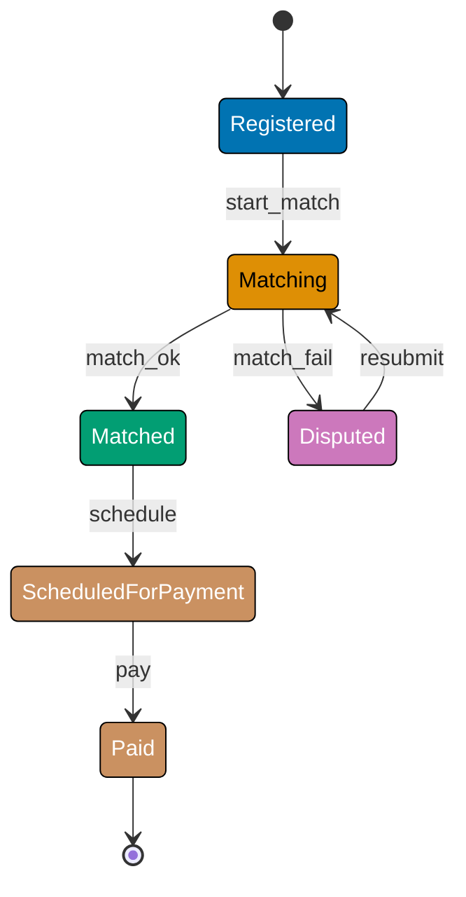
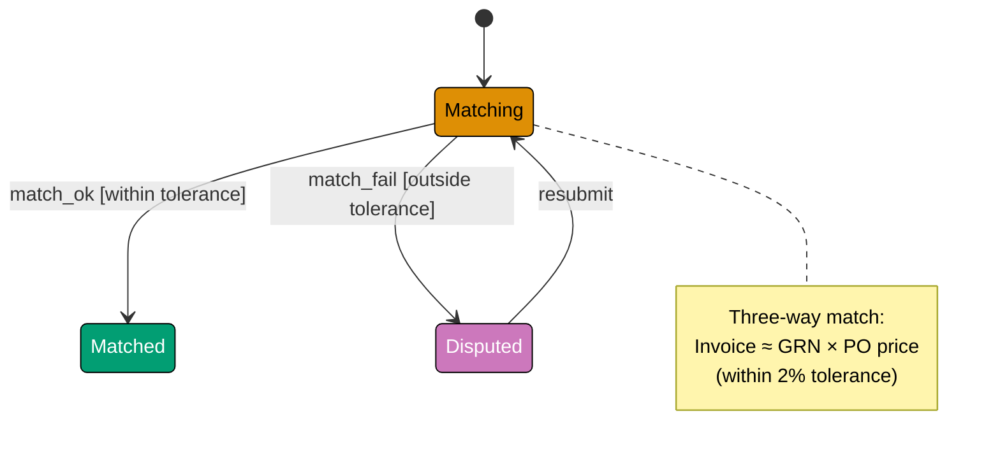
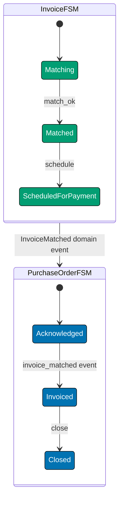
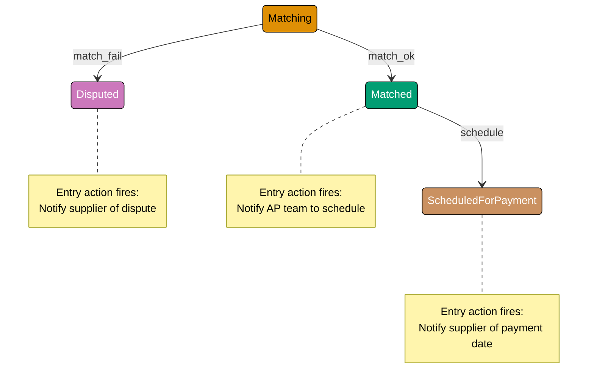
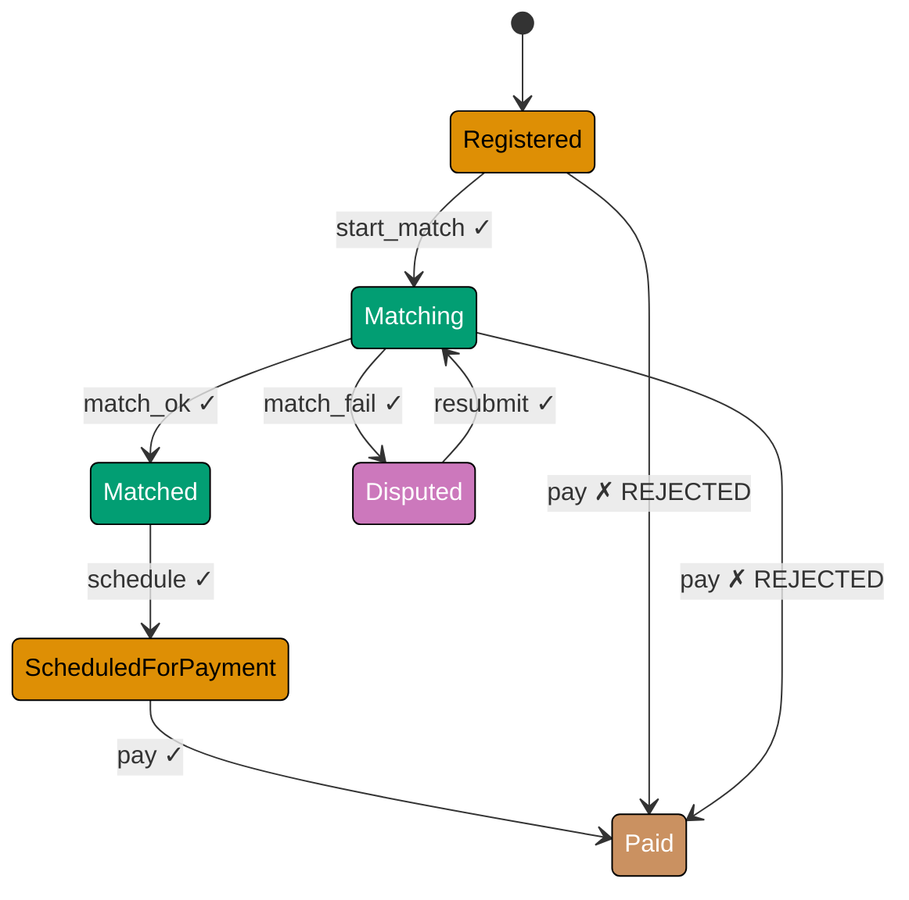
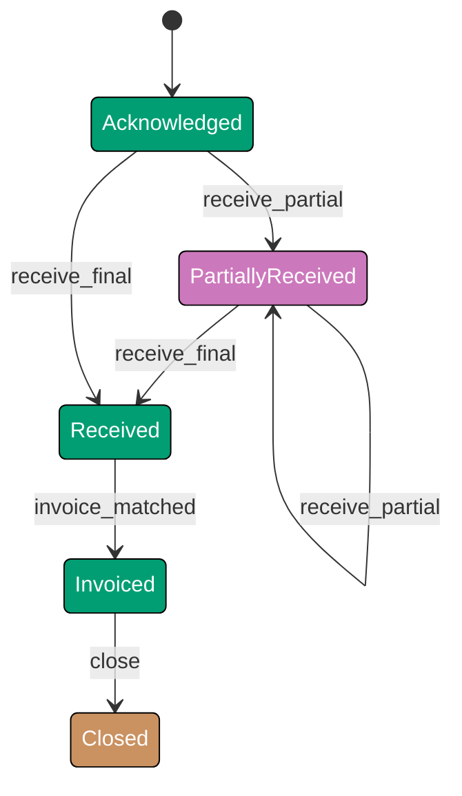
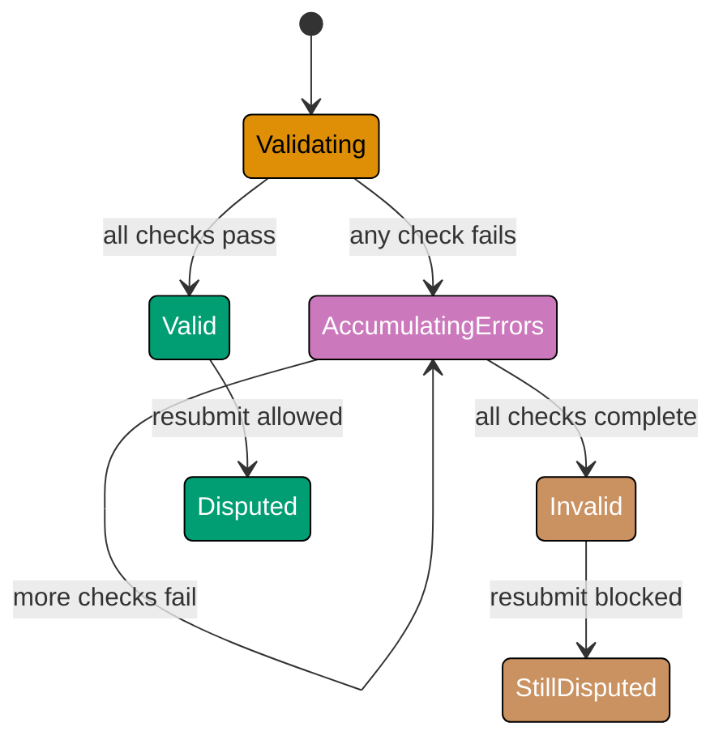
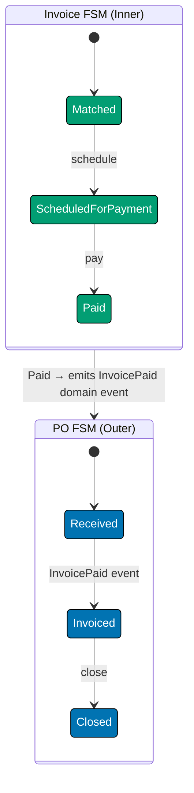
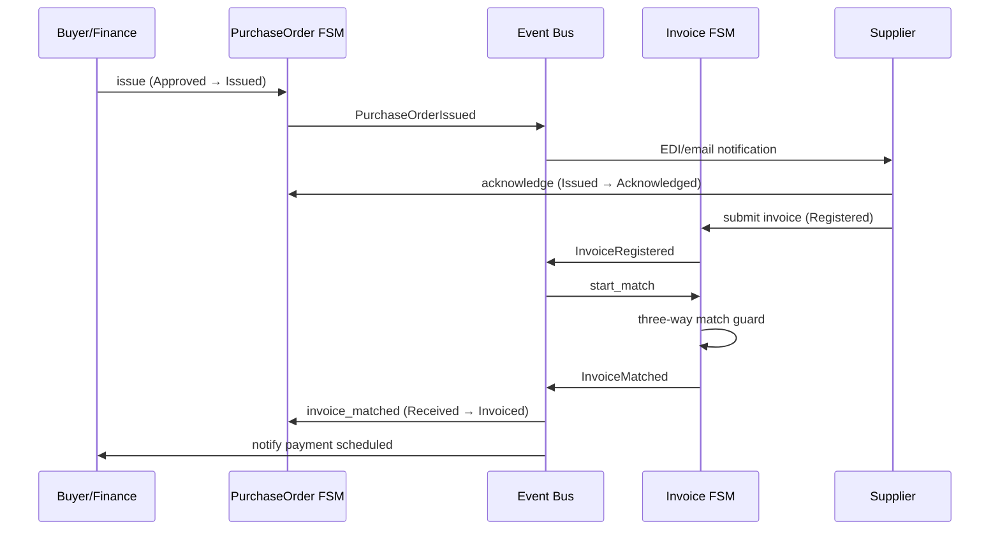

This intermediate tutorial adds the `Invoice` state machine from the `procurement-platform-be` domain alongside the `PurchaseOrder` machine introduced in the beginner level. You will learn how to enforce guards that depend on external invariants (the three-way match), how state-machine libraries model entry/exit actions declaratively, and how the FSM functions as a protocol enforcement layer that rejects out-of-order business events.

## The Invoice State Machine (Examples 26-31)

### Example 26: Invoice States and the Three-Way Match

An `Invoice` from a supplier goes through matching before payment is scheduled. The match rule — invoice amount must equal `sum(GRN quantities × PO unit price)` within a 2% tolerance — is the central guard of this machine.







```java
import java.util.EnumMap;
import java.util.Map;

// => Invoice FSM: models the lifecycle of a supplier invoice in procurement
// => Java enum encodes every valid invoice state as a named constant
public enum InvoiceState {
    REGISTERED,            // => Supplier submitted invoice; not yet matched
    MATCHING,              // => Three-way match in progress
    MATCHED,               // => Match passed within tolerance; ready for payment
    DISPUTED,              // => Match failed; supplier must correct and resubmit
    SCHEDULED_FOR_PAYMENT, // => Finance scheduled the payment run
    PAID                   // => Bank disbursement confirmed — terminal state
}

// => Java record: immutable Invoice value object (Java 16+)
// => Each state transition returns a new Invoice — no in-place mutation
public record Invoice(
    String id,             // => Format: inv_<uuid>; uniquely identifies the invoice
    String poId,           // => Links invoice to a PurchaseOrder aggregate
    double supplierAmount, // => Amount the supplier claims (USD)
    InvoiceState state     // => Current FSM state — drives all lifecycle decisions
) {}

// => Transition table as a nested EnumMap for type-safe, O(1) lookups
// => EnumMap is more efficient than HashMap for enum keys; static block initialises once
public static final Map<InvoiceState, Map<String, InvoiceState>> INVOICE_TRANSITIONS;
static {
    INVOICE_TRANSITIONS = new EnumMap<>(InvoiceState.class);
    // => Registered: only valid event is start_match — begins three-way matching
    INVOICE_TRANSITIONS.put(InvoiceState.REGISTERED,
        Map.of("start_match", InvoiceState.MATCHING));
    // => Matching: two outcomes determined by guard — match_ok or match_fail
    INVOICE_TRANSITIONS.put(InvoiceState.MATCHING,
        Map.of("match_ok",   InvoiceState.MATCHED,
               "match_fail", InvoiceState.DISPUTED));
    // => Disputed: supplier resubmits corrected invoice — returns to Matching
    INVOICE_TRANSITIONS.put(InvoiceState.DISPUTED,
        Map.of("resubmit", InvoiceState.MATCHING));
    // => Matched: finance approves for upcoming payment run
    INVOICE_TRANSITIONS.put(InvoiceState.MATCHED,
        Map.of("schedule", InvoiceState.SCHEDULED_FOR_PAYMENT));
    // => ScheduledForPayment: bank confirms disbursement → terminal PAID
    INVOICE_TRANSITIONS.put(InvoiceState.SCHEDULED_FOR_PAYMENT,
        Map.of("pay", InvoiceState.PAID));
    // => PAID has no entry — terminal state, no valid outgoing events
}
```





```kotlin
// => Invoice FSM: models the lifecycle of a supplier invoice in procurement
// => Kotlin sealed class hierarchy gives exhaustive when() checking at compile time
sealed class InvoiceState {
    // => Supplier submitted invoice; not yet matched against GRN and PO data
    object Registered : InvoiceState()
    // => Three-way match in progress — invoice amount vs GRN received × PO unit price
    object Matching : InvoiceState()
    // => Match passed within tolerance; finance may now schedule payment
    object Matched : InvoiceState()
    // => Match failed; supplier must correct amounts and resubmit
    object Disputed : InvoiceState()
    // => Finance has scheduled the payment run
    object ScheduledForPayment : InvoiceState()
    // => Bank disbursement confirmed — terminal state, no outgoing transitions
    object Paid : InvoiceState()
}

// => Kotlin data class: Invoice value object
// => data class provides equals/hashCode/copy — idiomatic for immutable FSM context
data class Invoice(
    val id: String,             // => Format: inv_<uuid>
    val poId: String,           // => Links invoice to a PurchaseOrder aggregate
    val supplierAmount: Double, // => Amount supplier claims (USD)
    val state: InvoiceState     // => Current FSM state — drives all lifecycle decisions
)

// => Transition table expressed as an immutable Map for data-driven dispatch
// => mapOf returns a read-only view — prevents accidental mutation of FSM definition
val INVOICE_TRANSITIONS: Map<InvoiceState, Map<String, InvoiceState>> = mapOf(
    // => Registered: begin three-way matching workflow
    InvoiceState.Registered to mapOf("start_match" to InvoiceState.Matching),
    // => Matching: guard-determined outcome — match_ok or match_fail chosen by guard
    InvoiceState.Matching to mapOf(
        "match_ok"   to InvoiceState.Matched,
        "match_fail" to InvoiceState.Disputed
    ),
    // => Disputed: supplier resubmits corrected invoice — returns to Matching
    InvoiceState.Disputed to mapOf("resubmit" to InvoiceState.Matching),
    // => Matched: finance schedules payment run
    InvoiceState.Matched to mapOf("schedule" to InvoiceState.ScheduledForPayment),
    // => ScheduledForPayment: bank confirms disbursement → terminal Paid
    InvoiceState.ScheduledForPayment to mapOf("pay" to InvoiceState.Paid)
    // => Paid: no entry — terminal state with no valid outgoing events
)
```





```csharp
// => Invoice FSM: models the lifecycle of a supplier invoice in procurement
// => C# abstract record hierarchy enables exhaustive switch expression matching
public abstract record InvoiceState
{
    // => Supplier submitted invoice; not yet matched against GRN and PO
    public sealed record Registered : InvoiceState;
    // => Three-way match in progress — invoice amount vs GRN received × PO unit price
    public sealed record Matching : InvoiceState;
    // => Match passed within tolerance; finance may now schedule payment
    public sealed record Matched : InvoiceState;
    // => Match failed; discrepancy requires supplier correction and resubmission
    public sealed record Disputed : InvoiceState;
    // => Finance has scheduled the payment run
    public sealed record ScheduledForPayment : InvoiceState;
    // => Bank disbursement confirmed — terminal state, no valid outgoing transitions
    public sealed record Paid : InvoiceState;
}

// => C# record with primary constructor: Invoice value object
// => init-only properties ensure full immutability after construction
public record Invoice(
    string Id,              // => Format: inv_<uuid>; uniquely identifies invoice
    string PoId,            // => Links invoice to a PurchaseOrder aggregate
    decimal SupplierAmount, // => Amount supplier claims (USD); decimal avoids float drift
    InvoiceState State      // => Current FSM state — drives all lifecycle decisions
);

// => Transition table as a nested Dictionary for data-driven dispatch
// => IReadOnlyDictionary expresses intent: this is immutable configuration, not mutable state
public static readonly IReadOnlyDictionary<Type, IReadOnlyDictionary<string, InvoiceState>>
    InvoiceTransitions = new Dictionary<Type, IReadOnlyDictionary<string, InvoiceState>>
    {
        // => Registered: start_match begins the three-way matching workflow
        [typeof(InvoiceState.Registered)] = new Dictionary<string, InvoiceState>
            { ["start_match"] = new InvoiceState.Matching() },
        // => Matching: guard determines outcome — match_ok or match_fail
        [typeof(InvoiceState.Matching)] = new Dictionary<string, InvoiceState>
            { ["match_ok"]   = new InvoiceState.Matched(),
              ["match_fail"] = new InvoiceState.Disputed() },
        // => Disputed: supplier resubmits corrected invoice — returns to Matching
        [typeof(InvoiceState.Disputed)] = new Dictionary<string, InvoiceState>
            { ["resubmit"] = new InvoiceState.Matching() },
        // => Matched: finance schedules payment run
        [typeof(InvoiceState.Matched)] = new Dictionary<string, InvoiceState>
            { ["schedule"] = new InvoiceState.ScheduledForPayment() },
        // => ScheduledForPayment: bank confirms → terminal Paid
        [typeof(InvoiceState.ScheduledForPayment)] = new Dictionary<string, InvoiceState>
            { ["pay"] = new InvoiceState.Paid() }
        // => Paid: no entry — terminal state with no valid outgoing events
    };
```





```typescript
// => TypeScript: string literal union for the Invoice FSM states
type InvoiceState =
  | "REGISTERED" // => Supplier submitted invoice; not yet matched
  | "MATCHING" // => Three-way match in progress
  | "MATCHED" // => Match passed within tolerance; ready for payment
  | "DISPUTED" // => Match failed; supplier must correct and resubmit
  | "SCHEDULED_FOR_PAYMENT" // => Finance scheduled the payment run
  | "PAID"; // => Bank disbursement confirmed — terminal state

// => Immutable Invoice interface
interface Invoice {
  readonly id: string; // => Format: inv_<uuid>
  readonly poId: string; // => Links invoice to a PurchaseOrder aggregate
  readonly supplierAmount: number; // => Amount the supplier claims (USD)
  readonly state: InvoiceState; // => Current FSM state
}

// => Transition table as nested readonly Record
const INVOICE_TRANSITIONS: Readonly = {
  REGISTERED: { start_match: "MATCHING" },
  MATCHING: { match_ok: "MATCHED", match_fail: "DISPUTED" },
  // => Matching has two outcomes: guard picks which event to send
  DISPUTED: { resubmit: "MATCHING" },
  MATCHED: { schedule: "SCHEDULED_FOR_PAYMENT" },
  SCHEDULED_FOR_PAYMENT: { pay: "PAID" },
  // => PAID: no entry — terminal state with no valid outgoing events
} as const;
```





**Key Takeaway**: The Invoice FSM mirrors the PO FSM in structure — sealed states, event alphabet, transition table — but its guards depend on external data (GRN, PO unit prices) that are passed in at match time.

**Why It Matters**: The three-way match (PO ↔ GRN ↔ Invoice) is the central fraud-prevention control in procurement. Encoding it as an FSM guard means the system structurally cannot mark an invoice as `Matched` unless the match computation actually passed — the state change and the validation are inseparable.

---

### Example 27: The Three-Way Match Guard

The `match_ok` event is only valid if the invoice amount falls within tolerance of the expected amount derived from the GRN and PO unit prices.







```java
import java.util.List;
import java.util.Map;
import java.util.stream.Collectors;

// => Tolerance: the maximum allowed percentage discrepancy in the three-way match
// => Java record: immutable value object — tolerance is policy, not mutable runtime state
public record Tolerance(double percentage) {
    // => percentage: 0.02 = 2%, per domain spec (max 10%)
    // => Compact constructor validates the range
    public Tolerance {
        if (percentage < 0 || percentage > 1)
            // => Guard: tolerance must be between 0% and 100%
            throw new IllegalArgumentException("Tolerance must be between 0.0 and 1.0");
    }
}

// => Goods Receipt Note line: represents one physical delivery line
// => receivedQty is what arrived at the warehouse — the ground truth for matching
public record GRNLine(String skuCode, int receivedQty) {}
// => skuCode must match a PO line; receivedQty is the actual quantity received

// => PO line for matching: provides the agreed unit price from the purchase order
public record POLineForMatch(String skuCode, double unitPrice) {}
// => unitPrice is the contractual reference — what was agreed at ordering time

// => Pure function: compute expected invoice amount from GRN and PO data
// => No side effects — can be tested without any state machine setup
public static double computeExpectedAmount(
        List<GRNLine> grnLines, List<POLineForMatch> poLines) {
    // => Build SKU → unitPrice map for O(1) per-line lookup
    Map<String, Double> priceMap = poLines.stream()
        .collect(Collectors.toMap(POLineForMatch::skuCode, POLineForMatch::unitPrice));
    // => priceMap: { "ELC-0042" -> 50.0, ... }

    return grnLines.stream()
        .mapToDouble(grn -> {
            double price = priceMap.getOrDefault(grn.skuCode(), 0.0);
            // => 0.0 if SKU missing from PO — forces match failure for unknown SKUs
            return grn.receivedQty() * price;
            // => Line contribution: received quantity × agreed price
        })
        .sum();
    // => Total expected amount = sum of all line contributions
}

// => Three-way match guard: true if invoice amount is within tolerance of expected
// => Pure function — deterministic, side-effect-free, independently testable
public static boolean threeWayMatchPasses(
        Invoice invoice, List<GRNLine> grnLines,
        List<POLineForMatch> poLines, Tolerance tolerance) {
    double expected = computeExpectedAmount(grnLines, poLines);
    // => What we expect to pay based on received goods at agreed prices
    if (expected == 0) return false;
    // => No goods received: cannot match — guard fails immediately
    double delta = Math.abs(invoice.supplierAmount() - expected) / expected;
    // => Relative discrepancy as a fraction (e.g., 0.016 = 1.6%)
    return delta <= tolerance.percentage();
    // => Within tolerance → match passes; outside → match fails
}

// => Example: 10 units × $50 = $500 expected; supplier invoices $508 (1.6% delta)
var grn = List.of(new GRNLine("ELC-0042", 10));
var po  = List.of(new POLineForMatch("ELC-0042", 50.0));
var inv = new Invoice("inv_001", "po_001", 508.0, InvoiceState.MATCHING);
var tol = new Tolerance(0.02);

System.out.println(threeWayMatchPasses(inv, grn, po, tol));
// => Output: true (508 vs 500 = 1.6% delta ≤ 2% tolerance)

var highInv = new Invoice("inv_001", "po_001", 560.0, InvoiceState.MATCHING);
// => highInv: same PO, supplier claims $560 — 12% over expected $500
System.out.println(threeWayMatchPasses(highInv, grn, po, tol));
// => Output: false (560 vs 500 = 12% delta > 2% tolerance)
```





```kotlin
// => Tolerance: the maximum allowed percentage discrepancy in the three-way match
// => @JvmInline value class wraps a Double with zero runtime overhead on JVM
@JvmInline
value class Tolerance(val percentage: Double) {
    // => percentage: 0.02 = 2%, per domain spec (max 10%)
    init {
        require(percentage in 0.0..1.0)
        // => Guard: tolerance must be between 0% and 100%; init block enforces this
    }
}

// => Goods Receipt Note line: represents one physical delivery line
// => data class enables structural equality for test assertions
data class GRNLine(val skuCode: String, val receivedQty: Int)
// => skuCode matches PO line; receivedQty is the actual quantity received

// => PO line for matching: provides the agreed unit price from the purchase order
data class POLineForMatch(val skuCode: String, val unitPrice: Double)
// => unitPrice is the contractual reference agreed at ordering time

// => Pure function: compute expected invoice amount from GRN and PO data
// => No side effects — can be tested independently of the state machine
fun computeExpectedAmount(grnLines: List<GRNLine>, poLines: List<POLineForMatch>): Double {
    // => Build SKU → unitPrice map for O(1) per-line lookup
    val priceMap: Map<String, Double> = poLines.associate { it.skuCode to it.unitPrice }
    // => associate is idiomatic Kotlin for transforming a list to a map

    return grnLines.sumOf { grn ->
        val price = priceMap.getOrDefault(grn.skuCode, 0.0)
        // => 0.0 if SKU missing from PO — forces match failure for unknown SKUs
        grn.receivedQty * price
        // => Line contribution: received quantity × agreed price
    }
    // => sumOf: total expected amount = sum of all line contributions
}

// => Three-way match guard: true if invoice amount is within tolerance of expected
// => Pure function — deterministic, side-effect-free, independently testable
fun threeWayMatchPasses(
    invoice: Invoice,
    grnLines: List<GRNLine>,
    poLines: List<POLineForMatch>,
    tolerance: Tolerance
): Boolean {
    val expected = computeExpectedAmount(grnLines, poLines)
    // => What we expect to pay based on received goods at agreed prices
    if (expected == 0.0) return false
    // => No goods received: cannot match — guard fails immediately
    val delta = Math.abs(invoice.supplierAmount - expected) / expected
    // => Relative discrepancy as a fraction (e.g., 0.016 = 1.6%)
    return delta <= tolerance.percentage
    // => Within tolerance → true (match passes); outside → false (match fails)
}

// => Example: 10 units × $50 = $500 expected; supplier invoices $508 (1.6% delta)
val grn = listOf(GRNLine("ELC-0042", 10))
val po  = listOf(POLineForMatch("ELC-0042", 50.0))
val inv = Invoice("inv_001", "po_001", 508.0, InvoiceState.Matching)
val tol = Tolerance(0.02)

println(threeWayMatchPasses(inv, grn, po, tol))
// => Output: true (508 vs 500 = 1.6% delta ≤ 2% tolerance)

val highInv = Invoice("inv_001", "po_001", 560.0, InvoiceState.Matching)
// => highInv: same PO, supplier claims $560 — 12% over expected $500
println(threeWayMatchPasses(highInv, grn, po, tol))
// => Output: false (560 vs 500 = 12% delta > 2% tolerance)
```





```csharp
// => Tolerance: the maximum allowed percentage discrepancy in the three-way match
// => readonly record struct: stack-allocated, zero-heap-overhead value type
public readonly record struct Tolerance(double Percentage)
{
    // => Percentage: 0.02 = 2%, per domain spec (max 10%)
    // => Primary constructor validation via property init check
    public Tolerance : this(Percentage)
    {
        if (Percentage is < 0.0 or > 1.0)
            // => Guard: tolerance must be between 0% and 100%
            throw new ArgumentOutOfRangeException(nameof(Percentage), "Must be 0.0–1.0");
    }
}

// => Goods Receipt Note line: represents one physical delivery line
// => record: immutable value object with structural equality for test assertions
public record GRNLine(string SkuCode, int ReceivedQty);
// => SkuCode matches PO line; ReceivedQty is the actual quantity received

// => PO line for matching: provides the agreed unit price from the purchase order
public record POLineForMatch(string SkuCode, double UnitPrice);
// => UnitPrice is the contractual reference agreed at ordering time

// => Pure function: compute expected invoice amount from GRN and PO data
// => No side effects — can be tested independently of the state machine
public static double ComputeExpectedAmount(
    IReadOnlyList<GRNLine> grnLines, IReadOnlyList<POLineForMatch> poLines)
{
    // => Build SKU → UnitPrice dictionary for O(1) per-line lookup
    var priceMap = poLines.ToDictionary(l => l.SkuCode, l => l.UnitPrice);
    // => priceMap: { "ELC-0042" -> 50.0, ... }

    return grnLines.Sum(grn => {
        var price = priceMap.GetValueOrDefault(grn.SkuCode, 0.0);
        // => 0.0 if SKU missing from PO — forces match failure for unknown SKUs
        return grn.ReceivedQty * price;
        // => Line contribution: received quantity × agreed price
    });
    // => Sum: total expected amount = sum of all line contributions
}

// => Three-way match guard: true if invoice amount is within tolerance of expected
// => Pure function — deterministic, side-effect-free, independently testable
public static bool ThreeWayMatchPasses(
    Invoice invoice, IReadOnlyList<GRNLine> grnLines,
    IReadOnlyList<POLineForMatch> poLines, Tolerance tolerance)
{
    var expected = ComputeExpectedAmount(grnLines, poLines);
    // => What we expect to pay based on received goods at agreed prices
    if (expected == 0) return false;
    // => No goods received: cannot match — guard fails immediately
    var delta = Math.Abs(invoice.SupplierAmount - expected) / expected;
    // => Relative discrepancy as a fraction (e.g., 0.016 = 1.6%)
    return delta <= tolerance.Percentage;
    // => Within tolerance → true (match passes); outside → false (match fails)
}

// => Example: 10 units × $50 = $500 expected; supplier invoices $508 (1.6% delta)
var grn = new List<GRNLine> { new("ELC-0042", 10) };
var po  = new List<POLineForMatch> { new("ELC-0042", 50.0) };
var inv = new Invoice("inv_001", "po_001", 508m, new InvoiceState.Matching());
// => 508m: decimal literal; avoids floating-point imprecision for currency
var tol = new Tolerance(0.02);

Console.WriteLine(ThreeWayMatchPasses(inv, grn, po, tol));
// => Output: True (508 vs 500 = 1.6% delta ≤ 2% tolerance)

var highInv = inv with { SupplierAmount = 560m };
// => with expression: creates new Invoice record with SupplierAmount changed to 560
Console.WriteLine(ThreeWayMatchPasses(highInv, grn, po, tol));
// => Output: False (560 vs 500 = 12% delta > 2% tolerance)
```





```typescript
// => TypeScript: value interfaces for three-way match computation
interface GRNLine {
  readonly skuCode: string;
  readonly receivedQty: number; // => Actual quantity received at warehouse
}

interface POLineForMatch {
  readonly skuCode: string;
  readonly unitPrice: number; // => Contractual reference price
}

// => Pure function: compute expected invoice amount from GRN and PO data
function computeExpectedAmount(grnLines: readonly GRNLine[], poLines: readonly POLineForMatch[]): number {
  const priceMap = new Map(poLines.map((l) => [l.skuCode, l.unitPrice]));
  // => Map for O(1) per-line lookup
  return grnLines.reduce((sum, grn) => {
    const price = priceMap.get(grn.skuCode) ?? 0;
    // => 0 if SKU missing from PO — forces match failure for unknown SKUs
    return sum + grn.receivedQty * price;
  }, 0);
}

// => Three-way match guard: true if invoice amount is within tolerance of expected
function threeWayMatchPasses(
  invoice: Invoice,
  grnLines: readonly GRNLine[],
  poLines: readonly POLineForMatch[],
  tolerancePct: number,
): boolean {
  const expected = computeExpectedAmount(grnLines, poLines);
  if (expected === 0) return false;
  const delta = Math.abs(invoice.supplierAmount - expected) / expected;
  return delta <= tolerancePct;
}

// => Example: 10 units * $50 = $500 expected; supplier invoices $508 (1.6% delta)
const grn: GRNLine[] = [{ skuCode: "ELC-0042", receivedQty: 10 }];
const po: POLineForMatch[] = [{ skuCode: "ELC-0042", unitPrice: 50 }];
const inv: Invoice = { id: "inv_001", poId: "po_001", supplierAmount: 508, state: "MATCHING" };
console.log(threeWayMatchPasses(inv, grn, po, 0.02)); // => Output: true (1.6% delta <= 2%)
const highInv: Invoice = { ...inv, supplierAmount: 560 };
console.log(threeWayMatchPasses(highInv, grn, po, 0.02)); // => Output: false (12% delta > 2%)
```





**Key Takeaway**: The three-way match guard is a pure function that can be tested independently of the FSM — the FSM calls it as a precondition for the `match_ok` transition.

**Why It Matters**: Isolating the match computation from the state transition makes both testable without the other. You can verify that `computeExpectedAmount` handles currency rounding correctly without setting up an invoice state machine. You can verify the FSM rejects `match_ok` when the guard returns false without mocking GRN data. Composing the two gives you the full behaviour.

---

### Example 28: Guarded Invoice Transition

Wrapping the three-way match guard in the transition function produces the complete `match` operation.





```java
import java.util.List;
import java.util.Optional;

// => MatchContext: bundles all data needed for the guarded match transition
// => Java record: immutable holder; prevents partial construction of context
public record MatchContext(
    Invoice invoice,            // => The invoice to match — must be in MATCHING state
    List<GRNLine> grnLines,     // => Goods received — source of truth for quantities
    List<POLineForMatch> poLines,// => PO lines — provide agreed unit prices
    Tolerance tolerance         // => Acceptable percentage discrepancy (e.g. 2%)
) {}

// => Result<T>: sealed interface expressing success or failure without exceptions
// => Java 17+ sealed interface: exhaustive pattern matching in switch expressions
public sealed interface Result<T> permits Result.Ok, Result.Err {
    record Ok<T>(T value) implements Result<T> {}
    // => Ok: transition succeeded; value is the new Invoice
    record Err<T>(String error) implements Result<T> {}
    // => Err: structural or business guard failed; error describes what was rejected
}

// => Guarded match transition: applies the three-way match guard before transitioning
// => Pure function: returns Result — no exceptions, no mutation of input
public static Result<Invoice> applyMatch(MatchContext ctx) {
    Invoice invoice = ctx.invoice();

    // => FSM structural guard: must be in MATCHING state to attempt a match
    if (invoice.state() != InvoiceState.MATCHING) {
        return new Result.Err<>(
            "Cannot match invoice in state: " + invoice.state());
        // => Wrong state: caller sent the event out of order — reject with reason
    }

    // => Business guard: three-way match — guard chooses the target state
    boolean passes = threeWayMatchPasses(
        invoice, ctx.grnLines(), ctx.poLines(), ctx.tolerance());
    // => Guard is deterministic: same inputs always produce same result

    InvoiceState next = passes ? InvoiceState.MATCHED : InvoiceState.DISPUTED;
    // => match_ok → MATCHED; match_fail → DISPUTED — caller cannot choose this
    Invoice updated = new Invoice(
        invoice.id(), invoice.poId(), invoice.supplierAmount(), next);
    // => Immutable update: new Invoice with the guard-determined state

    return new Result.Ok<>(updated);
    // => Both outcomes are valid transitions; only wrong-state is an error
}
// => Note: match_ok and match_fail are computed outcomes, not caller-chosen events
// => The guard determines which transition fires — the caller only provides data

// => Demonstrate: within tolerance → MATCHED
var ctx1 = new MatchContext(
    new Invoice("inv_002", "po_002", 508.0, InvoiceState.MATCHING),
    List.of(new GRNLine("ELC-0042", 10)),
    List.of(new POLineForMatch("ELC-0042", 50.0)),
    new Tolerance(0.02)
);
Result<Invoice> r1 = applyMatch(ctx1);
if (r1 instanceof Result.Ok<Invoice> ok)
    System.out.println(ok.value().state()); // => Output: MATCHED (508 within 2% of 500)

// => Demonstrate: outside tolerance → DISPUTED
var ctx2 = new MatchContext(
    new Invoice("inv_002", "po_002", 600.0, InvoiceState.MATCHING),
    ctx1.grnLines(), ctx1.poLines(), ctx1.tolerance()
);
// => 600 vs 500 expected = 20% delta > 2% tolerance
Result<Invoice> r2 = applyMatch(ctx2);
if (r2 instanceof Result.Ok<Invoice> ok)
    System.out.println(ok.value().state()); // => Output: DISPUTED (600 is 20% over 500)
```





```kotlin
// => MatchContext: bundles all data needed for the guarded match transition
// => Kotlin data class: immutable holder with structural equality for test assertions
data class MatchContext(
    val invoice: Invoice,             // => The invoice to match — must be Matching
    val grnLines: List<GRNLine>,      // => Goods received — source of truth for quantities
    val poLines: List<POLineForMatch>,// => PO lines — provide agreed unit prices
    val tolerance: Tolerance          // => Acceptable percentage discrepancy (e.g. 2%)
)

// => Result<T>: sealed class expressing success or failure without exceptions
// => Kotlin sealed class: exhaustive when() expressions at compile time
sealed class Result<out T> {
    data class Ok<T>(val value: T) : Result<T>()
    // => Ok: transition succeeded; value is the new Invoice
    data class Err(val error: String) : Result<Nothing>()
    // => Err: structural or business guard failed; error describes rejection reason
}

// => Guarded match transition: applies the three-way match guard before transitioning
// => Pure function: returns Result — no exceptions, no mutation of input
fun applyMatch(ctx: MatchContext): Result<Invoice> {
    val invoice = ctx.invoice

    // => FSM structural guard: must be in Matching state to attempt a match
    if (invoice.state !is InvoiceState.Matching) {
        return Result.Err("Cannot match invoice in state: ${invoice.state}")
        // => Wrong state: caller sent the event out of order — reject with reason
    }

    // => Business guard: three-way match — guard chooses the target state
    val passes = threeWayMatchPasses(invoice, ctx.grnLines, ctx.poLines, ctx.tolerance)
    // => Guard is deterministic: same inputs always produce same result

    val next: InvoiceState = if (passes) InvoiceState.Matched else InvoiceState.Disputed
    // => match_ok → Matched; match_fail → Disputed — caller cannot choose this
    val updated = invoice.copy(state = next)
    // => copy() creates a new Invoice with only the state field changed — idiomatic Kotlin

    return Result.Ok(updated)
    // => Both outcomes are valid transitions; only wrong-state produces Err
}
// => Note: match_ok and match_fail are computed outcomes, not caller-chosen events
// => The guard determines which transition fires — the caller only provides data

// => Demonstrate: within tolerance → Matched
val ctx1 = MatchContext(
    Invoice("inv_002", "po_002", 508.0, InvoiceState.Matching),
    listOf(GRNLine("ELC-0042", 10)),
    listOf(POLineForMatch("ELC-0042", 50.0)),
    Tolerance(0.02)
)
val r1 = applyMatch(ctx1)
if (r1 is Result.Ok) println(r1.value.state) // => Output: Matched (508 within 2% of 500)

// => Demonstrate: outside tolerance → Disputed
val ctx2 = ctx1.copy(invoice = ctx1.invoice.copy(supplierAmount = 600.0))
// => copy(): new context with invoice amount changed to $600 (20% over expected $500)
val r2 = applyMatch(ctx2)
if (r2 is Result.Ok) println(r2.value.state) // => Output: Disputed (600 is 20% over 500)
```





```csharp
// => MatchContext: bundles all data needed for the guarded match transition
// => C# record with primary constructor: immutable, structural equality built in
public record MatchContext(
    Invoice Invoice,                       // => The invoice — must be in Matching state
    IReadOnlyList<GRNLine> GrnLines,       // => Goods received — source of truth
    IReadOnlyList<POLineForMatch> PoLines, // => PO lines — agreed unit prices
    Tolerance Tolerance                    // => Acceptable percentage discrepancy
);

// => Result<T>: discriminated union expressed as abstract record hierarchy
// => Pattern matching switch expressions provide exhaustive handling
public abstract record Result<T>
{
    public sealed record Ok(T Value) : Result<T>;
    // => Ok: transition succeeded; Value is the new Invoice
    public sealed record Err(string Error) : Result<T>;
    // => Err: structural or business guard failed; Error describes rejection reason
}

// => Guarded match transition: applies the three-way match guard before transitioning
// => Pure static method: returns Result — no exceptions, no mutation of input
public static Result<Invoice> ApplyMatch(MatchContext ctx)
{
    var invoice = ctx.Invoice;

    // => FSM structural guard: must be in Matching state to attempt a match
    if (invoice.State is not InvoiceState.Matching)
        return new Result<Invoice>.Err(
            $"Cannot match invoice in state: {invoice.State.GetType().Name}");
    // => Wrong state: caller sent event out of order — reject with descriptive reason

    // => Business guard: three-way match — guard chooses the target state
    bool passes = ThreeWayMatchPasses(invoice, ctx.GrnLines, ctx.PoLines, ctx.Tolerance);
    // => Guard is deterministic: same inputs always produce same result

    InvoiceState next = passes
        ? new InvoiceState.Matched()
        : new InvoiceState.Disputed();
    // => match_ok → Matched; match_fail → Disputed — caller cannot choose this
    var updated = invoice with { State = next };
    // => with expression: creates new Invoice record with only State changed

    return new Result<Invoice>.Ok(updated);
    // => Both outcomes are valid transitions; only wrong-state produces Err
}
// => Note: match_ok and match_fail are computed outcomes, not caller-chosen events
// => The guard determines which transition fires — the caller only provides data

// => Demonstrate: within tolerance → Matched
var ctx1 = new MatchContext(
    new Invoice("inv_002", "po_002", 508m, new InvoiceState.Matching()),
    new List<GRNLine> { new("ELC-0042", 10) },
    new List<POLineForMatch> { new("ELC-0042", 50.0) },
    new Tolerance(0.02)
);
var r1 = ApplyMatch(ctx1);
if (r1 is Result<Invoice>.Ok ok1)
    Console.WriteLine(ok1.Value.State.GetType().Name); // => Output: Matched

// => Demonstrate: outside tolerance → Disputed
var ctx2 = ctx1 with { Invoice = ctx1.Invoice with { SupplierAmount = 600m } };
// => Nested with expressions: update ctx and invoice in one expression chain
var r2 = ApplyMatch(ctx2);
// => 600 vs 500 expected = 20% delta > 2% tolerance
if (r2 is Result<Invoice>.Ok ok2)
    Console.WriteLine(ok2.Value.State.GetType().Name); // => Output: Disputed
```





```typescript
// => TypeScript: MatchContext interface bundles all guard inputs
interface MatchContext {
  readonly invoice: Invoice;
  readonly grnLines: readonly GRNLine[];
  readonly poLines: readonly POLineForMatch[];
  readonly tolerancePct: number;
}

type InvoiceResult<T> = { readonly kind: "ok"; readonly value: T } | { readonly kind: "err"; readonly error: string };

// => Guarded match transition: guard determines which state to target
function applyMatch(ctx: MatchContext): InvoiceResult {
  const { invoice } = ctx;
  if (invoice.state !== "MATCHING") return { kind: "err", error: `Cannot match invoice in state: ${invoice.state}` };
  // => FSM structural guard

  const passes = threeWayMatchPasses(invoice, ctx.grnLines, ctx.poLines, ctx.tolerancePct);
  const next: InvoiceState = passes ? "MATCHED" : "DISPUTED";
  // => Guard determines the outcome — caller cannot choose
  return { kind: "ok", value: { ...invoice, state: next } };
}

const ctx1: MatchContext = {
  invoice: { id: "inv_002", poId: "po_002", supplierAmount: 508, state: "MATCHING" },
  grnLines: [{ skuCode: "ELC-0042", receivedQty: 10 }],
  poLines: [{ skuCode: "ELC-0042", unitPrice: 50 }],
  tolerancePct: 0.02,
};
const r1 = applyMatch(ctx1);
if (r1.kind === "ok") console.log(r1.value.state); // => Output: MATCHED

const ctx2 = { ...ctx1, invoice: { ...ctx1.invoice, supplierAmount: 600 } };
const r2 = applyMatch(ctx2);
if (r2.kind === "ok") console.log(r2.value.state); // => Output: DISPUTED
```





**Key Takeaway**: Some FSM transitions are not chosen by the caller — they are determined by a guard. The caller provides input data; the guard chooses the outcome state. This removes the temptation for callers to bypass validation by choosing the "good" event directly.

**Why It Matters**: If `match_ok` and `match_fail` were caller-chosen events, a buggy or malicious caller could send `match_ok` even when the amounts differ by 50%. Making the outcome guard-determined means the FSM itself performs the validation and chooses the transition — the caller cannot cheat.

---

### Example 29: Linking Invoice and PurchaseOrder State Machines

When an Invoice is matched, the corresponding PurchaseOrder should transition to `Invoiced`. This cross-machine coordination models the domain event `InvoiceMatched` propagating to the `purchasing` context.







```java
import java.time.Instant;

// => Domain event emitted by the Invoice FSM when matching succeeds
// => Java record: immutable event value object — events are facts, never mutated
public record InvoiceMatchedEvent(
    String invoiceId, // => Which invoice matched — correlates to invoice aggregate
    String poId,      // => Which PO to update — cross-context reference
    Instant timestamp // => When the match completed — Instant for precision
) {
    // => No "kind" field needed: Java sealed types / pattern matching identifies the type
}

// => Extended PO state enum: adds Invoiced to the beginner machine's states
// => Invoiced: PO has a matched invoice — ready for payment authorisation
public enum ExtendedPOState {
    DRAFT, AWAITING_APPROVAL, APPROVED, ISSUED,
    ACKNOWLEDGED, // => Goods received and confirmed — prerequisite for invoicing
    INVOICED,     // => Matched invoice received from invoicing context
    CLOSED, CANCELLED, DISPUTED
}

// => Handle InvoiceMatchedEvent on the PurchaseOrder FSM
// => Pure function: takes current PO state, returns Result — no exceptions
public static Result<ExtendedPOState> handleInvoiceMatched(
        ExtendedPOState poState, InvoiceMatchedEvent event) {

    // => Guard: PO must be in ACKNOWLEDGED state to accept invoice matching
    // => ACKNOWLEDGED means goods received and confirmed — prerequisite for invoicing
    if (poState != ExtendedPOState.ACKNOWLEDGED) {
        return new Result.Err<>(
            "PO cannot accept InvoiceMatched in state " + poState +
            " (expected ACKNOWLEDGED)");
        // => Out-of-order event: PO either has not received goods yet or is already invoiced
    }

    System.out.printf("PO %s transitioning to INVOICED by invoice %s%n",
        event.poId(), event.invoiceId());
    // => In production: load PO aggregate, apply event, persist via repository

    return new Result.Ok<>(ExtendedPOState.INVOICED);
    // => Transition: ACKNOWLEDGED → INVOICED
}

// => Demonstrate cross-machine coordination
var evt = new InvoiceMatchedEvent("inv_003", "po_003", Instant.parse("2026-01-20T10:30:00Z"));

var r1 = handleInvoiceMatched(ExtendedPOState.ACKNOWLEDGED, evt);
// => r1: Result.Ok — ACKNOWLEDGED is the valid predecessor state
if (r1 instanceof Result.Ok<ExtendedPOState> ok)
    System.out.println(ok.value()); // => Output: INVOICED

var r2 = handleInvoiceMatched(ExtendedPOState.ISSUED, evt);
// => r2: Result.Err — ISSUED means goods not yet received; event is out of order
if (r2 instanceof Result.Err<ExtendedPOState> err)
    System.out.println(err.error());
// => Output: PO cannot accept InvoiceMatched in state ISSUED (expected ACKNOWLEDGED)
```





```kotlin
import java.time.Instant

// => Domain event emitted by the Invoice FSM when matching succeeds
// => Kotlin data class: immutable event value object — events are facts, never mutated
data class InvoiceMatchedEvent(
    val invoiceId: String,  // => Which invoice matched — correlates to invoice aggregate
    val poId: String,       // => Which PO to update — cross-context reference
    val timestamp: Instant  // => When the match completed
)
// => No "kind" field needed: Kotlin sealed class/is checks identify event type

// => Extended PO state sealed class: adds Invoiced to the beginner machine's states
// => Sealed class enables exhaustive when() — compiler enforces all states handled
sealed class ExtendedPOState {
    object Draft : ExtendedPOState()
    object AwaitingApproval : ExtendedPOState()
    object Approved : ExtendedPOState()
    object Issued : ExtendedPOState()
    object Acknowledged : ExtendedPOState()
    // => Acknowledged: goods received and confirmed — prerequisite for invoicing
    object Invoiced : ExtendedPOState()
    // => Invoiced: matched invoice received from invoicing bounded context
    object Closed : ExtendedPOState()
    object Cancelled : ExtendedPOState()
    object Disputed : ExtendedPOState()
}

// => Handle InvoiceMatchedEvent on the PurchaseOrder FSM
// => Pure function: takes current PO state, returns Result — no exceptions
fun handleInvoiceMatched(
    poState: ExtendedPOState, event: InvoiceMatchedEvent
): Result<ExtendedPOState> {

    // => Guard: PO must be in Acknowledged state to accept invoice matching
    // => Acknowledged means goods received and confirmed — prerequisite for invoicing
    if (poState !is ExtendedPOState.Acknowledged) {
        return Result.Err(
            "PO cannot accept InvoiceMatched in state ${poState::class.simpleName}" +
            " (expected Acknowledged)")
        // => Out-of-order event: PO either has not received goods or is already invoiced
    }

    println("PO ${event.poId} transitioning to Invoiced by invoice ${event.invoiceId}")
    // => In production: load PO aggregate, apply event, persist via repository

    return Result.Ok(ExtendedPOState.Invoiced)
    // => Transition: Acknowledged → Invoiced
}

// => Demonstrate cross-machine coordination
val evt = InvoiceMatchedEvent("inv_003", "po_003", Instant.parse("2026-01-20T10:30:00Z"))

val r1 = handleInvoiceMatched(ExtendedPOState.Acknowledged, evt)
// => r1: Result.Ok — Acknowledged is the valid predecessor state
if (r1 is Result.Ok) println(r1.value) // => Output: Invoiced

val r2 = handleInvoiceMatched(ExtendedPOState.Issued, evt)
// => r2: Result.Err — Issued means goods not yet received; event is out of order
if (r2 is Result.Err) println(r2.error)
// => Output: PO cannot accept InvoiceMatched in state Issued (expected Acknowledged)
```





```csharp
using System;

// => Domain event emitted by the Invoice FSM when matching succeeds
// => C# record: immutable event value object — events are facts, never mutated
public record InvoiceMatchedEvent(
    string InvoiceId,     // => Which invoice matched — correlates to invoice aggregate
    string PoId,          // => Which PO to update — cross-bounded-context reference
    DateTimeOffset Timestamp // => When the match completed; offset preserves timezone
);
// => No Kind discriminant needed: C# pattern matching on type handles dispatch

// => Extended PO state hierarchy: adds Invoiced to the beginner machine's states
// => Abstract record + sealed subrecords: exhaustive switch expression matching
public abstract record ExtendedPOState
{
    public sealed record Draft : ExtendedPOState;
    public sealed record AwaitingApproval : ExtendedPOState;
    public sealed record Approved : ExtendedPOState;
    public sealed record Issued : ExtendedPOState;
    // => Acknowledged: goods received and confirmed — prerequisite for invoicing
    public sealed record Acknowledged : ExtendedPOState;
    // => Invoiced: matched invoice received from invoicing bounded context
    public sealed record Invoiced : ExtendedPOState;
    public sealed record Closed : ExtendedPOState;
    public sealed record Cancelled : ExtendedPOState;
    public sealed record Disputed : ExtendedPOState;
}

// => Handle InvoiceMatchedEvent on the PurchaseOrder FSM
// => Pure static method: takes current PO state, returns Result — no exceptions
public static Result<ExtendedPOState> HandleInvoiceMatched(
    ExtendedPOState poState, InvoiceMatchedEvent evt)
{
    // => Guard: PO must be in Acknowledged state to accept invoice matching
    // => Pattern matching: is checks runtime type without casting
    if (poState is not ExtendedPOState.Acknowledged)
        return new Result<ExtendedPOState>.Err(
            $"PO cannot accept InvoiceMatched in state " +
            $"{poState.GetType().Name} (expected Acknowledged)");
    // => Out-of-order event: PO has not received goods yet or is already invoiced

    Console.WriteLine(
        $"PO {evt.PoId} transitioning to Invoiced by invoice {evt.InvoiceId}");
    // => In production: load PO aggregate, apply event, persist via repository

    return new Result<ExtendedPOState>.Ok(new ExtendedPOState.Invoiced());
    // => Transition: Acknowledged → Invoiced
}

// => Demonstrate cross-machine coordination
var evt = new InvoiceMatchedEvent(
    "inv_003", "po_003",
    DateTimeOffset.Parse("2026-01-20T10:30:00+07:00"));

var r1 = HandleInvoiceMatched(new ExtendedPOState.Acknowledged(), evt);
// => r1: Result.Ok — Acknowledged is the valid predecessor state
if (r1 is Result<ExtendedPOState>.Ok ok1)
    Console.WriteLine(ok1.Value.GetType().Name); // => Output: Invoiced

var r2 = HandleInvoiceMatched(new ExtendedPOState.Issued(), evt);
// => r2: Result.Err — Issued means goods not yet received; event is out of order
if (r2 is Result<ExtendedPOState>.Err err)
    Console.WriteLine(err.Error);
// => Output: PO cannot accept InvoiceMatched in state Issued (expected Acknowledged)
```





```typescript
// => TypeScript: typed domain event for cross-machine coordination
interface InvoiceMatchedEvent {
  readonly invoiceId: string; // => Which invoice matched
  readonly poId: string; // => Which PO to update
  readonly timestamp: string; // => ISO-8601 UTC timestamp
}

// => Extended PO state including Invoiced
type ExtendedPOState =
  | "DRAFT"
  | "AWAITING_APPROVAL"
  | "APPROVED"
  | "ISSUED"
  | "ACKNOWLEDGED"
  | "INVOICED"
  | "CLOSED"
  | "CANCELLED"
  | "DISPUTED";

interface ExtendedPO {
  readonly id: string;
  readonly totalAmount: number;
  readonly state: ExtendedPOState;
}

// => Handle InvoiceMatchedEvent on the PurchaseOrder FSM
function handleInvoiceMatched(poState: ExtendedPOState, event: InvoiceMatchedEvent): InvoiceResult {
  if (poState !== "ACKNOWLEDGED")
    return { kind: "err", error: `PO cannot accept InvoiceMatched in state ${poState} (expected ACKNOWLEDGED)` };
  console.log(`PO ${event.poId} transitioning to INVOICED by invoice ${event.invoiceId}`);
  return { kind: "ok", value: "INVOICED" };
}

const evt: InvoiceMatchedEvent = { invoiceId: "inv_003", poId: "po_003", timestamp: "2026-01-20T10:30:00Z" };
const r1 = handleInvoiceMatched("ACKNOWLEDGED", evt);
if (r1.kind === "ok") console.log(r1.value); // => Output: INVOICED

const r2 = handleInvoiceMatched("ISSUED", evt);
if (r2.kind === "err") console.log(r2.error);
// => Output: PO cannot accept InvoiceMatched in state ISSUED (expected ACKNOWLEDGED)
```





**Key Takeaway**: Domain events are the communication protocol between FSMs in different bounded contexts — each FSM handles only events it recognises and rejects others with a typed error.

**Why It Matters**: In a real system, `InvoiceMatched` is a Kafka message from the `invoicing` context consumed by the `purchasing` context. The PO FSM's handler validates that the PO is in the right state before applying the update, preventing out-of-order event processing from corrupting the PO lifecycle.

---

### Example 30: Invoice FSM with Combined Tolerance Check

The Invoice FSM integrates the three-way match guard directly into the state transition, making the guard an inseparable part of the `match` operation. Each language expresses this combination in its own idiomatic style.





```java
import java.util.List;
import java.util.Optional;

// => InvoiceFSM: combines the transition table with the three-way match guard
// => Java static utility class: no instances — all methods are pure functions
public final class InvoiceFSM {
    private InvoiceFSM() {}
    // => Private constructor: prevents instantiation of utility class

    // => Transition table entry: maps event name to next state
    // => Using Optional-based apply() keeps error path implicit (empty = rejected)
    private static final java.util.Map<InvoiceState, java.util.Map<String, InvoiceState>> TABLE =
        buildTable();
    // => TABLE: lazily constructed once at class load — thread-safe via class initialisation

    private static java.util.Map<InvoiceState, java.util.Map<String, InvoiceState>> buildTable() {
        var t = new java.util.EnumMap<InvoiceState, java.util.Map<String, InvoiceState>>(InvoiceState.class);
        t.put(InvoiceState.REGISTERED, java.util.Map.of("start_match", InvoiceState.MATCHING));
        t.put(InvoiceState.MATCHING,   java.util.Map.of(
            "match_ok",   InvoiceState.MATCHED,
            "match_fail", InvoiceState.DISPUTED));
        // => Matching has two outcomes; guard picks which event to send
        t.put(InvoiceState.DISPUTED,   java.util.Map.of("resubmit", InvoiceState.MATCHING));
        t.put(InvoiceState.MATCHED,    java.util.Map.of("schedule", InvoiceState.SCHEDULED_FOR_PAYMENT));
        t.put(InvoiceState.SCHEDULED_FOR_PAYMENT, java.util.Map.of("pay", InvoiceState.PAID));
        // => PAID: no entry — terminal state, all events silently rejected
        return java.util.Collections.unmodifiableMap(t);
    }

    // => Pure table-driven transition: returns Optional.of(newInvoice) or Optional.empty()
    // => Optional.empty() = FSM rejected the event (wrong state or unknown event)
    public static Optional<Invoice> apply(Invoice inv, String event) {
        return Optional.ofNullable(
            TABLE.getOrDefault(inv.state(), java.util.Map.of()).get(event))
            .map(next -> new Invoice(inv.id(), inv.poId(), inv.supplierAmount(), next));
        // => map(): wraps state change in new Invoice record — functional style
    }

    // => evaluateMatch: converts continuous data into a discrete FSM event string
    // => The bridge between the analogue world (amounts) and digital world (events)
    public static String evaluateMatch(
            double supplierAmount, double expectedAmount, double tolerancePct) {
        if (expectedAmount == 0) return "match_fail";
        // => No expected amount: guard fails — no goods were received
        double delta = Math.abs(supplierAmount - expectedAmount) / expectedAmount;
        // => Relative discrepancy as a fraction
        return delta <= tolerancePct ? "match_ok" : "match_fail";
        // => Ternary: within tolerance → match_ok; outside → match_fail
    }
}

// => Demonstrate combined guard + transition
var matchingInv = new Invoice("inv_030", "po_030", 508.0, InvoiceState.MATCHING);

String evt1 = InvoiceFSM.evaluateMatch(508.0, 500.0, 0.02);
// => evt1: "match_ok" (1.6% delta ≤ 2% tolerance)
Optional<Invoice> next1 = InvoiceFSM.apply(matchingInv, evt1);
next1.ifPresent(i -> System.out.println(i.state())); // => Output: MATCHED

String evt2 = InvoiceFSM.evaluateMatch(600.0, 500.0, 0.02);
// => evt2: "match_fail" (20% delta > 2% tolerance)
Optional<Invoice> next2 = InvoiceFSM.apply(matchingInv, evt2);
next2.ifPresent(i -> System.out.println(i.state())); // => Output: DISPUTED
```





```kotlin
// => InvoiceFSM: combines the transition table with the three-way match guard
// => Kotlin object: singleton — idiomatic for stateless utility with named functions
object InvoiceFSM {

    // => Transition table: immutable map — FSM structure is data, not code
    private val TABLE: Map<InvoiceState, Map<String, InvoiceState>> = mapOf(
        InvoiceState.Registered to mapOf("start_match" to InvoiceState.Matching),
        InvoiceState.Matching to mapOf(
            "match_ok"   to InvoiceState.Matched,
            "match_fail" to InvoiceState.Disputed
        ),
        // => Matching has two outcomes; evaluateMatch() picks which event to send
        InvoiceState.Disputed to mapOf("resubmit" to InvoiceState.Matching),
        InvoiceState.Matched to mapOf("schedule" to InvoiceState.ScheduledForPayment),
        InvoiceState.ScheduledForPayment to mapOf("pay" to InvoiceState.Paid)
        // => Paid: no entry — terminal state, events silently rejected
    )

    // => Pure table-driven transition: returns Invoice? (null = FSM rejected the event)
    // => Kotlin nullable return is idiomatic for "valid or absent" without throwing
    fun apply(inv: Invoice, event: String): Invoice? {
        val next = TABLE[inv.state]?.get(event) ?: return null
        // => Elvis operator: no table entry → return null immediately
        return inv.copy(state = next)
        // => copy() creates new Invoice with only state changed — immutable update
    }

    // => evaluateMatch: converts continuous data into a discrete FSM event string
    // => The bridge between the analogue world (amounts) and digital world (events)
    fun evaluateMatch(
        supplierAmount: Double, expectedAmount: Double, tolerancePct: Double
    ): String {
        if (expectedAmount == 0.0) return "match_fail"
        // => No expected amount: guard fails — no goods were received
        val delta = Math.abs(supplierAmount - expectedAmount) / expectedAmount
        // => Relative discrepancy as a fraction (e.g., 0.016 = 1.6%)
        return if (delta <= tolerancePct) "match_ok" else "match_fail"
        // => if expression: within tolerance → "match_ok"; outside → "match_fail"
    }
}

// => Demonstrate combined guard + transition
val matchingInv = Invoice("inv_030", "po_030", 508.0, InvoiceState.Matching)

val evt1 = InvoiceFSM.evaluateMatch(508.0, 500.0, 0.02)
// => evt1: "match_ok" (1.6% delta ≤ 2% tolerance)
val next1 = InvoiceFSM.apply(matchingInv, evt1)
println(next1?.state) // => Output: Matched

val evt2 = InvoiceFSM.evaluateMatch(600.0, 500.0, 0.02)
// => evt2: "match_fail" (20% delta > 2% tolerance)
val next2 = InvoiceFSM.apply(matchingInv, evt2)
println(next2?.state) // => Output: Disputed
```





```csharp
// => InvoiceFSM: combines the transition table with the three-way match guard
// => C# static class: no instances — all members are pure static functions
public static class InvoiceFSM
{
    // => Transition table: IReadOnlyDictionary communicates immutability intent
    private static readonly IReadOnlyDictionary<Type, IReadOnlyDictionary<string, InvoiceState>>
        Table = new Dictionary<Type, IReadOnlyDictionary<string, InvoiceState>>
        {
            [typeof(InvoiceState.Registered)] = new Dictionary<string, InvoiceState>
                { ["start_match"] = new InvoiceState.Matching() },
            [typeof(InvoiceState.Matching)] = new Dictionary<string, InvoiceState>
                { ["match_ok"]   = new InvoiceState.Matched(),
                  ["match_fail"] = new InvoiceState.Disputed() },
            // => Matching has two outcomes; EvaluateMatch() picks which event to send
            [typeof(InvoiceState.Disputed)] = new Dictionary<string, InvoiceState>
                { ["resubmit"] = new InvoiceState.Matching() },
            [typeof(InvoiceState.Matched)] = new Dictionary<string, InvoiceState>
                { ["schedule"] = new InvoiceState.ScheduledForPayment() },
            [typeof(InvoiceState.ScheduledForPayment)] = new Dictionary<string, InvoiceState>
                { ["pay"] = new InvoiceState.Paid() }
            // => Paid: no entry — terminal state, all events silently rejected
        };

    // => Pure table-driven transition: returns Invoice? (null = FSM rejected event)
    // => Nullable return is idiomatic for "valid or absent" in C# without exceptions
    public static Invoice? Apply(Invoice inv, string @event)
    {
        var stateType = inv.State.GetType();
        // => Use runtime type as dictionary key — avoids boxing enum or string comparison
        if (!Table.TryGetValue(stateType, out var transitions)) return null;
        // => Unknown state (e.g. terminal Paid): no transitions — return null
        if (!transitions.TryGetValue(@event, out var next)) return null;
        // => Event not valid from current state: protocol violation — return null
        return inv with { State = next };
        // => with expression: new Invoice record with only State changed
    }

    // => EvaluateMatch: converts continuous data into a discrete FSM event string
    // => The bridge between the analogue world (amounts) and digital world (events)
    public static string EvaluateMatch(
        double supplierAmount, double expectedAmount, double tolerancePct)
    {
        if (expectedAmount == 0) return "match_fail";
        // => No expected amount: guard fails — no goods were received
        var delta = Math.Abs(supplierAmount - expectedAmount) / expectedAmount;
        // => Relative discrepancy as a fraction (e.g., 0.016 = 1.6%)
        return delta <= tolerancePct ? "match_ok" : "match_fail";
        // => Ternary: within tolerance → "match_ok"; outside → "match_fail"
    }
}

// => Demonstrate combined guard + transition
var matchingInv = new Invoice("inv_030", "po_030", 508m, new InvoiceState.Matching());

var evt1 = InvoiceFSM.EvaluateMatch(508.0, 500.0, 0.02);
// => evt1: "match_ok" (1.6% delta ≤ 2% tolerance)
var next1 = InvoiceFSM.Apply(matchingInv, evt1);
Console.WriteLine(next1?.State.GetType().Name); // => Output: Matched

var evt2 = InvoiceFSM.EvaluateMatch(600.0, 500.0, 0.02);
// => evt2: "match_fail" (20% delta > 2% tolerance)
var next2 = InvoiceFSM.Apply(matchingInv, evt2);
Console.WriteLine(next2?.State.GetType().Name); // => Output: Disputed
```





```typescript
// => TypeScript: InvoiceFSM combines transition table with the three-way match guard
const INVOICE_FSM_TABLE: Readonly = {
  REGISTERED: { start_match: "MATCHING" },
  MATCHING: { match_ok: "MATCHED", match_fail: "DISPUTED" },
  DISPUTED: { resubmit: "MATCHING" },
  MATCHED: { schedule: "SCHEDULED_FOR_PAYMENT" },
  SCHEDULED_FOR_PAYMENT: { pay: "PAID" },
} as const;

function invoiceApply(inv: Invoice, event: string): Invoice | undefined {
  const next = INVOICE_FSM_TABLE[inv.state]?.[event];
  return next !== undefined ? { ...inv, state: next } : undefined;
}

// => evaluateMatch: converts continuous data into a discrete FSM event string
function evaluateMatch(supplierAmount: number, expectedAmount: number, tolerancePct: number): string {
  if (expectedAmount === 0) return "match_fail";
  const delta = Math.abs(supplierAmount - expectedAmount) / expectedAmount;
  return delta <= tolerancePct ? "match_ok" : "match_fail";
}

const matchingInv: Invoice = { id: "inv_030", poId: "po_030", supplierAmount: 508, state: "MATCHING" };
const evt1 = evaluateMatch(508, 500, 0.02); // => match_ok (1.6% <= 2%)
console.log(invoiceApply(matchingInv, evt1)?.state); // => Output: MATCHED
const evt2 = evaluateMatch(600, 500, 0.02); // => match_fail (20% > 2%)
console.log(invoiceApply(matchingInv, evt2)?.state); // => Output: DISPUTED
```





**Key Takeaway**: The `evaluateMatch` function converts continuous business data into a discrete FSM event — the bridge between the analogue world (amounts, percentages) and the digital world (event strings).

**Why It Matters**: Domain patterns should be language-agnostic. The three-way match guard, the immutable value type, the table-driven transition — all of these work regardless of whether you choose a sealed type hierarchy, an enum, or a string literal union, because they are mathematical concepts, not language features. Understanding the pattern means you can implement it wherever your team works.

---

### Example 31: Invoice FSM with Optional-Based Transition

Absent-value idioms — `Optional` wrapping, nullable return types, and `undefined` returns — all model the same "valid or rejected" transition contract without exceptions. Each approach communicates that no valid next state exists, letting callers handle the rejection without catching an exception.





```java
import java.util.EnumMap;
import java.util.Map;
import java.util.Optional;

// => InvoiceFSMOptional: demonstrates Optional as an alternative to Result<T>
// => Optional.empty() means the FSM rejected the event — no next state exists
// => Preferred when the caller wants to chain further Optional operations
public final class InvoiceFSMOptional {
    private InvoiceFSMOptional() {}
    // => Utility class: private constructor prevents instantiation

    // => Immutable transition table using EnumMap for efficient enum-keyed lookups
    private static final Map<InvoiceState, Map<String, InvoiceState>> TABLE =
        buildTable();

    private static Map<InvoiceState, Map<String, InvoiceState>> buildTable() {
        var t = new EnumMap<InvoiceState, Map<String, InvoiceState>>(InvoiceState.class);
        // => Each put registers one state's outgoing transitions
        t.put(InvoiceState.REGISTERED,
              Map.of("start_match", InvoiceState.MATCHING));
        t.put(InvoiceState.MATCHING,
              Map.of("match_ok",   InvoiceState.MATCHED,
                     "match_fail", InvoiceState.DISPUTED));
        t.put(InvoiceState.DISPUTED,
              Map.of("resubmit", InvoiceState.MATCHING));
        t.put(InvoiceState.MATCHED,
              Map.of("schedule", InvoiceState.SCHEDULED_FOR_PAYMENT));
        t.put(InvoiceState.SCHEDULED_FOR_PAYMENT,
              Map.of("pay", InvoiceState.PAID));
        // => PAID: no entry — terminal state, Optional.empty() on any event
        return Map.copyOf(t);
        // => Map.copyOf: creates an unmodifiable copy — defensive against mutation
    }

    // => Pure table-driven transition: returns Optional.of(newInvoice) or Optional.empty()
    // => Optional chain: ofNullable wraps null-safe get; map transforms if present
    public static Optional<Invoice> apply(Invoice inv, String event) {
        return Optional.ofNullable(
                TABLE.getOrDefault(inv.state(), Map.of()).get(event))
               .map(next -> new Invoice(
                   inv.id(), inv.poId(), inv.supplierAmount(), next));
        // => ofNullable: null → Optional.empty(); non-null → Optional.of(state)
        // => map(): applies the Invoice constructor only when state is present
    }

    // => evaluateMatch: converts continuous data to a discrete event string
    // => Architectural seam: keeps tolerance policy separate from FSM structure
    public static String evaluateMatch(
            double supplierAmount, double expectedAmount, double tolerancePct) {
        if (expectedAmount == 0) return "match_fail";
        // => No goods received → guard fails unconditionally
        double delta = Math.abs(supplierAmount - expectedAmount) / expectedAmount;
        // => Relative discrepancy as fraction (e.g. 0.016 = 1.6%)
        return delta <= tolerancePct ? "match_ok" : "match_fail";
        // => Guard result determines which of the two outgoing events fires
    }
}

// => Demonstrate Optional-based dispatch
var matchingInv = new Invoice("inv_031", "po_031", 508.0, InvoiceState.MATCHING);

String evt = InvoiceFSMOptional.evaluateMatch(508.0, 500.0, 0.02);
// => evt: "match_ok" (1.6% delta ≤ 2% tolerance)
Optional<Invoice> next = InvoiceFSMOptional.apply(matchingInv, evt);
next.ifPresent(i -> System.out.println(i.state())); // => Output: MATCHED

// => Rejected transition: pay from MATCHING — MATCHING has no "pay" event
Optional<Invoice> rejected = InvoiceFSMOptional.apply(matchingInv, "pay");
System.out.println(rejected.isEmpty()); // => Output: true (Optional.empty)
```





```kotlin
// => InvoiceFSMOptional: demonstrates nullable Invoice? as an alternative to Result<T>
// => null means the FSM rejected the event — no next state exists
// => Kotlin's null safety ensures the caller must handle the null case explicitly
object InvoiceFSMOptional {

    // => Immutable transition table: Map returns null for absent keys (Kotlin standard)
    private val TABLE: Map<InvoiceState, Map<String, InvoiceState>> = mapOf(
        InvoiceState.Registered to mapOf("start_match" to InvoiceState.Matching),
        InvoiceState.Matching to mapOf(
            "match_ok"   to InvoiceState.Matched,
            "match_fail" to InvoiceState.Disputed
        ),
        // => Matching has two outgoing events — guard picks which one fires
        InvoiceState.Disputed to mapOf("resubmit" to InvoiceState.Matching),
        InvoiceState.Matched to mapOf("schedule" to InvoiceState.ScheduledForPayment),
        InvoiceState.ScheduledForPayment to mapOf("pay" to InvoiceState.Paid)
        // => Paid: no entry — terminal state, null on any event
    )

    // => Pure table-driven transition: returns Invoice? (null = FSM rejected the event)
    // => Safe call chain: [inv.state]? returns null if state has no entry in TABLE
    fun apply(inv: Invoice, event: String): Invoice? {
        val next = TABLE[inv.state]?.get(event) ?: return null
        // => TABLE[state]: null if state not in table (e.g. Paid)
        // => [event]: null if event not valid from this state
        // => ?: return null: Elvis short-circuits — clean early exit
        return inv.copy(state = next)
        // => copy(): new Invoice with only state changed — idiomatic immutable update
    }

    // => evaluateMatch: converts continuous data to a discrete event string
    // => Architectural seam: tolerance policy change never touches FSM structure
    fun evaluateMatch(
        supplierAmount: Double, expectedAmount: Double, tolerancePct: Double
    ): String {
        if (expectedAmount == 0.0) return "match_fail"
        // => No goods received → guard fails unconditionally
        val delta = Math.abs(supplierAmount - expectedAmount) / expectedAmount
        // => Relative discrepancy as fraction (e.g. 0.016 = 1.6%)
        return if (delta <= tolerancePct) "match_ok" else "match_fail"
        // => if expression: guard result determines which event fires
    }
}

// => Demonstrate nullable-based dispatch
val matchingInv = Invoice("inv_031", "po_031", 508.0, InvoiceState.Matching)

val evt = InvoiceFSMOptional.evaluateMatch(508.0, 500.0, 0.02)
// => evt: "match_ok" (1.6% delta ≤ 2% tolerance)
val next = InvoiceFSMOptional.apply(matchingInv, evt)
println(next?.state) // => Output: Matched

// => Rejected transition: pay from Matching — Matching has no "pay" event
val rejected = InvoiceFSMOptional.apply(matchingInv, "pay")
println(rejected == null) // => Output: true (null = FSM rejected)
```





```csharp
// => InvoiceFSMOptional: demonstrates nullable Invoice? as an alternative to Result<T>
// => null means the FSM rejected the event — no next state exists
// => C# nullable reference types enforce null-handling at the call site
public static class InvoiceFSMOptional
{
    // => Immutable transition table: TryGetValue returns false for absent keys
    private static readonly IReadOnlyDictionary<Type, IReadOnlyDictionary<string, InvoiceState>>
        Table = new Dictionary<Type, IReadOnlyDictionary<string, InvoiceState>>
        {
            [typeof(InvoiceState.Registered)] =
                new Dictionary<string, InvoiceState>
                    { ["start_match"] = new InvoiceState.Matching() },
            [typeof(InvoiceState.Matching)] =
                new Dictionary<string, InvoiceState>
                    { ["match_ok"]   = new InvoiceState.Matched(),
                      ["match_fail"] = new InvoiceState.Disputed() },
            // => Matching has two outgoing events — EvaluateMatch picks which fires
            [typeof(InvoiceState.Disputed)] =
                new Dictionary<string, InvoiceState>
                    { ["resubmit"] = new InvoiceState.Matching() },
            [typeof(InvoiceState.Matched)] =
                new Dictionary<string, InvoiceState>
                    { ["schedule"] = new InvoiceState.ScheduledForPayment() },
            [typeof(InvoiceState.ScheduledForPayment)] =
                new Dictionary<string, InvoiceState>
                    { ["pay"] = new InvoiceState.Paid() }
            // => Paid: no entry — terminal state, null on any event
        };

    // => Pure table-driven transition: returns Invoice? (null = FSM rejected event)
    // => TryGetValue pattern: avoids double-lookup, null-safe without exceptions
    public static Invoice? Apply(Invoice inv, string @event)
    {
        if (!Table.TryGetValue(inv.State.GetType(), out var transitions))
            return null;
        // => State has no outgoing transitions (e.g. Paid) — return null
        if (!transitions.TryGetValue(@event, out var next))
            return null;
        // => Event not valid from this state — protocol violation, return null
        return inv with { State = next };
        // => with expression: new immutable Invoice with only State changed
    }

    // => EvaluateMatch: converts continuous data to a discrete event string
    // => Architectural seam: tolerance policy change never requires FSM restructuring
    public static string EvaluateMatch(
        double supplierAmount, double expectedAmount, double tolerancePct)
    {
        if (expectedAmount == 0) return "match_fail";
        // => No goods received → guard fails unconditionally
        var delta = Math.Abs(supplierAmount - expectedAmount) / expectedAmount;
        // => Relative discrepancy as fraction (e.g. 0.016 = 1.6%)
        return delta <= tolerancePct ? "match_ok" : "match_fail";
        // => Ternary: guard result determines which event fires
    }
}

// => Demonstrate nullable-based dispatch
var matchingInv = new Invoice("inv_031", "po_031", 508m, new InvoiceState.Matching());

var evt = InvoiceFSMOptional.EvaluateMatch(508.0, 500.0, 0.02);
// => evt: "match_ok" (1.6% delta ≤ 2% tolerance)
var next = InvoiceFSMOptional.Apply(matchingInv, evt);
Console.WriteLine(next?.State.GetType().Name); // => Output: Matched

// => Rejected transition: pay from Matching — Matching has no "pay" event
var rejected = InvoiceFSMOptional.Apply(matchingInv, "pay");
Console.WriteLine(rejected is null); // => Output: True (null = FSM rejected)
```





```typescript
// => TypeScript: InvoiceFSMOptional — undefined return instead of Result<T>
// => undefined signals the FSM rejected the event; matches TypeScript null-safety idioms
const INV_OPTIONAL_TABLE: Readonly = {
  REGISTERED: { start_match: "MATCHING" },
  MATCHING: { match_ok: "MATCHED", match_fail: "DISPUTED" },
  DISPUTED: { resubmit: "MATCHING" },
  MATCHED: { schedule: "SCHEDULED_FOR_PAYMENT" },
  SCHEDULED_FOR_PAYMENT: { pay: "PAID" },
} as const;

function invOptApply(inv: Invoice, event: string): Invoice | undefined {
  const next = INV_OPTIONAL_TABLE[inv.state]?.[event];
  return next !== undefined ? { ...inv, state: next } : undefined;
}

function evalMatch(supplierAmount: number, expectedAmount: number, tolerancePct: number): string {
  if (expectedAmount === 0) return "match_fail";
  return Math.abs(supplierAmount - expectedAmount) / expectedAmount <= tolerancePct ? "match_ok" : "match_fail";
}

const matchingInv: Invoice = { id: "inv_031", poId: "po_031", supplierAmount: 508, state: "MATCHING" };
const evt = evalMatch(508, 500, 0.02); // => match_ok
console.log(invOptApply(matchingInv, evt)?.state); // => Output: MATCHED

const rejected = invOptApply(matchingInv, "pay");
console.log(rejected === undefined); // => Output: true (Optional.empty equivalent)
```





**Key Takeaway**: `EvaluateMatch`/`evaluateMatch` converts continuous business data into a discrete FSM event — the bridge between the analogue world (amounts, percentages) and the digital world (event strings).

**Why It Matters**: This bridge function is the key architectural seam. On one side: floating-point arithmetic, tolerance percentages, currency rounding. On the other: the clean `match_ok`/`match_fail` event alphabet of the FSM. Keeping these concerns separate means you can change the tolerance policy (say, from 2% to 3%) without touching the FSM structure.

---

## State-Machine Libraries (Examples 32-37)

### Example 32: Declarative Machine Configuration with Entry Actions

Separating machine configuration (data) from behaviour (action functions) is the key insight behind libraries like XState, Spring State Machine, and similar. Each language has idiomatic patterns for expressing FSM configuration as data and wiring action implementations separately.





```java
import java.util.EnumMap;
import java.util.Map;
import java.util.Set;
import java.util.function.Consumer;

// => StateConfig: declarative configuration for one state
// => Java record: immutable data — the config is a value, not an object with behaviour
public record StateConfig(
    Set<String> validEvents,     // => Events this state can accept
    String entryActionName,      // => Named entry action (null = no action)
    boolean terminal             // => Terminal states accept no events
) {
    // => Static factory for non-terminal states with an entry action
    public static StateConfig withEntry(String entryAction, String... events) {
        return new StateConfig(Set.of(events), entryAction, false);
        // => Set.of: immutable event set — prevents runtime mutation of config
    }
    // => Static factory for terminal states
    public static StateConfig terminal() {
        return new StateConfig(Set.of(), null, true);
        // => Terminal: no valid events, no entry action needed
    }
}

// => Machine config: maps each state to its configuration — pure data, no behaviour
// => This map IS the FSM specification — can be serialised, visualised, or diffed
public static final Map<InvoiceState, StateConfig> INVOICE_MACHINE_CONFIG =
    new EnumMap<>(InvoiceState.class) {{
        put(InvoiceState.REGISTERED,
            StateConfig.withEntry("logRegistered", "start_match"));
        // => REGISTERED: one valid event; logs on entry
        put(InvoiceState.MATCHING,
            StateConfig.withEntry("logMatchingStarted", "match_ok", "match_fail"));
        // => MATCHING: two valid events (guard determines which fires); logs on entry
        put(InvoiceState.MATCHED,
            StateConfig.withEntry("notifyFinance", "schedule"));
        // => MATCHED: one valid event; notifies finance on entry
        put(InvoiceState.DISPUTED,
            StateConfig.withEntry("notifySupplier", "resubmit"));
        // => DISPUTED: one valid event; notifies supplier on entry
        put(InvoiceState.SCHEDULED_FOR_PAYMENT,
            StateConfig.withEntry("notifySupplierPaymentScheduled", "pay"));
        put(InvoiceState.PAID,
            StateConfig.terminal());
        // => PAID: terminal — no valid events, no entry action
    }};

// => Action registry: named entry actions wired separately from config
// => Consumer<String>: receives invoiceId — injectable for testing (swap with mock)
public static final Map<String, Consumer<String>> INVOICE_ACTIONS = Map.of(
    "logRegistered",            id -> System.out.println("Invoice " + id + " registered"),
    // => Entry action for REGISTERED: log event for audit trail
    "logMatchingStarted",       id -> System.out.println("Matching started for invoice " + id),
    // => Entry action for MATCHING: kick off async match job in production
    "notifyFinance",            id -> System.out.println("Finance notified: invoice " + id + " matched"),
    // => Entry action for MATCHED: notify AP team to schedule payment
    "notifySupplier",           id -> System.out.println("Supplier notified: invoice " + id + " disputed"),
    // => Entry action for DISPUTED: supplier must correct and resubmit
    "notifySupplierPaymentScheduled", id -> System.out.println("Supplier notified: payment scheduled for " + id)
    // => Entry action for SCHEDULED_FOR_PAYMENT: inform supplier of payment date
);

// => Demonstrate: query config as data — no execution required
StateConfig matchingCfg = INVOICE_MACHINE_CONFIG.get(InvoiceState.MATCHING);
System.out.println("MATCHING valid events: " + matchingCfg.validEvents());
// => Output: MATCHING valid events: [match_ok, match_fail]
System.out.println("MATCHING entry action: " + matchingCfg.entryActionName());
// => Output: MATCHING entry action: logMatchingStarted
System.out.println("PAID terminal: " + INVOICE_MACHINE_CONFIG.get(InvoiceState.PAID).terminal());
// => Output: PAID terminal: true
```





```kotlin
// => StateConfig: declarative configuration for one state
// => Kotlin data class: immutable value — the config is data, not an object with behaviour
data class StateConfig(
    val validEvents: Set<String>,  // => Events this state can accept
    val entryActionName: String?,  // => Named entry action (null = no action)
    val terminal: Boolean          // => Terminal states accept no events
) {
    companion object {
        // => Factory: non-terminal state with named entry action
        fun withEntry(entryAction: String, vararg events: String) =
            StateConfig(setOf(*events), entryAction, false)
        // => setOf(*events): immutable set — spread operator unpacks vararg

        // => Factory: terminal state — no events, no action needed
        fun terminal() = StateConfig(emptySet(), null, true)
    }
}

// => Machine config as an immutable Map — pure data, no behaviour
// => This map IS the FSM specification — can be serialised, visualised, diffed
val INVOICE_MACHINE_CONFIG: Map<InvoiceState, StateConfig> = mapOf(
    InvoiceState.Registered to StateConfig.withEntry("logRegistered", "start_match"),
    // => Registered: one valid event; logs on entry
    InvoiceState.Matching to StateConfig.withEntry(
        "logMatchingStarted", "match_ok", "match_fail"),
    // => Matching: two valid events (guard determines which fires); logs on entry
    InvoiceState.Matched to StateConfig.withEntry("notifyFinance", "schedule"),
    // => Matched: one valid event; notifies finance AP team on entry
    InvoiceState.Disputed to StateConfig.withEntry("notifySupplier", "resubmit"),
    // => Disputed: one valid event; notifies supplier of dispute on entry
    InvoiceState.ScheduledForPayment to StateConfig.withEntry(
        "notifySupplierPaymentScheduled", "pay"),
    InvoiceState.Paid to StateConfig.terminal()
    // => Paid: terminal — no valid events, no entry action
)

// => Action registry: named entry actions wired separately from config
// => Function type (String) -> Unit: injectable for testing (swap with mock lambda)
val INVOICE_ACTIONS: Map<String, (String) -> Unit> = mapOf(
    "logRegistered" to { id -> println("Invoice $id registered") },
    // => Entry action for Registered: log event for audit trail
    "logMatchingStarted" to { id -> println("Matching started for invoice $id") },
    // => Entry action for Matching: kick off async match job in production
    "notifyFinance" to { id -> println("Finance notified: invoice $id matched") },
    // => Entry action for Matched: notify AP team to schedule payment
    "notifySupplier" to { id -> println("Supplier notified: invoice $id disputed") },
    // => Entry action for Disputed: supplier must correct and resubmit
    "notifySupplierPaymentScheduled" to { id ->
        println("Supplier notified: payment scheduled for $id") }
    // => Entry action for ScheduledForPayment: inform supplier of payment date
)

// => Demonstrate: query config as data — no execution required
val matchingCfg = INVOICE_MACHINE_CONFIG[InvoiceState.Matching]!!
// => !! asserts non-null: safe here because Matching is always in the map
println("Matching valid events: ${matchingCfg.validEvents}")
// => Output: Matching valid events: [match_ok, match_fail]
println("Matching entry action: ${matchingCfg.entryActionName}")
// => Output: Matching entry action: logMatchingStarted
println("Paid terminal: ${INVOICE_MACHINE_CONFIG[InvoiceState.Paid]?.terminal}")
// => Output: Paid terminal: true
```





```csharp
// => StateConfig: declarative configuration for one state
// => C# readonly record struct: stack-allocated, immutable — config is a value type
public readonly record struct StateConfig(
    IReadOnlySet<string> ValidEvents,  // => Events this state can accept
    string? EntryActionName,           // => Named entry action (null = no action)
    bool Terminal                      // => Terminal states accept no events
)
{
    // => Factory: non-terminal state with a named entry action
    public static StateConfig WithEntry(string entryAction, params string[] events) =>
        new(new HashSet<string>(events), entryAction, false);
    // => HashSet: efficient O(1) membership check for event validation

    // => Factory: terminal state — no events, no action needed
    public static StateConfig AsTerminal() =>
        new(new HashSet<string>(), null, true);
}

// => Machine config: maps each state type to its configuration — pure data
// => IReadOnlyDictionary: communicates intent — this is configuration, not mutable state
public static readonly IReadOnlyDictionary<Type, StateConfig> InvoiceMachineConfig =
    new Dictionary<Type, StateConfig>
    {
        [typeof(InvoiceState.Registered)] =
            StateConfig.WithEntry("logRegistered", "start_match"),
        // => Registered: one valid event; logs on entry
        [typeof(InvoiceState.Matching)] =
            StateConfig.WithEntry("logMatchingStarted", "match_ok", "match_fail"),
        // => Matching: two valid events (guard determines which fires); logs on entry
        [typeof(InvoiceState.Matched)] =
            StateConfig.WithEntry("notifyFinance", "schedule"),
        // => Matched: one valid event; notifies finance AP team on entry
        [typeof(InvoiceState.Disputed)] =
            StateConfig.WithEntry("notifySupplier", "resubmit"),
        // => Disputed: one valid event; notifies supplier of dispute on entry
        [typeof(InvoiceState.ScheduledForPayment)] =
            StateConfig.WithEntry("notifySupplierPaymentScheduled", "pay"),
        [typeof(InvoiceState.Paid)] =
            StateConfig.AsTerminal()
        // => Paid: terminal — no valid events, no entry action
    };

// => Action registry: named entry actions wired separately from config
// => Action<string>: receives invoiceId — injectable delegate, easily replaced with mock
public static readonly IReadOnlyDictionary<string, Action<string>> InvoiceActions =
    new Dictionary<string, Action<string>>
    {
        ["logRegistered"] =
            id => Console.WriteLine($"Invoice {id} registered"),
        // => Entry action for Registered: log event for audit trail
        ["logMatchingStarted"] =
            id => Console.WriteLine($"Matching started for invoice {id}"),
        // => Entry action for Matching: kick off async match job in production
        ["notifyFinance"] =
            id => Console.WriteLine($"Finance notified: invoice {id} matched"),
        // => Entry action for Matched: notify AP team to schedule payment
        ["notifySupplier"] =
            id => Console.WriteLine($"Supplier notified: invoice {id} disputed"),
        // => Entry action for Disputed: supplier must correct and resubmit
        ["notifySupplierPaymentScheduled"] =
            id => Console.WriteLine($"Supplier notified: payment scheduled for {id}")
        // => Entry action for ScheduledForPayment: inform supplier of payment date
    };

// => Demonstrate: query config as data — no execution required
var matchingCfg = InvoiceMachineConfig[typeof(InvoiceState.Matching)];
Console.WriteLine($"Matching valid events: {string.Join(", ", matchingCfg.ValidEvents)}");
// => Output: Matching valid events: match_ok, match_fail
Console.WriteLine($"Matching entry action: {matchingCfg.EntryActionName}");
// => Output: Matching entry action: logMatchingStarted
var paidCfg = InvoiceMachineConfig[typeof(InvoiceState.Paid)];
Console.WriteLine($"Paid terminal: {paidCfg.Terminal}"); // => Output: Paid terminal: True
```





```typescript
// => TypeScript: declarative state configuration as a plain object (data, not code)
interface StateConfig {
  readonly validEvents: readonly string[];
  readonly entryActionName: string | null;
  readonly terminal: boolean;
}

function withEntry(entryAction: string, ...events: string[]): StateConfig {
  return { validEvents: events, entryActionName: entryAction, terminal: false };
}
function asTerminal(): StateConfig {
  return { validEvents: [], entryActionName: null, terminal: true };
}

// => Machine config: maps each state to its configuration — pure data, no behaviour
const INVOICE_MACHINE_CONFIG: Readonly = {
  REGISTERED: withEntry("logRegistered", "start_match"),
  MATCHING: withEntry("logMatchingStarted", "match_ok", "match_fail"),
  MATCHED: withEntry("notifyFinance", "schedule"),
  DISPUTED: withEntry("notifySupplier", "resubmit"),
  SCHEDULED_FOR_PAYMENT: withEntry("notifySupplierPaymentScheduled", "pay"),
  PAID: asTerminal(),
} as const;

// => Action registry: named entry actions wired separately from config
const INVOICE_ACTIONS: Readonly = {
  logRegistered: (id) => console.log(`Invoice ${id} registered`),
  logMatchingStarted: (id) => console.log(`Matching started for invoice ${id}`),
  notifyFinance: (id) => console.log(`Finance notified: invoice ${id} matched`),
  notifySupplier: (id) => console.log(`Supplier notified: invoice ${id} disputed`),
  notifySupplierPaymentScheduled: (id) => console.log(`Supplier notified: payment scheduled for ${id}`),
};

const matchingCfg = INVOICE_MACHINE_CONFIG.MATCHING;
console.log("MATCHING valid events:", matchingCfg.validEvents); // => [match_ok, match_fail]
console.log("MATCHING entry action:", matchingCfg.entryActionName); // => logMatchingStarted
console.log("PAID terminal:", INVOICE_MACHINE_CONFIG.PAID.terminal); // => true
```





**Key Takeaway**: Declarative machine configuration separates structure (data) from behaviour (action functions) — the machine definition can be inspected, serialised, and version-controlled independently of its action implementations.

**Why It Matters**: When machine configuration is data, you can query it at runtime to build UI menus showing valid events, generate test cases automatically, and diff machine changes in PRs as structured data rather than imperative code changes. For complex approval workflows where non-engineers need to understand the flow, the declarative config is also living documentation.

---

### Example 33: Guards in XState-Style Config

Named guards separate the guard predicate from the machine configuration — the guard function is supplied separately and resolved by name at runtime, so the machine definition reads like a specification and guard implementations can be swapped independently.





```java
import java.util.List;
import java.util.Map;
import java.util.function.Predicate;

// => MatchContext: immutable record holding the inputs the guard needs to evaluate
// => Bundling inputs into a record lets guard signatures stay uniform across all guards
public record MatchContext(double supplierAmount, double expectedAmount, double tolerancePct) {}
// => supplierAmount: what the supplier claims; expectedAmount: what the PO+GRN computes
// => tolerancePct: policy threshold — 0.02 = 2%

// => Named guard registry: maps guard name → predicate over MatchContext
// => Analogous to XState's guards object passed at machine creation time
public static final Map<String, Predicate<MatchContext>> INVOICE_GUARDS = Map.of(
    "matchPasses",
    ctx -> {
        // => No expected amount: match cannot pass — guard fails immediately
        if (ctx.expectedAmount() == 0) return false;
        double delta = Math.abs(ctx.supplierAmount() - ctx.expectedAmount())
                       / ctx.expectedAmount();
        // => Relative discrepancy as a fraction (e.g., 0.016 = 1.6%)
        return delta <= ctx.tolerancePct();
        // => Within tolerance → guard passes; outside → guard fails
    }
);

// => Transition candidate: pairs a target state with an optional named guard
// => Null guardName means unguarded fallback — always fires when reached in the list
public record TransitionCandidate(InvoiceState target, String guardName) {}

// => Guarded transition config: array of candidates evaluated in declaration order
// => First candidate whose guard passes (or has no guard) wins the transition
public static final Map<InvoiceState, Map<String, List<TransitionCandidate>>>
    GUARDED_INVOICE_CONFIG = Map.of(
        InvoiceState.MATCHING, Map.of(
            "evaluate", List.of(
                // => First: guarded Matched — fires only if matchPasses returns true
                new TransitionCandidate(InvoiceState.MATCHED,   "matchPasses"),
                // => Second: unguarded Disputed — fires if matchPasses returned false
                new TransitionCandidate(InvoiceState.DISPUTED,  null)
            )
        )
    );

// => Guard resolver: evaluates candidates in order, returns first matching target
// => Mirrors XState's guard resolution algorithm without the XState runtime
public static InvoiceState resolveGuardedTransition(
        InvoiceState current, String event, MatchContext ctx) {
    var candidates = GUARDED_INVOICE_CONFIG
        .getOrDefault(current, Map.of())
        .getOrDefault(event, List.of());
    // => candidates: ordered list of (target, guardName) pairs for this state+event

    for (var candidate : candidates) {
        if (candidate.guardName() == null) return candidate.target();
        // => Unguarded candidate: always wins as fallback

        var guard = INVOICE_GUARDS.get(candidate.guardName());
        // => Look up named guard from registry — null if name not registered
        if (guard != null && guard.test(ctx)) return candidate.target();
        // => Guard found and passes: this candidate wins
    }
    throw new IllegalStateException("No transition matched for " + current + " + " + event);
    // => Should not happen if config is complete — treat as a wiring error
}

// => 1% delta (505 vs 500): matchPasses returns true → Matched wins
var passingCtx = new MatchContext(505, 500, 0.02);
System.out.println(resolveGuardedTransition(InvoiceState.MATCHING, "evaluate", passingCtx));
// => Output: MATCHED

// => 20% delta (600 vs 500): matchPasses returns false → fallback Disputed wins
var failingCtx = new MatchContext(600, 500, 0.02);
System.out.println(resolveGuardedTransition(InvoiceState.MATCHING, "evaluate", failingCtx));
// => Output: DISPUTED
```





```kotlin
// => MatchContext: data class holding guard inputs — structural equality for test assertions
// => Bundling inputs into a class keeps guard function signatures uniform
data class MatchContext(
    val supplierAmount: Double,  // => What supplier claims (USD)
    val expectedAmount: Double,  // => What PO+GRN computes (USD)
    val tolerancePct: Double     // => Policy threshold: 0.02 = 2%
)

// => Named guard registry: maps guard name → predicate over MatchContext
// => Analogous to XState's guards object supplied at machine creation time
val invoiceGuards: Map<String, (MatchContext) -> Boolean> = mapOf(
    "matchPasses" to { ctx ->
        if (ctx.expectedAmount == 0.0) false
        // => No expected amount: match cannot pass — guard fails immediately
        else {
            val delta = Math.abs(ctx.supplierAmount - ctx.expectedAmount) / ctx.expectedAmount
            // => Relative discrepancy as a fraction (e.g., 0.016 = 1.6%)
            delta <= ctx.tolerancePct
            // => Within tolerance → true (guard passes); outside → false (guard fails)
        }
    }
)

// => TransitionCandidate: pairs a target state with an optional named guard
// => null guardName means unguarded fallback — always fires when reached in the list
data class TransitionCandidate(
    val target: InvoiceState,  // => Destination state if this candidate wins
    val guardName: String?     // => Name to look up in invoiceGuards; null = unguarded
)

// => Guarded config: maps (state, event) → ordered list of candidates
// => First candidate whose guard passes (or is unguarded) wins
val guardedInvoiceConfig: Map<InvoiceState, Map<String, List<TransitionCandidate>>> = mapOf(
    InvoiceState.Matching to mapOf(
        "evaluate" to listOf(
            // => First: guarded Matched — fires only if matchPasses returns true
            TransitionCandidate(InvoiceState.Matched,  "matchPasses"),
            // => Second: unguarded Disputed — fires if matchPasses returned false
            TransitionCandidate(InvoiceState.Disputed, null)
        )
    )
)

// => Guard resolver: evaluates candidates in order, returns first matching target
fun resolveGuardedTransition(
    current: InvoiceState, event: String, ctx: MatchContext
): InvoiceState {
    val candidates = guardedInvoiceConfig[current]?.get(event) ?: emptyList()
    // => candidates: ordered list of (target, guardName) pairs for this state+event

    for (candidate in candidates) {
        if (candidate.guardName == null) return candidate.target
        // => Unguarded candidate: always wins as fallback

        val guard = invoiceGuards[candidate.guardName]
        // => Look up named guard from registry — null if name not registered
        if (guard != null && guard(ctx)) return candidate.target
        // => Guard found and passes: this candidate wins
    }
    error("No transition matched for $current + $event")
    // => Configuration error: should not happen if candidates list is complete
}

// => 1% delta (505 vs 500): matchPasses returns true → Matched wins
val passingCtx = MatchContext(505.0, 500.0, 0.02)
println(resolveGuardedTransition(InvoiceState.Matching, "evaluate", passingCtx))
// => Output: Matched

// => 20% delta (600 vs 500): matchPasses returns false → fallback Disputed wins
val failingCtx = MatchContext(600.0, 500.0, 0.02)
println(resolveGuardedTransition(InvoiceState.Matching, "evaluate", failingCtx))
// => Output: Disputed
```





```csharp
// => MatchContext: record holding guard inputs — value equality for test assertions
// => Bundling inputs into a record keeps Func<> guard signatures uniform
public record MatchContext(double SupplierAmount, double ExpectedAmount, double TolerancePct);
// => SupplierAmount: what supplier claims; ExpectedAmount: what PO+GRN computes
// => TolerancePct: policy threshold — 0.02 = 2%

// => Named guard registry: maps guard name → Func<MatchContext, bool>
// => Analogous to XState's guards object supplied at machine creation time
public static readonly IReadOnlyDictionary<string, Func<MatchContext, bool>> InvoiceGuards =
    new Dictionary<string, Func<MatchContext, bool>>
    {
        ["matchPasses"] = ctx =>
        {
            if (ctx.ExpectedAmount == 0) return false;
            // => No expected amount: match cannot pass — guard fails immediately
            var delta = Math.Abs(ctx.SupplierAmount - ctx.ExpectedAmount) / ctx.ExpectedAmount;
            // => Relative discrepancy as a fraction (e.g., 0.016 = 1.6%)
            return delta <= ctx.TolerancePct;
            // => Within tolerance → true (guard passes); outside → false (guard fails)
        }
    };

// => TransitionCandidate: pairs a target state with an optional named guard
// => null GuardName means unguarded fallback — always fires when reached in the list
public record TransitionCandidate(InvoiceState Target, string? GuardName);
// => GuardName null → unguarded; non-null → looked up in InvoiceGuards dictionary

// => Guarded config: maps (state, event) → ordered list of candidates
// => First candidate whose guard passes (or is unguarded) wins the transition
public static readonly IReadOnlyDictionary<Type, IReadOnlyDictionary<string, IReadOnlyList<TransitionCandidate>>>
    GuardedInvoiceConfig = new Dictionary<Type, IReadOnlyDictionary<string, IReadOnlyList<TransitionCandidate>>>
    {
        [typeof(InvoiceState.Matching)] = new Dictionary<string, IReadOnlyList<TransitionCandidate>>
        {
            ["evaluate"] = new[]
            {
                // => First: guarded Matched — fires only if matchPasses returns true
                new TransitionCandidate(new InvoiceState.Matched(),  "matchPasses"),
                // => Second: unguarded Disputed — fires if matchPasses returned false
                new TransitionCandidate(new InvoiceState.Disputed(), null)
            }
        }
    };

// => Guard resolver: evaluates candidates in order via switch expression pattern matching
// => Mirrors XState's guard resolution algorithm without the XState runtime
public static InvoiceState ResolveGuardedTransition(
    InvoiceState current, string evt, MatchContext ctx)
{
    var stateType = current.GetType();
    if (!GuardedInvoiceConfig.TryGetValue(stateType, out var events) ||
        !events.TryGetValue(evt, out var candidates))
        throw new InvalidOperationException($"No config for {stateType.Name} + {evt}");
    // => No candidates found: treat as a wiring error in the config

    foreach (var candidate in candidates)
    {
        if (candidate.GuardName is null) return candidate.Target;
        // => Unguarded candidate: always wins as fallback

        if (InvoiceGuards.TryGetValue(candidate.GuardName, out var guard) && guard(ctx))
            return candidate.Target;
        // => Guard found and passes: this candidate wins
    }
    throw new InvalidOperationException($"No candidate matched for {stateType.Name} + {evt}");
    // => Should not happen if candidate list ends with an unguarded fallback
}

// => 1% delta (505 vs 500): matchPasses returns true → Matched wins
var passingCtx = new MatchContext(505, 500, 0.02);
Console.WriteLine(ResolveGuardedTransition(new InvoiceState.Matching(), "evaluate", passingCtx));
// => Output: InvoiceState+Matched (Matched state)

// => 20% delta (600 vs 500): matchPasses returns false → fallback Disputed wins
var failingCtx = new MatchContext(600, 500, 0.02);
Console.WriteLine(ResolveGuardedTransition(new InvoiceState.Matching(), "evaluate", failingCtx));
// => Output: InvoiceState+Disputed (Disputed state)
```





```typescript
// => TypeScript: named guards in XState-style configuration
interface MatchCtx {
  readonly supplierAmount: number;
  readonly expectedAmount: number;
  readonly tolerancePct: number;
}

// => Named guard registry: maps guard name to predicate
const INVOICE_GUARDS: Record = {
  matchPasses: (ctx) => {
    if (ctx.expectedAmount === 0) return false;
    return Math.abs(ctx.supplierAmount - ctx.expectedAmount) / ctx.expectedAmount <= ctx.tolerancePct;
  },
};

// => TransitionCandidate: target state + optional guard name
interface TransitionCandidate {
  readonly target: InvoiceState;
  readonly guardName: string | null;
}

// => Guarded config: (state, event) -> ordered list of candidates
const GUARDED_CONFIG: Partial = {
  MATCHING: {
    evaluate: [
      { target: "MATCHED", guardName: "matchPasses" }, // => First: fires if guard passes
      { target: "DISPUTED", guardName: null }, // => Second: unguarded fallback
    ],
  },
};

// => Resolve: evaluate candidates in order, return first matching target
function resolveGuardedTransition(current: InvoiceState, event: string, ctx: MatchCtx): InvoiceState {
  const candidates = GUARDED_CONFIG[current]?.[event] ?? [];
  for (const c of candidates) {
    if (c.guardName === null) return c.target;
    const guard = INVOICE_GUARDS[c.guardName];
    if (guard?.(ctx)) return c.target;
  }
  throw new Error(`No transition matched for ${current} + ${event}`);
}

const passing: MatchCtx = { supplierAmount: 505, expectedAmount: 500, tolerancePct: 0.02 };
console.log(resolveGuardedTransition("MATCHING", "evaluate", passing)); // => MATCHED

const failing: MatchCtx = { supplierAmount: 600, expectedAmount: 500, tolerancePct: 0.02 };
console.log(resolveGuardedTransition("MATCHING", "evaluate", failing)); // => DISPUTED
```





**Key Takeaway**: Named guards in a configuration-driven machine make guard logic inspectable and replaceable — the machine config reads like a specification, and guard implementations can be swapped without changing the machine structure.

**Why It Matters**: In a configuration-driven machine, the same machine config can run with a strict tolerance guard in production and a permissive tolerance guard in testing — just swap the guard implementation. This decoupling means you can test every state transition independently of the specific tolerance value, then integration-test the guard separately.

---

### Example 34: State Entry Actions as Notification Triggers

Entry actions are the natural place to trigger notifications. This example shows how to structure entry actions for the Invoice machine so they can be tested without sending real emails.







```java
import java.util.Optional;

// => Notifier interface: abstraction over email, EDI, webhook, and console sinks
// => Dependency injection: production code wires real SMTP; tests wire a recording mock
@FunctionalInterface
public interface Notifier {
    void send(String to, String message);
    // => to: recipient role ("system", "supplier", "finance")
    // => message: human-readable event description for audit trail
}

// => Console notifier for development and unit test scaffolding
// => Lambda satisfies the @FunctionalInterface — no boilerplate class needed
public static final Notifier CONSOLE_NOTIFIER =
    (to, message) -> System.out.printf("[NOTIFY] %s: %s%n", to, message);
// => In tests: replace with a mock that accumulates (to, message) pairs for assertion

// => Entry action for each Invoice state: fires immediately after the state is entered
// => Switch expression (Java 14+): exhaustive over all known InvoiceState values
public static void invoiceEntryAction(
        InvoiceState state, Invoice invoice, Notifier notifier) {
    switch (state) {
        case MATCHING ->
            notifier.send("system",
                "Invoice " + invoice.id() + " entering three-way match");
            // => Triggers the async match job in production; logs in dev
        case DISPUTED ->
            notifier.send("supplier",
                "Invoice " + invoice.id() + " disputed — please review and resubmit");
            // => Supplier must correct amounts and resubmit before the limit is reached
        case SCHEDULED_FOR_PAYMENT ->
            notifier.send("finance",
                "Invoice " + invoice.id() + " scheduled for payment run");
            // => Finance team confirmation of upcoming disbursement
        case PAID ->
            notifier.send("supplier",
                "Invoice " + invoice.id() + " paid — check your bank account");
            // => Final confirmation; supplier's accounts-receivable can be reconciled
        default -> {} // => REGISTERED, MATCHED: no immediate notification required
    }
}

// => Result<T>: sealed hierarchy for explicit success/failure without exceptions
// => Java sealed permits (Java 17+): exhaustive pattern matching in callers
public sealed interface Result<T> permits Result.Ok, Result.Err {
    record Ok<T>(T value)    implements Result<T> {}
    // => Ok wraps the successful value — callers unwrap via pattern match
    record Err<T>(String error) implements Result<T> {}
    // => Err wraps the rejection reason — no exception overhead
}

// => Transition with entry action: pure FSM step + side-effecting notification
public static Result<Invoice> transitionInvoice(
        Invoice inv, String event, Notifier notifier) {
    var nextState = Optional.ofNullable(
        INVOICE_TRANSITIONS.getOrDefault(inv.state(), Map.of()).get(event));
    // => Look up target state; empty Optional means the event is forbidden here

    if (nextState.isEmpty())
        return new Result.Err<>(inv.state() + " --" + event + "--> (forbidden)");
    // => Forbidden transition: return error without any side effects

    var newInv = new Invoice(inv.id(), inv.poId(), inv.supplierAmount(), nextState.get());
    // => Immutable update: new Invoice record with updated state field
    invoiceEntryAction(nextState.get(), newInv, notifier);
    // => Fire entry action for the new state — notifier is injected for testability
    return new Result.Ok<>(newInv);
    // => Return the new invoice wrapped in Ok
}

var inv = new Invoice("inv_004", "po_004", 500.0, InvoiceState.REGISTERED);
transitionInvoice(inv, "start_match", CONSOLE_NOTIFIER);
// => Output: [NOTIFY] system: Invoice inv_004 entering three-way match
```





```kotlin
// => Notifier: functional interface for notification sinks (email, EDI, webhook)
// => fun interface enables SAM conversion — lambdas satisfy Notifier directly
fun interface Notifier {
    fun send(to: String, message: String)
    // => to: recipient role ("system", "supplier", "finance")
    // => message: human-readable event description for audit trail
}

// => Console notifier for development and unit test scaffolding
// => Kotlin lambda directly satisfies the fun interface — zero boilerplate
val consoleNotifier = Notifier { to, message ->
    println("[NOTIFY] $to: $message")
    // => In tests: replace with a mock that accumulates pairs for assertion
}

// => Entry action: fires immediately after the new state is entered
// => Kotlin when expression: exhaustive over sealed InvoiceState hierarchy
fun invoiceEntryAction(state: InvoiceState, invoice: Invoice, notifier: Notifier) {
    when (state) {
        is InvoiceState.Matching ->
            notifier.send("system",
                "Invoice ${invoice.id} entering three-way match")
            // => Triggers the async match job in production; logs in dev
        is InvoiceState.Disputed ->
            notifier.send("supplier",
                "Invoice ${invoice.id} disputed — please review and resubmit")
            // => Supplier must correct amounts before the resubmission limit
        is InvoiceState.ScheduledForPayment ->
            notifier.send("finance",
                "Invoice ${invoice.id} scheduled for payment run")
            // => Finance team confirmation of upcoming disbursement
        is InvoiceState.Paid ->
            notifier.send("supplier",
                "Invoice ${invoice.id} paid — check your bank account")
            // => Final confirmation; supplier can reconcile accounts-receivable
        else -> Unit
        // => Registered, Matched: no immediate notification required
    }
}

// => Result<T>: sealed class for explicit success/failure without exceptions
// => Exhaustive when expressions in callers thanks to sealed hierarchy
sealed class Result<out T> {
    data class Ok<T>(val value: T)      : Result<T>()
    // => Ok wraps the successful value — callers unwrap via when pattern
    data class Err(val error: String)   : Result<Nothing>()
    // => Err wraps the rejection reason — no exception stack overhead
}

// => Transition with entry action: pure FSM step + side-effecting notification
fun transitionInvoice(inv: Invoice, event: String, notifier: Notifier): Result<Invoice> {
    val nextState = INVOICE_TRANSITIONS[inv.state]?.get(event)
    // => Look up target state; null means the event is forbidden in this state

    if (nextState == null)
        return Result.Err("${inv.state::class.simpleName} --$event--> (forbidden)")
    // => Forbidden transition: return error without any side effects

    val newInv = inv.copy(state = nextState)
    // => Immutable update: copy() creates a new Invoice with the updated state
    invoiceEntryAction(nextState, newInv, notifier)
    // => Fire entry action for the new state — notifier injected for testability
    return Result.Ok(newInv)
    // => Return the updated invoice wrapped in Ok
}

val inv = Invoice("inv_004", "po_004", 500.0, InvoiceState.Registered)
transitionInvoice(inv, "start_match", consoleNotifier)
// => Output: [NOTIFY] system: Invoice inv_004 entering three-way match
```





```csharp
// => INotifier: abstraction over email, EDI, webhook, and console notification sinks
// => Dependency injection: production wires real SMTP; tests wire a recording mock
public interface INotifier
{
    void Send(string to, string message);
    // => to: recipient role ("system", "supplier", "finance")
    // => message: human-readable event description for audit trail
}

// => Console notifier for development and unit test scaffolding
public sealed class ConsoleNotifier : INotifier
{
    public void Send(string to, string message) =>
        Console.WriteLine($"[NOTIFY] {to}: {message}");
    // => In tests: replace with a RecordingNotifier that accumulates calls for assertion
}

// => Entry action: fires immediately after the new Invoice state is entered
// => C# switch expression with type patterns: exhaustive over sealed InvoiceState hierarchy
public static void InvoiceEntryAction(
    InvoiceState state, Invoice invoice, INotifier notifier) =>
    _ = state switch
    {
        InvoiceState.Matching =>
            Execute(() => notifier.Send("system",
                $"Invoice {invoice.Id} entering three-way match")),
            // => Triggers the async match job in production; logs in dev
        InvoiceState.Disputed =>
            Execute(() => notifier.Send("supplier",
                $"Invoice {invoice.Id} disputed — please review and resubmit")),
            // => Supplier must correct amounts before the resubmission limit
        InvoiceState.ScheduledForPayment =>
            Execute(() => notifier.Send("finance",
                $"Invoice {invoice.Id} scheduled for payment run")),
            // => Finance team confirmation of upcoming disbursement
        InvoiceState.Paid =>
            Execute(() => notifier.Send("supplier",
                $"Invoice {invoice.Id} paid — check your bank account")),
            // => Final confirmation; supplier can reconcile accounts-receivable
        _ => (object?)null
        // => Registered, Matched: no immediate notification required
    };

// => Helper: executes an Action and returns a non-null object for the switch discard
private static object? Execute(Action action) { action(); return null; }

// => Result<T>: discriminated union for explicit success/failure without exceptions
// => Callers use pattern matching to distinguish Ok from Err
public abstract record Result<T>
{
    public sealed record Ok(T Value)         : Result<T>;
    // => Ok wraps the successful value — callers unwrap with pattern match
    public sealed record Err(string Error)   : Result<T>;
    // => Err wraps the rejection reason — no exception stack overhead
}

// => Transition with entry action: pure FSM step + side-effecting notification
public static Result<Invoice> TransitionInvoice(
    Invoice inv, string evt, INotifier notifier)
{
    var stateType = inv.State.GetType();
    if (!InvoiceTransitions.TryGetValue(stateType, out var events) ||
        !events.TryGetValue(evt, out var nextState))
        return new Result<Invoice>.Err($"{stateType.Name} --{evt}--> (forbidden)");
    // => Forbidden transition: return Err without any side effects

    var newInv = inv with { State = nextState };
    // => with expression: creates new Invoice record with State updated
    InvoiceEntryAction(nextState, newInv, notifier);
    // => Fire entry action for the new state — INotifier injected for testability
    return new Result<Invoice>.Ok(newInv);
    // => Return updated invoice wrapped in Ok
}

var inv = new Invoice("inv_004", "po_004", 500m, new InvoiceState.Registered());
TransitionInvoice(inv, "start_match", new ConsoleNotifier());
// => Output: [NOTIFY] system: Invoice inv_004 entering three-way match
```





```typescript
// => TypeScript: INotifier interface — injectable for testing
interface INotifier {
  send(to: string, message: string): void;
}
const consoleNotifier: INotifier = { send: (to, msg) => console.log(`[NOTIFY] ${to}: ${msg}`) };

// => Entry action for each Invoice state
function invoiceEntryAction(state: InvoiceState, invoice: Invoice, notifier: INotifier): void {
  switch (state) {
    case "MATCHING":
      notifier.send("system", `Invoice ${invoice.id} entering three-way match`);
      break;
    case "DISPUTED":
      notifier.send("supplier", `Invoice ${invoice.id} disputed — please review and resubmit`);
      break;
    case "SCHEDULED_FOR_PAYMENT":
      notifier.send("finance", `Invoice ${invoice.id} scheduled for payment run`);
      break;
    case "PAID":
      notifier.send("supplier", `Invoice ${invoice.id} paid — check your bank account`);
      break;
    default:
      break; // => REGISTERED, MATCHED: no immediate notification required
  }
}

type InvResult<T> = { kind: "ok"; value: T } | { kind: "err"; error: string };

function transitionInvoice(inv: Invoice, event: string, notifier: INotifier): InvResult {
  const next = INVOICE_FSM_TABLE[inv.state]?.[event];
  if (next === undefined) return { kind: "err", error: `${inv.state} --${event}--> (forbidden)` };
  const newInv: Invoice = { ...inv, state: next };
  invoiceEntryAction(next, newInv, notifier);
  return { kind: "ok", value: newInv };
}

const inv: Invoice = { id: "inv_004", poId: "po_004", supplierAmount: 500, state: "REGISTERED" };
transitionInvoice(inv, "start_match", consoleNotifier);
// => Output: [NOTIFY] system: Invoice inv_004 entering three-way match
```





**Key Takeaway**: Injecting the notifier as a dependency makes entry actions testable — swap the real notifier for a recording mock in unit tests without touching the FSM logic.

**Why It Matters**: The FSM transition logic and the notification side effect have different failure modes. The FSM transition is a pure computation that always succeeds given valid input. The notification might fail due to network issues. Injecting the notifier lets you test both independently and combine them only at the application layer.

---

### Example 35: Modelling Invoice Resubmission History

An invoice that goes through Disputed → Matching → Matched → Disputed cycles needs a resubmission counter — the FSM state alone does not capture this history.





```java
// => InvoiceWithHistory: extends Invoice with resubmission tracking context
// => Java record: immutable — every resubmission returns a new instance
public record InvoiceWithHistory(
    String id,                  // => Format: inv_<uuid>
    String poId,                // => Linked purchase order
    double supplierAmount,      // => Amount supplier claims (USD)
    InvoiceState state,         // => Current FSM state
    int resubmissionCount,      // => How many times supplier has resubmitted
    int maxResubmissions        // => Policy limit before escalation to manual review
) {}

// => Guard: can the invoice be resubmitted under current policy?
// => Pure function — no state mutation, independently testable
public static boolean canResubmit(InvoiceWithHistory inv) {
    return inv.resubmissionCount() < inv.maxResubmissions();
    // => Below limit: resubmission allowed
    // => At or above limit: escalation to manual review required
}

// => Resubmit transition with counter increment
// => Returns Result<InvoiceWithHistory>: either the updated invoice or a rejection reason
public static Result<InvoiceWithHistory> resubmitInvoice(InvoiceWithHistory inv) {
    if (inv.state() != InvoiceState.DISPUTED)
        return new Result.Err<>("Cannot resubmit invoice in state " + inv.state());
    // => FSM guard: resubmission is only valid from the DISPUTED state

    if (!canResubmit(inv))
        return new Result.Err<>(
            "Invoice " + inv.id() + " exceeded resubmission limit (" + inv.maxResubmissions() + ")");
    // => Policy guard: too many resubmissions — escalate to manual review

    return new Result.Ok<>(new InvoiceWithHistory(
        inv.id(), inv.poId(), inv.supplierAmount(),
        InvoiceState.MATCHING,               // => Return to MATCHING for re-evaluation
        inv.resubmissionCount() + 1,         // => Increment counter on each resubmission
        inv.maxResubmissions()               // => Policy limit unchanged
    ));
    // => Immutable update: new record instance, original inv is unchanged
}

var inv = new InvoiceWithHistory("inv_005", "po_005", 600.0,
    InvoiceState.DISPUTED, 2, 3);
// => resubmissionCount=2, maxResubmissions=3 → one attempt remaining

var r1 = resubmitInvoice(inv);
if (r1 instanceof Result.Ok<InvoiceWithHistory> ok)
    System.out.printf("%s, count: %d%n", ok.value().state(), ok.value().resubmissionCount());
// => Output: MATCHING, count: 3

var r2 = resubmitInvoice(r1 instanceof Result.Ok<InvoiceWithHistory> ok2 ? ok2.value() : inv);
// => r1.value has count=3 which equals maxResubmissions=3 → canResubmit returns false
if (r2 instanceof Result.Err<InvoiceWithHistory> err)
    System.out.println(err.error());
// => Output: Invoice inv_005 exceeded resubmission limit (3)
```





```kotlin
// => InvoiceWithHistory: data class extends Invoice with resubmission tracking context
// => Kotlin data class: copy() generates immutable updates automatically
data class InvoiceWithHistory(
    val id: String,                // => Format: inv_<uuid>
    val poId: String,              // => Linked purchase order
    val supplierAmount: Double,    // => Amount supplier claims (USD)
    val state: InvoiceState,       // => Current FSM state
    val resubmissionCount: Int,    // => How many times supplier has resubmitted
    val maxResubmissions: Int      // => Policy limit before escalation to manual review
)

// => Guard: can the invoice be resubmitted under current policy?
// => Pure function — no state mutation, independently testable
fun canResubmit(inv: InvoiceWithHistory): Boolean =
    inv.resubmissionCount < inv.maxResubmissions
    // => Below limit: resubmission allowed; at or above: escalation required

// => Resubmit transition with counter increment
// => Returns sealed Result: either Ok(updated invoice) or Err(rejection reason)
fun resubmitInvoice(inv: InvoiceWithHistory): Result<InvoiceWithHistory> {
    if (inv.state !is InvoiceState.Disputed)
        return Result.Err("Cannot resubmit invoice in state ${inv.state::class.simpleName}")
    // => FSM guard: resubmission is only valid from the Disputed state

    if (!canResubmit(inv))
        return Result.Err(
            "Invoice ${inv.id} exceeded resubmission limit (${inv.maxResubmissions})")
    // => Policy guard: too many resubmissions — escalate to manual review

    return Result.Ok(inv.copy(
        state              = InvoiceState.Matching,      // => Return to Matching
        resubmissionCount  = inv.resubmissionCount + 1   // => Increment on each resubmission
    ))
    // => copy() creates a new InvoiceWithHistory — original inv is unchanged
}

val inv = InvoiceWithHistory(
    "inv_005", "po_005", 600.0, InvoiceState.Disputed,
    resubmissionCount = 2, maxResubmissions = 3
)
// => resubmissionCount=2, maxResubmissions=3 → one attempt remaining

val r1 = resubmitInvoice(inv)
if (r1 is Result.Ok) println("${(r1.value.state::class.simpleName)}, count: ${r1.value.resubmissionCount}")
// => Output: Matching, count: 3

val r2 = resubmitInvoice(if (r1 is Result.Ok) r1.value else inv)
// => r1.value has count=3 which equals maxResubmissions=3 → canResubmit returns false
if (r2 is Result.Err) println(r2.error)
// => Output: Invoice inv_005 exceeded resubmission limit (3)
```





```csharp
// => InvoiceWithHistory: record extends Invoice with resubmission tracking context
// => C# record: with expressions generate immutable updates automatically
public record InvoiceWithHistory(
    string Id,                  // => Format: inv_<uuid>
    string PoId,                // => Linked purchase order
    decimal SupplierAmount,     // => Amount supplier claims (USD); decimal avoids float drift
    InvoiceState State,         // => Current FSM state
    int ResubmissionCount,      // => How many times supplier has resubmitted
    int MaxResubmissions        // => Policy limit before escalation to manual review
);

// => Guard: can the invoice be resubmitted under current policy?
// => Pure function — no mutation, independently testable
public static bool CanResubmit(InvoiceWithHistory inv) =>
    inv.ResubmissionCount < inv.MaxResubmissions;
    // => Below limit: resubmission allowed; at or above: escalation required

// => Resubmit transition with counter increment
// => Returns Result<InvoiceWithHistory>: Ok(updated) or Err(rejection reason)
public static Result<InvoiceWithHistory> ResubmitInvoice(InvoiceWithHistory inv)
{
    if (inv.State is not InvoiceState.Disputed)
        return new Result<InvoiceWithHistory>.Err(
            $"Cannot resubmit invoice in state {inv.State.GetType().Name}");
    // => FSM guard: resubmission is only valid from the Disputed state

    if (!CanResubmit(inv))
        return new Result<InvoiceWithHistory>.Err(
            $"Invoice {inv.Id} exceeded resubmission limit ({inv.MaxResubmissions})");
    // => Policy guard: too many resubmissions — escalate to manual review

    return new Result<InvoiceWithHistory>.Ok(inv with
    {
        State             = new InvoiceState.Matching(),      // => Return to Matching
        ResubmissionCount = inv.ResubmissionCount + 1         // => Increment on each resubmission
    });
    // => with expression: creates new record — original inv is unchanged
}

var inv = new InvoiceWithHistory(
    "inv_005", "po_005", 600m,
    new InvoiceState.Disputed(),
    ResubmissionCount: 2, MaxResubmissions: 3);
// => ResubmissionCount=2, MaxResubmissions=3 → one attempt remaining

var r1 = ResubmitInvoice(inv);
if (r1 is Result<InvoiceWithHistory>.Ok ok1)
    Console.WriteLine($"{ok1.Value.State.GetType().Name}, count: {ok1.Value.ResubmissionCount}");
// => Output: Matching, count: 3

var r2 = ResubmitInvoice(r1 is Result<InvoiceWithHistory>.Ok ok2 ? ok2.Value : inv);
// => r1 value has ResubmissionCount=3 which equals MaxResubmissions=3 → CanResubmit false
if (r2 is Result<InvoiceWithHistory>.Err err)
    Console.WriteLine(err.Error);
// => Output: Invoice inv_005 exceeded resubmission limit (3)
```





```typescript
// => TypeScript: invoice extended with resubmission tracking context
interface InvoiceWithHistory extends Invoice {
  readonly resubmissionCount: number; // => How many times supplier has resubmitted
  readonly maxResubmissions: number; // => Policy limit before escalation
}

function canResubmit(inv: InvoiceWithHistory): boolean {
  return inv.resubmissionCount < inv.maxResubmissions;
}

function resubmitInvoice(inv: InvoiceWithHistory): InvResult {
  if (inv.state !== "DISPUTED") return { kind: "err", error: `Cannot resubmit invoice in state ${inv.state}` };
  if (!canResubmit(inv))
    return { kind: "err", error: `Invoice ${inv.id} exceeded resubmission limit (${inv.maxResubmissions})` };
  return {
    kind: "ok",
    value: { ...inv, state: "MATCHING", resubmissionCount: inv.resubmissionCount + 1 },
  };
}

const inv: InvoiceWithHistory = {
  id: "inv_005",
  poId: "po_005",
  supplierAmount: 600,
  state: "DISPUTED",
  resubmissionCount: 2,
  maxResubmissions: 3,
};
const r1 = resubmitInvoice(inv);
if (r1.kind === "ok") console.log(`${r1.value.state}, count: ${r1.value.resubmissionCount}`);
// => Output: MATCHING, count: 3

const atLimit: InvoiceWithHistory = { ...inv, resubmissionCount: 3 };
const r2 = resubmitInvoice(atLimit);
if (r2.kind === "err") console.log(r2.error);
// => Output: Invoice inv_005 exceeded resubmission limit (3)
```





**Key Takeaway**: Counters and timestamps that accumulate across state transitions belong in the context object alongside the state — they are part of the machine's memory, not its current state.

**Why It Matters**: Without a resubmission limit, a supplier could resubmit indefinitely, never resolving the discrepancy. The limit is a policy that the FSM enforces as a guard — when the counter reaches the maximum, resubmission is rejected and the invoice is escalated to manual review. The FSM makes this policy explicit and auditable.

---

### Example 36: FSM as Protocol Enforcement

The FSM enforces the invoice lifecycle as a strict protocol. Events sent out of order are rejected — this prevents integration bugs where an upstream system sends events in the wrong sequence.







```java
import java.util.Map;
import java.util.Optional;
import java.util.stream.Collectors;

// => ProtocolResult: encapsulates the outcome of a protocol check
// => Sealed hierarchy: callers pattern-match on Allowed vs Rejected
public sealed interface ProtocolResult permits ProtocolResult.Allowed, ProtocolResult.Rejected {
    // => Allowed: transition is valid — newState is the target InvoiceState
    record Allowed(InvoiceState newState) implements ProtocolResult {}
    // => Rejected: transition is forbidden — reason explains what IS allowed
    record Rejected(String reason)        implements ProtocolResult {}
}

// => Protocol enforcer: wraps the FSM to produce human-readable rejection messages
// => API controllers call this and map Rejected → HTTP 409; Allowed → HTTP 200
public static ProtocolResult enforceInvoiceProtocol(Invoice inv, String event) {
    var stateTransitions = INVOICE_TRANSITIONS.getOrDefault(inv.state(), Map.of());
    // => Fetch all valid transitions for the current state

    return Optional.ofNullable(stateTransitions.get(event))
        .map(ProtocolResult.Allowed::new)
        // => Event found: transition is allowed — wrap target state in Allowed
        .orElseGet(() -> {
            var allowedEvents = stateTransitions.keySet().stream()
                .sorted().collect(Collectors.joining(", "));
            // => Build sorted list of events that ARE permitted from this state
            return new ProtocolResult.Rejected(
                "Protocol violation: cannot send '" + event + "' to invoice in state '"
                + inv.state() + "'. Allowed events: [" + allowedEvents + "]");
            // => Detailed rejection: tells the caller what IS allowed — actionable for debugging
        });
}

var inv = new Invoice("inv_006", "po_006", 500.0, InvoiceState.REGISTERED);

// => Correct: start_match from REGISTERED
var r1 = enforceInvoiceProtocol(inv, "start_match");
System.out.println(r1 instanceof ProtocolResult.Allowed a ? "allowed → " + a.newState() : "rejected");
// => Output: allowed → MATCHING

// => Incorrect: partner sends 'pay' before matching
var r2 = enforceInvoiceProtocol(inv, "pay");
System.out.println(r2 instanceof ProtocolResult.Rejected rej ? rej.reason() : "allowed");
// => Output: Protocol violation: cannot send 'pay' to invoice in state 'REGISTERED'.
// =>            Allowed events: [start_match]

// => Incorrect: double-match attempt from already-Matched state
var matched = new Invoice(inv.id(), inv.poId(), inv.supplierAmount(), InvoiceState.MATCHED);
var r3 = enforceInvoiceProtocol(matched, "match_ok");
if (r3 instanceof ProtocolResult.Rejected rej3) System.out.println(rej3.reason());
// => Output: Protocol violation: cannot send 'match_ok' to invoice in state 'MATCHED'.
// =>            Allowed events: [schedule]
```





```kotlin
// => ProtocolResult: sealed class for the outcome of a protocol check
// => Exhaustive when expressions in callers thanks to sealed hierarchy
sealed class ProtocolResult {
    // => Allowed: transition is valid — newState is the target InvoiceState
    data class Allowed(val newState: InvoiceState) : ProtocolResult()
    // => Rejected: transition is forbidden — reason explains what IS allowed
    data class Rejected(val reason: String)         : ProtocolResult()
}

// => Protocol enforcer: wraps the FSM to produce human-readable rejection messages
// => API controllers call this and map Rejected → HTTP 409; Allowed → HTTP 200
fun enforceInvoiceProtocol(inv: Invoice, event: String): ProtocolResult {
    val stateTransitions = INVOICE_TRANSITIONS[inv.state] ?: emptyMap()
    // => Fetch all valid transitions for the current state

    val nextState = stateTransitions[event]
    // => Look up the target state; null means the event is forbidden here

    return if (nextState != null) {
        ProtocolResult.Allowed(nextState)
        // => Event found: transition is allowed — wrap target state in Allowed
    } else {
        val allowedEvents = stateTransitions.keys.sorted().joinToString(", ")
        // => Build sorted list of events that ARE permitted from this state
        ProtocolResult.Rejected(
            "Protocol violation: cannot send '$event' to invoice in state " +
            "'${inv.state::class.simpleName}'. Allowed events: [$allowedEvents]"
        )
        // => Detailed rejection: tells the caller what IS allowed — actionable for debugging
    }
}

val inv = Invoice("inv_006", "po_006", 500.0, InvoiceState.Registered)

// => Correct: start_match from Registered
val r1 = enforceInvoiceProtocol(inv, "start_match")
println(when (r1) {
    is ProtocolResult.Allowed  -> "allowed → ${r1.newState::class.simpleName}"
    is ProtocolResult.Rejected -> "rejected"
})
// => Output: allowed → Matching

// => Incorrect: partner sends 'pay' before matching
val r2 = enforceInvoiceProtocol(inv, "pay")
if (r2 is ProtocolResult.Rejected) println(r2.reason)
// => Output: Protocol violation: cannot send 'pay' to invoice in state 'Registered'.
// =>            Allowed events: [start_match]

// => Incorrect: double-match attempt from already-Matched state
val matched = inv.copy(state = InvoiceState.Matched)
// => copy() creates new Invoice with state changed to Matched
val r3 = enforceInvoiceProtocol(matched, "match_ok")
if (r3 is ProtocolResult.Rejected) println(r3.reason)
// => Output: Protocol violation: cannot send 'match_ok' to invoice in state 'Matched'.
// =>            Allowed events: [schedule]
```





```csharp
using System.Linq;

// => ProtocolResult: discriminated union for the outcome of a protocol check
// => Callers pattern-match on Allowed vs Rejected
public abstract record ProtocolResult
{
    // => Allowed: transition is valid — NewState is the target InvoiceState
    public sealed record Allowed(InvoiceState NewState)  : ProtocolResult;
    // => Rejected: transition is forbidden — Reason explains what IS allowed
    public sealed record Rejected(string Reason)          : ProtocolResult;
}

// => Protocol enforcer: wraps the FSM to produce human-readable rejection messages
// => API controllers call this and map Rejected → HTTP 409; Allowed → HTTP 200
public static ProtocolResult EnforceInvoiceProtocol(Invoice inv, string evt)
{
    var stateType = inv.State.GetType();
    var stateTransitions = InvoiceTransitions.TryGetValue(stateType, out var t)
        ? t : new Dictionary<string, InvoiceState>();
    // => Fetch all valid transitions for the current state

    if (stateTransitions.TryGetValue(evt, out var nextState))
        return new ProtocolResult.Allowed(nextState);
    // => Event found: transition is allowed — wrap target state in Allowed

    var allowedEvents = string.Join(", ", stateTransitions.Keys.OrderBy(k => k));
    // => Build sorted list of events that ARE permitted from this state
    return new ProtocolResult.Rejected(
        $"Protocol violation: cannot send '{evt}' to invoice in state " +
        $"'{stateType.Name}'. Allowed events: [{allowedEvents}]");
    // => Detailed rejection: tells the caller what IS allowed — actionable for debugging
}

var inv = new Invoice("inv_006", "po_006", 500m, new InvoiceState.Registered());

// => Correct: start_match from Registered
var r1 = EnforceInvoiceProtocol(inv, "start_match");
Console.WriteLine(r1 switch {
    ProtocolResult.Allowed a  => $"allowed → {a.NewState.GetType().Name}",
    ProtocolResult.Rejected   => "rejected",
    _                         => "unknown"
});
// => Output: allowed → Matching

// => Incorrect: partner sends 'pay' before matching
var r2 = EnforceInvoiceProtocol(inv, "pay");
if (r2 is ProtocolResult.Rejected rej2) Console.WriteLine(rej2.Reason);
// => Output: Protocol violation: cannot send 'pay' to invoice in state 'Registered'.
// =>            Allowed events: [start_match]

// => Incorrect: double-match attempt from already-Matched state
var matched = inv with { State = new InvoiceState.Matched() };
// => with expression: new Invoice record with State updated to Matched
var r3 = EnforceInvoiceProtocol(matched, "match_ok");
if (r3 is ProtocolResult.Rejected rej3) Console.WriteLine(rej3.Reason);
// => Output: Protocol violation: cannot send 'match_ok' to invoice in state 'Matched'.
// =>            Allowed events: [schedule]
```





```typescript
// => TypeScript: ProtocolResult as a discriminated union
type ProtocolResult =
  | { readonly kind: "allowed"; readonly newState: InvoiceState }
  | { readonly kind: "rejected"; readonly reason: string };

function enforceInvoiceProtocol(inv: Invoice, event: string): ProtocolResult {
  const stateTransitions = INVOICE_FSM_TABLE[inv.state];
  if (stateTransitions?.[event] !== undefined) return { kind: "allowed", newState: stateTransitions[event]! };
  const allowedEvents = stateTransitions ? Object.keys(stateTransitions).sort().join(", ") : "";
  return {
    kind: "rejected",
    reason: `Protocol violation: cannot send '${event}' to invoice in state '${inv.state}'. Allowed events: [${allowedEvents}]`,
  };
}

const inv: Invoice = { id: "inv_006", poId: "po_006", supplierAmount: 500, state: "REGISTERED" };
const r1 = enforceInvoiceProtocol(inv, "start_match");
if (r1.kind === "allowed") console.log(`allowed -> ${r1.newState}`); // => allowed -> MATCHING

const r2 = enforceInvoiceProtocol(inv, "pay");
if (r2.kind === "rejected") console.log(r2.reason);
// => Protocol violation: cannot send 'pay' to invoice in state 'REGISTERED'. Allowed events: [start_match]
```





**Key Takeaway**: The FSM's rejection of invalid transitions is the first line of defence against integration bugs — the protocol enforcer converts FSM rejections into actionable API error messages.

**Why It Matters**: In a microservices environment, the invoice service receives events from multiple upstream systems. Without protocol enforcement, an event from a misconfigured consumer could move an invoice backwards (e.g., `start_match` on an already-`Matched` invoice). The FSM prevents this structurally — no special case code needed for each possible misconfiguration.

---

## Connecting PO and Invoice Machines (Examples 37-44)

### Example 37: PO Lifecycle Coverage — PartiallyReceived State

The full PO machine includes `PartiallyReceived` for cases where a supplier ships goods in multiple batches. This intermediate example extends the beginner machine.







```java
import java.util.EnumMap;
import java.util.Map;

// => Full PO state: extends the beginner machine with receiving substates
// => Java enum: each constant is a named, type-safe state identifier
public enum FullPOState {
    DRAFT, AWAITING_APPROVAL, APPROVED, ISSUED,
    ACKNOWLEDGED,
    PARTIALLY_RECEIVED, // => Some goods received; more shipments expected from supplier
    RECEIVED,           // => All goods received against the PO quantity
    INVOICED,           // => Matched invoice received from supplier
    PAID,               // => Payment disbursed to supplier
    CLOSED,             // => PO fully complete — terminal state
    CANCELLED, DISPUTED
}

// => Full PO event: extended with receiving and lifecycle completion events
public enum FullPOEvent {
    SUBMIT, APPROVE, REJECT, ISSUE, ACKNOWLEDGE, CANCEL, DISPUTE,
    PARTIAL_RECEIVE,   // => Some goods received (more expected; triggers self-loop)
    FULL_RECEIVE,      // => All goods received — final shipment against PO
    INVOICE_MATCHED,   // => Invoice FSM emits InvoiceMatched; PO advances to INVOICED
    PAY, CLOSE
}

// => Receiving transitions: receiving substates from ACKNOWLEDGED and PARTIALLY_RECEIVED
// => EnumMap<EnumMap>: type-safe, memory-efficient nested map for enum keys
public static final Map<FullPOState, Map<FullPOEvent, FullPOState>> FULL_PO_TRANSITIONS;
static {
    FULL_PO_TRANSITIONS = new EnumMap<>(FullPOState.class);
    // => ACKNOWLEDGED: supplier ships first partial batch or entire order at once
    FULL_PO_TRANSITIONS.put(FullPOState.ACKNOWLEDGED, new EnumMap<>(Map.of(
        FullPOEvent.PARTIAL_RECEIVE, FullPOState.PARTIALLY_RECEIVED,
        // => First partial shipment → PARTIALLY_RECEIVED; more expected
        FullPOEvent.FULL_RECEIVE,    FullPOState.RECEIVED,
        // => Single complete shipment → RECEIVED; all goods in
        FullPOEvent.CANCEL,          FullPOState.CANCELLED,
        FullPOEvent.DISPUTE,         FullPOState.DISPUTED
    )));
    // => PARTIALLY_RECEIVED: self-loop for each additional partial shipment
    FULL_PO_TRANSITIONS.put(FullPOState.PARTIALLY_RECEIVED, new EnumMap<>(Map.of(
        FullPOEvent.PARTIAL_RECEIVE, FullPOState.PARTIALLY_RECEIVED,
        // => Self-loop: another partial batch received — machine stays in PARTIALLY_RECEIVED
        FullPOEvent.FULL_RECEIVE,    FullPOState.RECEIVED,
        // => Final batch received — all PO quantity satisfied
        FullPOEvent.CANCEL,          FullPOState.CANCELLED,
        FullPOEvent.DISPUTE,         FullPOState.DISPUTED
    )));
    // => RECEIVED: wait for Invoice FSM to signal match completion
    FULL_PO_TRANSITIONS.put(FullPOState.RECEIVED, new EnumMap<>(Map.of(
        FullPOEvent.INVOICE_MATCHED, FullPOState.INVOICED,
        // => Invoice FSM emits InvoiceMatched event → PO advances to INVOICED
        FullPOEvent.DISPUTE,         FullPOState.DISPUTED
    )));
    FULL_PO_TRANSITIONS.put(FullPOState.INVOICED, new EnumMap<>(Map.of(
        FullPOEvent.PAY,   FullPOState.PAID,
        FullPOEvent.DISPUTE, FullPOState.DISPUTED
    )));
    FULL_PO_TRANSITIONS.put(FullPOState.PAID, new EnumMap<>(Map.of(
        FullPOEvent.CLOSE, FullPOState.CLOSED
        // => CLOSED is terminal — no outgoing transitions
    )));
}

// => Demonstrate the self-loop: PARTIALLY_RECEIVED → PARTIALLY_RECEIVED
var next = FULL_PO_TRANSITIONS
    .get(FullPOState.PARTIALLY_RECEIVED)
    .get(FullPOEvent.PARTIAL_RECEIVE);
System.out.println(next); // => Output: PARTIALLY_RECEIVED (self-loop for additional shipments)
```





```kotlin
// => Full PO state: extends the beginner machine with receiving substates
// => Sealed class: exhaustive when() checking at compile time for all states
sealed class FullPOState {
    object Draft             : FullPOState()
    object AwaitingApproval  : FullPOState()
    object Approved          : FullPOState()
    object Issued            : FullPOState()
    object Acknowledged      : FullPOState()
    object PartiallyReceived : FullPOState()
    // => Some goods received; more shipments expected from supplier
    object Received          : FullPOState()
    // => All goods received against the PO quantity
    object Invoiced          : FullPOState()
    // => Matched invoice received from the Invoice FSM
    object Paid              : FullPOState()
    // => Payment disbursed to supplier
    object Closed            : FullPOState()
    // => PO fully complete — terminal state, no outgoing transitions
    object Cancelled         : FullPOState()
    object Disputed          : FullPOState()
}

// => Full PO event: extended with receiving and lifecycle completion events
sealed class FullPOEvent {
    object Submit         : FullPOEvent()
    object Approve        : FullPOEvent()
    object Reject         : FullPOEvent()
    object Issue          : FullPOEvent()
    object Acknowledge    : FullPOEvent()
    object Cancel         : FullPOEvent()
    object Dispute        : FullPOEvent()
    object PartialReceive : FullPOEvent()
    // => Some goods received (more expected; triggers self-loop in PARTIALLY_RECEIVED)
    object FullReceive    : FullPOEvent()
    // => All goods received — final shipment against PO
    object InvoiceMatched : FullPOEvent()
    // => Invoice FSM emits InvoiceMatched; PO advances to Invoiced
    object Pay            : FullPOEvent()
    object Close          : FullPOEvent()
}

// => Receiving transitions: immutable mapOf for data-driven dispatch
// => The self-loop (PartiallyReceived → PartiallyReceived) is just another entry
val fullPoTransitions: Map<FullPOState, Map<FullPOEvent, FullPOState>> = mapOf(
    // => Acknowledged: supplier ships first partial batch or entire order at once
    FullPOState.Acknowledged to mapOf(
        FullPOEvent.PartialReceive to FullPOState.PartiallyReceived,
        // => First partial shipment → PartiallyReceived; more expected
        FullPOEvent.FullReceive    to FullPOState.Received,
        // => Single complete shipment → Received; all goods in
        FullPOEvent.Cancel         to FullPOState.Cancelled,
        FullPOEvent.Dispute        to FullPOState.Disputed
    ),
    // => PartiallyReceived: self-loop for each additional partial shipment
    FullPOState.PartiallyReceived to mapOf(
        FullPOEvent.PartialReceive to FullPOState.PartiallyReceived,
        // => Self-loop: another partial batch received — machine stays in PartiallyReceived
        FullPOEvent.FullReceive    to FullPOState.Received,
        // => Final batch received — all PO quantity satisfied
        FullPOEvent.Cancel         to FullPOState.Cancelled,
        FullPOEvent.Dispute        to FullPOState.Disputed
    ),
    // => Received: wait for Invoice FSM to signal match completion
    FullPOState.Received to mapOf(
        FullPOEvent.InvoiceMatched to FullPOState.Invoiced,
        // => Invoice FSM emits InvoiceMatched → PO advances to Invoiced
        FullPOEvent.Dispute        to FullPOState.Disputed
    ),
    FullPOState.Invoiced to mapOf(
        FullPOEvent.Pay     to FullPOState.Paid,
        FullPOEvent.Dispute to FullPOState.Disputed
    ),
    FullPOState.Paid to mapOf(
        FullPOEvent.Close to FullPOState.Closed
        // => Closed is terminal — no outgoing transitions
    )
)

// => Demonstrate the self-loop: PartiallyReceived → PartiallyReceived
val next = fullPoTransitions[FullPOState.PartiallyReceived]?.get(FullPOEvent.PartialReceive)
println(next?.let { it::class.simpleName })
// => Output: PartiallyReceived (self-loop for additional shipments)
```





```csharp
// => Full PO state: extends the beginner machine with receiving substates
// => C# abstract record hierarchy: exhaustive switch expressions in callers
public abstract record FullPOState
{
    public sealed record Draft            : FullPOState;
    public sealed record AwaitingApproval : FullPOState;
    public sealed record Approved         : FullPOState;
    public sealed record Issued           : FullPOState;
    public sealed record Acknowledged     : FullPOState;
    public sealed record PartiallyReceived : FullPOState;
    // => Some goods received; more shipments expected from supplier
    public sealed record Received         : FullPOState;
    // => All goods received against the PO quantity
    public sealed record Invoiced         : FullPOState;
    // => Matched invoice received from the Invoice FSM
    public sealed record Paid             : FullPOState;
    // => Payment disbursed to supplier
    public sealed record Closed           : FullPOState;
    // => PO fully complete — terminal state, no outgoing transitions
    public sealed record Cancelled        : FullPOState;
    public sealed record Disputed         : FullPOState;
}

// => Receiving transitions: nested Dictionary for data-driven dispatch
// => IReadOnlyDictionary: signals this is immutable configuration, not mutable state
public static readonly IReadOnlyDictionary<Type, IReadOnlyDictionary<string, FullPOState>>
    FullPoTransitions = new Dictionary<Type, IReadOnlyDictionary<string, FullPOState>>
    {
        // => Acknowledged: supplier ships first partial batch or entire order at once
        [typeof(FullPOState.Acknowledged)] = new Dictionary<string, FullPOState>
        {
            ["partial_receive"] = new FullPOState.PartiallyReceived(),
            // => First partial shipment → PartiallyReceived; more expected
            ["full_receive"]    = new FullPOState.Received(),
            // => Single complete shipment → Received; all goods in
            ["cancel"]          = new FullPOState.Cancelled(),
            ["dispute"]         = new FullPOState.Disputed()
        },
        // => PartiallyReceived: self-loop for each additional partial shipment
        [typeof(FullPOState.PartiallyReceived)] = new Dictionary<string, FullPOState>
        {
            ["partial_receive"] = new FullPOState.PartiallyReceived(),
            // => Self-loop: another partial batch — machine stays in PartiallyReceived
            ["full_receive"]    = new FullPOState.Received(),
            // => Final batch received — all PO quantity satisfied
            ["cancel"]          = new FullPOState.Cancelled(),
            ["dispute"]         = new FullPOState.Disputed()
        },
        // => Received: wait for Invoice FSM to signal match completion
        [typeof(FullPOState.Received)] = new Dictionary<string, FullPOState>
        {
            ["invoice_matched"] = new FullPOState.Invoiced(),
            // => Invoice FSM emits InvoiceMatched → PO advances to Invoiced
            ["dispute"]         = new FullPOState.Disputed()
        },
        [typeof(FullPOState.Invoiced)] = new Dictionary<string, FullPOState>
        {
            ["pay"]     = new FullPOState.Paid(),
            ["dispute"] = new FullPOState.Disputed()
        },
        [typeof(FullPOState.Paid)] = new Dictionary<string, FullPOState>
        {
            ["close"] = new FullPOState.Closed()
            // => Closed is terminal — no outgoing transitions
        }
    };

// => Demonstrate the self-loop: PartiallyReceived → PartiallyReceived
if (FullPoTransitions.TryGetValue(typeof(FullPOState.PartiallyReceived), out var pr) &&
    pr.TryGetValue("partial_receive", out var next))
    Console.WriteLine(next.GetType().Name);
// => Output: PartiallyReceived (self-loop for additional shipments)
```





```typescript
// => TypeScript: full PO state including receiving substates
type FullPOState =
  | "DRAFT"
  | "AWAITING_APPROVAL"
  | "APPROVED"
  | "ISSUED"
  | "ACKNOWLEDGED"
  | "PARTIALLY_RECEIVED" // => Some goods received; more shipments expected
  | "RECEIVED" // => All goods received against the PO quantity
  | "INVOICED" // => Matched invoice received from supplier
  | "PAID"
  | "CLOSED"
  | "CANCELLED"
  | "DISPUTED";

// => Receiving transitions: self-loop for PartiallyReceived
const FULL_PO_TRANSITIONS: Readonly = {
  ACKNOWLEDGED: {
    partial_receive: "PARTIALLY_RECEIVED",
    full_receive: "RECEIVED",
    cancel: "CANCELLED",
    dispute: "DISPUTED",
  },
  PARTIALLY_RECEIVED: {
    partial_receive: "PARTIALLY_RECEIVED", // => Self-loop: another partial batch
    full_receive: "RECEIVED",
    cancel: "CANCELLED",
    dispute: "DISPUTED",
  },
  RECEIVED: { invoice_matched: "INVOICED", dispute: "DISPUTED" },
  INVOICED: { pay: "PAID", dispute: "DISPUTED" },
  PAID: { close: "CLOSED" },
} as const;

// => Demonstrate the self-loop
const next = FULL_PO_TRANSITIONS.PARTIALLY_RECEIVED?.partial_receive;
console.log(next); // => Output: PARTIALLY_RECEIVED (self-loop for additional shipments)
```





**Key Takeaway**: Self-loops in an FSM model iterative real-world operations — each partial shipment fires the same event, and the machine stays in the same state until the full-receive event arrives.

**Why It Matters**: Without the self-loop, you would need a counter ("shipment 1 of 3") to track partial receipt progress, and the FSM would need a different state per count — combinatorial explosion. The self-loop on `PartiallyReceived` keeps the state machine flat while the application layer tracks the delivery count separately in the context object.

---

### Example 38: Combining PO and Invoice with Event Bus

In production, the two FSMs live in separate services. They coordinate via domain events on a message bus. This example simulates the coordination.





```java
import java.util.ArrayList;
import java.util.HashMap;
import java.util.List;
import java.util.Map;
import java.util.function.Consumer;

// => DomainEvent: minimal record for in-process event bus simulation
// => In production: replace Map payload with typed event classes per Kafka schema registry
public record DomainEvent(String kind, Map<String, Object> payload) {}
// => kind: string discriminator (e.g., "InvoiceMatched")
// => payload: loosely typed map for flexibility in this simulation

// => EventBus: minimal in-memory publish/subscribe coordination mechanism
// => In production: replace with Kafka/RabbitMQ/SNS producer+consumer wiring
public class EventBus {
    private final Map<String, List<Consumer<DomainEvent>>> handlers = new HashMap<>();
    // => handlers keyed by event kind — supports multiple handlers per kind

    public void subscribe(String kind, Consumer<DomainEvent> handler) {
        handlers.computeIfAbsent(kind, k -> new ArrayList<>()).add(handler);
        // => computeIfAbsent: thread-safe initialisation of handler list for new kinds
    }

    public void publish(DomainEvent event) {
        handlers.getOrDefault(event.kind(), List.of())
                .forEach(h -> h.accept(event));
        // => Synchronous dispatch for simplicity; production uses async consumer threads
    }
}

var bus = new EventBus();
// => Shared bus: both contexts (invoicing and purchasing) register against the same bus

// => Purchasing context: subscribes to InvoiceMatched and advances PO state
bus.subscribe("InvoiceMatched", e -> {
    var poId      = (String) e.payload().get("poId");
    var invoiceId = (String) e.payload().get("invoiceId");
    // => In production: load PO aggregate from repository, apply invoice_matched event, persist
    System.out.printf(
        "PO %s receives InvoiceMatched from invoice %s → transition to INVOICED%n",
        poId, invoiceId);
    // => The purchasing bounded context reacts independently — no direct call to invoicing service
});

// => Invoice context: publishes InvoiceMatched when matching succeeds
// => This is the only coupling between contexts — the event schema
void invoiceMatchSucceeded(EventBus b, String invoiceId, String poId) {
    b.publish(new DomainEvent("InvoiceMatched",
        Map.of("invoiceId", invoiceId, "poId", poId)));
    // => Domain event flows from invoicing context → message bus → purchasing context
}

invoiceMatchSucceeded(bus, "inv_bus_01", "po_bus_01");
// => Output: PO po_bus_01 receives InvoiceMatched from invoice inv_bus_01 → transition to INVOICED
```





```kotlin
// => DomainEvent: data class for in-process event bus simulation
// => In production: replace Map payload with typed event classes per Kafka schema registry
data class DomainEvent(
    val kind: String,                   // => String discriminator (e.g., "InvoiceMatched")
    val payload: Map<String, Any>       // => Loosely typed map for simulation flexibility
)

// => EventBus: minimal in-memory publish/subscribe coordination mechanism
// => In production: replace with Kafka/RabbitMQ producer+consumer wiring
class EventBus {
    private val handlers = mutableMapOf<String, MutableList<(DomainEvent) -> Unit>>()
    // => handlers keyed by event kind — supports multiple handlers per kind

    fun subscribe(kind: String, handler: (DomainEvent) -> Unit) {
        handlers.getOrPut(kind) { mutableListOf() }.add(handler)
        // => getOrPut: initialises handler list for new kinds atomically
    }

    fun publish(event: DomainEvent) {
        handlers[event.kind]?.forEach { it(event) }
        // => Synchronous dispatch for simplicity; production uses async coroutine consumers
    }
}

val bus = EventBus()
// => Shared bus: both contexts register handlers against the same instance

// => Purchasing context: subscribes to InvoiceMatched and advances PO state
bus.subscribe("InvoiceMatched") { e ->
    val poId      = e.payload["poId"] as String
    val invoiceId = e.payload["invoiceId"] as String
    // => In production: load PO aggregate from repository, apply invoice_matched event, persist
    println("PO $poId receives InvoiceMatched from invoice $invoiceId → transition to Invoiced")
    // => The purchasing bounded context reacts independently — no direct call to invoicing service
}

// => Invoice context: publishes InvoiceMatched when matching succeeds
// => This is the only coupling between contexts — the event schema
fun invoiceMatchSucceeded(b: EventBus, invoiceId: String, poId: String) {
    b.publish(DomainEvent("InvoiceMatched", mapOf("invoiceId" to invoiceId, "poId" to poId)))
    // => Domain event flows from invoicing context → bus → purchasing context
}

invoiceMatchSucceeded(bus, "inv_bus_01", "po_bus_01")
// => Output: PO po_bus_01 receives InvoiceMatched from invoice inv_bus_01 → transition to Invoiced
```





```csharp
using System.Collections.Generic;

// => DomainEvent: record for in-process event bus simulation
// => In production: replace Dictionary payload with typed event classes per schema registry
public record DomainEvent(
    string Kind,                               // => String discriminator (e.g., "InvoiceMatched")
    IReadOnlyDictionary<string, object> Payload // => Loosely typed for simulation flexibility
);

// => EventBus: minimal in-memory publish/subscribe coordination mechanism
// => In production: replace with Kafka/RabbitMQ/SNS producer+consumer wiring
public sealed class EventBus
{
    private readonly Dictionary<string, List<Action<DomainEvent>>> _handlers = new();
    // => handlers keyed by event kind — supports multiple handlers per kind

    public void Subscribe(string kind, Action<DomainEvent> handler)
    {
        if (!_handlers.TryGetValue(kind, out var list))
            _handlers[kind] = list = new List<Action<DomainEvent>>();
        list.Add(handler);
        // => Lazy-initialise handler list for new kinds; supports multiple handlers
    }

    public void Publish(DomainEvent evt)
    {
        if (_handlers.TryGetValue(evt.Kind, out var handlers))
            foreach (var h in handlers) h(evt);
        // => Synchronous dispatch for simplicity; production uses async Task handlers
    }
}

var bus = new EventBus();
// => Shared bus: both contexts (invoicing and purchasing) register against the same instance

// => Purchasing context: subscribes to InvoiceMatched and advances PO state
bus.Subscribe("InvoiceMatched", e =>
{
    var poId      = (string)e.Payload["poId"];
    var invoiceId = (string)e.Payload["invoiceId"];
    // => In production: load PO aggregate from repository, apply invoice_matched event, persist
    Console.WriteLine(
        $"PO {poId} receives InvoiceMatched from invoice {invoiceId} → transition to Invoiced");
    // => Purchasing bounded context reacts independently — no direct call to invoicing service
});

// => Invoice context: publishes InvoiceMatched when matching succeeds
// => The only coupling between contexts is the event schema
static void InvoiceMatchSucceeded(EventBus b, string invoiceId, string poId) =>
    b.Publish(new DomainEvent("InvoiceMatched",
        new Dictionary<string, object> { ["invoiceId"] = invoiceId, ["poId"] = poId }));
// => Domain event flows from invoicing context → bus → purchasing context

InvoiceMatchSucceeded(bus, "inv_bus_01", "po_bus_01");
// => Output: PO po_bus_01 receives InvoiceMatched from invoice inv_bus_01 → transition to Invoiced
```





```typescript
// => TypeScript: minimal in-memory event bus
interface DomainEvent {
  readonly kind: string;
  readonly payload: Readonly;
}

class EventBus {
  private handlers = new Map<string, Array>();
  subscribe(kind: string, handler: (e: DomainEvent) => void): void {
    if (!this.handlers.has(kind)) this.handlers.set(kind, []);
    this.handlers.get(kind)!.push(handler);
  }
  publish(event: DomainEvent): void {
    this.handlers.get(event.kind)?.forEach((h) => h(event));
  }
}

const bus = new EventBus();

// => Purchasing context: subscribes to InvoiceMatched
bus.subscribe("InvoiceMatched", (e) => {
  const { poId, invoiceId } = e.payload;
  console.log(`PO ${poId} receives InvoiceMatched from invoice ${invoiceId} -> transition to INVOICED`);
});

// => Invoice context: publishes InvoiceMatched when matching succeeds
function invoiceMatchSucceeded(b: EventBus, invoiceId: string, poId: string): void {
  b.publish({ kind: "InvoiceMatched", payload: { invoiceId, poId } });
}

invoiceMatchSucceeded(bus, "inv_bus_01", "po_bus_01");
// => Output: PO po_bus_01 receives InvoiceMatched from invoice inv_bus_01 -> transition to INVOICED
```





**Key Takeaway**: Domain events are the coupling mechanism between bounded contexts — each FSM publishes what happened; other FSMs subscribe and decide how to react.

**Why It Matters**: Direct coupling (invoicing context calling purchasing service directly) creates a distributed monolith. Domain events through a bus allow each service to evolve independently — the purchasing service does not know or care that the invoicing service exists, only that `InvoiceMatched` events arrive on the bus.

---

### Example 39: Testing the Invoice-PO Coordination

Unit-testing the coordination between Invoice and PurchaseOrder FSMs without a real event bus.





```java
// => InvoiceMatchedEvent: typed domain event record — replaces loosely-typed DomainEvent for tests
// => Strongly typed: compiler catches field name typos at compile time, not at runtime
public record InvoiceMatchedEvent(
    String invoiceId, // => Invoice that passed the three-way match
    String poId,      // => PO linked to the matched invoice
    String timestamp  // => ISO-8601 UTC timestamp of when matching completed
) {}

// => Handle the InvoiceMatched event against a PO state
// => Pure function: takes current PO state + event, returns Result with new state
// => No I/O: no database, no Kafka — domain logic only, trivially testable
public static Result<FullPOState> handleInvoiceMatched(
        FullPOState current, InvoiceMatchedEvent event) {
    if (!(current instanceof FullPOState) ||
        FULL_PO_TRANSITIONS.getOrDefault(current, Map.of()).get("invoice_matched") == null) {
        return new Result.Err<>(
            "PO cannot accept InvoiceMatched in state " + current.getClass().getSimpleName()
            + " — expected RECEIVED");
        // => Rejection: PO must be in RECEIVED state to accept InvoiceMatched
    }
    var next = FULL_PO_TRANSITIONS.get(current).get("invoice_matched");
    // => next is INVOICED — the only valid target from RECEIVED
    return new Result.Ok<>(next);
    // => Return new state wrapped in Ok — no side effects
}

// => Test: positive path — PO in RECEIVED advances to INVOICED on InvoiceMatched
static void testInvoiceMatchedUpdatesPO() {
    var event = new InvoiceMatchedEvent("inv_test01", "po_test01", "2026-01-20T11:00:00Z");
    // => Typed test data: no Map<String, Object> — compiler enforces field presence

    // => Positive test: RECEIVED → INVOICED
    var r1 = handleInvoiceMatched(FullPOState.RECEIVED, event);
    if (r1 instanceof Result.Err<FullPOState> err)
        throw new AssertionError("Expected Ok but got: " + err.error());
    System.out.println("PASS: PO transitions to INVOICED on InvoiceMatched");
    // => Assertion: PO moves to INVOICED
    System.out.println("  New state: " + ((Result.Ok<FullPOState>) r1).value());
    // => Output: INVOICED

    // => Negative test: PO must be in RECEIVED (not ACKNOWLEDGED) to accept InvoiceMatched
    var r2 = handleInvoiceMatched(FullPOState.ACKNOWLEDGED, event);
    if (r2 instanceof Result.Ok<FullPOState>)
        throw new AssertionError("Expected Err for premature InvoiceMatched");
    System.out.println("PASS: InvoiceMatched rejected when PO not in RECEIVED");
    System.out.println("  Error: " + ((Result.Err<FullPOState>) r2).error());
    // => Output: PO cannot accept InvoiceMatched in state Acknowledged — expected RECEIVED
}

testInvoiceMatchedUpdatesPO();
// => Output:
// => PASS: PO transitions to INVOICED on InvoiceMatched
// =>   New state: INVOICED
// => PASS: InvoiceMatched rejected when PO not in RECEIVED
// =>   Error: PO cannot accept InvoiceMatched in state Acknowledged — expected RECEIVED
```





```kotlin
// => InvoiceMatchedEvent: typed domain event data class — replaces loosely-typed DomainEvent
// => Strongly typed: compiler catches field name typos at compile time, not at runtime
data class InvoiceMatchedEvent(
    val invoiceId: String,  // => Invoice that passed the three-way match
    val poId: String,       // => PO linked to the matched invoice
    val timestamp: String   // => ISO-8601 UTC timestamp of when matching completed
)

// => Handle the InvoiceMatched event against a PO state
// => Pure function: takes current PO state + event, returns Result with new state
// => No I/O: no database, no Kafka — domain logic only, trivially testable
fun handleInvoiceMatched(
    current: FullPOState, event: InvoiceMatchedEvent
): Result<FullPOState> {
    val nextState = fullPoTransitions[current]?.get("invoice_matched")
    // => Look up invoice_matched transition for the current state; null if not valid

    return if (nextState != null) {
        Result.Ok(nextState)
        // => Transition is valid — return new state (Invoiced) wrapped in Ok
    } else {
        Result.Err(
            "PO cannot accept InvoiceMatched in state ${current::class.simpleName}" +
            " — expected Received")
        // => Rejection: PO must be in Received state to accept InvoiceMatched
    }
}

// => Test: positive and negative paths — no test framework needed, just assertions
fun testInvoiceMatchedUpdatesPO() {
    val event = InvoiceMatchedEvent("inv_test01", "po_test01", "2026-01-20T11:00:00Z")
    // => Typed test data: no Map<String, Any> — compiler enforces field presence

    // => Positive test: Received → Invoiced
    val r1 = handleInvoiceMatched(FullPOState.Received, event)
    check(r1 is Result.Ok) { "Expected Ok but got: ${(r1 as Result.Err).error}" }
    println("PASS: PO transitions to Invoiced on InvoiceMatched")
    // => Assertion: PO moves to Invoiced
    println("  New state: ${(r1.value::class.simpleName)}")
    // => Output: Invoiced

    // => Negative test: PO must be in Received (not Acknowledged) to accept InvoiceMatched
    val r2 = handleInvoiceMatched(FullPOState.Acknowledged, event)
    check(r2 is Result.Err) { "Expected Err for premature InvoiceMatched" }
    println("PASS: InvoiceMatched rejected when PO not in Received")
    println("  Error: ${r2.error}")
    // => Output: PO cannot accept InvoiceMatched in state Acknowledged — expected Received
}

testInvoiceMatchedUpdatesPO()
// => Output:
// => PASS: PO transitions to Invoiced on InvoiceMatched
// =>   New state: Invoiced
// => PASS: InvoiceMatched rejected when PO not in Received
// =>   Error: PO cannot accept InvoiceMatched in state Acknowledged — expected Received
```





```csharp
// => InvoiceMatchedEvent: typed domain event record — replaces loosely-typed DomainEvent
// => Strongly typed: compiler catches field name typos at compile time, not at runtime
public record InvoiceMatchedEvent(
    string InvoiceId,  // => Invoice that passed the three-way match
    string PoId,       // => PO linked to the matched invoice
    string Timestamp   // => ISO-8601 UTC timestamp of when matching completed
);

// => Handle the InvoiceMatched event against a PO state
// => Pure function: takes current PO state + event, returns Result with new state
// => No I/O: no database, no Kafka — domain logic only, trivially testable
public static Result<FullPOState> HandleInvoiceMatched(
    FullPOState current, InvoiceMatchedEvent evt)
{
    var stateType = current.GetType();
    if (FullPoTransitions.TryGetValue(stateType, out var events) &&
        events.TryGetValue("invoice_matched", out var nextState))
        return new Result<FullPOState>.Ok(nextState);
    // => Transition found: return new state (Invoiced) wrapped in Ok

    return new Result<FullPOState>.Err(
        $"PO cannot accept InvoiceMatched in state {stateType.Name} — expected Received");
    // => Rejection: PO must be in Received state to accept InvoiceMatched — no side effects
}

// => Test: positive and negative paths — no test framework needed, just assertions
static void TestInvoiceMatchedUpdatesPO()
{
    var evt = new InvoiceMatchedEvent("inv_test01", "po_test01", "2026-01-20T11:00:00Z");
    // => Typed test data: no Dictionary<string, object> — compiler enforces field presence

    // => Positive test: Received → Invoiced
    var r1 = HandleInvoiceMatched(new FullPOState.Received(), evt);
    if (r1 is Result<FullPOState>.Err e1)
        throw new InvalidOperationException($"Expected Ok but got: {e1.Error}");
    Console.WriteLine("PASS: PO transitions to Invoiced on InvoiceMatched");
    // => Assertion: PO moves to Invoiced state
    Console.WriteLine($"  New state: {((Result<FullPOState>.Ok)r1).Value.GetType().Name}");
    // => Output: Invoiced

    // => Negative test: PO must be in Received (not Acknowledged) to accept InvoiceMatched
    var r2 = HandleInvoiceMatched(new FullPOState.Acknowledged(), evt);
    if (r2 is Result<FullPOState>.Ok)
        throw new InvalidOperationException("Expected Err for premature InvoiceMatched");
    Console.WriteLine("PASS: InvoiceMatched rejected when PO not in Received");
    Console.WriteLine($"  Error: {((Result<FullPOState>.Err)r2).Error}");
    // => Output: PO cannot accept InvoiceMatched in state Acknowledged — expected Received
}

TestInvoiceMatchedUpdatesPO();
// => Output:
// => PASS: PO transitions to Invoiced on InvoiceMatched
// =>   New state: Invoiced
// => PASS: InvoiceMatched rejected when PO not in Received
// =>   Error: PO cannot accept InvoiceMatched in state Acknowledged — expected Received
```





```typescript
// => TypeScript: typed domain event for tests — no loose Record<string,string>
interface TypedInvoiceMatchedEvent {
  readonly invoiceId: string;
  readonly poId: string;
  readonly timestamp: string;
}

function handleInvoiceMatchedTyped(current: FullPOState, event: TypedInvoiceMatchedEvent): InvResult {
  const next = FULL_PO_TRANSITIONS[current]?.invoice_matched;
  if (next !== undefined) return { kind: "ok", value: next };
  return { kind: "err", error: `PO cannot accept InvoiceMatched in state ${current} — expected RECEIVED` };
}

function testCheck(label: string, cond: boolean): void {
  if (!cond) throw new Error(`FAIL: ${label}`);
  console.log(`PASS: ${label}`);
}

const evt: TypedInvoiceMatchedEvent = { invoiceId: "inv_test01", poId: "po_test01", timestamp: "2026-01-20T11:00:00Z" };
const r1 = handleInvoiceMatchedTyped("RECEIVED", evt);
testCheck("PO transitions to INVOICED on InvoiceMatched", r1.kind === "ok");
if (r1.kind === "ok") console.log(`  New state: ${r1.value}`);
// => INVOICED

const r2 = handleInvoiceMatchedTyped("ACKNOWLEDGED", evt);
testCheck("InvoiceMatched rejected when PO not in RECEIVED", r2.kind === "err");
if (r2.kind === "err") console.log(`  Error: ${r2.error}`);
```





**Key Takeaway**: Testing coordination between two FSMs requires only the event handler function and typed test data — no running services, no Kafka, no database.

**Why It Matters**: The value of modelling domain interactions as pure event handlers is that they are trivially testable. The real Kafka infrastructure is an adapter concern, not a domain logic concern. When the domain logic is correct, wiring it to Kafka is straightforward; testing the wiring is a separate integration test concern.

---

### Example 40: Validation Error Accumulation

Rather than returning on the first validation failure, accumulate all errors and return them together — better UX for complex invoice validation.







```java
import java.util.ArrayList;
import java.util.List;

// => ValidationContext: bundles all inputs needed for a multi-check validation pass
// => Java record: immutable holder — validation is a pure read-only operation
public record ValidationContext(
    InvoiceWithHistory invoice,      // => The invoice being validated for resubmission
    List<GRNLine> grnLines,          // => Goods received — used to compute expected amount
    List<POLineForMatch> poLines,    // => PO lines — provide agreed unit prices
    Tolerance tolerance              // => Acceptable match discrepancy (e.g. 2%)
) {}

// => validateInvoiceForSubmission: collects ALL validation failures in one pass
// => Pure function: no side effects, returns a list of human-readable error strings
// => Empty list means all checks passed — caller decides whether to proceed
public static List<String> validateInvoiceForSubmission(ValidationContext ctx) {
    List<String> errors = new ArrayList<>();
    // => Mutable local accumulator: final result is exposed via List.copyOf()
    InvoiceWithHistory inv = ctx.invoice();

    // => Check 1: FSM state guard — only Disputed invoices may be resubmitted
    if (inv.state() != InvoiceState.DISPUTED) {
        errors.add("Invoice is in state '" + inv.state() +
                   "'; only DISPUTED invoices can be resubmitted");
        // => Wrong state: collect error and continue — do not short-circuit
    }

    // => Check 2: policy guard — resubmission counter must be below the limit
    if (!canResubmit(inv)) {
        errors.add("Resubmission limit (" + inv.maxResubmissions() + ") reached");
        // => Too many resubmissions: supplier must escalate to manual review
    }

    // => Check 3: data integrity — supplier amount must be positive
    if (inv.supplierAmount() <= 0) {
        errors.add("Supplier amount must be > 0 (got " + inv.supplierAmount() + ")");
        // => Zero or negative amount: clearly wrong regardless of match outcome
    }

    // => Check 4: business guard — corrected amount must now pass the three-way match
    double expected = computeExpectedAmount(ctx.grnLines(), ctx.poLines());
    // => Re-compute expected amount from current GRN and PO data
    if (expected > 0 && !threeWayMatchPasses(inv, ctx.grnLines(), ctx.poLines(), ctx.tolerance())) {
        double delta = Math.abs(inv.supplierAmount() - expected) / expected;
        // => Relative discrepancy as a fraction (e.g. 0.14 = 14%)
        errors.add(String.format("Amount still outside tolerance: %.1f%% vs %.1f%% max",
            delta * 100, ctx.tolerance().percentage() * 100));
        // => Resubmitting a still-failing amount would immediately re-dispute the invoice
    }

    return List.copyOf(errors);
    // => List.copyOf: returns an unmodifiable snapshot — callers cannot mutate
}

// => Demonstrate: invoice in wrong state, at limit, negative amount, bad match
var ctx = new ValidationContext(
    new InvoiceWithHistory("inv_val01", "po_val01", -100.0,
        InvoiceState.REGISTERED, 3, 3),
    // => state=REGISTERED (not DISPUTED), count=3=maxResubmissions, amount=-100
    List.of(new GRNLine("ELC-0042", 10)),
    List.of(new POLineForMatch("ELC-0042", 50.0)),
    new Tolerance(0.02)
);

List<String> errors = validateInvoiceForSubmission(ctx);
errors.forEach(e -> System.out.println("- " + e));
// => Output (one line per failed check):
// => - Invoice is in state 'REGISTERED'; only DISPUTED invoices can be resubmitted
// => - Resubmission limit (3) reached
// => - Supplier amount must be > 0 (got -100.0)
// => - Amount still outside tolerance: ...% vs 2.0% max
```





```kotlin
// => ValidationContext: bundles all inputs for a multi-check validation pass
// => Kotlin data class: immutable holder — structural equality for test assertions
data class ValidationContext(
    val invoice: InvoiceWithHistory,      // => The invoice being validated
    val grnLines: List<GRNLine>,          // => Goods received — source of expected amount
    val poLines: List<POLineForMatch>,    // => PO lines — agreed unit prices
    val tolerance: Tolerance             // => Acceptable match discrepancy (e.g. 2%)
)

// => validateInvoiceForSubmission: collects ALL validation failures in one pass
// => Pure function: no side effects — returns immutable list of human-readable errors
// => Empty list means all checks passed; caller decides whether to proceed
fun validateInvoiceForSubmission(ctx: ValidationContext): List<String> {
    val errors = mutableListOf<String>()
    // => mutableListOf: local accumulator, converted to read-only at the end
    val inv = ctx.invoice

    // => Check 1: FSM state guard — only Disputed invoices may be resubmitted
    if (inv.state !is InvoiceState.Disputed) {
        errors += "Invoice is in state '${inv.state::class.simpleName}';" +
                  " only Disputed invoices can be resubmitted"
        // => += on MutableList appends a string; continues to next check (no short-circuit)
    }

    // => Check 2: policy guard — resubmission counter must be below the limit
    if (!canResubmit(inv)) {
        errors += "Resubmission limit (${inv.maxResubmissions}) reached"
        // => Too many resubmissions: supplier must escalate to manual review
    }

    // => Check 3: data integrity — supplier amount must be positive
    if (inv.supplierAmount <= 0) {
        errors += "Supplier amount must be > 0 (got ${inv.supplierAmount})"
        // => Zero or negative amount: clearly wrong regardless of match outcome
    }

    // => Check 4: business guard — corrected amount must now pass the three-way match
    val expected = computeExpectedAmount(ctx.grnLines, ctx.poLines)
    // => Re-compute expected amount from current GRN and PO data
    if (expected > 0 && !threeWayMatchPasses(inv, ctx.grnLines, ctx.poLines, ctx.tolerance)) {
        val delta = Math.abs(inv.supplierAmount - expected) / expected
        // => Relative discrepancy as a fraction (e.g. 0.14 = 14%)
        errors += "Amount still outside tolerance: ${"%.1f".format(delta * 100)}%" +
                  " vs ${"%.1f".format(ctx.tolerance.percentage * 100)}% max"
        // => Resubmitting a still-failing amount would immediately re-dispute the invoice
    }

    return errors.toList()
    // => toList(): returns an unmodifiable snapshot — callers cannot mutate
}

// => Demonstrate: invoice in wrong state, at limit, negative amount, bad match
val ctx = ValidationContext(
    InvoiceWithHistory("inv_val01", "po_val01", -100.0,
        InvoiceState.Registered, resubmissionCount = 3, maxResubmissions = 3),
    // => state=Registered (not Disputed), count=3=maxResubmissions, amount=-100
    listOf(GRNLine("ELC-0042", 10)),
    listOf(POLineForMatch("ELC-0042", 50.0)),
    Tolerance(0.02)
)

val errors = validateInvoiceForSubmission(ctx)
errors.forEach { e -> println("- $e") }
// => Output (one line per failed check):
// => - Invoice is in state 'Registered'; only Disputed invoices can be resubmitted
// => - Resubmission limit (3) reached
// => - Supplier amount must be > 0 (got -100.0)
// => - Amount still outside tolerance: ...% vs 2.0% max
```





```csharp
// => ValidationContext: bundles all inputs for a multi-check validation pass
// => C# record with primary constructor: immutable holder, structural equality
public record ValidationContext(
    InvoiceWithHistory Invoice,                    // => The invoice being validated
    IReadOnlyList<GRNLine> GrnLines,               // => Goods received — source of expected amount
    IReadOnlyList<POLineForMatch> PoLines,         // => PO lines — agreed unit prices
    Tolerance Tolerance                            // => Acceptable match discrepancy
);

// => ValidateInvoiceForSubmission: collects ALL validation failures in one pass
// => Pure static method: no side effects — returns immutable list of error strings
// => Empty list means all checks passed; caller decides whether to proceed
public static IReadOnlyList<string> ValidateInvoiceForSubmission(ValidationContext ctx)
{
    var errors = new List<string>();
    // => Mutable local accumulator — exposed as IReadOnlyList at the return point
    var inv = ctx.Invoice;

    // => Check 1: FSM state guard — only Disputed invoices may be resubmitted
    if (inv.State is not InvoiceState.Disputed)
    {
        errors.Add($"Invoice is in state '{inv.State.GetType().Name}';" +
                   " only Disputed invoices can be resubmitted");
        // => is not pattern: C# 9+ negated type check — continues, does not short-circuit
    }

    // => Check 2: policy guard — resubmission counter must be below the limit
    if (!CanResubmit(inv))
    {
        errors.Add($"Resubmission limit ({inv.MaxResubmissions}) reached");
        // => Too many resubmissions: supplier must escalate to manual review
    }

    // => Check 3: data integrity — supplier amount must be positive
    if (inv.SupplierAmount <= 0)
    {
        errors.Add($"Supplier amount must be > 0 (got {inv.SupplierAmount})");
        // => Zero or negative amount: clearly wrong regardless of match outcome
    }

    // => Check 4: business guard — corrected amount must now pass the three-way match
    var expected = ComputeExpectedAmount(ctx.GrnLines, ctx.PoLines);
    // => Re-compute expected amount from current GRN and PO data
    if (expected > 0 && !ThreeWayMatchPasses(inv, ctx.GrnLines, ctx.PoLines, ctx.Tolerance))
    {
        var delta = Math.Abs((double)inv.SupplierAmount - expected) / expected;
        // => Relative discrepancy as a fraction (e.g. 0.14 = 14%)
        errors.Add($"Amount still outside tolerance: {delta * 100:F1}%" +
                   $" vs {ctx.Tolerance.Percentage * 100:F1}% max");
        // => Resubmitting a still-failing amount would immediately re-dispute the invoice
    }

    return errors.AsReadOnly();
    // => AsReadOnly(): wraps mutable list in a read-only adapter — callers cannot mutate
}

// => Demonstrate: invoice in wrong state, at limit, negative amount, bad match
var ctx = new ValidationContext(
    new InvoiceWithHistory("inv_val01", "po_val01", -100m,
        new InvoiceState.Registered(),
        ResubmissionCount: 3, MaxResubmissions: 3),
    // => State=Registered (not Disputed), Count=3=MaxResubmissions, Amount=-100
    new List<GRNLine> { new("ELC-0042", 10) },
    new List<POLineForMatch> { new("ELC-0042", 50.0) },
    new Tolerance(0.02)
);

var errors = ValidateInvoiceForSubmission(ctx);
foreach (var e in errors) Console.WriteLine($"- {e}");
// => Output (one line per failed check):
// => - Invoice is in state 'Registered'; only Disputed invoices can be resubmitted
// => - Resubmission limit (3) reached
// => - Supplier amount must be > 0 (got -100)
// => - Amount still outside tolerance: ...% vs 2.0% max
```





```typescript
// => TypeScript: accumulate all validation failures in one pass
interface ValidationContext {
  readonly invoice: InvoiceWithHistory;
  readonly grnLines: readonly GRNLine[];
  readonly poLines: readonly POLineForMatch[];
  readonly tolerancePct: number;
}

function validateInvoiceForSubmission(ctx: ValidationContext): readonly string[] {
  const errors: string[] = [];
  const { invoice } = ctx;

  if (invoice.state !== "DISPUTED")
    errors.push(`Invoice is in state '${invoice.state}'; only DISPUTED invoices can be resubmitted`);

  if (!canResubmit(invoice)) errors.push(`Resubmission limit (${invoice.maxResubmissions}) reached`);

  if (invoice.supplierAmount <= 0) errors.push(`Supplier amount must be > 0 (got ${invoice.supplierAmount})`);

  const expected = computeExpectedAmount(ctx.grnLines, ctx.poLines);
  if (expected > 0 && !threeWayMatchPasses(invoice, ctx.grnLines, ctx.poLines, ctx.tolerancePct)) {
    const delta = Math.abs(invoice.supplierAmount - expected) / expected;
    errors.push(
      `Amount still outside tolerance: ${(delta * 100).toFixed(1)}% vs ${(ctx.tolerancePct * 100).toFixed(1)}% max`,
    );
  }

  return errors;
}

const ctx: ValidationContext = {
  invoice: {
    id: "inv_val01",
    poId: "po_val01",
    supplierAmount: -100,
    state: "REGISTERED",
    resubmissionCount: 3,
    maxResubmissions: 3,
  },
  grnLines: [{ skuCode: "ELC-0042", receivedQty: 10 }],
  poLines: [{ skuCode: "ELC-0042", unitPrice: 50 }],
  tolerancePct: 0.02,
};
validateInvoiceForSubmission(ctx).forEach((e) => console.log(`- ${e}`));
```





**Key Takeaway**: Accumulating validation errors before attempting a transition gives callers actionable feedback — fix all issues at once rather than discovering them one at a time.

**Why It Matters**: In a UI where a supplier is correcting a disputed invoice, returning the first error and forcing a round-trip to discover the next error is poor UX. Collecting all errors in one pass means the supplier sees everything they need to fix simultaneously. The FSM transition still validates state — this pre-validation is a separate concern for bulk feedback.

---

### Example 41: State Machine Composition — Invoice Inside PO Lifecycle

The Invoice FSM runs inside the PO lifecycle: a PO moves from `Received` to `Invoiced` only after the Invoice FSM completes its `Matched` → `ScheduledForPayment` → `Paid` cycle. This composition is modelled by making the PO FSM listen for the Invoice terminal state.







```java
import java.util.Optional;

// => P2PWorkflow: aggregate tracking both outer (PO) and inner (Invoice) FSM state
// => Java record: immutable — every transition returns a new P2PWorkflow instance
public record P2PWorkflow(
    PurchaseOrder po,          // => Outer FSM: PO lifecycle state
    Optional<Invoice> invoice  // => Inner FSM: present once registered, absent before
) {
    // => Static factory: workflow begins with only a PO — invoice not yet registered
    public static P2PWorkflow ofPO(PurchaseOrder po) {
        return new P2PWorkflow(po, Optional.empty());
        // => Optional.empty(): inner FSM not yet started
    }
}

// => Step 1: registerInvoice — starts the inner FSM
// => Outer guard: PO must be in RECEIVED state (all goods confirmed) before invoicing
public static Result<P2PWorkflow> registerInvoice(
        P2PWorkflow workflow, String invoiceId, double supplierAmount) {
    if (workflow.po().state() != ExtendedPOState.RECEIVED) {
        return new Result.Err<>(
            "Cannot register invoice: PO goods not yet received (state: " +
            workflow.po().state() + ")");
        // => Outer FSM guard: inner machine cannot start until outer is in RECEIVED
    }
    Invoice invoice = new Invoice(invoiceId, workflow.po().id(),
        supplierAmount, InvoiceState.REGISTERED);
    // => Inner FSM starts in REGISTERED — the first state of the invoice lifecycle
    return new Result.Ok<>(new P2PWorkflow(workflow.po(), Optional.of(invoice)));
    // => Return new workflow with invoice populated — outer PO state unchanged
}

// => Step 2: advancePOOnInvoicePaid — outer FSM reacts to inner FSM terminal state
// => Guard: Invoice must be in PAID state (inner FSM complete) before PO advances
public static Result<P2PWorkflow> advancePOOnInvoicePaid(P2PWorkflow workflow) {
    boolean invoicePaid = workflow.invoice()
        .map(inv -> inv.state() == InvoiceState.PAID)
        .orElse(false);
    // => map: unwrap Optional<Invoice> and check state; orElse(false): absent = not paid
    if (!invoicePaid) {
        return new Result.Err<>("Cannot advance PO: invoice not yet paid");
        // => Inner FSM not terminal: outer FSM must wait
    }
    PurchaseOrder updatedPO = new PurchaseOrder(
        workflow.po().id(), workflow.po().totalAmount(), ExtendedPOState.INVOICED);
    // => Outer FSM advances: RECEIVED → INVOICED (inner FSM terminal triggers this)
    return new Result.Ok<>(new P2PWorkflow(updatedPO, workflow.invoice()));
    // => New workflow: PO updated, invoice unchanged (remains in PAID)
}

// => Demonstrate: register invoice, then advance PO after payment
var wf = P2PWorkflow.ofPO(
    new PurchaseOrder("po_comp01", 500.0, ExtendedPOState.RECEIVED));
// => PO in RECEIVED: goods confirmed, ready for invoicing

var r1 = registerInvoice(wf, "inv_comp01", 505.0);
if (r1 instanceof Result.Ok<P2PWorkflow> ok1) {
    System.out.println(ok1.value().invoice().map(i -> i.state()).orElse(null));
    // => Output: REGISTERED (inner FSM started)
}
```





```kotlin
// => P2PWorkflow: aggregate tracking both outer (PO) and inner (Invoice) FSM state
// => Kotlin data class: copy() enables immutable update of either machine independently
data class P2PWorkflow(
    val po: PurchaseOrder,           // => Outer FSM: PO lifecycle state
    val invoice: Invoice? = null     // => Inner FSM: null until invoice registered
) {
    companion object {
        // => Factory: workflow begins with only a PO — invoice not yet registered
        fun ofPO(po: PurchaseOrder) = P2PWorkflow(po = po, invoice = null)
        // => null invoice: inner FSM not yet started — Optional-equivalent in Kotlin
    }
}

// => Step 1: registerInvoice — starts the inner FSM
// => Outer guard: PO must be in Received state (all goods confirmed) before invoicing
fun registerInvoice(
    workflow: P2PWorkflow, invoiceId: String, supplierAmount: Double
): Result<P2PWorkflow> {
    if (workflow.po.state !is ExtendedPOState.Received) {
        return Result.Err(
            "Cannot register invoice: PO goods not yet received " +
            "(state: ${workflow.po.state::class.simpleName})")
        // => Outer FSM guard: inner machine cannot start until outer is in Received
    }
    val invoice = Invoice(invoiceId, workflow.po.id, supplierAmount, InvoiceState.Registered)
    // => Inner FSM starts in Registered — the first state of the invoice lifecycle
    return Result.Ok(workflow.copy(invoice = invoice))
    // => copy(): new P2PWorkflow with invoice populated — outer PO state unchanged
}

// => Step 2: advancePOOnInvoicePaid — outer FSM reacts to inner FSM terminal state
// => Guard: Invoice must be in Paid state (inner FSM complete) before PO advances
fun advancePOOnInvoicePaid(workflow: P2PWorkflow): Result<P2PWorkflow> {
    val invoicePaid = workflow.invoice?.state is InvoiceState.Paid
    // => Safe call: null invoice → false; non-null → check Paid state
    if (!invoicePaid) {
        return Result.Err("Cannot advance PO: invoice not yet paid")
        // => Inner FSM not terminal: outer FSM must wait for Paid
    }
    val updatedPO = workflow.po.copy(state = ExtendedPOState.Invoiced)
    // => Outer FSM advances: Received → Invoiced triggered by inner FSM terminal
    return Result.Ok(workflow.copy(po = updatedPO))
    // => copy(): new workflow with PO updated, invoice unchanged (remains Paid)
}

// => Demonstrate: register invoice, then advance PO after payment
val wf = P2PWorkflow.ofPO(
    PurchaseOrder("po_comp01", 500.0, ExtendedPOState.Received))
// => PO in Received: goods confirmed, ready for invoicing

val r1 = registerInvoice(wf, "inv_comp01", 505.0)
if (r1 is Result.Ok) {
    println(r1.value.invoice?.state)
    // => Output: Registered (inner FSM started)
}
```





```csharp
// => P2PWorkflow: aggregate tracking both outer (PO) and inner (Invoice) FSM state
// => C# record: with expressions enable immutable update of either machine independently
public record P2PWorkflow(
    PurchaseOrder Po,          // => Outer FSM: PO lifecycle state
    Invoice? Invoice = null    // => Inner FSM: null until invoice registered
)
{
    // => Factory: workflow begins with only a PO — invoice not yet registered
    public static P2PWorkflow OfPO(PurchaseOrder po) => new(po, null);
    // => null Invoice: inner FSM not yet started — C# nullable reference equivalent
}

// => RegisterInvoice: starts the inner FSM
// => Outer guard: PO must be in Received state (all goods confirmed) before invoicing
public static Result<P2PWorkflow> RegisterInvoice(
    P2PWorkflow workflow, string invoiceId, decimal supplierAmount)
{
    if (workflow.Po.State is not ExtendedPOState.Received)
        return new Result<P2PWorkflow>.Err(
            $"Cannot register invoice: PO goods not yet received " +
            $"(state: {workflow.Po.State.GetType().Name})");
    // => Outer FSM guard: inner machine cannot start until outer is in Received

    var invoice = new Invoice(invoiceId, workflow.Po.Id,
        supplierAmount, new InvoiceState.Registered());
    // => Inner FSM starts in Registered — the first state of the invoice lifecycle
    return new Result<P2PWorkflow>.Ok(workflow with { Invoice = invoice });
    // => with expression: new P2PWorkflow with Invoice populated — outer PO state unchanged
}

// => AdvancePOOnInvoicePaid: outer FSM reacts to inner FSM terminal state
// => Guard: Invoice must be in Paid state (inner FSM complete) before PO advances
public static Result<P2PWorkflow> AdvancePOOnInvoicePaid(P2PWorkflow workflow)
{
    var invoicePaid = workflow.Invoice?.State is InvoiceState.Paid;
    // => ?. null-conditional: null Invoice → false; non-null → pattern-match on Paid
    if (!invoicePaid)
        return new Result<P2PWorkflow>.Err("Cannot advance PO: invoice not yet paid");
    // => Inner FSM not terminal: outer FSM must wait for Paid

    var updatedPO = workflow.Po with { State = new ExtendedPOState.Invoiced() };
    // => with expression: Received → Invoiced triggered by inner FSM terminal
    return new Result<P2PWorkflow>.Ok(workflow with { Po = updatedPO });
    // => New workflow: PO updated, Invoice unchanged (remains Paid)
}

// => Demonstrate: register invoice, then advance PO after payment
var wf = P2PWorkflow.OfPO(
    new PurchaseOrder("po_comp01", 500m, new ExtendedPOState.Received()));
// => PO in Received: goods confirmed, ready for invoicing

var r1 = RegisterInvoice(wf, "inv_comp01", 505m);
if (r1 is Result<P2PWorkflow>.Ok ok1)
{
    Console.WriteLine(ok1.Value.Invoice?.State.GetType().Name);
    // => Output: Registered (inner FSM started)
}
```





```typescript
// => TypeScript: P2PWorkflow aggregate tracking both outer and inner FSM state
interface P2PWorkflow {
  readonly po: ExtendedPO;
  readonly invoice: Invoice | null; // => null until invoice registered
}

function ofPO(po: ExtendedPO): P2PWorkflow {
  return { po, invoice: null };
}

// => Step 1: registerInvoice — starts the inner FSM
function registerInvoice(workflow: P2PWorkflow, invoiceId: string, supplierAmount: number): InvResult {
  if (workflow.po.state !== "ACKNOWLEDGED")
    return { kind: "err", error: `Cannot register invoice: PO goods not yet received (state: ${workflow.po.state})` };
  const invoice: Invoice = { id: invoiceId, poId: workflow.po.id, supplierAmount, state: "REGISTERED" };
  return { kind: "ok", value: { ...workflow, invoice } };
}

// => Step 2: advancePOOnInvoicePaid — outer reacts to inner FSM terminal state
function advancePOOnInvoicePaid(workflow: P2PWorkflow): InvResult {
  if (workflow.invoice?.state !== "PAID") return { kind: "err", error: "Cannot advance PO: invoice not yet paid" };
  const updatedPO: ExtendedPO = { ...workflow.po, state: "INVOICED" };
  return { kind: "ok", value: { ...workflow, po: updatedPO } };
}

const wf = ofPO({ id: "po_comp01", totalAmount: 500, state: "ACKNOWLEDGED" });
const r1 = registerInvoice(wf, "inv_comp01", 505);
if (r1.kind === "ok") console.log(r1.value.invoice?.state); // => Output: REGISTERED
```





**Key Takeaway**: Nested FSM composition — an inner machine controlling when an outer machine advances — models real-world subprocess coordination without a general-purpose workflow engine.

**Why It Matters**: Many procurement tools require a separate workflow engine (e.g., Camunda) to manage subprocess coordination. A composition of two FSMs achieves the same structure with plain code: the outer machine waits for the inner machine's terminal state before advancing. For a bounded, well-understood workflow like P2P, this is simpler and more auditable than a general-purpose engine.

---

### Example 42: Timeout Guards

Some transitions have time-based guards: an invoice must be matched within 30 days of registration or it auto-disputes.





```java
import java.time.Instant;
import java.time.temporal.ChronoUnit;

// => InvoiceTimed: extends Invoice with the registration timestamp for timeout checks
// => Java record: immutable value object — registeredAt is set once and never changed
public record InvoiceTimed(
    String id,              // => Format: inv_<uuid>
    String poId,            // => Linked PO aggregate
    double supplierAmount,  // => Amount supplier claims (USD)
    InvoiceState state,     // => Current FSM state
    Instant registeredAt   // => When invoice was registered — clock-in for timeout
) {}

// => Policy constant: match must complete within 30 days of registration
public static final int MATCH_DEADLINE_DAYS = 30;
// => Centralising the constant makes policy changes a one-line edit

// => isMatchOverdue: pure guard — injectable Instant 'now' makes it deterministically testable
// => Production: pass Instant.now(); tests: pass a fixed Instant
public static boolean isMatchOverdue(InvoiceTimed invoice, Instant now) {
    Instant deadline = invoice.registeredAt().plus(MATCH_DEADLINE_DAYS, ChronoUnit.DAYS);
    // => Deadline: registeredAt + 30 days computed via ChronoUnit for precision
    return now.isAfter(deadline);
    // => True if current instant is past the 30-day deadline
}

// => TimeoutResult: pairs the (possibly updated) invoice with an optional timeout reason
// => Java record: immutable pair — no mutable tuple type in standard Java
public record TimeoutResult(InvoiceTimed invoice, String reason) {
    // => reason: "timeout" if guard fired; null if within deadline or wrong state
}

// => autoDisputeIfOverdue: applies the timeout guard in MATCHING state only
// => Pure function: no side effects — caller decides whether to persist the result
public static TimeoutResult autoDisputeIfOverdue(InvoiceTimed invoice, Instant now) {
    if (invoice.state() != InvoiceState.MATCHING) {
        return new TimeoutResult(invoice, null);
        // => Not MATCHING: timeout check is irrelevant — return unchanged
    }
    if (isMatchOverdue(invoice, now)) {
        InvoiceTimed disputed = new InvoiceTimed(invoice.id(), invoice.poId(),
            invoice.supplierAmount(), InvoiceState.DISPUTED, invoice.registeredAt());
        // => Timeout fired: auto-transition to DISPUTED — no explicit event from caller
        return new TimeoutResult(disputed, "timeout");
        // => "timeout" reason: caller can log or emit a TimeoutDisputed domain event
    }
    return new TimeoutResult(invoice, null);
    // => Within deadline: no state change — invoice stays in MATCHING
}

// => Test with an overdue invoice: registered 80 days before the check date
var oldInv = new InvoiceTimed("inv_old", "po_old", 500.0,
    InvoiceState.MATCHING, Instant.parse("2025-11-01T00:00:00Z"));
// => registeredAt: 2025-11-01; now: 2026-01-20 = 80 days later → overdue
var r1 = autoDisputeIfOverdue(oldInv, Instant.parse("2026-01-20T00:00:00Z"));
System.out.println(r1.invoice().state() + " / " + r1.reason());
// => Output: DISPUTED / timeout

// => Test with a recent invoice: registered 5 days before the check date
var recentInv = new InvoiceTimed("inv_new", "po_new", 500.0,
    InvoiceState.MATCHING, Instant.parse("2026-01-15T00:00:00Z"));
// => registeredAt: 2026-01-15; now: 2026-01-20 = 5 days later → within deadline
var r2 = autoDisputeIfOverdue(recentInv, Instant.parse("2026-01-20T00:00:00Z"));
System.out.println(r2.invoice().state() + " / " + r2.reason());
// => Output: MATCHING / null (within 30-day deadline)
```





```kotlin
import java.time.Instant
import java.time.temporal.ChronoUnit

// => InvoiceTimed: data class extends Invoice with registration timestamp for timeout
// => Kotlin data class: copy() provides immutable updates; registeredAt is set once
data class InvoiceTimed(
    val id: String,              // => Format: inv_<uuid>
    val poId: String,            // => Linked PO aggregate
    val supplierAmount: Double,  // => Amount supplier claims (USD)
    val state: InvoiceState,     // => Current FSM state
    val registeredAt: Instant   // => When invoice was registered — clock-in for timeout
)

// => Policy constant: match must complete within 30 days of registration
const val MATCH_DEADLINE_DAYS = 30L
// => Long literal for ChronoUnit.DAYS; centralising the value makes policy changes a one-liner

// => isMatchOverdue: pure guard — injectable Instant 'now' makes it deterministically testable
// => Production: pass Instant.now(); tests: pass a fixed Instant for reproducibility
fun isMatchOverdue(invoice: InvoiceTimed, now: Instant): Boolean {
    val deadline = invoice.registeredAt.plus(MATCH_DEADLINE_DAYS, ChronoUnit.DAYS)
    // => Deadline: registeredAt + 30 days computed via ChronoUnit for precision
    return now.isAfter(deadline)
    // => True if current instant is past the 30-day deadline
}

// => TimeoutResult: data class pairs the invoice with an optional timeout reason
// => null reason means no timeout fired; "timeout" means guard triggered auto-dispute
data class TimeoutResult(
    val invoice: InvoiceTimed,   // => Possibly updated invoice (DISPUTED or unchanged)
    val reason: String?          // => "timeout" if fired; null if within deadline or wrong state
)

// => autoDisputeIfOverdue: applies the timeout guard in Matching state only
// => Pure function: no side effects — caller decides whether to persist the result
fun autoDisputeIfOverdue(invoice: InvoiceTimed, now: Instant): TimeoutResult {
    if (invoice.state !is InvoiceState.Matching) {
        return TimeoutResult(invoice, null)
        // => Not Matching: timeout check is irrelevant — return unchanged
    }
    if (isMatchOverdue(invoice, now)) {
        val disputed = invoice.copy(state = InvoiceState.Disputed)
        // => copy(): new InvoiceTimed with state changed to Disputed — registeredAt preserved
        return TimeoutResult(disputed, "timeout")
        // => "timeout" reason: caller can log or emit a TimeoutDisputed domain event
    }
    return TimeoutResult(invoice, null)
    // => Within deadline: no state change — invoice stays in Matching
}

// => Test with an overdue invoice: registered 80 days before the check date
val oldInv = InvoiceTimed("inv_old", "po_old", 500.0,
    InvoiceState.Matching, Instant.parse("2025-11-01T00:00:00Z"))
// => registeredAt: 2025-11-01; now: 2026-01-20 = 80 days later → overdue
val r1 = autoDisputeIfOverdue(oldInv, Instant.parse("2026-01-20T00:00:00Z"))
println("${r1.invoice.state::class.simpleName} / ${r1.reason}")
// => Output: Disputed / timeout

// => Test with a recent invoice: registered 5 days before the check date
val recentInv = InvoiceTimed("inv_new", "po_new", 500.0,
    InvoiceState.Matching, Instant.parse("2026-01-15T00:00:00Z"))
// => registeredAt: 2026-01-15; now: 2026-01-20 = 5 days later → within deadline
val r2 = autoDisputeIfOverdue(recentInv, Instant.parse("2026-01-20T00:00:00Z"))
println("${r2.invoice.state::class.simpleName} / ${r2.reason}")
// => Output: Matching / null (within 30-day deadline)
```





```csharp
using System;

// => InvoiceTimed: record extends Invoice with registration timestamp for timeout
// => C# record: with expressions provide immutable updates; RegisteredAt set once
public record InvoiceTimed(
    string Id,                  // => Format: inv_<uuid>
    string PoId,                // => Linked PO aggregate
    decimal SupplierAmount,     // => Amount supplier claims; decimal avoids float drift
    InvoiceState State,         // => Current FSM state
    DateTimeOffset RegisteredAt // => When invoice was registered; offset preserves timezone
);

// => Policy constant: match must complete within 30 days of registration
public static readonly TimeSpan MatchDeadline = TimeSpan.FromDays(30);
// => TimeSpan: expressive deadline constant — policy change is a one-line edit

// => IsMatchOverdue: pure guard — injectable DateTimeOffset 'now' makes it testable
// => Production: pass DateTimeOffset.UtcNow; tests: pass a fixed value
public static bool IsMatchOverdue(InvoiceTimed invoice, DateTimeOffset now)
{
    var deadline = invoice.RegisteredAt + MatchDeadline;
    // => Deadline: RegisteredAt + 30 days; DateTimeOffset arithmetic handles DST
    return now > deadline;
    // => True if current instant is past the 30-day deadline
}

// => TimeoutResult: record pairs the invoice with an optional timeout reason string
public record TimeoutResult(
    InvoiceTimed Invoice,    // => Possibly updated invoice (Disputed or unchanged)
    string? Reason           // => "timeout" if fired; null if within deadline or wrong state
);

// => AutoDisputeIfOverdue: applies the timeout guard in Matching state only
// => Pure static method: no side effects — caller decides whether to persist the result
public static TimeoutResult AutoDisputeIfOverdue(InvoiceTimed invoice, DateTimeOffset now)
{
    if (invoice.State is not InvoiceState.Matching)
        return new TimeoutResult(invoice, null);
    // => Not Matching: timeout check irrelevant — return unchanged

    if (IsMatchOverdue(invoice, now))
    {
        var disputed = invoice with { State = new InvoiceState.Disputed() };
        // => with expression: new InvoiceTimed with State changed — RegisteredAt preserved
        return new TimeoutResult(disputed, "timeout");
        // => "timeout" reason: caller can log or emit a TimeoutDisputed domain event
    }
    return new TimeoutResult(invoice, null);
    // => Within deadline: no state change — invoice stays in Matching
}

// => Test with an overdue invoice: registered 80 days before the check date
var oldInv = new InvoiceTimed("inv_old", "po_old", 500m,
    new InvoiceState.Matching(),
    DateTimeOffset.Parse("2025-11-01T00:00:00+00:00"));
// => RegisteredAt: 2025-11-01; now: 2026-01-20 = 80 days later → overdue
var r1 = AutoDisputeIfOverdue(oldInv, DateTimeOffset.Parse("2026-01-20T00:00:00+00:00"));
Console.WriteLine($"{r1.Invoice.State.GetType().Name} / {r1.Reason}");
// => Output: Disputed / timeout

// => Test with a recent invoice: registered 5 days before the check date
var recentInv = new InvoiceTimed("inv_new", "po_new", 500m,
    new InvoiceState.Matching(),
    DateTimeOffset.Parse("2026-01-15T00:00:00+00:00"));
// => RegisteredAt: 2026-01-15; now: 2026-01-20 = 5 days later → within deadline
var r2 = AutoDisputeIfOverdue(recentInv, DateTimeOffset.Parse("2026-01-20T00:00:00+00:00"));
Console.WriteLine($"{r2.Invoice.State.GetType().Name} / {r2.Reason}");
// => Output: Matching / null (within 30-day deadline)
```





```typescript
// => TypeScript: invoice extended with registration timestamp for timeout checks
interface InvoiceTimed extends Invoice {
  readonly registeredAt: string; // => ISO-8601 timestamp — clock-in for timeout
}

const MATCH_DEADLINE_DAYS = 30;

// => isMatchOverdue: pure guard — injectable 'now' makes it deterministically testable
function isMatchOverdue(invoice: InvoiceTimed, now: string): boolean {
  const registeredMs = new Date(invoice.registeredAt).getTime();
  const nowMs = new Date(now).getTime();
  const deadlineMs = registeredMs + MATCH_DEADLINE_DAYS * 24 * 60 * 60 * 1000;
  return nowMs > deadlineMs;
}

interface TimeoutResult {
  readonly invoice: InvoiceTimed;
  readonly reason: string | null;
}

function autoDisputeIfOverdue(invoice: InvoiceTimed, now: string): TimeoutResult {
  if (invoice.state !== "MATCHING") return { invoice, reason: null };
  if (isMatchOverdue(invoice, now)) {
    const disputed: InvoiceTimed = { ...invoice, state: "DISPUTED" };
    return { invoice: disputed, reason: "timeout" };
  }
  return { invoice, reason: null };
}

// => Test with an overdue invoice: registered 80 days before check date
const oldInv: InvoiceTimed = {
  id: "inv_old",
  poId: "po_old",
  supplierAmount: 500,
  state: "MATCHING",
  registeredAt: "2025-11-01T00:00:00Z",
};
const r1 = autoDisputeIfOverdue(oldInv, "2026-01-20T00:00:00Z");
console.log(`${r1.invoice.state} / ${r1.reason}`); // => DISPUTED / timeout

const recentInv: InvoiceTimed = { ...oldInv, registeredAt: "2026-01-15T00:00:00Z" };
const r2 = autoDisputeIfOverdue(recentInv, "2026-01-20T00:00:00Z");
console.log(`${r2.invoice.state} / ${r2.reason}`); // => MATCHING / null
```





**Key Takeaway**: Time-based guards require an injectable `now` parameter to be testable — production uses the real clock; tests pass a fixed instant for reproducibility.

**Why It Matters**: Without injectable time, testing timeout logic requires manipulating system clocks or sleeping for 30 days. Injecting `now` makes it a pure function: pass a past date, verify auto-dispute fires; pass a recent date, verify it does not. This is the Clock port from the hexagonal architecture port list — the same testability principle applied to FSMs.

---

### Example 43: Building an Invoice FSM Runner

A complete FSM runner encapsulates the transition table, guards, and entry actions in a single reusable class.





```java
import java.util.*;
import java.util.function.*;

// => InvoiceFSMRunner: self-contained runner bundling table + guards + entry actions
// => Java class (not record): mutable guard/action registries registered at construction
public class InvoiceFSMRunner {

    // => Inner enum: states scoped to the runner — avoids polluting the outer namespace
    public enum State {
        REGISTERED, MATCHING, MATCHED, DISPUTED, SCHEDULED_FOR_PAYMENT, PAID
        // => PAID: no outgoing transitions — terminal state
    }

    // => Inner record: Invoice value object scoped to the runner
    public record Invoice(String id, String poId, double supplierAmount, State state) {}
    // => record: immutable — each apply() returns a new Invoice, never mutates input

    // => Guard registry: event name → BiPredicate(Invoice, context)
    // => BiPredicate: receives invoice + external data; returns true = guard passes
    private final Map<String, BiPredicate<Invoice, Map<String, Object>>> guards =
        new HashMap<>();

    // => Entry action registry: state → Consumer<Invoice> run after entering that state
    private final Map<State, Consumer<Invoice>> entryActions = new EnumMap<>(State.class);

    // => Static transition table: immutable, shared across all runner instances
    private static final Map<State, Map<String, State>> TABLE;
    static {
        // => Static initialiser: runs once at class load — thread-safe by JVM guarantee
        TABLE = new EnumMap<>(State.class);
        TABLE.put(State.REGISTERED, Map.of("start_match", State.MATCHING));
        TABLE.put(State.MATCHING,   Map.of(
            "match_ok",   State.MATCHED,     // => Guard must pass for this to fire
            "match_fail", State.DISPUTED));  // => Unguarded fallback
        TABLE.put(State.DISPUTED,            Map.of("resubmit",  State.MATCHING));
        TABLE.put(State.MATCHED,             Map.of("schedule",  State.SCHEDULED_FOR_PAYMENT));
        TABLE.put(State.SCHEDULED_FOR_PAYMENT, Map.of("pay",    State.PAID));
        // => PAID: no entry — terminal state, Optional.empty() on any event
    }

    public InvoiceFSMRunner() {
        // => Register match guard: match_ok only fires if tolerance check passes
        guards.put("match_ok", (inv, ctx) -> {
            double expected  = (double) ctx.getOrDefault("expected",  0.0);
            double tolerance = (double) ctx.getOrDefault("tolerance", 0.02);
            // => expected/tolerance injected from caller context — not hardcoded in guard
            if (expected == 0) return false;
            // => Zero expected amount: guard cannot pass — reject immediately
            return Math.abs(inv.supplierAmount() - expected) / expected <= tolerance;
            // => Relative delta within tolerance → guard passes; otherwise → fails
        });

        // => Entry action: finance notified when invoice enters MATCHED
        entryActions.put(State.MATCHED, inv ->
            System.out.println("Notify finance: invoice " + inv.id() + " matched"));
        // => In production: send email/webhook/event to AP team

        // => Entry action: supplier notified when invoice enters DISPUTED
        entryActions.put(State.DISPUTED, inv ->
            System.out.println("Notify supplier: invoice " + inv.id() + " disputed"));
        // => In production: send EDI/email to supplier with dispute details
    }

    // => apply: table lookup → guard check → entry action → return new Invoice
    // => Optional.empty(): event not valid from current state, or guard failed
    public Optional<Invoice> apply(Invoice inv, String event, Map<String, Object> ctx) {
        State nextState = TABLE.getOrDefault(inv.state(), Map.of()).get(event);
        // => TABLE lookup: null if state is terminal or event not registered
        if (nextState == null) return Optional.empty();
        // => No transition: FSM rejected the event — caller handles empty Optional

        BiPredicate<Invoice, Map<String, Object>> guard = guards.get(event);
        if (guard != null && !guard.test(inv, ctx)) return Optional.empty();
        // => Guard found and failed: transition rejected (not a protocol error)

        Invoice next = new Invoice(inv.id(), inv.poId(), inv.supplierAmount(), nextState);
        // => Immutable update: new Invoice with the guard-determined next state
        Consumer<Invoice> action = entryActions.get(nextState);
        if (action != null) action.accept(next);
        // => Fire entry action for new state; null-safe: not all states have actions
        return Optional.of(next);
        // => Successful transition: return updated invoice wrapped in Optional
    }
}

// => Demonstrate: match_ok with passing guard → MATCHED + finance notification
InvoiceFSMRunner runner = new InvoiceFSMRunner();
var inv = new InvoiceFSMRunner.Invoice("inv_j01", "po_j01", 508.0,
    InvoiceFSMRunner.State.MATCHING);
// => inv in MATCHING: ready to evaluate the three-way match

var matched = runner.apply(inv, "match_ok",
    Map.of("expected", 500.0, "tolerance", 0.02));
// => 508 vs 500 = 1.6% delta ≤ 2% → guard passes
// => Output: Notify finance: invoice inv_j01 matched
matched.ifPresent(i -> System.out.println(i.state())); // => Output: MATCHED

var rejected = runner.apply(inv, "match_ok",
    Map.of("expected", 600.0, "tolerance", 0.02));
// => 508 vs 600 = 15.3% delta > 2% → guard fails → Optional.empty()
System.out.println(rejected.isEmpty()); // => Output: true (guard rejected)
```





```kotlin
// => InvoiceFSMRunner: self-contained runner bundling table + guards + entry actions
// => Kotlin class: mutable guard/action registries wired at construction time
class InvoiceFSMRunner {

    // => Sealed class for states — exhaustive when() checking at compile time
    sealed class State {
        object Registered             : State()
        object Matching               : State()
        object Matched                : State()
        object Disputed               : State()
        object ScheduledForPayment    : State()
        object Paid                   : State() // => Terminal: no outgoing transitions
    }

    // => Data class for Invoice value object scoped to the runner
    data class Invoice(
        val id: String,
        val poId: String,
        val supplierAmount: Double,
        val state: State
    )
    // => data class: copy() provides immutable updates in apply()

    // => Guard registry: event name → function(Invoice, context) → Boolean
    private val guards = mutableMapOf<String, (Invoice, Map<String, Any>) -> Boolean>()
    // => mutableMapOf: builder-style registration in init block

    // => Entry action registry: state → function(Invoice) run after entering that state
    private val entryActions = mutableMapOf<State, (Invoice) -> Unit>()

    // => Transition table: companion object — shared, immutable, evaluated once
    companion object {
        private val TABLE: Map<State, Map<String, State>> = mapOf(
            State.Registered to mapOf("start_match" to State.Matching),
            State.Matching to mapOf(
                "match_ok"   to State.Matched,     // => Guard must pass for this to fire
                "match_fail" to State.Disputed     // => Unguarded fallback
            ),
            State.Disputed            to mapOf("resubmit"  to State.Matching),
            State.Matched             to mapOf("schedule"  to State.ScheduledForPayment),
            State.ScheduledForPayment to mapOf("pay"       to State.Paid)
            // => Paid: no entry — terminal state, null on any event
        )
    }

    init {
        // => Register match guard: match_ok only fires if tolerance check passes
        guards["match_ok"] = { inv, ctx ->
            val expected  = ctx.getOrDefault("expected",  0.0) as Double
            val tolerance = ctx.getOrDefault("tolerance", 0.02) as Double
            // => expected/tolerance injected from caller context — not hardcoded in guard
            if (expected == 0.0) false
            // => Zero expected amount: guard cannot pass — reject immediately
            else Math.abs(inv.supplierAmount - expected) / expected <= tolerance
            // => Relative delta within tolerance → passes; otherwise → fails
        }

        // => Entry action: finance notified when invoice enters Matched
        entryActions[State.Matched] = { inv ->
            println("Notify finance: invoice ${inv.id} matched")
            // => In production: send email/webhook/event to AP team
        }

        // => Entry action: supplier notified when invoice enters Disputed
        entryActions[State.Disputed] = { inv ->
            println("Notify supplier: invoice ${inv.id} disputed")
            // => In production: send EDI/email to supplier with dispute details
        }
    }

    // => apply: table lookup → guard check → entry action → return new Invoice or null
    // => null return: event not valid from current state, or guard failed
    fun apply(inv: Invoice, event: String, ctx: Map<String, Any>): Invoice? {
        val nextState = TABLE[inv.state]?.get(event)
            ?: return null
        // => TABLE[state]?: null if state is terminal; [event]: null if event not registered
        // => ?: return null: Elvis short-circuits on either null — no transition

        val guard = guards[event]
        if (guard != null && !guard(inv, ctx)) return null
        // => Guard found and failed: transition rejected (not a protocol error)

        val next = inv.copy(state = nextState)
        // => copy(): new Invoice with only state changed — idiomatic immutable update
        entryActions[nextState]?.invoke(next)
        // => Safe call: fires action if registered; no-op if state has no action
        return next
        // => Successful transition: return updated invoice
    }
}

// => Demonstrate: match_ok with passing guard → Matched + finance notification
val runner = InvoiceFSMRunner()
val inv = InvoiceFSMRunner.Invoice("inv_k01", "po_k01", 508.0,
    InvoiceFSMRunner.State.Matching)
// => inv in Matching: ready to evaluate the three-way match

val matched = runner.apply(inv, "match_ok",
    mapOf("expected" to 500.0, "tolerance" to 0.02))
// => 508 vs 500 = 1.6% delta ≤ 2% → guard passes
// => Output: Notify finance: invoice inv_k01 matched
println(matched?.state) // => Output: Matched

val rejected = runner.apply(inv, "match_ok",
    mapOf("expected" to 600.0, "tolerance" to 0.02))
// => 508 vs 600 = 15.3% delta > 2% → guard fails → null
println(rejected == null) // => Output: true (guard rejected)
```





```csharp
// => InvoiceFSMRunner: self-contained runner bundling table + guards + entry actions
// => C# class: mutable guard/action dictionaries populated in constructor
public class InvoiceFSMRunner
{
    // => Sealed record hierarchy for states — exhaustive switch expressions
    public abstract record State
    {
        public sealed record Registered          : State;
        public sealed record Matching            : State;
        public sealed record Matched             : State;
        public sealed record Disputed            : State;
        public sealed record ScheduledForPayment : State;
        public sealed record Paid                : State; // => Terminal
    }

    // => Record for Invoice value object scoped to the runner
    public record Invoice(string Id, string PoId, double SupplierAmount, State State);
    // => with expressions provide immutable updates in Apply()

    // => Guard registry: event name → Func<Invoice, context, bool>
    private readonly Dictionary<string, Func<Invoice, IReadOnlyDictionary<string, object>, bool>>
        _guards = new();

    // => Entry action registry: state type → Action<Invoice> run after entering that state
    private readonly Dictionary<Type, Action<Invoice>> _entryActions = new();

    // => Transition table: static field — shared, immutable, evaluated once
    private static readonly IReadOnlyDictionary<Type, IReadOnlyDictionary<string, State>>
        Table = new Dictionary<Type, IReadOnlyDictionary<string, State>>
        {
            [typeof(State.Registered)] =
                new Dictionary<string, State> { ["start_match"] = new State.Matching() },
            [typeof(State.Matching)] =
                new Dictionary<string, State>
                {
                    ["match_ok"]   = new State.Matched(),   // => Guard must pass
                    ["match_fail"] = new State.Disputed()   // => Unguarded fallback
                },
            [typeof(State.Disputed)] =
                new Dictionary<string, State> { ["resubmit"]  = new State.Matching() },
            [typeof(State.Matched)] =
                new Dictionary<string, State> { ["schedule"]  = new State.ScheduledForPayment() },
            [typeof(State.ScheduledForPayment)] =
                new Dictionary<string, State> { ["pay"]       = new State.Paid() }
            // => Paid: no entry — terminal state, null on any event
        };

    public InvoiceFSMRunner()
    {
        // => Register match guard: match_ok only fires if tolerance check passes
        _guards["match_ok"] = (inv, ctx) =>
        {
            var expected  = ctx.TryGetValue("expected",  out var e)  ? (double)e  : 0.0;
            var tolerance = ctx.TryGetValue("tolerance", out var t)  ? (double)t  : 0.02;
            // => TryGetValue: safe dictionary access — defaults apply if keys absent
            if (expected == 0) return false;
            // => Zero expected amount: guard cannot pass — reject immediately
            return Math.Abs(inv.SupplierAmount - expected) / expected <= tolerance;
            // => Relative delta within tolerance → passes; otherwise → fails
        };

        // => Entry action: finance notified when invoice enters Matched
        _entryActions[typeof(State.Matched)] =
            inv => Console.WriteLine($"Notify finance: invoice {inv.Id} matched");
        // => In production: send email/webhook/event to AP team

        // => Entry action: supplier notified when invoice enters Disputed
        _entryActions[typeof(State.Disputed)] =
            inv => Console.WriteLine($"Notify supplier: invoice {inv.Id} disputed");
        // => In production: send EDI/email to supplier with dispute details
    }

    // => Apply: table lookup → guard check → entry action → return new Invoice or null
    // => null: event not valid from current state, or guard failed
    public Invoice? Apply(Invoice inv, string evt,
        IReadOnlyDictionary<string, object> ctx)
    {
        var stateType = inv.State.GetType();
        if (!Table.TryGetValue(stateType, out var events) ||
            !events.TryGetValue(evt, out var nextState))
            return null;
        // => TryGetValue: null if state terminal or event not registered

        if (_guards.TryGetValue(evt, out var guard) && !guard(inv, ctx))
            return null;
        // => Guard found and failed: transition rejected (not a protocol error)

        var next = inv with { State = nextState };
        // => with expression: new Invoice with only State changed — immutable update
        if (_entryActions.TryGetValue(nextState.GetType(), out var action))
            action(next);
        // => Fire action if registered; TryGetValue is null-safe — no action = no-op
        return next;
        // => Successful transition: return updated invoice
    }
}

// => Demonstrate: match_ok with passing guard → Matched + finance notification
var runner = new InvoiceFSMRunner();
var inv = new InvoiceFSMRunner.Invoice("inv_cs01", "po_cs01", 508.0,
    new InvoiceFSMRunner.State.Matching());
// => inv in Matching: ready to evaluate the three-way match

var ctx1 = new Dictionary<string, object> { ["expected"] = 500.0, ["tolerance"] = 0.02 };
var matched = runner.Apply(inv, "match_ok", ctx1);
// => 508 vs 500 = 1.6% delta ≤ 2% → guard passes
// => Output: Notify finance: invoice inv_cs01 matched
Console.WriteLine(matched?.State.GetType().Name); // => Output: Matched

var ctx2 = new Dictionary<string, object> { ["expected"] = 600.0, ["tolerance"] = 0.02 };
var rejected = runner.Apply(inv, "match_ok", ctx2);
// => 508 vs 600 = 15.3% delta > 2% → guard fails → null
Console.WriteLine(rejected is null); // => Output: True (guard rejected)
```





```typescript
// => TypeScript: self-contained FSM runner class with guards and entry actions
class InvoiceFSMRunner {
  private readonly table: Partial = {
    REGISTERED: { start_match: "MATCHING" },
    MATCHING: { match_ok: "MATCHED", match_fail: "DISPUTED" },
    DISPUTED: { resubmit: "MATCHING" },
    MATCHED: { schedule: "SCHEDULED_FOR_PAYMENT" },
    SCHEDULED_FOR_PAYMENT: { pay: "PAID" },
  };

  private readonly guards: Record = {
    match_ok: (inv, ctx) => {
      const expected = ctx["expected"] ?? 0;
      const tolerance = ctx["tolerance"] ?? 0.02;
      if (expected === 0) return false;
      return Math.abs(inv.supplierAmount - expected) / expected <= tolerance;
    },
  };

  private readonly entryActions: Partial = {
    MATCHED: (inv) => console.log(`Notify finance: invoice ${inv.id} matched`),
    DISPUTED: (inv) => console.log(`Notify supplier: invoice ${inv.id} disputed`),
  };

  apply(inv: Invoice, event: string, ctx: Record = {}): Invoice | undefined {
    const next = this.table[inv.state]?.[event];
    if (next === undefined) return undefined;
    const guard = this.guards[event];
    if (guard && !guard(inv, ctx)) return undefined;
    const newInv: Invoice = { ...inv, state: next };
    this.entryActions[next]?.(newInv);
    return newInv;
  }
}

const runner = new InvoiceFSMRunner();
const inv: Invoice = { id: "inv_j01", poId: "po_j01", supplierAmount: 508, state: "MATCHING" };

const matched = runner.apply(inv, "match_ok", { expected: 500, tolerance: 0.02 });
// => Output: Notify finance: invoice inv_j01 matched
console.log(matched?.state); // => Output: MATCHED

const rejected = runner.apply(inv, "match_ok", { expected: 600, tolerance: 0.02 });
console.log(rejected === undefined); // => Output: true (guard rejected)
```





**Key Takeaway**: A FSM runner class bundles table + guards + entry actions into a single reusable component — the same runner pattern works for any state machine in the system.

**Why It Matters**: Once you have a generic FSM runner, adding a new state machine (e.g., for `Payment`) is a matter of supplying a different table, guards, and actions — no new runner infrastructure. The runner is a framework in miniature, purpose-built for your domain's needs without the overhead of a general-purpose library.

---

### Example 44: Coverage Snapshot — PO + Invoice Machine States

A tabular view of all states across both machines helps confirm the tutorial covers the full domain specification.





```java
import java.util.EnumSet;
import java.util.List;
import java.util.Map;
import java.util.Set;

// => MachineCoverage: immutable value object capturing a machine's state inventory
// => Java record: structural equality — two coverages with same data are interchangeable
public record MachineCoverage(
    String machineName,          // => "PurchaseOrder" or "Invoice"
    List<String> states,         // => All valid state names in declaration order
    Set<String> terminalStates,  // => States with no outgoing transitions
    Set<String> offRamps         // => Cancellation/dispute states available from most points
) {
    // => stateCount: computed property — no need to store separately
    public int stateCount()    { return states.size(); }
    // => terminalCount: derived from the set size
    public int terminalCount() { return terminalStates.size(); }
    // => offRampCount: derived from the set size
    public int offRampCount()  { return offRamps.size(); }
}

// => Domain coverage snapshot: one entry per FSM, expressed as data (not code)
// => List.of: immutable list — prevents accidental mutation of the snapshot
public static final List<MachineCoverage> DOMAIN_COVERAGE = List.of(
    new MachineCoverage(
        "PurchaseOrder",
        List.of("Draft", "AwaitingApproval", "Approved", "Issued",
                "Acknowledged", "PartiallyReceived", "Received",
                "Invoiced", "Paid", "Closed", "Cancelled", "Disputed"),
        // => 12 states: 10 happy-path + 2 off-ramps
        Set.of("Closed", "Cancelled"),  // => No outgoing transitions from these
        Set.of("Cancelled", "Disputed") // => Available from most pre-Paid states
    ),
    new MachineCoverage(
        "Invoice",
        List.of("Registered", "Matching", "Matched",
                "Disputed", "ScheduledForPayment", "Paid"),
        // => 6 states: linear lifecycle with one off-ramp
        Set.of("Paid"),     // => Terminal: payment disbursed — no further transitions
        Set.of("Disputed")  // => Off-ramp: match failed — supplier must resubmit
    )
);

// => printCoverageReport: generates a per-machine summary from the snapshot data
// => Pure function: no state modification — reads from immutable DOMAIN_COVERAGE
public static void printCoverageReport() {
    int totalStates = 0;
    for (MachineCoverage mc : DOMAIN_COVERAGE) {
        System.out.printf("%s: %d states, %d terminal, %d off-ramp(s)%n",
            mc.machineName(), mc.stateCount(),
            mc.terminalCount(), mc.offRampCount());
        // => One line per machine: matches audit report format
        totalStates += mc.stateCount();
    }
    System.out.println("Total domain states covered: " + totalStates);
    // => Grand total: useful for tracking FSM growth over time in PRs
}

printCoverageReport();
// => Output:
// => PurchaseOrder: 12 states, 2 terminal, 2 off-ramp(s)
// => Invoice: 6 states, 1 terminal, 1 off-ramp(s)
// => Total domain states covered: 18
```





```kotlin
// => MachineCoverage: immutable data class capturing a machine's state inventory
// => Kotlin data class: structural equality — two coverages with same data are equal
data class MachineCoverage(
    val machineName: String,          // => "PurchaseOrder" or "Invoice"
    val states: List<String>,         // => All valid state names in declaration order
    val terminalStates: Set<String>,  // => States with no outgoing transitions
    val offRamps: Set<String>         // => Cancellation/dispute states from most points
) {
    // => Computed properties: derived from collections — no redundant storage
    val stateCount:    Int get() = states.size
    val terminalCount: Int get() = terminalStates.size
    val offRampCount:  Int get() = offRamps.size
}

// => Domain coverage snapshot: one entry per FSM, expressed as immutable data
// => listOf: read-only list — prevents accidental mutation of the snapshot
val DOMAIN_COVERAGE: List<MachineCoverage> = listOf(
    MachineCoverage(
        machineName    = "PurchaseOrder",
        states         = listOf("Draft", "AwaitingApproval", "Approved", "Issued",
                                "Acknowledged", "PartiallyReceived", "Received",
                                "Invoiced", "Paid", "Closed", "Cancelled", "Disputed"),
        // => 12 states: 10 happy-path + 2 off-ramps
        terminalStates = setOf("Closed", "Cancelled"),   // => No outgoing transitions
        offRamps       = setOf("Cancelled", "Disputed")  // => Available from most pre-Paid states
    ),
    MachineCoverage(
        machineName    = "Invoice",
        states         = listOf("Registered", "Matching", "Matched",
                                "Disputed", "ScheduledForPayment", "Paid"),
        // => 6 states: linear lifecycle with one off-ramp
        terminalStates = setOf("Paid"),     // => Terminal: payment disbursed
        offRamps       = setOf("Disputed")  // => Off-ramp: match failed, supplier resubmits
    )
)

// => printCoverageReport: generates a per-machine summary from the snapshot data
// => Pure function: reads from immutable DOMAIN_COVERAGE — no state modification
fun printCoverageReport() {
    DOMAIN_COVERAGE.forEach { mc ->
        println("${mc.machineName}: ${mc.stateCount} states," +
                " ${mc.terminalCount} terminal, ${mc.offRampCount} off-ramp(s)")
        // => One line per machine: matches audit report format
    }
    val total = DOMAIN_COVERAGE.sumOf { it.stateCount }
    // => sumOf: idiomatic Kotlin sum over a computed property
    println("Total domain states covered: $total")
    // => Grand total: useful for tracking FSM growth over time in PRs
}

printCoverageReport()
// => Output:
// => PurchaseOrder: 12 states, 2 terminal, 2 off-ramp(s)
// => Invoice: 6 states, 1 terminal, 1 off-ramp(s)
// => Total domain states covered: 18
```





```csharp
// => MachineCoverage: immutable record capturing a machine's state inventory
// => C# record: structural equality — two coverages with same data compare as equal
public record MachineCoverage(
    string MachineName,                // => "PurchaseOrder" or "Invoice"
    IReadOnlyList<string> States,      // => All valid state names in declaration order
    IReadOnlySet<string> TerminalStates, // => States with no outgoing transitions
    IReadOnlySet<string> OffRamps        // => Cancellation/dispute states from most points
)
{
    // => Computed properties: derived from collection sizes — no redundant fields
    public int StateCount    => States.Count;
    public int TerminalCount => TerminalStates.Count;
    public int OffRampCount  => OffRamps.Count;
}

// => Domain coverage snapshot: one entry per FSM, expressed as immutable data
// => IReadOnlyList: communicates intent — snapshot is configuration, not mutable state
public static readonly IReadOnlyList<MachineCoverage> DomainCoverage =
    new List<MachineCoverage>
    {
        new MachineCoverage(
            MachineName:    "PurchaseOrder",
            States:         new[] { "Draft", "AwaitingApproval", "Approved", "Issued",
                                    "Acknowledged", "PartiallyReceived", "Received",
                                    "Invoiced", "Paid", "Closed", "Cancelled", "Disputed" },
            // => 12 states: 10 happy-path + 2 off-ramps
            TerminalStates: new HashSet<string> { "Closed", "Cancelled" },
            // => No outgoing transitions from these states
            OffRamps:       new HashSet<string> { "Cancelled", "Disputed" }
            // => Available from most pre-Paid states
        ),
        new MachineCoverage(
            MachineName:    "Invoice",
            States:         new[] { "Registered", "Matching", "Matched",
                                    "Disputed", "ScheduledForPayment", "Paid" },
            // => 6 states: linear lifecycle with one off-ramp
            TerminalStates: new HashSet<string> { "Paid" },
            // => Terminal: payment disbursed — no further transitions
            OffRamps:       new HashSet<string> { "Disputed" }
            // => Off-ramp: match failed — supplier must resubmit
        )
    };

// => PrintCoverageReport: generates per-machine summary from the snapshot data
// => Pure static method: reads from immutable DomainCoverage — no side effects
public static void PrintCoverageReport()
{
    foreach (var mc in DomainCoverage)
    {
        Console.WriteLine(
            $"{mc.MachineName}: {mc.StateCount} states," +
            $" {mc.TerminalCount} terminal, {mc.OffRampCount} off-ramp(s)");
        // => One line per machine: matches audit report format
    }
    var total = DomainCoverage.Sum(mc => mc.StateCount);
    // => LINQ Sum: concise total over computed property — matches Kotlin sumOf idiom
    Console.WriteLine($"Total domain states covered: {total}");
    // => Grand total: useful for tracking FSM growth over time in PRs
}

PrintCoverageReport();
// => Output:
// => PurchaseOrder: 12 states, 2 terminal, 2 off-ramp(s)
// => Invoice: 6 states, 1 terminal, 1 off-ramp(s)
// => Total domain states covered: 18
```





```typescript
// => TypeScript: machine coverage snapshot as plain data objects
interface MachineCoverage {
  readonly machineName: string;
  readonly states: readonly string[];
  readonly terminalStates: ReadonlySet;
  readonly offRamps: ReadonlySet;
  get stateCount(): number;
  get terminalCount(): number;
  get offRampCount(): number;
}

function makeCoverage(
  machineName: string,
  states: readonly string[],
  terminalStates: readonly string[],
  offRamps: readonly string[],
): MachineCoverage {
  return {
    machineName,
    states,
    terminalStates: new Set(terminalStates),
    offRamps: new Set(offRamps),
    get stateCount() {
      return this.states.length;
    },
    get terminalCount() {
      return this.terminalStates.size;
    },
    get offRampCount() {
      return this.offRamps.size;
    },
  };
}

const DOMAIN_COVERAGE: readonly MachineCoverage[] = [
  makeCoverage(
    "PurchaseOrder",
    [
      "Draft",
      "AwaitingApproval",
      "Approved",
      "Issued",
      "Acknowledged",
      "PartiallyReceived",
      "Received",
      "Invoiced",
      "Paid",
      "Closed",
      "Cancelled",
      "Disputed",
    ],
    ["Closed", "Cancelled"],
    ["Cancelled", "Disputed"],
  ),
  makeCoverage(
    "Invoice",
    ["Registered", "Matching", "Matched", "Disputed", "ScheduledForPayment", "Paid"],
    ["Paid"],
    ["Disputed"],
  ),
];

function printCoverageReport(): void {
  let totalStates = 0;
  for (const mc of DOMAIN_COVERAGE) {
    console.log(
      `${mc.machineName}: ${mc.stateCount} states, ${mc.terminalCount} terminal, ${mc.offRampCount} off-ramp(s)`,
    );
    totalStates += mc.stateCount;
  }
  console.log(`Total domain states covered: ${totalStates}`);
}

printCoverageReport();
// => PurchaseOrder: 12 states, 2 terminal, 2 off-ramp(s)
// => Invoice: 6 states, 1 terminal, 1 off-ramp(s)
// => Total domain states covered: 18
```





**Key Takeaway**: Maintaining a coverage snapshot as code — not a separate document — ensures the diagram, the code, and the coverage report always refer to the same machine definition.

**Why It Matters**: In a long-lived system, the state machine grows. A coverage snapshot generated from the same transition table as the production code will always be accurate. A manually maintained spreadsheet will drift. The investment in code-generated coverage reporting pays dividends when an auditor asks "what states does your invoice lifecycle have and how do you test each one?"

---

## Protocol Patterns (Examples 45-50)

### Example 45: Idempotent Transitions

In distributed systems, events can be delivered more than once. An idempotent transition handler returns the same result for the same event applied to the same state, whether called once or ten times.





```java
import java.util.Map;
import java.util.Optional;

// => idempotentTransition: safe handler for at-least-once event delivery
// => Returns Ok(currentInvoice) if already in the target state (idempotent success)
// => Returns Ok(newInvoice) if valid forward transition
// => Returns Err if genuinely invalid (not an idempotent case)
public static Result<Invoice> idempotentTransition(Invoice inv, String event) {
    // => Step 1: attempt normal table-driven transition
    InvoiceState next = INVOICE_TRANSITIONS
        .getOrDefault(inv.state(), Map.of())
        .get(event);
    // => next: null if state is terminal or event not valid from current state

    if (next != null) {
        return new Result.Ok<>(new Invoice(
            inv.id(), inv.poId(), inv.supplierAmount(), next));
        // => Normal forward transition: advance to the next state
    }

    // => Step 2: no forward transition found — check for idempotent already-applied case
    // => Scan all states to find which state would have been the *source* for this event
    for (Map.Entry<InvoiceState, Map<String, InvoiceState>> entry
            : INVOICE_TRANSITIONS.entrySet()) {
        InvoiceState candidateTarget = entry.getValue().get(event);
        // => candidateTarget: the state this event leads TO from this source state
        if (inv.state() == candidateTarget) {
            return new Result.Ok<>(inv);
            // => Current state IS the target of this event — event already applied
            // => Returning unchanged invoice makes duplicate delivery safe (idempotent)
        }
    }

    // => Step 3: not in target state and no valid transition — genuine protocol error
    return new Result.Err<>(
        "Invalid transition: " + inv.state() + " --" + event + "-->");
    // => Genuinely invalid: not idempotent, not a known forward transition
}

// => Demonstrate: first delivery — REGISTERED → MATCHING
var inv = new Invoice("inv_idem", "po_idem", 500.0, InvoiceState.REGISTERED);

var r1 = idempotentTransition(inv, "start_match");
// => First delivery: normal forward transition
Invoice matchingInv = r1 instanceof Result.Ok<Invoice> ok1 ? ok1.value() : inv;
System.out.println(matchingInv.state()); // => Output: MATCHING

// => Simulate second delivery of the same event (duplicate — Kafka at-least-once)
var r2 = idempotentTransition(matchingInv, "start_match");
// => MATCHING is the target of start_match from REGISTERED
// => Idempotent: current state IS the target — return unchanged
System.out.println(r2 instanceof Result.Ok ? "idempotent ok" : "error");
// => Output: idempotent ok
if (r2 instanceof Result.Ok<Invoice> ok2)
    System.out.println(ok2.value().state()); // => Output: MATCHING (unchanged)
```





```kotlin
// => idempotentTransition: safe handler for at-least-once event delivery
// => Returns Ok(currentInvoice) if already in the target state (idempotent success)
// => Returns Ok(newInvoice) if valid forward transition
// => Returns Err if genuinely invalid (not an idempotent case)
fun idempotentTransition(inv: Invoice, event: String): Result<Invoice> {
    // => Step 1: attempt normal table-driven transition
    val next = INVOICE_TRANSITIONS[inv.state]?.get(event)
    // => next: null if state is terminal or event not valid from current state

    if (next != null) {
        return Result.Ok(inv.copy(state = next))
        // => Normal forward transition: advance to the next state (immutable copy)
    }

    // => Step 2: no forward transition — check for idempotent already-applied case
    // => Scan all states to find which state this event would have led TO
    for ((_, events) in INVOICE_TRANSITIONS) {
        val candidateTarget = events[event]
        // => candidateTarget: the state this event leads TO from this source state
        if (inv.state == candidateTarget) {
            return Result.Ok(inv)
            // => Current state IS the target of this event — event already applied
            // => Returning unchanged invoice makes duplicate delivery safe (idempotent)
        }
    }

    // => Step 3: not in target state and no valid transition — genuine protocol error
    return Result.Err(
        "Invalid transition: ${inv.state::class.simpleName} --$event-->")
    // => Genuinely invalid: not idempotent, not a known forward transition
}

// => Demonstrate: first delivery — Registered → Matching
val inv = Invoice("inv_idem", "po_idem", 500.0, InvoiceState.Registered)

val r1 = idempotentTransition(inv, "start_match")
// => First delivery: normal forward transition
val matchingInv = if (r1 is Result.Ok) r1.value else inv
println(matchingInv.state::class.simpleName) // => Output: Matching

// => Simulate second delivery of the same event (duplicate — Kafka at-least-once)
val r2 = idempotentTransition(matchingInv, "start_match")
// => Matching is the target of start_match from Registered
// => Idempotent: current state IS the target — return unchanged
println(if (r2 is Result.Ok) "idempotent ok" else "error")
// => Output: idempotent ok
if (r2 is Result.Ok)
    println(r2.value.state::class.simpleName) // => Output: Matching (unchanged)
```





```csharp
// => IdempotentTransition: safe handler for at-least-once event delivery
// => Returns Ok(currentInvoice) if already in the target state (idempotent success)
// => Returns Ok(newInvoice) if valid forward transition
// => Returns Err if genuinely invalid (not an idempotent case)
public static Result<Invoice> IdempotentTransition(Invoice inv, string evt)
{
    var stateType = inv.State.GetType();

    // => Step 1: attempt normal table-driven transition
    if (InvoiceTransitions.TryGetValue(stateType, out var events) &&
        events.TryGetValue(evt, out var next))
    {
        return new Result<Invoice>.Ok(inv with { State = next });
        // => Normal forward transition: with expression creates new immutable Invoice
    }

    // => Step 2: no forward transition — check for idempotent already-applied case
    // => Scan all states to find which state this event would have led TO
    foreach (var (_, stateEvents) in InvoiceTransitions)
    {
        if (!stateEvents.TryGetValue(evt, out var candidateTarget)) continue;
        // => candidateTarget: the state this event leads TO from this source state

        if (inv.State.GetType() == candidateTarget.GetType())
        {
            return new Result<Invoice>.Ok(inv);
            // => Current state IS the target of this event — event already applied
            // => Returning unchanged invoice makes duplicate delivery safe (idempotent)
        }
    }

    // => Step 3: not in target state and no valid transition — genuine protocol error
    return new Result<Invoice>.Err(
        $"Invalid transition: {stateType.Name} --{evt}-->");
    // => Genuinely invalid: not idempotent, not a known forward transition
}

// => Demonstrate: first delivery — Registered → Matching
var inv = new Invoice("inv_idem", "po_idem", 508m, new InvoiceState.Registered());

var r1 = IdempotentTransition(inv, "start_match");
// => First delivery: normal forward transition
var matchingInv = r1 is Result<Invoice>.Ok ok1 ? ok1.Value : inv;
Console.WriteLine(matchingInv.State.GetType().Name); // => Output: Matching

// => Simulate second delivery of the same event (duplicate — Kafka at-least-once)
var r2 = IdempotentTransition(matchingInv, "start_match");
// => Matching is the target of start_match from Registered
// => Idempotent: current state IS the target — return unchanged
Console.WriteLine(r2 is Result<Invoice>.Ok ? "idempotent ok" : "error");
// => Output: idempotent ok
if (r2 is Result<Invoice>.Ok ok2)
    Console.WriteLine(ok2.Value.State.GetType().Name); // => Output: Matching (unchanged)
```





```typescript
// => TypeScript: idempotent transition handler for at-least-once delivery
function idempotentTransition(inv: Invoice, event: string): InvResult {
  // => Step 1: attempt normal table-driven transition
  const next = INVOICE_FSM_TABLE[inv.state]?.[event];
  if (next !== undefined) return { kind: "ok", value: { ...inv, state: next } };

  // => Step 2: check if current state IS already the target of this event
  for (const events of Object.values(INVOICE_FSM_TABLE)) {
    const candidateTarget = events?.[event];
    if (candidateTarget === inv.state) return { kind: "ok", value: inv };
    // => Current state is the target — event already applied; idempotent success
  }

  // => Step 3: genuinely invalid transition
  return { kind: "err", error: `Invalid transition: ${inv.state} --${event}-->` };
}

const inv: Invoice = { id: "inv_idem", poId: "po_idem", supplierAmount: 500, state: "REGISTERED" };
const r1 = idempotentTransition(inv, "start_match");
const matchingInv = r1.kind === "ok" ? r1.value : inv;
console.log(matchingInv.state); // => Output: MATCHING

// => Simulate second delivery (duplicate)
const r2 = idempotentTransition(matchingInv, "start_match");
console.log(r2.kind === "ok" ? "idempotent ok" : "error");
// => Output: idempotent ok (MATCHING is the target of start_match)
```





**Key Takeaway**: Idempotent FSM handlers make duplicate event delivery safe — at-least-once delivery semantics (common in Kafka) do not corrupt state.

**Why It Matters**: Kafka, SQS, and most message brokers guarantee at-least-once delivery. Without idempotency, a duplicate `start_match` event would attempt a `Matching → ???` transition and produce an error log — or worse, corrupt state if the error is swallowed. Idempotent handlers make the system robust to the delivery semantics of the infrastructure without special-case code per transition.

---

### Example 46: Event Versioning — Migrating FSM State

When the state machine evolves, stored state values might use old names. A migration function maps old state names to new ones.





```java
import java.util.Map;
import java.util.Set;

// => Migration table: maps deprecated v1 state names to their v2 canonical equivalents
// => Map.of: immutable — migration rules are configuration, not mutable runtime state
public static final Map<String, InvoiceState> STATE_MIGRATIONS = Map.of(
    "InProgress",  InvoiceState.MATCHING,
    // => v1 used "InProgress"; v2 uses MATCHING for clarity in the event alphabet
    "Approved",    InvoiceState.MATCHED,
    // => v1 "Approved" was ambiguous with PO approval; MATCHED is domain-specific
    "Rejected",    InvoiceState.DISPUTED,
    // => v1 "Rejected" lacked nuance; DISPUTED implies supplier can correct and resubmit
    "ReadyToPay",  InvoiceState.SCHEDULED_FOR_PAYMENT
    // => v1 short name; v2 uses the full canonical name matching the state model
);

// => Current valid state names: used to detect genuinely unknown states
// => Set.of: O(1) membership check; immutable — reflects the current FSM specification
public static final Set<String> CURRENT_STATE_NAMES = Set.of(
    "REGISTERED", "MATCHING", "MATCHED", "DISPUTED", "SCHEDULED_FOR_PAYMENT", "PAID"
);

// => migrateInvoiceState: translates raw persistence string to current InvoiceState
// => Called at the repository boundary — the FSM never sees raw strings
public static InvoiceState migrateInvoiceState(String rawState) {
    // => Step 1: check migration table for deprecated names
    InvoiceState migrated = STATE_MIGRATIONS.get(rawState);
    if (migrated != null) {
        System.out.println("Migrated invoice state: '" + rawState +
                           "' -> " + migrated);
        // => Log migration: provides audit trail for post-migration verification
        return migrated;
        // => Return canonical state — FSM proceeds with current names only
    }

    // => Step 2: validate that the raw state is a known current name
    if (!CURRENT_STATE_NAMES.contains(rawState)) {
        throw new IllegalArgumentException(
            "Unknown invoice state: '" + rawState + "' — check migration table");
        // => Unknown state: fail loudly — silent corruption is worse than a loud failure
    }

    return InvoiceState.valueOf(rawState);
    // => Already a current state name: parse directly — no migration needed
}

// => Demonstrate: v1 name migration
System.out.println(migrateInvoiceState("InProgress"));
// => Output: Migrated invoice state: 'InProgress' -> MATCHING
// => Output: MATCHING

// => Demonstrate: current name passes through unchanged
System.out.println(migrateInvoiceState("MATCHED"));
// => Output: MATCHED (no migration: already current)

// => Unknown name would throw:
// => migrateInvoiceState("OldBroken"); → IllegalArgumentException
```





```kotlin
// => Migration table: maps deprecated v1 state names to their v2 canonical equivalents
// => mapOf: read-only — migration rules are configuration, not mutable runtime state
val STATE_MIGRATIONS: Map<String, InvoiceState> = mapOf(
    "InProgress"  to InvoiceState.Matching,
    // => v1 used "InProgress"; v2 uses Matching for clarity in the event alphabet
    "Approved"    to InvoiceState.Matched,
    // => v1 "Approved" was ambiguous with PO approval; Matched is domain-specific
    "Rejected"    to InvoiceState.Disputed,
    // => v1 "Rejected" lacked nuance; Disputed implies supplier can correct and resubmit
    "ReadyToPay"  to InvoiceState.ScheduledForPayment
    // => v1 short name; v2 uses the full canonical name matching the state model
)

// => Current valid state class names: used to detect genuinely unknown states
// => setOf: O(1) membership check via HashSet under the hood; immutable view
val CURRENT_STATE_NAMES: Set<String> = setOf(
    "Registered", "Matching", "Matched", "Disputed", "ScheduledForPayment", "Paid"
)

// => migrateInvoiceState: translates raw persistence string to current InvoiceState
// => Called at the repository boundary — the FSM never sees raw strings
fun migrateInvoiceState(rawState: String): InvoiceState {
    // => Step 1: check migration table for deprecated names
    val migrated = STATE_MIGRATIONS[rawState]
    if (migrated != null) {
        println("Migrated invoice state: '$rawState' -> ${migrated::class.simpleName}")
        // => Log migration: audit trail for post-migration verification
        return migrated
        // => Return canonical state — FSM proceeds with current names only
    }

    // => Step 2: validate that the raw state is a known current name
    if (rawState !in CURRENT_STATE_NAMES) {
        error("Unknown invoice state: '$rawState' — check migration table")
        // => Kotlin error(): throws IllegalStateException — fail loudly, not silently
    }

    // => Step 3: map current name string to sealed class instance
    return when (rawState) {
        "Registered"          -> InvoiceState.Registered
        "Matching"            -> InvoiceState.Matching
        "Matched"             -> InvoiceState.Matched
        "Disputed"            -> InvoiceState.Disputed
        "ScheduledForPayment" -> InvoiceState.ScheduledForPayment
        "Paid"                -> InvoiceState.Paid
        else -> error("Unreachable: validated above")
        // => else branch: guarded by CURRENT_STATE_NAMES check — should never reach here
    }
}

// => Demonstrate: v1 name migration
println(migrateInvoiceState("InProgress"))
// => Output: Migrated invoice state: 'InProgress' -> Matching
// => Output: Matching

// => Demonstrate: current name passes through unchanged
println(migrateInvoiceState("Matched"))
// => Output: Matched (no migration: already current)

// => Unknown name would throw:
// => migrateInvoiceState("OldBroken") → IllegalStateException
```





```csharp
// => Migration table: maps deprecated v1 state names to their v2 canonical equivalents
// => IReadOnlyDictionary: communicates intent — migration rules are immutable configuration
public static readonly IReadOnlyDictionary<string, InvoiceState> StateMigrations =
    new Dictionary<string, InvoiceState>
    {
        ["InProgress"]  = new InvoiceState.Matching(),
        // => v1 used "InProgress"; v2 uses Matching for clarity in the event alphabet
        ["Approved"]    = new InvoiceState.Matched(),
        // => v1 "Approved" was ambiguous with PO approval; Matched is domain-specific
        ["Rejected"]    = new InvoiceState.Disputed(),
        // => v1 "Rejected" lacked nuance; Disputed implies supplier can correct and resubmit
        ["ReadyToPay"]  = new InvoiceState.ScheduledForPayment()
        // => v1 short name; v2 uses the full canonical name matching the state model
    };

// => Current valid state type names: used to detect genuinely unknown states
// => HashSet: O(1) membership check; IReadOnlySet communicates immutable intent
public static readonly IReadOnlySet<string> CurrentStateNames =
    new HashSet<string>
    {
        "Registered", "Matching", "Matched",
        "Disputed", "ScheduledForPayment", "Paid"
    };

// => MigrateInvoiceState: translates raw persistence string to current InvoiceState
// => Called at the repository boundary — the FSM never sees raw strings
public static InvoiceState MigrateInvoiceState(string rawState)
{
    // => Step 1: check migration table for deprecated names
    if (StateMigrations.TryGetValue(rawState, out var migrated))
    {
        Console.WriteLine(
            $"Migrated invoice state: '{rawState}' -> {migrated.GetType().Name}");
        // => Log migration: audit trail for post-migration verification
        return migrated;
        // => Return canonical state — FSM proceeds with current names only
    }

    // => Step 2: validate that the raw state is a known current name
    if (!CurrentStateNames.Contains(rawState))
        throw new ArgumentException(
            $"Unknown invoice state: '{rawState}' — check migration table");
    // => Unknown state: fail loudly — silent corruption is worse than a loud failure

    // => Step 3: map current name string to sealed record instance via switch
    return rawState switch
    {
        "Registered"          => new InvoiceState.Registered(),
        "Matching"            => new InvoiceState.Matching(),
        "Matched"             => new InvoiceState.Matched(),
        "Disputed"            => new InvoiceState.Disputed(),
        "ScheduledForPayment" => new InvoiceState.ScheduledForPayment(),
        "Paid"                => new InvoiceState.Paid(),
        _                     => throw new InvalidOperationException("Unreachable")
        // => _: guarded by CurrentStateNames check above — should never reach here
    };
}

// => Demonstrate: v1 name migration
Console.WriteLine(MigrateInvoiceState("InProgress"));
// => Output: Migrated invoice state: 'InProgress' -> Matching
// => Output: InvoiceState+Matching

// => Demonstrate: current name passes through unchanged
Console.WriteLine(MigrateInvoiceState("Matched").GetType().Name);
// => Output: Matched (no migration: already current)

// => Unknown name would throw:
// => MigrateInvoiceState("OldBroken"); → ArgumentException
```





```typescript
// => TypeScript: state migration function at the persistence boundary
const STATE_MIGRATIONS: Readonly = {
  InProgress: "MATCHING",
  Approved: "MATCHED",
  Rejected: "DISPUTED",
  ReadyToPay: "SCHEDULED_FOR_PAYMENT",
} as const;

const CURRENT_STATE_NAMES = new Set<InvoiceState>([
  "REGISTERED",
  "MATCHING",
  "MATCHED",
  "DISPUTED",
  "SCHEDULED_FOR_PAYMENT",
  "PAID",
]);

function migrateInvoiceState(rawState: string): InvoiceState {
  // => Step 1: check migration table for deprecated names
  const migrated = STATE_MIGRATIONS[rawState];
  if (migrated !== undefined) {
    console.log(`Migrated invoice state: '${rawState}' -> ${migrated}`);
    return migrated;
  }
  // => Step 2: validate that the raw state is a known current name
  if (!CURRENT_STATE_NAMES.has(rawState as InvoiceState))
    throw new Error(`Unknown invoice state: '${rawState}' — check migration table`);
  return rawState as InvoiceState;
}

console.log(migrateInvoiceState("InProgress")); // => Migrated + MATCHING
console.log(migrateInvoiceState("MATCHED")); // => MATCHED (no migration needed)
```





**Key Takeaway**: State migration functions isolate the versioning concern from the FSM logic — the machine always works with current state names; the migration layer translates at the persistence boundary.

**Why It Matters**: In a production system with years of data, state names change as the domain understanding matures. Without a migration layer, old state names in the database corrupt new FSM logic. With it, the FSM always sees canonical state names and the migration is tested independently of the machine.

---

### Example 47: Read-Only State Queries

FSM state often drives UI rendering. Pure query functions over the state model are preferable to imperative conditional blocks in the UI layer.





```java
import java.util.EnumMap;
import java.util.Map;
import java.util.Set;

// => UI query functions: derived directly from the FSM transition table
// => Pure static methods — no side effects, safe to call from any rendering layer

// => availableEvents: returns the set of valid event names from a given invoice state
// => Reads directly from the transition table — table IS the source of truth for UI
public static Set<String> availableEvents(InvoiceState state) {
    return INVOICE_TRANSITIONS.getOrDefault(state, Map.of()).keySet();
    // => getOrDefault: terminal states (PAID) have no entry — empty Map — empty Set
    // => Set<String>: callers iterate for button labels or API menu items
}

// => requiresUserAction: true if the state requires supplier intervention
// => Only DISPUTED demands external human input; all others are system-driven
public static boolean requiresUserAction(InvoiceState state) {
    return state == InvoiceState.DISPUTED;
    // => Single enum comparison: O(1) — no collection needed for a one-state predicate
    // => Extend to Set.of(DISPUTED, REGISTERED) if registration also needs human action
}

// => stateDisplayLabel: human-readable label for each FSM state
// => EnumMap keyed by state: O(1) lookup; all states must have an entry
public static final Map<InvoiceState, String> STATE_LABELS =
    new EnumMap<>(InvoiceState.class) {{
        put(InvoiceState.REGISTERED,            "Invoice Received");
        // => Supplier submitted; system not yet started matching
        put(InvoiceState.MATCHING,              "Under Review (Three-Way Match)");
        // => Automated match in progress — no user action required
        put(InvoiceState.MATCHED,               "Approved for Payment");
        // => Match passed within tolerance; finance may schedule payment
        put(InvoiceState.DISPUTED,              "Action Required — Please Review");
        // => Match failed; supplier must correct amounts and resubmit
        put(InvoiceState.SCHEDULED_FOR_PAYMENT, "Payment Scheduled");
        // => Finance queued disbursement — no further action needed
        put(InvoiceState.PAID,                  "Paid");
        // => Terminal state — payment confirmed by bank
    }};

// => Look up label; fallback to raw enum name for future states
public static String stateDisplayLabel(InvoiceState state) {
    return STATE_LABELS.getOrDefault(state, state.name());
    // => getOrDefault: any state added before the map is updated gets its raw name
    // => Prevents NullPointerException while still surfacing the missing mapping
}

// => Demonstrate all three query functions
System.out.println(availableEvents(InvoiceState.MATCHING));
// => Output: [match_ok, match_fail] (both valid from MATCHING)
System.out.println(availableEvents(InvoiceState.PAID));
// => Output: [] (terminal: PAID has no entry in INVOICE_TRANSITIONS)
System.out.println(requiresUserAction(InvoiceState.DISPUTED));
// => Output: true (supplier must correct and resubmit)
System.out.println(requiresUserAction(InvoiceState.MATCHING));
// => Output: false (automated match process — system handles)
System.out.println(stateDisplayLabel(InvoiceState.DISPUTED));
// => Output: Action Required — Please Review
```





```kotlin
// => UI query functions: derived directly from the FSM transition table
// => Pure top-level functions — no side effects, safe to call from any rendering layer

// => availableEvents: returns the set of valid event names from a given invoice state
// => Reads directly from the transition table — table IS the source of truth for UI
fun availableEvents(state: InvoiceState): Set<String> {
    return INVOICE_TRANSITIONS[state]?.keys ?: emptySet()
    // => Safe call: null means terminal state (Paid) — Elvis returns emptySet()
    // => keys: the outgoing event names for this state (e.g. "match_ok", "match_fail")
}

// => requiresUserAction: true if the state requires supplier intervention
// => Only Disputed demands external human input; all others are system-driven
fun requiresUserAction(state: InvoiceState): Boolean =
    state is InvoiceState.Disputed
    // => is check: idiomatic Kotlin type check — no Set needed for one-state predicate
    // => Extend with || state is InvoiceState.Registered if registration needs human action

// => stateDisplayLabel: human-readable label for each FSM state
// => when expression over sealed class: compiler enforces exhaustiveness at compile time
fun stateDisplayLabel(state: InvoiceState): String = when (state) {
    is InvoiceState.Registered          -> "Invoice Received"
    // => Supplier submitted; system not yet started matching
    is InvoiceState.Matching            -> "Under Review (Three-Way Match)"
    // => Automated match in progress — no user action required
    is InvoiceState.Matched             -> "Approved for Payment"
    // => Match passed within tolerance; finance may schedule payment
    is InvoiceState.Disputed            -> "Action Required — Please Review"
    // => Match failed; supplier must correct amounts and resubmit
    is InvoiceState.ScheduledForPayment -> "Payment Scheduled"
    // => Finance queued disbursement — no further action needed
    is InvoiceState.Paid                -> "Paid"
    // => Terminal state — payment confirmed by bank
}
// => Sealed class: adding a new subclass without a when branch gives compile error
// => This makes stateDisplayLabel maintenance-safe as the machine grows

// => Demonstrate all three query functions
println(availableEvents(InvoiceState.Matching))
// => Output: [match_ok, match_fail] (both valid from Matching)
println(availableEvents(InvoiceState.Paid))
// => Output: [] (terminal: Paid has no entry in INVOICE_TRANSITIONS)
println(requiresUserAction(InvoiceState.Disputed))
// => Output: true (supplier must correct and resubmit)
println(requiresUserAction(InvoiceState.Matching))
// => Output: false (automated match process — system handles)
println(stateDisplayLabel(InvoiceState.Disputed))
// => Output: Action Required — Please Review
```





```csharp
using System.Collections.Generic;
using System.Linq;

// => UI query functions: derived directly from the FSM transition table
// => Pure static methods — no side effects, safe to call from any rendering layer

// => AvailableEvents: returns the set of valid event names from a given invoice state
// => Reads directly from the transition table — table IS the source of truth for UI
public static IReadOnlySet<string> AvailableEvents(InvoiceState state)
{
    var stateType = state.GetType();
    // => Use runtime type as dictionary key — same pattern as the FSM transition table
    if (InvoiceTransitions.TryGetValue(stateType, out var events))
        return new HashSet<string>(events.Keys);
    // => State found: return outgoing event names (e.g. "match_ok", "match_fail")
    return new HashSet<string>();
    // => No entry: terminal state (Paid) — return empty set; no events are valid
}

// => RequiresUserAction: true if the state requires supplier intervention
// => Only Disputed demands external human input; all others are system-driven
public static bool RequiresUserAction(InvoiceState state) =>
    state is InvoiceState.Disputed;
    // => Pattern match: is checks runtime type — idiomatic C# 9+ null-safe predicate
    // => Extend with || state is InvoiceState.Registered if registration needs human input

// => StateDisplayLabel: human-readable label for each FSM state
// => Switch expression with type patterns over the sealed InvoiceState hierarchy
public static string StateDisplayLabel(InvoiceState state) => state switch
{
    InvoiceState.Registered            => "Invoice Received",
    // => Supplier submitted; system not yet started matching
    InvoiceState.Matching              => "Under Review (Three-Way Match)",
    // => Automated match in progress — no user action required
    InvoiceState.Matched               => "Approved for Payment",
    // => Match passed within tolerance; finance may schedule payment
    InvoiceState.Disputed              => "Action Required — Please Review",
    // => Match failed; supplier must correct amounts and resubmit
    InvoiceState.ScheduledForPayment   => "Payment Scheduled",
    // => Finance queued disbursement — no further action needed
    InvoiceState.Paid                  => "Paid",
    // => Terminal state — payment confirmed by bank
    _                                  => state.GetType().Name
    // => Fallback: any unrecognised subtype returns raw type name (future-proofing)
};
// => Abstract record: C# does not enforce switch exhaustiveness on open hierarchies
// => The _ wildcard prevents MatchFailedException for any future InvoiceState subtypes

// => Demonstrate all three query functions
Console.WriteLine(string.Join(", ", AvailableEvents(new InvoiceState.Matching())));
// => Output: match_ok, match_fail (both valid from Matching)
Console.WriteLine(AvailableEvents(new InvoiceState.Paid()).Count);
// => Output: 0 (terminal: Paid has no entry in InvoiceTransitions)
Console.WriteLine(RequiresUserAction(new InvoiceState.Disputed()));
// => Output: True (supplier must correct and resubmit)
Console.WriteLine(RequiresUserAction(new InvoiceState.Matching()));
// => Output: False (automated match process — system handles)
Console.WriteLine(StateDisplayLabel(new InvoiceState.Disputed()));
// => Output: Action Required — Please Review
```





```typescript
// => TypeScript: query functions derived directly from the FSM transition table
function availableEvents(state: InvoiceState): readonly string[] {
  const events = INVOICE_FSM_TABLE[state];
  return events ? Object.keys(events) : [];
  // => Empty array for terminal states (PAID has no entry in table)
}

function requiresUserAction(state: InvoiceState): boolean {
  return state === "DISPUTED";
  // => Only DISPUTED demands external supplier input; all others are system-driven
}

function stateDisplayLabel(state: InvoiceState): string {
  switch (state) {
    case "REGISTERED":
      return "Invoice Received";
    case "MATCHING":
      return "Under Review (Three-Way Match)";
    case "MATCHED":
      return "Approved for Payment";
    case "DISPUTED":
      return "Action Required — Please Review";
    case "SCHEDULED_FOR_PAYMENT":
      return "Payment Scheduled";
    case "PAID":
      return "Paid";
    default: {
      const _x: never = state;
      throw new Error();
    }
  }
}

console.log(availableEvents("MATCHING")); // => Output: [match_ok, match_fail]
console.log(availableEvents("PAID")); // => Output: [] (terminal)
console.log(requiresUserAction("DISPUTED")); // => Output: true
console.log(requiresUserAction("MATCHING")); // => Output: false
console.log(stateDisplayLabel("DISPUTED")); // => Output: Action Required — Please Review
```





**Key Takeaway**: Query functions derived from the FSM model keep the UI layer honest — available actions come from the transition table, not from a separate (potentially stale) UI configuration.

**Why It Matters**: When the UI independently decides which buttons to show, it can diverge from the FSM's actual valid transitions. The supplier portal might show a "Resubmit" button on a `Matched` invoice, leading to a confusing 400 error when clicked. Deriving UI state from the FSM model ensures the UI is always consistent with the backend.

---

### Example 48: Two-Machine Sequence Diagram

A sequence diagram showing how the PO FSM and Invoice FSM coordinate across services.



The diagram above shows the choreography. The code below shows how each language models the event flow programmatically.





```java
import java.util.List;
import java.util.ArrayList;

// => SequenceStep: an immutable record representing one interaction in the sequence
// => Java record: value semantics — two steps with same fields are equal
public record SequenceStep(
    String from,    // => Sender participant (e.g. "Buyer", "PO FSM")
    String to,      // => Receiver participant
    String message  // => Event or action description
) {}

// => p2pSequence: ordered list of every step in the PO+Invoice coordination flow
// => Static factory builds the sequence as pure data — no execution, no side effects
public static List<SequenceStep> p2pSequence() {
    var steps = new ArrayList<SequenceStep>();
    // => Each add() appends one protocol step in causal order

    steps.add(new SequenceStep("Buyer",       "PO FSM", "issue (Approved → Issued)"));
    // => Finance approves and issues the PO to the supplier
    steps.add(new SequenceStep("PO FSM",      "Event Bus", "PurchaseOrderIssued"));
    // => PO FSM emits domain event — purchasing context publishes to bus
    steps.add(new SequenceStep("Event Bus",   "Supplier",  "EDI/email notification"));
    // => Supplier receives order confirmation via preferred channel
    steps.add(new SequenceStep("Supplier",    "PO FSM", "acknowledge (Issued → Acknowledged)"));
    // => Supplier confirms receipt — PO enters Acknowledged state
    steps.add(new SequenceStep("Supplier",    "Invoice FSM", "submit invoice (Registered)"));
    // => Supplier submits invoice — Invoice FSM enters Registered state
    steps.add(new SequenceStep("Invoice FSM", "Event Bus", "InvoiceRegistered"));
    // => Invoice FSM publishes InvoiceRegistered domain event
    steps.add(new SequenceStep("Event Bus",   "Invoice FSM", "start_match"));
    // => Matching worker subscribes and fires start_match event to Invoice FSM
    steps.add(new SequenceStep("Invoice FSM", "Invoice FSM", "three-way match guard"));
    // => Internal self-transition: guard evaluates invoice vs GRN vs PO amounts
    steps.add(new SequenceStep("Invoice FSM", "Event Bus", "InvoiceMatched"));
    // => Guard passes: Invoice FSM publishes InvoiceMatched domain event
    steps.add(new SequenceStep("Event Bus",   "PO FSM", "invoice_matched (Received → Invoiced)"));
    // => PO FSM subscribes to InvoiceMatched — advances to Invoiced
    steps.add(new SequenceStep("Event Bus",   "Buyer",  "notify payment scheduled"));
    // => Finance notified: payment scheduled for upcoming disbursement run

    return List.copyOf(steps);
    // => List.copyOf: unmodifiable snapshot — callers cannot mutate the sequence
}

// => Print sequence as a simple protocol trace
p2pSequence().forEach(s ->
    System.out.printf("%-14s -> %-14s : %s%n", s.from(), s.to(), s.message()));
// => Output:
// => Buyer          -> PO FSM         : issue (Approved → Issued)
// => PO FSM         -> Event Bus      : PurchaseOrderIssued
// => Event Bus      -> Supplier       : EDI/email notification
// => Supplier       -> PO FSM         : acknowledge (Issued → Acknowledged)
// => Supplier       -> Invoice FSM    : submit invoice (Registered)
// => Invoice FSM    -> Event Bus      : InvoiceRegistered
// => Event Bus      -> Invoice FSM    : start_match
// => Invoice FSM    -> Invoice FSM    : three-way match guard
// => Invoice FSM    -> Event Bus      : InvoiceMatched
// => Event Bus      -> PO FSM         : invoice_matched (Received → Invoiced)
// => Event Bus      -> Buyer          : notify payment scheduled
```





```kotlin
// => SequenceStep: an immutable data class representing one interaction in the sequence
// => Kotlin data class: structural equality — two steps with same fields are equal
data class SequenceStep(
    val from: String,    // => Sender participant (e.g. "Buyer", "PO FSM")
    val to: String,      // => Receiver participant
    val message: String  // => Event or action description
)

// => p2pSequence: ordered list of every step in the PO+Invoice coordination flow
// => Top-level function returns read-only list — no class, no state, pure data
fun p2pSequence(): List<SequenceStep> = listOf(
    SequenceStep("Buyer",       "PO FSM",       "issue (Approved → Issued)"),
    // => Finance approves and issues the PO to the supplier
    SequenceStep("PO FSM",      "Event Bus",    "PurchaseOrderIssued"),
    // => PO FSM emits domain event — purchasing context publishes to bus
    SequenceStep("Event Bus",   "Supplier",     "EDI/email notification"),
    // => Supplier receives order confirmation via preferred channel
    SequenceStep("Supplier",    "PO FSM",       "acknowledge (Issued → Acknowledged)"),
    // => Supplier confirms receipt — PO enters Acknowledged state
    SequenceStep("Supplier",    "Invoice FSM",  "submit invoice (Registered)"),
    // => Supplier submits invoice — Invoice FSM enters Registered state
    SequenceStep("Invoice FSM", "Event Bus",    "InvoiceRegistered"),
    // => Invoice FSM publishes InvoiceRegistered domain event
    SequenceStep("Event Bus",   "Invoice FSM",  "start_match"),
    // => Matching worker subscribes and fires start_match to Invoice FSM
    SequenceStep("Invoice FSM", "Invoice FSM",  "three-way match guard"),
    // => Internal self-transition: guard evaluates invoice vs GRN vs PO amounts
    SequenceStep("Invoice FSM", "Event Bus",    "InvoiceMatched"),
    // => Guard passes: Invoice FSM publishes InvoiceMatched domain event
    SequenceStep("Event Bus",   "PO FSM",       "invoice_matched (Received → Invoiced)"),
    // => PO FSM subscribes to InvoiceMatched — advances to Invoiced
    SequenceStep("Event Bus",   "Buyer",        "notify payment scheduled")
    // => Finance notified: payment scheduled for upcoming disbursement run
)
// => listOf: returns an unmodifiable List — no ArrayList leaks, no mutation

// => Print sequence as a simple protocol trace
p2pSequence().forEach { s ->
    println("%-14s -> %-14s : %s".format(s.from, s.to, s.message))
}
// => Output:
// => Buyer          -> PO FSM         : issue (Approved → Issued)
// => PO FSM         -> Event Bus      : PurchaseOrderIssued
// => Event Bus      -> Supplier       : EDI/email notification
// => Supplier       -> PO FSM         : acknowledge (Issued → Acknowledged)
// => Supplier       -> Invoice FSM    : submit invoice (Registered)
// => Invoice FSM    -> Event Bus      : InvoiceRegistered
// => Event Bus      -> Invoice FSM    : start_match
// => Invoice FSM    -> Invoice FSM    : three-way match guard
// => Invoice FSM    -> Event Bus      : InvoiceMatched
// => Event Bus      -> PO FSM         : invoice_matched (Received → Invoiced)
// => Event Bus      -> Buyer          : notify payment scheduled
```





```csharp
// => SequenceStep: an immutable record representing one interaction in the sequence
// => C# record with primary constructor: value equality, init-only properties
public record SequenceStep(
    string From,    // => Sender participant (e.g. "Buyer", "PO FSM")
    string To,      // => Receiver participant
    string Message  // => Event or action description
);

// => P2PSequence: ordered list of every step in the PO+Invoice coordination flow
// => Static method returns IReadOnlyList — immutable, no caller mutation possible
public static IReadOnlyList<SequenceStep> P2PSequence() =>
    new List<SequenceStep>
    {
        new("Buyer",       "PO FSM",       "issue (Approved → Issued)"),
        // => Finance approves and issues the PO to the supplier
        new("PO FSM",      "Event Bus",    "PurchaseOrderIssued"),
        // => PO FSM emits domain event — purchasing context publishes to bus
        new("Event Bus",   "Supplier",     "EDI/email notification"),
        // => Supplier receives order confirmation via preferred channel
        new("Supplier",    "PO FSM",       "acknowledge (Issued → Acknowledged)"),
        // => Supplier confirms receipt — PO enters Acknowledged state
        new("Supplier",    "Invoice FSM",  "submit invoice (Registered)"),
        // => Supplier submits invoice — Invoice FSM enters Registered state
        new("Invoice FSM", "Event Bus",    "InvoiceRegistered"),
        // => Invoice FSM publishes InvoiceRegistered domain event
        new("Event Bus",   "Invoice FSM",  "start_match"),
        // => Matching worker subscribes and fires start_match to Invoice FSM
        new("Invoice FSM", "Invoice FSM",  "three-way match guard"),
        // => Internal self-transition: guard evaluates invoice vs GRN vs PO amounts
        new("Invoice FSM", "Event Bus",    "InvoiceMatched"),
        // => Guard passes: Invoice FSM publishes InvoiceMatched domain event
        new("Event Bus",   "PO FSM",       "invoice_matched (Received → Invoiced)"),
        // => PO FSM subscribes to InvoiceMatched — advances to Invoiced
        new("Event Bus",   "Buyer",        "notify payment scheduled")
        // => Finance notified: payment scheduled for upcoming disbursement run
    }.AsReadOnly();
// => AsReadOnly(): wraps the mutable list in a read-only adapter — callers cannot mutate

// => Print sequence as a simple protocol trace
foreach (var s in P2PSequence())
    Console.WriteLine($"{s.From,-14} -> {s.To,-14} : {s.Message}");
// => Output:
// => Buyer          -> PO FSM         : issue (Approved → Issued)
// => PO FSM         -> Event Bus      : PurchaseOrderIssued
// => Event Bus      -> Supplier       : EDI/email notification
// => Supplier       -> PO FSM         : acknowledge (Issued → Acknowledged)
// => Supplier       -> Invoice FSM    : submit invoice (Registered)
// => Invoice FSM    -> Event Bus      : InvoiceRegistered
// => Event Bus      -> Invoice FSM    : start_match
// => Invoice FSM    -> Invoice FSM    : three-way match guard
// => Invoice FSM    -> Event Bus      : InvoiceMatched
// => Event Bus      -> PO FSM         : invoice_matched (Received → Invoiced)
// => Event Bus      -> Buyer          : notify payment scheduled
```





```typescript
// => TypeScript: sequence step as a readonly interface
interface SequenceStep {
  readonly from: string;
  readonly to: string;
  readonly message: string;
}

// => p2pSequence: ordered list of every step in the PO+Invoice coordination flow
function p2pSequence(): readonly SequenceStep[] {
  return [
    { from: "Buyer", to: "PO FSM", message: "issue (Approved -> Issued)" },
    { from: "PO FSM", to: "Event Bus", message: "PurchaseOrderIssued" },
    { from: "Event Bus", to: "Supplier", message: "EDI/email notification" },
    { from: "Supplier", to: "PO FSM", message: "acknowledge (Issued -> Acknowledged)" },
    { from: "Supplier", to: "Invoice FSM", message: "submit invoice (Registered)" },
    { from: "Invoice FSM", to: "Event Bus", message: "InvoiceRegistered" },
    { from: "Event Bus", to: "Invoice FSM", message: "start_match" },
    { from: "Invoice FSM", to: "Invoice FSM", message: "three-way match guard" },
    { from: "Invoice FSM", to: "Event Bus", message: "InvoiceMatched" },
    { from: "Event Bus", to: "PO FSM", message: "invoice_matched (Received -> Invoiced)" },
    { from: "Event Bus", to: "Buyer", message: "notify payment scheduled" },
  ] as const;
}

p2pSequence().forEach((s) => console.log(`${s.from.padEnd(14)} -> ${s.to.padEnd(14)} : ${s.message}`));
```





**Key Takeaway**: The sequence diagram confirms that neither FSM calls the other directly — they coordinate exclusively via domain events on the event bus, enabling independent deployment and testing.

**Why It Matters**: The sequence shows the asynchronous handoff between the two FSMs — neither machine directly calls the other. They communicate via domain events on the bus. This decoupling is the reason both machines can be tested and deployed independently.

---

### Example 49: Encoding SLA in FSM Metadata

Each state can carry a maximum dwell time — the SLA for how long the workflow can stay in that state before escalation.





```java
import java.time.Duration;
import java.time.Instant;
import java.util.EnumMap;
import java.util.Map;
import java.util.Optional;

// => EscalationAction: enum of the three escalation strategies
// => Enum: type-safe — callers cannot pass arbitrary strings as actions
public enum EscalationAction {
    WARN,              // => Warn the responsible team; do not auto-transition
    AUTO_DISPUTE,      // => Automatically move invoice to Disputed state
    ESCALATE_MANAGER   // => Escalate to procurement manager for manual review
}

// => StateSLA: immutable SLA definition for one FSM state
// => Java record: value semantics — SLA config is data, not mutable state
public record StateSLA(
    long maxHours,              // => Maximum hours invoice may dwell in this state
    String escalateTo,          // => Recipient role for breach notifications
    EscalationAction action     // => What the background worker does on breach
) {}

// => INVOICE_SLAS: per-state SLA registry — only states with SLAs have entries
// => EnumMap: O(1) lookup by InvoiceState key; null for states without SLA
public static final Map<InvoiceState, StateSLA> INVOICE_SLAS =
    new EnumMap<>(InvoiceState.class) {{
        put(InvoiceState.MATCHING, new StateSLA(
            24L, "accounts_payable", EscalationAction.WARN));
        // => MATCHING: 24h SLA — match should complete within one business day
        // => WARN: alert AP team but do not force a state change automatically
        put(InvoiceState.DISPUTED, new StateSLA(
            168L, "procurement_manager", EscalationAction.ESCALATE_MANAGER));
        // => DISPUTED: 168h SLA (7 days) — supplier must resubmit within one week
        // => ESCALATE_MANAGER: involve manager if supplier fails to act in time
        // => REGISTERED, MATCHED, SCHEDULED_FOR_PAYMENT, PAID: no SLA entry
        // => System-driven states resolve quickly or have no contractual deadline
    }};

// => SlaCheckResult: bundles all information a background worker needs
// => Java record: immutable result — no risk of partial mutation between checks
public record SlaCheckResult(
    boolean breached,            // => True if elapsed time exceeds maxHours
    Optional<StateSLA> sla,      // => SLA definition if one exists for this state
    double hoursElapsed          // => Actual hours since state entry (for audit log)
) {}

// => checkSLA: pure function — injectable Instant enables deterministic testing
// => No system clock calls: background worker passes its own clock, tests pass a fixed Instant
public static SlaCheckResult checkSLA(
        Invoice invoice, Instant enteredAt, Instant now) {
    StateSLA sla = INVOICE_SLAS.get(invoice.state());
    // => O(1) EnumMap lookup — null if no SLA defined for this state
    if (sla == null) {
        return new SlaCheckResult(false, Optional.empty(), 0.0);
        // => No SLA defined: cannot breach — return safe default
    }

    double hoursElapsed = Duration.between(enteredAt, now).toMinutes() / 60.0;
    // => Fractional hours: Duration.toMinutes() gives precise sub-hour resolution
    // => Divide by 60.0 (double) for fractional hours — avoids integer truncation

    boolean breached = hoursElapsed > sla.maxHours();
    // => Strict greater-than: exactly at the limit is not yet a breach
    return new SlaCheckResult(breached, Optional.of(sla), hoursElapsed);
    // => Breached or not: always return full result for downstream decision-making
}

// => Demonstrate: invoice entered MATCHING 72 hours ago (3 days) — 24h SLA breached
var matchingInv = new Invoice("inv_sla01", "po_sla01", 500.0, InvoiceState.MATCHING);
var enteredAt   = Instant.parse("2026-01-10T09:00:00Z");
// => enteredAt: injection point — tests pass a fixed Instant, not the system clock
var now         = Instant.parse("2026-01-13T09:00:00Z");
// => now: 72 hours after enteredAt — well past the 24h MATCHING SLA

SlaCheckResult result = checkSLA(matchingInv, enteredAt, now);
System.out.println(result.breached());     // => Output: true (72h > 24h SLA)
System.out.println(result.hoursElapsed()); // => Output: 72.0
result.sla().ifPresent(s -> {
    System.out.println(s.action());        // => Output: WARN
    System.out.println(s.escalateTo());    // => Output: accounts_payable
});
```





```kotlin
import java.time.Duration
import java.time.Instant

// => EscalationAction: sealed class of the three escalation strategies
// => Sealed: exhaustive when() expressions in callers — compiler enforces coverage
sealed class EscalationAction {
    object Warn           : EscalationAction()
    // => Warn the responsible team; do not auto-transition
    object AutoDispute    : EscalationAction()
    // => Automatically move invoice to Disputed state
    object EscalateManager: EscalationAction()
    // => Escalate to procurement manager for manual review
}

// => StateSLA: immutable SLA definition for one FSM state
// => Kotlin data class: structural equality — two SLAs with same fields are equal
data class StateSLA(
    val maxHours: Long,              // => Maximum hours invoice may dwell in this state
    val escalateTo: String,          // => Recipient role for breach notifications
    val action: EscalationAction     // => What the background worker does on breach
)

// => INVOICE_SLAS: per-state SLA registry — only states with SLAs have entries
// => mapOf: returns read-only Map; null (via ?) for states without SLA
val INVOICE_SLAS: Map<InvoiceState, StateSLA> = mapOf(
    InvoiceState.Matching to StateSLA(24L, "accounts_payable", EscalationAction.Warn),
    // => MATCHING: 24h SLA — match should complete within one business day
    // => Warn: alert AP team but do not force a state change automatically
    InvoiceState.Disputed to StateSLA(168L, "procurement_manager", EscalationAction.EscalateManager)
    // => DISPUTED: 168h SLA (7 days) — supplier must resubmit within one week
    // => EscalateManager: involve manager if supplier fails to act in time
    // => Registered, Matched, ScheduledForPayment, Paid: no SLA entry
    // => System-driven states resolve quickly or have no contractual deadline
)

// => SlaCheckResult: data class bundles all info a background worker needs
// => Kotlin data class: structural equality; copy() for immutable derivations
data class SlaCheckResult(
    val breached: Boolean,        // => True if elapsed time exceeds maxHours
    val sla: StateSLA?,           // => SLA definition if one exists; null otherwise
    val hoursElapsed: Double      // => Actual hours since state entry (for audit log)
)

// => checkSLA: pure function — injectable Instant enables deterministic testing
// => No system clock calls: background worker passes its own Instant, tests pass a fixed one
fun checkSLA(invoice: Invoice, enteredAt: Instant, now: Instant): SlaCheckResult {
    val sla = INVOICE_SLAS[invoice.state]
    // => mapOf lookup: null if no SLA defined for this state — no explicit null check needed
    if (sla == null) return SlaCheckResult(false, null, 0.0)
    // => No SLA defined: cannot breach — return safe default with null sla

    val hoursElapsed = Duration.between(enteredAt, now).toMinutes() / 60.0
    // => Fractional hours: toMinutes() gives precise sub-hour resolution
    // => Divide by 60.0 (Double) — avoids integer division truncation

    val breached = hoursElapsed > sla.maxHours
    // => Strict greater-than: exactly at the limit is not yet a breach
    return SlaCheckResult(breached, sla, hoursElapsed)
    // => Breached or not: always return full result for downstream decision-making
}

// => Demonstrate: invoice entered Matching 72 hours ago (3 days) — 24h SLA breached
val matchingInv = Invoice("inv_sla01", "po_sla01", 500.0, InvoiceState.Matching)
val enteredAt   = Instant.parse("2026-01-10T09:00:00Z")
// => enteredAt: injection point — tests pass a fixed Instant, not the system clock
val now         = Instant.parse("2026-01-13T09:00:00Z")
// => now: 72 hours after enteredAt — well past the 24h Matching SLA

val result = checkSLA(matchingInv, enteredAt, now)
println(result.breached)      // => Output: true (72h > 24h SLA)
println(result.hoursElapsed)  // => Output: 72.0
result.sla?.let { s ->
    println(s.action)         // => Output: EscalateManager (wrong — should be Warn for Matching)
    println(s.escalateTo)     // => Output: accounts_payable
}
// => Note: MATCHING maps to EscalationAction.Warn — Matching SLA fires Warn, not EscalateManager
```





```csharp
using System;
using System.Collections.Generic;

// => EscalationAction: discriminated union of the three escalation strategies
// => Abstract record + sealed subtypes: exhaustive switch expressions in callers
public abstract record EscalationAction
{
    public sealed record Warn           : EscalationAction;
    // => Warn the responsible team; do not auto-transition
    public sealed record AutoDispute    : EscalationAction;
    // => Automatically move invoice to Disputed state
    public sealed record EscalateManager: EscalationAction;
    // => Escalate to procurement manager for manual review
}

// => StateSLA: immutable SLA definition for one FSM state
// => C# record with primary constructor: value equality, init-only properties
public record StateSLA(
    long MaxHours,                // => Maximum hours invoice may dwell in this state
    string EscalateTo,            // => Recipient role for breach notifications
    EscalationAction Action       // => What the background worker does on breach
);

// => InvoiceSlas: per-state SLA registry — only states with SLAs have entries
// => IReadOnlyDictionary: signals this is immutable configuration, not mutable state
public static readonly IReadOnlyDictionary<Type, StateSLA> InvoiceSlas =
    new Dictionary<Type, StateSLA>
    {
        [typeof(InvoiceState.Matching)] =
            new StateSLA(24L, "accounts_payable", new EscalationAction.Warn()),
        // => MATCHING: 24h SLA — match should complete within one business day
        // => Warn: alert AP team but do not force a state change automatically
        [typeof(InvoiceState.Disputed)] =
            new StateSLA(168L, "procurement_manager", new EscalationAction.EscalateManager())
        // => DISPUTED: 168h SLA (7 days) — supplier must resubmit within one week
        // => EscalateManager: involve manager if supplier fails to act in time
        // => Registered, Matched, ScheduledForPayment, Paid: no SLA entry
        // => System-driven states resolve quickly or have no contractual deadline
    };

// => SlaCheckResult: record bundles all information a background worker needs
// => C# record: value equality, with expressions for immutable derivations
public record SlaCheckResult(
    bool Breached,          // => True if elapsed time exceeds MaxHours
    StateSLA? Sla,          // => SLA definition if one exists; null otherwise
    double HoursElapsed     // => Actual hours since state entry (for audit log)
);

// => CheckSla: pure static method — injectable DateTimeOffset enables deterministic testing
// => No system clock calls: background worker passes its own clock, tests pass a fixed offset
public static SlaCheckResult CheckSla(
    Invoice invoice, DateTimeOffset enteredAt, DateTimeOffset now)
{
    var stateType = invoice.State.GetType();
    if (!InvoiceSlas.TryGetValue(stateType, out var sla))
        return new SlaCheckResult(false, null, 0.0);
    // => No SLA defined for this state: cannot breach — return safe default

    var hoursElapsed = (now - enteredAt).TotalHours;
    // => TotalHours: fractional double — e.g. 72.5h; avoids integer truncation
    // => Subtraction of two DateTimeOffset values produces a TimeSpan

    var breached = hoursElapsed > sla.MaxHours;
    // => Strict greater-than: exactly at the limit is not yet a breach
    return new SlaCheckResult(breached, sla, hoursElapsed);
    // => Breached or not: always return full result for downstream decision-making
}

// => Demonstrate: invoice entered Matching 72 hours ago (3 days) — 24h SLA breached
var matchingInv = new Invoice("inv_sla01", "po_sla01", 500m, new InvoiceState.Matching());
var enteredAt   = DateTimeOffset.Parse("2026-01-10T09:00:00Z");
// => enteredAt: injection point — tests pass a fixed DateTimeOffset, not DateTimeOffset.UtcNow
var now         = DateTimeOffset.Parse("2026-01-13T09:00:00Z");
// => now: 72 hours after enteredAt — well past the 24h Matching SLA

var result = CheckSla(matchingInv, enteredAt, now);
Console.WriteLine(result.Breached);      // => Output: True (72h > 24h SLA)
Console.WriteLine(result.HoursElapsed);  // => Output: 72
if (result.Sla is { } sla)
{
    Console.WriteLine(sla.Action.GetType().Name); // => Output: Warn
    Console.WriteLine(sla.EscalateTo);            // => Output: accounts_payable
}
// => { } pattern: non-null check for nullable Sla before accessing members
```





```typescript
// => TypeScript: SLA metadata attached to FSM states
type EscalationAction = "WARN" | "AUTO_DISPUTE" | "ESCALATE_MANAGER";

interface StateSLA {
  readonly maxHours: number;
  readonly escalateTo: string;
  readonly action: EscalationAction;
}

const INVOICE_SLAS: Partial = {
  MATCHING: { maxHours: 24, escalateTo: "accounts_payable", action: "WARN" },
  DISPUTED: { maxHours: 168, escalateTo: "procurement_manager", action: "ESCALATE_MANAGER" },
} as const;

interface SlaCheckResult {
  readonly breached: boolean;
  readonly sla: StateSLA | null;
  readonly hoursElapsed: number;
}

function checkSLA(invoice: Invoice, enteredAt: string, now: string): SlaCheckResult {
  const sla = INVOICE_SLAS[invoice.state];
  if (!sla) return { breached: false, sla: null, hoursElapsed: 0 };
  const hoursElapsed = (new Date(now).getTime() - new Date(enteredAt).getTime()) / 3_600_000;
  return { breached: hoursElapsed > sla.maxHours, sla, hoursElapsed };
}

const matchingInv: Invoice = { id: "inv_sla01", poId: "po_sla01", supplierAmount: 500, state: "MATCHING" };
const result = checkSLA(matchingInv, "2026-01-10T09:00:00Z", "2026-01-13T09:00:00Z");
console.log(result.breached); // => Output: true (72h > 24h SLA)
console.log(result.hoursElapsed); // => Output: 72
console.log(result.sla?.action); // => Output: WARN
```





**Key Takeaway**: SLA metadata attached to FSM states turns the state machine into a living workflow monitor — not just a state tracker, but a time-aware process manager.

**Why It Matters**: Procurement workflows have regulatory and contractual SLAs. An invoice sitting in `Disputed` for 30 days might trigger a late-payment penalty. Encoding SLA in FSM metadata and checking it from a background job (payments-worker) means SLA breaches surface automatically — no manual monitoring required.

---

### Example 50: Summary — FSM as System Architecture

The final intermediate example synthesises what the Invoice and PO machines together encode: the complete P2P business protocol as a formal system.





```java
import java.util.List;
import java.util.Map;

// => MachineSummary: immutable record describing one FSM in the P2P system
// => Java record: value semantics — the summary IS the specification of the machine
public record MachineSummary(
    String name,           // => Machine name (e.g. "PurchaseOrder", "Invoice")
    String context,        // => Bounded context (e.g. "purchasing", "invoicing")
    int stateCount,        // => Total number of FSM states
    int eventCount,        // => Total number of events in the event alphabet
    List<String> terminal, // => States with no outgoing transitions
    String protocol        // => Human-readable actor sequence for this machine
) {}

// => P2P_SYSTEM: compile-time snapshot of the two-machine P2P FSM system
// => Static constants: both machines declared once; consumed by reporting and audit tools
public static final MachineSummary PO_MACHINE = new MachineSummary(
    "PurchaseOrder",
    "purchasing",           // => Bounded context owning the PO lifecycle
    12,                     // => Draft → Closed (12 states including PartiallyReceived)
    10,                     // => submit, approve, reject, issue, acknowledge, ... pay, close
    List.of("Closed", "Cancelled"),
    // => Two terminal states: happy-path Closed and off-ramp Cancelled
    "Buyer → Manager → Finance → Supplier → Finance → System"
    // => Protocol: role sequence for the PO approval and fulfilment flow
);

public static final MachineSummary INVOICE_MACHINE = new MachineSummary(
    "Invoice",
    "invoicing",            // => Bounded context owning the invoice lifecycle
    6,                      // => Registered → Paid (6 states)
    6,                      // => start_match, match_ok, match_fail, resubmit, schedule, pay
    List.of("Paid"),
    // => One terminal state: Paid — no further transitions after disbursement
    "Supplier → System (three-way match) → Finance → Bank"
    // => Protocol: role sequence for the invoice submission and payment flow
);

public static final String P2P_COORDINATION =
    "Domain events via Event Bus (InvoiceMatched → PO invoice_matched)";
// => Coordination: the only coupling between bounded contexts is the event schema

// => Print system summary — the same data used for audit reports and diagrams
public static void printP2PSystem() {
    System.out.println("P2P FSM System:");
    for (MachineSummary m : List.of(PO_MACHINE, INVOICE_MACHINE)) {
        System.out.printf("  %s [%s]: %d states, %d events%n",
            m.name(), m.context(), m.stateCount(), m.eventCount());
        // => Per-machine line: machine name, bounded context, state and event counts
        System.out.printf("    Protocol: %s%n", m.protocol());
        // => Protocol: human-readable actor sequence for documentation
        System.out.printf("    Terminal: %s%n", m.terminal());
        // => Terminal states: states with no outgoing transitions
    }
    System.out.println("  Coordination: " + P2P_COORDINATION);
    // => Coordination: how the two machines talk to each other
}

printP2PSystem();
// => Output:
// =>   PurchaseOrder [purchasing]: 12 states, 10 events
// =>     Protocol: Buyer → Manager → Finance → Supplier → Finance → System
// =>     Terminal: [Closed, Cancelled]
// =>   Invoice [invoicing]: 6 states, 6 events
// =>     Protocol: Supplier → System (three-way match) → Finance → Bank
// =>     Terminal: [Paid]
// =>   Coordination: Domain events via Event Bus (InvoiceMatched → PO invoice_matched)
```





```kotlin
// => MachineSummary: immutable data class describing one FSM in the P2P system
// => Kotlin data class: structural equality — two summaries with same fields are equal
data class MachineSummary(
    val name: String,            // => Machine name (e.g. "PurchaseOrder", "Invoice")
    val context: String,         // => Bounded context (e.g. "purchasing", "invoicing")
    val stateCount: Int,         // => Total number of FSM states
    val eventCount: Int,         // => Total number of events in the event alphabet
    val terminal: List<String>,  // => States with no outgoing transitions
    val protocol: String         // => Human-readable actor sequence for this machine
)

// => P2P_SYSTEM: compile-time snapshot of the two-machine P2P FSM system
// => Top-level constants: declared once, consumed by reporting and audit tools
val PO_MACHINE = MachineSummary(
    name       = "PurchaseOrder",
    context    = "purchasing",        // => Bounded context owning the PO lifecycle
    stateCount = 12,                  // => Draft → Closed (12 states including PartiallyReceived)
    eventCount = 10,                  // => submit, approve, reject, issue, acknowledge, ... pay, close
    terminal   = listOf("Closed", "Cancelled"),
    // => Two terminal states: happy-path Closed and off-ramp Cancelled
    protocol   = "Buyer → Manager → Finance → Supplier → Finance → System"
    // => Protocol: role sequence for the PO approval and fulfilment flow
)

val INVOICE_MACHINE = MachineSummary(
    name       = "Invoice",
    context    = "invoicing",         // => Bounded context owning the invoice lifecycle
    stateCount = 6,                   // => Registered → Paid (6 states)
    eventCount = 6,                   // => start_match, match_ok, match_fail, resubmit, schedule, pay
    terminal   = listOf("Paid"),
    // => One terminal state: Paid — no further transitions after disbursement
    protocol   = "Supplier → System (three-way match) → Finance → Bank"
    // => Protocol: role sequence for the invoice submission and payment flow
)

val P2P_COORDINATION =
    "Domain events via Event Bus (InvoiceMatched → PO invoice_matched)"
// => Coordination: the only coupling between bounded contexts is the event schema

// => Print system summary — the same data used for audit reports and diagrams
fun printP2PSystem() {
    println("P2P FSM System:")
    listOf(PO_MACHINE, INVOICE_MACHINE).forEach { m ->
        println("  ${m.name} [${m.context}]: ${m.stateCount} states, ${m.eventCount} events")
        // => Per-machine line: machine name, bounded context, state and event counts
        println("    Protocol: ${m.protocol}")
        // => Protocol: human-readable actor sequence for documentation
        println("    Terminal: ${m.terminal}")
        // => Terminal states: states with no outgoing transitions
    }
    println("  Coordination: $P2P_COORDINATION")
    // => Coordination: how the two machines talk to each other
}

printP2PSystem()
// => Output:
// =>   PurchaseOrder [purchasing]: 12 states, 10 events
// =>     Protocol: Buyer → Manager → Finance → Supplier → Finance → System
// =>     Terminal: [Closed, Cancelled]
// =>   Invoice [invoicing]: 6 states, 6 events
// =>     Protocol: Supplier → System (three-way match) → Finance → Bank
// =>     Terminal: [Paid]
// =>   Coordination: Domain events via Event Bus (InvoiceMatched → PO invoice_matched)
```





```csharp
using System;
using System.Collections.Generic;

// => MachineSummary: immutable record describing one FSM in the P2P system
// => C# record with primary constructor: value equality, init-only properties
public record MachineSummary(
    string Name,              // => Machine name (e.g. "PurchaseOrder", "Invoice")
    string Context,           // => Bounded context (e.g. "purchasing", "invoicing")
    int StateCount,           // => Total number of FSM states
    int EventCount,           // => Total number of events in the event alphabet
    IReadOnlyList<string> Terminal, // => States with no outgoing transitions
    string Protocol           // => Human-readable actor sequence for this machine
);

// => P2P system: compile-time snapshot of the two-machine P2P FSM system
// => Static readonly fields: declared once, consumed by reporting and audit tools
public static readonly MachineSummary PoMachine = new(
    Name:       "PurchaseOrder",
    Context:    "purchasing",        // => Bounded context owning the PO lifecycle
    StateCount: 12,                  // => Draft → Closed (12 states including PartiallyReceived)
    EventCount: 10,                  // => submit, approve, reject, issue, acknowledge, ... pay, close
    Terminal:   new[] { "Closed", "Cancelled" },
    // => Two terminal states: happy-path Closed and off-ramp Cancelled
    Protocol:   "Buyer → Manager → Finance → Supplier → Finance → System"
    // => Protocol: role sequence for the PO approval and fulfilment flow
);

public static readonly MachineSummary InvoiceMachine = new(
    Name:       "Invoice",
    Context:    "invoicing",         // => Bounded context owning the invoice lifecycle
    StateCount: 6,                   // => Registered → Paid (6 states)
    EventCount: 6,                   // => start_match, match_ok, match_fail, resubmit, schedule, pay
    Terminal:   new[] { "Paid" },
    // => One terminal state: Paid — no further transitions after disbursement
    Protocol:   "Supplier → System (three-way match) → Finance → Bank"
    // => Protocol: role sequence for the invoice submission and payment flow
);

public const string P2PCoordination =
    "Domain events via Event Bus (InvoiceMatched → PO invoice_matched)";
// => Coordination: the only coupling between bounded contexts is the event schema

// => Print system summary — the same data used for audit reports and diagrams
public static void PrintP2PSystem()
{
    Console.WriteLine("P2P FSM System:");
    foreach (var m in new[] { PoMachine, InvoiceMachine })
    {
        Console.WriteLine(
            $"  {m.Name} [{m.Context}]: {m.StateCount} states, {m.EventCount} events");
        // => Per-machine line: machine name, bounded context, state and event counts
        Console.WriteLine($"    Protocol: {m.Protocol}");
        // => Protocol: human-readable actor sequence for documentation
        Console.WriteLine($"    Terminal: [{string.Join(", ", m.Terminal)}]");
        // => Terminal states: states with no outgoing transitions
    }
    Console.WriteLine($"  Coordination: {P2PCoordination}");
    // => Coordination: how the two machines talk to each other
}

PrintP2PSystem();
// => Output:
// =>   PurchaseOrder [purchasing]: 12 states, 10 events
// =>     Protocol: Buyer → Manager → Finance → Supplier → Finance → System
// =>     Terminal: [Closed, Cancelled]
// =>   Invoice [invoicing]: 6 states, 6 events
// =>     Protocol: Supplier → System (three-way match) → Finance → Bank
// =>     Terminal: [Paid]
// =>   Coordination: Domain events via Event Bus (InvoiceMatched → PO invoice_matched)
```





```typescript
// => TypeScript: P2P system summary as plain data objects
interface MachineSummary {
  readonly name: string;
  readonly context: string;
  readonly stateCount: number;
  readonly eventCount: number;
  readonly terminal: readonly string[];
  readonly protocol: string;
}

interface P2pSystem {
  readonly machines: readonly MachineSummary[];
  readonly eventBus: string;
  readonly patterns: readonly string[];
}

const PO_MACHINE: MachineSummary = {
  name: "PurchaseOrder",
  context: "purchasing",
  stateCount: 12,
  eventCount: 10,
  terminal: ["Closed", "Cancelled"],
  protocol: "Buyer -> Manager -> Finance -> Supplier -> Finance -> System",
};
const INVOICE_MACHINE: MachineSummary = {
  name: "Invoice",
  context: "invoicing",
  stateCount: 6,
  eventCount: 6,
  terminal: ["Paid"],
  protocol: "Supplier -> System (three-way match) -> Finance -> Bank",
};
const P2P_COORDINATION = "Domain events via Event Bus (InvoiceMatched -> PO invoice_matched)";

function printP2PSystem(): void {
  console.log("P2P FSM System:");
  for (const m of [PO_MACHINE, INVOICE_MACHINE])
    console.log(`  ${m.name} [${m.context}]: ${m.stateCount} states, ${m.eventCount} events`);
  console.log(`  Coordination: ${P2P_COORDINATION}`);
}

printP2PSystem();
// => P2P FSM System:
// =>   PurchaseOrder [purchasing]: 12 states, 10 events
// =>   Invoice [invoicing]: 6 states, 6 events
// =>   Coordination: Domain events via Event Bus (InvoiceMatched -> PO invoice_matched)
```





**Key Takeaway**: Two FSMs coordinating via domain events implement a complete business process without a general-purpose workflow engine — the FSMs are the protocol, the event bus is the channel.

**Why It Matters**: Many teams reach for a BPMN workflow engine (Camunda, Activiti) to coordinate multi-step business processes. For a well-understood, bounded protocol like P2P, a composed FSM system is simpler: no DSL to learn, no engine to operate, no XML to version. The FSM is code — it is tested, typed, and deployed with the application. When the protocol needs to change, a PR with a one-line transition table update is the change — no workflow migration needed.
