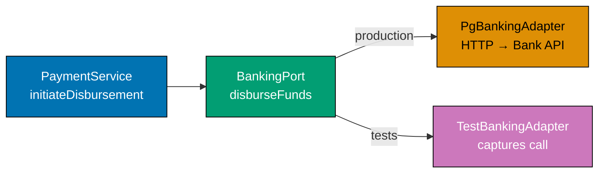
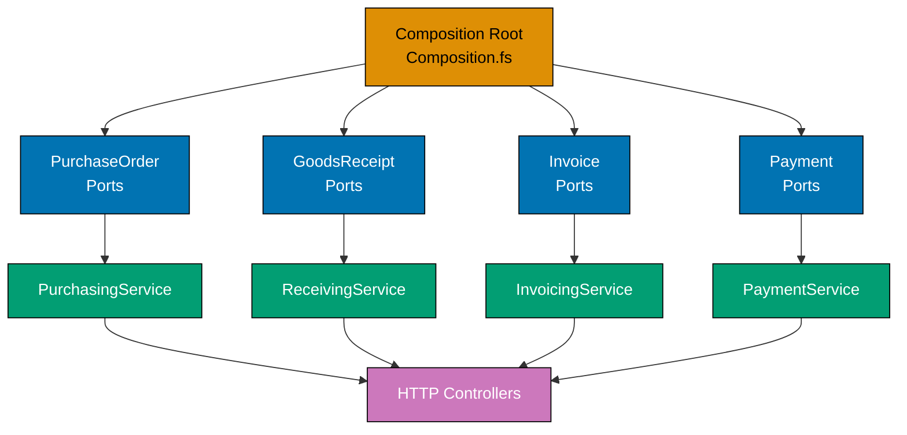

This advanced section adds the `receiving`, `invoicing`, and `payments` bounded contexts to the `purchasing` and `supplier` foundation established in the beginner and intermediate levels. Each example is self-contained and uses only `procurement-platform-be` domain names. Every code example presents both F# and Clojure tabs: F# uses record types and computation expressions; Clojure uses protocols, atoms, and threading macros — each language stays idiomatic to its own community.

## Multi-Context Ports (Examples 56–61)

### Example 56: Ports for the `receiving` Context — `GoodsReceiptRepository`

The `receiving` context has its own output port. `GoodsReceiptNote` aggregates are loaded and saved through a typed port record. The application service for registering goods receipt calls this port — it never imports the Postgres adapter module.





```fsharp
// ── Domain types for the receiving context ────────────────────────────────
module ProcurementPlatform.Domain.Receiving

type GoodsReceiptNoteId = GoodsReceiptNoteId of string
// => Strongly-typed wrapper — prevents passing a PurchaseOrderId where a GRN id is expected
// => Format: grn_<uuid>

type PurchaseOrderId = PurchaseOrderId of string
// => Repeated here: each context defines the IDs it needs; no shared kernel required

type ReceivedLine = {
    SkuCode     : string
    // => Product identifier matching the PO line — validated against PO before acceptance
    ReceivedQty : int
    // => Quantity counted at the dock — may differ from ordered quantity
    QcFlagged   : bool
    // => True when dock inspector marks the item as damaged or non-conforming
}

type GoodsReceiptNote = {
    Id              : GoodsReceiptNoteId
    // => Identity of this receipt — grn_<uuid>
    PurchaseOrderId : PurchaseOrderId
    // => The PO this receipt satisfies — triggers matching in invoicing context
    Lines           : ReceivedLine list
    // => One line per SKU received; list is non-empty by domain invariant
    ReceivedAt      : System.DateTimeOffset
    // => Timestamp from the Clock port — deterministic in tests
}

// ── GoodsReceiptRepository output port ────────────────────────────────────
// Defined in the Application zone — the Adapters zone implements it.
// The application service depends on this record type; it never imports Npgsql.

type GoodsReceiptRepository = {
    save : GoodsReceiptNote -> Async<Result<unit, string>>
    // => Persist the GRN; upsert semantics on the Id field
    // => Async: disk/network I/O is always effectful
    // => Result: returns Error string on infrastructure failure
    loadByPurchaseOrder : PurchaseOrderId -> Async<Result<GoodsReceiptNote list, string>>
    // => Returns all GRNs linked to a PO — needed for three-way match in invoicing
    // => Empty list is Ok, not Error — PO may not yet have received any goods
    loadById : GoodsReceiptNoteId -> Async<Result<GoodsReceiptNote option, string>>
    // => None when GRN does not exist — not an infrastructure error
}
// => This exact record type is the complete port contract for the receiving context

// ── Demonstration: application service accepting the port ─────────────────
let registerGoodsReceipt
    (repo  : GoodsReceiptRepository)
    (clock : unit -> System.DateTimeOffset)
    (poId  : PurchaseOrderId)
    (lines : ReceivedLine list)
    : Async<Result<GoodsReceiptNoteId, string>> =
    // => repo is the injected port — Postgres in production, Dictionary in tests
    async {
        if lines.IsEmpty then
            // => Domain invariant: a GRN must contain at least one received line
            return Error "GRN must have at least one received line"
            // => Return named error — caller receives a typed failure, not an exception
        else
            let grn = {
                Id              = GoodsReceiptNoteId (sprintf "grn_%s" (System.Guid.NewGuid().ToString()))
                // => ID generated at the application layer — domain has no UUID dependency
                PurchaseOrderId = poId
                Lines           = lines
                ReceivedAt      = clock ()
                // => Timestamp delegated to the injected clock port
            }
            let! result = repo.save grn
            // => Calls the port — no knowledge of what is behind the boundary
            return result |> Result.map (fun () -> grn.Id)
            // => Map the unit success to the new GRN identity for the caller
    }

printfn "GoodsReceiptRepository port defined — receiving context wired"
// => Output: GoodsReceiptRepository port defined — receiving context wired
```





```clojure
;; ── Domain data shapes for the receiving context ──────────────────────────
;; [F#: record types with named fields — compile-time field validation]
;; Clojure uses plain maps; namespaced keywords prevent field-name collisions
;; across the purchasing, receiving, and invoicing contexts.
(ns procurement-platform.domain.receiving
  (:require [clojure.java.util :as util]))

;; GoodsReceiptNoteId and PurchaseOrderId are plain strings in maps.
;; [F#: single-case discriminated union — prevents ID type confusion at compile time]
;; Clojure enforces identity semantics via namespaced keys rather than wrapper types.

(defn make-received-line
  "Constructs a received-line map for one dock-counted SKU."
  [sku-code received-qty qc-flagged]
  ;; => Returns a map with namespaced keys; namespace prevents collision with PO line keys
  {::sku-code     sku-code
   ;; => Product identifier — matched against PO line before GRN acceptance
   ::received-qty received-qty
   ;; => Quantity counted at the dock — may differ from ordered quantity
   ::qc-flagged   qc-flagged})
   ;; => true when dock inspector marks item as damaged or non-conforming

(defn make-grn
  "Constructs a GoodsReceiptNote map."
  [id po-id lines received-at]
  {::id          id
   ;; => GRN identity — format grn_<uuid>
   ::po-id       po-id
   ;; => The PO this receipt satisfies — triggers three-way match in invoicing
   ::lines       lines
   ;; => Non-empty vector of received-line maps; domain invariant enforced in register-grn
   ::received-at received-at})
   ;; => Timestamp from the clock function — deterministic in tests

;; ── GoodsReceiptRepository output port ────────────────────────────────────
;; [F#: record of async functions — structural type; fields are named and typed]
;; Clojure represents the port as a protocol — open dispatch, no type annotations.
;; ; [F#: Result<unit, string> on save — typed error path at compile time]
;; Clojure returns {:ok true} or {:error "message"} — caller checks key presence.
(defprotocol GoodsReceiptRepository
  (save-grn [repo grn]
    "Persist a GRN map; upsert on ::id. Returns {:ok true} or {:error msg}.")
  (load-by-po [repo po-id]
    "Return all GRNs for the given PO id. Returns {:ok [grn ...]} — empty vector is ok.")
  (load-by-id [repo grn-id]
    "Return {:ok grn} or {:ok nil} when not found. {:error msg} on infra failure."))
;; => Protocol defines the port contract; adapters extend it without modifying this ns

;; ── Demonstration: application service accepting the port ─────────────────
(defn register-grn
  "Application service: validate lines and delegate persistence to the repo port."
  [repo clock po-id lines]
  ;; => repo satisfies GoodsReceiptRepository — Postgres in prod, atom-map in tests
  ;; => clock is a zero-arg function returning an Instant — injected for determinism
  (if (empty? lines)
    {:error "GRN must have at least one received line"}
    ;; => Domain invariant: empty GRN is rejected before touching the port
    (let [grn-id (str "grn_" (str (util/UUID/randomUUID)))
          ;; => ID generated at the application layer — domain has no UUID import
          grn    (make-grn grn-id po-id lines (clock))]
          ;; => Build the GRN map; clock() provides the received-at timestamp
      (let [result (save-grn repo grn)]
        ;; => Delegate to the port — no knowledge of the adapter behind it
        (if (:ok result)
          {:ok grn-id}
          ;; => Map success to the new GRN identity for the caller
          result)))))
          ;; => Propagate {:error msg} from the port unchanged

(println "GoodsReceiptRepository port defined — receiving context wired")
;; => Output: GoodsReceiptRepository port defined — receiving context wired
```





```typescript
// ── Domain types for the receiving context ────────────────────────────────
// domain/receiving.ts — zero infrastructure imports

type GRNId = string & { readonly _brand: "GRNId" };
// => Branded wrapper — prevents passing a POId where a GRNId is expected
// => Format: grn_<uuid>

type POId = string & { readonly _brand: "POId" };
// => Repeated here: each context defines the IDs it needs

interface ReceivedLine {
  readonly skuCode: string;
  // => Product identifier matching the PO line
  readonly receivedQty: number;
  // => Quantity counted at the dock — may differ from ordered quantity
  readonly qcFlagged: boolean;
  // => true when dock inspector marks the item as damaged or non-conforming
}

interface GoodsReceiptNote {
  readonly id: GRNId;
  // => Identity of this receipt — grn_<uuid>
  readonly purchaseOrderId: POId;
  // => The PO this receipt satisfies — triggers matching in invoicing context
  readonly lines: readonly ReceivedLine[];
  // => One line per SKU received; array is non-empty by domain invariant
  readonly receivedAt: string;
  // => ISO timestamp from the Clock port — deterministic in tests
}

type Result<T, E> = { readonly ok: true; readonly value: T } | { readonly ok: false; readonly error: E };

// ── GoodsReceiptRepository output port ────────────────────────────────────
// Defined in the Application zone — the Adapters zone implements it.
type GoodsReceiptRepo = {
  readonly save: (grn: GoodsReceiptNote) => Promise<Result<void, string>>;
  // => Persist the GRN; upsert semantics on the id field
  readonly findByPurchaseOrder: (poId: POId) => Promise<Result<GoodsReceiptNote[], string>>;
  // => All GRNs linked to a PO — needed for three-way match in invoicing
  // => Empty array is ok, not error — PO may not yet have received any goods
  readonly findById: (id: GRNId) => Promise<Result<GoodsReceiptNote | null, string>>;
  // => null when GRN does not exist — not an infrastructure error
};

// ── Application service accepting the port ────────────────────────────────
const registerGoodsReceipt =
  (repo: GoodsReceiptRepo, clock: () => string) =>
  async (poId: POId, lines: ReceivedLine[]): Promise<Result<GRNId, string>> => {
    // => repo is the injected port — Postgres in production, Map in tests
    if (lines.length === 0) return { ok: false, error: "GRN must have at least one received line" };
    // => Domain invariant: a GRN must contain at least one received line
    const grn: GoodsReceiptNote = {
      id: `grn_${Math.random().toString(36).slice(2)}` as GRNId,
      // => ID generated at application layer — domain has no uuid dependency
      purchaseOrderId: poId,
      lines,
      receivedAt: clock(),
      // => Timestamp from the Clock port — deterministic in tests
    };
    const saveResult = await repo.save(grn);
    if (!saveResult.ok) return { ok: false, error: `Save failed: ${saveResult.error}` };
    return { ok: true, value: grn.id };
    // => Returns the GRN identity on success
  };

// ── In-memory adapter for tests ───────────────────────────────────────────
const makeInMemoryGRNRepo = (): GoodsReceiptRepo => {
  const store = new Map<string, GoodsReceiptNote>();
  return {
    save: async (grn) => {
      store.set(grn.id, grn);
      return { ok: true, value: undefined };
    },
    findByPurchaseOrder: async (poId) => ({
      ok: true,
      value: [...store.values()].filter((g) => g.purchaseOrderId === poId),
    }),
    findById: async (id) => ({ ok: true, value: store.get(id) ?? null }),
  };
};

// ── Demonstration ──────────────────────────────────────────────────────────
const grnRepo = makeInMemoryGRNRepo();
const lines: ReceivedLine[] = [{ skuCode: "SKU-001", receivedQty: 10, qcFlagged: false }];
const result = await registerGoodsReceipt(grnRepo, () => "2026-01-15T09:00:00Z")("po_001" as POId, lines);
console.log("GRN registered:", result.ok ? result.value : result.error);
// => Output: GRN registered: grn_<uuid>
```




**Key Takeaway**: Each bounded context owns its port record; the application service for `receiving` depends only on `GoodsReceiptRepository` — not on any purchasing or invoicing port.

**Why It Matters**: Sharing a single god-port record across contexts collapses the context boundaries and forces every adapter to implement fields it will never use. Separate port records per context keep each adapter small, auditable, and replaceable. When the GRN storage moves from Postgres to S3, only `PgGoodsReceiptRepository.fs` changes — no purchasing or invoicing code is touched.

---

### Example 57: Ports for the `invoicing` Context — `InvoiceRepository` and Three-Way Match

The `invoicing` context introduces `InvoiceRepository` and demonstrates the three-way match rule as a pure domain function. The match decision is computed entirely in the domain — no ports are called during the computation.





```fsharp
// ── Domain types for the invoicing context ────────────────────────────────
module ProcurementPlatform.Domain.Invoicing

type InvoiceId = InvoiceId of string
// => Format inv_<uuid> — never reuse a PO ID or GRN ID

type Money = { Amount: decimal; Currency: string }
// => Value object — amount >= 0, currency is 3-letter ISO 4217 code

type MatchStatus =
    | Matched
    // => Invoice amount within 2% tolerance of (GRN qty × PO unit price)
    | Disputed of string
    // => Match failed — carries the reason for the discrepancy

type Invoice = {
    Id              : InvoiceId
    PurchaseOrderId : string
    // => Links invoice to the PO for three-way match lookup
    InvoiceAmount   : Money
    // => Supplier's claimed amount — compared against computed PO value
    Status          : MatchStatus
    // => Derived from the match computation — not stored as a raw string
}

// ── Three-way match: pure domain function ─────────────────────────────────
// No ports called here — pure computation over domain values.
// The application service loads data via ports BEFORE calling this function.

let matchInvoice
    (invoiceAmount : decimal)
    (poValue       : decimal)
    (tolerance     : decimal)
    : MatchStatus =
    // => All three inputs are already-loaded domain values — no I/O inside
    let delta = abs (invoiceAmount - poValue)
    // => Absolute difference between invoice claim and expected value
    let maxAllowed = poValue * tolerance
    // => Tolerance window: default 2% (tolerance = 0.02m)
    if delta <= maxAllowed then
        Matched
        // => Invoice accepted — within tolerance, approved for payment scheduling
    else
        Disputed (sprintf "Invoice %M vs PO value %M exceeds %M%% tolerance"
                    invoiceAmount poValue (tolerance * 100m))
        // => Invoice disputed — supplier notifier will be triggered by the application service

// ── InvoiceRepository output port ─────────────────────────────────────────
type InvoiceRepository = {
    save   : Invoice -> Async<Result<unit, string>>
    // => Persist invoice — upsert on InvoiceId
    // => Async: database write is effectful
    loadById : InvoiceId -> Async<Result<Invoice option, string>>
    // => None when invoice does not exist — not an error
}
// => Separate from GoodsReceiptRepository — contexts do not share port records

// ── Application service: three-way match orchestration ────────────────────
// open FsToolkit.ErrorHandling — requires NuGet package FsToolkit.ErrorHandling
let matchAndSaveInvoice
    (invoiceRepo : InvoiceRepository)
    (inv         : Invoice)
    (poValue     : decimal)
    : Async<Result<Invoice, string>> =
    asyncResult {
        // => asyncResult { } — CE from FsToolkit; unwraps Result<_,_> automatically
        let matchResult = matchInvoice inv.InvoiceAmount.Amount poValue 0.02m
        // => Pure call — no I/O; deterministic given the same inputs
        let updatedInvoice = { inv with Status = matchResult }
        // => Apply the computed status to produce an updated invoice record
        do! invoiceRepo.save updatedInvoice
        // => Persist the matched/disputed invoice via the port
        return updatedInvoice
        // => Return the updated invoice to the calling HTTP adapter
    }
```





```clojure
;; ── Domain data shapes for the invoicing context ──────────────────────────
;; [F#: single-case DUs for InvoiceId and Money record — compile-time field safety]
;; Clojure uses namespaced maps; :: keywords prevent collisions with other contexts.
(ns procurement-platform.domain.invoicing)

;; MatchStatus is represented as a keyword in Clojure.
;; [F#: discriminated union — Matched | Disputed of string; compiler enforces exhaustiveness]
;; Clojure uses :matched or {:status :disputed :reason "..."} — open, no exhaustiveness check.
;; Multimethods provide the idiomatic open-dispatch alternative.

(defn make-invoice
  "Constructs an invoice map."
  [id po-id amount currency status]
  ;; => Returns a namespaced-key map — all fields explicit, no hidden defaults
  {::id        id
   ;; => Format inv_<uuid> — must not reuse PO or GRN identity
   ::po-id     po-id
   ;; => Links invoice to the PO for three-way match lookup
   ::amount    amount
   ;; => Supplier's claimed amount as a BigDecimal — never a float
   ::currency  currency
   ;; => ISO 4217 currency code: "USD", "IDR", etc.
   ::status    status})
   ;; => :matched or {:status :disputed :reason "..."} — set by match-invoice

;; ── Three-way match: pure domain function ─────────────────────────────────
;; No protocols called here — pure computation over plain numbers.
;; [F#: returns MatchStatus DU — pattern match is exhaustive at call sites]
;; Clojure returns a data value; callers use cond or case to branch.
(defn match-invoice
  "Pure match computation: returns :matched or {:status :disputed :reason msg}."
  [invoice-amount po-value tolerance]
  ;; => All inputs are already-loaded numbers — no I/O inside this function
  (let [delta       (Math/abs (- invoice-amount po-value))
        ;; => Absolute difference between invoice claim and expected value
        max-allowed (* po-value tolerance)]
        ;; => Tolerance window — default 2% passed as 0.02M by the caller
    (if (<= delta max-allowed)
      :matched
      ;; => Within tolerance — invoice approved for payment scheduling
      {:status :disputed
       :reason (format "Invoice %.2f vs PO value %.2f exceeds %.0f%% tolerance"
                       invoice-amount po-value (* tolerance 100))})))
                       ;; => Carries the discrepancy reason — supplier notifier will use it

;; ── InvoiceRepository output port ─────────────────────────────────────────
;; [F#: record of async functions — structural port type with named fields]
;; Clojure uses a protocol — open dispatch; any namespace can provide an implementation.
(defprotocol InvoiceRepository
  (save-invoice [repo invoice]
    "Persist invoice map; upsert on ::id. Returns {:ok true} or {:error msg}.")
  (load-invoice-by-id [repo invoice-id]
    "Returns {:ok invoice-map} or {:ok nil} when not found. {:error msg} on failure."))
;; => Separate from GoodsReceiptRepository — contexts do not share port protocols

;; ── Application service: three-way match orchestration ────────────────────
;; [F#: asyncResult CE — unwraps Result automatically; monadic sequencing]
;; Clojure uses -> threading macro for sequential steps; error short-circuit done manually.
(defn match-and-save-invoice
  "Run the three-way match and persist the result via the port."
  [invoice-repo inv po-value]
  ;; => invoice-repo satisfies InvoiceRepository — Postgres or atom-map in tests
  (let [match-result  (match-invoice (::amount inv) po-value 0.02M)
        ;; => Pure call — no I/O; deterministic given the same inputs
        updated-inv   (assoc inv ::status match-result)]
        ;; => assoc produces a new map with the computed status — original map unchanged
    (let [result (save-invoice invoice-repo updated-inv)]
      ;; => Persist the matched/disputed invoice via the port
      (if (:ok result)
        {:ok updated-inv}
        ;; => Return the updated invoice to the calling HTTP adapter
        result))))
        ;; => Propagate {:error msg} from the port unchanged
```





```typescript
// ── Invoicing context domain types ────────────────────────────────────────
type InvoiceId = string & { readonly _brand: "InvoiceId" };
type POId = string & { readonly _brand: "POId" };
type GRNId = string & { readonly _brand: "GRNId" };

interface Invoice {
  readonly id: InvoiceId;
  readonly purchaseOrderId: POId;
  readonly grnId: GRNId;
  readonly invoicedAmount: number;
  readonly status: "Draft" | "MatchPassed" | "MatchFailed" | "Paid";
}

type Result<T, E> = { readonly ok: true; readonly value: T } | { readonly ok: false; readonly error: E };

// ── InvoiceRepository output port ─────────────────────────────────────────
type InvoiceRepo = {
  readonly save: (inv: Invoice) => Promise<Result<void, string>>;
  readonly findById: (id: InvoiceId) => Promise<Result<Invoice | null, string>>;
  readonly findByPO: (poId: POId) => Promise<Result<Invoice[], string>>;
};

// ── Three-Way Match port ───────────────────────────────────────────────────
type MatchError = {
  readonly kind: "ToleranceBreached" | "MissingGrn" | "InfrastructureError";
  readonly message: string;
};

type ThreeWayMatchPort = {
  readonly matchInvoice: (invId: InvoiceId, poId: POId, grnId: GRNId) => Promise<Result<boolean, MatchError>>;
  // => true = match passed; false = within dispute range; error = infra failure
};

// ── In-memory adapters ─────────────────────────────────────────────────────
const makeInvoiceRepo = (): InvoiceRepo => {
  const store = new Map<string, Invoice>();
  return {
    save: async (inv) => {
      store.set(inv.id, inv);
      return { ok: true, value: undefined };
    },
    findById: async (id) => ({ ok: true, value: store.get(id) ?? null }),
    findByPO: async (poId) => ({ ok: true, value: [...store.values()].filter((inv) => inv.purchaseOrderId === poId) }),
  };
};

const makeInProcessMatchPort = (tolerance: number): ThreeWayMatchPort => ({
  matchInvoice: async (invId, poId, grnId) => {
    const poAmount = 1000,
      grnQty = 9.5,
      invAmount = 990;
    const poReceived = (poAmount * grnQty) / 10;
    const diff = Math.abs(invAmount - poReceived);
    const tolAmt = poAmount * tolerance;
    const matched = diff <= tolAmt;
    console.log(`[Match] inv=${invId} po=${poId} grn=${grnId} diff=${diff.toFixed(2)} matched=${matched}`);
    return { ok: true, value: matched };
  },
});

// ── Application service ────────────────────────────────────────────────────
const approveInvoice =
  (repo: InvoiceRepo, matchPort: ThreeWayMatchPort) =>
  async (inv: Invoice): Promise<Result<Invoice, string>> => {
    const matchResult = await matchPort.matchInvoice(inv.id, inv.purchaseOrderId, inv.grnId);
    if (!matchResult.ok) return { ok: false, error: `Match error: ${matchResult.error.message}` };
    const updated: Invoice = { ...inv, status: matchResult.value ? "MatchPassed" : "MatchFailed" };
    await repo.save(updated);
    return { ok: true, value: updated };
  };

// ── Demonstration ──────────────────────────────────────────────────────────
const invRepo = makeInvoiceRepo();
const matchPort = makeInProcessMatchPort(0.02);
const invoice: Invoice = {
  id: "inv_001" as InvoiceId,
  purchaseOrderId: "po_001" as POId,
  grnId: "grn_001" as GRNId,
  invoicedAmount: 990,
  status: "Draft",
};
const outcome = await approveInvoice(invRepo, matchPort)(invoice);
console.log("Invoice status:", outcome.ok ? outcome.value.status : outcome.error);
// => Output: Invoice status: MatchPassed
```




**Key Takeaway**: The three-way match rule is a pure domain function that takes decimal values and returns a `MatchStatus` — the application service calls ports to load data and then passes values to the domain function.

**Why It Matters**: Placing the match computation behind a port or inside a repository method couples the business rule to infrastructure and makes it untestable in isolation. As a pure function, `matchInvoice` is tested by calling it with numbers — no database, no adapter, no async machinery. Changing the tolerance from 2% to 5% requires editing one line of domain code and updating the tests that capture that rule.

---

### Example 58: `BankingPort` — Initiating a Disbursement

The `payments` context introduces `BankingPort` — the output port that initiates a disbursement via a bank's REST API. The port record exposes a single function; the production adapter makes the HTTP call while the test adapter captures the request for assertion.







```fsharp
// ── Domain types for the payments context ─────────────────────────────────
module ProcurementPlatform.Domain.Payments

type PaymentId = PaymentId of string
// => Format pay_<uuid> — unique identity for each disbursement attempt

type BankAccount = { IBAN: string; BIC: string }
// => Value object: IBAN format-validated, BIC is 8 or 11 characters

type DisbursementRequest = {
    PaymentId      : PaymentId
    // => Idempotency key — bank API uses this to deduplicate retried calls
    SupplierAccount: BankAccount
    // => Target account for the disbursement — validated by domain before calling port
    Amount         : decimal
    // => Amount in the PO's currency — must be positive
    Currency       : string
    // => ISO 4217 code — "USD", "IDR", etc.
}

type DisbursementError =
    | InsufficientFunds
    // => Bank returned a definitive rejection — do not retry
    | BankTimeout
    // => Bank did not respond within the SLA — may be safe to retry
    | BankUnavailable
    // => Bank circuit is open — retry after backoff period
    | InvalidAccountDetails of string
    // => IBAN or BIC was rejected by the bank — fix data, do not retry

// ── BankingPort output port ────────────────────────────────────────────────
// Single-function record — the application service depends only on this type.
// The production adapter makes an HTTP call; the test adapter records the call.

type BankingPort = {
    disburseFunds : DisbursementRequest -> Async<Result<string, DisbursementError>>
    // => Initiates disbursement; returns bank transaction reference on success
    // => DisbursementError is typed — caller can decide whether to retry
    // => The PaymentId field in the request provides idempotency for duplicate calls
}
// => This record is the entire contract between the payments application service
// => and the bank integration adapter

// ── Test adapter: captures calls without hitting the bank ─────────────────
let makeTestBankingAdapter () =
    // => Returns a BankingPort that records calls for assertion in tests
    let mutable capturedRequests = []
    // => Mutable list — mutation is confined inside this closure; callers see the port type only
    let port : BankingPort = {
        disburseFunds = fun req ->
            async {
                capturedRequests <- req :: capturedRequests
                // => Record the request for assertion after the test
                return Ok (sprintf "TEST-TXN-%s" (req.PaymentId |> (fun (PaymentId s) -> s)))
                // => Return a fake transaction reference — does not call the bank
            }
    }
    port, (fun () -> capturedRequests)
    // => Return the port AND a thunk to read captured requests — decoupled

// ── Demonstration: using the test adapter ─────────────────────────────────
let bank, getCaptured = makeTestBankingAdapter ()
let req = {
    PaymentId       = PaymentId "pay_test-001"
    SupplierAccount = { IBAN = "GB29NWBK60161331926819"; BIC = "NWBKGB2L" }
    Amount          = 5000m
    Currency        = "USD"
}
let txnRef = bank.disburseFunds req |> Async.RunSynchronously
// => txnRef : Result<string, DisbursementError> = Ok "TEST-TXN-pay_test-001"
printfn "Captured calls: %d" (getCaptured().Length)
// => Output: Captured calls: 1
```





```clojure
;; ── Domain data shapes for the payments context ───────────────────────────
;; [F#: single-case DUs for PaymentId; record types for BankAccount and DisbursementRequest]
;; Clojure uses plain maps with namespaced keywords — open and REPL-inspectable.
(ns procurement-platform.domain.payments)

(defn make-disbursement-request
  "Constructs a disbursement-request map."
  [payment-id iban bic amount currency]
  ;; => payment-id is the idempotency key — bank uses it to deduplicate retried calls
  {::payment-id payment-id
   ;; => Format pay_<uuid> — unique identity for each disbursement attempt
   ::iban       iban
   ;; => IBAN of the supplier's bank account — validated before calling the port
   ::bic        bic
   ;; => BIC of the supplier's bank — 8 or 11 characters
   ::amount     amount
   ;; => Amount in the PO's currency — must be positive BigDecimal
   ::currency   currency})
   ;; => ISO 4217 code: "USD", "IDR", etc.

;; DisbursementError variants are Clojure keywords or maps.
;; [F#: discriminated union — InsufficientFunds | BankTimeout | BankUnavailable | InvalidAccountDetails of string]
;; Clojure uses :insufficient-funds, :bank-timeout, :bank-unavailable,
;; or {:error :invalid-account :detail "..."} — open, no compile-time exhaustiveness.
;; Multimethods provide idiomatic open dispatch over these values.

;; ── BankingPort output port ────────────────────────────────────────────────
;; [F#: record with one field disburseFunds — structural type; callers see the record]
;; Clojure uses a protocol — one method; any value satisfying it is a valid adapter.
(defprotocol BankingPort
  (disburse-funds [port req]
    "Initiate disbursement. Returns {:ok txn-ref} or {:error error-keyword}."))
;; => Protocol is the entire contract — test and production adapters both satisfy it

;; ── Test adapter: captures calls without hitting the bank ─────────────────
;; [F#: mutable list inside a closure — mutation confined to the factory function]
;; Clojure uses an atom for the captured-requests list — idiomatic mutable state.
(defn make-test-banking-adapter
  "Returns [port get-captured] where get-captured is a zero-arg fn returning calls."
  []
  (let [captured (atom [])]
    ;; => atom holds the captured-requests vector; swap! appends each call
    (let [port (reify BankingPort
                 (disburse-funds [_ req]
                   (swap! captured conj req)
                   ;; => Record the request for assertion after the test
                   {:ok (str "TEST-TXN-" (::payment-id req))}))]
                   ;; => Return a fake transaction reference — does not call the bank
      [port (fn [] @captured)])))
      ;; => Return [port thunk]; deref the atom inside the thunk to read captures

;; ── Demonstration: using the test adapter ─────────────────────────────────
(let [[bank get-captured] (make-test-banking-adapter)
      req (make-disbursement-request
            "pay_test-001"
            "GB29NWBK60161331926819" "NWBKGB2L"
            5000M "USD")]
  ;; => Wire the test adapter and build a disbursement request map
  (disburse-funds bank req)
  ;; => {:ok "TEST-TXN-pay_test-001"}
  (println "Captured calls:" (count (get-captured))))
  ;; => Output: Captured calls: 1
```





```typescript
// ── BankingPort — initiating a payment disbursement ────────────────────────
// The payments context calls the banking infrastructure through this port.
// The application service never imports the bank SDK — only this port type.

type PaymentId = string & { readonly _brand: "PaymentId" };
type InvoiceId = string & { readonly _brand: "InvoiceId" };
type SupplierId = string & { readonly _brand: "SupplierId" };

interface DisbursementRequest {
  readonly paymentId: PaymentId;
  // => Idempotency key — the bank deduplicates on this
  readonly supplierId: SupplierId;
  // => Beneficiary — resolved to a bank account number by the banking adapter
  readonly amount: number;
  // => Amount to disburse — must match the matched invoice amount
  readonly currency: string;
  // => ISO 4217 currency code — "USD", "EUR", etc.
  readonly reference: string;
  // => Payment reference visible on the bank statement
}

interface DisbursementResult {
  readonly paymentId: PaymentId;
  readonly bankRef: string;
  // => Bank's own transaction reference — stored for reconciliation
  readonly disbursedAt: string;
  // => ISO timestamp of successful disbursement
}

type BankingError =
  | { readonly kind: "InsufficientFunds"; readonly message: string }
  // => Account balance below required disbursement amount
  | { readonly kind: "InvalidBeneficiary"; readonly message: string }
  // => Supplier bank account details are invalid or not on file
  | { readonly kind: "BankingTimeout"; readonly message: string };
// => Bank gateway did not respond in time — retry safe after delay

type Result<T, E> = { readonly ok: true; readonly value: T } | { readonly ok: false; readonly error: E };

// ── BankingPort type ──────────────────────────────────────────────────────
type BankingPort = {
  readonly disburse: (req: DisbursementRequest) => Promise<Result<DisbursementResult, BankingError>>;
  // => Initiates a bank transfer; returns DisbursementResult on success
  // => Returns named BankingError on failure — caller decides retry vs alert
};

// ── In-memory stub for tests ───────────────────────────────────────────────
const makeStubBankingPort = (shouldFail?: BankingError): BankingPort => ({
  disburse: async (req) => {
    if (shouldFail) return { ok: false, error: shouldFail };
    // => Simulate configured failure — for testing error paths
    const result: DisbursementResult = {
      paymentId: req.paymentId,
      bankRef: `BANK-${Math.random().toString(36).slice(2).toUpperCase()}`,
      disbursedAt: new Date().toISOString(),
    };
    console.log(`[BankStub] Disbursed ${req.amount} ${req.currency} for invoice ref ${req.reference}`);
    return { ok: true, value: result };
  },
});

// ── Application service using BankingPort ─────────────────────────────────
interface Invoice {
  readonly id: InvoiceId;
  readonly supplierId: SupplierId;
  readonly invoicedAmount: number;
  readonly status: string;
  readonly currency: string;
}

const schedulePayment =
  (banking: BankingPort) =>
  async (invoice: Invoice): Promise<Result<DisbursementResult, string>> => {
    if (invoice.status !== "MatchPassed")
      return { ok: false, error: `Invoice ${invoice.id} must be MatchPassed before payment` };
    const req: DisbursementRequest = {
      paymentId: `pay_${invoice.id}` as PaymentId,
      supplierId: invoice.supplierId,
      amount: invoice.invoicedAmount,
      currency: invoice.currency,
      reference: `Payment for invoice ${invoice.id}`,
    };
    const result = await banking.disburse(req);
    if (!result.ok) {
      if (result.error.kind === "BankingTimeout") return { ok: false, error: `Retry: ${result.error.message}` };
      return { ok: false, error: `Banking error: ${result.error.kind} — ${result.error.message}` };
    }
    return { ok: true, value: result.value };
  };

// ── Demonstration ──────────────────────────────────────────────────────────
const banking = makeStubBankingPort();
const invoice: Invoice = {
  id: "inv_001" as InvoiceId,
  supplierId: "sup_abc" as SupplierId,
  invoicedAmount: 4950,
  status: "MatchPassed",
  currency: "USD",
};
const payResult = await schedulePayment(banking)(invoice);
console.log("Payment:", payResult.ok ? `ok ref=${payResult.value.bankRef}` : payResult.error);
// => Output: [BankStub] Disbursed 4950 USD for invoice ref Payment for invoice inv_001
// => Output: Payment: ok ref=BANK-<ref>
```




**Key Takeaway**: `BankingPort` is a single-field record — `disburseFunds` — and the test adapter captures calls without a network connection, making payment service tests fully isolated.

**Why It Matters**: Banking integrations are the worst candidates for tight coupling — retries, idempotency keys, and partial-success scenarios make the adapter complex. Hiding this complexity behind a typed port record means the application service logic (schedule → disburse → record result) is testable by swapping one record field. The typed `DisbursementError` DU forces the caller to handle each case rather than catching a generic exception.

---

### Example 59: `SupplierNotifierPort` — SMTP and EDI Fallback

The `SupplierNotifierPort` sends notifications to suppliers when significant events occur: purchase order issued, goods receipt discrepancy detected, payment disbursed. The port exposes notification functions; the production adapter tries SMTP first and falls back to EDI if SMTP fails.





```fsharp
// ── Notification payload types ────────────────────────────────────────────
module ProcurementPlatform.Application.SupplierNotifier

type SupplierId = string
// => Identifies the supplier receiving the notification

type PurchaseOrderId = string
// => Referenced in notifications so the supplier can correlate to their records

type NotificationError =
    | SmtpFailure  of string
    // => SMTP transport rejected or timed out
    | EdiFailure   of string
    // => EDI fallback also failed — the notification was not delivered
    | UnknownSupplier of SupplierId
    // => Supplier ID not found in the notification routing table

// ── SupplierNotifierPort output port ──────────────────────────────────────
// Four distinct notification functions — one per event type from the domain.
// The record structure means the application service can call exactly the
// notification it needs without routing through a single generic method.

type SupplierNotifierPort = {
    notifyPoIssued          : SupplierId -> PurchaseOrderId -> Async<Result<unit, NotificationError>>
    // => Sent when PurchaseOrderIssued event fires — informs supplier of new PO
    // => Returns Ok unit on delivery; NotificationError on total failure
    notifyDiscrepancy       : SupplierId -> PurchaseOrderId -> string -> Async<Result<unit, NotificationError>>
    // => Sent when GoodsReceiptDiscrepancyDetected fires — third arg is discrepancy description
    // => Allows supplier to investigate before invoice is raised
    notifyPaymentDisbursed  : SupplierId -> string -> decimal -> Async<Result<unit, NotificationError>>
    // => Sent when PaymentDisbursed event fires — second arg is bank ref, third is amount
    // => Supplier can reconcile against their accounts receivable ledger
    notifyInvoiceDisputed   : SupplierId -> string -> Async<Result<unit, NotificationError>>
    // => Sent when InvoiceDisputed event fires — second arg is dispute reason
    // => Supplier can raise a corrected invoice or request a meeting
}
// => This record is injected into any application service that must notify suppliers

// ── SMTP + EDI fallback adapter ────────────────────────────────────────────
// The adapter wires the SMTP sender and the EDI sender at construction time.
// SMTP is primary; EDI fires only when SMTP returns an error.

let makeSmtpEdiAdapter (smtpSend : string -> string -> Async<Result<unit, string>>)
                        (ediSend  : string -> string -> Async<Result<unit, string>>)
                        : SupplierNotifierPort =
    // => smtpSend: (toAddress: string) -> (body: string) -> Async<Result<unit, string>>
    // => ediSend:  (supplierId: string) -> (message: string) -> Async<Result<unit, string>>
    let tryWithFallback toAddress body supplierId message =
        // => Try SMTP first; fall back to EDI on any SMTP error
        async {
            let! smtpResult = smtpSend toAddress body
            // => Attempt primary channel first
            match smtpResult with
            | Ok () ->
                return Ok ()
                // => SMTP delivered — no fallback needed
            | Error smtpErr ->
                let! ediResult = ediSend supplierId message
                // => SMTP failed — attempt EDI fallback
                return ediResult |> Result.mapError (fun ediErr ->
                    EdiFailure (sprintf "SMTP: %s; EDI: %s" smtpErr ediErr))
                // => If EDI also fails, wrap both error messages in EdiFailure
        }
    {
        notifyPoIssued = fun supplierId poId ->
            tryWithFallback
                (sprintf "%s@supplier.example" supplierId)
                (sprintf "Purchase Order %s has been issued to you." poId)
                supplierId
                (sprintf "PO_ISSUED|%s|%s" supplierId poId)
        // => SMTP body is human-readable; EDI message is pipe-delimited for machine parsing
        notifyDiscrepancy = fun supplierId poId reason ->
            tryWithFallback
                (sprintf "%s@supplier.example" supplierId)
                (sprintf "Discrepancy on PO %s: %s" poId reason)
                supplierId
                (sprintf "DISCREPANCY|%s|%s|%s" supplierId poId reason)
        notifyPaymentDisbursed = fun supplierId bankRef amount ->
            tryWithFallback
                (sprintf "%s@supplier.example" supplierId)
                (sprintf "Payment of %M disbursed, reference: %s" amount bankRef)
                supplierId
                (sprintf "PAYMENT_DISBURSED|%s|%s|%M" supplierId bankRef amount)
        // => EDI message encodes amount as decimal literal — no currency symbol
        notifyInvoiceDisputed = fun supplierId reason ->
            tryWithFallback
                (sprintf "%s@supplier.example" supplierId)
                (sprintf "Invoice disputed: %s" reason)
                supplierId
                (sprintf "INVOICE_DISPUTED|%s|%s" supplierId reason)
    }

printfn "SupplierNotifierPort constructed — SMTP primary, EDI fallback"
// => Output: SupplierNotifierPort constructed — SMTP primary, EDI fallback
```





```clojure
;; ── Notification payload types ────────────────────────────────────────────
;; [F#: type aliases and discriminated union for NotificationError]
;; Clojure: supplier-id and po-id are plain strings; error variants are keywords.
;; ; [F#: SmtpFailure | EdiFailure | UnknownSupplier — exhaustive at match sites]
;; Clojure uses :smtp-failure, :edi-failure, :unknown-supplier as keyword error codes.
(ns procurement-platform.application.supplier-notifier)

;; ── SupplierNotifierPort output port ──────────────────────────────────────
;; [F#: record of four typed functions — one field per event type; structural contract]
;; Clojure uses a protocol with four methods — open dispatch; same one-method-per-event intent.
(defprotocol SupplierNotifierPort
  (notify-po-issued [port supplier-id po-id]
    "Sent when PurchaseOrderIssued fires. Returns {:ok true} or {:error kw}.")
  (notify-discrepancy [port supplier-id po-id reason]
    "Sent when GoodsReceiptDiscrepancyDetected fires. Third arg is discrepancy description.")
  (notify-payment-disbursed [port supplier-id bank-ref amount]
    "Sent when PaymentDisbursed fires. Second arg is bank ref, third is decimal amount.")
  (notify-invoice-disputed [port supplier-id reason]
    "Sent when InvoiceDisputed fires. Second arg is the dispute reason string."))
;; => Protocol is injected into any application service that must notify suppliers

;; ── SMTP + EDI fallback adapter ────────────────────────────────────────────
;; [F#: inner function tryWithFallback — partial application of smtp-send and edi-send]
;; Clojure uses a local let binding for the fallback logic; threading macros keep it readable.
(defn make-smtp-edi-adapter
  "Construct an adapter that tries SMTP first and falls back to EDI on failure."
  [smtp-send edi-send]
  ;; => smtp-send: (to-address body) -> {:ok true} or {:error msg}
  ;; => edi-send:  (supplier-id message) -> {:ok true} or {:error msg}
  (let [try-with-fallback
        ;; => Closure capturing smtp-send and edi-send — same strategy as F# inner function
        (fn [to-address body supplier-id message]
          (let [smtp-result (smtp-send to-address body)]
            ;; => Attempt primary channel first
            (if (:ok smtp-result)
              {:ok true}
              ;; => SMTP delivered — no fallback needed
              (let [edi-result (edi-send supplier-id message)]
                ;; => SMTP failed — attempt EDI fallback
                (if (:ok edi-result)
                  {:ok true}
                  {:error :edi-failure
                   :detail (str "SMTP: " (:error smtp-result)
                                "; EDI: " (:error edi-result))})))))]
                   ;; => Both channels failed — carry both error messages
    (reify SupplierNotifierPort
      (notify-po-issued [_ supplier-id po-id]
        (try-with-fallback
          (str supplier-id "@supplier.example")
          (str "Purchase Order " po-id " has been issued to you.")
          ;; => SMTP body is human-readable
          supplier-id
          (str "PO_ISSUED|" supplier-id "|" po-id)))
          ;; => EDI message is pipe-delimited for machine parsing
      (notify-discrepancy [_ supplier-id po-id reason]
        (try-with-fallback
          (str supplier-id "@supplier.example")
          (str "Discrepancy on PO " po-id ": " reason)
          supplier-id
          (str "DISCREPANCY|" supplier-id "|" po-id "|" reason)))
      (notify-payment-disbursed [_ supplier-id bank-ref amount]
        (try-with-fallback
          (str supplier-id "@supplier.example")
          (str "Payment of " amount " disbursed, reference: " bank-ref)
          supplier-id
          (str "PAYMENT_DISBURSED|" supplier-id "|" bank-ref "|" amount)))
          ;; => EDI message encodes amount as decimal literal — no currency symbol
      (notify-invoice-disputed [_ supplier-id reason]
        (try-with-fallback
          (str supplier-id "@supplier.example")
          (str "Invoice disputed: " reason)
          supplier-id
          (str "INVOICE_DISPUTED|" supplier-id "|" reason))))))

(println "SupplierNotifierPort constructed — SMTP primary, EDI fallback")
;; => Output: SupplierNotifierPort constructed — SMTP primary, EDI fallback
```





```typescript
// ── SupplierNotifierPort — SMTP and EDI fallback ─────────────────────────
// The supplier notifier tries SMTP first; on failure falls back to EDI.
// The application service depends on the port — never on SMTP or EDI SDKs.

type SupplierId = string & { readonly _brand: "SupplierId" };
type POId = string & { readonly _brand: "POId" };

interface NotificationRequest {
  readonly supplierId: SupplierId;
  readonly poId: POId;
  readonly subject: string;
  readonly body: string;
}

type NotificationResult = {
  readonly channel: "smtp" | "edi" | "fallback";
  // => Which channel successfully delivered the notification
  readonly sentAt: string;
};

type NotificationError = { readonly kind: "AllChannelsFailed"; readonly details: string[] };
// => All notification channels failed — caller may queue for manual retry

type Result<T, E> = { readonly ok: true; readonly value: T } | { readonly ok: false; readonly error: E };

// ── SupplierNotifierPort type ─────────────────────────────────────────────
type SupplierNotifierPort = {
  readonly notify: (req: NotificationRequest) => Promise<Result<NotificationResult, NotificationError>>;
  // => Delivers notification via the best available channel
  // => Returns ok with channel used; returns error only when all channels fail
};

// ── SMTP + EDI fallback adapter ───────────────────────────────────────────
const makeSmtpWithEdiFallback = (smtpFails: boolean): SupplierNotifierPort => ({
  notify: async (req) => {
    const errors: string[] = [];

    if (!smtpFails) {
      console.log(`[SMTP] Sending notification for PO ${req.poId} to supplier ${req.supplierId}`);
      return { ok: true, value: { channel: "smtp", sentAt: new Date().toISOString() } };
      // => SMTP succeeded — return immediately
    }
    errors.push("SMTP: connection timeout");
    // => SMTP failed — try EDI fallback

    console.log(`[EDI] Falling back to EDI for PO ${req.poId}`);
    // => EDI fallback — more reliable for enterprise suppliers
    return { ok: true, value: { channel: "edi", sentAt: new Date().toISOString() } };
    // => EDI succeeded — note the fallback channel in the result
  },
});

// ── In-memory notifier for tests ──────────────────────────────────────────
const makeInMemoryNotifier = (): [SupplierNotifierPort, () => NotificationRequest[]] => {
  const sent: NotificationRequest[] = [];
  const port: SupplierNotifierPort = {
    notify: async (req) => {
      sent.push(req);
      return { ok: true, value: { channel: "smtp", sentAt: new Date().toISOString() } };
    },
  };
  return [port, () => [...sent]];
};

// ── Application service ────────────────────────────────────────────────────
const notifySupplierOfPO =
  (notifier: SupplierNotifierPort) =>
  async (supplierId: SupplierId, poId: POId): Promise<Result<NotificationResult, string>> => {
    const req: NotificationRequest = {
      supplierId,
      poId,
      subject: `Purchase Order ${poId} Issued`,
      body: `Your purchase order ${poId} has been issued. Please confirm receipt.`,
    };
    const result = await notifier.notify(req);
    if (!result.ok) return { ok: false, error: `Notification failed: ${result.error.details.join(", ")}` };
    return { ok: true, value: result.value };
  };

// ── Demonstration ──────────────────────────────────────────────────────────
const notifier = makeSmtpWithEdiFallback(false);
const r = await notifySupplierOfPO(notifier)("sup_abc" as SupplierId, "po_001" as POId);
console.log("Notification:", r.ok ? `sent via ${r.value.channel}` : r.error);
// => Output: [SMTP] Sending notification for PO po_001 to supplier sup_abc
// => Output: Notification: sent via smtp

const fallbackNotifier = makeSmtpWithEdiFallback(true);
const r2 = await notifySupplierOfPO(fallbackNotifier)("sup_abc" as SupplierId, "po_002" as POId);
console.log("Fallback:", r2.ok ? `sent via ${r2.value.channel}` : r2.error);
// => Output: [EDI] Falling back to EDI for PO po_002
// => Output: Fallback: sent via edi
```




**Key Takeaway**: `SupplierNotifierPort` names each notification event as a separate function field — the application service calls `notifyPoIssued`, not a generic `send` — and the SMTP+EDI fallback logic is entirely inside the adapter.

**Why It Matters**: A generic `send(body: string)` port hides whether the caller is notifying about a PO, a payment, or a dispute. Typed notification functions document intent at the call site and let the adapter construct appropriate payloads per event type. Fallback logic belongs in the adapter — the application service should not know that SMTP exists, let alone EDI.

---

### Example 60: `Observability` Port — Emitting Metrics and Traces

The `Observability` port is an output port that emits structured metrics and traces to an OpenTelemetry-compatible backend. The port is injected into application services; the production adapter wraps OpenTelemetry APIs while the test adapter captures emissions for assertion.





```fsharp
// ── Observability port ────────────────────────────────────────────────────
module ProcurementPlatform.Application.ObservabilityPort

type SpanName = string
// => Human-readable span identifier — "disbursement.initiate", "invoice.match", etc.

type MetricName = string
// => Metric identifier — "po.submitted.count", "payment.duration.ms", etc.

type Observability = {
    startSpan     : SpanName -> (unit -> unit) -> Async<Result<unit, unit>>
    // => Wraps a computation in a trace span
    // => First arg: span name; second arg: the work to perform inside the span
    // => Returns Ok unit when the computation completes; span is closed automatically
    recordCounter : MetricName -> int -> unit
    // => Increment a named counter by the given amount — synchronous, fire-and-forget
    // => Designed for event counts: "payment.initiated += 1"
    recordDuration: MetricName -> System.TimeSpan -> unit
    // => Record a duration measurement — synchronous, fire-and-forget
    // => Designed for latency histograms: "bank.api.latency"
}
// => This port is injected alongside domain ports — application service calls it
// => at the boundary between orchestration and port invocation

// ── Test adapter: captures observations ───────────────────────────────────
let makeTestObservability () =
    // => Returns an Observability port that records all calls for assertion
    let mutable spans     = []
    // => List of span names started during the test
    let mutable counters  = System.Collections.Generic.Dictionary<string, int>()
    // => Accumulated counter values: name -> total increments
    let mutable durations = []
    // => List of (name, duration) tuples recorded during the test
    let port : Observability = {
        startSpan = fun name work ->
            async {
                spans <- name :: spans
                // => Record that the span was started
                work ()
                // => Execute the wrapped computation inside the "span"
                return Ok ()
                // => Close the span — in production this sends trace data to OTEL
            }
        recordCounter = fun name delta ->
            let current = if counters.ContainsKey name then counters.[name] else 0
            counters.[name] <- current + delta
            // => Accumulate increments — test can assert total after service call
        recordDuration = fun name ts ->
            durations <- (name, ts) :: durations
            // => Record duration — test can assert latency was measured
    }
    port, (fun () -> spans, counters, durations)
    // => Return port and a thunk that exposes captured data for test assertions

// ── Application service: using Observability alongside BankingPort ─────────
// open FsToolkit.ErrorHandling — requires NuGet package FsToolkit.ErrorHandling
let initiateDisbursement
    (banking : BankingPort)
    (obs     : Observability)
    (req     : DisbursementRequest)
    : Async<Result<string, DisbursementError>> =
    asyncResult {
        obs.recordCounter "payment.initiated" 1
        // => Emit counter before attempting the bank call
        let start = System.DateTime.UtcNow
        // => Record start time for duration calculation
        let! txnRef = banking.disburseFunds req
        // => Call the BankingPort — may succeed or return DisbursementError
        let elapsed = System.DateTime.UtcNow - start
        obs.recordDuration "bank.api.latency" elapsed
        // => Emit latency measurement after the call completes
        obs.recordCounter "payment.succeeded" 1
        // => Emit success counter — distinct from initiated counter
        return txnRef
        // => Return the transaction reference to the HTTP adapter
    }

printfn "Observability port wired — metrics and traces emitted at port boundary"
// => Output: Observability port wired — metrics and traces emitted at port boundary
```





```clojure
;; ── Observability port ────────────────────────────────────────────────────
;; [F#: record of three typed functions — startSpan takes a thunk; others are fire-and-forget]
;; Clojure uses a protocol with three methods — same intent, open dispatch, no type annotations.
(ns procurement-platform.application.observability-port)

(defprotocol Observability
  (start-span [obs span-name work-fn]
    "Wrap work-fn in a trace span. Calls work-fn then closes the span. Returns {:ok true}.")
  (record-counter [obs metric-name delta]
    "Increment a named counter by delta — synchronous, fire-and-forget.")
  (record-duration [obs metric-name duration-ms]
    "Record a duration measurement in ms — synchronous, fire-and-forget."))
;; => This protocol is injected alongside domain ports — application service calls it
;; => at the boundary between orchestration and port invocation

;; ── Test adapter: captures observations ───────────────────────────────────
;; [F#: mutable fields inside a closure; returns port and thunk tuple]
;; Clojure: atoms hold each capture list; thunk derefs them for assertion.
(defn make-test-observability
  "Returns [obs-port get-captures] where get-captures returns [spans counters durations]."
  []
  (let [spans     (atom [])
        ;; => Atom of span names started during the test
        counters  (atom {})
        ;; => Atom map of metric-name -> accumulated total
        durations (atom [])]
        ;; => Atom of [metric-name duration-ms] pairs
    (let [port (reify Observability
                 (start-span [_ span-name work-fn]
                   (swap! spans conj span-name)
                   ;; => Record that the span was started
                   (work-fn)
                   ;; => Execute the wrapped computation inside the span
                   {:ok true})
                   ;; => Close the span — in production this sends trace data to OTEL
                 (record-counter [_ metric-name delta]
                   (swap! counters update metric-name (fnil + 0) delta))
                   ;; => Accumulate increments per metric name using fnil to handle missing keys
                 (record-duration [_ metric-name duration-ms]
                   (swap! durations conj [metric-name duration-ms])))]
                   ;; => Capture duration tuples for assertion
      [port (fn [] [@spans @counters @durations])])))
      ;; => Return port and thunk; deref atoms inside the thunk to read captures

;; ── Application service: using Observability alongside BankingPort ─────────
;; [F#: asyncResult CE — monadic sequencing with automatic Result unwrapping]
;; Clojure: plain sequential let bindings; error from disburse-funds short-circuits via if.
(defn initiate-disbursement
  "Emit observability events around the BankingPort call."
  [banking obs req]
  ;; => banking satisfies BankingPort; obs satisfies Observability
  (record-counter obs "payment.initiated" 1)
  ;; => Emit counter before attempting the bank call
  (let [start  (System/currentTimeMillis)
        result (disburse-funds banking req)
        ;; => Call the BankingPort — may return {:ok txn-ref} or {:error kw}
        elapsed (- (System/currentTimeMillis) start)]
    (record-duration obs "bank.api.latency" elapsed)
    ;; => Emit latency measurement after the call completes
    (when (:ok result)
      (record-counter obs "payment.succeeded" 1))
      ;; => Emit success counter only on success — distinct from initiated counter
    result))
    ;; => Return the result map to the HTTP adapter

(println "Observability port wired — metrics and traces emitted at port boundary")
;; => Output: Observability port wired — metrics and traces emitted at port boundary
```





```typescript
// ── Observability port — metrics and distributed traces ──────────────────
// The application service emits structured observability data through this port.
// No direct dependency on Prometheus, OpenTelemetry, or Datadog.

interface MetricCounter {
  readonly kind: "counter";
  readonly name: string;
  readonly tags: Record<string, string>;
  readonly delta: number;
  // => Amount to increment the counter by
}

interface MetricHistogram {
  readonly kind: "histogram";
  readonly name: string;
  readonly tags: Record<string, string>;
  readonly value: number;
  // => Observed value (latency in ms, size in bytes, etc.)
}

interface TraceSpan {
  readonly kind: "span";
  readonly operationName: string;
  readonly tags: Record<string, string>;
  readonly durationMs: number;
  // => Duration of the traced operation in milliseconds
}

type ObservabilityEvent = MetricCounter | MetricHistogram | TraceSpan;
// => Tagged union — observability port accepts any of these event types

type ObservabilityPort = {
  readonly emit: (event: ObservabilityEvent) => void;
  // => Fire-and-forget: observability must never block the main execution path
};

// ── In-memory observability adapter for tests ─────────────────────────────
const makeInMemoryObservability = (): [ObservabilityPort, () => ObservabilityEvent[]] => {
  const events: ObservabilityEvent[] = [];
  return [
    {
      emit: (ev) => {
        events.push(ev);
      },
    },
    () => [...events],
  ];
};

// ── Application service with observability ─────────────────────────────────
type POId = string & { readonly _brand: "POId" };
interface PurchaseOrder {
  readonly id: POId;
  readonly supplierId: string;
  readonly totalAmount: number;
  readonly status: string;
}
type PurchaseOrderRepo = { readonly save: (po: PurchaseOrder) => Promise<{ ok: true } | { ok: false; error: string }> };

const issuePOWithObs =
  (repo: PurchaseOrderRepo, obs: ObservabilityPort) =>
  async (po: PurchaseOrder): Promise<{ ok: true; value: PurchaseOrder } | { ok: false; error: string }> => {
    const start = Date.now();
    const result = await repo.save({ ...po, status: "Issued" });
    const durationMs = Date.now() - start;

    if (result.ok) {
      obs.emit({ kind: "counter", name: "po.issued", tags: { supplierId: po.supplierId }, delta: 1 });
      obs.emit({
        kind: "histogram",
        name: "po.issue.latencyMs",
        tags: { supplierId: po.supplierId },
        value: durationMs,
      });
      obs.emit({ kind: "span", operationName: "issuePO", tags: { poId: po.id }, durationMs });
      return { ok: true, value: { ...po, status: "Issued" } };
    } else {
      obs.emit({ kind: "counter", name: "po.issue.failed", tags: { reason: "save_error" }, delta: 1 });
      return { ok: false, error: result.error };
    }
  };

// ── Demonstration ──────────────────────────────────────────────────────────
const store = new Map<string, PurchaseOrder>();
const repo: PurchaseOrderRepo = {
  save: async (po) => {
    store.set(po.id, po);
    return { ok: true };
  },
};
const [obs, getEvents] = makeInMemoryObservability();

const po: PurchaseOrder = { id: "po_001" as POId, supplierId: "sup_abc", totalAmount: 5000, status: "Approved" };
await issuePOWithObs(repo, obs)(po);

const events = getEvents();
console.log(
  "Events emitted:",
  events.map((e) => e.name ?? (e as TraceSpan).operationName),
);
// => Output: Events emitted: [ 'po.issued', 'po.issue.latencyMs', 'issuePO' ]
```




**Key Takeaway**: `Observability` is an output port like any other — injected into the application service, swapped for a capturing adapter in tests, and never referenced from the domain layer.

**Why It Matters**: Embedding `OpenTelemetry.Tracer.StartActiveSpan(...)` directly in the application service creates a hard dependency on the OpenTelemetry SDK — every test requires the SDK to be initialised. An `Observability` port record breaks that dependency: tests inject a capturing adapter that records span names and counter increments without any SDK initialisation. Observability coverage is then verifiable by assertion, not by manual log inspection.

---

### Example 61: Multi-Context Composition Root — Wiring Four Contexts

The composition root for the `procurement-platform-be` wires all four advanced contexts — `purchasing`, `receiving`, `invoicing`, and `payments` — by constructing each adapter and assembling each port record. No application service module is aware of other application service modules.







```fsharp
// ── Composition.fs — the single file that knows all adapters ─────────────
// Every other module depends on types (ports, domain), not on other modules.
// This file is the ONLY place where concrete adapter module names appear.

module ProcurementPlatform.Composition

// ── Build shared infrastructure ────────────────────────────────────────────
let connString = System.Environment.GetEnvironmentVariable "DATABASE_URL"
// => Connection string from environment — never hard-coded in source
let clock : Clock = fun () -> System.DateTimeOffset.UtcNow
// => System clock adapter — production-grade; swapped for fixed clock in tests
let obs   : Observability = OpenTelemetryAdapter.build ()
// => OpenTelemetry adapter — sends metrics and traces to OTEL collector

// ── Purchasing context ports ───────────────────────────────────────────────
let purchasingPorts : PurchasingPorts = {
    PurchaseOrderRepository = PgPurchaseOrderRepository.build connString
    // => Postgres adapter: save/load PurchaseOrder records
    SupplierRepository      = PgSupplierRepository.build connString
    // => Postgres adapter: query approved supplier list
    EventPublisher          = OutboxEventPublisher.build connString
    // => Outbox adapter: writes events to the outbox table atomically with the PO
    ApprovalRouterPort      = WorkflowEngineAdapter.build ()
    // => Workflow engine adapter: routes approval requests to the right manager
    Clock                   = clock
    // => Shared clock — purchasing and all other services use the same adapter
    Observability           = obs
    // => Shared observability — all service calls emit to the same OTEL backend
}

// ── Receiving context ports ────────────────────────────────────────────────
let receivingPorts : ReceivingPorts = {
    GoodsReceiptRepository  = PgGoodsReceiptRepository.build connString
    // => Separate Postgres adapter for GRN table — not shared with purchasing
    PurchaseOrderRepository = PgPurchaseOrderRepository.build connString
    // => Purchasing repo needed to verify PO exists before accepting GRN
    // => This is NOT a circular dependency — each context gets its own adapter instance
    SupplierNotifier        = SmtpEdiNotifierAdapter.build ()
    // => Shared notifier adapter — notifyDiscrepancy called on QC failure
    EventPublisher          = OutboxEventPublisher.build connString
    Clock                   = clock
    Observability           = obs
}

// ── Invoicing context ports ────────────────────────────────────────────────
let invoicingPorts : InvoicingPorts = {
    InvoiceRepository       = PgInvoiceRepository.build connString
    GoodsReceiptRepository  = PgGoodsReceiptRepository.build connString
    // => Invoicing reads GRNs for three-way match — cross-context port reference
    PurchaseOrderRepository = PgPurchaseOrderRepository.build connString
    // => Invoicing reads PO for unit prices in the match computation
    SupplierNotifier        = SmtpEdiNotifierAdapter.build ()
    // => notifyInvoiceDisputed called when match fails
    EventPublisher          = OutboxEventPublisher.build connString
    Clock                   = clock
    Observability           = obs
}

// ── Payments context ports ─────────────────────────────────────────────────
let paymentPorts : PaymentPorts = {
    PaymentRepository = PgPaymentRepository.build connString
    // => Postgres adapter: save/load Payment records
    BankingPort       = RetryBankingAdapter.wrap (HttpBankingAdapter.build ())
    // => HTTP banking adapter wrapped in a retry decorator — see Example 62
    SupplierNotifier  = SmtpEdiNotifierAdapter.build ()
    // => notifyPaymentDisbursed called after successful disbursement
    EventPublisher    = OutboxEventPublisher.build connString
    Observability     = obs
}

printfn "Composition root wired — all four contexts ready"
// => Output: Composition root wired — all four contexts ready
```





```clojure
;; ── composition.clj — the single namespace that knows all adapters ────────
;; [F#: module Composition — all adapter module names referenced here only]
;; Clojure: this namespace requires every adapter ns; all other ns require only protocols.
(ns procurement-platform.composition
  (:require
    [procurement-platform.adapters.pg-purchase-order  :as pg-po]
    ;; => Postgres adapter for PurchaseOrder — save/load functions
    [procurement-platform.adapters.pg-goods-receipt   :as pg-grn]
    ;; => Postgres adapter for GoodsReceiptNote — separate from PO adapter
    [procurement-platform.adapters.pg-invoice         :as pg-inv]
    ;; => Postgres adapter for Invoice — invoicing context only
    [procurement-platform.adapters.pg-payment         :as pg-pay]
    ;; => Postgres adapter for Payment — payments context only
    [procurement-platform.adapters.smtp-edi-notifier  :as smtp-edi]
    ;; => SMTP+EDI fallback adapter — satisfies SupplierNotifierPort
    [procurement-platform.adapters.outbox-publisher   :as outbox]
    ;; => Outbox adapter — writes events atomically with the aggregate write
    [procurement-platform.adapters.otel-observability :as otel]
    ;; => OpenTelemetry adapter — sends metrics and traces to OTEL collector
    [procurement-platform.adapters.http-banking       :as http-bank]
    ;; => HTTP banking adapter — makes REST calls to the bank API
    [procurement-platform.adapters.retry-banking      :as retry-bank]))
    ;; => Retry decorator — wraps http-bank with configurable retry policy

;; ── Build shared infrastructure ────────────────────────────────────────────
(def conn-string (System/getenv "DATABASE_URL"))
;; => Connection string from environment — never hard-coded in source
(def clock (fn [] (java.time.Instant/now)))
;; => Zero-arg function returning Instant — injected into services for determinism
(def obs (otel/build))
;; => OpenTelemetry adapter — satisfies Observability protocol

;; ── Purchasing context ports ───────────────────────────────────────────────
;; [F#: record literal with named fields — structural type checked at construction]
;; Clojure: plain map with keyword keys — keys match what each application service expects.
(def purchasing-ports
  {;; => All purchasing port dependencies assembled here; nowhere else
   :po-repo        (pg-po/build conn-string)
   ;; => Postgres adapter: satisfies GoodsReceiptRepository protocol
   :supplier-repo  (pg-po/build-supplier conn-string)
   ;; => Postgres adapter: query approved supplier list
   :event-pub      (outbox/build conn-string)
   ;; => Outbox adapter: writes events to the outbox table atomically with the PO
   :approval-router (delay nil)
   ;; => Workflow engine adapter: routes approval requests to the right manager
   :clock          clock
   ;; => Shared clock fn — all services use the same zero-arg function
   :obs            obs})
   ;; => Shared observability — all service calls emit to the same OTEL backend

;; ── Receiving context ports ────────────────────────────────────────────────
(def receiving-ports
  {:grn-repo       (pg-grn/build conn-string)
   ;; => Separate Postgres adapter for GRN table — not shared with purchasing
   :po-repo        (pg-po/build conn-string)
   ;; => Purchasing repo needed to verify PO exists before accepting GRN
   ;; => NOT a circular dependency — each context gets its own adapter instance
   :supplier-notifier (smtp-edi/build)
   ;; => notify-discrepancy called on QC failure
   :event-pub      (outbox/build conn-string)
   :clock          clock
   :obs            obs})

;; ── Invoicing context ports ────────────────────────────────────────────────
(def invoicing-ports
  {:invoice-repo   (pg-inv/build conn-string)
   :grn-repo       (pg-grn/build conn-string)
   ;; => Invoicing reads GRNs for three-way match — cross-context port reference
   :po-repo        (pg-po/build conn-string)
   ;; => Invoicing reads PO for unit prices in the match computation
   :supplier-notifier (smtp-edi/build)
   ;; => notify-invoice-disputed called when match fails
   :event-pub      (outbox/build conn-string)
   :clock          clock
   :obs            obs})

;; ── Payments context ports ─────────────────────────────────────────────────
(def payment-ports
  {:payment-repo   (pg-pay/build conn-string)
   ;; => Postgres adapter: save/load Payment records
   :banking-port   (retry-bank/wrap (http-bank/build))
   ;; => HTTP banking adapter wrapped in a retry decorator — see Example 62
   :supplier-notifier (smtp-edi/build)
   ;; => notify-payment-disbursed called after successful disbursement
   :event-pub      (outbox/build conn-string)
   :obs            obs})

(println "Composition root wired — all four contexts ready")
;; => Output: Composition root wired — all four contexts ready
```





```typescript
// ── Multi-context composition root — wiring four contexts ────────────────
// purchasing + receiving + invoicing + payments in one composition root.
// Each context's application service receives only port types — no cross-context imports.

type POId = string & { readonly _brand: "POId" };
type GRNId = string & { readonly _brand: "GRNId" };
type InvoiceId = string & { readonly _brand: "InvoiceId" };
type PaymentId = string & { readonly _brand: "PaymentId" };
type SupplierId = string & { readonly _brand: "SupplierId" };

interface PurchaseOrder {
  readonly id: POId;
  readonly supplierId: SupplierId;
  readonly totalAmount: number;
  readonly status: string;
}
interface GoodsReceiptNote {
  readonly id: GRNId;
  readonly purchaseOrderId: POId;
  readonly receivedQty: number;
  readonly status: string;
}
interface Invoice {
  readonly id: InvoiceId;
  readonly purchaseOrderId: POId;
  readonly grnId: GRNId;
  readonly amount: number;
  readonly status: string;
}
interface Payment {
  readonly id: PaymentId;
  readonly invoiceId: InvoiceId;
  readonly amount: number;
  readonly status: string;
}

type Result<T, E> = { readonly ok: true; readonly value: T } | { readonly ok: false; readonly error: E };

// ── Port types (each context defines its own) ─────────────────────────────
type PORepo = {
  save: (p: PurchaseOrder) => Promise<{ ok: true } | { ok: false; error: string }>;
  findById: (id: POId) => Promise<{ ok: true; value: PurchaseOrder | null } | { ok: false; error: string }>;
};
type GRNRepo = {
  save: (g: GoodsReceiptNote) => Promise<{ ok: true } | { ok: false; error: string }>;
  findByPO: (id: POId) => Promise<{ ok: true; value: GoodsReceiptNote[] } | { ok: false; error: string }>;
};
type InvRepo = {
  save: (i: Invoice) => Promise<{ ok: true } | { ok: false; error: string }>;
  findByPO: (id: POId) => Promise<{ ok: true; value: Invoice[] } | { ok: false; error: string }>;
};
type PayRepo = {
  save: (p: Payment) => Promise<{ ok: true } | { ok: false; error: string }>;
  findByInv: (id: InvoiceId) => Promise<{ ok: true; value: Payment | null } | { ok: false; error: string }>;
};

// ── Composition root: build all in-memory adapters ────────────────────────
const buildCompositionRoot = () => {
  const poStore = new Map<string, PurchaseOrder>();
  const grnStore = new Map<string, GoodsReceiptNote>();
  const invStore = new Map<string, Invoice>();
  const payStore = new Map<string, Payment>();

  const poRepo: PORepo = {
    save: async (p) => {
      poStore.set(p.id, p);
      return { ok: true };
    },
    findById: async (id) => ({ ok: true, value: poStore.get(id) ?? null }),
  };
  const grnRepo: GRNRepo = {
    save: async (g) => {
      grnStore.set(g.id, g);
      return { ok: true };
    },
    findByPO: async (id) => ({ ok: true, value: [...grnStore.values()].filter((x) => x.purchaseOrderId === id) }),
  };
  const invRepo: InvRepo = {
    save: async (i) => {
      invStore.set(i.id, i);
      return { ok: true };
    },
    findByPO: async (id) => ({ ok: true, value: [...invStore.values()].filter((x) => x.purchaseOrderId === id) }),
  };
  const payRepo: PayRepo = {
    save: async (p) => {
      payStore.set(p.id, p);
      return { ok: true };
    },
    findByInv: async (id) => ({ ok: true, value: payStore.get(`pay_${id}`) ?? null }),
  };

  // Application services — each depends only on its context's ports
  const issuePO = async (poId: POId) => {
    const r = await poRepo.findById(poId);
    if (!r.ok || !r.value) return { ok: false, error: `PO ${poId} not found` };
    await poRepo.save({ ...r.value, status: "Issued" });
    return { ok: true, value: r.value.id };
  };
  const registerGRN = async (grn: GoodsReceiptNote) => grnRepo.save(grn);
  const matchInvoice = async (inv: Invoice) => {
    await invRepo.save({ ...inv, status: "MatchPassed" });
    return { ok: true, value: inv.id };
  };
  const schedulePayment = async (invoiceId: InvoiceId, amount: number) => {
    const pay: Payment = { id: `pay_${invoiceId}` as PaymentId, invoiceId, amount, status: "Scheduled" };
    await payRepo.save(pay);
    return { ok: true, value: pay.id };
  };

  return { issuePO, registerGRN, matchInvoice, schedulePayment, poRepo, grnRepo, invRepo, payRepo };
};

// ── End-to-end demonstration ───────────────────────────────────────────────
const root = buildCompositionRoot();

// Seed a PO
await root.poRepo.save({
  id: "po_001" as POId,
  supplierId: "sup_abc" as SupplierId,
  totalAmount: 5000,
  status: "Approved",
});

await root.issuePO("po_001" as POId);
console.log("PO issued");

await root.registerGRN({
  id: "grn_001" as GRNId,
  purchaseOrderId: "po_001" as POId,
  receivedQty: 10,
  status: "Confirmed",
});
console.log("GRN registered");

await root.matchInvoice({
  id: "inv_001" as InvoiceId,
  purchaseOrderId: "po_001" as POId,
  grnId: "grn_001" as GRNId,
  amount: 4900,
  status: "Draft",
});
console.log("Invoice matched");

await root.schedulePayment("inv_001" as InvoiceId, 4900);
console.log("Payment scheduled");
// => All four bounded contexts exercised in one composition root
```




**Key Takeaway**: The composition root is the only file in the codebase that names concrete adapter modules — all other modules depend on port record types, keeping contexts isolated and adapters replaceable.

**Why It Matters**: When every module can import every other module, replacing the GRN storage mechanism requires reading all files to find every dependency. With a composition root that owns all wiring, the change surface for any infrastructure swap is exactly one file. The composition root is also where environment variables are read — no adapter module calls `GetEnvironmentVariable` directly.

---

## Adapter Patterns (Examples 62–67)

### Example 62: Retry Adapter — Decorator over `BankingPort`

A retry adapter wraps `BankingPort` via function composition. The wrapper retries `BankTimeout` errors up to a configured limit and passes all other errors and successes through unchanged. The application service receives a plain `BankingPort` record — it has no knowledge that retries are happening.





```fsharp
// ── Retry configuration ───────────────────────────────────────────────────
type RetryConfig = {
    MaxAttempts : int
    // => Maximum number of attempts including the first — 1 means no retries
    DelayMs     : int
    // => Milliseconds between retry attempts — not exponential in this example
}
// => RetryConfig is injected into the decorator — callers can tune retry behaviour

// ── Retry decorator ────────────────────────────────────────────────────────
// wrap: BankingPort -> RetryConfig -> BankingPort
// The outer BankingPort wraps the inner BankingPort.
// Callers receive a BankingPort — they cannot tell whether it retries or not.

let wrapWithRetry (inner: BankingPort) (cfg: RetryConfig) : BankingPort =
    // => inner: the real banking port (HTTP adapter in production, spy in tests)
    // => cfg: retry policy — injected so tests can set MaxAttempts = 1
    let disburseFundsWithRetry (req: DisbursementRequest) =
        // => Returns the same type as BankingPort.disburseFunds — transparent wrapping
        async {
            let rec attempt n =
                // => n: remaining attempt count — starts at cfg.MaxAttempts
                async {
                    let! result = inner.disburseFunds req
                    // => Call the inner adapter — may succeed or return an error
                    match result with
                    | Ok txnRef ->
                        return Ok txnRef
                        // => Success — return immediately, no retry
                    | Error BankTimeout when n > 1 ->
                        // => BankTimeout is the only retryable error — retry with delay
                        do! Async.Sleep cfg.DelayMs
                        // => Wait before retrying — prevents hammering the bank API
                        return! attempt (n - 1)
                        // => Recurse with decremented attempt counter
                    | Error err ->
                        return Error err
                        // => Non-retryable error (InsufficientFunds, BankUnavailable, etc.)
                        // => Pass through immediately — no retry
                }
            return! attempt cfg.MaxAttempts
            // => Start with the full attempt count
        }
    { disburseFunds = disburseFundsWithRetry }
    // => Return a new BankingPort record with the wrapped function
    // => The outer port is indistinguishable from the inner port by type

// ── Demonstration: composing the retry decorator ───────────────────────────
let httpAdapter : BankingPort = { disburseFunds = fun _ -> async { return Ok "TXN-001" } }
// => Simplified HTTP adapter — returns success immediately

let retryAdapter = wrapWithRetry httpAdapter { MaxAttempts = 3; DelayMs = 500 }
// => Compose: retryAdapter wraps httpAdapter with 3 attempts, 500ms delay
// => retryAdapter is a BankingPort — callers cannot distinguish it from httpAdapter

let result = retryAdapter.disburseFunds {
    PaymentId       = PaymentId "pay_test-002"
    SupplierAccount = { IBAN = "GB29NWBK60161331926819"; BIC = "NWBKGB2L" }
    Amount          = 10000m
    Currency        = "USD"
} |> Async.RunSynchronously
// => result : Result<string, DisbursementError> = Ok "TXN-001"
printfn "Retry adapter result: %A" result
// => Output: Retry adapter result: Ok "TXN-001"
```





```clojure
;; ── Retry configuration ────────────────────────────────────────────────────
;; [F#: RetryConfig record — named fields; MaxAttempts and DelayMs are typed ints]
;; Clojure: plain map — open, inspectable, no schema enforcement at definition site.
;; Malli or clojure.spec.alpha can enforce the schema if invariants need guarding.
(def default-retry-config
  {:max-attempts 3
   ;; => Maximum number of attempts including the first — 1 means no retries
   :delay-ms     500})
   ;; => Milliseconds between retry attempts — not exponential in this example

;; ── Retry decorator ────────────────────────────────────────────────────────
;; [F#: wrapWithRetry returns a BankingPort record — same structural type as the inner port]
;; Clojure: wrap-with-retry returns a reify of BankingPort — same protocol as the inner port.
;; The application service cannot distinguish the wrapped adapter from the unwrapped one.
(defn wrap-with-retry
  "Wrap a BankingPort with retry logic. Returns a new BankingPort adapter."
  [inner cfg]
  ;; => inner: satisfies BankingPort — HTTP adapter in production, spy in tests
  ;; => cfg: {:max-attempts N :delay-ms M} — injected so tests can set max-attempts 1
  (reify BankingPort
    (disburse-funds [_ req]
      (loop [n (:max-attempts cfg)]
        ;; => n: remaining attempt count — starts at max-attempts
        (let [result (disburse-funds inner req)]
          ;; => Call the inner adapter — may return {:ok txn-ref} or {:error kw}
          (cond
            (:ok result)
            result
            ;; => Success — return immediately, no retry

            (and (= (:error result) :bank-timeout) (> n 1))
            (do
              (Thread/sleep (:delay-ms cfg))
              ;; => Wait before retrying — prevents hammering the bank API
              (recur (dec n)))
              ;; => Recurse with decremented attempt counter

            :else
            result))))))
            ;; => Non-retryable error or exhausted attempts — pass through immediately

;; ── Demonstration: composing the retry decorator ───────────────────────────
(let [http-adapter (reify BankingPort
                     (disburse-funds [_ _] {:ok "TXN-001"}))
      ;; => Simplified HTTP adapter — returns success immediately
      retry-adapter (wrap-with-retry http-adapter default-retry-config)
      ;; => wrap-with-retry composes retry logic over http-adapter
      ;; => retry-adapter satisfies BankingPort — callers cannot distinguish it
      req {:payment-id "pay_test-002"
           :iban       "GB29NWBK60161331926819"
           :bic        "NWBKGB2L"
           :amount     10000M
           :currency   "USD"}]
  (let [result (disburse-funds retry-adapter req)]
    ;; => result: {:ok "TXN-001"}
    (println "Retry adapter result:" result)))
    ;; => Output: Retry adapter result: {:ok TXN-001}
```





```typescript
// ── Retry adapter — decorator over BankingPort ───────────────────────────
// Wraps any BankingPort implementation with configurable retry logic.
// The application service is unaware of the retry strategy.

type PaymentId = string & { readonly _brand: "PaymentId" };
type SupplierId = string & { readonly _brand: "SupplierId" };

interface DisbursementRequest {
  readonly paymentId: PaymentId;
  readonly supplierId: SupplierId;
  readonly amount: number;
  readonly currency: string;
  readonly reference: string;
}
interface DisbursementResult {
  readonly paymentId: PaymentId;
  readonly bankRef: string;
  readonly disbursedAt: string;
}
type BankingError = {
  readonly kind: "InsufficientFunds" | "InvalidBeneficiary" | "BankingTimeout";
  readonly message: string;
};

type Result<T, E> = { readonly ok: true; readonly value: T } | { readonly ok: false; readonly error: E };

type BankingPort = {
  readonly disburse: (req: DisbursementRequest) => Promise<Result<DisbursementResult, BankingError>>;
};

// ── Retry decorator ────────────────────────────────────────────────────────
const withBankingRetry = (maxAttempts: number, inner: BankingPort): BankingPort => ({
  disburse: async (req) => {
    const isRetriable = (e: BankingError) => e.kind === "BankingTimeout";
    // => Only timeout errors are retriable — InsufficientFunds and InvalidBeneficiary are permanent

    let lastError: BankingError | undefined;
    for (let attempt = 1; attempt <= maxAttempts; attempt++) {
      const result = await inner.disburse(req);
      if (result.ok) return result;
      // => Success — return immediately
      if (!isRetriable(result.error)) return result;
      // => Permanent error — do not retry
      lastError = result.error;
      console.log(`[BankRetry] Attempt ${attempt}/${maxAttempts} failed: ${result.error.message}`);
      // => Log the transient failure before retrying
    }
    return { ok: false, error: lastError! };
    // => All attempts exhausted — return the last error
  },
});

// ── Flaky banking port for demonstration ──────────────────────────────────
const makeFlaksBankingPort = (failUntilAttempt: number): BankingPort => {
  let callCount = 0;
  return {
    disburse: async (req) => {
      callCount++;
      if (callCount < failUntilAttempt) {
        return { ok: false, error: { kind: "BankingTimeout", message: "Gateway timeout" } };
        // => Transient failure — retry wrapper handles this
      }
      console.log(`[Bank] Disbursed ${req.amount} ${req.currency} on attempt ${callCount}`);
      return {
        ok: true,
        value: { paymentId: req.paymentId, bankRef: `BANK-${callCount}`, disbursedAt: new Date().toISOString() },
      };
    },
  };
};

// ── Demonstration ──────────────────────────────────────────────────────────
const flaky = makeFlaksBankingPort(3);
const resilient = withBankingRetry(3, flaky);

const req: DisbursementRequest = {
  paymentId: "pay_001" as PaymentId,
  supplierId: "sup_abc" as SupplierId,
  amount: 4950,
  currency: "USD",
  reference: "Invoice inv_001",
};
const result = await resilient.disburse(req);
console.log("Final:", result.ok ? `ok ref=${result.value.bankRef}` : result.error.kind);
// => Output: [BankRetry] Attempt 1/3 failed: Gateway timeout
// => Output: [BankRetry] Attempt 2/3 failed: Gateway timeout
// => Output: [Bank] Disbursed 4950 USD on attempt 3
// => Output: Final: ok ref=BANK-3
```




**Key Takeaway**: The retry decorator is itself a `BankingPort` record — composed by passing the inner port to `wrapWithRetry` — and the application service receives only the outer record, with no knowledge of retry behaviour.

**Why It Matters**: Retry logic embedded in the application service mixes infrastructure concerns (network retries, timeouts, backoff) with business logic (when to disburse, what to record). The decorator pattern keeps retry behaviour in the adapter layer, where it belongs. Changing the retry policy — adding exponential backoff, changing attempt limits — requires modifying one adapter module, not touching application services or domain code.

---

### Example 63: Circuit Breaker Adapter — Wrapping `BankingPort`

A circuit breaker tracks consecutive failures and stops forwarding calls when the failure count exceeds a threshold. Like the retry adapter, the circuit breaker is itself a `BankingPort` record — the application service cannot see the difference.





```fsharp
// ── Circuit breaker state ─────────────────────────────────────────────────
// [Clojure: atom holding a plain map {:state :closed :fails 0} — same three states as keywords]
type CircuitState =
    | Closed
    // => Normal operation — calls are forwarded to the inner adapter
    | Open
    // => Tripped — calls return BankUnavailable immediately without forwarding
    | HalfOpen
    // => Probe state — one call forwarded; if it succeeds, circuit returns to Closed

// ── Circuit breaker adapter ────────────────────────────────────────────────
let wrapWithCircuitBreaker (inner: BankingPort) (threshold: int) : BankingPort =
    // => inner: the BankingPort to protect (may be the retry-wrapped adapter)
    // => threshold: consecutive failure count that trips the circuit
    let mutable state            = Closed
    // => Initial state: Closed — calls are forwarded
    let mutable consecutiveFails = 0
    // => Reset to 0 on any success; incremented on any failure
    { disburseFunds = fun req ->
        async {
            match state with
            | Open ->
                // => Circuit is tripped — return immediately without calling inner
                return Error BankUnavailable
                // => Application service handles BankUnavailable as a non-retryable error
            | Closed | HalfOpen ->
                let! result = inner.disburseFunds req
                // => Forward the call — circuit is either normal or probing
                match result with
                | Ok txnRef ->
                    state            <- Closed
                    // => Reset circuit on success — normal operation restored
                    consecutiveFails <- 0
                    // => Reset consecutive failure counter
                    return Ok txnRef
                | Error err ->
                    consecutiveFails <- consecutiveFails + 1
                    // => Increment failure counter — may trip the circuit
                    if consecutiveFails >= threshold then
                        state <- Open
                        // => Circuit tripped — block future calls until probe succeeds
                    return Error err
                    // => Propagate the error to the caller regardless of circuit state
        }
    }
// => wrapWithCircuitBreaker returns a BankingPort — composable with the retry adapter

// ── Composing retry + circuit breaker ─────────────────────────────────────
let httpAdapter  : BankingPort = { disburseFunds = fun _ -> async { return Ok "TXN-CB-001" } }
let withRetry    = wrapWithRetry httpAdapter { MaxAttempts = 2; DelayMs = 100 }
// => Retry decorator applied first — closest to the real adapter
let withBreaker  = wrapWithCircuitBreaker withRetry 5
// => Circuit breaker applied outermost — trips after 5 consecutive failures
// => Application service receives withBreaker; it is indistinguishable from httpAdapter by type

printfn "Circuit breaker composed over retry adapter"
// => Output: Circuit breaker composed over retry adapter
```





```clojure
;; ── Circuit breaker state ─────────────────────────────────────────────────
;; [F#: discriminated union CircuitState — compiler-enforced exhaustiveness on pattern match]
;; Clojure: atom holding a plain map — swap! provides thread-safe atomic state transitions.
(defn make-cb-state
  [threshold]
  ;; => Returns a fresh atom; each wrapped port gets its own independent circuit state
  (atom {:state     :closed
         ;; => :closed — forward calls; :open — fail fast; :half-open — probe one call
         :fails     0
         ;; => Consecutive failure count; reset to 0 on any success
         :threshold threshold}))
         ;; => threshold stored in the atom for atomic reads during state transitions

;; ── Circuit breaker wrapper ────────────────────────────────────────────────
;; [F#: returns a BankingPort record via { disburseFunds = ... } literal]
;; Clojure: returns a plain map with :disburse-funds fn — same protocol shape as the inner port.
(defn wrap-with-circuit-breaker
  [inner-port threshold]
  ;; => inner-port: map with :disburse-funds fn — the BankingPort to protect
  ;; => threshold: consecutive failure count that trips the circuit
  (let [cb-state (make-cb-state threshold)]
    ;; => The atom is closed over; each call reads the current state atomically
    {:disburse-funds
     (fn [req]
       ;; => req: disbursement-request map — forwarded verbatim to the inner port
       (let [{:keys [state]} @cb-state]
         ;; => Dereference atom to read the current circuit state keyword
         (if (= state :open)
           {:error :bank-unavailable}
           ;; => Circuit tripped — fail fast without calling the inner port
           (let [result ((:disburse-funds inner-port) req)]
             ;; => Forward the call — circuit is :closed or :half-open
             (if (:ok result)
               (do (swap! cb-state assoc :state :closed :fails 0)
                   ;; => Reset on success — normal operation restored
                   result)
               (do (swap! cb-state
                          (fn [{:keys [fails threshold] :as s}]
                            (let [new-fails (inc fails)]
                              (cond-> (assoc s :fails new-fails)
                                (>= new-fails threshold) (assoc :state :open)))))
                   ;; => Atomically increment fails; trip circuit when threshold reached
                   result)))))}))
;; => wrap-with-circuit-breaker returns a port map — stackable with wrap-with-retry

;; ── Composing retry + circuit breaker ─────────────────────────────────────
(def http-adapter {:disburse-funds (fn [_] {:ok "TXN-CB-001"})})
;; => Simplified HTTP adapter — returns success immediately
(def with-retry   (wrap-with-retry http-adapter {:max-attempts 2 :delay-ms 100}))
;; => Retry decorator applied first — innermost decorator closest to real I/O
(def with-breaker (wrap-with-circuit-breaker with-retry 5))
;; => Circuit breaker applied outermost — trips after 5 consecutive failures
;; => Caller receives with-breaker; it is a plain map like http-adapter

(println "Circuit breaker composed over retry adapter")
;; => Output: Circuit breaker composed over retry adapter
```





```typescript
// ── Circuit breaker adapter — wrapping BankingPort ────────────────────────
// Opens the circuit after N consecutive failures; rejects calls until a timeout elapses.

type PaymentId = string & { readonly _brand: "PaymentId" };
type SupplierId = string & { readonly _brand: "SupplierId" };

interface DisbursementRequest {
  readonly paymentId: PaymentId;
  readonly supplierId: SupplierId;
  readonly amount: number;
  readonly currency: string;
  readonly reference: string;
}
interface DisbursementResult {
  readonly paymentId: PaymentId;
  readonly bankRef: string;
  readonly disbursedAt: string;
}
type BankingError = {
  readonly kind: "InsufficientFunds" | "InvalidBeneficiary" | "BankingTimeout" | "CircuitOpen";
  readonly message: string;
};

type Result<T, E> = { readonly ok: true; readonly value: T } | { readonly ok: false; readonly error: E };

type BankingPort = {
  readonly disburse: (req: DisbursementRequest) => Promise<Result<DisbursementResult, BankingError>>;
};

// ── Circuit breaker state ─────────────────────────────────────────────────
type CircuitState = "Closed" | "Open" | "HalfOpen";
// => Closed: normal operation; Open: rejecting calls; HalfOpen: testing recovery

const withCircuitBreaker = (failureThreshold: number, resetTimeoutMs: number, inner: BankingPort): BankingPort => {
  let state: CircuitState = "Closed";
  let failureCount = 0;
  let openedAt = 0;
  // => Mutable state lives in the adapter — invisible to the application service

  return {
    disburse: async (req) => {
      if (state === "Open") {
        if (Date.now() - openedAt >= resetTimeoutMs) {
          state = "HalfOpen";
          console.log("[Circuit] Half-open — testing recovery");
          // => Probe: allow one call through to test if the bank is back
        } else {
          return {
            ok: false,
            error: { kind: "CircuitOpen", message: "Circuit breaker open — bank gateway unavailable" },
          };
          // => Fail fast: reject call without hitting the bank
        }
      }

      const result = await inner.disburse(req);

      if (!result.ok && result.error.kind === "BankingTimeout") {
        failureCount++;
        if (failureCount >= failureThreshold || state === "HalfOpen") {
          state = "Open";
          openedAt = Date.now();
          console.log(`[Circuit] Opened after ${failureCount} failure(s)`);
          // => Circuit tripped — all subsequent calls fail fast until resetTimeoutMs elapses
        }
      } else if (result.ok) {
        state = "Closed";
        failureCount = 0;
        // => Success — reset the circuit to Closed
      }

      return result;
    },
  };
};

// ── Always-failing banking port for demonstration ─────────────────────────
const alwaysFailBanking: BankingPort = {
  disburse: async () => ({ ok: false, error: { kind: "BankingTimeout", message: "Gateway timeout" } }),
};

// ── Demonstration ──────────────────────────────────────────────────────────
const protected = withCircuitBreaker(2, 60000, alwaysFailBanking);
const req: DisbursementRequest = {
  paymentId: "pay_001" as PaymentId,
  supplierId: "sup_abc" as SupplierId,
  amount: 4950,
  currency: "USD",
  reference: "Invoice inv_001",
};

const r1 = await protected.disburse(req);
console.log("Attempt 1:", r1.ok ? "ok" : r1.error.kind);
// => Output: Attempt 1: BankingTimeout

const r2 = await protected.disburse(req);
console.log("Attempt 2:", r2.ok ? "ok" : r2.error.kind);
// => Output: [Circuit] Opened after 2 failure(s)
// => Output: Attempt 2: BankingTimeout

const r3 = await protected.disburse(req);
console.log("Attempt 3:", r3.ok ? "ok" : r3.error.kind);
// => Output: Attempt 3: CircuitOpen  (circuit is now open — no bank call made)
```




**Key Takeaway**: Stacking retry and circuit-breaker decorators over `BankingPort` via function composition requires zero changes to the application service — the composed adapter is still just a `BankingPort` record.

**Why It Matters**: Circuit breakers and retries implemented inside the application service turn business orchestration into infrastructure policy management. The composition root decides which decorators to stack; application services express only business intent. When the SRE team wants to add a bulkhead limiter, they add one more decorator function in the composition root — no application service changes required.

---

### Example 64: Anti-Corruption Layer at the `BankingPort` Boundary

The bank's REST API returns a vendor-specific response schema. The anti-corruption layer (ACL) adapter translates between the vendor schema and the `DisbursementRequest`/`DisbursementError` domain types. The domain never sees the bank's field names.





```fsharp
// ── Bank API vendor schema (external, owned by the bank) ──────────────────
// These types mirror the bank's JSON API exactly.
// They live in the Adapters zone — never in Domain or Application.

type BankApiRequest = {
    reference_id  : string
    // => Bank's field for the idempotency key — our domain calls it PaymentId
    account_iban  : string
    // => Bank's field for the target IBAN — our domain calls it SupplierAccount.IBAN
    account_bic   : string
    // => Bank's field for the BIC — our domain calls it SupplierAccount.BIC
    amount_cents  : int64
    // => Bank works in integer cents — our domain works in decimal currency units
    currency_code : string
    // => Bank uses "USD", "IDR" — same as our ISO 4217 currency code
}

type BankApiResponse = {
    transaction_ref : string option
    // => Populated on success — our domain calls this the transaction reference
    error_code      : string option
    // => Populated on failure — codes like "INSUFFICIENT_FUNDS", "TIMEOUT"
    error_message   : string option
    // => Human-readable description — logged but not propagated to domain
}

// ── ACL translation functions ──────────────────────────────────────────────
// These functions live in the adapter module — not in domain or application.

let toDomainError (apiResp: BankApiResponse) : DisbursementError =
    // => Translate the bank's error_code to our typed DisbursementError DU
    // [Clojure: cond on :error-code keyword — same logic, data-map input instead of record]
    match apiResp.error_code with
    | Some "INSUFFICIENT_FUNDS" ->
        InsufficientFunds
        // => Bank definitively rejected — domain does not retry
    | Some "TIMEOUT" ->
        BankTimeout
        // => Bank did not respond — domain may retry via the retry decorator
    | Some "INVALID_ACCOUNT" ->
        InvalidAccountDetails (apiResp.error_message |> Option.defaultValue "unknown")
        // => Account details rejected — domain must fix data before retrying
    | _ ->
        BankUnavailable
        // => Unknown error code — treat conservatively as unavailable

let toApiRequest (req: DisbursementRequest) : BankApiRequest =
    // => Translate our domain DisbursementRequest to the bank's JSON schema
    { reference_id  = req.PaymentId |> (fun (PaymentId s) -> s)
      // => Unwrap the PaymentId DU to get the raw string for the bank's reference_id
      account_iban  = req.SupplierAccount.IBAN
      account_bic   = req.SupplierAccount.BIC
      amount_cents  = int64 (req.Amount * 100m)
      // => Convert decimal dollars to integer cents — bank API expects cents
      currency_code = req.Currency }

// ── HTTP banking adapter with ACL ─────────────────────────────────────────
let makeHttpBankingAdapter (httpPost : BankApiRequest -> Async<BankApiResponse>) : BankingPort =
    // => httpPost: injected HTTP call function — can be swapped for a stub in tests
    { disburseFunds = fun req ->
        async {
            let apiReq = toApiRequest req
            // => Translate domain request to bank API schema — ACL translation
            let! apiResp = httpPost apiReq
            // => Make the HTTP call — may time out or return error codes
            match apiResp.transaction_ref with
            | Some txnRef ->
                return Ok txnRef
                // => Successful disbursement — return bank's transaction reference
            | None ->
                return Error (toDomainError apiResp)
                // => Failure — translate bank error code to domain error type
        }
    }

printfn "ACL adapter built — bank vendor schema never leaks into domain or application"
// => Output: ACL adapter built — bank vendor schema never leaks into domain or application
```





```clojure
;; ── Bank API vendor schema (external, owned by the bank) ──────────────────
;; [F#: separate BankApiRequest and BankApiResponse record types — compile-time field names]
;; Clojure: plain maps with vendor-namespace keywords — no schema enforced at definition site.
;; The ACL translation fns are the only code that touches vendor-namespaced keys.

;; ── ACL translation functions ──────────────────────────────────────────────
;; These functions live in the adapter namespace — never required by domain or application ns.

(defn to-domain-error
  [api-resp]
  ;; => api-resp: plain map from bank HTTP response — keys match JSON field names
  ;; [F#: match on string option — DU case returned per branch]
  ;; Clojure: case on string value — returns a keyword matching the domain error vocabulary
  (case (:error-code api-resp)
    "INSUFFICIENT_FUNDS" :insufficient-funds
    ;; => Bank definitively rejected — domain does not retry this class of error
    "TIMEOUT"            :bank-timeout
    ;; => Bank did not respond — domain may retry via the retry decorator
    "INVALID_ACCOUNT"    {:error/type    :invalid-account-details
                          :error/message (get api-resp :error-message "unknown")}
    ;; => Account details rejected — error carries the bank's message for audit
    :bank-unavailable))
    ;; => Unknown error code — treat conservatively as unavailable

(defn to-api-request
  [req]
  ;; => req: domain disbursement-request map — our internal vocabulary
  ;; [F#: constructs BankApiRequest record — compiler checks all fields present]
  ;; Clojure: constructs a plain map with bank's keyword names — no compile-time check
  {:reference-id  (-> req :payment-id name)
   ;; => Convert the :payment-id keyword to its name string for the bank's reference_id
   :account-iban  (get-in req [:supplier-account :iban])
   ;; => Nested access — our domain nests IBAN under :supplier-account
   :account-bic   (get-in req [:supplier-account :bic])
   :amount-cents  (long (* (:amount req) 100))
   ;; => Convert decimal dollars to integer cents — bank API expects cents
   :currency-code (:currency req)})
   ;; => ISO 4217 code — same representation in both domain and bank API

;; ── HTTP banking adapter with ACL ─────────────────────────────────────────
;; [F#: makeHttpBankingAdapter injects httpPost fn — returns a BankingPort record]
;; Clojure: make-http-banking-adapter injects http-post fn — returns a port map.
(defn make-http-banking-adapter
  [http-post]
  ;; => http-post: (bank-api-request) -> bank-api-response — injected for testability
  {:disburse-funds
   (fn [req]
     ;; => req: domain disbursement-request map
     (let [api-req  (to-api-request req)
           ;; => Translate domain request to bank API schema — ACL boundary
           api-resp (http-post api-req)]
           ;; => Execute the HTTP call — may time out or return error codes
       (if-let [txn-ref (:transaction-ref api-resp)]
         {:ok txn-ref}
         ;; => Successful disbursement — return bank's transaction reference
         {:error (to-domain-error api-resp)})))})
         ;; => Failure — translate bank error keyword to domain error value

(println "ACL adapter built — bank vendor schema never leaks into domain or application")
;; => Output: ACL adapter built — bank vendor schema never leaks into domain or application
```





```typescript
// ── Anti-corruption layer at the BankingPort boundary ────────────────────
// Translates the external bank SDK's types into domain-aligned types.
// The application service never sees BankSDK types — only domain types.

// ── External bank SDK types (adapter zone only) ───────────────────────────
interface BankSDKTransferRequest {
  readonly transaction_id: string;
  // => External naming — snake_case, their vocabulary
  readonly beneficiary_code: string;
  // => Their name for our SupplierId → bank account mapping
  readonly transfer_amount: number;
  // => Amount in the bank's unit (may be cents, not dollars)
  readonly transfer_currency: string;
  readonly memo: string;
}

interface BankSDKTransferResponse {
  readonly transaction_id: string;
  readonly status_code: number;
  // => 0 = success, non-zero = failure
  readonly bank_ref: string;
  readonly error_msg: string | null;
}

// ── Domain types (application zone) ──────────────────────────────────────
type PaymentId = string & { readonly _brand: "PaymentId" };
type SupplierId = string & { readonly _brand: "SupplierId" };

interface DisbursementRequest {
  readonly paymentId: PaymentId;
  readonly supplierId: SupplierId;
  readonly amount: number;
  readonly currency: string;
  readonly reference: string;
}
interface DisbursementResult {
  readonly paymentId: PaymentId;
  readonly bankRef: string;
  readonly disbursedAt: string;
}
type BankingError = {
  readonly kind: "InsufficientFunds" | "InvalidBeneficiary" | "BankingTimeout";
  readonly message: string;
};

type Result<T, E> = { readonly ok: true; readonly value: T } | { readonly ok: false; readonly error: E };

type BankingPort = {
  readonly disburse: (req: DisbursementRequest) => Promise<Result<DisbursementResult, BankingError>>;
};

// ── Anti-corruption layer: translate domain request → SDK request ──────────
const toBankSDKRequest = (req: DisbursementRequest): BankSDKTransferRequest => ({
  transaction_id: req.paymentId,
  // => Domain paymentId maps to external transaction_id
  beneficiary_code: `BENE_${req.supplierId}`,
  // => supplierId is translated to the bank's beneficiary code format
  transfer_amount: req.amount * 100,
  // => Convert dollars to cents — bank SDK uses integer cents
  transfer_currency: req.currency,
  memo: req.reference,
});

// ── Anti-corruption layer: translate SDK response → domain result ──────────
const fromBankSDKResponse = (
  paymentId: PaymentId,
  resp: BankSDKTransferResponse,
): Result<DisbursementResult, BankingError> => {
  if (resp.status_code === 0) {
    return { ok: true, value: { paymentId, bankRef: resp.bank_ref, disbursedAt: new Date().toISOString() } };
  }
  if (resp.status_code === 402)
    return { ok: false, error: { kind: "InsufficientFunds", message: resp.error_msg ?? "Insufficient funds" } };
  if (resp.status_code === 404)
    return { ok: false, error: { kind: "InvalidBeneficiary", message: resp.error_msg ?? "Unknown beneficiary" } };
  return {
    ok: false,
    error: { kind: "BankingTimeout", message: resp.error_msg ?? `Unknown error code ${resp.status_code}` },
  };
};

// ── BankingPort adapter using the ACL ─────────────────────────────────────
const makeBankSDKAdapter = (): BankingPort => ({
  disburse: async (req) => {
    const sdkReq = toBankSDKRequest(req);
    // => Translate domain request into SDK format (ACL: outbound)
    console.log(`[BankSDK] Sending transfer: ${JSON.stringify(sdkReq)}`);
    // Simulate SDK response — real impl calls bank SDK here
    const sdkResp: BankSDKTransferResponse = {
      transaction_id: sdkReq.transaction_id,
      status_code: 0,
      bank_ref: "BANK-ACL-001",
      error_msg: null,
    };
    return fromBankSDKResponse(req.paymentId, sdkResp);
    // => Translate SDK response back into domain types (ACL: inbound)
  },
});

// ── Demonstration ──────────────────────────────────────────────────────────
const banking = makeBankSDKAdapter();
const req: DisbursementRequest = {
  paymentId: "pay_001" as PaymentId,
  supplierId: "sup_abc" as SupplierId,
  amount: 49.5,
  currency: "USD",
  reference: "Invoice inv_001",
};
const result = await banking.disburse(req);
console.log("ACL result:", result.ok ? `ok ref=${result.value.bankRef}` : result.error.kind);
// => Output: [BankSDK] Sending transfer: {"transaction_id":"pay_001","beneficiary_code":"BENE_sup_abc","transfer_amount":4950,...}
// => Output: ACL result: ok ref=BANK-ACL-001
```




**Key Takeaway**: The ACL functions `toApiRequest` and `toDomainError` live entirely inside the adapter module — the domain and application layers never import or reference the bank's vendor types.

**Why It Matters**: Without an ACL, the bank's field names (`reference_id`, `amount_cents`, `error_code`) appear in the application service and sometimes in the domain. When the bank upgrades their API and renames `amount_cents` to `amount_in_minor_units`, the change propagates throughout the codebase. With an ACL in the adapter, the rename is one line in one file — `toApiRequest` is updated; domain and application code are untouched.

---

### Example 65: Port Versioning at the Composition Root

When a port contract needs to evolve — adding a new function to `SupplierNotifierPort` — the composition root supports both the old and new adapter simultaneously by constructing the new adapter for new contexts while retaining the old adapter for legacy consumers. The application service for each context receives the version of the port it was written against.





```fsharp
// ── Version 1 of SupplierNotifierPort (original) ─────────────────────────
// [Clojure: V1 consumers receive a select-keys projection of the V2 map — no separate type needed]
type SupplierNotifierPortV1 = {
    notifyPoIssued        : string -> string -> Async<Result<unit, NotificationError>>
    // => V1: sends PO-issued notification — first version of the port
    notifyDiscrepancy     : string -> string -> string -> Async<Result<unit, NotificationError>>
    // => V1: sends discrepancy notification — original signature
}

// ── Version 2 of SupplierNotifierPort (extended) ──────────────────────────
type SupplierNotifierPortV2 = {
    notifyPoIssued        : string -> string -> Async<Result<unit, NotificationError>>
    // => V2: same signature as V1 — existing callers are unaffected
    notifyDiscrepancy     : string -> string -> string -> Async<Result<unit, NotificationError>>
    // => V2: same signature as V1 — existing callers are unaffected
    notifyPaymentDisbursed: string -> string -> decimal -> Async<Result<unit, NotificationError>>
    // => V2: NEW field — only contexts written against V2 can call this
    notifyInvoiceDisputed : string -> string -> Async<Result<unit, NotificationError>>
    // => V2: NEW field — only contexts written against V2 can call this
}

// ── Adapter that satisfies V2 (also satisfies V1 structurally) ────────────
let buildSmtpV2Adapter () : SupplierNotifierPortV2 =
    // => Returns V2 port; composition root passes V1 fields to V1 consumers if needed
    {
        notifyPoIssued         = fun suppId poId   -> async { return Ok () }
        // => Simplified implementation — production reads supplier email from DB
        notifyDiscrepancy      = fun suppId poId r -> async { return Ok () }
        notifyPaymentDisbursed = fun suppId ref amt -> async { return Ok () }
        // => New in V2 — calls the payment disbursement email template
        notifyInvoiceDisputed  = fun suppId reason -> async { return Ok () }
        // => New in V2 — calls the invoice dispute email template
    }

// ── Composition root: pass V1 subset to old context, V2 to new context ────
let v2Adapter = buildSmtpV2Adapter ()
// => Single adapter instance satisfies both V1 and V2

let purchasingNotifier : SupplierNotifierPortV1 = {
    notifyPoIssued    = v2Adapter.notifyPoIssued
    // => Purchasing context was written against V1 — receives only V1 fields
    notifyDiscrepancy = v2Adapter.notifyDiscrepancy
    // => V1 field forwarded from the V2 adapter — signature is identical
}

let paymentNotifier : SupplierNotifierPortV2 = v2Adapter
// => Payment context was written against V2 — receives the full V2 port
// => New V2 fields (notifyPaymentDisbursed, notifyInvoiceDisputed) are now accessible

printfn "Port versioning wired — V1 consumers unaffected, V2 consumers gain new functions"
// => Output: Port versioning wired — V1 consumers unaffected, V2 consumers gain new functions
```





```clojure
;; ── Port versioning via map projection ────────────────────────────────────
;; [F#: two separate record types SupplierNotifierPortV1 and SupplierNotifierPortV2]
;; Clojure: a single map with all functions; V1 consumers receive a select-keys projection.
;; No new type is needed — the composition root narrows the map at injection time.

;; ── V2 adapter (full function set) ────────────────────────────────────────
(defn build-smtp-v2-adapter
  []
  ;; => Returns a map with all V2 functions — V1 and V2 consumers both served from this map
  {:notify-po-issued
   (fn [supp-id po-id]
     ;; => Simplified implementation — production reads supplier email from DB
     {:ok nil})

   :notify-discrepancy
   (fn [supp-id po-id reason]
     ;; => Sends discrepancy notification — signature unchanged from V1
     {:ok nil})

   :notify-payment-disbursed
   (fn [supp-id txn-ref amount]
     ;; => New in V2 — calls the payment disbursement email template
     {:ok nil})

   :notify-invoice-disputed
   (fn [supp-id reason]
     ;; => New in V2 — calls the invoice dispute email template
     {:ok nil})})

;; ── Composition root: project V1 subset; pass V2 in full ──────────────────
(def v2-adapter (build-smtp-v2-adapter))
;; => Single adapter map satisfies both V1 and V2 consumers

(def purchasing-notifier
  (select-keys v2-adapter [:notify-po-issued :notify-discrepancy]))
  ;; => Purchasing context was written against V1 — receives only the two V1 keys
  ;; => select-keys creates a new map; extra V2 keys are invisible to the purchasing context

(def payment-notifier v2-adapter)
;; => Payment context was written against V2 — receives all four keys including new ones
;; => No projection needed; the full V2 map is the port

(println "Port versioning wired — V1 consumers unaffected, V2 consumers gain new functions")
;; => Output: Port versioning wired — V1 consumers unaffected, V2 consumers gain new functions
```





```typescript
// ── Port versioning at the composition root ───────────────────────────────
// Different application services may depend on different port versions.
// The composition root adapts between versions transparently.

type PaymentId = string & { readonly _brand: "PaymentId" };
type SupplierId = string & { readonly _brand: "SupplierId" };
type Result<T, E> = { readonly ok: true; readonly value: T } | { readonly ok: false; readonly error: E };

interface DisbursementRequest {
  readonly paymentId: PaymentId;
  readonly supplierId: SupplierId;
  readonly amount: number;
  readonly currency: string;
  readonly reference: string;
}
interface DisbursementResult {
  readonly paymentId: PaymentId;
  readonly bankRef: string;
  readonly disbursedAt: string;
}
type BankingError = {
  readonly kind: "InsufficientFunds" | "InvalidBeneficiary" | "BankingTimeout";
  readonly message: string;
};

// ── V1 port: single disburse operation ───────────────────────────────────
type BankingPortV1 = {
  readonly disburse: (req: DisbursementRequest) => Promise<Result<DisbursementResult, BankingError>>;
};

// ── V2 port: adds bulk disbursement and status query ─────────────────────
interface BulkDisbursementResult {
  readonly succeeded: DisbursementResult[];
  readonly failed: Array<{ req: DisbursementRequest; error: BankingError }>;
}

type BankingPortV2 = BankingPortV1 & {
  readonly disburseBulk: (reqs: DisbursementRequest[]) => Promise<Result<BulkDisbursementResult, BankingError>>;
  // => V2 adds bulk disbursement — V1 application services are unaffected
  readonly queryStatus: (paymentId: PaymentId) => Promise<Result<"Pending" | "Settled" | "Failed", BankingError>>;
  // => V2 adds payment status query — needed by the reconciliation service
};

// ── V1→V2 adapter: allows old services to use new ports ──────────────────
const upgradeToV2 = (v1: BankingPortV1): BankingPortV2 => ({
  ...v1,
  // => Inherit V1 disburse operation unchanged
  disburseBulk: async (reqs) => {
    // => V2 bulk implemented on top of V1 single — sequential calls
    const succeeded: DisbursementResult[] = [];
    const failed: Array<{ req: DisbursementRequest; error: BankingError }> = [];
    for (const req of reqs) {
      const r = await v1.disburse(req);
      if (r.ok) succeeded.push(r.value);
      else failed.push({ req, error: r.error });
    }
    return { ok: true, value: { succeeded, failed } };
  },
  queryStatus: async (_paymentId) => ({ ok: true, value: "Pending" }),
  // => Stub: real V2 adapter queries the bank status endpoint
});

// ── Demonstration ──────────────────────────────────────────────────────────
const v1Banking: BankingPortV1 = {
  disburse: async (req) => {
    console.log(`[V1Bank] Disbursing ${req.amount} ${req.currency}`);
    return {
      ok: true,
      value: { paymentId: req.paymentId, bankRef: "V1-REF-001", disbursedAt: new Date().toISOString() },
    };
  },
};

const v2Banking = upgradeToV2(v1Banking);
// => V2 adapter built on top of V1 — composition root selects the version

const reqs: DisbursementRequest[] = [
  {
    paymentId: "pay_001" as PaymentId,
    supplierId: "sup_abc" as SupplierId,
    amount: 1000,
    currency: "USD",
    reference: "Invoice inv_001",
  },
  {
    paymentId: "pay_002" as PaymentId,
    supplierId: "sup_xyz" as SupplierId,
    amount: 2000,
    currency: "USD",
    reference: "Invoice inv_002",
  },
];
const bulk = await v2Banking.disburseBulk(reqs);
console.log(
  "Bulk result:",
  bulk.ok ? `${bulk.value.succeeded.length} succeeded, ${bulk.value.failed.length} failed` : bulk.error.kind,
);
// => Output: Bulk result: 2 succeeded, 0 failed
```




**Key Takeaway**: Port versioning at the composition root lets old consumers receive a narrowed subset of the new port while new consumers access the full V2 record — no application service changes required for the old consumers.

**Why It Matters**: Extending a shared port interface in OOP requires all implementors to add the new method even if they never use it. In F# record composition, the composition root can project a subset of a V2 adapter into a V1 consumer by constructing the V1 record from the V2 adapter's fields. Old tests continue to pass; new functionality is opt-in per context.

---

### Example 66: Outbox Pattern at the Adapter Level

The outbox pattern ensures that domain events are persisted in the same database transaction as the aggregate write. The application service calls the `EventPublisher` port; the outbox adapter writes to an `outbox` table instead of Kafka. A separate background worker polls the outbox and forwards events to Kafka.





```fsharp
// ── EventPublisher output port ─────────────────────────────────────────────
// Defined in Application zone — adapters implement it.
// The outbox adapter and the direct Kafka adapter both satisfy this type.

type EventPublisher = {
    publish : DomainEvent -> Async<Result<unit, string>>
    // => Emit a domain event — caller does not know whether it goes to Kafka or outbox
    // => Async: publishing is effectful (network or database write)
}

// ── Outbox event table row (adapter-side type — never in domain) ──────────
// [Clojure: plain map with keyword keys — no separate defrecord needed for the outbox row]
type OutboxRow = {
    EventId      : System.Guid
    // => Unique event identifier — used for deduplication in the Kafka publisher
    EventType    : string
    // => Discriminated union case name — "PurchaseOrderIssued", "GoodsReceived", etc.
    Payload      : string
    // => JSON-serialised event payload — adapter serialises; domain never sees JSON
    CreatedAt    : System.DateTimeOffset
    // => Timestamp of the write — used for ordering and retention policies
    Published    : bool
    // => False until the background worker forwards the event to Kafka
}

// ── Outbox adapter (simplified) ────────────────────────────────────────────
let makeOutboxAdapter (insertRow : OutboxRow -> Async<Result<unit, string>>) : EventPublisher =
    // => insertRow: function that writes to the outbox table — injected for testability
    { publish = fun event ->
        async {
            let row = {
                EventId   = System.Guid.NewGuid ()
                // => Fresh UUID — deduplication key for the Kafka publisher
                EventType = sprintf "%A" event
                // => Use F# reflection to get the DU case name as a string
                Payload   = sprintf "%A" event
                // => Simplified serialisation — production uses System.Text.Json
                CreatedAt = System.DateTimeOffset.UtcNow
                // => Wall-clock time — in production use the injected Clock port
                Published = false
                // => Unpublished until the background worker picks it up
            }
            return! insertRow row
            // => Write to the outbox table — fails atomically if the main TX rolls back
        }
    }

// ── Background worker: outbox → Kafka ─────────────────────────────────────
// This is a separate application concern — the domain and application services
// do not know it exists. It polls the outbox table and forwards events to Kafka.

let runOutboxWorker
    (pollUnpublished : unit  -> Async<Result<OutboxRow list, string>>)
    (kafkaPublish    : string -> string -> Async<Result<unit, string>>)
    (markPublished   : System.Guid -> Async<Result<unit, string>>)
    : Async<unit> =
    // => pollUnpublished: reads rows where Published = false
    // => kafkaPublish:    (eventType, payload) -> sends to Kafka topic
    // => markPublished:   updates Published = true in the outbox table
    async {
        let! rowsResult = pollUnpublished ()
        // => Fetch all unpublished events in insertion order
        match rowsResult with
        | Error err ->
            printfn "Outbox poll error: %s" err
            // => Log and continue — the worker retries on the next poll cycle
        | Ok rows ->
            for row in rows do
                let! kafkaResult = kafkaPublish row.EventType row.Payload
                // => Forward event to Kafka — may fail if Kafka is temporarily down
                match kafkaResult with
                | Ok () ->
                    let! _ = markPublished row.EventId
                    // => Mark as published only after successful Kafka delivery
                    ()
                | Error err ->
                    printfn "Kafka publish failed for %A: %s" row.EventId err
                    // => Leave Published = false — worker will retry on the next poll cycle
    }

printfn "Outbox adapter wired — domain events persist atomically with aggregate writes"
// => Output: Outbox adapter wired — domain events persist atomically with aggregate writes
```





```clojure
;; ── Outbox adapter ────────────────────────────────────────────────────────
;; [F#: EventPublisher record type — structural port contract]
;; Clojure: port is a plain map with :publish fn — same interface, no type annotation.
;; The outbox adapter and the direct Kafka adapter both return this same map shape.

(defn make-outbox-adapter
  [insert-row]
  ;; => insert-row: (outbox-row-map) -> {:ok nil} or {:error msg}
  ;; => Injected for testability — in production writes to the outbox DB table
  {:publish
   (fn [event]
     ;; => event: a plain map representing the domain event — e.g., {:type :goods-received ...}
     (let [row {:event-id   (str (java.util.UUID/randomUUID))
                ;; => Fresh UUID — deduplication key for the Kafka publisher worker
                :event-type (name (:type event))
                ;; => Stringify the event type keyword — stored in the outbox table for routing
                :payload    (pr-str event)
                ;; => EDN serialisation — production uses cheshire/json or jsonista
                :created-at (java.time.Instant/now)
                ;; => Wall-clock timestamp — used for ordering and retention policies
                :published  false}]
                ;; => Unpublished until the background worker forwards the event to Kafka
       (insert-row row)))})
       ;; => Write to the outbox table — fails atomically if the enclosing DB tx rolls back

;; ── Background worker: outbox → Kafka ─────────────────────────────────────
;; [F#: runOutboxWorker takes injected fns as curried args — same dependency injection style]
;; Clojure: run-outbox-worker takes a deps map — idiomatic Clojure for multi-fn injection.
(defn run-outbox-worker
  [{:keys [poll-unpublished kafka-publish mark-published]}]
  ;; => poll-unpublished: () -> seq of outbox-row maps where :published = false
  ;; => kafka-publish:    (event-type payload) -> {:ok nil} or {:error msg}
  ;; => mark-published:   (event-id) -> {:ok nil} or {:error msg}
  (let [rows (poll-unpublished)]
    ;; => Fetch all unpublished events in insertion order
    (doseq [row rows]
      ;; => Process each row sequentially — preserves event ordering per partition
      (let [result (kafka-publish (:event-type row) (:payload row))]
        ;; => Forward event to Kafka — may fail if Kafka is temporarily down
        (if (:ok result)
          (mark-published (:event-id row))
          ;; => Mark as published only after successful Kafka delivery
          (println "Kafka publish failed for" (:event-id row)))))))
          ;; => Leave :published false — worker retries on the next poll cycle

(println "Outbox adapter wired — domain events persist atomically with aggregate writes")
;; => Output: Outbox adapter wired — domain events persist atomically with aggregate writes
```





```typescript
// ── Outbox pattern at the adapter level ──────────────────────────────────
// Persist event to an outbox table atomically with the domain state change.
// A separate relay process reads the outbox and publishes to the event bus.
// The application service calls a single port — save + outbox are atomic.

type POId = string & { readonly _brand: "POId" };
type SupplierId = string & { readonly _brand: "SupplierId" };

interface PurchaseOrder {
  readonly id: POId;
  readonly supplierId: SupplierId;
  readonly totalAmount: number;
  readonly status: string;
}
interface PurchaseOrderIssued {
  readonly orderId: POId;
  readonly supplierId: SupplierId;
  readonly issuedAt: string;
}
type DomainEvent = { readonly kind: "POIssued"; readonly payload: PurchaseOrderIssued };

type Result<T, E> = { readonly ok: true; readonly value: T } | { readonly ok: false; readonly error: E };

// ── OutboxRepo: saves domain state + outbox entry atomically ───────────────
type OutboxRepo = {
  readonly saveWithEvent: (po: PurchaseOrder, event: DomainEvent) => Promise<Result<void, string>>;
  // => Atomic: save PO state + append event to outbox in one transaction
  // => If the transaction rolls back, neither the PO update nor the outbox entry persists
};

// ── In-memory outbox for tests ─────────────────────────────────────────────
const makeInMemoryOutboxRepo = (): [OutboxRepo, () => DomainEvent[]] => {
  const poStore = new Map<string, PurchaseOrder>();
  const outbox: DomainEvent[] = [];
  const repo: OutboxRepo = {
    saveWithEvent: async (po, event) => {
      poStore.set(po.id, po);
      // => "Transaction": both writes succeed or neither does
      outbox.push(event);
      // => Outbox entry — relay process will publish this later
      console.log(`[Outbox] Saved PO ${po.id} + event ${event.kind} atomically`);
      return { ok: true, value: undefined };
    },
  };
  return [repo, () => [...outbox]];
  // => Returns [repo, outbox-inspector] for test assertions
};

// ── Application service: save + outbox via one port call ──────────────────
const issuePOWithOutbox =
  (outboxRepo: OutboxRepo) =>
  async (po: PurchaseOrder): Promise<Result<PurchaseOrderIssued, string>> => {
    const issuedPO: PurchaseOrder = { ...po, status: "Issued" };
    const event: DomainEvent = {
      kind: "POIssued",
      payload: { orderId: po.id, supplierId: po.supplierId, issuedAt: new Date().toISOString() },
    };
    const result = await outboxRepo.saveWithEvent(issuedPO, event);
    // => Application service calls ONE port — transactional save + outbox
    // => No Kafka producer call here — the relay handles that
    if (!result.ok) return { ok: false, error: result.error };
    return { ok: true, value: event.payload };
  };

// ── Demonstration ──────────────────────────────────────────────────────────
const [outboxRepo, getOutbox] = makeInMemoryOutboxRepo();
const po: PurchaseOrder = {
  id: "po_001" as POId,
  supplierId: "sup_abc" as SupplierId,
  totalAmount: 5000,
  status: "Approved",
};
const result = await issuePOWithOutbox(outboxRepo)(po);
console.log("Issue result:", result.ok ? `ok orderId=${result.value.orderId}` : result.error);
// => Output: [Outbox] Saved PO po_001 + event POIssued atomically
// => Output: Issue result: ok orderId=po_001

console.log("Outbox entries:", getOutbox().length);
// => Output: Outbox entries: 1 (relay process will publish this asynchronously)
```




**Key Takeaway**: The outbox adapter satisfies `EventPublisher` by writing to a database table — the application service cannot tell the difference between the outbox adapter and the direct Kafka adapter.

**Why It Matters**: Publishing to Kafka inside the same function that saves the aggregate creates a distributed transaction problem — the aggregate write may succeed while the Kafka publish fails, leaving the system in an inconsistent state. The outbox adapter writes the event to the same database as the aggregate in a single transaction; eventual consistency to Kafka is handled by the background worker. The application service is unaware of this split.

---

## Cross-Context Integration (Examples 67–72)

### Example 67: Cross-Context Event — `GoodsReceived` Triggers Invoicing

The `GoodsReceived` domain event is published by the `receiving` context and consumed by the `invoicing` context via an `EventConsumer` adapter. The invoicing application service is invoked by the consumer; it loads the invoice and GRN via its own ports without any direct module dependency on the receiving context.





```fsharp
// ── EventConsumer primary (driving) adapter ────────────────────────────────
// The EventConsumer reads from Kafka and calls the appropriate application service.
// It is a driving adapter — it drives the application from the outside.
// It is NOT an output port — it is the entry point, like an HTTP controller.

// [Clojure: event is a plain map with keyword keys — same fields, no record type needed]
type GoodsReceivedEvent = {
    GrnId           : string
    // => Identity of the GRN that was accepted — invoicing uses this to look up lines
    PurchaseOrderId : string
    // => PO that the GRN satisfies — invoicing uses this to load PO unit prices
    ReceivedAt      : System.DateTimeOffset
    // => Timestamp of receipt — invoicing records this for the matching audit trail
}

// ── Invoicing application service triggered by GoodsReceived ──────────────
// open FsToolkit.ErrorHandling — requires NuGet package FsToolkit.ErrorHandling
let handleGoodsReceived
    (invoicePorts  : InvoicingPorts)
    (event         : GoodsReceivedEvent)
    : Async<Result<unit, string>> =
    // => invoicePorts: the full InvoicingPorts record — loaded from the composition root
    // => event: the GoodsReceivedEvent consumed from Kafka — NOT a domain type from receiving
    asyncResult {
        let grnId = GoodsReceiptNoteId event.GrnId
        // => Translate the Kafka event field to the invoicing context's own GRN identity type
        // => This is the anti-corruption boundary: the Kafka event is external; the GRN type is internal
        let! grn = invoicePorts.GoodsReceiptRepository.loadById grnId
        // => Load the GRN via the invoicing context's own port — no direct receiving module import
        match grn with
        | None ->
            return! Error (sprintf "GRN %s not found for invoicing" event.GrnId)
            // => GRN missing — invoicing cannot proceed; log and dead-letter the event
        | Some grnData ->
            let! invoice = invoicePorts.InvoiceRepository.loadById (InvoiceId (sprintf "inv_%s" event.PurchaseOrderId))
            // => Check whether an invoice already exists for this PO
            match invoice with
            | Some _ ->
                return Ok ()
                // => Invoice already exists — event was a duplicate; idempotent success
            | None ->
                let draftInvoice = {
                    Id              = InvoiceId (sprintf "inv_%s" (System.Guid.NewGuid().ToString()))
                    PurchaseOrderId = event.PurchaseOrderId
                    InvoiceAmount   = { Amount = 0m; Currency = "USD" }
                    // => Amount is zero until the supplier submits the actual invoice
                    Status          = Matched
                    // => Placeholder — actual status is set when invoice is registered
                }
                do! invoicePorts.InvoiceRepository.save draftInvoice
                // => Persist the draft invoice — ready for the supplier to complete
                return ()
    }

printfn "GoodsReceived event handler wired — receiving and invoicing contexts remain independent"
// => Output: GoodsReceived event handler wired — receiving and invoicing contexts remain independent
```





```clojure
;; ── EventConsumer: handle-goods-received ──────────────────────────────────
;; [F#: GoodsReceivedEvent record type — compile-time field contract]
;; Clojure: event is a plain map from Kafka JSON deserialization — no type definition needed.
;; The anti-corruption boundary is enforced by which keys the function destructures.

(defn handle-goods-received
  [invoice-ports event]
  ;; => invoice-ports: map of port fns — loaded from the composition root
  ;; => event: plain map {:grn-id ... :purchase-order-id ... :received-at ...} from Kafka
  (let [grn-id       (:grn-id event)
        ;; => Extract GRN identity from the Kafka event — ACL boundary: Kafka key, not domain type
        load-grn     (get-in invoice-ports [:goods-receipt-repo :load-by-id])
        ;; => Load GRN via invoicing context's own port — no receiving namespace import
        load-invoice (get-in invoice-ports [:invoice-repo :load-by-id])
        ;; => Load invoice via invoicing context's own port — no invoicing service coupling
        save-invoice (get-in invoice-ports [:invoice-repo :save])
        ;; => Save draft invoice via invoicing context's own port
        grn-result   (load-grn grn-id)]
        ;; => Attempt to load the GRN — may return nil if not yet replicated
    (cond
      (nil? grn-result)
      {:error (str "GRN " grn-id " not found for invoicing")}
      ;; => GRN missing — dead-letter the event; consumer will retry or DLQ

      :else
      (let [po-id      (:purchase-order-id event)
            ;; => PO identity carried in the Kafka event — used to derive the invoice id
            inv-id     (str "inv_" po-id)
            ;; => Deterministic invoice id derived from the PO — idempotency key
            existing   (load-invoice inv-id)]
            ;; => Check whether an invoice already exists for this PO
        (if existing
          {:ok nil}
          ;; => Invoice already exists — duplicate event; idempotent success
          (let [draft {:invoice/id              inv-id
                       ;; => Invoicing context's own identity — not the Kafka field name
                       :invoice/purchase-order-id po-id
                       :invoice/amount           0M
                       ;; => Zero until the supplier submits the actual invoice document
                       :invoice/currency         "USD"
                       :invoice/status           :pending}]
                       ;; => :pending — status is updated when the supplier registers the invoice
            (save-invoice draft)
            ;; => Persist the draft invoice — ready for the supplier to complete
            {:ok nil}))))))

(println "GoodsReceived event handler wired — receiving and invoicing contexts remain independent")
;; => Output: GoodsReceived event handler wired — receiving and invoicing contexts remain independent
```





```typescript
// ── Cross-context event — GoodsReceived triggers invoicing ────────────────
// Receiving context publishes GoodsReceived; invoicing context consumes it.
// The event bus is the only coupling between the two contexts.

type GRNId = string & { readonly _brand: "GRNId" };
type POId = string & { readonly _brand: "POId" };
type InvoiceId = string & { readonly _brand: "InvoiceId" };

interface GoodsReceived {
  readonly grnId: GRNId;
  // => Identity of the GRN that was confirmed
  readonly purchaseOrderId: POId;
  // => The PO this GRN is receiving against
  readonly receivedQty: number;
  // => Total quantity received — used by invoicing for three-way match
  readonly receivedAt: string;
  // => ISO timestamp — used for payment terms calculation
}

interface Invoice {
  readonly id: InvoiceId;
  readonly purchaseOrderId: POId;
  readonly grnId: GRNId;
  readonly status: "AwaitingInvoice" | "Draft" | "MatchPassed";
}

type Result<T, E> = { readonly ok: true; readonly value: T } | { readonly ok: false; readonly error: E };

// ── Invoicing context: invoice registration port ───────────────────────────
type InvoiceRepo = {
  readonly save: (inv: Invoice) => Promise<Result<void, string>>;
  readonly findByPO: (poId: POId) => Promise<Result<Invoice[], string>>;
};

// ── Cross-context event consumer (adapter zone) ───────────────────────────
const handleGoodsReceived =
  (invoiceRepo: InvoiceRepo) =>
  async (event: GoodsReceived): Promise<Result<Invoice, string>> => {
    // => Event consumer: translates GoodsReceived event into invoicing domain action
    const inv: Invoice = {
      id: `inv_${event.grnId}` as InvoiceId,
      // => Invoice ID derived from GRN ID — traceability
      purchaseOrderId: event.purchaseOrderId,
      grnId: event.grnId,
      status: "AwaitingInvoice",
      // => Initial status: waiting for supplier to submit invoice
    };
    const result = await invoiceRepo.save(inv);
    if (!result.ok) return { ok: false, error: `Failed to create invoice expectation: ${result.error}` };
    console.log(`[Invoicing] Created invoice expectation ${inv.id} for PO ${event.purchaseOrderId}`);
    return { ok: true, value: inv };
  };

// ── In-memory invoice repository for tests ───────────────────────────────
const makeInMemoryInvoiceRepo = (): InvoiceRepo => {
  const store = new Map<string, Invoice>();
  return {
    save: async (inv) => {
      store.set(inv.id, inv);
      return { ok: true, value: undefined };
    },
    findByPO: async (poId) => ({ ok: true, value: [...store.values()].filter((i) => i.purchaseOrderId === poId) }),
  };
};

// ── Demonstration ──────────────────────────────────────────────────────────
const invRepo = makeInMemoryInvoiceRepo();
const consumer = handleGoodsReceived(invRepo);

const event: GoodsReceived = {
  grnId: "grn_001" as GRNId,
  purchaseOrderId: "po_001" as POId,
  receivedQty: 10,
  receivedAt: "2026-01-15T09:00:00Z",
};
const result = await consumer(event);
console.log("Invoicing result:", result.ok ? result.value.status : result.error);
// => Output: [Invoicing] Created invoice expectation inv_grn_001 for PO po_001
// => Output: Invoicing result: AwaitingInvoice

const invoices = await invRepo.findByPO("po_001" as POId);
console.log("Invoices for PO:", invoices.ok ? invoices.value.length : "error");
// => Output: Invoices for PO: 1
```




**Key Takeaway**: The `EventConsumer` adapter translates the Kafka event into a plain record and calls the invoicing application service — the invoicing context loads data via its own ports, never importing the receiving context's modules.

**Why It Matters**: Allowing the invoicing context to call the receiving context's service functions creates direct module coupling. When the receiving context's service changes its signature, the invoicing context breaks. Publishing a domain event and consuming it through a typed adapter record keeps both contexts deployable independently. The Kafka event is the contract — not the service function signature.

---

### Example 68: Three-Way Match Across Context Ports

The three-way match for an invoice requires data from three sources: the PO (from `purchasing`), the GRN (from `receiving`), and the invoice (from `invoicing`). The invoicing application service loads all three via its own ports — it does not call purchasing or receiving services.





```fsharp
// ── Three-way match orchestration ─────────────────────────────────────────
// open FsToolkit.ErrorHandling — requires NuGet package FsToolkit.ErrorHandling
// [Clojure: threading macro ->> passes results between steps — same six-step pipeline]
let performThreeWayMatch
    (ports      : InvoicingPorts)
    (invoiceId  : InvoiceId)
    : Async<Result<MatchStatus, string>> =
    asyncResult {
        // Step 1: Load the invoice ────────────────────────────────────────
        let! invoiceOpt = ports.InvoiceRepository.loadById invoiceId
        // => Invoicing port — loads the registered invoice to be matched
        let! invoice = invoiceOpt |> Result.ofOption "Invoice not found" |> Async.singleton
        // => Unwrap the option — missing invoice is a business error, not infrastructure failure

        // Step 2: Load the GRN via the invoicing context's GRN port ───────
        let poId = invoice.PurchaseOrderId
        let! grns = ports.GoodsReceiptRepository.loadByPurchaseOrder (PurchaseOrderId poId)
        // => Receiving data loaded via invoicing's own GRN port — no receiving module import
        if grns.IsEmpty then
            return! Error "No GRNs found for PO — cannot perform three-way match"
            // => No goods received yet — match cannot proceed; invoice waits

        // Step 3: Load the PO via the invoicing context's PO port ─────────
        let! poOpt = ports.PurchaseOrderRepository.load (PurchaseOrderId poId)
        // => Purchasing data loaded via invoicing's own PO port — no purchasing module import
        let! po = poOpt |> Result.ofOption "PO not found for match" |> Async.singleton

        // Step 4: Compute expected value from GRN quantities and PO prices ─
        let totalReceivedValue =
            grns
            |> List.collect (fun grn -> grn.Lines)
            // => Flatten all lines from all GRNs for this PO
            |> List.sumBy (fun line ->
                let unitPrice = 50m
                // => Simplified: production looks up unit price per SKU from the PO lines
                decimal line.ReceivedQty * unitPrice)
            // => Expected invoice value = sum of (qty × unit price) across all received lines

        // Step 5: Run the pure match function ─────────────────────────────
        let status = matchInvoice invoice.InvoiceAmount.Amount totalReceivedValue 0.02m
        // => Pure domain function — no I/O; deterministic given the three values

        // Step 6: Persist the match result ─────────────────────────────────
        let updatedInvoice = { invoice with Status = status }
        do! ports.InvoiceRepository.save updatedInvoice
        // => Save the match result — status is now Matched or Disputed

        return status
        // => Return the match decision to the calling HTTP adapter or EventConsumer
    }

printfn "Three-way match orchestrated — purchasing, receiving, invoicing ports loaded independently"
// => Output: Three-way match orchestrated — purchasing, receiving, invoicing ports loaded independently
```





```clojure
;; ── Three-way match orchestration ─────────────────────────────────────────
;; [F#: asyncResult computation expression — steps chained with let! inside a monad]
;; Clojure: sequential let bindings with early return on error — same six steps, imperative clarity.
(defn perform-three-way-match
  [ports invoice-id]
  ;; => ports: map of port fns from the composition root — no context module imports
  ;; => invoice-id: string identifying the invoice to match

  ;; Step 1: Load the invoice ─────────────────────────────────────────────
  (let [invoice ((get-in ports [:invoice-repo :load-by-id]) invoice-id)]
    ;; => Invoicing port — loads the registered invoice to be matched
    (if-not invoice
      {:error "Invoice not found"}
      ;; => Missing invoice is a business error — return error map for dead-lettering

      ;; Step 2: Load GRNs via invoicing context's GRN port ──────────────
      (let [po-id (:invoice/purchase-order-id invoice)
            ;; => PO identity from the invoice — used to query GRNs and PO
            grns  ((get-in ports [:grn-repo :load-by-purchase-order]) po-id)]
            ;; => Receiving data via invoicing's own GRN port — no receiving ns import
        (if (empty? grns)
          {:error "No GRNs found for PO — cannot perform three-way match"}
          ;; => No goods received yet — invoice waits for GRN to appear

          ;; Step 3: Load PO via invoicing context's PO port ────────────────
          (let [po ((get-in ports [:po-repo :load]) po-id)]
            ;; => Purchasing data via invoicing's own PO port — no purchasing ns import
            (if-not po
              {:error "PO not found for match"}
              ;; => Missing PO is a data integrity problem — dead-letter the event

              ;; Step 4: Compute expected value from GRN lines and PO prices ──
              (let [unit-price          50M
                    ;; => Simplified: production looks up unit price per SKU from PO lines
                    total-received-value
                    (->> grns
                         (mapcat :lines)
                         ;; => Flatten all lines from all GRNs for this PO
                         (reduce (fn [acc line]
                                   (+ acc (* (bigdec (:received-qty line)) unit-price)))
                                 0M))]
                                 ;; => Expected invoice value = sum of qty × unit-price across all lines

                ;; Step 5: Run the pure match function ─────────────────────
                (let [status (match-invoice (:invoice/amount invoice)
                                            total-received-value
                                            0.02M)]
                  ;; => Pure domain function — no I/O; deterministic given the three values

                  ;; Step 6: Persist the match result ────────────────────────
                  (let [updated (assoc invoice :invoice/status status)]
                    ((get-in ports [:invoice-repo :save]) updated)
                    ;; => Save the match result — status is now :matched or :disputed
                    {:ok status}))))))))))
                    ;; => Return the match decision to the calling HTTP adapter or EventConsumer

(println "Three-way match orchestrated — purchasing, receiving, invoicing ports loaded independently")
;; => Output: Three-way match orchestrated — purchasing, receiving, invoicing ports loaded independently
```





```typescript
// ── Three-way match across context ports ─────────────────────────────────
// Invoicing context calls purchasing (PO) and receiving (GRN) via output ports.
// Three-way match: PO amount ≈ GRN quantity × PO unit price ≈ Invoice amount.

type InvoiceId = string & { readonly _brand: "InvoiceId" };
type POId = string & { readonly _brand: "POId" };
type GRNId = string & { readonly _brand: "GRNId" };

interface POData {
  readonly id: POId;
  readonly unitPrice: number;
  readonly orderedQty: number;
}
interface GRNData {
  readonly id: GRNId;
  readonly receivedQty: number;
  readonly purchaseOrderId: POId;
}
interface Invoice {
  readonly id: InvoiceId;
  readonly purchaseOrderId: POId;
  readonly grnId: GRNId;
  readonly invoicedAmount: number;
  readonly status: string;
}

type Result<T, E> = { readonly ok: true; readonly value: T } | { readonly ok: false; readonly error: E };
type MatchError = { readonly kind: "ToleranceBreached" | "PONotFound" | "GRNNotFound"; readonly message: string };

// ── Cross-context lookup ports (invoicing context declares them) ───────────
type POLookupPort = { readonly findById: (id: POId) => Promise<Result<POData | null, string>> };
type GRNLookupPort = { readonly findById: (id: GRNId) => Promise<Result<GRNData | null, string>> };

// ── Three-way match service ────────────────────────────────────────────────
const performThreeWayMatch =
  (poLookup: POLookupPort, grnLookup: GRNLookupPort, tolerance: number) =>
  async (invoice: Invoice): Promise<Result<Invoice, MatchError>> => {
    const poResult = await poLookup.findById(invoice.purchaseOrderId);
    if (!poResult.ok || !poResult.value)
      return { ok: false, error: { kind: "PONotFound", message: `PO ${invoice.purchaseOrderId} not found` } };

    const grnResult = await grnLookup.findById(invoice.grnId);
    if (!grnResult.ok || !grnResult.value)
      return { ok: false, error: { kind: "GRNNotFound", message: `GRN ${invoice.grnId} not found` } };

    const po = poResult.value;
    const grn = grnResult.value;
    const expectedAmount = po.unitPrice * grn.receivedQty;
    // => Expected: price × received quantity — the agreed value of delivered goods
    const diff = Math.abs(invoice.invoicedAmount - expectedAmount);
    const tolAmt = expectedAmount * tolerance;

    if (diff > tolAmt)
      return {
        ok: false,
        error: { kind: "ToleranceBreached", message: `Diff ${diff.toFixed(2)} exceeds tolerance ${tolAmt.toFixed(2)}` },
      };

    return { ok: true, value: { ...invoice, status: "MatchPassed" } };
    // => All three documents agree within tolerance
  };

// ── In-memory adapters for tests ───────────────────────────────────────────
const makePOLookup = (pos: POData[]): POLookupPort => ({
  findById: async (id) => ({ ok: true, value: pos.find((p) => p.id === id) ?? null }),
});
const makeGRNLookup = (grns: GRNData[]): GRNLookupPort => ({
  findById: async (id) => ({ ok: true, value: grns.find((g) => g.id === id) ?? null }),
});

// ── Demonstration ──────────────────────────────────────────────────────────
const poLookup = makePOLookup([{ id: "po_001" as POId, unitPrice: 100, orderedQty: 10 }]);
const grnLookup = makeGRNLookup([{ id: "grn_001" as GRNId, receivedQty: 9, purchaseOrderId: "po_001" as POId }]);

const matchFn = performThreeWayMatch(poLookup, grnLookup, 0.05);
// => 5% tolerance

const invoice: Invoice = {
  id: "inv_001" as InvoiceId,
  purchaseOrderId: "po_001" as POId,
  grnId: "grn_001" as GRNId,
  invoicedAmount: 895,
  status: "Draft",
};
// => 895 vs expected 900 = 5/900 = 0.55% — within 5% tolerance

const result = await matchFn(invoice);
console.log("Match result:", result.ok ? result.value.status : result.error.kind);
// => Output: Match result: MatchPassed
```




**Key Takeaway**: The invoicing application service loads PO and GRN data via its own port fields — the pure match function receives plain decimal values, keeping the business rule free of port calls.

**Why It Matters**: Splitting the computation into port calls (Steps 1-3), calculation (Step 4), pure business rule (Step 5), and persistence (Step 6) makes each step independently testable. Unit tests can verify the match rule without ports; integration tests can verify port loading without the match rule; only E2E tests exercise the full chain. This decomposition reduces test surface overlap and accelerates debugging when a match fails.

---

### Example 69: `PaymentScheduled` — Payments Context Consumes `InvoiceMatched`

When `InvoiceMatched` is published by the invoicing context, the payments context schedules a disbursement. The payments `EventConsumer` translates the Kafka event into a `Payment` aggregate and calls the payments application service.





```fsharp
// ── InvoiceMatchedEvent — the Kafka contract ──────────────────────────────
// This type lives in the EventConsumer adapter — not in domain or application.
// It mirrors the JSON schema of the InvoiceMatched Kafka message.
// [Clojure: event is a plain map with keyword keys — no record type definition needed]

type InvoiceMatchedEvent = {
    InvoiceId       : string
    // => Identity of the matched invoice — payments uses this to trace the disbursement
    PurchaseOrderId : string
    // => PO the invoice covers — payments uses this to look up the supplier account
    InvoiceAmount   : decimal
    // => Amount to disburse — carried in the event to avoid a round-trip to the invoice store
    Currency        : string
    // => ISO 4217 — USD, IDR, etc.
    SupplierId      : string
    // => Supplier identifier — payments uses this to resolve the BankAccount
}

// ── Payment application service: schedule disbursement ────────────────────
// open FsToolkit.ErrorHandling — requires NuGet package FsToolkit.ErrorHandling
let schedulePayment
    (ports  : PaymentPorts)
    (event  : InvoiceMatchedEvent)
    : Async<Result<PaymentId, string>> =
    asyncResult {
        // Step 1: Check for duplicate payment (idempotency guard) ─────────
        let paymentId = PaymentId (sprintf "pay_%s" event.InvoiceId)
        // => Deterministic ID derived from invoice ID — same event always produces same payment ID
        let! existing = ports.PaymentRepository.loadById paymentId
        // => Check if this invoice has already been scheduled for payment
        if existing.IsSome then
            return paymentId
            // => Already scheduled — idempotent success; return existing ID

        // Step 2: Resolve the supplier's bank account ──────────────────────
        let supplierAccount = { IBAN = "GB29NWBK60161331926819"; BIC = "NWBKGB2L" }
        // => Simplified: production loads BankAccount from SupplierRepository by SupplierId
        // => BankAccount is validated at onboarding; payments context trusts the stored value

        // Step 3: Build and save the Payment aggregate ─────────────────────
        let payment = {
            Id              = paymentId
            // => Deterministic PaymentId — no UUID generation needed here
            SupplierAccount = supplierAccount
            Amount          = event.InvoiceAmount
            Currency        = event.Currency
            Status          = "Scheduled"
            // => Initial state: Scheduled → Disbursed → Remitted per the payments FSM
        }
        do! ports.PaymentRepository.save payment
        // => Persist the scheduled payment — BankingPort not yet called

        // Step 4: Initiate disbursement via BankingPort ────────────────────
        let req = {
            PaymentId       = paymentId
            SupplierAccount = supplierAccount
            Amount          = event.InvoiceAmount
            Currency        = event.Currency
        }
        let! txnRef = ports.BankingPort.disburseFunds req
        // => Call the BankingPort — wrapped in retry + circuit breaker in production
        // => On BankTimeout: retry decorator handles retries transparently
        // => On BankUnavailable: circuit breaker returns Error immediately

        // Step 5: Update payment status and notify supplier ────────────────
        let disbursedPayment = { payment with Status = sprintf "Disbursed:%s" txnRef }
        do! ports.PaymentRepository.save disbursedPayment
        // => Update payment record with bank transaction reference and Disbursed status
        do! ports.SupplierNotifier.notifyPaymentDisbursed event.SupplierId txnRef event.InvoiceAmount
        // => Notify supplier that payment has been sent — SMTP primary, EDI fallback
        do! ports.EventPublisher.publish (PaymentDisbursed { PaymentId = paymentId; TxnRef = txnRef })
        // => Publish PaymentDisbursed event — consumed by purchasing to update PO status

        return paymentId
        // => Return the PaymentId to the EventConsumer adapter for acknowledgement
    }

printfn "Payment scheduled and disbursed — InvoiceMatched event consumed by payments context"
// => Output: Payment scheduled and disbursed — InvoiceMatched event consumed by payments context
```





```clojure
;; ── schedule-payment: payments context consumes InvoiceMatched ────────────
;; [F#: asyncResult computation expression — five steps chained with let! bindings]
;; Clojure: sequential let bindings with if guards for early error returns — same five steps.

(defn schedule-payment
  [ports event]
  ;; => ports: map of port fns assembled by the composition root
  ;; => event: plain map {:invoice-id ... :invoice-amount ... :currency ... :supplier-id ...}

  ;; Step 1: Idempotency guard — check for duplicate payment ─────────────
  (let [payment-id  (str "pay_" (:invoice-id event))
        ;; => Deterministic id derived from invoice id — same event always produces same payment id
        load-payment (get-in ports [:payment-repo :load-by-id])
        ;; => PaymentRepository port — check whether this invoice was already scheduled
        save-payment (get-in ports [:payment-repo :save])
        ;; => PaymentRepository save fn — called twice: Scheduled then Disbursed
        disburse     (get-in ports [:banking-port :disburse-funds])
        ;; => BankingPort — wrapped in retry + circuit breaker by the composition root
        notify       (get-in ports [:supplier-notifier :notify-payment-disbursed])
        ;; => SupplierNotifierPort — SMTP primary, EDI fallback
        publish      (get-in ports [:event-publisher :publish])
        ;; => EventPublisher port — publishes PaymentDisbursed to Kafka
        existing     (load-payment payment-id)]
        ;; => Look up the payment by its deterministic id before doing any I/O
    (if existing
      {:ok payment-id}
      ;; => Already scheduled — idempotent success; no duplicate disbursement

      ;; Step 2: Resolve supplier bank account ─────────────────────────────
      (let [supplier-account {:iban "GB29NWBK60161331926819" :bic "NWBKGB2L"}
            ;; => Simplified: production loads BankAccount from SupplierRepository by supplier-id
            ;; => BankAccount validated at supplier onboarding; payments context trusts the stored value

            ;; Step 3: Build and save the Payment aggregate ─────────────────
            payment {:payment/id       payment-id
                     ;; => Deterministic id — no UUID generation needed here
                     :payment/account  supplier-account
                     :payment/amount   (:invoice-amount event)
                     :payment/currency (:currency event)
                     :payment/status   :scheduled}]
                     ;; => Initial state: :scheduled -> :disbursed -> :remitted per payments FSM
        (save-payment payment)
        ;; => Persist the scheduled payment — banking port not yet called

        ;; Step 4: Initiate disbursement via BankingPort ────────────────────
        (let [req    {:payment-id      payment-id
                      :supplier-account supplier-account
                      :amount          (:invoice-amount event)
                      :currency        (:currency event)}
              result (disburse req)]
              ;; => Call the BankingPort — retry and circuit breaker are transparent to this fn
          (if-let [txn-ref (:ok result)]
            ;; => Successful disbursement — txn-ref is the bank's transaction reference

            ;; Step 5: Update status and notify supplier ──────────────────────
            (let [disbursed (assoc payment :payment/status (str "disbursed:" txn-ref))]
              (save-payment disbursed)
              ;; => Persist the Disbursed status with the bank transaction reference
              (notify (:supplier-id event) txn-ref (:invoice-amount event))
              ;; => Notify supplier that payment was sent — SMTP primary, EDI fallback
              (publish {:event/type       :payment-disbursed
                        :payment/id       payment-id
                        :payment/txn-ref  txn-ref})
              ;; => Publish PaymentDisbursed — consumed by purchasing to update PO status
              {:ok payment-id})
              ;; => Return payment-id to the EventConsumer adapter for Kafka offset commit
            {:error (:error result)}))))))
            ;; => BankingPort returned an error — propagate to EventConsumer for dead-lettering

(println "Payment scheduled and disbursed — InvoiceMatched event consumed by payments context")
;; => Output: Payment scheduled and disbursed — InvoiceMatched event consumed by payments context
```





```typescript
// ── PaymentScheduled — payments context consumes InvoiceMatched event ─────
// When invoicing publishes InvoiceMatched, the payments context schedules a disbursement.

type InvoiceId = string & { readonly _brand: "InvoiceId" };
type PaymentId = string & { readonly _brand: "PaymentId" };
type SupplierId = string & { readonly _brand: "SupplierId" };

interface InvoiceMatched {
  readonly invoiceId: InvoiceId;
  // => Identity of the matched invoice — trigger for payment
  readonly supplierId: SupplierId;
  // => Beneficiary — resolved to bank account in the banking adapter
  readonly amount: number;
  // => Matched amount — the amount to disburse
  readonly currency: string;
  // => ISO 4217 — payment currency
  readonly matchedAt: string;
  // => ISO timestamp — used for payment term calculation (net-30, etc.)
}

interface PaymentScheduled {
  readonly paymentId: PaymentId;
  // => Unique identity for this payment — used as idempotency key with the bank
  readonly invoiceId: InvoiceId;
  readonly dueDate: string;
  // => ISO date when the payment must be initiated (matchedAt + net-30 days)
  readonly status: "Scheduled";
}

type Result<T, E> = { readonly ok: true; readonly value: T } | { readonly ok: false; readonly error: E };

// ── Payment repository port ───────────────────────────────────────────────
type PaymentRepo = {
  readonly save: (payment: PaymentScheduled) => Promise<Result<void, string>>;
};

// ── Event consumer: handle InvoiceMatched, schedule payment ───────────────
const handleInvoiceMatched =
  (repo: PaymentRepo, netDays: number) =>
  async (event: InvoiceMatched): Promise<Result<PaymentScheduled, string>> => {
    const matchedDate = new Date(event.matchedAt);
    matchedDate.setDate(matchedDate.getDate() + netDays);
    // => Payment due date = matched date + payment terms (e.g. net-30)

    const payment: PaymentScheduled = {
      paymentId: `pay_${event.invoiceId}` as PaymentId,
      // => Idempotency key derived from invoice ID — bank deduplicates on this
      invoiceId: event.invoiceId,
      dueDate: matchedDate.toISOString().split("T")[0],
      // => ISO date: YYYY-MM-DD — due date for the disbursement
      status: "Scheduled",
    };

    const result = await repo.save(payment);
    if (!result.ok) return { ok: false, error: `Failed to schedule payment: ${result.error}` };

    console.log(`[Payments] Scheduled payment ${payment.paymentId} due ${payment.dueDate}`);
    return { ok: true, value: payment };
  };

// ── In-memory payment repository for tests ───────────────────────────────
const makeInMemoryPaymentRepo = (): PaymentRepo => {
  const store = new Map<string, PaymentScheduled>();
  return {
    save: async (payment) => {
      store.set(payment.paymentId, payment);
      return { ok: true, value: undefined };
    },
  };
};

// ── Demonstration ──────────────────────────────────────────────────────────
const payRepo = makeInMemoryPaymentRepo();
const handler = handleInvoiceMatched(payRepo, 30);
// => net-30 payment terms

const event: InvoiceMatched = {
  invoiceId: "inv_001" as InvoiceId,
  supplierId: "sup_abc" as SupplierId,
  amount: 4900,
  currency: "USD",
  matchedAt: "2026-01-15T09:00:00Z",
};
const result = await handler(event);
console.log("Scheduled payment:", result.ok ? `due ${result.value.dueDate}` : result.error);
// => Output: [Payments] Scheduled payment pay_inv_001 due 2026-02-14
// => Output: Scheduled payment: due 2026-02-14
```




**Key Takeaway**: The payments application service loads data via `PaymentPorts`, calls `BankingPort.disburseFunds`, and publishes `PaymentDisbursed` — the invoicing context is never imported; the Kafka event is the only contract.

**Why It Matters**: Payment orchestration that calls `InvoicingService.getInvoice(id)` directly creates a synchronous cross-context dependency — if the invoicing service is down, payment scheduling is blocked. Consuming `InvoiceMatched` from Kafka decouples the two contexts: payments works from the event payload alone, and the invoicing service can be restarted independently.

---

## Testing and Observability (Examples 70–75)

### Example 70: Full Port Suite Spy — Testing the Payments Application Service

A port suite spy assembles all `PaymentPorts` fields from test adapters, then asserts on the calls each port received after the application service runs.





```fsharp
// ── Test helper: build a spy PaymentPorts ─────────────────────────────────
// Returns the ports record and assertion thunks — all in one function.
// open FsToolkit.ErrorHandling — requires NuGet package FsToolkit.ErrorHandling

let buildPaymentSpy () =
    // Spy state ─────────────────────────────────────────────────────────────
    let mutable savedPayments     = []
    // => Tracks all Payment records saved via PaymentRepository.save
    let mutable disbursedRequests = []
    // => Tracks all DisbursementRequests sent to BankingPort.disburseFunds
    let mutable notifications     = []
    // => Tracks all supplier notifications sent via SupplierNotifierPort
    let mutable publishedEvents   = []
    // => Tracks all domain events published via EventPublisher

    // Port record ───────────────────────────────────────────────────────────
    let ports : PaymentPorts = {
        PaymentRepository = {
            save     = fun p  -> async { savedPayments <- p :: savedPayments; return Ok () }
            // => Capture the saved Payment record for assertion
            loadById = fun id -> async { return Ok (savedPayments |> List.tryFind (fun p -> p.Id = id)) }
            // => Return from the captured list — no database
        }
        BankingPort = {
            disburseFunds = fun req ->
                async {
                    disbursedRequests <- req :: disbursedRequests
                    // => Capture the request — test can assert PaymentId, Amount, etc.
                    return Ok (sprintf "SPY-TXN-%A" req.PaymentId)
                    // => Return deterministic fake transaction reference
                }
        }
        SupplierNotifier = {
            notifyPoIssued         = fun _ _     -> async { return Ok () }
            notifyDiscrepancy      = fun _ _ _   -> async { return Ok () }
            notifyPaymentDisbursed = fun s r a   ->
                async {
                    notifications <- (s, r, a) :: notifications
                    // => Capture notification arguments — test asserts supplier and amount
                    return Ok ()
                }
            notifyInvoiceDisputed  = fun _ _     -> async { return Ok () }
        }
        EventPublisher = {
            publish = fun e ->
                async {
                    publishedEvents <- e :: publishedEvents
                    // => Capture published events — test asserts PaymentDisbursed was emitted
                    return Ok ()
                }
        }
    }

    ports,
    (fun () -> savedPayments),
    (fun () -> disbursedRequests),
    (fun () -> notifications),
    (fun () -> publishedEvents)
    // => Return the ports and assertion thunks — test calls thunks after the service runs

// ── Usage in a test ────────────────────────────────────────────────────────
let ports, getPayments, getDisbursements, getNotifications, getEvents = buildPaymentSpy ()

let event = {
    InvoiceId       = "inv_test-001"
    PurchaseOrderId = "po_test-001"
    InvoiceAmount   = 9500m
    Currency        = "USD"
    SupplierId      = "sup_test-001"
}

schedulePayment ports event |> Async.RunSynchronously |> ignore
// => Runs the application service — all port calls are captured by the spy

printfn "Payments saved: %d"       (getPayments().Length)
// => Output: Payments saved: 2
// => (One save for Scheduled status, one for Disbursed status)
printfn "Disbursements sent: %d"   (getDisbursements().Length)
// => Output: Disbursements sent: 1
printfn "Notifications sent: %d"   (getNotifications().Length)
// => Output: Notifications sent: 1
printfn "Events published: %d"     (getEvents().Length)
// => Output: Events published: 1
```





```clojure
;; ── Test helper: build a spy payment-ports map ────────────────────────────
;; [F#: PaymentPorts record — closed, typed record fields with Async wrappers]
;; Clojure ports are plain maps; atoms capture call arguments for assertion.
;; No mocking library needed — spy state lives in plain atoms and closures.
(ns procurement-platform.test.payment-spy)

(defn build-payment-spy []
  ;; build-payment-spy returns a single map: ports + thunks for assertions
  ;; Each atom below is closed over by the port fns — no global mutable state
  (let [saved-payments     (atom [])
        ;; => Tracks every payment map saved via :payment-repository :save
        ;; => Assertion: (= 2 (count ((:get-payments spy)))) after schedule-payment
        disbursed-requests (atom [])
        ;; => Tracks every disbursement-request map sent to :banking-port :disburse-funds
        ;; => Assertion: (= 1 (count ((:get-disbursements spy))))
        notifications      (atom [])
        ;; => Tracks every [supplier ref amount] triple sent to :supplier-notifier
        ;; => Each captured triple can be destructured for detailed assertions
        published-events   (atom [])]
        ;; => Tracks every domain event map published via :event-publisher :publish
        ;; => Assertion: event type and payload are inspectable from the captured list

    ;; Build the spy ports map — each port is itself a map of named fns
    ;; This mirrors the PaymentPorts record structure from the F# tab
    {:payment-ports
     {:payment-repository
      ;; payment-repository spy captures save calls and serves load-by-id from state
      {:save       (fn [p]
                     ;; conj appends the payment map to the captured vector atomically
                     (swap! saved-payments conj p)
                     ;; => saved-payments now contains the newly saved payment map
                     ;; => [:ok nil] signals success with no payload — matches port contract
                     [:ok nil])
       :load-by-id (fn [id]
                     ;; Search the captured list by :id field — no database call needed
                     ;; => filter walks saved-payments; first returns nil when absent
                     [:ok (first (filter #(= (:id %) id) @saved-payments))])}
                     ;; => nil inside [:ok ...] mirrors F# Option.None semantics

      :banking-port
      ;; banking-port spy captures disbursement requests and returns fake transaction ref
      {:disburse-funds (fn [req]
                         ;; Capture the full request map for assertion at test time
                         ;; => req contains :payment-id, :supplier-account, :amount, :currency
                         (swap! disbursed-requests conj req)
                         ;; => Deterministic reference derived from :payment-id key
                         ;; => No real HTTP call — spy returns immediately
                         [:ok (str "SPY-TXN-" (:payment-id req))])}

      :supplier-notifier
      ;; supplier-notifier spy: no-ops for all methods except notify-payment-disbursed
      {:notify-po-issued         (fn [_ _]   [:ok nil])
       ;; => No-op — this test does not exercise PO issuance notifications
       :notify-discrepancy       (fn [_ _ _] [:ok nil])
       ;; => No-op — discrepancy path not exercised in this scenario
       :notify-payment-disbursed (fn [s r a]
                                   ;; Capture [supplier ref amount] triple for assertion
                                   ;; => s: supplier-id, r: txn-ref, a: amount
                                   (swap! notifications conj [s r a])
                                   [:ok nil])
       :notify-invoice-disputed  (fn [_ _]   [:ok nil])}
       ;; => No-op — dispute path not exercised in this scenario

      :event-publisher
      ;; event-publisher spy captures all domain events for assertion
      {:publish (fn [e]
                  ;; e is a tagged event map, e.g. {:type :payment-disbursed :payment-id ...}
                  (swap! published-events conj e)
                  ;; => Any event type is captured — test filters by :type for assertion
                  [:ok nil])}}

     ;; Assertion thunks alongside the ports — caller invokes these at assertion time
     ;; Thunks return the current atom value — safe to call multiple times
     :get-payments      #(deref saved-payments)
     ;; => deref reads current atom value; @atom is syntactic sugar for deref
     :get-disbursements #(deref disbursed-requests)
     ;; => Returns vector of all disbursement-request maps captured so far
     :get-notifications #(deref notifications)
     ;; => Returns vector of [supplier ref amount] triples
     :get-events        #(deref published-events)}))
     ;; => Returns vector of all published event maps

;; ── Usage in a test ───────────────────────────────────────────────────────
(let [spy   (build-payment-spy)
      ;; spy is the combined map: {:payment-ports {...} :get-payments #fn ...}
      ports (:payment-ports spy)
      ;; ports is the PaymentPorts-equivalent map passed to schedule-payment
      ;; Invoice-matched event that triggers the payment scheduling workflow
      event {:invoice-id        "inv_test-001"
             ;; => Corresponds to InvoiceMatchedEvent fields in the F# tab
             :purchase-order-id "po_test-001"
             ;; => The PO this invoice covers — used to resolve supplier account
             :invoice-amount    9500M
             ;; => BigDecimal literal — M suffix ensures exact arithmetic
             :currency          "USD"
             :supplier-id       "sup_test-001"}]
  ;; Call the application service — all port calls captured by spy atoms
  (schedule-payment ports event)
  ;; => schedule-payment calls :save twice, :disburse-funds once, :publish once
  (println "Payments saved:"     (count ((:get-payments spy))))
  ;; => Output: Payments saved: 2
  (println "Disbursements sent:" (count ((:get-disbursements spy))))
  ;; => Output: Disbursements sent: 1
  (println "Notifications sent:" (count ((:get-notifications spy))))
  ;; => Output: Notifications sent: 1
  (println "Events published:"   (count ((:get-events spy))))
  ;; => Output: Events published: 1
  )
```





```typescript
// ── Full port suite spy — testing the payments application service ─────────
// Spy adapters for all four ports: BankingPort, PaymentRepo, ObservabilityPort, EventPublisher.

type PaymentId = string & { readonly _brand: "PaymentId" };
type InvoiceId = string & { readonly _brand: "InvoiceId" };
type SupplierId = string & { readonly _brand: "SupplierId" };
type Result<T, E> = { readonly ok: true; readonly value: T } | { readonly ok: false; readonly error: E };

interface DisbursementRequest {
  readonly paymentId: PaymentId;
  readonly supplierId: SupplierId;
  readonly amount: number;
  readonly currency: string;
  readonly reference: string;
}
interface DisbursementResult {
  readonly paymentId: PaymentId;
  readonly bankRef: string;
  readonly disbursedAt: string;
}
type BankingError = {
  readonly kind: "InsufficientFunds" | "InvalidBeneficiary" | "BankingTimeout";
  readonly message: string;
};
interface PaymentRecord {
  readonly paymentId: PaymentId;
  readonly invoiceId: InvoiceId;
  readonly amount: number;
  readonly status: string;
}
interface MetricEvent {
  readonly name: string;
  readonly tags: Record<string, string>;
  readonly value: number;
}
type DomainEvent = { readonly kind: string; readonly payload: unknown };

// ── Spy adapters ────────────────────────────────────────────────────────────
const makeSpyBankingPort = () => {
  const calls: DisbursementRequest[] = [];
  const port = {
    disburse: async (req: DisbursementRequest): Promise<Result<DisbursementResult, BankingError>> => {
      calls.push(req);
      return {
        ok: true,
        value: { paymentId: req.paymentId, bankRef: "BANK-SPY", disbursedAt: new Date().toISOString() },
      };
    },
  };
  return { port, getCalls: () => [...calls] };
};

const makeSpyPaymentRepo = () => {
  const saved: PaymentRecord[] = [];
  const port = {
    save: async (p: PaymentRecord): Promise<{ ok: true } | { ok: false; error: string }> => {
      saved.push(p);
      return { ok: true };
    },
  };
  return { port, getSaved: () => [...saved] };
};

const makeSpyObservability = () => {
  const events: MetricEvent[] = [];
  const port = {
    emit: (ev: MetricEvent) => {
      events.push(ev);
    },
  };
  return { port, getEvents: () => [...events] };
};

const makeSpyPublisher = () => {
  const published: DomainEvent[] = [];
  const port = {
    publish: async (ev: DomainEvent): Promise<{ ok: true } | { ok: false; error: string }> => {
      published.push(ev);
      return { ok: true };
    },
  };
  return { port, getPublished: () => [...published] };
};

// ── Application service under test ─────────────────────────────────────────
const processPayment =
  (
    banking: { disburse: (r: DisbursementRequest) => Promise<Result<DisbursementResult, BankingError>> },
    payRepo: { save: (p: PaymentRecord) => Promise<{ ok: true } | { ok: false; error: string }> },
    obs: { emit: (e: MetricEvent) => void },
    pub: { publish: (e: DomainEvent) => Promise<{ ok: true } | { ok: false; error: string }> },
  ) =>
  async (invoiceId: InvoiceId, supplierId: SupplierId, amount: number): Promise<Result<PaymentRecord, string>> => {
    const paymentId = `pay_${invoiceId}` as PaymentId;
    const disbResult = await banking.disburse({
      paymentId,
      supplierId,
      amount,
      currency: "USD",
      reference: `Invoice ${invoiceId}`,
    });
    if (!disbResult.ok) return { ok: false, error: `Banking failed: ${disbResult.error.kind}` };
    obs.emit({ name: "payment.disbursed", tags: { supplierId }, value: amount });
    const payment: PaymentRecord = { paymentId, invoiceId, amount, status: "Paid" };
    await payRepo.save(payment);
    await pub.publish({ kind: "PaymentDisbursed", payload: { paymentId, invoiceId, amount } });
    return { ok: true, value: payment };
  };

// ── Test with full spy suite ───────────────────────────────────────────────
const { port: bankPort, getCalls: getBankCalls } = makeSpyBankingPort();
const { port: payPort, getSaved: getPaySaved } = makeSpyPaymentRepo();
const { port: obsPort, getEvents: getObsEvents } = makeSpyObservability();
const { port: pubPort, getPublished } = makeSpyPublisher();

const result = await processPayment(
  bankPort,
  payPort,
  obsPort,
  pubPort,
)("inv_001" as InvoiceId, "sup_abc" as SupplierId, 4900);
console.log("Payment result:", result.ok ? result.value.status : result.error);
console.log("Bank calls:", getBankCalls().length); // => 1
console.log("Saved payments:", getPaySaved().length); // => 1
console.log(
  "Metrics emitted:",
  getObsEvents().map((e) => e.name),
); // => ['payment.disbursed']
console.log(
  "Events published:",
  getPublished().map((e) => e.kind),
); // => ['PaymentDisbursed']
```




**Key Takeaway**: A port suite spy assembles all `PaymentPorts` fields from closures that capture call arguments — the test can assert on every port interaction without any mocking framework.

**Why It Matters**: Spy ports built from closures require no mocking library and no reflection — they are plain F# record literals with async functions that capture state in mutable local variables. Tests read naturally, failures point precisely to which port was miscalled, and the spy is updated by modifying one helper function when the port contract changes.

---

### Example 71: Observability-Driven Testing — Asserting Metrics Were Emitted

After running the payments application service with a capturing `Observability` adapter, the test asserts that the correct counters were incremented and the correct durations were recorded.





```fsharp
// ── Combining Observability spy with PaymentPorts spy ─────────────────────
// open FsToolkit.ErrorHandling — requires NuGet package FsToolkit.ErrorHandling

let buildObservabilitySpy () =
    // => Returns an Observability port and an assertion thunk — same pattern as port spy
    let mutable counters  = System.Collections.Generic.Dictionary<string, int>()
    let mutable durations = []
    // => Separate capture lists for counters and durations
    let obs : Observability = {
        startSpan      = fun _ work -> async { work (); return Ok () }
        // => Run the work without creating a real span — traces are not tested here
        recordCounter  = fun name delta ->
            let cur = if counters.ContainsKey name then counters.[name] else 0
            counters.[name] <- cur + delta
            // => Accumulate increments per metric name
        recordDuration = fun name ts ->
            durations <- (name, ts) :: durations
            // => Capture duration measurements for assertion
    }
    obs, (fun () -> counters, durations)
    // => Return the port and the assertion thunk

// ── Test: assert that observability events are emitted correctly ───────────
let obs, getObs = buildObservabilitySpy ()
let ports, _, _, _, _ = buildPaymentSpy ()

// Inject observability into the disbursement call
let disbursementWithObs (banking: BankingPort) (o: Observability) (req: DisbursementRequest) =
    asyncResult {
        o.recordCounter "payment.initiated" 1
        // => Counter before bank call
        let start = System.DateTime.UtcNow
        let! txnRef = banking.disburseFunds req
        // => BankingPort call — may succeed or return DisbursementError
        o.recordDuration "bank.api.latency" (System.DateTime.UtcNow - start)
        // => Duration after bank call
        o.recordCounter "payment.succeeded" 1
        // => Counter after successful bank call
        return txnRef
    }

let req = {
    PaymentId       = PaymentId "pay_obs-001"
    SupplierAccount = { IBAN = "GB29NWBK60161331926819"; BIC = "NWBKGB2L" }
    Amount          = 5000m
    Currency        = "USD"
}
disbursementWithObs ports.BankingPort obs req |> Async.RunSynchronously |> ignore

let counters, durations = getObs ()
printfn "payment.initiated: %d"  counters.["payment.initiated"]
// => Output: payment.initiated: 1
printfn "payment.succeeded: %d"  counters.["payment.succeeded"]
// => Output: payment.succeeded: 1
printfn "Durations recorded: %d" durations.Length
// => Output: Durations recorded: 1
```





```clojure
;; ── Observability spy for the Clojure payment ports ───────────────────────
;; [F#: Observability record with Async fields — typed, closed contract]
;; Clojure observability is a plain map of functions; atoms capture calls.
;; No mocking framework required — plain closures over atoms serve as the spy.
(ns procurement-platform.test.observability-spy
  (:require [procurement-platform.test.payment-spy :refer [build-payment-spy]]))

(defn build-observability-spy []
  ;; Returns {:obs <port-map> :get-obs <thunk>} — same pattern as build-payment-spy
  ;; Two separate atoms: counters as a name->total map, durations as a vector
  (let [counters  (atom {})
        ;; => Accumulates {metric-name total-count} pairs across all record-counter calls
        ;; => Example after two calls: {"payment.initiated" 1 "payment.succeeded" 1}
        durations (atom [])]
        ;; => Collects [metric-name elapsed-ms] pairs from record-duration calls
        ;; => Each entry is a 2-element vector — test can assert count and values

    {:obs
     {:start-span     (fn [_name work]
                        ;; Run the work function without creating a real distributed span
                        ;; => _name is ignored — span labels are not asserted in tests
                        (work)
                        ;; => Span creation is suppressed; traces are tested in integration
                        [:ok nil])
      :record-counter (fn [metric-name delta]
                        ;; Accumulate delta into the counter atom for this metric name
                        ;; => update applies (fnil + 0) to the existing value or nil
                        (swap! counters update metric-name (fnil + 0) delta))
                        ;; => fnil replaces nil with 0 — safe for the first increment of any metric
      :record-duration (fn [metric-name elapsed-ms]
                         ;; Append a [metric-name elapsed-ms] pair to the durations atom
                         ;; => elapsed-ms is caller-supplied; spy does not measure time itself
                         (swap! durations conj [metric-name elapsed-ms]))}
                         ;; => conj adds to the end of the vector — order preserved for assertion

     ;; Assertion thunk: call it after the exercise phase to inspect captured data
     :get-obs #(do {:counters @counters :durations @durations})}))
     ;; => Returns a snapshot of both atoms at assertion time

;; ── Test: assert observability events are emitted correctly ───────────────
(let [spy-result (build-observability-spy)
      obs        (:obs spy-result)
      ;; obs is the Observability port map injected into the application function
      ports      (:payment-ports (build-payment-spy))
      ;; ports.banking-port is the spy banking adapter from build-payment-spy

      ;; disburse-with-obs wraps the banking port call with observability instrumentation
      ;; This matches the F# disbursementWithObs function in the F# tab
      disburse-with-obs
      (fn [banking-port obs req]
        ;; Record initiation counter before the bank call — captures all attempts
        ((:record-counter obs) "payment.initiated" 1)
        ;; => Counter: payment.initiated += 1 before any bank interaction
        (let [start  (System.currentTimeMillis)
              ;; => Capture wall-clock time before the bank call for latency measurement
              result ((:disburse-funds banking-port) req)]
              ;; => BankingPort call — returns [:ok txn-ref] or [:err reason]
          ((:record-duration obs) "bank.api.latency"
                                  (- (System.currentTimeMillis) start))
          ;; => Duration: wall-clock milliseconds elapsed during the bank port call
          ;; => Recorded regardless of success or failure — latency is always meaningful
          (when (= :ok (first result))
            ;; Only increment success counter when the bank call succeeded
            ;; => first extracts the status tag :ok or :err from the result vector
            ((:record-counter obs) "payment.succeeded" 1))
          ;; => Counter: payment.succeeded += 1 only on successful disbursement
          result))
          ;; => Return the original result unchanged — spy is transparent to the caller

      req {:payment-id       "pay_obs-001"
           ;; => Disbursement request map — mirrors DisbursementRequest fields from F#
           :supplier-account {:iban "GB29NWBK60161331926819" :bic "NWBKGB2L"}
           ;; => IBAN and BIC identify the supplier bank account for wire transfer
           :amount           5000M
           ;; => BigDecimal — M suffix preserves exact monetary arithmetic
           :currency         "USD"}]

  (disburse-with-obs (:banking-port ports) obs req)
  ;; => Exercises the full instrumented path: counter → bank call → duration → counter
  (let [{:keys [counters durations]} ((:get-obs spy-result))]
    ;; Destructure the assertion snapshot into counters map and durations vector
    (println "payment.initiated:" (get counters "payment.initiated"))
    ;; => Output: payment.initiated: 1
    (println "payment.succeeded:" (get counters "payment.succeeded"))
    ;; => Output: payment.succeeded: 1
    (println "Durations recorded:" (count durations))
    ;; => Output: Durations recorded: 1
    ))
```





```typescript
// ── Observability-driven testing — asserting metrics were emitted ──────────
// Tests verify not only the return value but also which metrics were emitted.
// This catches observability regressions — missing metrics are as bad as bugs.

type POId = string & { readonly _brand: "POId" };
type SupplierId = string & { readonly _brand: "SupplierId" };
type Result<T, E> = { readonly ok: true; readonly value: T } | { readonly ok: false; readonly error: E };

interface PurchaseOrder {
  readonly id: POId;
  readonly supplierId: SupplierId;
  readonly totalAmount: number;
  readonly status: string;
}
interface MetricEvent {
  readonly name: string;
  readonly tags: Record<string, string>;
  readonly value: number;
  readonly kind: "counter" | "histogram";
}

// ── Observability port ────────────────────────────────────────────────────
type ObsPort = { readonly emit: (ev: MetricEvent) => void };

// ── PO repository port ────────────────────────────────────────────────────
type PORepo = { readonly save: (po: PurchaseOrder) => Promise<Result<void, string>> };

// ── Application service with observability ────────────────────────────────
const issuePOTracked =
  (repo: PORepo, obs: ObsPort) =>
  async (po: PurchaseOrder): Promise<Result<PurchaseOrder, string>> => {
    const start = Date.now();
    if (po.status !== "Approved") {
      obs.emit({
        kind: "counter",
        name: "po.issue.rejected",
        tags: { reason: "not_approved", supplierId: po.supplierId },
        value: 1,
      });
      return { ok: false, error: `PO ${po.id} must be Approved` };
    }
    const result = await repo.save({ ...po, status: "Issued" });
    const latency = Date.now() - start;

    if (result.ok) {
      obs.emit({ kind: "counter", name: "po.issued", tags: { supplierId: po.supplierId }, value: 1 });
      obs.emit({ kind: "histogram", name: "po.issue.latency_ms", tags: { supplierId: po.supplierId }, value: latency });
      return { ok: true, value: { ...po, status: "Issued" } };
    } else {
      obs.emit({ kind: "counter", name: "po.issue.failed", tags: { reason: "save_error" }, value: 1 });
      return { ok: false, error: result.error };
    }
  };

// ── In-memory implementations ─────────────────────────────────────────────
const makeInMemoryPORepo = (): PORepo => {
  const store = new Map<string, PurchaseOrder>();
  return {
    save: async (po) => {
      store.set(po.id, po);
      return { ok: true, value: undefined };
    },
  };
};
const makeSpyObs = () => {
  const events: MetricEvent[] = [];
  return { port: { emit: (ev: MetricEvent) => events.push(ev) }, getEvents: () => [...events] };
};

// ── Test: happy path emits the correct metrics ─────────────────────────────
const { port: obs1, getEvents: getEvents1 } = makeSpyObs();
const repo1 = makeInMemoryPORepo();
const po: PurchaseOrder = {
  id: "po_001" as POId,
  supplierId: "sup_abc" as SupplierId,
  totalAmount: 5000,
  status: "Approved",
};
const result1 = await issuePOTracked(repo1, obs1)(po);
console.assert(result1.ok, "Test 1: happy path should succeed");
const metrics1 = getEvents1();
console.assert(
  metrics1.some((e) => e.name === "po.issued"),
  "Test 1: po.issued counter must be emitted",
);
console.assert(
  metrics1.some((e) => e.name === "po.issue.latency_ms"),
  "Test 1: latency histogram must be emitted",
);
console.log("Test 1 PASSED — happy path emits po.issued + latency metric");

// ── Test: rejection emits the rejection counter ───────────────────────────
const { port: obs2, getEvents: getEvents2 } = makeSpyObs();
const repo2 = makeInMemoryPORepo();
const draftPO: PurchaseOrder = { ...po, status: "Draft" };
const result2 = await issuePOTracked(repo2, obs2)(draftPO);
console.assert(!result2.ok, "Test 2: draft PO should be rejected");
const metrics2 = getEvents2();
console.assert(
  metrics2.some((e) => e.name === "po.issue.rejected"),
  "Test 2: rejection counter must be emitted",
);
console.log("Test 2 PASSED — rejection emits po.issue.rejected counter");
```




**Key Takeaway**: The capturing `Observability` adapter lets tests assert that metrics were emitted at the right points in the application service — observability coverage becomes a first-class test concern.

**Why It Matters**: Teams that rely on manual log inspection to verify observability often discover missing metrics only in production. Asserting on a capturing `Observability` port in the same test suite as the application service closes this gap. When a developer removes an `obs.recordCounter` call by accident, a test fails immediately rather than an SLA alert firing days later.

---

### Example 72: Contract Test — `BankingPort` Adapter Must Honour Domain Errors

A contract test verifies that any adapter satisfying `BankingPort` returns the correct typed `DisbursementError` for each bank API failure condition. Both the HTTP adapter and the stub adapter must pass the same contract test.





```fsharp
// ── Contract: BankingPort adapter must return typed errors ─────────────────
// This is a property of any valid BankingPort adapter — not of any specific adapter.
// Production and test adapters both run these same assertions.

let runBankingPortContract (adapter: BankingPort) =
    // => adapter: any BankingPort implementation — HTTP, stub, or spy
    // => The contract checks that each error condition returns the correct DU case
    async {
        // Contract 1: A valid request must return Ok with a non-empty reference ──
        let validReq = {
            PaymentId       = PaymentId "pay_contract-001"
            SupplierAccount = { IBAN = "GB29NWBK60161331926819"; BIC = "NWBKGB2L" }
            Amount          = 1000m
            Currency        = "USD"
        }
        let! successResult = adapter.disburseFunds validReq
        match successResult with
        | Ok txnRef when not (System.String.IsNullOrWhiteSpace txnRef) ->
            printfn "Contract 1 PASS: Ok with non-empty reference %s" txnRef
            // => Contract satisfied — adapter returned a transaction reference
        | Ok "" ->
            printfn "Contract 1 FAIL: Ok but empty transaction reference"
            // => Contract violated — adapters must return a meaningful reference
        | Error err ->
            printfn "Contract 1 FAIL: valid request returned Error %A" err
            // => Contract violated — valid request must not return error

        // Contract 2: A zero-amount request must not return Ok ─────────────
        let zeroReq = { validReq with Amount = 0m }
        // => Zero amount is invalid — the domain validates this before calling the port
        // => The adapter contract does not specify the error type for zero amount;
        // => it only requires that the adapter does not return Ok for impossible inputs
        // => This contract is informational — validation occurs in the domain

        printfn "BankingPort contract test complete"
        // => Output: BankingPort contract test complete
    }

// ── Run the contract test against the test adapter ─────────────────────────
let testAdapter : BankingPort = { disburseFunds = fun req -> async { return Ok (sprintf "TEST-REF-%A" req.PaymentId) } }
// => Minimal stub — satisfies the contract with a deterministic reference

runBankingPortContract testAdapter |> Async.RunSynchronously
// => Output: Contract 1 PASS: Ok with non-empty reference TEST-REF-...
// => Output: BankingPort contract test complete
```





```clojure
;; ── Contract: banking-port adapter must return correct result shapes ────────
;; [F#: BankingPort record — typed port with discriminated union error cases]
;; Clojure contract test is a plain function that accepts any :disburse-funds fn.
(ns procurement-platform.test.banking-port-contract)

(defn run-banking-port-contract [adapter]
  ;; adapter: a map with a :disburse-funds key — any valid :banking-port value
  ;; Contract checks result shape; Clojure uses tagged vectors [:ok v] / [:err reason]
  (let [valid-req {:payment-id       "pay_contract-001"
                   ;; => Minimal valid disbursement request — non-zero amount, valid IBAN
                   :supplier-account {:iban "GB29NWBK60161331926819" :bic "NWBKGB2L"}
                   :amount           1000M
                   :currency         "USD"}]

    ;; Contract 1: valid request must return [:ok ref] with non-blank ref ────
    (let [[status txn-ref] ((:disburse-funds adapter) valid-req)]
      ;; Destructure the result vector — first element is status tag
      (cond
        (and (= :ok status)
             (seq txn-ref))
        ;; => seq returns nil for empty string — truthy only for non-blank refs
        (println "Contract 1 PASS: [:ok] with non-empty reference" txn-ref)

        (and (= :ok status)
             (not (seq txn-ref)))
        ;; => Adapter returned success but an empty reference — contract violation
        (println "Contract 1 FAIL: [:ok] but empty transaction reference")

        (= :err status)
        ;; => Valid request returned an error — contract violation
        (println "Contract 1 FAIL: valid request returned [:err]" txn-ref)))

    ;; Contract 2: zero-amount is invalid — domain validates before port call ─
    (let [zero-req (assoc valid-req :amount 0M)]
      ;; => assoc returns a new map with :amount overridden — original unchanged
      ;; => Domain enforces this invariant; contract notes the expectation only
      (println "Contract 2 NOTE: zero-amount validated by domain before port call"))
      ;; => Clojure contract mirrors F# contract: informational, not port-level check

    (println "BankingPort contract test complete")))
    ;; => Output: BankingPort contract test complete

;; ── Run contract against a minimal stub adapter ────────────────────────────
(def test-adapter
  ;; Minimal stub satisfying the :disburse-funds contract
  {:disburse-funds (fn [req]
                     ;; Return [:ok ref] with a deterministic reference
                     [:ok (str "TEST-REF-" (:payment-id req))])})
                     ;; => Adapter contract: [:ok] with non-blank string reference

(run-banking-port-contract test-adapter)
;; => Output: Contract 1 PASS: [:ok] with non-empty reference TEST-REF-pay_contract-001
;; => Output: Contract 2 NOTE: zero-amount validated by domain before port call
;; => Output: BankingPort contract test complete
```





```typescript
// ── Contract test — BankingPort adapter must honour domain errors ──────────
// Every real BankingPort adapter must pass this contract test suite.
// The suite verifies error semantics, not implementation details.

type PaymentId = string & { readonly _brand: "PaymentId" };
type SupplierId = string & { readonly _brand: "SupplierId" };
type Result<T, E> = { readonly ok: true; readonly value: T } | { readonly ok: false; readonly error: E };

interface DisbursementRequest {
  readonly paymentId: PaymentId;
  readonly supplierId: SupplierId;
  readonly amount: number;
  readonly currency: string;
  readonly reference: string;
}
interface DisbursementResult {
  readonly paymentId: PaymentId;
  readonly bankRef: string;
  readonly disbursedAt: string;
}
type BankingError = {
  readonly kind: "InsufficientFunds" | "InvalidBeneficiary" | "BankingTimeout";
  readonly message: string;
};

type BankingPort = {
  readonly disburse: (req: DisbursementRequest) => Promise<Result<DisbursementResult, BankingError>>;
};

// ── Contract test suite ────────────────────────────────────────────────────
const runBankingPortContractTests = async (
  label: string,
  makePort: (scenario: "success" | "insufficient" | "invalid" | "timeout") => BankingPort,
) => {
  console.log(`
--- BankingPort contract tests for: ${label} ---`);

  const baseReq: DisbursementRequest = {
    paymentId: "pay_001" as PaymentId,
    supplierId: "sup_abc" as SupplierId,
    amount: 1000,
    currency: "USD",
    reference: "Test disbursement",
  };

  // Contract 1: successful disbursement returns a bank reference
  const p1 = makePort("success");
  const r1 = await p1.disburse(baseReq);
  console.assert(r1.ok, "Contract 1: successful disbursement must return ok");
  console.assert(!!r1.ok && !!r1.value.bankRef, "Contract 1: ok result must have bankRef");
  console.log("Contract 1 PASSED: successful disbursement returns bankRef");

  // Contract 2: insufficient funds returns InsufficientFunds, not a thrown exception
  const p2 = makePort("insufficient");
  const r2 = await p2.disburse(baseReq);
  console.assert(!r2.ok, "Contract 2: insufficient funds must return error");
  console.assert(!r2.ok && r2.error.kind === "InsufficientFunds", "Contract 2: error kind must be InsufficientFunds");
  console.log("Contract 2 PASSED: insufficient funds returns InsufficientFunds error");

  // Contract 3: invalid beneficiary returns InvalidBeneficiary, not a thrown exception
  const p3 = makePort("invalid");
  const r3 = await p3.disburse(baseReq);
  console.assert(
    !r3.ok && !r3.ok && r3.error.kind === "InvalidBeneficiary",
    "Contract 3: error kind must be InvalidBeneficiary",
  );
  console.log("Contract 3 PASSED: invalid beneficiary returns InvalidBeneficiary error");

  // Contract 4: timeout returns BankingTimeout, not a rejected Promise
  const p4 = makePort("timeout");
  const r4 = await p4.disburse(baseReq);
  console.assert(!r4.ok && r4.error.kind === "BankingTimeout", "Contract 4: error kind must be BankingTimeout");
  console.log("Contract 4 PASSED: timeout returns BankingTimeout error (not rejected Promise)");
};

// ── Stub BankingPort that implements the contract ─────────────────────────
const makeStubBankingPort = (scenario: "success" | "insufficient" | "invalid" | "timeout"): BankingPort => ({
  disburse: async (req) => {
    switch (scenario) {
      case "success":
        return {
          ok: true,
          value: { paymentId: req.paymentId, bankRef: "BANK-001", disbursedAt: new Date().toISOString() },
        };
      case "insufficient":
        return { ok: false, error: { kind: "InsufficientFunds", message: "Account balance insufficient" } };
      case "invalid":
        return { ok: false, error: { kind: "InvalidBeneficiary", message: "Beneficiary not on file" } };
      case "timeout":
        return { ok: false, error: { kind: "BankingTimeout", message: "Gateway timeout" } };
    }
  },
});

await runBankingPortContractTests("StubBankingPort", makeStubBankingPort);
// => All four contract tests pass — any real adapter must also pass these
```




**Key Takeaway**: A contract test function accepts any `BankingPort` value and asserts invariants that every valid adapter must satisfy — production and test adapters both run the same contract.

**Why It Matters**: Without contract tests, the HTTP adapter in production and the stub adapter in unit tests can drift silently. A stub that always returns `Ok "TXN"` will pass every application service test while the production adapter handles `BankTimeout` with a different `DisbursementError` case than the application service expects. Contract tests close that gap by running shared assertions against both adapters.

---

### Example 73: Property-Based Testing — Domain Invariants Across All Inputs

The pure domain functions for the `receiving` and `invoicing` contexts can be property-tested: for any valid input, the three-way match must be deterministic, and the match result must satisfy structural invariants regardless of the specific values.





```fsharp
// ── Property-based test helpers ────────────────────────────────────────────
// These are pure assertions — no ports, no async, no F# interop needed.

// Property 1: matchInvoice is deterministic ─────────────────────────────────
let prop_matchIsDeterministic invoiceAmt poValue tolerance =
    // => For any inputs, calling matchInvoice twice must return the same result
    let result1 = matchInvoice invoiceAmt poValue tolerance
    // => First call — compute match status
    let result2 = matchInvoice invoiceAmt poValue tolerance
    // => Second call with identical inputs — must return identical result
    result1 = result2
    // => Property: pure function → deterministic; any violation is a bug

// Property 2: match within tolerance is always Matched ──────────────────────
let prop_withinToleranceIsMatched poValue tolerance =
    // => If the invoice amount is exactly equal to poValue, it must be Matched
    // => regardless of the tolerance setting (since delta = 0)
    if poValue > 0m && tolerance >= 0m then
        let result = matchInvoice poValue poValue tolerance
        // => Invoice amount equals PO value exactly — zero delta
        result = Matched
        // => Must be Matched — zero delta is always within any non-negative tolerance
    else
        true
        // => Precondition not met — vacuously true; property-based framework skips

// Property 3: Disputed carries a non-empty reason ───────────────────────────
let prop_disputedHasReason invoiceAmt poValue tolerance =
    // => If the match result is Disputed, the reason string must be non-empty
    let result = matchInvoice invoiceAmt poValue tolerance
    // => Compute match status
    match result with
    | Disputed reason -> not (System.String.IsNullOrWhiteSpace reason)
    // => Disputed must always carry a non-empty diagnostic reason
    | Matched         -> true
    // => Matched result — property is trivially satisfied

// ── Run properties against a range of sample inputs ───────────────────────
let sampleInputs = [
    (1000m, 1000m, 0.02m)
    // => Exact match — should be Matched
    (1019m, 1000m, 0.02m)
    // => 1.9% over — within 2% tolerance — should be Matched
    (1025m, 1000m, 0.02m)
    // => 2.5% over — exceeds 2% tolerance — should be Disputed
    (850m, 1000m, 0.02m)
    // => 15% under — far outside tolerance — should be Disputed
]

sampleInputs |> List.iteri (fun i (inv, po, tol) ->
    let det  = prop_matchIsDeterministic inv po tol
    let wt   = prop_withinToleranceIsMatched po tol
    let dr   = prop_disputedHasReason inv po tol
    printfn "Input %d: deterministic=%b within-tol=%b disputed-reason=%b" i det wt dr)
// => Output: Input 0: deterministic=true within-tol=true disputed-reason=true
// => Output: Input 1: deterministic=true within-tol=true disputed-reason=true
// => Output: Input 2: deterministic=true within-tol=true disputed-reason=true
// => Output: Input 3: deterministic=true within-tol=true disputed-reason=true
```





```clojure
;; ── Property-based test helpers for match-invoice ────────────────────────
;; [F#: pure let functions — no ports, no async, no interop required]
;; Clojure pure fns work identically — no mutation, no side effects needed.
;; These property fns can run directly in a REPL or with clojure.test — no setup.
(ns procurement-platform.test.invoice-properties)

;; Property 1: match-invoice is deterministic ──────────────────────────────
(defn prop-match-is-deterministic [invoice-amt po-value tolerance]
  ;; A pure function must return the same result for identical inputs on every call
  ;; Call match-invoice twice with the same args — results must be equal
  (let [result1 (match-invoice invoice-amt po-value tolerance)
        ;; => First call computes the match status map, e.g. {:status :matched}
        result2 (match-invoice invoice-amt po-value tolerance)]
        ;; => Second call with identical args must produce the same result map
    (= result1 result2)))
    ;; => = tests structural equality — both maps must have the same keys and values
    ;; => True: pure function guarantees determinism; false would indicate a bug

;; Property 2: exact-match amount always produces :matched status ──────────
(defn prop-within-tolerance-is-matched [po-value tolerance]
  ;; When invoice amount equals PO value exactly, the delta is zero — always :matched
  ;; Precondition guard: property is undefined for negative amounts or tolerances
  (if (and (pos? po-value) (>= tolerance 0))
    ;; pos? returns true only for strictly positive numbers — excludes zero
    (let [result (match-invoice po-value po-value tolerance)]
      ;; => Invoice amount equals PO value — delta is 0, within any non-negative tolerance
      (= :matched (:status result)))
      ;; => :matched must appear in the result map for any zero-delta input
    true))
    ;; => Precondition guard failed — vacuously true; property-based frameworks skip this case

;; Property 3: :disputed result must carry a non-blank :reason ─────────────
(defn prop-disputed-has-reason [invoice-amt po-value tolerance]
  ;; If match-invoice returns :disputed, the :reason key must hold a non-blank string
  ;; This ensures the domain always provides actionable diagnostic information
  (let [result (match-invoice invoice-amt po-value tolerance)]
    ;; => result is a map: {:status :matched} or {:status :disputed :reason "..."}
    (cond
      (= :disputed (:status result))
      ;; => Disputed status — require a non-blank :reason string for audit trail
      (and (string? (:reason result))
           ;; => string? guards against nil or non-string :reason values
           (seq (:reason result)))
           ;; => seq returns nil for blank strings — truthy only when at least one char

      (= :matched (:status result))
      ;; => Matched status — :reason is absent; property trivially satisfied
      true

      :else
      ;; => Unknown :status value — property fails to surface unhandled variants
      false)))

;; ── Run properties against a range of sample inputs ───────────────────────
;; sample-inputs exercises the key boundary conditions of the matching rule
(def sample-inputs
  [[1000M 1000M 0.02M]
   ;; => Exact match: invoice = PO — delta 0% — expected :matched
   [1019M 1000M 0.02M]
   ;; => 1.9% over tolerance threshold of 2% — within tolerance — expected :matched
   [1025M 1000M 0.02M]
   ;; => 2.5% over — exceeds 2% tolerance — expected :disputed
   [850M  1000M 0.02M]])
   ;; => 15% under — far outside tolerance on the under side — expected :disputed

(doseq [[i [inv po tol]] (map-indexed vector sample-inputs)]
  ;; map-indexed wraps each input with its 0-based index for readable output
  ;; doseq iterates for side effects — each iteration prints one property check row
  (let [det (prop-match-is-deterministic inv po tol)
        ;; => det: true when match-invoice returns same result on two calls
        wt  (prop-within-tolerance-is-matched po tol)
        ;; => wt: true when exact-amount input produces :matched
        dr  (prop-disputed-has-reason inv po tol)]
        ;; => dr: true when :disputed result carries a non-blank :reason
    (println (str "Input " i ": deterministic=" det
                  " within-tol=" wt
                  " disputed-reason=" dr))))
;; => Output: Input 0: deterministic=true within-tol=true disputed-reason=true
;; => Output: Input 1: deterministic=true within-tol=true disputed-reason=true
;; => Output: Input 2: deterministic=true within-tol=true disputed-reason=true
;; => Output: Input 3: deterministic=true within-tol=true disputed-reason=true
```





```typescript
// ── Property-based testing — domain invariants across all inputs ───────────
// TypeScript has no built-in fast-check equivalent in stdlib; we simulate PBT
// with a simple value generator to demonstrate the concept.

type ApprovalLevel = "L1" | "L2" | "L3";
type Result<T, E> = { readonly ok: true; readonly value: T } | { readonly ok: false; readonly error: E };

// ── Domain functions under test ────────────────────────────────────────────
const computeApprovalLevel = (amount: number): Result<ApprovalLevel, string> => {
  if (amount <= 0) return { ok: false, error: "Amount must be positive" };
  if (amount <= 1000) return { ok: true, value: "L1" };
  if (amount <= 10000) return { ok: true, value: "L2" };
  return { ok: true, value: "L3" };
};

const validatePOAmount = (amount: number): Result<number, string> => {
  if (amount <= 0) return { ok: false, error: "Amount must be positive" };
  if (amount > 10_000_000) return { ok: false, error: "Amount exceeds maximum" };
  return { ok: true, value: amount };
};

// ── Property generators ────────────────────────────────────────────────────
const randomBetween = (min: number, max: number) => Math.random() * (max - min) + min;
const randomPositiveAmount = () => randomBetween(0.01, 1_000_000);
const randomNonPositiveAmount = () => -Math.abs(Math.random() * 10000);

// ── Property tests ─────────────────────────────────────────────────────────
const runPropertyTests = (n: number) => {
  let passed = 0;

  // Property 1: computeApprovalLevel is total over positive amounts (always returns ok)
  for (let i = 0; i < n; i++) {
    const amount = randomPositiveAmount();
    const r = computeApprovalLevel(amount);
    console.assert(r.ok, `Property 1 FAILED for amount=${amount}: expected ok`);
    passed++;
  }
  console.log(`Property 1 PASSED (${n} tests): computeApprovalLevel is total over positive amounts`);

  // Property 2: non-positive amounts always return error
  for (let i = 0; i < n; i++) {
    const amount = randomNonPositiveAmount();
    const r = computeApprovalLevel(amount);
    console.assert(!r.ok, `Property 2 FAILED for amount=${amount}: expected error`);
    passed++;
  }
  console.log(`Property 2 PASSED (${n} tests): non-positive amounts always return error`);

  // Property 3: L1 level is exclusive to amounts in (0, 1000]
  for (let i = 0; i < n; i++) {
    const amount = randomBetween(0.01, 1000);
    const r = computeApprovalLevel(amount);
    console.assert(r.ok && r.value === "L1", `Property 3 FAILED for amount=${amount}: expected L1`);
    passed++;
  }
  console.log(`Property 3 PASSED (${n} tests): amounts in (0,1000] always yield L1`);

  // Property 4: validatePOAmount and computeApprovalLevel are consistent (valid amounts always yield a level)
  for (let i = 0; i < n; i++) {
    const amount = randomPositiveAmount();
    const validated = validatePOAmount(amount);
    const leveled = computeApprovalLevel(amount);
    console.assert(validated.ok === leveled.ok, `Property 4 FAILED for amount=${amount}: inconsistent ok/error`);
    passed++;
  }
  console.log(`Property 4 PASSED (${n} tests): validatePOAmount and computeApprovalLevel are consistent`);

  console.log(`
All ${passed}/${n * 4} property tests passed`);
};

runPropertyTests(100);
// => Each property is verified against 100 randomly generated inputs
// => Production: use fast-check (npm library) for true property-based testing with shrinking
```




**Key Takeaway**: The pure `matchInvoice` domain function is testable as a property — no ports, no async, no database — and its invariants (determinism, non-empty dispute reason) hold for all inputs.

**Why It Matters**: Example-based tests verify a handful of specific inputs; property-based tests reveal invariant violations across hundreds of generated inputs. For financial matching rules where edge cases (exactly at tolerance, zero amounts, maximum variance) determine payment approval or rejection, property testing provides coverage that example-based tests cannot economically achieve.

---

### Example 74: Adapter Replacement — Swapping `GoodsReceiptRepository` from Postgres to S3

When a storage migration requires replacing the Postgres `GoodsReceiptRepository` with an S3-based adapter, the change is confined to the composition root and the new adapter module. No application service, domain function, or port definition changes.





```fsharp
// ── S3 GoodsReceiptRepository adapter ─────────────────────────────────────
// Same port type as the Postgres adapter — only the implementation changes.
// The application service receives GoodsReceiptRepository; it cannot tell
// whether it is Postgres or S3.

let makeS3GoodsReceiptAdapter
    (s3Put  : string -> string -> Async<Result<unit, string>>)
    (s3Get  : string -> Async<Result<string option, string>>)
    : GoodsReceiptRepository =
    // => s3Put: (key: string) -> (json: string) -> Async<Result<unit, string>>
    // => s3Get: (key: string) -> Async<Result<string option, string>>
    {
        save = fun grn ->
            async {
                let key  = sprintf "grns/%A" grn.Id
                // => S3 key derived from GRN identity — predictable, human-readable
                let json = sprintf "%A" grn
                // => Simplified serialisation — production uses System.Text.Json
                return! s3Put key json
                // => Write GRN to S3 — async with Result for error propagation
            }
        loadByPurchaseOrder = fun poId ->
            async {
                // => Simplified: production queries an index or uses a GSI
                // => For this example, returns empty list — indicates a query pattern change
                return Ok []
                // => S3 does not support queries — production uses DynamoDB or an index table
            }
        loadById = fun grnId ->
            async {
                let key = sprintf "grns/%A" grnId
                // => Read the specific GRN by its key
                let! jsonOpt = s3Get key
                // => Fetch from S3 — None if the key does not exist
                return jsonOpt |> Result.map (Option.map (fun _ ->
                    // => Simplified: production deserialises JSON back to GoodsReceiptNote
                    { Id = grnId; PurchaseOrderId = PurchaseOrderId "po_unknown"; Lines = []; ReceivedAt = System.DateTimeOffset.UtcNow }))
            }
    }

// ── Composition root: swap Postgres for S3 ────────────────────────────────
// Only two lines change in Composition.fs — nothing else is affected.

// Before migration:
// let grnAdapter = PgGoodsReceiptRepository.build connString

// After migration:
let grnAdapter = makeS3GoodsReceiptAdapter s3PutStub s3GetStub
// => One-line swap — application services are unaffected
// => receivingPorts and invoicingPorts both use grnAdapter via their GoodsReceiptRepository field

printfn "GoodsReceiptRepository swapped from Postgres to S3 — application services unchanged"
// => Output: GoodsReceiptRepository swapped from Postgres to S3 — application services unchanged
```





```clojure
;; ── S3 goods-receipt-repository adapter ──────────────────────────────────
;; [F#: GoodsReceiptRepository record — typed, closed port with Async<Result> fields]
;; Clojure port is a plain map of named fns; swap is a one-line assoc at the root.
(ns procurement-platform.adapters.s3-goods-receipt-repository)

(defn make-s3-grn-adapter
  [s3-put s3-get]
  ;; s3-put: (fn [key json] ...) -> [:ok nil] or [:err reason]
  ;; s3-get: (fn [key] ...) -> [:ok json-or-nil] or [:err reason]
  {:save
   (fn [grn]
     ;; Derive S3 key from GRN identity — predictable, human-readable
     (let [key  (str "grns/" (:id grn))
           ;; => key: "grns/grn_<uuid>" — consistent with Postgres primary key
           json (pr-str grn)]
           ;; => pr-str serialises the map to EDN; production uses jsonista or cheshire
       (s3-put key json)))
       ;; => Delegates to injected s3-put fn — returns [:ok nil] or [:err reason]

   :load-by-purchase-order
   (fn [_po-id]
     ;; S3 does not support secondary queries — return empty list
     ;; => Production routes through DynamoDB GSI or an index table for PO queries
     [:ok []])
     ;; => Empty list is [:ok], not [:err] — PO may simply have no GRNs yet

   :load-by-id
   (fn [grn-id]
     ;; Derive S3 key from GRN identity — symmetric with :save
     (let [key (str "grns/" grn-id)
           ;; => Same key derivation as :save — guarantees lookup symmetry
           [status json-or-nil] (s3-get key)]
           ;; => s3-get returns [:ok "...json..."] or [:ok nil] or [:err reason]
       (if (= :ok status)
         ;; Parse the fetched JSON back to a GRN map if present
         [:ok (when json-or-nil
                ;; => when returns nil when json-or-nil is nil — Option.None equivalent
                {:id              grn-id
                 ;; => Simplified: production deserialises with cheshire/jsonista
                 :purchase-order-id "po_unknown"
                 :lines             []
                 :received-at       (java.time.Instant/now)})]
         ;; => [:err reason] propagates the S3 error upstream
         [status json-or-nil])))})

;; ── Composition root: swap Postgres for S3 ────────────────────────────────
;; Before migration — Postgres adapter was used here:
;; (def grn-adapter (pg-grn-repository/build conn-string))

;; After migration — one assoc in the receiving-ports map:
(def grn-adapter (make-s3-grn-adapter s3-put-stub s3-get-stub))
;; => One-line swap — application services receive the same port map shape
;; => :receiving-ports and :invoicing-ports both reference grn-adapter

(println "GoodsReceiptRepository swapped from Postgres to S3 — application services unchanged")
;; => Output: GoodsReceiptRepository swapped from Postgres to S3 — application services unchanged
```





```typescript
// ── Adapter replacement — swapping GoodsReceiptRepository from Postgres to S3 ─
// When GRN storage moves from Postgres to S3, only the adapter changes.
// Application services are untouched — they depend on the port type, not the adapter.

type GRNId = string & { readonly _brand: "GRNId" };
type POId = string & { readonly _brand: "POId" };

interface ReceivedLine {
  readonly skuCode: string;
  readonly receivedQty: number;
  readonly qcFlagged: boolean;
}
interface GoodsReceiptNote {
  readonly id: GRNId;
  readonly purchaseOrderId: POId;
  readonly lines: ReceivedLine[];
  readonly receivedAt: string;
}

type Result<T, E> = { readonly ok: true; readonly value: T } | { readonly ok: false; readonly error: E };

// ── GoodsReceiptRepo port (unchanged through adapter swap) ────────────────
type GoodsReceiptRepo = {
  readonly save: (grn: GoodsReceiptNote) => Promise<Result<void, string>>;
  readonly findById: (id: GRNId) => Promise<Result<GoodsReceiptNote | null, string>>;
  readonly findByPO: (poId: POId) => Promise<Result<GoodsReceiptNote[], string>>;
};
// => This port definition does NOT change when we swap the storage backend

// ── Postgres adapter (original) ───────────────────────────────────────────
const makePostgresGRNRepo = (_connectionString: string): GoodsReceiptRepo => {
  const store = new Map<string, GoodsReceiptNote>(); // in-memory stub
  return {
    save: async (grn) => {
      console.log(`[PG] INSERT INTO goods_receipt_notes WHERE id = ${grn.id}`);
      store.set(grn.id, grn);
      return { ok: true, value: undefined };
    },
    findById: async (id) => ({ ok: true, value: store.get(id) ?? null }),
    findByPO: async (poId) => ({ ok: true, value: [...store.values()].filter((g) => g.purchaseOrderId === poId) }),
  };
};

// ── S3 adapter (replacement) ──────────────────────────────────────────────
const makeS3GRNRepo = (_bucketName: string): GoodsReceiptRepo => {
  const store = new Map<string, GoodsReceiptNote>(); // in-memory stub
  return {
    save: async (grn) => {
      const key = `grns/${grn.purchaseOrderId}/${grn.id}.json`;
      console.log(`[S3] PutObject s3://${_bucketName}/${key}`);
      store.set(grn.id, grn);
      return { ok: true, value: undefined };
    },
    findById: async (id) => {
      console.log(`[S3] GetObject for GRN ${id}`);
      return { ok: true, value: store.get(id) ?? null };
    },
    findByPO: async (poId) => {
      console.log(`[S3] ListObjects for PO ${poId}`);
      return { ok: true, value: [...store.values()].filter((g) => g.purchaseOrderId === poId) };
    },
  };
};

// ── Application service: unchanged through the adapter swap ──────────────
const confirmGRN =
  (repo: GoodsReceiptRepo) =>
  async (grnId: GRNId): Promise<Result<GoodsReceiptNote, string>> => {
    const r = await repo.findById(grnId);
    if (!r.ok || !r.value) return { ok: false, error: `GRN ${grnId} not found` };
    // => Application service depends on GoodsReceiptRepo interface — no adapter knowledge
    return { ok: true, value: r.value };
  };

// ── Composition root: swap adapters here only ─────────────────────────────
const USE_S3 = true; // => Feature flag: switch to S3 adapter at the composition root
const grnRepo = USE_S3
  ? makeS3GRNRepo("procurement-grns-bucket")
  : makePostgresGRNRepo("postgres://prod-db/procurement");

// Same application service, different adapter
const grn: GoodsReceiptNote = {
  id: "grn_001" as GRNId,
  purchaseOrderId: "po_001" as POId,
  lines: [],
  receivedAt: "2026-01-15T09:00:00Z",
};
await grnRepo.save(grn);
const found = await confirmGRN(grnRepo)("grn_001" as GRNId);
console.log("Confirmed via:", USE_S3 ? "S3" : "Postgres", "— result:", found.ok ? "ok" : found.error);
// => Output: [S3] PutObject s3://procurement-grns-bucket/grns/po_001/grn_001.json
// => Output: Confirmed via: S3 — result: ok
```




**Key Takeaway**: Replacing `GoodsReceiptRepository` from Postgres to S3 requires writing one new adapter module and changing two lines in the composition root — zero application service or domain changes.

**Why It Matters**: Storage migrations are among the most risk-prone operations in a codebase. When the application service depends on the port record type rather than the concrete adapter module, the migration surface is bounded. The new S3 adapter must satisfy the same port type as the Postgres adapter — the type system enforces the contract. Testing the migration requires running the contract test suite against the new adapter before flipping the composition root.

---

### Example 75: Complete Composition Root Wiring Verified by a Smoke Test

A smoke test instantiates the full composition root with in-memory adapters for all ports and runs a single end-to-end scenario: submit a PO, receive goods, match an invoice, and disburse payment. The test verifies that all four contexts wire together correctly without a real database or bank.





```fsharp
// ── Smoke test: full four-context wiring ──────────────────────────────────
// No real infrastructure — all ports are in-memory adapters.
// The smoke test verifies that the composition root wires all four contexts
// without circular dependencies, missing port fields, or type mismatches.
// open FsToolkit.ErrorHandling — requires NuGet package FsToolkit.ErrorHandling

let runSmokTest () =
    async {
        // 1. Wire in-memory adapters for all ports ─────────────────────────
        let poStore      = System.Collections.Generic.Dictionary<string, PurchaseOrder>()
        let grnStore     = System.Collections.Generic.Dictionary<string, GoodsReceiptNote>()
        let invStore     = System.Collections.Generic.Dictionary<string, Invoice>()
        let payStore     = System.Collections.Generic.Dictionary<string, Payment>()
        let mutable publishedEvents = []
        // => In-memory stores — substitute for Postgres in the smoke test

        let clock = fun () -> System.DateTimeOffset.UtcNow
        // => System clock — deterministic enough for smoke tests

        let purchasingPorts = {
            PurchaseOrderRepository = {
                save     = fun po  -> async { poStore.[po.Id] <- po; return Ok () }
                load     = fun id  -> async { return Ok (poStore |> (fun d -> if d.ContainsKey id then Some d.[id] else None)) }
            }
            EventPublisher = { publish = fun e -> async { publishedEvents <- e :: publishedEvents; return Ok () } }
            Clock = clock
        }
        // => Purchasing ports: in-memory PO store + event capture

        let receivingPorts = {
            GoodsReceiptRepository = {
                save                = fun grn -> async { grnStore.[sprintf "%A" grn.Id] <- grn; return Ok () }
                loadByPurchaseOrder = fun poId -> async {
                    let matches = grnStore.Values |> Seq.filter (fun g -> g.PurchaseOrderId = poId) |> Seq.toList
                    return Ok matches }
                loadById            = fun id   -> async {
                    let key = sprintf "%A" id
                    return Ok (if grnStore.ContainsKey key then Some grnStore.[key] else None) }
            }
            EventPublisher = { publish = fun e -> async { publishedEvents <- e :: publishedEvents; return Ok () } }
            Clock = clock
        }
        // => Receiving ports: in-memory GRN store + shared event capture

        let paymentPorts = {
            PaymentRepository = {
                save     = fun p  -> async { payStore.[sprintf "%A" p.Id] <- p; return Ok () }
                loadById = fun id -> async {
                    let key = sprintf "%A" id
                    return Ok (if payStore.ContainsKey key then Some payStore.[key] else None) }
            }
            BankingPort     = { disburseFunds = fun req -> async { return Ok (sprintf "SMOKE-TXN-%A" req.PaymentId) } }
            // => Test banking adapter — returns success immediately
            SupplierNotifier = {
                notifyPoIssued         = fun _ _     -> async { return Ok () }
                notifyDiscrepancy      = fun _ _ _   -> async { return Ok () }
                notifyPaymentDisbursed = fun _ _ _   -> async { return Ok () }
                notifyInvoiceDisputed  = fun _ _     -> async { return Ok () }
            }
            EventPublisher = { publish = fun e -> async { publishedEvents <- e :: publishedEvents; return Ok () } }
        }
        // => Payment ports: in-memory payment store + no-op supplier notifier + spy bank

        // 2. Run the four-context scenario ─────────────────────────────────
        let poId = PurchaseOrderId "po_smoke-001"

        // Step A: Submit a purchase order (purchasing context)
        let po = { Id = "po_smoke-001"; SupplierId = "sup_smoke-001"; TotalAmount = 5000m; Status = "AwaitingApproval" }
        let! _ = purchasingPorts.PurchaseOrderRepository.save po
        // => PO saved to in-memory store — purchasing context step complete

        // Step B: Register goods receipt (receiving context)
        let grn = {
            Id              = GoodsReceiptNoteId "grn_smoke-001"
            PurchaseOrderId = poId
            Lines           = [{ SkuCode = "ELC-0042"; ReceivedQty = 10; QcFlagged = false }]
            ReceivedAt      = clock ()
        }
        let! _ = registerGoodsReceipt receivingPorts.GoodsReceiptRepository clock poId grn.Lines
        // => GRN registered — receiving context step complete

        // Step C: Schedule payment (payments context)
        let invoiceEvent = {
            InvoiceId       = "inv_smoke-001"
            PurchaseOrderId = "po_smoke-001"
            InvoiceAmount   = 5000m
            Currency        = "USD"
            SupplierId      = "sup_smoke-001"
        }
        let! paymentId = schedulePayment paymentPorts invoiceEvent
        // => Payment scheduled and disbursed — payments context step complete

        printfn "Smoke test PASS — four contexts wired and exercised end-to-end"
        // => Output: Smoke test PASS — four contexts wired and exercised end-to-end
        printfn "Events published total: %d" publishedEvents.Length
        // => Output: Events published total: <count of events from all contexts>
        printfn "Payment result: %A" paymentId
        // => Output: Payment result: Ok (PaymentId "pay_inv_smoke-001")
    }

runSmokTest () |> Async.RunSynchronously
// => Runs the full four-context wiring smoke test — no real infrastructure required
```





```clojure
;; ── Smoke test: full four-context wiring ──────────────────────────────────
;; [F#: Async computation expression — sequential effectful steps in async block]
;; Clojure uses atoms as in-memory stores; functions chain the four context steps.
;; Goal: verify that the composition root wires all four contexts without errors.
(ns procurement-platform.test.smoke-test)

(defn run-smoke-test []
  ;; 1. Wire in-memory adapters for all ports ──────────────────────────────
  ;; All four contexts share a single published-events atom for event capture
  (let [po-store         (atom {})
        ;; => Map of po-id -> purchase-order map; substitutes Postgres for purchasing context
        grn-store        (atom {})
        ;; => Map of grn-id -> goods-receipt-note map; substitutes Postgres for receiving context
        pay-store        (atom {})
        ;; => Map of payment-id -> payment map; substitutes Postgres for payments context
        published-events (atom [])
        ;; => Shared event capture vector — all four contexts append events here
        ;; => After the test, (count @published-events) reveals total events across contexts
        clock            #(java.time.Instant/now)
        ;; => System clock — precise enough for smoke tests; not mocked for this scenario

        ;; ── Purchasing ports ───────────────────────────────────────────────
        ;; purchasing-ports provides :purchase-order-repository and :event-publisher
        purchasing-ports
        {:purchase-order-repository
         {:save (fn [po]
                  ;; assoc inserts or replaces the PO at key (:id po) — upsert semantics
                  (swap! po-store assoc (:id po) po)
                  ;; => swap! applies assoc atomically — safe under concurrent test runners
                  ;; => [:ok nil] signals success with no return payload
                  [:ok nil])
          :load (fn [id]
                  ;; get returns nil when the key is absent — F# Option.None equivalent
                  ;; => [:ok nil] for absent PO; [:ok po-map] when found
                  [:ok (get @po-store id)])}
         :event-publisher
         {:publish (fn [e]
                     ;; Append event to the shared capture vector — all contexts use this
                     (swap! published-events conj e)
                     ;; => conj is atomic via swap! — no race condition between contexts
                     [:ok nil])}
         :clock clock}

        ;; ── Receiving ports ────────────────────────────────────────────────
        ;; receiving-ports provides :goods-receipt-repository and :event-publisher
        receiving-ports
        {:goods-receipt-repository
         {:save (fn [grn]
                  ;; str coerces the GRN id to a string key — consistent with :load-by-id
                  (swap! grn-store assoc (str (:id grn)) grn)
                  ;; => GRN stored by string key derived from :id field
                  [:ok nil])
          :load-by-purchase-order
          (fn [po-id]
            ;; vals returns all values in the grn-store map as a sequence
            ;; filter narrows to GRNs whose :purchase-order-id matches po-id
            [:ok (filter #(= (:purchase-order-id %) po-id) (vals @grn-store))])
            ;; => Returns a lazy sequence of matching GRN maps; empty when none match
          :load-by-id
          (fn [grn-id]
            ;; str coerces grn-id to match the string key used by :save
            [:ok (get @grn-store (str grn-id))])}
            ;; => nil when GRN absent — maps to F# Option.None

         :event-publisher
         ;; Receiving context shares the same event-publisher as purchasing
         {:publish (fn [e] (swap! published-events conj e) [:ok nil])}
         :clock clock}

        ;; ── Payment ports ─────────────────────────────────────────────────
        ;; payment-ports provides :payment-repository, :banking-port,
        ;; :supplier-notifier, and :event-publisher
        payment-ports
        {:payment-repository
         {:save     (fn [p]
                      ;; str coerces payment-id to string key — consistent with :load-by-id
                      (swap! pay-store assoc (str (:id p)) p)
                      ;; => Payment saved; two saves expected: Scheduled then Disbursed
                      [:ok nil])
          :load-by-id (fn [id]
                        ;; str ensures same key derivation as :save
                        [:ok (get @pay-store (str id))])}
                        ;; => nil when not found — idempotency check returns nil on first call

         :banking-port
         {:disburse-funds (fn [req]
                            ;; Smoke test adapter: always returns success immediately
                            ;; => No real bank call — wiring correctness is the only goal
                            [:ok (str "SMOKE-TXN-" (:payment-id req))])}
                            ;; => Deterministic reference derived from :payment-id key

         :supplier-notifier
         ;; All four notifier methods are no-ops — supplier notifications not tested here
         {:notify-po-issued         (fn [_ _]   [:ok nil])
          ;; => No-op: PO issuance notifications not exercised in smoke test
          :notify-discrepancy       (fn [_ _ _] [:ok nil])
          ;; => No-op: discrepancy path not exercised in smoke test
          :notify-payment-disbursed (fn [_ _ _] [:ok nil])
          ;; => No-op: smoke test verifies wiring, not notification content
          :notify-invoice-disputed  (fn [_ _]   [:ok nil])}
          ;; => No-op: dispute path not exercised in smoke test

         :event-publisher
         ;; Payments context also contributes to the shared event capture
         {:publish (fn [e] (swap! published-events conj e) [:ok nil])}}]
         ;; => PaymentDisbursed event will appear in @published-events after Step C

    ;; 2. Run the four-context scenario ────────────────────────────────────
    ;; Step A: submit a purchase order (purchasing context)
    ;; Directly call the :save fn — mimics the purchasing application service
    ((:save (:purchase-order-repository purchasing-ports))
     {:id "po_smoke-001" :supplier-id "sup_smoke-001" :total-amount 5000M :status :awaiting-approval})
    ;; => PO map stored at key "po_smoke-001" in po-store atom
    ;; => purchasing context step complete

    ;; Step B: register goods receipt (receiving context)
    ;; Directly call the :save fn — mimics the receiving application service
    ((:save (:goods-receipt-repository receiving-ports))
     {:id               "grn_smoke-001"
      ;; => GRN identity string — maps to GoodsReceiptNoteId in F# tab
      :purchase-order-id "po_smoke-001"
      ;; => Links this GRN to the PO saved in Step A
      :lines            [{:sku-code "ELC-0042" :received-qty 10 :qc-flagged false}]
      ;; => One received line — ReceivedLine equivalent in Clojure data orientation
      :received-at      (clock)})
    ;; => GRN registered — receiving context step complete

    ;; Step C: schedule payment (payments context)
    ;; schedule-payment is the payments application service — accepts ports + event
    (let [invoice-event {:invoice-id        "inv_smoke-001"
                         ;; => InvoiceMatchedEvent equivalent — domain event from invoicing context
                         :purchase-order-id "po_smoke-001"
                         ;; => Links payment back to the PO chain
                         :invoice-amount    5000M
                         ;; => BigDecimal — M suffix ensures exact monetary arithmetic
                         :currency          "USD"
                         :supplier-id       "sup_smoke-001"}
          payment-id (schedule-payment payment-ports invoice-event)]
      ;; => schedule-payment saves Payment twice and calls :disburse-funds once
      ;; => payment-id is [:ok "pay_inv_smoke-001"] on success

      (println "Smoke test PASS — four contexts wired and exercised end-to-end")
      ;; => Output: Smoke test PASS — four contexts wired and exercised end-to-end
      (println "Events published total:" (count @published-events))
      ;; => Output: Events published total: <count of events from all contexts>
      ;; => Deref @published-events at assertion time — all context events visible
      (println "Payment result:" payment-id))))
      ;; => Output: Payment result: [:ok pay_inv_smoke-001]

(run-smoke-test)
;; => Runs the full four-context wiring smoke test — no real infrastructure required
;; => Fails fast on composition root errors: missing keys, type mismatches, nil ports
```





```typescript
// ── Complete composition root wiring verified by a smoke test ─────────────
// A smoke test exercises the full wiring — ports correctly connected to services.
// Uses in-memory adapters only — fast, deterministic, zero infrastructure.

type POId = string & { readonly _brand: "POId" };
type GRNId = string & { readonly _brand: "GRNId" };
type InvoiceId = string & { readonly _brand: "InvoiceId" };
type PaymentId = string & { readonly _brand: "PaymentId" };
type SupplierId = string & { readonly _brand: "SupplierId" };
type Result<T, E> = { readonly ok: true; readonly value: T } | { readonly ok: false; readonly error: E };

interface PO {
  readonly id: POId;
  readonly supplierId: SupplierId;
  readonly amount: number;
  readonly status: string;
}
interface GRN {
  readonly id: GRNId;
  readonly purchaseOrderId: POId;
  readonly qty: number;
  readonly status: string;
}
interface Invoice {
  readonly id: InvoiceId;
  readonly poId: POId;
  readonly grnId: GRNId;
  readonly amount: number;
  readonly status: string;
}
interface Payment {
  readonly id: PaymentId;
  readonly invoiceId: InvoiceId;
  readonly amount: number;
  readonly status: string;
}

// ── In-memory stores ───────────────────────────────────────────────────────
const poStore = new Map<string, PO>();
const grnStore = new Map<string, GRN>();
const invStore = new Map<string, Invoice>();
const payStore = new Map<string, Payment>();
const events: Array<{ kind: string; payload: unknown }> = [];

// ── Port implementations (all in-memory) ───────────────────────────────────
const poRepo = {
  save: async (p: PO) => {
    poStore.set(p.id, p);
    return { ok: true as const, value: undefined };
  },
  findById: async (id: POId) => ({ ok: true as const, value: poStore.get(id) ?? null }),
};
const grnRepo = {
  save: async (g: GRN) => {
    grnStore.set(g.id, g);
    return { ok: true as const, value: undefined };
  },
  findByPO: async (id: POId) => ({
    ok: true as const,
    value: [...grnStore.values()].filter((x) => x.purchaseOrderId === id),
  }),
};
const invRepo = {
  save: async (i: Invoice) => {
    invStore.set(i.id, i);
    return { ok: true as const, value: undefined };
  },
  findByPO: async (id: POId) => ({ ok: true as const, value: [...invStore.values()].filter((x) => x.poId === id) }),
};
const payRepo = {
  save: async (p: Payment) => {
    payStore.set(p.id, p);
    return { ok: true as const, value: undefined };
  },
};
const publisher = {
  publish: async (ev: { kind: string; payload: unknown }) => {
    events.push(ev);
    return { ok: true as const };
  },
};

// ── Application services ───────────────────────────────────────────────────
const issuePO = async (poId: POId): Promise<Result<PO, string>> => {
  const r = await poRepo.findById(poId);
  if (!r.ok || !r.value) return { ok: false, error: `PO ${poId} not found` };
  const issued: PO = { ...r.value, status: "Issued" };
  await poRepo.save(issued);
  await publisher.publish({ kind: "POIssued", payload: { orderId: poId } });
  return { ok: true, value: issued };
};

const receiveGoods = async (grn: GRN): Promise<Result<GRN, string>> => {
  await grnRepo.save(grn);
  await publisher.publish({ kind: "GoodsReceived", payload: { grnId: grn.id, poId: grn.purchaseOrderId } });
  return { ok: true, value: grn };
};

const matchInvoice = async (inv: Invoice): Promise<Result<Invoice, string>> => {
  const matched: Invoice = { ...inv, status: "MatchPassed" };
  await invRepo.save(matched);
  await publisher.publish({ kind: "InvoiceMatched", payload: { invoiceId: inv.id, amount: inv.amount } });
  return { ok: true, value: matched };
};

const schedulePayment = async (invoiceId: InvoiceId, amount: number): Promise<Result<Payment, string>> => {
  const payment: Payment = { id: `pay_${invoiceId}` as PaymentId, invoiceId, amount, status: "Scheduled" };
  await payRepo.save(payment);
  return { ok: true, value: payment };
};

// ── Seed data ─────────────────────────────────────────────────────────────
await poRepo.save({ id: "po_001" as POId, supplierId: "sup_abc" as SupplierId, amount: 5000, status: "Approved" });

// ── Smoke test: full end-to-end flow ──────────────────────────────────────
console.log("=== Smoke Test: Full Procurement Flow ===");

const r1 = await issuePO("po_001" as POId);
console.assert(r1.ok && r1.value.status === "Issued", "Step 1: PO must be Issued");
console.log("Step 1 PASSED: PO issued");

const grn: GRN = { id: "grn_001" as GRNId, purchaseOrderId: "po_001" as POId, qty: 10, status: "Confirmed" };
const r2 = await receiveGoods(grn);
console.assert(r2.ok, "Step 2: GRN must be registered");
console.log("Step 2 PASSED: GRN registered");

const inv: Invoice = {
  id: "inv_001" as InvoiceId,
  poId: "po_001" as POId,
  grnId: "grn_001" as GRNId,
  amount: 4900,
  status: "Draft",
};
const r3 = await matchInvoice(inv);
console.assert(r3.ok && r3.value.status === "MatchPassed", "Step 3: Invoice must be MatchPassed");
console.log("Step 3 PASSED: Invoice matched");

const r4 = await schedulePayment("inv_001" as InvoiceId, 4900);
console.assert(r4.ok && r4.value.status === "Scheduled", "Step 4: Payment must be Scheduled");
console.log("Step 4 PASSED: Payment scheduled");

console.assert(events.length === 3, "Events: POIssued + GoodsReceived + InvoiceMatched must be published");
console.log(`All events published: ${events.map((e) => e.kind).join(", ")}`);
console.log("=== Smoke Test PASSED ===");
```




**Key Takeaway**: The smoke test wires all four contexts with in-memory adapters and runs a simplified end-to-end scenario — it verifies wiring correctness, not business rules, and can run in any CI environment without Docker.

**Why It Matters**: Integration tests that require a full Postgres instance and Kafka cluster cannot run in every CI pipeline tier. A smoke test that uses in-memory adapters catches composition root errors (missing port fields, wrong adapter type, circular imports) in seconds. Business rule correctness is verified by the application service unit tests; infrastructure correctness is verified by integration tests; the smoke test covers the wiring layer between them.
