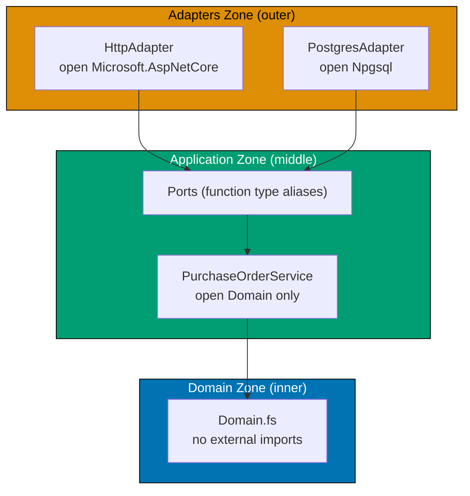
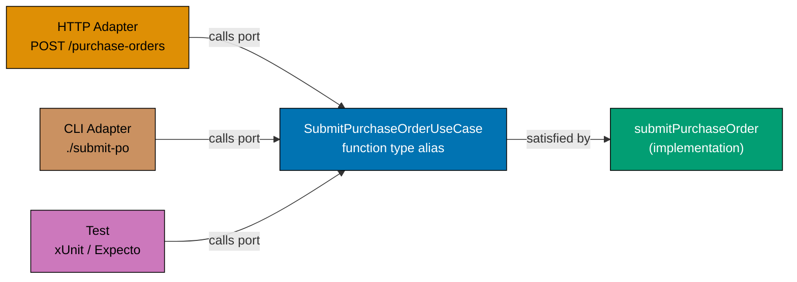
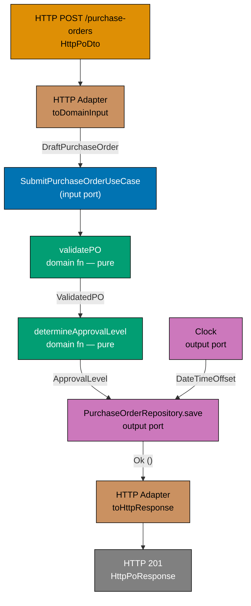

This beginner-level section introduces Hexagonal Architecture (Ports and Adapters) through F# code. The central thesis — that the **domain must be isolated from all infrastructure concerns** via a clean dependency rule — is established here through 25 progressive examples. All examples use the `purchasing` bounded context of `procurement-platform-be`: employees draft `PurchaseOrder` records, submit them for approval, and receive confirmations when orders are issued to suppliers.

## The Three Zones (Examples 1–7)

### Example 1: The Hexagon Metaphor — Three Zones as F# Namespaces

Hexagonal Architecture divides a system into three zones. The **Domain** zone holds pure business logic with no external dependencies. The **Application** zone orchestrates domain functions and defines ports. The **Adapters** zone wires the outside world (HTTP, database, CLI) to those ports. In F#, module namespaces are the natural mechanism for enforcing these zone boundaries.







```fsharp
// ── file: Domain.fs ──────────────────────────────────────────────────────
// The Domain zone has ZERO imports from any external library.
// No Npgsql, no ASP.NET, no JSON serialiser — only F# standard library.
// This is the innermost zone: pure business logic, always testable in isolation.

module ProcurementPlatform.Domain

// All types here reference only F# primitives and other domain types.
type PurchaseOrderId = string
// => Simple alias — zero runtime cost, maximum documentation value

type SupplierId = string
// => Distinct from PurchaseOrderId — documents the domain vocabulary

type PurchaseOrder = {
    // => The aggregate root of the purchasing context
    Id: PurchaseOrderId
    // => Unique identifier in format po_<uuid>
    SupplierId: SupplierId
    // => Identifies the supplier this PO is addressed to
    TotalAmount: decimal
    // => Sum of all line item values; drives approval-level routing
    Status: string
    // => Current state in the PO lifecycle: Draft, AwaitingApproval, Approved, etc.
}

// ── file: Application.fs ─────────────────────────────────────────────────
// Application zone imports only the Domain module — no infrastructure.

module ProcurementPlatform.Application
// open ProcurementPlatform.Domain   ← only this open statement is permitted here

// ── file: Adapters/PostgresAdapter.fs ────────────────────────────────────
// Adapters zone imports Application zone plus infrastructure libraries.

module ProcurementPlatform.Adapters.PostgresAdapter
// open ProcurementPlatform.Application   ← permitted: adapters depend on application
// open Npgsql                            ← permitted: adapters can open infra libraries

// ── ANTI-PATTERN: what NOT to do ─────────────────────────────────────────
// open Npgsql  ← inside Domain.fs — THIS IS WRONG
// Domain importing an infrastructure library violates the dependency rule.
// The domain would become untestable without a real database.
// => If you see an infrastructure import inside Domain.fs, it is a zone violation.

printfn "Three zones defined — dependency rule enforced by module namespaces"
// => Output: Three zones defined — dependency rule enforced by module namespaces
```





```clojure
;; ── file: domain/purchase_order.clj ──────────────────────────────────────
;; The Domain zone contains ZERO requires from any infrastructure namespace.
;; No jdbc, no http-kit, no ring — only clojure.core and other domain namespaces.
;; [F#: module ProcurementPlatform.Domain — Clojure uses ns declarations to delimit zones]

(ns procurement-platform.domain.purchase-order)
;; => The ns declaration is the zone marker: no :require of infra namespaces here
;; => Clojure enforces zone separation via ns isolation, not compilation order

;; Domain entities are plain maps — no defrecord required for value semantics.
;; [F#: type alias PurchaseOrderId = string — Clojure uses qualified keywords instead]
;; ::purchase-order/id, ::purchase-order/supplier-id, ::purchase-order/total-amount
;; => Namespaced keywords encode the domain vocabulary without wrapper types

(defn make-purchase-order
  ;; Constructor function — produces a validated map representing the aggregate root
  [id supplier-id total-amount status]
  ;; => All fields are positional; the map is the aggregate; no class hierarchy
  {:procurement-platform.domain.purchase-order/id           id
   ;; => Namespaced key distinguishes PO id from other string ids in merged maps
   :procurement-platform.domain.purchase-order/supplier-id  supplier-id
   ;; => Identifies the supplier this PO is addressed to
   :procurement-platform.domain.purchase-order/total-amount total-amount
   ;; => Sum of all line item values; drives approval-level routing
   :procurement-platform.domain.purchase-order/status       status})
   ;; => Current state: :draft, :awaiting-approval, :approved, etc.

;; ── file: application/ports.clj ──────────────────────────────────────────
;; Application zone requires only domain namespaces — no infrastructure.
(ns procurement-platform.application.ports
  (:require [procurement-platform.domain.purchase-order]))
;; => :require of domain ns is permitted; :require of jdbc is NOT

;; ── file: adapters/postgres_adapter.clj ──────────────────────────────────
;; Adapters zone requires application and infrastructure namespaces.
(ns procurement-platform.adapters.postgres-adapter
  (:require [procurement-platform.application.ports]
            ;; => permitted: adapter depends on application zone
            [next.jdbc]))
            ;; => permitted: adapters may require infrastructure libraries

;; ── ANTI-PATTERN: what NOT to do ─────────────────────────────────────────
;; (ns procurement-platform.domain.purchase-order
;;   (:require [next.jdbc]))  ← WRONG: domain requiring infrastructure
;; => Effect: domain becomes untestable without a real Postgres connection
;; => Any :require of jdbc, http-kit, or ring inside a domain ns is a zone violation

(println "Three zones defined — dependency rule enforced by ns declarations")
;; => Output: Three zones defined — dependency rule enforced by ns declarations
```





**Key Takeaway**: The three zones (Domain, Application, Adapters) map directly to F# module namespaces, and the dependency rule — inner zones never import outer zones — is a simple constraint on `open` statements.

**Why It Matters**: In most codebases, business logic quietly accumulates database calls, HTTP client calls, and configuration reads until nothing can be tested without spinning up real infrastructure. Hexagonal Architecture prevents this by making the zone boundary a module-level convention. When a developer attempts to `open Npgsql` inside `Domain.fs`, a code review catches it immediately because the convention is documented in the file structure itself. This single rule is responsible for the testability and evolvability of the entire system.

---

### Example 2: Domain Isolation — A Pure Domain Function with No Infrastructure Imports

A pure domain function accepts only domain types and returns a `Result`. It has no `open` statements for external libraries. It cannot call a database, make an HTTP request, or read a file. This purity is not a limitation — it is what makes the function instantly testable and independently deployable.





```fsharp
// ── CORRECT: pure domain function ────────────────────────────────────────
// Zero open statements for any library — only F# language constructs.
// This function can be tested by calling it directly with no setup.

type PurchaseOrderId = string
// => Single-field alias — distinguishes PO identity from other strings

type Money = { Amount: decimal; Currency: string }
// => Value object: amount must be >= 0, currency must be 3-letter ISO code

type DraftPurchaseOrder = {
    // => Raw input arriving from the outside world; nothing validated yet
    Id: string
    // => Raw string — may be blank, may not follow po_<uuid> format
    SupplierId: string
    // => Raw supplier identifier — not yet verified
    TotalAmount: decimal
    // => Raw amount — may be negative or zero
}

type DomainError =
    // => Named errors — not generic exceptions
    | BlankOrderId
    // => The PO ID was empty or whitespace
    | BlankSupplierId
    // => The supplier ID was empty or whitespace
    | NonPositiveAmount of decimal
    // => Total amount was zero or negative — domain rule violation

let validateDraftPO (input: DraftPurchaseOrder) : Result<DraftPurchaseOrder, DomainError> =
    // => Input: raw DTO from the outside world
    // => Output: Ok DraftPurchaseOrder if all rules pass, Error DomainError if any fail
    if System.String.IsNullOrWhiteSpace(input.Id) then
        // => Guard 1: the PO ID must be non-blank
        Error BlankOrderId
        // => Returns named error — the caller knows exactly what went wrong
    elif System.String.IsNullOrWhiteSpace(input.SupplierId) then
        // => Guard 2: the supplier ID must be non-blank
        Error BlankSupplierId
        // => Named error for blank supplier ID
    elif input.TotalAmount <= 0m then
        // => Guard 3: total amount must be positive — domain rule
        Error (NonPositiveAmount input.TotalAmount)
        // => Carries the actual invalid value for diagnostics
    else
        Ok input
        // => All guards passed — returns the validated draft PO

// Testing the pure function — no database, no HTTP, no setup
let result = validateDraftPO { Id = "po_abc-123"; SupplierId = "sup_xyz-456"; TotalAmount = 500m }
// => All three guards pass; TotalAmount 500m > 0
// => result : Result<DraftPurchaseOrder, DomainError> = Ok { Id = "po_abc-123"; ... }

match result with
| Ok po   -> printfn "Valid PO: %s" po.Id
// => po.Id = "po_abc-123" — unwrapped from Ok
| Error e -> printfn "Error: %A" e
// => Not reached — input was valid
// => Output: Valid PO: po_abc-123
```





```clojure
;; ── CORRECT: pure domain function ────────────────────────────────────────
;; Zero requires from any infrastructure namespace — only clojure.core.
;; This function can be tested by calling it directly with no setup.
;; [F#: discriminated union DomainError — Clojure returns tagged error maps instead]

(ns procurement-platform.domain.purchase-order)

;; Domain errors as data — maps with a :error/kind key for dispatch
;; [F#: type DomainError = BlankOrderId | BlankSupplierId | NonPositiveAmount of decimal]
;; => Clojure's data-orientation: errors are plain maps, not closed union types
;; => The :error/kind key plays the same role as the DU tag

(defn blank-or-nil?
  ;; Predicate: true when s is nil, empty string, or whitespace-only
  [s]
  (or (nil? s) (clojure.string/blank? s)))
  ;; => Used as a guard in validate-draft-po below

(defn validate-draft-po
  ;; Pure validation function — no I/O, no side effects, no setup required.
  ;; [F#: Result<DraftPurchaseOrder, DomainError> — Clojure returns {:ok ...} or {:error ...}]
  ;; => Input: raw map from any delivery mechanism (HTTP body, CLI args, test literal)
  ;; => Output: map with :ok key on success, :error key on failure
  [{:keys [id supplier-id total-amount] :as draft}]
  (cond
    (blank-or-nil? id)
    ;; => Guard 1: the PO id must be non-blank
    {:error {:error/kind :blank-order-id}}
    ;; => Returns tagged error map — caller pattern-matches on :error/kind

    (blank-or-nil? supplier-id)
    ;; => Guard 2: the supplier id must be non-blank
    {:error {:error/kind :blank-supplier-id}}

    (<= total-amount 0)
    ;; => Guard 3: total amount must be positive — domain rule
    {:error {:error/kind :non-positive-amount :amount total-amount}}
    ;; => Carries the invalid value for diagnostics, just like F# NonPositiveAmount of decimal

    :else
    {:ok draft}))
    ;; => All guards passed — returns the original draft map wrapped in :ok

;; Testing the pure function — no database, no HTTP, no setup
(def result
  (validate-draft-po {:id "po_abc-123" :supplier-id "sup_xyz-456" :total-amount 500}))
;; => All three guards pass; :total-amount 500 > 0
;; => result = {:ok {:id "po_abc-123" :supplier-id "sup_xyz-456" :total-amount 500}}

(if (:ok result)
  (println "Valid PO:" (get-in result [:ok :id]))
  ;; => Extracts :id from the nested :ok map
  (println "Error:" (:error result)))
;; => Not reached — input was valid
;; => Output: Valid PO: po_abc-123
```





**Key Takeaway**: A pure domain function with no infrastructure imports is the most testable unit of code in the system — calling it requires nothing but the F# runtime and domain types.

**Why It Matters**: Teams that embed database calls directly in domain functions often discover this when they try to write unit tests. The setup cost (spinning up databases, seeding data, managing transactions) discourages testing, leading to under-tested business logic. Pure domain functions have zero setup cost: pass in data, receive a `Result`. This is the direct payoff of the domain isolation rule, and it compounds across every domain function in the system.

---

### Example 3: Input Port as a Function Type Alias

An **input port** is the entry point into the application. Any adapter (HTTP handler, CLI parser, message consumer) that wants to trigger the `SubmitPurchaseOrder` workflow calls through this port. In F#, the input port is a function type alias — no interface, no abstract class, no inheritance.







```fsharp
// Input port: the complete contract for submitting a purchase order.
// A type alias for a function — not an interface, not a class hierarchy.

type DraftPurchaseOrder = { Id: string; SupplierId: string; TotalAmount: decimal }
// => Raw input from any delivery mechanism — nothing validated yet

type SubmittedPurchaseOrder = { Id: string; SupplierId: string; TotalAmount: decimal; Status: string }
// => Represents a PO in AwaitingApproval state — validated and persisted

type SubmissionError =
    | ValidationError of string
    // => Domain rule violated — caller should fix the request
    | RepositoryError of string
    // => Infrastructure failure — caller may retry

// Input port type alias — the complete contract in one line
type SubmitPurchaseOrderUseCase =
    DraftPurchaseOrder -> Async<Result<SubmittedPurchaseOrder, SubmissionError>>
// => Input:  raw, unvalidated PO DTO from any delivery mechanism
// => Output: Ok SubmittedPurchaseOrder on success, or SubmissionError on failure
// => The async wrapper acknowledges that persistence is effectful

// Any function with this signature satisfies the port — no inheritance needed
let submitPurchaseOrder : SubmitPurchaseOrderUseCase =
    // => This is ONE implementation of the port — tests can supply a different one
    fun draft ->
        async {
            // Simplified: validation + stubbed persistence
            if System.String.IsNullOrWhiteSpace(draft.Id) then
                return Error (ValidationError "PO Id must not be blank")
            // => Domain rule enforced before any I/O
            else
                let submitted = { Id = draft.Id; SupplierId = draft.SupplierId
                                  TotalAmount = draft.TotalAmount; Status = "AwaitingApproval" }
                // => State transition: Draft -> AwaitingApproval
                return Ok submitted
                // => Happy path — PO is now awaiting manager approval
        }

// The HTTP adapter holds the injected port — it never names the implementation
// let handler (useCase: SubmitPurchaseOrderUseCase) (dto: HttpDto) = ...
// => useCase is the port; the implementation is wired at the composition root
```





```clojure
;; Input port: the complete contract for submitting a purchase order.
;; A plain function var — not a protocol, not a defrecord hierarchy.
;; [F#: type alias SubmitPurchaseOrderUseCase = DraftPurchaseOrder -> Async<Result<...>>]
;; => Clojure expresses ports as functions that accept and return plain maps
;; => The "contract" is documented by the function spec, not a type alias

(ns procurement-platform.application.ports.submit-purchase-order)

;; Clojure port contract documented via function spec (closest native to F# type alias)
;; [F#: type SubmissionError = ValidationError of string | RepositoryError of string]
;; => Clojure represents errors as maps with a :error/kind key — open, not exhaustive
;; => {:error/kind :validation-error :message "..."} or {:error/kind :repository-error}

(defn submit-purchase-order
  ;; Default (real) implementation of the input port.
  ;; Any function accepting a draft map and returning a result map satisfies the port.
  ;; => Callers depend on this function's shape — not on the implementation namespace
  [draft]
  ;; => draft is a plain map: {:id "..." :supplier-id "..." :total-amount 500}
  (if (clojure.string/blank? (:id draft))
    ;; => Guard: the PO id must be non-blank — domain rule enforced before any I/O
    {:error {:error/kind :validation-error :message "PO id must not be blank"}}
    ;; => Returns error map — caller checks :error key, not an exception

    (let [submitted (assoc draft :status :awaiting-approval)]
      ;; => State transition: draft map gains :status — no new type required
      ;; => assoc returns a NEW map — original draft is unchanged (immutability)
      {:ok submitted})))
      ;; => Happy path — map wrapped in :ok for uniform result shape

;; The HTTP adapter receives the port function as a parameter — never names the impl ns
;; (defn handler [submit-po-fn http-request] ...)
;; => submit-po-fn is the injected port var; the implementation is wired at composition root
;; => Any function of the same shape (draft -> result-map) is a valid substitute
```





**Key Takeaway**: An input port expressed as a function type alias gives every adapter (HTTP, CLI, test) a single, compiler-checked contract without requiring a base class or interface hierarchy.

**Why It Matters**: Traditional layered architectures expose the `OrderService` class directly to controllers, creating invisible coupling between the HTTP layer and the service implementation. A function type alias breaks this coupling: the HTTP adapter depends on the type `SubmitPurchaseOrderUseCase`, not on any specific module. Swapping the implementation (for testing, A/B deployment, or a complete rewrite) requires changing exactly one line in the composition root. No mocking framework, no DI container — just pass a different function.

---

### Example 4: Output Port as a Record Type — `PurchaseOrderRepository`

An **output port** is a record of functions that the application layer calls but never implements. The record type is the contract; record literals in the adapters zone are the implementations. The `PurchaseOrderRepository` port appears identically in every example that uses it.





```fsharp
// ── Domain types ──────────────────────────────────────────────────────────
type PurchaseOrderId = string
// => Alias for the PO primary key — format po_<uuid>

type PurchaseOrder = {
    // => Aggregate root of the purchasing context
    Id         : PurchaseOrderId
    SupplierId : string
    TotalAmount: decimal
    Status     : string
}

// ── Infrastructure error type ─────────────────────────────────────────────
type RepoError = DatabaseError of string | ConnectionTimeout
// => Named error cases — DatabaseError carries the message; ConnectionTimeout signals retry

// ── Output port: the canonical PurchaseOrderRepository definition ─────────
// This record type is THE port contract. Every adapter must provide a value
// of this type. No adapter name, no SQL, no Npgsql — just function signatures.
type PurchaseOrderRepository = {
    save: PurchaseOrder -> Async<Result<unit, RepoError>>
    // => Persist a PO — upsert semantics recommended
    // => Async because disk/network I/O is involved
    // => Result<unit, RepoError> because the database can fail with named cases
    load: PurchaseOrderId -> Async<Result<PurchaseOrder option, RepoError>>
    // => Load a PO by its ID
    // => Returns None when the PO does not exist (not an error)
    // => Returns Error RepoError on infrastructure failure
}
// => This exact record type signature is used in every example that touches the repository port

// ── Demonstration: the port is just a type ───────────────────────────────
// The application service accepts this record — it never names an implementation.
let exampleService (repo: PurchaseOrderRepository) (id: PurchaseOrderId) =
    // => repo is the injected port — could be Postgres, in-memory, or a spy
    async {
        let! result = repo.load id
        // => Calls the port — no knowledge of what is behind the boundary
        return result
        // => Propagates the Result to the caller unchanged
    }

printfn "PurchaseOrderRepository port defined — zero adapter knowledge in application layer"
// => Output: PurchaseOrderRepository port defined — zero adapter knowledge in application layer
```





```clojure
;; ── Output port: PurchaseOrderRepository as a protocol ────────────────────
;; [F#: record-of-functions type PurchaseOrderRepository — Clojure uses a protocol]
;; => defprotocol is Clojure's idiomatic open-dispatch mechanism for polymorphism
;; => Any type that extends the protocol satisfies the port — no class hierarchy needed

(ns procurement-platform.application.ports.repository)

;; Clojure protocol = F# record-of-functions (closest native equivalent)
;; => Each method signature documents one operation the port must support
(defprotocol PurchaseOrderRepository
  (save-po [repo purchase-order]
    ;; Persist a PO — upsert semantics recommended.
    ;; => Returns a result map: {:ok nil} on success, {:error {:error/kind :db-error}} on failure
    ;; => Async callers use core.async; sync callers receive the result directly
    "Persist a purchase order; returns {:ok nil} or {:error ...}")
  (load-po [repo purchase-order-id]
    ;; Load a PO by its id.
    ;; => Returns {:ok po-map} when found, {:ok nil} when not found, {:error ...} on failure
    ;; => nil inside :ok signals absence — not an error, just a missing record
    "Load a purchase order by id; returns {:ok po-map}, {:ok nil}, or {:error ...}"))
;; => Protocol methods are the port contract — no SQL, no jdbc here

;; ── Demonstration: the application service calls the protocol ─────────────
(defn example-service
  ;; Application service accepts any value implementing PurchaseOrderRepository.
  ;; [F#: repo: PurchaseOrderRepository — same injection pattern, no named implementation]
  ;; => repo could be a PostgresRepository, an InMemoryRepository, or a test spy
  [repo id]
  (load-po repo id))
  ;; => Calls the protocol method — no knowledge of the concrete implementation
  ;; => The composition root decides which implementation satisfies the protocol

(println "PurchaseOrderRepository port defined — zero adapter knowledge in application layer")
;; => Output: PurchaseOrderRepository port defined — zero adapter knowledge in application layer
```





**Key Takeaway**: The `PurchaseOrderRepository` record type is the complete port contract — any record literal that provides matching `save` and `load` functions satisfies it, regardless of the underlying storage mechanism.

**Why It Matters**: When application services depend on a record-of-functions type rather than a concrete module, the adapter can be swapped without modifying a single line of application or domain code. The same `exampleService` function runs correctly against a PostgreSQL adapter in production, a Dictionary adapter in unit tests, and a WireMock adapter in integration tests. The port boundary is the wall that keeps business logic testable and infrastructure replaceable.

---

### Example 5: The `Clock` Output Port — Injecting Time

The `Clock` port makes the current timestamp injectable. Without it, `System.DateTimeOffset.UtcNow` would be hard-coded in application services, making time-dependent domain rules (approval deadlines, order expiry) non-deterministic in tests.





```fsharp
// ── Clock port ────────────────────────────────────────────────────────────
// A synchronous function — reading the clock has no failure mode.
// No async wrapper, no Result — clocks do not throw recoverable errors.
type Clock = unit -> System.DateTimeOffset
// => Returns the current timestamp as seen by the application layer
// => Synchronous: no await, no async { } block required at call site

// ── Domain type that depends on time ─────────────────────────────────────
type PurchaseOrder = {
    Id         : string
    TotalAmount: decimal
    SubmittedAt: System.DateTimeOffset
    // => Timestamp is part of the domain aggregate — used for approval SLA tracking
}

// ── Application service using the Clock port ──────────────────────────────
// The service is parameterised by the clock — never calls UtcNow directly.
let submitPO (clock: Clock) (id: string) (amount: decimal) : PurchaseOrder =
    // => clock is the injected Clock port — synchronous, pure from caller's view
    let now = clock ()
    // => Delegates timestamp resolution to the injected adapter
    { Id = id; TotalAmount = amount; SubmittedAt = now }
    // => PO timestamp is now deterministic in tests

// ── System clock adapter (production) ────────────────────────────────────
let systemClock : Clock = fun () -> System.DateTimeOffset.UtcNow
// => Production adapter: reads the real wall-clock
// => Non-deterministic — different call, different timestamp

// ── Fixed clock adapter (tests) ───────────────────────────────────────────
let fixedClock : Clock =
    // => Test adapter: always returns the same timestamp
    // => Every test assertion can use this literal value
    fun () -> System.DateTimeOffset(2026, 1, 15, 9, 0, 0, System.TimeSpan.Zero)

// ── Demonstration ─────────────────────────────────────────────────────────
let testPO = submitPO fixedClock "po_test-001" 2500m
// => Uses fixed clock — deterministic
printfn "Submitted at: %A" testPO.SubmittedAt
// => Output: Submitted at: 2026-01-15 09:00:00 +00:00  (exact, always the same)

let prodPO = submitPO systemClock "po_prod-001" 2500m
// => Uses system clock — non-deterministic (different run = different value)
printfn "Submitted at: %A" prodPO.SubmittedAt
// => Output: Submitted at: <current UTC time>  (varies by run)
```





```clojure
;; ── Clock port ────────────────────────────────────────────────────────────
;; A zero-argument function — reading the clock has no failure mode.
;; [F#: type Clock = unit -> System.DateTimeOffset — Clojure uses a plain fn var]
;; => No protocol needed: a function that takes no args and returns an instant is the port
;; => Injected as a function parameter — the composition root decides which adapter to wire

(ns procurement-platform.application.ports.clock)

;; ── Application service using the Clock port ──────────────────────────────
;; The service accepts clock-fn as a parameter — never calls java.time.Instant/now directly.
(defn submit-po
  ;; clock-fn is the injected Clock port — a zero-arg function returning an instant.
  ;; [F#: submitPO (clock: Clock) — identical injection pattern, just function passing]
  [clock-fn id amount]
  {:id           id
   ;; => PO id — passed through unchanged
   :total-amount amount
   ;; => Total amount — passed through unchanged
   :submitted-at (clock-fn)})
   ;; => Delegates timestamp resolution to the injected clock function
   ;; => Returns a plain map — no record type required

;; ── System clock adapter (production) ────────────────────────────────────
(def system-clock
  ;; Production adapter: reads the real wall-clock via Java interop.
  ;; => Non-deterministic — different call, different instant
  #(java.time.Instant/now))
  ;; => #() is Clojure's anonymous function shorthand; % would be the arg if there were one

;; ── Fixed clock adapter (tests) ───────────────────────────────────────────
(def fixed-clock
  ;; Test adapter: always returns the same instant.
  ;; => Every test assertion can use this literal value — deterministic by construction
  (let [fixed-instant (java.time.Instant/parse "2026-01-15T09:00:00Z")]
    ;; => Parse once, close over the value — the fn always returns this instant
    (fn [] fixed-instant)))

;; ── Demonstration ─────────────────────────────────────────────────────────
(def test-po (submit-po fixed-clock "po_test-001" 2500))
;; => Uses fixed clock — deterministic across all test runs
(println "Submitted at:" (:submitted-at test-po))
;; => Output: Submitted at: 2026-01-15T09:00:00Z  (exact, always the same)

(def prod-po (submit-po system-clock "po_prod-001" 2500))
;; => Uses system clock — non-deterministic (different run = different instant)
(println "Submitted at:" (:submitted-at prod-po))
;; => Output: Submitted at: <current UTC instant>  (varies by run)
```





**Key Takeaway**: A `Clock` port that returns a `DateTimeOffset` makes time a dependency like any other — injectable, swappable, and deterministic in tests.

**Why It Matters**: Time-dependent business rules are among the hardest to test without a clock port. Approval SLAs, order expiry windows, and payment scheduling deadlines all require specific timestamps to trigger. Without an injectable clock, tests either manipulate system time globally (fragile, OS-dependent) or skip the time-sensitive paths entirely. The `Clock` port costs one function type alias and one record field; the payoff is complete determinism for any time-sensitive domain rule.

---

### Example 6: The Dependency Rule — Direction of Imports

The dependency rule states that the direction of source-code imports must always point inward: adapters import the application zone, the application zone imports the domain zone, and the domain zone imports nothing outside itself. Violating this rule is the single most common hexagonal architecture mistake.





```fsharp
// ── CORRECT dependency directions ────────────────────────────────────────

// Domain.fs — zero external imports
module ProcurementPlatform.Domain

type PurchaseOrder = { Id: string; TotalAmount: decimal; Status: string }
// => Domain type — defined without knowledge of any infrastructure
type DomainError = InvalidAmount of decimal | BlankId
// => Named errors — no exception types, no HTTP status codes here

// Application.fs — imports Domain only
module ProcurementPlatform.Application
// open ProcurementPlatform.Domain  ← CORRECT: imports inner zone

type PurchaseOrderRepository = {
    // => Port defined in Application — depends on Domain types only
    save: PurchaseOrder -> Async<Result<unit, string>>
    load: string        -> Async<Result<PurchaseOrder option, string>>
}
// => Application knows Domain; Application does NOT know Adapters

// Adapters/PostgresAdapter.fs — imports Application (and transitively Domain)
module ProcurementPlatform.Adapters.PostgresAdapter
// open ProcurementPlatform.Application  ← CORRECT: imports middle zone
// open Npgsql                           ← CORRECT: adapters may import infrastructure

// ── WRONG dependency directions ───────────────────────────────────────────
// These are the mistakes the dependency rule prevents.

// MISTAKE 1: Domain importing infrastructure
// module ProcurementPlatform.Domain
// open Npgsql  ← WRONG: domain cannot import Npgsql
// => Effect: domain is now untestable without a real Postgres connection

// MISTAKE 2: Application importing an adapter
// module ProcurementPlatform.Application
// open ProcurementPlatform.Adapters.PostgresAdapter  ← WRONG
// => Effect: swapping the adapter requires changing the application layer

// MISTAKE 3: Domain importing application
// module ProcurementPlatform.Domain
// open ProcurementPlatform.Application  ← WRONG
// => Effect: circular dependency; domain becomes aware of ports it should not know about

printfn "Dependency rule: Domain ← Application ← Adapters (arrows = allowed imports)"
// => Output: Dependency rule: Domain ← Application ← Adapters (arrows = allowed imports)
```





```clojure
;; ── CORRECT dependency directions ────────────────────────────────────────
;; [F#: module ordering enforces the dependency rule at compile time]
;; => Clojure uses ns :require declarations to express the same rule
;; => The rule is: domain ns requires nothing; application requires domain; adapters require both

;; ── domain/purchase_order.clj — zero infrastructure requires ──────────────
(ns procurement-platform.domain.purchase-order)
;; => No :require of any infrastructure library — pure domain ns

(defn make-po [id total-amount status]
  ;; Domain constructor — returns a plain map, no external dependency needed
  {:id id :total-amount total-amount :status status})
;; => Domain type — defined without knowledge of any infrastructure

;; ── application/ports.clj — requires domain only ─────────────────────────
(ns procurement-platform.application.ports
  (:require [procurement-platform.domain.purchase-order :as po]))
;; => :require of domain ns is CORRECT — application knows domain
;; => No :require of any adapter ns here — application does NOT know adapters

(defprotocol PurchaseOrderRepository
  ;; Port defined in application — depends on domain types only
  (save-po [repo purchase-order] "Persist a PO; returns {:ok nil} or {:error ...}")
  (load-po [repo id]             "Load a PO; returns {:ok po-map}, {:ok nil}, or {:error ...}"))
;; => Application knows domain; Application does NOT know adapters

;; ── adapters/postgres_adapter.clj — requires application and infrastructure ──
(ns procurement-platform.adapters.postgres-adapter
  (:require [procurement-platform.application.ports :as ports]
            ;; => :require of application ns is CORRECT — adapter depends on application
            [next.jdbc :as jdbc]))
            ;; => :require of jdbc is CORRECT — adapters may require infrastructure libraries

;; ── WRONG dependency directions ───────────────────────────────────────────
;; These are the mistakes the dependency rule prevents.

;; MISTAKE 1: Domain requiring infrastructure
;; (ns procurement-platform.domain.purchase-order
;;   (:require [next.jdbc]))  ← WRONG: domain cannot require jdbc
;; => Effect: domain is now untestable without a real Postgres connection

;; MISTAKE 2: Application requiring an adapter
;; (ns procurement-platform.application.ports
;;   (:require [procurement-platform.adapters.postgres-adapter]))  ← WRONG
;; => Effect: swapping the adapter requires changing the application layer

;; MISTAKE 3: Domain requiring application
;; (ns procurement-platform.domain.purchase-order
;;   (:require [procurement-platform.application.ports]))  ← WRONG
;; => Effect: circular dependency; domain becomes aware of ports it should not know about

(println "Dependency rule: Domain ← Application ← Adapters (arrows = allowed requires)")
;; => Output: Dependency rule: Domain ← Application ← Adapters (arrows = allowed requires)
```





**Key Takeaway**: The dependency rule — imports only point inward — is enforced by F# module ordering; a module cannot open a module defined later in the compilation order.

**Why It Matters**: The dependency rule is not a guideline — it is the architectural invariant that makes the whole pattern work. When it is violated, the domain becomes coupled to infrastructure (untestable), adapters become coupled to each other (unswappable), and the application service becomes coupled to specific adapter implementations (fragile). F#'s compilation order makes many violations visible at compile time: if `Domain.fs` tries to `open` a type from `Adapters.fs`, the compiler rejects it. This is the strongest enforcement mechanism available in a compiled language.

---

### Example 7: Zone Boundaries as File Organisation

Hexagonal Architecture's zone boundaries should be visible in the file system. The module namespace convention maps directly to folder structure, making zone violations easy to detect in a code review without reading any code.





```fsharp
// ── File system layout ────────────────────────────────────────────────────
// ProcurementPlatform/
// ├── Domain/
// │   └── PurchaseOrder.fs          ← inner zone: no external dependencies
// ├── Application/
// │   ├── Ports.fs                  ← port type aliases: PurchaseOrderRepository, Clock
// │   └── PurchaseOrderService.fs   ← orchestration: calls domain + ports
// └── Adapters/
//     ├── PostgresPurchaseOrderRepository.fs  ← output port implementation
//     ├── InMemoryPurchaseOrderRepository.fs  ← test adapter
//     ├── HttpController.fs                   ← primary (driving) adapter
//     └── Composition.fs                      ← wires adapters to ports

// ── Domain/PurchaseOrder.fs ───────────────────────────────────────────────
module ProcurementPlatform.Domain.PurchaseOrder

type PurchaseOrderId = string
// => Thin alias — prevents mixing PO IDs with other string identifiers

type PurchaseOrder = {
    // => Aggregate root of the purchasing context — lives only in this module
    Id         : PurchaseOrderId
    SupplierId : string
    TotalAmount: decimal
    Status     : string
}

// ── Application/Ports.fs ─────────────────────────────────────────────────
module ProcurementPlatform.Application.Ports

// open ProcurementPlatform.Domain.PurchaseOrder  ← only domain types imported

type PurchaseOrderRepository = {
    // => Port definition — ONLY in the application zone
    save : PurchaseOrder -> Async<Result<unit, string>>
    load : PurchaseOrderId -> Async<Result<PurchaseOrder option, string>>
}
// => Adapters implement this; the application service consumes it

type Clock = unit -> System.DateTimeOffset
// => Time port — all ports live alongside each other in Ports.fs

// ── Adapters/Composition.fs ───────────────────────────────────────────────
// The composition root is the ONLY file that knows about all adapters.
// module ProcurementPlatform.Adapters.Composition
// open ProcurementPlatform.Application.Ports
// open ProcurementPlatform.Adapters.PostgresPurchaseOrderRepository
// open ProcurementPlatform.Adapters.HttpController

printfn "File layout enforces zone boundaries — violations are visible at a glance"
// => Output: File layout enforces zone boundaries — violations are visible at a glance
```





```clojure
;; ── File system layout ────────────────────────────────────────────────────
;; procurement_platform/
;; ├── domain/
;; │   └── purchase_order.clj        ← inner zone: no :require of infrastructure
;; ├── application/
;; │   ├── ports.clj                 ← protocol definitions: PurchaseOrderRepository, clock-fn
;; │   └── purchase_order_service.clj ← orchestration: calls domain + protocols
;; └── adapters/
;;     ├── postgres_purchase_order_repository.clj  ← output port implementation
;;     ├── in_memory_purchase_order_repository.clj ← test adapter
;;     ├── http_handler.clj                        ← primary (driving) adapter
;;     └── composition.clj                         ← wires adapters to protocols
;; [F#: ProcurementPlatform/ namespace mirrors folder structure]
;; => Clojure ns names match file paths — the same zone layout applies

;; ── domain/purchase_order.clj ─────────────────────────────────────────────
(ns procurement-platform.domain.purchase-order)
;; => No :require of any infrastructure namespace — inner zone purity

(defn make-purchase-order
  ;; Aggregate root constructor — returns a plain map, no framework dependency
  [id supplier-id total-amount status]
  {:id id :supplier-id supplier-id :total-amount total-amount :status status})
;; => Aggregate root lives only in this namespace

;; ── application/ports.clj ────────────────────────────────────────────────
(ns procurement-platform.application.ports
  (:require [procurement-platform.domain.purchase-order]))
;; => :require of domain ns ONLY — no adapter namespaces here

(defprotocol PurchaseOrderRepository
  ;; Port definition — ONLY in the application zone
  (save-po [repo po]  "Persist a PO; returns {:ok nil} or {:error ...}")
  (load-po [repo id]  "Load a PO; returns {:ok po-map}, {:ok nil}, or {:error ...}"))
;; => Adapters implement this protocol; the application service consumes it

;; clock-fn port: any zero-arg fn returning an instant satisfies the clock port
;; => All ports live alongside each other in ports.clj — same as Ports.fs

;; ── adapters/composition.clj ─────────────────────────────────────────────
;; The composition root is the ONLY namespace that knows about all adapters.
;; (ns procurement-platform.adapters.composition
;;   (:require [procurement-platform.application.ports]
;;             [procurement-platform.adapters.postgres-purchase-order-repository]
;;             [procurement-platform.adapters.http-handler]))
;; => Composition ns wires concrete adapter impls to the protocol definitions

(println "File layout enforces zone boundaries — violations are visible at a glance")
;; => Output: File layout enforces zone boundaries — violations are visible at a glance
```





**Key Takeaway**: Mapping the three zones directly to three top-level folders makes every dependency rule violation visible as a misplaced file, before any code is read.

**Why It Matters**: Architecture rules enforced only in developers' heads erode under deadline pressure. A folder structure that mirrors the zone model gives every contributor an immediate visual signal when something is misplaced. In code reviews, a file in `Domain/` that imports `Npgsql` is caught by the reviewer before the diff is even read. This is the power of making architecture visible through file organisation: enforcement shifts from human discipline to spatial recognition.

---

## Ports as Function Types (Examples 8–14)

### Example 8: Output Port — The `PurchaseOrderRepository` Record Type

The `PurchaseOrderRepository` port is the canonical output port for the `purchasing` context. It appears identically in every beginner example that persists or retrieves a `PurchaseOrder`. Here the focus is on understanding WHY the record-of-functions shape is the right abstraction.





```fsharp
// ── The canonical PurchaseOrderRepository port ────────────────────────────
// This definition is IDENTICAL in every example that uses this port.
// Never rename fields, never change signatures — the contract is the port.
type PurchaseOrderId = string
// => PO primary key — format po_<uuid>; alias prevents stringly-typed confusion

type PurchaseOrder = {
    // => Aggregate root — the only type the repository cares about
    Id         : PurchaseOrderId
    SupplierId : string
    TotalAmount: decimal
    Status     : string
}

// [Clojure: tagged error maps {:type :db-error :msg ...} — open dispatch; no compile-time exhaustiveness]
type RepoError = DatabaseError of string | ConnectionTimeout
// => Infrastructure errors — named so callers can respond appropriately
// => DatabaseError carries the message; ConnectionTimeout signals a retry opportunity

// [Clojure: defprotocol PurchaseOrderRepository — dynamic dispatch; any reify satisfies the port]
type PurchaseOrderRepository = {
    // => The complete output port — two operations, two function signatures
    save: PurchaseOrder -> Async<Result<unit, RepoError>>
    // => save: persist the aggregate; returns unit on success (the PO is the input)
    // => Async because disk write is I/O-bound
    // => Result because the database can fail (constraint, connection, timeout)
    load: PurchaseOrderId -> Async<Result<PurchaseOrder option, RepoError>>
    // => load: retrieve by identity; returns None when not found (not an error)
    // => option distinguishes "not found" from "infrastructure failure"
}
// => Any record literal with these two fields satisfies the PurchaseOrderRepository type

// ── How the application service depends on the port ───────────────────────
let loadAndInspect (repo: PurchaseOrderRepository) (id: PurchaseOrderId) =
    // => repo is the port — injected by the composition root
    async {
        let! result = repo.load id
        // => Delegates to whichever adapter was injected — no SQL in this function
        return
            match result with
            | Ok (Some po) -> sprintf "Found PO %s in status %s" po.Id po.Status
            // => PO found — return a summary string
            | Ok None      -> sprintf "PO %s not found" id
            // => Not found — explicit, not an error
            | Error (DatabaseError msg)  -> sprintf "DB error: %s" msg
            // => Infrastructure failure — propagate with context
            | Error ConnectionTimeout    -> "Timeout — retry later"
            // => Timeout — signal to the caller that a retry is safe
    }

printfn "PurchaseOrderRepository port declared — adapters implement; application layer consumes"
// => Output: PurchaseOrderRepository port declared — adapters implement; application layer consumes
```





```clojure
;; ── The canonical purchase-order-repository port ──────────────────────────
;; This protocol is IDENTICAL in every example that uses this port.
;; Never rename methods, never change arities — the contract is the protocol.
;; [F#: record-of-functions type alias — compiler checks all fields are provided]

(ns procurement-platform.application.ports
  (:require [procurement-platform.domain.purchase-order :as po]))
;; => All port definitions live in this namespace — same as Ports.fs in F#

;; ── Domain type: plain map with namespaced keywords ───────────────────────
;; [F#: record type PurchaseOrder — compiler-checked field names and types]
;; Clojure uses plain maps; namespaced keywords prevent key collisions
;; Example: {:procurement/id "po_001" :procurement/supplier-id "sup_001" ...}

(defprotocol PurchaseOrderRepository
  ;; => The complete output port — two operations, two method signatures
  ;; [F#: record type with save and load function fields]
  (save-po [repo po]
    "Persist a PO map; returns {:ok nil} or {:error {:type :db-error :msg ...}}")
  ;; => save-po: persist the aggregate map; {:ok nil} on success
  ;; => Async via core.async or futures when calling real infrastructure
  (load-po [repo po-id]
    "Load a PO by id; returns {:ok po-map}, {:ok nil} if not found, or {:error ...}"))
;; => load-po: retrieve by identity; {:ok nil} for not-found (not an error)
;; => Any reify or record that implements both methods satisfies this protocol

;; ── Error representation — tagged map ────────────────────────────────────
;; [F#: discriminated union RepoError — compiler-enforced exhaustive matching]
;; Clojure represents errors as plain maps with a :type dispatch key
(def db-error
  ;; Constructor helper — builds a database-error map
  (fn [msg] {:type :db-error :msg msg}))
;; => {:type :db-error :msg "..."} — readable in REPL, no class hierarchy needed

(def connection-timeout
  ;; Constructor helper — builds a timeout-error map
  {:type :connection-timeout})
;; => {:type :connection-timeout} — dispatch on :type in the application layer

;; ── How the application service depends on the port ───────────────────────
(defn load-and-inspect
  ;; repo satisfies PurchaseOrderRepository — injected by the composition root
  [repo po-id]
  (let [result (load-po repo po-id)]
    ;; => Delegates to whichever adapter was injected — no SQL in this function
    (cond
      (= (:ok result) nil)
      ;; => Not found — {:ok nil} is explicit absence, not an error
      (str "PO " po-id " not found")

      (:ok result)
      ;; => PO found — extract the map and format a summary string
      (let [po (:ok result)]
        (str "Found PO " (:id po) " in status " (:status po)))

      (= (:type (:error result)) :db-error)
      ;; => Infrastructure failure — propagate with context
      (str "DB error: " (get-in result [:error :msg]))

      (= (:type (:error result)) :connection-timeout)
      ;; => Timeout — signal to the caller that a retry is safe
      "Timeout — retry later")))

(println "PurchaseOrderRepository protocol declared — adapters implement; application layer consumes")
;; => Output: PurchaseOrderRepository protocol declared — adapters implement; application layer consumes
```





**Key Takeaway**: The `PurchaseOrderRepository` record type (F#) and protocol (Clojure) make the port contract explicit — any implementation satisfying the required operations substitutes without changing the application service.

**Why It Matters**: Record-of-functions ports give F# codebases the same substitutability that OOP languages get from interfaces, without inheritance or virtual dispatch. The compiler verifies that every adapter provides exactly the fields the port requires. In Clojure, protocols achieve the same substitutability through dynamic dispatch — any value implementing the protocol satisfies the port. Both approaches ensure the port is the single source of truth for the boundary contract.

---

### Example 9: Output Port — Minimal vs Full Signatures

Port signatures should be minimal: only the parameters the application service needs. Extra parameters are adapter concerns. This example shows the difference between a minimal port and an over-specified one.





```fsharp
// ── OVER-SPECIFIED port (wrong) ───────────────────────────────────────────
// The save function carries database-specific parameters.
// The application service must now know connection strings and transaction handles.
type OverSpecifiedRepository = {
    save: string -> System.Data.IDbTransaction -> PurchaseOrder -> Async<Result<unit, string>>
    // => WRONG: connectionString and IDbTransaction are adapter concerns
    // => Application layer now knows about databases — zone violation
}
// => The application layer is now coupled to SQL-specific infrastructure

// ── MINIMAL port (correct) ────────────────────────────────────────────────
// Connection management is the adapter's responsibility — not visible here.
type PurchaseOrder = { Id: string; SupplierId: string; TotalAmount: decimal; Status: string }
// => Domain type — no infrastructure fields

// [Clojure: {:type :db-error ...} or {:type :connection-timeout} maps — open; no exhaustiveness check]
type RepoError = DatabaseError of string | ConnectionTimeout
// => Named error DU — canonical error type for all PurchaseOrderRepository ports

// [Clojure: defprotocol PurchaseOrderRepository — reify provides the implementation at construction]
type PurchaseOrderRepository = {
    // => Minimal: the application service needs exactly these two operations
    save: PurchaseOrder -> Async<Result<unit, RepoError>>
    // => CORRECT: no connection string, no transaction — adapter manages those internally
    load: string        -> Async<Result<PurchaseOrder option, RepoError>>
    // => CORRECT: only the identity is needed — the adapter knows where to look
}
// => The connection string is a constructor parameter of the adapter, not a port parameter

// ── Adapter: the connection string is captured at construction time ────────
let buildPostgresRepo (connectionString: string) : PurchaseOrderRepository = {
    // => connectionString is closed over — not visible to the application layer
    save = fun po -> async {
        // open Npgsql — this is where infrastructure lives
        printfn "[PG] INSERT INTO purchase_orders VALUES (%s, %.2f)" po.Id po.TotalAmount
        // => Real: execute INSERT with Npgsql — connectionString is in scope via closure
        return Ok ()
        // => Returns unit on success — the PO identity is already in the input
    }
    load = fun id -> async {
        printfn "[PG] SELECT * FROM purchase_orders WHERE id = %s" id
        // => Real: execute SELECT with Npgsql; return None if no rows
        return Ok None
        // => Simplified: always returns None; real adapter queries Postgres
    }
}

printfn "Minimal port: connection management is the adapter's responsibility, not the port's"
// => Output: Minimal port: connection management is the adapter's responsibility, not the port's
```





```clojure
;; ── OVER-SPECIFIED protocol (wrong) ──────────────────────────────────────
;; The save method carries database-specific parameters.
;; The application service must now know connection maps and transaction objects.
;; [F#: over-specified record type — IDbTransaction leaks infrastructure into the port]
(defprotocol OverSpecifiedRepository
  (save-po-bad [repo connection-map tx po]
    "WRONG: connection-map and tx are adapter concerns — zone violation"))
;; => Application layer now knows about database internals — dependency rule broken

;; ── MINIMAL protocol (correct) ───────────────────────────────────────────
;; Connection management is the adapter's responsibility — not visible at the port.
;; [F#: minimal PurchaseOrderRepository record type]

(defprotocol PurchaseOrderRepository
  ;; => Minimal: the application service needs exactly these two operations
  (save-po [repo po]
    "Persist a PO map; returns {:ok nil} or {:error {:type ... :msg ...}}")
  ;; => CORRECT: no connection map, no transaction — adapter manages those internally
  (load-po [repo po-id]
    "Load a PO by id; returns {:ok po-map}, {:ok nil}, or {:error ...}"))
;; => CORRECT: only the identity is needed — the adapter knows where to look
;; => The datasource config is a constructor argument of the adapter, not a port arg

;; ── Adapter: the datasource is captured at construction time ──────────────
;; [F#: let buildPostgresRepo (connectionString: string) — closed over via closure]
(defn build-postgres-repo
  ;; datasource-config is closed over — not visible to the application layer
  [datasource-config]
  (reify PurchaseOrderRepository
    (save-po [_ po]
      ;; datasource-config is in scope via closure — adapter concern, not port concern
      (println "[PG] INSERT INTO purchase_orders VALUES" (:id po) (:total-amount po))
      ;; => Real: execute INSERT via next.jdbc — datasource-config used here only
      {:ok nil})
    ;; => Returns {:ok nil} on success — the PO identity is already in the input map
    (load-po [_ po-id]
      (println "[PG] SELECT * FROM purchase_orders WHERE id =" po-id)
      ;; => Real: execute SELECT via next.jdbc; return {:ok nil} if no rows
      {:ok nil})))
;; => Simplified: always returns {:ok nil}; real adapter queries Postgres

(println "Minimal protocol: connection management is the adapter's responsibility, not the port's")
;; => Output: Minimal protocol: connection management is the adapter's responsibility, not the port's
```





**Key Takeaway**: Port signatures must contain only the domain concepts the application service needs — infrastructure parameters like connection strings belong inside the adapter, captured in a closure.

**Why It Matters**: Over-specified ports are a subtle but costly mistake. Once connection management parameters appear in the port signature, every test must supply them, and every application service must thread them through its logic. The port is no longer an abstraction — it is a thin wrapper around the infrastructure. Closures solve this cleanly in both F# and Clojure: the adapter captures the connection details at construction time, and the port signature remains infrastructure-free forever.

---

### Example 10: Output Port — Async vs Sync Signatures

Ports that perform I/O use `Async<Result<_,_>>`. Ports that are logically instantaneous (clock, ID generation) use synchronous signatures. Mixing these up leads to unnecessary async overhead or missed error-handling.





```fsharp
// ── Rule: I/O-bound ports return Async<Result<_,_>> ──────────────────────
// The database can fail and the call is I/O-bound — both reasons for async+Result.
type PurchaseOrder = { Id: string; TotalAmount: decimal; Status: string }
// => Domain aggregate — same type referenced by both ports below

// [Clojure: defprotocol with save-po/load-po returning {:ok ...}/{:error ...} maps — futures for async]
type PurchaseOrderRepository = {
    save: PurchaseOrder -> Async<Result<unit, string>>
    // => CORRECT: async because disk write; Result because write can fail
    load: string        -> Async<Result<PurchaseOrder option, string>>
    // => CORRECT: async because network read; Result because read can fail
}

// ── Rule: logically-instantaneous ports return the value directly ──────────
// The clock never fails and the call is CPU-bound — neither reason for async+Result.
// [Clojure: (fn [] (java.time.Instant/now)) — same zero-arg fn shape, no async wrapper]
type Clock = unit -> System.DateTimeOffset
// => CORRECT: no async (no I/O); no Result (no failure mode for reading time)
// => Simplifies every call site: let now = clock ()  — no let!, no match

// [Clojure: (fn [] (str (java.util.UUID/randomUUID))) — same zero-arg fn shape]
type IdGenerator = unit -> string
// => CORRECT: generating a UUID is synchronous and infallible
// => Wrapping it in Async<Result<_,_>> would be purely ceremonial overhead

// ── WRONG: over-wrapping the clock ───────────────────────────────────────
// type BadClock = unit -> Async<Result<System.DateTimeOffset, string>>
// => This forces every call site to do: let! now = clock ()
// => and then: match now with Ok t -> ... | Error _ -> ...
// => Both are meaningless ceremony — the clock cannot fail

// ── Demonstration: call-site simplicity ──────────────────────────────────
let buildPO (clock: Clock) (gen: IdGenerator) (supplierId: string) (amount: decimal) =
    // => Both synchronous ports: no async, no Result at call site
    let id  = gen ()
    // => id : string — immediate UUID, no await needed
    let now = clock ()
    // => now : DateTimeOffset — immediate timestamp, no await needed
    { Id = sprintf "po_%s" id; TotalAmount = amount; Status = "Draft" }
    // => PO constructed synchronously — supplierId and timestamp available instantly

printfn "Sync ports for instantaneous operations; Async<Result<_,_>> for I/O-bound ports"
// => Output: Sync ports for instantaneous operations; Async<Result<_,_>> for I/O-bound ports
```





```clojure
;; ── Rule: I/O-bound ports use futures or core.async channels ─────────────
;; The database can fail and the call is I/O-bound — both reasons for async+result map.
;; [F#: Async<Result<_,_>> — computation expressions compose the two concerns]
;; Clojure separates concerns: futures for async execution, {:ok ...}/{:error ...} for errors

(defprotocol PurchaseOrderRepository
  (save-po [repo po]
    "Persist a PO; returns {:ok nil} or {:error {:type ... :msg ...}}")
  ;; => CORRECT: real impl returns a future<{:ok nil}> for async execution
  ;; => {:error ...} map for database failures — adapter's responsibility to produce
  (load-po [repo po-id]
    "Load a PO; returns {:ok po-map}, {:ok nil}, or {:error ...}"))
;; => CORRECT: real impl wraps in future; {:ok nil} for not-found is explicit absence

;; ── Rule: logically-instantaneous ports are plain zero-arg functions ───────
;; The clock never fails and the call is CPU-bound — no async, no error map needed.
;; [F#: type Clock = unit -> System.DateTimeOffset — same shape, synchronous]
(def clock-port
  ;; A zero-arg function returning an instant — satisfies the clock port contract
  (fn [] (java.time.Instant/now)))
;; => CORRECT: no future, no {:ok ...} wrapper — call site reads: (clock-port)

;; [F#: type IdGenerator = unit -> string — same shape]
(def id-generator-port
  ;; A zero-arg function returning a UUID string — synchronous and infallible
  (fn [] (str (java.util.UUID/randomUUID))))
;; => CORRECT: generating a UUID is synchronous and infallible
;; => Wrapping in future and {:ok ...} would be purely ceremonial overhead

;; ── WRONG: over-wrapping the clock ───────────────────────────────────────
;; (def bad-clock (fn [] (future {:ok (java.time.Instant/now)})))
;; => This forces every call site to do: @(bad-clock) then (:ok result)
;; => Both are meaningless ceremony — the clock cannot fail and is not I/O-bound

;; ── Demonstration: call-site simplicity ──────────────────────────────────
(defn build-po
  ;; clock-fn and id-fn are synchronous port functions — no deref, no error check
  [clock-fn id-fn supplier-id amount]
  (let [id  (id-fn)
        ;; => id: string — immediate UUID, no deref needed
        now (clock-fn)]
        ;; => now: Instant — immediate timestamp, no deref needed
    {:id (str "po_" id) :total-amount amount :status "Draft"}))
    ;; => PO constructed synchronously — supplier-id and timestamp available instantly

(println "Sync ports for instantaneous ops; future+result-map for I/O-bound ports")
;; => Output: Sync ports for instantaneous ops; future+result-map for I/O-bound ports
```





**Key Takeaway**: Match the port signature to the failure and timing characteristics of the operation — synchronous for infallible in-process operations, async with error representation for I/O-bound fallible operations.

**Why It Matters**: Unnecessary async wrappers on synchronous ports add cognitive overhead at every call site and spread noise through application services. The reverse mistake — a synchronous signature on a database port — blocks the thread and kills throughput. The discipline of choosing the correct signature type at port definition time pays dividends every time the port is called in application services and tests.

---

### Example 11: Output Port — Error Type Design

The error type in a port's `Result` should be a discriminated union specific to that port, not a generic `exn` or `string`. Named error cases allow the application service to respond to different failures differently.





```fsharp
// ── GENERIC error (wrong) ─────────────────────────────────────────────────
// type BadRepository = { save: PurchaseOrder -> Async<Result<unit, exn>> }
// => exn leaks exception semantics into the functional type system
// => The caller cannot distinguish a timeout from a constraint violation

// ── STRING error (also wrong) ─────────────────────────────────────────────
// type BadRepository = { save: PurchaseOrder -> Async<Result<unit, string>> }
// => Better than exn, but still untyped — the caller must parse the string to branch
// => A typo in the error string is a runtime bug, not a compile error

// ── NAMED DU error (correct) ──────────────────────────────────────────────
// Domain error: named cases the application layer can match on exhaustively.
type PurchaseOrder = { Id: string; TotalAmount: decimal; Status: string }
// => Aggregate root — used in the port signatures below

// [Clojure: tagged error maps {:type :dup-key} {:type :timeout} — open extension; dispatch on :type key]
type RepoError =
    // => Discriminated union: each case is a distinct failure mode
    | DuplicateKey of string
    // => PO with this ID already exists — caller should not retry with same ID
    | ConnectionTimeout
    // => Database unreachable — caller may retry after a delay
    | ConstraintViolation of string
    // => Schema constraint failed — caller should inspect the PO for data errors
    | UnexpectedError of string
    // => Catch-all for unexpected failures — carry message for diagnostics

// [Clojure: defprotocol PurchaseOrderRepository — same two operations, error as map]
type PurchaseOrderRepository = {
    // => Port with named error type — exhaustive matching at application layer
    save: PurchaseOrder -> Async<Result<unit, RepoError>>
    load: string        -> Async<Result<PurchaseOrder option, RepoError>>
}

// ── Application service: branch on error case ────────────────────────────
let handleSaveError (repo: PurchaseOrderRepository) (po: PurchaseOrder) =
    async {
        let! result = repo.save po
        // => Delegates to the injected adapter
        return
            match result with
            | Ok ()                          -> "Saved successfully"
            // => Happy path
            | Error (DuplicateKey id)        -> sprintf "PO %s already exists" id
            // => Idempotency: PO already saved — not necessarily an error
            | Error ConnectionTimeout        -> "Retry after delay — DB unreachable"
            // => Transient failure: safe to retry
            | Error (ConstraintViolation msg)-> sprintf "Data error: %s" msg
            // => Permanent failure: the PO data has a problem
            | Error (UnexpectedError msg)    -> sprintf "Unexpected: %s" msg
            // => Catch-all: surface for diagnostics
    }

printfn "Named RepoError DU: exhaustive matching; no string parsing; compile-time completeness"
// => Output: Named RepoError DU: exhaustive matching; no string parsing; compile-time completeness
```





```clojure
;; ── GENERIC error (wrong) ────────────────────────────────────────────────
;; Returning a raw Exception object leaks JVM exception semantics into functional code.
;; (save-po repo po) => {:error #<Exception ...>}
;; => The caller cannot distinguish a timeout from a constraint violation
;; => Inspecting a Java exception object is fragile and non-REPL-friendly

;; ── STRING error (also wrong) ────────────────────────────────────────────
;; (save-po repo po) => {:error "duplicate key violation on po_001"}
;; => Better than exception, but still untyped — caller must parse the string to branch
;; => A typo in the error string is a runtime bug, not a data-shape error

;; ── NAMED ERROR MAP (correct) ────────────────────────────────────────────
;; Clojure represents typed errors as maps with a :type dispatch key.
;; [F#: discriminated union RepoError — compiler-enforced exhaustive matching]
;; Clojure's approach is open (new :type values need no schema change) and REPL-friendly.

(defprotocol PurchaseOrderRepository
  ;; => Port with named error maps — dispatch on :type at application layer
  (save-po [repo po]
    "Persist a PO; returns {:ok nil} or {:error {:type :dup-key|:timeout|:constraint|:unexpected ...}}")
  (load-po [repo po-id]
    "Load a PO; returns {:ok po-map}, {:ok nil}, or {:error {:type ...}}"))

;; Error constructor helpers — each returns a map with a :type key
(defn dup-key-error [po-id]
  ;; PO with this ID already exists — caller should not retry with same ID
  {:type :dup-key :po-id po-id})
;; => {:type :dup-key :po-id "po_001"} — readable in REPL

(def connection-timeout-error
  ;; Database unreachable — caller may retry after a delay
  {:type :connection-timeout})
;; => {:type :connection-timeout}

(defn constraint-error [msg]
  ;; Schema constraint failed — caller should inspect the PO for data errors
  {:type :constraint :msg msg})
;; => {:type :constraint :msg "..."}

(defn unexpected-error [msg]
  ;; Catch-all for unexpected failures — carry message for diagnostics
  {:type :unexpected :msg msg})
;; => {:type :unexpected :msg "..."}

;; ── Application service: branch on :type ─────────────────────────────────
(defn handle-save-error
  ;; repo satisfies PurchaseOrderRepository — injected by the composition root
  [repo po]
  (let [result (save-po repo po)]
    ;; => Delegates to the injected adapter
    (cond
      (:ok result)
      ;; => Happy path — {:ok nil} means saved
      "Saved successfully"

      (= :dup-key (get-in result [:error :type]))
      ;; => Idempotency: PO already saved — not necessarily an error
      (str "PO " (get-in result [:error :po-id]) " already exists")

      (= :connection-timeout (get-in result [:error :type]))
      ;; => Transient failure: safe to retry
      "Retry after delay — DB unreachable"

      (= :constraint (get-in result [:error :type]))
      ;; => Permanent failure: the PO data has a problem
      (str "Data error: " (get-in result [:error :msg]))

      :else
      ;; => Catch-all: surface for diagnostics
      (str "Unexpected: " (get-in result [:error :msg])))))

(println "Named error maps: dispatch on :type; no string parsing; open extension")
;; => Output: Named error maps: dispatch on :type; no string parsing; open extension
```





**Key Takeaway**: Using a discriminated union (F#) or typed error map (Clojure) as the port's error representation makes all failure modes explicit, enabling the application service to respond differently to transient vs permanent failures.

**Why It Matters**: Generic exception or string error types force callers to parse error messages or catch exception types by name — fragile, untestable, and undiscoverable. In F#, a named DU makes every error case a compiler-verified contract: add a new error case, and the compiler immediately identifies every call site that needs to handle it. In Clojure, named `:type` keys in error maps achieve the same explicitness with open extensibility — a new error variant requires only a new constructor helper and a new `cond` branch. For a `PurchaseOrderRepository`, the distinction between `:connection-timeout` (retry) and `:dup-key` (idempotency check) directly affects business behaviour and must be expressed at the data level.

---

### Example 12: Input Port — Receiving from HTTP vs CLI vs Message Bus

The same input port type alias is satisfied by three different adapters: an HTTP handler, a CLI parser, and an event consumer. Each adapter translates its delivery-mechanism-specific input into the domain type, then calls the same port.





```fsharp
// ── Shared domain and port types ──────────────────────────────────────────
type DraftPurchaseOrder = { Id: string; SupplierId: string; TotalAmount: decimal }
// => Raw input from any delivery mechanism
type SubmittedPO = { Id: string; Status: string }
// => Simplified output confirming submission

// [Clojure: {:type :validation :msg ...} or {:type :repo-error :msg ...} maps — open dispatch]
type SubmissionError = ValidationError of string | RepositoryError of string
// => Named errors — each delivery mechanism maps these to its own response format

// [Clojure: plain fn [draft-po] -> {:ok ...} | {:error ...} — dynamic dispatch, no type alias]
type SubmitPurchaseOrderUseCase =
    DraftPurchaseOrder -> Async<Result<SubmittedPO, SubmissionError>>
// => Input port: identical for all three adapters below

// ── Adapter 1: HTTP ───────────────────────────────────────────────────────
// The HTTP adapter receives a JSON body, maps it to the domain type, calls the port.
type HttpPoDto = { po_id: string; supplier_id: string; total_amount: float }
// => JSON shape — snake_case, float amounts (JSON limitation)

let httpAdapter (useCase: SubmitPurchaseOrderUseCase) (dto: HttpPoDto) =
    // => dto: parsed from JSON request body by the framework (ASP.NET / Giraffe)
    async {
        let draft = { Id = dto.po_id; SupplierId = dto.supplier_id
                      TotalAmount = decimal dto.total_amount }
        // => Translate: HTTP DTO → domain input type (float → decimal, snake_case → PascalCase)
        let! result = useCase draft
        // => Delegate to the port — the adapter does no business logic
        return
            match result with
            | Ok po                       -> sprintf "201 Created: %s" po.Id
            | Error (ValidationError msg) -> sprintf "422: %s" msg
            | Error (RepositoryError msg) -> sprintf "503: %s" msg
    }

// ── Adapter 2: CLI ────────────────────────────────────────────────────────
// The CLI adapter parses command-line arguments, maps to domain type, calls the port.
let cliAdapter (useCase: SubmitPurchaseOrderUseCase) (args: string array) =
    // => args: command-line arguments ["--id"; "po_001"; "--supplier"; "sup_001"; "--amount"; "1000"]
    async {
        // Simplified arg parsing — real adapter uses Argu or CommandLineParser
        let draft = { Id = args.[1]; SupplierId = args.[3]; TotalAmount = decimal args.[5] }
        // => Translate: argv → domain input type
        let! result = useCase draft
        // => Same port call — CLI and HTTP are interchangeable from the use case's view
        return
            match result with
            | Ok po                       -> printfn "PO submitted: %s" po.Id
            | Error (ValidationError msg) -> printfn "Validation error: %s" msg
            | Error (RepositoryError msg) -> printfn "Repository error: %s" msg
    }

// ── Adapter 3: Event consumer ─────────────────────────────────────────────
// The event consumer receives a Kafka message body, maps to domain type, calls the port.
type KafkaMessage = { Key: string; Payload: string }
// => Raw Kafka message — key is the PO ID, payload is a JSON string

let eventConsumerAdapter (useCase: SubmitPurchaseOrderUseCase) (msg: KafkaMessage) =
    // => msg: deserialized Kafka message from the consumer loop
    async {
        // Simplified: real adapter deserialises JSON payload with System.Text.Json
        let draft = { Id = msg.Key; SupplierId = "sup_from_payload"; TotalAmount = 750m }
        // => Translate: Kafka message → domain input type
        let! result = useCase draft
        // => Same port call — the use case is delivery-mechanism-agnostic
        return
            match result with
            | Ok _  -> printfn "PO consumed from Kafka: %s" msg.Key
            | Error e -> printfn "Consumer error: %A" e
    }

printfn "One input port type — three adapters, zero changes to the application service"
// => Output: One input port type — three adapters, zero changes to the application service
```





```clojure
;; ── Shared domain and port function ──────────────────────────────────────
;; The input port is a plain function var — any fn matching the arity satisfies it.
;; [F#: type alias SubmitPurchaseOrderUseCase — a named function type]
;; Clojure uses dynamic dispatch: any fn [draft-po] -> result-map satisfies the port.

(defn submit-purchase-order-use-case
  ;; Canonical input port — receives a draft PO map, returns {:ok po} or {:error ...}
  [draft-po]
  ;; => Placeholder — composition root injects the real application service fn
  (if (empty? (:id draft-po))
    {:error {:type :validation :msg "PO id must not be blank"}}
    ;; => Validation failure: {:error {:type :validation :msg "..."}}
    {:ok {:id (:id draft-po) :status "AwaitingApproval"}}))
    ;; => Success: {:ok {:id "po_001" :status "AwaitingApproval"}}

;; ── Adapter 1: HTTP ───────────────────────────────────────────────────────
;; The HTTP adapter receives a parsed JSON map, translates to domain map, calls port fn.
;; [F#: httpAdapter receives HttpPoDto — compiler-checked field names]
(defn http-adapter
  ;; use-case-fn: the input port function — injected by the composition root
  [use-case-fn http-body]
  ;; http-body: {:po_id "po_001" :supplier_id "sup_001" :total_amount 500.0}
  (let [draft-po {:id           (:po_id http-body)
                  ;; => Translate snake_case JSON key to domain keyword
                  :supplier-id  (:supplier_id http-body)
                  ;; => Translate: HTTP DTO key → domain keyword
                  :total-amount (bigdec (:total_amount http-body))}
                  ;; => Translate: double → BigDecimal for monetary precision
        result   (use-case-fn draft-po)]
        ;; => Delegate to the port fn — no business logic in the adapter
    (cond
      (:ok result)    (str "201 Created: " (get-in result [:ok :id]))
      ;; => Happy path: return 201 with PO id
      (= :validation (get-in result [:error :type]))
      (str "422: " (get-in result [:error :msg]))
      ;; => Validation failure: 422 with the validation message
      :else           (str "503: " (get-in result [:error :msg])))))
      ;; => Infrastructure failure: 503

;; ── Adapter 2: CLI ────────────────────────────────────────────────────────
;; The CLI adapter parses command-line args, translates to domain map, calls port fn.
(defn cli-adapter
  ;; use-case-fn: same port function — CLI and HTTP share the same use-case fn
  [use-case-fn args]
  ;; args: ["--id" "po_001" "--supplier" "sup_001" "--amount" "1000"]
  (let [draft-po {:id          (nth args 1)
                  ;; => Parse positional args — real adapter uses tools.cli
                  :supplier-id (nth args 3)
                  :total-amount (bigdec (nth args 5))}
        result   (use-case-fn draft-po)]
        ;; => Same port call — CLI and HTTP are interchangeable from the use case's view
    (cond
      (:ok result)                                   (println "PO submitted:" (get-in result [:ok :id]))
      ;; => Print success message to stdout
      (= :validation (get-in result [:error :type])) (println "Validation error:" (get-in result [:error :msg]))
      :else                                          (println "Repository error:" (get-in result [:error :msg])))))
      ;; => Print error message to stdout — CLI maps errors to exit codes in real usage

;; ── Adapter 3: Event consumer ─────────────────────────────────────────────
;; The event consumer receives a Kafka message map, translates to domain map, calls port fn.
(defn event-consumer-adapter
  ;; use-case-fn: same port function — Kafka consumer and HTTP share the same fn
  [use-case-fn kafka-msg]
  ;; kafka-msg: {:key "po_001" :payload "{...json...}"}
  (let [draft-po {:id          (:key kafka-msg)
                  ;; => Kafka message key is the PO ID
                  :supplier-id "sup_from_payload"
                  ;; => Real: parse :payload JSON with cheshire/jsonista
                  :total-amount (bigdec 750)}
        result   (use-case-fn draft-po)]
        ;; => Same port call — the use case is delivery-mechanism-agnostic
    (if (:ok result)
      (println "PO consumed from Kafka:" (:key kafka-msg))
      ;; => Acknowledge offset only after successful processing
      (println "Consumer error:" (:error result)))))
      ;; => Dead-letter-queue or retry logic in the real consumer

(println "One input port fn — three adapters, zero changes to the application service")
;; => Output: One input port fn — three adapters, zero changes to the application service
```





**Key Takeaway**: The input port decouples the application service from its delivery mechanism — HTTP, CLI, and Kafka consumers all call the same function without the service knowing which adapter is in use.

**Why It Matters**: When delivery mechanisms (REST to gRPC migration, CLI to event-driven) evolve, only the adapter changes. The application service, domain functions, and repository adapters remain untouched. This is the primary reason hexagonal architecture is sometimes called "delivery-mechanism agnostic" — the input port is the insulating layer that makes delivery mechanism changes non-events.

---

### Example 13: Composing Multiple Output Ports

An application service often needs more than one output port. Composing them as separate parameters (or as fields in a ports record) keeps each port independently testable and swappable.





```fsharp
open System

// ── Port types ─────────────────────────────────────────────────────────────
type PurchaseOrder = { Id: string; SupplierId: string; TotalAmount: decimal; Status: string }
// => Aggregate root — used across multiple ports

// [Clojure: {:type :db-error :msg ...} or {:type :connection-timeout} maps — open; no exhaustiveness]
type RepoError = DatabaseError of string | ConnectionTimeout
// => Named error DU — canonical error type for PurchaseOrderRepository

// [Clojure: defprotocol PurchaseOrderRepository — two methods; any reify satisfies it]
type PurchaseOrderRepository = {
    save: PurchaseOrder -> Async<Result<unit, RepoError>>
    load: string        -> Async<Result<PurchaseOrder option, RepoError>>
}
// => Persistence port — same canonical definition

// [Clojure: (fn [] (java.time.Instant/now)) — zero-arg fn; no protocol needed for one operation]
type Clock = unit -> DateTimeOffset
// => Time port — synchronous, infallible

// ── Application service with two output ports ─────────────────────────────
// Parameters: ports first, then domain inputs — idiomatic partial application
let submitPurchaseOrder
    (repo  : PurchaseOrderRepository)
    // => First output port: persistence
    (clock : Clock)
    // => Second output port: time
    (draft : { Id: string; SupplierId: string; TotalAmount: decimal }) =
    // => Domain input: the draft PO from the adapter
    async {
        // Validation — pure, no ports used
        if String.IsNullOrWhiteSpace(draft.Id) then
            return Error "PO Id must not be blank"
        // => Domain rule enforced before any I/O
        else

        // Clock port — synchronous call
        let submittedAt = clock ()
        // => Timestamp from the injected clock — deterministic in tests

        // Build the persisted PO
        let po = { Id = draft.Id; SupplierId = draft.SupplierId
                   TotalAmount = draft.TotalAmount; Status = "AwaitingApproval" }
        // => State: Draft → AwaitingApproval after valid submission

        // Repository port — async I/O call
        let! saveResult = repo.save po
        // => Persist the PO — Postgres in production, Dictionary in tests
        match saveResult with
        | Error e -> return Error (sprintf "Save failed: %A" e)
        // => Propagate named RepoError to the caller
        | Ok () ->
        printfn "[%A] PO %s submitted for approval" submittedAt po.Id
        // => Log: real adapter would use Serilog or OpenTelemetry
        return Ok po
        // => Return the submitted PO to the HTTP adapter
    }

printfn "Two output ports — independently swappable — compose in application service parameters"
// => Output: Two output ports — independently swappable — compose in application service parameters
```





```clojure
;; ── Port protocols ───────────────────────────────────────────────────────
;; [F#: record types PurchaseOrderRepository and Clock — compiler-checked fields]
;; Clojure defines each port as a protocol; the application service receives them as args.

(defprotocol PurchaseOrderRepository
  ;; Persistence port — same canonical definition as in previous examples
  (save-po [repo po]   "Persist; returns {:ok nil} or {:error {:type ...}}")
  (load-po [repo po-id] "Load; returns {:ok po-map}, {:ok nil}, or {:error ...}"))
;; => Any reify implementing both methods satisfies PurchaseOrderRepository

;; Clock port: a zero-arg fn returning an instant — synchronous, infallible
;; [F#: type Clock = unit -> DateTimeOffset — same shape]
;; Represented as a plain function, not a protocol, because it has one operation

;; ── Application service with two output ports ─────────────────────────────
;; Parameters: ports first, then domain inputs — idiomatic partial application via fn
(defn submit-purchase-order
  ;; repo satisfies PurchaseOrderRepository — first output port: persistence
  ;; clock-fn is a zero-arg fn returning an instant — second output port: time
  [repo clock-fn draft-po]
  ;; draft-po: {:id "po_001" :supplier-id "sup_001" :total-amount 500M}
  (if (empty? (:id draft-po))
    {:error {:type :validation :msg "PO id must not be blank"}}
    ;; => Domain rule enforced before any I/O — pure check, no ports used

    (let [submitted-at (clock-fn)
          ;; => Timestamp from the injected clock fn — deterministic in tests
          po           (assoc draft-po :status "AwaitingApproval")]
          ;; => State: Draft -> AwaitingApproval after valid submission
      (let [save-result (save-po repo po)]
        ;; => Persist the PO — Postgres adapter in production, atom-backed in tests
        (if (:ok save-result)
          (do
            (println "[" submitted-at "] PO" (:id po) "submitted for approval")
            ;; => Log: real adapter would use timbre or tools.logging
            {:ok po})
            ;; => Return the submitted PO to the HTTP adapter
          {:error {:type :save-failed :cause (:error save-result)}})))))
          ;; => Propagate named error map to the caller

(println "Two output ports — independently swappable — compose in application service parameters")
;; => Output: Two output ports — independently swappable — compose in application service parameters
```





**Key Takeaway**: Multiple output ports are composed as separate function parameters — each independently injectable and independently testable regardless of whether F# or Clojure is used.

**Why It Matters**: When all output ports are composed in one function signature, each port can be independently stubbed in tests. Replacing `repo` with an in-memory stub tests persistence logic; replacing `clock-fn` with a fixed time tests time-sensitive business rules; replacing neither tests the full production wiring. This granular control is unavailable when ports are grouped into a god-record without thinking about which service actually needs which port.

---

### Example 14: Port as a Named Record vs Curried Parameters

Two syntactic styles for injecting ports: a named record (`Ports` record) vs individual curried parameters. Each has trade-offs. Both are valid; the record style scales better to many ports.





```fsharp
open System

// ── Shared types ──────────────────────────────────────────────────────────
type PurchaseOrder = { Id: string; TotalAmount: decimal; Status: string }
// => Aggregate root shared by both port styles

// [Clojure: defprotocol PurchaseOrderRepository — two methods; reify provides the impl]
type PurchaseOrderRepository = {
    save: PurchaseOrder -> Async<Result<unit, string>>
    load: string        -> Async<Result<PurchaseOrder option, string>>
}
// => Canonical repository port — same signature in both styles

// [Clojure: (fn [] (java.time.Instant/now)) — plain zero-arg fn var; no type alias needed]
type Clock = unit -> DateTimeOffset
// => Time port — synchronous

// ── Style A: curried parameters ────────────────────────────────────────────
// Individual port parameters — readable for services with 1-3 ports.
// [Clojure: (defn submit-po-individual [repo clock-fn po-id amount] ...) — same parameter ordering]
let submitPO_Curried (repo: PurchaseOrderRepository) (clock: Clock) (id: string) (amount: decimal) =
    // => Each port is a separate parameter — explicit at every call site
    async {
        let now = clock ()
        // => Clock port called with no argument
        let po  = { Id = id; TotalAmount = amount; Status = "AwaitingApproval" }
        // => Draft PO constructed before persistence
        let! _  = repo.save po
        // => Repository port called; result ignored for brevity
        return sprintf "Submitted at %A" now
        // => Returns confirmation with timestamp
    }

// Partial application: bake ports in, expose domain parameters
let productionSubmit = submitPO_Curried postgresRepo systemClock
// => productionSubmit : string -> decimal -> Async<string>
// => "ports baked in" — callers only see the domain parameters

// ── Style B: ports record ─────────────────────────────────────────────────
// Bundle ports into a named record — preferred for services with 4+ ports.
// [Clojure: {:repo postgres-repo :clock-fn system-clock} plain map — no defrecord; destructured in fn args]
type PurchasingPorts = {
    Repo  : PurchaseOrderRepository
    // => Repository port field
    Clock : Clock
    // => Clock port field
}
// => Adding a new port: add one field here, one parameter in the application service

let submitPO_Record (ports: PurchasingPorts) (id: string) (amount: decimal) =
    // => Single ports record — all dependencies in one value
    async {
        let now = ports.Clock ()
        // => Access clock via record field — named, self-documenting
        let po  = { Id = id; TotalAmount = amount; Status = "AwaitingApproval" }
        // => Construct the PO before persisting
        let! _  = ports.Repo.save po
        // => Access repository via record field
        return sprintf "Submitted at %A" now
        // => Returns confirmation with timestamp
    }

// In tests: replace any field independently
// let testPorts = { Repo = inMemRepo; Clock = fixedClock }
// => Replace Repo with an in-memory stub; keep Clock as fixed time

and postgresRepo : PurchaseOrderRepository = {
    save = fun po -> async { printfn "[PG] Saving %s" po.Id; return Ok () }
    // => Stub standing in for a real Postgres adapter
    load = fun id -> async { return Ok None }
    // => Stub: always returns None
}
and systemClock : Clock = fun () -> DateTimeOffset.UtcNow
// => Production clock: non-deterministic system time

printfn "Both styles valid — curried for few ports, record for many ports"
// => Output: Both styles valid — curried for few ports, record for many ports
```





```clojure
;; ── Shared types ─────────────────────────────────────────────────────────
;; [F#: record type PurchaseOrder — named fields, compiler-checked]
;; Clojure uses plain maps throughout — no separate type declaration needed.

(defprotocol PurchaseOrderRepository
  ;; Canonical repository protocol — same in both styles
  (save-po [repo po]    "Persist; returns {:ok nil} or {:error ...}")
  (load-po [repo po-id] "Load; returns {:ok po-map}, {:ok nil}, or {:error ...}"))
;; => clock-port: any zero-arg fn returning an instant — synchronous

;; ── Style A: individual fn parameters ────────────────────────────────────
;; Individual port parameters — idiomatic for services with 1-3 ports.
;; [F#: curried parameters — partial application produces a specialised fn]
(defn submit-po-individual
  ;; repo satisfies PurchaseOrderRepository — first port parameter
  ;; clock-fn is a zero-arg fn returning an instant — second port parameter
  [repo clock-fn po-id amount]
  ;; => Each port is a separate parameter — explicit at every call site
  (let [now (clock-fn)
        ;; => Clock fn called with no argument — deterministic in tests
        po  {:id po-id :total-amount amount :status "AwaitingApproval"}]
        ;; => Draft PO map constructed before persistence
    (save-po repo po)
    ;; => Repository protocol called; result ignored for brevity
    (str "Submitted at " now)))
    ;; => Returns confirmation string with timestamp

;; Partial application via partial — bake ports in, expose domain parameters
(def production-submit
  ;; [F#: let productionSubmit = submitPO_Curried postgresRepo systemClock]
  (partial submit-po-individual postgres-repo system-clock))
;; => production-submit: fn [po-id amount] -> string
;; => "ports baked in" — callers only see the domain parameters

;; ── Style B: ports map ───────────────────────────────────────────────────
;; Bundle ports into a plain map — preferred for services with 4+ ports.
;; [F#: named record PurchasingPorts — compiler-checked field names]
;; Clojure uses a plain map with keyword keys; no defrecord needed.

;; Example ports map (constructed at composition root):
;; {:repo postgres-repo :clock-fn system-clock}
;; => Adding a new port: add one key here, one destructuring binding in the service fn

(defn submit-po-ports-map
  ;; Single ports map — all dependencies in one value
  ;; [F#: (ports: PurchasingPorts) — one record parameter]
  [{:keys [repo clock-fn]} po-id amount]
  ;; => Destructure the ports map to extract repo and clock-fn
  (let [now (clock-fn)
        ;; => Access clock via destructured key — named, self-documenting
        po  {:id po-id :total-amount amount :status "AwaitingApproval"}]
        ;; => Construct the PO map before persisting
    (save-po repo po)
    ;; => Access repository via destructured key
    (str "Submitted at " now)))
    ;; => Returns confirmation string with timestamp

;; In tests: replace any key independently
;; (submit-po-ports-map {:repo in-mem-repo :clock-fn fixed-clock} "po_001" 500M)
;; => Replace :repo with an atom-backed stub; keep :clock-fn as fixed time

(def postgres-repo
  ;; Stub standing in for a real Postgres adapter — satisfies PurchaseOrderRepository
  (reify PurchaseOrderRepository
    (save-po [_ po] (println "[PG] Saving" (:id po)) {:ok nil})
    ;; => Returns {:ok nil} on success
    (load-po [_ _]  {:ok nil})))
    ;; => Stub: always returns {:ok nil}

(def system-clock
  ;; Production clock: non-deterministic system time
  (fn [] (java.time.Instant/now)))
;; => Replace with (fn [] fixed-instant) in tests for determinism

(println "Both styles valid — individual params for few ports, map for many ports")
;; => Output: Both styles valid — individual params for few ports, map for many ports
```





**Key Takeaway**: Individual parameters work well for 1–3 ports; a named ports record (F#) or ports map (Clojure) scales better when the application service depends on 4 or more ports.

**Why It Matters**: Individual parameters are explicit at call sites, making dependencies visible. But when services grow to 6-8 ports, 8-parameter function signatures become unwieldy and hard to partially apply. A ports record or map solves this: one parameter, all ports, each addressable by name. The choice is a local style decision — the important invariant is that adapters remain injectable regardless of the syntax used.

---

## Adapters as Function Implementations (Examples 15–20)

### Example 15: In-Memory Adapter — Satisfying `PurchaseOrderRepository`

The in-memory adapter is the simplest possible implementation of `PurchaseOrderRepository`. It stores `PurchaseOrder` values in a `Dictionary`, returns them on `load`, and is the default test adapter for all unit and integration tests.





```fsharp
open System.Collections.Generic

// ── Shared types ──────────────────────────────────────────────────────────
type PurchaseOrder = { Id: string; SupplierId: string; TotalAmount: decimal; Status: string }
// => Aggregate root — the type the repository stores and retrieves

type RepoError = DatabaseError of string | ConnectionTimeout
// => Named error cases — in-memory adapter never produces ConnectionTimeout
// => but must satisfy the same error type as the Postgres adapter

type PurchaseOrderRepository = {
    save: PurchaseOrder -> Async<Result<unit, RepoError>>
    load: string        -> Async<Result<PurchaseOrder option, RepoError>>
}
// => Canonical port — the in-memory adapter satisfies this type exactly

// ── In-memory adapter ─────────────────────────────────────────────────────
// buildInMemoryRepo: factory function; each call creates an isolated store.
// Isolation matters: two tests sharing a store would pollute each other's state.
let buildInMemoryRepo () : PurchaseOrderRepository =
    // => Returns a new PurchaseOrderRepository record on each call
    let store = Dictionary<string, PurchaseOrder>()
    // => The Dictionary is closed over — visible only inside this record literal
    {
        save = fun po ->
            // => po : PurchaseOrder — the aggregate to persist
            async {
                store.[po.Id] <- po
                // => Dictionary write — no SQL, no network, no disk
                return Ok ()
                // => Always succeeds — in-memory never produces ConnectionTimeout
            }
        load = fun id ->
            // => id : string — the PO ID to look up
            async {
                match store.TryGetValue(id) with
                | true,  po -> return Ok (Some po)
                // => Found: return the PurchaseOrder wrapped in Some
                | false, _  -> return Ok None
                // => Not found: return None — not an error, just absence
            }
    }

// ── Demonstration ──────────────────────────────────────────────────────────
let repo1 = buildInMemoryRepo ()
// => repo1 : PurchaseOrderRepository — empty store; independent of repo2
let repo2 = buildInMemoryRepo ()
// => repo2 : PurchaseOrderRepository — separate empty store

let testPO = { Id = "po_test-001"; SupplierId = "sup_acme-1"; TotalAmount = 1500m; Status = "Draft" }
// => A sample PurchaseOrder for demonstration

let saveResult = repo1.save testPO |> Async.RunSynchronously
// => saveResult : Result<unit, RepoError> = Ok ()
printfn "Save: %A" saveResult
// => Output: Save: Ok ()

let loadResult = repo1.load "po_test-001" |> Async.RunSynchronously
// => loadResult : Result<PurchaseOrder option, RepoError> = Ok (Some { Id = "po_test-001"; ... })
printfn "Load: %A" loadResult
// => Output: Load: Ok (Some { Id = "po_test-001"; SupplierId = "sup_acme-1"; TotalAmount = 1500M; Status = "Draft" })

let missResult = repo2.load "po_test-001" |> Async.RunSynchronously
// => missResult : Result<PurchaseOrder option, RepoError> = Ok None
// => repo2 is a separate store — the save to repo1 did not affect it
printfn "Load (different store): %A" missResult
// => Output: Load (different store): Ok None
```





```clojure
;; ── Shared domain entity and error vocabulary ─────────────────────────────
;; [F#: record type PurchaseOrder — Clojure uses a plain map; no schema required here]
;; purchase-order maps carry :id, :supplier-id, :total-amount, :status keys

;; [F#: discriminated union RepoError — Clojure uses namespaced keyword tags in error maps]
;; {:error/type :db-error :error/message "..."} or {:error/type :connection-timeout}
;; Both approaches give callers a typed dispatch point; Clojure's is open-by-default

;; ── In-memory adapter — built with a closure over an atom ────────────────
;; [F#: Dictionary closed over by a record-of-functions — Clojure uses atom for safe mutation]
;; atom provides coordinated swap/reset in a single thread; no locking required
(defn build-in-memory-repo []
  ;; Factory function — each call creates an isolated store, preventing test pollution
  (let [store (atom {})]
    ;; store is a Clojure atom holding a map of id -> purchase-order
    ;; => Each call to build-in-memory-repo produces a fresh, independent atom
    {:save (fn [po]
             ;; po — purchase-order map with :id, :supplier-id, :total-amount, :status
             (swap! store assoc (:id po) po)
             ;; => swap! atomically updates the store — no SQL, no network, no disk
             ;; => assoc returns a new map; atom holds the updated version
             {:ok true})
     ;; => Always succeeds — in-memory never produces :connection-timeout
     :load (fn [id]
             ;; id — string key to look up in the atom
             (let [po (get @store id)]
               ;; @store dereferences the atom to get the current map snapshot
               (if po
                 {:ok true :value po}
                 ;; => Found: wrap in success envelope with the purchase-order map
                 {:ok true :value nil})))}))
                 ;; => Not found: nil value — absence is not an error

;; ── Demonstration ──────────────────────────────────────────────────────────
(def repo1 (build-in-memory-repo))
;; => repo1 — independent store backed by its own atom
(def repo2 (build-in-memory-repo))
;; => repo2 — separate atom, completely isolated from repo1

(def test-po {:id "po_test-001" :supplier-id "sup_acme-1" :total-amount 1500M :status "Draft"})
;; => sample purchase-order map for the demonstration

(def save-result ((:save repo1) test-po))
;; => Calls the :save function from repo1's protocol map
;; => save-result = {:ok true}
(println "Save:" save-result)
;; => Output: Save: {:ok true}

(def load-result ((:load repo1) "po_test-001"))
;; => Looks up the PO saved above in repo1's atom
;; => load-result = {:ok true :value {:id "po_test-001" :supplier-id "sup_acme-1" ...}}
(println "Load:" load-result)
;; => Output: Load: {:ok true, :value {:id "po_test-001", :supplier-id "sup_acme-1", ...}}

(def miss-result ((:load repo2) "po_test-001"))
;; => repo2 has its own empty atom — the save to repo1 never touched it
;; => miss-result = {:ok true :value nil}
(println "Load (different store):" miss-result)
;; => Output: Load (different store): {:ok true, :value nil}
```





**Key Takeaway**: The in-memory adapter satisfies `PurchaseOrderRepository` exactly — same type, same error cases, isolated store per test — making unit tests fast, deterministic, and infrastructure-free.

**Why It Matters**: A well-designed in-memory adapter enables tests that run in milliseconds with zero infrastructure dependencies. Every application service test uses the in-memory adapter by default; only adapter tests (verifying SQL correctness) use real Postgres. The factory function pattern (`buildInMemoryRepo ()`) ensures store isolation between tests, eliminating state pollution between test cases. This is the foundational pattern that makes hexagonal architecture's testing benefits concrete.

---

### Example 16: Primary Adapter — HTTP Handler as a Function

The HTTP handler is the primary (driving) adapter. It receives an HTTP request, translates it to a domain input type, calls the input port, and maps the result to an HTTP response. It contains zero business logic.





```fsharp
// ── Domain and port types ──────────────────────────────────────────────────
type DraftPurchaseOrder = { Id: string; SupplierId: string; TotalAmount: decimal }
// => Domain input type — validated by the application service

type SubmittedPO = { Id: string; Status: string }
// => Domain output type — returned by the application service on success

type SubmissionError = ValidationError of string | RepositoryError of string
// => Named errors — each maps to a different HTTP status code

type SubmitPurchaseOrderUseCase =
    DraftPurchaseOrder -> Async<Result<SubmittedPO, SubmissionError>>
// => Input port — the HTTP adapter calls this; never implements it

// ── HTTP DTO (adapter zone only) ──────────────────────────────────────────
type HttpSubmitPoRequest  = { po_id: string; supplier_id: string; total_amount: float }
// => JSON request body shape — snake_case per REST convention, float per JSON spec
type HttpSubmitPoResponse = { po_id: string; status: string }
// => JSON response body — minimal confirmation

// ── Inbound translation: HTTP DTO → domain input ─────────────────────────
let toDomainInput (req: HttpSubmitPoRequest) : DraftPurchaseOrder =
    // => Pure mapping: JSON DTO → domain type; no validation logic here
    { Id          = req.po_id
      SupplierId  = req.supplier_id
      TotalAmount = decimal req.total_amount }
// => float → decimal conversion; naming convention alignment

// ── Outbound translation: domain output → HTTP response ──────────────────
let toHttpResponse (submitted: SubmittedPO) : HttpSubmitPoResponse =
    // => Pure mapping: domain type → JSON DTO; no business logic here
    { po_id = submitted.Id; status = submitted.Status }
// => PascalCase domain → snake_case JSON

// ── HTTP handler — the primary adapter ────────────────────────────────────
let httpHandler (useCase: SubmitPurchaseOrderUseCase) (req: HttpSubmitPoRequest) =
    // => useCase: injected input port — the handler never names the implementation
    // => req: JSON body parsed by the framework (Giraffe / ASP.NET minimal API)
    async {
        let domainInput = toDomainInput req
        // => Translate: HTTP DTO → domain input type (adapter responsibility)
        let! result = useCase domainInput
        // => Call the input port — all business logic lives here, not in the handler
        return
            match result with
            | Ok submitted ->
                let response = toHttpResponse submitted
                // => Translate: domain output → JSON response DTO
                sprintf "201 Created: %A" response
                // => Real Giraffe: json response |> setStatusCode 201
            | Error (ValidationError msg) ->
                sprintf "422 Unprocessable: %s" msg
                // => Domain validation error → HTTP 422
            | Error (RepositoryError msg) ->
                sprintf "503 Service Unavailable: %s" msg
                // => Infrastructure failure → HTTP 503
    }

// ── Demonstration ──────────────────────────────────────────────────────────
let stubUseCase : SubmitPurchaseOrderUseCase =
    // => Stub implementation — satisfies the port type alias for demonstration
    fun draft -> async { return Ok { Id = draft.Id; Status = "AwaitingApproval" } }

let request = { po_id = "po_001"; supplier_id = "sup_001"; total_amount = 2000.0 }
// => Sample HTTP request body

let response = httpHandler stubUseCase request |> Async.RunSynchronously
// => response : string = "201 Created: { po_id = \"po_001\"; status = \"AwaitingApproval\" }"
printfn "%s" response
// => Output: 201 Created: { po_id = "po_001"; status = "AwaitingApproval" }
```





```clojure
;; ── Domain entity shapes (adapter zone — Clojure uses plain maps throughout) ──
;; [F#: record DraftPurchaseOrder — Clojure represents domain input as a plain map]
;; Draft maps carry :id, :supplier-id, :total-amount keys — no schema enforcement here

;; [F#: discriminated union SubmissionError — Clojure uses namespaced keyword tags in error maps]
;; {:error/type :validation-error :error/message "..."} dispatches cleanly via keyword

;; [F#: type alias SubmitPurchaseOrderUseCase — Clojure passes the function directly; no alias needed]
;; The input port is simply a function stored in the adapter map under :submit-use-case

;; ── HTTP DTO (adapter zone only) ─────────────────────────────────────────
;; HTTP request body arrives as a Clojure map — ring/compojure parses JSON automatically
;; keys are snake_case strings from JSON; adapter translates to domain keywords

;; ── Inbound translation: HTTP map → domain input map ────────────────────
(defn to-domain-input [req]
  ;; Pure transformation: HTTP DTO map → domain map; no validation logic here
  {:id          (:po_id req)
   ;; => snake_case HTTP key mapped to domain keyword
   :supplier-id (:supplier_id req)
   ;; => underscore → hyphen convention alignment
   :total-amount (bigdec (:total_amount req))})
   ;; => float from JSON coerced to BigDecimal for monetary precision

;; ── Outbound translation: domain output map → HTTP response map ──────────
(defn to-http-response [submitted]
  ;; Pure mapping: domain map → HTTP response DTO; no business logic here
  {:po_id  (:id submitted)
   ;; => domain keyword back to snake_case for JSON serialisation
   :status (:status submitted)})
   ;; => status string passes through unchanged

;; ── HTTP handler — the primary adapter ───────────────────────────────────
;; [F#: async computation expression — Clojure uses direct function calls; ring handlers are synchronous by default]
(defn http-handler [use-case req]
  ;; use-case — injected input port function; handler never names the implementation
  ;; req — HTTP request map parsed by the ring middleware stack
  (let [domain-input (to-domain-input req)
        ;; => Translate: HTTP DTO → domain input map (adapter responsibility)
        result (use-case domain-input)]
        ;; => Call the input port — all business logic lives in use-case, not here
    (condp = (:error/type result)
      nil
      ;; => No error key means success — extract and translate the value
      (let [response (to-http-response (:value result))]
        ;; => Translate: domain output → HTTP response DTO
        {:status 201 :body response})
        ;; => 201 Created with the translated response
      :validation-error
      {:status 422 :body {:error (:error/message result)}}
      ;; => Domain validation error → HTTP 422
      :repository-error
      {:status 503 :body {:error (:error/message result)}})))
      ;; => Infrastructure failure → HTTP 503

;; ── Demonstration ─────────────────────────────────────────────────────────
(defn stub-use-case [draft]
  ;; Stub implementation — satisfies the port contract for demonstration
  {:value {:id (:id draft) :status "AwaitingApproval"}})
  ;; => Returns a success envelope matching the port's expected output shape

(def request {:po_id "po_001" :supplier_id "sup_001" :total_amount 2000.0})
;; => Sample HTTP request map (as ring would parse it from JSON)

(def response (http-handler stub-use-case request))
;; => Runs the full adapter chain: translate → delegate → translate back
(println "Response:" response)
;; => Output: Response: {:status 201, :body {:po_id "po_001", :status "AwaitingApproval"}}
```





**Key Takeaway**: The HTTP handler is a thin translation layer — it maps HTTP DTOs to domain types and back, delegates all logic to the input port, and never contains business rules.

**Why It Matters**: HTTP handlers that contain business logic are untestable without an HTTP server, slow to run in CI, and resist change when the business logic evolves. A handler that does only translation and delegation is testable by passing a stub use case, runs in microseconds, and is unaffected by changes to domain logic. The pattern is the same for all primary adapters: translate, delegate, translate back.

---

### Example 17: The Composition Root — Wiring Adapters to Ports

The composition root is the single place where adapters are named and connected to ports. Every other module sees only the port type — only the composition root sees the adapter implementations.





```fsharp
open System
open System.Collections.Generic

// ── All shared types ───────────────────────────────────────────────────────
type PurchaseOrder = { Id: string; SupplierId: string; TotalAmount: decimal; Status: string }
// => Aggregate root — used across domain, application, and adapters

type RepoError = DatabaseError of string | ConnectionTimeout
// => Named error DU — the port's failure vocabulary

type PurchaseOrderRepository = {
    // => Canonical port — same definition throughout all examples
    save: PurchaseOrder -> Async<Result<unit, RepoError>>
    load: string        -> Async<Result<PurchaseOrder option, RepoError>>
}

type Clock = unit -> DateTimeOffset
// => Time port — synchronous, infallible

type DraftPurchaseOrder = { Id: string; SupplierId: string; TotalAmount: decimal }
// => Raw input from the HTTP layer — not yet validated

// ── Application service (application zone) ────────────────────────────────
// The application service knows only about port types — not adapter names.
let submitPurchaseOrder (repo: PurchaseOrderRepository) (clock: Clock) (draft: DraftPurchaseOrder) =
    // => Parameterised by ports — injected at the composition root
    async {
        if String.IsNullOrWhiteSpace(draft.Id) then
            return Error "PO Id must not be blank"
        // => Domain rule: invalid ID rejected before any I/O
        else
        let now = clock ()
        // => Timestamp from the injected Clock port
        let po = { Id = draft.Id; SupplierId = draft.SupplierId
                   TotalAmount = draft.TotalAmount; Status = "AwaitingApproval" }
        // => State: Draft → AwaitingApproval
        let! saveResult = repo.save po
        // => Port call: persist via injected adapter
        return
            match saveResult with
            | Ok ()    -> Ok po
            | Error e  -> Error (sprintf "Save failed: %A" e)
    }

// ── Adapter implementations (adapters zone) ───────────────────────────────
// In-memory adapter — used in tests
let buildInMemoryRepo () : PurchaseOrderRepository =
    let store = Dictionary<string, PurchaseOrder>()
    // => Isolated dictionary per call — each test gets its own store
    { save = fun po -> async { store.[po.Id] <- po; return Ok () }
      load = fun id -> async {
          match store.TryGetValue(id) with
          | true, po -> return Ok (Some po)
          | _        -> return Ok None } }

// System clock adapter — used in production
let systemClock : Clock = fun () -> DateTimeOffset.UtcNow
// => Reads the real wall clock — non-deterministic

// Fixed clock adapter — used in tests
let fixedClock : Clock = fun () -> DateTimeOffset(2026, 1, 15, 9, 0, 0, TimeSpan.Zero)
// => Always returns the same timestamp — deterministic

// ── Composition root — the ONLY place that names adapters ─────────────────
// Production wiring:
let productionSubmit = submitPurchaseOrder (buildInMemoryRepo ()) systemClock
// => productionSubmit : DraftPurchaseOrder -> Async<Result<PurchaseOrder, string>>
// => In real code: replace buildInMemoryRepo() with buildPostgresRepo connectionString

// Test wiring:
let testSubmit = submitPurchaseOrder (buildInMemoryRepo ()) fixedClock
// => testSubmit : DraftPurchaseOrder -> Async<Result<PurchaseOrder, string>>
// => Identical type; only the injected adapters differ

// ── Demonstration ──────────────────────────────────────────────────────────
let draft = { Id = "po_001"; SupplierId = "sup_acme-1"; TotalAmount = 5000m }
// => Sample draft PO from the HTTP adapter

let result = testSubmit draft |> Async.RunSynchronously
// => Uses in-memory adapter and fixed clock — fully deterministic
printfn "Test result: %A" result
// => Output: Test result: Ok { Id = "po_001"; SupplierId = "sup_acme-1"; TotalAmount = 5000M; Status = "AwaitingApproval" }
```





```clojure
;; ── All shared domain and port concepts ──────────────────────────────────
;; [F#: record PurchaseOrder — Clojure uses a plain map; keys are domain keywords]
;; purchase-order maps carry :id, :supplier-id, :total-amount, :status keys

;; [F#: discriminated union RepoError — Clojure tags error maps with :error/type keyword]
;; {:error/type :db-error :error/message "..."} or {:error/type :connection-timeout}

;; [F#: record-of-functions PurchaseOrderRepository — Clojure represents the port as a map of fns]
;; The protocol map {:save fn :load fn} is the idiomatic Clojure port shape

;; [F#: type alias Clock = unit -> DateTimeOffset — Clojure uses a zero-arg function directly]
;; No type alias needed; the convention is documented and enforced by usage

;; ── Application service (application zone) ────────────────────────────────
;; [F#: partial application bakes in ports — Clojure closes over them via let + partial]
(defn submit-purchase-order [repo clock draft]
  ;; repo — port map {:save fn :load fn}; clock — zero-arg fn returning an instant
  ;; draft — map with :id :supplier-id :total-amount from the HTTP adapter
  (when (clojure.string/blank? (:id draft))
    (throw (ex-info "PO Id must not be blank" {:error/type :validation-error})))
  ;; => Domain rule: blank ID rejected before any I/O — same guard as F# version
  (let [now (clock)
        ;; => Timestamp from the injected clock function
        po (assoc draft :status "AwaitingApproval")
        ;; => assoc returns a new map — immutable update; Draft → AwaitingApproval
        save-result ((:save repo) po)]
        ;; => Port call: persist via injected adapter function
    (if (:ok save-result)
      {:ok true :value po}
      ;; => Success: return the saved purchase-order map
      {:error/type :repo-error :error/message (str "Save failed: " (:error/message save-result))})))
      ;; => Failure: propagate the error envelope from the adapter

;; ── Adapter implementations (adapters zone) ───────────────────────────────
;; In-memory adapter — used in tests
(defn build-in-memory-repo []
  ;; Each call returns an isolated protocol map backed by a fresh atom
  (let [store (atom {})]
    ;; => Isolated atom per call — two test repos never share state
    {:save (fn [po]
             (swap! store assoc (:id po) po)
             ;; => Atomically inserts the PO map under its :id key
             {:ok true})
     ;; => Always succeeds — no infrastructure to fail
     :load (fn [id]
             {:ok true :value (get @store id)})}))
             ;; => get returns nil when missing — absence is not an error

;; System clock adapter — used in production
(def system-clock #(java.time.Instant/now))
;; => Reads the real wall clock — non-deterministic; wrap in #() to defer evaluation

;; Fixed clock adapter — used in tests
(def fixed-clock (constantly (java.time.Instant/parse "2026-01-15T09:00:00Z")))
;; => constantly returns a function that always produces the same value — deterministic
;; => [F#: fun () -> DateTimeOffset(2026,1,15,...) — Clojure uses constantly for the same idiom]

;; ── Composition root — the ONLY place that names adapters ─────────────────
;; Production wiring:
(def production-submit
  (partial submit-purchase-order (build-in-memory-repo) system-clock))
;; => production-submit — function awaiting only the draft map
;; => In real code: replace build-in-memory-repo with build-postgres-repo

;; Test wiring:
(def test-submit
  (partial submit-purchase-order (build-in-memory-repo) fixed-clock))
;; => test-submit — identical arity to production-submit; only adapters differ
;; => partial is the Clojure equivalent of F# partial application for DI

;; ── Demonstration ─────────────────────────────────────────────────────────
(def draft {:id "po_001" :supplier-id "sup_acme-1" :total-amount 5000M})
;; => Sample draft PO arriving from the HTTP adapter

(def result (test-submit draft))
;; => Uses in-memory adapter and fixed clock — fully deterministic
(println "Test result:" result)
;; => Output: Test result: {:ok true, :value {:id "po_001", :supplier-id "sup_acme-1", :total-amount 5000M, :status "AwaitingApproval"}}
```





**Key Takeaway**: The composition root is the single file that knows adapter names — every other module sees only port types, making adapter swaps a one-line change in one file.

**Why It Matters**: When adapter names are scattered across application services (via `open PostgresAdapter` statements), swapping an adapter requires finding and modifying every file that imports it. The composition root pattern centralises this knowledge: one file, one change. In production F# services, the composition root is typically the `Program.fs` startup module — it wires all adapters at startup and passes them through the call chain via partial application.

---

### Example 18: Spy Adapter — Verifying Port Calls in Tests

A spy adapter records the calls made to it, enabling tests to assert not only the return value but also the exact sequence and arguments of port calls.





```fsharp
open System.Collections.Generic

// ── Port types ─────────────────────────────────────────────────────────────
type PurchaseOrder = { Id: string; SupplierId: string; TotalAmount: decimal; Status: string }
// => Aggregate root — the type saved and loaded via the port

type PurchaseOrderRepository = {
    save: PurchaseOrder -> Async<Result<unit, string>>
    load: string        -> Async<Result<PurchaseOrder option, string>>
}
// => Canonical port — spy adapter must satisfy this exact type

// ── Spy adapter ────────────────────────────────────────────────────────────
// The spy records every call for test assertions.
type RepositorySpy = {
    Repo      : PurchaseOrderRepository
    // => The spy exposes the port — application service receives this field
    SavedPos  : ResizeArray<PurchaseOrder>
    // => Accumulates every PO passed to save — assert on this in tests
    LoadedIds : ResizeArray<string>
    // => Accumulates every ID passed to load — assert call order
}

let buildRepositorySpy () : RepositorySpy =
    // => Factory: each call creates an isolated spy with empty call records
    let savedPos  = ResizeArray<PurchaseOrder>()
    let loadedIds = ResizeArray<string>()
    // => Closed over by the functions below — visible only in this scope
    { Repo = {
          save = fun po ->
              async {
                  savedPos.Add(po)
                  // => Record the call argument BEFORE returning
                  return Ok ()
                  // => Always succeeds — spy never simulates failure unless needed
              }
          load = fun id ->
              async {
                  loadedIds.Add(id)
                  // => Record the ID looked up
                  return Ok None
                  // => Returns None by default — override in specific tests
              }
      }
      SavedPos  = savedPos
      LoadedIds = loadedIds }

// ── Application service under test ────────────────────────────────────────
let submitAndSave (repo: PurchaseOrderRepository) (id: string) (supplierId: string) (amount: decimal) =
    // => Application service: validates, builds PO, calls save
    async {
        if System.String.IsNullOrWhiteSpace(id) then return Error "blank id"
        // => Validation before any I/O
        else
        let po = { Id = id; SupplierId = supplierId; TotalAmount = amount; Status = "AwaitingApproval" }
        // => Build the PO aggregate
        let! saveResult = repo.save po
        // => Port call — spy records this
        return saveResult |> Result.map (fun () -> po)
        // => Return the PO on success
    }

// ── Test assertions using the spy ─────────────────────────────────────────
let spy = buildRepositorySpy ()
// => Fresh spy — empty call records

let result = submitAndSave spy.Repo "po_spy-001" "sup_001" 800m |> Async.RunSynchronously
// => Runs the application service with the spy adapter

printfn "Result: %A" result
// => Output: Result: Ok { Id = "po_spy-001"; SupplierId = "sup_001"; TotalAmount = 800M; Status = "AwaitingApproval" }

printfn "save called %d time(s)" spy.SavedPos.Count
// => Output: save called 1 time(s)
printfn "Saved PO id: %s" spy.SavedPos.[0].Id
// => Output: Saved PO id: po_spy-001
printfn "load called %d time(s)" spy.LoadedIds.Count
// => Output: load called 0 time(s)  (submitAndSave does not call load)
```





```clojure
;; ── Port shape (Clojure protocol map) ────────────────────────────────────
;; [F#: record-of-functions PurchaseOrderRepository — Clojure uses a map of functions]
;; {:save fn :load fn} is the idiomatic Clojure port shape used throughout these examples

;; ── Spy adapter — closure over atoms for call recording ──────────────────
;; [F#: ResizeArray closed over by record fields — Clojure uses atoms holding vectors]
;; Atoms let tests read the accumulated call log after the service call completes
(defn build-repository-spy []
  ;; Factory: each call creates an isolated spy with empty call-record atoms
  (let [saved-pos  (atom [])
        ;; => atom holding a vector of every PO map passed to :save
        loaded-ids (atom [])]
        ;; => atom holding a vector of every id string passed to :load
    {:repo {:save (fn [po]
                    (swap! saved-pos conj po)
                    ;; => conj appends the PO to the vector — records the argument
                    {:ok true})
                    ;; => Always succeeds — spy never simulates failure unless needed
            :load (fn [id]
                    (swap! loaded-ids conj id)
                    ;; => conj appends the id string to the loaded-ids vector
                    {:ok true :value nil})}
                    ;; => Returns nil by default — override in tests that need a value
     :saved-pos  saved-pos
     ;; => Expose the atom so tests can deref and assert on call arguments
     :loaded-ids loaded-ids}))
     ;; => Expose the atom so tests can assert on load call count and arguments

;; ── Application service under test ────────────────────────────────────────
(defn submit-and-save [repo id supplier-id amount]
  ;; Application service: validates, builds PO map, calls :save port
  (when (clojure.string/blank? id)
    (throw (ex-info "blank id" {:error/type :validation-error})))
  ;; => Validation runs before any port call — same guard as F# version
  (let [po {:id id :supplier-id supplier-id :total-amount amount :status "AwaitingApproval"}
        ;; => Build the purchase-order map — immutable, no mutation
        save-result ((:save repo) po)]
        ;; => Port call — spy records this argument via swap!
    (if (:ok save-result)
      {:ok true :value po}
      ;; => Return the PO map on success
      {:error/type :repo-error})))
      ;; => Propagate failure on error (not reached with spy's always-ok adapter)

;; ── Test assertions using the spy ─────────────────────────────────────────
(def spy (build-repository-spy))
;; => Fresh spy — empty call-record atoms

(def result (submit-and-save (:repo spy) "po_spy-001" "sup_001" 800M))
;; => Runs the application service with the spy's port map

(println "Result:" result)
;; => Output: Result: {:ok true, :value {:id "po_spy-001", :supplier-id "sup_001", :total-amount 800M, :status "AwaitingApproval"}}

(println "save called" (count @(:saved-pos spy)) "time(s)")
;; => @(:saved-pos spy) dereferences the atom; count measures accumulated calls
;; => Output: save called 1 time(s)

(println "Saved PO id:" (:id (first @(:saved-pos spy))))
;; => first retrieves the first recorded PO map; :id extracts its identifier
;; => Output: Saved PO id: po_spy-001

(println "load called" (count @(:loaded-ids spy)) "time(s)")
;; => submit-and-save never calls :load; the atom remains empty
;; => Output: load called 0 time(s)
```





**Key Takeaway**: A spy adapter records port calls for test assertions, enabling verification that the application service invokes ports with the correct arguments in the correct order.

**Why It Matters**: Return-value-only assertions miss a class of bugs where the application service skips a port call entirely (for example, saving without notifying, or notifying without saving). Spy adapters make call-sequence verification as easy as reading a list. In procurement workflows where the sequence of side effects (save → notify → publish) determines business correctness, spy adapters are the primary tool for verifying that the sequence contract is honoured.

---

### Example 19: Failing Adapter — Testing Error Paths

A failing adapter always returns `Error`, enabling tests to verify that the application service handles infrastructure failures correctly and propagates errors to the caller.





```fsharp
// ── Port types ─────────────────────────────────────────────────────────────
type PurchaseOrder = { Id: string; SupplierId: string; TotalAmount: decimal; Status: string }
// => Aggregate root

type RepoError = DatabaseError of string | ConnectionTimeout
// => Named error cases the application service must handle

type PurchaseOrderRepository = {
    save: PurchaseOrder -> Async<Result<unit, RepoError>>
    load: string        -> Async<Result<PurchaseOrder option, RepoError>>
}
// => Canonical port — same definition throughout all examples

// ── Failing adapter — always returns Error ────────────────────────────────
let alwaysFailRepo (errorCase: RepoError) : PurchaseOrderRepository = {
    // => Parameterised by the error to return — different tests use different errors
    save = fun _po ->
        async { return Error errorCase }
        // => Always fails — never persists anything
    load = fun _id ->
        async { return Error errorCase }
        // => Always fails — never returns data
}

// ── Application service under test ────────────────────────────────────────
let submitPOWithErrorHandling (repo: PurchaseOrderRepository) (id: string) (amount: decimal) =
    // => Application service: must gracefully handle repository failure
    async {
        if System.String.IsNullOrWhiteSpace(id) then
            return Error "Validation: blank PO Id"
        // => Validation runs before any I/O — no port call on invalid input
        else
        let po = { Id = id; SupplierId = "sup_001"; TotalAmount = amount; Status = "AwaitingApproval" }
        // => PO ready for persistence
        let! saveResult = repo.save po
        // => Port call — failing adapter returns Error here
        return
            match saveResult with
            | Ok ()                          -> Ok (sprintf "Saved: %s" po.Id)
            // => Happy path — not reached with failing adapter
            | Error (DatabaseError msg)      -> Error (sprintf "DB error: %s" msg)
            // => Permanent failure: surface for the HTTP adapter to return 500
            | Error ConnectionTimeout        -> Error "Timeout: retry later"
            // => Transient failure: surface for the HTTP adapter to return 503
    }

// ── Test: database error path ──────────────────────────────────────────────
let dbErrorRepo = alwaysFailRepo (DatabaseError "constraint violation on purchase_orders")
// => Adapter that always returns a DatabaseError
let dbErrorResult = submitPOWithErrorHandling dbErrorRepo "po_001" 1000m |> Async.RunSynchronously
// => Application service receives Error (DatabaseError ...)
printfn "DB error result: %A" dbErrorResult
// => Output: DB error result: Error "DB error: constraint violation on purchase_orders"

// ── Test: timeout path ────────────────────────────────────────────────────
let timeoutRepo = alwaysFailRepo ConnectionTimeout
// => Adapter that always returns a ConnectionTimeout
let timeoutResult = submitPOWithErrorHandling timeoutRepo "po_002" 500m |> Async.RunSynchronously
// => Application service receives Error ConnectionTimeout
printfn "Timeout result: %A" timeoutResult
// => Output: Timeout result: Error "Timeout: retry later"
```





```clojure
;; ── Port shape ───────────────────────────────────────────────────────────
;; [F#: discriminated union RepoError with DatabaseError/ConnectionTimeout cases]
;; Clojure represents error variants as namespaced keyword tags in error maps
;; {:error/type :db-error :error/message "..."} or {:error/type :connection-timeout}
;; [F#: record-of-functions PurchaseOrderRepository — Clojure uses a plain map of fns]

;; ── Failing adapter — always returns an error map ─────────────────────────
;; [F#: parameterised by a RepoError DU case — Clojure parameterises by an error map]
(defn always-fail-repo [error-map]
  ;; error-map — the specific error envelope to return on every call
  ;; e.g. {:error/type :db-error :error/message "constraint violation"}
  {:save (fn [_po]
           error-map)
           ;; => Always returns the configured error — never persists anything
   :load (fn [_id]
           error-map)})
           ;; => Always returns the configured error — never returns data

;; ── Application service under test ────────────────────────────────────────
(defn submit-po-with-error-handling [repo id amount]
  ;; Application service: must gracefully handle repository failure variants
  (when (clojure.string/blank? id)
    (throw (ex-info "Validation: blank PO Id" {:error/type :validation-error})))
  ;; => Validation runs before any port call — same guard as F# version
  (let [po {:id id :supplier-id "sup_001" :total-amount amount :status "AwaitingApproval"}
        ;; => PO map built before any I/O
        save-result ((:save repo) po)]
        ;; => Port call — failing adapter returns the configured error map here
    (condp = (:error/type save-result)
      nil
      {:ok true :value (str "Saved: " (:id po))}
      ;; => Happy path: no :error/type means success
      :db-error
      {:error/type :repo-error :error/message (str "DB error: " (:error/message save-result))}
      ;; => Permanent failure: surface for the HTTP adapter to return 500
      :connection-timeout
      {:error/type :repo-error :error/message "Timeout: retry later"})))
      ;; => Transient failure: surface for the HTTP adapter to return 503

;; ── Test: database error path ─────────────────────────────────────────────
(def db-error-repo
  (always-fail-repo {:error/type :db-error
                     :error/message "constraint violation on purchase_orders"}))
;; => Adapter configured to always return a :db-error envelope

(def db-error-result (submit-po-with-error-handling db-error-repo "po_001" 1000M))
;; => Application service receives the :db-error envelope from the adapter
(println "DB error result:" db-error-result)
;; => Output: DB error result: {:error/type :repo-error, :error/message "DB error: constraint violation on purchase_orders"}

;; ── Test: timeout path ────────────────────────────────────────────────────
(def timeout-repo
  (always-fail-repo {:error/type :connection-timeout}))
;; => Adapter configured to always return a :connection-timeout envelope

(def timeout-result (submit-po-with-error-handling timeout-repo "po_002" 500M))
;; => Application service receives the :connection-timeout envelope
(println "Timeout result:" timeout-result)
;; => Output: Timeout result: {:error/type :repo-error, :error/message "Timeout: retry later"}
```





**Key Takeaway**: Failing adapters enable targeted testing of every error branch in the application service without modifying any production code or spinning up infrastructure.

**Why It Matters**: Error paths in application services are the most under-tested code in most systems. Spinning up a real Postgres instance and manually inducing failures is fragile and slow. A failing adapter is a two-line record literal that produces a specific error case on demand. Every named error case in `RepoError` should have a corresponding failing adapter test, verifying that the application service handles it correctly. This discipline ensures that infrastructure failures produce the correct HTTP status codes and user-facing messages.

---

### Example 20: Partial Application as Dependency Injection

Partial application is F#'s native mechanism for baking dependencies into a function. It eliminates the need for DI containers, reflection, and registration boilerplate while producing the same substitutability.





```fsharp
open System

// ── Port types ─────────────────────────────────────────────────────────────
type PurchaseOrder = { Id: string; SupplierId: string; TotalAmount: decimal; Status: string }
// => Aggregate root — used across all adapter and application types

type PurchaseOrderRepository = {
    save: PurchaseOrder -> Async<Result<unit, string>>
    load: string        -> Async<Result<PurchaseOrder option, string>>
}
// => Canonical port — satisfied by any record with matching save/load fields

type Clock = unit -> DateTimeOffset
// => Time port — synchronous

// ── Application service: ports as first parameters ────────────────────────
// Convention: ports come before domain inputs — enables partial application.
let submitPurchaseOrder
    (repo  : PurchaseOrderRepository)
    // => Repo port: first parameter → can be baked in
    (clock : Clock)
    // => Clock port: second parameter → can be baked in
    (id    : string)
    // => Domain input: PO identifier — provided at runtime by the HTTP adapter
    (amount: decimal) =
    // => Domain input: amount — provided at runtime
    async {
        let now = clock ()
        // => Timestamp from the baked-in clock adapter
        let po = { Id = id; SupplierId = "sup_001"; TotalAmount = amount
                   Status = "AwaitingApproval" }
        // => Build PO aggregate with the runtime domain inputs
        let! _ = repo.save po
        // => Persist via the baked-in repository adapter
        return Ok (sprintf "PO %s submitted at %A" id now)
        // => Return confirmation to the HTTP adapter
    }

// ── In-memory adapters for demonstration ──────────────────────────────────
let inMemRepo : PurchaseOrderRepository = {
    save = fun po -> async { printfn "[MemDB] Saving %s" po.Id; return Ok () }
    // => In-memory: prints to demonstrate the call without real infrastructure
    load = fun id -> async { return Ok None }
    // => In-memory: always returns None for this demonstration
}
let fixedClock : Clock = fun () -> DateTimeOffset(2026, 1, 15, 9, 0, 0, TimeSpan.Zero)
// => Fixed time — deterministic in tests

// ── Partial application: bake in the ports ────────────────────────────────
let submitWithTestPorts = submitPurchaseOrder inMemRepo fixedClock
// => submitWithTestPorts : string -> decimal -> Async<Result<string, exn>>
// => The port parameters are baked in; only domain inputs remain
// => This is DI without a container — just function application

// ── Call site: only domain inputs needed ──────────────────────────────────
let result = submitWithTestPorts "po_001" 3500m |> Async.RunSynchronously
// => Calls submitPurchaseOrder with inMemRepo, fixedClock, "po_001", 3500m
// => submitWithTestPorts is a first-class function — passable, storable, composable
printfn "Result: %A" result
// => Output: [MemDB] Saving po_001
// => Output: Result: Ok "PO po_001 submitted at 2026-01-15 09:00:00 +00:00"

// ── Swap to production ports — one line change ────────────────────────────
// let submitWithProductionPorts = submitPurchaseOrder postgresRepo systemClock
// => One-line swap: different adapters, same application service function
// => No DI container to configure, no XML or attributes to update
```





```clojure
;; ── Port shapes ──────────────────────────────────────────────────────────
;; [F#: record PurchaseOrderRepository — Clojure uses a plain map of functions]
;; [F#: type alias Clock = unit -> DateTimeOffset — Clojure passes the fn directly]
;; No type aliases needed; convention is enforced by the call sites that use them

;; ── Application service: ports as first args — enables partial application ──
;; [F#: partial application via currying — Clojure achieves the same with partial]
;; Convention: port args precede domain inputs so partial can bake them in
(defn submit-purchase-order [repo clock id amount]
  ;; repo — port map {:save fn :load fn}; clock — zero-arg fn returning an instant
  ;; id, amount — domain inputs provided at runtime by the HTTP adapter
  (let [now (clock)
        ;; => Timestamp from the baked-in clock function
        po {:id id :supplier-id "sup_001" :total-amount amount :status "AwaitingApproval"}
        ;; => Build purchase-order map with the runtime domain inputs
        _ ((:save repo) po)]
        ;; => Persist via the baked-in repository adapter
    {:ok true :value (str "PO " id " submitted at " now)}))
    ;; => Return confirmation string wrapped in a success envelope

;; ── In-memory adapters for demonstration ─────────────────────────────────
(def in-mem-repo
  {:save (fn [po]
           (println "[MemDB] Saving" (:id po))
           ;; => Prints to demonstrate the call without real infrastructure
           {:ok true})
   :load (fn [_id]
           {:ok true :value nil})})
           ;; => Always returns nil — no real storage in this demo

(def fixed-clock
  (constantly (java.time.Instant/parse "2026-01-15T09:00:00Z")))
;; => constantly returns a function that always produces the same instant
;; => [F#: fun () -> DateTimeOffset(2026,1,15,...) — constantly is the Clojure equivalent]

;; ── Partial application: bake in the ports ────────────────────────────────
;; [F#: let submitWithTestPorts = submitPurchaseOrder inMemRepo fixedClock]
;; Clojure uses partial to bake the first N args into a new function
(def submit-with-test-ports
  (partial submit-purchase-order in-mem-repo fixed-clock))
;; => submit-with-test-ports — a new fn waiting only for id and amount
;; => The port args are baked in; only domain inputs remain — DI without a container

;; ── Call site: only domain inputs needed ──────────────────────────────────
(def result (submit-with-test-ports "po_001" 3500M))
;; => Calls submit-purchase-order with in-mem-repo, fixed-clock, "po_001", 3500M
;; => submit-with-test-ports is a first-class value — passable and storable
(println "Result:" result)
;; => Output: [MemDB] Saving po_001
;; => Output: Result: {:ok true, :value "PO po_001 submitted at 2026-01-15T09:00:00Z"}

;; ── Swap to production ports — one line change ────────────────────────────
;; (def submit-with-production-ports (partial submit-purchase-order postgres-repo system-clock))
;; => One-line swap: different adapters, same application service function
;; => No DI container to register, no XML or annotations to update
```





**Key Takeaway**: Partial application bakes port adapters into application service functions, producing a DI-injected use case function without a container, reflection, or registration boilerplate.

**Why It Matters**: DI containers in OOP languages require registration, reflection, and sometimes XML configuration to achieve what F# partial application does in one line. Partially applied functions are first-class values: they can be passed as arguments, stored in records, composed with other functions, and tested by passing different adapters. The composition root becomes a sequence of partial application expressions — readable, refactorable, and checked by the compiler at every step.

---

## The Full Hexagonal Flow (Examples 21–25)

### Example 21: Domain Function vs Application Service vs Adapter — Three Responsibilities

Three distinct responsibilities live in three distinct code zones. Domain functions are pure; application services orchestrate ports; adapters translate between delivery mechanisms and domain types.





```fsharp
open System

// ── ZONE 1: Domain — pure functions, no I/O ────────────────────────────────
module Domain =
    type PurchaseOrder = { Id: string; SupplierId: string; TotalAmount: decimal; Status: string }
    // => Domain type: defined without knowledge of any infrastructure
    type ApprovalLevel = L1 | L2 | L3
    // => Derived from PO total — L1 ≤ $1k, L2 ≤ $10k, L3 > $10k

    let determineApprovalLevel (total: decimal) : ApprovalLevel =
        // => Pure function: no I/O, no side effects, always deterministic
        if total <= 1000m then L1
        // => L1: low-value POs — immediate manager approval
        elif total <= 10000m then L2
        // => L2: mid-value POs — department head approval
        else L3
        // => L3: high-value POs — CFO or executive approval

    let validate (id: string) (supplierId: string) (amount: decimal) =
        // => Pure validation: domain rules only, no infrastructure
        if String.IsNullOrWhiteSpace(id)         then Error "Blank PO Id"
        elif String.IsNullOrWhiteSpace(supplierId) then Error "Blank SupplierId"
        elif amount <= 0m                          then Error "Amount must be positive"
        else Ok { Id = id; SupplierId = supplierId; TotalAmount = amount; Status = "Draft" }
        // => Returns validated PO or named error — no async, no I/O

// ── ZONE 2: Application — orchestration only ──────────────────────────────
module Application =
    open Domain
    type PurchaseOrderRepository = {
        save: PurchaseOrder -> Async<Result<unit, string>>
        load: string        -> Async<Result<PurchaseOrder option, string>>
    }
    // => Output port: application layer defines, adapters implement

    let submitPO (repo: PurchaseOrderRepository) (id: string) (supplierId: string) (amount: decimal) =
        // => Application service: calls domain functions + output ports; no HTTP knowledge
        async {
            match validate id supplierId amount with
            | Error msg -> return Error msg
            // => Domain validation failed — short-circuit before I/O
            | Ok po ->
            let level = determineApprovalLevel po.TotalAmount
            // => Pure domain function: determines which manager must approve
            let awaitingPO = { po with Status = sprintf "AwaitingApproval-%A" level }
            // => State transition: Draft → AwaitingApproval-L1/L2/L3
            let! saveResult = repo.save awaitingPO
            // => Output port call: persist the PO
            return saveResult |> Result.map (fun () -> awaitingPO)
            // => Return the saved PO or infrastructure error
        }

// ── ZONE 3: Adapters — translation only ───────────────────────────────────
module Adapters =
    open Application
    type HttpDto = { po_id: string; supplier_id: string; total_amount: float }
    // => JSON request body shape — adapter zone only; never leaks into domain

    let inMemRepo : PurchaseOrderRepository = {
        // => In-memory adapter satisfying the output port
        save = fun po -> async { printfn "[Mem] Saved %s as %s" po.Id po.Status; return Ok () }
        load = fun id -> async { return Ok None }
    }

    let handleHttpRequest (submit: string -> string -> decimal -> Async<Result<Domain.PurchaseOrder, string>>)
                          (dto: HttpDto) =
        // => Thin HTTP handler: translate, delegate, respond
        async {
            let! result = submit dto.po_id dto.supplier_id (decimal dto.total_amount)
            // => Delegate to the injected application service (partially applied)
            return
                match result with
                | Ok po   -> sprintf "201 Created: %s in %s" po.Id po.Status
                | Error e -> sprintf "422 Unprocessable: %s" e
        }

// ── Composition root: wire everything together ────────────────────────────
let submitService = Application.submitPO Adapters.inMemRepo
// => submitService : string -> string -> decimal -> Async<Result<PurchaseOrder, string>>
// => Port baked in — domain inputs remain

let request = { Adapters.po_id = "po_001"; supplier_id = "sup_acme"; total_amount = 5500.0 }
// => Sample HTTP request body
let response = Adapters.handleHttpRequest submitService request |> Async.RunSynchronously
// => Runs the full flow: HTTP → Application → Domain → In-memory adapter → HTTP
printfn "%s" response
// => Output: [Mem] Saved po_001 as AwaitingApproval-L2
// => Output: 201 Created: po_001 in AwaitingApproval-L2
```





```clojure
;; ── ZONE 1: Domain namespace — pure functions, no I/O ────────────────────
;; [F#: module Domain — Clojure uses ns declarations to delimit zones; no imports of infra here]
(ns procurement-platform.domain.purchase-order)

;; [F#: discriminated union ApprovalLevel — Clojure uses keyword constants; no type tag]
;; :l1 :l2 :l3 are self-documenting; dispatch via cond is open to extension
(defn determine-approval-level [total]
  ;; Pure function: no I/O, no side effects, always deterministic
  (cond
    (<= total 1000M) :l1
    ;; => :l1 — low-value POs; immediate manager approval
    (<= total 10000M) :l2
    ;; => :l2 — mid-value POs; department head approval
    :else :l3))
    ;; => :l3 — high-value POs; CFO or executive approval

(defn validate-po [id supplier-id amount]
  ;; Pure validation: domain rules only — no infrastructure
  (cond
    (clojure.string/blank? id)          {:error/type :validation-error :error/message "Blank PO Id"}
    ;; => Blank id rejected — same guard as F# version
    (clojure.string/blank? supplier-id) {:error/type :validation-error :error/message "Blank SupplierId"}
    ;; => Blank supplier-id rejected
    (<= amount 0M)                      {:error/type :validation-error :error/message "Amount must be positive"}
    ;; => Non-positive amount rejected
    :else {:ok true :value {:id id :supplier-id supplier-id :total-amount amount :status "Draft"}}))
    ;; => All rules pass: return a validated draft purchase-order map

;; ── ZONE 2: Application namespace — orchestration only ────────────────────
;; [F#: module Application with record-of-functions port — Clojure uses ns + protocol map]
(ns procurement-platform.application.submit-po
  (:require [procurement-platform.domain.purchase-order :as domain]))
;; => Only the domain namespace is required here — no infrastructure

(defn submit-po [repo id supplier-id amount]
  ;; repo — protocol map {:save fn :load fn}; domain inputs follow
  (let [validation (domain/validate-po id supplier-id amount)]
    (if (:error/type validation)
      validation
      ;; => Domain validation failed — short-circuit before any port call
      (let [po          (:value validation)
            level       (domain/determine-approval-level (:total-amount po))
            ;; => Pure domain function: determines which manager must approve
            awaiting-po (assoc po :status (str "AwaitingApproval-" (name level)))
            ;; => State transition: Draft → AwaitingApproval-l1/l2/l3 via assoc
            save-result ((:save repo) awaiting-po)]
            ;; => Output port call: persist the PO via the injected adapter
        (if (:ok save-result)
          {:ok true :value awaiting-po}
          ;; => Return the saved PO map on success
          save-result)))))
          ;; => Propagate the error envelope from the adapter

;; ── ZONE 3: Adapters namespace — translation only ────────────────────────
;; [F#: module Adapters with HttpDto record — Clojure uses plain maps; no DTO type needed]
(ns procurement-platform.adapters.http
  (:require [procurement-platform.application.submit-po :as app]))
;; => Only the application namespace required — no domain import crosses zone boundary

(def in-mem-repo
  ;; In-memory adapter satisfying the output port protocol map
  {:save (fn [po]
           (println "[Mem] Saved" (:id po) "as" (:status po))
           ;; => Prints to show the call without real infrastructure
           {:ok true})
   :load (fn [_id]
           {:ok true :value nil})})
           ;; => Always returns nil — no real persistence in this demo

(defn handle-http-request [submit dto]
  ;; submit — partially applied application service function
  ;; dto — HTTP request map with :po_id :supplier_id :total_amount keys
  (let [result (submit (:po_id dto) (:supplier_id dto) (bigdec (:total_amount dto)))]
    ;; => Translate: DTO keys → domain args, then delegate to the application service
    (if (:ok result)
      (str "201 Created: " (get-in result [:value :id]) " in " (get-in result [:value :status]))
      ;; => Translate: domain output → HTTP response string
      (str "422 Unprocessable: " (:error/message result)))))
      ;; => Translate: domain error → HTTP error string

;; ── Composition root: wire everything together ────────────────────────────
(def submit-service
  (partial app/submit-po in-mem-repo))
;; => submit-service — application service with the port baked in via partial
;; => Remaining args: id, supplier-id, amount — provided by the HTTP adapter at runtime

(def request {:po_id "po_001" :supplier_id "sup_acme" :total_amount 5500.0})
;; => Sample HTTP request map

(def response (handle-http-request submit-service request))
;; => Runs the full flow: HTTP adapter → Application service → Domain fns → In-mem adapter → HTTP
(println response)
;; => Output: [Mem] Saved po_001 as AwaitingApproval-l3
;; => Output: 201 Created: po_001 in AwaitingApproval-l3
```





**Key Takeaway**: Domain functions are pure, application services orchestrate ports, and adapters translate — three distinct responsibilities in three distinct zones, each independently testable.

**Why It Matters**: Mixing these three responsibilities is the most common cause of untestable code. A domain function that calls `repo.save` inside a pricing calculation cannot be tested without infrastructure. An HTTP handler that contains approval-level logic cannot be tested without an HTTP server. The zone model enforces separation: each responsibility lives in exactly one zone, and each zone is independently testable at its natural boundary.

---

### Example 22: Testing the Domain Without Infrastructure

Pure domain functions can be tested without any ports, adapters, or infrastructure. This is the fastest and most reliable test tier.





```fsharp
// ── Domain types and pure functions ────────────────────────────────────────
type ApprovalLevel = L1 | L2 | L3
// => Derived from PO total threshold — L1 ≤ $1k, L2 ≤ $10k, L3 > $10k

type PurchaseOrder = { Id: string; SupplierId: string; TotalAmount: decimal; Status: string }
// => Aggregate root — domain type with no infrastructure dependencies

type ValidationError = BlankId | BlankSupplierId | NonPositiveAmount of decimal
// => Named domain errors — not strings, not exceptions

let determineApprovalLevel (total: decimal) : ApprovalLevel =
    // => Pure function: receives decimal, returns named DU case
    // => No I/O, no async — can be called billions of times with zero infrastructure
    if total <= 1000m then L1
    elif total <= 10000m then L2
    else L3

let validatePO (id: string) (supplierId: string) (amount: decimal) : Result<PurchaseOrder, ValidationError> =
    // => Pure validation: checks domain rules, returns Result
    if System.String.IsNullOrWhiteSpace(id)          then Error BlankId
    elif System.String.IsNullOrWhiteSpace(supplierId) then Error BlankSupplierId
    elif amount <= 0m                                 then Error (NonPositiveAmount amount)
    else Ok { Id = id; SupplierId = supplierId; TotalAmount = amount; Status = "Draft" }

// ── Domain tests — zero infrastructure ────────────────────────────────────
// These are the fastest tests in the system: no async, no setup, no teardown.

// Test 1: L1 approval for low-value PO
let level1 = determineApprovalLevel 999m
// => level1 : ApprovalLevel = L1  (999m ≤ 1000m threshold)
printfn "999m → %A (expected L1)" level1
// => Output: 999m → L1 (expected L1)

// Test 2: boundary — exactly at L2 threshold
let level2 = determineApprovalLevel 1000m
// => level2 : ApprovalLevel = L1  (1000m ≤ 1000m: at boundary, still L1)
printfn "1000m → %A (expected L1 at boundary)" level2
// => Output: 1000m → L1 (expected L1 at boundary)

// Test 3: just over L1 threshold
let level2b = determineApprovalLevel 1001m
// => level2b : ApprovalLevel = L2  (1001m > 1000m)
printfn "1001m → %A (expected L2)" level2b
// => Output: 1001m → L2 (expected L2)

// Test 4: L3 for high-value PO
let level3 = determineApprovalLevel 15000m
// => level3 : ApprovalLevel = L3  (15000m > 10000m)
printfn "15000m → %A (expected L3)" level3
// => Output: 15000m → L3 (expected L3)

// Test 5: validation — blank PO ID
let blankId = validatePO "" "sup_001" 500m
// => blankId : Result<PurchaseOrder, ValidationError> = Error BlankId
printfn "Blank id: %A" blankId
// => Output: Blank id: Error BlankId

// Test 6: validation — non-positive amount
let zeroAmount = validatePO "po_001" "sup_001" 0m
// => zeroAmount : Result<PurchaseOrder, ValidationError> = Error (NonPositiveAmount 0M)
printfn "Zero amount: %A" zeroAmount
// => Output: Zero amount: Error (NonPositiveAmount 0M)

// Test 7: valid PO passes all guards
let valid = validatePO "po_001" "sup_001" 7500m
// => valid : Result<PurchaseOrder, ValidationError> = Ok { Id = "po_001"; ... }
printfn "Valid PO: %A" valid
// => Output: Valid PO: Ok { Id = "po_001"; SupplierId = "sup_001"; TotalAmount = 7500M; Status = "Draft" }
```





```clojure
;; ── Domain data and pure functions ─────────────────────────────────────────
;; [F#: discriminated union ApprovalLevel — compiler-enforced exhaustiveness]
;; Clojure represents approval levels as keywords; no type declaration needed.
;; The domain rule (which keyword applies) lives in the pure function below.

(defn determine-approval-level
  ;; Pure function: receives an amount, returns a keyword naming the approval tier
  ;; [F#: returns named DU case L1/L2/L3 — same semantics, no runtime type tag]
  [total]
  (cond
    (<= total 1000) :l1
    ;; => :l1 — manager approval; amounts up to $1,000
    (<= total 10000) :l2
    ;; => :l2 — department-head approval; amounts $1,001–$10,000
    :else :l3))
    ;; => :l3 — CFO approval; amounts above $10,000

(defn validate-po
  ;; Pure validation: checks domain rules, returns a tagged result map
  ;; [F#: returns Result<PurchaseOrder, ValidationError> — compile-time error union]
  ;; Clojure convention: {:ok true :value ...} or {:ok false :error ...}
  [id supplier-id amount]
  (cond
    (clojure.string/blank? id)
    ;; => id is nil or whitespace — domain rule: PO id must be present
    {:ok false :error :blank-id}
    (clojure.string/blank? supplier-id)
    ;; => supplier-id missing — domain rule: supplier must be specified
    {:ok false :error :blank-supplier-id}
    (<= amount 0)
    ;; => amount is zero or negative — domain rule: PO must have positive value
    {:ok false :error {:type :non-positive-amount :amount amount}}
    :else
    ;; => All rules passed — build the domain entity map
    {:ok true
     :value {:id id :supplier-id supplier-id :total-amount amount :status "Draft"}}))
    ;; => Clojure entity is a plain map; no class instantiation required

;; ── Domain tests — zero infrastructure ─────────────────────────────────────
;; These are plain function calls — no test runner, no setup, no teardown.

;; Test 1: L1 approval for low-value PO
(def level1 (determine-approval-level 999))
;; => level1 = :l1  (999 ≤ 1000 threshold)
(println "999 →" level1 "(expected :l1)")
;; => Output: 999 → :l1 (expected :l1)

;; Test 2: boundary — exactly at L1 threshold
(def level2 (determine-approval-level 1000))
;; => level2 = :l1  (1000 ≤ 1000: at boundary, still :l1)
(println "1000 →" level2 "(expected :l1 at boundary)")
;; => Output: 1000 → :l1 (expected :l1 at boundary)

;; Test 3: just over L1 threshold
(def level2b (determine-approval-level 1001))
;; => level2b = :l2  (1001 > 1000)
(println "1001 →" level2b "(expected :l2)")
;; => Output: 1001 → :l2 (expected :l2)

;; Test 4: L3 for high-value PO
(def level3 (determine-approval-level 15000))
;; => level3 = :l3  (15000 > 10000)
(println "15000 →" level3 "(expected :l3)")
;; => Output: 15000 → :l3 (expected :l3)

;; Test 5: validation — blank PO ID
(def blank-id-result (validate-po "" "sup_001" 500))
;; => blank-id-result = {:ok false, :error :blank-id}
(println "Blank id:" blank-id-result)
;; => Output: Blank id: {:ok false, :error :blank-id}

;; Test 6: validation — non-positive amount
(def zero-amount-result (validate-po "po_001" "sup_001" 0))
;; => zero-amount-result = {:ok false, :error {:type :non-positive-amount, :amount 0}}
(println "Zero amount:" zero-amount-result)
;; => Output: Zero amount: {:ok false, :error {:type :non-positive-amount, :amount 0}}

;; Test 7: valid PO passes all guards
(def valid-result (validate-po "po_001" "sup_001" 7500))
;; => valid-result = {:ok true, :value {:id "po_001", :supplier-id "sup_001", ...}}
(println "Valid PO:" valid-result)
;; => Output: Valid PO: {:ok true, :value {:id "po_001", :supplier-id "sup_001", :total-amount 7500, :status "Draft"}}
```





**Key Takeaway**: Pure domain functions are tested by direct invocation with no setup — the fastest and most reliable test tier, covering all boundary conditions and error cases without infrastructure.

**Why It Matters**: Domain tests run in nanoseconds and have zero flakiness. They can cover every boundary condition (at threshold, above threshold, below threshold) without spinning up a database, without managing transactions, and without worrying about test data isolation. The approval-level function alone has at least six boundary conditions worth testing. If each required a real database, the test suite would be orders of magnitude slower. Pure domain functions make boundary-condition testing the cheapest investment in the codebase.

---

### Example 23: Testing the Application Service with In-Memory Adapters

Application service tests inject in-memory adapters to verify orchestration without infrastructure. They run in milliseconds and can run in parallel with zero contention.





```fsharp
open System
open System.Collections.Generic

// ── Shared types ───────────────────────────────────────────────────────────
type PurchaseOrder = { Id: string; SupplierId: string; TotalAmount: decimal; Status: string }
// => Aggregate root — same type across domain, application, and adapter layers

type PurchaseOrderRepository = {
    save: PurchaseOrder -> Async<Result<unit, string>>
    load: string        -> Async<Result<PurchaseOrder option, string>>
}
// => Canonical port — in-memory adapter satisfies this type

type Clock = unit -> DateTimeOffset
// => Time port — fixed in tests for deterministic assertions

// ── Application service under test ────────────────────────────────────────
let submitPO (repo: PurchaseOrderRepository) (clock: Clock)
             (id: string) (supplierId: string) (amount: decimal) =
    // => Application service: parameterised by ports — injectable in all environments
    async {
        if String.IsNullOrWhiteSpace(id)          then return Error "Blank PO Id"
        elif String.IsNullOrWhiteSpace(supplierId) then return Error "Blank SupplierId"
        elif amount <= 0m                          then return Error "Non-positive amount"
        else
        let level = if amount <= 1000m then "L1" elif amount <= 10000m then "L2" else "L3"
        // => Pure domain logic: approval level derived from amount
        let submittedAt = clock ()
        // => Timestamp from injected Clock port — fixed in tests
        let po = { Id = id; SupplierId = supplierId; TotalAmount = amount
                   Status = sprintf "AwaitingApproval-%s" level }
        // => State: Draft → AwaitingApproval-{level}
        let! saveResult = repo.save po
        // => Output port call: persist via injected adapter
        return saveResult |> Result.map (fun () -> (po, submittedAt))
        // => Return the saved PO and timestamp for caller inspection
    }

// ── In-memory adapters ─────────────────────────────────────────────────────
let buildTestRepo () =
    // => Isolated spy: records saves, returns expected data on load
    let saved = ResizeArray<PurchaseOrder>()
    let repo : PurchaseOrderRepository = {
        save = fun po -> async { saved.Add(po); return Ok () }
        // => Record the saved PO for assertion
        load = fun id -> async { return Ok (saved |> Seq.tryFind (fun po -> po.Id = id)) }
        // => Find in the accumulated saves — simulates SELECT query
    }
    repo, saved
    // => Returns both the port and the spy list for assertions

let fixedClock : Clock = fun () -> DateTimeOffset(2026, 1, 15, 9, 0, 0, TimeSpan.Zero)
// => Always returns the same timestamp — assert on this literal value in tests

// ── Test 1: valid L2 PO ────────────────────────────────────────────────────
let repo1, saved1 = buildTestRepo ()
// => Fresh isolated repo — not shared with Test 2
let result1 = submitPO repo1 fixedClock "po_001" "sup_001" 5000m |> Async.RunSynchronously
// => 5000m → L2 approval level
printfn "Test 1 result: %A" result1
// => Output: Test 1 result: Ok ({ Id = "po_001"; ...; Status = "AwaitingApproval-L2" }, 2026-01-15 ...)
printfn "Test 1 saved count: %d" saved1.Count
// => Output: Test 1 saved count: 1
printfn "Test 1 saved status: %s" saved1.[0].Status
// => Output: Test 1 saved status: AwaitingApproval-L2

// ── Test 2: validation failure — no save ──────────────────────────────────
let repo2, saved2 = buildTestRepo ()
// => Fresh isolated repo — Test 1 state not visible here
let result2 = submitPO repo2 fixedClock "" "sup_001" 500m |> Async.RunSynchronously
// => Blank PO Id — validation fails before any port call
printfn "Test 2 result: %A" result2
// => Output: Test 2 result: Error "Blank PO Id"
printfn "Test 2 saved count: %d" saved2.Count
// => Output: Test 2 saved count: 0  (validation failed before repo.save was called)
```





```clojure
;; ── Shared domain data definitions ─────────────────────────────────────────
;; [F#: record types PurchaseOrder, PurchaseOrderRepository — compile-time typed fields]
;; Clojure uses plain maps for entities and maps-of-functions for ports.
;; No class declarations needed; the shape is documented in comments.

;; ── Application service under test ──────────────────────────────────────────
(defn submit-po
  ;; Application service: receives port maps as dependencies (higher-order injection)
  ;; [F#: parameterised by PurchaseOrderRepository and Clock record types]
  ;; Clojure uses maps whose values are functions — same concept, no type annotation
  [repo clock id supplier-id amount]
  (cond
    (clojure.string/blank? id)
    ;; => Validation failed: blank PO id — short-circuit before any port call
    {:ok false :error "Blank PO Id"}
    (clojure.string/blank? supplier-id)
    ;; => Validation failed: blank supplier — short-circuit before any port call
    {:ok false :error "Blank SupplierId"}
    (<= amount 0)
    ;; => Validation failed: non-positive amount
    {:ok false :error "Non-positive amount"}
    :else
    (let [level (cond (<= amount 1000) "L1" (<= amount 10000) "L2" :else "L3")
          ;; => Pure domain logic: derive approval tier from amount
          submitted-at ((:clock clock))
          ;; => Call the injected Clock port function — fixed value in tests
          po {:id id :supplier-id supplier-id :total-amount amount
              :status (str "AwaitingApproval-" level)}]
          ;; => Build the domain entity map; status carries the approval tier
      (let [save-result ((:save repo) po)]
        ;; => Call the injected save port function — in-memory adapter in tests
        (if (:ok save-result)
          {:ok true :value [po submitted-at]}
          ;; => Return the saved entity and timestamp for caller assertion
          save-result)))))
          ;; => Propagate the adapter error unchanged

;; ── In-memory adapters ───────────────────────────────────────────────────────
(defn build-test-repo
  ;; Returns a repo port map backed by an atom — isolated per test, not shared
  ;; [F#: buildTestRepo returns PurchaseOrderRepository + ResizeArray spy]
  ;; Clojure uses an atom for the mutable spy list — thread-safe, REPL-inspectable
  []
  (let [saved (atom [])]
    ;; => atom wraps an empty vector; swap! appends without mutation of the vector
    {:save (fn [po]
             (swap! saved conj po)
             ;; => Record the saved entity for post-call assertion
             {:ok true})
             ;; => Successful save always returns {:ok true} in this stub
     :load (fn [id]
             {:ok true
              :value (first (filter #(= (:id %) id) @saved))})
             ;; => Scan the accumulated saves — simulates a SELECT WHERE id = ?
     :spy saved}))
     ;; => Expose the atom so tests can dereference it for assertions

(defn fixed-clock
  ;; Returns a Clock port map whose :clock fn always returns the same timestamp
  ;; [F#: fixedClock : Clock = fun () -> DateTimeOffset(2026, 1, 15, ...)]
  []
  {:clock (fn [] "2026-01-15T09:00:00Z")})
  ;; => Always returns the same ISO string — deterministic test assertions

;; ── Test 1: valid L2 PO ──────────────────────────────────────────────────────
(def repo1 (build-test-repo))
;; => Fresh isolated repo — atom inside is empty; not shared with test 2
(def result1 (submit-po repo1 (fixed-clock) "po_001" "sup_001" 5000))
;; => 5000 → L2 approval level; save port called once
(println "Test 1 result:" result1)
;; => Output: Test 1 result: {:ok true, :value [{:id "po_001", ..., :status "AwaitingApproval-L2"} "2026-01-15T09:00:00Z"]}
(println "Test 1 saved count:" (count @(:spy repo1)))
;; => Output: Test 1 saved count: 1
(println "Test 1 saved status:" (:status (first @(:spy repo1))))
;; => Output: Test 1 saved status: AwaitingApproval-L2

;; ── Test 2: validation failure — no save ────────────────────────────────────
(def repo2 (build-test-repo))
;; => Fresh isolated repo — test 1 state not visible here
(def result2 (submit-po repo2 (fixed-clock) "" "sup_001" 500))
;; => Blank PO id — validation fails before the save port is ever called
(println "Test 2 result:" result2)
;; => Output: Test 2 result: {:ok false, :error "Blank PO Id"}
(println "Test 2 saved count:" (count @(:spy repo2)))
;; => Output: Test 2 saved count: 0  (save port was not called)
```





**Key Takeaway**: Application service tests use in-memory adapters to verify orchestration — which ports are called, with which arguments, in which order — without spinning up any infrastructure.

**Why It Matters**: Application service tests occupy the middle tier: faster than E2E tests, more comprehensive than domain tests. They verify that validation gates work before port calls, that domain logic computes the correct approval level, and that the result is correctly propagated. In-memory adapters with recording (spy pattern) enable assertions on the exact side effects: the test asserts not only the return value but also that exactly one PO was saved with the correct status. This tier is usually the highest-value testing investment in a hexagonal architecture codebase.

---

### Example 24: The Anti-Corruption Layer — Translating External DTOs

The anti-corruption layer (ACL) is a translation function in the adapter zone that converts external API responses into domain types. It prevents vendor-specific naming, types, and error codes from leaking into the domain.





```fsharp
// ── External supplier API response (adapter zone only) ────────────────────
// This type models EXACTLY what a hypothetical external supplier portal returns.
// It uses their naming conventions and types — not the domain's.
type SupplierAcknowledgementApiResponse = {
    // => External API shape — fields named by the supplier's engineering team
    reference_no   : string
    // => Their name for what we call PurchaseOrderId
    acknowledged_at: string
    // => ISO8601 string — not DateTimeOffset
    status_code    : int
    // => 200 = acknowledged, 404 = unknown PO, 500 = system error
    error_message  : string option
    // => Non-None on failure — sometimes "" even on success
}

// ── Domain types (domain zone) ────────────────────────────────────────────
type PurchaseOrderId = string
// => Our identifier — format po_<uuid>
type AcknowledgementResult =
    | Acknowledged of { PoId: PurchaseOrderId; AcknowledgedAt: System.DateTimeOffset }
    // => Supplier confirmed receipt of the PO
    | UnknownPO of PurchaseOrderId
    // => Supplier has no record of this PO
    | SupplierSystemError of string
    // => Supplier's system is unavailable — caller may retry

// ── Anti-corruption layer: translate external response → domain type ───────
// Lives in the adapter zone — never in the application or domain zones.
let toAcknowledgementResult
    (poId: PurchaseOrderId)
    (resp: SupplierAcknowledgementApiResponse)
    : AcknowledgementResult =
    // => Translates the external API shape into domain vocabulary
    match resp.status_code with
    | 200 ->
        let acknowledgedAt =
            match System.DateTimeOffset.TryParse(resp.acknowledged_at) with
            | true, dt -> dt
            // => Parse succeeded — use the supplier's timestamp
            | false, _ -> System.DateTimeOffset.UtcNow
            // => Parse failed (malformed timestamp) — fall back to current time
        Acknowledged { PoId = poId; AcknowledgedAt = acknowledgedAt }
        // => Map 200 + timestamp → domain Acknowledged case
    | 404 ->
        UnknownPO poId
        // => Map 404 → domain UnknownPO case; suppress vendor error_message
    | code ->
        let msg = resp.error_message |> Option.defaultValue (sprintf "HTTP %d" code)
        // => Extract message or construct a generic one from the status code
        SupplierSystemError msg
        // => Map all other codes → domain SupplierSystemError case

// ── Demonstration ──────────────────────────────────────────────────────────
let successResp = { reference_no = "po_001"; acknowledged_at = "2026-01-15T09:00:00Z"
                    status_code = 200; error_message = None }
// => Simulates a successful supplier acknowledgement response

let successDomain = toAcknowledgementResult "po_001" successResp
// => successDomain : AcknowledgementResult = Acknowledged { PoId = "po_001"; AcknowledgedAt = ... }
printfn "Success: %A" successDomain
// => Output: Success: Acknowledged { PoId = "po_001"; AcknowledgedAt = 2026-01-15 09:00:00 +00:00 }

let unknownResp = { reference_no = "po_999"; acknowledged_at = ""
                    status_code = 404; error_message = Some "Not found" }
// => Simulates a 404 response for an unknown PO
let unknownDomain = toAcknowledgementResult "po_999" unknownResp
// => unknownDomain : AcknowledgementResult = UnknownPO "po_999"
printfn "Unknown: %A" unknownDomain
// => Output: Unknown: UnknownPO "po_999"
```





```clojure
;; ── External supplier API response (adapter zone only) ───────────────────
;; [F#: record type SupplierAcknowledgementApiResponse — named, statically typed fields]
;; Clojure models the external response as a plain map using the vendor's key names.
;; No type declaration: the shape is documented here and enforced by the ACL function.

;; A sample external API response map — vendor naming conventions, not domain conventions:
;; {:reference_no "po_001"        ;; => their name for our PurchaseOrderId
;;  :acknowledged_at "2026-01-15T09:00:00Z"  ;; => ISO8601 string, not a date object
;;  :status_code 200              ;; => 200=acknowledged, 404=unknown, 500=system error
;;  :error_message nil}           ;; => non-nil on failure; sometimes "" even on success

;; ── Domain result shapes (domain zone) ─────────────────────────────────────
;; [F#: discriminated union AcknowledgementResult with three cases]
;; Clojure represents domain results as maps with a :type dispatch key.
;; ; [F#: DU — exhaustive compile-time check; Clojure: open map dispatch at runtime]

;; ── Anti-corruption layer: translate external map → domain result map ───────
;; Lives in the adapter namespace — never required from domain or application namespaces.
(defn to-acknowledgement-result
  ;; Translates the external vendor API map into domain vocabulary
  ;; [F#: returns typed AcknowledgementResult DU case — compiler validates exhaustiveness]
  ;; Clojure returns a tagged map; cond covers all known status-code cases
  [po-id resp]
  (cond
    (= (:status_code resp) 200)
    ;; => HTTP 200: supplier confirmed receipt — build the domain Acknowledged map
    (let [acknowledged-at (or (:acknowledged_at resp) "unknown")]
      ;; => Use the vendor's timestamp string; fall back to "unknown" if blank
      {:type :acknowledged
       :po-id po-id
       :acknowledged-at acknowledged-at})
      ;; => Domain map: :type keyword identifies the variant (replaces DU case tag)

    (= (:status_code resp) 404)
    ;; => HTTP 404: supplier has no record of this PO
    {:type :unknown-po :po-id po-id}
    ;; => Suppress vendor :error_message; domain caller gets a clean domain term

    :else
    ;; => All other status codes: supplier system error — caller may retry
    (let [msg (or (:error_message resp)
                  (str "HTTP " (:status_code resp)))]
      ;; => Extract message or construct a generic one from the status code
      {:type :supplier-system-error :message msg})))
      ;; => [F#: SupplierSystemError of string — same semantics, no type wrapper]

;; ── Demonstration ──────────────────────────────────────────────────────────
(def success-resp
  ;; Simulates a successful supplier acknowledgement response map
  {:reference_no "po_001"
   :acknowledged_at "2026-01-15T09:00:00Z"
   :status_code 200
   :error_message nil})
;; => Vendor shape: snake_case keys, integer status, ISO string timestamp

(def success-domain (to-acknowledgement-result "po_001" success-resp))
;; => success-domain = {:type :acknowledged, :po-id "po_001", :acknowledged-at "2026-01-15T09:00:00Z"}
(println "Success:" success-domain)
;; => Output: Success: {:type :acknowledged, :po-id "po_001", :acknowledged-at "2026-01-15T09:00:00Z"}

(def unknown-resp
  ;; Simulates a 404 response for a PO the supplier does not recognise
  {:reference_no "po_999"
   :acknowledged_at ""
   :status_code 404
   :error_message "Not found"})
;; => Vendor 404 — their error_message is suppressed by the ACL

(def unknown-domain (to-acknowledgement-result "po_999" unknown-resp))
;; => unknown-domain = {:type :unknown-po, :po-id "po_999"}
(println "Unknown:" unknown-domain)
;; => Output: Unknown: {:type :unknown-po, :po-id "po_999"}
```





**Key Takeaway**: The anti-corruption layer translates external API responses into clean domain types inside the adapter, shielding the domain from vendor naming conventions and error codes.

**Why It Matters**: Without an ACL, external API quirks (integer status codes, string timestamps, mixed naming conventions) leak into domain types. When the supplier changes their API (new status codes, renamed fields), the change propagates through the entire codebase. With an ACL, the change is isolated to the translation function in the adapter. The domain and application service are unaffected. In procurement systems that integrate with multiple supplier portals — each with different API conventions — the ACL pattern is not optional; it is the only way to keep the domain model coherent.

---

### Example 25: Full Hexagonal Flow — HTTP to Domain to Repository to Response

This example combines all concepts into one end-to-end flow within the `purchasing` bounded context: HTTP adapter receives a request, calls the `SubmitPurchaseOrderUseCase` input port, the application service calls pure domain functions and output ports, and the result flows back to an HTTP response.







```fsharp
open System
open System.Collections.Generic

// ── ZONE 1: Domain (innermost — no external imports) ──────────────────────
// Domain types and pure functions. No Npgsql, no ASP.NET, no JSON.
module Domain

type PurchaseOrderId = string
// => PO primary key — format po_<uuid>

type DraftPurchaseOrder = { Id: PurchaseOrderId; SupplierId: string; TotalAmount: decimal }
// => Raw input from any delivery mechanism — nothing validated yet

type PurchaseOrder = { Id: PurchaseOrderId; SupplierId: string
                       TotalAmount: decimal; Status: string }
// => Aggregate after validation — carries the approval-level status

type ApprovalLevel = L1 | L2 | L3
// => Derived from PO total: L1 ≤ $1k, L2 ≤ $10k, L3 > $10k

type SubmissionError = ValidationError of string | RepositoryError of string
// => All named failure modes — exhaustively matched at adapter boundaries

// Pure domain functions — no async, no I/O, no effects
let determineApprovalLevel (total: decimal) =
    if total <= 1000m then L1
    // => L1: manager approval threshold
    elif total <= 10000m then L2
    // => L2: department head approval threshold
    else L3
    // => L3: CFO / executive approval threshold — required for high-value POs

let validateDraft (input: DraftPurchaseOrder) : Result<DraftPurchaseOrder, SubmissionError> =
    if String.IsNullOrWhiteSpace(input.Id)          then Error (ValidationError "PO Id blank")
    // => Domain rule: blank PO ID is not permitted
    elif String.IsNullOrWhiteSpace(input.SupplierId) then Error (ValidationError "SupplierId blank")
    // => Domain rule: supplier must be specified
    elif input.TotalAmount <= 0m then Error (ValidationError "TotalAmount must be positive")
    // => Domain rule: PO must have positive value
    else Ok input
    // => All rules passed — return the validated draft
```

```fsharp
// ── ZONE 2: Application (middle — imports Domain only) ────────────────────
// Port type aliases and application service orchestration.
// open Domain   ← the only open statement in this zone

type PurchaseOrderRepository = {
    // => Canonical output port — identical signature across all examples
    save: PurchaseOrder -> Async<Result<unit, SubmissionError>>
    load: PurchaseOrderId -> Async<Result<PurchaseOrder option, SubmissionError>>
}
// => Adapters implement this; the application service calls it

type Clock = unit -> DateTimeOffset
// => Time port — synchronous, infallible

type SubmitPurchaseOrderUseCase =
    DraftPurchaseOrder -> Async<Result<PurchaseOrder, SubmissionError>>
// => Input port: the complete contract for the SubmitPurchaseOrder workflow

// Application service: orchestrates domain calls and port calls
let buildSubmitPO (repo: PurchaseOrderRepository) (clock: Clock) : SubmitPurchaseOrderUseCase =
    // => Partial application: bake the output ports in, return the input port function
    fun input ->
        // => input : DraftPurchaseOrder — the single entry point for the workflow
        async {
            // Step 1: pure domain validation — no I/O
            match validateDraft input with
            | Error e -> return Error e
            // => Validation failed — short-circuit before any port calls
            | Ok draft ->
            // Step 2: pure domain logic — approval level
            let level = determineApprovalLevel draft.TotalAmount
            // => Approval level derived from total — pure, instant, no I/O
            let now = clock ()
            // => Timestamp from the Clock port — deterministic in tests
            let po = { Id = draft.Id; SupplierId = draft.SupplierId
                       TotalAmount = draft.TotalAmount
                       Status = sprintf "AwaitingApproval-%A" level }
            // => State transition: Draft → AwaitingApproval-{L1|L2|L3}
            // Step 3: output port — save to repository (effectful)
            let! saveResult = repo.save po
            // => Calls the injected adapter — could be Postgres or in-memory
            return saveResult |> Result.map (fun () -> po)
            // => Return the saved PO or the infrastructure error
        }
```

```fsharp
// ── ZONE 3: Adapters (outer — imports Application and infrastructure libs) ─
// HTTP adapter, repository adapter — all in the adapters zone.
// open Application; open Npgsql; open Microsoft.AspNetCore.Http

// ── DTO types (adapter zone — JSON shape) ─────────────────────────────────
type HttpPoDto     = { po_id: string; supplier_id: string; total_amount: float }
// => Mirrors the JSON request body — snake_case, float amounts (JSON spec)
type HttpPoResponse = { po_id: string; status: string }
// => JSON response shape — confirms the submitted PO and its approval status

// Inbound translation: DTO → domain input type
let toDomainInput (dto: HttpPoDto) : DraftPurchaseOrder =
    { Id = dto.po_id; SupplierId = dto.supplier_id; TotalAmount = decimal dto.total_amount }
// => Field name alignment + float → decimal type conversion
// => toDomainInput : HttpPoDto -> DraftPurchaseOrder — pure mapping, no side effects

// Outbound translation: domain PO → response DTO
let toHttpResponse (po: PurchaseOrder) : HttpPoResponse =
    { po_id = po.Id; status = po.Status }
// => PascalCase domain → snake_case JSON; decimal → float already done for JSON

// HTTP handler: thin adapter — translate, delegate, map
let httpHandler (useCase: SubmitPurchaseOrderUseCase) (dto: HttpPoDto) =
    // => useCase: the input port injected from the composition root
    // => dto: the parsed JSON body (deserialization is the framework's job)
    async {
        let input  = toDomainInput dto
        // => Translate HTTP DTO to domain input type (adapter responsibility)
        let! result = useCase input
        // => Call the input port — application service handles all logic
        return
            match result with
            | Ok po ->
                let response = toHttpResponse po
                // => Translate each domain PO to a response DTO
                sprintf "201 Created: %A" response
                // => Real adapter would serialize to JSON and return IActionResult 201
            | Error (ValidationError msg) ->
                sprintf "422 Unprocessable: %s" msg
                // => Domain validation error → HTTP 422
            | Error (RepositoryError msg) ->
                sprintf "503 Service Unavailable: %s" msg
                // => Repository failure → HTTP 503

    }

// ── Composition root: wire adapters to ports ──────────────────────────────
let store = Dictionary<string, PurchaseOrder>()
// => In-memory store (simulates Postgres for this demonstration)

let inMemRepo : PurchaseOrderRepository = {
    // => Satisfies PurchaseOrderRepository port — Dictionary operations simulate SQL
    save = fun po ->
        async { store.[po.Id] <- po; return Ok () }
    // => Repository adapter: writes to the Dictionary store
    load = fun id ->
        async {
            match store.TryGetValue(id) with
            | true, po -> return Ok (Some po)
            | _        -> return Ok None }
    // => Repository adapter: reads from the Dictionary store
}
let fixedClock : Clock = fun () -> DateTimeOffset(2026, 1, 15, 9, 0, 0, TimeSpan.Zero)
// => Fixed clock adapter: deterministic timestamp for this demonstration

let productionUseCase : SubmitPurchaseOrderUseCase = buildSubmitPO inMemRepo fixedClock
// => Input port function: ports baked in via partial application

// ── Full flow demonstration ────────────────────────────────────────────────
let request = { po_id = "po_full-001"; supplier_id = "sup_acme-1"; total_amount = 7500.0 }
// => Sample HTTP request body — $7,500 PO → L2 approval required

let response = httpHandler productionUseCase request |> Async.RunSynchronously
// => Runs the full hexagonal flow: HTTP → Application → Domain → Repository → HTTP
printfn "%s" response
// => Output: 201 Created: { po_id = "po_full-001"; status = "AwaitingApproval-L2" }

// Verify the PO was persisted in the in-memory store
printfn "Stored POs: %d" store.Count
// => Output: Stored POs: 1
printfn "Stored status: %s" store.["po_full-001"].Status
// => Output: Stored status: AwaitingApproval-L2
```





**Zone 1 — Domain (pure functions, no infrastructure imports):**

```clojure
;; ── ZONE 1: Domain namespace — no infrastructure requires ───────────────────
;; [F#: module Domain — zero external imports; only F# core]
;; Clojure: a plain namespace with no :require of Ring, JDBC, or any I/O lib.

(ns procurement.domain)

;; Domain pure functions — no I/O, no atoms, no side effects

(defn determine-approval-level
  ;; Pure function: amount → keyword naming the approval tier
  ;; [F#: returns DU case L1/L2/L3 — exhaustive at compile time]
  ;; Clojure: returns a keyword; cond covers all cases
  [total]
  (cond
    (<= total 1000) :l1
    ;; => :l1 — manager tier; POs up to $1,000
    (<= total 10000) :l2
    ;; => :l2 — department head tier; POs $1,001–$10,000
    :else :l3))
    ;; => :l3 — CFO tier; high-value POs above $10,000

(defn validate-draft
  ;; Pure validation: draft map → {:ok true :value ...} or {:ok false :error ...}
  ;; [F#: returns Result<DraftPurchaseOrder, SubmissionError> — typed error union]
  ;; Clojure uses a tagged result map; cond mirrors the F# guard chain
  [input]
  (cond
    (clojure.string/blank? (:id input))
    ;; => Domain rule: blank PO id is not permitted
    {:ok false :error {:type :validation-error :message "PO Id blank"}}
    (clojure.string/blank? (:supplier-id input))
    ;; => Domain rule: supplier must be specified
    {:ok false :error {:type :validation-error :message "SupplierId blank"}}
    (<= (:total-amount input) 0)
    ;; => Domain rule: PO must have a positive monetary value
    {:ok false :error {:type :validation-error :message "TotalAmount must be positive"}}
    :else
    ;; => All rules passed — return the validated draft input unchanged
    {:ok true :value input}))
```

**Zone 2 — Application (orchestrates domain + ports, no infrastructure):**

```clojure
;; ── ZONE 2: Application namespace — requires domain only ────────────────────
;; [F#: open Domain — the only open in this zone]
;; Clojure: :require procurement.domain; no Ring, no JDBC

(ns procurement.application
  (:require [procurement.domain :as domain]))

;; Port contracts are documented as maps-of-functions — no defprotocol needed here.
;; [F#: PurchaseOrderRepository record type — named, statically typed port]
;; Port shape: {:save (fn [po] ...) :load (fn [id] ...)}
;; [F#: Clock = unit -> DateTimeOffset — synchronous, infallible time port]
;; Port shape: {:clock (fn [] ...)}

(defn build-submit-po
  ;; Higher-order function: receives port maps, returns the use-case function
  ;; [F#: buildSubmitPO — partial application bakes ports into the returned fn]
  ;; Clojure: closing over repo and clock in the returned fn is the equivalent
  [repo clock]
  (fn [input]
    ;; => input: draft map {:id ... :supplier-id ... :total-amount ...}
    (let [validation (domain/validate-draft input)]
      ;; => Step 1: pure domain validation — no I/O occurs here
      (if-not (:ok validation)
        validation
        ;; => Validation failed — return error map, no port called
        (let [draft (:value validation)
              level (domain/determine-approval-level (:total-amount draft))
              ;; => Step 2: pure domain logic — approval tier derived from amount
              now ((:clock clock))
              ;; => Step 3: Clock port call — fixed value in tests
              po (assoc draft
                        :status (str "AwaitingApproval-" (name level))
                        :submitted-at now)]
              ;; => State transition: draft → AwaitingApproval-{l1|l2|l3}
          (let [save-result ((:save repo) po)]
            ;; => Step 4: Repository port call — persists the PO via the injected adapter
            (if (:ok save-result)
              {:ok true :value po}
              ;; => Return the saved entity on success
              save-result)))))))
              ;; => Propagate repository error unchanged
```

**Zone 3 — Adapters (HTTP translation + repository + composition root):**

```clojure
;; ── ZONE 3: Adapters namespace — requires application and infrastructure ────
;; [F#: open Application; open Npgsql; open Microsoft.AspNetCore.Http]
;; Clojure: :require procurement.application plus Ring/JDBC libs in real code

(ns procurement.adapters
  (:require [procurement.application :as app]))

;; ── DTO → domain input translation (inbound ACL) ───────────────────────────
(defn to-domain-input
  ;; Translates the HTTP request map to a domain draft map
  ;; [F#: toDomainInput — pure mapping, no side effects]
  ;; Clojure: keyword rename + type coercion in a single map literal
  [dto]
  {:id (:po_id dto)
   ;; => snake_case HTTP key → kebab-case domain key
   :supplier-id (:supplier_id dto)
   ;; => Rename to domain vocabulary
   :total-amount (double (:total_amount dto))})
   ;; => Preserve numeric value; domain uses double here for simplicity

;; ── Domain PO → HTTP response translation (outbound ACL) ───────────────────
(defn to-http-response
  ;; Translates the domain PO map to the HTTP response DTO map
  ;; [F#: toHttpResponse — PascalCase domain → snake_case JSON]
  [po]
  {:po_id (:id po) :status (:status po)})
  ;; => Only expose the fields the HTTP client needs; strip internal fields

;; ── HTTP handler: thin adapter — translate, delegate, map ──────────────────
(defn http-handler
  ;; Thin adapter: translate DTO → call use-case → map result → HTTP response string
  ;; [F#: httpHandler — same three-step pattern: toDomainInput, useCase, match result]
  [use-case dto]
  (let [input (to-domain-input dto)
        ;; => Translate HTTP DTO to domain input (adapter responsibility)
        result (use-case input)]
        ;; => Call the input port — application service handles all domain logic
    (if (:ok result)
      (let [response (to-http-response (:value result))]
        ;; => Translate domain PO to response DTO
        (str "201 Created: " response))
        ;; => Real adapter would return a Ring response map with JSON body
      (let [err (:error result)]
        (cond
          (= :validation-error (:type err))
          (str "422 Unprocessable: " (:message err))
          ;; => Domain validation error → HTTP 422
          :else
          (str "503 Service Unavailable: " (:message err)))))))
          ;; => Repository / infrastructure error → HTTP 503

;; ── Composition root: wire adapters to ports ────────────────────────────────
(def store (atom {}))
;; => In-memory store backed by an atom — simulates Postgres for this demonstration

(def in-mem-repo
  ;; Satisfies the repository port contract — atom operations simulate SQL
  ;; [F#: inMemRepo : PurchaseOrderRepository — Dictionary simulates Postgres]
  {:save (fn [po]
           (swap! store assoc (:id po) po)
           ;; => Upsert: associate the PO id with the PO map in the atom
           {:ok true})
           ;; => Always returns success in this in-memory stub
   :load (fn [id]
           {:ok true :value (get @store id)})})
           ;; => Dereference atom and look up by id — returns nil if not found

(def fixed-clock
  ;; Fixed clock port: always returns the same timestamp for deterministic demos
  ;; [F#: fixedClock : Clock = fun () -> DateTimeOffset(2026, 1, 15, ...)]
  {:clock (fn [] "2026-01-15T09:00:00Z")})

(def production-use-case
  ;; Input port function with ports baked in via closure
  ;; [F#: buildSubmitPO inMemRepo fixedClock — partial application]
  (app/build-submit-po in-mem-repo fixed-clock))

;; ── Full flow demonstration ──────────────────────────────────────────────────
(def request
  ;; Sample HTTP request body map — $7,500 PO → :l2 approval required
  {:po_id "po_full-001" :supplier_id "sup_acme-1" :total_amount 7500.0})

(def response (http-handler production-use-case request))
;; => Runs the full hexagonal flow: HTTP adapter → use-case → domain → repo → HTTP
(println response)
;; => Output: 201 Created: {:po_id "po_full-001", :status "AwaitingApproval-l2"}

;; Verify the PO was persisted in the in-memory atom store
(println "Stored POs:" (count @store))
;; => Output: Stored POs: 1
(println "Stored status:" (:status (get @store "po_full-001")))
;; => Output: Stored status: AwaitingApproval-l2
```





**Key Takeaway**: The full hexagonal flow — HTTP adapter → input port → application service → domain functions → output port → repository adapter → response — demonstrates that each zone's responsibilities are cleanly separated and independently swappable.

**Why It Matters**: This end-to-end example is the template for every feature in the procurement platform. A new workflow (approve PO, issue PO, cancel PO) follows the identical structure: define domain functions, define port type aliases, implement the application service via partial application, write an HTTP adapter, and wire everything in the composition root. The pattern scales uniformly: the first feature and the hundredth feature have the same structure, making the codebase predictable and navigable for any developer who understands one workflow.
