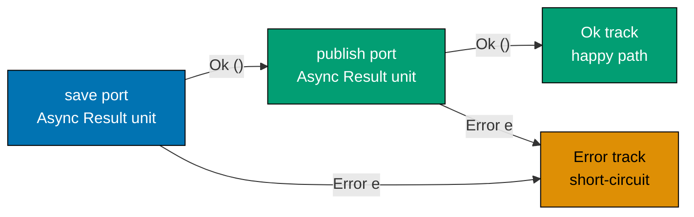
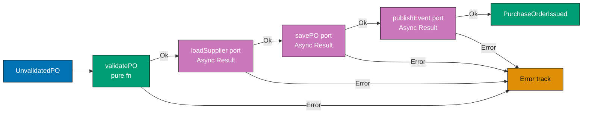
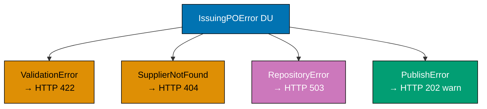
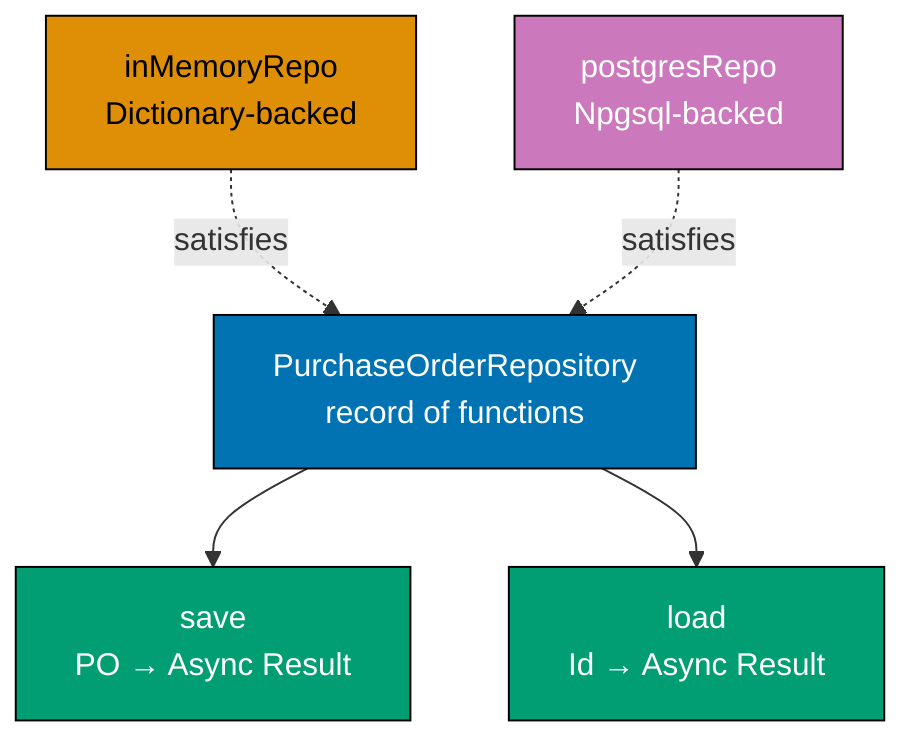
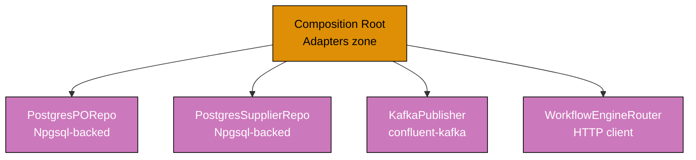
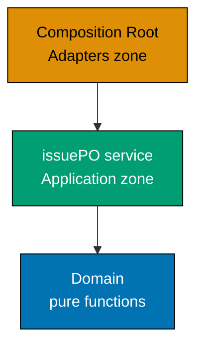
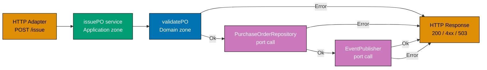
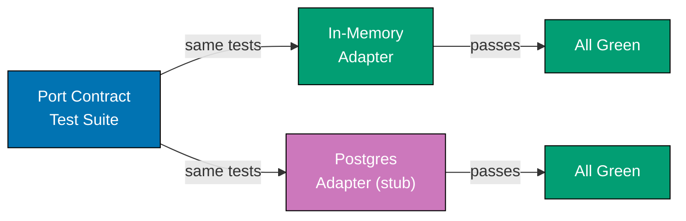
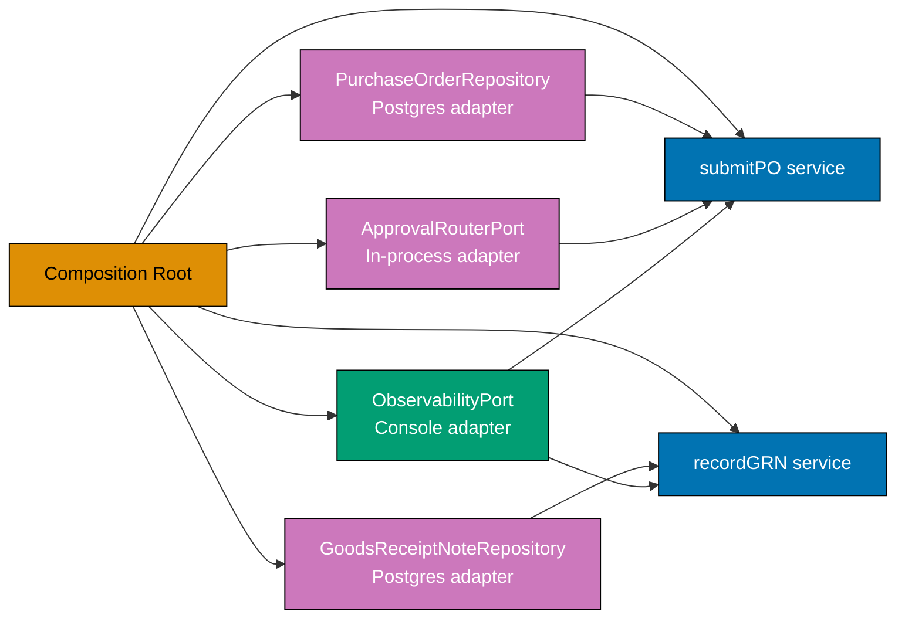

This intermediate section builds on the port/adapter foundations from the beginner section and introduces the `purchasing` and `supplier` bounded contexts together. The focal ports are `PurchaseOrderRepository`, `SupplierRepository`, `EventPublisher`, and `ApprovalRouterPort`. The running theme is wiring: how a composition root assembles adapters, how tests swap adapters without touching application logic, and how the dependency rule rejects infrastructure at the boundary.

## Command and Query Ports (Examples 26–30)

### Example 26: Command Port vs Query Port — CQRS at the Port Boundary

Command ports change state and return domain events or errors. Query ports are read-only and return view models. Separating them at the port level enforces CQRS at the application boundary — commands flow through the full domain pipeline while queries may bypass domain logic and hit a denormalised read model.





```fsharp
// ── Command port ──────────────────────────────────────────────────────────
// A command changes state and returns domain events on success.
// The async wrapper acknowledges that persistence is effectful.
// Result carries named error cases so the HTTP adapter maps them precisely.
type IssuePurchaseOrderCommand =
    PurchaseOrderId -> Async<Result<PurchaseOrderIssued list, IssuingPOError>>
// => Input:  the identity of an Approved PO that is ready to be issued
// => Output: list of domain events on Ok, named error on Error
// => Every call may write to the database and publish to the event bus

// ── Query port ────────────────────────────────────────────────────────────
// A query never changes state; it projects data into a flat read model.
// PurchaseOrderView is not the domain aggregate — it is a denormalised DTO.
type GetPurchaseOrderQuery =
    PurchaseOrderId -> Async<Result<PurchaseOrderView option, QueryError>>
// => Input:  a PO identity value
// => Output: Some flat view on Ok, None if not found, QueryError on failure
// => Side-effect-free read — safe to cache, safe to retry without harm

// ── Read model ────────────────────────────────────────────────────────────
// PurchaseOrderView flattens the aggregate into a single serialisable record.
// No domain logic lives here — it is purely a projection for display.
type PurchaseOrderView = {
    OrderId      : string
    // => Identifies the PO in the read model (format po_<uuid>)
    SupplierName : string
    // => Denormalised — avoids a join to the Suppliers table at query time
    TotalAmount  : decimal
    // => Final calculated total — already computed during command processing
    Status       : string
    // => Human-readable status label, not a domain DU — just a display string
    IssuedAt     : System.DateTimeOffset option
    // => Null when PO is still in Draft/AwaitingApproval; set once Issued
}

// ── Distinct error types ──────────────────────────────────────────────────
// QueryError is separate from IssuingPOError — queries fail differently.
type QueryError =
    | NotFound      of string
    // => Requested PO does not exist in the read model
    | QueryTimeout  of string
    // => Read timed out — caller can safely retry
type IssuingPOError =
    | PONotApproved of string
    // => PO is not in Approved state — cannot issue from other states
    | RepositoryError of string
    // => Infrastructure failure during save or event publish
```





```clojure
(ns procurement.ports.cqrs
  (:require [clojure.spec.alpha :as s]))

;; ── Command port (Clojure protocol) ──────────────────────────────────────
;; [F#: type alias IssuePurchaseOrderCommand — a function type; Clojure uses
;;  a protocol for named, dispatchable command boundaries]
;; A command changes state; the protocol method accepts a po-id and returns
;; a channel or promise delivering {:ok events} or {:error reason}.
(defprotocol IssuePurchaseOrderCommand
  ;; issue-po! is named with ! to signal side-effectful mutation
  (issue-po! [this po-id]))
;; => Callers receive a deref-able result: {:ok [event-map]} or {:error kw}
;; => Protocol makes the command port an explicit named contract

;; ── Query port (Clojure protocol) ────────────────────────────────────────
;; [F#: type alias GetPurchaseOrderQuery — function type; Clojure protocol
;;  gives the query port an explicit, extendable name]
(defprotocol GetPurchaseOrderQuery
  ;; get-po is named without ! — queries must be side-effect-free
  (get-po [this po-id]))
;; => Returns {:ok view-map} or {:ok nil} (not found) or {:error kw}
;; => No bang suffix — queries are safe to retry and cache

;; ── Read model schema (clojure.spec) ────────────────────────────────────
;; [F#: record type PurchaseOrderView — static, named, compile-time;
;;  Clojure validates the same shape at runtime via spec]
(s/def ::order-id     string?)
;; => Identifies the PO in the read model (format po_<uuid>)
(s/def ::supplier-name string?)
;; => Denormalised — avoids a join to the suppliers table at query time
(s/def ::total-amount  (s/and number? pos?))
;; => Pre-computed at write time — pos? enforces positive monetary amount
(s/def ::status        string?)
;; => Human-readable status label, not a domain keyword — just a display string
(s/def ::issued-at     (s/nilable inst?))
;; => nil when PO is still in Draft/AwaitingApproval; inst when Issued

(s/def ::purchase-order-view
  (s/keys :req-un [::order-id ::supplier-name ::total-amount ::status]
          :opt-un [::issued-at]))
;; => s/keys collects required and optional fields — equiv to F# record fields
;; => s/valid? checks a map at runtime; no compile-time guarantee but REPL-friendly

;; ── Distinct error keywords ───────────────────────────────────────────────
;; [F#: discriminated unions QueryError and IssuingPOError — exhaustive,
;;  compile-time; Clojure uses namespaced keywords for open, data-first errors]
(def query-errors
  ;; Set of recognised query-path error keywords
  #{::not-found ::query-timeout})
;; => ::not-found  — requested PO absent from the read model
;; => ::query-timeout — read timed out; caller may safely retry

(def command-errors
  ;; Set of recognised command-path error keywords
  #{::po-not-approved ::repository-error})
;; => ::po-not-approved — PO is not in Approved state; cannot issue
;; => ::repository-error — infrastructure failure during save or publish
;; => Keyword errors are data: {:error ::not-found :detail "po_001 absent"}
```





```typescript
// ── Command port ──────────────────────────────────────────────────────────
// A command changes state and returns domain events on success.
// Promise acknowledges that persistence is effectful.
// Result carries named error cases so the HTTP adapter maps them precisely.
type POId = string & { readonly _brand: "POId" };
// => Branded string — prevents mixing PO IDs with other string IDs

type PurchaseOrderIssued = {
  readonly orderId: POId;
  // => Identity of the PO that was issued to the supplier
  readonly supplierId: string;
  // => Supplier who will receive the PO
  readonly issuedAt: string;
  // => ISO timestamp of the state transition
};

type IssuingPOError =
  | { readonly kind: "PONotApproved"; readonly message: string }
  // => PO is not in Approved state — cannot issue from other states
  | { readonly kind: "RepositoryError"; readonly message: string };
// => Infrastructure failure during save or event publish

type Result<T, E> = { readonly ok: true; readonly value: T } | { readonly ok: false; readonly error: E };
// => FP-style tagged union — callers must handle both branches

type IssuePurchaseOrderCommand = (poId: POId) => Promise<Result<PurchaseOrderIssued[], IssuingPOError>>;
// => Input:  the identity of an Approved PO ready to be issued
// => Output: array of domain events on ok, named error on error
// => Every call may write to the database and publish to the event bus

// ── Query port ────────────────────────────────────────────────────────────
// A query never changes state; it projects data into a flat read model.
// PurchaseOrderView is not the domain aggregate — it is a denormalised DTO.

interface PurchaseOrderView {
  readonly orderId: string;
  // => Identifies the PO in the read model
  readonly supplierName: string;
  // => Denormalised — avoids a join to the Suppliers table at query time
  readonly totalAmount: number;
  // => Final calculated total — already computed during command processing
  readonly status: string;
  // => Human-readable status label — just a display string
  readonly issuedAt: string | null;
  // => null when PO is still in Draft/AwaitingApproval; set once Issued
}

type QueryError =
  | { readonly kind: "NotFound"; readonly id: string }
  // => Requested PO does not exist in the read model
  | { readonly kind: "QueryTimeout"; readonly message: string };
// => Read timed out — caller can safely retry

type GetPurchaseOrderQuery = (poId: POId) => Promise<Result<PurchaseOrderView | null, QueryError>>;
// => Input:  a PO identity value
// => Output: Some flat view on ok, null if not found, QueryError on failure
// => Side-effect-free read — safe to cache, safe to retry without harm
```




**Key Takeaway**: Separating command and query ports at the type level prevents accidental conflation of state-mutation and read-only operations, giving each path its own error type, its own optimised adapter, and its own test strategy.

**Why It Matters**: When command and query paths share a single repository interface, every read-optimisation (caching, denormalisation, read replicas) is blocked by write concerns. Expressing CQRS at the port boundary costs one extra type alias. The payoff is that the query adapter can be a lightweight SQL view or a Redis cache with zero impact on the command pipeline.

---

### Example 27: Read Model vs Domain Model — Two Separate Output Ports

The domain aggregate is the source of truth for write operations; the read model is the source of truth for query operations. These are structurally different types served by structurally different ports, which allows each to evolve independently.





```fsharp
// ── Infrastructure error type ─────────────────────────────────────────────
type RepoError = DatabaseError of string | ConnectionTimeout
// => Named error DU — consistent with the canonical PurchaseOrderRepository from beginner section

// ── Domain aggregate port (command pipeline) ──────────────────────────────
// PurchaseOrderRepository is defined in beginner.md and used unchanged here.
// It returns the full domain aggregate — a rich type with all domain rules.
type PurchaseOrderRepository = {
    save : PurchaseOrder -> Async<Result<unit, RepoError>>
    // => Persist a PO — upsert semantics; both insert and update use this field
    load : PurchaseOrderId -> Async<Result<PurchaseOrder option, RepoError>>
    // => Load by identity — None signals not-found without raising exceptions
}

// ── Domain aggregate ──────────────────────────────────────────────────────
// PurchaseOrder is the rich aggregate with domain-validated fields.
// Rich types make invalid states unrepresentable at compile time.
type PurchaseOrder = {
    Id          : PurchaseOrderId
    // => Strongly-typed identity — format po_<uuid>; not just any string
    SupplierId  : SupplierId
    // => Strongly-typed supplier reference — distinct type from PurchaseOrderId
    TotalAmount : decimal
    // => Sum of all line item values — drives approval-level routing
    Status      : string
    // => Current state: Draft | AwaitingApproval | Approved | Issued | etc.
}

// ── Read model port (query pipeline) ──────────────────────────────────────
// GetPurchaseOrderView returns the flat view model — simple and serialisable.
// The query adapter may serve this from a materialised view or Redis.
type GetPurchaseOrderView =
    PurchaseOrderId -> Async<Result<PurchaseOrderView, QueryError>>
// => Returns the READ MODEL type — not the domain aggregate
// => Two separate ports: two implementations, two adapters, two test doubles

// ── Two adapter sketches ───────────────────────────────────────────────────
// Command-side adapter queries the normalised purchase_orders table (joins allowed).
let postgresOrderRepo : PurchaseOrderRepository = {
    save = fun po ->
        async {
            // In a real system: Npgsql INSERT ... ON CONFLICT UPDATE against purchase_orders
            // Here: stub to illustrate port/adapter boundary without real Npgsql dependency
            return Ok ()
            // => Always Ok in this stub; real adapter propagates DB exceptions as Error
        }
    load = fun id ->
        async {
            // In a real system: SELECT * FROM purchase_orders WHERE id = @id
            let po : PurchaseOrder = {
                Id = id; SupplierId = "sup_abc"; TotalAmount = 5000m; Status = "Approved"
            }
            // => Deserialise row into domain aggregate; None when row absent
            return Ok (Some po)
        }
}

// Query-side adapter reads from a materialised view (denormalised, no joins).
let postgresViewRepo : GetPurchaseOrderView =
    fun id ->
        async {
            // In a real system: SELECT * FROM purchase_order_views WHERE id = @id
            let view : PurchaseOrderView = {
                OrderId      = id
                // => Primary key passed through unchanged
                SupplierName = "Acme Corp"
                // => Pre-joined from suppliers table during materialisation
                TotalAmount  = 5000m
                // => Pre-computed at write time — no aggregation at read time
                Status       = "Approved"
                // => Display string converted from domain DU during projection
                IssuedAt     = None
                // => None because PO is still Approved, not yet Issued
            }
            return Ok view
        }
// => Each adapter is independently replaceable — swapping one does not touch the other
```





```clojure
(ns procurement.ports.models
  (:require [clojure.spec.alpha :as s]))

;; ── Infrastructure error keywords ─────────────────────────────────────────
;; [F#: discriminated union RepoError — compile-time exhaustive;
;;  Clojure uses namespaced keywords that carry error data in a plain map]
(def repo-errors #{::database-error ::connection-timeout})
;; => ::database-error — persistence operation failed (constraint, deadlock)
;; => ::connection-timeout — pool exhausted or network unavailable; retry safe

;; ── Domain aggregate protocol (command pipeline) ──────────────────────────
;; [F#: record-of-functions PurchaseOrderRepository — structural typing;
;;  Clojure uses a protocol to name the command-side boundary explicitly]
(defprotocol PurchaseOrderRepository
  ;; save-po! persists a domain aggregate map; returns {:ok nil} or {:error kw}
  (save-po! [this po])
  ;; load-po returns the FULL aggregate map, not a view; nil when absent
  (load-po  [this po-id]))
;; => Protocol separates the domain aggregate port from the read-model port
;; => Implementors satisfy both methods; tests supply reify-based stubs

;; ── Domain aggregate schema (spec) ───────────────────────────────────────
;; [F#: record type PurchaseOrder — strong static types; Clojure validates
;;  the same shape at runtime — data-first, no compile-time guarantee]
(s/def ::po-id         string?)
;; => Format po_<uuid> — uniquely identifies the aggregate
(s/def ::supplier-id   string?)
;; => Format sup_<uuid> — cross-context reference to the supplier aggregate
(s/def ::total-amount  (s/and number? pos?))
;; => Sum of line items; drives approval-level routing
(s/def ::po-status     #{"Draft" "AwaitingApproval" "Approved" "Issued"})
;; => Closed string enum; spec catches invalid state strings at runtime

(s/def ::purchase-order
  (s/keys :req-un [::po-id ::supplier-id ::total-amount ::po-status]))
;; => s/valid? guards the aggregate boundary; s/explain shows violations

;; ── Read model protocol (query pipeline) ──────────────────────────────────
;; [F#: function alias GetPurchaseOrderView — one function port;
;;  Clojure protocol names the query boundary and enables open extension]
(defprotocol GetPurchaseOrderView
  ;; get-po-view returns a flat read-model map, not the domain aggregate
  (get-po-view [this po-id]))
;; => Returns {:ok view-map} or {:ok nil} (not found) or {:error kw}
;; => Query port is a separate protocol — completely independent of save-po!

;; ── Two adapter sketches ──────────────────────────────────────────────────
;; Command-side adapter: queries the normalised purchase_orders table.
(def postgres-order-repo
  ;; reify satisfies the protocol inline — idiomatic Clojure for adapter stubs
  (reify PurchaseOrderRepository
    (save-po! [_ po]
      ;; Real impl: INSERT INTO purchase_orders ... ON CONFLICT DO UPDATE
      ;; Stub: always returns success — illustrates the port boundary
      {:ok nil})
    ;; => Always succeeds in this stub; real adapter returns {:error ::database-error}
    (load-po [_ po-id]
      ;; Real impl: SELECT * FROM purchase_orders WHERE id = ?
      (let [po {:po-id       po-id
                :supplier-id "sup_abc"
                ;; => Pre-populated stub value — real adapter maps DB row to this map
                :total-amount 5000
                ;; => Numeric total, not a string — caller formats for display
                :po-status   "Approved"}]
        {:ok po}))))
;; => {:ok po-map} on success; {:ok nil} when not found; {:error kw} on failure

;; Query-side adapter: reads from a materialised view (denormalised, no joins).
(def postgres-view-repo
  (reify GetPurchaseOrderView
    (get-po-view [_ po-id]
      ;; Real impl: SELECT * FROM purchase_order_views WHERE id = ?
      (let [view {:order-id      po-id
                  ;; => Primary key passed through unchanged
                  :supplier-name "Acme Corp"
                  ;; => Pre-joined from suppliers table during materialisation
                  :total-amount  5000
                  ;; => Pre-computed at write time — no aggregation at read time
                  :status        "Approved"
                  ;; => Display string; converted from domain keyword at projection
                  :issued-at     nil}]
        ;; => nil because PO is still Approved, not yet Issued
        {:ok view}))))
;; => Each reify impl is independently replaceable — swap one without touching the other
```





```typescript
// ── Infrastructure error type ─────────────────────────────────────────────
type RepoError =
  | { readonly kind: "DatabaseError"; readonly message: string }
  // => Persistence operation failed (constraint, deadlock)
  | { readonly kind: "ConnectionTimeout" };
// => Pool exhausted or network unavailable; retry safe

type Result<T, E> = { readonly ok: true; readonly value: T } | { readonly ok: false; readonly error: E };
// => FP-style tagged union — used by both ports below

// ── Domain aggregate port (command pipeline) ──────────────────────────────
type POId = string & { readonly _brand: "POId" };
// => Branded string for PO primary key

interface PurchaseOrder {
  readonly id: POId;
  // => Strongly-typed identity — format po_<uuid>
  readonly supplierId: string;
  // => Strongly-typed supplier reference
  readonly totalAmount: number;
  // => Sum of all line item values — drives approval-level routing
  readonly status: string;
  // => Current state: Draft | AwaitingApproval | Approved | Issued
}

type PurchaseOrderRepo = {
  readonly save: (po: PurchaseOrder) => Promise<Result<void, RepoError>>;
  // => Persist a PO — upsert semantics; both insert and update use this
  readonly findById: (id: POId) => Promise<Result<PurchaseOrder | null, RepoError>>;
  // => Load by identity — null signals not-found without throwing
};

// ── Read model (query pipeline) ───────────────────────────────────────────
interface PurchaseOrderView {
  readonly orderId: string;
  // => Primary key passed through unchanged
  readonly supplierName: string;
  // => Pre-joined from suppliers table during materialisation
  readonly totalAmount: number;
  // => Pre-computed at write time — no aggregation at read time
  readonly status: string;
  // => Display string converted from domain value during projection
  readonly issuedAt: string | null;
  // => null when PO is still Approved, not yet Issued
}

type GetPurchaseOrderView = (
  id: POId,
) => Promise<Result<PurchaseOrderView, { kind: "NotFound" | "QueryTimeout"; message?: string }>>;
// => Returns the READ MODEL type — not the domain aggregate
// => Two separate ports: two implementations, two adapters, two test doubles

// ── Two adapter sketches ──────────────────────────────────────────────────
const postgresOrderRepo: PurchaseOrderRepo = {
  save: async (po) => {
    // Real impl: pg Pool INSERT ... ON CONFLICT UPDATE against purchase_orders
    console.log(`[PG] Saving PO ${po.id} in status ${po.status}`);
    return { ok: true, value: undefined };
    // => Stub always succeeds; real adapter propagates pg errors as error
  },
  findById: async (id) => {
    // Real impl: SELECT * FROM purchase_orders WHERE id = $1
    const po: PurchaseOrder = { id, supplierId: "sup_abc", totalAmount: 5000, status: "Approved" };
    // => Deserialise row into domain aggregate; null when row absent
    return { ok: true, value: po };
  },
};

const postgresViewRepo: GetPurchaseOrderView = async (id) => {
  // Real impl: SELECT * FROM purchase_order_views WHERE id = $1
  const view: PurchaseOrderView = {
    orderId: id,
    supplierName: "Acme Corp",
    // => Pre-joined from suppliers table during materialisation
    totalAmount: 5000,
    status: "Approved",
    issuedAt: null,
    // => null because PO is still Approved, not yet Issued
  };
  return { ok: true, value: view };
};
// => Each adapter is independently replaceable — swapping one does not touch the other
```




**Key Takeaway**: Two separate output port types — one returning the domain aggregate, one returning the flat read model — let each adapter be optimised independently without either side leaking into the other.

**Why It Matters**: Forcing domain aggregates through the query path causes unnecessary deserialization of nested value objects and fragile coupling between display requirements and domain structure. Separate read-model ports permit materialised views, caching layers, and eventual-consistency projections without touching domain logic.

---

### Example 28: Async Output Port — `Async<Result<>>` Composition

Every output port that performs I/O returns `Async<Result<'a, 'e>>`. Composing two such calls without a helper library requires explicit `async { let! ... }` nesting and `Result` matching. The `asyncResult { }` CE from FsToolkit.ErrorHandling eliminates the boilerplate.



**Manual composition (no helper library):**





```fsharp
// ── Port types ─────────────────────────────────────────────────────────────
// Both ports return Async<Result<unit, string>> — the same shape.
type SavePO    = PurchaseOrder -> Async<Result<unit, string>>
type PublishEv = PurchaseOrderIssued -> Async<Result<unit, string>>

// ── Manual Async + Result composition ──────────────────────────────────────
// Without FsToolkit.ErrorHandling, every async-result call nests one level deeper.
// Verbose but instructive — shows exactly what asyncResult { } desugars to.
let manualIssuePipeline (save: SavePO) (publish: PublishEv) (po: PurchaseOrder) =
    async {
        let! saveResult = save po
        // => saveResult : Result<unit, string>
        // => Await completes the async; now we have a Result to inspect
        match saveResult with
        | Error msg ->
            return Error (sprintf "Save failed: %s" msg)
            // => Short-circuit — publish is never called if save failed
        | Ok () ->
        let event = { OrderId = po.Id; SupplierId = po.SupplierId; IssuedAt = System.DateTimeOffset.UtcNow }
        let! publishResult = publish event
        // => publishResult : Result<unit, string>
        match publishResult with
        | Error msg ->
            return Error (sprintf "Publish failed: %s" msg)
            // => Notification failure surfaced on the same error track
        | Ok () ->
            return Ok ()
            // => Both ports succeeded — return the happy path
    }
// => Every bind point is explicit and traceable — good for learning, noisy in production

type PurchaseOrderIssued = { OrderId: PurchaseOrderId; SupplierId: SupplierId; IssuedAt: System.DateTimeOffset }
```





```clojure
(ns procurement.ports.async-composition)

;; ── Manual pipeline without helper macros ────────────────────────────────
;; [F#: Async<Result<unit, string>> composition — typed async monad;
;;  Clojure uses plain functions returning {:ok v} or {:error msg} maps,
;;  composed manually with let bindings and cond checks]

;; save-po! and publish-event! are port functions returning {:ok nil} or {:error msg}
;; In a real system these would call actual infrastructure; stubs suffice here.
(defn save-po!
  "Persists the PO map; returns {:ok nil} on success or {:error msg} on failure."
  [po]
  ;; Stub: always succeeds — real adapter wraps DB call and maps exceptions
  {:ok nil})
;; => {:ok nil} — unit equivalent in Clojure result maps

(defn publish-event!
  "Publishes a domain event map; returns {:ok nil} or {:error msg}."
  [event]
  ;; Stub: always succeeds — real adapter wraps Kafka producer and serialisation
  {:ok nil})
;; => {:ok nil} — confirms the event was accepted by the transport

(defn manual-issue-pipeline
  "Composes save and publish calls by explicitly inspecting each result map."
  [po]
  ;; Step 1: persist the PO
  (let [save-result (save-po! po)]
    ;; save-result is {:ok nil} or {:error msg}
    (if (:error save-result)
      ;; Short-circuit — publish is never called if save failed
      {:error (str "Save failed: " (:error save-result))}
      ;; => Mirrors F#'s match | Error msg -> return Error — explicit failure branch
      (let [event {:order-id    (:po-id po)
                   ;; => Event carries the PO identity for downstream consumers
                   :supplier-id (:supplier-id po)
                   ;; => Supplier identity — needed by the notifier context
                   :issued-at   (java.time.Instant/now)}]
        ;; Step 2: publish the domain event
        (let [pub-result (publish-event! event)]
          (if (:error pub-result)
            {:error (str "Publish failed: " (:error pub-result))}
            ;; => Notification failure surfaces on the same error path
            {:ok nil}))))))
            ;; => Both ports succeeded — return the happy-path result map
;; => Every bind point is explicit and traceable — verbose but instructive
```





```typescript
// ── Port types ─────────────────────────────────────────────────────────────
interface PurchaseOrder {
  readonly id: string;
  readonly supplierId: string;
  readonly totalAmount: number;
  readonly status: string;
}
// => Aggregate root — used by both port types below

interface PurchaseOrderIssued {
  readonly orderId: string;
  readonly supplierId: string;
  readonly issuedAt: string;
}
// => Domain event emitted when a PO is issued to a supplier

type Result<T, E> = { readonly ok: true; readonly value: T } | { readonly ok: false; readonly error: E };
// => FP-style tagged union — callers must handle both branches

type SavePO = (po: PurchaseOrder) => Promise<Result<void, string>>;
type PublishEv = (ev: PurchaseOrderIssued) => Promise<Result<void, string>>;

// ── Manual Promise + Result composition ──────────────────────────────────
// Without a helper, every async-result call nests one level deeper.
// Verbose but instructive — shows exactly what the pipeline desugars to.
const manualIssuePipeline =
  (save: SavePO, publish: PublishEv) =>
  async (po: PurchaseOrder): Promise<Result<void, string>> => {
    const saveResult = await save(po);
    // => saveResult: Result<void, string>
    // => Await completes the promise; now we have a Result to inspect
    if (!saveResult.ok) {
      return { ok: false, error: `Save failed: ${saveResult.error}` };
      // => Short-circuit — publish is never called if save failed
    }
    const event: PurchaseOrderIssued = {
      orderId: po.id,
      supplierId: po.supplierId,
      issuedAt: new Date().toISOString(),
      // => Timestamp recorded at the moment of issue
    };
    const publishResult = await publish(event);
    // => publishResult: Result<void, string>
    if (!publishResult.ok) {
      return { ok: false, error: `Publish failed: ${publishResult.error}` };
      // => Notification failure surfaced on the same error track
    }
    return { ok: true, value: undefined };
    // => Both ports succeeded — return the happy path
  };
// => Every bind point is explicit and traceable — good for learning, noisy in production
```




**Cleaner with `asyncResult { }` from FsToolkit.ErrorHandling:**





```fsharp
// NOTE: asyncResult computation expression requires FsToolkit.ErrorHandling NuGet package
// Install: dotnet add package FsToolkit.ErrorHandling
open FsToolkit.ErrorHandling

// ── Same pipeline — much less noise ────────────────────────────────────────
// asyncResult { } desugars to the same Async.bind + Result.bind chain above.
// The CE makes the railway metaphor literal: every let!/do! is a track switch.
let issuePipeline
    (save    : PurchaseOrder -> Async<Result<unit, string>>)
    (publish : PurchaseOrderIssued -> Async<Result<unit, string>>)
    (po      : PurchaseOrder)
    : Async<Result<unit, string>> =
    asyncResult {
        do! save po
        // => Await save, short-circuit on Error — identical to the manual match above
        let event = { OrderId = po.Id; SupplierId = po.SupplierId; IssuedAt = System.DateTimeOffset.UtcNow }
        do! publish event
        // => Await publish, short-circuit on Error
        // => If both succeed, returns Ok () automatically
    }
// => asyncResult { } is syntactic sugar — same semantics, less ceremony
// => Requires FsToolkit.ErrorHandling; NOT part of F# standard library
```





```clojure
(ns procurement.ports.threaded-pipeline)

;; ── Threading-macro pipeline — less noise ─────────────────────────────────
;; [F#: asyncResult { do! save; do! publish } computation expression;
;;  Clojure's closest native equivalent is a threading macro with an
;;  early-exit helper — no CE syntax, but the same left-to-right read]

(defn ok? [result]
  ;; Predicate for happy-path result maps — used as the threading gate
  (contains? result :ok))
;; => Returns true when the result map has an :ok key (even if value is nil)

(defn issue-pipeline
  "Composes save and publish using -> threading for left-to-right readability."
  [po save-po! publish-event!]
  ;; -> threads po through each step; each step returns a result map.
  ;; reduce-kv is not needed here — a simple let chain is idiomatic for two steps.
  (let [save-result (save-po! po)]
    ;; save-result: {:ok nil} or {:error msg}
    (if-not (ok? save-result)
      save-result
      ;; => Short-circuit on save failure — mirrors asyncResult do! short-circuit
      (let [event {:order-id    (:po-id po)
                   ;; => Domain event carries PO identity and supplier reference
                   :supplier-id (:supplier-id po)
                   :issued-at   (java.time.Instant/now)}
            ;; => Instant/now is the Clojure/Java equivalent of DateTimeOffset.UtcNow
            pub-result (publish-event! event)]
        ;; pub-result: {:ok nil} or {:error msg}
        (if-not (ok? pub-result)
          pub-result
          ;; => Short-circuit on publish failure
          {:ok nil})))))
          ;; => Both ports succeeded — return happy-path result map
;; => if-not + let bindings are idiomatic Clojure; no macro library required
;; => Semantics identical to asyncResult { } — same short-circuit behaviour
```





```typescript
// ── Cleaner pipeline using a pipe helper ─────────────────────────────────
// TypeScript has no built-in asyncResult CE, but a small pipe helper
// achieves the same left-to-right railway reading style.

type Result<T, E> = { readonly ok: true; readonly value: T } | { readonly ok: false; readonly error: E };
// => FP-style tagged union — short-circuits on error

interface PurchaseOrder {
  readonly id: string;
  readonly supplierId: string;
  readonly totalAmount: number;
  readonly status: string;
}
interface PurchaseOrderIssued {
  readonly orderId: string;
  readonly supplierId: string;
  readonly issuedAt: string;
}

// andThen: chains two async Result operations, short-circuiting on error
const andThen =
  <T, U, E>(f: (v: T) => Promise<Result<U, E>>) =>
  async (r: Result<T, E>): Promise<Result<U, E>> => {
    if (!r.ok) return r as Result<U, E>;
    // => Short-circuit: propagate error unchanged
    return f(r.value);
    // => Happy path: apply the next step
  };

type SavePO = (po: PurchaseOrder) => Promise<Result<void, string>>;
type PublishEv = (ev: PurchaseOrderIssued) => Promise<Result<void, string>>;

const issuePipeline =
  (save: SavePO, publish: PublishEv) =>
  async (po: PurchaseOrder): Promise<Result<void, string>> => {
    const saved = await save(po);
    // => Await save; if error, short-circuit
    if (!saved.ok) return saved;
    const event: PurchaseOrderIssued = {
      orderId: po.id,
      supplierId: po.supplierId,
      issuedAt: new Date().toISOString(),
    };
    return publish(event);
    // => Await publish; if error, propagate — same semantics as asyncResult { do! }
  };
// => if (!result.ok) return result is idiomatic TypeScript railway — no macro needed
// => Semantics identical to F# asyncResult { do! save; do! publish }
```




**Key Takeaway**: `Async<Result<'a, 'e>>` composition is the async railway — every `do!` inside `asyncResult { }` switches track on Error, just as `result { }` does for synchronous pipelines.

**Why It Matters**: Without a composition strategy for `Async<Result<>>`, application services devolve into deeply nested match expressions that obscure domain intent behind infrastructure plumbing. The `asyncResult { }` CE restores the linear pipeline reading style while preserving full error tracking.

---

### Example 29: Railway-Oriented Programming Across Async Port Calls

A full application service pipeline spans pure domain steps (synchronous, no I/O) and port calls (asynchronous, effectful). ROP unifies both into a single railway — pure functions contribute Result-shaped track switches, port calls contribute Async-Result-shaped track switches.







```fsharp
open FsToolkit.ErrorHandling

// ── Domain types ────────────────────────────────────────────────────────────
type UnvalidatedPO = { RawId: string; RawSupplierId: string; RawAmount: decimal }
type PurchaseOrderId = string
type SupplierId      = string

// ── Unified error DU for the full pipeline ──────────────────────────────────
// Every failure mode — domain or infrastructure — joins this union.
// The HTTP adapter pattern-matches exhaustively to produce the right status code.
type IssuingPOError =
    | ValidationError  of string
    // => Domain rule violation — maps to HTTP 422
    | SupplierNotFound of string
    // => Supplier lookup failed — maps to HTTP 404
    | RepositoryError  of string
    // => Infrastructure failure during save — maps to HTTP 503
    | PublishError     of string
    // => Event publish failed — maps to HTTP 202 (saved, not published)

// ── Port types ──────────────────────────────────────────────────────────────
type LoadSupplier = SupplierId -> Async<Result<bool, IssuingPOError>>
// => Confirms supplier is Approved; returns false if Suspended/Blacklisted
type SavePO       = PurchaseOrder -> Async<Result<unit, IssuingPOError>>
type PublishEvent = PurchaseOrderIssued -> Async<Result<unit, IssuingPOError>>

// ── Pure domain validation ───────────────────────────────────────────────────
let validatePO (input: UnvalidatedPO) : Result<PurchaseOrder, IssuingPOError> =
    if System.String.IsNullOrWhiteSpace(input.RawId) then
        Error (ValidationError "PO ID blank")
        // => Domain rule: blank ID rejected immediately — no I/O needed
    elif System.String.IsNullOrWhiteSpace(input.RawSupplierId) then
        Error (ValidationError "Supplier ID blank")
        // => Domain rule: supplier identity is mandatory on a PO
    elif input.RawAmount <= 0m then
        Error (ValidationError (sprintf "Amount %M must be positive" input.RawAmount))
        // => Domain rule: PO total must be > 0
    else
        Ok { Id = input.RawId; SupplierId = input.RawSupplierId; TotalAmount = input.RawAmount; Status = "Approved" }
        // => All guards passed — returns the validated PO aggregate

// ── Full pipeline: pure steps + async port calls ─────────────────────────────
// asyncResult { } stitches synchronous Results and async-Results seamlessly.
let buildIssuePO (loadSupplier: LoadSupplier) (savePO: SavePO) (publishEvent: PublishEvent) =
    fun (input: UnvalidatedPO) ->
        asyncResult {
            // Step 1: pure domain validation — lifted into asyncResult with ofResult
            let! po = validatePO input |> AsyncResult.ofResult
            // => ofResult lifts a synchronous Result into the async railway
            // => Short-circuits on ValidationError — steps 2-4 are skipped

            // Step 2: async port — confirm supplier is Approved
            let! isApproved = loadSupplier po.SupplierId
            // => loadSupplier : SupplierId -> Async<Result<bool, IssuingPOError>>
            // => Awaited and unwrapped by let! — Error short-circuits here
            if not isApproved then
                return! AsyncResult.returnError (SupplierNotFound po.SupplierId)
            // => Domain rule: cannot issue PO to a Suspended or Blacklisted supplier

            // Step 3: async port — persist the PO in Issued state
            let issuedPO = { po with Status = "Issued" }
            do! savePO issuedPO
            // => do! discards unit result; Error short-circuits here

            // Step 4: async port — publish the PurchaseOrderIssued event
            let event = { OrderId = po.Id; SupplierId = po.SupplierId; IssuedAt = System.DateTimeOffset.UtcNow }
            do! publishEvent event
            // => do! publishes domain event; Error surfaces as PublishError

            return [ event ]
            // => All four steps succeeded — HTTP adapter receives Ok [event] → 200 OK
        }
// => Pure steps and port calls compose uniformly — the CE hides the plumbing
```





```clojure
(ns procurement.application.issue-po
  (:require [clojure.string :as str]))

;; ── Error keyword catalogue ─────────────────────────────────────────────────
;; [F#: discriminated union IssuingPOError — compile-time exhaustive;
;;  Clojure uses namespaced keywords so errors are data, not types]
;; ::validation-error  — domain rule violation; maps to HTTP 422
;; ::supplier-not-found — supplier ineligible; maps to HTTP 404
;; ::repository-error  — save failure; maps to HTTP 503
;; ::publish-error     — event publish failed; maps to HTTP 202

;; ── Pure domain validation ─────────────────────────────────────────────────
;; [F#: Result<PurchaseOrder, IssuingPOError> — typed; Clojure uses {:ok po}
;;  or {:error kw} data maps — same semantics, runtime-checked]
(defn validate-po
  "Validates an unvalidated PO map; returns {:ok po-map} or {:error kw+detail}."
  [{:keys [raw-id raw-supplier-id raw-amount] :as input}]
  (cond
    (str/blank? raw-id)
    ;; Domain rule: blank ID rejected without any I/O — mirror of F# guard
    {:error ::validation-error :detail "PO ID blank"}

    (str/blank? raw-supplier-id)
    ;; Domain rule: supplier identity is mandatory on a PO
    {:error ::validation-error :detail "Supplier ID blank"}

    (not (pos? raw-amount))
    ;; Domain rule: PO total must be positive
    {:error ::validation-error :detail (str "Amount " raw-amount " must be positive")}

    :else
    ;; All guards passed — return the validated domain aggregate map
    {:ok {:po-id       raw-id
          :supplier-id raw-supplier-id
          ;; => Validated and normalised fields live in the :ok payload
          :total-amount raw-amount
          :po-status   "Approved"}}))
;; => {:ok po} or {:error kw :detail msg}

;; ── Full pipeline: pure validation + port calls ─────────────────────────────
;; [F#: asyncResult { let! ... do! ... } CE — typed async monad;
;;  Clojure chains with let + cond or a reduce-result helper for same semantics]
(defn build-issue-po
  "Returns a function that runs the full issue-PO pipeline using injected port fns."
  [load-supplier save-po! publish-event!]
  ;; Ports are injected as plain functions — same dependency-injection model as F#
  (fn [input]
    ;; Step 1: pure domain validation — no I/O; always safe to run first
    (let [validated (validate-po input)]
      (if (:error validated)
        validated
        ;; => Short-circuit on ValidationError — steps 2-4 are skipped
        (let [po         (:ok validated)
              ;; Step 2: port call — confirm supplier is Approved
              sup-result (load-supplier (:supplier-id po))]
          ;; load-supplier returns {:ok true/false} or {:error kw}
          (cond
            (:error sup-result)
            sup-result
            ;; => Infrastructure error from supplier lookup — propagate upward

            (not (:ok sup-result))
            ;; => Supplier exists but is not Approved — domain rule violation
            {:error ::supplier-not-found :detail (:supplier-id po)}

            :else
            ;; Step 3: port call — persist PO in Issued state
            (let [issued-po  (assoc po :po-status "Issued")
                  ;; => assoc returns a new map — immutable update, no mutation
                  save-result (save-po! issued-po)]
              (if (:error save-result)
                save-result
                ;; => Save failure — do not publish; return error to caller
                (let [event      {:order-id    (:po-id po)
                                  ;; => Domain event carries PO identity
                                  :supplier-id (:supplier-id po)
                                  ;; => Supplier reference for notifier context
                                  :issued-at   (java.time.Instant/now)}
                      ;; Step 4: port call — publish the domain event
                      pub-result (publish-event! event)]
                  (if (:error pub-result)
                    pub-result
                    ;; => Publish failure surfaces as ::publish-error
                    {:ok [event]}))))))))))
                    ;; => All four steps succeeded — caller receives {:ok [event]}
;; => Each cond arm is a track switch; the structure mirrors asyncResult { } linearly
```





```typescript
// ── Domain types ──────────────────────────────────────────────────────────
interface UnvalidatedPO {
  readonly rawId: string;
  readonly rawSupplierId: string;
  readonly rawAmount: number;
}
// => Raw input — nothing validated yet

interface PurchaseOrder {
  readonly id: string;
  readonly supplierId: string;
  readonly totalAmount: number;
  readonly status: string;
}
// => Validated aggregate

interface PurchaseOrderIssued {
  readonly orderId: string;
  readonly supplierId: string;
  readonly issuedAt: string;
}
// => Domain event emitted on successful issue

// ── Unified error type for the full pipeline ──────────────────────────────
type IssuingPOError =
  | { readonly kind: "ValidationError"; readonly message: string }
  // => Domain rule violation — maps to HTTP 422
  | { readonly kind: "SupplierNotFound"; readonly supplierId: string }
  // => Supplier lookup failed — maps to HTTP 404
  | { readonly kind: "RepositoryError"; readonly message: string }
  // => Infrastructure failure during save — maps to HTTP 503
  | { readonly kind: "PublishError"; readonly message: string };
// => Event publish failed — maps to HTTP 202 (saved, not published)

type Result<T, E> = { readonly ok: true; readonly value: T } | { readonly ok: false; readonly error: E };
// => FP-style tagged union

// ── Port types ────────────────────────────────────────────────────────────
type LoadSupplier = (supplierId: string) => Promise<Result<boolean, IssuingPOError>>;
// => Confirms supplier is Approved; returns false if Suspended/Blacklisted
type SavePO = (po: PurchaseOrder) => Promise<Result<void, IssuingPOError>>;
type PublishEvent = (ev: PurchaseOrderIssued) => Promise<Result<void, IssuingPOError>>;

// ── Pure domain validation ────────────────────────────────────────────────
const validatePO = (input: UnvalidatedPO): Result<PurchaseOrder, IssuingPOError> => {
  if (!input.rawId || input.rawId.trim() === "")
    return { ok: false, error: { kind: "ValidationError", message: "PO ID blank" } };
  if (!input.rawSupplierId || input.rawSupplierId.trim() === "")
    return { ok: false, error: { kind: "ValidationError", message: "Supplier ID blank" } };
  if (input.rawAmount <= 0)
    return { ok: false, error: { kind: "ValidationError", message: `Amount ${input.rawAmount} must be positive` } };
  return {
    ok: true,
    value: { id: input.rawId, supplierId: input.rawSupplierId, totalAmount: input.rawAmount, status: "Approved" },
  };
  // => All guards passed — return the validated PO aggregate
};

// ── Full pipeline: pure steps + async port calls ──────────────────────────
const buildIssuePO =
  (loadSupplier: LoadSupplier, savePO: SavePO, publishEvent: PublishEvent) =>
  async (input: UnvalidatedPO): Promise<Result<PurchaseOrderIssued[], IssuingPOError>> => {
    // Step 1: pure domain validation — no I/O
    const validated = validatePO(input);
    if (!validated.ok) return validated;
    // => Short-circuits on ValidationError — steps 2-4 are skipped

    // Step 2: async port — confirm supplier is Approved
    const isApprovedResult = await loadSupplier(validated.value.supplierId);
    if (!isApprovedResult.ok) return isApprovedResult;
    // => Infrastructure error from supplier lookup — propagate upward
    if (!isApprovedResult.value)
      return { ok: false, error: { kind: "SupplierNotFound", supplierId: validated.value.supplierId } };
    // => Domain rule: cannot issue PO to a Suspended or Blacklisted supplier

    // Step 3: async port — persist the PO in Issued state
    const issuedPO: PurchaseOrder = { ...validated.value, status: "Issued" };
    const saveResult = await savePO(issuedPO);
    if (!saveResult.ok) return saveResult;
    // => Save failure — do not publish; return error to caller

    // Step 4: async port — publish the PurchaseOrderIssued event
    const event: PurchaseOrderIssued = {
      orderId: validated.value.id,
      supplierId: validated.value.supplierId,
      issuedAt: new Date().toISOString(),
    };
    const pubResult = await publishEvent(event);
    if (!pubResult.ok) return pubResult;
    // => Publish failure surfaces as PublishError

    return { ok: true, value: [event] };
    // => All four steps succeeded — HTTP adapter receives ok [event] → 200 OK
  };
// => Each if (!result.ok) return result is a track switch — mirrors asyncResult { }
```




**Key Takeaway**: ROP across async port calls merges asynchrony and error propagation into a single linear pipeline where every step is either a track switch (Result) or an async track switch (Async<Result>).

**Why It Matters**: The alternative — nested `async { match ... }` for every port call — produces code where the happy path is buried inside match arms. `asyncResult { }` restores linearity: read the function top-to-bottom and you see the business intent. Five steps in one `asyncResult { }` block would require five nested match expressions without it.

---

### Example 30: Error Union Across Port and Domain Layers

Domain functions produce domain errors; adapters produce infrastructure errors. The application service lifts all of them into a single DU so the HTTP adapter can exhaustively pattern-match with zero blind spots.







```fsharp
// ── Unified error DU — application layer ────────────────────────────────────
// Every distinct failure mode surfaces as a named DU case.
// This DU is owned by the APPLICATION layer — not domain, not adapters.
// Domain errors bubble up unchanged; port errors are lifted via Result.mapError.
type IssuingPOError =
    | ValidationError  of string
    // => Emitted by pure domain functions — maps to HTTP 422
    | SupplierNotFound of string
    // => Supplier lookup returned false — maps to HTTP 404
    | RepositoryError  of string
    // => Emitted by repository adapter — maps to HTTP 503
    | PublishError     of string
    // => Emitted by event publisher adapter — maps to HTTP 202 (saved, not published)

// ── Lifting adapter-specific errors into the unified DU ──────────────────────
// mapError transforms the error channel of a Result without touching the Ok path.
// Each adapter defines its own narrow error type; the application maps it to the DU.
type DbWriteError = DbConstraint of string | DbTimeout
let liftDbError : Result<'a, DbWriteError> -> Result<'a, IssuingPOError> =
    Result.mapError (fun e ->
        match e with
        | DbConstraint msg -> RepositoryError (sprintf "Constraint: %s" msg)
        // => Constraint violation wrapped as RepositoryError
        | DbTimeout        -> RepositoryError "DB timeout"
        // => Timeout lifted into RepositoryError — caller retries
    )

type KafkaError = PartitionFull | SerializationFailed of string
let liftKafkaError : Result<'a, KafkaError> -> Result<'a, IssuingPOError> =
    Result.mapError (fun e ->
        match e with
        | PartitionFull          -> PublishError "Kafka partition full"
        // => Backpressure event lifted as non-fatal PublishError
        | SerializationFailed msg -> PublishError (sprintf "Serialize: %s" msg)
        // => Serialisation failure also non-fatal — PO is already saved
    )

// ── HTTP adapter: exhaustive pattern match on the unified DU ─────────────────
// F# forces exhaustive matching — adding a new case breaks compilation here.
let toHttpResponse (result: Result<PurchaseOrderIssued list, IssuingPOError>) : string =
    match result with
    | Ok events ->
        sprintf "200 OK: %d events emitted" (List.length events)
        // => Happy path — all pipeline steps succeeded
    | Error (ValidationError msg)  -> sprintf "422 Unprocessable Entity: %s" msg
    // => Domain validation failure — client submitted invalid data
    | Error (SupplierNotFound id)  -> sprintf "404 Not Found: supplier %s" id
    // => Supplier does not exist or is Suspended/Blacklisted
    | Error (RepositoryError msg)  -> sprintf "503 Service Unavailable: %s" msg
    // => Database unavailable — client may retry after backoff
    | Error (PublishError msg)     -> sprintf "202 Accepted (event not published): %s" msg
    // => PO saved but event not published — not a fatal error; outbox will retry

// ── Demonstration ─────────────────────────────────────────────────────────────
let demoEvent = { OrderId = "po_001"; SupplierId = "sup_abc"; IssuedAt = System.DateTimeOffset.UtcNow }
let outcomes = [
    Ok [ demoEvent ]
    // => Happy path
    Error (ValidationError "PO ID blank")
    // => Domain validation failure
    Error (SupplierNotFound "sup_xyz")
    // => Supplier not approved
    Error (RepositoryError "connection refused")
    // => Infrastructure failure
    Error (PublishError "Kafka partition full")
    // => Non-fatal publish failure
]
outcomes |> List.iter (fun r -> printfn "%s" (toHttpResponse r))
// => Output: 200 OK: 1 events emitted
// => Output: 422 Unprocessable Entity: PO ID blank
// => Output: 404 Not Found: supplier sup_xyz
// => Output: 503 Service Unavailable: connection refused
// => Output: 202 Accepted (event not published): Kafka partition full
```





```clojure
(ns procurement.application.error-union)

;; ── Unified error keyword catalogue — application layer ───────────────────
;; [F#: discriminated union IssuingPOError — compile-time exhaustive match;
;;  Clojure uses namespaced keywords; errors are plain maps — open, data-first]
;; ::validation-error  — domain rule violation; maps to HTTP 422
;; ::supplier-not-found — supplier ineligible; maps to HTTP 404
;; ::repository-error  — infrastructure save failure; maps to HTTP 503
;; ::publish-error     — event transport failed; maps to HTTP 202 (saved, not published)
;; Each error is a map {:error kw :detail msg} — REPL-inspectable at any time

;; ── Lifting adapter-specific errors into the unified keyword set ──────────
;; [F#: Result.mapError with exhaustive match — closed;
;;  Clojure maps adapter error keywords to unified keywords with cond]
(defn lift-db-error
  "Translates a DB adapter error map to the unified application error keyword."
  [{:keys [error detail] :as result}]
  ;; result is {:error :db-constraint :detail msg} or {:error :db-timeout}
  (if-not error
    result
    ;; => No error — pass through the ok result unchanged
    (cond
      (= error :db-constraint)
      {:error ::repository-error :detail (str "Constraint: " detail)}
      ;; => Constraint violation wrapped as ::repository-error

      (= error :db-timeout)
      {:error ::repository-error :detail "DB timeout"}
      ;; => Timeout lifted into ::repository-error — caller retries

      :else result)))
;; => Unknown adapter errors pass through; Clojure dispatch is open, not exhaustive

(defn lift-kafka-error
  "Translates a Kafka adapter error map to the unified application error keyword."
  [{:keys [error detail] :as result}]
  (if-not error
    result
    (cond
      (= error :partition-full)
      {:error ::publish-error :detail "Kafka partition full"}
      ;; => Backpressure event lifted as non-fatal ::publish-error

      (= error :serialization-failed)
      {:error ::publish-error :detail (str "Serialize: " detail)}
      ;; => Serialisation failure also non-fatal — PO is already saved

      :else result)))
;; => lift-* fns are the Clojure equivalent of F#'s Result.mapError

;; ── HTTP adapter: dispatch on unified error keyword ───────────────────────
;; [F#: exhaustive match expression — compiler rejects missing cases;
;;  Clojure uses condp on :error — open; missing cases fall to :else]
(defn to-http-response
  "Maps a result map to an HTTP response string for demonstration."
  [{:keys [ok error detail]}]
  (cond
    ok
    (str "200 OK: " (count ok) " events emitted")
    ;; => Happy path — all pipeline steps succeeded

    (= error ::validation-error)
    (str "422 Unprocessable Entity: " detail)
    ;; => Domain validation failure — client submitted invalid data

    (= error ::supplier-not-found)
    (str "404 Not Found: supplier " detail)
    ;; => Supplier does not exist or is Suspended/Blacklisted

    (= error ::repository-error)
    (str "503 Service Unavailable: " detail)
    ;; => Database unavailable — client may retry after backoff

    (= error ::publish-error)
    (str "202 Accepted (event not published): " detail)
    ;; => PO saved but event not published — outbox will retry

    :else (str "500 Internal Server Error: unknown error " error)))
;; => :else guards against unknown errors; F# match has no equivalent escape hatch

;; ── Demonstration ──────────────────────────────────────────────────────────
(def demo-event {:order-id "po_001" :supplier-id "sup_abc" :issued-at (java.time.Instant/now)})

(def outcomes
  [{:ok [demo-event]}
   ;; => Happy path
   {:error ::validation-error    :detail "PO ID blank"}
   ;; => Domain validation failure
   {:error ::supplier-not-found  :detail "sup_xyz"}
   ;; => Supplier not approved
   {:error ::repository-error    :detail "connection refused"}
   ;; => Infrastructure failure
   {:error ::publish-error       :detail "Kafka partition full"}])
   ;; => Non-fatal publish failure

(doseq [r outcomes]
  (println (to-http-response r)))
;; => Output: 200 OK: 1 events emitted
;; => Output: 422 Unprocessable Entity: PO ID blank
;; => Output: 404 Not Found: supplier sup_xyz
;; => Output: 503 Service Unavailable: connection refused
;; => Output: 202 Accepted (event not published): Kafka partition full
```





```typescript
// ── Unified error type — application layer ────────────────────────────────
// Every distinct failure mode surfaces as a named tagged-union case.
// This type is owned by the APPLICATION layer — not domain, not adapters.
type IssuingPOError =
  | { readonly kind: "ValidationError"; readonly message: string }
  // => Emitted by pure domain functions — maps to HTTP 422
  | { readonly kind: "SupplierNotFound"; readonly id: string }
  // => Supplier lookup returned false — maps to HTTP 404
  | { readonly kind: "RepositoryError"; readonly message: string }
  // => Emitted by repository adapter — maps to HTTP 503
  | { readonly kind: "PublishError"; readonly message: string };
// => Emitted by event publisher adapter — maps to HTTP 202 (saved, not published)

type Result<T, E> = { readonly ok: true; readonly value: T } | { readonly ok: false; readonly error: E };
// => FP-style tagged union — TypeScript enforces exhaustive switch with noUncheckedIndexedAccess

// ── Lifting adapter-specific errors into the unified type ─────────────────
type DbWriteError = { readonly kind: "DbConstraint"; readonly message: string } | { readonly kind: "DbTimeout" };
const liftDbError = <T>(r: Result<T, DbWriteError>): Result<T, IssuingPOError> => {
  if (r.ok) return r;
  switch (r.error.kind) {
    case "DbConstraint":
      return { ok: false, error: { kind: "RepositoryError", message: `Constraint: ${r.error.message}` } };
    // => Constraint violation wrapped as RepositoryError
    case "DbTimeout":
      return { ok: false, error: { kind: "RepositoryError", message: "DB timeout" } };
    // => Timeout lifted into RepositoryError — caller retries
  }
};

type KafkaError =
  | { readonly kind: "PartitionFull" }
  | { readonly kind: "SerializationFailed"; readonly message: string };
const liftKafkaError = <T>(r: Result<T, KafkaError>): Result<T, IssuingPOError> => {
  if (r.ok) return r;
  switch (r.error.kind) {
    case "PartitionFull":
      return { ok: false, error: { kind: "PublishError", message: "Kafka partition full" } };
    case "SerializationFailed":
      return { ok: false, error: { kind: "PublishError", message: `Serialize: ${r.error.message}` } };
  }
};

// ── HTTP adapter: exhaustive switch on the unified type ───────────────────
interface PurchaseOrderIssued {
  readonly orderId: string;
  readonly issuedAt: string;
}
const toHttpResponse = (result: Result<PurchaseOrderIssued[], IssuingPOError>): string => {
  if (result.ok) return `200 OK: ${result.value.length} events emitted`;
  // => Happy path
  switch (result.error.kind) {
    case "ValidationError":
      return `422 Unprocessable Entity: ${result.error.message}`;
    case "SupplierNotFound":
      return `404 Not Found: supplier ${result.error.id}`;
    case "RepositoryError":
      return `503 Service Unavailable: ${result.error.message}`;
    case "PublishError":
      return `202 Accepted (event not published): ${result.error.message}`;
  }
};

// ── Demonstration ──────────────────────────────────────────────────────────
const demoEvent: PurchaseOrderIssued = { orderId: "po_001", issuedAt: "2026-01-15T09:00:00Z" };
const outcomes: Array<Result<PurchaseOrderIssued[], IssuingPOError>> = [
  { ok: true, value: [demoEvent] },
  { ok: false, error: { kind: "ValidationError", message: "PO ID blank" } },
  { ok: false, error: { kind: "SupplierNotFound", id: "sup_xyz" } },
  { ok: false, error: { kind: "RepositoryError", message: "connection refused" } },
  { ok: false, error: { kind: "PublishError", message: "Kafka partition full" } },
];
outcomes.forEach((r) => console.log(toHttpResponse(r)));
// => Output: 200 OK: 1 events emitted
// => Output: 422 Unprocessable Entity: PO ID blank
// => Output: 404 Not Found: supplier sup_xyz
// => Output: 503 Service Unavailable: connection refused
// => Output: 202 Accepted (event not published): Kafka partition full
```




**Key Takeaway**: A single unified error DU at the application layer, lifted from domain and port errors via `Result.mapError`, gives the HTTP adapter one exhaustive match point instead of nested partial matches scattered across the codebase.

**Why It Matters**: F# discriminated unions with exhaustive matching turn error-case coverage into a compile-time guarantee. Adding a new error case breaks compilation at every unhandled match site. The cost is one `Result.mapError` per port call; the gain is impossible-to-miss coverage.

---

## Infrastructure Ports (Examples 31–36)

### Example 31: Repository Port as a Record of Functions

A repository with multiple operations can be expressed as a single record of functions. The record form reduces parameter list width, keeps related operations co-located, and makes substitution (test double vs production) a single variable assignment.







```fsharp
open System.Collections.Generic

// ── Infrastructure error type ─────────────────────────────────────────────────
type RepoError = DatabaseError of string | ConnectionTimeout
// => Named error DU — canonical across all examples; ConnectionTimeout enables retry logic

// ── Port type: repository record ────────────────────────────────────────────
// A record of functions is the idiomatic F# alternative to an interface.
// All operations are co-located — one value to inject, not two separate parameters.
// The signature matches exactly what beginner.md established.
type PurchaseOrderRepository = {
    save : PurchaseOrder -> Async<Result<unit, RepoError>>
    // => Upsert semantics — create or update; caller does not distinguish
    // => Returns unit on success — the persisted state is what was passed in
    load : PurchaseOrderId -> Async<Result<PurchaseOrder option, RepoError>>
    // => Load by identity — None signals not-found without raising exceptions
    // => Error RepoError on infrastructure failure (DB unavailable, timeout, etc.)
}

// ── In-memory implementation ─────────────────────────────────────────────────
// Satisfies the same type — same fields, same signatures.
// Mutable Dictionary is acceptable in the adapter zone (outside the domain).
// Factory function: returns a fresh, isolated repo for each test — no shared state.
let makeInMemoryPORepo () : PurchaseOrderRepository =
    let store = Dictionary<PurchaseOrderId, PurchaseOrder>()
    // => Mutable Dictionary lives in the adapter, never leaks into the domain
    // => Captured in the closure — each call gets its own isolated instance
    {
        save = fun po ->
            async {
                store.[po.Id] <- po
                // => Dictionary indexer performs insert and update — upsert semantics
                // => Always succeeds in this adapter; Postgres adapter may fail on constraints
                return Ok ()
            }
        load = fun id ->
            async {
                match store.TryGetValue(id) with
                | true,  po -> return Ok (Some po)
                // => Found — wrap in Some and Ok
                | false, _  -> return Ok None
                // => Not found — return None, not an error; caller decides what to do
            }
    }

// ── Application service using the port ──────────────────────────────────────
// The service accepts PurchaseOrderRepository — it never names an implementation.
// Substituting in-memory for Postgres is a single variable swap at the call site.
let loadAndPrintPO (repo: PurchaseOrderRepository) (id: PurchaseOrderId) =
    async {
        let! result = repo.load id
        // => result : Result<PurchaseOrder option, RepoError>
        match result with
        | Ok (Some po) -> printfn "Loaded PO: %s, Status: %s" po.Id po.Status
        // => Output: Loaded PO: po_001, Status: Approved
        | Ok None      -> printfn "PO not found: %s" id
        // => Output when ID does not exist in the adapter's store
        | Error e      -> printfn "Repository error: %A" e
        // => Output on infrastructure failure — named error case
    }

// ── Demonstration ─────────────────────────────────────────────────────────────
let repo = makeInMemoryPORepo ()
let po   = { Id = "po_001"; SupplierId = "sup_abc"; TotalAmount = 5000m; Status = "Approved" }
// Async.RunSynchronously used only in demonstration; real code uses async pipelines
Async.RunSynchronously (async {
    let! _ = repo.save po
    do! loadAndPrintPO repo "po_001"
    // => Output: Loaded PO: po_001, Status: Approved
    do! loadAndPrintPO repo "po_999"
    // => Output: PO not found: po_999
})
```





```clojure
(ns procurement.adapters.in-memory-po-repo)

;; ── Port contract as a protocol ───────────────────────────────────────────
;; [F#: record-of-functions PurchaseOrderRepository — structural typing;
;;  Clojure uses a protocol to name the port contract explicitly and allow
;;  open extension via reify, defrecord, or extend-protocol]
(defprotocol PurchaseOrderRepository
  ;; save-po! upserts a PO map; returns {:ok nil} or {:error kw}
  (save-po! [this po])
  ;; load-po returns {:ok po-map-or-nil} or {:error kw}
  (load-po  [this po-id]))
;; => Protocol is the complete port contract — same role as F# record type
;; => Any reify that provides both methods satisfies the protocol

;; ── In-memory implementation ──────────────────────────────────────────────
;; [F#: makeInMemoryPORepo factory returning a record literal;
;;  Clojure uses an atom for the shared store and reify for the protocol impl]
(defn make-in-memory-po-repo
  "Returns a fresh, isolated in-memory PurchaseOrderRepository for tests."
  []
  ;; atom wraps a map — all mutations go through swap!/assoc — no Dictionary needed
  (let [store (atom {})]
    ;; => Each call gets its own atom — no shared state between test runs
    (reify PurchaseOrderRepository
      (save-po! [_ po]
        ;; swap! applies assoc atomically — upsert semantics, thread-safe
        (swap! store assoc (:po-id po) po)
        ;; => Inserts on first call, updates on subsequent calls — same as F# Dictionary
        {:ok nil})
      ;; => {:ok nil} — unit equivalent; always succeeds in this adapter

      (load-po [_ po-id]
        ;; get looks up the key in the current atom value (a map)
        (let [po (get @store po-id)]
          ;; @store dereferences the atom to read the current state
          (if po
            {:ok po}
            ;; => Found — wrap in {:ok po-map}
            {:ok nil}))))))
            ;; => Not found — {:ok nil}, not an error; caller decides
;; => reify closes over the atom — each factory call produces an isolated repo

;; ── Application service using the protocol ───────────────────────────────
;; [F#: accepts PurchaseOrderRepository record — structural;
;;  Clojure accepts any PurchaseOrderRepository protocol implementor]
(defn load-and-print-po
  "Loads a PO by id and prints the result; uses the injected repository."
  [repo po-id]
  ;; load-po dispatches via protocol — works with in-memory or real DB impl
  (let [result (load-po repo po-id)]
    (cond
      (and (:ok result) (:ok result))
      (println "Loaded PO:" (:po-id (:ok result)) "Status:" (:po-status (:ok result)))
      ;; => Output: Loaded PO: po_001 Status: Approved

      (nil? (:ok result))
      (println "PO not found:" po-id)
      ;; => Output when ID does not exist in the atom store

      (:error result)
      (println "Repository error:" (:error result)))))
      ;; => Output on infrastructure failure — named error keyword

;; ── Demonstration ─────────────────────────────────────────────────────────
(let [repo (make-in-memory-po-repo)
      po   {:po-id       "po_001"
            :supplier-id "sup_abc"
            ;; => Identity fields — same shape as F# PurchaseOrder record
            :total-amount 5000
            :po-status   "Approved"}]
  (save-po! repo po)
  ;; => Upserts the PO into the atom
  (load-and-print-po repo "po_001")
  ;; => Output: Loaded PO: po_001 Status: Approved
  (load-and-print-po repo "po_999"))
  ;; => Output: PO not found: po_999
```





```typescript
// ── Infrastructure error type ──────────────────────────────────────────────
type RepoError =
  | { readonly kind: "DatabaseError"; readonly message: string }
  // => Named error — DatabaseError carries the message
  | { readonly kind: "ConnectionTimeout" };
// => ConnectionTimeout enables retry logic

type Result<T, E> = { readonly ok: true; readonly value: T } | { readonly ok: false; readonly error: E };

// ── Port type: repository object of functions ─────────────────────────────
type POId = string & { readonly _brand: "POId" };
interface PurchaseOrder {
  readonly id: POId;
  readonly supplierId: string;
  readonly totalAmount: number;
  readonly status: string;
}

type PurchaseOrderRepo = {
  readonly save: (po: PurchaseOrder) => Promise<Result<void, RepoError>>;
  // => Upsert semantics — create or update; caller does not distinguish
  readonly findById: (id: POId) => Promise<Result<PurchaseOrder | null, RepoError>>;
  // => findById by identity — null signals not-found without throwing
};

// ── In-memory implementation ───────────────────────────────────────────────
// Factory function: returns a fresh, isolated repo for each test — no shared state.
const makeInMemoryPORepo = (): PurchaseOrderRepo => {
  const store = new Map<string, PurchaseOrder>();
  // => Map is closed over — each call gets its own isolated instance
  return {
    save: async (po) => {
      store.set(po.id, po);
      // => Map set performs insert and update — upsert semantics
      return { ok: true, value: undefined };
      // => Always succeeds in this adapter
    },
    findById: async (id) => {
      const po = store.get(id);
      return po !== undefined ? { ok: true, value: po } : { ok: true, value: null };
      // => Found: return PO; Not found: return null — not an error
    },
  };
};

// ── Application service using the port ────────────────────────────────────
const loadAndPrintPO =
  (repo: PurchaseOrderRepo) =>
  async (id: POId): Promise<void> => {
    const result = await repo.findById(id);
    if (!result.ok) {
      console.log(`Repository error: ${result.error.kind}`);
      return;
    }
    if (result.value === null) {
      console.log(`PO not found: ${id}`);
      // => Output when ID does not exist in the adapter's store
      return;
    }
    console.log(`Loaded PO: ${result.value.id}, Status: ${result.value.status}`);
    // => Output: Loaded PO: po_001, Status: Approved
  };

// ── Demonstration ──────────────────────────────────────────────────────────
const repo = makeInMemoryPORepo();
const po: PurchaseOrder = { id: "po_001" as POId, supplierId: "sup_abc", totalAmount: 5000, status: "Approved" };
await repo.save(po);
await loadAndPrintPO(repo)("po_001" as POId);
// => Output: Loaded PO: po_001, Status: Approved
await loadAndPrintPO(repo)("po_999" as POId);
// => Output: PO not found: po_999
```




**Key Takeaway**: The `PurchaseOrderRepository` record type is the complete port contract — any record literal that provides matching `save` and `load` functions satisfies it, regardless of the underlying storage mechanism.

**Why It Matters**: When application services depend on a record-of-functions type rather than a concrete module, the adapter can be swapped without modifying a single line of application or domain code. The same service function runs correctly against a PostgreSQL adapter in production and a Dictionary adapter in unit tests.

---

### Example 32: SupplierRepository Port — Cross-Context Dependency

The `purchasing` context depends on the `supplier` context to confirm that a supplier is Approved before a PO is issued. The dependency is expressed as an output port — the `purchasing` application service does not know whether the supplier lookup hits a database, a cache, or a test stub.





```fsharp
// ── SupplierRepository port (supplier context) ───────────────────────────────
// The purchasing application service declares this dependency as a port.
// It does not import the supplier module directly — that would create context coupling.
type SupplierRepository = {
    loadApproved : SupplierId -> Async<Result<Supplier option, string>>
    // => Returns Some Supplier when the supplier exists and is in Approved state
    // => Returns None when supplier does not exist or is Suspended/Blacklisted
    // => Error string on infrastructure failure
    save : Supplier -> Async<Result<unit, string>>
    // => Persist supplier state changes (Approved, Suspended, Blacklisted)
}

// ── Supplier domain type (supplier context) ────────────────────────────────
type SupplierStatus = Pending | Approved | Suspended | Blacklisted
type Supplier = {
    Id     : SupplierId
    // => Unique identifier in format sup_<uuid>
    Name   : string
    // => Display name used in PurchaseOrderView denormalisation
    Status : SupplierStatus
    // => Lifecycle state — Approved suppliers can receive new POs
}

// ── In-memory SupplierRepository for tests ────────────────────────────────────
let makeInMemorySupplierRepo () : SupplierRepository =
    let store = System.Collections.Generic.Dictionary<SupplierId, Supplier>()
    // => Isolated in-memory store — same factory pattern as PurchaseOrderRepository
    {
        loadApproved = fun id ->
            async {
                match store.TryGetValue(id) with
                | true, sup when sup.Status = Approved -> return Ok (Some sup)
                // => Only returns Some when supplier is in Approved state
                // => Suspended and Blacklisted suppliers return None — cannot issue PO
                | true,  _ -> return Ok None
                // => Supplier exists but is not Approved — treat as not eligible
                | false, _ -> return Ok None
                // => Supplier does not exist — also not eligible
            }
        save = fun sup ->
            async {
                store.[sup.Id] <- sup
                return Ok ()
                // => Upsert — inserts on first call, updates on subsequent calls
            }
    }

// ── Application service using both repositories ──────────────────────────────
// The purchasing service receives BOTH repositories as parameters.
// Neither module is imported directly — both are injected at the composition root.
let validateSupplierForPO
    (supplierRepo : SupplierRepository)
    (supplierId   : SupplierId)
    : Async<Result<Supplier, string>> =
    async {
        let! result = supplierRepo.loadApproved supplierId
        // => result : Result<Supplier option, string>
        return
            match result with
            | Ok (Some sup) -> Ok sup
            // => Supplier is Approved — PO can be issued
            | Ok None       -> Error (sprintf "Supplier %s is not eligible for new POs" supplierId)
            // => Not Approved (or does not exist) — domain rule violation
            | Error msg     -> Error (sprintf "Repository error: %s" msg)
            // => Infrastructure failure — propagate upward
    }
```





```clojure
(ns procurement.adapters.supplier-repo
  (:require [clojure.spec.alpha :as s]))

;; ── SupplierRepository protocol (supplier context) ────────────────────────
;; [F#: record-of-functions SupplierRepository — structural typing;
;;  Clojure protocol names the cross-context boundary explicitly]
;; The purchasing context depends on this protocol, not on the supplier module.
(defprotocol SupplierRepository
  ;; load-approved returns {:ok supplier-map} when Approved, {:ok nil} otherwise
  (load-approved [this supplier-id])
  ;; save-supplier! upserts supplier state changes; returns {:ok nil} or {:error kw}
  (save-supplier! [this supplier]))
;; => Protocol is the port contract; reify below is one implementation of it
;; => Purchasing service depends only on SupplierRepository — no supplier module import

;; ── Supplier domain schema (spec) ────────────────────────────────────────
;; [F#: discriminated union SupplierStatus + record Supplier — compile-time;
;;  Clojure represents the same domain as a map validated by spec at runtime]
(s/def ::supplier-id     string?)
;; => Format sup_<uuid> — unique identifier across bounded contexts
(s/def ::supplier-name   string?)
;; => Display name used in PurchaseOrderView denormalisation
(s/def ::supplier-status #{:pending :approved :suspended :blacklisted})
;; => Closed set of valid lifecycle states — spec rejects unknown keywords

(s/def ::supplier
  (s/keys :req-un [::supplier-id ::supplier-name ::supplier-status]))
;; => s/valid? guards the aggregate at boundary crossings
;; => :supplier-status :approved means the supplier can receive new POs

;; ── In-memory SupplierRepository for tests ───────────────────────────────
;; [F#: makeInMemorySupplierRepo factory — Dictionary-backed;
;;  Clojure uses an atom over a map — same isolation guarantee, no mutable class]
(defn make-in-memory-supplier-repo
  "Returns a fresh, isolated in-memory SupplierRepository for tests."
  []
  (let [store (atom {})]
    ;; => Each factory call creates a separate atom — no shared state between tests
    (reify SupplierRepository
      (load-approved [_ supplier-id]
        (let [sup (get @store supplier-id)]
          ;; @store dereferences the current map value
          (cond
            (nil? sup)
            {:ok nil}
            ;; => Supplier does not exist — also not eligible

            (= :approved (:supplier-status sup))
            {:ok sup}
            ;; => Only returns the map when status is :approved — mirrors F# guard

            :else
            {:ok nil})))
            ;; => Supplier exists but is Suspended/Blacklisted — not eligible

      (save-supplier! [_ supplier]
        ;; swap! applies assoc atomically — upsert semantics
        (swap! store assoc (:supplier-id supplier) supplier)
        ;; => Inserts on first call, updates on subsequent calls
        {:ok nil}))))
;; => reify closes over the atom — swap! is thread-safe; no lock needed

;; ── Application service using both repositories ──────────────────────────
;; [F#: parameters supplierRepo and supplierId — injected at composition root;
;;  Clojure: same pattern — protocol values passed as plain function arguments]
(defn validate-supplier-for-po
  "Confirms a supplier is Approved before a PO is issued; returns {:ok supplier} or {:error msg}."
  [supplier-repo supplier-id]
  ;; load-approved dispatches via protocol — works with any SupplierRepository impl
  (let [result (load-approved supplier-repo supplier-id)]
    (cond
      (:error result)
      {:error (str "Repository error: " (:error result))}
      ;; => Infrastructure failure — propagate upward to the application service

      (nil? (:ok result))
      {:error (str "Supplier " supplier-id " is not eligible for new POs")}
      ;; => Not Approved (or absent) — domain rule violation; purchasing blocked

      :else
      {:ok (:ok result)})))
      ;; => Supplier is Approved — caller may proceed to issue the PO
```





```typescript
// ── SupplierRepository port (supplier context) ────────────────────────────
// The purchasing application service declares this dependency as a port.
// It does not import the supplier module directly — that would create coupling.
type SupplierId = string & { readonly _brand: "SupplierId" };
// => Branded string — prevents mixing supplier IDs with other string IDs

type SupplierStatus = "Pending" | "Approved" | "Suspended" | "Blacklisted";
// => Literal union for lifecycle states — compiler rejects unknown strings

interface Supplier {
  readonly id: SupplierId;
  // => Unique identifier in format sup_<uuid>
  readonly name: string;
  // => Display name used in PurchaseOrderView denormalisation
  readonly status: SupplierStatus;
  // => Lifecycle state — Approved suppliers can receive new POs
}

type Result<T, E> = { readonly ok: true; readonly value: T } | { readonly ok: false; readonly error: E };

type SupplierRepo = {
  readonly findApproved: (id: SupplierId) => Promise<Result<Supplier | null, string>>;
  // => Returns Some Supplier when the supplier exists and is in Approved state
  // => Returns null when supplier does not exist or is Suspended/Blacklisted
  readonly save: (supplier: Supplier) => Promise<Result<void, string>>;
  // => Persist supplier state changes (Approved, Suspended, Blacklisted)
};

// ── In-memory SupplierRepo for tests ──────────────────────────────────────
const makeInMemorySupplierRepo = (): SupplierRepo => {
  const store = new Map<string, Supplier>();
  // => Isolated Map — same factory pattern as PurchaseOrderRepo
  return {
    findApproved: async (id) => {
      const sup = store.get(id);
      if (!sup) return { ok: true, value: null };
      // => Supplier does not exist — also not eligible
      if (sup.status !== "Approved") return { ok: true, value: null };
      // => Supplier exists but is not Approved — treat as not eligible
      return { ok: true, value: sup };
      // => Only returns Supplier when status is Approved
    },
    save: async (supplier) => {
      store.set(supplier.id, supplier);
      return { ok: true, value: undefined };
      // => Upsert — inserts on first call, updates on subsequent calls
    },
  };
};

// ── Application service using both repositories ───────────────────────────
const validateSupplierForPO =
  (supplierRepo: SupplierRepo) =>
  async (supplierId: SupplierId): Promise<Result<Supplier, string>> => {
    const result = await supplierRepo.findApproved(supplierId);
    // => result: Result<Supplier | null, string>
    if (!result.ok) return { ok: false, error: `Repository error: ${result.error}` };
    // => Infrastructure failure — propagate upward
    if (result.value === null) return { ok: false, error: `Supplier ${supplierId} is not eligible for new POs` };
    // => Not Approved (or does not exist) — domain rule violation
    return { ok: true, value: result.value };
    // => Supplier is Approved — PO can be issued
  };
```




**Key Takeaway**: Cross-context dependencies are expressed as output ports — the `purchasing` application service depends on a `SupplierRepository` port, not on the supplier module directly, keeping the bounded contexts decoupled.

**Why It Matters**: Direct module-to-module imports between bounded contexts create invisible coupling. When the supplier team changes the internal shape of their aggregate, the importing context breaks silently. A port type creates an explicit, versioned contract — the purchasing context expresses exactly what it needs, and the supplier context provides an adapter that satisfies that need.

---

### Example 33: EventPublisher Port — Domain Events as Output Port

The `EventPublisher` port decouples the application service from the event bus infrastructure. The application service calls `publish` with a domain event record; whether that goes to Kafka, an outbox table, or an in-memory list is invisible to the application layer.





```fsharp
// ── Domain events ─────────────────────────────────────────────────────────────
// Past-tense names: something that happened, not a command.
// These are P2P domain events from the locked spec — do not invent new ones.
type PurchaseOrderIssued = {
    OrderId    : PurchaseOrderId
    // => Identity of the PO that was issued to the supplier
    SupplierId : SupplierId
    // => Supplier who will receive the PO via EDI or email
    IssuedAt   : System.DateTimeOffset
    // => Timestamp of the state transition — immutable after creation
}

type SupplierApproved = {
    SupplierId : SupplierId
    // => Identity of the newly approved supplier
    ApprovedAt : System.DateTimeOffset
    // => Timestamp when the approval decision was recorded
}

// ── DU wrapping all publishable events ───────────────────────────────────────
// A single DU makes the publish port type-safe: only known domain events compile.
// New event types must be added here — the compiler then forces all publish
// call sites to handle or route the new case.
type DomainEvent =
    | POIssued      of PurchaseOrderIssued
    // => Consumed by: supplier-notifier, receiving context (opens GRN expectation)
    | SupApproved   of SupplierApproved
    // => Consumed by: purchasing (eligible-for-PO list refresh)

// ── EventPublisher port ────────────────────────────────────────────────────────
// publish : DomainEvent -> Async<Result<unit, string>>
// Single function field — one port per responsibility principle.
type EventPublisher = {
    publish : DomainEvent -> Async<Result<unit, string>>
    // => Returns Ok () when event is accepted by the transport (Kafka ack / outbox insert)
    // => Returns Error string on transport failure — caller decides retry vs poison queue
}

// ── In-memory EventPublisher (test double) ────────────────────────────────────
// Collects published events in a list — test code reads the list to assert.
let makeInMemoryPublisher () : EventPublisher * (unit -> DomainEvent list) =
    let mutable published : DomainEvent list = []
    // => Mutable list lives in the adapter — never leaks into domain or application
    let publisher = {
        publish = fun evt ->
            async {
                published <- published @ [ evt ]
                // => Append event to the list — preserves emission order
                return Ok ()
                // => Always succeeds — test double does not simulate transport failures
            }
    }
    let getPublished = fun () -> published
    // => Test accessor — call this in assertions to inspect what was published
    publisher, getPublished
// => Returns a tuple: the port value + a test accessor function
// => The application service receives only the port — the accessor is for tests

// ── Application service using EventPublisher ─────────────────────────────────
let issuePO
    (repo      : PurchaseOrderRepository)
    (publisher : EventPublisher)
    (po        : PurchaseOrder)
    : Async<Result<PurchaseOrderIssued, string>> =
    async {
        let issuedPO = { po with Status = "Issued" }
        let! saveResult = repo.save issuedPO
        // => saveResult : Result<unit, string>
        match saveResult with
        | Error msg -> return Error msg
        // => Save failed — do not publish; return error to caller
        | Ok () ->
        let event = { OrderId = po.Id; SupplierId = po.SupplierId; IssuedAt = System.DateTimeOffset.UtcNow }
        let! pubResult = publisher.publish (POIssued event)
        // => pubResult : Result<unit, string>
        // => Publish only after successful save — maintains at-least-once consistency
        return
            match pubResult with
            | Ok ()    -> Ok event
            | Error msg -> Error (sprintf "Published failed: %s" msg)
    }
```





```clojure
(ns procurement.event-publisher)

;; ── Domain event maps ─────────────────────────────────────────────────────────
;; [F#: discriminated union DomainEvent — compiler-enforced exhaustive dispatch;
;;      Clojure uses plain maps with a :event/type key for open, data-oriented dispatch]
;; Past-tense names encode the fact that something happened, not a command.
;; Each event is a plain Clojure map — REPL-printable and easy to inspect.

(defn make-po-issued-event
  "Construct a PurchaseOrderIssued event map."
  [order-id supplier-id issued-at]
  ;; Namespaced keywords scope fields to their event type — avoids key collisions
  {:event/type        :event/po-issued
   ;; => :event/type drives routing in publish adapters and consumer dispatch
   :po-issued/order-id    order-id
   ;; => Identity of the PO issued to the supplier
   :po-issued/supplier-id supplier-id
   ;; => Supplier who will receive the PO via EDI or email
   :po-issued/issued-at   issued-at})
   ;; => Timestamp of the state transition — immutable after creation

(defn make-supplier-approved-event
  "Construct a SupplierApproved event map."
  [supplier-id approved-at]
  {:event/type              :event/supplier-approved
   ;; => :event/type identifies the event kind for routing and consumer dispatch
   :supplier-approved/supplier-id supplier-id
   ;; => Identity of the newly approved supplier
   :supplier-approved/approved-at approved-at})
   ;; => Timestamp when the approval decision was recorded

;; ── EventPublisher port ────────────────────────────────────────────────────────
;; [F#: record type { publish: DomainEvent -> Async<Result<unit,string>> }
;;      Clojure represents the port as a plain map of functions — same shape, no types]
;; The port is a map with a :publish function; the adapter provides the concrete map.
;; A protocol is equally idiomatic but a map of functions is simpler for this one-fn port.

(defn make-event-publisher-port
  "Define the shape of an EventPublisher port map.
   Returns a skeleton — adapters provide a concrete implementation."
  [publish-fn]
  ;; publish-fn: event-map -> {:ok true} | {:error string}
  {:publish publish-fn})
  ;; => Callers invoke via (get-in publisher [:publish]) or (:publish publisher)

;; ── In-memory EventPublisher (test double) ────────────────────────────────────
;; Collects published events in an atom — test assertions deref the atom to inspect.
;; [F#: mutable list in a closure — Clojure uses an atom for thread-safe shared state]

(defn make-in-memory-publisher
  "Return [publisher get-published] pair for use in tests.
   The publisher port collects events; get-published returns the collected list."
  []
  (let [published (atom [])]
    ;; atom provides coordinated, synchronous state — safe across async boundaries
    (let [publisher (make-event-publisher-port
                      (fn [evt]
                        (swap! published conj evt)
                        ;; => swap! appends the event; conj preserves insertion order
                        {:ok true}))]
                        ;; => Always succeeds — test double does not simulate transport failures
      [publisher (fn [] @published)])))
      ;; => Returns [port, accessor] — application service receives only the port
      ;; => Test code calls the accessor to assert which events were emitted

;; ── Application service using EventPublisher ─────────────────────────────────
;; Threading macro (->> / as->) is idiomatic Clojure for sequential effectful steps.
;; [F#: async computation expression — Clojure uses plain sequential let + cond]

(defn issue-po
  "Issue a purchase order: save to repository then publish domain event.
   repo and publisher are port maps — no infrastructure import in this namespace."
  [repo publisher po]
  (let [issued-po (assoc po :po/status "Issued")]
    ;; assoc returns a new map — original po is unchanged (structural sharing)
    (let [save-result ((:save repo) issued-po)]
      ;; => save-result is {:ok true} | {:error string}
      (if (:error save-result)
        save-result
        ;; => Save failed — return error to caller without publishing
        (let [event (make-po-issued-event
                      (:po/id po)
                      (:po/supplier-id po)
                      (java.time.Instant/now))]
          ;; => Build the domain event only after successful save
          (let [pub-result ((:publish publisher) event)]
            ;; => pub-result is {:ok true} | {:error string}
            ;; => Publish only after save — at-least-once consistency guarantee
            (if (:error pub-result)
              {:error (str "Publish failed: " (:error pub-result))}
              ;; => Transport failure surfaced as structured error
              {:ok event})))))))
              ;; => Return the event on full success — caller can log or respond
```





```typescript
// ── Domain events ──────────────────────────────────────────────────────────
// Past-tense names: something that happened, not a command.
type POId = string & { readonly _brand: "POId" };
type SupplierId = string & { readonly _brand: "SupplierId" };

interface PurchaseOrderIssued {
  readonly orderId: POId;
  // => Identity of the PO that was issued to the supplier
  readonly supplierId: SupplierId;
  // => Supplier who will receive the PO via EDI or email
  readonly issuedAt: string;
  // => ISO timestamp of the state transition — immutable after creation
}

interface SupplierApproved {
  readonly supplierId: SupplierId;
  // => Identity of the newly approved supplier
  readonly approvedAt: string;
  // => ISO timestamp when the approval decision was recorded
}

// ── Tagged union wrapping all publishable events ──────────────────────────
// A single tagged union makes the publish port type-safe: only known domain events compile.
type DomainEvent =
  | { readonly kind: "POIssued"; readonly payload: PurchaseOrderIssued }
  // => Consumed by: supplier-notifier, receiving context
  | { readonly kind: "SupApproved"; readonly payload: SupplierApproved };
// => Consumed by: purchasing (eligible-for-PO list refresh)

// ── EventPublisher port ────────────────────────────────────────────────────
type EventPublisher = {
  readonly publish: (event: DomainEvent) => Promise<{ ok: true } | { ok: false; error: string }>;
  // => Returns ok when event is accepted by the transport (Kafka ack / outbox insert)
  // => Returns error on transport failure — caller decides retry vs poison queue
};

// ── In-memory EventPublisher (test double) ────────────────────────────────
const makeInMemoryPublisher = (): [EventPublisher, () => DomainEvent[]] => {
  const published: DomainEvent[] = [];
  // => Array is closed over — never leaks into domain or application
  const publisher: EventPublisher = {
    publish: async (evt) => {
      published.push(evt);
      // => Append event to the array — preserves emission order
      return { ok: true };
      // => Always succeeds — test double does not simulate transport failures
    },
  };
  const getPublished = () => [...published];
  // => Test accessor — call this in assertions to inspect what was published
  return [publisher, getPublished];
  // => Returns a tuple: the port value + a test accessor function
};

// ── Application service using EventPublisher ──────────────────────────────
interface PurchaseOrder {
  readonly id: POId;
  readonly supplierId: SupplierId;
  readonly totalAmount: number;
  readonly status: string;
}
type PurchaseOrderRepo = { readonly save: (po: PurchaseOrder) => Promise<{ ok: true } | { ok: false; error: string }> };

const issuePO =
  (repo: PurchaseOrderRepo, publisher: EventPublisher) =>
  async (po: PurchaseOrder): Promise<{ ok: true; value: PurchaseOrderIssued } | { ok: false; error: string }> => {
    const issuedPO: PurchaseOrder = { ...po, status: "Issued" };
    const saveResult = await repo.save(issuedPO);
    // => saveResult: { ok: true } | { ok: false; error: string }
    if (!saveResult.ok) return saveResult;
    // => Save failed — do not publish; return error to caller
    const event: PurchaseOrderIssued = {
      orderId: po.id,
      supplierId: po.supplierId,
      issuedAt: new Date().toISOString(),
    };
    const pubResult = await publisher.publish({ kind: "POIssued", payload: event });
    // => Publish only after successful save — maintains at-least-once consistency
    if (!pubResult.ok) return { ok: false, error: `Publish failed: ${pubResult.error}` };
    return { ok: true, value: event };
  };
```




**Key Takeaway**: The `EventPublisher` port wraps the event bus behind a single `publish` function, making the application service independent of Kafka, outbox tables, or any other transport mechanism.

**Why It Matters**: Embedding Kafka producer calls directly in application services makes integration testing impossible without a running Kafka cluster. An in-memory publisher collects events into a list that test assertions can inspect. The application service is identical in both environments — only the injected publisher value differs.

---

### Example 34: ApprovalRouterPort — Routing Logic Behind a Port

The `ApprovalRouterPort` routes a PO approval request to the correct manager based on the PO's total amount and approval level. The routing logic (workflow engine, email, Slack) is hidden behind the port — the domain rule that determines the approval level stays pure.





```fsharp
// ── ApprovalLevel value object (from domain spec) ────────────────────────────
type ApprovalLevel =
    | L1  // ≤ $1,000 — line manager
    | L2  // ≤ $10,000 — department head
    | L3  // > $10,000 — CFO or VP Finance

// ── Pure domain function: derive approval level from PO total ─────────────────
// No I/O — total amount is enough to determine the level. Always testable in isolation.
let deriveApprovalLevel (totalAmount: decimal) : Result<ApprovalLevel, string> =
    if totalAmount <= 0m then
        Error "Total amount must be positive"
        // => Domain invariant: zero or negative PO total is invalid
    elif totalAmount <= 1000m then
        Ok L1
        // => L1 threshold: up to $1,000 — line manager approval
    elif totalAmount <= 10000m then
        Ok L2
        // => L2 threshold: $1,001–$10,000 — department head approval
    else
        Ok L3
        // => L3 threshold: above $10,000 — CFO approval required per spec

// ── ApprovalRouterPort type ────────────────────────────────────────────────────
// The port receives the PO identity and the computed approval level.
// It returns the manager identifier (email, employee ID, etc.) who was notified.
type ApprovalRouterPort = {
    routeApproval : PurchaseOrderId -> ApprovalLevel -> Async<Result<string, string>>
    // => Returns Ok managerId when routing succeeds
    // => Returns Error string when the workflow engine is unavailable
}

// ── In-memory test double ──────────────────────────────────────────────────────
// Maps approval levels to fixed manager IDs — no workflow engine needed in tests.
let inMemoryApprovalRouter : ApprovalRouterPort = {
    routeApproval = fun poId level ->
        async {
            let managerId =
                match level with
                | L1 -> "manager@example.com"
                // => L1 POs go to the line manager
                | L2 -> "dept-head@example.com"
                // => L2 POs go to the department head
                | L3 -> "cfo@example.com"
                // => L3 POs go to the CFO — high-value approval required
            printfn "Routing PO %s to %s (level %A)" poId managerId level
            // => Output: Routing PO po_001 to cfo@example.com (level L3)
            return Ok managerId
        }
}

// ── Application service: combine pure rule + port call ──────────────────────
open FsToolkit.ErrorHandling

let submitForApproval
    (router : ApprovalRouterPort)
    (po     : PurchaseOrder)
    : Async<Result<string, string>> =
    asyncResult {
        let! level = deriveApprovalLevel po.TotalAmount |> AsyncResult.ofResult
        // => Pure domain function lifted into the async railway
        // => Short-circuits on domain rule violation (zero or negative total)
        let! managerId = router.routeApproval po.Id level
        // => Async port call — routes to correct manager
        return managerId
        // => Returns the manager ID who received the routing notification
    }

// ── Demonstration ──────────────────────────────────────────────────────────────
let highValuePO = { Id = "po_001"; SupplierId = "sup_abc"; TotalAmount = 15000m; Status = "Draft" }
// Async.RunSynchronously for demonstration only — real code keeps async throughout
let result = Async.RunSynchronously (submitForApproval inMemoryApprovalRouter highValuePO)
// => Routing PO po_001 to cfo@example.com (level L3)
// => result : Result<string, string> = Ok "cfo@example.com"
```





```clojure
(ns procurement.approval-router)

;; ── ApprovalLevel constants ────────────────────────────────────────────────────
;; [F#: discriminated union ApprovalLevel with L1/L2/L3 variants —
;;      compiler exhaustiveness; Clojure uses keyword constants for open, REPL-friendly dispatch]
(def approval-levels
  ;; Domain constants — thresholds from the procurement spec
  {:l1 {:max 1000M    :label "line manager"}
   ;; => L1: up to $1,000 — routes to direct line manager
   :l2 {:max 10000M   :label "department head"}
   ;; => L2: $1,001–$10,000 — routes to department head
   :l3 {:max ##Inf    :label "CFO"}})
   ;; => L3: above $10,000 — CFO approval required per spec

;; ── Pure domain function: derive approval level from PO total ─────────────────
;; No I/O — total amount alone determines the level; always testable in isolation.
;; [F#: Result<ApprovalLevel,string> — Clojure returns {:ok keyword} | {:error string}]
(defn derive-approval-level
  "Return {:ok :l1/:l2/:l3} or {:error string} for the given total amount."
  [total-amount]
  (cond
    (<= total-amount 0M)
    {:error "Total amount must be positive"}
    ;; => Domain invariant: zero or negative PO total is invalid

    (<= total-amount 1000M)
    {:ok :l1}
    ;; => L1 threshold: up to $1,000 — line manager approval

    (<= total-amount 10000M)
    {:ok :l2}
    ;; => L2 threshold: $1,001–$10,000 — department head approval

    :else
    {:ok :l3}))
    ;; => L3 threshold: above $10,000 — CFO approval required

;; ── ApprovalRouterPort definition ─────────────────────────────────────────────
;; The port is a map with a :route-approval function.
;; [F#: record type { routeApproval: PurchaseOrderId -> ApprovalLevel -> Async<Result<string,string>> }
;;      Clojure uses a map of functions — same dependency-injection semantics, no types]
(defn make-approval-router-port
  "Wrap a routing function into the ApprovalRouterPort shape."
  [route-fn]
  ;; route-fn: po-id, level-kw -> {:ok manager-id} | {:error string}
  {:route-approval route-fn})
  ;; => Port map — application service calls (:route-approval router)

;; ── In-memory test double ──────────────────────────────────────────────────────
;; Maps approval level keywords to fixed manager emails — no workflow engine needed.
(def in-memory-approval-router
  (make-approval-router-port
    (fn [po-id level]
      (let [manager-id (case level
                         :l1 "manager@example.com"
                         ;; => L1 POs route to the line manager
                         :l2 "dept-head@example.com"
                         ;; => L2 POs route to the department head
                         :l3 "cfo@example.com"
                         ;; => L3 POs route to the CFO — high-value approval required
                         (throw (ex-info "Unknown level" {:level level})))]
                         ;; => Unknown keyword throws — unlike F# DU, Clojure dispatch is open
        (println (str "Routing PO " po-id " to " manager-id " (level " (name level) ")"))
        ;; => Output: Routing PO po_001 to cfo@example.com (level l3)
        {:ok manager-id}))))
        ;; => Return the manager id on success

;; ── Application service: combine pure rule + port call ──────────────────────
;; Threading macro (-> ) chains the level derivation and routing steps left-to-right.
;; [F#: asyncResult computation expression — Clojure uses plain cond + let for sequential steps]
(defn submit-for-approval
  "Derive approval level from PO total, then call the router port.
   router is a port map — no workflow engine import in this namespace."
  [router po]
  (let [level-result (derive-approval-level (:po/total-amount po))]
    ;; => Evaluate the pure domain rule first — no I/O
    (if (:error level-result)
      level-result
      ;; => Domain rule violation — return error without calling the router
      (let [level (:ok level-result)]
        ((:route-approval router) (:po/id po) level)))))
        ;; => Port call — returns {:ok manager-id} | {:error string}
        ;; => Router adapter decides email, Slack, workflow engine — invisible here

;; ── Demonstration ─────────────────────────────────────────────────────────────
(def high-value-po
  {:po/id "po_001" :po/supplier-id "sup_abc" :po/total-amount 15000M :po/status "Draft"})
;; => BigDecimal literal M — exact decimal arithmetic for monetary values

(submit-for-approval in-memory-approval-router high-value-po)
;; => Routing PO po_001 to cfo@example.com (level l3)
;; => {:ok "cfo@example.com"}
```





```typescript
// ── ApprovalLevel value object (from domain spec) ─────────────────────────
type ApprovalLevel = "L1" | "L2" | "L3";
// => Literal union: L1 ≤ $1k, L2 ≤ $10k, L3 > $10k

type Result<T, E> = { readonly ok: true; readonly value: T } | { readonly ok: false; readonly error: E };

// ── Pure domain function: derive approval level from PO total ─────────────
const deriveApprovalLevel = (totalAmount: number): Result<ApprovalLevel, string> => {
  if (totalAmount <= 0) return { ok: false, error: "Total amount must be positive" };
  // => Domain invariant: zero or negative PO total is invalid
  if (totalAmount <= 1000) return { ok: true, value: "L1" };
  // => L1 threshold: up to $1,000 — line manager approval
  if (totalAmount <= 10000) return { ok: true, value: "L2" };
  // => L2 threshold: $1,001–$10,000 — department head approval
  return { ok: true, value: "L3" };
  // => L3 threshold: above $10,000 — CFO approval required per spec
};

// ── ApprovalRouterPort type ────────────────────────────────────────────────
type POId = string & { readonly _brand: "POId" };

type ApprovalRouterPort = {
  readonly routeApproval: (poId: POId, level: ApprovalLevel) => Promise<Result<string, string>>;
  // => Returns ok managerId when routing succeeds
  // => Returns error string when the workflow engine is unavailable
};

// ── In-memory test double ─────────────────────────────────────────────────
// Maps approval levels to fixed manager IDs — no workflow engine needed in tests.
const inMemoryApprovalRouter: ApprovalRouterPort = {
  routeApproval: async (poId, level) => {
    const managerId: Record<ApprovalLevel, string> = {
      L1: "manager@example.com",
      // => L1 POs go to the line manager
      L2: "dept-head@example.com",
      // => L2 POs go to the department head
      L3: "cfo@example.com",
      // => L3 POs go to the CFO — high-value approval required
    };
    console.log(`Routing PO ${poId} to ${managerId[level]} (level ${level})`);
    // => Output: Routing PO po_001 to cfo@example.com (level L3)
    return { ok: true, value: managerId[level] };
  },
};

// ── Application service: combine pure rule + port call ────────────────────
interface PurchaseOrder {
  readonly id: POId;
  readonly supplierId: string;
  readonly totalAmount: number;
  readonly status: string;
}

const submitForApproval =
  (router: ApprovalRouterPort) =>
  async (po: PurchaseOrder): Promise<Result<string, string>> => {
    const levelResult = deriveApprovalLevel(po.totalAmount);
    // => Pure domain function — no I/O; short-circuits on domain rule violation
    if (!levelResult.ok) return levelResult;
    return router.routeApproval(po.id, levelResult.value);
    // => Async port call — routes to correct manager
  };

// ── Demonstration ──────────────────────────────────────────────────────────
const highValuePO: PurchaseOrder = { id: "po_001" as POId, supplierId: "sup_abc", totalAmount: 15000, status: "Draft" };
const result = await submitForApproval(inMemoryApprovalRouter)(highValuePO);
// => Routing PO po_001 to cfo@example.com (level L3)
// => result: Result<string, string> = { ok: true, value: "cfo@example.com" }
```




**Key Takeaway**: The approval level derivation is a pure domain function; the routing action is an output port. Keeping them separate means the domain rule can be tested without any workflow engine or network dependency.

**Why It Matters**: Teams that embed routing calls inside domain functions cannot test approval threshold logic without a running workflow engine. Separating the pure rule from the effectful router means threshold changes (business requirement updates) are tested instantly, and routing adapter changes (workflow engine migration) do not touch domain code.

---

## Composition Root (Examples 35–38)

### Example 35: The Composition Root — Wiring Adapters to Ports

The composition root is the single place in the application where concrete adapters are instantiated and injected into application services. It lives in the adapter zone and is the only place that imports both the application layer and infrastructure libraries simultaneously.

**Adapter wiring** (composition root instantiates each adapter):



**Application wiring** (composition root also injects adapters into the application service):







```fsharp
// ── Composition root — adapter zone only ────────────────────────────────────
// This module is the ONLY place that imports both application layer and infra libs.
// It is NOT tested directly — it is exercised via integration tests.
// Domain and Application modules never import this module.

module ProcurementPlatform.CompositionRoot

// open ProcurementPlatform.Application   ← imports application layer
// open Npgsql                            ← imports infrastructure library
// Both opens permitted here — this is the adapter zone

// ── Postgres-backed PurchaseOrderRepository ─────────────────────────────────
// Satisfies the PurchaseOrderRepository port type — same record shape as in-memory.
let makePostgresPORepo (connectionString: string) : PurchaseOrderRepository =
    // connectionString: injected from environment variable or secret manager
    {
        save = fun po ->
            async {
                // Real implementation: Npgsql INSERT ... ON CONFLICT DO UPDATE
                // SET status = @status, total_amount = @totalAmount WHERE id = @id
                printfn "[Postgres] Saving PO %s with status %s" po.Id po.Status
                // => Log shows adapter is executing; in production, actual SQL runs here
                return Ok ()
                // => Stub: always succeeds; real adapter propagates Npgsql exceptions
            }
        load = fun id ->
            async {
                // Real implementation: SELECT * FROM purchase_orders WHERE id = @id
                printfn "[Postgres] Loading PO %s" id
                // => Log shows adapter is executing
                return Ok None
                // => Stub: returns None; real adapter deserialises the row
            }
    }

// ── Kafka-backed EventPublisher ──────────────────────────────────────────────
// Satisfies the EventPublisher port type — same record shape as in-memory.
let makeKafkaPublisher (brokerUrl: string) : EventPublisher =
    // brokerUrl: injected from configuration — never hardcoded
    {
        publish = fun event ->
            async {
                // Real implementation: ProduceAsync to Kafka topic with partition key
                let topic =
                    match event with
                    | POIssued _   -> "purchase-orders-issued"
                    // => Domain event routes to its dedicated topic
                    | SupApproved _ -> "suppliers-approved"
                    // => Supplier events route to the supplier topic
                printfn "[Kafka] Publishing to topic: %s" topic
                // => Log shows which topic received the event
                return Ok ()
                // => Stub: always succeeds; real adapter awaits Kafka ack
            }
    }

// ── Composed application service ────────────────────────────────────────────
// The composition root creates all adapters and injects them into the service.
// The resulting function matches the input port type — it IS the port implementation.
let buildIssuePOService (connectionString: string) (brokerUrl: string) =
    let poRepo    = makePostgresPORepo connectionString
    // => Command-side repository — writes to the normalised purchase_orders table
    let publisher = makeKafkaPublisher brokerUrl
    // => Event publisher — sends PurchaseOrderIssued to Kafka
    let service   = issuePO poRepo publisher
    // => Partially apply: poRepo and publisher are baked in; caller provides po
    service
    // => Returns a function: PurchaseOrder -> Async<Result<PurchaseOrderIssued, string>>
    // => This is the fully wired application service — ready for the HTTP adapter
```





```clojure
(ns procurement.composition-root
  ;; Composition root namespace — the ONLY place that requires both application
  ;; and infrastructure namespaces simultaneously.
  ;; [F#: module ProcurementPlatform.CompositionRoot — same role; adapter zone only]
  (:require [procurement.application :as app]
            ;; => Requires the application layer functions (issue-po, approve-supplier)
            [procurement.ports :as ports]))
            ;; => Requires port constructor helpers defined in earlier examples

;; ── Postgres-backed PurchaseOrderRepository adapter ──────────────────────────
;; [F#: PurchaseOrderRepository record with save/load fields — same port shape;
;;      Clojure uses a map of functions; no record type required]
(defn make-postgres-po-repo
  "Build a PurchaseOrderRepository port map backed by a Postgres connection.
   connection-string is injected from environment — never hardcoded."
  [connection-string]
  ;; connection-string: injected from environment variable or secret manager
  {:save (fn [po]
           ;; Real impl: jdbc/execute! INSERT ... ON CONFLICT DO UPDATE
           (println (str "[Postgres] Saving PO " (:po/id po)
                         " with status " (:po/status po)))
           ;; => Log confirms adapter execution; production runs actual SQL here
           {:ok true})
           ;; => Stub always succeeds; real adapter propagates JDBC exceptions

   :load (fn [id]
           ;; Real impl: jdbc/query SELECT * FROM purchase_orders WHERE id = ?
           (println (str "[Postgres] Loading PO " id))
           ;; => Log confirms adapter is executing
           {:ok nil})})
           ;; => Stub returns nil (not found); real adapter deserialises the row

;; ── Kafka-backed EventPublisher adapter ───────────────────────────────────────
;; [F#: EventPublisher record with publish field — Clojure uses a map of functions]
(defn make-kafka-publisher
  "Build an EventPublisher port map backed by a Kafka broker.
   broker-url is injected from configuration — never hardcoded."
  [broker-url]
  ;; broker-url: loaded from environment at startup
  {:publish (fn [event]
              ;; Real impl: kafka-producer/send! with partition key = event type
              (let [topic (condp = (:event/type event)
                            :event/po-issued        "purchase-orders-issued"
                            ;; => POIssued events route to their dedicated topic
                            :event/supplier-approved "suppliers-approved"
                            ;; => SupplierApproved events route to the supplier topic
                            (throw (ex-info "Unknown event type" {:event event})))]
                (println (str "[Kafka] Publishing to topic: " topic))
                ;; => Log shows which topic received the event
                {:ok true}))})
                ;; => Stub always succeeds; real adapter awaits Kafka ack

;; ── Composed application service ─────────────────────────────────────────────
;; The composition root creates all adapters and closes over them in the service fn.
;; [F#: partial application via issuePO poRepo publisher — Clojure uses partial or closure]
(defn build-issue-po-service
  "Return a wired issue-po fn: po -> {:ok event} | {:error string}.
   The caller (HTTP adapter) treats this as the application entry point."
  [connection-string broker-url]
  (let [po-repo    (make-postgres-po-repo connection-string)
        ;; => Command-side repository — writes to the purchase_orders table
        publisher  (make-kafka-publisher broker-url)]
        ;; => Event publisher — sends PurchaseOrderIssued to the Kafka topic
    (fn [po]
      ;; => Returns a function: po-map -> {:ok event} | {:error string}
      ;; => This closure IS the wired application service — ready for the HTTP adapter
      (app/issue-po po-repo publisher po))))
      ;; => Adapters are closed over; the HTTP adapter calls (service po)
```





```typescript
// ── Composition root — adapter zone only ─────────────────────────────────
// This module is the ONLY place that imports both application layer and infra libs.
// Domain and Application modules never import this module.

// import { Pool } from "pg"        ← infrastructure import permitted here
// import { Kafka } from "kafkajs"  ← infrastructure import permitted here
// import { issuePO } from "../application/issuePO"  ← application import

type POId = string & { readonly _brand: "POId" };
interface PurchaseOrder {
  readonly id: POId;
  readonly supplierId: string;
  readonly totalAmount: number;
  readonly status: string;
}
type PurchaseOrderRepo = { readonly save: (po: PurchaseOrder) => Promise<{ ok: true } | { ok: false; error: string }> };
interface PurchaseOrderIssued {
  readonly orderId: POId;
  readonly supplierId: string;
  readonly issuedAt: string;
}
type DomainEvent = { readonly kind: "POIssued"; readonly payload: PurchaseOrderIssued };
type EventPublisher = { readonly publish: (ev: DomainEvent) => Promise<{ ok: true } | { ok: false; error: string }> };

// ── Postgres-backed PurchaseOrderRepo ─────────────────────────────────────
const makePostgresPORepo = (connectionString: string): PurchaseOrderRepo => ({
  // => connectionString: injected from environment variable or secret manager
  save: async (po) => {
    // Real impl: pg Pool INSERT ... ON CONFLICT DO UPDATE
    console.log(`[Postgres] Saving PO ${po.id} with status ${po.status}`);
    // => Log shows adapter is executing; in production, actual SQL runs here
    return { ok: true };
    // => Stub: always succeeds; real adapter propagates pg errors
  },
});

// ── Kafka-backed EventPublisher ───────────────────────────────────────────
const makeKafkaPublisher = (brokerUrl: string): EventPublisher => ({
  // => brokerUrl: injected from configuration — never hardcoded
  publish: async (event) => {
    // Real impl: kafkajs producer.send() with partition key
    const topic = event.kind === "POIssued" ? "purchase-orders-issued" : "unknown";
    // => Domain event routes to its dedicated topic
    console.log(`[Kafka] Publishing to topic: ${topic}`);
    // => Log shows which topic received the event
    return { ok: true };
    // => Stub: always succeeds; real adapter awaits Kafka ack
  },
});

// ── Composed application service ──────────────────────────────────────────
// The composition root creates all adapters and injects them into the service.
const buildIssuePOService = (connectionString: string, brokerUrl: string) => {
  const poRepo = makePostgresPORepo(connectionString);
  // => Command-side repository — writes to the normalised purchase_orders table
  const publisher = makeKafkaPublisher(brokerUrl);
  // => Event publisher — sends PurchaseOrderIssued to Kafka
  return (po: PurchaseOrder): Promise<{ ok: true; value: PurchaseOrderIssued } | { ok: false; error: string }> => {
    // => Returns a function: PurchaseOrder -> Promise<Result>
    // => This is the fully wired application service — ready for the HTTP adapter
    return issuePO(poRepo, publisher)(po);
    // => Adapters baked in via closure; HTTP adapter calls service(po)
  };
};

// Stub issuePO for this illustration
const issuePO =
  (repo: PurchaseOrderRepo, publisher: EventPublisher) =>
  async (po: PurchaseOrder): Promise<{ ok: true; value: PurchaseOrderIssued } | { ok: false; error: string }> => {
    const saveResult = await repo.save(po);
    if (!saveResult.ok) return saveResult;
    const event: PurchaseOrderIssued = {
      orderId: po.id,
      supplierId: po.supplierId,
      issuedAt: new Date().toISOString(),
    };
    await publisher.publish({ kind: "POIssued", payload: event });
    return { ok: true, value: event };
  };
```




**Key Takeaway**: The composition root is the one module that knows everything about infrastructure — it instantiates all adapters, wires them to ports, and partially applies them into application services that the HTTP adapter calls.

**Why It Matters**: When wiring is scattered across modules, tracing how a port gets its adapter requires reading multiple files. A single composition root makes wiring explicit, auditable, and easy to modify when swapping adapters. Integration tests exercise the composition root directly; all other tests use the in-memory adapters.

---

### Example 36: Adapter Swapping for Tests — Same Application Service, Two Adapters

The same application service function runs against the Postgres adapter in production and the in-memory adapter in tests. The swap requires zero changes to the service code — only the injected adapter value changes.





```fsharp
// ── The same application service — parameterised by ports ─────────────────────
// issuePO is defined in Example 33.
// It accepts PurchaseOrderRepository and EventPublisher as parameters.
// The caller decides which adapter to inject.

// ── Production wiring (composition root) ─────────────────────────────────────
let productionIssuePO =
    let poRepo    = makePostgresPORepo "Host=prod-db;Database=procurement"
    // => Real Postgres adapter — writes to production database
    let publisher = makeKafkaPublisher "kafka://prod-broker:9092"
    // => Real Kafka adapter — publishes to production topic
    issuePO poRepo publisher
    // => Fully wired production service
    // => Type: PurchaseOrder -> Async<Result<PurchaseOrderIssued, string>>

// ── Test wiring (unit test setup) ─────────────────────────────────────────────
let testIssuePO, getPublished =
    let poRepo    = makeInMemoryPORepo ()
    // => In-memory adapter — Dictionary-backed, no DB connection needed
    let publisher, getPublished = makeInMemoryPublisher ()
    // => In-memory publisher — collects events in a list for assertions
    issuePO poRepo publisher, getPublished
    // => Same service function, different adapters — zero code change in service
    // => getPublished : unit -> DomainEvent list — for test assertions

// ── Example test using in-memory adapters ────────────────────────────────────
// This is a unit test — no database, no Kafka, no network, no clock setup.
let runTestScenario () =
    async {
        let po = { Id = "po_001"; SupplierId = "sup_abc"; TotalAmount = 5000m; Status = "Approved" }
        let! result = testIssuePO po
        // => result : Result<PurchaseOrderIssued, string>
        match result with
        | Ok event ->
            printfn "Test passed: event emitted for PO %s" event.OrderId
            // => Output: Test passed: event emitted for PO po_001
            let published = getPublished ()
            printfn "Events published: %d" (List.length published)
            // => Output: Events published: 1
        | Error msg ->
            printfn "Test FAILED: %s" msg
            // => Not reached in the happy-path scenario
    }

Async.RunSynchronously (runTestScenario ())
// => Output: Test passed: event emitted for PO po_001
// => Output: Events published: 1
```





```clojure
(ns procurement.adapter-swap-test)

;; ── The same application service — parameterised by port maps ─────────────────
;; issue-po (from Example 33) accepts repo and publisher as plain maps.
;; The caller decides which adapter map to pass — no service code changes.
;; [F#: partial application via issuePO poRepo publisher —
;;      Clojure uses partial or a wrapping fn; both achieve the same injection]

;; ── Production wiring (composition root) ─────────────────────────────────────
(defn production-issue-po
  "Return the issue-po service wired with real infrastructure adapters."
  []
  (let [po-repo   (make-postgres-po-repo "jdbc:postgresql://prod-db/procurement")
        ;; => Real Postgres adapter — writes to the production database
        publisher (make-kafka-publisher "kafka://prod-broker:9092")]
        ;; => Real Kafka adapter — publishes to the production topic
    (fn [po]
      ;; => Closure captures real adapters; caller invokes (service po)
      (issue-po po-repo publisher po))))
      ;; => Type: po-map -> {:ok event} | {:error string}

;; ── Test wiring (unit test setup) ─────────────────────────────────────────────
;; [F#: let testIssuePO, getPublished = ... — Clojure destructures the return vector]
(defn make-test-issue-po
  "Return [service get-published] pair for test use.
   service is the same issue-po fn; get-published inspects emitted events."
  []
  (let [po-repo              (make-in-memory-po-repo)
        ;; => In-memory adapter — HashMap-backed, no DB connection needed
        [publisher get-published] (make-in-memory-publisher)]
        ;; => In-memory publisher — atom-backed, collects events for assertions
    [(fn [po]
       ;; => Same application service fn — only the injected adapters differ
       (issue-po po-repo publisher po))
     get-published]))
     ;; => Returns [service, accessor] — test code calls accessor to assert events

;; ── Example test using in-memory adapters ────────────────────────────────────
;; No database, no Kafka, no network — pure in-process unit test.
(defn run-test-scenario []
  (let [[test-issue-po get-published] (make-test-issue-po)
        po {:po/id "po_001" :po/supplier-id "sup_abc"
            :po/total-amount 5000M :po/status "Approved"}]
    ;; => Build test po map with BigDecimal amount — exact arithmetic
    (let [result (test-issue-po po)]
      ;; => result is {:ok event} | {:error string}
      (if (:ok result)
        (do
          (println (str "Test passed: event emitted for PO " (:po-issued/order-id (:ok result))))
          ;; => Output: Test passed: event emitted for PO po_001
          (println (str "Events published: " (count (get-published)))))
          ;; => Output: Events published: 1
        (println (str "Test FAILED: " (:error result)))))))
        ;; => Not reached in the happy-path scenario

(run-test-scenario)
;; => Output: Test passed: event emitted for PO po_001
;; => Output: Events published: 1
```





```typescript
// ── The same application service — parameterised by ports ─────────────────
// issuePO accepts PurchaseOrderRepo and EventPublisher as parameters.
// The caller decides which adapter to inject.

type POId = string & { readonly _brand: "POId" };
interface PurchaseOrder {
  readonly id: POId;
  readonly supplierId: string;
  readonly totalAmount: number;
  readonly status: string;
}
interface PurchaseOrderIssued {
  readonly orderId: POId;
  readonly supplierId: string;
  readonly issuedAt: string;
}
type DomainEvent = { readonly kind: "POIssued"; readonly payload: PurchaseOrderIssued };
type PurchaseOrderRepo = { readonly save: (po: PurchaseOrder) => Promise<{ ok: true } | { ok: false; error: string }> };
type EventPublisher = { readonly publish: (ev: DomainEvent) => Promise<{ ok: true } | { ok: false; error: string }> };

const issuePOService =
  (repo: PurchaseOrderRepo, publisher: EventPublisher) =>
  async (po: PurchaseOrder): Promise<{ ok: true; value: PurchaseOrderIssued } | { ok: false; error: string }> => {
    const issuedPO: PurchaseOrder = { ...po, status: "Issued" };
    const saveResult = await repo.save(issuedPO);
    if (!saveResult.ok) return saveResult;
    const event: PurchaseOrderIssued = {
      orderId: po.id,
      supplierId: po.supplierId,
      issuedAt: new Date().toISOString(),
    };
    const pubResult = await publisher.publish({ kind: "POIssued", payload: event });
    if (!pubResult.ok) return { ok: false, error: `Publish failed: ${pubResult.error}` };
    return { ok: true, value: event };
  };

// ── Production wiring (composition root) ──────────────────────────────────
const productionIssuePO = issuePOService(
  {
    save: async (po) => {
      console.log(`[PG] INSERT purchase_orders ... WHERE id = ${po.id}`);
      return { ok: true };
      // => Real Postgres adapter — writes to production database
    },
  },
  {
    publish: async (_ev) => {
      console.log("[Kafka] Producing to purchase-orders-issued");
      return { ok: true };
      // => Real Kafka adapter — publishes to production topic
    },
  },
);
// => productionIssuePO: (po: PurchaseOrder) => Promise<Result>
// => Type: PurchaseOrder -> Promise<Result<PurchaseOrderIssued, string>>

// ── Test wiring (unit test setup) ─────────────────────────────────────────
const makeTestIssuePO = () => {
  const poStore = new Map<string, PurchaseOrder>();
  const published: DomainEvent[] = [];
  // => In-memory adapters — no DB, no Kafka, no network
  const service = issuePOService(
    {
      save: async (po) => {
        poStore.set(po.id, po);
        return { ok: true };
      },
    },
    {
      publish: async (ev) => {
        published.push(ev);
        return { ok: true };
      },
    },
  );
  return { service, getPublished: () => [...published] };
  // => Same service function, different adapters — zero code change in service
};

// ── Example test using in-memory adapters ─────────────────────────────────
const { service: testIssuePO, getPublished } = makeTestIssuePO();
const po: PurchaseOrder = { id: "po_001" as POId, supplierId: "sup_abc", totalAmount: 5000, status: "Approved" };
const testResult = await testIssuePO(po);
if (testResult.ok) {
  console.log(`Test passed: event emitted for PO ${testResult.value.orderId}`);
  // => Output: Test passed: event emitted for PO po_001
  console.log(`Events published: ${getPublished().length}`);
  // => Output: Events published: 1
} else {
  console.log(`Test FAILED: ${testResult.error}`);
}
```




**Key Takeaway**: Adapter swapping requires changing only the injected value — production uses Postgres + Kafka adapters, tests use in-memory adapters, and the application service code is identical in both cases.

**Why It Matters**: When application services hard-code their adapters (e.g., calling Npgsql directly), every test requires a running database. With injected ports, tests run in milliseconds with zero infrastructure. This is the central testability promise of Hexagonal Architecture — ports are not just an abstraction, they are the mechanism that makes fast, reliable unit tests possible.

---

### Example 37: Integration Test Seam with Stub Adapter

An integration test uses stub adapters that simulate specific infrastructure behaviours (slow response, failure, partial success) without requiring real infrastructure. The stub adapter satisfies the port type, making it indistinguishable from the real adapter from the application service's perspective.





```fsharp
// ── Stub adapter: simulates a DB timeout ─────────────────────────────────────
// Returns Error on every save call — simulates a database that has crashed.
// The application service must handle this error correctly regardless of adapter.
let timeoutPORepo : PurchaseOrderRepository = {
    save = fun _ ->
        async {
            do! Async.Sleep 10
            // => Simulates a 10ms timeout — real tests might use a longer delay
            return Error "DB timeout: connection pool exhausted"
            // => Error path — the application service must propagate this correctly
        }
    load = fun _ ->
        async {
            return Error "DB timeout: connection pool exhausted"
            // => Load also fails — simulates complete DB unavailability
        }
}

// ── Stub adapter: simulates Kafka partition full ───────────────────────────────
// Returns Error on every publish call — simulates a Kafka cluster under pressure.
let fullKafkaPublisher : EventPublisher = {
    publish = fun _ ->
        async {
            return Error "Kafka partition full: topic purchase-orders-issued"
            // => Error path — the application service sees PublishError, not transport details
        }
}

// ── Test scenario: save succeeds but publish fails ────────────────────────────
// This seam tests the partial-success path: PO is saved, event is not published.
// The real outbox pattern handles this at the infrastructure level; this test
// verifies the application service returns the correct error to the HTTP adapter.
let partialSuccessRepo : PurchaseOrderRepository = {
    save = fun po ->
        async {
            printfn "[Stub] Saved PO %s successfully" po.Id
            // => Stub confirms save side-effect without real DB
            return Ok ()
        }
    load = fun id ->
        async { return Ok None }
        // => Load returns None — not needed for this scenario
}

let testPartialSuccess () =
    async {
        let po      = { Id = "po_002"; SupplierId = "sup_def"; TotalAmount = 2000m; Status = "Approved" }
        let service = issuePO partialSuccessRepo fullKafkaPublisher
        // => Wire: real-ish save + failing publish — tests the seam
        let! result = service po
        // => result : Result<PurchaseOrderIssued, string>
        match result with
        | Ok _     -> printfn "UNEXPECTED OK — should have been Error on publish failure"
        | Error msg -> printfn "Expected Error: %s" msg
        // => Output: [Stub] Saved PO po_002 successfully
        // => Output: Expected Error: Published failed: Kafka partition full: ...
    }

Async.RunSynchronously (testPartialSuccess ())
```





```clojure
(ns procurement.stub-adapter-test)

;; ── Stub adapter: simulates a DB timeout ─────────────────────────────────────
;; Returns {:error string} on every save — simulates a crashed database.
;; [F#: PurchaseOrderRepository record with async error return —
;;      Clojure stub is a plain map; Thread/sleep simulates latency]
(def timeout-po-repo
  {:save (fn [_]
           (Thread/sleep 10)
           ;; => Simulates 10ms latency before failing — approximates connection timeout
           {:error "DB timeout: connection pool exhausted"})
           ;; => Error path — application service must propagate this, not swallow it

   :load (fn [_]
           {:error "DB timeout: connection pool exhausted"})})
           ;; => Load also fails — simulates complete DB unavailability

;; ── Stub adapter: simulates Kafka partition full ──────────────────────────────
;; Returns {:error string} on every publish — simulates a full Kafka partition.
;; [F#: EventPublisher record with async error return — Clojure uses a map]
(def full-kafka-publisher
  {:publish (fn [_]
              {:error "Kafka partition full: topic purchase-orders-issued"})})
              ;; => Application service sees a structured error, not transport internals

;; ── Partial-success stub: save succeeds, publish fails ───────────────────────
;; This seam tests the path where the PO is saved but the event is not published.
;; The test verifies the application service surfaces the publish error correctly.
(def partial-success-repo
  {:save (fn [po]
           (println (str "[Stub] Saved PO " (:po/id po) " successfully"))
           ;; => Stub prints confirmation — no real DB required
           {:ok true})
           ;; => Save succeeds — next step (publish) will fail

   :load (fn [_]
           {:ok nil})})
           ;; => Load returns nil (not found) — not needed for this scenario

(defn test-partial-success []
  (let [po      {:po/id "po_002" :po/supplier-id "sup_def"
                 :po/total-amount 2000M :po/status "Approved"}
        service (fn [po] (issue-po partial-success-repo full-kafka-publisher po))]
        ;; => Wire: save stub + failing publish stub — isolates the seam under test
    (let [result (service po)]
      ;; => result is {:ok event} | {:error string}
      (if (:ok result)
        (println "UNEXPECTED OK — should have been Error on publish failure")
        ;; => Not reached — the wiring intentionally fails on publish
        (println (str "Expected Error: " (:error result)))))))
        ;; => Output: [Stub] Saved PO po_002 successfully
        ;; => Output: Expected Error: Publish failed: Kafka partition full: ...

(test-partial-success)
```





```typescript
// ── Port types ─────────────────────────────────────────────────────────────
type POId = string & { readonly _brand: "POId" };
interface PurchaseOrder {
  readonly id: POId;
  readonly supplierId: string;
  readonly totalAmount: number;
  readonly status: string;
}
interface PurchaseOrderIssued {
  readonly orderId: POId;
  readonly supplierId: string;
  readonly issuedAt: string;
}
type DomainEvent = { readonly kind: "POIssued"; readonly payload: PurchaseOrderIssued };
type PurchaseOrderRepo = { readonly save: (po: PurchaseOrder) => Promise<{ ok: true } | { ok: false; error: string }> };
type EventPublisher = { readonly publish: (ev: DomainEvent) => Promise<{ ok: true } | { ok: false; error: string }> };

const issuePO =
  (repo: PurchaseOrderRepo, pub: EventPublisher) =>
  async (po: PurchaseOrder): Promise<{ ok: true; value: PurchaseOrderIssued } | { ok: false; error: string }> => {
    const saved = await repo.save({ ...po, status: "Issued" });
    if (!saved.ok) return saved;
    const ev: PurchaseOrderIssued = { orderId: po.id, supplierId: po.supplierId, issuedAt: new Date().toISOString() };
    const pubbed = await pub.publish({ kind: "POIssued", payload: ev });
    if (!pubbed.ok) return { ok: false, error: `Publish failed: ${pubbed.error}` };
    return { ok: true, value: ev };
  };

// ── Stub adapter: simulates a DB timeout ─────────────────────────────────
const timeoutPORepo: PurchaseOrderRepo = {
  save: async (_) => {
    await new Promise((r) => setTimeout(r, 10));
    // => Simulates a 10ms timeout — real tests might use a longer delay
    return { ok: false, error: "DB timeout: connection pool exhausted" };
    // => Error path — the application service must propagate this correctly
  },
};

// ── Stub adapter: simulates Kafka partition full ──────────────────────────
const fullKafkaPublisher: EventPublisher = {
  publish: async (_) => ({ ok: false, error: "Kafka partition full: topic purchase-orders-issued" }),
  // => Error path — the application service sees PublishError, not transport details
};

// ── Test scenario: save succeeds but publish fails ─────────────────────────
const partialSuccessRepo: PurchaseOrderRepo = {
  save: async (po) => {
    console.log(`[Stub] Saved PO ${po.id} successfully`);
    // => Stub confirms save side-effect without real DB
    return { ok: true };
  },
};

const po: PurchaseOrder = { id: "po_002" as POId, supplierId: "sup_def", totalAmount: 2000, status: "Approved" };
const service = issuePO(partialSuccessRepo, fullKafkaPublisher);
// => Wire: real-ish save + failing publish — tests the seam
const result = await service(po);
// => result: { ok: false, error: "Publish failed: Kafka partition full: ..." }
if (!result.ok) {
  console.log(`Expected Error: ${result.error}`);
  // => Output: [Stub] Saved PO po_002 successfully
  // => Output: Expected Error: Publish failed: Kafka partition full: topic purchase-orders-issued
} else {
  console.log("UNEXPECTED OK — should have been Error on publish failure");
}
```




**Key Takeaway**: Stub adapters simulate specific infrastructure failure modes — DB timeout, Kafka partition full, partial success — without requiring real infrastructure, creating precise test seams for every error path the application service must handle.

**Why It Matters**: Real infrastructure failures are rare, hard to reproduce, and require complex setup. Stub adapters make every error path testable on every commit. When the application service mishandles a DB timeout (for example, by returning 200 OK instead of 503), the stub catches it in a millisecond-fast unit test rather than in a production incident.

---

### Example 38: Dependency Rejection — The Application Service Refuses Infrastructure

The dependency rule states that inner zones (Domain, Application) must never import outer zones (Adapters). The application service enforces this by accepting only port types — it cannot accept a concrete adapter module even if a developer tries to pass one.





```fsharp
// ── CORRECT: application service accepts port types ────────────────────────
// The type signature enforces the dependency rule at compile time.
// PurchaseOrderRepository and EventPublisher are port types, not module references.
let correctIssuePO
    (repo      : PurchaseOrderRepository)
    // => repo is a port type — a record of functions, not a concrete module
    (publisher : EventPublisher)
    // => publisher is a port type — could be Kafka, outbox, or in-memory
    (po        : PurchaseOrder)
    : Async<Result<PurchaseOrderIssued, string>> =
    async {
        let issuedPO = { po with Status = "Issued" }
        let! _ = repo.save issuedPO
        // => Calls via port — no Npgsql, no connection string, no SQL visible here
        let event = { OrderId = po.Id; SupplierId = po.SupplierId; IssuedAt = System.DateTimeOffset.UtcNow }
        let! pubResult = publisher.publish (POIssued event)
        // => Calls via port — no Kafka client, no broker URL, no serialisation visible here
        return
            match pubResult with
            | Ok ()     -> Ok event
            | Error msg -> Error msg
    }
// => This service cannot be linked to any concrete adapter from within its own body
// => The composition root provides the adapter — this function knows nothing about it

// ── ANTI-PATTERN: application service imports infrastructure ──────────────────
// The following is what MUST NOT happen in the application or domain zone.
// This is shown as a commented-out violation — it does not compile in the correct setup.

// module ProcurementPlatform.Application
//
// open Npgsql                     ← VIOLATION: infrastructure in application zone
// open Confluent.Kafka            ← VIOLATION: infrastructure in application zone
//
// let violatingIssuePO (po: PurchaseOrder) =
//     async {
//         use conn = new NpgsqlConnection("...")  ← VIOLATION: creates DB connection in application
//         // => Now this function cannot be tested without a real Postgres database
//         let producer = ProducerBuilder<_,_>(...).Build()  ← VIOLATION: Kafka client in application
//         // => Now this function cannot be tested without a real Kafka cluster
//     }
// => This pattern collapses all three zones into one — Hexagonal Architecture is defeated

// ── Compiler as enforcement mechanism ────────────────────────────────────────
// F# module system enforces the rule structurally:
// Domain.fs:      no open statements for external packages (enforced by code review)
// Application.fs: open Domain only (enforced by module reference discipline)
// Adapters/X.fs:  open Application + open InfraLib (permitted — adapter zone)
// CompositionRoot.fs: open Application + open all adapters (single wiring point)
printfn "Dependency rule: inner zones declare ports; outer zones implement them"
// => Output: Dependency rule: inner zones declare ports; outer zones implement them
```





```clojure
(ns procurement.application)
;; Application namespace — requires ONLY domain and port namespaces.
;; NEVER requires infrastructure namespaces (jdbc, kafka-client, http).
;; [F#: module ProcurementPlatform.Application — same zone boundary; F# compiler
;;      enforces this via module reference order; Clojure enforces it by convention
;;      and namespace discipline (checked in code review and ns-lint tools)]

;; ── CORRECT: application service accepts port maps ─────────────────────────
;; repo and publisher are plain maps of functions (port shape).
;; No infrastructure namespace is required — only the map's :save/:publish keys matter.
;; [F#: compiler rejects NpgsqlConnection where PurchaseOrderRepository is expected;
;;      Clojure relies on ns discipline — any map with :save/:publish satisfies the port]
(defn correct-issue-po
  "Issue a PO: save via repo port, publish via publisher port.
   Both arguments are port maps — no infrastructure import anywhere in this namespace."
  [repo publisher po]
  (let [issued-po (assoc po :po/status "Issued")]
    ;; assoc returns a new map — immutable transformation, no mutation
    (let [save-result ((:save repo) issued-po)]
      ;; => (:save repo) extracts the :save fn and calls it — port dispatch, not SQL
      (if (:error save-result)
        save-result
        ;; => Infrastructure failure propagated without any transport-specific knowledge
        (let [event {:event/type        :event/po-issued
                     :po-issued/order-id    (:po/id po)
                     :po-issued/supplier-id (:po/supplier-id po)
                     :po-issued/issued-at   (java.time.Instant/now)}]
          ;; => Build event map — no Kafka import; the publisher handles serialisation
          (let [pub-result ((:publish publisher) event)]
            ;; => (:publish publisher) dispatches via the port — no broker URL visible here
            (if (:error pub-result)
              {:error (:error pub-result)}
              ;; => Publish failure surfaced; composition root handles retry policy
              {:ok event})))))))
              ;; => Return the event on full success

;; ── ANTI-PATTERN: application namespace requires infrastructure ───────────────
;; The following is what MUST NOT happen in the application namespace.
;; Shown as a comment — adding these requires would violate the dependency rule.

;; (ns procurement.application
;;   (:require [next.jdbc :as jdbc]           ; VIOLATION: infrastructure in application zone
;;             [clj-kafka.producer :as kafka])) ; VIOLATION: infrastructure in application zone
;;
;; (defn violating-issue-po [po]
;;   (jdbc/execute! ds ["INSERT INTO ..."])    ; VIOLATION: DB call in application fn
;;   ;; => Now this fn requires a running database to test
;;   (kafka/send! producer "topic" payload)    ; VIOLATION: Kafka call in application fn
;;   ;; => Now this fn requires a running Kafka cluster to test
;;   )
;; => This collapses all three zones — Hexagonal Architecture is defeated

;; ── Namespace discipline as enforcement mechanism ─────────────────────────────
;; Clojure's enforcement is convention-based, not compiler-enforced.
;; [F#: compiler rejects cross-zone type mismatches — Clojure uses ns-lint or custom checks]
;; Enforcement layers in Clojure:
;;   domain.clj:       requires only clojure.core and spec
;;   application.clj:  requires only domain and port namespaces
;;   adapters/*.clj:   requires application + infrastructure libs (permitted)
;;   composition-root.clj: requires all adapters + application (single wiring point)
(println "Dependency rule: inner zones declare ports; outer zones implement them")
;; => Output: Dependency rule: inner zones declare ports; outer zones implement them
```





```typescript
// ── The dependency rule in TypeScript ─────────────────────────────────────
// TypeScript enforces the dependency rule through module imports.
// Domain modules must have zero imports from infrastructure.

// domain/purchaseOrder.ts — NO import from "pg", "kafkajs", or any infra lib

type POId = string & { readonly _brand: "POId" };
// => Branded string — no infrastructure knowledge required to define this

type DomainError = { readonly kind: "BlankId" } | { readonly kind: "NonPositiveAmount"; readonly value: number };
// => Named domain errors — not Error objects, not HTTP status codes

type Result<T, E> = { readonly ok: true; readonly value: T } | { readonly ok: false; readonly error: E };

interface PurchaseOrder {
  readonly id: POId;
  readonly supplierId: string;
  readonly totalAmount: number;
  readonly status: string;
}

// ── CORRECT: domain function with no I/O ────────────────────────────────
const validatePO = (id: string, supplierId: string, amount: number): Result<PurchaseOrder, DomainError> => {
  // => Pure function: no I/O, no async — zero infrastructure imports
  if (!id || id.trim() === "") return { ok: false, error: { kind: "BlankId" } };
  if (amount <= 0) return { ok: false, error: { kind: "NonPositiveAmount", value: amount } };
  return { ok: true, value: { id: id as POId, supplierId, totalAmount: amount, status: "Draft" } };
};

// ── WRONG: what the domain MUST NOT do ───────────────────────────────────
// const validatePO_WRONG = async (id: string) => {
//   const pool = new Pool({ connectionString: process.env.DB_URL })  // ← WRONG
//   const result = await pool.query("SELECT * FROM pos WHERE id = $1", [id])
//   // => Domain now untestable without a real database
// }

// ── Application service: ports only, no infrastructure ──────────────────
type PurchaseOrderRepo = {
  readonly save: (po: PurchaseOrder) => Promise<Result<void, string>>;
};

const submitPO =
  (repo: PurchaseOrderRepo) =>
  async (id: string, supplierId: string, amount: number): Promise<Result<PurchaseOrder, string>> => {
    // => Application service: calls domain function + port; no infrastructure import
    const validated = validatePO(id, supplierId, amount);
    if (!validated.ok) return { ok: false, error: validated.error.kind };
    // => Domain rule enforced before any I/O — no port called on invalid input
    const saveResult = await repo.save(validated.value);
    // => Port call — adapter handles infrastructure; application service stays clean
    if (!saveResult.ok) return { ok: false, error: saveResult.error };
    return { ok: true, value: validated.value };
  };

console.log("Dependency rule: domain imports nothing; application imports only ports");
// => Output: Dependency rule: domain imports nothing; application imports only ports
```




**Key Takeaway**: The application service accepts only port types as parameters, making it structurally impossible for infrastructure imports to leak into the application zone — the compiler rejects any attempt.

**Why It Matters**: Code review catches most zone violations, but structural enforcement catches them all. When port types are used as parameter types, no developer can accidentally pass a `NpgsqlConnection` where a `PurchaseOrderRepository` is expected — the types are different. This is the mechanical enforcement of the dependency rule that makes Hexagonal Architecture more than just a convention.

---

## Multiple Bounded Contexts (Examples 39–43)

### Example 39: Two Bounded Contexts — Purchasing + Supplier in One Composition Root

When the purchasing and supplier contexts run in the same service, the composition root wires both sets of adapters. Each context gets its own repository port; neither context's application service directly calls the other's repository.





```fsharp
// ── Purchasing context ports ──────────────────────────────────────────────────
// Already defined in Examples 31-38
// PurchaseOrderRepository, EventPublisher, ApprovalRouterPort

// ── Supplier context application service ──────────────────────────────────────
// The supplier context handles supplier lifecycle: Pending → Approved → Suspended
let approveSupplier
    (supplierRepo : SupplierRepository)
    (publisher    : EventPublisher)
    (supplierId   : SupplierId)
    : Async<Result<SupplierApproved, string>> =
    async {
        let! loadResult = supplierRepo.loadApproved supplierId
        // => Check current supplier state before approving
        match loadResult with
        | Error msg -> return Error msg
        // => Infrastructure failure — propagate upward
        | Ok (Some _) ->
            return Error (sprintf "Supplier %s is already Approved" supplierId)
            // => Domain rule: cannot approve an already-approved supplier
        | Ok None ->
        // => Supplier is Pending or does not exist — proceed with approval
        let sup = { Id = supplierId; Name = "Supplier Corp"; Status = Approved }
        let! saveResult = supplierRepo.save sup
        // => Persist the Approved state
        match saveResult with
        | Error msg -> return Error msg
        // => Save failed — return error, no event published
        | Ok () ->
        let event = { SupplierId = supplierId; ApprovedAt = System.DateTimeOffset.UtcNow }
        let! pubResult = publisher.publish (SupApproved event)
        // => Publish SupplierApproved — consumed by purchasing context
        return
            match pubResult with
            | Ok ()     -> Ok event
            | Error msg -> Error (sprintf "Publish failed: %s" msg)
    }

// ── Two-context composition root ──────────────────────────────────────────────
// Each context gets its own repository adapter.
// Both contexts share the same EventPublisher — one bus, two publishers of distinct events.
let buildTwoContextApp () =
    let connectionString = "Host=db;Database=procurement"
    // => Shared Postgres connection string — each adapter opens its own connection
    let poRepo       = makePostgresPORepo connectionString
    // => Purchasing context: PO repository
    let supplierRepo = makeInMemorySupplierRepo ()
    // => Supplier context: in-memory repo for this demonstration (Postgres in production)
    let publisher    = makeKafkaPublisher "kafka://broker:9092"
    // => Shared event bus: both contexts publish through the same port type

    // Wired application services — one per context
    let issuePOService    = issuePO poRepo publisher
    let approveSupService = approveSupplier supplierRepo publisher
    // => Both services accept port types — neither knows about Postgres or Kafka directly

    issuePOService, approveSupService
// => Returns both wired services — the HTTP router calls them based on the request path
```





```clojure
(ns procurement.two-contexts)

;; ── Supplier context application service ──────────────────────────────────────
;; [F#: approveSupplier accepts SupplierRepository + EventPublisher records —
;;      Clojure uses port maps; the domain rule (no double-approve) is identical]
;; The supplier context handles lifecycle: Pending -> Approved -> Suspended
(defn approve-supplier
  "Approve a supplier: check state, persist Approved, publish SupplierApproved.
   supplier-repo and publisher are port maps — no DB or Kafka imports here."
  [supplier-repo publisher supplier-id]
  (let [load-result ((:load-approved supplier-repo) supplier-id)]
    ;; => load-approved: supplier-id -> {:ok supplier-or-nil} | {:error string}
    (cond
      (:error load-result)
      load-result
      ;; => Infrastructure failure — propagate without transformation

      (some? (:ok load-result))
      {:error (str "Supplier " supplier-id " is already Approved")}
      ;; => Domain rule: cannot approve an already-approved supplier

      :else
      ;; => Supplier is Pending or does not exist — proceed with approval
      (let [sup {:supplier/id supplier-id :supplier/name "Supplier Corp"
                 :supplier/status :approved}]
        ;; => Build new supplier map with Approved status
        (let [save-result ((:save supplier-repo) sup)]
          ;; => Persist the Approved state via the repository port
          (if (:error save-result)
            save-result
            ;; => Save failed — return error without publishing
            (let [event {:event/type              :event/supplier-approved
                         :supplier-approved/supplier-id supplier-id
                         :supplier-approved/approved-at (java.time.Instant/now)}]
              ;; => Build SupplierApproved event map — consumed by purchasing context
              (let [pub-result ((:publish publisher) event)]
                ;; => Publish via event port — no Kafka import in this namespace
                (if (:error pub-result)
                  {:error (str "Publish failed: " (:error pub-result))}
                  {:ok event})))))))))
                  ;; => Return event map on full success

;; ── Two-context composition root ──────────────────────────────────────────────
;; Each context gets its own repository adapter; both share the EventPublisher port map.
;; [F#: partial application builds curried service fns — Clojure uses closures]
(defn build-two-context-app []
  (let [connection-string "jdbc:postgresql://db/procurement"
        ;; => Shared connection string — each adapter manages its own connection
        po-repo       (make-postgres-po-repo connection-string)
        ;; => Purchasing context: PO repository port map
        supplier-repo (make-in-memory-supplier-repo)
        ;; => Supplier context: in-memory repo for this demo (Postgres in production)
        publisher     (make-kafka-publisher "kafka://broker:9092")]
        ;; => Shared event bus: both contexts publish through the same port map type
    (let [issue-po-service    (fn [po] (issue-po po-repo publisher po))
          ;; => Wired purchasing service — closes over real adapters
          approve-sup-service (fn [supplier-id]
                                (approve-supplier supplier-repo publisher supplier-id))]
                                ;; => Wired supplier service — same publisher port, own repo
      {:issue-po    issue-po-service
       ;; => HTTP router calls :issue-po for POST /purchase-orders
       :approve-sup approve-sup-service})))
       ;; => HTTP router calls :approve-sup for POST /suppliers/:id/approve
       ;; => Neither service imports the other — integration only through the event bus
```





```typescript
// ── Two bounded contexts wired in one composition root ──────────────────
// Purchasing context depends on SupplierRepo (cross-context dependency via port).
// Neither context imports the other's module — they communicate through ports.

type POId = string & { readonly _brand: "POId" };
type SupplierId = string & { readonly _brand: "SupplierId" };

interface PurchaseOrder {
  readonly id: POId;
  readonly supplierId: SupplierId;
  readonly totalAmount: number;
  readonly status: string;
}
interface Supplier {
  readonly id: SupplierId;
  readonly name: string;
  readonly status: "Pending" | "Approved" | "Suspended";
}

type Result<T, E> = { readonly ok: true; readonly value: T } | { readonly ok: false; readonly error: E };

// ── Purchasing context ports ──────────────────────────────────────────────
type PurchaseOrderRepo = {
  readonly save: (po: PurchaseOrder) => Promise<Result<void, string>>;
  readonly findById: (id: POId) => Promise<Result<PurchaseOrder | null, string>>;
};

type SupplierLookupPort = {
  // => Purchasing context declares what it needs from the supplier context
  readonly findApproved: (id: SupplierId) => Promise<Result<Supplier | null, string>>;
};
// => Port type lives in the PURCHASING bounded context — supplier context provides an adapter

// ── Purchasing application service ───────────────────────────────────────
const issuePO =
  (poRepo: PurchaseOrderRepo, supplierPort: SupplierLookupPort) =>
  async (poId: POId): Promise<Result<PurchaseOrder, string>> => {
    const poResult = await poRepo.findById(poId);
    if (!poResult.ok) return poResult;
    if (poResult.value === null) return { ok: false, error: `PO ${poId} not found` };
    const po = poResult.value;

    const supplierResult = await supplierPort.findApproved(po.supplierId);
    if (!supplierResult.ok) return supplierResult;
    if (supplierResult.value === null) return { ok: false, error: `Supplier ${po.supplierId} not Approved` };
    // => Domain rule enforced via cross-context port call

    const issuedPO: PurchaseOrder = { ...po, status: "Issued" };
    return poRepo.save(issuedPO).then((r) => (r.ok ? { ok: true, value: issuedPO } : r));
  };

// ── Composition root: both contexts wired together ──────────────────────
const makeCompositionRoot = () => {
  const poStore = new Map<string, PurchaseOrder>();
  const supplierStore = new Map<string, Supplier>();

  const poRepo: PurchaseOrderRepo = {
    save: async (po) => {
      poStore.set(po.id, po);
      return { ok: true, value: undefined };
    },
    findById: async (id) => ({ ok: true, value: poStore.get(id) ?? null }),
  };
  const supplierPort: SupplierLookupPort = {
    findApproved: async (id) => {
      const sup = supplierStore.get(id);
      return { ok: true, value: sup?.status === "Approved" ? sup : null };
    },
  };

  return { issuePO: issuePO(poRepo, supplierPort), poStore, supplierStore };
};

const { issuePO: issuePOWired, poStore, supplierStore } = makeCompositionRoot();

// Seed data
const sup: Supplier = { id: "sup_abc" as SupplierId, name: "Acme Corp", status: "Approved" };
supplierStore.set(sup.id, sup);
poStore.set("po_001", {
  id: "po_001" as POId,
  supplierId: "sup_abc" as SupplierId,
  totalAmount: 5000,
  status: "Approved",
});

const result = await issuePOWired("po_001" as POId);
console.log("Issue result:", result);
// => Output: Issue result: { ok: true, value: { id: 'po_001', ..., status: 'Issued' } }
```




**Key Takeaway**: Two bounded contexts share an `EventPublisher` port but each has its own repository port — the composition root wires them independently, and neither context's application service knows about the other's internal structure.

**Why It Matters**: Sharing infrastructure adapters (database, event bus) between contexts is unavoidable in a monolithic service. The port boundary ensures that sharing happens at the infrastructure level (adapter), not at the application level (service). The purchasing service does not import the supplier service — it calls through its `SupplierRepository` port, which the composition root backs with the same database.

---

### Example 40: Cross-Context Event Flow — SupplierApproved Consumed by Purchasing

The `SupplierApproved` domain event published by the supplier context is consumed by the purchasing context to refresh its eligible-supplier cache. The consumer is an input adapter (event consumer) — it calls the purchasing application service through an input port.





```fsharp
// ── Event consumer (input adapter) ────────────────────────────────────────────
// The event consumer translates a SupplierApproved event into a purchasing port call.
// It is an adapter — it lives in the adapter zone and imports the application layer.
// The purchasing application service does not import the supplier module.
type RefreshEligibleSuppliers =
    SupplierId -> Async<Result<unit, string>>
// => Input port for the purchasing context: add a supplier to the eligible list
// => Called by the event consumer when SupplierApproved arrives from the event bus

// ── Event consumer adapter ─────────────────────────────────────────────────────
// In a real system: Kafka consumer polls the suppliers-approved topic.
// Here: simulated with a direct function call.
let handleSupplierApprovedEvent
    (refreshSuppliers : RefreshEligibleSuppliers)
    (event            : SupplierApproved)
    : Async<Result<unit, string>> =
    async {
        printfn "[EventConsumer] Received SupplierApproved for %s" event.SupplierId
        // => Log shows the event consumer received the event from the bus
        let! result = refreshSuppliers event.SupplierId
        // => Call through the purchasing input port — not through the supplier module
        match result with
        | Ok ()     -> printfn "[EventConsumer] Eligible supplier list refreshed"
        // => Output: [EventConsumer] Eligible supplier list refreshed
        | Error msg -> printfn "[EventConsumer] Refresh failed: %s" msg
        // => Log failure — event consumer may retry or move event to DLQ
        return result
    }

// ── Purchasing-side handler: update eligible supplier list ────────────────────
let makeRefreshEligibleSuppliers (supplierRepo: SupplierRepository) : RefreshEligibleSuppliers =
    fun supplierId ->
        async {
            // In a real system: upsert supplier into an eligible_suppliers cache table
            // or invalidate Redis cache entry for the approved supplier list
            let sup = { Id = supplierId; Name = "Refreshed Supplier"; Status = Approved }
            let! result = supplierRepo.save sup
            // => Update the supplier record in the purchasing context's read model
            return result
        }

// ── Demonstration: end-to-end event flow ─────────────────────────────────────
let runEventFlowDemo () =
    async {
        let supplierRepo     = makeInMemorySupplierRepo ()
        let refreshSuppliers = makeRefreshEligibleSuppliers supplierRepo
        let event            = { SupplierId = "sup_new"; ApprovedAt = System.DateTimeOffset.UtcNow }
        let! _ = handleSupplierApprovedEvent refreshSuppliers event
        // => Output: [EventConsumer] Received SupplierApproved for sup_new
        // => Output: [EventConsumer] Eligible supplier list refreshed
    }

Async.RunSynchronously (runEventFlowDemo ())
```





```clojure
(ns procurement.cross-context-event-flow
  (:require [clojure.core.async :as async]))

;; ── Event consumer (input adapter) ────────────────────────────────────────────
;; The event consumer translates a SupplierApproved event into a purchasing port call.
;; It lives in the adapter layer and holds a reference to the purchasing input port fn.
;; [F#: type alias RefreshEligibleSuppliers = SupplierId -> Async<Result<unit,string>>
;;      Clojure: the port is a plain fn passed as data — no type alias needed]

;; ── Input port: refresh-eligible-suppliers ────────────────────────────────────
;; In Clojure the port is a plain function value; callers pass it as an argument.
;; The event consumer accepts it via its parameter list — no interface declaration.
(defn handle-supplier-approved-event
  "Event consumer adapter: translates a SupplierApproved event map into a
   call to the purchasing refresh-eligible-suppliers input port."
  [refresh-suppliers event]
  ;; refresh-suppliers — fn: supplier-id -> {:ok true} | {:error string}
  ;; event             — map: {:supplier/id ... :supplier/approved-at ...}
  (println (str "[EventConsumer] Received SupplierApproved for " (:supplier/id event)))
  ;; => Output: [EventConsumer] Received SupplierApproved for sup_new
  (let [result (refresh-suppliers (:supplier/id event))]
    ;; => Delegate to the purchasing input port — not to the supplier namespace
    (if (:ok result)
      (println "[EventConsumer] Eligible supplier list refreshed")
      ;; => Output: [EventConsumer] Eligible supplier list refreshed
      (println (str "[EventConsumer] Refresh failed: " (:error result))))
      ;; => Log failure — consumer may retry or move event to DLQ
    result))
    ;; => Return the port result so the caller can ACK or NACK the message

;; ── Purchasing-side handler: update eligible supplier list ────────────────────
;; [F#: makeRefreshEligibleSuppliers closes over supplierRepo record
;;      Clojure: factory fn closes over supplier-repo map — same pattern, no types]
(defn make-refresh-eligible-suppliers
  "Return a refresh-eligible-suppliers fn backed by the given supplier-repo adapter."
  [supplier-repo]
  ;; supplier-repo — map with :save fn: supplier-map -> {:ok true} | {:error string}
  (fn [supplier-id]
    ;; In a real system: upsert supplier into eligible_suppliers cache table
    ;; or invalidate the Redis cache entry for the approved supplier list
    (let [supplier {:supplier/id     supplier-id
                    :supplier/name   "Refreshed Supplier"
                    :supplier/status :approved}]
      ;; => Build the updated supplier map — data-oriented, no constructor call
      ((:save supplier-repo) supplier))))
      ;; => Delegate persistence to the injected supplier-repo port

;; ── In-memory supplier repository for demonstration ──────────────────────────
(defn make-in-memory-supplier-repo []
  ;; [F#: makeInMemorySupplierRepo () returns a SupplierRepository record
  ;;      Clojure: returns a plain map — no type annotation, same semantics]
  (let [store (atom {})]
    ;; => atom backs the mutable store — acceptable in the adapter zone
    {:save (fn [supplier]
             (swap! store assoc (:supplier/id supplier) supplier)
             ;; => assoc into the atom — upsert semantics
             {:ok true})}))
             ;; => Always succeeds for in-memory — no ConnectionTimeout possible

;; ── Demonstration: end-to-end event flow ─────────────────────────────────────
(defn run-event-flow-demo []
  (let [supplier-repo     (make-in-memory-supplier-repo)
        refresh-suppliers (make-refresh-eligible-suppliers supplier-repo)
        ;; => Wire the input port to the in-memory adapter
        event             {:supplier/id          "sup_new"
                           :supplier/approved-at (java.time.Instant/now)}]
        ;; => Event map — equivalent to F# SupplierApproved record
    (handle-supplier-approved-event refresh-suppliers event)))
    ;; => Output: [EventConsumer] Received SupplierApproved for sup_new
    ;; => Output: [EventConsumer] Eligible supplier list refreshed

(run-event-flow-demo)
;; => {:ok true}
```





```typescript
// ── Domain event from supplier context ───────────────────────────────────
type SupplierId = string & { readonly _brand: "SupplierId" };

interface SupplierApproved {
  readonly supplierId: SupplierId;
  // => Identity of the newly approved supplier
  readonly approvedAt: string;
  // => ISO timestamp when the approval decision was recorded
  readonly name: string;
  // => Display name for the approved supplier
}

type Result<T, E> = { readonly ok: true; readonly value: T } | { readonly ok: false; readonly error: E };

// ── Purchasing context: eligible-supplier cache port ────────────────────
type EligibleSupplierCache = {
  readonly addEligible: (supplier: SupplierApproved) => Promise<Result<void, string>>;
  // => Port for updating the purchasing context's eligible-supplier list
  readonly isEligible: (supplierId: SupplierId) => Promise<Result<boolean, string>>;
  // => Query: is this supplier eligible for new POs?
};

// ── In-memory cache adapter ───────────────────────────────────────────────
const makeInMemoryEligibleCache = (): EligibleSupplierCache => {
  const eligible = new Set<string>();
  // => Set of approved supplier IDs — updated when SupplierApproved event arrives
  return {
    addEligible: async (supplier) => {
      eligible.add(supplier.supplierId);
      // => Record the newly approved supplier as eligible
      console.log(`[Cache] Supplier ${supplier.supplierId} (${supplier.name}) marked eligible`);
      // => Output: [Cache] Supplier sup_abc (Acme Corp) marked eligible
      return { ok: true, value: undefined };
    },
    isEligible: async (id) => ({ ok: true, value: eligible.has(id) }),
    // => Query: O(1) lookup — no cross-context call needed at issue time
  };
};

// ── Event consumer: processes SupplierApproved events from the event bus ─
const handleSupplierApproved =
  (cache: EligibleSupplierCache) =>
  async (event: SupplierApproved): Promise<Result<void, string>> => {
    // => Event consumer adapter — translates inbound event to port call
    const result = await cache.addEligible(event);
    // => Port call — updates the purchasing context's local eligibility cache
    if (!result.ok) return { ok: false, error: `Cache update failed: ${result.error}` };
    return { ok: true, value: undefined };
    // => Event acknowledged — offset committed after successful processing
  };

// ── Demonstration ──────────────────────────────────────────────────────────
const cache = makeInMemoryEligibleCache();
const handler = handleSupplierApproved(cache);

const event: SupplierApproved = {
  supplierId: "sup_abc" as SupplierId,
  approvedAt: "2026-01-15T09:00:00Z",
  name: "Acme Corp",
};
await handler(event);
// => Output: [Cache] Supplier sup_abc (Acme Corp) marked eligible

const isEligible = await cache.isEligible("sup_abc" as SupplierId);
console.log("Is sup_abc eligible?", isEligible.ok ? isEligible.value : "error");
// => Output: Is sup_abc eligible? true
```




**Key Takeaway**: Cross-context event consumption uses an input adapter (event consumer) that translates domain events into application service calls — the purchasing application service never imports the supplier module.

**Why It Matters**: When context A imports context B's application service directly, any change to B's service signature breaks A. Event-driven cross-context communication via ports keeps contexts independently deployable. The event consumer is the translation layer — it speaks both the event bus language and the purchasing input port language.

---

### Example 41: Spy Adapter — Recording Port Calls for Test Assertions

A spy adapter records every call made to a port without altering the port's behaviour. Tests use the spy to assert that the application service called the port with the correct arguments — confirming that domain logic produced the expected side effects.





```fsharp
// ── Spy adapter: records every publish call ────────────────────────────────────
// Wraps the in-memory publisher and captures call arguments for assertions.
// The application service cannot tell spy from stub — both satisfy EventPublisher.
type SpyPublisher = {
    Port       : EventPublisher
    // => The actual port value injected into the application service
    GetCalls   : unit -> DomainEvent list
    // => Test accessor: returns all events passed to publish, in call order
}

let makeSpyPublisher () : SpyPublisher =
    let mutable calls : DomainEvent list = []
    // => Mutable capture — acceptable in the adapter zone
    {
        Port = {
            publish = fun evt ->
                async {
                    calls <- calls @ [ evt ]
                    // => Record the call argument before returning Ok
                    // => Appending preserves emission order for order-sensitive assertions
                    return Ok ()
                    // => Spy does not alter the port's result — always Ok
                }
        }
        GetCalls = fun () -> calls
        // => Test code calls GetCalls () to read the captured arguments
    }

// ── Spy adapter: records every save call ─────────────────────────────────────
type SpyPORepo = {
    Port     : PurchaseOrderRepository
    GetSaved : unit -> PurchaseOrder list
    // => Returns all PO values passed to repo.save, in call order
}

let makeSpyPORepo () : SpyPORepo =
    let mutable saved : PurchaseOrder list = []
    {
        Port = {
            save = fun po ->
                async {
                    saved <- saved @ [ po ]
                    // => Record the saved PO for assertion
                    return Ok ()
                }
            load = fun _ ->
                async { return Ok None }
                // => Load not needed in this spy — return empty
        }
        GetSaved = fun () -> saved
    }

// ── Test using spy adapters ────────────────────────────────────────────────────
let runSpyTest () =
    async {
        let publisherSpy = makeSpyPublisher ()
        let repoSpy      = makeSpyPORepo ()
        let service      = issuePO repoSpy.Port publisherSpy.Port
        // => Inject spies instead of real adapters

        let po = { Id = "po_003"; SupplierId = "sup_abc"; TotalAmount = 8000m; Status = "Approved" }
        let! result = service po
        // => result : Result<PurchaseOrderIssued, string>

        // ── Assertions ───────────────────────────────────────────────────────────
        match result with
        | Error msg -> printfn "FAIL: %s" msg
        | Ok event  ->
        let savedPOs = repoSpy.GetSaved ()
        printfn "POs saved: %d (expected 1)" (List.length savedPOs)
        // => Output: POs saved: 1 (expected 1)
        let savedStatus = (List.head savedPOs).Status
        printfn "Saved status: %s (expected Issued)" savedStatus
        // => Output: Saved status: Issued (expected Issued)
        let publishedEvents = publisherSpy.GetCalls ()
        printfn "Events published: %d (expected 1)" (List.length publishedEvents)
        // => Output: Events published: 1 (expected 1)
        printfn "Event type: %A" (List.head publishedEvents)
        // => Output: Event type: POIssued { OrderId = "po_003"; ... }
    }

Async.RunSynchronously (runSpyTest ())
```





```clojure
(ns procurement.spy-adapter-test)

;; ── Spy adapter: records every publish call ────────────────────────────────────
;; [F#: SpyPublisher record with Port and GetCalls fields
;;      Clojure: spy is a plain map {:port ... :get-calls ...} — same shape, no type]
;; The event-publisher port is a plain map {:publish fn}.
;; The spy wraps :publish in a closure that captures calls into an atom.
(defn make-spy-publisher []
  (let [calls (atom [])]
    ;; => atom holds call history — acceptable mutable state in the adapter zone
    {:port
     ;; => :port is the EventPublisher map passed to the application service
     {:publish (fn [event]
                 (swap! calls conj event)
                 ;; => conj appends to the vector — preserves emission order
                 {:ok true})}
                 ;; => Spy returns success — does not alter the port's behaviour
     :get-calls
     ;; => :get-calls is the test accessor fn
     (fn [] @calls)}))
     ;; => Dereference atom to return the captured call list

;; ── Spy adapter: records every save call ──────────────────────────────────────
;; [F#: SpyPORepo record with Port and GetSaved fields
;;      Clojure: same two-key map pattern — :port and :get-saved]
(defn make-spy-po-repo []
  (let [saved (atom [])]
    ;; => atom captures all PO maps passed to :save in call order
    {:port
     {:save (fn [po]
              (swap! saved conj po)
              ;; => Record the PO map — full value, not just the ID
              {:ok true})
              ;; => Spy acknowledges save — does not mutate real storage
      :load (fn [_] {:ok nil})}
      ;; => Load returns nil (not-found) — not needed in this spy scenario
     :get-saved
     (fn [] @saved)}))
     ;; => Test code calls (:get-saved spy) to inspect captured PO values

;; ── Test using spy adapters ───────────────────────────────────────────────────
;; [F#: async { ... } block for async test orchestration
;;      Clojure: plain synchronous calls — no async needed for in-process adapters]
(defn run-spy-test []
  (let [publisher-spy (make-spy-publisher)
        repo-spy      (make-spy-po-repo)
        service       (fn [po]
                        (issue-po (:port repo-spy) (:port publisher-spy) po))
        ;; => Inject spy ports — service cannot distinguish spy from real adapter
        po            {:po/id "po_003" :po/supplier-id "sup_abc"
                       :po/total-amount 8000M :po/status "Approved"}]
        ;; => Test PO — BigDecimal amount for exact decimal arithmetic
    (let [result (service po)]
      ;; => result: {:ok event} | {:error string}
      (if (:error result)
        (println (str "FAIL: " (:error result)))
        ;; => Not reached in this happy-path scenario
        (let [saved-pos       ((:get-saved publisher-spy))
              ;; => Retrieve captured saves — should be 1
              published-events ((:get-calls publisher-spy))]
              ;; => Retrieve captured publishes — should be 1
          (println (str "POs saved: "        (count ((:get-saved repo-spy)))  " (expected 1)"))
          ;; => Output: POs saved: 1 (expected 1)
          (println (str "Status saved: "     (:po/status (first ((:get-saved repo-spy)))) " (expected Issued)"))
          ;; => Output: Status saved: Issued (expected Issued)
          (println (str "Events published: " (count published-events) " (expected 1)"))
          ;; => Output: Events published: 1 (expected 1)
          (println (str "Event type: "       (first published-events))))))))
          ;; => Output: Event type: {:po-issued/order-id "po_003" ...}

(run-spy-test)
```





```typescript
// ── Port types ────────────────────────────────────────────────────────────
type POId = string & { readonly _brand: "POId" };
interface PurchaseOrder {
  readonly id: POId;
  readonly supplierId: string;
  readonly totalAmount: number;
  readonly status: string;
}
type PurchaseOrderRepo = {
  readonly save: (po: PurchaseOrder) => Promise<{ ok: true } | { ok: false; error: string }>;
  readonly findById: (id: POId) => Promise<{ ok: true; value: PurchaseOrder | null } | { ok: false; error: string }>;
};

// ── Spy adapter ────────────────────────────────────────────────────────────
interface RepositorySpy {
  readonly repo: PurchaseOrderRepo;
  // => The spy exposes the port — application service receives this field
  readonly savedPos: PurchaseOrder[];
  // => Accumulates every PO passed to save — assert on this in tests
  readonly loadedIds: POId[];
  // => Accumulates every ID passed to findById — assert call order
}

const buildRepositorySpy = (): RepositorySpy => {
  const savedPos: PurchaseOrder[] = [];
  const loadedIds: POId[] = [];
  // => Arrays closed over — visible only inside this factory scope
  return {
    repo: {
      save: async (po) => {
        savedPos.push(po);
        // => Record the call argument BEFORE returning
        return { ok: true };
        // => Always succeeds — spy never simulates failure unless needed
      },
      findById: async (id) => {
        loadedIds.push(id);
        // => Record the ID looked up
        return { ok: true, value: null };
        // => Returns null by default — override in specific tests
      },
    },
    savedPos,
    loadedIds,
  };
};

// ── Application service under test ────────────────────────────────────────
const submitPO =
  (repo: PurchaseOrderRepo) =>
  async (
    id: string,
    supplierId: string,
    amount: number,
  ): Promise<{ ok: true; value: PurchaseOrder } | { ok: false; error: string }> => {
    if (!id || id.trim() === "") return { ok: false, error: "blank id" };
    const po: PurchaseOrder = { id: id as POId, supplierId, totalAmount: amount, status: "AwaitingApproval" };
    const saveResult = await repo.save(po);
    if (!saveResult.ok) return saveResult;
    return { ok: true, value: po };
  };

// ── Test assertions using the spy ─────────────────────────────────────────
const spy = buildRepositorySpy();
const result = await submitPO(spy.repo)("po_spy-001", "sup_001", 800);
// => Runs the application service with the spy adapter

console.log("Result:", result);
// => Output: Result: { ok: true, value: { id: 'po_spy-001', supplierId: 'sup_001', totalAmount: 800, status: 'AwaitingApproval' } }
console.log(`save called ${spy.savedPos.length} time(s)`);
// => Output: save called 1 time(s)
console.log("Saved PO id:", spy.savedPos[0]?.id);
// => Output: Saved PO id: po_spy-001
console.log(`findById called ${spy.loadedIds.length} time(s)`);
// => Output: findById called 0 time(s)
```




**Key Takeaway**: Spy adapters record every call made to a port without changing the port's behaviour, enabling tests to assert that the application service produced the expected side effects with the correct arguments.

**Why It Matters**: Tests that only check the return value of an application service miss half the contract — the side effects. Spy adapters make side effects (which PO was saved, which event was published, in what order) as assertable as return values. This is especially critical when domain rules dictate a specific sequence: save before publish.

---

### Example 42: Conditional Adapter Selection at the Composition Root

The composition root can select different adapters based on configuration — using an outbox adapter in production (for at-least-once delivery) and a direct Kafka adapter in staging (for simpler setup). The application service is unaware of this selection.





```fsharp
// ── Configuration type ────────────────────────────────────────────────────────
// Typed configuration record — no stringly-typed configuration in the domain layer.
// Configuration is always read at the composition root, never in application services.
type AppConfig = {
    UseOutbox        : bool
    // => true = outbox pattern (at-least-once, transactional); false = direct Kafka
    ConnectionString : string
    // => Postgres connection string — read from environment variable at startup
    BrokerUrl        : string
    // => Kafka broker URL — read from environment variable at startup
}

// ── Outbox adapter (production) ────────────────────────────────────────────────
// Writes events to an outbox table in the same Postgres transaction as the save.
// A background worker later reads the outbox and publishes to Kafka.
let makeOutboxPublisher (connectionString: string) : EventPublisher = {
    publish = fun event ->
        async {
            // Real: INSERT INTO outbox_events (event_type, payload, created_at) VALUES (...)
            // In the same DB transaction as repo.save — atomicity guaranteed
            printfn "[Outbox] Inserted event into outbox table: %A" event
            // => Output: [Outbox] Inserted event into outbox table: POIssued { ... }
            return Ok ()
        }
}

// ── Direct Kafka adapter (staging) ─────────────────────────────────────────────
// Publishes directly to Kafka — simpler, but not transactional with the save.
let makeDirectKafkaPublisher (brokerUrl: string) : EventPublisher = {
    publish = fun event ->
        async {
            // Real: ProduceAsync to Kafka topic — may fail after save succeeds
            printfn "[Kafka] Published directly to broker: %A" event
            // => Output: [Kafka] Published directly to broker: POIssued { ... }
            return Ok ()
        }
}

// ── Conditional adapter selection ─────────────────────────────────────────────
// The composition root reads config and selects the appropriate adapter.
// The application service code is identical regardless of which adapter is selected.
let buildIssuePOWithConfig (config: AppConfig) =
    let poRepo    = makePostgresPORepo config.ConnectionString
    // => Always Postgres-backed in this example
    let publisher =
        if config.UseOutbox then
            makeOutboxPublisher config.ConnectionString
            // => Transactional outbox — safe for production; events never lost
        else
            makeDirectKafkaPublisher config.BrokerUrl
            // => Direct Kafka — simpler setup; acceptable for staging/development
    issuePO poRepo publisher
    // => Returns the wired service — caller cannot tell which publisher was selected

// ── Demonstration ─────────────────────────────────────────────────────────────
let prodConfig  = { UseOutbox = true; ConnectionString = "Host=prod-db"; BrokerUrl = "kafka://prod" }
let stageConfig = { UseOutbox = false; ConnectionString = "Host=stage-db"; BrokerUrl = "kafka://stage" }

let prodService  = buildIssuePOWithConfig prodConfig
let stageService = buildIssuePOWithConfig stageConfig
// => prodService uses outbox publisher; stageService uses direct Kafka publisher
// => Both are PurchaseOrder -> Async<Result<PurchaseOrderIssued, string>>
// => The application service code is identical — only the wired adapter differs
printfn "Production and staging services wired with different publishers"
// => Output: Production and staging services wired with different publishers
```





```clojure
(ns procurement.conditional-adapter-selection)

;; ── Configuration map ─────────────────────────────────────────────────────────
;; [F#: AppConfig record with typed fields — compiler enforces key presence
;;      Clojure: plain map; missing keys return nil — spec/malli validates at startup]
;; Configuration is always read at the composition root; application services never
;; inspect environment variables or config maps directly.

;; ── Outbox adapter (production) ───────────────────────────────────────────────
;; Writes events to an outbox table in the same DB transaction as the save.
;; A background worker later reads the outbox and publishes to Kafka.
;; [F#: makeOutboxPublisher returns EventPublisher record value
;;      Clojure: returns a plain map {:publish fn} — same data shape, no type]
(defn make-outbox-publisher [connection-string]
  ;; connection-string — JDBC URL for Postgres; used to scope the outbox table
  {:publish
   (fn [event]
     ;; Real: INSERT INTO outbox_events (event_type, payload) within the DB transaction
     ;; In the same transaction as repo save — atomicity guaranteed
     (println (str "[Outbox] Inserted event into outbox table: " event))
     ;; => Output: [Outbox] Inserted event into outbox table: {:po-issued/order-id ...}
     {:ok true})})
     ;; => Returns success — outbox write committed with the main transaction

;; ── Direct Kafka adapter (staging) ────────────────────────────────────────────
;; Publishes directly to Kafka — simpler but not transactional with the save.
;; May lose events if publish succeeds but the process crashes before saving.
(defn make-direct-kafka-publisher [broker-url]
  ;; broker-url — Kafka bootstrap server URL; passed to the Kafka producer client
  {:publish
   (fn [event]
     ;; Real: KafkaProducer.send to the po-issued topic — may fail after save
     (println (str "[Kafka] Published directly to broker: " event))
     ;; => Output: [Kafka] Published directly to broker: {:po-issued/order-id ...}
     {:ok true})})
     ;; => Returns success — direct publish; no transactional guarantee

;; ── Conditional adapter selection at the composition root ─────────────────────
;; [F#: if config.UseOutbox then ... else ... — typed branch on a bool field
;;      Clojure: (if (:use-outbox config) ...) — same branching, keyword lookup]
;; The application service fn returned is identical regardless of which publisher
;; was selected — it only knows the {:publish fn} port shape.
(defn build-issue-po-with-config [config]
  ;; config — map: {:use-outbox bool :connection-string str :broker-url str}
  (let [po-repo   (make-postgres-po-repo (:connection-string config))
        ;; => Always Postgres-backed — the repo adapter is not conditional here
        publisher (if (:use-outbox config)
                    (make-outbox-publisher (:connection-string config))
                    ;; => Transactional outbox — safe for production; events never lost
                    (make-direct-kafka-publisher (:broker-url config)))]
                    ;; => Direct Kafka — simpler setup; acceptable for staging
    (fn [po]
      ;; => Return a closure: the wired service — caller sees only (service po)
      (issue-po po-repo publisher po))))
      ;; => Application service is identical — only injected publisher differs

;; ── Demonstration ─────────────────────────────────────────────────────────────
(def prod-config  {:use-outbox true  :connection-string "jdbc:postgresql://prod-db/procurement"
                   :broker-url "kafka://prod-broker:9092"})
;; => Production config: outbox for at-least-once delivery

(def stage-config {:use-outbox false :connection-string "jdbc:postgresql://stage-db/procurement"
                   :broker-url "kafka://stage-broker:9092"})
;; => Staging config: direct Kafka for simpler local setup

(def prod-service  (build-issue-po-with-config prod-config))
(def stage-service (build-issue-po-with-config stage-config))
;; => prod-service uses outbox publisher; stage-service uses direct Kafka publisher
;; => Both are fn: po-map -> {:ok event} | {:error string}
;; => The application service code (issue-po) is identical — only adapter differs
(println "Production and staging services wired with different publishers")
;; => Output: Production and staging services wired with different publishers
```





```typescript
// ── Port type ─────────────────────────────────────────────────────────────
type POId = string & { readonly _brand: "POId" };
interface PurchaseOrder {
  readonly id: POId;
  readonly supplierId: string;
  readonly totalAmount: number;
  readonly status: string;
}
type PurchaseOrderRepo = {
  readonly save: (po: PurchaseOrder) => Promise<{ ok: true } | { ok: false; error: string }>;
  readonly findById: (id: POId) => Promise<{ ok: true; value: PurchaseOrder | null } | { ok: false; error: string }>;
};

// ── Adapter factory functions ──────────────────────────────────────────────
const makePostgresPORepo = (_connectionString: string): PurchaseOrderRepo => {
  const store = new Map<string, PurchaseOrder>();
  return {
    save: async (po) => {
      store.set(po.id, po);
      console.log(`[PG] Saved ${po.id}`);
      return { ok: true };
    },
    findById: async (id) => ({ ok: true, value: store.get(id) ?? null }),
  };
};

const makeInMemoryPORepo = (): PurchaseOrderRepo => {
  const store = new Map<string, PurchaseOrder>();
  return {
    save: async (po) => {
      store.set(po.id, po);
      console.log(`[Mem] Saved ${po.id}`);
      return { ok: true };
    },
    findById: async (id) => ({ ok: true, value: store.get(id) ?? null }),
  };
};

// ── Conditional adapter selection at the composition root ─────────────────
const selectPORepo = (environment: string): PurchaseOrderRepo => {
  // => Selection logic lives in the composition root — not in the application service
  switch (environment) {
    case "production":
      return makePostgresPORepo(process.env["DB_URL"] ?? "");
    // => Production: real Postgres adapter
    case "staging":
      return makePostgresPORepo(process.env["STAGING_DB_URL"] ?? "");
    // => Staging: Postgres adapter pointing to the staging database
    case "test":
    default:
      return makeInMemoryPORepo();
    // => Test/development: in-memory adapter — no database connection needed
  }
};

// ── Demonstration ──────────────────────────────────────────────────────────
const repo = selectPORepo("test");
// => repo: PurchaseOrderRepo — in-memory adapter selected for test environment

const po: PurchaseOrder = { id: "po_001" as POId, supplierId: "sup_abc", totalAmount: 5000, status: "Draft" };
await repo.save(po);
// => Output: [Mem] Saved po_001

const found = await repo.findById("po_001" as POId);
console.log("Found:", found.ok ? found.value?.status : "error");
// => Output: Found: Draft

console.log("Conditional adapter selection: environment determines which adapter is wired");
// => Output: Conditional adapter selection: environment determines which adapter is wired
```




**Key Takeaway**: The composition root selects adapters based on configuration — the application service receives the same port type regardless of which concrete implementation was chosen, making environment-specific behaviour entirely an infrastructure concern.

**Why It Matters**: Hard-coding adapter selection inside application services means changing from outbox to direct Kafka requires touching business logic. Pushing the selection to the composition root means it is a one-line config change. The application service is literally the same binary artefact running with different injected dependencies — this is the infrastructure flexibility that Hexagonal Architecture is designed to deliver.

---

### Example 43: Full Flow — HTTP Request to Domain to Repository to Event Bus

This final intermediate example traces a complete `POST /purchase-orders/{id}/issue` request through all zones: HTTP adapter → application service → domain → `PurchaseOrderRepository` → `EventPublisher` → response.







```fsharp
open FsToolkit.ErrorHandling

// ── HTTP adapter (outer zone) ──────────────────────────────────────────────────
// The HTTP adapter receives the raw request, calls the application service through
// the input port, and maps the Result to an HTTP response.
// It does not contain any domain logic — only translation and HTTP concerns.
let httpIssuePOHandler
    (issuePOService : PurchaseOrder -> Async<Result<PurchaseOrderIssued, string>>)
    (rawId          : string)
    (rawSupplierId  : string)
    (rawAmount      : decimal)
    : Async<string> =
    async {
        // Step 1: translate raw HTTP parameters into a domain type
        let po = { Id = rawId; SupplierId = rawSupplierId; TotalAmount = rawAmount; Status = "Approved" }
        // => HTTP adapter constructs the domain type from request parameters
        // => In a real Giraffe handler: deserialised from JSON body or URL segments

        // Step 2: call the application service through the input port
        let! result = issuePOService po
        // => result : Result<PurchaseOrderIssued, string>
        // => The adapter does not know what happens inside issuePOService

        // Step 3: map the domain Result to an HTTP response
        return
            match result with
            | Ok event ->
                sprintf """HTTP 200 OK\n{"orderId":"%s","issuedAt":"%s"}"""
                    event.OrderId (event.IssuedAt.ToString("o"))
                // => 200 OK with the domain event as the JSON body
            | Error msg when msg.Contains("blank") ->
                sprintf "HTTP 422 Unprocessable Entity: %s" msg
                // => Domain validation failure — client error
            | Error msg when msg.Contains("not eligible") ->
                sprintf "HTTP 404 Not Found: %s" msg
                // => Supplier not approved — domain rule violation
            | Error msg ->
                sprintf "HTTP 503 Service Unavailable: %s" msg
                // => Infrastructure failure — transient, client may retry
    }

// ── Full wiring and execution ──────────────────────────────────────────────────
let runFullFlow () =
    async {
        // Wire adapters (normally done once at startup by the composition root)
        let repoSpy      = makeSpyPORepo ()
        let publisherSpy = makeSpyPublisher ()
        let service      = issuePO repoSpy.Port publisherSpy.Port
        // => In-memory adapters for demonstration — swap for Postgres+Kafka in production

        // Simulate HTTP request: POST /purchase-orders/po_100/issue
        let response = httpIssuePOHandler service "po_100" "sup_abc" 5000m
        let! httpResponse = response
        printfn "%s" httpResponse
        // => Output: HTTP 200 OK
        // => Output: {"orderId":"po_100","issuedAt":"..."}

        // Verify side effects via spies
        printfn "POs saved:        %d" (repoSpy.GetSaved () |> List.length)
        // => Output: POs saved:        1
        printfn "Events published: %d" (publisherSpy.GetCalls () |> List.length)
        // => Output: Events published: 1

        // Simulate HTTP request with invalid data (empty PO ID)
        let! errorResponse = httpIssuePOHandler service "" "sup_abc" 5000m
        printfn "%s" errorResponse
        // => Output: HTTP 422 Unprocessable Entity: PO ID blank
    }

Async.RunSynchronously (runFullFlow ())
```





```clojure
(ns procurement.full-flow)

;; ── HTTP adapter (outer zone) ──────────────────────────────────────────────────
;; The HTTP adapter receives raw request data, calls the application service via
;; the input port, and translates the result map to an HTTP response string.
;; [F#: Async<string> return type — Clojure returns synchronously from plain fns;
;;      no async needed for in-process adapters at this demo level]
(defn http-issue-po-handler
  "HTTP input adapter: translate raw params -> call service -> map result to HTTP."
  [issue-po-service raw-id raw-supplier-id raw-amount]
  ;; issue-po-service — fn: po-map -> {:ok event} | {:error string}
  ;; raw-* — string/number values parsed from HTTP request body or path params
  (let [po {:po/id          raw-id
            :po/supplier-id raw-supplier-id
            :po/total-amount raw-amount
            :po/status      "Approved"}]
    ;; => Step 1: translate HTTP parameters into a domain map
    ;; => In a real Ring/Reitit handler: parsed from JSON body with keywordize-keys
    (let [result (issue-po-service po)]
      ;; => Step 2: call the application service through the input port
      ;; => result: {:ok event-map} | {:error string}
      ;; => The adapter does not inspect what issue-po-service does internally
      (cond
        (:ok result)
        ;; => Step 3a: successful issue — respond with 200 OK + event JSON
        (str "HTTP 200 OK\n"
             "{\"orderId\":\"" (:po-issued/order-id (:ok result))
             "\",\"issuedAt\":\"" (:po-issued/issued-at (:ok result)) "\"}")
        ;; => Output: HTTP 200 OK\n{"orderId":"po_100","issuedAt":"..."}

        (clojure.string/includes? (:error result) "blank")
        ;; => Step 3b: domain validation failure — client error, do not retry
        (str "HTTP 422 Unprocessable Entity: " (:error result))
        ;; => Output: HTTP 422 Unprocessable Entity: PO ID blank

        (clojure.string/includes? (:error result) "not eligible")
        ;; => Step 3c: supplier not approved — not found from client perspective
        (str "HTTP 404 Not Found: " (:error result))
        ;; => Output: HTTP 404 Not Found: supplier not eligible

        :else
        ;; => Step 3d: infrastructure failure — transient, client may retry
        (str "HTTP 503 Service Unavailable: " (:error result))))))
        ;; => Output: HTTP 503 Service Unavailable: ...

;; ── Full wiring and execution ──────────────────────────────────────────────────
;; [F#: async { ... } block with Async.RunSynchronously
;;      Clojure: plain let bindings — no async wrapper needed for in-process flow]
(defn run-full-flow []
  (let [repo-spy      (make-spy-po-repo)
        publisher-spy (make-spy-publisher)
        ;; => In-memory spy adapters — swap for Postgres + Kafka in production
        service       (fn [po]
                        (issue-po (:port repo-spy) (:port publisher-spy) po))]
        ;; => Wired application service: same fn regardless of which adapters injected

    ;; Simulate HTTP request: POST /purchase-orders/po_100/issue
    (let [http-response (http-issue-po-handler service "po_100" "sup_abc" 5000M)]
      (println http-response)
      ;; => Output: HTTP 200 OK
      ;; => Output: {"orderId":"po_100","issuedAt":"..."}

      ;; Verify side effects via spy accessors
      (println (str "POs saved:        " (count ((:get-saved repo-spy)))))
      ;; => Output: POs saved:        1
      (println (str "Events published: " (count ((:get-calls publisher-spy)))))
      ;; => Output: Events published: 1

      ;; Simulate HTTP request with invalid data (empty PO ID)
      (let [error-response (http-issue-po-handler service "" "sup_abc" 5000M)]
        (println error-response)))))
        ;; => Output: HTTP 422 Unprocessable Entity: PO ID blank

(run-full-flow)
```





```typescript
// ── Full hexagonal flow — intermediate level ─────────────────────────────
// HTTP adapter → input port → application service → domain → output ports → HTTP

type POId = string & { readonly _brand: "POId" };
type SupplierId = string & { readonly _brand: "SupplierId" };

interface PurchaseOrder {
  readonly id: POId;
  readonly supplierId: SupplierId;
  readonly totalAmount: number;
  readonly status: string;
}
interface PurchaseOrderIssued {
  readonly orderId: POId;
  readonly supplierId: SupplierId;
  readonly issuedAt: string;
}
type DomainEvent = { readonly kind: "POIssued"; readonly payload: PurchaseOrderIssued };

type Result<T, E> = { readonly ok: true; readonly value: T } | { readonly ok: false; readonly error: E };

type PurchaseOrderRepo = {
  readonly save: (po: PurchaseOrder) => Promise<Result<void, string>>;
  readonly findById: (id: POId) => Promise<Result<PurchaseOrder | null, string>>;
};
type EventPublisher = { readonly publish: (ev: DomainEvent) => Promise<Result<void, string>> };

// Input port type
type IssuePOUseCase = (poId: POId) => Promise<Result<PurchaseOrderIssued, string>>;

// Application service
const buildIssuePO =
  (repo: PurchaseOrderRepo, publisher: EventPublisher): IssuePOUseCase =>
  async (poId) => {
    const poResult = await repo.findById(poId);
    if (!poResult.ok) return poResult;
    if (!poResult.value) return { ok: false, error: `PO ${poId} not found` };
    const po = poResult.value;
    if (po.status !== "Approved") return { ok: false, error: `PO ${poId} must be Approved before issuing` };
    const issuedPO: PurchaseOrder = { ...po, status: "Issued" };
    const saveResult = await repo.save(issuedPO);
    if (!saveResult.ok) return { ok: false, error: `Save failed: ${saveResult.error}` };
    const event: PurchaseOrderIssued = {
      orderId: po.id,
      supplierId: po.supplierId,
      issuedAt: new Date().toISOString(),
    };
    const pubResult = await publisher.publish({ kind: "POIssued", payload: event });
    if (!pubResult.ok) return { ok: false, error: `Publish failed: ${pubResult.error}` };
    return { ok: true, value: event };
  };

// HTTP adapter
const httpIssuePOHandler =
  (useCase: IssuePOUseCase) =>
  async (poId: string): Promise<string> => {
    const result = await useCase(poId as POId);
    if (result.ok) return `200 OK: PO ${result.value.orderId} issued at ${result.value.issuedAt}`;
    return `422 Error: ${result.error}`;
  };

// Composition root
const poStore = new Map<string, PurchaseOrder>();
poStore.set("po_001", {
  id: "po_001" as POId,
  supplierId: "sup_abc" as SupplierId,
  totalAmount: 5000,
  status: "Approved",
});
const published: DomainEvent[] = [];
const useCase = buildIssuePO(
  {
    save: async (po) => {
      poStore.set(po.id, po);
      return { ok: true, value: undefined };
    },
    findById: async (id) => ({ ok: true, value: poStore.get(id) ?? null }),
  },
  {
    publish: async (ev) => {
      published.push(ev);
      return { ok: true, value: undefined };
    },
  },
);
const response = await httpIssuePOHandler(useCase)("po_001");
console.log(response);
// => Output: 200 OK: PO po_001 issued at 2026-...
console.log("Events published:", published.length);
// => Output: Events published: 1
```




**Key Takeaway**: The full flow — HTTP adapter translates, application service orchestrates, domain validates, ports persist and publish — passes through each zone boundary exactly once, with the Result type carrying the outcome from domain to HTTP response.

**Why It Matters**: Tracing a request from HTTP handler to database write to event publish in a single readable flow is the acid test for a Hexagonal Architecture implementation. When each zone does exactly one job — translate, orchestrate, validate, store, publish — the code is readable top-to-bottom, each concern is independently testable, and future changes (new HTTP framework, new database, new event bus) touch exactly one zone. This is the architecture paying its promises back in full.

---

## Cross-Context Patterns and Port Contracts (Examples 44–55)

### Example 44: Port Contract Testing — Verifying Every Adapter Satisfies the Same Spec

A port contract test suite runs the same assertions against every adapter implementation. Passing the same test suite against the in-memory adapter and the Postgres adapter proves they are interchangeable without any coupling between them.







```fsharp
open System.Collections.Generic

// ── Canonical port and types ───────────────────────────────────────────────
type PurchaseOrderId = string
// => Format po_<uuid> — used as Dictionary key and DB primary key
type PurchaseOrder = { Id: PurchaseOrderId; SupplierId: string; TotalAmount: decimal; Status: string }
// => Aggregate root — both adapters store and return this type
type RepoError = DatabaseError of string | ConnectionTimeout
// => Named error DU — adapters must produce cases from this union only

type PurchaseOrderRepository = {
    save : PurchaseOrder -> Async<Result<unit, RepoError>>
    // => Upsert semantics: insert on first save, update on subsequent saves
    load : PurchaseOrderId -> Async<Result<PurchaseOrder option, RepoError>>
    // => Returns None on not-found, Error on infrastructure failure
}

// ── In-memory adapter ──────────────────────────────────────────────────────
let makeInMemoryRepo () : PurchaseOrderRepository =
    let store = Dictionary<PurchaseOrderId, PurchaseOrder>()
    // => Closed-over mutable store — isolated per factory call
    { save = fun po -> async { store.[po.Id] <- po; return Ok () }
      // => Dictionary write always succeeds — no ConnectionTimeout in-memory
      load = fun id ->
          async {
              match store.TryGetValue(id) with
              | true, po -> return Ok (Some po)
              // => Found — PO was previously saved
              | false, _ -> return Ok None
              // => Not found — honest None, not an error
          } }

// ── Postgres stub adapter (mimics Postgres without a DB connection) ─────────
let makePostgresStubRepo (data: Map<PurchaseOrderId, PurchaseOrder>) : PurchaseOrderRepository =
    // => Pre-seeded map simulates a database snapshot for contract testing
    { save = fun po -> async { return Ok () }
      // => Stub: acknowledges save without modifying the seed map
      load = fun id ->
          async {
              match Map.tryFind id data with
              | Some po -> return Ok (Some po)
              // => Found in seed data — simulates a successful DB read
              | None    -> return Ok None
              // => Not in seed data — simulates a missing row
          } }

// ── Port contract test runner ──────────────────────────────────────────────
// The SAME assertions run against BOTH adapters — this is the contract test.
let runPortContractTests (name: string) (repo: PurchaseOrderRepository) =
    async {
        let po = { Id = "po_ct_001"; SupplierId = "sup_001"; TotalAmount = 500m; Status = "Draft" }

        // Contract test 1: save then load returns the same PO
        let! _ = repo.save po
        // => save must not fail for a valid PO
        let! loaded = repo.load "po_ct_001"
        // => load must return the PO we just saved

        // Contract test 2: load of unknown ID returns None (not Error)
        let! missing = repo.load "po_does_not_exist"
        // => None — not-found is not an infrastructure failure

        printfn "[%s] save→load: %A" name loaded
        // => Output: [In-Memory] save→load: Ok (Some { Id = "po_ct_001"; ... })
        printfn "[%s] missing:   %A" name missing
        // => Output: [In-Memory] missing:   Ok None
    }

// ── Run contract suite against both adapters ──────────────────────────────
let inMemRepo   = makeInMemoryRepo ()
let pgStubRepo  = makePostgresStubRepo Map.empty
// => Both are PurchaseOrderRepository values — same type, different implementations

Async.RunSynchronously (runPortContractTests "In-Memory" inMemRepo)
// => Output: [In-Memory] save→load: Ok (Some { ... })
Async.RunSynchronously (runPortContractTests "PG Stub"   pgStubRepo)
// => Output: [PG Stub] save→load: Ok None  (stub does not persist)
// => The contract reveals the stub's limitation — a full Postgres contract test uses TestContainers
```





```clojure
(ns procurement.port-contract-testing)

;; ── Canonical port shape ───────────────────────────────────────────────────
;; [F#: named record type PurchaseOrderRepository with typed fields
;;      Clojure: port is a plain map {:save fn :load fn} — duck typing, no declaration]
;; Contract is behavioural: :save must upsert; :load must return nil on not-found.
;; Both adapters must honour these behavioural promises to pass the contract suite.

;; ── In-memory adapter ─────────────────────────────────────────────────────
;; [F#: Dictionary<PurchaseOrderId, PurchaseOrder> as mutable backing store
;;      Clojure: atom wrapping a hash-map — same semantics, idiomatic Clojure]
(defn make-in-memory-repo []
  (let [store (atom {})]
    ;; => atom provides thread-safe mutable state for the in-process adapter
    {:save (fn [po]
             (swap! store assoc (:po/id po) po)
             ;; => assoc into atom — upsert: insert on first call, replace on repeat
             {:ok true})
             ;; => Always succeeds for in-memory — no ConnectionTimeout possible
     :load (fn [id]
             (let [found (get @store id)]
               ;; => Dereference atom, look up by ID — O(1) for hash-map
               (if found
                 {:ok found}
                 ;; => Found — return the stored PO map
                 {:ok nil})))}))
                 ;; => Not found — nil signals absent row, not an error

;; ── Postgres stub adapter ─────────────────────────────────────────────────
;; [F#: makePostgresStubRepo takes a Map<PurchaseOrderId, PurchaseOrder> as seed
;;      Clojure: seed-data is a plain map — same pre-seeding pattern]
;; The stub acknowledges saves but does not persist them — reveals stub limitations
;; in the contract output, prompting use of TestContainers for full Postgres testing.
(defn make-postgres-stub-repo [seed-data]
  ;; seed-data — map: {:po/id -> po-map} simulating a database snapshot
  {:save (fn [po]
           ;; => Stub acknowledges save without modifying seed-data
           {:ok true})
           ;; => Always Ok — stub never simulates ConnectionTimeout
   :load (fn [id]
           (let [found (get seed-data id)]
             ;; => Look up in the immutable seed-data — simulates a DB read
             (if found
               {:ok found}
               ;; => Found in seed — simulates a successful row fetch
               {:ok nil})))})
               ;; => Not in seed — simulates a missing row

;; ── Port contract test runner ─────────────────────────────────────────────
;; The SAME assertions run against BOTH adapters — this is the contract test.
;; [F#: async { let! _ = repo.save po; let! loaded = repo.load ... }
;;      Clojure: synchronous calls — adapters are in-process, no async needed]
(defn run-port-contract-tests [adapter-name repo]
  ;; adapter-name — string label for output ("In-Memory", "PG Stub")
  ;; repo — map: {:save fn :load fn} — any adapter satisfying the port shape
  (let [po {:po/id "po_ct_001" :po/supplier-id "sup_001"
            :po/total-amount 500M :po/status "Draft"}]
    ;; => Contract test PO — same data across all adapter runs for comparability

    ;; Contract test 1: save then load returns the same PO
    ((:save repo) po)
    ;; => save must not return {:error ...} for a valid PO
    (let [loaded ((:load repo) "po_ct_001")]
      ;; => load must return {:ok po-map} for a PO we just saved
      (println (str "[" adapter-name "] save->load: " loaded))
      ;; => Output: [In-Memory] save->load: {:ok {:po/id "po_ct_001" ...}}

      ;; Contract test 2: load of unknown ID returns {:ok nil} (not {:error ...})
      (let [missing ((:load repo) "po_does_not_exist")]
        ;; => nil signals not-found — an infrastructure error is a different case
        (println (str "[" adapter-name "] missing:   " missing))))))
        ;; => Output: [In-Memory] missing:   {:ok nil}

;; ── Run contract suite against both adapters ──────────────────────────────
(def in-mem-repo   (make-in-memory-repo))
(def pg-stub-repo  (make-postgres-stub-repo {}))
;; => Both satisfy {:save fn :load fn} — same port shape, different implementations

(run-port-contract-tests "In-Memory" in-mem-repo)
;; => Output: [In-Memory] save->load: {:ok {:po/id "po_ct_001" ...}}
(run-port-contract-tests "PG Stub"   pg-stub-repo)
;; => Output: [PG Stub] save->load: {:ok nil}   (stub does not persist)
;; => The contract reveals the stub's limitation — full Postgres test needs TestContainers
```





```typescript
// ── Port contract tests — every adapter must satisfy the same behaviours ──
// Contract tests define the expected behaviour of a port.
// Any adapter that claims to satisfy the port must pass these tests.

type POId = string & { readonly _brand: "POId" };
interface PurchaseOrder {
  readonly id: POId;
  readonly supplierId: string;
  readonly totalAmount: number;
  readonly status: string;
}

type PurchaseOrderRepo = {
  readonly save: (po: PurchaseOrder) => Promise<{ ok: true } | { ok: false; error: string }>;
  readonly findById: (id: POId) => Promise<{ ok: true; value: PurchaseOrder | null } | { ok: false; error: string }>;
};

// ── Contract test suite: parameterised by adapter factory ─────────────────
// Any factory that returns a PurchaseOrderRepo can be tested with these contracts.
const runContractTests = async (label: string, makeRepo: () => PurchaseOrderRepo) => {
  console.log(`
--- Contract tests for: ${label} ---`);

  // Test 1: save then findById returns the saved PO
  const repo1 = makeRepo();
  const po: PurchaseOrder = { id: "po_001" as POId, supplierId: "sup_abc", totalAmount: 5000, status: "Approved" };
  await repo1.save(po);
  const found = await repo1.findById("po_001" as POId);
  console.assert(found.ok && found.value?.id === "po_001", "Test 1 FAILED: save + findById");
  // => Asserts the saved PO can be retrieved by ID
  console.log("Test 1 PASSED: save then findById returns the saved PO");

  // Test 2: findById on missing ID returns null, not error
  const repo2 = makeRepo();
  const missing = await repo2.findById("po_999" as POId);
  console.assert(missing.ok && missing.value === null, "Test 2 FAILED: missing ID should return null");
  // => Asserts not-found is represented as null, not as an error
  console.log("Test 2 PASSED: findById on missing ID returns null, not error");

  // Test 3: save is idempotent — saving twice with same ID updates the record
  const repo3 = makeRepo();
  const po3v1: PurchaseOrder = { ...po, status: "Draft" };
  const po3v2: PurchaseOrder = { ...po, status: "Approved" };
  await repo3.save(po3v1);
  await repo3.save(po3v2);
  const found3 = await repo3.findById("po_001" as POId);
  console.assert(found3.ok && found3.value?.status === "Approved", "Test 3 FAILED: upsert should update");
  // => Asserts second save overwrites the first — upsert semantics
  console.log("Test 3 PASSED: save is idempotent (upsert semantics)");
};

// ── In-memory adapter factory ──────────────────────────────────────────────
const makeInMemoryRepo = (): PurchaseOrderRepo => {
  const store = new Map<string, PurchaseOrder>();
  return {
    save: async (po) => {
      store.set(po.id, po);
      return { ok: true };
    },
    findById: async (id) => ({ ok: true, value: store.get(id) ?? null }),
  };
};

await runContractTests("InMemoryRepo", makeInMemoryRepo);
// => All three contract tests pass for the in-memory adapter
// => Any future Postgres adapter would be tested with the same runContractTests function
```




**Key Takeaway**: Running the same assertion suite against every adapter proves substitutability — if all adapters pass the same contract tests, the composition root can swap them freely.

**Why It Matters**: Adapter drift is the silent killer of port abstraction. Two adapters that both satisfy the type checker may behave differently for edge cases (empty result vs error, idempotency, ordering). A shared contract test suite catches behavioural drift before it reaches production. The discipline of writing the contract suite at port-definition time also clarifies exactly what the port's behavioural promises are.

---

### Example 45: Approval Router Port — Routing Based on PO Total

The `ApprovalRouterPort` determines which approval level (L1/L2/L3) a PO requires. It is an output port — the application service calls it but does not implement it. Different implementations can route to different systems (email, Slack, ERP) without any change to the application service.





```fsharp
// ── Domain types ──────────────────────────────────────────────────────────
type PurchaseOrderId = string
// => Format po_<uuid>
type ApprovalLevel = L1 | L2 | L3
// => L1: ≤ $1k, L2: ≤ $10k, L3: > $10k — domain rule, not infrastructure rule
type PurchaseOrder = { Id: PurchaseOrderId; TotalAmount: decimal; Status: string }
// => Aggregate — TotalAmount drives ApprovalLevel selection

// ── Approval router port ───────────────────────────────────────────────────
type ApprovalRouterPort = {
    route : PurchaseOrder -> Async<Result<ApprovalLevel, string>>
    // => Determines the required approval level for a given PO
    // => Async because a real router may call an external approval service
    // => Result because the approval service may be unreachable
}

// ── Domain rule: derive ApprovalLevel from PO total ─────────────────────────
let deriveApprovalLevel (totalAmount: decimal) : ApprovalLevel =
    if   totalAmount <= 1000m  then L1
    // => L1: routine purchases — manager approval only
    elif totalAmount <= 10000m then L2
    // => L2: significant spend — department head approval
    else                            L3
    // => L3: large spend — VP or CFO approval required

// ── In-process adapter: derives level locally ─────────────────────────────
let inProcessApprovalRouter : ApprovalRouterPort = {
    route = fun po ->
        async {
            let level = deriveApprovalLevel po.TotalAmount
            // => Pure domain function — no I/O; result is deterministic
            printfn "[Router] PO %s routed to %A (total: %.2f)" po.Id level po.TotalAmount
            // => Output: [Router] PO po_001 routed to L2 (total: 5000.00)
            return Ok level
            // => Returns the level — always succeeds for in-process routing
        }
}

// ── Application service using the router port ────────────────────────────
let submitForApproval (router: ApprovalRouterPort) (po: PurchaseOrder) =
    // => router is injected — application service does not name the adapter
    async {
        let! routeResult = router.route po
        // => Delegate routing decision to the injected port
        return
            match routeResult with
            | Ok L1  -> sprintf "PO %s sent to line manager (L1)" po.Id
            // => Low-value PO — fast approval path
            | Ok L2  -> sprintf "PO %s sent to department head (L2)" po.Id
            // => Mid-value PO — standard approval path
            | Ok L3  -> sprintf "PO %s escalated to finance VP (L3)" po.Id
            // => High-value PO — senior approval required
            | Error msg -> sprintf "Routing failed: %s" msg
            // => Router unreachable — caller should retry or queue the PO
    }

// ── Demonstration ─────────────────────────────────────────────────────────
let smallPO = { Id = "po_001"; TotalAmount = 500m;   Status = "AwaitingApproval" }
let largePO = { Id = "po_002"; TotalAmount = 50000m; Status = "AwaitingApproval" }

let r1 = submitForApproval inProcessApprovalRouter smallPO |> Async.RunSynchronously
printfn "%s" r1
// => Output: PO po_001 sent to line manager (L1)

let r2 = submitForApproval inProcessApprovalRouter largePO |> Async.RunSynchronously
printfn "%s" r2
// => Output: PO po_002 escalated to finance VP (L3)
```





```clojure
(ns procurement.approval-router-port)

;; ── Domain data ───────────────────────────────────────────────────────────
;; [F#: discriminated union ApprovalLevel = L1 | L2 | L3 — compiler-enforced
;;      Clojure: keywords :l1 :l2 :l3 — open, lightweight, REPL-friendly]
;; L1: total <= $1k, L2: <= $10k, L3: > $10k — domain rule, not infrastructure

;; ── Domain function: derive approval level from PO total ─────────────────
;; [F#: pure let binding returning ApprovalLevel DU case — exhaustive at compile time
;;      Clojure: pure fn returning a keyword — cond covers all ranges explicitly]
(defn derive-approval-level [total-amount]
  ;; total-amount — BigDecimal; exact comparison required for monetary thresholds
  (cond
    (<= total-amount 1000M) :l1
    ;; => :l1 — routine purchases; line manager approval sufficient
    (<= total-amount 10000M) :l2
    ;; => :l2 — significant spend; department head sign-off required
    :else :l3))
    ;; => :l3 — large spend; VP or CFO approval required

;; ── Approval router port ──────────────────────────────────────────────────
;; [F#: ApprovalRouterPort record with route field — structural typing via record
;;      Clojure: port is a plain map {:route fn} — same structural contract, no declaration]
;; The port is an output port: the application service calls :route but does not implement it.
;; Different adapters can back the port (in-process, ERP API, Slack bot) without service changes.

;; ── In-process adapter: derives level locally ────────────────────────────
(def in-process-approval-router
  ;; [F#: let binding bound to a record value — inProcessApprovalRouter : ApprovalRouterPort
  ;;      Clojure: def bound to a plain map — same pattern, no type annotation needed]
  {:route
   (fn [po]
     ;; po — map: {:po/id ... :po/total-amount BigDecimal :po/status ...}
     (let [level (derive-approval-level (:po/total-amount po))]
       ;; => Pure domain function call — no I/O; result is deterministic
       (println (str "[Router] PO " (:po/id po) " routed to " level
                     " (total: " (:po/total-amount po) ")"))
       ;; => Output: [Router] PO po_001 routed to :l1 (total: 500)
       {:ok level}))})
       ;; => Always succeeds for in-process routing — no external call to fail

;; ── Application service using the router port ─────────────────────────────
(defn submit-for-approval [router po]
  ;; router — map: {:route fn} — injected; service does not name the adapter
  ;; po     — map: {:po/id ... :po/total-amount ... :po/status ...}
  (let [route-result ((:route router) po)]
    ;; => Delegate routing decision to the injected port
    (if (:error route-result)
      (str "Routing failed: " (:error route-result))
      ;; => Router unreachable — caller should retry or queue the PO
      (case (:ok route-result)
        :l1 (str "PO " (:po/id po) " sent to line manager (L1)")
        ;; => Low-value PO — fast approval path
        :l2 (str "PO " (:po/id po) " sent to department head (L2)")
        ;; => Mid-value PO — standard approval path
        :l3 (str "PO " (:po/id po) " escalated to finance VP (L3)")))))
        ;; => High-value PO — senior approval required

;; ── Demonstration ─────────────────────────────────────────────────────────
(def small-po {:po/id "po_001" :po/total-amount 500M   :po/status "AwaitingApproval"})
(def large-po {:po/id "po_002" :po/total-amount 50000M :po/status "AwaitingApproval"})
;; => BigDecimal amounts — exact arithmetic for monetary threshold comparisons

(println (submit-for-approval in-process-approval-router small-po))
;; => Output: PO po_001 sent to line manager (L1)
(println (submit-for-approval in-process-approval-router large-po))
;; => Output: PO po_002 escalated to finance VP (L3)
```





```typescript
// ── Approval routing port — same as Ex 34 but with full integration test ──
type POId = string & { readonly _brand: "POId" };
type ApprovalLevel = "L1" | "L2" | "L3";
// => Literal union: L1 ≤ $1k, L2 ≤ $10k, L3 > $10k

type Result<T, E> = { readonly ok: true; readonly value: T } | { readonly ok: false; readonly error: E };

interface ApprovalRouting {
  readonly poId: POId;
  // => Identity of the PO being routed for approval
  readonly level: ApprovalLevel;
  // => Approval tier computed from the PO total
  readonly assignedTo: string;
  // => Email or employee ID of the manager assigned to approve
}

type ApprovalRouterPort = {
  readonly route: (poId: POId, level: ApprovalLevel) => Promise<Result<ApprovalRouting, string>>;
  // => Returns ApprovalRouting on success — managerId + routing metadata
  // => Returns error string when the workflow engine is unavailable
};

// ── Pure domain function ───────────────────────────────────────────────────
const computeLevel = (total: number): Result<ApprovalLevel, string> => {
  if (total <= 0) return { ok: false, error: "Amount must be positive" };
  if (total <= 1000) return { ok: true, value: "L1" };
  if (total <= 10000) return { ok: true, value: "L2" };
  return { ok: true, value: "L3" };
};

// ── In-memory router adapter for tests ───────────────────────────────────
const makeInMemoryRouter = (): ApprovalRouterPort => {
  const managers: Record<ApprovalLevel, string> = {
    L1: "manager@example.com",
    L2: "dept-head@example.com",
    L3: "cfo@example.com",
  };
  return {
    route: async (poId, level) => ({
      ok: true,
      value: { poId, level, assignedTo: managers[level] },
      // => Returns structured routing result — testable without workflow engine
    }),
  };
};

// ── Application service ────────────────────────────────────────────────────
interface PurchaseOrder {
  readonly id: POId;
  readonly totalAmount: number;
  readonly status: string;
}

const routePOForApproval =
  (router: ApprovalRouterPort) =>
  async (po: PurchaseOrder): Promise<Result<ApprovalRouting, string>> => {
    const levelResult = computeLevel(po.totalAmount);
    if (!levelResult.ok) return levelResult;
    return router.route(po.id, levelResult.value);
    // => Pure domain + async port call compose sequentially
  };

// ── Demonstration ──────────────────────────────────────────────────────────
const router = makeInMemoryRouter();
const testPOs: PurchaseOrder[] = [
  { id: "po_001" as POId, totalAmount: 500, status: "Draft" },
  { id: "po_002" as POId, totalAmount: 5000, status: "Draft" },
  { id: "po_003" as POId, totalAmount: 15000, status: "Draft" },
];
for (const po of testPOs) {
  const r = await routePOForApproval(router)(po);
  if (r.ok) console.log(`PO ${po.id}: ${r.value.level} → ${r.value.assignedTo}`);
}
// => Output: PO po_001: L1 → manager@example.com
// => Output: PO po_002: L2 → dept-head@example.com
// => Output: PO po_003: L3 → cfo@example.com
```




**Key Takeaway**: Expressing approval routing as an output port keeps the business rule (L1/L2/L3 thresholds) in the domain while deferring the delivery mechanism (email, Slack, ERP notification) to the adapter.

**Why It Matters**: Approval routing rules change over budget cycles. Wiring the domain threshold logic to a specific notification system means changing thresholds requires touching infrastructure code. The port boundary separates the "what level?" question (domain) from the "how to notify?" question (adapter). A new ERP integration is a new adapter, not a domain change.

---

### Example 46: Dependency Rejection — Refusing Infrastructure at the Domain Boundary

The domain function must refuse to accept infrastructure types. If the domain imports a database module or uses `Async`, it has crossed into the adapter zone. This example shows the before/after of a dependency rejection refactor.





```fsharp
// ── BEFORE: domain function that touches infrastructure (WRONG) ───────────
// This function is in the domain zone but calls a repository directly.
// Domain rule (approval level derivation) is buried inside infrastructure code.
// The function cannot be tested without a database connection.

// module Domain.Wrong =
//     open Npgsql  // ← infrastructure import in the domain zone — violation
//     let submitPurchaseOrder (conn: NpgsqlConnection) (po: PurchaseOrder) =
//         async {
//             let! result = conn.ExecuteAsync("INSERT INTO pos VALUES (@Id)", po)
//             // => Domain function now depends on Npgsql — impossible to unit test
//             return result
//         }

// ── AFTER: domain function with all infrastructure removed (CORRECT) ───────
// The domain function is pure — no database, no Async, no I/O of any kind.
// All infrastructure is pushed to the application service and adapter zones.
type PurchaseOrder = { Id: string; SupplierId: string; TotalAmount: decimal; Status: string }
// => Domain aggregate — no infrastructure fields, no Async wrappers

type DomainError = InvalidId of string | NegativeAmount of decimal
// => Domain errors — named cases; infrastructure errors live in RepoError (adapter zone)

let validatePurchaseOrder (draft: {| Id: string; SupplierId: string; TotalAmount: decimal |}) : Result<PurchaseOrder, DomainError> =
    // => Pure function — no I/O, no Async, deterministic for identical inputs
    if System.String.IsNullOrWhiteSpace(draft.Id) then
        Error (InvalidId "PO Id must not be blank")
        // => Domain rule enforced at the type level: invalid input → Error
    elif draft.TotalAmount < 0m then
        Error (NegativeAmount draft.TotalAmount)
        // => Domain invariant: a PO cannot have a negative total amount
    else
        Ok { Id = draft.Id; SupplierId = draft.SupplierId
             TotalAmount = draft.TotalAmount; Status = "AwaitingApproval" }
        // => Valid PO — state: Draft → AwaitingApproval

// ── Application service: calls domain function, then port ─────────────────
type RepoError = DatabaseError of string | ConnectionTimeout
// => Infrastructure error DU — lives in the adapter zone, not the domain

type PurchaseOrderRepository = {
    save : PurchaseOrder -> Async<Result<unit, RepoError>>
    load : string        -> Async<Result<PurchaseOrder option, RepoError>>
}
// => Output port — the application service depends on this type

let submitPurchaseOrder (repo: PurchaseOrderRepository) (draft: {| Id: string; SupplierId: string; TotalAmount: decimal |}) =
    // => Application service: orchestrates domain + ports — has Async, no infrastructure imports
    async {
        match validatePurchaseOrder draft with
        // => Call the pure domain function first — no I/O needed for validation
        | Error domainErr ->
            return Error (sprintf "Validation: %A" domainErr)
            // => Domain rejection — no port call needed
        | Ok po ->
        let! saveResult = repo.save po
        // => Port call — infrastructure lives here, not in validatePurchaseOrder
        return
            match saveResult with
            | Ok ()  -> Ok po
            | Error e -> Error (sprintf "Save failed: %A" e)
    }

// ── Domain function can be tested with zero infrastructure ─────────────────
let validResult   = validatePurchaseOrder {| Id = "po_001"; SupplierId = "sup_1"; TotalAmount = 100m |}
printfn "Valid: %A" validResult
// => Output: Valid: Ok { Id = "po_001"; SupplierId = "sup_1"; TotalAmount = 100M; Status = "AwaitingApproval" }

let invalidResult = validatePurchaseOrder {| Id = ""; SupplierId = "sup_1"; TotalAmount = 100m |}
printfn "Invalid: %A" invalidResult
// => Output: Invalid: Error (InvalidId "PO Id must not be blank")
```





```clojure
(ns procurement.dependency-rejection)

;; ── BEFORE: domain function that touches infrastructure (WRONG) ───────────
;; This function is in the domain namespace but calls jdbc directly.
;; Domain rule (validation) is buried inside infrastructure code.
;; The function cannot be tested without a real JDBC connection.

;; (defn submit-purchase-order-wrong [conn po]
;;   ;; conn — java.sql.Connection — infrastructure type leaking into domain zone
;;   (jdbc/execute! conn ["INSERT INTO pos VALUES (?,?,?)"
;;                         (:po/id po) (:po/supplier-id po) (:po/total-amount po)])
;;   ;; => Domain fn now depends on next.jdbc — impossible to unit test without DB
;;   {:ok po})

;; ── AFTER: domain function with all infrastructure removed (CORRECT) ──────
;; The domain function is pure — no DB call, no I/O, no side effects.
;; All infrastructure is pushed to the application service and adapter layers.
;; [F#: Result<PurchaseOrder, DomainError> — compiler enforces exhaustive match
;;      Clojure: {:ok po} | {:error string} — open map; caller must handle both keys]

(defn validate-purchase-order
  "Pure domain function: validate draft PO data and return a domain PO map or error.
   No I/O, no side effects — testable with zero infrastructure."
  [{:keys [id supplier-id total-amount]}]
  ;; Destructure the draft map — same fields as F# anonymous record
  (cond
    (or (nil? id) (clojure.string/blank? id))
    {:error "PO Id must not be blank"}
    ;; => Domain rule: blank ID is a hard invariant violation

    (< total-amount 0M)
    {:error (str "NegativeAmount: " total-amount)}
    ;; => Domain invariant: a PO cannot have a negative total amount

    :else
    {:ok {:po/id          id
          :po/supplier-id supplier-id
          :po/total-amount total-amount
          :po/status      "AwaitingApproval"}}))
    ;; => Valid PO — state transition: Draft -> AwaitingApproval

;; ── Application service: calls domain fn, then port ─────────────────────
;; [F#: async { match validatePurchaseOrder draft with | Error ... | Ok po -> ... }
;;      Clojure: synchronous threading macro — same orchestration, no async wrapper]
(defn submit-purchase-order [repo draft]
  ;; repo  — map: {:save fn :load fn} — the output port for persistence
  ;; draft — map: {:id str :supplier-id str :total-amount BigDecimal}
  (let [validation-result (validate-purchase-order draft)]
    ;; => Call the pure domain function first — no I/O needed for validation
    (if (:error validation-result)
      {:error (str "Validation: " (:error validation-result))}
      ;; => Domain rejection — no port call needed; return early
      (let [po         (:ok validation-result)
            save-result ((:save repo) po)]
        ;; => Port call — infrastructure lives here, not in validate-purchase-order
        (if (:ok save-result)
          {:ok po}
          ;; => PO persisted — return the saved domain map
          {:error (str "Save failed: " (:error save-result))})))))
          ;; => Infrastructure failure — surface to caller for retry/alerting

;; ── Domain function can be tested with zero infrastructure ────────────────
(def valid-result
  (validate-purchase-order {:id "po_001" :supplier-id "sup_1" :total-amount 100M}))
(println (str "Valid: " valid-result))
;; => Output: Valid: {:ok {:po/id "po_001" :po/supplier-id "sup_1" :po/total-amount 100M :po/status "AwaitingApproval"}}

(def invalid-result
  (validate-purchase-order {:id "" :supplier-id "sup_1" :total-amount 100M}))
(println (str "Invalid: " invalid-result))
;; => Output: Invalid: {:error "PO Id must not be blank"}
;; => No database, no Kafka, no network — domain rule tested in microseconds
```





```typescript
// ── TypeScript module boundaries enforce the dependency rule ──────────────
// The TypeScript compiler rejects any import that would violate zone boundaries
// when combined with strict module organisation and no circular dependencies.

// ── domain/purchaseOrder.ts ── (inner zone: ZERO infra imports)
// If someone tries: import { Pool } from "pg"  → compilation fails (not installed in domain)

type POId = string & { readonly _brand: "POId" };
type ApprovalLevel = "L1" | "L2" | "L3";
// => Domain types: pure TypeScript, no external runtime dependencies

interface PurchaseOrder {
  readonly id: POId;
  readonly supplierId: string;
  readonly totalAmount: number;
  readonly status: "Draft" | "AwaitingApproval" | "Approved" | "Issued";
  // => Literal union makes invalid status strings unrepresentable
}

type Result<T, E> = { readonly ok: true; readonly value: T } | { readonly ok: false; readonly error: E };

// Pure domain function — no I/O, always testable
const determineApprovalLevel = (total: number): Result<ApprovalLevel, string> => {
  if (total <= 0) return { ok: false, error: "Amount must be positive" };
  if (total <= 1000) return { ok: true, value: "L1" };
  if (total <= 10000) return { ok: true, value: "L2" };
  return { ok: true, value: "L3" };
};

// ── The dependency rule enforced by TypeScript path constraints ────────────
// tsconfig.json paths can enforce zone boundaries:
// "paths": {
//   "@domain/*":      ["src/domain/*"],    // domain imports only domain
//   "@application/*": ["src/application/*"], // application imports domain
//   "@adapters/*":    ["src/adapters/*"]    // adapters import application + infra
// }
// => If domain/purchaseOrder.ts does: import { Pool } from "pg"
// => TypeScript will error: Module '"pg"' has no exported member 'Pool'
// => (assuming pg is not listed in domain's allowed dependencies)

// ── WRONG: what domain must NEVER do ────────────────────────────────────
// import { Pool } from "pg"  ← WRONG: domain cannot import Postgres client
// const result = await new Pool().query("SELECT 1") ← WRONG: infrastructure in domain

// ── Demonstration: pure domain function, zero infrastructure ─────────────
const level1 = determineApprovalLevel(500);
console.assert(level1.ok && level1.value === "L1", "L1 for 500");
// => Pure test — no database, no network, no setup
const level3 = determineApprovalLevel(50000);
console.assert(level3.ok && level3.value === "L3", "L3 for 50000");
// => Pure test — executes in nanoseconds

console.log("Dependency rule enforced: domain zone has zero infrastructure imports");
// => Output: Dependency rule enforced: domain zone has zero infrastructure imports
```




**Key Takeaway**: Domain functions that contain infrastructure imports or `Async` have crossed zone boundaries — the fix is to extract all I/O into the application service and leave only pure logic in the domain.

**Why It Matters**: Domain logic mixed with infrastructure is the most common failure mode in supposedly hexagonal systems. Once `Npgsql` is imported inside a domain function, every domain test needs a database connection, CI becomes slow, and refactoring the database schema forces domain rewrites. A pure domain function tests in microseconds, runs identically in CI with no infrastructure, and is safe to refactor without fear of breaking infrastructure wiring.

---

### Example 47: Port Versioning — Evolving a Port Without Breaking Adapters

When a port's contract needs to change (new operation, changed signature), the safest strategy is to introduce a v2 port type alongside v1 rather than mutating v1. Adapters opt in to v2 explicitly.





```fsharp
// ── v1 port (original) ─────────────────────────────────────────────────────
// The initial PurchaseOrderRepository supports save and load only.
type PurchaseOrderId = string
type PurchaseOrder   = { Id: PurchaseOrderId; SupplierId: string; TotalAmount: decimal; Status: string }
type RepoError       = DatabaseError of string | ConnectionTimeout

type PurchaseOrderRepositoryV1 = {
    save : PurchaseOrder -> Async<Result<unit, RepoError>>
    // => Original operation — all v1 adapters implement this
    load : PurchaseOrderId -> Async<Result<PurchaseOrder option, RepoError>>
    // => Original operation — all v1 adapters implement this
}

// ── v2 port (extended) ────────────────────────────────────────────────────
// v2 adds a listByStatus operation — needed for approval dashboard queries.
// v1 adapters continue to work; new adapters implement the v2 field too.
type PurchaseOrderRepositoryV2 = {
    save         : PurchaseOrder -> Async<Result<unit, RepoError>>
    // => Identical to v1 — adapters that already implement save are reusable
    load         : PurchaseOrderId -> Async<Result<PurchaseOrder option, RepoError>>
    // => Identical to v1 — adapters that already implement load are reusable
    listByStatus : string -> Async<Result<PurchaseOrder list, RepoError>>
    // => New operation — returns all POs matching the given status string
    // => Adapters that do not need this can stub it with an error return
}

// ── Upgrading an existing v1 adapter to v2 ───────────────────────────────
open System.Collections.Generic
let makeInMemoryRepoV2 () : PurchaseOrderRepositoryV2 =
    let store = Dictionary<PurchaseOrderId, PurchaseOrder>()
    // => Same mutable store as v1 — add the new operation without changing existing ones
    { save = fun po -> async { store.[po.Id] <- po; return Ok () }
      // => Unchanged from v1
      load = fun id ->
          async {
              match store.TryGetValue(id) with
              | true, po -> return Ok (Some po)
              | false, _ -> return Ok None
          }
      // => Unchanged from v1
      listByStatus = fun status ->
          async {
              let matching = store.Values |> Seq.filter (fun po -> po.Status = status) |> Seq.toList
              // => Linear scan — acceptable for test adapter; Postgres adapter uses indexed query
              return Ok matching
              // => Returns the list — always Ok for in-memory; real adapter may return Error
          } }

// ── Application service using v2 ─────────────────────────────────────────
let getPendingPOs (repo: PurchaseOrderRepositoryV2) =
    // => Application service opts in to v2 — accepts the extended port type
    async {
        let! result = repo.listByStatus "AwaitingApproval"
        // => New operation — retrieves all POs awaiting approval
        return
            match result with
            | Ok pos -> sprintf "Pending approvals: %d POs" pos.Length
            // => Count of POs in the approval queue
            | Error e -> sprintf "Query failed: %A" e
            // => Infrastructure failure — caller may retry
    }

// ── Demonstration ─────────────────────────────────────────────────────────
let repoV2 = makeInMemoryRepoV2 ()
let po1 = { Id = "po_v2_001"; SupplierId = "sup_1"; TotalAmount = 300m; Status = "AwaitingApproval" }
let po2 = { Id = "po_v2_002"; SupplierId = "sup_2"; TotalAmount = 800m; Status = "Draft" }

Async.RunSynchronously (async {
    let! _ = repoV2.save po1
    let! _ = repoV2.save po2
    // => Two POs saved — one AwaitingApproval, one Draft
    let! summary = getPendingPOs repoV2
    printfn "%s" summary
    // => Output: Pending approvals: 1 POs
})
```





```clojure
(ns procurement.port-versioning)

;; ── v1 port as a map contract ─────────────────────────────────────────────
;; [F#: two distinct record types PurchaseOrderRepositoryV1 and V2 — compile-time
;;      distinction; Clojure ports are plain maps — v1 has :save and :load keys]
;; The v1 port shape: {:save fn :load fn}
;; Any adapter map satisfying these two keys is a valid v1 port consumer.

;; ── In-memory v1 adapter ──────────────────────────────────────────────────
(defn make-in-memory-repo-v1 []
  ;; Returns a port map with :save and :load — the v1 contract
  (let [store (atom {})]
    ;; => atom holds the mutable store — isolated per factory call
    {:save (fn [po]
             (swap! store assoc (:po/id po) po)
             ;; => assoc returns a new map; swap! atomically replaces the atom value
             {:ok true})
             ;; => Save always succeeds for in-memory adapter
     :load (fn [id]
             (let [po (get @store id)]
               ;; => Dereference atom then look up by ID
               {:ok po}))}))
               ;; => nil when not found — Clojure equivalent of F# Ok None

;; ── v2 port: extend the map with :list-by-status ─────────────────────────
;; [F#: PurchaseOrderRepositoryV2 is a separate record type — V1 adapters cannot
;;      be passed where V2 is required without adding the new field;
;;      Clojure: any map with :list-by-status satisfies v2 — duck typing]
;; The v2 port shape: {:save fn :load fn :list-by-status fn}
;; Existing v1 adapters remain valid for v1 consumers — no breaking change.

;; ── In-memory v2 adapter ──────────────────────────────────────────────────
(defn make-in-memory-repo-v2 []
  ;; Extends v1 with :list-by-status — atom is shared across all three operations
  (let [store (atom {})]
    ;; => Same atom backing store as v1; :list-by-status reads from it
    {:save (fn [po]
             (swap! store assoc (:po/id po) po)
             ;; => Upsert: insert on first call, update on subsequent calls
             {:ok true})
     :load (fn [id]
             {:ok (get @store id)})
             ;; => nil when not found — no error; not-found is a domain concern
     :list-by-status
     (fn [status]
       ;; => New v2 operation — filters all stored POs by :po/status value
       (let [matching (->> (vals @store)
                           (filter #(= (:po/status %) status))
                           (vec))]
         ;; => vals returns all PO maps; filter keeps only matching status
         ;; => vec materialises the lazy sequence into a vector for safe return
         {:ok matching}))}))
         ;; => Always succeeds for in-memory; Postgres adapter may return {:error kw}

;; ── Application service using v2 ─────────────────────────────────────────
;; [F#: getPendingPOs accepts PurchaseOrderRepositoryV2 — type system enforces v2
;;      Clojure: repo is any map with :list-by-status — no declaration required]
(defn get-pending-pos [repo]
  ;; repo — port map; caller must provide a map with :list-by-status
  ;; Relies on duck typing — v1 adapter without :list-by-status would throw at runtime
  (let [result ((:list-by-status repo) "AwaitingApproval")]
    ;; => Call the new v2 operation — retrieves all POs awaiting approval
    (if (:error result)
      (str "Query failed: " (:error result))
      ;; => Infrastructure failure — caller may retry
      (str "Pending approvals: " (count (:ok result)) " POs"))))
      ;; => Count of POs in the approval queue

;; ── Demonstration ─────────────────────────────────────────────────────────
(def repo-v2 (make-in-memory-repo-v2))
;; => v2 adapter — has :save, :load, and :list-by-status

(def po1 {:po/id "po_v2_001" :po/supplier-id "sup_1" :po/total-amount 300M :po/status "AwaitingApproval"})
(def po2 {:po/id "po_v2_002" :po/supplier-id "sup_2" :po/total-amount 800M :po/status "Draft"})
;; => Two POs: one AwaitingApproval, one Draft — only po1 should appear in the query

((:save repo-v2) po1)
((:save repo-v2) po2)
;; => Both POs persisted in the atom store

(println (get-pending-pos repo-v2))
;; => Output: Pending approvals: 1 POs
```





```typescript
// ── Port versioning — adding operations without breaking existing adapters ─
type POId = string & { readonly _brand: "POId" };
interface PurchaseOrder {
  readonly id: POId;
  readonly supplierId: string;
  readonly totalAmount: number;
  readonly status: string;
}

type Result<T, E> = { readonly ok: true; readonly value: T } | { readonly ok: false; readonly error: E };

// ── Version 1: original port ───────────────────────────────────────────────
type PurchaseOrderRepoV1 = {
  readonly save: (po: PurchaseOrder) => Promise<Result<void, string>>;
  readonly findById: (id: POId) => Promise<Result<PurchaseOrder | null, string>>;
};
// => V1 port: two operations — sufficient for initial implementation

// ── Version 2: extended port (backwards-compatible addition) ───────────────
type PurchaseOrderRepoV2 = PurchaseOrderRepoV1 & {
  readonly findByStatus: (status: string) => Promise<Result<PurchaseOrder[], string>>;
  // => New operation added in V2 — findByStatus supports the approval queue view
  // => V2 extends V1: all V1 adapters are still valid V1 implementations
};
// => V2 is a structural superset of V1 — adding operations does not break V1 adapters

// ── In-memory V2 adapter ──────────────────────────────────────────────────
const makeInMemoryRepoV2 = (): PurchaseOrderRepoV2 => {
  const store = new Map<string, PurchaseOrder>();
  return {
    save: async (po) => {
      store.set(po.id, po);
      return { ok: true, value: undefined };
    },
    findById: async (id) => ({ ok: true, value: store.get(id) ?? null }),
    findByStatus: async (status) => {
      const results = [...store.values()].filter((po) => po.status === status);
      // => Filter all stored POs by status — query operation
      return { ok: true, value: results };
    },
  };
};

// ── V1 application service still works with V2 adapter ────────────────────
const submitPOV1 =
  (repo: PurchaseOrderRepoV1) =>
  async (po: PurchaseOrder): Promise<Result<PurchaseOrder, string>> => {
    const saveResult = await repo.save(po);
    // => V1 service only calls V1 operations — compatible with V2 adapter
    if (!saveResult.ok) return saveResult;
    return { ok: true, value: po };
  };

// ── V2 application service uses the new operation ─────────────────────────
const listApprovalQueue = (repo: PurchaseOrderRepoV2) => async (): Promise<Result<PurchaseOrder[], string>> => {
  return repo.findByStatus("AwaitingApproval");
  // => V2 service uses the new findByStatus operation
};

// ── Demonstration ──────────────────────────────────────────────────────────
const repoV2 = makeInMemoryRepoV2();
const po1: PurchaseOrder = {
  id: "po_001" as POId,
  supplierId: "sup_abc",
  totalAmount: 5000,
  status: "AwaitingApproval",
};
const po2: PurchaseOrder = { id: "po_002" as POId, supplierId: "sup_xyz", totalAmount: 1000, status: "Approved" };
await repoV2.save(po1);
await repoV2.save(po2);

const queue = await listApprovalQueue(repoV2)();
console.log("Approval queue:", queue.ok ? queue.value.map((p) => p.id) : "error");
// => Output: Approval queue: [ 'po_001' ]

const v1Result = await submitPOV1(repoV2)({
  id: "po_003" as POId,
  supplierId: "sup_abc",
  totalAmount: 750,
  status: "Draft",
});
console.log("V1 service with V2 adapter:", v1Result.ok ? "ok" : v1Result.error);
// => Output: V1 service with V2 adapter: ok
```




**Key Takeaway**: Introducing a v2 port type alongside v1 preserves all existing adapters while allowing new application services to opt into the extended contract.

**Why It Matters**: Mutating a port type in place is a breaking change — every adapter must be updated simultaneously, which is impractical across team boundaries. A versioned port type strategy lets different parts of the system migrate to v2 at their own pace. The type checker catches any adapter that tries to pass a v1 repo where v2 is required, making the migration mechanical rather than error-prone.

---

### Example 48: Receiving Context — `GoodsReceiptNote` Repository Port

The `receiving` bounded context records delivery of goods against an issued PO. Its repository port follows the same record-of-functions pattern as `PurchaseOrderRepository` but stores `GoodsReceiptNote` aggregates.





```fsharp
// ── Receiving context types ────────────────────────────────────────────────
type GoodsReceiptNoteId = string
// => Format grn_<uuid> — unique identifier for a delivery receipt
type PurchaseOrderId    = string
// => Cross-context reference — the PO that was delivered against

type GoodsReceiptNote = {
    Id          : GoodsReceiptNoteId
    // => Primary key — format grn_<uuid>
    PurchaseOrderId : PurchaseOrderId
    // => The PO that triggered this delivery — cross-context reference
    ReceivedQty : decimal
    // => Quantity actually received — may be partial (ReceivedQty < PO quantity)
    ReceivedAt  : System.DateTimeOffset
    // => Wall-clock timestamp of goods receipt — supplied by the Clock port
    HasQcFlag   : bool
    // => True when goods failed QC inspection — triggers dispute workflow
}

type GrnError = GrnNotFound of string | InfrastructureError of string
// => Named error DU for the receiving context — distinct from purchasing RepoError

// ── GRN repository port ───────────────────────────────────────────────────
type GoodsReceiptNoteRepository = {
    save           : GoodsReceiptNote -> Async<Result<unit, GrnError>>
    // => Persist a new GRN — insert semantics; GRNs are immutable once created
    loadByPOId     : PurchaseOrderId  -> Async<Result<GoodsReceiptNote list, GrnError>>
    // => Load all GRNs for a given PO — supports partial-receipt tracking
    // => Returns empty list when no GRNs exist — not an error
}

// ── In-memory GRN adapter ─────────────────────────────────────────────────
open System.Collections.Generic
let makeInMemoryGrnRepo () : GoodsReceiptNoteRepository =
    let store = ResizeArray<GoodsReceiptNote>()
    // => List (not Dictionary) — GRNs are looked up by PO ID, not GRN ID
    { save = fun grn ->
          async {
              store.Add(grn)
              // => Append-only: GRNs are never deleted or updated once created
              return Ok ()
          }
      loadByPOId = fun poId ->
          async {
              let matching = store |> Seq.filter (fun g -> g.PurchaseOrderId = poId) |> Seq.toList
              // => Filter all GRNs by PO reference — returns empty list if none
              return Ok matching
          } }

// ── Application service: record a goods receipt ───────────────────────────
type Clock = unit -> System.DateTimeOffset
// => Time port — synchronous, infallible; deterministic in tests

let recordGoodsReceipt
    (grnRepo : GoodsReceiptNoteRepository)
    (clock   : Clock)
    (poId    : PurchaseOrderId)
    (qty     : decimal)
    (hasQcFlag : bool) =
    // => Application service: orchestrates clock port + GRN repository port
    async {
        let grn = {
            Id              = sprintf "grn_%s" (System.Guid.NewGuid().ToString("N").[..5])
            // => Generate a short unique ID — real system uses a proper UUID generator port
            PurchaseOrderId = poId
            // => Cross-context reference — ties the GRN to the originating PO
            ReceivedQty     = qty
            // => Quantity delivered in this receipt
            ReceivedAt      = clock ()
            // => Timestamp from the injected clock — deterministic in tests
            HasQcFlag       = hasQcFlag
            // => QC result — drives downstream dispute workflow
        }
        let! result = grnRepo.save grn
        // => Persist the GRN via the repository port
        return
            match result with
            | Ok ()  -> Ok grn
            // => Return the created GRN to the calling adapter
            | Error e -> Error (sprintf "GRN save failed: %A" e)
    }

// ── Demonstration ─────────────────────────────────────────────────────────
let grnRepo = makeInMemoryGrnRepo ()
let clock   = fun () -> System.DateTimeOffset.UtcNow
// => Fixed or live clock — swapped for a frozen timestamp in tests

let result = recordGoodsReceipt grnRepo clock "po_001" 10m false |> Async.RunSynchronously
printfn "GRN created: %A" result
// => Output: GRN created: Ok { Id = "grn_..."; PurchaseOrderId = "po_001"; ReceivedQty = 10M; HasQcFlag = false; ... }
```





```clojure
(ns procurement.receiving.grn-repo)

;; ── Receiving context domain types ────────────────────────────────────────
;; [F#: record type GoodsReceiptNote with typed fields — compile-time shape;
;;      Clojure: GRN is a plain map with namespaced keywords — REPL-inspectable]
;; GRN keys:
;;   :grn/id              — format grn_<uuid>; unique delivery receipt identity
;;   :grn/purchase-order-id — cross-context reference to the triggering PO
;;   :grn/received-qty    — actual delivered quantity; may be partial
;;   :grn/received-at     — wall-clock timestamp from the injected clock port
;;   :grn/has-qc-flag     — true when goods failed QC; drives dispute workflow

;; ── GRN repository port ───────────────────────────────────────────────────
;; [F#: record type GoodsReceiptNoteRepository with save and loadByPOId fields
;;      Clojure: port is a plain map {:save fn :load-by-po-id fn} — same contract]
;; :save        — fn: grn-map -> {:ok true} | {:error kw}
;; :load-by-po-id — fn: po-id -> {:ok [grn-maps]} | {:error kw}

;; ── In-memory GRN adapter ─────────────────────────────────────────────────
(defn make-in-memory-grn-repo []
  ;; Returns a GRN port map backed by an atom holding a vector of GRN maps.
  ;; [F#: ResizeArray<GoodsReceiptNote> — append-only list; Clojure: atom with vector]
  (let [store (atom [])]
    ;; => atom holds the append-only GRN log — each save conj's a new entry
    {:save
     (fn [grn]
       (swap! store conj grn)
       ;; => conj appends to the vector — GRNs are never removed or updated
       ;; => swap! atomically updates the atom — thread-safe for in-process use
       {:ok true})
       ;; => Save always succeeds for in-memory adapter — no constraint violations

     :load-by-po-id
     (fn [po-id]
       ;; => Filter all stored GRNs for the given PO reference
       (let [matching (filterv #(= (:grn/purchase-order-id %) po-id) @store)]
         ;; => filterv materialises result eagerly — safe to pass to caller
         ;; => empty vector when no GRNs exist — not an error
         {:ok matching}))}))
         ;; => Caller receives {:ok []} for no receipts; {:ok [grn1 grn2]} for partial deliveries

;; ── Clock port (synchronous, infallible) ──────────────────────────────────
;; [F#: type alias Clock = unit -> System.DateTimeOffset
;;      Clojure: clock is a plain fn; pass java.time.Instant/now or a fixed fn in tests]
;; In tests: (fn [] fixed-instant) — deterministic timestamps, no wall-clock dependency

;; ── Application service: record a goods receipt ───────────────────────────
;; [F#: async computation expression — Clojure: plain synchronous let bindings]
(defn record-goods-receipt
  "Build a GRN map, persist it via the port, and return the created GRN.
   grn-repo is a port map; clock is a fn returning java.time.Instant."
  [grn-repo clock po-id qty has-qc-flag]
  ;; grn-repo — port map: {:save fn :load-by-po-id fn}
  ;; clock    — fn: no args -> Instant; injected for testability
  (let [grn {:grn/id               (str "grn_" (subs (str (java.util.UUID/randomUUID)) 0 6))
             ;; => Short unique ID — real system uses a UUID generator port
             :grn/purchase-order-id po-id
             ;; => Cross-context reference — ties the GRN to the originating PO
             :grn/received-qty      qty
             ;; => Quantity delivered in this receipt — may be partial
             :grn/received-at       (clock)
             ;; => Timestamp from the injected clock — deterministic in tests
             :grn/has-qc-flag       has-qc-flag}]
             ;; => QC result — drives downstream dispute workflow if true
    (let [result ((:save grn-repo) grn)]
      ;; => Persist the GRN via the repository port
      (if (:error result)
        {:error (str "GRN save failed: " (:error result))}
        ;; => Infrastructure failure — surface to caller for retry/alerting
        {:ok grn}))))
        ;; => Return the created GRN map to the calling adapter

;; ── Demonstration ─────────────────────────────────────────────────────────
(def grn-repo (make-in-memory-grn-repo))
;; => Fresh GRN repo — empty atom store

(def clock #(java.time.Instant/now))
;; => Live clock — swap for (fn [] fixed-instant) in tests

(def result (record-goods-receipt grn-repo clock "po_001" 10M false))
(println (str "GRN created: " result))
;; => Output: GRN created: {:ok {:grn/id "grn_...", :grn/purchase-order-id "po_001", :grn/received-qty 10M, :grn/has-qc-flag false, ...}}
```





```typescript
// ── GoodsReceiptNote domain types ─────────────────────────────────────────
type GRNId = string & { readonly _brand: "GRNId" };
type POId = string & { readonly _brand: "POId" };

interface GoodsReceiptNote {
  readonly id: GRNId;
  // => Format grn_<uuid> — primary key of the receiving event
  readonly purchaseOrderId: POId;
  // => Cross-context reference — the PO this GRN is receiving against
  readonly receivedQuantity: number;
  // => Quantity of goods actually received — may differ from PO quantity
  readonly receivedAt: string;
  // => ISO timestamp of goods receipt — used for three-way match
  readonly status: "Draft" | "Confirmed" | "Disputed";
  // => Lifecycle: Draft → Confirmed after inspection, Disputed on discrepancy
}

type Result<T, E> = { readonly ok: true; readonly value: T } | { readonly ok: false; readonly error: E };
type RepoError = { readonly kind: "DatabaseError"; readonly message: string } | { readonly kind: "ConnectionTimeout" };

// ── GoodsReceiptNoteRepo port ─────────────────────────────────────────────
type GoodsReceiptNoteRepo = {
  readonly save: (grn: GoodsReceiptNote) => Promise<Result<void, RepoError>>;
  // => Persist a GRN — upsert semantics
  readonly findById: (id: GRNId) => Promise<Result<GoodsReceiptNote | null, RepoError>>;
  // => Retrieve by identity — null when not found
  readonly findByPO: (poId: POId) => Promise<Result<GoodsReceiptNote[], RepoError>>;
  // => All GRNs for a given PO — used for three-way match
};
// => This port is defined in the receiving context's application zone

// ── In-memory adapter for tests ───────────────────────────────────────────
const makeInMemoryGRNRepo = (): GoodsReceiptNoteRepo => {
  const store = new Map<string, GoodsReceiptNote>();
  return {
    save: async (grn) => {
      store.set(grn.id, grn);
      return { ok: true, value: undefined };
    },
    findById: async (id) => ({ ok: true, value: store.get(id) ?? null }),
    findByPO: async (poId) => ({
      ok: true,
      value: [...store.values()].filter((grn) => grn.purchaseOrderId === poId),
      // => Scan all GRNs — in production this would be a SQL query with WHERE po_id = $1
    }),
  };
};

// ── Application service: confirm a GRN ───────────────────────────────────
const confirmGRN =
  (repo: GoodsReceiptNoteRepo) =>
  async (grnId: GRNId): Promise<Result<GoodsReceiptNote, string>> => {
    const result = await repo.findById(grnId);
    if (!result.ok) return { ok: false, error: `Repo error: ${result.error.kind}` };
    if (!result.value) return { ok: false, error: `GRN ${grnId} not found` };
    if (result.value.status !== "Draft") return { ok: false, error: `GRN ${grnId} is not in Draft state` };
    const confirmed: GoodsReceiptNote = { ...result.value, status: "Confirmed" };
    await repo.save(confirmed);
    return { ok: true, value: confirmed };
  };

// ── Demonstration ──────────────────────────────────────────────────────────
const grnRepo = makeInMemoryGRNRepo();
const grn: GoodsReceiptNote = {
  id: "grn_001" as GRNId,
  purchaseOrderId: "po_001" as POId,
  receivedQuantity: 10,
  receivedAt: "2026-01-15T09:00:00Z",
  status: "Draft",
};
await grnRepo.save(grn);
const confirmed = await confirmGRN(grnRepo)("grn_001" as GRNId);
console.log("Confirmed:", confirmed.ok ? confirmed.value.status : confirmed.error);
// => Output: Confirmed: Confirmed
```




**Key Takeaway**: Each bounded context defines its own repository port using the same record-of-functions pattern — the structural consistency across contexts is the key property that makes multi-context wiring predictable.

**Why It Matters**: When receiving context ports follow a different structural pattern from purchasing context ports, developers must learn a new injection idiom for every context they work in. Consistent port structure — record of typed functions, factory function returning the record, application service accepting the record — means the mental model transfers from `PurchaseOrderRepository` to `GoodsReceiptNoteRepository` immediately.

---

### Example 49: Three-Way Match Port — Invoicing Context

The `invoicing` context performs a three-way match: PO line items, GRN quantities, and invoice amounts must agree within tolerance. The match port is an output port that calls into the purchasing and receiving contexts via their ports.





```fsharp
// ── Invoicing context types ────────────────────────────────────────────────
type InvoiceId = string
// => Format inv_<uuid>
type PurchaseOrderId = string
// => Cross-context reference — the PO being invoiced
type GoodsReceiptNoteId = string
// => Cross-context reference — the GRN proving delivery

type Invoice = {
    Id              : InvoiceId
    // => Primary key of the invoice aggregate
    PurchaseOrderId : PurchaseOrderId
    // => The PO this invoice claims to settle
    GrnId           : GoodsReceiptNoteId
    // => The GRN proving delivery was made before invoicing
    InvoicedAmount  : decimal
    // => The amount the supplier is claiming — subject to three-way match
    Status          : string
    // => Draft | MatchPassed | MatchFailed | Paid
}

type MatchError = ToleanceBreached of string | MissingGrn of string | InfrastructureError of string
// => Named error cases for the three-way match operation

// ── Three-way match port ───────────────────────────────────────────────────
type ThreeWayMatchPort = {
    matchInvoice : InvoiceId -> PurchaseOrderId -> GoodsReceiptNoteId -> Async<Result<bool, MatchError>>
    // => Returns true when all three documents agree within the tolerance threshold
    // => Returns false when the match fails but the discrepancy is within dispute range
    // => Returns Error for infrastructure failures or missing reference documents
}

// ── In-process adapter: performs the match with locally available data ─────
let makeInProcessMatchPort (tolerance: decimal) : ThreeWayMatchPort = {
    matchInvoice = fun invId poId grnId ->
        async {
            // In a real system: load Invoice, PO, and GRN from their respective repos
            // Here: simulated values for illustration
            let poAmount  = 1000m
            // => The agreed PO total — loaded from the purchasing context repository
            let grnQty    = 9.5m
            // => Quantity delivered per GRN — partial delivery is within tolerance
            let invAmount = 990m
            // => Amount claimed on the invoice — close to PO amount

            let poReceived = poAmount * grnQty / 10m
            // => Estimated value of goods received (simplified: grnQty/10 × poAmount)
            let difference = abs (invAmount - poReceived)
            // => Absolute difference between invoice and delivery value
            let toleranceAmount = poAmount * tolerance
            // => Maximum acceptable difference (e.g. 2% of PO total = $20)

            let matched = difference <= toleranceAmount
            // => True when discrepancy is within tolerance
            printfn "[Match] inv=%s po=%s grn=%s diff=%.2f tol=%.2f matched=%b"
                invId poId grnId difference toleranceAmount matched
            // => Output: [Match] inv=inv_001 po=po_001 grn=grn_001 diff=4.00 tol=20.00 matched=true
            return Ok matched
        }
}

// ── Application service: orchestrate the three-way match ─────────────────
let approveInvoice (matchPort: ThreeWayMatchPort) (inv: Invoice) =
    // => Application service: calls match port, updates invoice status
    async {
        let! matchResult = matchPort.matchInvoice inv.Id inv.PurchaseOrderId inv.GrnId
        // => Delegate three-way match decision to the injected port
        return
            match matchResult with
            | Ok true  -> Ok { inv with Status = "MatchPassed" }
            // => All three documents agree — invoice approved for payment
            | Ok false -> Ok { inv with Status = "MatchFailed" }
            // => Discrepancy exceeds tolerance — invoice goes to dispute workflow
            | Error (ToleanceBreached msg) -> Error (sprintf "Tolerance config error: %s" msg)
            // => Configuration error — check tolerance percentage
            | Error (MissingGrn id) -> Error (sprintf "GRN not found: %s" id)
            // => GRN missing — goods receipt was not recorded before invoicing
            | Error (InfrastructureError msg) -> Error (sprintf "Infrastructure: %s" msg)
            // => DB or network failure — retry
    }

// ── Demonstration ─────────────────────────────────────────────────────────
let matchPort = makeInProcessMatchPort 0.02m
// => 2% tolerance — invoices within 2% of PO+GRN value are auto-approved

let invoice = { Id = "inv_001"; PurchaseOrderId = "po_001"; GrnId = "grn_001"
                InvoicedAmount = 990m; Status = "Draft" }

let matchOutcome = approveInvoice matchPort invoice |> Async.RunSynchronously
printfn "Invoice status: %A" (matchOutcome |> Result.map (fun i -> i.Status))
// => Output: Invoice status: Ok "MatchPassed"
```





```clojure
(ns procurement.invoicing.three-way-match)

;; ── Invoicing context domain types ────────────────────────────────────────
;; [F#: record types Invoice, typed error DU MatchError — compile-time shape;
;;      Clojure: plain maps with namespaced keywords — open, REPL-inspectable]
;; Invoice keys:
;;   :invoice/id              — primary key of the invoice aggregate
;;   :invoice/purchase-order-id — cross-context reference to the PO being settled
;;   :invoice/grn-id          — cross-context reference proving delivery occurred
;;   :invoice/invoiced-amount — supplier's claimed amount; subject to three-way match
;;   :invoice/status          — Draft | MatchPassed | MatchFailed | Paid

;; ── Three-way match port ───────────────────────────────────────────────────
;; [F#: record type ThreeWayMatchPort with matchInvoice field — async, typed
;;      Clojure: port is a plain map {:match-invoice fn} — synchronous, data-first]
;; :match-invoice — fn: inv-id po-id grn-id -> {:ok true/false} | {:error kw detail}
;;   {:ok true}  — all three documents agree within tolerance
;;   {:ok false} — discrepancy exceeds tolerance — invoice enters dispute workflow
;;   {:error kw :detail msg} — infrastructure failure or missing reference document

;; ── In-process adapter: three-way match with simulated document values ────
(defn make-in-process-match-port
  "Returns a ThreeWayMatchPort map that performs the three-way match in-process.
   tolerance is a BigDecimal fraction (e.g. 0.02M for 2%)."
  [tolerance]
  ;; tolerance — fraction of PO amount used as the acceptable discrepancy band
  {:match-invoice
   (fn [inv-id po-id grn-id]
     ;; In a real system: load Invoice, PO, and GRN from their respective repos.
     ;; Here: fixed simulated values for illustration — same logic as F# adapter.
     (let [po-amount  1000M
           ;; => PO total — loaded from the purchasing context repository
           grn-qty    9.5M
           ;; => Quantity delivered per GRN — partial delivery is within tolerance
           inv-amount 990M
           ;; => Invoice amount — what the supplier claims to be owed

           po-received      (* po-amount (/ grn-qty 10M))
           ;; => Estimated delivery value: grnQty/10 × poAmount (simplified)
           difference       (abs (- inv-amount po-received))
           ;; => Absolute difference between invoice claim and delivery value
           tolerance-amount (* po-amount tolerance)
           ;; => Maximum acceptable difference — e.g. 2% of $1,000 = $20
           matched          (<= difference tolerance-amount)]
           ;; => true when discrepancy is within the tolerance band
       (println (str "[Match] inv=" inv-id " po=" po-id " grn=" grn-id
                     " diff=" difference " tol=" tolerance-amount " matched=" matched))
       ;; => Output: [Match] inv=inv_001 po=po_001 grn=grn_001 diff=4.0000M tol=20.00M matched=true
       {:ok matched}))})
       ;; => Port always returns {:ok bool} for in-process adapter — no infrastructure errors

;; ── Application service: orchestrate the three-way match ──────────────────
;; [F#: async { let! matchResult = matchPort.matchInvoice ... } computation expression
;;      Clojure: plain let binding — synchronous call to the port fn]
(defn approve-invoice
  "Call the three-way match port and transition the invoice status accordingly.
   match-port is a port map; inv is an invoice map."
  [match-port inv]
  ;; match-port — port map: {:match-invoice fn}
  ;; inv        — invoice map with :invoice/id, :invoice/purchase-order-id, :invoice/grn-id
  (let [match-result ((:match-invoice match-port)
                      (:invoice/id inv)
                      (:invoice/purchase-order-id inv)
                      (:invoice/grn-id inv))]
    ;; => Delegate three-way match decision to the injected port
    (cond
      (:error match-result)
      {:error (str "Match error: " (:error match-result))}
      ;; => Infrastructure failure or missing reference — surface to caller

      (:ok match-result)
      {:ok (assoc inv :invoice/status "MatchPassed")}
      ;; => All three documents agree — invoice approved for payment

      :else
      {:ok (assoc inv :invoice/status "MatchFailed")})))
      ;; => Discrepancy out of tolerance — invoice goes to dispute workflow

;; ── Demonstration ─────────────────────────────────────────────────────────
(def match-port (make-in-process-match-port 0.02M))
;; => 2% tolerance — invoices within 2% of PO+GRN value are auto-approved

(def invoice
  {:invoice/id                "inv_001"
   :invoice/purchase-order-id "po_001"
   :invoice/grn-id            "grn_001"
   :invoice/invoiced-amount   990M
   :invoice/status            "Draft"})
;; => Draft invoice — amount subject to three-way match

(def match-outcome (approve-invoice match-port invoice))
(println (str "Invoice status: " (:invoice/status (:ok match-outcome))))
;; => Output: [Match] inv=inv_001 po=po_001 grn=grn_001 diff=4.0000M tol=20.00M matched=true
;; => Output: Invoice status: MatchPassed
```





```typescript
// ── Invoicing context types ───────────────────────────────────────────────
type InvoiceId = string & { readonly _brand: "InvoiceId" };
type POId = string & { readonly _brand: "POId" };
type GRNId = string & { readonly _brand: "GRNId" };

interface Invoice {
  readonly id: InvoiceId;
  // => Primary key of the invoice aggregate
  readonly purchaseOrderId: POId;
  // => The PO this invoice claims to settle
  readonly grnId: GRNId;
  // => The GRN proving delivery was made before invoicing
  readonly invoicedAmount: number;
  // => The amount the supplier is claiming — subject to three-way match
  readonly status: "Draft" | "MatchPassed" | "MatchFailed" | "Paid";
  // => Lifecycle state driven by the three-way match result
}

type MatchError =
  | { readonly kind: "ToleranceBreached"; readonly message: string }
  | { readonly kind: "MissingGrn"; readonly grnId: string }
  | { readonly kind: "InfrastructureError"; readonly message: string };
// => Named error cases for the three-way match operation

type Result<T, E> = { readonly ok: true; readonly value: T } | { readonly ok: false; readonly error: E };

// ── Three-way match port ───────────────────────────────────────────────────
type ThreeWayMatchPort = {
  readonly matchInvoice: (invId: InvoiceId, poId: POId, grnId: GRNId) => Promise<Result<boolean, MatchError>>;
  // => Returns true when all three documents agree within the tolerance threshold
  // => Returns false when the match fails but the discrepancy is within dispute range
  // => Returns error for infrastructure failures or missing reference documents
};

// ── In-process adapter: performs the match with locally available data ─────
const makeInProcessMatchPort = (tolerance: number): ThreeWayMatchPort => ({
  matchInvoice: async (invId, poId, grnId) => {
    // In a real system: load Invoice, PO, and GRN from their respective repos
    // Here: simulated values for illustration
    const poAmount = 1000;
    // => The agreed PO total — loaded from the purchasing context repository
    const grnQty = 9.5;
    // => Quantity delivered per GRN — partial delivery is within tolerance
    const invAmount = 990;
    // => Amount claimed on the invoice — close to PO amount

    const poReceived = (poAmount * grnQty) / 10;
    // => Estimated value of goods received (simplified: grnQty/10 × poAmount)
    const difference = Math.abs(invAmount - poReceived);
    // => Absolute difference between invoice and delivery value
    const toleranceAmount = poAmount * tolerance;
    // => Maximum acceptable difference (e.g. 2% of PO total = $20)

    const matched = difference <= toleranceAmount;
    // => true when discrepancy is within tolerance
    console.log(
      `[Match] inv=${invId} po=${poId} grn=${grnId} diff=${difference.toFixed(2)} tol=${toleranceAmount.toFixed(2)} matched=${matched}`,
    );
    // => Output: [Match] inv=inv_001 po=po_001 grn=grn_001 diff=4.00 tol=20.00 matched=true
    return { ok: true, value: matched };
  },
});

// ── Application service: orchestrate the three-way match ──────────────────
const approveInvoice =
  (matchPort: ThreeWayMatchPort) =>
  async (inv: Invoice): Promise<Result<Invoice, string>> => {
    // => Application service: calls match port, updates invoice status
    const matchResult = await matchPort.matchInvoice(inv.id, inv.purchaseOrderId, inv.grnId);
    // => Delegate three-way match decision to the injected port
    if (!matchResult.ok) {
      const err = matchResult.error;
      if (err.kind === "MissingGrn") return { ok: false, error: `GRN not found: ${err.grnId}` };
      return { ok: false, error: `Match error: ${err.message}` };
    }
    const status: Invoice["status"] = matchResult.value ? "MatchPassed" : "MatchFailed";
    // => MatchPassed: all three documents agree; MatchFailed: discrepancy exceeds tolerance
    return { ok: true, value: { ...inv, status } };
  };

// ── Demonstration ──────────────────────────────────────────────────────────
const matchPort = makeInProcessMatchPort(0.02);
// => 2% tolerance — invoices within 2% of PO+GRN value are auto-approved
const invoice: Invoice = {
  id: "inv_001" as InvoiceId,
  purchaseOrderId: "po_001" as POId,
  grnId: "grn_001" as GRNId,
  invoicedAmount: 990,
  status: "Draft",
};
const matchOutcome = await approveInvoice(matchPort)(invoice);
console.log("Invoice status:", matchOutcome.ok ? matchOutcome.value.status : matchOutcome.error);
// => Output: Invoice status: MatchPassed
```




**Key Takeaway**: Expressing the three-way match as an output port decouples the invoicing application service from the data sources (purchasing repo, receiving repo) — the adapter assembles all three documents while the application service only sees the match result.

**Why It Matters**: Three-way match logic is business-critical and changes when procurement policies change (different tolerances per supplier tier, different matching rules for partial deliveries). If the match logic lives inside a repository query or a stored procedure, it is invisible to domain tests. Behind a port, it is testable, replaceable, and evolvable without touching the invoicing application service.

---

### Example 50: Retry Adapter Wrapper — Adding Resilience Without Touching Application Services

A retry adapter wraps an existing port and retries on `ConnectionTimeout` errors without the application service knowing. The application service continues to receive either `Ok` or a non-retriable `Error`.





```fsharp
open System.Collections.Generic

// ── Port types ─────────────────────────────────────────────────────────────
type PurchaseOrderId = string
type PurchaseOrder   = { Id: PurchaseOrderId; SupplierId: string; TotalAmount: decimal; Status: string }
type RepoError       = DatabaseError of string | ConnectionTimeout
// => ConnectionTimeout is the retriable case — DatabaseError is permanent

type PurchaseOrderRepository = {
    save : PurchaseOrder -> Async<Result<unit, RepoError>>
    load : PurchaseOrderId -> Async<Result<PurchaseOrder option, RepoError>>
}

// ── Retry adapter: wraps any PurchaseOrderRepository ─────────────────────
let withRetry (maxAttempts: int) (inner: PurchaseOrderRepository) : PurchaseOrderRepository =
    // => Returns a NEW PurchaseOrderRepository that retries on ConnectionTimeout
    // => inner is the wrapped adapter — Postgres, in-memory, or another wrapper
    let retryAsync (attempt: unit -> Async<Result<'a, RepoError>>) =
        let rec loop n =
            async {
                let! result = attempt ()
                // => Run the inner operation
                match result with
                | Error ConnectionTimeout when n < maxAttempts ->
                    printfn "[Retry] ConnectionTimeout — attempt %d of %d" n maxAttempts
                    // => Output: [Retry] ConnectionTimeout — attempt 1 of 3
                    return! loop (n + 1)
                    // => Recurse — try again up to maxAttempts
                | other ->
                    return other
                    // => Return Ok, DatabaseError, or ConnectionTimeout after max retries
            }
        loop 1
    { save = fun po -> retryAsync (fun () -> inner.save po)
      // => save retries on ConnectionTimeout; DatabaseError is not retried
      load = fun id -> retryAsync (fun () -> inner.load id)
      // => load retries on ConnectionTimeout; not-found (Ok None) is not retried
    }

// ── Flaky adapter for demonstration ───────────────────────────────────────
let makeFlakySaveRepo (failUntilAttempt: int) : PurchaseOrderRepository =
    let mutable callCount = 0
    // => Mutable counter — simulates transient failures followed by success
    { save = fun po ->
          async {
              callCount <- callCount + 1
              if callCount < failUntilAttempt then
                  return Error ConnectionTimeout
                  // => Transient failure — the retry wrapper handles this
              else
                  printfn "[Flaky] Save succeeded on attempt %d" callCount
                  // => Output: [Flaky] Save succeeded on attempt 3
                  return Ok ()
          }
      load = fun _ -> async { return Ok None } }

// ── Composition: wrap flaky adapter with retry ────────────────────────────
let flaky = makeFlakySaveRepo 3
// => Will fail twice, succeed on third attempt
let resilient = withRetry 3 flaky
// => Wraps flaky — application service uses resilient and never sees the retries

let po = { Id = "po_retry_001"; SupplierId = "sup_1"; TotalAmount = 200m; Status = "Draft" }
let result = resilient.save po |> Async.RunSynchronously
printfn "Final result: %A" result
// => Output: [Retry] ConnectionTimeout — attempt 1 of 3
// => Output: [Retry] ConnectionTimeout — attempt 2 of 3
// => Output: [Flaky] Save succeeded on attempt 3
// => Output: Final result: Ok ()
```





```clojure
(ns procurement.adapters.retry-wrapper)

;; ── Retry wrapper for any port map ────────────────────────────────────────
;; [F#: withRetry returns a new PurchaseOrderRepository record — typed wrapper;
;;      Clojure: with-retry returns a new port map — same structural pattern, no types]
;; The retry logic is generic over any fn that returns {:ok ...} | {:error :connection-timeout}
;; :connection-timeout is the retriable error keyword — :database-error is permanent.

(defn retry-fn
  "Wrap a port call fn with retry logic. Retries on :connection-timeout up to max-attempts.
   attempt-fn must be a zero-arg fn returning {:ok ...} | {:error kw}."
  [max-attempts attempt-fn]
  ;; max-attempts — maximum total attempts (including the first)
  ;; attempt-fn   — fn: () -> {:ok ...} | {:error kw :detail msg}
  (loop [n 1]
    ;; => Tail-recursive loop — Clojure's idiomatic alternative to F# rec loop
    (let [result (attempt-fn)]
      ;; => Execute the port call for attempt n
      (if (and (= (:error result) :connection-timeout) (< n max-attempts))
        (do
          (println (str "[Retry] :connection-timeout — attempt " n " of " max-attempts))
          ;; => Output: [Retry] :connection-timeout — attempt 1 of 3
          (recur (inc n)))
          ;; => recur jumps back to loop with n+1 — no stack growth (tail call)
        result))))
        ;; => Return result: {:ok ...}, {:error :database-error}, or final :connection-timeout

;; ── Retry wrapper: wraps any port map ─────────────────────────────────────
(defn with-retry
  "Wrap a port map's :save and :load fns with retry-fn.
   Returns a new port map — caller cannot distinguish it from the inner adapter."
  [max-attempts inner-repo]
  ;; inner-repo — port map: {:save fn :load fn}
  ;; Returns a new port map of the same shape — transparent to the application service
  {:save (fn [po]
           (retry-fn max-attempts #((:save inner-repo) po)))
           ;; => Wrap :save — retries on :connection-timeout; :database-error propagates
  :load  (fn [id]
           (retry-fn max-attempts #((:load inner-repo) id)))})
           ;; => Wrap :load — same retry policy; Ok nil (not-found) is never retried

;; ── Flaky adapter for demonstration ──────────────────────────────────────
(defn make-flaky-save-repo
  "Returns a port map whose :save fails with :connection-timeout until fail-until-attempt."
  [fail-until-attempt]
  ;; fail-until-attempt — first attempt number that succeeds
  (let [call-count (atom 0)]
    ;; => atom tracks total calls to :save — simulates transient failure then recovery
    {:save (fn [_po]
             (let [n (swap! call-count inc)]
               ;; => Increment and return new count atomically
               (if (< n fail-until-attempt)
                 {:error :connection-timeout}
                 ;; => Transient failure — the retry wrapper catches this keyword
                 (do
                   (println (str "[Flaky] Save succeeded on attempt " n))
                   ;; => Output: [Flaky] Save succeeded on attempt 3
                   {:ok true}))))
     :load (fn [_id] {:ok nil})}))
     ;; => Load always returns not-found — not needed in this demonstration

;; ── Composition: wrap flaky adapter with retry ─────────────────────────────
(def flaky (make-flaky-save-repo 3))
;; => Will fail twice (attempts 1 and 2), succeed on attempt 3

(def resilient (with-retry 3 flaky))
;; => Wraps flaky — application service calls resilient and never sees the loop

(def po {:po/id "po_retry_001" :po/supplier-id "sup_1" :po/total-amount 200M :po/status "Draft"})
;; => Test PO — BigDecimal amount for exact decimal arithmetic

(def result ((:save resilient) po))
(println (str "Final result: " result))
;; => Output: [Retry] :connection-timeout — attempt 1 of 3
;; => Output: [Retry] :connection-timeout — attempt 2 of 3
;; => Output: [Flaky] Save succeeded on attempt 3
;; => Output: Final result: {:ok true}
```





```typescript
// ── Port types ─────────────────────────────────────────────────────────────
type POId = string & { readonly _brand: "POId" };
interface PurchaseOrder {
  readonly id: POId;
  readonly supplierId: string;
  readonly totalAmount: number;
  readonly status: string;
}
type RepoError = { readonly kind: "DatabaseError"; readonly message: string } | { readonly kind: "ConnectionTimeout" };
// => ConnectionTimeout is the retriable case — DatabaseError is permanent

type Result<T, E> = { readonly ok: true; readonly value: T } | { readonly ok: false; readonly error: E };

type PurchaseOrderRepo = {
  readonly save: (po: PurchaseOrder) => Promise<Result<void, RepoError>>;
  readonly findById: (id: POId) => Promise<Result<PurchaseOrder | null, RepoError>>;
};

// ── Retry adapter: wraps any PurchaseOrderRepo ────────────────────────────
const withRetry = (maxAttempts: number, inner: PurchaseOrderRepo): PurchaseOrderRepo => {
  // => Returns a NEW PurchaseOrderRepo that retries on ConnectionTimeout
  // => inner is the wrapped adapter — Postgres, in-memory, or another wrapper
  const retryAsync = async <T>(attempt: () => Promise<Result<T, RepoError>>, n = 1): Promise<Result<T, RepoError>> => {
    const result = await attempt();
    // => Run the inner operation
    if (!result.ok && result.error.kind === "ConnectionTimeout" && n < maxAttempts) {
      console.log(`[Retry] ConnectionTimeout — attempt ${n} of ${maxAttempts}`);
      // => Output: [Retry] ConnectionTimeout — attempt 1 of 3
      return retryAsync(attempt, n + 1);
      // => Recurse — try again up to maxAttempts
    }
    return result;
    // => Return ok, DatabaseError, or ConnectionTimeout after max retries
  };
  return {
    save: (po) => retryAsync(() => inner.save(po)),
    // => save retries on ConnectionTimeout; DatabaseError is not retried
    findById: (id) => retryAsync(() => inner.findById(id)),
    // => findById retries on ConnectionTimeout; not-found (ok null) is not retried
  };
};

// ── Flaky adapter for demonstration ──────────────────────────────────────
const makeFlakySaveRepo = (failUntilAttempt: number): PurchaseOrderRepo => {
  let callCount = 0;
  // => Counter simulates transient failures followed by success
  return {
    save: async (po) => {
      callCount++;
      if (callCount < failUntilAttempt) return { ok: false, error: { kind: "ConnectionTimeout" } };
      // => Transient failure — the retry wrapper handles this
      console.log(`[Flaky] Save succeeded on attempt ${callCount}`);
      // => Output: [Flaky] Save succeeded on attempt 3
      return { ok: true, value: undefined };
    },
    findById: async () => ({ ok: true, value: null }),
  };
};

// ── Composition: wrap flaky adapter with retry ────────────────────────────
const flaky = makeFlakySaveRepo(3);
// => Will fail twice, succeed on third attempt
const resilient = withRetry(3, flaky);
// => Wraps flaky — application service uses resilient and never sees the retries

const po: PurchaseOrder = { id: "po_retry_001" as POId, supplierId: "sup_1", totalAmount: 200, status: "Draft" };
const result = await resilient.save(po);
console.log("Final result:", result.ok ? "ok" : result.error.kind);
// => Output: [Retry] ConnectionTimeout — attempt 1 of 3
// => Output: [Retry] ConnectionTimeout — attempt 2 of 3
// => Output: [Flaky] Save succeeded on attempt 3
// => Output: Final result: ok
```




**Key Takeaway**: A retry wrapper satisfies the same port type as the inner adapter — the application service injects `withRetry 3 postgresRepo` and receives a `PurchaseOrderRepository` it cannot distinguish from the raw adapter.

**Why It Matters**: Retry logic mixed into application services clutters domain intent with infrastructure concerns and makes retry behaviour hard to test and tune. A composable retry adapter applies the concern once, at the composition root, for any adapter of any port type. The application service is unchanged when retry policy changes from 3 to 5 attempts.

---

### Example 51: Caching Adapter Wrapper — Read-Through Cache at the Port

A caching adapter wraps the load operation of a `PurchaseOrderRepository` to return cached results on repeated reads. The cache is invalidated on save. The application service is unaware of the caching layer.





```fsharp
open System.Collections.Generic

// ── Port types ─────────────────────────────────────────────────────────────
type PurchaseOrderId = string
type PurchaseOrder   = { Id: PurchaseOrderId; SupplierId: string; TotalAmount: decimal; Status: string }
type RepoError       = DatabaseError of string | ConnectionTimeout

type PurchaseOrderRepository = {
    save : PurchaseOrder -> Async<Result<unit, RepoError>>
    load : PurchaseOrderId -> Async<Result<PurchaseOrder option, RepoError>>
}

// ── Caching adapter wrapper ────────────────────────────────────────────────
let withCache (inner: PurchaseOrderRepository) : PurchaseOrderRepository =
    let cache = Dictionary<PurchaseOrderId, PurchaseOrder>()
    // => In-process dictionary cache — invalidated on save; consistent with write-through policy
    { save = fun po ->
          async {
              let! result = inner.save po
              // => Delegate to inner adapter — persist first
              match result with
              | Ok () ->
                  cache.[po.Id] <- po
                  // => Write-through: update cache on successful save
                  return Ok ()
              | Error e ->
                  return Error e
                  // => Propagate error — cache is not updated on failure
          }
      load = fun id ->
          async {
              match cache.TryGetValue(id) with
              | true, po ->
                  printfn "[Cache] HIT for %s" id
                  // => Output: [Cache] HIT for po_001
                  return Ok (Some po)
                  // => Cache hit — return without calling inner adapter
              | false, _ ->
                  printfn "[Cache] MISS for %s — loading from inner adapter" id
                  // => Output: [Cache] MISS for po_001 — loading from inner adapter
                  let! result = inner.load id
                  // => Cache miss — delegate to the inner adapter
                  match result with
                  | Ok (Some po) ->
                      cache.[po.Id] <- po
                      // => Populate cache on successful load
                      return Ok (Some po)
                  | other -> return other
                  // => Propagate Ok None or Error unchanged
          } }

// ── Usage: wrap an in-memory repo with caching ────────────────────────────
let innerRepo  =
    let store = Dictionary<PurchaseOrderId, PurchaseOrder>()
    { save = fun po -> async { store.[po.Id] <- po; return Ok () }
      load = fun id -> async {
          match store.TryGetValue(id) with
          | true, po -> return Ok (Some po)
          | false, _ -> return Ok None } }
// => Inner in-memory repo — will be called on cache miss

let cachedRepo = withCache innerRepo
// => Application service uses cachedRepo — a PurchaseOrderRepository like any other

let po = { Id = "po_cache_001"; SupplierId = "sup_1"; TotalAmount = 300m; Status = "Approved" }

Async.RunSynchronously (async {
    let! _ = cachedRepo.save po
    // => Saves to inner AND populates cache
    let! r1 = cachedRepo.load "po_cache_001"
    // => Cache HIT — inner adapter not called
    let! r2 = cachedRepo.load "po_cache_001"
    // => Cache HIT again
    printfn "Load 1: %A" (r1 |> Result.map (Option.map (fun p -> p.Id)))
    // => Output: Load 1: Ok (Some "po_cache_001")
    printfn "Load 2: %A" (r2 |> Result.map (Option.map (fun p -> p.Id)))
    // => Output: Load 2: Ok (Some "po_cache_001")
})
```





```clojure
(ns procurement.adapters.cache-wrapper)

;; ── Caching adapter wrapper ────────────────────────────────────────────────
;; [F#: withCache wraps PurchaseOrderRepository record — typed write-through cache;
;;      Clojure: with-cache wraps a port map — atom-backed write-through cache, same policy]
;; Policy: write-through on :save (populate cache on successful save),
;;         read-through on :load (return cache hit; populate cache on miss).
;; The application service receives a port map indistinguishable from the inner adapter.

(defn with-cache
  "Wrap a port map with a write-through read-through cache.
   Returns a new port map — caller cannot observe the cache layer."
  [inner-repo]
  ;; inner-repo — port map: {:save fn :load fn}
  (let [cache (atom {})]
    ;; => atom map: {po-id -> po-map} — in-process cache, invalidated on save
    {:save
     (fn [po]
       (let [result ((:save inner-repo) po)]
         ;; => Delegate to inner adapter first — persist before caching
         (if (:ok result)
           (do
             (swap! cache assoc (:po/id po) po)
             ;; => Write-through: update cache atom on successful inner save
             result)
             ;; => Return the inner adapter's result unchanged
           result)))
           ;; => Save failure — cache is not updated; propagate error

     :load
     (fn [id]
       (if-let [cached (get @cache id)]
         (do
           (println (str "[Cache] HIT for " id))
           ;; => Output: [Cache] HIT for po_cache_001
           {:ok cached})
           ;; => Return cached PO map — inner adapter not called
         (let [result ((:load inner-repo) id)]
           ;; => Cache miss — delegate to the inner adapter
           (println (str "[Cache] MISS for " id " — loading from inner adapter"))
           ;; => Output: [Cache] MISS for po_cache_001 — loading from inner adapter
           (when-let [po (:ok result)]
             (when po
               (swap! cache assoc (:po/id po) po)))
               ;; => Populate cache on successful non-nil load — read-through behaviour
           result)))}))
           ;; => Propagate {:ok nil} (not-found) or {:error kw} unchanged

;; ── Inner in-memory adapter ───────────────────────────────────────────────
(defn make-inner-repo []
  ;; Returns a plain in-memory port map — will be wrapped by with-cache
  (let [store (atom {})]
    {:save (fn [po] (swap! store assoc (:po/id po) po) {:ok true})
     :load (fn [id] {:ok (get @store id)})}))
     ;; => nil when not found — Clojure equivalent of F# Ok None

;; ── Composition ───────────────────────────────────────────────────────────
(def inner-repo (make-inner-repo))
;; => Inner in-memory repo — will be called on cache miss

(def cached-repo (with-cache inner-repo))
;; => Application service uses cached-repo — a port map like any other

(def po {:po/id "po_cache_001" :po/supplier-id "sup_1" :po/total-amount 300M :po/status "Approved"})
;; => Test PO — BigDecimal amount for exact decimal arithmetic

((:save cached-repo) po)
;; => Saves to inner AND populates cache atom

(def r1 ((:load cached-repo) "po_cache_001"))
;; => Cache HIT — inner adapter not called

(def r2 ((:load cached-repo) "po_cache_001"))
;; => Cache HIT again

(println (str "Load 1: " (get-in r1 [:ok :po/id])))
;; => Output: [Cache] HIT for po_cache_001
;; => Output: Load 1: po_cache_001

(println (str "Load 2: " (get-in r2 [:ok :po/id])))
;; => Output: [Cache] HIT for po_cache_001
;; => Output: Load 2: po_cache_001
```





```typescript
// ── Port types ─────────────────────────────────────────────────────────────
type POId = string & { readonly _brand: "POId" };
interface PurchaseOrder {
  readonly id: POId;
  readonly supplierId: string;
  readonly totalAmount: number;
  readonly status: string;
}
type RepoError = { readonly kind: "DatabaseError"; readonly message: string } | { readonly kind: "ConnectionTimeout" };

type Result<T, E> = { readonly ok: true; readonly value: T } | { readonly ok: false; readonly error: E };

type PurchaseOrderRepo = {
  readonly save: (po: PurchaseOrder) => Promise<Result<void, RepoError>>;
  readonly findById: (id: POId) => Promise<Result<PurchaseOrder | null, RepoError>>;
};

// ── Caching adapter wrapper ───────────────────────────────────────────────
const withCache = (inner: PurchaseOrderRepo): PurchaseOrderRepo => {
  const cache = new Map<string, PurchaseOrder>();
  // => In-process Map cache — invalidated on save; consistent with write-through policy
  return {
    save: async (po) => {
      const result = await inner.save(po);
      // => Delegate to inner adapter — persist first
      if (result.ok) {
        cache.set(po.id, po);
        // => Write-through: update cache on successful save
      }
      return result;
      // => Propagate error — cache is not updated on failure
    },
    findById: async (id) => {
      const cached = cache.get(id);
      if (cached !== undefined) {
        console.log(`[Cache] HIT for ${id}`);
        // => Output: [Cache] HIT for po_001
        return { ok: true, value: cached };
        // => Cache hit — return without calling inner adapter
      }
      console.log(`[Cache] MISS for ${id} — loading from inner adapter`);
      // => Output: [Cache] MISS for po_001 — loading from inner adapter
      const result = await inner.findById(id);
      // => Cache miss — delegate to the inner adapter
      if (result.ok && result.value !== null) {
        cache.set(result.value.id, result.value);
        // => Populate cache on successful load
      }
      return result;
      // => Propagate ok null or error unchanged
    },
  };
};

// ── Usage: wrap an in-memory repo with caching ────────────────────────────
const innerRepo: PurchaseOrderRepo = (() => {
  const store = new Map<string, PurchaseOrder>();
  return {
    save: async (po) => {
      store.set(po.id, po);
      return { ok: true, value: undefined };
    },
    findById: async (id) => ({ ok: true, value: store.get(id) ?? null }),
  };
})();

const cachedRepo = withCache(innerRepo);
const po: PurchaseOrder = { id: "po_001" as POId, supplierId: "sup_abc", totalAmount: 5000, status: "Approved" };
await cachedRepo.save(po);
// => Write-through: both inner store and cache updated

await cachedRepo.findById("po_001" as POId);
// => Output: [Cache] HIT for po_001  (served from cache, not inner adapter)

await cachedRepo.findById("po_999" as POId);
// => Output: [Cache] MISS for po_999 — loading from inner adapter
```




**Key Takeaway**: A caching adapter satisfies the same `PurchaseOrderRepository` type as the inner adapter — the composition root decides whether to add caching, and the application service is unchanged.

**Why It Matters**: Adding caching to an application service contaminates business logic with cache management: invalidation logic, cache key construction, and TTL decisions all appear alongside domain rules. A caching adapter separates this concern completely. The composition root wires `withCache (withRetry 3 postgresRepo)` — two adapters composed — and the application service receives a `PurchaseOrderRepository` that is both cached and retry-enabled.

---

### Example 52: Audit Log Adapter — Side-Effecting Wrapper

An audit log adapter wraps a port and records every save call in an append-only audit log, without the application service knowing the log exists. This is a cross-cutting concern implemented at the port boundary.





```fsharp
open System

// ── Port and domain types ──────────────────────────────────────────────────
type PurchaseOrderId = string
type PurchaseOrder   = { Id: PurchaseOrderId; SupplierId: string; TotalAmount: decimal; Status: string }
type RepoError       = DatabaseError of string | ConnectionTimeout

type PurchaseOrderRepository = {
    save : PurchaseOrder -> Async<Result<unit, RepoError>>
    load : PurchaseOrderId -> Async<Result<PurchaseOrder option, RepoError>>
}

// ── Audit log entry type ───────────────────────────────────────────────────
type AuditEntry = {
    PoId       : PurchaseOrderId
    // => The PO that was saved
    OccurredAt : DateTimeOffset
    // => Wall-clock timestamp of the save operation
    Status     : string
    // => The status of the PO at the time of save — the key audit field
}

// ── Audit log adapter wrapper ──────────────────────────────────────────────
let withAuditLog (log: AuditEntry -> unit) (clock: unit -> DateTimeOffset) (inner: PurchaseOrderRepository) : PurchaseOrderRepository =
    // => log: append-only function — in production, writes to audit_events table or Kafka
    // => clock: timestamp port — deterministic in tests
    { save = fun po ->
          async {
              let! result = inner.save po
              // => Delegate to inner adapter — save happens first
              match result with
              | Ok () ->
                  let entry = { PoId = po.Id; OccurredAt = clock (); Status = po.Status }
                  // => Build audit entry from the saved PO
                  log entry
                  // => Append to audit log — after successful save only
                  return Ok ()
              | Error e ->
                  return Error e
                  // => Failed saves are NOT audited — the PO was never persisted
          }
      load = fun id -> inner.load id
      // => load is a read — not audited; audit is for writes only
    }

// ── Demonstration ─────────────────────────────────────────────────────────
let auditLog = System.Collections.Generic.List<AuditEntry>()
// => In-memory audit log — real system uses append-only DB table or event stream

let innerRepo =
    let store = System.Collections.Generic.Dictionary<PurchaseOrderId, PurchaseOrder>()
    { save = fun po -> async { store.[po.Id] <- po; return Ok () }
      load = fun id -> async {
          match store.TryGetValue(id) with
          | true, po -> return Ok (Some po)
          | false, _ -> return Ok None } }

let auditedRepo = withAuditLog auditLog.Add (fun () -> DateTimeOffset.UtcNow) innerRepo
// => Wrap inner repo — every successful save is appended to auditLog

let po1 = { Id = "po_audit_001"; SupplierId = "sup_1"; TotalAmount = 5000m; Status = "Approved" }
Async.RunSynchronously (auditedRepo.save po1)

printfn "Audit entries: %d" auditLog.Count
// => Output: Audit entries: 1
printfn "Audited PO: %s at %A" auditLog.[0].PoId auditLog.[0].OccurredAt
// => Output: Audited PO: po_audit_001 at [timestamp]
```





```clojure
(ns procurement.adapters.audit-log-wrapper)

;; ── Audit log adapter wrapper ──────────────────────────────────────────────
;; [F#: withAuditLog takes log fn, clock fn, and inner repo record — typed;
;;      Clojure: with-audit-log takes the same three arguments — same composition]
;; Audit policy: append entry on successful :save only; failed saves are not audited.
;; The log fn is an append-only side effect — in production, writes to audit DB or Kafka.
;; The clock fn is injected for deterministic timestamps in tests.

(defn with-audit-log
  "Wrap a port map's :save with an audit-log side effect.
   log-fn: audit-entry-map -> nil (append-only side effect).
   clock: () -> java.time.Instant (injected for test determinism)."
  [log-fn clock inner-repo]
  ;; log-fn     — append-only function; in production writes to audit table or stream
  ;; clock      — fn: () -> Instant; swap for fixed instant in tests
  ;; inner-repo — port map: {:save fn :load fn}
  {:save
   (fn [po]
     (let [result ((:save inner-repo) po)]
       ;; => Delegate to inner adapter — save happens first
       (when (:ok result)
         ;; => Only audit successful saves — failed saves are NOT recorded
         (log-fn {:audit/po-id       (:po/id po)
                  ;; => The PO that was saved — primary audit identifier
                  :audit/occurred-at  (clock)
                  ;; => Timestamp from injected clock — deterministic in tests
                  :audit/status       (:po/status po)}))
                  ;; => Status of the PO at save time — the key audit field
       result))
       ;; => Return inner adapter result unchanged — audit is transparent

   :load
   (fn [id]
     ((:load inner-repo) id))})
     ;; => Load is a read — not audited; audit applies to writes only

;; ── In-memory inner adapter ───────────────────────────────────────────────
(defn make-inner-repo []
  (let [store (atom {})]
    {:save (fn [po] (swap! store assoc (:po/id po) po) {:ok true})
     :load (fn [id] {:ok (get @store id)})}))
     ;; => nil when not found — Clojure equivalent of F# Ok None

;; ── Demonstration ─────────────────────────────────────────────────────────
(def audit-log (atom []))
;; => In-memory audit log — real system uses append-only DB table or event stream

(def inner-repo (make-inner-repo))

(def audited-repo
  (with-audit-log
    (fn [entry] (swap! audit-log conj entry))
    ;; => log-fn: conj the entry into the atom vector
    #(java.time.Instant/now)
    ;; => clock: live timestamp; swap for fixed instant in tests
    inner-repo))
    ;; => Wrapped repo — every successful save appends to audit-log atom

(def po1 {:po/id "po_audit_001" :po/supplier-id "sup_1" :po/total-amount 5000M :po/status "Approved"})
((:save audited-repo) po1)
;; => Persists po1 AND appends audit entry to audit-log atom

(println (str "Audit entries: " (count @audit-log)))
;; => Output: Audit entries: 1

(println (str "Audited PO: " (:audit/po-id (first @audit-log))
              " at " (:audit/occurred-at (first @audit-log))))
;; => Output: Audited PO: po_audit_001 at [timestamp]
```





```typescript
// ── Port types ─────────────────────────────────────────────────────────────
type POId = string & { readonly _brand: "POId" };
interface PurchaseOrder {
  readonly id: POId;
  readonly supplierId: string;
  readonly totalAmount: number;
  readonly status: string;
}
type PurchaseOrderRepo = {
  readonly save: (po: PurchaseOrder) => Promise<{ ok: true } | { ok: false; error: string }>;
  readonly findById: (id: POId) => Promise<{ ok: true; value: PurchaseOrder | null } | { ok: false; error: string }>;
};

// ── Audit log port ────────────────────────────────────────────────────────
type AuditLogPort = {
  readonly log: (action: string, entityId: string, detail: Record<string, unknown>) => Promise<void>;
  // => Fire-and-forget: audit log failures do not block the primary operation
};

// ── Audit log adapter wrapper ─────────────────────────────────────────────
const withAuditLog = (inner: PurchaseOrderRepo, auditLog: AuditLogPort): PurchaseOrderRepo => ({
  save: async (po) => {
    const result = await inner.save(po);
    // => Delegate to inner adapter first — primary operation
    if (result.ok) {
      await auditLog.log("PO_SAVED", po.id, { status: po.status, totalAmount: po.totalAmount });
      // => Audit log only on success — records the successful state transition
    }
    return result;
    // => Propagate result unchanged — audit log does not affect the outcome
  },
  findById: async (id) => {
    const result = await inner.findById(id);
    // => Query: audit log on every read for compliance
    await auditLog.log("PO_READ", id, { found: result.ok && result.value !== null });
    return result;
  },
});

// ── In-memory audit log (test double) ────────────────────────────────────
const makeInMemoryAuditLog = (): [
  AuditLogPort,
  () => Array<{ action: string; entityId: string; detail: Record<string, unknown> }>,
] => {
  const entries: Array<{ action: string; entityId: string; detail: Record<string, unknown> }> = [];
  const port: AuditLogPort = {
    log: async (action, entityId, detail) => {
      entries.push({ action, entityId, detail });
      // => Record the audit entry — no real log sink needed in tests
    },
  };
  return [port, () => [...entries]];
  // => Returns [port, accessor] — tests can inspect the audit log
};

// ── Demonstration ──────────────────────────────────────────────────────────
const store = new Map<string, PurchaseOrder>();
const baseRepo: PurchaseOrderRepo = {
  save: async (po) => {
    store.set(po.id, po);
    return { ok: true };
  },
  findById: async (id) => ({ ok: true, value: store.get(id) ?? null }),
};
const [auditLog, getAuditEntries] = makeInMemoryAuditLog();
const auditedRepo = withAuditLog(baseRepo, auditLog);

const po: PurchaseOrder = { id: "po_001" as POId, supplierId: "sup_abc", totalAmount: 5000, status: "Approved" };
await auditedRepo.save(po);
await auditedRepo.findById("po_001" as POId);

console.log(
  "Audit log entries:",
  getAuditEntries().map((e) => e.action),
);
// => Output: Audit log entries: [ 'PO_SAVED', 'PO_READ' ]
```




**Key Takeaway**: Cross-cutting concerns like audit logging are implemented as adapter wrappers — they compose at the port boundary without touching application services or domain functions.

**Why It Matters**: Injecting audit logic into application services scatters audit calls across every service method, making it easy to miss an auditable operation. An audit wrapper applied at the composition root guarantees that every save through that port is audited, regardless of which application service triggers it. Audit completeness becomes a composition property, not a discipline property.

---

### Example 53: Input Port Multiplexer — Routing One Input to Multiple Handlers

An input port multiplexer calls multiple downstream handlers when a single input arrives. This is useful for fan-out: a `PurchaseOrderSubmitted` event dispatched to both the approval router and the notification service.





```fsharp
// ── Domain event ──────────────────────────────────────────────────────────
type PurchaseOrderId = string
type PurchaseOrder   = { Id: PurchaseOrderId; SupplierId: string; TotalAmount: decimal; Status: string }

type PurchaseOrderSubmitted = {
    OrderId    : PurchaseOrderId
    // => The PO that was just submitted for approval
    SubmittedAt : System.DateTimeOffset
    // => Timestamp of submission
}

// ── Handler port type ──────────────────────────────────────────────────────
type PurchaseOrderSubmittedHandler =
    PurchaseOrderSubmitted -> Async<Result<unit, string>>
// => Input port: any handler of PO submission events satisfies this type

// ── Concrete handlers ──────────────────────────────────────────────────────
let routeToApproval : PurchaseOrderSubmittedHandler =
    fun event ->
        async {
            printfn "[ApprovalRouter] PO %s routed for approval" event.OrderId
            // => Output: [ApprovalRouter] PO po_001 routed for approval
            return Ok ()
            // => Approval routing always succeeds in this stub
        }

let notifyPurchaser : PurchaseOrderSubmittedHandler =
    fun event ->
        async {
            printfn "[Notifier] Purchaser notified: PO %s submitted at %A" event.OrderId event.SubmittedAt
            // => Output: [Notifier] Purchaser notified: PO po_001 submitted at ...
            return Ok ()
            // => Notification always succeeds in this stub
        }

// ── Multiplexer: fan-out to all handlers ──────────────────────────────────
let multiplexHandler (handlers: PurchaseOrderSubmittedHandler list) : PurchaseOrderSubmittedHandler =
    // => Returns a single handler that calls every handler in the list
    fun event ->
        async {
            let! results =
                handlers
                |> List.map (fun h -> h event)
                |> Async.Parallel
            // => Call all handlers in parallel — order not guaranteed
            let errors =
                results
                |> Array.choose (function Error e -> Some e | Ok _ -> None)
                |> Array.toList
            // => Collect all errors — partial failure is surfaced
            return
                if errors.IsEmpty then Ok ()
                // => All handlers succeeded — event fully processed
                else Error (System.String.Join("; ", errors))
                // => One or more handlers failed — caller may retry or dead-letter
        }

// ── Composition: wire the multiplexer ─────────────────────────────────────
let allHandlers = multiplexHandler [ routeToApproval; notifyPurchaser ]
// => allHandlers is a PurchaseOrderSubmittedHandler — composed of two handlers

let event = { OrderId = "po_001"; SubmittedAt = System.DateTimeOffset.UtcNow }
let result = allHandlers event |> Async.RunSynchronously
printfn "Dispatch result: %A" result
// => Output: [ApprovalRouter] PO po_001 routed for approval
// => Output: [Notifier] Purchaser notified: PO po_001 submitted at ...
// => Output: Dispatch result: Ok ()
```





```clojure
(ns procurement.adapters.input-port-multiplexer)

;; ── Handler port type ─────────────────────────────────────────────────────
;; [F#: type alias PurchaseOrderSubmittedHandler = PurchaseOrderSubmitted -> Async<Result<unit,string>>
;;      Clojure: a handler is any fn accepting an event map and returning {:ok true} | {:error string}]
;; The multiplexer pattern works the same way — it accepts a list of handler fns
;; and returns a single composed fn that calls all of them.

;; ── Concrete handlers ─────────────────────────────────────────────────────
(defn route-to-approval
  "Handler fn: routes a PO submission event to the approval workflow."
  [event]
  ;; event — map: {:event/order-id ... :event/submitted-at ...}
  (println (str "[ApprovalRouter] PO " (:event/order-id event) " routed for approval"))
  ;; => Output: [ApprovalRouter] PO po_001 routed for approval
  {:ok true})
  ;; => Approval routing always succeeds in this stub

(defn notify-purchaser
  "Handler fn: sends a submission notification to the purchaser."
  [event]
  ;; event — same map shape as route-to-approval receives
  (println (str "[Notifier] Purchaser notified: PO " (:event/order-id event)
                " submitted at " (:event/submitted-at event)))
  ;; => Output: [Notifier] Purchaser notified: PO po_001 submitted at ...
  {:ok true})
  ;; => Notification always succeeds in this stub

;; ── Multiplexer: fan-out to all handlers ─────────────────────────────────
;; [F#: Async.Parallel — true parallel execution; Clojure: pmap for parallel or mapv for sequential]
;; Using mapv here for simplicity — swap for pmap when handlers are I/O-heavy
(defn multiplex-handler
  "Compose a list of handler fns into a single fn that calls all of them.
   Returns {:ok true} when all succeed, {:error combined-msg} when any fail."
  [handlers]
  ;; handlers — vector of fn: event-map -> {:ok true} | {:error string}
  (fn [event]
    ;; => Call each handler with the same event — sequential here (swap for pmap if needed)
    (let [results (mapv #(% event) handlers)]
      ;; => results: vector of {:ok true} or {:error string} maps
      (let [errors (->> results
                        (filter :error)
                        (map :error))]
        ;; => Collect all error messages — partial failure is surfaced to caller
        (if (empty? errors)
          {:ok true}
          ;; => All handlers succeeded — event fully dispatched
          {:error (clojure.string/join "; " errors)})))))
          ;; => One or more handlers failed — caller may retry or dead-letter the event

;; ── Composition: wire the multiplexer ────────────────────────────────────
(def all-handlers
  (multiplex-handler [route-to-approval notify-purchaser]))
;; => all-handlers is a plain fn — same shape as route-to-approval or notify-purchaser
;; => The caller passes it as a handler and cannot observe the internal fan-out

(def event {:event/order-id "po_001" :event/submitted-at (java.time.Instant/now)})
;; => PO submission event map — equivalent to F# PurchaseOrderSubmitted record

(def result (all-handlers event))
(println (str "Dispatch result: " result))
;; => Output: [ApprovalRouter] PO po_001 routed for approval
;; => Output: [Notifier] Purchaser notified: PO po_001 submitted at ...
;; => Output: Dispatch result: {:ok true}
```





```typescript
// ── Input port multiplexer — fan-out to multiple handlers ────────────────
// A single input port call is routed to multiple handlers simultaneously.
// Each handler is a separate application service — domain isolation preserved.

interface PurchaseOrderIssued {
  readonly orderId: string;
  readonly supplierId: string;
  readonly totalAmount: number;
  readonly issuedAt: string;
}

type EventHandler = (event: PurchaseOrderIssued) => Promise<{ ok: true } | { ok: false; error: string }>;
// => Each handler is a port-conforming function — injectable, swappable, testable

// ── Multiplexer: routes event to all registered handlers ─────────────────
const makeMultiplexer =
  (handlers: Record<string, EventHandler>) =>
  async (event: PurchaseOrderIssued): Promise<Record<string, { ok: true } | { ok: false; error: string }>> => {
    // => Runs all handlers concurrently — fan-out pattern
    const entries = await Promise.all(
      Object.entries(handlers).map(async ([name, handler]) => {
        const result = await handler(event);
        return [name, result] as const;
        // => Each handler's result keyed by name — test assertions can inspect each
      }),
    );
    return Object.fromEntries(entries);
    // => Returns all handler results — HTTP adapter may aggregate or ignore errors
  };

// ── Handler implementations (each is a separate application service) ──────
const supplierNotifierHandler: EventHandler = async (event) => {
  console.log(`[Notifier] Notifying supplier ${event.supplierId} for PO ${event.orderId}`);
  // => Sends EDI or email notification to the supplier
  return { ok: true };
};

const receivingContextHandler: EventHandler = async (event) => {
  console.log(`[Receiving] Opening GRN expectation for PO ${event.orderId}`);
  // => Creates a GoodsReceiptNote expectation in the receiving context
  return { ok: true };
};

const invoicingContextHandler: EventHandler = async (event) => {
  console.log(`[Invoicing] Registering issued PO ${event.orderId} for invoice matching`);
  // => Registers the PO in the invoicing context for three-way match
  return { ok: true };
};

// ── Composition root: wire all handlers into the multiplexer ──────────────
const poIssuedMultiplexer = makeMultiplexer({
  supplierNotifier: supplierNotifierHandler,
  receivingContext: receivingContextHandler,
  invoicingContext: invoicingContextHandler,
});

// ── Demonstration ──────────────────────────────────────────────────────────
const event: PurchaseOrderIssued = {
  orderId: "po_001",
  supplierId: "sup_abc",
  totalAmount: 5000,
  issuedAt: "2026-01-15T09:00:00Z",
};
const results = await poIssuedMultiplexer(event);
// => Output: [Notifier] Notifying supplier sup_abc for PO po_001
// => Output: [Receiving] Opening GRN expectation for PO po_001
// => Output: [Invoicing] Registering issued PO po_001 for invoice matching

console.log(
  "Handler results:",
  Object.entries(results)
    .map(([k, v]) => `${k}=${v.ok ? "ok" : "error"}`)
    .join(", "),
);
// => Output: Handler results: supplierNotifier=ok, receivingContext=ok, invoicingContext=ok
```




**Key Takeaway**: A multiplexer composes multiple handlers of the same input port type into a single handler — the caller is unaware of the fan-out, and the composition root controls which handlers participate.

**Why It Matters**: Hardcoding multiple handler calls inside an application service creates tight coupling between the submission workflow and every downstream concern (approvals, notifications, analytics). A multiplexer is a composable adapter that adds handlers at the composition root without modifying any existing handler or the application service that raises the event.

---

### Example 54: Observability Port — Structured Metrics Without Infrastructure Imports

An `ObservabilityPort` injects structured telemetry (counters, timers, traces) into application services without importing OpenTelemetry or Prometheus directly. The observability library is used only in the adapter — never in the application layer.





```fsharp
open System

// ── Observability port ─────────────────────────────────────────────────────
type ObservabilityPort = {
    incrementCounter : string -> unit
    // => Increment a named counter (e.g. "po.submitted", "po.approved")
    // => Synchronous and infallible — telemetry failure must not break business logic
    recordDuration   : string -> TimeSpan -> unit
    // => Record a named operation duration (e.g. "repo.save.duration")
    // => Enables latency percentile dashboards without touching domain code
}

// ── No-op adapter (default for tests) ─────────────────────────────────────
let noOpObservability : ObservabilityPort = {
    incrementCounter = fun _ -> ()
    // => Silently discards all counter increments — zero overhead in tests
    recordDuration   = fun _ _ -> ()
    // => Silently discards all duration measurements
}

// ── Console adapter (development) ─────────────────────────────────────────
let consoleObservability : ObservabilityPort = {
    incrementCounter = fun name ->
        printfn "[Metrics] counter=%s value=+1" name
        // => Output: [Metrics] counter=po.submitted value=+1
    recordDuration = fun name duration ->
        printfn "[Metrics] timer=%s ms=%.1f" name duration.TotalMilliseconds
        // => Output: [Metrics] timer=repo.save.duration ms=5.2
}

// ── Application service using the observability port ──────────────────────
type PurchaseOrderId = string
type PurchaseOrder   = { Id: PurchaseOrderId; SupplierId: string; TotalAmount: decimal; Status: string }
type RepoError       = DatabaseError of string | ConnectionTimeout
type PurchaseOrderRepository = {
    save : PurchaseOrder -> Async<Result<unit, RepoError>>
    load : PurchaseOrderId -> Async<Result<PurchaseOrder option, RepoError>>
}

let submitPO
    (repo  : PurchaseOrderRepository)
    (obs   : ObservabilityPort)
    (po    : PurchaseOrder)
    : Async<Result<unit, RepoError>> =
    async {
        obs.incrementCounter "po.submitted"
        // => Record intent — the counter fires even if the save fails
        let start = DateTimeOffset.UtcNow
        // => Capture start time for duration measurement
        let! result = repo.save po
        // => Delegate to the repository port
        let elapsed = DateTimeOffset.UtcNow - start
        // => Compute elapsed duration
        obs.recordDuration "repo.save.duration" elapsed
        // => Record duration regardless of success or failure
        match result with
        | Ok () ->
            obs.incrementCounter "po.save.success"
            // => Track success rate in dashboards
        | Error _ ->
            obs.incrementCounter "po.save.failure"
            // => Track failure rate — drives alerts
        return result
    }

// ── Demonstration ─────────────────────────────────────────────────────────
let inMemRepo =
    let store = System.Collections.Generic.Dictionary<PurchaseOrderId, PurchaseOrder>()
    { save = fun po -> async { store.[po.Id] <- po; return Ok () }
      load = fun id -> async {
          match store.TryGetValue(id) with
          | true, po -> return Ok (Some po)
          | false, _ -> return Ok None } }

let po = { Id = "po_obs_001"; SupplierId = "sup_1"; TotalAmount = 2500m; Status = "AwaitingApproval" }

Async.RunSynchronously (async {
    let! _ = submitPO inMemRepo consoleObservability po
    // => Output: [Metrics] counter=po.submitted value=+1
    // => Output: [Metrics] timer=repo.save.duration ms=...
    // => Output: [Metrics] counter=po.save.success value=+1
    printfn "Observability demo complete"
    // => Output: Observability demo complete
})
```





```clojure
(ns procurement.observability-port)

;; ── ObservabilityPort as a map ────────────────────────────────────────────
;; [F#: record type ObservabilityPort with incrementCounter and recordDuration fields
;;      Clojure: port is a plain map {:increment-counter fn :record-duration fn}]
;; Both fns are synchronous and infallible — telemetry failure must not break business logic.
;; :increment-counter — fn: name-str -> nil; fires even if the save fails
;; :record-duration   — fn: name-str, duration-ms -> nil; records operation latency

;; ── No-op adapter (default for tests) ────────────────────────────────────
;; [F#: noOpObservability : ObservabilityPort — compile-time typed no-op
;;      Clojure: plain map with fns that return nil silently — same semantics]
(def no-op-observability
  ;; Silently discards all telemetry — zero overhead in tests
  {:increment-counter (fn [_name] nil)
   ;; => Discards counter increment — no output, no state change
   :record-duration   (fn [_name _ms] nil)})
   ;; => Discards duration measurement — no output, no state change

;; ── Console adapter (development) ─────────────────────────────────────────
(def console-observability
  ;; Writes all telemetry to stdout — useful during local development
  {:increment-counter
   (fn [name]
     (println (str "[Metrics] counter=" name " value=+1")))
     ;; => Output: [Metrics] counter=po.submitted value=+1

   :record-duration
   (fn [name duration-ms]
     (println (format "[Metrics] timer=%s ms=%.1f" name (double duration-ms))))})
     ;; => Output: [Metrics] timer=repo.save.duration ms=5.2

;; ── Application service using the observability port ──────────────────────
;; [F#: submitPO takes repo, obs, po — Clojure: same parameter order, no type annotations]
(defn submit-po
  "Persist a PO through the repository port and emit telemetry through the observability port.
   repo is {:save fn :load fn}; obs is {:increment-counter fn :record-duration fn}."
  [repo obs po]
  ;; repo — port map: {:save fn :load fn}
  ;; obs  — port map: {:increment-counter fn :record-duration fn}
  ;; po   — domain map with :po/id, :po/supplier-id, :po/total-amount, :po/status
  ((:increment-counter obs) "po.submitted")
  ;; => Record intent — fires even if the save fails
  (let [start  (System.currentTimeMillis)]
    ;; => Capture start time in ms for duration measurement
    (let [result ((:save repo) po)]
      ;; => Delegate persistence to the repository port
      (let [elapsed-ms (- (System.currentTimeMillis) start)]
        ;; => Compute elapsed duration after save completes
        ((:record-duration obs) "repo.save.duration" elapsed-ms)
        ;; => Record duration regardless of success or failure
        (if (:ok result)
          (do
            ((:increment-counter obs) "po.save.success")
            ;; => Track success rate — drives success-rate dashboards
            result)
          (do
            ((:increment-counter obs) "po.save.failure")
            ;; => Track failure rate — drives alerting rules
            result))))))

;; ── In-memory port for demonstration ─────────────────────────────────────
(def in-mem-repo
  (let [store (atom {})]
    {:save (fn [po] (swap! store assoc (:po/id po) po) {:ok true})
     :load (fn [id] {:ok (get @store id)})}))
     ;; => Atom-backed store — swap for Postgres adapter at production boot

(def po {:po/id "po_obs_001" :po/supplier-id "sup_1" :po/total-amount 2500M :po/status "AwaitingApproval"})
;; => Test PO — BigDecimal amount for exact decimal arithmetic

(submit-po in-mem-repo console-observability po)
;; => Output: [Metrics] counter=po.submitted value=+1
;; => Output: [Metrics] timer=repo.save.duration ms=...
;; => Output: [Metrics] counter=po.save.success value=+1

(println "Observability demo complete")
;; => Output: Observability demo complete
```





```typescript
// ── Observability port — structured metrics and traces ────────────────────
// The application service records metrics through a port — no direct dependency
// on Prometheus, OpenTelemetry, or any monitoring library.

interface MetricEvent {
  readonly name: string;
  // => Metric name — e.g. "po.issued", "po.validation.failed"
  readonly tags: Record<string, string>;
  // => Dimensional tags — e.g. { supplierId: "sup_abc", level: "L3" }
  readonly value: number;
  // => Numeric value — 1.0 for counters, latency in ms for histograms
}

type ObservabilityPort = {
  readonly record: (event: MetricEvent) => void;
  // => Fire-and-forget: observability never blocks the main flow
  // => Synchronous — no async overhead for simple counters
};

// ── In-memory observability adapter (test double) ─────────────────────────
const makeInMemoryObservability = (): [ObservabilityPort, () => MetricEvent[]] => {
  const events: MetricEvent[] = [];
  const port: ObservabilityPort = {
    record: (event) => {
      events.push(event);
      // => Record the metric event in memory — tests can assert on it
    },
  };
  return [port, () => [...events]];
  // => Returns [port, accessor] — tests inspect what was recorded
};

// ── Application service using the observability port ──────────────────────
type POId = string & { readonly _brand: "POId" };
interface PurchaseOrder {
  readonly id: POId;
  readonly supplierId: string;
  readonly totalAmount: number;
  readonly status: string;
}
type PurchaseOrderRepo = { readonly save: (po: PurchaseOrder) => Promise<{ ok: true } | { ok: false; error: string }> };

const issuePOWithMetrics =
  (repo: PurchaseOrderRepo, obs: ObservabilityPort) =>
  async (po: PurchaseOrder): Promise<{ ok: true; value: PurchaseOrder } | { ok: false; error: string }> => {
    const start = Date.now();
    // => Record start time for latency measurement

    const result = await repo.save({ ...po, status: "Issued" });
    const duration = Date.now() - start;

    if (result.ok) {
      obs.record({ name: "po.issued", tags: { supplierId: po.supplierId }, value: 1 });
      // => Counter: one PO issued for this supplier
      obs.record({ name: "po.issue.latency", tags: { supplierId: po.supplierId }, value: duration });
      // => Histogram: time taken to issue this PO
      return { ok: true, value: { ...po, status: "Issued" } };
    } else {
      obs.record({ name: "po.issue.failed", tags: { reason: "save_error" }, value: 1 });
      // => Counter: one issue failure
      return { ok: false, error: result.error };
    }
  };

// ── Demonstration ──────────────────────────────────────────────────────────
const store = new Map<string, PurchaseOrder>();
const repo: PurchaseOrderRepo = {
  save: async (po) => {
    store.set(po.id, po);
    return { ok: true };
  },
};
const [obs, getMetrics] = makeInMemoryObservability();

const po: PurchaseOrder = { id: "po_001" as POId, supplierId: "sup_abc", totalAmount: 5000, status: "Approved" };
await issuePOWithMetrics(repo, obs)(po);

const metrics = getMetrics();
console.log(
  "Recorded metrics:",
  metrics.map((m) => m.name),
);
// => Output: Recorded metrics: [ 'po.issued', 'po.issue.latency' ]
console.log("Supplier tag:", metrics[0].tags.supplierId);
// => Output: Supplier tag: sup_abc
```




**Key Takeaway**: The `ObservabilityPort` injects telemetry into application services as a first-class dependency — telemetry is testable, replaceable, and never coupled to a specific observability vendor.

**Why It Matters**: Direct OpenTelemetry or Prometheus imports in application services create vendor coupling — migrating to a different observability stack requires touching every service that emits metrics. An `ObservabilityPort` records the same semantic metrics regardless of backend. The no-op adapter keeps tests fast and noise-free, while the real adapter emits to Prometheus or Grafana without any application service changes.

---

### Example 55: Composition Root for the Full Purchasing + Receiving Flow

This final intermediate example shows a composition root that wires the `purchasing` and `receiving` contexts together: `PurchaseOrderRepository`, `GoodsReceiptNoteRepository`, `ApprovalRouterPort`, and `ObservabilityPort` — all assembled in one place, with the application services accepting only port types.







```fsharp
open System
open System.Collections.Generic

// ── Shared domain types ────────────────────────────────────────────────────
type PurchaseOrderId    = string
type GoodsReceiptNoteId = string
type PurchaseOrder      = { Id: PurchaseOrderId; SupplierId: string; TotalAmount: decimal; Status: string }
// => Purchasing aggregate — the central entity in the P2P workflow

type GoodsReceiptNote = {
    Id              : GoodsReceiptNoteId
    PurchaseOrderId : PurchaseOrderId
    ReceivedQty     : decimal
    ReceivedAt      : DateTimeOffset
    HasQcFlag       : bool
}
// => Receiving aggregate — created when goods arrive at the warehouse

// ── Port types ─────────────────────────────────────────────────────────────
type RepoError    = DatabaseError of string | ConnectionTimeout
type GrnError     = GrnNotFound of string   | InfrastructureError of string
type ApprovalLevel = L1 | L2 | L3

type PurchaseOrderRepository = {
    save : PurchaseOrder -> Async<Result<unit, RepoError>>
    load : PurchaseOrderId -> Async<Result<PurchaseOrder option, RepoError>>
}

type GoodsReceiptNoteRepository = {
    save       : GoodsReceiptNote -> Async<Result<unit, GrnError>>
    loadByPOId : PurchaseOrderId  -> Async<Result<GoodsReceiptNote list, GrnError>>
}

type ApprovalRouterPort = {
    route : PurchaseOrder -> Async<Result<ApprovalLevel, string>>
}

type ObservabilityPort = {
    incrementCounter : string -> unit
    recordDuration   : string -> TimeSpan -> unit
}

// ── Adapter factories ──────────────────────────────────────────────────────
// In production: replace these with real Npgsql or EF Core adapters
let makePORepo () : PurchaseOrderRepository =
    let store = Dictionary<PurchaseOrderId, PurchaseOrder>()
    { save = fun po -> async { store.[po.Id] <- po; return Ok () }
      load = fun id -> async {
          match store.TryGetValue(id) with
          | true, po -> return Ok (Some po)
          | false, _ -> return Ok None } }
// => In-memory PO repo — swap for Postgres adapter at production boot

let makeGrnRepo () : GoodsReceiptNoteRepository =
    let store = ResizeArray<GoodsReceiptNote>()
    { save = fun grn -> async { store.Add(grn); return Ok () }
      loadByPOId = fun poId ->
          async { return Ok (store |> Seq.filter (fun g -> g.PurchaseOrderId = poId) |> Seq.toList) } }
// => In-memory GRN repo — append-only; matches the receiving context semantics

let makeApprovalRouter () : ApprovalRouterPort = {
    route = fun po ->
        async {
            let level =
                if   po.TotalAmount <= 1000m  then L1
                elif po.TotalAmount <= 10000m then L2
                else                               L3
            // => Domain rule: level derived from PO total — same rule as in Example 45
            return Ok level
        }
}
// => In-process router — no external service call; swap for ERP adapter if needed

let makeConsoleObs () : ObservabilityPort = {
    incrementCounter = fun name -> printfn "[OBS] +1 %s" name
    // => Output: [OBS] +1 po.submitted (etc.)
    recordDuration   = fun name d  -> printfn "[OBS] %s %.1fms" name d.TotalMilliseconds
}
// => Console observability — swap for Prometheus adapter in production

// ── Application services ───────────────────────────────────────────────────
let submitAndRoutePO
    (poRepo  : PurchaseOrderRepository)
    (router  : ApprovalRouterPort)
    (obs     : ObservabilityPort)
    (po      : PurchaseOrder) =
    async {
        obs.incrementCounter "po.submit.attempt"
        // => Track submission attempts
        let! saveResult = poRepo.save po
        // => Persist the PO first — then route
        match saveResult with
        | Error e -> return Error (sprintf "Save failed: %A" e)
        | Ok () ->
        let! routeResult = router.route po
        // => Determine approval level after successful save
        match routeResult with
        | Error msg -> return Error (sprintf "Routing failed: %s" msg)
        | Ok level ->
        obs.incrementCounter (sprintf "po.routed.%A" level)
        // => Track routing breakdown by level
        return Ok (po, level)
    }

let recordReceipt
    (grnRepo : GoodsReceiptNoteRepository)
    (clock   : unit -> DateTimeOffset)
    (obs     : ObservabilityPort)
    (poId    : PurchaseOrderId)
    (qty     : decimal) =
    async {
        let grn = {
            Id              = sprintf "grn_%s" (Guid.NewGuid().ToString("N").[..5])
            PurchaseOrderId = poId
            ReceivedQty     = qty
            ReceivedAt      = clock ()
            HasQcFlag       = false
        }
        let! result = grnRepo.save grn
        // => Persist the GRN
        match result with
        | Ok () -> obs.incrementCounter "grn.created"; return Ok grn
        | Error e -> return Error (sprintf "GRN save failed: %A" e)
    }

// ── Composition root — wires everything together ───────────────────────────
let buildServices () =
    let poRepo  = makePORepo ()
    // => PO repository adapter — in-memory for this demo
    let grnRepo = makeGrnRepo ()
    // => GRN repository adapter — in-memory for this demo
    let router  = makeApprovalRouter ()
    // => Approval router — in-process; swap for ERP adapter in production
    let obs     = makeConsoleObs ()
    // => Observability — console; swap for Prometheus adapter in production
    let clock   = fun () -> DateTimeOffset.UtcNow
    // => Clock port — live time; swap for fixed timestamp in tests

    let submitService  = submitAndRoutePO poRepo router obs
    // => Partially applied — caller only provides the PO
    let receiptService = recordReceipt grnRepo clock obs
    // => Partially applied — caller provides poId and qty

    submitService, receiptService
// => Returns the wired services — the HTTP router calls them

// ── Demonstration ─────────────────────────────────────────────────────────
let (submitSvc, receiptSvc) = buildServices ()

Async.RunSynchronously (async {
    let po = { Id = "po_full_001"; SupplierId = "sup_1"; TotalAmount = 8000m; Status = "Draft" }
    let! submitResult = submitSvc po
    // => Output: [OBS] +1 po.submit.attempt
    // => Output: [OBS] +1 po.routed.L2
    printfn "Submit: %A" (submitResult |> Result.map (fun (_, level) -> sprintf "Routed to %A" level))
    // => Output: Submit: Ok "Routed to L2"

    let! receiptResult = receiptSvc "po_full_001" 10m
    // => Output: [OBS] +1 grn.created
    printfn "GRN: %A" (receiptResult |> Result.map (fun g -> g.Id))
    // => Output: GRN: Ok "grn_..."
})
```





```clojure
(ns procurement.composition-root)

;; ── Adapter factories ─────────────────────────────────────────────────────
;; [F#: factory fns returning typed record values — PurchaseOrderRepository etc.
;;      Clojure: factory fns returning port maps — same shape, no type annotations]
;; Each factory fn returns a port map satisfying the contract for that port.
;; Swap factory calls in build-services to swap adapters for production or tests.

(defn make-po-repo []
  ;; In-memory PO repository — swap for Postgres adapter at production boot.
  ;; [F#: Dictionary-backed PurchaseOrderRepository record
  ;;      Clojure: atom-backed {:save fn :load fn} map]
  (let [store (atom {})]
    {:save (fn [po] (swap! store assoc (:po/id po) po) {:ok true})
     ;; => Upsert semantics: insert on first call, update on subsequent calls
     :load (fn [id] {:ok (get @store id)})}))
     ;; => nil when not found — equivalent to F# Ok None

(defn make-grn-repo []
  ;; In-memory GRN repository — append-only; matches the receiving context semantics.
  ;; [F#: ResizeArray-backed GoodsReceiptNoteRepository
  ;;      Clojure: atom holding a vector — conj for append, filterv for lookup]
  (let [store (atom [])]
    {:save (fn [grn] (swap! store conj grn) {:ok true})
     ;; => Append-only: GRNs are never removed or updated
     :load-by-po-id
     (fn [po-id]
       {:ok (filterv #(= (:grn/purchase-order-id %) po-id) @store)})}))
       ;; => Empty vector when no GRNs exist — not an error

(defn make-approval-router []
  ;; In-process approval router — derives level from PO total, no external call.
  ;; [F#: ApprovalRouterPort record with route field returning Async<Result<ApprovalLevel,string>>
  ;;      Clojure: port map with :route fn returning {:ok :l1/:l2/:l3} — synchronous]
  {:route
   (fn [po]
     (let [total (:po/total-amount po)
           level (cond
                   (<= total 1000M)  :l1
                   ;; => L1: up to $1,000 — line manager approval
                   (<= total 10000M) :l2
                   ;; => L2: $1,001–$10,000 — department head approval
                   :else              :l3)]
                   ;; => L3: above $10,000 — CFO approval required
       {:ok level}))})
       ;; => Always succeeds for in-process router — swap for ERP adapter in production

(defn make-console-obs []
  ;; Console observability adapter — writes all metrics to stdout.
  ;; [F#: ObservabilityPort record with incrementCounter and recordDuration fields
  ;;      Clojure: port map with :increment-counter and :record-duration fns]
  {:increment-counter
   (fn [name]
     (println (str "[OBS] +1 " name)))
     ;; => Output: [OBS] +1 po.submit.attempt (etc.)
   :record-duration
   (fn [name ms]
     (println (format "[OBS] %s %.1fms" name (double ms))))})
     ;; => Output: [OBS] repo.save.duration 3.2ms

;; ── Application services ──────────────────────────────────────────────────
;; [F#: submitAndRoutePO uses async { } CE with partial application;
;;      Clojure: plain fn — no async wrapper needed for in-process adapters]
(defn submit-and-route-po
  "Persist a PO, then determine its approval level via the router port.
   po-repo, router, and obs are port maps — no adapter imports in this fn."
  [po-repo router obs po]
  ;; po-repo — {:save fn :load fn}; router — {:route fn}; obs — {:increment-counter fn ...}
  ((:increment-counter obs) "po.submit.attempt")
  ;; => Track submission attempts — fires before any I/O
  (let [save-result ((:save po-repo) po)]
    ;; => Persist the PO first — then determine approval level
    (if (:error save-result)
      {:error (str "Save failed: " (:error save-result))}
      ;; => Save failure — return error without calling the router
      (let [route-result ((:route router) po)]
        ;; => Determine approval level after successful save
        (if (:error route-result)
          {:error (str "Routing failed: " (:error route-result))}
          ;; => Router failure — surface to caller
          (let [level (:ok route-result)]
            ((:increment-counter obs) (str "po.routed." (name level)))
            ;; => Track routing breakdown by level: po.routed.l1, .l2, or .l3
            {:ok {:po po :level level}}))))))
            ;; => Both save and route succeeded — return the PO and its approval level

(defn record-receipt
  "Build a GRN map, persist it, and emit a grn.created counter.
   grn-repo is a port map; clock is a fn returning java.time.Instant."
  [grn-repo clock obs po-id qty]
  ;; grn-repo — {:save fn :load-by-po-id fn}; clock — fn: () -> Instant
  (let [grn {:grn/id               (str "grn_" (subs (str (java.util.UUID/randomUUID)) 0 6))
             ;; => Short unique ID — real system uses a UUID generator port
             :grn/purchase-order-id po-id
             ;; => Cross-context reference — ties the GRN to the originating PO
             :grn/received-qty      qty
             ;; => Quantity delivered in this receipt
             :grn/received-at       (clock)
             ;; => Timestamp from the injected clock — swap for fixed instant in tests
             :grn/has-qc-flag       false}]
             ;; => QC result — false for happy-path demonstration
    (let [result ((:save grn-repo) grn)]
      ;; => Persist the GRN via the repository port
      (if (:ok result)
        (do ((:increment-counter obs) "grn.created")
            ;; => Track GRN creation rate in dashboards
            {:ok grn})
        {:error (str "GRN save failed: " (:error result))}))))
        ;; => Infrastructure failure — surface to caller for retry/alerting

;; ── Composition root — wires everything together ──────────────────────────
;; [F#: buildServices returns a tuple of partially applied fns
;;      Clojure: build-services returns a map of wired service closures]
(defn build-services []
  (let [po-repo  (make-po-repo)
        ;; => PO repository adapter — in-memory for this demo
        grn-repo (make-grn-repo)
        ;; => GRN repository adapter — in-memory for this demo
        router   (make-approval-router)
        ;; => Approval router — in-process; swap for ERP adapter in production
        obs      (make-console-obs)
        ;; => Observability — console; swap for Prometheus adapter in production
        clock    #(java.time.Instant/now)]
        ;; => Clock port — live time; swap for fixed instant in tests
    {:submit-po
     (fn [po] (submit-and-route-po po-repo router obs po))
     ;; => Wired submit service — caller provides only the PO
     :record-receipt
     (fn [po-id qty] (record-receipt grn-repo clock obs po-id qty))}))
     ;; => Wired receipt service — caller provides po-id and qty

;; ── Demonstration ─────────────────────────────────────────────────────────
(def services (build-services))
;; => Both services wired — HTTP router calls :submit-po and :record-receipt

(def po {:po/id "po_full_001" :po/supplier-id "sup_1" :po/total-amount 8000M :po/status "Draft"})
;; => $8,000 PO — above $1k threshold, below $10k → L2 approval

(def submit-result ((:submit-po services) po))
;; => Output: [OBS] +1 po.submit.attempt
;; => Output: [OBS] +1 po.routed.l2

(println (str "Submit: " (when (:ok submit-result) (str "Routed to " (name (get-in submit-result [:ok :level]))))))
;; => Output: Submit: Routed to l2

(def receipt-result ((:record-receipt services) "po_full_001" 10M))
;; => Output: [OBS] +1 grn.created

(println (str "GRN: " (get-in receipt-result [:ok :grn/id])))
;; => Output: GRN: grn_...
```





```typescript
// ── Full purchasing + receiving composition root ──────────────────────────
// Wires purchasing context + receiving context + event bus in one composition root.

type POId = string & { readonly _brand: "POId" };
type GRNId = string & { readonly _brand: "GRNId" };
type SupplierId = string & { readonly _brand: "SupplierId" };

interface PurchaseOrder {
  readonly id: POId;
  readonly supplierId: SupplierId;
  readonly totalAmount: number;
  readonly status: string;
}
interface GoodsReceiptNote {
  readonly id: GRNId;
  readonly purchaseOrderId: POId;
  readonly receivedQuantity: number;
  readonly status: string;
}
interface PurchaseOrderIssued {
  readonly orderId: POId;
  readonly supplierId: SupplierId;
  readonly issuedAt: string;
}
type DomainEvent = { readonly kind: "POIssued"; readonly payload: PurchaseOrderIssued };

type Result<T, E> = { readonly ok: true; readonly value: T } | { readonly ok: false; readonly error: E };

// ── Port types ─────────────────────────────────────────────────────────────
type PurchaseOrderRepo = {
  readonly save: (po: PurchaseOrder) => Promise<Result<void, string>>;
  readonly findById: (id: POId) => Promise<Result<PurchaseOrder | null, string>>;
};
type GRNRepo = {
  readonly save: (grn: GoodsReceiptNote) => Promise<Result<void, string>>;
  readonly findByPO: (poId: POId) => Promise<Result<GoodsReceiptNote[], string>>;
};
type EventPublisher = { readonly publish: (ev: DomainEvent) => Promise<Result<void, string>> };

// ── In-memory adapters ─────────────────────────────────────────────────────
const makePORepo = (): PurchaseOrderRepo => {
  const store = new Map<string, PurchaseOrder>();
  return {
    save: async (po) => {
      store.set(po.id, po);
      return { ok: true, value: undefined };
    },
    findById: async (id) => ({ ok: true, value: store.get(id) ?? null }),
  };
};

const makeGRNRepo = (): GRNRepo => {
  const store = new Map<string, GoodsReceiptNote>();
  return {
    save: async (grn) => {
      store.set(grn.id, grn);
      return { ok: true, value: undefined };
    },
    findByPO: async (poId) => ({ ok: true, value: [...store.values()].filter((g) => g.purchaseOrderId === poId) }),
  };
};

// ── Application services ───────────────────────────────────────────────────
const issuePO =
  (repo: PurchaseOrderRepo, pub: EventPublisher) =>
  async (poId: POId): Promise<Result<PurchaseOrderIssued, string>> => {
    const r = await repo.findById(poId);
    if (!r.ok || !r.value) return { ok: false, error: `PO ${poId} not found` };
    const po = r.value;
    await repo.save({ ...po, status: "Issued" });
    const event: PurchaseOrderIssued = {
      orderId: po.id,
      supplierId: po.supplierId,
      issuedAt: new Date().toISOString(),
    };
    await pub.publish({ kind: "POIssued", payload: event });
    return { ok: true, value: event };
  };

const receiveGoods =
  (grnRepo: GRNRepo) =>
  async (grn: GoodsReceiptNote): Promise<Result<GoodsReceiptNote, string>> => {
    await grnRepo.save(grn);
    return { ok: true, value: grn };
  };

// ── Composition root: full purchasing + receiving flow ─────────────────────
const poRepo = makePORepo();
const grnRepo = makeGRNRepo();
const published: DomainEvent[] = [];
const publisher: EventPublisher = {
  publish: async (ev) => {
    published.push(ev);
    return { ok: true, value: undefined };
  },
};

// Seed a PO
const po: PurchaseOrder = {
  id: "po_001" as POId,
  supplierId: "sup_abc" as SupplierId,
  totalAmount: 5000,
  status: "Approved",
};
await poRepo.save(po);

// Issue the PO
const issueResult = await issuePO(poRepo, publisher)("po_001" as POId);
console.log("Issue:", issueResult.ok ? `ok — event: ${issueResult.value.orderId}` : issueResult.error);
// => Output: Issue: ok — event: po_001

// Receive goods against the PO
const grn: GoodsReceiptNote = {
  id: "grn_001" as GRNId,
  purchaseOrderId: "po_001" as POId,
  receivedQuantity: 10,
  status: "Confirmed",
};
await receiveGoods(grnRepo)(grn);

const grnsForPO = await grnRepo.findByPO("po_001" as POId);
console.log("GRNs for PO:", grnsForPO.ok ? grnsForPO.value.length : "error");
// => Output: GRNs for PO: 1

console.log("Published events:", published.length);
// => Output: Published events: 1
```




**Key Takeaway**: The composition root is the only place that names adapter implementations — every application service receives port types and remains infrastructure-agnostic, making the entire purchasing + receiving flow independently testable with in-memory adapters.

**Why It Matters**: A well-structured composition root is the proof that a system is truly hexagonal. If application services name concrete adapters, they are not hexagonal — they are layered with extra steps. When the composition root assembles all adapters and partially applies them into services, the system achieves the hexagonal promise: any adapter can be swapped by changing one factory call, and the entire business logic is testable without infrastructure.
