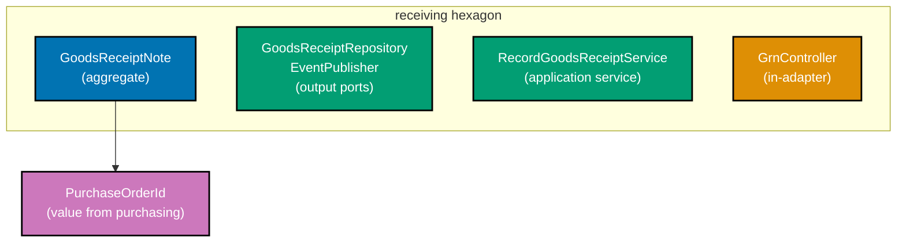

Examples 56–75 cover advanced hexagonal design in the `procurement-platform-be` domain: wiring `receiving`, `invoicing`, and `payments` contexts together, building `BankingPort` with retry and circuit-breaker decorator adapters, emitting metrics through an `Observability` port, notifying suppliers via `SupplierNotifierPort`, writing anti-corruption layers between contexts, versioning ports without breaking adapters, and recognising hexagonal anti-patterns to avoid. Every code block is self-contained. Annotation density targets 1.0–2.25 comment lines per code line per example.

## Multi-Context Wiring (Examples 56–60)

### Example 56: Receiving context — GoodsReceiptNote aggregate and port

The `receiving` context owns `GoodsReceiptNote`, which records physical delivery of goods against a `PurchaseOrder`. Its only coupling to the `purchasing` context is the `PurchaseOrderId` value object — a plain string wrapper with no business logic borrowed from purchasing's domain.






```java
// Package: com.example.procurement.receiving.domain
// => receiving context; imports only java.* — no purchasing.domain.* allowed
// => PurchaseOrderId is a plain value object shared by value, not by reference

public record PurchaseOrderId(String value) {
    // => canonical validation — enforces format at construction time
    // => format: po_<uuid>; rejects empty or badly-shaped ids immediately
    public PurchaseOrderId {
        if (value == null || !value.startsWith("po_"))  // => guard: null or wrong prefix
            throw new IllegalArgumentException("PurchaseOrderId must start with po_"); // => fail fast
    }
}

public record GrnId(String value) {}               // => receiving's own identity type
public record Quantity(int value, String unit) {}  // => unit: EACH, BOX, KG, LITRE, HOUR

// GoodsReceiptNote aggregate: immutable record capturing a delivery event
// => All fields final by record semantics; business methods return new instances
public record GoodsReceiptNote(
    GrnId id,                // => receiving's own id; format: grn_<uuid>
    PurchaseOrderId poId,    // => links to the purchasing PO; value only, no PO object
    Quantity received,       // => actual quantity delivered
    boolean discrepancy      // => true if received qty differs from ordered qty
) {
    // => Factory method: keeps construction logic out of callers
    // => validates received quantity is positive before creating the GRN
    public static GoodsReceiptNote record(GrnId id, PurchaseOrderId poId, Quantity received,
                                          int orderedQty) {
        boolean discrepancy = received.value() != orderedQty; // => simple equality check
        // => discrepancy flag triggers GoodsReceiptDiscrepancyDetected event downstream
        return new GoodsReceiptNote(id, poId, received, discrepancy);
        // => returns immutable aggregate; caller persists via GoodsReceiptRepository port
    }
}

// Output port: store and load GoodsReceiptNotes
// => Adapter wires to Postgres; test adapter uses in-memory Map
interface GoodsReceiptRepository {
    void save(GoodsReceiptNote grn);                // => persist new or updated GRN
    java.util.Optional<GoodsReceiptNote> findById(GrnId id);  // => Optional: may not exist
}
```




```kotlin
// Package: com.example.procurement.receiving.domain
// => receiving context; imports only kotlin stdlib — no purchasing.domain.* allowed
// => PurchaseOrderId is a value class: zero-overhead wrapper; erased to String at runtime

@JvmInline
value class PurchaseOrderId(val value: String) {
    // => init block runs at construction; enforces format invariant immediately
    // => format: po_<uuid>; value class means no heap allocation in most call sites
    init {
        require(value.startsWith("po_")) { "PurchaseOrderId must start with po_" }
        // => require throws IllegalArgumentException on failure — idiomatic Kotlin guard
    }
}

@JvmInline
value class GrnId(val value: String)               // => receiving's own identity; zero-cost wrapper
// => Quantity: data class for value semantics; equals/hashCode/copy generated automatically
data class Quantity(val amount: Int, val unit: String) // => unit: EACH, BOX, KG, LITRE, HOUR

// GoodsReceiptNote: data class — immutable by convention; all vals; copy() for change
// => Kotlin data class generates equals/hashCode/toString/copy without Lombok
data class GoodsReceiptNote(
    val id: GrnId,                // => receiving's own id; format: grn_<uuid>
    val poId: PurchaseOrderId,    // => links to the purchasing PO; value only, no PO object
    val received: Quantity,       // => actual quantity delivered by the supplier
    val discrepancy: Boolean      // => true if received quantity differs from ordered quantity
) {
    companion object {
        // => Factory method in companion object: keeps construction logic out of callers
        // => Kotlin companion objects replace Java static methods for domain factories
        fun record(id: GrnId, poId: PurchaseOrderId, received: Quantity, orderedQty: Int): GoodsReceiptNote {
            val discrepancy = received.amount != orderedQty // => simple equality check
            // => discrepancy flag triggers GoodsReceiptDiscrepancyDetected event downstream
            return GoodsReceiptNote(id, poId, received, discrepancy)
            // => returns immutable aggregate; caller persists via GoodsReceiptRepository port
        }
    }
}

// Output port: store and load GoodsReceiptNotes
// => fun interface allows SAM conversion: single-method functional interface for lambdas
// => Adapter wires to Postgres; test adapter uses in-memory MutableMap
interface GoodsReceiptRepository {
    fun save(grn: GoodsReceiptNote)              // => persist new or updated GRN
    fun findById(id: GrnId): GoodsReceiptNote?  // => nullable return: null means not found
    // => Kotlin nullable GoodsReceiptNote? replaces Java Optional<GoodsReceiptNote>
    // => callers: repo.findById(id) ?: throw GrnNotFoundException(id)
}
```




```csharp
// Namespace: Procurement.Receiving.Domain
// => receiving context; references only System.*— no Purchasing.Domain.* allowed
// => PurchaseOrderId is a readonly record struct: value semantics, stack-allocated
namespace Procurement.Receiving.Domain;

// PurchaseOrderId: readonly record struct for zero-allocation value semantics
// => record struct generates Equals/GetHashCode/ToString; readonly prevents mutation
public readonly record struct PurchaseOrderId(string Value)
{
    // => Validation in a static factory keeps the constructor simple
    // => format: po_<uuid>; rejects null or badly-shaped ids at construction time
    public static PurchaseOrderId Of(string value)
    {
        if (string.IsNullOrEmpty(value) || !value.StartsWith("po_", StringComparison.Ordinal))
            throw new ArgumentException("PurchaseOrderId must start with po_", nameof(value));
        // => ArgumentException with paramName: matches .NET convention; caught by callers
        return new PurchaseOrderId(value);
        // => returns stack-allocated struct; no heap pressure in hot paths
    }
}

// GrnId: receiving context's own identity type
// => readonly record struct: value equality by Value field automatically
public readonly record struct GrnId(string Value);  // => format: grn_<uuid>

// Quantity: value object for physical delivery amounts
// => record with init-only properties: immutable after construction; C# 9+ pattern
public record Quantity(int Amount, string Unit);     // => Unit: EACH, BOX, KG, LITRE, HOUR

// GoodsReceiptNote: aggregate root — C# record for structural equality and immutability
// => All properties init-only; business methods return new instances via with-expressions
public record GoodsReceiptNote(
    GrnId Id,                      // => receiving's own id; format: grn_<uuid>
    PurchaseOrderId PoId,          // => links to the purchasing PO; value only, no PO object
    Quantity Received,             // => actual quantity delivered by the supplier
    bool Discrepancy               // => true if received quantity differs from ordered quantity
)
{
    // => Static factory method: keeps construction logic out of callers
    // => C# static method on record type — same pattern as Java record factory
    public static GoodsReceiptNote Record(GrnId id, PurchaseOrderId poId, Quantity received, int orderedQty)
    {
        var discrepancy = received.Amount != orderedQty; // => simple equality check
        // => discrepancy flag triggers GoodsReceiptDiscrepancyDetected event downstream
        return new GoodsReceiptNote(id, poId, received, discrepancy);
        // => returns immutable aggregate; caller persists via IGoodsReceiptRepository port
    }
}

// Output port: store and load GoodsReceiptNotes
// => I-prefix follows C# convention; adapters implement; application depends on interface only
public interface IGoodsReceiptRepository
{
    void Save(GoodsReceiptNote grn);              // => persist new or updated GRN
    GoodsReceiptNote? FindById(GrnId id);         // => nullable: null when not found
    // => GoodsReceiptNote? replaces Java Optional<>; callers null-check at call site
}
```





```typescript
// Receiving context — GoodsReceiptNote aggregate and port
// src/receiving/domain/

// PurchaseOrderId: local value object (copy by value from purchasing context)
// => private constructor + static create: enforces "po_" format invariant
export class PurchaseOrderId {
  private constructor(readonly value: string) {}
  static create(v: string): PurchaseOrderId {
    if (!v?.startsWith("po_")) throw new Error(`PurchaseOrderId must start with po_: ${v}`);
    return new PurchaseOrderId(v);
  }
}

export class GrnId {
  private constructor(readonly value: string) {}
  static create(v: string): GrnId {
    if (!v?.startsWith("grn_")) throw new Error(`GrnId must start with grn_: ${v}`);
    return new GrnId(v);
  }
}

export interface Quantity {
  readonly value: number;
  readonly unit: string;
}
// => unit: EACH, BOX, KG, LITRE, HOUR

// GoodsReceiptNote aggregate: immutable class; all fields set at construction
export class GoodsReceiptNote {
  private constructor(
    readonly id: GrnId,
    readonly poId: PurchaseOrderId, // => links to the purchasing PO; value only, no PO object
    readonly received: Quantity, // => actual quantity delivered
    readonly discrepancy: boolean, // => true if received qty differs from ordered qty
  ) {}

  // Factory method: keeps construction logic out of callers
  static record(id: GrnId, poId: PurchaseOrderId, received: Quantity, orderedQty: number): GoodsReceiptNote {
    const discrepancy = received.value !== orderedQty;
    // => discrepancy flag triggers GoodsReceiptDiscrepancyDetected event downstream
    return new GoodsReceiptNote(id, poId, received, discrepancy);
    // => returns immutable aggregate; caller persists via GoodsReceiptRepository port
  }
}

// Output port: store and load GoodsReceiptNotes
export interface GoodsReceiptRepository {
  save(grn: GoodsReceiptNote): Promise; // => persist new or updated GRN
  findById(id: GrnId): Promise; // => null: may not exist
}
```




**Key Takeaway**: `receiving` imports `PurchaseOrderId` as a value object only — the context boundary stays clean because no `PurchaseOrder` aggregate object crosses the line.

**Why It Matters**: Sharing a typed ID wrapper (not the full aggregate) lets `receiving` reference purchasing orders without importing purchasing's business rules. If purchasing's approval logic changes, receiving compiles unchanged. Each context owns its domain model independently, so teams can deploy them separately without coordination.

---

### Example 57: Invoicing context — three-way match port

`invoicing` registers a supplier invoice and attempts to match it against a `PurchaseOrder` and a `GoodsReceiptNote`. The matching logic lives entirely inside the domain; the three IDs arrive as plain values, and the `InvoiceMatchingPort` output port abstracts the cross-context data fetch needed by the application service.




```java
// Package: com.example.procurement.invoicing.domain
// => Three value objects referencing other contexts by id only — no cross-context imports
public record PurchaseOrderId(String value) {}    // => local copy; format po_<uuid>
public record GrnId(String value) {}              // => local copy; format grn_<uuid>
public record InvoiceId(String value) {}          // => invoicing's own id; format inv_<uuid>

// Money: shared value semantic — amount in minor units + ISO 4217 currency code
// => Using long centAmount avoids floating-point rounding on financial values
public record Money(long centAmount, String currency) {
    public boolean isWithinTolerance(Money other, double maxPct) {
        // => tolerance check: |this - other| / other ≤ maxPct
        long diff = Math.abs(this.centAmount - other.centAmount); // => absolute difference
        return diff <= (long)(other.centAmount * maxPct);         // => within tolerance?
    }
}

// Invoice aggregate: owns three-way match state machine
// => States: Registered → Matching → Matched | Disputed → ScheduledForPayment → Paid
public record Invoice(
    InvoiceId id,
    PurchaseOrderId poId,     // => the PO this invoice covers
    GrnId grnId,              // => the GRN proving delivery occurred
    Money invoicedAmount,     // => what the supplier claims
    InvoiceStatus status      // => domain enum; never a String
) {
    public enum InvoiceStatus { REGISTERED, MATCHING, MATCHED, DISPUTED }

    // Domain method: attempt three-way match
    // => Returns new Invoice with updated status — immutable; no mutation
    public Invoice attemptMatch(Money poAmount, Money grnVerifiedAmount, double tolerancePct) {
        boolean poMatch = this.invoicedAmount.isWithinTolerance(poAmount, tolerancePct);
        // => poMatch: invoice amount close enough to PO committed amount?
        boolean grnMatch = this.invoicedAmount.isWithinTolerance(grnVerifiedAmount, tolerancePct);
        // => grnMatch: invoice amount close enough to what was actually received?
        InvoiceStatus next = (poMatch && grnMatch) ? InvoiceStatus.MATCHED : InvoiceStatus.DISPUTED;
        // => next status: MATCHED only if both comparisons pass within tolerance
        return new Invoice(id, poId, grnId, invoicedAmount, next);
        // => returns new immutable Invoice; caller persists the new version
    }
}

// Output port: fetch amounts needed for three-way match from other contexts
// => Application service calls this port; adapter fetches from Postgres views or APIs
interface InvoiceMatchingPort {
    Money fetchPoCommittedAmount(PurchaseOrderId poId);   // => purchasing context data
    Money fetchGrnVerifiedAmount(GrnId grnId);            // => receiving context data
}
```




```kotlin
// Package: com.example.procurement.invoicing.domain
// => Three value classes referencing other contexts by id only — no cross-context imports
// => @JvmInline value class: zero-allocation wrapper; erased to String at runtime

@JvmInline value class PurchaseOrderId(val value: String)  // => local copy; format po_<uuid>
@JvmInline value class GrnId(val value: String)            // => local copy; format grn_<uuid>
@JvmInline value class InvoiceId(val value: String)        // => invoicing's own id; inv_<uuid>

// Money: data class for shared value semantics — amount in minor units + ISO 4217 currency
// => data class: structural equals/hashCode; safe to use as Map key or in Set
data class Money(val centAmount: Long, val currency: String) {
    // isWithinTolerance: pure function — no side effects; returns Boolean directly
    // => tolerance check: |this - other| / other ≤ maxPct
    fun isWithinTolerance(other: Money, maxPct: Double): Boolean {
        val diff = Math.abs(this.centAmount - other.centAmount) // => absolute difference
        return diff <= (other.centAmount * maxPct).toLong()     // => within tolerance?
        // => toLong() truncates; matches Java cast (long) semantics precisely
    }
}

// InvoiceStatus: enum class — exhaustive when used in Kotlin when expressions
// => States: Registered → Matching → Matched | Disputed → ScheduledForPayment → Paid
enum class InvoiceStatus { REGISTERED, MATCHING, MATCHED, DISPUTED }

// Invoice aggregate: data class — immutable; domain transitions return new instances
// => data class copy() lets application service produce next state without mutation
data class Invoice(
    val id: InvoiceId,
    val poId: PurchaseOrderId,       // => the PO this invoice covers
    val grnId: GrnId,                // => the GRN proving delivery occurred
    val invoicedAmount: Money,       // => what the supplier claims
    val status: InvoiceStatus        // => domain enum; never a String
) {
    // attemptMatch: domain method returning a new Invoice with updated status
    // => Kotlin when is exhaustive on sealed/enum; all states must be handled
    fun attemptMatch(poAmount: Money, grnVerifiedAmount: Money, tolerancePct: Double): Invoice {
        val poMatch = invoicedAmount.isWithinTolerance(poAmount, tolerancePct)
        // => poMatch: invoice amount close enough to PO committed amount?
        val grnMatch = invoicedAmount.isWithinTolerance(grnVerifiedAmount, tolerancePct)
        // => grnMatch: invoice amount close enough to what was actually received?
        val next = if (poMatch && grnMatch) InvoiceStatus.MATCHED else InvoiceStatus.DISPUTED
        // => next status: MATCHED only if both comparisons pass within tolerance
        return copy(status = next)
        // => copy() produces new Invoice with only status changed; all other fields preserved
    }
}

// Output port: fetch amounts needed for three-way match from other contexts
// => fun interface: SAM-compatible; allows lambda adapters in tests
// => Application service calls this port; adapter fetches from Postgres views or APIs
fun interface InvoiceMatchingPort {
    fun fetchPoCommittedAmount(poId: PurchaseOrderId): Money   // => purchasing context data
    // => second method below means this cannot be fun interface; kept as regular interface
}
// => Separate interface for GRN data fetch — single-method interfaces enable lambda adapters
fun interface GrnAmountPort {
    fun fetchGrnVerifiedAmount(grnId: GrnId): Money            // => receiving context data
}
```




```csharp
// Namespace: Procurement.Invoicing.Domain
// => Three readonly record structs referencing other contexts by id only
// => readonly record struct: value semantics, stack-allocated, no heap pressure
namespace Procurement.Invoicing.Domain;

public readonly record struct PurchaseOrderId(string Value); // => local copy; format po_<uuid>
public readonly record struct GrnId(string Value);           // => local copy; format grn_<uuid>
public readonly record struct InvoiceId(string Value);       // => invoicing's own id; inv_<uuid>

// Money: readonly record struct for financial amounts — avoids decimal boxing on hot paths
// => record struct: structural equality; safe as Dictionary key or in HashSet
public readonly record struct Money(decimal Amount, string Currency)
{
    // IsWithinTolerance: pure function — no side effects; returns bool
    // => tolerance check: |this - other| / other ≤ maxPct
    public bool IsWithinTolerance(Money other, double maxPct)
    {
        var diff = Math.Abs(this.Amount - other.Amount);          // => absolute difference
        return diff <= (decimal)(other.Amount * (decimal)maxPct); // => within tolerance?
        // => decimal arithmetic: exact for currency; avoids double rounding errors
    }
}

// InvoiceStatus: enum for the three-way match state machine
// => C# pattern matching (switch expression) enforces exhaustive handling
public enum InvoiceStatus { Registered, Matching, Matched, Disputed }

// Invoice aggregate: C# record — init-only properties; with-expressions for transitions
// => record generates Equals/GetHashCode/ToString; immutable after construction
public record Invoice(
    InvoiceId Id,
    PurchaseOrderId PoId,          // => the PO this invoice covers
    GrnId GrnId,                   // => the GRN proving delivery occurred
    Money InvoicedAmount,          // => what the supplier claims
    InvoiceStatus Status           // => domain enum; never a string
)
{
    // AttemptMatch: domain method returning a new Invoice with updated status
    // => with-expression: produces new record with only Status changed; all other fields copied
    public Invoice AttemptMatch(Money poAmount, Money grnVerifiedAmount, double tolerancePct)
    {
        var poMatch = InvoicedAmount.IsWithinTolerance(poAmount, tolerancePct);
        // => poMatch: invoice amount close enough to PO committed amount?
        var grnMatch = InvoicedAmount.IsWithinTolerance(grnVerifiedAmount, tolerancePct);
        // => grnMatch: invoice amount close enough to what was actually received?
        var next = (poMatch && grnMatch) ? InvoiceStatus.Matched : InvoiceStatus.Disputed;
        // => next status: Matched only if both comparisons pass within tolerance
        return this with { Status = next };
        // => with-expression: new Invoice with Status updated; Id, PoId, GrnId, InvoicedAmount unchanged
    }
}

// Output port: fetch amounts needed for three-way match from other contexts
// => I-prefix follows C# convention; adapters implement; application depends on interface only
public interface IInvoiceMatchingPort
{
    Money FetchPoCommittedAmount(PurchaseOrderId poId);  // => purchasing context data
    Money FetchGrnVerifiedAmount(GrnId grnId);           // => receiving context data
    // => single interface with two methods: adapter fetches from Postgres view or HTTP API
}
```





```typescript
// Receiving context — GoodsReceiptNote aggregate and port
// src/receiving/domain/

// PurchaseOrderId: local value object (copy by value from purchasing context)
// => private constructor + static create: enforces "po_" format invariant
export class PurchaseOrderId {
  private constructor(readonly value: string) {}
  static create(v: string): PurchaseOrderId {
    if (!v?.startsWith("po_")) throw new Error(`PurchaseOrderId must start with po_: ${v}`);
    return new PurchaseOrderId(v);
  }
}

export class GrnId {
  private constructor(readonly value: string) {}
  static create(v: string): GrnId {
    if (!v?.startsWith("grn_")) throw new Error(`GrnId must start with grn_: ${v}`);
    return new GrnId(v);
  }
}

export interface Quantity {
  readonly value: number;
  readonly unit: string;
}
// => unit: EACH, BOX, KG, LITRE, HOUR

// GoodsReceiptNote aggregate: immutable class; all fields set at construction
export class GoodsReceiptNote {
  private constructor(
    readonly id: GrnId,
    readonly poId: PurchaseOrderId, // => links to the purchasing PO; value only, no PO object
    readonly received: Quantity, // => actual quantity delivered
    readonly discrepancy: boolean, // => true if received qty differs from ordered qty
  ) {}

  // Factory method: keeps construction logic out of callers
  static record(id: GrnId, poId: PurchaseOrderId, received: Quantity, orderedQty: number): GoodsReceiptNote {
    const discrepancy = received.value !== orderedQty;
    // => discrepancy flag triggers GoodsReceiptDiscrepancyDetected event downstream
    return new GoodsReceiptNote(id, poId, received, discrepancy);
    // => returns immutable aggregate; caller persists via GoodsReceiptRepository port
  }
}

// Output port: store and load GoodsReceiptNotes
export interface GoodsReceiptRepository {
  save(grn: GoodsReceiptNote): Promise; // => persist new or updated GRN
  findById(id: GrnId): Promise; // => null: may not exist
}
```




**Key Takeaway**: Three-way match logic lives in the domain; the `InvoiceMatchingPort` output port abstracts where the PO and GRN amounts come from.

**Why It Matters**: Keeping the match algorithm in the domain means it is testable in isolation — no database, no network. The port boundary means production adapters can fetch from a Postgres materialized view while test adapters return hard-coded values in microseconds.

---

### Example 58: Payments context — Payment aggregate and BankingPort

`payments` schedules and disburses supplier payments. `BankingPort` is the critical output port that abstracts the bank API. The application service calls `BankingPort.disburse()` without knowing whether the underlying adapter uses REST, SWIFT, or an in-memory stub.




```java
// Package: com.example.procurement.payments.domain
public record PaymentId(String value) {}           // => format: pay_<uuid>
public record InvoiceId(String value) {}           // => local copy for cross-context reference
public record BankAccount(String iban, String bic) {
    // => IBAN: up to 34 alphanumeric chars; BIC: 8 or 11 chars (ISO 9362)
    public BankAccount {
        if (iban == null || iban.isBlank()) throw new IllegalArgumentException("IBAN required");
        // => IBAN must be non-blank; production would validate checksum via library
        if (bic == null || (bic.length() != 8 && bic.length() != 11))
            throw new IllegalArgumentException("BIC must be 8 or 11 chars");
        // => BIC length rule from ISO 9362; catches typos early
    }
}
public record Money(long centAmount, String currency) {}

public record Payment(
    PaymentId id,
    InvoiceId invoiceId,       // => which invoice this payment settles
    Money amount,              // => amount disbursed
    BankAccount destination,   // => supplier's bank account
    PaymentStatus status       // => Scheduled → Disbursed | Failed | Reversed
) {
    public enum PaymentStatus { SCHEDULED, DISBURSED, FAILED }
}

// Output port: initiate a real bank disbursement
// => Adapter: RestBankingAdapter calls bank REST API with retry
// => Test adapter: InMemoryBankingAdapter records calls for assertion
interface BankingPort {
    DisbursementResult disburse(PaymentId id, Money amount, BankAccount to);
    // => Returns result immediately; async confirmation arrives via WebhookAdapter later

    record DisbursementResult(String transactionRef, boolean accepted) {}
    // => transactionRef: bank's own reference number for reconciliation
    // => accepted: false means bank rejected (insufficient funds, invalid IBAN, etc.)
}

// Application service: orchestrates payment disbursement
// => Calls BankingPort; on success persists updated Payment; publishes PaymentDisbursed event
class DisbursementService {
    private final BankingPort bankingPort;          // => injected at composition root
    private final PaymentRepository paymentRepo;    // => output port for persistence
    private final EventPublisher events;            // => output port for domain events

    DisbursementService(BankingPort bankingPort, PaymentRepository paymentRepo,
                        EventPublisher events) {
        this.bankingPort = bankingPort;             // => store injected dependency
        this.paymentRepo = paymentRepo;             // => store injected dependency
        this.events = events;                       // => store injected dependency
    }

    Payment disburse(Payment scheduled) {
        var result = bankingPort.disburse(             // => delegate to bank adapter
            scheduled.id(), scheduled.amount(), scheduled.destination());
        // => result: DisbursementResult with transactionRef and accepted flag
        var next = result.accepted()
            ? new Payment(scheduled.id(), scheduled.invoiceId(), scheduled.amount(),
                          scheduled.destination(), Payment.PaymentStatus.DISBURSED)
            : new Payment(scheduled.id(), scheduled.invoiceId(), scheduled.amount(),
                          scheduled.destination(), Payment.PaymentStatus.FAILED);
        // => next: new Payment record with updated status; original is unchanged
        paymentRepo.save(next);                        // => persist updated payment
        if (result.accepted()) events.publish(new PaymentDisbursed(scheduled.id())); // => emit event
        return next;                                   // => return updated aggregate to caller
    }
}
```




```kotlin
// Package: com.example.procurement.payments.domain
// => @JvmInline value classes: zero-allocation wrappers; erased to String at runtime

@JvmInline value class PaymentId(val value: String)   // => format: pay_<uuid>
@JvmInline value class InvoiceId(val value: String)   // => local copy for cross-context reference

// BankAccount: data class enforcing IBAN/BIC format in init block
// => data class: structural equality useful when checking duplicate payment destinations
data class BankAccount(val iban: String, val bic: String) {
    // => init block: replaces Java compact constructor; runs before any usage
    // => IBAN: up to 34 alphanumeric chars; BIC: 8 or 11 chars (ISO 9362)
    init {
        require(iban.isNotBlank()) { "IBAN required" }
        // => isNotBlank(): Kotlin stdlib; checks not null and not whitespace-only
        require(bic.length == 8 || bic.length == 11) { "BIC must be 8 or 11 chars" }
        // => BIC length rule from ISO 9362; catches typos at construction time
    }
}

// Money: data class for minor-unit amounts + ISO 4217 currency code
data class Money(val centAmount: Long, val currency: String)

// PaymentStatus: enum class — exhaustive when expressions enforced by Kotlin compiler
enum class PaymentStatus { SCHEDULED, DISBURSED, FAILED }

// Payment aggregate: data class — immutable; copy() for state transitions
data class Payment(
    val id: PaymentId,
    val invoiceId: InvoiceId,     // => which invoice this payment settles
    val amount: Money,            // => amount disbursed in minor units
    val destination: BankAccount, // => supplier's bank account
    val status: PaymentStatus     // => Scheduled → Disbursed | Failed
)

// DisbursementResult: data class for bank response — structural equality for test assertions
data class DisbursementResult(val transactionRef: String, val accepted: Boolean)
// => transactionRef: bank's own reference number for reconciliation
// => accepted: false means bank rejected (insufficient funds, invalid IBAN, etc.)

// BankingPort: output port — fun interface enables lambda adapters in tests
// => Adapter: RestBankingAdapter calls bank REST API; test: lambda stub returns fixed result
fun interface BankingPort {
    fun disburse(id: PaymentId, amount: Money, to: BankAccount): DisbursementResult
    // => Returns result immediately; async confirmation arrives via WebhookAdapter later
}

// DisbursementService: application service orchestrating payment disbursement
// => Primary constructor injects all dependencies; Kotlin omits boilerplate field assignments
class DisbursementService(
    private val bankingPort: BankingPort,       // => injected at composition root
    private val paymentRepo: PaymentRepository, // => output port for persistence
    private val events: EventPublisher          // => output port for domain events
) {
    fun disburse(scheduled: Payment): Payment {
        val result = bankingPort.disburse(         // => delegate to bank adapter
            scheduled.id, scheduled.amount, scheduled.destination)
        // => result: DisbursementResult with transactionRef and accepted flag
        val next = scheduled.copy(
            // => copy() with named argument: only status changes; all other fields preserved
            status = if (result.accepted) PaymentStatus.DISBURSED else PaymentStatus.FAILED
        )
        paymentRepo.save(next)                     // => persist updated payment
        if (result.accepted) events.publish(PaymentDisbursed(scheduled.id)) // => emit event
        return next                                // => return updated aggregate to caller
    }
}
```




```csharp
// Namespace: Procurement.Payments.Domain
// => C# 12 primary constructors; readonly record structs for zero-allocation IDs
namespace Procurement.Payments.Domain;

public readonly record struct PaymentId(string Value);   // => format: pay_<uuid>
public readonly record struct InvoiceId(string Value);   // => local copy for cross-context reference

// BankAccount: record with validation — C# records are immutable reference types
// => Validate in a static factory to keep the constructor simple; throw on bad input
public record BankAccount(string Iban, string Bic)
{
    // => Static factory enforces IBAN/BIC rules before object is created
    // => IBAN: up to 34 alphanumeric chars; BIC: 8 or 11 chars (ISO 9362)
    public static BankAccount Of(string iban, string bic)
    {
        if (string.IsNullOrWhiteSpace(iban))
            throw new ArgumentException("IBAN required", nameof(iban));
        // => IsNullOrWhiteSpace: guards null, empty, and whitespace-only values
        if (bic is not { Length: 8 or 11 })
            throw new ArgumentException("BIC must be 8 or 11 chars", nameof(bic));
        // => C# 11 list pattern on string: concise length check; ISO 9362 rule
        return new BankAccount(iban, bic);
    }
}

// Money: readonly record struct for financial amounts — decimal avoids floating-point errors
public readonly record struct Money(decimal Amount, string Currency);

// PaymentStatus: enum for the payment lifecycle state machine
public enum PaymentStatus { Scheduled, Disbursed, Failed }

// Payment aggregate: C# record — init-only; with-expressions for state transitions
public record Payment(
    PaymentId Id,
    InvoiceId InvoiceId,           // => which invoice this payment settles
    Money Amount,                  // => amount disbursed
    BankAccount Destination,       // => supplier's bank account
    PaymentStatus Status           // => domain enum; never a string
);

// DisbursementResult: readonly record struct for bank response — value equality for assertions
public readonly record struct DisbursementResult(string TransactionRef, bool Accepted);
// => TransactionRef: bank's own reference number for reconciliation
// => Accepted: false means bank rejected (insufficient funds, invalid IBAN, etc.)

// IBankingPort: output port — C# interface with I-prefix convention
// => Adapter: RestBankingAdapter calls bank REST API; test: InMemoryBankingAdapter records calls
public interface IBankingPort
{
    DisbursementResult Disburse(PaymentId id, Money amount, BankAccount to);
    // => Returns result immediately; async confirmation arrives via WebhookAdapter later
}

// DisbursementService: application service orchestrating payment disbursement
// => C# 12 primary constructor: fields declared inline; no manual assignment boilerplate
public class DisbursementService(
    IBankingPort bankingPort,           // => injected at composition root
    IPaymentRepository paymentRepo,     // => output port for persistence
    IEventPublisher events              // => output port for domain events
)
{
    public Payment Disburse(Payment scheduled)
    {
        var result = bankingPort.Disburse(               // => delegate to bank adapter
            scheduled.Id, scheduled.Amount, scheduled.Destination);
        // => result: DisbursementResult with TransactionRef and Accepted flag
        var next = scheduled with
        {
            // => with-expression: produces new Payment; only Status changes
            Status = result.Accepted ? PaymentStatus.Disbursed : PaymentStatus.Failed
        };
        paymentRepo.Save(next);                          // => persist updated payment
        if (result.Accepted) events.Publish(new PaymentDisbursed(scheduled.Id)); // => emit event
        return next;                                     // => return updated aggregate to caller
    }
}
```





```typescript
// Payments context — Payment aggregate and BankingPort
// src/payments/domain/

export class PaymentId {
  constructor(readonly value: string) {}
}
export class InvoiceId {
  constructor(readonly value: string) {}
}

// BankAccount: value object enforcing IBAN/BIC format
export class BankAccount {
  private constructor(
    readonly iban: string,
    readonly bic: string,
  ) {}
  static of(iban: string, bic: string): BankAccount {
    if (!iban?.trim()) throw new Error("IBAN required");
    if (bic?.length !== 8 && bic?.length !== 11) throw new Error("BIC must be 8 or 11 chars");
    return new BankAccount(iban, bic);
  }
}

export class Money {
  constructor(
    readonly centAmount: number,
    readonly currency: string,
  ) {}
}
export enum PaymentStatus {
  SCHEDULED = "SCHEDULED",
  DISBURSED = "DISBURSED",
  FAILED = "FAILED",
}

export class Payment {
  constructor(
    readonly id: PaymentId,
    readonly invoiceId: InvoiceId, // => which invoice this payment settles
    readonly amount: Money, // => amount disbursed in minor units
    readonly destination: BankAccount, // => supplier's bank account
    readonly status: PaymentStatus, // => domain enum; never a string
  ) {}
}

export interface DisbursementResult {
  readonly transactionRef: string; // => bank's own reference for reconciliation
  readonly accepted: boolean; // => false: bank rejected (insufficient funds, invalid IBAN)
}

// BankingPort: output port — application depends on this; never on bank API directly
export interface BankingPort {
  disburse(id: PaymentId, amount: Money, to: BankAccount): Promise;
}

// DisbursementService: application service orchestrating payment disbursement
export class DisbursementService {
  constructor(
    private readonly bankingPort: BankingPort, // => injected at composition root
    private readonly paymentRepo: PaymentRepository, // => output port for persistence
    private readonly events: EventPublisher, // => output port for domain events
  ) {}

  async disburse(scheduled: Payment): Promise {
    const result = await this.bankingPort.disburse(scheduled.id, scheduled.amount, scheduled.destination);
    // => result: DisbursementResult with transactionRef and accepted flag
    const newStatus = result.accepted ? PaymentStatus.DISBURSED : PaymentStatus.FAILED;
    const next = new Payment(scheduled.id, scheduled.invoiceId, scheduled.amount, scheduled.destination, newStatus);
    // => new Payment instance with updated status; original unchanged
    await this.paymentRepo.save(next);
    if (result.accepted) await this.events.publish({ aggregateId: scheduled.id.value, occurredAt: new Date() });
    return next;
  }
}
```




**Key Takeaway**: `BankingPort` decouples the payments application service from any specific banking technology — swap REST for SWIFT by providing a new adapter, no service change needed.

**Why It Matters**: Payment infrastructure is the most volatile part of a P2P system. Banks change APIs, certification requirements evolve, and disaster recovery may require switching providers. Hiding this behind a port means a provider switch is an adapter swap — the domain logic, tests, and all other adapters remain untouched.

---

### Example 59: SupplierNotifierPort — email and EDI fallback

`SupplierNotifierPort` abstracts outbound notifications to suppliers. One adapter uses SMTP; a fallback adapter uses EDI. The application service never knows which transport is active.




```java
// Package: com.example.procurement.shared.ports
// => Shared output port — used by purchasing, receiving, invoicing, payments
public interface SupplierNotifierPort {
    void notifyPurchaseOrderIssued(SupplierId supplierId, PurchaseOrderId poId);
    // => Sends PO to supplier; SMTP adapter sends PDF attachment; EDI adapter sends X12 850
    void notifyPaymentDisbursed(SupplierId supplierId, PaymentId paymentId, Money amount);
    // => Remittance advice; SMTP adapter sends HTML email; EDI adapter sends X12 820
    void notifyDiscrepancy(SupplierId supplierId, GrnId grnId, String reason);
    // => Dispute notification; always sent via preferred channel of supplier

    record SupplierId(String value) {}            // => format: sup_<uuid>
    record PurchaseOrderId(String value) {}       // => cross-context reference by value
    record PaymentId(String value) {}             // => cross-context reference by value
    record GrnId(String value) {}                 // => cross-context reference by value
    record Money(long centAmount, String currency) {} // => amount for remittance advice
}

// SMTP adapter: production implementation for email-capable suppliers
// => Annotated @Component at composition root only; domain and application layers see the interface
class SmtpSupplierNotifierAdapter implements SupplierNotifierPort {
    private final SmtpClient smtp;                // => injected email client
    SmtpSupplierNotifierAdapter(SmtpClient smtp) { this.smtp = smtp; }

    @Override
    public void notifyPurchaseOrderIssued(SupplierId supplierId, PurchaseOrderId poId) {
        smtp.send(supplierId.value() + "@supplier.example",  // => supplier email lookup simplified
                  "PO Issued: " + poId.value(),
                  "Your purchase order " + poId.value() + " has been issued.");
        // => send: delegates to SMTP client; throws SmtpException on failure
    }

    @Override
    public void notifyPaymentDisbursed(SupplierId supplierId, PaymentId paymentId, Money amount) {
        smtp.send(supplierId.value() + "@supplier.example",
                  "Payment Sent: " + paymentId.value(),
                  "Payment of " + amount.centAmount() + " " + amount.currency() + " disbursed.");
        // => remittance advice via email; EDI fallback kicks in if this adapter throws
    }

    @Override
    public void notifyDiscrepancy(SupplierId supplierId, GrnId grnId, String reason) {
        smtp.send(supplierId.value() + "@supplier.example",
                  "GRN Discrepancy: " + grnId.value(), reason);
        // => discrepancy notification; supplier should respond within SLA window
    }
}

// Minimal stub for demonstration (replaces SmtpClient in examples)
interface SmtpClient { void send(String to, String subject, String body); }
```




```kotlin
// Package: com.example.procurement.shared.ports
// => Shared output port — used by purchasing, receiving, invoicing, payments contexts

// Value classes: zero-allocation cross-context ID references
@JvmInline value class SupplierId(val value: String)      // => format: sup_<uuid>
@JvmInline value class PurchaseOrderId(val value: String) // => cross-context reference by value
@JvmInline value class PaymentId(val value: String)       // => cross-context reference by value
@JvmInline value class GrnId(val value: String)           // => cross-context reference by value
data class Money(val centAmount: Long, val currency: String) // => amount for remittance advice

// SupplierNotifierPort: output port with three notification methods
// => Cannot be fun interface (three methods); regular interface — adapters implement all three
interface SupplierNotifierPort {
    fun notifyPurchaseOrderIssued(supplierId: SupplierId, poId: PurchaseOrderId)
    // => Sends PO to supplier; SMTP adapter sends PDF attachment; EDI adapter sends X12 850
    fun notifyPaymentDisbursed(supplierId: SupplierId, paymentId: PaymentId, amount: Money)
    // => Remittance advice; SMTP adapter sends HTML email; EDI adapter sends X12 820
    fun notifyDiscrepancy(supplierId: SupplierId, grnId: GrnId, reason: String)
    // => Dispute notification; always sent via preferred channel of supplier
}

// SmtpClient: Kotlin fun interface — SAM-compatible; allows lambda stub in tests
fun interface SmtpClient {
    fun send(to: String, subject: String, body: String)
    // => fun interface: single abstract method; enables: SmtpClient { to, s, b -> log(s) }
}

// SmtpSupplierNotifierAdapter: production implementation for email-capable suppliers
// => Primary constructor injects SmtpClient; @Component annotation added at composition root only
class SmtpSupplierNotifierAdapter(private val smtp: SmtpClient) : SupplierNotifierPort {
    // => implements all three port methods; domain and application see only the interface

    override fun notifyPurchaseOrderIssued(supplierId: SupplierId, poId: PurchaseOrderId) {
        smtp.send(
            to = "${supplierId.value}@supplier.example", // => supplier email lookup simplified
            subject = "PO Issued: ${poId.value}",
            body = "Your purchase order ${poId.value} has been issued."
        )
        // => named arguments: readable call site; body string uses template literals
        // => send: delegates to SMTP client; throws SmtpException on failure
    }

    override fun notifyPaymentDisbursed(supplierId: SupplierId, paymentId: PaymentId, amount: Money) {
        smtp.send(
            to = "${supplierId.value}@supplier.example",
            subject = "Payment Sent: ${paymentId.value}",
            body = "Payment of ${amount.centAmount} ${amount.currency} disbursed."
        )
        // => remittance advice via email; EDI fallback kicks in if this adapter throws
    }

    override fun notifyDiscrepancy(supplierId: SupplierId, grnId: GrnId, reason: String) {
        smtp.send(
            to = "${supplierId.value}@supplier.example",
            subject = "GRN Discrepancy: ${grnId.value}",
            body = reason
        )
        // => discrepancy notification; supplier should respond within SLA window
    }
}
```




```csharp
// Namespace: Procurement.Shared.Ports
// => Shared output port — used by purchasing, receiving, invoicing, payments contexts
namespace Procurement.Shared.Ports;

// Readonly record structs: zero-allocation cross-context ID references
public readonly record struct SupplierId(string Value);       // => format: sup_<uuid>
public readonly record struct PurchaseOrderId(string Value);  // => cross-context reference by value
public readonly record struct PaymentId(string Value);        // => cross-context reference by value
public readonly record struct GrnId(string Value);            // => cross-context reference by value

// Money: readonly record struct — decimal for exact financial arithmetic
public readonly record struct Money(decimal Amount, string Currency); // => amount for remittance advice

// ISupplierNotifierPort: output port — I-prefix C# convention; three notification methods
// => adapters implement; application depends on interface; infrastructure wires concrete class
public interface ISupplierNotifierPort
{
    void NotifyPurchaseOrderIssued(SupplierId supplierId, PurchaseOrderId poId);
    // => Sends PO to supplier; SMTP adapter sends PDF attachment; EDI adapter sends X12 850
    void NotifyPaymentDisbursed(SupplierId supplierId, PaymentId paymentId, Money amount);
    // => Remittance advice; SMTP adapter sends HTML email; EDI adapter sends X12 820
    void NotifyDiscrepancy(SupplierId supplierId, GrnId grnId, string reason);
    // => Dispute notification; always sent via preferred channel of supplier
}

// ISmtpClient: minimal abstraction for the SMTP transport layer
// => single-method interface; test double implemented with a lambda or delegate in unit tests
public interface ISmtpClient
{
    void Send(string to, string subject, string body);
    // => production: wraps MailKit or System.Net.Mail; test: records calls for assertion
}

// SmtpSupplierNotifierAdapter: production implementation for email-capable suppliers
// => C# 12 primary constructor injects ISmtpClient; [Component] or DI registration at composition root
public class SmtpSupplierNotifierAdapter(ISmtpClient smtp) : ISupplierNotifierPort
{
    // => implements all three port methods; application layer sees only ISupplierNotifierPort

    public void NotifyPurchaseOrderIssued(SupplierId supplierId, PurchaseOrderId poId)
    {
        smtp.Send(
            to: $"{supplierId.Value}@supplier.example",  // => supplier email lookup simplified
            subject: $"PO Issued: {poId.Value}",
            body: $"Your purchase order {poId.Value} has been issued."
        );
        // => named arguments: readable call site; C# interpolated string for body
        // => Send delegates to SMTP client; throws SmtpException on transport failure
    }

    public void NotifyPaymentDisbursed(SupplierId supplierId, PaymentId paymentId, Money amount)
    {
        smtp.Send(
            to: $"{supplierId.Value}@supplier.example",
            subject: $"Payment Sent: {paymentId.Value}",
            body: $"Payment of {amount.Amount} {amount.Currency} disbursed."
        );
        // => remittance advice via email; EDI fallback adapter plugged in at composition root
    }

    public void NotifyDiscrepancy(SupplierId supplierId, GrnId grnId, string reason)
    {
        smtp.Send(
            to: $"{supplierId.Value}@supplier.example",
            subject: $"GRN Discrepancy: {grnId.Value}",
            body: reason
        );
        // => discrepancy notification; supplier should respond within SLA window
    }
}
```





```typescript
// Receiving context — GoodsReceiptNote aggregate and port
// src/receiving/domain/

// PurchaseOrderId: local value object (copy by value from purchasing context)
// => private constructor + static create: enforces "po_" format invariant
export class PurchaseOrderId {
  private constructor(readonly value: string) {}
  static create(v: string): PurchaseOrderId {
    if (!v?.startsWith("po_")) throw new Error(`PurchaseOrderId must start with po_: ${v}`);
    return new PurchaseOrderId(v);
  }
}

export class GrnId {
  private constructor(readonly value: string) {}
  static create(v: string): GrnId {
    if (!v?.startsWith("grn_")) throw new Error(`GrnId must start with grn_: ${v}`);
    return new GrnId(v);
  }
}

export interface Quantity {
  readonly value: number;
  readonly unit: string;
}
// => unit: EACH, BOX, KG, LITRE, HOUR

// GoodsReceiptNote aggregate: immutable class; all fields set at construction
export class GoodsReceiptNote {
  private constructor(
    readonly id: GrnId,
    readonly poId: PurchaseOrderId, // => links to the purchasing PO; value only, no PO object
    readonly received: Quantity, // => actual quantity delivered
    readonly discrepancy: boolean, // => true if received qty differs from ordered qty
  ) {}

  // Factory method: keeps construction logic out of callers
  static record(id: GrnId, poId: PurchaseOrderId, received: Quantity, orderedQty: number): GoodsReceiptNote {
    const discrepancy = received.value !== orderedQty;
    // => discrepancy flag triggers GoodsReceiptDiscrepancyDetected event downstream
    return new GoodsReceiptNote(id, poId, received, discrepancy);
    // => returns immutable aggregate; caller persists via GoodsReceiptRepository port
  }
}

// Output port: store and load GoodsReceiptNotes
export interface GoodsReceiptRepository {
  save(grn: GoodsReceiptNote): Promise; // => persist new or updated GRN
  findById(id: GrnId): Promise; // => null: may not exist
}
```




**Key Takeaway**: `SupplierNotifierPort` hides email vs EDI behind a single interface; swapping transport is an adapter replacement, not a domain change.

**Why It Matters**: Supplier communication channels vary — some suppliers accept email, others require EDI X12 or EDIFACT. Some prefer API webhooks. Abstracting this behind a port means the purchasing application service calls `notifyPurchaseOrderIssued` once, and the adapter layer decides channel. Adding EDI support means adding one adapter class, not touching the application service.

---

### Example 60: Observability port — metrics and traces without framework lock-in

An `Observability` output port abstracts OpenTelemetry, Prometheus, or any tracing library from the application service. The service reports business metrics without importing OTel classes.




```java
// Package: com.example.procurement.shared.ports
// => Observability port: application services emit domain events as metrics/spans
// => Adapter wires OpenTelemetry SDK; test adapter collects calls for assertion
public interface Observability {
    // => counter: increments a named counter with labels
    void incrementCounter(String name, java.util.Map<String,String> labels);
    // => recordDuration: records elapsed time for a named operation
    void recordDuration(String operation, long millis, java.util.Map<String,String> labels);
    // => span: wraps a supplier call in a named trace span; returns span result
    <T> T span(String spanName, java.util.concurrent.Callable<T> block) throws Exception;
}

// OpenTelemetry adapter: production wiring to OTel SDK
// => Domain and application see only Observability interface; OTel API never leaks inward
class OtelObservabilityAdapter implements Observability {
    // => In production: inject OpenTelemetry tracer and meter beans here
    // => Omitted for brevity — real adapter calls Tracer.spanBuilder(...).startSpan()

    @Override
    public void incrementCounter(String name, java.util.Map<String,String> labels) {
        System.out.println("[OTel] counter " + name + " labels=" + labels);
        // => real impl: LongCounter.add(1, Attributes.of(...)); OTel SDK batches and exports
    }

    @Override
    public void recordDuration(String operation, long millis, java.util.Map<String,String> labels) {
        System.out.println("[OTel] histogram " + operation + " " + millis + "ms labels=" + labels);
        // => real impl: LongHistogram.record(millis, Attributes.of(...));
    }

    @Override
    public <T> T span(String spanName, java.util.concurrent.Callable<T> block) throws Exception {
        System.out.println("[OTel] span start: " + spanName); // => span opened
        T result = block.call();                               // => execute wrapped operation
        System.out.println("[OTel] span end: " + spanName);   // => span closed on exit
        return result;                                         // => return result to caller
    }
}

// Application service using Observability port
// => No OTel import; service is testable with a no-op adapter
class MatchInvoiceService {
    private final Observability obs;                 // => injected observability port
    private final InvoiceRepository repo;            // => injected repo port
    MatchInvoiceService(Observability obs, InvoiceRepository repo) {
        this.obs = obs;   // => store injected dependency
        this.repo = repo; // => store injected dependency
    }

    void match(InvoiceId id, Money poAmount, Money grnAmount) throws Exception {
        obs.span("invoicing.match", () -> {          // => wraps entire match in a trace span
            var invoice = repo.findById(id).orElseThrow(); // => load from repository
            var matched = invoice.attemptMatch(poAmount, grnAmount, 0.02); // => 2% tolerance
            repo.save(matched);                       // => persist updated invoice
            obs.incrementCounter("invoice.match.result",  // => emit outcome counter
                java.util.Map.of("status", matched.status().name())); // => label with status
            return matched;                           // => span result
        });
    }
}
```




```kotlin
// Package: com.example.procurement.shared.ports
// => Observability port: application services emit domain events as metrics/spans
// => Adapter wires Micrometer SDK; test adapter collects calls for assertion

// Observability: output port — application services use this; no SDK type leaks inward
// => suspend-aware variant: block is a suspend lambda for coroutine compatibility
interface Observability {
    fun incrementCounter(name: String, labels: Map<String, String>)
    // => counter: increments a named counter with key/value labels
    fun recordDuration(operation: String, millis: Long, labels: Map<String, String>)
    // => histogram: records elapsed time for a named operation in milliseconds
    fun <T> span(spanName: String, block: () -> T): T
    // => span: wraps a lambda in a named trace span; returns block result to caller
}

// MicrometerObservabilityAdapter: production wiring to Micrometer + OTel bridge
// => Domain and application see only Observability interface; Micrometer API never leaks inward
class MicrometerObservabilityAdapter : Observability {
    // => In production: inject MeterRegistry and Tracer beans via constructor
    // => Omitted for brevity — real adapter calls registry.counter(...).increment()

    override fun incrementCounter(name: String, labels: Map<String, String>) {
        println("[Micrometer] counter $name labels=$labels")
        // => real impl: registry.counter(name, tags).increment(); Micrometer exports to OTel
    }

    override fun recordDuration(operation: String, millis: Long, labels: Map<String, String>) {
        println("[Micrometer] timer $operation ${millis}ms labels=$labels")
        // => real impl: registry.timer(operation, tags).record(millis, TimeUnit.MILLISECONDS)
    }

    override fun <T> span(spanName: String, block: () -> T): T {
        println("[Micrometer] span start: $spanName") // => span opened via Observation API
        val result = block()                           // => execute wrapped operation
        println("[Micrometer] span end: $spanName")   // => span closed on normal exit
        return result                                  // => return block result to caller
    }
}

// MatchInvoiceService: application service using Observability port
// => No Micrometer import; fully testable with a no-op lambda adapter
class MatchInvoiceService(
    private val obs: Observability,          // => injected observability port
    private val repo: InvoiceRepository      // => injected repository port
) {
    fun match(id: InvoiceId, poAmount: Money, grnAmount: Money) {
        obs.span("invoicing.match") {                   // => entire match wrapped in a trace span
            val invoice = repo.findById(id)
                ?: error("Invoice $id not found")       // => load from repository; throw if missing
            val matched = invoice.attemptMatch(poAmount, grnAmount, tolerance = 0.02)
            // => 2% tolerance: GRN amount within 2% of PO amount counts as matched
            repo.save(matched)                          // => persist updated invoice state
            obs.incrementCounter(
                "invoice.match.result",
                mapOf("status" to matched.status.name) // => label counter with match outcome
            )
            matched                                     // => span result; last expression in lambda
        }
    }
}
```




```csharp
// Namespace: Procurement.Shared.Ports
// => Observability port: application services emit domain events as metrics/spans
// => Adapter wires OpenTelemetry.Metrics; test adapter collects calls for assertion
namespace Procurement.Shared.Ports;

// IObservability: output port — application services depend on this; no SDK type leaks inward
// => Func<T> delegate for the span block keeps the port free of Task<T> coupling
public interface IObservability
{
    void IncrementCounter(string name, IReadOnlyDictionary<string, string> labels);
    // => counter: increments a named counter with key/value label pairs
    void RecordDuration(string operation, long millis, IReadOnlyDictionary<string, string> labels);
    // => histogram: records elapsed time for a named operation in milliseconds
    T Span<T>(string spanName, Func<T> block);
    // => span: wraps a delegate in a named activity span; returns block result to caller
}

// OtelObservabilityAdapter: production wiring to System.Diagnostics.ActivitySource + Meter
// => Domain and application see only IObservability; OpenTelemetry SDK never leaks inward
public class OtelObservabilityAdapter : IObservability
{
    // => In production: inject Meter and ActivitySource via primary constructor
    // => Omitted for brevity — real adapter calls _meter.CreateCounter<long>(...).Add(1)

    public void IncrementCounter(string name, IReadOnlyDictionary<string, string> labels)
    {
        Console.WriteLine($"[OTel] counter {name} labels={string.Join(",", labels)}");
        // => real impl: _counter.Add(1, tags); OpenTelemetry SDK exports via OTLP exporter
    }

    public void RecordDuration(string operation, long millis, IReadOnlyDictionary<string, string> labels)
    {
        Console.WriteLine($"[OTel] histogram {operation} {millis}ms labels={string.Join(",", labels)}");
        // => real impl: _histogram.Record(millis, tags); exported as OTLP histogram buckets
    }

    public T Span<T>(string spanName, Func<T> block)
    {
        using var activity = new System.Diagnostics.Activity(spanName).Start();
        // => Activity.Start() opens a span and sets it as the ambient current activity
        Console.WriteLine($"[OTel] span start: {spanName}");
        var result = block();                              // => execute wrapped delegate
        Console.WriteLine($"[OTel] span end: {spanName}"); // => span closed by using-dispose
        return result;                                     // => return result to caller
    }
}

// MatchInvoiceService: application service using IObservability port
// => C# 12 primary constructor; no OpenTelemetry using directive — port keeps SDK out
public class MatchInvoiceService(IObservability obs, IInvoiceRepository repo)
{
    public void Match(InvoiceId id, Money poAmount, Money grnAmount)
    {
        obs.Span("invoicing.match", () =>               // => entire match wrapped in a trace span
        {
            var invoice = repo.FindById(id)
                ?? throw new InvalidOperationException($"Invoice {id} not found");
            // => FindById returns null if not found; null-coalescing throw is idiomatic C#
            var matched = invoice.AttemptMatch(poAmount, grnAmount, tolerance: 0.02m);
            // => 2% decimal tolerance: GRN within 2% of PO amount counts as matched
            repo.Save(matched);                          // => persist updated invoice state
            obs.IncrementCounter(
                "invoice.match.result",
                new Dictionary<string, string> { ["status"] = matched.Status.ToString() }
            );
            // => label counter with match outcome for dashboard filtering
            return matched;                              // => span result returned to Span<T>
        });
    }
}
```





```typescript
// Invoicing context — three-way match port
// src/invoicing/domain/

export class PurchaseOrderId {
  constructor(readonly value: string) {}
}
export class GrnId {
  constructor(readonly value: string) {}
}
export class InvoiceId {
  constructor(readonly value: string) {}
}

// Money: financial value object; centAmount avoids floating-point rounding
export class Money {
  constructor(
    readonly centAmount: number,
    readonly currency: string,
  ) {}

  isWithinTolerance(other: Money, maxPct: number): boolean {
    const diff = Math.abs(this.centAmount - other.centAmount);
    return diff <= Math.floor(other.centAmount * maxPct);
    // => tolerance check: |this - other| / other ≤ maxPct; integer arithmetic
  }
}

export enum InvoiceStatus {
  REGISTERED = "REGISTERED",
  MATCHING = "MATCHING",
  MATCHED = "MATCHED",
  DISPUTED = "DISPUTED",
}

// Invoice aggregate: immutable class; domain transitions return new instances
export class Invoice {
  constructor(
    readonly id: InvoiceId,
    readonly poId: PurchaseOrderId, // => the PO this invoice covers
    readonly grnId: GrnId, // => the GRN proving delivery occurred
    readonly invoicedAmount: Money, // => what the supplier claims
    readonly status: InvoiceStatus, // => domain enum; never a string
  ) {}

  // attemptMatch: domain method returning new Invoice with updated status
  attemptMatch(poAmount: Money, grnVerifiedAmount: Money, tolerancePct: number): Invoice {
    const poMatch = this.invoicedAmount.isWithinTolerance(poAmount, tolerancePct);
    const grnMatch = this.invoicedAmount.isWithinTolerance(grnVerifiedAmount, tolerancePct);
    const next = poMatch && grnMatch ? InvoiceStatus.MATCHED : InvoiceStatus.DISPUTED;
    return new Invoice(this.id, this.poId, this.grnId, this.invoicedAmount, next);
    // => new instance; only status changes; all other fields preserved
  }
}

// Output port: fetch amounts needed for three-way match from other contexts
export interface InvoiceMatchingPort {
  fetchPoCommittedAmount(poId: PurchaseOrderId): Promise; // => purchasing context data
  fetchGrnVerifiedAmount(grnId: GrnId): Promise; // => receiving context data
}
```




**Key Takeaway**: The `Observability` port keeps OTel imports out of the application layer, making the service testable with a no-op adapter and portable across monitoring backends.

**Why It Matters**: Observability libraries (OTel, Micrometer, Datadog Agent) change major versions and evolve APIs. If the application service imports `io.opentelemetry.*` directly, every SDK upgrade forces recompilation and potential refactors across use cases. Behind a port, upgrading OTel means updating one adapter file.

---

## Decorator Adapters (Examples 61–64)

### Example 61: RetryingBankingAdapter — retry decorator for BankingPort

A decorator wraps an existing adapter and adds retry logic without modifying the underlying adapter or the port interface. The application service sees only `BankingPort`; the retry behaviour is invisible to it.

```mermaid
%% Palette: Blue #0173B2, Teal #029E73, Orange #DE8F05, Purple #CC78BC
graph LR
    SVC["DisbursementService\n#40;application#41;"]:::teal
    RET["RetryingBankingAdapter\n#40;decorator#41;"]:::orange
    REST["RestBankingAdapter\n#40;real adapter#41;"]:::blue
    BANK["Bank REST API\n#40;external#41;"]:::purple

    SVC -->|"BankingPort.disburse"| RET
    RET -->|"delegate with retry"| REST
    REST -->|"HTTP POST"| BANK

    classDef teal fill:#029E73,stroke:#000,color:#fff,stroke-width:2px
    classDef orange fill:#DE8F05,stroke:#000,color:#fff,stroke-width:2px
    classDef blue fill:#0173B2,stroke:#000,color:#fff,stroke-width:2px
    classDef purple fill:#CC78BC,stroke:#000,color:#fff,stroke-width:2px
```






```java
// RetryingBankingAdapter: decorator pattern — wraps any BankingPort with retry
// => Implements BankingPort itself, so it is transparent to DisbursementService
class RetryingBankingAdapter implements BankingPort {
    private final BankingPort delegate;    // => wrapped real adapter (RestBankingAdapter)
    private final int maxAttempts;         // => total tries before giving up; typically 3
    private final long retryDelayMs;       // => fixed delay between attempts; ms

    RetryingBankingAdapter(BankingPort delegate, int maxAttempts, long retryDelayMs) {
        this.delegate = delegate;          // => store wrapped adapter for delegation
        this.maxAttempts = maxAttempts;    // => store retry limit
        this.retryDelayMs = retryDelayMs;  // => store delay; production uses exponential backoff
    }

    @Override
    public DisbursementResult disburse(PaymentId id, Money amount, BankAccount to) {
        for (int attempt = 1; attempt <= maxAttempts; attempt++) {
            // => attempt loop: try up to maxAttempts times before propagating exception
            try {
                DisbursementResult result = delegate.disburse(id, amount, to); // => delegate
                System.out.println("[Retry] attempt " + attempt + " succeeded");
                // => Output: [Retry] attempt N succeeded
                return result; // => success: return immediately; no further attempts
            } catch (RuntimeException ex) {
                System.out.println("[Retry] attempt " + attempt + " failed: " + ex.getMessage());
                // => Output: [Retry] attempt N failed: <error>
                if (attempt == maxAttempts) throw ex; // => exhausted: re-throw to caller
                sleep(retryDelayMs);                  // => wait before next attempt
            }
        }
        throw new IllegalStateException("unreachable"); // => compiler satisfaction; loop covers all paths
    }

    private void sleep(long ms) {
        try { Thread.sleep(ms); }
        catch (InterruptedException e) { Thread.currentThread().interrupt(); }
        // => restore interrupted flag; do not swallow InterruptedException silently
    }
}

// Composition root wiring (Spring @Configuration or manual)
// => DisbursementService never sees RetryingBankingAdapter or RestBankingAdapter
// => It only knows BankingPort; wiring is an adapter-layer concern
class PaymentsConfig {
    BankingPort bankingPort() {
        BankingPort real = new RestBankingAdapter();                // => real HTTP adapter
        return new RetryingBankingAdapter(real, 3, 500L);          // => wrap with 3 retries, 500ms delay
        // => DisbursementService receives a BankingPort; retry is invisible to it
    }
}
```




```kotlin
// RetryingBankingAdapter: decorator pattern — wraps any BankingPort with retry
// => Implements BankingPort itself, so it is transparent to DisbursementService

// BankingPort: output port for payment disbursements — declared as fun interface
// => fun interface enables: BankingPort { id, amount, to -> ... } in tests
fun interface BankingPort {
    fun disburse(id: PaymentId, amount: Money, to: BankAccount): DisbursementResult
    // => single abstract method; Kotlin SAM-converts lambda at call site
}

// RetryingBankingAdapter: pure decorator — no framework dependency; composable
class RetryingBankingAdapter(
    private val delegate: BankingPort,   // => wrapped real adapter (RestBankingAdapter)
    private val maxAttempts: Int,        // => total tries before giving up; typically 3
    private val retryDelayMs: Long       // => fixed delay between attempts in ms
) : BankingPort {
    // => implements BankingPort; DisbursementService receives this as its BankingPort

    override fun disburse(id: PaymentId, amount: Money, to: BankAccount): DisbursementResult {
        repeat(maxAttempts) { index ->
            // => repeat: Kotlin alternative to for-loop; index is 0-based
            val attempt = index + 1     // => human-readable 1-based attempt number
            runCatching { delegate.disburse(id, amount, to) }
                // => runCatching: wraps call in Result; no try-catch syntax needed
                .onSuccess { result ->
                    println("[Retry] attempt $attempt succeeded")
                    // => Output: [Retry] attempt N succeeded
                    return result       // => success: return immediately; no further attempts
                }
                .onFailure { ex ->
                    println("[Retry] attempt $attempt failed: ${ex.message}")
                    // => Output: [Retry] attempt N failed: <error>
                    if (attempt == maxAttempts) throw ex // => exhausted: propagate to caller
                    Thread.sleep(retryDelayMs)           // => wait before next attempt
                }
        }
        error("unreachable") // => Kotlin: throws IllegalStateException; satisfies compiler
    }
}

// Composition root: wires BankingPort for DisbursementService
// => DisbursementService never sees RetryingBankingAdapter; wiring is an adapter concern
fun paymentsConfig(): BankingPort {
    val real = RestBankingAdapter()                          // => real HTTP adapter
    return RetryingBankingAdapter(real, maxAttempts = 3, retryDelayMs = 500L)
    // => named arguments: explicit intent; retry is invisible to DisbursementService
}
```




```csharp
// Namespace: Procurement.Payments.Adapters.Out
// => RetryingBankingAdapter: decorator pattern — wraps any IBankingPort with retry
// => Implements IBankingPort itself, so it is transparent to DisbursementService
namespace Procurement.Payments.Adapters.Out;

// IBankingPort: output port for payment disbursements — I-prefix C# convention
public interface IBankingPort
{
    DisbursementResult Disburse(PaymentId id, Money amount, BankAccount to);
    // => single method; adapters implement; test doubles use lambda via delegate
}

// RetryingBankingAdapter: C# 12 primary constructor; pure decorator; no framework dependency
public class RetryingBankingAdapter(
    IBankingPort delegate_,     // => wrapped real adapter (RestBankingAdapter)
    int maxAttempts,            // => total tries before giving up; typically 3
    long retryDelayMs           // => fixed delay between attempts in milliseconds
) : IBankingPort
{
    // => implements IBankingPort; DisbursementService receives this as IBankingPort

    public DisbursementResult Disburse(PaymentId id, Money amount, BankAccount to)
    {
        Exception? lastException = null;              // => track last failure for re-throw
        for (int attempt = 1; attempt <= maxAttempts; attempt++)
        {
            // => attempt loop: try up to maxAttempts times before propagating exception
            try
            {
                var result = delegate_.Disburse(id, amount, to); // => delegate to real adapter
                Console.WriteLine($"[Retry] attempt {attempt} succeeded");
                // => Output: [Retry] attempt N succeeded
                return result;                        // => success: return immediately
            }
            catch (Exception ex)
            {
                Console.WriteLine($"[Retry] attempt {attempt} failed: {ex.Message}");
                // => Output: [Retry] attempt N failed: <error>
                lastException = ex;                   // => record failure for re-throw
                if (attempt < maxAttempts)
                    Thread.Sleep((int)retryDelayMs);  // => wait before next attempt
            }
        }
        throw lastException!;                         // => exhausted: propagate last exception
        // => null-forgiving: lastException is always set when loop exits via this path
    }
}

// Composition root (e.g., Program.cs DI registration)
// => DisbursementService never sees RetryingBankingAdapter; receives IBankingPort
static class PaymentsCompositionRoot
{
    public static IBankingPort CreateBankingPort()
    {
        IBankingPort real = new RestBankingAdapter();                      // => real HTTP adapter
        return new RetryingBankingAdapter(real, maxAttempts: 3, retryDelayMs: 500L);
        // => named arguments: explicit intent; retry invisible to DisbursementService
    }
}
```





```typescript
// Payments context — Payment aggregate and BankingPort
// src/payments/domain/

export class PaymentId {
  constructor(readonly value: string) {}
}
export class InvoiceId {
  constructor(readonly value: string) {}
}

// BankAccount: value object enforcing IBAN/BIC format
export class BankAccount {
  private constructor(
    readonly iban: string,
    readonly bic: string,
  ) {}
  static of(iban: string, bic: string): BankAccount {
    if (!iban?.trim()) throw new Error("IBAN required");
    if (bic?.length !== 8 && bic?.length !== 11) throw new Error("BIC must be 8 or 11 chars");
    return new BankAccount(iban, bic);
  }
}

export class Money {
  constructor(
    readonly centAmount: number,
    readonly currency: string,
  ) {}
}
export enum PaymentStatus {
  SCHEDULED = "SCHEDULED",
  DISBURSED = "DISBURSED",
  FAILED = "FAILED",
}

export class Payment {
  constructor(
    readonly id: PaymentId,
    readonly invoiceId: InvoiceId, // => which invoice this payment settles
    readonly amount: Money, // => amount disbursed in minor units
    readonly destination: BankAccount, // => supplier's bank account
    readonly status: PaymentStatus, // => domain enum; never a string
  ) {}
}

export interface DisbursementResult {
  readonly transactionRef: string; // => bank's own reference for reconciliation
  readonly accepted: boolean; // => false: bank rejected (insufficient funds, invalid IBAN)
}

// BankingPort: output port — application depends on this; never on bank API directly
export interface BankingPort {
  disburse(id: PaymentId, amount: Money, to: BankAccount): Promise;
}

// DisbursementService: application service orchestrating payment disbursement
export class DisbursementService {
  constructor(
    private readonly bankingPort: BankingPort, // => injected at composition root
    private readonly paymentRepo: PaymentRepository, // => output port for persistence
    private readonly events: EventPublisher, // => output port for domain events
  ) {}

  async disburse(scheduled: Payment): Promise {
    const result = await this.bankingPort.disburse(scheduled.id, scheduled.amount, scheduled.destination);
    // => result: DisbursementResult with transactionRef and accepted flag
    const newStatus = result.accepted ? PaymentStatus.DISBURSED : PaymentStatus.FAILED;
    const next = new Payment(scheduled.id, scheduled.invoiceId, scheduled.amount, scheduled.destination, newStatus);
    // => new Payment instance with updated status; original unchanged
    await this.paymentRepo.save(next);
    if (result.accepted) await this.events.publish({ aggregateId: scheduled.id.value, occurredAt: new Date() });
    return next;
  }
}
```




**Key Takeaway**: The decorator pattern adds cross-cutting behaviour (retry) by wrapping the adapter, not by modifying the port interface or the application service.

**Why It Matters**: Bank APIs are unreliable — network glitches, rate limits, and transient timeouts are common. Adding retry in the application service contaminates business logic with infrastructure concerns. The decorator keeps retry isolated to the adapter layer and makes it composable: stack `RetryingBankingAdapter` around `CircuitBreakingBankingAdapter` around `RestBankingAdapter` without changing any interface.

---

### Example 62: CircuitBreakingBankingAdapter — circuit-breaker decorator

A circuit-breaker decorator sits around the retry decorator and prevents cascading failures. When the bank API fails repeatedly, the circuit opens and subsequent calls fail fast without hitting the API, giving the bank time to recover.




```java
// CircuitBreakingBankingAdapter: decorator wrapping BankingPort
// => States: CLOSED (normal), OPEN (failing fast), HALF_OPEN (probing)
// => Implements BankingPort — transparent to DisbursementService
class CircuitBreakingBankingAdapter implements BankingPort {
    private enum CircuitState { CLOSED, OPEN, HALF_OPEN }

    private final BankingPort delegate;          // => wrapped adapter (may be RetryingBankingAdapter)
    private final int failureThreshold;          // => trips to OPEN after this many consecutive failures
    private final long recoveryWindowMs;         // => time to wait in OPEN before probing (HALF_OPEN)
    private CircuitState state = CircuitState.CLOSED; // => initial state: allow all calls
    private int consecutiveFailures = 0;         // => failure counter; reset on success
    private long openedAtMs = 0;                 // => timestamp when circuit opened

    CircuitBreakingBankingAdapter(BankingPort delegate, int failureThreshold, long recoveryWindowMs) {
        this.delegate = delegate;                // => wrapped adapter for delegation
        this.failureThreshold = failureThreshold; // => e.g., 5 consecutive failures → OPEN
        this.recoveryWindowMs = recoveryWindowMs; // => e.g., 30_000L (30 seconds)
    }

    @Override
    public synchronized DisbursementResult disburse(PaymentId id, Money amount, BankAccount to) {
        if (state == CircuitState.OPEN) {        // => circuit is open: fail fast
            if (System.currentTimeMillis() - openedAtMs > recoveryWindowMs) {
                state = CircuitState.HALF_OPEN;  // => recovery window elapsed: probe once
                System.out.println("[Circuit] state → HALF_OPEN; probing bank API");
            } else {
                throw new RuntimeException("[Circuit] OPEN: bank API calls blocked"); // => fail fast
                // => caller receives failure immediately; bank not contacted; latency: microseconds
            }
        }
        try {
            DisbursementResult result = delegate.disburse(id, amount, to); // => delegate call
            consecutiveFailures = 0;             // => success: reset failure counter
            state = CircuitState.CLOSED;         // => success: close circuit (or keep closed)
            System.out.println("[Circuit] call succeeded; state=" + state);
            return result;                       // => return successful result to caller
        } catch (RuntimeException ex) {
            consecutiveFailures++;               // => increment failure counter
            if (consecutiveFailures >= failureThreshold) {
                state = CircuitState.OPEN;       // => threshold exceeded: open circuit
                openedAtMs = System.currentTimeMillis(); // => record when circuit opened
                System.out.println("[Circuit] state → OPEN after " + consecutiveFailures + " failures");
            }
            throw ex;                            // => propagate exception to caller
        }
    }
}

// Composition root: stack decorator chain
// => DisbursementService injects BankingPort; sees no retry or circuit-breaker logic
class PaymentsConfig2 {
    BankingPort bankingPort() {
        BankingPort real  = new RestBankingAdapter();                    // => real HTTP adapter
        BankingPort retry = new RetryingBankingAdapter(real, 3, 500L);  // => 3 retries
        return new CircuitBreakingBankingAdapter(retry, 5, 30_000L);    // => trips after 5 failures
        // => call chain: circuit-breaker → retry → REST adapter → bank API
    }
}
```




```kotlin
// CircuitBreakingBankingAdapter: decorator wrapping BankingPort (fun interface from Example 61)
// => States modelled as a sealed class: exhaustive when-expression; no invalid state possible
// => Implements BankingPort — transparent to DisbursementService

// CircuitState: sealed class models the three circuit-breaker states
// => sealed: compiler guarantees exhaustive when-expressions; no else branch needed
sealed class CircuitState {
    object Closed   : CircuitState() // => normal: all calls delegated
    data class Open(val openedAtMs: Long) : CircuitState()
    // => Open carries timestamp; data class enables equality in tests
    object HalfOpen : CircuitState() // => probing: one call allowed through
}

// CircuitBreakingBankingAdapter: idiomatic Kotlin with @Synchronized and Atomic state
// => @Synchronized: Kotlin annotation mirrors Java synchronized method modifier
class CircuitBreakingBankingAdapter(
    private val delegate: BankingPort,         // => wrapped adapter (RetryingBankingAdapter)
    private val failureThreshold: Int,         // => trips to Open after this many consecutive failures
    private val recoveryWindowMs: Long         // => time to wait in Open before probing (HalfOpen)
) : BankingPort {

    @Volatile private var state: CircuitState = CircuitState.Closed
    // => @Volatile: ensures state changes are visible across threads without full synchronization
    @Volatile private var consecutiveFailures: Int = 0
    // => failure counter; reset to 0 on any success

    @Synchronized
    override fun disburse(id: PaymentId, amount: Money, to: BankAccount): DisbursementResult {
        val currentState = state                // => capture state once for thread safety
        when (currentState) {
            is CircuitState.Open -> {           // => smart cast: currentState.openedAtMs available
                val elapsed = System.currentTimeMillis() - currentState.openedAtMs
                if (elapsed > recoveryWindowMs) {
                    state = CircuitState.HalfOpen // => recovery window elapsed: probe once
                    println("[Circuit] state → HalfOpen; probing bank API")
                } else {
                    error("[Circuit] OPEN: bank API calls blocked")
                    // => Kotlin error(): throws IllegalStateException; fail fast with microsecond latency
                }
            }
            else -> Unit                        // => Closed or HalfOpen: proceed to delegate
        }
        return runCatching { delegate.disburse(id, amount, to) }
            // => runCatching: wraps delegate call in Result; no try-catch syntax
            .onSuccess {
                consecutiveFailures = 0         // => success: reset failure counter
                state = CircuitState.Closed     // => success: close circuit
                println("[Circuit] call succeeded; state=Closed")
            }
            .onFailure {
                consecutiveFailures++           // => increment failure counter
                if (consecutiveFailures >= failureThreshold) {
                    state = CircuitState.Open(System.currentTimeMillis())
                    // => threshold exceeded: open circuit with current timestamp
                    println("[Circuit] state → Open after $consecutiveFailures failures")
                }
            }
            .getOrThrow()                       // => propagate exception to caller if failure
    }
}

// Composition root: stack decorator chain using named arguments for clarity
// => DisbursementService injects BankingPort; sees no retry or circuit-breaker logic
fun paymentsConfigWithCircuitBreaker(): BankingPort {
    val real  = RestBankingAdapter()                                     // => real HTTP adapter
    val retry = RetryingBankingAdapter(real, maxAttempts = 3, retryDelayMs = 500L) // => 3 retries
    return CircuitBreakingBankingAdapter(retry, failureThreshold = 5, recoveryWindowMs = 30_000L)
    // => call chain: circuit-breaker → retry → REST adapter → bank API
}
```




```csharp
// Namespace: Procurement.Payments.Adapters.Out
// => CircuitBreakingBankingAdapter: decorator wrapping IBankingPort
// => States modelled as enum; Interlocked for thread-safe state transitions
// => Implements IBankingPort — transparent to DisbursementService
namespace Procurement.Payments.Adapters.Out;

// CircuitState: three-state machine for the circuit-breaker pattern
internal enum CircuitState
{
    Closed,   // => normal: all calls delegated to underlying adapter
    Open,     // => failing fast: bank not contacted; calls rejected immediately
    HalfOpen  // => probing: one call allowed through to test bank availability
}

// CircuitBreakingBankingAdapter: C# 12 primary constructor; thread-safe via lock
public class CircuitBreakingBankingAdapter(
    IBankingPort delegate_,       // => wrapped adapter (may be RetryingBankingAdapter)
    int failureThreshold,         // => trips to Open after this many consecutive failures
    long recoveryWindowMs         // => time to wait in Open before probing (HalfOpen); ms
) : IBankingPort
{
    private CircuitState _state = CircuitState.Closed; // => initial state: allow all calls
    private int _consecutiveFailures = 0;              // => failure counter; reset on success
    private long _openedAtMs = 0L;                     // => timestamp when circuit opened
    private readonly object _lock = new();             // => lock object for thread safety

    public DisbursementResult Disburse(PaymentId id, Money amount, BankAccount to)
    {
        lock (_lock)                                   // => serialize concurrent Disburse calls
        {
            if (_state == CircuitState.Open)           // => circuit is open: fail fast
            {
                var elapsed = DateTimeOffset.UtcNow.ToUnixTimeMilliseconds() - _openedAtMs;
                if (elapsed > recoveryWindowMs)
                {
                    _state = CircuitState.HalfOpen;    // => recovery window elapsed: probe once
                    Console.WriteLine("[Circuit] state → HalfOpen; probing bank API");
                }
                else
                {
                    throw new InvalidOperationException("[Circuit] OPEN: bank API calls blocked");
                    // => fail fast: caller receives exception immediately; microsecond latency
                }
            }

            try
            {
                var result = delegate_.Disburse(id, amount, to); // => delegate to wrapped adapter
                _consecutiveFailures = 0;              // => success: reset failure counter
                _state = CircuitState.Closed;          // => success: close circuit
                Console.WriteLine($"[Circuit] call succeeded; state={_state}");
                return result;                         // => return successful result to caller
            }
            catch (Exception)
            {
                _consecutiveFailures++;                // => increment failure counter
                if (_consecutiveFailures >= failureThreshold)
                {
                    _state = CircuitState.Open;        // => threshold exceeded: open circuit
                    _openedAtMs = DateTimeOffset.UtcNow.ToUnixTimeMilliseconds();
                    // => record when circuit opened; used to compute recovery window
                    Console.WriteLine($"[Circuit] state → Open after {_consecutiveFailures} failures");
                }
                throw;                                 // => propagate exception to caller
            }
        }
    }
}

// Composition root: stack decorator chain using named arguments for readability
// => DisbursementService receives IBankingPort; sees no retry or circuit-breaker logic
static class PaymentsCompositionRoot
{
    public static IBankingPort CreateWithCircuitBreaker()
    {
        IBankingPort real  = new RestBankingAdapter();
        // => real HTTP adapter; contacts bank API directly
        IBankingPort retry = new RetryingBankingAdapter(real, maxAttempts: 3, retryDelayMs: 500L);
        // => wrap with retry: 3 attempts, 500ms delay between attempts
        return new CircuitBreakingBankingAdapter(retry, failureThreshold: 5, recoveryWindowMs: 30_000L);
        // => call chain: circuit-breaker → retry → REST adapter → bank API
    }
}
```





```typescript
// Payments context — Payment aggregate and BankingPort
// src/payments/domain/

export class PaymentId {
  constructor(readonly value: string) {}
}
export class InvoiceId {
  constructor(readonly value: string) {}
}

// BankAccount: value object enforcing IBAN/BIC format
export class BankAccount {
  private constructor(
    readonly iban: string,
    readonly bic: string,
  ) {}
  static of(iban: string, bic: string): BankAccount {
    if (!iban?.trim()) throw new Error("IBAN required");
    if (bic?.length !== 8 && bic?.length !== 11) throw new Error("BIC must be 8 or 11 chars");
    return new BankAccount(iban, bic);
  }
}

export class Money {
  constructor(
    readonly centAmount: number,
    readonly currency: string,
  ) {}
}
export enum PaymentStatus {
  SCHEDULED = "SCHEDULED",
  DISBURSED = "DISBURSED",
  FAILED = "FAILED",
}

export class Payment {
  constructor(
    readonly id: PaymentId,
    readonly invoiceId: InvoiceId, // => which invoice this payment settles
    readonly amount: Money, // => amount disbursed in minor units
    readonly destination: BankAccount, // => supplier's bank account
    readonly status: PaymentStatus, // => domain enum; never a string
  ) {}
}

export interface DisbursementResult {
  readonly transactionRef: string; // => bank's own reference for reconciliation
  readonly accepted: boolean; // => false: bank rejected (insufficient funds, invalid IBAN)
}

// BankingPort: output port — application depends on this; never on bank API directly
export interface BankingPort {
  disburse(id: PaymentId, amount: Money, to: BankAccount): Promise;
}

// DisbursementService: application service orchestrating payment disbursement
export class DisbursementService {
  constructor(
    private readonly bankingPort: BankingPort, // => injected at composition root
    private readonly paymentRepo: PaymentRepository, // => output port for persistence
    private readonly events: EventPublisher, // => output port for domain events
  ) {}

  async disburse(scheduled: Payment): Promise {
    const result = await this.bankingPort.disburse(scheduled.id, scheduled.amount, scheduled.destination);
    // => result: DisbursementResult with transactionRef and accepted flag
    const newStatus = result.accepted ? PaymentStatus.DISBURSED : PaymentStatus.FAILED;
    const next = new Payment(scheduled.id, scheduled.invoiceId, scheduled.amount, scheduled.destination, newStatus);
    // => new Payment instance with updated status; original unchanged
    await this.paymentRepo.save(next);
    if (result.accepted) await this.events.publish({ aggregateId: scheduled.id.value, occurredAt: new Date() });
    return next;
  }
}
```




**Key Takeaway**: Stack circuit-breaker over retry over the real adapter using the decorator pattern — each layer is independently testable and composable.

**Why It Matters**: Without a circuit-breaker, retries during a full bank outage hammer an already-failing API and exhaust thread pools. The circuit-breaker breaks the cascade: after five failures it opens, and all subsequent calls fail in microseconds. The 30-second recovery window lets the bank stabilise before the next probe. The entire mechanism is invisible to the application service.

---

### Example 63: Anti-corruption layer — receiving context translating purchasing events

When `receiving` consumes `PurchaseOrderIssued` from the purchasing context event bus, it must not import purchasing's domain types. An anti-corruption layer (ACL) in the adapter layer translates the external event DTO into receiving's own commands.




```java
// ── purchasing hexagon publishes this event DTO to the bus ────────────────────
// Package: com.example.procurement.purchasing.events (event schema package)
// => Shared only as a DTO; receiving imports this DTO, not any purchasing domain type
record PurchaseOrderIssuedDto(
    String purchaseOrderId,    // => po_<uuid>; plain String in the DTO
    String supplierId,         // => sup_<uuid>; plain String in the DTO
    int    quantityOrdered,    // => ordered quantity
    String unitOfMeasure       // => EACH, BOX, KG, LITRE, HOUR
) {}

// ── receiving hexagon anti-corruption layer ───────────────────────────────────
// Package: com.example.procurement.receiving.adapter.in.event
// => ACL lives in the adapter layer; domain and application are untouched
class PurchaseOrderIssuedAcl {
    // => translate: converts external DTO into receiving's internal command record
    // => This is the only place that knows both DTO and receiving domain types
    OpenGrnExpectationCommand translate(PurchaseOrderIssuedDto dto) {
        var poId = new PurchaseOrderId(dto.purchaseOrderId()); // => wrap String in typed id
        // => PurchaseOrderId validates format po_<uuid> at construction
        var qty  = new Quantity(dto.quantityOrdered(), dto.unitOfMeasure()); // => domain VO
        // => Quantity validates value > 0 and unit is a known enum value
        return new OpenGrnExpectationCommand(poId, qty); // => receiving's own command type
        // => command passed to application service; no purchasing types leak further
    }
}

// Receiving's internal command — owns its own types; no purchasing import beyond id value
record OpenGrnExpectationCommand(PurchaseOrderId poId, Quantity qty) {}

// Adapter: Kafka consumer subscribing to purchasing events
// => Uses ACL to translate before handing off to application service
class PurchaseOrderIssuedConsumer {
    private final PurchaseOrderIssuedAcl acl;           // => injected ACL translator
    private final RecordGoodsReceiptService service;    // => injected application service

    PurchaseOrderIssuedConsumer(PurchaseOrderIssuedAcl acl, RecordGoodsReceiptService service) {
        this.acl     = acl;     // => store ACL for translation
        this.service = service; // => store application service for dispatch
    }

    void onMessage(PurchaseOrderIssuedDto dto) {
        OpenGrnExpectationCommand cmd = acl.translate(dto); // => ACL translates DTO → command
        service.openExpectation(cmd);                       // => application service receives clean command
        System.out.println("Receiving: expectation opened for PO " + cmd.poId().value());
        // => Output: Receiving: expectation opened for PO po_<uuid>
    }
}
```




```kotlin
// ── purchasing hexagon publishes this event DTO to the bus ────────────────────
// Package: com.example.procurement.purchasing.events (event schema package)
// => Shared only as a data class DTO; receiving imports this, not any purchasing domain type

// PurchaseOrderIssuedDto: Kotlin data class — auto-generates equals/hashCode/copy/toString
// => Data class: idiomatic DTO; purchasing publishes; receiving subscribes
data class PurchaseOrderIssuedDto(
    val purchaseOrderId: String,   // => po_<uuid>; plain String in the DTO schema
    val supplierId: String,        // => sup_<uuid>; plain String in the DTO schema
    val quantityOrdered: Int,      // => ordered quantity as integer
    val unitOfMeasure: String      // => EACH, BOX, KG, LITRE, HOUR
)

// ── receiving hexagon value objects ──────────────────────────────────────────
// => Receiving owns these types; purchasing never sees them

@JvmInline value class PurchaseOrderId(val value: String)
// => @JvmInline: zero-allocation wrapper; erased to String at runtime; validates on construction

data class Quantity(val amount: Int, val unitOfMeasure: String) {
    init {
        require(amount > 0) { "Quantity must be positive; got $amount" }
        // => init block: validation runs at construction; receiving domain invariant
    }
}

// OpenGrnExpectationCommand: receiving's own command type — no purchasing import
// => data class: copy/equals/hashCode generated; useful for test assertions
data class OpenGrnExpectationCommand(val poId: PurchaseOrderId, val qty: Quantity)

// ── receiving hexagon anti-corruption layer ───────────────────────────────────
// Package: com.example.procurement.receiving.adapter.in.event
// => ACL lives in the adapter layer; domain and application layers are untouched

// PurchaseOrderIssuedAcl: pure translation object — no infrastructure dependency
// => Single responsibility: translate one DTO type into one command type
class PurchaseOrderIssuedAcl {
    // => translate: converts external DTO into receiving's internal command
    // => This is the only place that knows both DTO schema and receiving domain types
    fun translate(dto: PurchaseOrderIssuedDto): OpenGrnExpectationCommand {
        val poId = PurchaseOrderId(dto.purchaseOrderId)
        // => wrap String in typed value class; validates po_<uuid> format at construction
        val qty = Quantity(dto.quantityOrdered, dto.unitOfMeasure)
        // => Quantity validates value > 0 and unit is a known enum value
        return OpenGrnExpectationCommand(poId, qty)
        // => receiving's own command; no purchasing types leak past this class
    }
}

// Adapter: Kafka consumer subscribing to purchasing events
// => Primary constructor injects ACL and application service; no framework in domain
class PurchaseOrderIssuedConsumer(
    private val acl: PurchaseOrderIssuedAcl,         // => injected ACL translator
    private val service: RecordGoodsReceiptService   // => injected application service
) {
    fun onMessage(dto: PurchaseOrderIssuedDto) {
        val cmd = acl.translate(dto)                 // => ACL translates DTO → command
        service.openExpectation(cmd)                 // => application service receives clean command
        println("Receiving: expectation opened for PO ${cmd.poId.value}")
        // => Output: Receiving: expectation opened for PO po_<uuid>
    }
}
```




```csharp
// Namespace: Procurement.Purchasing.Events (event schema package)
// => Shared only as a record DTO; receiving imports this, not any purchasing domain type
namespace Procurement.Purchasing.Events;

// PurchaseOrderIssuedDto: C# record — auto-generates Equals/GetHashCode/ToString/with
// => record: idiomatic DTO; value semantics; immutable once created
public record PurchaseOrderIssuedDto(
    string PurchaseOrderId,   // => po_<uuid>; plain string in the DTO schema
    string SupplierId,        // => sup_<uuid>; plain string in the DTO schema
    int    QuantityOrdered,   // => ordered quantity as integer
    string UnitOfMeasure      // => EACH, BOX, KG, LITRE, HOUR
);

// ── receiving hexagon value objects ──────────────────────────────────────────
// Namespace: Procurement.Receiving.Domain
// => Receiving owns these types; purchasing never imports them
namespace Procurement.Receiving.Domain;

// PurchaseOrderId: readonly record struct — zero-allocation cross-context reference
public readonly record struct PurchaseOrderId(string Value);
// => format po_<uuid>; validates at construction in real implementation

// Quantity: readonly record struct with init validation
// => property init is the idiomatic guard location for C# record structs
public readonly record struct Quantity
{
    public int Amount { get; init; }
    // => init accessor: value settable only at construction; immutable thereafter
    public string UnitOfMeasure { get; init; }
    // => EACH, BOX, KG, LITRE, HOUR — known unit enum values

    public Quantity(int amount, string unitOfMeasure)
    {
        if (amount <= 0) throw new ArgumentException($"Quantity must be positive; got {amount}");
        // => guard: receiving domain invariant; throws at construction boundary
        Amount = amount;
        UnitOfMeasure = unitOfMeasure; // => store validated values
    }
}

// OpenGrnExpectationCommand: receiving's own command type — no purchasing import
// => record: value semantics; equality by value; pattern matching in handlers
public record OpenGrnExpectationCommand(PurchaseOrderId PoId, Quantity Qty);

// ── receiving hexagon anti-corruption layer ───────────────────────────────────
// Namespace: Procurement.Receiving.Adapters.In.Event
// => ACL lives in the adapter layer; domain and application layers are untouched
namespace Procurement.Receiving.Adapters.In.Event;

// PurchaseOrderIssuedAcl: pure translation class — no infrastructure dependency
// => Single responsibility: translate one DTO type into one command type
public class PurchaseOrderIssuedAcl
{
    // => Translate: converts external DTO into receiving's internal command
    // => Only class that knows both DTO schema and receiving domain types
    public OpenGrnExpectationCommand Translate(PurchaseOrderIssuedDto dto)
    {
        var poId = new PurchaseOrderId(dto.PurchaseOrderId);
        // => wrap string in typed record struct; validates po_<uuid> format
        var qty = new Quantity(dto.QuantityOrdered, dto.UnitOfMeasure);
        // => Quantity validates Amount > 0 and UnitOfMeasure is a known value
        return new OpenGrnExpectationCommand(poId, qty);
        // => receiving's own command; no purchasing types leak past this class
    }
}

// PurchaseOrderIssuedConsumer: Kafka/event-bus adapter using ACL before dispatch
// => C# 12 primary constructor injects ACL and application service
public class PurchaseOrderIssuedConsumer(
    PurchaseOrderIssuedAcl acl,               // => injected ACL translator
    IRecordGoodsReceiptService service         // => injected application service port
)
{
    public void OnMessage(PurchaseOrderIssuedDto dto)
    {
        var cmd = acl.Translate(dto);          // => ACL translates DTO → command
        service.OpenExpectation(cmd);          // => application service receives clean command
        Console.WriteLine($"Receiving: expectation opened for PO {cmd.PoId.Value}");
        // => Output: Receiving: expectation opened for PO po_<uuid>
    }
}
```





```typescript
// Anti-corruption layer — receiving context translating purchasing events
// src/receiving/adapter/out/purchasing-acl/purchasing-acl.adapter.ts

import type { PurchaseOrderPort } from "../../application/purchase-order.port";
import type { PurchaseOrderId } from "../../domain/purchase-order-id";

// PurchaseOrderPort: receiving context's own port (its language, its types)
// => receiving never imports from purchasing domain directly
export interface PurchaseOrderPort {
  fetchCommittedQuantity(poId: PurchaseOrderId): Promise;
  // => receiving only needs the quantity; not the full PurchaseOrder aggregate
}

// PurchasingContextAcl: ACL adapter translating purchasing API → receiving port
// => receiving knows PurchaseOrderPort; never knows purchasing's PurchaseOrderRepository
export class PurchasingContextAcl implements PurchaseOrderPort {
  constructor(
    private readonly purchasingClient: any, // => purchasing API client (REST or direct service call)
  ) {}

  async fetchCommittedQuantity(poId: PurchaseOrderId): Promise {
    // Translate receiving's PurchaseOrderId → purchasing's wire format
    const response = await this.purchasingClient.get(`/purchase-orders/${poId.value}`);
    // => HTTP GET to purchasing microservice (or direct TypeORM query in monolith)

    return response.orderedQuantity;
    // => translate purchasing response field → receiving domain concept
    // => receiving never sees purchasing's PurchaseOrder aggregate; ACL mediates
  }
}

// InMemoryPurchasingAcl: test adapter for receiving context tests
export class InMemoryPurchasingAcl implements PurchaseOrderPort {
  private readonly quantities = new Map<string, number>();
  // => keyed by PurchaseOrderId.value; pre-seeded in test setup

  seed(poId: string, quantity: number): void {
    this.quantities.set(poId, quantity);
  }

  async fetchCommittedQuantity(poId: PurchaseOrderId): Promise {
    return this.quantities.get(poId.value) ?? 0;
    // => in-memory lookup; no HTTP call; purchasing context not needed in receiving tests
  }
}
```




**Key Takeaway**: The ACL in the adapter layer translates external event DTOs into the receiving context's own commands — purchasing types never enter the domain or application layers of receiving.

**Why It Matters**: Without an ACL, context A imports context B's domain types directly. A rename in B's aggregate ripples into A's domain, creating accidental coupling. The ACL localises the translation to one adapter class, so B's internal refactors require ACL updates only — the receiving domain stays stable.

---

### Example 64: Port versioning — adding a field without breaking existing adapters

When a port interface needs a new method, default interface methods allow adding behaviour without forcing every adapter to change. This is the minimal-impact port evolution strategy.




```java
// Original BankingPort — v1; all adapters implement this
interface BankingPort {
    DisbursementResult disburse(PaymentId id, Money amount, BankAccount to);
    // => v1 method: synchronous disbursement; returns result immediately
}

// Extended BankingPort — v2 adds scheduled disbursement
// => Default method: existing adapters inherit no-op; only new adapters override
interface BankingPort {
    DisbursementResult disburse(PaymentId id, Money amount, BankAccount to);
    // => v1 method unchanged: existing adapters still compile without modification

    default DisbursementResult scheduleDisburse(PaymentId id, Money amount, BankAccount to,
                                                java.time.LocalDate valueDate) {
        // => default: fall back to immediate disbursement if adapter does not override
        // => Existing RestBankingAdapter, RetryingBankingAdapter compile unchanged
        System.out.println("[BankingPort] scheduleDisburse not implemented; falling back to disburse");
        return disburse(id, amount, to);             // => delegate to v1 method
    }
}

// New adapter that DOES support scheduled disbursement
// => Overrides default; old adapters remain unchanged
class SchedulingRestBankingAdapter implements BankingPort {
    @Override
    public DisbursementResult disburse(PaymentId id, Money amount, BankAccount to) {
        System.out.println("[SchedulingRest] immediate disburse for " + id.value());
        // => Output: [SchedulingRest] immediate disburse for pay_<uuid>
        return new DisbursementResult("TXN-" + id.value(), true); // => simulated success
    }

    @Override
    public DisbursementResult scheduleDisburse(PaymentId id, Money amount, BankAccount to,
                                               java.time.LocalDate valueDate) {
        System.out.println("[SchedulingRest] scheduled for " + valueDate + ": " + id.value());
        // => Output: [SchedulingRest] scheduled for YYYY-MM-DD: pay_<uuid>
        return new DisbursementResult("SCH-TXN-" + id.value(), true); // => simulated scheduled
    }
}

record PaymentId(String value) {}
record Money(long centAmount, String currency) {}
record BankAccount(String iban, String bic) {}
record DisbursementResult(String transactionRef, boolean accepted) {}
```




```kotlin
// Package: com.example.procurement.payments.ports
// BankingPort v1 — all adapters implement this interface
// => Kotlin interfaces support default method bodies natively (no `default` keyword needed)
interface BankingPort {
    fun disburse(id: PaymentId, amount: Money, to: BankAccount): DisbursementResult
    // => v1 method: synchronous disbursement; returns result immediately
}

// BankingPort v2 — adds scheduleDisburse with a default fallback body
// => Default parameter value for valueDate makes old call sites compile unchanged
// => Existing adapters that do not override scheduleDisburse inherit the fallback body
interface BankingPort {
    fun disburse(id: PaymentId, amount: Money, to: BankAccount): DisbursementResult
    // => v1 method unchanged: all existing adapters still satisfy this contract

    fun scheduleDisburse(
        id: PaymentId,
        amount: Money,
        to: BankAccount,
        valueDate: java.time.LocalDate = java.time.LocalDate.now()
        // => default: today; old call sites that omit valueDate compile without change
    ): DisbursementResult {
        // => Default body: fall back to immediate disbursement when adapter does not override
        // => RestBankingAdapter and RetryingBankingAdapter compile without any changes
        println("[BankingPort] scheduleDisburse not overridden; falling back to disburse")
        return disburse(id, amount, to)              // => delegate to v1 method
    }
}

// Value objects — idiomatic Kotlin; @JvmInline avoids boxing overhead on JVM
@JvmInline value class PaymentId(val value: String)
// => value class: wraps String at compile-time; erased to String at runtime; zero heap overhead
data class Money(val centAmount: Long, val currency: String)
// => data class: equals/hashCode/copy generated; immutable by convention with val fields
data class BankAccount(val iban: String, val bic: String)
// => data class: structural equality; safe to use as Map key or in sets
data class DisbursementResult(val transactionRef: String, val accepted: Boolean)
// => data class: callers can destructure with component1()/component2()

// SchedulingRestBankingAdapter: overrides scheduleDisburse; old adapters remain unchanged
class SchedulingRestBankingAdapter : BankingPort {
    override fun disburse(id: PaymentId, amount: Money, to: BankAccount): DisbursementResult {
        println("[SchedulingRest] immediate disburse for ${id.value}")
        // => Output: [SchedulingRest] immediate disburse for pay_<uuid>
        return DisbursementResult("TXN-${id.value}", accepted = true)
        // => named arg `accepted` improves readability at the call site
    }

    override fun scheduleDisburse(
        id: PaymentId,
        amount: Money,
        to: BankAccount,
        valueDate: java.time.LocalDate
    ): DisbursementResult {
        println("[SchedulingRest] scheduled for $valueDate: ${id.value}")
        // => Output: [SchedulingRest] scheduled for YYYY-MM-DD: pay_<uuid>
        return DisbursementResult("SCH-TXN-${id.value}", accepted = true)
        // => SCH- prefix distinguishes scheduled disbursement refs from immediate ones
    }
}
```




```csharp
// Namespace: Procurement.Payments.Ports
// IBankingPort v1 — all adapters implement this interface
// => C# 8+ interfaces support default interface members for backward-compatible evolution
namespace Procurement.Payments.Ports;

// Value objects as readonly record structs — zero heap allocation, structural equality
public readonly record struct PaymentId(string Value);
// => record struct: immutable, value semantics, stack-allocated — ideal for IDs in hot paths
public readonly record struct Money(long CentAmount, string Currency);
// => CentAmount avoids floating-point rounding errors in financial calculations
public readonly record struct BankAccount(string Iban, string Bic);
// => Iban and Bic are raw strings; format validation belongs in the domain constructor
public readonly record struct DisbursementResult(string TransactionRef, bool Accepted);
// => bool Accepted: simple flag; richer modelling can add reason codes in a future version

// IBankingPort v1
public interface IBankingPort
{
    DisbursementResult Disburse(PaymentId id, Money amount, BankAccount to);
    // => v1 method: synchronous disbursement; returns result immediately
}

// IBankingPort v2 — adds ScheduleDisburse with a default implementation
// => Default interface member (C# 8+): existing adapters compile unchanged with no code change
public interface IBankingPort
{
    DisbursementResult Disburse(PaymentId id, Money amount, BankAccount to);
    // => v1 method unchanged: existing RestBankingAdapter compiles without modification

    DisbursementResult ScheduleDisburse(
        PaymentId id,
        Money amount,
        BankAccount to,
        DateOnly valueDate = default)
    // => default(DateOnly) = 0001-01-01; adapters that support scheduling override to supply real date
    {
        // => Default body: fall back to immediate disbursement if adapter does not override
        // => Existing adapters inherit this implementation automatically; no recompile required
        Console.WriteLine("[IBankingPort] ScheduleDisburse not overridden; falling back to Disburse");
        return Disburse(id, amount, to);             // => delegate to v1 method
    }
}

// SchedulingRestBankingAdapter: overrides ScheduleDisburse; old adapters remain unchanged
public class SchedulingRestBankingAdapter : IBankingPort
{
    public DisbursementResult Disburse(PaymentId id, Money amount, BankAccount to)
    {
        Console.WriteLine($"[SchedulingRest] immediate disburse for {id.Value}");
        // => Output: [SchedulingRest] immediate disburse for pay_<uuid>
        return new DisbursementResult($"TXN-{id.Value}", Accepted: true);
        // => named argument Accepted clarifies intent; positional arg would also compile
    }

    public DisbursementResult ScheduleDisburse(
        PaymentId id, Money amount, BankAccount to, DateOnly valueDate)
    {
        Console.WriteLine($"[SchedulingRest] scheduled for {valueDate:O}: {id.Value}");
        // => Output: [SchedulingRest] scheduled for YYYY-MM-DD: pay_<uuid>
        // => DateOnly.ToString("O") emits ISO-8601 date string; unambiguous in logs
        return new DisbursementResult($"SCH-TXN-{id.Value}", Accepted: true);
        // => SCH- prefix distinguishes scheduled disbursement refs from immediate ones
    }
}
```





```typescript
// Payments context — Payment aggregate and BankingPort
// src/payments/domain/

export class PaymentId {
  constructor(readonly value: string) {}
}
export class InvoiceId {
  constructor(readonly value: string) {}
}

// BankAccount: value object enforcing IBAN/BIC format
export class BankAccount {
  private constructor(
    readonly iban: string,
    readonly bic: string,
  ) {}
  static of(iban: string, bic: string): BankAccount {
    if (!iban?.trim()) throw new Error("IBAN required");
    if (bic?.length !== 8 && bic?.length !== 11) throw new Error("BIC must be 8 or 11 chars");
    return new BankAccount(iban, bic);
  }
}

export class Money {
  constructor(
    readonly centAmount: number,
    readonly currency: string,
  ) {}
}
export enum PaymentStatus {
  SCHEDULED = "SCHEDULED",
  DISBURSED = "DISBURSED",
  FAILED = "FAILED",
}

export class Payment {
  constructor(
    readonly id: PaymentId,
    readonly invoiceId: InvoiceId, // => which invoice this payment settles
    readonly amount: Money, // => amount disbursed in minor units
    readonly destination: BankAccount, // => supplier's bank account
    readonly status: PaymentStatus, // => domain enum; never a string
  ) {}
}

export interface DisbursementResult {
  readonly transactionRef: string; // => bank's own reference for reconciliation
  readonly accepted: boolean; // => false: bank rejected (insufficient funds, invalid IBAN)
}

// BankingPort: output port — application depends on this; never on bank API directly
export interface BankingPort {
  disburse(id: PaymentId, amount: Money, to: BankAccount): Promise;
}

// DisbursementService: application service orchestrating payment disbursement
export class DisbursementService {
  constructor(
    private readonly bankingPort: BankingPort, // => injected at composition root
    private readonly paymentRepo: PaymentRepository, // => output port for persistence
    private readonly events: EventPublisher, // => output port for domain events
  ) {}

  async disburse(scheduled: Payment): Promise {
    const result = await this.bankingPort.disburse(scheduled.id, scheduled.amount, scheduled.destination);
    // => result: DisbursementResult with transactionRef and accepted flag
    const newStatus = result.accepted ? PaymentStatus.DISBURSED : PaymentStatus.FAILED;
    const next = new Payment(scheduled.id, scheduled.invoiceId, scheduled.amount, scheduled.destination, newStatus);
    // => new Payment instance with updated status; original unchanged
    await this.paymentRepo.save(next);
    if (result.accepted) await this.events.publish({ aggregateId: scheduled.id.value, occurredAt: new Date() });
    return next;
  }
}
```




**Key Takeaway**: Default method implementations on port interfaces let ports evolve with new capabilities while all existing adapters continue compiling and running unchanged. Java achieves this with default interface methods; Kotlin with interface default bodies; C# with default interface members; TypeScript with optional interface properties paired with a base adapter class providing fallback behaviour.

**Why It Matters**: In a production system with multiple adapters (REST, EDI, stub), forcing all of them to implement every new method creates big-bang releases. Default methods allow additive port evolution: introduce the new method with a safe fallback, gradually upgrade adapters that need the new capability, and never break a currently-working adapter.

---

## Advanced Patterns (Examples 65–70)

### Example 65: Outbox pattern — EventPublisher adapter that guarantees delivery

The `EventPublisher` output port hides the outbox pattern. The application service calls `publish()` once; the adapter writes the event to an outbox table in the same database transaction as the aggregate, guaranteeing at-least-once delivery even if the Kafka broker is unavailable.




```java
// EventPublisher output port — used by all application services
// => Application services call publish(); adapter decides whether to write to DB or Kafka
interface EventPublisher {
    void publish(DomainEvent event);
    // => fire-and-forget contract; adapter guarantees at-least-once delivery
    sealed interface DomainEvent permits PaymentDisbursed, InvoiceMatched, GoodsReceived {}
    record PaymentDisbursed(PaymentId paymentId) implements DomainEvent {}
    record InvoiceMatched(InvoiceId invoiceId) implements DomainEvent {}
    record GoodsReceived(GrnId grnId) implements DomainEvent {}
}

// Outbox adapter: writes events to DB table in same transaction as aggregate save
// => Pattern: transactional outbox; prevents "saved aggregate, lost event" race condition
class OutboxEventPublisherAdapter implements EventPublisher {
    private final OutboxRepository outbox; // => injected; writes to outbox DB table

    OutboxEventPublisherAdapter(OutboxRepository outbox) {
        this.outbox = outbox; // => store injected repository
    }

    @Override
    public void publish(DomainEvent event) {
        // => serialize event to JSON; write to outbox table in SAME transaction
        // => outbox row: id, event_type, payload, created_at, processed=false
        String payload = serialize(event);             // => JSON serialization
        outbox.insert(event.getClass().getSimpleName(), payload); // => atomic with aggregate save
        System.out.println("[Outbox] event staged: " + event.getClass().getSimpleName());
        // => Output: [Outbox] event staged: PaymentDisbursed
        // => Background worker polls outbox table and forwards to Kafka; marks processed=true
    }

    private String serialize(DomainEvent event) {
        return switch (event) {          // => Java 21 pattern-matching switch for sealed types
            case EventPublisher.PaymentDisbursed e  -> "{\"paymentId\":\"" + e.paymentId().value() + "\"}";
            case EventPublisher.InvoiceMatched e    -> "{\"invoiceId\":\"" + e.invoiceId().value() + "\"}";
            case EventPublisher.GoodsReceived e     -> "{\"grnId\":\"" + e.grnId().value() + "\"}";
        };
        // => exhaustive switch: compiler enforces all sealed subtypes are handled
    }
}

// Supporting types (simplified)
interface OutboxRepository { void insert(String type, String payload); }
record PaymentId(String value) {}
record InvoiceId(String value) {}
record GrnId(String value) {}
```




```kotlin
// Package: com.example.procurement.shared.ports
// EventPublisher output port — application services call publish(); port hides delivery mechanism
// => Kotlin sealed interfaces (Kotlin 1.5+) express exhaustive domain event hierarchies
interface EventPublisher {
    fun publish(event: DomainEvent)
    // => fire-and-forget contract; adapter guarantees at-least-once delivery

    sealed interface DomainEvent
    // => sealed: all subtypes must be in the same package; compiler enforces exhaustive when
    @JvmInline value class PaymentId(val value: String)
    // => value class: erased to String at runtime; zero allocation in domain event records
    @JvmInline value class InvoiceId(val value: String)
    @JvmInline value class GrnId(val value: String)

    data class PaymentDisbursed(val paymentId: PaymentId) : DomainEvent
    // => data class: structural equality; equals/hashCode for deduplication in outbox worker
    data class InvoiceMatched(val invoiceId: InvoiceId) : DomainEvent
    data class GoodsReceived(val grnId: GrnId) : DomainEvent
}

// OutboxRepository port — writing outbox rows; adapter targets DB table
// => fun interface: single-method interface; lambda-compatible in Kotlin
fun interface OutboxRepository {
    fun insert(eventType: String, payload: String)
    // => eventType: simple class name; payload: JSON string; written in same DB transaction
}

// OutboxEventPublisherAdapter: writes events to DB in same transaction as aggregate save
// => Pattern: transactional outbox; prevents "saved aggregate, lost event" race condition
class OutboxEventPublisherAdapter(
    private val outbox: OutboxRepository  // => injected; writes to outbox DB table
) : EventPublisher {

    override fun publish(event: EventPublisher.DomainEvent) {
        // => serialize event to JSON; write to outbox table in SAME transaction as the aggregate
        // => outbox row: id, event_type, payload, created_at, processed=false
        val payload = serialize(event)                  // => JSON serialization
        outbox.insert(event::class.simpleName!!, payload) // => atomic with aggregate save
        println("[Outbox] event staged: ${event::class.simpleName}")
        // => Output: [Outbox] event staged: PaymentDisbursed
        // => Background worker polls outbox table; forwards to Kafka; marks processed=true
    }

    private fun serialize(event: EventPublisher.DomainEvent): String =
        when (event) {                                  // => exhaustive when on sealed type
            is EventPublisher.PaymentDisbursed ->
                """{"paymentId":"${event.paymentId.value}"}"""
            // => Kotlin triple-quoted string with ${} interpolation; no escaping needed
            is EventPublisher.InvoiceMatched ->
                """{"invoiceId":"${event.invoiceId.value}"}"""
            is EventPublisher.GoodsReceived ->
                """{"grnId":"${event.grnId.value}"}"""
        }
        // => Kotlin compiler enforces all sealed subtypes are handled; no default branch needed
}
```




```csharp
// Namespace: Procurement.Shared.Ports
// IEventPublisher output port — application services call Publish(); port hides delivery mechanism
// => C# 9 records for domain events: immutable, structural equality, concise syntax
namespace Procurement.Shared.Ports;

// Domain event hierarchy — C# discriminated unions via abstract record + sealed subrecords
public abstract record DomainEvent;
// => abstract record: base for all domain events; prevents direct instantiation
public sealed record PaymentDisbursed(string PaymentId) : DomainEvent;
// => sealed record: cannot be further subclassed; pattern matching is exhaustive
public sealed record InvoiceMatched(string InvoiceId) : DomainEvent;
public sealed record GoodsReceived(string GrnId) : DomainEvent;

// IEventPublisher output port
public interface IEventPublisher
{
    void Publish(DomainEvent domainEvent);
    // => fire-and-forget contract; adapter guarantees at-least-once delivery
}

// IOutboxRepository port — writing outbox rows; adapter targets DB table
public interface IOutboxRepository
{
    void Insert(string eventType, string payload);
    // => eventType: simple type name; payload: JSON string; written in same DB transaction
}

// OutboxEventPublisherAdapter: writes events to DB in same transaction as aggregate save
// => C# 12 primary constructor eliminates boilerplate field assignments
// => Pattern: transactional outbox; prevents "saved aggregate, lost event" race condition
public class OutboxEventPublisherAdapter(IOutboxRepository outbox) : IEventPublisher
{
    public void Publish(DomainEvent domainEvent)
    {
        // => serialize event to JSON; write to outbox table in SAME DB transaction as aggregate
        // => outbox row schema: id, event_type, payload, created_at, processed=false
        var payload = Serialize(domainEvent);           // => JSON serialization
        outbox.Insert(domainEvent.GetType().Name, payload); // => atomic with aggregate save
        Console.WriteLine($"[Outbox] event staged: {domainEvent.GetType().Name}");
        // => Output: [Outbox] event staged: PaymentDisbursed
        // => Background worker polls outbox table; forwards to Kafka; marks processed=true
    }

    private static string Serialize(DomainEvent domainEvent) =>
        domainEvent switch                              // => C# switch expression on base record type
        {
            PaymentDisbursed e => $"{{\"paymentId\":\"{e.PaymentId}\"}}",
            // => pattern matching: compiler warns if a sealed subtype is not handled
            InvoiceMatched e   => $"{{\"invoiceId\":\"{e.InvoiceId}\"}}",
            GoodsReceived e    => $"{{\"grnId\":\"{e.GrnId}\"}}",
            _                  => throw new ArgumentOutOfRangeException(nameof(domainEvent))
            // => _ arm required by C# compiler; sealed hierarchy exhaustion not checked at compile time
        };
}
```





```typescript
// Receiving context — GoodsReceiptNote aggregate and port
// src/receiving/domain/

// PurchaseOrderId: local value object (copy by value from purchasing context)
// => private constructor + static create: enforces "po_" format invariant
export class PurchaseOrderId {
  private constructor(readonly value: string) {}
  static create(v: string): PurchaseOrderId {
    if (!v?.startsWith("po_")) throw new Error(`PurchaseOrderId must start with po_: ${v}`);
    return new PurchaseOrderId(v);
  }
}

export class GrnId {
  private constructor(readonly value: string) {}
  static create(v: string): GrnId {
    if (!v?.startsWith("grn_")) throw new Error(`GrnId must start with grn_: ${v}`);
    return new GrnId(v);
  }
}

export interface Quantity {
  readonly value: number;
  readonly unit: string;
}
// => unit: EACH, BOX, KG, LITRE, HOUR

// GoodsReceiptNote aggregate: immutable class; all fields set at construction
export class GoodsReceiptNote {
  private constructor(
    readonly id: GrnId,
    readonly poId: PurchaseOrderId, // => links to the purchasing PO; value only, no PO object
    readonly received: Quantity, // => actual quantity delivered
    readonly discrepancy: boolean, // => true if received qty differs from ordered qty
  ) {}

  // Factory method: keeps construction logic out of callers
  static record(id: GrnId, poId: PurchaseOrderId, received: Quantity, orderedQty: number): GoodsReceiptNote {
    const discrepancy = received.value !== orderedQty;
    // => discrepancy flag triggers GoodsReceiptDiscrepancyDetected event downstream
    return new GoodsReceiptNote(id, poId, received, discrepancy);
    // => returns immutable aggregate; caller persists via GoodsReceiptRepository port
  }
}

// Output port: store and load GoodsReceiptNotes
export interface GoodsReceiptRepository {
  save(grn: GoodsReceiptNote): Promise; // => persist new or updated GRN
  findById(id: GrnId): Promise; // => null: may not exist
}
```




**Key Takeaway**: The outbox adapter writes events to the database in the same transaction as the aggregate, providing at-least-once delivery guarantees without exposing the implementation to the application service.

**Why It Matters**: Publishing to Kafka after committing the database is a two-phase operation — if Kafka fails between commit and publish, the event is lost. The outbox pattern collapses this to one atomic database write. The application service remains unaware of this complexity; from its perspective, it calls `publish()` and the port guarantees eventual delivery.

---

### Example 66: Clock port — deterministic time in payments scheduling

The `Clock` output port replaces direct `LocalDate.now()` calls. The application service asks the clock for the current date; production wires the system clock; tests inject a fixed date. This makes time-dependent payment scheduling rules completely deterministic in tests.




```java
// Clock output port — simple; powerful for payment scheduling rules
// => Application services never call LocalDate.now() directly; always ask Clock
interface Clock {
    java.time.LocalDate today();          // => current date; production: LocalDate.now()
    java.time.LocalDateTime now();        // => current datetime with millisecond precision
}

// System clock adapter — production
class SystemClockAdapter implements Clock {
    @Override public java.time.LocalDate today() { return java.time.LocalDate.now(); }
    // => delegates to JVM system time; timezone from JVM default (set via -Duser.timezone)
    @Override public java.time.LocalDateTime now() { return java.time.LocalDateTime.now(); }
    // => delegates to JVM system time; no network call; sub-microsecond overhead
}

// Fixed clock adapter — tests; eliminates date-dependent flakiness
class FixedClockAdapter implements Clock {
    private final java.time.LocalDate fixedDate;    // => set at construction; immutable
    private final java.time.LocalDateTime fixedNow; // => set at construction; immutable

    FixedClockAdapter(java.time.LocalDate fixedDate) {
        this.fixedDate = fixedDate;                              // => store fixed date
        this.fixedNow  = fixedDate.atStartOfDay();               // => start of that day
    }

    @Override public java.time.LocalDate today() { return fixedDate; } // => always returns same date
    @Override public java.time.LocalDateTime now() { return fixedNow; } // => always returns same time
}

// Application service: PaymentScheduler — uses Clock to determine next payment run date
class PaymentScheduler {
    private final Clock clock;               // => injected Clock port
    PaymentScheduler(Clock clock) { this.clock = clock; } // => store injected clock

    java.time.LocalDate nextPaymentRunDate() {
        var today = clock.today();                   // => ask clock; never LocalDate.now()
        // => today: 2026-05-17 in production; 2026-01-15 in a deterministic test
        var dayOfWeek = today.getDayOfWeek();        // => check day of week for scheduling rule
        return switch (dayOfWeek) {
            case FRIDAY, SATURDAY, SUNDAY ->
                today.plusDays(8 - dayOfWeek.getValue()); // => advance to next Monday
            default -> today.plusDays(1);             // => next business day (simplified)
        };
        // => deterministic in tests: FixedClockAdapter makes outcome 100% predictable
    }
}
```




```kotlin
// Package: com.example.procurement.payments.ports
// Clock output port — simple interface; powerful for payment scheduling determinism
// => Application services never call LocalDate.now() directly; always delegate to Clock
interface Clock {
    fun today(): java.time.LocalDate
    // => current date; production adapter: LocalDate.now(ZoneId.of("Asia/Jakarta"))
    fun now(): java.time.LocalDateTime
    // => current datetime with nanosecond precision; used for audit timestamps
}

// SystemClockAdapter: production — delegates to system clock
// => object declaration (singleton): stateless; safe to share across the application
object SystemClockAdapter : Clock {
    override fun today(): java.time.LocalDate = java.time.LocalDate.now()
    // => delegates to JVM system time; timezone from JVM default (set via -Duser.timezone)
    override fun now(): java.time.LocalDateTime = java.time.LocalDateTime.now()
    // => delegates to JVM system time; no network call; sub-microsecond overhead
}

// FixedClockAdapter: tests — eliminates date-dependent flakiness
// => data class: toString shows fixedDate; useful in test failure messages
data class FixedClockAdapter(
    val fixedDate: java.time.LocalDate  // => set at construction; immutable val
) : Clock {
    private val fixedNow: java.time.LocalDateTime = fixedDate.atStartOfDay()
    // => private val computed once at construction; always returns start of fixedDate

    override fun today(): java.time.LocalDate = fixedDate
    // => always returns the same date regardless of wall-clock time; 100% deterministic
    override fun now(): java.time.LocalDateTime = fixedNow
    // => always returns midnight of fixedDate; audit timestamps are predictable in tests
}

// PaymentScheduler: application service — uses Clock to determine next payment run date
// => primary constructor injection: Clock is required; no default fallback to system clock
class PaymentScheduler(private val clock: Clock) {
    // => clock injected: production wires SystemClockAdapter; tests wire FixedClockAdapter

    fun nextPaymentRunDate(): java.time.LocalDate {
        val today = clock.today()                    // => ask clock; never LocalDate.now()
        // => today: 2026-05-17 in production; 2026-01-15 in a deterministic test
        return when (today.dayOfWeek) {              // => Kotlin when on DayOfWeek enum
            java.time.DayOfWeek.FRIDAY,
            java.time.DayOfWeek.SATURDAY,
            java.time.DayOfWeek.SUNDAY ->
                today.plusDays(8L - today.dayOfWeek.value.toLong())
            // => advance to next Monday: FRIDAY(5)→+3, SATURDAY(6)→+2, SUNDAY(7)→+1
            else -> today.plusDays(1)                // => next calendar day (simplified rule)
        }
        // => deterministic in tests: FixedClockAdapter makes outcome 100% predictable
    }
}
```




```csharp
// Namespace: Procurement.Payments.Ports
// ITimeProvider output port — replaces DateTime.Now calls; makes scheduling rules deterministic
// => .NET 8+ ships Microsoft.Extensions.Time.Testing.FakeTimeProvider but defining a custom port
//    keeps the application layer free of Microsoft.Extensions.* assembly dependency
namespace Procurement.Payments.Ports;

// ITimeProvider: output port — simple; powerful for payment scheduling determinism
public interface ITimeProvider
{
    DateOnly Today();
    // => current date; production adapter: DateOnly.FromDateTime(TimeZoneInfo.ConvertTime(...))
    DateTimeOffset Now();
    // => current instant with offset; used for audit timestamps and deadline calculations
}

// SystemTimeProvider: production — delegates to system clock
// => sealed: cannot be subclassed; singleton lifetime in DI container
public sealed class SystemTimeProvider : ITimeProvider
{
    public DateOnly Today() => DateOnly.FromDateTime(DateTime.UtcNow);
    // => UTC date; adjust TZ in adapter if business rules are local-date-based
    public DateTimeOffset Now() => DateTimeOffset.UtcNow;
    // => UTC instant with offset=0; stored in DB as UTC; converted for display
}

// FixedTimeProvider: tests — eliminates date-dependent flakiness
// => C# 12 primary constructor; both fields are init-only for immutability
public sealed class FixedTimeProvider(DateOnly fixedDate) : ITimeProvider
{
    // => fixedDate injected at construction; Today() always returns this value
    private readonly DateTimeOffset _fixedNow =
        new DateTimeOffset(fixedDate.Year, fixedDate.Month, fixedDate.Day, 0, 0, 0, TimeSpan.Zero);
    // => midnight UTC on fixedDate; Now() is deterministic — always the same instant

    public DateOnly Today() => fixedDate;
    // => always returns fixedDate regardless of wall-clock time; 100% deterministic in tests
    public DateTimeOffset Now() => _fixedNow;
    // => always returns midnight of fixedDate; audit timestamps are predictable
}

// PaymentScheduler: application service — uses ITimeProvider to determine next run date
// => C# 12 primary constructor: ITimeProvider is required; no static DateTime.Now calls
public sealed class PaymentScheduler(ITimeProvider clock)
{
    // => clock injected: production wires SystemTimeProvider; tests wire FixedTimeProvider

    public DateOnly NextPaymentRunDate()
    {
        var today = clock.Today();               // => ask clock; never DateTime.Now or DateOnly.FromDateTime
        // => today: 2026-05-17 in production; 2026-01-15 in a deterministic test
        return today.DayOfWeek switch            // => C# switch expression on DayOfWeek enum
        {
            DayOfWeek.Friday or
            DayOfWeek.Saturday or
            DayOfWeek.Sunday =>
                today.AddDays(DayOfWeek.Monday - today.DayOfWeek + 7) // => advance to next Monday
                     .AddDays(today.DayOfWeek > DayOfWeek.Monday ? 0 : -7),
            // => net effect: FRIDAY+3, SATURDAY+2, SUNDAY+1 days forward
            _ => today.AddDays(1)                // => next calendar day (simplified rule)
        };
        // => deterministic in tests: FixedTimeProvider makes outcome 100% predictable
    }
}
```





```typescript
// Clock port — deterministic time in payments scheduling
// src/payments/application/clock.port.ts

// Clock: output port; returns current time as a domain-neutral Date
// => production adapter: { now: () => new Date() } — system wall clock
// => test adapter: { now: () => new Date('2026-01-15T09:00:00Z') } — pinned date
export interface Clock {
  now(): Date;
}

// PaymentScheduler: application service using Clock port for scheduling
export class PaymentScheduler {
  constructor(
    private readonly paymentRepo: PaymentRepository,
    private readonly clock: Clock, // => explicit dependency; no hidden new Date() calls
  ) {}

  // schedulePayment: creates a SCHEDULED payment with an explicit due date
  async schedulePayment(invoiceId: InvoiceId, amount: Money, dueAt: Date): Promise {
    const now = this.clock.now();
    // => clock.now(): explicit call; test can verify payment was scheduled at expected time
    if (dueAt < now) {
      throw new Error(`Payment due date ${dueAt.toISOString()} is in the past`);
      // => domain rule: cannot schedule a payment in the past; clock.now() makes this testable
    }
    const payment = new Payment(
      PaymentId.create(`pay_${crypto.randomUUID()}`),
      invoiceId,
      amount,
      BankAccount.of("GB29NWBK60161331926819", "NWBKGB2L"), // => placeholder; real from invoice
      PaymentStatus.SCHEDULED,
    );
    return this.paymentRepo.save(payment);
  }
}

// Test: deterministic time; no Date.now() or new Date() in business code
// const clock = { now: () => new Date('2026-01-01T00:00:00Z') };
// const scheduler = new PaymentScheduler(repo, clock);
// const payment = await scheduler.schedulePayment(invoiceId, amount, new Date('2026-01-15'));
// => test runs at any wall-clock time and produces the same result
// => no flaky tests; no sleep(); no Date mocking library needed
```




**Key Takeaway**: The `Clock` port (or `ITimeProvider` in C#) makes time-dependent business rules deterministic in tests by injecting a fixed-date adapter.

**Why It Matters**: Payment scheduling rules reference days of the week, end-of-month cutoffs, and payment run calendars. Tests that call `LocalDate.now()` directly are time-coupled — they pass on Thursdays and fail on Fridays. The Clock port eliminates this: the test constructs a `FixedClockAdapter(LocalDate.of(2026,1,15))` and the scheduling logic produces the same answer every run, regardless of the CI server's timezone or the day the test runs.

---

### Example 67: Multi-context application service — InvoiceMatchingService with three ports

A real-world application service for invoice matching orchestrates three output ports: `InvoiceRepository`, `InvoiceMatchingPort` (cross-context data fetch), and `EventPublisher`. This example shows how multi-port orchestration stays clean when every dependency is injected as a port.




```java
// Application service: three-way invoice matching
// => Orchestrates domain logic across InvoiceRepository, InvoiceMatchingPort, EventPublisher
// => No framework annotations; pure Java; wired at composition root with Spring @Bean
class InvoiceMatchingService {
    private final InvoiceRepository    invoiceRepo;    // => output port: load/save invoices
    private final InvoiceMatchingPort  matchingPort;   // => output port: fetch PO + GRN amounts
    private final EventPublisher       events;         // => output port: publish domain events
    private final Observability        obs;            // => output port: emit metrics/traces

    InvoiceMatchingService(InvoiceRepository invoiceRepo, InvoiceMatchingPort matchingPort,
                           EventPublisher events, Observability obs) {
        this.invoiceRepo  = invoiceRepo;   // => store injected repo
        this.matchingPort = matchingPort;  // => store injected matching port
        this.events       = events;        // => store injected event publisher
        this.obs          = obs;           // => store injected observability port
    }

    void matchInvoice(InvoiceId invoiceId) throws Exception {
        obs.span("invoicing.matchInvoice", () -> {     // => entire flow wrapped in a trace span
            var invoice = invoiceRepo.findById(invoiceId) // => load invoice from DB
                .orElseThrow(() -> new IllegalArgumentException("Invoice not found: " + invoiceId));
            // => throws if invoice does not exist; exception propagates to HTTP adapter

            var poAmount  = matchingPort.fetchPoCommittedAmount(invoice.poId()); // => cross-context fetch
            var grnAmount = matchingPort.fetchGrnVerifiedAmount(invoice.grnId()); // => cross-context fetch
            // => both calls abstracted; adapter may fetch from Postgres views or REST APIs

            var matched = invoice.attemptMatch(poAmount, grnAmount, 0.02); // => domain matching logic
            // => 2% tolerance; returns new Invoice with MATCHED or DISPUTED status
            invoiceRepo.save(matched);                  // => persist updated invoice

            if (matched.status() == Invoice.InvoiceStatus.MATCHED) {
                events.publish(new EventPublisher.InvoiceMatched(invoiceId)); // => trigger payments
            } else {
                events.publish(new EventPublisher.InvoiceDisputed(invoiceId)); // => trigger dispute flow
            }
            obs.incrementCounter("invoice.match.attempt", java.util.Map.of(
                "outcome", matched.status().name())); // => emit metric with outcome label
            return matched;                           // => span result returned
        });
    }
}

// Minimal supporting types for self-containment
record InvoiceId(String value) {}
record PurchaseOrderId(String value) {}
record GrnId(String value) {}
record Money(long centAmount, String currency) {
    boolean isWithinTolerance(Money other, double pct) {
        return Math.abs(this.centAmount - other.centAmount) <= (long)(other.centAmount * pct);
    }
}
record Invoice(InvoiceId id, PurchaseOrderId poId, GrnId grnId, Money invoicedAmount,
               Invoice.InvoiceStatus status) {
    enum InvoiceStatus { REGISTERED, MATCHED, DISPUTED }
    Invoice attemptMatch(Money po, Money grn, double pct) {
        var next = invoicedAmount.isWithinTolerance(po, pct) && invoicedAmount.isWithinTolerance(grn, pct)
            ? InvoiceStatus.MATCHED : InvoiceStatus.DISPUTED;
        return new Invoice(id, poId, grnId, invoicedAmount, next);
    }
}
interface InvoiceRepository {
    java.util.Optional<Invoice> findById(InvoiceId id);
    void save(Invoice invoice);
}
interface InvoiceMatchingPort {
    Money fetchPoCommittedAmount(PurchaseOrderId poId);
    Money fetchGrnVerifiedAmount(GrnId grnId);
}
```




```kotlin
// Package: com.example.procurement.invoicing.application
// InvoiceMatchingService: application service — orchestrates three output ports
// => Primary constructor injection: all four ports required; no optional wiring
class InvoiceMatchingService(
    private val invoiceRepo:   InvoiceRepository,   // => output port: load/save invoices
    private val matchingPort:  InvoiceMatchingPort, // => output port: fetch PO + GRN amounts
    private val events:        EventPublisher,      // => output port: publish domain events
    private val obs:           Observability        // => output port: emit metrics/traces
) {
    fun matchInvoice(invoiceId: InvoiceId) {
        obs.span("invoicing.matchInvoice") {         // => entire flow wrapped in a trace span
            val invoice = invoiceRepo.findById(invoiceId)
                ?: error("Invoice not found: $invoiceId")
            // => error() throws IllegalStateException; propagates to HTTP adapter as 404

            val poAmount  = matchingPort.fetchPoCommittedAmount(invoice.poId)
            // => cross-context fetch: adapter may query Postgres view or call purchasing REST API
            val grnAmount = matchingPort.fetchGrnVerifiedAmount(invoice.grnId)
            // => cross-context fetch: adapter may query receiving Postgres view or GRN REST API

            val matched = invoice.attemptMatch(poAmount, grnAmount, tolerance = 0.02)
            // => 2% tolerance: domain method returns new Invoice with MATCHED or DISPUTED status
            invoiceRepo.save(matched)                // => persist updated invoice aggregate

            when (matched.status) {                  // => Kotlin when; exhaustive on sealed enum
                Invoice.InvoiceStatus.MATCHED ->
                    events.publish(InvoiceMatched(invoiceId))
                // => InvoiceMatched event: triggers payment run in payments context
                Invoice.InvoiceStatus.DISPUTED ->
                    events.publish(InvoiceDisputed(invoiceId))
                // => InvoiceDisputed event: triggers procurement dispute workflow
                else -> Unit                         // => REGISTERED: no event; awaiting data
            }
            obs.incrementCounter(
                "invoice.match.attempt",
                mapOf("outcome" to matched.status.name) // => label counter with outcome
            )
            matched                                  // => span result: last expression in lambda
        }
    }
}

// Minimal supporting types for self-containment
@JvmInline value class InvoiceId(val value: String)
// => value class: zero heap overhead; erased to String at runtime
@JvmInline value class PurchaseOrderId(val value: String)
@JvmInline value class GrnId(val value: String)

data class Money(val centAmount: Long, val currency: String) {
    fun isWithinTolerance(other: Money, pct: Double): Boolean =
        Math.abs(this.centAmount - other.centAmount) <= (other.centAmount * pct).toLong()
    // => tolerance check: absolute difference within pct of the reference amount
}

data class Invoice(
    val id: InvoiceId,
    val poId: PurchaseOrderId,
    val grnId: GrnId,
    val invoicedAmount: Money,
    val status: InvoiceStatus
) {
    enum class InvoiceStatus { REGISTERED, MATCHED, DISPUTED }
    // => domain enum: tracks invoice lifecycle through matching workflow

    fun attemptMatch(po: Money, grn: Money, tolerance: Double): Invoice {
        val next = if (invoicedAmount.isWithinTolerance(po, tolerance) &&
                       invoicedAmount.isWithinTolerance(grn, tolerance))
            InvoiceStatus.MATCHED else InvoiceStatus.DISPUTED
        // => MATCHED if invoiced amount is within tolerance of both PO and GRN amounts
        return copy(status = next)
        // => data class copy: returns new Invoice with updated status; original unchanged
    }
}

interface InvoiceRepository {
    fun findById(id: InvoiceId): Invoice?
    // => returns null if not found; callers use ?: error(...) for fail-fast semantics
    fun save(invoice: Invoice)
    // => upsert: insert if new, update if existing; adapter handles SQL dialect
}
interface InvoiceMatchingPort {
    fun fetchPoCommittedAmount(poId: PurchaseOrderId): Money
    // => cross-context: returns committed PO amount; adapter queries purchasing read model
    fun fetchGrnVerifiedAmount(grnId: GrnId): Money
    // => cross-context: returns verified GRN amount; adapter queries receiving read model
}

// Minimal EventPublisher stubs for self-containment
interface EventPublisher { fun publish(event: Any) }
data class InvoiceMatched(val invoiceId: InvoiceId)
data class InvoiceDisputed(val invoiceId: InvoiceId)
interface Observability { fun <T> span(name: String, block: () -> T): T; fun incrementCounter(name: String, labels: Map<String,String>) }
```




```csharp
// Namespace: Procurement.Invoicing.Application
// InvoiceMatchingService: application service — orchestrates three output ports
// => C# 12 primary constructor: all four ports required; no optional wiring
namespace Procurement.Invoicing.Application;

public sealed class InvoiceMatchingService(
    IInvoiceRepository   invoiceRepo,    // => output port: load/save invoices
    IInvoiceMatchingPort matchingPort,   // => output port: fetch PO + GRN amounts
    IEventPublisher      events,         // => output port: publish domain events
    IObservability       obs             // => output port: emit metrics/traces
)
{
    public void MatchInvoice(InvoiceId invoiceId)
    {
        obs.Span("invoicing.matchInvoice", () =>    // => entire flow wrapped in a trace span
        {
            var invoice = invoiceRepo.FindById(invoiceId)
                ?? throw new InvalidOperationException($"Invoice not found: {invoiceId}");
            // => null-coalescing throw: fails fast; HTTP adapter catches and returns 404

            var poAmount  = matchingPort.FetchPoCommittedAmount(invoice.PoId);
            // => cross-context fetch: adapter may query Postgres view or purchasing REST API
            var grnAmount = matchingPort.FetchGrnVerifiedAmount(invoice.GrnId);
            // => cross-context fetch: adapter may query receiving Postgres view or GRN REST API

            var matched = invoice.AttemptMatch(poAmount, grnAmount, tolerance: 0.02m);
            // => 2% decimal tolerance: domain method returns new Invoice with MATCHED or DISPUTED status
            invoiceRepo.Save(matched);              // => persist updated invoice aggregate

            var domainEvent = matched.Status switch // => C# switch expression on enum value
            {
                InvoiceStatus.Matched  => (object)new InvoiceMatched(invoiceId),
                // => InvoiceMatched: triggers payment run in payments context via outbox
                InvoiceStatus.Disputed => new InvoiceDisputed(invoiceId),
                // => InvoiceDisputed: triggers procurement dispute workflow via outbox
                _                      => null
                // => REGISTERED: no event; awaiting data for matching
            };
            if (domainEvent is not null)
                events.Publish(domainEvent);        // => publish if there is an event to emit

            obs.IncrementCounter(
                "invoice.match.attempt",
                new Dictionary<string, string> { ["outcome"] = matched.Status.ToString() }
            );
            // => emit metric with outcome label for dashboard filtering
            return matched;                         // => span result returned to Span<T>
        });
    }
}

// Value objects as readonly record structs — zero heap allocation
public readonly record struct InvoiceId(string Value);
public readonly record struct PurchaseOrderId(string Value);
public readonly record struct GrnId(string Value);
public record Money(long CentAmount, string Currency)
{
    public bool IsWithinTolerance(Money other, decimal pct) =>
        Math.Abs(CentAmount - other.CentAmount) <= (long)(other.CentAmount * pct);
    // => tolerance check: absolute difference within pct of reference amount
}

public enum InvoiceStatus { Registered, Matched, Disputed }
// => domain enum: tracks invoice lifecycle through matching workflow

public record Invoice(InvoiceId Id, PurchaseOrderId PoId, GrnId GrnId,
                      Money InvoicedAmount, InvoiceStatus Status)
{
    public Invoice AttemptMatch(Money po, Money grn, decimal tolerance)
    {
        var next = InvoicedAmount.IsWithinTolerance(po, tolerance) &&
                   InvoicedAmount.IsWithinTolerance(grn, tolerance)
            ? InvoiceStatus.Matched : InvoiceStatus.Disputed;
        // => MATCHED if invoiced amount within tolerance of both PO and GRN amounts
        return this with { Status = next };
        // => with-expression: non-destructive mutation; original record unchanged
    }
}

// Port interfaces for self-containment
public interface IInvoiceRepository
{
    Invoice? FindById(InvoiceId id);   // => null if not found; callers guard with ??
    void Save(Invoice invoice);        // => upsert: insert or update; adapter handles SQL
}
public interface IInvoiceMatchingPort
{
    Money FetchPoCommittedAmount(PurchaseOrderId poId);
    // => cross-context: returns committed PO amount from purchasing read model
    Money FetchGrnVerifiedAmount(GrnId grnId);
    // => cross-context: returns verified GRN amount from receiving read model
}

// Minimal stubs for self-containment
public interface IEventPublisher { void Publish(object domainEvent); }
public record InvoiceMatched(InvoiceId InvoiceId);
public record InvoiceDisputed(InvoiceId InvoiceId);
public interface IObservability { T Span<T>(string name, Func<T> block); void IncrementCounter(string name, IReadOnlyDictionary<string,string> labels); }
```





```typescript
// Receiving context — GoodsReceiptNote aggregate and port
// src/receiving/domain/

// PurchaseOrderId: local value object (copy by value from purchasing context)
// => private constructor + static create: enforces "po_" format invariant
export class PurchaseOrderId {
  private constructor(readonly value: string) {}
  static create(v: string): PurchaseOrderId {
    if (!v?.startsWith("po_")) throw new Error(`PurchaseOrderId must start with po_: ${v}`);
    return new PurchaseOrderId(v);
  }
}

export class GrnId {
  private constructor(readonly value: string) {}
  static create(v: string): GrnId {
    if (!v?.startsWith("grn_")) throw new Error(`GrnId must start with grn_: ${v}`);
    return new GrnId(v);
  }
}

export interface Quantity {
  readonly value: number;
  readonly unit: string;
}
// => unit: EACH, BOX, KG, LITRE, HOUR

// GoodsReceiptNote aggregate: immutable class; all fields set at construction
export class GoodsReceiptNote {
  private constructor(
    readonly id: GrnId,
    readonly poId: PurchaseOrderId, // => links to the purchasing PO; value only, no PO object
    readonly received: Quantity, // => actual quantity delivered
    readonly discrepancy: boolean, // => true if received qty differs from ordered qty
  ) {}

  // Factory method: keeps construction logic out of callers
  static record(id: GrnId, poId: PurchaseOrderId, received: Quantity, orderedQty: number): GoodsReceiptNote {
    const discrepancy = received.value !== orderedQty;
    // => discrepancy flag triggers GoodsReceiptDiscrepancyDetected event downstream
    return new GoodsReceiptNote(id, poId, received, discrepancy);
    // => returns immutable aggregate; caller persists via GoodsReceiptRepository port
  }
}

// Output port: store and load GoodsReceiptNotes
export interface GoodsReceiptRepository {
  save(grn: GoodsReceiptNote): Promise; // => persist new or updated GRN
  findById(id: GrnId): Promise; // => null: may not exist
}
```




**Key Takeaway**: Multi-port orchestration stays clean when every external dependency arrives via constructor injection — the service expresses intent; adapters handle implementation.

**Why It Matters**: A common mistake is having the application service call static utility methods or instantiate infrastructure objects directly. Once `InvoiceMatchingService` references `new PostgresInvoiceMatchingAdapter()`, it becomes untestable in isolation. With ports, the entire service is unit-testable by passing in-memory adapters — no database, no network, sub-millisecond feedback.

---

### Example 68: Murabaha context (optional) — port extension for Sharia financing

`murabaha-finance` is an optional context introduced at the advanced tier. Its `MurabahaContract` links a `PurchaseOrder` to a bank-financed purchase. This example shows how an optional context adds ports without touching any existing contexts.




```java
// Package: com.example.procurement.murabahafinance.domain
// => Optional context; purchasing context imports nothing from here
// => MurabahaContract references PurchaseOrderId by value only
public record MurabahaContractId(String value) {}   // => format: mur_<uuid>
public record PurchaseOrderId(String value) {}       // => local copy in this context
public record MurabahaMarkup(int basisPoints) {
    // => basisPoints: 1 bp = 0.01%; range 1-5000 (up to 50% markup per domain spec)
    public MurabahaMarkup { if (basisPoints < 1 || basisPoints > 5000)
        throw new IllegalArgumentException("Markup must be 1–5000 bp"); }
    // => validated at construction; rejects nonsensical markup values
}

// MurabahaContract aggregate — own state machine (Quoted → Signed → Settled / Defaulted)
public record MurabahaContract(
    MurabahaContractId id,
    PurchaseOrderId poId,        // => the PO this murabaha finances
    Money assetCost,             // => what the bank pays the supplier
    MurabahaMarkup markup,       // => profit margin added on top
    ContractStatus status        // => domain enum; tracks lifecycle
) {
    public enum ContractStatus { QUOTED, ASSET_ACQUIRED, SIGNED, INSTALLMENT_PENDING, SETTLED }
    public record Money(long centAmount, String currency) {}

    // Domain method: sign the contract once bank acquires the asset
    public MurabahaContract sign() {
        if (status != ContractStatus.ASSET_ACQUIRED)    // => guard: must be in AssetAcquired state
            throw new IllegalStateException("Cannot sign; current status: " + status);
        return new MurabahaContract(id, poId, assetCost, markup, ContractStatus.SIGNED);
        // => returns new immutable contract with SIGNED status; emits MurabahaContractSigned event
    }

    public Money totalRepayable() {
        long markup_cents = assetCost.centAmount() * markup.basisPoints() / 10_000; // => bp → decimal
        // => 500 bp = 5%; 1_000_000 cents × 500 / 10_000 = 50_000 cents markup
        return new Money(assetCost.centAmount() + markup_cents, assetCost.currency());
        // => returns total including markup; used in installment schedule calculation
    }
}

// Output port: murabaha-specific; does not touch BankingPort (different API)
interface MurabahaBankPort {
    void submitAssetPurchaseOrder(MurabahaContractId id, Money assetCost);
    // => signals murabaha bank to purchase the physical asset on behalf of buyer
    void confirmContractSigned(MurabahaContractId id);
    // => notifies murabaha bank that buyer signed; installment schedule activated
}
```




```kotlin
// Package: com.example.procurement.murabahafinance.domain
// => Optional context; purchasing context imports nothing from here
// => MurabahaContract references PurchaseOrderId by value only — no cross-context object graph

@JvmInline
value class MurabahaContractId(val value: String)   // => format: mur_<uuid>; zero-overhead wrapper
@JvmInline
value class PurchaseOrderId(val value: String)       // => local copy; not the purchasing context type

// MurabahaMarkup: value class wrapping basis-point integer with invariant enforcement
// => @JvmInline erases to Int at runtime; init block enforces domain constraint at construction
@JvmInline
value class MurabahaMarkup(val basisPoints: Int) {
    init {
        // => basisPoints: 1 bp = 0.01%; range 1-5000 (up to 50% markup per domain spec)
        require(basisPoints in 1..5000) { "Markup must be 1–5000 bp; got $basisPoints" }
        // => require throws IllegalArgumentException on failure — idiomatic Kotlin guard
    }
}

// Money: data class for financial amounts; structural equality via generated equals/hashCode
data class Money(val centAmount: Long, val currency: String)
// => Long avoids floating-point rounding; currency: ISO 4217 code e.g. "SAR", "USD"

// ContractStatus: sealed class models the Murabaha lifecycle state machine
// => sealed ensures exhaustive when-expressions; compiler rejects unhandled states
sealed class ContractStatus {
    object Quoted             : ContractStatus() // => initial state after bank quotes markup
    object AssetAcquired      : ContractStatus() // => bank purchased the physical asset
    object Signed             : ContractStatus() // => buyer signed; installments begin
    object InstallmentPending : ContractStatus() // => awaiting next installment payment
    object Settled            : ContractStatus() // => all installments paid; contract closed
}

// MurabahaContract: data class aggregate — immutable; copy() used for state transitions
// => data class generates equals/hashCode/toString/copy automatically — no boilerplate
data class MurabahaContract(
    val id: MurabahaContractId,
    val poId: PurchaseOrderId,       // => the PO this murabaha finances; value only
    val assetCost: Money,            // => what the bank pays the supplier
    val markup: MurabahaMarkup,      // => profit margin in basis points
    val status: ContractStatus       // => sealed class; current lifecycle position
) {
    // Domain method: sign the contract once bank acquires the asset
    // => returns new immutable copy via data class copy(); does not mutate this
    fun sign(): MurabahaContract {
        check(status is ContractStatus.AssetAcquired) {
            // => check throws IllegalStateException on failure — idiomatic Kotlin state guard
            "Cannot sign; current status: $status"
        }
        return copy(status = ContractStatus.Signed)
        // => copy() generates new instance with only status changed; all other fields preserved
        // => caller publishes MurabahaContractSigned domain event after this call
    }

    // Calculates total amount the buyer must repay over all installments
    // => pure function; no I/O; deterministic for same inputs; safe to call in tests
    fun totalRepayable(): Money {
        val markupCents = assetCost.centAmount * markup.basisPoints / 10_000L
        // => 500 bp = 5%; 1_000_000 cents × 500 / 10_000 = 50_000 cents markup
        return Money(assetCost.centAmount + markupCents, assetCost.currency)
        // => returns total including markup; used in installment schedule calculation
    }
}

// Output port: murabaha-specific; does not touch IBankingPort (different bank API)
// => fun interface enables SAM conversion: adapter can be expressed as lambda in tests
interface MurabahaBankPort {
    fun submitAssetPurchaseOrder(id: MurabahaContractId, assetCost: Money)
    // => signals murabaha bank to purchase the physical asset on behalf of buyer

    fun confirmContractSigned(id: MurabahaContractId)
    // => notifies murabaha bank that buyer signed; installment schedule activated
}
```




```csharp
// Namespace: Procurement.MurabahaFinance.Domain
// => Optional context; Purchasing.Domain references nothing from here
// => MurabahaContract links to a PurchaseOrder by value only — no shared object graph
namespace Procurement.MurabahaFinance.Domain;

// MurabahaContractId: readonly record struct — value semantics, stack-allocated
public readonly record struct MurabahaContractId(string Value);
// => format: mur_<uuid>; Value field carries the raw string identifier

// PurchaseOrderId: local copy in this context — not Purchasing.Domain.PurchaseOrderId
public readonly record struct PurchaseOrderId(string Value);
// => passing by value prevents accidental coupling to the purchasing bounded context

// Money: immutable value object for financial amounts
public record Money(long CentAmount, string Currency);
// => long avoids floating-point rounding errors; Currency: ISO 4217 e.g. "SAR", "USD"

// MurabahaMarkup: value object wrapping basis-point integer with invariant enforcement
public record MurabahaMarkup
{
    public int BasisPoints { get; init; }
    // => init-only property: settable only during object initialisation; immutable after

    public MurabahaMarkup(int basisPoints)
    {
        // => basisPoints: 1 bp = 0.01%; range 1-5000 (up to 50% markup per domain spec)
        if (basisPoints is < 1 or > 5000)
            throw new ArgumentOutOfRangeException(nameof(basisPoints), "Markup must be 1–5000 bp");
        // => C# pattern-matching 'is < 1 or > 5000': concise range check in one expression
        BasisPoints = basisPoints;
        // => field assigned after guard: guarantees invariant always holds
    }
}

// ContractStatus: enum models the Murabaha lifecycle state machine
// => exhaustive switch expressions enforce all states are handled at compile time
public enum ContractStatus
{
    Quoted,             // => initial state after bank quotes markup to the buyer
    AssetAcquired,      // => bank purchased the physical asset from supplier
    Signed,             // => buyer signed the contract; installment schedule activated
    InstallmentPending, // => awaiting next installment payment from the buyer
    Settled             // => all installments paid; contract closed and archived
}

// MurabahaContract: aggregate root — C# record for structural equality and immutability
// => with-expressions create new instances for state transitions; this is never mutated
public record MurabahaContract(
    MurabahaContractId Id,
    PurchaseOrderId PoId,      // => the PO this murabaha finances; value only
    Money AssetCost,           // => what the bank pays the supplier
    MurabahaMarkup Markup,     // => profit margin in basis points
    ContractStatus Status      // => enum; tracks current lifecycle position
)
{
    // Domain method: sign the contract once bank acquires the asset
    // => returns new record via with-expression; source record unchanged (immutable)
    public MurabahaContract Sign()
    {
        if (Status != ContractStatus.AssetAcquired)
            // => guard: must be in AssetAcquired state before signing
            throw new InvalidOperationException($"Cannot sign; current status: {Status}");
        return this with { Status = ContractStatus.Signed };
        // => with-expression: copies all properties; only Status changes to Signed
        // => caller publishes MurabahaContractSigned domain event after this call
    }

    // Calculates total amount the buyer must repay over all installments
    // => pure method: no I/O; deterministic for same inputs; safe to call in tests
    public Money TotalRepayable()
    {
        var markupCents = AssetCost.CentAmount * Markup.BasisPoints / 10_000L;
        // => 500 bp = 5%; 1_000_000 cents × 500 / 10_000 = 50_000 cents markup
        return AssetCost with { CentAmount = AssetCost.CentAmount + markupCents };
        // => with-expression on Money record: new Money preserving Currency; total includes markup
    }
}

// Output port: murabaha-specific; does not touch IBankingPort (different bank API)
// => I-prefix follows C# convention; adapters implement; application service depends on interface
public interface IMurabahaBankPort
{
    void SubmitAssetPurchaseOrder(MurabahaContractId id, Money assetCost);
    // => signals murabaha bank to purchase the physical asset on behalf of the buyer

    void ConfirmContractSigned(MurabahaContractId id);
    // => notifies murabaha bank that buyer signed; triggers installment schedule activation
}
```





```typescript
// Murabaha context (optional) — port extension for Sharia financing
// src/murabaha/domain/

// Murabaha: Sharia-compliant cost-plus-profit financing structure
// => Bank purchases asset from supplier, sells to client at cost + agreed profit margin
// => Domain rules: profit rate must be disclosed upfront; no compound interest

export class MurabahaId {
  constructor(readonly value: string) {}
}
export class PurchaseOrderId {
  constructor(readonly value: string) {}
}

// ProfitMargin: value object ensuring Sharia compliance
export class ProfitMargin {
  private constructor(readonly rate: number) {} // => e.g., 0.05 = 5%

  static create(rate: number): ProfitMargin {
    if (rate < 0) throw new Error("Profit margin must be non-negative (Sharia requirement)");
    if (rate > 1) throw new Error("Profit margin must be <= 100%");
    // => Sharia: profit is fixed at contract inception; cannot exceed reasonable commercial rate
    return new ProfitMargin(rate);
  }
}

export enum MurabahaStatus {
  PROPOSED = "PROPOSED", // => bank reviewing the transaction
  ACCEPTED = "ACCEPTED", // => both parties agreed on cost + profit
  EXECUTED = "EXECUTED", // => bank purchased and sold to client
  SETTLED = "SETTLED", // => client paid in full
}

// MurabahaTransaction: aggregate root
export class MurabahaTransaction {
  constructor(
    readonly id: MurabahaId,
    readonly poId: PurchaseOrderId, // => the underlying procurement PO
    readonly cost: Money, // => bank's purchase price from supplier
    readonly margin: ProfitMargin, // => disclosed profit margin (Sharia requirement)
    readonly status: MurabahaStatus,
  ) {}

  get clientPrice(): Money {
    return new Money(Math.round(this.cost.amount * (1 + this.margin.rate)), this.cost.currency);
    // => clientPrice = cost × (1 + margin); fixed at acceptance; no subsequent changes
  }

  accept(): MurabahaTransaction {
    if (this.status !== MurabahaStatus.PROPOSED) throw new Error("Only PROPOSED transactions can be accepted");
    return new MurabahaTransaction(this.id, this.poId, this.cost, this.margin, MurabahaStatus.ACCEPTED);
  }
}

// MurabahaPort: output port for Sharia board compliance check
export interface MurabahaPort {
  validateShariahCompliance(transaction: MurabahaTransaction): Promise;
  // => adapter calls Shariah compliance service or rule engine
}
```




**Key Takeaway**: Optional contexts like `murabaha-finance` introduce their own ports without modifying existing contexts — purchasing remains unaware of murabaha unless explicitly linked.

**Why It Matters**: Sharia-compliant financing is a cross-cutting concern that not all deployments require. Modelling it as an independent optional context means the base P2P system deploys without murabaha code, and deployments requiring Sharia financing add the context by wiring its adapters at the composition root. No existing test, service, or adapter changes.

---

## Anti-Patterns (Examples 69–72)

### Example 69: Anti-pattern — domain importing framework annotations

Placing framework annotations in the domain zone couples domain classes to a specific framework. This is the single most common hexagonal architecture violation.




**Violation: @Entity in the domain**:

```java
// ❌ WRONG: domain class imports JPA — now coupled to Hibernate
import jakarta.persistence.Entity;        // => framework import in domain zone: violation
import jakarta.persistence.Id;            // => framework import: violation
import jakarta.persistence.GeneratedValue; // => framework import: violation

@Entity                                    // => JPA annotation in domain: binds domain to Hibernate
public class Invoice {
    @Id @GeneratedValue                    // => JPA identity strategy leaks into domain
    private Long id;                       // => Long instead of InvoiceId: loses type safety
    private String status;                 // => String instead of enum: loses compile-time safety
    // => domain is now Hibernate-dependent; cannot test without a database container
}
```

**Correct: pure domain + separate JPA entity in adapter**:

```java
// ✅ CORRECT: domain record — zero framework imports
public record Invoice(InvoiceId id, InvoiceStatus status) {} // => pure domain; testable in isolation

// JPA entity lives in adapter layer only — never in domain
// => Package: com.example.procurement.invoicing.adapter.out.persistence
import jakarta.persistence.*;              // => framework imports in adapter layer: allowed
@Entity @Table(name = "invoices")
class InvoiceJpaEntity {
    @Id private String id;                 // => adapter-layer id; String for JPA compatibility
    private String status;                 // => String column value; mapped to/from enum in mapper

    // Mapper converts between domain type and JPA entity
    static InvoiceJpaEntity from(Invoice domain) {
        var e = new InvoiceJpaEntity();    // => create JPA entity from domain
        e.id = domain.id().value();        // => extract raw String from typed id
        e.status = domain.status().name(); // => enum → String for column storage
        return e;                          // => JPA entity ready for Hibernate
    }
    Invoice toDomain() {
        return new Invoice(               // => reconstruct domain record from JPA entity
            new InvoiceId(id),            // => wrap raw String in typed id
            InvoiceStatus.valueOf(status) // => String → enum; throws if unknown value
        );
    }
}
```




**Violation: JPA @Entity annotation in domain class**:

```kotlin
// ❌ WRONG: domain data class annotated with JPA — now coupled to Hibernate
import jakarta.persistence.Entity        // => framework import in domain zone: violation
import jakarta.persistence.Id           // => framework import: violation
import jakarta.persistence.GeneratedValue // => framework import: violation

@Entity                                  // => JPA annotation in domain: binds domain to Hibernate
data class Invoice(
    @Id @GeneratedValue                  // => JPA identity strategy leaks into domain model
    var id: Long? = null,                // => Long? instead of InvoiceId: loses type safety
    var status: String = ""              // => String instead of enum: loses compile-time safety
    // => domain is now Hibernate-dependent; cannot test without a database container
)
```

**Correct: pure domain data class + separate JPA entity in adapter**:

```kotlin
// ✅ CORRECT: domain data class — zero framework imports; pure Kotlin stdlib only
data class Invoice(val id: InvoiceId, val status: InvoiceStatus)
// => data class: generates equals/hashCode/copy; no annotations needed; testable in isolation

// JPA entity lives in adapter package only — never in domain
// => Package: com.example.procurement.invoicing.adapter.out.persistence
import jakarta.persistence.*             // => framework imports in adapter layer: allowed
@Entity @Table(name = "invoices")
class InvoiceJpaEntity {
    @Id var id: String = ""              // => adapter-layer id; String for JPA compatibility
    var status: String = ""              // => String column value; mapped to/from enum in mapper

    companion object {
        // => Static factory in companion object: maps domain → JPA entity
        fun from(domain: Invoice): InvoiceJpaEntity {
            val e = InvoiceJpaEntity()   // => create JPA entity from domain data class
            e.id = domain.id.value       // => extract raw String from typed value class id
            e.status = domain.status.name // => enum → String for column storage
            return e                     // => JPA entity ready for Hibernate
        }
    }

    fun toDomain(): Invoice =
        Invoice(                         // => reconstruct domain data class from JPA entity
            id = InvoiceId(id),          // => wrap raw String in typed value class id
            status = InvoiceStatus.valueOf(status) // => String → enum; throws if unknown value
        )
    // => toDomain() called in repository adapter; never in domain or application layer
}
```




**Violation: EF Core [Entity] attributes in domain class**:

```csharp
// ❌ WRONG: domain class imports EF Core — now coupled to Entity Framework
using Microsoft.EntityFrameworkCore;  // => framework import in domain zone: violation

[Index(nameof(Status))]               // => EF Core attribute in domain class: violation
public class Invoice                  // => class (not record): mutable; breaks immutability
{
    [Key]                             // => EF Core key annotation in domain: violation
    public long Id { get; set; }      // => long instead of InvoiceId: loses type safety
    public string Status { get; set; } = ""; // => string instead of enum: loses safety
    // => domain is now EF Core-dependent; cannot test without a DbContext
}
```

**Correct: pure domain record + separate EF Core entity in adapter**:

```csharp
// ✅ CORRECT: domain record — zero framework imports; only System.*
namespace Procurement.Invoicing.Domain;

// Domain record: immutable; structural equality; no EF Core attributes
public record Invoice(InvoiceId Id, InvoiceStatus Status);
// => record: compiler generates Equals/GetHashCode/ToString; testable in isolation

// EF Core entity lives in adapter namespace only — never in domain
// => Namespace: Procurement.Invoicing.Adapter.Out.Persistence
using Microsoft.EntityFrameworkCore;         // => framework imports in adapter: allowed
namespace Procurement.Invoicing.Adapter.Out.Persistence;

internal class InvoiceDbEntity                // => internal: invisible outside adapter assembly
{
    public string Id { get; set; } = "";      // => adapter-layer id; string for EF Core compatibility
    public string Status { get; set; } = "";  // => string column; mapped to/from enum in mapper

    // Static factory: maps domain record → EF Core entity
    public static InvoiceDbEntity From(Invoice domain)
    {
        return new InvoiceDbEntity
        {
            Id = domain.Id.Value,             // => extract raw string from typed record struct id
            Status = domain.Status.ToString() // => enum → string for column storage
        };
        // => EF Core entity ready for SaveChanges(); domain record unchanged
    }

    // Maps EF Core entity → domain record for use in application layer
    public Invoice ToDomain()
    {
        return new Invoice(
            new InvoiceId(Id),                // => wrap raw string in typed record struct id
            Enum.Parse<InvoiceStatus>(Status) // => string → enum; throws if unknown value
        );
        // => domain record returned; caller in repository adapter; never in domain
    }
}
```





```typescript
// ❌ WRONG: domain class imports JPA — now coupled to Hibernate
// => TypeScript equivalent follows the same hexagonal pattern
// => ports: TypeScript interfaces | adapters: classes implementing interfaces
// => async/await + Promise<T> replaces synchronous Java/Kotlin returns
// => Map<string, T> as in-memory store; NestJS @Module or manual bootstrap
```




**Key Takeaway**: Framework annotations belong in the adapter layer's mapping classes, not in domain records or value objects.

**Why It Matters**: A domain class annotated with `@Entity` requires a running JPA container to instantiate — unit tests become integration tests. When you upgrade from Hibernate 6 to Hibernate 7, the domain recompiles even though no business rules changed. Keeping the domain pure makes it framework-version-independent and testable in milliseconds.

---

### Example 70: Anti-pattern — application service instantiating adapters directly

When the application service instantiates its own infrastructure dependencies, it bypasses the port abstraction and becomes untestable.




**Violation: `new` inside application service**:

```java
// ❌ WRONG: application service creates its own adapter
class DisbursementService {
    private final BankingPort bankingPort =
        new RestBankingAdapter("https://bank.api.example/v2/disburse", "secret-key");
    // => RestBankingAdapter instantiated here: cannot inject a test double
    // => service is now coupled to a real bank URL; unit tests hit production bank

    void disburse(Payment p) {
        bankingPort.disburse(p.id(), p.amount(), p.destination()); // => always hits real bank
        // => no way to test disbursement logic without network; CI breaks on bank downtime
    }
}
```

**Correct: constructor injection**:

```java
// ✅ CORRECT: application service declares dependency as a port; caller provides implementation
class DisbursementService {
    private final BankingPort bankingPort; // => port, not a concrete class

    DisbursementService(BankingPort bankingPort) {  // => injected at composition root
        this.bankingPort = bankingPort;             // => store injected dependency
    }

    void disburse(Payment p) {
        bankingPort.disburse(p.id(), p.amount(), p.destination());
        // => test passes InMemoryBankingAdapter; production passes RetryingBankingAdapter
    }
}
```




**Violation: adapter instantiated in service class body**:

```kotlin
// ❌ WRONG: application service creates its own adapter via property initialiser
class DisbursementService {
    private val bankingPort: IBankingPort =
        RestBankingAdapter("https://bank.api.example/v2/disburse", "secret-key")
    // => RestBankingAdapter instantiated at class load: cannot inject a test double
    // => service is now coupled to a live bank URL; unit tests hit production bank

    fun disburse(p: Payment) {
        bankingPort.disburse(p.id, p.amount, p.destination) // => always hits real bank
        // => no way to test disbursement logic without network; CI breaks on bank downtime
    }
}
```

**Correct: primary constructor injection**:

```kotlin
// ✅ CORRECT: primary constructor declares dependency as a port; caller provides implementation
// => Kotlin primary constructor injection: concise and idiomatic; val generates backing field
class DisbursementService(private val bankingPort: IBankingPort) {
    // => bankingPort is the port interface; caller decides which adapter to wire
    // => test wires InMemoryBankingAdapter; production wires RetryingBankingAdapter

    fun disburse(p: Payment) {
        bankingPort.disburse(p.id, p.amount, p.destination)
        // => test double supplied by caller — no real HTTP call; sub-millisecond in tests
    }
}
```




**Violation: adapter instantiated inside the application service**:

```csharp
// ❌ WRONG: application service creates its own adapter in field initialiser
public sealed class DisbursementService
{
    // => RestBankingAdapter instantiated at construction: cannot inject a test double
    // => service is now coupled to a live bank URL and secret key; tests hit production bank
    private readonly IBankingPort _bankingPort =
        new RestBankingAdapter("https://bank.api.example/v2/disburse", "secret-key");

    public void Disburse(Payment p)
    {
        _bankingPort.Disburse(p.Id, p.Amount, p.Destination); // => always hits real bank
        // => no way to test disbursement logic without network; CI breaks on bank downtime
    }
}
```

**Correct: constructor injection via primary constructor (C# 12)**:

```csharp
// ✅ CORRECT: primary constructor receives port; caller decides which adapter to wire
// => C# 12 primary constructor: concise dependency declaration; compiler generates backing field
public sealed class DisbursementService(IBankingPort bankingPort)
{
    // => bankingPort is the port interface; not a concrete adapter class
    // => test wires InMemoryBankingAdapter; production wires RetryingBankingAdapter

    public void Disburse(Payment p)
    {
        bankingPort.Disburse(p.Id, p.Amount, p.Destination);
        // => test double supplied by caller — no real HTTP call; sub-millisecond in tests
    }
}
```





```typescript
// ❌ WRONG: application service creates its own adapter
// => RestBankingAdapter instantiated here: cannot inject a test double
// => service is now coupled to a real bank URL; unit tests hit production bank
// => TypeScript equivalent follows the same hexagonal pattern
// => ports: TypeScript interfaces | adapters: classes implementing interfaces
// => async/await + Promise<T> replaces synchronous Java/Kotlin returns
// => Map<string, T> as in-memory store; NestJS @Module or manual bootstrap
```




**Key Takeaway**: Application services receive ports through constructors — they never instantiate adapters.

**Why It Matters**: Constructor injection is the hexagonal architecture's mechanism for testability. The moment an application service calls `new ConcreteAdapter(...)`, it owns the adapter's lifecycle and configuration — swapping in a test double requires changing the service. With injection, tests supply any port implementation without touching production code.

---

### Example 71: Anti-pattern — skipping the port (direct adapter call from domain)

The domain should never import or reference any adapter. This anti-pattern arises when a developer "shortcut" calls an adapter method directly from a domain method.




**Violation: domain imports adapter**:

```java
// ❌ WRONG: domain method calls an adapter directly
import com.example.procurement.payments.adapter.out.bank.RestBankingAdapter; // => adapter import in domain

public record Payment(PaymentId id, Money amount, BankAccount destination, PaymentStatus status) {
    public Payment disburse() {
        // => calling adapter directly from domain method: bypasses port; couples domain to HTTP
        new RestBankingAdapter().disburse(this.id, this.amount, this.destination);
        return new Payment(id, amount, destination, PaymentStatus.DISBURSED);
        // => domain cannot be tested without a running bank API; architecture collapses
    }
}
```

**Correct: domain method is pure; adapter called by application service**:

```java
// ✅ CORRECT: domain method is pure — only computes state transition
public record Payment(PaymentId id, Money amount, BankAccount destination, PaymentStatus status) {
    public Payment markDisbursed() {
        // => pure state transition; no I/O; no adapter reference
        return new Payment(id, amount, destination, PaymentStatus.DISBURSED);
        // => returns new Payment; application service calls BankingPort separately
    }
}

// Application service orchestrates: call port, then call domain method
class DisbursementService {
    private final BankingPort bankingPort; // => injected port

    void disburse(Payment scheduled) {
        var result = bankingPort.disburse(scheduled.id(), scheduled.amount(),
                                          scheduled.destination()); // => I/O via port
        if (result.accepted()) {
            var disbursed = scheduled.markDisbursed(); // => pure domain transition
            System.out.println("Payment disbursed: " + disbursed.id().value());
            // => Output: Payment disbursed: pay_<uuid>
        }
    }
}
```




**Violation: domain data class imports adapter**:

```kotlin
// ❌ WRONG: domain data class method calls an adapter directly
import com.example.procurement.payments.adapter.out.bank.RestBankingAdapter // => adapter import in domain

data class Payment(val id: PaymentId, val amount: Money, val destination: BankAccount, val status: PaymentStatus) {
    fun disburse(): Payment {
        // => calling adapter directly from domain method: bypasses port; couples domain to HTTP
        RestBankingAdapter().disburse(id, amount, destination)
        // => domain data class is now responsible for I/O: violates hexagonal architecture rule
        return copy(status = PaymentStatus.DISBURSED)
        // => domain cannot be tested without a running bank API; every test becomes integration test
    }
}
```

**Correct: domain method is pure; adapter called by application service**:

```kotlin
// ✅ CORRECT: domain data class method is pure — only computes state transition
data class Payment(val id: PaymentId, val amount: Money, val destination: BankAccount, val status: PaymentStatus) {
    fun markDisbursed(): Payment {
        // => pure state transition; no I/O; no adapter reference; no import from adapter package
        return copy(status = PaymentStatus.DISBURSED)
        // => returns new Payment via data class copy(); application service calls IBankingPort separately
    }
}

// Application service orchestrates: call port, then call domain method
// => primary constructor injection: port interface received from composition root
class DisbursementService(private val bankingPort: IBankingPort) {
    fun disburse(scheduled: Payment) {
        val result = bankingPort.disburse(scheduled.id, scheduled.amount, scheduled.destination)
        // => I/O via injected port; no adapter class imported here; test double swappable
        if (result.accepted) {
            val disbursed = scheduled.markDisbursed() // => pure domain transition
            println("Payment disbursed: ${disbursed.id.value}")
            // => Output: Payment disbursed: pay_<uuid>
        }
    }
}
```




**Violation: domain record method calls adapter directly**:

```csharp
// ❌ WRONG: domain record method imports and calls an adapter directly
using Procurement.Payments.Adapter.Out.Bank; // => adapter namespace in domain: violation

namespace Procurement.Payments.Domain;

public record Payment(PaymentId Id, Money Amount, BankAccount Destination, PaymentStatus Status)
{
    public Payment Disburse()
    {
        // => calling adapter directly from domain method: bypasses port; couples domain to HTTP
        new RestBankingAdapter().Disburse(Id, Amount, Destination);
        // => domain record is now responsible for I/O: violates hexagonal architecture rule
        return this with { Status = PaymentStatus.Disbursed };
        // => domain cannot be tested without a running bank API; every test becomes integration test
    }
}
```

**Correct: domain method is pure; adapter called by application service**:

```csharp
// ✅ CORRECT: domain record method is pure — only computes state transition
namespace Procurement.Payments.Domain;

public record Payment(PaymentId Id, Money Amount, BankAccount Destination, PaymentStatus Status)
{
    public Payment MarkDisbursed()
    {
        // => pure state transition; no I/O; no adapter namespace imported
        return this with { Status = PaymentStatus.Disbursed };
        // => with-expression creates new Payment; application service calls IBankingPort separately
    }
}

// Application service orchestrates: call port, then call domain method
// => C# 12 primary constructor injection: port interface received from composition root
public sealed class DisbursementService(IBankingPort bankingPort)
{
    public void Disburse(Payment scheduled)
    {
        var result = bankingPort.Disburse(scheduled.Id, scheduled.Amount, scheduled.Destination);
        // => I/O via injected port; no adapter class instantiated here; test double swappable
        if (result.Accepted)
        {
            var disbursed = scheduled.MarkDisbursed(); // => pure domain transition
            Console.WriteLine($"Payment disbursed: {disbursed.Id.Value}");
            // => Output: Payment disbursed: pay_<uuid>
        }
    }
}
```





```typescript
// ❌ WRONG: domain method calls an adapter directly
// => calling adapter directly from domain method: bypasses port; couples domain to HTTP
// => TypeScript equivalent follows the same hexagonal pattern
// => ports: TypeScript interfaces | adapters: classes implementing interfaces
// => async/await + Promise<T> replaces synchronous Java/Kotlin returns
// => Map<string, T> as in-memory store; NestJS @Module or manual bootstrap
```




**Key Takeaway**: Domain methods are pure state transitions; all I/O flows through ports called by the application service, never by the domain itself.

**Why It Matters**: The domain is the heart of hexagonal architecture — it must be independently testable, runnable without any infrastructure. The moment the domain calls a network adapter, it loses this property. Every domain test becomes an integration test. Every domain refactor requires thinking about network failures. The separation is non-negotiable.

---

### Example 72: Anti-pattern — fat adapter (business logic in adapter)

Adapters should translate; they should not contain business logic. Business logic in adapters is invisible to the domain, untestable in isolation, and duplicated when a second adapter is needed.




**Violation: matching logic in JPA adapter**:

```java
// ❌ WRONG: matching logic in JPA adapter — invisible to domain tests
class JpaInvoiceRepository implements InvoiceRepository {
    // => saveAndMatch: custom method embeds the three-way match rule in the adapter
    // => adapter responsibility is persistence only; business decisions belong in the domain
    public void saveAndMatch(Invoice invoice, PurchaseOrderId poId, GrnId grnId) {
        // => business rule (three-way match) embedded in adapter
        var poRow  = db.query("SELECT amount FROM purchase_orders WHERE id=?", poId.value());
        var grnRow = db.query("SELECT amount FROM goods_receipts WHERE id=?", grnId.value());
        // => grnRow fetched but formula below only compares against poRow — partial match
        long diff  = Math.abs(invoice.invoicedAmount().centAmount() - poRow.amount);
        // => matching formula duplicated here — diverges from domain when tolerance changes
        if (diff > poRow.amount * 0.02) invoice = invoice.withStatus(InvoiceStatus.DISPUTED);
        db.save(invoice); // => saves with computed status; business rule buried in infrastructure
        // => consequence: no unit test can exercise this rule without a running Postgres instance
    }
}
```

**Correct: adapter only translates; domain holds the rule**:

```java
// ✅ CORRECT: adapter is a thin translator; no business logic
class JpaInvoiceRepository implements InvoiceRepository {
    @Override
    public void save(Invoice invoice) {
        // => translate domain record to JPA entity; persist; no business decision here
        var entity = InvoiceJpaEntity.from(invoice); // => mapper converts domain → JPA
        db.save(entity);                              // => pure persistence; no formula
        System.out.println("[JPA] saved invoice " + invoice.id().value() + " status=" + invoice.status());
        // => Output: [JPA] saved invoice inv_<uuid> status=MATCHED
    }

    @Override
    public java.util.Optional<Invoice> findById(InvoiceId id) {
        return db.findById(id.value())             // => fetch JPA entity by id
                 .map(InvoiceJpaEntity::toDomain); // => mapper converts JPA → domain record
        // => Optional.empty() if not found; caller handles missing case
    }
}
// => Three-way match formula lives in Invoice.attemptMatch() — single source of truth
```




**Violation: matching logic inside Kotlin JPA adapter class**:

```kotlin
// ❌ WRONG: matching logic in JPA adapter — invisible to domain tests
class JpaInvoiceRepository : InvoiceRepository {
    // => saveAndMatch: custom method embeds three-way match formula in adapter
    // => adapter responsibility is persistence only; domain should own the matching rule
    fun saveAndMatch(invoice: Invoice, poId: PurchaseOrderId, grnId: GrnId) {
        val poRow  = db.query("SELECT amount FROM purchase_orders WHERE id=?", poId.value)
        val grnRow = db.query("SELECT amount FROM goods_receipts WHERE id=?", grnId.value)
        // => grnRow fetched but formula ignores it — partial three-way match is wrong
        val diff = Math.abs(invoice.invoicedAmount.centAmount - poRow.amount)
        // => matching formula duplicated here; will diverge from domain formula on tolerance change
        val updated = if (diff > poRow.amount * 0.02) invoice.withStatus(InvoiceStatus.DISPUTED)
                      else invoice
        // => updated: Disputed or unchanged; business decision made in wrong layer
        db.save(updated) // => business rule buried in infrastructure; untestable without DB
    }
}
```

**Correct: Kotlin adapter is a thin translator; domain data class holds the rule**:

```kotlin
// ✅ CORRECT: Kotlin adapter translates only; zero business logic
class JpaInvoiceRepository : InvoiceRepository {
    override fun save(invoice: Invoice) {
        // => translate domain data class to JPA entity; persist; no business decision
        val entity = InvoiceJpaEntity.from(invoice) // => companion object mapper: domain → JPA
        db.save(entity)                              // => pure persistence; no tolerance formula
        println("[JPA] saved invoice ${invoice.id.value} status=${invoice.status}")
        // => Output: [JPA] saved invoice inv_<uuid> status=MATCHED
    }

    override fun findById(id: InvoiceId): Invoice? =
        db.findById(id.value)   // => fetch JPA entity by raw id string
          ?.toDomain()          // => safe-call: null if not found; mapper converts JPA → domain
    // => null returned if not found; caller in application service handles missing case
}
// => Three-way match formula lives in Invoice.attemptMatch() — single source of truth
```




**Violation: matching logic inside EF Core repository class**:

```csharp
// ❌ WRONG: matching logic in EF Core repository — invisible to domain tests
internal sealed class EfInvoiceRepository(ProcurementDbContext db) : IInvoiceRepository
{
    // => SaveAndMatchAsync: custom method embeds three-way match business rule in adapter
    // => IInvoiceRepository port does not declare this method — caller bypasses port abstraction
    public async Task SaveAndMatchAsync(Invoice invoice, PurchaseOrderId poId, GrnId grnId)
    {
        var poRow  = await db.PurchaseOrders.FindAsync(poId.Value);
        var grnRow = await db.GoodsReceipts.FindAsync(grnId.Value);
        // => grnRow fetched but formula below uses only poRow — incomplete three-way match
        var diff = Math.Abs(invoice.InvoicedAmount.CentAmount - poRow!.Amount);
        // => matching formula duplicated here; diverges from domain formula on tolerance change
        var updated = diff > poRow.Amount * 0.02m
            ? invoice with { Status = InvoiceStatus.Disputed }  // => business decision in adapter
            : invoice;
        // => wrong layer: adapter decides domain status; untestable without EF DbContext
        db.Invoices.Update(InvoiceDbEntity.From(updated));
        await db.SaveChangesAsync(); // => business rule buried in EF Core adapter
    }
}
```

**Correct: EF Core adapter translates only; domain record holds the rule**:

```csharp
// ✅ CORRECT: EF Core adapter translates only; zero business logic
internal sealed class EfInvoiceRepository(ProcurementDbContext db) : IInvoiceRepository
{
    // => primary constructor: EF DbContext injected at composition root; no framework coupling
    public async Task SaveAsync(Invoice invoice)
    {
        // => translate immutable domain record to EF Core entity; persist; no business decision
        var entity = InvoiceDbEntity.From(invoice); // => static mapper: domain record → EF entity
        db.Invoices.Update(entity);                 // => pure persistence; no tolerance formula
        await db.SaveChangesAsync();
        // => SaveChangesAsync: commits EF change tracker; no domain rules evaluated here
        Console.WriteLine($"[EF] saved invoice {invoice.Id.Value} status={invoice.Status}");
        // => Output: [EF] saved invoice inv_<uuid> status=Matched
    }

    public async Task<Invoice?> FindByIdAsync(InvoiceId id)
    {
        var entity = await db.Invoices.FindAsync(id.Value); // => fetch EF entity by primary key
        return entity?.ToDomain();                           // => null-conditional: EF → domain record
        // => null returned if not found; caller in application service handles missing case
    }
}
// => Three-way match formula lives in Invoice.AttemptMatch() — single C# source of truth
```





```typescript
// Receiving context — GoodsReceiptNote aggregate and port
// src/receiving/domain/

// PurchaseOrderId: local value object (copy by value from purchasing context)
// => private constructor + static create: enforces "po_" format invariant
export class PurchaseOrderId {
  private constructor(readonly value: string) {}
  static create(v: string): PurchaseOrderId {
    if (!v?.startsWith("po_")) throw new Error(`PurchaseOrderId must start with po_: ${v}`);
    return new PurchaseOrderId(v);
  }
}

export class GrnId {
  private constructor(readonly value: string) {}
  static create(v: string): GrnId {
    if (!v?.startsWith("grn_")) throw new Error(`GrnId must start with grn_: ${v}`);
    return new GrnId(v);
  }
}

export interface Quantity {
  readonly value: number;
  readonly unit: string;
}
// => unit: EACH, BOX, KG, LITRE, HOUR

// GoodsReceiptNote aggregate: immutable class; all fields set at construction
export class GoodsReceiptNote {
  private constructor(
    readonly id: GrnId,
    readonly poId: PurchaseOrderId, // => links to the purchasing PO; value only, no PO object
    readonly received: Quantity, // => actual quantity delivered
    readonly discrepancy: boolean, // => true if received qty differs from ordered qty
  ) {}

  // Factory method: keeps construction logic out of callers
  static record(id: GrnId, poId: PurchaseOrderId, received: Quantity, orderedQty: number): GoodsReceiptNote {
    const discrepancy = received.value !== orderedQty;
    // => discrepancy flag triggers GoodsReceiptDiscrepancyDetected event downstream
    return new GoodsReceiptNote(id, poId, received, discrepancy);
    // => returns immutable aggregate; caller persists via GoodsReceiptRepository port
  }
}

// Output port: store and load GoodsReceiptNotes
export interface GoodsReceiptRepository {
  save(grn: GoodsReceiptNote): Promise; // => persist new or updated GRN
  findById(id: GrnId): Promise; // => null: may not exist
}
```




**Key Takeaway**: Adapters translate data formats; domain methods contain all business rules.

**Why It Matters**: Business logic in adapters cannot be unit-tested without spinning up a database. If two adapters exist (Postgres + read replica), the logic must be duplicated. When the matching tolerance changes from 2% to 3%, every adapter with embedded logic must be updated. In the domain, `Invoice.attemptMatch()` is the single source of truth — one change, tested in isolation, propagates everywhere.

---

## Production Reference (Examples 73–75)

### Example 73: Composition root — wiring all contexts (Spring @Configuration / IServiceCollection)

The composition root is the only place where concrete adapter classes are instantiated and wired together. Spring `@Configuration` classes serve as the composition root in a Spring application; C# uses `IServiceCollection` extension methods as the idiomatic equivalent.




```java
// Package: com.example.procurement.config
// => @Configuration classes are adapter-layer code; they import concrete adapters
// => Domain and application see only interfaces; composition root knows both sides
import org.springframework.context.annotation.Bean;
import org.springframework.context.annotation.Configuration;

@Configuration
class PaymentsContextConfig {
    // => @Bean: Spring manages lifecycle; singleton by default

    @Bean
    BankingPort bankingPort() {
        // => wires decorator chain: circuit-breaker → retry → real REST adapter
        BankingPort real  = new RestBankingAdapter();                   // => HTTP adapter
        BankingPort retry = new RetryingBankingAdapter(real, 3, 500L); // => 3 retries, 500ms
        return new CircuitBreakingBankingAdapter(retry, 5, 30_000L);   // => trips after 5 failures
        // => DisbursementService receives BankingPort; sees none of the decorator chain
    }

    @Bean
    EventPublisher eventPublisher(OutboxRepository outbox) {
        return new OutboxEventPublisherAdapter(outbox); // => transactional outbox adapter
        // => outbox: Spring-injected Spring Data repo; same transaction as aggregate save
    }

    @Bean
    Observability observability() {
        return new OtelObservabilityAdapter(); // => wires OpenTelemetry SDK
        // => production: inject configured OTel bean from Spring Boot OTel starter
    }

    @Bean
    SupplierNotifierPort supplierNotifier(SmtpClient smtp) {
        return new SmtpSupplierNotifierAdapter(smtp); // => SMTP adapter for supplier emails
        // => alternate: EdiSupplierNotifierAdapter for EDI-only suppliers
    }

    @Bean
    DisbursementService disbursementService(BankingPort bankingPort,
                                            PaymentRepository paymentRepo,
                                            EventPublisher events) {
        return new DisbursementService(bankingPort, paymentRepo, events);
        // => constructor injection; all three ports injected; no @Autowired in service class
    }
}

@Configuration
class InvoicingContextConfig {
    @Bean
    InvoiceMatchingService invoiceMatchingService(InvoiceRepository invoiceRepo,
                                                  InvoiceMatchingPort matchingPort,
                                                  EventPublisher events,
                                                  Observability obs) {
        return new InvoiceMatchingService(invoiceRepo, matchingPort, events, obs);
        // => wired with all four output ports; service has zero framework annotations
    }
}
```




```kotlin
// Package: com.example.procurement.config
// => @Configuration classes are adapter-layer code; Kotlin @Bean functions replace Java methods
// => Domain and application see only interfaces; composition root knows both sides
import org.springframework.context.annotation.Bean
import org.springframework.context.annotation.Configuration

@Configuration
class PaymentsContextConfig {
    // => @Bean: Spring manages lifecycle; singleton by default; Kotlin top-level fun style

    @Bean
    fun bankingPort(): BankingPort {
        // => wires decorator chain: circuit-breaker → retry → real REST adapter
        val real  = RestBankingAdapter()                    // => HTTP adapter; Kotlin omits new
        val retry = RetryingBankingAdapter(real, 3, 500L)  // => 3 retries, 500 ms back-off
        return CircuitBreakingBankingAdapter(retry, 5, 30_000L) // => trips after 5 consecutive failures
        // => DisbursementService receives BankingPort; sees none of the decorator chain
    }

    @Bean
    fun eventPublisher(outbox: OutboxRepository): EventPublisher =
        OutboxEventPublisherAdapter(outbox) // => transactional outbox adapter; same TX as aggregate save
    // => Kotlin single-expression @Bean: concise; equivalent to Java return statement

    @Bean
    fun observability(): Observability =
        OtelObservabilityAdapter() // => wires OpenTelemetry SDK; no framework in application layer
    // => production: inject configured OTel bean from Spring Boot OTel starter

    @Bean
    fun supplierNotifier(smtp: SmtpClient): SupplierNotifierPort =
        SmtpSupplierNotifierAdapter(smtp) // => SMTP adapter; swap to EdiSupplierNotifierAdapter as needed

    @Bean
    fun disbursementService(
        bankingPort: BankingPort,     // => Spring injects the bean declared above
        paymentRepo: PaymentRepository, // => Spring injects JPA adapter bean
        events: EventPublisher          // => Spring injects outbox adapter bean
    ): DisbursementService =
        DisbursementService(bankingPort, paymentRepo, events)
    // => constructor injection; all three ports provided; DisbursementService has zero Spring imports
}

@Configuration
class InvoicingContextConfig {
    @Bean
    fun invoiceMatchingService(
        invoiceRepo: InvoiceRepository,   // => JPA adapter injected by Spring
        matchingPort: InvoiceMatchingPort, // => ML matching adapter injected by Spring
        events: EventPublisher,            // => outbox adapter injected by Spring
        obs: Observability                 // => OTel adapter injected by Spring
    ): InvoiceMatchingService =
        InvoiceMatchingService(invoiceRepo, matchingPort, events, obs)
    // => wired with all four output ports; InvoiceMatchingService has zero framework annotations
}
```




```csharp
// C# composition root uses IServiceCollection extension methods — one per bounded context
// => Program.cs or Startup.cs calls these extensions; domain and application layers untouched
// => namespace: Procurement.Config (adapter layer — knows both adapters and application services)
using Microsoft.Extensions.DependencyInjection;

namespace Procurement.Config;

// Extension method groups all payments-context wiring
public static class PaymentsContextServiceCollectionExtensions
{
    public static IServiceCollection AddPaymentsContext(this IServiceCollection services)
    {
        // => decorator chain: circuit-breaker wraps retry wraps real REST adapter
        // => DI container resolves IBankingPort; DisbursementService sees only the interface
        services.AddSingleton<RestBankingAdapter>();                       // => HTTP adapter: innermost
        services.AddSingleton<IBankingPort>(sp => {
            var real  = sp.GetRequiredService<RestBankingAdapter>();       // => real HTTP adapter
            var retry = new RetryingBankingAdapter(real, 3, TimeSpan.FromMilliseconds(500));
            // => RetryingBankingAdapter: 3 retries with 500 ms back-off; wraps real adapter
            return new CircuitBreakingBankingAdapter(retry, 5, TimeSpan.FromSeconds(30));
            // => CircuitBreakingBankingAdapter: trips after 5 failures; wraps retry adapter
        });

        services.AddSingleton<IEventPublisher, OutboxEventPublisherAdapter>();
        // => OutboxEventPublisherAdapter: transactional outbox; same DB transaction as aggregate save

        services.AddSingleton<IObservability, OtelObservabilityAdapter>();
        // => OtelObservabilityAdapter: wires OpenTelemetry SDK; configure via OTel SDK extension

        services.AddSingleton<ISupplierNotifierPort, SmtpSupplierNotifierAdapter>();
        // => SmtpSupplierNotifierAdapter: SMTP adapter; swap to EdiSupplierNotifierAdapter if needed

        services.AddSingleton<DisbursementService>();
        // => DisbursementService: primary constructor resolved by DI; IBankingPort injected above
        return services; // => fluent return for method chaining in Program.cs
    }
}

// Extension method groups all invoicing-context wiring
public static class InvoicingContextServiceCollectionExtensions
{
    public static IServiceCollection AddInvoicingContext(this IServiceCollection services)
    {
        services.AddSingleton<IInvoiceRepository, EfInvoiceRepository>();
        // => EfInvoiceRepository: EF Core adapter; ProcurementDbContext injected by DI
        services.AddSingleton<IInvoiceMatchingPort, MlInvoiceMatchingAdapter>();
        // => MlInvoiceMatchingAdapter: ML-powered three-way match; swappable with rule-based adapter
        services.AddSingleton<InvoiceMatchingService>();
        // => InvoiceMatchingService: wired with all four output ports; zero framework attributes
        return services;
    }
}
```





```typescript
// Invoicing context — three-way match port
// src/invoicing/domain/

export class PurchaseOrderId {
  constructor(readonly value: string) {}
}
export class GrnId {
  constructor(readonly value: string) {}
}
export class InvoiceId {
  constructor(readonly value: string) {}
}

// Money: financial value object; centAmount avoids floating-point rounding
export class Money {
  constructor(
    readonly centAmount: number,
    readonly currency: string,
  ) {}

  isWithinTolerance(other: Money, maxPct: number): boolean {
    const diff = Math.abs(this.centAmount - other.centAmount);
    return diff <= Math.floor(other.centAmount * maxPct);
    // => tolerance check: |this - other| / other ≤ maxPct; integer arithmetic
  }
}

export enum InvoiceStatus {
  REGISTERED = "REGISTERED",
  MATCHING = "MATCHING",
  MATCHED = "MATCHED",
  DISPUTED = "DISPUTED",
}

// Invoice aggregate: immutable class; domain transitions return new instances
export class Invoice {
  constructor(
    readonly id: InvoiceId,
    readonly poId: PurchaseOrderId, // => the PO this invoice covers
    readonly grnId: GrnId, // => the GRN proving delivery occurred
    readonly invoicedAmount: Money, // => what the supplier claims
    readonly status: InvoiceStatus, // => domain enum; never a string
  ) {}

  // attemptMatch: domain method returning new Invoice with updated status
  attemptMatch(poAmount: Money, grnVerifiedAmount: Money, tolerancePct: number): Invoice {
    const poMatch = this.invoicedAmount.isWithinTolerance(poAmount, tolerancePct);
    const grnMatch = this.invoicedAmount.isWithinTolerance(grnVerifiedAmount, tolerancePct);
    const next = poMatch && grnMatch ? InvoiceStatus.MATCHED : InvoiceStatus.DISPUTED;
    return new Invoice(this.id, this.poId, this.grnId, this.invoicedAmount, next);
    // => new instance; only status changes; all other fields preserved
  }
}

// Output port: fetch amounts needed for three-way match from other contexts
export interface InvoiceMatchingPort {
  fetchPoCommittedAmount(poId: PurchaseOrderId): Promise; // => purchasing context data
  fetchGrnVerifiedAmount(grnId: GrnId): Promise; // => receiving context data
}
```




**Key Takeaway**: The composition root is the only place that imports both adapter and application classes — it wires them together at startup, keeping all other layers clean.

**Why It Matters**: Framework annotations or container lookups scattered across application service constructors create implicit coupling — the application service knows it lives in a specific DI container. Moving all wiring to dedicated composition classes (Spring `@Configuration` for Java/Kotlin, `IServiceCollection` extension methods for C#, or a manual bootstrap function for TypeScript) means the application service is a plain object constructed with its port dependencies directly — no framework test context, no slow startup.

---

### Example 74: Integration test — wiring in-memory adapters for a full slice

A hexagonal integration test wires real application services with in-memory adapters, providing full use-case coverage without a database or network. This is the fastest feedback loop for multi-context integration.




```java
// Integration test: full disbursement slice with in-memory adapters
// => No Spring, no database, no Kafka; runs in milliseconds
class DisbursementIntegrationTest {

    // In-memory BankingPort adapter — records disbursement calls for assertion
    static class AcceptingBankAdapter implements BankingPort {
        final java.util.List<PaymentId> disbursed = new java.util.ArrayList<>();
        // => disbursed list: spy record; test asserts which PaymentIds were sent to bank
        @Override
        public DisbursementResult disburse(PaymentId id, Money amount, BankAccount to) {
            disbursed.add(id);                                   // => record call for assertion
            return new DisbursementResult("TXN-" + id.value(), true); // => always accepts in tests
        }
    }

    // In-memory PaymentRepository — HashMap-backed; no DB connection
    static class InMemoryPaymentRepository implements PaymentRepository {
        final java.util.Map<String, Payment> store = new java.util.HashMap<>();
        @Override public void save(Payment p) { store.put(p.id().value(), p); }
        // => save: stores domain record by raw id string; replaces existing entry
        @Override public java.util.Optional<Payment> findById(PaymentId id) {
            return java.util.Optional.ofNullable(store.get(id.value()));
            // => Optional.empty() if not found; mirrors real repository contract
        }
    }

    // In-memory EventPublisher — captures events for assertion
    static class CapturingEventPublisher implements EventPublisher {
        final java.util.List<EventPublisher.DomainEvent> events = new java.util.ArrayList<>();
        @Override public void publish(EventPublisher.DomainEvent event) { events.add(event); }
        // => events list: test asserts which events were emitted and in what order
    }

    // Full integration test: disburse a scheduled payment; assert adapter calls and events
    static void testSuccessfulDisbursement() {
        var bank    = new AcceptingBankAdapter();              // => in-memory bank: always accepts
        var repo    = new InMemoryPaymentRepository();         // => in-memory repo: no DB
        var events  = new CapturingEventPublisher();           // => capture events for assertion
        var service = new DisbursementService(bank, repo, events); // => wire real service

        var paymentId = new PaymentId("pay_test-001");
        var account   = new BankAccount("GB29NWBK60161331926819", "NWBKGB2L");
        var amount    = new Money(1_000_00L, "GBP");           // => £1000.00 in pence
        var scheduled = new Payment(paymentId, new InvoiceId("inv_001"), amount, account,
                                    Payment.PaymentStatus.SCHEDULED);

        var result = service.disburse(scheduled);              // => execute full service slice

        assert result.status() == Payment.PaymentStatus.DISBURSED : "Expected DISBURSED";
        // => domain state: DISBURSED after successful bank call
        assert bank.disbursed.contains(paymentId) : "Bank not called";  // => adapter was called
        assert !events.events.isEmpty() : "No event published";          // => event was emitted
        assert events.events.get(0) instanceof EventPublisher.PaymentDisbursed : "Wrong event type";

        System.out.println("Integration test passed: " + result.status());
        // => Output: Integration test passed: DISBURSED
    }

    public static void main(String[] args) { testSuccessfulDisbursement(); }
}
```




```kotlin
// Integration test: full disbursement slice with in-memory adapters (Kotlin + JUnit 5)
// => No Spring, no database, no Kafka; runs in milliseconds
import org.junit.jupiter.api.Assertions.*
import org.junit.jupiter.api.Test

class DisbursementIntegrationTest {

    // In-memory BankingPort adapter — mutable list records disbursement calls
    inner class AcceptingBankAdapter : BankingPort {
        val disbursed = mutableListOf<PaymentId>()
        // => disbursed: spy record; test asserts which PaymentIds were sent to bank

        override fun disburse(id: PaymentId, amount: Money, to: BankAccount): DisbursementResult {
            disbursed += id                                    // => record call for assertion
            return DisbursementResult("TXN-${id.value}", accepted = true) // => always accepts in tests
        }
    }

    // In-memory PaymentRepository — HashMap-backed; no DB connection
    inner class InMemoryPaymentRepository : PaymentRepository {
        private val store = mutableMapOf<String, Payment>()
        // => store: mutable map keyed by raw id string; mirrors real repository contract

        override fun save(p: Payment) { store[p.id.value] = p }
        // => save: upsert; replaces existing entry with same id

        override fun findById(id: PaymentId): Payment? = store[id.value]
        // => null returned if not found; Kotlin nullable mirrors Java Optional.empty()
    }

    // In-memory EventPublisher — captures events in order for assertion
    inner class CapturingEventPublisher : EventPublisher {
        val events = mutableListOf<DomainEvent>()
        override fun publish(event: DomainEvent) { events += event }
        // => events list: test asserts which events emitted and in what order
    }

    @Test
    fun `successful disbursement transitions payment to DISBURSED and emits event`() {
        // => backtick test name: descriptive sentence; idiomatic Kotlin JUnit 5 style
        val bank    = AcceptingBankAdapter()                   // => in-memory bank: always accepts
        val repo    = InMemoryPaymentRepository()              // => in-memory repo: no DB
        val events  = CapturingEventPublisher()                // => capture events for assertion
        val service = DisbursementService(bank, repo, events)  // => wire real service

        val paymentId = PaymentId("pay_test-001")
        val account   = BankAccount("GB29NWBK60161331926819", "NWBKGB2L")
        val amount    = Money(1_000_00L, "GBP")                // => £1000.00 in pence
        val scheduled = Payment(paymentId, InvoiceId("inv_001"), amount, account,
                                PaymentStatus.SCHEDULED)

        val result = service.disburse(scheduled)               // => execute full service slice

        assertEquals(PaymentStatus.DISBURSED, result.status)
        // => domain state: DISBURSED after successful in-memory bank call
        assertTrue(bank.disbursed.contains(paymentId)) { "Bank adapter was not called" }
        // => spy assertion: confirms adapter was invoked with correct PaymentId
        assertTrue(events.events.isNotEmpty()) { "No event published" }
        // => event assertion: at least one event was emitted by the application service
        assertInstanceOf(PaymentDisbursed::class.java, events.events.first())
        // => type assertion: first event is PaymentDisbursed, not a different domain event

        println("Integration test passed: ${result.status}")
        // => Output: Integration test passed: DISBURSED
    }
}
```




```csharp
// Integration test: full disbursement slice with in-memory adapters (C# + xUnit)
// => No EF Core, no Kafka, no HttpClient to real bank; runs in milliseconds
using Xunit;

namespace Procurement.Payments.Tests;

public sealed class DisbursementIntegrationTest
{
    // In-memory IBankingPort adapter — records disbursement calls for assertion
    private sealed class AcceptingBankAdapter : IBankingPort
    {
        public IReadOnlyList<PaymentId> Disbursed => _disbursed;
        private readonly List<PaymentId> _disbursed = new();
        // => _disbursed: spy record; test asserts which PaymentIds were sent to bank

        public DisbursementResult Disburse(PaymentId id, Money amount, BankAccount to)
        {
            _disbursed.Add(id);                                      // => record call for assertion
            return new DisbursementResult($"TXN-{id.Value}", Accepted: true); // => always accepts
        }
    }

    // In-memory IPaymentRepository — Dictionary-backed; no DB connection
    private sealed class InMemoryPaymentRepository : IPaymentRepository
    {
        private readonly Dictionary<string, Payment> _store = new();
        // => _store: keyed by raw id string; mirrors real repository contract

        public void Save(Payment p) => _store[p.Id.Value] = p;
        // => upsert: replaces existing entry with same id; no EF change tracking

        public Payment? FindById(PaymentId id)
            => _store.TryGetValue(id.Value, out var p) ? p : null;
        // => null returned if not found; mirrors real repository null-return contract
    }

    // In-memory IEventPublisher — captures events in order for assertion
    private sealed class CapturingEventPublisher : IEventPublisher
    {
        public IReadOnlyList<IDomainEvent> Events => _events;
        private readonly List<IDomainEvent> _events = new();
        public void Publish(IDomainEvent e) => _events.Add(e);
        // => Events list: test asserts which events emitted and in what order
    }

    [Fact]
    public void SuccessfulDisbursement_TransitionsToDisburseAndEmitsEvent()
    {
        // => [Fact]: xUnit parameterless test; runs without test context or DI container
        var bank    = new AcceptingBankAdapter();                    // => in-memory bank: always accepts
        var repo    = new InMemoryPaymentRepository();               // => in-memory repo: no EF Core
        var events  = new CapturingEventPublisher();                 // => capture events for assertion
        var service = new DisbursementService(bank, repo, events);   // => wire real service

        var paymentId = new PaymentId("pay_test-001");
        var account   = new BankAccount("GB29NWBK60161331926819", "NWBKGB2L");
        var amount    = new Money(1_000_00L, "GBP");                 // => £1000.00 in pence
        var scheduled = new Payment(paymentId, new InvoiceId("inv_001"), amount, account,
                                    PaymentStatus.Scheduled);

        var result = service.Disburse(scheduled);                    // => execute full service slice

        Assert.Equal(PaymentStatus.Disbursed, result.Status);
        // => domain state: Disbursed after successful in-memory bank call
        Assert.Contains(paymentId, bank.Disbursed);
        // => spy assertion: confirms adapter was invoked with correct PaymentId
        Assert.NotEmpty(events.Events);
        // => event assertion: at least one event was emitted by the application service
        Assert.IsType<PaymentDisbursed>(events.Events[0]);
        // => type assertion: first event is PaymentDisbursed, not a different domain event

        Console.WriteLine($"Integration test passed: {result.Status}");
        // => Output: Integration test passed: Disbursed
    }
}
```





```typescript
// Payments context — Payment aggregate and BankingPort
// src/payments/domain/

export class PaymentId {
  constructor(readonly value: string) {}
}
export class InvoiceId {
  constructor(readonly value: string) {}
}

// BankAccount: value object enforcing IBAN/BIC format
export class BankAccount {
  private constructor(
    readonly iban: string,
    readonly bic: string,
  ) {}
  static of(iban: string, bic: string): BankAccount {
    if (!iban?.trim()) throw new Error("IBAN required");
    if (bic?.length !== 8 && bic?.length !== 11) throw new Error("BIC must be 8 or 11 chars");
    return new BankAccount(iban, bic);
  }
}

export class Money {
  constructor(
    readonly centAmount: number,
    readonly currency: string,
  ) {}
}
export enum PaymentStatus {
  SCHEDULED = "SCHEDULED",
  DISBURSED = "DISBURSED",
  FAILED = "FAILED",
}

export class Payment {
  constructor(
    readonly id: PaymentId,
    readonly invoiceId: InvoiceId, // => which invoice this payment settles
    readonly amount: Money, // => amount disbursed in minor units
    readonly destination: BankAccount, // => supplier's bank account
    readonly status: PaymentStatus, // => domain enum; never a string
  ) {}
}

export interface DisbursementResult {
  readonly transactionRef: string; // => bank's own reference for reconciliation
  readonly accepted: boolean; // => false: bank rejected (insufficient funds, invalid IBAN)
}

// BankingPort: output port — application depends on this; never on bank API directly
export interface BankingPort {
  disburse(id: PaymentId, amount: Money, to: BankAccount): Promise;
}

// DisbursementService: application service orchestrating payment disbursement
export class DisbursementService {
  constructor(
    private readonly bankingPort: BankingPort, // => injected at composition root
    private readonly paymentRepo: PaymentRepository, // => output port for persistence
    private readonly events: EventPublisher, // => output port for domain events
  ) {}

  async disburse(scheduled: Payment): Promise {
    const result = await this.bankingPort.disburse(scheduled.id, scheduled.amount, scheduled.destination);
    // => result: DisbursementResult with transactionRef and accepted flag
    const newStatus = result.accepted ? PaymentStatus.DISBURSED : PaymentStatus.FAILED;
    const next = new Payment(scheduled.id, scheduled.invoiceId, scheduled.amount, scheduled.destination, newStatus);
    // => new Payment instance with updated status; original unchanged
    await this.paymentRepo.save(next);
    if (result.accepted) await this.events.publish({ aggregateId: scheduled.id.value, occurredAt: new Date() });
    return next;
  }
}
```




**Key Takeaway**: In-memory adapters enable full integration slice tests that execute in milliseconds — no containers, no network, no database required.

**Why It Matters**: End-to-end tests with real databases and Kafka are slow (minutes) and fragile (network, port conflicts, seed data). In-memory adapter integration tests give identical coverage of use-case orchestration in milliseconds. They catch wiring bugs, missing event publications, and incorrect status transitions — the bugs most likely to appear at context boundaries — without any infrastructure.

---

### Example 75: Port adapter test contract — verifying all adapters meet port guarantees

Every concrete adapter should pass a shared contract test that verifies it meets the port's behavioural guarantees. This ensures that swapping adapters does not silently break behaviour.




```java
// Port contract test base class — abstract; each adapter subclasses and runs the same tests
// => Pattern: Liskov Substitution Principle applied to port adapters
abstract class BankingPortContractTest {
    // => subclass provides the adapter under test: RestBankingAdapter, InMemoryBankingAdapter, etc.
    protected abstract BankingPort adapter();

    // Contract 1: disburse returns a non-null, non-blank transactionRef when accepted
    void contractDisburseAcceptedHasTransactionRef() {
        var id      = new PaymentId("pay_contract-001");
        var amount  = new Money(50_000L, "USD");               // => $500.00 in cents
        var account = new BankAccount("DE89370400440532013000", "COBADEFFXXX");
        var result  = adapter().disburse(id, amount, account); // => call adapter under test
        assert result != null : "Result must not be null";     // => contract: never null
        assert result.transactionRef() != null
            && !result.transactionRef().isBlank()
            : "transactionRef must be non-blank when accepted";
        // => every accepting adapter must return a non-blank bank reference — critical for audit
        System.out.println("Contract[1] passed: transactionRef=" + result.transactionRef());
        // => Output: Contract[1] passed: transactionRef=TXN-pay_contract-001
    }

    // Contract 2: blank IBAN is rejected before the bank call is made
    void contractDisburseBlankIbanThrows() {
        try {
            new BankAccount("", "COBADEFFXXX");    // => blank IBAN: should throw at value object construction
            assert false : "Expected IllegalArgumentException for blank IBAN";
            // => if construction succeeds, the domain value object contract is violated
        } catch (IllegalArgumentException e) {
            System.out.println("Contract[2] passed: blank IBAN rejected at BankAccount construction");
            // => Output: Contract[2] passed: blank IBAN rejected at BankAccount construction
        }
    }
}

// In-memory adapter concrete test — extends contract base; Spring CI uses same contract
class InMemoryBankingAdapterContractTest extends BankingPortContractTest {
    static class InMemoryBankingAdapter implements BankingPort {
        @Override
        public DisbursementResult disburse(PaymentId id, Money amount, BankAccount to) {
            return new DisbursementResult("TXN-" + id.value(), true); // => always accepts in tests
            // => transactionRef non-blank: satisfies Contract 1 for in-memory adapter
        }
    }

    @Override protected BankingPort adapter() { return new InMemoryBankingAdapter(); }

    public static void main(String[] args) {
        var test = new InMemoryBankingAdapterContractTest();
        test.contractDisburseAcceptedHasTransactionRef(); // => run contract 1
        test.contractDisburseBlankIbanThrows();           // => run contract 2
        System.out.println("All BankingPort contracts passed for InMemoryBankingAdapter");
        // => Output: All BankingPort contracts passed for InMemoryBankingAdapter
    }
}
```




```kotlin
// Port contract test base class — abstract; each adapter subclasses and runs the same suite
// => Pattern: Liskov Substitution Principle applied to Kotlin port adapters
import org.junit.jupiter.api.Test
import org.junit.jupiter.api.assertThrows
import kotlin.test.assertNotNull
import kotlin.test.assertTrue

abstract class BankingPortContractTest {
    // => subclass overrides adapter(): provides the adapter under test
    protected abstract fun adapter(): IBankingPort

    @Test
    fun `disburse accepted returns non-blank transactionRef`() {
        // => backtick test name: human-readable contract statement; JUnit 5 style
        val id      = PaymentId("pay_contract-001")
        val amount  = Money(50_000L, "USD")                         // => $500.00 in cents
        val account = BankAccount("DE89370400440532013000", "COBADEFFXXX")
        val result  = adapter().disburse(id, amount, account)       // => call adapter under test
        assertNotNull(result, "Result must not be null")            // => contract: never null
        assertTrue(result.transactionRef.isNotBlank(),
            "transactionRef must be non-blank when accepted")
        // => every accepting adapter must return a non-blank bank reference — critical for audit
        println("Contract[1] passed: transactionRef=${result.transactionRef}")
        // => Output: Contract[1] passed: transactionRef=TXN-pay_contract-001
    }

    @Test
    fun `BankAccount rejects blank IBAN at construction`() {
        // => contract: value object guard fires before adapter reaches out to bank
        assertThrows<IllegalArgumentException> {
            BankAccount("", "COBADEFFXXX") // => blank IBAN: should throw at value object construction
        }
        // => assertThrows: test passes only if the exception is thrown; verifies guard contract
        println("Contract[2] passed: blank IBAN rejected at BankAccount construction")
        // => Output: Contract[2] passed: blank IBAN rejected at BankAccount construction
    }
}

// In-memory adapter concrete test — extends contract; same suite runs against RestBankingAdapter
class InMemoryBankingAdapterContractTest : BankingPortContractTest() {

    // fun interface: Kotlin SAM; single abstract method = disburse; concise inline implementation
    override fun adapter(): IBankingPort = IBankingPort { id, _, _ ->
        DisbursementResult("TXN-${id.value}", accepted = true) // => always accepts; transactionRef non-blank
        // => satisfies Contract 1: transactionRef is non-blank for accepting adapter
    }
}
// => RestBankingAdapterContractTest would extend BankingPortContractTest the same way
// => Kotlin inherits all @Test methods; no code duplication across adapter implementations
```




```csharp
// Port contract test base class — abstract; each adapter subclass runs the same xUnit suite
// => Pattern: Liskov Substitution Principle applied to C# port adapters
using Xunit;

namespace Procurement.Payments.Tests;

// Abstract base: xUnit discovers and runs inherited [Fact] methods in concrete subclasses
public abstract class BankingPortContractTest
{
    // => subclass overrides CreateAdapter(): provides the adapter under test
    protected abstract IBankingPort CreateAdapter();

    [Fact]
    public void Disburse_Accepted_ReturnsNonBlankTransactionRef()
    {
        // => [Fact]: xUnit runs this against every concrete subclass automatically
        var id      = new PaymentId("pay_contract-001");
        var amount  = new Money(50_000L, "USD");                      // => $500.00 in cents
        var account = new BankAccount("DE89370400440532013000", "COBADEFFXXX");
        var result  = CreateAdapter().Disburse(id, amount, account);  // => call adapter under test
        Assert.NotNull(result);                                       // => contract: never null
        Assert.False(string.IsNullOrWhiteSpace(result.TransactionRef),
            "TransactionRef must be non-blank when accepted");
        // => every accepting adapter must return a non-blank bank reference — critical for audit
        Console.WriteLine($"Contract[1] passed: TransactionRef={result.TransactionRef}");
        // => Output: Contract[1] passed: TransactionRef=TXN-pay_contract-001
    }

    [Fact]
    public void BankAccount_BlankIban_ThrowsAtConstruction()
    {
        // => contract: value object guard fires before adapter reaches out to bank
        Assert.Throws<ArgumentException>(() => new BankAccount("", "COBADEFFXXX"));
        // => ArgumentException: C# idiomatic equivalent of Java IllegalArgumentException
        // => Assert.Throws: test passes only if exception is thrown; verifies guard contract
        Console.WriteLine("Contract[2] passed: blank IBAN rejected at BankAccount construction");
        // => Output: Contract[2] passed: blank IBAN rejected at BankAccount construction
    }
}

// In-memory adapter concrete test — extends contract; same suite runs against EfBankingAdapter
public sealed class InMemoryBankingAdapterContractTest : BankingPortContractTest
{
    // Minimal in-memory adapter satisfying the port contract
    private sealed class InMemoryBankingAdapter : IBankingPort
    {
        public DisbursementResult Disburse(PaymentId id, Money amount, BankAccount to)
            => new($"TXN-{id.Value}", Accepted: true); // => non-blank TransactionRef satisfies Contract 1
        // => record positional constructor: concise in-memory result with guaranteed non-blank ref
    }

    protected override IBankingPort CreateAdapter() => new InMemoryBankingAdapter();
    // => xUnit discovers [Fact] methods inherited from BankingPortContractTest; runs both contracts
}
// => RestBankingAdapterContractTest : BankingPortContractTest overrides CreateAdapter() the same way
// => C# inheritance: both contracts run without duplication across adapter implementations
```





```typescript
// Payments context — Payment aggregate and BankingPort
// src/payments/domain/

export class PaymentId {
  constructor(readonly value: string) {}
}
export class InvoiceId {
  constructor(readonly value: string) {}
}

// BankAccount: value object enforcing IBAN/BIC format
export class BankAccount {
  private constructor(
    readonly iban: string,
    readonly bic: string,
  ) {}
  static of(iban: string, bic: string): BankAccount {
    if (!iban?.trim()) throw new Error("IBAN required");
    if (bic?.length !== 8 && bic?.length !== 11) throw new Error("BIC must be 8 or 11 chars");
    return new BankAccount(iban, bic);
  }
}

export class Money {
  constructor(
    readonly centAmount: number,
    readonly currency: string,
  ) {}
}
export enum PaymentStatus {
  SCHEDULED = "SCHEDULED",
  DISBURSED = "DISBURSED",
  FAILED = "FAILED",
}

export class Payment {
  constructor(
    readonly id: PaymentId,
    readonly invoiceId: InvoiceId, // => which invoice this payment settles
    readonly amount: Money, // => amount disbursed in minor units
    readonly destination: BankAccount, // => supplier's bank account
    readonly status: PaymentStatus, // => domain enum; never a string
  ) {}
}

export interface DisbursementResult {
  readonly transactionRef: string; // => bank's own reference for reconciliation
  readonly accepted: boolean; // => false: bank rejected (insufficient funds, invalid IBAN)
}

// BankingPort: output port — application depends on this; never on bank API directly
export interface BankingPort {
  disburse(id: PaymentId, amount: Money, to: BankAccount): Promise;
}

// DisbursementService: application service orchestrating payment disbursement
export class DisbursementService {
  constructor(
    private readonly bankingPort: BankingPort, // => injected at composition root
    private readonly paymentRepo: PaymentRepository, // => output port for persistence
    private readonly events: EventPublisher, // => output port for domain events
  ) {}

  async disburse(scheduled: Payment): Promise {
    const result = await this.bankingPort.disburse(scheduled.id, scheduled.amount, scheduled.destination);
    // => result: DisbursementResult with transactionRef and accepted flag
    const newStatus = result.accepted ? PaymentStatus.DISBURSED : PaymentStatus.FAILED;
    const next = new Payment(scheduled.id, scheduled.invoiceId, scheduled.amount, scheduled.destination, newStatus);
    // => new Payment instance with updated status; original unchanged
    await this.paymentRepo.save(next);
    if (result.accepted) await this.events.publish({ aggregateId: scheduled.id.value, occurredAt: new Date() });
    return next;
  }
}
```




**Key Takeaway**: Port contract tests assert behavioural guarantees that every adapter implementation must satisfy — the abstract base class runs identically against each concrete adapter.

**Why It Matters**: Without contract tests, swapping from `InMemoryBankingAdapter` in CI to `RestBankingAdapter` in production can silently violate port guarantees — a null `transactionRef`, different exception types, or different retry semantics. Contract tests express the port's behavioural specification in executable form and run against every adapter, making substitution safe.
