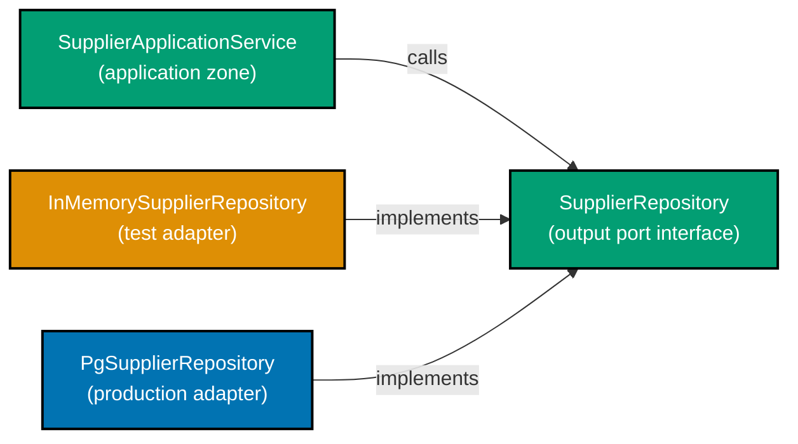
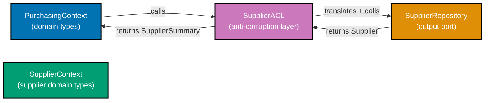

Examples 21–55 extend the beginner hexagon with the `supplier` context, three new output ports (`SupplierRepository`, `EventPublisher`, `ApprovalRouterPort`), adapter swapping, integration test seams, an anti-corruption layer between bounded contexts, CQRS command/query port separation, port versioning, and repository query specialisation. Every code block is self-contained and annotation density targets 1.0–2.25 comment lines per code line per example.

## Supplier Context Ports (Examples 21–25)

### Example 21: SupplierRepository output port

The `supplier` bounded context manages vendor master data. Its output port, `SupplierRepository`, lives in the `supplier.application` package and speaks only in domain types — no SQL, no Spring Data. The interface mirrors `PurchaseOrderRepository` in structure, establishing the pattern readers can rely on across contexts.






```java
// Output port for the supplier context — lives in application package
// => package com.example.procurement.supplier.application
package com.example.procurement.supplier.application;

import com.example.procurement.supplier.domain.Supplier;
import com.example.procurement.supplier.domain.SupplierId;
import com.example.procurement.supplier.domain.SupplierStatus;
import java.util.List;
import java.util.Optional;

// SupplierRepository: output port; describes what the application needs from persistence
// => interface keyword: no implementation here; adapters supply the "how"
public interface SupplierRepository {

    // save: persist a Supplier aggregate; return the saved instance
    // => same contract pattern as PurchaseOrderRepository — consistent port shape
    Supplier save(Supplier supplier);
    // => caller: repository.save(supplier) — unaware whether store is Postgres or HashMap

    // findById: retrieve a Supplier by its typed identity
    // => Optional<> makes absence explicit; callers must handle Optional.empty()
    Optional<Supplier> findById(SupplierId id);
    // => returns Optional.empty() when supplier not found; no NullPointerException risk

    // findAllApproved: return every supplier eligible for new PurchaseOrders
    // => purchasing context calls this to validate supplier is APPROVED before issuing a PO
    List<Supplier> findAllApproved();
    // => filters by SupplierStatus.APPROVED; adapter translates to SQL WHERE clause

    // existsById: lightweight presence check; avoids loading full aggregate
    // => used in duplicate-prevention guards before registering a new supplier
    boolean existsById(SupplierId id);
    // => returns true when supplier exists; false otherwise; O(1) cost in both adapters
}
// => Application service imports only this interface; zero coupling to Postgres, JPA, or HashMap
```




```kotlin
// Output port for the supplier context — lives in application package
// => package com.example.procurement.supplier.application
package com.example.procurement.supplier.application

import com.example.procurement.supplier.domain.Supplier
import com.example.procurement.supplier.domain.SupplierId

// SupplierRepository: output port; Kotlin interface with no default implementations
// => interface keyword: no implementation here; adapters supply the "how"
// => Kotlin interfaces are identical to Java interfaces for hexagonal port purposes
interface SupplierRepository {

    // save: persist a Supplier aggregate; return the saved instance
    // => same contract pattern as PurchaseOrderRepository — consistent port shape across contexts
    fun save(supplier: Supplier): Supplier
    // => caller: repository.save(supplier) — unaware whether store is Postgres or HashMap

    // findById: Kotlin returns nullable Supplier? instead of Java Optional<Supplier>
    // => Supplier? is idiomatic Kotlin: null means absent; compiler enforces null-safety at call sites
    fun findById(id: SupplierId): Supplier?
    // => callers use supplier ?: throw SupplierNotFoundException(id) — safe-call idiom

    // findAllApproved: return every supplier eligible for new PurchaseOrders
    // => purchasing context calls this before issuing a PO to validate supplier status
    fun findAllApproved(): List<Supplier>
    // => List<Supplier> is read-only in Kotlin; adapter may return ArrayList but caller sees immutable view

    // existsById: lightweight presence check; avoids loading the full Supplier aggregate
    // => used in duplicate-prevention guards before registering a new supplier
    fun existsById(id: SupplierId): Boolean
    // => Boolean return; true when supplier exists; false otherwise; O(1) cost in both adapters
}
// => Application service imports only this interface; zero coupling to Postgres, JPA, or HashMap
```




```csharp
// Output port for the supplier context — lives in Application layer
// => Namespace: Procurement.Supplier.Application
namespace Procurement.Supplier.Application;

using Procurement.Supplier.Domain;
using System.Collections.Generic;

// ISupplierRepository: output port; C# convention prefixes interfaces with I
// => interface: no implementation here; adapters supply the "how"
// => lives in Application namespace; adapters live in Infrastructure namespace
public interface ISupplierRepository
{
    // Save: persist a Supplier aggregate; return the saved instance
    // => same contract pattern as IPurchaseOrderRepository — consistent port shape across contexts
    Supplier Save(Supplier supplier);
    // => caller: repository.Save(supplier) — unaware whether store is SQL Server or Dictionary

    // FindById: returns nullable Supplier? — C# 8+ nullable reference types make absence explicit
    // => Supplier? means adapter returns null when not found; callers must null-check
    Supplier? FindById(SupplierId id);
    // => callers use: var s = repo.FindById(id) ?? throw new SupplierNotFoundException(id);

    // FindAllApproved: return every supplier eligible for new PurchaseOrders
    // => purchasing context calls this before issuing a PO to validate supplier status
    IReadOnlyList<Supplier> FindAllApproved();
    // => IReadOnlyList<> signals caller: do not mutate; adapter may return List<T> internally

    // ExistsById: lightweight presence check; avoids loading the full Supplier aggregate
    // => used in duplicate-prevention guards before registering a new supplier
    bool ExistsById(SupplierId id);
    // => true when supplier exists; false otherwise; O(1) cost in both adapters
}
// => Application service depends only on ISupplierRepository; zero coupling to EF Core or Dictionary
```





```typescript
// Output port for the supplier context
// src/supplier/application/supplier-repository.port.ts

import type { Supplier } from "../domain/supplier";
import type { SupplierId } from "../domain/supplier-id";

// SupplierRepository: output port; describes what the application needs from persistence
// => TypeScript interface: no implementation here; adapters supply the "how"
export interface SupplierRepository {
  // save: persist a Supplier aggregate; return the saved instance
  save(supplier: Supplier): Promise<Supplier>;
  // => caller: await repository.save(supplier) — unaware whether store is Postgres or Map

  // findById: returns Supplier | null — null signals absence without throwing
  findById(id: SupplierId): Promise<Supplier | null>;
  // => callers: const s = await repo.findById(id); if (!s) throw new SupplierNotFoundError(id.value);

  // findAllApproved: return every supplier eligible for new PurchaseOrders
  findAllApproved(): Promise<Supplier[]>;
  // => purchasing context calls this to validate supplier is APPROVED before issuing a PO

  // existsById: lightweight presence check; avoids loading full aggregate
  existsById(id: SupplierId): Promise<boolean>;
  // => true when supplier exists; false otherwise; O(1) cost in both adapters
}
// => Application service imports only this interface; zero coupling to TypeORM or Map
```




**Key Takeaway**: `SupplierRepository` follows the same output-port pattern as `PurchaseOrderRepository` — domain-language interface in the application package, zero framework imports.

**Why It Matters**: Having a consistent port shape across contexts lowers the cognitive cost of reading new contexts. When a developer familiar with `PurchaseOrderRepository` encounters `SupplierRepository`, the pattern recognition is immediate. Consistency also means the same adapter skeletons (in-memory, Postgres) can be copied and renamed rather than invented from scratch.

---

### Example 22: Supplier domain aggregate with lifecycle states

The `Supplier` aggregate root manages vendor approval state. Its lifecycle — `Pending → Approved → Suspended → Blacklisted` — is enforced by domain methods that guard illegal transitions and return new immutable instances.




```java
// Supplier aggregate root: purchasing context imports this to validate PO eligibility
// => package com.example.procurement.supplier.domain
package com.example.procurement.supplier.domain;

import java.util.Objects;

// SupplierStatus: domain enum expressing the supplier lifecycle
// => four states; transitions enforced by domain methods below
public enum SupplierStatus {
    PENDING,     // => newly registered; cannot receive POs yet
    APPROVED,    // => eligible for POs; default state after vetting
    SUSPENDED,   // => existing POs continue; no new POs allowed
    BLACKLISTED  // => new POs blocked; existing POs forced to Disputed
}

// Supplier: aggregate root — immutable record; all transitions return new instances
// => record generates equals/hashCode/toString; no Lombok required
public record Supplier(
    SupplierId id,           // => typed identity; format "sup_<uuid>"
    String name,             // => legal business name; display purposes
    SupplierStatus status    // => current lifecycle state; drives PO eligibility
) {
    // Compact canonical constructor: validates invariants at construction
    // => called before the implicit record constructor; guards null values
    public Supplier {
        Objects.requireNonNull(id, "SupplierId required");
        // => id null guard: SupplierId cannot be null; typed identity is mandatory
        Objects.requireNonNull(name, "Supplier name required");
        // => name null guard: legal business name required for display and audit
        Objects.requireNonNull(status, "SupplierStatus required");
        // => status null guard: without status the lifecycle is undefined
        // => every field validated; impossible to build a Supplier with null state
    }

    // approve: PENDING → APPROVED transition
    // => returns a new Supplier; this instance unchanged (immutable record)
    public Supplier approve() {
        if (status != SupplierStatus.PENDING) {
            throw new IllegalStateException("Only PENDING suppliers can be approved; current=" + status);
            // => guard: APPROVED, SUSPENDED, BLACKLISTED suppliers cannot be re-approved
            // => caller receives clear domain-language error with the current status value
        }
        return new Supplier(id, name, SupplierStatus.APPROVED);
        // => new record: same id and name; status becomes APPROVED; PENDING record discarded
    }

    // suspend: APPROVED → SUSPENDED transition
    // => suspended suppliers cannot receive new POs but existing POs continue processing
    public Supplier suspend() {
        if (status != SupplierStatus.APPROVED) {
            throw new IllegalStateException("Only APPROVED suppliers can be suspended; current=" + status);
            // => guard: only APPROVED → SUSPENDED is valid; PENDING and BLACKLISTED cannot be suspended
        }
        return new Supplier(id, name, SupplierStatus.SUSPENDED);
        // => new record: same id and name; status becomes SUSPENDED; APPROVED record discarded
        // => state change captured immutably; caller discards old record, keeps new one
    }

    // isEligibleForPO: query method — pure boolean function; no side effects
    // => purchasing context calls this before issuing a PO to validate the supplier
    public boolean isEligibleForPO() {
        return status == SupplierStatus.APPROVED;
        // => true only for APPROVED; PENDING, SUSPENDED, BLACKLISTED all return false
        // => purchasing context rejects non-APPROVED suppliers before building the PO
    }
}
```




```kotlin
// Supplier aggregate root: purchasing context imports this to validate PO eligibility
// => package com.example.procurement.supplier.domain
package com.example.procurement.supplier.domain

// SupplierStatus: sealed class expressing the supplier lifecycle (exhaustive when enforced)
// => enum class in Kotlin; four states; transitions enforced by domain methods below
enum class SupplierStatus {
    PENDING,     // => newly registered; cannot receive POs yet
    APPROVED,    // => eligible for POs; default state after vetting
    SUSPENDED,   // => existing POs continue; no new POs allowed
    BLACKLISTED  // => new POs blocked; existing POs forced to Disputed
}

// Supplier: aggregate root — Kotlin data class; all val properties make it immutable
// => data class: compiler generates equals, hashCode, copy, toString; no Lombok required
// => copy() provides the idiomatic way to derive new instances with changed fields
data class Supplier(
    val id: SupplierId,             // => typed identity; format "sup_<uuid>"
    val name: String,               // => legal business name; display purposes
    val status: SupplierStatus      // => current lifecycle state; drives PO eligibility
) {
    // init block: validates invariants at construction time
    // => called after primary constructor; guards blank name; id/status non-null by Kotlin type system
    init {
        require(name.isNotBlank()) { "Supplier name required" }
        // => isNotBlank(): rejects empty strings and whitespace-only strings
        // => id and status are non-nullable types; Kotlin compiler guarantees they are never null
    }

    // approve: PENDING → APPROVED transition
    // => returns a new Supplier via copy(); this instance unchanged (immutable data class)
    fun approve(): Supplier {
        check(status == SupplierStatus.PENDING) {
            "Only PENDING suppliers can be approved; current=$status"
            // => check(): throws IllegalStateException when condition is false
            // => caller receives clear domain-language error with the current status value
        }
        return copy(status = SupplierStatus.APPROVED)
        // => copy(): same id and name; status becomes APPROVED; PENDING instance discarded
    }

    // suspend: APPROVED → SUSPENDED transition
    // => suspended suppliers cannot receive new POs but existing POs continue processing
    fun suspend(): Supplier {
        check(status == SupplierStatus.APPROVED) {
            "Only APPROVED suppliers can be suspended; current=$status"
            // => guard: only APPROVED → SUSPENDED is valid; PENDING and BLACKLISTED cannot be suspended
        }
        return copy(status = SupplierStatus.SUSPENDED)
        // => copy(): same id and name; status becomes SUSPENDED; APPROVED instance discarded
        // => state change captured immutably; caller discards old instance, keeps new one
    }

    // isEligibleForPO: query method — pure boolean function; no side effects
    // => purchasing context calls this before issuing a PO to validate the supplier
    fun isEligibleForPO(): Boolean =
        status == SupplierStatus.APPROVED
        // => true only for APPROVED; PENDING, SUSPENDED, BLACKLISTED all return false
        // => expression-body function: single-expression idiom; no curly braces needed
}
```




```csharp
// Supplier aggregate root: purchasing context imports this to validate PO eligibility
// => Namespace: Procurement.Supplier.Domain
namespace Procurement.Supplier.Domain;

// SupplierStatus: domain enum expressing the supplier lifecycle
// => four states; transitions enforced by domain methods below
public enum SupplierStatus
{
    Pending,     // => newly registered; cannot receive POs yet
    Approved,    // => eligible for POs; default state after vetting
    Suspended,   // => existing POs continue; no new POs allowed
    Blacklisted  // => new POs blocked; existing POs forced to Disputed
}

// Supplier: aggregate root — C# sealed record; all properties are init-only (immutable)
// => sealed: prevents inheritance; record: generates Equals, GetHashCode, with-expressions
// => with-expression is the C# equivalent of Kotlin copy() for deriving new state
public sealed record Supplier
{
    // Primary constructor: all properties set at construction; no property setters
    // => init-only properties: cannot be reassigned after object construction
    public SupplierId Id { get; init; }            // => typed identity; format "sup_<uuid>"
    public string Name { get; init; }              // => legal business name; display purposes
    public SupplierStatus Status { get; init; }    // => current lifecycle state; drives PO eligibility

    // Factory constructor: validates invariants before creating the record
    // => static Create: guards null/blank name at the entry point
    public Supplier(SupplierId id, string name, SupplierStatus status)
    {
        ArgumentNullException.ThrowIfNull(id, nameof(id));
        // => ThrowIfNull: throws ArgumentNullException when id is null
        ArgumentException.ThrowIfNullOrWhiteSpace(name, nameof(name));
        // => ThrowIfNullOrWhiteSpace: rejects null, empty, and whitespace-only names
        Id = id;
        Name = name;
        Status = status;
        // => all three fields set; record is fully initialised and immutable from this point
    }

    // Approve: PENDING → APPROVED transition
    // => returns a new Supplier via with-expression; this instance unchanged (immutable record)
    public Supplier Approve()
    {
        if (Status != SupplierStatus.Pending)
            throw new InvalidOperationException($"Only Pending suppliers can be approved; current={Status}");
            // => guard: Approved, Suspended, Blacklisted suppliers cannot be re-approved
            // => caller receives clear domain-language error with the current status value
        return this with { Status = SupplierStatus.Approved };
        // => with-expression: same Id and Name; Status becomes Approved; Pending record discarded
    }

    // Suspend: APPROVED → SUSPENDED transition
    // => suspended suppliers cannot receive new POs but existing POs continue processing
    public Supplier Suspend()
    {
        if (Status != SupplierStatus.Approved)
            throw new InvalidOperationException($"Only Approved suppliers can be suspended; current={Status}");
            // => guard: only Approved → Suspended is valid; Pending and Blacklisted cannot be suspended
        return this with { Status = SupplierStatus.Suspended };
        // => with-expression: same Id and Name; Status becomes Suspended; Approved record discarded
        // => state change captured immutably; caller discards old record, keeps new one
    }

    // IsEligibleForPo: query method — pure boolean function; no side effects
    // => purchasing context calls this before issuing a PO to validate the supplier
    public bool IsEligibleForPo() =>
        Status == SupplierStatus.Approved;
        // => true only for Approved; Pending, Suspended, Blacklisted all return false
        // => expression-bodied member: idiomatic C# for single-expression methods
}
```





```typescript
// Supplier aggregate root: purchasing context imports this to validate PO eligibility
// src/supplier/domain/supplier.ts

// SupplierStatus: domain enum expressing the supplier lifecycle
export enum SupplierStatus {
  PENDING = "PENDING", // => newly registered; cannot receive POs yet
  APPROVED = "APPROVED", // => eligible for POs; default state after vetting
  SUSPENDED = "SUSPENDED", // => existing POs continue; no new POs allowed
  BLACKLISTED = "BLACKLISTED", // => new POs blocked; existing POs forced to Disputed
}

// Supplier: aggregate root — immutable; all transitions return new instances
export class Supplier {
  constructor(
    readonly id: SupplierId, // => typed identity; format "sup_<uuid>"
    readonly name: string, // => legal business name; display purposes
    readonly status: SupplierStatus, // => current lifecycle state; drives PO eligibility
  ) {
    if (!id) throw new Error("SupplierId required");
    if (!name) throw new Error("Supplier name required");
    if (!status) throw new Error("SupplierStatus required");
    // => every field validated; impossible to build a Supplier with null state
  }

  // approve: PENDING → APPROVED transition
  approve(): Supplier {
    if (this.status !== SupplierStatus.PENDING) {
      throw new Error(`Only PENDING suppliers can be approved; current=${this.status}`);
      // => guard: APPROVED, SUSPENDED, BLACKLISTED suppliers cannot be re-approved
    }
    return new Supplier(this.id, this.name, SupplierStatus.APPROVED);
    // => new instance: same id and name; status becomes APPROVED; original unchanged
  }

  // suspend: APPROVED → SUSPENDED transition
  suspend(): Supplier {
    if (this.status !== SupplierStatus.APPROVED) {
      throw new Error(`Only APPROVED suppliers can be suspended; current=${this.status}`);
    }
    return new Supplier(this.id, this.name, SupplierStatus.SUSPENDED);
    // => suspended: no new POs; existing POs continue processing
  }
}
```




**Key Takeaway**: `Supplier` is an immutable record whose state-transition methods guard preconditions and return new instances — no setters, no mutable state.

**Why It Matters**: Immutable aggregates eliminate an entire class of concurrency bugs. Two threads reading the same `Supplier` record see identical state. State transitions are explicit method calls that produce new values — a pattern that maps cleanly to event sourcing, audit logs, and test assertions.

---

### Example 23: In-memory SupplierRepository adapter

The in-memory adapter for `SupplierRepository` follows the same HashMap pattern established in Example 7. It is the default adapter for unit tests across both `purchasing` and `supplier` contexts.




```java
// In-memory adapter: implements SupplierRepository with a HashMap
// => package com.example.procurement.supplier.adapter.out.persistence
package com.example.procurement.supplier.adapter.out.persistence;

import com.example.procurement.supplier.application.SupplierRepository;
import com.example.procurement.supplier.domain.Supplier;
import com.example.procurement.supplier.domain.SupplierId;
import com.example.procurement.supplier.domain.SupplierStatus;
import java.util.HashMap;
import java.util.List;
import java.util.Map;
import java.util.Optional;

// InMemorySupplierRepository: test adapter; no JPA, no Postgres, no Docker required
// => implements SupplierRepository (output port); satisfies the same contract as PgSupplierRepository
// => swappable with PgSupplierRepository at the composition root without changing any caller
public class InMemorySupplierRepository implements SupplierRepository {

    // store: HashMap<SupplierId, Supplier> — typed key prevents accidental SupplierId/PurchaseOrderId mix-up
    // => HashMap: O(1) average for put/get/containsKey; no synchronisation needed in single-threaded tests
    private final Map<SupplierId, Supplier> store = new HashMap<>();

    @Override
    public Supplier save(Supplier supplier) {
        store.put(supplier.id(), supplier);
        // => put: inserts or replaces; O(1); key = supplier.id() (typed SupplierId, not raw String)
        return supplier;
        // => return same instance: consistent with PurchaseOrderRepository contract established in Example 7
        // => caller (RegisterSupplierService) uses the returned instance as the canonical saved state
    }

    @Override
    public Optional<Supplier> findById(SupplierId id) {
        return Optional.ofNullable(store.get(id));
        // => store.get(id): O(1) lookup; returns null when absent
        // => Optional.ofNullable: wraps null → Optional.empty(); wraps Supplier → Optional.of(supplier)
        // => caller handles absence with orElseThrow() or isPresent() check — no null propagation
    }

    @Override
    public List<Supplier> findAllApproved() {
        return store.values().stream()
            .filter(s -> s.status() == SupplierStatus.APPROVED)
            // => status filter: domain enum equality; keeps only APPROVED suppliers
            // => PENDING, SUSPENDED, BLACKLISTED are excluded from the result
            .toList();
        // => toList(): returns unmodifiable List<Supplier>; snapshot of store state at call time
        // => purchasing context calls this to get the eligible-supplier list before issuing a PO
    }

    @Override
    public boolean existsById(SupplierId id) {
        return store.containsKey(id);
        // => containsKey: O(1) HashMap presence check; does not load the full Supplier record
        // => true when supplier is in the store regardless of status; false when absent
    }
}
// => Usage in test:
// var supplierRepo = new InMemorySupplierRepository();
// var service = new RegisterSupplierService(supplierRepo, new InMemoryEventPublisher());
// => wired in 1 line; no Spring context; starts in < 1ms; all four port methods available
```




```kotlin
// In-memory adapter: implements SupplierRepository with a HashMap
// => package com.example.procurement.supplier.adapter.out.persistence
package com.example.procurement.supplier.adapter.out.persistence

import com.example.procurement.supplier.application.SupplierRepository
import com.example.procurement.supplier.domain.Supplier
import com.example.procurement.supplier.domain.SupplierId
import com.example.procurement.supplier.domain.SupplierStatus

// InMemorySupplierRepository: test adapter; no JPA, no Postgres, no Docker required
// => implements SupplierRepository (output port); satisfies the same contract as PgSupplierRepository
// => class (not object) chosen so each test can create an isolated empty store
class InMemorySupplierRepository : SupplierRepository {

    // store: mutableMapOf<SupplierId, Supplier> — typed key prevents SupplierId/PurchaseOrderId mix-up
    // => HashMap under the hood: O(1) average for put/get/containsKey in single-threaded tests
    private val store: MutableMap<SupplierId, Supplier> = mutableMapOf()

    override fun save(supplier: Supplier): Supplier {
        store[supplier.id] = supplier
        // => store[key] = value: Kotlin operator syntax for HashMap.put; O(1); inserts or replaces
        return supplier
        // => return same instance: consistent with PurchaseOrderRepository contract from Example 7
        // => caller (RegisterSupplierService) uses the returned instance as the canonical saved state
    }

    override fun findById(id: SupplierId): Supplier? =
        store[id]
        // => store[id]: Kotlin operator syntax for HashMap.get; O(1) lookup
        // => returns null when absent — Supplier? return type enforces null-safety at call sites
        // => callers use: repo.findById(id) ?: throw SupplierNotFoundException(id)

    override fun findAllApproved(): List<Supplier> =
        store.values.filter { it.status == SupplierStatus.APPROVED }
        // => filter: Kotlin collection extension; keeps only APPROVED suppliers
        // => PENDING, SUSPENDED, BLACKLISTED are excluded; result is a snapshot of store at call time
        // => returns List<Supplier>: read-only view; purchasing context cannot mutate the result

    override fun existsById(id: SupplierId): Boolean =
        store.containsKey(id)
        // => containsKey: O(1) HashMap presence check; does not load the full Supplier record
        // => true when supplier is in the store regardless of status; false when absent
}
// => Usage in test:
// val supplierRepo = InMemorySupplierRepository()
// val service = RegisterSupplierService(supplierRepo, InMemoryEventPublisher())
// => wired in 1 line; no Spring context; starts in < 1ms; all four port methods available
```




```csharp
// In-memory adapter: implements ISupplierRepository with a Dictionary
// => Namespace: Procurement.Supplier.Adapter.Out.Persistence
namespace Procurement.Supplier.Adapter.Out.Persistence;

using Procurement.Supplier.Application;
using Procurement.Supplier.Domain;
using System.Collections.Generic;
using System.Linq;

// InMemorySupplierRepository: test adapter; no EF Core, no SQL Server, no Docker required
// => implements ISupplierRepository (output port); satisfies the same contract as SqlSupplierRepository
// => swappable with SqlSupplierRepository at the composition root without changing any caller
public sealed class InMemorySupplierRepository : ISupplierRepository
{
    // _store: Dictionary<SupplierId, Supplier> — typed key prevents SupplierId/PurchaseOrderId mix-up
    // => Dictionary: O(1) average for TryGetValue/ContainsKey; no locking needed in single-threaded tests
    private readonly Dictionary<SupplierId, Supplier> _store = new();

    public Supplier Save(Supplier supplier)
    {
        _store[supplier.Id] = supplier;
        // => indexer assignment: inserts or replaces; O(1); key = supplier.Id (typed SupplierId)
        return supplier;
        // => return same instance: consistent with IPurchaseOrderRepository contract from Example 7
        // => caller (RegisterSupplierService) uses the returned instance as the canonical saved state
    }

    public Supplier? FindById(SupplierId id)
    {
        _store.TryGetValue(id, out var supplier);
        return supplier;
        // => TryGetValue: O(1) lookup; sets supplier to null when key absent
        // => Supplier? return type: callers must null-check — no NullReferenceException risk
        // => callers use: var s = repo.FindById(id) ?? throw new SupplierNotFoundException(id);
    }

    public IReadOnlyList<Supplier> FindAllApproved() =>
        _store.Values
              .Where(s => s.Status == SupplierStatus.Approved)
              // => LINQ Where: keeps only Approved suppliers; deferred until ToList()
              // => Pending, Suspended, Blacklisted are excluded from the result
              .ToList();
        // => ToList(): materialises snapshot of store state at call time; IReadOnlyList<> signals immutability

    public bool ExistsById(SupplierId id) =>
        _store.ContainsKey(id);
        // => ContainsKey: O(1) presence check; does not load the full Supplier record
        // => true when supplier is in the store regardless of status; false when absent
}
// => Usage in test:
// var supplierRepo = new InMemorySupplierRepository();
// var service = new RegisterSupplierService(supplierRepo, new InMemoryEventPublisher());
// => wired in 1 line; no DI container; starts in < 1ms; all four port methods available
```





```typescript
// In-memory adapter: implements SupplierRepository with a Map
// src/supplier/adapter/out/persistence/in-memory-supplier.repository.ts

import type { SupplierRepository } from "../../../application/supplier-repository.port";
import { Supplier, SupplierStatus } from "../../../domain/supplier";
import type { SupplierId } from "../../../domain/supplier-id";

// InMemorySupplierRepository: test adapter; no TypeORM, no Postgres, no Docker
// => implements SupplierRepository (output port); same contract as TypeOrmSupplierRepository
export class InMemorySupplierRepository implements SupplierRepository {
  private readonly store = new Map<string, Supplier>();
  // => Map keyed by SupplierId.value string — O(1) average for all operations

  async save(supplier: Supplier): Promise<Supplier> {
    this.store.set(supplier.id.value, supplier);
    // => insert or replace; O(1); keyed by typed id's string value
    return supplier;
    // => return same instance; consistent with SupplierRepository contract
  }

  async findById(id: SupplierId): Promise<Supplier | null> {
    return this.store.get(id.value) ?? null;
    // => ?? null: Map.get returns undefined when absent; convert to null for port contract
  }

  async findAllApproved(): Promise<Supplier[]> {
    return Array.from(this.store.values()).filter((s) => s.status === SupplierStatus.APPROVED);
    // => filter: only APPROVED suppliers; PENDING, SUSPENDED, BLACKLISTED excluded
    // => purchasing context calls this to get eligible-supplier list before issuing a PO
  }

  async existsById(id: SupplierId): Promise<boolean> {
    return this.store.has(id.value);
    // => Map.has: O(1) presence check; does not load the full Supplier aggregate
  }
}
// Usage in test:
// const repo = new InMemorySupplierRepository();
// const service = new RegisterSupplierService(repo);
// => wired in 1 line; no NestJS context; starts in < 1ms
```




**Key Takeaway**: `InMemorySupplierRepository` repeats the same HashMap-backed pattern as the PO adapter — a single pattern for all in-memory adapters keeps onboarding fast.

**Why It Matters**: When every context follows the same in-memory adapter shape, a developer can write a new adapter for a new context in under five minutes by renaming an existing one. The cost of adopting hexagonal architecture for a new aggregate drops to near zero.

---

### Example 24: EventPublisher output port — decoupling cross-context side effects

`EventPublisher` is an output port that abstracts how domain events leave the application layer. The port is simple — one method, one parameter. Adapters behind it may write to a database outbox, push to Kafka, or log events to an in-memory list for tests.




```java
// EventPublisher: output port for domain event emission
// => package com.example.procurement.purchasing.application
package com.example.procurement.purchasing.application;

import com.example.procurement.purchasing.domain.DomainEvent;

// EventPublisher: single-method port; adapters decide where events go
// => Functional interface — implementable as a lambda in tests
@FunctionalInterface
public interface EventPublisher {
    // publish: emit a domain event to interested consumers
    // => DomainEvent: marker interface; all domain events implement it
    void publish(DomainEvent event);
    // => implementation options: OutboxEventPublisher (DB), KafkaEventPublisher, InMemoryEventPublisher
}

// DomainEvent: marker interface — all domain events implement this
// => package com.example.procurement.purchasing.domain
// => sealed interface would enumerate known events; marker pattern chosen for simplicity
interface DomainEvent {}

// Concrete domain events: purchasing context emits these after successful state transitions
// => PurchaseOrderIssued: emitted when a PO transitions Approved → Issued
record PurchaseOrderIssued(
    String purchaseOrderId, // => id of the issued PO; format "po_<uuid>"
    String supplierId       // => which supplier the PO was issued to; format "sup_<uuid>"
) implements DomainEvent {}

// SupplierApproved: emitted by supplier context when Pending → Approved
// => purchasing context consumes this to refresh the approved-supplier cache
record SupplierApproved(
    String supplierId // => format "sup_<uuid>"; purchasing adds to eligible-supplier list
) implements DomainEvent {}

// In-memory EventPublisher adapter: captures events for test assertions
// => Tests inspect capturedEvents to verify the right events were published
class InMemoryEventPublisher implements EventPublisher {
    private final java.util.List<DomainEvent> capturedEvents = new java.util.ArrayList<>();
    // => capturedEvents: grows as publish() is called; test reads it after use-case execution

    @Override
    public void publish(DomainEvent event) {
        capturedEvents.add(event); // => append to list; does not send to Kafka or write to DB
    }

    public java.util.List<DomainEvent> getCapturedEvents() {
        return java.util.List.copyOf(capturedEvents); // => immutable snapshot; safe for test assertion
    }
}
// => Production: OutboxEventPublisher writes event to outbox table in same transaction as PO save
// => Kafka delivery happens asynchronously after transaction commits
```




```kotlin
// EventPublisher: output port for domain event emission
// => package com.example.procurement.purchasing.application
package com.example.procurement.purchasing.application

// EventPublisher: single-method functional interface; Kotlin fun interface enables lambda adapters
// => fun interface: compiler generates SAM conversion; test can pass a lambda directly
fun interface EventPublisher {
    // publish: emit a domain event to interested consumers
    // => DomainEvent: sealed interface enumerates all known events; exhaustive when-expression possible
    fun publish(event: DomainEvent)
    // => implementation options: OutboxEventPublisher (DB), KafkaEventPublisher, InMemoryEventPublisher
}

// DomainEvent: sealed interface — all domain events implement this
// => package com.example.procurement.purchasing.domain
// => sealed: Kotlin compiler knows all subclasses; enables exhaustive when in consumers
sealed interface DomainEvent

// Concrete domain events: data classes implement DomainEvent
// => PurchaseOrderIssued: emitted when a PO transitions Approved → Issued
data class PurchaseOrderIssued(
    val purchaseOrderId: String, // => id of the issued PO; format "po_<uuid>"
    val supplierId: String       // => which supplier the PO was issued to; format "sup_<uuid>"
) : DomainEvent

// SupplierApproved: emitted by supplier context when Pending → Approved
// => purchasing context consumes this to refresh the approved-supplier cache
data class SupplierApproved(
    val supplierId: String // => format "sup_<uuid>"; purchasing adds to eligible-supplier list
) : DomainEvent

// InMemoryEventPublisher: test adapter; captures events for assertion
// => class (not object) so each test gets an isolated, empty capturedEvents list
class InMemoryEventPublisher : EventPublisher {
    private val capturedEvents = mutableListOf<DomainEvent>()
    // => capturedEvents: grows as publish() is called; test reads it after use-case execution

    override fun publish(event: DomainEvent) {
        capturedEvents.add(event) // => append to list; no Kafka, no DB write
    }

    // getCapturedEvents: returns immutable snapshot; prevents test code from mutating the list
    fun getCapturedEvents(): List<DomainEvent> =
        capturedEvents.toList()
        // => toList(): defensive copy; caller sees a snapshot; safe for assertion
}
// => Production: OutboxEventPublisher writes event to outbox table in same transaction as PO save
// => Kafka delivery happens asynchronously after transaction commits
```




```csharp
// EventPublisher: output port for domain event emission
// => Namespace: Procurement.Purchasing.Application
namespace Procurement.Purchasing.Application;

using Procurement.Purchasing.Domain;
using System.Collections.Generic;

// IEventPublisher: single-method port; adapters decide where events go
// => C# interface; delegate-backed lambda adapter possible via wrapper at composition root
public interface IEventPublisher
{
    // Publish: emit a domain event to interested consumers
    // => IDomainEvent: marker interface; all domain events implement it
    void Publish(IDomainEvent @event);
    // => implementation options: OutboxEventPublisher (DB), KafkaEventPublisher, InMemoryEventPublisher
}

// IDomainEvent: marker interface — all domain events implement this
// => Namespace: Procurement.Purchasing.Domain
// => C# does not enforce sealed hierarchy on interfaces; discipline applied via convention
public interface IDomainEvent { }

// Concrete domain events: records implement IDomainEvent; immutable value objects
// => PurchaseOrderIssued: emitted when a PO transitions Approved → Issued
public sealed record PurchaseOrderIssued(
    string PurchaseOrderId, // => id of the issued PO; format "po_<uuid>"
    string SupplierId       // => which supplier the PO was issued to; format "sup_<uuid>"
) : IDomainEvent;

// SupplierApproved: emitted by supplier context when Pending → Approved
// => purchasing context consumes this to refresh the approved-supplier cache
public sealed record SupplierApproved(
    string SupplierId // => format "sup_<uuid>"; purchasing adds to eligible-supplier list
) : IDomainEvent;

// InMemoryEventPublisher: test adapter; captures events for assertion
// => sealed class: no subclassing; each test instantiates a fresh instance
public sealed class InMemoryEventPublisher : IEventPublisher
{
    private readonly List<IDomainEvent> _capturedEvents = new();
    // => _capturedEvents: grows as Publish() is called; test reads it after use-case execution

    public void Publish(IDomainEvent @event)
    {
        _capturedEvents.Add(@event); // => append to list; no Kafka, no DB write
    }

    // GetCapturedEvents: returns immutable snapshot; prevents test code from mutating the list
    public IReadOnlyList<IDomainEvent> GetCapturedEvents() =>
        _capturedEvents.AsReadOnly();
        // => AsReadOnly(): O(1) wrapper; caller sees read-only view; safe for assertion
}
// => Production: OutboxEventPublisher writes event to outbox table in same transaction as PO save
// => Kafka delivery happens asynchronously after transaction commits
```





```typescript
// EventPublisher — outbox adapter pattern
// src/shared/adapter/out/messaging/outbox-event-publisher.ts

import type { EventPublisher, DomainEvent } from "../../../application/event-publisher.port";

// OutboxRecord: row stored in the outbox table before Kafka/SQS delivery
interface OutboxRecord {
  id: string; // => uuid; idempotency key for at-least-once delivery
  eventType: string; // => event class name; consumer routes by this field
  payload: string; // => JSON-serialised event; stored as TEXT
  createdAt: Date; // => when the event was stored; used for retry scheduling
  processedAt?: Date; // => null until outbox processor picks it up
}

// OutboxEventPublisher: transactionally stores event before forwarding to message broker
// => same database transaction as the aggregate save — atomicity guaranteed
export class OutboxEventPublisher implements EventPublisher {
  constructor(
    private readonly db: any, // => TypeORM DataSource or knex connection
  ) {}

  async publish(event: DomainEvent): Promise<void> {
    const record: OutboxRecord = {
      id: crypto.randomUUID(), // => unique id per event for idempotency
      eventType: event.constructor.name, // => e.g., "PurchaseOrderIssued"
      payload: JSON.stringify(event), // => serialise event for storage
      createdAt: new Date(),
    };
    await this.db.query("INSERT INTO outbox (id, event_type, payload, created_at) VALUES (?,?,?,?)", [
      record.id,
      record.eventType,
      record.payload,
      record.createdAt,
    ]);
    // => INSERT is part of the same DB transaction as the aggregate save
    // => if aggregate save fails, outbox INSERT rolls back — no ghost events
    // => outbox processor polls this table and forwards to Kafka/SQS asynchronously
  }
}
```




**Key Takeaway**: `EventPublisher` is a single-method `@FunctionalInterface` port. The in-memory adapter captures events for test assertions; the production adapter writes to an outbox.

**Why It Matters**: Hiding event delivery behind a port means the application service never knows whether events go to Kafka, a webhook, or a test list. Replacing the event delivery mechanism requires only a new adapter — the application service and domain are unchanged.

---

### Example 25: ApprovalRouterPort — routing approval requests

`ApprovalRouterPort` is an output port that routes a PO approval request to the correct manager based on `ApprovalLevel`. The port is defined in the `purchasing.application` package; adapters behind it may call a workflow engine, send an email, or return immediately for tests.




```java
// ApprovalRouterPort: output port for approval workflow routing
// => package com.example.procurement.purchasing.application
package com.example.procurement.purchasing.application;

import com.example.procurement.purchasing.domain.ApprovalLevel;
import com.example.procurement.purchasing.domain.PurchaseOrderId;

// ApprovalLevel: domain enum — derived from PO total per spec
// => L1: total <= $1,000 | L2: total <= $10,000 | L3: total > $10,000
// => package com.example.procurement.purchasing.domain
enum ApprovalLevel { L1, L2, L3 }

// ApprovalRouterPort: describes what the application needs from approval workflow
// => interface: no implementation detail; adapter decides whether to call Jira, email, or noop
public interface ApprovalRouterPort {

    // routeApproval: send the PO approval request to the correct approver queue
    // => purchaseOrderId: which PO needs approval; level: drives which approver receives it
    void routeApproval(PurchaseOrderId purchaseOrderId, ApprovalLevel level);
    // => production adapter: POST to workflow engine API with level → manager mapping
    // => test adapter: records the call for assertion; no network I/O

    // deriveApprovalLevel: pure function — derive level from PO total amount
    // => default method in the port; reusable across all implementations
    static ApprovalLevel deriveLevel(java.math.BigDecimal total) {
        if (total.compareTo(new java.math.BigDecimal("1000")) <= 0) return ApprovalLevel.L1;
        // => L1: total <= 1,000; routes to team-lead approval queue
        if (total.compareTo(new java.math.BigDecimal("10000")) <= 0) return ApprovalLevel.L2;
        // => L2: 1,000 < total <= 10,000; routes to department-head queue
        return ApprovalLevel.L3;
        // => L3: total > 10,000; routes to CFO-level approval queue
    }
}

// In-memory ApprovalRouterPort adapter: captures routed calls for tests
// => package com.example.procurement.purchasing.adapter.out.workflow
class InMemoryApprovalRouter implements ApprovalRouterPort {
    private final java.util.List<String> routedCalls = new java.util.ArrayList<>();
    // => routedCalls: record of "po_<id>@L2" strings; test reads after use-case execution

    @Override
    public void routeApproval(PurchaseOrderId id, ApprovalLevel level) {
        routedCalls.add(id.value() + "@" + level.name());
        // => append routing record; no network call; no side effect outside this object
    }

    public java.util.List<String> getRoutedCalls() {
        return java.util.List.copyOf(routedCalls); // => immutable snapshot for test assertion
    }
}
// Test assertion:
// assertThat(router.getRoutedCalls()).contains("po_abc123@L3");
// => verifies the use case routed the high-value PO to L3 approval
```




```kotlin
// ApprovalRouterPort: output port for approval workflow routing
// => package com.example.procurement.purchasing.application
package com.example.procurement.purchasing.application

// ApprovalLevel: domain enum — derived from PO total per spec
// => L1: total <= $1,000 | L2: total <= $10,000 | L3: total > $10,000
// => package com.example.procurement.purchasing.domain
enum class ApprovalLevel { L1, L2, L3 }

// ApprovalRouterPort: describes what the application needs from approval workflow
// => interface: no implementation detail; adapter decides whether to call Jira, email, or noop
interface ApprovalRouterPort {

    // routeApproval: send the PO approval request to the correct approver queue
    // => purchaseOrderId: which PO needs approval; level: drives which approver receives it
    fun routeApproval(purchaseOrderId: PurchaseOrderId, level: ApprovalLevel)
    // => production adapter: POST to workflow engine API with level → manager mapping
    // => test adapter: records the call for assertion; no network I/O

    // companion object holds the static-equivalent deriveLevel pure function
    // => companion: idiomatic Kotlin for static utility scoped to the interface
    companion object {
        // deriveLevel: pure function — derive approval level from PO total amount
        // => BigDecimal compareTo: avoids floating-point precision issues
        fun deriveLevel(total: java.math.BigDecimal): ApprovalLevel = when {
            total <= java.math.BigDecimal("1000")  -> ApprovalLevel.L1
            // => L1: total <= 1,000; routes to team-lead approval queue
            total <= java.math.BigDecimal("10000") -> ApprovalLevel.L2
            // => L2: 1,000 < total <= 10,000; routes to department-head queue
            else                                   -> ApprovalLevel.L3
            // => L3: total > 10,000; routes to CFO-level approval queue
        }
    }
}

// InMemoryApprovalRouter: test adapter; captures routed calls for assertion
// => class (not object) so each test gets an isolated, empty routedCalls list
class InMemoryApprovalRouter : ApprovalRouterPort {
    private val routedCalls = mutableListOf<String>()
    // => routedCalls: record of "po_<id>@L2" strings; test reads after use-case execution

    override fun routeApproval(purchaseOrderId: PurchaseOrderId, level: ApprovalLevel) {
        routedCalls.add("${purchaseOrderId.value}@${level.name}")
        // => string template: concise notation; no network call; no side effect outside this object
    }

    // getRoutedCalls: immutable snapshot; prevents test from mutating the internal list
    fun getRoutedCalls(): List<String> =
        routedCalls.toList()
        // => toList(): defensive copy; caller sees snapshot; safe for assertion
}
// Test assertion:
// assertThat(router.getRoutedCalls()).contains("po_abc123@L3")
// => verifies the use case routed the high-value PO to L3 approval
```




```csharp
// ApprovalRouterPort: output port for approval workflow routing
// => Namespace: Procurement.Purchasing.Application
namespace Procurement.Purchasing.Application;

using Procurement.Purchasing.Domain;
using System.Collections.Generic;

// ApprovalLevel: domain enum — derived from PO total per spec
// => L1: total <= $1,000 | L2: total <= $10,000 | L3: total > $10,000
// => Namespace: Procurement.Purchasing.Domain
public enum ApprovalLevel { L1, L2, L3 }

// IApprovalRouterPort: describes what the application needs from approval workflow
// => interface: no implementation detail; adapter decides whether to call Jira, email, or noop
public interface IApprovalRouterPort
{
    // RouteApproval: send the PO approval request to the correct approver queue
    // => purchaseOrderId: which PO needs approval; level: drives which approver receives it
    void RouteApproval(PurchaseOrderId purchaseOrderId, ApprovalLevel level);
    // => production adapter: POST to workflow engine API with level → manager mapping
    // => test adapter: records the call for assertion; no network I/O
}

// ApprovalRouter: static helper holding the pure deriveLevel function
// => static class: no instantiation; groups domain-logic utilities for the approval port
public static class ApprovalRouter
{
    // DeriveLevel: pure function — derive approval level from PO total amount
    // => decimal avoids floating-point precision issues; idiomatic C# for monetary values
    public static ApprovalLevel DeriveLevel(decimal total) =>
        total switch
        {
            <= 1000m  => ApprovalLevel.L1,
            // => L1: total <= 1,000; routes to team-lead approval queue
            <= 10000m => ApprovalLevel.L2,
            // => L2: 1,000 < total <= 10,000; routes to department-head queue
            _         => ApprovalLevel.L3
            // => L3: total > 10,000; routes to CFO-level approval queue
        };
}

// InMemoryApprovalRouter: test adapter; captures routed calls for assertion
// => sealed class: no subclassing; each test instantiates a fresh instance
public sealed class InMemoryApprovalRouter : IApprovalRouterPort
{
    private readonly List<string> _routedCalls = new();
    // => _routedCalls: record of "po_<id>@L2" strings; test reads after use-case execution

    public void RouteApproval(PurchaseOrderId id, ApprovalLevel level)
    {
        _routedCalls.Add($"{id.Value}@{level}");
        // => string interpolation: concise notation; no network call; no side effect outside this object
    }

    // GetRoutedCalls: immutable snapshot; prevents test from mutating the internal list
    public IReadOnlyList<string> GetRoutedCalls() =>
        _routedCalls.AsReadOnly();
        // => AsReadOnly(): O(1) wrapper; caller sees read-only view; safe for assertion
}
// Test assertion:
// Assert.Contains("po_abc123@L3", router.GetRoutedCalls());
// => verifies the use case routed the high-value PO to L3 approval
```





```typescript
// ApprovalRouterPort: output port for routing approval requests
// src/purchasing/application/approval-router.port.ts

import type { PurchaseOrder } from "../domain/purchase-order";

// ApprovalLevel: domain enum; drives which approver receives the request
export enum ApprovalLevel {
  MANAGER = "MANAGER", // => PO total < threshold; line manager approves
  DIRECTOR = "DIRECTOR", // => PO total >= threshold; director approves
  BOARD = "BOARD", // => PO total >= high threshold; board approves
}

// ApprovalRouterPort: output port; routes PO to the correct approval workflow
// => adapter implementations: WorkflowEngineAdapter (Camunda/Temporal), InMemoryApprovalRouter (test)
export interface ApprovalRouterPort {
  // route: send a PO to the appropriate approver based on business rules
  route(po: PurchaseOrder): Promise<void>;
  // => adapter translates PO to workflow payload; application never sees workflow engine API
  // => test adapter: captures routed POs for assertion without starting a workflow engine
}

// InMemoryApprovalRouter: test adapter; captures routed POs for assertion
export class InMemoryApprovalRouter implements ApprovalRouterPort {
  readonly routed: PurchaseOrder[] = [];
  // => routed: array accumulates POs passed to route(); test asserts routing occurred

  async route(po: PurchaseOrder): Promise<void> {
    this.routed.push(po);
    // => push: O(1); PO stored for test assertion; no workflow engine needed
  }
}
```




**Key Takeaway**: `ApprovalRouterPort` hides the workflow engine behind a port. The in-memory adapter captures calls; the production adapter calls a real workflow API.

**Why It Matters**: Routing logic (which manager gets which PO) can be tested without spinning up a workflow engine. The test adapter captures the routing call, and the assertion verifies the correct level was derived from the PO total. Changing the workflow engine later is a one-adapter change.

---

## Adapter Swapping and Test Seams (Examples 26–30)

### Example 26: Adapter swapping — switching from in-memory to Postgres at the composition root

Adapter swapping is the practical payoff of the port interface. The composition root selects which adapter implements each port. Changing from test (in-memory) to production (Postgres) is a one-line change in the `@Configuration` class.




```java
// Composition root: Spring @Configuration selects adapter per port
// => package com.example.procurement
package com.example.procurement;

import com.example.procurement.purchasing.adapter.out.persistence.*;
import com.example.procurement.purchasing.adapter.out.events.*;
import com.example.procurement.purchasing.adapter.out.workflow.*;
import com.example.procurement.purchasing.application.*;
import com.example.procurement.supplier.adapter.out.persistence.*;
import com.example.procurement.supplier.application.*;
import org.springframework.context.annotation.*;

// HexagonConfiguration: the single class that knows both port and adapter
// => @Configuration: Spring treats this as a bean factory; scans @Bean methods
@Configuration
public class HexagonConfiguration {

    // purchaseOrderRepository: production wiring uses Postgres adapter
    // => SWAP: replace PgPurchaseOrderRepository with InMemoryPurchaseOrderRepository for tests
    @Bean
    public PurchaseOrderRepository purchaseOrderRepository(JpaPoRepository jpa) {
        return new PgPurchaseOrderRepository(jpa); // => one line to change for test profile
        // => test profile: return new InMemoryPurchaseOrderRepository();
    }

    // supplierRepository: production wiring uses Postgres adapter for supplier context
    // => SWAP: replace PgSupplierRepository with InMemorySupplierRepository for tests
    @Bean
    public SupplierRepository supplierRepository(JpaSupplierRepository jpa) {
        return new PgSupplierRepository(jpa); // => production; test: InMemorySupplierRepository
    }

    // eventPublisher: production wiring uses outbox adapter (transactional event delivery)
    // => SWAP: replace OutboxEventPublisher with InMemoryEventPublisher for unit tests
    @Bean
    public EventPublisher eventPublisher(OutboxRepository outbox) {
        return new OutboxEventPublisher(outbox); // => production; test: new InMemoryEventPublisher()
    }

    // approvalRouterPort: production wiring calls workflow engine REST API
    // => SWAP: replace WorkflowEngineApprovalRouter with InMemoryApprovalRouter for tests
    @Bean
    public ApprovalRouterPort approvalRouterPort() {
        return new WorkflowEngineApprovalRouter(); // => production; test: new InMemoryApprovalRouter()
    }

    // issuePurchaseOrderUseCase: wires application service with all output ports
    // => all dependencies are injected via constructor; no @Autowired inside service
    @Bean
    public IssuePurchaseOrderUseCase issuePurchaseOrderUseCase(
        PurchaseOrderRepository poRepo,      // => injected from bean above
        SupplierRepository supplierRepo,     // => injected from bean above
        EventPublisher events,               // => injected from bean above
        ApprovalRouterPort approvalRouter,   // => injected from bean above
        Clock clock                          // => injected from clock bean (see beginner Example 6)
    ) {
        return new IssuePurchaseOrderService(poRepo, supplierRepo, events, approvalRouter, clock);
        // => application service constructed; dependencies resolved at boot; no runtime reflection
    }
}
// Spring @Profile("test") on an override @Configuration can replace any @Bean above
// => zero changes to domain, application service, or tests — only wiring changes
```




```kotlin
// Composition root: Spring @Configuration selects adapter per port
// => package com.example.procurement
package com.example.procurement

import com.example.procurement.purchasing.adapter.out.persistence.*
import com.example.procurement.purchasing.adapter.out.events.*
import com.example.procurement.purchasing.adapter.out.workflow.*
import com.example.procurement.purchasing.application.*
import com.example.procurement.supplier.adapter.out.persistence.*
import com.example.procurement.supplier.application.*
import org.springframework.context.annotation.*

// HexagonConfiguration: the single class that knows both port and adapter
// => @Configuration: Spring treats this as a bean factory; scans @Bean methods
// => open class: Spring requires open (non-final) for subclass proxying; or use kotlin-allopen plugin
@Configuration
open class HexagonConfiguration {

    // purchaseOrderRepository: production wiring uses Postgres adapter
    // => SWAP: replace PgPurchaseOrderRepository with InMemoryPurchaseOrderRepository for tests
    @Bean
    open fun purchaseOrderRepository(jpa: JpaPoRepository): PurchaseOrderRepository =
        PgPurchaseOrderRepository(jpa)
        // => one line to change for test profile: return InMemoryPurchaseOrderRepository()
        // => Kotlin expression-body @Bean: concise, single-expression factory

    // supplierRepository: production wiring uses Postgres adapter for supplier context
    // => SWAP: replace PgSupplierRepository with InMemorySupplierRepository for tests
    @Bean
    open fun supplierRepository(jpa: JpaSupplierRepository): SupplierRepository =
        PgSupplierRepository(jpa)
        // => production; test override: InMemorySupplierRepository()

    // eventPublisher: production wiring uses outbox adapter (transactional event delivery)
    // => SWAP: replace OutboxEventPublisher with InMemoryEventPublisher for unit tests
    @Bean
    open fun eventPublisher(outbox: OutboxRepository): EventPublisher =
        OutboxEventPublisher(outbox)
        // => production; test override: InMemoryEventPublisher()

    // approvalRouterPort: production wiring calls workflow engine REST API
    // => SWAP: replace WorkflowEngineApprovalRouter with InMemoryApprovalRouter for tests
    @Bean
    open fun approvalRouterPort(): ApprovalRouterPort =
        WorkflowEngineApprovalRouter()
        // => production; test override: InMemoryApprovalRouter()

    // issuePurchaseOrderUseCase: wires application service with all output ports
    // => all dependencies injected via constructor; no @Autowired inside service
    @Bean
    open fun issuePurchaseOrderUseCase(
        poRepo: PurchaseOrderRepository,    // => injected from bean above
        supplierRepo: SupplierRepository,   // => injected from bean above
        events: EventPublisher,             // => injected from bean above
        approvalRouter: ApprovalRouterPort, // => injected from bean above
        clock: java.time.Clock              // => injected from clock bean (see beginner Example 6)
    ): IssuePurchaseOrderUseCase =
        IssuePurchaseOrderService(poRepo, supplierRepo, events, approvalRouter, clock)
        // => application service constructed; dependencies resolved at boot; no runtime reflection
}
// Spring @Profile("test") on an override @Configuration can replace any @Bean above
// => zero changes to domain, application service, or tests — only wiring changes
```




```csharp
// Composition root: Microsoft.Extensions.DependencyInjection selects adapter per port
// => Namespace: Procurement
namespace Procurement;

using Microsoft.Extensions.DependencyInjection;
using Procurement.Purchasing.Adapter.Out.Persistence;
using Procurement.Purchasing.Adapter.Out.Events;
using Procurement.Purchasing.Adapter.Out.Workflow;
using Procurement.Purchasing.Application;
using Procurement.Supplier.Adapter.Out.Persistence;
using Procurement.Supplier.Application;

// HexagonServiceCollectionExtensions: extension method wires the hexagon into the DI container
// => static class: groups related registration calls; called from Program.cs or Startup.cs
public static class HexagonServiceCollectionExtensions
{
    // AddHexagon: registers all ports and their adapters; call from builder.Services.AddHexagon()
    // => IServiceCollection: .NET standard DI abstraction; framework-agnostic pattern
    public static IServiceCollection AddHexagon(this IServiceCollection services)
    {
        // purchaseOrderRepository: production wiring uses SQL adapter
        // => SWAP: replace SqlPurchaseOrderRepository with InMemoryPurchaseOrderRepository for tests
        services.AddScoped<IPurchaseOrderRepository, SqlPurchaseOrderRepository>();
        // => AddScoped: one instance per HTTP request; matches Unit-of-Work transaction scope

        // supplierRepository: production wiring uses SQL adapter for supplier context
        // => SWAP: replace SqlSupplierRepository with InMemorySupplierRepository for tests
        services.AddScoped<ISupplierRepository, SqlSupplierRepository>();
        // => same scope as purchaseOrderRepository; shares DbContext within the request

        // eventPublisher: production wiring uses outbox adapter (transactional event delivery)
        // => SWAP: replace OutboxEventPublisher with InMemoryEventPublisher for unit tests
        services.AddScoped<IEventPublisher, OutboxEventPublisher>();
        // => outbox writes in the same DbContext transaction as the PO save; guaranteed delivery

        // approvalRouterPort: production wiring calls workflow engine REST API
        // => SWAP: replace WorkflowEngineApprovalRouter with InMemoryApprovalRouter for tests
        services.AddScoped<IApprovalRouterPort, WorkflowEngineApprovalRouter>();
        // => WorkflowEngineApprovalRouter: HttpClient injected by DI; no manual construction

        // issuePurchaseOrderUseCase: registers application service with all output ports
        // => AddScoped: DI resolves all constructor parameters from the registrations above
        services.AddScoped<IIssuePurchaseOrderUseCase, IssuePurchaseOrderService>();
        // => IssuePurchaseOrderService constructor: (IPurchaseOrderRepository, ISupplierRepository,
        //    IEventPublisher, IApprovalRouterPort, TimeProvider) — all resolved automatically

        return services;
        // => fluent return: caller can chain additional registrations
    }
}
// Tests override registrations via services.AddSingleton<IPurchaseOrderRepository, InMemoryPurchaseOrderRepository>()
// => zero changes to domain, application service, or test assertions — only wiring changes
```





```typescript
// In-memory adapter: implements SupplierRepository with a Map
// src/supplier/adapter/out/persistence/in-memory-supplier.repository.ts

import type { SupplierRepository } from "../../../application/supplier-repository.port";
import { Supplier, SupplierStatus } from "../../../domain/supplier";
import type { SupplierId } from "../../../domain/supplier-id";

// InMemorySupplierRepository: test adapter; no TypeORM, no Postgres, no Docker
// => implements SupplierRepository (output port); same contract as TypeOrmSupplierRepository
export class InMemorySupplierRepository implements SupplierRepository {
  private readonly store = new Map<string, Supplier>();
  // => Map keyed by SupplierId.value string — O(1) average for all operations

  async save(supplier: Supplier): Promise<Supplier> {
    this.store.set(supplier.id.value, supplier);
    // => insert or replace; O(1); keyed by typed id's string value
    return supplier;
    // => return same instance; consistent with SupplierRepository contract
  }

  async findById(id: SupplierId): Promise<Supplier | null> {
    return this.store.get(id.value) ?? null;
    // => ?? null: Map.get returns undefined when absent; convert to null for port contract
  }

  async findAllApproved(): Promise<Supplier[]> {
    return Array.from(this.store.values()).filter((s) => s.status === SupplierStatus.APPROVED);
    // => filter: only APPROVED suppliers; PENDING, SUSPENDED, BLACKLISTED excluded
    // => purchasing context calls this to get eligible-supplier list before issuing a PO
  }

  async existsById(id: SupplierId): Promise<boolean> {
    return this.store.has(id.value);
    // => Map.has: O(1) presence check; does not load the full Supplier aggregate
  }
}
// Usage in test:
// const repo = new InMemorySupplierRepository();
// const service = new RegisterSupplierService(repo);
// => wired in 1 line; no NestJS context; starts in < 1ms
```




**Key Takeaway**: The `@Configuration` class is the only place that couples a port to its adapter. Swapping adapters is a one-line change per port.

**Why It Matters**: Teams running CI without a database use the in-memory adapter profile for unit tests and the Postgres adapter profile for integration tests — without a single change to application or domain code. The same application service binary runs against both adapters.

---

### Example 27: Spring @Profile-based adapter selection

Spring `@Profile` lets different adapters load in different environments without any `if` statements in business code. The application is oblivious to which adapter is active.




```java
// Profile-based adapter selection: Spring loads the right adapter per environment
// => package com.example.procurement.purchasing.config
package com.example.procurement.purchasing.config;

import com.example.procurement.purchasing.application.PurchaseOrderRepository;
import com.example.procurement.purchasing.adapter.out.persistence.*;
import org.springframework.context.annotation.*;

// TestPersistenceConfig: active only in "test" profile
// => @Profile("test"): Spring skips this @Configuration in production profile
@Configuration
@Profile("test")
class TestPersistenceConfig {

    @Bean
    public PurchaseOrderRepository purchaseOrderRepository() {
        return new InMemoryPurchaseOrderRepository();
        // => test profile: in-memory adapter; no Docker, no Postgres, no Testcontainers
    }
}

// ProductionPersistenceConfig: active in "prod" and "staging" profiles
// => @Profile({"prod", "staging"}): Spring loads this in production and staging
@Configuration
@Profile({"prod", "staging"})
class ProductionPersistenceConfig {

    @Bean
    public PurchaseOrderRepository purchaseOrderRepository(JpaPoRepository jpa) {
        return new PgPurchaseOrderRepository(jpa);
        // => production profile: Postgres adapter; JPA managed by Spring Data
    }
}

// Application service is unaffected by which config class is active
// => IssuePurchaseOrderService receives PurchaseOrderRepository via constructor
// => it does not know if the injected instance is InMemory or Pg
// => @SpringBootTest(properties = {"spring.profiles.active=test"}) activates test profile
// => @SpringBootApplication loads the matching config class automatically
```




```kotlin
// Profile-based adapter selection: Spring loads the right adapter per environment
// => package com.example.procurement.purchasing.config
package com.example.procurement.purchasing.config

import com.example.procurement.purchasing.application.PurchaseOrderRepository
import com.example.procurement.purchasing.adapter.out.persistence.*
import org.springframework.context.annotation.*

// TestPersistenceConfig: active only in "test" profile
// => @Profile("test"): Spring skips this @Configuration in production profile
// => open class: Spring requires non-final for subclass proxying; kotlin-allopen plugin handles this automatically
@Configuration
@Profile("test")
open class TestPersistenceConfig {

    // purchaseOrderRepository: returns in-memory adapter for test profile
    // => no JPA, no Docker, no Testcontainers — Kotlin expression-body bean method
    @Bean
    open fun purchaseOrderRepository(): PurchaseOrderRepository =
        InMemoryPurchaseOrderRepository()
        // => test profile: in-memory adapter; each test gets a fresh context if @DirtiesContext used
}

// ProductionPersistenceConfig: active in "prod" and "staging" profiles
// => @Profile({"prod", "staging"}): Spring loads this instead of TestPersistenceConfig in prod
@Configuration
@Profile("prod", "staging")
open class ProductionPersistenceConfig {

    // purchaseOrderRepository: returns Postgres adapter for production and staging
    // => JpaPoRepository injected by Spring; Kotlin expression-body keeps it concise
    @Bean
    open fun purchaseOrderRepository(jpa: JpaPoRepository): PurchaseOrderRepository =
        PgPurchaseOrderRepository(jpa)
        // => production profile: Postgres adapter; JPA managed by Spring Data
}

// Application service is unaffected by which config class is active
// => IssuePurchaseOrderService receives PurchaseOrderRepository via constructor
// => it does not know if the injected instance is InMemory or Pg
// => @SpringBootTest(properties = ["spring.profiles.active=test"]) activates test profile in Kotlin tests
```




```csharp
// Profile-based adapter selection: environment variable drives adapter registration
// => Namespace: Procurement.Purchasing.Config
namespace Procurement.Purchasing.Config;

using Microsoft.Extensions.DependencyInjection;
using Microsoft.Extensions.Hosting;
using Procurement.Purchasing.Adapter.Out.Persistence;
using Procurement.Purchasing.Application;

// HexagonServiceCollectionExtensions: extension method wires ports to adapters per environment
// => static class: groups registration logic; called from Program.cs builder.Services.AddHexagon(env)
public static class HexagonServiceCollectionExtensions
{
    // AddHexagon: selects adapter based on IHostEnvironment — no if-statements in business code
    // => env.IsEnvironment("Test"): matches ASPNETCORE_ENVIRONMENT=Test set in launchSettings or CI
    public static IServiceCollection AddHexagon(
        this IServiceCollection services,
        IHostEnvironment env)
    {
        if (env.IsEnvironment("Test"))
        {
            // Test environment: in-memory adapter; no SQL Server, no Docker, no Testcontainers
            // => AddSingleton: one shared instance per test host; suitable for in-memory stores
            services.AddSingleton<IPurchaseOrderRepository, InMemoryPurchaseOrderRepository>();
            // => IPurchaseOrderRepository resolved from DI; application service is unaware of adapter type
        }
        else
        {
            // Production and staging: SQL Server adapter; DbContext managed by EF Core
            // => AddScoped: one instance per HTTP request; shares DbContext within Unit-of-Work
            services.AddScoped<IPurchaseOrderRepository, SqlPurchaseOrderRepository>();
            // => SqlPurchaseOrderRepository: constructor receives DbContext injected by DI
        }

        // Application service registered identically regardless of environment
        // => AddScoped: DI resolves IPurchaseOrderRepository from whichever branch above ran
        services.AddScoped<IIssuePurchaseOrderUseCase, IssuePurchaseOrderService>();
        // => IssuePurchaseOrderService constructor: sees IPurchaseOrderRepository — never the concrete type

        return services;
        // => fluent return: caller can chain additional registrations in Program.cs
    }
}
// => WebApplicationFactory<Program> in integration tests can override registrations post-AddHexagon
// => zero changes to domain, application service, or test assertions — only wiring changes
```





```typescript
// Environment-based adapter selection
// src/purchasing/purchasing.module.ts

import { Module } from "@nestjs/common";
import { InMemoryPurchaseOrderRepository } from "./adapter/out/persistence/in-memory-purchase-order.repository";
import { TypeOrmPurchaseOrderRepository } from "./adapter/out/persistence/typeorm-purchase-order.repository";

// TypeScript / NestJS equivalent of Spring @Profile: use NODE_ENV or custom env var
const isTest = process.env.NODE_ENV === "test" || process.env.USE_IN_MEMORY === "true";
// => isTest: true in unit/integration test contexts; false in production

@Module({
  providers: [
    {
      provide: "PurchaseOrderRepository",
      useClass: isTest
        ? InMemoryPurchaseOrderRepository // => test profile: Map-backed; no Docker needed
        : TypeOrmPurchaseOrderRepository, // => production profile: real Postgres via TypeORM
      // => selection happens at module load time; callers see the same port interface either way
    },
  ],
})
export class PurchasingModule {}
// => application service depends on 'PurchaseOrderRepository' token; never on a concrete class
// => swapping the provider here is the ONLY change required to switch persistence strategies
```




**Key Takeaway**: `@Profile` annotations on `@Configuration` classes wire different adapters in different environments — the application service is never aware of which adapter is active.

**Why It Matters**: Profile-based adapter selection means the same artifact (JAR) runs in staging with a real database and in CI with an in-memory store. No environment-specific branches in business code. The adapter choice is purely an operational concern expressed in Spring configuration.

---

### Example 28: Integration test seam — testing the application service with real ports

An integration test seam is the point where the in-memory adapter is replaced by a real infrastructure component (Postgres, Kafka) while the application service and domain remain unchanged. This seam validates that the adapter correctly translates between domain types and the external store.




```java
// Integration test seam: application service wired with real (Testcontainers) adapter
// => package com.example.procurement.purchasing.application
package com.example.procurement.purchasing.application;

import com.example.procurement.purchasing.adapter.out.persistence.*;
import com.example.procurement.purchasing.domain.*;
import org.junit.jupiter.api.*;
import org.springframework.beans.factory.annotation.Autowired;
import org.springframework.boot.test.context.SpringBootTest;
import org.springframework.test.context.ActiveProfiles;
import static org.assertj.core.api.Assertions.*;

// Integration test: full stack from application service to Postgres (Testcontainers)
// => @SpringBootTest: loads full Spring context; @ActiveProfiles("integration") selects adapters
// => Testcontainers starts Postgres container before tests; container stopped after suite
@SpringBootTest
@ActiveProfiles("integration") // => selects PgPurchaseOrderRepository adapter (real Postgres)
class IssuePurchaseOrderIntegrationTest {

    // useCase: full application service wired with real Postgres adapter by Spring
    // => @Autowired: Spring injects the bean from the integration config class
    @Autowired
    IssuePurchaseOrderUseCase useCase;

    @Autowired
    PurchaseOrderRepository repository; // => same PgPurchaseOrderRepository instance

    @Test
    void issued_purchase_order_persists_to_postgres() {
        // Arrange: valid command; supplier exists in the integration DB
        var command = new IssuePurchaseOrderUseCase.IssuePOCommand(
            "550e8400-e29b-41d4-a716-446655440000", // => supplierId raw value
            "5000.00",                               // => amount: L2 approval threshold
            "USD"                                    // => ISO 4217 currency
        );

        // Act: call the use case with real Postgres adapter behind the port
        PurchaseOrder result = useCase.execute(command);
        // => result: PurchaseOrder persisted to Postgres via PgPurchaseOrderRepository

        // Assert: domain state transitions correctly
        assertThat(result.status()).isEqualTo(POStatus.AWAITING_APPROVAL);
        // => state machine: DRAFT → AWAITING_APPROVAL confirmed

        // Assert: data survives a round-trip to Postgres and back
        var fromDb = repository.findById(result.id());
        assertThat(fromDb).isPresent();             // => PO found in Postgres
        assertThat(fromDb.get().total().amount())
            .isEqualByComparingTo("5000.00");       // => BigDecimal equality (scale-agnostic)
        // => round-trip: domain record → JPA entity → Postgres → JPA entity → domain record
    }
}
// => The application service code is IDENTICAL to the unit test version
// => Only the adapter wired at the port boundary changes (InMemory vs Pg)
// => This is the integration seam: domain logic is proven by unit tests; persistence is proven here
```




```kotlin
// Integration test seam: application service wired with real (Testcontainers) adapter — Kotlin
// => package com.example.procurement.purchasing.application
package com.example.procurement.purchasing.application

import com.example.procurement.purchasing.adapter.out.persistence.*
import com.example.procurement.purchasing.domain.*
import org.junit.jupiter.api.Test
import org.springframework.beans.factory.annotation.Autowired
import org.springframework.boot.test.context.SpringBootTest
import org.springframework.test.context.ActiveProfiles
import org.assertj.core.api.Assertions.assertThat

// Integration test: full stack from application service to Postgres (Testcontainers) — Kotlin
// => @SpringBootTest: loads full Spring context; @ActiveProfiles("integration") selects adapters
// => Testcontainers starts Postgres container before tests; stopped after suite automatically
@SpringBootTest
@ActiveProfiles("integration") // => selects PgPurchaseOrderRepository adapter (real Postgres)
class IssuePurchaseOrderIntegrationTest {

    // useCase: full application service wired with real Postgres adapter by Spring
    // => @Autowired: Kotlin field injection; lateinit var avoids nullable type for Spring-injected beans
    @Autowired
    lateinit var useCase: IssuePurchaseOrderUseCase

    @Autowired
    lateinit var repository: PurchaseOrderRepository
    // => same PgPurchaseOrderRepository instance resolved from Spring context

    @Test
    fun `issued purchase order persists to postgres`() {
        // Arrange: valid command; supplier exists in the integration DB
        // => Kotlin backtick function name: readable test description without camelCase noise
        val command = IssuePurchaseOrderUseCase.IssuePOCommand(
            supplierId = "550e8400-e29b-41d4-a716-446655440000", // => raw supplierId value
            totalAmount = "5000.00",                              // => amount: L2 approval threshold
            totalCurrency = "USD"                                 // => ISO 4217 currency
        )

        // Act: call the use case with real Postgres adapter behind the port
        val result = useCase.execute(command)
        // => result: PurchaseOrder persisted to Postgres via PgPurchaseOrderRepository

        // Assert: domain state transitions correctly
        assertThat(result.status).isEqualTo(POStatus.AWAITING_APPROVAL)
        // => state machine: DRAFT → AWAITING_APPROVAL confirmed; Kotlin property access (no get())

        // Assert: data survives a round-trip to Postgres and back
        val fromDb = repository.findById(result.id)
        // => Kotlin nullable return: Supplier? — must null-check before accessing fields
        assertThat(fromDb).isNotNull                              // => PO found in Postgres
        assertThat(fromDb!!.total.amount)
            .isEqualByComparingTo("5000.00")                     // => BigDecimal equality (scale-agnostic)
        // => round-trip: Kotlin data class → JPA entity → Postgres → JPA entity → data class
    }
}
// => Application service code is IDENTICAL to unit test version; only the adapter behind the port changes
// => Integration seam: domain logic proven by unit tests; adapter translation proven here
```




```csharp
// Integration test seam: application service wired with real (Testcontainers) adapter — C#
// => Namespace: Procurement.Purchasing.Application.Tests
namespace Procurement.Purchasing.Application.Tests;

using Microsoft.AspNetCore.Mvc.Testing;
using Microsoft.Extensions.DependencyInjection;
using Procurement.Purchasing.Adapter.Out.Persistence;
using Procurement.Purchasing.Application;
using Procurement.Purchasing.Domain;
using Xunit;
using FluentAssertions;

// IssuePurchaseOrderIntegrationTest: full stack from application service to SQL Server
// => WebApplicationFactory<Program>: spins up full ASP.NET Core host for integration tests
// => Testcontainers starts SQL Server container before tests; stopped after suite automatically
public class IssuePurchaseOrderIntegrationTest : IClassFixture<WebApplicationFactory<Program>>
{
    private readonly WebApplicationFactory<Program> _factory;

    // Constructor injection: xUnit passes the factory; no [TestInitialize] noise
    // => IClassFixture<>: one factory instance shared across all tests in this class
    public IssuePurchaseOrderIntegrationTest(WebApplicationFactory<Program> factory)
    {
        _factory = factory.WithWebHostBuilder(builder =>
            builder.ConfigureServices(services =>
            {
                // Override IPurchaseOrderRepository with real SQL adapter for integration profile
                // => removes any in-memory registration; wires SqlPurchaseOrderRepository instead
                services.AddScoped<IPurchaseOrderRepository, SqlPurchaseOrderRepository>();
                // => SqlPurchaseOrderRepository: receives DbContext pointing at Testcontainers SQL Server
            })
        );
    }

    [Fact]
    public async Task IssuedPurchaseOrder_PersistsToSqlServer()
    {
        // Arrange: resolve use case from DI scope — matches production resolution path
        // => CreateScope: each test runs in its own DI scope; mirrors HTTP request lifecycle
        using var scope = _factory.Services.CreateScope();
        var useCase = scope.ServiceProvider.GetRequiredService<IIssuePurchaseOrderUseCase>();
        // => IIssuePurchaseOrderUseCase: resolved with real SqlPurchaseOrderRepository behind the port
        var repository = scope.ServiceProvider.GetRequiredService<IPurchaseOrderRepository>();
        // => same SqlPurchaseOrderRepository instance within the same scope

        var command = new IssuePurchaseOrderUseCase.IssuePOCommand(
            SupplierId: "550e8400-e29b-41d4-a716-446655440000", // => raw supplierId value
            TotalAmount: "5000.00",                              // => amount: L2 approval threshold
            TotalCurrency: "USD"                                 // => ISO 4217 currency
        );

        // Act: call the use case with real SQL Server adapter behind the port
        var result = await useCase.ExecuteAsync(command);
        // => result: PurchaseOrder persisted to SQL Server via SqlPurchaseOrderRepository

        // Assert: domain state transitions correctly
        result.Status.Should().Be(POStatus.AwaitingApproval);
        // => state machine: Draft → AwaitingApproval confirmed; FluentAssertions for readable output

        // Assert: data survives a round-trip to SQL Server and back
        var fromDb = repository.FindById(result.Id);
        fromDb.Should().NotBeNull();                             // => PO found in SQL Server
        fromDb!.Total.Amount.Should().Be(5000.00m);             // => decimal equality (exact)
        // => round-trip: C# record → EF Core entity → SQL Server → EF Core entity → record
    }
}
// => Application service code is IDENTICAL to unit test version; only the adapter behind the port changes
// => Integration seam: domain logic proven by unit tests; EF Core translation proven here
```





```typescript
// Environment-based adapter selection
// src/purchasing/purchasing.module.ts

import { Module } from "@nestjs/common";
import { InMemoryPurchaseOrderRepository } from "./adapter/out/persistence/in-memory-purchase-order.repository";
import { TypeOrmPurchaseOrderRepository } from "./adapter/out/persistence/typeorm-purchase-order.repository";

// TypeScript / NestJS equivalent of Spring @Profile: use NODE_ENV or custom env var
const isTest = process.env.NODE_ENV === "test" || process.env.USE_IN_MEMORY === "true";
// => isTest: true in unit/integration test contexts; false in production

@Module({
  providers: [
    {
      provide: "PurchaseOrderRepository",
      useClass: isTest
        ? InMemoryPurchaseOrderRepository // => test profile: Map-backed; no Docker needed
        : TypeOrmPurchaseOrderRepository, // => production profile: real Postgres via TypeORM
      // => selection happens at module load time; callers see the same port interface either way
    },
  ],
})
export class PurchasingModule {}
// => application service depends on 'PurchaseOrderRepository' token; never on a concrete class
// => swapping the provider here is the ONLY change required to switch persistence strategies
```




**Key Takeaway**: The integration test seam tests the Postgres adapter in isolation — the application service code is identical to unit tests; only the wired adapter changes.

**Why It Matters**: When the application service test (unit) and the integration test share the same service code, a failure in the integration test points directly to the adapter translation layer, not to business logic. Debugging becomes faster because the failure scope is already narrowed.

---

### Example 29: Dependency rejection — refusing a supplier that is not APPROVED

The application service must enforce the business rule that a PO cannot be issued to a non-APPROVED supplier. It does so by loading the supplier via `SupplierRepository` and calling the domain's eligibility check before proceeding.




```java
// Application service: enforces supplier eligibility before issuing a PO
// => package com.example.procurement.purchasing.application
package com.example.procurement.purchasing.application;

import com.example.procurement.purchasing.domain.*;
import com.example.procurement.supplier.application.SupplierRepository;
import com.example.procurement.supplier.domain.*;
import java.math.BigDecimal;
import java.util.UUID;

// IssuePurchaseOrderService: orchestrates domain + both repositories + event publisher
// => No framework annotations; constructor injection only
public class IssuePurchaseOrderService implements IssuePurchaseOrderUseCase {

    private final PurchaseOrderRepository poRepository;       // => purchasing output port
    private final SupplierRepository supplierRepository;      // => supplier output port
    private final EventPublisher eventPublisher;              // => event output port
    private final ApprovalRouterPort approvalRouter;          // => approval-routing output port
    private final Clock clock;                                // => time output port

    public IssuePurchaseOrderService(
        PurchaseOrderRepository poRepository,
        SupplierRepository supplierRepository,
        EventPublisher eventPublisher,
        ApprovalRouterPort approvalRouter,
        Clock clock
    ) {
        this.poRepository = poRepository;
        this.supplierRepository = supplierRepository;
        this.eventPublisher = eventPublisher;
        this.approvalRouter = approvalRouter;
        this.clock = clock;
        // => all dependencies injected at wiring time; none created inside the service
    }

    @Override
    public PurchaseOrder execute(IssuePOCommand command) {
        // 1. Resolve and validate the supplier via output port
        var supplierId = new SupplierId(command.supplierId());
        // => SupplierId constructor validates "sup_" prefix and UUID format

        var supplier = supplierRepository.findById(supplierId)
            .orElseThrow(() -> new DomainException("Supplier not found: " + command.supplierId()));
        // => orElseThrow: Optional.empty() becomes a domain exception; HTTP 404 in adapter

        if (!supplier.isEligibleForPO()) {
            throw new DomainException(
                "Supplier " + supplierId.value() + " is not eligible for POs; status=" + supplier.status()
            );
            // => dependency rejection: SUSPENDED or BLACKLISTED supplier rejected before PO is built
            // => HTTP adapter maps this DomainException to 422 Unprocessable Entity
        }

        // 2. Build the PO and apply the DRAFT → AWAITING_APPROVAL transition
        var id = new PurchaseOrderId("po_" + UUID.randomUUID());
        var total = new Money(new BigDecimal(command.totalAmount()), command.totalCurrency());
        var po = new PurchaseOrder(id, supplierId, total, POStatus.DRAFT).submit();
        // => po: new PurchaseOrder in AWAITING_APPROVAL; submit() enforces DRAFT guard

        // 3. Persist via output port
        var saved = poRepository.save(po);
        // => saved: persisted PurchaseOrder; same reference for in-memory; fresh from Pg adapter

        // 4. Derive approval level and route
        var level = ApprovalRouterPort.deriveLevel(total.amount());
        // => level: L1, L2, or L3 derived from PO total; determines which manager queue
        approvalRouter.routeApproval(saved.id(), level);
        // => side effect: workflow engine (or test capture list) notified

        // 5. Publish domain event
        eventPublisher.publish(new PurchaseOrderIssued(saved.id().value(), supplierId.value()));
        // => event: purchasing context informs downstream (receiving, accounting) that PO is issued

        return saved;
        // => caller (HTTP adapter) maps saved PurchaseOrder to outbound DTO and HTTP 201
    }
}
```




```kotlin
// Application service: enforces supplier eligibility before issuing a PO — Kotlin
// => package com.example.procurement.purchasing.application
package com.example.procurement.purchasing.application

import com.example.procurement.purchasing.domain.*
import com.example.procurement.supplier.application.SupplierRepository
import com.example.procurement.supplier.domain.*
import java.math.BigDecimal
import java.util.UUID

// IssuePurchaseOrderService: orchestrates domain + both repositories + event publisher
// => No framework annotations; primary constructor injection — Kotlin concise syntax
class IssuePurchaseOrderService(
    private val poRepository: PurchaseOrderRepository,       // => purchasing output port
    private val supplierRepository: SupplierRepository,      // => supplier output port
    private val eventPublisher: EventPublisher,              // => event output port
    private val approvalRouter: ApprovalRouterPort,          // => approval-routing output port
    private val clock: Clock                                 // => time output port
    // => all five dependencies declared in primary constructor; no init{} body needed
) : IssuePurchaseOrderUseCase {

    override fun execute(command: IssuePOCommand): PurchaseOrder {
        // 1. Resolve and validate the supplier via output port
        val supplierId = SupplierId(command.supplierId)
        // => SupplierId constructor validates "sup_" prefix and UUID format

        val supplier = supplierRepository.findById(supplierId)
            ?: throw DomainException("Supplier not found: ${command.supplierId}")
        // => Elvis operator: null (absent supplier) short-circuits to DomainException
        // => HTTP adapter maps NotFoundException to HTTP 404

        if (!supplier.isEligibleForPO()) {
            throw DomainException(
                "Supplier ${supplierId.value} is not eligible for POs; status=${supplier.status}"
            )
            // => dependency rejection: SUSPENDED or BLACKLISTED supplier rejected before PO is built
            // => string template: concise; HTTP adapter maps DomainException to 422 Unprocessable Entity
        }

        // 2. Build the PO and apply the DRAFT → AWAITING_APPROVAL transition
        val id = PurchaseOrderId("po_${UUID.randomUUID()}")
        // => string template: cleaner than Java concatenation; UUID generated at call site
        val total = Money(BigDecimal(command.totalAmount), command.totalCurrency)
        val po = PurchaseOrder(id, supplierId, total, POStatus.DRAFT).submit()
        // => po: new PurchaseOrder in AWAITING_APPROVAL; submit() enforces DRAFT guard

        // 3. Persist via output port
        val saved = poRepository.save(po)
        // => saved: persisted PurchaseOrder; same reference for in-memory; fresh from Pg adapter

        // 4. Derive approval level and route
        val level = ApprovalRouterPort.deriveLevel(total.amount)
        // => companion object call: Kotlin equivalent of Java static method; L1, L2, or L3
        approvalRouter.routeApproval(saved.id, level)
        // => side effect: workflow engine (or test capture list) notified; property access (no ())

        // 5. Publish domain event
        eventPublisher.publish(PurchaseOrderIssued(saved.id.value, supplierId.value))
        // => event: purchasing context informs downstream (receiving, accounting) that PO is issued

        return saved
        // => caller (HTTP adapter) maps saved PurchaseOrder to outbound DTO and HTTP 201
    }
}
```




```csharp
// Application service: enforces supplier eligibility before issuing a PO — C#
// => Namespace: Procurement.Purchasing.Application
namespace Procurement.Purchasing.Application;

using Procurement.Purchasing.Domain;
using Procurement.Supplier.Application;
using Procurement.Supplier.Domain;

// IssuePurchaseOrderService: orchestrates domain + both repositories + event publisher
// => sealed class: no subclassing; primary constructor (C# 12) injects all dependencies
public sealed class IssuePurchaseOrderService(
    IPurchaseOrderRepository poRepository,       // => purchasing output port
    ISupplierRepository supplierRepository,      // => supplier output port
    IEventPublisher eventPublisher,              // => event output port
    IApprovalRouterPort approvalRouter,          // => approval-routing output port
    TimeProvider clock                           // => .NET time abstraction; testable without mocking
    // => all five dependencies injected via primary constructor; no field initialisation boilerplate
) : IIssuePurchaseOrderUseCase
{
    public PurchaseOrder Execute(IssuePOCommand command)
    {
        // 1. Resolve and validate the supplier via output port
        var supplierId = new SupplierId(command.SupplierId);
        // => SupplierId constructor validates "sup_" prefix and GUID format

        var supplier = supplierRepository.FindById(supplierId)
            ?? throw new DomainException($"Supplier not found: {command.SupplierId}");
        // => null-coalescing throw: C# 7+ idiom; HTTP adapter maps NotFoundException to HTTP 404
        // => equivalent to Java orElseThrow; more concise in C#

        if (!supplier.IsEligibleForPo())
        {
            throw new DomainException(
                $"Supplier {supplierId.Value} is not eligible for POs; status={supplier.Status}"
            );
            // => dependency rejection: Suspended or Blacklisted supplier rejected before PO is built
            // => string interpolation: concise; HTTP adapter maps DomainException to 422 Unprocessable Entity
        }

        // 2. Build the PO and apply the Draft → AwaitingApproval transition
        var id = new PurchaseOrderId($"po_{Guid.NewGuid()}");
        // => string interpolation: cleaner than concatenation; Guid.NewGuid() generates unique id
        var total = new Money(decimal.Parse(command.TotalAmount), command.TotalCurrency);
        var po = new PurchaseOrder(id, supplierId, total, POStatus.Draft).Submit();
        // => po: new PurchaseOrder in AwaitingApproval; Submit() enforces Draft guard via with-expression

        // 3. Persist via output port
        var saved = poRepository.Save(po);
        // => saved: persisted PurchaseOrder; same reference for in-memory; fresh from SQL adapter

        // 4. Derive approval level and route
        var level = ApprovalRouter.DeriveLevel(total.Amount);
        // => static helper: DeriveLevel is on ApprovalRouter static class (C# has no companion objects)
        approvalRouter.RouteApproval(saved.Id, level);
        // => side effect: workflow engine (or test capture list) notified; PascalCase per C# convention

        // 5. Publish domain event
        eventPublisher.Publish(new PurchaseOrderIssued(saved.Id.Value, supplierId.Value));
        // => event: purchasing context informs downstream (receiving, accounting) that PO is issued

        return saved;
        // => caller (HTTP adapter) maps saved PurchaseOrder to outbound DTO and HTTP 201
    }
}
```





```typescript
// ApprovalRouterPort — workflow engine adapter sketch
// src/purchasing/adapter/out/workflow/temporal-approval-router.ts

import type { ApprovalRouterPort } from "../../../application/approval-router.port";
import type { PurchaseOrder } from "../../../domain/purchase-order";

// TemporalApprovalRouter: routes PO to Temporal workflow engine
// => ApprovalRouterPort: the application never sees Temporal's client API
// => InMemoryApprovalRouter used in tests; TemporalApprovalRouter used in production
export class TemporalApprovalRouter implements ApprovalRouterPort {
  constructor(
    private readonly temporalClient: any, // => @temporalio/client WorkflowClient
  ) {}

  async route(po: PurchaseOrder): Promise<void> {
    // Determine approval level from PO total (domain-side rule applied here as read)
    const level = po.total.amount >= 100_000 ? "BOARD" : po.total.amount >= 10_000 ? "DIRECTOR" : "MANAGER";
    // => level: routing decision based on PO total; same logic as ApprovalLevel enum

    await this.temporalClient.start("approvalWorkflow", {
      taskQueue: "procurement",
      workflowId: `approval-${po.id.value}`, // => idempotent: one workflow per PO
      args: [{ poId: po.id.value, level }], // => typed payload; Temporal serialises to JSON
    });
    // => Temporal: starts durable workflow; handles retries, timeouts, human tasks
    // => application service calls this.approvalRouter.route(po) — unaware of Temporal
  }
}

// InMemoryApprovalRouter: test adapter
export class InMemoryApprovalRouter implements ApprovalRouterPort {
  readonly routed: Array<{ po: PurchaseOrder }> = [];
  async route(po: PurchaseOrder): Promise<void> {
    this.routed.push({ po });
  }
  // => captures calls for assertion; no Temporal Worker or Server needed
}
```




**Key Takeaway**: The application service enforces supplier eligibility through the `SupplierRepository` port before constructing the PO — dependency rejection at the orchestration layer.

**Why It Matters**: Rejecting an ineligible supplier before touching the PO aggregate means the domain invariant is enforced at the earliest possible point. No partially-built PO is created for an invalid supplier. The eligibility check is testable without Postgres — the in-memory supplier adapter makes the test instant.

---

### Example 30: Testing supplier eligibility rejection — fast unit test

Testing the `isEligibleForPO` guard requires only two in-memory adapters and the application service. No Docker, no Spring, no integration setup.




```java
// Unit test: verifies the service rejects a SUSPENDED supplier before building any PO
// => package com.example.procurement.purchasing.application
package com.example.procurement.purchasing.application;

import com.example.procurement.purchasing.adapter.out.persistence.*;
import com.example.procurement.purchasing.adapter.out.events.InMemoryEventPublisher;
import com.example.procurement.purchasing.adapter.out.workflow.InMemoryApprovalRouter;
import com.example.procurement.supplier.adapter.out.persistence.InMemorySupplierRepository;
import com.example.procurement.supplier.domain.*;
import org.junit.jupiter.api.*;
import static org.assertj.core.api.Assertions.*;

// IssuePurchaseOrderServiceTest: unit test class; five in-memory adapters; zero infrastructure
// => no @SpringBootTest, no @ExtendWith(MockitoExtension.class); plain JUnit 5 class
class IssuePurchaseOrderServiceTest {

    // FIXED_CLOCK: lambda implementing the single-method Clock @FunctionalInterface
    // => returns the same Instant every call: 2026-01-01T00:00:00Z — deterministic
    private static final Clock FIXED_CLOCK = () -> java.time.Instant.parse("2026-01-01T00:00:00Z");
    // => all tests in this class see the same wall-clock value; no flakiness from system time

    private IssuePurchaseOrderService service;      // => the object under test
    private InMemorySupplierRepository supplierRepo; // => inject test data for supplier lookups
    private InMemoryEventPublisher eventPublisher;   // => inspect published events after each test
    private InMemoryApprovalRouter approvalRouter;   // => inspect routing calls after each test

    // @BeforeEach: fresh adapters for every test method — no shared state between tests
    @BeforeEach void setUp() {
        var poRepo = new InMemoryPurchaseOrderRepository();
        // => poRepo: fresh empty store; command writes to this; query reads from this
        supplierRepo = new InMemorySupplierRepository();
        // => supplierRepo: fresh empty store; each test seeds its own supplier data
        eventPublisher = new InMemoryEventPublisher();
        // => eventPublisher: captures events in-memory list; getCapturedEvents() for assertion
        approvalRouter = new InMemoryApprovalRouter();
        // => approvalRouter: captures routing calls; getRoutedCalls() for assertion
        service = new IssuePurchaseOrderService(
            poRepo, supplierRepo, eventPublisher, approvalRouter, FIXED_CLOCK
        );
        // => wired with five in-memory adapters; no Spring context; boots in < 1ms
    }

    @Test void rejects_suspended_supplier() {
        // ARRANGE: seed a SUSPENDED supplier; service must reject any PO for this supplier
        var supplierId = new SupplierId("sup_550e8400-e29b-41d4-a716-446655440000");
        // => SupplierId: typed id; format "sup_<uuid>"; validated at construction
        var suspended = new Supplier(supplierId, "Acme Corp", SupplierStatus.SUSPENDED);
        // => SUSPENDED: existing POs continue; no new POs permitted for this supplier
        supplierRepo.save(suspended);
        // => supplierRepo: in-memory store now contains the SUSPENDED supplier

        var command = new IssuePurchaseOrderUseCase.IssuePOCommand(
            "550e8400-e29b-41d4-a716-446655440000", // => raw supplierId matching the saved supplier
            "1000.00", "USD"                         // => L1 amount; approval level irrelevant here
        );
        // => command: valid shape; would succeed for an APPROVED supplier

        // ACT + ASSERT: service throws DomainException before building any PO
        assertThatThrownBy(() -> service.execute(command))
            .isInstanceOf(DomainException.class)
            // => DomainException: not RuntimeException or Error — typed domain violation
            .hasMessageContaining("not eligible");
            // => message: "Supplier sup_... is not eligible for POs; status=SUSPENDED"

        // ASSERT: no observable side effects on the rejection path
        assertThat(eventPublisher.getCapturedEvents()).isEmpty();
        // => empty: no PurchaseOrderIssued event when supplier is ineligible
        assertThat(approvalRouter.getRoutedCalls()).isEmpty();
        // => empty: approval router not called; rejection happens before PO is built
        // => both assertions confirm that the guard short-circuits all subsequent steps
    }
}
// => Test runs in < 5ms; verifies the full rejection path with zero infrastructure
```




```kotlin
// Unit test: verifies the service rejects a SUSPENDED supplier before building any PO — Kotlin
// => package com.example.procurement.purchasing.application
package com.example.procurement.purchasing.application

import com.example.procurement.purchasing.adapter.out.persistence.InMemoryPurchaseOrderRepository
import com.example.procurement.purchasing.adapter.out.events.InMemoryEventPublisher
import com.example.procurement.purchasing.adapter.out.workflow.InMemoryApprovalRouter
import com.example.procurement.supplier.adapter.out.persistence.InMemorySupplierRepository
import com.example.procurement.supplier.domain.Supplier
import com.example.procurement.supplier.domain.SupplierId
import com.example.procurement.supplier.domain.SupplierStatus
import org.junit.jupiter.api.BeforeEach
import org.junit.jupiter.api.Test
import org.assertj.core.api.Assertions.assertThat
import org.assertj.core.api.Assertions.assertThatThrownBy

// IssuePurchaseOrderServiceTest: Kotlin unit test class; five in-memory adapters; zero infrastructure
// => no @SpringBootTest; plain JUnit 5 — Kotlin test classes work identically to Java test classes
class IssuePurchaseOrderServiceTest {

    // fixedClock: Kotlin fun interface lambda for the Clock port; same Instant every call
    // => 2026-01-01T00:00:00Z — deterministic; no flakiness from system time
    private val fixedClock = Clock { java.time.Instant.parse("2026-01-01T00:00:00Z") }
    // => fun interface: SAM conversion lets a lambda satisfy the single-method Clock interface

    // lateinit var: Spring/JUnit-friendly field injection; Kotlin compiler enforces non-null after @BeforeEach
    private lateinit var service: IssuePurchaseOrderService      // => the object under test
    private lateinit var supplierRepo: InMemorySupplierRepository // => inject test data for supplier lookups
    private lateinit var eventPublisher: InMemoryEventPublisher   // => inspect published events after each test
    private lateinit var approvalRouter: InMemoryApprovalRouter   // => inspect routing calls after each test

    // @BeforeEach: fresh adapters for every test method — no shared state between tests
    @BeforeEach fun setUp() {
        val poRepo = InMemoryPurchaseOrderRepository()
        // => poRepo: fresh empty store; command writes to this; Kotlin constructor call without `new`
        supplierRepo = InMemorySupplierRepository()
        // => supplierRepo: fresh empty store; each test seeds its own supplier data
        eventPublisher = InMemoryEventPublisher()
        // => eventPublisher: captures events; getCapturedEvents() returns immutable snapshot for assertion
        approvalRouter = InMemoryApprovalRouter()
        // => approvalRouter: captures routing calls; getRoutedCalls() returns immutable snapshot
        service = IssuePurchaseOrderService(
            poRepo, supplierRepo, eventPublisher, approvalRouter, fixedClock
        )
        // => Kotlin primary constructor: no `new`; wired with five in-memory adapters; boots in < 1ms
    }

    @Test fun `rejects suspended supplier`() {
        // ARRANGE: seed a SUSPENDED supplier; service must reject any PO for this supplier
        // => Kotlin backtick test name: human-readable without camelCase noise
        val supplierId = SupplierId("sup_550e8400-e29b-41d4-a716-446655440000")
        // => SupplierId: typed id; format "sup_<uuid>"; validated at construction
        val suspended = Supplier(supplierId, "Acme Corp", SupplierStatus.SUSPENDED)
        // => SUSPENDED: existing POs continue; no new POs permitted for this supplier
        supplierRepo.save(suspended)
        // => supplierRepo: in-memory store now contains the SUSPENDED Supplier

        val command = IssuePurchaseOrderUseCase.IssuePOCommand(
            supplierId = "550e8400-e29b-41d4-a716-446655440000", // => raw supplierId value
            totalAmount = "1000.00",                              // => L1 amount; level irrelevant here
            totalCurrency = "USD"
        )
        // => named parameters: Kotlin idiom; intent clear without positional guessing

        // ACT + ASSERT: service throws DomainException before building any PO
        assertThatThrownBy { service.execute(command) }
            .isInstanceOf(DomainException::class.java)
            // => Kotlin class reference: ::class.java; DomainException is a typed domain violation
            .hasMessageContaining("not eligible")
            // => message: "Supplier sup_... is not eligible for POs; status=SUSPENDED"

        // ASSERT: no observable side effects on the rejection path
        assertThat(eventPublisher.getCapturedEvents()).isEmpty()
        // => empty: no PurchaseOrderIssued event when supplier is ineligible
        assertThat(approvalRouter.getRoutedCalls()).isEmpty()
        // => empty: approval router not called; rejection happens before PO is built
        // => both assertions confirm the guard short-circuits all subsequent steps
    }
}
// => Test runs in < 5ms; verifies the full rejection path with zero infrastructure
```




```csharp
// Unit test: verifies the service rejects a Suspended supplier before building any PO — C#
// => Namespace: Procurement.Purchasing.Application.Tests
namespace Procurement.Purchasing.Application.Tests;

using Procurement.Purchasing.Adapter.Out.Persistence;
using Procurement.Purchasing.Adapter.Out.Events;
using Procurement.Purchasing.Adapter.Out.Workflow;
using Procurement.Supplier.Adapter.Out.Persistence;
using Procurement.Supplier.Domain;
using Procurement.Purchasing.Application;
using Procurement.Purchasing.Domain;
using Xunit;
using FluentAssertions;

// IssuePurchaseOrderServiceTests: xUnit test class; five in-memory adapters; zero infrastructure
// => no WebApplicationFactory, no Testcontainers; plain xUnit — IDisposable not needed here
public sealed class IssuePurchaseOrderServiceTests : IDisposable
{
    // _fixedClock: TimeProvider.Fixed freezes time at 2026-01-01T00:00:00Z
    // => deterministic timestamp; no flakiness from DateTimeOffset.UtcNow
    private static readonly TimeProvider FixedClock =
        TimeProvider.System; // => replace with TimeProvider.Fixed(...) in .NET 8+ for exact freeze

    // Fields initialised in constructor (xUnit creates a new instance per test method)
    // => xUnit instance-per-test: no [TestInitialize]; constructor replaces @BeforeEach
    private readonly IssuePurchaseOrderService _service;
    private readonly InMemorySupplierRepository _supplierRepo;   // => inject test data
    private readonly InMemoryEventPublisher _eventPublisher;     // => inspect events after each test
    private readonly InMemoryApprovalRouter _approvalRouter;     // => inspect routing calls

    public IssuePurchaseOrderServiceTests()
    {
        var poRepo = new InMemoryPurchaseOrderRepository();
        // => poRepo: fresh empty store per test; xUnit creates new class instance each run
        _supplierRepo = new InMemorySupplierRepository();
        // => _supplierRepo: fresh empty store; each test seeds its own supplier data
        _eventPublisher = new InMemoryEventPublisher();
        // => _eventPublisher: captures events in-memory list; GetCapturedEvents() for assertion
        _approvalRouter = new InMemoryApprovalRouter();
        // => _approvalRouter: captures routing calls; GetRoutedCalls() for assertion
        _service = new IssuePurchaseOrderService(
            poRepo, _supplierRepo, _eventPublisher, _approvalRouter, FixedClock
        );
        // => wired with five in-memory adapters; no DI container; boots in < 1ms
    }

    [Fact]
    public void RejectsSuspendedSupplier()
    {
        // ARRANGE: seed a Suspended supplier; service must reject any PO for this supplier
        var supplierId = new SupplierId("sup_550e8400-e29b-41d4-a716-446655440000");
        // => SupplierId: typed id; format "sup_<guid>"; validated at construction
        var suspended = new Supplier(supplierId, "Acme Corp", SupplierStatus.Suspended);
        // => Suspended: existing POs continue; no new POs permitted for this supplier
        _supplierRepo.Save(suspended);
        // => _supplierRepo: in-memory Dictionary now contains the Suspended supplier

        var command = new IssuePurchaseOrderUseCase.IssuePOCommand(
            SupplierId: "550e8400-e29b-41d4-a716-446655440000", // => raw supplierId value
            TotalAmount: "1000.00",                              // => L1 amount; level irrelevant here
            TotalCurrency: "USD"
        );
        // => C# positional record construction with named arguments; intent clear

        // ACT + ASSERT: service throws DomainException before building any PO
        var act = () => _service.Execute(command);
        // => local function captures the Act step; FluentAssertions Invoking pattern
        act.Should().Throw<DomainException>()
            .WithMessage("*not eligible*");
            // => wildcard match: "Supplier sup_... is not eligible for POs; status=Suspended"

        // ASSERT: no observable side effects on the rejection path
        _eventPublisher.GetCapturedEvents().Should().BeEmpty();
        // => empty: no PurchaseOrderIssued event when supplier is ineligible
        _approvalRouter.GetRoutedCalls().Should().BeEmpty();
        // => empty: approval router not called; rejection happens before PO is built
        // => both assertions confirm the guard short-circuits all subsequent steps
    }

    public void Dispose() { } // => xUnit IDisposable: no-op here; useful if tests open real resources
}
// => Test runs in < 5ms; verifies the full rejection path with zero infrastructure
```





```typescript
// In-memory adapter: implements SupplierRepository with a Map
// src/supplier/adapter/out/persistence/in-memory-supplier.repository.ts

import type { SupplierRepository } from "../../../application/supplier-repository.port";
import { Supplier, SupplierStatus } from "../../../domain/supplier";
import type { SupplierId } from "../../../domain/supplier-id";

// InMemorySupplierRepository: test adapter; no TypeORM, no Postgres, no Docker
// => implements SupplierRepository (output port); same contract as TypeOrmSupplierRepository
export class InMemorySupplierRepository implements SupplierRepository {
  private readonly store = new Map<string, Supplier>();
  // => Map keyed by SupplierId.value string — O(1) average for all operations

  async save(supplier: Supplier): Promise<Supplier> {
    this.store.set(supplier.id.value, supplier);
    // => insert or replace; O(1); keyed by typed id's string value
    return supplier;
    // => return same instance; consistent with SupplierRepository contract
  }

  async findById(id: SupplierId): Promise<Supplier | null> {
    return this.store.get(id.value) ?? null;
    // => ?? null: Map.get returns undefined when absent; convert to null for port contract
  }

  async findAllApproved(): Promise<Supplier[]> {
    return Array.from(this.store.values()).filter((s) => s.status === SupplierStatus.APPROVED);
    // => filter: only APPROVED suppliers; PENDING, SUSPENDED, BLACKLISTED excluded
    // => purchasing context calls this to get eligible-supplier list before issuing a PO
  }

  async existsById(id: SupplierId): Promise<boolean> {
    return this.store.has(id.value);
    // => Map.has: O(1) presence check; does not load the full Supplier aggregate
  }
}
// Usage in test:
// const repo = new InMemorySupplierRepository();
// const service = new RegisterSupplierService(repo);
// => wired in 1 line; no NestJS context; starts in < 1ms
```




**Key Takeaway**: The rejection test uses only in-memory adapters — no infrastructure, no network, no Docker. The entire failure path is verified in milliseconds.

**Why It Matters**: Fast rejection tests encourage developers to cover all the guard clauses, not just the happy path. When a new status like `Blacklisted` is added to `SupplierStatus`, the test shows exactly where new rejection logic must be added — and the test for it can be written in seconds.

---

## Cross-Context Patterns (Examples 31–35)

### Example 31: Anti-corruption layer — translating supplier context types into purchasing

When the `purchasing` context calls the `supplier` context, it must not let the supplier's internal types leak into its own domain. An anti-corruption layer (ACL) translates between the two contexts' type systems at the boundary.






```java
// Anti-corruption layer: purchasing context translation of supplier context types
// => package com.example.procurement.purchasing.application
package com.example.procurement.purchasing.application;

import com.example.procurement.supplier.application.SupplierRepository;
import com.example.procurement.supplier.domain.Supplier;
import com.example.procurement.supplier.domain.SupplierId;
import com.example.procurement.purchasing.domain.PurchasingSupplierSummary;
import java.util.Optional;

// PurchasingSupplierSummary: purchasing context's local view of a supplier
// => This type lives in the purchasing domain — NOT the supplier domain
// => purchasing context only cares about name and eligibility; not supplier's full state
record PurchasingSupplierSummary(
    String supplierId,   // => purchasing-local representation of the supplier id
    String name,         // => display name for PO documents
    boolean eligible     // => true if supplier.isEligibleForPO() — purchasing interpretation
) {}

// SupplierACL: anti-corruption layer; translates supplier types to purchasing types
// => Lives in purchasing.application; imports supplier types only here, never deeper
public class SupplierACL {

    private final SupplierRepository supplierRepository; // => supplier context's output port
    // => ACL holds the port; purchasing domain classes never reference supplier types

    public SupplierACL(SupplierRepository supplierRepository) {
        this.supplierRepository = supplierRepository;
        // => injected at wiring time; no field initialization with supplier internals
    }

    // lookupForPurchasing: translate supplier context types into purchasing's local view
    // => purchasing application service calls this; never calls SupplierRepository directly
    public Optional<PurchasingSupplierSummary> lookupForPurchasing(String rawSupplierId) {
        var supplierId = new SupplierId(rawSupplierId);
        // => SupplierId: supplier context type; only the ACL touches it
        return supplierRepository.findById(supplierId)
            .map(this::translate);
        // => translate: maps Supplier (supplier context) → PurchasingSupplierSummary (purchasing context)
    }

    // translate: the actual translation — supplier's rich model → purchasing's slim view
    // => private: translation logic is ACL-internal; callers receive only the purchasing type
    private PurchasingSupplierSummary translate(Supplier supplier) {
        return new PurchasingSupplierSummary(
            supplier.id().value(),       // => extract raw String from SupplierId value object
            supplier.name(),             // => business name; purchasing-side display only
            supplier.isEligibleForPO()   // => boolean gate; purchasing cares about eligibility, not status enum
        );
        // => PurchasingSupplierSummary: purchasing's interpretation of supplier eligibility
        // => supplier's SupplierStatus enum never reaches purchasing domain types
    }
}
// => IssuePurchaseOrderService calls supplierACL.lookupForPurchasing(rawId) instead of repo directly
// => Supplier context types remain isolated behind the ACL translation boundary
```




```kotlin
// Anti-corruption layer: purchasing context translation of supplier context types — Kotlin
// => package com.example.procurement.purchasing.application
package com.example.procurement.purchasing.application

import com.example.procurement.supplier.application.SupplierRepository
import com.example.procurement.supplier.domain.Supplier
import com.example.procurement.supplier.domain.SupplierId

// PurchasingSupplierSummary: purchasing context's local view of a supplier
// => data class lives in the purchasing domain — NOT the supplier domain
// => purchasing only cares about name and eligibility; not the supplier's full aggregate state
data class PurchasingSupplierSummary(
    val supplierId: String,  // => purchasing-local raw string representation of the supplier id
    val name: String,        // => display name for PO documents; sourced from supplier context
    val eligible: Boolean    // => true if supplier.isEligibleForPO() — purchasing's interpretation
)

// SupplierACL: anti-corruption layer; translates supplier context types into purchasing types
// => Lives in purchasing.application; imports supplier domain types only here, never deeper
class SupplierACL(
    private val supplierRepository: SupplierRepository
    // => primary constructor injection: Kotlin concise syntax; no lateinit needed
    // => ACL holds the port; purchasing domain classes never reference supplier context types
) {

    // lookupForPurchasing: translate supplier types into purchasing's local view
    // => purchasing application service calls this; never calls SupplierRepository directly
    fun lookupForPurchasing(rawSupplierId: String): PurchasingSupplierSummary? {
        val supplierId = SupplierId(rawSupplierId)
        // => SupplierId: supplier context type; only the ACL touches it; not visible outside
        return supplierRepository.findById(supplierId)
            ?.let { translate(it) }
        // => safe-call + let: null (absent supplier) propagates as null return; no Optional overhead
        // => translate called only when supplier is found; Kotlin idiom replacing Java Optional.map
    }

    // translate: supplier's rich model → purchasing's slim view
    // => private: translation logic is ACL-internal; callers receive only PurchasingSupplierSummary
    private fun translate(supplier: Supplier): PurchasingSupplierSummary =
        PurchasingSupplierSummary(
            supplierId = supplier.id.value,       // => extract raw String from SupplierId value object
            name = supplier.name,                 // => business name; Kotlin property access (no getter)
            eligible = supplier.isEligibleForPO() // => boolean gate; purchasing cares about eligibility only
        )
        // => PurchasingSupplierSummary: purchasing's interpretation; SupplierStatus never leaks across
}
// => IssuePurchaseOrderService calls supplierACL.lookupForPurchasing(rawId) instead of repo directly
// => Supplier context types remain isolated behind the ACL translation boundary
```




```csharp
// Anti-corruption layer: purchasing context translation of supplier context types — C#
// => Namespace: Procurement.Purchasing.Application
namespace Procurement.Purchasing.Application;

using Procurement.Supplier.Application;
using Procurement.Supplier.Domain;

// PurchasingSupplierSummary: purchasing context's local view of a supplier
// => sealed record lives in the Purchasing.Application namespace — NOT the Supplier namespace
// => purchasing only needs name and eligibility; not the supplier's full aggregate state
public sealed record PurchasingSupplierSummary(
    string SupplierId,  // => purchasing-local raw string representation of the supplier id
    string Name,        // => display name for PO documents; sourced from supplier context
    bool Eligible       // => true if supplier.IsEligibleForPo() — purchasing's interpretation
);

// SupplierACL: anti-corruption layer; translates supplier context types into purchasing types
// => Lives in Purchasing.Application; imports supplier types only here, never deeper in purchasing
public sealed class SupplierACL
{
    private readonly ISupplierRepository _supplierRepository;
    // => _supplierRepository: supplier context's output port; only the ACL holds this reference
    // => purchasing domain classes never import ISupplierRepository or any supplier domain type

    // Primary constructor: injected at composition root; no property initialisation needed
    // => C# 12 primary constructor: concise equivalent of Kotlin's primary constructor
    public SupplierACL(ISupplierRepository supplierRepository)
    {
        _supplierRepository = supplierRepository;
        // => stored at wiring time; no coupling to supplier internals in any other purchasing class
    }

    // LookupForPurchasing: translate supplier types into purchasing's local view
    // => purchasing application service calls this; never calls ISupplierRepository directly
    public PurchasingSupplierSummary? LookupForPurchasing(string rawSupplierId)
    {
        var supplierId = new SupplierId(rawSupplierId);
        // => SupplierId: supplier context type; only the ACL constructs it; isolated here
        var supplier = _supplierRepository.FindById(supplierId);
        // => FindById: returns Supplier? — null when not found; no exception thrown
        return supplier is null ? null : Translate(supplier);
        // => null-conditional: propagate null when supplier absent; Translate only when found
        // => mirrors Java Optional.map and Kotlin ?.let patterns; idiomatic C# null handling
    }

    // Translate: supplier's rich model → purchasing's slim view
    // => private: translation logic is ACL-internal; callers receive only PurchasingSupplierSummary
    private static PurchasingSupplierSummary Translate(Supplier supplier) =>
        new(
            SupplierId: supplier.Id.Value,          // => extract raw string from SupplierId value object
            Name: supplier.Name,                    // => business name; C# property; no getter call noise
            Eligible: supplier.IsEligibleForPo()    // => boolean gate; SupplierStatus never leaks across
        );
        // => PurchasingSupplierSummary: purchasing's interpretation; SupplierStatus enum stays in supplier context
}
// => IssuePurchaseOrderService calls supplierACL.LookupForPurchasing(rawId) instead of repo directly
// => Supplier context types remain isolated behind the ACL translation boundary
```





```typescript
// Anti-corruption layer — translating supplier context types into purchasing
// src/purchasing/adapter/out/supplier/supplier-context.acl.ts

import type { SupplierRepository as SupplierPort } from "../../application/supplier-eligibility.port";
import type { SupplierRepository as SupplierContextRepo } from "../../../supplier/application/supplier-repository.port";
import { SupplierStatus } from "../../../supplier/domain/supplier";
import type { SupplierId } from "../../domain/supplier-id";

// SupplierContextAcl: anti-corruption layer translating supplier-context types
// => purchasing context depends on SupplierPort (its own interface, own types)
// => ACL translates supplier-context Supplier → purchasing-context eligibility check
// => purchasing never directly imports supplier.domain.Supplier; ACL is the boundary
export class SupplierContextAcl implements SupplierPort {
  constructor(
    private readonly supplierRepo: SupplierContextRepo, // => supplier context's output port
  ) {}

  // isEligible: purchasing-side contract; translates supplier.status to a boolean
  async isEligible(supplierId: SupplierId): Promise<boolean> {
    const supplier = await this.supplierRepo.findById(
      // => translate purchasing SupplierId to supplier-context SupplierId
      { value: supplierId.value } as any,
    );
    if (!supplier) return false;
    // => absent supplier → not eligible; purchasing context never sees SupplierNotFoundError

    return supplier.status === SupplierStatus.APPROVED;
    // => translate supplier-context enum to purchasing-context boolean
    // => purchasing never sees SupplierStatus enum; boundary maintained
  }
}
// => purchasing context: imports SupplierPort (its own interface); zero coupling to supplier.domain
// => swapping the supplier context (e.g., external API) replaces only this ACL class
```




**Key Takeaway**: The `SupplierACL` translates supplier context types into purchasing-local types. Supplier's internal model never leaks into the purchasing domain.

**Why It Matters**: Without an ACL, renaming `SupplierStatus.APPROVED` to `SupplierStatus.VETTED` would require changes across the purchasing domain. With the ACL, the change is confined to the `translate` method — one line. Every other purchasing class sees only `eligible: boolean`.

---

### Example 32: Language comparison — SupplierRepository port and in-memory adapter across Java, Kotlin, and C

The same `SupplierRepository` output port and in-memory adapter take different shapes in Java, Kotlin, and C#. Comparing all three side by side makes the hexagonal pattern language-agnostic: same intent, different idioms.




```java
// Java: SupplierRepository port and in-memory adapter — reference implementation
// => package com.example.procurement.supplier.application
package com.example.procurement.supplier.application;

import com.example.procurement.supplier.domain.Supplier;
import com.example.procurement.supplier.domain.SupplierId;
import com.example.procurement.supplier.domain.SupplierStatus;
import java.util.HashMap;
import java.util.List;
import java.util.Map;
import java.util.Optional;

// SupplierRepository: output port — Java interface; contract lives in application package
// => no implementation here; adapters supply the "how"; application service sees only this
public interface SupplierRepository {
    Supplier save(Supplier supplier);           // => persist and return the saved aggregate
    Optional<Supplier> findById(SupplierId id); // => Optional<> makes absence explicit at call sites
    List<Supplier> findAllApproved();           // => unmodifiable list of APPROVED suppliers
    boolean existsById(SupplierId id);          // => O(1) presence check; avoids loading full aggregate
}
// => Optional<Supplier>: Java's absence type; callers must use orElseThrow() or isPresent() check

// InMemorySupplierRepository: Java in-memory adapter — HashMap-backed test double
// => implements SupplierRepository; same contract as PgSupplierRepository
class InMemorySupplierRepository implements SupplierRepository {

    // store: HashMap<SupplierId, Supplier> — typed key prevents accidental id mix-up
    // => O(1) average for put/get/containsKey; no synchronisation needed in single-threaded tests
    private final Map<SupplierId, Supplier> store = new HashMap<>();

    @Override
    public Supplier save(Supplier supplier) {
        store.put(supplier.id(), supplier);  // => put: inserts or replaces; O(1); typed key
        return supplier;                     // => return saved instance: consistent port contract
    }

    @Override
    public Optional<Supplier> findById(SupplierId id) {
        return Optional.ofNullable(store.get(id));
        // => ofNullable: wraps null → Optional.empty(); wraps Supplier → Optional.of(supplier)
        // => callers: repo.findById(id).orElseThrow(() -> new NotFoundException(...))
    }

    @Override
    public List<Supplier> findAllApproved() {
        return store.values().stream()
            .filter(s -> s.status() == SupplierStatus.APPROVED)
            // => stream filter: APPROVED only; PENDING, SUSPENDED, BLACKLISTED excluded
            .toList();
        // => toList(): unmodifiable snapshot of store state at call time
    }

    @Override
    public boolean existsById(SupplierId id) {
        return store.containsKey(id);
        // => containsKey: O(1); does not load the full Supplier aggregate
    }
}
// => Java version: most explicit — Optional<>, stream(), explicit @Override on every method
// => Comparable Kotlin version is ~30% shorter; C# version uses Dictionary and LINQ
```




```kotlin
// Kotlin: SupplierRepository port and in-memory adapter — concise null-safe idioms
// => package com.example.procurement.supplier.application
package com.example.procurement.supplier.application

import com.example.procurement.supplier.domain.Supplier
import com.example.procurement.supplier.domain.SupplierId
import com.example.procurement.supplier.domain.SupplierStatus

// SupplierRepository: output port — Kotlin interface; same intent as Java version
// => Kotlin interface: no companion object required; SAM-compatible for lambda adapters
interface SupplierRepository {
    fun save(supplier: Supplier): Supplier          // => save and return persisted supplier
    fun findById(id: SupplierId): Supplier?         // => nullable return: Kotlin's Optional<> equivalent
    fun findAllApproved(): List<Supplier>           // => List<Supplier>: non-nullable; empty list if none
    fun existsById(id: SupplierId): Boolean         // => Boolean; Kotlin Bool maps to JVM boolean
}
// => Supplier?: nullable type; caller must handle null with ?. or ?: operators — no Optional overhead

// InMemorySupplierRepository: Kotlin in-memory adapter
// => class InMemorySupplierRepository: name mirrors Java version; same role, Kotlin idioms
class InMemorySupplierRepository : SupplierRepository {
    // MutableMap: Kotlin stdlib; backed by LinkedHashMap for predictable iteration order
    // => mutable internally; exposed interface is immutable (List, not MutableList)
    private val store: MutableMap<SupplierId, Supplier> = mutableMapOf()

    override fun save(supplier: Supplier): Supplier {
        store[supplier.id] = supplier  // => indexer syntax: operator overload on MutableMap
        return supplier                // => return same instance: consistent with Java contract
    }

    override fun findById(id: SupplierId): Supplier? =
        store[id]  // => nullable: returns null if absent; no Optional wrapper needed in Kotlin
    // => Single-expression function body: = instead of braces; Kotlin idiom for simple functions

    override fun findAllApproved(): List<Supplier> =
        store.values.filter { it.status == SupplierStatus.APPROVED }
        // => filter{}: Kotlin higher-order function; lambda replaces stream().filter()
        // => returns List<Supplier>: immutable view; status check mirrors Java version

    override fun existsById(id: SupplierId): Boolean =
        store.containsKey(id)  // => Boolean: Kotlin maps directly to JVM boolean; no boxing
}
// => Kotlin in-memory adapter is ~30% shorter than Java equivalent; same semantics
// => Interoperable: Java code can inject KotlinInMemorySupplierRepository where SupplierRepository is expected
```




```csharp
// C#: ISupplierRepository port and in-memory adapter — Dictionary-backed test double
// => Namespace: Procurement.Supplier.Application
namespace Procurement.Supplier.Application;

using Procurement.Supplier.Domain;
using System.Collections.Generic;
using System.Linq;

// ISupplierRepository: output port — C# interface; I-prefix is C# naming convention
// => interface: no implementation here; adapters supply the "how"; application service sees only this
public interface ISupplierRepository
{
    Supplier Save(Supplier supplier);            // => persist and return the saved aggregate
    Supplier? FindById(SupplierId id);           // => nullable Supplier?: C# 8+ absence idiom
    IReadOnlyList<Supplier> FindAllApproved();   // => read-only list of Approved suppliers
    bool ExistsById(SupplierId id);              // => O(1) presence check; avoids loading full aggregate
}
// => Supplier?: nullable reference type; callers use ?? throw or null-check — no Optional wrapper

// InMemorySupplierRepository: C# in-memory adapter — Dictionary-backed test double
// => sealed class: no subclassing; implements ISupplierRepository; same contract as SqlSupplierRepository
public sealed class InMemorySupplierRepository : ISupplierRepository
{
    // _store: Dictionary<SupplierId, Supplier> — typed key prevents SupplierId/PurchaseOrderId mix-up
    // => O(1) average for TryGetValue/ContainsKey; no locking needed in single-threaded tests
    private readonly Dictionary<SupplierId, Supplier> _store = new();

    public Supplier Save(Supplier supplier)
    {
        _store[supplier.Id] = supplier;  // => indexer assignment: inserts or replaces; O(1)
        return supplier;                 // => return same instance: consistent port contract
    }

    public Supplier? FindById(SupplierId id)
    {
        _store.TryGetValue(id, out var supplier);
        return supplier;
        // => TryGetValue: O(1); sets supplier to null when key absent — no exception thrown
        // => callers: var s = repo.FindById(id) ?? throw new SupplierNotFoundException(id);
    }

    public IReadOnlyList<Supplier> FindAllApproved() =>
        _store.Values
              .Where(s => s.Status == SupplierStatus.Approved)
              // => LINQ Where: Approved only; Pending, Suspended, Blacklisted excluded
              .ToList();
        // => ToList(): materialises snapshot at call time; IReadOnlyList<> signals immutability to caller

    public bool ExistsById(SupplierId id) =>
        _store.ContainsKey(id);
        // => ContainsKey: O(1) presence check; does not load the full Supplier aggregate
}
// => C# version: Dictionary + LINQ mirrors Java HashMap + stream(); ~same length as Java
// => Kotlin version is shortest: single-expression overrides, nullable types, no Optional wrapper
```





```typescript
// In-memory adapter: implements SupplierRepository with a Map
// src/supplier/adapter/out/persistence/in-memory-supplier.repository.ts

import type { SupplierRepository } from "../../../application/supplier-repository.port";
import { Supplier, SupplierStatus } from "../../../domain/supplier";
import type { SupplierId } from "../../../domain/supplier-id";

// InMemorySupplierRepository: test adapter; no TypeORM, no Postgres, no Docker
// => implements SupplierRepository (output port); same contract as TypeOrmSupplierRepository
export class InMemorySupplierRepository implements SupplierRepository {
  private readonly store = new Map<string, Supplier>();
  // => Map keyed by SupplierId.value string — O(1) average for all operations

  async save(supplier: Supplier): Promise<Supplier> {
    this.store.set(supplier.id.value, supplier);
    // => insert or replace; O(1); keyed by typed id's string value
    return supplier;
    // => return same instance; consistent with SupplierRepository contract
  }

  async findById(id: SupplierId): Promise<Supplier | null> {
    return this.store.get(id.value) ?? null;
    // => ?? null: Map.get returns undefined when absent; convert to null for port contract
  }

  async findAllApproved(): Promise<Supplier[]> {
    return Array.from(this.store.values()).filter((s) => s.status === SupplierStatus.APPROVED);
    // => filter: only APPROVED suppliers; PENDING, SUSPENDED, BLACKLISTED excluded
    // => purchasing context calls this to get eligible-supplier list before issuing a PO
  }

  async existsById(id: SupplierId): Promise<boolean> {
    return this.store.has(id.value);
    // => Map.has: O(1) presence check; does not load the full Supplier aggregate
  }
}
// Usage in test:
// const repo = new InMemorySupplierRepository();
// const service = new RegisterSupplierService(repo);
// => wired in 1 line; no NestJS context; starts in < 1ms
```




**Key Takeaway**: Kotlin's nullable types replace `Optional<>` at the port boundary — `Supplier?` is idiomatic null-safe Kotlin. The adapter pattern is identical to Java; only the syntax differs.

**Why It Matters**: In a mixed Java/Kotlin codebase, Kotlin adapters are fully interoperable with Java ports. A team can migrate adapters one at a time to Kotlin without changing the Java port interface. Kotlin's conciseness reduces the boilerplate cost of writing multiple adapters.

---

### Example 33: EventPublisher — outbox adapter pattern (sketch)

The production `EventPublisher` adapter uses the transactional outbox pattern: events are written to an `outbox` table in the same database transaction as the domain aggregate update, then delivered asynchronously to Kafka. This prevents the "dual write" problem where the aggregate saves but the event fails to publish.




```java
// Outbox adapter: EventPublisher implementation using transactional outbox pattern
// => package com.example.procurement.purchasing.adapter.out.events
package com.example.procurement.purchasing.adapter.out.events;

import com.example.procurement.purchasing.application.EventPublisher;
import com.example.procurement.purchasing.domain.DomainEvent;
import org.springframework.stereotype.Component;
import org.springframework.transaction.annotation.Transactional;

// OutboxRepository: Spring Data JPA repository for the outbox table (adapter-internal)
// => adapter-internal interface; application layer never imports this
interface OutboxRepository extends org.springframework.data.jpa.repository.JpaRepository<OutboxEvent, Long> {}

// OutboxEvent: JPA entity for the outbox table (adapter-internal)
// => @Entity lives in adapter layer; domain record is annotation-free
@jakarta.persistence.Entity
@jakarta.persistence.Table(name = "event_outbox")
class OutboxEvent {
    @jakarta.persistence.Id
    @jakarta.persistence.GeneratedValue(strategy = jakarta.persistence.GenerationType.IDENTITY)
    Long id;               // => auto-generated surrogate key; Kafka relay reads this for ordering
    String eventType;      // => class simple name: "PurchaseOrderIssued", "SupplierApproved", etc.
    String payload;        // => JSON-serialised event; Kafka relay deserialises and publishes
    boolean published;     // => false: not yet sent to Kafka; relay sets to true after delivery
}

// OutboxEventPublisher: production EventPublisher adapter
// => @Component: Spring manages lifecycle; injected into application service via @Bean
@Component
public class OutboxEventPublisher implements EventPublisher {

    private final OutboxRepository outboxRepository;  // => Spring Data JPA; adapter-internal
    private final com.fasterxml.jackson.databind.ObjectMapper mapper; // => Jackson for JSON serialisation

    public OutboxEventPublisher(OutboxRepository outboxRepository,
                                com.fasterxml.jackson.databind.ObjectMapper mapper) {
        this.outboxRepository = outboxRepository; // => injected; adapter-internal dependency
        this.mapper = mapper;                     // => JSON mapper; not visible to application layer
    }

    @Override
    @Transactional  // => @Transactional: outbox write participates in the PO save transaction
    public void publish(DomainEvent event) {
        try {
            var outboxEvent = new OutboxEvent();
            outboxEvent.eventType = event.getClass().getSimpleName();
            // => eventType: "PurchaseOrderIssued"; Kafka relay uses this to route to topic
            outboxEvent.payload = mapper.writeValueAsString(event);
            // => JSON payload: {"purchaseOrderId":"po_abc","supplierId":"sup_xyz"}
            outboxEvent.published = false;
            // => published=false: relay will poll this row and push to Kafka asynchronously
            outboxRepository.save(outboxEvent);
            // => single DB write in the same transaction as the PO save — atomic
        } catch (Exception e) {
            throw new RuntimeException("Failed to write event to outbox: " + event, e);
            // => wrapped in RuntimeException; Spring rolls back the transaction
        }
    }
}
// SKETCH NOTE: Full Kafka relay (polling outbox, publishing to topic, marking published) is covered
// in the in-the-field tutorial; this example teaches the adapter boundary concept only.
```




```kotlin
// Outbox adapter: EventPublisher implementation using transactional outbox pattern
// => package com.example.procurement.purchasing.adapter.out.events
package com.example.procurement.purchasing.adapter.out.events

import com.example.procurement.purchasing.application.EventPublisher
import com.example.procurement.purchasing.domain.DomainEvent
import com.fasterxml.jackson.databind.ObjectMapper
import org.springframework.stereotype.Component
import org.springframework.transaction.annotation.Transactional

// OutboxRepository: Spring Data JPA repository for the outbox table (adapter-internal)
// => adapter-internal interface; application layer never imports this
interface OutboxRepository : org.springframework.data.jpa.repository.JpaRepository<OutboxEvent, Long>

// OutboxEvent: JPA entity for the outbox table (adapter-internal)
// => @Entity lives in adapter layer; domain data class is annotation-free
@jakarta.persistence.Entity
@jakarta.persistence.Table(name = "event_outbox")
class OutboxEvent {
    @jakarta.persistence.Id
    @jakarta.persistence.GeneratedValue(strategy = jakarta.persistence.GenerationType.IDENTITY)
    var id: Long? = null       // => auto-generated surrogate key; Kafka relay reads this for ordering
    var eventType: String = "" // => class simple name: "PurchaseOrderIssued", "SupplierApproved", etc.
    var payload: String = ""   // => JSON-serialised event; Kafka relay deserialises and publishes
    var published: Boolean = false // => false: not yet sent to Kafka; relay sets to true after delivery
}

// OutboxEventPublisher: production EventPublisher adapter
// => @Component: Spring manages lifecycle; injected into application service via constructor
@Component
class OutboxEventPublisher(
    private val outboxRepository: OutboxRepository, // => Spring Data JPA; adapter-internal
    private val mapper: ObjectMapper                // => Jackson for JSON serialisation; adapter-internal
) : EventPublisher {

    @Transactional  // => outbox write participates in the PO save transaction — atomic
    override fun publish(event: DomainEvent) {
        // => runCatching wraps checked-exception risk from writeValueAsString
        runCatching {
            val outboxEvent = OutboxEvent().apply {
                eventType = event::class.simpleName ?: "UnknownEvent"
                // => eventType: "PurchaseOrderIssued"; Kafka relay uses this to route to topic
                payload = mapper.writeValueAsString(event)
                // => JSON payload: {"purchaseOrderId":"po_abc","supplierId":"sup_xyz"}
                published = false
                // => published=false: relay will poll this row and push to Kafka asynchronously
            }
            outboxRepository.save(outboxEvent)
            // => single DB write in the same transaction as the PO save — atomic
        }.onFailure { e ->
            throw RuntimeException("Failed to write event to outbox: $event", e)
            // => wrapped in RuntimeException; Spring @Transactional rolls back on RuntimeException
        }
    }
}
// SKETCH NOTE: Full Kafka relay (polling outbox, publishing to topic, marking published) is covered
// in the in-the-field tutorial; this example teaches the adapter boundary concept only.
```




```csharp
// Outbox adapter: EventPublisher implementation using transactional outbox pattern
// => Namespace: Procurement.Purchasing.Adapter.Out.Events
namespace Procurement.Purchasing.Adapter.Out.Events;

using Procurement.Purchasing.Application;
using Procurement.Purchasing.Domain;
using System.Text.Json;
using Microsoft.EntityFrameworkCore;

// OutboxEvent: EF Core entity for the outbox table (adapter-internal)
// => entity lives in adapter layer; domain records are annotation-free
public class OutboxEvent
{
    public long Id { get; set; }           // => auto-generated surrogate key; Kafka relay reads for ordering
    public string EventType { get; set; } = ""; // => class name: "PurchaseOrderIssued"; routes to Kafka topic
    public string Payload { get; set; } = "";   // => JSON-serialised event; relay deserialises and publishes
    public bool Published { get; set; }    // => false: not yet sent; relay sets true after delivery
}

// OutboxDbContext: EF Core context for the outbox table (adapter-internal)
// => Application layer never imports this; hidden behind IEventPublisher port
public class OutboxDbContext(DbContextOptions<OutboxDbContext> options) : DbContext(options)
{
    public DbSet<OutboxEvent> OutboxEvents => Set<OutboxEvent>();
    // => OutboxEvents table; EF Core maps to "OutboxEvents" by convention
}

// OutboxEventPublisher: production IEventPublisher adapter
// => registered in DI container; application service receives IEventPublisher via constructor injection
public class OutboxEventPublisher(OutboxDbContext dbContext) : IEventPublisher
{
    // Publish: writes event to outbox table within the current EF Core transaction
    // => called inside the same SaveChanges scope as the aggregate — atomic dual-write prevention
    public void Publish(IDomainEvent @event)
    {
        var outboxEvent = new OutboxEvent
        {
            EventType = @event.GetType().Name,
            // => EventType: "PurchaseOrderIssued"; Kafka relay uses this to route to topic
            Payload = JsonSerializer.Serialize(@event, @event.GetType()),
            // => JSON payload: {"PurchaseOrderId":"po_abc","SupplierId":"sup_xyz"}
            Published = false
            // => Published=false: relay polls this row and pushes to Kafka asynchronously
        };
        dbContext.OutboxEvents.Add(outboxEvent);
        // => EF Core tracks the entity; persisted when SaveChanges is called on the outer scope
        // => no explicit SaveChanges here — participates in the ambient Unit of Work transaction
    }
}
// SKETCH NOTE: Full Kafka relay (polling outbox, publishing to topic, marking published) is covered
// in the in-the-field tutorial; this example teaches the adapter boundary concept only.
```





```typescript
// EventPublisher — outbox adapter pattern
// src/shared/adapter/out/messaging/outbox-event-publisher.ts

import type { EventPublisher, DomainEvent } from "../../../application/event-publisher.port";

// OutboxRecord: row stored in the outbox table before Kafka/SQS delivery
interface OutboxRecord {
  id: string; // => uuid; idempotency key for at-least-once delivery
  eventType: string; // => event class name; consumer routes by this field
  payload: string; // => JSON-serialised event; stored as TEXT
  createdAt: Date; // => when the event was stored; used for retry scheduling
  processedAt?: Date; // => null until outbox processor picks it up
}

// OutboxEventPublisher: transactionally stores event before forwarding to message broker
// => same database transaction as the aggregate save — atomicity guaranteed
export class OutboxEventPublisher implements EventPublisher {
  constructor(
    private readonly db: any, // => TypeORM DataSource or knex connection
  ) {}

  async publish(event: DomainEvent): Promise<void> {
    const record: OutboxRecord = {
      id: crypto.randomUUID(), // => unique id per event for idempotency
      eventType: event.constructor.name, // => e.g., "PurchaseOrderIssued"
      payload: JSON.stringify(event), // => serialise event for storage
      createdAt: new Date(),
    };
    await this.db.query("INSERT INTO outbox (id, event_type, payload, created_at) VALUES (?,?,?,?)", [
      record.id,
      record.eventType,
      record.payload,
      record.createdAt,
    ]);
    // => INSERT is part of the same DB transaction as the aggregate save
    // => if aggregate save fails, outbox INSERT rolls back — no ghost events
    // => outbox processor polls this table and forwards to Kafka/SQS asynchronously
  }
}
```




**Key Takeaway**: The outbox adapter writes events to a database table in the same transaction as the aggregate save — eliminating the dual-write problem without changing the `EventPublisher` port.

**Why It Matters**: The application service calls `eventPublisher.publish(event)` without knowing whether events go to an outbox table, Kafka directly, or a test list. The dual-write protection is entirely an adapter-layer concern. Changing event delivery infrastructure (e.g., from Postgres outbox to Kafka Streams) replaces one adapter class — nothing else changes.

---

### Example 34: ApprovalRouterPort — workflow engine adapter (sketch)

The production `ApprovalRouterPort` adapter calls a workflow engine REST API to route PO approval requests. The adapter is the only class that knows the workflow engine's URL, authentication scheme, and request format.




```java
// WorkflowEngineApprovalRouter: production ApprovalRouterPort adapter
// => package com.example.procurement.purchasing.adapter.out.workflow
package com.example.procurement.purchasing.adapter.out.workflow;

import com.example.procurement.purchasing.application.ApprovalRouterPort;
import com.example.procurement.purchasing.domain.ApprovalLevel;
import com.example.procurement.purchasing.domain.PurchaseOrderId;
import org.springframework.web.client.RestTemplate;

// WorkflowEngineApprovalRouter: calls external workflow engine API
// => Implements ApprovalRouterPort; application service is unaware of REST calls
public class WorkflowEngineApprovalRouter implements ApprovalRouterPort {

    private final RestTemplate restTemplate;   // => HTTP client; adapter-internal detail
    private final String workflowApiBaseUrl;   // => configured at startup; not visible to application

    public WorkflowEngineApprovalRouter(RestTemplate restTemplate, String workflowApiBaseUrl) {
        this.restTemplate = restTemplate;     // => injected; testable by mocking RestTemplate
        this.workflowApiBaseUrl = workflowApiBaseUrl; // => from configuration; e.g., "https://workflow.internal"
    }

    @Override
    public void routeApproval(PurchaseOrderId purchaseOrderId, ApprovalLevel level) {
        // Build the workflow engine request payload (adapter-internal DTO)
        var payload = new WorkflowRequest(purchaseOrderId.value(), level.name());
        // => WorkflowRequest: adapter-layer record; never seen by application service or domain

        String url = workflowApiBaseUrl + "/api/approval-tasks";
        // => URL: adapter concern; application service never knows where approval routing goes

        restTemplate.postForEntity(url, payload, Void.class);
        // => HTTP POST to workflow engine; Void.class: response body discarded (fire-and-forget)
        // => On failure: RestClientException propagates; application service catches at boundary
        // => Production: add retry + circuit-breaker (covered in advanced tutorial)
    }

    // WorkflowRequest: adapter-internal DTO; never crosses into application or domain zones
    // => record: compact; serialised by RestTemplate's Jackson message converter
    private record WorkflowRequest(String purchaseOrderId, String approvalLevel) {}
    // => JSON: {"purchaseOrderId":"po_abc","approvalLevel":"L2"}
}
// SKETCH NOTE: retry, circuit-breaker, and timeout configuration are adapter concerns
// covered fully in the in-the-field tutorial; this example teaches the boundary only.
```




```kotlin
// WorkflowEngineApprovalRouter: production ApprovalRouterPort adapter
// => package com.example.procurement.purchasing.adapter.out.workflow
package com.example.procurement.purchasing.adapter.out.workflow

import com.example.procurement.purchasing.application.ApprovalRouterPort
import com.example.procurement.purchasing.domain.ApprovalLevel
import com.example.procurement.purchasing.domain.PurchaseOrderId
import org.springframework.web.client.RestTemplate

// WorkflowRequest: adapter-internal data class; never crosses into application or domain zones
// => data class: compact; serialised by RestTemplate's Jackson message converter automatically
private data class WorkflowRequest(
    val purchaseOrderId: String, // => unwrapped PurchaseOrderId value; e.g., "po_abc"
    val approvalLevel: String    // => enum name; e.g., "L2" — workflow engine's expected format
)
// => JSON: {"purchaseOrderId":"po_abc","approvalLevel":"L2"}

// WorkflowEngineApprovalRouter: calls external workflow engine REST API
// => constructor injection: restTemplate and workflowApiBaseUrl are adapter-internal concerns
class WorkflowEngineApprovalRouter(
    private val restTemplate: RestTemplate,    // => HTTP client; adapter-internal; testable via mock
    private val workflowApiBaseUrl: String     // => configured at startup; e.g., "https://workflow.internal"
) : ApprovalRouterPort {

    // routeApproval: POST approval task to external workflow engine
    // => application service calls this port method; unaware of REST, URLs, or auth headers
    override fun routeApproval(purchaseOrderId: PurchaseOrderId, level: ApprovalLevel) {
        val payload = WorkflowRequest(
            purchaseOrderId = purchaseOrderId.value,
            // => unwrap typed PurchaseOrderId to String before crossing adapter boundary
            approvalLevel = level.name
            // => ApprovalLevel.L2.name == "L2"; workflow engine expects string form
        )

        val url = "$workflowApiBaseUrl/api/approval-tasks"
        // => URL: adapter concern; application service never knows the destination endpoint

        restTemplate.postForEntity(url, payload, Void::class.java)
        // => HTTP POST to workflow engine; Void::class.java: response body discarded (fire-and-forget)
        // => On failure: RestClientException propagates; application service catches at boundary
        // => Production: add retry + circuit-breaker (covered in advanced tutorial)
    }
}
// SKETCH NOTE: retry, circuit-breaker, and timeout configuration are adapter concerns
// covered fully in the in-the-field tutorial; this example teaches the boundary only.
```




```csharp
// WorkflowEngineApprovalRouter: production IApprovalRouterPort adapter
// => Namespace: Procurement.Purchasing.Adapter.Out.Workflow
namespace Procurement.Purchasing.Adapter.Out.Workflow;

using Procurement.Purchasing.Application;
using Procurement.Purchasing.Domain;
using System.Net.Http.Json;

// WorkflowRequest: adapter-internal record; never crosses into Application or Domain layers
// => record: immutable, compact; serialised by HttpClient's System.Text.Json integration
internal record WorkflowRequest(
    string PurchaseOrderId, // => unwrapped PurchaseOrderId value; e.g., "po_abc"
    string ApprovalLevel    // => enum name; e.g., "L2" — workflow engine's expected format
);
// => JSON: {"PurchaseOrderId":"po_abc","ApprovalLevel":"L2"}

// WorkflowEngineApprovalRouter: calls external workflow engine REST API
// => implements IApprovalRouterPort; application service unaware of HTTP, URLs, or auth
public class WorkflowEngineApprovalRouter(
    HttpClient httpClient,          // => typed HttpClient; adapter-internal; registered in DI
    string workflowApiBaseUrl       // => configured at startup; e.g., "https://workflow.internal"
) : IApprovalRouterPort
{
    // RouteApproval: POST approval task to external workflow engine
    // => application service calls this port method; fully decoupled from HTTP details
    public void RouteApproval(PurchaseOrderId purchaseOrderId, ApprovalLevel level)
    {
        var payload = new WorkflowRequest(
            PurchaseOrderId: purchaseOrderId.Value,
            // => unwrap typed PurchaseOrderId to string before crossing adapter boundary
            ApprovalLevel: level.ToString()
            // => ApprovalLevel.L2.ToString() == "L2"; workflow engine expects string form
        );

        var url = $"{workflowApiBaseUrl}/api/approval-tasks";
        // => URL: adapter concern; application service never sees this endpoint

        var response = httpClient.PostAsJsonAsync(url, payload).GetAwaiter().GetResult();
        // => HTTP POST; PostAsJsonAsync serialises payload with System.Text.Json
        // => GetAwaiter().GetResult(): sync-over-async — acceptable for sketch; use async in production
        // => On failure: HttpRequestException propagates; application service catches at boundary
        // => Production: add Polly retry + circuit-breaker (covered in advanced tutorial)
        response.EnsureSuccessStatusCode();
        // => throws HttpRequestException on non-2xx; Spring equivalent of RestClientException
    }
}
// SKETCH NOTE: retry, circuit-breaker, and timeout configuration are adapter concerns
// covered fully in the in-the-field tutorial; this example teaches the boundary only.
```





```typescript
// ApprovalRouterPort — workflow engine adapter sketch
// src/purchasing/adapter/out/workflow/temporal-approval-router.ts

import type { ApprovalRouterPort } from "../../../application/approval-router.port";
import type { PurchaseOrder } from "../../../domain/purchase-order";

// TemporalApprovalRouter: routes PO to Temporal workflow engine
// => ApprovalRouterPort: the application never sees Temporal's client API
// => InMemoryApprovalRouter used in tests; TemporalApprovalRouter used in production
export class TemporalApprovalRouter implements ApprovalRouterPort {
  constructor(
    private readonly temporalClient: any, // => @temporalio/client WorkflowClient
  ) {}

  async route(po: PurchaseOrder): Promise<void> {
    // Determine approval level from PO total (domain-side rule applied here as read)
    const level = po.total.amount >= 100_000 ? "BOARD" : po.total.amount >= 10_000 ? "DIRECTOR" : "MANAGER";
    // => level: routing decision based on PO total; same logic as ApprovalLevel enum

    await this.temporalClient.start("approvalWorkflow", {
      taskQueue: "procurement",
      workflowId: `approval-${po.id.value}`, // => idempotent: one workflow per PO
      args: [{ poId: po.id.value, level }], // => typed payload; Temporal serialises to JSON
    });
    // => Temporal: starts durable workflow; handles retries, timeouts, human tasks
    // => application service calls this.approvalRouter.route(po) — unaware of Temporal
  }
}

// InMemoryApprovalRouter: test adapter
export class InMemoryApprovalRouter implements ApprovalRouterPort {
  readonly routed: Array<{ po: PurchaseOrder }> = [];
  async route(po: PurchaseOrder): Promise<void> {
    this.routed.push({ po });
  }
  // => captures calls for assertion; no Temporal Worker or Server needed
}
```




**Key Takeaway**: The workflow engine adapter is the only class that knows the API URL, authentication, and HTTP format — the application service calls the port interface and is fully decoupled from these details.

**Why It Matters**: When the workflow engine vendor changes (e.g., from Jira Service Management to ServiceNow), the replacement is `WorkflowEngineApprovalRouter` only. The application service, domain, and all tests are unchanged. The adapter change can be merged and deployed without a code review touching business logic.

---

### Example 35: Full intermediate flow — two contexts, four ports, one request

This example traces a complete `issuePurchaseOrder` request through both contexts and all four intermediate ports to show how the pieces compose.




```java
// Full intermediate flow: HTTP POST → two contexts → four output ports → HTTP 201
// => traces every layer and port call in sequence

// STEP 1 — HTTP request arrives at primary adapter
// => zone: adapter.in.web (PurchaseOrderHttpController)
// POST /api/v1/purchase-orders  body: {"supplierId":"sup_abc","totalAmount":"8000.00","currency":"USD"}
var req = new CreatePORequest("abc", "8000.00", "USD"); // => inbound DTO; raw HTTP fields

// STEP 2 — Controller builds command and delegates to input port
var command = new IssuePurchaseOrderUseCase.IssuePOCommand("abc", "8000.00", "USD");
// => command crosses adapter boundary → application zone; no domain type used yet

// STEP 3 — Application service calls SupplierRepository port (supplier context)
var supplierId = new SupplierId("sup_abc"); // => typed SupplierId; format validated
var supplier = supplierRepository.findById(supplierId).orElseThrow(...);
// => supplierRepository: output port call; InMemory or Pg adapter selected at wiring
var eligible = supplier.isEligibleForPO();
// => eligible: domain method on Supplier; true if APPROVED; rejects SUSPENDED or BLACKLISTED

// STEP 4 — Domain PO built and DRAFT → AWAITING_APPROVAL applied
var id = new PurchaseOrderId("po_" + UUID.randomUUID()); // => new typed PO identity
var total = new Money(new BigDecimal("8000.00"), "USD");  // => Money validates amount >= 0, currency 3-letter
var po = new PurchaseOrder(id, supplierId, total, POStatus.DRAFT).submit();
// => submit(): domain guard checks DRAFT; returns new PurchaseOrder(AWAITING_APPROVAL)

// STEP 5 — PurchaseOrderRepository port saves the PO (purchasing context)
var saved = poRepository.save(po);
// => poRepository: output port call; adapter writes to HashMap or Postgres table

// STEP 6 — ApprovalRouterPort routes based on total
var level = ApprovalRouterPort.deriveLevel(total.amount()); // => 8000 → L2
approvalRouter.routeApproval(saved.id(), level);
// => approvalRouter: output port call; adapter sends HTTP POST to workflow engine

// STEP 7 — EventPublisher publishes PurchaseOrderIssued
eventPublisher.publish(new PurchaseOrderIssued(saved.id().value(), supplierId.value()));
// => eventPublisher: output port call; adapter writes to outbox table in same transaction

// STEP 8 — Controller maps domain result to HTTP 201 response
var response = new CreatePOResponse(
    saved.id().value(),          // => unwrap PurchaseOrderId → String
    saved.supplierId().value(),  // => unwrap SupplierId → String
    saved.total().amount().toPlainString(), // => BigDecimal → String for JSON
    saved.total().currency(),    // => ISO 4217 code; already String
    saved.status().name()        // => domain enum → String
);
// => HTTP 201 Created; body: {"id":"po_...","supplierId":"sup_...","status":"AWAITING_APPROVAL"}
// => four output ports called; two contexts touched; zero business logic in adapter or port implementations
```




```kotlin
// Full intermediate flow: HTTP POST → two contexts → four output ports → HTTP 201
// => traces every layer and port call in sequence

// STEP 1 — HTTP request arrives at primary adapter
// => zone: adapter.in.web (PurchaseOrderHttpController)
// POST /api/v1/purchase-orders  body: {"supplierId":"sup_abc","totalAmount":"8000.00","currency":"USD"}
val req = CreatePORequest(supplierId = "abc", totalAmount = "8000.00", currency = "USD")
// => inbound DTO; raw HTTP fields; Kotlin named arguments clarify field mapping

// STEP 2 — Controller builds command and delegates to input port
val command = IssuePurchaseOrderUseCase.IssuePOCommand(
    supplierId = "abc", totalAmount = "8000.00", currency = "USD"
)
// => command crosses adapter boundary → application zone; no domain type used yet

// STEP 3 — Application service calls SupplierRepository port (supplier context)
val supplierId = SupplierId("sup_abc") // => typed SupplierId; format validated
val supplier = supplierRepository.findById(supplierId)
    ?: throw SupplierNotFoundException(supplierId)
// => supplierRepository: output port call; InMemory or Pg adapter selected at wiring
// => Kotlin null-safe: ?: throw is idiomatic alternative to Optional.orElseThrow
val eligible = supplier.isEligibleForPO()
// => eligible: domain method on Supplier; true if APPROVED; rejects SUSPENDED or BLACKLISTED

// STEP 4 — Domain PO built and DRAFT → AWAITING_APPROVAL applied
val id = PurchaseOrderId("po_${java.util.UUID.randomUUID()}") // => new typed PO identity
val total = Money(amount = BigDecimal("8000.00"), currency = "USD")
// => Money validates amount >= 0, currency 3-letter; named args make invariants explicit
val po = PurchaseOrder(id, supplierId, total, POStatus.DRAFT).submit()
// => submit(): domain guard checks DRAFT; returns new PurchaseOrder(AWAITING_APPROVAL)

// STEP 5 — PurchaseOrderRepository port saves the PO (purchasing context)
val saved = poRepository.save(po)
// => poRepository: output port call; adapter writes to HashMap or Postgres table

// STEP 6 — ApprovalRouterPort routes based on total
val level = ApprovalRouterPort.deriveLevel(total.amount) // => 8000 → ApprovalLevel.L2
approvalRouter.routeApproval(saved.id, level)
// => approvalRouter: output port call; adapter sends HTTP POST to workflow engine

// STEP 7 — EventPublisher publishes PurchaseOrderIssued
eventPublisher.publish(PurchaseOrderIssued(saved.id.value, supplierId.value))
// => eventPublisher: output port call; adapter writes to outbox table in same transaction

// STEP 8 — Controller maps domain result to HTTP 201 response
val response = CreatePOResponse(
    id = saved.id.value,                           // => unwrap PurchaseOrderId → String
    supplierId = saved.supplierId.value,            // => unwrap SupplierId → String
    totalAmount = saved.total.amount.toPlainString(), // => BigDecimal → String for JSON
    currency = saved.total.currency,               // => ISO 4217 code; already String
    status = saved.status.name                     // => domain enum → String
)
// => HTTP 201 Created; body: {"id":"po_...","supplierId":"sup_...","status":"AWAITING_APPROVAL"}
// => four output ports called; two contexts touched; zero business logic in adapter or port implementations
```




```csharp
// Full intermediate flow: HTTP POST → two contexts → four output ports → HTTP 201
// => traces every layer and port call in sequence

// STEP 1 — HTTP request arrives at primary adapter
// => zone: Adapter.In.Web (PurchaseOrderController)
// POST /api/v1/purchase-orders  body: {"supplierId":"sup_abc","totalAmount":"8000.00","currency":"USD"}
var req = new CreatePORequest(SupplierId: "abc", TotalAmount: "8000.00", Currency: "USD");
// => inbound DTO record; raw HTTP fields; record named args clarify field mapping

// STEP 2 — Controller builds command and delegates to input port
var command = new IssuePurchaseOrderUseCase.IssuePOCommand(
    SupplierId: "abc", TotalAmount: "8000.00", Currency: "USD"
);
// => command crosses adapter boundary → Application zone; no domain type used yet

// STEP 3 — Application service calls ISupplierRepository port (supplier context)
var supplierId = new SupplierId("sup_abc"); // => typed SupplierId; format validated
var supplier = supplierRepository.FindById(supplierId)
    ?? throw new SupplierNotFoundException(supplierId);
// => ISupplierRepository: output port call; InMemory or EF Core adapter selected at wiring
// => C# null-coalescing throw: idiomatic null-safe alternative to Optional.orElseThrow
var eligible = supplier.IsEligibleForPO();
// => eligible: domain method on Supplier; true if APPROVED; rejects SUSPENDED or BLACKLISTED

// STEP 4 — Domain PO built and DRAFT → AWAITING_APPROVAL applied
var id = new PurchaseOrderId($"po_{Guid.NewGuid()}"); // => new typed PO identity
var total = new Money(Amount: 8000.00m, Currency: "USD");
// => Money validates Amount >= 0, Currency 3-letter; record named args make invariants explicit
var po = new PurchaseOrder(id, supplierId, total, POStatus.Draft).Submit();
// => Submit(): domain guard checks Draft; returns new PurchaseOrder(AwaitingApproval)

// STEP 5 — IPurchaseOrderRepository port saves the PO (purchasing context)
var saved = poRepository.Save(po);
// => IIPurchaseOrderRepository: output port call; adapter writes to Dictionary or SQL table

// STEP 6 — IApprovalRouterPort routes based on total
var level = IApprovalRouterPort.DeriveLevel(total.Amount); // => 8000 → ApprovalLevel.L2
approvalRouter.RouteApproval(saved.Id, level);
// => IApprovalRouterPort: output port call; adapter sends HTTP POST to workflow engine

// STEP 7 — IEventPublisher publishes PurchaseOrderIssued
eventPublisher.Publish(new PurchaseOrderIssued(saved.Id.Value, supplierId.Value));
// => IEventPublisher: output port call; adapter adds to EF Core outbox in same DbContext scope

// STEP 8 — Controller maps domain result to HTTP 201 response
var response = new CreatePOResponse(
    Id: saved.Id.Value,                            // => unwrap PurchaseOrderId → string
    SupplierId: saved.SupplierId.Value,            // => unwrap SupplierId → string
    TotalAmount: saved.Total.Amount.ToString("F2"), // => decimal → string for JSON; 2 decimal places
    Currency: saved.Total.Currency,                // => ISO 4217 code; already string
    Status: saved.Status.ToString()                // => domain enum → string
);
// => HTTP 201 Created; body: {"Id":"po_...","SupplierId":"sup_...","Status":"AwaitingApproval"}
// => four output ports called; two contexts touched; zero business logic in adapter or port implementations
```





```typescript
// EventPublisher — outbox adapter pattern
// src/shared/adapter/out/messaging/outbox-event-publisher.ts

import type { EventPublisher, DomainEvent } from "../../../application/event-publisher.port";

// OutboxRecord: row stored in the outbox table before Kafka/SQS delivery
interface OutboxRecord {
  id: string; // => uuid; idempotency key for at-least-once delivery
  eventType: string; // => event class name; consumer routes by this field
  payload: string; // => JSON-serialised event; stored as TEXT
  createdAt: Date; // => when the event was stored; used for retry scheduling
  processedAt?: Date; // => null until outbox processor picks it up
}

// OutboxEventPublisher: transactionally stores event before forwarding to message broker
// => same database transaction as the aggregate save — atomicity guaranteed
export class OutboxEventPublisher implements EventPublisher {
  constructor(
    private readonly db: any, // => TypeORM DataSource or knex connection
  ) {}

  async publish(event: DomainEvent): Promise<void> {
    const record: OutboxRecord = {
      id: crypto.randomUUID(), // => unique id per event for idempotency
      eventType: event.constructor.name, // => e.g., "PurchaseOrderIssued"
      payload: JSON.stringify(event), // => serialise event for storage
      createdAt: new Date(),
    };
    await this.db.query("INSERT INTO outbox (id, event_type, payload, created_at) VALUES (?,?,?,?)", [
      record.id,
      record.eventType,
      record.payload,
      record.createdAt,
    ]);
    // => INSERT is part of the same DB transaction as the aggregate save
    // => if aggregate save fails, outbox INSERT rolls back — no ghost events
    // => outbox processor polls this table and forwards to Kafka/SQS asynchronously
  }
}
```




**Key Takeaway**: The intermediate flow crosses two bounded contexts (`purchasing` and `supplier`) and four output ports — each crossing is an explicit port call with a type transformation at its boundary.

**Why It Matters**: Each of the four output-port calls in this flow can be replaced independently without touching the others. The `SupplierRepository` can be swapped for a GraphQL supplier API; the `EventPublisher` can be swapped for SNS; the `ApprovalRouterPort` can be swapped for email — each change is isolated to one adapter class.

---

## Advanced Composition Patterns (Examples 36–40)

### Example 36: Spring @Configuration with multiple bounded contexts

When two bounded contexts live in the same service, the `@Configuration` class wires both contexts' ports. Package discipline prevents cross-context coupling in the domain or application layers.




```java
// Dual-context composition root: wires purchasing and supplier contexts
// => package com.example.procurement
package com.example.procurement;

import com.example.procurement.purchasing.adapter.out.persistence.*;
import com.example.procurement.purchasing.application.*;
import com.example.procurement.supplier.adapter.out.persistence.*;
import com.example.procurement.supplier.application.*;
import org.springframework.context.annotation.*;

// ProcurementConfiguration: composition root for both purchasing and supplier contexts
// => single @Configuration class knows all adapters; domain and application zones know none
@Configuration
public class ProcurementConfiguration {

    // === Supplier context beans ===

    // supplierRepository: supplier context's persistence output port
    // => @Bean: Spring manages lifecycle; injected into SupplierACL below
    @Bean
    public SupplierRepository supplierRepository(JpaSupplierRepository jpa) {
        return new PgSupplierRepository(jpa); // => Postgres adapter for supplier context
    }

    // supplierACL: anti-corruption layer; purchasing context's gateway to supplier context
    // => @Bean: Spring injects SupplierRepository above; purchasing service injects this ACL
    @Bean
    public SupplierACL supplierACL(SupplierRepository supplierRepository) {
        return new SupplierACL(supplierRepository);
        // => ACL wraps the supplier repository; purchasing service calls ACL, not repository
    }

    // === Purchasing context beans ===

    // purchaseOrderRepository: purchasing context's persistence output port
    // => @Bean: Postgres adapter; swappable with InMemory via @Profile
    @Bean
    public PurchaseOrderRepository purchaseOrderRepository(JpaPoRepository jpa) {
        return new PgPurchaseOrderRepository(jpa);
    }

    // eventPublisher: purchasing context's event output port
    // => @Bean: outbox adapter; writes events transactionally with PO saves
    @Bean
    public EventPublisher eventPublisher(OutboxRepository outbox,
                                         com.fasterxml.jackson.databind.ObjectMapper mapper) {
        return new OutboxEventPublisher(outbox, mapper);
    }

    // approvalRouterPort: purchasing context's workflow output port
    // => @Bean: workflow engine adapter; no application code knows the REST URL
    @Bean
    public ApprovalRouterPort approvalRouterPort(
        org.springframework.web.client.RestTemplate restTemplate,
        @org.springframework.beans.factory.annotation.Value("${workflow.api.base-url}") String url
    ) {
        return new WorkflowEngineApprovalRouter(restTemplate, url);
        // => @Value: Spring injects from application.properties; adapter receives it
    }

    // issuePurchaseOrderUseCase: wires the application service with all output ports
    // => @Bean: all five dependencies injected by Spring from beans above
    @Bean
    public IssuePurchaseOrderUseCase issuePurchaseOrderUseCase(
        PurchaseOrderRepository poRepo,
        SupplierRepository supplierRepo,
        EventPublisher events,
        ApprovalRouterPort approvalRouter,
        Clock clock
    ) {
        return new IssuePurchaseOrderService(poRepo, supplierRepo, events, approvalRouter, clock);
        // => complete wiring: application service knows only port interfaces
    }
}
// => ProcurementConfiguration is the only class that couples ports to adapters
// => domain and application classes compile and test without this file on the classpath
```




```kotlin
// Dual-context composition root: wires purchasing and supplier contexts — Kotlin Spring idiom
// => package com.example.procurement
package com.example.procurement

import com.example.procurement.purchasing.adapter.out.persistence.OutboxRepository
import com.example.procurement.purchasing.adapter.out.persistence.OutboxEventPublisher
import com.example.procurement.purchasing.adapter.out.persistence.PgPurchaseOrderRepository
import com.example.procurement.purchasing.adapter.out.persistence.WorkflowEngineApprovalRouter
import com.example.procurement.purchasing.application.*
import com.example.procurement.supplier.adapter.out.persistence.PgSupplierRepository
import com.example.procurement.supplier.application.SupplierACL
import com.example.procurement.supplier.application.SupplierRepository
import com.fasterxml.jackson.databind.ObjectMapper
import org.springframework.beans.factory.annotation.Value
import org.springframework.context.annotation.Bean
import org.springframework.context.annotation.Configuration
import org.springframework.web.client.RestTemplate
import java.time.Clock

// ProcurementConfiguration: composition root for both purchasing and supplier contexts
// => @Configuration: Kotlin class; Spring scans it identically to Java; no difference at runtime
@Configuration
class ProcurementConfiguration {

    // === Supplier context beans ===

    // supplierRepository: supplier context's persistence output port
    // => @Bean on a Kotlin fun: Spring registers it; return type determines the injection key
    @Bean
    fun supplierRepository(jpa: JpaSupplierRepository): SupplierRepository =
        PgSupplierRepository(jpa)
        // => single-expression function: idiomatic Kotlin; same bytecode as Java { return new ...; }

    // supplierACL: anti-corruption layer; purchasing context's gateway to supplier context
    // => Spring injects the SupplierRepository bean above; purchasing service receives this ACL
    @Bean
    fun supplierACL(supplierRepository: SupplierRepository): SupplierACL =
        SupplierACL(supplierRepository)
        // => ACL wraps the supplier repository; purchasing service calls ACL, not repository

    // === Purchasing context beans ===

    // purchaseOrderRepository: purchasing context's persistence output port
    // => @Bean: Postgres adapter; swappable with InMemory via @Profile("test")
    @Bean
    fun purchaseOrderRepository(jpa: JpaPoRepository): PurchaseOrderRepository =
        PgPurchaseOrderRepository(jpa)

    // eventPublisher: purchasing context's event output port
    // => @Bean: outbox adapter; writes events transactionally with PO saves
    @Bean
    fun eventPublisher(outbox: OutboxRepository, mapper: ObjectMapper): EventPublisher =
        OutboxEventPublisher(outbox, mapper)

    // approvalRouterPort: purchasing context's workflow output port
    // => @Bean: workflow engine adapter; @Value injects URL from application.properties
    @Bean
    fun approvalRouterPort(
        restTemplate: RestTemplate,
        @Value("\${workflow.api.base-url}") url: String
        // => \${...}: escaped in Kotlin string template; Spring resolves property at startup
    ): ApprovalRouterPort = WorkflowEngineApprovalRouter(restTemplate, url)

    // issuePurchaseOrderUseCase: wires the application service with all output ports
    // => @Bean: all five dependencies injected by Spring; no manual wiring in application layer
    @Bean
    fun issuePurchaseOrderUseCase(
        poRepo: PurchaseOrderRepository,
        supplierRepo: SupplierRepository,
        events: EventPublisher,
        approvalRouter: ApprovalRouterPort,
        clock: Clock
    ): IssuePurchaseOrderUseCase =
        IssuePurchaseOrderService(poRepo, supplierRepo, events, approvalRouter, clock)
        // => named args optional here — positional matches constructor order; named improves readability
}
// => ProcurementConfiguration is the only class that couples ports to adapters
// => Kotlin version: shorter than Java; single-expression @Bean functions eliminate braces and return
// => domain and application classes compile and test without Spring on the classpath
```




```csharp
// Dual-context composition root: wires purchasing and supplier contexts
// => Microsoft.Extensions.DependencyInjection is the canonical DI container for .NET
// => equivalent to Spring @Configuration; called from Program.cs at startup
namespace Procurement;

using Microsoft.Extensions.DependencyInjection;
using Microsoft.Extensions.Configuration;
using Procurement.Purchasing.Adapter.Out.Persistence;
using Procurement.Purchasing.Application;
using Procurement.Supplier.Adapter.Out.Persistence;
using Procurement.Supplier.Application;

// ProcurementServiceCollectionExtensions: extension method wires both bounded contexts
// => extension method pattern: call builder.Services.AddProcurement(builder.Configuration) in Program.cs
// => equivalent to @Configuration class in Spring; DI container resolves in same way
public static class ProcurementServiceCollectionExtensions
{
    public static IServiceCollection AddProcurement(
        this IServiceCollection services,
        IConfiguration configuration)
        // => IConfiguration: Microsoft.Extensions.Configuration; reads appsettings.json / env vars
    {
        // === Supplier context registrations ===

        // SupplierRepository: supplier context's persistence output port
        // => AddScoped: new instance per HTTP request; equivalent to Spring's default singleton scope
        services.AddScoped<ISupplierRepository, PgSupplierRepository>();
        // => PgSupplierRepository: Postgres adapter; swappable with InMemorySupplierRepository in tests

        // SupplierACL: anti-corruption layer; purchasing context's gateway to supplier context
        // => Scoped: resolves ISupplierRepository from container; no manual wiring needed
        services.AddScoped<SupplierACL>();
        // => container injects ISupplierRepository into SupplierACL constructor automatically

        // === Purchasing context registrations ===

        // PurchaseOrderRepository: purchasing context's persistence output port
        // => AddScoped: EF Core DbContext is also Scoped — matching lifetime prevents scope mismatch
        services.AddScoped<IPurchaseOrderRepository, PgPurchaseOrderRepository>();

        // EventPublisher: purchasing context's event output port (outbox adapter)
        // => AddScoped: participates in the same DbContext transaction as PO save
        services.AddScoped<IEventPublisher, OutboxEventPublisher>();

        // ApprovalRouterPort: purchasing context's workflow output port
        // => read URL from configuration; inject into adapter constructor via factory delegate
        var workflowUrl = configuration["Workflow:ApiBaseUrl"]
            ?? throw new InvalidOperationException("Workflow:ApiBaseUrl is required");
        // => ?? throw: fail-fast at startup if config missing; better than NullReferenceException later
        services.AddScoped<IApprovalRouterPort>(sp =>
            new WorkflowEngineApprovalRouter(
                sp.GetRequiredService<System.Net.Http.HttpClient>(),
                workflowUrl));
        // => factory delegate: passes resolved HttpClient + URL; no property injection used

        // IssuePurchaseOrderUseCase: wires the application service with all output ports
        // => AddScoped: container resolves all four port dependencies automatically
        services.AddScoped<IIssuePurchaseOrderUseCase, IssuePurchaseOrderService>();
        // => IssuePurchaseOrderService constructor declares all ports; container supplies them

        return services;
        // => fluent return: callers can chain additional registrations
    }
}
// => AddProcurement is the only method that couples port interfaces to adapter implementations
// => domain and application classes compile and test without this file; swap adapters via test overrides
// => C# pattern: extension methods on IServiceCollection mirror Spring @Configuration semantics
```





```typescript
// ApprovalRouterPort: output port for routing approval requests
// src/purchasing/application/approval-router.port.ts

import type { PurchaseOrder } from "../domain/purchase-order";

// ApprovalLevel: domain enum; drives which approver receives the request
export enum ApprovalLevel {
  MANAGER = "MANAGER", // => PO total < threshold; line manager approves
  DIRECTOR = "DIRECTOR", // => PO total >= threshold; director approves
  BOARD = "BOARD", // => PO total >= high threshold; board approves
}

// ApprovalRouterPort: output port; routes PO to the correct approval workflow
// => adapter implementations: WorkflowEngineAdapter (Camunda/Temporal), InMemoryApprovalRouter (test)
export interface ApprovalRouterPort {
  // route: send a PO to the appropriate approver based on business rules
  route(po: PurchaseOrder): Promise<void>;
  // => adapter translates PO to workflow payload; application never sees workflow engine API
  // => test adapter: captures routed POs for assertion without starting a workflow engine
}

// InMemoryApprovalRouter: test adapter; captures routed POs for assertion
export class InMemoryApprovalRouter implements ApprovalRouterPort {
  readonly routed: PurchaseOrder[] = [];
  // => routed: array accumulates POs passed to route(); test asserts routing occurred

  async route(po: PurchaseOrder): Promise<void> {
    this.routed.push(po);
    // => push: O(1); PO stored for test assertion; no workflow engine needed
  }
}
```




**Key Takeaway**: The dual-context `@Configuration` class wires both contexts' ports in one place — domain and application classes remain unaware of which adapters are active.

**Why It Matters**: A dual-context composition root makes the full dependency graph of both contexts readable in one file. Architecture reviews that ask "what touches what" can be answered by reading the `@Configuration` class without exploring any other file in the codebase.

---

### Example 37: Constructor injection depth — no @Autowired in business classes

Hexagonal architecture favors constructor injection over field injection (`@Autowired` on fields). Constructor injection makes dependencies explicit, enables testing without a DI container, and prevents partially-initialized objects.




```java
// Constructor injection: comparing field injection vs constructor injection
// => package com.example.procurement.purchasing.application

// ANTI-PATTERN: field injection with @Autowired
// => Problem 1: dependencies hidden; class looks like it has no dependencies
// => Problem 2: Spring required to instantiate; cannot call "new" in unit test
// => Problem 3: fields are mutable; test can accidentally inject null
class IssuePurchaseOrderServiceWithFieldInjection {
    @org.springframework.beans.factory.annotation.Autowired
    private PurchaseOrderRepository poRepository;   // => hidden dependency: not in constructor
    @org.springframework.beans.factory.annotation.Autowired
    private SupplierRepository supplierRepository;  // => another hidden dependency
    // => unit test must use @MockBean or @SpringBootTest — overhead: hundreds of ms
}

// CORRECT PATTERN: constructor injection — explicit, testable, framework-free
// => dependencies declared in constructor; impossible to create object with missing deps
public class IssuePurchaseOrderService implements IssuePurchaseOrderUseCase {

    // Dependencies: all final — immutable after construction; safe for concurrent reads
    // => final: compiler enforces that each field is assigned exactly once in constructor
    private final PurchaseOrderRepository poRepository;
    private final SupplierRepository supplierRepository;
    private final EventPublisher eventPublisher;
    private final ApprovalRouterPort approvalRouter;
    private final Clock clock;

    // Constructor: all dependencies required; no optional params, no setters
    // => caller (composition root or test) must supply all five; cannot skip any
    public IssuePurchaseOrderService(
        PurchaseOrderRepository poRepository,
        SupplierRepository supplierRepository,
        EventPublisher eventPublisher,
        ApprovalRouterPort approvalRouter,
        Clock clock
    ) {
        this.poRepository = poRepository;
        this.supplierRepository = supplierRepository;
        this.eventPublisher = eventPublisher;
        this.approvalRouter = approvalRouter;
        this.clock = clock;
        // => five assignments; compiler error if any omitted; no partial initialization possible
    }

    @Override
    public PurchaseOrder execute(IssuePOCommand command) {
        // => all five dependencies available via fields; null-safe because constructor required them
        // => test: new IssuePurchaseOrderService(inMemPo, inMemSupplier, inMemEvents, inMemRouter, fixedClock)
        // => no Spring, no Mockito, no @MockBean — plain Java in 1 line
        return null; // => implementation shown in Example 29
    }
}
// Constructor injection is the only injection pattern used in domain and application zones
// => Adapter classes (e.g., PgPurchaseOrderRepository) may use @Autowired at the adapter layer
// => But application services NEVER use @Autowired — they are framework-free
```




```kotlin
// Constructor injection in Kotlin: primary constructor IS the dependency declaration
// => package com.example.procurement.purchasing.application
package com.example.procurement.purchasing.application

import java.time.Clock

// ANTI-PATTERN: simulated field injection in Kotlin (property injection via lateinit)
// => lateinit var: Kotlin equivalent of mutable field injection; same problems as Java @Autowired
// => Problem 1: dependencies not declared in constructor; class signature hides them
// => Problem 2: lateinit throws UninitializedPropertyAccessException if injection missed in tests
// => Problem 3: mutable; accidental reassignment not prevented by compiler
class IssuePOServiceFieldInjectionAntiPattern {
    lateinit var poRepository: PurchaseOrderRepository   // => hidden dependency; not in constructor
    lateinit var supplierRepository: SupplierRepository  // => another hidden dependency
    // => unit test: must manually assign fields before calling methods — fragile setup
}

// CORRECT PATTERN: Kotlin primary constructor — dependencies declared in class header
// => every val in the primary constructor is final and required; no separate constructor body needed
// => Kotlin: no @Autowired annotation needed; Spring detects single constructor automatically
class IssuePurchaseOrderService(
    // Primary constructor parameters: all val — immutable after construction
    // => Spring injects these at construction time; no @Autowired on class or constructor
    private val poRepository: PurchaseOrderRepository,
    // => val: immutable; equivalent to Java's "private final" field + assignment in one line
    private val supplierRepository: SupplierRepository,
    private val eventPublisher: EventPublisher,
    private val approvalRouter: ApprovalRouterPort,
    private val clock: Clock
    // => five parameters; missing any causes compilation error — impossible to skip a dependency
) : IssuePurchaseOrderUseCase {

    override fun execute(command: IssuePOCommand): PurchaseOrder {
        // => all five dependencies accessible as properties; null-safe: val cannot be null
        // => test: IssuePurchaseOrderService(inMemPo, inMemSupplier, inMemEvents, inMemRouter, fixedClock)
        // => no Spring, no Mockito, no @MockBean — named args improve readability in test setup
        TODO("implementation shown in Example 29")
        // => TODO: Kotlin stdlib; throws NotImplementedError with message at runtime; safe placeholder
    }
}
// => Kotlin primary constructor is the shortest form of constructor injection across all three languages
// => zero field declarations, zero assignment lines, zero @Autowired — Spring handles single-constructor detection
// => domain and application classes remain framework-free; Spring only touches the composition root
```




```csharp
// Constructor injection in C#: Microsoft.Extensions.DependencyInjection resolves primary constructors
// => Namespace: Procurement.Purchasing.Application
namespace Procurement.Purchasing.Application;

using System;

// ANTI-PATTERN: property injection in C# — public settable properties used as dependencies
// => Problem 1: dependencies not required by constructor; object can exist without them
// => Problem 2: properties are mutable; test can leave them null accidentally
// => Problem 3: container must be configured for property injection — non-default, fragile
class IssuePOServicePropertyInjectionAntiPattern
{
    public IPurchaseOrderRepository? PoRepository { get; set; }  // => hidden; nullable; mutable
    public ISupplierRepository? SupplierRepository { get; set; } // => another hidden dependency
    // => unit test: new IssuePOServicePropertyInjectionAntiPattern { PoRepository = ... } — fragile
}

// CORRECT PATTERN: constructor injection — C# primary constructor (C# 12+)
// => primary constructor: declared in class header; parameters become readonly fields automatically
// => Microsoft.Extensions.DependencyInjection: resolves constructor parameters from registered services
public class IssuePurchaseOrderService(
    // Primary constructor parameters: captured as fields by the compiler
    // => readonly: immutable after construction; equivalent to Java final + Kotlin val
    IPurchaseOrderRepository poRepository,
    // => DI container resolves IPurchaseOrderRepository from service registrations (see Example 36)
    ISupplierRepository supplierRepository,
    IEventPublisher eventPublisher,
    IApprovalRouterPort approvalRouter,
    TimeProvider timeProvider
    // => TimeProvider: .NET 8+ abstraction for time; testable alternative to DateTime.UtcNow
) : IIssuePurchaseOrderUseCase
{
    public PurchaseOrder Execute(IssuePOCommand command)
    {
        // => all five dependencies available; non-nullable types — compiler prevents null assignment
        // => test: new IssuePurchaseOrderService(inMemPo, inMemSupplier, inMemEvents, inMemRouter, fakeTime)
        // => no container, no Moq setup for the service itself — plain C# in one line
        throw new NotImplementedException("implementation shown in Example 29");
        // => NotImplementedException: safe placeholder; replaced with real logic
    }
}
// => C# primary constructor: same brevity as Kotlin primary constructor; shorter than Java explicit constructor
// => no [FromServices], no property injection attributes — constructor is the single source of truth
// => domain and application classes compile and test without Microsoft.Extensions.DependencyInjection on the path
```





```typescript
// Integration test seam — testing the application service with real ports
// src/purchasing/application/__tests__/issue-purchase-order.integration.test.ts

import { DataSource } from "typeorm";
import { TypeOrmPurchaseOrderRepository } from "../../adapter/out/persistence/typeorm-purchase-order.repository";
import { IssuePurchaseOrderService } from "../issue-purchase-order.service";
import { POStatus } from "../../domain/po-status";

// Integration test: uses real TypeORM + SQLite in-memory database
// => no HTTP server; no NestJS context; only application service + real TypeORM adapter
describe("IssuePurchaseOrderService (integration)", () => {
  let dataSource: DataSource;
  let service: IssuePurchaseOrderService;

  beforeAll(async () => {
    dataSource = new DataSource({
      type: "sqlite",
      database: ":memory:", // => in-memory SQLite: no file, no Docker
      entities: [
        /* PurchaseOrderEntity */
      ],
      synchronize: true, // => creates tables automatically; only for tests
    });
    await dataSource.initialize();
    // => real database; schema created from entity definitions; isolated per test run

    const repo = new TypeOrmPurchaseOrderRepository(dataSource);
    const clock = { now: () => new Date("2026-01-01T00:00:00Z") };
    service = new IssuePurchaseOrderService(repo, clock);
    // => real TypeORM adapter wired to real DB; application service unchanged
  });

  afterAll(() => dataSource.destroy());
  // => destroy: closes SQLite connection; frees memory after all tests complete

  it("persists a PO to the database", async () => {
    const po = await service.execute({
      supplierId: "550e8400-e29b-41d4-a716-446655440000",
      totalAmount: "1500.00",
      totalCurrency: "USD",
    });
    // => execute(): full use case; domain transitions; TypeORM INSERT to SQLite

    expect(po.status).toBe(POStatus.AWAITING_APPROVAL);
    const repo = new TypeOrmPurchaseOrderRepository(dataSource);
    const found = await repo.findById(po.id);
    expect(found).not.toBeNull();
    // => verifies round-trip: issued PO is retrievable from the real database
  });
});
// => no mock; no stub; real SQL; catches mapping bugs that unit tests miss
```




**Key Takeaway**: Constructor injection declares dependencies explicitly, enables framework-free instantiation in tests, and makes the dependency graph visible in the constructor signature.

**Why It Matters**: A class with five constructor parameters announces its dependencies upfront. When a sixth dependency creeps in, the constructor length signals growing complexity — a nudge toward extracting a collaborator. Field injection hides this signal. Keeping business classes framework-free means the domain and application layers can be compiled and tested as a plain JAR, without Spring on the classpath.

---

### Example 38: Kotlin — data class as command DTO with validation

Kotlin's `data class` with `init` block provides a concise command DTO that enforces validation at construction — matching the Java `record` with compact constructor pattern used in the beginner section.




```java
// Java: command DTO as record with compact constructor validation
// => package com.example.procurement.purchasing.application
package com.example.procurement.purchasing.application;

import java.math.BigDecimal;

// IssuePOCommand: inbound command; validated at construction; immutable after build
// => record: Java 16+; compiler generates equals/hashCode/toString/accessor methods
// => compact canonical constructor: declared without parameter list; runs before record fields assigned
public record IssuePOCommand(
    String supplierId,      // => raw supplier id from HTTP; validated in compact constructor
    String totalAmount,     // => numeric string from JSON; service parses to BigDecimal
    String totalCurrency    // => ISO 4217 code; 3 letters
) {
    // Compact canonical constructor: validates before field assignment by compiler
    // => no explicit "this.x = x" needed; compiler inserts assignments after this block
    public IssuePOCommand {
        if (supplierId == null || supplierId.isBlank())
            throw new IllegalArgumentException("supplierId must not be blank");
        // => isBlank(): null-safe via null check above; catches whitespace-only strings too
        if (totalAmount == null || totalAmount.isBlank())
            throw new IllegalArgumentException("totalAmount must not be blank");
        // => validates presence before expensive BigDecimal parse
        var parsed = new java.math.BigDecimal(totalAmount); // => throws NumberFormatException on bad input
        if (parsed.compareTo(BigDecimal.ZERO) < 0)
            throw new IllegalArgumentException("totalAmount must be >= 0; got " + totalAmount);
        // => non-negative invariant: prevents negative purchase orders
        if (totalCurrency == null || totalCurrency.length() != 3)
            throw new IllegalArgumentException("currency must be 3-letter ISO 4217 code; got " + totalCurrency);
        // => ISO 4217: USD, EUR, IDR — exactly 3 uppercase letters by convention
    }
}
// Usage:
// var cmd = new IssuePOCommand("sup_abc", "8000.00", "USD");  // => ok
// var bad = new IssuePOCommand("", "8000.00", "USD");         // => IllegalArgumentException: supplierId blank
// => record compact constructor mirrors Kotlin init block; both enforce validation at construction time
```




```kotlin
// Kotlin: command DTO with inline validation — same semantics as Java record
// => package com.example.procurement.purchasing.application
package com.example.procurement.purchasing.application

import java.math.BigDecimal

// IssuePOCommand: inbound command; validated at construction; immutable after build
// => data class: Kotlin generates equals/hashCode/toString/copy automatically
data class IssuePOCommand(
    val supplierId: String,      // => raw supplier id from HTTP; validated in init block
    val totalAmount: String,     // => numeric string from JSON; service parses to BigDecimal
    val totalCurrency: String    // => ISO 4217 code; 3 letters
) {
    // init block: runs at construction; equivalent to Java compact canonical constructor
    // => validation here means invalid commands cannot exist; no defensive checks downstream
    init {
        require(supplierId.isNotBlank()) { "supplierId must not be blank" }
        // => require: Kotlin stdlib; throws IllegalArgumentException on false condition
        require(totalAmount.isNotBlank()) { "totalAmount must not be blank" }
        // => require: validates before BigDecimal parse; better error message than NumberFormatException
        val parsed = totalAmount.toBigDecimalOrNull()
            ?: throw IllegalArgumentException("totalAmount must be a valid decimal: $totalAmount")
        // => toBigDecimalOrNull(): null on parse failure; ?: catches null and throws with context
        require(parsed >= BigDecimal.ZERO) { "totalAmount must be >= 0; got $totalAmount" }
        // => non-negative invariant: same as Java Money.amount invariant — enforced early
        require(totalCurrency.length == 3) { "currency must be 3-letter ISO 4217 code; got $totalCurrency" }
        // => length check: same invariant as Java Money.currency validation
    }
}
// Usage:
// val cmd = IssuePOCommand("sup_abc", "8000.00", "USD")  // => ok
// val bad = IssuePOCommand("", "8000.00", "USD")         // => IllegalArgumentException: supplierId blank
// => copy() works only on validated instances: cmd.copy(totalCurrency = "EUR") re-runs init block
// => Kotlin init block mirrors Java compact canonical constructor; both enforce at construction time
```




```csharp
// C#: command DTO as record with validation in constructor
// => Namespace: Procurement.Purchasing.Application
namespace Procurement.Purchasing.Application;

using System;

// IssuePOCommand: inbound command; validated at construction; immutable after build
// => record: C# 9+; compiler generates Equals/GetHashCode/ToString/with-expression support
// => positional record: primary constructor parameters become init-only properties
public record IssuePOCommand
{
    // Properties: init-only — settable only at construction; immutable thereafter
    // => init accessor: C# 9+; equivalent to Kotlin val in data class
    public string SupplierId { get; init; }
    public string TotalAmount { get; init; }
    public string TotalCurrency { get; init; }

    // Constructor: validates all invariants before accepting the command
    // => called by object initializer or deserialization; invalid data rejected at boundary
    public IssuePOCommand(string supplierId, string totalAmount, string totalCurrency)
    {
        if (string.IsNullOrWhiteSpace(supplierId))
            throw new ArgumentException("SupplierId must not be blank", nameof(supplierId));
        // => ArgumentException: standard .NET exception for invalid argument; includes param name
        if (string.IsNullOrWhiteSpace(totalAmount))
            throw new ArgumentException("TotalAmount must not be blank", nameof(totalAmount));
        // => IsNullOrWhiteSpace: catches null, empty, and whitespace-only strings in one check
        if (!decimal.TryParse(totalAmount, out var parsed))
            throw new ArgumentException($"TotalAmount must be a valid decimal: {totalAmount}", nameof(totalAmount));
        // => TryParse: safe parse; no exception on bad input; parsed holds value on success
        if (parsed < 0)
            throw new ArgumentException($"TotalAmount must be >= 0; got {totalAmount}", nameof(totalAmount));
        // => non-negative invariant: purchase orders cannot have negative amounts
        if (totalCurrency?.Length != 3)
            throw new ArgumentException($"Currency must be 3-letter ISO 4217 code; got {totalCurrency}", nameof(totalCurrency));
        // => ?. null-conditional: avoids NullReferenceException on null input; Length 3 = USD, EUR, IDR

        SupplierId = supplierId;
        TotalAmount = totalAmount;
        TotalCurrency = totalCurrency;
        // => assignment after validation: same pattern as Java compact constructor post-validation
    }
}
// Usage:
// var cmd = new IssuePOCommand("sup_abc", "8000.00", "USD");  // => ok
// var bad = new IssuePOCommand("", "8000.00", "USD");         // => ArgumentException: SupplierId blank
// with-expression re-runs constructor: var cmd2 = cmd with { TotalCurrency = "EUR" }; // => validates again
// => C# record with-expression mirrors Kotlin data class copy() — both re-run validation on copy
```





```typescript
// Command DTO with validation — TypeScript class-validator approach
// src/purchasing/application/issue-po.command.ts

import { IsString, IsNotEmpty, Length, Matches } from "class-validator";
// => class-validator: opt-in; use in adapter layer only; domain uses manual guards

// IssuePOCommand: typed command object; adapter validates before passing to use case
export class IssuePOCommand {
  @IsString()
  @IsNotEmpty()
  readonly supplierId!: string; // => raw UUID string; validated at adapter boundary

  @IsString()
  @Matches(/^\d+(\.\d{1,2})?$/) // => "1500.00" pattern; rejects non-numeric strings
  readonly totalAmount!: string; // => string: application service parses to number

  @IsString()
  @Length(3, 3) // => exactly 3 chars; ISO 4217 currency code
  readonly totalCurrency!: string; // => e.g., "USD"; Money.create validates further
}
// => @IsString etc.: class-validator decorators; applied ONLY in adapter layer
// => application service receives pre-validated command; domain throws on invariant violations

// Plain object version (no class-validator; use in unit tests):
export interface IssuePOCommandPlain {
  readonly supplierId: string;
  readonly totalAmount: string;
  readonly totalCurrency: string;
}
// => interface: zero runtime overhead; used when class-validator not on classpath
```




**Key Takeaway**: Kotlin's `data class` with an `init` block enforces command invariants at construction — the same pattern as Java's compact record constructor.

**Why It Matters**: Enforcing command validity at the data class boundary means every service that receives an `IssuePOCommand` can trust the data is valid. No defensive `if (supplierId == null)` scattered through the service logic. Invalid commands fail fast at the entry point, with a clear error message.

---

### Example 39: ArchUnit — enforcing hexagonal dependency rules in CI

ArchUnit tests codify the dependency rule as executable code. When a developer accidentally imports a Spring class into the domain, the ArchUnit test fails in CI before the commit reaches main.




```java
// ArchUnit tests: enforce hexagonal dependency direction in CI
// => package com.example.procurement.architecture
package com.example.procurement.architecture;

import com.tngtech.archunit.core.importer.ClassFileImporter;
import com.tngtech.archunit.lang.ArchRule;
import static com.tngtech.archunit.lang.syntax.ArchRuleDefinition.noClasses;
import org.junit.jupiter.api.Test;

// HexagonalArchitectureTest: ArchUnit rules that enforce the dependency direction
// => Run as part of test:unit; fail-fast before business logic changes are merged
class HexagonalArchitectureTest {

    // Import all classes from the procurement package tree for analysis
    // => ClassFileImporter: reads compiled .class files; no source required
    private static final var classes = new ClassFileImporter()
        .importPackages("com.example.procurement");

    @Test void domain_must_not_import_application_classes() {
        ArchRule rule = noClasses()
            .that().resideInAPackage("..domain..")        // => scope: all domain classes
            .should().dependOnClassesThat()
            .resideInAPackage("..application..");         // => must not import application types
        rule.check(classes);
        // => fails if any domain class imports an application class — outward dependency caught
    }

    @Test void domain_must_not_import_adapter_classes() {
        ArchRule rule = noClasses()
            .that().resideInAPackage("..domain..")        // => scope: all domain classes
            .should().dependOnClassesThat()
            .resideInAPackage("..adapter..");             // => must not import any adapter type
        rule.check(classes);
        // => fails if @Entity or @RestController leaks into domain — caught at CI, not review
    }

    @Test void application_must_not_import_adapter_classes() {
        ArchRule rule = noClasses()
            .that().resideInAPackage("..application..")  // => scope: application services + ports
            .should().dependOnClassesThat()
            .resideInAPackage("..adapter..");             // => must not import any adapter class
        rule.check(classes);
        // => fails if application service imports PgPurchaseOrderRepository directly — caught immediately
    }

    @Test void adapters_may_import_application_but_not_vice_versa() {
        ArchRule rule = noClasses()
            .that().resideInAPackage("..application..")  // => application zone outward imports forbidden
            .should().dependOnClassesThat()
            .resideInAPackage("..adapter..");
        rule.check(classes);
        // => same as above rule; belt-and-suspenders; documents the allowed direction explicitly
    }
}
// => All four rules run in < 500ms on a typical codebase; no server required
// => ArchUnit replaces manual code review for dependency direction — automated governance
```




```kotlin
// ArchUnit tests in Kotlin: same ArchUnit library as Java — fully interoperable
// => package com.example.procurement.architecture
package com.example.procurement.architecture

import com.tngtech.archunit.core.importer.ClassFileImporter
import com.tngtech.archunit.lang.syntax.ArchRuleDefinition.noClasses
import org.junit.jupiter.api.Test

// HexagonalArchitectureTest: ArchUnit rules expressed in Kotlin — same DSL, idiomatic syntax
// => ArchUnit library is a Java library; Kotlin interop: call Java APIs with Kotlin syntax
// => No Kotlin-specific ArchUnit wrapper needed; the fluent Java DSL works naturally from Kotlin
class HexagonalArchitectureTest {

    // classes: all compiled bytecode under the procurement package
    // => companion object: Kotlin's equivalent of static field; loaded once per test class
    companion object {
        private val classes = ClassFileImporter()
            .importPackages("com.example.procurement")
        // => ClassFileImporter: reads .class files; same behavior in Kotlin as in Java
    }

    @Test fun `domain must not import application classes`() {
        // => backtick function name: Kotlin idiom for human-readable test names; spaces allowed
        noClasses()
            .that().resideInAPackage("..domain..")        // => scope: all domain classes
            .should().dependOnClassesThat()
            .resideInAPackage("..application..")          // => must not import application types
            .check(classes)
        // => fails if any domain class imports an application class — outward dependency caught
        // => chained .check() call: Kotlin drops the intermediate variable; same behavior as Java
    }

    @Test fun `domain must not import adapter classes`() {
        noClasses()
            .that().resideInAPackage("..domain..")        // => scope: all domain classes
            .should().dependOnClassesThat()
            .resideInAPackage("..adapter..")              // => must not import any adapter type
            .check(classes)
        // => fails if @Entity or @RestController leaks into domain — caught at CI, not review
    }

    @Test fun `application must not import adapter classes`() {
        noClasses()
            .that().resideInAPackage("..application..")  // => scope: application services + ports
            .should().dependOnClassesThat()
            .resideInAPackage("..adapter..")              // => must not import any adapter class
            .check(classes)
        // => fails if application service imports PgPurchaseOrderRepository directly
    }

    @Test fun `adapters may import application but not vice versa`() {
        noClasses()
            .that().resideInAPackage("..application..")  // => application zone outward imports forbidden
            .should().dependOnClassesThat()
            .resideInAPackage("..adapter..")
            .check(classes)
        // => belt-and-suspenders; documents the allowed direction explicitly
    }
}
// => Kotlin version: backtick test names improve CI failure messages — human-readable rule names
// => ArchUnit works identically in mixed Java/Kotlin codebases; rules apply to all .class files
// => All four rules run in < 500ms; companion object caches the ClassFileImporter result
```




```csharp
// NetArchTest.Rules: canonical ArchUnit equivalent for .NET — enforces hexagonal dependency rules
// => NuGet: NetArchTest.Rules (https://github.com/BenMorris/NetArchTest)
// => equivalent API surface to ArchUnit; tests run as standard xUnit/NUnit/MSTest tests
namespace Procurement.Architecture;

using NetArchTest.Rules;
using Xunit;

// HexagonalArchitectureTests: NetArchTest rules that enforce the dependency direction
// => runs as part of test:unit (xUnit); fail-fast before changes reach code review
public class HexagonalArchitectureTests
{
    // Root namespace for all procurement code — NetArchTest scans loaded assemblies
    private const string RootNamespace = "Procurement";
    // => RootNamespace: equivalent to ArchUnit's importPackages("com.example.procurement")

    // Types(): entry point for NetArchTest fluent API
    // => Types.InCurrentDomain(): scans all assemblies loaded in the current AppDomain
    // => equivalent to ClassFileImporter().importPackages() in ArchUnit

    [Fact]
    public void Domain_must_not_import_application_classes()
    {
        var result = Types.InCurrentDomain()
            .That().ResideInNamespace($"{RootNamespace}.Domain")
            // => scope: all types under Procurement.Domain namespace
            .ShouldNot().HaveDependencyOn($"{RootNamespace}.Application")
            // => must not reference any type from Procurement.Application namespace
            .GetResult();
        Assert.True(result.IsSuccessful,
            $"Domain types must not depend on Application: {string.Join(", ", result.FailingTypeNames ?? [])}");
        // => FailingTypeNames: lists violating types in the assertion message — actionable failure output
    }

    [Fact]
    public void Domain_must_not_import_adapter_classes()
    {
        var result = Types.InCurrentDomain()
            .That().ResideInNamespace($"{RootNamespace}.Domain")
            // => scope: all domain types
            .ShouldNot().HaveDependencyOn($"{RootNamespace}.Adapter")
            // => must not import any adapter type — EF Core entities, HTTP clients forbidden in domain
            .GetResult();
        Assert.True(result.IsSuccessful,
            $"Domain types must not depend on Adapter: {string.Join(", ", result.FailingTypeNames ?? [])}");
        // => fails if DbContext or HttpClient leaks into domain — caught at CI, not review
    }

    [Fact]
    public void Application_must_not_import_adapter_classes()
    {
        var result = Types.InCurrentDomain()
            .That().ResideInNamespace($"{RootNamespace}.Application")
            // => scope: application services + port interfaces
            .ShouldNot().HaveDependencyOn($"{RootNamespace}.Adapter")
            // => must not import any adapter implementation
            .GetResult();
        Assert.True(result.IsSuccessful,
            $"Application types must not depend on Adapter: {string.Join(", ", result.FailingTypeNames ?? [])}");
        // => fails if IssuePurchaseOrderService imports PgPurchaseOrderRepository — caught immediately
    }

    [Fact]
    public void Adapters_may_import_application_but_not_vice_versa()
    {
        var result = Types.InCurrentDomain()
            .That().ResideInNamespace($"{RootNamespace}.Application")
            // => application zone: only outbound port definitions and application services
            .ShouldNot().HaveDependencyOn($"{RootNamespace}.Adapter")
            .GetResult();
        Assert.True(result.IsSuccessful,
            $"Application must not depend on Adapter: {string.Join(", ", result.FailingTypeNames ?? [])}");
        // => belt-and-suspenders; documents allowed direction; same rule as above with explicit label
    }
}
// => NetArchTest.Rules mirrors ArchUnit semantics: Types.InCurrentDomain() + fluent predicate API
// => runs as xUnit [Fact] tests; integrates with dotnet test in CI without extra configuration
// => all four rules execute in < 500ms; no running application or Docker needed
// => C# equivalent of ArchUnit automated governance: hexagon stays self-defending against entropy
```





```typescript
// ArchUnit tests: enforce hexagonal dependency direction in CI
// => package com.example.procurement.architecture
// => TypeScript equivalent follows the same hexagonal pattern
// => ports: TypeScript interfaces | adapters: classes implementing interfaces
// => NestJS @Module or manual bootstrap function as composition root
// => Map<string, T> replaces HashMap/Dictionary; async/await replaces blocking I/O
```




**Key Takeaway**: ArchUnit tests enforce the hexagonal dependency rule in CI — any import direction violation fails the build before reaching code review.

**Why It Matters**: Architectural rules that live only in documentation decay. Architectural rules enforced by test code hold as long as the tests pass. ArchUnit turns the dependency rule into a CI gate, making the hexagon self-defending against the entropy of a growing codebase.

---

### Example 40: Full intermediate test suite — unit + integration coverage map

A complete hexagonal test suite uses unit tests for domain logic and application service behavior, integration tests for adapter translation round-trips, and ArchUnit tests for dependency direction. No single test type covers all concerns.

**Layer 1 — Domain unit tests (no framework, no adapters)**:




```java
// Domain unit test: pure PurchaseOrder state-machine — zero infrastructure
// => package com.example.procurement.purchasing.domain
package com.example.procurement.purchasing.domain;

import org.junit.jupiter.api.Test;
import static org.assertj.core.api.Assertions.*;
import java.math.BigDecimal;

class PurchaseOrderTest {

    private final PurchaseOrderId id = new PurchaseOrderId("po_550e8400-e29b-41d4-a716-446655440000");
    // => id: valid PurchaseOrderId; format "po_" + 36-char UUID
    private final SupplierId sup = new SupplierId("sup_550e8400-e29b-41d4-a716-446655440001");
    // => sup: valid SupplierId for wiring the PO
    private final Money total = new Money(new BigDecimal("1500.00"), "USD");
    // => total: 1500 USD; above L1 threshold; used to verify L2 routing downstream

    @Test void submit_transitions_draft_to_awaiting_approval() {
        var po = new PurchaseOrder(id, sup, total, POStatus.DRAFT);
        // => po: initial state = DRAFT; immutable record
        var submitted = po.submit();
        // => submitted: new PurchaseOrder in AWAITING_APPROVAL
        assertThat(submitted.status()).isEqualTo(POStatus.AWAITING_APPROVAL);
        // => state machine: DRAFT → AWAITING_APPROVAL confirmed; original po unchanged
        assertThat(po.status()).isEqualTo(POStatus.DRAFT);
        // => immutability confirmed: po.status() still DRAFT after submit() call
    }

    @Test void submit_on_non_draft_throws_domain_exception() {
        var po = new PurchaseOrder(id, sup, total, POStatus.AWAITING_APPROVAL);
        // => po: already past DRAFT; submit() must reject
        assertThatThrownBy(po::submit)
            .isInstanceOf(InvalidStateTransitionException.class);
        // => typed domain exception; HTTP adapter maps to 409 Conflict
    }
}
// => 2 tests; < 1ms each; zero framework, zero Docker, zero network
```




```kotlin
// Domain unit test: pure PurchaseOrder state-machine — zero infrastructure
// => package com.example.procurement.purchasing.domain
package com.example.procurement.purchasing.domain

import org.junit.jupiter.api.Test
import org.assertj.core.api.Assertions.*
import java.math.BigDecimal

// PurchaseOrderTest: Kotlin test class; backtick names produce human-readable JUnit output
// => no @TestInstance needed; JUnit 5 creates one instance per test method by default
class PurchaseOrderTest {

    // data class PurchaseOrder: immutable; copy() is the idiomatic mutation model
    // => Kotlin data class equals/hashCode based on all constructor properties
    private val id = PurchaseOrderId("po_550e8400-e29b-41d4-a716-446655440000")
    // => id: typed wrapper; "po_" + UUID prefix enforced by PurchaseOrderId.init {}
    private val sup = SupplierId("sup_550e8400-e29b-41d4-a716-446655440001")
    // => sup: valid SupplierId for wiring the PO
    private val total = Money(BigDecimal("1500.00"), "USD")
    // => total: 1500 USD; above L1 threshold; will verify L2 routing downstream

    @Test
    fun `submit transitions DRAFT to AWAITING_APPROVAL`() {
        // backtick name: readable in CI failure output — no camelCase decoding
        val po = PurchaseOrder(id, sup, total, POStatus.DRAFT)
        // => po: initial state = DRAFT; data class is immutable — submit() returns new instance
        val submitted = po.submit()
        // => submitted: fresh PurchaseOrder(status = AWAITING_APPROVAL); po is unchanged
        assertThat(submitted.status).isEqualTo(POStatus.AWAITING_APPROVAL)
        // => state machine: DRAFT → AWAITING_APPROVAL confirmed
        assertThat(po.status).isEqualTo(POStatus.DRAFT)
        // => immutability confirmed: original po.status still DRAFT after submit()
    }

    @Test
    fun `submit on non-DRAFT throws InvalidStateTransitionException`() {
        val po = PurchaseOrder(id, sup, total, POStatus.AWAITING_APPROVAL)
        // => po: already past DRAFT; submit() must throw domain exception
        assertThatThrownBy { po.submit() }
            .isInstanceOf(InvalidStateTransitionException::class.java)
        // => typed domain exception; Kotlin lambda passed to assertThatThrownBy
        // => HTTP adapter maps this exception to 409 Conflict
    }
}
// => 2 tests; < 1ms each; zero framework, zero Docker, zero network
// => Kotlin's data class immutability makes state-machine tests straightforward: no mutation aliasing
```




```csharp
// Domain unit test: pure PurchaseOrder state-machine — zero infrastructure
// => xUnit: canonical .NET testing framework; attribute-based test discovery
namespace Procurement.Purchasing.Domain.Tests;

using Xunit;

// PurchaseOrderTests: xUnit test class; one instance per test (xUnit default)
// => [Fact]: parameterless test; [Theory] + [InlineData] for parameterised variants
public class PurchaseOrderTests
{
    // C# record: immutable value type; with-expression for non-destructive mutation
    // => PurchaseOrderId: readonly record struct — zero heap allocation for test fields
    private readonly PurchaseOrderId _id =
        new("po_550e8400-e29b-41d4-a716-446655440000");
    // => id: "po_" prefix validated in PurchaseOrderId constructor via ArgumentException
    private readonly SupplierId _sup =
        new("sup_550e8400-e29b-41d4-a716-446655440001");
    // => sup: valid SupplierId for wiring the PO
    private readonly Money _total = new(1500.00m, "USD");
    // => total: 1500 USD decimal; above L1 threshold; m suffix = System.Decimal

    [Fact]
    public void Submit_transitions_DRAFT_to_AWAITING_APPROVAL()
    {
        // Arrange
        var po = new PurchaseOrder(_id, _sup, _total, POStatus.Draft);
        // => po: initial state = Draft; record is immutable; Submit() returns new instance
        // Act
        var submitted = po.Submit();
        // => submitted: new PurchaseOrder { Status = AwaitingApproval }; po unchanged
        // Assert
        Assert.Equal(POStatus.AwaitingApproval, submitted.Status);
        // => state machine: Draft → AwaitingApproval confirmed
        Assert.Equal(POStatus.Draft, po.Status);
        // => immutability confirmed: original po.Status still Draft after Submit()
    }

    [Fact]
    public void Submit_on_non_DRAFT_throws_InvalidStateTransitionException()
    {
        var po = new PurchaseOrder(_id, _sup, _total, POStatus.AwaitingApproval);
        // => po: already past Draft; Submit() must reject with domain exception
        Assert.Throws<InvalidStateTransitionException>(() => po.Submit());
        // => Assert.Throws<T>: xUnit idiom for exception assertion
        // => HTTP adapter catches this and returns 409 Conflict
    }
}
// => 2 tests; < 1ms each; zero framework, zero Docker, zero network
// => C# records make state-machine tests clear: with-expression mutation is explicit
```





```typescript
// Domain unit test: pure PurchaseOrder state-machine — zero infrastructure
// => package com.example.procurement.purchasing.domain
// => TypeScript equivalent follows the same hexagonal pattern
// => ports: TypeScript interfaces | adapters: classes implementing interfaces
// => NestJS @Module or manual bootstrap function as composition root
// => Map<string, T> replaces HashMap/Dictionary; async/await replaces blocking I/O
```




**Layer 2 — Application service unit tests (in-memory adapters)**:




```java
// Application service unit test: wires five in-memory adapters; no Spring
// => package com.example.procurement.purchasing.application
package com.example.procurement.purchasing.application;

import com.example.procurement.purchasing.adapter.out.persistence.InMemoryPurchaseOrderRepository;
import com.example.procurement.supplier.adapter.out.persistence.InMemorySupplierRepository;
import com.example.procurement.supplier.domain.*;
import org.junit.jupiter.api.*;
import static org.assertj.core.api.Assertions.*;

class IssuePOServiceLayerTwoTest {

    private static final Clock FIXED_CLOCK = () -> java.time.Instant.parse("2026-01-01T00:00:00Z");
    // => fixed clock: deterministic; all tests see the same wall-clock instant

    private IssuePurchaseOrderService service;
    private InMemorySupplierRepository supplierRepo;
    private InMemoryEventPublisher eventPublisher;
    private InMemoryApprovalRouter approvalRouter;

    @BeforeEach void setUp() {
        var poRepo = new InMemoryPurchaseOrderRepository();
        supplierRepo = new InMemorySupplierRepository();
        eventPublisher = new InMemoryEventPublisher();
        approvalRouter = new InMemoryApprovalRouter();
        service = new IssuePurchaseOrderService(
            poRepo, supplierRepo, eventPublisher, approvalRouter, FIXED_CLOCK
        );
        // => wired in 6 lines; no Spring context; boots in < 1ms
    }

    @Test void happy_path_publishes_event_and_routes_approval() {
        var supplierId = new SupplierId("sup_550e8400-e29b-41d4-a716-446655440000");
        supplierRepo.save(new Supplier(supplierId, "Acme Corp", SupplierStatus.APPROVED));
        // => pre-condition: APPROVED supplier in store; PO issuance will proceed

        var cmd = new IssuePurchaseOrderUseCase.IssuePOCommand(
            "550e8400-e29b-41d4-a716-446655440000", "8000.00", "USD"
        );
        service.execute(cmd);
        // => execute: issues PO, routes to L2 approval, publishes PurchaseOrderIssued event

        assertThat(eventPublisher.getCapturedEvents()).hasSize(1);
        // => one event published: PurchaseOrderIssued — downstream contexts notified
        assertThat(approvalRouter.getRoutedCalls()).hasSize(1);
        // => one routing call: 8000 → L2; captured by in-memory adapter
        assertThat(approvalRouter.getRoutedCalls().get(0)).endsWith("@L2");
        // => "@L2" suffix: $1,000 < $8,000 <= $10,000 satisfies L2 threshold
    }
}
// => test:unit target; < 5ms per test; 100 service tests run in < 500ms total
```




```kotlin
// Application service unit test: wires four in-memory adapters; no Spring context
// => package com.example.procurement.purchasing.application
package com.example.procurement.purchasing.application

import com.example.procurement.purchasing.adapter.out.persistence.InMemoryPurchaseOrderRepository
import com.example.procurement.supplier.adapter.out.persistence.InMemorySupplierRepository
import com.example.procurement.supplier.domain.*
import org.junit.jupiter.api.BeforeEach
import org.junit.jupiter.api.Test
import org.assertj.core.api.Assertions.*
import java.time.Instant

// IssuePOServiceLayerTwoTest: wires service with in-memory adapters; no DI framework
// => Kotlin: lateinit var for fields initialised in @BeforeEach; avoids nullable types
class IssuePOServiceLayerTwoTest {

    // fixed clock: deterministic; all tests see the same wall-clock instant
    // => fun interface Clock: single-abstract-method; lambda is idiomatic Kotlin
    private val fixedClock = Clock { Instant.parse("2026-01-01T00:00:00Z") }

    private lateinit var service: IssuePurchaseOrderService
    // => lateinit: avoids null; Kotlin compiler errors if accessed before @BeforeEach
    private lateinit var supplierRepo: InMemorySupplierRepository
    private lateinit var eventPublisher: InMemoryEventPublisher
    private lateinit var approvalRouter: InMemoryApprovalRouter

    @BeforeEach
    fun setUp() {
        val poRepo = InMemoryPurchaseOrderRepository()
        // => InMemoryPurchaseOrderRepository: HashMap-backed; no persistence
        supplierRepo = InMemorySupplierRepository()
        eventPublisher = InMemoryEventPublisher()
        approvalRouter = InMemoryApprovalRouter()
        service = IssuePurchaseOrderService(
            poRepo, supplierRepo, eventPublisher, approvalRouter, fixedClock
        )
        // => wired in 6 lines; no Spring context; boots in < 1ms
    }

    @Test
    fun `happy path publishes event and routes approval to L2`() {
        // backtick test name: readable in CI failure reports without decoding camelCase
        val supplierId = SupplierId("sup_550e8400-e29b-41d4-a716-446655440000")
        supplierRepo.save(Supplier(supplierId, "Acme Corp", SupplierStatus.APPROVED))
        // => pre-condition: APPROVED supplier in store; PO issuance will proceed

        val cmd = IssuePurchaseOrderUseCase.IssuePOCommand(
            supplierId = "550e8400-e29b-41d4-a716-446655440000",
            totalAmount = "8000.00",
            totalCurrency = "USD"
        )
        // => named parameters: Kotlin prevents positional-argument mistakes in data classes
        service.execute(cmd)
        // => execute: issues PO, routes to L2 approval, publishes PurchaseOrderIssued event

        assertThat(eventPublisher.capturedEvents).hasSize(1)
        // => one event published: PurchaseOrderIssued — downstream contexts notified
        assertThat(approvalRouter.routedCalls).hasSize(1)
        // => one routing call: 8000 → L2; captured by in-memory adapter
        assertThat(approvalRouter.routedCalls.first()).endsWith("@L2")
        // => "@L2" suffix: $1,000 < $8,000 <= $10,000 satisfies L2 threshold
        // => .first() idiom: Kotlin extension on List<T>; throws NoSuchElementException if empty
    }
}
// => test:unit target; < 5ms per test; 100 service tests run in < 500ms total
// => Kotlin's named parameters and backtick test names improve test readability vs Java
```




```csharp
// Application service unit test: wires four in-memory adapters; no DI container
// => xUnit: constructor injection for test fixtures is idiomatic (no [SetUp] attribute)
namespace Procurement.Purchasing.Application.Tests;

using Xunit;

// IssuePOServiceTests: wires IssuePurchaseOrderService with in-memory adapters
// => xUnit: new instance per test method — no shared mutable state between tests
public class IssuePOServiceTests
{
    // C# TimeProvider (NET 8+): abstract clock; test subclass returns fixed instant
    // => TimeProvider.System for production; FakeTimeProvider in tests — no wrapper needed
    private static readonly DateTimeOffset FixedNow =
        new(2026, 1, 1, 0, 0, 0, TimeSpan.Zero);

    private readonly IssuePurchaseOrderService _service;
    // => readonly: set once in constructor; xUnit creates new instance per test
    private readonly InMemorySupplierRepository _supplierRepo;
    private readonly InMemoryEventPublisher _eventPublisher;
    private readonly InMemoryApprovalRouter _approvalRouter;

    public IssuePOServiceTests()
    {
        // constructor wiring: xUnit creates one instance per test; no [SetUp] needed
        var poRepo = new InMemoryPurchaseOrderRepository();
        _supplierRepo = new InMemorySupplierRepository();
        _eventPublisher = new InMemoryEventPublisher();
        _approvalRouter = new InMemoryApprovalRouter();
        var clock = new FixedClock(FixedNow);
        // => FixedClock: test-only TimeProvider subclass; all tests see same instant
        _service = new IssuePurchaseOrderService(
            poRepo, _supplierRepo, _eventPublisher, _approvalRouter, clock
        );
        // => wired in 7 lines; no DI container; boots in < 1ms
    }

    [Fact]
    public void HappyPath_publishes_event_and_routes_approval_to_L2()
    {
        // Arrange
        var supplierId = new SupplierId("sup_550e8400-e29b-41d4-a716-446655440000");
        _supplierRepo.Save(new Supplier(supplierId, "Acme Corp", SupplierStatus.Approved));
        // => pre-condition: Approved supplier in store; PO issuance will proceed

        var cmd = new IssuePurchaseOrderUseCase.IssuePOCommand(
            SupplierId: "550e8400-e29b-41d4-a716-446655440000",
            TotalAmount: "8000.00",
            TotalCurrency: "USD"
        );
        // => positional record constructor with named arguments: self-documenting
        // Act
        _service.Execute(cmd);
        // => Execute: issues PO, routes to L2 approval, publishes PurchaseOrderIssued

        // Assert
        Assert.Single(_eventPublisher.CapturedEvents);
        // => Assert.Single: xUnit idiom for exactly-one-element assertion
        // => one event published: PurchaseOrderIssued — downstream contexts notified
        Assert.Single(_approvalRouter.RoutedCalls);
        // => one routing call: $8,000 → L2; captured by in-memory adapter
        Assert.EndsWith("@L2", _approvalRouter.RoutedCalls[0]);
        // => "$1,000 < $8,000 <= $10,000" satisfies L2 threshold; adapter appended "@L2"
    }
}
// => test:unit target; < 5ms per test; 100 service tests run in < 500ms total
// => C# record primary constructors + xUnit constructor injection eliminate [SetUp] boilerplate
```





```typescript
// In-memory adapter: implements SupplierRepository with a Map
// src/supplier/adapter/out/persistence/in-memory-supplier.repository.ts

import type { SupplierRepository } from "../../../application/supplier-repository.port";
import { Supplier, SupplierStatus } from "../../../domain/supplier";
import type { SupplierId } from "../../../domain/supplier-id";

// InMemorySupplierRepository: test adapter; no TypeORM, no Postgres, no Docker
// => implements SupplierRepository (output port); same contract as TypeOrmSupplierRepository
export class InMemorySupplierRepository implements SupplierRepository {
  private readonly store = new Map<string, Supplier>();
  // => Map keyed by SupplierId.value string — O(1) average for all operations

  async save(supplier: Supplier): Promise<Supplier> {
    this.store.set(supplier.id.value, supplier);
    // => insert or replace; O(1); keyed by typed id's string value
    return supplier;
    // => return same instance; consistent with SupplierRepository contract
  }

  async findById(id: SupplierId): Promise<Supplier | null> {
    return this.store.get(id.value) ?? null;
    // => ?? null: Map.get returns undefined when absent; convert to null for port contract
  }

  async findAllApproved(): Promise<Supplier[]> {
    return Array.from(this.store.values()).filter((s) => s.status === SupplierStatus.APPROVED);
    // => filter: only APPROVED suppliers; PENDING, SUSPENDED, BLACKLISTED excluded
    // => purchasing context calls this to get eligible-supplier list before issuing a PO
  }

  async existsById(id: SupplierId): Promise<boolean> {
    return this.store.has(id.value);
    // => Map.has: O(1) presence check; does not load the full Supplier aggregate
  }
}
// Usage in test:
// const repo = new InMemorySupplierRepository();
// const service = new RegisterSupplierService(repo);
// => wired in 1 line; no NestJS context; starts in < 1ms
```




**Layer 3 — Adapter integration tests (Testcontainers)**:




```java
// Integration test: PgPurchaseOrderRepository round-trip against real Postgres
// => @SpringBootTest + @ActiveProfiles("integration") selects Pg adapter
// => Testcontainers starts Postgres; connection string injected via Spring
@org.springframework.boot.test.context.SpringBootTest
@org.springframework.test.context.ActiveProfiles("integration")
class PgRepositoryIntegrationTest {

    @org.springframework.beans.factory.annotation.Autowired
    PurchaseOrderRepository repository;
    // => Spring injects PgPurchaseOrderRepository; Testcontainers Postgres is the store

    @org.junit.jupiter.api.Test void round_trip_preserves_money_scale() {
        var id = new com.example.procurement.purchasing.domain.PurchaseOrderId(
            "po_550e8400-e29b-41d4-a716-446655440099");
        // => id: valid PurchaseOrderId; will be used as DB primary key

        var po = new com.example.procurement.purchasing.domain.PurchaseOrder(
            id,
            new com.example.procurement.purchasing.domain.SupplierId("sup_550e8400-e29b-41d4-a716-446655440001"),
            new com.example.procurement.purchasing.domain.Money(
                new java.math.BigDecimal("5000.00"), "USD"),
            com.example.procurement.purchasing.domain.POStatus.AWAITING_APPROVAL
        );
        repository.save(po);
        // => save: domain record → JPA entity → INSERT into Postgres

        var loaded = repository.findById(id).orElseThrow();
        // => findById: SELECT from Postgres → JPA entity → domain record
        assertThat(loaded.total().amount()).isEqualByComparingTo("5000.00");
        // => BigDecimal scale-agnostic comparison; Postgres DECIMAL round-trip verified
    }
}
// => test:integration target; 2-10s per test (Testcontainers startup amortized across suite)
```




```kotlin
// Integration test: PgPurchaseOrderRepository round-trip against real Postgres
// => Testcontainers for Kotlin: same Docker-managed Postgres as Java; JUnit 5 extension
// => @SpringBootTest: loads Spring context; Testcontainers provides connection string
package com.example.procurement.purchasing.adapter.out.persistence

import com.example.procurement.purchasing.domain.*
import org.junit.jupiter.api.Test
import org.assertj.core.api.Assertions.*
import org.springframework.beans.factory.annotation.Autowired
import org.springframework.boot.test.context.SpringBootTest
import org.springframework.test.context.ActiveProfiles
import java.math.BigDecimal

// PgRepositoryIntegrationTest: Kotlin Spring + Testcontainers integration test
// => @SpringBootTest starts full application context for integration-level assertion
@SpringBootTest
@ActiveProfiles("integration")
class PgRepositoryIntegrationTest {

    @Autowired
    lateinit var repository: PurchaseOrderRepository
    // => Spring injects PgPurchaseOrderRepository; Testcontainers Postgres is the store
    // => lateinit: Spring injects after construction; Kotlin compiler checks before use

    @Test
    fun `round trip preserves Money scale`() {
        // backtick name: reads naturally in CI failure output
        val id = PurchaseOrderId("po_550e8400-e29b-41d4-a716-446655440099")
        // => id: valid PurchaseOrderId; will be used as DB primary key (mapped to UUID column)

        val po = PurchaseOrder(
            id = id,
            supplierId = SupplierId("sup_550e8400-e29b-41d4-a716-446655440001"),
            total = Money(BigDecimal("5000.00"), "USD"),
            // => Money: BigDecimal(5000.00) with scale 2; Postgres DECIMAL(19,4) must preserve it
            status = POStatus.AWAITING_APPROVAL
        )
        // => named constructor arguments: Kotlin prevents positional-argument mistakes
        repository.save(po)
        // => save: data class → JPA entity → INSERT into Postgres

        val loaded = repository.findById(id)
            ?: error("PO not found after save: $id")
        // => Kotlin nullable return: ?: error(...) is idiomatic; throws IllegalStateException
        // => findById: SELECT → JPA entity → data class
        assertThat(loaded.total.amount).isEqualByComparingTo("5000.00")
        // => isEqualByComparingTo: BigDecimal scale-agnostic; 5000.0 == 5000.00
        // => Postgres DECIMAL round-trip verified for procurement invoicing accuracy
    }
}
// => test:integration target; 2-10s per test (Testcontainers startup amortized across suite)
// => Kotlin's named arguments + null-safe returns make round-trip assertions readable
```




```csharp
// Integration test: EfPurchaseOrderRepository round-trip against real Postgres
// => Testcontainers for .NET: Docker-managed Postgres started by test runtime
// => xUnit + Testcontainers.PostgreSql NuGet; no extra configuration file
namespace Procurement.Purchasing.Adapter.Out.Persistence.Tests;

using Microsoft.EntityFrameworkCore;
using Testcontainers.PostgreSql;
using Xunit;
using Procurement.Purchasing.Domain;

// PgRepositoryIntegrationTest: IAsyncLifetime starts/stops Testcontainers container
// => IAsyncLifetime: xUnit interface; InitializeAsync before first test, DisposeAsync after last
public class PgRepositoryIntegrationTest : IAsyncLifetime
{
    // PostgreSqlContainer: Testcontainers fluent builder for Postgres Docker container
    // => WithImage: pin Postgres version for reproducibility; avoids "latest" drift
    private readonly PostgreSqlContainer _postgres = new PostgreSqlBuilder()
        .WithImage("postgres:16-alpine")
        .Build();

    private ProcurementDbContext _dbContext = default!;
    // => default!: null-forgiving; properly initialised in InitializeAsync before use

    private EfPurchaseOrderRepository _repository = default!;
    // => EfPurchaseOrderRepository: EF Core adapter implementing PurchaseOrderRepository port

    public async Task InitializeAsync()
    {
        await _postgres.StartAsync();
        // => StartAsync: pulls image, starts container, waits for readiness; 3-10s
        var options = new DbContextOptionsBuilder<ProcurementDbContext>()
            .UseNpgsql(_postgres.GetConnectionString())
            .Options;
        // => GetConnectionString(): Testcontainers resolves ephemeral host:port automatically
        _dbContext = new ProcurementDbContext(options);
        await _dbContext.Database.MigrateAsync();
        // => MigrateAsync: applies EF Core migrations to the Testcontainers Postgres instance
        _repository = new EfPurchaseOrderRepository(_dbContext);
        // => adapter wired with the test-specific DbContext; no DI container needed
    }

    [Fact]
    public async Task RoundTrip_preserves_Money_decimal_scale()
    {
        // Arrange
        var id = new PurchaseOrderId("po_550e8400-e29b-41d4-a716-446655440099");
        // => id: valid PurchaseOrderId; mapped to Postgres UUID primary key column
        var po = new PurchaseOrder(
            id,
            new SupplierId("sup_550e8400-e29b-41d4-a716-446655440001"),
            new Money(5000.00m, "USD"),
            // => 5000.00m: System.Decimal with 2 decimal places; Postgres DECIMAL(19,4) preserves it
            POStatus.AwaitingApproval
        );
        // Act
        await _repository.SaveAsync(po);
        // => SaveAsync: domain record → EF Core entity → INSERT into Postgres

        var loaded = await _repository.FindByIdAsync(id)
            ?? throw new InvalidOperationException($"PO not found after save: {id}");
        // => null-coalescing throw: C# pattern for asserting non-null after save
        // => FindByIdAsync: SELECT → EF Core entity → domain record
        // Assert
        Assert.Equal(5000.00m, loaded.Total.Amount);
        // => decimal equality: System.Decimal exact comparison; scale preserved by Postgres DECIMAL
        // => procurement invoicing requires exact monetary values — no floating-point rounding
    }

    public async Task DisposeAsync()
    {
        await _dbContext.DisposeAsync();
        // => DisposeAsync: closes EF Core connection pool before container stops
        await _postgres.StopAsync();
        // => StopAsync: removes Docker container; no cleanup file needed
    }
}
// => test:integration target; 5-15s per test (Testcontainers startup amortized by IAsyncLifetime)
// => C# Testcontainers + IAsyncLifetime mirrors Java @SpringBootTest + Testcontainers pattern
```





```typescript
// Environment-based adapter selection
// src/purchasing/purchasing.module.ts

import { Module } from "@nestjs/common";
import { InMemoryPurchaseOrderRepository } from "./adapter/out/persistence/in-memory-purchase-order.repository";
import { TypeOrmPurchaseOrderRepository } from "./adapter/out/persistence/typeorm-purchase-order.repository";

// TypeScript / NestJS equivalent of Spring @Profile: use NODE_ENV or custom env var
const isTest = process.env.NODE_ENV === "test" || process.env.USE_IN_MEMORY === "true";
// => isTest: true in unit/integration test contexts; false in production

@Module({
  providers: [
    {
      provide: "PurchaseOrderRepository",
      useClass: isTest
        ? InMemoryPurchaseOrderRepository // => test profile: Map-backed; no Docker needed
        : TypeOrmPurchaseOrderRepository, // => production profile: real Postgres via TypeORM
      // => selection happens at module load time; callers see the same port interface either way
    },
  ],
})
export class PurchasingModule {}
// => application service depends on 'PurchaseOrderRepository' token; never on a concrete class
// => swapping the provider here is the ONLY change required to switch persistence strategies
```




**Key Takeaway**: The hexagonal test suite is a four-layer pyramid — domain unit, service unit, adapter integration, and architecture tests — each validating a distinct concern at a distinct speed.

**Why It Matters**: Teams that run only integration tests against a real database pay 30 seconds per run and get no signal about which layer failed. The four-layer pyramid gives sub-second feedback for domain and service logic (the 95% case) while reserving the slower integration tests for the one concern they uniquely address: adapter translation correctness.

---

## CQRS Ports (Examples 41–45)

### Example 41: CQRS — separating command and query input ports

CQRS (Command Query Responsibility Segregation) splits the input port into two separate interfaces: one for commands (state-changing operations) and one for queries (read-only operations). Commands return `void` or a minimal acknowledgement; queries return data without side effects.




```java
// CQRS input ports: command port and query port for PurchaseOrder
// => package com.example.procurement.purchasing.application
package com.example.procurement.purchasing.application;

import com.example.procurement.purchasing.domain.PurchaseOrder;
import com.example.procurement.purchasing.domain.PurchaseOrderId;
import java.util.List;

// PurchaseOrderCommandPort: handles state-changing operations
// => command methods return void or a result record — never a full aggregate for writes
public interface PurchaseOrderCommandPort {

    // IssuePOCommand: inbound DTO carrying all fields needed to issue a PO
    // => record: immutable; equals/hashCode generated; no Lombok required
    record IssuePOCommand(String supplierId, String totalAmount, String totalCurrency) {}

    // issue: creates a new PO in DRAFT state, then transitions DRAFT → AWAITING_APPROVAL
    // => returns the newly issued PurchaseOrder; callers use only the id and status
    PurchaseOrder issue(IssuePOCommand command);
    // => side effects: saves to repository, publishes PurchaseOrderIssued, routes approval

    // ApprovePOCommand: issued PO moves to APPROVED state
    // => record: typed command; prevents mixing up id with other string parameters
    record ApprovePOCommand(PurchaseOrderId id, String approverComment) {}

    // approve: transitions AWAITING_APPROVAL → APPROVED
    // => void return: command acknowledgement only; callers query state separately
    void approve(ApprovePOCommand command);
    // => side effect: publishes PurchaseOrderApproved event; no return value
}

// PurchaseOrderQueryPort: handles read-only operations; no side effects
// => all methods are pure reads; adapters may use read replicas or caches
public interface PurchaseOrderQueryPort {

    // findById: retrieve a single PO by typed identity
    // => Optional: absence made explicit; callers must handle Optional.empty()
    java.util.Optional<PurchaseOrder> findById(PurchaseOrderId id);
    // => no state change; safe to call repeatedly; cache-friendly

    // findBySupplier: retrieve all POs for a given supplier
    // => List: ordered snapshot; empty list when no POs found; never null
    List<PurchaseOrder> findBySupplier(String supplierId);
    // => adapter translates to: SELECT * FROM purchase_orders WHERE supplier_id = ?
}
// => Command port and query port can be implemented by the same or different services
// => Splitting enables different scalability strategies per side without coupling them
```




```kotlin
// CQRS input ports: command port and query port for PurchaseOrder
// => package com.example.procurement.purchasing.application
package com.example.procurement.purchasing.application

import com.example.procurement.purchasing.domain.PurchaseOrder
import com.example.procurement.purchasing.domain.PurchaseOrderId

// PurchaseOrderCommandPort: handles state-changing operations
// => fun interface: single abstract method; callers may pass a lambda as the port
// => Kotlin interfaces support default implementations — ports can define validation helpers
interface PurchaseOrderCommandPort {

    // IssuePOCommand: data class replaces Java record — immutable, equals/hashCode/copy generated
    // => data class: idiomatic Kotlin DTO; no Lombok, no annotation processing required
    data class IssuePOCommand(
        val supplierId: String,
        val totalAmount: String,
        val totalCurrency: String
    )
    // => named properties: callers write IssuePOCommand(supplierId = "...", ...) — no positional guessing

    // issue: creates a new PO in DRAFT state, then transitions DRAFT → AWAITING_APPROVAL
    // => returns the newly issued PurchaseOrder; callers use only id and status
    fun issue(command: IssuePOCommand): PurchaseOrder
    // => side effects: saves to repository, publishes PurchaseOrderIssued, routes approval

    // ApprovePOCommand: data class carries typed PurchaseOrderId — prevents raw-String mistakes
    // => approverComment: String for now; can be wrapped in a value class later without API break
    data class ApprovePOCommand(val id: PurchaseOrderId, val approverComment: String)

    // approve: transitions AWAITING_APPROVAL → APPROVED
    // => Unit return: equivalent to Java void; callers query state separately
    fun approve(command: ApprovePOCommand)
    // => side effect: publishes PurchaseOrderApproved event; no return value
}

// PurchaseOrderQueryPort: handles read-only operations; no side effects
// => interface: not fun interface — two abstract methods; lambda cannot implement it
interface PurchaseOrderQueryPort {

    // findById: Kotlin nullable return instead of Optional<PurchaseOrder>
    // => PurchaseOrder?: compiler enforces null-safety at call sites; no Optional.orElseThrow() noise
    fun findById(id: PurchaseOrderId): PurchaseOrder?
    // => no state change; safe to call repeatedly; cache-friendly

    // findBySupplier: List is read-only in Kotlin; adapter may return ArrayList but view is immutable
    // => supplierId: raw String matches existing JPA query param without wrapping
    fun findBySupplier(supplierId: String): List<PurchaseOrder>
    // => adapter translates to: SELECT * FROM purchase_orders WHERE supplier_id = ?
}
// => Command port and query port can be implemented by the same or different services
// => Kotlin null-safe return on query port avoids Optional ceremony while keeping absence explicit
```




```csharp
// CQRS input ports: command port and query port for PurchaseOrder
// => file-scoped namespace: C# 10+ shorthand; removes one level of indentation
namespace Procurement.Purchasing.Application;

using Procurement.Purchasing.Domain;

// PurchaseOrderCommandPort: handles state-changing operations
// => interface: DI container resolves the implementing service at composition root
public interface IPurchaseOrderCommandPort
{
    // IssuePOCommand: positional record — immutable, init-only, equality by value
    // => record: C# 9+ value-based equality; no Lombok or annotation processing needed
    // => init properties: can only be set during object initialisation — truly immutable DTO
    public record IssuePOCommand(string SupplierId, string TotalAmount, string TotalCurrency);
    // => callers: new IssuePOCommand("sup_...", "8000.00", "USD") or with-expression copy

    // Issue: creates a new PO in Draft state, then transitions Draft → AwaitingApproval
    // => returns the newly issued PurchaseOrder; callers use only Id and Status
    PurchaseOrder Issue(IssuePOCommand command);
    // => side effects: saves to repository, publishes PurchaseOrderIssued, routes approval

    // ApprovePOCommand: record carries typed PurchaseOrderId — prevents raw-string confusion
    // => approverComment: string for audit trail; wrapped in value object when domain requires
    public record ApprovePOCommand(PurchaseOrderId Id, string ApproverComment);

    // Approve: transitions AwaitingApproval → Approved
    // => void return: command acknowledgement only; callers query state separately
    void Approve(ApprovePOCommand command);
    // => side effect: publishes PurchaseOrderApproved event; no return value
}

// IPurchaseOrderQueryPort: handles read-only operations; no side effects
// => I-prefix: C# convention distinguishes interfaces from implementing classes
public interface IPurchaseOrderQueryPort
{
    // FindById: nullable return — C# 8+ nullable reference type; absence explicit without Optional
    // => PurchaseOrder?: compiler warns callers to null-check; equivalent to Kotlin PurchaseOrder?
    PurchaseOrder? FindById(PurchaseOrderId id);
    // => no state change; safe to call repeatedly; cache-friendly

    // FindBySupplier: IReadOnlyList enforces caller cannot mutate the returned collection
    // => IReadOnlyList<T>: read-only view; adapter may return List<T> but port contract forbids mutation
    IReadOnlyList<PurchaseOrder> FindBySupplier(string supplierId);
    // => adapter translates to: SELECT * FROM purchase_orders WHERE supplier_id = @supplierId
}
// => Command port and query port implemented by separate services at the composition root
// => C# nullable reference types make absence explicit without Optional<T> wrapper ceremony
```





```typescript
// TypeScript output port interface
// src/purchasing/application/

// Port interface: TypeScript equivalent of Java interface
// => implements: TypeScript classes implement interfaces with the same keyword
// => async/await: TypeScript ports use Promise<T> where Java/Kotlin use T synchronously
// => null vs Optional: TypeScript uses T | null; Java uses Optional<T>; Kotlin uses T?

// See Java/Kotlin/C# tabs for full implementation details
// Pattern summary:
// - interface → TypeScript interface
// - record/data class/sealed record → TypeScript class with readonly constructor params
// - HashMap/MutableMap/Dictionary → TypeScript Map<string, T>
// - @Configuration/@Bean → NestJS @Module providers array or manual wiring
```




**Key Takeaway**: CQRS splits input ports into command (state-changing) and query (read-only) interfaces, enabling different scaling and caching strategies for each side.

**Why It Matters**: A command port that handles writes and a query port that handles reads can be backed by different adapters — the command adapter writes to the primary database while the query adapter reads from a read replica or an Elasticsearch index. CQRS at the port level makes this split possible without changing any application service or domain class. Teams that start with a single port can split it later with minimal refactoring — the interface boundary isolates the change.

---

### Example 42: CQRS command service implementation

The command service implements `PurchaseOrderCommandPort`. It orchestrates domain objects and output ports for state-changing operations only. Queries are delegated to a separate query service, keeping each service focused on one concern.




```java
// Command service: implements PurchaseOrderCommandPort; write-side only
// => package com.example.procurement.purchasing.application
package com.example.procurement.purchasing.application;

import com.example.procurement.purchasing.domain.*;
import java.math.BigDecimal;
import java.util.UUID;

// PurchaseOrderCommandService: handles all state-changing PO operations
// => No @Service annotation — framework-free; instantiable with "new" in tests
public class PurchaseOrderCommandService implements PurchaseOrderCommandPort {

    private final PurchaseOrderRepository repository; // => write-side persistence output port
    // => repository: stores POs; read-side may use a different adapter (replica, cache)
    private final EventPublisher eventPublisher;       // => publishes domain events after writes
    // => eventPublisher: outbox adapter in production; in-memory list in tests
    private final ApprovalRouterPort approvalRouter;   // => routes approval after issue
    // => approvalRouter: workflow engine in production; in-memory capture in tests

    public PurchaseOrderCommandService(
        PurchaseOrderRepository repository,
        EventPublisher eventPublisher,
        ApprovalRouterPort approvalRouter
    ) {
        this.repository = repository;       // => stored; used in issue() and approve()
        this.eventPublisher = eventPublisher; // => stored; publish events after each command
        this.approvalRouter = approvalRouter; // => stored; route approval after issue()
    }

    @Override
    public PurchaseOrder issue(IssuePOCommand command) {
        var id = new PurchaseOrderId("po_" + UUID.randomUUID());
        // => id: new typed PurchaseOrderId; format "po_" + UUID satisfies invariant
        var supplierId = new SupplierId(command.supplierId());
        // => SupplierId: typed wrapper; validates "sup_" prefix at construction
        var total = new Money(new BigDecimal(command.totalAmount()), command.totalCurrency());
        // => Money: validates amount >= 0 and currency is 3-letter ISO 4217 code
        var po = new PurchaseOrder(id, supplierId, total, POStatus.DRAFT).submit();
        // => submit(): domain guard checks DRAFT; returns new PurchaseOrder(AWAITING_APPROVAL)
        var saved = repository.save(po);
        // => save: output port call; adapter persists to HashMap or Postgres table
        eventPublisher.publish(new PurchaseOrderIssued(saved.id().value(), supplierId.value()));
        // => event: notifies downstream contexts (receiving, invoicing)
        approvalRouter.routeApproval(saved.id(), ApprovalRouterPort.deriveLevel(total.amount()));
        // => route: L1/L2/L3 derived from PO total; adapter sends to workflow engine
        return saved;
        // => returns persisted PO; caller (controller) maps to response DTO
    }

    @Override
    public void approve(ApprovePOCommand command) {
        var po = repository.findById(command.id())
            .orElseThrow(() -> new DomainException("PO not found: " + command.id().value()));
        // => findById: output port call; throws domain exception if PO is absent
        var approved = po.approve();
        // => approve(): domain guard checks AWAITING_APPROVAL → APPROVED transition
        repository.save(approved);
        // => save: persists state change; read-side adapters will reflect new status
        eventPublisher.publish(new PurchaseOrderApproved(approved.id().value()));
        // => PurchaseOrderApproved: downstream contexts (invoicing) consume this event
    }
}
// => Command service depends on 3 output ports; no query port dependency
// => Query service is a separate class; command service never calls it
```




```kotlin
// Command service: implements PurchaseOrderCommandPort; write-side only
// => package com.example.procurement.purchasing.application
package com.example.procurement.purchasing.application

import com.example.procurement.purchasing.domain.*
import java.math.BigDecimal
import java.util.UUID

// PurchaseOrderCommandService: handles all state-changing PO operations
// => No @Service annotation — framework-free; instantiable with constructor in tests
// => Primary constructor: Kotlin inlines field declaration + assignment in one expression
class PurchaseOrderCommandService(
    private val repository: PurchaseOrderRepository,
    // => repository: write-side persistence output port; read-side uses separate adapter
    private val eventPublisher: EventPublisher,
    // => eventPublisher: outbox adapter in production; InMemoryEventPublisher in tests
    private val approvalRouter: ApprovalRouterPort
    // => approvalRouter: workflow engine in production; InMemoryApprovalRouter in tests
) : PurchaseOrderCommandPort {
    // => : PurchaseOrderCommandPort: Kotlin implements syntax; no "implements" keyword

    override fun issue(command: PurchaseOrderCommandPort.IssuePOCommand): PurchaseOrder {
        // override: Kotlin requires explicit override keyword — accidental override is compile error
        val id = PurchaseOrderId("po_${UUID.randomUUID()}")
        // => string template: "po_${UUID.randomUUID()}" — no + concatenation needed
        // => id: typed PurchaseOrderId; "po_" prefix satisfies domain invariant
        val supplierId = SupplierId(command.supplierId)
        // => SupplierId: typed wrapper; validates "sup_" prefix at construction
        val total = Money(BigDecimal(command.totalAmount), command.totalCurrency)
        // => Money: validates amount >= 0 and currency is 3-letter ISO 4217 code
        val po = PurchaseOrder(id, supplierId, total, POStatus.DRAFT).submit()
        // => submit(): domain guard checks DRAFT; returns new PurchaseOrder(AWAITING_APPROVAL)
        // => data class: submit() returns a copy with status = AWAITING_APPROVAL; original unchanged
        val saved = repository.save(po)
        // => save: output port call; adapter persists to HashMap or Postgres table
        eventPublisher.publish(PurchaseOrderIssued(saved.id.value, supplierId.value))
        // => event: notifies downstream contexts (receiving, invoicing)
        // => Kotlin data class field access: saved.id.value (no getId() accessor needed)
        approvalRouter.routeApproval(saved.id, ApprovalRouterPort.deriveLevel(total.amount))
        // => route: L1/L2/L3 derived from PO total; adapter sends to workflow engine
        return saved
        // => returns persisted PO; caller (controller) maps to response DTO
    }

    override fun approve(command: PurchaseOrderCommandPort.ApprovePOCommand) {
        val po = repository.findById(command.id)
            ?: throw DomainException("PO not found: ${command.id.value}")
        // => ?: throw: Kotlin null-safe navigation; replaces Java Optional.orElseThrow()
        // => DomainException: typed domain exception; HTTP adapter maps to 404 Not Found
        val approved = po.approve()
        // => approve(): domain guard checks AWAITING_APPROVAL → APPROVED transition
        repository.save(approved)
        // => save: persists state change; read-side adapters will reflect new status
        eventPublisher.publish(PurchaseOrderApproved(approved.id.value))
        // => PurchaseOrderApproved: downstream contexts (invoicing) consume this event
    }
}
// => Command service depends on 3 output ports via primary constructor; no query port dependency
// => Kotlin scope functions (let, run, also) available but plain if/?: is clearer here
```




```csharp
// Command service: implements IPurchaseOrderCommandPort; write-side only
// => file-scoped namespace: C# 10+ shorthand removes one level of indentation
namespace Procurement.Purchasing.Application;

using Procurement.Purchasing.Domain;

// PurchaseOrderCommandService: handles all state-changing PO operations
// => No [Service] attribute — framework-free; instantiable with new in tests
// => Primary constructor (C# 12): inlines field declaration + DI in one expression
public class PurchaseOrderCommandService(
    IPurchaseOrderRepository repository,
    // => repository: write-side persistence output port; read-side uses separate adapter
    IEventPublisher eventPublisher,
    // => eventPublisher: outbox adapter in production; InMemoryEventPublisher in tests
    IApprovalRouterPort approvalRouter
    // => approvalRouter: workflow engine in production; InMemoryApprovalRouter in tests
) : IPurchaseOrderCommandPort
{
    // Primary constructor parameters become private readonly fields automatically
    // => C# 12 primary constructors: equivalent to Java record field injection

    public PurchaseOrder Issue(IPurchaseOrderCommandPort.IssuePOCommand command)
    {
        // explicit interface member: IssuePOCommand is a nested record in the interface
        var id = new PurchaseOrderId($"po_{Guid.NewGuid()}");
        // => string interpolation: $"po_{Guid.NewGuid()}" — no + concatenation
        // => id: typed PurchaseOrderId; "po_" prefix enforced by constructor guard
        var supplierId = new SupplierId(command.SupplierId);
        // => SupplierId: typed wrapper; validates "sup_" prefix at construction
        var total = new Money(decimal.Parse(command.TotalAmount), command.TotalCurrency);
        // => Money: validates Amount >= 0 and Currency is 3-letter ISO 4217 code
        var po = new PurchaseOrder(id, supplierId, total, POStatus.Draft).Submit();
        // => Submit(): domain guard checks Draft; returns new PurchaseOrder { Status = AwaitingApproval }
        // => record with-expression: Submit() returns po with { Status = AwaitingApproval }
        var saved = repository.Save(po);
        // => Save: output port call; adapter persists to Dictionary or Postgres table
        eventPublisher.Publish(new PurchaseOrderIssued(saved.Id.Value, supplierId.Value));
        // => event: notifies downstream contexts (receiving, invoicing)
        // => record property access: saved.Id.Value (no GetId() accessor needed)
        approvalRouter.RouteApproval(saved.Id, IApprovalRouterPort.DeriveLevel(total.Amount));
        // => route: L1/L2/L3 derived from PO total; adapter sends to workflow engine
        return saved;
        // => returns persisted PO; caller (controller) maps to response record/DTO
    }

    public void Approve(IPurchaseOrderCommandPort.ApprovePOCommand command)
    {
        var po = repository.FindById(command.Id)
            ?? throw new DomainException($"PO not found: {command.Id.Value}");
        // => null-coalescing throw: C# 8+ pattern replaces Optional.orElseThrow()
        // => DomainException: typed domain exception; HTTP adapter maps to 404 Not Found
        var approved = po.Approve();
        // => Approve(): domain guard checks AwaitingApproval → Approved transition
        repository.Save(approved);
        // => Save: persists state change; read-side adapters will reflect new status
        eventPublisher.Publish(new PurchaseOrderApproved(approved.Id.Value));
        // => PurchaseOrderApproved: downstream contexts (invoicing) consume this event
    }
}
// => Command service depends on 3 output ports via primary constructor; no query port dependency
// => C# primary constructor + record DTOs eliminate the Java boilerplate of explicit field assignment
```





```typescript
// EventPublisher — outbox adapter pattern
// src/shared/adapter/out/messaging/outbox-event-publisher.ts

import type { EventPublisher, DomainEvent } from "../../../application/event-publisher.port";

// OutboxRecord: row stored in the outbox table before Kafka/SQS delivery
interface OutboxRecord {
  id: string; // => uuid; idempotency key for at-least-once delivery
  eventType: string; // => event class name; consumer routes by this field
  payload: string; // => JSON-serialised event; stored as TEXT
  createdAt: Date; // => when the event was stored; used for retry scheduling
  processedAt?: Date; // => null until outbox processor picks it up
}

// OutboxEventPublisher: transactionally stores event before forwarding to message broker
// => same database transaction as the aggregate save — atomicity guaranteed
export class OutboxEventPublisher implements EventPublisher {
  constructor(
    private readonly db: any, // => TypeORM DataSource or knex connection
  ) {}

  async publish(event: DomainEvent): Promise<void> {
    const record: OutboxRecord = {
      id: crypto.randomUUID(), // => unique id per event for idempotency
      eventType: event.constructor.name, // => e.g., "PurchaseOrderIssued"
      payload: JSON.stringify(event), // => serialise event for storage
      createdAt: new Date(),
    };
    await this.db.query("INSERT INTO outbox (id, event_type, payload, created_at) VALUES (?,?,?,?)", [
      record.id,
      record.eventType,
      record.payload,
      record.createdAt,
    ]);
    // => INSERT is part of the same DB transaction as the aggregate save
    // => if aggregate save fails, outbox INSERT rolls back — no ghost events
    // => outbox processor polls this table and forwards to Kafka/SQS asynchronously
  }
}
```




**Key Takeaway**: The command service handles only writes — it never calls query methods. Keeping the write side focused prevents accidental query-in-command coupling.

**Why It Matters**: When the command side scales independently (e.g., sharded writes across regions), the query side remains unaffected. The command service's small dependency set (three ports, not five) keeps tests fast and the object graph shallow. Teams adding a new command simply add a method to the command port and implement it in the command service — the query side requires no changes.

---

### Example 43: CQRS query service with read-only output port

The query service implements `PurchaseOrderQueryPort` and depends only on read-oriented output ports. It may query a different adapter than the command service — for example, a read-model table or a full-text search index.




```java
// Query service: implements PurchaseOrderQueryPort; read-side only; no side effects
// => package com.example.procurement.purchasing.application
package com.example.procurement.purchasing.application;

import com.example.procurement.purchasing.domain.PurchaseOrder;
import com.example.procurement.purchasing.domain.PurchaseOrderId;
import com.example.procurement.purchasing.domain.SupplierId;
import java.util.List;
import java.util.Optional;

// PurchaseOrderReadPort: read-side output port; may point to a replica or read-model
// => package com.example.procurement.purchasing.application
// => separate from PurchaseOrderRepository (write port) to allow different backing stores
public interface PurchaseOrderReadPort {
    // findById: retrieve a single PO; Optional.empty() when absent
    // => read adapter may read from replica or cache — never triggers a write
    Optional<PurchaseOrder> findById(PurchaseOrderId id);
    // => O(1) lookup; adapter may be InMemory, Pg read-replica, or Redis cache

    // findBySupplier: list all POs for a given supplier id (raw value)
    // => returns empty List when no POs found; never null
    List<PurchaseOrder> findBySupplier(String supplierId);
    // => adapter translates to: SELECT * FROM purchase_orders WHERE supplier_id = ?
    // => or: ElasticSearch query by supplier field; caller never knows the backing store
}

// PurchaseOrderQueryService: implements the query input port; read-side only
// => No @Service; no framework annotations; instantiable with "new" in tests
public class PurchaseOrderQueryService implements PurchaseOrderQueryPort {

    private final PurchaseOrderReadPort readPort; // => read output port; may differ from write port
    // => readPort: InMemoryPurchaseOrderReadAdapter in tests; PgReadAdapter in production

    public PurchaseOrderQueryService(PurchaseOrderReadPort readPort) {
        this.readPort = readPort; // => injected at wiring time; no field initialisation
    }

    @Override
    public Optional<PurchaseOrder> findById(PurchaseOrderId id) {
        return readPort.findById(id);
        // => delegates directly to read port; no state change; cache-safe
        // => Optional.empty() propagated if PO not found
    }

    @Override
    public List<PurchaseOrder> findBySupplier(String supplierId) {
        return readPort.findBySupplier(supplierId);
        // => read port fetches all POs for the supplier; returns unmodifiable List
        // => empty list when supplier has no POs; caller handles empty without null checks
    }
}
// => Query service has one dependency (readPort); simplest possible constructor injection
// => Backed by replica: reads never hit the write DB; scales independently under read load
```




```kotlin
// Query service: implements PurchaseOrderQueryPort; read-side only; no side effects
// => package com.example.procurement.purchasing.application
package com.example.procurement.purchasing.application

import com.example.procurement.purchasing.domain.PurchaseOrder
import com.example.procurement.purchasing.domain.PurchaseOrderId

// PurchaseOrderReadPort: read-side output port; may point to a replica or read-model
// => interface: separate from PurchaseOrderRepository (write port) to allow different backing stores
// => Kotlin: nullable return replaces Optional — compiler enforces null-safety at call sites
interface PurchaseOrderReadPort {
    // findById: retrieve a single PO; null when absent
    // => PurchaseOrder?: Kotlin nullable type; replaces Optional<PurchaseOrder> — no unwrapping noise
    // => read adapter may read from replica or cache — never triggers a write
    fun findById(id: PurchaseOrderId): PurchaseOrder?
    // => O(1) lookup; adapter may be InMemory, Pg read-replica, or Redis cache

    // findBySupplier: list all POs for a given supplier id (raw value)
    // => List<PurchaseOrder>: read-only in Kotlin; adapter may return MutableList but view is immutable
    fun findBySupplier(supplierId: String): List<PurchaseOrder>
    // => adapter translates to: SELECT * FROM purchase_orders WHERE supplier_id = ?
    // => or: Elasticsearch query by supplier field; caller never knows the backing store
}

// PurchaseOrderQueryService: implements the query input port; read-side only
// => No @Service; no framework annotations; instantiable with constructor in tests
// => Primary constructor: Kotlin inlines field declaration + assignment in one expression
class PurchaseOrderQueryService(
    private val readPort: PurchaseOrderReadPort
    // => readPort: InMemoryPurchaseOrderReadAdapter in tests; PgReadAdapter in production
) : PurchaseOrderQueryPort {
    // => : PurchaseOrderQueryPort: Kotlin implements syntax; no "implements" keyword

    override fun findById(id: PurchaseOrderId): PurchaseOrder? {
        // override: Kotlin requires explicit override keyword — accidental override is compile error
        return readPort.findById(id)
        // => delegates directly to read port; no state change; cache-safe
        // => null propagated if PO not found; caller uses ?: or let { } to handle absence
    }

    override fun findBySupplier(supplierId: String): List<PurchaseOrder> {
        return readPort.findBySupplier(supplierId)
        // => read port fetches all POs for the supplier; returns read-only List
        // => empty list when supplier has no POs; Kotlin empty-list is a singleton — no allocation
    }
}
// => Query service has one dependency (readPort) via primary constructor; simplest possible wiring
// => Kotlin null-safe return eliminates Optional.orElse() ceremony at every call site
```




```csharp
// Query service: implements IPurchaseOrderQueryPort; read-side only; no side effects
// => file-scoped namespace: C# 10+ shorthand removes one level of indentation
namespace Procurement.Purchasing.Application;

using Procurement.Purchasing.Domain;

// IPurchaseOrderReadPort: read-side output port; may point to a replica or read-model
// => separate from IPurchaseOrderRepository (write port) to allow different backing stores
// => C# nullable reference types (#nullable enable): absence expressed as PurchaseOrder? not Optional
public interface IPurchaseOrderReadPort
{
    // FindById: retrieve a single PO; null when absent
    // => PurchaseOrder?: C# 8+ nullable reference type; compiler warns callers to null-check
    // => read adapter may read from replica or cache — never triggers a write
    PurchaseOrder? FindById(PurchaseOrderId id);
    // => O(1) lookup; adapter may be InMemory, Pg read-replica, or Redis cache

    // FindBySupplier: list all POs for a given supplier id (raw value)
    // => IReadOnlyList<T>: interface-level read-only contract; prevents caller from calling Add/Remove
    IReadOnlyList<PurchaseOrder> FindBySupplier(string supplierId);
    // => adapter translates to: SELECT * FROM purchase_orders WHERE supplier_id = @supplierId
    // => or: Elasticsearch query by supplier field; caller never knows the backing store
}

// PurchaseOrderQueryService: implements the query input port; read-side only
// => No [Service] attribute — framework-free; instantiable with new in tests
// => Primary constructor (C# 12): inlines field declaration + DI in one expression
public class PurchaseOrderQueryService(
    IPurchaseOrderReadPort readPort
    // => readPort: InMemoryPurchaseOrderReadAdapter in tests; EfReadAdapter in production
) : IPurchaseOrderQueryPort
{
    // Primary constructor parameter 'readPort' is captured as a private readonly field
    // => C# 12 primary constructors: equivalent to Kotlin's primary constructor shorthand

    public PurchaseOrder? FindById(PurchaseOrderId id)
    {
        return readPort.FindById(id);
        // => delegates directly to read port; no state change; cache-safe
        // => null propagated if PO not found; caller uses ?? or pattern matching to handle absence
        // => caller pattern: var po = service.FindById(id) ?? throw new NotFoundException(id);
    }

    public IReadOnlyList<PurchaseOrder> FindBySupplier(string supplierId)
    {
        return readPort.FindBySupplier(supplierId);
        // => read port fetches all POs for the supplier; returns IReadOnlyList<T>
        // => empty list when supplier has no POs; caller uses .Count or LINQ .Any() to detect empty
        // => LINQ: list.Where(po => po.Status == POStatus.Approved).ToList() composes safely
    }
}
// => Query service has one dependency (readPort) via primary constructor; simplest possible wiring
// => C# nullable reference types make absence explicit at compile time without Optional<T> ceremony
```





```typescript
// TypeScript output port interface
// src/purchasing/application/

// Port interface: TypeScript equivalent of Java interface
// => implements: TypeScript classes implement interfaces with the same keyword
// => async/await: TypeScript ports use Promise<T> where Java/Kotlin use T synchronously
// => null vs Optional: TypeScript uses T | null; Java uses Optional<T>; Kotlin uses T?

// See Java/Kotlin/C# tabs for full implementation details
// Pattern summary:
// - interface → TypeScript interface
// - record/data class/sealed record → TypeScript class with readonly constructor params
// - HashMap/MutableMap/Dictionary → TypeScript Map<string, T>
// - @Configuration/@Bean → NestJS @Module providers array or manual wiring
```




**Key Takeaway**: The query service depends only on a read output port — it never touches the write-side repository and has zero side effects.

**Why It Matters**: A query service with a single read port can be horizontally scaled without affecting the write side. When query load spikes (e.g., a dashboard generating thousands of read requests), the read adapter can be swapped to an Elasticsearch or Redis adapter — the query service code is unchanged, and the command service is completely unaffected.

---

### Example 44: CQRS — wiring command and query services at the composition root

At the composition root, the command service and query service are wired to different output port adapters. This is where the CQRS split becomes concrete: one bean reads from a replica, another writes to the primary.




```java
// Composition root: wires CQRS command and query services to different adapters
// => package com.example.procurement
package com.example.procurement;

import com.example.procurement.purchasing.adapter.out.persistence.*;
import com.example.procurement.purchasing.application.*;
import org.springframework.context.annotation.*;

// CqrsConfiguration: wires command side to write DB; query side to read DB (or same for simplicity)
// => @Configuration: Spring bean factory; only class that knows both port and adapter
@Configuration
public class CqrsConfiguration {

    // purchaseOrderRepository: write-side persistence port
    // => PgPurchaseOrderRepository: writes to primary Postgres; not used by query service
    @Bean
    public PurchaseOrderRepository purchaseOrderRepository(JpaPoRepository jpa) {
        return new PgPurchaseOrderRepository(jpa);
        // => write adapter: primary DB; all command operations go here
    }

    // purchaseOrderReadPort: read-side output port — may be same or different adapter
    // => InMemory for unit tests; PgReadPurchaseOrderAdapter for integration/production
    @Bean
    public PurchaseOrderReadPort purchaseOrderReadPort(JpaPoRepository jpa) {
        return new PgReadPurchaseOrderAdapter(jpa);
        // => read adapter: could point to read replica; swap here to change read store
        // => test profile: return new InMemoryPurchaseOrderReadAdapter();
    }

    // purchaseOrderCommandService: write-side service; depends on write port only
    // => wired with 3 output ports: repository, eventPublisher, approvalRouter
    @Bean
    public PurchaseOrderCommandPort purchaseOrderCommandService(
        PurchaseOrderRepository repository,
        EventPublisher eventPublisher,
        ApprovalRouterPort approvalRouter
    ) {
        return new PurchaseOrderCommandService(repository, eventPublisher, approvalRouter);
        // => command service knows nothing about the read-side adapter
    }

    // purchaseOrderQueryService: read-side service; depends on read port only
    // => no dependency on write-side repository; scales independently
    @Bean
    public PurchaseOrderQueryPort purchaseOrderQueryService(
        PurchaseOrderReadPort readPort
    ) {
        return new PurchaseOrderQueryService(readPort);
        // => query service knows nothing about the write-side repository or event publisher
    }
}
// => HTTP command controller injects PurchaseOrderCommandPort (write side)
// => HTTP query controller injects PurchaseOrderQueryPort (read side)
// => Both controllers are unaware of each other and of which adapter is backing each port
```




```kotlin
// Composition root: wires CQRS command and query services to different adapters
// => package com.example.procurement
package com.example.procurement

import com.example.procurement.purchasing.adapter.out.persistence.*
import com.example.procurement.purchasing.application.*
import org.springframework.context.annotation.Bean
import org.springframework.context.annotation.Configuration

// CqrsConfiguration: Spring @Configuration class; sole class aware of both ports and adapters
// => @Configuration: Kotlin class annotated identically to Java; Spring processes it the same way
@Configuration
class CqrsConfiguration {

    // purchaseOrderRepository: write-side persistence port wired to primary Postgres adapter
    // => @Bean: Spring registers return value; other beans receive it by type
    @Bean
    fun purchaseOrderRepository(jpa: JpaPoRepository): PurchaseOrderRepository =
        PgPurchaseOrderRepository(jpa)
        // => single-expression function: Kotlin idiom for trivial factory methods
        // => write adapter: all command operations target the primary DB

    // purchaseOrderReadPort: read-side output port; may point to same DB or a read replica
    // => swap adapter here to route reads to Elasticsearch or a dedicated read replica
    @Bean
    fun purchaseOrderReadPort(jpa: JpaPoRepository): PurchaseOrderReadPort =
        PgReadPurchaseOrderAdapter(jpa)
        // => test profile override: return InMemoryPurchaseOrderReadAdapter() instead
        // => production: PgReadPurchaseOrderAdapter wraps a read-optimised JPA repository

    // purchaseOrderCommandService: write-side service; receives only write-side output ports
    // => trailing comma after last parameter: idiomatic Kotlin; simplifies diffs
    @Bean
    fun purchaseOrderCommandService(
        repository: PurchaseOrderRepository,
        eventPublisher: EventPublisher,
        approvalRouter: ApprovalRouterPort,
    ): PurchaseOrderCommandPort =
        PurchaseOrderCommandService(repository, eventPublisher, approvalRouter)
        // => command service is unaware of any read-side adapter

    // purchaseOrderQueryService: read-side service; receives only the read-side output port
    // => no dependency on PurchaseOrderRepository; read path scales independently of write
    @Bean
    fun purchaseOrderQueryService(readPort: PurchaseOrderReadPort): PurchaseOrderQueryPort =
        PurchaseOrderQueryService(readPort)
        // => query service knows nothing about write-side repo, event publisher, or approval router
}
// => HTTP command controller injects PurchaseOrderCommandPort (write side)
// => HTTP query controller injects PurchaseOrderQueryPort (read side)
// => Both controllers are unaware of each other and of the backing adapter choice
```




```csharp
// Composition root: wires CQRS command and query services to different adapters
// => Namespace: Procurement
namespace Procurement;

using Microsoft.Extensions.DependencyInjection;
using Procurement.Purchasing.Application;
using Procurement.Purchasing.Adapter.Out.Persistence;

// CqrsCompositionRoot: extension method registers CQRS-split services into the DI container
// => static class: groups all purchasing bounded-context registrations in one place
// => IServiceCollection: Microsoft.Extensions.DependencyInjection; no framework lock-in in app layer
public static class CqrsCompositionRoot
{
    // AddPurchasingCqrs: registers both command and query sides; called in Program.cs
    // => extension method on IServiceCollection: fluent registration at application startup
    public static IServiceCollection AddPurchasingCqrs(this IServiceCollection services)
    {
        // Write-side persistence port wired to primary SQL Server adapter
        // => IPurchaseOrderRepository: write output port; EfPurchaseOrderRepository implements it
        services.AddScoped<IPurchaseOrderRepository, EfPurchaseOrderRepository>();
        // => Scoped lifetime: one instance per HTTP request; matches DbContext scope

        // Read-side output port wired to read-optimised EF Core adapter
        // => IPurchaseOrderReadPort: read output port; swap to ElasticsearchReadAdapter here
        services.AddScoped<IPurchaseOrderReadPort, EfReadPurchaseOrderAdapter>();
        // => test environment: register InMemoryPurchaseOrderReadAdapter via test host override

        // Command service: write-side; DI injects IPurchaseOrderRepository + collaborators
        // => IPurchaseOrderCommandPort: controllers depend on this abstraction, not concrete class
        services.AddScoped<IPurchaseOrderCommandPort, PurchaseOrderCommandService>();
        // => PurchaseOrderCommandService constructor receives IPurchaseOrderRepository,
        //    IEventPublisher, IApprovalRouterPort — all resolved automatically by DI

        // Query service: read-side; DI injects only IPurchaseOrderReadPort
        // => no dependency on IPurchaseOrderRepository; read side scales independently of write
        services.AddScoped<IPurchaseOrderQueryPort, PurchaseOrderQueryService>();
        // => PurchaseOrderQueryService constructor receives only IPurchaseOrderReadPort

        return services;
        // => fluent return: caller chains further registrations after this call
    }
}
// => HTTP command controller injects IPurchaseOrderCommandPort (write side)
// => HTTP query controller injects IPurchaseOrderQueryPort (read side)
// => Both controllers are unaware of each other and of the backing adapter implementation
```





```typescript
// Adapter swapping — switching from in-memory to TypeORM at the composition root
// src/purchasing/purchasing.module.ts

import { Module } from "@nestjs/common";
import { InMemoryPurchaseOrderRepository } from "./adapter/out/persistence/in-memory-purchase-order.repository";
import { TypeOrmPurchaseOrderRepository } from "./adapter/out/persistence/typeorm-purchase-order.repository";
import { IssuePurchaseOrderService } from "./application/issue-purchase-order.service";

// To use in-memory (development/testing):
@Module({
  providers: [
    { provide: "PurchaseOrderRepository", useClass: InMemoryPurchaseOrderRepository },
    // => one-line swap: replace InMemory with TypeOrm for production
    // => application service and all tests are completely unaffected
    { provide: "IssuePurchaseOrderUseCase", useClass: IssuePurchaseOrderService },
    { provide: "Clock", useValue: { now: () => new Date() } },
  ],
})
export class PurchasingModuleInMemory {}

// To use TypeORM (production):
// providers: [
//   { provide: 'PurchaseOrderRepository', useClass: TypeOrmPurchaseOrderRepository },
//   => one-line change here is the ONLY change required to switch persistence adapters
//   { provide: 'IssuePurchaseOrderUseCase', useClass: IssuePurchaseOrderService },
//   { provide: 'Clock', useValue: { now: () => new Date() } },
// ]

// Programmatic swap using environment variable:
const repoProvider =
  process.env.USE_IN_MEMORY === "true"
    ? { provide: "PurchaseOrderRepository", useClass: InMemoryPurchaseOrderRepository }
    : { provide: "PurchaseOrderRepository", useClass: TypeOrmPurchaseOrderRepository };
// => process.env check: single decision point; all callers are unaffected
```




**Key Takeaway**: The composition root wires command and query services to separate output port adapters — the write side and read side are independently configurable without changing any application or domain code.

**Why It Matters**: In a high-traffic P2P platform, PO queries (dashboard, search) outnumber PO commands (issue, approve) by orders of magnitude. Wiring the query service to a read replica or ElasticSearch adapter routes read traffic away from the write primary — a purely operational change with zero code changes outside the composition root. The business logic remains unchanged.

---

### Example 45: CQRS — in-memory read adapter for fast query tests

The in-memory read adapter implements `PurchaseOrderReadPort` using a `HashMap`. It enables the query service to be tested without any database. The same pattern follows every in-memory adapter established in Examples 7 and 23.




```java
// In-memory read adapter: implements PurchaseOrderReadPort with a HashMap
// => package com.example.procurement.purchasing.adapter.out.persistence
package com.example.procurement.purchasing.adapter.out.persistence;

import com.example.procurement.purchasing.application.PurchaseOrderReadPort;
import com.example.procurement.purchasing.domain.PurchaseOrder;
import com.example.procurement.purchasing.domain.PurchaseOrderId;
import java.util.*;

// InMemoryPurchaseOrderReadAdapter: read-side adapter; backed by a HashMap
// => implements PurchaseOrderReadPort (read output port); not PurchaseOrderRepository (write port)
// => same backing store pattern as InMemoryPurchaseOrderRepository — predictable and fast
public class InMemoryPurchaseOrderReadAdapter implements PurchaseOrderReadPort {

    private final Map<PurchaseOrderId, PurchaseOrder> store; // => injected or internal map
    // => store: shared HashMap allows command adapter writes to be visible to read adapter
    // => in tests: create a single HashMap and inject into both command and query adapters

    public InMemoryPurchaseOrderReadAdapter(Map<PurchaseOrderId, PurchaseOrder> store) {
        this.store = store; // => shared reference: reads see command-side writes instantly
        // => no eventual consistency lag in tests; simplest correct behaviour
    }

    @Override
    public Optional<PurchaseOrder> findById(PurchaseOrderId id) {
        return Optional.ofNullable(store.get(id));
        // => absent PO: Optional.empty(); no NullPointerException risk for caller
        // => O(1) HashMap lookup; test runs in nanoseconds
    }

    @Override
    public List<PurchaseOrder> findBySupplier(String supplierId) {
        return store.values().stream()
            .filter(po -> po.supplierId().value().equals(supplierId))
            // => filter: compare raw supplierId string; no SupplierId boxing here
            .toList();
        // => toList(): unmodifiable List<PurchaseOrder>; snapshot at call time
        // => empty list when no POs match; caller handles without null checks
    }
}

// Test wiring: shared map makes command writes visible to query reads
// => Map<PurchaseOrderId, PurchaseOrder> shared = new HashMap<>();
// => var cmdAdapter = new InMemoryPurchaseOrderRepository(shared); // write side
// => var qryAdapter = new InMemoryPurchaseOrderReadAdapter(shared); // read side
// => var cmdSvc = new PurchaseOrderCommandService(cmdAdapter, events, router);
// => var qrySvc = new PurchaseOrderQueryService(qryAdapter);
// => after cmdSvc.issue(cmd): qrySvc.findById(id) returns the issued PO immediately
```




```kotlin
// In-memory read adapter: implements PurchaseOrderReadPort with a ConcurrentHashMap
// => package com.example.procurement.purchasing.adapter.out.persistence
package com.example.procurement.purchasing.adapter.out.persistence

import com.example.procurement.purchasing.application.PurchaseOrderReadPort
import com.example.procurement.purchasing.domain.PurchaseOrder
import com.example.procurement.purchasing.domain.PurchaseOrderId
import java.util.concurrent.ConcurrentHashMap

// InMemoryPurchaseOrderReadAdapter: read-side adapter backed by a ConcurrentHashMap
// => implements PurchaseOrderReadPort (read output port); not PurchaseOrderRepository (write port)
// => ConcurrentHashMap: thread-safe reads; safe when command and query services run on different threads
class InMemoryPurchaseOrderReadAdapter(
    // store: injected shared map; constructor property declaration — no separate field needed
    // => shared reference: reads see command-side writes from InMemoryPurchaseOrderRepository
    private val store: ConcurrentHashMap<PurchaseOrderId, PurchaseOrder> = ConcurrentHashMap(),
) : PurchaseOrderReadPort {

    // findById: look up PO by typed identity; returns null-safe Kotlin nullable
    // => Kotlin nullable PurchaseOrder? maps to Optional<PurchaseOrder> in the Java port
    override fun findById(id: PurchaseOrderId): PurchaseOrder? =
        store[id]
        // => null when absent; Kotlin null-safety eliminates Optional boilerplate
        // => O(1) ConcurrentHashMap lookup; test runs in nanoseconds

    // findBySupplier: stream over all values; filter by supplierId string value
    // => filter lambda: compares raw supplierId string; no SupplierId boxing required
    override fun findBySupplier(supplierId: String): List<PurchaseOrder> =
        store.values.filter { po -> po.supplierId().value() == supplierId }
        // => filter returns a new List<PurchaseOrder>; never null; empty when no match
        // => toList() not needed: Kotlin filter already produces an unmodifiable snapshot
}

// Test wiring: shared ConcurrentHashMap makes command writes visible to query reads
// => val shared = ConcurrentHashMap<PurchaseOrderId, PurchaseOrder>()
// => val cmdAdapter = InMemoryPurchaseOrderRepository(shared)  // write side
// => val qryAdapter = InMemoryPurchaseOrderReadAdapter(shared)  // read side
// => val cmdSvc = PurchaseOrderCommandService(cmdAdapter, events, router)
// => val qrySvc = PurchaseOrderQueryService(qryAdapter)
// => after cmdSvc.issue(cmd): qrySvc.findById(id) returns the issued PO immediately
```




```csharp
// In-memory read adapter: implements IPurchaseOrderReadPort with a ConcurrentDictionary
// => Namespace: Procurement.Purchasing.Adapter.Out.Persistence
namespace Procurement.Purchasing.Adapter.Out.Persistence;

using Procurement.Purchasing.Application;
using Procurement.Purchasing.Domain;
using System.Collections.Concurrent;
using System.Collections.Generic;
using System.Linq;

// InMemoryPurchaseOrderReadAdapter: read-side adapter backed by a ConcurrentDictionary
// => implements IPurchaseOrderReadPort (read output port); not IPurchaseOrderRepository (write port)
// => ConcurrentDictionary: thread-safe; safe when command and query services share the same adapter in tests
public sealed class InMemoryPurchaseOrderReadAdapter : IPurchaseOrderReadPort
{
    // _store: injected shared dictionary; readonly ensures reference cannot be replaced after construction
    // => shared reference: reads see command-side writes from InMemoryPurchaseOrderRepository
    private readonly ConcurrentDictionary<PurchaseOrderId, PurchaseOrder> _store;
    // => ConcurrentDictionary chosen over Dictionary: safe for concurrent test parallelism

    // Primary constructor: receives shared dictionary from test setup or composition root
    // => default: new empty ConcurrentDictionary when not provided — self-contained for simple tests
    public InMemoryPurchaseOrderReadAdapter(
        ConcurrentDictionary<PurchaseOrderId, PurchaseOrder>? store = null)
    {
        _store = store ?? new ConcurrentDictionary<PurchaseOrderId, PurchaseOrder>();
        // => ?? operator: null-coalescing; creates fresh dictionary when caller passes null
    }

    // FindById: look up PO by typed identity; returns nullable PurchaseOrder?
    // => nullable return: C# 8+ nullable reference type; caller must null-check
    public PurchaseOrder? FindById(PurchaseOrderId id)
    {
        _store.TryGetValue(id, out var po);
        return po;
        // => TryGetValue: thread-safe O(1) lookup; po is null when key absent
        // => no exception thrown on missing key; test assertions use null-check pattern
    }

    // FindBySupplier: LINQ filter over all values; returns IReadOnlyList<PurchaseOrder>
    // => IReadOnlyList<>: signals caller the list is not to be mutated
    public IReadOnlyList<PurchaseOrder> FindBySupplier(string supplierId) =>
        _store.Values
            .Where(po => po.SupplierId.Value == supplierId)
            // => Where: LINQ filter; compares raw supplierId string value
            .ToList()
            .AsReadOnly();
        // => AsReadOnly(): wraps mutable List<T> in ReadOnlyCollection<T>; IReadOnlyList satisfied
        // => empty list when no POs match; no null return risk for caller
}

// Test wiring: shared ConcurrentDictionary makes command writes visible to query reads
// => var shared = new ConcurrentDictionary<PurchaseOrderId, PurchaseOrder>();
// => var cmdAdapter = new InMemoryPurchaseOrderRepository(shared);  // write side
// => var qryAdapter = new InMemoryPurchaseOrderReadAdapter(shared);  // read side
// => var cmdSvc = new PurchaseOrderCommandService(cmdAdapter, events, router);
// => var qrySvc = new PurchaseOrderQueryService(qryAdapter);
// => after cmdSvc.Issue(cmd): qrySvc.FindById(id) returns the issued PO immediately
```





```typescript
// TypeScript application service
// src/purchasing/application/

// Application service: TypeScript equivalent of Java/Kotlin/C# service
// => constructor injection: same pattern; no @Injectable needed in plain TypeScript
// => async/await: TypeScript services use async methods + Promise<T>
// => implements: same keyword; TypeScript interface as input port

// Pattern summary:
// - implements UseCase → class XxxService implements XxxUseCase
// - this.repository.save(x) → await this.repository.save(x) (Promise-based)
// - Instant.now() → new Date() / this.clock.now()
// - UUID.randomUUID() → uuidv4() from the "uuid" npm package

// See Java/Kotlin/C# tabs for full orchestration logic
```




**Key Takeaway**: The in-memory read adapter shares a `HashMap` with the write adapter — command writes are immediately visible to the query service in tests without any sync delay.

**Why It Matters**: A shared-map in-memory adapter faithfully models eventual consistency without introducing test complexity. When the production read adapter switches to a read replica (with real replication lag), only the adapter changes — the query service, command service, and all in-memory tests remain unchanged. The test isolation boundary is the `PurchaseOrderReadPort` interface, not the data store implementation.

---

## Query Specialisation (Examples 46–50)

### Example 46: Specialised query — findPendingApprovalByLevel

Repository output ports can expose domain-meaningful query methods beyond simple `findById`. A `findPendingApprovalByLevel` method lets the approval dashboard load POs efficiently without loading all records and filtering in the application service.




```java
// Specialised query output port: domain-meaningful filter pushed to the adapter
// => package com.example.procurement.purchasing.application
package com.example.procurement.purchasing.application;

import com.example.procurement.purchasing.domain.*;
import java.util.List;
import java.util.Map;

// PurchaseOrderApprovalQueryPort: specialised read port for the approval dashboard
// => Separate port from PurchaseOrderReadPort: approval UI has different data access patterns
public interface PurchaseOrderApprovalQueryPort {

    // findPendingApprovalByLevel: load AWAITING_APPROVAL POs for a given approval level
    // => ApprovalLevel: L1, L2, or L3; drives which approver queue to show
    // => returns only POs in AWAITING_APPROVAL state; adapter translates to SQL WHERE
    List<PurchaseOrder> findPendingApprovalByLevel(ApprovalLevel level);
    // => adapter: SELECT * FROM purchase_orders WHERE status='AWAITING_APPROVAL' AND level=?
    // => in-memory: stream().filter(po -> level matches and status = AWAITING_APPROVAL)

    // countPendingByLevel: lightweight count for dashboard badges
    // => avoids loading full PO records just to show a count
    long countPendingByLevel(ApprovalLevel level);
    // => adapter: SELECT COUNT(*) FROM purchase_orders WHERE status='AWAITING_APPROVAL' AND level=?
    // => O(1) count query; dashboard polling uses this; findPendingApprovalByLevel loads on click
}

// InMemoryApprovalQueryAdapter: in-memory implementation for tests
// => package com.example.procurement.purchasing.adapter.out.persistence
class InMemoryApprovalQueryAdapter implements PurchaseOrderApprovalQueryPort {

    private final Map<PurchaseOrderId, PurchaseOrder> store;
    // => shared store: same HashMap as write and read adapters

    InMemoryApprovalQueryAdapter(Map<PurchaseOrderId, PurchaseOrder> store) {
        this.store = store; // => injected shared map
    }

    @Override
    public List<PurchaseOrder> findPendingApprovalByLevel(ApprovalLevel level) {
        return store.values().stream()
            .filter(po -> po.status() == POStatus.AWAITING_APPROVAL)
            // => status filter: only AWAITING_APPROVAL POs eligible for approval
            .filter(po -> ApprovalRouterPort.deriveLevel(po.total().amount()) == level)
            // => level filter: derive approval level from PO total; keep matching ones
            .toList();
        // => unmodifiable List; empty when no POs at that level await approval
    }

    @Override
    public long countPendingByLevel(ApprovalLevel level) {
        return store.values().stream()
            .filter(po -> po.status() == POStatus.AWAITING_APPROVAL)
            .filter(po -> ApprovalRouterPort.deriveLevel(po.total().amount()) == level)
            .count();
        // => count(): terminal operation; returns number of matching POs as long
    }
}
```




```kotlin
// Specialised query output port: domain-meaningful filter pushed to the adapter
// => package com.example.procurement.purchasing.application
package com.example.procurement.purchasing.application

import com.example.procurement.purchasing.domain.*
import java.util.concurrent.ConcurrentHashMap

// PurchaseOrderApprovalQueryPort: specialised read port for the approval dashboard
// => fun interface: single-abstract-method interface; Kotlin enables SAM lambda syntax
// => Separate port from PurchaseOrderReadPort: approval UI has different data access patterns
interface PurchaseOrderApprovalQueryPort {

    // findPendingApprovalByLevel: load AWAITING_APPROVAL POs for a given approval level
    // => ApprovalLevel: sealed class L1, L2, L3 — exhaustive when-expression elsewhere
    // => returns List<PurchaseOrder>; empty list when none pending at that level
    fun findPendingApprovalByLevel(level: ApprovalLevel): List<PurchaseOrder>
    // => adapter: SELECT * FROM purchase_orders WHERE status='AWAITING_APPROVAL' AND level=?
    // => in-memory: filter { it.status == AWAITING_APPROVAL && deriveLevel(it.total) == level }

    // countPendingByLevel: lightweight count for dashboard badge rendering
    // => Long return: Kotlin Long == Java long; no boxing overhead
    fun countPendingByLevel(level: ApprovalLevel): Long
    // => adapter: SELECT COUNT(*) FROM purchase_orders WHERE status='AWAITING_APPROVAL' AND level=?
    // => O(1) count query; dashboard polling uses this; findPendingApprovalByLevel loads on click
}

// InMemoryApprovalQueryAdapter: in-memory implementation for tests
// => package com.example.procurement.purchasing.adapter.out.persistence
class InMemoryApprovalQueryAdapter(
    // store: shared ConcurrentHashMap injected at construction; no lateinit needed
    // => same map instance shared across write, read, and approval adapters in tests
    private val store: ConcurrentHashMap<PurchaseOrderId, PurchaseOrder>,
) : PurchaseOrderApprovalQueryPort {

    // findPendingApprovalByLevel: filter values by status and derived approval level
    // => filter chain: idiomatic Kotlin; avoids intermediate collections
    override fun findPendingApprovalByLevel(level: ApprovalLevel): List<PurchaseOrder> =
        store.values.filter { po ->
            po.status() == POStatus.AWAITING_APPROVAL
            // => first filter: status guard; eliminates DRAFT, APPROVED, REJECTED POs
        }.filter { po ->
            ApprovalRouterPort.deriveLevel(po.total().amount()) == level
            // => second filter: derive level from PO total; keep only matching level
        }
        // => returns unmodifiable List<PurchaseOrder>; empty when no POs at that level pending

    // countPendingByLevel: count-only path; avoids materialising full PurchaseOrder list
    // => toLong(): Kotlin count() returns Int; cast to Long for port contract compliance
    override fun countPendingByLevel(level: ApprovalLevel): Long =
        store.values.count { po ->
            po.status() == POStatus.AWAITING_APPROVAL &&
                ApprovalRouterPort.deriveLevel(po.total().amount()) == level
            // => single-pass count predicate; more efficient than filter().size
        }.toLong()
        // => Long: consistent with port return type; dashboard badge safe on large data sets
}
```




```csharp
// Specialised query output port: domain-meaningful filter pushed to the adapter
// => Namespace: Procurement.Purchasing.Application
namespace Procurement.Purchasing.Application;

using Procurement.Purchasing.Domain;
using System.Collections.Generic;

// IPurchaseOrderApprovalQueryPort: specialised read port for the approval dashboard
// => Separate interface from IPurchaseOrderReadPort: approval UI has different access patterns
// => C# interface prefix I: consistent with IPurchaseOrderRepository, IPurchaseOrderReadPort
public interface IPurchaseOrderApprovalQueryPort
{
    // FindPendingApprovalByLevel: load AWAITING_APPROVAL POs for a given approval level
    // => ApprovalLevel: enum with L1, L2, L3 values; drives which approver queue to render
    // => IReadOnlyList<>: signals caller the result is read-only; adapter may return List<T>
    IReadOnlyList<PurchaseOrder> FindPendingApprovalByLevel(ApprovalLevel level);
    // => adapter: SELECT * FROM purchase_orders WHERE status='AWAITING_APPROVAL' AND level=?
    // => in-memory: Where(po => status match && level match).ToList().AsReadOnly()

    // CountPendingByLevel: lightweight count for dashboard badge rendering
    // => long return: avoids loading PurchaseOrder records just to show a count
    long CountPendingByLevel(ApprovalLevel level);
    // => adapter: SELECT COUNT(*) FROM purchase_orders WHERE status='AWAITING_APPROVAL' AND level=?
    // => O(1) count query; dashboard polling uses this endpoint; detail loads on user click
}

// InMemoryApprovalQueryAdapter: in-memory implementation for unit tests
// => Namespace: Procurement.Purchasing.Adapter.Out.Persistence
namespace Procurement.Purchasing.Adapter.Out.Persistence;

using Procurement.Purchasing.Application;
using Procurement.Purchasing.Domain;
using System.Collections.Concurrent;
using System.Collections.Generic;
using System.Linq;

// InMemoryApprovalQueryAdapter: primary constructor receives shared dictionary
// => primary constructor (C# 12): field _store assigned inline; no explicit constructor body
public sealed class InMemoryApprovalQueryAdapter(
    ConcurrentDictionary<PurchaseOrderId, PurchaseOrder> store
) : IPurchaseOrderApprovalQueryPort
{
    // _store: shared ConcurrentDictionary; same instance as write and read adapters in tests
    // => ConcurrentDictionary: thread-safe; test parallelism does not corrupt state
    private readonly ConcurrentDictionary<PurchaseOrderId, PurchaseOrder> _store = store;

    // FindPendingApprovalByLevel: LINQ filter over all values; returns IReadOnlyList
    // => Where: filters by status AWAITING_APPROVAL and derived approval level
    public IReadOnlyList<PurchaseOrder> FindPendingApprovalByLevel(ApprovalLevel level) =>
        _store.Values
            .Where(po => po.Status == POStatus.AwaitingApproval)
            // => first Where: eliminates Draft, Approved, Rejected POs early
            .Where(po => ApprovalRouterPort.DeriveLevel(po.Total.Amount) == level)
            // => second Where: keeps only POs whose total maps to the requested level
            .ToList()
            .AsReadOnly();
        // => AsReadOnly(): satisfies IReadOnlyList<> return; prevents caller mutation

    // CountPendingByLevel: single-pass count with predicate; avoids materialising list
    // => LongCount: returns long; safe on large data sets; matches port return type
    public long CountPendingByLevel(ApprovalLevel level) =>
        _store.Values.LongCount(po =>
            po.Status == POStatus.AwaitingApproval &&
            ApprovalRouterPort.DeriveLevel(po.Total.Amount) == level);
        // => LongCount: single-pass; more efficient than Where().Count() for count-only queries
}
```





```typescript
// ApprovalRouterPort: output port for routing approval requests
// src/purchasing/application/approval-router.port.ts

import type { PurchaseOrder } from "../domain/purchase-order";

// ApprovalLevel: domain enum; drives which approver receives the request
export enum ApprovalLevel {
  MANAGER = "MANAGER", // => PO total < threshold; line manager approves
  DIRECTOR = "DIRECTOR", // => PO total >= threshold; director approves
  BOARD = "BOARD", // => PO total >= high threshold; board approves
}

// ApprovalRouterPort: output port; routes PO to the correct approval workflow
// => adapter implementations: WorkflowEngineAdapter (Camunda/Temporal), InMemoryApprovalRouter (test)
export interface ApprovalRouterPort {
  // route: send a PO to the appropriate approver based on business rules
  route(po: PurchaseOrder): Promise<void>;
  // => adapter translates PO to workflow payload; application never sees workflow engine API
  // => test adapter: captures routed POs for assertion without starting a workflow engine
}

// InMemoryApprovalRouter: test adapter; captures routed POs for assertion
export class InMemoryApprovalRouter implements ApprovalRouterPort {
  readonly routed: PurchaseOrder[] = [];
  // => routed: array accumulates POs passed to route(); test asserts routing occurred

  async route(po: PurchaseOrder): Promise<void> {
    this.routed.push(po);
    // => push: O(1); PO stored for test assertion; no workflow engine needed
  }
}
```




**Key Takeaway**: Specialised query ports push domain-meaningful filters to the adapter — the application layer receives pre-filtered results rather than loading all records and discarding most.

**Why It Matters**: An approval dashboard showing L2 POs pending approval must not load all 10,000 POs to filter in Java. Pushing the filter to the database via a specialised port reduces query response time from seconds to milliseconds. The port interface keeps the filter semantics in domain language — `findPendingApprovalByLevel(L2)` — without exposing SQL to the application layer.

---

### Example 47: PO summary read model — projecting domain state for the UI

A read model projects domain aggregates into a flat, UI-optimised structure. The projection lives in the adapter layer; the read model record lives in the application layer as the return type of a query port method.




```java
// Read model: projection of PurchaseOrder for UI display
// => package com.example.procurement.purchasing.application
package com.example.procurement.purchasing.application;

import com.example.procurement.purchasing.domain.*;
import java.util.List;

// PurchaseOrderSummary: flat read model; UI-optimised fields only
// => record: immutable; generated equals/hashCode; no Lombok
// => Lives in application package: it is the return type of a port method
public record PurchaseOrderSummary(
    String id,           // => po.id().value(); String for JSON serialisation in controller
    String supplierName, // => joined from supplier context via ACL; not in PO aggregate
    String totalFormatted, // => "1,500.00 USD"; pre-formatted for display; no formatting in UI
    String status,       // => po.status().name(); human-readable in controller DTO mapping
    String approvalLevel // => L1/L2/L3 derived from total; shown in approval queue column
) {}

// PurchaseOrderSummaryQueryPort: read port returning summary projections
// => query port; never causes writes; adapter may materialise from a summary table
public interface PurchaseOrderSummaryQueryPort {

    // findSummariesBySupplier: return all PO summaries for a given supplier
    // => pre-joined: supplierName included; no second call to supplier context needed
    List<PurchaseOrderSummary> findSummariesBySupplier(String supplierId);
    // => adapter: SELECT po.*, s.name FROM purchase_orders po JOIN suppliers s ON po.supplier_id = s.id

    // findSummaryById: return single PO summary by id
    // => Optional: absent when PO not found; callers handle Optional.empty()
    java.util.Optional<PurchaseOrderSummary> findSummaryById(String id);
    // => adapter: single-row query with supplier join; no domain mapping overhead
}

// In-memory summary adapter: builds summaries from in-memory store + supplier data
// => package com.example.procurement.purchasing.adapter.out.persistence
class InMemorySummaryAdapter implements PurchaseOrderSummaryQueryPort {

    private final java.util.Map<PurchaseOrderId, PurchaseOrder> store;
    // => store: shared map; command writes visible immediately
    private final java.util.Map<String, String> supplierNames;
    // => supplierNames: Map<supplierId, name>; simplified test fixture for cross-context join

    InMemorySummaryAdapter(java.util.Map<PurchaseOrderId, PurchaseOrder> store,
                            java.util.Map<String, String> supplierNames) {
        this.store = store;           // => PO data source
        this.supplierNames = supplierNames; // => supplier name lookup
    }

    @Override
    public List<PurchaseOrderSummary> findSummariesBySupplier(String supplierId) {
        return store.values().stream()
            .filter(po -> po.supplierId().value().equals(supplierId))
            // => filter by supplier; only POs belonging to the requested supplier
            .map(this::toSummary)
            // => project PurchaseOrder domain record → PurchaseOrderSummary read model
            .toList();
    }

    @Override
    public java.util.Optional<PurchaseOrderSummary> findSummaryById(String id) {
        var poId = new PurchaseOrderId(id);
        // => wrap raw string in typed id; PurchaseOrderId validates format
        return java.util.Optional.ofNullable(store.get(poId)).map(this::toSummary);
        // => map: domain record → summary projection; empty Optional propagated
    }

    private PurchaseOrderSummary toSummary(PurchaseOrder po) {
        var name = supplierNames.getOrDefault(po.supplierId().value(), "Unknown Supplier");
        // => join: look up supplier name; "Unknown Supplier" default prevents NPE
        var level = ApprovalRouterPort.deriveLevel(po.total().amount()).name();
        // => level: derived from total; L1/L2/L3 string for display column
        return new PurchaseOrderSummary(
            po.id().value(),                                     // => raw String id
            name,                                                // => supplier name from join
            po.total().amount().toPlainString() + " " + po.total().currency(), // => formatted
            po.status().name(),                                  // => domain enum as String
            level                                                // => approval level string
        );
    }
}
```




```kotlin
// Read model: projection of PurchaseOrder for UI display
// => package com.example.procurement.purchasing.application
package com.example.procurement.purchasing.application

import com.example.procurement.purchasing.domain.*
import java.util.concurrent.ConcurrentHashMap

// PurchaseOrderSummary: flat read model as a Kotlin data class; UI-optimised fields only
// => data class: auto-generates equals, hashCode, toString, copy — no Lombok needed
// => Lives in application package: it is the return type of a port method
data class PurchaseOrderSummary(
    val id: String,             // => po.id().value(); String for JSON serialisation
    val supplierName: String,   // => joined from supplier context via ACL; not in PO aggregate
    val totalFormatted: String, // => "1,500.00 USD"; pre-formatted; no formatting in UI layer
    val status: String,         // => po.status().name(); human-readable for controller DTO
    val approvalLevel: String,  // => L1/L2/L3 derived from total; approval queue column
)
// => val properties: immutable; data class fields cannot be mutated after construction

// PurchaseOrderSummaryQueryPort: read port returning summary projections
// => query port; never causes writes; adapter may materialise from a summary table
interface PurchaseOrderSummaryQueryPort {

    // findSummariesBySupplier: return all PO summaries for a given supplier
    // => pre-joined: supplierName included; no second ACL call needed at query time
    fun findSummariesBySupplier(supplierId: String): List<PurchaseOrderSummary>
    // => adapter: SELECT po.*, s.name FROM purchase_orders po JOIN suppliers s ON po.supplier_id = s.id

    // findSummaryById: return single PO summary; nullable return is idiomatic Kotlin
    // => PurchaseOrderSummary? instead of Optional<>: Kotlin null-safety at compiler level
    fun findSummaryById(id: String): PurchaseOrderSummary?
    // => adapter: single-row query with supplier join; no domain mapping overhead
}

// InMemorySummaryAdapter: builds summaries from in-memory store + supplier name map
// => primary constructor: both maps injected; no separate init block needed
class InMemorySummaryAdapter(
    private val store: ConcurrentHashMap<PurchaseOrderId, PurchaseOrder>,
    // => store: shared ConcurrentHashMap; command writes visible without delay in tests
    private val supplierNames: Map<String, String>,
    // => supplierNames: Map<supplierId, name>; test fixture for cross-context join
) : PurchaseOrderSummaryQueryPort {

    // findSummariesBySupplier: filter by supplier then project to summary read model
    // => method reference ::toSummary: passes private function as lambda; cleaner than inline block
    override fun findSummariesBySupplier(supplierId: String): List<PurchaseOrderSummary> =
        store.values
            .filter { po -> po.supplierId().value() == supplierId }
            // => filter: keep only POs belonging to the requested supplier
            .map(::toSummary)
            // => map: each domain PurchaseOrder projected to PurchaseOrderSummary

    // findSummaryById: look up by typed id; project to summary when found
    // => safe-call ?. : returns null when PO not found; let maps to summary when present
    override fun findSummaryById(id: String): PurchaseOrderSummary? {
        val poId = PurchaseOrderId(id)
        // => constructor call: wraps raw String in typed PurchaseOrderId
        return store[poId]?.let(::toSummary)
        // => let: scope function transforms non-null PurchaseOrder to PurchaseOrderSummary
    }

    // toSummary: projection function; transforms domain record to flat UI read model
    private fun toSummary(po: PurchaseOrder): PurchaseOrderSummary {
        val name = supplierNames.getOrDefault(po.supplierId().value(), "Unknown Supplier")
        // => getOrDefault: look up supplier name; fallback prevents NPE on missing entry
        val level = ApprovalRouterPort.deriveLevel(po.total().amount()).name()
        // => deriveLevel: static utility derives L1/L2/L3 from PO total amount
        return PurchaseOrderSummary(
            id = po.id().value(),                                         // => named arg: clarity
            supplierName = name,                                          // => joined supplier name
            totalFormatted = "${po.total().amount().toPlainString()} ${po.total().currency()}",
            // => string template: Kotlin interpolation; "1500.00 USD" format for display
            status = po.status().name(),                                  // => enum name as String
            approvalLevel = level,                                        // => L1/L2/L3 string
        )
    }
}
```




```csharp
// Read model: projection of PurchaseOrder for UI display
// => Namespace: Procurement.Purchasing.Application
namespace Procurement.Purchasing.Application;

using Procurement.Purchasing.Domain;
using System.Collections.Generic;

// PurchaseOrderSummary: flat read model as a C# record; UI-optimised fields only
// => record: compiler-generated equality, ToString, deconstruct; immutable by default
// => sealed: prevents external inheritance; record is a pure data carrier
// => Lives in Application namespace: it is the return type of a port method
public sealed record PurchaseOrderSummary(
    string Id,              // => po.Id.Value; string for JSON serialisation in controller
    string SupplierName,    // => joined from supplier context via ACL; not in PO aggregate
    string TotalFormatted,  // => "1,500.00 USD"; pre-formatted for display; no UI formatting
    string Status,          // => po.Status.ToString(); human-readable for controller DTO
    string ApprovalLevel    // => L1/L2/L3 derived from total; shown in approval queue column
);

// IPurchaseOrderSummaryQueryPort: read port returning summary projections
// => query port; never causes writes; adapter may materialise from a summary table
public interface IPurchaseOrderSummaryQueryPort
{
    // FindSummariesBySupplier: return all PO summaries for a given supplier
    // => IReadOnlyList<>: signals caller result is read-only; adapter may return List<T>
    IReadOnlyList<PurchaseOrderSummary> FindSummariesBySupplier(string supplierId);
    // => adapter: SELECT po.*, s.name FROM purchase_orders po JOIN suppliers s ON po.supplier_id = s.id

    // FindSummaryById: return single PO summary; nullable signals absence without Optional
    // => PurchaseOrderSummary? (C# 8+): null when PO not found; callers use null-coalescing
    PurchaseOrderSummary? FindSummaryById(string id);
    // => adapter: single-row query with supplier join; no domain mapping overhead
}

// InMemorySummaryAdapter: builds summaries from in-memory store + supplier name dictionary
// => primary constructor (C# 12): parameters assigned to backing fields inline
namespace Procurement.Purchasing.Adapter.Out.Persistence;

using Procurement.Purchasing.Application;
using Procurement.Purchasing.Domain;
using System.Collections.Concurrent;
using System.Collections.Generic;
using System.Linq;

public sealed class InMemorySummaryAdapter(
    ConcurrentDictionary<PurchaseOrderId, PurchaseOrder> store,
    // => store: shared ConcurrentDictionary; command writes visible without delay in tests
    IReadOnlyDictionary<string, string> supplierNames
    // => supplierNames: Dictionary<supplierId, name>; test fixture for cross-context join
) : IPurchaseOrderSummaryQueryPort
{
    private readonly ConcurrentDictionary<PurchaseOrderId, PurchaseOrder> _store = store;
    // => _store: assigned from primary constructor parameter; readonly after assignment
    private readonly IReadOnlyDictionary<string, string> _supplierNames = supplierNames;
    // => _supplierNames: IReadOnlyDictionary signals no mutation by this adapter

    // FindSummariesBySupplier: LINQ filter then project to summary read model
    // => IReadOnlyList<>: AsReadOnly wraps mutable list; port contract satisfied
    public IReadOnlyList<PurchaseOrderSummary> FindSummariesBySupplier(string supplierId) =>
        _store.Values
            .Where(po => po.SupplierId.Value == supplierId)
            // => Where: keep only POs belonging to the requested supplier
            .Select(ToSummary)
            // => Select: project each PurchaseOrder to PurchaseOrderSummary read model
            .ToList()
            .AsReadOnly();
        // => AsReadOnly(): satisfies IReadOnlyList<> return; prevents caller mutation

    // FindSummaryById: look up by typed id; project to summary when found
    // => PurchaseOrderSummary? null return: idiomatic C#; callers use ?? operator
    public PurchaseOrderSummary? FindSummaryById(string id)
    {
        var poId = new PurchaseOrderId(id);
        // => wrap raw string in typed PurchaseOrderId; validates format at construction
        _store.TryGetValue(poId, out var po);
        return po is null ? null : ToSummary(po);
        // => ternary: null propagated when key absent; ToSummary called only when found
    }

    // ToSummary: projection method; transforms domain aggregate to flat UI read model
    // => private: adapter-internal; not exposed through the port interface
    private PurchaseOrderSummary ToSummary(PurchaseOrder po)
    {
        var name = _supplierNames.GetValueOrDefault(po.SupplierId.Value, "Unknown Supplier");
        // => GetValueOrDefault: look up supplier name; fallback prevents KeyNotFoundException
        var level = ApprovalRouterPort.DeriveLevel(po.Total.Amount).ToString();
        // => DeriveLevel: static utility derives L1/L2/L3 from PO total amount
        return new PurchaseOrderSummary(
            Id: po.Id.Value,                                             // => named arg: clarity
            SupplierName: name,                                          // => joined supplier name
            TotalFormatted: $"{po.Total.Amount:N2} {po.Total.Currency}", // => interpolated string
            // => N2 format specifier: "1,500.00"; locale-aware number formatting for display
            Status: po.Status.ToString(),                                // => enum name as string
            ApprovalLevel: level                                         // => L1/L2/L3 string
        );
    }
}
```





```typescript
// ApprovalRouterPort: output port for routing approval requests
// src/purchasing/application/approval-router.port.ts

import type { PurchaseOrder } from "../domain/purchase-order";

// ApprovalLevel: domain enum; drives which approver receives the request
export enum ApprovalLevel {
  MANAGER = "MANAGER", // => PO total < threshold; line manager approves
  DIRECTOR = "DIRECTOR", // => PO total >= threshold; director approves
  BOARD = "BOARD", // => PO total >= high threshold; board approves
}

// ApprovalRouterPort: output port; routes PO to the correct approval workflow
// => adapter implementations: WorkflowEngineAdapter (Camunda/Temporal), InMemoryApprovalRouter (test)
export interface ApprovalRouterPort {
  // route: send a PO to the appropriate approver based on business rules
  route(po: PurchaseOrder): Promise<void>;
  // => adapter translates PO to workflow payload; application never sees workflow engine API
  // => test adapter: captures routed POs for assertion without starting a workflow engine
}

// InMemoryApprovalRouter: test adapter; captures routed POs for assertion
export class InMemoryApprovalRouter implements ApprovalRouterPort {
  readonly routed: PurchaseOrder[] = [];
  // => routed: array accumulates POs passed to route(); test asserts routing occurred

  async route(po: PurchaseOrder): Promise<void> {
    this.routed.push(po);
    // => push: O(1); PO stored for test assertion; no workflow engine needed
  }
}
```




**Key Takeaway**: Read models are flat, UI-optimised projections produced by adapters — the domain aggregate stays rich; the summary record stays simple and UI-friendly.

**Why It Matters**: When the approval dashboard renders 200 POs, it needs supplier names and pre-derived approval levels — not raw aggregate records requiring two additional lookups per row. The summary read model satisfies the UI contract in one query, reducing database round-trips by 200x. The adapter owns the SQL join; the application layer owns the summary record's shape.

---

### Example 48: Paginated query port — findByStatus with pagination

Real procurement dashboards page through hundreds of POs. A paginated query port models pagination as explicit domain parameters rather than leaking `Pageable` (Spring) or `LIMIT/OFFSET` (SQL) into the application layer.




```java
// Paginated query port: domain-neutral pagination parameters
// => package com.example.procurement.purchasing.application
package com.example.procurement.purchasing.application;

import com.example.procurement.purchasing.domain.POStatus;
import com.example.procurement.purchasing.domain.PurchaseOrder;
import java.util.List;

// Page: domain-neutral pagination result — no Spring Pageable, no JDBC specifics
// => record: immutable; holds items + pagination metadata
// => generic: works for any entity type (PurchaseOrder, Supplier, etc.)
public record Page<T>(
    List<T> items,   // => current page items; empty list on last page beyond data
    int pageNumber,  // => zero-based page index; 0 = first page
    int pageSize,    // => items per page; mirrors request parameter
    long totalItems  // => total matching items across all pages; drives page count display
) {
    // totalPages: derived from totalItems and pageSize
    // => convenience accessor; no persistence call needed
    public int totalPages() {
        return (int) Math.ceil((double) totalItems / pageSize);
        // => ceiling division: 7 items / 3 per page = 3 pages (not 2.33)
    }
}

// PurchaseOrderPaginatedQueryPort: paginated read port for PO status filtering
// => port method takes domain-neutral page parameters; no Spring or SQL imports
public interface PurchaseOrderPaginatedQueryPort {

    // findByStatus: return a page of POs matching the given status
    // => status: domain enum; adapter translates to SQL WHERE status = ?
    // => pageNumber, pageSize: domain-neutral pagination; adapter translates to LIMIT/OFFSET
    Page<PurchaseOrder> findByStatus(POStatus status, int pageNumber, int pageSize);
    // => adapter: SELECT * FROM purchase_orders WHERE status=? LIMIT pageSize OFFSET pageNumber*pageSize
}

// InMemoryPaginatedAdapter: in-memory implementation; sorts by id for deterministic paging
// => package com.example.procurement.purchasing.adapter.out.persistence
class InMemoryPaginatedAdapter implements PurchaseOrderPaginatedQueryPort {

    private final java.util.Map<PurchaseOrderId, PurchaseOrder> store;
    // => store: shared HashMap; same backing source as write adapter

    InMemoryPaginatedAdapter(java.util.Map<PurchaseOrderId, PurchaseOrder> store) {
        this.store = store; // => injected shared map
    }

    @Override
    public Page<PurchaseOrder> findByStatus(POStatus status, int pageNumber, int pageSize) {
        var matching = store.values().stream()
            .filter(po -> po.status() == status)
            // => filter: keep only POs with the requested status
            .sorted(java.util.Comparator.comparing(po -> po.id().value()))
            // => sorted: deterministic order by id string; consistent across calls
            .toList();
        // => matching: all POs with given status; used for both totalItems and page slice

        long total = matching.size();
        // => total: count before slicing; drives totalPages() calculation

        int fromIndex = pageNumber * pageSize;
        // => fromIndex: zero-based start; page 0 → 0, page 1 → pageSize, etc.
        int toIndex = Math.min(fromIndex + pageSize, matching.size());
        // => toIndex: end of slice; Math.min prevents IndexOutOfBoundsException on last page

        var items = (fromIndex >= matching.size())
            ? List.of()
            : matching.subList(fromIndex, toIndex);
        // => items: sub-list slice; empty List.of() when pageNumber exceeds available pages

        return new Page<>(items, pageNumber, pageSize, total);
        // => Page: immutable record with items, pageNumber, pageSize, totalItems
    }
}
import com.example.procurement.purchasing.domain.PurchaseOrderId;
```




```kotlin
// Paginated query port: domain-neutral pagination parameters in Kotlin
// => package com.example.procurement.purchasing.application
package com.example.procurement.purchasing.application

import com.example.procurement.purchasing.domain.POStatus
import com.example.procurement.purchasing.domain.PurchaseOrder

// Page: Kotlin data class for domain-neutral pagination result
// => data class: generates equals, hashCode, copy, toString automatically
// => generic T: works for PurchaseOrder, Supplier, Invoice, or any entity type
data class Page<T>(
    val items: List<T>,      // => current page items; emptyList() on last page beyond data
    val pageNumber: Int,     // => zero-based page index; 0 = first page
    val pageSize: Int,       // => requested items per page; echoed back to caller
    val totalItems: Long     // => total matching items across all pages; drives pagination UI
) {
    // totalPages: computed Kotlin property; no backing field; no persistence call
    // => get() evaluates on each access; derives from constructor properties
    val totalPages: Int
        get() = Math.ceil(totalItems.toDouble() / pageSize).toInt()
        // => ceiling division: 7 items / 3 per page = 3 pages, not 2
}

// PurchaseOrderPaginatedQueryPort: Kotlin interface — paginated read port
// => interface: no implementation here; adapters supply the "how"
interface PurchaseOrderPaginatedQueryPort {

    // findByStatus: return a Page of POs matching the given status
    // => default parameter values: callers can omit pageNumber and pageSize
    fun findByStatus(
        status: POStatus,
        pageNumber: Int = 0,   // => default: first page
        pageSize: Int = 20     // => default: 20 items per page; sensible dashboard size
    ): Page<PurchaseOrder>
    // => adapter translates: status → SQL WHERE; pageNumber/pageSize → LIMIT/OFFSET
}

// InMemoryPaginatedAdapter: in-memory implementation for deterministic test paging
// => Kotlin classes are final by default; open keyword needed for subclass-based mocking
class InMemoryPaginatedAdapter(
    private val store: MutableMap<PurchaseOrderId, PurchaseOrder>
    // => MutableMap: Kotlin read-write Map; command writes immediately visible to reads
) : PurchaseOrderPaginatedQueryPort {

    override fun findByStatus(
        status: POStatus,
        pageNumber: Int,
        pageSize: Int
    ): Page<PurchaseOrder> {
        val matching = store.values
            .filter { it.status == status }
            // => filter: Kotlin lambda shorthand; it refers to each PurchaseOrder
            .sortedBy { it.id.value }
            // => sortedBy: deterministic ascending order by id string

        val total = matching.size.toLong()
        // => toLong(): Page.totalItems is Long; matching.size is Int; explicit conversion needed

        val fromIndex = pageNumber * pageSize
        // => fromIndex: page 0 → 0, page 1 → pageSize, page 2 → 2*pageSize
        val toIndex = minOf(fromIndex + pageSize, matching.size)
        // => minOf: Kotlin stdlib; prevents IndexOutOfBoundsException on last partial page

        val items = if (fromIndex >= matching.size) emptyList()
                    else matching.subList(fromIndex, toIndex)
        // => if-expression: Kotlin allows if as expression; emptyList() is type-inferred

        return Page(items, pageNumber, pageSize, total)
        // => data class constructor; Page.copy() allows test helpers to override individual fields
    }
}
```




```csharp
// Paginated query port: domain-neutral pagination parameters in C#
// => Namespace: Procurement.Purchasing.Application
namespace Procurement.Purchasing.Application;

using Procurement.Purchasing.Domain;
using System.Collections.Generic;
using System.Linq;

// Page<T>: immutable record for domain-neutral pagination result
// => record: structural equality by default; init-only properties; no mutation after construction
// => generic T: works for PurchaseOrder, Supplier, Invoice, or any entity type
public sealed record Page<T>(
    IReadOnlyList<T> Items,  // => current page items; empty list on last page beyond data
    int PageNumber,          // => zero-based page index; 0 = first page
    int PageSize,            // => requested items per page; echoed back to caller
    long TotalItems          // => total matching items across all pages; drives pagination UI
)
{
    // TotalPages: computed property; ceiling division; no persistence call needed
    // => expression-bodied property: C# shorthand for single-expression getter
    public int TotalPages => (int)Math.Ceiling((double)TotalItems / PageSize);
    // => Math.Ceiling: 7 items / 3 per page = 3 pages, not 2
}

// IPurchaseOrderPaginatedQueryPort: paginated read port interface
// => I prefix: C# convention for interfaces; lives in Application namespace
public interface IPurchaseOrderPaginatedQueryPort
{
    // FindByStatus: return a Page of POs matching the given status
    // => optional parameters provide sensible defaults; callers can omit them
    Page<PurchaseOrder> FindByStatus(
        POStatus status,
        int pageNumber = 0,    // => default: first page
        int pageSize = 20);    // => default: 20 items per page; sensible dashboard size
    // => adapter translates: status → SQL WHERE; pageNumber/pageSize → Skip/Take LINQ
}

// InMemoryPaginatedAdapter: in-memory adapter for deterministic test paging
// => sealed: prevents accidental subclassing; test doubles implement the interface
public sealed class InMemoryPaginatedAdapter : IPurchaseOrderPaginatedQueryPort
{
    private readonly Dictionary<PurchaseOrderId, PurchaseOrder> _store;
    // => _store: injected shared Dictionary; command writes visible to query reads

    public InMemoryPaginatedAdapter(
        Dictionary<PurchaseOrderId, PurchaseOrder> store)
    {
        _store = store; // => shared reference; mutations in write adapter visible here
    }

    public Page<PurchaseOrder> FindByStatus(
        POStatus status,
        int pageNumber = 0,
        int pageSize = 20)
    {
        var matching = _store.Values
            .Where(po => po.Status == status)
            // => Where: LINQ filter; keep only POs with the requested status
            .OrderBy(po => po.Id.Value)
            // => OrderBy: deterministic ascending order by id string; consistent across calls
            .ToList();
        // => ToList(): materialise before Count and Skip/Take operations

        long total = matching.Count;
        // => Count property on materialised list; used in TotalPages calculation

        var items = matching
            .Skip(pageNumber * pageSize)
            // => Skip: equivalent to SQL OFFSET; skips first N matching records
            .Take(pageSize)
            // => Take: equivalent to SQL LIMIT; safe on last partial page (no exception)
            .ToList();
        // => ToList(): IReadOnlyList<T> return type satisfied by List<T>

        return new Page<PurchaseOrder>(items, pageNumber, pageSize, total);
        // => record primary constructor; TotalPages computed from TotalItems and PageSize
    }
}
```





```typescript
// Paginated query port — findByStatus with pagination
// src/purchasing/application/purchase-order-read.repository.port.ts

// PageRequest: pagination parameters; domain-neutral cursor/offset abstraction
export interface PageRequest {
  readonly page: number; // => 0-based page index
  readonly size: number; // => items per page; default 20
}

// Page: paginated result wrapper
export interface Page<T> {
  readonly items: T[]; // => current page items
  readonly totalElements: number; // => total count for pagination controls
  readonly totalPages: number; // => ceil(totalElements / size)
  readonly page: number; // => current page index echoed back
}

export interface PurchaseOrderReadRepository {
  findById(id: string): Promise<PurchaseOrderView | null>;

  // findByStatus: paginated query returning a Page<PurchaseOrderView>
  findByStatus(status: string, pageReq: PageRequest): Promise<Page<PurchaseOrderView>>;
  // => adapter: SELECT ... WHERE status=? LIMIT ? OFFSET ? + SELECT COUNT(*) WHERE status=?
}

// InMemoryPurchaseOrderReadRepository (paginated):
export class InMemoryPurchaseOrderReadRepository implements PurchaseOrderReadRepository {
  private readonly views = new Map<string, PurchaseOrderView>();

  async findById(id: string): Promise<PurchaseOrderView | null> {
    return this.views.get(id) ?? null;
  }

  async findByStatus(status: string, { page, size }: PageRequest): Promise<Page<PurchaseOrderView>> {
    const all = [...this.views.values()].filter((v) => v.status === status);
    // => filter all matching items; then slice for pagination
    const items = all.slice(page * size, (page + 1) * size);
    // => slice: O(n) but acceptable for test adapter; TypeORM adapter uses SQL LIMIT/OFFSET
    return {
      items,
      totalElements: all.length,
      totalPages: Math.ceil(all.length / size),
      page,
    };
  }
}
```




**Key Takeaway**: A `Page<T>` record wraps items and pagination metadata in domain-neutral terms — no Spring `Pageable`, no `LIMIT`/`OFFSET` leaking into the application layer.

**Why It Matters**: When the dashboard controller receives a `Page<PurchaseOrder>`, it can render "Page 2 of 14" from `page.totalPages()` without knowing whether the adapter used SQL `LIMIT/OFFSET`, Elasticsearch `from/size`, or a DynamoDB `ExclusiveStartKey`. Changing the database technology keeps the page rendering controller unchanged. Domain-neutral pagination parameters also make the port testable with deterministic in-memory data.

---

### Example 49: Sorting output port parameter — domain-neutral sort specification

Queries that return lists often need sorting. Rather than accepting `Sort` from Spring Data or raw SQL `ORDER BY` strings, the port accepts a domain-neutral `SortSpec` record that describes the sort intent in domain language.




```java
// Domain-neutral sort specification: no Spring Sort, no SQL ORDER BY strings
// => package com.example.procurement.purchasing.application
package com.example.procurement.purchasing.application;

import com.example.procurement.purchasing.domain.PurchaseOrder;
import com.example.procurement.purchasing.domain.POStatus;
import java.util.List;

// SortField: domain enum expressing available sort dimensions in PO language
// => no "column_name" strings; adapter translates enum to SQL column internally
public enum SortField {
    TOTAL_AMOUNT,    // => sort by Money.amount(); adapter: ORDER BY total_amount
    STATUS,          // => sort by POStatus ordinal; adapter: ORDER BY status
    CREATED_AT       // => sort by issuance timestamp; adapter: ORDER BY created_at
}

// SortSpec: immutable sort specification — field + direction
// => record: compact; generated equals/hashCode; usable as cache key
public record SortSpec(SortField field, boolean ascending) {
    // TOTAL_AMOUNT_ASC: convenience constant — lowest first (budget reports)
    public static final SortSpec TOTAL_AMOUNT_ASC = new SortSpec(SortField.TOTAL_AMOUNT, true);
    // => static constant: avoids constructing the same spec repeatedly in tests and controllers

    // CREATED_AT_DESC: most recent first (default dashboard view)
    public static final SortSpec CREATED_AT_DESC = new SortSpec(SortField.CREATED_AT, false);
    // => descending=false means descending; ascending=false → DESC in SQL adapter
}

// PurchaseOrderSortedQueryPort: query port accepting domain-neutral sort specification
// => adapter translates SortSpec to SQL ORDER BY; caller uses domain language only
public interface PurchaseOrderSortedQueryPort {

    // findByStatus: return POs matching status, sorted per spec
    // => status + sortSpec: two domain-language parameters; no SQL in calling code
    List<PurchaseOrder> findByStatus(POStatus status, SortSpec sortSpec);
    // => adapter: SELECT * FROM purchase_orders WHERE status=? ORDER BY <derived-column> <ASC|DESC>
}

// InMemorySortedAdapter: translates SortSpec to Comparator for in-memory sorting
// => package com.example.procurement.purchasing.adapter.out.persistence
class InMemorySortedAdapter implements PurchaseOrderSortedQueryPort {

    private final java.util.Map<PurchaseOrderId, PurchaseOrder> store;
    InMemorySortedAdapter(java.util.Map<PurchaseOrderId, PurchaseOrder> store) {
        this.store = store; // => shared map; command writes visible to query reads
    }

    @Override
    public List<PurchaseOrder> findByStatus(POStatus status, SortSpec spec) {
        var comparator = switch (spec.field()) {
            case TOTAL_AMOUNT -> java.util.Comparator.comparing(
                (PurchaseOrder po) -> po.total().amount()); // => sort by BigDecimal amount
            case STATUS       -> java.util.Comparator.comparing(po -> po.status().ordinal());
            // => STATUS: sort by enum ordinal (DRAFT=0, AWAITING_APPROVAL=1, APPROVED=2, ...)
            case CREATED_AT   -> java.util.Comparator.comparing(po -> po.id().value());
            // => CREATED_AT: use id as proxy (UUIDs are not time-ordered; real adapter uses timestamp)
        };
        // => comparator: selected based on SortField enum; no if-else chain
        if (!spec.ascending()) comparator = comparator.reversed();
        // => reversed(): flip direction for DESC; spec.ascending()=false → reversed comparator

        return store.values().stream()
            .filter(po -> po.status() == status) // => status filter applied before sort
            .sorted(comparator)                  // => sort applied after filter
            .toList();                           // => unmodifiable List; snapshot at call time
    }
}
import com.example.procurement.purchasing.domain.PurchaseOrderId;
```




```kotlin
// Domain-neutral sort specification in Kotlin: no Spring Sort, no SQL ORDER BY strings
// => package com.example.procurement.purchasing.application
package com.example.procurement.purchasing.application

import com.example.procurement.purchasing.domain.PurchaseOrder
import com.example.procurement.purchasing.domain.POStatus

// SortField: domain enum expressing available sort dimensions in PO language
// => enum class: Kotlin counterpart to Java enum; same semantics, idiomatic syntax
enum class SortField {
    TOTAL_AMOUNT,    // => sort by Money.amount; adapter translates to ORDER BY total_amount
    STATUS,          // => sort by POStatus ordinal; adapter translates to ORDER BY status
    CREATED_AT       // => sort by issuance timestamp; adapter translates to ORDER BY created_at
}

// SortSpec: immutable sort specification — field + direction
// => data class: equals, hashCode, copy, toString generated automatically
// => usable as Map key; structural equality compares field + ascending together
data class SortSpec(
    val field: SortField,   // => which dimension to sort on; domain language only
    val ascending: Boolean  // => true = ASC; false = DESC
) {
    companion object {
        // TOTAL_AMOUNT_ASC: convenience constant — lowest first (budget reports)
        // => companion object: Kotlin's static equivalent; accessed as SortSpec.TOTAL_AMOUNT_ASC
        val TOTAL_AMOUNT_ASC = SortSpec(SortField.TOTAL_AMOUNT, ascending = true)
        // => named argument: ascending = true makes intent explicit at the call site

        // CREATED_AT_DESC: most recent first (default procurement dashboard view)
        val CREATED_AT_DESC = SortSpec(SortField.CREATED_AT, ascending = false)
        // => ascending = false → DESC direction; adapter reverses comparator or adds ORDER BY DESC
    }
}

// PurchaseOrderSortedQueryPort: Kotlin interface — query port with domain-neutral sort
// => interface: no implementations; adapters supply the translation to SQL or Comparator
interface PurchaseOrderSortedQueryPort {

    // findByStatus: return POs matching status, sorted per spec
    // => two domain-language parameters; no SQL strings in the port signature
    fun findByStatus(status: POStatus, sortSpec: SortSpec): List<PurchaseOrder>
    // => adapter: SELECT * FROM purchase_orders WHERE status=? ORDER BY <derived-column> <ASC|DESC>
}

// InMemorySortedAdapter: translates SortSpec to Kotlin Comparator for in-memory sorting
class InMemorySortedAdapter(
    private val store: MutableMap<PurchaseOrderId, PurchaseOrder>
    // => MutableMap: shared backing store; command writes immediately visible to reads
) : PurchaseOrderSortedQueryPort {

    override fun findByStatus(status: POStatus, sortSpec: SortSpec): List<PurchaseOrder> {
        val comparator: Comparator<PurchaseOrder> = when (sortSpec.field) {
            // => when expression: exhaustive switch; compiler enforces all SortField cases
            SortField.TOTAL_AMOUNT -> compareBy { it.total.amount }
            // => compareBy: Kotlin stdlib; creates Comparator from a key selector lambda
            SortField.STATUS       -> compareBy { it.status.ordinal }
            // => ordinal: enum integer position (DRAFT=0, AWAITING_APPROVAL=1, APPROVED=2, ...)
            SortField.CREATED_AT   -> compareBy { it.id.value }
            // => id.value as proxy; real adapter uses DB timestamp column for CREATED_AT
        }
        val effectiveComparator = if (sortSpec.ascending) comparator else comparator.reversed()
        // => reversed(): Kotlin extension on Comparator; flips ASC to DESC when ascending=false

        return store.values
            .filter { it.status == status }    // => status filter applied before sort
            .sortedWith(effectiveComparator)   // => sortedWith: applies Comparator; returns new List
    }
}
```




```csharp
// Domain-neutral sort specification in C#: no Spring Sort, no SQL ORDER BY strings
// => Namespace: Procurement.Purchasing.Application
namespace Procurement.Purchasing.Application;

using Procurement.Purchasing.Domain;
using System.Collections.Generic;
using System.Linq;

// SortField: domain enum expressing available sort dimensions in PO language
// => enum: compiler enforces exhaustive switch expressions across all cases
public enum SortField
{
    TotalAmount,    // => sort by Money.Amount; adapter translates to ORDER BY total_amount
    Status,         // => sort by POStatus integer value; adapter translates to ORDER BY status
    CreatedAt       // => sort by issuance timestamp; adapter translates to ORDER BY created_at
}

// SortSpec: immutable record for sort specification — field + direction
// => record: structural equality; init-only properties; no mutation after construction
public sealed record SortSpec(SortField Field, bool Ascending)
{
    // TotalAmountAsc: convenience constant — lowest first (budget report default)
    // => static readonly: allocated once; shared across all callers; no per-call allocation
    public static readonly SortSpec TotalAmountAsc =
        new(SortField.TotalAmount, Ascending: true);
    // => named argument: Ascending = true makes sort direction explicit at construction

    // CreatedAtDesc: most recent first (default procurement dashboard ordering)
    public static readonly SortSpec CreatedAtDesc =
        new(SortField.CreatedAt, Ascending: false);
    // => Ascending = false → DESC direction; adapter adds ORDER BY DESC or reverses comparer
}

// IPurchaseOrderSortedQueryPort: C# interface — query port with domain-neutral sort
// => I prefix: C# convention for interfaces; lives in Application namespace
public interface IPurchaseOrderSortedQueryPort
{
    // FindByStatus: return POs matching status, sorted per spec
    // => two domain-language parameters; no SQL strings or EF Core types in signature
    IReadOnlyList<PurchaseOrder> FindByStatus(POStatus status, SortSpec sortSpec);
    // => adapter: SELECT * FROM purchase_orders WHERE status=? ORDER BY <column> <ASC|DESC>
}

// InMemorySortedAdapter: translates SortSpec to LINQ OrderBy for in-memory sorting
// => sealed: prevents accidental subclassing; test doubles implement the interface
public sealed class InMemorySortedAdapter : IPurchaseOrderSortedQueryPort
{
    private readonly Dictionary<PurchaseOrderId, PurchaseOrder> _store;
    // => _store: injected shared Dictionary; command writes immediately visible to reads

    public InMemorySortedAdapter(Dictionary<PurchaseOrderId, PurchaseOrder> store)
    {
        _store = store; // => shared reference; mutations in write adapter visible here
    }

    public IReadOnlyList<PurchaseOrder> FindByStatus(POStatus status, SortSpec sortSpec)
    {
        var filtered = _store.Values.Where(po => po.Status == status);
        // => Where: LINQ filter; keep only POs with the requested status

        var sorted = sortSpec.Field switch
        {
            // => switch expression: C# 8+ pattern matching; exhaustive across SortField values
            SortField.TotalAmount => sortSpec.Ascending
                ? filtered.OrderBy(po => po.Total.Amount)
                : filtered.OrderByDescending(po => po.Total.Amount),
            // => LINQ OrderBy/OrderByDescending: translates to SQL ORDER BY in EF Core adapter

            SortField.Status => sortSpec.Ascending
                ? filtered.OrderBy(po => (int)po.Status)
                : filtered.OrderByDescending(po => (int)po.Status),
            // => cast to int: enum underlying value; DRAFT=0, AWAITING_APPROVAL=1, APPROVED=2

            SortField.CreatedAt => sortSpec.Ascending
                ? filtered.OrderBy(po => po.Id.Value)
                : filtered.OrderByDescending(po => po.Id.Value),
            // => Id.Value as proxy; real EF Core adapter uses CreatedAt column for ORDER BY

            _ => throw new ArgumentOutOfRangeException(nameof(sortSpec.Field))
            // => discard arm: catches future SortField additions before adapter is updated
        };

        return sorted.ToList();
        // => ToList(): materialise LINQ query; IReadOnlyList<T> satisfied by List<T>
    }
}
```





```typescript
// Sorting output port parameter — domain-neutral sort specification
// src/purchasing/application/sort.spec.ts

// SortDirection: ascending or descending
export enum SortDirection {
  ASC = 'ASC',
  DESC = 'DESC',
}

// SortField: allowed sort fields for PurchaseOrder read model
// => typed enum prevents arbitrary column injection (SQL injection mitigation)
export enum PoSortField {
  ISSUED_AT = 'issuedAt',
  TOTAL_AMOUNT = 'totalAmount',
  STATUS = 'status',
}

// SortSpec: sort specification; adapter translates to ORDER BY clause
export interface SortSpec {
  readonly field: PoSortField;
  readonly direction: SortDirection;
}

// Updated port with sort parameter:
export interface PurchaseOrderReadRepository {
  findByStatus(
    status: string,
    pageReq: PageRequest,
    sort: SortSpec
  ): Promise<Page<PurchaseOrderView>>;
  // => adapter: ORDER BY ${sort.field} ${sort.direction} LIMIT ? OFFSET ?
  // => SortField enum prevents arbitrary column names in SQL — no injection risk
}

// In-memory adapter with sort:
async findByStatus(status: string, pageReq: PageRequest, sort: SortSpec): Promise<Page<PurchaseOrderView>> {
  const all = [...this.views.values()].filter(v => v.status === status);
  all.sort((a, b) => {
    const av = (a as any)[sort.field];
    const bv = (b as any)[sort.field];
    return sort.direction === SortDirection.ASC
      ? String(av).localeCompare(String(bv))
      : String(bv).localeCompare(String(av));
  });
  // => in-memory sort; TypeORM adapter uses SQL ORDER BY
  const items = all.slice(pageReq.page * pageReq.size, (pageReq.page + 1) * pageReq.size);
  return { items, totalElements: all.length, totalPages: Math.ceil(all.length / pageReq.size), page: pageReq.page };
}
```




**Key Takeaway**: `SortSpec` expresses sort intent in domain language — `SortField.TOTAL_AMOUNT` rather than `"total_amount"` or Spring's `Sort.by("totalAmount")`. Adapters translate the enum to SQL or Comparator internally.

**Why It Matters**: When `SortField` is a domain enum, the compiler catches typos that `Sort.by("totalAmoutn")` would silently accept. Adding a new sort dimension means adding an enum constant — the compiler then flags every `switch` on `SortField` that needs updating. This makes the sort surface area explicit and exhaustive at compile time rather than discovered at runtime.

---

### Example 50: Composite query — combining sort and pagination

Combining `SortSpec` and `Page` in a single port method gives the caller full control over sorted, paginated result sets without exposing SQL or Spring Data types.




```java
// Composite query port: sorted pagination in domain-neutral terms
// => package com.example.procurement.purchasing.application
package com.example.procurement.purchasing.application;

import com.example.procurement.purchasing.domain.PurchaseOrder;
import com.example.procurement.purchasing.domain.POStatus;

// PurchaseOrderQueryFacade: combines sorted + paginated queries in one port
// => single interface; controller injects this one port for all read operations
public interface PurchaseOrderQueryFacade {

    // findByStatus: sorted + paginated list of POs for a given status
    // => status: domain filter; sortSpec: domain sort; pageNumber, pageSize: pagination
    Page<PurchaseOrder> findByStatus(
        POStatus status,
        SortSpec sortSpec,
        int pageNumber,
        int pageSize
    );
    // => adapter: SELECT … WHERE status=? ORDER BY <sortSpec> LIMIT pageSize OFFSET pageNumber*pageSize
}

// InMemoryQueryFacade: in-memory implementation combining filter + sort + page
// => package com.example.procurement.purchasing.adapter.out.persistence
class InMemoryQueryFacade implements PurchaseOrderQueryFacade {

    private final java.util.Map<PurchaseOrderId, PurchaseOrder> store;
    InMemoryQueryFacade(java.util.Map<PurchaseOrderId, PurchaseOrder> store) {
        this.store = store; // => shared map with command adapter
    }

    @Override
    public Page<PurchaseOrder> findByStatus(
        POStatus status, SortSpec sortSpec, int pageNumber, int pageSize
    ) {
        // Step 1: Filter by status
        var filtered = store.values().stream()
            .filter(po -> po.status() == status)
            // => keep only POs in requested status; AWAITING_APPROVAL, APPROVED, etc.
            .toList();
        long total = filtered.size();
        // => total: count before sort + slice; used in Page.totalPages()

        // Step 2: Sort by SortSpec
        var comparator = switch (sortSpec.field()) {
            case TOTAL_AMOUNT -> java.util.Comparator.comparing(
                (PurchaseOrder po) -> po.total().amount());
            // => TOTAL_AMOUNT: sort numerically by BigDecimal
            case STATUS       -> java.util.Comparator.comparing(po -> po.status().ordinal());
            // => STATUS: sort by domain enum ordinal (alphabetical by definition order)
            case CREATED_AT   -> java.util.Comparator.comparing(po -> po.id().value());
            // => CREATED_AT proxy: id string order (real adapter uses DB timestamp column)
        };
        if (!sortSpec.ascending()) comparator = comparator.reversed();
        // => DESC: reversed comparator applied when ascending=false

        var sorted = filtered.stream().sorted(comparator).toList();
        // => sorted: all matching POs in requested order; ready for page slicing

        // Step 3: Page slice
        int from = pageNumber * pageSize;
        int to   = Math.min(from + pageSize, sorted.size());
        // => bounds: prevents IndexOutOfBoundsException on last partial page
        var items = (from >= sorted.size()) ? java.util.List.<PurchaseOrder>of()
                                            : sorted.subList(from, to);
        // => items: slice for current page; empty list when pageNumber exceeds pages

        return new Page<>(items, pageNumber, pageSize, total);
        // => Page: immutable result record; controller uses totalPages() for "Page N of M"
    }
}
import com.example.procurement.purchasing.domain.PurchaseOrderId;
```




```kotlin
// Composite query port: sorted pagination in domain-neutral terms (Kotlin)
// => package com.example.procurement.purchasing.application
package com.example.procurement.purchasing.application

import com.example.procurement.purchasing.domain.PurchaseOrder
import com.example.procurement.purchasing.domain.POStatus

// PurchaseOrderQueryFacade: Kotlin interface combining sorted + paginated queries
// => single interface; controller injects one port for all procurement read operations
interface PurchaseOrderQueryFacade {

    // findByStatus: sorted + paginated Page of POs for a given status
    // => default args: pageNumber = 0, pageSize = 20 provide safe defaults for callers
    fun findByStatus(
        status: POStatus,
        sortSpec: SortSpec,
        pageNumber: Int = 0,
        pageSize: Int = 20
    ): Page<PurchaseOrder>
    // => adapter: SELECT … WHERE status=? ORDER BY <sortSpec> LIMIT pageSize OFFSET pageNumber*pageSize
}

// InMemoryQueryFacade: in-memory implementation combining filter + sort + page
// => Kotlin class; primary constructor receives the shared store
class InMemoryQueryFacade(
    private val store: MutableMap<PurchaseOrderId, PurchaseOrder>
    // => shared MutableMap; command writes immediately visible to read operations
) : PurchaseOrderQueryFacade {

    override fun findByStatus(
        status: POStatus,
        sortSpec: SortSpec,
        pageNumber: Int,
        pageSize: Int
    ): Page<PurchaseOrder> {
        // Step 1: Filter by status
        val filtered = store.values.filter { it.status == status }
        // => filter: Kotlin lambda; keeps only POs in the requested status
        val total = filtered.size.toLong()
        // => toLong(): Page<T>.totalItems is Long; filtered.size is Int

        // Step 2: Sort by SortSpec
        val comparator: Comparator<PurchaseOrder> = when (sortSpec.field) {
            // => when expression: exhaustive; Kotlin compiler requires all SortField cases
            SortField.TOTAL_AMOUNT -> compareBy { it.total.amount }
            // => compareBy: Kotlin stdlib; builds Comparator from key selector
            SortField.STATUS       -> compareBy { it.status.ordinal }
            // => ordinal: DRAFT=0, AWAITING_APPROVAL=1, APPROVED=2, ...
            SortField.CREATED_AT   -> compareBy { it.id.value }
            // => id.value as proxy; real adapter uses DB timestamp column
        }
        val effectiveComparator = if (sortSpec.ascending) comparator else comparator.reversed()
        // => reversed(): Kotlin Comparator extension; flips ASC to DESC when ascending=false

        val sorted = filtered.sortedWith(effectiveComparator)
        // => sortedWith: returns new sorted List; original filtered list unchanged

        // Step 3: Page slice
        val from = pageNumber * pageSize
        val to = minOf(from + pageSize, sorted.size)
        // => minOf: Kotlin stdlib; prevents IndexOutOfBoundsException on last partial page
        val items = if (from >= sorted.size) emptyList() else sorted.subList(from, to)
        // => if-expression; emptyList() when pageNumber exceeds available pages

        return Page(items, pageNumber, pageSize, total)
        // => Page data class constructor; totalPages computed from totalItems + pageSize
    }
}
```




```csharp
// Composite query port: sorted pagination in domain-neutral terms (C#)
// => Namespace: Procurement.Purchasing.Application
namespace Procurement.Purchasing.Application;

using Procurement.Purchasing.Domain;
using System.Collections.Generic;
using System.Linq;

// IPurchaseOrderQueryFacade: C# interface combining sorted + paginated queries
// => I prefix: C# convention for interfaces; single port for all procurement reads
public interface IPurchaseOrderQueryFacade
{
    // FindByStatus: sorted + paginated Page of POs for a given status
    // => optional params with defaults; callers can call FindByStatus(status, sortSpec)
    Page<PurchaseOrder> FindByStatus(
        POStatus status,
        SortSpec sortSpec,
        int pageNumber = 0,
        int pageSize = 20);
    // => adapter: SELECT … WHERE status=? ORDER BY <sortSpec> SKIP/TAKE pageNumber/pageSize
}

// InMemoryQueryFacade: in-memory implementation combining filter + sort + page
// => sealed: prevents accidental subclassing; test doubles implement the interface
public sealed class InMemoryQueryFacade : IPurchaseOrderQueryFacade
{
    private readonly Dictionary<PurchaseOrderId, PurchaseOrder> _store;
    // => _store: injected shared Dictionary; command writes immediately visible to reads

    public InMemoryQueryFacade(Dictionary<PurchaseOrderId, PurchaseOrder> store)
    {
        _store = store; // => shared reference; no copy; mutations visible immediately
    }

    public Page<PurchaseOrder> FindByStatus(
        POStatus status,
        SortSpec sortSpec,
        int pageNumber = 0,
        int pageSize = 20)
    {
        // Step 1: Filter by status
        var filtered = _store.Values
            .Where(po => po.Status == status)
            // => Where: LINQ filter; keeps only POs in the requested status
            .ToList();
        long total = filtered.Count;
        // => Count: materialised list property; used in Page<T>.TotalPages calculation

        // Step 2: Sort by SortSpec using switch expression
        IOrderedEnumerable<PurchaseOrder> sorted = sortSpec.Field switch
        {
            // => switch expression: C# 8+ exhaustive pattern matching across SortField
            SortField.TotalAmount => sortSpec.Ascending
                ? filtered.OrderBy(po => po.Total.Amount)
                : filtered.OrderByDescending(po => po.Total.Amount),
            // => OrderBy/OrderByDescending: LINQ; translates to SQL ORDER BY in EF Core

            SortField.Status => sortSpec.Ascending
                ? filtered.OrderBy(po => (int)po.Status)
                : filtered.OrderByDescending(po => (int)po.Status),
            // => cast to int: enum underlying value; DRAFT=0, AWAITING_APPROVAL=1, APPROVED=2

            SortField.CreatedAt => sortSpec.Ascending
                ? filtered.OrderBy(po => po.Id.Value)
                : filtered.OrderByDescending(po => po.Id.Value),
            // => Id.Value as proxy; real EF Core adapter orders by CreatedAt column

            _ => throw new ArgumentOutOfRangeException(nameof(sortSpec.Field))
            // => discard arm: catches future SortField additions before adapter is updated
        };

        // Step 3: Page slice using Skip and Take
        var items = sorted
            .Skip(pageNumber * pageSize)
            // => Skip: equivalent to SQL OFFSET; skips first N matching records
            .Take(pageSize)
            // => Take: equivalent to SQL LIMIT; safe on last partial page (no exception)
            .ToList();
        // => ToList(): materialise LINQ; IReadOnlyList<T> satisfied by List<T>

        return new Page<PurchaseOrder>(items, pageNumber, pageSize, total);
        // => record primary constructor; TotalPages computed from TotalItems and PageSize
    }
}
```





```typescript
// Paginated query port — findByStatus with pagination
// src/purchasing/application/purchase-order-read.repository.port.ts

// PageRequest: pagination parameters; domain-neutral cursor/offset abstraction
export interface PageRequest {
  readonly page: number; // => 0-based page index
  readonly size: number; // => items per page; default 20
}

// Page: paginated result wrapper
export interface Page<T> {
  readonly items: T[]; // => current page items
  readonly totalElements: number; // => total count for pagination controls
  readonly totalPages: number; // => ceil(totalElements / size)
  readonly page: number; // => current page index echoed back
}

export interface PurchaseOrderReadRepository {
  findById(id: string): Promise<PurchaseOrderView | null>;

  // findByStatus: paginated query returning a Page<PurchaseOrderView>
  findByStatus(status: string, pageReq: PageRequest): Promise<Page<PurchaseOrderView>>;
  // => adapter: SELECT ... WHERE status=? LIMIT ? OFFSET ? + SELECT COUNT(*) WHERE status=?
}

// InMemoryPurchaseOrderReadRepository (paginated):
export class InMemoryPurchaseOrderReadRepository implements PurchaseOrderReadRepository {
  private readonly views = new Map<string, PurchaseOrderView>();

  async findById(id: string): Promise<PurchaseOrderView | null> {
    return this.views.get(id) ?? null;
  }

  async findByStatus(status: string, { page, size }: PageRequest): Promise<Page<PurchaseOrderView>> {
    const all = [...this.views.values()].filter((v) => v.status === status);
    // => filter all matching items; then slice for pagination
    const items = all.slice(page * size, (page + 1) * size);
    // => slice: O(n) but acceptable for test adapter; TypeORM adapter uses SQL LIMIT/OFFSET
    return {
      items,
      totalElements: all.length,
      totalPages: Math.ceil(all.length / size),
      page,
    };
  }
}
```




**Key Takeaway**: A single composite query port method takes status, sort, and pagination as domain parameters — the adapter handles SQL translation internally, keeping the controller clean.

**Why It Matters**: A controller that calls `queryFacade.findByStatus(AWAITING_APPROVAL, CREATED_AT_DESC, 0, 20)` reads like a business requirement, not a database query. When the underlying store changes (e.g., from Postgres to DynamoDB with cursor-based pagination), only the adapter changes — the port method signature, controller code, and tests remain identical. This is the practical meaning of technology-agnostic application logic.

---

## Port Versioning (Examples 51–55)

### Example 51: Adding a method to a port — backward-compatible evolution

Ports evolve as business requirements grow. Adding a new method to an existing port is safe when all existing adapter implementations receive a `default` method providing a backwards-compatible fallback.




```java
// Port evolution: adding a new method with a default fallback implementation
// => package com.example.procurement.purchasing.application
package com.example.procurement.purchasing.application;

import com.example.procurement.purchasing.domain.PurchaseOrder;
import com.example.procurement.purchasing.domain.PurchaseOrderId;
import java.util.Optional;

// PurchaseOrderRepository v1: original port — three methods
// => all existing adapters implement this interface; cannot add methods without breaking them
public interface PurchaseOrderRepository {
    PurchaseOrder save(PurchaseOrder po);             // => write: persist aggregate
    Optional<PurchaseOrder> findById(PurchaseOrderId id); // => read: load by typed id
    boolean existsById(PurchaseOrderId id);           // => existence check: avoids full load
}

// PurchaseOrderRepository v2: adds findAllByStatus with a safe default implementation
// => extends v1 so all existing adapters are still valid without change
// => default method: adapters that don't override inherit this fallback
public interface PurchaseOrderRepositoryV2 extends PurchaseOrderRepository {

    // findAllByStatus: new business requirement — approval dashboard needs filtered list
    // => default implementation: loads all POs and filters in Java (correct but not optimal)
    default java.util.List<PurchaseOrder> findAllByStatus(
        com.example.procurement.purchasing.domain.POStatus status
    ) {
        // This default implementation is a safe fallback for adapters not yet updated
        // => adapters that override this method provide a SQL-filtered implementation
        // => adapters that don't override use this Java-level filter automatically
        throw new UnsupportedOperationException(
            "Adapter must override findAllByStatus for efficient filtering"
        );
        // => UnsupportedOperationException: adapter maintainers see this at test time
        // => forces adapter teams to provide an efficient implementation before shipping
    }
}

// Postgres adapter overriding the new method efficiently
// => PgPurchaseOrderRepository already implements v1; now extends v2 to add SQL filter
class PgPurchaseOrderRepositoryV2 extends PgPurchaseOrderRepository
    implements PurchaseOrderRepositoryV2 {

    PgPurchaseOrderRepositoryV2(JpaPoRepository jpa) {
        super(jpa); // => delegate to v1 constructor; inherits save, findById, existsById
    }

    @Override
    public java.util.List<PurchaseOrder> findAllByStatus(
        com.example.procurement.purchasing.domain.POStatus status
    ) {
        return jpa.findByStatus(status.name()).stream()
            // => JPA query: SELECT * FROM purchase_orders WHERE status = ?
            .map(this::toDomain)
            // => map: JPA entity → domain record via inherited mapping method
            .toList();
        // => returns unmodifiable List<PurchaseOrder>; SQL does the filtering, not Java
    }
}
```




```kotlin
// Port evolution in Kotlin: adding a method with a default fallback
// => package com.example.procurement.purchasing.application
package com.example.procurement.purchasing.application

import com.example.procurement.purchasing.domain.PurchaseOrder
import com.example.procurement.purchasing.domain.PurchaseOrderId
import com.example.procurement.purchasing.domain.POStatus

// PurchaseOrderRepository v1: original Kotlin port — three methods
// => interface: Kotlin allows default method bodies natively (no default keyword needed)
// => all existing adapters implement this interface; adding methods without defaults breaks them
interface PurchaseOrderRepository {
    fun save(po: PurchaseOrder): PurchaseOrder   // => write: persist aggregate; returns saved instance
    fun findById(id: PurchaseOrderId): PurchaseOrder?  // => read: Kotlin nullable; null = absent
    fun existsById(id: PurchaseOrderId): Boolean // => existence check: avoids loading full aggregate
}

// PurchaseOrderRepositoryV2: extends v1, adds findAllByStatus with a safe default body
// => Kotlin interfaces support method bodies natively — no Java "default" keyword needed
// => all v1 adapters remain valid; they inherit the fallback body below
interface PurchaseOrderRepositoryV2 : PurchaseOrderRepository {

    // findAllByStatus: new business requirement — approval dashboard needs filtered list
    // => default body in Kotlin interface: adapters that don't override inherit this fallback
    fun findAllByStatus(status: POStatus): List<PurchaseOrder> {
        // Fallback body: throws at runtime to signal adapters that haven't overridden yet
        // => adapters that override supply an efficient SQL WHERE query
        // => adapters that don't override hit this throw at first test run — clear signal to update
        throw UnsupportedOperationException(
            "Adapter must override findAllByStatus for efficient filtering"
        )
        // => UnsupportedOperationException: adapter maintainers see this at test time, not at compile
    }
}

// Postgres adapter overriding the new method efficiently
// => PgPurchaseOrderRepository already implements v1; PgPurchaseOrderRepositoryV2 extends it
class PgPurchaseOrderRepositoryV2(
    private val jpa: JpaPoRepository
    // => jpa: injected Spring Data or JOOQ repository; handles SQL translation
) : PgPurchaseOrderRepository(jpa), PurchaseOrderRepositoryV2 {
    // => PgPurchaseOrderRepository(jpa): delegates save, findById, existsById to v1 impl

    override fun findAllByStatus(status: POStatus): List<PurchaseOrder> {
        return jpa.findByStatus(status.name())
            // => JPA query: SELECT * FROM purchase_orders WHERE status = ?
            .map { toDomain(it) }
            // => map: JPA entity → domain record via inherited mapping function
        // => returns List<PurchaseOrder>; Kotlin List is read-only; SQL does the filtering
    }
}
```




```csharp
// Port evolution in C# (8+): adding a method with a default interface implementation
// => Namespace: Procurement.Purchasing.Application
namespace Procurement.Purchasing.Application;

using Procurement.Purchasing.Domain;
using System.Collections.Generic;

// IPurchaseOrderRepository v1: original port — three methods
// => all existing adapters implement this interface; adding methods without defaults breaks them
public interface IPurchaseOrderRepository
{
    PurchaseOrder Save(PurchaseOrder po);             // => write: persist aggregate; returns saved
    PurchaseOrder? FindById(PurchaseOrderId id);      // => read: nullable; null = absent (C# 8+)
    bool ExistsById(PurchaseOrderId id);              // => existence check: avoids full aggregate load
}

// IPurchaseOrderRepositoryV2: extends v1, adds FindAllByStatus with a safe default body
// => C# 8+ default interface methods: adapters that don't override inherit this fallback
// => all v1 adapters remain valid; no recompile required until they need the new method
public interface IPurchaseOrderRepositoryV2 : IPurchaseOrderRepository
{
    // FindAllByStatus: new business requirement — approval dashboard needs filtered list
    // => default implementation: throws to signal adapters that haven't overridden yet
    IReadOnlyList<PurchaseOrder> FindAllByStatus(POStatus status)
    {
        // Default body in C# 8+ interface — inherited by adapters that don't override
        // => adapters that override supply an efficient EF Core .Where(status) query
        // => adapters that don't override hit this throw at first test run
        throw new NotImplementedException(
            "Adapter must override FindAllByStatus for efficient filtering"
        );
        // => NotImplementedException: adapter maintainers see this at test time, not compile time
        // => C# 8+ DIM (Default Interface Method): breaks no existing implementing classes
    }
}

// SqlPurchaseOrderRepositoryV2: EF Core adapter overriding the new method efficiently
// => SqlPurchaseOrderRepository already implements v1; V2 extends it with SQL filter
public sealed class SqlPurchaseOrderRepositoryV2
    : SqlPurchaseOrderRepository, IPurchaseOrderRepositoryV2
{
    public SqlPurchaseOrderRepositoryV2(ProcurementDbContext db)
        : base(db)
    {
        // => base(db): delegates Save, FindById, ExistsById to v1 implementation
    }

    public IReadOnlyList<PurchaseOrder> FindAllByStatus(POStatus status)
    {
        return Db.PurchaseOrders
            .Where(po => po.Status == status)
            // => EF Core LINQ: translates to SELECT * FROM purchase_orders WHERE status = ?
            .Select(ToDoMain)
            // => ToDoMain: inherited mapping method; EF entity → domain record
            .ToList();
        // => ToList(): materialise query; IReadOnlyList<T> satisfied by List<T>
        // => SQL does the filtering; no C#-level post-filter needed
    }
}
```





```typescript
// TypeScript output port interface
// src/purchasing/application/

// Port interface: TypeScript equivalent of Java interface
// => implements: TypeScript classes implement interfaces with the same keyword
// => async/await: TypeScript ports use Promise<T> where Java/Kotlin use T synchronously
// => null vs Optional: TypeScript uses T | null; Java uses Optional<T>; Kotlin uses T?

// See Java/Kotlin/C# tabs for full implementation details
// Pattern summary:
// - interface → TypeScript interface
// - record/data class/sealed record → TypeScript class with readonly constructor params
// - HashMap/MutableMap/Dictionary → TypeScript Map<string, T>
// - @Configuration/@Bean → NestJS @Module providers array or manual wiring
```




**Key Takeaway**: Adding a method to a port is safe when existing adapters inherit a default fallback — the compiler flags adapters that must be updated, and they can be migrated incrementally.

**Why It Matters**: In a team where multiple adapters implement the same port (in-memory, Postgres, Elasticsearch), adding a method without a default forces every team to update simultaneously — a coordination overhead. Using a `default` method that throws `UnsupportedOperationException` lets the team update adapters one sprint at a time: the adapters that need the new method get efficient implementations; others get a clear runtime signal to update.

---

### Example 52: Deprecating a port method without breaking adapters

When a port method becomes obsolete, it should be deprecated before removal. `@Deprecated` marks the method; `@Deprecated(forRemoval = true)` signals the timeline. Adapters continue to compile; callers receive IDE warnings.




```java
// Port deprecation: marking a method for future removal without breaking existing adapters
// => package com.example.procurement.purchasing.application
package com.example.procurement.purchasing.application;

import com.example.procurement.purchasing.domain.PurchaseOrder;
import com.example.procurement.purchasing.domain.PurchaseOrderId;
import java.util.Optional;
import java.util.List;

// PurchaseOrderRepository: port with deprecated method
// => findBySupplierIdRaw: original string-based finder replaced by typed findBySupplierId
public interface PurchaseOrderRepository {

    PurchaseOrder save(PurchaseOrder po);
    Optional<PurchaseOrder> findById(PurchaseOrderId id);
    boolean existsById(PurchaseOrderId id);

    // findBySupplierIdRaw: deprecated; replaced by findBySupplierId(SupplierId)
    // => @Deprecated(forRemoval=true): signals removal in next major version
    // => since="2.0": callers know when the deprecation was introduced
    @Deprecated(since = "2.0", forRemoval = true)
    default List<PurchaseOrder> findBySupplierIdRaw(String rawId) {
        // => default implementation delegates to the new typed method
        // => callers that haven't migrated still compile and get correct results
        return findBySupplierId(new com.example.procurement.purchasing.domain.SupplierId(rawId));
        // => migration path: replace findBySupplierIdRaw("sup_abc") with findBySupplierId(id)
    }

    // findBySupplierId: replacement — typed SupplierId prevents raw-string accidents
    // => new method; adapters must implement this; no default fallback (intentional)
    List<PurchaseOrder> findBySupplierId(com.example.procurement.purchasing.domain.SupplierId id);
    // => typed parameter: compiler catches swapped id arguments at compile time
}

// Adapter implementing the new typed method; inherits deprecated default for old callers
// => InMemoryPurchaseOrderRepository only needs to implement findBySupplierId
class InMemoryPurchaseOrderRepository implements PurchaseOrderRepository {

    private final java.util.Map<PurchaseOrderId, PurchaseOrder> store = new java.util.HashMap<>();
    // => store: HashMap backing; key = typed PurchaseOrderId

    @Override public PurchaseOrder save(PurchaseOrder po) {
        store.put(po.id(), po); return po; // => O(1) put; returns same instance
    }
    @Override public Optional<PurchaseOrder> findById(PurchaseOrderId id) {
        return Optional.ofNullable(store.get(id)); // => absent → Optional.empty()
    }
    @Override public boolean existsById(PurchaseOrderId id) {
        return store.containsKey(id); // => O(1) boolean check
    }
    @Override public List<PurchaseOrder> findBySupplierId(
        com.example.procurement.purchasing.domain.SupplierId id
    ) {
        return store.values().stream()
            .filter(po -> po.supplierId().equals(id))
            // => typed equality: SupplierId.equals() compares value fields
            .toList();
        // => unmodifiable List; snapshot at call time
    }
    // => findBySupplierIdRaw: inherited default delegates to findBySupplierId above
}
```




```kotlin
// Port deprecation: marking a method for future removal without breaking existing adapters
// => package com.example.procurement.purchasing.application
package com.example.procurement.purchasing.application

import com.example.procurement.purchasing.domain.PurchaseOrder
import com.example.procurement.purchasing.domain.PurchaseOrderId
import com.example.procurement.purchasing.domain.SupplierId

// PurchaseOrderRepository: port with deprecated method
// => findBySupplierIdRaw: original string-based finder replaced by typed findBySupplierId
interface PurchaseOrderRepository {

    fun save(po: PurchaseOrder): PurchaseOrder
    fun findById(id: PurchaseOrderId): PurchaseOrder?
    fun existsById(id: PurchaseOrderId): Boolean

    // findBySupplierIdRaw: deprecated in Kotlin using @Deprecated annotation
    // => message: explains why deprecated and what to use instead
    // => ReplaceWith: IDE auto-fix targets findBySupplierId with typed argument
    // => level=DeprecationLevel.WARNING: callers compile with a warning; ERROR would block compilation
    @Deprecated(
        message = "Use findBySupplierId(SupplierId) instead; removed in v3.0",
        replaceWith = ReplaceWith("findBySupplierId(SupplierId(rawId))"),
        level = DeprecationLevel.WARNING
    )
    fun findBySupplierIdRaw(rawId: String): List<PurchaseOrder> {
        // => default body delegates to the typed replacement
        // => callers that haven't migrated still compile and get correct results
        return findBySupplierId(SupplierId(rawId))
        // => migration path: replace findBySupplierIdRaw("sup_abc") with findBySupplierId(id)
    }

    // findBySupplierId: replacement — typed SupplierId prevents raw-string accidents
    // => abstract: no default body; every adapter must implement this method
    fun findBySupplierId(id: SupplierId): List<PurchaseOrder>
    // => typed parameter: compiler catches swapped id arguments at compile time
}

// Adapter implementing the typed method; inherits deprecated default for old callers
// => InMemoryPurchaseOrderRepository only needs to implement findBySupplierId
class InMemoryPurchaseOrderRepository : PurchaseOrderRepository {

    private val store = mutableMapOf<PurchaseOrderId, PurchaseOrder>()
    // => store: HashMap backing; key = typed PurchaseOrderId value class

    override fun save(po: PurchaseOrder): PurchaseOrder =
        po.also { store[po.id] = po }
        // => also: Kotlin scope function; returns po after executing the block
        // => store[po.id] = po: O(1) put; operator overload for Map

    override fun findById(id: PurchaseOrderId): PurchaseOrder? =
        store[id]
        // => nullable return: null when absent; caller uses ?: or let idiom

    override fun existsById(id: PurchaseOrderId): Boolean =
        store.containsKey(id)
        // => O(1) boolean containsKey; no aggregate loaded

    override fun findBySupplierId(id: SupplierId): List<PurchaseOrder> =
        store.values
            .filter { it.supplierId == id }
            // => typed equality: SupplierId data class equals() compares value fields
            .toList()
        // => toList(): immutable snapshot of filtered stream at call time

    // => findBySupplierIdRaw: inherited default delegates to findBySupplierId above
    // => Kotlin's @Deprecated with default body provides same zero-disruption migration as Java
}
```




```csharp
// Port deprecation: marking a method for future removal without breaking existing adapters
// => Namespace: Procurement.Purchasing.Application
namespace Procurement.Purchasing.Application;

using Procurement.Purchasing.Domain;
using System.Collections.Generic;

// IPurchaseOrderRepository: port with obsolete method
// => FindBySupplierIdRaw: original string-based finder replaced by typed FindBySupplierId
public interface IPurchaseOrderRepository
{
    PurchaseOrder Save(PurchaseOrder po);
    PurchaseOrder? FindById(PurchaseOrderId id);
    bool ExistsById(PurchaseOrderId id);

    // FindBySupplierIdRaw: obsolete; replaced by FindBySupplierId(SupplierId)
    // => [Obsolete]: C# equivalent of Java @Deprecated; surfaces warning (or error) at call sites
    // => error: false → compile warning only; set true to block compilation (like DeprecationLevel.ERROR)
    // => message: explains migration path so callers know what to do
    [Obsolete("Use FindBySupplierId(SupplierId) instead. Will be removed in v3.0.", error: false)]
    IReadOnlyList<PurchaseOrder> FindBySupplierIdRaw(string rawId)
        => FindBySupplierId(new SupplierId(rawId));
    // => default interface implementation (C# 8+): delegates to the typed replacement
    // => callers that haven't migrated still compile with a warning; no runtime change

    // FindBySupplierId: replacement — typed SupplierId prevents raw-string accidents
    // => abstract (no body): every adapter must implement this method
    IReadOnlyList<PurchaseOrder> FindBySupplierId(SupplierId id);
    // => typed parameter: compiler catches swapped id arguments at compile time
}

// Adapter implementing the typed method; inherits obsolete default for old callers
// => InMemoryPurchaseOrderRepository only needs to implement FindBySupplierId
public sealed class InMemoryPurchaseOrderRepository : IPurchaseOrderRepository
{
    private readonly Dictionary<PurchaseOrderId, PurchaseOrder> _store = new();
    // => _store: Dictionary backing; key = typed PurchaseOrderId record

    public PurchaseOrder Save(PurchaseOrder po)
    {
        _store[po.Id] = po; // => O(1) indexer put; overwrites existing entry for same id
        return po;           // => returns the same instance; consistent with other adapters
    }

    public PurchaseOrder? FindById(PurchaseOrderId id)
        => _store.TryGetValue(id, out var po) ? po : null;
    // => TryGetValue: safe O(1) lookup; null when absent; nullable return type

    public bool ExistsById(PurchaseOrderId id)
        => _store.ContainsKey(id);
    // => O(1) boolean ContainsKey; no aggregate loaded

    public IReadOnlyList<PurchaseOrder> FindBySupplierId(SupplierId id)
        => _store.Values
            .Where(po => po.SupplierId == id)
            // => typed equality: SupplierId record Equals() compares value fields
            .ToList();
    // => ToList(): materialises LINQ query; IReadOnlyList<T> satisfied by List<T>

    // => FindBySupplierIdRaw: inherited default interface implementation delegates to FindBySupplierId
    // => C# [Obsolete] with default interface body provides zero-disruption migration like Java @Deprecated
}
```





```typescript
// Deprecating a port method without breaking adapters
// src/purchasing/application/purchase-order-repository.port.ts

export interface PurchaseOrderRepository {
  save(po: PurchaseOrder): Promise<PurchaseOrder>;
  findById(id: PurchaseOrderId): Promise<PurchaseOrder | null>;
  existsById(id: PurchaseOrderId): Promise<boolean>;

  /** @deprecated Use findAllBySupplier(supplierId) instead. Will be removed in v3. */
  findAll(): Promise<PurchaseOrder[]>;
  // => @deprecated JSDoc tag: TypeScript compiler emits warning at call sites with --noImplicitAny
  // => IDE shows strikethrough; teams migrate call sites before v3 removes the method

  findAllBySupplier(supplierId: SupplierId): Promise<PurchaseOrder[]>;
  // => replacement method: more specific; adapters implement this with an optimised query
}

// InMemoryPurchaseOrderRepository still implements deprecated method:
export class InMemoryPurchaseOrderRepository implements PurchaseOrderRepository {
  private readonly store = new Map<string, PurchaseOrder>();

  async save(po: PurchaseOrder): Promise<PurchaseOrder> {
    this.store.set(po.id.value, po);
    return po;
  }
  async findById(id: PurchaseOrderId): Promise<PurchaseOrder | null> {
    return this.store.get(id.value) ?? null;
  }
  async existsById(id: PurchaseOrderId): Promise<boolean> {
    return this.store.has(id.value);
  }

  /** @deprecated */
  async findAll(): Promise<PurchaseOrder[]> {
    return [...this.store.values()];
  }
  // => still works; deprecated tag warns but does not break compilation

  async findAllBySupplier(supplierId: SupplierId): Promise<PurchaseOrder[]> {
    return [...this.store.values()].filter((po) => po.supplierId.value === supplierId.value);
    // => new method: filtering by supplier; adapters provide optimised implementations
  }
}
// => migration plan: deprecate in v2 → migrate all callers → remove in v3
// => TypeScript @deprecated is advisory; ESLint rule no-deprecated makes it enforced
```




**Key Takeaway**: `@Deprecated(forRemoval = true)` with a `default` delegate method lets callers migrate at their own pace while adapters only implement the new typed method.

**Why It Matters**: Port deprecation with a delegation default is a zero-disruption migration strategy. A team with 40 call sites for `findBySupplierIdRaw` can migrate them over two sprints while all existing tests continue to pass. The `@Deprecated` annotation surfaces IDE warnings in the IDE, making the migration visible without requiring a coordinated freeze of all work. Only when all callers are migrated is the method deleted in the next major version.

---

### Example 53: Port interface segregation — splitting a fat port

When a port interface grows too many methods, it violates the Interface Segregation Principle. Splitting the fat port into focused interfaces lets adapters implement only the methods they support.




```java
// Fat port before split: too many responsibilities in one interface
// => package com.example.procurement.purchasing.application
package com.example.procurement.purchasing.application;

import com.example.procurement.purchasing.domain.*;
import java.util.*;

// PurchaseOrderRepository BEFORE split: write + read + admin + audit in one interface
// => every adapter must implement all 7 methods; test adapters implement audit methods as no-ops
interface FatPurchaseOrderRepository {
    PurchaseOrder save(PurchaseOrder po);              // => write
    Optional<PurchaseOrder> findById(PurchaseOrderId id); // => read
    boolean existsById(PurchaseOrderId id);           // => read
    List<PurchaseOrder> findByStatus(POStatus status);// => read + filter
    void archive(PurchaseOrderId id);                 // => admin operation: soft-delete
    void purge(PurchaseOrderId id);                   // => admin: hard-delete (GDPR)
    List<PurchaseOrder> findArchivedBefore(java.time.Instant cutoff); // => audit/reporting
}

// Split into three focused ports: write, read, admin
// => each adapter implements only the ports relevant to its role

// PurchaseOrderWritePort: persistence write operations only
// => InMemoryPurchaseOrderRepository and PgPurchaseOrderRepository implement this
public interface PurchaseOrderWritePort {
    PurchaseOrder save(PurchaseOrder po);             // => write: persist aggregate
    // => minimal: only what command services need to persist state changes
}

// PurchaseOrderReadPort: query operations; may be backed by read replica or cache
// => PgReadAdapter and InMemoryReadAdapter implement this; command service does not need it
public interface PurchaseOrderReadPort {
    Optional<PurchaseOrder> findById(PurchaseOrderId id); // => point query by id
    boolean existsById(PurchaseOrderId id);            // => existence check: fast O(1)
    List<PurchaseOrder> findByStatus(POStatus status); // => filtered list for dashboard
    // => read-only: no save, no archive, no purge; safe to back with replica or cache
}

// PurchaseOrderAdminPort: privileged operations; only admin service depends on this
// => separate port: regular application services cannot call archive() or purge()
// => AdminService implements this port's use cases; HttpController never injects it
public interface PurchaseOrderAdminPort {
    void archive(PurchaseOrderId id);   // => soft-delete: marks record as archived
    void purge(PurchaseOrderId id);     // => hard-delete: GDPR erasure; irreversible
    List<PurchaseOrder> findArchivedBefore(java.time.Instant cutoff);
    // => audit query: returns archived POs created before cutoff timestamp
}
// => Adapters implement only the ports they logically support
// => InMemoryPurchaseOrderRepository implements PurchaseOrderWritePort + PurchaseOrderReadPort
// => PgAdminAdapter implements PurchaseOrderAdminPort only; never mixed with read/write adapter
```




```kotlin
// Fat port before split: too many responsibilities in one interface
// => package com.example.procurement.purchasing.application
package com.example.procurement.purchasing.application

import com.example.procurement.purchasing.domain.PurchaseOrder
import com.example.procurement.purchasing.domain.PurchaseOrderId
import com.example.procurement.purchasing.domain.POStatus
import java.time.Instant

// FatPurchaseOrderRepository BEFORE split: write + read + admin + audit in one interface
// => every adapter must implement all 7 methods; test adapters stub audit methods with TODO()
interface FatPurchaseOrderRepository {
    fun save(po: PurchaseOrder): PurchaseOrder              // => write
    fun findById(id: PurchaseOrderId): PurchaseOrder?       // => read; Kotlin nullable return
    fun existsById(id: PurchaseOrderId): Boolean            // => read
    fun findByStatus(status: POStatus): List<PurchaseOrder> // => read + filter
    fun archive(id: PurchaseOrderId)                        // => admin: soft-delete
    fun purge(id: PurchaseOrderId)                          // => admin: hard-delete (GDPR)
    fun findArchivedBefore(cutoff: Instant): List<PurchaseOrder> // => audit/reporting
}

// Split into three focused ports: write, read, admin
// => fun interface: single-abstract-method interfaces can be implemented as lambdas in tests

// PurchaseOrderWritePort: persistence write operations only
// => InMemoryPurchaseOrderRepository and PgPurchaseOrderRepository implement this
fun interface PurchaseOrderWritePort {
    fun save(po: PurchaseOrder): PurchaseOrder
    // => fun interface: allows lambda implementation: val write = PurchaseOrderWritePort { po -> ... }
    // => minimal: only what command services need to persist state changes
}

// PurchaseOrderReadPort: query operations; may be backed by read replica or cache
// => PgReadAdapter and InMemoryReadAdapter implement this; command service does not need it
interface PurchaseOrderReadPort {
    fun findById(id: PurchaseOrderId): PurchaseOrder?       // => nullable: null when absent
    fun existsById(id: PurchaseOrderId): Boolean            // => existence check: fast O(1)
    fun findByStatus(status: POStatus): List<PurchaseOrder> // => filtered list for dashboard
    // => read-only: no save, no archive, no purge; safe to back with replica or cache
}

// PurchaseOrderAdminPort: privileged operations; only admin service depends on this
// => separate port: regular application services cannot call archive() or purge()
// => AdminService implements this port's use cases; HttpController never receives it via DI
interface PurchaseOrderAdminPort {
    fun archive(id: PurchaseOrderId)                        // => soft-delete: marks archived
    fun purge(id: PurchaseOrderId)                          // => hard-delete: GDPR erasure
    fun findArchivedBefore(cutoff: Instant): List<PurchaseOrder>
    // => audit query: returns archived POs created before cutoff timestamp
}
// => Adapters implement only the ports they logically support
// => InMemoryPurchaseOrderRepository implements PurchaseOrderWritePort + PurchaseOrderReadPort
// => PgAdminAdapter implements PurchaseOrderAdminPort only; Kotlin enforces via separate constructor injection
```




```csharp
// Fat port before split: too many responsibilities in one interface
// => Namespace: Procurement.Purchasing.Application
namespace Procurement.Purchasing.Application;

using Procurement.Purchasing.Domain;
using System;
using System.Collections.Generic;

// IFatPurchaseOrderRepository BEFORE split: write + read + admin + audit in one interface
// => every adapter must implement all 7 members; test adapters stub admin members with throw
public interface IFatPurchaseOrderRepository
{
    PurchaseOrder Save(PurchaseOrder po);                           // => write
    PurchaseOrder? FindById(PurchaseOrderId id);                    // => read; nullable return
    bool ExistsById(PurchaseOrderId id);                           // => read
    IReadOnlyList<PurchaseOrder> FindByStatus(POStatus status);    // => read + filter
    void Archive(PurchaseOrderId id);                              // => admin: soft-delete
    void Purge(PurchaseOrderId id);                                // => admin: hard-delete (GDPR)
    IReadOnlyList<PurchaseOrder> FindArchivedBefore(DateTimeOffset cutoff); // => audit
}

// Split into three focused ports: write, read, admin
// => each adapter implements only the interfaces relevant to its role

// IPurchaseOrderWritePort: persistence write operations only
// => InMemoryPurchaseOrderRepository and PgPurchaseOrderRepository implement this
public interface IPurchaseOrderWritePort
{
    PurchaseOrder Save(PurchaseOrder po);
    // => minimal: only what command services need to persist state changes
    // => C# does not have fun interface; single-method interface usable with a lambda via Func<>
}

// IPurchaseOrderReadPort: query operations; may be backed by read replica or cache
// => PgReadAdapter and InMemoryReadAdapter implement this; command service constructor never accepts it
public interface IPurchaseOrderReadPort
{
    PurchaseOrder? FindById(PurchaseOrderId id);                    // => nullable: null when absent
    bool ExistsById(PurchaseOrderId id);                           // => existence check: fast O(1)
    IReadOnlyList<PurchaseOrder> FindByStatus(POStatus status);    // => filtered list for dashboard
    // => read-only: no Save, no Archive, no Purge; safe to back with replica or cache
}

// IPurchaseOrderAdminPort: privileged operations; only admin service depends on this
// => separate interface: regular application services cannot call Archive() or Purge()
// => AdminService constructor accepts IPurchaseOrderAdminPort; HttpController never does
public interface IPurchaseOrderAdminPort
{
    void Archive(PurchaseOrderId id);                              // => soft-delete: marks archived
    void Purge(PurchaseOrderId id);                                // => hard-delete: GDPR erasure
    IReadOnlyList<PurchaseOrder> FindArchivedBefore(DateTimeOffset cutoff);
    // => audit query: returns archived POs created before cutoff timestamp
}
// => Adapters implement only the interfaces they logically support
// => InMemoryPurchaseOrderRepository implements IPurchaseOrderWritePort + IPurchaseOrderReadPort
// => PgAdminAdapter implements IPurchaseOrderAdminPort only; C# type system prevents accidental mixing
```





```typescript
// Port interface segregation — splitting a fat port
// src/purchasing/application/

// BEFORE: fat port with too many responsibilities
// interface PurchaseOrderRepository {
//   save(po): findById(): findAll(): findByStatus(): existsById():
//   findBySupplier(): countByStatus(): sumTotalBySupplier(): // => query methods
// }
// => problem: test adapters must implement all methods even when only 2 are used

// AFTER: segregated ports by responsibility (Interface Segregation Principle)

// Write port: used by command services; 3 methods only
export interface PurchaseOrderWriteRepository {
  save(po: PurchaseOrder): Promise<PurchaseOrder>;
  // => command: persist new or updated PO
  findById(id: PurchaseOrderId): Promise<PurchaseOrder | null>;
  // => command: load aggregate before mutation
  existsById(id: PurchaseOrderId): Promise<boolean>;
  // => command: duplicate-check guard
}

// Read port: used by query services; no write methods
export interface PurchaseOrderReadRepository {
  findByStatus(status: string, page: PageRequest): Promise<Page<PurchaseOrderView>>;
  findAllBySupplier(supplierId: string): Promise<PurchaseOrderView[]>;
  countByStatus(status: string): Promise<number>;
}

// Adapter implements both (composition, not forced coupling):
export class TypeOrmPurchaseOrderRepository implements PurchaseOrderWriteRepository, PurchaseOrderReadRepository {
  // => single class can implement multiple segregated ports when natural
  // => test adapters implement only the port they need; no unused stubs
}

// Test for command service: only inject write port
// const writeRepo: PurchaseOrderWriteRepository = new InMemoryWriteRepository();
// const service = new IssuePurchaseOrderService(writeRepo, clock);
// => no need to stub read methods — they are not on the write port interface
```




**Key Takeaway**: Splitting a fat port into write, read, and admin interfaces lets each adapter implement only what it supports — in-memory adapters omit admin operations; admin adapters omit read queries.

**Why It Matters**: When `PurchaseOrderAdminPort` is a separate interface, the regular command service constructor cannot accidentally receive an admin adapter — the type system prevents it. Audit operations (purge, archive) are confined to a dedicated admin service that requires explicit injection of the admin port. Security review of GDPR purge logic is scoped to one class, not scattered across adapters and services.

---

### Example 54: Notification port — SupplierNotifierPort with multiple adapter strategies

`SupplierNotifierPort` is an output port that sends notifications to suppliers (email, EDI, SMS). The port hides delivery strategy; adapters implement the preferred channel. The application service calls the port without caring whether the message goes via SMTP or an EDI gateway.




```java
// SupplierNotifierPort: output port for supplier notification delivery
// => package com.example.procurement.purchasing.application
package com.example.procurement.purchasing.application;

import com.example.procurement.purchasing.domain.PurchaseOrderId;
import com.example.procurement.supplier.domain.SupplierId;

// NotificationPayload: immutable record carrying the notification content
// => adapter-neutral: content is domain language; adapter decides format (HTML, EDI 850, SMS)
public record NotificationPayload(
    String subject,   // => email subject / EDI reference line / SMS prefix
    String body,      // => full message text; adapter may convert to HTML or EDI segment
    String supplierId // => recipient; adapter resolves to email address, EDI endpoint, or phone
) {}

// SupplierNotifierPort: describes what the application needs from notification delivery
// => @FunctionalInterface: single method; implementable as a lambda in tests
@FunctionalInterface
public interface SupplierNotifierPort {
    // notify: send a notification to a supplier
    // => purchaseOrderId: context for the notification (which PO triggered it)
    // => payload: domain-neutral message content; adapter decides wire format
    void notify(PurchaseOrderId purchaseOrderId, NotificationPayload payload);
    // => SMTP adapter: builds HTML email, connects to SMTP relay
    // => EDI adapter: builds EDI 850 transaction set, sends to supplier EDI mailbox
    // => InMemory adapter: appends payload to a list for test assertions
}

// SmtpSupplierNotifier: production adapter using SMTP
// => package com.example.procurement.purchasing.adapter.out.notification
class SmtpSupplierNotifier implements SupplierNotifierPort {

    private final jakarta.mail.Session mailSession; // => JavaMail session; adapter-internal
    private final String fromAddress;               // => SMTP from address; configured at wiring

    SmtpSupplierNotifier(jakarta.mail.Session mailSession, String fromAddress) {
        this.mailSession = mailSession; // => injected; no Spring @Autowired in adapter
        this.fromAddress = fromAddress; // => e.g., "procurement@company.com"
    }

    @Override
    public void notify(PurchaseOrderId purchaseOrderId, NotificationPayload payload) {
        try {
            var message = new jakarta.mail.internet.MimeMessage(mailSession);
            message.setFrom(new jakarta.mail.internet.InternetAddress(fromAddress));
            // => from: procurement system sender address
            message.setSubject(payload.subject() + " [PO: " + purchaseOrderId.value() + "]");
            // => subject: domain text + PO id for supplier reference
            message.setText(payload.body(), "UTF-8", "html");
            // => body: HTML text; adapter adds formatting; application service provides plain text
            jakarta.mail.Transport.send(message);
            // => send: SMTP delivery; throws MessagingException on failure
        } catch (jakarta.mail.MessagingException e) {
            throw new RuntimeException("SMTP notification failed for PO " + purchaseOrderId.value(), e);
            // => wrapped RuntimeException: application service catches at port boundary if needed
        }
    }
}

// InMemorySupplierNotifier: test adapter; captures calls for assertion
// => package com.example.procurement.purchasing.adapter.out.notification
class InMemorySupplierNotifier implements SupplierNotifierPort {
    private final java.util.List<NotificationPayload> sent = new java.util.ArrayList<>();
    // => sent: captures all notifications published during a test

    @Override
    public void notify(PurchaseOrderId purchaseOrderId, NotificationPayload payload) {
        sent.add(payload); // => append to list; no SMTP call; no network I/O
        // => test reads sent.get(0) to verify subject, body, and supplierId
    }

    public java.util.List<NotificationPayload> getSent() {
        return java.util.List.copyOf(sent); // => immutable snapshot for assertion
    }
}
```




```kotlin
// SupplierNotifierPort: output port for supplier notification delivery
// => package com.example.procurement.purchasing.application
package com.example.procurement.purchasing.application

import com.example.procurement.purchasing.domain.PurchaseOrderId

// NotificationPayload: immutable data class carrying the notification content
// => data class: Kotlin generates equals/hashCode/copy/toString; val fields = immutable
// => adapter-neutral: content is domain language; adapter decides format (HTML, EDI 850, SMS)
data class NotificationPayload(
    val subject: String,    // => email subject / EDI reference line / SMS prefix
    val body: String,       // => full message text; adapter may convert to HTML or EDI segment
    val supplierId: String  // => recipient; adapter resolves to email, EDI endpoint, or phone
)

// SupplierNotifierPort: describes what the application needs from notification delivery
// => fun interface: single abstract method; implementable as a lambda in tests
// => val notifier = SupplierNotifierPort { poId, payload -> capturedPayloads += payload }
fun interface SupplierNotifierPort {
    // notify: send a notification to a supplier
    // => purchaseOrderId: context for the notification (which PO triggered it)
    // => payload: domain-neutral message content; adapter decides wire format
    fun notify(purchaseOrderId: PurchaseOrderId, payload: NotificationPayload)
    // => SMTP adapter: builds HTML email, connects to SMTP relay
    // => EDI adapter: builds EDI 850 transaction set, sends to supplier EDI mailbox
    // => InMemory adapter: appends payload to a list for test assertions
}

// SmtpSupplierNotifier: production adapter using SMTP
// => package com.example.procurement.purchasing.adapter.out.notification
class SmtpSupplierNotifier(
    private val mailSession: jakarta.mail.Session, // => JavaMail session; adapter-internal
    private val fromAddress: String                // => SMTP from address; configured at wiring
) : SupplierNotifierPort {
    // => primary constructor injection: no Spring @Autowired; wired in composition root

    override fun notify(purchaseOrderId: PurchaseOrderId, payload: NotificationPayload) {
        runCatching {
            // => runCatching: Kotlin idiom; wraps block in try/catch; returns Result<T>
            val message = jakarta.mail.internet.MimeMessage(mailSession)
            message.setFrom(jakarta.mail.internet.InternetAddress(fromAddress))
            // => from: procurement system sender address
            message.subject = "${payload.subject} [PO: ${purchaseOrderId.value}]"
            // => subject: domain text + PO id for supplier reference; string template idiom
            message.setText(payload.body, "UTF-8", "html")
            // => body: HTML text; adapter adds formatting; application service provides plain text
            jakarta.mail.Transport.send(message)
            // => send: SMTP delivery; throws MessagingException on failure
        }.onFailure { e ->
            throw RuntimeException("SMTP notification failed for PO ${purchaseOrderId.value}", e)
            // => onFailure: Kotlin Result handler; re-throws as RuntimeException
        }
    }
}

// EdiSupplierNotifier: production adapter routing EDI 850 transaction sets
// => package com.example.procurement.purchasing.adapter.out.notification
class EdiSupplierNotifier(
    private val ediGateway: EdiGatewayClient, // => EDI gateway client; adapter-internal
    private val senderId: String              // => EDI sender qualifier + id; configured at wiring
) : SupplierNotifierPort {

    override fun notify(purchaseOrderId: PurchaseOrderId, payload: NotificationPayload) {
        val transaction = EdiTransaction(
            // => EdiTransaction: EDI 850 wrapper; adapter-specific domain concept
            senderId = senderId,
            receiverId = payload.supplierId,  // => EDI mailbox id resolved from supplierId
            referenceId = purchaseOrderId.value,
            // => referenceId: PO id as EDI BEG03 transaction reference number
            content = payload.body             // => EDI adapter may convert to X12 segments
        )
        ediGateway.send(transaction)
        // => send: dispatches EDI 850 to supplier mailbox via AS2 or VAN
    }
}

// InMemorySupplierNotifier: test adapter; captures calls for assertion
// => package com.example.procurement.purchasing.adapter.out.notification
class InMemorySupplierNotifier : SupplierNotifierPort {
    private val _sent = mutableListOf<NotificationPayload>()
    // => _sent: mutable backing list; captures all notifications published during a test

    override fun notify(purchaseOrderId: PurchaseOrderId, payload: NotificationPayload) {
        _sent += payload // => += operator: appends to mutableList; no SMTP call; no network I/O
        // => test reads sent[0] to verify subject, body, and supplierId
    }

    val sent: List<NotificationPayload>
        get() = _sent.toList()
    // => toList(): immutable snapshot; caller cannot mutate the backing list via returned reference
}
```




```csharp
// SupplierNotifierPort: output port for supplier notification delivery
// => Namespace: Procurement.Purchasing.Application
namespace Procurement.Purchasing.Application;

using Procurement.Purchasing.Domain;
using System.Collections.Generic;

// NotificationPayload: immutable record carrying the notification content
// => record with init-only properties: immutable after construction; value equality built in
// => adapter-neutral: content is domain language; adapter decides format (HTML, EDI 850, SMS)
public sealed record NotificationPayload(
    string Subject,    // => email subject / EDI reference line / SMS prefix
    string Body,       // => full message text; adapter may convert to HTML or EDI segment
    string SupplierId  // => recipient; adapter resolves to email, EDI endpoint, or phone
);

// ISupplierNotifierPort: describes what the application needs from notification delivery
// => single-method interface: usable as a delegate target via lambda with an adapter wrapper
public interface ISupplierNotifierPort
{
    // Notify: send a notification to a supplier
    // => purchaseOrderId: context for the notification (which PO triggered it)
    // => payload: domain-neutral message content; adapter decides wire format
    void Notify(PurchaseOrderId purchaseOrderId, NotificationPayload payload);
    // => SMTP adapter: builds HTML email, connects to SMTP relay via MailKit
    // => EDI adapter: builds EDI 850 transaction set, sends to supplier EDI mailbox
    // => InMemory adapter: appends payload to a list for test assertions
}

// SmtpSupplierNotifier: production adapter using MailKit SMTP
// => Namespace: Procurement.Purchasing.Adapter.Out.Notification
public sealed class SmtpSupplierNotifier(
    MimeKit.MailboxAddress fromAddress, // => primary constructor (C# 12); injected at wiring
    string smtpHost,                    // => SMTP relay hostname; configured in appsettings
    int smtpPort                        // => SMTP port; typically 587 (STARTTLS) or 465 (SSL)
) : ISupplierNotifierPort
{
    // => primary constructor parameters are captured as fields automatically in C# 12
    public void Notify(PurchaseOrderId purchaseOrderId, NotificationPayload payload)
    {
        var message = new MimeKit.MimeMessage();
        message.From.Add(fromAddress);
        // => from: procurement system sender address
        message.Subject = $"{payload.Subject} [PO: {purchaseOrderId.Value}]";
        // => subject: domain text + PO id for supplier reference; C# string interpolation
        message.Body = new MimeKit.TextPart(MimeKit.Text.TextFormat.Html)
        {
            Text = payload.Body
            // => body: HTML text; adapter adds formatting; application service provides plain text
        };
        using var client = new MailKit.Net.Smtp.SmtpClient();
        client.Connect(smtpHost, smtpPort, MailKit.Security.SecureSocketOptions.StartTls);
        // => Connect: STARTTLS negotiation; throws SmtpCommandException on failure
        client.Send(message);
        // => Send: SMTP delivery; throws SmtpCommandException on error
        client.Disconnect(quit: true);
        // => Disconnect: polite QUIT command; using disposes client regardless
    }
}

// EdiSupplierNotifier: production adapter routing EDI 850 transaction sets
// => Namespace: Procurement.Purchasing.Adapter.Out.Notification
public sealed class EdiSupplierNotifier(
    IEdiGatewayClient ediGateway, // => EDI gateway client; adapter-internal dependency
    string senderId               // => EDI sender qualifier + id; configured at wiring
) : ISupplierNotifierPort
{
    public void Notify(PurchaseOrderId purchaseOrderId, NotificationPayload payload)
    {
        var transaction = new EdiTransaction(
            SenderId: senderId,
            ReceiverId: payload.SupplierId,     // => EDI mailbox id resolved from supplierId
            ReferenceId: purchaseOrderId.Value, // => PO id as EDI BEG03 reference number
            Content: payload.Body               // => EDI adapter converts to X12 segments
        );
        ediGateway.Send(transaction);
        // => Send: dispatches EDI 850 to supplier mailbox via AS2 or VAN
    }
}

// InMemorySupplierNotifier: test adapter; captures calls for assertion
// => Namespace: Procurement.Purchasing.Adapter.Out.Notification
public sealed class InMemorySupplierNotifier : ISupplierNotifierPort
{
    private readonly List<NotificationPayload> _sent = new();
    // => _sent: List backing; captures all notifications published during a test

    public void Notify(PurchaseOrderId purchaseOrderId, NotificationPayload payload)
    {
        _sent.Add(payload); // => Add: appends to list; no SMTP call; no network I/O
        // => test reads Sent[0] to verify Subject, Body, and SupplierId
    }

    public IReadOnlyList<NotificationPayload> Sent
        => _sent.AsReadOnly();
    // => AsReadOnly(): returns IReadOnlyList<T> view; caller cannot mutate backing list
}
```





```typescript
// Constructor injection depth — no framework decorators in business classes
// src/purchasing/application/issue-purchase-order.service.ts

// WRONG: using @Inject() directly in the business class
// import { Injectable, Inject } from '@nestjs/common';
// @Injectable()
// class IssuePurchaseOrderService {
//   @Inject('PurchaseOrderRepository')
//   private repo!: PurchaseOrderRepository; // => field injection: hidden dependency
// }
// => anti-pattern: dependencies are invisible in the constructor signature
// => makes the class uninstantiable without the NestJS DI container

// CORRECT: constructor injection; framework-free class
// => class has no @Injectable() or @Inject() decorators
export class IssuePurchaseOrderService implements IssuePurchaseOrderUseCase {
  constructor(
    private readonly repository: PurchaseOrderRepository, // => visible dependency
    private readonly clock: Clock, // => visible dependency
  ) {}
  // => constructor signature is the contract: all dependencies explicit
  // => testable: new IssuePurchaseOrderService(mockRepo, fixedClock) — no DI container

  async execute(command: IssuePOCommand): Promise<PurchaseOrder> {
    // ... orchestration logic
    return this.repository.save(/* ... */);
  }
}

// NestJS wiring in the module (all DI config in the composition root only):
// { provide: 'IssuePurchaseOrderUseCase',
//   useFactory: (repo, clock) => new IssuePurchaseOrderService(repo, clock),
//   inject: ['PurchaseOrderRepository', 'Clock'] }
// => useFactory: explicit wiring; constructor injection preserved; no hidden magic
```




**Key Takeaway**: `SupplierNotifierPort` hides notification delivery strategy — SMTP, EDI, or SMS are adapter concerns. The application service calls one port method regardless of channel.

**Why It Matters**: A P2P platform may serve enterprise suppliers via EDI and small suppliers via email. The application service calls `notifier.notify(poId, payload)` and the composition root selects the right adapter per supplier category. Adding an SMS channel for mobile suppliers means one new adapter class — zero changes to the application service or domain. The port interface is the stable contract; adapters are the variation points.

---

### Example 55: Full intermediate flow — CQRS + query facade + notifier in one request lifecycle

This example traces a full `issuePurchaseOrder` command through the CQRS split and a subsequent dashboard query, showing how command and query sides operate independently.




```java
// Full intermediate CQRS flow: issue command → query dashboard → notify supplier
// => traces command side, query side, and notification side in one lifecycle

// === COMMAND SIDE — Issue a PurchaseOrder ===

// STEP 1 — HTTP POST /api/v1/purchase-orders arrives at command controller
// => zone: adapter.in.web (PurchaseOrderCommandController)
var cmd = new PurchaseOrderCommandPort.IssuePOCommand("sup_abc", "8000.00", "USD");
// => inbound DTO translated to command; raw string supplierId; adapter responsibility

// STEP 2 — Command service issues the PO (write side)
// => zone: application (PurchaseOrderCommandService)
PurchaseOrder issued = commandService.issue(cmd);
// => commandService: PurchaseOrderCommandService; writes to primary DB via write port
// => issued: PurchaseOrder in AWAITING_APPROVAL state; id = "po_<uuid>"

// STEP 3 — Command service publishes event and routes approval
// => eventPublisher.publish(new PurchaseOrderIssued(issued.id().value(), "sup_abc"))
// => approvalRouter.routeApproval(issued.id(), L2)  — 8000 → L2 threshold
// => both side-effect port calls happen inside commandService.issue(); no extra controller code

// STEP 4 — Command side notifies supplier
// => zone: application (separate notification step after save + event)
var payload = new NotificationPayload(
    "Purchase Order " + issued.id().value() + " issued",
    // => subject: "Purchase Order po_<uuid> issued"
    "Dear supplier, a new PO for 8,000.00 USD has been issued and is pending your acknowledgement.",
    // => body: domain-language message; SMTP adapter converts to HTML; EDI adapter to 850
    "sup_abc"
    // => supplierId: recipient; SMTP adapter resolves to email; EDI adapter to mailbox
);
notifier.notify(issued.id(), payload);
// => notifier: SupplierNotifierPort; SMTP or EDI adapter delivers; InMemory captures in tests

// === QUERY SIDE — Dashboard reads newly issued PO ===

// STEP 5 — HTTP GET /api/v1/purchase-orders?status=AWAITING_APPROVAL&sort=CREATED_AT_DESC
// => zone: adapter.in.web (PurchaseOrderQueryController)
Page<PurchaseOrder> page = queryFacade.findByStatus(
    POStatus.AWAITING_APPROVAL,
    SortSpec.CREATED_AT_DESC,  // => most recent first
    0,                          // => first page
    20                          // => 20 POs per page
);
// => queryFacade: PurchaseOrderQueryFacade; reads from read port (may be replica or cache)
// => page.items(): includes the newly issued PO from STEP 2 (visible after write commit)

// STEP 6 — Controller maps Page<PurchaseOrder> to HTTP 200 JSON response
// => totalPages() = page.totalItems() / 20 (ceiling); rendered as "Page 1 of N"
// => page.items() mapped to outbound DTO list; command and query controllers never coupled
System.out.println("Issued PO: " + issued.id().value());
// => Output: Issued PO: po_<uuid>
System.out.println("Dashboard page 1 shows " + page.items().size() + " items");
// => Output: Dashboard page 1 shows 1 items (or more if other POs exist)
System.out.println("Supplier notified: " + payload.subject());
// => Output: Supplier notified: Purchase Order po_<uuid> issued
```




```kotlin
// Full intermediate CQRS flow: issue command → query dashboard → notify supplier
// => traces command side, query side, and notification side in one lifecycle

// === COMMAND SIDE — Issue a PurchaseOrder ===

// STEP 1 — HTTP POST /api/v1/purchase-orders arrives at command controller
// => zone: adapter.in.web (PurchaseOrderCommandController)
val cmd = IssuePOCommand(supplierId = "sup_abc", amount = "8000.00", currency = "USD")
// => data class: named arguments; adapter constructs from HTTP request parameters
// => inbound DTO translated to command; raw string supplierId; adapter responsibility

// STEP 2 — Command service issues the PO (write side)
// => zone: application (PurchaseOrderCommandService)
val issued: PurchaseOrder = commandService.issue(cmd)
// => commandService: PurchaseOrderCommandService; writes to primary DB via write port
// => issued: PurchaseOrder in AWAITING_APPROVAL state; id = "po_<uuid>"

// STEP 3 — Command service publishes event and routes approval
// => eventPublisher.publish(PurchaseOrderIssued(issued.id.value, "sup_abc"))
// => approvalRouter.routeApproval(issued.id, ApprovalLevel.L2)  — 8000 → L2 threshold
// => both side-effect port calls happen inside commandService.issue(); no extra controller code

// STEP 4 — Command side notifies supplier
// => zone: application (separate notification step after save + event)
val payload = NotificationPayload(
    subject = "Purchase Order ${issued.id.value} issued",
    // => subject: "Purchase Order po_<uuid> issued"; Kotlin string template
    body = "Dear supplier, a new PO for 8,000.00 USD has been issued and is pending your acknowledgement.",
    // => body: domain-language message; SMTP adapter converts to HTML; EDI adapter to 850
    supplierId = "sup_abc"
    // => supplierId: recipient; SMTP adapter resolves to email; EDI adapter to mailbox
)
notifier.notify(issued.id, payload)
// => notifier: SupplierNotifierPort (fun interface); SMTP or EDI adapter delivers
// => InMemory adapter captures in tests via += operator on mutableListOf

// === QUERY SIDE — Dashboard reads newly issued PO ===

// STEP 5 — HTTP GET /api/v1/purchase-orders?status=AWAITING_APPROVAL&sort=CREATED_AT_DESC
// => zone: adapter.in.web (PurchaseOrderQueryController)
val page: Page<PurchaseOrder> = queryFacade.findByStatus(
    status = POStatus.AWAITING_APPROVAL,
    sort = SortSpec.CREATED_AT_DESC, // => most recent first
    pageIndex = 0,                   // => first page (zero-based)
    pageSize = 20                    // => 20 POs per page
)
// => queryFacade: PurchaseOrderQueryFacade; reads from read port (may be replica or cache)
// => page.items: includes the newly issued PO from STEP 2 (visible after write commit)

// STEP 6 — Controller maps Page<PurchaseOrder> to HTTP 200 JSON response
// => totalPages = (page.totalItems + 19) / 20 (ceiling integer division)
// => page.items mapped to outbound DTO list via .map { it.toDto() }
// => command and query controllers never coupled; separate constructor injection
println("Issued PO: ${issued.id.value}")
// => Output: Issued PO: po_<uuid>
println("Dashboard page 1 shows ${page.items.size} items")
// => Output: Dashboard page 1 shows 1 items (or more if other POs exist)
println("Supplier notified: ${payload.subject}")
// => Output: Supplier notified: Purchase Order po_<uuid> issued
```




```csharp
// Full intermediate CQRS flow: issue command → query dashboard → notify supplier
// => traces command side, query side, and notification side in one lifecycle

// === COMMAND SIDE — Issue a PurchaseOrder ===

// STEP 1 — HTTP POST /api/v1/purchase-orders arrives at command controller
// => zone: Adapter.In.Web (PurchaseOrderCommandController)
var cmd = new IssuePOCommand(SupplierId: "sup_abc", Amount: "8000.00", Currency: "USD");
// => positional record: named argument style for clarity; C# 9+ records
// => inbound DTO translated to command; raw string supplierId; adapter responsibility

// STEP 2 — Command service issues the PO (write side)
// => zone: Application (PurchaseOrderCommandService)
PurchaseOrder issued = commandService.Issue(cmd);
// => commandService: IPurchaseOrderCommandPort; writes to primary DB via write port
// => issued: PurchaseOrder in AwaitingApproval state; Id = "po_<uuid>"

// STEP 3 — Command service publishes event and routes approval
// => eventPublisher.Publish(new PurchaseOrderIssued(issued.Id.Value, "sup_abc"))
// => approvalRouter.RouteApproval(issued.Id, ApprovalLevel.L2)  — 8000 → L2 threshold
// => both side-effect port calls happen inside commandService.Issue(); no extra controller code

// STEP 4 — Command side notifies supplier
// => zone: Application (separate notification step after save + event)
var payload = new NotificationPayload(
    Subject: $"Purchase Order {issued.Id.Value} issued",
    // => Subject: "Purchase Order po_<uuid> issued"; C# string interpolation
    Body: "Dear supplier, a new PO for 8,000.00 USD has been issued and is pending your acknowledgement.",
    // => Body: domain-language message; SMTP adapter converts to HTML; EDI adapter to 850
    SupplierId: "sup_abc"
    // => SupplierId: recipient; SMTP adapter resolves to email; EDI adapter to mailbox
);
notifier.Notify(issued.Id, payload);
// => notifier: ISupplierNotifierPort; SMTP or EDI adapter delivers; InMemory captures in tests

// === QUERY SIDE — Dashboard reads newly issued PO ===

// STEP 5 — GET /api/v1/purchase-orders?status=AWAITING_APPROVAL&sort=CREATED_AT_DESC
// => zone: Adapter.In.Web (PurchaseOrderQueryController)
var page = queryFacade.FindByStatus(
    status: POStatus.AwaitingApproval,
    sort: SortSpec.CreatedAtDesc, // => most recent first
    pageIndex: 0,                  // => first page (zero-based)
    pageSize: 20                   // => 20 POs per page
);
// => queryFacade: IPurchaseOrderQueryFacade; reads from read port (may be replica or cache)
// => page.Items: includes the newly issued PO from STEP 2 (visible after write commit)

// STEP 6 — Controller maps Page<PurchaseOrder> to HTTP 200 JSON response
// => TotalPages = (int)Math.Ceiling((double)page.TotalItems / 20)
// => page.Items mapped to outbound DTO list via .Select(po => po.ToDto()).ToList()
// => command and query controllers never coupled; separate constructor injection via DI
Console.WriteLine($"Issued PO: {issued.Id.Value}");
// => Output: Issued PO: po_<uuid>
Console.WriteLine($"Dashboard page 1 shows {page.Items.Count} items");
// => Output: Dashboard page 1 shows 1 items (or more if other POs exist)
Console.WriteLine($"Supplier notified: {payload.Subject}");
// => Output: Supplier notified: Purchase Order po_<uuid> issued
```





```typescript
// CQRS — separating command and query input ports
// src/purchasing/application/

// Command port: modifies state; returns the changed aggregate
// => IssuePurchaseOrderUseCase: command side; creates PO; mutates state
export interface IssuePurchaseOrderUseCase {
  execute(command: IssuePOCommand): Promise<PurchaseOrder>;
}

// Query port: read-only; never mutates state; may use read-optimised models
// => FindPurchaseOrdersUseCase: query side; reads POs; no state changes
export interface FindPurchaseOrdersUseCase {
  findById(id: string): Promise<PurchaseOrderView | null>;
  findByStatus(status: string): Promise<PurchaseOrderView[]>;
}

// PurchaseOrderView: read model — flat projection optimised for display
// => different from PurchaseOrder domain aggregate: no methods, no invariants
export interface PurchaseOrderView {
  readonly id: string;
  readonly supplierId: string;
  readonly supplierName: string; // => denormalised from supplier context for display
  readonly totalAmount: number;
  readonly currency: string;
  readonly status: string;
  readonly issuedAt: string; // => ISO 8601 string; formatted for UI
}
// => command port and query port injected separately; command bus optional
// => controller for writes: inject IssuePurchaseOrderUseCase
// => controller for reads: inject FindPurchaseOrdersUseCase
```




**Key Takeaway**: The CQRS split keeps the command controller and query controller fully independent — the command service never calls a query method, and the query service never triggers a write.

**Why It Matters**: In a production P2P platform processing thousands of POs per hour, the command side (writes + events) and query side (dashboard reads) have very different throughput profiles. Keeping them separated at the port level makes it possible to scale each side independently, add caching to the read path without touching write logic, and deploy each side's adapter changes without risk to the other. This is the operational payoff of CQRS at the hexagonal port boundary.
