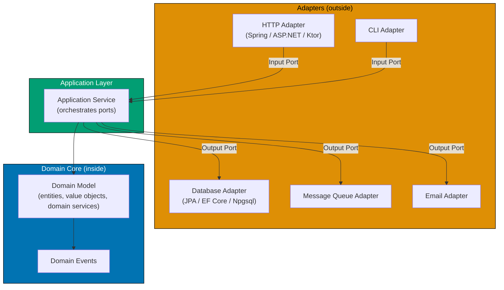

**Want to build systems where the business logic never knows whether it is talking to a database, an HTTP client, or a test stub?** Hexagonal Architecture — also called Ports and Adapters — is the structural answer. Conceived by Alistair Cockburn in the mid-1990s and formally published in 2005, it organises an application into three zones so that the domain core is completely isolated from every delivery mechanism and infrastructure detail.

## The Core Idea

A traditional layered architecture leaks infrastructure concerns upward: the domain layer imports the database, the service layer imports the HTTP framework. When you want to test the domain in isolation, you must mock half the infrastructure. When you want to switch databases, you discover that SQL queries have crept into business logic.

Hexagonal Architecture reverses this. The domain sits at the centre and owns nothing except business logic. Everything outside — HTTP handlers, database clients, message queues, email senders, CLI parsers — is an adapter. Adapters talk to the domain through ports. The domain never imports an adapter; adapters always import the domain.

## The Three Zones

**Domain Core**: Pure business logic. Entities, value objects, domain services, domain events. Zero imports from any framework, database library, or infrastructure package. The domain is the application's reason for existing.

**Application Layer**: Use cases (application services). Each use case orchestrates domain objects and calls output ports to interact with the outside world. The application layer owns the workflow; the domain owns the rules.

**Adapters**: Concrete implementations of ports. An HTTP adapter translates an HTTP request into a domain command. A database adapter translates a repository port call into SQL. An in-memory adapter stores data in a map — ideal for tests.

## Ports

A port is a contract — an interface or function type — that the application layer defines and owns. Cockburn's original terms are **driving ports** (primary) and **driven ports** (secondary), also commonly called input and output ports in the DDD community:

**Driving ports (input ports)**: Contracts that external actors call to drive the application. A REST controller, a CLI handler, and a message consumer all call the same driving port. The port is the use case's public API.

**Driven ports (output ports)**: Contracts that the application calls to reach infrastructure. A repository port, a notification port, a clock port. The application defines the interface; the adapter implements it.

The key discipline: **the domain and application layers define ports but never implement infrastructure adapters**. Adapters live outside and depend inward.

> **Terminology note**: Cockburn's original zones are the Hexagon (the application core), Ports (the boundary interfaces), and Adapters (the external implementations). The three-zone framing of Domain / Application / Adapters used throughout these tutorials is the DDD community's layering mapped onto hexagonal architecture — a widely-adopted convention that adds DDD's domain/application separation inside the hexagon.

## Why It Matters

**Testability**: Swap any adapter for an in-memory stub. Every use case is testable without starting a database, an HTTP server, or a message broker. Fast, deterministic, parallel tests.

**Replaceability**: The application layer does not care whether the output port is PostgreSQL, MongoDB, or an in-memory map. Switching the database means writing a new adapter — the domain and application layers do not change.

**Framework independence**: The domain is not a Spring bean, a .NET middleware, or an Elixir process. It is plain business logic. Upgrading the framework, changing the HTTP library, or extracting the domain into a microservice does not touch the core.

**Parallel development**: Frontend teams can build against in-memory adapters. Backend teams can build real adapters. Both work against the same port contracts. No blocking.

## Comparison with Layered Architecture

| Concern                  | Layered                      | Hexagonal                         |
| ------------------------ | ---------------------------- | --------------------------------- |
| Dependency direction     | Top → bottom                 | Always inward                     |
| Domain imports database? | Often yes                    | Never                             |
| Test isolation           | Requires mocking framework   | Swap adapter for stub             |
| Switching database       | Risky — domain may leak SQL  | Safe — only adapter changes       |
| Multiple entry points    | Hard — wired to one delivery | Natural — multiple input adapters |

## Tutorials in This Section

Both tutorials use the same shared **procurement-platform-be Procure-to-Pay domain** — a backend service where employees request goods/services, managers approve, suppliers fulfill, and finance pays. This running domain is consistent with the [DDD tutorials](/en/learn/software-engineering/software-architecture/domain-driven-design-ddd) so the two architectural styles can be studied together.

- **[Hexagonal Architecture By Example in FP](/en/learn/software-engineering/software-architecture/hexagonal-architecture/in-fp-by-example/overview)**: 75 examples showing how functional programming maps naturally to hexagonal architecture. Ports become function type aliases. Adapters become function implementations. Dependency injection happens through partial application. The functional core/imperative shell pattern and hexagonal architecture are the same idea in different vocabularies.

- **[Hexagonal Architecture By Example in OOP](/en/learn/software-engineering/software-architecture/hexagonal-architecture/in-oop-by-example/overview)**: 75 examples primarily in Java 21+. Ports become interfaces. Adapters become classes implementing those interfaces. Application services orchestrate domain objects through ports. Dependency injection wires adapters into application services at startup.

## Production Wiring

Once the by-example tracks above are clear, the in-the-field tutorials show ports and adapters wired around real DDD aggregates in production code:

- Next step (production wiring): [DDD + Hexagonal in Practice — F# in the Field](/en/learn/software-engineering/software-architecture/ddd-hexagonal-in-practice/in-fp-in-the-field) — pairs with the FP by-example track.
- Next step (production wiring): [DDD + Hexagonal in Practice — Java in the Field](/en/learn/software-engineering/software-architecture/ddd-hexagonal-in-practice/in-oop-in-the-field) — pairs with the OOP by-example track.
