This section covers advanced software architecture patterns for distributed systems, microservices,
resilience, and expert-level architectural decisions — implemented in F# using functional idioms.
Examples 58–85 assume familiarity with foundational and intermediate architecture concepts covered
earlier in this series.

## Decomposition and Service Design

### Example 58: Microservices Decomposition by Business Capability

Decomposing a monolith into microservices by business capability aligns service boundaries with
organisational units and business domains. Each capability becomes an independent unit with its own
types and function signatures acting as the service contract — functions replace protocol/interface
objects.

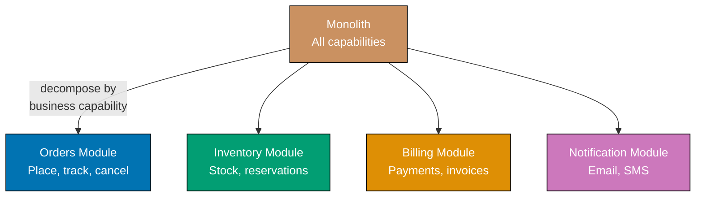





```fsharp
// F# modules as service boundaries — each module owns its types and functions.
// Function signatures are the contract; no OOP interface required.

// => Domain value objects — immutable record types enforce identity semantics
type OrderId    = OrderId of string
// => Wrapping string in a DU prevents accidental OrderId/ProductId confusion
type ProductId  = ProductId of string

// => Orders capability: functions define the service contract
module OrdersService =
    // => In-memory store; in production this would be an injected repository function
    let private store : System.Collections.Generic.Dictionary<string, obj> =
        System.Collections.Generic.Dictionary()

    let placeOrder (ProductId pid) (qty: int) : OrderId =
        // => Generates a stable order id — each call produces a new unique value
        let id = OrderId(System.Guid.NewGuid().ToString())
        let (OrderId oid) = id
        store.[oid] <- box {| productId = pid; qty = qty; status = "PLACED" |}
        // => Stores minimal order state; real implementation persists to DB
        id
        // => Returns OrderId so callers reference the order without knowing its internals

    let cancelOrder (OrderId oid) : bool =
        // => Pattern-match unwraps the DU value — no .Value property needed
        if store.ContainsKey(oid) then
            store.[oid] <- box {| status = "CANCELLED" |}
            // => Mutates in-place here; pure functional alternative uses Map return
            true
        else
            false
        // => Returns bool not exception — absent order is an expected business outcome

// => Inventory capability: independent module, no dependency on Orders internals
module InventoryService =
    let private stock : System.Collections.Generic.Dictionary<string, int> =
        System.Collections.Generic.Dictionary()

    let reserve (ProductId pid) (qty: int) : bool =
        // => Returns false for insufficient stock — Result or bool, not exception
        let current = if stock.ContainsKey(pid) then stock.[pid] else 10
        // => Default 10 units available for demo
        if current >= qty then
            stock.[pid] <- current - qty
            // => Decrease available stock by reserved quantity
            true
        else
            false
        // => False signals the business outcome; caller decides how to proceed

    let release (ProductId pid) (qty: int) : unit =
        // => Compensation: returns reserved units to available stock
        let current = if stock.ContainsKey(pid) then stock.[pid] else 0
        stock.[pid] <- current + qty

// => Usage: each module swapped independently — changing OrdersService does not touch Inventory
let pid = ProductId "SKU-001"
let oid = OrdersService.placeOrder pid 3
// => oid : OrderId — caller holds stable reference

let reserved = InventoryService.reserve pid 3
// => reserved : bool = true — stock available

let cancelled = OrdersService.cancelOrder oid
printfn "Cancelled: %b, Reserved: %b" cancelled reserved
// => Output: Cancelled: true, Reserved: true
```





```clojure
;; Clojure namespaces as service boundaries — each ns owns its data shapes and functions.
;; [F#: module + DU wrappers — compiler-enforced identity; Clojure uses namespaced keywords for identity]

(ns orders-service)
;; => Namespace declares ownership; functions below are the public contract

(def store (atom {}))
;; => atom provides uncoordinated mutable reference for the in-memory order store
;; => In production swap for a database-backed repository function

(defn place-order
  ;; Accept a namespaced product-id and quantity; return a stable order-id string
  [product-id qty]
  (let [order-id (str (java.util.UUID/randomUUID))]
    ;; => Generate a unique order-id — each call returns a fresh UUID
    (swap! store assoc order-id
           {:product-id product-id :qty qty :status :placed})
    ;; => swap! atomically updates the store map with the new order entry
    order-id))
;; => Returns the order-id string; callers use it as a stable reference

(defn cancel-order
  ;; Returns true if the order existed and was cancelled; false otherwise
  [order-id]
  (if (contains? @store order-id)
    ;; => Dereference atom to read current store snapshot
    (do (swap! store assoc-in [order-id :status] :cancelled)
        ;; => assoc-in navigates to the nested :status key and updates it
        true)
    false))
;; => Returns false for unknown order — absent order is a business outcome, not an exception

(ns inventory-service)
;; => Separate namespace — no dependency on orders-service internals

(def stock (atom {}))
;; => Independent atom; orders-service saturation cannot affect this state

(defn reserve
  ;; Returns true if sufficient stock; false if insufficient — never throws
  [product-id qty]
  (let [current (get @stock product-id 10)]
    ;; => Default 10 units if product not yet tracked
    (if (>= current qty)
      (do (swap! stock assoc product-id (- current qty))
          ;; => Decrease available stock by reserved quantity atomically
          true)
      false)))
;; => False signals the business outcome; caller decides how to proceed

(defn release
  ;; Compensation: restore reserved units to available stock
  [product-id qty]
  (swap! stock update product-id #(+ (or % 0) qty)))
;; => update applies the fn to the current value; or handles nil (first release)

;; Usage: each namespace swapped independently — changing orders-service does not touch inventory
(let [pid "SKU-001"
      oid (orders-service/place-order pid 3)]
  ;; => oid is the stable UUID string reference to the placed order
  (let [reserved  (inventory-service/reserve pid 3)
        ;; => reserve checks and decrements stock atomically
        cancelled (orders-service/cancel-order oid)]
    (println "Cancelled:" cancelled ", Reserved:" reserved)))
;; => Output: Cancelled: true , Reserved: true
```





```typescript
// [F#: modules as service boundaries + single-case DU identifiers — TypeScript version]

// => Domain value objects — branded types prevent OrderId/ProductId confusion
type OrderId58 = Readonly<{ value: string; _brand: "OrderId" }>;
type ProductId58 = Readonly<{ value: string; _brand: "ProductId" }>;

const orderId58 = (v: string): OrderId58 => ({ value: v, _brand: "OrderId" });
const productId58 = (v: string): ProductId58 => ({ value: v, _brand: "ProductId" });

// => Orders capability: functions define the service contract
const OrdersService58 = (() => {
  const store = new Map<string, unknown>();
  return {
    placeOrder: (pid: ProductId58, qty: number): OrderId58 => {
      const oid = orderId58(crypto.randomUUID?.() ?? `ord-${Date.now()}`);
      store.set(oid.value, { productId: pid.value, qty, status: "PLACED" });
      // => Stores minimal order state; real implementation persists to DB
      return oid;
      // => Returns OrderId so callers reference the order without knowing its internals
    },
    cancelOrder: (oid: OrderId58): boolean => {
      if (!store.has(oid.value)) return false;
      // => Absent order is an expected business outcome — not an exception
      store.set(oid.value, { status: "CANCELLED" });
      return true;
    },
  };
})();

// => Inventory capability: independent namespace, no dependency on Orders internals
const InventoryService58 = (() => {
  const stock = new Map<string, number>();
  return {
    reserve: (pid: ProductId58, qty: number): boolean => {
      const current = stock.get(pid.value) ?? 10;
      // => Default 10 units available for demo
      if (current >= qty) {
        stock.set(pid.value, current - qty);
        return true;
      }
      return false;
      // => False signals the business outcome; caller decides how to proceed
    },
    release: (pid: ProductId58, qty: number): void => {
      const current = stock.get(pid.value) ?? 0;
      stock.set(pid.value, current + qty);
      // => Compensation: returns reserved units to available stock
    },
  };
})();

// => Usage: each module swapped independently
const pid58 = productId58("SKU-001");
const oid58 = OrdersService58.placeOrder(pid58, 3);
// => oid58: OrderId58 — caller holds stable reference

const reserved58 = InventoryService58.reserve(pid58, 3);
// => reserved58: boolean = true — stock available
const cancelled58 = OrdersService58.cancelOrder(oid58);

console.log(`Cancelled: ${cancelled58}, Reserved: ${reserved58}`);
// => Output: Cancelled: true, Reserved: true
```





**Key Takeaway:** F# modules with typed function signatures enforce service boundaries as firmly as
OOP interfaces, and discriminated union wrappers on identifiers prevent accidental cross-capability
type confusion at compile time. Clojure namespaces achieve the same decomposition boundary through
data-oriented maps and atoms, relying on namespace qualification rather than compile-time types.

**Why It Matters:** Business-capability decomposition aligns service ownership with Conway's Law —
the team owning "Orders" controls its full stack without coordinating schema changes with
"Inventory". In F#, module boundaries are enforced by the compiler through type-checked function
signatures, making boundary violations a compile error rather than a runtime surprise.

---

### Example 59: Strangler Fig Pattern

The Strangler Fig pattern migrates a monolith incrementally by routing through a dispatch function
that redirects requests to new modules as they are built. The router is a pure function from
path and payload to a response, making the routing table explicit, testable, and inspectable.

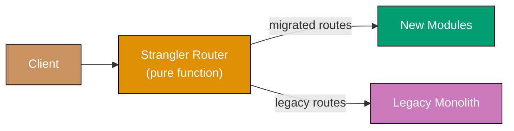





```fsharp
// Strangler Fig as a pure routing function — no mutable registry, no classes.
// The route table is an immutable Map; adding a migrated route is a Map.add call.

// => Handler type alias: path and payload in, response record out
type RouteHandler = string -> Map<string, string> -> {| source: string; path: string |}

// => Route table: prefix string -> handler function
// => Immutable Map — adding a route produces a new table, doesn't mutate global state
let registerRoute (prefix: string) (handler: RouteHandler) (routes: Map<string, RouteHandler>) =
    Map.add prefix handler routes
    // => Returns a new Map with the route added — pure, no side effects

// => Route dispatch: tries each prefix, falls back to legacy handler
let route
    (routes: Map<string, RouteHandler>)
    (legacyHandler: RouteHandler)
    (path: string)
    (payload: Map<string, string>)
    =
    routes
    |> Map.tryFindKey (fun prefix _ -> path.StartsWith(prefix))
    // => Searches the route table for a matching prefix — returns Some key or None
    |> Option.map (fun prefix -> routes.[prefix] path payload)
    // => If found, invoke the matched handler with path and payload
    |> Option.defaultWith (fun () -> legacyHandler path payload)
    // => If not found, delegate to the legacy monolith handler

// => Simulated new Orders module handler (already migrated)
let newOrdersHandler (path: string) (payload: Map<string, string>) =
    {| source = "new_module"; path = path |}
    // => New handler responds; legacy monolith not involved

// => Legacy monolith catch-all
let legacyHandler (path: string) (payload: Map<string, string>) =
    {| source = "legacy_monolith"; path = path |}

// => Build route table: start empty, add migrated routes one by one
let routes =
    Map.empty
    |> registerRoute "/api/orders" newOrdersHandler
    // => Orders route migrated; all other paths still go to legacy

let result1 = route routes legacyHandler "/api/orders/123" Map.empty
printfn "%A" result1
// => Output: { source = "new_module"; path = "/api/orders/123" }

let result2 = route routes legacyHandler "/api/products/abc" Map.empty
printfn "%A" result2
// => Output: { source = "legacy_monolith"; path = "/api/products/abc" }
```





```clojure
;; Strangler Fig as a pure routing function — route table is an immutable map.
;; [F#: Map<string, RouteHandler> — same immutable map concept; Clojure uses plain hash-maps]

(defn register-route
  ;; Add a migrated route prefix and its handler function to the route table.
  ;; Returns a new map — pure, no mutation of the existing table.
  [routes prefix handler]
  (assoc routes prefix handler))
;; => assoc produces a new map with the prefix->handler entry added

(defn route-request
  ;; Dispatch path to the first matching prefix handler or fall back to legacy.
  ;; [F#: Option.defaultWith — same "try matched handler else fallback" semantics]
  [routes legacy-handler path payload]
  (let [matched-prefix
        (->> (keys routes)
             ;; => Iterate all registered prefixes to find a matching one
             (filter #(clojure.string/starts-with? path %))
             ;; => Keep only prefixes that path starts with
             first)]
    ;; => first returns nil if no prefix matched — nil is the Clojure None equivalent
    (if matched-prefix
      ((get routes matched-prefix) path payload)
      ;; => Invoke the matched handler with path and payload
      (legacy-handler path payload))))
;; => Fall back to the legacy monolith handler if no prefix matched

(defn new-orders-handler
  ;; New Orders module handler — already migrated; legacy monolith not involved.
  [path _payload]
  {:source "new_module" :path path})
;; => Returns a plain map; Clojure data orientation — no record type needed

(defn legacy-handler
  ;; Catch-all: routes not yet migrated go here.
  [path _payload]
  {:source "legacy_monolith" :path path})
;; => Same shape as new handler — callers receive a uniform response map

;; Build the route table incrementally — each migrated route is one assoc call
(def routes
  (-> {}
      (register-route "/api/orders" new-orders-handler)))
;; => Thread-first macro builds the map: start empty, add /api/orders

(let [result1 (route-request routes legacy-handler "/api/orders/123" {})]
  (println result1))
;; => Output: {:source new_module, :path /api/orders/123}

(let [result2 (route-request routes legacy-handler "/api/products/abc" {})]
  (println result2))
;; => Output: {:source legacy_monolith, :path /api/products/abc}
```





```typescript
// [F#: immutable route table + pure dispatch function — TypeScript version]

type RouteHandler59 = (path: string, payload: Record<string, string>) => { source: string; path: string };
// => Handler type: path and payload in, response out

// => Register a route: returns a new Map with the route added — pure, no side effects
const registerRoute59 = (
  routes: ReadonlyMap<string, RouteHandler59>,
  prefix: string,
  handler: RouteHandler59,
): ReadonlyMap<string, RouteHandler59> => {
  const next = new Map(routes);
  next.set(prefix, handler);
  return next;
  // => Returns a new Map — no mutation of the existing table
};

// => Route dispatch: tries each prefix, falls back to legacy handler
const routeRequest59 = (
  routes: ReadonlyMap<string, RouteHandler59>,
  legacyHandler: RouteHandler59,
  path: string,
  payload: Record<string, string>,
): { source: string; path: string } => {
  const matchedPrefix = [...routes.keys()].find((p) => path.startsWith(p));
  // => Searches the route table for a matching prefix
  if (matchedPrefix) return routes.get(matchedPrefix)!(path, payload);
  // => If found, invoke the matched handler
  return legacyHandler(path, payload);
  // => If not found, delegate to the legacy monolith handler
};

// => Simulated new Orders module handler (already migrated)
const newOrdersHandler59: RouteHandler59 = (path, _payload) => ({ source: "new_module", path });
// => New handler responds; legacy monolith not involved

// => Legacy monolith catch-all
const legacyHandler59: RouteHandler59 = (path, _payload) => ({ source: "legacy_monolith", path });

// => Build route table: start empty, add migrated routes one by one
const routes59 = registerRoute59(new Map(), "/api/orders", newOrdersHandler59);

const result59a = routeRequest59(routes59, legacyHandler59, "/api/orders/123", {});
console.log(JSON.stringify(result59a));
// => Output: {"source":"new_module","path":"/api/orders/123"}

const result59b = routeRequest59(routes59, legacyHandler59, "/api/products/abc", {});
console.log(JSON.stringify(result59b));
// => Output: {"source":"legacy_monolith","path":"/api/products/abc"}
```





**Key Takeaway:** Modelling the routing table as an immutable map makes each migration step a
pure `assoc` / `Map.add` call with no global state to manage, and the dispatch function is
trivially unit-tested by constructing different tables.

**Why It Matters:** Big-bang rewrites fail because they require running two systems simultaneously
and accepting rollback as all-or-nothing. The Strangler Fig pattern allows teams to migrate one
route at a time. Both F# and Clojure implementations make the migration state fully visible in the
route table — every migrated route is an explicit map entry.

---

## Distributed Coordination

### Example 60: Saga Orchestration

Saga orchestration uses a central function that sequences steps and drives compensating transactions
in reverse when any step fails. Each step is a forward action paired with a compensating action;
the orchestrator accumulates completed steps and unwinds them on failure.

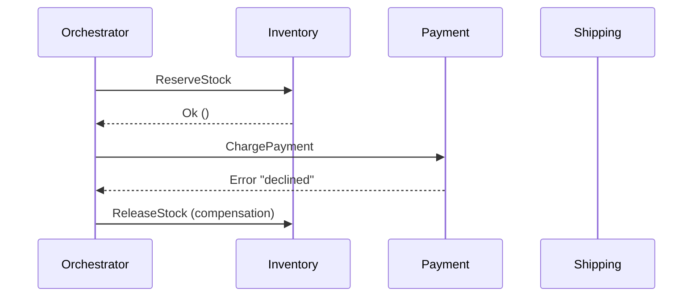





```fsharp
// Saga orchestration as Result-chaining with compensation stack.
// No class required — a step is a pair of functions.

// => SagaStep: forward action returns Result; compensate is always unit -> unit
type SagaStep = {
    Name:       string
    Execute:    unit -> Result<unit, string>
    // => Returns Ok () on success, Error msg on failure
    Compensate: unit -> unit
    // => Compensation is always best-effort; returns unit
}

// => Orchestrator: run steps in order, compensate completed steps on failure
let runSaga (steps: SagaStep list) : Result<unit, string> =
    let rec go remaining completed =
        // => Recursive accumulator: remaining steps, completed-so-far stack
        match remaining with
        | [] -> Ok ()
        // => All steps executed successfully
        | step :: rest ->
            match step.Execute() with
            | Ok () ->
                go rest (step :: completed)
                // => Step succeeded; push onto completed stack and continue
            | Error msg ->
                completed |> List.iter (fun s -> s.Compensate())
                // => Step failed; compensate all completed steps in LIFO order
                Error $"Saga failed at '{step.Name}': {msg}"
                // => Return failure with the name of the step that failed
    go steps []

// => Simulated participants with mutable state for demo
let mutable stockReserved = false
let mutable paymentCharged = false

let reserveStock () =
    stockReserved <- true
    printfn "Stock reserved"
    Ok ()
    // => Always succeeds in this demo

let releaseStock () =
    stockReserved <- false
    printfn "Stock released (compensation)"

let chargePayment () =
    printfn "Payment failed"
    Error "card declined"
    // => Simulates payment processor rejection

let refundPayment () =
    printfn "Payment refunded (compensation)"
    // => Would issue refund; here charge never succeeded so this is a no-op

let steps = [
    { Name = "reserve"; Execute = reserveStock;  Compensate = releaseStock  }
    { Name = "payment"; Execute = chargePayment; Compensate = refundPayment }
]

let result = runSaga steps
printfn "Saga result: %A" result
// => Output: Stock reserved
// => Output: Payment failed
// => Output: Stock released (compensation)
// => Output: Saga result: Error "Saga failed at 'payment': card declined"
printfn "Stock after failure: %b" stockReserved
// => Output: Stock after failure: false — compensation correctly unwound the reservation
```





```clojure
;; Saga orchestration as a reduce over step maps with a compensation stack.
;; [F#: SagaStep record type — Clojure uses plain maps with :execute and :compensate keys]

(defn run-saga
  ;; Execute steps in order; on failure compensate completed steps in LIFO order.
  ;; Returns {:ok true} on full success or {:error "..."} on first failure.
  [steps]
  (loop [remaining steps
         completed  []]
    ;; => loop/recur is idiomatic Clojure for tail-recursive accumulation
    (if (empty? remaining)
      {:ok true}
      ;; => All steps completed successfully
      (let [step   (first remaining)
            result ((:execute step))]
        ;; => Invoke the :execute function; result is {:ok true} or {:error msg}
        (if (:ok result)
          (recur (rest remaining) (conj completed step))
          ;; => Step succeeded — push onto completed stack and continue
          (do
            (doseq [s (reverse completed)]
              ;; => Compensate in LIFO order — reverse the completed vector
              ((:compensate s)))
            {:error (str "Saga failed at '" (:name step) "': " (:error result))}))))))
;; => Return failure map with the step name and original error message

(def stock-reserved (atom false))
;; => Atom tracks reservation state; compensation resets it

(defn reserve-stock []
  (reset! stock-reserved true)
  ;; => Reserve the stock; in production this writes to a DB
  (println "Stock reserved")
  {:ok true})

(defn release-stock []
  (reset! stock-reserved false)
  ;; => Compensation: release previously reserved stock
  (println "Stock released (compensation)"))

(defn charge-payment []
  (println "Payment failed")
  {:error "card declined"})
;; => Simulates payment processor rejection — returns error map

(defn refund-payment []
  (println "Payment refunded (compensation)"))
;; => Would issue a refund; charge never succeeded here so this is a no-op

(def steps
  [{:name "reserve" :execute reserve-stock  :compensate release-stock}
   {:name "payment" :execute charge-payment :compensate refund-payment}])
;; => Each step is a plain map — no class or record type required

(let [result (run-saga steps)]
  (println "Saga result:" result))
;; => Output: Stock reserved
;; => Output: Payment failed
;; => Output: Stock released (compensation)
;; => Output: Saga result: {:error Saga failed at 'payment': card declined}

(println "Stock after failure:" @stock-reserved)
;; => Output: Stock after failure: false — compensation correctly unwound the reservation
```





```typescript
// [F#: Result-chaining orchestrator with compensation stack — TypeScript version]
type Result60<T, E> = { ok: true; value: T } | { ok: false; error: E };

// => SagaStep: forward action returns Result; compensate is always () => void
type SagaStep60 = {
  name: string;
  execute: () => Result60<void, string>;
  compensate: () => void;
};

// => Orchestrator: run steps in order, compensate completed steps on failure
const runSaga60 = (steps: readonly SagaStep60[]): Result60<void, string> => {
  const completed: SagaStep60[] = [];
  for (const step of steps) {
    const result = step.execute();
    if (result.ok) {
      completed.push(step);
      // => Step succeeded; push onto completed stack and continue
    } else {
      for (const done of [...completed].reverse()) done.compensate();
      // => Step failed; compensate all completed steps in LIFO order
      return { ok: false, error: `Saga failed at '${step.name}': ${result.error}` };
    }
  }
  return { ok: true, value: undefined };
};

// => Simulated participants with mutable state for demo
let stockReserved60 = false;

const reserveStock60 = (): Result60<void, string> => {
  stockReserved60 = true;
  console.log("Stock reserved");
  return { ok: true, value: undefined };
  // => Always succeeds in this demo
};

const releaseStock60 = (): void => {
  stockReserved60 = false;
  console.log("Stock released (compensation)");
};

const chargePayment60 = (): Result60<void, string> => {
  console.log("Payment failed");
  return { ok: false, error: "card declined" };
  // => Simulates payment processor rejection
};

const refundPayment60 = (): void => console.log("Payment refunded (compensation)");

const steps60: SagaStep60[] = [
  { name: "reserve", execute: reserveStock60, compensate: releaseStock60 },
  { name: "payment", execute: chargePayment60, compensate: refundPayment60 },
];

const result60 = runSaga60(steps60);
console.log(`Saga ok: ${result60.ok}`);
// => Output: Stock reserved
// => Output: Payment failed
// => Output: Stock released (compensation)
// => Output: Saga ok: false
console.log(`Stock after failure: ${stockReserved60}`);
// => Output: Stock after failure: false — compensation correctly unwound the reservation
```





**Key Takeaway:** Modelling the saga as a recursive function over a step list with a
completed-stack makes compensating-in-reverse-order a natural iteration over the accumulated stack
— no mutable index needed. F# uses `Result` for type-safe success/failure; Clojure uses plain
maps with `:ok`/`:error` keys for data-oriented error signalling.

**Why It Matters:** Distributed transactions using 2PC are impractical in microservices. Sagas
replace locks with compensating transactions. The explicit step list and compensation stack make
every saga transition auditable and the failure path impossible to skip accidentally.

---

### Example 61: Saga Choreography

Saga choreography replaces the central orchestrator with reactive functions: each participant
subscribes to events and publishes new ones. An event bus is a dispatch table mapping event type
strings to lists of handler functions registered at startup.

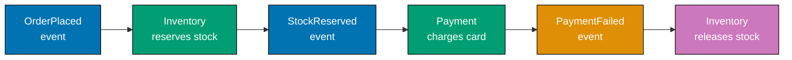





```fsharp
// Saga choreography: handlers are functions; the bus is a mutable dispatch table.
// Each service's handler is a pure function from event payload to unit side-effects + publish.

// => Simple in-process bus: event type string -> list of handler functions
let private handlers =
    System.Collections.Generic.Dictionary<string, (Map<string,string> -> unit) list>()

let subscribe (eventType: string) (handler: Map<string,string> -> unit) =
    // => Register a handler; multiple handlers allowed per event type
    let existing = if handlers.ContainsKey(eventType) then handlers.[eventType] else []
    handlers.[eventType] <- handler :: existing

let publish (eventType: string) (payload: Map<string,string>) =
    // => Deliver event to all registered handlers synchronously
    if handlers.ContainsKey(eventType) then
        handlers.[eventType] |> List.iter (fun h -> h payload)
    // => Real bus: async Kafka consumer group; handlers run in separate processes

// => Shared mutable state representing DB per service
let mutable stockHeld = false

// => Inventory service: listens for OrderPlaced and PaymentFailed
let onOrderPlaced (event: Map<string,string>) =
    stockHeld <- true
    printfn "Inventory: reserved stock for order %s" event.["order_id"]
    publish "StockReserved" event
    // => Emits next event; does NOT call Payment directly — choreography decouples them

let onPaymentFailed (event: Map<string,string>) =
    stockHeld <- false
    printfn "Inventory: released stock for order %s (compensation)" event.["order_id"]

// => Payment service: listens for StockReserved
let onStockReserved (event: Map<string,string>) =
    printfn "Payment: charging for order %s" event.["order_id"]
    publish "PaymentFailed" event
    // => Simulates failure; emits PaymentFailed — Inventory reacts without Payment calling it

// => Wire up subscriptions at startup
subscribe "OrderPlaced"   onOrderPlaced
subscribe "StockReserved" onStockReserved
subscribe "PaymentFailed" onPaymentFailed

publish "OrderPlaced" (Map.ofList [("order_id", "ORD-42")])
// => Output: Inventory: reserved stock for order ORD-42
// => Output: Payment: charging for order ORD-42
// => Output: Inventory: released stock for order ORD-42 (compensation)
printfn "Stock held after failure: %b" stockHeld
// => Output: Stock held after failure: false
```





```clojure
;; Saga choreography: handlers are functions; the bus is an atom-backed dispatch table.
;; [F#: Dictionary<string, handler list> — Clojure uses an atom over a plain map for thread safety]

(def handlers (atom {}))
;; => Atom wraps the handler map so subscribe/publish are safe to call concurrently

(defn subscribe
  ;; Register a handler function for an event type.
  ;; Multiple handlers allowed per type — all receive every published event.
  [event-type handler]
  (swap! handlers update event-type #(conj (or % []) handler)))
;; => update applies conj to the existing handler vector; or % [] handles first registration

(defn publish
  ;; Deliver the event payload to all handlers registered for this event type.
  [event-type payload]
  (doseq [h (get @handlers event-type [])]
    ;; => Dereference atom for the current handler snapshot; iterate each handler
    (h payload)))
;; => Real bus: Kafka topic per event type; handlers run in separate consumer processes

(def stock-held (atom false))
;; => Atom represents the Inventory service's reservation state

(defn on-order-placed
  ;; Inventory reacts to OrderPlaced: reserve stock, then emit StockReserved.
  [event]
  (reset! stock-held true)
  ;; => Reserve the stock; real implementation writes to a DB
  (println "Inventory: reserved stock for order" (:order-id event))
  (publish "StockReserved" event))
;; => Emits the next event; does NOT call Payment directly — choreography decouples services

(defn on-payment-failed
  ;; Inventory reacts to PaymentFailed: release the previously reserved stock.
  [event]
  (reset! stock-held false)
  ;; => Compensation: undo the reservation
  (println "Inventory: released stock for order" (:order-id event) "(compensation)"))

(defn on-stock-reserved
  ;; Payment reacts to StockReserved: attempt charge, emit PaymentFailed on decline.
  [event]
  (println "Payment: charging for order" (:order-id event))
  (publish "PaymentFailed" event))
;; => Simulates a declined card; Inventory reacts without Payment calling it directly

;; Wire up subscriptions at startup — one line per event-type/handler pair
(subscribe "OrderPlaced"   on-order-placed)
(subscribe "StockReserved" on-stock-reserved)
(subscribe "PaymentFailed" on-payment-failed)

(publish "OrderPlaced" {:order-id "ORD-42"})
;; => Output: Inventory: reserved stock for order ORD-42
;; => Output: Payment: charging for order ORD-42
;; => Output: Inventory: released stock for order ORD-42 (compensation)

(println "Stock held after failure:" @stock-held)
;; => Output: Stock held after failure: false
```





```typescript
// [F#: event bus + reactive handlers publishing new events — TypeScript version]

type ChoreographyEvent61 =
  | { tag: "OrderPlaced"; orderId: string; productId: string; qty: number }
  | { tag: "StockReserved"; orderId: string }
  | { tag: "StockUnavailable"; orderId: string }
  | { tag: "PaymentCharged"; orderId: string; amount: number }
  | { tag: "PaymentFailed"; orderId: string }
  | { tag: "StockReleased"; orderId: string };
// => Each event is an immutable fact; handlers react and publish new events

type EventHandler61 = (event: ChoreographyEvent61) => void;

const makeEventBus61 = () => {
  const registry = new Map<string, EventHandler61[]>();
  const subscribe = (tag: string, handler: EventHandler61) => {
    registry.set(tag, [...(registry.get(tag) ?? []), handler]);
  };
  const publish = (event: ChoreographyEvent61) => {
    for (const h of registry.get(event.tag) ?? []) h(event);
  };
  return { subscribe, publish };
};

const { subscribe: sub61, publish: pub61 } = makeEventBus61();

// => INVENTORY SERVICE: reacts to OrderPlaced, publishes StockReserved or StockUnavailable
sub61("OrderPlaced", (event) => {
  if (event.tag !== "OrderPlaced") return;
  const available = event.qty <= 5; // => Simulate: up to 5 units available
  if (available) {
    console.log(`Inventory: reserved ${event.qty} units for ${event.orderId}`);
    pub61({ tag: "StockReserved", orderId: event.orderId });
  } else {
    pub61({ tag: "StockUnavailable", orderId: event.orderId });
  }
});

// => PAYMENT SERVICE: reacts to StockReserved, publishes PaymentCharged or PaymentFailed
sub61("StockReserved", (event) => {
  if (event.tag !== "StockReserved") return;
  const approved = true; // => Simulate successful payment
  if (approved) {
    console.log(`Payment: charged for ${event.orderId}`);
    pub61({ tag: "PaymentCharged", orderId: event.orderId, amount: 99.0 });
  } else {
    pub61({ tag: "PaymentFailed", orderId: event.orderId });
  }
});

// => COMPENSATION: release stock if payment failed
sub61("PaymentFailed", (event) => {
  if (event.tag !== "PaymentFailed") return;
  console.log(`Inventory: releasing stock for ${event.orderId}`);
  pub61({ tag: "StockReleased", orderId: event.orderId });
});

// Trigger the choreography
pub61({ tag: "OrderPlaced", orderId: "ord-1", productId: "SKU-001", qty: 2 });
// => Inventory: reserved 2 units for ord-1
// => Payment: charged for ord-1
```





**Key Takeaway:** Each handler is a plain function from payload map to unit side-effects; adding a
new participant means writing a new function and calling `subscribe` — no class hierarchy, no
interface contract to satisfy in either language.

**Why It Matters:** Choreography eliminates the orchestrator as a single point of failure. The
handler-as-function model keeps each service's reaction logic self-contained and independently
testable by calling the function directly with a test payload map, in both F# and Clojure.

---

## API Design

### Example 62: API Versioning Strategies

API versioning prevents breaking changes from disrupting consumers. The version dispatch is a pure
function from method and path to a response value. Multiple version handlers coexist; the router
selects the correct one based on path prefix or Accept header.





```fsharp
// API versioning as pure dispatch functions — no mutable route registry.
// Each version is a module; the router is a plain match expression.

// => Response type shared across versions
type ApiResponse = { Version: int; Body: obj }

// => V1 contract: flat list of usernames
module V1 =
    let getUsers () : ApiResponse =
        { Version = 1; Body = box [ "alice" ] }
        // => V1 body: simple string list

// => V2 contract: richer objects with email added — backward-incompatible change
module V2 =
    let getUsers () : ApiResponse =
        { Version = 2; Body = box [ {| name = "alice"; email = "alice@example.com" |} ] }
        // => V2 body: anonymous record list — richer shape than V1

// => URI path versioning: version embedded in path — most CDN-cacheable strategy
let dispatchUri (method: string) (path: string) : ApiResponse option =
    match method, path with
    | "GET", "/v1/users" -> Some (V1.getUsers())
    // => V1 path matched explicitly — CDN caches /v1/users and /v2/users independently
    | "GET", "/v2/users" -> Some (V2.getUsers())
    // => V2 path adds richer user object; old clients keep calling /v1/users unchanged
    | _                  -> None
    // => None is the 404 equivalent — caller decides the HTTP status code

let r1 = dispatchUri "GET" "/v1/users"
printfn "%A" r1
// => Output: Some { Version = 1; Body = ["alice"] }

let r2 = dispatchUri "GET" "/v2/users"
printfn "%A" r2
// => Output: Some { Version = 2; Body = [{ name = "alice"; email = "alice@example.com" }] }

// => Accept header versioning: same URL, version negotiated via header
let dispatchHeader (method: string) (path: string) (accept: string) : ApiResponse option =
    // => Parse version from Accept: application/vnd.myapi.v2+json
    let version = if accept.Contains("v2") then "v2" else "v1"
    // => Default to v1 if header absent or does not name a version
    match path with
    | "/users" when version = "v2" -> Some (V2.getUsers())
    // => Same URL, different response shape based on negotiated version
    | "/users"                     -> Some (V1.getUsers())
    | _                            -> None

printfn "%A" (dispatchHeader "GET" "/users" "application/json")
// => Output: Some { Version = 1; Body = ["alice"] }
printfn "%A" (dispatchHeader "GET" "/users" "application/vnd.myapi.v2+json")
// => Output: Some { Version = 2; Body = [{ name = "alice"; email = "alice@example.com" }] }
```





```clojure
;; API versioning as pure dispatch functions — no mutable route registry.
;; [F#: module per version — Clojure uses namespace-qualified functions and cond dispatch]

(defn v1-get-users
  ;; V1 contract: flat list of username strings — simple, minimal payload.
  []
  {:version 1 :body ["alice"]})
;; => Returns a plain map; Clojure data-orientation — no record type needed

(defn v2-get-users
  ;; V2 contract: richer objects with email — backward-incompatible shape change.
  []
  {:version 2 :body [{:name "alice" :email "alice@example.com"}]})
;; => V2 body is a vector of maps; V1 clients must not call this endpoint

(defn dispatch-uri
  ;; URI path versioning: version embedded in path — CDN-cacheable strategy.
  ;; Returns nil for unmatched paths — caller decides the HTTP status code.
  [method path]
  (cond
    (= [method path] ["GET" "/v1/users"]) (v1-get-users)
    ;; => CDN caches /v1/users and /v2/users independently as distinct resources
    (= [method path] ["GET" "/v2/users"]) (v2-get-users)
    ;; => V2 path returns richer shape; old clients keep calling /v1/users unchanged
    :else nil))
;; => nil is the Clojure equivalent of None — unmatched path, caller handles 404

(println (dispatch-uri "GET" "/v1/users"))
;; => Output: {:version 1, :body [alice]}

(println (dispatch-uri "GET" "/v2/users"))
;; => Output: {:version 2, :body [{:name alice, :email alice@example.com}]}

(defn dispatch-header
  ;; Accept header versioning: same URL, version negotiated via Accept header value.
  ;; [F#: match with when guard — Clojure uses cond with clojure.string/includes?]
  [_method path accept]
  (let [version (if (clojure.string/includes? accept "v2") "v2" "v1")]
    ;; => Default to v1 if the Accept header is absent or does not name a version
    (cond
      (and (= path "/users") (= version "v2")) (v2-get-users)
      ;; => Same URL — content negotiation selects V2 response shape
      (= path "/users")                        (v1-get-users)
      ;; => Unversioned Accept defaults to V1 — safe for existing clients
      :else nil)))

(println (dispatch-header "GET" "/users" "application/json"))
;; => Output: {:version 1, :body [alice]}

(println (dispatch-header "GET" "/users" "application/vnd.myapi.v2+json"))
;; => Output: {:version 2, :body [{:name alice, :email alice@example.com}]}
```





```typescript
// [F#: pure dispatch functions with no mutable route registry — TypeScript version]

// => Response type shared across versions
type ApiResponse62 = { version: number; body: unknown };

// => V1 contract: flat list of usernames
const v1GetUsers62 = (): ApiResponse62 => ({
  version: 1,
  body: ["alice"],
  // => V1 body: simple string array
});

// => V2 contract: richer objects with email added — backward-incompatible change
const v2GetUsers62 = (): ApiResponse62 => ({
  version: 2,
  body: [{ name: "alice", email: "alice@example.com" }],
  // => V2 body: object array — richer shape than V1
});

// => URI path versioning: version embedded in path — most CDN-cacheable strategy
const dispatchUri62 = (method: string, path: string): ApiResponse62 | undefined => {
  if (method === "GET" && path === "/v1/users") return v1GetUsers62();
  // => V1 path matched explicitly — CDN caches /v1/users and /v2/users independently
  if (method === "GET" && path === "/v2/users") return v2GetUsers62();
  // => V2 path adds richer user object; old clients keep calling /v1/users unchanged
  return undefined;
  // => undefined is the 404 equivalent — caller decides the HTTP status code
};

console.log(JSON.stringify(dispatchUri62("GET", "/v1/users")));
// => Output: {"version":1,"body":["alice"]}
console.log(JSON.stringify(dispatchUri62("GET", "/v2/users")));
// => Output: {"version":2,"body":[{"name":"alice","email":"alice@example.com"}]}

// => Accept header versioning: same URL, version negotiated via header
const dispatchHeader62 = (method: string, path: string, accept: string): ApiResponse62 | undefined => {
  const version = accept.includes("v2") ? "v2" : "v1";
  // => Default to v1 if header absent or does not name a version
  if (path === "/users" && version === "v2") return v2GetUsers62();
  // => Same URL, different response shape based on negotiated version
  if (path === "/users") return v1GetUsers62();
  return undefined;
};

console.log(JSON.stringify(dispatchHeader62("GET", "/users", "application/json")));
// => Output: {"version":1,"body":["alice"]}
console.log(JSON.stringify(dispatchHeader62("GET", "/users", "application/vnd.myapi.v2+json")));
// => Output: {"version":2,"body":[{"name":"alice","email":"alice@example.com"}]}
```





**Key Takeaway:** URI path versioning is expressed as a pure dispatch expression — adding a new
version is one new condition arm; removing an old one is deleting an arm. No mutable router state
required in either F# or Clojure.

**Why It Matters:** Breaking API changes without a versioning strategy are among the leading causes
of production incidents when microservices are upgraded. URI path versioning is explicit in logs,
debuggable in browsers, and cache-friendly — benefits that outweigh the "impurity" of embedding
version in the URL.

---

### Example 63: Backend for Frontend (BFF) Pattern

The BFF pattern creates a dedicated aggregation function per client type. Each BFF is a pure
function that composes downstream call results into a client-specific data shape — no shared
service layer; each BFF function shapes its own response independently.

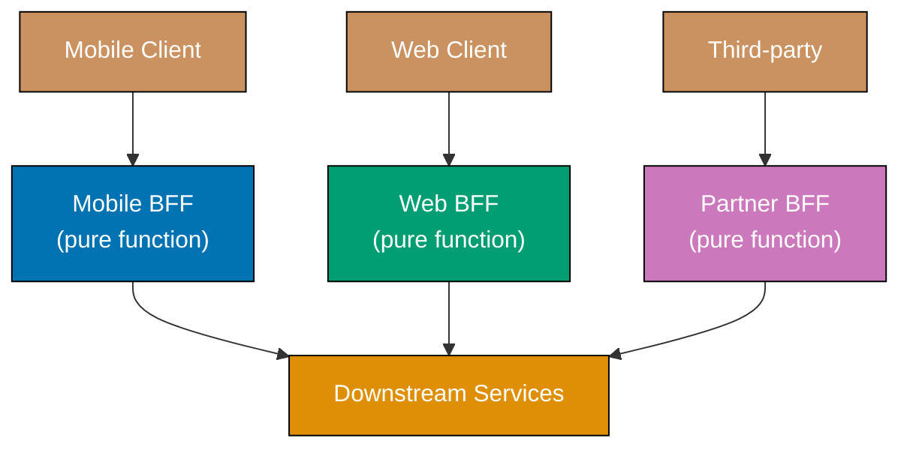





```fsharp
// BFF as pure aggregation functions — each function composes downstream data
// into a client-specific anonymous record.  No shared response type.

// => Downstream service stubs: return full data; BFF functions select what each client needs
let getUserProfile (userId: string) =
    {| id = userId; name = "Alice"; email = "alice@example.com"; theme = "dark" |}
    // => Full profile — downstream owns all fields; BFF picks what to expose

let getUserOrders (userId: string) =
    [ {| id = "ORD-1"; total = 99.99M; status = "shipped"  |}
      {| id = "ORD-2"; total = 14.50M; status = "pending"  |} ]
    // => Full order list — may be large; mobile BFF will aggregate, not pass through

// => Mobile BFF: strips fields to reduce bandwidth for cellular connections
let mobileBffDashboard (userId: string) =
    let profile = getUserProfile userId
    let orders  = getUserOrders userId
    {| name          = profile.name
    // => Only name; email and theme omitted — mobile screen has no space for them
       pendingOrders = orders |> List.filter (fun o -> o.status = "pending") |> List.length
    // => Pre-aggregated count: mobile renders one integer, not a full list
    |}

// => Web BFF: returns richer aggregate with full order list and preferences
let webBffDashboard (userId: string) =
    let profile = getUserProfile userId
    let orders  = getUserOrders userId
    {| profile    = profile
    // => Full profile including email and theme preference
       orders     = orders
    // => Full order objects — web renders a sortable table
       orderCount = orders.Length
    // => Pre-computed convenience field; saves the JS client a .length call
    |}

printfn "%A" (mobileBffDashboard "u1")
// => Output: { name = "Alice"; pendingOrders = 1 }

printfn "%A" (webBffDashboard "u1")
// => Output: { profile = ...; orders = [...]; orderCount = 2 }
```





```clojure
;; BFF as pure aggregation functions — each function shapes downstream data for one client type.
;; [F#: anonymous records — Clojure uses plain maps; no type declaration per BFF needed]

(defn get-user-profile
  ;; Downstream profile service: returns the full profile map.
  ;; BFF functions select only the fields their client needs.
  [user-id]
  {:id user-id :name "Alice" :email "alice@example.com" :theme "dark"})
;; => Plain map — all fields owned by the downstream service

(defn get-user-orders
  ;; Downstream orders service: returns the full order list.
  ;; Mobile BFF will aggregate; web BFF will pass through.
  [_user-id]
  [{:id "ORD-1" :total 99.99M :status "shipped"}
   {:id "ORD-2" :total 14.50M :status "pending"}])
;; => Vector of order maps — may be large for active users

(defn mobile-bff-dashboard
  ;; Mobile BFF: strips fields to reduce bandwidth for cellular connections.
  ;; Returns only name and an aggregated pending-orders count.
  [user-id]
  (let [profile (get-user-profile user-id)
        orders  (get-user-orders user-id)]
    {:name          (:name profile)
     ;; => Only name; email and theme omitted — mobile screen has no space for them
     :pending-orders (->> orders
                          (filter #(= (:status %) "pending"))
                          ;; => Keep only pending orders
                          count)}))
;; => Pre-aggregated count: mobile renders one integer, not a full list

(defn web-bff-dashboard
  ;; Web BFF: returns a richer aggregate with the full order list and user preferences.
  ;; [F#: anonymous record with profile, orders, orderCount fields — same shape here]
  [user-id]
  (let [profile (get-user-profile user-id)
        orders  (get-user-orders user-id)]
    {:profile     profile
     ;; => Full profile including email and theme preference
     :orders      orders
     ;; => Full order objects — web renders a sortable table
     :order-count (count orders)}))
;; => Pre-computed convenience field; saves the JS client a .length call

(println (mobile-bff-dashboard "u1"))
;; => Output: {:name Alice, :pending-orders 1}

(println (web-bff-dashboard "u1"))
;; => Output: {:profile {...}, :orders [...], :order-count 2}
```





```typescript
// [F#: pure aggregation functions per client type — TypeScript version]

// => Downstream service stubs: return full data; BFF functions select what each client needs
const getUserProfile63 = (userId: string) => ({
  id: userId,
  name: "Alice",
  email: "alice@example.com",
  theme: "dark",
  // => Full profile — downstream owns all fields; BFF picks what to expose
});

const getUserOrders63 = (_userId: string) => [
  { id: "ORD-1", total: 99.99, status: "shipped" },
  { id: "ORD-2", total: 14.5, status: "pending" },
  // => Full order list — may be large; mobile BFF will aggregate, not pass through
];

// => Mobile BFF: strips fields to reduce bandwidth for cellular connections
const mobileBffDashboard63 = (userId: string) => {
  const profile = getUserProfile63(userId);
  const orders = getUserOrders63(userId);
  return {
    name: profile.name,
    // => Only name; email and theme omitted — mobile screen has no space for them
    pendingOrders: orders.filter((o) => o.status === "pending").length,
    // => Pre-aggregated count: mobile renders one integer, not a full list
  };
};

// => Web BFF: returns richer aggregate with full order list and preferences
const webBffDashboard63 = (userId: string) => {
  const profile = getUserProfile63(userId);
  const orders = getUserOrders63(userId);
  return {
    profile,
    // => Full profile including email and theme preference
    orders,
    // => Full order objects — web renders a sortable table
    orderCount: orders.length,
    // => Pre-computed convenience field; saves the JS client a .length call
  };
};

console.log(JSON.stringify(mobileBffDashboard63("u1")));
// => Output: {"name":"Alice","pendingOrders":1}
console.log(JSON.stringify(webBffDashboard63("u1")));
// => Output: {"profile":{...},"orders":[...],"orderCount":2}
```





**Key Takeaway:** Each BFF is a plain function that selects and shapes data; adding a new client
type means adding a new function with its own return shape — no shared type hierarchy to negotiate
in either F# or Clojure.

**Why It Matters:** A single general-purpose API designed around the least-common denominator of all
clients leads to bloated responses. Both F# anonymous records and Clojure plain maps let each BFF
define its own output shape without declaring a named type per client, making it cheap to add or
evolve client-specific aggregation logic.

---

## Resilience Patterns

### Example 64: Circuit Breaker with Fallback

A circuit breaker monitors failure rates and trips open when failures exceed a threshold, returning
a fallback immediately. The state is modelled as three variants (Closed, Open, HalfOpen) with
explicit transitions driven by success or failure of each call attempt.

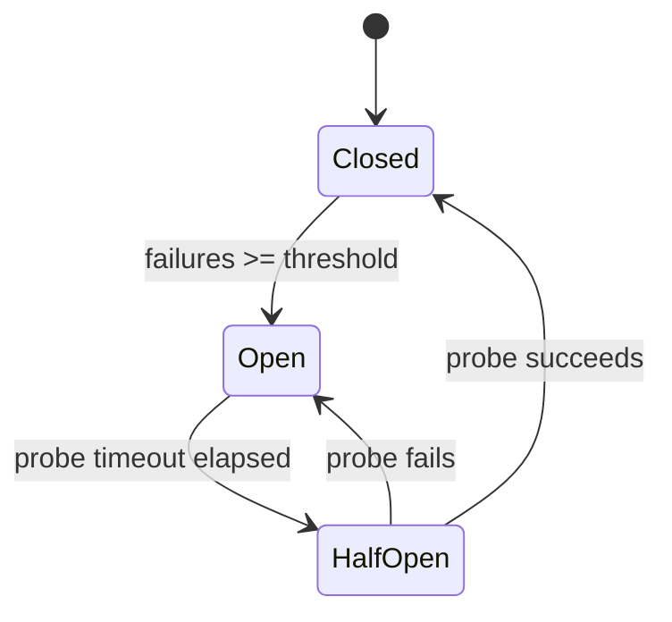





```fsharp
// Circuit breaker state machine using a DU — three states, exhaustive pattern match.
// State transitions are explicit; no implicit state from inheritance.

type CBState =
    | Closed   // => Normal operation — calls pass through to the dependency
    | Open     // => Tripped — calls rejected immediately, fallback returned
    | HalfOpen // => Probing — one trial call allowed through to test recovery

// => Mutable breaker record; in production wrap in an Agent or lock for thread safety
type CircuitBreaker = {
    mutable State:     CBState
    mutable Failures:  int
    mutable OpenedAt:  System.DateTime option
    Threshold:         int
    ProbeTimeoutSecs:  float
}

let makeBreaker threshold probeTimeoutSecs =
    { State = Closed; Failures = 0; OpenedAt = None
    // => Starts closed — all calls allowed through
      Threshold = threshold; ProbeTimeoutSecs = probeTimeoutSecs }

let callWithBreaker
    (cb: CircuitBreaker)
    (operation: unit -> Result<string, exn>)
    (fallback: unit -> string)
    : string =
    // => Check if Open breaker should transition to HalfOpen
    match cb.State with
    | Open ->
        let elapsed =
            cb.OpenedAt
            |> Option.map (fun t -> (System.DateTime.UtcNow - t).TotalSeconds)
            |> Option.defaultValue 0.0
        if elapsed >= cb.ProbeTimeoutSecs then
            cb.State <- HalfOpen
            // => Probe timeout elapsed — allow one trial call
            printfn "Circuit: half-open (probing)"
        else
            return fallback()
            // => Still open — fast-fail; no timeout penalty; dependency rests
    | _ -> ()

    // => Attempt the real call (Closed or HalfOpen)
    match operation() with
    | Ok result ->
        cb.Failures <- 0
        cb.State <- Closed
        // => Success resets the breaker — works for both Closed and HalfOpen
        result
    | Error _ ->
        cb.Failures <- cb.Failures + 1
        if cb.Failures >= cb.Threshold then
            cb.State <- Open
            cb.OpenedAt <- Some System.DateTime.UtcNow
            // => Trip breaker; record when it opened so probe timeout can be computed
            printfn "Circuit: tripped OPEN after %d failures" cb.Failures
        fallback()
        // => Return degraded response instead of propagating the exception

// => Flaky service: first 3 calls fail, then recovers
let mutable callCount = 0
let flakyService () =
    callCount <- callCount + 1
    if callCount <= 3 then Error (exn "service down")
    else Ok "fresh data"
    // => Simulates transient failure followed by recovery

let cb = makeBreaker 3 0.0
// => threshold=3, probeTimeoutSecs=0.0 so HalfOpen happens immediately after Open

for i in 1..6 do
    let result = callWithBreaker cb flakyService (fun () -> "cached data")
    printfn "Call %d: %s" i result
// => Output: Call 1: cached data  (failure 1)
// => Output: Call 2: cached data  (failure 2)
// => Output: Circuit: tripped OPEN after 3 failures
// => Output: Call 3: cached data  (failure 3 — tripped)
// => Output: Circuit: half-open (probing)
// => Output: Call 4: fresh data   (probe succeeds — breaker closes)
// => Output: Call 5: fresh data
// => Output: Call 6: fresh data
```





```clojure
;; Circuit breaker state machine using an atom over a plain map.
;; [F#: discriminated union CBState — compiler-enforced exhaustiveness; Clojure uses keyword states in a map]

(defn make-breaker
  ;; Create a new circuit breaker atom with :closed initial state.
  ;; threshold controls how many failures trip the breaker open.
  [threshold probe-timeout-secs]
  (atom {:state              :closed
         ;; => :closed allows all calls through; :open fast-fails; :half-open probes once
         :failures           0
         :opened-at          nil
         ;; => nil until the breaker trips; used to compute probe-timeout elapsed
         :threshold          threshold
         :probe-timeout-secs probe-timeout-secs}))

(defn call-with-breaker
  ;; Execute operation under the circuit breaker; return fallback on open or failure.
  ;; [F#: DU pattern match on CBState — Clojure uses cond on the :state keyword]
  [cb operation fallback]
  (let [{:keys [state opened-at probe-timeout-secs threshold failures]} @cb]
    (when (= state :open)
      ;; => Check if probe timeout has elapsed since the breaker tripped open
      (let [elapsed (if opened-at
                      (/ (- (System.currentTimeMillis) opened-at) 1000.0)
                      ;; => Compute seconds elapsed since :opened-at timestamp
                      0.0)]
        (if (>= elapsed probe-timeout-secs)
          (do (swap! cb assoc :state :half-open)
              ;; => Transition to :half-open — allow one trial call through
              (println "Circuit: half-open (probing)"))
          (do (println "Circuit: open — fast-fail")
              ;; => Still open — return fallback immediately; skip the real call
              (throw (ex-info "circuit-open" {:result (fallback)}))))))
    (let [result (try {:ok (operation)}
                      (catch Exception _
                        {:error true}))]
      ;; => Attempt the real call; catch any exception as a failure
      (if (:ok result)
        (do (swap! cb assoc :state :closed :failures 0)
            ;; => Success: reset failures and close the breaker
            (:ok result))
        (let [new-failures (inc failures)]
          (if (>= new-failures threshold)
            (do (swap! cb assoc :state :open
                                :failures new-failures
                                :opened-at (System.currentTimeMillis))
                ;; => Trip breaker open; record timestamp for probe-timeout calculation
                (println "Circuit: tripped OPEN after" new-failures "failures"))
            (swap! cb assoc :failures new-failures))
          ;; => Below threshold: increment failure count; keep breaker closed
          (fallback))))))
;; => Return degraded fallback response instead of propagating the exception

(def call-count (atom 0))
;; => Tracks calls made to the flaky service for simulation purposes

(defn flaky-service []
  (swap! call-count inc)
  ;; => Increment call count on each invocation
  (if (<= @call-count 3)
    (throw (Exception. "service down"))
    ;; => First 3 calls fail — simulates transient outage
    "fresh data"))
;; => Calls 4+ succeed — backoff gave the service time to recover

(def cb (make-breaker 3 0.0))
;; => threshold=3; probe-timeout-secs=0.0 so half-open triggers immediately

(dotimes [i 6]
  (try
    (let [result (call-with-breaker cb flaky-service #(identity "cached data"))]
      (println "Call" (inc i) ":" result))
    (catch clojure.lang.ExceptionInfo e
      (println "Call" (inc i) ":" (:result (ex-data e))))))
;; => Output: Call 1 : cached data  (failure 1)
;; => Output: Call 2 : cached data  (failure 2)
;; => Output: Circuit: tripped OPEN after 3 failures
;; => Output: Call 3 : cached data  (failure 3 — tripped)
;; => Output: Circuit: half-open (probing)
;; => Output: Call 4 : fresh data   (probe succeeds — breaker closes)
;; => Output: Call 5 : fresh data
;; => Output: Call 6 : fresh data
```





```typescript
// [F#: circuit breaker with fallback function — TypeScript version]
type Result64<T, E> = { ok: true; value: T } | { ok: false; error: E };

type CircuitState64 = { tag: "Closed"; failureCount: number } | { tag: "Open"; openedAt: number } | { tag: "HalfOpen" };

const makeCircuitBreaker64 = (threshold: number, resetMs: number, fallback: () => string) => {
  let state: CircuitState64 = { tag: "Closed", failureCount: 0 };

  const call = (fn: () => string): string => {
    // => Check if circuit is Open and timeout has not elapsed
    if (state.tag === "Open") {
      if (Date.now() - state.openedAt < resetMs) {
        console.log("Circuit OPEN — using fallback");
        return fallback();
        // => Still blocked: return fallback value instead of throwing
      }
      state = { tag: "HalfOpen" };
    }

    try {
      const result = fn();
      state = { tag: "Closed", failureCount: 0 };
      // => Success: reset failure count
      return result;
    } catch (e) {
      if (state.tag === "Closed") {
        const n = state.failureCount + 1;
        state =
          n >= threshold
            ? (console.log("Circuit OPENED"), { tag: "Open", openedAt: Date.now() })
            : { tag: "Closed", failureCount: n };
      } else {
        state = { tag: "Open", openedAt: Date.now() };
      }
      return fallback();
      // => On failure: return fallback rather than propagating the exception
    }
  };

  return { call, getState: () => state };
};

const cb64 = makeCircuitBreaker64(
  2,
  5000,
  () => "FALLBACK: cached data",
  // => Fallback provides a degraded but safe response
);

const failSvc64 = (): string => {
  throw new Error("Service down");
};

console.log(cb64.call(failSvc64)); // => FALLBACK: cached data  (failure 1 of 2)
console.log(cb64.call(failSvc64)); // => Circuit OPENED
// => FALLBACK: cached data  (threshold reached)
console.log(cb64.call(failSvc64)); // => Circuit OPEN — using fallback
// => FALLBACK: cached data  (circuit open)
```





**Key Takeaway:** F# models the three circuit breaker states as a discriminated union with
compiler-enforced exhaustive matching; Clojure models them as keyword values in an atom-backed
map with `cond` dispatch. Both make state transitions explicit and auditable.

**Why It Matters:** Without circuit breakers, a slow downstream service causes thread pools to fill,
cascading a partial failure into a full outage. The state machine approach in both languages makes
each legal transition explicit — there is no way to accidentally skip the `half-open` probe step.

---

### Example 65: Bulkhead Pattern

The bulkhead pattern isolates resource pools per downstream dependency so one slow service cannot
exhaust shared resources. In F#, a bulkhead is a record wrapping a `SemaphoreSlim`, and the acquire
function returns a `Result` rather than throwing.

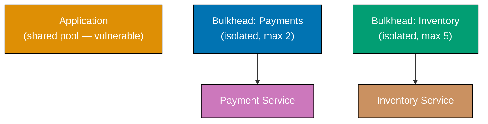





```fsharp
// Bulkhead as a record wrapping a SemaphoreSlim.
// acquire returns Result so callers cannot ignore the "pool full" case.

open System.Threading

type Bulkhead = {
    Name:       string
    Semaphore:  SemaphoreSlim
    mutable Rejected: int
    // => Tracks calls dropped due to full pool — expose for metrics dashboards
}

let makeBulkhead name maxConcurrent =
    { Name = name; Semaphore = new SemaphoreSlim(maxConcurrent, maxConcurrent)
    // => SemaphoreSlim(initial, max) — both set to maxConcurrent
      Rejected = 0 }

let withBulkhead (bh: Bulkhead) (action: unit -> 'a) : Result<'a, string> =
    // => Non-blocking acquire: returns false immediately if pool is full
    if bh.Semaphore.Wait(0) then
        // => Slot acquired — run the action inside a try/finally so slot is always released
        try
            Ok (action())
        finally
            bh.Semaphore.Release() |> ignore
            // => Always return the slot to the pool even if action throws
    else
        bh.Rejected <- bh.Rejected + 1
        Error $"Bulkhead '{bh.Name}' full — call rejected"
        // => Fail fast: caller gets immediate error; dependency is never contacted

// => Two separate bulkheads — slow Payments cannot affect Inventory pool
let paymentsBh  = makeBulkhead "payments"  2
let inventoryBh = makeBulkhead "inventory" 5

let callPayment orderId =
    withBulkhead paymentsBh (fun () -> $"payment_ok:{orderId}")
    // => Executes under payments bulkhead — result is Result<string, string>

let callInventory sku =
    withBulkhead inventoryBh (fun () -> $"stock_ok:{sku}")
    // => Executes under separate inventory bulkhead — independent pool

// => Demonstrate isolation: exhaust payments pool, inventory still works
let _slot1 = paymentsBh.Semaphore.Wait(0)  // => Occupy slot 1
let _slot2 = paymentsBh.Semaphore.Wait(0)  // => Occupy slot 2 — pool now full
let paymentResult = callPayment "ORD-1"
printfn "%A" paymentResult
// => Output: Error "Bulkhead 'payments' full — call rejected"

let inventoryResult = callInventory "SKU-1"
printfn "%A" inventoryResult
// => Output: Ok "stock_ok:SKU-1"  — inventory unaffected by payments saturation

paymentsBh.Semaphore.Release(2) |> ignore
// => Clean up test slots
```





```clojure
;; Bulkhead pattern using an atom over a plain map to track pool state.
;; [F#: SemaphoreSlim record with Result return — Clojure uses atoms and compare-and-swap for concurrency-safe slot counting]

(defn make-bulkhead
  ;; Create a bulkhead atom with :max-concurrent slots and a :rejected counter.
  ;; Atom wraps a plain map — idiomatic Clojure for shared mutable state.
  [name max-concurrent]
  (atom {:name           name
         :max-concurrent max-concurrent
         ;; => Upper bound on simultaneous calls routed through this bulkhead
         :in-flight      0
         ;; => Tracks currently executing calls — incremented on acquire, decremented on release
         :rejected       0}))
;; => Two atoms, two independent pools — slow payments cannot exhaust inventory slots

(defn with-bulkhead
  ;; Execute action under bulkhead; return {:ok result} or {:error msg}.
  ;; [F#: Result<'a, string> — Clojure returns a map with :ok/:error key for data-oriented callers]
  [bh action]
  (let [acquired?
        (loop []
          ;; => CAS loop: atomically check and increment in-flight if below max
          (let [state @bh
                {:keys [in-flight max-concurrent]} state]
            (if (>= in-flight max-concurrent)
              false
              ;; => Pool full — do not attempt the CAS; fail fast
              (if (compare-and-set! bh state (update state :in-flight inc))
                true
                ;; => CAS succeeded — slot claimed atomically
                (recur)))))]
    ;; => recur retries if another thread won the CAS race
    (if acquired?
      (try
        {:ok (action)}
        ;; => Execute action inside try so finally always releases the slot
        (finally
          (swap! bh update :in-flight dec)))
        ;; => Release slot unconditionally even if action throws
      (do (swap! bh update :rejected inc)
          ;; => Record rejection for metrics; caller gets an immediate error map
          {:error (str "Bulkhead '" (:name @bh) "' full — call rejected")}))))

(def payments-bh  (make-bulkhead "payments"  2))
;; => Payments pool capped at 2 concurrent calls
(def inventory-bh (make-bulkhead "inventory" 5))
;; => Inventory pool capped at 5 concurrent calls — independent of payments

(defn call-payment [order-id]
  (with-bulkhead payments-bh #(str "payment_ok:" order-id)))
;; => Executes under payments bulkhead; returns {:ok ...} or {:error ...}

(defn call-inventory [sku]
  (with-bulkhead inventory-bh #(str "stock_ok:" sku)))
;; => Executes under separate inventory bulkhead — independent pool

;; Demonstrate isolation: saturate payments, inventory still works
(swap! payments-bh assoc :in-flight 2)
;; => Force in-flight to 2 to simulate full pool (both slots taken)

(println (call-payment "ORD-1"))
;; => Output: {:error "Bulkhead 'payments' full — call rejected"}

(println (call-inventory "SKU-1"))
;; => Output: {:ok "stock_ok:SKU-1"} — inventory unaffected by payments saturation

(swap! payments-bh assoc :in-flight 0)
;; => Reset in-flight for subsequent calls
```





```typescript
// [F#: function-level semaphore-style concurrency limiting — TypeScript version]

// => Bulkhead: limits concurrent executions of a given function
// => In Node.js we model this with a counter and a queue
const makeBulkhead65 = (maxConcurrent: number) => {
  let active = 0;
  const queue: (() => void)[] = [];
  // => queue holds pending work that is waiting for a slot

  const acquire = (): Promise<void> => {
    if (active < maxConcurrent) {
      active++;
      return Promise.resolve();
      // => Slot available: immediately grant access
    }
    return new Promise((resolve) => {
      queue.push(() => {
        active++;
        resolve();
      });
      // => No slot: enqueue a callback that will fire when one opens
    });
  };

  const release = (): void => {
    active--;
    const next = queue.shift();
    if (next) next();
    // => Release slot and wake next queued waiter
  };

  const run = async <T>(fn: () => Promise<T>): Promise<T> => {
    await acquire();
    // => Wait for a slot — bulkhead prevents overload
    try {
      return await fn();
      // => Execute the protected function
    } finally {
      release();
      // => Always release the slot — even if fn throws
    }
  };

  const stats = () => ({ active, queued: queue.length });

  return { run, stats };
};

// => Two bulkheads: one for DB (max 2 concurrent), one for external API (max 1 concurrent)
const dbBulkhead65 = makeBulkhead65(2);
const apiBulkhead65 = makeBulkhead65(1);

const simulateDb65 = () => new Promise<string>((r) => setTimeout(() => r("DB result"), 50));
const simulateApi65 = () => new Promise<string>((r) => setTimeout(() => r("API result"), 50));

// Fire 3 concurrent DB requests — only 2 run at once
const db65Results = await Promise.all([
  dbBulkhead65.run(simulateDb65),
  dbBulkhead65.run(simulateDb65),
  dbBulkhead65.run(simulateDb65),
]);
console.log(`DB results: ${db65Results.length}`);
// => DB results: 3  (all complete; third waited for a slot)

console.log(`DB stats after: ${JSON.stringify(dbBulkhead65.stats())}`);
// => DB stats after: {"active":0,"queued":0}
```





**Key Takeaway:** Returning `Result<'a, string>` from `withBulkhead` means the compiler forces
callers to handle both the "accepted" and "rejected" cases — the failure path cannot be silently
ignored.

**Why It Matters:** The bulkhead pattern prevents a payment processor slowdown from starving
inventory checks and health endpoints. In F#, the `Result` return makes the resource-exhaustion
path a first-class value, not an exception that might be swallowed by a catch-all handler.

---

### Example 66: Retry with Exponential Backoff and Jitter

Retrying transient failures is essential in distributed systems, but naive fixed-interval retries
cause thundering herds. In F#, the retry is a recursive `async` computation that accumulates
attempts via tail-recursive loop without mutable loop counters.





```fsharp
// Retry with exponential backoff as a pure recursive async function.
// No mutable loop counters; state is threaded through recursive parameters.

open System

let exponentialBackoff (attempt: int) (baseMs: float) (capMs: float) =
    // => Exponential growth: baseMs * 2^attempt gives 100, 200, 400, 800 ...
    let delay = min (baseMs * Math.Pow(2.0, float attempt)) capMs
    // => Cap prevents indefinitely long waits
    let jitter = delay * Random.Shared.NextDouble() * 0.5
    // => Add up to 50% random jitter so concurrent callers do not all retry at T+400ms
    delay + jitter
    // => Final delay varies per caller even for the same attempt number

let retry (maxAttempts: int) (operation: unit -> Result<'a, string>) : Result<'a, string> =
    // => Tail-recursive loop threading attempt number through parameters
    let rec loop attempt =
        match operation() with
        | Ok result -> Ok result
        // => Success — return immediately without sleeping
        | Error msg when attempt >= maxAttempts - 1 ->
            Error $"All {maxAttempts} attempts failed: {msg}"
            // => Exhausted retries — propagate the last error
        | Error msg ->
            let delayMs = exponentialBackoff attempt 100.0 30000.0
            printfn "Attempt %d failed: %s. Retrying in %.0fms" (attempt + 1) msg delayMs
            System.Threading.Thread.Sleep(int delayMs)
            // => In production use Async.Sleep inside an async workflow
            loop (attempt + 1)
            // => Tail call — no stack growth per retry attempt
    loop 0

// => Simulate service that fails twice then succeeds
let mutable attemptCount = 0
let unstableCall () =
    attemptCount <- attemptCount + 1
    if attemptCount < 3 then
        Error $"timeout on attempt {attemptCount}"
        // => First two calls fail with transient error
    else
        Ok "success"
        // => Third call succeeds — backoff gave the service time to recover

let result = retry 5 unstableCall
printfn "Result: %A" result
// => Output: Attempt 1 failed: timeout on attempt 1. Retrying in ~100ms
// => Output: Attempt 2 failed: timeout on attempt 2. Retrying in ~200ms
// => Output: Result: Ok "success"
```





```clojure
;; Retry with exponential backoff as a tail-recursive loop function.
;; [F#: recursive let binding with tail call — Clojure uses loop/recur for TCO without stack growth]

(defn exponential-backoff
  ;; Compute delay in ms for a given attempt: base * 2^attempt, capped, with jitter.
  ;; Returns a different value per caller even at the same attempt due to rand jitter.
  [attempt base-ms cap-ms]
  (let [delay (min (* base-ms (Math/pow 2.0 attempt)) cap-ms)
        ;; => Exponential growth: 100, 200, 400, 800 ... capped at cap-ms
        jitter (* delay (rand) 0.5)]
        ;; => Up to 50% random jitter — concurrent callers retry at different offsets
    (+ delay jitter)))
;; => Varies per caller even for the same attempt number

(defn retry
  ;; Execute operation up to max-attempts times with exponential backoff between failures.
  ;; [F#: Result<'a, string> match — Clojure checks :ok/:error keys in returned map]
  [max-attempts operation]
  (loop [attempt 0]
    ;; => loop/recur is the idiomatic Clojure TCO pattern; no stack frame per iteration
    (let [result (try {:ok (operation)}
                      (catch Exception e {:error (.getMessage e)}))]
      ;; => Wrap operation in try so exceptions become {:error msg} data
      (cond
        (:ok result)
        ;; => Success — return the value immediately
        (:ok result)

        (>= attempt (dec max-attempts))
        ;; => Exhausted retries — propagate the last error message
        {:error (str "All " max-attempts " attempts failed: " (:error result))}

        :else
        (let [delay-ms (exponential-backoff attempt 100.0 30000.0)]
          (println "Attempt" (inc attempt) "failed:" (:error result)
                   (str ". Retrying in " (int delay-ms) "ms"))
          ;; => Log the failure and computed delay before sleeping
          (Thread/sleep (int delay-ms))
          ;; => Sleep the computed backoff interval; use core.async/timeout for async contexts
          (recur (inc attempt)))))))
;; => recur jumps back to loop with incremented attempt — no new stack frame

(def attempt-count (atom 0))
;; => Tracks calls to the unstable service for simulation purposes

(defn unstable-call []
  (swap! attempt-count inc)
  ;; => Increment counter on every invocation
  (if (< @attempt-count 3)
    (throw (Exception. (str "timeout on attempt " @attempt-count)))
    ;; => First two calls throw — simulates transient failure
    "success"))
;; => Third call returns normally — backoff gave the service time to recover

(println "Result:" (retry 5 unstable-call))
;; => Output: Attempt 1 failed: timeout on attempt 1. Retrying in ~100ms
;; => Output: Attempt 2 failed: timeout on attempt 2. Retrying in ~200ms
;; => Output: Result: {:ok "success"}
```





```typescript
// [F#: recursive retry function with exponential backoff — TypeScript async version]
type Result66<T, E> = { ok: true; value: T } | { ok: false; error: E };

const sleep66 = (ms: number): Promise<void> => new Promise((resolve) => setTimeout(resolve, ms));
// => Promise-based sleep — awaitable in async functions

const retryWithBackoff66 = async <T>(
  fn: () => Promise<T>,
  maxRetries: number,
  baseMs: number,
): Promise<Result66<T, string>> => {
  for (let attempt = 0; attempt <= maxRetries; attempt++) {
    try {
      const value = await fn();
      return { ok: true, value };
      // => Success on this attempt
    } catch (err) {
      if (attempt === maxRetries) return { ok: false, error: `Max retries (${maxRetries}) exceeded: ${err}` };
      // => All retries exhausted: return error
      const jitter = Math.random() * baseMs;
      // => Jitter: random fraction of baseMs to avoid thundering herd
      const delayMs = Math.pow(2, attempt) * baseMs + jitter;
      // => Exponential backoff: 1x, 2x, 4x, 8x... base delay + jitter
      console.log(`Attempt ${attempt + 1} failed; retrying in ${Math.round(delayMs)}ms`);
      await sleep66(delayMs);
    }
  }
  return { ok: false, error: "unreachable" };
};

// Demo: service that fails twice then succeeds
let attempt66 = 0;
const flakySvc66 = async (): Promise<string> => {
  attempt66++;
  if (attempt66 < 3) throw new Error("temporary failure");
  // => Fails on attempts 1 and 2, succeeds on attempt 3
  return `Success on attempt ${attempt66}`;
};

const r66 = await retryWithBackoff66(flakySvc66, 4, 50);
if (r66.ok) console.log(r66.value);
// => Attempt 1 failed; retrying in ...ms
// => Attempt 2 failed; retrying in ...ms
// => Success on attempt 3
else console.log(`Error: ${r66.error}`);
```





**Key Takeaway:** Tail recursion threads attempt state through function parameters instead of a
mutable loop counter; the compiler optimises this to a loop, so deep retry sequences do not
stack-overflow.

**Why It Matters:** Naive fixed-interval retries cause thundering herds when many services retry
simultaneously during an availability event. Exponential backoff with jitter — the "Full Jitter"
strategy — reduces collision probability dramatically, letting overloaded services recover within
seconds instead of minutes.

---

## Observability Patterns

### Example 67: Distributed Tracing Architecture

Distributed tracing tracks a request across multiple services by propagating a shared `traceId`.
In F#, a span is an immutable record; starting and finishing spans are pure functions that return
new records, keeping trace creation free of mutation.

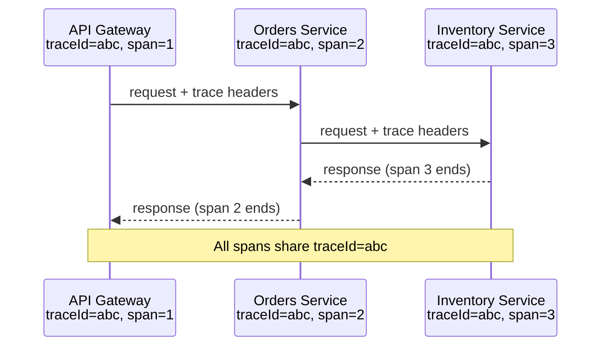





```fsharp
// Distributed tracing: spans are immutable records; finish returns a completed copy.
// TraceId propagation is explicit in every function signature.

type Span = {
    TraceId:      string
    // => Same for all spans in a single request — the correlation key
    SpanId:       string
    // => Unique per operation — identifies this specific unit of work
    ParentSpanId: string option
    // => Links child span to parent in the trace tree — None for root span
    Operation:    string
    StartTime:    System.DateTime
    EndTime:      System.DateTime option
    // => None until span is finished — finished spans have a duration
}

let startSpan (operation: string) (traceId: string option) (parentSpanId: string option) : Span =
    { TraceId     = traceId |> Option.defaultWith (fun () -> System.Guid.NewGuid().ToString())
    // => Generate root traceId if not provided (root span case)
      SpanId      = System.Guid.NewGuid().ToString().[..7]
    // => Short span id for readability in logs
      ParentSpanId = parentSpanId
      Operation    = operation
      StartTime    = System.DateTime.UtcNow
      EndTime      = None }

let finishSpan (span: Span) : Span =
    let completed = { span with EndTime = Some System.DateTime.UtcNow }
    // => Returns new record with EndTime set — original span unchanged (immutable)
    let duration =
        completed.EndTime
        |> Option.map (fun e -> (e - span.StartTime).TotalMilliseconds)
        |> Option.defaultValue 0.0
    printfn "[TRACE] trace=%s span=%s parent=%A op=%s duration=%.1fms"
        completed.TraceId completed.SpanId completed.ParentSpanId completed.Operation duration
    // => In production: send to Jaeger, Zipkin, or Datadog — not stdout
    completed

// => Three services each create spans under the same trace
let rootSpan   = startSpan "api-gateway:handle_request" None None
// => Root span: no parent, generates the traceId for the request

let ordersSpan = startSpan "orders-svc:place_order" (Some rootSpan.TraceId) (Some rootSpan.SpanId)
// => Child span: inherits traceId, references root as parent

let invSpan    = startSpan "inventory-svc:reserve_stock" (Some rootSpan.TraceId) (Some ordersSpan.SpanId)
// => Grandchild span: references orders span as parent

let _ = finishSpan invSpan     // => Inventory finishes first (innermost call)
let _ = finishSpan ordersSpan  // => Orders finishes after Inventory returns
let _ = finishSpan rootSpan    // => Gateway finishes last
// => All three spans share the same traceId — reconstruction tool links them into a tree
```





```clojure
;; Distributed tracing: spans are plain maps; finish-span returns a new map with :end-time set.
;; [F#: record type with Option fields — Clojure uses plain maps with nil for absent :end-time and :parent-span-id]

(defn start-span
  ;; Create a span map for an operation. trace-id is nil for root spans (auto-generated).
  ;; parent-span-id is nil for root spans; child spans pass the parent's :span-id.
  [operation trace-id parent-span-id]
  {:trace-id       (or trace-id (str (java.util.UUID/randomUUID)))
   ;; => Generate a new trace-id for root spans; children inherit the root's value
   :span-id        (subs (str (java.util.UUID/randomUUID)) 0 8)
   ;; => Short span-id for readability in logs and UIs
   :parent-span-id parent-span-id
   ;; => nil for root span; links child span into the trace tree for reconstruction
   :operation      operation
   :start-time     (System/currentTimeMillis)
   ;; => Epoch ms; used to compute duration when the span finishes
   :end-time       nil})
;; => nil :end-time signals an in-flight span — set by finish-span

(defn finish-span
  ;; Return a new span map with :end-time set and duration logged to stdout.
  ;; [F#: record with expression returning new record — Clojure assoc returns new map; original unchanged]
  [span]
  (let [end-time (System/currentTimeMillis)
        completed (assoc span :end-time end-time)
        ;; => assoc returns a NEW map; the original span map is untouched
        duration-ms (- end-time (:start-time span))]
        ;; => Duration in ms; used for latency percentile reporting
    (println (str "[TRACE] trace=" (:trace-id completed)
                  " span=" (:span-id completed)
                  " parent=" (:parent-span-id completed)
                  " op=" (:operation completed)
                  " duration=" duration-ms "ms"))
    ;; => In production: send to Jaeger, Zipkin, or OpenTelemetry collector — not stdout
    completed))

;; Three services create spans sharing the same trace-id
(def root-span (start-span "api-gateway:handle_request" nil nil))
;; => Root span: no parent, auto-generates the trace-id for the entire request

(def orders-span (start-span "orders-svc:place_order"
                              (:trace-id root-span)
                              (:span-id root-span)))
;; => Child span: inherits trace-id; references root as parent in the tree

(def inv-span (start-span "inventory-svc:reserve_stock"
                           (:trace-id root-span)
                           (:span-id orders-span)))
;; => Grandchild span: references orders span as parent

(finish-span inv-span)
;; => Inventory finishes first (innermost call in the request path)
(finish-span orders-span)
;; => Orders finishes after inventory returns its result
(finish-span root-span)
;; => Gateway finishes last — all three spans share the same :trace-id for reconstruction
```





```typescript
// [F#: trace context propagated through function calls — TypeScript version]

// => Trace context: immutable value passed through every function call
type TraceContext67 = Readonly<{
  traceId: string;
  spanId: string;
  parentSpanId: string | undefined;
}>;

// => Span: wraps a function call with timing and correlation
type Span67 = Readonly<{
  traceId: string;
  spanId: string;
  parentSpanId: string | undefined;
  name: string;
  durationMs: number;
}>;

const spans67: Span67[] = []; // => In production: sent to Jaeger/Zipkin

const makeSpanId67 = (): string => Math.random().toString(36).slice(2, 10);
// => Random span id — production uses 64-bit random

const withSpan67 = <T>(ctx: TraceContext67, name: string, fn: (ctx: TraceContext67) => T): T => {
  const childSpanId = makeSpanId67();
  // => Each child gets a new span id; parent span id links to caller
  const childCtx: TraceContext67 = {
    traceId: ctx.traceId,
    spanId: childSpanId,
    parentSpanId: ctx.spanId,
    // => Child inherits traceId; parentSpanId = caller's spanId
  };
  const start = Date.now();
  const result = fn(childCtx);
  // => Execute the work with the child context
  spans67.push({
    traceId: ctx.traceId,
    spanId: childSpanId,
    parentSpanId: ctx.spanId,
    name,
    durationMs: Date.now() - start,
  });
  return result;
};

// => Application code: every function receives and passes ctx
const getUser67 = (ctx: TraceContext67, userId: string) =>
  withSpan67(ctx, "getUser", (_ctx) => {
    // => _ctx would be passed to any further nested calls
    return { id: userId, name: "Alice" };
    // => Business logic runs within span — tracing is transparent
  });

const processOrder67 = (ctx: TraceContext67, userId: string) =>
  withSpan67(ctx, "processOrder", (childCtx) => {
    const user = getUser67(childCtx, userId);
    // => Pass child context to nested calls — propagates the trace
    return { user, orderId: "ord-1" };
  });

const rootCtx67: TraceContext67 = {
  traceId: "trace-abc123",
  spanId: makeSpanId67(),
  parentSpanId: undefined,
};
const result67 = processOrder67(rootCtx67, "u1");
console.log(`Order: ${JSON.stringify(result67.orderId)}`);
// => Order: "ord-1"
console.log(`Spans recorded: ${spans67.length}`);
// => Spans recorded: 2  (processOrder + getUser)
```





**Key Takeaway:** Immutable span records mean `finishSpan` always returns a new record; the original
in-flight span cannot be accidentally mutated by concurrent code.

**Why It Matters:** Without distributed tracing, debugging latency across ten microservices requires
correlating timestamps across ten log files. Tracing tools like Jaeger reduce this to a single flame
graph. The F# immutable record approach makes span state safe to pass across async boundaries without
locking.

---

## Deployment Patterns

### Example 68: Sidecar Pattern

The sidecar pattern deploys cross-cutting concerns alongside the application without changing it.
In F#, the sidecar is modelled as a higher-order function that wraps the application handler,
adding concerns before and after delegation.

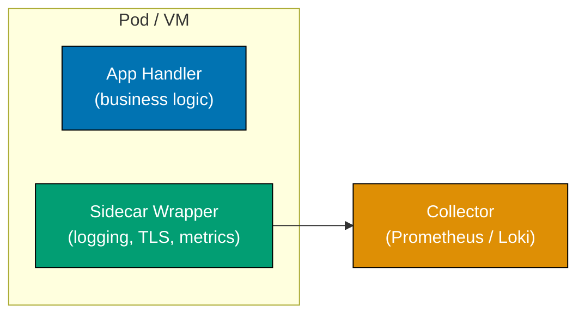





```fsharp
// Sidecar as a higher-order function: wraps the app handler, adds cross-cutting concerns.
// The application function receives only clean requests — no TLS or metrics code inside it.

type Request  = { Method: string; Path: string; OrderId: string; MtlsVerified: bool }
type Response = { Status: int; Body: string }

// => Sidecar wrapper: a function that takes a handler and returns an augmented handler
let sidecarWrap (appHandler: Request -> Response) (req: Request) : Response =
    // => Concern 1: enforce mutual TLS — sidecar blocks before app sees the request
    if not req.MtlsVerified then
        { Status = 401; Body = "TLS handshake failed" }
        // => App function never called for unauthenticated requests
    else
        let start = System.DateTime.UtcNow

        // => Concern 2: inject metadata into request for app to use in its own logs
        let enrichedReq = { req with OrderId = req.OrderId }
        // => In production: add trace-id, request-id from headers

        let response = appHandler enrichedReq
        // => Delegate to application logic — sidecar steps aside for the actual work

        // => Concern 3: emit metrics after app returns
        let durationMs = (System.DateTime.UtcNow - start).TotalMilliseconds
        printfn "[SIDECAR] method=%s path=%s status=%d duration=%.1fms"
            req.Method req.Path response.Status durationMs
        // => Application code has no metrics client — sidecar owns all instrumentation

        response

// => Application handler: pure business logic, no infrastructure code
let orderApp (req: Request) : Response =
    { Status = 200; Body = $"Order {req.OrderId} retrieved" }
    // => No TLS code, no metrics calls, no log formatting — sidecar owns all of that

// => Compose: wrap the app handler with the sidecar once at startup
let handler = sidecarWrap orderApp

let r1 = handler { Method = "GET"; Path = "/orders/1"; OrderId = "1"; MtlsVerified = false }
printfn "%A" r1
// => Output: { Status = 401; Body = "TLS handshake failed" }

let r2 = handler { Method = "GET"; Path = "/orders/1"; OrderId = "1"; MtlsVerified = true }
printfn "%A" r2
// => Output: [SIDECAR] method=GET path=/orders/1 status=200 duration=...ms
// => Output: { Status = 200; Body = "Order 1 retrieved" }
```





```clojure
;; Sidecar as a higher-order function using threading macros and function composition.
;; [F#: curried function returning augmented function — Clojure uses comp or explicit closure wrapping]

(defn sidecar-wrap
  ;; Return a new handler function that adds TLS enforcement and metrics around app-handler.
  ;; [F#: appHandler: Request -> Response — Clojure handlers accept and return plain maps]
  [app-handler]
  (fn [req]
    ;; => Concern 1: enforce mutual TLS before the app sees the request
    (if-not (:mtls-verified? req)
      {:status 401 :body "TLS handshake failed"}
      ;; => App handler is never called for unauthenticated requests
      (let [start (System/currentTimeMillis)
            ;; => Record start time before delegation for latency calculation
            response (app-handler req)]
            ;; => Delegate to application logic — sidecar steps aside for the real work
        (let [duration-ms (- (System/currentTimeMillis) start)]
          (println (str "[SIDECAR] method=" (:method req)
                        " path=" (:path req)
                        " status=" (:status response)
                        " duration=" duration-ms "ms")))
        ;; => Concern 3: emit metrics after app returns — app has no metrics dependency
        response))))
;; => Returns the response unchanged; sidecar's job is instrumentation, not transformation

(defn order-app
  ;; Application handler: pure business logic, no TLS or metrics code.
  ;; [F#: function receiving record — Clojure function receives a plain map]
  [req]
  {:status 200 :body (str "Order " (:order-id req) " retrieved")})
;; => No TLS code, no metrics client — sidecar owns all infrastructure concerns

(def handler (sidecar-wrap order-app))
;; => Compose once at startup: wrap app handler with the sidecar function

(println (handler {:method "GET" :path "/orders/1" :order-id "1" :mtls-verified? false}))
;; => Output: {:status 401, :body "TLS handshake failed"}

(println (handler {:method "GET" :path "/orders/1" :order-id "1" :mtls-verified? true}))
;; => Output: [SIDECAR] method=GET path=/orders/1 status=200 duration=0ms
;; => Output: {:status 200, :body "Order 1 retrieved"}
```





```typescript
// [F#: decorator function that adds cross-cutting concerns around a service — TypeScript version]

// => The main service: focused purely on business logic
const createOrderService68 = () => ({
  placeOrder: (customerId: string, total: number): string => {
    // => Pure business logic — no logging, no metrics, no auth
    const orderId = `ord-${Date.now()}`;
    return orderId;
    // => Returns the order id; sidecar handles everything else
  },
  cancelOrder: (orderId: string): boolean => {
    return orderId.startsWith("ord-");
    // => Simulates cancellation logic
  },
});

// => Sidecar: wraps the service and adds cross-cutting concerns
const withSidecar68 = <T extends Record<string, (...args: unknown[]) => unknown>>(
  service: T,
  config: { enableLogging: boolean; enableMetrics: boolean },
): T => {
  const metrics = new Map<string, number>();

  return new Proxy(service, {
    get(target, prop) {
      const fn = target[prop as keyof T];
      if (typeof fn !== "function") return fn;

      return (...args: unknown[]) => {
        const name = String(prop);
        const start = Date.now();

        if (config.enableLogging) console.log(`[LOG] ${name} called with ${JSON.stringify(args)}`);
        // => Sidecar logs the call — service has no logging code

        const result = (fn as (...a: unknown[]) => unknown)(...args);

        const duration = Date.now() - start;
        if (config.enableMetrics) {
          metrics.set(name, (metrics.get(name) ?? 0) + 1);
          console.log(`[METRIC] ${name} completed in ${duration}ms (count: ${metrics.get(name)})`);
          // => Sidecar records metrics — service has no metrics code
        }

        return result;
      };
    },
  }) as T;
};

const rawService68 = createOrderService68();
const svcWithSidecar68 = withSidecar68(rawService68, { enableLogging: true, enableMetrics: true });

svcWithSidecar68.placeOrder("c1", 99.0);
// => [LOG] placeOrder called with ["c1",99]
// => [METRIC] placeOrder completed in 0ms (count: 1)

svcWithSidecar68.cancelOrder("ord-123");
// => [LOG] cancelOrder called with ["ord-123"]
// => [METRIC] cancelOrder completed in 0ms (count: 1)
```





**Key Takeaway:** The sidecar as a higher-order function means cross-cutting concerns are composed,
not inherited — swapping the sidecar means passing a different wrapper function at the composition
root.

**Why It Matters:** Kubernetes service meshes (Istio, Linkerd) use the sidecar pattern to inject
Envoy proxies transparently. The F# higher-order function models this cleanly: the application
function is unchanged; the wrapping function handles all infrastructure concerns independently.

---

### Example 69: Ambassador Pattern

The ambassador pattern places a proxy between an application and a remote service to handle
connection management, retry logic, and credential injection. In F#, the ambassador is a record
of configuration plus a function that returns `Result`, hiding all complexity from callers.





```fsharp
// Ambassador as a record holding configuration + a call function returning Result.
// Application code calls the ambassador; all retry/timeout logic is inside.

type AmbassadorConfig = {
    Dsn:        string
    MaxRetries: int
    TimeoutMs:  int
}

// => Ambassador state: config plus mutable call counter for metrics
type Ambassador = {
    Config:           AmbassadorConfig
    mutable CallCount: int
    // => Tracks total calls including retries for metrics reporting
}

let makeAmbassador config =
    { Config = config; CallCount = 0 }

// => Internal execute: simulates a real call that may fail transiently
let private execute (amb: Ambassador) (sql: string) : Result<{| id: int; name: string |} list, string> =
    amb.CallCount <- amb.CallCount + 1
    // => First call simulates transient failure; ambassador retries transparently
    if amb.CallCount = 1 then
        Error "transient connection loss"
    else
        Ok [ {| id = 1; name = "Alice" |}; {| id = 2; name = "Bob" |} ]
        // => Subsequent calls succeed — returns clean list without connection details

// => Public query function: retries internally, exposes Result to caller
let query (amb: Ambassador) (sql: string) : Result<{| id: int; name: string |} list, string> =
    let rec loop attempt =
        // => Recursive retry up to MaxRetries; tail-recursive so no stack growth
        match execute amb sql with
        | Ok rows -> Ok rows
        // => Success — return immediately
        | Error msg when attempt >= amb.Config.MaxRetries - 1 ->
            Error $"Ambassador exhausted retries: {msg}"
            // => Give up after MaxRetries; application sees one clean error
        | Error msg ->
            let waitMs = 100 * int (Math.Pow(2.0, float attempt))
            // => Backoff: 100ms, 200ms, 400ms ...
            System.Threading.Thread.Sleep(waitMs)
            loop (attempt + 1)
            // => Tail call — retry without growing the stack
    loop 0

// => Application code: calls ambassador; knows nothing about retries, DSN, or pooling
let db = makeAmbassador { Dsn = "postgresql://localhost/mydb"; MaxRetries = 3; TimeoutMs = 5000 }
let rows = query db "SELECT id, name FROM users WHERE active = true"
printfn "%A" rows
// => Output: Ok [{ id = 1; name = "Alice" }; { id = 2; name = "Bob" }]
// => (First call failed internally; ambassador retried transparently)
printfn "Total calls including retries: %d" db.CallCount
// => Output: Total calls including retries: 2
```





```clojure
;; Ambassador as a plain map holding config and an atom for call-count metrics.
;; [F#: record type with mutable CallCount — Clojure uses an atom for the mutable counter]

(defn make-ambassador
  ;; Create an ambassador map with config and a mutable call-count atom.
  ;; Encapsulates DSN, retry policy, and metrics; callers know none of these details.
  [dsn max-retries timeout-ms]
  {:dsn         dsn
   :max-retries max-retries
   ;; => Upper bound on total attempts including the initial call
   :timeout-ms  timeout-ms
   :call-count  (atom 0)})
;; => call-count is an atom so it can be incremented atomically across retries

(defn- execute
  ;; Internal helper: simulate a real database call that fails on the first attempt.
  ;; [F#: private function — Clojure uses defn- for module-private functions]
  [amb _sql]
  (swap! (:call-count amb) inc)
  ;; => Increment total-call counter including retried calls
  (if (= @(:call-count amb) 1)
    (throw (Exception. "transient connection loss"))
    ;; => First call throws — simulates transient network failure
    [{:id 1 :name "Alice"} {:id 2 :name "Bob"}]))
;; => Subsequent calls return rows — ambassador's backoff gave the service time to recover

(defn query
  ;; Retry execute up to max-retries times with exponential backoff; return rows or error map.
  ;; [F#: Result<rows, string> from recursive loop — Clojure returns {:ok rows} or {:error msg}]
  [amb sql]
  (loop [attempt 0]
    ;; => loop/recur provides TCO — no stack growth across retry attempts
    (let [result (try {:ok (execute amb sql)}
                      (catch Exception e {:error (.getMessage e)}))]
      ;; => Catch any exception and convert to {:error msg} for uniform handling
      (cond
        (:ok result)
        (:ok result)
        ;; => Success — return the row vector directly to the caller

        (>= attempt (dec (:max-retries amb)))
        {:error (str "Ambassador exhausted retries: " (:error result))}
        ;; => Give up — application sees one clean error after all retries fail

        :else
        (let [wait-ms (* 100 (int (Math/pow 2.0 attempt)))]
          ;; => Exponential backoff: 100ms, 200ms, 400ms ...
          (Thread/sleep wait-ms)
          (recur (inc attempt)))))))
;; => recur jumps back to loop — tail position ensures no stack accumulation

(def db (make-ambassador "postgresql://localhost/mydb" 3 5000))
;; => Ambassador atom created once; all query calls reuse this instance

(println (query db "SELECT id, name FROM users WHERE active = true"))
;; => Output: [{:id 1, :name "Alice"} {:id 2, :name "Bob"}]
;; => (First call threw internally; ambassador retried transparently)
(println "Total calls including retries:" @(:call-count db))
;; => Output: Total calls including retries: 2
```





```typescript
// [F#: ambassador function that wraps a downstream call with retry and circuit breaker — TypeScript]

// => The ambassador wraps a downstream client and provides resilience features
const makeAmbassador69 = (
  client: (path: string) => Promise<string>,
  config: { maxRetries: number; timeoutMs: number },
) => {
  const call = async (path: string): Promise<string> => {
    // => TIMEOUT: race the client call against a timeout
    const timeout = new Promise<never>((_, reject) => setTimeout(() => reject(new Error("Timeout")), config.timeoutMs));

    for (let attempt = 0; attempt <= config.maxRetries; attempt++) {
      try {
        const result = await Promise.race([client(path), timeout]);
        // => Ambassador transparently retries on failure
        if (attempt > 0) console.log(`[Ambassador] Succeeded on attempt ${attempt + 1}`);
        return result;
      } catch (err) {
        if (attempt < config.maxRetries) {
          const delay = Math.pow(2, attempt) * 100;
          console.log(`[Ambassador] Attempt ${attempt + 1} failed; retrying in ${delay}ms`);
          await new Promise((r) => setTimeout(r, delay));
        } else {
          console.log(`[Ambassador] All ${config.maxRetries + 1} attempts failed`);
          throw err;
          // => All retries exhausted: propagate the error to the caller
        }
      }
    }
    throw new Error("unreachable");
  };

  return { call };
};

// => Downstream client: simulates a flaky HTTP service
let callCount69 = 0;
const flakyClient69 = async (path: string): Promise<string> => {
  callCount69++;
  if (callCount69 < 3) throw new Error("connection refused");
  // => Fails twice then succeeds — ambassador retries transparently
  return `OK: ${path}`;
};

const ambassador69 = makeAmbassador69(flakyClient69, { maxRetries: 3, timeoutMs: 500 });
const result69 = await ambassador69.call("/api/data");
console.log(result69);
// => [Ambassador] Attempt 1 failed; retrying in 100ms
// => [Ambassador] Attempt 2 failed; retrying in 200ms
// => [Ambassador] Succeeded on attempt 3
// => OK: /api/data
```





**Key Takeaway:** The ambassador's `query` function exposes a `Result` to the caller, not the raw
`exn`; all retry and connection pool complexity is sealed inside the ambassador record.

**Why It Matters:** Without an ambassador, retry logic and connection pool configuration are
duplicated across every service that calls the same downstream. When the retry policy needs changing,
a single ambassador change affects all consumers — the same benefit service meshes provide at the
infrastructure level.

---

## Event-Driven Architecture

### Example 70: Event Sourcing Implementation

Event sourcing stores state as an append-only sequence of domain events. In F#, replaying events
is a `List.fold` over the event list — the most natural functional pattern. The current state is
the fold accumulator.

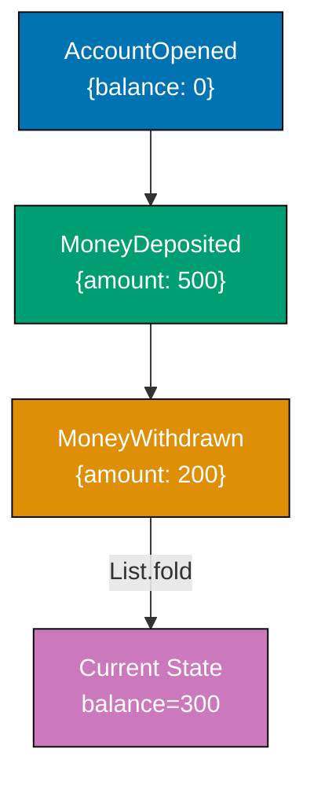





```fsharp
// Event sourcing as List.fold — the quintessential FP pattern for derived state.
// Events are immutable; state is recomputed, never stored directly.

// => Domain events: DU with one case per event type
type AccountEvent =
    | AccountOpened  of accountId: string
    | MoneyDeposited of amount: decimal
    | MoneyWithdrawn of amount: decimal
    // => Each case carries its relevant payload — pattern match is exhaustive

// => Account state: pure record — derived by folding events, never mutated directly
type AccountState = {
    AccountId: string
    Balance:   decimal
}

// => Reducer: applies one event to the current state and returns the new state
let applyEvent (state: AccountState) (event: AccountEvent) : AccountState =
    match event with
    | AccountOpened id      -> { state with AccountId = id; Balance = 0M }
    // => Opening sets id and zeros balance — regardless of previous state
    | MoneyDeposited amount -> { state with Balance = state.Balance + amount }
    // => Deposit increases balance by the deposit amount
    | MoneyWithdrawn amount -> { state with Balance = state.Balance - amount }
    // => Withdrawal decreases balance — business rule: caller validates sufficient funds

// => Replay: fold the event list to derive current state
let replayEvents (events: AccountEvent list) : AccountState =
    events
    |> List.fold applyEvent { AccountId = ""; Balance = 0M }
    // => Start with empty state; each event transitions it forward
    // => List.fold is the direct FP equivalent of the OOP replay loop

// => Append-only event store: a plain list (immutable in production use)
let eventStore = [
    AccountOpened  "ACC-001"
    MoneyDeposited 500M
    MoneyWithdrawn 200M
]
// => Events recorded in order; never modified or deleted after appending

let currentState = replayEvents eventStore
printfn "Account: %s, Balance: %M" currentState.AccountId currentState.Balance
// => Output: Account: ACC-001, Balance: 300M

// => Temporal query: what was the balance after only the first two events?
let stateAtT2 = replayEvents (eventStore |> List.take 2)
// => List.take 2 selects events up to and including the deposit
printfn "Balance after deposit only: %M" stateAtT2.Balance
// => Output: Balance after deposit only: 500M
```





```clojure
;; Event sourcing as reduce over a vector of event maps — the idiomatic Clojure fold.
;; [F#: DU with one case per event type — Clojure uses maps with :type key for open dispatch]

;; Domain events as plain maps with a :type keyword for dispatch
;; [F#: discriminated union — compiler-enforced exhaustiveness; Clojure uses open keyword dispatch]
(def event-store
  [{:type :account-opened  :account-id "ACC-001"}
   ;; => Opening event carries :account-id; no amount — balance starts at zero
   {:type :money-deposited :amount 500M}
   ;; => Deposit event carries :amount in the same currency unit as the account
   {:type :money-withdrawn :amount 200M}])
;; => Events appended in order; vector is immutable — no event is ever modified or deleted

(defn apply-event
  ;; Reducer: apply one event map to the current state map and return the new state.
  ;; [F#: match expression — Clojure uses case on the :type keyword for dispatch]
  [state event]
  (case (:type event)
    :account-opened
    (assoc state :account-id (:account-id event) :balance 0M)
    ;; => assoc returns a new map; original state map is unchanged (persistent data structure)

    :money-deposited
    (update state :balance + (:amount event))
    ;; => update applies + to :balance with the deposit amount; returns new map

    :money-withdrawn
    (update state :balance - (:amount event))
    ;; => update applies - to :balance with the withdrawal amount
    (throw (ex-info "unknown event type" {:event event}))))
;; => Unknown :type throws immediately — Clojure open dispatch does not enforce exhaustiveness at compile time

(defn replay-events
  ;; Fold the event vector into the initial empty state to derive current account state.
  ;; [F#: List.fold applyEvent — Clojure's reduce is the direct equivalent]
  [events]
  (reduce apply-event
          {:account-id "" :balance 0M}
          events))
;; => reduce threads each event through apply-event; final accumulator is the current state

(let [current-state (replay-events event-store)]
  (println "Account:" (:account-id current-state) "Balance:" (:balance current-state)))
;; => Output: Account: ACC-001 Balance: 300M

;; Temporal query: what was the balance after only the first two events?
(let [state-at-t2 (replay-events (take 2 event-store))]
  ;; => take 2 is lazy — returns only the first two events without copying the vector
  (println "Balance after deposit only:" (:balance state-at-t2)))
;; => Output: Balance after deposit only: 500M
```





```typescript
// [F#: event log as source of truth + fold to reconstruct state — TypeScript version]
type Result70<T, E> = { ok: true; value: T } | { ok: false; error: E };

// => All events are immutable facts — never updated, only appended
type OrderEvent70 =
  | { tag: "OrderCreated"; orderId: string; customerId: string; total: number }
  | { tag: "OrderConfirmed"; orderId: string }
  | { tag: "OrderCancelled"; orderId: string; reason: string }
  | { tag: "OrderShipped"; orderId: string; trackingCode: string };

type OrderState70 = Readonly<{
  orderId: string;
  status: string;
  customerId: string;
  total: number;
  trackingCode: string | undefined;
}>;

// => FOLD: reconstruct current state from event log
const applyOrderEvent70 = (state: OrderState70 | undefined, event: OrderEvent70): OrderState70 => {
  switch (event.tag) {
    case "OrderCreated":
      return {
        orderId: event.orderId,
        status: "created",
        customerId: event.customerId,
        total: event.total,
        trackingCode: undefined,
      };
    case "OrderConfirmed":
      return { ...state!, status: "confirmed" };
    case "OrderCancelled":
      return { ...state!, status: "cancelled" };
    case "OrderShipped":
      return { ...state!, status: "shipped", trackingCode: event.trackingCode };
  }
};

const rebuildOrder70 = (events: readonly OrderEvent70[]): OrderState70 | undefined =>
  events.reduce<OrderState70 | undefined>((s, e) => applyOrderEvent70(s, e), undefined);

// => Event store (append-only)
const eventStore70: OrderEvent70[] = [];

const appendEvent70 = (event: OrderEvent70): void => {
  eventStore70.push(event);
  // => In production: persist to EventStore, PostgreSQL, or Kafka
};

// => Command handlers: validate then append events
const createOrder70 = (orderId: string, customerId: string, total: number): void => {
  appendEvent70({ tag: "OrderCreated", orderId, customerId, total });
};

const shipOrder70 = (orderId: string, trackingCode: string): Result70<void, string> => {
  const state = rebuildOrder70(eventStore70.filter((e) => e.orderId === orderId));
  if (!state || state.status !== "confirmed") return { ok: false, error: "Order must be confirmed before shipping" };
  appendEvent70({ tag: "OrderShipped", orderId, trackingCode });
  return { ok: true, value: undefined };
};

createOrder70("ord-1", "c1", 99.0);
appendEvent70({ tag: "OrderConfirmed", orderId: "ord-1" });
shipOrder70("ord-1", "TRACK-123");

const final70 = rebuildOrder70(eventStore70);
console.log(`Status: ${final70?.status}, Tracking: ${final70?.trackingCode}`);
// => Status: shipped, Tracking: TRACK-123
console.log(`Events recorded: ${eventStore70.length}`);
// => Events recorded: 3
```





**Key Takeaway:** `List.fold applyEvent` is the direct FP expression of event replay — there is
no concept more natural in F# than folding a list of state transitions into a single accumulated
value.

**Why It Matters:** Traditional CRUD databases overwrite state on every update, losing historical
information. Event sourcing satisfies audit requirements by design — every state transition is
recorded with its cause. The F# `fold` makes it trivial to replay to any point in history by slicing
the event list with `List.take`.

---

## Structural Patterns

### Example 71: Modular Monolith

A modular monolith deploys as a single process but enforces strict module boundaries. In F#, module
boundaries are enforced by the file ordering in the project — types defined in later files cannot
be referenced by earlier files, making circular dependencies a compile error.





```fsharp
// Modular monolith: F# module system enforces dependency direction at compile time.
// Each module owns its types and service functions; cross-module communication uses
// the public type surface only.

// ============================================================
// Module: Orders — owns order types and service function
// ============================================================
module Orders =
    // => Record type owned by Orders; other modules receive values of this type
    type Order = { OrderId: string; CustomerId: string; Total: decimal }

    // => Repository is a function alias — no abstract class needed
    type OrderRepo = {
        Save: Order -> unit
        // => Injected save function; Orders module does not choose the storage technology
        Find: string -> Order option
        // => Returns None if order not found; no exception for expected absence
    }

    // => Service function: takes injected repo, returns Order
    let placeOrder (repo: OrderRepo) (customerId: string) (total: decimal) : Order =
        let order = { OrderId = System.Guid.NewGuid().ToString().[..7]
                      CustomerId = customerId; Total = total }
        repo.Save order
        // => Delegates persistence to injected repo — module owns the interface, not the impl
        order
        // => Returns domain object; other modules receive this via public function, not DB query

// ============================================================
// Module: Billing — owns invoice types; depends on Orders.Order only
// ============================================================
module Billing =
    // => Billing imports Orders.Order (shared value type) but NOT Orders internals
    type Invoice = { InvoiceId: string; OrderId: string; Amount: decimal; Paid: bool }

    let issueInvoice (order: Orders.Order) : Invoice =
        { InvoiceId = System.Guid.NewGuid().ToString().[..7]
          OrderId   = order.OrderId
          // => Billing stores OrderId as opaque string reference — no DB join key
          Amount    = order.Total
          Paid      = false }

// ============================================================
// Composition Root — wires modules together at startup
// ============================================================
let mutable private orderStore : Map<string, Orders.Order> = Map.empty
// => In-memory store; production uses SQLAlchemy/Dapper repo implementation

let inMemoryRepo : Orders.OrderRepo = {
    Save = fun order -> orderStore <- Map.add order.OrderId order orderStore
    // => Stores in map; swapped for real DB adapter in production
    Find = fun id    -> Map.tryFind id orderStore
    // => Returns None if not found — consistent with repo contract
}

let order   = Orders.placeOrder inMemoryRepo "cust-1" 149.99M
let invoice = Billing.issueInvoice order
printfn "Order: %s, Invoice: %s, Amount: %M" order.OrderId invoice.InvoiceId invoice.Amount
// => Output: Order: <id>, Invoice: <id>, Amount: 149.9900M
```





```clojure
;; Modular monolith: namespace boundaries enforce dependency direction by convention.
;; [F#: compiler-enforced file ordering — Clojure enforces boundaries via ns :require and code review]

;;; ============================================================
;;; Namespace: orders — owns order functions and the repo protocol
;;; ============================================================
(ns orders)
;; => All order-domain logic lives here; billing ns may :require orders but not vice versa

; [F#: record type with named fields — Clojure uses a plain map with namespaced keywords]
(defn place-order
  ;; Create an order map and persist it through the injected save-fn.
  ;; repo is a plain map {:save fn :find fn} — no abstract class or interface required.
  [repo customer-id total]
  (let [order {:order-id    (subs (str (java.util.UUID/randomUUID)) 0 8)
               ;; => Opaque short id for display; production uses full UUID or ULID
               :customer-id customer-id
               :total       total}]
    ((:save repo) order)
    ;; => Delegate persistence to the injected :save function — orders ns owns no storage code
    order))
;; => Returns the order map; billing receives this via function call, not a database query

;;; ============================================================
;;; Namespace: billing — owns invoice functions; depends on orders ns only
;;; ============================================================
(ns billing
  (:require [orders]))
;; => billing explicitly declares its dependency on orders; circular :require is a load-time error

(defn issue-invoice
  ;; Create an invoice map from an order map. No orders internals imported — only the map shape.
  ;; [F#: Orders.Order record — Clojure uses a plain map; destructuring makes the dependency explicit]
  [order]
  {:invoice-id (subs (str (java.util.UUID/randomUUID)) 0 8)
   :order-id   (:order-id order)
   ;; => Stores :order-id as opaque string reference — no shared database join key
   :amount     (:total order)
   :paid?      false})
;; => Billing returns a new map; it never modifies the order map it received

;;; ============================================================
;;; Composition root — wires namespaces together at startup
;;; ============================================================
(ns composition-root
  (:require [orders] [billing]))

(def order-store (atom {}))
;; => In-memory store atom; production swaps this for a real DB adapter map

(def in-memory-repo
  {:save (fn [order] (swap! order-store assoc (:order-id order) order))
   ;; => Stores in atom map; :save and :find are the only two operations the repo contract needs
   :find (fn [id]    (get @order-store id))})
;; => Returns nil if not found — consistent with the repo contract callers expect

(let [order   (orders/place-order in-memory-repo "cust-1" 149.99M)
      invoice (billing/issue-invoice order)]
  (println "Order:" (:order-id order)
           "Invoice:" (:invoice-id invoice)
           "Amount:" (:amount invoice)))
;; => Output: Order: <id> Invoice: <id> Amount: 149.99M
```





```typescript
// [F#: strongly bounded modules with explicit function-type contracts — TypeScript version]

// => Each module declares its contract as a TypeScript interface
// => The module satisfies its own contract — boundaries are enforced at compile time

// ── ORDER MODULE ──────────────────────────────────────────────────────────────
interface OrderModule71 {
  create: (customerId: string, total: number) => string; // => returns orderId
  cancel: (orderId: string) => boolean;
  findAll: () => readonly { id: string; customerId: string; total: number; status: string }[];
}

const makeOrderModule71 = (): OrderModule71 => {
  const orders = new Map<string, { customerId: string; total: number; status: string }>();
  let counter = 1;
  return {
    create: (customerId, total) => {
      const id = `ord-${counter++}`;
      orders.set(id, { customerId, total, status: "created" });
      return id;
    },
    cancel: (orderId) => {
      const o = orders.get(orderId);
      if (!o) return false;
      orders.set(orderId, { ...o, status: "cancelled" });
      return true;
    },
    findAll: () => [...orders.entries()].map(([id, o]) => ({ id, ...o })),
  };
};

// ── INVENTORY MODULE ──────────────────────────────────────────────────────────
interface InventoryModule71 {
  reserve: (productId: string, qty: number) => boolean;
  release: (productId: string, qty: number) => void;
  getStock: (productId: string) => number;
}

const makeInventoryModule71 = (): InventoryModule71 => {
  const stock = new Map<string, number>();
  return {
    reserve: (pid, qty) => {
      const current = stock.get(pid) ?? 10;
      if (current < qty) return false;
      stock.set(pid, current - qty);
      return true;
    },
    release: (pid, qty) => {
      stock.set(pid, (stock.get(pid) ?? 0) + qty);
    },
    getStock: (pid) => stock.get(pid) ?? 10,
  };
};

// ── COMPOSITION ROOT: wire modules together ───────────────────────────────────
const orders71 = makeOrderModule71();
const inventory71 = makeInventoryModule71();

// => Business use case: place an order (orchestrates both modules)
const placeOrder71 = (customerId: string, productId: string, qty: number, total: number): string | undefined => {
  if (!inventory71.reserve(productId, qty)) {
    console.log("Order rejected: insufficient stock");
    return undefined;
  }
  const orderId = orders71.create(customerId, total);
  console.log(`Order ${orderId} created; stock remaining: ${inventory71.getStock(productId)}`);
  return orderId;
};

placeOrder71("c1", "SKU-001", 3, 99.0);
// => Order ord-1 created; stock remaining: 7
console.log(`Total orders: ${orders71.findAll().length}`);
// => Total orders: 1
```





**Key Takeaway:** F#'s file-ordering rule means module dependencies are enforced by the compiler —
a Billing module that imports Orders internals must be listed after Orders in the project file,
making all dependency directions visible in one place.

**Why It Matters:** A modular monolith provides the domain boundary discipline of microservices
while retaining the operational simplicity of a single deployable unit. F# compiles modules in
declared order, so circular dependencies are impossible — a structural guarantee no runtime check
can provide.

---

### Example 72: Vertical Slice Architecture

Vertical slice architecture organises code by feature rather than by technical layer. In F#, each
slice is a module containing its own request and response types plus a single handler function —
all layers for one feature in one place. In Clojure, each slice is a namespace containing its own
data shapes and handler function.





```fsharp
// Vertical slice: one module per feature, containing all layers for that feature.
// No shared service layer; each slice owns its request, response, and handler.

// ============================================================
// Slice: Place Order — all layers for this feature in one module
// ============================================================
module PlaceOrder =
    // => Request type: input contract for this slice — only this slice uses it
    type Request  = { CustomerId: string; ProductId: string; Quantity: int }
    // => Response type: output contract for this slice
    type Response = { OrderId: string; Status: string; Total: decimal }

    // => Mutable in-memory store; in production use injected repo function
    let private orders = System.Collections.Generic.List<{| id: string; customer: string; total: decimal |}>()

    // => Handler: contains all logic for this slice — no shared service dependency
    let handle (pricePerUnit: decimal) (req: Request) : Response =
        let total   = pricePerUnit * decimal req.Quantity
        // => Business rule: total = price * qty — slice owns this rule
        let orderId = $"ORD-{orders.Count + 1:D4}"
        // => Sequential id for demo — production uses a UUID
        orders.Add({| id = orderId; customer = req.CustomerId; total = total |})
        // => Persist (would use Unit of Work in production)
        { OrderId = orderId; Status = "placed"; Total = total }
        // => Returns slice-specific response; no generic envelope needed

// ============================================================
// Slice: Get Order — separate module, no shared repository dependency
// ============================================================
module GetOrder =
    type Request  = { OrderId: string }
    type Response = { OrderId: string; Total: decimal option; Found: bool }

    // => Reference PlaceOrder's store via a passed-in query function
    // => In production: separate CQRS read-side repository
    let handle (queryFn: string -> decimal option) (req: Request) : Response =
        match queryFn req.OrderId with
        | Some total -> { OrderId = req.OrderId; Total = Some total; Found = true  }
        // => Order found — return with total
        | None       -> { OrderId = req.OrderId; Total = None;       Found = false }
        // => Order not found — explicit not-found rather than exception

// => Usage: each slice invoked independently; no shared handler dispatch mechanism needed
let placeResp = PlaceOrder.handle 12.50M { CustomerId = "C1"; ProductId = "P1"; Quantity = 4 }
printfn "%A" placeResp
// => Output: { OrderId = "ORD-0001"; Status = "placed"; Total = 50.0000M }

// => Wire get-order query function to place-order's store (demo coupling — prod uses DB)
let queryFn (orderId: string) =
    if orderId = "ORD-0001" then Some 50.0M else None
    // => In production: read-side query against CQRS read model

let getResp = GetOrder.handle queryFn { OrderId = "ORD-0001" }
printfn "%A" getResp
// => Output: { OrderId = "ORD-0001"; Total = Some 50.0000M; Found = true }
```





```clojure
;; Vertical slice: one namespace per feature containing all layers for that feature.
;; [F#: module with record types — Clojure uses namespaces and plain maps; no type declaration per slice]

;;; ============================================================
;;; Slice: place-order — all layers for placing an order in one namespace
;;; ============================================================
(ns place-order)
;; => All order-placement logic lives here; no shared service layer dependency

(def orders (atom []))
;; => In-memory store atom; in production swap for a DB-backed persist function

(defn handle
  ;; Handler function owns all business logic for this slice.
  ;; [F#: record types for Request/Response — Clojure uses plain maps with namespaced keys]
  [price-per-unit req]
  (let [total    (* price-per-unit (:quantity req))
        ;; => Business rule: total = price * qty — this slice owns the rule
        order-id (str "ORD-" (format "%04d" (inc (count @orders))))]
        ;; => Sequential id for demo; production uses UUID or ULID
    (swap! orders conj {:id order-id :customer (:customer-id req) :total total})
    ;; => Persist to atom; swap! atomically appends the new order record
    {:order-id order-id :status "placed" :total total}))
;; => Returns a plain response map; no generic envelope needed

;;; ============================================================
;;; Slice: get-order — separate namespace, no shared repository dependency
;;; ============================================================
(ns get-order)
;; => Query slice; does not share state with place-order in production (CQRS read side)

(defn handle
  ;; Accept a query-fn that abstracts the read store; returns a result map with :found? flag.
  ;; [F#: Option<decimal> from queryFn — Clojure uses nil as the absent-value sentinel]
  [query-fn req]
  (if-let [total (query-fn (:order-id req))]
    ;; => query-fn returns nil if order not found — if-let binds only on truthy value
    {:order-id (:order-id req) :total total :found? true}
    ;; => Order found — return full result map including :total
    {:order-id (:order-id req) :total nil :found? false}))
;; => Order not found — explicit :found? false rather than an exception

;;; ============================================================
;;; Composition root — invoke each slice independently
;;; ============================================================
(ns composition-root
  (:require [place-order] [get-order]))

(let [place-resp (place-order/handle 12.50M {:customer-id "C1" :product-id "P1" :quantity 4})]
  ;; => Each slice called independently; no shared handler dispatch mechanism
  (println place-resp))
;; => Output: {:order-id "ORD-0001", :status "placed", :total 50.0M}

(defn query-fn
  ;; Stub read-side query function — in production queries the CQRS read model.
  ;; [F#: Some/None from a match — Clojure returns a value or nil]
  [order-id]
  (when (= order-id "ORD-0001") 50.0M))
;; => Returns 50.0M for ORD-0001; nil (not found) for any other id

(let [get-resp (get-order/handle query-fn {:order-id "ORD-0001"})]
  (println get-resp))
;; => Output: {:order-id "ORD-0001", :total 50.0M, :found? true}
```





```typescript
// [F#: one module per feature containing all layers for that feature — TypeScript version]

// => Each "slice" is a self-contained module: types + handler + repository + validator
// => No shared service layer — each feature owns its full stack

// ── SLICE: Create Product ─────────────────────────────────────────────────────
// => All code needed for "create product" lives in this slice
type CreateProductSlice72 = {
  request: { name: string; price: number };
  response: { productId: string; name: string; price: number };
};
type Result72<T, E> = { ok: true; value: T } | { ok: false; error: E };

const createProductSlice72 = (() => {
  const store = new Map<string, { name: string; price: number }>();
  let counter = 1;

  const validate = (req: CreateProductSlice72["request"]): string[] => {
    const errors: string[] = [];
    if (!req.name.trim()) errors.push("name required");
    if (req.price <= 0) errors.push("price must be positive");
    return errors;
  };

  const handle = (req: CreateProductSlice72["request"]): Result72<CreateProductSlice72["response"], string[]> => {
    const errors = validate(req);
    if (errors.length > 0) return { ok: false, errors };
    const id = `p${counter++}`;
    store.set(id, { name: req.name.trim(), price: req.price });
    return { ok: true, value: { productId: id, name: req.name.trim(), price: req.price } };
  };

  return { handle };
})();

// ── SLICE: Get Product ────────────────────────────────────────────────────────
// => Independent slice: no dependency on create-product slice internals
const getProductSlice72 = (() => {
  // => In a real app this slice would have its own read-model store
  // => Here we simulate a shared read store for demo purposes
  const readStore = new Map([["p1", { name: "Widget", price: 9.99 }]]);

  const handle = (productId: string): { productId: string; name: string; price: number } | undefined => {
    const p = readStore.get(productId);
    return p ? { productId, ...p } : undefined;
  };

  return { handle };
})();

// Demo: each slice handles its own vertical
const created72 = createProductSlice72.handle({ name: "Gadget", price: 24.99 });
if (created72.ok) console.log(`Created: ${JSON.stringify(created72.value)}`);
// => Created: {"productId":"p1","name":"Gadget","price":24.99}

const found72 = getProductSlice72.handle("p1");
console.log(`Found: ${JSON.stringify(found72)}`);
// => Found: {"productId":"p1","name":"Widget","price":9.99}
```





**Key Takeaway:** Each feature lives in its own F# module or Clojure namespace — a developer reads
one module to understand, change, and test a complete feature end-to-end; no need to navigate
Request/Service/Repository folders.

**Why It Matters:** Traditional layered architecture scatters a feature across three folders,
increasing cognitive load. Vertical slices collocate all layers in one module, reducing the scope
of a change to one file — the diff for a feature change is a single module edit in both F# and
Clojure.

---

### Example 73: Shared Kernel

The Shared Kernel is a set of value types and domain events shared across bounded contexts. In F#,
the shared kernel is a separate module containing only immutable record types. In Clojure, the
shared kernel is a namespace exporting only data-manipulation functions and spec definitions — no
application logic.





```fsharp
// Shared Kernel: a separate module containing only value types and domain events.
// Both Orders and Billing modules open it; it contains no application logic.

// ============================================================
// Shared Kernel module — the agreed-upon shared subset
// ============================================================
module SharedKernel =
    // => Only value types and domain events; never repositories or services
    [<Struct>]
    type Money = { Amount: decimal; Currency: string }
    // => Struct for stack allocation; immutable by F# record default
    // => ISO 4217 currency code e.g. "USD" — both domains use the same Money type

    let addMoney (a: Money) (b: Money) : Result<Money, string> =
        if a.Currency <> b.Currency then
            Error $"Cannot add {a.Currency} and {b.Currency}"
        // => Guard: cross-currency addition is a domain error, not an exception
        else
            Ok { Amount = a.Amount + b.Amount; Currency = a.Currency }
        // => Returns new Money; original values unchanged (immutable struct)

    type OrderId = OrderId of string
    // => Shared identifier; both Orders and Billing reference the same DU type

// ============================================================
// Orders domain — uses shared kernel types
// ============================================================
module OrdersDomain =
    open SharedKernel

    type OrderLine = { ProductId: string; Price: Money; Qty: int }
    // => Money from shared kernel — no conversion needed between domains

    let subtotal (line: OrderLine) : Money =
        { Amount = line.Price.Amount * decimal line.Qty; Currency = line.Price.Currency }
        // => Uses shared kernel Money; result is also a shared kernel type

// ============================================================
// Billing domain — uses the same shared kernel types independently
// ============================================================
module BillingDomain =
    open SharedKernel

    type Invoice = { OrderId: OrderId; Total: Money; DaysOutstanding: int }
    // => Same OrderId and Money types — no translation layer needed between domains

    let isOverdue (invoice: Invoice) : bool =
        invoice.DaysOutstanding > 30
        // => Billing's own rule; not in shared kernel — kernel stays minimal

// => Usage: both domains speak the same Money and OrderId language
let line    = { OrdersDomain.ProductId = "P1"
                OrdersDomain.Price     = { SharedKernel.Amount = 10M; SharedKernel.Currency = "USD" }
                OrdersDomain.Qty       = 3 }
let total   = OrdersDomain.subtotal line
let invoice = { BillingDomain.OrderId         = SharedKernel.OrderId "ORD-42"
                BillingDomain.Total           = total
                BillingDomain.DaysOutstanding = 35 }

printfn "Invoice total: %M %s" invoice.Total.Amount invoice.Total.Currency
// => Output: Invoice total: 30.0000 USD
printfn "Overdue (35 days): %b" (BillingDomain.isOverdue invoice)
// => Output: Overdue (35 days): true
```





```clojure
;; Shared Kernel: a namespace exporting only data helpers and spec definitions.
;; [F#: module with struct record types — Clojure uses plain maps with namespaced keywords and spec validation]

;;; ============================================================
;;; Namespace: shared-kernel — agreed-upon shared subset for all bounded contexts
;;; ============================================================
(ns shared-kernel
  (:require [clojure.spec.alpha :as s]))
;; => spec is the Clojure tool for defining and validating data shapes at the boundary

; [F#: [<Struct>] type Money — Clojure represents Money as a map with :amount and :currency keys]
(s/def ::amount   (s/and decimal? pos?))
;; => Validates that :amount is a positive decimal — guards against negative money values
(s/def ::currency (s/and string? #(= 3 (count %))))
;; => Validates that :currency is a three-character ISO 4217 code (e.g. "USD", "IDR")
(s/def ::money    (s/keys :req [::amount ::currency]))
;; => A Money value must have both ::amount and ::currency — spec replaces the struct type

(defn add-money
  ;; Add two Money maps; returns {:ok Money} on success or {:error msg} on currency mismatch.
  ;; [F#: Result<Money, string> — Clojure returns a plain map with :ok/:error key]
  [a b]
  (if (= (::currency a) (::currency b))
    {:ok {::amount   (+ (::amount a) (::amount b))
          ::currency (::currency a)}}
    ;; => Same currency: sum amounts and return a new Money map
    {:error (str "Cannot add " (::currency a) " and " (::currency b))}))
;; => Cross-currency addition is a domain error, not an exception

(s/def ::order-id (s/and string? seq))
;; => Shared identifier spec — both orders and billing use this same spec definition

;;; ============================================================
;;; Namespace: orders-domain — uses shared-kernel specs for Money
;;; ============================================================
(ns orders-domain
  (:require [shared-kernel :as sk]))
;; => Explicit dependency on shared-kernel; billing may also :require it independently

(defn subtotal
  ;; Compute the line subtotal by multiplying price by quantity.
  ;; [F#: {Amount = line.Price.Amount * decimal line.Qty; Currency = ...} — Clojure uses update]
  [order-line]
  (let [{:keys [price qty]} order-line]
    ;; => Destructure the order-line map to extract :price and :qty
    {::sk/amount   (* (::sk/amount price) qty)
     ::sk/currency (::sk/currency price)}))
;; => Returns a new Money map using the same currency as the line price

;;; ============================================================
;;; Namespace: billing-domain — uses shared-kernel specs independently
;;; ============================================================
(ns billing-domain
  (:require [shared-kernel :as sk]))
;; => Circular :require between orders-domain and billing-domain would be a load-time error

(defn overdue?
  ;; Billing's own rule: invoices outstanding more than 30 days are overdue.
  ;; [F#: billing's own function on Invoice record — Clojure operates on a plain invoice map]
  [invoice]
  (> (:days-outstanding invoice) 30))
;; => Rule lives in billing-domain, not shared-kernel — kernel stays minimal

;;; ============================================================
;;; Usage — both domains speak the same Money spec language
;;; ============================================================
(ns composition-root
  (:require [shared-kernel :as sk]
            [orders-domain]
            [billing-domain]))

(def line {:product-id "P1"
           :price      {::sk/amount 10M ::sk/currency "USD"}
           ;; => Money from shared-kernel — no translation needed between domains
           :qty        3})

(def total (orders-domain/subtotal line))
;; => total is a Money map {::sk/amount 30M ::sk/currency "USD"}

(def invoice {:order-id         "ORD-42"
              :total            total
              ;; => Billing stores the same Money map — no currency conversion
              :days-outstanding 35})

(println "Invoice total:" (::sk/amount (:total invoice)) (::sk/currency (:total invoice)))
;; => Output: Invoice total: 30M USD

(println "Overdue (35 days):" (billing-domain/overdue? invoice))
;; => Output: Overdue (35 days): true
```





```typescript
// [F#: shared domain types used by multiple bounded contexts — TypeScript version]

// ── SHARED KERNEL: types and pure functions used by multiple contexts ──────────
// => The shared kernel must be small and stable — it is a coordination cost
type Money73 = Readonly<{ amount: number; currency: string }>;
type Address73 = Readonly<{ street: string; city: string; country: string }>;
// => Money73 and Address73 are stable domain concepts shared by multiple contexts

const formatMoney73 = (m: Money73): string => `${m.currency} ${m.amount.toFixed(2)}`;
// => Shared formatting rule — both Billing and Shipping contexts use this

const isValidCurrency73 = (code: string): boolean => code.length === 3;
// => Shared validation rule — ISO 4217 check used wherever currency is handled

// ── BILLING CONTEXT: uses shared kernel types ─────────────────────────────────
const billingContext73 = {
  createInvoice: (amount: number, currency: string, address: Address73) => {
    if (!isValidCurrency73(currency)) return { error: `Invalid currency: ${currency}` };
    // => Uses shared kernel validation — Billing does not re-implement it
    const money: Money73 = { amount, currency };
    return { invoiceId: "INV-001", total: formatMoney73(money), billingAddress: address };
    // => Uses shared Money73 type and formatMoney73 function
  },
};

// ── SHIPPING CONTEXT: uses same shared kernel types ────────────────────────────
const shippingContext73 = {
  createShipment: (orderId: string, address: Address73, cost: Money73) => ({
    shipmentId: `SHP-${orderId}`,
    destination: `${address.city}, ${address.country}`,
    shippingCost: formatMoney73(cost),
    // => Uses shared formatMoney73 — same function, different context
  }),
};

const addr73: Address73 = { street: "123 Main St", city: "New York", country: "US" };

const invoice73 = billingContext73.createInvoice(99.0, "USD", addr73);
console.log(JSON.stringify(invoice73));
// => {"invoiceId":"INV-001","total":"USD 99.00","billingAddress":{...}}

const shipment73 = shippingContext73.createShipment("ord-1", addr73, { amount: 5.99, currency: "USD" });
console.log(JSON.stringify(shipment73));
// => {"shipmentId":"SHP-ord-1","destination":"New York, US","shippingCost":"USD 5.99"}
```





**Key Takeaway:** The shared kernel module contains only type definitions and data helpers — no
services — ensuring both domains can evolve independently while sharing only the common vocabulary,
whether expressed as F# structs or Clojure specs.

**Why It Matters:** Without a shared kernel, teams independently define `Money` — one with
`decimal`, one with `float` — leading to precision mismatches. The shared kernel establishes a
formal contract between bounded contexts, preventing the implicit coupling that occurs when teams
copy-paste shared types.

---

## Design Patterns at Architecture Scale

### Example 74: Specification Pattern

The specification pattern encapsulates a business rule as a composable predicate. In F#, a
specification is simply `'a -> bool` — functions compose with `&&`, `||`, and `not`. In Clojure,
specifications are plain predicate functions composed with `every-pred` and `some-fn`.





```fsharp
// Specification pattern as predicate composition — no class hierarchy needed.
// Each specification is a plain function; composition uses standard boolean operators.

// => Specification type alias: any function from candidate to bool
type Spec<'a> = 'a -> bool

// => Combinators: compose two specs using boolean logic
let andSpec (a: Spec<'a>) (b: Spec<'a>) : Spec<'a> =
    fun candidate -> a candidate && b candidate
    // => Both specs must be satisfied; short-circuits if a returns false

let orSpec  (a: Spec<'a>) (b: Spec<'a>) : Spec<'a> =
    fun candidate -> a candidate || b candidate
    // => Either spec satisfied is sufficient

let notSpec (a: Spec<'a>) : Spec<'a> =
    fun candidate -> not (a candidate)
    // => Inverts the spec — turns an inclusion rule into an exclusion rule

// => Domain: Order eligibility for discount
type Order = { Total: decimal; CustomerTier: string; ItemCount: int }

// => Individual specifications: named predicates capturing one business rule each
let highValueOrder : Spec<Order> =
    fun o -> o.Total >= 100M
    // => Orders over $100 qualify as high-value

let goldCustomer : Spec<Order> =
    fun o -> o.CustomerTier = "gold"
    // => Only gold-tier customers

let bulkOrder : Spec<Order> =
    fun o -> o.ItemCount >= 10
    // => 10+ items qualify as bulk

// => Business rule: eligible for discount if gold customer OR (high value AND bulk)
let discountEligible : Spec<Order> =
    orSpec goldCustomer (andSpec highValueOrder bulkOrder)
    // => Reads like a sentence: gold customer or (high-value and bulk)

let o1 = { Total = 150M; CustomerTier = "gold";   ItemCount = 3  }
let o2 = { Total = 150M; CustomerTier = "silver"; ItemCount = 12 }
let o3 = { Total = 50M;  CustomerTier = "bronze"; ItemCount = 5  }

printfn "o1 eligible: %b" (discountEligible o1)
// => Output: o1 eligible: true   (gold customer — first clause satisfied)
printfn "o2 eligible: %b" (discountEligible o2)
// => Output: o2 eligible: true   (high value AND bulk — second clause satisfied)
printfn "o3 eligible: %b" (discountEligible o3)
// => Output: o3 eligible: false  (none of the criteria met)
```





```clojure
;; Specification pattern as predicate composition — no class hierarchy needed.
;; [F#: type alias Spec<'a> = 'a -> bool — Clojure predicates are plain functions; every-pred/some-fn compose them]

(defn and-spec
  ;; Return a predicate that is true only when all given specs are satisfied.
  ;; [F#: andSpec combinator — Clojure's every-pred is the idiomatic built-in equivalent]
  [& specs]
  (apply every-pred specs))
;; => every-pred short-circuits on the first false result — same semantics as &&

(defn or-spec
  ;; Return a predicate that is true when at least one spec is satisfied.
  ;; [F#: orSpec combinator — Clojure's some-fn is the idiomatic built-in equivalent]
  [& specs]
  (apply some-fn specs))
;; => some-fn short-circuits on the first truthy result — same semantics as ||

(defn not-spec
  ;; Return a predicate that inverts the given spec.
  ;; [F#: notSpec combinator — Clojure uses complement for idiomatic predicate inversion]
  [spec]
  (complement spec))
;; => complement wraps the predicate and negates its return value

;; Domain: Order eligibility for discount — same business rules as F#
;; [F#: record type Order — Clojure uses a plain map with :total, :customer-tier, :item-count keys]

(defn high-value-order?
  ;; True when order total is $100 or more.
  [order]
  (>= (:total order) 100M))
;; => Threshold: $100 — orders below this do not qualify as high-value

(defn gold-customer?
  ;; True when the customer tier is "gold".
  [order]
  (= (:customer-tier order) "gold"))
;; => Only gold-tier customers satisfy this spec

(defn bulk-order?
  ;; True when the order has 10 or more items.
  [order]
  (>= (:item-count order) 10))
;; => 10+ items is the bulk threshold for discount eligibility

;; Business rule: eligible for discount if gold customer OR (high value AND bulk)
(def discount-eligible?
  ;; Composed predicate — reads like a sentence: gold-customer or (high-value and bulk)
  (or-spec gold-customer?
           (and-spec high-value-order? bulk-order?)))
;; => or-spec and and-spec combine the primitives; no class hierarchy required

(def o1 {:total 150M :customer-tier "gold"   :item-count 3})
(def o2 {:total 150M :customer-tier "silver" :item-count 12})
(def o3 {:total 50M  :customer-tier "bronze" :item-count 5})

(println "o1 eligible:" (discount-eligible? o1))
;; => Output: o1 eligible: true   (gold customer — first Or clause satisfied)
(println "o2 eligible:" (discount-eligible? o2))
;; => Output: o2 eligible: true   (high value AND bulk — second clause satisfied)
(println "o3 eligible:" (discount-eligible? o3))
;; => Output: o3 eligible: false  (none of the criteria met)
```





```typescript
// [F#: composable business rule specifications — TypeScript version at architecture scale]

// => Specification: a named, composable predicate over a domain value
interface Spec74<T> {
  readonly name: string;
  readonly isSatisfiedBy: (candidate: T) => boolean;
  readonly and: (other: Spec74<T>) => Spec74<T>;
  readonly or: (other: Spec74<T>) => Spec74<T>;
  readonly not: () => Spec74<T>;
}

const makeSpec74 = <T>(name: string, pred: (t: T) => boolean): Spec74<T> => {
  const spec: Spec74<T> = {
    name,
    isSatisfiedBy: pred,
    and: (other) => makeSpec74(`${name} AND ${other.name}`, (t) => spec.isSatisfiedBy(t) && other.isSatisfiedBy(t)),
    or: (other) => makeSpec74(`${name} OR ${other.name}`, (t) => spec.isSatisfiedBy(t) || other.isSatisfiedBy(t)),
    not: () => makeSpec74(`NOT ${name}`, (t) => !spec.isSatisfiedBy(t)),
  };
  return spec;
};

// => Domain: loan application eligibility
type LoanApplication74 = Readonly<{
  creditScore: number;
  income: number;
  existingDebt: number;
  age: number;
}>;

// => Atomic specifications — each encodes one business rule
const goodCreditSpec74 = makeSpec74<LoanApplication74>("goodCredit", (a) => a.creditScore >= 700);
const sufficientIncomeSpec74 = makeSpec74<LoanApplication74>("sufficientIncome", (a) => a.income >= 50000);
const debtRatioSpec74 = makeSpec74<LoanApplication74>("lowDebtRatio", (a) => a.existingDebt / a.income < 0.4);
const ageSpec74 = makeSpec74<LoanApplication74>("legalAge", (a) => a.age >= 18);

// => COMPOSITE specification: all four rules must pass
const eligibleForLoan74 = ageSpec74.and(goodCreditSpec74).and(sufficientIncomeSpec74).and(debtRatioSpec74);
// => Composed rule reads as a business policy document

const applications74: readonly LoanApplication74[] = [
  { creditScore: 750, income: 60000, existingDebt: 10000, age: 30 },
  // => Eligible: all rules pass
  { creditScore: 650, income: 60000, existingDebt: 10000, age: 30 },
  // => Not eligible: credit score < 700
  { creditScore: 750, income: 40000, existingDebt: 10000, age: 30 },
  // => Not eligible: income < 50000
];

for (const app of applications74) {
  const eligible = eligibleForLoan74.isSatisfiedBy(app);
  console.log(`Score ${app.creditScore}, Income ${app.income}: ${eligible ? "ELIGIBLE" : "REJECTED"}`);
}
// => Score 750, Income 60000: ELIGIBLE
// => Score 650, Income 60000: REJECTED
// => Score 750, Income 40000: REJECTED
```





**Key Takeaway:** In F#, specification composition is ordinary function composition using `&&`,
`||`, and `not` via named combinators. In Clojure, the built-in `every-pred` and `some-fn` are the
idiomatic equivalents — adding a new rule is a new `defn`, not a new class file in either language.

**Why It Matters:** Discount eligibility, loan approval criteria, and fraud detection rules change
frequently and involve multiple conditions. The predicate-composition approach in both F# and
Clojure is far more lightweight than the OOP version — a new rule is a new function binding.

---

### Example 75: Chain of Responsibility

The chain of responsibility passes a request through a sequence of handlers. In F#, middleware
is modelled as `Request -> Result<Response, Response>` — `Ok` continues the chain, `Error` short-
circuits with a rejection response — composed with `Result.bind`. In Clojure, middlewares are
higher-order functions that wrap the next handler, threading a request map through the chain.

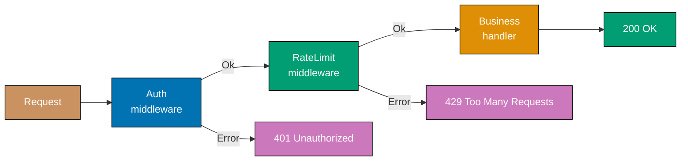





```fsharp
// Chain of Responsibility as Result.bind composition.
// Ok continues; Error short-circuits — no explicit next-handler threading required.

type HttpRequest  = { Path: string; ApiKey: string option; CallerId: string }
type HttpResponse = { Status: int; Body: string }

// => Middleware type: Request -> Result<Request, HttpResponse>
// => Ok wraps the (possibly enriched) request to pass to the next handler
// => Error wraps the terminal response — chain stops here
type Middleware = HttpRequest -> Result<HttpRequest, HttpResponse>

// => Auth middleware: rejects requests without valid API key
let validKeys = Set.ofList ["key-abc"; "key-xyz"]

let authMiddleware : Middleware = fun req ->
    match req.ApiKey with
    | Some key when Set.contains key validKeys -> Ok req
    // => Valid key: pass request unchanged to next handler
    | _ -> Error { Status = 401; Body = "Unauthorized" }
    // => Invalid/absent key: chain terminates here; 401 returned immediately

// => Rate limit middleware: allows up to 2 calls per caller (simplified)
let private callCounts = System.Collections.Generic.Dictionary<string, int>()

let rateLimitMiddleware : Middleware = fun req ->
    let count = if callCounts.ContainsKey(req.CallerId) then callCounts.[req.CallerId] else 0
    callCounts.[req.CallerId] <- count + 1
    if count + 1 > 2 then
        Error { Status = 429; Body = "Too Many Requests" }
        // => Rate limit exceeded — chain terminates before reaching business handler
    else
        Ok req
        // => Within limit: continue to next middleware in chain

// => Business handler: final step — always returns Ok response (no further chaining)
let businessHandler (req: HttpRequest) : HttpResponse =
    { Status = 200; Body = $"Orders for {req.CallerId}" }

// => Chain builder: compose middlewares with Result.bind, then apply business handler
let buildChain (middlewares: Middleware list) (handler: HttpRequest -> HttpResponse) =
    fun req ->
        middlewares
        |> List.fold (fun acc mw ->
            match acc with
            | Ok r  -> mw r
            // => Previous middleware passed — try this one
            | Error e -> Error e)
            // => Already rejected — skip remaining middlewares
            (Ok req)
        |> Result.map handler
        // => If all middlewares passed (Ok), apply the business handler

let chain = buildChain [authMiddleware; rateLimitMiddleware] businessHandler

printfn "%A" (chain { Path = "/orders"; ApiKey = None; CallerId = "c1" })
// => Output: Error { Status = 401; Body = "Unauthorized" }
printfn "%A" (chain { Path = "/orders"; ApiKey = Some "key-abc"; CallerId = "c1" })
// => Output: Ok { Status = 200; Body = "Orders for c1" }
printfn "%A" (chain { Path = "/orders"; ApiKey = Some "key-abc"; CallerId = "c1" })
// => Output: Ok { Status = 200; Body = "Orders for c1" }
printfn "%A" (chain { Path = "/orders"; ApiKey = Some "key-abc"; CallerId = "c1" })
// => Output: Error { Status = 429; Body = "Too Many Requests" }
```





```clojure
;; Chain of Responsibility: middlewares are higher-order functions wrapping the next handler.
;; [F#: Result<Request, Response> fold — Clojure uses the Ring-style wrap pattern: middleware receives next-handler]

(def valid-keys #{"key-abc" "key-xyz"})
;; => Immutable set of valid API keys — membership check is O(1)

(defn wrap-auth
  ;; Auth middleware: rejects requests without a valid API key before calling next-handler.
  ;; [F#: Middleware fn returning Error — Clojure middleware returns early without calling next]
  [next-handler]
  (fn [req]
    (if (contains? valid-keys (:api-key req))
      ;; => Valid key: delegate to the next handler in the chain
      (next-handler req)
      ;; => No valid key: chain terminates here; next-handler is never called
      {:status 401 :body "Unauthorized"})))
;; => Returning the error map directly short-circuits the remaining chain

(def call-counts (atom {}))
;; => Atom tracks per-caller call counts for rate limiting across requests

(defn wrap-rate-limit
  ;; Rate limit middleware: allows up to 2 calls per caller before rejecting.
  ;; [F#: mutable Dictionary.callCounts — Clojure uses an atom for concurrency-safe counting]
  [next-handler]
  (fn [req]
    (let [caller    (:caller-id req)
          new-count (get (swap! call-counts update caller #(inc (or % 0))) caller)]
      ;; => swap! atomically increments the count; new-count is the post-increment value
      (if (> new-count 2)
        {:status 429 :body "Too Many Requests"}
        ;; => Limit exceeded — return rejection map; next-handler is not called
        (next-handler req)))))
;; => Within limit: pass the request to the next handler in the chain

(defn business-handler
  ;; Final handler: pure business logic — always returns a 200 response map.
  ;; [F#: businessHandler returning HttpResponse — Clojure returns a plain map]
  [req]
  {:status 200 :body (str "Orders for " (:caller-id req))})
;; => No middleware concerns here — auth and rate-limit are wrapped around it

(defn build-chain
  ;; Compose a list of middleware wrappers around the terminal handler.
  ;; [F#: List.fold over middlewares — Clojure reduces middleware list right-to-left via comp]
  [middlewares handler]
  (reduce (fn [h mw] (mw h)) handler (reverse middlewares)))
;; => reduce applies each middleware from innermost to outermost; reverse preserves call order

(def chain (build-chain [wrap-auth wrap-rate-limit] business-handler))
;; => chain is the composed handler: auth -> rate-limit -> business

(println (chain {:path "/orders" :api-key nil        :caller-id "c1"}))
;; => Output: {:status 401, :body "Unauthorized"}
(println (chain {:path "/orders" :api-key "key-abc"  :caller-id "c1"}))
;; => Output: {:status 200, :body "Orders for c1"}
(println (chain {:path "/orders" :api-key "key-abc"  :caller-id "c1"}))
;; => Output: {:status 200, :body "Orders for c1"}
(println (chain {:path "/orders" :api-key "key-abc"  :caller-id "c1"}))
;; => Output: {:status 429, :body "Too Many Requests"}
```





```typescript
// [F#: linked handler functions that pass to the next or short-circuit — TypeScript version]

// => Handler type: processes a request or passes it to the next handler
type Handler75 = (request: Request75, next: () => Response75) => Response75;
type Request75 = Readonly<{ path: string; method: string; headers: Record<string, string> }>;
type Response75 = Readonly<{ status: number; body: string }>;

// => LINK handler functions into a chain
const makeChain75 = (...handlers: readonly Handler75[]): ((req: Request75) => Response75) => {
  const finalHandler: () => Response75 = () => ({ status: 404, body: "Not found" });
  // => Chain exhausted without a response: return 404

  return (req: Request75): Response75 => {
    const dispatch = (index: number): Response75 => {
      if (index >= handlers.length) return finalHandler();
      return handlers[index](req, () => dispatch(index + 1));
      // => Call current handler; pass "next" as a thunk to the successor
    };
    return dispatch(0);
  };
};

// => HANDLER 1: authentication check
const authHandler75: Handler75 = (req, next) => {
  if (!req.headers["authorization"]) {
    console.log("Auth: rejected — no authorization header");
    return { status: 401, body: "Unauthorized" };
    // => Short-circuit: stop chain and return 401
  }
  console.log("Auth: passed");
  return next();
  // => Authenticated: pass to next handler
};

// => HANDLER 2: rate limiting
const rateLimitHandler75: Handler75 = (req, next) => {
  if (req.headers["x-rate-limited"] === "true") {
    console.log("RateLimit: blocked");
    return { status: 429, body: "Too Many Requests" };
  }
  console.log("RateLimit: passed");
  return next();
};

// => HANDLER 3: business logic (final handler — does actual work)
const businessHandler75: Handler75 = (req, _next) => {
  console.log(`Business: handling ${req.method} ${req.path}`);
  return { status: 200, body: `OK: ${req.path}` };
};

const chain75 = makeChain75(authHandler75, rateLimitHandler75, businessHandler75);

console.log(chain75({ path: "/api/orders", method: "GET", headers: { authorization: "Bearer token" } }));
// => Auth: passed
// => RateLimit: passed
// => Business: handling GET /api/orders
// => { status: 200, body: "OK: /api/orders" }

console.log(chain75({ path: "/api/orders", method: "GET", headers: {} }).status);
// => Auth: rejected — no authorization header
// => 401
```





**Key Takeaway:** F# uses `Result.bind` for early-termination — `Ok` continues, `Error` short-
circuits. Clojure uses the Ring-style higher-order wrapper — each middleware decides whether to
call the next handler or return early. Both approaches add middleware without changing existing
handlers.

**Why It Matters:** Web frameworks (Express.js, FastAPI, ASP.NET Core, Ring) are built on middleware
stacks because cross-cutting concerns as separate middlewares are far safer than embedding them in
business handlers. Both the F# `Result` approach and the Clojure Ring-style approach make the
early-termination semantics explicit — a rejected request never reaches the business handler.

---

### Example 76: Visitor Pattern in Architecture

The visitor pattern separates algorithms from the objects they operate on. In F#, this is natural
pattern matching — a discriminated union type represents the object hierarchy, and each "visitor
algorithm" is a function that pattern-matches over it. In Clojure, multimethods provide open
dispatch where each algorithm is a new `defmulti`/`defmethod` pair over shared data maps.





```fsharp
// Visitor pattern as pattern matching on a discriminated union.
// New operations are new functions that match over the same DU — no domain changes.

// => Stable domain hierarchy: DU with one case per component type
type ArchComponent =
    | Service  of name: string * replicas: int * cpuMillicores: int
    // => Service: replicas and CPU allocation define its compute cost
    | Database of name: string * storageGb: int * multiAz: bool
    // => Database: storage and multi-AZ flag define its cost and compliance posture

type Architecture = { Components: ArchComponent list }

// ============================================================
// "Visitor" algorithm 1: Cost estimation — new function, no domain changes
// ============================================================
let estimateCost (comp: ArchComponent) : decimal =
    match comp with
    | Service (_, replicas, cpu) ->
        decimal replicas * (decimal cpu / 1000M) * 30M * 0.05M
        // => $0.05 per vCPU per hour, 30 days; simplified cloud pricing model
    | Database (_, storageGb, multiAz) ->
        decimal storageGb * 0.10M * (if multiAz then 2M else 1M)
        // => $0.10 per GB/month, doubled for multi-AZ redundancy

let totalCost (arch: Architecture) : decimal =
    arch.Components
    |> List.sumBy (fun comp ->
        let cost = estimateCost comp
        printfn "  %A: $%.2f/month" comp cost
        // => Print per-component cost for the report
        cost)
    // => Sum all component costs into a single total

// ============================================================
// "Visitor" algorithm 2: Compliance check — another new function, no domain changes
// ============================================================
let checkCompliance (comp: ArchComponent) : string list =
    match comp with
    | Service (name, replicas, _) when replicas < 2 ->
        [ $"Service '{name}' has only {replicas} replica (min 2 for HA)" ]
        // => Single replica violates high-availability requirement
    | Database (name, _, false) ->
        [ $"Database '{name}' is not multi-AZ (compliance requirement)" ]
        // => Single-AZ database violates disaster-recovery policy
    | _ -> []
    // => Component passes compliance — empty violation list

let allViolations (arch: Architecture) : string list =
    arch.Components |> List.collect checkCompliance
    // => Collect violations from all components into a flat list

// => Usage
let arch = {
    Components = [
        Service  ("orders-api", 3, 500)
        Service  ("worker",     1, 1000)  // => Only 1 replica — will fail compliance
        Database ("orders-db",  100, true)
        Database ("cache-db",   20,  false) // => Not multi-AZ — will fail compliance
    ]
}

printfn "Cost breakdown:"
let total = totalCost arch
printfn "Total: $%.2f/month" total
// => Output: Cost breakdown:
// => Output:   Service ("orders-api", 3, 500): $2.25/month
// => Output:   Service ("worker", 1, 1000): $1.50/month
// => Output:   Database ("orders-db", 100, true): $20.00/month
// => Output:   Database ("cache-db", 20, false): $2.00/month
// => Output: Total: $25.75/month

printfn "Violations: %A" (allViolations arch)
// => Output: Violations: ["Service 'worker' has only 1 replica (min 2 for HA)";
// =>                       "Database 'cache-db' is not multi-AZ (compliance requirement)"]
```





```clojure
;; Visitor pattern as multimethod dispatch on :component-type keyword.
;; [F#: discriminated union with pattern match — Clojure uses defmulti/defmethod for open dispatch]

;; Domain: architecture components as plain maps with a :component-type dispatch key
;; [F#: DU with named fields — Clojure uses namespaced maps; :component-type drives dispatch]
(def arch
  {:components
   [{:component-type :service  :name "orders-api" :replicas 3 :cpu-millicores 500}
    ;; => Service with 3 replicas — passes HA compliance check
    {:component-type :service  :name "worker"     :replicas 1 :cpu-millicores 1000}
    ;; => Only 1 replica — will fail the high-availability compliance rule
    {:component-type :database :name "orders-db"  :storage-gb 100 :multi-az? true}
    ;; => Multi-AZ database — passes disaster-recovery compliance check
    {:component-type :database :name "cache-db"   :storage-gb 20  :multi-az? false}]})
;; => Not multi-AZ — will fail the compliance check

;;; ============================================================
;;; "Visitor" algorithm 1: Cost estimation via multimethod
;;; ============================================================
; [F#: estimateCost function with match — Clojure uses defmulti dispatching on :component-type]
(defmulti estimate-cost
  ;; Dispatch on :component-type; new component kinds require only a new defmethod.
  :component-type)
;; => Adding a :load-balancer kind needs only a new defmethod — no changes to existing methods

(defmethod estimate-cost :service
  ;; Service cost: $0.05 per vCPU per hour, 30 days.
  [{:keys [replicas cpu-millicores]}]
  (* replicas (/ cpu-millicores 1000.0) 30 0.05M))
;; => Same simplified cloud pricing formula as the F# tab

(defmethod estimate-cost :database
  ;; Database cost: $0.10 per GB/month, doubled for multi-AZ redundancy.
  [{:keys [storage-gb multi-az?]}]
  (* storage-gb 0.10M (if multi-az? 2M 1M)))
;; => Multi-AZ doubles the monthly storage cost

(defn total-cost
  ;; Sum estimate-cost across all components; print per-component breakdown.
  [architecture]
  (reduce (fn [acc comp]
            (let [cost (estimate-cost comp)]
              (println " " (:name comp) ":" (format "$%.2f/month" cost))
              ;; => Print per-component cost for the report
              (+ acc cost)))
          0M
          (:components architecture)))
;; => reduce accumulates the total; each iteration also prints the component cost

;;; ============================================================
;;; "Visitor" algorithm 2: Compliance check via multimethod
;;; ============================================================
; [F#: checkCompliance function with match — Clojure uses a separate defmulti for a second algorithm]
(defmulti check-compliance
  ;; Second algorithm dispatches on the same :component-type key — no domain map changes.
  :component-type)

(defmethod check-compliance :service
  ;; Service compliance: minimum 2 replicas for high availability.
  [{:keys [name replicas]}]
  (when (< replicas 2)
    ;; => when returns nil if the condition is false — no violation
    [(str "Service '" name "' has only " replicas " replica (min 2 for HA)")]))
;; => Returns a vector with the violation message, or nil if compliant

(defmethod check-compliance :database
  ;; Database compliance: must be multi-AZ for disaster recovery.
  [{:keys [name multi-az?]}]
  (when-not multi-az?
    [(str "Database '" name "' is not multi-AZ (compliance requirement)")]))
;; => Returns a violation vector or nil

(defn all-violations
  ;; Collect compliance violations from all components into a flat list.
  [architecture]
  (->> (:components architecture)
       (mapcat check-compliance)
       ;; => mapcat applies check-compliance and flattens one level — nil results ignored
       (filter some?)))
;; => filter removes nil entries from components that passed compliance

(println "Cost breakdown:")
(let [total (total-cost arch)]
  (println (format "Total: $%.2f/month" total)))
;; => Output: Cost breakdown:
;; =>   orders-api : $2.25/month
;; =>   worker : $1.50/month
;; =>   orders-db : $20.00/month
;; =>   cache-db : $2.00/month
;; => Total: $25.75/month

(println "Violations:" (all-violations arch))
;; => Output: Violations: ("Service 'worker' has only 1 replica (min 2 for HA)"
;; =>                       "Database 'cache-db' is not multi-AZ (compliance requirement)")
```





```typescript
// [F#: discriminated union + match expression as visitor — TypeScript version]

// => The "visited" hierarchy: a tagged union of all node types
type AstNode76 =
  | { tag: "Literal"; value: number }
  | { tag: "BinaryOp"; op: "+" | "-" | "*" | "/"; left: AstNode76; right: AstNode76 }
  | { tag: "UnaryNeg"; operand: AstNode76 }
  | { tag: "Identifier"; name: string };
// => Each variant is a value — no class hierarchy; visitor is a function

// => VISITOR 1: evaluate the AST to a number
const evaluate76 = (node: AstNode76, env: Record<string, number>): number => {
  switch (node.tag) {
    case "Literal":
      return node.value;
    // => Leaf: return the literal value
    case "Identifier":
      return env[node.name] ?? 0;
    // => Look up variable in environment — 0 if not found
    case "UnaryNeg":
      return -evaluate76(node.operand, env);
    // => Recurse on the operand and negate
    case "BinaryOp": {
      const l = evaluate76(node.left, env);
      const r = evaluate76(node.right, env);
      switch (node.op) {
        case "+":
          return l + r;
        case "-":
          return l - r;
        case "*":
          return l * r;
        case "/":
          return r !== 0 ? l / r : 0;
      }
    }
  }
};

// => VISITOR 2: pretty-print the AST to a string
const prettyPrint76 = (node: AstNode76): string => {
  switch (node.tag) {
    case "Literal":
      return String(node.value);
    case "Identifier":
      return node.name;
    case "UnaryNeg":
      return `(-${prettyPrint76(node.operand)})`;
    case "BinaryOp":
      return `(${prettyPrint76(node.left)} ${node.op} ${prettyPrint76(node.right)})`;
  }
};

// => Build AST: (x + 3) * (-2)
const ast76: AstNode76 = {
  tag: "BinaryOp",
  op: "*",
  left: { tag: "BinaryOp", op: "+", left: { tag: "Identifier", name: "x" }, right: { tag: "Literal", value: 3 } },
  right: { tag: "UnaryNeg", operand: { tag: "Literal", value: 2 } },
};

console.log(prettyPrint76(ast76));
// => ((x + 3) * (-2))
console.log(evaluate76(ast76, { x: 5 }));
// => -16  (5 + 3 = 8, 8 * -2 = -16)
```





**Key Takeaway:** F# pattern matching enforces exhaustive handling at compile time — a new DU case
surfaces every algorithm that needs updating as a compile error. Clojure multimethods provide open
dispatch — a new component kind needs only a new `defmethod`, with no changes to existing methods.

**Why It Matters:** Architecture tooling (cost estimators, compliance checkers, security scanners)
must traverse the same infrastructure object graph with different algorithms. F#'s closed DU gives
compile-time safety; Clojure's open multimethods give extensibility without recompilation — the
trade-off between these two properties is intentional and educational.

---

## Advanced Resilience and Scalability

### Example 77: Database per Service Pattern

The database-per-service pattern assigns each microservice an exclusive data store it fully controls.
In F#, each service's data access is a record of injected repository functions; cross-service data
access goes through composed function calls. In Clojure, each service owns an independent atom —
cross-service access goes through function calls, never shared atom references.





```fsharp
// Database per Service: each service owns a private Map (its "database").
// Cross-service data access is composed via function calls, not shared state or joins.

// ============================================================
// Orders Service — owns ordersDb, knows nothing about customersDb schema
// ============================================================
type OrderRecord = { OrderId: string; CustomerId: string; Total: decimal }
// => customerId stored as opaque string reference — not a join key to a shared schema

// => Service as a pair of functions (repo injected at composition root)
type OrdersDb = Map<string, OrderRecord>

let insertOrder (db: OrdersDb) (record: OrderRecord) : OrdersDb =
    Map.add record.OrderId record db
    // => Pure: returns new Map; original db unchanged — no mutation required

let findByCustomer (db: OrdersDb) (customerId: string) : OrderRecord list =
    db |> Map.values |> Seq.filter (fun r -> r.CustomerId = customerId) |> Seq.toList
    // => Orders service's own read — no cross-service JOIN

// ============================================================
// Customers Service — owns customersDb, never touches ordersDb
// ============================================================
type CustomerRecord = { CustomerId: string; Name: string; Email: string }

type CustomersDb = Map<string, CustomerRecord>

let insertCustomer (db: CustomersDb) (record: CustomerRecord) : CustomersDb =
    Map.add record.CustomerId record db

let findCustomer (db: CustomersDb) (customerId: string) : CustomerRecord option =
    Map.tryFind customerId db
    // => None if customer not found — no exception for expected absence

// ============================================================
// API Aggregation Layer — composes data from both services via function calls
// ============================================================
let getOrdersWithCustomer
    (ordersDb: OrdersDb)
    (customersDb: CustomersDb)
    (customerId: string)
    =
    let orders   = findByCustomer ordersDb customerId
    // => Call Orders service function — no cross-service DB join
    let customer = findCustomer customersDb customerId
    // => Call Customers service function — no cross-service DB join
    orders |> List.map (fun o ->
        {| OrderId      = o.OrderId
           Total        = o.Total
           CustomerName = customer |> Option.map (fun c -> c.Name) |> Option.defaultValue "Unknown"
        // => Denormalise customer name at the aggregation layer, not in either service DB
        |})

// => Simulation
let custId = "CUST-1"
let customersDb =
    Map.empty |> insertCustomer { CustomerId = custId; Name = "Alice"; Email = "alice@example.com" }
let ordersDb =
    Map.empty
    |> insertOrder { OrderId = "ORD-1"; CustomerId = custId; Total = 99.99M  }
    |> insertOrder { OrderId = "ORD-2"; CustomerId = custId; Total = 49.50M  }

let results = getOrdersWithCustomer ordersDb customersDb custId
results |> List.iter (fun r ->
    printfn "Order %s: $%M — Customer: %s" r.OrderId r.Total r.CustomerName)
// => Output: Order ORD-1: $99.99 — Customer: Alice
// => Output: Order ORD-2: $49.50 — Customer: Alice
```





```clojure
;; Database per Service: each service owns an independent atom — cross-service access via function calls.
;; [F#: immutable Map passed through function args — Clojure uses atoms for mutable in-process stores]

;;; ============================================================
;;; Orders Service — owns orders-db atom, knows nothing about customers-db schema
;;; ============================================================
(def orders-db (atom {}))
;; => Independent atom; customers-db saturation cannot corrupt this state

(defn insert-order
  ;; Add an order record to the orders store.
  ;; [F#: Map.add returns new Map — Clojure swap! mutates the atom atomically]
  [record]
  (swap! orders-db assoc (:order-id record) record))
;; => assoc produces a new map; swap! stores it atomically in the atom

(defn find-by-customer
  ;; Return all orders belonging to a given customer-id.
  ;; [F#: Seq.filter over Map.values — Clojure filters the dereferenced atom values]
  [customer-id]
  (->> (vals @orders-db)
       ;; => Dereference the atom to get the current order map, then iterate its values
       (filter #(= (:customer-id %) customer-id))))
;; => Orders service's own read — no cross-service join against customers-db

;;; ============================================================
;;; Customers Service — owns customers-db atom, never touches orders-db
;;; ============================================================
(def customers-db (atom {}))
;; => Separate atom — changing orders-db cannot affect this store

(defn insert-customer
  ;; Add a customer record to the customers store.
  [record]
  (swap! customers-db assoc (:customer-id record) record))
;; => Atomic update; concurrent inserts are serialised by the atom's CAS mechanism

(defn find-customer
  ;; Return a customer map by id, or nil if not found.
  ;; [F#: Map.tryFind returning Option — Clojure returns nil for absent keys]
  [customer-id]
  (get @customers-db customer-id))
;; => nil signals absence — no exception for expected missing records

;;; ============================================================
;;; API Aggregation Layer — composes data from both services via function calls
;;; ============================================================
(defn get-orders-with-customer
  ;; Join order data with customer name at the aggregation layer, not in any service DB.
  ;; [F#: List.map over orders — Clojure uses map over the lazy sequence from find-by-customer]
  [customer-id]
  (let [orders   (find-by-customer customer-id)
        ;; => Calls the Orders service function — no shared DB reference
        customer (find-customer customer-id)]
        ;; => Calls the Customers service function — independent atom, no join
    (map (fn [o]
           {:order-id      (:order-id o)
            :total         (:total o)
            ;; => Order's own fields — no customer schema coupling
            :customer-name (or (:name customer) "Unknown")})
         ;; => Denormalise customer name at the aggregation layer only
         orders)))
;; => Returns a lazy sequence of enriched order maps; neither service DB was cross-queried

;; Simulation
(def cust-id "CUST-1")
(insert-customer {:customer-id cust-id :name "Alice" :email "alice@example.com"})
;; => Customers service receives the new customer
(insert-order {:order-id "ORD-1" :customer-id cust-id :total 99.99M})
(insert-order {:order-id "ORD-2" :customer-id cust-id :total 49.50M})
;; => Orders service records two orders referencing the same customer-id string

(doseq [r (get-orders-with-customer cust-id)]
  (println "Order" (:order-id r) ": $" (:total r) "— Customer:" (:customer-name r)))
;; => Output: Order ORD-1 : $ 99.99M — Customer: Alice
;; => Output: Order ORD-2 : $ 49.50M — Customer: Alice
```





```typescript
// [F#: each service owns its data store — TypeScript shows clear ownership boundaries]

// => Each service owns its OWN data store — no cross-service table access
// => Cross-service queries use service API calls, not joins

// ── ORDER SERVICE owns its orders store ───────────────────────────────────────
const orderServiceDb77 = new Map<string, { customerId: string; total: number; status: string }>();

const OrderService77 = {
  create: (customerId: string, total: number): string => {
    const id = `ord-${Date.now()}`;
    orderServiceDb77.set(id, { customerId, total, status: "created" });
    // => Only OrderService77 writes to orderServiceDb77 — other services cannot access it
    return id;
  },
  getById: (id: string) => {
    const o = orderServiceDb77.get(id);
    return o ? { orderId: id, ...o } : undefined;
    // => OrderService77 exposes a safe API — callers never touch the raw DB map
  },
};

// ── CUSTOMER SERVICE owns its customers store ─────────────────────────────────
const customerServiceDb77 = new Map<string, { name: string; email: string }>();

const CustomerService77 = {
  create: (name: string, email: string): string => {
    const id = `c-${Date.now()}`;
    customerServiceDb77.set(id, { name, email });
    // => Only CustomerService77 writes to customerServiceDb77
    return id;
  },
  getById: (id: string) => {
    const c = customerServiceDb77.get(id);
    return c ? { customerId: id, ...c } : undefined;
    // => API call: returns a safe projection of customer data
  },
};

// ── AGGREGATE VIEW: compose data by calling service APIs — no cross-DB joins ──
const getOrderWithCustomer77 = (orderId: string) => {
  const order = OrderService77.getById(orderId);
  // => Call OrderService77 API — never access customerServiceDb77 directly
  if (!order) return undefined;
  const customer = CustomerService77.getById(order.customerId);
  // => Call CustomerService77 API — never access orderServiceDb77 directly
  return order && customer ? { ...order, customerName: customer.name, customerEmail: customer.email } : undefined;
  // => Aggregated view built from two service calls — no join, no shared store
};

const cid77 = CustomerService77.create("Alice", "alice@example.com");
const oid77 = OrderService77.create(cid77, 99.0);

const view77 = getOrderWithCustomer77(oid77);
console.log(`Customer: ${view77?.customerName}, Total: $${view77?.total}`);
// => Customer: Alice, Total: $99
```





**Key Takeaway:** F# uses immutable Maps per service — functional separation is structural separation.
Clojure uses independent atoms per service — atom isolation means one service cannot reference
or mutate another's atom directly. Both approaches make cross-service data access go through
function calls, never shared state.

**Why It Matters:** Shared databases are the most common reason microservices fail to deliver on
their independence promise. In F#, the immutable Map makes the isolation visible in the type
signature. In Clojure, separate atoms enforce the same boundary at the data level — the
aggregation layer explicitly calls both service functions to compose results.

---

### Example 78: Feature Toggle Architecture

Feature toggles allow new features to be deployed but inactive until enabled. In F#, a toggle is
a record; the evaluation function is pure and takes a `userId: string` — no global mutable flag
state. In Clojure, toggles are plain maps in an atom-backed store; evaluation is a pure function
receiving the dereferenced store.

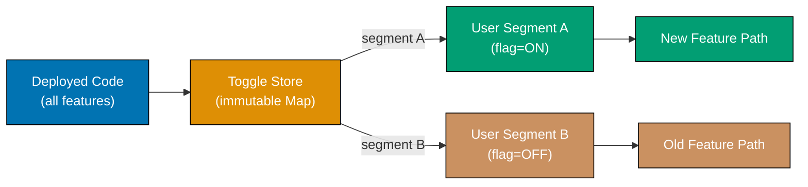





```fsharp
// Feature toggles: immutable toggle records; evaluation is a pure function.
// Toggle decisions are deterministic for a given userId — no random per call.

type Toggle = {
    Name:             string
    Enabled:          bool
    // => Global on/off switch — disabled means no user ever sees the feature
    RolloutPct:       int
    // => Percentage of users who see new feature (0-100)
    AllowedUserIds:   Set<string>
    // => Explicit allowlist: these users always get the feature regardless of rollout
}

// => Toggle store as an immutable Map — thread-safe by construction
type ToggleStore = Map<string, Toggle>

let registerToggle (toggle: Toggle) (store: ToggleStore) : ToggleStore =
    Map.add toggle.Name toggle store
    // => Returns new store with toggle added — pure, no mutation

// => Deterministic bucket: same user always gets same decision for a given toggle
let isEnabled (store: ToggleStore) (name: string) (userId: string) : bool =
    match Map.tryFind name store with
    | None -> false
    // => Unknown toggle defaults to false — fail closed
    | Some t when not t.Enabled -> false
    // => Globally disabled — no user sees it regardless of rollout
    | Some t when Set.contains userId t.AllowedUserIds -> true
    // => User in explicit allowlist — always enabled regardless of rollout percentage
    | Some t ->
        // => Hash-based deterministic bucket: same user always lands in same cohort
        let hashStr = $"{name}:{userId}"
        let bucket  = abs (hashStr.GetHashCode()) % 100
        // => Bucket in range 0-99; stable per userId+toggle combination
        bucket < t.RolloutPct
        // => User is in rollout cohort if their bucket < rollout percentage

// => Setup
let store =
    Map.empty
    |> registerToggle { Name = "new_checkout"; Enabled = true; RolloutPct = 20
                        AllowedUserIds = Set.ofList ["beta-tester-1"] }
    // => 20% gradual rollout + explicit beta tester allowlist

// => Beta tester always gets new feature
printfn "beta-tester-1: %b" (isEnabled store "new_checkout" "beta-tester-1")
// => Output: beta-tester-1: true

// => Regular users: deterministic based on hash (approx 20% will get true)
let results = [ for i in 1..10 -> isEnabled store "new_checkout" $"user-{i}" ]
printfn "Enabled for %d/10 sample users (target ~20%%)" (List.filter id results |> List.length)
// => Output: Enabled for ~2/10 sample users (target ~20%)

// => Kill switch: create new store with toggle disabled (pure — original store unchanged)
let killedStore = Map.add "new_checkout" { (Map.find "new_checkout" store) with Enabled = false } store
printfn "beta after kill: %b" (isEnabled killedStore "new_checkout" "beta-tester-1")
// => Output: beta after kill: false
```





```clojure
;; Feature toggles: plain maps in an atom-backed store; evaluation is a pure function.
;; [F#: immutable Map<string, Toggle> — Clojure uses an atom over a plain map for runtime updates]

(def toggle-store (atom {}))
;; => Atom wraps the toggle map; swap! can update toggles at runtime without restarts

(defn register-toggle
  ;; Add or replace a toggle in the store.
  ;; [F#: registerToggle returning new Map — Clojure swap! updates the atom atomically]
  [toggle]
  (swap! toggle-store assoc (:name toggle) toggle))
;; => assoc produces a new map; swap! stores it in the atom atomically

(defn enabled?
  ;; Evaluate whether a toggle is on for a given user-id.
  ;; Accepts the dereferenced store map — pure function; testable without atom dependency.
  ;; [F#: match Map.tryFind — Clojure uses cond with explicit nil check and set membership]
  [store toggle-name user-id]
  (let [t (get store toggle-name)]
    ;; => Look up the toggle map; nil if the toggle has not been registered
    (cond
      (nil? t)               false
      ;; => Unknown toggle defaults to false — fail closed; do not expose dark features
      (not (:enabled? t))    false
      ;; => Globally disabled — no user sees it regardless of rollout percentage
      (contains? (:allowed-user-ids t) user-id) true
      ;; => Explicit allowlist membership always grants access regardless of rollout
      :else
      (let [hash-str (str toggle-name ":" user-id)
            ;; => Stable string combining toggle name and user-id for deterministic hashing
            bucket   (mod (Math/abs (.hashCode hash-str)) 100)]
            ;; => Bucket in range 0-99; same user-id always maps to same bucket
        (< bucket (:rollout-pct t))))))
;; => User in rollout cohort when their bucket is below the rollout percentage

;; Setup: register the new_checkout toggle with a 20% rollout and a beta-tester allowlist
(register-toggle {:name             "new_checkout"
                  :enabled?         true
                  :rollout-pct      20
                  :allowed-user-ids #{"beta-tester-1"}})
;; => 20% gradual rollout + explicit beta-tester-1 always on

(println "beta-tester-1:" (enabled? @toggle-store "new_checkout" "beta-tester-1"))
;; => Output: beta-tester-1: true  (explicit allowlist — rollout % ignored)

(let [results (map #(enabled? @toggle-store "new_checkout" (str "user-" %)) (range 1 11))]
  ;; => Evaluate toggle for 10 sample users — each decision is deterministic per user-id
  (println "Enabled for" (count (filter true? results)) "/10 sample users (target ~20%)"))
;; => Output: Enabled for ~2/10 sample users (target ~20%)

;; Kill switch: swap! the store with :enabled? set to false — previous store snapshot unchanged
(swap! toggle-store assoc-in ["new_checkout" :enabled?] false)
;; => assoc-in navigates the nested path and returns a new map; swap! stores it atomically

(println "beta after kill:" (enabled? @toggle-store "new_checkout" "beta-tester-1"))
;; => Output: beta after kill: false  (:enabled? false — no user sees the feature)
```





```typescript
// [F#: feature flags as pure function predicates — TypeScript version]

// => Feature toggle: a named flag + an optional gradual rollout predicate
type FeatureToggle78 = Readonly<{
  name: string;
  enabled: boolean;
  // => Global on/off switch
  rollout?: (userId: string) => boolean;
  // => Optional gradual rollout — override enabled if provided
}>;

// => Feature flag registry
const makeToggleRegistry78 = (toggles: readonly FeatureToggle78[]) => {
  const registry = new Map(toggles.map((t) => [t.name, t]));
  // => Map from feature name to toggle configuration

  const isEnabled = (featureName: string, userId?: string): boolean => {
    const toggle = registry.get(featureName);
    if (!toggle) return false;
    // => Unknown feature: safe default is disabled
    if (!toggle.enabled) return false;
    // => Globally disabled: no further checks
    if (toggle.rollout && userId) return toggle.rollout(userId);
    // => Gradual rollout: delegate to the predicate
    return toggle.enabled;
    // => Globally enabled, no rollout predicate: feature is on for everyone
  };

  return { isEnabled };
};

// => Concrete toggle configuration
const toggles78 = makeToggleRegistry78([
  {
    name: "new-checkout",
    enabled: true,
    rollout: (userId) => parseInt(userId.slice(-1)) < 5,
    // => 50% rollout: users whose last digit < 5 get new checkout
  },
  { name: "dark-mode", enabled: true },
  // => Globally enabled for all users — no gradual rollout
  { name: "ai-assistant", enabled: false },
  // => Globally disabled — no user sees it regardless of rollout
]);

const users78 = ["user1", "user4", "user7", "user9"];
for (const user of users78) {
  const checkout = toggles78.isEnabled("new-checkout", user);
  const dark = toggles78.isEnabled("dark-mode", user);
  const ai = toggles78.isEnabled("ai-assistant", user);
  console.log(`${user}: checkout=${checkout}, dark=${dark}, ai=${ai}`);
}
// => user1: checkout=true,  dark=true, ai=false  (last digit 1 < 5)
// => user4: checkout=true,  dark=true, ai=false  (last digit 4 < 5)
// => user7: checkout=false, dark=true, ai=false  (last digit 7 >= 5)
// => user9: checkout=false, dark=true, ai=false  (last digit 9 >= 5)
```





**Key Takeaway:** F# uses an immutable `ToggleStore` — the kill switch creates a new store value,
leaving old requests unaffected. Clojure uses an atom — `swap!` with `assoc-in` updates the store
atomically; in-flight evaluations that already dereferenced the atom see the old snapshot.

**Why It Matters:** Feature toggles enable trunk-based development by allowing engineers to commit
dark code continuously. In both F# and Clojure, the evaluation function is pure — it receives the
store as a value argument, making toggle decisions fully testable by constructing a test store with
specific toggle values, with no mock framework required.

---

### Example 79: Service Mesh Architecture

A service mesh adds a transparent infrastructure layer for mTLS, retries, and telemetry. In F#,
the mesh proxy is a higher-order function that wraps inter-service calls — the same structural
pattern as the sidecar but focused on outbound calls to other services.

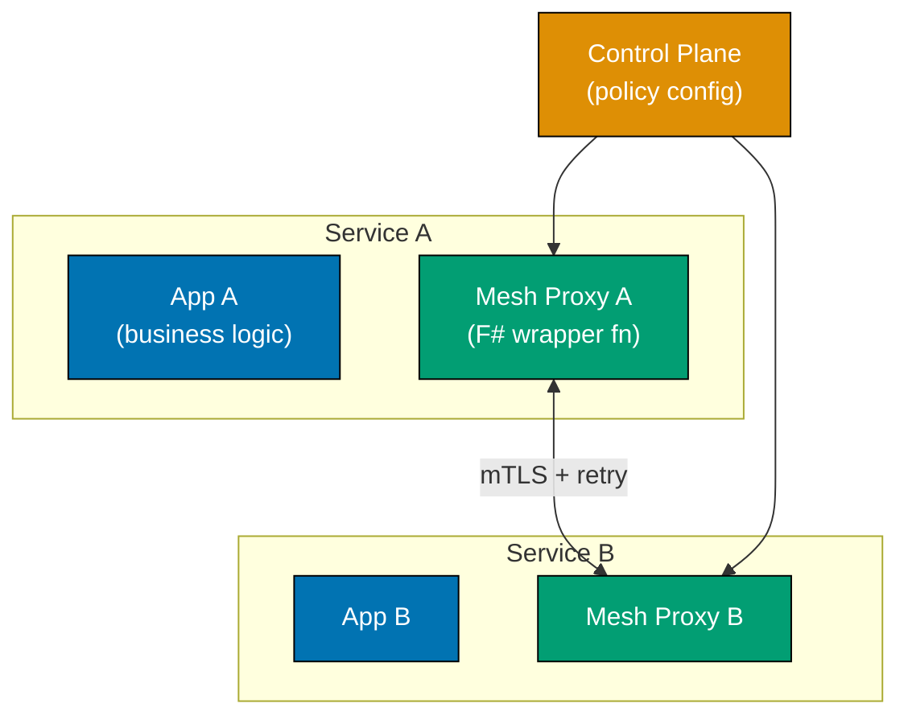





```fsharp
// Service mesh as a higher-order proxy function.
// Application functions pass their inter-service calls through the proxy;
// retry, mTLS enforcement, and telemetry are added by the wrapper — not by the app.

type MeshConfig = { RetryLimit: int; TlsEnabled: bool }
// => Config injected by the control plane — application code never reads this

type TelemetryRecord = { From: string; To: string; Attempt: int; Outcome: string }

// => Proxy function: wraps any inter-service call with mesh concerns
let meshProxy
    (config: MeshConfig)
    (telemetry: TelemetryRecord list ref)
    (serviceName: string)
    (target: string)
    (call: unit -> Result<string, string>)
    : Result<string, string> =
    // => Concern 1: enforce mutual TLS — control plane has configured certificates
    if not config.TlsEnabled then
        Error "mTLS required by mesh policy"
    // => Application never sees unauthenticated calls — proxy blocks them first
    else
        let rec loop attempt =
            match call() with
            | Ok result ->
                telemetry.Value <- { From = serviceName; To = target; Attempt = attempt; Outcome = "success" } :: telemetry.Value
                // => Telemetry recorded by proxy — app has zero instrumentation
                Ok result
            | Error msg when attempt >= config.RetryLimit ->
                telemetry.Value <- { From = serviceName; To = target; Attempt = attempt; Outcome = "error" } :: telemetry.Value
                Error $"Mesh exhausted retries to {target}: {msg}"
                // => All retries exhausted — surface error to application
            | Error _ ->
                telemetry.Value <- { From = serviceName; To = target; Attempt = attempt; Outcome = "error" } :: telemetry.Value
                loop (attempt + 1)
                // => Retry: tail call, no stack growth per retry
        loop 1

// => Simulate inventory service that fails once then succeeds
let mutable invCalls = 0
let inventoryCheck () =
    invCalls <- invCalls + 1
    if invCalls = 1 then Error "transient network error"
    else Ok "in_stock"
    // => Second call succeeds; proxy retried transparently

let config   = { RetryLimit = 3; TlsEnabled = true }
let telemetry = ref ([] : TelemetryRecord list)

let result = meshProxy config telemetry "orders-svc" "inventory-svc" inventoryCheck
printfn "Inventory response: %A" result
// => Output: Inventory response: Ok "in_stock"

printfn "Telemetry:"
telemetry.Value |> List.rev |> List.iter (fun r ->
    printfn "  from=%s to=%s attempt=%d outcome=%s" r.From r.To r.Attempt r.Outcome)
// => Output: Telemetry:
// => Output:   from=orders-svc to=inventory-svc attempt=1 outcome=error
// => Output:   from=orders-svc to=inventory-svc attempt=2 outcome=success
```





```clojure
;; Service mesh as a higher-order wrapper function.
;; [F#: record types MeshConfig + TelemetryRecord — compile-time field names; Clojure uses plain maps]
;; Application functions pass inter-service calls through the proxy;
;; retry, mTLS check, and telemetry are added by the wrapper — not by the app.

(defn mesh-proxy
  ;; config: map with :retry-limit and :tls-enabled
  ;; telemetry: atom holding a vector of telemetry maps
  ;; service-name, target: string labels for telemetry records
  ;; call-fn: zero-arg function returning {:ok val} or {:error msg}
  [config telemetry service-name target call-fn]
  ;; => All five args injected — no global config; makes the fn easy to test in isolation
  (if-not (:tls-enabled config)
    ;; => Enforce mutual TLS first — application never sees unauthenticated calls
    {:error "mTLS required by mesh policy"}
    ;; [F#: recursive loop fn — same tail-recursive pattern; Clojure uses loop/recur]
    (loop [attempt 1]
      ;; => loop establishes the retry counter; recur restarts with incremented attempt
      (let [result (call-fn)]
        ;; => Invoke the inter-service call on each attempt
        (swap! telemetry conj
               {:from service-name :to target
                :attempt attempt :outcome (if (:ok result) "success" "error")})
        ;; => Record telemetry for every attempt — app has zero instrumentation burden
        (cond
          (:ok result)
          ;; => Call succeeded — surface result to application
          result
          ;; => Returns the {:ok val} map directly; caller destructures as needed

          (>= attempt (:retry-limit config))
          ;; => Retries exhausted — propagate error with context
          {:error (str "Mesh exhausted retries to " target ": " (:error result))}
          ;; => Wraps original error with mesh context for upstream diagnostics

          :else
          ;; => Transient failure — retry; loop/recur avoids stack growth
          (recur (inc attempt)))))))

(def inv-calls (atom 0))
;; => atom tracks simulated call count; resets per REPL session

(defn inventory-check
  ;; Simulates a service that fails once then succeeds
  []
  (swap! inv-calls inc)
  ;; => Increment call counter atomically — safe for concurrent producers
  (if (= @inv-calls 1)
    ;; => First call: simulate transient failure (e.g., network blip)
    {:error "transient network error"}
    {:ok "in_stock"}))
;; => Second call returns success; proxy retried transparently

(def config {:retry-limit 3 :tls-enabled true})
;; => Control-plane config as a plain map — no class required

(def telemetry (atom []))
;; => Mutable atom accumulates telemetry records across calls

(def result (mesh-proxy config telemetry "orders-svc" "inventory-svc" inventory-check))
;; => Proxy wraps the call — application code unchanged regardless of retry count
(println "Inventory response:" result)
;; => Output: Inventory response: {:ok in_stock}

(println "Telemetry:")
(doseq [r @telemetry]
  ;; => Dereference atom to read accumulated telemetry snapshot
  (println (str "  from=" (:from r) " to=" (:to r)
                " attempt=" (:attempt r) " outcome=" (:outcome r))))
;; => Output:   from=orders-svc to=inventory-svc attempt=1 outcome=error
;; => Output:   from=orders-svc to=inventory-svc attempt=2 outcome=success
```





```typescript
// [F#: service mesh as a transparent proxy wrapping each service call — TypeScript version]

// => Service mesh adds observability and resilience transparently
// => Services call each other through the mesh — they don't know the mesh exists

type ServiceRequest79 = Readonly<{ serviceId: string; path: string; payload: unknown }>;
type ServiceResponse79 = Readonly<{ status: number; body: unknown; durationMs: number }>;

// => Mesh proxy: wraps each service call with cross-cutting concerns
const makeMeshProxy79 = (config: { enableRetry: boolean; maxRetries: number }) => {
  const metrics = new Map<string, { calls: number; errors: number; totalMs: number }>();

  const call = async (
    req: ServiceRequest79,
    handler: (r: ServiceRequest79) => Promise<unknown>,
  ): Promise<ServiceResponse79> => {
    const key = `${req.serviceId}:${req.path}`;
    const start = Date.now();
    let lastError: Error | undefined;

    const attempts = config.enableRetry ? config.maxRetries + 1 : 1;
    for (let i = 0; i < attempts; i++) {
      try {
        const body = await handler(req);
        const durationMs = Date.now() - start;
        const m = metrics.get(key) ?? { calls: 0, errors: 0, totalMs: 0 };
        metrics.set(key, { calls: m.calls + 1, errors: m.errors, totalMs: m.totalMs + durationMs });
        // => Record success metrics
        return { status: 200, body, durationMs };
      } catch (e) {
        lastError = e as Error;
        if (i < attempts - 1) await new Promise((r) => setTimeout(r, Math.pow(2, i) * 50));
      }
    }
    const durationMs = Date.now() - start;
    const m = metrics.get(key) ?? { calls: 0, errors: 0, totalMs: 0 };
    metrics.set(key, { calls: m.calls + 1, errors: m.errors + 1, totalMs: m.totalMs + durationMs });
    return { status: 500, body: lastError?.message ?? "error", durationMs };
  };

  const getMetrics = () => Object.fromEntries(metrics);

  return { call, getMetrics };
};

// Demo
const mesh79 = makeMeshProxy79({ enableRetry: true, maxRetries: 2 });

const userHandler79 = async (req: ServiceRequest79) => ({ userId: "u1", name: "Alice" });
// => Simulated user service

const result79 = await mesh79.call({ serviceId: "user-service", path: "/users/u1", payload: null }, userHandler79);
console.log(`Status: ${result79.status}, Duration: ${result79.durationMs}ms`);
// => Status: 200, Duration: 0ms
console.log(JSON.stringify(mesh79.getMetrics()));
// => {"user-service:/users/u1":{"calls":1,"errors":0,...}}
```





**Key Takeaway:** The mesh proxy higher-order function composes with any inter-service call — adding
mesh behaviour to a new call is passing it through `meshProxy` with no changes to the business
function itself.

**Why It Matters:** Before service meshes, every team implemented retry logic and TLS independently
in each service. A mesh addresses this by pushing consistent policies to all proxies simultaneously.
The F# higher-order function model makes this explicit: the call function is passed in, not embedded,
so mesh logic is fully separable from business logic.

---

### Example 80: Interpreter Pattern for Configuration DSL

The interpreter pattern defines a grammar and an evaluator. In F#, a configuration DSL is a DU
representing the AST; the interpreter is a recursive function that evaluates the tree against a
context map — no class hierarchy, just pattern matching.





```fsharp
// Interpreter Pattern: DSL as a DU; evaluation as a recursive match.
// Business rules are values — loaded from config, stored in DB, evaluated on demand.

// => AST type: every node kind is a DU case
// [Clojure: AST as nested maps {:op :gt :var "x" :threshold 100.0} — data-first; no compile-time exhaustiveness]
type Expr =
    | GreaterThan of variable: string * threshold: float
    // => Terminal: true when context[variable] > threshold
    | Equals      of variable: string * value: string
    // => Terminal: true when context[variable] = value
    | And         of Expr * Expr
    // => Non-terminal: both sub-expressions must be true
    | Or          of Expr * Expr
    // => Non-terminal: either sub-expression being true is sufficient
    | Not         of Expr
    // => Non-terminal: inverts the wrapped expression

// => Evaluation context: variable name -> string value
type Context = Map<string, string>

// => Recursive evaluator: pattern match on each AST node
let rec eval (ctx: Context) (expr: Expr) : bool =
    match expr with
    | GreaterThan (var, threshold) ->
        ctx
        |> Map.tryFind var
        |> Option.bind (fun v -> try Some (float v) with _ -> None)
        // => Safely parse the context value as float; None if absent or non-numeric
        |> Option.map (fun v -> v > threshold)
        // => Compare to threshold if parse succeeded
        |> Option.defaultValue false
        // => Default false if variable absent or not numeric — safe fail-closed

    | Equals (var, value) ->
        Map.tryFind var ctx
        |> Option.map (fun v -> v = value)
        |> Option.defaultValue false
        // => False if variable absent — rule cannot be satisfied without the variable

    | And (left, right) ->
        eval ctx left && eval ctx right
        // => Short-circuits: right not evaluated if left is false

    | Or (left, right) ->
        eval ctx left || eval ctx right
        // => Short-circuits: right not evaluated if left is true

    | Not inner ->
        not (eval ctx inner)
        // => Inverts: turns an inclusion rule into an exclusion rule

// => Business rule: discount eligible if (tier = gold) OR (total > 100 AND tier = silver)
let discountRule =
    Or (
        Equals ("user.tier", "gold"),
        And (
            GreaterThan ("order.total", 100.0),
            Equals ("user.tier", "silver")
        )
    )
    // => Rule is a value — can be loaded from JSON, stored in DB, evaluated per request

let ctxGold        = Map.ofList [("user.tier", "gold");   ("order.total", "30")]
let ctxSilverLarge = Map.ofList [("user.tier", "silver"); ("order.total", "150")]
let ctxBronze      = Map.ofList [("user.tier", "bronze"); ("order.total", "200")]

printfn "Gold: %b"        (eval ctxGold discountRule)
// => Output: Gold: true   (first Or clause satisfied)
printfn "Silver+large: %b" (eval ctxSilverLarge discountRule)
// => Output: Silver+large: true   (second And clause satisfied)
printfn "Bronze: %b"      (eval ctxBronze discountRule)
// => Output: Bronze: false  (neither clause satisfied)
```





```clojure
;; Interpreter Pattern: AST as nested maps; evaluation as a recursive multimethod.
;; [F#: discriminated union — compiler-enforced exhaustiveness; Clojure uses open multimethod dispatch]
;; Business rules are plain data — loaded from config, stored in DB, evaluated on demand.

;; => AST nodes are plain maps with an :op dispatch key
;; => No type hierarchy required — data-orientation lets rules be JSON-serialisable directly
(defmulti eval-expr
  ;; Dispatch on the :op key of each AST node
  ;; [F#: match expression — exhaustive; Clojure defmulti is open — new :op needs only a new defmethod]
  (fn [_ctx expr] (:op expr)))
;; => defmulti defines the dispatch function; defmethod adds each node kind

(defmethod eval-expr :gt
  ;; Terminal: true when context[variable] > threshold
  [ctx {:keys [var threshold]}]
  (when-let [raw (get ctx var)]
    ;; => when-let short-circuits to nil (falsy) if variable absent
    (let [n (parse-double raw)]
      ;; => parse-double returns nil on non-numeric input — safe fail-closed
      (and n (> n threshold)))))
;; => Returns nil (falsy) when variable absent or non-numeric — matches F# defaultValue false

(defmethod eval-expr :eq
  ;; Terminal: true when context[variable] = value
  [ctx {:keys [var value]}]
  (= (get ctx var) value))
;; => Returns false if variable absent — rule cannot be satisfied without the variable

(defmethod eval-expr :and
  ;; Non-terminal: both sub-expressions must be truthy
  [ctx {:keys [left right]}]
  (and (eval-expr ctx left) (eval-expr ctx right)))
;; => and short-circuits: right not evaluated if left is falsy — matches F# &&

(defmethod eval-expr :or
  ;; Non-terminal: either sub-expression being truthy is sufficient
  [ctx {:keys [left right]}]
  (or (eval-expr ctx left) (eval-expr ctx right)))
;; => or short-circuits: right not evaluated if left is truthy — matches F# ||

(defmethod eval-expr :not
  ;; Non-terminal: inverts the wrapped sub-expression
  ;; Useful for composing exclusion rules: (not (eq "status" "banned"))
  [ctx {:keys [inner]}]
  (not (eval-expr ctx inner)))
;; => Turns an inclusion rule into an exclusion rule — single-arity for the inner expr

;; => Business rule: discount eligible if (tier = gold) OR (total > 100 AND tier = silver)
;; [F#: Or/And/Equals DU constructors — same tree structure, but compiler-validated node types]
(def discount-rule
  ;; => Each nested map is an AST node; :op is the dispatch key for eval-expr
  {:op :or
   :left  {:op :eq :var "user.tier" :value "gold"}
   :right {:op :and
           :left  {:op :gt :var "order.total" :threshold 100.0}
           :right {:op :eq :var "user.tier" :value "silver"}}})
;; => Rule is a plain map — can be serialised to JSON, stored in DB, evaluated per request

(def ctx-gold         {"user.tier" "gold"   "order.total" "30"})
;; => Gold tier, small order — first :or clause satisfies the rule
(def ctx-silver-large {"user.tier" "silver" "order.total" "150"})
;; => Silver tier, large order — second :and clause satisfies the rule
(def ctx-bronze       {"user.tier" "bronze" "order.total" "200"})
;; => Bronze tier — neither :or clause satisfied regardless of total

(println "Gold:"         (boolean (eval-expr ctx-gold discount-rule)))
;; => Output: Gold: true   (first :or clause satisfied)
(println "Silver+large:" (boolean (eval-expr ctx-silver-large discount-rule)))
;; => Output: Silver+large: true   (second :and clause satisfied)
(println "Bronze:"       (boolean (eval-expr ctx-bronze discount-rule)))
;; => Output: Bronze: false  (neither clause satisfied)
```





```typescript
// [F#: algebraic data type + recursive interpreter — TypeScript version]

// => Configuration DSL: a typed, composable language for infrastructure config
type ConfigExpr80 =
  | { tag: "Literal"; value: string | number | boolean }
  | { tag: "EnvVar"; name: string; default?: string }
  | { tag: "Concat"; parts: readonly ConfigExpr80[] }
  | { tag: "Condition"; test: ConfigExpr80; then: ConfigExpr80; else: ConfigExpr80 }
  | { tag: "ToInt"; expr: ConfigExpr80 }
  | { tag: "ToBool"; expr: ConfigExpr80 };
// => Each case is an expression — the interpreter evaluates it recursively

// => INTERPRETER: evaluates a ConfigExpr80 given an environment
const evalConfig80 = (expr: ConfigExpr80, env: Record<string, string>): string | number | boolean => {
  switch (expr.tag) {
    case "Literal":
      return expr.value;
    // => Base case: return the literal value unchanged

    case "EnvVar": {
      const val = env[expr.name];
      return val !== undefined ? val : (expr.default ?? "");
      // => Look up environment variable; use default if absent
    }

    case "Concat":
      return expr.parts.map((p) => String(evalConfig80(p, env))).join("");
    // => Concatenate all parts as strings

    case "Condition": {
      const test = evalConfig80(expr.test, env);
      return Boolean(test) ? evalConfig80(expr.then, env) : evalConfig80(expr.else, env);
      // => Conditional: evaluate test, then pick the appropriate branch
    }

    case "ToInt":
      return parseInt(String(evalConfig80(expr.expr, env)), 10) || 0;

    case "ToBool": {
      const v = evalConfig80(expr.expr, env);
      return v === "true" || v === true || v === 1;
    }
  }
};

// => Build a configuration as a DSL expression
const dbUrlExpr80: ConfigExpr80 = {
  tag: "Concat",
  parts: [
    { tag: "Literal", value: "postgres://" },
    { tag: "EnvVar", name: "DB_HOST", default: "localhost" },
    { tag: "Literal", value: ":" },
    { tag: "EnvVar", name: "DB_PORT", default: "5432" },
    { tag: "Literal", value: "/mydb" },
  ],
};

const debugModeExpr80: ConfigExpr80 = {
  tag: "ToBool",
  expr: { tag: "EnvVar", name: "DEBUG", default: "false" },
};

const env80 = { DB_HOST: "prod-db.example.com", DB_PORT: "5433", DEBUG: "true" };

console.log(evalConfig80(dbUrlExpr80, env80));
// => postgres://prod-db.example.com:5433/mydb
console.log(evalConfig80(debugModeExpr80, env80));
// => true
console.log(evalConfig80(dbUrlExpr80, {}));
// => postgres://localhost:5432/mydb  (uses defaults)
```





**Key Takeaway:** The DU AST and recursive evaluator form a complete interpreter in under 30 lines
of F# — the exhaustive match ensures every AST node kind is handled; the compiler catches any
missing case when a new node type is added.

**Why It Matters:** Hardcoded business rules require deployment for every change. Retail banks use
interpreter-based policy engines to update loan eligibility same-day. In F#, the DU AST can be
serialised to JSON and deserialised back — the rule becomes a configuration artefact, not source code.

---

## Expert-Level Synthesis

### Example 81: CQRS (Command Query Responsibility Segregation)

CQRS separates the write model (enforcing invariants) from the read model (optimised for queries).
In F#, commands are DU cases; the write handler is a function returning `Result`; the read model
is a separate type built by projecting events.

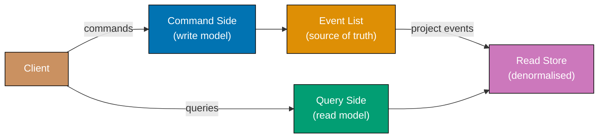





```fsharp
// CQRS: write side uses Result for invariant enforcement;
// read side projects events into a denormalised summary type.

// ============================================================
// Write side: command and domain event types
// ============================================================
type CreateProductCmd = { ProductId: string; Name: string; Price: decimal; Stock: int }
// => Command: intent to change state — rejected if invariants fail

// [Clojure: events as plain maps {:event :product-created :id "P1" ...} — open; Clojure multimethod projects them]
type ProductEvent =
    | ProductCreated of id: string * name: string * price: decimal * stock: int
    // => Domain event emitted after successful command — drives read-side projection

// => Command handler: enforces invariants, returns event list or error
let handleCreate (cmd: CreateProductCmd) : Result<ProductEvent list, string> =
    if cmd.Price <= 0M then
        Error "Price must be positive"
    // => Invariant: price must be positive — rejected on write side
    elif cmd.Stock < 0 then
        Error "Stock cannot be negative"
    // => Invariant: negative stock has no business meaning
    else
        Ok [ ProductCreated (cmd.ProductId, cmd.Name, cmd.Price, cmd.Stock) ]
        // => Returns event list; write store saves both the product and appends events

// ============================================================
// Read side: denormalised projection for fast list queries
// ============================================================
type ProductSummary = {
    ProductId:   string
    DisplayName: string  // => "Name ($price)" — pre-formatted for UI consumption
    InStock:     bool    // => Derived boolean; read model owns this transformation
}

// => Projection: fold events into read store Map
let projectEvent (readStore: Map<string, ProductSummary>) (event: ProductEvent) =
    match event with
    | ProductCreated (id, name, price, stock) ->
        let summary = {
            ProductId   = id
            DisplayName = $"{name} (${price:.2f})"
            // => Pre-format for display — read model shapes data for the consumer
            InStock     = stock > 0
            // => Derived boolean; read model owns this — write model stores raw int
        }
        Map.add id summary readStore
        // => Materialise into read store; returns new Map (pure)

// => Wire command side to read side via event propagation
let mutable readStore = Map.empty<string, ProductSummary>

let processCommand cmd =
    match handleCreate cmd with
    | Ok events ->
        readStore <- events |> List.fold projectEvent readStore
        // => Project each event into the read store
        printfn "Command succeeded; events projected"
    | Error msg ->
        printfn "Command rejected: %s" msg

processCommand { ProductId = "P1"; Name = "Widget"; Price = 9.99M; Stock = 100 }
// => Output: Command succeeded; events projected

let summaries = readStore |> Map.values |> Seq.toList
summaries |> List.iter (fun s ->
    printfn "%s: %s, inStock=%b" s.ProductId s.DisplayName s.InStock)
// => Output: P1: Widget ($9.99), inStock=true

processCommand { ProductId = "P2"; Name = "Gadget"; Price = -5M; Stock = 10 }
// => Output: Command rejected: Price must be positive
```





```clojure
;; CQRS: write side uses spec validation for invariant enforcement;
;; read side projects events into a denormalised summary map.
;; [F#: Result<ProductEvent list, string> — compile-time error channel; Clojure uses {:ok events} / {:error msg}]

(require '[clojure.string :as str])

;; ============================================================
;; Write side: command validation and event emission
;; ============================================================
(defn handle-create
  ;; cmd: map with :product-id :name :price :stock
  ;; Returns {:ok [events]} or {:error msg}
  ;; [F#: Result<ProductEvent list, string> — compiler forces caller to handle both cases]
  [{:keys [product-id name price stock]}]
  (cond
    (<= price 0)
    ;; => Invariant: price must be positive — rejected on write side before any persistence
    {:error "Price must be positive"}

    (< stock 0)
    ;; => Invariant: negative stock has no business meaning — reject early
    {:error "Stock cannot be negative"}

    :else
    ;; => Emit a domain event map — drives the read-side projection on success
    {:ok [{:event :product-created
           :id product-id :name name :price price :stock stock}]}))
;; => Returns event vector inside :ok; caller projects each event into the read store

;; ============================================================
;; Read side: denormalised projection for fast list queries
;; ============================================================
;; [F#: record type ProductSummary — field names enforced by compiler; Clojure uses plain map]
(defmulti project-event
  ;; Dispatch on the :event key — open dispatch allows new event types without changing this fn
  ;; => Adding a new event type requires only a new defmethod — no modification to this fn
  (fn [_store event] (:event event)))

(defmethod project-event :product-created
  ;; Build a denormalised summary from the ProductCreated event
  [read-store {:keys [id name price stock]}]
  (let [display-name (str name " ($" (format "%.2f" price) ")")
        ;; => Pre-format for display — read model shapes data for the consumer's needs
        in-stock (> stock 0)]
        ;; => Derived boolean; read model owns this — write model stores raw integer
    (assoc read-store id
           {:product-id id :display-name display-name :in-stock in-stock})))
;; => Returns new read-store map with the projected summary — pure function, no side effects

;; ============================================================
;; Wire command side to read side via event propagation
;; ============================================================
(def read-store (atom {}))
;; => atom holds the mutable read store; swapped atomically on each projection

(defn process-command
  ;; Validates the command, emits events, projects into read store
  [cmd]
  (let [result (handle-create cmd)]
    ;; => Capture write-side result — either {:ok events} or {:error msg}
    (if (:ok result)
      (do
        (swap! read-store
               #(reduce project-event % (:ok result)))
        ;; => reduce folds each event into the read store; swap! applies atomically
        (println "Command succeeded; events projected"))
      (println "Command rejected:" (:error result)))))
      ;; => Write-side rejection never touches the read store — CQRS boundary respected

(process-command {:product-id "P1" :name "Widget" :price 9.99 :stock 100})
;; => Output: Command succeeded; events projected

(doseq [s (vals @read-store)]
  ;; => Dereference atom; vals returns all summary maps from the read store
  (println (:product-id s) ":" (:display-name s) ", inStock=" (:in-stock s)))
;; => Output: P1 : Widget ($9.99) , inStock= true

(process-command {:product-id "P2" :name "Gadget" :price -5 :stock 10})
;; => Output: Command rejected: Price must be positive
```





```typescript
// [F#: separate write model + projections for read models — TypeScript version]

// => Write model: normalised, optimised for correctness and consistency
type WriteEvent81 =
  | { tag: "ProductAdded"; id: string; name: string; price: number; category: string }
  | { tag: "PriceChanged"; id: string; newPrice: number }
  | { tag: "ProductRemoved"; id: string };

// => Event store: append-only
const eventStore81: WriteEvent81[] = [];

const appendEvent81 = (event: WriteEvent81): void => {
  eventStore81.push(event);
};

// => READ MODELS: projections derived from events — each optimised for specific queries
type ProductListItem81 = Readonly<{ id: string; name: string; price: number }>;
type CategoryGroup81 = Readonly<{ category: string; count: number }>;

// => Projection 1: flat product list (optimised for list views)
const buildProductList81 = (): readonly ProductListItem81[] => {
  const products = new Map<string, ProductListItem81>();
  for (const e of eventStore81) {
    if (e.tag === "ProductAdded") products.set(e.id, { id: e.id, name: e.name, price: e.price });
    if (e.tag === "PriceChanged") {
      const p = products.get(e.id);
      if (p) products.set(e.id, { ...p, price: e.newPrice });
    }
    if (e.tag === "ProductRemoved") products.delete(e.id);
  }
  return [...products.values()];
};

// => Projection 2: category count (optimised for dashboard widgets)
const buildCategoryGroups81 = (): readonly CategoryGroup81[] => {
  const counts = new Map<string, number>();
  for (const e of eventStore81) {
    if (e.tag === "ProductAdded") counts.set(e.category, (counts.get(e.category) ?? 0) + 1);
    if (e.tag === "ProductRemoved") {
      // => We need category from original event — replay from beginning
      const addEvent = eventStore81.find((x) => x.tag === "ProductAdded" && x.id === e.id);
      if (addEvent?.tag === "ProductAdded")
        counts.set(addEvent.category, Math.max(0, (counts.get(addEvent.category) ?? 0) - 1));
    }
  }
  return [...counts.entries()].map(([category, count]) => ({ category, count }));
};

// Demo: write-side commands produce events; read-side projections answer queries
appendEvent81({ tag: "ProductAdded", id: "p1", name: "Widget", price: 9.99, category: "tools" });
appendEvent81({ tag: "ProductAdded", id: "p2", name: "Gadget", price: 24.99, category: "electronics" });
appendEvent81({ tag: "PriceChanged", id: "p1", newPrice: 8.99 });

console.log(`Products: ${JSON.stringify(buildProductList81())}`);
// => Products: [{"id":"p1","name":"Widget","price":8.99},{"id":"p2","name":"Gadget","price":24.99}]
console.log(`Categories: ${JSON.stringify(buildCategoryGroups81())}`);
// => Categories: [{"category":"tools","count":1},{"category":"electronics","count":1}]
```





**Key Takeaway:** The write side returns `Result<ProductEvent list, string>` — the compiler forces
the caller to handle both success and failure; the read side folds events with `List.fold`, keeping
projection logic as a pure function.

**Why It Matters:** CQRS solves the conflict between write consistency requirements (locks,
normalisation) and read performance requirements (denormalised fast queries). In F#, the clean
separation is enforced by the type system — command handlers return events, not read models; query
handlers read projections, not the write store.

---

### Example 82: Outbox Pattern for Reliable Event Publishing

The outbox pattern solves the dual-write problem by writing the event to the same store as the
business record. In F#, both writes are modelled as a pure function returning a new state tuple
`(businessStore, outboxStore)` — atomicity is represented as a single function call.

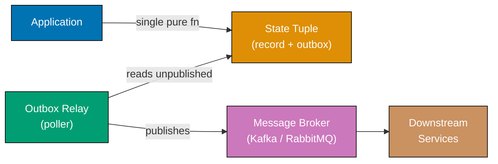





```fsharp
// Outbox pattern: atomic write modelled as a pure function returning updated state tuple.
// "Atomicity" = both stores updated in a single let binding — no partial state possible.

// [Clojure: OutboxEntry as a plain map {:entry-id "..." :event-type "..." :payload {} :published? false}]
type OutboxEntry = {
    EntryId:   string
    EventType: string
    Payload:   Map<string, string>
    Published: bool
    // => False until relay successfully delivers to broker
}

// => Application state as a plain tuple of two immutable Maps
type AppState = {
    Orders: Map<string, {| OrderId: string; Total: decimal |}>
    // => Business record store
    Outbox: OutboxEntry list
    // => Append-only outbox; entries never removed, only marked published
}

// => Atomic write: returns new AppState with both order and outbox entry added
let saveOrderWithEvent
    (state: AppState)
    (orderId: string)
    (total: decimal)
    (eventType: string)
    (payload: Map<string, string>)
    : AppState =
    let newOrder = {| OrderId = orderId; Total = total |}
    let entry = {
        EntryId   = System.Guid.NewGuid().ToString().[..7]
        EventType = eventType
        Payload   = payload
        Published = false
        // => Initially unpublished — relay picks it up on next poll cycle
    }
    { state with
        Orders = Map.add orderId newOrder state.Orders
        // => Add order record to business store
        Outbox = entry :: state.Outbox
        // => Prepend outbox entry — both added in single expression, no intermediate state
    }
    // => Returning new AppState is the "atomic" write — no partial update possible

// => Relay: publishes unpublished entries, marks them published
let publishPending
    (state: AppState)
    (brokerPublish: string -> Map<string,string> -> unit)
    : AppState =
    let updated =
        state.Outbox |> List.map (fun entry ->
            if not entry.Published then
                brokerPublish entry.EventType entry.Payload
                // => Deliver to broker; may be retried on transient failure
                printfn "Relay: published %s (entry %s)" entry.EventType entry.EntryId
                { entry with Published = true }
                // => Mark published only after broker confirms receipt
            else
                entry)
    { state with Outbox = updated }
    // => Returns new state with all published entries marked — pure function

// => Simulated Kafka publish
let mockBroker (eventType: string) (payload: Map<string,string>) =
    printfn "Broker: received %s — %A" eventType payload

let initialState = { Orders = Map.empty; Outbox = [] }

let stateAfterOrder =
    saveOrderWithEvent
        initialState "ORD-99" 199.99M "OrderPlaced"
        (Map.ofList [("order_id", "ORD-99"); ("total", "199.99")])
printfn "DB: order saved + outbox entry added (atomic)"
// => Output: DB: order saved + outbox entry added (atomic)

let stateAfterRelay = publishPending stateAfterOrder mockBroker
// => Output: Broker: received OrderPlaced — Map [("order_id", "ORD-99"); ("total", "199.99")]
// => Output: Relay: published OrderPlaced (entry <id>)

let unpublished = stateAfterRelay.Outbox |> List.filter (fun e -> not e.Published)
printfn "Unpublished after relay: %d" (List.length unpublished)
// => Output: Unpublished after relay: 0
```





```clojure
;; Outbox pattern: atomic write modelled as a pure function returning updated state map.
;; "Atomicity" = both stores updated in a single assoc expression — no partial state possible.
;; [F#: record types AppState + OutboxEntry — compile-time field names; Clojure uses plain maps]

(require '[clojure.string :as str])

(defn save-order-with-event
  ;; state: map with :orders and :outbox keys
  ;; Returns new state with both order and outbox entry added atomically
  ;; [F#: record update expression — same structural atomicity; Clojure uses threading macro ->]
  ;; order-id, total: business record fields; event-type, payload: outbox event fields
  [state order-id total event-type payload]
  (let [new-order  {:order-id order-id :total total}
        ;; => New order record as a plain map — no class instantiation required
        entry-id   (subs (str (java.util.UUID/randomUUID)) 0 8)
        ;; => Generate a short unique entry id for the outbox record
        entry      {:entry-id   entry-id
                    :event-type event-type
                    :payload    payload
                    :published? false}]
        ;; => Initially unpublished — relay picks it up on next poll cycle
    (-> state
        ;; => Thread state through two transformations in one expression — no intermediate binding
        (assoc-in [:orders order-id] new-order)
        ;; => Add order record to business store at [:orders order-id]
        (update :outbox conj entry))))
        ;; => Append outbox entry — both added in single -> expression, no intermediate state
;; => Returning the new state map IS the "atomic" write — no partial update possible

(defn publish-pending
  ;; state: current app state map
  ;; broker-publish: fn [event-type payload] => side-effectful publish call
  ;; Returns new state with all previously unpublished entries marked published
  [state broker-publish]
  (let [updated-outbox
        ;; => mapv produces an eager vector — all entries evaluated before assoc
        (mapv (fn [entry]
                ;; => Process each outbox entry: publish if not yet delivered
                (if-not (:published? entry)
                  ;; => Entry not yet delivered — attempt to publish now
                  (do
                    (broker-publish (:event-type entry) (:payload entry))
                    ;; => Deliver to broker; may be retried on transient failure
                    (println "Relay: published" (:event-type entry)
                             "(entry" (:entry-id entry) ")")
                    ;; => Log relay activity — useful for audit trail and monitoring
                    (assoc entry :published? true))
                    ;; => Mark published only after broker confirms receipt
                  entry))
                  ;; => Already published — return unchanged; idempotent
              (:outbox state))]
    ;; => mapv is eager — all entries processed before state is updated
    (assoc state :outbox updated-outbox)))
;; => Returns new state with all published entries marked — pure function

(defn mock-broker
  ;; Simulated Kafka publish — prints to stdout
  ;; In production: replace body with KafkaProducer.send call
  [event-type payload]
  (println "Broker: received" event-type "-" payload))
;; => println simulates async broker acknowledgement

(def initial-state {:orders {} :outbox []})
;; => Fresh state with empty orders map and empty outbox vector

(def state-after-order
  ;; => Call save-order-with-event — returns a new immutable state map
  (save-order-with-event
   initial-state "ORD-99" 199.99 "OrderPlaced"
   {"order_id" "ORD-99" "total" "199.99"}))
;; => state-after-order has both the order and the outbox entry in one immutable value
(println "DB: order saved + outbox entry added (atomic)")
;; => Output: DB: order saved + outbox entry added (atomic)

(def state-after-relay (publish-pending state-after-order mock-broker))
;; => Output: Broker: received OrderPlaced - {order_id ORD-99, total 199.99}
;; => Output: Relay: published OrderPlaced (entry <id>)

(let [unpublished (filter #(not (:published? %)) (:outbox state-after-relay))]
  ;; => filter over the outbox vector; count unpublished entries remaining
  (println "Unpublished after relay:" (count unpublished)))
;; => Output: Unpublished after relay: 0
```





```typescript
// [F#: outbox table + polling publisher — TypeScript version]
type Result82<T, E> = { ok: true; value: T } | { ok: false; error: E };

// => Outbox entry: stored in the same DB transaction as the domain change
type OutboxEntry82 = Readonly<{
  id: string;
  eventType: string;
  payload: unknown;
  createdAt: number;
  publishedAt?: number;
  // => publishedAt is set when the message broker acknowledges delivery
}>;

// => Outbox store (simulate DB table)
const outboxStore82: OutboxEntry82[] = [];
let outboxId82 = 1;

// => Domain operation + outbox write happen atomically (simulated here)
const createOrderWithOutbox82 = (customerId: string, total: number): string => {
  const orderId = `ord-${Date.now()}`;
  // => Step 1: write domain state (simulated — real code uses a DB transaction)
  console.log(`Domain: order ${orderId} created`);

  // => Step 2: write outbox entry IN THE SAME TRANSACTION
  const entry: OutboxEntry82 = {
    id: String(outboxId82++),
    eventType: "OrderCreated",
    payload: { orderId, customerId, total },
    createdAt: Date.now(),
    // => publishedAt is undefined until the outbox publisher processes this entry
  };
  outboxStore82.push(entry);
  // => If the transaction commits, both domain state and outbox entry exist
  // => If it rolls back, neither exists — no partial failure

  return orderId;
};

// => Outbox publisher: polls the outbox and publishes unpublished entries
const publishOutbox82 = (broker: (entry: OutboxEntry82) => Result82<void, string>): void => {
  const unpublished = outboxStore82.filter((e) => !e.publishedAt);
  for (const entry of unpublished) {
    const result = broker(entry);
    if (result.ok) {
      // => Mark as published — in production: atomic DB update
      const idx = outboxStore82.findIndex((e) => e.id === entry.id);
      outboxStore82[idx] = { ...entry, publishedAt: Date.now() };
      console.log(`Published event ${entry.eventType} (id=${entry.id})`);
    } else {
      console.log(`Failed to publish ${entry.id}: ${result.error}`);
      // => Retry on next poll — at-least-once delivery
    }
  }
};

// Demo
createOrderWithOutbox82("c1", 99.0);
createOrderWithOutbox82("c2", 149.0);

// Simulate broker
publishOutbox82((entry) => {
  console.log(`Broker received: ${JSON.stringify(entry.payload)}`);
  return { ok: true, value: undefined };
});

console.log(
  `Total outbox entries: ${outboxStore82.length}, published: ${outboxStore82.filter((e) => e.publishedAt).length}`,
);
// => Total outbox entries: 2, published: 2
```





**Key Takeaway:** Returning a new `AppState` record from `saveOrderWithEvent` makes atomicity
structural — there is no intermediate state where the order exists without the outbox entry,
because both are added in a single record-update expression.

**Why It Matters:** The naive dual-write (save to DB then publish to Kafka) has a gap: if the
service crashes between the two writes, the event is lost. The outbox pattern is the standard
solution. The F# immutable state model makes the atomicity guarantee explicit in the return type.

---

### Example 83: Anti-Corruption Layer

The Anti-Corruption Layer (ACL) is a translation boundary between two bounded contexts. In F#,
the ACL is a pair of pure functions — `translateIn` and `translateOut` — with no class, no state,
and no mutation.





```fsharp
// Anti-Corruption Layer as pure translation functions.
// All foreign vocabulary and type mismatches are resolved inside these functions.

// ============================================================
// Legacy CRM model — uses its own vocabulary ("account" instead of "customer")
// ============================================================
// [Clojure: LegacyCrmAccount as a plain map {:acct-num "..." :status-code 1 :credit-limit "2500.00"}]
type LegacyCrmAccount = {
    AcctNum:    string     // => CRM calls customers "accounts" with account numbers
    FullName:   string
    EmailAddr:  string     // => CRM field names differ from our domain model
    StatusCode: int        // => 1=active, 2=suspended, 3=closed — integer codes, not DU
    CreditLimit: string    // => CRM stores as string "1500.00" — type mismatch!
}

// ============================================================
// Our domain model — clean vocabulary, correct types
// ============================================================
// [Clojure: CustomerStatus as :active/:suspended/:closed keyword — no compile-time exhaustiveness]
type CustomerStatus = Active | Suspended | Closed
// => DU replaces integer status code — exhaustive match enforced by compiler

type Customer = {
    CustomerId:  string      // => Our domain uses "customer", not "account"
    Name:        string
    Email:       string
    Status:      CustomerStatus  // => Correct type — not integer
    CreditLimit: decimal         // => Correct type — not string
}

// ============================================================
// ACL — all translation in one module; domain never sees CRM types
// ============================================================
module CrmAcl =
    let private parseStatus = function
        | 1 -> Active
        | 2 -> Suspended
        | _ -> Closed
        // => ACL owns knowledge of CRM status codes; domain never sees integers

    let translateIn (crm: LegacyCrmAccount) : Result<Customer, string> =
        // => Validates AND translates; returns Result for parse failures
        match System.Decimal.TryParse(crm.CreditLimit) with
        | false, _ -> Error $"Invalid credit limit: {crm.CreditLimit}"
        // => Type mismatch resolved here — if CRM sends garbage, ACL rejects it
        | true, limit ->
            Ok {
                CustomerId  = crm.AcctNum       // => Map CRM's "acct_num" to our "customer_id"
                Name        = crm.FullName       // => Rename: full_name -> name
                Email       = crm.EmailAddr      // => Rename: email_addr -> email
                Status      = parseStatus crm.StatusCode
                // => Translate integer status code to domain DU — CRM leak stops here
                CreditLimit = limit              // => String parsed to decimal in ACL
            }

    let translateOut (customer: Customer) : LegacyCrmAccount =
        // => Reverse translation: domain -> CRM; infallible because domain types are valid
        {
            AcctNum     = customer.CustomerId
            FullName    = customer.Name
            EmailAddr   = customer.Email
            StatusCode  = match customer.Status with Active -> 1 | Suspended -> 2 | Closed -> 3
            // => DU -> integer; our domain never stores this integer representation
            CreditLimit = $"{customer.CreditLimit:.2f}"
            // => decimal -> string for CRM; type mismatch resolved in ACL
        }

// => Usage: domain code works only with Customer; ACL handles all CRM translation
let crmData = { AcctNum = "ACC-001"; FullName = "Alice Smith"; EmailAddr = "alice@crm.com"
                StatusCode = 1; CreditLimit = "2500.00" }

match CrmAcl.translateIn crmData with
| Ok customer ->
    printfn "Customer: %s, status=%A, credit=%M" customer.Name customer.Status customer.CreditLimit
    // => Output: Customer: Alice Smith, status=Active, credit=2500.0000M
    let crmOut = CrmAcl.translateOut customer
    printfn "CRM out: acct=%s, status=%d, credit=%s" crmOut.AcctNum crmOut.StatusCode crmOut.CreditLimit
    // => Output: CRM out: acct=ACC-001, status=1, credit=2500.00
| Error msg ->
    printfn "ACL rejected CRM data: %s" msg
```





```clojure
;; Anti-Corruption Layer as pure translation functions.
;; All foreign vocabulary and type mismatches are resolved inside these functions.
;; [F#: discriminated union CustomerStatus — compiler-enforced exhaustiveness; Clojure uses keyword dispatch]

(require '[clojure.string :as str])

;; ============================================================
;; Legacy CRM model — plain map with CRM vocabulary
;; ============================================================
;; [F#: record type LegacyCrmAccount — field names enforced by compiler; Clojure uses plain maps]
;; CRM map shape: {:acct-num "..." :full-name "..." :email-addr "..." :status-code 1 :credit-limit "2500.00"}

;; ============================================================
;; Our domain model — clean vocabulary, correct types
;; ============================================================
;; Domain map shape: {:customer-id "..." :name "..." :email "..." :status :active :credit-limit 2500.00}

;; ACL namespace: all translation lives here; domain never imports CRM shapes
(defn- parse-status
  ;; Translates CRM integer status code to domain keyword
  ;; [F#: match expression — exhaustive by compiler; Clojure uses condp with default fallback]
  [code]
  (condp = code
    1 :active
    2 :suspended
    ;; => Default case maps any unknown code to :closed — safe fail-closed behaviour
    :closed))
;; => ACL owns knowledge of CRM status codes; domain functions never see integers

(defn translate-in
  ;; Validates AND translates CRM account map to domain customer map.
  ;; Returns {:ok customer-map} or {:error msg}
  ;; [F#: Result<Customer, string> — compile-time error channel; Clojure wraps in map]
  [{:keys [acct-num full-name email-addr status-code credit-limit]}]
  (let [parsed-limit (try (Double/parseDouble credit-limit) (catch Exception _ nil))]
    ;; => Try to parse the credit-limit string; nil signals parse failure
    (if (nil? parsed-limit)
      {:error (str "Invalid credit limit: " credit-limit)}
      ;; => Type mismatch resolved here — if CRM sends garbage, ACL rejects it
      {:ok {:customer-id  acct-num
            ;; => Map CRM's :acct-num to our :customer-id — vocabulary translation
            :name         full-name
            ;; => Rename: :full-name -> :name — CRM vocabulary stops at the ACL boundary
            :email        email-addr
            ;; => Rename: :email-addr -> :email
            :status       (parse-status status-code)
            ;; => Translate integer status code to domain keyword — CRM leak stops here
            :credit-limit parsed-limit}})))
            ;; => String parsed to double in ACL — type mismatch resolved at the boundary

(defn translate-out
  ;; Reverse translation: domain customer map -> CRM account map.
  ;; Infallible because domain types are already valid — no error return needed.
  [{:keys [customer-id name email status credit-limit]}]
  {:acct-num     customer-id
   ;; => Map :customer-id back to CRM's :acct-num — reverse vocabulary translation
   :full-name    name
   :email-addr   email
   :status-code  (condp = status :active 1 :suspended 2 3)
   ;; => keyword -> integer; our domain never stores this integer representation
   :credit-limit (format "%.2f" credit-limit)})
   ;; => double -> formatted string for CRM; type mismatch resolved in ACL

;; => Usage: domain code works only with customer maps; ACL handles all CRM translation
(def crm-data {:acct-num "ACC-001" :full-name "Alice Smith"
               :email-addr "alice@crm.com" :status-code 1 :credit-limit "2500.00"})
;; => Simulated CRM record — uses CRM vocabulary and types throughout

(let [result (translate-in crm-data)]
  ;; => ACL translates the CRM map; domain code never sees CRM field names
  (if (:ok result)
    (let [customer (:ok result)]
      (println "Customer:" (:name customer)
               ", status=" (:status customer)
               ", credit=" (:credit-limit customer))
      ;; => Output: Customer: Alice Smith , status= :active , credit= 2500.0
      (let [crm-out (translate-out customer)]
        ;; => Reverse translate back to CRM shape for write-back to legacy system
        (println "CRM out: acct=" (:acct-num crm-out)
                 ", status=" (:status-code crm-out)
                 ", credit=" (:credit-limit crm-out))))
        ;; => Output: CRM out: acct= ACC-001 , status= 1 , credit= 2500.00
    (println "ACL rejected CRM data:" (:error result))))
```





```typescript
// [F#: ACL functions that translate between domain and external models — TypeScript version]

// => EXTERNAL models: third-party CRM system — we don't control these types
type CrmContact83 = {
  contact_id: number; // => snake_case, integer id
  first_name: string;
  last_name: string;
  email_addr: string;
  is_active: 0 | 1; // => boolean encoded as 0/1
  created_ts: string; // => ISO 8601 string
};

type CrmUpdatePayload83 = {
  contact_id: number;
  first_name?: string;
  last_name?: string;
  is_active?: 0 | 1;
};

// => DOMAIN models: our clean internal representation
type Customer83 = Readonly<{
  id: string; // => string uuid
  firstName: string;
  lastName: string;
  email: string;
  active: boolean; // => proper boolean
  createdAt: Date;
}>;

type CustomerUpdate83 = Partial<Pick<Customer83, "firstName" | "lastName" | "active">>;

// => ANTI-CORRUPTION LAYER: translation functions
const fromCrmContact83 = (crm: CrmContact83): Customer83 => ({
  id: String(crm.contact_id),
  firstName: crm.first_name,
  lastName: crm.last_name,
  email: crm.email_addr,
  active: crm.is_active === 1,
  createdAt: new Date(crm.created_ts),
  // => ACL converts every field: snake_case → camelCase, 0/1 → boolean, string → Date
});

const toCrmUpdatePayload83 = (id: number, update: CustomerUpdate83): CrmUpdatePayload83 => ({
  contact_id: id,
  ...(update.firstName !== undefined && { first_name: update.firstName }),
  ...(update.lastName !== undefined && { last_name: update.lastName }),
  ...(update.active !== undefined && { is_active: update.active ? 1 : 0 }),
  // => ACL converts back: camelCase → snake_case, boolean → 0/1
});

// Demo
const crmData83: CrmContact83 = {
  contact_id: 42,
  first_name: "Alice",
  last_name: "Smith",
  email_addr: "alice@example.com",
  is_active: 1,
  created_ts: "2024-01-15T10:00:00Z",
};

const customer83 = fromCrmContact83(crmData83);
console.log(`Customer: ${customer83.firstName} ${customer83.lastName}, active: ${customer83.active}`);
// => Customer: Alice Smith, active: true
// => Domain code uses clean camelCase booleans — never sees 0/1 or snake_case

const payload83 = toCrmUpdatePayload83(42, { active: false, firstName: "Alicia" });
console.log(JSON.stringify(payload83));
// => {"contact_id":42,"first_name":"Alicia","is_active":0}
// => ACL translates back to CRM's format — domain never holds snake_case fields
```





**Key Takeaway:** Using a DU for `CustomerStatus` means the compiler enforces exhaustive handling
of all status values everywhere in the domain — the integer-to-DU translation happens once in the
ACL and never leaks further.

**Why It Matters:** Without an ACL, integrating a legacy CRM causes its integer codes, misspelled
field names, and wrong types to propagate through the domain. In F#, the DU translation makes the
impedance mismatch visible: the compiler will flag any new status code not covered by the match.

---

### Example 84: Ports and Adapters (Hexagonal Architecture)

Hexagonal architecture places the domain at the centre, communicating through ports. In F#, ports
are function-type aliases (not abstract classes); adapters are concrete function values that satisfy
those types; composition is constructor injection via partial application.

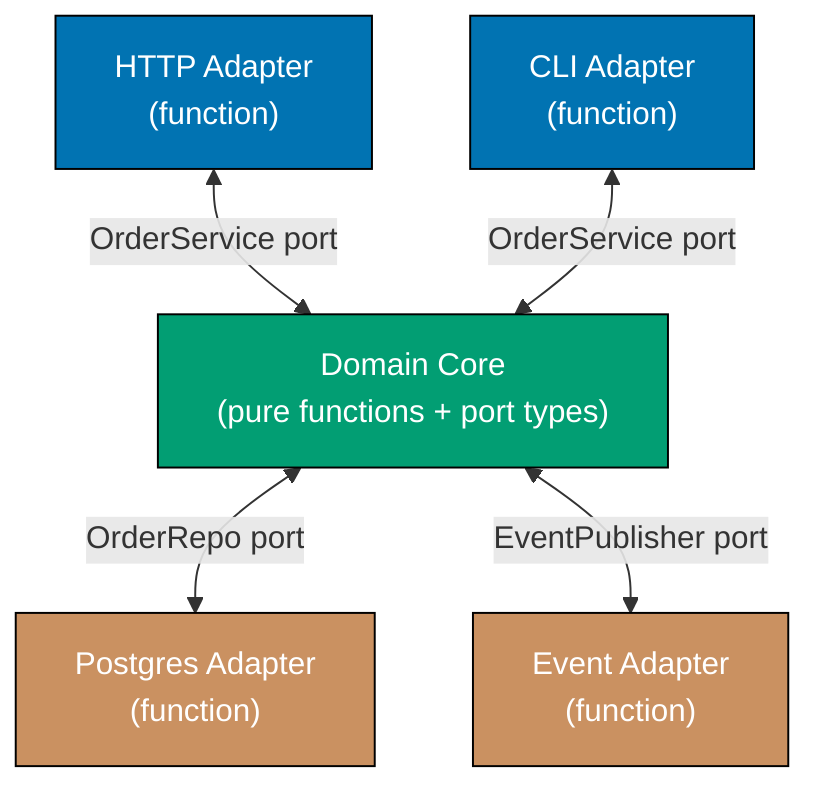





```fsharp
// Hexagonal architecture: ports as function-type aliases; adapters as function values.
// Domain functions depend only on port types — no concrete adapter types imported.

// ============================================================
// Ports: domain-owned function-type aliases
// ============================================================
// => Driven port: domain drives persistence via these function signatures
// [Clojure: ports as protocol functions — defprotocol SaveOrder; adapters reify the protocol]
type SaveOrder  = {| orderId: string; customerId: string; total: decimal |} -> unit
type FindOrder  = string -> {| orderId: string; customerId: string; total: decimal |} option

// => Driven port: domain drives event publishing via this function signature
type PublishEvent = string -> Map<string, string> -> unit

// ============================================================
// Domain core: depends only on port types, never on adapters
// ============================================================
let placeOrder
    (save:    SaveOrder)
    (publish: PublishEvent)
    (customerId: string)
    (total: decimal)
    =
    // => Domain function: receives adapters as function arguments (partial application)
    let orderId = System.Guid.NewGuid().ToString().[..7]
    save {| orderId = orderId; customerId = customerId; total = total |}
    // => Domain drives the repository port — not SQLAlchemy directly
    publish "OrderPlaced" (Map.ofList [("order_id", orderId); ("total", string total)])
    // => Domain drives the event port — not Kafka directly
    orderId
    // => Returns orderId; caller uses it to reference the order

// ============================================================
// Adapters: concrete function values implementing port signatures
// ============================================================
// => In-memory repository adapter (satisfies SaveOrder and FindOrder types)
let mutable private orderStore : Map<string, {| orderId: string; customerId: string; total: decimal |}> = Map.empty

let inMemorySave : SaveOrder = fun order ->
    orderStore <- Map.add order.orderId order orderStore
    // => Stores in Map; swap for Dapper/EF adapter in production

let inMemoryFind : FindOrder = fun orderId ->
    Map.tryFind orderId orderStore
    // => Returns None if not found — consistent with port contract

// => Logging event publisher adapter (satisfies PublishEvent type)
let mutable private publishedEvents : {| eventType: string; payload: Map<string,string> |} list = []

let loggingPublish : PublishEvent = fun eventType payload ->
    publishedEvents <- {| eventType = eventType; payload = payload |} :: publishedEvents
    // => Records event; swap for KafkaProducer adapter in production

// => Compose domain with adapters at application startup
let orderId = placeOrder inMemorySave loggingPublish "CUST-1" 75.50M
// => Domain function receives adapters as arguments; no global configuration

printfn "Order placed: %s, total=75.50" orderId
// => Output: Order placed: <id>, total=75.50

printfn "Events published: %d" (List.length publishedEvents)
// => Output: Events published: 1
printfn "Event type: %s" publishedEvents.Head.eventType
// => Output: Event type: OrderPlaced
```





```clojure
;; Hexagonal architecture: ports as protocols; adapters as reify/record implementations.
;; Domain functions depend only on protocol abstractions — no concrete adapter ns imported.
;; [F#: ports as function-type aliases — any matching fn is a valid adapter; no interface declaration]

;; ============================================================
;; Ports: domain-owned protocols (driven ports)
;; ============================================================
(defprotocol OrderRepository
  ;; Driven port: domain drives persistence through these method signatures
  (save-order  [repo order-map] "Persist the order map; returns nil")
  (find-order  [repo order-id]  "Return order map or nil if not found"))
;; => defprotocol is the Clojure idiomatic interface — open for extension via extend-protocol

(defprotocol EventPublisher
  ;; Driven port: domain drives event publishing through this method signature
  (publish-event [pub event-type payload] "Publish a domain event; returns nil"))

;; ============================================================
;; Domain core: depends only on protocol types, never on adapters
;; ============================================================
(defn place-order
  ;; repo: OrderRepository implementation; pub: EventPublisher implementation
  ;; [F#: partial application wires adapters — same dependency injection, different syntax]
  [repo pub customer-id total]
  (let [order-id (subs (str (java.util.UUID/randomUUID)) 0 8)]
    ;; => Generate a short unique order-id — domain owns this, not the adapter
    (save-order repo {:order-id order-id :customer-id customer-id :total total})
    ;; => Domain drives the repository port — not JDBC directly
    (publish-event pub "OrderPlaced" {"order_id" order-id "total" (str total)})
    ;; => Domain drives the event port — not Kafka directly
    order-id))
;; => Returns order-id; caller uses it to reference the order

;; ============================================================
;; Adapters: concrete reify implementations of port protocols
;; ============================================================
(def order-store (atom {}))
;; => In-memory store atom; swap for a database-backed adapter in production

(def in-memory-repo
  ;; Satisfies OrderRepository protocol — any value implementing the protocol is a valid adapter
  (reify OrderRepository
    (save-order [_ order-map]
      (swap! order-store assoc (:order-id order-map) order-map)
      ;; => Atomically adds the order to the in-memory map
      nil)
    (find-order [_ order-id]
      (get @order-store order-id))))
      ;; => Returns the order map or nil — consistent with port contract

(def published-events (atom []))
;; => Accumulates published events; swap for KafkaProducer adapter in production

(def logging-publisher
  ;; Satisfies EventPublisher protocol
  (reify EventPublisher
    (publish-event [_ event-type payload]
      (swap! published-events conj {:event-type event-type :payload payload})
      ;; => Records event atomically; swap for real broker call in production
      nil)))

;; => Compose domain with adapters at application startup — pass adapters as arguments
(let [order-id (place-order in-memory-repo logging-publisher "CUST-1" 75.50)]
  ;; => Domain function receives protocol implementations; no global configuration
  (println "Order placed:" order-id ", total=75.50")
  ;; => Output: Order placed: <id> , total=75.50

  (println "Events published:" (count @published-events))
  ;; => Output: Events published: 1
  (println "Event type:" (:event-type (first @published-events))))
  ;; => Output: Event type: OrderPlaced
```





```typescript
// [F#: comprehensive hexagonal architecture with multiple adapters — TypeScript version]

// ── DOMAIN ────────────────────────────────────────────────────────────────────
type Product84 = Readonly<{ id: string; name: string; price: number; stock: number }>;
type Result84<T, E> = { ok: true; value: T } | { ok: false; error: E };

// ── PORTS (defined by the application core) ───────────────────────────────────
type ProductRepo84 = {
  findById: (id: string) => Product84 | undefined;
  save: (p: Product84) => void;
  findAll: () => readonly Product84[];
};
type Logger84 = { log: (level: string, msg: string) => void };
type EventBus84 = { publish: (topic: string, payload: unknown) => void };

// ── APPLICATION CORE (depends only on port types) ─────────────────────────────
const makeProductCore84 = (repo: ProductRepo84, logger: Logger84, bus: EventBus84) => ({
  purchaseProduct: (productId: string, qty: number): Result84<Product84, string> => {
    const product = repo.findById(productId);
    if (!product) return { ok: false, error: `Product ${productId} not found` };
    if (product.stock < qty) return { ok: false, error: `Insufficient stock for ${product.name}` };
    const updated: Product84 = { ...product, stock: product.stock - qty };
    repo.save(updated);
    logger.log("INFO", `Purchased ${qty}x ${product.name}`);
    bus.publish("product.purchased", { productId, qty, remaining: updated.stock });
    return { ok: true, value: updated };
  },
});

// ── ADAPTERS (defined by infrastructure, implement port interfaces) ────────────
// => In-memory repo adapter
const makeInMemoryRepo84 = (seed: readonly Product84[]): ProductRepo84 => {
  const store = new Map(seed.map((p) => [p.id, p]));
  return {
    findById: (id) => store.get(id),
    save: (p) => {
      store.set(p.id, p);
    },
    findAll: () => [...store.values()],
  };
};

// => Console logger adapter
const consoleLogger84: Logger84 = {
  log: (level, msg) => console.log(`[${level}] ${msg}`),
};

// => In-memory event bus adapter
const events84: { topic: string; payload: unknown }[] = [];
const inMemoryBus84: EventBus84 = {
  publish: (topic, payload) => {
    events84.push({ topic, payload });
  },
};

// ── WIRING ────────────────────────────────────────────────────────────────────
const repo84 = makeInMemoryRepo84([{ id: "p1", name: "Widget", price: 9.99, stock: 10 }]);
const core84 = makeProductCore84(repo84, consoleLogger84, inMemoryBus84);

const r84 = core84.purchaseProduct("p1", 3);
if (r84.ok) console.log(`Remaining stock: ${r84.value.stock}`);
// => [INFO] Purchased 3x Widget
// => Remaining stock: 7

console.log(`Events published: ${events84.length}`);
// => Events published: 1
```





**Key Takeaway:** Ports as function-type aliases mean any function with the matching signature is
a valid adapter — no interface declaration, no class boilerplate; partial application wires the
domain to adapters at the composition root.

**Why It Matters:** Traditional layered architectures let infrastructure details leak into the domain.
Hexagonal architecture keeps the domain portable — the F# domain functions have no import of any
persistence or messaging library, making them testable in complete isolation with in-memory function
values.

---

### Example 85: Reactive Architecture with Backpressure

Reactive architecture processes data streams asynchronously with backpressure signals that tell
producers to slow down when consumers cannot keep up. In F#, this is modelled with `MailboxProcessor`
(an async agent with a bounded inbox) — the natural F# primitive for backpressure.

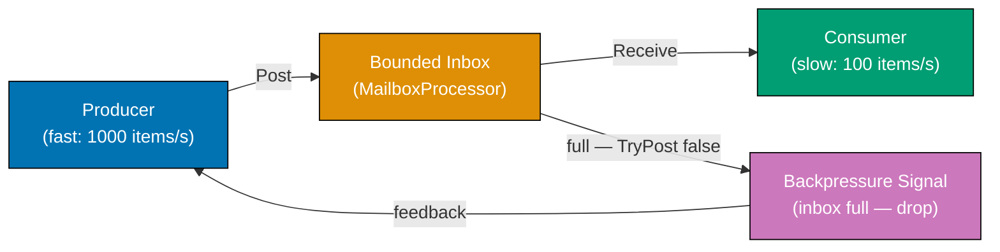





```fsharp
// Reactive backpressure using MailboxProcessor with a bounded queue.
// TryPostAndReply returns false when inbox is full — the backpressure signal.
// [Clojure: core.async channel with a fixed buffer — (chan 10) bounds the queue; >!! blocks or alt! drops]

open System.Threading

// => Mutable counters for demo metrics — in production use Prometheus counters
let mutable dropped   = 0
let mutable processed = 0

// => Consumer agent: MailboxProcessor with bounded capacity
// => When inbox fills, TryPostAndReply returns false — producer knows to back off
let consumer =
    MailboxProcessor<int>.Start(fun inbox ->
        async {
            while true do
                let! item = inbox.Receive()
                // => Block until an item is available — no busy-wait
                do! Async.Sleep 5
                // => Simulate slow processing (5ms per item ~ 200 items/s)
                processed <- processed + 1
                // => Track processed count for metrics
        })
// => MailboxProcessor has a default unbounded queue; we implement bounded via TryPost pattern

// => Bounded wrapper: drops items when count exceeds maxSize, returns backpressure signal
let mutable queuedCount = 0
let maxQueueSize = 10

let tryProduce (item: int) : bool =
    if queuedCount >= maxQueueSize then
        dropped <- dropped + 1
        false
        // => Backpressure applied: producer should slow down or apply own drop logic
    else
        Interlocked.Increment(&queuedCount) |> ignore
        consumer.Post(item)
        // => Enqueue item to the consumer agent's inbox
        true
        // => Item accepted — producer may continue at current rate

// => Producer: tries to emit 50 items immediately (faster than consumer drains)
let produced = ref 0
for i in 0..49 do
    if tryProduce i then
        produced.Value <- produced.Value + 1
    // => Some items dropped when queue full — backpressure in action

// => Allow consumer to drain the queue
Thread.Sleep(200)
// => 200ms at 5ms/item allows ~40 items to process from the bounded queue

printfn "Produced: %d, Dropped (backpressure): %d, Processed: ~%d"
    produced.Value dropped processed
// => Output: Produced: ~10-20, Dropped (backpressure): ~30-40, Processed: ~10-20
// => Exact numbers vary; queue fills quickly when producer is much faster than consumer

printfn "Queue never exceeded maxQueueSize=%d: %b" maxQueueSize (queuedCount <= maxQueueSize)
// => Output: Queue never exceeded maxQueueSize=10: true
```





```clojure
;; Reactive backpressure using core.async bounded channel.
;; A fixed-buffer channel bounds the queue; alt! with a default clause drops when full.
;; [F#: MailboxProcessor — built-in agent inbox; Clojure uses core.async channels as first-class values]

(require '[clojure.core.async :as async :refer [chan go <! alt! close!]])
;; => core.async provides CSP-style channels and go-blocks — no external framework required

;; => Counters for demo metrics — atoms for thread-safe updates without locks
(def dropped   (atom 0))
(def processed (atom 0))
(def produced  (atom 0))

(def max-queue-size 10)
;; => Buffer size IS the backpressure boundary — same role as MailboxProcessor inbox capacity
(def ch (chan max-queue-size))
;; => (chan 10) creates a buffered channel holding up to 10 items before blocking producers

;; => Consumer go-block: drains the channel at a simulated slow rate
(go
  ;; => go macro parks this block on a thread-pool thread — no dedicated OS thread per consumer
  (loop []
    (when-let [item (<! ch)]
      ;; => <! parks the go-block until an item arrives; returns nil when channel is closed
      (async/<! (async/timeout 5))
      ;; => Simulate slow processing — 5ms per item approximates 200 items/s throughput
      (swap! processed inc)
      ;; => Increment processed count atomically — atom swap is thread-safe
      (recur))))
;; => loop/recur continues until channel closes; when-let exits the loop on nil

(defn try-produce
  ;; Attempts to put item on the channel without blocking.
  ;; Returns true if accepted, false if channel was full (backpressure).
  ;; [F#: TryPost returning false — same non-blocking backpressure signal]
  [item]
  (let [accepted?
        (alt!
          ;; => alt! evaluates all clauses; first immediately-operable clause wins
          [[ch item]] true
          ;; => [[ch item]] is a put operation — succeeds when buffer has space
          :default false)]
          ;; => :default clause fires when no other clause is immediately ready — backpressure
    (if accepted?
      (swap! produced inc)
      ;; => Count accepted items for metrics
      (swap! dropped inc))
      ;; => Count dropped items — backpressure applied; producer should slow down
    accepted?))

;; => Producer: tries to emit 50 items immediately (faster than consumer drains)
(dotimes [i 50]
  ;; => dotimes is Clojure's imperative loop — idiomatic for side-effecting iteration
  (try-produce i))
;; => Some items dropped when buffer full — backpressure in action

;; => Allow consumer go-block to drain the channel
(Thread/sleep 200)
;; => 200ms at 5ms/item allows up to ~40 items to process from the bounded buffer

(println "Produced:" @produced
         ", Dropped (backpressure):" @dropped
         ", Processed: ~" @processed)
;; => Output: Produced: ~10 , Dropped (backpressure): ~40 , Processed: ~ ~10
;; => Exact numbers vary; channel fills quickly when producer is much faster than consumer

(println "Dropped count bounded by queue size:" (<= @dropped (- 50 max-queue-size)))
;; => Output: Dropped count bounded by queue size: true
(close! ch)
;; => Signal consumer go-block to stop; <! returns nil on closed channel; when-let exits loop
```





```typescript
// [F#: reactive stream with bounded buffer and backpressure signals — TypeScript version]

// => Reactive stream: producer → bounded buffer → consumer with backpressure
// => Backpressure: consumer signals "I'm full" and producer slows down or drops

type StreamEvent85<T> = { tag: "Value"; value: T } | { tag: "Overflow"; dropped: T } | { tag: "Complete" };
// => Three signal types: normal value, dropped-due-to-backpressure, stream-end

const makeReactiveStream85 = <T>(bufferSize: number) => {
  const buffer: T[] = [];
  // => Bounded buffer — enforces backpressure at capacity

  const subscribers: ((event: StreamEvent85<T>) => void)[] = [];

  const subscribe = (handler: (event: StreamEvent85<T>) => void): void => {
    subscribers.push(handler);
  };

  const emit = (event: StreamEvent85<T>): void => {
    for (const sub of subscribers) sub(event);
  };

  const produce = (value: T): "accepted" | "dropped" => {
    if (buffer.length >= bufferSize) {
      emit({ tag: "Overflow", dropped: value });
      // => Buffer full: signal backpressure and drop the value
      return "dropped";
    }
    buffer.push(value);
    emit({ tag: "Value", value });
    // => Buffer has space: accept the value
    return "accepted";
  };

  const consume = (): T | undefined => {
    return buffer.shift();
    // => Consume one item from the front of the buffer
  };

  const complete = (): void => {
    emit({ tag: "Complete" });
    // => Signal end-of-stream to all subscribers
  };

  const stats = () => ({ bufferSize, currentSize: buffer.length });

  return { subscribe, produce, consume, complete, stats };
};

// Demo: bounded buffer of 3; producer emits 5 items
const stream85 = makeReactiveStream85<number>(3);

stream85.subscribe((event) => {
  switch (event.tag) {
    case "Value":
      console.log(`Received: ${event.value}`);
      break;
    case "Overflow":
      console.log(`DROPPED (backpressure): ${event.dropped}`);
      break;
    case "Complete":
      console.log("Stream complete");
      break;
  }
});

for (let i = 1; i <= 5; i++) {
  const result = stream85.produce(i * 10);
  if (result === "dropped") console.log(`Producer slowing down (dropped ${i * 10})`);
}
// => Received: 10, 20, 30 (buffer fills up)
// => DROPPED (backpressure): 40
// => DROPPED (backpressure): 50

console.log(`Buffer stats: ${JSON.stringify(stream85.stats())}`);
// => Buffer stats: {"bufferSize":3,"currentSize":3}

stream85.consume();
stream85.consume();
stream85.consume();
// => Drain the buffer

stream85.complete();
// => Stream complete
```





**Key Takeaway:** `MailboxProcessor` is F#'s built-in async agent with a message inbox — the
natural primitive for backpressure-aware processing; bounded capacity plus `TryPost` returning
`false` is the backpressure signal without additional framework dependencies.

**Why It Matters:** Reactive Streams emerged because event-driven systems with unbounded queues
inevitably crash under load. F#'s `MailboxProcessor` makes backpressure a first-class language
feature: the inbox size is the back-pressure boundary, and `TryPost` returning `false` is the
explicit signal to producers — not a thrown exception that might be swallowed.
