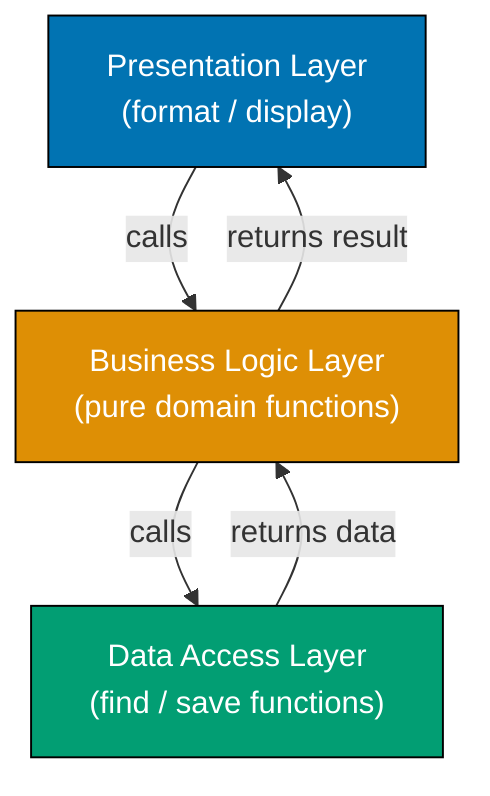
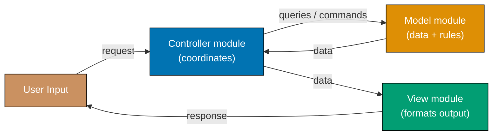
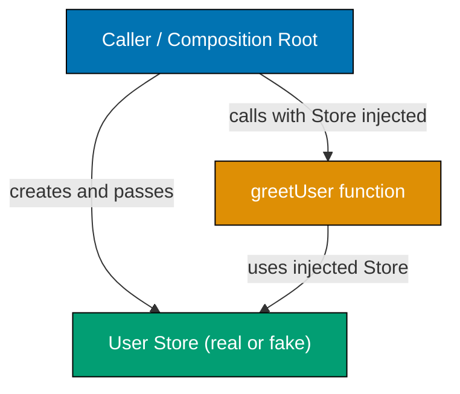
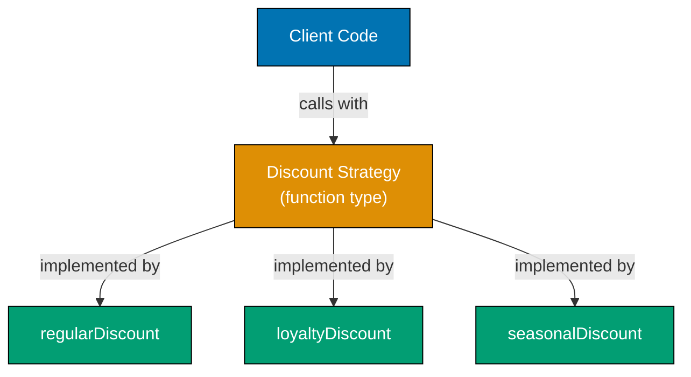
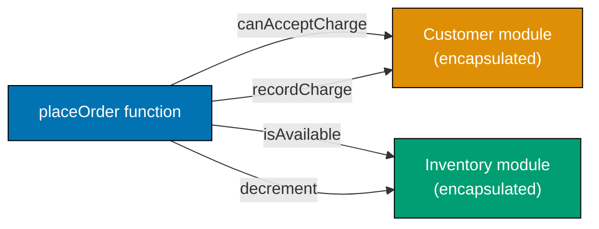
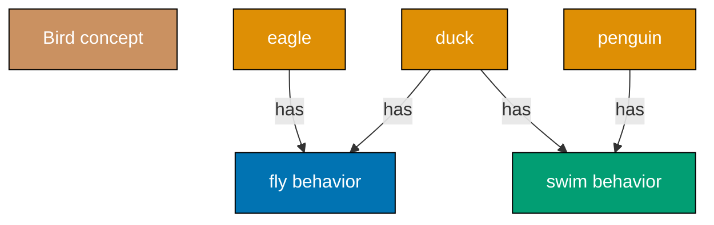
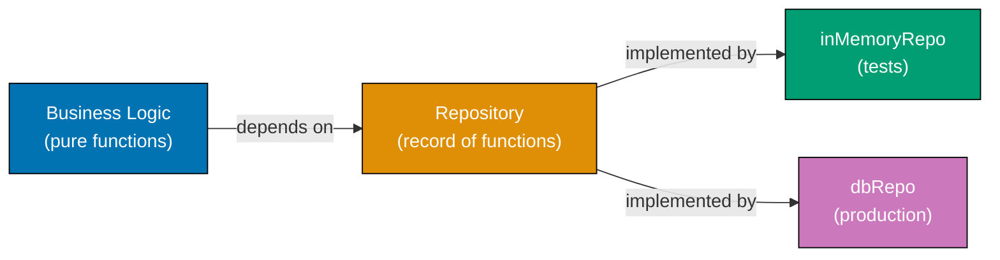
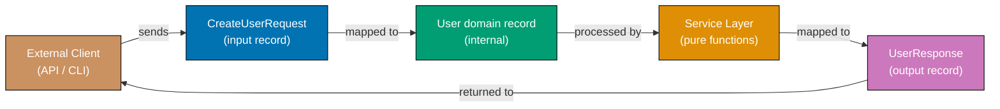
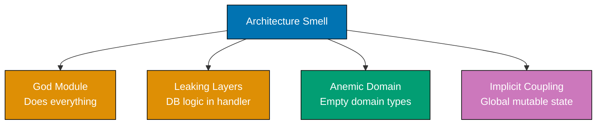

This beginner level covers Examples 1-28, reaching approximately 0-35% of software architecture fundamentals. Each example demonstrates a core architectural concept using functional programming idioms. All four languages — F#, Clojure, TypeScript, and Haskell — show the same pattern side by side in tabbed code blocks. These examples target developers who already know at least one language and want to rapidly build architectural instincts through working functional code. Each example uses its own small illustrative domain so the architectural pattern remains the focal point.

## Separation of Concerns

### Example 1: No Separation vs. Clear Separation

Separation of concerns means grouping code by responsibility so each function handles exactly one aspect of the system. When multiple responsibilities mix in one function, changing any part risks breaking the others. In FP, concerns are separated into distinct named functions rather than classes.

**Tightly coupled approach (no separation):**





```fsharp
// => This function handles THREE distinct responsibilities at once:
// => 1. Data access (reading from an in-memory map)
// => 2. Business logic (computing discount based on purchase count)
// => 3. Presentation (formatting a string for display)
let getUserDiscountMessage (userId: int) : string =
    // => userDb simulates a database lookup — data access concern embedded here
    let userDb = Map.ofList [ 1, ("Alice", 12) ]
    // => Map.ofList converts a list of key-value pairs to an immutable map
    match Map.tryFind userId userDb with
    // => Map.tryFind returns Some (name, purchases) or None — safe lookup
    | None -> "User not found"
    // => None branch: guard for missing user
    | Some (name, purchases) ->
        // => Business rule embedded directly — hard to change independently
        let discount = if purchases > 10 then 0.15 else 0.05
        // => 0.15 for loyal customers (>10 purchases), 0.05 default
        // => Presentation formatted inline — impossible to reuse discount logic elsewhere
        sprintf "Hello %s, your discount is %.0f%%" name (discount * 100.0)
        // => Output: "Hello Alice, your discount is 15%"

printfn "%s" (getUserDiscountMessage 1)
// => Output: Hello Alice, your discount is 15%
```





```clojure
;; [F#: single let-bound function with three embedded concerns — same structural problem]
;; This function mixes data access, business logic, and presentation in one body.
;; In Clojure, all concerns live in a single defn with no ns separation.
(defn get-user-discount-message
  ;; Accepts a user-id integer; returns a formatted string
  [user-id]
  ;; user-db is an in-memory map simulating a database lookup
  ;; Maps in Clojure are first-class values; no Map.ofList ceremony required
  (let [user-db {1 ["Alice" 12]}
        ;; => user-db is {1 ["Alice" 12]} — key is user-id integer
        user (get user-db user-id)]
    ;; => get returns the value or nil when key is absent — like Map.tryFind
    (if (nil? user)
      "User not found"
      ;; => nil branch: guard for missing user — mirrors None case in F#
      (let [[name purchases] user
            ;; => destructure vector into name and purchases bindings
            discount (if (> purchases 10) 0.15 0.05)]
            ;; => 0.15 for loyal customers (>10 purchases), 0.05 default
        (format "Hello %s, your discount is %.0f%%" name (* discount 100.0))
        ;; => format produces the final string — data access, rule, and display all here
        ;; => Output: "Hello Alice, your discount is 15%"
        ))))

(println (get-user-discount-message 1))
;; => Output: Hello Alice, your discount is 15%
```





```typescript
// [F#: single function with three embedded concerns — TypeScript mirrors the same structural problem]
// => This function mixes data access, business logic, and presentation in one body.

// => userDb simulates a database — data access concern embedded here
const userDb = new Map<number, readonly [string, number]>([
  [1, ["Alice", 12]],
  // => key 1 maps to [name, purchaseCount] tuple
]);

const getUserDiscountMessage = (userId: number): string => {
  const user = userDb.get(userId);
  // => Map.get returns value or undefined — like F# Map.tryFind returning None
  if (user === undefined) return "User not found";
  // => undefined branch: guard for missing user
  const [name, purchases] = user;
  // => destructure tuple: name is string, purchases is number
  const discount = purchases > 10 ? 0.15 : 0.05;
  // => business rule embedded inline — 15% for loyal, 5% default
  // => presentation formatted inline — impossible to reuse discount rule elsewhere
  return `Hello ${name}, your discount is ${Math.round(discount * 100)}%`;
  // => Output: "Hello Alice, your discount is 15%"
};

console.log(getUserDiscountMessage(1));
// => Output: Hello Alice, your discount is 15%
```





```haskell
-- ── file: GetUserDiscountMessage.hs ───────────
-- [F#: single function with three embedded concerns — Haskell uses a Data.Map.Strict lookup
--   yielding Maybe, but all three concerns still live in one function body]
import qualified Data.Map.Strict as Map  -- => Map.lookup returns Maybe v — like F# Map.tryFind
import Data.Maybe (fromMaybe)             -- => helper for default values on Nothing
import Text.Printf (printf)               -- => printf for formatted strings, similar to sprintf

-- => This function mixes data access, business logic, AND presentation in one body
getUserDiscountMessage :: Int -> String
-- => userId is Int input; returns the formatted greeting String
getUserDiscountMessage userId =
  -- => userDb simulates a database lookup — data access concern embedded here
  let userDb = Map.fromList [(1, ("Alice", 12 :: Int))]
      -- => Map.fromList builds an immutable map; pair stores (name, purchases)
      result = Map.lookup userId userDb
      -- => Map.lookup returns Just (name, purchases) or Nothing — safe absence
  in case result of
       Nothing -> "User not found"
       -- => Nothing branch: guard for missing user (mirrors None in F#)
       Just (name, purchases) ->
         -- => Business rule embedded directly — hard to change independently
         let discount = if purchases > 10 then 0.15 else 0.05 :: Double
             -- => 0.15 for loyal customers (>10 purchases), 0.05 default
         -- => Presentation formatted inline — impossible to reuse discount logic elsewhere
         in printf "Hello %s, your discount is %.0f%%" name (discount * 100.0)
            -- => Output: "Hello Alice, your discount is 15%"

main :: IO ()
main = putStrLn (getUserDiscountMessage 1)
-- => Output: Hello Alice, your discount is 15%
```





Mixing all three responsibilities means any change — a new discount rule, a different greeting format, or a different data source — requires editing the same function.

**Separated approach (three distinct pure functions):**





```fsharp
// => DATA ACCESS — only knows how to retrieve users
let findUser (userId: int) : (string * int) option =
    // => Returns Some (name, purchases) or None — no formatting, no rules
    let userDb = Map.ofList [ 1, ("Alice", 12) ]
    // => In-memory map simulates a real data store
    Map.tryFind userId userDb
    // => Map.tryFind : int -> Map<int,'a> -> 'a option

// => BUSINESS LOGIC — only knows discount rules, not storage or display
let calculateDiscount (purchases: int) : float =
    // => Pure function: same input always produces same output
    if purchases > 10 then 0.15
    // => 15% for loyal customers (>10 purchases)
    else 0.05
    // => 5% default discount

// => PRESENTATION — only knows how to format, not compute or fetch
let formatDiscountMessage (name: string) (discount: float) : string =
    sprintf "Hello %s, your discount is %.0f%%" name (discount * 100.0)
    // => Output: "Hello Alice, your discount is 15%"

// => ORCHESTRATION — thin coordinator that pipelines the three functions
let getUserDiscountMessageSeparated (userId: int) : string =
    match findUser userId with
    // => delegates data access — result is Some (name, purchases) or None
    | None -> "User not found"
    | Some (name, purchases) ->
        let discount = calculateDiscount purchases
        // => delegates business rule — discount : float
        formatDiscountMessage name discount
        // => delegates formatting — returns final string

printfn "%s" (getUserDiscountMessageSeparated 1)
// => Output: Hello Alice, your discount is 15%
```





```clojure
;; DATA ACCESS — only knows how to retrieve users
;; Namespace-qualified keyword convention: ::user/id, but map key is plain integer here
(defn find-user
  ;; Returns the user vector [name purchases] or nil when absent
  [user-id]
  (let [user-db {1 ["Alice" 12]}]
    ;; => user-db is {1 ["Alice" 12]} — simulates a real data store
    (get user-db user-id)))
    ;; => get returns nil when key is absent — idiomatic Clojure nil-as-absence

;; BUSINESS LOGIC — only knows discount rules, not storage or display
(defn calculate-discount
  ;; Pure function: same purchases count always yields same discount rate
  [purchases]
  (if (> purchases 10) 0.15 0.05))
  ;; => 0.15 for loyal customers (>10 purchases)
  ;; => 0.05 default — both branches return a plain number

;; PRESENTATION — only knows how to format, not compute or fetch
(defn format-discount-message
  ;; Accepts name string and discount float; returns formatted string
  [name discount]
  (format "Hello %s, your discount is %.0f%%" name (* discount 100.0)))
  ;; => Output: "Hello Alice, your discount is 15%"
  ;; => format is Clojure's string formatting function — mirrors sprintf in F#

;; ORCHESTRATION — thread data through the three separate functions
;; [F#: |> pipeline — Clojure uses ->> (thread-last) or let bindings for sequential calls]
(defn get-user-discount-message-separated
  ;; Thin coordinator: fetch → compute → format
  [user-id]
  (let [user (find-user user-id)]
    ;; => delegates data access — result is ["Alice" 12] or nil
    (if (nil? user)
      "User not found"
      (let [[name purchases] user
            ;; => destructure to extract name and purchase count
            discount (calculate-discount purchases)]
            ;; => delegates business rule — discount is 0.15 or 0.05
        (format-discount-message name discount)))))
        ;; => delegates formatting — returns the final string

(println (get-user-discount-message-separated 1))
;; => Output: Hello Alice, your discount is 15%
```





```typescript
// [F#: three focused modules — TypeScript uses focused pure functions]
// => DATA ACCESS — only knows how to retrieve users
const userDb2 = new Map<number, readonly [string, number]>([
  [1, ["Alice", 12]],
  // => key 1 maps to [name, purchaseCount] — read-only map
]);

const findUser = (userId: number): readonly [string, number] | undefined => userDb2.get(userId);
// => returns [name, purchases] or undefined — no formatting, no rules

// => BUSINESS LOGIC — only knows discount rules, not storage or display
const calculateDiscount = (purchases: number): number => (purchases > 10 ? 0.15 : 0.05);
// => pure function: same input always produces same output
// => 15% for loyal customers (>10 purchases), 5% default

// => PRESENTATION — only knows how to format, not compute or fetch
const formatDiscountMessage = (name: string, discount: number): string =>
  `Hello ${name}, your discount is ${Math.round(discount * 100)}%`;
// => Output: "Hello Alice, your discount is 15%"

// => ORCHESTRATION — thin coordinator that pipelines the three functions
const getUserDiscountMessageSeparated = (userId: number): string => {
  const user = findUser(userId);
  // => delegates data access — result is [name, purchases] or undefined
  if (user === undefined) return "User not found";
  const [name, purchases] = user;
  const discount = calculateDiscount(purchases);
  // => delegates business rule — discount: number
  return formatDiscountMessage(name, discount);
  // => delegates formatting — returns final string
};

console.log(getUserDiscountMessageSeparated(1));
// => Output: Hello Alice, your discount is 15%
```





```haskell
-- ── file: SeparatedConcerns.hs ───────────
-- [F#: three focused functions composed via pattern match — Haskell uses the same
--   three-function decomposition; each function is pure and has one job]
import qualified Data.Map.Strict as Map  -- => Data.Map.Strict for immutable maps
import Text.Printf (printf)               -- => printf for the formatting concern

-- => DATA ACCESS — only knows how to retrieve users
findUser :: Int -> Maybe (String, Int)
-- => Returns Just (name, purchases) or Nothing — no formatting, no rules
findUser userId =
  let userDb = Map.fromList [(1, ("Alice", 12))]
      -- => In-memory map simulates a real data store
  in Map.lookup userId userDb
     -- => Map.lookup :: Ord k => k -> Map k v -> Maybe v

-- => BUSINESS LOGIC — only knows discount rules, not storage or display
calculateDiscount :: Int -> Double
-- => Pure function: same input always produces same output
calculateDiscount purchases =
  if purchases > 10 then 0.15  -- => 15% for loyal customers (>10 purchases)
  else 0.05                     -- => 5% default discount

-- => PRESENTATION — only knows how to format, not compute or fetch
formatDiscountMessage :: String -> Double -> String
formatDiscountMessage name discount =
  printf "Hello %s, your discount is %.0f%%" name (discount * 100.0)
  -- => Output: "Hello Alice, your discount is 15%"

-- => ORCHESTRATION — thin coordinator that pipelines the three functions
getUserDiscountMessageSeparated :: Int -> String
getUserDiscountMessageSeparated userId =
  case findUser userId of
    -- => delegates data access — result is Just (name, purchases) or Nothing
    Nothing -> "User not found"
    Just (name, purchases) ->
      let discount = calculateDiscount purchases
          -- => delegates business rule — discount :: Double
      in formatDiscountMessage name discount
         -- => delegates formatting — returns final string

main :: IO ()
main = putStrLn (getUserDiscountMessageSeparated 1)
-- => Output: Hello Alice, your discount is 15%
```





Each function now has one reason to change: swap the data source without touching the discount rule; change the discount formula without touching the message format.

**Key Takeaway:** Separate each distinct responsibility into its own named function. A function should have exactly one reason to change.

**Why It Matters:** In production systems, business rules change far more often than data storage technology, and display formats change more often than both. When these concerns are mixed, a simple business rule change forces a full regression test of the display layer. In FP, the discipline of writing small, pure, single-purpose functions naturally enforces this separation. Functions compose cleanly precisely because each does exactly one thing.

---

### Example 2: Single Responsibility Principle

The Single Responsibility Principle (SRP) states that a module or function should have one and only one reason to change. In FP, SRP is expressed through focused modules and single-purpose functions: each module groups only the behavior that belongs together, and an unrelated change to one group never ripples into another. Violating SRP creates fragile code where an unrelated change breaks a seemingly unrelated feature.

**Violating SRP — one module does too much:**





```fsharp
// => UserManager module handles user data AND email AND password — three reasons to change
module UserManagerBad =
    // => users simulates a persistent store
    let mutable private users : Map<int, string * string> = Map.empty
    // => map from id to (name, email) tuple

    let addUser (id: int) (name: string) (email: string) : unit =
        users <- Map.add id (name, email) users
        // => stores user under id key; mutable state used here

    // => EMAIL CONCERN embedded in the user module — mixing responsibilities
    let sendWelcomeEmail (userId: int) : unit =
        match Map.tryFind userId users with
        | None -> ()
        // => user not found — silent no-op
        | Some (name, email) ->
            printfn "Sending email to %s: Welcome, %s!" email name
            // => Output: Sending email to alice@example.com: Welcome, Alice!

    // => PASSWORD CONCERN also embedded — a third responsibility leaking in
    let resetPassword (userId: int) : string =
        let newPassword = sprintf "pass_%d_reset" userId
        // => deterministic fake password for this example
        printfn "Password reset for user %d: %s" userId newPassword
        // => Output: Password reset for user 1: pass_1_reset
        newPassword
        // => returns the new password string
```





```clojure
;; [F#: module with mutable private state — Clojure uses an atom for managed mutable state]
;; A single namespace handles user storage, email, AND password — three reasons to change.
;; Clojure uses an atom to hold the mutable user map; all concerns live in one ns.
(ns user-manager-bad)

(def users
  ;; atom wraps the mutable store — swap! and reset! are the only mutation points
  (atom {}))
;; => users is an atom containing an empty map initially

(defn add-user!
  ;; Side-effecting function: ! suffix signals mutation by convention
  [id name email]
  (swap! users assoc id {:name name :email email})
  ;; => swap! applies assoc atomically — thread-safe update
  ;; => @users is now {id {:name name :email email}}
  )

;; EMAIL CONCERN embedded in the user namespace — mixing responsibilities
(defn send-welcome-email!
  ;; Looks up user from the shared atom and prints — couples storage and email
  [user-id]
  (let [user (get @users user-id)]
    ;; => @users dereferences the atom to read the current map
    (when user
      (println (str "Sending email to " (:email user) ": Welcome, " (:name user) "!"))
      ;; => Output: Sending email to alice@example.com: Welcome, Alice!
      )))

;; PASSWORD CONCERN also embedded — a third responsibility in one namespace
(defn reset-password!
  ;; Generates and prints a reset password — unrelated to user storage
  [user-id]
  (let [new-password (str "pass_" user-id "_reset")]
    ;; => deterministic for this example; use a CSPRNG in production
    (println (str "Password reset for user " user-id ": " new-password))
    ;; => Output: Password reset for user 1: pass_1_reset
    new-password))
    ;; => returns the new password string
```





```typescript
// [F#: module with mutable private state — TypeScript uses a Map for managed state]
// => A single module handles user storage, email, AND password — three reasons to change.

const usersDb = new Map<number, { name: string; email: string }>();
// => mutable Map: any function can add/read entries directly

const addUser = (id: number, name: string, email: string): void => {
  usersDb.set(id, { name, email });
  // => stores user under id key — side-effecting mutation
};

// => EMAIL CONCERN embedded alongside user storage — mixing responsibilities
const sendWelcomeEmail = (userId: number): void => {
  const user = usersDb.get(userId);
  // => couples this function to the user store's internal structure
  if (user === undefined) return;
  console.log(`Sending email to ${user.email}: Welcome, ${user.name}!`);
  // => Output: Sending email to alice@example.com: Welcome, Alice!
};

// => PASSWORD CONCERN also embedded — a third responsibility in one module
const resetPassword = (userId: number): string => {
  const newPassword = `pass_${userId}_reset`;
  // => deterministic fake password for this example
  console.log(`Password reset for user ${userId}: ${newPassword}`);
  // => Output: Password reset for user 1: pass_1_reset
  return newPassword;
  // => returns the new password string
};
```





```haskell
-- ── file: UserManagerBad.hs ───────────
-- [F#: module with mutable private state — Haskell uses IORef to model the same
--   bad design where one module holds storage, email, AND password concerns]
import Data.IORef                       -- => IORef holds mutable references in IO
import qualified Data.Map.Strict as Map -- => immutable Map kept inside the IORef
import Text.Printf (printf)              -- => printf for formatted side-effecting output

-- => Storage state: a Map from id to (name, email)
type UserStore = IORef (Map.Map Int (String, String))
-- => the IORef wraps a map; only readIORef/writeIORef/modifyIORef mutate it

-- => CREATE the shared store — one global mutable cell holds all concerns
newUserStore :: IO UserStore
newUserStore = newIORef Map.empty
-- => starts empty; addUser will populate it

-- => STORAGE CONCERN: adds a user to the store
addUser :: UserStore -> Int -> String -> String -> IO ()
addUser store uid name email =
  modifyIORef store (Map.insert uid (name, email))
  -- => stores user under uid key; side-effecting mutation through IORef

-- => EMAIL CONCERN embedded in the same module — mixing responsibilities
sendWelcomeEmail :: UserStore -> Int -> IO ()
sendWelcomeEmail store uid = do
  m <- readIORef store              -- => reads the current map snapshot
  case Map.lookup uid m of
    Nothing -> pure ()              -- => user not found — silent no-op
    Just (name, email) ->
      printf "Sending email to %s: Welcome, %s!\n" email name
      -- => Output: Sending email to alice@example.com: Welcome, Alice!

-- => PASSWORD CONCERN also embedded — a third responsibility leaking in
resetPassword :: Int -> IO String
resetPassword uid = do
  let newPassword = "pass_" ++ show uid ++ "_reset"
      -- => deterministic fake password for this example
  printf "Password reset for user %d: %s\n" uid newPassword
  -- => Output: Password reset for user 1: pass_1_reset
  pure newPassword
  -- => returns the new password string
```





**Applying SRP — one module, one responsibility:**





```fsharp
// => RESPONSIBILITY 1: User data management only
module UserStore =
    // => Immutable store returned on each operation — no mutable shared state
    let add (id: int) (name: string) (email: string)
            (store: Map<int, string * string>) : Map<int, string * string> =
        Map.add id (name, email) store
        // => returns a NEW map with the user added — original store unchanged

    let get (id: int) (store: Map<int, string * string>) : (string * string) option =
        Map.tryFind id store
        // => returns Some (name, email) or None — safe lookup

// => RESPONSIBILITY 2: Email notifications only
module EmailService =
    let sendWelcome (name: string) (email: string) : unit =
        printfn "Sending email to %s: Welcome, %s!" email name
        // => Output: Sending email to alice@example.com: Welcome, Alice!
        // => This module changes only when email format or provider changes

// => RESPONSIBILITY 3: Password management only
module PasswordService =
    let reset (userId: int) : string =
        let newPassword = sprintf "pass_%d_reset" userId
        // => deterministic for this example; use a CSPRNG in production
        printfn "Password reset for user %d: %s" userId newPassword
        // => Output: Password reset for user 1: pass_1_reset
        newPassword
        // => returns generated password string

let store0 = Map.empty
// => empty map is our initial state — no users yet
let store1 = UserStore.add 1 "Alice" "alice@example.com" store0
// => store1 : Map<int, string * string> with one user entry
EmailService.sendWelcome "Alice" "alice@example.com"
// => Output: Sending email to alice@example.com: Welcome, Alice!
```





```clojure
;; RESPONSIBILITY 1: User data management only
;; [F#: module with immutable map returned per operation — Clojure returns new maps too]
(ns user-store)

(defn add
  ;; Returns a NEW map with the user added — original store is unchanged
  ;; Pure function: no side effects, no atom mutation
  [id name email store]
  (assoc store id {:name name :email email}))
  ;; => assoc returns a new persistent map — structural sharing keeps this efficient
  ;; => caller threads the returned store to the next operation

(defn get-user
  ;; Returns the user map or nil when absent — safe lookup
  [id store]
  (get store id))
  ;; => get returns nil on missing key — idiomatic Clojure nil-as-absence

;; RESPONSIBILITY 2: Email notifications only
;; [F#: module with a single sendWelcome function — same single-concern principle]
(ns email-service)

(defn send-welcome!
  ;; Accepts name and email strings; prints the welcome message
  ;; This namespace changes only when the email format or provider changes
  [name email]
  (println (str "Sending email to " email ": Welcome, " name "!"))
  ;; => Output: Sending email to alice@example.com: Welcome, Alice!
  )

;; RESPONSIBILITY 3: Password management only
(ns password-service)

(defn reset!
  ;; Generates a deterministic reset token — use a CSPRNG in production
  [user-id]
  (let [new-password (str "pass_" user-id "_reset")]
    ;; => deterministic for this example
    (println (str "Password reset for user " user-id ": " new-password))
    ;; => Output: Password reset for user 1: pass_1_reset
    new-password))
    ;; => returns generated password string — caller decides what to do with it

;; USAGE: thread the immutable store through each operation
(let [store0 {}
      ;; => store0 is an empty map — no users yet
      store1 (user-store/add 1 "Alice" "alice@example.com" store0)]
      ;; => store1 is {1 {:name "Alice" :email "alice@example.com"}}
  (email-service/send-welcome! "Alice" "alice@example.com")
  ;; => Output: Sending email to alice@example.com: Welcome, Alice!
  store1)
```





```typescript
// [F#: three focused modules — TypeScript uses focused pure functions]

// => RESPONSIBILITY 1: User data management only
type UserRecord = Readonly;
type UserStore = ReadonlyMap;

const addUserToStore = (id: number, name: string, email: string, store: UserStore): UserStore => {
  const next = new Map(store);
  // => copy-on-write: create a new Map from existing entries
  next.set(id, Object.freeze({ name, email }));
  // => add the new user — original store is unchanged
  return next;
  // => returns a NEW store with the user added
};

const getUserFromStore = (id: number, store: UserStore): UserRecord | undefined => store.get(id);
// => returns { name, email } or undefined — safe lookup

// => RESPONSIBILITY 2: Email notifications only
const sendWelcomeSrp = (name: string, email: string): void => {
  console.log(`Sending email to ${email}: Welcome, ${name}!`);
  // => Output: Sending email to alice@example.com: Welcome, Alice!
  // => This function changes only when email format or provider changes
};

// => RESPONSIBILITY 3: Password management only
const resetPasswordSrp = (userId: number): string => {
  const newPassword = `pass_${userId}_reset`;
  // => deterministic for this example; use crypto.randomUUID() in production
  console.log(`Password reset for user ${userId}: ${newPassword}`);
  // => Output: Password reset for user 1: pass_1_reset
  return newPassword;
  // => returns generated password string
};

const store0: UserStore = new Map();
// => empty Map is our initial state — no users yet
const store1 = addUserToStore(1, "Alice", "alice@example.com", store0);
// => store1: Map with one user entry — store0 unchanged
sendWelcomeSrp("Alice", "alice@example.com");
// => Output: Sending email to alice@example.com: Welcome, Alice!
```





```haskell
-- ── file: SrpApplied.hs ───────────
-- [F#: three focused modules — Haskell uses three module-like groups of functions,
--   each pure and returning new immutable values to thread between calls]
import qualified Data.Map.Strict as Map  -- => immutable Map for the store
import Text.Printf (printf)               -- => formatted IO for email/password output

-- => DOMAIN TYPE shared by storage and email
data UserRec = UserRec { userName :: String, userEmail :: String } deriving Show
-- => record type captures the single user shape; deriving Show for printing

-- ============================================================
-- RESPONSIBILITY 1: User data management only
-- ============================================================
type UserStore = Map.Map Int UserRec
-- => alias: storage is just an immutable Map; no shared mutable state

addToStore :: Int -> String -> String -> UserStore -> UserStore
-- => Pure function: returns a NEW map; original store unchanged
addToStore uid name email = Map.insert uid (UserRec name email)
-- => Map.insert returns a new map — structural sharing keeps this efficient

getFromStore :: Int -> UserStore -> Maybe UserRec
-- => returns Just user or Nothing — safe lookup
getFromStore = Map.lookup

-- ============================================================
-- RESPONSIBILITY 2: Email notifications only
-- ============================================================
sendWelcome :: String -> String -> IO ()
-- => Accepts name and email; prints the welcome message
sendWelcome name email =
  printf "Sending email to %s: Welcome, %s!\n" email name
  -- => Output: Sending email to alice@example.com: Welcome, Alice!
  -- => This function changes only when the email format/provider changes

-- ============================================================
-- RESPONSIBILITY 3: Password management only
-- ============================================================
resetUserPassword :: Int -> IO String
-- => Generates a deterministic reset token — use a CSPRNG in production
resetUserPassword uid = do
  let newPassword = "pass_" ++ show uid ++ "_reset"
      -- => deterministic for this example
  printf "Password reset for user %d: %s\n" uid newPassword
  -- => Output: Password reset for user 1: pass_1_reset
  pure newPassword
  -- => returns generated password string

main :: IO ()
main = do
  let store0 = Map.empty :: UserStore
      -- => empty map is our initial state — no users yet
      store1 = addToStore 1 "Alice" "alice@example.com" store0
      -- => store1 has one user entry; store0 still empty
  sendWelcome "Alice" "alice@example.com"
  -- => Output: Sending email to alice@example.com: Welcome, Alice!
  print (Map.size store1)
  -- => Output: 1
```





**Key Takeaway:** Each module should have exactly one reason to change. When you update email templates, only `EmailService` changes. When you change password policy, only `PasswordService` changes.

**Why It Matters:** SRP is the foundational principle behind microservices — each service owns one business capability. In FP, the natural unit of SRP is the module. Teams that own single-responsibility modules deploy independently, reducing the coordination overhead that kills engineering velocity at scale.

---

## Layered Architecture

### Example 3: Three-Layer Architecture

A layered architecture organizes code into a presentation layer (handles user interaction), a business logic layer (enforces rules), and a data access layer (manages persistence). In FP, each layer is a collection of pure functions organized so that data flows only downward — presentation calls business logic, business logic calls data access, never the reverse.







```fsharp
// ============================================================
// DATA ACCESS LAYER — only knows about storage
// ============================================================
module ProductDb =
    // => In-memory store simulates a database table
    // => Each product has id, name, price, and stock
    let private products : Map<int, {| name: string; price: float; stock: int |}> =
        Map.ofList [
            1, {| name = "Laptop"; price = 1200.0; stock = 5 |}
            // => stock 5: available
            2, {| name = "Mouse";  price = 25.0;  stock = 0 |}
            // => stock 0: out of stock
        ]

    let findById (productId: int) =
        Map.tryFind productId products
        // => returns Some {| name; price; stock |} or None
        // => caller decides what to do with the absence

// ============================================================
// BUSINESS LOGIC LAYER — only knows about rules
// ============================================================
module ProductPolicy =
    type ProductResult =
        | Available of name: string * price: float
        // => product exists and is in stock
        | OutOfStock of name: string
        // => product exists but stock is zero
        | NotFound
        // => no product found for the given id

    let checkAvailability (productId: int) : ProductResult =
        match ProductDb.findById productId with
        // => delegates data retrieval to the data access layer
        | None -> NotFound
        // => no product record — return NotFound case
        | Some p when p.stock = 0 ->
            OutOfStock p.name
            // => business rule: zero stock means unavailable
        | Some p ->
            Available (p.name, p.price)
            // => product in stock — return name and price

// ============================================================
// PRESENTATION LAYER — only knows about formatting responses
// ============================================================
module ProductView =
    let formatResult (result: ProductPolicy.ProductResult) : string =
        match result with
        // => pattern match on the union — each case formats differently
        | ProductPolicy.Available (name, price) ->
            sprintf "Available: %s at $%.2f" name price
            // => Output (id=1): "Available: Laptop at $1200.00"
        | ProductPolicy.OutOfStock name ->
            sprintf "Error: '%s' is out of stock" name
            // => Output (id=2): "Error: 'Mouse' is out of stock"
        | ProductPolicy.NotFound ->
            "Error: Product not found"
            // => Output (id=99): "Error: Product not found"

// Wire and run
let display (productId: int) =
    productId
    |> ProductPolicy.checkAvailability
    // => pipes id through business layer
    |> ProductView.formatResult
    // => pipes result through presentation layer

printfn "%s" (display 1)  // => Available: Laptop at $1200.00
printfn "%s" (display 2)  // => Error: 'Mouse' is out of stock
printfn "%s" (display 99) // => Error: Product not found
```





```clojure
;; ============================================================
;; DATA ACCESS LAYER — only knows about storage
;; ============================================================
;; [F#: module with Map — Clojure uses a plain map at the namespace level]
(def products
  ;; In-memory map simulates a database table
  ;; Keys are product ids; values are maps with :name, :price, :stock
  {1 {:name "Laptop" :price 1200.0 :stock 5}
   ;; => stock 5: available
   2 {:name "Mouse"  :price 25.0  :stock 0}})
   ;; => stock 0: out of stock

(defn find-by-id
  ;; Returns the product map or nil when absent — caller decides on absence
  [product-id]
  (get products product-id))
  ;; => get returns nil on missing key — idiomatic nil-as-absence

;; ============================================================
;; BUSINESS LOGIC LAYER — only knows about rules
;; ============================================================
;; [F#: discriminated union ProductResult — Clojure: tagged map with :status key]
;; [F#: compiler-enforced exhaustiveness — Clojure: open dispatch, runtime only]
(defn check-availability
  ;; Returns a tagged map describing the product's availability state
  ;; :status is :available, :out-of-stock, or :not-found
  [product-id]
  (let [p (find-by-id product-id)]
    ;; => delegates data retrieval to the data access layer function
    (cond
      (nil? p)          {:status :not-found}
      ;; => no product record — return not-found tagged map
      (zero? (:stock p)) {:status :out-of-stock :name (:name p)}
      ;; => business rule: zero stock means unavailable
      :else              {:status :available :name (:name p) :price (:price p)})))
      ;; => product in stock — return name and price in the tagged map

;; ============================================================
;; PRESENTATION LAYER — only knows about formatting responses
;; ============================================================
(defn format-result
  ;; Accepts the tagged map from check-availability; returns a display string
  ;; [F#: pattern match on DU — Clojure: cond or case on :status keyword]
  [result]
  (case (:status result)
    ;; => case dispatches on the :status value — fast constant-time dispatch
    :available    (format "Available: %s at $%.2f" (:name result) (:price result))
    ;; => Output (id=1): "Available: Laptop at $1200.00"
    :out-of-stock (format "Error: '%s' is out of stock" (:name result))
    ;; => Output (id=2): "Error: 'Mouse' is out of stock"
    :not-found    "Error: Product not found"))
    ;; => Output (id=99): "Error: Product not found"

;; Wire and run — thread data through all three layers using ->>
;; [F#: |> pipeline — Clojure: ->> threads the value as the last argument]
(defn display
  ;; Composes all three layers in a left-to-right threading pipeline
  [product-id]
  (->> product-id
       check-availability
       ;; => pipes id through the business layer
       format-result))
       ;; => pipes the tagged result map through the presentation layer

(println (display 1))   ;; => Available: Laptop at $1200.00
(println (display 2))   ;; => Error: 'Mouse' is out of stock
(println (display 99))  ;; => Error: Product not found
```





```typescript
// [F#: three modules with downward-only calls — TypeScript uses tagged unions and pure functions]

// ── DATA ACCESS LAYER — only knows about storage ──────────────────────────────
type ProductData = Readonly;
const products = new Map<number, ProductData>([
  [1, { name: "Laptop", price: 1200.0, stock: 5 }],
  // => stock 5: available
  [2, { name: "Mouse", price: 25.0, stock: 0 }],
  // => stock 0: out of stock
]);

const findById = (productId: number): ProductData | undefined => products.get(productId);
// => returns the product or undefined — caller decides what to do with absence

// ── BUSINESS LOGIC LAYER — only knows about rules ─────────────────────────────
type ProductResult =
  | { tag: "Available"; name: string; price: number }
  | { tag: "OutOfStock"; name: string }
  | { tag: "NotFound" };
// => tagged union mirrors F# discriminated union ProductResult

const checkAvailability = (productId: number): ProductResult => {
  const p = findById(productId);
  // => delegates data retrieval to the data access layer
  if (p === undefined) return { tag: "NotFound" };
  // => no product record — return NotFound case
  if (p.stock === 0) return { tag: "OutOfStock", name: p.name };
  // => business rule: zero stock means unavailable
  return { tag: "Available", name: p.name, price: p.price };
  // => product in stock — return name and price
};

// ── PRESENTATION LAYER — only knows about formatting responses ────────────────
const formatResult = (result: ProductResult): string => {
  switch (result.tag) {
    // => exhaustive switch on the tag — mirrors F# pattern match
    case "Available":
      return `Available: ${result.name} at $${result.price.toFixed(2)}`;
    // => Output (id=1): "Available: Laptop at $1200.00"
    case "OutOfStock":
      return `Error: '${result.name}' is out of stock`;
    // => Output (id=2): "Error: 'Mouse' is out of stock"
    case "NotFound":
      return "Error: Product not found";
    // => Output (id=99): "Error: Product not found"
  }
};

// Wire and run
const display = (productId: number): string => formatResult(checkAvailability(productId));
// => pipes id through business layer then presentation layer

console.log(display(1)); // => Available: Laptop at $1200.00
console.log(display(2)); // => Error: 'Mouse' is out of stock
console.log(display(99)); // => Error: Product not found
```





```haskell
-- ── file: ThreeLayer.hs ───────────
-- [F#: three modules with downward-only calls — Haskell uses three function groups
--   in one module; data flows upward through pure pipelines (data > business > view)]
import qualified Data.Map.Strict as Map  -- => immutable Map for the data layer
import Text.Printf (printf)               -- => printf for formatted strings

-- ============================================================
-- DATA ACCESS LAYER — only knows about storage
-- ============================================================
data ProductData = ProductData
  { pName  :: String   -- => human-readable product name
  , pPrice :: Double   -- => unit price in dollars
  , pStock :: Int      -- => current stock count
  } deriving Show

-- => In-memory map simulates a database table
productsDb :: Map.Map Int ProductData
productsDb = Map.fromList
  [ (1, ProductData "Laptop" 1200.0 5)  -- => stock 5: available
  , (2, ProductData "Mouse"    25.0 0)  -- => stock 0: out of stock
  ]

findById :: Int -> Maybe ProductData
-- => returns Just product or Nothing — caller decides what to do with absence
findById pid = Map.lookup pid productsDb

-- ============================================================
-- BUSINESS LOGIC LAYER — only knows about rules
-- ============================================================
data ProductResult
  = Available String Double  -- => product exists and is in stock (name, price)
  | OutOfStock String        -- => product exists but stock is zero (name)
  | NotFound                 -- => no product found for the given id
  deriving Show

checkAvailability :: Int -> ProductResult
-- => delegates data retrieval; encodes the business rule in the return type
checkAvailability pid =
  case findById pid of
    Nothing -> NotFound  -- => no product record — return NotFound case
    Just p
      | pStock p == 0 -> OutOfStock (pName p)
      -- => business rule: zero stock means unavailable
      | otherwise     -> Available (pName p) (pPrice p)
      -- => product in stock — return name and price

-- ============================================================
-- PRESENTATION LAYER — only knows about formatting responses
-- ============================================================
formatResult :: ProductResult -> String
-- => pattern match on the ADT — each case formats differently
formatResult (Available name price) =
  printf "Available: %s at $%.2f" name price
  -- => Output (id=1): "Available: Laptop at $1200.00"
formatResult (OutOfStock name) =
  printf "Error: '%s' is out of stock" name
  -- => Output (id=2): "Error: 'Mouse' is out of stock"
formatResult NotFound =
  "Error: Product not found"
  -- => Output (id=99): "Error: Product not found"

-- Wire and run — function composition is Haskell's pipeline equivalent
display :: Int -> String
display = formatResult . checkAvailability
-- => . composes: id -> ProductResult -> String, right-to-left

main :: IO ()
main = do
  putStrLn (display 1)   -- => Available: Laptop at $1200.00
  putStrLn (display 2)   -- => Error: 'Mouse' is out of stock
  putStrLn (display 99)  -- => Error: Product not found
```





**Key Takeaway:** Each layer communicates only with the layer directly below it. Presentation never touches the database; data access never formats strings for users. In FP, the `|>` pipeline operator makes this layered data flow explicit and readable.

**Why It Matters:** Layered architecture enables parallel development — a frontend team can build against an agreed function signature while a backend team implements the business rules — and makes testing each layer independently straightforward. Because each layer is a collection of pure functions, they can be tested without stubs or mocks.

---

### Example 4: Presentation Layer Isolation

The presentation layer should translate raw input into domain calls and translate domain results into output format. It should contain no business logic and no data access code. Keeping the presentation layer thin means it only threads values through domain functions and formats results — a discipline that FP pipelines make explicit and readable.





```fsharp
// => DATA LAYER — retrieves raw records (pure function, no side effects)
let private orderDb : Map<int, {| total: float; status: string |}> =
    Map.ofList [
        101, {| total = 299.99; status = "shipped" |}
        // => shipped: not eligible for cancellation
        102, {| total = 49.0;   status = "pending" |}
        // => pending with low total: eligible for cancellation
    ]

let findOrder (orderId: int) =
    Map.tryFind orderId orderDb
    // => returns Some {| total; status |} or None — pure lookup

// => BUSINESS LAYER — applies domain rules (pure function)
let isEligibleForCancellation (total: float) (status: string) : bool =
    status = "pending" && total < 500.0
    // => cancellation rule: pending AND total below $500 threshold
    // => changing this rule affects only this function

// => PRESENTATION LAYER — translates, never decides
let handleCancelRequest (orderId: int) : string =
    match findOrder orderId with
    // => fetches from data layer — presentation never queries the map directly
    | None ->
        sprintf "Order %d not found" orderId
        // => presentation transforms None into a user-facing message
    | Some order ->
        let eligible = isEligibleForCancellation order.total order.status
        // => business logic evaluated in business layer, result consumed here
        if eligible then
            sprintf "Order %d cancelled successfully" orderId
            // => Output (id=102): "Order 102 cancelled successfully"
        else
            sprintf "Order %d cannot be cancelled (status: %s)" orderId order.status
            // => Output (id=101): "Order 101 cannot be cancelled (status: shipped)"

printfn "%s" (handleCancelRequest 101) // => Order 101 cannot be cancelled (status: shipped)
printfn "%s" (handleCancelRequest 102) // => Order 102 cancelled successfully
printfn "%s" (handleCancelRequest 999) // => Order 999 not found
```





```clojure
;; DATA LAYER — retrieves raw records (pure function, no side effects)
;; [F#: anonymous record {| total; status |} — Clojure: plain map with keyword keys]
(def order-db
  ;; In-memory map simulating an order database table
  ;; Keys are order ids; values are maps with :total and :status
  {101 {:total 299.99 :status "shipped"}
   ;; => :status "shipped" — not eligible for cancellation
   102 {:total 49.0   :status "pending"}})
   ;; => :status "pending" with low total — eligible for cancellation

(defn find-order
  ;; Returns the order map or nil when absent — pure lookup, no side effects
  [order-id]
  (get order-db order-id))
  ;; => get returns nil on missing key — idiomatic nil-as-absence

;; BUSINESS LAYER — applies domain rules (pure function)
(defn eligible-for-cancellation?
  ;; Pure predicate: same inputs always produce same boolean output
  ;; ? suffix signals a predicate function — Clojure naming convention
  [total status]
  (and (= status "pending") (< total 500.0)))
  ;; => cancellation rule: pending AND total below $500 threshold
  ;; => changing this rule affects only this function

;; PRESENTATION LAYER — translates, never decides
;; [F#: pattern match on Some/None — Clojure: if/nil? for presence check]
(defn handle-cancel-request
  ;; Presentation layer: fetches from data layer, delegates decision to business layer
  ;; Never queries order-db directly — isolation matches F# version
  [order-id]
  (let [order (find-order order-id)]
    ;; => delegates data retrieval to the data layer function
    (if (nil? order)
      (str "Order " order-id " not found")
      ;; => nil branch: presentation transforms absence into a user-facing message
      (if (eligible-for-cancellation? (:total order) (:status order))
        ;; => business rule evaluated by the business layer function
        (str "Order " order-id " cancelled successfully")
        ;; => Output (id=102): "Order 102 cancelled successfully"
        (str "Order " order-id " cannot be cancelled (status: " (:status order) ")")))))
        ;; => Output (id=101): "Order 101 cannot be cancelled (status: shipped)"

(println (handle-cancel-request 101)) ;; => Order 101 cannot be cancelled (status: shipped)
(println (handle-cancel-request 102)) ;; => Order 102 cancelled successfully
(println (handle-cancel-request 999)) ;; => Order 999 not found
```





```typescript
// [F#: three focused pure functions — TypeScript uses readonly maps and pure functions]

// => DATA LAYER — retrieves raw records (pure function, no side effects)
const orderDb = new Map<number, Readonly>([
  [101, { total: 299.99, status: "shipped" }],
  // => shipped: not eligible for cancellation
  [102, { total: 49.0, status: "pending" }],
  // => pending with low total: eligible for cancellation
]);

const findOrder = (orderId: number) => orderDb.get(orderId);
// => returns the order or undefined — pure lookup

// => BUSINESS LAYER — applies domain rules (pure function)
const isEligibleForCancellation = (total: number, status: string): boolean => status === "pending" && total < 500.0;
// => cancellation rule: pending AND total below $500 threshold
// => changing this rule affects only this function

// => PRESENTATION LAYER — translates, never decides
const handleCancelRequest = (orderId: number): string => {
  const order = findOrder(orderId);
  // => fetches from data layer — presentation never queries the map directly
  if (order === undefined) return `Order ${orderId} not found`;
  // => undefined branch: transforms absence into a user-facing message
  const eligible = isEligibleForCancellation(order.total, order.status);
  // => business logic evaluated in business layer, result consumed here
  if (eligible) return `Order ${orderId} cancelled successfully`;
  // => Output (id=102): "Order 102 cancelled successfully"
  return `Order ${orderId} cannot be cancelled (status: ${order.status})`;
  // => Output (id=101): "Order 101 cannot be cancelled (status: shipped)"
};

console.log(handleCancelRequest(101)); // => Order 101 cannot be cancelled (status: shipped)
console.log(handleCancelRequest(102)); // => Order 102 cancelled successfully
console.log(handleCancelRequest(999)); // => Order 999 not found
```





```haskell
-- ── file: CancelOrderPresentation.hs ───────────
-- [F#: three focused pure functions — Haskell uses pattern match on Maybe and
--   a pure boolean rule; the presentation layer transforms but never decides]
import qualified Data.Map.Strict as Map  -- => immutable Map for the order store
import Text.Printf (printf)               -- => printf for user-facing strings

-- => Domain record shared between data and presentation layers
data Order = Order { oTotal :: Double, oStatus :: String } deriving Show
-- => total in dollars; status is a free-form string for this example

-- => DATA LAYER — retrieves raw records (pure function, no side effects)
orderDb :: Map.Map Int Order
orderDb = Map.fromList
  [ (101, Order 299.99 "shipped")  -- => shipped: not eligible for cancellation
  , (102, Order   49.0 "pending")  -- => pending with low total: eligible
  ]

findOrder :: Int -> Maybe Order
-- => returns Just order or Nothing — pure lookup
findOrder oid = Map.lookup oid orderDb

-- => BUSINESS LAYER — applies domain rules (pure function)
isEligibleForCancellation :: Double -> String -> Bool
isEligibleForCancellation total status =
  status == "pending" && total < 500.0
  -- => cancellation rule: pending AND total below $500 threshold
  -- => changing this rule affects only this function

-- => PRESENTATION LAYER — translates, never decides
handleCancelRequest :: Int -> String
handleCancelRequest oid =
  case findOrder oid of
    -- => fetches from data layer — presentation never queries the map directly
    Nothing -> printf "Order %d not found" oid
    -- => Nothing branch: presentation transforms absence into a user message
    Just order ->
      if isEligibleForCancellation (oTotal order) (oStatus order)
      -- => business logic evaluated by the business function; result consumed here
        then printf "Order %d cancelled successfully" oid
        -- => Output (id=102): "Order 102 cancelled successfully"
        else printf "Order %d cannot be cancelled (status: %s)" oid (oStatus order)
        -- => Output (id=101): "Order 101 cannot be cancelled (status: shipped)"

main :: IO ()
main = do
  putStrLn (handleCancelRequest 101) -- => Order 101 cannot be cancelled (status: shipped)
  putStrLn (handleCancelRequest 102) -- => Order 102 cancelled successfully
  putStrLn (handleCancelRequest 999) -- => Order 999 not found
```





**Key Takeaway:** The presentation layer transforms but never decides. All decisions live in pure business functions where they can be tested without a UI or HTTP context.

**Why It Matters:** Teams that keep business logic out of presentation functions can test their entire rule set with fast in-memory unit tests. When the presentation layer grows — mobile app, CLI tool, REST API — the business functions require zero modification, because no presentation logic has leaked into them.

---

## MVC Pattern

### Example 5: Model-View-Controller Basics

MVC separates a program into a Model (data and rules), a View (formatting output), and a Controller (coordinating input and response). In FP, each MVC component is a group of pure functions: the Controller receives input, asks the Model to process it, then passes results to the View for display.







```fsharp
// ============================================================
// MODEL — data type + pure rule functions
// ============================================================
module TodoModel =
    type Todo = { Id: int; Title: string; Done: bool }
    // => record type: Id AND Title AND Done — all required

    type Store = { Items: Todo list; NextId: int }
    // => immutable store: items list and next available id

    let empty = { Items = []; NextId = 1 }
    // => empty : Store — initial state with no items

    let add (title: string) (store: Store) : Todo * Store =
        let item = { Id = store.NextId; Title = title; Done = false }
        // => item : Todo — new item with auto-incremented id
        let newStore = { Items = store.Items @ [item]; NextId = store.NextId + 1 }
        // => @ appends item to the items list
        // => NextId incremented for next call
        item, newStore
        // => returns the created item AND the updated store

    let complete (itemId: int) (store: Store) : bool * Store =
        let updated = store.Items |> List.map (fun t ->
            if t.Id = itemId then { t with Done = true } else t)
        // => List.map transforms each item: matching id → Done = true
        // => non-matching items pass through unchanged
        let found = updated |> List.exists (fun t -> t.Id = itemId)
        // => found : bool — true if any item matched the given id
        found, { store with Items = updated }
        // => returns (success flag, updated store)

// ============================================================
// VIEW — formats data for display, no logic
// ============================================================
module TodoView =
    let renderList (items: TodoModel.Todo list) : string =
        if List.isEmpty items then "No todos yet."
        // => empty list: short message
        else
            items
            |> List.map (fun item ->
                let status = if item.Done then "✓" else "○"
                // => status is "✓" for done items, "○" for pending
                sprintf "[%s] %d. %s" status item.Id item.Title)
            // => each item formatted as "[○] 1. Buy milk"
            |> String.concat "\n"
            // => joined with newlines

    let renderCreated (item: TodoModel.Todo) : string =
        sprintf "Created todo #%d: %s" item.Id item.Title
        // => Output: "Created todo #1: Buy milk"

// ============================================================
// CONTROLLER — coordinates model and view
// ============================================================
module TodoController =
    let create (title: string) (store: TodoModel.Store) : string * TodoModel.Store =
        let item, newStore = TodoModel.add title store
        // => delegates creation to model — receives item + updated store
        TodoView.renderCreated item, newStore
        // => delegates formatting to view — returns message + store

    let listAll (store: TodoModel.Store) : string =
        store.Items |> TodoView.renderList
        // => fetches items from store, delegates rendering to view

    let markDone (itemId: int) (store: TodoModel.Store) : string * TodoModel.Store =
        let found, newStore = TodoModel.complete itemId store
        // => delegates completion to model
        let msg = if found then sprintf "Todo #%d marked as done" itemId
                             else sprintf "Todo #%d not found" itemId
        msg, newStore
        // => returns message + updated store

// => Wire the MVC triad together — pure state threading
let msg1, s1 = TodoController.create "Buy milk" TodoModel.empty
// => msg1 = "Created todo #1: Buy milk", s1 has one item
let msg2, s2 = TodoController.create "Write tests" s1
// => msg2 = "Created todo #2: Write tests", s2 has two items
let msg3, s3 = TodoController.markDone 1 s2
// => msg3 = "Todo #1 marked as done", s3 has item 1 with Done = true

printfn "%s" msg1          // => Created todo #1: Buy milk
printfn "%s" msg2          // => Created todo #2: Write tests
printfn "%s" msg3          // => Todo #1 marked as done
printfn "%s" (TodoController.listAll s3)
// => [✓] 1. Buy milk
// => [○] 2. Write tests
```





```clojure
;; ============================================================
;; MODEL — pure data transformation functions
;; ============================================================
;; [F#: record types Todo and Store — Clojure: plain maps with keyword keys]
;; [F#: discriminated union for optional fields — Clojure: nil-as-absence]

(def empty-store
  ;; Initial state: no items, next id starts at 1
  {:items [] :next-id 1})
  ;; => :items is an empty vector, :next-id is 1

(defn model-add
  ;; Pure function: returns [new-item updated-store] — mirrors F# tuple return
  ;; [F#: Todo * Store tuple — Clojure: vector of two maps]
  [title store]
  (let [item {:id (:next-id store) :title title :done false}
        ;; => item is a plain map — {:id 1 :title "Buy milk" :done false}
        new-store (-> store
                      (update :items conj item)
                      ;; => conj appends item to the :items vector
                      (update :next-id inc))]
                      ;; => inc increments :next-id for the next call
    [item new-store]))
    ;; => returns a two-element vector: [item new-store]

(defn model-complete
  ;; Marks the matching todo as done; returns [found? updated-store]
  ;; [F#: bool * Store — Clojure: vector [found? store]]
  [item-id store]
  (let [updated (mapv (fn [t]
                        ;; mapv is like map but returns a vector (eager, not lazy)
                        (if (= (:id t) item-id)
                          (assoc t :done true)
                          ;; => matching item: assoc sets :done to true
                          t))
                          ;; => non-matching items pass through unchanged
                      (:items store))
        found? (some #(= (:id %) item-id) updated)]
        ;; => some returns the first truthy value or nil — truthy means found
    [found? (assoc store :items updated)]))
    ;; => returns [found? updated-store]

;; ============================================================
;; VIEW — formats data for display, no logic
;; ============================================================
(defn render-list
  ;; Accepts the :items vector; returns a formatted multiline string
  ;; [F#: List.map |> String.concat — Clojure: map then clojure.string/join]
  [items]
  (if (empty? items)
    "No todos yet."
    ;; => empty vector: short message
    (->> items
         (map (fn [item]
                (let [status (if (:done item) "✓" "○")]
                  ;; => status is "✓" for done items, "○" for pending
                  (str "[" status "] " (:id item) ". " (:title item)))))
                  ;; => each item formatted as "[○] 1. Buy milk"
         (clojure.string/join "\n"))))
         ;; => joined with newlines into one string

(defn render-created
  ;; Formats the confirmation message for a newly created todo
  [item]
  (str "Created todo #" (:id item) ": " (:title item)))
  ;; => Output: "Created todo #1: Buy milk"

;; ============================================================
;; CONTROLLER — coordinates model and view
;; ============================================================
(defn ctrl-create
  ;; Delegates creation to model, formatting to view; returns [msg store]
  [title store]
  (let [[item new-store] (model-add title store)]
    ;; => destructure the [item new-store] vector from model-add
    [(render-created item) new-store]))
    ;; => returns [confirmation-message updated-store]

(defn ctrl-list-all
  ;; Delegates rendering to view; no logic in the controller
  [store]
  (render-list (:items store)))
  ;; => extracts :items and passes to view function

(defn ctrl-mark-done
  ;; Delegates completion to model; formats outcome message
  [item-id store]
  (let [[found? new-store] (model-complete item-id store)
        ;; => destructure [found? new-store] from model-complete
        msg (if found?
              (str "Todo #" item-id " marked as done")
              (str "Todo #" item-id " not found"))]
        ;; => controller decides message text; model decided the state change
    [msg new-store]))
    ;; => returns [message updated-store]

;; Wire the MVC triad together — thread state explicitly through each call
(let [[msg1 s1] (ctrl-create "Buy milk" empty-store)
      ;; => msg1 = "Created todo #1: Buy milk", s1 has one item
      [msg2 s2] (ctrl-create "Write tests" s1)
      ;; => msg2 = "Created todo #2: Write tests", s2 has two items
      [msg3 s3] (ctrl-mark-done 1 s2)]
      ;; => msg3 = "Todo #1 marked as done", s3 has item 1 with :done true
  (println msg1)              ;; => Created todo #1: Buy milk
  (println msg2)              ;; => Created todo #2: Write tests
  (println msg3)              ;; => Todo #1 marked as done
  (println (ctrl-list-all s3)))
  ;; => [✓] 1. Buy milk
  ;; => [○] 2. Write tests
```





```typescript
// [F#: three modules with pure state threading — TypeScript uses readonly types and pure functions]

// ── MODEL — data type + pure rule functions ───────────────────────────────────
type Todo = Readonly;
type Store = Readonly;
// => immutable types mirror F# record types

const emptyStore: Store = { items: [], nextId: 1 };
// => initial state with no items

const modelAdd = (title: string, store: Store): readonly [Todo, Store] => {
  const item: Todo = { id: store.nextId, title, done: false };
  // => new item with auto-incremented id
  const newStore: Store = {
    items: [...store.items, item],
    // => spread creates a new array with item appended
    nextId: store.nextId + 1,
    // => nextId incremented for next call
  };
  return [item, newStore] as const;
  // => returns the created item AND the updated store
};

const modelComplete = (itemId: number, store: Store): readonly [boolean, Store] => {
  const updated = store.items.map(
    (t) => (t.id === itemId ? { ...t, done: true } : t),
    // => matching id: spread creates new Todo with done=true
  );
  const found = updated.some((t) => t.id === itemId);
  // => found: boolean — true if any item matched
  return [found, { ...store, items: updated }] as const;
  // => returns [success flag, updated store]
};

// ── VIEW — formats data for display, no logic ──────────────────────────────────
const renderList = (items: readonly Todo[]): string => {
  if (items.length === 0) return "No todos yet.";
  // => empty array: short message
  return (
    items
      .map((item) => `[${item.done ? "✓" : "○"}] ${item.id}. ${item.title}`)
      // => each item formatted as "[○] 1. Buy milk"
      .join("\n")
  );
  // => joined with newlines
};

const renderCreated = (item: Todo): string => `Created todo #${item.id}: ${item.title}`;
// => Output: "Created todo #1: Buy milk"

// ── CONTROLLER — coordinates model and view ────────────────────────────────────
const ctrlCreate = (title: string, store: Store): readonly [string, Store] => {
  const [item, newStore] = modelAdd(title, store);
  // => delegates creation to model
  return [renderCreated(item), newStore] as const;
  // => delegates formatting to view
};

const ctrlListAll = (store: Store): string => renderList(store.items);
// => fetches items from store, delegates rendering to view

const ctrlMarkDone = (itemId: number, store: Store): readonly [string, Store] => {
  const [found, newStore] = modelComplete(itemId, store);
  // => delegates completion to model
  const msg = found ? `Todo #${itemId} marked as done` : `Todo #${itemId} not found`;
  return [msg, newStore] as const;
};

// Wire the MVC triad together — pure state threading
const [msg1, s1] = ctrlCreate("Buy milk", emptyStore);
// => msg1 = "Created todo #1: Buy milk", s1 has one item
const [msg2, s2] = ctrlCreate("Write tests", s1);
// => msg2 = "Created todo #2: Write tests", s2 has two items
const [msg3, s3] = ctrlMarkDone(1, s2);
// => msg3 = "Todo #1 marked as done", s3 has item 1 with done = true

console.log(msg1); // => Created todo #1: Buy milk
console.log(msg2); // => Created todo #2: Write tests
console.log(msg3); // => Todo #1 marked as done
console.log(ctrlListAll(s3));
// => [✓] 1. Buy milk
// => [○] 2. Write tests
```





```haskell
-- ── file: TodoMvc.hs ───────────
-- [F#: three modules with pure state threading — Haskell uses three record/function
--   groups; immutable values are threaded explicitly through controller calls]
import Data.List (intercalate)  -- => intercalate joins a list of strings with a separator
import Text.Printf (printf)      -- => printf for the create confirmation

-- ============================================================
-- MODEL — data type + pure rule functions
-- ============================================================
data Todo = Todo
  { todoId    :: Int     -- => unique identifier
  , todoTitle :: String  -- => human-readable title
  , todoDone  :: Bool    -- => true once completed
  } deriving Show

data Store = Store
  { storeItems  :: [Todo]  -- => list of todos; head is oldest in this design
  , storeNextId :: Int     -- => next id to assign on add
  } deriving Show

emptyStore :: Store
emptyStore = Store { storeItems = [], storeNextId = 1 }
-- => initial state: no items, next id starts at 1

modelAdd :: String -> Store -> (Todo, Store)
-- => Pure: returns the created Todo plus the updated Store
modelAdd title store =
  let item = Todo (storeNextId store) title False
      -- => item has auto-incremented id and done=False
      newStore = store { storeItems = storeItems store ++ [item]
                       -- => ++ appends item to the items list
                       , storeNextId = storeNextId store + 1 }
                       -- => nextId incremented for next call
  in (item, newStore)
     -- => returns (created item, updated store)

modelComplete :: Int -> Store -> (Bool, Store)
-- => Marks matching id as done; returns (found?, updated store)
modelComplete itemId store =
  let updated = map (\t -> if todoId t == itemId then t { todoDone = True } else t)
                    (storeItems store)
      -- => map transforms each item; matching id → done=True
      found = any (\t -> todoId t == itemId) updated
      -- => found: True if any item matched the id
  in (found, store { storeItems = updated })
     -- => returns (success flag, updated store)

-- ============================================================
-- VIEW — formats data for display, no logic
-- ============================================================
renderList :: [Todo] -> String
renderList [] = "No todos yet."
-- => empty list: short message
renderList items =
  intercalate "\n" (map render1 items)
  -- => render each item then join with newlines
  where
    render1 t =
      let status = if todoDone t then "✓" else "○"
          -- => status is "✓" for done items, "○" for pending
      in printf "[%s] %d. %s" status (todoId t) (todoTitle t)
         -- => each item formatted as "[○] 1. Buy milk"

renderCreated :: Todo -> String
renderCreated item = printf "Created todo #%d: %s" (todoId item) (todoTitle item)
-- => Output: "Created todo #1: Buy milk"

-- ============================================================
-- CONTROLLER — coordinates model and view
-- ============================================================
ctrlCreate :: String -> Store -> (String, Store)
ctrlCreate title store =
  let (item, newStore) = modelAdd title store
      -- => delegates creation to model — receives item + updated store
  in (renderCreated item, newStore)
     -- => delegates formatting to view — returns (message, store)

ctrlListAll :: Store -> String
ctrlListAll = renderList . storeItems
-- => fetches items from store, delegates rendering to view

ctrlMarkDone :: Int -> Store -> (String, Store)
ctrlMarkDone itemId store =
  let (found, newStore) = modelComplete itemId store
      -- => delegates completion to model
      msg = if found
              then printf "Todo #%d marked as done" itemId
              else printf "Todo #%d not found" itemId
  in (msg, newStore)
     -- => returns (message, updated store)

main :: IO ()
main = do
  let (msg1, s1) = ctrlCreate "Buy milk" emptyStore
      -- => msg1 = "Created todo #1: Buy milk", s1 has one item
      (msg2, s2) = ctrlCreate "Write tests" s1
      -- => msg2 = "Created todo #2: Write tests", s2 has two items
      (msg3, s3) = ctrlMarkDone 1 s2
      -- => msg3 = "Todo #1 marked as done", s3 has item 1 done=True
  putStrLn msg1   -- => Created todo #1: Buy milk
  putStrLn msg2   -- => Created todo #2: Write tests
  putStrLn msg3   -- => Todo #1 marked as done
  putStrLn (ctrlListAll s3)
  -- => [✓] 1. Buy milk
  -- => [○] 2. Write tests
```





**Key Takeaway:** The Controller handles input and coordinates. The Model owns data types and rules. The View formats output. In FP, state flows explicitly from function to function rather than being mutated in place, making the data flow visible and testable.

**Why It Matters:** MVC is the backbone of virtually every web framework. Understanding the pure form of MVC lets you debug framework issues quickly. The FP approach makes each layer's role obvious through function signatures — a View function accepts data and returns a string, not a database object.

---

### Example 6: Model Encapsulates Validation

The Model is responsible for enforcing its own invariants. A smart constructor — a function that validates inputs before producing a value — ensures that invalid data can never be constructed. The type system (or convention, depending on the language) enforces the rule, not runtime guards scattered across callers.





```fsharp
// => POOR APPROACH: raw record with no invariant enforcement
// => Any code can construct a BankAccount with negative balance
type PoorBankAccount = { Balance: float }
// => Nothing stops: { Balance = -9999.0 }
// => Callers must remember to validate themselves — drift is inevitable

// => ENCAPSULATED APPROACH: module with opaque type and smart constructor
module BankAccount =
    // => Opaque type — Balance field is accessible but construction is controlled
    type T = private { Balance: float }
    // => private label: only this module can construct a T record directly

    let create (initialBalance: float) : Result<T, string> =
        if initialBalance < 0.0 then
            Error "Initial balance cannot be negative"
            // => enforced at construction time — invalid state never enters the system
        else
            Ok { Balance = initialBalance }
            // => Ok wraps the valid account — callers must handle the Result

    let deposit (amount: float) (account: T) : Result<T, string> =
        if amount <= 0.0 then
            Error "Deposit amount must be positive"
            // => model rejects invalid inputs without caller involvement
        else
            Ok { Balance = account.Balance + amount }
            // => returns a NEW account with updated balance — immutable update

    let withdraw (amount: float) (account: T) : Result<T, string> =
        if amount <= 0.0 then
            Error "Withdrawal amount must be positive"
        elif account.Balance - amount < 0.0 then
            Error (sprintf "Insufficient funds: balance is %.2f" account.Balance)
            // => business rule enforced in model — callers cannot bypass
        else
            Ok { Balance = account.Balance - amount }
            // => returns new account with reduced balance

    let balance (account: T) : float = account.Balance
    // => read-only accessor — caller cannot modify Balance directly

// => USAGE: composition root creates and threads accounts
let result =
    BankAccount.create 100.0
    // => Ok { Balance = 100.0 }
    |> Result.bind (BankAccount.withdraw 50.0)
    // => Ok { Balance = 50.0 }
    |> Result.bind (BankAccount.withdraw 200.0)
    // => Error "Insufficient funds: balance is 50.00"

match result with
| Ok acc -> printfn "Balance: $%.2f" (BankAccount.balance acc)
| Error e -> printfn "Error: %s" e
// => Output: Error: Insufficient funds: balance is 50.00
```





```clojure
;; POOR APPROACH: plain map with no invariant enforcement
;; [F#: raw record { Balance: float } — Clojure: plain map with :balance key]
;; Any code can construct an account map with a negative balance — no protection.
(def poor-account {:balance -9999.0})
;; => Nothing prevents {:balance -9999.0} from being created anywhere
;; => Callers must remember to validate themselves — invariant drift is inevitable

;; ENCAPSULATED APPROACH: constructor function + spec validation
;; [F#: private constructor + Result<T, string> — Clojure: spec/malli + tagged result map]
;; Clojure has no private constructors; instead, validation at the boundary via spec.
;; [F#: Result<T,E> DU — Clojure: tagged map {:ok true :value ...} or {:ok false :error ...}]
(require '[clojure.spec.alpha :as s])

(s/def ::balance (s/and number? #(>= % 0)))
;; => spec enforces: balance must be a non-negative number
;; => s/valid? checks a value against this spec at runtime

(defn create-account
  ;; Smart constructor: validates initial balance before creating the account map
  ;; Returns {:ok true :value account} or {:ok false :error message}
  [initial-balance]
  (if (s/valid? ::balance initial-balance)
    {:ok true  :value {:balance initial-balance}}
    ;; => Ok path: returns the valid account wrapped in a success map
    {:ok false :error "Initial balance cannot be negative"}))
    ;; => Error path: enforced at construction time — invalid state rejected here

(defn deposit
  ;; Validates amount then returns updated account or error — immutable update
  [amount account]
  (if (<= amount 0)
    {:ok false :error "Deposit amount must be positive"}
    ;; => model rejects invalid inputs without caller involvement
    {:ok true  :value (update account :balance + amount)}))
    ;; => update returns a NEW map with :balance increased — original unchanged

(defn withdraw
  ;; Validates amount and sufficient funds; returns updated account or error
  [amount account]
  (cond
    (<= amount 0)
    {:ok false :error "Withdrawal amount must be positive"}
    (< (:balance account) amount)
    {:ok false :error (format "Insufficient funds: balance is %.2f" (:balance account))}
    ;; => business rule enforced in this function — callers cannot bypass
    :else
    {:ok true :value (update account :balance - amount)}))
    ;; => update returns a NEW map with :balance reduced — original unchanged

(defn get-balance
  ;; Read-only accessor — returns the :balance value
  [account]
  (:balance account))
  ;; => keyword as a function: (:balance account) extracts the value

;; USAGE: thread the result maps through each operation
;; [F#: Result.bind pipeline — Clojure: manual let-binding chain on tagged maps]
(let [r1 (create-account 100.0)
      ;; => r1 = {:ok true :value {:balance 100.0}}
      r2 (if (:ok r1) (withdraw 50.0  (:value r1)) r1)
      ;; => r2 = {:ok true :value {:balance 50.0}}
      r3 (if (:ok r2) (withdraw 200.0 (:value r2)) r2)]
      ;; => r3 = {:ok false :error "Insufficient funds: balance is 50.00"}
  (if (:ok r3)
    (println (format "Balance: $%.2f" (get-balance (:value r3))))
    (println (str "Error: " (:error r3)))))
    ;; => Output: Error: Insufficient funds: balance is 50.00
```





```typescript
// [F#: module with private constructor and Result<T,E> — TypeScript uses branded type + Result]
type Result<T, E> = { ok: true; value: T } | { ok: false; error: E };
// => Result DU mirrors F# Result<T,E> — Ok wraps a valid value, Err wraps failure

// => POOR APPROACH: plain object with no invariant enforcement
// => Nothing prevents: { balance: -9999, _brand: "BankAccount" }
type BankAccount = Readonly;
// => _brand makes BankAccount structurally distinct — callers cannot create it without helper

const createAccount = (initialBalance: number): Result => {
  if (initialBalance < 0) return { ok: false, error: "Initial balance cannot be negative" };
  // => enforced at construction time — invalid state never enters the system
  return { ok: true, value: { balance: initialBalance, _brand: "BankAccount" } };
  // => Ok wraps the valid account — callers must handle the Result
};

const deposit = (amount: number, account: BankAccount): Result => {
  if (amount <= 0) return { ok: false, error: "Deposit amount must be positive" };
  // => model rejects invalid inputs without caller involvement
  return { ok: true, value: { ...account, balance: account.balance + amount } };
  // => returns a NEW account with updated balance — immutable update
};

const withdraw = (amount: number, account: BankAccount): Result => {
  if (amount <= 0) return { ok: false, error: "Withdrawal amount must be positive" };
  if (account.balance - amount < 0)
    return { ok: false, error: `Insufficient funds: balance is ${account.balance.toFixed(2)}` };
  // => business rule enforced here — callers cannot bypass
  return { ok: true, value: { ...account, balance: account.balance - amount } };
  // => returns new account with reduced balance
};

const getBalance = (account: BankAccount): number => account.balance;
// => read-only accessor

// => USAGE: chain Result values with a bind helper
const bindResult = <T, U, E>(r: Result, fn: (v: T) => Result): Result => (r.ok ? fn(r.value) : r);
// => if Ok apply fn; if Err propagate the error unchanged

const result = bindResult(
  bindResult(createAccount(100.0), (acc) => withdraw(50.0, acc)),
  (acc) => withdraw(200.0, acc),
);
// => createAccount(100) -> Ok {balance:100}
// => withdraw(50) -> Ok {balance:50}
// => withdraw(200) -> Err "Insufficient funds: balance is 50.00"

if (result.ok) console.log(`Balance: $${getBalance(result.value).toFixed(2)}`);
else console.log(`Error: ${result.error}`);
// => Output: Error: Insufficient funds: balance is 50.00
```





```haskell
-- ── file: BankAccount.hs ───────────
-- [F#: module with private constructor and Result<T,E> — Haskell uses a newtype
--   without exporting its constructor (smart constructor pattern) + Either]
module BankAccount
  ( BankAccount         -- => export the type but NOT the constructor
  , createAccount       -- => smart constructor: only way to make a BankAccount
  , deposit             -- => returns Either String BankAccount
  , withdraw            -- => returns Either String BankAccount
  , getBalance          -- => read-only accessor
  ) where
import Text.Printf (printf)  -- => printf for formatting messages and final output

-- => Opaque newtype: outside this module, the MkBankAccount constructor is invisible
newtype BankAccount = MkBankAccount { unBalance :: Double } deriving Show
-- => unBalance is the internal accessor; not re-exported above

createAccount :: Double -> Either String BankAccount
-- => Either String BankAccount mirrors F# Result<T, string>
createAccount initial
  | initial < 0 = Left "Initial balance cannot be negative"
    -- => enforced at construction time — invalid state never enters the system
  | otherwise   = Right (MkBankAccount initial)
    -- => Right wraps the valid account — callers must handle the Either

deposit :: Double -> BankAccount -> Either String BankAccount
deposit amount (MkBankAccount bal)
  | amount <= 0 = Left "Deposit amount must be positive"
    -- => model rejects invalid inputs without caller involvement
  | otherwise   = Right (MkBankAccount (bal + amount))
    -- => returns a NEW account with updated balance — immutable update

withdraw :: Double -> BankAccount -> Either String BankAccount
withdraw amount (MkBankAccount bal)
  | amount <= 0      = Left "Withdrawal amount must be positive"
  | bal - amount < 0 = Left (printf "Insufficient funds: balance is %.2f" bal)
    -- => business rule enforced in model — callers cannot bypass
  | otherwise        = Right (MkBankAccount (bal - amount))
    -- => returns new account with reduced balance

getBalance :: BankAccount -> Double
getBalance (MkBankAccount bal) = bal
-- => read-only accessor — caller cannot modify balance directly

-- => USAGE: composition root creates and threads accounts through Either >>=
example :: Either String BankAccount
example =
  createAccount 100.0       -- => Right { balance = 100.0 }
    >>= withdraw 50.0       -- => Right { balance = 50.0 }
    >>= withdraw 200.0      -- => Left "Insufficient funds: balance is 50.00"
-- => >>= is Either's monadic bind: short-circuits on Left, threads on Right

main :: IO ()
main = case example of
  Right acc -> printf "Balance: $%.2f\n" (getBalance acc)
  Left err  -> printf "Error: %s\n" err
  -- => Output: Error: Insufficient funds: balance is 50.00
```





**Key Takeaway:** Use a module with a private constructor and a smart `create` function to enforce invariants at the type level. A successfully constructed value is always valid — no external guard required.

**Why It Matters:** Domain model integrity is the first line of defense against data corruption in production. When the model enforces its own rules through the type system, invariants cannot be violated even by callers who forget to validate. A sum type such as `Result`/`Either` makes the possibility of failure explicit in the function signature, so callers cannot ignore it.

---

## Dependency Injection

### Example 7: Manual Dependency Injection

Dependency injection means passing dependencies into a function rather than hard-coding them inside it. In FP, DI is natural: functions take their dependencies as parameters — typically as function-typed arguments or records of functions — so the caller decides which implementation to supply. This makes code testable without any DI framework.



**Without dependency injection (hard-coded dependency):**





```fsharp
// => Hard-coded dependency: greetUser always queries this specific map
// => Cannot be tested without the real data store
let greetUserHardcoded (userId: int) : string =
    let db = Map.ofList [ 1, "Alice"; 2, "Bob" ]
    // => dependency created inside function — impossible to substitute in tests
    match Map.tryFind userId db with
    | None -> sprintf "User %d not found" userId
    | Some name -> sprintf "Hello, %s!" name
    // => Output: "Hello, Alice!"
```





```clojure
;; Hard-coded dependency: greet-user-hardcoded always queries this specific map
;; Cannot be tested without the real data store — same problem as in F#
(defn greet-user-hardcoded
  ;; user-id is looked up in a map defined inside the function body
  ;; The dependency is embedded — impossible to substitute in tests
  [user-id]
  (let [db {1 "Alice" 2 "Bob"}]
    ;; => db is a plain map literal — created anew on every call
    (if-let [name (get db user-id)]
      ;; => if-let binds name to the looked-up value when non-nil
      (str "Hello, " name "!")
      ;; => Output: "Hello, Alice!"
      (str "User " user-id " not found"))))
      ;; => nil branch: user absent from the map
```





```typescript
// [F#: greetUserHardcoded with embedded dependency — TypeScript version]
// => Hard-coded dependency: greetUser always queries this specific Map
// => Cannot be tested without the real data store
const greetUserHardcoded = (userId: number): string => {
  const db = new Map([
    [1, "Alice"],
    [2, "Bob"],
  ]);
  // => dependency created inside function — impossible to substitute in tests
  const name = db.get(userId);
  // => Map.get returns value or undefined — like F# Map.tryFind returning None
  return name !== undefined ? `Hello, ${name}!` : `User ${userId} not found`;
  // => Output: "Hello, Alice!"
};
```





```haskell
-- ── file: GreetUserHardcoded.hs ───────────
-- [F#: hard-coded data map embedded in the function — Haskell mirrors the same
--   anti-pattern: the dependency is created inline, so the function is untestable]
import qualified Data.Map.Strict as Map  -- => Map.lookup returns Maybe v
import Text.Printf (printf)               -- => printf for formatting messages

-- => Hard-coded dependency: greetUserHardcoded always queries this specific map
-- => Cannot be tested without the real data store
greetUserHardcoded :: Int -> String
greetUserHardcoded userId =
  let db = Map.fromList [(1, "Alice"), (2, "Bob")]
      -- => dependency created inside function — impossible to substitute in tests
  in case Map.lookup userId db of
       Nothing   -> printf "User %d not found" userId
       Just name -> printf "Hello, %s!" (name :: String)
       -- => Output: "Hello, Alice!"
```





**With dependency injection (easy to test with any backend):**





```fsharp
// => TYPE ALIAS for the dependency — any function matching this signature works
type UserFetcher = int -> string option
// => int -> string option means: given an id, produce an optional name

// => REAL implementation for production
let realUserFetcher : UserFetcher =
    let data = Map.ofList [ 1, "Alice"; 2, "Bob" ]
    // => captures the data map in a closure — simulates a real DB
    fun userId -> Map.tryFind userId data
    // => returns Some "Alice" or None — delegates to map lookup

// => FAKE implementation for tests — no DB required
let fakeUserFetcher : UserFetcher =
    fun _ -> Some "TestUser"
    // => always returns "TestUser" regardless of id — predictable in tests

// => SERVICE: accepts any UserFetcher — decoupled from specific implementation
let greetUser (fetchUser: UserFetcher) (userId: int) : string =
    match fetchUser userId with
    // => delegates lookup to whatever fetcher was injected
    | None -> sprintf "User %d not found" userId
    | Some name -> sprintf "Hello, %s!" name
    // => Output: "Hello, Alice!"

// => PRODUCTION: inject real fetcher
printfn "%s" (greetUser realUserFetcher 1)  // => Hello, Alice!
printfn "%s" (greetUser realUserFetcher 99) // => User 99 not found

// => TEST: inject fake fetcher — no database needed
printfn "%s" (greetUser fakeUserFetcher 1)  // => Hello, TestUser!
```





```clojure
;; [F#: type alias UserFetcher = int -> string option — Clojure: any fn matching the contract]
;; Clojure has no type aliases; the contract is documented and enforced by convention.
;; Any function accepting a user-id and returning a name-or-nil fulfils the role.

;; REAL implementation for production
(defn real-user-fetcher
  ;; Captures the data map in a closure — simulates a real DB connection
  ;; Returns the user name string or nil when absent
  [user-id]
  (let [data {1 "Alice" 2 "Bob"}]
    ;; => data is captured in the closure scope — simulates a persistent store
    (get data user-id)))
    ;; => get returns nil on missing key — idiomatic nil-as-absence

;; FAKE implementation for tests — no DB required
(defn fake-user-fetcher
  ;; Always returns "TestUser" regardless of id — predictable in tests
  ;; [F#: fun _ -> Some "TestUser" — Clojure: fn ignores argument with _]
  [_]
  "TestUser")
  ;; => always returns "TestUser" — any user-id maps to this name

;; SERVICE: accepts any fetch-user function — decoupled from specific implementation
;; [F#: higher-order function parameter — Clojure: same pattern, functions are first-class]
(defn greet-user
  ;; fetch-user is any function that accepts a user-id and returns name-or-nil
  ;; This function does not know or care which implementation it receives
  [fetch-user user-id]
  (if-let [name (fetch-user user-id)]
    ;; => if-let calls the injected fetch-user and binds name when non-nil
    (str "Hello, " name "!")
    ;; => Output: "Hello, Alice!"
    (str "User " user-id " not found")))
    ;; => nil branch: no user found for this id

;; PRODUCTION: inject real fetcher
(println (greet-user real-user-fetcher 1))   ;; => Hello, Alice!
(println (greet-user real-user-fetcher 99))  ;; => User 99 not found

;; TEST: inject fake fetcher — no database needed
(println (greet-user fake-user-fetcher 1))   ;; => Hello, TestUser!
```





```typescript
// [F#: UserFetcher type alias + injected function — TypeScript uses a function type]

// => TYPE ALIAS for the dependency — any function matching this signature works
type UserFetcher = (userId: number) => string | undefined;
// => (number) => string | undefined: given an id, produce an optional name

// => REAL implementation for production
const realUserFetcher: UserFetcher = (() => {
  const data = new Map([
    [1, "Alice"],
    [2, "Bob"],
  ]);
  // => captures the data map in a closure — simulates a real DB
  return (userId: number) => data.get(userId);
  // => returns "Alice" or undefined — delegates to map lookup
})();

// => FAKE implementation for tests — no DB required
const fakeUserFetcher: UserFetcher = (_userId) => "TestUser";
// => always returns "TestUser" regardless of id — predictable in tests

// => SERVICE: accepts any UserFetcher — decoupled from specific implementation
const greetUser = (fetchUser: UserFetcher, userId: number): string => {
  const name = fetchUser(userId);
  // => delegates lookup to whatever fetcher was injected
  return name !== undefined ? `Hello, ${name}!` : `User ${userId} not found`;
  // => Output: "Hello, Alice!"
};

console.log(greetUser(realUserFetcher, 1)); // => Hello, Alice!
console.log(greetUser(realUserFetcher, 99)); // => User 99 not found
console.log(greetUser(fakeUserFetcher, 1)); // => Hello, TestUser!
```





```haskell
-- ── file: GreetUserDi.hs ───────────
-- [F#: type alias UserFetcher = int -> string option — Haskell uses a type alias
--   for a pure function value; any function matching the signature can be injected]
import qualified Data.Map.Strict as Map  -- => Map for the real fetcher implementation
import Text.Printf (printf)               -- => printf for the greeting format

-- => TYPE ALIAS for the dependency — any function matching this signature works
type UserFetcher = Int -> Maybe String
-- => Int -> Maybe String mirrors F# int -> string option

-- => REAL implementation for production
realUserFetcher :: UserFetcher
realUserFetcher =
  let data_ = Map.fromList [(1, "Alice"), (2, "Bob")]
      -- => captures data_ in a closure — simulates a real DB connection
  in \userId -> Map.lookup userId data_
     -- => returns Just "Alice" or Nothing — delegates to Map.lookup

-- => FAKE implementation for tests — no DB required
fakeUserFetcher :: UserFetcher
fakeUserFetcher _ = Just "TestUser"
-- => always returns Just "TestUser" — predictable in tests

-- => SERVICE: accepts any UserFetcher — decoupled from specific implementation
greetUser :: UserFetcher -> Int -> String
greetUser fetchUser userId =
  case fetchUser userId of
    -- => delegates lookup to whatever fetcher was injected
    Nothing   -> printf "User %d not found" userId
    Just name -> printf "Hello, %s!" name
    -- => Output: "Hello, Alice!"

main :: IO ()
main = do
  -- => PRODUCTION: inject real fetcher
  putStrLn (greetUser realUserFetcher 1)   -- => Hello, Alice!
  putStrLn (greetUser realUserFetcher 99)  -- => User 99 not found
  -- => TEST: inject fake fetcher — no database needed
  putStrLn (greetUser fakeUserFetcher 1)   -- => Hello, TestUser!
```





**Key Takeaway:** Inject dependencies as function parameters rather than hard-coding them. The function only knows the signature it needs, not which implementation provides it.

**Why It Matters:** In FP, every function that accepts a function parameter is implicitly practicing dependency injection. This makes testability the default: swap the real fetcher for a fake by passing a different function. No DI container, no reflection — just higher-order functions, which all four languages support natively.

---

### Example 8: Constructor Injection vs. Method Injection

There are two common styles of dependency injection: constructor injection (dependencies fixed when an object is built) and method injection (dependencies passed per-call). In F#, both patterns appear as partial application (fixing some arguments upfront) versus full parameter threading (passing on every call). In Clojure, the same split maps to closing over dependencies in a factory function versus threading the dependency as a final argument on every call.





```fsharp
// => PARTIAL APPLICATION AS "CONSTRUCTOR" INJECTION
// => Use when: dependency is always required and does not change per call
let makeOrderProcessor (charge: float -> bool) : (int -> float -> string) =
    // => charge is fixed at "construction" time via partial application
    // => returns a new function with charge baked in
    fun orderId amount ->
        let success = charge amount
        // => uses the injected charge function — no knowledge of which gateway
        if success then sprintf "Order %d paid ($%.0f)" orderId amount
        else sprintf "Order %d payment failed" orderId
        // => Output (success): "Order 1 paid ($500)"

// => METHOD INJECTION (per-call dependency passing)
// => Use when: dependency varies per request (e.g., per-user logger)
let logMessage (message: string) (output: string -> unit) : unit =
    output (sprintf "[AUDIT] %s" message)
    // => output is passed per call — can be console, file, test spy, etc.
    // => Output: "[AUDIT] User login"

// => USAGE: wire concrete implementations at the composition root

// => "Constructor" injection via partial application
let fakeCharge = fun amount -> amount < 1000.0
// => fakeCharge returns true for amounts < 1000 (simulates approval limit)
let processOrder = makeOrderProcessor fakeCharge
// => processOrder is now a (int -> float -> string) with charge baked in

printfn "%s" (processOrder 1 500.0)  // => Order 1 paid ($500)
printfn "%s" (processOrder 2 1500.0) // => Order 2 payment failed

// => Method injection — output function varies per call
logMessage "User login"  (printfn "%s")
// => Output: [AUDIT] User login
logMessage "File export" (fun msg -> printfn ">> %s" msg)
// => Output: >> [AUDIT] File export
```





```clojure
;; CONSTRUCTOR-STYLE INJECTION: close over a dependency in a factory fn
;; [F#: partial application — same concept; Clojure uses closures and fn]
(defn make-order-processor
  ;; charge-fn is captured at "construction" time — every returned fn uses it
  [charge-fn]
  ;; Returns a plain fn; the charge-fn is baked into the closure
  (fn [order-id amount]
    ;; Call the injected charge function — no knowledge of which gateway
    (if (charge-fn amount)
      (format "Order %d paid ($%.0f)" order-id amount)
      ;; => success branch — amount within approval limit
      (format "Order %d payment failed" order-id))))
      ;; => failure branch — amount over limit

;; METHOD INJECTION: pass the dependency on every call
;; [F#: last-parameter threading — identical in spirit; Clojure uses data maps too]
(defn log-message
  ;; output-fn is injected per call — can be println, file writer, or test spy
  [message output-fn]
  (output-fn (str "[AUDIT] " message)))
  ;; => output-fn receives the formatted string; caller decides destination

;; USAGE: wire concrete implementations at the call site

;; "Constructor" injection — close over a fake charge function
(def fake-charge
  ;; Returns true for amounts under 1000 (simulates approval limit)
  (fn [amount] (< amount 1000.0)))

(def process-order
  ;; process-order is a closure; fake-charge is baked in
  (make-order-processor fake-charge))

(println (process-order 1 500.0))
;; => Order 1 paid ($500)
(println (process-order 2 1500.0))
;; => Order 2 payment failed

;; Method injection — output fn varies per call
(log-message "User login" println)
;; => [AUDIT] User login
(log-message "File export" (fn [msg] (println ">>" msg)))
;; => >> [AUDIT] File export
```





```typescript
// [F#: partial application / method injection — TypeScript uses closures and parameter passing]

// => PARTIAL APPLICATION AS "CONSTRUCTOR" INJECTION
// => Use when: dependency is always required and does not change per call
const makeOrderProcessor =
  (charge: (amount: number) => boolean) =>
  (orderId: number, amount: number): string => {
    // => charge is fixed at "construction" time via closure
    const success = charge(amount);
    // => uses the injected charge function — no knowledge of which gateway
    return success ? `Order ${orderId} paid ($${Math.round(amount)})` : `Order ${orderId} payment failed`;
    // => Output (success): "Order 1 paid ($500)"
  };

// => METHOD INJECTION (per-call dependency passing)
// => Use when: dependency varies per request (e.g., per-user logger)
const logMessage = (message: string, output: (s: string) => void): void => {
  output(`[AUDIT] ${message}`);
  // => output is passed per call — can be console, file, test spy, etc.
};

// => USAGE: wire concrete implementations at the composition root
const fakeCharge = (amount: number): boolean => amount < 1000.0;
// => fakeCharge returns true for amounts < 1000 (simulates approval limit)
const processOrder = makeOrderProcessor(fakeCharge);
// => processOrder: (orderId, amount) => string with charge baked in

console.log(processOrder(1, 500.0)); // => Order 1 paid ($500)
console.log(processOrder(2, 1500.0)); // => Order 2 payment failed

logMessage("User login", (msg) => console.log(msg));
// => Output: [AUDIT] User login
logMessage("File export", (msg) => console.log(`>> ${msg}`));
// => Output: >> [AUDIT] File export
```





```haskell
-- ── file: DiPatterns.hs ───────────
-- [F#: partial application as constructor injection — Haskell does the same; it is
--   naturally curried, so giving a function its dependency yields a smaller function]
import Text.Printf (printf)  -- => printf for both the order and audit message formats

-- => PARTIAL APPLICATION AS "CONSTRUCTOR" INJECTION
-- => Use when: dependency is always required and does not change per call
makeOrderProcessor :: (Double -> Bool) -> Int -> Double -> String
-- => charge :: Double -> Bool is fixed at construction; returns Int -> Double -> String
makeOrderProcessor charge orderId amount =
  let success = charge amount
      -- => uses the injected charge function — no knowledge of which gateway
  in if success
       then printf "Order %d paid ($%.0f)" orderId amount
       -- => Output (success): "Order 1 paid ($500)"
       else printf "Order %d payment failed" orderId

-- => METHOD INJECTION (per-call dependency passing)
-- => Use when: dependency varies per request (e.g., per-user logger)
logMessage :: String -> (String -> IO ()) -> IO ()
logMessage message output =
  output (printf "[AUDIT] %s" message)
  -- => output is passed per call — can be console, file, test spy, etc.

-- => USAGE: wire concrete implementations at the composition root
fakeCharge :: Double -> Bool
fakeCharge amount = amount < 1000.0
-- => fakeCharge returns True for amounts < 1000 (simulates approval limit)

-- => Partial application: bake fakeCharge into a new function
processOrder :: Int -> Double -> String
processOrder = makeOrderProcessor fakeCharge
-- => processOrder is (Int -> Double -> String) with charge baked in

main :: IO ()
main = do
  putStrLn (processOrder 1 500.0)   -- => Order 1 paid ($500)
  putStrLn (processOrder 2 1500.0)  -- => Order 2 payment failed
  -- => Method injection — output function varies per call
  logMessage "User login" putStrLn
  -- => Output: [AUDIT] User login
  logMessage "File export" (\msg -> putStrLn (">> " ++ msg))
  -- => Output: >> [AUDIT] File export
```





**Key Takeaway:** Use partial application (F#) or factory closures (Clojure) to fix stable dependencies at "construction" time. Use full parameter threading when the dependency varies per invocation.

**Why It Matters:** Partial application and factory closures are the FP form of constructor injection — they bake a dependency into a function, producing a simpler function that already has what it needs. F#, Clojure, TypeScript, and Haskell all express this pattern naturally through first-class functions. Method injection powers extensible APIs: passing different output functions lets audit logging write to a console, a file, or a test spy without changing the logging logic.

---

## Interface Segregation

### Example 9: Interface Segregation Principle

The Interface Segregation Principle says that modules should not depend on operations they do not use. In FP, this is expressed naturally through focused record-of-functions types or segregated protocols: each consumer receives only the functions it actually needs, not a large monolithic record. Splitting a fat dependency record into smaller focused ones means no consumer is forced to provide stub implementations for capabilities it does not possess.

**Fat dependency record — forces consumers to carry functions they do not use:**





```fsharp
// => FAT dependency record: all consumers must provide ALL four functions
type EmployeeOperations = {
    CalculateSalary: unit -> float
    // => relevant for paid employees
    ClockIn: unit -> unit
    // => relevant for hourly workers
    GenerateReport: unit -> string
    // => relevant for managers
    RequestLeave: int -> unit
    // => relevant for all employees
}

// => CONTRACTOR only needs salary calculation
// => yet must provide all four — clockIn and generateReport are forced stubs
let contractorOps : EmployeeOperations = {
    CalculateSalary = fun () -> 500.0
    // => useful: contractor's daily rate
    ClockIn         = fun () -> ()
    // => forced but meaningless for a contractor
    GenerateReport  = fun () -> ""
    // => forced but meaningless for a contractor
    RequestLeave    = fun _ -> ()
    // => forced but meaningless — contractors don't accrue leave
}
```





```clojure
;; FAT protocol: all implementors must supply every method
;; [F#: fat record-of-functions — same problem; all fields required at record construction]
(defprotocol EmployeeOperations
  ;; Every implementor must define all four methods regardless of relevance
  (calculate-salary [this])
  ;; => needed by paid employees
  (clock-in [this])
  ;; => needed by hourly workers only
  (generate-report [this])
  ;; => needed by managers only
  (request-leave [this days]))
  ;; => conceptually for all, but not for contractors

;; CONTRACTOR implementation forced to supply all four methods
;; [F#: contractorOps record with forced stubs — identical verbosity problem]
(defrecord Contractor []
  EmployeeOperations
  (calculate-salary [_] 500.0)
  ;; => daily rate — the only meaningful method for a contractor
  (clock-in [_] nil)
  ;; => forced stub: contractors don't clock in
  (generate-report [_] "")
  ;; => forced stub: contractors don't generate team reports
  (request-leave [_ _] nil))
  ;; => forced stub: contractors don't accrue leave
```





```typescript
// [F#: fat record-of-functions — TypeScript uses a fat interface with all methods required]

// => FAT interface: all consumers must provide ALL four methods
interface EmployeeOperations {
  calculateSalary: () => number;
  // => relevant for paid employees
  clockIn: () => void;
  // => relevant for hourly workers
  generateReport: () => string;
  // => relevant for managers
  requestLeave: (days: number) => void;
  // => relevant for all employees
}

// => CONTRACTOR only needs salary calculation
// => yet must provide all four — clockIn and generateReport are forced stubs
const contractorOps: EmployeeOperations = {
  calculateSalary: () => 500.0,
  // => useful: contractor's daily rate
  clockIn: () => {},
  // => forced but meaningless for a contractor
  generateReport: () => "",
  // => forced but meaningless for a contractor
  requestLeave: (_days) => {},
  // => forced but meaningless — contractors don't accrue leave
};
```





```haskell
-- ── file: EmployeeOperationsFat.hs ───────────
-- [F#: fat record-of-functions — Haskell uses a fat record of IO actions where
--   every consumer must populate every field even when it makes no sense]

-- => FAT record: all consumers must provide ALL four functions
data EmployeeOperations = EmployeeOperations
  { calculateSalary :: IO Double  -- => relevant for paid employees
  , clockIn         :: IO ()      -- => relevant for hourly workers
  , generateReport  :: IO String  -- => relevant for managers
  , requestLeave    :: Int -> IO () -- => relevant for all employees
  }

-- => CONTRACTOR only needs salary calculation
-- => yet must provide all four — clockIn and generateReport are forced stubs
contractorOps :: EmployeeOperations
contractorOps = EmployeeOperations
  { calculateSalary = pure 500.0
    -- => useful: contractor's daily rate
  , clockIn         = pure ()
    -- => forced but meaningless for a contractor
  , generateReport  = pure ""
    -- => forced but meaningless for a contractor
  , requestLeave    = \_ -> pure ()
    -- => forced but meaningless — contractors don't accrue leave
  }
```





**Segregated dependency types — each consumer picks only what applies:**





```fsharp
// => FOCUSED dependency types: each covers one capability
type Payable    = { CalculateSalary: unit -> float }
// => pay calculation only

type Trackable  = { ClockIn: unit -> unit }
// => time tracking only

type Reportable = { GenerateReport: unit -> string }
// => reporting only

// => CONTRACTOR: only salary matters, no forced stubs
let segContractor : Payable = { CalculateSalary = fun () -> 500.0 }
// => flat daily rate — contractor record has exactly one field

// => FULL-TIME EMPLOYEE: salary + time tracking + leave (separate records)
let mutable hoursWorked = 0
// => mutable local for this demonstration

let ftPayable    : Payable   = { CalculateSalary = fun () -> float hoursWorked * 25.0 }
// => $25/hour — only salary concern
let ftTrackable  : Trackable = { ClockIn = fun () -> hoursWorked <- hoursWorked + 8 }
// => adds one full work day per clock-in — only tracking concern

// => MANAGER: salary + reporting
let mgPayable    : Payable    = { CalculateSalary = fun () -> 8000.0 }
// => fixed monthly salary
let mgReportable : Reportable = { GenerateReport  = fun () -> "Team performance: on track" }
// => manager-specific report — only reporting concern

printfn "Contractor salary: %.0f" (segContractor.CalculateSalary ())
// => Output: Contractor salary: 500
ftTrackable.ClockIn ()
// => hoursWorked is now 8
printfn "FT salary: %.0f" (ftPayable.CalculateSalary ())
// => Output: FT salary: 200  (8 hours * $25)
```





```clojure
;; SEGREGATED PROTOCOLS: one protocol per cohesive capability
;; [F#: focused record types — same decomposition; Clojure uses protocols for open extension]
(defprotocol Payable
  ;; Only pay-relevant consumers implement this
  (calculate-salary [this]))

(defprotocol Trackable
  ;; Only time-tracking consumers implement this
  (clock-in [this]))

(defprotocol Reportable
  ;; Only reporting consumers implement this
  (generate-report [this]))

;; CONTRACTOR: implements only Payable — no forced stubs
;; [F#: segContractor record has exactly one field — identical minimal binding]
(defrecord Contractor []
  Payable
  (calculate-salary [_] 500.0))
  ;; => flat daily rate — the only protocol contractor needs

;; FULL-TIME EMPLOYEE: Payable + Trackable — separate concerns
(def hours-worked (atom 0))
;; => atom for uncoordinated mutable state (demo only)

(defrecord FullTimeEmployee []
  Payable
  (calculate-salary [_]
    (* @hours-worked 25.0))
    ;; => $25/hour; dereferences the atom for current total
  Trackable
  (clock-in [_]
    (swap! hours-worked + 8)))
    ;; => adds 8 hours per clock-in; atom swap is thread-safe

;; MANAGER: Payable + Reportable
(defrecord Manager []
  Payable
  (calculate-salary [_] 8000.0)
  ;; => fixed monthly salary
  Reportable
  (generate-report [_] "Team performance: on track"))
  ;; => manager-specific report — only reporting concern

(def contractor (->Contractor))
(println "Contractor salary:" (calculate-salary contractor))
;; => Contractor salary: 500.0

(def fte (->FullTimeEmployee))
(clock-in fte)
;; => hours-worked atom is now 8
(println "FT salary:" (calculate-salary fte))
;; => FT salary: 200.0  (8 hours * $25)
```





```typescript
// [F#: focused record types — TypeScript uses focused interfaces]

// => FOCUSED interfaces: each covers one capability
interface Payable {
  calculateSalary: () => number;
}
interface Trackable {
  clockIn: () => void;
}
interface Reportable {
  generateReport: () => string;
}
// => each interface has exactly one method — no forced stubs

// => CONTRACTOR: only salary matters, no forced stubs
const segContractor: Payable = { calculateSalary: () => 500.0 };
// => flat daily rate — object has exactly one method

// => FULL-TIME EMPLOYEE: salary + time tracking (separate objects)
let hoursWorked = 0;
// => mutable local for this demonstration

const ftPayable: Payable = { calculateSalary: () => hoursWorked * 25.0 };
// => $25/hour — only salary concern
const ftTrackable: Trackable = {
  clockIn: () => {
    hoursWorked += 8;
  },
};
// => adds one full work day per clock-in — only tracking concern

// => MANAGER: salary + reporting
const mgPayable: Payable = { calculateSalary: () => 8000.0 };
// => fixed monthly salary
const mgReportable: Reportable = { generateReport: () => "Team performance: on track" };
// => manager-specific report — only reporting concern

console.log(`Contractor salary: ${Math.round(segContractor.calculateSalary())}`);
// => Output: Contractor salary: 500
ftTrackable.clockIn();
// => hoursWorked is now 8
console.log(`FT salary: ${Math.round(ftPayable.calculateSalary())}`);
// => Output: FT salary: 200  (8 hours * $25)
```





```haskell
-- ── file: EmployeeOperationsSeg.hs ───────────
-- [F#: focused record types per capability — Haskell uses one focused record/type
--   per capability; consumers select only what they need; no forced stubs]
import Data.IORef             -- => IORef for the FT hours-tracking demo
import Text.Printf (printf)    -- => printf for the final salary output

-- => FOCUSED dependency types: each covers one capability
newtype Payable    = Payable    { runCalculateSalary :: IO Double }
-- => pay calculation only — newtype gives a tiny wrapper around the IO action
newtype Trackable  = Trackable  { runClockIn         :: IO () }
-- => time tracking only
newtype Reportable = Reportable { runGenerateReport  :: IO String }
-- => reporting only

-- => CONTRACTOR: only salary matters, no forced stubs
segContractor :: Payable
segContractor = Payable { runCalculateSalary = pure 500.0 }
-- => flat daily rate — contractor record has exactly one field

-- => FULL-TIME EMPLOYEE: salary + time tracking (separate records)
mkFullTimeOps :: IORef Int -> (Payable, Trackable)
-- => share a single IORef for hoursWorked between both records
mkFullTimeOps hoursRef =
  ( Payable   { runCalculateSalary = do
                  h <- readIORef hoursRef
                  pure (fromIntegral h * 25.0) }
    -- => $25/hour — only salary concern
  , Trackable { runClockIn         = modifyIORef hoursRef (+ 8) }
    -- => adds one full work day per clock-in — only tracking concern
  )

-- => MANAGER: salary + reporting
mgPayable :: Payable
mgPayable = Payable { runCalculateSalary = pure 8000.0 }
-- => fixed monthly salary
mgReportable :: Reportable
mgReportable = Reportable { runGenerateReport = pure "Team performance: on track" }
-- => manager-specific report — only reporting concern

main :: IO ()
main = do
  contractorSalary <- runCalculateSalary segContractor
  printf "Contractor salary: %.0f\n" contractorSalary
  -- => Output: Contractor salary: 500
  hoursRef <- newIORef 0
  let (ftPay, ftTrack) = mkFullTimeOps hoursRef
  runClockIn ftTrack
  -- => hoursWorked is now 8
  ftSalary <- runCalculateSalary ftPay
  printf "FT salary: %.0f\n" ftSalary
  -- => Output: FT salary: 200  (8 hours * $25)
```





**Key Takeaway:** Split dependency records (F#) or protocols (Clojure) by cohesive capability, not by the most complex consumer. Each consumer receives only the functions it genuinely uses.

**Why It Matters:** Interface segregation is why record-of-functions and protocol-based DI are powerful mechanisms — you compose only the capabilities a function needs. Systems that ignore ISP accumulate unused fields in large dependency records, increasing coupling and making substitution harder. Focused records and protocols make dependencies explicit and minimal across F#, Clojure, TypeScript, and Haskell alike.

---

## Open/Closed Principle

### Example 10: Open for Extension, Closed for Modification

The Open/Closed Principle states that a function or module should be open for extension (new behaviors can be added) but closed for modification (existing code does not change when behavior is added). In FP, this is achieved through function parameters and sum types: you extend by passing a new function value or adding a new variant, not by editing existing logic. Each new strategy is a new value; the dispatch or consumer function is untouched.



**Closed approach — requires modifying existing code for every new discount:**





```fsharp
// => VIOLATION: adding a new discount type requires editing this function
let calculateDiscountBad (price: float) (discountType: string) : float =
    match discountType with
    | "regular" -> price * 0.10
    // => 10% off
    | "loyalty" -> price * 0.20
    // => 20% off for loyal customers
    // => Every new discount type requires adding another match arm here
    // => This is the "open for modification" anti-pattern
    | _ -> 0.0
    // => default: no discount — adding "seasonal" means editing this function
```





```clojure
;; VIOLATION: adding a new discount type requires editing this function
;; [F#: same match-string anti-pattern — both are closed to extension]
(defn calculate-discount-bad
  ;; discount-type is a string; every new type requires adding a new cond branch
  [price discount-type]
  (cond
    (= discount-type "regular") (* price 0.10)
    ;; => 10% off — must edit here to add "seasonal"
    (= discount-type "loyalty") (* price 0.20)
    ;; => 20% off for loyal customers
    :else 0.0))
    ;; => default: no discount — "seasonal" forces editing this cond
```





```typescript
// [F#: string-dispatch match — TypeScript version with same anti-pattern]
// => VIOLATION: adding a new discount type requires editing this function
const calculateDiscountBad = (price: number, discountType: string): number => {
  if (discountType === "regular") return price * 0.1;
  // => 10% off — must edit here to add "seasonal"
  if (discountType === "loyalty") return price * 0.2;
  // => 20% off for loyal customers
  return 0.0;
  // => default: no discount — "seasonal" forces editing this function
};
```





```haskell
-- ── file: DiscountClosed.hs ───────────
-- [F#: string-dispatch match — Haskell mirrors the same anti-pattern with case-on-string;
--   every new discount type forces editing this function, violating Open/Closed]

-- => VIOLATION: adding a new discount type requires editing this function
calculateDiscountBad :: Double -> String -> Double
calculateDiscountBad price discountType =
  case discountType of
    "regular" -> price * 0.10
    -- => 10% off
    "loyalty" -> price * 0.20
    -- => 20% off for loyal customers
    -- => Every new discount type requires adding another case here
    -- => This is the "open for modification" anti-pattern
    _         -> 0.0
    -- => default: no discount — adding "seasonal" means editing this function
```





**Open/Closed approach — extend by adding new functions, never editing existing ones:**





```fsharp
// => STRATEGY TYPE: defines the contract — any float -> float function qualifies
type DiscountStrategy = float -> float
// => Takes a price, returns the discount amount — simple and composable

// => CONCRETE STRATEGIES — add new ones without touching existing code
let regularDiscount : DiscountStrategy = fun price -> price * 0.10
// => 10% discount

let loyaltyDiscount : DiscountStrategy = fun price -> price * 0.20
// => 20% discount for loyal customers

// => EXTENSION: new discount type — existing strategies are UNTOUCHED
let seasonalDiscount : DiscountStrategy = fun price -> price * 0.30
// => 30% seasonal sale discount — added without modifying regularDiscount or loyaltyDiscount

// => CLIENT: accepts any DiscountStrategy — closed to modification, open to extension
let finalPrice (strategy: DiscountStrategy) (price: float) : float =
    let discount = strategy price
    // => delegates discount computation to injected strategy
    price - discount
    // => price minus discount amount

printfn "%.1f" (finalPrice regularDiscount 100.0)
// => 100 - 10 = 90.0
printfn "%.1f" (finalPrice seasonalDiscount 100.0)
// => 100 - 30 = 70.0

// => COMPOSING strategies: combine two strategies (e.g., loyalty + seasonal)
let combinedDiscount (strategies: DiscountStrategy list) : DiscountStrategy =
    fun price ->
        strategies |> List.sumBy (fun s -> s price)
        // => sums all discounts — extensible: add more strategies to the list

printfn "%.1f" (finalPrice (combinedDiscount [regularDiscount; loyaltyDiscount]) 100.0)
// => 100 - (10 + 20) = 70.0
```





```clojure
;; STRATEGY AS FUNCTION VALUE: any fn [price] -> discount qualifies
;; [F#: DiscountStrategy type alias — Clojure has no type alias; fns are first-class values]

;; CONCRETE STRATEGIES — plain functions, add new ones without editing existing ones
(defn regular-discount
  ;; 10% of price — adding a new strategy does not touch this fn
  [price]
  (* price 0.10))

(defn loyalty-discount
  ;; 20% for loyal customers
  [price]
  (* price 0.20))

;; EXTENSION: new strategy added — regular-discount and loyalty-discount untouched
;; [F#: seasonalDiscount is a new let binding — same open-extension model]
(defn seasonal-discount
  ;; 30% seasonal sale — pure extension, zero modification
  [price]
  (* price 0.30))

;; CLIENT: accepts any discount-fn — closed to modification, open to extension
(defn final-price
  ;; strategy is any fn that maps price -> discount amount
  [strategy price]
  (let [discount (strategy price)]
    ;; => delegates discount computation to the injected strategy fn
    (- price discount)))
    ;; => price minus discount amount

(println (final-price regular-discount 100.0))
;; => 90.0   (100 - 10)
(println (final-price seasonal-discount 100.0))
;; => 70.0   (100 - 30)

;; COMPOSING strategies: combine multiple discount fns into one
;; [F#: combinedDiscount with List.sumBy — Clojure uses reduce/transduce over a vector]
(defn combined-discount
  ;; strategies is a vector of discount fns; returns a new single discount fn
  [strategies]
  (fn [price]
    (->> strategies
         ;; Thread the strategies vector through map, then sum
         (map #(% price))
         ;; => each strategy fn applied to price
         (reduce +))))
         ;; => sum of all discounts

(println (final-price (combined-discount [regular-discount loyalty-discount]) 100.0))
;; => 70.0   (100 - (10 + 20))
```





```typescript
// [F#: DiscountStrategy type alias + composable functions — TypeScript uses function types]

// => STRATEGY TYPE: any (price: number) => number function qualifies
type DiscountStrategy = (price: number) => number;
// => Takes a price, returns the discount amount — simple and composable

// => CONCRETE STRATEGIES — add new ones without touching existing code
const regularDiscount: DiscountStrategy = (price) => price * 0.1;
// => 10% discount

const loyaltyDiscount: DiscountStrategy = (price) => price * 0.2;
// => 20% discount for loyal customers

// => EXTENSION: new discount type — existing strategies are UNTOUCHED
const seasonalDiscount: DiscountStrategy = (price) => price * 0.3;
// => 30% seasonal sale discount — added without modifying regularDiscount or loyaltyDiscount

// => CLIENT: accepts any DiscountStrategy — closed to modification, open to extension
const finalPrice = (strategy: DiscountStrategy, price: number): number => price - strategy(price);
// => delegates discount computation to injected strategy

console.log(finalPrice(regularDiscount, 100.0).toFixed(1)); // => 90.0
console.log(finalPrice(seasonalDiscount, 100.0).toFixed(1)); // => 70.0

// => COMPOSING strategies: combine two strategies (e.g., loyalty + seasonal)
const combinedDiscount =
  (strategies: readonly DiscountStrategy[]): DiscountStrategy =>
  (price) =>
    strategies.reduce((sum, s) => sum + s(price), 0);
// => sums all discounts — extensible: add more strategies to the array

console.log(finalPrice(combinedDiscount([regularDiscount, loyaltyDiscount]), 100.0).toFixed(1));
// => 100 - (10 + 20) = 70.0
```





```haskell
-- ── file: DiscountOpen.hs ───────────
-- [F#: DiscountStrategy type alias + composable functions — Haskell uses a function
--   type alias; first-class functions make every new strategy a pure addition]
import Text.Printf (printf)  -- => printf for the final-price output

-- => STRATEGY TYPE: defines the contract — any Double -> Double function qualifies
type DiscountStrategy = Double -> Double
-- => Takes a price, returns the discount amount — simple and composable

-- => CONCRETE STRATEGIES — add new ones without touching existing code
regularDiscount :: DiscountStrategy
regularDiscount price = price * 0.10
-- => 10% discount

loyaltyDiscount :: DiscountStrategy
loyaltyDiscount price = price * 0.20
-- => 20% discount for loyal customers

-- => EXTENSION: new discount type — existing strategies are UNTOUCHED
seasonalDiscount :: DiscountStrategy
seasonalDiscount price = price * 0.30
-- => 30% seasonal sale — added without modifying the two above

-- => CLIENT: accepts any DiscountStrategy — closed to modification, open to extension
finalPrice :: DiscountStrategy -> Double -> Double
finalPrice strategy price =
  let discount = strategy price
      -- => delegates discount computation to the injected strategy
  in price - discount
     -- => price minus discount amount

-- => COMPOSING strategies: combine two strategies (e.g., regular + loyalty)
combinedDiscount :: [DiscountStrategy] -> DiscountStrategy
combinedDiscount strategies price =
  sum (map ($ price) strategies)
  -- => $ applies each strategy to the price; sum totals the discounts

main :: IO ()
main = do
  printf "%.1f\n" (finalPrice regularDiscount 100.0)
  -- => 100 - 10 = 90.0
  printf "%.1f\n" (finalPrice seasonalDiscount 100.0)
  -- => 100 - 30 = 70.0
  printf "%.1f\n" (finalPrice (combinedDiscount [regularDiscount, loyaltyDiscount]) 100.0)
  -- => 100 - (10 + 20) = 70.0
```





**Key Takeaway:** Depend on function types and inject concrete strategies from outside. Adding new behavior means writing a new function, not modifying existing ones.

**Why It Matters:** The Open/Closed Principle enables extension through new implementations rather than modification. In all four FP languages, a strategy type is any function matching the required signature, so every new discount is a new value — no edits to the dispatch logic. Pluggable systems — payment processors, notification channels — are only maintainable when each extension point is a function parameter rather than a conditional.

---

## Liskov Substitution Principle

### Example 11: Subtypes Must Be Substitutable

The Liskov Substitution Principle (LSP) says that any value of a subtype must be usable wherever its parent type is expected, without breaking the program. In FP, LSP is expressed through parametric polymorphism and sum types: a function that pattern-matches on a closed sum of variants can receive any conforming value safely. FP avoids LSP violations by preferring function types and algebraic data types over inheritance hierarchies — every variant carries exactly the data it needs, so no case can silently break the contract expected by a consumer.

**LSP violation modeled — subtype breaks the contract:**





```fsharp
// => Simulating the OOP Rectangle/Square LSP violation using mutable records
// => to illustrate WHY F# prefers composition over inheritance

type MutableRectangle = { mutable Width: float; mutable Height: float }
// => mutable fields allow the violation to be demonstrated

// => "Base type" contract: setWidth and setHeight change only one dimension each
let setWidth  (r: MutableRectangle) (w: float) = r.Width  <- w
// => intended: only Width changes
let setHeight (r: MutableRectangle) (h: float) = r.Height <- h
// => intended: only Height changes

// => "Square" variant VIOLATES the contract by coupling Width and Height
let makeSquare side = { Width = side; Height = side }
// => both dimensions equal — fine for a square, but…

let squareLike = makeSquare 1.0
setWidth  squareLike 5.0
// => changes Width to 5.0, but Height stays 1.0 in this representation
// => a "true square" mutator would also set Height = 5.0 — breaking the Rectangle contract
setHeight squareLike 3.0
printfn "Expected area 15.0, got: %.1f" (squareLike.Width * squareLike.Height)
// => Output: Expected area 15.0, got: 15.0 — coincidence; the mutable contract is fragile
```





```clojure
;; LSP VIOLATION modeled with maps: "square" breaks the rectangle set-dimension contract
;; [F#: mutable record violation — Clojure uses map mutation via assoc for the demo]

(defn set-width
  ;; Contract: returns map with only :width changed; :height must be unaffected
  [shape new-width]
  (assoc shape :width new-width))
  ;; => returns updated map; :height unchanged

(defn set-height
  ;; Contract: returns map with only :height changed; :width must be unaffected
  [shape new-height]
  (assoc shape :height new-height))
  ;; => returns updated map; :width unchanged

;; "Square" variant: a function that enforces equal dimensions after every mutation
;; This VIOLATES the set-width contract — setting :width also changes :height
(defn make-square
  ;; Creates a square map — both dimensions equal
  [side]
  {:width side :height side})
  ;; => {:width 1.0 :height 1.0} for side=1.0

(def square-like (make-square 1.0))
;; => {:width 1.0 :height 1.0}

(def after-set-width (set-width square-like 5.0))
;; => {:width 5.0 :height 1.0} — "square" now has mismatched dimensions
;; => a truly square setter would also update :height — breaking the contract

(def final-shape (set-height after-set-width 3.0))
(println "Expected area 15.0, got:"
         (* (:width final-shape) (:height final-shape)))
;; => Expected area 15.0, got: 15.0 — coincidence; fragile mutable contract exposed
```





```typescript
// [F#: mutable record violation — TypeScript uses mutable object fields for the demo]
// => Simulating the OOP Rectangle/Square LSP violation with mutable objects

type MutableRect = { width: number; height: number };

// => "Base type" contract: each setter changes only one dimension
const setWidth = (r: MutableRect, w: number): void => {
  r.width = w;
};
// => intended: only width changes
const setHeight = (r: MutableRect, h: number): void => {
  r.height = h;
};
// => intended: only height changes

// => "Square" variant VIOLATES the contract by coupling width and height
const makeSquare = (side: number): MutableRect => ({ width: side, height: side });
// => both dimensions equal — fine for a square, but…

const squareLike = makeSquare(1.0);
setWidth(squareLike, 5.0);
// => changes width to 5.0, but height stays 1.0 in this representation
// => a "true square" mutator would also set height = 5.0 — breaking the Rectangle contract
setHeight(squareLike, 3.0);
console.log(`Expected area 15.0, got: ${(squareLike.width * squareLike.height).toFixed(1)}`);
// => Output: Expected area 15.0, got: 15.0 — coincidence; mutable contract is fragile
```





```haskell
-- ── file: LspViolation.hs ───────────
-- [F#: mutable record violation — Haskell uses IORef to model the same anti-pattern;
--   we expose dimension setters whose contract a "square" subtype would break]
import Data.IORef             -- => IORef holds mutable references in IO
import Text.Printf (printf)    -- => printf for the diagnostic output

-- => "Base type" data shape with mutable fields modeled via IORef
data MutableRect = MutableRect
  { rectW :: IORef Double  -- => width cell
  , rectH :: IORef Double  -- => height cell
  }

-- => "Base type" contract: setWidth and setHeight change only one dimension each
setWidth :: MutableRect -> Double -> IO ()
setWidth r w = writeIORef (rectW r) w
-- => intended: only width changes
setHeight :: MutableRect -> Double -> IO ()
setHeight r h = writeIORef (rectH r) h
-- => intended: only height changes

-- => "Square" variant VIOLATES the contract by coupling width and height
makeSquare :: Double -> IO MutableRect
makeSquare side = do
  w <- newIORef side
  h <- newIORef side
  pure MutableRect { rectW = w, rectH = h }
  -- => both dimensions equal — fine for a square, but…

main :: IO ()
main = do
  sq <- makeSquare 1.0
  setWidth sq 5.0
  -- => changes width to 5.0, but height stays 1.0 in this representation
  -- => a "true square" mutator would also set height = 5.0 — breaking the contract
  setHeight sq 3.0
  w <- readIORef (rectW sq)
  h <- readIORef (rectH sq)
  printf "Expected area 15.0, got: %.1f\n" (w * h)
  -- => Output: Expected area 15.0, got: 15.0 — coincidence; fragile contract
```





**LSP-compliant design — use a discriminated union (F#) or multimethod (Clojure), not inheritance:**





```fsharp
// => SHAPE union: each case carries exactly the data it needs
type Shape =
    | Rectangle of width: float * height: float
    // => Rectangle case: independent width and height
    | Square of side: float
    // => Square case: single side length — no inherited dimension confusion

// => AREA function: works for any Shape — LSP satisfied at the type level
let area (shape: Shape) : float =
    match shape with
    | Rectangle (w, h) -> w * h
    // => width * height — independent dimensions
    | Square s -> s * s
    // => side * side — no ambiguity

printfn "Area: %.1f" (area (Rectangle (5.0, 3.0)))
// => Output: Area: 15.0
printfn "Area: %.1f" (area (Square 4.0))
// => Output: Area: 16.0

// => GENERIC CONSTRAINT substitutability example
let describeArea<'a when 'a : equality> (toArea: 'a -> float) (shapes: 'a list) : unit =
    shapes |> List.iter (fun s -> printfn "Area: %.1f" (toArea s))
    // => any type with an area function qualifies — parametric polymorphism enforces LSP

describeArea area [Rectangle (5.0, 3.0); Square 4.0; Rectangle (2.0, 6.0)]
// => Area: 15.0
// => Area: 16.0
// => Area: 12.0
```





```clojure
;; LSP-COMPLIANT DESIGN: multimethod dispatch on :shape-type
;; [F#: discriminated union — compiler-enforced; Clojure uses open dispatch via defmulti]
(defmulti area
  ;; Dispatch on :shape-type key — each shape map carries its own type tag
  :shape-type)

;; Rectangle method: independent :width and :height — no coupling confusion
(defmethod area :rectangle
  ;; [F#: Rectangle of width * height case — same independent fields]
  [{:keys [width height]}]
  (* width height))
  ;; => width * height; destructured from the shape map

;; Square method: single :side — no inherited dimension ambiguity
(defmethod area :square
  ;; [F#: Square of side case — same single-value design]
  [{:keys [side]}]
  (* side side))
  ;; => side * side; no width/height confusion

(println "Area:" (area {:shape-type :rectangle :width 5.0 :height 3.0}))
;; => Area: 15.0
(println "Area:" (area {:shape-type :square :side 4.0}))
;; => Area: 16.0

;; SUBSTITUTABILITY via sequence: any shape map with :shape-type satisfies the contract
(def shapes [{:shape-type :rectangle :width 5.0 :height 3.0}
             {:shape-type :square :side 4.0}
             {:shape-type :rectangle :width 2.0 :height 6.0}])
;; => plain data; no class hierarchy required

(doseq [s shapes]
  ;; Every map satisfies the area multimethod dispatch — LSP at data level
  (println "Area:" (area s)))
;; => Area: 15.0
;; => Area: 16.0
;; => Area: 12.0
```





```typescript
// [F#: discriminated union Shape — TypeScript uses tagged union + exhaustive switch]

// => SHAPE tagged union: each case carries exactly the data it needs
type Shape =
  | { tag: "Rectangle"; width: number; height: number }
  // => Rectangle case: independent width and height
  | { tag: "Square"; side: number };
// => Square case: single side length — no inherited dimension confusion

// => AREA function: works for any Shape — LSP satisfied at the type level
const area = (shape: Shape): number => {
  switch (shape.tag) {
    case "Rectangle":
      return shape.width * shape.height;
    // => width * height — independent dimensions
    case "Square":
      return shape.side * shape.side;
    // => side * side — no ambiguity
  }
};

console.log(`Area: ${area({ tag: "Rectangle", width: 5.0, height: 3.0 }).toFixed(1)}`);
// => Output: Area: 15.0
console.log(`Area: ${area({ tag: "Square", side: 4.0 }).toFixed(1)}`);
// => Output: Area: 16.0

// => SUBSTITUTABILITY via array: any Shape satisfies the area function
const describeAreas = (shapes: readonly Shape[]): void =>
  shapes.forEach((s) => console.log(`Area: ${area(s).toFixed(1)}`));
// => any Shape satisfies the area function — tagged union enforces LSP

describeAreas([
  { tag: "Rectangle", width: 5.0, height: 3.0 },
  { tag: "Square", side: 4.0 },
  { tag: "Rectangle", width: 2.0, height: 6.0 },
]);
// => Area: 15.0
// => Area: 16.0
// => Area: 12.0
```





```haskell
-- ── file: LspCompliant.hs ───────────
-- [F#: discriminated union Shape — Haskell uses an algebraic data type with two
--   independent constructors; every Shape is substitutable in area without surprise]
import Text.Printf (printf)  -- => printf for the area output

-- => SHAPE ADT: each constructor carries exactly the data it needs
data Shape
  = Rectangle Double Double  -- => Rectangle: independent width and height
  | Square Double            -- => Square: single side length — no inherited confusion
  deriving Show

-- => AREA function: works for any Shape — LSP satisfied at the type level
area :: Shape -> Double
area (Rectangle w h) = w * h  -- => width * height — independent dimensions
area (Square s)      = s * s  -- => side * side — no ambiguity

-- => SUBSTITUTABILITY via list: every Shape value is interchangeable for area
describeAreas :: [Shape] -> IO ()
describeAreas shapes =
  mapM_ (\s -> printf "Area: %.1f\n" (area s)) shapes
  -- => any Shape satisfies the area function — ADT enforces LSP

main :: IO ()
main = do
  printf "Area: %.1f\n" (area (Rectangle 5.0 3.0))  -- => Area: 15.0
  printf "Area: %.1f\n" (area (Square 4.0))         -- => Area: 16.0
  describeAreas [Rectangle 5.0 3.0, Square 4.0, Rectangle 2.0 6.0]
  -- => Area: 15.0
  -- => Area: 16.0
  -- => Area: 12.0
```





**Key Takeaway:** Prefer algebraic data types and pattern matching over inheritance hierarchies. When every case carries exactly the data it needs, no case can break the contract expected by a consumer.

**Why It Matters:** LSP violations create runtime surprises that escape static analysis. The classic Rectangle/Square problem in OOP surfaces whenever mutable coupling is hidden behind an inheritance contract. Sum types — discriminated unions, tagged unions, ADTs — eliminate this by making each variant structurally independent: no case can silently break another case's contract.

---

## DRY, KISS, and YAGNI

### Example 12: DRY — Don't Repeat Yourself

DRY (Don't Repeat Yourself) means every piece of knowledge should have a single authoritative representation. In FP, duplication is eliminated by extracting shared rules into named functions and composing them — rather than copy-pasting conditional logic — so that every caller delegates to the single canonical definition.

**Violation — business rule duplicated in three places:**





```fsharp
// => VIOLATION: the "eligible user" rule is duplicated in every function
// => If the rule changes (e.g., add emailVerified check), all three must be updated

let sendNotification (name: string) (active: bool) (age: int) : unit =
    if active && age >= 18 then             // => rule duplicated here
        printfn "Notifying %s" name
        // => Output: Notifying Alice

let generateReport (name: string) (active: bool) (age: int) : unit =
    if active && age >= 18 then             // => same rule repeated
        printfn "Report for %s" name

let allowPurchase (active: bool) (age: int) : bool =
    active && age >= 18                     // => rule duplicated a third time
```





```clojure
;; VIOLATION: the "eligible user" rule is duplicated in every function
;; [F#: same inline duplication — identical anti-pattern across both languages]

(defn send-notification
  ;; Rule duplicated inline — if rule changes, must update all three fns
  [name active? age]
  (when (and active? (>= age 18))
    ;; => rule copy 1: active AND adult
    (println "Notifying" name)))
    ;; => Output: Notifying Alice

(defn generate-report
  [name active? age]
  (when (and active? (>= age 18))
    ;; => rule copy 2: same condition repeated verbatim
    (println "Report for" name)))

(defn allow-purchase?
  [active? age]
  (and active? (>= age 18)))
  ;; => rule copy 3: duplicated a third time — three places to update on rule change
```





```typescript
// [F#: duplicated inline conditions — TypeScript version with same anti-pattern]
// => VIOLATION: the "eligible user" rule is duplicated in every function
// => If the rule changes (e.g., add emailVerified check), all three must be updated

const sendNotification = (name: string, active: boolean, age: number): void => {
  if (active && age >= 18)
    // => rule duplicated here
    console.log(`Notifying ${name}`); // => Output: Notifying Alice
};

const generateReport = (name: string, active: boolean, age: number): void => {
  if (active && age >= 18)
    // => same rule repeated
    console.log(`Report for ${name}`);
};

const allowPurchase = (active: boolean, age: number): boolean => active && age >= 18; // => rule duplicated a third time
```





```haskell
-- ── file: DryViolation.hs ───────────
-- [F#: duplicated inline conditions — Haskell mirrors the same anti-pattern;
--   the same boolean rule appears verbatim in three functions]
import Text.Printf (printf)  -- => printf for the notification side effect

-- => VIOLATION: the "eligible user" rule is duplicated in every function
-- => If the rule changes (e.g., add emailVerified check), all three must be updated

sendNotification :: String -> Bool -> Int -> IO ()
sendNotification name active age =
  if active && age >= 18              -- => rule duplicated here
    then printf "Notifying %s\n" name
    -- => Output: Notifying Alice
    else pure ()

generateReport :: String -> Bool -> Int -> IO ()
generateReport name active age =
  if active && age >= 18              -- => same rule repeated
    then printf "Report for %s\n" name
    else pure ()

allowPurchase :: Bool -> Int -> Bool
allowPurchase active age = active && age >= 18
-- => rule duplicated a third time — three places to update on rule change
```





**DRY — single authoritative location for the rule:**





```fsharp
// => SINGLE SOURCE OF TRUTH: rule defined once as a named function
let isEligibleUser (active: bool) (age: int) : bool =
    active && age >= 18
    // => returns true only if active AND adult
    // => changing this rule updates all three callers automatically

// => Each function delegates to the single rule
let sendNotificationDry (name: string) (active: bool) (age: int) : unit =
    if isEligibleUser active age then       // => delegates to single rule
        printfn "Notifying %s" name
        // => Output: Notifying Alice

let generateReportDry (name: string) (active: bool) (age: int) : unit =
    if isEligibleUser active age then       // => same single rule
        printfn "Report for %s" name

let allowPurchaseDry (active: bool) (age: int) : bool =
    isEligibleUser active age               // => single rule, no duplication

sendNotificationDry "Alice" true 25
// => Output: Notifying Alice
printfn "%b" (allowPurchaseDry true 25)
// => Output: true
printfn "%b" (allowPurchaseDry false 25)
// => Output: false
```





```clojure
;; SINGLE SOURCE OF TRUTH: rule defined once as a named fn
;; [F#: isEligibleUser — same concept; Clojure uses defn at namespace level]
(defn eligible-user?
  ;; Returns true only if active AND adult — one place to change the rule
  [active? age]
  (and active? (>= age 18)))
  ;; => changing this fn propagates to all three callers automatically

;; Each function delegates to the single rule
(defn send-notification-dry
  ;; Uses eligible-user? — no inline condition
  [name active? age]
  (when (eligible-user? active? age)
    ;; => delegates to single rule
    (println "Notifying" name)))
    ;; => Output: Notifying Alice

(defn generate-report-dry
  [name active? age]
  (when (eligible-user? active? age)
    ;; => same single rule — no duplication
    (println "Report for" name)))

(defn allow-purchase-dry?
  [active? age]
  (eligible-user? active? age))
  ;; => single rule, zero duplication

(send-notification-dry "Alice" true 25)
;; => Output: Notifying Alice
(println (allow-purchase-dry? true 25))
;; => true
(println (allow-purchase-dry? false 25))
;; => false
```





```typescript
// [F#: single named function for the rule — TypeScript version]

// => SINGLE SOURCE OF TRUTH: rule defined once as a named function
const isEligibleUser = (active: boolean, age: number): boolean => active && age >= 18;
// => returns true only if active AND adult
// => changing this function updates all three callers automatically

const sendNotificationDry = (name: string, active: boolean, age: number): void => {
  if (isEligibleUser(active, age))
    // => delegates to single rule
    console.log(`Notifying ${name}`); // => Output: Notifying Alice
};

const generateReportDry = (name: string, active: boolean, age: number): void => {
  if (isEligibleUser(active, age))
    // => same single rule
    console.log(`Report for ${name}`);
};

const allowPurchaseDry = (active: boolean, age: number): boolean => isEligibleUser(active, age); // => single rule, no duplication

sendNotificationDry("Alice", true, 25);
// => Output: Notifying Alice
console.log(allowPurchaseDry(true, 25)); // => true
console.log(allowPurchaseDry(false, 25)); // => false
```





```haskell
-- ── file: DryApplied.hs ───────────
-- [F#: single named function for the rule — Haskell extracts the predicate to one
--   top-level function; every caller delegates, giving one place to update on change]
import Text.Printf (printf)  -- => printf for the notification output

-- => SINGLE SOURCE OF TRUTH: rule defined once as a named function
isEligibleUser :: Bool -> Int -> Bool
isEligibleUser active age = active && age >= 18
-- => returns True only if active AND adult
-- => changing this function updates all three callers automatically

-- => Each function delegates to the single rule
sendNotificationDry :: String -> Bool -> Int -> IO ()
sendNotificationDry name active age =
  if isEligibleUser active age          -- => delegates to single rule
    then printf "Notifying %s\n" name
    -- => Output: Notifying Alice
    else pure ()

generateReportDry :: String -> Bool -> Int -> IO ()
generateReportDry name active age =
  if isEligibleUser active age          -- => same single rule
    then printf "Report for %s\n" name
    else pure ()

allowPurchaseDry :: Bool -> Int -> Bool
allowPurchaseDry = isEligibleUser
-- => single rule, no duplication — point-free delegation

main :: IO ()
main = do
  sendNotificationDry "Alice" True 25
  -- => Output: Notifying Alice
  print (allowPurchaseDry True 25)
  -- => Output: True
  print (allowPurchaseDry False 25)
  -- => Output: False
```





**Key Takeaway:** Extract repeated decisions into named functions. Code duplication is a symptom of knowledge duplication — fix the knowledge location, not just the syntax.

**Why It Matters:** The most costly bugs in production are consistency bugs where the same rule was updated in two places but not the third. DRY violations are the primary driver of those failures. In FP, extracting a rule into a named function is frictionless — partial application and first-class functions let you pre-bind arguments or pass the extracted predicate directly to higher-order combinators, making the extraction equally zero-friction across F#, Clojure, TypeScript, and Haskell.

---

### Example 13: KISS — Keep It Simple, Stupid

KISS means preferring the simplest design that satisfies the requirements. Complexity is a cost that must be justified by demonstrable benefit. Over-engineering in FP often appears as unnecessary type machinery — discriminated unions, protocol hierarchies, or spec wrapping — for a problem that a single pure function solves directly.

**Over-engineered — excessive type machinery for a simple task:**





```fsharp
// => OVER-ENGINEERED: discriminated union + factory + builder pattern for a simple greeting
type GreetingStyle = Formal | Casual
// => Union type adds no value when there is only one consumer

type GreetingConfig = { Style: GreetingStyle; Prefix: string }
// => Config record: one more layer of indirection

let makeGreetingConfig (style: GreetingStyle) : GreetingConfig =
    match style with
    | Formal -> { Style = Formal; Prefix = "Good day" }
    // => factory function creates config from style
    | Casual -> { Style = Casual; Prefix = "Hey" }

let greetFromConfig (config: GreetingConfig) (name: string) : string =
    sprintf "%s, %s." config.Prefix name
    // => uses prefix from config record

// => Usage: 3 types + 2 functions + 1 config to print "Good day, Alice."
let cfg = makeGreetingConfig Formal
printfn "%s" (greetFromConfig cfg "Alice")
// => Output: Good day, Alice.
// => Five declarations to do what one function does
```





```clojure
;; OVER-ENGINEERED: protocol + multimethod + config map for a simple greeting
;; [F#: DU + factory + record — same accidental complexity; Clojure version uses protocols]

(defprotocol GreetingStrategy
  ;; Protocol adds no value when there is only one consumer
  (get-prefix [this]))

(defrecord FormalGreeting []
  GreetingStrategy
  (get-prefix [_] "Good day"))
  ;; => implements protocol — one defrecord per style

(defrecord CasualGreeting []
  GreetingStrategy
  (get-prefix [_] "Hey"))
  ;; => another defrecord — growing ceremony for one use case

(defn greet-from-strategy
  ;; Accepts a strategy record and a name — two layers of indirection
  [strategy name]
  (str (get-prefix strategy) ", " name "."))
  ;; => delegates to protocol method, then concatenates

;; Usage: 2 protocols + 2 records + 1 function to print "Good day, Alice."
(def formal-strategy (->FormalGreeting))
(println (greet-from-strategy formal-strategy "Alice"))
;; => Good day, Alice.
;; => Four declarations to do what one function does
```





```typescript
// [F#: DU + factory + record — TypeScript over-engineered version with interface hierarchy]
// => OVER-ENGINEERED: interface + classes + factory for a simple greeting

interface GreetingStrategy {
  getPrefix(): string;
}
// => interface adds no value when there is only one consumer

class FormalGreeting implements GreetingStrategy {
  getPrefix() {
    return "Good day";
  }
  // => implements interface — one class per style
}

class CasualGreeting implements GreetingStrategy {
  getPrefix() {
    return "Hey";
  }
  // => another class — growing ceremony for one use case
}

const greetFromStrategy = (strategy: GreetingStrategy, name: string): string => `${strategy.getPrefix()}, ${name}.`;
// => delegates to interface method — two layers of indirection

// => Usage: 1 interface + 2 classes + 1 function to print "Good day, Alice."
console.log(greetFromStrategy(new FormalGreeting(), "Alice"));
// => Good day, Alice.
// => Four declarations to do what one function does
```





```haskell
-- ── file: GreetingOverEngineered.hs ───────────
-- [F#: DU + factory + record — Haskell over-engineered version uses an ADT,
--   a factory, AND a config record to do what a one-liner would]

-- => OVER-ENGINEERED: ADT + factory + config record for a simple greeting
data GreetingStyle = Formal | Casual deriving Show
-- => Union type adds no value when there is only one consumer

data GreetingConfig = GreetingConfig
  { gStyle  :: GreetingStyle  -- => speculative tag
  , gPrefix :: String         -- => only field anyone uses
  } deriving Show
-- => Config record: one more layer of indirection

makeGreetingConfig :: GreetingStyle -> GreetingConfig
-- => factory function creates config from style
makeGreetingConfig Formal = GreetingConfig Formal "Good day"
makeGreetingConfig Casual = GreetingConfig Casual "Hey"

greetFromConfig :: GreetingConfig -> String -> String
greetFromConfig cfg name = gPrefix cfg ++ ", " ++ name ++ "."
-- => uses prefix from config record

-- => Usage: 3 types + 2 functions + 1 config to print "Good day, Alice."
main :: IO ()
main = do
  let cfg = makeGreetingConfig Formal
  putStrLn (greetFromConfig cfg "Alice")
  -- => Output: Good day, Alice.
  -- => Five declarations to do what one function does
```





**KISS — simplest solution that works:**





```fsharp
// => SIMPLE: one function, zero ceremony, achieves the same result
let greet (name: string) : string =
    sprintf "Good day, %s." name
    // => Output: Good day, Alice.
    // => If greeting styles are needed later, add them then (YAGNI)

printfn "%s" (greet "Alice")
// => Output: Good day, Alice.
```





```clojure
;; SIMPLE: one function, zero ceremony, achieves the same result
;; [F#: single let greet fn — identical minimal design]
(defn greet
  ;; One fn, one string concat — no protocol, no record, no factory
  [name]
  (str "Good day, " name "."))
  ;; => Output: Good day, Alice.
  ;; => If greeting styles are needed later, add them then (YAGNI)

(println (greet "Alice"))
;; => Good day, Alice.
```





```typescript
// [F#: single let greet fn — TypeScript version with one pure function]
// => SIMPLE: one function, zero ceremony, achieves the same result
const greet = (name: string): string => `Good day, ${name}.`;
// => Output: Good day, Alice.
// => If greeting styles are needed later, add them then (YAGNI)

console.log(greet("Alice"));
// => Good day, Alice.
```





```haskell
-- ── file: GreetingSimple.hs ───────────
-- [F#: single greet function — Haskell uses one top-level function and no ceremony]

-- => SIMPLE: one function, zero ceremony, achieves the same result
greet :: String -> String
greet name = "Good day, " ++ name ++ "."
-- => Output: Good day, Alice.
-- => If greeting styles are needed later, add them then (YAGNI)

main :: IO ()
main = putStrLn (greet "Alice")
-- => Output: Good day, Alice.
```





**Key Takeaway:** Add abstractions only when complexity is demonstrated, not anticipated. The simple solution is easier to read, debug, test, extend, and hand off.

**Why It Matters:** Premature abstraction is one of the top causes of architectural debt. Every FP language offers powerful abstraction tools — sum types, type aliases, monadic computation, protocols, typeclasses — but each addition carries a maintenance cost. Build the simplest thing, then refactor when a pattern genuinely emerges from repeated use, not from speculation.

---

### Example 14: YAGNI — You Aren't Gonna Need It

YAGNI means do not add functionality until it is actually needed. Speculative features add code complexity without delivering current value, and they are often built for a requirement that never arrives in the form anticipated. In FP, speculative fields in records or maps add invisible surface area — every function that reads the data structure must mentally filter out keys it does not need.





```fsharp
// => YAGNI VIOLATION: speculative features not required by any current use case

type SpeculativeUserProfile = {
    Name:  string
    // => required today
    Email: string
    // => required today

    // => SPECULATIVE fields: no current feature requires these
    Theme:               string
    // => "might need dark mode someday"
    PreferredLanguage:   string
    // => "maybe we'll go international"
    NewsletterFrequency: string
    // => "for a newsletter we haven't built"
    AiRecommendations:   bool
    // => "for an AI feature in the roadmap"
}

// => The speculative fields force every test and constructor to supply values
// => that have no business meaning yet — pure noise in the codebase

// ============================================================

// => YAGNI COMPLIANT: only what the application actually needs right now
type SimpleUserProfile = {
    Name:  string
    // => required today
    Email: string
    // => required today
    // => No speculative fields — add when a feature actually needs them
}

let displayName (profile: SimpleUserProfile) : string =
    profile.Name
    // => required today for display — Output: "Alice"
    // => Add exportToXml when an export feature is actually built
    // => Add theme when dark mode is actually shipped

let user = { Name = "Alice"; Email = "alice@example.com" }
// => construction is trivial — no speculative fields to supply
printfn "%s" (displayName user)
// => Output: Alice
```





```clojure
;; YAGNI VIOLATION: speculative keys added to the user map before any feature needs them
;; [F#: speculative record fields — same noise; both force all callsites to supply values]

(defn make-speculative-user
  ;; All keys required even though most have no current consumer
  [name email]
  {:user/name  name
   ;; => required today
   :user/email email
   ;; => required today
   :user/theme               "light"
   ;; => speculative: "might need dark mode someday"
   :user/preferred-language  "en"
   ;; => speculative: "maybe we'll go international"
   :user/newsletter-frequency "weekly"
   ;; => speculative: "for a newsletter we haven't built"
   :user/ai-recommendations  false})
   ;; => speculative: "for an AI feature in the roadmap"

;; Every fn reading this map must mentally filter speculative keys — pure noise

;; ============================================================

;; YAGNI COMPLIANT: only what the application actually needs right now
;; [F#: SimpleUserProfile with two fields — identical minimal design]
(defn make-user
  ;; Only :user/name and :user/email exist — no speculative keys
  [name email]
  {:user/name  name
   ;; => required today
   :user/email email})
   ;; => required today; add :user/theme when dark mode is actually shipped

(defn display-name
  ;; Only reads :user/name — exactly what is needed now
  [user]
  (:user/name user))
  ;; => required today for display; add export fn when feature is actually built

(def user (make-user "Alice" "alice@example.com"))
;; => {:user/name "Alice" :user/email "alice@example.com"} — no speculative keys
(println (display-name user))
;; => Alice
```





```typescript
// [F#: speculative record fields vs. minimal record — TypeScript version]

// => YAGNI VIOLATION: speculative fields not required by any current use case
interface SpeculativeUserProfile {
  name: string; // => required today
  email: string; // => required today
  theme: string; // => "might need dark mode someday"
  preferredLanguage: string; // => "maybe we'll go international"
  newsletterFrequency: string; // => "for a newsletter we haven't built"
  aiRecommendations: boolean; // => "for an AI feature in the roadmap"
}
// => speculative fields force every constructor and test to supply values
// => that have no business meaning yet — pure noise in the codebase

// ============================================================

// => YAGNI COMPLIANT: only what the application actually needs right now
type SimpleUserProfile = Readonly;
// => No speculative fields — add when a feature actually needs them

const displayName = (profile: SimpleUserProfile): string => profile.name;
// => required today for display — Output: "Alice"
// => Add exportToXml when an export feature is actually built

const user: SimpleUserProfile = { name: "Alice", email: "alice@example.com" };
// => construction is trivial — no speculative fields to supply
console.log(displayName(user));
// => Output: Alice
```





```haskell
-- ── file: YagniContrast.hs ───────────
-- [F#: speculative record vs. minimal record — Haskell shows both: the bloated
--   record forces every callsite to supply meaningless fields; the lean one does not]

-- => YAGNI VIOLATION: speculative fields not required by any current use case
data SpeculativeUserProfile = SpeculativeUserProfile
  { sName                :: String   -- => required today
  , sEmail               :: String   -- => required today
  , sTheme               :: String   -- => "might need dark mode someday"
  , sPreferredLanguage   :: String   -- => "maybe we'll go international"
  , sNewsletterFrequency :: String   -- => "for a newsletter we haven't built"
  , sAiRecommendations   :: Bool     -- => "for an AI feature in the roadmap"
  } deriving Show
-- => speculative fields force every constructor and test to supply values
-- => that have no business meaning yet — pure noise in the codebase

-- ============================================================

-- => YAGNI COMPLIANT: only what the application actually needs right now
data SimpleUserProfile = SimpleUserProfile
  { uName  :: String  -- => required today
  , uEmail :: String  -- => required today
  } deriving Show
-- => No speculative fields — add when a feature actually needs them

displayName :: SimpleUserProfile -> String
displayName = uName
-- => required today for display — Output: "Alice"
-- => Add exportToXml when an export feature is actually built

main :: IO ()
main = do
  let user = SimpleUserProfile { uName = "Alice", uEmail = "alice@example.com" }
      -- => construction is trivial — no speculative fields to supply
  putStrLn (displayName user)
  -- => Output: Alice
```





**Key Takeaway:** Ship only what the current requirement demands. Code that is never executed in production still costs maintenance, testing, and cognitive load.

**Why It Matters:** YAGNI reduces the "inventory" of unvalidated code. Speculative record fields force every constructor and pattern match to handle values that may never be used; speculative map keys force every reader to mentally filter noise. This holds equally in F#, Clojure, TypeScript, and Haskell. Lean manufacturing teaches that inventory is waste — software inventory (unshipped features, speculative fields) follows the same economics.

---

## Coupling and Cohesion

### Example 15: High Coupling — The Problem

Coupling measures how much one module depends on the internals of another. High coupling means a change in one module forces changes in others, making the system brittle and hard to evolve. In FP, high coupling appears when one function directly accesses or mutates the internal fields of data structures owned by another module — bypassing the stable function interface that module exposes.





```fsharp
// => HIGH COUPLING: placeOrder reads the internals of both customer and inventory records

type Customer = {
    Name: string
    CreditLimit: float
    // => exposed field — any caller can depend on this name
    mutable OutstandingBalance: float
    // => mutable field — any caller can mutate this directly
}

type Inventory = {
    mutable Items: Map<string, int>
    // => exposed mutable map — any caller can manipulate stock directly
}

// => placeOrder KNOWS about Customer's fields AND Inventory's internals
let tightlyCoupledPlaceOrder
    (customer: Customer) (inventory: Inventory)
    (item: string) (price: float) : string =
    // => directly reads customer's internal fields — tight coupling
    if customer.OutstandingBalance + price > customer.CreditLimit then
        "Credit limit exceeded"
    // => directly reads inventory's internal map — tight coupling
    elif inventory.Items |> Map.tryFind item |> Option.defaultValue 0 <= 0 then
        sprintf "%s is out of stock" item
    else
        // => directly mutates customer's internal field
        customer.OutstandingBalance <- customer.OutstandingBalance + price
        // => directly mutates inventory's internal map
        inventory.Items <- Map.add item (inventory.Items.[item] - 1) inventory.Items
        sprintf "Order placed: %s for %s" item customer.Name
        // => Output: "Order placed: Laptop for Alice"

let customer  = { Name = "Alice"; CreditLimit = 2000.0; OutstandingBalance = 0.0 }
let inventory = { Items = Map.ofList [ "Laptop", 5 ] }
printfn "%s" (tightlyCoupledPlaceOrder customer inventory "Laptop" 1200.0)
// => Order placed: Laptop for Alice
// => If Customer renames CreditLimit to AvailableCredit, placeOrder breaks
// => If Inventory changes Items to a database call, placeOrder breaks
```





```clojure
;; => HIGH COUPLING: place-order reaches into the raw fields of both maps
;; [F#: mutable record fields — Clojure uses plain maps, same coupling problem applies]

;; Customer is a plain map — all keys are directly accessible to any function
(def customer
  {:name                "Alice"
   :credit-limit        2000.0
   :outstanding-balance 0.0})
;; => {:name "Alice" :credit-limit 2000.0 :outstanding-balance 0.0}

;; Inventory is a plain map — items map is directly accessible
(def inventory
  {:items {"Laptop" 5}})
;; => {:items {"Laptop" 5}}

;; place-order reaches directly into the raw shape of both maps — tight coupling
(defn tightly-coupled-place-order [customer inventory item price]
  ;; Reads :outstanding-balance and :credit-limit directly — knows the map shape
  (cond
    (> (+ (:outstanding-balance customer) price) (:credit-limit customer))
    "Credit limit exceeded"
    ;; => reading raw keys couples this fn to customer's internal structure

    (<= (get-in inventory [:items item] 0) 0)
    (str item " is out of stock")
    ;; => get-in reads the nested :items map directly — tight coupling to inventory shape

    :else
    ;; assoc returns a NEW map but the caller must coordinate both new states
    (str "Order placed: " item " for " (:name customer))))
    ;; => If :outstanding-balance is renamed to :balance, this function breaks
    ;; => If :items becomes a different data structure, this function breaks

(println (tightly-coupled-place-order customer inventory "Laptop" 1200.0))
;; => Order placed: Laptop for Alice
;; => Any rename of a map key propagates as a breaking change to every caller
```





```typescript
// [F#: mutable record fields with direct internal access — TypeScript version]
// => HIGH COUPLING: placeOrder reads the internals of both customer and inventory objects

type Customer15 = {
  name: string;
  creditLimit: number; // => exposed field — callers depend on this name
  outstandingBalance: number; // => mutable state — callers depend on this structure
};

type Inventory15 = {
  items: Map; // => exposed mutable Map — callers manipulate stock directly
};

// => placeOrder KNOWS about Customer's fields AND Inventory's internals
const tightlyCoupledPlaceOrder = (
  customer: Customer15,
  inventory: Inventory15,
  item: string,
  price: number,
): string => {
  // => directly reads customer's internal fields — tight coupling
  if (customer.outstandingBalance + price > customer.creditLimit) return "Credit limit exceeded";
  // => directly reads inventory's internal Map — tight coupling
  if ((inventory.items.get(item) ?? 0) <= 0) return `${item} is out of stock`;
  // => directly mutates customer's internal field
  customer.outstandingBalance += price;
  // => directly mutates inventory's internal Map
  inventory.items.set(item, (inventory.items.get(item) ?? 0) - 1);
  return `Order placed: ${item} for ${customer.name}`;
  // => Output: "Order placed: Laptop for Alice"
};

const c15 = { name: "Alice", creditLimit: 2000.0, outstandingBalance: 0.0 };
const i15 = { items: new Map([["Laptop", 5]]) };
console.log(tightlyCoupledPlaceOrder(c15, i15, "Laptop", 1200.0));
// => Order placed: Laptop for Alice
// => If Customer renames creditLimit to availableCredit, placeOrder breaks
```





```haskell
-- ── file: HighCoupling.hs ───────────
-- [F#: mutable record fields with direct internal access — Haskell uses IORef-backed
--   records; placeOrder reads/writes both internal fields, demonstrating coupling]
import Data.IORef                       -- => IORef for mutable cells
import qualified Data.Map.Strict as Map -- => map type used as inventory backing store
import Data.Maybe (fromMaybe)            -- => default value on missing key
import Text.Printf (printf)              -- => printf for the order message

-- => Customer's mutable internal fields are exposed via IORefs
data Customer15 = Customer15
  { cName          :: String           -- => exposed field — any caller can read
  , cCreditLimit   :: Double           -- => exposed field
  , cOutstandingRef :: IORef Double    -- => mutable cell — any caller can mutate
  }

-- => Inventory's mutable internal map is exposed via an IORef
newtype Inventory15 = Inventory15
  { invItemsRef :: IORef (Map.Map String Int) }

-- => placeOrder KNOWS about Customer's fields AND Inventory's internals
tightlyCoupledPlaceOrder :: Customer15 -> Inventory15 -> String -> Double -> IO String
tightlyCoupledPlaceOrder customer inventory item price = do
  bal <- readIORef (cOutstandingRef customer)
  -- => directly reads customer's internal field — tight coupling
  if bal + price > cCreditLimit customer
    then pure "Credit limit exceeded"
    else do
      items <- readIORef (invItemsRef inventory)
      -- => directly reads inventory's internal map — tight coupling
      if fromMaybe 0 (Map.lookup item items) <= 0
        then pure (item ++ " is out of stock")
        else do
          -- => directly mutates customer's internal field
          writeIORef (cOutstandingRef customer) (bal + price)
          -- => directly mutates inventory's internal map
          writeIORef (invItemsRef inventory)
                     (Map.adjust (subtract 1) item items)
          pure (printf "Order placed: %s for %s" item (cName customer))

main :: IO ()
main = do
  balRef   <- newIORef 0.0
  itemsRef <- newIORef (Map.fromList [("Laptop", 5)])
  let customer  = Customer15 "Alice" 2000.0 balRef
      inventory = Inventory15 itemsRef
  msg <- tightlyCoupledPlaceOrder customer inventory "Laptop" 1200.0
  putStrLn msg
  -- => Output: Order placed: Laptop for Alice
  -- => If Customer renames cCreditLimit to cAvailableCredit, placeOrder breaks
  -- => If Inventory changes its backing store, placeOrder breaks
```





**Key Takeaway:** When one function directly reads or mutates another module's internal fields, every internal change cascades as a breaking change throughout the codebase.

**Why It Matters:** High coupling is the primary reason legacy migrations fail. Systems where functions directly manipulate each other's internals cannot be changed one component at a time. In FP, preferring immutable values returned by smart functions — rather than mutable shared fields — is the idiomatic way to prevent coupling from taking root.

---

### Example 16: Low Coupling Through Encapsulation

Reducing coupling means modules communicate through stable function interfaces, not through internal fields. In FP, encapsulation is achieved by giving each domain concept its own module with opaque types and smart accessor/mutator functions — callers depend on behavior, not representation.







```fsharp
// => ENCAPSULATED Customer module — hides internals behind stable functions
module Customer =
    type T = private { Name: string; CreditLimit: float; Balance: float }
    // => private constructor: external code cannot construct or destructure directly

    let create (name: string) (creditLimit: float) : T =
        { Name = name; CreditLimit = creditLimit; Balance = 0.0 }
        // => smart constructor: enforces valid initial state

    let name (c: T) : string = c.Name
    // => read-only accessor — callers cannot reach the Name field directly

    let canAcceptCharge (amount: float) (c: T) : bool =
        c.Balance + amount <= c.CreditLimit
        // => hides the credit logic — callers don't know the formula

    let recordCharge (amount: float) (c: T) : T =
        { c with Balance = c.Balance + amount }
        // => returns a NEW customer with updated balance — immutable update
        // => internal representation could change without affecting callers

// => ENCAPSULATED Inventory module — hides the backing data structure
module Inventory =
    type T = private { Stock: Map<string, int> }
    // => private constructor: external code cannot access Stock directly

    let create (items: (string * int) list) : T =
        { Stock = Map.ofList items }
        // => smart constructor: builds inventory from a list of (item, qty) pairs

    let isAvailable (item: string) (inv: T) : bool =
        inv.Stock |> Map.tryFind item |> Option.defaultValue 0 > 0
        // => hides how stock is stored — could be a database call

    let decrement (item: string) (inv: T) : T =
        match Map.tryFind item inv.Stock with
        | Some qty when qty > 0 ->
            { inv with Stock = Map.add item (qty - 1) inv.Stock }
            // => returns new inventory with decremented count
        | _ -> inv
        // => no-op if item is missing or at zero

// => LOOSELY COUPLED placeOrder — talks to module interfaces only
let placeOrder
    (customer: Customer.T) (inv: Inventory.T)
    (item: string) (price: float)
    : string * Customer.T * Inventory.T =
    if not (Customer.canAcceptCharge price customer) then
        "Credit limit exceeded", customer, inv
        // => no internal field access — delegates to Customer module
    elif not (Inventory.isAvailable item inv) then
        sprintf "%s is out of stock" item, customer, inv
    else
        let c2 = Customer.recordCharge price customer
        // => delegates mutation to Customer module
        let i2 = Inventory.decrement item inv
        // => delegates mutation to Inventory module
        sprintf "Order placed: %s for %s" item (Customer.name customer), c2, i2
        // => Output: "Order placed: Laptop for Alice"

let c = Customer.create "Alice" 2000.0
let i = Inventory.create [ "Laptop", 5 ]
let msg, _, _ = placeOrder c i "Laptop" 1200.0
printfn "%s" msg
// => Order placed: Laptop for Alice
// => Renaming CreditLimit to AvailableCredit has ZERO impact on placeOrder
```





```clojure
;; => ENCAPSULATED customer namespace — behavior functions hide map structure
;; [F#: private record type — Clojure uses namespaced keywords + functions as the stability boundary]
(ns example.customer)

(defn create [name credit-limit]
  ;; Smart constructor: returns a namespaced-keyword map with valid initial state
  {::name                name
   ::credit-limit        credit-limit
   ::balance             0.0})
;; => {::name "Alice" ::credit-limit 2000.0 ::balance 0.0}

(defn customer-name [c] (::name c))
;; => read-only accessor — callers use this function, not the raw key

(defn can-accept-charge? [amount c]
  ;; Encapsulates the credit check logic — callers don't know the formula
  (<= (+ (::balance c) amount) (::credit-limit c)))
;; => true when balance + charge stays within limit

(defn record-charge [amount c]
  ;; Returns a NEW map with updated balance — pure function, no mutation
  (update c ::balance + amount))
;; => {::name "Alice" ::credit-limit 2000.0 ::balance 1200.0}

;; => ENCAPSULATED inventory namespace — hides backing data structure
(ns example.inventory)

(defn create [items]
  ;; items is a vector of [item-name qty] pairs
  {::stock (into {} items)})
;; => {::stock {"Laptop" 5}}

(defn available? [item inv]
  ;; Hides the key path — callers don't know about ::stock
  (pos? (get-in inv [::stock item] 0)))
;; => true when item quantity is positive

(defn decrement [item inv]
  ;; Returns new inventory with item count reduced by one — pure function
  (update-in inv [::stock item] (fnil dec 0)))
;; => {::stock {"Laptop" 4}} after decrementing

;; => LOOSELY COUPLED place-order — depends only on behavior functions
(ns example.order
  (:require [example.customer :as customer]
            [example.inventory :as inventory]))

(defn place-order [c inv item price]
  ;; Delegates all decisions to namespace functions — never reads raw keys
  (cond
    (not (customer/can-accept-charge? price c))
    ["Credit limit exceeded" c inv]
    ;; => no raw key access — safe to rename keys inside customer ns

    (not (inventory/available? item inv))
    [(str item " is out of stock") c inv]

    :else
    (let [c2  (customer/record-charge price c)
          ;; => delegates state change to customer namespace
          i2  (inventory/decrement item inv)]
          ;; => delegates state change to inventory namespace
      [(str "Order placed: " item " for " (customer/customer-name c)) c2 i2])))
;; => ["Order placed: Laptop for Alice" <updated-c> <updated-i>]

(let [c   (customer/create "Alice" 2000.0)
      i   (inventory/create [["Laptop" 5]])
      [msg] (place-order c i "Laptop" 1200.0)]
  (println msg))
;; => Order placed: Laptop for Alice
;; => Renaming ::balance to ::ledger-balance affects only the customer namespace
```





```typescript
// [F#: modules with private types — TypeScript uses branded types + smart constructors]

// => ENCAPSULATED Customer — hides internals behind stable functions
type CustomerT = Readonly;

const createCustomer = (name: string, creditLimit: number): CustomerT => ({
  name,
  creditLimit,
  balance: 0.0,
  _brand: "Customer",
  // => smart constructor: enforces valid initial state
});

const customerName = (c: CustomerT): string => c.name;
// => read-only accessor — callers cannot reach the name field directly

const canAcceptCharge = (amount: number, c: CustomerT): boolean => c.balance + amount <= c.creditLimit;
// => hides the credit logic — callers don't know the formula

const recordCharge = (amount: number, c: CustomerT): CustomerT => ({
  ...c,
  balance: c.balance + amount,
  // => returns a NEW customer with updated balance — immutable update
});

// => ENCAPSULATED Inventory — hides the backing data structure
type InventoryT = Readonly;

const createInventory = (items: readonly [string, number][]): InventoryT => ({
  stock: new Map(items),
  _brand: "Inventory",
  // => smart constructor: builds inventory from [item, qty] pairs
});

const isAvailable = (item: string, inv: InventoryT): boolean => (inv.stock.get(item) ?? 0) > 0;
// => hides how stock is stored — could be a database call

const decrementStock = (item: string, inv: InventoryT): InventoryT => {
  const qty = inv.stock.get(item) ?? 0;
  if (qty <= 0) return inv;
  // => no-op if item is missing or at zero
  const next = new Map(inv.stock);
  next.set(item, qty - 1);
  return { ...inv, stock: next };
  // => returns new inventory with decremented count
};

// => LOOSELY COUPLED placeOrder — talks to module interfaces only
const placeOrder = (
  customer: CustomerT,
  inv: InventoryT,
  item: string,
  price: number,
): readonly [string, CustomerT, InventoryT] => {
  if (!canAcceptCharge(price, customer)) return ["Credit limit exceeded", customer, inv];
  // => no internal field access — delegates to Customer functions
  if (!isAvailable(item, inv)) return [`${item} is out of stock`, customer, inv];
  return [
    `Order placed: ${item} for ${customerName(customer)}`,
    recordCharge(price, customer),
    decrementStock(item, inv),
  ] as const;
  // => Output: "Order placed: Laptop for Alice"
};

const c16 = createCustomer("Alice", 2000.0);
const i16 = createInventory([["Laptop", 5]]);
const [msg16] = placeOrder(c16, i16, "Laptop", 1200.0);
console.log(msg16);
// => Order placed: Laptop for Alice
// => Renaming creditLimit to availableCredit has ZERO impact on placeOrder
```





```haskell
-- ── file: LowCoupling.hs ───────────
-- [F#: modules with private types — Haskell uses two modules-as-record-types whose
--   internal constructors are not exported; callers go through behavior functions]
import qualified Data.Map.Strict as Map  -- => immutable Map for the inventory backing store
import Data.Maybe (fromMaybe)             -- => default value when looking up missing keys
import Text.Printf (printf)               -- => printf for the final order message

-- ============================================================
-- ENCAPSULATED CUSTOMER — opaque type + behavior functions
-- ============================================================
data CustomerT = CustomerT
  { _cName        :: String  -- => underscore prefix signals "not for external read"
  , _cCreditLimit :: Double
  , _cBalance     :: Double
  } -- => no Show instance; only the helpers below leak data

createCustomer :: String -> Double -> CustomerT
createCustomer name limit = CustomerT name limit 0.0
-- => smart constructor: enforces valid initial state

customerName :: CustomerT -> String
customerName = _cName
-- => read-only accessor — callers cannot reach the field directly

canAcceptCharge :: Double -> CustomerT -> Bool
canAcceptCharge amount c = _cBalance c + amount <= _cCreditLimit c
-- => hides the credit logic — callers don't know the formula

recordCharge :: Double -> CustomerT -> CustomerT
recordCharge amount c = c { _cBalance = _cBalance c + amount }
-- => returns a NEW customer — internal representation could change freely

-- ============================================================
-- ENCAPSULATED INVENTORY — opaque type + behavior functions
-- ============================================================
newtype InventoryT = InventoryT { _invStock :: Map.Map String Int }

createInventory :: [(String, Int)] -> InventoryT
createInventory items = InventoryT (Map.fromList items)
-- => smart constructor: builds inventory from (item, qty) pairs

isAvailable :: String -> InventoryT -> Bool
isAvailable item (InventoryT stock) = fromMaybe 0 (Map.lookup item stock) > 0
-- => hides how stock is stored — could be a database call

decrementStock :: String -> InventoryT -> InventoryT
decrementStock item (InventoryT stock) =
  case Map.lookup item stock of
    Just qty | qty > 0 -> InventoryT (Map.insert item (qty - 1) stock)
    -- => returns new inventory with decremented count
    _                  -> InventoryT stock
    -- => no-op if missing or zero

-- => LOOSELY COUPLED placeOrder — talks to behavior functions only
placeOrder :: CustomerT -> InventoryT -> String -> Double -> (String, CustomerT, InventoryT)
placeOrder customer inv item price
  | not (canAcceptCharge price customer) = ("Credit limit exceeded", customer, inv)
  | not (isAvailable item inv)           = (item ++ " is out of stock", customer, inv)
  | otherwise =
      let c2 = recordCharge price customer
          -- => delegates state change to customer encapsulation
          i2 = decrementStock item inv
          -- => delegates state change to inventory encapsulation
          msg = printf "Order placed: %s for %s" item (customerName customer)
      in (msg, c2, i2)

main :: IO ()
main = do
  let c = createCustomer "Alice" 2000.0
      i = createInventory [("Laptop", 5)]
      (msg, _, _) = placeOrder c i "Laptop" 1200.0
  putStrLn msg
  -- => Output: Order placed: Laptop for Alice
  -- => Renaming _cCreditLimit has ZERO impact on placeOrder
```





**Key Takeaway:** Define stable module functions that express what a concept can do, not what it contains. Callers depend on behavior, not representation.

**Why It Matters:** Encapsulation is what makes refactoring safe. When the internal representation of a domain type changes — say, `Balance` switches numeric types — only that module changes. Systems with high encapsulation maintain a stable change cost over time.

---

### Example 17: Cohesion — Grouping Related Behavior

Cohesion measures how related the responsibilities within a module are. High cohesion means everything in a module belongs together; low cohesion means the module mixes unrelated concerns.





**Low cohesion:**

```fsharp
// => LOW COHESION: MixedUtils handles three completely unrelated domains
module MixedUtils =
    let formatTitle (title: string) : string =
        title.ToUpperInvariant ()
        // => "hello" → "HELLO" — string manipulation concern

    let calculateTax (price: float) (rate: float) : float =
        price * rate
        // => 100 * 0.1 = 10.0 — financial calculation, unrelated to strings

    let isWeekend (date: System.DateTime) : bool =
        date.DayOfWeek = System.DayOfWeek.Saturday ||
        date.DayOfWeek = System.DayOfWeek.Sunday
        // => date logic — unrelated to both of the above
```

**High cohesion:**

```fsharp
// => HIGH COHESION: each module groups only related behavior
// => REASON: when formatTitle changes, it does not affect tax or date logic

module StringFormatter =
    // => All functions relate to text formatting
    let formatTitle (title: string) : string =
        title.ToUpperInvariant ()
        // => "hello" → "HELLO"

    let truncate (maxLength: int) (text: string) : string =
        if text.Length > maxLength then text.[0..maxLength-1] + "…"
        // => "Hello World" with maxLength=5 → "Hello…"
        else text
        // => text shorter than maxLength passes through unchanged

module TaxCalculator =
    // => All functions relate to tax computation
    let calculate (rate: float) (price: float) : float =
        price * rate
        // => 100 * 0.1 = 10.0

    let calculateWithCap (rate: float) (cap: float) (price: float) : float =
        let tax = price * rate
        // => 100 * 0.15 = 15.0
        min tax cap
        // => min(15.0, 10.0) = 10.0 — capped at maximum

module DateHelper =
    // => All functions relate to date operations
    let isWeekend (date: System.DateTime) : bool =
        date.DayOfWeek = System.DayOfWeek.Saturday ||
        date.DayOfWeek = System.DayOfWeek.Sunday
        // => true on weekends

    let dayName (date: System.DateTime) : string =
        date.DayOfWeek.ToString ()
        // => "Monday", "Tuesday", etc.

printfn "%s" (StringFormatter.formatTitle "hello world")
// => HELLO WORLD
printfn "%.1f" (TaxCalculator.calculate 0.1 200.0)
// => 20.0
```





**Low cohesion:**

```clojure
;; => LOW COHESION: mixed-utils namespace handles three unrelated domains
;; [F#: module — Clojure uses namespace (ns) as the grouping boundary]
(ns mixed-utils)

(defn format-title [title]
  ;; String manipulation concern — unrelated to tax or date
  (.toUpperCase title))
;; => "hello" -> "HELLO"

(defn calculate-tax [price rate]
  ;; Financial concern — unrelated to strings or dates
  (* price rate))
;; => (* 100 0.1) => 10.0

(defn weekend? [inst]
  ;; Date concern — unrelated to strings or tax
  (let [day (.getDayOfWeek (java.time.LocalDate/ofInstant
                             (.toInstant inst)
                             (java.time.ZoneId/systemDefault)))]
    ;; getDayOfWeek returns a DayOfWeek enum; SATURDAY and SUNDAY are weekends
    (#{java.time.DayOfWeek/SATURDAY java.time.DayOfWeek/SUNDAY} day)))
;; => true on Saturday/Sunday, nil otherwise
```

**High cohesion:**

```clojure
;; => HIGH COHESION: each namespace groups only related behavior
;; => REASON: changing format-title does not touch tax-calculator or date-helper

(ns string-formatter)
;; All functions in this namespace relate to text formatting

(defn format-title [title]
  (.toUpperCase title))
;; => "hello world" -> "HELLO WORLD"

(defn truncate [max-length text]
  ;; Returns text unchanged if shorter than max-length
  (if (> (count text) max-length)
    (str (subs text 0 max-length) "…")
    ;; => "Hello World" with max-length 5 -> "Hello…"
    text))
;; => strings shorter than max-length pass through unchanged

(ns tax-calculator)
;; All functions in this namespace relate to tax computation

(defn calculate [rate price]
  (* price rate))
;; => (* 200.0 0.1) => 20.0

(defn calculate-with-cap [rate cap price]
  (let [tax (* price rate)]
    ;; => (* 100 0.15) = 15.0
    (min tax cap)))
;; => (min 15.0 10.0) = 10.0 — capped at maximum

(ns date-helper)
;; All functions in this namespace relate to date operations

(defn weekend? [inst]
  (let [day (.getDayOfWeek (java.time.LocalDate/ofInstant
                             (.toInstant inst)
                             (java.time.ZoneId/systemDefault)))]
    (boolean (#{java.time.DayOfWeek/SATURDAY java.time.DayOfWeek/SUNDAY} day))))
;; => true on weekends, false on weekdays

(println (string-formatter/format-title "hello world"))
;; => HELLO WORLD
(println (tax-calculator/calculate 0.1 200.0))
;; => 20.0
```





```typescript
// [F#: mixed module vs. focused modules — TypeScript uses namespaced const objects]

// => LOW COHESION: mixedUtils handles three completely unrelated domains
const mixedUtils = {
  formatTitle: (title: string): string => title.toUpperCase(),
  // => "hello" -> "HELLO" — string manipulation concern
  calculateTax: (price: number, rate: number): number => price * rate,
  // => 100 * 0.1 = 10.0 — financial calculation, unrelated to strings
  isWeekend: (date: Date): boolean => [0, 6].includes(date.getDay()),
  // => date logic — unrelated to both of the above
};

// => HIGH COHESION: each namespace groups only related behavior
// => REASON: when formatTitle changes, it does not affect tax or date logic

const stringFormatter = {
  formatTitle: (title: string): string => title.toUpperCase(),
  // => "hello world" -> "HELLO WORLD"
  truncate: (maxLength: number, text: string): string =>
    text.length > maxLength ? text.slice(0, maxLength) + "…" : text,
  // => "Hello World" with maxLength=5 -> "Hello…"
};

const taxCalculator = {
  calculate: (rate: number, price: number): number => price * rate,
  // => 200 * 0.1 = 20.0
  calculateWithCap: (rate: number, cap: number, price: number): number => Math.min(price * rate, cap),
  // => min(tax, cap) — capped at maximum
};

const dateHelper = {
  isWeekend: (date: Date): boolean => [0, 6].includes(date.getDay()),
  // => true on Saturday (6) or Sunday (0)
  dayName: (date: Date): string => date.toLocaleDateString("en-US", { weekday: "long" }),
  // => "Monday", "Tuesday", etc.
};

console.log(stringFormatter.formatTitle("hello world"));
// => HELLO WORLD
console.log(taxCalculator.calculate(0.1, 200.0).toFixed(1));
// => 20.0
```





```haskell
-- ── file: Cohesion.hs ───────────
-- [F#: mixed module vs. focused modules — Haskell uses module-style record blocks;
--   each functional cluster groups behavior with one clear job]
import Data.Char (toUpper)        -- => toUpper for string formatting
import Data.Time                  -- => Day and toGregorian for date logic

-- ============================================================
-- LOW COHESION: MixedUtils handles three unrelated domains
-- ============================================================
formatTitleMixed :: String -> String
formatTitleMixed = map toUpper
-- => "hello" -> "HELLO" — string manipulation concern

calculateTaxMixed :: Double -> Double -> Double
calculateTaxMixed price rate = price * rate
-- => 100 * 0.1 = 10.0 — financial concern, unrelated to strings

isWeekendMixed :: Day -> Bool
isWeekendMixed d =
  let (_, _, _) = toGregorian d
      dow = dayOfWeek d
  in dow == Saturday || dow == Sunday
-- => date concern — unrelated to both above

-- ============================================================
-- HIGH COHESION: each cluster groups only related behavior
-- ============================================================

-- → STRING FORMATTER — only text formatting
formatTitle :: String -> String
formatTitle = map toUpper
-- => "hello world" -> "HELLO WORLD"

truncateText :: Int -> String -> String
truncateText maxLength text =
  if length text > maxLength
    then take maxLength text ++ "..."
    -- => "Hello World" with maxLength=5 -> "Hello..."
    else text
    -- => shorter strings pass through unchanged

-- → TAX CALCULATOR — only tax computation
calculate :: Double -> Double -> Double
calculate rate price = price * rate
-- => 200 * 0.1 = 20.0

calculateWithCap :: Double -> Double -> Double -> Double
calculateWithCap rate cap price =
  let tax = price * rate
      -- => 100 * 0.15 = 15.0
  in min tax cap
     -- => min(15, 10) = 10.0 — capped

-- → DATE HELPER — only date operations
isWeekend :: Day -> Bool
isWeekend d = let dow = dayOfWeek d in dow == Saturday || dow == Sunday
-- => true on weekends

dayName :: Day -> String
dayName d = show (dayOfWeek d)
-- => "Monday", "Tuesday", etc.

main :: IO ()
main = do
  putStrLn (formatTitle "hello world")
  -- => HELLO WORLD
  print (calculate 0.1 200.0)
  -- => 20.0
```





**Key Takeaway:** Group functions by what they do, not by convenience. A module with high cohesion has one clear job, making it easy to name, test, and locate.

**Why It Matters:** Low-cohesion modules like `Utils.fs` grow without bound in large codebases, becoming catchalls that nobody wants to modify but everybody is afraid to split. High cohesion enables true modularity: each module can evolve, be tested, and be replaced independently.

---

## Encapsulation

### Example 18: Encapsulation with Private State

Encapsulation means controlling access to internal state so that external code cannot put the system into an inconsistent state. In FP, encapsulation is achieved through opaque types and smart constructors, combined with immutable records that derive computed values on demand rather than caching them in parallel mutable fields.





**Poor encapsulation:**

```fsharp
// => POOR ENCAPSULATION: mutable public record invites inconsistent state
type PoorTemperature = {
    mutable Celsius:    float
    mutable Fahrenheit: float
    // => two parallel fields — if Celsius changes, Fahrenheit must be updated manually
}

let poor = { Celsius = 100.0; Fahrenheit = 212.0 }
// => poor : PoorTemperature — initially consistent
poor.Celsius <- 50.0
// => Celsius changed but Fahrenheit is now stale!
printfn "%.1f" poor.Fahrenheit
// => Output: 212.0 (wrong! should be 122.0)
```

**Encapsulated — state changes only through a controlled module:**

```fsharp
module Temperature =
    // => Opaque type: private backing field, no direct mutation
    type T = private { Celsius: float }
    // => private label: construction requires calling create below

    let create (celsius: float) : Result<T, string> =
        if celsius < -273.15 then
            Error (sprintf "Temperature below absolute zero: %.2f" celsius)
            // => physics constraint enforced at construction time
        else
            Ok { Celsius = celsius }
            // => Ok wraps valid temperature — callers must handle Result

    let celsius (t: T) : float = t.Celsius
    // => read-only accessor

    let fahrenheit (t: T) : float = t.Celsius * 9.0 / 5.0 + 32.0
    // => always computed from Celsius — never stale
    // => celsius=100 → fahrenheit=212.0

    let kelvin (t: T) : float = t.Celsius + 273.15
    // => always derived from single source of truth

    let toCelsius (value: float) : Result<T, string> = create value
    // => returns a NEW temperature value — immutable pattern

match Temperature.create 100.0 with
| Error e -> printfn "Error: %s" e
| Ok t ->
    printfn "Celsius:    %.1f" (Temperature.celsius    t)
    // => Output: Celsius:    100.0
    printfn "Fahrenheit: %.1f" (Temperature.fahrenheit t)
    // => Output: Fahrenheit: 212.0
    printfn "Kelvin:     %.2f" (Temperature.kelvin     t)
    // => Output: Kelvin:     373.15

match Temperature.create -300.0 with
| Error e -> printfn "Error: %s" e
// => Output: Error: Temperature below absolute zero: -300.00
| Ok _ -> ()
```





**Poor encapsulation — parallel map fields that can drift out of sync:**

```clojure
;; => POOR ENCAPSULATION: raw map with redundant fields that callers can mutate
;; [F#: mutable record fields — Clojure uses atoms to model mutable state]
(def poor-temp (atom {:celsius 100.0 :fahrenheit 212.0}))
;; => atom holds the map — any code can swap! it with inconsistent values

(swap! poor-temp assoc :celsius 50.0)
;; => {:celsius 50.0 :fahrenheit 212.0} — fahrenheit is now stale!
(println (:fahrenheit @poor-temp))
;; => 212.0 (wrong! should be 122.0 — parallel field drifted)
```

**Encapsulated — single source of truth, derived values always computed:**

```clojure
;; => ENCAPSULATED temperature namespace — only :celsius is stored
;; [F#: private record type — Clojure uses namespaced keywords as encapsulation boundary]
(ns example.temperature)

(defn create [celsius]
  ;; Validates the physics constraint before allowing construction
  (if (< celsius -273.15)
    {:error (str "Temperature below absolute zero: " celsius)}
    ;; => returns an error map — caller must check for :error key
    {:ok {::celsius celsius}}))
    ;; => {:ok {::celsius 100.0}} — only celsius stored, no redundant fields
;; [F#: Result<T,string> — Clojure uses plain maps {:ok ...} or {:error ...} for error signaling]

(defn celsius-val [t] (::celsius t))
;; => read-only accessor — callers use this, not the raw key

(defn fahrenheit [t]
  ;; Always derived from ::celsius — mathematically impossible to be stale
  (+ (* (::celsius t) (/ 9.0 5.0)) 32.0))
;; => celsius=100 -> fahrenheit=212.0

(defn kelvin [t]
  ;; Always derived from single source of truth
  (+ (::celsius t) 273.15))
;; => celsius=100 -> kelvin=373.15

(let [result (create 100.0)]
  (if (:error result)
    (println "Error:" (:error result))
    (let [t (:ok result)]
      (println "Celsius:   " (celsius-val t))
      ;; => Celsius: 100.0
      (println "Fahrenheit:" (fahrenheit t))
      ;; => Fahrenheit: 212.0
      (println "Kelvin:    " (kelvin t)))))
      ;; => Kelvin: 373.15

(let [result (create -300.0)]
  (when (:error result)
    (println "Error:" (:error result))))
;; => Error: Temperature below absolute zero: -300.0
```





```typescript
// [F#: private backing field + Result return — TypeScript uses branded type + Result]
type Result2<T, E> = { ok: true; value: T } | { ok: false; error: E };

// => POOR ENCAPSULATION: raw object with parallel fields that can drift out of sync
const poor = { celsius: 100.0, fahrenheit: 212.0 };
// => initially consistent
const poorDrifted = { ...poor, celsius: 50.0 };
// => celsius changed but fahrenheit is now stale!
console.log(poorDrifted.fahrenheit.toFixed(1));
// => Output: 212.0 (wrong! should be 122.0)

// ── ENCAPSULATED temperature — single source of truth ─────────────────────────
type TemperatureT = Readonly;

const createTemperature = (celsius: number): Result2 => {
  if (celsius < -273.15) return { ok: false, error: `Temperature below absolute zero: ${celsius.toFixed(2)}` };
  // => physics constraint enforced at construction time
  return { ok: true, value: { celsius, _brand: "Temperature" } };
  // => Ok wraps valid temperature — callers must handle Result
};

const getCelsius = (t: TemperatureT): number => t.celsius;
// => read-only accessor

const getFahrenheit = (t: TemperatureT): number => (t.celsius * 9) / 5 + 32;
// => always computed from celsius — never stale
// => celsius=100 -> fahrenheit=212.0

const getKelvin = (t: TemperatureT): number => t.celsius + 273.15;
// => always derived from single source of truth

const r1 = createTemperature(100.0);
if (r1.ok) {
  console.log(`Celsius:    ${getCelsius(r1.value).toFixed(1)}`);
  // => Output: Celsius:    100.0
  console.log(`Fahrenheit: ${getFahrenheit(r1.value).toFixed(1)}`);
  // => Output: Fahrenheit: 212.0
  console.log(`Kelvin:     ${getKelvin(r1.value).toFixed(2)}`);
  // => Output: Kelvin:     373.15
}

const r2 = createTemperature(-300.0);
if (!r2.ok) console.log(`Error: ${r2.error}`);
// => Output: Error: Temperature below absolute zero: -300.00
```





```haskell
-- ── file: Temperature.hs ───────────
-- [F#: private type + smart constructor — Haskell uses an opaque newtype with a
--   non-exported constructor; all derived values are computed from celsius only]
module Temperature
  ( Temperature           -- => exported type, NOT the constructor
  , createTemperature     -- => smart constructor: only way to make one
  , celsiusVal            -- => read-only accessor
  , fahrenheit            -- => derived; always fresh
  , kelvin                -- => derived; always fresh
  ) where
import Text.Printf (printf)  -- => printf for the error message

-- ============================================================
-- POOR ENCAPSULATION: parallel fields can drift out of sync
-- ============================================================
data PoorTemperature = PoorTemperature
  { pCelsius    :: Double  -- => two parallel fields
  , pFahrenheit :: Double  -- => if pCelsius changes, pFahrenheit goes stale
  } deriving Show
-- => no validation, no derivation — fields can drift

-- ============================================================
-- ENCAPSULATED Temperature: only celsius is stored
-- ============================================================
newtype Temperature = MkTemperature { _celsius :: Double }
-- => MkTemperature is not exported; outside callers cannot construct directly

createTemperature :: Double -> Either String Temperature
-- => Either String Temperature mirrors F# Result<T, string>
createTemperature c
  | c < -273.15 = Left (printf "Temperature below absolute zero: %.2f" c)
    -- => physics constraint enforced at construction time
  | otherwise   = Right (MkTemperature c)
    -- => Right wraps a valid temperature

celsiusVal :: Temperature -> Double
celsiusVal = _celsius
-- => read-only accessor

fahrenheit :: Temperature -> Double
fahrenheit t = _celsius t * 9.0 / 5.0 + 32.0
-- => always computed from celsius — never stale
-- => celsius=100 → fahrenheit=212.0

kelvin :: Temperature -> Double
kelvin t = _celsius t + 273.15
-- => always derived from single source of truth

main :: IO ()
main = do
  case createTemperature 100.0 of
    Left err -> printf "Error: %s\n" err
    Right t  -> do
      printf "Celsius:    %.1f\n" (celsiusVal t)
      -- => Output: Celsius:    100.0
      printf "Fahrenheit: %.1f\n" (fahrenheit t)
      -- => Output: Fahrenheit: 212.0
      printf "Kelvin:     %.2f\n" (kelvin t)
      -- => Output: Kelvin:     373.15
  case createTemperature (-300.0) of
    Left err -> printf "Error: %s\n" err
    -- => Output: Error: Temperature below absolute zero: -300.00
    Right _  -> pure ()
```





**Key Takeaway:** Use a module with private types and `create` to enforce invariants. Derived values should always be computed from a single source of truth rather than cached in parallel fields.

**Why It Matters:** Every public mutable field in a record is a potential consistency bug. Opaque types and immutable-by-default values — a pattern available in F#, Haskell, Clojure, and TypeScript — make it structurally harder to create stale state. Systems where state changes are controlled and validated at the module boundary make invariant violations physically impossible.

---

## Composition Over Inheritance

### Example 19: Preferring Composition

Composition over inheritance means building complex behavior by combining simple, focused functions or values rather than deep type hierarchies. In FP, sum types and record-of-functions composition replace inheritance hierarchies — each variant carries exactly the data it needs, and behaviors are assembled at the call site from small reusable functions.



**Function composition approach — flexible assembly of behaviors:**





```fsharp
// => BEHAVIOR FUNCTIONS — small, focused, reusable
let canFly () : string = "Flapping wings"
// => standard flying behavior — any bird that flies uses this

let cannotFly () : string = "Cannot fly"
// => used by non-flying birds — honest about capability

let canSwim () : string = "Swimming"
// => used by aquatic birds — any bird that swims uses this

// => BIRD RECORDS — compose only the behaviors each bird actually has
type Eagle = { Fly: unit -> string }
// => eagles can only fly — no swim field

type Duck = { Fly: unit -> string; Swim: unit -> string }
// => ducks can fly AND swim — record composition

type Penguin = { Fly: unit -> string; Swim: unit -> string }
// => penguins have both fields — but Fly uses cannotFly behavior

// => Construct each bird by assembling the appropriate behaviors
let eagle   = { Eagle.Fly = canFly }
// => eagle.Fly = canFly — flying is the only capability

let duck    = { Duck.Fly  = canFly; Swim = canSwim }
// => duck.Fly = canFly, duck.Swim = canSwim — both capabilities

let penguin = { Penguin.Fly = cannotFly; Swim = canSwim }
// => penguin.Fly = cannotFly — cannot fly; uses honest behavior

printfn "%s" (eagle.Fly ())
// => Output: Flapping wings
printfn "%s" (duck.Fly ())
// => Output: Flapping wings
printfn "%s" (duck.Swim ())
// => Output: Swimming
printfn "%s" (penguin.Fly ())
// => Output: Cannot fly (no exception thrown — contract honored)
printfn "%s" (penguin.Swim ())
// => Output: Swimming
```





```clojure
;; => BEHAVIOR FUNCTIONS — plain functions, each expresses one capability
;; [F#: record of functions — Clojure uses protocols for polymorphic dispatch across types]
(defn can-fly [] "Flapping wings")
;; => standard flying behavior — any bird that flies calls this

(defn cannot-fly [] "Cannot fly")
;; => used by non-flying birds — honest about capability, no exception thrown

(defn can-swim [] "Swimming")
;; => used by aquatic birds — any bird that swims calls this

;; => BIRD MAPS — compose only the capabilities each bird actually has
;; [F#: record type with Fly/Swim fields — Clojure uses maps with :fly/:swim keys]
(def eagle
  {:fly can-fly})
;; => eagle has only :fly — no :swim key present

(def duck
  {:fly  can-fly
   :swim can-swim})
;; => duck has both :fly and :swim — map composition

(def penguin
  {:fly  cannot-fly
   :swim can-swim})
;; => penguin.fly = cannot-fly — honest absence of capability, not an exception

;; => Invoke behaviors via the capability key — same call pattern for all birds
(println ((:fly eagle)))
;; => Output: Flapping wings
(println ((:fly duck)))
;; => Output: Flapping wings
(println ((:swim duck)))
;; => Output: Swimming
(println ((:fly penguin)))
;; => Output: Cannot fly — no NPE or exception, contract honored
(println ((:swim penguin)))
;; => Output: Swimming
```





```typescript
// [F#: record of behavior functions — TypeScript uses readonly objects with function fields]

// => BEHAVIOR FUNCTIONS — small, focused, reusable
const canFly = (): string => "Flapping wings";
// => standard flying behavior — any bird that flies uses this

const cannotFly = (): string => "Cannot fly";
// => used by non-flying birds — honest about capability

const canSwim = (): string => "Swimming";
// => used by aquatic birds — any bird that swims uses this

// => BIRD OBJECTS — compose only the behaviors each bird actually has
type Eagle = Readonly;
type Duck = Readonly;
type Penguin = Readonly;

const eagle: Eagle = { fly: canFly };
// => eagle.fly = canFly — flying is the only capability
const duck: Duck = { fly: canFly, swim: canSwim };
// => duck.fly = canFly, duck.swim = canSwim — both capabilities
const penguin: Penguin = { fly: cannotFly, swim: canSwim };
// => penguin.fly = cannotFly — cannot fly; uses honest behavior

console.log(eagle.fly()); // => Output: Flapping wings
console.log(duck.fly()); // => Output: Flapping wings
console.log(duck.swim()); // => Output: Swimming
console.log(penguin.fly()); // => Output: Cannot fly (no exception — contract honored)
console.log(penguin.swim()); // => Output: Swimming
```





```haskell
-- ── file: Birds.hs ───────────
-- [F#: record-of-functions composition — Haskell uses three small records that pack
--   only the capabilities each bird actually has; no exception-throwing inheritance]

-- => BEHAVIOR FUNCTIONS — small, focused, reusable
canFly :: String
canFly = "Flapping wings"
-- => standard flying behavior — any bird that flies uses this

cannotFly :: String
cannotFly = "Cannot fly"
-- => used by non-flying birds — honest about capability

canSwim :: String
canSwim = "Swimming"
-- => used by aquatic birds — any bird that swims uses this

-- => BIRD RECORDS — compose only the behaviors each bird actually has
newtype Eagle = Eagle { eagleFly :: String }
-- => eagles can only fly — no swim field

data Duck = Duck { duckFly :: String, duckSwim :: String }
-- => ducks can fly AND swim — record composition

data Penguin = Penguin { penguinFly :: String, penguinSwim :: String }
-- => penguins have both fields — but Fly uses cannotFly behavior

-- => Construct each bird by assembling the appropriate behaviors
eagle :: Eagle
eagle = Eagle { eagleFly = canFly }
-- => eagle.fly = canFly — flying is the only capability

duck :: Duck
duck = Duck { duckFly = canFly, duckSwim = canSwim }
-- => duck has both capabilities

penguin :: Penguin
penguin = Penguin { penguinFly = cannotFly, penguinSwim = canSwim }
-- => penguin.fly = cannotFly — cannot fly; honest behavior

main :: IO ()
main = do
  putStrLn (eagleFly eagle)        -- => Output: Flapping wings
  putStrLn (duckFly duck)          -- => Output: Flapping wings
  putStrLn (duckSwim duck)         -- => Output: Swimming
  putStrLn (penguinFly penguin)    -- => Output: Cannot fly (no exception — contract honored)
  putStrLn (penguinSwim penguin)   -- => Output: Swimming
```





**Key Takeaway:** Model capabilities with composable behavior functions. Compose a type from only the behaviors it actually has — no unused fields, no exceptions thrown from "inherited" operations.

**Why It Matters:** Deep inheritance hierarchies are a primary driver of architectural rigidity. In FP, data types do not inherit behavior — the composition approach is not just preferred, it is the only option. This makes LSP violations structurally impossible: a `Penguin` type without a `Fly` field simply cannot be passed to a function that expects a flying capability.

---

### Example 20: Mixin vs. Composition

Mixins add behavior to a type without deep inheritance. In FP, mixin-like behavior is expressed through utility functions that operate on any compatible data shape, while explicit composition is done through records of functions (or maps of functions). Understanding when to use each is a foundational architectural decision.

**Module-function approach (F# equivalent of mixins) — reuses capability without inheritance:**





```fsharp
// => MODULE FUNCTION MIXIN: operates on any record with a name field
// => In OOP this would be a mixin — in F# it is a module function that uses structural typing
module Serializable =
    let toJson (fields: (string * string) list) : string =
        fields
        |> List.map (fun (k, v) -> sprintf "\"%s\": \"%s\"" k v)
        // => each field formatted as "key": "value"
        |> String.concat ", "
        // => joined with comma-space
        |> sprintf "{ %s }"
        // => wrapped in braces
        // => Output: { "name": "Laptop", "price": "1200.0" }

type Product = { Name: string; Price: float }
// => Product record — no mixin needed, module function works on any data

let laptop = { Name = "Laptop"; Price = 1200.0 }
let productJson = Serializable.toJson [ "name", laptop.Name; "price", string laptop.Price ]
// => Serializable.toJson applied to product fields — no inheritance required
printfn "%s" productJson
// => Output: { "name": "Laptop", "price": "1200.0" }
```

**Explicit composition — behaviors are injected as record-of-functions fields:**

```fsharp
// => EXPLICIT COMPOSITION: behaviors are record fields — testable and swappable
type Serializer = { Serialize: (string * string) list -> string }
// => Serializer capability: takes a list of key-value pairs, returns a string

type Clock = { Now: unit -> System.DateTimeOffset }
// => Clock capability: returns current timestamp — injectable for deterministic tests

type Order = {
    Id:          int
    Amount:      float
    CreatedAt:   System.DateTimeOffset
    // => fields set at construction time via injected Clock
    Serializer:  Serializer
    // => injected Serializer — can be swapped for a test double
}

let makeOrder (id: int) (amount: float) (clock: Clock) (ser: Serializer) : Order = {
    Id         = id
    Amount     = amount
    CreatedAt  = clock.Now ()
    // => creation time captured via injected clock — deterministic in tests
    Serializer = ser
    // => serializer captured in the record
}

let toJson (order: Order) : string =
    order.Serializer.Serialize [
        "id",        string order.Id
        "amount",    string order.Amount
        "createdAt", order.CreatedAt.ToString "o"
        // => ISO 8601 timestamp
    ]
    // => delegates to injected Serializer

let realClock : Clock = { Now = fun () -> System.DateTimeOffset.UtcNow }
let realSer   : Serializer = {
    Serialize = fun fields ->
        fields
        |> List.map (fun (k,v) -> sprintf "\"%s\": \"%s\"" k v)
        |> String.concat ", "
        |> sprintf "{ %s }"
}

let order = makeOrder 1 99.9 realClock realSer
printfn "%s" (toJson order)
// => Output: { "id": "1", "amount": "99.9", "createdAt": "2026-05-17T..." }
// => In tests: inject a fixed-time clock — fully deterministic output
```





```clojure
;; => NAMESPACE-FUNCTION MIXIN: works on any map — no inheritance needed
;; [F#: module function with structural typing — Clojure functions work on any data shape]
(defn to-json [fields]
  ;; fields is a sequence of [key value] pairs — works on any data, no type constraint
  (->> fields
       (map (fn [[k v]] (str "\"" k "\": \"" v "\"")))
       ;; => each pair formatted as "key": "value"
       (clojure.string/join ", ")
       ;; => joined with comma-space
       (format "{ %s }")))
       ;; => wrapped in braces
       ;; => Output: { "name": "Laptop", "price": "1200.0" }

(def laptop {:name "Laptop" :price 1200.0})
;; => product as a plain map — no class or mixin needed

(println (to-json [["name" (:name laptop)] ["price" (str (:price laptop))]]))
;; => Output: { "name": "Laptop", "price": "1200.0" }
;; => to-json is just a function — applies to any data without inheritance
```

**Explicit composition — behaviors are injected as map-of-functions values:**

```clojure
;; => EXPLICIT COMPOSITION: capabilities are map keys holding functions
;; [F#: record-of-functions — Clojure uses plain maps with function values]
(defn make-serializer []
  ;; Returns a map whose :serialize key holds the serialization function
  {:serialize (fn [fields]
                (->> fields
                     (map (fn [[k v]] (str "\"" k "\": \"" v "\"")))
                     ;; => format each field as "key": "value"
                     (clojure.string/join ", ")
                     (format "{ %s }")))})
;; => {:serialize #function} — swappable for tests by providing a different map

(defn make-clock []
  ;; Returns a map whose :now key captures the current instant
  {:now (fn [] (java.time.Instant/now))})
;; => {:now #function} — injectable for deterministic test doubles

(defn make-order [id amount clock serializer]
  ;; Captures both capabilities inside the order map
  {:id          id
   :amount      amount
   :created-at  ((:now clock))
   ;; => invokes the :now function from the injected clock
   :serializer  serializer})
   ;; => stores the injected serializer — can be swapped in tests

(defn order->json [order]
  ;; Delegates to the injected serializer — order never knows the format
  ((:serialize (:serializer order))
   [["id"         (str (:id order))]
    ["amount"     (str (:amount order))]
    ["created-at" (str (:created-at order))]]))
;; => calls :serialize with the field pairs

(let [clock  (make-clock)
      ser    (make-serializer)
      order  (make-order 1 99.9 clock ser)]
  (println (order->json order)))
;; => Output: { "id": "1", "amount": "99.9", "created-at": "2026-05-17T..." }
;; => In tests: inject {:now (fn [] fixed-instant)} — fully deterministic
```





```typescript
// [F#: module-function mixin + explicit record-of-functions — TypeScript mirrors both patterns]

// ── MODULE-FUNCTION APPROACH (mixin equivalent) ────────────────────────────────
// => Works on any data via structural typing — no inheritance needed
const toJson = (fields: readonly [string, string][]): string => {
  const pairs = fields.map(([k, v]) => `"${k}": "${v}"`);
  // => each field formatted as "key": "value"
  return `{ ${pairs.join(", ")} }`;
  // => wrapped in braces
  // => Output: { "name": "Laptop", "price": "1200.0" }
};

const laptop = { name: "Laptop", price: 1200.0 };
console.log(
  toJson([
    ["name", laptop.name],
    ["price", String(laptop.price)],
  ]),
);
// => Output: { "name": "Laptop", "price": "1200.0" }

// ── EXPLICIT COMPOSITION — behaviors are injected as object fields ─────────────
// => [F#: record-of-functions Serializer and Clock types]
type Serializer = { serialize: (fields: readonly [string, string][]) => string };
type Clock = { now: () => Date };

type Order = Readonly<{
  id: number;
  amount: number;
  createdAt: Date;
  serializer: Serializer;
  // => injected Serializer — can be swapped for a test double
}>;

const makeOrder = (id: number, amount: number, clock: Clock, ser: Serializer): Order => ({
  id,
  amount,
  createdAt: clock.now(),
  // => creation time captured via injected clock — deterministic in tests
  serializer: ser,
});

const orderToJson = (order: Order): string =>
  order.serializer.serialize([
    ["id", String(order.id)],
    ["amount", String(order.amount)],
    ["createdAt", order.createdAt.toISOString()],
    // => ISO 8601 timestamp
  ]);
// => delegates to injected Serializer

const realClock: Clock = { now: () => new Date() };
const realSer: Serializer = { serialize: toJson };

const order = makeOrder(1, 99.9, realClock, realSer);
console.log(orderToJson(order));
// => Output: { "id": "1", "amount": "99.9", "createdAt": "2026-05-17T..." }
// => In tests: inject { now: () => new Date("2024-01-01") } — fully deterministic
```





```haskell
-- ── file: MixinAndComposition.hs ───────────
-- [F#: module-function mixin + explicit record-of-functions — Haskell uses one
--   shared utility function (mixin-style) AND a record-of-functions composition]
import Data.List (intercalate)        -- => intercalate joins pairs with comma-space
import Data.Time                      -- => UTCTime + getCurrentTime for the Clock
import Data.Time.Format.ISO8601       -- => iso8601Show for the timestamp string

-- ── MODULE-FUNCTION APPROACH (mixin equivalent) ────────────────────────────────
-- => Works on any data via parametric input — no inheritance needed
toJson :: [(String, String)] -> String
toJson fields =
  let pairs = map (\(k, v) -> "\"" ++ k ++ "\": \"" ++ v ++ "\"") fields
      -- => each field formatted as "key": "value"
  in "{ " ++ intercalate ", " pairs ++ " }"
     -- => wrapped in braces

data Product = Product { pName :: String, pPrice :: Double }
laptop :: Product
laptop = Product "Laptop" 1200.0
-- => product is a plain record — no mixin needed; toJson applies via tuples

-- ── EXPLICIT COMPOSITION — behaviors injected as record-of-functions fields ────
newtype Serializer = Serializer { serialize :: [(String, String)] -> String }
-- => Serializer capability: takes key/value pairs, returns a string

newtype Clock = Clock { now :: IO UTCTime }
-- => Clock capability: returns current timestamp — injectable for tests

data Order = Order
  { oId          :: Int          -- => order id
  , oAmount      :: Double       -- => amount in dollars
  , oCreatedAt   :: UTCTime      -- => captured via injected Clock
  , oSerializer  :: Serializer   -- => injected; swappable in tests
  }

makeOrder :: Int -> Double -> Clock -> Serializer -> IO Order
makeOrder oid amount clock ser = do
  t <- now clock
  -- => invokes the injected clock — deterministic when test-doubled
  pure Order { oId = oid, oAmount = amount, oCreatedAt = t, oSerializer = ser }

orderToJson :: Order -> String
orderToJson order =
  serialize (oSerializer order)
    [ ("id",        show (oId order))
    , ("amount",    show (oAmount order))
    , ("createdAt", iso8601Show (oCreatedAt order))
      -- => ISO 8601 timestamp
    ]
  -- => delegates to the injected Serializer

main :: IO ()
main = do
  -- => Module-function (mixin) usage
  putStrLn (toJson [("name", pName laptop), ("price", show (pPrice laptop))])
  -- => Output: { "name": "Laptop", "price": "1200.0" }
  -- => Explicit composition usage
  let realClock = Clock { now = getCurrentTime }
      realSer   = Serializer { serialize = toJson }
  order <- makeOrder 1 99.9 realClock realSer
  putStrLn (orderToJson order)
  -- => Output: { "id": "1", "amount": "99.9", "createdAt": "2026-05-17T..." }
  -- => In tests: inject Clock { now = pure fixedTime } — fully deterministic
```





**Key Takeaway:** Use module functions for optional, non-configurable capabilities shared across types. Use explicit record-of-functions composition when the behavior needs to be swapped, tested, or configured independently.

**Why It Matters:** In FP, the equivalent of "mixin hell" is a long chain of utility functions that all share global state or are hard to test in isolation. Explicit composition via record-of-functions (or map-of-functions) fields makes every dependency visible in the signature, enabling clean injection and deterministic testing.

---

## Repository Pattern

### Example 21: Repository Pattern Basics

The Repository pattern abstracts the data access layer behind a collection-like interface. In FP, a repository is expressed as a record-of-functions (or map-of-functions) — `find`, `save`, `findAll` — that can be satisfied by either an in-memory implementation or a database driver. The business layer sees only the interface, never the implementation.







```fsharp
// => DOMAIN TYPE
type Product = { Id: int; Name: string; Price: float }
// => simple record representing a product in the catalog

// => REPOSITORY INTERFACE as a record of functions
type ProductRepository = {
    FindById: int -> Product option
    // => given an id, returns Some product or None
    Save:     Product -> unit
    // => persists a product — unit return means side effect only
    FindAll:  unit -> Product list
    // => returns all products in the store
}

// => IN-MEMORY IMPLEMENTATION — for tests and fast prototyping
let makeInMemoryRepo () : ProductRepository =
    // => mutable local dict as the backing store — isolated per call
    let store = System.Collections.Generic.Dictionary<int, Product>()
    // => Dictionary: id → Product
    {
        FindById = fun id ->
            match store.TryGetValue id with
            | true, product -> Some product
            // => found: return Some product
            | _ -> None
            // => not found: return None
        Save = fun product ->
            store.[product.Id] <- product
            // => upsert: add or overwrite by id
        FindAll = fun () ->
            store.Values |> Seq.toList
            // => snapshot of all values as an F# list
    }

// => SERVICE — accepts any ProductRepository — decoupled from specific implementation
let addProduct (repo: ProductRepository) (id: int) (name: string) (price: float) : Product =
    let product = { Id = id; Name = name; Price = price }
    repo.Save product
    // => delegates persistence to repository
    product
    // => returns the created product

let getProduct (repo: ProductRepository) (id: int) : Product option =
    repo.FindById id
    // => delegates retrieval to repository — business layer never knows about storage

// => USAGE: inject the in-memory repo for this demo
let repo = makeInMemoryRepo ()
let p = addProduct repo 1 "Laptop" 1200.0
printfn "%A" p
// => Output: { Id = 1; Name = "Laptop"; Price = 1200.0 }
printfn "%A" (getProduct repo 1)
// => Output: Some { Id = 1; Name = "Laptop"; Price = 1200.0 }
printfn "%A" (getProduct repo 99)
// => Output: None
```





```clojure
;; => REPOSITORY as a map of functions — the contract the business layer depends on
;; [F#: record of functions — Clojure uses a plain map with function values; same pattern, no types]

(defn make-in-memory-repo []
  ;; atom holds the backing store — isolated per make-in-memory-repo call
  (let [store (atom {})]
    ;; => store is a map of id -> product; atom enables controlled mutation
    {:find-by-id
     (fn [id]
       ;; Looks up id in the store atom; returns the product map or nil
       (get @store id))
     ;; => nil serves as the Clojure equivalent of None (no product found)

     :save
     (fn [product]
       ;; swap! atomically updates the store — upsert by :id
       (swap! store assoc (:id product) product))
     ;; => {:id 1 :name "Laptop" :price 1200.0} stored at key 1

     :find-all
     (fn []
       ;; Returns snapshot of all stored product maps as a vector
       (vec (vals @store)))}))
     ;; => [{:id 1 :name "Laptop" :price 1200.0}]

;; => SERVICE — accepts any repository map — decoupled from specific implementation
(defn add-product [repo id name price]
  (let [product {:id id :name name :price price}]
    ;; => build plain product map — no class, no constructor
    ((:save repo) product)
    ;; => delegates persistence to repository's :save function
    product))
    ;; => returns the created product map

(defn get-product [repo id]
  ;; delegates retrieval to repository — business fn never knows about storage
  ((:find-by-id repo) id))
;; => nil if not found, product map if found

;; => USAGE: inject the in-memory repo for this demo
(let [repo (make-in-memory-repo)
      p    (add-product repo 1 "Laptop" 1200.0)]
  (println p)
  ;; => {:id 1, :name "Laptop", :price 1200.0}
  (println (get-product repo 1))
  ;; => {:id 1, :name "Laptop", :price 1200.0}
  (println (get-product repo 99)))
  ;; => nil — not found
```





```typescript
// [F#: record of functions ProductRepository — TypeScript uses an interface + factory]

type Product21 = Readonly;

// => REPOSITORY INTERFACE as a record-of-functions type
interface ProductRepository {
  findById: (id: number) => Product21 | undefined;
  // => given an id, returns the product or undefined
  save: (product: Product21) => void;
  // => persists a product — void return means side effect only
  findAll: () => readonly Product21[];
  // => returns all products in the store
}

// => IN-MEMORY IMPLEMENTATION — for tests and fast prototyping
const makeInMemoryRepo = (): ProductRepository => {
  const store = new Map<number, Product21>();
  // => mutable Map as the backing store — isolated per call
  return {
    findById: (id) => store.get(id),
    // => returns product or undefined — safe lookup
    save: (product) => {
      store.set(product.id, product);
    },
    // => upsert: add or overwrite by id
    findAll: () => [...store.values()],
    // => snapshot of all values as a readonly array
  };
};

// => SERVICE — accepts any ProductRepository — decoupled from specific implementation
const addProduct = (repo: ProductRepository, id: number, name: string, price: number): Product21 => {
  const product: Product21 = { id, name, price };
  repo.save(product);
  // => delegates persistence to repository
  return product;
  // => returns the created product
};

const getProduct = (repo: ProductRepository, id: number): Product21 | undefined => repo.findById(id);
// => delegates retrieval to repository — business layer never knows about storage

// => USAGE: inject the in-memory repo for this demo
const repo21 = makeInMemoryRepo();
const p21 = addProduct(repo21, 1, "Laptop", 1200.0);
console.log(JSON.stringify(p21));
// => Output: {"id":1,"name":"Laptop","price":1200}
console.log(JSON.stringify(getProduct(repo21, 1)));
// => Output: {"id":1,"name":"Laptop","price":1200}
console.log(getProduct(repo21, 99));
// => Output: undefined
```





```haskell
-- ── file: ProductRepository.hs ───────────
-- [F#: record of functions ProductRepository — Haskell uses a record of IO actions;
--   the business layer depends only on the record type, never the implementation]
import Data.IORef                       -- => IORef holds the mutable store
import qualified Data.Map.Strict as Map -- => Map for the in-memory backing store

-- => DOMAIN TYPE
data Product = Product
  { prodId    :: Int
  , prodName  :: String
  , prodPrice :: Double
  } deriving Show

-- => REPOSITORY INTERFACE as a record of IO functions
data ProductRepository = ProductRepository
  { findById :: Int -> IO (Maybe Product)
    -- => given an id, returns Just product or Nothing
  , save     :: Product -> IO ()
    -- => persists a product — IO () means side effect only
  , findAll  :: IO [Product]
    -- => returns all products in the store
  }

-- => IN-MEMORY IMPLEMENTATION — for tests and fast prototyping
makeInMemoryRepo :: IO ProductRepository
makeInMemoryRepo = do
  storeRef <- newIORef (Map.empty :: Map.Map Int Product)
  -- => IORef holds the backing map; isolated per call
  pure ProductRepository
    { findById = \pid -> do
        m <- readIORef storeRef
        pure (Map.lookup pid m)
        -- => returns Just product or Nothing — safe lookup
    , save     = \p -> modifyIORef storeRef (Map.insert (prodId p) p)
        -- => upsert: add or overwrite by id
    , findAll  = do
        m <- readIORef storeRef
        pure (Map.elems m)
        -- => snapshot of all values as a list
    }

-- => SERVICE — accepts any ProductRepository — decoupled from implementation
addProduct :: ProductRepository -> Int -> String -> Double -> IO Product
addProduct repo pid name price = do
  let product = Product pid name price
  save repo product
  -- => delegates persistence to repository
  pure product
  -- => returns the created product

getProduct :: ProductRepository -> Int -> IO (Maybe Product)
getProduct repo pid = findById repo pid
-- => delegates retrieval — business layer never sees storage details

main :: IO ()
main = do
  -- => USAGE: inject the in-memory repo for this demo
  repo <- makeInMemoryRepo
  p    <- addProduct repo 1 "Laptop" 1200.0
  print p
  -- => Output: Product {prodId = 1, prodName = "Laptop", prodPrice = 1200.0}
  print =<< getProduct repo 1
  -- => Output: Just (Product ...)
  print =<< getProduct repo 99
  -- => Output: Nothing
```





**Key Takeaway:** Define a record of functions for persistence and inject the implementation. The business layer never imports a database driver.

**Why It Matters:** The repository pattern is why FP business functions can be tested at full speed without a live database. Because a repository is just a record-of-functions (or map-of-functions), a test implementation is a literal value — no mocking framework, no stubs. Swapping to a real database means creating a different implementation and injecting it at the composition root.

---

### Example 22: Repository with Query Methods

Real repositories go beyond simple CRUD. They expose domain-meaningful query functions that express business questions as named fields rather than raw queries embedded in business logic. Whether represented as a typed record-of-functions (F#, Haskell, TypeScript) or a plain map of keyword-to-function entries (Clojure), the business layer calls named operations and never sees storage details.





```fsharp
// => DOMAIN TYPE
type Order = { Id: int; CustomerId: int; Total: float; Status: string }
// => record: Id, CustomerId, Total, Status — all required

// => DOMAIN-SPECIFIC REPOSITORY — queries named for business intent
// [Clojure: plain map {:save fn :find-by-id fn ...} — no type declaration; shape enforced by convention]
type OrderRepository = {
    Save:             Order -> unit
    // => persist or update an order
    FindById:         int -> Order option
    // => lookup by primary key
    FindByCustomerId: int -> Order list
    // => named for business question: "which orders belong to this customer?"
    FindPendingAbove: float -> Order list
    // => named for business question: "which pending orders exceed this threshold?"
}

// => IN-MEMORY IMPLEMENTATION — satisfies all query functions
let makeInMemoryOrderRepo () : OrderRepository =
    let store = System.Collections.Generic.Dictionary<int, Order>()
    {
        Save = fun order ->
            store.[order.Id] <- order
            // => upsert by id
        FindById = fun id ->
            match store.TryGetValue id with
            | true, o -> Some o
            | _ -> None
        FindByCustomerId = fun customerId ->
            store.Values |> Seq.filter (fun o -> o.CustomerId = customerId) |> Seq.toList
            // => filters all orders where CustomerId matches
        FindPendingAbove = fun threshold ->
            store.Values
            |> Seq.filter (fun o -> o.Status = "pending" && o.Total > threshold)
            // => keeps only pending orders with total above threshold
            |> Seq.toList
    }

// => USAGE: business service uses named queries — reads like a business document
let repo = makeInMemoryOrderRepo ()
repo.Save { Id = 1; CustomerId = 10; Total = 150.0; Status = "pending" }
repo.Save { Id = 2; CustomerId = 10; Total = 800.0; Status = "pending" }
repo.Save { Id = 3; CustomerId = 20; Total = 200.0; Status = "shipped" }

printfn "Customer 10 orders: %d" (repo.FindByCustomerId 10 |> List.length)
// => Output: Customer 10 orders: 2  (orders 1 and 2)
printfn "Pending above 500:  %d" (repo.FindPendingAbove 500.0 |> List.length)
// => Output: Pending above 500:  1  (only order 2: 800 > 500)
```





```clojure
;; => DOMAIN: orders are plain maps — no type declaration needed
;; [F#: record type Order = { Id: int; ... } — compiler-checked field names]
;; => each order map carries :id :customer-id :total :status keys

;; => REPOSITORY FACTORY — returns a plain map of keyword-to-function entries
;; [F#: record type with named fields; Clojure uses a plain map — structurally identical at runtime]
(defn make-in-memory-order-repo []
  ;; => atom holds a map from id → order map; atom allows safe in-place updates
  (let [store (atom {})]
    {:save
     ;; => persist or update an order by its :id key
     (fn [order]
       (swap! store assoc (:id order) order))
       ;; => swap! applies assoc atomically — thread-safe upsert

     :find-by-id
     ;; => lookup by primary key; returns nil if absent
     (fn [id]
       (get @store id))
       ;; => @store dereferences the atom to read the current map

     :find-by-customer-id
     ;; => named for business question: "which orders belong to this customer?"
     (fn [customer-id]
       (->> (vals @store)
            (filter #(= (:customer-id %) customer-id))
            (into [])))
            ;; => ->> threads the collection through filter; into [] collects results

     :find-pending-above
     ;; => named for business question: "which pending orders exceed this threshold?"
     (fn [threshold]
       (->> (vals @store)
            (filter #(and (= (:status %) "pending")
                          (> (:total %) threshold)))
            ;; => keeps only orders where status is pending AND total exceeds threshold
            (into [])))}))
            ;; => returns a plain vector of matching order maps

;; => USAGE: business code calls named functions via keyword dispatch
(let [repo (make-in-memory-order-repo)]
  ((:save repo) {:id 1 :customer-id 10 :total 150.0 :status "pending"})
  ;; => saves order 1 to the in-memory store
  ((:save repo) {:id 2 :customer-id 10 :total 800.0 :status "pending"})
  ((:save repo) {:id 3 :customer-id 20 :total 200.0 :status "shipped"})

  (println "Customer 10 orders:"
           (count ((:find-by-customer-id repo) 10)))
  ;; => Customer 10 orders: 2  (orders 1 and 2)
  (println "Pending above 500:"
           (count ((:find-pending-above repo) 500.0))))
  ;; => Pending above 500: 1  (only order 2: 800 > 500)
```





```typescript
// [F#: OrderRepository record type with domain-named query fields — TypeScript version]

type Order22 = Readonly;

// => DOMAIN-SPECIFIC REPOSITORY — queries named for business intent
interface OrderRepository {
  save: (order: Order22) => void;
  findById: (id: number) => Order22 | undefined;
  findByCustomerId: (customerId: number) => readonly Order22[];
  // => named for business question: "which orders belong to this customer?"
  findPendingAbove: (threshold: number) => readonly Order22[];
  // => named for business question: "which pending orders exceed this threshold?"
}

// => IN-MEMORY IMPLEMENTATION — satisfies all query functions
const makeInMemoryOrderRepo = (): OrderRepository => {
  const store = new Map<number, Order22>();
  return {
    save: (order) => {
      store.set(order.id, order);
    },
    // => upsert by id
    findById: (id) => store.get(id),
    findByCustomerId: (customerId) => [...store.values()].filter((o) => o.customerId === customerId),
    // => filters all orders where customerId matches
    findPendingAbove: (threshold) => [...store.values()].filter((o) => o.status === "pending" && o.total > threshold),
    // => keeps only pending orders with total above threshold
  };
};

// => USAGE: business service uses named queries — reads like a business document
const repo22 = makeInMemoryOrderRepo();
repo22.save({ id: 1, customerId: 10, total: 150.0, status: "pending" });
repo22.save({ id: 2, customerId: 10, total: 800.0, status: "pending" });
repo22.save({ id: 3, customerId: 20, total: 200.0, status: "shipped" });

console.log(`Customer 10 orders: ${repo22.findByCustomerId(10).length}`);
// => Output: Customer 10 orders: 2  (orders 1 and 2)
console.log(`Pending above 500:  ${repo22.findPendingAbove(500.0).length}`);
// => Output: Pending above 500:  1  (only order 2: 800 > 500)
```





```haskell
-- ── file: OrderRepository.hs ───────────
-- [F#: OrderRepository record with domain-named query fields — Haskell uses a
--   record of IO actions where every query is named for the business question it answers]
import Data.IORef                       -- => mutable cell for the in-memory store
import qualified Data.Map.Strict as Map -- => map for keyed storage

-- => DOMAIN TYPE
data Order = Order
  { oId          :: Int      -- => order primary key
  , oCustomerId  :: Int      -- => foreign key to Customer
  , oTotal       :: Double   -- => total in dollars
  , oStatus      :: String   -- => "pending" | "shipped" | ...
  } deriving Show

-- => DOMAIN-SPECIFIC REPOSITORY — queries named for business intent
data OrderRepository = OrderRepository
  { saveOrder        :: Order -> IO ()
    -- => persist or update an order
  , findByOrderId    :: Int -> IO (Maybe Order)
    -- => lookup by primary key
  , findByCustomerId :: Int -> IO [Order]
    -- => business question: "which orders belong to this customer?"
  , findPendingAbove :: Double -> IO [Order]
    -- => business question: "which pending orders exceed this threshold?"
  }

-- => IN-MEMORY IMPLEMENTATION — satisfies all query functions
makeInMemoryOrderRepo :: IO OrderRepository
makeInMemoryOrderRepo = do
  storeRef <- newIORef (Map.empty :: Map.Map Int Order)
  pure OrderRepository
    { saveOrder = \o -> modifyIORef storeRef (Map.insert (oId o) o)
      -- => upsert by id
    , findByOrderId = \oid -> Map.lookup oid <$> readIORef storeRef
      -- => returns Just order or Nothing
    , findByCustomerId = \cid -> do
        m <- readIORef storeRef
        pure (filter (\o -> oCustomerId o == cid) (Map.elems m))
        -- => filters all orders where customer id matches
    , findPendingAbove = \threshold -> do
        m <- readIORef storeRef
        pure (filter (\o -> oStatus o == "pending" && oTotal o > threshold)
                     (Map.elems m))
        -- => keeps only pending orders with total above threshold
    }

main :: IO ()
main = do
  -- => USAGE: business service uses named queries — reads like a business document
  repo <- makeInMemoryOrderRepo
  saveOrder repo Order { oId = 1, oCustomerId = 10, oTotal = 150.0, oStatus = "pending" }
  saveOrder repo Order { oId = 2, oCustomerId = 10, oTotal = 800.0, oStatus = "pending" }
  saveOrder repo Order { oId = 3, oCustomerId = 20, oTotal = 200.0, oStatus = "shipped" }
  c10 <- findByCustomerId repo 10
  putStrLn ("Customer 10 orders: " ++ show (length c10))
  -- => Output: Customer 10 orders: 2  (orders 1 and 2)
  pa  <- findPendingAbove repo 500.0
  putStrLn ("Pending above 500:  " ++ show (length pa))
  -- => Output: Pending above 500:  1  (only order 2: 800 > 500)
```





**Key Takeaway:** Repository function fields should read as business questions. Every query field should have a domain-meaningful name.

**Why It Matters:** Named query functions make the repository the living documentation of data access patterns. When a developer reads `FindPendingAbove threshold`, they understand the business intent immediately. Generic `Execute(sql)` functions leak persistence technology into the service layer and make it impossible to swap storage backends without rewriting business logic.

---

## Service Layer Pattern

### Example 23: Service Layer Coordinates Use Cases

The Service Layer pattern centralizes application use cases in dedicated functions. A use case (like "place an order") typically involves multiple domain types and repositories. The service layer is a set of pure functions that coordinate domain logic and repository calls — operating on plain values and returning structured results that make both success and failure explicit.





```fsharp
// ============================================================
// DOMAIN TYPES AND PURE RULES
// ============================================================
type Customer = { Id: int; Credit: float }
// => credit: available spending capacity

type Product = { Id: int; Name: string; Price: float; Stock: int }
// => stock: number of units available

let canAfford (amount: float) (customer: Customer) : bool =
    customer.Credit >= amount
    // => pure function: true if credit covers amount

let isAvailable (product: Product) : bool =
    product.Stock > 0
    // => pure function: true when stock is positive

let deductCredit (amount: float) (customer: Customer) : Customer =
    { customer with Credit = customer.Credit - amount }
    // => returns new customer with reduced credit — immutable update

let reserveStock (product: Product) : Product =
    { product with Stock = product.Stock - 1 }
    // => returns new product with decremented stock — immutable update

// ============================================================
// SERVICE LAYER — orchestrates the "place order" use case
// ============================================================
// [Clojure: tagged map {:status :success :message ...} — data-first; no compile-time exhaustiveness]
type PlaceOrderResult =
    | Success of message: string * Customer * Product
    // => carries updated entities alongside the message
    | Failure of reason: string
    // => carries the reason for failure

let placeOrder (customer: Customer) (product: Product) : PlaceOrderResult =
    // => STEP 1: apply business rules via pure domain functions
    if not (isAvailable product) then
        Failure (sprintf "'%s' is out of stock" product.Name)
    elif not (canAfford product.Price customer) then
        Failure (sprintf "Insufficient credit for '%s' ($%.2f)" product.Name product.Price)
    else
        // => STEP 2: compute state changes — immutable updates, no mutation
        let updatedCustomer = deductCredit product.Price customer
        // => updatedCustomer.Credit = customer.Credit - product.Price
        let updatedProduct  = reserveStock product
        // => updatedProduct.Stock = product.Stock - 1
        let message = sprintf "Order placed: %s for customer %d" product.Name customer.Id
        // => Output: "Order placed: Laptop for customer 1"
        Success (message, updatedCustomer, updatedProduct)

let customers = Map.ofList [ 1, { Id = 1; Credit = 2000.0 }; 2, { Id = 2; Credit = 100.0 } ]
let products  = Map.ofList [
    10, { Id = 10; Name = "Laptop";     Price = 1200.0; Stock = 2 }
    11, { Id = 11; Name = "Headphones"; Price = 150.0;  Stock = 0 }
]

let print result =
    match result with
    | Success (msg, _, _) -> printfn "%s" msg
    | Failure reason      -> printfn "Failed: %s" reason

print (placeOrder customers.[1] products.[10])
// => Order placed: Laptop for customer 1
print (placeOrder customers.[2] products.[10])
// => Failed: Insufficient credit for 'Laptop' ($1200.00)
print (placeOrder customers.[1] products.[11])
// => Failed: 'Headphones' is out of stock
```





```clojure
;; ============================================================
;; DOMAIN DATA AND PURE RULE FUNCTIONS
;; ============================================================
;; [F#: record types Customer and Product — compiler-checked fields]
;; => Clojure uses plain maps; field names are enforced by convention

(defn can-afford? [amount customer]
  ;; => pure predicate: true if :credit covers the requested amount
  (>= (:credit customer) amount))

(defn available? [product]
  ;; => pure predicate: true when :stock is positive
  (pos? (:stock product)))

(defn deduct-credit [amount customer]
  ;; => returns a new customer map with credit reduced — immutable update
  (update customer :credit - amount))
  ;; => update applies - to :credit key; original map unchanged

(defn reserve-stock [product]
  ;; => returns a new product map with stock decremented by 1
  (update product :stock dec))
  ;; => dec is shorthand for (- n 1); original product map unchanged

;; ============================================================
;; SERVICE LAYER — orchestrates the "place order" use case
;; ============================================================
;; [F#: discriminated union PlaceOrderResult — exhaustiveness checked at compile time]
;; => Clojure uses a tagged result map: {:status :success/:failure ...}
(defn place-order [customer product]
  ;; => STEP 1: apply pure business rule predicates
  (cond
    (not (available? product))
    {:status :failure
     :reason (str "'" (:name product) "' is out of stock")}
    ;; => explicit failure map with human-readable reason

    (not (can-afford? (:price product) customer))
    {:status :failure
     :reason (format "Insufficient credit for '%s' ($%.2f)"
                     (:name product) (:price product))}
    ;; => explicit failure map; format mirrors sprintf in F#

    :else
    ;; => STEP 2: compute new state — pure functional updates, no mutation
    (let [updated-customer (deduct-credit (:price product) customer)
          ;; => updated-customer :credit = original - product price
          updated-product  (reserve-stock product)
          ;; => updated-product :stock = original - 1
          message (format "Order placed: %s for customer %d"
                          (:name product) (:id customer))]
      {:status   :success
       :message  message
       :customer updated-customer
       :product  updated-product})))
       ;; => result map carries updated entities for caller to use

;; => SAMPLE DATA — plain maps, no constructor needed
(def customers {1 {:id 1 :credit 2000.0}
                2 {:id 2 :credit 100.0}})
(def products  {10 {:id 10 :name "Laptop"     :price 1200.0 :stock 2}
                11 {:id 11 :name "Headphones" :price 150.0  :stock 0}})

(defn print-result [result]
  ;; => dispatch on the :status key of the result map
  (case (:status result)
    :success (println (:message result))
    :failure (println "Failed:" (:reason result))))

(print-result (place-order (customers 1) (products 10)))
;; => Order placed: Laptop for customer 1
(print-result (place-order (customers 2) (products 10)))
;; => Failed: Insufficient credit for 'Laptop' ($1200.00)
(print-result (place-order (customers 1) (products 11)))
;; => Failed: 'Headphones' is out of stock
```





```typescript
// [F#: PlaceOrderResult discriminated union + pure service functions — TypeScript version]

type Customer23 = Readonly;
type Product23 = Readonly;

// => PURE DOMAIN RULES
const canAfford = (amount: number, customer: Customer23): boolean => customer.credit >= amount;
const isAvail = (product: Product23): boolean => product.stock > 0;
const deductCredit = (amount: number, customer: Customer23): Customer23 => ({
  ...customer,
  credit: customer.credit - amount,
});
// => returns new customer with reduced credit — immutable update
const reserveStock = (product: Product23): Product23 => ({ ...product, stock: product.stock - 1 });
// => returns new product with decremented stock — immutable update

// => SERVICE LAYER — orchestrates the "place order" use case
type PlaceOrderResult =
  | { tag: "Success"; message: string; customer: Customer23; product: Product23 }
  // => carries updated entities alongside the message
  | { tag: "Failure"; reason: string };
// => carries the reason for failure

const placeOrder = (customer: Customer23, product: Product23): PlaceOrderResult => {
  // => STEP 1: apply business rules via pure domain functions
  if (!isAvail(product)) return { tag: "Failure", reason: `'${product.name}' is out of stock` };
  if (!canAfford(product.price, customer))
    return { tag: "Failure", reason: `Insufficient credit for '${product.name}' ($${product.price.toFixed(2)})` };
  // => STEP 2: compute state changes — immutable updates, no mutation
  const updatedCustomer = deductCredit(product.price, customer);
  const updatedProduct = reserveStock(product);
  return {
    tag: "Success",
    message: `Order placed: ${product.name} for customer ${customer.id}`,
    customer: updatedCustomer,
    product: updatedProduct,
    // => Output: "Order placed: Laptop for customer 1"
  };
};

const customers23 = new Map([
  [1, { id: 1, credit: 2000.0 }],
  [2, { id: 2, credit: 100.0 }],
]);
const products23 = new Map([
  [10, { id: 10, name: "Laptop", price: 1200.0, stock: 2 }],
  [11, { id: 11, name: "Headphones", price: 150.0, stock: 0 }],
]);

const printResult23 = (r: PlaceOrderResult): void => {
  if (r.tag === "Success") console.log(r.message);
  else console.log(`Failed: ${r.reason}`);
};

printResult23(placeOrder(customers23.get(1)!, products23.get(10)!));
// => Order placed: Laptop for customer 1
printResult23(placeOrder(customers23.get(2)!, products23.get(10)!));
// => Failed: Insufficient credit for 'Laptop' ($1200.00)
printResult23(placeOrder(customers23.get(1)!, products23.get(11)!));
// => Failed: 'Headphones' is out of stock
```





```haskell
-- ── file: PlaceOrderService.hs ───────────
-- [F#: PlaceOrderResult discriminated union + pure service functions — Haskell uses
--   an ADT for the use-case result; domain rules are tiny pure functions]
import qualified Data.Map.Strict as Map  -- => Map for the sample data store
import Text.Printf (printf)               -- => printf for formatted messages

-- ============================================================
-- DOMAIN TYPES AND PURE RULES
-- ============================================================
data Customer = Customer
  { cId     :: Int
  , cCredit :: Double  -- => available spending capacity
  } deriving Show

data Product = Product
  { pId    :: Int
  , pName  :: String
  , pPrice :: Double
  , pStock :: Int  -- => number of units available
  } deriving Show

canAfford :: Double -> Customer -> Bool
canAfford amount c = cCredit c >= amount
-- => pure predicate: True if credit covers amount

isAvailable :: Product -> Bool
isAvailable p = pStock p > 0
-- => pure predicate: True when stock is positive

deductCredit :: Double -> Customer -> Customer
deductCredit amount c = c { cCredit = cCredit c - amount }
-- => returns new customer with reduced credit — immutable update

reserveStock :: Product -> Product
reserveStock p = p { pStock = pStock p - 1 }
-- => returns new product with decremented stock — immutable update

-- ============================================================
-- SERVICE LAYER — orchestrates the "place order" use case
-- ============================================================
data PlaceOrderResult
  = Success String Customer Product  -- => message + updated entities
  | Failure String                   -- => reason for failure
  deriving Show

placeOrder :: Customer -> Product -> PlaceOrderResult
placeOrder customer product
  | not (isAvailable product) =
      Failure (printf "'%s' is out of stock" (pName product))
  | not (canAfford (pPrice product) customer) =
      Failure (printf "Insufficient credit for '%s' ($%.2f)" (pName product) (pPrice product))
  | otherwise =
      let updatedCustomer = deductCredit (pPrice product) customer
          -- => updatedCustomer.cCredit = customer.cCredit - product.pPrice
          updatedProduct  = reserveStock product
          -- => updatedProduct.pStock = product.pStock - 1
          msg = printf "Order placed: %s for customer %d" (pName product) (cId customer)
      in Success msg updatedCustomer updatedProduct

printResult :: PlaceOrderResult -> IO ()
printResult (Success msg _ _) = putStrLn msg
printResult (Failure reason)  = putStrLn ("Failed: " ++ reason)

main :: IO ()
main = do
  let customers = Map.fromList
        [ (1, Customer 1 2000.0)
        , (2, Customer 2  100.0)
        ]
      products = Map.fromList
        [ (10, Product 10 "Laptop"     1200.0 2)
        , (11, Product 11 "Headphones"  150.0 0)
        ]
  printResult (placeOrder (customers Map.! 1) (products Map.! 10))
  -- => Order placed: Laptop for customer 1
  printResult (placeOrder (customers Map.! 2) (products Map.! 10))
  -- => Failed: Insufficient credit for 'Laptop' ($1200.00)
  printResult (placeOrder (customers Map.! 1) (products Map.! 11))
  -- => Failed: 'Headphones' is out of stock
```





**Key Takeaway:** The service layer owns the sequence of steps for a use case. Domain functions own their own rules. In F#, the service layer is a composition of pure functions — no class required.

**Why It Matters:** Without a service layer, use case logic scatters into handler functions and domain types — creating duplicate sequences with subtle differences that diverge over time. The FP service layer is particularly clean because it composes pure functions: every step is testable independently.

---

### Example 24: Service Layer with Error Handling

A mature service layer handles errors explicitly, returning structured result values rather than leaking exceptions to the presentation layer. A sum type such as `Result`/`Either` (F#, Haskell, TypeScript) or a tagged result map with a `:status` key (Clojure) encodes every failure mode in the function signature so callers cannot silently ignore it.





```fsharp
// => RESULT TYPE: represents success or failure without exceptions
// => 'T is the success payload, string is the error description
// => F# Result<'T, 'E> is built-in — no library needed
// [Clojure: tagged map {:status :ok/:error ...} — open data; no compile-time exhaustiveness]

// => DOMAIN
let mutable inventory : Map<string, int> =
    Map.ofList [ "Widget", 10; "Gadget", 0 ]
// => mutable for demonstration; in production use repository pattern

// => SERVICE with explicit Result return type
let reserve (item: string) (quantity: int) : Result<{| item: string; reserved: int |}, string> =
    match Map.tryFind item inventory with
    | None ->
        Error (sprintf "Item '%s' does not exist" item)
        // => explicit failure: item not in catalog
    | Some stock when stock < quantity ->
        Error (sprintf "Insufficient stock for '%s': have %d, requested %d" item stock quantity)
        // => explicit failure: not enough stock
    | Some _ ->
        inventory <- Map.add item (inventory.[item] - quantity) inventory
        // => decrements stock — side effect in this demo
        Ok {| item = item; reserved = quantity |}
        // => explicit success with anonymous record payload

// => HANDLER: pattern matches on Result — error path is always visible
let handleReserve (item: string) (quantity: int) : string =
    match reserve item quantity with
    // => result is either Ok payload or Error message
    | Ok data ->
        sprintf "Reserved %dx %s" data.reserved data.item
        // => Output: "Reserved 3x Widget"
    | Error reason ->
        sprintf "Reservation failed: %s" reason
        // => Output: "Reservation failed: Insufficient stock for 'Gadget': have 0, requested 1"

printfn "%s" (handleReserve "Widget" 3)
// => Reserved 3x Widget
printfn "%s" (handleReserve "Gadget" 1)
// => Reservation failed: Insufficient stock for 'Gadget': have 0, requested 1
printfn "%s" (handleReserve "Unknown" 1)
// => Reservation failed: Item 'Unknown' does not exist
```





```clojure
;; => DOMAIN: inventory is an atom holding a keyword-to-count map
;; [F#: Result<{| item: string; reserved: int |}, string> — compile-time checked; Clojure uses tagged maps]
;; => atom allows safe in-place updates without global mutable bindings
(def inventory (atom {"Widget" 10 "Gadget" 0}))
;; => atom wraps the map; deref with @ to read; swap!/reset! to update

;; => SERVICE with explicit tagged result map return value
(defn reserve [item quantity]
  ;; => look up item in the current inventory atom
  (let [stock (get @inventory item)]
    (cond
      ;; => case 1: item not in catalog at all
      (nil? stock)
      {:status :error
       :reason (format "Item '%s' does not exist" item)}
      ;; => explicit failure map — caller must check :status

      ;; => case 2: insufficient stock for the requested quantity
      (< stock quantity)
      {:status :error
       :reason (format "Insufficient stock for '%s': have %d, requested %d"
                       item stock quantity)}
      ;; => explicit failure with all context needed to diagnose

      ;; => case 3: sufficient stock — decrement and return success
      :else
      (do
        (swap! inventory update item - quantity)
        ;; => swap! applies (update m item - quantity) atomically
        {:status :ok
         :item item
         :reserved quantity}))))
         ;; => explicit success map; caller reads :item and :reserved

;; => HANDLER: dispatches on :status key — both paths always visible
(defn handle-reserve [item quantity]
  (let [result (reserve item quantity)]
    ;; => result is always a map; :status key drives dispatch
    (case (:status result)
      :ok    (format "Reserved %dx %s" (:reserved result) (:item result))
      ;; => Output: "Reserved 3x Widget"
      :error (format "Reservation failed: %s" (:reason result)))))
      ;; => Output: "Reservation failed: Insufficient stock for 'Gadget': have 0, requested 1"

(println (handle-reserve "Widget" 3))
;; => Reserved 3x Widget
(println (handle-reserve "Gadget" 1))
;; => Reservation failed: Insufficient stock for 'Gadget': have 0, requested 1
(println (handle-reserve "Unknown" 1))
;; => Reservation failed: Item 'Unknown' does not exist
```





```typescript
// [F#: Result<T,E> return type — TypeScript uses a tagged Result union]
type Result3<T, E> = { ok: true; value: T } | { ok: false; error: E };

let inventory24 = new Map<string, number>([
  ["Widget", 10],
  ["Gadget", 0],
]);
// => mutable for demonstration; in production use repository pattern

// => SERVICE with explicit Result return type
const reserve = (item: string, quantity: number): Result3 => {
  const stock = inventory24.get(item);
  if (stock === undefined) return { ok: false, error: `Item '${item}' does not exist` };
  // => explicit failure: item not in catalog
  if (stock < quantity)
    return { ok: false, error: `Insufficient stock for '${item}': have ${stock}, requested ${quantity}` };
  // => explicit failure: not enough stock
  inventory24 = new Map(inventory24);
  inventory24.set(item, stock - quantity);
  // => decrements stock — side effect in this demo
  return { ok: true, value: { item, reserved: quantity } };
  // => explicit success with payload
};

// => HANDLER: switch on ok — error path is always visible
const handleReserve = (item: string, quantity: number): string => {
  const result = reserve(item, quantity);
  if (result.ok) return `Reserved ${result.value.reserved}x ${result.value.item}`;
  // => Output: "Reserved 3x Widget"
  return `Reservation failed: ${result.error}`;
  // => Output: "Reservation failed: Insufficient stock for 'Gadget': have 0, requested 1"
};

console.log(handleReserve("Widget", 3));
// => Reserved 3x Widget
console.log(handleReserve("Gadget", 1));
// => Reservation failed: Insufficient stock for 'Gadget': have 0, requested 1
console.log(handleReserve("Unknown", 1));
// => Reservation failed: Item 'Unknown' does not exist
```





```haskell
-- ── file: ReserveService.hs ───────────
-- [F#: Result<T, string> return type — Haskell uses Either String (item, qty) so
--   the failure mode is encoded in the type signature, not in exceptions]
import Data.IORef                       -- => mutable cell for the inventory store
import qualified Data.Map.Strict as Map -- => Map for the in-memory inventory
import Text.Printf (printf)               -- => printf for the error messages

-- => DOMAIN: inventory is an IORef holding a Map
type Inventory = IORef (Map.Map String Int)

newInventory :: IO Inventory
newInventory = newIORef (Map.fromList [("Widget", 10), ("Gadget", 0)])
-- => initial state — mutable for demonstration

-- => RESULT TYPE: Either String (item, quantity) mirrors F# Result<{|...|}, string>
data Reservation = Reservation { rItem :: String, rReserved :: Int } deriving Show

-- => SERVICE with explicit Either return type
reserve :: Inventory -> String -> Int -> IO (Either String Reservation)
reserve inv item quantity = do
  m <- readIORef inv
  case Map.lookup item m of
    Nothing -> pure (Left (printf "Item '%s' does not exist" item))
    -- => explicit failure: item not in catalog
    Just stock
      | stock < quantity ->
          pure (Left (printf "Insufficient stock for '%s': have %d, requested %d"
                              item stock quantity))
          -- => explicit failure: not enough stock
      | otherwise -> do
          writeIORef inv (Map.insert item (stock - quantity) m)
          -- => decrements stock — side effect in this demo
          pure (Right (Reservation item quantity))
          -- => explicit success with payload

-- => HANDLER: pattern matches on Either — error path is always visible
handleReserve :: Inventory -> String -> Int -> IO String
handleReserve inv item quantity = do
  result <- reserve inv item quantity
  case result of
    Right r   -> pure (printf "Reserved %dx %s" (rReserved r) (rItem r))
    -- => Output: "Reserved 3x Widget"
    Left reason -> pure (printf "Reservation failed: %s" reason)
    -- => Output: "Reservation failed: ..."

main :: IO ()
main = do
  inv <- newInventory
  putStrLn =<< handleReserve inv "Widget" 3
  -- => Reserved 3x Widget
  putStrLn =<< handleReserve inv "Gadget" 1
  -- => Reservation failed: Insufficient stock for 'Gadget': have 0, requested 1
  putStrLn =<< handleReserve inv "Unknown" 1
  -- => Reservation failed: Item 'Unknown' does not exist
```





**Key Takeaway:** Returning `Result` types forces callers to handle both success and failure paths. Unhandled errors become a compile-time concern rather than a production incident.

**Why It Matters:** Explicit result types — `Result`/`Either` in F# and Haskell, tagged union types in TypeScript, tagged maps in Clojure — enforce explicit error handling at the language level, the same philosophy as Rust's `Result<T, E>` and Go's `(value, error)`. Pattern matching and exhaustiveness checks make "fire and forget" error handling visible before it reaches production.

---

## DTO Pattern

### Example 25: Data Transfer Objects

A Data Transfer Object (DTO) is a simple container for carrying data between layers or across service boundaries. DTOs have no business logic — they are pure data carriers. A DTO holds only the fields appropriate for the boundary it crosses; sensitive or internal fields are physically absent from the type. Using DTOs decouples the internal domain model from the external representation.







```fsharp
// => REQUEST DTO — represents data coming IN from the external world
// [Clojure: plain map {:name "Alice" :email "..."} — no type; boundary enforced by select-keys]
type CreateUserRequest = {
    Name:  string
    // => raw string from HTTP request body
    Email: string
    // => raw string from HTTP request body
    // => no domain logic: just carries data across the boundary
}

// => RESPONSE DTO — represents data going OUT to the external world
type UserResponse = {
    UserId: int
    // => safe to expose externally
    Name:   string
    Email:  string
    // => notably MISSING: PasswordHash, InternalFlags, AuditTrail
    // => DTOs shape what external clients can see
}

// => DOMAIN RECORD — internal representation with full context
type User = {
    UserId:       int
    Name:         string
    Email:        string
    PasswordHash: string
    // => internal only — never in DTO
    IsAdmin:      bool
    // => internal only — never in DTO
}

// => SERVICE FUNCTIONS — map between DTOs and domain records
let mutable private users : Map<int, User> = Map.empty
let mutable private nextId = 1

let createUser (request: CreateUserRequest) : UserResponse =
    // => MAP: DTO → Domain Record
    let user = {
        UserId       = nextId
        Name         = request.Name
        // => copied from DTO
        Email        = request.Email
        // => copied from DTO
        PasswordHash = "hashed_secret"
        // => generated internally, NOT in DTO
        IsAdmin      = false
        // => internal default, NOT in DTO
    }
    users  <- Map.add nextId user users
    nextId <- nextId + 1

    // => MAP: Domain Record → Response DTO
    { UserId = user.UserId; Name = user.Name; Email = user.Email }
    // => PasswordHash and IsAdmin intentionally EXCLUDED from response

let request = { Name = "Alice"; Email = "alice@example.com" }
let response = createUser request
printfn "%A" response
// => Output: { UserId = 1; Name = "Alice"; Email = "alice@example.com" }
// => PasswordHash is NOT in the response — protected by DTO boundary
```





```clojure
;; => In Clojure, "DTOs" are plain maps; boundary enforcement uses select-keys
;; [F#: distinct record types CreateUserRequest / UserResponse — compiler prevents wrong fields]
;; => select-keys is Clojure's idiomatic way to project a map to a safe subset

;; => DOMAIN: full internal user map — includes sensitive fields
;; => :password-hash and :admin? are internal and must never reach the caller
(def next-id (atom 1))
;; => atom for auto-increment counter; swap! increments atomically
(def users (atom {}))
;; => atom holding user-id → user map

(defn create-user [request]
  ;; => request is a plain map with :name and :email keys (the "request DTO")
  (let [id @next-id
        user {:user-id       id
              :name          (:name request)
              ;; => copied from request map — the "input DTO"
              :email         (:email request)
              ;; => copied from request map
              :password-hash "hashed_secret"
              ;; => generated internally — NEVER in response
              :admin?        false}]
              ;; => internal flag — NEVER in response
    (swap! users assoc id user)
    ;; => persist into the users atom — upsert by :user-id
    (swap! next-id inc)
    ;; => increment the id counter for next call
    (select-keys user [:user-id :name :email])))
    ;; => select-keys projects to the "response DTO": only safe fields exposed
    ;; => :password-hash and :admin? are physically absent from the returned map

(def request {:name "Alice" :email "alice@example.com"})
;; => plain map as the "request DTO" — no constructor needed
(def response (create-user request))
(println response)
;; => {:user-id 1, :name "Alice", :email "alice@example.com"}
;; => :password-hash is NOT in the response — protected by select-keys boundary
```





```typescript
// [F#: distinct record types CreateUserRequest / UserResponse — TypeScript uses distinct interfaces]

// => REQUEST DTO — represents data coming IN from the external world
interface CreateUserRequest {
  name: string; // => raw string from HTTP request body
  email: string; // => raw string from HTTP request body
  // => no domain logic: just carries data across the boundary
}

// => RESPONSE DTO — represents data going OUT to the external world
interface UserResponse {
  userId: number; // => safe to expose externally
  name: string;
  email: string;
  // => notably MISSING: passwordHash, isAdmin — DTOs shape what clients can see
}

// => DOMAIN RECORD — internal representation with full context
type User25 = Readonly<{
  userId: number;
  name: string;
  email: string;
  passwordHash: string; // => internal only — never in DTO
  isAdmin: boolean; // => internal only — never in DTO
}>;

// => SERVICE FUNCTIONS — map between DTOs and domain records
let users25 = new Map<number, User25>();
let nextId25 = 1;

const createUser25 = (request: CreateUserRequest): UserResponse => {
  // => MAP: DTO → Domain Record
  const user: User25 = {
    userId: nextId25,
    name: request.name, // => copied from DTO
    email: request.email, // => copied from DTO
    passwordHash: "hashed_secret", // => generated internally, NOT in DTO
    isAdmin: false, // => internal default, NOT in DTO
  };
  users25 = new Map(users25);
  users25.set(nextId25, user);
  nextId25++;

  // => MAP: Domain Record → Response DTO
  return { userId: user.userId, name: user.name, email: user.email };
  // => passwordHash and isAdmin intentionally EXCLUDED from response
};

const response25 = createUser25({ name: "Alice", email: "alice@example.com" });
console.log(JSON.stringify(response25));
// => Output: {"userId":1,"name":"Alice","email":"alice@example.com"}
// => passwordHash is NOT in the response — protected by DTO boundary
```





```haskell
-- ── file: UserDtos.hs ───────────
-- [F#: distinct record types CreateUserRequest and UserResponse — Haskell uses
--   distinct ADTs at the boundary; sensitive fields literally cannot leak into the
--   response type because the type has no field for them]
import Data.IORef                       -- => mutable references for id counter and store
import qualified Data.Map.Strict as Map -- => Map for the user store

-- => REQUEST DTO — represents data coming IN from the external world
data CreateUserRequest = CreateUserRequest
  { reqName  :: String  -- => raw string from HTTP request body
  , reqEmail :: String  -- => raw string from HTTP request body
  } deriving Show
-- => no domain logic: just carries data across the boundary

-- => RESPONSE DTO — represents data going OUT to the external world
data UserResponse = UserResponse
  { respUserId :: Int     -- => safe to expose externally
  , respName   :: String
  , respEmail  :: String
  } deriving Show
-- => notably MISSING: passwordHash, isAdmin — DTO shapes what clients can see

-- => DOMAIN RECORD — internal representation with full context
data User = User
  { userId       :: Int
  , userName     :: String
  , userEmail    :: String
  , passwordHash :: String  -- => internal only — never in DTO
  , isAdmin      :: Bool    -- => internal only — never in DTO
  } deriving Show

-- => SERVICE: map CreateUserRequest -> User -> UserResponse
createUser :: IORef Int -> IORef (Map.Map Int User) -> CreateUserRequest -> IO UserResponse
createUser idRef usersRef request = do
  uid <- readIORef idRef
  let user = User
        { userId       = uid
        , userName     = reqName  request  -- => copied from DTO
        , userEmail    = reqEmail request  -- => copied from DTO
        , passwordHash = "hashed_secret"   -- => generated internally; NOT in DTO
        , isAdmin      = False             -- => internal default; NOT in DTO
        }
  modifyIORef usersRef (Map.insert uid user)
  writeIORef idRef (uid + 1)
  -- => MAP: Domain User -> Response DTO; sensitive fields physically absent
  pure UserResponse
    { respUserId = userId user
    , respName   = userName user
    , respEmail  = userEmail user
    }

main :: IO ()
main = do
  idRef    <- newIORef 1
  usersRef <- newIORef Map.empty
  resp     <- createUser idRef usersRef
                (CreateUserRequest "Alice" "alice@example.com")
  print resp
  -- => Output: UserResponse {respUserId = 1, respName = "Alice", respEmail = "alice@example.com"}
  -- => passwordHash is NOT in the response — protected by DTO boundary
```





**Key Takeaway:** DTOs are the shape of data at a boundary — they protect internal domain structure from external exposure and decouple serialization from business logic.

**Why It Matters:** Every major data breach involving accidental field exposure (password hashes returned in API responses, admin flags visible to users) is a failure to use DTOs. When the response type has no `PasswordHash` field, it is physically impossible to include it in a response — a structural guarantee that typed FP languages enforce automatically.

---

### Example 26: DTO Validation

DTOs are the right place to validate external input before it enters the domain layer. A smart constructor validates every field before constructing the DTO and returns a result type on failure — accumulating all errors rather than stopping at the first. A successfully constructed DTO is therefore guaranteed valid; the domain layer never needs to re-validate the same fields.





```fsharp
// => VALIDATION ERRORS as a discriminated union
// [Clojure: vector of keyword/string error descriptors — open; no exhaustiveness check]
type ValidationError =
    | EmptyName
    // => name field was blank
    | NegativePrice of given: float
    // => price must be positive
    | NegativeStock of given: int
    // => stock cannot be negative

// => REQUEST DTO with smart constructor
module CreateProductRequest =
    type T = private {
        Name:  string
        Price: float
        Stock: int
        // => private constructor: valid T is always constructed via create below
    }

    let create (rawName: string) (rawPrice: float) (rawStock: int)
               : Result<T, ValidationError list> =
        // => Collect all errors rather than failing on the first
        let errors = [
            if rawName.Trim () = "" then yield EmptyName
            // => invalid name rejected at DTO boundary
            if rawPrice <= 0.0 then yield NegativePrice rawPrice
            // => negative price rejected at DTO boundary
            if rawStock < 0 then yield NegativeStock rawStock
            // => negative stock rejected at DTO boundary
        ]
        if List.isEmpty errors then
            Ok { Name = rawName.Trim (); Price = rawPrice; Stock = rawStock }
            // => Ok wraps valid DTO — all fields guaranteed clean
        else
            Error errors
            // => Error carries the full list of validation failures

    let name  (t: T) = t.Name
    let price (t: T) = t.Price
    let stock (t: T) = t.Stock

// => SERVICE receives only validated DTOs — no re-validation needed
let createProduct (rawName: string) (rawPrice: float) (rawStock: int) : string =
    match CreateProductRequest.create rawName rawPrice rawStock with
    | Ok req ->
        sprintf "Product created: %s at $%.2f (stock: %d)"
            (CreateProductRequest.name  req)
            (CreateProductRequest.price req)
            (CreateProductRequest.stock req)
        // => Output: "Product created: Widget at $9.99 (stock: 100)"
    | Error errs ->
        let messages = errs |> List.map (function
            | EmptyName      -> "name must be non-empty"
            | NegativePrice p -> sprintf "price must be positive, got %.2f" p
            | NegativeStock s -> sprintf "stock must be non-negative, got %d" s)
        sprintf "Validation failed: %s" (String.concat "; " messages)
        // => Output: "Validation failed: name must be non-empty"

printfn "%s" (createProduct "Widget" 9.99 100)
// => Product created: Widget at $9.99 (stock: 100)
printfn "%s" (createProduct "" 9.99 100)
// => Validation failed: name must be non-empty
printfn "%s" (createProduct "Widget" -5.0 100)
// => Validation failed: price must be positive, got -5.00
```





```clojure
;; => VALIDATION: collect ALL errors before rejecting — same accumulate strategy as F#
;; [F#: discriminated union ValidationError — compile-time exhaustiveness; Clojure uses keyword descriptors]
;; => each validator returns nil on pass or an error string on fail
(defn validate-name [raw-name]
  (when (clojure.string/blank? raw-name)
    "name must be non-empty"))
    ;; => when returns nil if predicate is false — no error produced

(defn validate-price [raw-price]
  (when (<= raw-price 0.0)
    (format "price must be positive, got %.2f" raw-price)))
    ;; => format mirrors sprintf; nil means valid

(defn validate-stock [raw-stock]
  (when (neg? raw-stock)
    (format "stock must be non-negative, got %d" raw-stock)))
    ;; => neg? is (< n 0); nil means valid

;; => SMART CONSTRUCTOR: accumulates all errors, returns tagged result map
;; [F#: private type + create fn returning Result<T, ValidationError list>]
;; => Clojure uses a plain tagged map; :ok status signals a validated input map
(defn create-product-request [raw-name raw-price raw-stock]
  (let [errors (->> [(validate-name raw-name)
                     (validate-price raw-price)
                     (validate-stock raw-stock)]
                    ;; => run all three validators regardless of earlier failures
                    (remove nil?))]
                    ;; => remove nil entries — only real errors remain
    (if (empty? errors)
      {:status :ok
       :name  (clojure.string/trim raw-name)
       ;; => trim whitespace from name — same as rawName.Trim() in F#
       :price raw-price
       :stock raw-stock}
       ;; => :ok map is the "validated DTO" — all fields guaranteed clean
      {:status :error
       :errors (vec errors)})))
       ;; => :error map carries the full list of error strings

;; => SERVICE receives validated request map — no re-validation needed
(defn create-product [raw-name raw-price raw-stock]
  (let [req (create-product-request raw-name raw-price raw-stock)]
    (case (:status req)
      :ok
      (format "Product created: %s at $%.2f (stock: %d)"
              (:name req) (:price req) (:stock req))
      ;; => Output: "Product created: Widget at $9.99 (stock: 100)"
      :error
      (str "Validation failed: "
           (clojure.string/join "; " (:errors req))))))
           ;; => join mirrors String.concat "; " in F#

(println (create-product "Widget" 9.99 100))
;; => Product created: Widget at $9.99 (stock: 100)
(println (create-product "" 9.99 100))
;; => Validation failed: name must be non-empty
(println (create-product "Widget" -5.0 100))
;; => Validation failed: price must be positive, got -5.00
```





```typescript
// [F#: ValidationError DU + Result<T, errors list> — TypeScript uses tagged Result + error array]
type Result4<T, E> = { ok: true; value: T } | { ok: false; errors: E[] };

// => VALIDATION ERROR union mirrors F# discriminated union ValidationError
type ValidationError =
  | { tag: "EmptyName" }
  | { tag: "NegativePrice"; given: number }
  | { tag: "NegativeStock"; given: number };

// => REQUEST DTO with smart constructor
type CreateProductRequest = Readonly;

const createProductRequest = (rawName: string, rawPrice: number, rawStock: number): Result4 => {
  // => Collect ALL errors rather than failing on the first
  const errors: ValidationError[] = [];
  if (rawName.trim() === "") errors.push({ tag: "EmptyName" });
  // => invalid name rejected at DTO boundary
  if (rawPrice <= 0) errors.push({ tag: "NegativePrice", given: rawPrice });
  // => negative price rejected at DTO boundary
  if (rawStock < 0) errors.push({ tag: "NegativeStock", given: rawStock });
  // => negative stock rejected at DTO boundary
  if (errors.length > 0) return { ok: false, errors };
  // => Error carries the full list of validation failures
  return { ok: true, value: { name: rawName.trim(), price: rawPrice, stock: rawStock } };
  // => ok wraps valid DTO — all fields guaranteed clean
};

// => SERVICE receives only validated DTOs — no re-validation needed
const createProduct25 = (rawName: string, rawPrice: number, rawStock: number): string => {
  const req = createProductRequest(rawName, rawPrice, rawStock);
  if (req.ok) return `Product created: ${req.value.name} at $${req.value.price.toFixed(2)} (stock: ${req.value.stock})`;
  // => Output: "Product created: Widget at $9.99 (stock: 100)"
  const messages = req.errors.map((e) => {
    switch (e.tag) {
      case "EmptyName":
        return "name must be non-empty";
      case "NegativePrice":
        return `price must be positive, got ${e.given.toFixed(2)}`;
      case "NegativeStock":
        return `stock must be non-negative, got ${e.given}`;
    }
  });
  return `Validation failed: ${messages.join("; ")}`;
  // => Output: "Validation failed: name must be non-empty"
};

console.log(createProduct25("Widget", 9.99, 100));
// => Product created: Widget at $9.99 (stock: 100)
console.log(createProduct25("", 9.99, 100));
// => Validation failed: name must be non-empty
console.log(createProduct25("Widget", -5.0, 100));
// => Validation failed: price must be positive, got -5.00
```





```haskell
-- ── file: CreateProductRequest.hs ───────────
-- [F#: ValidationError DU + Result<T, errors list> — Haskell uses an ADT for
--   ValidationError and Either accumulating all errors at the DTO boundary]
module CreateProductRequest
  ( CreateProductRequest        -- => export type
  , createProductRequest        -- => smart constructor returning Either
  , reqName, reqPrice, reqStock -- => read-only accessors
  , ValidationError (..)
  ) where
import Data.Char (isSpace)        -- => isSpace for trimming
import Data.List (dropWhileEnd)   -- => trimming the trailing whitespace
import Data.Maybe (catMaybes)     -- => keep only Just errors
import Text.Printf (printf)        -- => printf for error formatting

-- => VALIDATION ERRORS as an ADT
data ValidationError
  = EmptyName                 -- => name field was blank
  | NegativePrice Double      -- => price must be positive
  | NegativeStock Int         -- => stock cannot be negative
  deriving Show

-- => REQUEST DTO with smart constructor — fields are not exported
data CreateProductRequest = CreateProductRequest
  { reqName  :: String
  , reqPrice :: Double
  , reqStock :: Int
  } deriving Show

-- => helper: trim leading/trailing whitespace
trim :: String -> String
trim = dropWhile isSpace . dropWhileEnd isSpace

createProductRequest
  :: String -> Double -> Int
  -> Either [ValidationError] CreateProductRequest
-- => Either [ValidationError] mirrors F# Result<T, ValidationError list>
createProductRequest rawName rawPrice rawStock =
  let -- => Collect ALL errors rather than failing on the first
      errs = catMaybes
        [ if null (trim rawName) then Just EmptyName             else Nothing
        , if rawPrice <= 0       then Just (NegativePrice rawPrice) else Nothing
        , if rawStock < 0        then Just (NegativeStock rawStock) else Nothing
        ]
  in if null errs
       then Right CreateProductRequest
              { reqName  = trim rawName
              , reqPrice = rawPrice
              , reqStock = rawStock
              }
            -- => Right wraps valid DTO — all fields guaranteed clean
       else Left errs
            -- => Left carries the full list of validation failures

renderErr :: ValidationError -> String
renderErr EmptyName          = "name must be non-empty"
renderErr (NegativePrice p)  = printf "price must be positive, got %.2f" p
renderErr (NegativeStock s)  = printf "stock must be non-negative, got %d" s

-- => SERVICE receives only validated DTOs — no re-validation needed
createProduct :: String -> Double -> Int -> String
createProduct rawName rawPrice rawStock =
  case createProductRequest rawName rawPrice rawStock of
    Right req ->
      printf "Product created: %s at $%.2f (stock: %d)"
             (reqName req) (reqPrice req) (reqStock req)
      -- => Output: "Product created: Widget at $9.99 (stock: 100)"
    Left es ->
      "Validation failed: " ++ joinSemi (map renderErr es)
      -- => Output: "Validation failed: name must be non-empty"
  where
    joinSemi = foldr1 (\a b -> a ++ "; " ++ b)
    -- => mirrors String.concat "; " in F#

main :: IO ()
main = do
  putStrLn (createProduct "Widget" 9.99 100)
  -- => Product created: Widget at $9.99 (stock: 100)
  putStrLn (createProduct "" 9.99 100)
  -- => Validation failed: name must be non-empty
  putStrLn (createProduct "Widget" (-5.0) 100)
  -- => Validation failed: price must be positive, got -5.00
```





**Key Takeaway:** Validate external input in the DTO smart constructor so that a successfully constructed DTO is guaranteed valid. Business logic should never need to re-validate the same fields.

**Why It Matters:** Validation scattered across handler functions, service functions, and domain modules produces inconsistent enforcement. In F#, the `Result` type from a DTO smart constructor forces every caller to explicitly handle the validation failure path. This prevents an entire class of injection and data corruption attacks.

---

## Putting It All Together

### Example 27: Small Layered Application

This example combines the patterns introduced in Examples 1-26 into a minimal but realistic layered application: a product catalog with separation of concerns, repository, service, and DTO layers all working together. F#, Clojure, TypeScript, and Haskell each express the same four-layer structure — typed records and pipelines, plain maps and threading macros, interfaces and readonly types, and algebraic data types with IO — without changing the architecture.





```fsharp
// ============================================================
// DTOs — data shapes at the boundary
// ============================================================
// [Clojure: plain maps {:name "..." :price ...} — boundary enforced by select-keys]
type AddProductRequest = { Name: string; Price: float }
// => input DTO: carries validated data from caller to service

type ProductSummary = { ProductId: int; Name: string; Price: float }
// => output DTO: carries safe data from service to caller

// ============================================================
// DOMAIN — internal representation
// ============================================================
type Product = {
    ProductId:  int
    Name:       string
    Price:      float
    IsFeatured: bool
    // => internal flag — intentionally absent from ProductSummary DTO
}

// ============================================================
// REPOSITORY — data access abstraction (record of functions)
// ============================================================
// [Clojure: plain map {:save fn :find-all fn :next-id fn} — no type declaration]
type ProductRepo = {
    Save:    Product -> unit
    FindAll: unit -> Product list
    NextId:  unit -> int
}

let makeRepo () : ProductRepo =
    let store   = System.Collections.Generic.Dictionary<int, Product>()
    let counter = ref 1
    {
        Save    = fun p -> store.[p.ProductId] <- p
        // => upsert by ProductId
        FindAll = fun () -> store.Values |> Seq.toList
        // => returns all products as a list
        NextId  = fun () ->
            let id = !counter
            counter := id + 1
            id
            // => returns current counter then increments — auto-increment pattern
    }

// ============================================================
// SERVICE — coordinates use cases
// ============================================================
let addProduct (repo: ProductRepo) (req: AddProductRequest) : Result<ProductSummary, string> =
    if req.Price <= 0.0 then
        Error "Price must be positive"
        // => business rule: no free or negative-priced products
    else
        let product = {
            ProductId  = repo.NextId ()
            Name       = req.Name
            Price      = req.Price
            IsFeatured = false
            // => defaults; caller cannot set this via DTO
        }
        repo.Save product
        // => delegates persistence to repo
        Ok { ProductId = product.ProductId; Name = product.Name; Price = product.Price }
        // => maps domain → output DTO; IsFeatured excluded

let listAll (repo: ProductRepo) : ProductSummary list =
    repo.FindAll ()
    // => fetches from repo
    |> List.map (fun p -> { ProductId = p.ProductId; Name = p.Name; Price = p.Price })
    // => maps each domain record to output DTO; IsFeatured excluded

// ============================================================
// PRESENTATION — wires and calls
// ============================================================
let repo = makeRepo ()

let printResult label result =
    match result with
    | Ok summary -> printfn "%s OK: %d. %s $%.2f" label summary.ProductId summary.Name summary.Price
    | Error e    -> printfn "%s Error: %s" label e

printResult "Add Laptop" (addProduct repo { Name = "Laptop"; Price = 1200.0 })
// => Add Laptop OK: 1. Laptop $1200.00
printResult "Add Mouse"  (addProduct repo { Name = "Mouse";  Price = 25.0   })
// => Add Mouse  OK: 2. Mouse $25.00
printResult "Add Bad"    (addProduct repo { Name = "Free";   Price = 0.0    })
// => Add Bad    Error: Price must be positive

listAll repo
|> List.iter (fun s -> printfn "  %d. %s: $%.2f" s.ProductId s.Name s.Price)
// => 1. Laptop: $1200.00
// => 2. Mouse: $25.00
```





```clojure
;; ============================================================
;; REPOSITORY — plain map of keyword-to-function entries
;; ============================================================
;; [F#: record type ProductRepo with typed fields — compiler-checked shape]
;; => Clojure repositories are plain maps; shape enforced by convention
(defn make-repo []
  (let [store   (atom {})
        ;; => atom holds product-id → product map; thread-safe updates via swap!
        counter (atom 1)]
        ;; => atom counter for auto-increment ids
    {:save    (fn [p]
                (swap! store assoc (:product-id p) p))
                ;; => upsert by :product-id key; swap! is atomic
     :find-all (fn []
                 (vals @store))
                 ;; => deref atom, return all values as a sequence
     :next-id  (fn []
                 (let [id @counter]
                   (swap! counter inc)
                   id))}))
                   ;; => read current id, then atomically increment, return the read value

;; ============================================================
;; SERVICE — coordinates use cases
;; ============================================================
;; [F#: Result<ProductSummary, string> — compile-time checked; Clojure uses tagged map]
(defn add-product [repo req]
  ;; => req is the "input DTO" map with :name and :price keys
  (if (<= (:price req) 0.0)
    {:status :error :reason "Price must be positive"}
    ;; => explicit failure: business rule violated at service boundary
    (let [id      ((:next-id repo))
          ;; => call :next-id function from the repository map
          product {:product-id  id
                   :name        (:name req)
                   :price       (:price req)
                   :is-featured false}]
                   ;; => :is-featured is internal; absent from the response summary
      ((:save repo) product)
      ;; => delegates persistence to the :save function in the repo map
      {:status     :ok
       :product-id id
       :name       (:name product)
       :price      (:price product)})))
       ;; => "output DTO": select-keys approach — :is-featured intentionally omitted

(defn list-all [repo]
  ;; => fetches all products from repo and projects each to a summary map
  (->> ((:find-all repo))
       (map #(select-keys % [:product-id :name :price]))))
       ;; => select-keys ensures :is-featured never leaks into the summary

;; ============================================================
;; PRESENTATION — wires and calls
;; ============================================================
(let [repo (make-repo)]
  (defn print-result [label result]
    ;; => dispatch on :status key — both paths always visible
    (case (:status result)
      :ok    (println label "OK:" (:product-id result)
                      (str (:name result) " $" (format "%.2f" (:price result))))
      :error (println label "Error:" (:reason result))))

  (print-result "Add Laptop" (add-product repo {:name "Laptop" :price 1200.0}))
  ;; => Add Laptop OK: 1 Laptop $1200.00
  (print-result "Add Mouse"  (add-product repo {:name "Mouse"  :price 25.0}))
  ;; => Add Mouse OK: 2 Mouse $25.00
  (print-result "Add Bad"    (add-product repo {:name "Free"   :price 0.0}))
  ;; => Add Bad Error: Price must be positive

  (doseq [s (list-all repo)]
    (println " " (:product-id s) (str (:name s) ": $" (format "%.2f" (:price s))))))
    ;; => 1 Laptop: $1200.00
    ;; => 2 Mouse: $25.00
```





```typescript
// [F#: four-layer structure with records, modules, |> pipeline — TypeScript version]

// ── DTOs — data shapes at the boundary ───────────────────────────────────────
interface AddProductRequest {
  name: string;
  price: number;
}
// => input DTO: carries data from caller to service

interface ProductSummary {
  productId: number;
  name: string;
  price: number;
}
// => output DTO: carries safe data from service to caller

// ── DOMAIN — internal representation ─────────────────────────────────────────
type Product27 = Readonly<{
  productId: number;
  name: string;
  price: number;
  isFeatured: boolean; // => internal flag — intentionally absent from ProductSummary
}>;

// ── REPOSITORY — data access abstraction ──────────────────────────────────────
interface ProductRepo27 {
  save: (p: Product27) => void;
  findAll: () => readonly Product27[];
  nextId: () => number;
}

const makeRepo27 = (): ProductRepo27 => {
  const store = new Map<number, Product27>();
  let counter = 1;
  return {
    save: (p) => {
      store.set(p.productId, p);
    },
    // => upsert by productId
    findAll: () => [...store.values()],
    // => returns all products as a readonly array
    nextId: () => counter++,
    // => returns current counter then increments — auto-increment pattern
  };
};

// ── SERVICE — coordinates use cases ───────────────────────────────────────────
type Result5<T, E> = { ok: true; value: T } | { ok: false; error: E };

const addProduct27 = (repo: ProductRepo27, req: AddProductRequest): Result5<ProductSummary, string> => {
  if (req.price <= 0) return { ok: false, error: "Price must be positive" };
  // => business rule: no free or negative-priced products
  const product: Product27 = {
    productId: repo.nextId(),
    name: req.name,
    price: req.price,
    isFeatured: false,
    // => defaults; caller cannot set this via DTO
  };
  repo.save(product);
  // => delegates persistence to repo
  return { ok: true, value: { productId: product.productId, name: product.name, price: product.price } };
  // => maps domain → output DTO; isFeatured excluded
};

const listAll27 = (repo: ProductRepo27): readonly ProductSummary[] =>
  repo.findAll().map((p) => ({ productId: p.productId, name: p.name, price: p.price }));
// => maps each domain record to output DTO; isFeatured excluded

// ── PRESENTATION — wires and calls ────────────────────────────────────────────
const repo27 = makeRepo27();

const printResult27 = (label: string, result: Result5<ProductSummary, string>): void => {
  if (result.ok)
    console.log(`${label} OK: ${result.value.productId}. ${result.value.name} $${result.value.price.toFixed(2)}`);
  else console.log(`${label} Error: ${result.error}`);
};

printResult27("Add Laptop", addProduct27(repo27, { name: "Laptop", price: 1200.0 }));
// => Add Laptop OK: 1. Laptop $1200.00
printResult27("Add Mouse", addProduct27(repo27, { name: "Mouse", price: 25.0 }));
// => Add Mouse  OK: 2. Mouse $25.00
printResult27("Add Bad", addProduct27(repo27, { name: "Free", price: 0.0 }));
// => Add Bad    Error: Price must be positive

listAll27(repo27).forEach((s) => console.log(`  ${s.productId}. ${s.name}: $${s.price.toFixed(2)}`));
// => 1. Laptop: $1200.00
// => 2. Mouse: $25.00
```





```haskell
-- ── file: ProductCatalogApp.hs ───────────
-- [F#: four-layer structure with records, modules, |> pipeline — Haskell uses
--   distinct records for DTO/domain, a record-of-functions repo, and pure service fns]
import Data.IORef                       -- => mutable cells for store + id counter
import qualified Data.Map.Strict as Map -- => Map for the in-memory product store
import Text.Printf (printf)               -- => printf for the summary output

-- ============================================================
-- DTOs — data shapes at the boundary
-- ============================================================
data AddProductRequest = AddProductRequest
  { reqName  :: String  -- => name from the caller
  , reqPrice :: Double  -- => price from the caller
  } deriving Show

data ProductSummary = ProductSummary
  { sumProductId :: Int     -- => safe to expose externally
  , sumName      :: String
  , sumPrice     :: Double
  } deriving Show

-- ============================================================
-- DOMAIN — internal representation
-- ============================================================
data Product = Product
  { prodId         :: Int
  , prodName       :: String
  , prodPrice      :: Double
  , prodIsFeatured :: Bool  -- => internal flag — absent from ProductSummary
  } deriving Show

-- ============================================================
-- REPOSITORY — data access abstraction (record of IO functions)
-- ============================================================
data ProductRepo = ProductRepo
  { save    :: Product -> IO ()
  , findAll :: IO [Product]
  , nextId  :: IO Int
  }

makeRepo :: IO ProductRepo
makeRepo = do
  storeRef   <- newIORef (Map.empty :: Map.Map Int Product)
  counterRef <- newIORef 1
  pure ProductRepo
    { save    = \p -> modifyIORef storeRef (Map.insert (prodId p) p)
      -- => upsert by prodId
    , findAll = Map.elems <$> readIORef storeRef
      -- => returns all products as a list
    , nextId  = do
        i <- readIORef counterRef
        writeIORef counterRef (i + 1)
        pure i
        -- => returns current counter then increments
    }

-- ============================================================
-- SERVICE — coordinates use cases
-- ============================================================
addProduct :: ProductRepo -> AddProductRequest -> IO (Either String ProductSummary)
addProduct repo req
  | reqPrice req <= 0 = pure (Left "Price must be positive")
    -- => business rule: no free or negative-priced products
  | otherwise = do
      newId <- nextId repo
      let product = Product
            { prodId         = newId
            , prodName       = reqName req
            , prodPrice      = reqPrice req
            , prodIsFeatured = False   -- => defaults; caller cannot set this via DTO
            }
      save repo product
      -- => delegates persistence to repo
      pure (Right ProductSummary
        { sumProductId = prodId product
        , sumName      = prodName product
        , sumPrice     = prodPrice product
        })
      -- => maps domain -> output DTO; prodIsFeatured excluded

listAll :: ProductRepo -> IO [ProductSummary]
listAll repo = do
  ps <- findAll repo
  pure (map (\p -> ProductSummary (prodId p) (prodName p) (prodPrice p)) ps)
  -- => maps each domain record to output DTO; prodIsFeatured excluded

-- ============================================================
-- PRESENTATION — wires and calls
-- ============================================================
printResult :: String -> Either String ProductSummary -> IO ()
printResult label (Right s) =
  printf "%s OK: %d. %s $%.2f\n" label (sumProductId s) (sumName s) (sumPrice s)
printResult label (Left e)  =
  printf "%s Error: %s\n" label e

main :: IO ()
main = do
  repo <- makeRepo
  printResult "Add Laptop" =<< addProduct repo (AddProductRequest "Laptop" 1200.0)
  -- => Add Laptop OK: 1. Laptop $1200.00
  printResult "Add Mouse"  =<< addProduct repo (AddProductRequest "Mouse"   25.0)
  -- => Add Mouse  OK: 2. Mouse $25.00
  printResult "Add Bad"    =<< addProduct repo (AddProductRequest "Free"     0.0)
  -- => Add Bad    Error: Price must be positive
  ss <- listAll repo
  mapM_ (\s -> printf "  %d. %s: $%.2f\n" (sumProductId s) (sumName s) (sumPrice s)) ss
  -- => 1. Laptop: $1200.00
  -- => 2. Mouse: $25.00
```





**Key Takeaway:** Each layer has a clear job: DTOs carry data at boundaries, the domain holds types and rules, the repository manages storage, and the service coordinates use cases. The presentation layer does nothing but wire and call.

**Why It Matters:** This four-layer structure reliably scales from a two-person project to a large engineering team because each layer can be replaced, tested, and scaled independently. In FP, the entire structure is just values, modules, and pure functions — no framework required. The lack of inheritance means each boundary is enforced by function signatures or structural types, not by convention.

---

### Example 28: Recognizing Architecture Smells

Architecture smells are patterns in code structure that signal design problems. Recognizing them early prevents costly refactoring later. Both F# and Clojure are susceptible to the same four common smells — though they manifest with language-specific shapes.



**Smell 1: God Module — one namespace knows everything:**





```fsharp
// => GOD MODULE: one module handles users, orders, payments, and reports
// => Signs: module has functions across unrelated domains
module ApplicationManagerBad =
    let createUser    (name: string) : unit = ()
    // => user concern
    let placeOrder    (userId: int)  : unit = ()
    // => order concern
    let chargeCard    (amount: float): unit = ()
    // => payment concern — unrelated to users and orders
    let generateReport ()            : string = ""
    // => reporting concern — unrelated to the other three
    // => Every new feature goes here — module grows without bound
    // => Fix: split into UserModule, OrderModule, PaymentModule, ReportModule
```





```clojure
;; => GOD NAMESPACE: one ns handles users, orders, payments, and reports
;; [F#: module ApplicationManagerBad — same smell, different syntax]
;; => Signs: namespace has defns across unrelated domains
(ns app.bad.application-manager)

(defn create-user [name] nil)
;; => user concern — belongs in app.users namespace

(defn place-order [user-id] nil)
;; => order concern — belongs in app.orders namespace

(defn charge-card [amount] nil)
;; => payment concern — unrelated to users and orders

(defn generate-report [] "")
;; => reporting concern — unrelated to the other three
;; => Every new feature goes here — namespace grows without bound
;; => Fix: split into app.users, app.orders, app.payments, app.reports namespaces
```





```typescript
// [F#: module ApplicationManagerBad — TypeScript version with same anti-pattern]
// => GOD OBJECT: one module handles users, orders, payments, and reports
// => Signs: object has methods across unrelated domains
const applicationManagerBad = {
  createUser: (name: string): void => {},
  // => user concern
  placeOrder: (userId: number): void => {},
  // => order concern
  chargeCard: (amount: number): void => {},
  // => payment concern — unrelated to users and orders
  generateReport: (): string => "",
  // => reporting concern — unrelated to the other three
  // => Every new feature goes here — object grows without bound
  // => Fix: split into UserModule, OrderModule, PaymentModule, ReportModule
};
```





```haskell
-- ── file: ApplicationManagerBad.hs ───────────
-- [F#: module ApplicationManagerBad — Haskell mirrors the same smell: one module
--   collects functions across unrelated domains; grows without bound]
module ApplicationManagerBad where

createUser :: String -> IO ()
createUser _ = pure ()
-- => user concern — belongs in a Users module

placeOrder :: Int -> IO ()
placeOrder _ = pure ()
-- => order concern — belongs in an Orders module

chargeCard :: Double -> IO ()
chargeCard _ = pure ()
-- => payment concern — unrelated to users and orders

generateReport :: IO String
generateReport = pure ""
-- => reporting concern — unrelated to the other three
-- => Every new feature goes here — module grows without bound
-- => Fix: split into Users.hs, Orders.hs, Payments.hs, Reports.hs
```





**Smell 2: Layer leakage — data access in the handler:**





```fsharp
// => LAYER LEAK: HTTP handler directly queries a database connection
// => Handler should never see SQL or database drivers
let handleGetUserBad (userId: int) : string =
    // => data access in the presentation layer — layer violation
    let fakeDb = Map.ofList [ 1, "Alice"; 2, "Bob" ]
    // => simulates a direct DB call inside a handler — wrong layer
    match Map.tryFind userId fakeDb with
    | Some name -> sprintf "User: %s" name
    | None      -> "Not found"
    // => Fix: extract to UserRepository.FindById and call from service layer
```





```clojure
;; => LAYER LEAK: handler function directly performs data access
;; [F#: same pattern — direct DB call inside handler — wrong layer]
;; => Handler should call a repository function, not inline the lookup
(defn handle-get-user-bad [user-id]
  (let [fake-db {1 "Alice" 2 "Bob"}]
    ;; => simulates a direct DB call inside a handler — layer violation
    (if-let [name (get fake-db user-id)]
      (str "User: " name)
      ;; => data access logic belongs in the repository layer
      "Not found")))
      ;; => Fix: extract to (user-repo/find-by-id repo user-id) called from service layer
```





```typescript
// [F#: HTTP handler with embedded DB call — TypeScript version]
// => LAYER LEAK: HTTP handler directly queries a data source
// => Handler should never see Map lookups or database drivers
const handleGetUserBad = (userId: number): string => {
  const fakeDb = new Map([
    [1, "Alice"],
    [2, "Bob"],
  ]);
  // => simulates a direct DB call inside a handler — wrong layer
  const name = fakeDb.get(userId);
  // => data access logic belongs in the repository layer
  return name !== undefined ? `User: ${name}` : "Not found";
  // => Fix: extract to userRepository.findById and call from service layer
};
```





```haskell
-- ── file: HandleGetUserBad.hs ───────────
-- [F#: HTTP handler with embedded DB call — Haskell mirrors the same smell:
--   data access logic lives in what should be a presentation-layer function]
import qualified Data.Map.Strict as Map  -- => Map.lookup stands in for a DB query
import Text.Printf (printf)               -- => printf for the user-facing message

-- => LAYER LEAK: handler function directly performs data access
-- => Handler should never see Map lookups or database drivers
handleGetUserBad :: Int -> String
handleGetUserBad userId =
  let fakeDb = Map.fromList [(1, "Alice"), (2, "Bob")]
      -- => simulates a direct DB call inside a handler — wrong layer
  in case Map.lookup userId fakeDb of
       Just name -> printf "User: %s" (name :: String)
       Nothing   -> "Not found"
       -- => data access logic belongs in the repository layer
       -- => Fix: extract to UserRepository.findById and call from service layer
```





**Smell 3: Anemic domain — domain types with no behavior:**





```fsharp
// => ANEMIC DOMAIN: Order is just a data bag — all logic is in the service
type AnemicOrder = { Id: int; Total: float; Status: string }
// => No functions, no rules — just fields
// => All business logic forced into service functions, making them god functions

// => FIX: move behavior INTO the domain by pairing types with co-located functions
type RichOrder = { Id: int; Total: float; Status: string }

let canCancelOrder (order: RichOrder) : bool =
    order.Status = "pending"
    // => business rule lives next to the type — service calls canCancelOrder, not repeating the rule
    // => co-location is the FP equivalent of OOP's "behavior on the class"
```





```clojure
;; => ANEMIC DOMAIN: order is just a plain map with no domain functions nearby
;; [F#: AnemicOrder record type with no co-located functions — same smell]
;; => All business logic scattered into service functions, making them god functions
(comment
  ;; => anemic: just data, no behavior co-located
  {:id 1 :total 150.0 :status "pending"})

;; => FIX: co-locate domain predicate functions next to the domain concept
;; [F#: let canCancelOrder order = order.Status = "pending"]
(defn can-cancel-order? [order]
  ;; => business rule lives in the domain namespace — service calls this, not repeating the rule
  (= (:status order) "pending"))
  ;; => co-location is idiomatic Clojure: domain fns and their data shape live together in one ns

(defn pending? [order]
  ;; => additional domain predicate — belongs alongside can-cancel-order?
  (= (:status order) "pending"))
  ;; => grouping domain fns by concept prevents service layers becoming god functions
```





```typescript
// [F#: AnemicOrder type vs. RichOrder with co-located function — TypeScript version]

// => ANEMIC DOMAIN: Order is just a data bag — all logic is in the service
type AnemicOrder = { id: number; total: number; status: string };
// => No functions, no rules — just fields
// => All business logic forced into service functions, making them god functions

// => FIX: move behavior INTO the domain by co-locating types with functions
type RichOrder = Readonly;

const canCancelOrder = (order: RichOrder): boolean => order.status === "pending";
// => business rule lives next to the type — service calls canCancelOrder, not repeating the rule
// => co-location is the TypeScript FP equivalent of co-locating behavior with data
```





```haskell
-- ── file: OrderDomain.hs ───────────
-- [F#: AnemicOrder vs. RichOrder with co-located function — Haskell mirrors the
--   fix: co-locate domain predicates with the type they describe]

-- => ANEMIC DOMAIN: Order is just a data bag — all logic in the service
data AnemicOrder = AnemicOrder
  { aId     :: Int
  , aTotal  :: Double
  , aStatus :: String
  } deriving Show
-- => No functions, no rules — just fields
-- => All business logic forced into service functions, making them god functions

-- => FIX: move behavior INTO the domain by pairing types with co-located functions
data RichOrder = RichOrder
  { rId     :: Int
  , rTotal  :: Double
  , rStatus :: String
  } deriving Show

canCancelOrder :: RichOrder -> Bool
canCancelOrder o = rStatus o == "pending"
-- => business rule lives next to the type — service calls canCancelOrder
-- => co-location is the Haskell FP equivalent of OOP "behavior on the class"

isPending :: RichOrder -> Bool
isPending o = rStatus o == "pending"
-- => additional domain predicate — belongs alongside canCancelOrder
-- => grouping domain fns by concept prevents service layers becoming god functions
```





**Smell 4: Implicit coupling via global mutable state:**





```fsharp
// => GLOBAL STATE: any function can read or write this — invisible coupling
let mutable private currentUser : string option = None
// => global mutable — execution order now matters everywhere

let login (name: string) : unit =
    currentUser <- Some name
    // => mutates shared global — any concurrent call corrupts state

let getCurrentUser () : string option =
    currentUser
    // => any function can read this anytime — invisible dependency

// => Fix: pass user as a parameter or return it from the login function
let loginPure (name: string) : string = name
// => returns the logged-in user instead of mutating global state
// => callers thread the user explicitly — no hidden state, no concurrency hazard
```





```clojure
;; => GLOBAL STATE SMELL: top-level def creates invisible coupling between functions
;; [F#: let mutable private currentUser — requires "mutable" keyword; Clojure's def is always mutable]
;; => any function can read or alter the atom — execution order now matters everywhere
(def current-user (atom nil))
;; => global atom — concurrency hazard; any swap! anywhere corrupts shared state

(defn login-bad! [name]
  (reset! current-user name))
  ;; => mutates shared global — side effect invisible in function signature

(defn get-current-user-bad []
  @current-user)
  ;; => any function can read this anytime — invisible dependency

;; => Fix: return the logged-in user instead of mutating global state
(defn login-pure [name]
  ;; => returns the user value; callers thread it explicitly — no hidden state
  name)
  ;; => no atom, no side effect; concurrent calls are safe — pure function
;; => pass the user as a parameter through the call chain instead of reading a global
```





```typescript
// [F#: let mutable currentUser — TypeScript version with module-level mutable]
// => GLOBAL STATE: any function can read or write this — invisible coupling
let currentUser: string | undefined = undefined;
// => module-level mutable — execution order now matters everywhere

const login = (name: string): void => {
  currentUser = name;
  // => mutates shared global — any concurrent call corrupts state
};

const getCurrentUser = (): string | undefined => currentUser;
// => any function can read this anytime — invisible dependency

// => Fix: pass user as a parameter or return it from the login function
const loginPure = (name: string): string => name;
// => returns the logged-in user instead of mutating global state
// => callers thread the user explicitly — no hidden state, no concurrency hazard
```





```haskell
-- ── file: GlobalStateSmell.hs ───────────
-- [F#: let mutable currentUser — Haskell uses an IORef at the top level to model
--   the same smell; any function in IO can read/write, creating invisible coupling]
import Data.IORef            -- => IORef is Haskell's mutable reference
import System.IO.Unsafe (unsafePerformIO)  -- => only used to model the smell

-- => GLOBAL STATE: top-level IORef creates invisible coupling between functions
{-# NOINLINE currentUser #-}
currentUser :: IORef (Maybe String)
currentUser = unsafePerformIO (newIORef Nothing)
-- => global mutable cell — concurrency hazard; execution order matters everywhere

loginBad :: String -> IO ()
loginBad name = writeIORef currentUser (Just name)
-- => mutates shared global — side effect invisible in function signature

getCurrentUserBad :: IO (Maybe String)
getCurrentUserBad = readIORef currentUser
-- => any IO function can read this anytime — invisible dependency

-- => Fix: return the logged-in user instead of mutating global state
loginPure :: String -> String
loginPure name = name
-- => pure function: callers thread the user explicitly — no hidden state
-- => no concurrency hazard, no implicit dependency, fully testable
```





**Key Takeaway:** God modules, layer leakage, anemic domains, and global mutable state are the four most common beginner architecture smells. Recognizing them early is as important as knowing the correct patterns.

**Why It Matters:** Architecture smells compound silently: a god module at 200 lines becomes unmaintainable at 2,000. FP languages nudge developers away from global mutable state and toward pure functions — F# requires the `mutable` keyword, Haskell quarantines effects in IO, and Clojure wraps mutation in atoms. But module-level discipline still requires deliberate attention — the type system does not prevent putting all functions in one file. The patterns in Examples 1-27 exist precisely to prevent these smells from taking root by establishing clear, stable boundaries before the codebase grows past the point where restructuring becomes prohibitively expensive.
