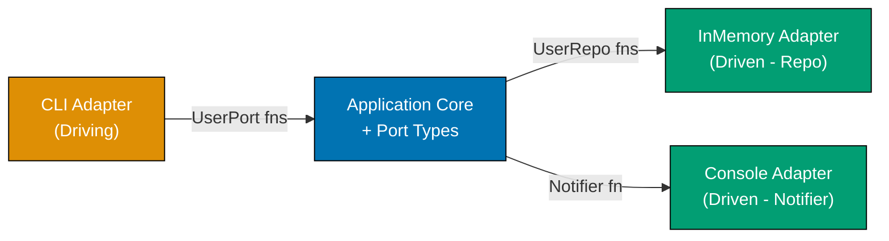
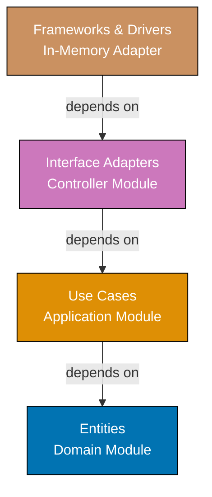
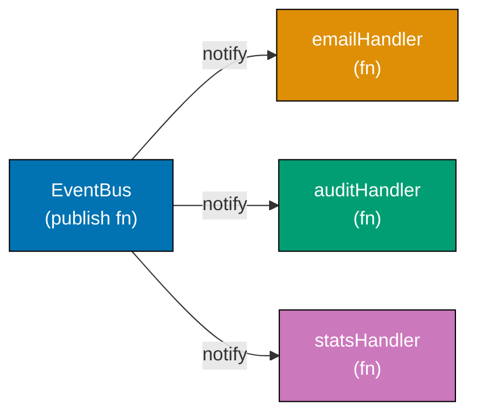
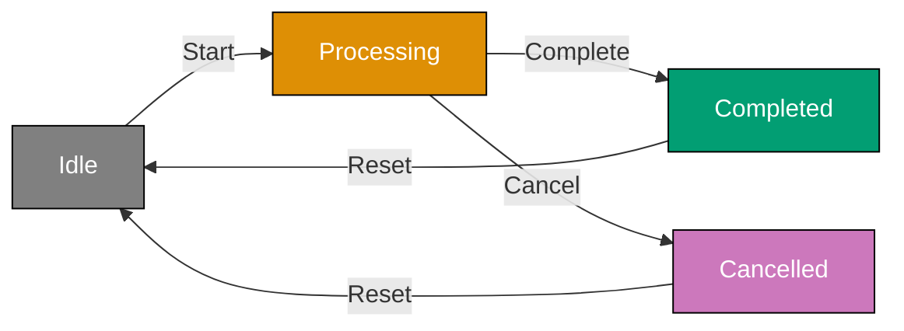
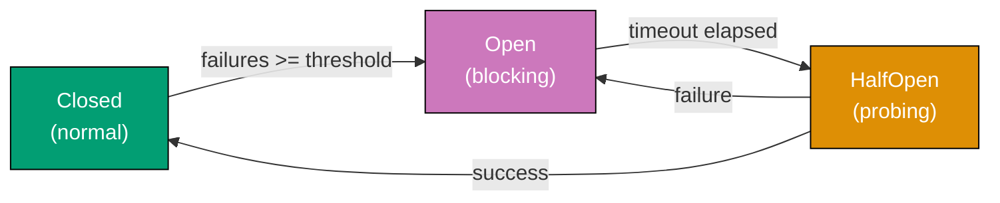

Examples 29-57 cover intermediate software architecture concepts (40-75% coverage). These examples build on foundational patterns and introduce composite architectural styles, enterprise patterns, and domain-driven design building blocks. Each example is self-contained and uses F# functional idioms: records, discriminated unions, pattern matching, smart constructors, Result types, modules, partial application, and the `|>` operator. Compatible with `dotnet fsi`.

## Hexagonal Architecture and Clean Architecture

### Example 29: Hexagonal Architecture — Ports and Adapters

Hexagonal architecture separates the application core from external systems by defining ports (function-type contracts) and adapters (concrete implementations). In F#, a port is simply a function type alias or record-of-functions — no abstract class required. The core calls port functions; adapters supply them at startup.







```fsharp
// => Domain entity — pure record, no infrastructure awareness
type User = { Id: string; Email: string; Name: string }

// => PORT types: function types that define what the core needs from infrastructure
// => These are the "holes" the core expects to be filled by adapters
type SaveUser    = User -> unit            // => persistence contract
type FindUser    = string -> User option   // => retrieval contract: returns Some or None
type SendWelcome = string -> unit          // => notification contract

// => APPLICATION CORE: depends only on the port function types, never on concrete code
// => All infrastructure is passed in as first-class function arguments
let register (save: SaveUser) (notify: SendWelcome) (id: string) (email: string) (name: string) : User =
    let user = { Id = id; Email = email; Name = name }
    // => Create the domain entity — pure data construction
    save user
    // => Persist via the injected SaveUser port — could be DB or in-memory
    notify email
    // => Notify via the injected SendWelcome port — could be email or console
    user
    // => Return domain object; callers receive clean domain data, not a DTO

// => ADAPTER (driven): in-memory implementation — a mutable dict acting as storage
let makeInMemoryRepo () =
    let store = System.Collections.Generic.Dictionary<string, User>()
    // => Mutable store captured in closure — invisible to the core
    let save (u: User) = store.[u.Id] <- u
    // => SaveUser adapter: stores user by Id
    let find (id: string) : User option =
        if store.ContainsKey(id) then Some store.[id]
        else None
        // => FindUser adapter: returns None for missing Ids
    save, find
    // => Returns the two port functions as a tuple — adapters are just functions

// => ADAPTER (driven): console notification
let consoleNotifier (email: string) =
    printfn "Welcome email sent to %s" email
    // => SendWelcome adapter: simulates sending email via console output

// wire up adapters and call the core
let save, find = makeInMemoryRepo ()
// => Destructure the tuple to get the two port functions
let registerUser = register save consoleNotifier
// => Partially apply the core function with the concrete adapters
// => registerUser : string -> string -> string -> User

let alice = registerUser "u1" "alice@example.com" "Alice"
// => Output: Welcome email sent to alice@example.com
// => alice : User = { Id = "u1"; Email = "alice@example.com"; Name = "Alice" }

let found = find "u1"
// => found : User option = Some { Id = "u1"; ... }
printfn "%s" (match found with Some u -> u.Email | None -> "not found")
// => Output: alice@example.com
```





```clojure
;; Domain entity — plain map with namespaced keywords; no type declaration needed
;; [F#: record type User — compile-time field names; Clojure uses runtime map keys]
(ns hexagonal.core)

;; PORT contracts expressed as plain functions passed as arguments
;; In Clojure, a "port" is any function with the right shape — no interface required
;; [F#: type alias SaveUser = User -> unit — named type alias enforced at compile time]

;; APPLICATION CORE: depends only on function arguments, never on concrete implementations
;; All infrastructure enters as first-class function arguments (threading macro used for clarity)
(defn register
  ;; save-user and send-welcome are the port functions; id/email/name are inputs
  [save-user send-welcome id email name]
  (let [user {:user/id id :user/email email :user/name name}]
    ;; => Construct the domain entity as a plain namespaced-keyword map
    (save-user user)
    ;; => Persist via the injected save-user port — could be DB or in-memory atom
    (send-welcome email)
    ;; => Notify via the injected send-welcome port — could be email or println
    user))
    ;; => Return domain map; callers receive clean domain data, not a DTO

;; ADAPTER (driven): in-memory store backed by an atom
;; [F#: mutable Dictionary captured in closure — same idea, Clojure uses atom for thread safety]
(defn make-in-memory-repo []
  (let [store (atom {})]
    ;; => atom wraps a persistent map; swap! updates atomically
    (let [save-user  (fn [user] (swap! store assoc (:user/id user) user))
          ;; => save-user adapter: assoc user into the atom-backed map by id
          find-user  (fn [id] (get @store id))]
          ;; => find-user adapter: deref atom and look up by id; returns nil if missing
      {:save-user save-user :find-user find-user})))
      ;; => Return both port functions in a map — callers destructure what they need

;; ADAPTER (driven): console notification
(defn console-notifier [email]
  (println (str "Welcome email sent to " email)))
  ;; => send-welcome adapter: simulates email via println

;; Wire up adapters and call the core
(let [repo          (make-in-memory-repo)
      ;; => Build the in-memory repo adapter
      save-user     (:save-user repo)
      ;; => Extract the save-user port function
      find-user     (:find-user repo)
      ;; => Extract the find-user port function
      register-user (partial register save-user console-notifier)]
      ;; => Partial application wires adapters into the core — same pattern as F# |>
  (let [alice (register-user "u1" "alice@example.com" "Alice")]
    ;; => Output: Welcome email sent to alice@example.com
    ;; => alice = {:user/id "u1" :user/email "alice@example.com" :user/name "Alice"}
    (let [found (find-user "u1")]
      ;; => found = {:user/id "u1" ...} or nil if missing
      (println (:user/email found)))))
      ;; => Output: alice@example.com
```





```typescript
// [F#: function-type ports + partial application wiring — TypeScript uses function types]

// => Domain entity — pure type, no infrastructure awareness
type User29 = Readonly<{ id: string; email: string; name: string }>;

// => PORT types: function types that define what the core needs from infrastructure
type SaveUser = (user: User29) => void; // => persistence contract
type FindUser = (id: string) => User29 | undefined; // => retrieval contract
type SendWelcome = (email: string) => void; // => notification contract

// => APPLICATION CORE: depends only on the port function types, never on concrete code
const register = (save: SaveUser, notify: SendWelcome, id: string, email: string, name: string): User29 => {
  const user: User29 = { id, email, name };
  // => Create the domain entity — pure data construction
  save(user);
  // => Persist via the injected SaveUser port — could be DB or in-memory
  notify(email);
  // => Notify via the injected SendWelcome port — could be email or console
  return user;
  // => Return domain object; callers receive clean domain data, not a DTO
};

// => ADAPTER (driven): in-memory implementation
const makeInMemoryRepo29 = (): { save: SaveUser; find: FindUser } => {
  const store = new Map<string, User29>();
  // => Mutable Map captured in closure — invisible to the core
  return {
    save: (u) => {
      store.set(u.id, u);
    },
    // => SaveUser adapter: stores user by id
    find: (id) => store.get(id),
    // => FindUser adapter: returns undefined for missing ids
  };
};

// => ADAPTER (driven): console notification
const consoleNotifier: SendWelcome = (email) => console.log(`Welcome email sent to ${email}`);
// => SendWelcome adapter: simulates sending email via console output

// wire up adapters and call the core
const { save: save29, find: find29 } = makeInMemoryRepo29();
// => Destructure the two port functions
const registerUser29 = (id: string, email: string, name: string) => register(save29, consoleNotifier, id, email, name);
// => Partially apply the core function with the concrete adapters

const alice29 = registerUser29("u1", "alice@example.com", "Alice");
// => Output: Welcome email sent to alice@example.com
// => alice29: User29 = { id: "u1", email: "alice@example.com", name: "Alice" }

const found29 = find29("u1");
// => found29: User29 | undefined = { id: "u1", ... }
console.log(found29 ? found29.email : "not found");
// => Output: alice@example.com
```





**Key Takeaway:** In F#, ports are function types; adapters are functions that match those types. Partial application wires them into the core without any dependency injection framework.

**Why It Matters:** Hexagonal architecture's greatest benefit is seam testability — the core runs entirely with lightweight in-memory adapters during tests, and the swap costs one line of wiring. In FP this seam is even cheaper: instead of swapping class hierarchies you pass a different function. Production systems that adopt this pattern survive infrastructure migrations (e.g., PostgreSQL → DynamoDB) because the core is never coupled to a concrete store, only to a function signature.

---

### Example 30: Clean Architecture — Layer Separation with Dependency Rule

Clean Architecture organises code into concentric rings: Entities → Use Cases → Interface Adapters → Frameworks. The dependency rule states dependencies point inward only. In F#, each ring becomes a module; inner modules have no `open` statements referencing outer ones.







```fsharp
// ── ENTITIES LAYER ──────────────────────────────────────────────────────────
// => Innermost ring: pure domain types and rules, zero external dependencies
module Domain =
    type OrderItem = { ProductId: string; Price: decimal; Qty: int }
    // => Value type: price snapshot at order time, not a live catalogue lookup

    type Order = { Id: string; Items: OrderItem list; CustomerId: string }
    // => Entity: owns identity (Id) and enforces coherence of its Items list

    let total (order: Order) : decimal =
        order.Items |> List.sumBy (fun i -> i.Price * decimal i.Qty)
        // => Business rule lives in the entity layer — not in a controller or use case

// ── USE CASES LAYER ─────────────────────────────────────────────────────────
// => Second ring: application business rules; depends only on Domain
module Application =
    open Domain

    // => Repository port: defined in use-cases layer, implemented in frameworks layer
    // => This is the Dependency Inversion Principle expressed as a function type
    type SaveOrder = Order -> unit

    // => Use case function: orchestrates entity creation and persistence
    let placeOrder (save: SaveOrder) (customerId: string) (items: OrderItem list) : Order =
        let id = sprintf "ord-%d" (System.DateTime.UtcNow.Ticks)
        // => Generate a deterministic-enough ID for demo purposes
        let order = { Id = id; Items = items; CustomerId = customerId }
        // => Construct entity using the domain type — no DB concern here
        save order
        // => Persist via the injected SaveOrder port
        order
        // => Return entity: callers receive domain data, not a DB row

// ── INTERFACE ADAPTERS LAYER ─────────────────────────────────────────────────
// => Third ring: translates between use-case types and framework representations
module Controller =
    open Domain
    open Application

    type HttpRequest = { CustomerId: string; Items: OrderItem list }
    type HttpResponse = { OrderId: string; Total: decimal }
    // => Adapter types: framework-shaped, not domain-shaped

    let handlePlaceOrder (save: SaveOrder) (req: HttpRequest) : HttpResponse =
        let order = placeOrder save req.CustomerId req.Items
        // => Delegates to use case with domain-shaped input
        { OrderId = order.Id; Total = total order }
        // => Presenter maps entity → HTTP response — adapter concern, not domain concern

// ── FRAMEWORKS LAYER ─────────────────────────────────────────────────────────
// => Outermost ring: concrete implementations; depends on all inner rings
module Infrastructure =
    open Domain

    let makeInMemoryRepo () =
        let store = System.Collections.Generic.Dictionary<string, Order>()
        // => Concrete storage — invisible to inner rings
        fun (order: Order) -> store.[order.Id] <- order
        // => Returns a SaveOrder function — matches the port type exactly

// wiring (frameworks layer assembles everything)
let save = Infrastructure.makeInMemoryRepo ()
// => Concrete adapter created in the outermost layer
let req : Controller.HttpRequest =
    { CustomerId = "c1"
      Items = [ { ProductId = "p1"; Price = 10.0m; Qty = 2 } ] }
let resp = Controller.handlePlaceOrder save req
// => Response from the controller adapter
printfn "OrderId: %s, Total: %M" resp.OrderId resp.Total
// => Output: OrderId: ord-..., Total: 20
```





```clojure
;; ── ENTITIES LAYER (innermost) ──────────────────────────────────────────────
;; Pure data functions — no I/O, no infrastructure awareness
;; [F#: module Domain with record types — Clojure uses plain maps + namespace conventions]
(ns clean-arch.domain)

(defn order-total
  ;; Business rule: lives at the innermost ring, not in a controller
  [order]
  (->> (:order/items order)
       ;; => Thread-last over items list
       (map (fn [item] (* (:item/price item) (:item/qty item))))
       ;; => Multiply price × qty for each item
       (reduce + 0)))
       ;; => Sum all line totals; returns a number

;; ── USE CASES LAYER ─────────────────────────────────────────────────────────
;; Application business rules; depends only on the domain namespace
;; [F#: module Application with SaveOrder port type — Clojure passes functions directly]
(ns clean-arch.application
  (:require [clean-arch.domain :as domain]))

(defn place-order
  ;; save-order is the port function — any fn that persists an order map
  [save-order customer-id items]
  (let [id    (str "ord-" (System.currentTimeMillis))
        ;; => Generate an ID from current time — same approach as F# Ticks
        order {:order/id          id
               :order/customer-id customer-id
               :order/items       items}]
        ;; => Construct entity as a namespaced-keyword map — no DB concern here
    (save-order order)
    ;; => Persist via the injected port — could be atom, DB fn, or mock
    order))
    ;; => Return entity map; caller receives domain data, not a DB row

;; ── INTERFACE ADAPTERS LAYER ─────────────────────────────────────────────────
;; Translates between use-case maps and "HTTP" shaped maps
;; [F#: module Controller with HttpRequest/HttpResponse record types]
(ns clean-arch.controller
  (:require [clean-arch.application :as app]
            [clean-arch.domain      :as domain]))

(defn handle-place-order
  ;; save-order port and an HTTP-shaped request map
  [save-order req]
  (let [order (app/place-order save-order
                               (:req/customer-id req)
                               (:req/items req))]
    ;; => Delegate to use case with domain-shaped input
    {:resp/order-id (:order/id order)
     :resp/total    (domain/order-total order)}))
     ;; => Presenter maps domain entity → HTTP response shape

;; ── FRAMEWORKS LAYER (outermost) ────────────────────────────────────────────
;; Concrete implementations; depends on all inner namespaces
;; [F#: module Infrastructure returning a SaveOrder function]
(ns clean-arch.infrastructure)

(defn make-in-memory-repo []
  (let [store (atom {})]
    ;; => atom-backed map: infrastructure detail, invisible to inner namespaces
    (fn [order]
      (swap! store assoc (:order/id order) order))))
      ;; => Returns a save-order function matching the port contract

;; ── Wiring (frameworks layer assembles everything) ──────────────────────────
(ns clean-arch.main
  (:require [clean-arch.infrastructure :as infra]
            [clean-arch.controller     :as ctrl]))

(let [save-order (infra/make-in-memory-repo)
      ;; => Concrete adapter created in outermost namespace
      req        {:req/customer-id "c1"
                  :req/items       [{:item/product-id "p1"
                                     :item/price      10.0
                                     :item/qty        2}]}
      resp       (ctrl/handle-place-order save-order req)]
      ;; => Response from the controller adapter
  (println "OrderId:" (:resp/order-id resp) "Total:" (:resp/total resp)))
  ;; => Output: OrderId: ord-... Total: 20
```





```typescript
// [F#: four modules with inward-only dependency rule — TypeScript uses namespaced const objects]

// ── ENTITIES LAYER ────────────────────────────────────────────────────────────
// => Innermost ring: pure domain types and rules, zero external dependencies
type OrderItem30 = Readonly<{ productId: string; price: number; qty: number }>;
type Order30 = Readonly<{ id: string; items: readonly OrderItem30[]; customerId: string }>;

const orderTotal = (order: Order30): number => order.items.reduce((sum, i) => sum + i.price * i.qty, 0);
// => Business rule lives in the entity layer — not in a controller or use case

// ── USE CASES LAYER ───────────────────────────────────────────────────────────
// => Second ring: application business rules; depends only on domain types
type SaveOrder30 = (order: Order30) => void;
// => Repository port: defined in use-cases layer, implemented in frameworks layer
// => This is the Dependency Inversion Principle expressed as a function type

const placeOrder30 = (save: SaveOrder30, customerId: string, items: readonly OrderItem30[]): Order30 => {
  const id = `ord-${Date.now()}`;
  // => Generate an id — deterministic enough for demo purposes
  const order: Order30 = { id, items, customerId };
  // => Construct entity using the domain type — no DB concern here
  save(order);
  // => Persist via the injected SaveOrder30 port
  return order;
  // => Return entity: callers receive domain data, not a DB row
};

// ── INTERFACE ADAPTERS LAYER ──────────────────────────────────────────────────
// => Third ring: translates between use-case types and framework representations
type HttpRequest30 = Readonly<{ customerId: string; items: readonly OrderItem30[] }>;
type HttpResponse30 = Readonly<{ orderId: string; total: number }>;

const handlePlaceOrder30 = (save: SaveOrder30, req: HttpRequest30): HttpResponse30 => {
  const order = placeOrder30(save, req.customerId, req.items);
  // => Delegates to use case with domain-shaped input
  return { orderId: order.id, total: orderTotal(order) };
  // => Presenter maps entity → HTTP response — adapter concern, not domain concern
};

// ── FRAMEWORKS LAYER ──────────────────────────────────────────────────────────
// => Outermost ring: concrete implementations; depends on all inner rings
const makeInMemoryRepo30 = (): SaveOrder30 => {
  const store = new Map<string, Order30>();
  // => Concrete storage — invisible to inner rings
  return (order) => {
    store.set(order.id, order);
  };
  // => Returns a SaveOrder30 function — matches the port type exactly
};

// wiring (frameworks layer assembles everything)
const save30 = makeInMemoryRepo30();
// => Concrete adapter created in the outermost layer
const req30: HttpRequest30 = {
  customerId: "c1",
  items: [{ productId: "p1", price: 10.0, qty: 2 }],
};
const resp30 = handlePlaceOrder30(save30, req30);
console.log(`OrderId: ${resp30.orderId}, Total: ${resp30.total}`);
// => Output: OrderId: ord-..., Total: 20
```





**Key Takeaway:** The dependency rule — source code dependencies pointing inward only — is enforced in F# by the module declaration order. Inner modules appear first; outer modules `open` them, never the reverse.

**Why It Matters:** Clean Architecture's dependency rule is what makes business logic survive framework migrations. Switching from an in-memory store to a PostgreSQL adapter touches only the outermost module; the domain and use-case modules are unchanged. Teams that enforce this rule report that major infrastructure rewrites take days rather than months, because the business logic has never been entangled with storage details.

---

### Example 31: Onion Architecture — Domain at the Center

Onion Architecture places the domain model at the very center, surrounded by domain services, then application services, then infrastructure. Every dependency points inward. In F#, the concentric rings map naturally to module ordering: domain types first, then functions that operate on them, then infrastructure last.





```fsharp
// ── DOMAIN MODEL (innermost ring) ───────────────────────────────────────────
// => Pure value types: no I/O, no mutation, no external dependencies
type Currency = string  // => ISO 4217 code, e.g., "USD"
type Money = { Amount: decimal; Currency: Currency }
// => Money is a value object: equality by value, not by reference

type Product = { Id: string; Name: string; Price: Money }
// => Product entity: owns its identity and price as a domain concept

// => Domain rule: adding money of different currencies is a domain-level error
let addMoney (a: Money) (b: Money) : Result<Money, string> =
    if a.Currency <> b.Currency then
        Error (sprintf "Currency mismatch: %s vs %s" a.Currency b.Currency)
        // => Domain rule enforced at the innermost ring — not in a controller
    else
        Ok { Amount = a.Amount + b.Amount; Currency = a.Currency }
        // => Returns Result to make the error case explicit and type-safe

// ── DOMAIN SERVICES (second ring) ───────────────────────────────────────────
// => Stateless functions on domain objects; no infrastructure calls
let applyDiscount (price: Money) (discountPct: float) : Money =
    let discounted = price.Amount * (1.0m - decimal discountPct / 100.0m)
    // => Compute discounted amount: 10% off $100 → $90
    { price with Amount = System.Math.Round(discounted, 2) }
    // => Record update expression: returns new Money preserving Currency

// ── APPLICATION SERVICES (third ring) ───────────────────────────────────────
// => Orchestrates domain objects and domain services; receives ports as arguments
type FindProduct = string -> Product option
// => Port type: application layer defines what it needs from infrastructure

let getDiscountedPrice (find: FindProduct) (productId: string) (pct: float) : Result<Money, string> =
    match find productId with
    | None -> Error (sprintf "Product %s not found" productId)
    // => Application-level error: missing product is an expected business outcome
    | Some product ->
        Ok (applyDiscount product.Price pct)
        // => Delegates price logic to the domain service — application just orchestrates

// ── INFRASTRUCTURE (outermost ring) ─────────────────────────────────────────
// => Concrete store that satisfies the FindProduct port
let makeProductRepo () =
    let data = System.Collections.Generic.Dictionary<string, Product>()
    // => Mutable dictionary: infrastructure detail, invisible to inner rings
    let add p = data.[p.Id] <- p
    // => Helper for seeding test data
    let find (id: string) : Product option =
        if data.ContainsKey(id) then Some data.[id]
        else None
        // => Returns None for missing keys — matches FindProduct port type
    add, find
    // => Returns (add, find) functions as a tuple

// wiring
let addProduct, findProduct = makeProductRepo ()
addProduct { Id = "p1"; Name = "Widget"; Price = { Amount = 100.0m; Currency = "USD" } }
// => Seed the in-memory repo with one product

let result = getDiscountedPrice findProduct "p1" 10.0
// => Application service call with injected FindProduct adapter
match result with
| Ok price -> printfn "%s %.2M" price.Currency price.Amount
              // => Output: USD 90.00
| Error msg -> printfn "Error: %s" msg
```





```clojure
;; ── DOMAIN MODEL (innermost ring) ───────────────────────────────────────────
;; Pure data and pure functions — no I/O, no mutation, no external dependencies
;; [F#: record types Money and Product — Clojure uses plain maps with namespaced keywords]
(ns onion.domain)

;; Money is a plain map: {:money/amount 100.0 :money/currency "USD"}
;; No type declaration — maps are the universal value object in Clojure

(defn add-money
  ;; Domain rule: adding money of mismatched currencies is an error
  ;; [F#: Result<Money, string> — Clojure returns a map with :ok/:error key]
  [a b]
  (if (not= (:money/currency a) (:money/currency b))
    {:error (str "Currency mismatch: "
                 (:money/currency a) " vs " (:money/currency b))}
    ;; => Return error map — data-oriented error signalling, no exception thrown
    {:ok {:money/amount   (+ (:money/amount a) (:money/amount b))
          :money/currency (:money/currency a)}}))
          ;; => Return ok map wrapping the summed Money value

;; ── DOMAIN SERVICES (second ring) ───────────────────────────────────────────
;; Stateless pure functions on domain data; no infrastructure calls
(defn apply-discount
  ;; Compute discounted price — domain logic stays at inner ring
  [price discount-pct]
  (let [discounted (* (:money/amount price)
                      (- 1.0 (/ discount-pct 100.0)))]
    ;; => Discounted amount: 10% off 100.0 → 90.0
    (assoc price :money/amount (double (Math.round (* discounted 100.0)) ))))
    ;; => assoc returns new map with updated :money/amount; currency unchanged

;; ── APPLICATION SERVICES (third ring) ───────────────────────────────────────
;; Orchestrates domain and domain services; receives find-product port as argument
;; [F#: type FindProduct = string -> Product option — Clojure passes fn directly]
(ns onion.application
  (:require [onion.domain :as domain]))

(defn get-discounted-price
  ;; find-product is the port function injected from infrastructure
  [find-product product-id pct]
  (if-let [product (find-product product-id)]
    ;; => if-let: bind product only if find-product returns non-nil
    {:ok (domain/apply-discount (:product/price product) pct)}
    ;; => Delegate price logic to domain service — application just orchestrates
    {:error (str "Product " product-id " not found")}))
    ;; => Return error map for missing product — expected business outcome

;; ── INFRASTRUCTURE (outermost ring) ─────────────────────────────────────────
;; Concrete store satisfying the find-product port
;; [F#: mutable Dictionary inside closure — Clojure uses atom over persistent map]
(ns onion.infrastructure)

(defn make-product-repo []
  (let [data (atom {})]
    ;; => atom wraps a persistent map; swap! updates atomically
    (let [add-product  (fn [p] (swap! data assoc (:product/id p) p))
          ;; => add-product: insert product into atom by id
          find-product (fn [id] (get @data id))]
          ;; => find-product: deref atom and look up by id; nil if missing
      {:add-product add-product :find-product find-product})))
      ;; => Return both functions in a map for convenient destructuring

;; Wiring
(ns onion.main
  (:require [onion.infrastructure :as infra]
            [onion.application    :as app]))

(let [repo         (infra/make-product-repo)
      add-product  (:add-product repo)
      find-product (:find-product repo)]
  ;; => Extract the port functions from the infrastructure map
  (add-product {:product/id    "p1"
                :product/name  "Widget"
                :product/price {:money/amount 100.0 :money/currency "USD"}})
  ;; => Seed the in-memory repo with one product
  (let [result (app/get-discounted-price find-product "p1" 10.0)]
    ;; => Application service call with injected find-product adapter
    (if (:ok result)
      (let [price (:ok result)]
        (println (:money/currency price)
                 (format "%.2f" (:money/amount price))))
      ;; => Output: USD 90.00
      (println "Error:" (:error result)))))
```





```typescript
// [F#: four rings with inward-only dependencies — TypeScript uses pure functions + factory]

// ── DOMAIN MODEL (innermost ring) ─────────────────────────────────────────────
type Money31 = Readonly<{ amount: number; currency: string }>;
// => Money is a value object: equality by value, not by reference

type Product31 = Readonly<{ id: string; name: string; price: Money31 }>;
// => Product entity: owns its identity and price as a domain concept
type Result31<T, E> = { ok: true; value: T } | { ok: false; error: E };

// => Domain rule: adding money of different currencies is a domain-level error
const addMoney31 = (a: Money31, b: Money31): Result31<Money31, string> => {
  if (a.currency !== b.currency) return { ok: false, error: `Currency mismatch: ${a.currency} vs ${b.currency}` };
  // => Domain rule enforced at the innermost ring — not in a controller
  return { ok: true, value: { amount: a.amount + b.amount, currency: a.currency } };
  // => Returns Result to make the error case explicit
};

// ── DOMAIN SERVICES (second ring) ─────────────────────────────────────────────
// => Stateless pure functions on domain objects; no infrastructure calls
const applyDiscount31 = (price: Money31, discountPct: number): Money31 => {
  const discounted = price.amount * (1 - discountPct / 100);
  // => Compute discounted amount: 10% off $100 → $90
  return { ...price, amount: Math.round(discounted * 100) / 100 };
  // => Spread preserves currency; amount updated to discounted value
};

// ── APPLICATION SERVICES (third ring) ─────────────────────────────────────────
type FindProduct31 = (id: string) => Product31 | undefined;
// => Port type: application layer defines what it needs from infrastructure

const getDiscountedPrice31 = (find: FindProduct31, productId: string, pct: number): Result31<Money31, string> => {
  const product = find(productId);
  // => delegates data retrieval to the injected port
  if (!product) return { ok: false, error: `Product ${productId} not found` };
  // => Application-level error: missing product is an expected business outcome
  return { ok: true, value: applyDiscount31(product.price, pct) };
  // => Delegates price logic to the domain service — application just orchestrates
};

// ── INFRASTRUCTURE (outermost ring) ───────────────────────────────────────────
const makeProductRepo31 = () => {
  const data = new Map<string, Product31>();
  // => Mutable Map: infrastructure detail, invisible to inner rings
  const add = (p: Product31) => {
    data.set(p.id, p);
  };
  const find: FindProduct31 = (id) => data.get(id);
  // => Returns None for missing ids — matches FindProduct31 port type
  return { add, find };
};

// wiring
const { add: add31, find: find31 } = makeProductRepo31();
add31({ id: "p1", name: "Widget", price: { amount: 100.0, currency: "USD" } });
// => Seed the in-memory repo with one product

const result31 = getDiscountedPrice31(find31, "p1", 10.0);
// => Application service call with injected FindProduct31 adapter
if (result31.ok) console.log(`${result31.value.currency} ${result31.value.amount.toFixed(2)}`);
// => Output: USD 90.00
else console.log(`Error: ${result31.error}`);
```





**Key Takeaway:** Each ring depends only on rings closer to the center. The domain model at the center has zero dependencies; infrastructure at the edge depends on everything but is depended on by nothing.

**Why It Matters:** Onion Architecture aligns naturally with Domain-Driven Design: the innermost ring is the Bounded Context's pure domain model, the outermost ring is its infrastructure shell. In F#, the module declaration order physically enforces the dependency direction — the compiler prevents outer rings from sneaking into inner rings through import ordering. Switching from an in-memory store to a PostgreSQL adapter changes only the outermost `makeProductRepo` function; every other ring is untouched.

---

## Event-Driven Architecture

### Example 32: Observer Pattern — Event Notification Without Coupling

The Observer pattern defines a one-to-many dependency so that when one object changes state all dependents are notified automatically. In F#, the "observers" are simply event-handler functions stored in a mutable list; no interface required.







```fsharp
// => Event type: discriminated union models all domain events in a type-safe set
type AppEvent =
    | UserRegistered of email: string
    | OrderPlaced of orderId: string * total: decimal
    // => Each case carries exactly the data its handlers need — no generic object

// => EventBus: a function registry — subscribers register handler functions
// => Handler functions have type AppEvent -> unit
let makeEventBus () =
    let handlers = System.Collections.Generic.List<AppEvent -> unit>()
    // => Mutable list of handler functions — the "observer" list

    let subscribe (handler: AppEvent -> unit) =
        handlers.Add(handler)
        // => Registration: add function reference to the list

    let publish (event: AppEvent) =
        for handler in handlers do
            handler event
        // => Dispatch: iterate and call each registered handler function

    subscribe, publish
    // => Return the two capabilities as a tuple

let subscribe, publish = makeEventBus ()
// => Destructure into the two port functions

// => OBSERVER 1: email handler — reacts only to UserRegistered events
let emailHandler event =
    match event with
    | UserRegistered email -> printfn "Email sent to %s" email
    // => Pattern match: ignore events this handler doesn't care about
    | _ -> ()
    // => Wildcard arm: silently discard unrelated events

// => OBSERVER 2: audit handler — logs all events generically
let auditHandler event =
    printfn "AUDIT: %A" event
    // => %A formats any discriminated union case with its fields

// => OBSERVER 3: stats handler — reacts only to OrderPlaced events
let statsHandler event =
    match event with
    | OrderPlaced (id, total) -> printfn "Stats: order %s, total %M" id total
    | _ -> ()

subscribe emailHandler   // => Register all three observers
subscribe auditHandler
subscribe statsHandler

publish (UserRegistered "bob@example.com")
// => Output: Email sent to bob@example.com
// => Output: AUDIT: UserRegistered "bob@example.com"

publish (OrderPlaced ("ord-1", 99.0m))
// => Output: AUDIT: OrderPlaced ("ord-1", 99.0M)
// => Output: Stats: order ord-1, total 99
```





```clojure
;; Event type: plain maps with a :type keyword as the discriminator
;; [F#: discriminated union AppEvent — compile-time exhaustiveness; Clojure uses open dispatch on map keys]
(ns observer.core)

;; EventBus: atom holds a vector of handler functions
;; [F#: mutable List<AppEvent -> unit> — Clojure uses atom over a persistent vector]
(defn make-event-bus []
  (let [handlers (atom [])]
    ;; => atom wraps a persistent vector of handler functions
    (let [subscribe (fn [handler]
                      (swap! handlers conj handler))
                      ;; => conj appends the handler function to the vector
          publish   (fn [event]
                      (doseq [h @handlers]
                        (h event)))]
                        ;; => doseq iterates handlers and calls each with the event
      {:subscribe subscribe :publish publish})))
      ;; => Return both capabilities in a map for convenient destructuring

(let [bus      (make-event-bus)
      subscribe (:subscribe bus)
      publish   (:publish   bus)]

  ;; OBSERVER 1: email handler — reacts only to :user-registered events
  (subscribe (fn [event]
               (when (= (:type event) :user-registered)
                 ;; => when filters to the relevant event type (no exhaustiveness check)
                 (println "Email sent to" (:email event)))))
                 ;; => Extract :email from the event map

  ;; OBSERVER 2: audit handler — logs all events generically
  ;; [F#: printfn "AUDIT: %A" event — Clojure pr-str gives REPL-readable representation]
  (subscribe (fn [event]
               (println "AUDIT:" (pr-str event))))
               ;; => pr-str produces a REPL-readable string of any Clojure value

  ;; OBSERVER 3: stats handler — reacts only to :order-placed events
  (subscribe (fn [event]
               (when (= (:type event) :order-placed)
                 (println "Stats: order" (:order-id event)
                          "total" (:total event)))))

  (publish {:type :user-registered :email "bob@example.com"})
  ;; => Output: Email sent to bob@example.com
  ;; => Output: AUDIT: {:type :user-registered, :email "bob@example.com"}

  (publish {:type :order-placed :order-id "ord-1" :total 99.0})
  ;; => Output: AUDIT: {:type :order-placed, :order-id "ord-1", :total 99.0}
  ;; => Output: Stats: order ord-1 total 99.0
  )
```





```typescript
// [F#: list of handler functions + make-event-bus — TypeScript version]

// => Event type: tagged union models all domain events in a type-safe set
type AppEvent = { tag: "UserRegistered"; email: string } | { tag: "OrderPlaced"; orderId: string; total: number };
// => Each case carries exactly the data its handlers need — no generic object

// => EventBus: a function registry — subscribers register handler functions
const makeEventBus32 = () => {
  const handlers: ((event: AppEvent) => void)[] = [];
  // => Mutable array of handler functions — the "observer" list

  const subscribe = (handler: (event: AppEvent) => void) => {
    handlers.push(handler);
    // => Registration: add function reference to the array
  };

  const publish = (event: AppEvent) => {
    for (const handler of handlers) handler(event);
    // => Dispatch: iterate and call each registered handler function
  };

  return { subscribe, publish };
};

const { subscribe: sub32, publish: pub32 } = makeEventBus32();

// => OBSERVER 1: email handler — reacts only to UserRegistered events
sub32((event) => {
  if (event.tag === "UserRegistered") console.log(`Email sent to ${event.email}`);
  // => TypeScript narrows the type — event.email is accessible here
  // => Other events are simply ignored — handled by other observers
});

// => OBSERVER 2: audit handler — logs all events generically
sub32((event) => {
  console.log(`AUDIT: ${JSON.stringify(event)}`);
  // => Logs every event as a JSON string — no filtering needed
});

// => OBSERVER 3: stats handler — reacts only to OrderPlaced events
sub32((event) => {
  if (event.tag === "OrderPlaced") console.log(`Stats: order ${event.orderId}, total ${event.total}`);
});

pub32({ tag: "UserRegistered", email: "bob@example.com" });
// => Output: Email sent to bob@example.com
// => Output: AUDIT: {"tag":"UserRegistered","email":"bob@example.com"}

pub32({ tag: "OrderPlaced", orderId: "ord-1", total: 99.0 });
// => Output: AUDIT: {"tag":"OrderPlaced","orderId":"ord-1","total":99}
// => Output: Stats: order ord-1, total 99
```





**Key Takeaway:** Observer in F# is a list of functions. The discriminated union event type gives handlers compile-time safety to pattern-match only the cases they care about.

**Why It Matters:** Event-driven systems decouple producers from consumers: the publisher knows nothing about handlers. In F# this decoupling costs less than in OOP — there is no EventListener interface, no anonymous class, just a function value stored in a list. Real systems use this pattern for audit logging, metrics collection, and email notifications all firing off a single domain event without the event source needing any knowledge of the downstream consumers.

---

### Example 33: Domain Events — Signaling State Changes Within a Bounded Context

Domain events represent something significant that happened in the domain — past tense, immutable facts. In F#, domain events are discriminated union cases collected as a list alongside the updated state. Functions return `(newState, events)` tuples rather than firing side effects directly.





```fsharp
// => Domain entity type
type AccountId = AccountId of string
type Account = { Id: AccountId; Balance: decimal; Owner: string }

// => Domain event type: past-tense facts about what happened
type AccountEvent =
    | AccountOpened of AccountId * owner: string * initialBalance: decimal
    | MoneyDeposited of AccountId * amount: decimal
    | MoneyWithdrawn of AccountId * amount: decimal
    // => Each case is a named fact; discriminated unions prevent invalid event types

// => Command result: returns updated state AND events raised — no side effects yet
// => Pattern: (state, events list) — infrastructure decides what to do with events
let openAccount (id: string) (owner: string) (initialBalance: decimal) : Account * AccountEvent list =
    let accountId = AccountId id
    // => Wrap raw string in single-case DU to prevent Id/Name mix-ups
    let account = { Id = accountId; Balance = initialBalance; Owner = owner }
    // => Create the entity — pure construction, no I/O
    let event = AccountOpened (accountId, owner, initialBalance)
    // => Raise the domain event as a value — not yet published anywhere
    account, [ event ]
    // => Return tuple: new state + list of domain events

let deposit (account: Account) (amount: decimal) : Result<Account * AccountEvent list, string> =
    if amount <= 0.0m then
        Error "Deposit amount must be positive"
        // => Domain rule violation: return Error — never raise an exception for business rules
    else
        let updated = { account with Balance = account.Balance + amount }
        // => Immutable update: record expression produces a new Account record
        let event = MoneyDeposited (account.Id, amount)
        Ok (updated, [ event ])
        // => Success: return updated account and the domain event it raised

// event publisher: infrastructure function that acts on collected events
let publishEvents (events: AccountEvent list) =
    for e in events do
        printfn "EVENT: %A" e
        // => In production: write to event store, put on message bus, etc.

// demo
let account, openEvents = openAccount "acc-1" "Alice" 1000.0m
publishEvents openEvents
// => EVENT: AccountOpened (AccountId "acc-1", "Alice", 1000.0M)

match deposit account 250.0m with
| Error msg -> printfn "Error: %s" msg
| Ok (updated, events) ->
    publishEvents events
    // => EVENT: MoneyDeposited (AccountId "acc-1", 250.0M)
    printfn "Balance: %M" updated.Balance
    // => Output: Balance: 1250
```





```clojure
;; Domain entity as namespaced-keyword map — account-id is a plain string here
;; [F#: single-case DU AccountId of string — prevents Id/Name mix-ups at compile time;
;;  Clojure relies on namespaced keywords for clarity instead]
(ns domain-events.core)

;; Domain events are plain maps with a :event/type keyword as the discriminator
;; [F#: discriminated union AccountEvent — Clojure uses maps with :event/type dispatch]

(defn open-account
  ;; Command function: returns [new-state events] — no I/O, pure data
  [id owner initial-balance]
  (let [account {:account/id      id
                 :account/balance initial-balance
                 :account/owner   owner}
        ;; => Construct entity map — pure data construction, no I/O
        event   {:event/type    :account-opened
                 :event/account-id id
                 :event/owner      owner
                 :event/amount     initial-balance}]
                 ;; => Domain event as a plain map: past-tense fact
    [account [event]]))
    ;; => Return vector [new-state events-list] — infrastructure decides what to do

(defn deposit
  ;; Returns {:ok [updated-account events]} or {:error msg}
  ;; [F#: Result<Account * AccountEvent list, string> — Clojure uses a result map]
  [account amount]
  (if (<= amount 0)
    {:error "Deposit amount must be positive"}
    ;; => Domain rule violation: error map, never throw for business rules
    (let [updated (update account :account/balance + amount)
          ;; => update applies + to :account/balance — returns a new map
          event   {:event/type       :money-deposited
                   :event/account-id (:account/id account)
                   :event/amount     amount}]
      {:ok [updated [event]]})))
      ;; => Success: updated account map and domain event in result map

;; Event publisher: infrastructure function that acts on collected events
(defn publish-events [events]
  (doseq [e events]
    (println "EVENT:" (pr-str e))))
    ;; => In production: write to event store, put on message bus, etc.

;; Demo
(let [[account open-events] (open-account "acc-1" "Alice" 1000.0)]
  ;; => Destructure [state events] vector
  (publish-events open-events)
  ;; => EVENT: {:event/type :account-opened, :event/account-id "acc-1", ...}
  (let [result (deposit account 250.0)]
    (if (:error result)
      (println "Error:" (:error result))
      (let [[updated events] (:ok result)]
        ;; => Destructure [updated-account events] from the :ok value
        (publish-events events)
        ;; => EVENT: {:event/type :money-deposited, :event/account-id "acc-1", :event/amount 250.0}
        (println "Balance:" (:account/balance updated))))))
        ;; => Output: Balance: 1250.0
```





```typescript
// [F#: state + events list return pattern — TypeScript uses readonly arrays and tagged unions]
type Result33<T, E> = { ok: true; value: T } | { ok: false; error: E };

// => Domain entity types
type AccountId33 = Readonly<{ value: string; _brand: "AccountId" }>;
type Account33 = Readonly<{ id: AccountId33; balance: number; owner: string }>;

// => Domain event type: past-tense facts about what happened
type AccountEvent =
  | { tag: "AccountOpened"; accountId: AccountId33; owner: string; initialBalance: number }
  | { tag: "MoneyDeposited"; accountId: AccountId33; amount: number }
  | { tag: "MoneyWithdrawn"; accountId: AccountId33; amount: number };
// => Each case is a named fact — tagged union prevents invalid event types

const accountId33 = (value: string): AccountId33 => ({ value, _brand: "AccountId" });
// => Smart constructor: wraps raw string to prevent Id/Name mix-ups

// => Command result: returns updated state AND events raised — no side effects yet
const openAccount33 = (
  id: string,
  owner: string,
  initialBalance: number,
): readonly [Account33, readonly AccountEvent[]] => {
  const aid = accountId33(id);
  const account: Account33 = { id: aid, balance: initialBalance, owner };
  // => Create the entity — pure construction, no I/O
  const event: AccountEvent = { tag: "AccountOpened", accountId: aid, owner, initialBalance };
  // => Raise the domain event as a value — not yet published anywhere
  return [account, [event]] as const;
  // => Return tuple: new state + list of domain events
};

const deposit33 = (
  account: Account33,
  amount: number,
): Result33<readonly [Account33, readonly AccountEvent[]], string> => {
  if (amount <= 0) return { ok: false, error: "Deposit amount must be positive" };
  // => Domain rule violation: return Error — never throw for business rules
  const updated: Account33 = { ...account, balance: account.balance + amount };
  // => Immutable update: spread creates a new Account33 record
  const event: AccountEvent = { tag: "MoneyDeposited", accountId: account.id, amount };
  return { ok: true, value: [updated, [event]] };
  // => Success: return updated account and the domain event it raised
};

// event publisher: infrastructure function that acts on collected events
const publishEvents33 = (events: readonly AccountEvent[]): void => {
  for (const e of events) console.log(`EVENT: ${JSON.stringify(e)}`);
  // => In production: write to event store, put on message bus, etc.
};

// demo
const [account33, openEvents] = openAccount33("acc-1", "Alice", 1000.0);
publishEvents33(openEvents);
// => EVENT: {"tag":"AccountOpened","accountId":...,"owner":"Alice","initialBalance":1000}

const depositResult = deposit33(account33, 250.0);
if (depositResult.ok) {
  const [updated33, events33] = depositResult.value;
  publishEvents33(events33);
  // => EVENT: {"tag":"MoneyDeposited","accountId":...,"amount":250}
  console.log(`Balance: ${updated33.balance}`);
  // => Output: Balance: 1250
} else {
  console.log(`Error: ${depositResult.error}`);
}
```





**Key Takeaway:** Functions return `(newState, events list)` tuples. Domain events are values collected during business logic and published by infrastructure — business logic stays free of I/O.

**Why It Matters:** Decoupling event collection from event publication means business logic is a pure function: same input always produces the same output, with no observable side effects. This makes domain logic trivially testable — assert on the returned event list rather than mocking a message bus. In event-sourced systems, these domain events become the source of truth, enabling full audit trails and temporal state reconstruction.

---

### Example 34: Event-Driven Architecture — Async Message Passing Between Services

Event-driven architecture routes events through a central bus so services communicate without direct coupling. In F#, the bus is modelled as a simple in-memory dispatch function; real systems replace it with Kafka, RabbitMQ, or Azure Service Bus while keeping the handler function signatures identical.





```fsharp
// => Message type: discriminated union of all inter-service events
type ServiceEvent =
    | UserSignedUp of userId: string * email: string
    | SubscriptionStarted of userId: string * plan: string
    | PaymentProcessed of userId: string * amount: decimal
    // => DU enforces that all event types are known at compile time

// => Handler type: any function that receives a ServiceEvent
type EventHandler = ServiceEvent -> unit

// => In-memory message bus: stores handlers per event topic name
let makeMessageBus () =
    let registry = System.Collections.Generic.Dictionary<string, ResizeArray<EventHandler>>()
    // => topic (string) → list of handlers; ResizeArray = mutable .NET List

    let subscribe (topic: string) (handler: EventHandler) =
        if not (registry.ContainsKey(topic)) then
            registry.[topic] <- ResizeArray()
            // => Create handler list on first subscription to this topic
        registry.[topic].Add(handler)
        // => Register handler for the topic

    let publish (topic: string) (event: ServiceEvent) =
        match registry.TryGetValue(topic) with
        | true, handlers -> handlers |> Seq.iter (fun h -> h event)
        // => Dispatch event to all handlers registered on this topic
        | false, _ -> ()
        // => No handlers registered: silently discard (fire-and-forget)

    subscribe, publish
    // => Return both capabilities as a tuple

let subscribe, publish = makeMessageBus ()

// => SERVICE A: notification service subscribes to user.signup
subscribe "user.signup" (fun event ->
    match event with
    | UserSignedUp (id, email) -> printfn "Notification: welcome email → %s (%s)" email id
    | _ -> ())

// => SERVICE B: billing service subscribes to user.signup to start trial
subscribe "user.signup" (fun event ->
    match event with
    | UserSignedUp (id, _) -> printfn "Billing: trial started for %s" id
    | _ -> ())

// => SERVICE C: analytics service subscribes to payment events
subscribe "payment.processed" (fun event ->
    match event with
    | PaymentProcessed (id, amount) -> printfn "Analytics: $%M payment from %s" amount id
    | _ -> ())

// publish events — producers know only the topic name, never the subscribers
publish "user.signup" (UserSignedUp ("u1", "carol@example.com"))
// => Output: Notification: welcome email → carol@example.com (u1)
// => Output: Billing: trial started for u1

publish "payment.processed" (PaymentProcessed ("u1", 29.99m))
// => Output: Analytics: $29.99 payment from u1
```





```clojure
;; Message type: plain maps with :event/type keyword as the discriminator
;; [F#: discriminated union ServiceEvent — compile-time closed set;
;;  Clojure maps are open — any :event/type value is valid at runtime]
(ns event-driven.core)

;; In-memory message bus: atom holds topic → [handlers] map
;; [F#: mutable Dictionary<string, ResizeArray<EventHandler>> —
;;  Clojure uses atom over a persistent map for thread-safe updates]
(defn make-message-bus []
  (let [registry (atom {})]
    ;; => registry maps topic strings to vectors of handler functions
    (let [subscribe (fn [topic handler]
                      (swap! registry update topic
                             (fnil conj []) handler))
                      ;; => fnil initialises missing topic with [] before conj-ing the handler
          publish   (fn [topic event]
                      (doseq [h (get @registry topic [])]
                        (h event)))]
                        ;; => doseq dispatches event to all handlers on this topic
      {:subscribe subscribe :publish publish})))
      ;; => Return both capabilities in a map

(let [bus       (make-message-bus)
      subscribe (:subscribe bus)
      publish   (:publish   bus)]

  ;; SERVICE A: notification service subscribes to "user.signup"
  (subscribe "user.signup"
             (fn [event]
               (when (= (:event/type event) :user-signed-up)
                 ;; => when filters to the relevant event type
                 (println "Notification: welcome email →"
                          (:event/email event)
                          (str "(" (:event/user-id event) ")")))))

  ;; SERVICE B: billing service subscribes to "user.signup" to start trial
  (subscribe "user.signup"
             (fn [event]
               (when (= (:event/type event) :user-signed-up)
                 (println "Billing: trial started for" (:event/user-id event)))))
                 ;; => Two handlers on the same topic — both fire independently

  ;; SERVICE C: analytics service subscribes to "payment.processed"
  (subscribe "payment.processed"
             (fn [event]
               (when (= (:event/type event) :payment-processed)
                 (println "Analytics: $" (:event/amount event)
                          "payment from" (:event/user-id event)))))

  ;; Publish events — producers know only the topic name, never the subscribers
  (publish "user.signup"
           {:event/type    :user-signed-up
            :event/user-id "u1"
            :event/email   "carol@example.com"})
  ;; => Output: Notification: welcome email → carol@example.com (u1)
  ;; => Output: Billing: trial started for u1

  (publish "payment.processed"
           {:event/type    :payment-processed
            :event/user-id "u1"
            :event/amount  29.99})
  ;; => Output: Analytics: $ 29.99 payment from u1
  )
```





```typescript
// [F#: in-memory message bus with topic registry — TypeScript version]

// => Message type: tagged union of all inter-service events
type ServiceEvent =
  | { tag: "UserSignedUp"; userId: string; email: string }
  | { tag: "SubscriptionStarted"; userId: string; plan: string }
  | { tag: "PaymentProcessed"; userId: string; amount: number };
// => Tagged union enforces that all event types are known at compile time

type EventHandler34 = (event: ServiceEvent) => void;

// => In-memory message bus: stores handlers per event topic name
const makeMessageBus34 = () => {
  const registry = new Map<string, EventHandler34[]>();
  // => topic (string) → array of handlers

  const subscribe = (topic: string, handler: EventHandler34) => {
    const handlers = registry.get(topic) ?? [];
    registry.set(topic, [...handlers, handler]);
    // => Append handler to the topic's handler list
  };

  const publish = (topic: string, event: ServiceEvent) => {
    const handlers = registry.get(topic) ?? [];
    for (const h of handlers) h(event);
    // => Dispatch event to all handlers registered on this topic
  };

  return { subscribe, publish };
};

const { subscribe: sub34, publish: pub34 } = makeMessageBus34();

// => SERVICE A: notification service subscribes to user.signup
sub34("user.signup", (event) => {
  if (event.tag === "UserSignedUp") console.log(`Notification: welcome email → ${event.email} (${event.userId})`);
});

// => SERVICE B: billing service subscribes to user.signup to start trial
sub34("user.signup", (event) => {
  if (event.tag === "UserSignedUp") console.log(`Billing: trial started for ${event.userId}`);
});

// => SERVICE C: analytics service subscribes to payment events
sub34("payment.processed", (event) => {
  if (event.tag === "PaymentProcessed") console.log(`Analytics: $${event.amount} payment from ${event.userId}`);
});

// publish events — producers know only the topic name, never the subscribers
pub34("user.signup", { tag: "UserSignedUp", userId: "u1", email: "carol@example.com" });
// => Output: Notification: welcome email → carol@example.com (u1)
// => Output: Billing: trial started for u1

pub34("payment.processed", { tag: "PaymentProcessed", userId: "u1", amount: 29.99 });
// => Output: Analytics: $29.99 payment from u1
```





**Key Takeaway:** Event-driven architecture decouples producers from consumers through a named topic. Producers publish events; consumers subscribe independently — neither knows about the other.

**Why It Matters:** Topic-based dispatch is what makes microservices independently deployable. Adding a new consumer (e.g., a fraud-detection service) requires zero changes to existing producers or other consumers — only a new subscription. In production, the in-memory bus is replaced by a durable broker (Kafka, RabbitMQ) while the handler function signatures remain identical, making the swap a single infrastructure change.

---

## Structural Design Patterns

### Example 35: Strategy Pattern — Swappable Algorithms

The Strategy pattern defines a family of algorithms and makes them interchangeable. In F#, strategies are simply functions with the same signature — no interface, no class hierarchy. Higher-order functions accept the strategy as a parameter.





```fsharp
// => Strategy type: a function that computes a shipping cost given order total
type ShippingStrategy = decimal -> decimal
// => Concise type alias: any function (decimal -> decimal) is a valid strategy

// => Strategy 1: flat rate — constant cost regardless of order size
let flatRateShipping : ShippingStrategy =
    fun _ -> 5.99m
    // => Ignores order total; returns fixed $5.99

// => Strategy 2: free shipping threshold — free above $50, else $7.99
let freeOverFiftyShipping : ShippingStrategy =
    fun total ->
        if total >= 50.0m then 0.0m
        // => Orders ≥ $50 get free shipping
        else 7.99m
        // => Orders < $50 pay $7.99

// => Strategy 3: percentage-based — 8% of order total
let percentageShipping : ShippingStrategy =
    fun total -> System.Math.Round(total * 0.08m, 2)
    // => 8% of order total, rounded to cents

// => Context function: accepts any ShippingStrategy as a parameter
// => The caller decides which algorithm to use at runtime
let calculateOrderTotal (shippingStrategy: ShippingStrategy) (items: decimal list) : decimal =
    let subtotal = List.sum items
    // => Sum all item prices to get subtotal
    let shipping = shippingStrategy subtotal
    // => Delegate shipping calculation to the injected strategy function
    subtotal + shipping
    // => Total = subtotal + shipping cost

// use different strategies — all call the same calculateOrderTotal function
let items = [ 20.0m; 15.0m; 10.0m ]   // => subtotal = 45.0

let total1 = calculateOrderTotal flatRateShipping items
printfn "Flat rate total: %M" total1
// => Output: Flat rate total: 50.99

let total2 = calculateOrderTotal freeOverFiftyShipping items
printfn "Threshold total: %M" total2
// => Output: Threshold total: 52.99  (45 < 50, so $7.99 shipping)

let total3 = calculateOrderTotal percentageShipping items
printfn "Percentage total: %M" total3
// => Output: Percentage total: 48.60  (45 + 45*0.08 = 45 + 3.60)
```





```clojure
;; Strategy type: any function (number -> number) is a valid strategy
;; [F#: type alias ShippingStrategy = decimal -> decimal — named type annotation;
;;  Clojure uses duck typing — any fn with the right arity qualifies]
(ns strategy.core)

;; Strategy 1: flat rate — constant cost regardless of order size
(defn flat-rate-shipping
  ;; [F#: fun _ -> 5.99m — underscore ignores the total; same here with _]
  [_total]
  5.99)
  ;; => Returns 5.99 regardless of order total

;; Strategy 2: free shipping threshold — free above $50, else $7.99
(defn free-over-fifty-shipping [total]
  (if (>= total 50.0)
    0.0
    ;; => Orders >= $50 qualify for free shipping
    7.99))
    ;; => Orders < $50 pay $7.99

;; Strategy 3: percentage-based — 8% of order total, rounded to cents
(defn percentage-shipping [total]
  (-> (* total 0.08)
      ;; => Multiply total by 8%
      (* 100)
      Math/round
      ;; => Round to nearest cent
      (/ 100.0)))
      ;; => Divide back to dollars; e.g., 45.0 * 0.08 = 3.60

;; Context function: accepts any shipping-strategy function as a parameter
;; [F#: calculateOrderTotal (shippingStrategy: ShippingStrategy) — typed parameter;
;;  Clojure accepts any fn — the caller decides at runtime]
(defn calculate-order-total [shipping-strategy items]
  (let [subtotal (reduce + items)]
    ;; => Sum all item prices with reduce
    (+ subtotal (shipping-strategy subtotal))))
    ;; => Delegate shipping cost to the injected strategy function

;; Use different strategies — all call the same calculate-order-total function
(let [items [20.0 15.0 10.0]]
  ;; => subtotal = 45.0

  (println "Flat rate total:"
           (calculate-order-total flat-rate-shipping items))
  ;; => Output: Flat rate total: 50.99

  (println "Threshold total:"
           (calculate-order-total free-over-fifty-shipping items))
  ;; => Output: Threshold total: 52.99  (45 < 50, so $7.99 shipping)

  (println "Percentage total:"
           (calculate-order-total percentage-shipping items)))
  ;; => Output: Percentage total: 48.6  (45 + 45*0.08 = 45 + 3.60)
```





```typescript
// [F#: ShippingStrategy type alias + higher-order function — TypeScript version]

// => Strategy type: any (total: number) => number function qualifies
type ShippingStrategy35 = (total: number) => number;

// => Strategy 1: flat rate — constant cost regardless of order size
const flatRateShipping: ShippingStrategy35 = (_total) => 5.99;
// => Ignores order total; returns fixed $5.99

// => Strategy 2: free shipping threshold — free above $50, else $7.99
const freeOverFiftyShipping: ShippingStrategy35 = (total) => (total >= 50.0 ? 0.0 : 7.99);
// => Orders >= $50 get free shipping; orders < $50 pay $7.99

// => Strategy 3: percentage-based — 8% of order total
const percentageShipping: ShippingStrategy35 = (total) => Math.round(total * 0.08 * 100) / 100;
// => 8% of order total, rounded to cents

// => Context function: accepts any ShippingStrategy35 as a parameter
const calculateOrderTotal35 = (strategy: ShippingStrategy35, items: readonly number[]): number => {
  const subtotal = items.reduce((a, b) => a + b, 0);
  // => Sum all item prices to get subtotal
  const shipping = strategy(subtotal);
  // => Delegate shipping calculation to the injected strategy function
  return subtotal + shipping;
  // => Total = subtotal + shipping cost
};

const items35 = [20.0, 15.0, 10.0]; // => subtotal = 45.0

console.log(`Flat rate total: ${calculateOrderTotal35(flatRateShipping, items35).toFixed(2)}`);
// => Output: Flat rate total: 50.99
console.log(`Threshold total: ${calculateOrderTotal35(freeOverFiftyShipping, items35).toFixed(2)}`);
// => Output: Threshold total: 52.99  (45 < 50, so $7.99 shipping)
console.log(`Percentage total: ${calculateOrderTotal35(percentageShipping, items35).toFixed(2)}`);
// => Output: Percentage total: 48.60  (45 + 45*0.08 = 45 + 3.60)
```





**Key Takeaway:** In F#, strategies are functions. Passing a function as an argument is equivalent to injecting a strategy object — with no class hierarchy required.

**Why It Matters:** Strategy via higher-order functions is one of the clearest examples of FP's economy: the OOP pattern (Strategy interface + ConcreteStrategy classes + Context class) collapses to a single parameter of a function type. Swapping strategies at runtime costs nothing — pass a different function. This pattern appears everywhere in production F#: pricing engines, sorting comparators, validation pipelines, and serialization schemes.

---

### Example 36: Factory Pattern — Centralized Object Creation

The Factory pattern centralises object creation, hiding construction logic from callers. In F#, factories are smart constructor functions that return `Result` types, surfacing validation errors without exceptions.





```fsharp
// => Domain type: single-case DU wraps string to prevent raw-string-as-email abuse
type Email = private Email of string
// => 'private' constructor: only the module can create Email values directly

// => Product types: discriminated union models all notification channel variants
type NotificationChannel =
    | EmailChannel of Email
    | SmsChannel of phone: string
    | PushChannel of deviceToken: string
    // => Each case carries exactly the data that channel needs

// => Smart constructor for Email: validates and wraps — returns Result, never throws
let createEmail (raw: string) : Result<Email, string> =
    if System.String.IsNullOrWhiteSpace(raw) then
        Error "Email cannot be blank"
        // => Guard: empty strings are invalid before even checking format
    elif not (raw.Contains("@")) then
        Error (sprintf "'%s' is not a valid email address" raw)
        // => Simple structural check: production would use a regex or library
    else
        Ok (Email raw)
        // => Wrap validated string in the private Email DU case

// => Factory function: builds a NotificationChannel from raw inputs
// => Returns Result so the caller is forced to handle invalid inputs at compile time
let createChannel (channelType: string) (address: string) : Result<NotificationChannel, string> =
    match channelType with
    | "email" ->
        createEmail address
        |> Result.map EmailChannel
        // => Result.map lifts the wrapping function into the Result context
        // => Ok Email → Ok (EmailChannel email) ; Error msg stays Error msg
    | "sms" ->
        if address.Length < 7 then Error "Phone number too short"
        else Ok (SmsChannel address)
        // => Minimal phone validation; real code would check country format
    | "push" ->
        if address.Length < 10 then Error "Device token too short"
        else Ok (PushChannel address)
    | other ->
        Error (sprintf "Unknown channel type '%s'" other)
        // => Unknown types produce a descriptive error at construction time

// demo
let channels =
    [ createChannel "email" "diana@example.com"
      createChannel "sms" "+15551234567"
      createChannel "email" "not-an-email"    // => invalid
      createChannel "fax" "555-1234" ]        // => unknown type

channels |> List.iter (fun r ->
    match r with
    | Ok ch  -> printfn "OK: %A" ch
    | Error e -> printfn "ERROR: %s" e)
// => OK: EmailChannel (Email "diana@example.com")
// => OK: SmsChannel "+15551234567"
// => ERROR: 'not-an-email' is not a valid email address
// => ERROR: Unknown channel type 'fax'
```





```clojure
;; Domain type: email validity enforced through a validation function, not a private type
;; [F#: private Email of string DU — compiler prevents bypassing the constructor;
;;  Clojure uses a validation function; callers must call create-email, not construct directly]
(ns factory.core)

;; Notification channel variants are plain maps with a :channel/type keyword discriminator
;; [F#: discriminated union NotificationChannel — compile-time exhaustiveness;
;;  Clojure uses open maps; invalid :channel/type values surface at runtime, not compile time]

(defn create-email
  ;; Smart constructor: validates the raw string and returns a result map
  ;; [F#: Result<Email, string> — Clojure returns {:ok email-map} or {:error msg}]
  [raw]
  (cond
    (or (nil? raw) (clojure.string/blank? raw))
    {:error "Email cannot be blank"}
    ;; => Guard: nil and blank strings are invalid before format checking
    (not (clojure.string/includes? raw "@"))
    {:error (str "'" raw "' is not a valid email address")}
    ;; => Structural check: must contain @; production uses a proper regex
    :else
    {:ok {:email/address raw}}))
    ;; => Wrap validated string in a namespaced-keyword map — the "smart constructor" result

(defn create-channel
  ;; Factory function: builds a notification channel map from raw inputs
  ;; [F#: Result<NotificationChannel, string> — Clojure returns {:ok channel} or {:error msg}]
  [channel-type address]
  (case channel-type
    "email"
    (let [result (create-email address)]
      ;; => Delegate email validation to the smart constructor
      (if (:ok result)
        {:ok {:channel/type :email :channel/address (:email/address (:ok result))}}
        ;; => Lift email result into channel result — mirrors F# Result.map EmailChannel
        result))
        ;; => Propagate error unchanged — same short-circuit as F# Result.map

    "sms"
    (if (< (count address) 7)
      {:error "Phone number too short"}
      ;; => Minimal phone validation; production checks country format
      {:ok {:channel/type :sms :channel/phone address}})

    "push"
    (if (< (count address) 10)
      {:error "Device token too short"}
      {:ok {:channel/type :push :channel/token address}})

    ;; Default: unknown channel type
    {:error (str "Unknown channel type '" channel-type "'")}))
    ;; => Open case — any unknown type produces a descriptive error at construction time

;; Demo
(let [channels [(create-channel "email" "diana@example.com")
                (create-channel "sms"   "+15551234567")
                (create-channel "email" "not-an-email")
                (create-channel "fax"   "555-1234")]]
  ;; => Build four channel results — two valid, two invalid
  (doseq [r channels]
    (if (:ok r)
      (println "OK:" (pr-str (:ok r)))
      ;; => OK: {:channel/type :email, :channel/address "diana@example.com"}
      ;; => OK: {:channel/type :sms,   :channel/phone "+15551234567"}
      (println "ERROR:" (:error r)))))
      ;; => ERROR: 'not-an-email' is not a valid email address
      ;; => ERROR: Unknown channel type 'fax'
```





```typescript
// [F#: private Email DU + Result-returning factory — TypeScript uses branded types + Result]
type Result36<T, E> = { ok: true; value: T } | { ok: false; error: E };

// => Branded Email type: prevents raw-string-as-email abuse
type Email36 = Readonly<{ address: string; _brand: "Email" }>;

// => Notification channel variants as a tagged union
type NotificationChannel =
  | { tag: "EmailChannel"; email: Email36 }
  | { tag: "SmsChannel"; phone: string }
  | { tag: "PushChannel"; token: string };

// => Smart constructor for Email: validates and wraps — returns Result, never throws
const createEmail36 = (raw: string): Result36<Email36, string> => {
  if (!raw || !raw.trim()) return { ok: false, error: "Email cannot be blank" };
  // => Guard: empty strings are invalid before even checking format
  if (!raw.includes("@")) return { ok: false, error: `'${raw}' is not a valid email address` };
  // => Structural check: must contain @
  return { ok: true, value: { address: raw, _brand: "Email" } };
  // => Wrap validated string in the branded Email type
};

// => Factory function: builds a NotificationChannel from raw inputs
const createChannel36 = (channelType: string, address: string): Result36<NotificationChannel, string> => {
  switch (channelType) {
    case "email": {
      const r = createEmail36(address);
      // => Delegate email validation to the smart constructor
      return r.ok ? { ok: true, value: { tag: "EmailChannel", email: r.value } } : r;
      // => Propagate error unchanged — same short-circuit as F# Result.map
    }
    case "sms":
      return address.length < 7
        ? { ok: false, error: "Phone number too short" }
        : { ok: true, value: { tag: "SmsChannel", phone: address } };
    case "push":
      return address.length < 10
        ? { ok: false, error: "Device token too short" }
        : { ok: true, value: { tag: "PushChannel", token: address } };
    default:
      return { ok: false, error: `Unknown channel type '${channelType}'` };
    // => Unknown types produce a descriptive error at construction time
  }
};

const channels36 = [
  createChannel36("email", "diana@example.com"),
  createChannel36("sms", "+15551234567"),
  createChannel36("email", "not-an-email"),
  createChannel36("fax", "555-1234"),
];

for (const r of channels36) {
  if (r.ok) console.log(`OK: ${JSON.stringify(r.value)}`);
  else console.log(`ERROR: ${r.error}`);
}
// => OK: {"tag":"EmailChannel","email":{"address":"diana@example.com",...}}
// => OK: {"tag":"SmsChannel","phone":"+15551234567"}
// => ERROR: 'not-an-email' is not a valid email address
// => ERROR: Unknown channel type 'fax'
```





**Key Takeaway:** Smart constructor functions return `Result` types, making invalid states unrepresentable. The factory hides construction complexity and surfaces validation errors as typed values rather than exceptions.

**Why It Matters:** Factory functions eliminate a whole class of runtime errors: once a value of type `Email` exists, it is guaranteed valid because the only way to create one is through `createEmail`. This "make illegal states unrepresentable" principle, combined with `Result`-returning constructors, shifts validation errors to compile time and forces callers to handle the error branch. In production systems this prevents null-reference bugs, format errors, and inconsistent validation logic scattered across the codebase.

---

### Example 37: Builder Pattern — Constructing Complex Objects Step by Step

The Builder pattern constructs complex objects step by step. In F#, the builder is a pipeline of record-update functions — each step returns an updated intermediate record, and the final `build` function validates and seals it.





```fsharp
// => Configuration type with many optional fields — hard to construct in one call
type EmailConfig =
    { To: string list
      Subject: string
      Body: string
      Cc: string list
      Bcc: string list
      ReplyTo: string option
      IsHtml: bool }

// => Builder accumulator: mutable intermediate state with sensible defaults
type EmailBuilder =
    { To: string list
      Subject: string
      Body: string
      Cc: string list
      Bcc: string list
      ReplyTo: string option
      IsHtml: bool }

// => Start with an empty builder — all defaults
let emptyEmail : EmailBuilder =
    { To = []; Subject = ""; Body = ""; Cc = []; Bcc = []; ReplyTo = None; IsHtml = false }
    // => Zero-value defaults; builder steps fill in meaningful values

// => Step functions: each takes a builder and returns a modified builder
// => These are the "set" operations in the OOP Builder — here they are plain functions
let withTo (addresses: string list) (b: EmailBuilder) = { b with To = addresses }
// => Record update: all other fields unchanged
let withSubject (s: string) (b: EmailBuilder)         = { b with Subject = s }
let withBody (body: string) (b: EmailBuilder)         = { b with Body = body }
let withCc (addresses: string list) (b: EmailBuilder) = { b with Cc = addresses }
let withHtml (b: EmailBuilder)                        = { b with IsHtml = true }
// => withHtml takes no value — it just sets the flag

// => Build step: validates required fields and produces the final sealed value
let build (b: EmailBuilder) : Result<EmailConfig, string> =
    if List.isEmpty b.To then
        Error "At least one recipient is required"
        // => Validate required field: To list must not be empty
    elif System.String.IsNullOrWhiteSpace(b.Subject) then
        Error "Subject is required"
        // => Validate required field: Subject must not be blank
    elif System.String.IsNullOrWhiteSpace(b.Body) then
        Error "Body is required"
    else
        Ok { To = b.To; Subject = b.Subject; Body = b.Body
             Cc = b.Cc; Bcc = b.Bcc; ReplyTo = b.ReplyTo; IsHtml = b.IsHtml }
        // => Produce the sealed EmailConfig — all validation passed

// pipeline construction using |> — reads left to right like fluent builder API
let email =
    emptyEmail
    |> withTo ["eve@example.com"; "frank@example.com"]
    |> withSubject "Monthly Report"
    |> withBody "<h1>Report attached</h1>"
    |> withCc ["boss@example.com"]
    |> withHtml
    |> build
    // => Each step returns a new EmailBuilder; build produces Result<EmailConfig,string>

match email with
| Ok cfg -> printfn "Email to %A, HTML: %b" cfg.To cfg.IsHtml
            // => Output: Email to ["eve@example.com"; "frank@example.com"], HTML: true
| Error e -> printfn "Error: %s" e
```





```clojure
;; Builder pattern in Clojure: threading macros over plain maps replace the record-update pipeline
;; [F#: EmailBuilder record with 'with' update syntax — Clojure uses assoc/merge on plain maps]
(ns builder.core)

;; Empty builder: a plain map with sensible zero-value defaults
;; [F#: emptyEmail : EmailBuilder = { To = []; Subject = ""; ... } — exact equivalent]
(def empty-email
  {:email/to      []
   :email/subject ""
   :email/body    ""
   :email/cc      []
   :email/bcc     []
   :email/reply-to nil
   :email/html?   false})
   ;; => Zero-value defaults; step functions fill in meaningful values

;; Step functions: each takes a builder map and returns a new map with one field updated
;; [F#: withTo (addresses) (b: EmailBuilder) = { b with To = addresses } — assoc is the equivalent]
(defn with-to [addresses b]
  (assoc b :email/to addresses))
  ;; => assoc returns a new map; original map is unchanged (persistent data structure)

(defn with-subject [subject b]
  (assoc b :email/subject subject))
  ;; => All other fields carry forward unchanged — same semantics as F# 'with'

(defn with-body [body b]
  (assoc b :email/body body))

(defn with-cc [addresses b]
  (assoc b :email/cc addresses))

(defn with-html [b]
  (assoc b :email/html? true))
  ;; => No value argument — just flips the flag; same shape as F# withHtml

;; Build step: validates required fields and produces the final sealed map
;; [F#: Result<EmailConfig, string> — Clojure returns {:ok config} or {:error msg}]
(defn build [b]
  (cond
    (empty? (:email/to b))
    {:error "At least one recipient is required"}
    ;; => Validate required field: :email/to list must not be empty

    (clojure.string/blank? (:email/subject b))
    {:error "Subject is required"}
    ;; => Validate required field: subject must not be blank

    (clojure.string/blank? (:email/body b))
    {:error "Body is required"}

    :else
    {:ok b}))
    ;; => All validation passed: return the builder map itself as the sealed config
    ;; => In Clojure, the builder and config are the same map shape — no separate type needed

;; Pipeline construction using -> (thread-first) — reads left to right like F# |>
;; [F#: emptyEmail |> withTo [...] |> withSubject "..." |> build]
(let [result (-> empty-email
                 (with-to ["eve@example.com" "frank@example.com"])
                 ;; => Step 1: set recipients
                 (with-subject "Monthly Report")
                 ;; => Step 2: set subject
                 (with-body "<h1>Report attached</h1>")
                 ;; => Step 3: set body
                 (with-cc ["boss@example.com"])
                 ;; => Step 4: set CC
                 with-html
                 ;; => Step 5: enable HTML flag
                 build)]
                 ;; => Step 6: validate and seal
  (if (:ok result)
    (println "Email to" (:email/to (:ok result))
             "HTML:" (:email/html? (:ok result)))
    ;; => Output: Email to [eve@example.com frank@example.com] HTML: true
    (println "Error:" (:error result))))
```





```typescript
// [F#: record-update pipeline + build validation — TypeScript uses fluent object composition]
type Result37<T, E> = { ok: true; value: T } | { ok: false; error: E };

// => Configuration type with many optional fields
type EmailConfig37 = Readonly<{
  to: readonly string[];
  subject: string;
  body: string;
  cc: readonly string[];
  bcc: readonly string[];
  replyTo: string | undefined;
  isHtml: boolean;
}>;

// => Builder accumulator: intermediate state with sensible defaults
type EmailBuilder37 = {
  to: readonly string[];
  subject: string;
  body: string;
  cc: readonly string[];
  bcc: readonly string[];
  replyTo: string | undefined;
  isHtml: boolean;
};

// => Start with an empty builder — all defaults
const emptyEmail37: EmailBuilder37 = {
  to: [],
  subject: "",
  body: "",
  cc: [],
  bcc: [],
  replyTo: undefined,
  isHtml: false,
  // => Zero-value defaults; builder steps fill in meaningful values
};

// => Step functions: each takes a builder and returns a modified builder
// => These are the "set" operations — here they are plain pure functions
const withTo37 = (addresses: readonly string[], b: EmailBuilder37): EmailBuilder37 => ({ ...b, to: addresses });
// => Spread update: all other fields unchanged
const withSubject37 = (s: string, b: EmailBuilder37): EmailBuilder37 => ({ ...b, subject: s });
const withBody37 = (body: string, b: EmailBuilder37): EmailBuilder37 => ({ ...b, body });
const withCc37 = (addresses: readonly string[], b: EmailBuilder37): EmailBuilder37 => ({ ...b, cc: addresses });
const withHtml37 = (b: EmailBuilder37): EmailBuilder37 => ({ ...b, isHtml: true });
// => withHtml37 takes no value — it just sets the flag

// => Build step: validates required fields and produces the final sealed value
const build37 = (b: EmailBuilder37): Result37<EmailConfig37, string> => {
  if (b.to.length === 0) return { ok: false, error: "At least one recipient is required" };
  if (!b.subject.trim()) return { ok: false, error: "Subject is required" };
  if (!b.body.trim()) return { ok: false, error: "Body is required" };
  return { ok: true, value: Object.freeze({ ...b }) as EmailConfig37 };
  // => Produce the sealed EmailConfig37 — all validation passed
};

// pipeline construction — reads left to right like F# |>
const email37 = build37(
  withHtml37(
    withCc37(
      ["boss@example.com"],
      withBody37(
        "<h1>Report attached</h1>",
        withSubject37("Monthly Report", withTo37(["eve@example.com", "frank@example.com"], emptyEmail37)),
      ),
    ),
  ),
);
// => Each step returns a new EmailBuilder37; build37 produces Result37<EmailConfig37, string>

if (email37.ok) console.log(`Email to ${JSON.stringify(email37.value.to)}, HTML: ${email37.value.isHtml}`);
// => Output: Email to ["eve@example.com","frank@example.com"], HTML: true
else console.log(`Error: ${email37.error}`);
```





**Key Takeaway:** Piped record-update functions replace the OOP Builder class. The `|>` operator gives a left-to-right readability identical to a fluent API, with immutable intermediates and a `Result`-returning `build` step.

**Why It Matters:** The F# builder pipeline pattern is safer than the OOP equivalent: each intermediate step is immutable, so partially constructed objects cannot escape scope in an invalid state. The `build` function is the single validation checkpoint, making it easy to add new required fields without hunting through setter methods. Production F# code uses this pattern heavily for HTTP request construction, SQL query building, and configuration assembly.

---

### Example 38: Adapter Pattern — Bridging Incompatible Interfaces

The Adapter pattern wraps an incompatible interface to make it compatible with a caller's expected interface. In F#, an adapter is a function that wraps another function, converting its signature.





```fsharp
// => EXISTING (legacy) API: uses a positional tuple return
// => We cannot change this — it belongs to a third-party or legacy module
let legacyWeatherApi (cityCode: string) : float * string =
    // => Simulates a legacy service call — returns (temperature, condition)
    match cityCode with
    | "NYC" -> 22.5, "Sunny"
    | "LON" -> 15.0, "Cloudy"
    | _     -> 0.0, "Unknown"
    // => Returns (temp: float, condition: string) — not our preferred shape

// => TARGET (domain) type: what our application expects
type WeatherReport = { City: string; TempCelsius: float; Condition: string }
// => Named record fields are clearer and safer than positional tuples

// => ADAPTER FUNCTION: converts the legacy interface to the target interface
// => No class, no interface — just a function that wraps another function
let weatherAdapter (cityCode: string) : WeatherReport =
    let temp, condition = legacyWeatherApi cityCode
    // => Call legacy API; destructure the tuple return value
    { City = cityCode; TempCelsius = temp; Condition = condition }
    // => Construct the domain record — adapter owns this conversion

// => New third-party API (different shape again — returns an anonymous record)
// => Adapter pattern applies to any incompatible interface, not just legacy code
let modernWeatherApi (city: string) =
    {| temperature = 18.3; desc = "Partly cloudy"; unit = "C" |}
    // => Anonymous record with different field names

// => Second adapter: wraps modernWeatherApi into the same WeatherReport shape
let modernWeatherAdapter (cityCode: string) : WeatherReport =
    let data = modernWeatherApi cityCode
    // => Call the modern API
    { City = cityCode; TempCelsius = data.temperature; Condition = data.desc }
    // => Convert anonymous record fields to named WeatherReport fields

// => Application code depends only on WeatherReport — adapters are invisible
let displayWeather (getWeather: string -> WeatherReport) (city: string) =
    let report = getWeather city
    // => Calls whichever adapter was injected — application is adapter-agnostic
    printfn "%s: %.1f°C, %s" report.City report.TempCelsius report.Condition

displayWeather weatherAdapter "NYC"
// => Output: NYC: 22.5°C, Sunny

displayWeather modernWeatherAdapter "LON"
// => Output: LON: 18.3°C, Partly cloudy
```





```clojure
;; EXISTING (legacy) API: returns a vector [temperature condition] — positional, not named
;; [F#: float * string tuple — Clojure uses a vector; same positional convention, different syntax]
(ns adapter.core)

(defn legacy-weather-api [city-code]
  ;; Simulates a legacy service call — returns [temperature condition]
  (case city-code
    "NYC" [22.5 "Sunny"]
    "LON" [15.0 "Cloudy"]
    [0.0 "Unknown"]))
    ;; => Returns a positional vector: callers must know which index is which

;; TARGET (domain) shape: what our application expects — a named-keyword map
;; [F#: WeatherReport record with named fields — Clojure uses a plain map]
;; {:weather/city "NYC" :weather/temp-celsius 22.5 :weather/condition "Sunny"}

;; ADAPTER FUNCTION: converts the legacy vector interface to the target map shape
;; [F#: function wrapping another function — exact equivalent in Clojure]
(defn weather-adapter [city-code]
  (let [[temp condition] (legacy-weather-api city-code)]
    ;; => Destructure the positional vector into named bindings
    {:weather/city          city-code
     :weather/temp-celsius  temp
     :weather/condition     condition}))
     ;; => Construct the domain map — adapter owns the field-name translation

;; New third-party API: returns a map with different key names
;; [F#: anonymous record {| temperature = ...; desc = ... |} — Clojure returns a plain map]
(defn modern-weather-api [city]
  {:temperature 18.3
   :desc        "Partly cloudy"
   :unit        "C"})
   ;; => Different key names from the domain shape — adapter required

;; Second adapter: wraps modern-weather-api into the same domain map shape
(defn modern-weather-adapter [city-code]
  (let [data (modern-weather-api city-code)]
    ;; => Call the modern API; receive the incompatible key-name map
    {:weather/city          city-code
     :weather/temp-celsius  (:temperature data)
     :weather/condition     (:desc data)}))
     ;; => Translate :temperature → :weather/temp-celsius, :desc → :weather/condition

;; Application code depends only on the domain map shape — adapters are invisible
;; [F#: (getWeather: string -> WeatherReport) — Clojure accepts any fn with the right shape]
(defn display-weather [get-weather city]
  (let [report (get-weather city)]
    ;; => Calls whichever adapter was injected — application is adapter-agnostic
    (println (str (:weather/city report) ": "
                  (:weather/temp-celsius report) "°C, "
                  (:weather/condition report)))))

(display-weather weather-adapter "NYC")
;; => Output: NYC: 22.5°C, Sunny

(display-weather modern-weather-adapter "LON")
;; => Output: LON: 18.3°C, Partly cloudy
```





```typescript
// [F#: adapter functions that convert between incompatible signatures — TypeScript version]

// => EXISTING (legacy) API: returns a positional tuple
// => We cannot change this — it belongs to a third-party or legacy module
const legacyWeatherApi38 = (cityCode: string): readonly [number, string] => {
  // => Simulates a legacy service call — returns [temperature, condition]
  if (cityCode === "NYC") return [22.5, "Sunny"];
  if (cityCode === "LON") return [15.0, "Cloudy"];
  return [0.0, "Unknown"];
  // => Returns [temp: number, condition: string] — not our preferred shape
};

// => TARGET (domain) type: what our application expects
type WeatherReport = Readonly<{ city: string; tempCelsius: number; condition: string }>;
// => Named fields are clearer and safer than positional arrays

// => ADAPTER FUNCTION: converts the legacy interface to the target interface
const weatherAdapter38 = (cityCode: string): WeatherReport => {
  const [temp, condition] = legacyWeatherApi38(cityCode);
  // => Call legacy API; destructure the tuple return value
  return { city: cityCode, tempCelsius: temp, condition };
  // => Construct the domain record — adapter owns this conversion
};

// => New third-party API (different shape again)
const modernWeatherApi38 = (city: string) => ({
  temperature: 18.3,
  desc: "Partly cloudy",
  unit: "C",
  // => Object with different field names
});

// => Second adapter: wraps modernWeatherApi38 into the same WeatherReport shape
const modernWeatherAdapter38 = (cityCode: string): WeatherReport => {
  const data = modernWeatherApi38(cityCode);
  // => Call the modern API
  return { city: cityCode, tempCelsius: data.temperature, condition: data.desc };
  // => Convert object fields to named WeatherReport fields
};

// => Application code depends only on WeatherReport — adapters are invisible
const displayWeather38 = (getWeather: (city: string) => WeatherReport, city: string) => {
  const report = getWeather(city);
  // => Calls whichever adapter was injected — application is adapter-agnostic
  console.log(`${report.city}: ${report.tempCelsius.toFixed(1)}°C, ${report.condition}`);
};

displayWeather38(weatherAdapter38, "NYC");
// => Output: NYC: 22.5°C, Sunny
displayWeather38(modernWeatherAdapter38, "NYC");
// => Output: NYC: 18.3°C, Partly cloudy
```





**Key Takeaway:** An adapter in F# is a wrapper function that converts one function's signature into another. The application depends on the target signature; the adapter owns the conversion.

**Why It Matters:** Adapter is the pattern that enables incremental migration from legacy systems. By wrapping the legacy API in a function matching the target interface, every call site using the adapter is automatically migrated when the underlying implementation is swapped. In production F# systems, adapters are used to normalise third-party API shapes, bridge sync and async interfaces, and translate error representations (exception to Result, for example).

---

### Example 39: Decorator Pattern — Adding Behavior Without Subclassing

The Decorator pattern attaches additional behaviour to an object without modifying the original. In F#, decorators are higher-order functions: a decorator takes a function and returns a new function with the same signature but augmented behaviour.





```fsharp
// => Base service type: a function that fetches a product price by id
type PriceLookup = string -> decimal option
// => Returns None if the product is not found

// => Base implementation: the "real" price lookup
let dbPriceLookup : PriceLookup =
    fun productId ->
        match productId with
        | "p1" -> Some 29.99m
        | "p2" -> Some 9.99m
        | _    -> None
        // => Simulates a DB read; real version would query a database

// => DECORATOR 1: logging — wraps any PriceLookup and logs calls
let withLogging (inner: PriceLookup) : PriceLookup =
    fun productId ->
        printfn "LOG: looking up price for %s" productId
        // => Before-advice: log the incoming call
        let result = inner productId
        // => Delegate to the wrapped function — does not touch its logic
        printfn "LOG: result = %A" result
        // => After-advice: log the result
        result
        // => Return unmodified result — decorator adds logging, not transformation

// => DECORATOR 2: caching — wraps any PriceLookup and caches results
let withCaching (inner: PriceLookup) : PriceLookup =
    let cache = System.Collections.Generic.Dictionary<string, decimal option>()
    // => Cache captured in closure — invisible to callers
    fun productId ->
        if cache.ContainsKey(productId) then
            printfn "CACHE HIT: %s" productId
            cache.[productId]
            // => Return cached result; skip the inner lookup entirely
        else
            let result = inner productId
            // => Cache miss: call the inner function
            cache.[productId] <- result
            // => Store result for future calls
            result

// compose decorators: caching wraps logging wraps the real DB lookup
let cachedLoggingLookup =
    dbPriceLookup
    |> withLogging
    |> withCaching
    // => Read right-to-left: cache(log(dbLookup)) — outermost runs first

let _ = cachedLoggingLookup "p1"
// => LOG: looking up price for p1   (logging fires on cache miss)
// => LOG: result = Some 29.99M
// => (result stored in cache)

let _ = cachedLoggingLookup "p1"
// => CACHE HIT: p1   (cache hit: logging does NOT fire — skipped entirely)

let _ = cachedLoggingLookup "p99"
// => LOG: looking up price for p99
// => LOG: result = <null>   (None serialised)
```





```clojure
;; Base service: a function that fetches a product price by id
;; [F#: PriceLookup type alias = string -> decimal option — Clojure uses duck typing, any fn qualifies]
(ns decorator.core)

;; Base implementation: the "real" price lookup
(defn db-price-lookup [product-id]
  ;; Simulates a DB read; real version would query a database
  (case product-id
    "p1" 29.99
    "p2" 9.99
    nil))
    ;; => Returns nil for unknown products — idiomatic Clojure nil (mirrors F# None)

;; DECORATOR 1: logging — wraps any price-lookup function and logs calls
;; [F#: withLogging (inner: PriceLookup) : PriceLookup — exact same HOF shape]
(defn with-logging [inner]
  (fn [product-id]
    ;; => Returns a new function wrapping inner — closure captures inner
    (println "LOG: looking up price for" product-id)
    ;; => Before-advice: log the incoming call
    (let [result (inner product-id)]
      ;; => Delegate to the wrapped function — does not touch its logic
      (println "LOG: result =" result)
      ;; => After-advice: log the result
      result)))
      ;; => Return unmodified result — decorator adds logging, not transformation

;; DECORATOR 2: caching — wraps any price-lookup function and caches results
;; [F#: mutable Dictionary captured in closure — Clojure uses atom over a persistent map]
(defn with-caching [inner]
  (let [cache (atom {})]
    ;; => atom wraps a persistent map; swap! updates atomically
    (fn [product-id]
      (if-let [cached (get @cache product-id)]
        ;; => if-let: bind cached only when the key exists in the atom-backed map
        (do (println "CACHE HIT:" product-id)
            cached)
            ;; => Return cached result; skip the inner lookup entirely
        (let [result (inner product-id)]
          ;; => Cache miss: call the wrapped function
          (swap! cache assoc product-id result)
          ;; => Store result in the atom for future calls
          result)))))

;; Compose decorators: -> (thread-first) mirrors F# |> pipeline
;; [F#: dbPriceLookup |> withLogging |> withCaching]
(let [cached-logging-lookup (-> db-price-lookup
                                with-logging
                                with-caching)]
                                ;; => cache(log(db)) — outermost runs first on each call

  (cached-logging-lookup "p1")
  ;; => LOG: looking up price for p1   (cache miss: logging fires)
  ;; => LOG: result = 29.99
  ;; => (result stored in atom cache)

  (cached-logging-lookup "p1")
  ;; => CACHE HIT: p1   (logging skipped — cache intercepts before reaching logger)

  (cached-logging-lookup "p99")
  ;; => LOG: looking up price for p99
  ;; => LOG: result = nil
  )
```





```typescript
// [F#: function wrapping to add behavior — TypeScript uses higher-order functions]

// => BASE function type: a simple logger that writes a message
type Logger39 = (message: string) => void;

// => BASE implementation — just writes to console
const consoleLogger39: Logger39 = (message) => console.log(message);
// => Plain output — no prefix, no timestamp

// => DECORATOR 1: adds timestamp prefix — wraps any Logger39
const withTimestamp39 =
  (logger: Logger39): Logger39 =>
  (message) => {
    const ts = new Date().toISOString().slice(11, 23);
    // => Extract HH:MM:SS.mmm from ISO string
    logger(`[${ts}] ${message}`);
    // => Delegates to the wrapped logger with timestamp prepended
    // => Output: "[12:34:56.789] Hello"
  };

// => DECORATOR 2: adds log level prefix — wraps any Logger39
const withLevel39 =
  (level: string, logger: Logger39): Logger39 =>
  (message) => {
    logger(`[${level.toUpperCase()}] ${message}`);
    // => Delegates to the wrapped logger with level prepended
    // => Output: "[INFO] Hello"
  };

// => DECORATOR 3: adds a persistent prefix — wraps any Logger39
const withPrefix39 =
  (prefix: string, logger: Logger39): Logger39 =>
  (message) => {
    logger(`${prefix} ${message}`);
    // => Delegates to the wrapped logger with a static prefix prepended
  };

// => Compose decorators: the result is still a Logger39 — no class, no inheritance
const productionLogger39: Logger39 = withPrefix39("[MyApp]", withLevel39("INFO", withTimestamp39(consoleLogger39)));
// => Each decorator wraps the previous — composition stack, not class hierarchy

productionLogger39("Server started");
// => Output: [MyApp] [INFO] [12:34:56.789] Server started
// => All decorators fire in composition order

// => Individual decorators are reusable independently
const errorLogger39 = withLevel39("ERROR", consoleLogger39);
errorLogger39("Something went wrong");
// => Output: [ERROR] Something went wrong
```





**Key Takeaway:** Decorators in F# are higher-order functions: `(inner: T) -> T` where `T` is a function type. They compose with `|>` and can be stacked in any order.

**Why It Matters:** Higher-order function decorators are safer and more composable than subclass-based decorators: there is no inheritance hierarchy to manage, no risk of forgetting to call `super`, and the composition order is explicit in the pipeline. Real production systems use this pattern to add cross-cutting concerns — logging, caching, retry, circuit breaking, authentication — to service functions without touching the service's core logic.

---

### Example 40: Facade Pattern — Simplified Interface to a Subsystem

The Facade pattern provides a simplified interface to a complex subsystem. In F#, a facade is a module or record-of-functions that exposes a small, coherent API and delegates to multiple specialised internal functions.





```fsharp
// => SUBSYSTEM: several specialised functions with different signatures
// => Callers should not need to know about all these functions and their order

// => Subsystem function 1: validates an order before processing
let validateOrder (productId: string) (qty: int) : Result<unit, string> =
    if qty <= 0 then Error "Quantity must be positive"
    elif productId = "" then Error "ProductId is required"
    else Ok ()
    // => Returns Result: callers must handle validation failure

// => Subsystem function 2: reserves inventory for the order
let reserveInventory (productId: string) (qty: int) : Result<string, string> =
    if productId = "OUT_OF_STOCK" then Error "Item out of stock"
    else
        let reservationId = sprintf "res-%s-%d" productId qty
        Ok reservationId
        // => Returns a reservation ID on success

// => Subsystem function 3: charges payment for the order total
let chargePayment (customerId: string) (amount: decimal) : Result<string, string> =
    if amount <= 0.0m then Error "Amount must be positive"
    else Ok (sprintf "txn-%s" customerId)
    // => Returns a transaction ID on success

// => Subsystem function 4: sends order confirmation
let sendConfirmation (email: string) (orderId: string) =
    printfn "Confirmation sent to %s for order %s" email orderId
    // => Side-effecting notification; returns unit

// => FACADE: single function exposes the entire order-placement flow
// => Callers call one function; the facade orchestrates the subsystem
let placeOrder (customerId: string) (email: string) (productId: string) (qty: int) (amount: decimal) : Result<string, string> =
    validateOrder productId qty
    // => Step 1: validate inputs — fail fast if invalid
    |> Result.bind (fun () -> reserveInventory productId qty)
    // => Step 2: reserve inventory — only runs if validation passed
    // => Result.bind chains Results: Error short-circuits the rest of the pipeline
    |> Result.bind (fun _reservationId -> chargePayment customerId amount)
    // => Step 3: charge payment — only runs if inventory was reserved
    |> Result.map (fun txnId ->
        let orderId = sprintf "ord-%s-%s" customerId txnId
        sendConfirmation email orderId
        // => Step 4: send confirmation as a side effect inside the map
        orderId)
        // => Result.map: transforms Ok value, passes Error through unchanged

// single-call facade API
match placeOrder "c1" "grace@example.com" "p1" 2 59.98m with
| Ok orderId -> printfn "Order placed: %s" orderId
               // => Output: Confirmation sent to grace@example.com for order ord-c1-txn-c1
               // => Output: Order placed: ord-c1-txn-c1
| Error msg  -> printfn "Failed: %s" msg
```





```clojure
;; SUBSYSTEM: several specialised functions with different signatures
;; Callers should not need to know about all these functions and their order
;; [F#: Result<unit, string> returns — Clojure uses {:ok value} / {:error msg} maps]
(ns facade.core)

;; Subsystem function 1: validates an order before processing
(defn validate-order [product-id qty]
  (cond
    (<= qty 0)       {:error "Quantity must be positive"}
    ;; => Guard: zero or negative quantity is invalid
    (= product-id "") {:error "ProductId is required"}
    ;; => Guard: empty product id is invalid
    :else            {:ok nil}))
    ;; => {:ok nil} signals success with no payload — mirrors F# Ok ()

;; Subsystem function 2: reserves inventory for the order
(defn reserve-inventory [product-id qty]
  (if (= product-id "OUT_OF_STOCK")
    {:error "Item out of stock"}
    ;; => Explicit out-of-stock check — returns error map
    {:ok (str "res-" product-id "-" qty)}))
    ;; => Returns a reservation-id string on success

;; Subsystem function 3: charges payment for the order total
(defn charge-payment [customer-id amount]
  (if (<= amount 0)
    {:error "Amount must be positive"}
    {:ok (str "txn-" customer-id)}))
    ;; => Returns a transaction-id string on success

;; Subsystem function 4: sends order confirmation (side effect)
(defn send-confirmation [email order-id]
  (println "Confirmation sent to" email "for order" order-id))
  ;; => Side-effecting notification; returns nil (mirrors F# unit)

;; FACADE: single function orchestrates the subsystem
;; [F#: Result.bind chains Results; Clojure uses an explicit pipeline with short-circuit logic]
;; [F#: Result.bind (fun () -> ...) — Clojure uses when-let chaining over result maps]
(defn place-order [customer-id email product-id qty amount]
  (let [v (validate-order product-id qty)]
    ;; => Step 1: validate inputs — fail fast if invalid
    (if (:error v)
      v
      ;; => Short-circuit: propagate error unchanged (mirrors F# Result.bind)
      (let [r (reserve-inventory product-id qty)]
        ;; => Step 2: reserve inventory — only runs if validation passed
        (if (:error r)
          r
          (let [p (charge-payment customer-id amount)]
            ;; => Step 3: charge payment — only runs if inventory was reserved
            (if (:error p)
              p
              (let [order-id (str "ord-" customer-id "-" (:ok p))]
                ;; => Step 4: build the order-id from customer + transaction id
                (send-confirmation email order-id)
                ;; => Side effect: confirmation sent before returning
                {:ok order-id}))))))))
                ;; => All four steps succeeded: return order-id in success map

;; Single-call facade API
(let [result (place-order "c1" "grace@example.com" "p1" 2 59.98)]
  ;; => Callers invoke one function; subsystem complexity is hidden
  (if (:ok result)
    (println "Order placed:" (:ok result))
    ;; => Output: Confirmation sent to grace@example.com for order ord-c1-txn-c1
    ;; => Output: Order placed: ord-c1-txn-c1
    (println "Failed:" (:error result))))
```





```typescript
// [F#: single simplified function over a complex subsystem — TypeScript version]

// ── COMPLEX SUBSYSTEM — individual components with their own APIs ─────────────
const auth40 = {
  // => Authentication subsystem: validates credentials
  validate: (userId: string, token: string): boolean => {
    // => Simulates token validation — real impl calls auth service
    return token === `token-${userId}`;
    // => true if token matches expected format
  },
};

const rateLimit40 = {
  // => Rate limiting subsystem: tracks and enforces request quotas
  check: (userId: string): boolean => {
    // => Simulates rate limit check — real impl checks Redis counter
    return !userId.startsWith("blocked-");
    // => "blocked-" prefix simulates a rate-limited user
  },
};

const database40 = {
  // => Data access subsystem: retrieves user data
  fetchUser: (userId: string): { name: string; email: string } | undefined => {
    const users = new Map([["u1", { name: "Alice", email: "alice@example.com" }]]);
    return users.get(userId);
    // => returns user record or undefined — raw DB concern
  },
};

const audit40 = {
  // => Audit subsystem: records all access events
  log: (userId: string, action: string): void => {
    console.log(`AUDIT: user=${userId} action=${action}`);
    // => In production: write to audit log service
  },
};

// ── FACADE — single simplified function that hides all subsystem complexity ────
// => [F#: one function that coordinates four subsystem calls — same concept]
type FacadeResult40 = { tag: "Success"; user: { name: string; email: string } } | { tag: "Failure"; reason: string };

const getUserFacade40 = (userId: string, token: string): FacadeResult40 => {
  // => Step 1: authenticate — caller doesn't know auth subsystem exists
  if (!auth40.validate(userId, token)) return { tag: "Failure", reason: "Invalid token" };
  // => Facade returns a simple result; caller never sees the auth module
  // => Step 2: check rate limit
  if (!rateLimit40.check(userId)) return { tag: "Failure", reason: "Rate limit exceeded" };
  // => Step 3: fetch user data
  const user = database40.fetchUser(userId);
  if (!user) return { tag: "Failure", reason: "User not found" };
  // => Step 4: audit the access
  audit40.log(userId, "getUserFacade");
  // => Side effect: logged, but caller is shielded from the audit module
  return { tag: "Success", user };
  // => Clean result: caller only sees Success/Failure, not four subsystem APIs
};

const r40a = getUserFacade40("u1", "token-u1");
if (r40a.tag === "Success") console.log(`Hello ${r40a.user.name}`);
// => AUDIT: user=u1 action=getUserFacade
// => Hello Alice

const r40b = getUserFacade40("u1", "wrong-token");
if (r40b.tag === "Failure") console.log(`Error: ${r40b.reason}`);
// => Error: Invalid token
```





**Key Takeaway:** A facade function orchestrates a complex subsystem through a single, clean entry point. `Result.bind` chains the steps so any failure short-circuits the pipeline without nested if-statements.

**Why It Matters:** Facades reduce cognitive load for callers: instead of knowing the order and error handling of four subsystem functions, the caller invokes one function with a clear Result return. The `Result.bind` railway pattern means error handling is structural — no exception handling, no null checks scattered through the orchestration. Production F# services use this pattern to expose a clean API over legacy subsystems, third-party integrations, and complex multi-step workflows.

---

## Behavioral Patterns

### Example 41: Command Pattern — Encapsulate Actions as Objects

The Command pattern encapsulates a request as an object, supporting undo/redo, queuing, and logging. In F#, commands are discriminated union cases (defunctionalisation); a `reduce` function interprets them against a state.





```fsharp
// => State type: the document we are editing
type EditorState = { Text: string; CursorPos: int }
// => Immutable record: each command produces a new EditorState

// => Command type: discriminated union of all possible editor actions
// => Each case carries exactly the data needed to execute and potentially undo
type EditorCommand =
    | InsertText of position: int * text: string
    | DeleteText of position: int * length: int
    | MoveCursor of newPosition: int
    | Undo
    // => Undo is itself a command — it pops the last command from history

// => Reduce function: interprets a command against current state + history
// => Returns (new state, updated history stack)
let reduce (state: EditorState) (history: EditorState list) (cmd: EditorCommand) : EditorState * EditorState list =
    match cmd with
    | InsertText (pos, text) ->
        let newText = state.Text.[..pos-1] + text + state.Text.[pos..]
        // => Insert text at position: splice string at pos
        let newState = { state with Text = newText; CursorPos = pos + text.Length }
        // => Advance cursor to end of inserted text
        newState, state :: history
        // => Push previous state onto history stack for undo support

    | DeleteText (pos, len) ->
        let newText = state.Text.[..pos-1] + state.Text.[pos+len..]
        // => Remove 'len' characters starting at 'pos'
        let newState = { state with Text = newText; CursorPos = pos }
        newState, state :: history
        // => Save previous state before deletion

    | MoveCursor newPos ->
        { state with CursorPos = newPos }, history
        // => Cursor move: update position only; no history entry needed

    | Undo ->
        match history with
        | prev :: rest -> prev, rest
        // => Pop the last state off the history stack
        | [] -> state, []
        // => Nothing to undo: return unchanged

// demo
let initial = { Text = "Hello"; CursorPos = 5 }
// => Starting state: "Hello" with cursor at end

let s1, h1 = reduce initial [] (InsertText (5, " World"))
// => s1 = { Text = "Hello World"; CursorPos = 11 }

let s2, h2 = reduce s1 h1 (DeleteText (0, 5))
// => s2 = { Text = " World"; CursorPos = 0 }

let s3, h3 = reduce s2 h2 Undo
// => s3 = { Text = "Hello World"; CursorPos = 11 }  (undone deletion)
printfn "After undo: '%s'" s3.Text
// => Output: After undo: 'Hello World'
```





```clojure
;; Command pattern in Clojure: commands are plain maps with a :cmd/type keyword discriminator
;; [F#: discriminated union EditorCommand — compile-time exhaustiveness;
;;  Clojure uses open maps dispatched via cond or case; new command types need no type declaration]
(ns command.core)

;; State type: a plain map with :editor/text and :editor/cursor-pos
;; [F#: record type EditorState — Clojure uses a plain persistent map; same immutability semantics]

;; Reduce function: interprets a command map against current state + history
;; Returns [new-state new-history] — mirrors F# (state * history list) tuple
;; [F#: pattern match on EditorCommand DU — Clojure uses case on :cmd/type keyword]
(defn reduce-cmd [state history cmd]
  (case (:cmd/type cmd)

    :insert-text
    (let [pos  (:cmd/position cmd)
          text (:cmd/text cmd)
          ;; => Extract command payload from the map
          cur  (:editor/text state)
          new-text (str (subs cur 0 pos) text (subs cur pos))]
          ;; => Insert text at position: subs splices the string at pos
      [(assoc state
              :editor/text       new-text
              :editor/cursor-pos (+ pos (count text)))
       ;; => New state: updated text and cursor advanced to end of inserted text
       (cons state history)])
       ;; => Push previous state onto history list for undo support

    :delete-text
    (let [pos (:cmd/position cmd)
          len (:cmd/length cmd)
          cur (:editor/text state)
          new-text (str (subs cur 0 pos) (subs cur (+ pos len)))]
          ;; => Remove len characters starting at pos
      [(assoc state
              :editor/text       new-text
              :editor/cursor-pos pos)
       (cons state history)])
       ;; => Save previous state before deletion for undo

    :move-cursor
    [(assoc state :editor/cursor-pos (:cmd/new-position cmd))
     history]
     ;; => Cursor move: update position only; no history entry needed

    :undo
    (if (empty? history)
      [state history]
      ;; => Nothing to undo: return unchanged
      [(first history) (rest history)])
      ;; => Pop the last state off the history list

    ;; Unknown command: return state unchanged
    [state history]))

;; Demo
(let [initial {:editor/text "Hello" :editor/cursor-pos 5}]
  ;; => Starting state: "Hello" with cursor at end
  (let [[s1 h1] (reduce-cmd initial [] {:cmd/type :insert-text :cmd/position 5 :cmd/text " World"})]
    ;; => s1 = {:editor/text "Hello World" :editor/cursor-pos 11}
    (let [[s2 h2] (reduce-cmd s1 h1 {:cmd/type :delete-text :cmd/position 0 :cmd/length 5})]
      ;; => s2 = {:editor/text " World" :editor/cursor-pos 0}
      (let [[s3 _h3] (reduce-cmd s2 h2 {:cmd/type :undo})]
        ;; => s3 = {:editor/text "Hello World" :editor/cursor-pos 11} (undone deletion)
        (println "After undo:" (str "'" (:editor/text s3) "'"))))))
        ;; => Output: After undo: 'Hello World'
```





```typescript
// [F#: commands as discriminated union cases — TypeScript uses tagged union + execute function]

// => Command type: tagged union models all executable actions in a type-safe set
type Command41 =
  | { tag: "CreateOrder"; customerId: string; total: number }
  | { tag: "CancelOrder"; orderId: string }
  | { tag: "UpdatePayment"; orderId: string; amount: number };
// => Commands are values — they can be logged, queued, replayed, undone

// => Command handler: pure function that executes a command
type CommandResult41 = { success: boolean; message: string };

const executeCommand41 = (cmd: Command41): CommandResult41 => {
  switch (cmd.tag) {
    case "CreateOrder":
      console.log(`Creating order for customer ${cmd.customerId}, total: $${cmd.total}`);
      // => Each case handles one command type — pattern match mirrors F# match
      return { success: true, message: `Order created for ${cmd.customerId}` };

    case "CancelOrder":
      console.log(`Cancelling order ${cmd.orderId}`);
      return { success: true, message: `Order ${cmd.orderId} cancelled` };

    case "UpdatePayment":
      console.log(`Updating payment for ${cmd.orderId}: $${cmd.amount}`);
      return { success: true, message: `Payment updated: $${cmd.amount}` };
  }
};

// => Command queue: commands are values — can be stored, replayed, batched
const commandQueue41: Command41[] = [
  { tag: "CreateOrder", customerId: "c1", total: 99.0 },
  { tag: "UpdatePayment", orderId: "ord-1", amount: 99.0 },
  { tag: "CancelOrder", orderId: "ord-2" },
];
// => Commands stored as plain data — infrastructure decides when to execute them

for (const cmd of commandQueue41) {
  const result = executeCommand41(cmd);
  console.log(result.message);
}
// => Creating order for customer c1, total: $99
// => Order created for c1
// => Updating payment for ord-1: $99
// => Payment updated: $99
// => Cancelling order ord-2
// => Order ord-2 cancelled
```





**Key Takeaway:** Defunctionalisation — encoding commands as data (DU cases) and interpreting them with a `reduce` function — gives you undo/redo, logging, and replay for free, because commands are values you can store and replay.

**Why It Matters:** The Command pattern in functional style is the foundation of event sourcing and Redux-style state management. When commands are values rather than method calls, the full history is a list you can inspect, replay, or transmit over a network. Undo/redo becomes a stack operation on immutable snapshots; audit logs are just the command list serialised to storage.

---

### Example 42: Mediator Pattern — Centralized Component Coordination

The Mediator pattern centralises communication between components, reducing direct coupling. In F#, the mediator is a dispatch function: components send typed requests to the mediator, which routes them to the correct handler.





```fsharp
// => Request types: discriminated union of all messages components can send
type MediatorRequest =
    | GetUserName of userId: string
    | GetOrderCount of userId: string
    | SendNotification of userId: string * message: string
    // => Each case encodes a different inter-component message

// => Response types: what the mediator returns for each request
type MediatorResponse =
    | UserName of string
    | OrderCount of int
    | NotificationSent of bool
    | NotFound of string
    // => Explicit return types: no Object/unit ambiguity

// => Component handlers: independent functions with no knowledge of each other
// => UserService: handles user-related requests
let userHandler (userId: string) : MediatorResponse =
    match userId with
    | "u1" -> UserName "Alice"
    | "u2" -> UserName "Bob"
    | id   -> NotFound (sprintf "User %s not found" id)
    // => Returns typed response — never exceptions

// => OrderService: handles order-count requests
let orderHandler (userId: string) : MediatorResponse =
    match userId with
    | "u1" -> OrderCount 5
    | "u2" -> OrderCount 2
    | _    -> OrderCount 0
    // => Returns 0 for unknown users — sensible default

// => NotificationService: handles notification requests
let notificationHandler (userId: string) (message: string) : MediatorResponse =
    printfn "Notifying %s: %s" userId message
    // => Side effect: in production, sends email/push/SMS
    NotificationSent true
    // => Returns success indicator

// => MEDIATOR: central dispatch function — components call this, not each other
let mediator (request: MediatorRequest) : MediatorResponse =
    match request with
    | GetUserName uid          -> userHandler uid
    // => Route user requests to userHandler
    | GetOrderCount uid        -> orderHandler uid
    // => Route order requests to orderHandler
    | SendNotification (uid, msg) -> notificationHandler uid msg
    // => Route notification requests to notificationHandler

// demo: components communicate only through the mediator
let nameResp  = mediator (GetUserName "u1")
// => nameResp = UserName "Alice"

let orderResp = mediator (GetOrderCount "u1")
// => orderResp = OrderCount 5

let notifResp = mediator (SendNotification ("u1", "Your order is ready!"))
// => Output: Notifying u1: Your order is ready!
// => notifResp = NotificationSent true

printfn "%A | %A | %A" nameResp orderResp notifResp
// => Output: UserName "Alice" | OrderCount 5 | NotificationSent true
```





```clojure
;; Request and response types: plain maps with :request/type and :response/type keyword discriminators
;; [F#: discriminated unions MediatorRequest and MediatorResponse — compile-time exhaustiveness;
;;  Clojure uses open maps; unknown :request/type values surface at runtime, not compile time]
(ns mediator.core)

;; Component handlers: independent functions with no knowledge of each other
;; Each handler receives the full request map and returns a response map

;; UserService: handles :get-user-name requests
(defn user-handler [request]
  (let [user-id (:request/user-id request)]
    ;; => Extract the user-id from the request map
    (case user-id
      "u1" {:response/type :user-name    :response/value "Alice"}
      "u2" {:response/type :user-name    :response/value "Bob"}
      {:response/type :not-found :response/value (str "User " user-id " not found")})))
      ;; => Returns a typed response map — no exceptions

;; OrderService: handles :get-order-count requests
(defn order-handler [request]
  (let [user-id (:request/user-id request)]
    {:response/type  :order-count
     :response/value (case user-id "u1" 5 "u2" 2 0)}))
     ;; => Returns 0 for unknown users — sensible default; always succeeds

;; NotificationService: handles :send-notification requests
(defn notification-handler [request]
  (println "Notifying" (:request/user-id request) ":" (:request/message request))
  ;; => Side effect: in production, sends email/push/SMS
  {:response/type :notification-sent :response/value true})
  ;; => Returns success indicator in the response map

;; MEDIATOR: central dispatch function using multimethods
;; [F#: match request with | GetUserName uid -> ... — Clojure uses defmulti for open dispatch]
;; [F#: DU cases are closed; defmulti is open — new request types need only a new defmethod]
(defmulti mediator
  ;; Dispatch on the :request/type keyword in the request map
  :request/type)
;; => defmulti defines the dispatch function; defmethod adds each handler route

(defmethod mediator :get-user-name    [req] (user-handler req))
;; => Route :get-user-name requests to user-handler
(defmethod mediator :get-order-count  [req] (order-handler req))
;; => Route :get-order-count requests to order-handler
(defmethod mediator :send-notification [req] (notification-handler req))
;; => Route :send-notification requests to notification-handler

;; Demo: components communicate only through the mediator
(let [name-resp  (mediator {:request/type :get-user-name   :request/user-id "u1"})
      ;; => name-resp = {:response/type :user-name :response/value "Alice"}
      order-resp (mediator {:request/type :get-order-count :request/user-id "u1"})
      ;; => order-resp = {:response/type :order-count :response/value 5}
      notif-resp (mediator {:request/type    :send-notification
                            :request/user-id "u1"
                            :request/message "Your order is ready!"})]
                            ;; => Output: Notifying u1 : Your order is ready!
  (println (:response/value name-resp)
           "|" (:response/value order-resp)
           "|" (:response/value notif-resp)))
           ;; => Output: Alice | 5 | true
```





```typescript
// [F#: central request/response dispatcher — TypeScript version]

// => Request types as a tagged union
type MediatorRequest42 =
  | { tag: "GetUserRequest"; userId: string }
  | { tag: "CreateUserRequest"; name: string; email: string }
  | { tag: "DeleteUserRequest"; userId: string };
// => Each request carries exactly the data it needs

// => Response types as a tagged union
type MediatorResponse42 =
  | { tag: "UserResult"; user: { id: string; name: string; email: string } | undefined }
  | { tag: "CreateResult"; userId: string }
  | { tag: "DeleteResult"; success: boolean };

// => MEDIATOR: central dispatcher — components send requests, mediator routes them
const makeMediator42 = () => {
  const users = new Map<string, { name: string; email: string }>();
  let nextId = 1;
  // => Mediator owns the shared state — components never share state directly

  return (request: MediatorRequest42): MediatorResponse42 => {
    switch (request.tag) {
      case "GetUserRequest": {
        const user = users.get(request.userId);
        return { tag: "UserResult", user: user ? { id: request.userId, ...user } : undefined };
        // => Returns the user or undefined — mediator shields callers from raw Map access
      }
      case "CreateUserRequest": {
        const userId = `u${nextId++}`;
        users.set(userId, { name: request.name, email: request.email });
        return { tag: "CreateResult", userId };
        // => Mediator assigns the id — callers just provide name/email
      }
      case "DeleteUserRequest": {
        const existed = users.has(request.userId);
        users.delete(request.userId);
        return { tag: "DeleteResult", success: existed };
        // => Mediator handles the delete — success reflects whether it existed
      }
    }
  };
};

const mediator42 = makeMediator42();

const r42a = mediator42({ tag: "CreateUserRequest", name: "Alice", email: "alice@example.com" });
if (r42a.tag === "CreateResult") console.log(`Created: ${r42a.userId}`);
// => Created: u1

const r42b = mediator42({ tag: "GetUserRequest", userId: "u1" });
if (r42b.tag === "UserResult") console.log(JSON.stringify(r42b.user));
// => {"id":"u1","name":"Alice","email":"alice@example.com"}

const r42c = mediator42({ tag: "DeleteUserRequest", userId: "u1" });
if (r42c.tag === "DeleteResult") console.log(`Deleted: ${r42c.success}`);
// => Deleted: true
```





**Key Takeaway:** The mediator is a dispatch function: a pattern match on the request DU that routes to the correct handler. Components depend only on the request/response types, not on each other.

**Why It Matters:** Mediator reduces component coupling from O(n²) direct references to O(n) mediator references. In practice this means adding a new component (a new DU case and handler) touches only the mediator's match expression — no existing components change. Production command buses, CQRS dispatchers, and workflow orchestrators are all mediated dispatch functions at their core.

---

### Example 43: State Pattern — Objects That Change Behavior Based on State

The State pattern allows an object to alter its behaviour when its internal state changes. In F# the state machine is modelled as a discriminated union of states and a transition function that pattern-matches on state × event pairs. In Clojure the same machine is expressed as a plain map of `{[state event] new-state}` entries with a dispatch function.







```fsharp
// => State type: all valid states as a discriminated union
type OrderState =
    | Idle
    | Processing of startedAt: System.DateTime
    | Completed of completedAt: System.DateTime
    | Cancelled of reason: string
    // => Each case carries the data relevant to that state only

// => Event type: all transitions that can occur
type OrderEvent =
    | Start
    | Complete
    | Cancel of reason: string
    | Reset
    // => Events drive state transitions; invalid transitions produce errors

// => Transition function: (state * event) → Result<state, string>
// => Returns Error for invalid transitions — no exceptions
let transition (state: OrderState) (event: OrderEvent) : Result<OrderState, string> =
    match state, event with
    | Idle, Start ->
        Ok (Processing System.DateTime.UtcNow)
        // => Valid: Idle + Start → Processing with current timestamp

    | Processing _, Complete ->
        Ok (Completed System.DateTime.UtcNow)
        // => Valid: Processing + Complete → Completed with timestamp
        // => The wildcard _ ignores the startedAt payload; we don't need it here

    | Processing _, Cancel reason ->
        Ok (Cancelled reason)
        // => Valid: Processing + Cancel → Cancelled with provided reason

    | Completed _, Reset | Cancelled _, Reset ->
        Ok Idle
        // => Valid: any terminal state + Reset → Idle (restart the machine)

    | state, event ->
        Error (sprintf "Cannot %A from state %A" event state)
        // => Invalid transition: return descriptive error, not an exception

// demo: drive the state machine through a sequence of events
let initial = Idle
// => Start in Idle state

let states =
    [ Start; Complete; Reset; Start; Cancel "customer request"; Reset ]
    |> List.scan (fun acc event ->
        match acc with
        | Error _ -> acc           // => Short-circuit: once in error, stay in error
        | Ok state -> transition state event)
        // => List.scan accumulates all intermediate Result<OrderState,_> values
       (Ok initial)

states |> List.iter (fun s -> printfn "%A" s)
// => Ok Idle
// => Ok (Processing ...)
// => Ok (Completed ...)
// => Ok Idle
// => Ok (Processing ...)
// => Ok (Cancelled "customer request")
// => Ok Idle
```





```clojure
;; [F#: discriminated union — compile-time exhaustiveness; Clojure uses a transition table map]
;; State machine as a data-first transition table: [current-state event] -> next-state-fn
(def transitions
  ;; Each entry maps a [state event] pair to a function that builds the next state map
  {[:idle :start]
   ;; => :idle + :start → :processing with timestamp captured at transition time
   (fn [_state _event] {:status :processing :started-at (java.time.Instant/now)})

   [:processing :complete]
   ;; => :processing + :complete → :completed with completion timestamp
   (fn [_state _event] {:status :completed :completed-at (java.time.Instant/now)})

   [:processing :cancel]
   ;; => :processing + :cancel → :cancelled; event map carries the :reason
   (fn [_state event] {:status :cancelled :reason (:reason event)})

   [:completed :reset]
   ;; => terminal :completed + :reset → back to idle
   (fn [_state _event] {:status :idle})

   [:cancelled :reset]
   ;; => terminal :cancelled + :reset → back to idle
   (fn [_state _event] {:status :idle})})
;; => The table is plain data: inspectable, serialisable, and extensible at runtime

(defn transition
  "Applies event to current state map; returns {:ok new-state} or {:error msg}."
  [state event]
  ;; Dispatch key is the pair of current :status and event :type
  (let [key [(:status state) (:type event)]]
    (if-let [handler (get transitions key)]
      ;; => Found a handler: call it to produce the new state map
      {:ok (handler state event)}
      ;; => No handler: invalid transition — return an error map, not an exception
      {:error (str "Cannot " (:type event) " from state " (:status state))})))
;; => Returns plain data: {:ok {...}} or {:error "..."} — REPL-friendly

(defn run-machine
  "Drives the state machine through a sequence of events, collecting all states."
  [initial-state events]
  ;; reductions accumulates each intermediate state, like F#'s List.scan
  (reductions
    (fn [acc-result event]
      (if (:error acc-result)
        ;; => Short-circuit: once in error, propagate the error map unchanged
        acc-result
        (transition (:ok acc-result) event)))
    {:ok initial-state}
    events))
;; => Returns a lazy sequence of {:ok state} or {:error msg} at each step

;; demo: drive the machine through the same sequence as F# tab
(def events
  [{:type :start}
   {:type :complete}
   {:type :reset}
   {:type :start}
   {:type :cancel :reason "customer request"}
   {:type :reset}])
;; => Events are plain maps with :type (and optional payload keys)

(def results (run-machine {:status :idle} events))
;; => Produces a sequence of result maps, one per event plus the initial state

(doseq [r results]
  (println r))
;; => {:ok {:status :idle}}
;; => {:ok {:status :processing, :started-at #inst "..."}}
;; => {:ok {:status :completed, :completed-at #inst "..."}}
;; => {:ok {:status :idle}}
;; => {:ok {:status :processing, :started-at #inst "..."}}
;; => {:ok {:status :cancelled, :reason "customer request"}}
;; => {:ok {:status :idle}}
```





```typescript
// [F#: discriminated union state + transition functions — TypeScript uses tagged union + pure transitions]

// => State type: tagged union models all valid states explicitly
type OrderState43 =
  | { tag: "Pending" }
  | { tag: "Confirmed"; confirmedAt: string }
  | { tag: "Shipped"; trackingCode: string }
  | { tag: "Cancelled"; reason: string };
// => Each state carries exactly the data relevant to that state

// => Transition functions: pure functions that return the next state
// => Each function returns Result so invalid transitions are explicit
type Result43<T, E> = { ok: true; value: T } | { ok: false; error: E };

const confirmOrder43 = (state: OrderState43): Result43<OrderState43, string> => {
  if (state.tag !== "Pending") return { ok: false, error: `Cannot confirm order in state: ${state.tag}` };
  // => Guard: only Pending orders can be confirmed
  return { ok: true, value: { tag: "Confirmed", confirmedAt: new Date().toISOString() } };
  // => Returns new Confirmed state — old state is never mutated
};

const shipOrder43 = (state: OrderState43, trackingCode: string): Result43<OrderState43, string> => {
  if (state.tag !== "Confirmed") return { ok: false, error: `Cannot ship order in state: ${state.tag}` };
  // => Guard: only Confirmed orders can be shipped
  return { ok: true, value: { tag: "Shipped", trackingCode } };
  // => Returns new Shipped state carrying the tracking code
};

const cancelOrder43 = (state: OrderState43, reason: string): Result43<OrderState43, string> => {
  if (state.tag === "Shipped" || state.tag === "Cancelled")
    return { ok: false, error: `Cannot cancel order in state: ${state.tag}` };
  // => Guard: shipped or already-cancelled orders cannot be cancelled
  return { ok: true, value: { tag: "Cancelled", reason } };
};

// Demo: valid state progression
let state43: OrderState43 = { tag: "Pending" };
console.log(`State: ${state43.tag}`); // => State: Pending

const r43a = confirmOrder43(state43);
if (r43a.ok) {
  state43 = r43a.value;
  console.log(`State: ${state43.tag}`);
}
// => State: Confirmed

const r43b = shipOrder43(state43, "TRACK-123");
if (r43b.ok) {
  state43 = r43b.value;
  console.log(`State: ${state43.tag}`);
}
// => State: Shipped

// Demo: invalid transition
const r43c = cancelOrder43(state43, "customer request");
if (!r43c.ok) console.log(`Error: ${r43c.error}`);
// => Error: Cannot cancel order in state: Shipped
```





**Key Takeaway:** Discriminated unions model valid states; a transition function maps (state, event) pairs to `Result<newState, error>`. Invalid transitions become `Error` values, not runtime exceptions.

**Why It Matters:** Type-safe state machines eliminate an entire class of bugs: invalid state transitions are caught at pattern-match exhaustiveness check time. The `Result`-returning transition function makes the machine composable — you can chain transitions, replay event sequences, or test every edge case by constructing (state, event) pairs directly. Production order management, workflow engines, and connection pool managers are all state machines that benefit from this approach.

---

### Example 44: HOF with Hole-Filling Steps

Template Method defines an algorithm skeleton with certain steps deferred to subclasses. In F#, the equivalent is a higher-order function that accepts the variable steps as function arguments — "holes" filled by the caller. In Clojure the same skeleton is a function that receives other functions as arguments and threads data through them with `->>`.





```fsharp
// => Template function: defines the fixed algorithm skeleton
// => Variable steps are "holes" filled by caller-provided functions
let processData
    (loadData    : unit -> string list)    // => hole 1: data loading strategy
    (filterData  : string list -> string list) // => hole 2: filtering strategy
    (formatResult: string list -> string)  // => hole 3: formatting strategy
    : string =
    // => Fixed skeleton: load → filter → format — order never changes
    let raw = loadData ()
    // => Step 1: always load first — the HOF enforces this ordering
    let filtered = filterData raw
    // => Step 2: always filter after loading
    let result = formatResult filtered
    // => Step 3: always format last
    result
    // => Return the formatted result string

// => Concrete hole-fillers: each is an independent function
// => They can be reused, tested, or swapped independently of the skeleton

let loadFromMemory () : string list =
    [ "alice"; "bob"; ""; "carol"; "  "; "dave" ]
    // => Simulated data source: mix of valid and invalid entries

let removeBlankLines (lines: string list) : string list =
    lines |> List.filter (fun s -> s.Trim() <> "")
    // => Filter: remove empty or whitespace-only strings

let formatAsBulletList (lines: string list) : string =
    lines |> List.map (sprintf "• %s") |> String.concat "\n"
    // => Format: prepend bullet character to each line, join with newline

let formatAsNumberedList (lines: string list) : string =
    lines
    |> List.mapi (fun i s -> sprintf "%d. %s" (i + 1) s)
    // => List.mapi: provides both index and value
    |> String.concat "\n"

// Fill holes with concrete functions — two different "subclass" instantiations
let bulletResult = processData loadFromMemory removeBlankLines formatAsBulletList
printfn "%s" bulletResult
// => Output:
// => • alice
// => • bob
// => • carol
// => • dave

let numberedResult = processData loadFromMemory removeBlankLines formatAsNumberedList
printfn "%s" numberedResult
// => Output:
// => 1. alice
// => 2. bob
// => 3. carol
// => 4. dave
```





```clojure
;; [F#: HOF with named function-type parameters — Clojure uses the same idiom; ->> threads data through hole-fillers]
;; Template skeleton: fixed pipeline of load → filter → format
(defn process-data
  "Algorithm skeleton; callers supply load-fn, filter-fn, and format-fn as holes."
  [load-fn filter-fn format-fn]
  ;; ->> threads the result of each step as the last argument of the next
  (->> (load-fn)
       ;; => Step 1: call load-fn with no args, receive a sequence of strings
       (filter-fn)
       ;; => Step 2: pass the loaded data to filter-fn
       (format-fn)))
       ;; => Step 3: pass filtered data to format-fn; return its result

;; Concrete hole-fillers: plain functions, independently testable and reusable

(defn load-from-memory
  "Simulated data source — mix of valid and blank entries."
  []
  ["alice" "bob" "" "carol" "  " "dave"])
;; => Returns a vector; works as a sequence in ->>

(defn remove-blank-lines
  "Filter step: drop empty or whitespace-only strings."
  [lines]
  (filter #(not (clojure.string/blank? %)) lines))
;; => clojure.string/blank? returns true for "" and "  "; complement selects non-blanks

(defn format-as-bullet-list
  "Format step: prepend bullet to each line, join with newlines."
  [lines]
  (->> lines
       (map #(str "• " %))
       ;; => Prepend bullet character to each entry
       (clojure.string/join "\n")))
       ;; => Join all bullet lines into a single string

(defn format-as-numbered-list
  "Format step: prepend 1-based index to each line."
  [lines]
  (->> lines
       (map-indexed #(str (inc %1) ". " %2))
       ;; => map-indexed provides zero-based index; inc makes it 1-based
       (clojure.string/join "\n")))

;; Fill holes: two instantiations of the same skeleton
(println (process-data load-from-memory remove-blank-lines format-as-bullet-list))
;; => • alice
;; => • bob
;; => • carol
;; => • dave

(println (process-data load-from-memory remove-blank-lines format-as-numbered-list))
;; => 1. alice
;; => 2. bob
;; => 3. carol
;; => 4. dave
```





```typescript
// [F#: higher-order function with configurable pipeline steps — TypeScript version]

// => PIPELINE STEP type: any (value: T) => T function that transforms a value
type PipelineStep<T> = (value: T) => T;

// => HIGHER-ORDER PIPELINE: accepts a list of steps and returns a composed function
const makePipeline =
  <T>(steps: readonly PipelineStep<T>[]): ((initial: T) => T) =>
  (initial) =>
    steps.reduce((acc, step) => step(acc), initial);
// => reduce folds all steps left to right — each step feeds its output to the next

// => CONCRETE STEPS for string processing
const trim44: PipelineStep<string> = (s) => s.trim();
// => Remove leading/trailing whitespace
const toLowerCase44: PipelineStep<string> = (s) => s.toLowerCase();
// => Normalise to lowercase
const addSuffix44 =
  (suffix: string): PipelineStep<string> =>
  (s) =>
    `${s}${suffix}`;
// => HOF: returns a step that appends a suffix — configurable via closure
const truncate44 =
  (max: number): PipelineStep<string> =>
  (s) =>
    s.length > max ? s.slice(0, max) + "…" : s;
// => HOF: returns a step that truncates at max length — configurable via closure

// => Compose a pipeline from selected steps — callers choose which steps to apply
const processSlug44 = makePipeline<string>([trim44, toLowerCase44, addSuffix44("-post"), truncate44(20)]);
// => Pipeline: trim → lowercase → add suffix → truncate

console.log(processSlug44("  Hello World  "));
// => Steps: "  Hello World  " → "Hello World" → "hello world" → "hello world-post" → "hello world-post"
// => Output: hello world-post

console.log(processSlug44("  A Very Long Title For A Blog Post  "));
// => Output: a very long title f… (truncated at 20)

// => HOF pattern: steps are first-class values — add, remove, reorder without editing the pipeline function
const processTag44 = makePipeline<string>([trim44, toLowerCase44]);
console.log(processTag44("  TypeScript  "));
// => Output: typescript
```





**Key Takeaway:** A higher-order function with function-type parameters IS the Template Method pattern. The skeleton is fixed in the HOF body; callers fill the holes with their own functions.

**Why It Matters:** HOF-based Template Method is strictly more flexible than the subclass-based OOP equivalent: the hole-filler functions can be mixed and matched freely (any loader with any formatter), tested in isolation, and composed with other higher-order functions. There is no inheritance hierarchy to maintain. This pattern appears in production F# code as processing pipelines, ETL templates, report generators, and any algorithm with a fixed structure but variable sub-steps.

---

## Domain-Driven Design Building Blocks

### Example 45: Value Objects — Immutable Domain Concepts Without Identity

Value objects represent domain concepts defined entirely by their attributes. In F#, value objects are immutable records (equality by structural value) or single-case discriminated unions (opaque wrappers that prevent misuse). In Clojure the same concept is expressed as validated maps with namespaced keywords and spec-based construction.





```fsharp
// => OPAQUE WRAPPER approach: single-case DU with private constructor
// => Prevents callers from constructing an Email without validation
type Email = private Email of string
// => 'private' means only this module can unwrap or create Email values

module Email =
    // => Smart constructor: the only way to create a valid Email
    let create (raw: string) : Result<Email, string> =
        if System.String.IsNullOrWhiteSpace(raw) then
            Error "Email cannot be blank"
        elif not (raw.Contains("@")) then
            Error (sprintf "'%s' is not a valid email" raw)
        else
            Ok (Email raw)
            // => Wrap validated string; caller receives an Email, not a raw string

    // => Extractor: only way to read the inner value
    let value (Email raw) = raw
    // => Pattern match inside function parameter: safe destructuring

// => STRUCTURAL RECORD approach: value object with multiple fields
// => Equality is automatically structural: two Addresses are equal if all fields match
type Address =
    { Street: string
      City: string
      PostalCode: string
      Country: string }
// => Records in F# have structural equality out of the box

// => Value objects support domain operations that return new value objects
let formatAddress (a: Address) : string =
    sprintf "%s, %s %s, %s" a.Street a.City a.PostalCode a.Country
    // => Pure formatting function — no mutation

// => MONEY value object: combines amount and currency as a coherent concept
type Money = { Amount: decimal; Currency: string }

let addMoney (a: Money) (b: Money) : Result<Money, string> =
    if a.Currency <> b.Currency then
        Error (sprintf "Cannot add %s and %s" a.Currency b.Currency)
        // => Domain rule: adding different currencies is invalid
    else
        Ok { a with Amount = a.Amount + b.Amount }
        // => Record update: returns new Money, both originals unchanged

// demo
let emailResult = Email.create "hannah@example.com"
match emailResult with
| Ok e  -> printfn "Valid email: %s" (Email.value e)
           // => Output: Valid email: hannah@example.com
| Error msg -> printfn "Invalid: %s" msg

let addr1 = { Street = "123 Main St"; City = "London"; PostalCode = "EC1A"; Country = "UK" }
let addr2 = { Street = "123 Main St"; City = "London"; PostalCode = "EC1A"; Country = "UK" }
printfn "Addresses equal: %b" (addr1 = addr2)
// => Output: Addresses equal: true  (structural equality — no .equals() needed)

let m1 = { Amount = 10.0m; Currency = "USD" }
let m2 = { Amount = 5.0m; Currency = "USD" }
match addMoney m1 m2 with
| Ok total -> printfn "Total: %M %s" total.Amount total.Currency
              // => Output: Total: 15 USD
| Error e  -> printfn "Error: %s" e
```





```clojure
;; [F#: single-case DU private constructor — Clojure uses validated maps + spec for domain integrity]
;; Value objects in Clojure are plain maps; spec enforces the invariants at the boundary

(require '[clojure.spec.alpha :as s])

;; EMAIL value object: spec defines what a valid email looks like
(s/def ::email-str (s/and string? #(clojure.string/includes? % "@") #(not (clojure.string/blank? %))))
;; => Predicate: must be a non-blank string containing "@"

(defn create-email
  "Smart constructor: returns {:ok email-str} or {:error msg}."
  [raw]
  (cond
    (clojure.string/blank? raw)
    ;; => Guard 1: blank strings are not valid emails
    {:error "Email cannot be blank"}

    (not (clojure.string/includes? raw "@"))
    ;; => Guard 2: must contain @ symbol
    {:error (str "'" raw "' is not a valid email")}

    :else
    ;; => All guards passed: wrap in success map
    {:ok raw}))
;; => Callers receive {:ok "valid@example.com"} — they never bypass validation

;; ADDRESS value object: a plain map with namespaced keys for structural equality
(defn make-address
  "Constructs an address map; Clojure map equality is structural by default."
  [street city postal-code country]
  ;; => Namespaced keywords tie fields to the address domain context
  {:address/street street
   :address/city city
   :address/postal-code postal-code
   :address/country country})
;; => Two address maps with the same field values are = in Clojure automatically

(defn format-address
  "Pure formatting function — takes address map, returns a display string."
  [{:address/keys [street city postal-code country]}]
  ;; Destructure namespaced keys in one step with :address/keys
  (str street ", " city " " postal-code ", " country))
;; => No mutation; returns a new string

;; MONEY value object: amount + currency as a map
(defn add-money
  "Adds two money maps; returns {:ok sum} or {:error msg} on currency mismatch."
  [a b]
  (if (not= (:money/currency a) (:money/currency b))
    ;; => Domain rule: currencies must match for addition
    {:error (str "Cannot add " (:money/currency a) " and " (:money/currency b))}
    ;; => Currencies match: return new map with summed amount
    {:ok {:money/amount (+ (:money/amount a) (:money/amount b))
          :money/currency (:money/currency a)}}))

;; demo
(let [result (create-email "hannah@example.com")]
  (if (:ok result)
    (println "Valid email:" (:ok result))
    ;; => Output: Valid email: hannah@example.com
    (println "Invalid:" (:error result))))

(let [addr1 (make-address "123 Main St" "London" "EC1A" "UK")
      addr2 (make-address "123 Main St" "London" "EC1A" "UK")]
  (println "Addresses equal:" (= addr1 addr2)))
;; => Output: Addresses equal: true  (Clojure map equality is structural)

(let [m1 {:money/amount 10.0M :money/currency "USD"}
      m2 {:money/amount 5.0M  :money/currency "USD"}
      result (add-money m1 m2)]
  (if (:ok result)
    (println "Total:" (:money/amount (:ok result)) (:money/currency (:ok result)))
    ;; => Output: Total: 15.0M USD
    (println "Error:" (:error result))))
```





```typescript
// [F#: single-case DU or record with no mutable fields + smart constructor — TypeScript version]
type Result45<T, E> = { ok: true; value: T } | { ok: false; error: E };

// => VALUE OBJECT: Money — equality by value, not by reference
type Money45 = Readonly<{ amount: number; currency: string; _brand: "Money" }>;

const createMoney45 = (amount: number, currency: string): Result45<Money45, string> => {
  if (amount < 0) return { ok: false, error: "Amount cannot be negative" };
  // => Business invariant enforced at construction time
  if (currency.length !== 3) return { ok: false, error: `Invalid currency code: ${currency}` };
  // => ISO 4217: currency codes are exactly 3 characters
  return { ok: true, value: { amount, currency: currency.toUpperCase(), _brand: "Money" } };
  // => Branded type: only createMoney45 can produce a Money45 value
};

const addMoney45 = (a: Money45, b: Money45): Result45<Money45, string> => {
  if (a.currency !== b.currency) return { ok: false, error: `Currency mismatch: ${a.currency} vs ${b.currency}` };
  // => Domain rule: cannot add money of different currencies
  return { ok: true, value: { ...a, amount: a.amount + b.amount } };
  // => Returns a NEW Money45 — original values unchanged (immutable update)
};

// => VALUE OBJECT: EmailAddress
type EmailAddress45 = Readonly<{ address: string; _brand: "EmailAddress" }>;

const createEmail45 = (raw: string): Result45<EmailAddress45, string> => {
  const trimmed = raw.trim().toLowerCase();
  if (!trimmed.includes("@") || !trimmed.includes(".")) return { ok: false, error: `Invalid email: ${raw}` };
  return { ok: true, value: { address: trimmed, _brand: "EmailAddress" } };
};

// Demo
const m1r = createMoney45(100.0, "USD");
const m2r = createMoney45(50.0, "USD");
if (m1r.ok && m2r.ok) {
  const sumR = addMoney45(m1r.value, m2r.value);
  if (sumR.ok) console.log(`Sum: ${sumR.value.currency} ${sumR.value.amount.toFixed(2)}`);
  // => Output: Sum: USD 150.00
}

const errR = createMoney45(-5.0, "USD");
if (!errR.ok) console.log(`Error: ${errR.error}`);
// => Output: Error: Amount cannot be negative

const emailR = createEmail45("Alice@EXAMPLE.COM");
if (emailR.ok) console.log(`Email: ${emailR.value.address}`);
// => Output: Email: alice@example.com
```





**Key Takeaway:** Use single-case DUs for opaque validated wrappers; use records for value objects with multiple fields. Both enforce immutability and structural equality automatically in F#.

**Why It Matters:** Value objects eliminate primitive obsession — the anti-pattern where domain concepts are represented as plain strings, ints, or decimals. When `Email` is a type rather than a string, passing a raw string where an `Email` is expected is a compile-time error. This eliminates an entire class of bugs (invalid emails, mixed-up IDs, wrong currency) without runtime checks. F#'s structural equality makes value-object comparison natural without overriding `.Equals()`.

---

### Example 46: Aggregate Roots — Consistency Boundaries in DDD

An Aggregate Root is the entry point to a cluster of related objects. All modifications to the cluster go through the root, which enforces invariants. In F#, the aggregate is a record with a module exposing command functions that return `Result`. In Clojure the aggregate is a plain map and the "module boundary" is enforced through a namespace of pure command functions.





```fsharp
// => Value objects inside the aggregate
type OrderItemId = OrderItemId of string
type ProductId   = ProductId of string
type OrderItem   = { Id: OrderItemId; ProductId: ProductId; Price: decimal; Qty: int }

// => AGGREGATE ROOT type: immutable record
type OrderStatus = Pending | Confirmed | Shipped | Cancelled
type Order =
    { Id: string
      CustomerId: string
      Items: OrderItem list
      Status: OrderStatus }
// => All domain state lives in this record — no mutable fields

// => Aggregate module: exposes commands that return Result<Order, string>
// => All invariant enforcement happens inside this module
module Order =

    // => Command 1: create — validates and constructs initial aggregate state
    let create (orderId: string) (customerId: string) : Result<Order, string> =
        if customerId = "" then Error "CustomerId is required"
        else Ok { Id = orderId; CustomerId = customerId; Items = []; Status = Pending }
        // => Returns a new Order in Pending state with empty item list

    // => Command 2: addItem — enforces business invariants before modifying
    let addItem (item: OrderItem) (order: Order) : Result<Order, string> =
        match order.Status with
        | Pending ->
            if item.Price <= 0.0m then Error "Item price must be positive"
            elif item.Qty <= 0    then Error "Item quantity must be positive"
            else Ok { order with Items = item :: order.Items }
            // => Record update: prepend item to Items list, all else unchanged
        | status ->
            Error (sprintf "Cannot add items to an order in %A status" status)
            // => Invariant: items can only be added to Pending orders

    // => Command 3: confirm — state transition with precondition check
    let confirm (order: Order) : Result<Order, string> =
        match order.Status with
        | Pending when order.Items <> [] ->
            Ok { order with Status = Confirmed }
            // => Guard: must have at least one item to confirm
        | Pending ->
            Error "Cannot confirm an empty order"
        | status ->
            Error (sprintf "Order is already %A" status)

    // => Query: total value of order (read-only, returns a value not an Order)
    let total (order: Order) : decimal =
        order.Items |> List.sumBy (fun i -> i.Price * decimal i.Qty)

// demo using Result.bind to chain commands
let result =
    Order.create "ord-1" "c1"
    |> Result.bind (Order.addItem { Id = OrderItemId "i1"; ProductId = ProductId "p1"; Price = 19.99m; Qty = 2 })
    |> Result.bind Order.confirm

match result with
| Ok order -> printfn "Status: %A, Total: %M" order.Status (Order.total order)
              // => Output: Status: Confirmed, Total: 39.98
| Error e  -> printfn "Error: %s" e
```





```clojure
;; [F#: typed record + Result-returning module — Clojure uses plain maps + functions returning {:ok ...}/{:error ...}]
;; Aggregate root as a map; invariants enforced by command functions in this namespace

(defn order-create
  "Command 1: create — validates and builds the initial aggregate state."
  [order-id customer-id]
  (if (clojure.string/blank? customer-id)
    ;; => Guard: customer-id is required to identify the order owner
    {:error "CustomerId is required"}
    ;; => All guards passed: return a new :pending order with empty items list
    {:ok {:order/id order-id
          :order/customer-id customer-id
          :order/items []
          :order/status :pending}}))

(defn order-add-item
  "Command 2: add-item — enforces business invariants before updating the aggregate."
  [order item]
  (cond
    (not= (:order/status order) :pending)
    ;; => Invariant: items may only be added to orders in :pending status
    {:error (str "Cannot add items to an order in " (:order/status order) " status")}

    (<= (:item/price item) 0)
    ;; => Domain rule: item price must be positive
    {:error "Item price must be positive"}

    (<= (:item/qty item) 0)
    ;; => Domain rule: item quantity must be positive
    {:error "Item quantity must be positive"}

    :else
    ;; => All invariants satisfied: prepend item to :order/items list
    {:ok (update order :order/items conj item)}))
;; => update returns a new map with :order/items extended — original is unchanged

(defn order-confirm
  "Command 3: confirm — transitions order from :pending to :confirmed."
  [order]
  (cond
    (and (= (:order/status order) :pending) (seq (:order/items order)))
    ;; => Guard: pending order must have at least one item before confirming
    {:ok (assoc order :order/status :confirmed)}

    (= (:order/status order) :pending)
    ;; => Pending but empty: cannot confirm with no items
    {:error "Cannot confirm an empty order"}

    :else
    {:error (str "Order is already " (:order/status order))}))

(defn order-total
  "Query: sum of price * qty across all items — read-only, no side effects."
  [order]
  (->> (:order/items order)
       (map #(* (:item/price %) (:item/qty %)))
       ;; => Multiply price by qty for each item
       (reduce + 0)))
       ;; => Sum all line totals; 0 is the identity for an empty order

;; Helper: chain commands through {:ok ...}/{:error ...} result maps
(defn bind-result [result f]
  ;; => If previous step succeeded, apply f to the :ok value; propagate error otherwise
  (if (:ok result) (f (:ok result)) result))

;; demo: chain create → add-item → confirm
(def item {:item/id "i1" :item/product-id "p1" :item/price 19.99M :item/qty 2})
;; => Item map carries all the data needed for add-item invariant checks

(def result
  (-> (order-create "ord-1" "c1")
      (bind-result #(order-add-item % item))
      ;; => Pass the created order to add-item
      (bind-result order-confirm)))
      ;; => Pass the updated order to confirm

(if (:ok result)
  (let [order (:ok result)]
    (println "Status:" (:order/status order) ", Total:" (order-total order)))
  ;; => Output: Status: :confirmed , Total: 39.98M
  (println "Error:" (:error result)))
```





```typescript
// [F#: opaque type + smart constructor + Result-returning commands — TypeScript version]
type Result46<T, E> = { ok: true; value: T } | { ok: false; error: E };

// => AGGREGATE ROOT: Cart — controls all modifications to its items
// => _brand makes Cart opaque — callers cannot construct it directly
type CartItem46 = Readonly<{ productId: string; qty: number; unitPrice: number }>;
type Cart46 = Readonly<{ id: string; items: readonly CartItem46[]; _brand: "Cart" }>;

// => Smart constructor: only way to create a valid Cart46
const createCart46 = (id: string): Cart46 => ({
  id,
  items: [],
  _brand: "Cart",
  // => starts with empty items — callers must use addItem to modify
});

// => All mutations go through the aggregate root's commands
const addItem46 = (cart: Cart46, productId: string, qty: number, unitPrice: number): Result46<Cart46, string> => {
  if (qty <= 0) return { ok: false, error: "Quantity must be positive" };
  // => Invariant: zero or negative quantities are invalid
  const existing = cart.items.find((i) => i.productId === productId);
  const newItems = existing
    ? cart.items.map((i) => (i.productId === productId ? { ...i, qty: i.qty + qty } : i))
    : // => Merge with existing: increment qty rather than duplicate the item
      [...cart.items, { productId, qty, unitPrice }];
  // => New item: append to items array
  return { ok: true, value: { ...cart, items: newItems } };
  // => Returns a NEW Cart46 — original cart unchanged
};

const removeItem46 = (cart: Cart46, productId: string): Result46<Cart46, string> => {
  if (!cart.items.some((i) => i.productId === productId))
    return { ok: false, error: `Product ${productId} not in cart` };
  // => Invariant: cannot remove an item that doesn't exist
  return { ok: true, value: { ...cart, items: cart.items.filter((i) => i.productId !== productId) } };
  // => Returns new Cart46 without the removed item
};

const cartTotal46 = (cart: Cart46): number => cart.items.reduce((sum, i) => sum + i.qty * i.unitPrice, 0);
// => Computed from items — no cached field that could drift

// Demo
let cart46 = createCart46("cart-1");
// => cart46: Cart46 = { id: "cart-1", items: [], _brand: "Cart" }

const r46a = addItem46(cart46, "p1", 2, 30.0);
if (r46a.ok) cart46 = r46a.value;
// => cart46.items = [{ productId: "p1", qty: 2, unitPrice: 30 }]

const r46b = addItem46(cart46, "p1", 1, 30.0);
if (r46b.ok) cart46 = r46b.value;
// => Merged: qty is now 3

console.log(`Total: $${cartTotal46(cart46).toFixed(2)}`);
// => Output: Total: $90.00
```





**Key Takeaway:** The aggregate module is the only place where invariants are enforced. Commands return `Result<Order, string>`; callers chain them with `Result.bind` to build pipelines that fail fast on any invariant violation.

**Why It Matters:** Aggregate boundaries define transactional consistency scope: everything inside one aggregate is always consistent; consistency across aggregates is eventual. In F#, the module boundary makes this explicit — external code can only call the exported command functions, never mutate the record directly. This is the functional equivalent of "only call public methods on the aggregate root" from the OOP DDD canon.

---

### Example 47: Bounded Contexts — Separating Domain Models by Responsibility

A Bounded Context is an explicit boundary within which a domain model applies. Different contexts model the same real-world concept differently because they serve different purposes. In F#, bounded contexts are separate modules with their own types. In Clojure they are separate namespaces with their own namespaced keyword vocabularies.





```fsharp
// => SALES CONTEXT: models a product as something to be sold
module SalesContext =
    type Product =
        { Id: string
          Name: string
          ListPrice: decimal
          DiscountPercentage: float }
    // => Sales cares about price and discounts — it does not care about dimensions

    let effectivePrice (p: Product) : decimal =
        p.ListPrice * (1.0m - decimal p.DiscountPercentage / 100.0m)
        // => Sales-specific rule: apply discount to get effective price

    let sampleProduct : Product =
        { Id = "p1"; Name = "Widget"; ListPrice = 100.0m; DiscountPercentage = 10.0 }
        // => Same physical product, but with ONLY sales-relevant attributes

// => WAREHOUSE CONTEXT: models a product as something to be stored and shipped
module WarehouseContext =
    type Product =
        { Sku: string       // => Warehouse uses SKU, not marketing name
          Weight: float     // => Weight matters for shipping; sales doesn't care
          QuantityOnHand: int
          Location: string }
    // => Warehouse cares about dimensions and stock — not about price or discounts

    let isInStock (p: Product) : bool = p.QuantityOnHand > 0
    // => Warehouse-specific query: sales context has no equivalent

    let sampleProduct : Product =
        { Sku = "WGT-001"; Weight = 0.5; QuantityOnHand = 250; Location = "A3-B7" }
        // => Same physical widget, but warehouse-shaped

// => ANTI-CORRUPTION LAYER: translates between contexts at integration boundaries
// => When Sales needs stock information, it goes through this translation function
module SalesToWarehouseAcl =
    // => Translation function: maps a Sales product ID to a Warehouse SKU lookup
    let checkStock (salesProductId: string) (findBySku: string -> WarehouseContext.Product option) : bool =
        let sku = sprintf "WGT-%s" (salesProductId.ToUpper().Replace("p", "00"))
        // => ID mapping rule: Sales "p1" → Warehouse "WGT-001"
        // => The ACL owns this translation — neither context knows about the other's ID scheme
        match findBySku sku with
        | Some wProd -> WarehouseContext.isInStock wProd
        | None       -> false
        // => Translation failure (unknown SKU) → out of stock from Sales' perspective

// demo
let salesProduct = SalesContext.sampleProduct
printfn "Sales price: %M" (SalesContext.effectivePrice salesProduct)
// => Output: Sales price: 90.0

let warehouseProduct = WarehouseContext.sampleProduct
printfn "In stock: %b" (WarehouseContext.isInStock warehouseProduct)
// => Output: In stock: true

let stockCheck = SalesToWarehouseAcl.checkStock "p1" (fun _ -> Some warehouseProduct)
printfn "Sales stock check: %b" stockCheck
// => Output: Sales stock check: true
```





```clojure
;; [F#: separate modules with distinct record types — Clojure uses separate namespaces with distinct keyword namespaces]
;; Each bounded context is a namespace; namespaced keywords provide context isolation

;; ── SALES CONTEXT ─────────────────────────────────────────────────────────────
;; All sales domain keys are prefixed ::sales/ — they never collide with warehouse keys
(def sales-sample-product
  ;; Sales sees the product through a pricing lens
  {::sales/id "p1"
   ::sales/name "Widget"
   ::sales/list-price 100.0M
   ::sales/discount-pct 10.0})
;; => ::sales/ expands to :current.ns/sales/ — unambiguously identifies the context

(defn sales-effective-price
  "Sales-specific rule: apply percentage discount to list price."
  [product]
  ;; => Extract sales fields using the ::sales/ namespace
  (* (:sales/list-price product)
     (- 1.0M (/ (:sales/discount-pct product) 100.0M))))
;; => Returns the effective selling price after discount

;; ── WAREHOUSE CONTEXT ──────────────────────────────────────────────────────────
;; Warehouse uses ::warehouse/ keywords — completely independent vocabulary
(def warehouse-sample-product
  ;; Warehouse sees the same physical product through a logistics lens
  {::warehouse/sku "WGT-001"
   ::warehouse/weight 0.5
   ::warehouse/qty-on-hand 250
   ::warehouse/location "A3-B7"})
;; => No overlap with sales map keys; each context models only what it needs

(defn warehouse-in-stock?
  "Warehouse-specific query: is there any stock on hand?"
  [product]
  (pos? (:warehouse/qty-on-hand product)))
;; => Returns boolean; sales context has no equivalent function

;; ── ANTI-CORRUPTION LAYER ──────────────────────────────────────────────────────
;; Translation function: mediates between contexts without either knowing the other
(defn sales-to-warehouse-check-stock
  "ACL: translates a sales product-id to a warehouse SKU and checks stock."
  [sales-product-id find-by-sku]
  ;; ID mapping rule: sales "p1" → warehouse "WGT-001"
  (let [sku (str "WGT-" (clojure.string/replace (clojure.string/upper-case sales-product-id) "P" "00"))]
    ;; => The ACL owns this ID mapping — neither context knows the other's ID scheme
    (if-let [wh-product (find-by-sku sku)]
      ;; => Found a warehouse product: delegate to warehouse's own in-stock check
      (warehouse-in-stock? wh-product)
      ;; => No warehouse record: out of stock from sales' perspective
      false)))

;; demo
(println "Sales price:" (sales-effective-price sales-sample-product))
;; => Output: Sales price: 90.0M

(println "In stock:" (warehouse-in-stock? warehouse-sample-product))
;; => Output: In stock: true

(println "Sales stock check:"
         (sales-to-warehouse-check-stock "p1" (fn [_] warehouse-sample-product)))
;; => Output: Sales stock check: true
```





```typescript
// [F#: separate namespace modules with different User types — TypeScript uses separate namespaces]

// ── IDENTITY BOUNDED CONTEXT: manages authentication only ─────────────────────
namespace Identity47 {
  export type User = Readonly<{
    userId: string;
    email: string;
    passwordHash: string;
    // => Identity context owns authentication data
  }>;

  export const createUser = (userId: string, email: string, passwordHash: string): User => ({
    userId,
    email,
    passwordHash,
    // => Smart constructor: identity-bounded creation
  });

  export const authenticate = (user: User, passwordHash: string): boolean => user.passwordHash === passwordHash;
  // => Authentication rule lives in Identity context — not in other contexts
}

// ── CATALOG BOUNDED CONTEXT: manages product listings only ────────────────────
namespace Catalog47 {
  export type User = Readonly<{
    userId: string;
    displayName: string;
    preferredCurrency: string;
    // => Catalog context needs different User fields — displayName, currency
  }>;

  export const createUser = (userId: string, displayName: string): User => ({
    userId,
    displayName,
    preferredCurrency: "USD",
    // => Catalog-specific defaults — no password, no auth data
  });

  export const formatWelcome = (user: User): string =>
    `Welcome back, ${user.displayName}! Currency: ${user.preferredCurrency}`;
  // => Catalog-specific behavior — unrelated to authentication
}

// ── ANTI-CORRUPTION LAYER: translates between contexts ────────────────────────
const toIdentityUser47 = (identityUser: Identity47.User, displayName: string): Catalog47.User => ({
  userId: identityUser.userId,
  displayName,
  preferredCurrency: "USD",
  // => Map Identity fields to Catalog fields — no password hash leaks to Catalog
});

// Demo: Identity context authenticates, Catalog context personalises
const identityUser = Identity47.createUser("u1", "alice@example.com", "hashed-pw");
console.log(`Authenticated: ${Identity47.authenticate(identityUser, "hashed-pw")}`);
// => Authenticated: true

const catalogUser = toIdentityUser47(identityUser, "Alice");
// => Translate across the context boundary via anti-corruption layer
console.log(Catalog47.formatWelcome(catalogUser));
// => Welcome back, Alice! Currency: USD
```





**Key Takeaway:** Each Bounded Context owns its own type definitions for shared real-world concepts. An Anti-Corruption Layer translates between contexts at integration boundaries — neither context imports the other's types directly.

**Why It Matters:** Bounded Contexts prevent the "big ball of mud" that emerges when all teams share one model. When the Sales team adds a `DiscountPercentage` field, the Warehouse team's `Product` type is unaffected — they are separate types in separate modules. This enables independent deployment, independent schema evolution, and independent team ownership of each context.

---

### Example 48: Anti-Corruption Layer — Protecting the Domain from External Models

The Anti-Corruption Layer (ACL) is a translation boundary that prevents an external system's model from polluting the internal domain model. In F#, the ACL is a module with translation functions that map external types to internal types and vice versa. In Clojure the ACL is a pure function that transforms an external raw map into an internal namespaced-keyword map.





```fsharp
// => EXTERNAL API response shape (third-party payment provider)
// => We cannot change these types — they are owned by the external service
type ExternalPaymentStatus =
    | EXT_PENDING
    | EXT_SUCCESS
    | EXT_FAILED
    | EXT_REFUNDED
    // => External naming convention: ALL_CAPS with EXT_ prefix

type ExternalPaymentResponse =
    { trans_id: string       // => snake_case — external convention
      amt_cents: int         // => amount in cents — external storage format
      ccy: string            // => abbreviated field names — external convention
      status: ExternalPaymentStatus }

// => INTERNAL domain model: our naming, our concepts
type PaymentStatus = Pending | Succeeded | Failed | Refunded
// => PascalCase, no external prefix — domain-friendly naming

type Payment =
    { Id: string
      AmountInDollars: decimal  // => dollars, not cents — our internal format
      Currency: string
      Status: PaymentStatus }
// => Full field names — readable by any team member without context

// => ANTI-CORRUPTION LAYER: translation module
// => All conversions between external and internal models live here
module PaymentAcl =
    // => Translate external status enum to internal domain status
    let private toInternalStatus (ext: ExternalPaymentStatus) : PaymentStatus =
        match ext with
        | EXT_PENDING  -> Pending
        | EXT_SUCCESS  -> Succeeded
        | EXT_FAILED   -> Failed
        | EXT_REFUNDED -> Refunded
        // => Exhaustive match: compiler catches new external statuses added later

    // => Translate external response → internal Payment domain object
    let translate (ext: ExternalPaymentResponse) : Payment =
        { Id            = ext.trans_id
          AmountInDollars = decimal ext.amt_cents / 100.0m
          // => Convert cents to dollars: 1050 cents → $10.50
          Currency      = ext.ccy.ToUpperInvariant()
          // => Normalise currency code to uppercase: "usd" → "USD"
          Status        = toInternalStatus ext.status }
          // => Translate the status using the private helper

// demo: external response comes in, ACL translates, domain works with clean types
let externalResponse : ExternalPaymentResponse =
    { trans_id = "txn-abc-123"; amt_cents = 4999; ccy = "usd"; status = EXT_SUCCESS }
    // => Simulated external API response — raw, unclean external representation

let payment = PaymentAcl.translate externalResponse
// => ACL translates: all downstream code sees only the clean Payment type

printfn "Id: %s" payment.Id
// => Output: Id: txn-abc-123
printfn "Amount: $%M" payment.AmountInDollars
// => Output: Amount: $49.99
printfn "Currency: %s" payment.Currency
// => Output: Currency: USD
printfn "Status: %A" payment.Status
// => Output: Status: Succeeded
```





```clojure
;; [F#: typed ExternalPaymentResponse record + DU for status — Clojure uses raw untyped maps from external source]
;; External response arrives as a plain map (e.g., from JSON parsing) — string keys, raw values
(def external-response
  ;; Simulated payload from a third-party payment provider
  {"trans_id"  "txn-abc-123"
   "amt_cents" 4999
   "ccy"       "usd"
   "status"    "EXT_SUCCESS"})
;; => String keys, abbreviated names, cents encoding — the external world's conventions

;; Internal domain representation: namespaced keywords, clean naming, dollars
;; => ::payment/ prefix ties these fields to the payment domain context

;; ANTI-CORRUPTION LAYER: pure translation function
(defn translate-status
  "Translates external status string to internal domain keyword."
  [ext-status]
  ;; => Map is data: adding a new external status is one line here, nowhere else
  (get {"EXT_PENDING"  :payment/pending
        "EXT_SUCCESS"  :payment/succeeded
        "EXT_FAILED"   :payment/failed
        "EXT_REFUNDED" :payment/refunded}
       ext-status
       ;; => Default: unknown external status maps to :payment/unknown — fail safely
       :payment/unknown))

(defn translate-payment
  "ACL translate fn: maps external raw map to internal domain map."
  [ext]
  ;; All downstream code receives this clean map; no external key ever leaks past this function
  {:payment/id (get ext "trans_id")
   ;; => Rename: "trans_id" → :payment/id

   :payment/amount-in-dollars (/ (get ext "amt_cents") 100.0M)
   ;; => Convert cents to dollars: 4999 → 49.99M

   :payment/currency (clojure.string/upper-case (get ext "ccy"))
   ;; => Normalise currency code: "usd" → "USD"

   :payment/status (translate-status (get ext "status"))})
   ;; => Translate status string to domain keyword via the lookup map

;; demo: run external map through the ACL
(def payment (translate-payment external-response))
;; => payment is now a clean internal map; callers never see the external representation

(println "Id:" (:payment/id payment))
;; => Output: Id: txn-abc-123

(println "Amount: $" (:payment/amount-in-dollars payment))
;; => Output: Amount: $ 49.99M

(println "Currency:" (:payment/currency payment))
;; => Output: Currency: USD

(println "Status:" (:payment/status payment))
;; => Output: Status: :payment/succeeded
```





```typescript
// [F#: translation functions that isolate domain from external models — TypeScript version]

// => EXTERNAL model: shape returned by a third-party weather API
// => We don't control this shape — it can change without notice
type ExternalWeatherResponse = {
  temp_celsius: number; // => snake_case field names from external API
  weather_desc: string;
  city_name: string;
  feels_like: number;
};

// => DOMAIN model: our internal clean representation
type DomainWeatherReport = Readonly<{
  city: string;
  temperature: number;
  condition: string;
  // => feelsLike intentionally omitted — our domain doesn't need it
}>;

// => ANTI-CORRUPTION LAYER: translates external → domain model
// => Shields domain from external naming conventions and irrelevant fields
const fromExternalWeather48 = (external: ExternalWeatherResponse): DomainWeatherReport => ({
  city: external.city_name, // => rename: city_name → city
  temperature: external.temp_celsius, // => rename: temp_celsius → temperature
  condition: external.weather_desc, // => rename: weather_desc → condition
  // => feels_like is intentionally dropped — our domain ignores it
});

// => ADAPTER: calls external service and translates via ACL
const fetchWeather48 = (cityCode: string): DomainWeatherReport => {
  // => Simulates external API call — real impl would use fetch/axios
  const externalResponse: ExternalWeatherResponse = {
    temp_celsius: 22.5,
    weather_desc: "Sunny",
    city_name: cityCode,
    feels_like: 20.0,
    // => External API returns snake_case with extra fields our domain ignores
  };
  return fromExternalWeather48(externalResponse);
  // => ACL converts external shape to domain shape — domain never sees external names
};

// => DOMAIN CODE: works only with DomainWeatherReport — never with external shape
const displayWeather48 = (report: DomainWeatherReport): void => {
  console.log(`${report.city}: ${report.temperature}°C, ${report.condition}`);
  // => Domain code uses clean names — doesn't know about temp_celsius or city_name
};

const report48 = fetchWeather48("NYC");
displayWeather48(report48);
// => Output: NYC: 22.5°C, Sunny
// => If external API renames temp_celsius → temperature_c, only fromExternalWeather48 changes
```





**Key Takeaway:** The ACL module owns all translations between external and internal types. No code outside the ACL module ever touches the external types directly — the domain model is permanently isolated from external naming and encoding conventions.

**Why It Matters:** Without an ACL, external concepts leak into the domain model — your code starts talking about `EXT_PENDING` and `amt_cents` everywhere. When the external provider changes their API, changes cascade through the entire domain. With an ACL, only the translation module changes; every other module continues using the clean internal `Payment` type. This is especially critical when integrating with payment providers, shipping carriers, and legacy systems that evolve independently of your domain.

---

## CQRS and Advanced Patterns

### Example 49: CQRS Pattern — Separate Read and Write Models

CQRS (Command Query Responsibility Segregation) uses separate models for writes (commands) and reads (queries). Commands return `Result<unit, error>` or a domain event; queries return read-optimised data shapes. In F#, the separation is enforced by distinct module namespaces. In Clojure it is enforced by separating atom-mutating command functions from pure read projections.





```fsharp
// ── WRITE MODEL (command side) ───────────────────────────────────────────────
// => Commands are DU cases; each case carries the data needed for the write
type ProductCommand =
    | CreateProduct of id: string * name: string * price: decimal
    | UpdatePrice   of id: string * newPrice: decimal
    | Discontinue   of id: string
    // => Commands are intentions: "please do X" — they may fail

// => Write-side entity: full domain state needed to enforce invariants
type WriteProduct = { Id: string; Name: string; Price: decimal; Active: bool }

// => In-memory write store (simulates a primary database)
let writeStore = System.Collections.Generic.Dictionary<string, WriteProduct>()

let handleCommand (cmd: ProductCommand) : Result<unit, string> =
    match cmd with
    | CreateProduct (id, name, price) ->
        if writeStore.ContainsKey(id) then Error "Product already exists"
        elif price <= 0.0m then Error "Price must be positive"
        else
            writeStore.[id] <- { Id = id; Name = name; Price = price; Active = true }
            Ok ()
            // => Side effect: write to the write store; return unit on success
    | UpdatePrice (id, newPrice) ->
        if not (writeStore.ContainsKey(id)) then Error "Product not found"
        else
            let existing = writeStore.[id]
            writeStore.[id] <- { existing with Price = newPrice }
            Ok ()
    | Discontinue id ->
        if not (writeStore.ContainsKey(id)) then Error "Product not found"
        else
            let existing = writeStore.[id]
            writeStore.[id] <- { existing with Active = false }
            Ok ()

// ── READ MODEL (query side) ─────────────────────────────────────────────────
// => Read model is optimised for display — different shape from write model
type ProductSummary = { Id: string; Name: string; FormattedPrice: string }
// => Pre-formatted price: read model carries display-ready data, not raw decimals

type ProductCatalog = { ActiveCount: int; Products: ProductSummary list }
// => Aggregate view: query returns the whole catalogue in one shot

// => Query function: projects from write store to read-optimised shape
// => In production, the read model would be a separate denormalised store or projection
let queryCatalogue () : ProductCatalog =
    let activeProducts =
        writeStore.Values
        |> Seq.filter (fun p -> p.Active)
        |> Seq.map (fun p ->
            { Id = p.Id
              Name = p.Name
              FormattedPrice = sprintf "$%.2f" p.Price })
            // => Pre-format price for display — read model owns this concern
        |> Seq.toList
    { ActiveCount = activeProducts.Length; Products = activeProducts }
    // => Return the catalogue aggregate — one query, all display data included

// demo: commands write, queries read
let _ = handleCommand (CreateProduct ("p1", "Widget",  29.99m))
let _ = handleCommand (CreateProduct ("p2", "Gadget",  49.99m))
let _ = handleCommand (UpdatePrice ("p1", 24.99m))
let _ = handleCommand (Discontinue "p2")

let catalogue = queryCatalogue ()
printfn "Active products: %d" catalogue.ActiveCount
// => Output: Active products: 1
catalogue.Products |> List.iter (fun p -> printfn "%s: %s" p.Name p.FormattedPrice)
// => Output: Widget: $24.99
```





```clojure
;; [F#: DU for commands + Dictionary write store — Clojure uses atom for write store + pure fns for read projection]
;; ── WRITE MODEL (command side) ────────────────────────────────────────────────

;; Write store: an atom holding a map of product-id → write-side product map
(def write-store (atom {}))
;; => atom provides uncoordinated synchronous state; swap! updates it atomically

(defn handle-create-product
  "Command: create a new product; returns {:ok nil} or {:error msg}."
  [id name price]
  (cond
    (contains? @write-store id)
    ;; => Deref atom to check current state; reject duplicate IDs
    {:error "Product already exists"}

    (<= price 0)
    ;; => Domain invariant: price must be positive
    {:error "Price must be positive"}

    :else
    (do
      ;; => swap! atomically associates the new product into the store map
      (swap! write-store assoc id {:product/id id
                                   :product/name name
                                   :product/price price
                                   :product/active? true})
      {:ok nil})))

(defn handle-update-price
  "Command: update price for an existing product."
  [id new-price]
  (if (not (contains? @write-store id))
    {:error "Product not found"}
    (do
      ;; => swap! with update-in: modify only the :product/price field
      (swap! write-store update id assoc :product/price new-price)
      {:ok nil})))

(defn handle-discontinue
  "Command: mark a product inactive (soft delete)."
  [id]
  (if (not (contains? @write-store id))
    {:error "Product not found"}
    (do
      (swap! write-store update id assoc :product/active? false)
      ;; => Set :product/active? to false — product remains in store for audit trail
      {:ok nil})))

;; ── READ MODEL (query side) ───────────────────────────────────────────────────
;; Read functions are pure: they receive the store value, never touch the atom directly

(defn project-summary
  "Projects a write-side product map to a display-optimised summary map."
  [product]
  ;; => Read model shape differs from write model: adds formatted price string
  {:summary/id (:product/id product)
   :summary/name (:product/name product)
   :summary/formatted-price (format "$%.2f" (:product/price product))})
   ;; => Pre-format price for display — query side owns this presentational concern

(defn query-catalogue
  "Query: returns active product count and display-ready product list."
  [store]
  ;; => Accepts store value (not the atom) — pure function, no side effects
  (let [active (->> (vals store)
                    (filter :product/active?)
                    ;; => Keep only active products
                    (map project-summary)
                    ;; => Project each to display shape
                    (into []))]
    {:catalogue/active-count (count active)
     :catalogue/products active}))
;; => Returns a plain map with count and product list — UI-ready

;; demo: commands write, queries read
(handle-create-product "p1" "Widget" 29.99M)
(handle-create-product "p2" "Gadget" 49.99M)
(handle-update-price "p1" 24.99M)
(handle-discontinue "p2")
;; => All four commands mutate write-store atom

(let [catalogue (query-catalogue @write-store)]
  ;; => Deref atom once to get a snapshot, pass to pure query function
  (println "Active products:" (:catalogue/active-count catalogue))
  ;; => Output: Active products: 1
  (doseq [p (:catalogue/products catalogue)]
    (println (:summary/name p) ":" (:summary/formatted-price p))))
    ;; => Output: Widget : $24.99
```





```typescript
// [F#: separate read and write models — TypeScript uses separate functions with distinct types]

// ── WRITE SIDE: commands that mutate state ─────────────────────────────────────
type WriteCommand49 =
  | { tag: "AddTask"; title: string; priority: "high" | "normal" }
  | { tag: "CompleteTask"; taskId: string }
  | { tag: "DeleteTask"; taskId: string };
// => Commands are intentions — they change the write model

type TaskWriteModel49 = Readonly<{
  id: string;
  title: string;
  priority: string;
  done: boolean;
  createdAt: string;
}>;

// Write store: append-only log of tasks
const writeStore49 = new Map<string, TaskWriteModel49>();
let nextId49 = 1;

const handleCommand49 = (cmd: WriteCommand49): void => {
  switch (cmd.tag) {
    case "AddTask":
      writeStore49.set(`t${nextId49}`, {
        id: `t${nextId49++}`,
        title: cmd.title,
        priority: cmd.priority,
        done: false,
        createdAt: new Date().toISOString(),
        // => Write model stores everything — not optimised for any query
      });
      break;
    case "CompleteTask": {
      const task = writeStore49.get(cmd.taskId);
      if (task) writeStore49.set(cmd.taskId, { ...task, done: true });
      break;
    }
    case "DeleteTask":
      writeStore49.delete(cmd.taskId);
      break;
  }
};

// ── READ SIDE: queries that return projections — never mutate state ────────────
// => Read models are optimised for specific query needs
type TaskSummary49 = Readonly<{ id: string; title: string; done: boolean }>;
type PriorityGroup49 = Readonly<{ priority: string; count: number; tasks: readonly string[] }>;

const queryAllTasks49 = (): readonly TaskSummary49[] =>
  [...writeStore49.values()].map((t) => ({ id: t.id, title: t.title, done: t.done }));
// => Read model strips priority and createdAt — caller only needs summary

const queryByPriority49 = (): readonly PriorityGroup49[] => {
  const groups = new Map<string, string[]>();
  for (const t of writeStore49.values()) {
    const grp = groups.get(t.priority) ?? [];
    groups.set(t.priority, [...grp, t.title]);
  }
  return [...groups.entries()].map(([priority, tasks]) => ({ priority, count: tasks.length, tasks }));
  // => Different projection: grouped by priority — write store is not shaped for this
};

// Demo: commands go to write side, queries to read side
handleCommand49({ tag: "AddTask", title: "Fix bug", priority: "high" });
handleCommand49({ tag: "AddTask", title: "Write docs", priority: "normal" });
handleCommand49({ tag: "CompleteTask", taskId: "t1" });

console.log(`All tasks: ${queryAllTasks49().length}`);
// => All tasks: 2
console.log(JSON.stringify(queryByPriority49()));
// => [{"priority":"high","count":1,"tasks":["Fix bug"]},{"priority":"normal","count":1,...}]
```





**Key Takeaway:** Command functions write and validate; query functions read and project into display-optimised shapes. The two models evolve independently — adding a display field to the read model does not touch the write model or command handlers.

**Why It Matters:** CQRS allows the read side to be independently scaled, cached, and optimised without touching write-side logic. Read models can be pre-aggregated, denormalised, and cached in Redis; write models can be strongly typed and event-sourced — each optimised for its workload. Teams using CQRS report dramatically simpler query code because the read model is shaped for the UI, not for the database schema.

---

### Example 50: Middleware Pattern — Processing Pipeline for Cross-Cutting Concerns

The Middleware pattern chains functions that each perform one cross-cutting concern (logging, auth, rate limiting) and then delegate to the next handler. In F#, middleware is function composition: each middleware wraps the next with `>>` or explicit lambda. In Clojure, Ring-style middleware wraps handler functions with threading macros for pipeline assembly.





```fsharp
// => Handler type: core request/response function signature
// [Clojure: Ring handler — plain map {:status 200 :body "..."} in, map out; no type alias needed]
type Request  = { Path: string; UserId: string; Body: string }
type Response = { Status: int; Body: string }
type Handler  = Request -> Response
// => F# type alias makes the middleware signature self-documenting and compiler-checked

// => Core handler: processes the actual business request
let coreHandler : Handler =
    fun req ->
        { Status = 200; Body = sprintf "OK: processed request for %s at %s" req.UserId req.Path }
        // => Core logic: no cross-cutting concerns here

// => MIDDLEWARE 1: logging — logs before and after delegating to next
let loggingMiddleware (next: Handler) : Handler =
    fun req ->
        printfn "LOG → %s %s" req.UserId req.Path
        // => Before-advice: log the incoming request
        let resp = next req
        // => Delegate to the next handler in the chain
        printfn "LOG ← status %d" resp.Status
        // => After-advice: log the response status
        resp
        // => Return unmodified response (logging is transparent)

// => MIDDLEWARE 2: authentication — checks UserId before delegating
let authMiddleware (next: Handler) : Handler =
    fun req ->
        if req.UserId = "" then
            { Status = 401; Body = "Unauthorized: UserId is required" }
            // => Short-circuit: return 401 without calling next at all
        else
            next req
            // => Auth passed: delegate to the next handler

// => MIDDLEWARE 3: rate limiting — simple counter-based check
let makeRateLimiter (maxCalls: int) : Handler -> Handler =
    let counter = ref 0
    // => Mutable counter captured in closure — per-limiter state
    fun (next: Handler) ->
        fun req ->
            incr counter
            // => Increment call count atomically (single-threaded demo)
            if !counter > maxCalls then
                { Status = 429; Body = sprintf "Rate limit exceeded (%d calls)" !counter }
                // => Short-circuit: return 429 without calling next
            else
                next req
                // => Under limit: delegate normally

// compose pipeline: request flows through rateLimiter → auth → logging → core
let rateLimiter = makeRateLimiter 3
let pipeline : Handler =
    coreHandler
    |> loggingMiddleware
    |> authMiddleware
    |> rateLimiter
    // => Read right-to-left: rateLimiter wraps authMiddleware wraps logging wraps core
    // => Each |> call wraps the previous result in the next middleware layer

let req1 = { Path = "/orders"; UserId = "u1"; Body = "" }
let resp1 = pipeline req1
// => LOG → u1 /orders
// => LOG ← status 200
printfn "Response: %d %s" resp1.Status resp1.Body
// => Response: 200 OK: processed request for u1 at /orders

let req2 = { Path = "/orders"; UserId = ""; Body = "" }
let resp2 = pipeline req2
// => (logging fires before auth check)
printfn "Response: %d" resp2.Status
// => Response: 401
```





```clojure
;; Handler: a plain function from request map to response map
;; [F#: Handler type alias — Clojure uses plain maps; no type alias needed, duck-typed]
(defn core-handler [req]
  ;; req is a plain map: {:path "..." :user-id "..." :body "..."}
  {:status 200
   :body   (str "OK: processed request for " (:user-id req) " at " (:path req))})
;; => Returns a plain response map — Clojure's data-oriented approach

;; MIDDLEWARE 1: logging — wraps handler, logs before and after
;; [F#: (next: Handler) -> Handler — same higher-order pattern, Clojure is dynamically typed]
(defn wrap-logging [handler]
  ;; Returns a new function (the wrapped handler)
  (fn [req]
    (println "LOG →" (:user-id req) (:path req))
    ;; => Before-advice: log the incoming request
    (let [resp (handler req)]
      ;; => Delegate to the inner handler; capture response
      (println "LOG ← status" (:status resp))
      ;; => After-advice: log the response status
      resp)))
;; => Returns response unmodified — logging is transparent

;; MIDDLEWARE 2: authentication — short-circuits on missing user-id
(defn wrap-auth [handler]
  (fn [req]
    (if (empty? (:user-id req))
      {:status 401 :body "Unauthorized: user-id is required"}
      ;; => Short-circuit: return 401 map without calling inner handler
      (handler req))))
;; => Auth passed: delegate to inner handler

;; MIDDLEWARE 3: rate limiting — atom holds mutable counter per limiter instance
(defn make-rate-limiter [max-calls]
  ;; [F#: ref + incr — Clojure uses atom for thread-safe mutable state]
  (let [counter (atom 0)]
    ;; => atom: Clojure's reference type for uncoordinated synchronous state
    (fn [handler]
      (fn [req]
        (swap! counter inc)
        ;; => swap! atomically increments the counter — safe for concurrent use
        (if (> @counter max-calls)
          {:status 429 :body (str "Rate limit exceeded (" @counter " calls)")}
          ;; => @counter dereferences the atom to read current value
          (handler req))))))
;; => Under limit: delegate normally

;; Compose pipeline using -> (thread-first): core → logging → auth → rate-limiter
;; [F#: |> composes left-to-right wrapping; -> reads identically left-to-right here]
(def pipeline
  (let [rate-limiter (make-rate-limiter 3)]
    (-> core-handler
        wrap-logging
        wrap-auth
        rate-limiter)))
;; => -> threads core-handler as first arg through each wrap-* function
;; => Order: rate-limiter(wrap-auth(wrap-logging(core-handler))) — outermost first

(def req1 {:path "/orders" :user-id "u1" :body ""})
(def resp1 (pipeline req1))
;; => LOG → u1 /orders
;; => LOG ← status 200
(println "Response:" (:status resp1) (:body resp1))
;; => Response: 200 OK: processed request for u1 at /orders

(def req2 {:path "/orders" :user-id "" :body ""})
(def resp2 (pipeline req2))
;; => (logging fires; auth short-circuits)
(println "Response:" (:status resp2))
;; => Response: 401
```





```typescript
// [F#: function composition pipeline for cross-cutting concerns — TypeScript version]

// => Middleware type: wraps a handler to add cross-cutting behavior
type Handler50 = (req: Record<string, unknown>) => string;
type Middleware50 = (next: Handler50) => Handler50;
// => Middleware receives the next handler and returns a new handler — composable

// => MIDDLEWARE 1: authentication check
const authMiddleware50: Middleware50 = (next) => (req) => {
  if (!req["token"]) return "Unauthorized: missing token";
  // => Short-circuits: next handler never called without a token
  return next(req);
  // => Authenticated: pass request to the next handler in the chain
};

// => MIDDLEWARE 2: rate limiting
const rateLimitMiddleware50: Middleware50 = (next) => (req) => {
  const userId = req["userId"] as string | undefined;
  if (userId?.startsWith("blocked-")) return "Rate limit exceeded";
  // => Short-circuits: blocked users never reach the business handler
  return next(req);
};

// => MIDDLEWARE 3: audit logging
const auditMiddleware50: Middleware50 = (next) => (req) => {
  const result = next(req);
  // => Let the inner handlers run first
  console.log(`AUDIT: userId=${req["userId"]} result=${result}`);
  // => Log after the inner handlers complete
  return result;
};

// => BASE HANDLER: core business logic — knows nothing about auth or logging
const businessHandler50: Handler50 = (req) => `Hello, user ${req["userId"] ?? "unknown"}!`;

// => COMPOSE middleware — each wraps the previous, outermost runs first
const applyMiddleware50 = (handler: Handler50, middlewares: readonly Middleware50[]): Handler50 =>
  [...middlewares].reverse().reduce((h, m) => m(h), handler);
// => reverse() so that first middleware in array runs first

const composedHandler50 = applyMiddleware50(businessHandler50, [
  authMiddleware50,
  rateLimitMiddleware50,
  auditMiddleware50,
]);

console.log(composedHandler50({ token: "abc", userId: "u1" }));
// => AUDIT: userId=u1 result=Hello, user u1!
// => Hello, user u1!

console.log(composedHandler50({ userId: "u2" }));
// => Unauthorized: missing token
```





**Key Takeaway:** Each middleware wraps the next with `(next: Handler) -> Handler` in F# or `(fn [handler] (fn [req] ...))` in Clojure. The pipeline is assembled by composing these wrapping functions with `|>` (F#) or `->` (Clojure), making the chain order explicit and readable.

**Why It Matters:** Middleware-as-function-composition makes cross-cutting concerns modular: each concern lives in one function, is independently testable, and can be added or removed from the pipeline by changing a single line. This is the same model used by Suave, Giraffe, and ASP.NET Core's middleware pipeline in F#, and by Ring and Pedestal in Clojure — understanding it at the function level makes framework middleware transparent.

---

### Example 51: Plugin Architecture — Extending Systems Without Modifying Core

Plugin architecture allows extending system behaviour by adding new plugins without modifying the core system. In F#, plugins are record-of-functions (capabilities) registered at startup and discovered dynamically by the core. In Clojure, plugins are plain maps of functions registered in a vector — idiomatic data-oriented extensibility.





```fsharp
// => Plugin capability type: a record of functions each plugin must provide
// => This is the "plugin interface" — in F# it's a record, not an abstract class
// [Clojure: plain map {:name "..." :activate fn :process fn :deactivate fn} — same idea, no type]
type Plugin =
    { Name:      string
      Activate:  unit -> unit           // => called when plugin is loaded
      Process:   string -> string option // => main extension point: transforms a string
      Deactivate: unit -> unit }         // => called when plugin is unloaded
// => Each field is a function — together they form the plugin contract

// => Plugin 1: uppercase transformer
let uppercasePlugin : Plugin =
    { Name = "uppercase"
      Activate = fun () -> printfn "Plugin 'uppercase' activated"
      Process = fun input ->
          if input.Length > 0 then Some (input.ToUpperInvariant())
          // => Transforms non-empty strings to uppercase
          else None
          // => Returns None to signal "I don't handle this input"
      Deactivate = fun () -> printfn "Plugin 'uppercase' deactivated" }

// => Plugin 2: word count analyser
let wordCountPlugin : Plugin =
    { Name = "wordcount"
      Activate = fun () -> printfn "Plugin 'wordcount' activated"
      Process = fun input ->
          let count = input.Split(' ', System.StringSplitOptions.RemoveEmptyEntries).Length
          // => Split on spaces and count non-empty segments
          Some (sprintf "Word count: %d" count)
          // => Always returns Some — produces a count for any input
      Deactivate = fun () -> printfn "Plugin 'wordcount' deactivated" }

// => Plugin registry and core: runs all plugins and collects their results
type PluginRegistry = { Plugins: Plugin list }

let loadPlugins (plugins: Plugin list) : PluginRegistry =
    plugins |> List.iter (fun p -> p.Activate ())
    // => Activate all plugins in registration order
    { Plugins = plugins }
    // => Return the registry holding the active plugin list

let processWithPlugins (registry: PluginRegistry) (input: string) : (string * string) list =
    registry.Plugins
    |> List.choose (fun p ->
        p.Process input
        |> Option.map (fun result -> p.Name, result))
        // => List.choose: filters None, unwraps Some — only plugins that handle input
        // => Each returning plugin contributes (pluginName, result) to the list

// demo
let registry = loadPlugins [ uppercasePlugin; wordCountPlugin ]
// => Output: Plugin 'uppercase' activated
// => Output: Plugin 'wordcount' activated

let results = processWithPlugins registry "hello functional world"
results |> List.iter (fun (name, result) -> printfn "[%s] %s" name result)
// => Output: [uppercase] HELLO FUNCTIONAL WORLD
// => Output: [wordcount] Word count: 3
```





```clojure
;; Plugin: a plain map with name and function values
;; [F#: record-of-functions with named fields — Clojure achieves the same via plain map]
;; No defrecord needed; a map IS the plugin contract in Clojure's data-first philosophy

;; Plugin 1: uppercase transformer
(def uppercase-plugin
  {:name       "uppercase"
   ;; => :name identifies the plugin in output and registry
   :activate   (fn [] (println "Plugin 'uppercase' activated"))
   ;; => :activate is called when the plugin is loaded
   :process    (fn [input]
                 (when (seq input)
                   ;; => (seq input) returns nil for empty string — truthy check
                   (.toUpperCase input)))
   ;; => Returns nil (not found) or the uppercase string; nil acts like F#'s None
   :deactivate (fn [] (println "Plugin 'uppercase' deactivated"))})

;; Plugin 2: word count analyser
(def word-count-plugin
  {:name       "wordcount"
   :activate   (fn [] (println "Plugin 'wordcount' activated"))
   :process    (fn [input]
                 (let [count (->> (clojure.string/split input #"\s+")
                                  (remove empty?)
                                  count)]
                   ;; => ->>: thread-last — split then remove empties then count
                   (str "Word count: " count)))
   ;; => Always returns a string (never nil) — handles any input
   :deactivate (fn [] (println "Plugin 'wordcount' deactivated"))})

;; Load plugins: activate each, return registry as a plain map
;; [F#: PluginRegistry record — Clojure uses a plain map {:plugins [...]}]
(defn load-plugins [plugins]
  (doseq [p plugins]
    ((:activate p)))
  ;; => (:activate p) retrieves the :activate fn; call it with no args
  {:plugins plugins})
;; => Registry is just a map holding the plugin vector

;; Process: run all plugins, collect non-nil results with plugin names
(defn process-with-plugins [registry input]
  (->> (:plugins registry)
       ;; => Extract the plugin vector from the registry map
       (keep (fn [p]
               (when-let [result ((:process p) input)]
                 ;; => when-let: only proceed if :process returns non-nil
                 [(:name p) result])))
       ;; => keep: like F#'s List.choose — drops nils, keeps truthy results
       (into [])))
;; => Returns a vector of [plugin-name result] pairs

;; demo
(def registry (load-plugins [uppercase-plugin word-count-plugin]))
;; => Output: Plugin 'uppercase' activated
;; => Output: Plugin 'wordcount' activated

(def results (process-with-plugins registry "hello functional world"))
(doseq [[name result] results]
  (println (str "[" name "] " result)))
;; => Output: [uppercase] HELLO FUNCTIONAL WORLD
;; => Output: [wordcount] Word count: 3
```





```typescript
// [F#: record-of-functions plugin registry — TypeScript uses interface + dynamic registration]

// => PLUGIN interface: any object implementing this can be registered
interface Plugin52 {
  readonly name: string;
  readonly version: string;
  execute: (payload: unknown) => string;
  // => execute is the single required entry point — plugins are self-contained
}

// => PLUGIN REGISTRY: manages loading and execution of plugins
const makePluginRegistry52 = () => {
  const plugins = new Map<string, Plugin52>();
  // => Registry maps plugin name to plugin implementation

  const register = (plugin: Plugin52): void => {
    plugins.set(plugin.name, plugin);
    // => Registration: add plugin to the registry — no core modification needed
    console.log(`Plugin registered: ${plugin.name} v${plugin.version}`);
  };

  const execute = (name: string, payload: unknown): string => {
    const plugin = plugins.get(name);
    // => Look up plugin by name — open/closed: caller adds new plugins, not the registry
    if (!plugin) return `Plugin '${name}' not found`;
    // => Unknown plugin produces a descriptive error — no exception thrown
    return plugin.execute(payload);
    // => Delegate execution to the plugin — registry is adapter-agnostic
  };

  const list = (): readonly string[] => [...plugins.keys()];
  // => Returns all registered plugin names — useful for introspection

  return { register, execute, list };
};

// => CONCRETE PLUGINS — each extends the system without modifying the registry
const jsonPlugin52: Plugin52 = {
  name: "json-formatter",
  version: "1.0",
  execute: (payload) => `JSON: ${JSON.stringify(payload)}`,
  // => Formats any payload as JSON string
};

const uppercasePlugin52: Plugin52 = {
  name: "uppercase-transformer",
  version: "2.1",
  execute: (payload) => `UPPER: ${String(payload).toUpperCase()}`,
  // => Transforms string payloads to uppercase
};

const registry52 = makePluginRegistry52();
registry52.register(jsonPlugin52);
registry52.register(uppercasePlugin52);
// => Plugin registered: json-formatter v1.0
// => Plugin registered: uppercase-transformer v2.1

console.log(registry52.execute("json-formatter", { id: 1, name: "test" }));
// => JSON: {"id":1,"name":"test"}
console.log(registry52.execute("uppercase-transformer", "hello world"));
// => UPPER: HELLO WORLD
console.log(registry52.execute("unknown-plugin", "test"));
// => Plugin 'unknown-plugin' not found
```





**Key Takeaway:** Plugins are records of functions in F# and plain maps of functions in Clojure. The core iterates over the registry and calls each plugin's `Process`/`:process` function; `List.choose` (F#) and `keep` (Clojure) filter plugins that opt out. Adding a new plugin requires zero changes to the core.

**Why It Matters:** Plugin architectures enable extensibility without modification — the Open/Closed Principle in its purest form. New capabilities are added by registering new plugin records (F#) or maps (Clojure); the core system never needs to know about them in advance. Real-world F# systems use this pattern for text processing pipelines, validation rule engines, and report generation frameworks where new formats or rules are added frequently.

---

### Example 52: Repository Pattern — Abstracting Data Access

The Repository pattern abstracts data access behind a clean interface, keeping domain logic free of persistence concerns. In F#, the repository is a record-of-functions whose implementations are swapped at startup. In Clojure, the repository is a protocol with `reify`-constructed implementations — idiomatic polymorphism over the same data access contract.





```fsharp
// => Domain entity
// [Clojure: customer as namespaced-keyword map — {:customer/id "c1" :customer/name "Ivan" ...}]
type CustomerId = CustomerId of string
type Customer   = { Id: CustomerId; Name: string; Email: string; Active: bool }
// => Single-case DU wraps the string id — prevents passing raw strings where ids expected

// => Repository type: record-of-functions — the "port" for data access
// => Each field is one data access operation; they form the repository interface
// [Clojure: defprotocol CustomerRepository — same operations as protocol methods]
type CustomerRepository =
    { FindById:   CustomerId -> Customer option
      FindActive: unit -> Customer list
      Save:       Customer -> unit
      Delete:     CustomerId -> bool }
// => A record of functions is the FP equivalent of a Repository interface in OOP

// => IN-MEMORY IMPLEMENTATION: returns a CustomerRepository backed by a dictionary
let makeInMemoryRepository () : CustomerRepository =
    let store = System.Collections.Generic.Dictionary<string, Customer>()
    // => Mutable dictionary hidden inside the closure — callers see only the record

    let findById (CustomerId id) =
        if store.ContainsKey(id) then Some store.[id]
        else None
        // => Returns None for missing Ids — no KeyNotFoundException

    let findActive () =
        store.Values |> Seq.filter (fun c -> c.Active) |> Seq.toList
        // => Filter to active customers; return as immutable list

    let save (customer: Customer) =
        let (CustomerId id) = customer.Id
        store.[id] <- customer
        // => Upsert: insert if new, replace if existing

    let delete (CustomerId id) =
        if store.ContainsKey(id) then store.Remove(id) |> ignore; true
        else false
        // => Returns true if deleted, false if not found

    { FindById = findById; FindActive = findActive; Save = save; Delete = delete }
    // => Returns the repository record — concrete functions bound to the closure store

// => DOMAIN SERVICE: depends only on the CustomerRepository type, not the implementation
let deactivateCustomer (repo: CustomerRepository) (id: CustomerId) : Result<Customer, string> =
    match repo.FindById id with
    | None -> Error (sprintf "Customer not found")
    // => Domain error: missing customer is not exceptional, return Error
    | Some customer ->
        let updated = { customer with Active = false }
        // => Immutable update: create new Customer with Active = false
        repo.Save updated
        // => Persist via repository — implementation detail hidden from domain
        Ok updated
        // => Return updated domain object

// demo
let repo = makeInMemoryRepository ()
// => Create the in-memory implementation — swap to a DB implementation in production

let id1 = CustomerId "c1"
repo.Save { Id = id1; Name = "Ivan"; Email = "ivan@example.com"; Active = true }
// => Persist a customer through the repository

match deactivateCustomer repo id1 with
| Ok c  -> printfn "Deactivated: %s, Active: %b" c.Name c.Active
           // => Output: Deactivated: Ivan, Active: false
| Error e -> printfn "Error: %s" e

printfn "Active customers: %d" (repo.FindActive() |> List.length)
// => Output: Active customers: 0
```





```clojure
;; Domain entity: customer as a plain map with namespaced keywords
;; [F#: record type with named fields — Clojure uses maps; no struct definition needed]
;; {:customer/id "c1" :customer/name "Ivan" :customer/email "..." :customer/active true}

;; Repository: protocol defines the data access contract
;; [F#: record-of-functions — Clojure uses defprotocol for polymorphic dispatch]
(defprotocol CustomerRepository
  (find-by-id   [repo id]    "Find customer by id string; return nil if not found")
  (find-active  [repo]       "Return seq of all active customers")
  (save!        [repo cust]  "Upsert customer map into the store")
  (delete!      [repo id]    "Delete customer by id; return true if deleted, false if not found"))
;; => defprotocol declares the operations; reify or extend-protocol provides implementations

;; IN-MEMORY IMPLEMENTATION: backed by an atom holding a map of id → customer
(defn make-in-memory-repository []
  ;; store is an atom wrapping a plain Clojure map — hidden inside the closure
  (let [store (atom {})]
    ;; => atom: thread-safe reference cell for uncoordinated state
    (reify CustomerRepository
      ;; => reify: creates an anonymous implementation of the protocol
      (find-by-id [_ id]
        (get @store id))
      ;; => @store dereferences the atom; get returns nil for missing keys
      (find-active [_]
        (->> @store vals (filter :customer/active) vec))
      ;; => vals: all customer maps; filter on :customer/active truthy value
      (save! [_ cust]
        (swap! store assoc (:customer/id cust) cust))
      ;; => swap! + assoc: atomically upserts the customer into the map
      (delete! [_ id]
        (if (contains? @store id)
          (do (swap! store dissoc id) true)
          ;; => dissoc: remove key from map; return true to signal deletion
          false)))))
;; => Returns false if id was not present

;; DOMAIN SERVICE: depends only on the CustomerRepository protocol
;; [F#: Result<Customer, string> — Clojure returns {:ok cust} or {:error msg} map]
(defn deactivate-customer [repo id]
  (if-let [cust (find-by-id repo id)]
    ;; => if-let: binds cust if find-by-id returns non-nil
    (let [updated (assoc cust :customer/active false)]
      ;; => assoc returns a NEW map with :customer/active set to false — immutable update
      (save! repo updated)
      ;; => Persist via protocol method — implementation detail hidden from domain
      {:ok updated})
    ;; => Return the updated customer in a result map
    {:error "Customer not found"}))
;; => Domain error: return error map, not exception

;; demo
(def repo (make-in-memory-repository))
;; => Create in-memory impl — swap to make-postgres-repository in production

(save! repo {:customer/id "c1" :customer/name "Ivan"
             :customer/email "ivan@example.com" :customer/active true})
;; => Upsert customer through the protocol

(let [result (deactivate-customer repo "c1")]
  (if (:ok result)
    (println "Deactivated:" (get-in result [:ok :customer/name])
             "Active:" (get-in result [:ok :customer/active]))
    ;; => Output: Deactivated: Ivan Active: false
    (println "Error:" (:error result))))

(println "Active customers:" (count (find-active repo)))
;; => Output: Active customers: 0
```





```typescript
// [F#: typed repository record with port functions — TypeScript version with generics]

// => Generic repository interface: works for any entity type
interface Repository53<T, ID> {
  findById: (id: ID) => T | undefined;
  save: (entity: T) => void;
  findAll: () => readonly T[];
  delete: (id: ID) => boolean;
  // => boolean return: true if entity existed and was deleted
}

type Task53 = Readonly<{ id: string; title: string; done: boolean }>;

// => IN-MEMORY IMPLEMENTATION: satisfies the repository interface
const makeInMemoryRepo53 = <T extends { id: string }>(): Repository53<T, string> => {
  const store = new Map<string, T>();
  return {
    findById: (id) => store.get(id),
    save: (entity) => {
      store.set(entity.id, entity);
    },
    findAll: () => [...store.values()],
    delete: (id) => {
      const existed = store.has(id);
      store.delete(id);
      return existed;
      // => returns true if the entity existed before deletion
    },
  };
};

// => SERVICE: depends only on the repository interface — not on the implementation
const taskService53 = (repo: Repository53<Task53, string>) => ({
  addTask: (id: string, title: string): Task53 => {
    const task: Task53 = { id, title, done: false };
    repo.save(task);
    return task;
    // => delegates persistence to repository
  },
  completeTask: (id: string): boolean => {
    const task = repo.findById(id);
    if (!task) return false;
    repo.save({ ...task, done: true });
    return true;
    // => delegates state update to repository
  },
  listPending: (): readonly Task53[] => repo.findAll().filter((t) => !t.done),
  // => uses repository's findAll, then filters in the service layer
});

const repo53 = makeInMemoryRepo53<Task53>();
const svc53 = taskService53(repo53);

svc53.addTask("t1", "Write tests");
svc53.addTask("t2", "Fix bug");
svc53.completeTask("t1");

console.log(`Pending: ${svc53.listPending().length}`);
// => Pending: 1  (only t2 is pending)
console.log(svc53.listPending()[0].title);
// => Fix bug
```





**Key Takeaway:** A record-of-functions IS the repository interface in F#; a `defprotocol` + `reify` IS the repository interface in Clojure. Swapping implementations means constructing a different record (F#) or calling a different factory function (Clojure) — the domain service code is unaffected in both cases.

**Why It Matters:** Repository pattern separates domain logic from persistence mechanics. When you switch from in-memory to PostgreSQL, only the factory function changes; all domain services that accept a `CustomerRepository` record (F#) or protocol value (Clojure) work without modification. This makes testing trivially simple — pass an in-memory repository, assert on results, no database required.

---

### Example 53: Unit of Work Pattern — Grouping Operations into Atomic Transactions

The Unit of Work pattern tracks changes and commits them as a single atomic transaction. In F#, this is modelled as a transactional Result chain: operations accumulate in a list; a final `commit` either applies all or rolls back on any failure. In Clojure, operations are plain maps accumulated in a vector; `commit` uses `reduce` to apply them and `reduced` to short-circuit on failure.





```fsharp
// => Operation type: a deferred action with a description for logging
// [Clojure: plain map {:op :insert :table "orders" :id "ord-1" :data "..."} — open, no DU]
type DbOperation =
    | Insert of tableName: string * id: string * data: string
    | Update of tableName: string * id: string * data: string
    | Delete of tableName: string * id: string
    // => Operations are data (deferred intent), not immediately executed side effects
    // => DU prevents invalid operation types at compile time

// => Unit of Work: accumulates operations before committing
type UnitOfWork = { Operations: DbOperation list }
// => Immutable list of pending operations — grows as the use case runs

let emptyUow : UnitOfWork = { Operations = [] }
// => Start with no pending operations

// => Register operation: returns a new UoW with the operation prepended
let register (op: DbOperation) (uow: UnitOfWork) : UnitOfWork =
    { uow with Operations = op :: uow.Operations }
    // => Immutable append: existing UoW unchanged; new UoW has one more operation

// => Commit: apply all operations atomically (simulated here with a Result chain)
// => Returns Ok (list of applied ops) or Error on first failure
let commit (uow: UnitOfWork) : Result<DbOperation list, string> =
    let ops = List.rev uow.Operations
    // => Reverse to apply in registration order (we prepended, so reverse gives FIFO)
    let rec applyOps remaining applied =
        match remaining with
        | [] -> Ok (List.rev applied)
        // => All operations applied successfully — return the applied list
        | op :: rest ->
            // => Simulate: Delete operations on "locked-table" always fail
            match op with
            | Delete ("locked-table", id) ->
                Error (sprintf "Cannot delete from locked-table (id: %s)" id)
                // => Simulated failure: in production this is a DB constraint or deadlock
            | _ ->
                printfn "APPLYING: %A" op
                // => Simulate apply: in production this executes the SQL statement
                applyOps rest (op :: applied)
                // => Recurse with the rest, accumulating applied operations
    applyOps ops []

// demo: use case registers multiple operations, then commits atomically
let uow =
    emptyUow
    |> register (Insert ("orders", "ord-1", "{ customerId: 'c1' }"))
    |> register (Insert ("order_items", "item-1", "{ orderId: 'ord-1', qty: 2 }"))
    |> register (Update ("customers", "c1", "{ orderCount: 6 }"))
    // => Pipeline: each |> adds one operation to the UoW

match commit uow with
| Ok ops  -> printfn "Committed %d operations" (List.length ops)
             // => Output: APPLYING: Insert ("orders", ...)
             // => Output: APPLYING: Insert ("order_items", ...)
             // => Output: APPLYING: Update ("customers", ...)
             // => Output: Committed 3 operations
| Error e -> printfn "Transaction failed: %s — rolling back" e

// simulate a failure scenario
let badUow =
    emptyUow
    |> register (Insert ("orders", "ord-2", "data"))
    |> register (Delete ("locked-table", "row-42"))  // => this will fail

match commit badUow with
| Ok _    -> printfn "Committed"
| Error e -> printfn "Rolled back: %s" e
             // => Output: Rolled back: Cannot delete from locked-table (id: row-42)
```





```clojure
;; Operation: a plain map describing deferred intent
;; [F#: discriminated union with named fields — Clojure uses open maps; no type needed]
;; {:op :insert :table "orders" :id "ord-1" :data "..."}
;; => :op dispatches at commit time; adding a new op type requires no schema change

;; Unit of Work: a plain map with a :operations vector
(def empty-uow {:operations []})
;; => Start with no pending operations

;; Register operation: conj appends to the vector — returns a new UoW map
(defn register [uow op]
  (update uow :operations conj op))
;; => update applies conj to :operations; original uow is unchanged (immutable)
;; => conj appends to the end — already in FIFO order (no reversal needed)

;; Commit: reduce over operations; short-circuit on first failure
;; [F#: recursive applyOps with Result pattern match — Clojure uses reduce + reduced]
(defn commit [uow]
  (let [ops (:operations uow)
        ;; => Extract the operation vector from the UoW map
        result (reduce
                 (fn [applied op]
                   (if (= (:op op) :delete-locked)
                     ;; => Simulate failure: :delete-locked triggers a rollback
                     (reduced {:error (str "Cannot delete from locked-table (id: " (:id op) ")")})
                     ;; => reduced: short-circuits reduce immediately — no further ops run
                     (do
                       (println "APPLYING:" op)
                       ;; => Simulate apply: in production executes the SQL statement
                       (conj applied op))))
                 ;; => Accumulate applied ops into a vector
                 []
                 ops)]
    (if (:error result)
      result
      ;; => Return the error map if short-circuited
      {:ok result})))
;; => Return {:ok [applied-ops]} on success

;; demo: use case accumulates operations then commits
(def uow
  (-> empty-uow
      (register {:op :insert :table "orders"      :id "ord-1" :data "{customerId: c1}"})
      (register {:op :insert :table "order_items" :id "item-1" :data "{orderId: ord-1, qty: 2}"})
      (register {:op :update :table "customers"   :id "c1"    :data "{orderCount: 6}"})))
;; => -> threads empty-uow through three register calls; each returns a new uow

(let [result (commit uow)]
  (if (:ok result)
    (println "Committed" (count (:ok result)) "operations")
    ;; => Output: APPLYING: {...} (three times)
    ;; => Output: Committed 3 operations
    (println "Transaction failed:" (:error result))))

;; simulate a failure scenario
(def bad-uow
  (-> empty-uow
      (register {:op :insert       :table "orders"       :id "ord-2" :data "data"})
      (register {:op :delete-locked :table "locked-table" :id "row-42"})))
;; => :delete-locked simulates a constraint violation

(let [result (commit bad-uow)]
  (if (:ok result)
    (println "Committed")
    (println "Rolled back:" (:error result))))
;; => Output: APPLYING: {:op :insert ...}
;; => Output: Rolled back: Cannot delete from locked-table (id: row-42)
```





```typescript
// [F#: Unit of Work that groups mutations into an atomic transaction — TypeScript version]

// => Represents a unit of work: collects operations and commits atomically
type UnitOfWork54<T> = {
  add: (entity: T) => void;
  update: (entity: T) => void;
  remove: (id: string) => void;
  commit: () => void;
  rollback: () => void;
};

type Item54 = Readonly<{ id: string; name: string; stock: number }>;

const makeUnitOfWork54 = (store: Map<string, Item54>): UnitOfWork54<Item54> => {
  // => Snapshot of the store before any changes — for rollback
  const snapshot = new Map(store);
  const pending = new Map(store);
  // => pending tracks all in-flight changes before commit

  return {
    add: (entity) => {
      pending.set(entity.id, entity);
      // => Stage the add — not visible to other readers yet
    },
    update: (entity) => {
      if (!pending.has(entity.id)) throw new Error(`Entity ${entity.id} not found`);
      pending.set(entity.id, entity);
      // => Stage the update — original pending map entry replaced
    },
    remove: (id) => {
      pending.delete(id);
      // => Stage the removal — entity disappears from pending map
    },
    commit: () => {
      store.clear();
      for (const [k, v] of pending) store.set(k, v);
      // => Atomically apply all pending changes to the shared store
      console.log(`Committed ${pending.size} entities`);
    },
    rollback: () => {
      pending.clear();
      for (const [k, v] of snapshot) pending.set(k, v);
      // => Discard all pending changes — restore from snapshot
      console.log("Rolled back");
    },
  };
};

const store54 = new Map<string, Item54>([["i1", { id: "i1", name: "Widget", stock: 10 }]]);

// Success path: commit
const uow1 = makeUnitOfWork54(store54);
uow1.add({ id: "i2", name: "Gadget", stock: 5 });
uow1.update({ id: "i1", name: "Widget", stock: 8 });
uow1.commit();
// => Committed 2 entities
console.log(`Items: ${store54.size}`); // => Items: 2

// Failure path: rollback
const uow2 = makeUnitOfWork54(store54);
uow2.add({ id: "i3", name: "Thingamajig", stock: 3 });
uow2.rollback();
// => Rolled back
console.log(`Items after rollback: ${store54.size}`); // => Items after rollback: 2
```





**Key Takeaway:** Operations are accumulated as data values (DU list in F#, map vector in Clojure); `commit` applies them in order and short-circuits on the first failure using recursive pattern matching (F#) or `reduce` + `reduced` (Clojure). The immutable UoW is safe to inspect before committing.

**Why It Matters:** Treating operations as data (deferred intent) rather than immediate side effects makes transactions composable and testable. You can inspect the operations before calling `commit`. In production, the `applyOps`/`commit` function is replaced by an actual database transaction; the rest of the pattern is unchanged.

---

### Example 54: Specification Pattern — Composable Business Rules

The Specification pattern encapsulates a business rule as a predicate and supports composing rules with `and`, `or`, and `not`. In F#, specifications are functions of type `'a -> bool`, composed with custom operators. In Clojure, specifications are plain predicate functions composed with `every-pred`, `some-fn`, and `complement` — idiomatic higher-order function combinators.





```fsharp
// => Specification type alias: a predicate function
// [Clojure: no alias needed — any (fn [x] bool) is a spec; every-pred/some-fn compose them]
type Spec<'a> = 'a -> bool
// => Any function ('a -> bool) is a Specification — no class needed

// => Combinators: compose specifications using boolean logic
let andSpec (s1: Spec<'a>) (s2: Spec<'a>) : Spec<'a> =
    fun x -> s1 x && s2 x
    // => Both must pass: short-circuits on false (&&)

let orSpec (s1: Spec<'a>) (s2: Spec<'a>) : Spec<'a> =
    fun x -> s1 x || s2 x
    // => Either must pass: short-circuits on true (||)

let notSpec (s: Spec<'a>) : Spec<'a> =
    fun x -> not (s x)
    // => Negates the specification: true → false, false → true

// => Convenience operators for readable composition
let (&&&) = andSpec   // => s1 &&& s2 reads naturally as "spec1 AND spec2"
let (|||) = orSpec    // => s1 ||| s2 reads naturally as "spec1 OR spec2"

// => Domain entity
type Customer = { Id: string; Age: int; TotalPurchases: decimal; IsVerified: bool; Country: string }

// => Atomic specifications: one business rule each, easily named and tested
let isAdult : Spec<Customer>       = fun c -> c.Age >= 18
// => Spec: customer must be 18 or older

let isVerified : Spec<Customer>    = fun c -> c.IsVerified
// => Spec: customer account must be verified

let isHighValue : Spec<Customer>   = fun c -> c.TotalPurchases >= 1000.0m
// => Spec: customer lifetime purchases ≥ $1000

let isEuResident : Spec<Customer>  = fun c -> List.contains c.Country ["DE";"FR";"NL";"ES";"IT"]
// => Spec: customer is resident of an EU country

// => COMPOSITE SPECIFICATIONS: combine atomic rules into business policies
let premiumEligibility : Spec<Customer> =
    isAdult &&& isVerified &&& isHighValue
    // => Premium: must be adult, verified, AND high-value

let euCompliantOffer : Spec<Customer> =
    premiumEligibility &&& isEuResident
    // => EU offer: must meet premium criteria AND be EU resident

let standardEligibility : Spec<Customer> =
    isAdult &&& isVerified &&& (notSpec isHighValue)
    // => Standard: adult, verified, but NOT yet high-value

// demo
let customers =
    [ { Id = "c1"; Age = 25; TotalPurchases = 1500.0m; IsVerified = true;  Country = "DE" }
      { Id = "c2"; Age = 17; TotalPurchases = 2000.0m; IsVerified = true;  Country = "US" }
      { Id = "c3"; Age = 30; TotalPurchases = 500.0m;  IsVerified = true;  Country = "FR" }
      { Id = "c4"; Age = 22; TotalPurchases = 800.0m;  IsVerified = false; Country = "DE" } ]

let classified =
    customers |> List.map (fun c ->
        let tier =
            if euCompliantOffer c then "EU-Premium"
            elif premiumEligibility c then "Premium"
            elif standardEligibility c then "Standard"
            else "Ineligible"
        c.Id, tier)

classified |> List.iter (fun (id, tier) -> printfn "%s → %s" id tier)
// => c1 → EU-Premium   (adult, verified, high-value, EU)
// => c2 → Ineligible   (under 18)
// => c3 → Standard     (adult, verified, not high-value)
// => c4 → Ineligible   (not verified)
```





```clojure
;; Specification: any predicate function (fn [x] bool?) is a spec
;; [F#: Spec<'a> type alias — Clojure has no alias; every-pred/some-fn/complement ARE the combinators]
;; No wrapper type needed — Clojure's higher-order functions compose predicates natively

;; Domain entity: customer as a plain map with namespaced keywords
;; {:customer/id "c1" :customer/age 25 :customer/total-purchases 1500 ...}

;; Atomic specifications: one business rule per function — named, testable in isolation
(defn adult? [c]
  (>= (:customer/age c) 18))
;; => Spec: customer must be 18 or older

(defn verified? [c]
  (:customer/verified? c))
;; => Spec: :customer/verified? truthy — boolean field on the customer map

(defn high-value? [c]
  (>= (:customer/total-purchases c) 1000))
;; => Spec: lifetime purchases ≥ $1000

(defn eu-resident? [c]
  (contains? #{"DE" "FR" "NL" "ES" "IT"} (:customer/country c)))
;; => #{"DE" ...}: a set literal; contains? O(1) membership check

;; COMPOSITE SPECIFICATIONS via standard Clojure combinators
;; [F#: custom &&& / ||| operators — Clojure uses built-in every-pred and some-fn]
(def premium-eligible?
  (every-pred adult? verified? high-value?))
;; => every-pred: returns a fn that is true only when ALL predicates are true
;; => Short-circuits on first false — same semantics as F#'s &&&

(def eu-compliant-offer?
  (every-pred premium-eligible? eu-resident?))
;; => Composes the composite spec with one more predicate — reads like English

(def standard-eligible?
  (every-pred adult? verified? (complement high-value?)))
;; => complement: negates a predicate — same as F#'s notSpec
;; => Adult + verified + NOT high-value

;; demo
(def customers
  [{:customer/id "c1" :customer/age 25 :customer/total-purchases 1500
    :customer/verified? true  :customer/country "DE"}
   {:customer/id "c2" :customer/age 17 :customer/total-purchases 2000
    :customer/verified? true  :customer/country "US"}
   {:customer/id "c3" :customer/age 30 :customer/total-purchases 500
    :customer/verified? true  :customer/country "FR"}
   {:customer/id "c4" :customer/age 22 :customer/total-purchases 800
    :customer/verified? false :customer/country "DE"}])

(defn classify [c]
  ;; => cond: Clojure's multi-branch conditional — evaluates predicates in order
  [(:customer/id c)
   (cond
     (eu-compliant-offer?   c) "EU-Premium"
     (premium-eligible?     c) "Premium"
     (standard-eligible?    c) "Standard"
     :else                     "Ineligible")])

(doseq [[id tier] (map classify customers)]
  (println id "→" tier))
;; => c1 → EU-Premium   (adult, verified, high-value, EU)
;; => c2 → Ineligible   (under 18)
;; => c3 → Standard     (adult, verified, not high-value)
;; => c4 → Ineligible   (not verified)
```





```typescript
// [F#: composable predicate functions — TypeScript uses typed specification objects]

// => SPECIFICATION type: a composable predicate with named combinators
type Spec54<T> = {
  isSatisfiedBy: (candidate: T) => boolean;
  // => Returns true if the candidate satisfies this specification
  and: (other: Spec54<T>) => Spec54<T>;
  // => Combines with another spec: both must be true
  or: (other: Spec54<T>) => Spec54<T>;
  // => Combines with another spec: either must be true
  not: () => Spec54<T>;
  // => Negates this spec
};

// => Factory: creates a Specification from a plain predicate function
const makeSpec54 = <T>(predicate: (t: T) => boolean): Spec54<T> => {
  const spec: Spec54<T> = {
    isSatisfiedBy: predicate,
    and: (other) => makeSpec54((t) => spec.isSatisfiedBy(t) && other.isSatisfiedBy(t)),
    // => Conjunction: both predicates must pass
    or: (other) => makeSpec54((t) => spec.isSatisfiedBy(t) || other.isSatisfiedBy(t)),
    // => Disjunction: either predicate may pass
    not: () => makeSpec54((t) => !spec.isSatisfiedBy(t)),
    // => Negation: predicate must fail
  };
  return spec;
};

// => DOMAIN: product filtering specifications
type Product54 = Readonly<{ name: string; price: number; category: string; inStock: boolean }>;

const inStockSpec54 = makeSpec54<Product54>((p) => p.inStock);
// => Products that are currently in stock
const affordableSpec54 = makeSpec54<Product54>((p) => p.price < 50.0);
// => Products under $50
const electronicsSpec54 = makeSpec54<Product54>((p) => p.category === "electronics");
// => Products in the electronics category

// => COMPOSE specifications — readable business rules without if-else chains
const featuredSpec54 = inStockSpec54.and(affordableSpec54).and(electronicsSpec54);
// => Featured: in stock AND under $50 AND electronics — composable business rule

const products54: readonly Product54[] = [
  { name: "USB Cable", price: 9.99, category: "electronics", inStock: true },
  { name: "Headphones", price: 79.99, category: "electronics", inStock: true },
  { name: "Notebook", price: 4.99, category: "stationery", inStock: true },
  { name: "Webcam", price: 39.99, category: "electronics", inStock: false },
];

const featured54 = products54.filter((p) => featuredSpec54.isSatisfiedBy(p));
console.log(`Featured products: ${featured54.map((p) => p.name).join(", ")}`);
// => Featured products: USB Cable  (only it: in stock + <$50 + electronics)

const budget54 = products54.filter((p) => inStockSpec54.and(affordableSpec54).isSatisfiedBy(p));
console.log(`Budget items: ${budget54.map((p) => p.name).join(", ")}`);
// => Budget items: USB Cable, Notebook  (in stock AND <$50, any category)
```





**Key Takeaway:** Specifications are predicate functions composed with `&&&`/`notSpec` (F#) or `every-pred`/`complement` (Clojure). Each atomic rule is one function; complex business policies are composed from them without modifying the originals.

**Why It Matters:** Specification pattern makes business rules first-class, named, and testable in isolation. When the premium threshold changes from $1000 to $1500, only the `isHighValue`/`high-value?` function changes — all composite specifications built from it automatically reflect the new rule. Both F# and Clojure achieve this with zero boilerplate because specifications are just functions.

---

### Example 55: CQRS with Event Sourcing — State as a Sequence of Events

Event Sourcing stores state as an append-only log of events. Current state is derived by replaying the event log. Combined with CQRS, events are the write model; projected views are the read model. In F#, the `fold` function replays events to reconstruct state via pattern-matched DU transitions. In Clojure, `reduce` replays events over plain maps with multimethod dispatch — idiomatic data-oriented event sourcing.





```fsharp
// => Event log: the immutable source of truth — only appended to, never mutated
// [Clojure: events as plain maps {:event/type :opened :event/owner "Julia" :event/balance 500}]
type AccountEvent =
    | Opened  of owner: string * initialBalance: decimal
    | Deposited   of amount: decimal
    | Withdrawn   of amount: decimal
    | Closed
    // => Each event is a past-tense fact; DU prevents invalid event types

// => Current state projected from events
// [Clojure: state as a plain map {:state :not-exists} or {:state :active :owner "Julia" :balance 500}]
type AccountSnapshot =
    | NotExists
    | Active of owner: string * balance: decimal
    | ClosedAccount of owner: string
    // => DU state: only valid combinations representable — compiler rejects impossible states

// => EVENT STORE (append-only log)
let eventStore = System.Collections.Generic.List<AccountEvent>()

let appendEvent (event: AccountEvent) =
    eventStore.Add(event)
    // => Append only: never modify or delete past events

// => PROJECTION (read model): rebuild current state from the event log
let projectState (events: AccountEvent seq) : AccountSnapshot =
    events |> Seq.fold (fun state event ->
        match state, event with
        | NotExists, Opened (owner, balance)  -> Active (owner, balance)
        // => First event: account comes into existence with owner and balance
        | Active (owner, balance), Deposited amount ->
            Active (owner, balance + amount)
            // => Deposit: add to balance; owner unchanged
        | Active (owner, balance), Withdrawn amount ->
            Active (owner, balance - amount)
            // => Withdrawal: subtract from balance; may go negative (overdraft allowed here)
        | Active (owner, _), Closed ->
            ClosedAccount owner
            // => Closing event: transition to terminal state
        | _ -> state
        // => Invalid event for current state: ignore (idempotent replay safety)
       ) NotExists
    // => Fold starts from NotExists (account doesn't exist before the first event)

// => COMMAND HANDLERS: validate business rules against current state then append
let deposit (amount: decimal) =
    let current = projectState eventStore
    match current with
    | NotExists | ClosedAccount _ ->
        printfn "Error: cannot deposit to non-active account"
    | Active _ when amount <= 0.0m ->
        printfn "Error: deposit amount must be positive"
    | Active _ ->
        appendEvent (Deposited amount)
        printfn "Deposited $%M" amount
        // => Validate then append: the event IS the write

// demo: build state through events
appendEvent (Opened ("Julia", 500.0m))
deposit 200.0m
// => Output: Deposited $200
deposit (-50.0m)
// => Output: Error: deposit amount must be positive

let state = projectState eventStore
match state with
| Active (owner, bal) -> printfn "Owner: %s, Balance: $%M" owner bal
                         // => Output: Owner: Julia, Balance: $700
| _ -> ()

printfn "Event log: %d events" (Seq.length eventStore)
// => Output: Event log: 2 events  (Opened + Deposited)
```





```clojure
;; Events: plain maps with :event/type dispatch key — no type hierarchy needed
;; [F#: discriminated union — compiler-enforced exhaustiveness; Clojure uses open maps]
;; {:event/type :opened :event/owner "Julia" :event/balance 500}

;; EVENT STORE: atom holding a vector (append-only by convention)
(def event-store (atom []))
;; => atom: mutable reference cell; vector grows via conj

(defn append-event! [event]
  (swap! event-store conj event))
;; => swap! atomically conj's the event — thread-safe append

;; PROJECTION: reduce over events to rebuild current state
;; [F#: Seq.fold with pattern match on (state, event) pair — Clojure uses multimethod dispatch]
(defmulti apply-event
  ;; Dispatch on a pair of [current-state-type, event-type]
  (fn [state event] [(:state/type state) (:event/type event)]))
;; => defmulti: open dispatch — adding a new event type requires only a new defmethod

(defmethod apply-event [:not-exists :opened] [_ event]
  {:state/type :active :state/owner (:event/owner event) :state/balance (:event/balance event)})
;; => First event: account materialises from :not-exists to :active state

(defmethod apply-event [:active :deposited] [state event]
  (update state :state/balance + (:event/amount event)))
;; => update: apply + to :state/balance with the deposit amount — returns new map

(defmethod apply-event [:active :withdrawn] [state event]
  (update state :state/balance - (:event/amount event)))
;; => Withdrawal: subtract amount; may go negative (overdraft allowed here)

(defmethod apply-event [:active :closed] [state _]
  (assoc state :state/type :closed))
;; => Transition to terminal :closed state; owner retained in map

(defmethod apply-event :default [state _]
  state)
;; => :default: ignore invalid event for current state — idempotent replay safety

(defn project-state [events]
  (reduce apply-event {:state/type :not-exists} events))
;; => reduce folds events into state starting from :not-exists
;; => Each apply-event call returns a new map — pure, no mutation

;; COMMAND HANDLER: validate then append
(defn deposit! [amount]
  (let [current (project-state @event-store)]
    ;; => @event-store: dereference atom to get current event vector
    (cond
      (not= (:state/type current) :active)
      (println "Error: cannot deposit to non-active account")
      ;; => Guard: only :active accounts accept deposits
      (<= amount 0)
      (println "Error: deposit amount must be positive")
      :else
      (do
        (append-event! {:event/type :deposited :event/amount amount})
        (println "Deposited $" amount)))))
;; => Validate then append — the event IS the write

;; demo: build state through events
(append-event! {:event/type :opened :event/owner "Julia" :event/balance 500})
(deposit! 200)
;; => Output: Deposited $ 200
(deposit! -50)
;; => Output: Error: deposit amount must be positive

(let [state (project-state @event-store)]
  (when (= (:state/type state) :active)
    (println "Owner:" (:state/owner state) "Balance: $" (:state/balance state))))
;; => Output: Owner: Julia Balance: $ 700

(println "Event log:" (count @event-store) "events")
;; => Output: Event log: 2 events  (:opened + :deposited)
```





```typescript
// [F#: event log as source of truth + fold to reconstruct state — TypeScript version]
type Result55<T, E> = { ok: true; value: T } | { ok: false; error: E };

// => Event log: append-only list of domain events
type AccountEvent55 =
  | { tag: "Opened"; id: string; owner: string; initial: number }
  | { tag: "Deposited"; id: string; amount: number }
  | { tag: "Withdrawn"; id: string; amount: number };
// => Each event is an immutable fact — never updated, only appended

type AccountState55 = Readonly<{ id: string; balance: number; owner: string }>;

// => FOLD: reconstruct current state from event log
const applyEvent55 = (state: AccountState55 | undefined, event: AccountEvent55): AccountState55 => {
  switch (event.tag) {
    case "Opened":
      return { id: event.id, balance: event.initial, owner: event.owner };
    // => Opened event creates initial state from scratch
    case "Deposited":
      return { ...state!, balance: state!.balance + event.amount };
    // => Deposited: add to balance — spread preserves id and owner
    case "Withdrawn":
      return { ...state!, balance: state!.balance - event.amount };
    // => Withdrawn: subtract from balance
  }
};

const rebuildState55 = (events: readonly AccountEvent55[]): AccountState55 | undefined =>
  events.reduce<AccountState55 | undefined>((s, e) => applyEvent55(s, e), undefined);
// => Fold all events from the beginning — final state is the source of truth

// => COMMAND HANDLERS: validate and append events
const eventLog55: AccountEvent55[] = [];

const openAccount55 = (id: string, owner: string, initial: number): void => {
  eventLog55.push({ tag: "Opened", id, owner, initial });
  // => Append event to log — no mutable domain state touched
};

const deposit55 = (id: string, amount: number): Result55<void, string> => {
  if (amount <= 0) return { ok: false, error: "Deposit must be positive" };
  eventLog55.push({ tag: "Deposited", id, amount });
  return { ok: true, value: undefined };
  // => Append event; state will be derived by rebuildState55
};

const withdraw55 = (id: string, amount: number): Result55<void, string> => {
  const state = rebuildState55(eventLog55.filter((e) => e.id === id));
  if (!state || state.balance < amount) return { ok: false, error: "Insufficient funds" };
  // => Rebuild state to check balance before appending withdraw event
  eventLog55.push({ tag: "Withdrawn", id, amount });
  return { ok: true, value: undefined };
};

// Demo
openAccount55("acc-1", "Alice", 1000.0);
deposit55("acc-1", 500.0);
withdraw55("acc-1", 200.0);

const state55 = rebuildState55(eventLog55);
console.log(`Balance: ${state55?.balance}`);
// => Balance: 1300
console.log(`Events: ${eventLog55.length}`);
// => Events: 3  (Opened + Deposited + Withdrawn)
```





**Key Takeaway:** State is never stored directly — only events are appended. `Seq.fold` (F#) and `reduce` (Clojure) replay the event log to reconstruct current state. F# uses DU pattern matching for exhaustive dispatch; Clojure uses `defmulti`/`defmethod` for open dispatch on event type pairs.

**Why It Matters:** Event sourcing gives you temporal queries for free: replay events up to any timestamp to see historical state. Combined with CQRS, the write model (event log) and read model (projected snapshots) are independently optimised. Banking, trading systems, and compliance-heavy applications adopt event sourcing because the audit trail is the system — no retroactive state reconstruction required.

---

### Example 56: Saga Pattern — Managing Distributed Transactions

The Saga pattern manages multi-step distributed transactions by defining a sequence of local transactions and compensating actions for rollback. In F#, each saga step is a `Result`-returning function; compensation functions are paired with each step. In Clojure, saga steps are plain maps of functions; `reduce` drives execution and `reduced` short-circuits on failure — idiomatic data-oriented saga orchestration.





```fsharp
// => Saga step type: a forward action paired with its compensating action
// [Clojure: plain map {:name "..." :execute fn :compensate fn} — same structure, no type needed]
type SagaStep<'state> =
    { Name:        string
      Execute:     'state -> Result<'state, string>
      Compensate:  'state -> unit }
// => Execute: runs the step and returns updated state or error
// => Compensate: undoes the step's side effects if a later step fails

// => Saga state: carries context across all steps
type OrderSagaState =
    { OrderId:       string
      CustomerId:    string
      Amount:        decimal
      Reserved:      bool
      Charged:       bool
      Notified:      bool }

// => SAGA STEPS: each step performs one distributed operation
let reserveInventoryStep : SagaStep<OrderSagaState> =
    { Name    = "ReserveInventory"
      Execute = fun state ->
          printfn "EXEC: reserving inventory for order %s" state.OrderId
          Ok { state with Reserved = true }
          // => Simulate success: real version calls inventory service
      Compensate = fun state ->
          printfn "COMP: releasing inventory reservation for %s" state.OrderId
          // => Compensation: call inventory service to release the hold
    }

let chargePaymentStep : SagaStep<OrderSagaState> =
    { Name    = "ChargePayment"
      Execute = fun state ->
          if state.Amount > 1000.0m then
              Error (sprintf "Payment declined for amount $%M" state.Amount)
              // => Simulate failure for large amounts — triggers compensation
          else
              printfn "EXEC: charging $%M for order %s" state.Amount state.OrderId
              Ok { state with Charged = true }
      Compensate = fun state ->
          printfn "COMP: refunding $%M for order %s" state.Amount state.OrderId
    }

let sendNotificationStep : SagaStep<OrderSagaState> =
    { Name    = "SendNotification"
      Execute = fun state ->
          printfn "EXEC: sending order confirmation for %s" state.OrderId
          Ok { state with Notified = true }
      Compensate = fun _state ->
          printfn "COMP: sending order cancellation notification"
    }

// => Saga executor: runs steps in order, compensates completed steps on failure
let executeSaga (steps: SagaStep<'state> list) (initial: 'state) : Result<'state, string> =
    let rec run remaining state completed =
        match remaining with
        | [] -> Ok state
        // => All steps succeeded — saga complete
        | step :: rest ->
            match step.Execute state with
            | Ok newState ->
                run rest newState (step :: completed)
                // => Step succeeded: recurse with updated state and record step as completed
            | Error msg ->
                completed |> List.iter (fun s -> s.Compensate state)
                // => Step failed: compensate all previously completed steps in reverse
                Error (sprintf "Saga failed at '%s': %s — compensation triggered" step.Name msg)
                // => Return the failure reason
    run steps initial []

let saga = [ reserveInventoryStep; chargePaymentStep; sendNotificationStep ]

// successful saga
let goodState = { OrderId = "ord-1"; CustomerId = "c1"; Amount = 99.0m; Reserved = false; Charged = false; Notified = false }
match executeSaga saga goodState with
| Ok s  -> printfn "Saga complete: reserved=%b charged=%b notified=%b" s.Reserved s.Charged s.Notified
           // => EXEC: reserving inventory...
           // => EXEC: charging $99...
           // => EXEC: sending confirmation...
           // => Saga complete: reserved=true charged=true notified=true
| Error e -> printfn "%s" e

printfn "---"

// failing saga (large amount causes payment step to fail)
let badState = { goodState with OrderId = "ord-2"; Amount = 1500.0m }
match executeSaga saga badState with
| Ok _  -> ()
| Error e ->
    printfn "%s" e
    // => EXEC: reserving inventory...
    // => (payment declined)
    // => COMP: releasing inventory reservation for ord-2   (compensating completed step)
    // => Saga failed at 'ChargePayment': ...
```





```clojure
;; Saga step: a plain map with :name, :execute, and :compensate functions
;; [F#: SagaStep<'state> record — Clojure uses a map; no generic type parameter needed]
;; {:name "ReserveInventory" :execute (fn [state] ...) :compensate (fn [state] ...)}

;; Saga state: a plain map — immutable; each step returns a new map
;; [F#: OrderSagaState record with with-update syntax — Clojure uses assoc]

(def reserve-inventory-step
  {:name "ReserveInventory"
   :execute (fn [state]
              (println "EXEC: reserving inventory for order" (:order/id state))
              {:ok (assoc state :order/reserved? true)})
   ;; => assoc returns a NEW state map with :order/reserved? set to true
   :compensate (fn [state]
                 (println "COMP: releasing inventory reservation for" (:order/id state)))})
;; => Compensation: reverse the reservation side effect

(def charge-payment-step
  {:name "ChargePayment"
   :execute (fn [state]
              (if (> (:order/amount state) 1000)
                {:error (str "Payment declined for amount $" (:order/amount state))}
                ;; => Return error map to signal failure — triggers compensation
                (do
                  (println "EXEC: charging $" (:order/amount state) "for order" (:order/id state))
                  {:ok (assoc state :order/charged? true)})))
   :compensate (fn [state]
                 (println "COMP: refunding $" (:order/amount state) "for order" (:order/id state)))})

(def send-notification-step
  {:name "SendNotification"
   :execute (fn [state]
              (println "EXEC: sending order confirmation for" (:order/id state))
              {:ok (assoc state :order/notified? true)})
   :compensate (fn [_] (println "COMP: sending order cancellation notification"))})

;; Saga executor: reduce over steps; accumulate completed; compensate on failure
;; [F#: recursive run with Result pattern match — Clojure uses reduce + reduced to short-circuit]
(defn execute-saga [steps initial-state]
  (let [result
        (reduce
          (fn [{:keys [state completed]} step]
            (let [outcome ((:execute step) state)]
              (if (:error outcome)
                ;; => Step failed: compensate completed steps in reverse order
                (do
                  (doseq [s (reverse completed)]
                    ((:compensate s) state))
                  ;; => reverse: compensate in reverse registration order (LIFO)
                  (reduced {:error (str "Saga failed at '" (:name step) "': " (:error outcome))}))
                ;; => reduced: short-circuits reduce — no further steps run
                {:state (:ok outcome)
                 :completed (conj completed step)})))
          ;; => conj: append successfully completed step to the completed vector
          {:state initial-state :completed []}
          steps)]
    (if (:error result)
      result
      {:ok (:state result)})))
;; => Return {:ok final-state} on success or {:error msg} on failure

(def saga [reserve-inventory-step charge-payment-step send-notification-step])

;; successful saga
(def good-state {:order/id "ord-1" :order/customer-id "c1" :order/amount 99
                 :order/reserved? false :order/charged? false :order/notified? false})

(let [result (execute-saga saga good-state)]
  (if (:ok result)
    (let [s (:ok result)]
      (println "Saga complete: reserved=" (:order/reserved? s)
               "charged=" (:order/charged? s)
               "notified=" (:order/notified? s)))
    ;; => EXEC: reserving inventory...
    ;; => EXEC: charging $99...
    ;; => EXEC: sending confirmation...
    ;; => Saga complete: reserved= true charged= true notified= true
    (println (:error result))))

(println "---")

;; failing saga (large amount causes payment step to fail)
(def bad-state (assoc good-state :order/id "ord-2" :order/amount 1500))
(let [result (execute-saga saga bad-state)]
  (when (:error result)
    (println (:error result))))
;; => EXEC: reserving inventory...
;; => COMP: releasing inventory reservation for ord-2
;; => Saga failed at 'ChargePayment': Payment declined for amount $1500
```





```typescript
// [F#: saga as a sequence of steps with compensation functions — TypeScript version]
type Result56<T, E> = { ok: true; value: T } | { ok: false; error: E };

// => SAGA STEP: a forward action paired with its compensating action
type SagaStep56<T> = {
  execute: () => Result56<T, string>;
  compensate: () => void;
  // => compensate undoes the execute action if a later step fails
};

// => SAGA RUNNER: executes all steps; runs compensations on failure
const runSaga56 = (steps: readonly SagaStep56<unknown>[]): Result56<string, string> => {
  const completed: SagaStep56<unknown>[] = [];
  // => Track completed steps for rollback purposes

  for (const step of steps) {
    const result = step.execute();
    if (!result.ok) {
      // => Step failed: compensate all completed steps in reverse order
      for (const done of [...completed].reverse()) done.compensate();
      // => Compensation runs in LIFO order — most recent first
      return { ok: false, error: result.error };
    }
    completed.push(step);
    // => Step succeeded: add to completed list
  }
  return { ok: true, value: "Saga completed successfully" };
};

// => DOMAIN SERVICES: simulate order saga steps
let orderCreated56 = false;
let paymentCharged56 = false;
let inventoryReserved56 = false;

const orderStep56: SagaStep56<string> = {
  execute: () => {
    orderCreated56 = true;
    console.log("Step 1: Order created");
    return { ok: true, value: "order-1" };
  },
  compensate: () => {
    orderCreated56 = false;
    console.log("Compensate 1: Order cancelled");
  },
};

const paymentStep56: SagaStep56<string> = {
  execute: () => {
    paymentCharged56 = true;
    console.log("Step 2: Payment charged $99");
    return { ok: true, value: "payment-1" };
  },
  compensate: () => {
    paymentCharged56 = false;
    console.log("Compensate 2: Payment refunded");
  },
};

const inventoryStepFail56: SagaStep56<string> = {
  execute: () => {
    console.log("Step 3: Inventory reservation — OUT OF STOCK");
    return { ok: false, error: "Item out of stock" };
    // => Simulates a failed step
  },
  compensate: () => console.log("Compensate 3: (no-op)"),
};

const result56 = runSaga56([orderStep56, paymentStep56, inventoryStepFail56]);
// => Step 1: Order created
// => Step 2: Payment charged $99
// => Step 3: Inventory reservation — OUT OF STOCK
// => Compensate 2: Payment refunded
// => Compensate 1: Order cancelled

console.log(`Success: ${result56.ok}`);
// => Success: false
console.log(`Order created: ${orderCreated56}, Payment charged: ${paymentCharged56}`);
// => Order created: false, Payment charged: false
```





**Key Takeaway:** Each saga step pairs an `Execute`/`:execute` function with a `Compensate`/`:compensate` function. The executor accumulates completed steps; on failure it calls compensate on each in reverse order, achieving eventual consistency without a distributed transaction coordinator. F# uses recursive pattern matching; Clojure uses `reduce` + `reduced` for the same short-circuit behaviour.

**Why It Matters:** Distributed systems cannot use ACID transactions across service boundaries. Sagas replace two-phase commit with compensating transactions: each service does its local work and defines how to undo it. The step-and-compensate structure makes rollback logic explicit and co-located with the forward logic in both F# and Clojure, preventing the common mistake of defining rollback in a separate, forgotten code path.

---

### Example 57: Circuit Breaker Pattern — Preventing Cascade Failures

The Circuit Breaker pattern stops calls to a failing dependency when the failure rate exceeds a threshold, preventing cascade failures. In F#, the circuit breaker state is a discriminated union (Closed/Open/HalfOpen) and the executor checks state before calling the dependency. In Clojure, the state lives in an atom holding a plain map; `swap!` transitions state atomically — idiomatic Clojure concurrency for shared mutable state.







```fsharp
// => Circuit breaker state type
// [Clojure: state as keyword in atom map — :closed/:open/:half-open; no DU; open extension]
type CircuitState =
    | Closed    // => normal operation: calls allowed through
    | Open      // => blocking: calls rejected immediately without hitting dependency
    | HalfOpen  // => probing: one call allowed to test if dependency recovered
    // => DU makes invalid state combinations impossible; compiler rejects missing cases

// => Mutable circuit breaker — state and counters wrapped in a record of refs
// [Clojure: atom holding {:state :closed :failure-count 0 :last-opened-at nil ...}]
type CircuitBreaker =
    { mutable State:        CircuitState
      mutable FailureCount: int
      mutable LastOpenedAt: System.DateTime option
      Threshold:            int
      Timeout:              System.TimeSpan }
// => mutable fields: circuit breaker is inherently stateful — state changes on every call

let makeCircuitBreaker (threshold: int) (timeout: System.TimeSpan) : CircuitBreaker =
    { State = Closed; FailureCount = 0; LastOpenedAt = None
      Threshold = threshold; Timeout = timeout }
    // => Starts Closed (normal operation)

// => Core executor: checks state, calls dependency, updates state on result
let execute (cb: CircuitBreaker) (call: unit -> Result<string, string>) : Result<string, string> =
    match cb.State with
    | Open ->
        let elapsed =
            cb.LastOpenedAt
            |> Option.map (fun t -> System.DateTime.UtcNow - t)
            |> Option.defaultValue System.TimeSpan.Zero
        // => Calculate time since the circuit was opened
        if elapsed >= cb.Timeout then
            cb.State <- HalfOpen
            printfn "CB → HalfOpen (timeout elapsed, probing)"
            // => Transition to HalfOpen after timeout: allow one probe call
            execute cb call
            // => Retry the call now that state is HalfOpen
        else
            Error "Circuit Open — call rejected"
            // => Still within timeout: reject the call immediately

    | Closed | HalfOpen ->
        match call () with
        | Ok result ->
            cb.FailureCount <- 0
            // => Success: reset failure count
            cb.State <- Closed
            // => Ensure we are Closed (important after HalfOpen probe succeeds)
            printfn "CB → Closed (success)"
            Ok result
            // => Return successful result to caller

        | Error msg ->
            cb.FailureCount <- cb.FailureCount + 1
            // => Failure: increment counter
            if cb.FailureCount >= cb.Threshold then
                cb.State <- Open
                cb.LastOpenedAt <- Some System.DateTime.UtcNow
                printfn "CB → Open (failures: %d)" cb.FailureCount
                // => Threshold reached: open the circuit
            Error msg
            // => Return the failure to caller regardless of state change

// demo
let cb = makeCircuitBreaker 2 (System.TimeSpan.FromSeconds 1.0)
// => Threshold: 2 failures; Timeout: 1 second

let failingService () : Result<string, string> = Error "Service unavailable"
let workingService () : Result<string, string> = Ok "Data: { id: 1 }"

let r1 = execute cb failingService; printfn "1: %A" r1
// => 1: Error "Service unavailable"  (failure count = 1)
let r2 = execute cb failingService; printfn "2: %A" r2
// => CB → Open  (failure count = 2 = threshold)
// => 2: Error "Service unavailable"
let r3 = execute cb failingService; printfn "3: %A" r3
// => 3: Error "Circuit Open — call rejected"  (open: no call made)
```





```clojure
;; Circuit breaker state: keyword in an atom-held map
;; [F#: discriminated union — compiler-enforced exhaustiveness; Clojure uses open keyword dispatch]
;; :closed = calls pass through; :open = calls rejected; :half-open = one probe allowed

(defn make-circuit-breaker [threshold timeout-ms]
  ;; Returns a circuit breaker: an atom holding all state in a plain map
  (atom {:state         :closed
         :failure-count 0
         :last-opened   nil
         ;; => nil: circuit has never been opened; set to timestamp when opened
         :threshold     threshold
         :timeout-ms    timeout-ms}))
;; => atom: Clojure's reference type for uncoordinated synchronous state
;; => All state in one map — swap! transitions it atomically

(defn- elapsed-ms [last-opened]
  ;; Calculate elapsed milliseconds since last-opened (System/currentTimeMillis)
  (if last-opened
    (- (System/currentTimeMillis) last-opened)
    ;; => Subtract open timestamp from now to get elapsed time
    Long/MAX_VALUE))
;; => Long/MAX_VALUE when never opened — ensures timeout always appears elapsed initially

(defn execute [cb-atom call]
  ;; Read current state; transition atomically on result
  (let [{:keys [state failure-count last-opened threshold timeout-ms]} @cb-atom]
    ;; => @ dereferences the atom to read current state map
    (case state
      :open
      (if (>= (elapsed-ms last-opened) timeout-ms)
        (do
          (swap! cb-atom assoc :state :half-open)
          ;; => swap! + assoc: atomically transition to :half-open — allow one probe
          (println "CB → HalfOpen (timeout elapsed, probing)")
          (execute cb-atom call))
          ;; => Retry: now in :half-open state
        {:error "Circuit Open — call rejected"})
      ;; => Still within timeout: reject without calling dependency

      (:closed :half-open)
      (let [outcome (call)]
        ;; => Call the dependency function; capture result
        (if (:error outcome)
          (let [new-count (inc failure-count)]
            (when (>= new-count threshold)
              (swap! cb-atom assoc
                     :state :open
                     :failure-count new-count
                     :last-opened (System/currentTimeMillis))
              ;; => Threshold reached: open circuit; record open timestamp
              (println "CB → Open (failures:" new-count ")"))
            (when (< new-count threshold)
              (swap! cb-atom update :failure-count inc))
            ;; => Below threshold: increment counter only
            outcome)
          ;; => Return the error to caller
          (do
            (swap! cb-atom assoc :state :closed :failure-count 0)
            ;; => Success: reset to :closed and clear failure count
            (println "CB → Closed (success)")
            outcome))))))
;; => Return the successful outcome to caller

;; demo
(def cb (make-circuit-breaker 2 1000))
;; => Threshold: 2 failures; Timeout: 1000ms

(defn failing-service [] {:error "Service unavailable"})
(defn working-service [] {:ok "Data: { id: 1 }"})

(let [r1 (execute cb failing-service)]
  (println "1:" r1))
;; => 1: {:error Service unavailable}  (failure-count = 1)

(let [r2 (execute cb failing-service)]
  (println "2:" r2))
;; => CB → Open (failures: 2)
;; => 2: {:error Service unavailable}

(let [r3 (execute cb failing-service)]
  (println "3:" r3))
;; => 3: {:error Circuit Open — call rejected}  (open: dependency not called)
```





```typescript
// [F#: circuit breaker with state machine — TypeScript uses tagged union state]

// => Circuit breaker state machine: Closed → Open → HalfOpen → Closed
type CircuitState57 = { tag: "Closed"; failureCount: number } | { tag: "Open"; openedAt: number } | { tag: "HalfOpen" };
// => Closed: normal operation; Open: blocking calls; HalfOpen: testing recovery

type CircuitBreaker57 = {
  call: <T>(fn: () => T) => T | "CIRCUIT_OPEN";
  state: () => CircuitState57;
};

const makeCircuitBreaker57 = (
  failureThreshold: number, // => Open after this many consecutive failures
  resetTimeoutMs: number, // => Try HalfOpen after this many ms
): CircuitBreaker57 => {
  let state: CircuitState57 = { tag: "Closed", failureCount: 0 };

  return {
    state: () => state,
    call: <T>(fn: () => T): T | "CIRCUIT_OPEN" => {
      // => Check if circuit is open and timeout has elapsed
      if (state.tag === "Open") {
        const elapsed = Date.now() - state.openedAt;
        if (elapsed < resetTimeoutMs) {
          console.log("Circuit OPEN — call blocked");
          return "CIRCUIT_OPEN";
          // => Still within timeout: block the call
        }
        state = { tag: "HalfOpen" };
        // => Timeout elapsed: transition to HalfOpen to test recovery
      }

      try {
        const result = fn();
        // => Attempt the real call
        if (state.tag === "HalfOpen" || state.tag === "Closed") {
          state = { tag: "Closed", failureCount: 0 };
          // => Success: reset to Closed with zero failure count
        }
        return result;
      } catch (e) {
        // => Call failed: increment failure count or open circuit
        if (state.tag === "Closed") {
          const newCount = state.failureCount + 1;
          if (newCount >= failureThreshold) {
            state = { tag: "Open", openedAt: Date.now() };
            console.log(`Circuit OPENED after ${newCount} failures`);
          } else {
            state = { tag: "Closed", failureCount: newCount };
          }
        } else if (state.tag === "HalfOpen") {
          state = { tag: "Open", openedAt: Date.now() };
          console.log("Circuit re-OPENED: recovery attempt failed");
        }
        throw e;
      }
    },
  };
};

const cb57 = makeCircuitBreaker57(2, 5000);
// => Opens after 2 failures; resets after 5 seconds

const failingService57 = (): string => {
  throw new Error("Service unavailable");
};

// Simulate failures
try {
  cb57.call(failingService57);
} catch {
  console.log(`State: ${cb57.state().tag}`);
}
// => State: Closed (failureCount: 1)
try {
  cb57.call(failingService57);
} catch {
  console.log(`State: ${cb57.state().tag}`);
}
// => Circuit OPENED after 2 failures
// => State: Open

const r57 = cb57.call(failingService57);
console.log(`Blocked: ${r57 === "CIRCUIT_OPEN"}`);
// => Circuit OPEN — call blocked
// => Blocked: true
```





**Key Takeaway:** The circuit breaker DU state (`Closed`/`Open`/`HalfOpen`) drives the call decision in a `match` expression in F#; in Clojure, a keyword in an atom-held map drives `case` dispatch, with `swap!` for atomic state transitions. Failures increment a counter; exceeding the threshold opens the circuit.

**Why It Matters:** Without a circuit breaker, a slow or failing dependency causes the caller to queue up threads waiting for timeouts, exhausting resources and cascading the failure to the whole system. The circuit breaker detects the failure pattern early and short-circuits calls, keeping the system responsive. This pattern is essential for any service that calls external APIs, database connections, or any integration point that can degrade independently — implemented with typed DUs in F# or atom-backed maps in Clojure.
