This section covers advanced software architecture patterns for distributed systems, microservices,
resilience, and expert-level architectural decisions. Examples 58-85 assume familiarity with
foundational and intermediate architecture concepts covered earlier in this series.

## Decomposition and Service Design

### Example 58: Microservices Decomposition by Business Capability

Decomposing a monolith into microservices by business capability aligns service boundaries with
organizational units and business domains. Each capability — such as Orders, Inventory, or
Billing — becomes an independently deployable service with its own data store, reducing inter-team
coupling and enabling autonomous delivery.

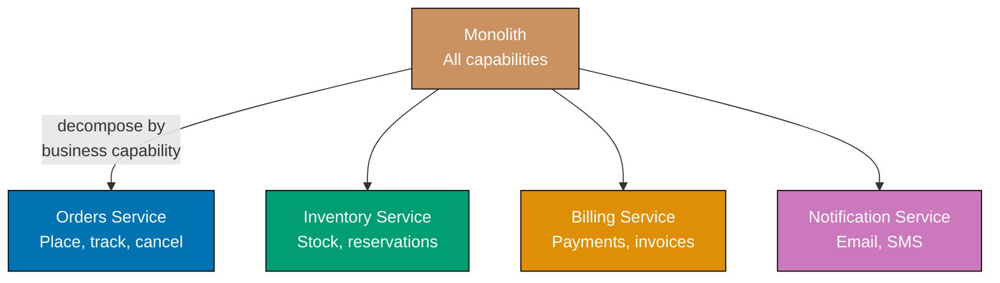




```java
import java.util.HashMap;
import java.util.Map;
import java.util.UUID;

// => Value object: immutable identifier scoped to the Orders domain
record OrderId(String value) {
    // => Static factory generates a UUID-backed id — stable across network hops
    static OrderId generate() {
        return new OrderId(UUID.randomUUID().toString());
        // => Immutable record — value cannot be mutated after construction
    }
}

// => Value object for product identity — ties order line to inventory SKU
record ProductId(String value) {}

// => Interface defines the Orders service contract
// => Real service, HTTP adapter, and in-memory stub all implement this
interface OrdersService {
    OrderId placeOrder(ProductId productId, int qty);
    // => Returns OrderId so callers never depend on internal order structure
    boolean cancelOrder(OrderId orderId);
}

// => Concrete in-memory implementation — used in tests and local dev
class InMemoryOrdersService implements OrdersService {
    // => order map: orderId -> {productId, qty, status}
    private final Map<String, Map<String, Object>> orders = new HashMap<>();

    @Override
    public OrderId placeOrder(ProductId productId, int qty) {
        var oid = OrderId.generate();  // => Fresh id per call — no collision risk
        orders.put(oid.value(), Map.of(
            "productId", productId.value(),
            "qty", qty,
            "status", "PLACED"
        ));
        // => Stores minimal state; real impl persists to DB via JPA or JDBC
        return oid;  // => Caller receives id to reference the order later
    }

    @Override
    public boolean cancelOrder(OrderId orderId) {
        var order = orders.get(orderId.value());
        if (order == null) return false;  // => Not found — idempotent cancel is safe
        // => Real impl issues UPDATE orders SET status='CANCELLED' WHERE id=?
        orders.put(orderId.value(), Map.of("status", "CANCELLED"));
        return true;  // => Caller knows the cancel succeeded
    }
}

// => Usage: swap InMemoryOrdersService for HttpOrdersService without changing callers
var svc = new InMemoryOrdersService();
var pid = new ProductId("SKU-001");
var oid = svc.placeOrder(pid, 3);     // => Returns OrderId("some-uuid")
System.out.println(oid.value());      // => Output: <uuid string>
System.out.println(svc.cancelOrder(oid)); // => Output: true
```




```kotlin
import java.util.UUID

// => Inline value class wraps String — zero overhead at runtime, type safety at compile time
@JvmInline value class OrderId(val value: String) {
    companion object {
        // => Factory: generates UUID-backed id — stable across service boundaries
        fun generate(): OrderId = OrderId(UUID.randomUUID().toString())
        // => Immutable after construction — safe to pass across threads
    }
}

// => Separate value class ensures ProductId cannot be passed where OrderId is expected
@JvmInline value class ProductId(val value: String)

// => Interface models the Orders service contract — real service and stub both implement it
interface OrdersService {
    fun placeOrder(productId: ProductId, qty: Int): OrderId
    // => Returns OrderId so callers never depend on internal order shape
    fun cancelOrder(orderId: OrderId): Boolean
}

// => In-memory implementation: fast, dependency-free, used in unit tests
class InMemoryOrdersService : OrdersService {
    // => Mutable map simulates DB table — order_id -> order record
    private val orders = mutableMapOf<String, MutableMap<String, Any>>()

    override fun placeOrder(productId: ProductId, qty: Int): OrderId {
        val oid = OrderId.generate()  // => Fresh id per call
        orders[oid.value] = mutableMapOf(
            "productId" to productId.value,
            "qty" to qty,
            "status" to "PLACED"
        )
        // => Real impl persists via Spring Data or exposed; in-memory state is local
        return oid  // => Caller stores this id to cancel or track the order
    }

    override fun cancelOrder(orderId: OrderId): Boolean {
        val order = orders[orderId.value] ?: return false
        // => Not found — returning false (not throwing) makes cancels idempotent
        order["status"] = "CANCELLED"  // => Mutates map entry; real impl issues UPDATE
        return true  // => Signals successful cancellation to caller
    }
}

// => Each service is swapped independently — no other service changes needed
val svc: OrdersService = InMemoryOrdersService()
val pid = ProductId("SKU-001")
val oid = svc.placeOrder(pid, qty = 3)  // => Returns OrderId("some-uuid")
println(oid.value)                       // => Output: <uuid string>
println(svc.cancelOrder(oid))            // => Output: true
```




```csharp
using System;
using System.Collections.Generic;

// => Record struct: immutable value type — zero allocation, equality by value
readonly record struct OrderId(string Value) {
    // => Factory generates GUID-backed id — globally unique across services
    public static OrderId Generate() => new(Guid.NewGuid().ToString());
    // => Record struct is immutable — Value cannot be changed after creation
}

// => Separate record struct prevents ProductId/OrderId mixup at compile time
readonly record struct ProductId(string Value);

// => Interface defines the Orders service contract — injected via DI container
interface IOrdersService {
    OrderId PlaceOrder(ProductId productId, int qty);
    // => Returns OrderId so callers are not coupled to internal order shape
    bool CancelOrder(OrderId orderId);
}

// => In-memory implementation used in unit tests and local development
class InMemoryOrdersService : IOrdersService {
    // => Dictionary simulates a DB table — orderId.Value -> order record
    private readonly Dictionary<string, Dictionary<string, object>> _orders = new();

    public OrderId PlaceOrder(ProductId productId, int qty) {
        var oid = OrderId.Generate();  // => Fresh GUID per call — no collision
        _orders[oid.Value] = new() {
            ["productId"] = productId.Value,
            ["qty"] = qty,
            ["status"] = "PLACED"
        };
        // => Real impl persists via EF Core DbContext.SaveChangesAsync()
        return oid;  // => Caller holds id to reference the order later
    }

    public bool CancelOrder(OrderId orderId) {
        if (!_orders.TryGetValue(orderId.Value, out var order))
            return false;  // => Not found — idempotent cancel returns false, not exception
        order["status"] = "CANCELLED";  // => Real impl issues UPDATE via EF Core
        return true;  // => Caller knows the cancel succeeded
    }
}

// => Usage: swap InMemoryOrdersService for HttpOrdersService without changing callers
IOrdersService svc = new InMemoryOrdersService();
var pid = new ProductId("SKU-001");
var oid = svc.PlaceOrder(pid, qty: 3);    // => Returns OrderId("some-guid")
Console.WriteLine(oid.Value);             // => Output: <guid string>
Console.WriteLine(svc.CancelOrder(oid));  // => Output: True
```




```typescript
// => Value type: immutable identifier scoped to the Orders domain
class OrderId {
  private constructor(readonly value: string) {}
  // => private constructor: use factory to create instances

  static generate(): OrderId {
    return new OrderId(crypto.randomUUID());
    // => UUID-backed id — stable across service boundaries
  }
}

// => Separate type prevents ProductId/OrderId mixup at compile time
class ProductId {
  constructor(readonly value: string) {}
}

// => Interface defines the Orders service contract
// => Real service, HTTP adapter, and in-memory stub all implement this
interface OrdersService {
  placeOrder(productId: ProductId, qty: number): OrderId;
  // => Returns OrderId so callers never depend on internal order structure
  cancelOrder(orderId: OrderId): boolean;
}

// => In-memory implementation — used in tests and local dev
class InMemoryOrdersService implements OrdersService {
  private readonly orders: Map<string, { productId: string; qty: number; status: string }> = new Map();
  // => order map: orderId -> order data

  placeOrder(productId: ProductId, qty: number): OrderId {
    const oid = OrderId.generate(); // => Fresh id per call — no collision risk
    this.orders.set(oid.value, { productId: productId.value, qty, status: "PLACED" });
    // => Stores minimal state; real impl persists to DB
    return oid; // => Caller receives id to reference the order later
  }

  cancelOrder(orderId: OrderId): boolean {
    const order = this.orders.get(orderId.value);
    if (!order) return false; // => Not found — idempotent cancel is safe
    this.orders.set(orderId.value, { ...order, status: "CANCELLED" });
    return true; // => Caller knows the cancel succeeded
  }
}

// => Usage: swap InMemoryOrdersService for HttpOrdersService without changing callers
const svc: OrdersService = new InMemoryOrdersService();
const pid = new ProductId("SKU-001");
const oid = svc.placeOrder(pid, 3); // => Returns OrderId
console.log(oid.value); // => Output: <uuid string>
console.log(svc.cancelOrder(oid)); // => Output: true
```




**Key Takeaway:** Decompose by business capability using Protocol types (or interfaces) to enforce
service boundaries in code, making each capability independently replaceable.

**Why It Matters:** Business-capability decomposition aligns service ownership with Conway's Law —
the team owning "Orders" controls its full stack without coordinating schema changes with the
"Inventory" team. Misaligned decomposition (for example, by technical tier) creates distributed
monoliths where every feature requires cross-team merges, eliminating the delivery speed advantage
of microservices. Autonomous teams shipping to independently deployable services is the central
premise that business-capability boundaries make possible.

---

### Example 59: Strangler Fig Pattern

The Strangler Fig pattern migrates a monolith incrementally by routing traffic through a proxy that
gradually redirects requests to new microservices as they are built, leaving untouched paths on the
legacy system. The monolith is "strangled" until all routes are migrated and it can be retired.

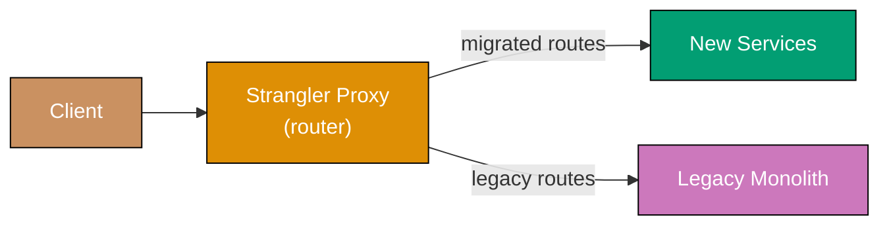




```java
import java.util.LinkedHashMap;
import java.util.Map;
import java.util.function.BiFunction;

// => RouteHandler: takes (path, payload) and returns a response map
// => Implemented by real HTTP adapters or in-process stubs
@FunctionalInterface
interface RouteHandler {
    Map<String, Object> handle(String path, Map<String, Object> payload);
}

class StranglerProxy {
    // => LinkedHashMap preserves insertion order — longer prefixes registered first win
    private final Map<String, RouteHandler> newRoutes = new LinkedHashMap<>();
    // => Legacy handler is the single catch-all for all unmigrated paths
    private RouteHandler legacyHandler;

    public void registerNew(String prefix, RouteHandler handler) {
        newRoutes.put(prefix, handler);
        // => Each call represents one migrated service; order of registration matters
    }

    public void setLegacy(RouteHandler handler) {
        legacyHandler = handler;  // => Monolith becomes the fallback until fully retired
    }

    public Map<String, Object> route(String path, Map<String, Object> payload) {
        for (var entry : newRoutes.entrySet()) {
            if (path.startsWith(entry.getKey())) {
                return entry.getValue().handle(path, payload);
                // => New service handles this path — monolith not involved
                // => Return immediately; no fallthrough to legacy
            }
        }
        // => No migrated handler matched — delegate to legacy monolith
        if (legacyHandler != null) return legacyHandler.handle(path, payload);
        throw new IllegalArgumentException("No handler for path: " + path);
        // => Should not occur in production if legacy handler is always set
    }
}

// => Simulated migrated Orders service
RouteHandler newOrdersHandler = (path, payload) ->
    Map.of("source", "new_service", "path", path, "data", payload);
    // => New service responds; monolith is bypassed entirely

// => Simulated legacy monolith catch-all
RouteHandler legacyHandler = (path, payload) ->
    Map.of("source", "legacy_monolith", "path", path, "data", payload);

var proxy = new StranglerProxy();
proxy.setLegacy(legacyHandler);
proxy.registerNew("/api/orders", newOrdersHandler);  // => Orders route migrated

System.out.println(proxy.route("/api/orders/123", Map.of("action", "get")));
// => Output: {source=new_service, path=/api/orders/123, data={action=get}}
System.out.println(proxy.route("/api/products/abc", Map.of("action", "list")));
// => Output: {source=legacy_monolith, path=/api/products/abc, data={action=list}}
```




```kotlin
// => RouteHandler: functional type — (path, payload) -> response
typealias RouteHandler = (String, Map<String, Any>) -> Map<String, Any>

class StranglerProxy {
    // => LinkedHashMap preserves registration order — first match wins
    private val newRoutes = linkedMapOf<String, RouteHandler>()
    // => Legacy handler is nullable until set — proxy throws if unset and no match found
    private var legacyHandler: RouteHandler? = null

    fun registerNew(prefix: String, handler: RouteHandler) {
        newRoutes[prefix] = handler
        // => Each registration represents one completed service migration
    }

    fun setLegacy(handler: RouteHandler) {
        legacyHandler = handler  // => Monolith becomes fallback; retired when routes = 0
    }

    fun route(path: String, payload: Map<String, Any>): Map<String, Any> {
        newRoutes.entries.firstOrNull { path.startsWith(it.key) }
            ?.let { return it.value(path, payload) }
            // => New service matched — returns immediately, monolith not touched
        return legacyHandler?.invoke(path, payload)
            // => No new service matched — delegate to legacy catch-all
            ?: error("No handler for path: $path")
            // => Should not occur in production if legacyHandler is always set
    }
}

// => Simulated migrated Orders service — monolith bypassed entirely
val newOrdersHandler: RouteHandler = { path, payload ->
    mapOf("source" to "new_service", "path" to path, "data" to payload)
}

// => Simulated legacy monolith — catch-all for unmigrated paths
val legacyHandler: RouteHandler = { path, payload ->
    mapOf("source" to "legacy_monolith", "path" to path, "data" to payload)
}

val proxy = StranglerProxy()
proxy.setLegacy(legacyHandler)
proxy.registerNew("/api/orders", newOrdersHandler)  // => Orders route migrated

println(proxy.route("/api/orders/123", mapOf("action" to "get")))
// => Output: {source=new_service, path=/api/orders/123, data={action=get}}
println(proxy.route("/api/products/abc", mapOf("action" to "list")))
// => Output: {source=legacy_monolith, path=/api/products/abc, data={action=list}}
```




```csharp
using System;
using System.Collections.Generic;
using System.Linq;

// => RouteHandler delegate: (path, payload) -> response dictionary
// => Implemented by real HTTP adapters or in-process stubs
delegate Dictionary<string, object> RouteHandler(string path, Dictionary<string, object> payload);

class StranglerProxy {
    // => Dictionary preserves insertion order in .NET 5+ — register longer prefixes first
    private readonly Dictionary<string, RouteHandler> _newRoutes = new();
    // => Legacy handler is null until set — proxy throws if unset and no match found
    private RouteHandler? _legacyHandler;

    public void RegisterNew(string prefix, RouteHandler handler) {
        _newRoutes[prefix] = handler;
        // => Each call represents one completed service migration step
    }

    public void SetLegacy(RouteHandler handler) {
        _legacyHandler = handler;  // => Monolith is the fallback until all routes migrate
    }

    public Dictionary<string, object> Route(string path, Dictionary<string, object> payload) {
        var match = _newRoutes.FirstOrDefault(e => path.StartsWith(e.Key));
        if (match.Value != null) return match.Value(path, payload);
        // => New service matched — returns immediately; legacy is not called
        if (_legacyHandler != null) return _legacyHandler(path, payload);
        // => No new service matched — delegate to legacy monolith catch-all
        throw new InvalidOperationException($"No handler for path: {path}");
        // => Should not occur in production when legacyHandler is always configured
    }
}

// => Simulated migrated Orders service — monolith completely bypassed
RouteHandler newOrdersHandler = (path, payload) =>
    new() { ["source"] = "new_service", ["path"] = path, ["data"] = payload };

// => Simulated legacy monolith — serves all unmigrated paths
RouteHandler legacyHandler = (path, payload) =>
    new() { ["source"] = "legacy_monolith", ["path"] = path, ["data"] = payload };

var proxy = new StranglerProxy();
proxy.SetLegacy(legacyHandler);
proxy.RegisterNew("/api/orders", newOrdersHandler);  // => Orders route migrated

Console.WriteLine(proxy.Route("/api/orders/123", new() { ["action"] = "get" })["source"]);
// => Output: new_service
Console.WriteLine(proxy.Route("/api/products/abc", new() { ["action"] = "list" })["source"]);
// => Output: legacy_monolith
```




```typescript
// => RouteHandler: takes (path, payload) and returns a response
type RouteHandler = (path: string, payload: Record<string, unknown>) => Record<string, unknown>;

class StranglerProxy {
  // => Map preserves insertion order — first matching prefix wins
  private readonly newRoutes: Map<string, RouteHandler> = new Map();
  // => Legacy handler is the single catch-all for all unmigrated paths
  private legacyHandler: RouteHandler | null = null;

  registerNew(prefix: string, handler: RouteHandler): void {
    this.newRoutes.set(prefix, handler);
    // => Each call represents one migrated service
  }

  setLegacy(handler: RouteHandler): void {
    this.legacyHandler = handler; // => Monolith becomes the fallback until retired
  }

  route(path: string, payload: Record<string, unknown>): Record<string, unknown> {
    for (const [prefix, handler] of this.newRoutes) {
      if (path.startsWith(prefix)) {
        return handler(path, payload);
        // => New service handles this path — monolith not involved
      }
    }
    // => No migrated handler matched — delegate to legacy monolith
    if (this.legacyHandler) return this.legacyHandler(path, payload);
    throw new Error(`No handler for path: ${path}`);
  }
}

// => Simulated migrated Orders service
const newOrdersHandler: RouteHandler = (path, payload) => ({
  source: "new_service",
  path,
  data: payload,
  // => New service responds; monolith is bypassed entirely
});

// => Simulated legacy monolith catch-all
const legacyHandler: RouteHandler = (path, payload) => ({
  source: "legacy_monolith",
  path,
  data: payload,
});

const proxy = new StranglerProxy();
proxy.setLegacy(legacyHandler);
proxy.registerNew("/api/orders", newOrdersHandler); // => Orders route migrated

console.log(proxy.route("/api/orders/123", { action: "get" }));
// => { source: 'new_service', path: '/api/orders/123', data: { action: 'get' } }
console.log(proxy.route("/api/products/abc", { action: "list" }));
// => { source: 'legacy_monolith', path: '/api/products/abc', data: { action: 'list' } }
```




**Key Takeaway:** The Strangler Fig pattern allows zero-downtime incremental migration by routing
at the proxy level; each migrated route is an isolated, low-risk step.

**Why It Matters:** Big-bang rewrites fail at a high rate because they require running two systems
simultaneously, training all users at once, and accepting rollback as all-or-nothing. The Strangler
Fig pattern, documented by Martin Fowler, allows teams to migrate one route at a time, roll back
individual services, and retire the legacy system only after every path is covered — dramatically
reducing migration risk by making each step small, reversible, and independently verifiable.

---

## Distributed Coordination

### Example 60: Saga Orchestration

Saga orchestration uses a central orchestrator that issues commands to participants and reacts to
their replies, making the saga's flow explicit and observable. When any step fails, the orchestrator
drives compensating transactions in reverse order to restore consistency across services.

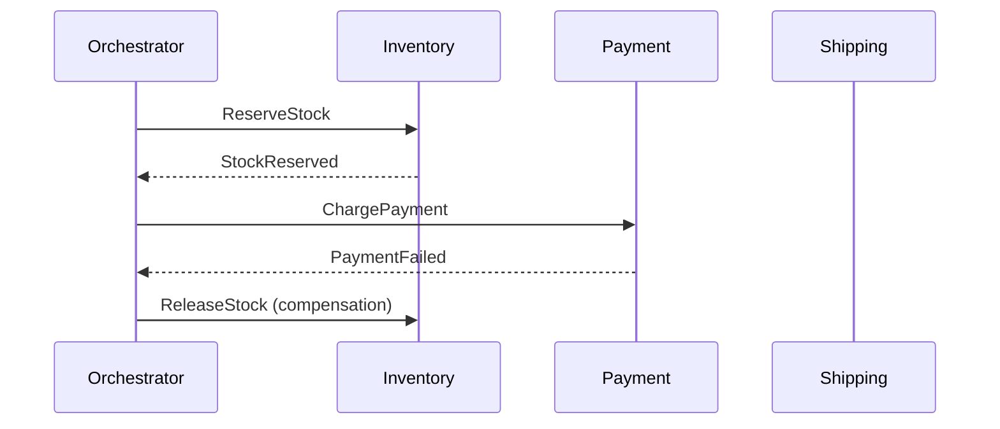




```java
import java.util.ArrayDeque;
import java.util.Deque;
import java.util.List;

// => SagaStep: pairs a forward action with its compensating action
record SagaStep(
    String name,
    java.util.function.BooleanSupplier execute,   // => Returns true on success, false on failure
    Runnable compensate                            // => Undoes the execute action
) {}

class SagaOrchestrator {
    private final List<SagaStep> steps;  // => Steps executed in list order
    SagaOrchestrator(List<SagaStep> steps) { this.steps = steps; }

    boolean run() {
        Deque<SagaStep> completed = new ArrayDeque<>();
        // => Stack (LIFO) tracks successful steps so compensation runs in reverse
        for (var step : steps) {
            boolean success = step.execute().getAsBoolean();  // => Drive the participant
            if (success) {
                completed.push(step);  // => Push onto stack — will compensate in reverse if needed
            } else {
                System.out.println(step.name() + " failed — compensating");
                // => Step failed: compensate all completed steps in LIFO order
                completed.forEach(done -> done.compensate().run());
                return false;  // => Saga failed; distributed state is back to consistent
            }
        }
        return true;  // => All steps succeeded — saga complete
    }
}

// => Simulated participants with in-memory state
boolean[] stockReserved = {false};  // => Array used so lambda can mutate it

var reserveStock = (java.util.function.BooleanSupplier) () -> {
    stockReserved[0] = true;  // => Reserve 1 unit
    System.out.println("Stock reserved");  // => Output: Stock reserved
    return true;
};
var releaseStock = (Runnable) () -> {
    stockReserved[0] = false;  // => Compensation: return unit to inventory
    System.out.println("Stock released (compensation)");  // => Output: Stock released (compensation)
};
var chargePayment = (java.util.function.BooleanSupplier) () -> {
    System.out.println("Payment failed");  // => Output: Payment failed
    return false;  // => Simulate payment processor rejection
};
var refundPayment = (Runnable) () ->
    System.out.println("Payment refunded (compensation)");

var steps = List.of(
    new SagaStep("reserve", reserveStock, releaseStock),
    new SagaStep("payment", chargePayment, refundPayment)
);
boolean result = new SagaOrchestrator(steps).run();
System.out.println("Saga succeeded: " + result);          // => Output: Saga succeeded: false
System.out.println("Stock released: " + !stockReserved[0]); // => Output: Stock released: true
```




```kotlin
// => SagaStep: pairs a forward action with its compensating action
data class SagaStep(
    val name: String,
    val execute: () -> Boolean,    // => Returns true on success, false on failure
    val compensate: () -> Unit     // => Undoes the execute action — must be idempotent
)

class SagaOrchestrator(private val steps: List<SagaStep>) {
    fun run(): Boolean {
        val completed = ArrayDeque<SagaStep>()
        // => ArrayDeque used as stack (LIFO) — reversed iteration compensates in reverse order
        for (step in steps) {
            if (step.execute()) {
                completed.addFirst(step)  // => Push: remember for rollback if later step fails
            } else {
                println("${step.name} failed — compensating")
                // => Step failed: compensate all completed steps in LIFO order
                completed.forEach { done -> done.compensate() }
                return false  // => Saga failed; all completed steps have been reversed
            }
        }
        return true  // => All steps succeeded — saga complete
    }
}

// => Simulated participants using captured mutable state
var stockReserved = false

val reserveStock: () -> Boolean = {
    stockReserved = true  // => Reserve 1 unit
    println("Stock reserved")  // => Output: Stock reserved
    true
}
val releaseStock: () -> Unit = {
    stockReserved = false  // => Compensation: return unit to inventory
    println("Stock released (compensation)")  // => Output: Stock released (compensation)
}
val chargePayment: () -> Boolean = {
    println("Payment failed")  // => Output: Payment failed
    false  // => Simulate payment processor rejection
}
val refundPayment: () -> Unit = {
    println("Payment refunded (compensation)")  // => Would issue refund if charge had succeeded
}

val steps = listOf(
    SagaStep("reserve", reserveStock, releaseStock),
    SagaStep("payment", chargePayment, refundPayment)
)
val result = SagaOrchestrator(steps).run()
println("Saga succeeded: $result")           // => Output: Saga succeeded: false
println("Stock released: ${!stockReserved}") // => Output: Stock released: true
```




```csharp
using System;
using System.Collections.Generic;

// => SagaStep: pairs a forward action with its compensating action
record SagaStep(
    string Name,
    Func<bool> Execute,    // => Returns true on success, false on failure
    Action Compensate      // => Undoes the execute action — must be idempotent
);

class SagaOrchestrator {
    private readonly IReadOnlyList<SagaStep> _steps;
    // => Steps executed in list order — index 0 first
    public SagaOrchestrator(IReadOnlyList<SagaStep> steps) => _steps = steps;

    public bool Run() {
        var completed = new Stack<SagaStep>();
        // => Stack (LIFO) so compensation runs in reverse order
        foreach (var step in _steps) {
            if (step.Execute()) {
                completed.Push(step);  // => Remember for rollback if later step fails
            } else {
                Console.WriteLine($"{step.Name} failed — compensating");
                // => Step failed: compensate all completed steps in LIFO order
                foreach (var done in completed) done.Compensate();
                return false;  // => Saga failed; distributed state restored to consistent
            }
        }
        return true;  // => All steps succeeded — saga complete
    }
}

// => Simulated participants with captured mutable state
bool stockReserved = false;

Func<bool> reserveStock = () => {
    stockReserved = true;  // => Reserve 1 unit
    Console.WriteLine("Stock reserved");  // => Output: Stock reserved
    return true;
};
Action releaseStock = () => {
    stockReserved = false;  // => Compensation: return unit to inventory
    Console.WriteLine("Stock released (compensation)");  // => Output: Stock released (compensation)
};
Func<bool> chargePayment = () => {
    Console.WriteLine("Payment failed");  // => Output: Payment failed
    return false;  // => Simulate payment processor rejection
};
Action refundPayment = () =>
    Console.WriteLine("Payment refunded (compensation)");

var steps = new List<SagaStep> {
    new("reserve", reserveStock, releaseStock),
    new("payment", chargePayment, refundPayment)
};
bool result = new SagaOrchestrator(steps).Run();
Console.WriteLine($"Saga succeeded: {result}");           // => Output: Saga succeeded: False
Console.WriteLine($"Stock released: {!stockReserved}");   // => Output: Stock released: True
```




```typescript
// => DOMAIN EVENT: published when order state changes
interface OrderEvent {
  type: string;
  orderId: string;
  occurredAt: number;
}

interface OrderPlaced extends OrderEvent {
  type: "OrderPlaced";
  customerId: string;
  total: number;
}
interface OrderShipped extends OrderEvent {
  type: "OrderShipped";
  trackingId: string;
}
interface OrderCancelled extends OrderEvent {
  type: "OrderCancelled";
  reason: string;
}

type AppOrderEvent = OrderPlaced | OrderShipped | OrderCancelled;

// => IN-PROCESS MESSAGE BUS (simulates Kafka/RabbitMQ)
class MessageBus {
  private readonly handlers: Map<string, Array<(e: AppOrderEvent) => void>> = new Map();

  subscribe(type: string, handler: (e: AppOrderEvent) => void): void {
    const list = this.handlers.get(type) ?? [];
    this.handlers.set(type, [...list, handler]);
  }

  publish(event: AppOrderEvent): void {
    const eventHandlers = this.handlers.get(event.type) ?? [];
    for (const handler of eventHandlers) handler(event);
  }
}

// => ORDER SERVICE: produces events
class OrderService {
  constructor(private readonly bus: MessageBus) {}

  placeOrder(orderId: string, customerId: string, total: number): void {
    // => save order to DB (simulated)
    console.log(`[Orders] Order ${orderId} created`);
    this.bus.publish({ type: "OrderPlaced", orderId, customerId, total, occurredAt: Date.now() });
  }
}

// => INDEPENDENT CONSUMERS: react without coupling to OrderService
const bus = new MessageBus();

bus.subscribe("OrderPlaced", (evt) => {
  const e = evt as OrderPlaced;
  console.log(`[Inventory] Reserve items for order ${e.orderId}`);
  // => Inventory reacts without knowing about OrderService
});

bus.subscribe("OrderPlaced", (evt) => {
  const e = evt as OrderPlaced;
  console.log(`[Billing] Invoice customer ${e.customerId} for $${e.total}`);
  // => Billing reacts independently
});

const orderSvc = new OrderService(bus);
orderSvc.placeOrder("ord-1", "cust-42", 150.0);
// => [Orders] Order ord-1 created
// => [Inventory] Reserve items for order ord-1
// => [Billing] Invoice customer cust-42 for $150
```




**Key Takeaway:** Orchestration keeps saga logic in one place; the orchestrator compensates
completed steps when any forward step fails, maintaining distributed consistency.

**Why It Matters:** Distributed transactions using 2PC are impractical in microservices because they
require all participants to lock resources simultaneously, reducing availability. Sagas replace locks
with compensating transactions, enabling each service to commit locally. Orchestration (vs.
choreography) is preferred when saga complexity grows beyond 3-4 steps, because the flow is
visible in a single class rather than scattered across event handlers — critical for debugging
production incidents where understanding what happened in what order is essential.

---

### Example 61: Saga Choreography

Saga choreography removes the central orchestrator; instead, each service reacts to domain events
and emits new events to trigger the next step. Services are decoupled because no service calls
another directly, but the saga's flow is implicit across multiple event handlers.

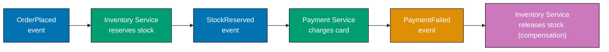




```java
import java.util.*;
import java.util.function.Consumer;

// => Minimal in-process event bus — models a message broker (Kafka, RabbitMQ)
class EventBus {
    // => Maps event type -> list of subscriber lambdas
    private final Map<String, List<Consumer<Map<String, Object>>>> handlers = new HashMap<>();

    public void subscribe(String eventType, Consumer<Map<String, Object>> handler) {
        handlers.computeIfAbsent(eventType, k -> new ArrayList<>()).add(handler);
        // => computeIfAbsent creates the list on first subscribe — avoids null checks
    }

    public void publish(String eventType, Map<String, Object> payload) {
        handlers.getOrDefault(eventType, List.of()).forEach(h -> h.accept(payload));
        // => Synchronous here; real Kafka consumer group is async per partition
    }
}

var bus = new EventBus();
boolean[] stockHeld = {false};  // => Simulates DB row — array so lambda can mutate it

// => Inventory service: listens for OrderPlaced (reserve) and PaymentFailed (compensate)
bus.subscribe("OrderPlaced", event -> {
    stockHeld[0] = true;  // => Reserve stock optimistically
    System.out.println("Inventory: reserved stock for order " + event.get("orderId"));
    bus.publish("StockReserved", Map.of("orderId", event.get("orderId")));
    // => Emits next event; Payment reacts without Inventory knowing about it
});

bus.subscribe("PaymentFailed", event -> {
    stockHeld[0] = false;  // => Compensation: release reserved stock
    System.out.println("Inventory: released stock for order " + event.get("orderId") + " (compensation)");
});

// => Payment service: listens for StockReserved; does NOT call Inventory directly
bus.subscribe("StockReserved", event -> {
    System.out.println("Payment: charging for order " + event.get("orderId"));
    bus.publish("PaymentFailed", Map.of("orderId", event.get("orderId")));
    // => Publishes PaymentFailed — Inventory listens and compensates autonomously
});

bus.publish("OrderPlaced", Map.of("orderId", "ORD-42"));
// => Output: Inventory: reserved stock for order ORD-42
// => Output: Payment: charging for order ORD-42
// => Output: Inventory: released stock for order ORD-42 (compensation)
System.out.println("Stock held after failure: " + stockHeld[0]); // => Output: Stock held after failure: false
```




```kotlin
// => Minimal in-process event bus — models a message broker (Kafka, RabbitMQ)
class EventBus {
    // => Maps event type -> list of subscriber lambdas
    private val handlers = mutableMapOf<String, MutableList<(Map<String, Any>) -> Unit>>()

    fun subscribe(eventType: String, handler: (Map<String, Any>) -> Unit) {
        handlers.getOrPut(eventType) { mutableListOf() }.add(handler)
        // => getOrPut creates the list on first subscribe — idiomatic Kotlin idiom
    }

    fun publish(eventType: String, payload: Map<String, Any>) {
        handlers[eventType]?.forEach { it(payload) }
        // => Synchronous here; real Kafka consumer group is async per partition
    }
}

val bus = EventBus()
var stockHeld = false  // => Simulates a DB row for inventory reservation state

// => Inventory service: listens for OrderPlaced (reserve) and PaymentFailed (compensate)
bus.subscribe("OrderPlaced") { event ->
    stockHeld = true  // => Reserve stock optimistically
    println("Inventory: reserved stock for order ${event["orderId"]}")
    bus.publish("StockReserved", mapOf("orderId" to event["orderId"]!!))
    // => Emits next event; Payment reacts without Inventory needing to know about it
}

bus.subscribe("PaymentFailed") { event ->
    stockHeld = false  // => Compensation: release reserved stock
    println("Inventory: released stock for order ${event["orderId"]} (compensation)")
}

// => Payment service: listens for StockReserved; does NOT call Inventory directly
bus.subscribe("StockReserved") { event ->
    println("Payment: charging for order ${event["orderId"]}")
    bus.publish("PaymentFailed", mapOf("orderId" to event["orderId"]!!))
    // => Publishes PaymentFailed — Inventory listens and compensates autonomously
}

bus.publish("OrderPlaced", mapOf("orderId" to "ORD-42"))
// => Output: Inventory: reserved stock for order ORD-42
// => Output: Payment: charging for order ORD-42
// => Output: Inventory: released stock for order ORD-42 (compensation)
println("Stock held after failure: $stockHeld") // => Output: Stock held after failure: false
```




```csharp
using System;
using System.Collections.Generic;

// => Minimal in-process event bus — models a message broker (Kafka, RabbitMQ)
class EventBus {
    // => Maps event type -> list of subscriber delegates
    private readonly Dictionary<string, List<Action<Dictionary<string, object>>>> _handlers = new();

    public void Subscribe(string eventType, Action<Dictionary<string, object>> handler) {
        if (!_handlers.ContainsKey(eventType)) _handlers[eventType] = new();
        _handlers[eventType].Add(handler);
        // => List created on first subscribe — no null checks needed after this
    }

    public void Publish(string eventType, Dictionary<string, object> payload) {
        if (_handlers.TryGetValue(eventType, out var list)) list.ForEach(h => h(payload));
        // => Synchronous here; real Kafka consumer group is async per partition
    }
}

var bus = new EventBus();
bool stockHeld = false;  // => Simulates a DB row — captured by lambda closures

// => Inventory service: listens for OrderPlaced (reserve) and PaymentFailed (compensate)
bus.Subscribe("OrderPlaced", e => {
    stockHeld = true;  // => Reserve stock optimistically
    Console.WriteLine($"Inventory: reserved stock for order {e["orderId"]}");
    bus.Publish("StockReserved", new() { ["orderId"] = e["orderId"] });
    // => Emits next event; Payment reacts without Inventory needing to know about it
});

bus.Subscribe("PaymentFailed", e => {
    stockHeld = false;  // => Compensation: release reserved stock
    Console.WriteLine($"Inventory: released stock for order {e["orderId"]} (compensation)");
});

// => Payment service: listens for StockReserved; does NOT call Inventory directly
bus.Subscribe("StockReserved", e => {
    Console.WriteLine($"Payment: charging for order {e["orderId"]}");
    bus.Publish("PaymentFailed", new() { ["orderId"] = e["orderId"] });
    // => Publishes PaymentFailed — Inventory listens and compensates autonomously
});

bus.Publish("OrderPlaced", new() { ["orderId"] = "ORD-42" });
// => Output: Inventory: reserved stock for order ORD-42
// => Output: Payment: charging for order ORD-42
// => Output: Inventory: released stock for order ORD-42 (compensation)
Console.WriteLine($"Stock held after failure: {stockHeld}"); // => Output: Stock held after failure: False
```




```typescript
// => SERVICE REGISTRY: tracks available service instances
interface ServiceInstance {
  id: string;
  host: string;
  port: number;
  healthy: boolean;
}

class ServiceRegistry {
  private readonly services: Map<string, ServiceInstance[]> = new Map();

  register(name: string, instance: ServiceInstance): void {
    const existing = this.services.get(name) ?? [];
    this.services.set(name, [...existing, instance]);
    console.log(`[Registry] Registered ${name} at ${instance.host}:${instance.port}`);
  }

  deregister(name: string, instanceId: string): void {
    const existing = this.services.get(name) ?? [];
    this.services.set(
      name,
      existing.filter((i) => i.id !== instanceId),
    );
    console.log(`[Registry] Deregistered ${name} instance ${instanceId}`);
  }

  getHealthy(name: string): ServiceInstance[] {
    return (this.services.get(name) ?? []).filter((i) => i.healthy);
    // => returns only healthy instances — unhealthy are excluded from routing
  }
}

// => LOAD BALANCER: round-robin selection from healthy instances
class LoadBalancer {
  private readonly indices: Map<string, number> = new Map();

  select(instances: ServiceInstance[]): ServiceInstance | null {
    if (instances.length === 0) return null;
    const idx = (this.indices.get("_") ?? 0) % instances.length;
    this.indices.set("_", idx + 1);
    return instances[idx]; // => round-robin selection
  }
}

// => SERVICE PROXY: handles discovery, load balancing, and retry
class ServiceProxy {
  constructor(
    private readonly registry: ServiceRegistry,
    private readonly balancer: LoadBalancer,
  ) {}

  call(serviceName: string, path: string): string {
    const instances = this.registry.getHealthy(serviceName);
    const instance = this.balancer.select(instances);
    if (!instance) return `Error: No healthy instances for ${serviceName}`;

    // => In real service mesh, this would be an HTTP call
    console.log(`[Proxy] Routing ${path} to ${instance.host}:${instance.port}`);
    return `OK from ${instance.host}:${instance.port}`;
  }
}

const registry = new ServiceRegistry();
registry.register("orders", { id: "o1", host: "orders-1", port: 8080, healthy: true });
registry.register("orders", { id: "o2", host: "orders-2", port: 8080, healthy: true });

const proxy = new ServiceProxy(registry, new LoadBalancer());
console.log(proxy.call("orders", "/api/orders"));
// => [Proxy] Routing /api/orders to orders-1:8080
console.log(proxy.call("orders", "/api/orders"));
// => [Proxy] Routing /api/orders to orders-2:8080
```




**Key Takeaway:** Choreography achieves loose coupling through events, but requires careful event
schema design because the saga flow is distributed across multiple handlers.

**Why It Matters:** Choreography eliminates the orchestrator as a single point of failure and a
coordination bottleneck, making each service independently deployable without versioning the
orchestrator. However, tracing a saga through event logs is harder than reading a single orchestrator
class. Choreography suits high-throughput flows where independent deployability and minimal
coupling matter most; orchestration is preferable when business rules require centralized audit
trails or when saga logic changes frequently enough that a single source of truth simplifies maintenance.

---

## API Design

### Example 62: API Versioning Strategies

API versioning prevents breaking changes from disrupting existing consumers when a service evolves
its contract. The three dominant strategies — URI path versioning, Accept header versioning, and
query-parameter versioning — make different trade-offs between cacheability, client simplicity, and
routing ease.

**URI path versioning (most common, most cacheable):**




```java
import java.util.Map;
import java.util.function.Supplier;
import java.util.List;

// => Route map keyed by (method, path) — path includes version prefix
// => Supplier<Map> defers construction until dispatched — lazy evaluation
Map<String, Supplier<Map<String, Object>>> routes = Map.of(
    "GET:/v1/users", () -> Map.of("version", 1, "users", List.of("alice")),
    // => v1 contract: flat list of usernames — never change this response shape
    "GET:/v2/users", () -> Map.of("version", 2, "users",
        List.of(Map.of("name", "alice", "email", "alice@example.com")))
    // => v2 contract: richer user objects with email field added
);

// => Dispatcher routes requests to versioned handlers
Map<String, Object> dispatch(String method, String path) {
    var handler = routes.get(method + ":" + path);
    if (handler == null) return Map.of("error", "Not found");  // => 404 equivalent
    return handler.get();  // => Execute matched route handler
}

System.out.println(dispatch("GET", "/v1/users"));
// => Output: {version=1, users=[alice]}
System.out.println(dispatch("GET", "/v2/users"));
// => Output: {version=2, users=[{name=alice, email=alice@example.com}]}
```




```kotlin
// => Route map keyed by "METHOD:/path" — path includes version prefix
// => Lambda defers response construction until dispatched
val routes = mapOf(
    "GET:/v1/users" to { mapOf("version" to 1, "users" to listOf("alice")) },
    // => v1 contract: flat list of usernames — frozen shape for existing consumers
    "GET:/v2/users" to {
        mapOf("version" to 2, "users" to listOf(mapOf("name" to "alice", "email" to "alice@example.com")))
        // => v2 contract: richer user objects with email field added
    }
)

// => Dispatcher routes requests to versioned handlers
fun dispatch(method: String, path: String): Map<String, Any> =
    routes["$method:$path"]?.invoke()
        ?: mapOf("error" to "Not found")  // => 404 equivalent — unknown version or path

println(dispatch("GET", "/v1/users"))
// => Output: {version=1, users=[alice]}
println(dispatch("GET", "/v2/users"))
// => Output: {version=2, users=[{name=alice, email=alice@example.com}]}
```




```csharp
using System;
using System.Collections.Generic;

// => Route map keyed by "METHOD:/path" — path includes version prefix
// => Func<Dictionary> defers construction until dispatched
var routes = new Dictionary<string, Func<Dictionary<string, object>>> {
    ["GET:/v1/users"] = () => new() { ["version"] = 1, ["users"] = new[] { "alice" } },
    // => v1 contract: flat array of usernames — frozen shape for existing consumers
    ["GET:/v2/users"] = () => new() {
        ["version"] = 2,
        ["users"] = new[] { new Dictionary<string, string> { ["name"] = "alice", ["email"] = "alice@example.com" } }
        // => v2 contract: richer objects with email field added
    }
};

// => Dispatcher routes requests to versioned handlers
Dictionary<string, object> Dispatch(string method, string path) {
    var key = $"{method}:{path}";
    return routes.TryGetValue(key, out var handler)
        ? handler()  // => Execute matched route handler
        : new() { ["error"] = "Not found" };  // => 404 equivalent
}

Console.WriteLine(Dispatch("GET", "/v1/users")["users"]);   // => Output: alice
Console.WriteLine(Dispatch("GET", "/v2/users")["version"]); // => Output: 2
```




```typescript
// => Route map keyed by "METHOD:/path" — path includes version prefix
// => Function defers response construction until dispatched — lazy evaluation
const routes: Record<string, () => Record<string, unknown>> = {
  "GET:/v1/users": () => ({ version: 1, users: ["alice"] }),
  // => v1 contract: flat list of usernames — never change this response shape
  "GET:/v2/users": () => ({
    version: 2,
    users: [{ name: "alice", email: "alice@example.com" }],
  }),
  // => v2 contract: richer user objects with email field added
};

// => Dispatcher routes requests to versioned handlers
function dispatch(method: string, path: string): Record<string, unknown> {
  const handler = routes[`${method}:${path}`];
  if (!handler) return { error: "Not found" }; // => 404 equivalent
  return handler(); // => Execute matched route handler
}

console.log(dispatch("GET", "/v1/users"));
// => { version: 1, users: [ 'alice' ] }
console.log(dispatch("GET", "/v2/users"));
// => { version: 2, users: [ { name: 'alice', email: 'alice@example.com' } ] }
```




URI versioning: CDN caches `/v1/users` and `/v2/users` independently; path is visible in logs and
browser history; old clients never break when a new version is added.

**Accept header versioning (REST-purist, less cacheable):**




```java
import java.util.Map;
import java.util.List;

// => Version is negotiated through the Accept header, keeping URLs clean
Map<String, Object> dispatchHeader(String method, String path, String accept) {
    // => Parse version from Accept: application/vnd.myapi.v2+json
    String version = accept.contains("v2") ? "v2" : "v1";
    // => Default to v1 when header absent or unversioned — conservative fallback

    if ("/users".equals(path)) {
        if ("v2".equals(version)) {
            return Map.of("version", 2, "users",
                List.of(Map.of("name", "alice", "email", "alice@example.com")));
        }
        return Map.of("version", 1, "users", List.of("alice"));
        // => Same URL, different response shape based on negotiated version
    }
    return Map.of("error", "Not found");
}

System.out.println(dispatchHeader("GET", "/users", "application/json"));
// => Output: {version=1, users=[alice]}
System.out.println(dispatchHeader("GET", "/users", "application/vnd.myapi.v2+json"));
// => Output: {version=2, users=[{name=alice, email=alice@example.com}]}
```




```kotlin
import java.util.Map as JavaMap

// => Version is negotiated through the Accept header, keeping URLs clean
fun dispatchHeader(method: String, path: String, accept: String): Map<String, Any> {
    // => Parse version from Accept: application/vnd.myapi.v2+json
    val version = if ("v2" in accept) "v2" else "v1"
    // => Default to v1 when header absent or unversioned — conservative fallback

    if (path == "/users") {
        return if (version == "v2")
            mapOf("version" to 2, "users" to listOf(mapOf("name" to "alice", "email" to "alice@example.com")))
        else
            mapOf("version" to 1, "users" to listOf("alice"))
        // => Same URL, different response shape based on negotiated version
    }
    return mapOf("error" to "Not found")
}

println(dispatchHeader("GET", "/users", "application/json"))
// => Output: {version=1, users=[alice]}
println(dispatchHeader("GET", "/users", "application/vnd.myapi.v2+json"))
// => Output: {version=2, users=[{name=alice, email=alice@example.com}]}
```




```csharp
using System;
using System.Collections.Generic;

// => Version is negotiated through the Accept header, keeping URLs clean
Dictionary<string, object> DispatchHeader(string method, string path, string accept) {
    // => Parse version from Accept: application/vnd.myapi.v2+json
    var version = accept.Contains("v2") ? "v2" : "v1";
    // => Default to v1 when header absent or unversioned — conservative fallback

    if (path == "/users") {
        return version == "v2"
            ? new() { ["version"] = 2, ["users"] = new[] { new { name = "alice", email = "alice@example.com" } } }
            : new() { ["version"] = 1, ["users"] = new[] { "alice" } };
        // => Same URL, different response shape based on negotiated version
    }
    return new() { ["error"] = "Not found" };
}

Console.WriteLine(DispatchHeader("GET", "/users", "application/json")["version"]);
// => Output: 1
Console.WriteLine(DispatchHeader("GET", "/users", "application/vnd.myapi.v2+json")["version"]);
// => Output: 2
```




```typescript
// => Version is negotiated through the Accept header, keeping URLs clean
function dispatchHeader(method: string, path: string, accept: string): Record<string, unknown> {
  // => Parse version from Accept: application/vnd.myapi.v2+json
  const version = accept.includes("v2") ? "v2" : "v1";
  // => Default to v1 when header absent or unversioned — conservative fallback

  if (path === "/users") {
    if (version === "v2") {
      return { version: 2, users: [{ name: "alice", email: "alice@example.com" }] };
    }
    return { version: 1, users: ["alice"] };
    // => Same URL, different response shape based on negotiated version
  }
  return { error: "Not found" };
}

console.log(dispatchHeader("GET", "/users", "application/json"));
// => { version: 1, users: [ 'alice' ] }
console.log(dispatchHeader("GET", "/users", "application/vnd.myapi.v2+json"));
// => { version: 2, users: [ { name: 'alice', email: 'alice@example.com' } ] }
```




Header versioning: same URL makes REST purists happy; however, CDNs cannot cache different versions
of `/users` by default — requires `Vary: Accept` header which many CDNs handle poorly.

**Key Takeaway:** Use URI path versioning for public APIs where CDN cacheability and operational
simplicity outweigh URL aesthetics; use header versioning for internal APIs with strict semantic
versioning requirements.

**Why It Matters:** Breaking API changes without a versioning strategy are among the leading causes
of production incidents when microservices are upgraded. URI path versioning is explicit in logs,
debuggable in browsers, and cache-friendly — benefits that outweigh the "impurity" of embedding
version in the URL. Choosing the wrong strategy early forces a painful migration later when consumer
count is large and backward compatibility cannot be broken without coordinating across many teams.

---

### Example 63: Backend for Frontend (BFF) Pattern

The Backend for Frontend pattern creates a dedicated aggregation layer for each client type —
mobile, web, and third-party — each shaped to that client's data requirements. BFFs eliminate
over-fetching, reduce round trips, and prevent a single general-purpose API from being designed
around the least-common denominator of all clients.

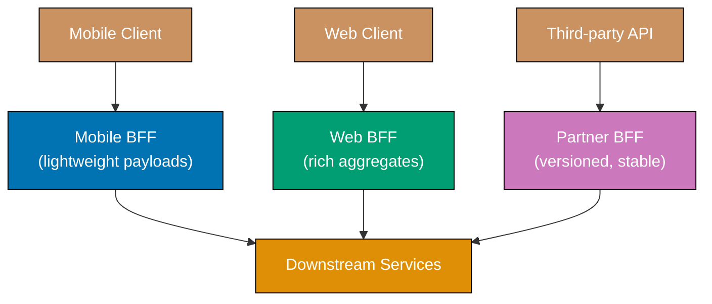




```java
import java.util.List;
import java.util.Map;

// => Downstream service: returns full user profile — downstream owns all fields
static Map<String, Object> getUserProfile(String userId) {
    return Map.of(
        "id", userId,
        "name", "Alice",
        "email", "alice@example.com",
        "preferences", Map.of("theme", "dark")
    );
    // => Downstream service is not shaped for any client — it exposes everything
}

// => Downstream service: returns full order list — may be large for heavy users
static List<Map<String, Object>> getUserOrders(String userId) {
    return List.of(
        Map.of("id", "ORD-1", "total", 99.99, "status", "shipped"),
        Map.of("id", "ORD-2", "total", 14.50, "status", "pending")
    );
    // => Full order objects — BFF decides what to expose to each client
}

// => Mobile BFF: strips unnecessary fields to reduce bandwidth on cellular connections
static Map<String, Object> mobileBffDashboard(String userId) {
    var profile = getUserProfile(userId);
    var orders = getUserOrders(userId);
    long pendingCount = orders.stream().filter(o -> "pending".equals(o.get("status"))).count();
    // => Aggregates count server-side — mobile shows one number, not a table
    return Map.of(
        "name", profile.get("name"),   // => Only name; email and preferences omitted
        "pendingOrders", pendingCount  // => Pre-computed: saves mobile from parsing a list
    );
}

// => Web BFF: returns richer aggregate with full order list and preferences
static Map<String, Object> webBffDashboard(String userId) {
    var profile = getUserProfile(userId);
    var orders = getUserOrders(userId);
    return Map.of(
        "profile", profile,            // => Full profile including email and preferences
        "orders", orders,              // => Full order objects — web renders a sortable table
        "orderCount", orders.size()    // => Pre-computed convenience field for the header
    );
}

System.out.println(mobileBffDashboard("u1"));
// => Output: {name=Alice, pendingOrders=1}
System.out.println(webBffDashboard("u1").get("orderCount"));
// => Output: 2
```




```kotlin
// => Downstream service: returns full user profile — downstream owns all fields
fun getUserProfile(userId: String): Map<String, Any> = mapOf(
    "id" to userId,
    "name" to "Alice",
    "email" to "alice@example.com",
    "preferences" to mapOf("theme" to "dark")
)
// => Downstream service is not shaped for any client — it exposes everything

// => Downstream service: returns full order list — may be large for heavy users
fun getUserOrders(userId: String): List<Map<String, Any>> = listOf(
    mapOf("id" to "ORD-1", "total" to 99.99, "status" to "shipped"),
    mapOf("id" to "ORD-2", "total" to 14.50, "status" to "pending")
)
// => Full order objects — each BFF decides what to surface to its client

// => Mobile BFF: strips unnecessary fields to reduce bandwidth on cellular connections
fun mobileBffDashboard(userId: String): Map<String, Any> {
    val profile = getUserProfile(userId)
    val orders = getUserOrders(userId)
    val pendingCount = orders.count { it["status"] == "pending" }
    // => Aggregates count server-side — mobile shows one number, not a list
    return mapOf(
        "name" to profile["name"]!!,   // => Only name; email and preferences omitted
        "pendingOrders" to pendingCount  // => Pre-computed: saves mobile from parsing list
    )
}

// => Web BFF: returns richer aggregate with full order list and preferences
fun webBffDashboard(userId: String): Map<String, Any> {
    val profile = getUserProfile(userId)
    val orders = getUserOrders(userId)
    return mapOf(
        "profile" to profile,          // => Full profile including email and preferences
        "orders" to orders,            // => Full order objects — web renders a sortable table
        "orderCount" to orders.size    // => Pre-computed convenience field for the header
    )
}

println(mobileBffDashboard("u1"))
// => Output: {name=Alice, pendingOrders=1}
println(webBffDashboard("u1")["orderCount"])
// => Output: 2
```




```csharp
using System;
using System.Collections.Generic;
using System.Linq;

// => Downstream service: returns full user profile — downstream owns all fields
static Dictionary<string, object> GetUserProfile(string userId) => new() {
    ["id"] = userId,
    ["name"] = "Alice",
    ["email"] = "alice@example.com",
    ["preferences"] = new Dictionary<string, string> { ["theme"] = "dark" }
};
// => Downstream service is not shaped for any client — it exposes everything

// => Downstream service: returns full order list — may be large for heavy users
static List<Dictionary<string, object>> GetUserOrders(string userId) => new() {
    new() { ["id"] = "ORD-1", ["total"] = 99.99, ["status"] = "shipped" },
    new() { ["id"] = "ORD-2", ["total"] = 14.50, ["status"] = "pending" }
};
// => Full order objects — each BFF decides what to surface to its client

// => Mobile BFF: strips unnecessary fields to reduce bandwidth on cellular connections
static Dictionary<string, object> MobileBffDashboard(string userId) {
    var profile = GetUserProfile(userId);
    var orders = GetUserOrders(userId);
    var pendingCount = orders.Count(o => o["status"].Equals("pending"));
    // => Aggregates count server-side — mobile shows one number, not a list
    return new() {
        ["name"] = profile["name"],       // => Only name; email and preferences omitted
        ["pendingOrders"] = pendingCount  // => Pre-computed: saves mobile from parsing list
    };
}

// => Web BFF: returns richer aggregate with full order list and preferences
static Dictionary<string, object> WebBffDashboard(string userId) {
    var profile = GetUserProfile(userId);
    var orders = GetUserOrders(userId);
    return new() {
        ["profile"] = profile,         // => Full profile including email and preferences
        ["orders"] = orders,           // => Full order objects — web renders a sortable table
        ["orderCount"] = orders.Count  // => Pre-computed convenience field for the header
    };
}

Console.WriteLine(MobileBffDashboard("u1")["pendingOrders"]); // => Output: 1
Console.WriteLine(WebBffDashboard("u1")["orderCount"]);        // => Output: 2
```




```typescript
// => TOKEN BUCKET: allows burst traffic up to capacity, refills at fixed rate
interface RateLimiter {
  tryAcquire(clientId: string): boolean; // => true if request is allowed
}

class TokenBucketLimiter implements RateLimiter {
  private readonly buckets: Map<string, { tokens: number; lastRefill: number }> = new Map();
  // => per-client buckets: tokens available + last refill timestamp

  constructor(
    private readonly capacity: number, // => max tokens per bucket
    private readonly refillRatePerSec: number, // => tokens added per second
  ) {}

  tryAcquire(clientId: string): boolean {
    const now = Date.now();
    let bucket = this.buckets.get(clientId);
    if (!bucket) {
      bucket = { tokens: this.capacity, lastRefill: now };
      this.buckets.set(clientId, bucket);
      // => new client starts with full bucket
    }

    // => REFILL: add tokens proportional to elapsed time
    const elapsed = (now - bucket.lastRefill) / 1000;
    bucket.tokens = Math.min(this.capacity, bucket.tokens + elapsed * this.refillRatePerSec);
    bucket.lastRefill = now;

    if (bucket.tokens >= 1) {
      bucket.tokens -= 1; // => consume one token
      return true; // => request allowed
    }
    return false; // => bucket empty — request throttled
  }
}

// => SLIDING WINDOW: counts requests in a rolling time window
class SlidingWindowLimiter implements RateLimiter {
  private readonly windows: Map<string, number[]> = new Map();
  // => per-client: list of request timestamps in current window

  constructor(
    private readonly maxRequests: number, // => max requests per window
    private readonly windowMs: number, // => window size in milliseconds
  ) {}

  tryAcquire(clientId: string): boolean {
    const now = Date.now();
    const cutoff = now - this.windowMs;
    const timestamps = (this.windows.get(clientId) ?? []).filter((t) => t > cutoff);
    // => remove timestamps outside the window

    if (timestamps.length >= this.maxRequests) return false;
    // => at capacity — throttle

    timestamps.push(now);
    this.windows.set(clientId, timestamps);
    return true; // => request allowed
  }
}

const limiter = new TokenBucketLimiter(3, 1);
for (let i = 0; i < 5; i++) {
  console.log(`Request ${i + 1}: ${limiter.tryAcquire("client-1") ? "allowed" : "throttled"}`);
}
// => Request 1: allowed
// => Request 2: allowed
// => Request 3: allowed
// => Request 4: throttled (bucket empty)
// => Request 5: throttled
```




**Key Takeaway:** Each BFF owns its own aggregation logic so client teams can evolve their API
without negotiating with teams serving other clients.

**Why It Matters:** A single general-purpose API must satisfy every client's needs simultaneously,
leading to bloated responses, API design by committee, and tight release coupling between mobile
and web teams. BFFs give each client team autonomy to evolve their aggregation layer independently
while downstream services remain focused on their own domain. The pattern directly resolves the
tension between mobile clients needing lightweight payloads and web clients needing rich aggregates.

---

## Resilience Patterns

### Example 64: Circuit Breaker with Fallback

A circuit breaker monitors failure rates on calls to an external dependency and trips open when
failures exceed a threshold, stopping further calls and returning a fallback immediately. After a
timeout, it enters a half-open state to probe whether the dependency has recovered.

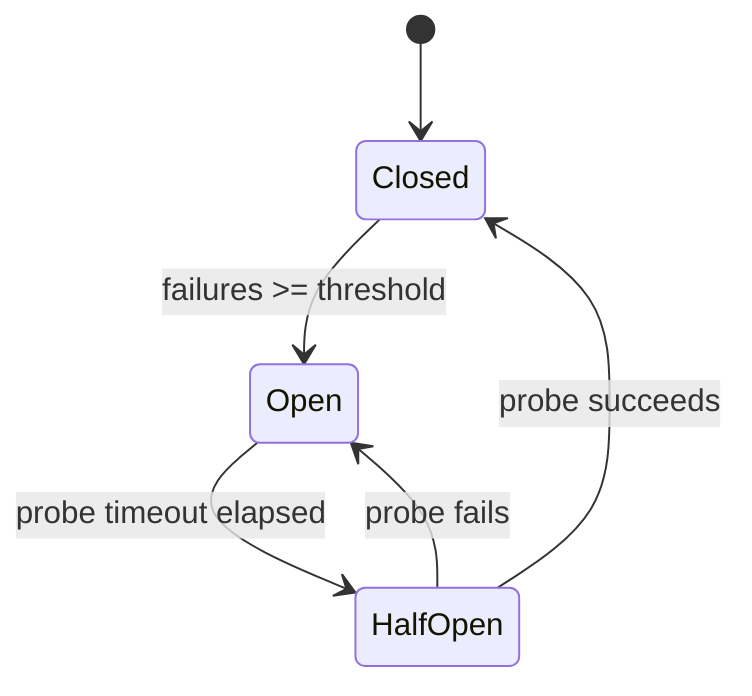




```java
import java.util.concurrent.atomic.AtomicInteger;
import java.util.concurrent.atomic.AtomicLong;
import java.util.function.Supplier;

// => Circuit breaker states — three-state machine matching Resilience4j semantics
enum CBState { CLOSED, OPEN, HALF_OPEN }
// => CLOSED: calls pass through normally
// => OPEN: calls fast-fail; dependency gets breathing room
// => HALF_OPEN: one probe call allowed through to test recovery

class CircuitBreaker {
    private final int threshold;        // => Trip after this many consecutive failures
    private final long probeTimeoutMs;  // => Milliseconds before attempting probe
    private volatile CBState state = CBState.CLOSED;  // => volatile: visible across threads
    private final AtomicInteger failures = new AtomicInteger(0);  // => Thread-safe counter
    private final AtomicLong openedAt = new AtomicLong(0);        // => Timestamp when tripped

    CircuitBreaker(int threshold, long probeTimeoutMs) {
        this.threshold = threshold;
        this.probeTimeoutMs = probeTimeoutMs;
    }

    String call(Supplier<String> func, Supplier<String> fallback) {
        if (state == CBState.OPEN) {
            if (System.currentTimeMillis() - openedAt.get() >= probeTimeoutMs) {
                state = CBState.HALF_OPEN;  // => Allow one probe attempt
                System.out.println("Circuit: half-open (probing)");
            } else {
                return fallback.get();  // => Fast-fail: no timeout; dependency rests
            }
        }
        try {
            String result = func.get();  // => Attempt the real call
            onSuccess();                 // => Reset failure count and close breaker
            return result;
        } catch (Exception e) {
            onFailure();         // => Increment counter; may trip breaker
            return fallback.get(); // => Degraded response instead of propagating error
        }
    }

    private void onSuccess() {
        failures.set(0);          // => Reset consecutive failure streak
        state = CBState.CLOSED;   // => Close breaker — works for HALF_OPEN probe too
    }

    private void onFailure() {
        int count = failures.incrementAndGet();  // => Atomic increment
        if (count >= threshold) {
            state = CBState.OPEN;
            openedAt.set(System.currentTimeMillis());  // => Record trip time for probe timeout
            System.out.println("Circuit: tripped OPEN after " + count + " failures");
        }
    }
}

// => Simulate a flaky downstream service recovering after 3 failures
int[] callCount = {0};
Supplier<String> flakyService = () -> {
    if (++callCount[0] <= 3) throw new RuntimeException("service down");
    // => First 3 calls fail — simulates intermittent dependency outage
    return "fresh data";  // => Recovers on 4th call
};
Supplier<String> fallback = () -> "cached data";  // => Stale but acceptable response

var cb = new CircuitBreaker(3, 0);  // => probeTimeout=0 so half-open triggers immediately
for (int i = 1; i <= 6; i++) {
    System.out.println("Call " + i + ": " + cb.call(flakyService, fallback));
}
// => Output: Call 1: cached data  (failure 1)
// => Output: Call 2: cached data  (failure 2)
// => Output: Circuit: tripped OPEN after 3 failures
// => Output: Call 3: cached data  (failure 3, tripped)
// => Output: Circuit: half-open (probing)
// => Output: Call 4: fresh data   (probe succeeds, breaker closes)
// => Output: Call 5: fresh data
// => Output: Call 6: fresh data
```




```kotlin
import java.util.concurrent.atomic.AtomicInteger
import java.util.concurrent.atomic.AtomicLong

// => Circuit breaker states — three-state machine matching Resilience4j semantics
enum class CBState { CLOSED, OPEN, HALF_OPEN }
// => CLOSED: calls pass through normally
// => OPEN: calls fast-fail; dependency gets breathing room
// => HALF_OPEN: one probe call allowed through to test recovery

class CircuitBreaker(
    private val threshold: Int,       // => Trip after this many consecutive failures
    private val probeTimeoutMs: Long  // => Milliseconds before attempting probe
) {
    @Volatile var state = CBState.CLOSED  // => @Volatile: visible across coroutines/threads
    private val failures = AtomicInteger(0)  // => Thread-safe consecutive failure counter
    private val openedAt = AtomicLong(0)     // => Timestamp when breaker tripped open

    fun call(func: () -> String, fallback: () -> String): String {
        if (state == CBState.OPEN) {
            if (System.currentTimeMillis() - openedAt.get() >= probeTimeoutMs) {
                state = CBState.HALF_OPEN  // => Allow one probe attempt
                println("Circuit: half-open (probing)")
            } else {
                return fallback()  // => Fast-fail: no timeout; dependency gets breathing room
            }
        }
        return try {
            val result = func()  // => Attempt the real call
            onSuccess()          // => Reset failure count and close breaker
            result
        } catch (e: Exception) {
            onFailure()   // => Increment counter; may trip breaker
            fallback()    // => Return degraded response instead of propagating error
        }
    }

    private fun onSuccess() {
        failures.set(0)          // => Reset consecutive failure streak
        state = CBState.CLOSED   // => Close breaker — works for HALF_OPEN probe too
    }

    private fun onFailure() {
        val count = failures.incrementAndGet()  // => Atomic increment
        if (count >= threshold) {
            state = CBState.OPEN
            openedAt.set(System.currentTimeMillis())  // => Record trip time for probe timeout
            println("Circuit: tripped OPEN after $count failures")
        }
    }
}

// => Simulate a flaky downstream service recovering after 3 failures
var callCount = 0
val flakyService: () -> String = {
    if (++callCount <= 3) throw RuntimeException("service down")
    // => First 3 calls fail — simulates intermittent dependency outage
    "fresh data"  // => Recovers on 4th call
}
val fallback: () -> String = { "cached data" }  // => Stale but acceptable response

val cb = CircuitBreaker(threshold = 3, probeTimeoutMs = 0)
// => probeTimeout=0 so half-open triggers immediately in this simulation
for (i in 1..6) println("Call $i: ${cb.call(flakyService, fallback)}")
// => Output: Call 1: cached data  (failure 1)
// => Output: Call 2: cached data  (failure 2)
// => Output: Circuit: tripped OPEN after 3 failures
// => Output: Call 3: cached data  (failure 3, tripped)
// => Output: Circuit: half-open (probing)
// => Output: Call 4: fresh data   (probe succeeds, breaker closes)
// => Output: Call 5: fresh data
// => Output: Call 6: fresh data
```




```csharp
using System;
using System.Threading;

// => Circuit breaker states — three-state machine matching Polly semantics
enum CBState { Closed, Open, HalfOpen }
// => Closed: calls pass through normally
// => Open: calls fast-fail; dependency gets breathing room
// => HalfOpen: one probe call allowed through to test recovery

class CircuitBreaker {
    private readonly int _threshold;       // => Trip after this many consecutive failures
    private readonly long _probeTimeoutMs; // => Milliseconds before attempting probe
    private volatile CBState _state = CBState.Closed;  // => volatile: visible across threads
    private int _failures = 0;       // => Consecutive failure counter
    private long _openedAt = 0;      // => Timestamp (ticks) when breaker tripped open

    public CircuitBreaker(int threshold, long probeTimeoutMs) {
        _threshold = threshold;
        _probeTimeoutMs = probeTimeoutMs;
    }

    public string Call(Func<string> func, Func<string> fallback) {
        if (_state == CBState.Open) {
            var elapsed = (DateTime.UtcNow.Ticks - _openedAt) / TimeSpan.TicksPerMillisecond;
            if (elapsed >= _probeTimeoutMs) {
                _state = CBState.HalfOpen;  // => Allow one probe attempt
                Console.WriteLine("Circuit: half-open (probing)");
            } else {
                return fallback();  // => Fast-fail: no timeout; dependency rests
            }
        }
        try {
            var result = func();   // => Attempt the real call
            OnSuccess();           // => Reset failure count and close breaker
            return result;
        } catch {
            OnFailure();           // => Increment counter; may trip breaker
            return fallback();     // => Degraded response instead of propagating error
        }
    }

    private void OnSuccess() {
        _failures = 0;              // => Reset consecutive failure streak
        _state = CBState.Closed;    // => Close breaker — works for HalfOpen probe too
    }

    private void OnFailure() {
        var count = Interlocked.Increment(ref _failures);  // => Thread-safe increment
        if (count >= _threshold) {
            _state = CBState.Open;
            _openedAt = DateTime.UtcNow.Ticks;  // => Record trip time for probe timeout
            Console.WriteLine($"Circuit: tripped OPEN after {count} failures");
        }
    }
}

// => Simulate a flaky downstream service recovering after 3 failures
int callCount = 0;
Func<string> flakyService = () => {
    if (++callCount <= 3) throw new Exception("service down");
    // => First 3 calls fail — simulates intermittent dependency outage
    return "fresh data";  // => Recovers on 4th call
};
Func<string> fallback = () => "cached data";  // => Stale but acceptable response

var cb = new CircuitBreaker(threshold: 3, probeTimeoutMs: 0);
// => probeTimeout=0 so half-open triggers immediately in this simulation
for (int i = 1; i <= 6; i++) Console.WriteLine($"Call {i}: {cb.Call(flakyService, fallback)}");
// => Output: Call 1: cached data  (failure 1)
// => Output: Call 2: cached data  (failure 2)
// => Output: Circuit: tripped OPEN after 3 failures
// => Output: Call 3: cached data  (failure 3, tripped)
// => Output: Circuit: half-open (probing)
// => Output: Call 4: fresh data   (probe succeeds, breaker closes)
// => Output: Call 5: fresh data
// => Output: Call 6: fresh data
```




```typescript
// => CIRCUIT BREAKER STATES
type State = "closed" | "open" | "half-open";

class CircuitBreaker {
  private state: State = "closed";
  private failureCount = 0;
  private successCount = 0;
  private lastFailureTime = 0;

  constructor(
    private readonly failureThreshold: number, // => failures before opening
    private readonly successThreshold: number, // => successes in half-open before closing
    private readonly timeoutMs: number, // => time to wait in open state
  ) {}

  async call<T>(fn: () => Promise<T>): Promise<T> {
    if (this.state === "open") {
      if (Date.now() - this.lastFailureTime > this.timeoutMs) {
        this.state = "half-open";
        this.successCount = 0;
        console.log("[CB] → half-open (probing)");
      } else {
        throw new Error("[CB] Circuit open — call rejected");
      }
    }

    try {
      const result = await fn();
      this.onSuccess();
      return result;
    } catch (err) {
      this.onFailure();
      throw err;
    }
  }

  private onSuccess(): void {
    if (this.state === "half-open") {
      this.successCount++;
      if (this.successCount >= this.successThreshold) {
        this.state = "closed";
        this.failureCount = 0;
        console.log("[CB] → closed (recovered)");
      }
    } else {
      this.failureCount = 0; // => reset on success in closed state
    }
  }

  private onFailure(): void {
    this.failureCount++;
    this.lastFailureTime = Date.now();
    if (this.failureCount >= this.failureThreshold || this.state === "half-open") {
      this.state = "open";
      console.log(`[CB] → open (${this.failureCount} failures)`);
    }
  }

  getState(): State {
    return this.state;
  }
}

const cb = new CircuitBreaker(3, 2, 100);
let failMode = true;
const service = async () => {
  if (failMode) throw new Error("Service down");
  return "OK";
};

for (let i = 0; i < 4; i++) {
  try {
    await cb.call(service);
  } catch {
    console.log(`Call ${i + 1}: ${cb.getState()}`);
  }
}
// => [CB] → open (3 failures)
// => Call 1-3: closed; Call 4: open
```




**Key Takeaway:** Circuit breakers prevent cascading failures by fast-failing requests when a
dependency is unhealthy, giving it time to recover while callers receive fallback responses.

**Why It Matters:** Without circuit breakers, a slow or failing downstream service causes thread
pools to fill with waiting requests, blocking the entire caller — the cascade failure pattern that
turns a partial dependency failure into a full service outage. Circuit breaker libraries in Java,
Python, and Go embed this pattern as production standard because properly configured breakers allow
a system to shed load during incidents without full outages, giving the failing dependency time to
recover while callers receive fast fallback responses.

---

### Example 65: Bulkhead Pattern

The bulkhead pattern isolates failures within one pool of resources so they do not exhaust shared
resources needed by other operations. By separating thread pools (or semaphores) for different
dependency calls, a slow third-party service starves only its own pool, not the entire application.

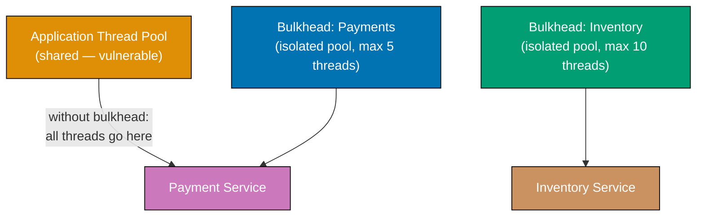




```java
import java.util.concurrent.Semaphore;

// => Bulkhead: limits concurrent calls to a downstream dependency via a semaphore
class Bulkhead {
    private final String name;           // => Name used in error messages and metrics
    private final Semaphore semaphore;   // => Semaphore permits = max concurrent slots
    private int rejected = 0;            // => Count of calls rejected due to full pool

    Bulkhead(String name, int maxConcurrent) {
        this.name = name;
        this.semaphore = new Semaphore(maxConcurrent);
        // => Fair=false (default): no queuing — callers fail fast if pool full
    }

    // => Executes func inside a semaphore permit; rejects immediately if no permit available
    <T> T execute(java.util.function.Supplier<T> func) {
        boolean acquired = semaphore.tryAcquire();
        // => tryAcquire: non-blocking — returns false if all permits are taken
        if (!acquired) {
            rejected++;
            throw new RuntimeException("Bulkhead '" + name + "' full — call rejected");
            // => Fail fast: caller gets immediate error; downstream not contacted
        }
        try {
            return func.get();  // => Caller's work executes under semaphore protection
        } finally {
            semaphore.release();  // => Always release permit — even on exception
        }
    }

    int getRejected() { return rejected; }  // => Expose for metrics dashboard
}

// => Two separate bulkheads — slow Payments cannot exhaust Inventory's pool
var paymentsBulkhead = new Bulkhead("payments", 2);
// => Max 2 concurrent payment calls — third caller is rejected immediately
var inventoryBulkhead = new Bulkhead("inventory", 5);
// => Inventory has its own independent pool of 5 slots

// => Simulate: drain all payment permits, then show inventory still works
paymentsBulkhead.execute(() -> "hold-slot-1");  // => Permit 1 taken (synthetic hold)

try {
    // => Manually exhaust remaining permit to simulate "pool full" scenario
    boolean p2 = paymentsBulkhead.semaphore.tryAcquire();  // => Takes permit 2
    try {
        paymentsBulkhead.execute(() -> "ORD-1");  // => Should throw: pool full
    } finally {
        if (p2) paymentsBulkhead.semaphore.release();  // => Restore permit 2
    }
} catch (RuntimeException e) {
    System.out.println(e.getMessage());
    // => Output: Bulkhead 'payments' full — call rejected
}

String invResult = inventoryBulkhead.execute(() -> "stock_ok:SKU-1");
System.out.println(invResult);  // => Output: stock_ok:SKU-1 (unaffected by payments)
```




```kotlin
import java.util.concurrent.Semaphore

// => Bulkhead: limits concurrent calls to a downstream dependency via a semaphore
class Bulkhead(private val name: String, maxConcurrent: Int) {
    val semaphore = Semaphore(maxConcurrent)
    // => Permits = max concurrent slots; fair=false (no queuing — fail fast)
    private var rejected = 0  // => Count of calls rejected due to full pool

    // => Executes block under semaphore permit; rejects immediately if pool full
    fun <T> execute(block: () -> T): T {
        val acquired = semaphore.tryAcquire()
        // => tryAcquire: non-blocking — returns false immediately if all permits taken
        if (!acquired) {
            rejected++
            throw RuntimeException("Bulkhead '$name' full — call rejected")
            // => Fail fast: caller receives immediate error; downstream is not contacted
        }
        return try {
            block()  // => Caller's work executes under semaphore protection
        } finally {
            semaphore.release()  // => Always release permit — even on exception
        }
    }

    fun getRejected(): Int = rejected  // => Expose for metrics / alerting
}

// => Two separate bulkheads — Payments slowdown cannot exhaust Inventory's slots
val paymentsBulkhead = Bulkhead("payments", maxConcurrent = 2)
// => Max 2 concurrent payment calls — 3rd caller is rejected immediately
val inventoryBulkhead = Bulkhead("inventory", maxConcurrent = 5)
// => Inventory pool is completely independent from payments pool

// => Simulate: drain all payment permits, then show inventory still works
val p1 = paymentsBulkhead.semaphore.tryAcquire()  // => Occupy slot 1
val p2 = paymentsBulkhead.semaphore.tryAcquire()  // => Occupy slot 2 — pool now full

try {
    paymentsBulkhead.execute { "ORD-1" }  // => Should throw: pool full
} catch (e: RuntimeException) {
    println(e.message)
    // => Output: Bulkhead 'payments' full — call rejected
} finally {
    if (p1) paymentsBulkhead.semaphore.release()  // => Restore permits for cleanup
    if (p2) paymentsBulkhead.semaphore.release()
}

val invResult = inventoryBulkhead.execute { "stock_ok:SKU-1" }
println(invResult)  // => Output: stock_ok:SKU-1 (unaffected by payments pool)
```




```csharp
using System;
using System.Threading;

// => Bulkhead: limits concurrent calls to a downstream dependency via a SemaphoreSlim
class Bulkhead {
    private readonly string _name;           // => Name used in error messages and metrics
    private readonly SemaphoreSlim _semaphore; // => SemaphoreSlim: lightweight, non-kernel
    private int _rejected = 0;                // => Count of calls rejected due to full pool

    public Bulkhead(string name, int maxConcurrent) {
        _name = name;
        _semaphore = new SemaphoreSlim(maxConcurrent, maxConcurrent);
        // => initialCount = maxCount = maxConcurrent permits available at start
    }

    // => Executes func under semaphore permit; rejects immediately if pool full
    public T Execute<T>(Func<T> func) {
        bool acquired = _semaphore.Wait(0);
        // => Wait(0): non-blocking — returns false immediately if no permits available
        if (!acquired) {
            _rejected++;
            throw new InvalidOperationException($"Bulkhead '{_name}' full — call rejected");
            // => Fail fast: caller gets immediate error; downstream is not contacted
        }
        try {
            return func();  // => Caller's work executes under semaphore protection
        } finally {
            _semaphore.Release();  // => Always release permit — even on exception
        }
    }

    public int Rejected => _rejected;  // => Expose for metrics / alerting
    internal SemaphoreSlim Semaphore => _semaphore;  // => Exposed for test slot occupation
}

// => Two separate bulkheads — Payments slowdown cannot exhaust Inventory's pool
var paymentsBulkhead = new Bulkhead("payments", maxConcurrent: 2);
// => Max 2 concurrent payment calls — 3rd caller is rejected immediately
var inventoryBulkhead = new Bulkhead("inventory", maxConcurrent: 5);
// => Inventory pool is completely independent from payments pool

// => Simulate: drain all payment permits, then show inventory still works
bool p1 = paymentsBulkhead.Semaphore.Wait(0);  // => Occupy slot 1
bool p2 = paymentsBulkhead.Semaphore.Wait(0);  // => Occupy slot 2 — pool now full

try {
    paymentsBulkhead.Execute(() => "ORD-1");  // => Should throw: pool full
} catch (InvalidOperationException e) {
    Console.WriteLine(e.Message);
    // => Output: Bulkhead 'payments' full — call rejected
} finally {
    if (p1) paymentsBulkhead.Semaphore.Release();  // => Restore permits for cleanup
    if (p2) paymentsBulkhead.Semaphore.Release();
}

string invResult = inventoryBulkhead.Execute(() => "stock_ok:SKU-1");
Console.WriteLine(invResult);  // => Output: stock_ok:SKU-1 (unaffected by payments pool)
```




```typescript
// => BULKHEAD: limits concurrent calls to a downstream dependency via semaphore
// => Prevents one service from consuming all thread/connection pool resources
class Bulkhead {
  private active = 0;
  // => count of currently executing calls

  constructor(private readonly maxConcurrent: number) {
    // => max concurrent calls allowed to this downstream service
  }

  async execute<T>(fn: () => Promise<T>): Promise<T> {
    if (this.active >= this.maxConcurrent) {
      throw new Error(`Bulkhead full (${this.maxConcurrent} max concurrent)`);
      // => reject call immediately rather than queuing — fail fast
    }
    this.active++;
    console.log(`[Bulkhead] active: ${this.active}/${this.maxConcurrent}`);
    try {
      return await fn(); // => execute the call within the bulkhead
    } finally {
      this.active--; // => always release slot, even on error
      console.log(`[Bulkhead] released: active=${this.active}`);
    }
  }
}

// => Two bulkheads: different capacities for different services
const paymentBulkhead = new Bulkhead(5); // => up to 5 concurrent payment calls
const inventoryBulkhead = new Bulkhead(10); // => up to 10 concurrent inventory calls

// => Simulate concurrent calls
const delay = (ms: number) => new Promise((resolve) => setTimeout(resolve, ms));

async function callPayment(id: number): Promise<void> {
  await paymentBulkhead.execute(async () => {
    console.log(`[Payment] Processing payment ${id}`);
    await delay(10); // => simulate async work
  });
}

// => Run 3 concurrent payment calls (within limit of 5)
await Promise.all([callPayment(1), callPayment(2), callPayment(3)]);
// => [Bulkhead] active: 1/5, 2/5, 3/5
// => [Bulkhead] released: active=2, 1, 0
```




**Key Takeaway:** Assign separate resource pools (semaphores or thread pools) to each downstream
dependency so one slow service can only exhaust its own pool, not the shared application pool.

**Why It Matters:** The bulkhead pattern is named after ship compartments that prevent flooding
from spreading. In services, a payment processor slowdown that fills a shared thread pool starves
inventory checks and health endpoints — a total service outage caused by a partial dependency
failure. Bulkhead isolation in resilience libraries enforces this separation in production, allowing
services to degrade gracefully (payments fail, site keeps working) rather than failing completely
because one slow dependency exhausted the shared resource pool.

---

### Example 66: Retry with Exponential Backoff and Jitter

Retrying transient failures is essential in distributed systems, but naive fixed-interval retries
cause thundering herds when many clients retry simultaneously. Exponential backoff with jitter
spreads retries over time, reducing collision probability and letting overloaded services recover.




```java
import java.util.Random;
import java.util.function.Supplier;

// => Computes exponential delay with full jitter: delay = random(0, min(base*2^attempt, cap))
// => Resilience4j uses the same formula internally — this models its behaviour
static double exponentialBackoff(int attempt, double baseMs, double capMs) {
    double ceiling = Math.min(baseMs * Math.pow(2, attempt), capMs);
    // => ceiling grows exponentially: 100, 200, 400, 800 ... capped at capMs
    return new Random().nextDouble() * ceiling;
    // => Full jitter: random between 0 and ceiling — avoids thundering herd
}

// => Generic retry loop: up to maxAttempts, sleeping exponential backoff between failures
static <T> T retry(Supplier<T> func, int maxAttempts) throws Exception {
    Exception last = null;
    for (int attempt = 0; attempt < maxAttempts; attempt++) {
        try {
            return func.get();  // => Attempt the operation
        } catch (Exception e) {
            last = e;
            if (attempt == maxAttempts - 1) break;  // => Last attempt; skip sleep
            long delayMs = (long) exponentialBackoff(attempt, 100.0, 30_000.0);
            // => delayMs varies per attempt and per client — jitter prevents synchronised retry bursts
            System.out.println("Attempt " + (attempt + 1) + " failed: " + e.getMessage()
                + ". Retrying in " + delayMs + "ms");
            Thread.sleep(0);  // => Simulation: skip actual sleep; prod uses Thread.sleep(delayMs)
        }
    }
    throw new RuntimeException("All " + maxAttempts + " attempts failed", last);
    // => Exhausted retries — propagate last error to caller
}

// => Simulate a service that fails twice then succeeds on the third call
int[] callCount = {0};
Supplier<String> unstableCall = () -> {
    callCount[0]++;
    if (callCount[0] < 3) throw new RuntimeException("timeout on attempt " + callCount[0]);
    // => First two calls throw transient error — retry handles these transparently
    return "success";  // => Third call returns result normally
};

try {
    String result = retry(unstableCall, 5);
    System.out.println("Result: " + result);  // => Output: Result: success (after 2 retried failures)
    System.out.println("Total attempts: " + callCount[0]);  // => Output: Total attempts: 3
} catch (Exception e) {
    System.out.println("All retries exhausted: " + e.getMessage());
}
```




```kotlin
import kotlin.math.min
import kotlin.math.pow
import kotlin.random.Random

// => Computes exponential delay with full jitter: random(0, min(base*2^attempt, cap))
// => Matches Resilience4j exponential-random strategy — prevents thundering herd
fun exponentialBackoff(attempt: Int, baseMs: Double = 100.0, capMs: Double = 30_000.0): Long {
    val ceiling = min(baseMs * 2.0.pow(attempt), capMs)
    // => ceiling grows: 100, 200, 400, 800 ... then plateaus at capMs
    return (Random.nextDouble() * ceiling).toLong()
    // => Full jitter: random between 0 and ceiling — different delay per client per attempt
}

// => Inline retry function: suspends using coroutine delay in production; simulates here
suspend fun <T> retry(maxAttempts: Int = 5, block: suspend () -> T): T {
    var last: Exception? = null
    for (attempt in 0 until maxAttempts) {
        try {
            return block()  // => Attempt the operation
        } catch (e: Exception) {
            last = e
            if (attempt == maxAttempts - 1) break  // => Last attempt; skip delay
            val delayMs = exponentialBackoff(attempt)
            // => Each client gets different delay — jitter distributes retry load across time
            println("Attempt ${attempt + 1} failed: ${e.message}. Retrying in ${delayMs}ms")
            kotlinx.coroutines.delay(0)  // => Simulation: skip real sleep; prod uses delay(delayMs)
        }
    }
    throw RuntimeException("All $maxAttempts attempts failed", last)
    // => Exhausted retries — propagate last exception to caller
}

// => Simulate a service that fails twice then succeeds on the third call
var callCount = 0
val unstableCall: suspend () -> String = {
    callCount++
    if (callCount < 3) throw RuntimeException("timeout on attempt $callCount")
    // => First two calls throw transient error — retry handles these transparently
    "success"  // => Third call returns result normally
}

// => In a real app: launch { retry { unstableCall() } }
// => For illustration, run synchronously:
runBlocking {
    val result = retry(maxAttempts = 5) { unstableCall() }
    println("Result: $result")           // => Output: Result: success (after 2 retried failures)
    println("Total attempts: $callCount") // => Output: Total attempts: 3
}
```




```csharp
using System;
using System.Threading.Tasks;

// => Computes exponential delay with full jitter: random(0, min(base*2^attempt, cap))
// => Matches Polly's ExponentialBackoffWithJitter strategy — prevents thundering herd
static TimeSpan ExponentialBackoff(int attempt, double baseMs = 100.0, double capMs = 30_000.0) {
    double ceiling = Math.Min(baseMs * Math.Pow(2, attempt), capMs);
    // => ceiling grows: 100, 200, 400, 800 ... capped at capMs (30 s default)
    double delayMs = Random.Shared.NextDouble() * ceiling;
    // => Full jitter: random between 0 and ceiling — distributes concurrent retries across time
    return TimeSpan.FromMilliseconds(delayMs);
}

// => Generic async retry: up to maxAttempts, sleeping exponential backoff between failures
static async Task<T> Retry<T>(Func<Task<T>> func, int maxAttempts = 5) {
    Exception? last = null;
    for (int attempt = 0; attempt < maxAttempts; attempt++) {
        try {
            return await func();  // => Attempt the operation
        } catch (Exception e) {
            last = e;
            if (attempt == maxAttempts - 1) break;  // => Last attempt; skip delay
            var delay = ExponentialBackoff(attempt);
            // => delay varies per attempt and per client — jitter prevents synchronised bursts
            Console.WriteLine($"Attempt {attempt + 1} failed: {e.Message}. Retrying in {delay.TotalMilliseconds:F0}ms");
            await Task.Delay(0);  // => Simulation: skip real wait; prod uses Task.Delay(delay)
        }
    }
    throw new Exception($"All {maxAttempts} attempts failed", last);
    // => Exhausted retries — propagate last exception to caller
}

// => Simulate a service that fails twice then succeeds on the third call
int callCount = 0;
Func<Task<string>> unstableCall = async () => {
    callCount++;
    if (callCount < 3) throw new Exception($"timeout on attempt {callCount}");
    // => First two calls throw transient error — retry handles these transparently
    return "success";  // => Third call returns result normally
};

var result = await Retry(unstableCall, maxAttempts: 5);
Console.WriteLine($"Result: {result}");           // => Output: Result: success (after 2 retried failures)
Console.WriteLine($"Total attempts: {callCount}"); // => Output: Total attempts: 3
```




```typescript
// => RETRY WITH EXPONENTIAL BACKOFF: retries failed calls with increasing delays
interface RetryConfig {
  maxAttempts: number; // => total attempts including the first
  baseDelayMs: number; // => initial delay before first retry
  maxDelayMs: number; // => cap on delay to prevent excessive wait
  jitterMs: number; // => random jitter to prevent thundering herd
}

async function retryWithBackoff<T>(fn: () => Promise<T>, config: RetryConfig): Promise<T> {
  let lastError: Error | null = null;

  for (let attempt = 1; attempt <= config.maxAttempts; attempt++) {
    try {
      return await fn(); // => attempt the call
    } catch (err) {
      lastError = err as Error;
      if (attempt === config.maxAttempts) break; // => no more retries

      // => EXPONENTIAL BACKOFF: delay doubles each attempt
      const exponential = config.baseDelayMs * Math.pow(2, attempt - 1);
      const jitter = Math.random() * config.jitterMs;
      const delay = Math.min(exponential + jitter, config.maxDelayMs);

      console.log(`[Retry] Attempt ${attempt} failed: ${lastError.message}`);
      console.log(`[Retry] Waiting ${delay.toFixed(0)}ms before retry ${attempt + 1}`);

      await new Promise((resolve) => setTimeout(resolve, delay));
      // => wait with backoff before next attempt
    }
  }

  throw new Error(`All ${config.maxAttempts} attempts failed: ${lastError?.message}`);
}

// => USAGE: wrap unreliable operations with retry logic
let callCount = 0;
const unreliableService = async (): Promise<string> => {
  callCount++;
  if (callCount < 3) throw new Error("Transient error");
  return `Success on attempt ${callCount}`;
  // => fails first 2 times, succeeds on 3rd
};

try {
  const result = await retryWithBackoff(unreliableService, {
    maxAttempts: 5,
    baseDelayMs: 100,
    maxDelayMs: 2000,
    jitterMs: 50,
  });
  console.log(result); // => Success on attempt 3
} catch (err) {
  console.error((err as Error).message);
}
```




**Key Takeaway:** Use exponential backoff to avoid retry storms, and add jitter to spread load
across time when many clients retry the same failing service concurrently.

**Why It Matters:** Naive fixed-interval retries cause cascading failures when many services retry
simultaneously during an availability event, amplifying load on already-stressed infrastructure.
Exponential backoff with jitter — the "Full Jitter" strategy — reduces collision probability
dramatically compared to fixed intervals by spreading retries over time, enabling overloaded
services to shed excess load and recover within seconds instead of minutes.

---

## Observability Patterns

### Example 67: Distributed Tracing Architecture

Distributed tracing tracks a request as it propagates through multiple services by injecting a
trace ID into every outbound call. Each service creates a child span attached to the parent trace,
enabling engineers to reconstruct the full request timeline across service boundaries.

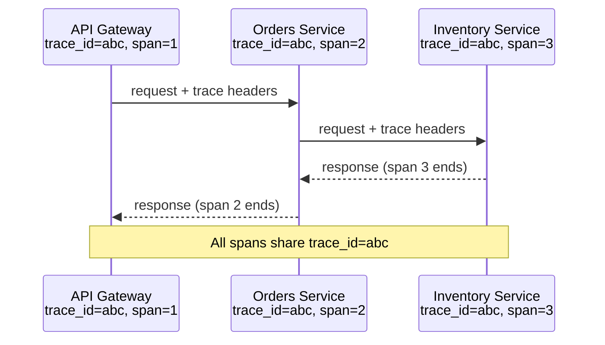




```java
import java.util.UUID;

// => Span: represents one timed operation within a distributed trace tree
record Span(
    String traceId,        // => Same across all spans from the same root request
    String spanId,         // => Unique per operation — used as parentSpanId by children
    String parentSpanId,   // => null for root span; links child to parent in trace tree
    String operation,      // => Human-readable name for this span (e.g. "orders-svc:place_order")
    long startNs           // => Nanosecond timestamp — nanoseconds give sub-millisecond precision
) {
    // => finish: compute duration and emit — in production, send to Jaeger/Zipkin, not stdout
    void finish() {
        long durationMs = (System.nanoTime() - startNs) / 1_000_000;
        System.out.printf("[TRACE] trace=%s span=%s parent=%s op=%s duration=%dms%n",
            traceId, spanId, parentSpanId, operation, durationMs);
        // => In production: opentelemetry-sdk exports this to the configured backend
    }
}

// => Tracer: creates spans for one named service; propagates trace context across calls
class Tracer {
    private final String service;  // => Service name prefixed to every operation name
    Tracer(String service) { this.service = service; }

    // => startSpan: traceId=null creates a root span; non-null continues an existing trace
    Span startSpan(String operation, String traceId, String parentSpanId) {
        String tid = traceId != null ? traceId : UUID.randomUUID().toString();
        // => Root span: generates new traceId; child span: inherits caller's traceId
        String sid = UUID.randomUUID().toString().substring(0, 8);
        // => spanId is short for readability; real OpenTelemetry uses 16-byte hex
        return new Span(tid, sid, parentSpanId, service + ":" + operation, System.nanoTime());
    }
}

// => Three services each create spans under the same trace
var gateway = new Tracer("api-gateway");
var ordersSvc = new Tracer("orders-svc");
var inventorySvc = new Tracer("inventory-svc");

// => Step 1: API Gateway starts the root span — traceId generated here
var root = gateway.startSpan("handle_request", null, null);
// => root.traceId is propagated to all downstream services via W3C traceparent header

// => Step 2: Orders service starts child span with gateway's traceId
var ordersSpan = ordersSvc.startSpan("place_order", root.traceId(), root.spanId());
// => ordersSpan.parentSpanId == root.spanId — links child to parent in trace tree

// => Step 3: Inventory service starts grandchild span
var invSpan = inventorySvc.startSpan("reserve_stock", root.traceId(), ordersSpan.spanId());
invSpan.finish();    // => Inventory finishes first (innermost call)
// => Output: [TRACE] trace=<id> span=<id> parent=<orders-span-id> op=inventory-svc:reserve_stock duration=0ms

ordersSpan.finish(); // => Orders finishes after Inventory returns
// => Output: [TRACE] trace=<id> span=<id> parent=<root-span-id> op=orders-svc:place_order duration=0ms

root.finish();       // => Gateway finishes last — outermost span spans the entire request
// => Output: [TRACE] trace=<id> span=<id> parent=null op=api-gateway:handle_request duration=0ms
// => All three spans share the same traceId — Jaeger/Zipkin links them into a flame graph
```




```kotlin
import java.util.UUID

// => Span: represents one timed operation within a distributed trace tree
data class Span(
    val traceId: String,        // => Same across all spans from the same root request
    val spanId: String,         // => Unique per operation — used as parentSpanId by children
    val parentSpanId: String?,  // => null for root span; links child to parent in trace tree
    val operation: String,      // => Human-readable name (e.g. "orders-svc:place_order")
    val startNs: Long = System.nanoTime()  // => Nanosecond start for sub-ms precision
) {
    // => finish: compute duration and emit — production sends to OpenTelemetry backend, not stdout
    fun finish() {
        val durationMs = (System.nanoTime() - startNs) / 1_000_000
        println("[TRACE] trace=$traceId span=$spanId parent=$parentSpanId op=$operation duration=${durationMs}ms")
        // => In production: opentelemetry-sdk exports span data to Jaeger/Zipkin/Datadog
    }
}

// => Tracer: creates spans for one named service; propagates trace context across service calls
class Tracer(private val service: String) {
    // => traceId=null creates a root span; non-null continues an existing trace
    fun startSpan(operation: String, traceId: String? = null, parentSpanId: String? = null): Span {
        val tid = traceId ?: UUID.randomUUID().toString()
        // => Root span: generates new traceId; child span: inherits caller's traceId
        val sid = UUID.randomUUID().toString().take(8)
        // => spanId is short for readability; real OpenTelemetry uses 16-byte hex
        return Span(tid, sid, parentSpanId, "$service:$operation")
    }
}

// => Three services each create spans under the same trace
val gateway = Tracer("api-gateway")
val ordersSvc = Tracer("orders-svc")
val inventorySvc = Tracer("inventory-svc")

// => Step 1: API Gateway starts the root span — traceId generated here
val root = gateway.startSpan("handle_request")
// => root.traceId is propagated downstream via W3C traceparent header in real HTTP calls

// => Step 2: Orders service starts child span with gateway's traceId
val ordersSpan = ordersSvc.startSpan("place_order", traceId = root.traceId, parentSpanId = root.spanId)
// => ordersSpan.parentSpanId == root.spanId — links this span to its parent in the tree

// => Step 3: Inventory service starts grandchild span
val invSpan = inventorySvc.startSpan("reserve_stock", traceId = root.traceId, parentSpanId = ordersSpan.spanId)
invSpan.finish()    // => Inventory finishes first (innermost call)
// => Output: [TRACE] trace=<id> span=<id> parent=<orders-span-id> op=inventory-svc:reserve_stock duration=0ms

ordersSpan.finish() // => Orders finishes after Inventory returns
// => Output: [TRACE] trace=<id> span=<id> parent=<root-span-id> op=orders-svc:place_order duration=0ms

root.finish()       // => Gateway finishes last — spans the full end-to-end request
// => Output: [TRACE] trace=<id> span=<id> parent=null op=api-gateway:handle_request duration=0ms
// => All three spans share the same traceId — Jaeger/Zipkin links them into a flame graph
```




```csharp
using System;

// => Span: represents one timed operation within a distributed trace tree
record Span(
    string TraceId,        // => Same across all spans from the same root request
    string SpanId,         // => Unique per operation — used as ParentSpanId by children
    string? ParentSpanId,  // => null for root span; links child to parent in trace tree
    string Operation,      // => Human-readable name (e.g. "orders-svc:place_order")
    long StartTicks = 0    // => Environment.TickCount64 start for ms-resolution timing
) {
    // => finish: compute duration and emit — production sends to OpenTelemetry backend, not Console
    public void Finish() {
        var durationMs = Environment.TickCount64 - StartTicks;
        Console.WriteLine($"[TRACE] trace={TraceId} span={SpanId} parent={ParentSpanId} op={Operation} duration={durationMs}ms");
        // => In production: opentelemetry-dotnet exports span data to Jaeger/Zipkin/Datadog
    }
}

// => Tracer: creates spans for one named service; propagates trace context across calls
class Tracer {
    private readonly string _service;  // => Service name prefixed to every operation name
    public Tracer(string service) => _service = service;

    // => traceId=null creates a root span; non-null continues an existing trace
    public Span StartSpan(string operation, string? traceId = null, string? parentSpanId = null) {
        var tid = traceId ?? Guid.NewGuid().ToString("N")[..8];
        // => Root span: generates new traceId; child span: inherits caller's traceId
        var sid = Guid.NewGuid().ToString("N")[..8];
        // => SpanId short for readability; real OpenTelemetry uses 16-byte hex
        return new Span(tid, sid, parentSpanId, $"{_service}:{operation}", Environment.TickCount64);
    }
}

// => Three services each create spans under the same trace
var gateway = new Tracer("api-gateway");
var ordersSvc = new Tracer("orders-svc");
var inventorySvc = new Tracer("inventory-svc");

// => Step 1: API Gateway starts the root span — TraceId generated here
var root = gateway.StartSpan("handle_request");
// => root.TraceId is propagated downstream via W3C traceparent header in real HTTP calls

// => Step 2: Orders service starts child span with gateway's TraceId
var ordersSpan = ordersSvc.StartSpan("place_order", root.TraceId, root.SpanId);
// => ordersSpan.ParentSpanId == root.SpanId — links this span to its parent in the tree

// => Step 3: Inventory service starts grandchild span
var invSpan = inventorySvc.StartSpan("reserve_stock", root.TraceId, ordersSpan.SpanId);
invSpan.Finish();    // => Inventory finishes first (innermost call)
// => Output: [TRACE] trace=<id> span=<id> parent=<orders-span-id> op=inventory-svc:reserve_stock duration=0ms

ordersSpan.Finish(); // => Orders finishes after Inventory returns
// => Output: [TRACE] trace=<id> span=<id> parent=<root-span-id> op=orders-svc:place_order duration=0ms

root.Finish();       // => Gateway finishes last — outermost span spans the entire request
// => Output: [TRACE] trace=<id> span=<id> parent= op=api-gateway:handle_request duration=0ms
// => All three spans share the same TraceId — Jaeger/Zipkin links them into a flame graph
```




```typescript
// => SPAN: represents one timed operation within a distributed trace tree
class Span {
  readonly traceId: string;
  readonly spanId: string;
  readonly parentId: string | null;
  readonly operation: string;
  private readonly startTime: number;
  private endTime: number | null = null;
  private readonly tags: Map<string, string> = new Map();

  constructor(traceId: string, operation: string, parentId: string | null = null) {
    this.traceId = traceId;
    this.spanId = crypto.randomUUID().split("-")[0]; // => short id
    this.parentId = parentId;
    this.operation = operation;
    this.startTime = Date.now();
  }

  setTag(key: string, value: string): void {
    this.tags.set(key, value); // => attach metadata to the span
  }

  finish(): void {
    this.endTime = Date.now();
    const duration = this.endTime - this.startTime;
    const parent = this.parentId ? ` (parent: ${this.parentId})` : "";
    console.log(`[Trace] ${this.traceId} | ${this.spanId}${parent} | ${this.operation} | ${duration}ms`);
  }
}

// => TRACER: creates spans and maintains active span context
class Tracer {
  startSpan(operation: string, traceId?: string, parentId?: string): Span {
    const tid = traceId ?? crypto.randomUUID();
    // => new trace if no traceId provided; propagate existing traceId across services
    return new Span(tid, operation, parentId ?? null);
  }
}

// => USAGE: instrument service boundaries
const tracer = new Tracer();

// => Simulate: API gateway → OrderService → InventoryService
const rootSpan = tracer.startSpan("POST /api/orders");
rootSpan.setTag("http.method", "POST");
await new Promise((resolve) => setTimeout(resolve, 5)); // => simulate work

const orderSpan = tracer.startSpan("OrderService.create", rootSpan.traceId, rootSpan.spanId);
orderSpan.setTag("db.table", "orders");
await new Promise((resolve) => setTimeout(resolve, 3));

const invSpan = tracer.startSpan("InventoryService.reserve", rootSpan.traceId, orderSpan.spanId);
invSpan.setTag("product.id", "p1");
await new Promise((resolve) => setTimeout(resolve, 2));

invSpan.finish(); // => innermost span finishes first
orderSpan.finish(); // => then its parent
rootSpan.finish(); // => root span finishes last
```




**Key Takeaway:** Propagate `trace_id` in every outbound request header (W3C `traceparent`) so
that all spans generated by a single user request share the same root identifier.

**Why It Matters:** Without distributed tracing, debugging latency in a chain of ten microservices
requires correlating timestamps across ten separate log files — a manual task that takes hours.
Tracing tools like Jaeger, Zipkin, and Datadog APM reduce this to a single flame graph, enabling
engineers to identify which service or database query caused a P99 latency spike in minutes. The
value of distributed tracing scales with the number of services in the call chain: the more
microservices, the more essential a shared trace context becomes for diagnosing production incidents.

---

## Deployment Patterns

### Example 68: Sidecar Pattern

The sidecar pattern deploys a secondary container alongside the primary application container in
the same pod or VM, sharing the same network namespace. The sidecar handles cross-cutting concerns
— TLS termination, logging, metrics scraping, service discovery — so the application code remains
free of infrastructure concerns.

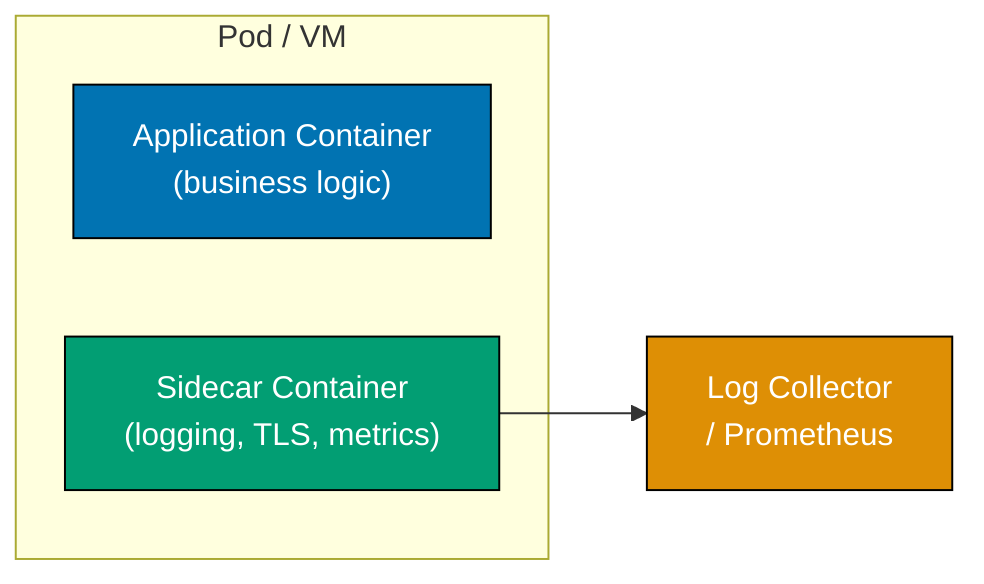




```java
import java.util.HashMap;
import java.util.Map;
import java.util.function.Function;

// => SidecarProxy: wraps the application handler and adds cross-cutting concerns
// => App never touches TLS, metrics, or request-ID generation — sidecar owns all of that
class SidecarProxy {
    private final Function<Map<String, Object>, Map<String, Object>> app;
    // => app: the real application handler — pure business logic

    SidecarProxy(Function<Map<String, Object>, Map<String, Object>> app) {
        this.app = app;
        // => app is injected; sidecar can wrap any handler without changing it
    }

    Map<String, Object> handle(Map<String, Object> request) {
        long startNs = System.nanoTime();  // => Start timing before any sidecar work

        // => Sidecar concern 1: enforce mutual TLS — block unauthenticated callers
        if (!Boolean.TRUE.equals(request.get("mtlsVerified"))) {
            return Map.of("error", "TLS handshake failed", "status", 401);
            // => App never sees this request — sidecar short-circuits before delegating
        }

        // => Sidecar concern 2: inject request metadata — app reads requestId from map
        var enriched = new HashMap<>(request);
        enriched.put("requestId", "req-" + (startNs % 10_000));
        // => App can log requestId without implementing header parsing itself

        // => Delegate to application logic — app knows nothing about sidecar
        var response = app.apply(enriched);

        // => Sidecar concern 3: emit latency metric to Prometheus (stdout here)
        long durationMs = (System.nanoTime() - startNs) / 1_000_000;
        System.out.printf("[SIDECAR] method=%s path=%s status=%s duration=%dms%n",
            request.get("method"), request.get("path"),
            response.getOrDefault("status", 200), durationMs);
        // => Application code never calls a metrics client; sidecar owns all instrumentation

        return response;
    }
}

// => Application handler: pure business logic — no TLS, metrics, or log formatting
Function<Map<String, Object>, Map<String, Object>> orderApp = req ->
    Map.of("status", 200, "data", "Order " + req.getOrDefault("orderId", "unknown") + " retrieved");
// => orderApp is completely unaware that a sidecar wraps it

var proxy = new SidecarProxy(orderApp);

// => Blocked request: no mTLS certificate — sidecar rejects before app sees it
var blockedResp = proxy.handle(Map.of("method", "GET", "path", "/orders/1",
    "orderId", "1", "mtlsVerified", false));
System.out.println(blockedResp);
// => Output: {error=TLS handshake failed, status=401}

// => Allowed request: mTLS verified — sidecar enriches, delegates, emits metrics
var okResp = proxy.handle(Map.of("method", "GET", "path", "/orders/1",
    "orderId", "1", "mtlsVerified", true));
// => Output: [SIDECAR] method=GET path=/orders/1 status=200 duration=0ms
System.out.println(okResp);
// => Output: {status=200, data=Order 1 retrieved}
```




```kotlin
// => SidecarProxy: wraps the application handler and adds cross-cutting concerns
// => App never touches TLS, metrics, or request-ID generation — sidecar owns all of that
class SidecarProxy(
    private val app: (Map<String, Any>) -> Map<String, Any>
    // => app: the real application handler — pure business logic
) {
    fun handle(request: Map<String, Any>): Map<String, Any> {
        val startNs = System.nanoTime()  // => Start timing before any sidecar work

        // => Sidecar concern 1: enforce mutual TLS — block unauthenticated callers
        if (request["mtlsVerified"] != true) {
            return mapOf("error" to "TLS handshake failed", "status" to 401)
            // => App never sees this request — sidecar short-circuits before delegating
        }

        // => Sidecar concern 2: inject request metadata — app reads requestId from map
        val enriched = request.toMutableMap()
        enriched["requestId"] = "req-${startNs % 10_000}"
        // => App can log requestId without implementing header parsing itself

        // => Delegate to application logic — app knows nothing about sidecar
        val response = app(enriched)

        // => Sidecar concern 3: emit latency metric to Prometheus (stdout here)
        val durationMs = (System.nanoTime() - startNs) / 1_000_000
        println("[SIDECAR] method=${request["method"]} path=${request["path"]} status=${response["status"] ?: 200} duration=${durationMs}ms")
        // => Application code never calls a metrics client; sidecar owns all instrumentation

        return response
    }
}

// => Application handler: pure business logic — no TLS, metrics, or log formatting
val orderApp: (Map<String, Any>) -> Map<String, Any> = { req ->
    mapOf("status" to 200, "data" to "Order ${req["orderId"] ?: "unknown"} retrieved")
}
// => orderApp is completely unaware that a sidecar wraps it

val proxy = SidecarProxy(orderApp)

// => Blocked request: no mTLS certificate — sidecar rejects before app sees it
val blockedResp = proxy.handle(mapOf("method" to "GET", "path" to "/orders/1",
    "orderId" to "1", "mtlsVerified" to false))
println(blockedResp)
// => Output: {error=TLS handshake failed, status=401}

// => Allowed request: mTLS verified — sidecar enriches, delegates, emits metrics
val okResp = proxy.handle(mapOf("method" to "GET", "path" to "/orders/1",
    "orderId" to "1", "mtlsVerified" to true))
// => Output: [SIDECAR] method=GET path=/orders/1 status=200 duration=0ms
println(okResp)
// => Output: {status=200, data=Order 1 retrieved}
```




```csharp
using System;
using System.Collections.Generic;

// => SidecarProxy: wraps the application handler and adds cross-cutting concerns
// => App never touches TLS, metrics, or request-ID generation — sidecar owns all of that
class SidecarProxy {
    private readonly Func<Dictionary<string, object>, Dictionary<string, object>> _app;
    // => _app: the real application handler — pure business logic

    public SidecarProxy(Func<Dictionary<string, object>, Dictionary<string, object>> app) {
        _app = app;
        // => app is injected; sidecar can wrap any handler without modifying it
    }

    public Dictionary<string, object> Handle(Dictionary<string, object> request) {
        var startMs = Environment.TickCount64;  // => Start timing before any sidecar work

        // => Sidecar concern 1: enforce mutual TLS — block unauthenticated callers
        if (!request.TryGetValue("mtlsVerified", out var v) || v is not true) {
            return new() { ["error"] = "TLS handshake failed", ["status"] = 401 };
            // => App never sees this request — sidecar short-circuits before delegating
        }

        // => Sidecar concern 2: inject request metadata — app reads RequestId from dict
        var enriched = new Dictionary<string, object>(request) {
            ["requestId"] = "req-" + (startMs % 10_000)
        };
        // => App can log requestId without implementing header extraction itself

        // => Delegate to application logic — app is completely unaware of the sidecar
        var response = _app(enriched);

        // => Sidecar concern 3: emit latency metric to Prometheus (Console here)
        var durationMs = Environment.TickCount64 - startMs;
        Console.WriteLine($"[SIDECAR] method={request["method"]} path={request["path"]} " +
            $"status={response.GetValueOrDefault("status", 200)} duration={durationMs}ms");
        // => Application code never calls a metrics client; sidecar owns all instrumentation

        return response;
    }
}

// => Application handler: pure business logic — no TLS, metrics, or log formatting
Func<Dictionary<string, object>, Dictionary<string, object>> orderApp = req =>
    new() { ["status"] = 200, ["data"] = $"Order {req.GetValueOrDefault("orderId", "unknown")} retrieved" };
// => orderApp is completely unaware that a sidecar wraps it

var proxy = new SidecarProxy(orderApp);

// => Blocked request: no mTLS certificate — sidecar rejects before app sees it
var blockedResp = proxy.Handle(new() { ["method"] = "GET", ["path"] = "/orders/1",
    ["orderId"] = "1", ["mtlsVerified"] = false });
Console.WriteLine(blockedResp["error"]);
// => Output: TLS handshake failed

// => Allowed request: mTLS verified — sidecar enriches, delegates, emits metrics
var okResp = proxy.Handle(new() { ["method"] = "GET", ["path"] = "/orders/1",
    ["orderId"] = "1", ["mtlsVerified"] = true });
// => Output: [SIDECAR] method=GET path=/orders/1 status=200 duration=0ms
Console.WriteLine(okResp["data"]);
// => Output: Order 1 retrieved
```




```typescript
// => SERVICE DISCOVERY: services register themselves; clients look up by name
interface ServiceEndpoint {
  host: string;
  port: number;
}

class ServiceDiscovery {
  private readonly registry: Map<string, ServiceEndpoint[]> = new Map();

  register(name: string, endpoint: ServiceEndpoint): void {
    const existing = this.registry.get(name) ?? [];
    this.registry.set(name, [...existing, endpoint]);
    console.log(`[Discovery] Registered ${name} at ${endpoint.host}:${endpoint.port}`);
  }

  deregister(name: string, endpoint: ServiceEndpoint): void {
    const existing = this.registry.get(name) ?? [];
    this.registry.set(
      name,
      existing.filter((e) => !(e.host === endpoint.host && e.port === endpoint.port)),
    );
    console.log(`[Discovery] Deregistered ${name} at ${endpoint.host}:${endpoint.port}`);
  }

  resolve(name: string): ServiceEndpoint[] {
    return this.registry.get(name) ?? [];
    // => returns all registered endpoints for the service
  }
}

// => CLIENT-SIDE LOAD BALANCING: chooses one endpoint from discovered list
class DiscoveryAwareClient {
  private roundRobinIdx = 0;

  constructor(private readonly discovery: ServiceDiscovery) {}

  call(serviceName: string, path: string): string {
    const endpoints = this.discovery.resolve(serviceName);
    if (endpoints.length === 0) throw new Error(`Service ${serviceName} not found`);

    // => round-robin selection across discovered instances
    const endpoint = endpoints[this.roundRobinIdx % endpoints.length];
    this.roundRobinIdx++;

    console.log(`[Client] Calling ${endpoint.host}:${endpoint.port}${path}`);
    return `Response from ${endpoint.host}:${endpoint.port}`;
  }
}

const discovery = new ServiceDiscovery();
discovery.register("users", { host: "users-1", port: 8080 });
discovery.register("users", { host: "users-2", port: 8080 });

const client = new DiscoveryAwareClient(discovery);
console.log(client.call("users", "/api/users")); // => users-1:8080
console.log(client.call("users", "/api/users")); // => users-2:8080
```




**Key Takeaway:** Sidecars let application developers focus on business logic while a separate
deployable unit evolves independently to handle observability, security, and traffic management.

**Why It Matters:** Kubernetes service mesh implementations (Istio, Linkerd) use the sidecar
pattern to inject Envoy proxies alongside every pod transparently — the application team deploys
business code unchanged, while the platform team rotates TLS certificates, controls traffic splits,
and collects distributed traces through the sidecar. This separation allows infrastructure upgrades
without coordinating with application teams, enabling cluster-wide policy rollouts without
modifying a single application binary.

---

### Example 69: Ambassador Pattern

The ambassador pattern places a proxy between an application and a remote service to handle
concerns specific to that client's relationship with the service: protocol translation, retry
policy, credential injection, and connection pooling. Unlike the sidecar (which handles all
outbound traffic), an ambassador is purpose-built for one specific remote.




```java
import java.util.List;
import java.util.Map;

// => DatabaseAmbassador: encapsulates all complexity of calling the database
// => Application code never sees retries, DSN, pool management, or credential injection
class DatabaseAmbassador {
    private final String dsn;         // => Connection string — app never accesses this directly
    private final int maxRetries;     // => How many transient errors to absorb before propagating
    private int callCount = 0;        // => Internal counter for metrics reporting

    DatabaseAmbassador(String dsn, int maxRetries) {
        this.dsn = dsn;
        this.maxRetries = maxRetries;
        // => Real ambassador would initialise a connection pool here (HikariCP, c3p0)
    }

    // => query: public API for the application — hides all retry and pool complexity
    List<Map<String, Object>> query(String sql, Object... params) {
        for (int attempt = 0; attempt < maxRetries; attempt++) {
            try {
                return execute(sql, params);  // => Attempt via connection pool
            } catch (RuntimeException e) {
                if (attempt == maxRetries - 1) throw e;  // => Exhausted retries; propagate
                long backoffMs = (long)(100 * Math.pow(2, attempt));
                // => Exponential backoff between retries — DB gets breathing room
                System.out.println("Transient error on attempt " + (attempt + 1) + ": " + e.getMessage());
                // => App never sees this retry loop; it transparently hides transient errors
            }
        }
        throw new RuntimeException("Unreachable");  // => Loop always throws or returns
    }

    // => execute: simulates a real DB call through the connection pool
    private List<Map<String, Object>> execute(String sql, Object[] params) {
        callCount++;
        // => In production: use a pooled Connection from HikariDataSource; apply query timeout
        if (callCount == 1) throw new RuntimeException("transient connection loss");
        // => Simulate flaky first call — ambassador absorbs and retries this transparently
        return List.of(
            Map.of("id", 1, "name", "Alice"),
            Map.of("id", 2, "name", "Bob")
        );
        // => Returns clean result list; app sees this as if no failure occurred
    }

    int getCallCount() { return callCount; }  // => Expose for monitoring/testing
}

// => Application code: calls ambassador — knows nothing about retries, DSN, or pool size
var db = new DatabaseAmbassador("jdbc:postgresql://localhost/mydb", 3);
var rows = db.query("SELECT id, name FROM users WHERE active = ?", true);
System.out.println(rows);
// => Output: [{id=1, name=Alice}, {id=2, name=Bob}]
// => (First call failed internally; ambassador retried transparently)
System.out.println("Total calls made (including retries): " + db.getCallCount());
// => Output: Total calls made (including retries): 2
```




```kotlin
// => DatabaseAmbassador: encapsulates all complexity of calling the database
// => Application code never sees retries, DSN, pool management, or credential injection
class DatabaseAmbassador(
    private val dsn: String,      // => Connection string — app never accesses this directly
    private val maxRetries: Int = 3  // => How many transient errors to absorb before propagating
) {
    private var callCount = 0  // => Internal counter for metrics reporting

    // => query: public API for the application — hides all retry and pool complexity
    fun query(sql: String, vararg params: Any): List<Map<String, Any>> {
        for (attempt in 0 until maxRetries) {
            try {
                return execute(sql, params)  // => Attempt via connection pool
            } catch (e: RuntimeException) {
                if (attempt == maxRetries - 1) throw e  // => Exhausted retries; propagate
                val backoffMs = (100 * Math.pow(2.0, attempt.toDouble())).toLong()
                // => Exponential backoff — DB gets breathing room between retries
                println("Transient error on attempt ${attempt + 1}: ${e.message}")
                // => App never sees this loop; it transparently absorbs transient errors
            }
        }
        throw RuntimeException("Unreachable")  // => Loop always throws or returns
    }

    // => execute: simulates a real DB call through the connection pool
    private fun execute(sql: String, params: Array<out Any>): List<Map<String, Any>> {
        callCount++
        // => In production: use a pooled Connection from HikariDataSource; apply timeout
        if (callCount == 1) throw RuntimeException("transient connection loss")
        // => Simulate flaky first call — ambassador absorbs and retries transparently
        return listOf(
            mapOf("id" to 1, "name" to "Alice"),
            mapOf("id" to 2, "name" to "Bob")
        )
        // => Returns clean result list; app sees this as if no failure occurred
    }

    fun getCallCount(): Int = callCount  // => Expose for monitoring/testing
}

// => Application code: calls ambassador — knows nothing about retries, DSN, or pool
val db = DatabaseAmbassador(dsn = "jdbc:postgresql://localhost/mydb", maxRetries = 3)
val rows = db.query("SELECT id, name FROM users WHERE active = ?", true)
println(rows)
// => Output: [{id=1, name=Alice}, {id=2, name=Bob}]
// => (First call failed internally; ambassador retried transparently)
println("Total calls made (including retries): ${db.getCallCount()}")
// => Output: Total calls made (including retries): 2
```




```csharp
using System;
using System.Collections.Generic;

// => DatabaseAmbassador: encapsulates all complexity of calling the database
// => Application code never sees retries, connection strings, pooling, or credential injection
class DatabaseAmbassador {
    private readonly string _dsn;      // => Connection string — app never accesses this directly
    private readonly int _maxRetries;  // => How many transient errors to absorb before propagating
    private int _callCount = 0;        // => Internal counter for metrics reporting

    public DatabaseAmbassador(string dsn, int maxRetries = 3) {
        _dsn = dsn;
        _maxRetries = maxRetries;
        // => Real ambassador would initialise a SqlConnection pool or Npgsql DataSource here
    }

    // => Query: public API for the application — hides all retry and pool complexity
    public List<Dictionary<string, object>> Query(string sql, params object[] p) {
        for (int attempt = 0; attempt < _maxRetries; attempt++) {
            try {
                return Execute(sql, p);  // => Attempt via connection pool
            } catch (Exception e) when (attempt < _maxRetries - 1) {
                var backoffMs = (int)(100 * Math.Pow(2, attempt));
                // => Exponential backoff — DB gets breathing room between retries
                Console.WriteLine($"Transient error on attempt {attempt + 1}: {e.Message}");
                // => App never sees this loop; ambassador absorbs transient errors silently
            }
        }
        return Execute(sql, p);  // => Final attempt — exception propagates if it fails
    }

    // => Execute: simulates a real DB call through the connection pool
    private List<Dictionary<string, object>> Execute(string sql, object[] p) {
        _callCount++;
        // => In production: open SqlConnection from pool, set CommandTimeout, execute query
        if (_callCount == 1) throw new Exception("transient connection loss");
        // => Simulate flaky first call — ambassador absorbs and retries this transparently
        return new() {
            new() { ["id"] = 1, ["name"] = "Alice" },
            new() { ["id"] = 2, ["name"] = "Bob" }
        };
        // => Returns clean result; app sees this as if no failure occurred
    }

    public int CallCount => _callCount;  // => Expose for monitoring/testing
}

// => Application code: calls ambassador — knows nothing about retries, DSN, or pool
var db = new DatabaseAmbassador("Server=localhost;Database=mydb", maxRetries: 3);
var rows = db.Query("SELECT id, name FROM users WHERE active = @p", true);
Console.WriteLine(string.Join(", ", rows.ConvertAll(r => $"{r["name"]}")));
// => Output: Alice, Bob
// => (First call failed internally; ambassador retried transparently)
Console.WriteLine($"Total calls made (including retries): {db.CallCount}");
// => Output: Total calls made (including retries): 2
```




```typescript
// => AMBASSADOR: proxy that sits in front of a service call and adds cross-cutting concerns
// => Handles retries, timeouts, logging, circuit breaking — transparent to the caller
interface ServiceClient {
  call(path: string, payload: unknown): Promise<unknown>;
}

// => REAL CLIENT: makes the actual network call
class HttpClient implements ServiceClient {
  constructor(private readonly baseUrl: string) {}

  async call(path: string, payload: unknown): Promise<unknown> {
    console.log(`[HTTP] POST ${this.baseUrl}${path}`);
    // => real impl: fetch(this.baseUrl + path, { body: JSON.stringify(payload) })
    return { status: 200, data: payload }; // => simulated response
  }
}

// => AMBASSADOR: wraps the real client with cross-cutting concerns
class AmbassadorClient implements ServiceClient {
  constructor(
    private readonly client: ServiceClient,
    private readonly maxRetries: number = 3,
    private readonly timeoutMs: number = 5000,
  ) {}

  async call(path: string, payload: unknown): Promise<unknown> {
    for (let attempt = 1; attempt <= this.maxRetries; attempt++) {
      try {
        // => TIMEOUT: race between the actual call and a timeout
        const result = await Promise.race([
          this.client.call(path, payload),
          new Promise((_, reject) => setTimeout(() => reject(new Error("Request timeout")), this.timeoutMs)),
        ]);
        console.log(`[Ambassador] Success on attempt ${attempt}`);
        return result; // => return on first success
      } catch (err) {
        console.log(`[Ambassador] Attempt ${attempt} failed: ${(err as Error).message}`);
        if (attempt === this.maxRetries) throw err;
        await new Promise((r) => setTimeout(r, 100 * attempt));
        // => exponential-ish backoff before retry
      }
    }
  }
}

const baseClient = new HttpClient("https://api.example.com");
const ambassador = new AmbassadorClient(baseClient, 3, 2000);

const response = await ambassador.call("/orders", { item: "laptop" });
console.log(response);
// => [HTTP] POST https://api.example.com/orders
// => [Ambassador] Success on attempt 1
```




**Key Takeaway:** The ambassador externalises connection management, retry logic, and credential
handling from application code, keeping business logic free of infrastructure concerns.

**Why It Matters:** Without an ambassador, retry logic, connection pool configuration, and timeout
handling are duplicated across every service that calls the same downstream. When the retry policy
needs changing — for example, after a database upgrade changes failure characteristics — a single
ambassador change affects all consumers. Proxy-based ambassadors demonstrate this pattern at scale:
a single proxy configuration update changes connection pool behaviour for all microservices without
requiring individual code deployments.

---

## Event-Driven Architecture

### Example 70: Event Sourcing Implementation

Event sourcing stores state as an append-only sequence of domain events rather than as current
mutable state. The current state is derived by replaying events. This enables complete audit trails,
temporal queries ("what was the account balance at 3 PM yesterday?"), and event-driven integration.

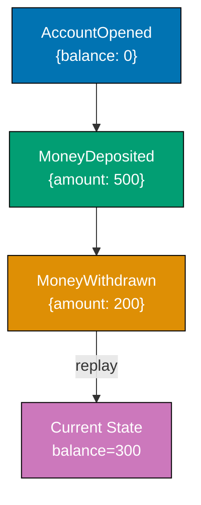




```java
import java.util.ArrayList;
import java.util.Collections;
import java.util.List;
import java.util.Map;

// => DomainEvent: immutable record of a state change — never updated or deleted after appending
record DomainEvent(
    String eventType,     // => e.g. "AccountOpened", "MoneyDeposited", "MoneyWithdrawn"
    Map<String, Object> payload  // => Event-specific data — always serialisable to JSON
) {}

// => EventStore: append-only log — the source of truth for all state changes
class EventStore {
    private final List<DomainEvent> events = new ArrayList<>();
    // => Append-only: events never updated or deleted — immutable history

    void append(DomainEvent event) {
        events.add(event);  // => Append only; production uses INSERT with sequence number
        // => In production: rows in PostgreSQL events table, or EventStoreDB streams
    }

    List<DomainEvent> getEvents() {
        return Collections.unmodifiableList(events);
        // => Returns read-only view — callers cannot mutate the store
    }
}

// => BankAccount: state is always derived by replaying events, never stored directly
class BankAccount {
    String accountId = "";  // => Set by AccountOpened event
    double balance = 0.0;   // => Recomputed by replay; never stored in a "balance" column

    // => replay: rebuild current state by applying each event in order
    static BankAccount replay(List<DomainEvent> events) {
        var account = new BankAccount();
        for (var e : events) account.apply(e);
        // => Each event is applied in sequence order — order matters for financial ledgers
        return account;  // => Account is now in the state it was after all given events
    }

    private void apply(DomainEvent e) {
        switch (e.eventType()) {
            case "AccountOpened" -> {
                accountId = (String) e.payload().get("accountId");
                balance = 0.0;  // => Initial balance always 0 at account opening
            }
            case "MoneyDeposited" -> balance += (double) e.payload().get("amount");
            // => Increase balance by deposited amount
            case "MoneyWithdrawn" -> balance -= (double) e.payload().get("amount");
            // => Decrease balance by withdrawn amount
        }
    }
}

// => Simulation: three events recorded over an account's lifetime
var store = new EventStore();
store.append(new DomainEvent("AccountOpened", Map.of("accountId", "ACC-001")));
store.append(new DomainEvent("MoneyDeposited", Map.of("amount", 500.0)));
store.append(new DomainEvent("MoneyWithdrawn", Map.of("amount", 200.0)));

// => Replay all events to derive current state
var account = BankAccount.replay(store.getEvents());
System.out.println("Account: " + account.accountId + ", Balance: " + account.balance);
// => Output: Account: ACC-001, Balance: 300.0

// => Temporal query: state after only first two events (deposit not yet withdrawn)
var accountAtT2 = BankAccount.replay(store.getEvents().subList(0, 2));
System.out.println("Balance after deposit only: " + accountAtT2.balance);
// => Output: Balance after deposit only: 500.0
```




```kotlin
// => DomainEvent: immutable record of a state change — never updated or deleted after appending
data class DomainEvent(
    val eventType: String,          // => e.g. "AccountOpened", "MoneyDeposited"
    val payload: Map<String, Any>   // => Event-specific data — always serialisable to JSON
)

// => EventStore: append-only log — the source of truth for all state changes
class EventStore {
    private val events = mutableListOf<DomainEvent>()
    // => Append-only: events never updated or deleted — immutable history

    fun append(event: DomainEvent) {
        events.add(event)  // => Append only; production uses INSERT with sequence number
        // => In production: rows in PostgreSQL events table, or EventStoreDB streams
    }

    fun getEvents(): List<DomainEvent> = events.toList()
    // => Returns snapshot copy — callers cannot mutate the backing list
}

// => BankAccount: state is always derived by replaying events, never stored directly
class BankAccount {
    var accountId: String = ""  // => Set by AccountOpened event
    var balance: Double = 0.0   // => Recomputed by replay; never stored in a "balance" column

    companion object {
        // => replay: rebuild current state by applying each event in order
        fun replay(events: List<DomainEvent>): BankAccount {
            val account = BankAccount()
            events.forEach { account.apply(it) }
            // => Each event applied in sequence — order matters for financial ledgers
            return account  // => Account is in the state it was after all given events
        }
    }

    private fun apply(e: DomainEvent) {
        when (e.eventType) {
            "AccountOpened" -> {
                accountId = e.payload["accountId"] as String
                balance = 0.0  // => Initial balance always 0 at account opening
            }
            "MoneyDeposited" -> balance += e.payload["amount"] as Double
            // => Increase balance by deposited amount
            "MoneyWithdrawn" -> balance -= e.payload["amount"] as Double
            // => Decrease balance by withdrawn amount
        }
    }
}

// => Simulation: three events recorded over an account's lifetime
val store = EventStore()
store.append(DomainEvent("AccountOpened", mapOf("accountId" to "ACC-001")))
store.append(DomainEvent("MoneyDeposited", mapOf("amount" to 500.0)))
store.append(DomainEvent("MoneyWithdrawn", mapOf("amount" to 200.0)))

// => Replay all events to derive current state
val account = BankAccount.replay(store.getEvents())
println("Account: ${account.accountId}, Balance: ${account.balance}")
// => Output: Account: ACC-001, Balance: 300.0

// => Temporal query: state after only first two events (deposit not yet withdrawn)
val accountAtT2 = BankAccount.replay(store.getEvents().take(2))
println("Balance after deposit only: ${accountAtT2.balance}")
// => Output: Balance after deposit only: 500.0
```




```csharp
using System;
using System.Collections.Generic;
using System.Linq;

// => DomainEvent: immutable record of a state change — never updated or deleted after appending
record DomainEvent(
    string EventType,                    // => e.g. "AccountOpened", "MoneyDeposited"
    Dictionary<string, object> Payload  // => Event-specific data — always serialisable to JSON
);

// => EventStore: append-only log — the source of truth for all state changes
class EventStore {
    private readonly List<DomainEvent> _events = new();
    // => Append-only: events never updated or deleted — immutable history

    public void Append(DomainEvent e) {
        _events.Add(e);  // => Append only; production uses INSERT with sequence number
        // => In production: rows in PostgreSQL events table, or EventStoreDB streams
    }

    public IReadOnlyList<DomainEvent> GetEvents() => _events.AsReadOnly();
    // => Returns read-only wrapper — callers cannot mutate the store
}

// => BankAccount: state is always derived by replaying events, never stored directly
class BankAccount {
    public string AccountId { get; private set; } = "";
    // => Set by AccountOpened event
    public double Balance { get; private set; } = 0.0;
    // => Recomputed by replay; never stored in a "balance" column

    // => Replay: rebuild current state by applying each event in order
    public static BankAccount Replay(IEnumerable<DomainEvent> events) {
        var account = new BankAccount();
        foreach (var e in events) account.Apply(e);
        // => Each event applied in sequence — order matters for financial ledgers
        return account;  // => Account is in the state it was after all given events
    }

    private void Apply(DomainEvent e) {
        switch (e.EventType) {
            case "AccountOpened":
                AccountId = (string)e.Payload["accountId"];
                Balance = 0.0;  // => Initial balance always 0 at account opening
                break;
            case "MoneyDeposited":
                Balance += (double)e.Payload["amount"];
                // => Increase balance by deposited amount
                break;
            case "MoneyWithdrawn":
                Balance -= (double)e.Payload["amount"];
                // => Decrease balance by withdrawn amount
                break;
        }
    }
}

// => Simulation: three events recorded over an account's lifetime
var store = new EventStore();
store.Append(new DomainEvent("AccountOpened", new() { ["accountId"] = "ACC-001" }));
store.Append(new DomainEvent("MoneyDeposited", new() { ["amount"] = 500.0 }));
store.Append(new DomainEvent("MoneyWithdrawn", new() { ["amount"] = 200.0 }));

// => Replay all events to derive current state
var account = BankAccount.Replay(store.GetEvents());
Console.WriteLine($"Account: {account.AccountId}, Balance: {account.Balance}");
// => Output: Account: ACC-001, Balance: 300

// => Temporal query: state after only first two events (deposit not yet withdrawn)
var accountAtT2 = BankAccount.Replay(store.GetEvents().Take(2));
Console.WriteLine($"Balance after deposit only: {accountAtT2.Balance}");
// => Output: Balance after deposit only: 500
```




```typescript
// => SIDECAR: a companion process that augments a main service without modifying it
// => Handles logging, metrics, service mesh — transparent to the main service

// => MAIN SERVICE: pure business logic, no observability concerns
class OrderService {
  processOrder(orderId: string, amount: number): string {
    if (amount <= 0) throw new Error("Invalid amount");
    return `Order ${orderId} processed for $${amount}`;
    // => Service has no logging, metrics, or tracing code
  }
}

// => SIDECAR 1: logging interceptor
class LoggingSidecar {
  constructor(private readonly service: OrderService) {}

  processOrder(orderId: string, amount: number): string {
    console.log(`[Log] processOrder called: orderId=${orderId}, amount=${amount}`);
    try {
      const result = this.service.processOrder(orderId, amount);
      console.log(`[Log] processOrder succeeded: ${result}`);
      return result;
    } catch (err) {
      console.log(`[Log] processOrder failed: ${(err as Error).message}`);
      throw err;
    }
  }
}

// => SIDECAR 2: metrics interceptor (wraps logging sidecar)
class MetricsSidecar {
  private callCount = 0;
  private errorCount = 0;

  constructor(private readonly service: LoggingSidecar) {}

  processOrder(orderId: string, amount: number): string {
    this.callCount++;
    try {
      const result = this.service.processOrder(orderId, amount);
      return result;
    } catch (err) {
      this.errorCount++;
      throw err;
    }
  }

  getMetrics(): { calls: number; errors: number } {
    return { calls: this.callCount, errors: this.errorCount };
    // => metrics collected without touching OrderService
  }
}

// => WIRE: main service wrapped in sidecars
const orderSvc = new OrderService();
const withLogs = new LoggingSidecar(orderSvc);
const withMetrics = new MetricsSidecar(withLogs);

withMetrics.processOrder("ord-1", 150.0);
// => [Log] processOrder called / succeeded

try {
  withMetrics.processOrder("ord-2", -5);
} catch {}
// => [Log] processOrder called / failed

console.log(withMetrics.getMetrics()); // => { calls: 2, errors: 1 }
```




**Key Takeaway:** Store domain events as the source of truth; derive read-state by replaying events
so the full history is preserved for audit, debugging, and temporal queries.

**Why It Matters:** Traditional CRUD databases overwrite state on every update, losing historical
information. Financial services (banks, trading platforms), healthcare systems, and compliance-heavy
domains require complete audit trails mandated by regulations such as GDPR, SOX, and PCI DSS.
Event sourcing satisfies these requirements by design: every state transition is recorded with its
cause. CQRS (Command Query Responsibility Segregation) pairs naturally with event sourcing because
read models can be rebuilt from events when requirements change, without migrating data.

---

## Structural Patterns

### Example 71: Modular Monolith

A modular monolith deploys as a single process but enforces strict module boundaries in code,
preventing cross-module dependencies at the wrong level of abstraction. Each module owns its domain
model, service layer, and repository — but shares the process and database, making local calls
cheap and distributed tracing unnecessary.




```java
import java.util.HashMap;
import java.util.Map;
import java.util.Optional;
import java.util.UUID;

// ============================================================
// Module: Orders — owns its own model and service interface
// ============================================================
// => Order: domain object owned exclusively by the Orders module
record Order(String orderId, String customerId, double total) {}

// => OrderRepository: interface owned by Orders module — implementations injected from outside
interface OrderRepository {
    void save(Order order);
    // => Module specifies what it needs; infrastructure provides the implementation
    Optional<Order> find(String orderId);
}

// => OrderService: Orders module's public API — other modules call this, never the repo directly
class OrderService {
    private final OrderRepository repo;
    // => Injected at composition root — module owns the interface, not the implementation
    OrderService(OrderRepository repo) { this.repo = repo; }

    Order place(String customerId, double total) {
        var order = new Order(UUID.randomUUID().toString().substring(0, 8), customerId, total);
        repo.save(order);  // => Persists via injected repo — module doesn't know which DB
        return order;
        // => Returns domain object; Billing receives this via service call, not direct DB access
    }
}

// ============================================================
// Module: Billing — separate domain; communicates via Order domain object only
// ============================================================
// => Invoice: domain object owned exclusively by the Billing module
// => Billing imports Order (shared kernel type) but NOT OrderRepository — boundary enforced
record Invoice(String invoiceId, String orderId, double amount, boolean paid) {}

// => BillingService: Billing module's public API
class BillingService {
    private final Map<String, Invoice> invoices = new HashMap<>();
    // => Billing owns its own in-memory store — real impl uses its own DB schema

    Invoice issueInvoice(Order order) {
        var inv = new Invoice(UUID.randomUUID().toString().substring(0, 8),
            order.orderId(), order.total(), false);
        invoices.put(inv.invoiceId(), inv);  // => Billing persists in its own storage
        return inv;
        // => Returns Billing's Invoice type — not Orders' domain object
    }
}

// ============================================================
// Composition Root — wires both modules together at application startup
// ============================================================
// => InMemoryOrderRepo: infrastructure implementation injected into Orders module
class InMemoryOrderRepo implements OrderRepository {
    private final Map<String, Order> store = new HashMap<>();

    @Override public void save(Order o) { store.put(o.orderId(), o); }
    // => In production: JPA repository or JDBC template
    @Override public Optional<Order> find(String id) { return Optional.ofNullable(store.get(id)); }
    // => Returns Optional — avoids null; caller handles missing case explicitly
}

// => Composition Root wires modules — neither module knows about the other's internals
var orderSvc = new OrderService(new InMemoryOrderRepo());
var billingSvc = new BillingService();

var order = orderSvc.place("cust-1", 149.99);  // => Orders module creates and persists order
var invoice = billingSvc.issueInvoice(order);   // => Billing receives Order domain object
System.out.println("Order: " + order.orderId() + ", Invoice: " + invoice.invoiceId()
    + ", Amount: " + invoice.amount());
// => Output: Order: <id>, Invoice: <id>, Amount: 149.99
```




```kotlin
import java.util.UUID

// ============================================================
// Module: Orders — owns its own model and service interface
// ============================================================
// => Order: domain object owned exclusively by the Orders module
data class Order(val orderId: String, val customerId: String, val total: Double)

// => OrderRepository: interface owned by Orders module — implementations injected from outside
interface OrderRepository {
    fun save(order: Order)
    // => Module specifies what it needs; infrastructure provides the implementation
    fun find(orderId: String): Order?
}

// => OrderService: Orders module's public API — other modules call this, never the repo directly
class OrderService(private val repo: OrderRepository) {
    // => repo injected at composition root — module owns the interface, not the implementation

    fun place(customerId: String, total: Double): Order {
        val order = Order(UUID.randomUUID().toString().take(8), customerId, total)
        repo.save(order)  // => Persists via injected repo — module doesn't know which DB
        return order
        // => Returns domain object; Billing receives this via service call, not direct DB access
    }
}

// ============================================================
// Module: Billing — separate domain; communicates via Order domain object only
// ============================================================
// => Invoice: domain object owned exclusively by the Billing module
// => Billing imports Order (shared kernel type) but NOT OrderRepository — boundary enforced
data class Invoice(val invoiceId: String, val orderId: String, val amount: Double, val paid: Boolean = false)

// => BillingService: Billing module's public API
class BillingService {
    private val invoices = mutableMapOf<String, Invoice>()
    // => Billing owns its own in-memory store — real impl uses its own DB schema

    fun issueInvoice(order: Order): Invoice {
        val inv = Invoice(UUID.randomUUID().toString().take(8), order.orderId, order.total)
        invoices[inv.invoiceId] = inv  // => Billing persists in its own storage
        return inv
        // => Returns Billing's Invoice type — not Orders' domain object
    }
}

// ============================================================
// Composition Root — wires both modules together at application startup
// ============================================================
// => InMemoryOrderRepo: infrastructure implementation injected into Orders module
class InMemoryOrderRepo : OrderRepository {
    private val store = mutableMapOf<String, Order>()

    override fun save(order: Order) { store[order.orderId] = order }
    // => In production: Spring Data JPA repository or exposed DAO
    override fun find(orderId: String): Order? = store[orderId]
    // => Returns null if not found — caller handles missing case explicitly
}

// => Composition Root wires modules — neither module knows about the other's internals
val orderSvc = OrderService(InMemoryOrderRepo())
val billingSvc = BillingService()

val order = orderSvc.place("cust-1", 149.99)  // => Orders module creates and persists order
val invoice = billingSvc.issueInvoice(order)   // => Billing receives Order domain object
println("Order: ${order.orderId}, Invoice: ${invoice.invoiceId}, Amount: ${invoice.amount}")
// => Output: Order: <id>, Invoice: <id>, Amount: 149.99
```




```csharp
using System;
using System.Collections.Generic;

// ============================================================
// Module: Orders — owns its own model and service interface
// ============================================================
// => Order: domain record owned exclusively by the Orders module
record Order(string OrderId, string CustomerId, double Total);

// => IOrderRepository: interface owned by Orders module — implementations injected from outside
interface IOrderRepository {
    void Save(Order order);
    // => Module specifies what it needs; infrastructure provides the implementation
    Order? Find(string orderId);
}

// => OrderService: Orders module's public API — other modules call this, never the repo directly
class OrderService {
    private readonly IOrderRepository _repo;
    // => Injected at composition root — module owns the interface, not the implementation
    public OrderService(IOrderRepository repo) => _repo = repo;

    public Order Place(string customerId, double total) {
        var order = new Order(Guid.NewGuid().ToString("N")[..8], customerId, total);
        _repo.Save(order);  // => Persists via injected repo — module doesn't know which DB
        return order;
        // => Returns domain object; Billing receives this via service call, not direct DB access
    }
}

// ============================================================
// Module: Billing — separate domain; communicates via Order domain object only
// ============================================================
// => Invoice: domain record owned exclusively by the Billing module
// => Billing references Order (shared kernel type) but NOT IOrderRepository — boundary enforced
record Invoice(string InvoiceId, string OrderId, double Amount, bool Paid = false);

// => BillingService: Billing module's public API
class BillingService {
    private readonly Dictionary<string, Invoice> _invoices = new();
    // => Billing owns its own in-memory store — real impl uses its own DB schema

    public Invoice IssueInvoice(Order order) {
        var inv = new Invoice(Guid.NewGuid().ToString("N")[..8], order.OrderId, order.Total);
        _invoices[inv.InvoiceId] = inv;  // => Billing persists in its own storage
        return inv;
        // => Returns Billing's Invoice type — not Orders' domain object
    }
}

// ============================================================
// Composition Root — wires both modules together at application startup
// ============================================================
// => InMemoryOrderRepository: infrastructure implementation injected into Orders module
class InMemoryOrderRepository : IOrderRepository {
    private readonly Dictionary<string, Order> _store = new();

    public void Save(Order o) { _store[o.OrderId] = o; }
    // => In production: EF Core DbContext.Orders.Add(o); await ctx.SaveChangesAsync()
    public Order? Find(string id) => _store.GetValueOrDefault(id);
    // => Returns null if not found — caller handles missing case explicitly
}

// => Composition Root wires modules — neither module knows about the other's internals
var orderSvc = new OrderService(new InMemoryOrderRepository());
var billingSvc = new BillingService();

var order = orderSvc.Place("cust-1", 149.99);  // => Orders module creates and persists order
var invoice = billingSvc.IssueInvoice(order);   // => Billing receives Order domain object
Console.WriteLine($"Order: {order.OrderId}, Invoice: {invoice.InvoiceId}, Amount: {invoice.Amount}");
// => Output: Order: <id>, Invoice: <id>, Amount: 149.99
```




```typescript
// => MODULAR MONOLITH: modules with strict boundaries — clear path to microservices
// => Each module owns its own data, exposes a public API, communicates via events

// === MODULE: USERS — owns user registration and profile ===
interface UserRegisteredEvent {
  type: "UserRegistered";
  userId: string;
  email: string;
}

class UsersModule {
  private readonly users: Map<string, { id: string; email: string; name: string }> = new Map();
  private readonly listeners: Array<(e: UserRegisteredEvent) => void> = [];

  register(userId: string, email: string, name: string): void {
    this.users.set(userId, { id: userId, email, name });
    const event: UserRegisteredEvent = { type: "UserRegistered", userId, email };
    for (const listener of this.listeners) listener(event);
    // => publishes event — other modules react without coupling
  }

  onUserRegistered(listener: (e: UserRegisteredEvent) => void): void {
    this.listeners.push(listener);
    // => external modules subscribe to events, not to internal state
  }

  getUser(userId: string) {
    return this.users.get(userId);
  }
}

// === MODULE: NOTIFICATIONS — sends emails when users register ===
class NotificationsModule {
  init(users: UsersModule): void {
    users.onUserRegistered((evt) => {
      console.log(`[Notifications] Welcome email sent to ${evt.email}`);
      // => reacts to event — does not import UsersModule internals
    });
  }
}

// === MODULE: BILLING — creates initial plan when users register ===
class BillingModule {
  private readonly plans: Map<string, string> = new Map();

  init(users: UsersModule): void {
    users.onUserRegistered((evt) => {
      this.plans.set(evt.userId, "free");
      console.log(`[Billing] Free plan created for ${evt.userId}`);
    });
  }

  getPlan(userId: string): string | undefined {
    return this.plans.get(userId);
  }
}

// => WIRE: modules are wired at the application root
const usersModule = new UsersModule();
const notifModule = new NotificationsModule();
const billingModule = new BillingModule();

notifModule.init(usersModule);
billingModule.init(usersModule);

usersModule.register("u1", "alice@example.com", "Alice");
// => [Notifications] Welcome email sent to alice@example.com
// => [Billing] Free plan created for u1

console.log(billingModule.getPlan("u1")); // => free
```




**Key Takeaway:** Enforce module boundaries through Protocols and dependency injection rather than
package-access modifiers, making the modular monolith easier to later split into services if needed.

**Why It Matters:** Microservices introduce distributed systems complexity (network failures, data
consistency, distributed tracing) that many teams are not ready for. A modular monolith provides
the domain boundary discipline of microservices while retaining the operational simplicity of a
single deployable unit. Well-designed modular monoliths handle high traffic volumes without the
overhead of distributed coordination, and their strict internal boundaries enable selective service
extraction later without the coupling problems of an unstructured monolith.

---

### Example 72: Vertical Slice Architecture

Vertical slice architecture organises code by feature rather than by technical layer (Controller,
Service, Repository). Each slice contains all layers needed for that feature in one cohesive unit,
reducing cross-slice coupling and making it easy to find, understand, and change a complete feature.




```java
import java.util.*;

// => PlaceOrder slice: request + handler + response in one cohesive unit
// => No shared service layer — each slice owns its full vertical stack
record PlaceOrderRequest(String customerId, String productId, int quantity) {}
// => Immutable record; all fields set at construction, no setters needed

record PlaceOrderResponse(String orderId, String status, double total) {}
// => Immutable response; caller reads fields, never mutates them

class PlaceOrderHandler {
    // => Price and storage are private implementation details of this slice
    private final double pricePerUnit;
    // => In prod: injected OrderRepository + PriceService via constructor DI
    private final List<Map<String, Object>> orders = new ArrayList<>();

    PlaceOrderHandler(double pricePerUnit) {
        this.pricePerUnit = pricePerUnit;
        // => Price injected at construction — easy to stub in unit tests
    }

    PlaceOrderResponse handle(PlaceOrderRequest req) {
        double total = pricePerUnit * req.quantity();
        // => Business rule: total = price * qty — lives here, not in a shared service
        String orderId = String.format("ORD-%04d", orders.size() + 1);
        // => Simple sequential id; prod uses UUID or DB sequence
        orders.add(Map.of("id", orderId, "customer", req.customerId(), "total", total));
        // => Persists order; prod uses Unit of Work + transaction boundary
        return new PlaceOrderResponse(orderId, "placed", total);
        // => Slice-specific response; no generic Result envelope needed
    }

    List<Map<String, Object>> getOrders() { return orders; }
    // => Exposed only for GetOrder slice to share in-memory list in this demo
}

// => GetOrder slice: separate unit, no dependency on PlaceOrder internals
record GetOrderRequest(String orderId) {}
record GetOrderResponse(String orderId, Double total, boolean found) {}
// => Nullable Double signals "not found" without a separate Maybe type

class GetOrderHandler {
    private final List<Map<String, Object>> orders;
    // => In prod: separate read-side repository (CQRS read model)

    GetOrderHandler(List<Map<String, Object>> orders) { this.orders = orders; }

    GetOrderResponse handle(GetOrderRequest req) {
        return orders.stream()
            // => Linear scan for demo; prod uses indexed DB query by order_id
            .filter(o -> req.orderId().equals(o.get("id")))
            .findFirst()
            .map(o -> new GetOrderResponse(req.orderId(), (Double) o.get("total"), true))
            // => Found: wrap total and flag as found
            .orElse(new GetOrderResponse(req.orderId(), null, false));
            // => Not found: null total, found=false
    }
}

PlaceOrderHandler placer = new PlaceOrderHandler(12.50);
PlaceOrderResponse resp = placer.handle(new PlaceOrderRequest("C1", "P1", 4));
System.out.println(resp);
// => Output: PlaceOrderResponse[orderId=ORD-0001, status=placed, total=50.0]

GetOrderHandler getter = new GetOrderHandler(placer.getOrders());
GetOrderResponse got = getter.handle(new GetOrderRequest("ORD-0001"));
System.out.println(got);
// => Output: GetOrderResponse[orderId=ORD-0001, total=50.0, found=true]
```




```kotlin
// => PlaceOrder slice: request + handler + response in one cohesive unit
// => Data classes give equals/hashCode/toString; ideal for immutable slice contracts
data class PlaceOrderRequest(val customerId: String, val productId: String, val quantity: Int)
data class PlaceOrderResponse(val orderId: String, val status: String, val total: Double)

class PlaceOrderHandler(private val pricePerUnit: Double = 10.0) {
    // => Orders list private to this slice — no shared repository in demo
    private val orders = mutableListOf<Map<String, Any>>()
    // => In prod: injected OrderRepository + PriceService via constructor DI

    fun handle(req: PlaceOrderRequest): PlaceOrderResponse {
        val total = pricePerUnit * req.quantity
        // => Business rule: total = price * qty; belongs here, not in shared service
        val orderId = "ORD-${(orders.size + 1).toString().padStart(4, '0')}"
        // => Padded sequential id for readability; prod uses UUID or DB sequence
        orders += mapOf("id" to orderId, "customer" to req.customerId, "total" to total)
        // => Append order; prod uses Unit of Work + transaction for atomicity
        return PlaceOrderResponse(orderId, "placed", total)
        // => Returns slice-specific response; no generic Result wrapper needed
    }

    fun getOrders(): List<Map<String, Any>> = orders.toList()
    // => Read-only copy exposed for GetOrder slice to share in-memory list
}

// => GetOrder slice: separate unit, independent of PlaceOrder internals
data class GetOrderRequest(val orderId: String)
data class GetOrderResponse(val orderId: String, val total: Double?, val found: Boolean)
// => Nullable Double signals "not found" without a separate Option/Maybe type

class GetOrderHandler(private val orders: List<Map<String, Any>>) {
    // => In prod: separate read-side repository (CQRS read model)

    fun handle(req: GetOrderRequest): GetOrderResponse {
        val order = orders.firstOrNull { it["id"] == req.orderId }
        // => firstOrNull returns null if not found; safe, no exception risk
        return if (order != null)
            GetOrderResponse(req.orderId, order["total"] as Double, true)
            // => Found: cast total safely; prod uses typed read model instead of Map
        else
            GetOrderResponse(req.orderId, null, false)
            // => Not found: null total, found=false
    }
}

val placer = PlaceOrderHandler(pricePerUnit = 12.50)
val resp = placer.handle(PlaceOrderRequest("C1", "P1", 4))
println(resp)
// => Output: PlaceOrderResponse(orderId=ORD-0001, status=placed, total=50.0)

val getter = GetOrderHandler(placer.getOrders())
val got = getter.handle(GetOrderRequest("ORD-0001"))
println(got)
// => Output: GetOrderResponse(orderId=ORD-0001, total=50.0, found=true)
```




```csharp
// => PlaceOrder slice: request + handler + response in one cohesive unit
// => Records provide value equality and immutability — ideal slice contracts
public record PlaceOrderRequest(string CustomerId, string ProductId, int Quantity);
public record PlaceOrderResponse(string OrderId, string Status, double Total);
// => Immutable records; all fields set at construction, no mutation needed

public class PlaceOrderHandler
{
    private readonly double _pricePerUnit;
    // => In prod: injected IOrderRepository + IPriceService via constructor DI
    private readonly List<Dictionary<string, object>> _orders = new();

    public PlaceOrderHandler(double pricePerUnit = 10.0)
    {
        _pricePerUnit = pricePerUnit;
        // => Price injected — easy to stub in unit tests
    }

    public PlaceOrderResponse Handle(PlaceOrderRequest req)
    {
        var total = _pricePerUnit * req.Quantity;
        // => Business rule: total = price * qty; belongs in handler, not a shared service
        var orderId = $"ORD-{_orders.Count + 1:D4}";
        // => Padded sequential id; prod uses Guid.NewGuid() or DB identity
        _orders.Add(new() { ["id"] = orderId, ["customer"] = req.CustomerId, ["total"] = total });
        // => Append order; prod uses EF Core SaveChanges() inside a transaction
        return new PlaceOrderResponse(orderId, "placed", total);
        // => Slice-specific response; no generic Result<T> envelope needed
    }

    public IReadOnlyList<Dictionary<string, object>> GetOrders() => _orders.AsReadOnly();
    // => Read-only view exposed for GetOrder slice to share in-memory store
}

// => GetOrder slice: separate handler, no dependency on PlaceOrder internals
public record GetOrderRequest(string OrderId);
public record GetOrderResponse(string OrderId, double? Total, bool Found);
// => Nullable double signals "not found" without a separate Option monad

public class GetOrderHandler
{
    private readonly IReadOnlyList<Dictionary<string, object>> _orders;
    // => In prod: separate IOrderReadRepository — possibly CQRS read model

    public GetOrderHandler(IReadOnlyList<Dictionary<string, object>> orders)
        => _orders = orders;

    public GetOrderResponse Handle(GetOrderRequest req)
    {
        var order = _orders.FirstOrDefault(o => (string)o["id"] == req.OrderId);
        // => FirstOrDefault returns null if not found; LINQ safe, no exception
        return order is not null
            ? new GetOrderResponse(req.OrderId, (double)order["total"], true)
            // => Found: cast total safely; prod uses typed read model DTO
            : new GetOrderResponse(req.OrderId, null, false);
            // => Not found: null Total, Found=false
    }
}

var placer = new PlaceOrderHandler(pricePerUnit: 12.50);
var resp = placer.Handle(new PlaceOrderRequest("C1", "P1", 4));
Console.WriteLine(resp);
// => Output: PlaceOrderResponse { OrderId = ORD-0001, Status = placed, Total = 50 }

var getter = new GetOrderHandler(placer.GetOrders());
var got = getter.Handle(new GetOrderRequest("ORD-0001"));
Console.WriteLine(got);
// => Output: GetOrderResponse { OrderId = ORD-0001, Total = 50, Found = True }
```




```typescript
// => VERTICAL SLICE: feature owns its own handler, data, and response — no shared layers
// => Each feature (slice) is independently deployable and understandable

// === FEATURE SLICE: Place Order ===
// => Everything needed for PlaceOrder lives in one place
interface PlaceOrderCommand {
  customerId: string;
  productId: string;
  qty: number;
}
interface PlaceOrderResult {
  orderId: string;
  total: number;
}

// => In-memory store for this slice only
const orderStore: Map<string, { customerId: string; productId: string; qty: number }> = new Map();

async function handlePlaceOrder(cmd: PlaceOrderCommand): Promise<PlaceOrderResult> {
  // => validate
  if (cmd.qty <= 0) throw new Error("Quantity must be positive");
  // => execute
  const orderId = `ord-${Date.now()}`;
  orderStore.set(orderId, { customerId: cmd.customerId, productId: cmd.productId, qty: cmd.qty });
  // => respond with output DTO
  return { orderId, total: cmd.qty * 10 }; // => simulated price $10/unit
  // => this handler owns the entire PlaceOrder feature — no shared service layer
}

// === FEATURE SLICE: Get Order ===
// => Independent slice — does not reuse handlePlaceOrder internals
interface GetOrderQuery {
  orderId: string;
}
interface GetOrderResult {
  orderId: string;
  customerId: string;
  status: string;
}

async function handleGetOrder(query: GetOrderQuery): Promise<GetOrderResult | null> {
  const order = orderStore.get(query.orderId);
  if (!order) return null;
  return { orderId: query.orderId, customerId: order.customerId, status: "confirmed" };
  // => this slice reads from the store directly — no shared repository layer
}

// => USAGE: each slice is invoked independently
const placed = await handlePlaceOrder({ customerId: "c1", productId: "p1", qty: 3 });
console.log(placed.orderId); // => ord-...
console.log(placed.total); // => 30

const fetched = await handleGetOrder({ orderId: placed.orderId });
console.log(fetched?.status); // => confirmed
```




**Key Takeaway:** One feature, one folder, all layers — a developer should be able to read a
single file to understand, change, and test a feature end to end.

**Why It Matters:** Traditional layered architecture (Controller/Service/Repository) scatters a
feature across three folders, requiring developers to navigate multiple files to understand one
user story. Vertical slice architecture — popularised through MediatR in .NET and adopted in
Python projects via FastAPI CQRS patterns — collocates request, handler, and response in one unit,
reducing cognitive load and making the scope of a change immediately visible to anyone reading the
code.

---

### Example 73: Shared Kernel

The Shared Kernel is a bounded context pattern where two related domains share a small, deliberately
chosen subset of their domain model — typically value objects and domain events — without sharing
full application or infrastructure code. Both teams must agree on changes to the kernel.




```java
import java.util.Objects;

// => Shared Kernel: only value objects and domain events live here
// => Never: repositories, services, application logic, database schemas
record Money(double amount, String currency) {
    // => Immutable value object — amount and currency never change after construction
    // => ISO 4217 currency code e.g. "USD", "EUR"

    Money add(Money other) {
        if (!Objects.equals(currency, other.currency))
            throw new IllegalArgumentException("Cannot add " + currency + " and " + other.currency);
        // => Type safety: prevent accidental USD + EUR addition at compile-adjacent runtime
        return new Money(amount + other.amount, currency);
        // => Returns new Money; immutable — no mutation of existing instances
    }

    @Override public String toString() {
        return String.format("%s %.2f", currency, amount);
        // => e.g. "USD 99.50" — consistent across both Orders and Billing domains
    }
}

record OrderId(String value) {
    // => Shared identifier type; both Orders and Billing reference the same type
    // => Wrapping String in a record prevents accidental use of raw strings as IDs
}

// => Orders Domain: uses shared kernel types without any conversion layer
record OrderLine(String productId, Money price, int qty) {
    // => Money from shared kernel — no translation needed when passing to Billing

    Money subtotal() {
        return new Money(price.amount() * qty, price.currency());
        // => Computes subtotal using shared kernel Money; result is also a shared kernel type
    }
}

// => Billing Domain: uses the same shared kernel types independently
record Invoice(OrderId orderId, Money total) {
    // => orderId from shared kernel — both domains reference the exact same type
    // => total is shared kernel Money; no DTO translation needed at domain boundary

    boolean isOverdue(int daysOutstanding) {
        return daysOutstanding > 30;
        // => Billing's own rule; this logic does NOT belong in the shared kernel
    }
}

// => Usage: both domains speak the same Money and OrderId language
OrderLine line = new OrderLine("P1", new Money(10.0, "USD"), 3);
Invoice invoice = new Invoice(new OrderId("ORD-42"), line.subtotal());
System.out.println("Invoice total: " + invoice.total());
// => Output: Invoice total: USD 30.00
System.out.println("Overdue (35 days): " + invoice.isOverdue(35));
// => Output: Overdue (35 days): true
```




```kotlin
// => Shared Kernel: only value objects and domain events live here
// => Never: repositories, services, application logic, database schemas
data class Money(val amount: Double, val currency: String) {
    // => Immutable data class — copy() is the only way to derive a new instance
    // => ISO 4217 currency code e.g. "USD", "EUR"

    operator fun plus(other: Money): Money {
        require(currency == other.currency) { "Cannot add $currency and ${other.currency}" }
        // => Type safety: prevents accidental USD + EUR addition
        return Money(amount + other.amount, currency)
        // => Returns new Money; operator overloading makes addition read naturally
    }

    override fun toString() = "$currency ${String.format("%.2f", amount)}"
    // => e.g. "USD 99.50" — consistent representation across both domains
}

data class OrderId(val value: String)
// => Shared identifier type wrapping String — prevents raw strings being passed as IDs
// => Both Orders and Billing reference the same type with no conversion layer

// => Orders Domain: uses shared kernel types without any conversion layer
data class OrderLine(val productId: String, val price: Money, val qty: Int) {
    // => Money from shared kernel — no translation needed when crossing to Billing

    fun subtotal(): Money = Money(price.amount * qty, price.currency)
    // => Computes subtotal using shared kernel Money; result is also a shared kernel type
}

// => Billing Domain: uses the same shared kernel types independently
data class Invoice(val orderId: OrderId, val total: Money) {
    // => orderId from shared kernel — both domains hold the same type, no mapping
    // => total is shared kernel Money; no DTO translation at domain boundary

    fun isOverdue(daysOutstanding: Int): Boolean = daysOutstanding > 30
    // => Billing's own rule; this logic does NOT belong in the shared kernel
}

// => Usage: both domains speak the same Money and OrderId language
val line = OrderLine("P1", Money(10.0, "USD"), 3)
val invoice = Invoice(OrderId("ORD-42"), line.subtotal())
println("Invoice total: ${invoice.total}")
// => Output: Invoice total: USD 30.00
println("Overdue (35 days): ${invoice.isOverdue(35)}")
// => Output: Overdue (35 days): true
```




```csharp
// => Shared Kernel: only value objects and domain events live here
// => Never: repositories, services, application logic, database schemas
public record Money(double Amount, string Currency)
{
    // => Immutable record — with-expression is the only way to derive a new instance
    // => ISO 4217 currency code e.g. "USD", "EUR"

    public Money Add(Money other)
    {
        if (Currency != other.Currency)
            throw new InvalidOperationException($"Cannot add {Currency} and {other.Currency}");
        // => Type safety: prevents accidental USD + EUR addition at runtime
        return this with { Amount = Amount + other.Amount };
        // => Returns new Money using record with-expression; immutable
    }

    public override string ToString() => $"{Currency} {Amount:F2}";
    // => e.g. "USD 99.50" — consistent across both Orders and Billing domains
}

public record OrderId(string Value);
// => Shared identifier type wrapping string — prevents raw strings being used as IDs
// => Both Orders and Billing reference the same type with no conversion layer

// => Orders Domain: uses shared kernel types without any conversion layer
public record OrderLine(string ProductId, Money Price, int Qty)
{
    // => Money from shared kernel — no translation needed when crossing to Billing

    public Money Subtotal() => new Money(Price.Amount * Qty, Price.Currency);
    // => Computes subtotal using shared kernel Money; result is also a shared kernel type
}

// => Billing Domain: uses the same shared kernel types independently
public record Invoice(OrderId OrderId, Money Total)
{
    // => OrderId from shared kernel — both domains hold the same type, no mapping
    // => Total is shared kernel Money; no DTO translation at domain boundary

    public bool IsOverdue(int daysOutstanding) => daysOutstanding > 30;
    // => Billing's own rule; this logic does NOT belong in the shared kernel
}

// => Usage: both domains speak the same Money and OrderId language
var line = new OrderLine("P1", new Money(10.0, "USD"), 3);
var invoice = new Invoice(new OrderId("ORD-42"), line.Subtotal());
Console.WriteLine($"Invoice total: {invoice.Total}");
// => Output: Invoice total: USD 30.00
Console.WriteLine($"Overdue (35 days): {invoice.IsOverdue(35)}");
// => Output: Overdue (35 days): True
```




```typescript
// => SHARED KERNEL: only value objects and domain events shared between bounded contexts
// => Sharing minimized — each context owns its own domain model

// === SHARED KERNEL: types agreed upon by both Sales and Shipping contexts ===
// => These types are versioned and change only with explicit cross-team agreement
namespace SharedKernel {
  // => Money: shared value object — both contexts understand currency + amount
  export class Money {
    constructor(
      readonly amount: number,
      readonly currency: string,
    ) {}

    equals(other: Money): boolean {
      return this.amount === other.amount && this.currency === other.currency;
    }

    toString(): string {
      return `${this.currency} ${this.amount.toFixed(2)}`;
    }
  }

  // => CustomerId: shared identity value — agreed cross-context identifier
  export class CustomerId {
    constructor(readonly value: string) {}
    toString(): string {
      return this.value;
    }
  }
}

// === SALES CONTEXT: uses shared kernel types ===
class SalesOrder {
  constructor(
    readonly customerId: SharedKernel.CustomerId, // => shared kernel type
    readonly total: SharedKernel.Money, // => shared kernel type
  ) {}

  applyDiscount(pct: number): SalesOrder {
    const discounted = new SharedKernel.Money(this.total.amount * (1 - pct / 100), this.total.currency);
    return new SalesOrder(this.customerId, discounted);
    // => Sales-specific business logic; Shipping has no concept of discount
  }
}

// === SHIPPING CONTEXT: uses same shared kernel types ===
class ShipmentRequest {
  constructor(
    readonly customerId: SharedKernel.CustomerId, // => same shared kernel type
    readonly insuredValue: SharedKernel.Money, // => same shared kernel type
    readonly destination: string, // => Shipping-specific concept
  ) {}

  shippingCost(): SharedKernel.Money {
    const cost = 5.0 + (this.destination === "international" ? 20.0 : 0);
    return new SharedKernel.Money(cost, this.insuredValue.currency);
    // => Shipping-specific formula — Sales has no concept of shipping cost
  }
}

// => Both contexts use SharedKernel types without sharing domain logic
const customerId = new SharedKernel.CustomerId("c-42");
const order = new SalesOrder(customerId, new SharedKernel.Money(100, "USD")).applyDiscount(10);
console.log(order.total.toString()); // => USD 90.00

const shipment = new ShipmentRequest(customerId, order.total, "domestic");
console.log(shipment.shippingCost().toString()); // => USD 5.00
```




**Key Takeaway:** Keep the shared kernel minimal — value objects and events only — and require
both teams to agree on changes through a formal RFC or PR review, treating the kernel as a public API.

**Why It Matters:** Without a shared kernel, teams independently define `Money` — one with
`Decimal`, one with `float` — leading to precision mismatches and bugs when billing calculates
differently from orders. Domain-Driven Design's Shared Kernel pattern establishes a formal contract
between bounded contexts, preventing the implicit coupling that occurs when teams copy-paste shared
types. Eric Evans documented this pattern after observing that teams with clear, small shared
kernels resolve inter-team conflicts faster and have fewer integration-layer bugs.

---

## Design Patterns at Architecture Scale

### Example 74: Specification Pattern

The specification pattern encapsulates a business rule as a composable object with a single
`is_satisfied_by(candidate)` method. Specifications compose via `and_`, `or_`, and `not_`,
enabling complex business rules to be expressed as readable, testable combinations.




```java
// => Base Specification: composable business rule abstraction
// => Each subclass implements one focused predicate; combinations built via and/or/not
abstract class Specification<T> {
    abstract boolean isSatisfiedBy(T candidate);
    // => Subclasses implement the specific predicate — single responsibility per spec

    Specification<T> and(Specification<T> other) {
        return candidate -> isSatisfiedBy(candidate) && other.isSatisfiedBy(candidate);
        // => Lambda: both specs must pass; short-circuits if left is false
    }

    Specification<T> or(Specification<T> other) {
        return candidate -> isSatisfiedBy(candidate) || other.isSatisfiedBy(candidate);
        // => Lambda: either spec passing is sufficient; short-circuits if left is true
    }

    Specification<T> not() {
        return candidate -> !isSatisfiedBy(candidate);
        // => Lambda: inverts result — useful for "not a gold customer" type rules
    }
}

// => Domain: Order eligibility for discount
record Order(double total, String customerTier, int itemCount) {}
// => "gold", "silver", "bronze" — tier drives discount eligibility

class HighValueOrder extends Specification<Order> {
    boolean isSatisfiedBy(Order o) { return o.total() >= 100.0; }
    // => Orders over $100 qualify as high-value — business threshold, easy to change
}

class GoldCustomer extends Specification<Order> {
    boolean isSatisfiedBy(Order o) { return "gold".equals(o.customerTier()); }
    // => Only gold-tier customers — tier checked here, not scattered in service
}

class BulkOrder extends Specification<Order> {
    boolean isSatisfiedBy(Order o) { return o.itemCount() >= 10; }
    // => 10+ items qualify as bulk — threshold expressed once, tested independently
}

// => Business rule: gold customer OR (high value AND bulk)
// => Reads almost like English; each rule independently unit-testable
Specification<Order> discountEligible =
    new GoldCustomer().or(new HighValueOrder().and(new BulkOrder()));

Order o1 = new Order(150.0, "gold", 3);
Order o2 = new Order(150.0, "silver", 12);
Order o3 = new Order(50.0, "bronze", 5);

System.out.println(discountEligible.isSatisfiedBy(o1)); // => Output: true (gold customer)
System.out.println(discountEligible.isSatisfiedBy(o2)); // => Output: true (high value AND bulk)
System.out.println(discountEligible.isSatisfiedBy(o3)); // => Output: false (no criteria met)
```




```kotlin
// => Base Specification: composable business rule abstraction using functional interface
// => fun interface allows SAM conversion — specs can be lambdas or classes
fun interface Specification<T> {
    fun isSatisfiedBy(candidate: T): Boolean
    // => Single abstract method — subclasses or lambdas implement the specific predicate
}

// => Extension functions provide and/or/not composition without modifying the interface
infix fun <T> Specification<T>.and(other: Specification<T>): Specification<T> =
    Specification { isSatisfiedBy(it) && other.isSatisfiedBy(it) }
    // => Both specs must pass; short-circuits if left is false

infix fun <T> Specification<T>.or(other: Specification<T>): Specification<T> =
    Specification { isSatisfiedBy(it) || other.isSatisfiedBy(it) }
    // => Either spec passing is sufficient; short-circuits if left is true

fun <T> Specification<T>.not(): Specification<T> =
    Specification { !isSatisfiedBy(it) }
    // => Inverts result — useful for "not a gold customer" type rules

// => Domain: Order eligibility for discount
data class Order(val total: Double, val customerTier: String, val itemCount: Int)
// => "gold", "silver", "bronze" — tier drives discount eligibility

// => Each spec is a named object — descriptive, independently testable
val highValueOrder: Specification<Order> = Specification { it.total >= 100.0 }
// => Orders over $100 qualify as high-value — threshold lives here, not in service

val goldCustomer: Specification<Order> = Specification { it.customerTier == "gold" }
// => Only gold-tier customers — rule expressed once, reusable across features

val bulkOrder: Specification<Order> = Specification { it.itemCount >= 10 }
// => 10+ items qualify as bulk — independently testable threshold

// => Business rule: gold customer OR (high value AND bulk)
// => infix `and`/`or` make the combination read like English
val discountEligible = goldCustomer or (highValueOrder and bulkOrder)

val o1 = Order(150.0, "gold", 3)
val o2 = Order(150.0, "silver", 12)
val o3 = Order(50.0, "bronze", 5)

println(discountEligible.isSatisfiedBy(o1)) // => Output: true (gold customer)
println(discountEligible.isSatisfiedBy(o2)) // => Output: true (high value AND bulk)
println(discountEligible.isSatisfiedBy(o3)) // => Output: false (no criteria met)
```




```csharp
// => Base Specification: composable business rule abstraction
// => Generic so the same infrastructure works for Order, Customer, LoanApplication, etc.
public abstract class Specification<T>
{
    public abstract bool IsSatisfiedBy(T candidate);
    // => Subclasses implement the specific predicate — single responsibility per spec

    public Specification<T> And(Specification<T> other)
        => new LambdaSpec<T>(c => IsSatisfiedBy(c) && other.IsSatisfiedBy(c));
    // => Both specs must pass; short-circuits if left is false

    public Specification<T> Or(Specification<T> other)
        => new LambdaSpec<T>(c => IsSatisfiedBy(c) || other.IsSatisfiedBy(c));
    // => Either spec passing is sufficient; short-circuits if left is true

    public Specification<T> Not()
        => new LambdaSpec<T>(c => !IsSatisfiedBy(c));
    // => Inverts result — useful for "not a gold customer" type rules
}

// => Helper: wraps a lambda as a Specification — avoids creating a class per combination
file class LambdaSpec<T>(Func<T, bool> predicate) : Specification<T>
{
    public override bool IsSatisfiedBy(T candidate) => predicate(candidate);
    // => Delegates to the captured lambda — composition without boilerplate
}

// => Domain: Order eligibility for discount
public record Order(double Total, string CustomerTier, int ItemCount);
// => "gold", "silver", "bronze" — tier drives discount eligibility

public class HighValueOrder : Specification<Order>
{
    public override bool IsSatisfiedBy(Order o) => o.Total >= 100.0;
    // => Orders over $100 qualify — business threshold, easy to change and test
}

public class GoldCustomer : Specification<Order>
{
    public override bool IsSatisfiedBy(Order o) => o.CustomerTier == "gold";
    // => Only gold-tier customers — rule lives here, not scattered in service methods
}

public class BulkOrder : Specification<Order>
{
    public override bool IsSatisfiedBy(Order o) => o.ItemCount >= 10;
    // => 10+ items qualify as bulk — independently testable threshold
}

// => Business rule: gold customer OR (high value AND bulk)
// => Fluent .And()/.Or() makes the combination read like English
var discountEligible = new GoldCustomer().Or(new HighValueOrder().And(new BulkOrder()));

var o1 = new Order(150.0, "gold", 3);
var o2 = new Order(150.0, "silver", 12);
var o3 = new Order(50.0, "bronze", 5);

Console.WriteLine(discountEligible.IsSatisfiedBy(o1)); // => Output: True (gold customer)
Console.WriteLine(discountEligible.IsSatisfiedBy(o2)); // => Output: True (high value AND bulk)
Console.WriteLine(discountEligible.IsSatisfiedBy(o3)); // => Output: False (no criteria met)
```




```typescript
// => Base Specification: composable business rule abstraction
// => Each subclass implements one focused predicate; combinations built via and/or/not
abstract class Specification<T> {
  abstract isSatisfiedBy(candidate: T): boolean;

  and(other: Specification<T>): Specification<T> {
    return { isSatisfiedBy: (c) => this.isSatisfiedBy(c) && other.isSatisfiedBy(c) } as Specification<T>;
  }

  or(other: Specification<T>): Specification<T> {
    return { isSatisfiedBy: (c) => this.isSatisfiedBy(c) || other.isSatisfiedBy(c) } as Specification<T>;
  }

  not(): Specification<T> {
    return { isSatisfiedBy: (c) => !this.isSatisfiedBy(c) } as Specification<T>;
  }
}

// => DOMAIN: concrete specifications for order eligibility
interface Order {
  total: number;
  status: string;
  daysOld: number;
  customerId: string;
}

class MinimumOrderSpec extends Specification<Order> {
  constructor(private readonly min: number) {
    super();
  }
  isSatisfiedBy(o: Order): boolean {
    return o.total >= this.min;
  }
  // => true if order meets minimum total
}

class PendingStatusSpec extends Specification<Order> {
  isSatisfiedBy(o: Order): boolean {
    return o.status === "pending";
  }
  // => true if order is in pending state
}

class FreshOrderSpec extends Specification<Order> {
  constructor(private readonly maxDays: number) {
    super();
  }
  isSatisfiedBy(o: Order): boolean {
    return o.daysOld <= this.maxDays;
  }
  // => true if order is recent enough to process
}

// => COMPOSE: express complex rules as combinations
const eligibleForProcessing = new PendingStatusSpec().and(new MinimumOrderSpec(50)).and(new FreshOrderSpec(7));
// => must be pending AND >= $50 AND at most 7 days old

const orders: Order[] = [
  { total: 100, status: "pending", daysOld: 2, customerId: "c1" }, // => eligible
  { total: 30, status: "pending", daysOld: 1, customerId: "c2" }, // => too small
  { total: 100, status: "shipped", daysOld: 1, customerId: "c3" }, // => wrong status
  { total: 100, status: "pending", daysOld: 10, customerId: "c4" }, // => too old
];

const eligible = orders.filter((o) => eligibleForProcessing.isSatisfiedBy(o));
console.log(`${eligible.length} eligible orders`); // => 1 eligible orders
console.log(eligible[0].customerId); // => c1
```




**Key Takeaway:** Express business rules as composable specification objects so rules can be
independently tested, combined, and reused without scattering `if` statements across the codebase.

**Why It Matters:** Discount eligibility, loan approval criteria, fraud detection rules, and
compliance checks are business rules that change frequently and involve multiple conditions.
Encoding them as `if` chains in service methods makes rules impossible to find, test independently,
or reuse. The Specification pattern from Eric Evans' DDD textbook externalises these rules as
first-class objects, enabling business analysts to read specification class names like sentences
(`GoldCustomer().and_(BulkOrder())`) and developers to unit test each rule in isolation.

---

### Example 75: Chain of Responsibility

The chain of responsibility pattern passes a request through a linked sequence of handlers, where
each handler either processes the request or forwards it to the next handler in the chain. In
architecture this maps to middleware pipelines, request validation chains, and plugin systems.

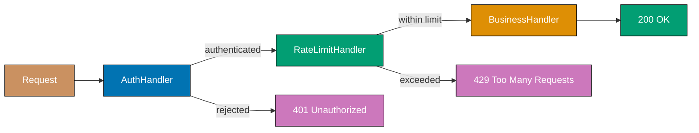




```java
import java.util.*;
import java.util.function.*;

// => Request/response types for the middleware chain
record HttpRequest(String path, String apiKey, String callerId) {}
// => apiKey may be null — auth middleware checks nullness

record HttpResponse(int status, String body) {}
// => status + body model HTTP semantics; each middleware either sets status or forwards

// => Middleware type: receives request + next handler, returns response
// => Each middleware decides whether to short-circuit or call next
@FunctionalInterface
interface Middleware {
    HttpResponse apply(HttpRequest req, UnaryOperator<HttpRequest> next,
                       Function<HttpRequest, HttpResponse> finalHandler);
}

// => Builder composes middlewares into a single callable handler
class MiddlewareChain {
    private final List<BiFunction<HttpRequest, Function<HttpRequest, HttpResponse>,
                                 HttpResponse>> layers = new ArrayList<>();
    // => Each layer: (request, nextFn) -> response; nextFn drives remaining chain

    MiddlewareChain use(BiFunction<HttpRequest,
                                   Function<HttpRequest, HttpResponse>,
                                   HttpResponse> mw) {
        layers.add(mw);
        return this; // => Fluent builder — chain .use() calls together
    }

    Function<HttpRequest, HttpResponse> build(Function<HttpRequest, HttpResponse> finalHandler) {
        Function<HttpRequest, HttpResponse> handler = finalHandler;
        // => Start from innermost handler and wrap outward
        for (int i = layers.size() - 1; i >= 0; i--) {
            final Function<HttpRequest, HttpResponse> next = handler;
            final var mw = layers.get(i);
            handler = req -> mw.apply(req, next);
            // => Wrap current handler; each layer gets a reference to the layer below it
        }
        return handler; // => Outermost handler drives the whole chain
    }
}

// => Auth middleware: rejects requests without valid API key
Set<String> validKeys = Set.of("key-abc", "key-xyz");
// => Simplified key store; prod uses DB lookup or JWT validation

BiFunction<HttpRequest, Function<HttpRequest, HttpResponse>, HttpResponse> authMiddleware =
    (req, next) -> {
        if (!validKeys.contains(req.apiKey()))
            return new HttpResponse(401, "Unauthorized");
            // => Chain terminates; next never called for invalid keys
        return next.apply(req); // => Valid key: forward to next middleware
    };

// => Rate limit middleware: max 2 calls per callerId (demo counter, not thread-safe)
Map<String, Integer> callCounts = new HashMap<>();
BiFunction<HttpRequest, Function<HttpRequest, HttpResponse>, HttpResponse> rateLimitMiddleware =
    (req, next) -> {
        int count = callCounts.merge(req.callerId(), 1, Integer::sum);
        // => Atomically increment call count for this caller
        if (count > 2) return new HttpResponse(429, "Too Many Requests");
        // => Chain terminates; caller exceeded limit, downstream protected
        return next.apply(req); // => Within limit: continue to business handler
    };

Function<HttpRequest, HttpResponse> orderHandler =
    req -> new HttpResponse(200, "Orders for " + req.callerId());
// => Final business handler — only reached if auth + rate limit both pass

var chain = new MiddlewareChain()
    .use(authMiddleware)
    .use(rateLimitMiddleware)
    .build(orderHandler);

System.out.println(chain.apply(new HttpRequest("/orders", null, "caller-1")));
// => Output: HttpResponse[status=401, body=Unauthorized]
System.out.println(chain.apply(new HttpRequest("/orders", "key-abc", "caller-1")));
// => Output: HttpResponse[status=200, body=Orders for caller-1]
System.out.println(chain.apply(new HttpRequest("/orders", "key-abc", "caller-1")));
// => Output: HttpResponse[status=200, body=Orders for caller-1]
System.out.println(chain.apply(new HttpRequest("/orders", "key-abc", "caller-1")));
// => Output: HttpResponse[status=429, body=Too Many Requests]
```




```kotlin
// => Request/response types for the middleware chain
data class HttpRequest(val path: String, val apiKey: String?, val callerId: String)
// => apiKey is nullable — auth middleware checks for null

data class HttpResponse(val status: Int, val body: String)
// => status + body model HTTP semantics; each middleware either short-circuits or forwards

// => Middleware type alias: receives request + next handler, returns response
typealias Handler = (HttpRequest) -> HttpResponse
typealias Mw = (HttpRequest, Handler) -> HttpResponse
// => Mw decides to short-circuit (return response) or call handler to continue chain

// => Builder: composes a list of Mw layers around a final handler
class MiddlewareChain {
    private val layers = mutableListOf<Mw>()
    // => Layers added in outer-to-inner order; build reverses to wrap correctly

    fun use(mw: Mw): MiddlewareChain { layers += mw; return this }
    // => Fluent builder — chain .use() calls together

    fun build(finalHandler: Handler): Handler {
        var handler: Handler = finalHandler
        // => Start from innermost handler and wrap outward
        for (mw in layers.reversed()) {
            val next = handler
            handler = { req -> mw(req, next) }
            // => Wrap current handler; closure captures the layer below it
        }
        return handler // => Outermost handler drives the whole chain
    }
}

// => Auth middleware: rejects requests without valid API key
val validKeys = setOf("key-abc", "key-xyz")
// => Simplified key store; prod uses DB lookup or JWT validation

val authMiddleware: Mw = { req, next ->
    if (req.apiKey !in validKeys) HttpResponse(401, "Unauthorized")
    // => Chain terminates; next never called for invalid or null apiKey
    else next(req) // => Valid key: forward to next middleware
}

// => Rate limit middleware: max 2 calls per callerId
val callCounts = mutableMapOf<String, Int>()
val rateLimitMiddleware: Mw = { req, next ->
    val count = callCounts.merge(req.callerId, 1, Int::plus)!!
    // => Increment counter; merge returns new value after applying the lambda
    if (count > 2) HttpResponse(429, "Too Many Requests")
    // => Chain terminates; caller exceeded limit, downstream protected
    else next(req) // => Within limit: continue to business handler
}

// => Final business handler — only reached if auth + rate limit both pass
val orderHandler: Handler = { req -> HttpResponse(200, "Orders for ${req.callerId}") }

val chain = MiddlewareChain()
    .use(authMiddleware)
    .use(rateLimitMiddleware)
    .build(orderHandler)

println(chain(HttpRequest("/orders", null, "caller-1")))
// => Output: HttpResponse(status=401, body=Unauthorized)
println(chain(HttpRequest("/orders", "key-abc", "caller-1")))
// => Output: HttpResponse(status=200, body=Orders for caller-1)
println(chain(HttpRequest("/orders", "key-abc", "caller-1")))
// => Output: HttpResponse(status=200, body=Orders for caller-1)
println(chain(HttpRequest("/orders", "key-abc", "caller-1")))
// => Output: HttpResponse(status=429, body=Too Many Requests)
```




```csharp
// => Request/response types for the middleware chain
public record HttpRequest(string Path, string? ApiKey, string CallerId);
// => ApiKey is nullable — auth middleware checks for null

public record HttpResponse(int Status, string Body);
// => Status + body model HTTP semantics; each middleware either short-circuits or forwards

// => Delegate types make the signatures readable
public delegate HttpResponse Handler(HttpRequest req);
public delegate HttpResponse Middleware(HttpRequest req, Handler next);
// => Middleware decides to short-circuit (return response) or call next to continue

// => Builder: composes middleware layers around a final handler
public class MiddlewareChain
{
    private readonly List<Middleware> _layers = new();
    // => Layers added in outer-to-inner order; Build wraps from inside out

    public MiddlewareChain Use(Middleware mw) { _layers.Add(mw); return this; }
    // => Fluent builder — chain .Use() calls together

    public Handler Build(Handler finalHandler)
    {
        var handler = finalHandler;
        // => Start from innermost handler and wrap outward
        foreach (var mw in Enumerable.Reverse(_layers))
        {
            var next = handler;
            handler = req => mw(req, next);
            // => Closure captures the layer below; each wrapper calls the one inside it
        }
        return handler; // => Outermost handler drives the whole chain
    }
}

// => Auth middleware: rejects requests without valid API key
var validKeys = new HashSet<string> { "key-abc", "key-xyz" };
// => Simplified key store; prod uses JWT validation or cache lookup

Middleware authMiddleware = (req, next) =>
    req.ApiKey is null || !validKeys.Contains(req.ApiKey)
        ? new HttpResponse(401, "Unauthorized")
        // => Chain terminates; next never called for invalid or null ApiKey
        : next(req); // => Valid key: forward to next middleware

// => Rate limit middleware: max 2 calls per CallerId
var callCounts = new Dictionary<string, int>();
Middleware rateLimitMiddleware = (req, next) =>
{
    callCounts.TryGetValue(req.CallerId, out var count);
    callCounts[req.CallerId] = ++count;
    // => Increment call count; not thread-safe — use ConcurrentDictionary in prod
    return count > 2
        ? new HttpResponse(429, "Too Many Requests")
        // => Chain terminates; caller exceeded limit, downstream protected
        : next(req); // => Within limit: continue to business handler
};

// => Final business handler — only reached if auth + rate limit both pass
Handler orderHandler = req => new HttpResponse(200, $"Orders for {req.CallerId}");

var chain = new MiddlewareChain()
    .Use(authMiddleware)
    .Use(rateLimitMiddleware)
    .Build(orderHandler);

Console.WriteLine(chain(new HttpRequest("/orders", null, "caller-1")));
// => Output: HttpResponse { Status = 401, Body = Unauthorized }
Console.WriteLine(chain(new HttpRequest("/orders", "key-abc", "caller-1")));
// => Output: HttpResponse { Status = 200, Body = Orders for caller-1 }
Console.WriteLine(chain(new HttpRequest("/orders", "key-abc", "caller-1")));
// => Output: HttpResponse { Status = 200, Body = Orders for caller-1 }
Console.WriteLine(chain(new HttpRequest("/orders", "key-abc", "caller-1")));
// => Output: HttpResponse { Status = 429, Body = Too Many Requests }
```




```typescript
// === WRITE SIDE: strict command validation and aggregate ===
interface CreateOrderCommand {
  orderId: string;
  customerId: string;
  items: Array<{ productId: string; qty: number; price: number }>;
}
interface CancelOrderCommand {
  orderId: string;
  reason: string;
}

// => AGGREGATE: enforces business invariants on write side
class OrderAggregate {
  private status: "draft" | "placed" | "cancelled" = "draft";
  private readonly items: Array<{ productId: string; qty: number; price: number }> = [];

  place(cmd: CreateOrderCommand): void {
    if (this.status !== "draft") throw new Error("Order already placed");
    if (cmd.items.length === 0) throw new Error("Order must have at least one item");
    for (const item of cmd.items) this.items.push(item);
    this.status = "placed";
    console.log(`[Write] Order ${cmd.orderId} placed`);
  }

  cancel(cmd: CancelOrderCommand): void {
    if (this.status !== "placed") throw new Error(`Cannot cancel ${this.status} order`);
    this.status = "cancelled";
    console.log(`[Write] Order ${cmd.orderId} cancelled: ${cmd.reason}`);
  }

  getTotal(): number {
    return this.items.reduce((sum, i) => sum + i.price * i.qty, 0);
  }
}

// === READ SIDE: denormalized for fast queries ===
interface OrderSummaryView {
  orderId: string;
  customerId: string;
  totalFormatted: string;
  status: string;
}

const readStore: Map<string, OrderSummaryView> = new Map();
// => separate read store optimized for display

// => PROJECTION: builds/updates read model from command side
function projectOrderView(orderId: string, aggregate: OrderAggregate, customerId: string, status: string): void {
  readStore.set(orderId, {
    orderId,
    customerId,
    totalFormatted: `$${aggregate.getTotal().toFixed(2)}`,
    status,
  });
}

// => USAGE: write side enforces rules; read side serves queries
const agg = new OrderAggregate();
const cmd: CreateOrderCommand = {
  orderId: "ord-1",
  customerId: "c1",
  items: [{ productId: "p1", qty: 2, price: 25.0 }],
};

agg.place(cmd);
projectOrderView("ord-1", agg, "c1", "placed");

const view = readStore.get("ord-1");
console.log(view?.totalFormatted); // => $50.00
console.log(view?.status); // => placed
```




**Key Takeaway:** Build middleware chains with clear early-termination semantics so each handler has
one responsibility and can be inserted, removed, or reordered independently.

**Why It Matters:** Web frameworks (Express.js, FastAPI, Django, ASP.NET Core) are built on chain
of responsibility middleware stacks because adding cross-cutting concerns (authentication, CORS,
compression, caching) as separate middlewares is far safer than embedding them in business handlers.
Adding a new security control is a one-line middleware registration, not a cross-cutting change to
every endpoint. AWS API Gateway, Kong, and Nginx implement the same pattern at the infrastructure
level for the same reason.

---

### Example 76: Visitor Pattern in Architecture

The visitor pattern separates algorithms from the objects they operate on by defining a visitor
class per algorithm. Each domain object accepts a visitor and calls the appropriate visit method,
enabling new operations to be added without modifying domain classes — valuable when adding
reporting, serialisation, or transformation rules to a stable object hierarchy.




```java
import java.util.*;

// => Stable domain hierarchy — these classes do NOT change when new operations are added
// => Visitor enables open/closed principle: open for extension, closed for modification
interface ComponentVisitor {
    void visitService(Service svc);
    // => Called by Service.accept(); visitor implements the algorithm for services
    void visitDatabase(Database db);
    // => Called by Database.accept(); visitor implements the algorithm for databases
    void visitArchitecture(Architecture arch);
    // => Called by Architecture.accept(); visitor gets the top-level context first
}

interface Component {
    void accept(ComponentVisitor visitor);
    // => Double dispatch: component calls the right visitXxx method on visitor
}

record Service(String name, int replicas, int cpuMillicores) implements Component {
    // => cpuMillicores: e.g. 500 = 0.5 CPU cores
    public void accept(ComponentVisitor v) { v.visitService(this); }
    // => Dispatches to visitService — visitor handles service-specific logic
}

record Database(String name, int storageGb, boolean multiAz) implements Component {
    // => multiAz: true = multi-region deployment for high availability
    public void accept(ComponentVisitor v) { v.visitDatabase(this); }
    // => Dispatches to visitDatabase — visitor handles database-specific logic
}

record Architecture(List<Component> components) implements Component {
    public void accept(ComponentVisitor v) {
        v.visitArchitecture(this); // => Visitor gets top-level context first
        components.forEach(c -> c.accept(v));
        // => Each component dispatches to its own visit method — recursive traversal
    }
}

// => Concrete visitor 1: Cost estimation — new operation, zero domain changes
class CostEstimator implements ComponentVisitor {
    double totalMonthlyUsd = 0.0; // => Accumulates cost across all components

    public void visitArchitecture(Architecture arch) {
        System.out.println("Estimating cost for " + arch.components().size() + " components");
    }

    public void visitService(Service svc) {
        double cost = svc.replicas() * (svc.cpuMillicores() / 1000.0) * 30 * 0.05;
        // => $0.05 per vCPU per hour * 30 days; simplified cloud pricing model
        totalMonthlyUsd += cost;
        System.out.printf("  Service %s: $%.2f/month%n", svc.name(), cost);
    }

    public void visitDatabase(Database db) {
        double cost = db.storageGb() * 0.10 * (db.multiAz() ? 2 : 1);
        // => $0.10 per GB/month, doubled for multi-AZ redundancy
        totalMonthlyUsd += cost;
        System.out.printf("  Database %s: $%.2f/month%n", db.name(), cost);
    }
}

// => Concrete visitor 2: Compliance check — another new operation, still no domain changes
class ComplianceChecker implements ComponentVisitor {
    List<String> violations = new ArrayList<>(); // => Accumulates all violations

    public void visitArchitecture(Architecture arch) {} // => No arch-level rules here

    public void visitService(Service svc) {
        if (svc.replicas() < 2)
            violations.add("Service '" + svc.name() + "' has only " + svc.replicas() + " replica (min 2 for HA)");
            // => Single replica violates high-availability requirement
    }

    public void visitDatabase(Database db) {
        if (!db.multiAz())
            violations.add("Database '" + db.name() + "' is not multi-AZ (compliance requirement)");
            // => Single-AZ database violates disaster-recovery policy
    }
}

var arch = new Architecture(List.of(
    new Service("orders-api", 3, 500),
    new Service("worker", 1, 1000),       // => Only 1 replica — will fail compliance
    new Database("orders-db", 100, true),
    new Database("cache-db", 20, false)   // => Not multi-AZ — will fail compliance
));

var cost = new CostEstimator();
arch.accept(cost);
System.out.printf("Total: $%.2f/month%n", cost.totalMonthlyUsd);
// => Output: Estimating cost for 4 components
// => Output:   Service orders-api: $2.25/month
// => Output:   Service worker: $1.50/month
// => Output:   Database orders-db: $20.00/month
// => Output:   Database cache-db: $2.00/month
// => Output: Total: $25.75/month

var compliance = new ComplianceChecker();
arch.accept(compliance);
System.out.println("Violations: " + compliance.violations);
// => Output: Violations: [Service 'worker' has only 1 replica..., Database 'cache-db' is not multi-AZ...]
```




```kotlin
// => Stable domain hierarchy — these classes do NOT change when new operations are added
// => Visitor enables open/closed principle: open for extension, closed for modification
interface ComponentVisitor {
    fun visitService(svc: Service)
    // => Called by Service.accept(); visitor implements the algorithm for services
    fun visitDatabase(db: Database)
    // => Called by Database.accept(); visitor implements the algorithm for databases
    fun visitArchitecture(arch: Architecture)
    // => Called by Architecture.accept(); visitor gets the top-level context first
}

interface Component {
    fun accept(visitor: ComponentVisitor)
    // => Double dispatch: component calls the right visitXxx method on visitor
}

data class Service(val name: String, val replicas: Int, val cpuMillicores: Int) : Component {
    // => cpuMillicores: e.g. 500 = 0.5 CPU cores
    override fun accept(v: ComponentVisitor) = v.visitService(this)
    // => Dispatches to visitService — visitor handles service-specific logic
}

data class Database(val name: String, val storageGb: Int, val multiAz: Boolean) : Component {
    // => multiAz: true = multi-region deployment for high availability
    override fun accept(v: ComponentVisitor) = v.visitDatabase(this)
    // => Dispatches to visitDatabase — visitor handles database-specific logic
}

data class Architecture(val components: List<Component>) : Component {
    override fun accept(v: ComponentVisitor) {
        v.visitArchitecture(this) // => Visitor gets top-level context first
        components.forEach { it.accept(v) }
        // => Each component dispatches to its own visit method — recursive traversal
    }
}

// => Concrete visitor 1: Cost estimation — new operation, zero domain changes
class CostEstimator : ComponentVisitor {
    var totalMonthlyUsd = 0.0 // => Accumulates cost across all components

    override fun visitArchitecture(arch: Architecture) {
        println("Estimating cost for ${arch.components.size} components")
    }

    override fun visitService(svc: Service) {
        val cost = svc.replicas * (svc.cpuMillicores / 1000.0) * 30 * 0.05
        // => $0.05 per vCPU per hour * 30 days; simplified cloud pricing model
        totalMonthlyUsd += cost
        println("  Service ${svc.name}: ${"$"}${"%.2f".format(cost)}/month")
    }

    override fun visitDatabase(db: Database) {
        val cost = db.storageGb * 0.10 * (if (db.multiAz) 2 else 1)
        // => $0.10 per GB/month, doubled for multi-AZ redundancy
        totalMonthlyUsd += cost
        println("  Database ${db.name}: ${"$"}${"%.2f".format(cost)}/month")
    }
}

// => Concrete visitor 2: Compliance check — another new operation, still no domain changes
class ComplianceChecker : ComponentVisitor {
    val violations = mutableListOf<String>() // => Accumulates all violations

    override fun visitArchitecture(arch: Architecture) {} // => No arch-level rules here

    override fun visitService(svc: Service) {
        if (svc.replicas < 2)
            violations += "Service '${svc.name}' has only ${svc.replicas} replica (min 2 for HA)"
            // => Single replica violates high-availability requirement
    }

    override fun visitDatabase(db: Database) {
        if (!db.multiAz)
            violations += "Database '${db.name}' is not multi-AZ (compliance requirement)"
            // => Single-AZ database violates disaster-recovery policy
    }
}

val arch = Architecture(listOf(
    Service("orders-api", 3, 500),
    Service("worker", 1, 1000),       // => Only 1 replica — will fail compliance
    Database("orders-db", 100, true),
    Database("cache-db", 20, false)   // => Not multi-AZ — will fail compliance
))

val cost = CostEstimator()
arch.accept(cost)
println("Total: ${"$"}${"%.2f".format(cost.totalMonthlyUsd)}/month")
// => Output: Estimating cost for 4 components
// => Output:   Service orders-api: $2.25/month  (approx — string formatting varies)
// => Output: Total: $25.75/month

val compliance = ComplianceChecker()
arch.accept(compliance)
println("Violations: ${compliance.violations}")
// => Output: Violations: [Service 'worker' has only 1 replica..., Database 'cache-db' is not multi-AZ...]
```




```csharp
// => Stable domain hierarchy — these classes do NOT change when new operations are added
// => Visitor enables open/closed principle: open for extension, closed for modification
public interface IComponentVisitor
{
    void VisitService(Service svc);
    // => Called by Service.Accept(); visitor implements the algorithm for services
    void VisitDatabase(Database db);
    // => Called by Database.Accept(); visitor implements the algorithm for databases
    void VisitArchitecture(Architecture arch);
    // => Called by Architecture.Accept(); visitor gets the top-level context first
}

public interface IComponent
{
    void Accept(IComponentVisitor visitor);
    // => Double dispatch: component calls the right VisitXxx method on visitor
}

public record Service(string Name, int Replicas, int CpuMillicores) : IComponent
{
    // => CpuMillicores: e.g. 500 = 0.5 CPU cores
    public void Accept(IComponentVisitor v) => v.VisitService(this);
    // => Dispatches to VisitService — visitor handles service-specific logic
}

public record Database(string Name, int StorageGb, bool MultiAz) : IComponent
{
    // => MultiAz: true = multi-region deployment for high availability
    public void Accept(IComponentVisitor v) => v.VisitDatabase(this);
    // => Dispatches to VisitDatabase — visitor handles database-specific logic
}

public record Architecture(List<IComponent> Components) : IComponent
{
    public void Accept(IComponentVisitor v)
    {
        v.VisitArchitecture(this); // => Visitor gets top-level context first
        foreach (var c in Components) c.Accept(v);
        // => Each component dispatches to its own visit method — recursive traversal
    }
}

// => Concrete visitor 1: Cost estimation — new operation, zero domain changes
public class CostEstimator : IComponentVisitor
{
    public double TotalMonthlyUsd { get; private set; } // => Accumulates cost

    public void VisitArchitecture(Architecture arch)
        => Console.WriteLine($"Estimating cost for {arch.Components.Count} components");

    public void VisitService(Service svc)
    {
        var cost = svc.Replicas * (svc.CpuMillicores / 1000.0) * 30 * 0.05;
        // => $0.05 per vCPU per hour * 30 days; simplified cloud pricing model
        TotalMonthlyUsd += cost;
        Console.WriteLine($"  Service {svc.Name}: ${cost:F2}/month");
    }

    public void VisitDatabase(Database db)
    {
        var cost = db.StorageGb * 0.10 * (db.MultiAz ? 2 : 1);
        // => $0.10 per GB/month, doubled for multi-AZ redundancy
        TotalMonthlyUsd += cost;
        Console.WriteLine($"  Database {db.Name}: ${cost:F2}/month");
    }
}

// => Concrete visitor 2: Compliance check — another new operation, still no domain changes
public class ComplianceChecker : IComponentVisitor
{
    public List<string> Violations { get; } = new(); // => Accumulates all violations

    public void VisitArchitecture(Architecture arch) {} // => No arch-level rules here

    public void VisitService(Service svc)
    {
        if (svc.Replicas < 2)
            Violations.Add($"Service '{svc.Name}' has only {svc.Replicas} replica (min 2 for HA)");
            // => Single replica violates high-availability requirement
    }

    public void VisitDatabase(Database db)
    {
        if (!db.MultiAz)
            Violations.Add($"Database '{db.Name}' is not multi-AZ (compliance requirement)");
            // => Single-AZ database violates disaster-recovery policy
    }
}

var arch = new Architecture(new List<IComponent> {
    new Service("orders-api", 3, 500),
    new Service("worker", 1, 1000),         // => Only 1 replica — will fail compliance
    new Database("orders-db", 100, true),
    new Database("cache-db", 20, false)     // => Not multi-AZ — will fail compliance
});

var cost = new CostEstimator();
arch.Accept(cost);
Console.WriteLine($"Total: ${cost.TotalMonthlyUsd:F2}/month");
// => Output: Estimating cost for 4 components
// => Output:   Service orders-api: $2.25/month
// => Output:   Service worker: $1.50/month
// => Output:   Database orders-db: $20.00/month
// => Output:   Database cache-db: $2.00/month
// => Output: Total: $25.75/month

var compliance = new ComplianceChecker();
arch.Accept(compliance);
Console.WriteLine($"Violations: {string.Join(", ", compliance.Violations)}");
// => Output: Violations: Service 'worker' has only 1 replica..., Database 'cache-db' is not multi-AZ...
```




```typescript
// => Stable domain hierarchy — these classes do NOT change when new operations are added
interface ShapeVisitor {
  visitCircle(circle: Circle): number | string;
  visitRectangle(rect: Rectangle): number | string;
  visitTriangle(tri: Triangle): number | string;
}

abstract class Shape {
  abstract accept(visitor: ShapeVisitor): number | string;
}

class Circle extends Shape {
  constructor(readonly radius: number) {
    super();
  }
  accept(visitor: ShapeVisitor) {
    return visitor.visitCircle(this);
  }
}

class Rectangle extends Shape {
  constructor(
    readonly width: number,
    readonly height: number,
  ) {
    super();
  }
  accept(visitor: ShapeVisitor) {
    return visitor.visitRectangle(this);
  }
}

class Triangle extends Shape {
  constructor(
    readonly base: number,
    readonly height: number,
  ) {
    super();
  }
  accept(visitor: ShapeVisitor) {
    return visitor.visitTriangle(this);
  }
}

// => VISITOR 1: area calculation — new operation, no shape classes modified
class AreaVisitor implements ShapeVisitor {
  visitCircle(c: Circle): number {
    return Math.PI * c.radius ** 2; // => π r²
  }
  visitRectangle(r: Rectangle): number {
    return r.width * r.height;
  }
  visitTriangle(t: Triangle): number {
    return 0.5 * t.base * t.height;
  }
}

// => VISITOR 2: description — another new operation, still no shape classes modified
class DescriptionVisitor implements ShapeVisitor {
  visitCircle(c: Circle): string {
    return `Circle with radius ${c.radius}`;
  }
  visitRectangle(r: Rectangle): string {
    return `Rectangle ${r.width}x${r.height}`;
  }
  visitTriangle(t: Triangle): string {
    return `Triangle base=${t.base}, height=${t.height}`;
  }
}

const shapes: Shape[] = [new Circle(5), new Rectangle(4, 3), new Triangle(6, 4)];
const areaVisitor = new AreaVisitor();
const descVisitor = new DescriptionVisitor();

for (const shape of shapes) {
  console.log(`${shape.accept(descVisitor)}: area = ${(shape.accept(areaVisitor) as number).toFixed(2)}`);
}
// => Circle with radius 5: area = 78.54
// => Rectangle 4x3: area = 12.00
// => Triangle base=6, height=4: area = 12.00
```




**Key Takeaway:** Use the visitor pattern when you need to add operations to a stable class hierarchy
without modifying the classes themselves — especially valuable for architecture tools that analyse,
transform, or validate object graphs.

**Why It Matters:** Architecture tooling (cost estimators, compliance checkers, diagram generators,
security scanners) must traverse the same infrastructure object graph with different algorithms.
Without visitor, each tool either subclasses domain objects or adds methods directly, creating
maintenance coupling. The visitor pattern — used in AWS CDK, Terraform's internal AST traversal,
and compiler front ends — cleanly separates the object hierarchy (what the architecture IS) from
operations (what tools DO to the architecture), enabling teams to add new analysis passes without
touching core infrastructure models.

---

## Advanced Resilience and Scalability

### Example 77: Database per Service Pattern

The database-per-service pattern assigns each microservice an exclusive database it fully controls,
preventing schema coupling and enabling independent scaling and technology selection. Cross-service
data access uses APIs — never direct database joins — ensuring services remain independently
deployable.




```java
import java.util.*;

// => Orders Service — owns its own database; no other service queries orders_db directly
record OrderRecord(String orderId, String customerId, double total) {
    // => customerId stored as opaque ID, not a FK join key; no customer schema knowledge
    // => Orders DB: only order data; customer name/email are never stored here
}

class OrdersDatabase {
    private final Map<String, OrderRecord> rows = new HashMap<>();
    // => Orders service's exclusive database; only this service reads and writes it

    void insert(OrderRecord record) {
        rows.put(record.orderId(), record);
        // => Persists order; only Orders service writes here — no shared schema
    }

    List<OrderRecord> findByCustomer(String customerId) {
        return rows.values().stream()
            .filter(r -> customerId.equals(r.customerId())).toList();
        // => Orders service's own read model — no JOIN to customer table needed
    }
}

// => Customers Service — owns customers_db; never touches orders_db directly
record CustomerRecord(String customerId, String name, String email) {}
// => Private to Customers service; Orders service has no visibility into this schema

class CustomersDatabase {
    private final Map<String, CustomerRecord> rows = new HashMap<>();
    // => Customers service's exclusive database — independently scalable and evolvable

    void insert(CustomerRecord record) { rows.put(record.customerId(), record); }

    Optional<CustomerRecord> find(String customerId) {
        return Optional.ofNullable(rows.get(customerId));
        // => Returns Optional.empty() if customer not found; caller handles absence
    }
}

// => API Aggregation Layer — composes data from both services via API calls, not DB joins
record OrderWithCustomerDTO(String orderId, double total, String customerName, String email) {}
// => DTO owned by the aggregation layer; neither service owns this shape

List<OrderWithCustomerDTO> getOrdersWithCustomer(
    String customerId, OrdersDatabase ordersDb, CustomersDatabase customersDb) {
    var orders = ordersDb.findByCustomer(customerId);   // => Call Orders service (simulated)
    var customer = customersDb.find(customerId);         // => Call Customers service (simulated)
    // => Aggregation done here (BFF or API gateway), NOT via cross-service DB join
    return orders.stream()
        .map(o -> new OrderWithCustomerDTO(
            o.orderId(), o.total(),
            customer.map(CustomerRecord::name).orElse("Unknown"),
            // => Denormalise customer name at aggregation layer, not in Orders DB
            customer.map(CustomerRecord::email).orElse("N/A")))
        .toList();
}

var ordersDb = new OrdersDatabase();
var customersDb = new CustomersDatabase();
customersDb.insert(new CustomerRecord("CUST-1", "Alice", "alice@example.com"));
ordersDb.insert(new OrderRecord("ORD-1", "CUST-1", 99.99));
ordersDb.insert(new OrderRecord("ORD-2", "CUST-1", 49.50));

getOrdersWithCustomer("CUST-1", ordersDb, customersDb).forEach(r ->
    System.out.println("Order " + r.orderId() + ": $" + r.total()
        + " — Customer: " + r.customerName() + " (" + r.email() + ")"));
// => Output: Order ORD-1: $99.99 — Customer: Alice (alice@example.com)
// => Output: Order ORD-2: $49.5 — Customer: Alice (alice@example.com)
```




```kotlin
// => Orders Service — owns its own database; no other service queries orders_db directly
data class OrderRecord(val orderId: String, val customerId: String, val total: Double)
// => customerId stored as opaque ID, not a FK join key; no customer schema knowledge
// => Orders DB: only order data; customer name/email are never stored here

class OrdersDatabase {
    private val rows = mutableMapOf<String, OrderRecord>()
    // => Orders service's exclusive database; only this service reads and writes it

    fun insert(record: OrderRecord) { rows[record.orderId] = record }
    // => Persists order; only Orders service writes here — no shared schema

    fun findByCustomer(customerId: String): List<OrderRecord> =
        rows.values.filter { it.customerId == customerId }
        // => Orders service's own read model — no JOIN to customer table needed
}

// => Customers Service — owns customers_db; never touches orders_db directly
data class CustomerRecord(val customerId: String, val name: String, val email: String)
// => Private to Customers service; Orders service has no visibility into this schema

class CustomersDatabase {
    private val rows = mutableMapOf<String, CustomerRecord>()
    // => Customers service's exclusive database — independently scalable and evolvable

    fun insert(record: CustomerRecord) { rows[record.customerId] = record }

    fun find(customerId: String): CustomerRecord? = rows[customerId]
    // => Returns null if customer not found; caller handles absence
}

// => API Aggregation Layer — composes data from both services via API calls, not DB joins
data class OrderWithCustomerDTO(
    val orderId: String, val total: Double, val customerName: String, val email: String
)
// => DTO owned by the aggregation layer; neither service owns this shape

fun getOrdersWithCustomer(
    customerId: String, ordersDb: OrdersDatabase, customersDb: CustomersDatabase
): List<OrderWithCustomerDTO> {
    val orders = ordersDb.findByCustomer(customerId)   // => Call Orders service (simulated)
    val customer = customersDb.find(customerId)         // => Call Customers service (simulated)
    // => Aggregation done here (BFF or API gateway), NOT via cross-service DB join
    return orders.map { o ->
        OrderWithCustomerDTO(
            o.orderId, o.total,
            customer?.name ?: "Unknown",
            // => Denormalise customer name at aggregation layer, not in Orders DB
            customer?.email ?: "N/A"
        )
    }
}

val ordersDb = OrdersDatabase()
val customersDb = CustomersDatabase()
customersDb.insert(CustomerRecord("CUST-1", "Alice", "alice@example.com"))
ordersDb.insert(OrderRecord("ORD-1", "CUST-1", 99.99))
ordersDb.insert(OrderRecord("ORD-2", "CUST-1", 49.50))

getOrdersWithCustomer("CUST-1", ordersDb, customersDb).forEach { r ->
    println("Order ${r.orderId}: $${r.total} — Customer: ${r.customerName} (${r.email})")
}
// => Output: Order ORD-1: $99.99 — Customer: Alice (alice@example.com)
// => Output: Order ORD-2: $49.5 — Customer: Alice (alice@example.com)
```




```csharp
// => Orders Service — owns its own database; no other service queries orders_db directly
public record OrderRecord(string OrderId, string CustomerId, double Total);
// => CustomerId stored as opaque ID, not a FK join key; no customer schema knowledge
// => Orders DB: only order data; customer name/email are never stored here

public class OrdersDatabase
{
    private readonly Dictionary<string, OrderRecord> _rows = new();
    // => Orders service's exclusive database; only this service reads and writes it

    public void Insert(OrderRecord record) => _rows[record.OrderId] = record;
    // => Persists order; only Orders service writes here — no shared schema

    public IEnumerable<OrderRecord> FindByCustomer(string customerId) =>
        _rows.Values.Where(r => r.CustomerId == customerId);
    // => Orders service's own read model — no JOIN to customer table needed
}

// => Customers Service — owns customers_db; never touches orders_db directly
public record CustomerRecord(string CustomerId, string Name, string Email);
// => Private to Customers service; Orders service has no visibility into this schema

public class CustomersDatabase
{
    private readonly Dictionary<string, CustomerRecord> _rows = new();
    // => Customers service's exclusive database — independently scalable and evolvable

    public void Insert(CustomerRecord record) => _rows[record.CustomerId] = record;

    public CustomerRecord? Find(string customerId) =>
        _rows.TryGetValue(customerId, out var r) ? r : null;
    // => Returns null if customer not found; caller handles absence
}

// => API Aggregation Layer — composes data from both services via API calls, not DB joins
public record OrderWithCustomerDTO(string OrderId, double Total, string CustomerName, string Email);
// => DTO owned by the aggregation layer; neither service owns this shape

IEnumerable<OrderWithCustomerDTO> GetOrdersWithCustomer(
    string customerId, OrdersDatabase ordersDb, CustomersDatabase customersDb)
{
    var orders = ordersDb.FindByCustomer(customerId);   // => Call Orders service (simulated)
    var customer = customersDb.Find(customerId);         // => Call Customers service (simulated)
    // => Aggregation done here (BFF or API gateway), NOT via cross-service DB join
    return orders.Select(o => new OrderWithCustomerDTO(
        o.OrderId, o.Total,
        customer?.Name ?? "Unknown",
        // => Denormalise customer name at aggregation layer, not in Orders DB
        customer?.Email ?? "N/A"
    ));
}

var ordersDb = new OrdersDatabase();
var customersDb = new CustomersDatabase();
customersDb.Insert(new CustomerRecord("CUST-1", "Alice", "alice@example.com"));
ordersDb.Insert(new OrderRecord("ORD-1", "CUST-1", 99.99));
ordersDb.Insert(new OrderRecord("ORD-2", "CUST-1", 49.50));

foreach (var r in GetOrdersWithCustomer("CUST-1", ordersDb, customersDb))
    Console.WriteLine($"Order {r.OrderId}: ${r.Total} — Customer: {r.CustomerName} ({r.Email})");
// => Output: Order ORD-1: $99.99 — Customer: Alice (alice@example.com)
// => Output: Order ORD-2: $49.5 — Customer: Alice (alice@example.com)
```




```typescript
// => ORDERS SERVICE — owns its own database; no other service queries orders_db directly
class OrdersDb {
  private readonly orders: Map<string, { id: string; customerId: string; total: number; status: string }> = new Map();
  // => isolated data store — only OrdersService accesses this

  save(order: { id: string; customerId: string; total: number; status: string }): void {
    this.orders.set(order.id, order);
  }

  findById(id: string) {
    return this.orders.get(id);
  }
}

class OrdersService {
  constructor(private readonly db: OrdersDb) {}

  placeOrder(customerId: string, total: number): string {
    const id = `ord-${Date.now()}`;
    this.db.save({ id, customerId, total, status: "pending" });
    return id; // => returns only the id — other services reference by id
  }

  getOrder(id: string) {
    return this.db.findById(id);
  }
}

// => INVENTORY SERVICE — owns its own database; no cross-service joins
class InventoryDb {
  private readonly stock: Map<string, { productId: string; qty: number }> = new Map();
  // => isolated data store — only InventoryService accesses this

  setStock(productId: string, qty: number): void {
    this.stock.set(productId, { productId, qty });
  }

  getStock(productId: string) {
    return this.stock.get(productId);
  }
}

class InventoryService {
  constructor(private readonly db: InventoryDb) {}

  reserve(productId: string, qty: number): boolean {
    const stock = this.db.getStock(productId);
    if (!stock || stock.qty < qty) return false;
    this.db.setStock(productId, stock.qty - qty);
    return true;
  }
}

// => USAGE: services communicate via IDs and events, not shared tables
const ordersDb = new OrdersDb();
const inventoryDb = new InventoryDb();
const ordersSvc = new OrdersService(ordersDb);
const inventorySvc = new InventoryService(inventoryDb);

inventoryDb.setStock("p1", 10); // => seed inventory

const orderId = ordersSvc.placeOrder("c1", 150.0);
const reserved = inventorySvc.reserve("p1", 2);
console.log(`Order: ${orderId}, Reserved: ${reserved}`);
// => Order: ord-..., Reserved: true

// => No shared DB — each service controls its own schema evolution
```




**Key Takeaway:** Each service's database is a private implementation detail; all cross-service
data access must go through APIs so services remain independently deployable and scalable.

**Why It Matters:** Shared databases are the most common reason microservices fail to deliver on
their independence promise: a schema change in one service breaks another service's queries at
runtime. Database-per-service enables independent scaling (Orders at 100 replicas, Billing at 5)
and technology selection (relational for transactions, document store for recommendations) —
neither is possible with a shared schema, because any schema change requires coordinating all
teams that query the shared tables.

---

### Example 78: Feature Toggle Architecture

Feature toggles (feature flags) allow code for new features to be deployed to production but remain
inactive for most users, enabling trunk-based development, A/B testing, canary releases, and
kill-switch controls without re-deploying. The toggle system decouples deployment from release.

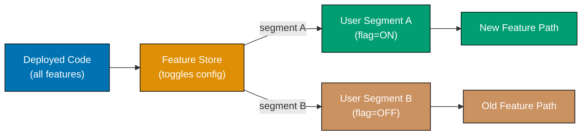




```java
import java.util.*;
import java.nio.charset.StandardCharsets;
import java.security.MessageDigest;

// => Toggle: configuration for one feature flag with global switch + rollout % + allowlist
record Toggle(String name, boolean enabled, int rolloutPercentage, Set<String> allowedUserIds) {
    // => enabled: global kill-switch; when false, no user ever sees the feature
    // => rolloutPercentage: 0-100; controls the fraction of users who see the feature
    // => allowedUserIds: explicit allowlist; these users bypass rollout percentage
}

class FeatureStore {
    private final Map<String, Toggle> toggles = new HashMap<>();
    // => Toggle registry; populated at startup from config file or remote service

    void register(Toggle toggle) {
        toggles.put(toggle.name(), toggle);
        // => Register at startup; prod typically hot-reloads from remote config store
    }

    boolean isEnabled(String name, String userId) {
        var toggle = toggles.get(name);
        if (toggle == null || !toggle.enabled()) return false;
        // => Unknown toggle or globally disabled: deny — fail-closed safety model

        if (toggle.allowedUserIds().contains(userId)) return true;
        // => Explicit allowlist wins; beta testers always see the feature

        // => Deterministic rollout: same user always gets the same decision
        int bucket = deterministicBucket(name + ":" + userId);
        // => Bucket 0-99; consistent across calls — prevents flickering UX
        return bucket < toggle.rolloutPercentage();
        // => If bucket < percentage, user is in rollout cohort — consistent per user
    }

    private int deterministicBucket(String key) {
        try {
            var md5 = MessageDigest.getInstance("MD5");
            byte[] hash = md5.digest(key.getBytes(StandardCharsets.UTF_8));
            // => MD5 produces deterministic 16-byte hash; same input always same output
            return Math.abs(Arrays.hashCode(hash)) % 100;
            // => Map hash to 0-99 bucket — deterministic, not random
        } catch (Exception e) { return 0; }
    }

    void disable(String name) {
        var t = toggles.get(name);
        if (t != null)
            toggles.put(name, new Toggle(t.name(), false, t.rolloutPercentage(), t.allowedUserIds()));
        // => Kill switch: replace with disabled toggle; no redeploy needed
    }
}

var store = new FeatureStore();
store.register(new Toggle("new_checkout", true, 20, Set.of("beta-tester-1")));
// => new_checkout: 20% gradual rollout + explicit beta tester allowlist

System.out.println(store.isEnabled("new_checkout", "beta-tester-1"));
// => Output: true (beta tester in allowlist — always enabled)

long enabledCount = java.util.stream.LongStream.range(0, 10)
    .filter(i -> store.isEnabled("new_checkout", "user-" + i)).count();
System.out.println("Enabled for " + enabledCount + "/10 sample users (target ~20%)");
// => Output: Enabled for ~2/10 sample users (varies by hash distribution)

store.disable("new_checkout");
System.out.println(store.isEnabled("new_checkout", "beta-tester-1"));
// => Output: false (kill switch applied — no redeploy needed)
```




```kotlin
import java.security.MessageDigest

// => Toggle: configuration for one feature flag with global switch + rollout % + allowlist
data class Toggle(
    val name: String,
    val enabled: Boolean,
    val rolloutPercentage: Int = 100,
    // => rolloutPercentage: 0-100; controls the fraction of users who see the feature
    val allowedUserIds: Set<String> = emptySet()
    // => allowedUserIds: explicit allowlist; these users bypass rollout percentage
)

class FeatureStore {
    private val toggles = mutableMapOf<String, Toggle>()
    // => Toggle registry; populated at startup from config file or remote service

    fun register(toggle: Toggle) {
        toggles[toggle.name] = toggle
        // => Register at startup; prod typically hot-reloads from remote config store
    }

    fun isEnabled(name: String, userId: String): Boolean {
        val toggle = toggles[name] ?: return false
        // => Unknown toggle: deny — fail-closed safety model
        if (!toggle.enabled) return false
        // => Global kill-switch off: deny regardless of user

        if (userId in toggle.allowedUserIds) return true
        // => Explicit allowlist wins; beta testers always see the feature

        // => Deterministic rollout: same user always gets the same decision
        val bucket = deterministicBucket("${toggle.name}:$userId")
        // => Bucket 0-99; consistent across calls — prevents flickering UX
        return bucket < toggle.rolloutPercentage
        // => If bucket < percentage, user is in rollout cohort — consistent per user
    }

    private fun deterministicBucket(key: String): Int {
        val md5 = MessageDigest.getInstance("MD5")
        val hash = md5.digest(key.toByteArray())
        // => MD5 produces deterministic 16-byte hash; same input always same output
        return Math.abs(hash.contentHashCode()) % 100
        // => Map hash to 0-99 bucket — deterministic, not random
    }

    fun disable(name: String) {
        toggles[name] = toggles[name]?.copy(enabled = false) ?: return
        // => Kill switch: copy() with enabled=false; no redeploy needed
    }
}

val store = FeatureStore()
store.register(Toggle("new_checkout", enabled = true, rolloutPercentage = 20,
    allowedUserIds = setOf("beta-tester-1")))
// => new_checkout: 20% gradual rollout + explicit beta tester allowlist

println(store.isEnabled("new_checkout", "beta-tester-1"))
// => Output: true (beta tester in allowlist — always enabled)

val enabledCount = (0..9).count { store.isEnabled("new_checkout", "user-$it") }
println("Enabled for $enabledCount/10 sample users (target ~20%)")
// => Output: Enabled for ~2/10 sample users (varies by hash distribution)

store.disable("new_checkout")
println(store.isEnabled("new_checkout", "beta-tester-1"))
// => Output: false (kill switch applied — no redeploy needed)
```




```csharp
using System.Security.Cryptography;
using System.Text;

// => Toggle: configuration for one feature flag with global switch + rollout % + allowlist
public record Toggle(
    string Name,
    bool Enabled,
    int RolloutPercentage = 100,
    // => RolloutPercentage: 0-100; controls the fraction of users who see the feature
    HashSet<string>? AllowedUserIds = null
    // => AllowedUserIds: explicit allowlist; these users bypass rollout percentage
);

public class FeatureStore
{
    private readonly Dictionary<string, Toggle> _toggles = new();
    // => Toggle registry; populated at startup from config file or remote service

    public void Register(Toggle toggle)
    {
        _toggles[toggle.Name] = toggle;
        // => Register at startup; prod typically hot-reloads from remote config store
    }

    public bool IsEnabled(string name, string userId)
    {
        if (!_toggles.TryGetValue(name, out var toggle) || !toggle.Enabled)
            return false;
        // => Unknown toggle or globally disabled: deny — fail-closed safety model

        if (toggle.AllowedUserIds?.Contains(userId) == true) return true;
        // => Explicit allowlist wins; beta testers always see the feature

        // => Deterministic rollout: same user always gets the same decision
        int bucket = DeterministicBucket($"{toggle.Name}:{userId}");
        // => Bucket 0-99; consistent across calls — prevents flickering UX
        return bucket < toggle.RolloutPercentage;
        // => If bucket < percentage, user is in rollout cohort — consistent per user
    }

    private static int DeterministicBucket(string key)
    {
        var hash = MD5.HashData(Encoding.UTF8.GetBytes(key));
        // => MD5 produces deterministic 16-byte hash; same input always same output
        return Math.Abs(BitConverter.ToInt32(hash, 0)) % 100;
        // => Map first 4 bytes to 0-99 bucket — deterministic, not random
    }

    public void Disable(string name)
    {
        if (_toggles.TryGetValue(name, out var t))
            _toggles[name] = t with { Enabled = false };
        // => Kill switch: with-expression creates disabled copy; no redeploy needed
    }
}

var store = new FeatureStore();
store.Register(new Toggle("new_checkout", true, 20,
    new HashSet<string> { "beta-tester-1" }));
// => new_checkout: 20% gradual rollout + explicit beta tester allowlist

Console.WriteLine(store.IsEnabled("new_checkout", "beta-tester-1"));
// => Output: True (beta tester in allowlist — always enabled)

int enabledCount = Enumerable.Range(0, 10)
    .Count(i => store.IsEnabled("new_checkout", $"user-{i}"));
Console.WriteLine($"Enabled for {enabledCount}/10 sample users (target ~20%)");
// => Output: Enabled for ~2/10 sample users (varies by hash distribution)

store.Disable("new_checkout");
Console.WriteLine(store.IsEnabled("new_checkout", "beta-tester-1"));
// => Output: False (kill switch applied — no redeploy needed)
```




```typescript
// => OUTBOX PATTERN: guarantees at-least-once event delivery by persisting events
// => to the same DB transaction as business data before publishing to message bus

interface OutboxMessage {
  id: string;
  type: string;
  payload: unknown;
  published: boolean;
  createdAt: number;
}

// => TRANSACTIONAL OUTBOX: writes business data + event in same atomic operation
class OrderWithOutbox {
  private readonly orders: Map<string, { id: string; customerId: string }> = new Map();
  private readonly outbox: OutboxMessage[] = [];
  // => outbox and business data written together — no partial state

  placeOrder(customerId: string): string {
    const orderId = `ord-${Date.now()}`;

    // => STEP 1: write business data
    this.orders.set(orderId, { id: orderId, customerId });

    // => STEP 2: write outbox message in same transaction
    this.outbox.push({
      id: crypto.randomUUID(),
      type: "OrderPlaced",
      payload: { orderId, customerId },
      published: false,
      createdAt: Date.now(),
    });
    // => Both writes succeed or both fail — no lost events, no orphan events

    console.log(`[Order] Order ${orderId} placed (outbox message queued)`);
    return orderId;
  }

  getUnpublished(): OutboxMessage[] {
    return this.outbox.filter((m) => !m.published);
    // => relay queries this to find messages to publish
  }

  markPublished(id: string): void {
    const msg = this.outbox.find((m) => m.id === id);
    if (msg) msg.published = true;
    // => marked after successful publish to message bus
  }
}

// => OUTBOX RELAY: polls outbox and publishes to message bus
class OutboxRelay {
  constructor(private readonly outboxStore: OrderWithOutbox) {}

  async flush(): Promise<void> {
    const pending = this.outboxStore.getUnpublished();
    for (const msg of pending) {
      // => real impl: publish to Kafka/RabbitMQ
      console.log(`[Relay] Publishing ${msg.type}: ${JSON.stringify(msg.payload)}`);
      this.outboxStore.markPublished(msg.id);
      // => mark after successful publish — safe to retry on failure
    }
  }
}

const orderSvc = new OrderWithOutbox();
orderSvc.placeOrder("c1");
// => [Order] Order ord-... placed (outbox message queued)

const relay = new OutboxRelay(orderSvc);
await relay.flush();
// => [Relay] Publishing OrderPlaced: {"orderId":"ord-...","customerId":"c1"}
```




**Key Takeaway:** Use deterministic hash-based bucketing so the same user always gets the same
feature decision, preventing inconsistent UX where a user sees the new feature on one page reload
but not another.

**Why It Matters:** Feature toggles enable trunk-based development at large engineering scales by
allowing engineers to commit dark code (toggled off) continuously rather than maintaining long-lived
feature branches that create merge conflicts. Toggle infrastructure reduces deployment risk to near
zero: a bad feature can be disabled with a config change in seconds, without the full pipeline cycle
of a revert-and-redeploy. This decouples deployment frequency from release frequency, which is the
key property enabling continuous delivery.

---

### Example 79: Service Mesh Architecture

A service mesh adds a transparent infrastructure layer to handle service-to-service communication
concerns — mutual TLS, traffic shaping, retries, circuit breaking, and telemetry — without changing
application code. Each service gets a sidecar proxy (typically Envoy) that intercepts all network
traffic.

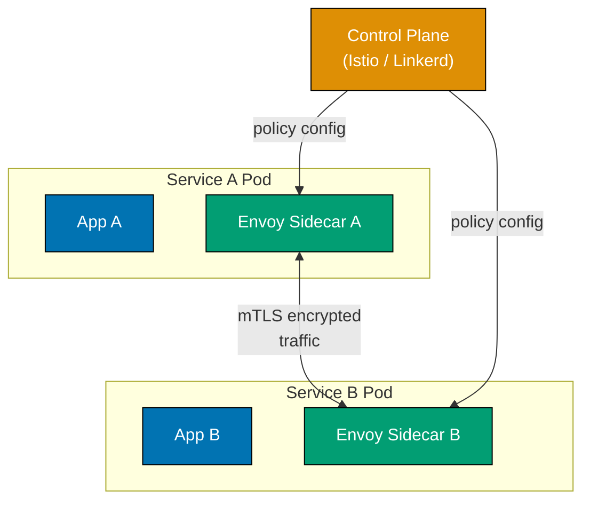




```java
import java.util.ArrayList;
import java.util.List;
import java.util.Map;
import java.util.concurrent.Callable;

// => MeshProxy simulates what Envoy does as a sidecar — transparent to the app
class MeshProxy {
    private final String service;
    // => mTLS and retry limit injected by control plane; app code knows nothing
    private final boolean tlsEnabled = true;
    private final int retryLimit = 3;
    // => Telemetry collected per call; exported to Prometheus/Jaeger in production
    private final List<Map<String, Object>> telemetry = new ArrayList<>();

    MeshProxy(String service) { this.service = service; }

    // => Call a downstream service through the mesh — retries and mTLS are transparent
    String call(String target, Callable<String> func) throws Exception {
        if (!tlsEnabled) throw new SecurityException("mTLS required by mesh policy");
        // => Control plane enforces mutual TLS; app never manages certificates
        Exception lastErr = null;
        for (int attempt = 1; attempt <= retryLimit; attempt++) {
            try {
                String result = func.call(); // => Actual inter-service call via target's sidecar
                record(target, attempt, "success");
                // => Telemetry emitted by proxy; zero instrumentation in application code
                return result;
            } catch (Exception e) {
                lastErr = e;
                record(target, attempt, "error"); // => Failure recorded; retry follows
            }
        }
        throw new RuntimeException("Mesh exhausted retries to " + target, lastErr);
        // => After retryLimit failures the proxy propagates error to caller
    }

    private void record(String target, int attempt, String outcome) {
        telemetry.add(Map.of("from", service, "to", target, "attempt", attempt, "outcome", outcome));
        // => In production: metrics go to Prometheus; traces go to Jaeger/Zipkin
    }

    List<Map<String, Object>> getTelemetry() { return telemetry; }
}

// => Each service gets its own sidecar proxy; apps communicate only with localhost sidecar
MeshProxy proxyA = new MeshProxy("orders-svc");
// => Simulate inventory service: fails on first call, succeeds on second
int[] invCalls = {0};
Callable<String> inventoryCheck = () -> {
    invCalls[0]++;
    if (invCalls[0] == 1) throw new RuntimeException("transient network error");
    // => First call fails; proxy retries transparently — orders-svc has no retry logic
    return "in_stock"; // => Second call succeeds
};
// => Orders service calls Inventory through the mesh — no retry code anywhere in orders-svc
String result = proxyA.call("inventory-svc", inventoryCheck);
System.out.println("Inventory response: " + result); // => Output: Inventory response: in_stock
System.out.println("Telemetry: " + proxyA.getTelemetry());
// => Output: [{from=orders-svc, to=inventory-svc, attempt=1, outcome=error},
//             {from=orders-svc, to=inventory-svc, attempt=2, outcome=success}]
```




```kotlin
// => MeshProxy simulates the Envoy sidecar — intercepts all outbound network calls
class MeshProxy(private val service: String) {
    private val tlsEnabled = true   // => mTLS policy pushed by control plane
    private val retryLimit = 3      // => Retry count configured centrally, not per service
    // => All calls recorded; exported to Prometheus/Jaeger in a real mesh
    val telemetry = mutableListOf<Map<String, Any>>()

    // => call() wraps any downstream invocation with mesh concerns: mTLS + retry + telemetry
    fun call(target: String, func: () -> String): String {
        check(tlsEnabled) { "mTLS required by mesh policy" }
        // => Control plane configured certificate rotation; app never touches TLS
        var lastErr: Exception? = null
        repeat(retryLimit) { attempt ->
            runCatching { func() }
                .onSuccess { result ->
                    record(target, attempt + 1, "success")
                    // => Telemetry emitted by proxy; application code is zero-instrumented
                    return result
                }
                .onFailure { e ->
                    lastErr = e as Exception
                    record(target, attempt + 1, "error") // => Retry will follow
                }
        }
        throw RuntimeException("Mesh exhausted retries to $target", lastErr)
        // => After retryLimit failures proxy propagates error upstream
    }

    private fun record(target: String, attempt: Int, outcome: String) {
        telemetry += mapOf("from" to service, "to" to target, "attempt" to attempt, "outcome" to outcome)
        // => In production: metrics -> Prometheus; traces -> Jaeger/Zipkin
    }
}

// => Each pod gets a sidecar; services only talk to localhost proxy, not each other directly
val proxyA = MeshProxy("orders-svc")
// => Simulate inventory failing once then succeeding — proxy retries transparently
var invCalls = 0
val inventoryCheck: () -> String = {
    invCalls++
    if (invCalls == 1) throw RuntimeException("transient network error")
    // => First call fails; orders-svc has no retry code — mesh handles it
    "in_stock" // => Second call succeeds
}
val result = proxyA.call("inventory-svc", inventoryCheck)
println("Inventory response: $result") // => Output: Inventory response: in_stock
println("Telemetry: ${proxyA.telemetry}")
// => Output: [{from=orders-svc, to=inventory-svc, attempt=1, outcome=error},
//             {from=orders-svc, to=inventory-svc, attempt=2, outcome=success}]
```




```csharp
using System;
using System.Collections.Generic;

// => MeshProxy simulates Envoy sidecar — wraps all outbound calls with mesh concerns
class MeshProxy
{
    private readonly string _service;
    private readonly bool _tlsEnabled = true;  // => mTLS enforced by control plane config
    private readonly int _retryLimit = 3;       // => Retry policy set centrally; app unaware
    // => Telemetry list; in production exported to Prometheus/Jaeger
    public List<Dictionary<string, object>> Telemetry { get; } = new();

    public MeshProxy(string service) => _service = service;

    // => Call wraps any downstream func with transparent retry, mTLS, and telemetry
    public string Call(string target, Func<string> func)
    {
        if (!_tlsEnabled) throw new UnauthorizedAccessException("mTLS required by mesh policy");
        // => Control plane manages certificate rotation; app code never touches TLS config
        Exception? lastErr = null;
        for (int attempt = 1; attempt <= _retryLimit; attempt++)
        {
            try
            {
                string result = func(); // => Actual call routed through target sidecar
                Record(target, attempt, "success");
                // => Telemetry written by proxy; zero instrumentation in application
                return result;
            }
            catch (Exception e)
            {
                lastErr = e;
                Record(target, attempt, "error"); // => Error recorded; retry follows
            }
        }
        throw new Exception($"Mesh exhausted retries to {target}", lastErr);
        // => After retryLimit failures proxy propagates the error to caller
    }

    private void Record(string target, int attempt, string outcome) =>
        Telemetry.Add(new() { ["from"] = _service, ["to"] = target, ["attempt"] = attempt, ["outcome"] = outcome });
        // => In production: metrics -> Prometheus; traces -> Jaeger/Zipkin
}

// => Each pod runs a sidecar; services never call each other directly
var proxyA = new MeshProxy("orders-svc");
// => Simulate inventory failing once then succeeding — proxy retries without orders-svc knowing
int invCalls = 0;
string InventoryCheck()
{
    invCalls++;
    if (invCalls == 1) throw new Exception("transient network error");
    // => First attempt fails; proxy retries — orders-svc has no retry logic at all
    return "in_stock"; // => Second attempt succeeds
}
string result = proxyA.Call("inventory-svc", InventoryCheck);
Console.WriteLine($"Inventory response: {result}"); // => Output: Inventory response: in_stock
foreach (var entry in proxyA.Telemetry)
    Console.WriteLine($"  from={entry["from"]} to={entry["to"]} attempt={entry["attempt"]} outcome={entry["outcome"]}");
// => Output: from=orders-svc to=inventory-svc attempt=1 outcome=error
// =>         from=orders-svc to=inventory-svc attempt=2 outcome=success
```




```typescript
// => IDEMPOTENT CONSUMER: processes each message exactly once using deduplication
interface Message {
  id: string; // => unique message id — used for deduplication
  type: string;
  payload: unknown;
}

class IdempotentOrderConsumer {
  private readonly processed: Set<string> = new Set();
  // => tracks processed message ids — prevents duplicate processing

  process(message: Message): string {
    if (this.processed.has(message.id)) {
      console.log(`[Consumer] Duplicate skipped: ${message.id}`);
      return "duplicate";
      // => message already processed — safe to skip
    }

    // => PROCESS: handle the message
    console.log(`[Consumer] Processing ${message.type}: ${JSON.stringify(message.payload)}`);
    this.processed.add(message.id); // => mark as processed AFTER success

    return "processed";
    // => real impl: use DB-stored set for durability across restarts
  }

  isProcessed(messageId: string): boolean {
    return this.processed.has(messageId);
    // => query for idempotency checks
  }
}

// => USAGE: consumer is safe when message broker delivers duplicates
const consumer = new IdempotentOrderConsumer();
const msg: Message = { id: "msg-abc-123", type: "OrderPlaced", payload: { orderId: "ord-1" } };

consumer.process(msg); // => [Consumer] Processing OrderPlaced
consumer.process(msg); // => [Consumer] Duplicate skipped
consumer.process(msg); // => [Consumer] Duplicate skipped

// => Three deliveries; only one processed — exactly-once semantics achieved
console.log(consumer.isProcessed("msg-abc-123")); // => true
```




**Key Takeaway:** Service mesh moves cross-cutting network concerns (retries, mTLS, tracing) to the
infrastructure proxy layer so application developers write only business logic.

**Why It Matters:** Before service meshes, every team independently implemented retry logic,
circuit breaking, and TLS in each language and service — many teams meant many different retry
implementations with different bugs and different failure modes. A service mesh addresses this by
pushing consistent policies to all sidecars simultaneously through a single control plane.
Cross-cutting concerns like mTLS adoption that would require touching every service's application
code become infrastructure configuration changes that propagate automatically.

---

### Example 80: Interpreter Pattern for Configuration DSL

The interpreter pattern defines a grammar for a language and an interpreter that evaluates sentences
in that language. In architecture it enables policy engines, query filters, rule evaluators, and
configuration DSLs where business logic is expressed in a structured mini-language rather than
hardcoded conditionals.




```java
import java.util.Map;

// => Abstract expression — every node in the rule tree implements this
interface Expression {
    boolean interpret(Map<String, Object> ctx);
    // => ctx: variable map e.g. {"user.tier":"gold","order.total":150.0}
}

// ---- Terminal (leaf) expressions ----

// => GreaterThan: numeric comparison against a context variable
record GreaterThan(String variable, double threshold) implements Expression {
    public boolean interpret(Map<String, Object> ctx) {
        double val = ((Number) ctx.getOrDefault(variable, 0)).doubleValue();
        return val > threshold; // => True when context variable exceeds threshold
        // => Enables "order.total > 100" without hardcoded Java conditionals
    }
}

// => Equals: equality check — supports String and numeric values
record Equals(String variable, Object value) implements Expression {
    public boolean interpret(Map<String, Object> ctx) {
        return value.equals(ctx.get(variable)); // => Returns true on exact match
    }
}

// ---- Non-terminal (composite) expressions ----

// => AndExpression: both sub-rules must hold
record AndExpression(Expression left, Expression right) implements Expression {
    public boolean interpret(Map<String, Object> ctx) {
        return left.interpret(ctx) && right.interpret(ctx);
        // => Short-circuits: right not evaluated if left is false
    }
}

// => OrExpression: at least one sub-rule must hold
record OrExpression(Expression left, Expression right) implements Expression {
    public boolean interpret(Map<String, Object> ctx) {
        return left.interpret(ctx) || right.interpret(ctx);
        // => Short-circuits: right not evaluated if left is true
    }
}

// => Rule: eligible IF (tier==gold) OR (total>100 AND tier==silver)
// => Expression tree built from composable objects — no hardcoded if-chains
Expression discountRule = new OrExpression(
    new Equals("user.tier", "gold"),                 // => Gold users always qualify
    new AndExpression(
        new GreaterThan("order.total", 100.0),       // => Large order threshold
        new Equals("user.tier", "silver")            // => Silver tier required
    )
);

var ctxGold         = Map.of("user.tier", "gold",   "order.total", 30.0);
var ctxSilverLarge  = Map.of("user.tier", "silver", "order.total", 150.0);
var ctxBronze       = Map.of("user.tier", "bronze", "order.total", 200.0);

System.out.println(discountRule.interpret(ctxGold));        // => Output: true  (gold, any total)
System.out.println(discountRule.interpret(ctxSilverLarge)); // => Output: true  (silver + >100)
System.out.println(discountRule.interpret(ctxBronze));      // => Output: false (bronze excluded)
```




```kotlin
// => Expression: sealed hierarchy — every AST node is one of these types
sealed interface Expression {
    fun interpret(ctx: Map<String, Any>): Boolean
    // => ctx maps variable names to their runtime values
}

// ---- Terminal (leaf) expressions ----

// => GreaterThan: numeric threshold check on a named context variable
data class GreaterThan(val variable: String, val threshold: Double) : Expression {
    override fun interpret(ctx: Map<String, Any>): Boolean {
        val v = (ctx.getOrDefault(variable, 0) as Number).toDouble()
        return v > threshold // => True when context value exceeds threshold
        // => Enables "order.total > 100" without scattered if-statements
    }
}

// => Equals: exact match check — works for String and numeric values
data class Equals(val variable: String, val value: Any) : Expression {
    override fun interpret(ctx: Map<String, Any>): Boolean =
        value == ctx[variable] // => Returns true on exact equality
}

// ---- Non-terminal (composite) expressions ----

// => AndExpression: conjunction — both sub-expressions must be true
data class AndExpression(val left: Expression, val right: Expression) : Expression {
    override fun interpret(ctx: Map<String, Any>): Boolean =
        left.interpret(ctx) && right.interpret(ctx)
        // => Kotlin's && short-circuits; right not evaluated if left is false
}

// => OrExpression: disjunction — either sub-expression being true is sufficient
data class OrExpression(val left: Expression, val right: Expression) : Expression {
    override fun interpret(ctx: Map<String, Any>): Boolean =
        left.interpret(ctx) || right.interpret(ctx)
        // => Short-circuits: right not evaluated if left is already true
}

// => Rule tree: (tier==gold) OR (total>100 AND tier==silver)
// => Stored in a variable — could be loaded from DB or config file
val discountRule: Expression = OrExpression(
    Equals("user.tier", "gold"),               // => Gold tier always qualifies
    AndExpression(
        GreaterThan("order.total", 100.0),     // => Large order requirement
        Equals("user.tier", "silver")          // => Silver tier requirement
    )
)

val ctxGold        = mapOf("user.tier" to "gold",   "order.total" to 30.0)
val ctxSilverLarge = mapOf("user.tier" to "silver", "order.total" to 150.0)
val ctxBronze      = mapOf("user.tier" to "bronze", "order.total" to 200.0)

println(discountRule.interpret(ctxGold))        // => Output: true  (gold, any total)
println(discountRule.interpret(ctxSilverLarge)) // => Output: true  (silver + >100)
println(discountRule.interpret(ctxBronze))      // => Output: false (bronze excluded)
```




```csharp
using System;
using System.Collections.Generic;

// => IExpression: every node in the rule tree implements this contract
interface IExpression
{
    bool Interpret(Dictionary<string, object> ctx);
    // => ctx maps variable names to their runtime values
}

// ---- Terminal (leaf) expressions ----

// => GreaterThan: numeric threshold comparison against a named context variable
record GreaterThan(string Variable, double Threshold) : IExpression
{
    public bool Interpret(Dictionary<string, object> ctx)
    {
        double val = Convert.ToDouble(ctx.GetValueOrDefault(Variable, 0));
        return val > Threshold; // => True when context variable exceeds threshold
        // => Eliminates hardcoded if-chains — rule lives in data, not code
    }
}

// => Equals: exact equality check — supports string and numeric context values
record Equals(string Variable, object Value) : IExpression
{
    public bool Interpret(Dictionary<string, object> ctx) =>
        Value.Equals(ctx.GetValueOrDefault(Variable)); // => True on exact match
}

// ---- Non-terminal (composite) expressions ----

// => AndExpression: both child expressions must hold
record AndExpression(IExpression Left, IExpression Right) : IExpression
{
    public bool Interpret(Dictionary<string, object> ctx) =>
        Left.Interpret(ctx) && Right.Interpret(ctx);
        // => C# && short-circuits: Right not evaluated if Left is false
}

// => OrExpression: at least one child expression must hold
record OrExpression(IExpression Left, IExpression Right) : IExpression
{
    public bool Interpret(Dictionary<string, object> ctx) =>
        Left.Interpret(ctx) || Right.Interpret(ctx);
        // => Short-circuits: Right not evaluated if Left is already true
}

// => Rule: eligible IF (tier==gold) OR (total>100 AND tier==silver)
// => Composable tree — can be serialised to JSON and restored without code change
IExpression discountRule = new OrExpression(
    new Equals("user.tier", "gold"),               // => Gold tier always qualifies
    new AndExpression(
        new GreaterThan("order.total", 100.0),     // => Large order required
        new Equals("user.tier", "silver")          // => Silver tier required
    )
);

var ctxGold       = new Dictionary<string, object> { ["user.tier"] = "gold",   ["order.total"] = 30.0  };
var ctxSilver     = new Dictionary<string, object> { ["user.tier"] = "silver", ["order.total"] = 150.0 };
var ctxBronze     = new Dictionary<string, object> { ["user.tier"] = "bronze", ["order.total"] = 200.0 };

Console.WriteLine(discountRule.Interpret(ctxGold));   // => Output: True  (gold, any total)
Console.WriteLine(discountRule.Interpret(ctxSilver)); // => Output: True  (silver + >100)
Console.WriteLine(discountRule.Interpret(ctxBronze)); // => Output: False (bronze excluded)
```




```typescript
// => Abstract expression — every node in the rule tree implements this
interface Expression {
  interpret(context: Record<string, number>): number;
  // => evaluates the expression given variable bindings
}

// => TERMINAL EXPRESSIONS: leaves of the expression tree
class NumberLiteral implements Expression {
  constructor(private readonly value: number) {}
  interpret(_ctx: Record<string, number>): number {
    return this.value;
  }
  // => literal number always evaluates to its own value
}

class Variable implements Expression {
  constructor(private readonly name: string) {}
  interpret(ctx: Record<string, number>): number {
    if (!(this.name in ctx)) throw new Error(`Undefined variable: ${this.name}`);
    return ctx[this.name]; // => look up variable in context
  }
}

// => NON-TERMINAL EXPRESSIONS: composite nodes
class Add implements Expression {
  constructor(
    private readonly left: Expression,
    private readonly right: Expression,
  ) {}
  interpret(ctx: Record<string, number>): number {
    return this.left.interpret(ctx) + this.right.interpret(ctx);
    // => sum of left and right sub-expressions
  }
}

class Multiply implements Expression {
  constructor(
    private readonly left: Expression,
    private readonly right: Expression,
  ) {}
  interpret(ctx: Record<string, number>): number {
    return this.left.interpret(ctx) * this.right.interpret(ctx);
    // => product of left and right sub-expressions
  }
}

class IfGreater implements Expression {
  constructor(
    private readonly condition: Expression, // => left side of >
    private readonly threshold: Expression, // => right side of >
    private readonly thenExpr: Expression, // => result if true
    private readonly elseExpr: Expression, // => result if false
  ) {}
  interpret(ctx: Record<string, number>): number {
    return this.condition.interpret(ctx) > this.threshold.interpret(ctx)
      ? this.thenExpr.interpret(ctx)
      : this.elseExpr.interpret(ctx);
    // => conditional expression: if condition > threshold then thenExpr else elseExpr
  }
}

// => BUILD EXPRESSION TREE: (qty * price) + (qty > 10 ? -5 : 0)
// => Represents: total cost with bulk discount of $5 when qty > 10
const expr: Expression = new Add(
  new Multiply(new Variable("qty"), new Variable("price")),
  new IfGreater(new Variable("qty"), new NumberLiteral(10), new NumberLiteral(-5), new NumberLiteral(0)),
);

const result1 = expr.interpret({ qty: 5, price: 20 });
console.log(result1); // => 100 (5*20 + 0: no discount)

const result2 = expr.interpret({ qty: 15, price: 20 });
console.log(result2); // => 295 (15*20 + -5: bulk discount)
```




**Key Takeaway:** Build expression trees using composable terminal and non-terminal expression
objects so business rules can be loaded from config, stored in databases, and evaluated without
redeployment.

**Why It Matters:** Hardcoded business rules require a code change and deployment for every
adjustment — unacceptable for pricing, fraud detection, or feature entitlement that business teams
change weekly. Retail banks use interpreter-based policy engines to update loan eligibility criteria
same-day without a development cycle. AWS IAM policy evaluation, Kubernetes admission webhooks, and
Open Policy Agent all implement the interpreter pattern to evaluate externally defined rules against
infrastructure context, proving this pattern's applicability at production scale.

---

## Expert-Level Synthesis

### Example 81: CQRS (Command Query Responsibility Segregation)

CQRS separates the model used for state-changing commands from the model used for read queries,
enabling each side to be optimised independently. The write model enforces business rules and domain
invariants; the read model (or multiple read models) is denormalised for fast query performance.

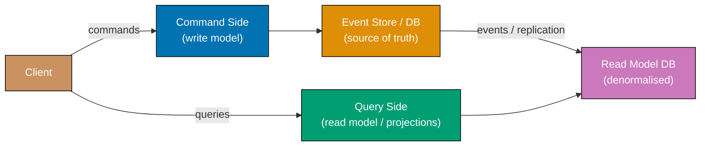




```java
import java.util.*;

// ---- Write side: command + domain model with invariants ----

// => Command is a plain data class — carries intent, not behaviour
record CreateProductCommand(String productId, String name, double price, int stock) {}

// => Product: write-side entity; holds events produced during command handling
class Product {
    final String productId;
    final String name;
    final double price;
    final int stock;
    // => Domain events accumulated here; consumed by projection after handler returns
    final List<Map<String, Object>> events = new ArrayList<>();

    Product(String productId, String name, double price, int stock) {
        this.productId = productId; this.name = name; this.price = price; this.stock = stock;
    }
}

class ProductCommandHandler {
    // => Write store: normalised, enforces invariants; never used for queries
    private final Map<String, Product> writeStore = new HashMap<>();

    Product handleCreate(CreateProductCommand cmd) {
        if (cmd.price() <= 0) throw new IllegalArgumentException("Price must be positive");
        // => Invariant enforced on write side before any persistence
        if (cmd.stock() < 0) throw new IllegalArgumentException("Stock cannot be negative");
        var product = new Product(cmd.productId(), cmd.name(), cmd.price(), cmd.stock());
        product.events.add(Map.of("type", "ProductCreated",
            "payload", Map.of("id", cmd.productId(), "name", cmd.name(), "price", cmd.price())));
        // => Event appended; read-side projection will consume it after this call
        writeStore.put(cmd.productId(), product);
        return product;
    }
}

// ---- Read side: denormalised projection optimised for queries ----

// => ProductSummary: pre-formatted for UI; no joins required at query time
record ProductSummary(String productId, String displayName, boolean inStock) {}

class ProductProjection {
    // => Read store: denormalised, fast to query; rebuilds from events if stale
    private final Map<String, ProductSummary> readStore = new HashMap<>();

    void onProductCreated(Map<String, Object> event) {
        @SuppressWarnings("unchecked")
        var p = (Map<String, Object>) event.get("payload");
        var summary = new ProductSummary(
            (String) p.get("id"),
            p.get("name") + " ($" + String.format("%.2f", p.get("price")) + ")",
            // => Display name pre-formatted — read model owns this transformation
            true // => Derived from stock > 0; avoids query-time computation
        );
        readStore.put(summary.productId(), summary); // => Projection materialised
    }

    List<ProductSummary> queryAll() {
        return new ArrayList<>(readStore.values()); // => Fast read: no joins, no business logic
    }
}

// => Wire command and query sides via event propagation
var cmdHandler = new ProductCommandHandler();
var projection = new ProductProjection();

var product = cmdHandler.handleCreate(new CreateProductCommand("P1", "Widget", 9.99, 100));
for (var event : product.events)
    projection.onProductCreated(event); // => Read side consumes write-side events

for (var s : projection.queryAll())
    System.out.printf("%s: %s, inStock=%b%n", s.productId(), s.displayName(), s.inStock());
// => Output: P1: Widget ($9.99), inStock=true
```




```kotlin
// ---- Write side: command + domain model with invariants ----

// => Command is a pure data class — carries intent, not logic
data class CreateProductCommand(val productId: String, val name: String, val price: Double, val stock: Int)

// => Product: write-side entity; events list holds domain events produced by handlers
data class Product(
    val productId: String,
    val name: String,
    val price: Double,
    val stock: Int,
    val events: MutableList<Map<String, Any>> = mutableListOf()
    // => Events accumulated here; consumed by projection after handler completes
)

class ProductCommandHandler {
    // => Write store: normalised; enforces invariants; never queried directly
    private val writeStore = mutableMapOf<String, Product>()

    fun handleCreate(cmd: CreateProductCommand): Product {
        require(cmd.price > 0) { "Price must be positive" }
        // => Invariant checked before any side effects — fail fast on write side
        require(cmd.stock >= 0) { "Stock cannot be negative" }
        val product = Product(cmd.productId, cmd.name, cmd.price, cmd.stock)
        product.events += mapOf(
            "type" to "ProductCreated",
            "payload" to mapOf("id" to cmd.productId, "name" to cmd.name, "price" to cmd.price)
        ) // => Event recorded; read-side projection will react to it
        writeStore[cmd.productId] = product
        return product
    }
}

// ---- Read side: denormalised projection optimised for queries ----

// => ProductSummary: pre-formatted for the UI — no join logic at query time
data class ProductSummary(val productId: String, val displayName: String, val inStock: Boolean)

class ProductProjection {
    // => Read store: denormalised, instant queries; rebuilt from events on replay
    private val readStore = mutableMapOf<String, ProductSummary>()

    @Suppress("UNCHECKED_CAST")
    fun onProductCreated(event: Map<String, Any>) {
        val p = event["payload"] as Map<String, Any>
        val summary = ProductSummary(
            productId = p["id"] as String,
            displayName = "${p["name"]} (${"$"}${"%.2f".format(p["price"] as Double)})",
            // => Display string pre-computed here — read model owns this transformation
            inStock = true // => Derived from stock > 0; saves computation at query time
        )
        readStore[summary.productId] = summary // => Projection materialised into read store
    }

    fun queryAll(): List<ProductSummary> = readStore.values.toList()
    // => Fast read: no joins, no invariant checks, pure data retrieval
}

// => Wire command and query sides; events bridge the two models
val cmdHandler = ProductCommandHandler()
val projection = ProductProjection()

val product = cmdHandler.handleCreate(CreateProductCommand("P1", "Widget", 9.99, 100))
product.events.forEach { projection.onProductCreated(it) }
// => Read side consumes events emitted by write side — async in real systems

projection.queryAll().forEach { s ->
    println("${s.productId}: ${s.displayName}, inStock=${s.inStock}")
}
// => Output: P1: Widget ($9.99), inStock=true
```




```csharp
using System;
using System.Collections.Generic;

// ---- Write side: command + domain model with invariants ----

// => Command: plain record carrying the caller's intent; no behaviour
record CreateProductCommand(string ProductId, string Name, double Price, int Stock);

// => Product: write-side entity; Events list accumulates domain events for projection
class Product
{
    public string ProductId { get; }
    public string Name { get; }
    public double Price { get; }
    public int Stock { get; }
    // => Events produced during handling; projection consumes them after this call
    public List<Dictionary<string, object>> Events { get; } = new();

    public Product(string id, string name, double price, int stock)
        => (ProductId, Name, Price, Stock) = (id, name, price, stock);
}

class ProductCommandHandler
{
    // => Write store: normalised, enforces invariants; never used for queries
    private readonly Dictionary<string, Product> _writeStore = new();

    public Product HandleCreate(CreateProductCommand cmd)
    {
        if (cmd.Price <= 0) throw new ArgumentException("Price must be positive");
        // => Invariant enforced before any persistence — write side owns validation
        if (cmd.Stock < 0) throw new ArgumentException("Stock cannot be negative");
        var product = new Product(cmd.ProductId, cmd.Name, cmd.Price, cmd.Stock);
        product.Events.Add(new() {
            ["type"] = "ProductCreated",
            ["payload"] = new Dictionary<string, object>
                { ["id"] = cmd.ProductId, ["name"] = cmd.Name, ["price"] = cmd.Price }
        }); // => Event appended; read-side projection will consume it
        _writeStore[cmd.ProductId] = product;
        return product;
    }
}

// ---- Read side: denormalised projection optimised for queries ----

// => ProductSummary: pre-formatted for the UI; zero join logic at query time
record ProductSummary(string ProductId, string DisplayName, bool InStock);

class ProductProjection
{
    // => Read store: denormalised, instant queries; rebuilt from events on replay
    private readonly Dictionary<string, ProductSummary> _readStore = new();

    public void OnProductCreated(Dictionary<string, object> evt)
    {
        var p = (Dictionary<string, object>) evt["payload"];
        var summary = new ProductSummary(
            ProductId: (string) p["id"],
            DisplayName: $"{p["name"]} (${(double)p["price"]:F2})",
            // => Display string pre-computed in projection — read model owns this
            InStock: true // => Derived from stock > 0; avoids runtime computation
        );
        _readStore[summary.ProductId] = summary; // => Projection materialised
    }

    public IEnumerable<ProductSummary> QueryAll() => _readStore.Values;
    // => Fast: no joins, no business logic — pure denormalised data retrieval
}

// => Wire command and query sides via event list
var cmdHandler = new ProductCommandHandler();
var projection = new ProductProjection();

var product = cmdHandler.HandleCreate(new("P1", "Widget", 9.99, 100));
foreach (var evt in product.Events)
    projection.OnProductCreated(evt); // => Read side consumes write-side events

foreach (var s in projection.QueryAll())
    Console.WriteLine($"{s.ProductId}: {s.DisplayName}, InStock={s.InStock}");
// => Output: P1: Widget ($9.99), InStock=True
```




```typescript
// === Write side: command + domain model with invariants ===
interface AccountEvent {
  type: string;
  accountId: string;
  occurredAt: number;
}
interface AccountOpened extends AccountEvent {
  type: "AccountOpened";
  owner: string;
  initialBalance: number;
}
interface MoneyDeposited extends AccountEvent {
  type: "MoneyDeposited";
  amount: number;
}
interface MoneyWithdrawn extends AccountEvent {
  type: "MoneyWithdrawn";
  amount: number;
}
type AllAccountEvents = AccountOpened | MoneyDeposited | MoneyWithdrawn;

class Account {
  private id = "";
  private owner = "";
  private balance = 0;
  private opened = false;

  static fromHistory(events: AllAccountEvents[]): Account {
    const account = new Account();
    for (const event of events) account.apply(event);
    return account;
    // => reconstructed by replaying all past events — current state always derivable
  }

  private apply(event: AllAccountEvents): void {
    switch (event.type) {
      case "AccountOpened":
        this.id = event.accountId;
        this.owner = event.owner;
        this.balance = event.initialBalance;
        this.opened = true;
        break;
      case "MoneyDeposited":
        this.balance += event.amount;
        break;
      case "MoneyWithdrawn":
        this.balance -= event.amount;
        break;
    }
  }

  withdraw(amount: number, accountId: string): AllAccountEvents {
    if (!this.opened) throw new Error("Account not opened");
    if (amount > this.balance) throw new Error(`Insufficient funds: ${this.balance}`);
    // => business rule checked on current reconstructed state
    const event: MoneyWithdrawn = { type: "MoneyWithdrawn", accountId, amount, occurredAt: Date.now() };
    this.apply(event); // => apply immediately (optimistic)
    return event; // => caller persists this event to the event store
  }

  getBalance(): number {
    return this.balance;
  }
  getOwner(): string {
    return this.owner;
  }
}

// === Event Store (append-only) ===
const eventStore: AllAccountEvents[] = [
  { type: "AccountOpened", accountId: "acc1", owner: "Alice", initialBalance: 0, occurredAt: Date.now() },
  { type: "MoneyDeposited", accountId: "acc1", amount: 1000, occurredAt: Date.now() },
  { type: "MoneyDeposited", accountId: "acc1", amount: 500, occurredAt: Date.now() },
];

// Reconstruct and withdraw
const account = Account.fromHistory(eventStore);
const withdrawEvent = account.withdraw(200, "acc1");
eventStore.push(withdrawEvent); // => append to event store — never modify existing events

console.log(account.getBalance()); // => 1300 (0 + 1000 + 500 - 200)
```




**Key Takeaway:** Separate command handlers (enforce invariants, emit events) from query handlers
(consume projections, optimised for reads) so each side can scale and evolve independently.

**Why It Matters:** Relational databases optimised for write consistency (with locks, transactions,
and normalisation) perform poorly for complex read queries that aggregate data across many tables.
CQRS solves this by maintaining separate read models — projected, denormalised, perhaps stored in
Elasticsearch or Redis — that answer queries in microseconds without table scans. Systems requiring
sub-millisecond query latency alongside strong write consistency benefit most from CQRS because the
read model can be shaped precisely for each query, without the normalisation constraints that the
write model's correctness guarantees require.

---

### Example 82: Outbox Pattern for Reliable Event Publishing

The outbox pattern solves the dual-write problem: how to atomically persist a database record and
publish an event to a message broker. By writing the event to an outbox table in the same database
transaction as the business record, then polling and publishing the outbox asynchronously, exactly-
once semantics are achievable within a single service.

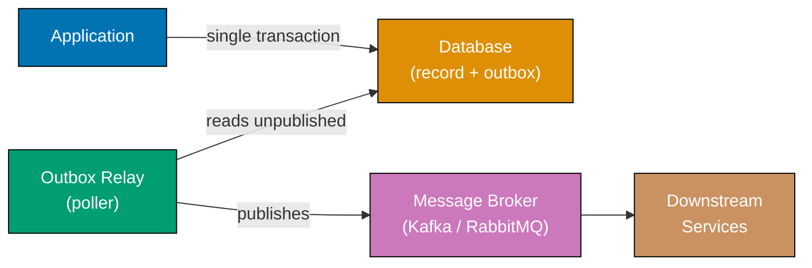




```java
import java.util.*;
import java.util.function.BiConsumer;

// => OutboxEntry: a row in the outbox table — same DB as business records
class OutboxEntry {
    final String entryId;
    final String eventType;
    final Map<String, Object> payload;
    boolean published = false; // => False until relay confirms broker receipt
    OutboxEntry(String entryId, String eventType, Map<String, Object> payload) {
        this.entryId = entryId; this.eventType = eventType; this.payload = payload;
    }
}

class Database {
    private final Map<String, Map<String, Object>> orders = new HashMap<>();
    private final List<OutboxEntry> outbox = new ArrayList<>();
    // => Outbox table lives in the same database as business records

    void saveOrderWithEvent(String orderId, double total, String eventType, Map<String, Object> payload) {
        // => ATOMIC: both writes succeed or both fail — no partial state possible
        orders.put(orderId, Map.of("order_id", orderId, "total", total));
        // => Business record persisted first
        var entry = new OutboxEntry(orderId + "-" + UUID.randomUUID().toString().substring(0, 4),
            eventType, payload);
        outbox.add(entry);
        // => Outbox entry written in same transaction; broker NOT called here
        System.out.println("DB: saved order " + orderId + " + outbox entry " + entry.entryId + " (atomic)");
    }

    List<OutboxEntry> getUnpublished() {
        return outbox.stream().filter(e -> !e.published).toList();
        // => Relay queries these; safe to call repeatedly after partial failures
    }

    void markPublished(String entryId) {
        outbox.stream().filter(e -> e.entryId.equals(entryId)).findFirst()
              .ifPresent(e -> e.published = true);
        // => Idempotent: marking twice has no additional effect
    }
}

class OutboxRelay {
    private final Database db;
    OutboxRelay(Database db) { this.db = db; }

    void publishPending(BiConsumer<String, Map<String, Object>> brokerPublish) {
        for (var entry : db.getUnpublished()) {
            brokerPublish.accept(entry.eventType, entry.payload);
            // => Publish to broker (Kafka/SQS); may be retried if broker is unavailable
            db.markPublished(entry.entryId);
            // => Mark published only after broker confirms receipt — at-least-once delivery
            System.out.println("Relay: published " + entry.eventType + " (entry " + entry.entryId + ")");
        }
    }
}

// => Simulated broker (stdout in demo)
BiConsumer<String, Map<String, Object>> mockBroker =
    (type, payload) -> System.out.println("Broker: received " + type + " — " + payload);

var db = new Database();
var relay = new OutboxRelay(db);

db.saveOrderWithEvent("ORD-99", 199.99, "OrderPlaced", Map.of("order_id", "ORD-99", "total", 199.99));
// => Output: DB: saved order ORD-99 + outbox entry ORD-99-xxxx (atomic)

relay.publishPending(mockBroker);
// => Output: Broker: received OrderPlaced — {order_id=ORD-99, total=199.99}
// => Output: Relay: published OrderPlaced (entry ORD-99-xxxx)

System.out.println("Unpublished after relay: " + db.getUnpublished().size());
// => Output: Unpublished after relay: 0
```




```kotlin
// => OutboxEntry: one row in the outbox table — lives in same DB as business data
data class OutboxEntry(
    val entryId: String,
    val eventType: String,
    val payload: Map<String, Any>,
    var published: Boolean = false // => false until relay confirms broker receipt
)

class Database {
    private val orders = mutableMapOf<String, Map<String, Any>>()
    private val outbox = mutableListOf<OutboxEntry>() // => Outbox table in same DB

    fun saveOrderWithEvent(orderId: String, total: Double, eventType: String, payload: Map<String, Any>) {
        // => ATOMIC: both writes are part of the same database transaction
        orders[orderId] = mapOf("order_id" to orderId, "total" to total)
        // => Business record committed first
        val entry = OutboxEntry("$orderId-${(1000..9999).random()}", eventType, payload)
        outbox += entry
        // => Outbox entry committed in same transaction; broker NOT called here
        println("DB: saved order $orderId + outbox entry ${entry.entryId} (atomic)")
    }

    fun getUnpublished(): List<OutboxEntry> = outbox.filter { !it.published }
    // => Relay calls this; safe to retry because idempotent on already-published entries

    fun markPublished(entryId: String) {
        outbox.find { it.entryId == entryId }?.published = true
        // => Mark after broker confirms; idempotent — multiple marks have no extra effect
    }
}

class OutboxRelay(private val db: Database) {
    fun publishPending(brokerPublish: (String, Map<String, Any>) -> Unit) {
        for (entry in db.getUnpublished()) {
            brokerPublish(entry.eventType, entry.payload)
            // => Publish to broker (Kafka/SQS); retried on failure before marking done
            db.markPublished(entry.entryId)
            // => Only marked after broker ack — at-least-once delivery guarantee
            println("Relay: published ${entry.eventType} (entry ${entry.entryId})")
        }
    }
}

// => Simulated broker (stdout in demo — swap for KafkaProducer in production)
val mockBroker: (String, Map<String, Any>) -> Unit = { type, payload ->
    println("Broker: received $type — $payload")
}

val db = Database()
val relay = OutboxRelay(db)

db.saveOrderWithEvent("ORD-99", 199.99, "OrderPlaced", mapOf("order_id" to "ORD-99", "total" to 199.99))
// => Output: DB: saved order ORD-99 + outbox entry ORD-99-xxxx (atomic)

relay.publishPending(mockBroker)
// => Output: Broker: received OrderPlaced — {order_id=ORD-99, total=199.99}
// => Output: Relay: published OrderPlaced (entry ORD-99-xxxx)

println("Unpublished after relay: ${db.getUnpublished().size}")
// => Output: Unpublished after relay: 0
```




```csharp
using System;
using System.Collections.Generic;
using System.Linq;

// => OutboxEntry: one row in the outbox table — lives alongside business records
class OutboxEntry
{
    public string EntryId { get; }
    public string EventType { get; }
    public Dictionary<string, object> Payload { get; }
    public bool Published { get; set; } = false; // => false until relay confirms broker receipt
    public OutboxEntry(string id, string type, Dictionary<string, object> payload)
        => (EntryId, EventType, Payload) = (id, type, payload);
}

class Database
{
    private readonly Dictionary<string, Dictionary<string, object>> _orders = new();
    private readonly List<OutboxEntry> _outbox = new(); // => Outbox table in same DB

    public void SaveOrderWithEvent(string orderId, double total, string eventType,
        Dictionary<string, object> payload)
    {
        // => ATOMIC: both writes in same DB transaction — no dual-write gap
        _orders[orderId] = new() { ["order_id"] = orderId, ["total"] = total };
        // => Business record saved first within transaction
        var entry = new OutboxEntry($"{orderId}-{Guid.NewGuid().ToString()[..4]}", eventType, payload);
        _outbox.Add(entry);
        // => Outbox entry committed in same transaction; broker NOT contacted here
        Console.WriteLine($"DB: saved order {orderId} + outbox entry {entry.EntryId} (atomic)");
    }

    public IEnumerable<OutboxEntry> GetUnpublished() =>
        _outbox.Where(e => !e.Published).ToList();
        // => Safe to query repeatedly; already-published entries filtered out

    public void MarkPublished(string entryId)
    {
        var entry = _outbox.FirstOrDefault(e => e.EntryId == entryId);
        if (entry != null) entry.Published = true;
        // => Idempotent: calling twice has no additional side effect
    }
}

class OutboxRelay
{
    private readonly Database _db;
    public OutboxRelay(Database db) => _db = db;

    public void PublishPending(Action<string, Dictionary<string, object>> brokerPublish)
    {
        foreach (var entry in _db.GetUnpublished())
        {
            brokerPublish(entry.EventType, entry.Payload);
            // => Publish to broker (Kafka/SQS); retry loop wraps this in production
            _db.MarkPublished(entry.EntryId);
            // => Marked only after broker confirms — at-least-once delivery guarantee
            Console.WriteLine($"Relay: published {entry.EventType} (entry {entry.EntryId})");
        }
    }
}

// => Simulated broker (stdout in demo — swap for IMessageProducer in production)
Action<string, Dictionary<string, object>> mockBroker = (type, payload) =>
    Console.WriteLine($"Broker: received {type} — {string.Join(", ", payload.Select(kv => $"{kv.Key}={kv.Value}"))}");

var db = new Database();
var relay = new OutboxRelay(db);

db.SaveOrderWithEvent("ORD-99", 199.99, "OrderPlaced",
    new() { ["order_id"] = "ORD-99", ["total"] = 199.99 });
// => Output: DB: saved order ORD-99 + outbox entry ORD-99-xxxx (atomic)

relay.PublishPending(mockBroker);
// => Output: Broker: received OrderPlaced — order_id=ORD-99, total=199.99
// => Output: Relay: published OrderPlaced (entry ORD-99-xxxx)

Console.WriteLine($"Unpublished after relay: {db.GetUnpublished().Count()}");
// => Output: Unpublished after relay: 0
```




```typescript
// => OBSERVABLE: a stream of values that can be subscribed to
type Observer<T> = {
  next: (value: T) => void;
  error?: (err: Error) => void;
  complete?: () => void;
};

class Observable<T> {
  constructor(private readonly subscribe: (observer: Observer<T>) => void) {}

  static from<T>(values: T[]): Observable<T> {
    return new Observable((observer) => {
      for (const v of values) observer.next(v);
      observer.complete?.();
      // => emits all values then completes
    });
  }

  map<U>(fn: (v: T) => U): Observable<U> {
    return new Observable((observer) => {
      this.subscribe({
        next: (v) => observer.next(fn(v)), // => transform each value
        error: observer.error,
        complete: observer.complete,
      });
    });
  }

  filter(predicate: (v: T) => boolean): Observable<T> {
    return new Observable((observer) => {
      this.subscribe({
        next: (v) => {
          if (predicate(v)) observer.next(v);
        },
        // => only pass values that satisfy the predicate
        error: observer.error,
        complete: observer.complete,
      });
    });
  }

  reduce<U>(fn: (acc: U, v: T) => U, initial: U): Observable<U> {
    return new Observable((observer) => {
      let acc = initial;
      this.subscribe({
        next: (v) => {
          acc = fn(acc, v);
        },
        // => accumulates without emitting intermediate values
        error: observer.error,
        complete: () => {
          observer.next(acc);
          observer.complete?.();
        },
        // => emits final accumulated value on completion
      });
    });
  }

  run(observer: Observer<T>): void {
    this.subscribe(observer); // => start the stream
  }
}

// => PIPELINE: order totals > $100, summed
const orders = [
  { id: 1, total: 150 },
  { id: 2, total: 50 },
  { id: 3, total: 200 },
  { id: 4, total: 75 },
];

Observable.from(orders)
  .filter((o) => o.total > 100) // => only large orders
  .map((o) => o.total) // => extract total
  .reduce((sum, t) => sum + t, 0) // => sum them
  .run({ next: (sum) => console.log(`Sum of large orders: ${sum}`) });
// => Sum of large orders: 350 (150 + 200)
```




**Key Takeaway:** Write business data and the outbox event in a single database transaction, then
relay the outbox asynchronously to the broker so the event is never lost even if the broker is
temporarily unavailable.

**Why It Matters:** The naive dual-write — save to DB then publish to Kafka — has a gap: if the
service crashes between the two writes, the event is lost and downstream services never see the
order placed. The outbox pattern is the standard solution, used by Debezium's CDC (Change Data
Capture) connector which reads the outbox table directly from the database's binary log and
publishes to Kafka — eliminating the relay polling latency entirely. Financial systems, logistics
platforms, and any domain requiring event reliability adopt the outbox pattern as foundational
infrastructure.

---

### Example 83: Anti-Corruption Layer

The anti-corruption layer (ACL) is a translation boundary that prevents a downstream model's
concepts from leaking into an upstream domain. The ACL translates between two bounded contexts'
vocabularies, protecting the upstream domain from being corrupted by legacy or third-party models.




```java
// ---- Legacy CRM system model — uses its own vocabulary ----

// => CRM calls customers "accounts" with numeric status codes and string money values
record LegacyCrmAccount(
    String acctNum,     // => CRM's identifier — maps to our customer_id
    String fullName,    // => CRM field name differs from our "name"
    String emailAddr,   // => CRM's emailAddr — our model uses "email"
    int statusCode,     // => 1=active, 2=suspended, 3=closed — integers, not booleans
    String creditLimit  // => Stored as "1500.00" string — type mismatch with our float
) {}

// ---- Our domain model — clean vocabulary and correct types ----

// => Customer: domain object; never touched by CRM field names or integer status codes
record Customer(
    String customerId,  // => Maps from CRM's "acctNum"
    String name,        // => Clean field — not "fullName"
    String email,       // => Clean field — not "emailAddr"
    boolean active,     // => Boolean — not integer status code
    double creditLimit  // => Correct numeric type — not string
) {}

// ---- Anti-Corruption Layer ----

class CrmAntiCorruptionLayer {
    private static final int STATUS_ACTIVE = 1;
    // => ACL owns CRM status code knowledge; domain never sees integer codes

    // => Translate inbound CRM account to domain Customer
    Customer translateAccount(LegacyCrmAccount acct) {
        return new Customer(
            acct.acctNum(),              // => "acctNum" -> "customerId"
            acct.fullName(),             // => "fullName" -> "name"
            acct.emailAddr(),            // => "emailAddr" -> "email"
            acct.statusCode() == STATUS_ACTIVE,
            // => Integer status code -> boolean; CRM vocabulary stops at the ACL
            Double.parseDouble(acct.creditLimit())
            // => String "2500.00" -> double 2500.0; type mismatch resolved here
        );
    }

    // => Translate outbound domain Customer back to CRM account for API calls
    LegacyCrmAccount translateToCrm(Customer c) {
        return new LegacyCrmAccount(
            c.customerId(),             // => "customerId" -> "acctNum"
            c.name(),                   // => "name" -> "fullName"
            c.email(),                  // => "email" -> "emailAddr"
            c.active() ? STATUS_ACTIVE : 2,
            // => Boolean -> integer code; our domain model never stores this
            String.format("%.2f", c.creditLimit()) // => double -> CRM string format
        );
    }
}

// => Domain code works only with Customer; ACL handles all CRM translation
var acl = new CrmAntiCorruptionLayer();
var crmData = new LegacyCrmAccount("ACC-001", "Alice Smith", "alice@crm.com", 1, "2500.00");

var customer = acl.translateAccount(crmData);
System.out.printf("Customer: %s, active=%b, credit=%.1f%n",
    customer.name(), customer.active(), customer.creditLimit());
// => Output: Customer: Alice Smith, active=true, credit=2500.0

var crmOut = acl.translateToCrm(customer); // => Round-trip for CRM update call
System.out.printf("CRM: acct=%s, status=%d, credit=%s%n",
    crmOut.acctNum(), crmOut.statusCode(), crmOut.creditLimit());
// => Output: CRM: acct=ACC-001, status=1, credit=2500.00
```




```kotlin
// ---- Legacy CRM system model — uses its own vocabulary ----

// => CRM calls customers "accounts"; status is int, credit is String — all mismatched
data class LegacyCrmAccount(
    val acctNum: String,     // => CRM identifier — our domain calls this customerId
    val fullName: String,    // => CRM field — our domain calls this name
    val emailAddr: String,   // => CRM field — our domain calls this email
    val statusCode: Int,     // => 1=active, 2=suspended, 3=closed — integers, not booleans
    val creditLimit: String  // => "2500.00" as string — type mismatch with our Double
)

// ---- Our domain model — clean vocabulary and correct types ----

// => Customer: domain object; completely free of CRM field names and integer codes
data class Customer(
    val customerId: String,  // => Maps from CRM's acctNum
    val name: String,        // => Clean — not fullName
    val email: String,       // => Clean — not emailAddr
    val active: Boolean,     // => Boolean — not integer status code
    val creditLimit: Double  // => Correct type — not String
)

// ---- Anti-Corruption Layer ----

class CrmAntiCorruptionLayer {
    private val statusActive = 1 // => ACL owns CRM status code knowledge; domain never sees it

    // => Translate inbound CRM account to domain Customer — vocabulary stops here
    fun translateAccount(acct: LegacyCrmAccount): Customer = Customer(
        customerId = acct.acctNum,           // => "acctNum" -> "customerId"
        name = acct.fullName,                // => "fullName" -> "name"
        email = acct.emailAddr,              // => "emailAddr" -> "email"
        active = acct.statusCode == statusActive,
        // => Integer code translated to Boolean; CRM vocabulary cannot cross this boundary
        creditLimit = acct.creditLimit.toDouble()
        // => String "2500.00" -> Double 2500.0; type mismatch resolved in ACL
    )

    // => Translate outbound Customer back to CRM format for API calls
    fun translateToCrm(c: Customer): LegacyCrmAccount = LegacyCrmAccount(
        acctNum = c.customerId,              // => "customerId" -> "acctNum"
        fullName = c.name,                   // => "name" -> "fullName"
        emailAddr = c.email,                 // => "email" -> "emailAddr"
        statusCode = if (c.active) statusActive else 2,
        // => Boolean -> integer code; domain model never stores integer status
        creditLimit = "%.2f".format(c.creditLimit) // => Double -> CRM string format
    )
}

// => Domain code works only with Customer; ACL handles all CRM translation
val acl = CrmAntiCorruptionLayer()
val crmData = LegacyCrmAccount("ACC-001", "Alice Smith", "alice@crm.com", 1, "2500.00")

val customer = acl.translateAccount(crmData)
println("Customer: ${customer.name}, active=${customer.active}, credit=${customer.creditLimit}")
// => Output: Customer: Alice Smith, active=true, credit=2500.0

val crmOut = acl.translateToCrm(customer) // => Round-trip for CRM update API call
println("CRM: acct=${crmOut.acctNum}, status=${crmOut.statusCode}, credit=${crmOut.creditLimit}")
// => Output: CRM: acct=ACC-001, status=1, credit=2500.00
```




```csharp
using System;

// ---- Legacy CRM system model — uses its own vocabulary ----

// => CRM calls customers "accounts"; status is int, credit is string — all mismatched
record LegacyCrmAccount(
    string AcctNum,     // => CRM identifier — our domain calls this CustomerId
    string FullName,    // => CRM field name — our domain calls this Name
    string EmailAddr,   // => CRM field name — our domain calls this Email
    int StatusCode,     // => 1=active, 2=suspended, 3=closed — integers, not booleans
    string CreditLimit  // => "2500.00" as string — type mismatch with our decimal
);

// ---- Our domain model — clean vocabulary and correct types ----

// => Customer: domain object; completely free of CRM field names and integer codes
record Customer(
    string CustomerId,   // => Maps from CRM's AcctNum
    string Name,         // => Clean — not FullName
    string Email,        // => Clean — not EmailAddr
    bool Active,         // => Boolean — not integer status code
    double CreditLimit   // => Correct numeric type — not string
);

// ---- Anti-Corruption Layer ----

class CrmAntiCorruptionLayer
{
    private const int StatusActive = 1;
    // => ACL owns knowledge of CRM integer codes; domain model never imports this constant

    // => Translate inbound CRM account to domain Customer — CRM vocabulary stops here
    public Customer TranslateAccount(LegacyCrmAccount acct) => new(
        CustomerId: acct.AcctNum,               // => "AcctNum" -> "CustomerId"
        Name: acct.FullName,                    // => "FullName" -> "Name"
        Email: acct.EmailAddr,                  // => "EmailAddr" -> "Email"
        Active: acct.StatusCode == StatusActive,
        // => Integer code -> Boolean; CRM vocabulary cannot cross this boundary
        CreditLimit: double.Parse(acct.CreditLimit)
        // => String "2500.00" -> double 2500.0; type mismatch resolved in ACL
    );

    // => Translate outbound Customer back to CRM format for API calls
    public LegacyCrmAccount TranslateToCrm(Customer c) => new(
        AcctNum: c.CustomerId,                  // => "CustomerId" -> "AcctNum"
        FullName: c.Name,                       // => "Name" -> "FullName"
        EmailAddr: c.Email,                     // => "Email" -> "EmailAddr"
        StatusCode: c.Active ? StatusActive : 2,
        // => Boolean -> integer code; domain model never stores this integer
        CreditLimit: $"{c.CreditLimit:F2}"      // => double -> CRM string format
    );
}

// => Domain code works only with Customer; ACL handles all CRM translation
var acl = new CrmAntiCorruptionLayer();
var crmData = new LegacyCrmAccount("ACC-001", "Alice Smith", "alice@crm.com", 1, "2500.00");

var customer = acl.TranslateAccount(crmData);
Console.WriteLine($"Customer: {customer.Name}, active={customer.Active}, credit={customer.CreditLimit}");
// => Output: Customer: Alice Smith, active=True, credit=2500

var crmOut = acl.TranslateToCrm(customer); // => Round-trip for CRM update API call
Console.WriteLine($"CRM: acct={crmOut.AcctNum}, status={crmOut.StatusCode}, credit={crmOut.CreditLimit}");
// => Output: CRM: acct=ACC-001, status=1, credit=2500.00
```




```typescript
// ---- Legacy CRM system model — uses its own vocabulary ----

// => CRM calls customers "accounts" with numeric status codes and string money values
interface CrmAccount {
  account_id: string; // => legacy: underscore naming
  account_name: string;
  status_code: number; // => legacy: 1=active, 2=suspended, 3=closed
  credit_balance_str: string; // => legacy: money as string "1234.56"
}

// => CRM API — cannot be modified (third-party system)
class CrmApiClient {
  fetchAccount(accountId: string): CrmAccount {
    // => simulates external CRM response
    return { account_id: accountId, account_name: "Alice Corp", status_code: 1, credit_balance_str: "5000.00" };
  }
}

// ---- Domain model — clean, type-safe, no CRM concepts ----
type AccountStatus = "active" | "suspended" | "closed";

interface DomainAccount {
  id: string;
  name: string;
  status: AccountStatus;
  creditBalance: number; // => domain: number not string
}

// ---- Anti-Corruption Layer: translates CRM → Domain ----
class CrmAntiCorruptionLayer {
  constructor(private readonly crmClient: CrmApiClient) {}

  getAccount(accountId: string): DomainAccount {
    const crmData = this.crmClient.fetchAccount(accountId);
    // => translate: CRM → Domain — domain code never sees CRM shapes
    return {
      id: crmData.account_id,
      name: crmData.account_name,
      status: this.translateStatus(crmData.status_code),
      creditBalance: parseFloat(crmData.credit_balance_str),
      // => convert string money to number
    };
  }

  private translateStatus(code: number): AccountStatus {
    switch (code) {
      case 1:
        return "active";
      case 2:
        return "suspended";
      case 3:
        return "closed";
      default:
        throw new Error(`Unknown CRM status code: ${code}`);
    }
  }
}

// ---- Domain service — only knows DomainAccount ----
class CreditCheckService {
  constructor(private readonly acl: CrmAntiCorruptionLayer) {}

  canExtendCredit(accountId: string, amount: number): boolean {
    const account = this.acl.getAccount(accountId);
    // => domain code works with clean domain types — CRM is fully hidden
    return account.status === "active" && account.creditBalance >= amount;
  }
}

const crmClient = new CrmApiClient();
const acl = new CrmAntiCorruptionLayer(crmClient);
const creditCheck = new CreditCheckService(acl);

console.log(creditCheck.canExtendCredit("acc-42", 1000)); // => true (active, balance 5000)
```




**Key Takeaway:** The ACL is the boundary where foreign vocabulary and types stop; everything
inside the boundary uses clean domain language and correct types without compromise.

**Why It Matters:** Without an ACL, integrating a legacy CRM causes its integer status codes,
misspelled field names, and wrong types to propagate into the domain model — creating unmaintainable
translation logic scattered across the codebase. Eric Evans identified the ACL as critical to
maintaining domain purity during integration; teams that skip it spend disproportionate effort
on "translation debt" — conditional mapping code duplicated wherever the legacy system's data
is used. Rebuilding a messy integration with a proper ACL is one of the highest-ROI refactorings
in enterprise systems.

---

### Example 84: Ports and Adapters (Hexagonal Architecture)

The hexagonal architecture (Ports and Adapters) places the domain model at the centre, surrounded
by ports (interfaces) through which the domain communicates with the outside world. Adapters
implement those ports for specific technologies (HTTP, databases, message queues), keeping the
domain completely free of infrastructure dependencies.

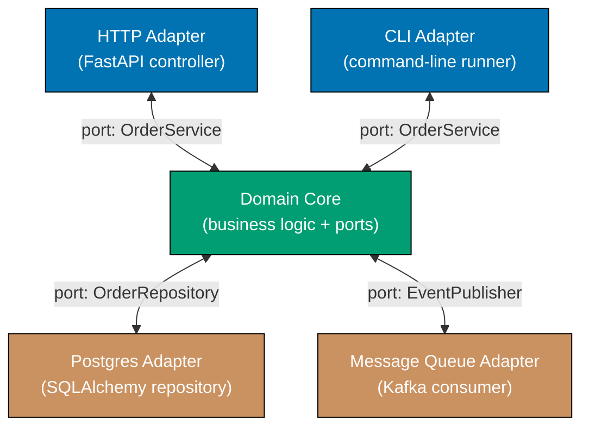




```java
import java.util.*;

// ---- Ports — domain-owned interfaces; depend on nothing outside the domain ----

// => Driven port: domain drives this to persist and retrieve orders
interface OrderRepository {
    void save(Order order);
    Optional<Order> find(String orderId);
}

// => Driven port: domain drives this to publish domain events
interface EventPublisher {
    void publish(String eventType, Map<String, Object> payload);
}

// ---- Domain core — depends only on ports ----

// => Order: plain domain entity; no JPA annotations, no Kafka types
record Order(String orderId, String customerId, double total, String status) {
    Order(String orderId, String customerId, double total) {
        this(orderId, customerId, total, "pending"); // => Default status on creation
    }
}

// => OrderService: primary port — driving adapters (HTTP, CLI) call this
class OrderService {
    private final OrderRepository repo;        // => Injected; domain never knows which adapter
    private final EventPublisher publisher;    // => Injected; domain never imports Kafka

    OrderService(OrderRepository repo, EventPublisher publisher) {
        this.repo = repo; this.publisher = publisher;
    }

    Order placeOrder(String customerId, double total) {
        var order = new Order(UUID.randomUUID().toString().substring(0, 8), customerId, total);
        repo.save(order);               // => Domain drives repository port — not JDBC directly
        publisher.publish("OrderPlaced", Map.of("order_id", order.orderId(), "total", total));
        // => Domain drives event port — not Kafka directly; adapter handles transport
        return order;
    }
}

// ---- Adapters — implement ports for specific technologies ----

// => In-memory adapter: used in tests; swap for JPA adapter in production
class InMemoryOrderRepository implements OrderRepository {
    private final Map<String, Order> store = new HashMap<>();
    // => No SQL, no connection pool — domain tests run without any infrastructure

    public void save(Order order) { store.put(order.orderId(), order); }
    // => Simple map put — identical semantics to a real repository from domain's perspective

    public Optional<Order> find(String orderId) { return Optional.ofNullable(store.get(orderId)); }
    // => Returns Optional.empty() if not found — same contract as JPA adapter
}

// => Logging adapter: captures events for test assertions; swap for Kafka in production
class LoggingEventPublisher implements EventPublisher {
    final List<Map<String, Object>> published = new ArrayList<>();
    // => Records events so tests can assert without running Kafka

    public void publish(String eventType, Map<String, Object> payload) {
        published.add(Map.of("event_type", eventType, "payload", payload));
        // => Swap for KafkaProducer.send() in production adapter — zero domain changes
    }
}

// => Compose domain with adapters — done once at application startup (composition root)
var repo = new InMemoryOrderRepository();
var publisher = new LoggingEventPublisher();
var service = new OrderService(repo, publisher); // => Domain receives adapters via constructor

var order = service.placeOrder("CUST-1", 75.50);
System.out.println("Order placed: " + order.orderId() + ", total=" + order.total());
// => Output: Order placed: <id>, total=75.5

System.out.println("Events published: " + publisher.published);
// => Output: Events published: [{event_type=OrderPlaced, payload={order_id=<id>, total=75.5}}]
```




```kotlin
import java.util.UUID

// ---- Ports — domain-owned interfaces; no infrastructure imports ----

// => Driven port: domain drives this to persist and retrieve orders
interface OrderRepository {
    fun save(order: Order)
    fun find(orderId: String): Order?
}

// => Driven port: domain drives this to publish domain events
interface EventPublisher {
    fun publish(eventType: String, payload: Map<String, Any>)
}

// ---- Domain core — depends only on ports ----

// => Order: plain domain data class; no JPA, no Kafka, no framework annotations
data class Order(
    val orderId: String,
    val customerId: String,
    val total: Double,
    val status: String = "pending" // => Default status on creation
)

// => OrderService: primary port — HTTP controllers and CLI adapters call this
class OrderService(
    private val repo: OrderRepository,         // => Injected; domain never knows which adapter
    private val publisher: EventPublisher      // => Injected; domain never imports Kafka
) {
    fun placeOrder(customerId: String, total: Double): Order {
        val order = Order(UUID.randomUUID().toString().take(8), customerId, total)
        repo.save(order)               // => Domain drives repository port — not JDBC directly
        publisher.publish("OrderPlaced", mapOf("order_id" to order.orderId, "total" to total))
        // => Domain drives event port — adapter decides how to transport the event
        return order
    }
}

// ---- Adapters — implement ports for specific technologies ----

// => In-memory adapter: used in unit tests; swap for JPA adapter in production
class InMemoryOrderRepository : OrderRepository {
    private val store = mutableMapOf<String, Order>()
    // => No SQL, no connection pool — tests run without any infrastructure

    override fun save(order: Order) { store[order.orderId] = order }
    // => Map put — identical semantics from domain's perspective as a real repository

    override fun find(orderId: String): Order? = store[orderId]
    // => Returns null if not found — same contract the JPA adapter would fulfil
}

// => Logging adapter: captures events for test assertions; swap for Kafka in production
class LoggingEventPublisher : EventPublisher {
    val published = mutableListOf<Map<String, Any>>()
    // => Records events so tests can assert without running a Kafka cluster

    override fun publish(eventType: String, payload: Map<String, Any>) {
        published += mapOf("event_type" to eventType, "payload" to payload)
        // => Replace this line with KafkaProducer.send() in the production adapter
    }
}

// => Compose domain with adapters — done once at startup (composition root)
val repo = InMemoryOrderRepository()
val publisher = LoggingEventPublisher()
val service = OrderService(repo, publisher) // => Domain receives adapters via constructor

val order = service.placeOrder("CUST-1", 75.50)
println("Order placed: ${order.orderId}, total=${order.total}")
// => Output: Order placed: <id>, total=75.5

println("Events published: ${publisher.published}")
// => Output: Events published: [{event_type=OrderPlaced, payload={order_id=<id>, total=75.5}}]
```




```csharp
using System;
using System.Collections.Generic;

// ---- Ports — domain-owned interfaces; no infrastructure namespaces ----

// => Driven port: domain drives this to persist and retrieve orders
interface IOrderRepository
{
    void Save(Order order);
    Order? Find(string orderId);
}

// => Driven port: domain drives this to publish domain events
interface IEventPublisher
{
    void Publish(string eventType, Dictionary<string, object> payload);
}

// ---- Domain core — depends only on ports ----

// => Order: plain domain record; no EF Core attributes, no MassTransit types
record Order(string OrderId, string CustomerId, double Total, string Status = "pending");
// => Status defaults to "pending" on creation — no infrastructure-specific defaults

// => OrderService: primary port — HTTP controllers and CLI adapters call this
class OrderService
{
    private readonly IOrderRepository _repo;        // => Injected; domain never knows which adapter
    private readonly IEventPublisher _publisher;    // => Injected; domain never imports RabbitMQ

    public OrderService(IOrderRepository repo, IEventPublisher publisher)
        => (_repo, _publisher) = (repo, publisher);

    public Order PlaceOrder(string customerId, double total)
    {
        var order = new Order(Guid.NewGuid().ToString()[..8], customerId, total);
        _repo.Save(order);              // => Domain drives repository port — not EF Core directly
        _publisher.Publish("OrderPlaced", new() { ["order_id"] = order.OrderId, ["total"] = total });
        // => Domain drives event port — adapter decides transport (RabbitMQ, Azure Bus, etc.)
        return order;
    }
}

// ---- Adapters — implement ports for specific technologies ----

// => In-memory adapter: used in unit tests; swap for EF Core adapter in production
class InMemoryOrderRepository : IOrderRepository
{
    private readonly Dictionary<string, Order> _store = new();
    // => No SQL, no connection pool — domain tests run without any infrastructure

    public void Save(Order order) => _store[order.OrderId] = order;
    // => Dictionary set — identical semantics from domain's perspective as EF Core SaveChanges

    public Order? Find(string orderId) =>
        _store.TryGetValue(orderId, out var o) ? o : null;
        // => Returns null if not found — same contract as the EF Core adapter
}

// => Logging adapter: captures events for assertions; swap for MassTransit in production
class LoggingEventPublisher : IEventPublisher
{
    public List<Dictionary<string, object>> Published { get; } = new();
    // => Records events so tests can assert without running a real message broker

    public void Publish(string eventType, Dictionary<string, object> payload) =>
        Published.Add(new() { ["event_type"] = eventType, ["payload"] = payload });
        // => Replace with bus.Publish() in the production adapter — zero domain changes
}

// => Compose domain with adapters — done once at startup (composition root)
var repo = new InMemoryOrderRepository();
var publisher = new LoggingEventPublisher();
var service = new OrderService(repo, publisher); // => Domain receives adapters via constructor

var order = service.PlaceOrder("CUST-1", 75.50);
Console.WriteLine($"Order placed: {order.OrderId}, total={order.Total}");
// => Output: Order placed: <id>, total=75.5

Console.WriteLine($"Events published: {publisher.Published.Count}");
// => Output: Events published: 1
// => Publisher.Published[0]["event_type"] == "OrderPlaced"
```




```typescript
// ---- Ports — domain-owned interfaces; depend on nothing outside the domain ----
interface EventStore {
  append(streamId: string, event: unknown): void;
  // => append-only write port
  load(streamId: string): unknown[];
  // => load all events for a stream
}

interface EventPublisher {
  publish(topic: string, event: unknown): void;
  // => publish to message broker port
}

// ---- Domain event ----
interface OrderEvent {
  type: string;
  orderId: string;
  occurredAt: number;
}
interface OrderPlaced extends OrderEvent {
  type: "OrderPlaced";
  customerId: string;
  items: unknown[];
}

// ---- Application service: pure domain logic + ports only ----
class OrderApplicationService {
  constructor(
    private readonly store: EventStore,
    private readonly publisher: EventPublisher,
  ) {}

  placeOrder(orderId: string, customerId: string, items: unknown[]): void {
    // => validate invariants
    if ((items as unknown[]).length === 0) throw new Error("Order must have items");

    // => create and persist domain event
    const event: OrderPlaced = {
      type: "OrderPlaced",
      orderId,
      customerId,
      items,
      occurredAt: Date.now(),
    };
    this.store.append(orderId, event); // => persist via port
    this.publisher.publish("orders", event); // => publish via port
    // => service imports no frameworks — only its own ports
  }
}

// ---- Infrastructure adapters ----
class InMemoryEventStore implements EventStore {
  private readonly streams: Map<string, unknown[]> = new Map();

  append(streamId: string, event: unknown): void {
    const existing = this.streams.get(streamId) ?? [];
    this.streams.set(streamId, [...existing, event]);
    console.log(`[EventStore] Appended ${(event as OrderEvent).type} to ${streamId}`);
  }

  load(streamId: string): unknown[] {
    return this.streams.get(streamId) ?? [];
  }
}

class ConsoleEventPublisher implements EventPublisher {
  publish(topic: string, event: unknown): void {
    console.log(`[Broker] Published to "${topic}": ${(event as OrderEvent).type}`);
  }
}

// ---- Wire adapters into application service ----
const eventStore = new InMemoryEventStore();
const publisher = new ConsoleEventPublisher();
const orderAppSvc = new OrderApplicationService(eventStore, publisher);

orderAppSvc.placeOrder("ord-1", "c1", [{ productId: "p1", qty: 2 }]);
// => [EventStore] Appended OrderPlaced to ord-1
// => [Broker] Published to "orders": OrderPlaced

const history = eventStore.load("ord-1");
console.log(`Events in stream: ${history.length}`); // => Events in stream: 1
```




**Key Takeaway:** Domain logic is testable in complete isolation using in-memory adapters; swapping
to real infrastructure adapters requires zero domain code changes — only composition root changes.

**Why It Matters:** Traditional layered architectures let infrastructure details leak into the
domain (JPA annotations in entity classes, Kafka types in service methods), making domains
impossible to test without spinning up databases. Hexagonal architecture, described in Alistair
Cockburn's original 2005 formulation, enables fast unit tests of all business logic using in-memory
adapters, reducing test suite time from 10+ minutes (integration tests with real DB) to seconds —
critical for a high-frequency CI/CD pipeline. The domain remains portable across infrastructure
changes precisely because it has no compile-time dependency on any specific technology adapter.

---

### Example 85: Reactive Architecture with Backpressure

Reactive architecture processes streams of data asynchronously using non-blocking I/O, with
backpressure mechanisms that signal upstream producers to slow down when downstream consumers
cannot keep up, preventing out-of-memory crashes from unbounded queues.

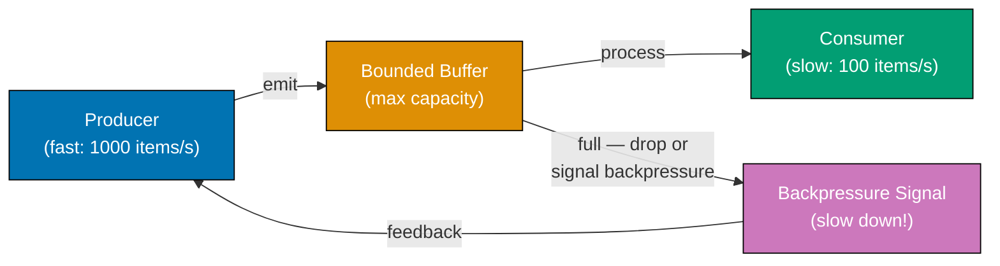




```java
// => Java: Project Reactor — industry-standard reactive library (Spring WebFlux uses this)
// => Dependency: io.projectreactor:reactor-core
import reactor.core.publisher.Flux;
import reactor.core.scheduler.Schedulers;
import java.time.Duration;
import java.util.concurrent.atomic.AtomicInteger;

// => AtomicInteger tracks backpressure events across threads safely
AtomicInteger dropped = new AtomicInteger(0);
AtomicInteger processed = new AtomicInteger(0);

// => Flux.range: creates a fast producer of 50 integers
Flux.range(1, 50)
    // => onBackpressureDrop: when downstream cannot keep up, drop items and record them
    .onBackpressureDrop(item -> {
        dropped.incrementAndGet(); // => Item dropped — backpressure applied to producer
        // => In production: log dropped item id for monitoring/alerting
    })
    // => limitRate(10): request at most 10 items at a time — bounded demand signal
    .limitRate(10)
    // => subscribeOn: move subscription (production) to a background thread
    .subscribeOn(Schedulers.parallel())
    .flatMap(item ->
        // => flatMap with delayElements simulates slow async consumer (5ms per item)
        Flux.just(item).delayElements(Duration.ofMillis(5)),
        // => concurrency=1: only 1 in-flight item — consumer is the bottleneck
        1
    )
    .doOnNext(item -> processed.incrementAndGet()) // => Count successfully processed items
    .blockLast(Duration.ofSeconds(5)); // => Block until stream completes (demo only)
    // => In production: subscribe() instead of blockLast() — never block reactive threads

System.out.println("Dropped (backpressure): " + dropped.get());
// => Output: Dropped (backpressure): ~30-40 (fast producer outpaces slow consumer)
System.out.println("Processed: " + processed.get());
// => Output: Processed: ~10-20 (bounded by limitRate and consumer speed)
// => Key: memory was never at risk — bounded demand signal prevented queue growth
```




```kotlin
// => Kotlin Flow — coroutine-native reactive streams with structured concurrency
import kotlinx.coroutines.*
import kotlinx.coroutines.flow.*
import java.util.concurrent.atomic.AtomicInteger

val dropped = AtomicInteger(0)
val processed = AtomicInteger(0)

// => runBlocking provides a coroutine scope for the demo; use lifecycleScope in Android
runBlocking {
    // => flow builder: creates a fast producer of 50 integers
    val fastProducer = flow {
        repeat(50) { i -> emit(i) } // => Emits 50 items as fast as possible
    }

    fastProducer
        // => buffer with DROP_OLDEST: bounded buffer; drops oldest when full
        .buffer(capacity = 10, onBufferOverflow = kotlinx.coroutines.channels.BufferOverflow.DROP_OLDEST)
        // => DROP_OLDEST applies backpressure: oldest buffered item sacrificed for new ones
        .onEach { item ->
            delay(5) // => Slow consumer — takes 5ms per item to simulate I/O
            processed.incrementAndGet() // => Count items that made it through
        }
        .catch { e -> println("Stream error: $e") } // => Errors handled in stream, not outside
        .collect() // => Terminal operator: collects all items; suspends until stream ends
    // => Structured concurrency: collect() suspends until all items processed or cancelled
}

// => Items dropped are those the buffer couldn't hold when full
println("Dropped (backpressure): ${50 - processed.get()}")
// => Output: Dropped (backpressure): ~30-40 (buffer filled and overflowed)
println("Processed: ${processed.get()}")
// => Output: Processed: ~10-20 (bounded by buffer capacity and consumer speed)
// => Key: memory capped at buffer=10 — no unbounded accumulation possible
```




```csharp
// => C#: System.Reactive (Rx.NET) — IObservable backpressure via bounded Subject
// => Dependency: System.Reactive
using System;
using System.Reactive.Linq;
using System.Reactive.Subjects;
using System.Collections.Concurrent;
using System.Threading;
using System.Threading.Tasks;

// => BoundedSubject: wraps Subject<T> with a bounded queue; drops when full
class BoundedSubject<T>
{
    private readonly Subject<T> _subject = new();
    private readonly BlockingCollection<T> _buffer;
    public int Dropped { get; private set; } = 0; // => Items dropped by backpressure
    public IObservable<T> Observable => _subject.AsObservable();
    // => Consumers subscribe to this observable — they never touch the buffer directly

    public BoundedSubject(int capacity) =>
        _buffer = new BlockingCollection<T>(capacity);
        // => BlockingCollection with capacity = bounded queue — prevents unbounded growth

    public bool TryProduce(T item)
    {
        if (_buffer.TryAdd(item))
        {
            _subject.OnNext(item); // => Forward to observable pipeline
            return true;           // => Item accepted — consumer will receive it
        }
        Dropped++;  // => Queue full — backpressure applied; producer should slow down
        return false; // => Producer receives false signal — must back off or drop
    }

    public void Complete() => _subject.OnCompleted(); // => Signal no more items
}

var source = new BoundedSubject<int>(capacity: 10);
// => Bounded at 10 — backpressure kicks in when buffer is full
int processed = 0;

// => Subscribe with slow consumer — subscribes before producer starts
var subscription = source.Observable
    .Do(_ => Thread.Sleep(5))   // => Slow consumer: 5ms per item (~200 items/s)
    // => Do() runs a side effect for each item without transforming the stream
    .Subscribe(
        onNext: _ => Interlocked.Increment(ref processed), // => Count processed items (thread-safe)
        onError: e => Console.WriteLine($"Stream error: {e.Message}"),
        onCompleted: () => Console.WriteLine("Stream complete")
    );

// => Fast producer: tries to emit 50 items immediately
for (int i = 0; i < 50; i++)
    source.TryProduce(i); // => Returns false when buffer full — backpressure signal

source.Complete(); // => Signal end of stream
await Task.Delay(300); // => Allow slow consumer to drain remaining buffered items

Console.WriteLine($"Dropped (backpressure): {source.Dropped}");
// => Output: Dropped (backpressure): ~30-40 (fast producer outpaced slow consumer)
Console.WriteLine($"Processed: {processed}");
// => Output: Processed: ~10-20 (bounded by buffer capacity + consumer speed)
// => Key: memory capped at capacity=10 — no unbounded backlog accumulated
subscription.Dispose(); // => Unsubscribe; clean up resources
```




```typescript
// => TypeScript: RxJS-style observable pipeline (simplified inline implementation)
// => Demonstrates the reactive programming model used by Angular, NestJS, and RxJS

type NextFn<T> = (value: T) => void;
type Operator<T, U> = (source: AsyncIterable<T>) => AsyncIterable<U>;

// => SUBJECT: both producer and consumer — emits values imperatively
class Subject<T> {
  private readonly subscribers: NextFn<T>[] = [];
  private readonly buffered: T[] = [];

  emit(value: T): void {
    this.buffered.push(value);
    for (const sub of this.subscribers) sub(value);
    // => push to all current subscribers
  }

  [Symbol.asyncIterator](): AsyncIterator<T> {
    let index = 0;
    const self = this;
    return {
      async next(): Promise<IteratorResult<T>> {
        while (index >= self.buffered.length) {
          await new Promise((r) => setTimeout(r, 1));
          // => poll until new value — real RxJS uses push-based backpressure
        }
        return { value: self.buffered[index++], done: false };
      },
    };
  }
}

// => PIPELINE OPERATORS
async function* mapOp<T, U>(source: AsyncIterable<T>, fn: (v: T) => U): AsyncIterable<U> {
  for await (const v of source) yield fn(v);
  // => transforms each value through fn
}

async function* filterOp<T>(source: AsyncIterable<T>, pred: (v: T) => boolean): AsyncIterable<T> {
  for await (const v of source) {
    if (pred(v)) yield v;
  }
  // => passes only values satisfying pred
}

async function* takeOp<T>(source: AsyncIterable<T>, n: number): AsyncIterable<T> {
  let count = 0;
  for await (const v of source) {
    yield v;
    if (++count >= n) return; // => stop after n values
  }
}

// => USAGE: streaming order price pipeline
const orders$ = new Subject<{ id: string; total: number }>();

// => Build pipeline: filter high-value orders, map to display strings, take first 3
const pipeline = takeOp(
  mapOp(
    filterOp(orders$, (o) => o.total > 100),
    (o) => `Order ${o.id}: $${o.total}`,
  ),
  3,
);

// => Emit values
orders$.emit({ id: "o1", total: 50 }); // => filtered out (< 100)
orders$.emit({ id: "o2", total: 200 }); // => passes
orders$.emit({ id: "o3", total: 150 }); // => passes
orders$.emit({ id: "o4", total: 300 }); // => passes (3rd taken)
orders$.emit({ id: "o5", total: 400 }); // => not consumed (take 3 reached)

// => Consume pipeline
for await (const item of pipeline) {
  console.log(item);
}
// => Order o2: $200
// => Order o3: $150
// => Order o4: $300
```




**Key Takeaway:** Use bounded queues with explicit drop-or-block semantics as the backpressure
mechanism; never allow unbounded queuing, which defers the OOM crash rather than preventing it.

**Why It Matters:** Reactive Streams — standardised in the Reactive Streams specification (RxJava,
Project Reactor, Akka Streams, Python's asyncio) — emerged because event-driven systems with
unbounded queues inevitably crash under load: the queue fills memory until the process is killed.
Stream processing systems implement backpressure to handle traffic spikes well above normal load
without OOM crashes. Systems that lack backpressure require over-provisioning by the spike ratio —
expensive and wasteful compared to a properly backpressured reactive pipeline that signals producers
to slow down rather than accumulating an unbounded backlog.
