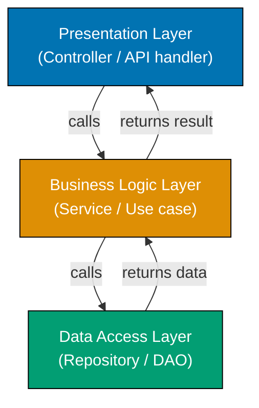
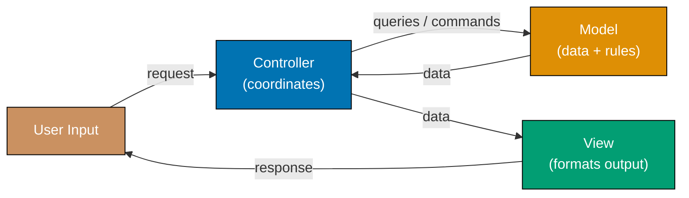
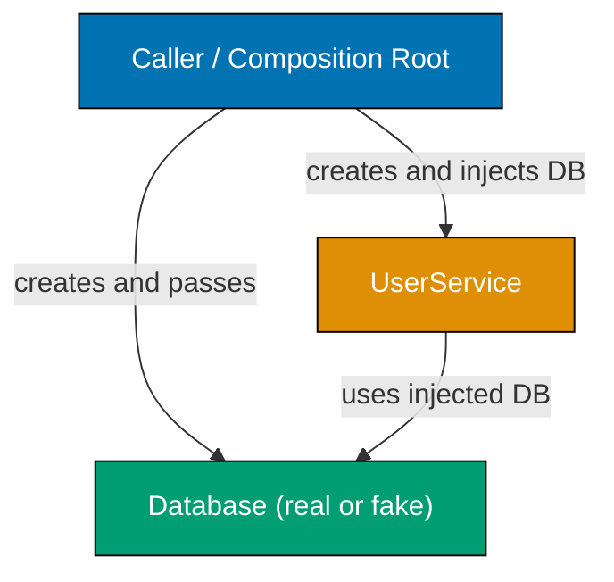
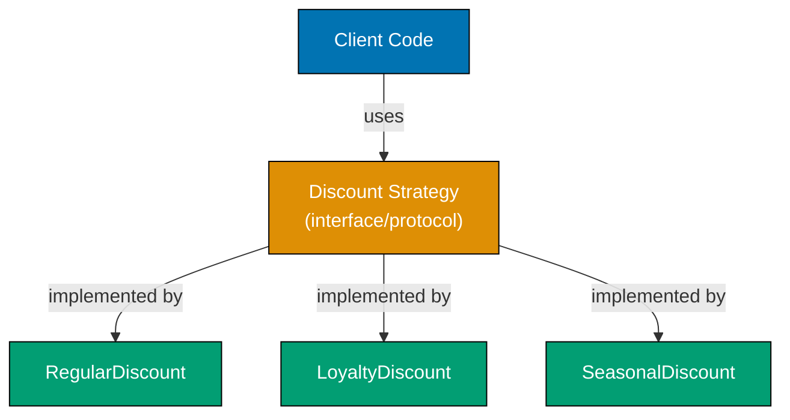
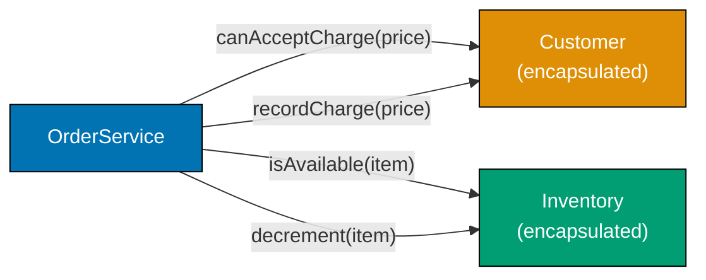
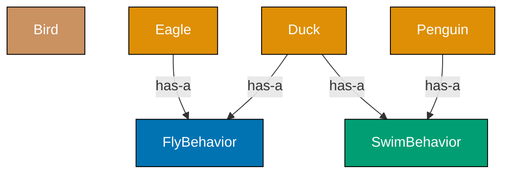
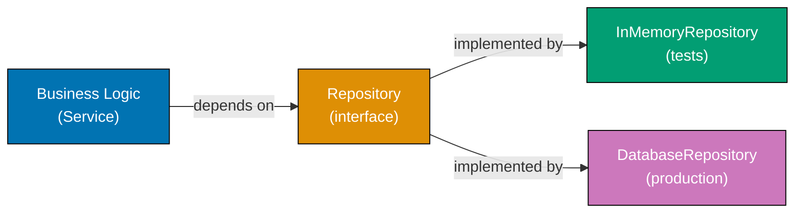
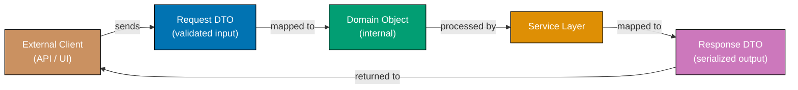
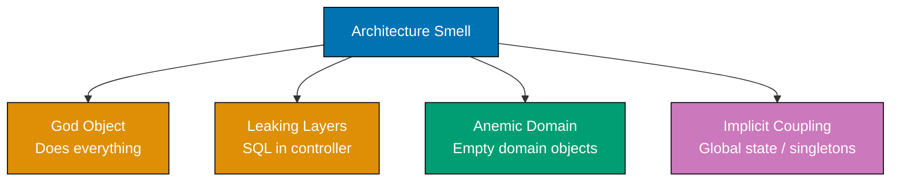

This beginner level covers Examples 1-28, reaching approximately 0-35% of software architecture fundamentals. Each example demonstrates a core architectural concept using Python or TypeScript with self-contained, runnable code. These examples target developers who already know at least one language and want to rapidly build architectural instincts through working code.

## Separation of Concerns

### Example 1: No Separation vs. Clear Separation

Separation of concerns means grouping code by responsibility so that each module handles exactly one aspect of the system. When multiple responsibilities mix in one function, changing any part risks breaking the others.

**Tightly coupled approach (no separation):**




```java
// => This method handles THREE distinct responsibilities at once:
// => 1. Data access (reading from a map)
// => 2. Business logic (computing discount)
// => 3. Presentation (formatting a string for display)
import java.util.Map;

public class CoupledExample {
    public static String getUserDiscountMessage(int userId) {
        // => userDb simulates a database lookup — data access concern
        Map<Integer, Map<String, Object>> userDb = Map.of(
            1, Map.of("name", "Alice", "purchases", 12)
        );
        // => user is {"name": "Alice", "purchases": 12}
        Map<String, Object> user = userDb.get(userId);
        // => Business rule embedded directly here — hard to change independently
        double discount = ((int) user.get("purchases") > 10) ? 0.15 : 0.05;
        // => discount is 0.15 (15%) because purchases > 10
        // => Presentation formatted inline — impossible to reuse discount logic elsewhere
        return String.format("Hello %s, your discount is %.0f%%", user.get("name"), discount * 100);
        // => Output: "Hello Alice, your discount is 15%"
    }
}
```




```kotlin
// => This function handles THREE distinct responsibilities at once:
// => 1. Data access (reading from a map)
// => 2. Business logic (computing discount)
// => 3. Presentation (formatting a string for display)
fun getUserDiscountMessage(userId: Int): String {
    // => userDb simulates a database lookup — data access concern
    val userDb = mapOf(1 to mapOf("name" to "Alice", "purchases" to 12))
    // => user is {"name": "Alice", "purchases": 12}
    val user = userDb[userId]!!
    // => Business rule embedded directly here — hard to change independently
    val discount = if ((user["purchases"] as Int) > 10) 0.15 else 0.05
    // => discount is 0.15 (15%) because purchases > 10
    // => Presentation formatted inline — impossible to reuse discount logic elsewhere
    return "Hello ${user["name"]}, your discount is ${"%.0f".format(discount * 100)}%"
    // => Output: "Hello Alice, your discount is 15%"
}
```




```csharp
// => This method handles THREE distinct responsibilities at once:
// => 1. Data access (reading from a dictionary)
// => 2. Business logic (computing discount)
// => 3. Presentation (formatting a string for display)
using System.Collections.Generic;

public class CoupledExample
{
    public static string GetUserDiscountMessage(int userId)
    {
        // => userDb simulates a database lookup — data access concern
        var userDb = new Dictionary<int, Dictionary<string, object>>
        {
            { 1, new Dictionary<string, object> { { "name", "Alice" }, { "purchases", 12 } } }
        };
        // => user is {"name": "Alice", "purchases": 12}
        var user = userDb[userId];
        // => Business rule embedded directly here — hard to change independently
        double discount = (int)user["purchases"] > 10 ? 0.15 : 0.05;
        // => discount is 0.15 (15%) because purchases > 10
        // => Presentation formatted inline — impossible to reuse discount logic elsewhere
        return $"Hello {user["name"]}, your discount is {discount * 100:F0}%";
        // => Output: "Hello Alice, your discount is 15%"
    }
}
```




Mixing all three responsibilities means any change — a new discount rule, a different greeting format, or a different data source — requires editing the same function.

**Separated approach (three distinct layers):**




```java
// => DATA ACCESS — only knows how to retrieve users
import java.util.Map;

public class SeparatedExample {
    private static final Map<Integer, Map<String, Object>> USER_DB =
        Map.of(1, Map.of("name", "Alice", "purchases", 12));

    static Map<String, Object> findUser(int userId) {
        return USER_DB.get(userId);   // => returns user map or null
    }

    // => BUSINESS LOGIC — only knows discount rules, not storage or display
    static double calculateDiscount(int purchases) {
        if (purchases > 10) return 0.15;   // => 15% for loyal customers (>10 purchases)
        return 0.05;                        // => 5% default discount
    }

    // => PRESENTATION — only knows how to format, not how to compute or fetch
    static String formatDiscountMessage(String name, double discount) {
        return String.format("Hello %s, your discount is %.0f%%", name, discount * 100);
        // => Output: "Hello Alice, your discount is 15%"
    }

    // => ORCHESTRATION — thin coordinator that wires the three layers together
    public static String getUserDiscountMessage(int userId) {
        Map<String, Object> user = findUser(userId);      // => delegates data access
        double discount = calculateDiscount((int) user.get("purchases")); // => delegates business rule
        return formatDiscountMessage((String) user.get("name"), discount); // => delegates formatting
    }

    public static void main(String[] args) {
        System.out.println(getUserDiscountMessage(1));
        // => Output: Hello Alice, your discount is 15%
    }
}
```




```kotlin
// => DATA ACCESS — only knows how to retrieve users
val userDb = mapOf(1 to mapOf("name" to "Alice", "purchases" to 12))

fun findUser(userId: Int): Map<String, Any>? = userDb[userId]
// => returns user map or null

// => BUSINESS LOGIC — only knows discount rules, not storage or display
fun calculateDiscount(purchases: Int): Double {
    if (purchases > 10) return 0.15   // => 15% for loyal customers (>10 purchases)
    return 0.05                        // => 5% default discount
}

// => PRESENTATION — only knows how to format, not how to compute or fetch
fun formatDiscountMessage(name: String, discount: Double): String {
    return "Hello $name, your discount is ${"%.0f".format(discount * 100)}%"
    // => Output: "Hello Alice, your discount is 15%"
}

// => ORCHESTRATION — thin coordinator that wires the three layers together
fun getUserDiscountMessage(userId: Int): String {
    val user = findUser(userId)!!                       // => delegates data access
    val discount = calculateDiscount(user["purchases"] as Int) // => delegates business rule
    return formatDiscountMessage(user["name"] as String, discount) // => delegates formatting
}

fun main() {
    println(getUserDiscountMessage(1))
    // => Output: Hello Alice, your discount is 15%
}
```




```csharp
// => DATA ACCESS — only knows how to retrieve users
using System.Collections.Generic;

public class SeparatedExample
{
    private static readonly Dictionary<int, Dictionary<string, object>> UserDb =
        new() { { 1, new() { { "name", "Alice" }, { "purchases", 12 } } } };

    static Dictionary<string, object>? FindUser(int userId) =>
        UserDb.TryGetValue(userId, out var user) ? user : null;
    // => returns user dict or null

    // => BUSINESS LOGIC — only knows discount rules, not storage or display
    static double CalculateDiscount(int purchases)
    {
        if (purchases > 10) return 0.15;   // => 15% for loyal customers (>10 purchases)
        return 0.05;                        // => 5% default discount
    }

    // => PRESENTATION — only knows how to format, not how to compute or fetch
    static string FormatDiscountMessage(string name, double discount) =>
        $"Hello {name}, your discount is {discount * 100:F0}%";
    // => Output: "Hello Alice, your discount is 15%"

    // => ORCHESTRATION — thin coordinator that wires the three layers together
    public static string GetUserDiscountMessage(int userId)
    {
        var user = FindUser(userId)!;                             // => delegates data access
        var discount = CalculateDiscount((int)user["purchases"]); // => delegates business rule
        return FormatDiscountMessage((string)user["name"], discount); // => delegates formatting
    }

    public static void Main()
    {
        System.Console.WriteLine(GetUserDiscountMessage(1));
        // => Output: Hello Alice, your discount is 15%
    }
}
```




Each function now has one reason to change: swap the database without touching the discount rule, change the discount formula without touching the message format.

**Key Takeaway:** Separate each distinct responsibility into its own function or module. A function should have exactly one reason to change.

**Why It Matters:** In production systems, business rules change far more often than data storage technology, and display formats change more often than both. When these concerns are mixed, a simple business rule change forces a full regression test of the display layer. Separating concerns so each layer evolves independently is what enables high-frequency, safe deployment pipelines.

---

### Example 2: Single Responsibility Principle

The Single Responsibility Principle (SRP) states that a class or module should have one and only one reason to change. Violating SRP creates fragile code where an unrelated change breaks a seemingly unrelated feature.

**Violating SRP — one class does too much:**




```java
// => UserManager handles user data AND email sending AND password logic
// => This class has THREE reasons to change: user schema, email templates, auth rules
import java.util.HashMap;
import java.util.Map;
import java.util.UUID;

public class UserManager {
    private final Map<Integer, Map<String, String>> users = new HashMap<>();
    // => users stores id → { "name": ..., "email": ... }

    public void addUser(int id, String name, String email) {
        users.put(id, Map.of("name", name, "email", email));
        // => stores user under id key
    }

    // => EMAIL CONCERN embedded in user class — mixing responsibilities
    public void sendWelcomeEmail(int userId) {
        Map<String, String> user = users.get(userId); // => retrieves user or null
        if (user != null) {
            System.out.println("Sending email to " + user.get("email") + ": Welcome, " + user.get("name") + "!");
            // => Output: Sending email to alice@example.com: Welcome, Alice!
        }
    }

    // => PASSWORD CONCERN also embedded — a third responsibility
    public String resetPassword(int userId) {
        String newPassword = UUID.randomUUID().toString().substring(0, 8);
        // => newPassword is a random 8-char string like "a3f9c2b1"
        System.out.println("Password reset for user " + userId + ": " + newPassword);
        return newPassword; // => returns the new password string
    }
}
```




```kotlin
// => UserManager handles user data AND email sending AND password logic
// => This class has THREE reasons to change: user schema, email templates, auth rules
import java.util.UUID

class UserManager {
    private val users = mutableMapOf<Int, Map<String, String>>()
    // => users stores id → { "name": ..., "email": ... }

    fun addUser(id: Int, name: String, email: String) {
        users[id] = mapOf("name" to name, "email" to email)
        // => stores user under id key
    }

    // => EMAIL CONCERN embedded in user class — mixing responsibilities
    fun sendWelcomeEmail(userId: Int) {
        val user = users[userId]  // => retrieves user or null
        if (user != null) {
            println("Sending email to ${user["email"]}: Welcome, ${user["name"]}!")
            // => Output: Sending email to alice@example.com: Welcome, Alice!
        }
    }

    // => PASSWORD CONCERN also embedded — a third responsibility
    fun resetPassword(userId: Int): String {
        val newPassword = UUID.randomUUID().toString().substring(0, 8)
        // => newPassword is a random 8-char string
        println("Password reset for user $userId: $newPassword")
        return newPassword  // => returns the new password string
    }
}
```




```csharp
// => UserManager handles user data AND email sending AND password logic
// => This class has THREE reasons to change: user schema, email templates, auth rules
using System;
using System.Collections.Generic;

public class UserManager
{
    private readonly Dictionary<int, (string Name, string Email)> _users = new();
    // => _users stores id → (Name, Email) value tuple

    public void AddUser(int id, string name, string email)
    {
        _users[id] = (name, email); // => stores user under id key
    }

    // => EMAIL CONCERN embedded in user class — mixing responsibilities
    public void SendWelcomeEmail(int userId)
    {
        if (_users.TryGetValue(userId, out var user)) // => retrieves user or default
        {
            Console.WriteLine($"Sending email to {user.Email}: Welcome, {user.Name}!");
            // => Output: Sending email to alice@example.com: Welcome, Alice!
        }
    }

    // => PASSWORD CONCERN also embedded — a third responsibility
    public string ResetPassword(int userId)
    {
        string newPassword = Guid.NewGuid().ToString("N")[..8];
        // => newPassword is a random 8-char hex string
        Console.WriteLine($"Password reset for user {userId}: {newPassword}");
        return newPassword; // => returns the new password string
    }
}
```




**Applying SRP — one class, one responsibility:**




```java
// => RESPONSIBILITY 1: User data management only
import java.util.HashMap;
import java.util.Map;
import java.util.UUID;

class UserRepository {
    private final Map<Integer, Map<String, String>> users = new HashMap<>();

    public void add(int id, String name, String email) {
        users.put(id, Map.of("name", name, "email", email));
        // => stores user record under id key
    }

    public Map<String, String> get(int id) {
        return users.get(id); // => returns user map or null
    }
}

// => RESPONSIBILITY 2: Email notifications only
class EmailService {
    public void sendWelcome(String name, String email) {
        System.out.println("Sending email to " + email + ": Welcome, " + name + "!");
        // => Output: Sending email to alice@example.com: Welcome, Alice!
    }
}

// => RESPONSIBILITY 3: Password management only
class PasswordService {
    public String reset(int userId) {
        String newPassword = UUID.randomUUID().toString().substring(0, 8);
        // => newPassword is a random 8-char string
        System.out.println("Password reset for user " + userId + ": " + newPassword);
        return newPassword; // => returns the generated password
    }
}
```




```kotlin
// => RESPONSIBILITY 1: User data management only
import java.util.UUID

class UserRepository {
    private val users = mutableMapOf<Int, Map<String, String>>()

    fun add(id: Int, name: String, email: String) {
        users[id] = mapOf("name" to name, "email" to email)
        // => stores user record under id key
    }

    fun get(id: Int): Map<String, String>? = users[id]
    // => returns user map or null
}

// => RESPONSIBILITY 2: Email notifications only
class EmailService {
    fun sendWelcome(name: String, email: String) {
        println("Sending email to $email: Welcome, $name!")
        // => Output: Sending email to alice@example.com: Welcome, Alice!
    }
}

// => RESPONSIBILITY 3: Password management only
class PasswordService {
    fun reset(userId: Int): String {
        val newPassword = UUID.randomUUID().toString().substring(0, 8)
        // => newPassword is a random 8-char string
        println("Password reset for user $userId: $newPassword")
        return newPassword  // => returns the generated password
    }
}
```




```csharp
// => RESPONSIBILITY 1: User data management only
using System;
using System.Collections.Generic;

class UserRepository
{
    private readonly Dictionary<int, (string Name, string Email)> _users = new();

    public void Add(int id, string name, string email)
    {
        _users[id] = (name, email); // => stores user record
    }

    public (string Name, string Email)? Get(int id) =>
        _users.TryGetValue(id, out var u) ? u : null;
    // => returns user tuple or null
}

// => RESPONSIBILITY 2: Email notifications only
class EmailService
{
    public void SendWelcome(string name, string email)
    {
        Console.WriteLine($"Sending email to {email}: Welcome, {name}!");
        // => Output: Sending email to alice@example.com: Welcome, Alice!
    }
}

// => RESPONSIBILITY 3: Password management only
class PasswordService
{
    public string Reset(int userId)
    {
        string newPassword = Guid.NewGuid().ToString("N")[..8];
        // => newPassword is a random 8-char hex string
        Console.WriteLine($"Password reset for user {userId}: {newPassword}");
        return newPassword; // => returns the generated password
    }
}
```




**Key Takeaway:** Each class should have exactly one reason to change. When you add email template logic, only `EmailService` changes. When you change password policy, only `PasswordService` changes.

**Why It Matters:** SRP is the foundational principle behind microservices: each service owns one business capability. Teams that own single-responsibility services deploy independently, reducing the coordination overhead that kills engineering velocity at scale. When a class has multiple reasons to change, every change carries the risk of breaking an unrelated concern within the same unit.

---

## Layered Architecture

### Example 3: Three-Layer Architecture

A layered architecture organizes code into a presentation layer (handles user interaction), a business logic layer (enforces rules), and a data access layer (manages persistence). Layers only communicate downward — presentation calls business logic, business logic calls data access, never the reverse.






```java
// ============================================================
// DATA ACCESS LAYER — only knows about storage
// ============================================================
import java.util.Map;
import java.util.Optional;

record Product(int id, String name, double price, int stock) {}

class ProductRepository {
    // => in-memory store simulating a database table
    private final Map<Integer, Product> products = Map.of(
        1, new Product(1, "Laptop", 1200.0, 5),
        2, new Product(2, "Mouse",  25.0,   0)
    );

    Optional<Product> findById(int productId) {
        return Optional.ofNullable(products.get(productId));
        // => returns Optional.of(product) or Optional.empty()
    }
}

// ============================================================
// BUSINESS LOGIC LAYER — only knows about rules
// ============================================================
class ProductService {
    private final ProductRepository repo;
    // => repo is injected, not created here (dependency injection)

    ProductService(ProductRepository repo) { this.repo = repo; }

    Product getAvailableProduct(int productId) {
        Product product = repo.findById(productId)
            .orElseThrow(() -> new IllegalArgumentException("Product " + productId + " not found"));
        // => throws if not found — presentation layer will catch this
        if (product.stock() == 0) {
            throw new IllegalStateException("Product '" + product.name() + "' is out of stock");
            // => business rule: zero stock means unavailable
        }
        return product; // => returns valid product
    }
}

// ============================================================
// PRESENTATION LAYER — only knows about formatting responses
// ============================================================
class ProductController {
    static String handleGetProduct(int productId) {
        ProductRepository repo = new ProductRepository();  // => creates data layer
        ProductService service = new ProductService(repo); // => creates business layer, injects repo
        try {
            Product p = service.getAvailableProduct(productId);
            // => delegates all business logic to service
            return String.format("Available: %s at $%.2f", p.name(), p.price());
            // => Output (id=1): "Available: Laptop at $1200.00"
        } catch (Exception e) {
            return "Error: " + e.getMessage();
            // => Output (id=2): "Error: Product 'Mouse' is out of stock"
        }
    }

    public static void main(String[] args) {
        System.out.println(handleGetProduct(1)); // => Available: Laptop at $1200.00
        System.out.println(handleGetProduct(2)); // => Error: Product 'Mouse' is out of stock
    }
}
```




```kotlin
// ============================================================
// DATA ACCESS LAYER — only knows about storage
// ============================================================
data class Product(val id: Int, val name: String, val price: Double, val stock: Int)

class ProductRepository {
    // => in-memory store simulating a database table
    private val products = mapOf(
        1 to Product(1, "Laptop", 1200.0, 5),
        2 to Product(2, "Mouse",  25.0,   0)
    )

    fun findById(productId: Int): Product? = products[productId]
    // => returns product or null if not found
}

// ============================================================
// BUSINESS LOGIC LAYER — only knows about rules
// ============================================================
class ProductService(private val repo: ProductRepository) {
    // => repo is injected via constructor (dependency injection)

    fun getAvailableProduct(productId: Int): Product {
        val product = repo.findById(productId)
            ?: throw IllegalArgumentException("Product $productId not found")
        // => throws if not found — presentation layer will catch this
        if (product.stock == 0) {
            throw IllegalStateException("Product '${product.name}' is out of stock")
            // => business rule: zero stock means unavailable
        }
        return product // => returns valid product
    }
}

// ============================================================
// PRESENTATION LAYER — only knows about formatting responses
// ============================================================
fun handleGetProduct(productId: Int): String {
    val repo = ProductRepository()           // => creates data layer
    val service = ProductService(repo)       // => creates business layer, injects repo
    return try {
        val p = service.getAvailableProduct(productId)
        // => delegates all business logic to service
        "Available: ${p.name} at $${"%.2f".format(p.price)}"
        // => Output (id=1): "Available: Laptop at $1200.00"
    } catch (e: Exception) {
        "Error: ${e.message}"
        // => Output (id=2): "Error: Product 'Mouse' is out of stock"
    }
}

fun main() {
    println(handleGetProduct(1)) // => Available: Laptop at $1200.00
    println(handleGetProduct(2)) // => Error: Product 'Mouse' is out of stock
}
```




```csharp
// ============================================================
// DATA ACCESS LAYER — only knows about storage
// ============================================================
using System;
using System.Collections.Generic;

record Product(int Id, string Name, double Price, int Stock);

class ProductRepository
{
    // => in-memory store simulating a database table
    private readonly Dictionary<int, Product> _products = new()
    {
        { 1, new Product(1, "Laptop", 1200.0, 5) },
        { 2, new Product(2, "Mouse",  25.0,   0) }
    };

    public Product? FindById(int productId) =>
        _products.TryGetValue(productId, out var p) ? p : null;
    // => returns product or null if not found
}

// ============================================================
// BUSINESS LOGIC LAYER — only knows about rules
// ============================================================
class ProductService
{
    private readonly ProductRepository _repo;
    // => _repo is injected, not created here (dependency injection)

    public ProductService(ProductRepository repo) { _repo = repo; }

    public Product GetAvailableProduct(int productId)
    {
        var product = _repo.FindById(productId)
            ?? throw new ArgumentException($"Product {productId} not found");
        // => throws if not found — presentation layer will catch this
        if (product.Stock == 0)
            throw new InvalidOperationException($"Product '{product.Name}' is out of stock");
            // => business rule: zero stock means unavailable
        return product; // => returns valid product
    }
}

// ============================================================
// PRESENTATION LAYER — only knows about formatting responses
// ============================================================
class ProductController
{
    static string HandleGetProduct(int productId)
    {
        var repo = new ProductRepository();           // => creates data layer
        var service = new ProductService(repo);       // => creates business layer, injects repo
        try
        {
            var p = service.GetAvailableProduct(productId);
            // => delegates all business logic to service
            return $"Available: {p.Name} at ${p.Price:F2}";
            // => Output (id=1): "Available: Laptop at $1200.00"
        }
        catch (Exception e)
        {
            return $"Error: {e.Message}";
            // => Output (id=2): "Error: Product 'Mouse' is out of stock"
        }
    }

    static void Main()
    {
        Console.WriteLine(HandleGetProduct(1)); // => Available: Laptop at $1200.00
        Console.WriteLine(HandleGetProduct(2)); // => Error: Product 'Mouse' is out of stock
    }
}
```




**Key Takeaway:** Each layer communicates only with the layer directly below it. Presentation never touches the database; data access never formats strings for users.

**Why It Matters:** Layered architecture is the default starting pattern for most enterprise systems (Spring MVC, Django, Rails all enforce it). It enables parallel development — a frontend team can build against an agreed service API while a backend team implements the business rules — and makes testing each layer independently straightforward.

---

### Example 4: Presentation Layer Isolation

The presentation layer should translate raw input into domain calls and translate domain results into output format. It should contain no business logic and no data access code.




```java
// => DATA LAYER — retrieves raw records
import java.util.Map;
import java.util.Optional;

record Order(int id, double total, String status) {}

class OrderRepository {
    // => orderDb simulates a database table with two records
    private static final Map<Integer, Order> ORDER_DB = Map.of(
        101, new Order(101, 299.99, "shipped"),
        102, new Order(102, 49.0,  "pending")
    );

    static Optional<Order> findOrder(int id) {
        return Optional.ofNullable(ORDER_DB.get(id));
        // => returns Optional.of(order) or Optional.empty()
    }
}

// => BUSINESS LAYER — applies domain rules
class OrderRules {
    static boolean isEligibleForCancellation(Order order) {
        return order.status().equals("pending") && order.total() < 500;
        // => true only when pending AND total below cancellation threshold
    }
}

// => PRESENTATION LAYER — translates, never decides
class OrderController {
    static String handleCancelRequest(int orderId) {
        Optional<Order> maybeOrder = OrderRepository.findOrder(orderId);
        // => fetches from data layer
        if (maybeOrder.isEmpty()) {
            return "Order " + orderId + " not found";
            // => presentation transforms absence to user-readable message
        }
        Order order = maybeOrder.get();
        boolean eligible = OrderRules.isEligibleForCancellation(order);
        // => business logic evaluated in business layer, result consumed here
        if (eligible) {
            return "Order " + orderId + " cancelled successfully";
            // => Output (id=102): "Order 102 cancelled successfully"
        }
        return "Order " + orderId + " cannot be cancelled (status: " + order.status() + ")";
        // => Output (id=101): "Order 101 cannot be cancelled (status: shipped)"
    }

    public static void main(String[] args) {
        System.out.println(handleCancelRequest(101)); // => Order 101 cannot be cancelled (status: shipped)
        System.out.println(handleCancelRequest(102)); // => Order 102 cancelled successfully
        System.out.println(handleCancelRequest(999)); // => Order 999 not found
    }
}
```




```kotlin
// => DATA LAYER — retrieves raw records
data class Order(val id: Int, val total: Double, val status: String)

// => orderDb simulates a database table with two records
val orderDb = mapOf(
    101 to Order(101, 299.99, "shipped"),
    102 to Order(102, 49.0,  "pending")
)

fun findOrder(id: Int): Order? = orderDb[id]
// => returns order or null

// => BUSINESS LAYER — applies domain rules
fun isEligibleForCancellation(order: Order): Boolean {
    return order.status == "pending" && order.total < 500
    // => true only when pending AND total below cancellation threshold
}

// => PRESENTATION LAYER — translates, never decides
fun handleCancelRequest(orderId: Int): String {
    val order = findOrder(orderId) // => fetches from data layer
        ?: return "Order $orderId not found"
    // => presentation transforms null to user-readable message
    val eligible = isEligibleForCancellation(order)
    // => business logic evaluated in business layer, result consumed here
    return if (eligible) {
        "Order $orderId cancelled successfully"
        // => Output (id=102): "Order 102 cancelled successfully"
    } else {
        "Order $orderId cannot be cancelled (status: ${order.status})"
        // => Output (id=101): "Order 101 cannot be cancelled (status: shipped)"
    }
}

fun main() {
    println(handleCancelRequest(101)) // => Order 101 cannot be cancelled (status: shipped)
    println(handleCancelRequest(102)) // => Order 102 cancelled successfully
    println(handleCancelRequest(999)) // => Order 999 not found
}
```




```csharp
// => DATA LAYER — retrieves raw records
using System;
using System.Collections.Generic;

record Order(int Id, double Total, string Status);

class OrderRepository
{
    // => _orderDb simulates a database table with two records
    private static readonly Dictionary<int, Order> OrderDb = new()
    {
        { 101, new Order(101, 299.99, "shipped") },
        { 102, new Order(102, 49.0,  "pending")  }
    };

    public static Order? FindOrder(int id) =>
        OrderDb.TryGetValue(id, out var o) ? o : null;
    // => returns order or null
}

// => BUSINESS LAYER — applies domain rules
static class OrderRules
{
    public static bool IsEligibleForCancellation(Order order) =>
        order.Status == "pending" && order.Total < 500;
    // => true only when pending AND total below cancellation threshold
}

// => PRESENTATION LAYER — translates, never decides
class OrderController
{
    static string HandleCancelRequest(int orderId)
    {
        var order = OrderRepository.FindOrder(orderId);
        // => fetches from data layer
        if (order is null)
            return $"Order {orderId} not found";
        // => presentation transforms null to user-readable message
        bool eligible = OrderRules.IsEligibleForCancellation(order);
        // => business logic evaluated in business layer, result consumed here
        return eligible
            ? $"Order {orderId} cancelled successfully"
            // => Output (id=102): "Order 102 cancelled successfully"
            : $"Order {orderId} cannot be cancelled (status: {order.Status})";
            // => Output (id=101): "Order 101 cannot be cancelled (status: shipped)"
    }

    static void Main()
    {
        Console.WriteLine(HandleCancelRequest(101)); // => Order 101 cannot be cancelled (status: shipped)
        Console.WriteLine(HandleCancelRequest(102)); // => Order 102 cancelled successfully
        Console.WriteLine(HandleCancelRequest(999)); // => Order 999 not found
    }
}
```




**Key Takeaway:** The presentation layer transforms but never decides. All decisions live in the business layer where they can be tested without a UI or HTTP context.

**Why It Matters:** Teams that keep business logic out of controllers can test their entire rule set with fast in-memory unit tests. When the presentation layer grows — mobile app, CLI tool, REST API — the business layer requires zero modification. A single stable business layer serving multiple client types is only achievable when no presentation logic has leaked into it.

---

## MVC Pattern

### Example 5: Model-View-Controller Basics

MVC separates a program into a Model (data and rules), a View (formatting output), and a Controller (coordinating input and response). The Controller receives input, asks the Model to process it, then passes results to the View for display.






```java
// ============================================================
// MODEL — data container + business validation
// ============================================================
import java.util.ArrayList;
import java.util.List;

class TodoModel {
    record TodoItem(int id, String title, boolean done) {
        TodoItem withDone() { return new TodoItem(id, title, true); }
        // => creates a new record with done=true (records are immutable)
    }

    private final List<TodoItem> items = new ArrayList<>();
    // => internal list of todo items
    private int nextId = 1;
    // => auto-incrementing id counter

    TodoItem add(String title) {
        TodoItem item = new TodoItem(nextId++, title, false);
        // => item is TodoItem(id=1, title="Buy milk", done=false)
        items.add(item);   // => appended to internal list
        return item;       // => returns the created item
    }

    List<TodoItem> getAll() {
        return List.copyOf(items); // => returns unmodifiable copy to prevent mutation
    }

    boolean complete(int itemId) {
        for (int i = 0; i < items.size(); i++) {
            if (items.get(i).id() == itemId) {
                items.set(i, items.get(i).withDone()); // => replaces with done=true copy
                return true;   // => returns true = success
            }
        }
        return false; // => returns false = item not found
    }
}

// ============================================================
// VIEW — formats data for display, no logic
// ============================================================
class TodoView {
    String renderList(List<TodoModel.TodoItem> items) {
        if (items.isEmpty()) return "No todos yet.";
        // => Output when empty list
        StringBuilder sb = new StringBuilder();
        for (TodoModel.TodoItem item : items) {
            String status = item.done() ? "✓" : "○";
            // => status is "✓" for done items, "○" for pending
            sb.append("[").append(status).append("] ")
              .append(item.id()).append(". ").append(item.title()).append("\n");
        }
        return sb.toString().trim(); // => joined with newlines
    }

    String renderCreated(TodoModel.TodoItem item) {
        return "Created todo #" + item.id() + ": " + item.title();
        // => Output: "Created todo #1: Buy milk"
    }
}

// ============================================================
// CONTROLLER — coordinates model and view
// ============================================================
class TodoController {
    private final TodoModel model; // => stores model reference
    private final TodoView view;   // => stores view reference

    TodoController(TodoModel model, TodoView view) {
        this.model = model;
        this.view  = view;
    }

    String create(String title) {
        TodoModel.TodoItem item = model.add(title); // => delegates creation to model
        return view.renderCreated(item);             // => delegates formatting to view
    }

    String listAll() {
        return view.renderList(model.getAll());
        // => fetches all items from model, delegates rendering to view
    }

    String done(int itemId) {
        boolean success = model.complete(itemId); // => delegates completion to model
        return success ? "Todo #" + itemId + " marked as done"
                       : "Todo #" + itemId + " not found";
    }

    public static void main(String[] args) {
        // => Wire the MVC triad together
        TodoModel model = new TodoModel();
        TodoView  view  = new TodoView();
        TodoController controller = new TodoController(model, view);

        System.out.println(controller.create("Buy milk"));    // => Created todo #1: Buy milk
        System.out.println(controller.create("Write tests")); // => Created todo #2: Write tests
        System.out.println(controller.done(1));               // => Todo #1 marked as done
        System.out.println(controller.listAll());
        // => [✓] 1. Buy milk
        // => [○] 2. Write tests
    }
}
```




```kotlin
// ============================================================
// MODEL — data container + business validation
// ============================================================
data class TodoItem(val id: Int, val title: String, val done: Boolean)

class TodoModel {
    private val items = mutableListOf<TodoItem>()
    // => internal list of todo items
    private var nextId = 1
    // => auto-incrementing id counter

    fun add(title: String): TodoItem {
        val item = TodoItem(nextId++, title, false)
        // => item is TodoItem(id=1, title="Buy milk", done=false)
        items.add(item)   // => appended to internal list
        return item       // => returns the created item
    }

    fun getAll(): List<TodoItem> = items.toList()
    // => returns a copy to prevent external mutation

    fun complete(itemId: Int): Boolean {
        val index = items.indexOfFirst { it.id == itemId }
        // => finds index of matching item, -1 if not found
        if (index == -1) return false  // => returns false = item not found
        items[index] = items[index].copy(done = true)
        // => replaces with done=true copy (data classes are immutable-friendly)
        return true // => returns true = success
    }
}

// ============================================================
// VIEW — formats data for display, no logic
// ============================================================
class TodoView {
    fun renderList(items: List<TodoItem>): String {
        if (items.isEmpty()) return "No todos yet."
        // => Output when empty list
        return items.joinToString("\n") { item ->
            val status = if (item.done) "✓" else "○"
            // => status is "✓" for done items, "○" for pending
            "[${status}] ${item.id}. ${item.title}"
        }
        // => joined with newlines
    }

    fun renderCreated(item: TodoItem): String {
        return "Created todo #${item.id}: ${item.title}"
        // => Output: "Created todo #1: Buy milk"
    }
}

// ============================================================
// CONTROLLER — coordinates model and view
// ============================================================
class TodoController(private val model: TodoModel, private val view: TodoView) {
    // => model and view are injected — controller never creates them

    fun create(title: String): String {
        val item = model.add(title)    // => delegates creation to model
        return view.renderCreated(item) // => delegates formatting to view
    }

    fun listAll(): String = view.renderList(model.getAll())
    // => fetches all items from model, delegates rendering to view

    fun done(itemId: Int): String {
        val success = model.complete(itemId) // => delegates completion to model
        return if (success) "Todo #$itemId marked as done" else "Todo #$itemId not found"
    }
}

fun main() {
    // => Wire the MVC triad together
    val model = TodoModel()
    val view  = TodoView()
    val controller = TodoController(model, view)

    println(controller.create("Buy milk"))    // => Created todo #1: Buy milk
    println(controller.create("Write tests")) // => Created todo #2: Write tests
    println(controller.done(1))               // => Todo #1 marked as done
    println(controller.listAll())
    // => [✓] 1. Buy milk
    // => [○] 2. Write tests
}
```




```csharp
// ============================================================
// MODEL — data container + business validation
// ============================================================
using System;
using System.Collections.Generic;
using System.Linq;
using System.Text;

record TodoItem(int Id, string Title, bool Done);

class TodoModel
{
    private readonly List<TodoItem> _items = new();
    // => internal list of todo items
    private int _nextId = 1;
    // => auto-incrementing id counter

    public TodoItem Add(string title)
    {
        var item = new TodoItem(_nextId++, title, false);
        // => item is TodoItem(Id=1, Title="Buy milk", Done=false)
        _items.Add(item);  // => appended to internal list
        return item;       // => returns the created item
    }

    public IReadOnlyList<TodoItem> GetAll() => _items.AsReadOnly();
    // => returns read-only view to prevent external mutation

    public bool Complete(int itemId)
    {
        int index = _items.FindIndex(i => i.Id == itemId);
        // => finds index of matching item, -1 if not found
        if (index == -1) return false; // => returns false = item not found
        _items[index] = _items[index] with { Done = true };
        // => replaces with Done=true copy (records support with-expressions)
        return true; // => returns true = success
    }
}

// ============================================================
// VIEW — formats data for display, no logic
// ============================================================
class TodoView
{
    public string RenderList(IReadOnlyList<TodoItem> items)
    {
        if (items.Count == 0) return "No todos yet.";
        // => Output when empty list
        var sb = new StringBuilder();
        foreach (var item in items)
        {
            string status = item.Done ? "✓" : "○";
            // => status is "✓" for done items, "○" for pending
            sb.AppendLine($"[{status}] {item.Id}. {item.Title}");
        }
        return sb.ToString().TrimEnd(); // => joined with newlines
    }

    public string RenderCreated(TodoItem item) =>
        $"Created todo #{item.Id}: {item.Title}";
    // => Output: "Created todo #1: Buy milk"
}

// ============================================================
// CONTROLLER — coordinates model and view
// ============================================================
class TodoController
{
    private readonly TodoModel _model; // => stores model reference
    private readonly TodoView  _view;  // => stores view reference

    public TodoController(TodoModel model, TodoView view)
    {
        _model = model;
        _view  = view;
    }

    public string Create(string title)
    {
        var item = _model.Add(title);     // => delegates creation to model
        return _view.RenderCreated(item); // => delegates formatting to view
    }

    public string ListAll() => _view.RenderList(_model.GetAll());
    // => fetches all items from model, delegates rendering to view

    public string Done(int itemId)
    {
        bool success = _model.Complete(itemId); // => delegates completion to model
        return success ? $"Todo #{itemId} marked as done" : $"Todo #{itemId} not found";
    }

    static void Main()
    {
        // => Wire the MVC triad together
        var model      = new TodoModel();
        var view       = new TodoView();
        var controller = new TodoController(model, view);

        Console.WriteLine(controller.Create("Buy milk"));    // => Created todo #1: Buy milk
        Console.WriteLine(controller.Create("Write tests")); // => Created todo #2: Write tests
        Console.WriteLine(controller.Done(1));               // => Todo #1 marked as done
        Console.WriteLine(controller.ListAll());
        // => [✓] 1. Buy milk
        // => [○] 2. Write tests
    }
}
```




**Key Takeaway:** The Controller handles input and coordinates. The Model owns data and rules. The View formats output. None of these three should reach into the others' domain.

**Why It Matters:** MVC is the backbone of virtually every web framework (Rails, Django, Laravel, Spring MVC, ASP.NET). Understanding the pure form of MVC lets you debug framework issues quickly and extend frameworks correctly without fighting the intended structure.

---

### Example 6: Model Encapsulates Validation

The Model is responsible for enforcing its own invariants. If validation logic leaks into controllers or views, the same rule must be duplicated everywhere the data is modified, creating drift over time.




```java
// => MODEL with self-contained validation — the model is the single source of truth
public class BankAccount {
    private double balance;               // => private: external code cannot bypass validation
    private static final double MINIMUM_BALANCE = 0; // => business rule: no overdrafts

    public BankAccount(double initialBalance) {
        if (initialBalance < 0) {
            throw new IllegalArgumentException("Initial balance cannot be negative");
            // => enforced at construction time, not by the caller
        }
        this.balance = initialBalance; // => balance is initialBalance (e.g., 100)
    }

    public void deposit(double amount) {
        if (amount <= 0) {
            throw new IllegalArgumentException("Deposit amount must be positive");
            // => model rejects invalid inputs without controller involvement
        }
        balance += amount; // => balance increases by amount
    }

    public void withdraw(double amount) {
        if (amount <= 0) throw new IllegalArgumentException("Withdrawal amount must be positive");
        // => reject non-positive withdrawal at the gate
        if (balance - amount < MINIMUM_BALANCE) {
            throw new IllegalStateException("Insufficient funds: balance is " + balance);
            // => business rule enforced in model, not leaked to controller
        }
        balance -= amount; // => balance decreases by amount
    }

    public double getBalance() { return balance; }
    // => read-only access to private state

    // => CONTROLLER — delegates entirely to model, no duplicate validation
    static String handleWithdraw(BankAccount account, double amount) {
        try {
            account.withdraw(amount); // => model enforces all rules
            return "Withdrawal successful. Balance: $" + account.getBalance();
            // => Output: "Withdrawal successful. Balance: $50.0"
        } catch (Exception e) {
            return "Withdrawal failed: " + e.getMessage();
            // => Output: "Withdrawal failed: Insufficient funds: balance is 50.0"
        }
    }

    public static void main(String[] args) {
        BankAccount account = new BankAccount(100); // => account.balance is 100
        System.out.println(handleWithdraw(account, 50));  // => Withdrawal successful. Balance: $50.0
        System.out.println(handleWithdraw(account, 200)); // => Withdrawal failed: Insufficient funds: balance is 50.0
    }
}
```




```kotlin
// => MODEL with self-contained validation — the model is the single source of truth
class BankAccount(initialBalance: Double) {
    private var balance: Double       // => private: external code cannot bypass validation
    private val minimumBalance = 0.0  // => business rule: no overdrafts

    init {
        if (initialBalance < 0) {
            throw IllegalArgumentException("Initial balance cannot be negative")
            // => enforced at construction time, not by the caller
        }
        balance = initialBalance // => balance is initialBalance (e.g., 100.0)
    }

    fun deposit(amount: Double) {
        if (amount <= 0) throw IllegalArgumentException("Deposit amount must be positive")
        // => model rejects invalid inputs without controller involvement
        balance += amount // => balance increases by amount
    }

    fun withdraw(amount: Double) {
        if (amount <= 0) throw IllegalArgumentException("Withdrawal amount must be positive")
        // => reject non-positive withdrawal at the gate
        if (balance - amount < minimumBalance) {
            throw IllegalStateException("Insufficient funds: balance is $balance")
            // => business rule enforced in model, not leaked to controller
        }
        balance -= amount // => balance decreases by amount
    }

    fun getBalance(): Double = balance
    // => read-only access to private state
}

// => CONTROLLER — delegates entirely to model, no duplicate validation
fun handleWithdraw(account: BankAccount, amount: Double): String {
    return try {
        account.withdraw(amount) // => model enforces all rules
        "Withdrawal successful. Balance: $${account.getBalance()}"
        // => Output: "Withdrawal successful. Balance: $50.0"
    } catch (e: Exception) {
        "Withdrawal failed: ${e.message}"
        // => Output: "Withdrawal failed: Insufficient funds: balance is 50.0"
    }
}

fun main() {
    val account = BankAccount(100.0) // => account.balance is 100.0
    println(handleWithdraw(account, 50.0))  // => Withdrawal successful. Balance: $50.0
    println(handleWithdraw(account, 200.0)) // => Withdrawal failed: Insufficient funds: balance is 50.0
}
```




```csharp
// => MODEL with self-contained validation — the model is the single source of truth
using System;

public class BankAccount
{
    private decimal _balance;                      // => private: external code cannot bypass validation
    private const decimal MinimumBalance = 0m;     // => business rule: no overdrafts

    public BankAccount(decimal initialBalance)
    {
        if (initialBalance < 0)
            throw new ArgumentException("Initial balance cannot be negative");
        // => enforced at construction time, not by the caller
        _balance = initialBalance; // => _balance is initialBalance (e.g., 100)
    }

    public void Deposit(decimal amount)
    {
        if (amount <= 0)
            throw new ArgumentException("Deposit amount must be positive");
        // => model rejects invalid inputs without controller involvement
        _balance += amount; // => _balance increases by amount
    }

    public void Withdraw(decimal amount)
    {
        if (amount <= 0) throw new ArgumentException("Withdrawal amount must be positive");
        // => reject non-positive withdrawal at the gate
        if (_balance - amount < MinimumBalance)
            throw new InvalidOperationException($"Insufficient funds: balance is {_balance}");
        // => business rule enforced in model, not leaked to controller
        _balance -= amount; // => _balance decreases by amount
    }

    public decimal GetBalance() => _balance;
    // => read-only access to private state

    // => CONTROLLER — delegates entirely to model, no duplicate validation
    static string HandleWithdraw(BankAccount account, decimal amount)
    {
        try
        {
            account.Withdraw(amount); // => model enforces all rules
            return $"Withdrawal successful. Balance: ${account.GetBalance()}";
            // => Output: "Withdrawal successful. Balance: $50"
        }
        catch (Exception e)
        {
            return $"Withdrawal failed: {e.Message}";
            // => Output: "Withdrawal failed: Insufficient funds: balance is 50"
        }
    }

    static void Main()
    {
        var account = new BankAccount(100m); // => account._balance is 100
        Console.WriteLine(HandleWithdraw(account, 50m));  // => Withdrawal successful. Balance: $50
        Console.WriteLine(HandleWithdraw(account, 200m)); // => Withdrawal failed: Insufficient funds: balance is 50
    }
}
```




**Key Takeaway:** Models that enforce their own invariants are impossible to put into invalid states, regardless of which controller or API endpoint calls them.

**Why It Matters:** Domain model integrity is the first line of defense against data corruption in production. When the model does not enforce its own rules, invariants get enforced inconsistently across controllers, background jobs, and admin scripts — eventually leading to database records that violate business rules, which are notoriously expensive to clean up.

---

## Dependency Injection

### Example 7: Manual Dependency Injection

Dependency injection means passing dependencies into an object rather than creating them inside it. The object declares what it needs; the caller decides what to provide. This makes the object testable and reusable across different contexts.



**Without dependency injection (hard to test):**




```java
// => UserService creates its own database connection — cannot be tested without real DB
import java.util.Map;

class HardcodedUserService {
    // => hardcoded dependency: impossible to substitute a fake in tests
    private final Map<Integer, String> db = Map.of(1, "Alice", 2, "Bob");

    String getName(int userId) {
        return db.get(userId); // => returns name or null — no DI, no seam for testing
    }
}
```




```kotlin
// => UserService creates its own database connection — cannot be tested without real DB
class HardcodedUserService {
    // => hardcoded dependency: impossible to substitute a fake in tests
    private val db = mapOf(1 to "Alice", 2 to "Bob")

    fun getName(userId: Int): String? = db[userId]
    // => returns name or null — no DI, no seam for testing
}
```




```csharp
// => UserService creates its own database connection — cannot be tested without real DB
using System.Collections.Generic;

class HardcodedUserService
{
    // => hardcoded dependency: impossible to substitute a fake in tests
    private readonly Dictionary<int, string> _db = new() { { 1, "Alice" }, { 2, "Bob" } };

    public string? GetName(int userId) =>
        _db.TryGetValue(userId, out var name) ? name : null;
    // => returns name or null — no DI, no seam for testing
}
```




**With dependency injection (easy to test with any backend):**




```java
// => INTERFACE defines what UserService needs from storage
import java.util.Map;

interface UserStore {
    String fetch(int userId);
    // => any class implementing fetch(int) -> String satisfies this contract
}

// => REAL implementation for production
class DictUserStore implements UserStore {
    private final Map<Integer, String> data = Map.of(1, "Alice", 2, "Bob");
    // => simulates a real DB

    @Override
    public String fetch(int userId) {
        return data.get(userId); // => returns name or null
    }
}

// => FAKE implementation for tests — no DB required
class FakeUserStore implements UserStore {
    @Override
    public String fetch(int userId) {
        return "TestUser"; // => always returns a fixed value for testing
    }
}

// => SERVICE accepts any UserStore — decoupled from specific implementation
class UserService {
    private final UserStore store;
    // => store is injected, not created here

    UserService(UserStore store) { this.store = store; }
    // => store assigned from outside — caller decides which implementation

    String greet(int userId) {
        String name = store.fetch(userId); // => delegates to whatever store was injected
        if (name == null) return "User " + userId + " not found";
        return "Hello, " + name + "!";    // => Output: "Hello, Alice!"
    }

    public static void main(String[] args) {
        // => PRODUCTION: inject real store
        UserService service = new UserService(new DictUserStore());
        System.out.println(service.greet(1));  // => Hello, Alice!
        System.out.println(service.greet(99)); // => User 99 not found

        // => TEST: inject fake store — no database needed
        UserService testService = new UserService(new FakeUserStore());
        System.out.println(testService.greet(1)); // => Hello, TestUser!
    }
}
```




```kotlin
// => INTERFACE defines what UserService needs from storage
interface UserStore {
    fun fetch(userId: Int): String?
    // => any class implementing fetch(Int) -> String? satisfies this contract
}

// => REAL implementation for production
class DictUserStore : UserStore {
    private val data = mapOf(1 to "Alice", 2 to "Bob")
    // => simulates a real DB

    override fun fetch(userId: Int): String? = data[userId]
    // => returns name or null
}

// => FAKE implementation for tests — no DB required
class FakeUserStore : UserStore {
    override fun fetch(userId: Int): String = "TestUser"
    // => always returns a fixed value for testing
}

// => SERVICE accepts any UserStore — decoupled from specific implementation
class UserService(private val store: UserStore) {
    // => store is injected via constructor, not created here

    fun greet(userId: Int): String {
        val name = store.fetch(userId) // => delegates to whatever store was injected
        return if (name == null) "User $userId not found"
               else "Hello, $name!"   // => Output: "Hello, Alice!"
    }
}

fun main() {
    // => PRODUCTION: inject real store
    val service = UserService(DictUserStore())
    println(service.greet(1))  // => Hello, Alice!
    println(service.greet(99)) // => User 99 not found

    // => TEST: inject fake store — no database needed
    val testService = UserService(FakeUserStore())
    println(testService.greet(1)) // => Hello, TestUser!
}
```




```csharp
// => INTERFACE defines what UserService needs from storage
using System;
using System.Collections.Generic;

interface IUserStore
{
    string? Fetch(int userId);
    // => any class implementing Fetch(int) -> string? satisfies this contract
}

// => REAL implementation for production
class DictUserStore : IUserStore
{
    private readonly Dictionary<int, string> _data = new() { { 1, "Alice" }, { 2, "Bob" } };
    // => simulates a real DB

    public string? Fetch(int userId) =>
        _data.TryGetValue(userId, out var name) ? name : null;
    // => returns name or null
}

// => FAKE implementation for tests — no DB required
class FakeUserStore : IUserStore
{
    public string? Fetch(int userId) => "TestUser";
    // => always returns a fixed value for testing
}

// => SERVICE accepts any IUserStore — decoupled from specific implementation
class UserService
{
    private readonly IUserStore _store;
    // => _store is injected, not created here

    public UserService(IUserStore store) { _store = store; }
    // => store assigned from outside — caller decides which implementation

    public string Greet(int userId)
    {
        string? name = _store.Fetch(userId); // => delegates to whatever store was injected
        return name is null ? $"User {userId} not found" : $"Hello, {name}!";
        // => Output: "Hello, Alice!" or "User 99 not found"
    }

    static void Main()
    {
        // => PRODUCTION: inject real store
        var service = new UserService(new DictUserStore());
        Console.WriteLine(service.Greet(1));  // => Hello, Alice!
        Console.WriteLine(service.Greet(99)); // => User 99 not found

        // => TEST: inject fake store — no database needed
        var testService = new UserService(new FakeUserStore());
        Console.WriteLine(testService.Greet(1)); // => Hello, TestUser!
    }
}
```




**Key Takeaway:** Inject dependencies from the outside rather than creating them inside. The service only knows the interface it needs, not which implementation provides it.

**Why It Matters:** Dependency injection is the foundation of testable architectures. DI containers in Java, Python, and other ecosystems exist to automate what this example does manually. Applications built with DI reach high test coverage more easily because every dependency can be substituted with a fast in-memory fake, removing the need for live databases or external services in the test suite.

---

### Example 8: Constructor Injection vs. Method Injection

There are two common styles of dependency injection: constructor injection (dependencies passed when the object is created) and method injection (dependencies passed per-call). Constructor injection is the default for stable dependencies; method injection suits per-request context like loggers or user sessions.




```java
// => CONSTRUCTOR INJECTION — dependency lives for the object's lifetime
// => Use when: dependency is always required and does not change per call
import java.util.function.IntPredicate;

interface PaymentGateway {
    boolean charge(int amount); // => contract: charge(amount) -> approved or declined
}

class OrderProcessor {
    private final PaymentGateway paymentGateway;
    // => paymentGateway is stored for the lifetime of OrderProcessor

    OrderProcessor(PaymentGateway paymentGateway) {
        this.paymentGateway = paymentGateway; // => injected at construction time
        // => caller decides which gateway is used — OrderProcessor is gateway-agnostic
    }

    String processOrder(int orderId, int amount) {
        boolean success = paymentGateway.charge(amount);
        // => delegates to whatever gateway was injected at construction
        return success
            ? "Order " + orderId + " paid ($" + amount + ")"
            : "Order " + orderId + " payment failed";
        // => Output (amount=500):  "Order 1 paid ($500)"
        // => Output (amount=1500): "Order 2 payment failed"
    }
}

// => METHOD INJECTION — dependency passed per call
// => Use when: dependency varies per request (e.g., per-user logger, per-request context)
interface Output {
    void write(String msg); // => contract: write(msg) — caller supplies the sink
}

class AuditLogger {
    void log(String message, Output output) {
        // => output is injected per call — can be console, file, or database
        output.write("[AUDIT] " + message);
        // => delegates writing to whatever Output was passed in
    }
}

public class InjectionExample {
    public static void main(String[] args) {
        // => CONSTRUCTOR INJECTION: gateway wired once at composition root
        PaymentGateway fakeGateway = amount -> amount < 1000;
        // => fakeGateway approves amounts below 1000 (simulates approval limit)
        OrderProcessor processor = new OrderProcessor(fakeGateway);
        System.out.println(processor.processOrder(1, 500));  // => Order 1 paid ($500)
        System.out.println(processor.processOrder(2, 1500)); // => Order 2 payment failed

        // => METHOD INJECTION: output sink supplied per call
        AuditLogger logger = new AuditLogger();
        logger.log("User login", msg -> System.out.println(msg));
        // => Output: [AUDIT] User login
        logger.log("File export", msg -> System.out.println(">> " + msg));
        // => Output: >> [AUDIT] File export
    }
}
```




```kotlin
// => CONSTRUCTOR INJECTION — dependency lives for the object's lifetime
// => Use when: dependency is always required and does not change per call
fun interface PaymentGateway {
    fun charge(amount: Int): Boolean // => contract: charge(amount) -> approved or declined
}

class OrderProcessor(private val paymentGateway: PaymentGateway) {
    // => paymentGateway stored for the lifetime of OrderProcessor
    // => caller decides which gateway to inject — OrderProcessor is gateway-agnostic

    fun processOrder(orderId: Int, amount: Int): String {
        val success = paymentGateway.charge(amount)
        // => delegates to whatever gateway was injected at construction
        return if (success) "Order $orderId paid (${'$'}$amount)"
               else         "Order $orderId payment failed"
        // => Output (amount=500):  "Order 1 paid ($500)"
        // => Output (amount=1500): "Order 2 payment failed"
    }
}

// => METHOD INJECTION — dependency passed per call
// => Use when: dependency varies per request (e.g., per-user logger, per-request context)
fun interface Output {
    fun write(msg: String) // => contract: write(msg) — caller supplies the sink
}

class AuditLogger {
    fun log(message: String, output: Output) {
        // => output injected per call — can be console, file, or database
        output.write("[AUDIT] $message")
        // => delegates writing to whatever Output was passed in
    }
}

fun main() {
    // => CONSTRUCTOR INJECTION: gateway wired once at composition root
    val fakeGateway = PaymentGateway { amount -> amount < 1000 }
    // => fakeGateway approves amounts below 1000 (simulates approval limit)
    val processor = OrderProcessor(fakeGateway)
    println(processor.processOrder(1, 500))  // => Order 1 paid ($500)
    println(processor.processOrder(2, 1500)) // => Order 2 payment failed

    // => METHOD INJECTION: output sink supplied per call
    val logger = AuditLogger()
    logger.log("User login", Output { msg -> println(msg) })
    // => Output: [AUDIT] User login
    logger.log("File export", Output { msg -> println(">> $msg") })
    // => Output: >> [AUDIT] File export
}
```




```csharp
// => CONSTRUCTOR INJECTION — dependency lives for the object's lifetime
// => Use when: dependency is always required and does not change per call
using System;

interface IPaymentGateway
{
    bool Charge(int amount); // => contract: Charge(amount) -> approved or declined
}

class OrderProcessor
{
    private readonly IPaymentGateway _paymentGateway;
    // => _paymentGateway stored for the lifetime of OrderProcessor

    public OrderProcessor(IPaymentGateway paymentGateway)
    {
        _paymentGateway = paymentGateway; // => injected at construction time
        // => caller decides which gateway to inject — OrderProcessor is gateway-agnostic
    }

    public string ProcessOrder(int orderId, int amount)
    {
        bool success = _paymentGateway.Charge(amount);
        // => delegates to whatever gateway was injected at construction
        return success
            ? $"Order {orderId} paid (${amount})"
            : $"Order {orderId} payment failed";
        // => Output (amount=500):  "Order 1 paid ($500)"
        // => Output (amount=1500): "Order 2 payment failed"
    }
}

// => METHOD INJECTION — dependency passed per call
// => Use when: dependency varies per request (e.g., per-user logger, per-request context)
class AuditLogger
{
    public void Log(string message, Action<string> output)
    {
        // => output is injected per call — can be Console.Write, file writer, or DB
        output($"[AUDIT] {message}");
        // => delegates writing to whatever Action was passed in
    }
}

class InjectionExample : IPaymentGateway
{
    public bool Charge(int amount) => amount < 1000;
    // => approves amounts below 1000 (simulates approval limit)

    static void Main()
    {
        // => CONSTRUCTOR INJECTION: gateway wired once at composition root
        var processor = new OrderProcessor(new InjectionExample());
        Console.WriteLine(processor.ProcessOrder(1, 500));  // => Order 1 paid ($500)
        Console.WriteLine(processor.ProcessOrder(2, 1500)); // => Order 2 payment failed

        // => METHOD INJECTION: output sink supplied per call
        var logger = new AuditLogger();
        logger.Log("User login", msg => Console.WriteLine(msg));
        // => Output: [AUDIT] User login
        logger.Log("File export", msg => Console.WriteLine($">> {msg}"));
        // => Output: >> [AUDIT] File export
    }
}
```




**Key Takeaway:** Prefer constructor injection for required, stable dependencies. Use method injection when the dependency varies per invocation.

**Why It Matters:** Constructor injection makes dependencies explicit and visible in the object's contract, eliminating invisible global state. Method injection powers extensible APIs like Express middleware and Python decorators, enabling plug-in architectures where behavior can be augmented without modifying the core class.

---

## Interface Segregation

### Example 9: Interface Segregation Principle

The Interface Segregation Principle says that classes should not be forced to implement methods they do not use. A fat interface forces every implementor to carry unused methods. Split fat interfaces into focused ones, and implementors pick only what they need.

**Fat interface — forces implementors to define methods they do not need:**




```java
// => FAT interface: all implementors must provide ALL four methods
// => even when most methods are irrelevant to that implementor
interface EmployeeOperations {
    double calculateSalary();       // => relevant for paid employees
    void clockIn();                 // => relevant for hourly workers
    String generateReport();        // => relevant for managers
    void requestLeave(int days);    // => relevant for all employees
}

// => CONTRACTOR only needs salary, yet must implement the other three
class Contractor implements EmployeeOperations {
    @Override public double calculateSalary() { return 500; }
    // => useful — flat daily rate

    @Override public void clockIn() { /* not applicable */ }
    // => forced but meaningless — contractors don't clock in

    @Override public String generateReport() { return ""; }
    // => forced but meaningless — contractors don't generate reports

    @Override public void requestLeave(int days) {}
    // => forced but meaningless — contractors don't use this leave system
}
```




```kotlin
// => FAT interface: all implementors must provide ALL four methods
// => even when most methods are irrelevant to that implementor
interface EmployeeOperations {
    fun calculateSalary(): Double       // => relevant for paid employees
    fun clockIn()                       // => relevant for hourly workers
    fun generateReport(): String        // => relevant for managers
    fun requestLeave(days: Int)         // => relevant for all employees
}

// => CONTRACTOR only needs salary, yet must implement the other three
class Contractor : EmployeeOperations {
    override fun calculateSalary(): Double = 500.0
    // => useful — flat daily rate

    override fun clockIn() { /* not applicable */ }
    // => forced but meaningless — contractors don't clock in

    override fun generateReport(): String = ""
    // => forced but meaningless — contractors don't generate reports

    override fun requestLeave(days: Int) {}
    // => forced but meaningless — contractors don't use this leave system
}
```




```csharp
// => FAT interface: all implementors must provide ALL four methods
// => even when most methods are irrelevant to that implementor
interface IEmployeeOperations
{
    double CalculateSalary();       // => relevant for paid employees
    void ClockIn();                 // => relevant for hourly workers
    string GenerateReport();        // => relevant for managers
    void RequestLeave(int days);    // => relevant for all employees
}

// => CONTRACTOR only needs salary, yet must implement the other three
class Contractor : IEmployeeOperations
{
    public double CalculateSalary() => 500;
    // => useful — flat daily rate

    public void ClockIn() { /* not applicable */ }
    // => forced but meaningless — contractors don't clock in

    public string GenerateReport() => "";
    // => forced but meaningless — contractors don't generate reports

    public void RequestLeave(int days) { }
    // => forced but meaningless — contractors don't use this leave system
}
```




**Segregated interfaces — each implementor picks only what applies:**




```java
// => FOCUSED interfaces: each covers exactly one capability
interface Payable      { double calculateSalary(); }       // => pay calculation only
interface Trackable    { void clockIn(); }                  // => time tracking only
interface Reportable   { String generateReport(); }         // => reporting only
interface LeaveEligible { void requestLeave(int days); }   // => leave management only

// => CONTRACTOR: only salary matters — no forced empty methods
class SegregatedContractor implements Payable {
    @Override
    public double calculateSalary() { return 500; }
    // => flat daily rate — no other obligations
}

// => FULL-TIME EMPLOYEE: salary + time tracking + leave
class FullTimeEmployee implements Payable, Trackable, LeaveEligible {
    private int hoursWorked = 0; // => tracks hours for this period

    @Override
    public double calculateSalary() { return hoursWorked * 25; }
    // => $25/hour rate applied to tracked hours

    @Override
    public void clockIn() { hoursWorked += 8; }
    // => adds one full work day (8 hours)

    @Override
    public void requestLeave(int days) {
        System.out.println("Leave requested: " + days + " day(s)");
        // => Output: Leave requested: 5 day(s)
    }
}

// => MANAGER: salary + reporting — no clock-in, no leave tracked here
class Manager implements Payable, Reportable {
    @Override public double calculateSalary() { return 8000; }
    // => fixed monthly salary

    @Override
    public String generateReport() { return "Team performance: on track"; }
    // => manager-specific report string
}

public class ISPExample {
    public static void main(String[] args) {
        SegregatedContractor contractor = new SegregatedContractor();
        System.out.println(contractor.calculateSalary()); // => 500.0

        FullTimeEmployee emp = new FullTimeEmployee();
        emp.clockIn();                               // => hoursWorked is now 8
        System.out.println(emp.calculateSalary());   // => 200.0 (8 * 25)
    }
}
```




```kotlin
// => FOCUSED interfaces: each covers exactly one capability
interface Payable       { fun calculateSalary(): Double }    // => pay calculation only
interface Trackable     { fun clockIn() }                    // => time tracking only
interface Reportable    { fun generateReport(): String }     // => reporting only
interface LeaveEligible { fun requestLeave(days: Int) }      // => leave management only

// => CONTRACTOR: only salary matters — no forced empty methods
class SegregatedContractor : Payable {
    override fun calculateSalary(): Double = 500.0
    // => flat daily rate — no other obligations
}

// => FULL-TIME EMPLOYEE: salary + time tracking + leave
class FullTimeEmployee : Payable, Trackable, LeaveEligible {
    private var hoursWorked = 0 // => tracks hours for this period

    override fun calculateSalary(): Double = hoursWorked * 25.0
    // => $25/hour rate applied to tracked hours

    override fun clockIn() { hoursWorked += 8 }
    // => adds one full work day (8 hours)

    override fun requestLeave(days: Int) {
        println("Leave requested: $days day(s)")
        // => Output: Leave requested: 5 day(s)
    }
}

// => MANAGER: salary + reporting — no clock-in, no leave tracked here
class Manager : Payable, Reportable {
    override fun calculateSalary(): Double = 8000.0
    // => fixed monthly salary

    override fun generateReport(): String = "Team performance: on track"
    // => manager-specific report string
}

fun main() {
    val contractor = SegregatedContractor()
    println(contractor.calculateSalary()) // => 500.0

    val emp = FullTimeEmployee()
    emp.clockIn()                        // => hoursWorked is now 8
    println(emp.calculateSalary())       // => 200.0 (8 * 25)
}
```




```csharp
// => FOCUSED interfaces: each covers exactly one capability
interface IPayable       { double CalculateSalary(); }       // => pay calculation only
interface ITrackable     { void ClockIn(); }                  // => time tracking only
interface IReportable    { string GenerateReport(); }         // => reporting only
interface ILeaveEligible { void RequestLeave(int days); }     // => leave management only

// => CONTRACTOR: only salary matters — no forced empty methods
class SegregatedContractor : IPayable
{
    public double CalculateSalary() => 500;
    // => flat daily rate — no other obligations
}

// => FULL-TIME EMPLOYEE: salary + time tracking + leave
class FullTimeEmployee : IPayable, ITrackable, ILeaveEligible
{
    private int _hoursWorked = 0; // => tracks hours for this period

    public double CalculateSalary() => _hoursWorked * 25;
    // => $25/hour rate applied to tracked hours

    public void ClockIn() { _hoursWorked += 8; }
    // => adds one full work day (8 hours)

    public void RequestLeave(int days)
    {
        System.Console.WriteLine($"Leave requested: {days} day(s)");
        // => Output: Leave requested: 5 day(s)
    }
}

// => MANAGER: salary + reporting — no clock-in, no leave tracked here
class Manager : IPayable, IReportable
{
    public double CalculateSalary() => 8000;
    // => fixed monthly salary

    public string GenerateReport() => "Team performance: on track";
    // => manager-specific report string
}

class ISPExample
{
    static void Main()
    {
        var contractor = new SegregatedContractor();
        System.Console.WriteLine(contractor.CalculateSalary()); // => 500

        var emp = new FullTimeEmployee();
        emp.ClockIn();                                     // => _hoursWorked is now 8
        System.Console.WriteLine(emp.CalculateSalary());   // => 200 (8 * 25)
    }
}
```




**Key Takeaway:** Split interfaces by cohesive capability, not by the most complex implementor. Implementors import only the interfaces they genuinely fulfill.

**Why It Matters:** Interface segregation is why TypeScript's structural typing enables clean plugin architectures and why Java's standard library separated `Readable`, `Writable`, `Closeable`, and `Flushable`. Applications that ignore ISP accumulate "empty method" implementations that silently succeed or throw `UnsupportedOperationException`, creating subtle production bugs.

---

## Open/Closed Principle

### Example 10: Open for Extension, Closed for Modification

The Open/Closed Principle states that a class should be open for extension (new behaviors can be added) but closed for modification (existing code does not change when behavior is added). Achieving this typically involves polymorphism or strategy objects.



**Closed approach — requires modifying existing code for every new discount:**




```java
// => VIOLATION: adding a new discount type requires editing this method
// => Every new case expands this if-else chain — "open for modification" anti-pattern
public class ClosedViolation {
    static double calculateDiscount(double price, String discountType) {
        if (discountType.equals("regular")) {
            return price * 0.10;  // => 10% off
        } else if (discountType.equals("loyalty")) {
            return price * 0.20;  // => 20% off for loyal customers
        }
        // => Every new discount type forces an edit here — risky regression surface
        return 0.0;
    }
}
```




```kotlin
// => VIOLATION: adding a new discount type requires editing this function
// => Every new case expands this when-block — "open for modification" anti-pattern
fun calculateDiscount(price: Double, discountType: String): Double = when (discountType) {
    "regular" -> price * 0.10   // => 10% off
    "loyalty" -> price * 0.20   // => 20% off for loyal customers
    // => Every new discount type forces an edit here — risky regression surface
    else -> 0.0
}
```




```csharp
// => VIOLATION: adding a new discount type requires editing this method
// => Every new case expands this switch — "open for modification" anti-pattern
public static class ClosedViolation
{
    public static double CalculateDiscount(double price, string discountType) =>
        discountType switch
        {
            "regular" => price * 0.10,   // => 10% off
            "loyalty" => price * 0.20,   // => 20% off for loyal customers
            // => Every new discount type forces an edit here — risky regression surface
            _ => 0.0
        };
}
```




**Open/Closed approach — extend by adding new classes, never editing existing ones:**




```java
// => ABSTRACT BASE — defines the contract, never changes
abstract class DiscountStrategy {
    abstract double calculate(double price);
    // => all strategies must implement calculate(price) -> double
}

// => CONCRETE STRATEGIES — add new ones without touching existing code
class RegularDiscount extends DiscountStrategy {
    @Override
    double calculate(double price) { return price * 0.10; }
    // => 10% discount
}

class LoyaltyDiscount extends DiscountStrategy {
    @Override
    double calculate(double price) { return price * 0.20; }
    // => 20% discount for loyal customers
}

// => EXTENSION: new discount type — existing code is UNTOUCHED
class SeasonalDiscount extends DiscountStrategy {
    @Override
    double calculate(double price) { return price * 0.30; }
    // => 30% seasonal sale discount — added without modifying existing classes
}

// => CLIENT: depends on the abstract base, not concrete classes
class PriceCalculator {
    private final DiscountStrategy strategy;
    // => strategy is injected — PriceCalculator never changes when new discounts arrive

    PriceCalculator(DiscountStrategy strategy) {
        this.strategy = strategy; // => stores injected strategy
    }

    double finalPrice(double price) {
        double discount = strategy.calculate(price);
        // => delegates discount computation to injected strategy
        return price - discount; // => price minus discount amount
    }

    public static void main(String[] args) {
        PriceCalculator calc = new PriceCalculator(new RegularDiscount());
        System.out.println(calc.finalPrice(100.0));  // => 90.0 (100 - 10)

        PriceCalculator calc2 = new PriceCalculator(new SeasonalDiscount());
        System.out.println(calc2.finalPrice(100.0)); // => 70.0 (100 - 30)
    }
}
```




```kotlin
// => ABSTRACT BASE — defines the contract, never changes
abstract class DiscountStrategy {
    abstract fun calculate(price: Double): Double
    // => all strategies must implement calculate(price) -> Double
}

// => CONCRETE STRATEGIES — add new ones without touching existing code
class RegularDiscount : DiscountStrategy() {
    override fun calculate(price: Double): Double = price * 0.10
    // => 10% discount
}

class LoyaltyDiscount : DiscountStrategy() {
    override fun calculate(price: Double): Double = price * 0.20
    // => 20% discount for loyal customers
}

// => EXTENSION: new discount type — existing code is UNTOUCHED
class SeasonalDiscount : DiscountStrategy() {
    override fun calculate(price: Double): Double = price * 0.30
    // => 30% seasonal sale discount — added without modifying existing classes
}

// => CLIENT: depends on the abstract base, not concrete classes
class PriceCalculator(private val strategy: DiscountStrategy) {
    // => strategy is injected — PriceCalculator never changes when new discounts arrive

    fun finalPrice(price: Double): Double {
        val discount = strategy.calculate(price)
        // => delegates discount computation to injected strategy
        return price - discount // => price minus discount amount
    }
}

fun main() {
    val calc = PriceCalculator(RegularDiscount())
    println(calc.finalPrice(100.0))  // => 90.0 (100 - 10)

    val calc2 = PriceCalculator(SeasonalDiscount())
    println(calc2.finalPrice(100.0)) // => 70.0 (100 - 30)
}
```




```csharp
// => ABSTRACT BASE — defines the contract, never changes
using System;

abstract class DiscountStrategy
{
    public abstract double Calculate(double price);
    // => all strategies must implement Calculate(price) -> double
}

// => CONCRETE STRATEGIES — add new ones without touching existing code
class RegularDiscount : DiscountStrategy
{
    public override double Calculate(double price) => price * 0.10;
    // => 10% discount
}

class LoyaltyDiscount : DiscountStrategy
{
    public override double Calculate(double price) => price * 0.20;
    // => 20% discount for loyal customers
}

// => EXTENSION: new discount type — existing code is UNTOUCHED
class SeasonalDiscount : DiscountStrategy
{
    public override double Calculate(double price) => price * 0.30;
    // => 30% seasonal sale discount — added without modifying existing classes
}

// => CLIENT: depends on the abstract base, not concrete classes
class PriceCalculator
{
    private readonly DiscountStrategy _strategy;
    // => _strategy is injected — PriceCalculator never changes when new discounts arrive

    public PriceCalculator(DiscountStrategy strategy)
    {
        _strategy = strategy; // => stores injected strategy
    }

    public double FinalPrice(double price)
    {
        double discount = _strategy.Calculate(price);
        // => delegates discount computation to injected strategy
        return price - discount; // => price minus discount amount
    }

    static void Main()
    {
        var calc = new PriceCalculator(new RegularDiscount());
        Console.WriteLine(calc.FinalPrice(100.0));  // => 90.0 (100 - 10)

        var calc2 = new PriceCalculator(new SeasonalDiscount());
        Console.WriteLine(calc2.FinalPrice(100.0)); // => 70.0 (100 - 30)
    }
}
```




**Key Takeaway:** Depend on abstractions and inject concrete strategies from outside. Adding new behavior means writing a new class, not modifying existing ones.

**Why It Matters:** The Open/Closed Principle enables extension through new implementations rather than modification of existing code. Pluggable systems — payment processors, logging backends, notification channels — are only maintainable when each extension point uses an interface rather than a conditional. Applications that violate OCP accumulate feature flags and nested conditionals that make every new feature a regression risk.

---

## Liskov Substitution Principle

### Example 11: Subtypes Must Be Substitutable

The Liskov Substitution Principle (LSP) says that any subclass instance must be usable wherever its parent class is expected, without breaking the program. A subclass that overrides a method to throw an exception or weaken behavior violates LSP.

**LSP violation — subclass breaks the contract:**




```java
// => BASE CLASS: Rectangle assumes width and height are independent
class Rectangle {
    protected int width;
    protected int height;

    Rectangle(int width, int height) {
        this.width  = width;  // => width is set independently
        this.height = height; // => height is set independently
    }

    void setWidth(int w)  { this.width  = w; } // => changes ONLY width
    void setHeight(int h) { this.height = h; } // => changes ONLY height

    int area() { return width * height; } // => width * height
}

// => SQUARE forces both dimensions equal — violates Rectangle's contract
class Square extends Rectangle {
    Square(int side) { super(side, side); }

    @Override
    void setWidth(int w) {
        this.width  = w; // => changes width
        this.height = w; // => ALSO changes height — breaks Rectangle's contract
    }

    @Override
    void setHeight(int h) {
        this.height = h; // => changes height
        this.width  = h; // => ALSO changes width — breaks Rectangle's contract
    }
}

// => CALLER written for Rectangle — breaks silently when given Square
static void testRectangle(Rectangle r) {
    r.setWidth(5);
    r.setHeight(3);
    // => For Rectangle: area is 5 * 3 = 15 (expected)
    // => For Square:    area is 3 * 3 = 9  (unexpected — LSP violated)
    System.out.println("Area: " + r.area());
}

public static void main(String[] args) {
    testRectangle(new Rectangle(1, 1)); // => Area: 15 (correct)
    testRectangle(new Square(1));       // => Area: 9  (violates LSP)
}
```




```kotlin
// => BASE CLASS: Rectangle assumes width and height are independent
open class Rectangle(protected var width: Int, protected var height: Int) {
    open fun setWidth(w: Int)  { width  = w } // => changes ONLY width
    open fun setHeight(h: Int) { height = h } // => changes ONLY height

    fun area(): Int = width * height // => width * height
}

// => SQUARE forces both dimensions equal — violates Rectangle's contract
class Square(side: Int) : Rectangle(side, side) {
    override fun setWidth(w: Int) {
        width  = w // => changes width
        height = w // => ALSO changes height — breaks Rectangle's contract
    }

    override fun setHeight(h: Int) {
        height = h // => changes height
        width  = h // => ALSO changes width — breaks Rectangle's contract
    }
}

// => CALLER written for Rectangle — breaks silently when given Square
fun testRectangle(r: Rectangle) {
    r.setWidth(5)
    r.setHeight(3)
    // => For Rectangle: area is 5 * 3 = 15 (expected)
    // => For Square:    area is 3 * 3 = 9  (unexpected — LSP violated)
    println("Area: ${r.area()}")
}

fun main() {
    testRectangle(Rectangle(1, 1)) // => Area: 15 (correct)
    testRectangle(Square(1))       // => Area: 9  (violates LSP)
}
```




```csharp
// => BASE CLASS: Rectangle assumes width and height are independent
using System;

class Rectangle
{
    protected int Width;
    protected int Height;

    public Rectangle(int width, int height)
    {
        Width  = width;  // => width is set independently
        Height = height; // => height is set independently
    }

    public virtual void SetWidth(int w)  { Width  = w; } // => changes ONLY width
    public virtual void SetHeight(int h) { Height = h; } // => changes ONLY height

    public int Area() => Width * Height; // => width * height
}

// => SQUARE forces both dimensions equal — violates Rectangle's contract
class Square : Rectangle
{
    public Square(int side) : base(side, side) { }

    public override void SetWidth(int w)
    {
        Width  = w; // => changes width
        Height = w; // => ALSO changes height — breaks Rectangle's contract
    }

    public override void SetHeight(int h)
    {
        Height = h; // => changes height
        Width  = h; // => ALSO changes width — breaks Rectangle's contract
    }
}

// => CALLER written for Rectangle — breaks silently when given Square
static void TestRectangle(Rectangle r)
{
    r.SetWidth(5);
    r.SetHeight(3);
    // => For Rectangle: area is 5 * 3 = 15 (expected)
    // => For Square:    area is 3 * 3 = 9  (unexpected — LSP violated)
    Console.WriteLine($"Area: {r.Area()}");
}

static void Main()
{
    TestRectangle(new Rectangle(1, 1)); // => Area: 15 (correct)
    TestRectangle(new Square(1));       // => Area: 9  (violates LSP)
}
```




**LSP-compliant design — use a shared interface, not inheritance:**




```java
// => SHAPE interface: defines area() contract without assuming dimension independence
interface Shape { int area(); }

// => RECTANGLE: independent width and height — no coupling to Square behavior
class ProperRectangle implements Shape {
    private final int width;
    private final int height;

    ProperRectangle(int width, int height) {
        this.width  = width;  // => width stored independently
        this.height = height; // => height stored independently
    }

    @Override
    public int area() { return width * height; }
    // => width * height — always correct for any width/height pair
}

// => SQUARE: single side length, no inherited width/height confusion
class ProperSquare implements Shape {
    private final int side;
    // => only one dimension: side — square invariant enforced by design

    ProperSquare(int side) { this.side = side; }

    @Override
    public int area() { return side * side; }
    // => side * side — always correct
}

// => CALLER: works for any Shape — LSP satisfied
static void printArea(Shape shape) {
    System.out.println("Area: " + shape.area());
}

public static void main(String[] args) {
    printArea(new ProperRectangle(5, 3)); // => Area: 15
    printArea(new ProperSquare(4));       // => Area: 16
}
```




```kotlin
// => SHAPE interface: defines area() contract without assuming dimension independence
interface Shape { fun area(): Int }

// => RECTANGLE: independent width and height — no coupling to Square behavior
class ProperRectangle(private val width: Int, private val height: Int) : Shape {
    override fun area(): Int = width * height
    // => width * height — always correct for any width/height pair
}

// => SQUARE: single side length, no inherited width/height confusion
class ProperSquare(private val side: Int) : Shape {
    // => only one dimension: side — square invariant enforced by design
    override fun area(): Int = side * side
    // => side * side — always correct
}

// => CALLER: works for any Shape — LSP satisfied
fun printArea(shape: Shape) { println("Area: ${shape.area()}") }

fun main() {
    printArea(ProperRectangle(5, 3)) // => Area: 15
    printArea(ProperSquare(4))       // => Area: 16
}
```




```csharp
// => SHAPE interface: defines Area() contract without assuming dimension independence
using System;

interface IShape { int Area(); }

// => RECTANGLE: independent width and height — no coupling to Square behavior
class ProperRectangle : IShape
{
    private readonly int _width;
    private readonly int _height;

    public ProperRectangle(int width, int height)
    {
        _width  = width;  // => width stored independently
        _height = height; // => height stored independently
    }

    public int Area() => _width * _height;
    // => width * height — always correct for any width/height pair
}

// => SQUARE: single side length, no inherited width/height confusion
class ProperSquare : IShape
{
    private readonly int _side;
    // => only one dimension: side — square invariant enforced by design

    public ProperSquare(int side) { _side = side; }

    public int Area() => _side * _side;
    // => side * side — always correct
}

// => CALLER: works for any IShape — LSP satisfied
static void PrintArea(IShape shape) => Console.WriteLine($"Area: {shape.Area()}");

static void Main()
{
    PrintArea(new ProperRectangle(5, 3)); // => Area: 15
    PrintArea(new ProperSquare(4));       // => Area: 16
}
```




**Key Takeaway:** Prefer interface composition over inheritance when subclass behavior diverges from parent behavior. Subtypes must honor the behavioral contract of the type they replace.

**Why It Matters:** LSP violations create runtime surprises that escape static analysis. The classic Rectangle/Square problem appears in real codebases as `ReadOnlyList extends ArrayList` where `add()` throws `UnsupportedOperationException`. These bugs surface in production rather than compilation, making them disproportionately expensive to diagnose.

---

## DRY, KISS, and YAGNI

### Example 12: DRY — Don't Repeat Yourself

DRY (Don't Repeat Yourself) means every piece of knowledge should have a single authoritative representation. Duplication is not just about copying code — it's about having the same decision expressed in multiple places.

**Violation — business rule duplicated in three places:**




```java
// => VIOLATION: the "eligible user" rule is duplicated in every method
// => If the rule changes (e.g., add emailVerified check), all three must be updated
import java.util.Map;

public class DryViolation {
    static void sendNotification(Map<String, Object> user) {
        if ((boolean) user.get("active") && (int) user.get("age") >= 18) {
            // => rule duplicated here — must be changed in all three places if rule evolves
            System.out.println("Notifying " + user.get("name"));
        }
    }

    static void generateReport(Map<String, Object> user) {
        if ((boolean) user.get("active") && (int) user.get("age") >= 18) {
            // => same rule repeated — divergence risk if one copy is missed
            System.out.println("Report for " + user.get("name"));
        }
    }

    static boolean allowPurchase(Map<String, Object> user) {
        if ((boolean) user.get("active") && (int) user.get("age") >= 18) {
            // => rule duplicated a third time
            return true;
        }
        return false;
    }
}
```




```kotlin
// => VIOLATION: the "eligible user" rule is duplicated in every function
// => If the rule changes (e.g., add emailVerified check), all three must be updated
fun sendNotification(user: Map<String, Any>) {
    if (user["active"] as Boolean && user["age"] as Int >= 18) {
        // => rule duplicated here — must be changed in all three places if rule evolves
        println("Notifying ${user["name"]}")
    }
}

fun generateReport(user: Map<String, Any>) {
    if (user["active"] as Boolean && user["age"] as Int >= 18) {
        // => same rule repeated — divergence risk if one copy is missed
        println("Report for ${user["name"]}")
    }
}

fun allowPurchase(user: Map<String, Any>): Boolean {
    // => rule duplicated a third time
    return user["active"] as Boolean && user["age"] as Int >= 18
}
```




```csharp
// => VIOLATION: the "eligible user" rule is duplicated in every method
// => If the rule changes (e.g., add EmailVerified check), all three must be updated
using System;
using System.Collections.Generic;

public static class DryViolation
{
    public static void SendNotification(Dictionary<string, object> user)
    {
        if ((bool)user["active"] && (int)user["age"] >= 18)
        // => rule duplicated here — must be changed in all three places if rule evolves
            Console.WriteLine($"Notifying {user["name"]}");
    }

    public static void GenerateReport(Dictionary<string, object> user)
    {
        if ((bool)user["active"] && (int)user["age"] >= 18)
        // => same rule repeated — divergence risk if one copy is missed
            Console.WriteLine($"Report for {user["name"]}");
    }

    public static bool AllowPurchase(Dictionary<string, object> user)
    {
        // => rule duplicated a third time
        return (bool)user["active"] && (int)user["age"] >= 18;
    }
}
```




**DRY — single authoritative location for the rule:**




```java
// => SINGLE SOURCE OF TRUTH: eligibility rule defined once
import java.util.Map;

public class DryCompliant {
    // => isEligibleUser is the one and only definition of the business rule
    static boolean isEligibleUser(Map<String, Object> user) {
        return (boolean) user.get("active") && (int) user.get("age") >= 18;
        // => returns true only if active AND adult
        // => changing this rule updates all three callers automatically
    }

    static void sendNotification(Map<String, Object> user) {
        if (isEligibleUser(user)) { // => delegates to single rule
            System.out.println("Notifying " + user.get("name"));
            // => Output: Notifying Alice
        }
    }

    static void generateReport(Map<String, Object> user) {
        if (isEligibleUser(user)) { // => same single rule — no duplication
            System.out.println("Report for " + user.get("name"));
        }
    }

    static boolean allowPurchase(Map<String, Object> user) {
        return isEligibleUser(user); // => single rule, zero duplication
    }

    public static void main(String[] args) {
        Map<String, Object> user = Map.of("name", "Alice", "active", true, "age", 25);
        sendNotification(user);                       // => Notifying Alice
        System.out.println(allowPurchase(user));      // => true
    }
}
```




```kotlin
// => SINGLE SOURCE OF TRUTH: eligibility rule defined once
// => isEligibleUser is the one and only definition of the business rule
fun isEligibleUser(user: Map<String, Any>): Boolean {
    return user["active"] as Boolean && user["age"] as Int >= 18
    // => returns true only if active AND adult
    // => changing this rule updates all three callers automatically
}

fun sendNotification(user: Map<String, Any>) {
    if (isEligibleUser(user)) { // => delegates to single rule
        println("Notifying ${user["name"]}")
        // => Output: Notifying Alice
    }
}

fun generateReport(user: Map<String, Any>) {
    if (isEligibleUser(user)) { // => same single rule — no duplication
        println("Report for ${user["name"]}")
    }
}

fun allowPurchase(user: Map<String, Any>): Boolean =
    isEligibleUser(user) // => single rule, zero duplication

fun main() {
    val user = mapOf("name" to "Alice", "active" to true, "age" to 25)
    sendNotification(user)          // => Notifying Alice
    println(allowPurchase(user))    // => true
}
```




```csharp
// => SINGLE SOURCE OF TRUTH: eligibility rule defined once
using System;
using System.Collections.Generic;

public static class DryCompliant
{
    // => IsEligibleUser is the one and only definition of the business rule
    static bool IsEligibleUser(Dictionary<string, object> user) =>
        (bool)user["active"] && (int)user["age"] >= 18;
    // => returns true only if active AND adult
    // => changing this rule updates all three callers automatically

    public static void SendNotification(Dictionary<string, object> user)
    {
        if (IsEligibleUser(user)) // => delegates to single rule
        {
            Console.WriteLine($"Notifying {user["name"]}");
            // => Output: Notifying Alice
        }
    }

    public static void GenerateReport(Dictionary<string, object> user)
    {
        if (IsEligibleUser(user)) // => same single rule — no duplication
            Console.WriteLine($"Report for {user["name"]}");
    }

    public static bool AllowPurchase(Dictionary<string, object> user) =>
        IsEligibleUser(user); // => single rule, zero duplication

    static void Main()
    {
        var user = new Dictionary<string, object>
            { { "name", "Alice" }, { "active", true }, { "age", 25 } };
        SendNotification(user);                         // => Notifying Alice
        Console.WriteLine(AllowPurchase(user));         // => True
    }
}
```




**Key Takeaway:** Extract repeated decisions into named functions or constants. Code duplication is a symptom of knowledge duplication — fix the knowledge location, not just the syntax.

**Why It Matters:** The most costly bugs in production are consistency bugs where the same rule was updated in two places but not the third. DRY violations are the primary driver of those failures. Establishing a single authoritative location for each business rule ensures that every caller automatically benefits from corrections and prevents silent divergence over time.

---

### Example 13: KISS — Keep It Simple, Stupid

KISS means preferring the simplest design that satisfies the requirements. Complexity is a cost that must be justified by demonstrable benefit. Over-engineered solutions are harder to debug, test, and hand off.

**Over-engineered — excessive abstraction for a simple task:**




```java
// => OVER-ENGINEERED: factory + strategy + builder for a simple greeting
// => Five classes to accomplish what one method can do
interface GreetingStrategy {
    String greet(String name); // => contract for producing a greeting string
}

class FormalGreetingStrategy implements GreetingStrategy {
    @Override
    public String greet(String name) {
        return "Good day, " + name + "."; // => produces formal greeting
    }
}

class GreetingFactory {
    // => factory adds a layer of indirection over strategy instantiation
    static GreetingStrategy create(String type) {
        if (type.equals("formal")) return new FormalGreetingStrategy();
        throw new IllegalArgumentException("Unknown greeting type: " + type);
        // => throws for any type other than "formal" — fragile extension point
    }
}

class GreetingBuilder {
    private String type = "formal"; // => default type

    GreetingBuilder withType(String type) {
        this.type = type; // => allows chaining: new GreetingBuilder().withType("formal")
        return this;       // => returns this for fluent API
    }

    GreetingStrategy build() {
        return GreetingFactory.create(type);
        // => delegates to factory — extra hop with no added value here
    }
}

public class KissViolation {
    public static void main(String[] args) {
        // => 4 collaborating classes just to print one greeting line
        String greeting = new GreetingBuilder().withType("formal").build().greet("Alice");
        System.out.println(greeting); // => Good day, Alice.
    }
}
```




```kotlin
// => OVER-ENGINEERED: factory + strategy + builder for a simple greeting
// => Five classes to accomplish what one function can do
interface GreetingStrategy {
    fun greet(name: String): String // => contract for producing a greeting string
}

class FormalGreetingStrategy : GreetingStrategy {
    override fun greet(name: String): String =
        "Good day, $name." // => produces formal greeting
}

object GreetingFactory {
    // => factory adds a layer of indirection over strategy instantiation
    fun create(type: String): GreetingStrategy = when (type) {
        "formal" -> FormalGreetingStrategy()
        else -> throw IllegalArgumentException("Unknown greeting type: $type")
        // => throws for any type other than "formal" — fragile extension point
    }
}

class GreetingBuilder {
    private var type = "formal" // => default type

    fun withType(type: String): GreetingBuilder {
        this.type = type // => allows chaining: GreetingBuilder().withType("formal")
        return this       // => returns this for fluent API
    }

    fun build(): GreetingStrategy = GreetingFactory.create(type)
    // => delegates to factory — extra hop with no added value here
}

fun main() {
    // => 4 collaborating classes just to print one greeting line
    val greeting = GreetingBuilder().withType("formal").build().greet("Alice")
    println(greeting) // => Good day, Alice.
}
```




```csharp
// => OVER-ENGINEERED: factory + strategy + builder for a simple greeting
// => Five classes to accomplish what one method can do
using System;

interface IGreetingStrategy
{
    string Greet(string name); // => contract for producing a greeting string
}

class FormalGreetingStrategy : IGreetingStrategy
{
    public string Greet(string name) => $"Good day, {name}.";
    // => produces formal greeting
}

static class GreetingFactory
{
    // => factory adds a layer of indirection over strategy instantiation
    public static IGreetingStrategy Create(string type) =>
        type == "formal"
            ? new FormalGreetingStrategy()
            : throw new ArgumentException($"Unknown greeting type: {type}");
    // => throws for any type other than "formal" — fragile extension point
}

class GreetingBuilder
{
    private string _type = "formal"; // => default type

    public GreetingBuilder WithType(string type)
    {
        _type = type; // => allows chaining: new GreetingBuilder().WithType("formal")
        return this;   // => returns this for fluent API
    }

    public IGreetingStrategy Build() => GreetingFactory.Create(_type);
    // => delegates to factory — extra hop with no added value here
}

class KissViolation
{
    static void Main()
    {
        // => 4 collaborating classes just to print one greeting line
        string greeting = new GreetingBuilder().WithType("formal").Build().Greet("Alice");
        Console.WriteLine(greeting); // => Good day, Alice.
    }
}
```




**KISS — simplest solution that works:**




```java
// => SIMPLE: one method, zero ceremony, achieves the same result
// => No interface, no factory, no builder — plain static method
public class KissCompliant {
    static String greet(String name) {
        return "Good day, " + name + ".";
        // => Output: Good day, Alice.
        // => If greeting types are needed later, add them then (YAGNI)
    }

    public static void main(String[] args) {
        System.out.println(greet("Alice")); // => Good day, Alice.
    }
}
```




```kotlin
// => SIMPLE: one function, zero ceremony, achieves the same result
// => No interface, no factory, no builder — plain top-level function
fun greet(name: String): String {
    return "Good day, $name."
    // => Output: Good day, Alice.
    // => If greeting types are needed later, add them then (YAGNI)
}

fun main() {
    println(greet("Alice")) // => Good day, Alice.
}
```




```csharp
// => SIMPLE: one method, zero ceremony, achieves the same result
// => No interface, no factory, no builder — plain static method
using System;

static class KissCompliant
{
    static string Greet(string name) => $"Good day, {name}.";
    // => Output: Good day, Alice.
    // => If greeting types are needed later, add them then (YAGNI)

    static void Main() => Console.WriteLine(Greet("Alice")); // => Good day, Alice.
}
```




**Key Takeaway:** Add abstractions only when complexity is demonstrated, not anticipated. The second solution is easier to read, debug, test, extend, and hand off.

**Why It Matters:** Premature abstraction is one of the top causes of architectural debt in growing codebases. Over-engineered systems take significantly longer to modify than simple ones, even when a modification aligns with the intended abstraction, because developers must navigate layers of indirection before reaching the logic they want to change. Build the simplest thing, then refactor when a pattern genuinely emerges.

---

### Example 14: YAGNI — You Aren't Gonna Need It

YAGNI means do not add functionality until it is actually needed. Speculative features add code complexity without delivering current value, and they are often built for a requirement that never arrives in the form anticipated.




```java
// => YAGNI VIOLATION: speculative features not required by any current use case
public class UserProfile {
    private final String name;   // => required today
    private final String email;  // => required today

    // => SPECULATIVE: no current feature requires these fields
    private String theme = "light";                // => "might need dark mode someday"
    private String preferredLanguage = "en";       // => "maybe we'll go international"
    private String newsletterFrequency = "weekly"; // => "for a newsletter we haven't built"
    private boolean aiRecommendations = true;      // => "for an AI feature in the roadmap"

    public UserProfile(String name, String email) {
        this.name  = name;
        this.email = email;
    }

    // => SPECULATIVE: no current caller uses this — dead code increasing maintenance burden
    public String exportToXml() {
        return "<user><name>" + name + "</name></user>";
        // => XML export for a feature that hasn't been requested yet
    }

    // => SPECULATIVE: no current caller needs analytics integration
    public void trackEngagement(String event) {
        System.out.println("[Analytics] " + name + ": " + event);
        // => analytics hook for a system that doesn't exist yet
    }
}

// => YAGNI COMPLIANT: only what the application actually needs right now
class SimpleUserProfile {
    private final String name;   // => required today
    private final String email;  // => required today
    // => No speculative fields — add when a feature actually needs them

    SimpleUserProfile(String name, String email) {
        this.name  = name;
        this.email = email;
    }

    String displayName() {
        return name; // => required today for display
        // => Output: "Alice"
    }

    public static void main(String[] args) {
        SimpleUserProfile user = new SimpleUserProfile("Alice", "alice@example.com");
        System.out.println(user.displayName()); // => Alice
        // => Add exportToXml() when an export feature is actually built
        // => Add theme field when a dark mode feature is actually shipped
    }
}
```




```kotlin
// => YAGNI VIOLATION: speculative features not required by any current use case
class UserProfile(val name: String, val email: String) {
    // => SPECULATIVE: no current feature requires these fields
    var theme: String = "light"                // => "might need dark mode someday"
    var preferredLanguage: String = "en"       // => "maybe we'll go international"
    var newsletterFrequency: String = "weekly" // => "for a newsletter we haven't built"
    var aiRecommendations: Boolean = true      // => "for an AI feature in the roadmap"

    // => SPECULATIVE: no current caller uses this — dead code increasing maintenance burden
    fun exportToXml(): String =
        "<user><name>$name</name></user>"
    // => XML export for a feature that hasn't been requested yet

    // => SPECULATIVE: no current caller needs analytics integration
    fun trackEngagement(event: String) {
        println("[Analytics] $name: $event")
        // => analytics hook for a system that doesn't exist yet
    }
}

// => YAGNI COMPLIANT: only what the application actually needs right now
class SimpleUserProfile(val name: String, val email: String) {
    // => No speculative fields — add when a feature actually needs them

    fun displayName(): String = name
    // => required today for display
    // => Output: "Alice"
}

fun main() {
    val user = SimpleUserProfile("Alice", "alice@example.com")
    println(user.displayName()) // => Alice
    // => Add exportToXml() when an export feature is actually built
    // => Add theme property when a dark mode feature is actually shipped
}
```




```csharp
// => YAGNI VIOLATION: speculative features not required by any current use case
using System;

public class UserProfile
{
    public string Name  { get; }  // => required today
    public string Email { get; }  // => required today

    // => SPECULATIVE: no current feature requires these properties
    public string Theme                = "light";   // => "might need dark mode someday"
    public string PreferredLanguage    = "en";      // => "maybe we'll go international"
    public string NewsletterFrequency  = "weekly";  // => "for a newsletter we haven't built"
    public bool   AiRecommendations    = true;      // => "for an AI feature in the roadmap"

    public UserProfile(string name, string email)
    {
        Name  = name;
        Email = email;
    }

    // => SPECULATIVE: no current caller uses this — dead code increasing maintenance burden
    public string ExportToXml() => $"<user><name>{Name}</name></user>";
    // => XML export for a feature that hasn't been requested yet

    // => SPECULATIVE: no current caller needs analytics integration
    public void TrackEngagement(string eventName)
    {
        Console.WriteLine($"[Analytics] {Name}: {eventName}");
        // => analytics hook for a system that doesn't exist yet
    }
}

// => YAGNI COMPLIANT: only what the application actually needs right now
class SimpleUserProfile
{
    public string Name  { get; }  // => required today
    public string Email { get; }  // => required today
    // => No speculative properties — add when a feature actually needs them

    public SimpleUserProfile(string name, string email)
    {
        Name  = name;
        Email = email;
    }

    public string DisplayName() => Name;
    // => required today for display — Output: "Alice"

    static void Main()
    {
        var user = new SimpleUserProfile("Alice", "alice@example.com");
        Console.WriteLine(user.DisplayName()); // => Alice
        // => Add ExportToXml() when an export feature is actually built
        // => Add Theme property when a dark mode feature is actually shipped
    }
}
```




**Key Takeaway:** Ship only what the current sprint requires. Code that is never executed in production still costs maintenance, testing, and cognitive load.

**Why It Matters:** YAGNI reduces the "inventory" of unvalidated code. Lean manufacturing teaches that inventory is waste — software inventory (unshipped features, speculative abstractions) follows the same economics. Speculative features that never arrive as imagined waste the full cost of their development and the ongoing maintenance cost of code that production traffic never exercises.

---

## Coupling and Cohesion

### Example 15: High Coupling — The Problem

Coupling measures how much one module depends on the internals of another. High coupling means a change in one module forces changes in others, making the system brittle and hard to evolve.




```java
// => HIGH COUPLING: OrderService reaches into the internals of Customer and Inventory
import java.util.HashMap;
import java.util.Map;

class Customer {
    // => public fields expose internals — any caller can read or mutate them
    public String name;
    public double creditLimit;   // => exposed internal detail
    public double outstandingBalance = 0.0; // => mutable state visible to all
    public Customer(String name, double creditLimit) {
        this.name = name;
        this.creditLimit = creditLimit; // => set at construction
    }
}

class Inventory {
    // => public map exposes backing data structure — callers can manipulate it directly
    public Map<String, Integer> items = new HashMap<>();
    public Inventory() {
        items.put("Laptop", 5); // => raw map exposed to all callers
    }
}

// => OrderService KNOWS about Customer's internals AND Inventory's internals
class TightlyCoupledOrderService {
    public String placeOrder(Customer customer, Inventory inventory, String item, double price) {
        // => directly reads customer's internal fields — tight coupling
        if (customer.outstandingBalance + price > customer.creditLimit) {
            return "Credit limit exceeded"; // => caller must know field names
        }
        // => directly reads inventory's internal map — tight coupling
        if (inventory.items.getOrDefault(item, 0) <= 0) {
            return item + " is out of stock"; // => coupled to Map implementation
        }
        customer.outstandingBalance += price; // => mutates customer state directly
        inventory.items.put(item, inventory.items.get(item) - 1); // => mutates inventory state
        return "Order placed: " + item + " for " + customer.name;
        // => Output: "Order placed: Laptop for Alice"
        // => If Customer renames creditLimit, this line breaks
        // => If Inventory switches to a database, this line breaks
    }

    public static void main(String[] args) {
        Customer customer = new Customer("Alice", 2000.0);
        Inventory inventory = new Inventory();
        TightlyCoupledOrderService service = new TightlyCoupledOrderService();
        System.out.println(service.placeOrder(customer, inventory, "Laptop", 1200.0));
        // => Order placed: Laptop for Alice
    }
}
```




```kotlin
// => HIGH COUPLING: OrderService reaches into the internals of Customer and Inventory

// => public var fields expose internals — any caller can read or mutate them
class Customer(
    val name: String,
    val creditLimit: Double,            // => exposed internal detail
    var outstandingBalance: Double = 0.0 // => mutable state visible to all
)

class Inventory {
    // => public map exposes backing data structure — callers can manipulate it directly
    val items: MutableMap<String, Int> = mutableMapOf("Laptop" to 5)
    // => raw mutable map exposed to all callers
}

// => OrderService KNOWS about Customer's internals AND Inventory's internals
class TightlyCoupledOrderService {
    fun placeOrder(customer: Customer, inventory: Inventory, item: String, price: Double): String {
        // => directly reads customer's internal fields — tight coupling
        if (customer.outstandingBalance + price > customer.creditLimit) {
            return "Credit limit exceeded" // => caller must know field names
        }
        // => directly reads inventory's internal map — tight coupling
        if ((inventory.items[item] ?: 0) <= 0) {
            return "$item is out of stock" // => coupled to MutableMap implementation
        }
        customer.outstandingBalance += price  // => mutates customer state directly
        inventory.items[item] = inventory.items[item]!! - 1 // => mutates inventory state
        return "Order placed: $item for ${customer.name}"
        // => Output: "Order placed: Laptop for Alice"
        // => If Customer renames creditLimit, this line breaks
        // => If Inventory switches to a database, this line breaks
    }
}

fun main() {
    val customer = Customer("Alice", 2000.0)
    val inventory = Inventory()
    val service = TightlyCoupledOrderService()
    println(service.placeOrder(customer, inventory, "Laptop", 1200.0))
    // => Order placed: Laptop for Alice
}
```




```csharp
// => HIGH COUPLING: OrderService reaches into the internals of Customer and Inventory
using System;
using System.Collections.Generic;

class Customer
{
    // => public fields expose internals — any caller can read or mutate them
    public string Name;
    public double CreditLimit;              // => exposed internal detail
    public double OutstandingBalance = 0.0; // => mutable state visible to all
    public Customer(string name, double creditLimit)
    {
        Name = name;
        CreditLimit = creditLimit; // => set at construction
    }
}

class Inventory
{
    // => public dictionary exposes backing data structure — callers can manipulate directly
    public Dictionary<string, int> Items = new() { { "Laptop", 5 } };
    // => raw dictionary exposed to all callers
}

// => OrderService KNOWS about Customer's internals AND Inventory's internals
class TightlyCoupledOrderService
{
    public string PlaceOrder(Customer customer, Inventory inventory, string item, double price)
    {
        // => directly reads customer's internal fields — tight coupling
        if (customer.OutstandingBalance + price > customer.CreditLimit)
            return "Credit limit exceeded"; // => caller must know field names
        // => directly reads inventory's internal dictionary — tight coupling
        if (!inventory.Items.TryGetValue(item, out int stock) || stock <= 0)
            return $"{item} is out of stock"; // => coupled to Dictionary implementation
        customer.OutstandingBalance += price;      // => mutates customer state directly
        inventory.Items[item]--;                   // => mutates inventory state directly
        return $"Order placed: {item} for {customer.Name}";
        // => Output: "Order placed: Laptop for Alice"
        // => If Customer renames CreditLimit, this line breaks
        // => If Inventory switches to a database, this line breaks
    }

    static void Main()
    {
        var customer = new Customer("Alice", 2000.0);
        var inventory = new Inventory();
        var service = new TightlyCoupledOrderService();
        Console.WriteLine(service.PlaceOrder(customer, inventory, "Laptop", 1200.0));
        // => Order placed: Laptop for Alice
    }
}
```




**Key Takeaway:** When one module directly reads or mutates another module's internal fields, every internal change cascades as a breaking change throughout the codebase.

**Why It Matters:** High coupling is the primary reason legacy migrations fail. Systems where modules directly manipulate each other's internals cannot be changed one component at a time — every change is a big-bang rewrite. The cost of decoupling grows exponentially with system size, which is why architectural standards exist: coupling is far cheaper to prevent than to remediate.

---

### Example 16: Low Coupling Through Encapsulation

Reducing coupling means modules communicate through stable public interfaces, not through internal fields. When internal representation changes, the public interface remains stable and callers are unaffected.






```java
// => ENCAPSULATED Customer — hides internals behind stable methods
import java.util.HashMap;
import java.util.Map;

class EncapsulatedCustomer {
    private final String name;
    private final double creditLimit;
    private double balance = 0.0; // => private: external code cannot touch directly

    public EncapsulatedCustomer(String name, double creditLimit) {
        this.name = name;
        this.creditLimit = creditLimit; // => stored privately
    }

    public String getName() { return name; } // => read-only access to name

    public boolean canAcceptCharge(double amount) {
        return balance + amount <= creditLimit;
        // => hides the credit formula — callers don't know the field names
    }

    public void recordCharge(double amount) {
        balance += amount; // => only method that mutates balance
        // => internal representation can change without affecting callers
    }
}

// => ENCAPSULATED Inventory — hides the backing data structure
class EncapsulatedInventory {
    private final Map<String, Integer> stock = new HashMap<>();
    // => private backing map

    public EncapsulatedInventory() {
        stock.put("Laptop", 5); // => initialized privately
    }

    public boolean isAvailable(String item) {
        return stock.getOrDefault(item, 0) > 0;
        // => hides how stock is stored — could be a database call tomorrow
    }

    public void decrement(String item) {
        stock.computeIfPresent(item, (k, v) -> v > 0 ? v - 1 : v);
        // => only method that mutates stock — controlled access
    }
}

// => LOOSELY COUPLED OrderService — talks only through public interfaces
class LooselyCoupldeOrderService {
    public String placeOrder(EncapsulatedCustomer customer,
                              EncapsulatedInventory inventory,
                              String item, double price) {
        if (!customer.canAcceptCharge(price)) {
            return "Credit limit exceeded"; // => no internal field access
        }
        if (!inventory.isAvailable(item)) {
            return item + " is out of stock"; // => no map access
        }
        customer.recordCharge(price);   // => delegates mutation to owner
        inventory.decrement(item);      // => delegates mutation to owner
        return "Order placed: " + item + " for " + customer.getName();
        // => Output: "Order placed: Laptop for Alice"
        // => Renaming private fields has ZERO impact on this service
    }

    public static void main(String[] args) {
        EncapsulatedCustomer customer = new EncapsulatedCustomer("Alice", 2000.0);
        EncapsulatedInventory inventory = new EncapsulatedInventory();
        LooselyCoupldeOrderService service = new LooselyCoupldeOrderService();
        System.out.println(service.placeOrder(customer, inventory, "Laptop", 1200.0));
        // => Order placed: Laptop for Alice
    }
}
```




```kotlin
// => ENCAPSULATED Customer — hides internals behind stable methods
class EncapsulatedCustomer(val name: String, private val creditLimit: Double) {
    private var balance = 0.0 // => private: external code cannot touch directly

    fun canAcceptCharge(amount: Double): Boolean {
        return balance + amount <= creditLimit
        // => hides the credit formula — callers don't know the field names
    }

    fun recordCharge(amount: Double) {
        balance += amount // => only method that mutates balance
        // => internal representation can change without affecting callers
    }
}

// => ENCAPSULATED Inventory — hides the backing data structure
class EncapsulatedInventory {
    private val stock = mutableMapOf("Laptop" to 5)
    // => private backing map

    fun isAvailable(item: String): Boolean {
        return (stock[item] ?: 0) > 0
        // => hides how stock is stored — could be a database call tomorrow
    }

    fun decrement(item: String) {
        stock[item]?.let { if (it > 0) stock[item] = it - 1 }
        // => only method that mutates stock — controlled access
    }
}

// => LOOSELY COUPLED OrderService — talks only through public interfaces
class LooselyCoupldeOrderService {
    fun placeOrder(
        customer: EncapsulatedCustomer,
        inventory: EncapsulatedInventory,
        item: String,
        price: Double
    ): String {
        if (!customer.canAcceptCharge(price)) return "Credit limit exceeded"
        // => no internal field access
        if (!inventory.isAvailable(item)) return "$item is out of stock"
        // => no map access
        customer.recordCharge(price)   // => delegates mutation to owner
        inventory.decrement(item)      // => delegates mutation to owner
        return "Order placed: $item for ${customer.name}"
        // => Output: "Order placed: Laptop for Alice"
        // => Renaming private fields has ZERO impact on this service
    }
}

fun main() {
    val customer = EncapsulatedCustomer("Alice", 2000.0)
    val inventory = EncapsulatedInventory()
    val service = LooselyCoupldeOrderService()
    println(service.placeOrder(customer, inventory, "Laptop", 1200.0))
    // => Order placed: Laptop for Alice
}
```




```csharp
// => ENCAPSULATED Customer — hides internals behind stable methods
using System;
using System.Collections.Generic;

class EncapsulatedCustomer
{
    public string Name { get; }             // => read-only access to name
    private readonly double _creditLimit;
    private double _balance = 0.0;          // => private: external code cannot touch directly

    public EncapsulatedCustomer(string name, double creditLimit)
    {
        Name = name;
        _creditLimit = creditLimit;         // => stored privately
    }

    public bool CanAcceptCharge(double amount) =>
        _balance + amount <= _creditLimit;
    // => hides the credit formula — callers don't know the field names

    public void RecordCharge(double amount)
    {
        _balance += amount; // => only method that mutates balance
        // => internal representation can change without affecting callers
    }
}

// => ENCAPSULATED Inventory — hides the backing data structure
class EncapsulatedInventory
{
    private readonly Dictionary<string, int> _stock = new() { { "Laptop", 5 } };
    // => private backing dictionary

    public bool IsAvailable(string item) =>
        _stock.TryGetValue(item, out int qty) && qty > 0;
    // => hides how stock is stored — could be a database call tomorrow

    public void Decrement(string item)
    {
        if (_stock.TryGetValue(item, out int qty) && qty > 0)
            _stock[item] = qty - 1;
        // => only method that mutates stock — controlled access
    }
}

// => LOOSELY COUPLED OrderService — talks only through public interfaces
class LooselyCoupldeOrderService
{
    public string PlaceOrder(EncapsulatedCustomer customer,
                              EncapsulatedInventory inventory,
                              string item, double price)
    {
        if (!customer.CanAcceptCharge(price)) return "Credit limit exceeded";
        // => no internal field access
        if (!inventory.IsAvailable(item)) return $"{item} is out of stock";
        // => no dictionary access
        customer.RecordCharge(price);  // => delegates mutation to owner
        inventory.Decrement(item);     // => delegates mutation to owner
        return $"Order placed: {item} for {customer.Name}";
        // => Output: "Order placed: Laptop for Alice"
        // => Renaming private fields has ZERO impact on this service
    }

    static void Main()
    {
        var customer = new EncapsulatedCustomer("Alice", 2000.0);
        var inventory = new EncapsulatedInventory();
        var service = new LooselyCoupldeOrderService();
        Console.WriteLine(service.PlaceOrder(customer, inventory, "Laptop", 1200.0));
        // => Order placed: Laptop for Alice
    }
}
```




**Key Takeaway:** Define stable public methods that express what the object can do, not what it contains. Callers depend on behavior, not representation.

**Why It Matters:** Encapsulation is what makes refactoring safe. When the internal representation of an object changes — migrating from a dict to a database row, for example — only that class changes. Systems with high encapsulation maintain a stable change cost over time, while tightly coupled systems see change cost grow superlinearly as every internal detail becomes a dependency for external callers.

---

### Example 17: Cohesion — Grouping Related Behavior

Cohesion measures how related the responsibilities within a module are. High cohesion means everything in a class belongs together; low cohesion means the class mixes unrelated concerns.

**Low cohesion — one class mixes unrelated domains:**




```java
// => LOW COHESION: MixedUtilities handles three completely unrelated domains
import java.time.LocalDate;

class MixedUtilities {
    // => string manipulation
    public String formatTitle(String title) {
        return title.toUpperCase(); // => "hello" → "HELLO"
    }

    // => financial calculation — unrelated to strings
    public double calculateTax(double price, double rate) {
        return price * rate; // => 100 * 0.1 = 10.0
    }

    // => date manipulation — unrelated to both of the above
    public String getDayOfWeek(LocalDate date) {
        return date.getDayOfWeek().name();
        // => "MONDAY", "TUESDAY", etc.
    }
}
```




```kotlin
// => LOW COHESION: MixedUtilities handles three completely unrelated domains
import java.time.LocalDate

class MixedUtilities {
    // => string manipulation
    fun formatTitle(title: String): String = title.uppercase()
    // => "hello" → "HELLO"

    // => financial calculation — unrelated to strings
    fun calculateTax(price: Double, rate: Double): Double = price * rate
    // => 100 * 0.1 = 10.0

    // => date manipulation — unrelated to both of the above
    fun getDayOfWeek(date: LocalDate): String = date.dayOfWeek.name
    // => "MONDAY", "TUESDAY", etc.
}
```




```csharp
// => LOW COHESION: MixedUtilities handles three completely unrelated domains
using System;

class MixedUtilities
{
    // => string manipulation
    public string FormatTitle(string title) => title.ToUpper();
    // => "hello" → "HELLO"

    // => financial calculation — unrelated to strings
    public double CalculateTax(double price, double rate) => price * rate;
    // => 100 * 0.1 = 10.0

    // => date manipulation — unrelated to both of the above
    public string GetDayOfWeek(DateTime date) => date.DayOfWeek.ToString();
    // => "Monday", "Tuesday", etc.
}
```




**High cohesion — each class groups only related behavior:**




```java
// => HIGH COHESION: each class groups only related behavior
// => REASON: when formatTitle changes, it does not affect tax or date logic
import java.time.LocalDate;

class StringFormatter {
    // => All methods relate to text formatting
    public String formatTitle(String title) {
        return title.toUpperCase(); // => "hello" → "HELLO"
    }

    public String truncate(String text, int maxLength) {
        return text.length() > maxLength ? text.substring(0, maxLength) + "…" : text;
        // => "Hello World" with maxLength=5 → "Hello…"
    }
}

class TaxCalculator {
    // => All methods relate to tax computation
    public double calculate(double price, double rate) {
        return price * rate; // => 100 * 0.1 = 10.0
    }

    public double calculateWithCap(double price, double rate, double cap) {
        double tax = price * rate; // => 100 * 0.15 = 15.0
        return Math.min(tax, cap); // => min(15.0, 10.0) = 10.0 — capped
    }
}

class DateHelper {
    // => All methods relate to date operations
    public String getDayOfWeek(LocalDate date) {
        return date.getDayOfWeek().name(); // => "MONDAY" or "TUESDAY" etc.
    }

    public boolean isWeekend(LocalDate date) {
        return date.getDayOfWeek().getValue() >= 6;
        // => true on Saturday (6) or Sunday (7)
    }

    public static void main(String[] args) {
        StringFormatter fmt = new StringFormatter();
        System.out.println(fmt.formatTitle("hello world")); // => HELLO WORLD

        TaxCalculator tax = new TaxCalculator();
        System.out.println(tax.calculate(200, 0.1)); // => 20.0
    }
}
```




```kotlin
// => HIGH COHESION: each class groups only related behavior
// => REASON: when formatTitle changes, it does not affect tax or date logic
import java.time.LocalDate

class StringFormatter {
    // => All methods relate to text formatting
    fun formatTitle(title: String): String = title.uppercase()
    // => "hello" → "HELLO"

    fun truncate(text: String, maxLength: Int): String =
        if (text.length > maxLength) text.take(maxLength) + "…" else text
    // => "Hello World" with maxLength=5 → "Hello…"
}

class TaxCalculator {
    // => All methods relate to tax computation
    fun calculate(price: Double, rate: Double): Double = price * rate
    // => 100 * 0.1 = 10.0

    fun calculateWithCap(price: Double, rate: Double, cap: Double): Double {
        val tax = price * rate // => 100 * 0.15 = 15.0
        return minOf(tax, cap) // => min(15.0, 10.0) = 10.0 — capped
    }
}

class DateHelper {
    // => All methods relate to date operations
    fun getDayOfWeek(date: LocalDate): String = date.dayOfWeek.name
    // => "MONDAY" or "TUESDAY" etc.

    fun isWeekend(date: LocalDate): Boolean = date.dayOfWeek.value >= 6
    // => true on Saturday (6) or Sunday (7)
}

fun main() {
    val fmt = StringFormatter()
    println(fmt.formatTitle("hello world")) // => HELLO WORLD

    val tax = TaxCalculator()
    println(tax.calculate(200.0, 0.1)) // => 20.0
}
```




```csharp
// => HIGH COHESION: each class groups only related behavior
// => REASON: when FormatTitle changes, it does not affect tax or date logic
using System;

class StringFormatter
{
    // => All methods relate to text formatting
    public string FormatTitle(string title) => title.ToUpper();
    // => "hello" → "HELLO"

    public string Truncate(string text, int maxLength) =>
        text.Length > maxLength ? text[..maxLength] + "…" : text;
    // => "Hello World" with maxLength=5 → "Hello…"
}

class TaxCalculator
{
    // => All methods relate to tax computation
    public double Calculate(double price, double rate) => price * rate;
    // => 100 * 0.1 = 10.0

    public double CalculateWithCap(double price, double rate, double cap)
    {
        double tax = price * rate; // => 100 * 0.15 = 15.0
        return Math.Min(tax, cap); // => Min(15.0, 10.0) = 10.0 — capped
    }
}

class DateHelper
{
    // => All methods relate to date operations
    public string GetDayOfWeek(DateTime date) => date.DayOfWeek.ToString();
    // => "Monday" or "Tuesday" etc.

    public bool IsWeekend(DateTime date) =>
        date.DayOfWeek == DayOfWeek.Saturday || date.DayOfWeek == DayOfWeek.Sunday;
    // => true on weekends

    static void Main()
    {
        var fmt = new StringFormatter();
        Console.WriteLine(fmt.FormatTitle("hello world")); // => HELLO WORLD

        var tax = new TaxCalculator();
        Console.WriteLine(tax.Calculate(200, 0.1)); // => 20
    }
}
```




**Key Takeaway:** Group code by what it does, not by convenience. A class with high cohesion has one clear job, making it easy to name, test, and locate.

**Why It Matters:** Low-cohesion classes like `Utils.java` or `helpers.ts` grow without bound in large codebases, becoming catchalls that nobody wants to modify but everybody is afraid to split. High cohesion enables true modularity: each module can evolve, be tested, and be replaced independently. It is the micro-scale version of the microservices philosophy.

---

## Encapsulation

### Example 18: Encapsulation with Private State

Encapsulation means bundling data and the methods that operate on it, then hiding the data behind a controlled interface. External code interacts through methods, never through direct field access.

**Poor encapsulation — public mutable fields:**




```java
// => POOR ENCAPSULATION: mutable public fields invite inconsistent state
public class PoorTemperature {
    public double celsius;              // => public: anyone can set this to -999
    public double fahrenheit;           // => computed at construction only

    public PoorTemperature(double celsius) {
        this.celsius = celsius;
        this.fahrenheit = celsius * 9.0 / 5 + 32;
        // => Problem: if caller sets celsius later, fahrenheit stays stale
    }

    public static void main(String[] args) {
        PoorTemperature poor = new PoorTemperature(100);
        System.out.println(poor.celsius);    // => 100.0
        System.out.println(poor.fahrenheit); // => 212.0
        poor.celsius = 50;                   // => direct mutation — fahrenheit is now stale!
        System.out.println(poor.fahrenheit); // => 212.0 (wrong! should be 122.0)
    }
}
```




```kotlin
// => POOR ENCAPSULATION: mutable public fields invite inconsistent state
class PoorTemperature(var celsius: Double) {
    // => public var: anyone can mutate this value
    var fahrenheit: Double = celsius * 9.0 / 5 + 32
    // => computed at construction only — goes stale if celsius changes

    companion object {
        @JvmStatic fun main(args: Array<String>) {
            val poor = PoorTemperature(100.0)
            println(poor.celsius)    // => 100.0
            println(poor.fahrenheit) // => 212.0
            poor.celsius = 50.0      // => direct mutation — fahrenheit is now stale!
            println(poor.fahrenheit) // => 212.0 (wrong! should be 122.0)
        }
    }
}
```




```csharp
// => POOR ENCAPSULATION: mutable public fields invite inconsistent state
using System;

public class PoorTemperature
{
    public double Celsius;              // => public: anyone can set this to -999
    public double Fahrenheit;           // => computed at construction only

    public PoorTemperature(double celsius)
    {
        Celsius = celsius;
        Fahrenheit = celsius * 9.0 / 5 + 32;
        // => Problem: if caller sets Celsius later, Fahrenheit stays stale
    }

    static void Main()
    {
        var poor = new PoorTemperature(100);
        Console.WriteLine(poor.Celsius);    // => 100
        Console.WriteLine(poor.Fahrenheit); // => 212
        poor.Celsius = 50;                  // => direct mutation — Fahrenheit is now stale!
        Console.WriteLine(poor.Fahrenheit); // => 212 (wrong! should be 122)
    }
}
```




**Encapsulated — state changes only through controlled methods:**




```java
// => WELL ENCAPSULATED: private field, derived properties computed on demand
public class Temperature {
    private final double celsius; // => private: external code cannot set directly

    public Temperature(double celsius) {
        validate(celsius);        // => validates at construction time
        this.celsius = celsius;   // => stored once, never exposed for direct write
    }

    private static void validate(double celsius) {
        if (celsius < -273.15) {
            throw new IllegalArgumentException("Temperature below absolute zero: " + celsius);
            // => physics constraint enforced by the class, not by callers
        }
    }

    public double getCelsius() { return celsius; }
    // => read-only access — no setter means no stale risk

    public double getFahrenheit() {
        return celsius * 9.0 / 5 + 32;
        // => always computed from celsius — never stale
        // => celsius=100 → fahrenheit=212.0
    }

    public double getKelvin() {
        return celsius + 273.15; // => always derived from single source of truth
    }

    public Temperature toCelsius(double value) {
        return new Temperature(value); // => returns NEW instance — immutable pattern
    }

    public static void main(String[] args) {
        Temperature t = new Temperature(100);
        System.out.println(t.getCelsius());    // => 100.0
        System.out.println(t.getFahrenheit()); // => 212.0
        System.out.println(t.getKelvin());     // => 373.15
        // => t.celsius = 50 ← compile error: field is private — cannot bypass encapsulation
    }
}
```




```kotlin
// => WELL ENCAPSULATED: private field, derived properties computed on demand
class Temperature(private val celsius: Double) {
    // => private val: external code cannot set directly, only get

    init {
        require(celsius >= -273.15) {
            "Temperature below absolute zero: $celsius"
            // => physics constraint enforced at construction, not by callers
        }
    }

    val fahrenheit: Double
        get() = celsius * 9.0 / 5 + 32
    // => computed property — always fresh, never stale
    // => celsius=100 → fahrenheit=212.0

    val kelvin: Double
        get() = celsius + 273.15
    // => always derived from single source of truth

    fun toCelsius(value: Double): Temperature = Temperature(value)
    // => returns NEW instance — immutable pattern
}

fun main() {
    val t = Temperature(100.0)
    println(t.celsius)    // => 100.0  (via backing field access)
    println(t.fahrenheit) // => 212.0  (computed on access)
    println(t.kelvin)     // => 373.15 (computed on access)
    // => t.celsius = 50.0 ← compile error: val cannot be reassigned
}
```




```csharp
// => WELL ENCAPSULATED: private field, derived properties computed on demand
using System;

public class Temperature
{
    private readonly double _celsius; // => private: external code cannot set directly

    public Temperature(double celsius)
    {
        Validate(celsius);    // => validates at construction time
        _celsius = celsius;   // => stored once, never exposed for direct write
    }

    private static void Validate(double celsius)
    {
        if (celsius < -273.15)
            throw new ArgumentException($"Temperature below absolute zero: {celsius}");
        // => physics constraint enforced by the class, not by callers
    }

    public double Celsius => _celsius;
    // => read-only property — no setter means no stale risk

    public double Fahrenheit => _celsius * 9.0 / 5 + 32;
    // => computed property — always derived from _celsius, never stale
    // => celsius=100 → fahrenheit=212.0

    public double Kelvin => _celsius + 273.15;
    // => always derived from single source of truth

    public Temperature ToCelsius(double value) => new Temperature(value);
    // => returns NEW instance — immutable pattern

    static void Main()
    {
        var t = new Temperature(100);
        Console.WriteLine(t.Celsius);    // => 100
        Console.WriteLine(t.Fahrenheit); // => 212
        Console.WriteLine(t.Kelvin);     // => 373.15
        // => t._celsius = 50 ← compile error: field is private — cannot bypass encapsulation
    }
}
```




**Key Takeaway:** Hide mutable state behind methods. Derived values should always be computed from a single source of truth rather than cached in parallel fields.

**Why It Matters:** Every public field in a class is a potential consistency bug. NASA's Mars Climate Orbiter was lost in 1999 partly due to data without encapsulated unit enforcement — a temperature or distance without controlled access. Systems where state changes are controlled and validated at the class boundary make such invariant violations impossible.

---

## Composition Over Inheritance

### Example 19: Preferring Composition

Composition over inheritance means building complex behavior by combining simple, focused objects rather than by building deep inheritance trees. Inheritance creates rigid hierarchies; composition creates flexible assemblies.



**Inheritance approach — rigid hierarchy:**




```java
// => INHERITANCE: rigid "is-a" hierarchy that breaks when adding Penguin
class Bird {
    public String fly() {
        return "Flying"; // => default fly behavior for all Birds
    }
}

class DuckInheritance extends Bird {
    public String quack() {
        return "Quack"; // => duck-specific behavior
    }
}

class PenguinInheritance extends Bird {
    @Override
    public String fly() {
        throw new UnsupportedOperationException("Penguins cannot fly");
        // => Penguin is-a Bird, but must break the Bird contract
        // => This is an LSP violation — any code using Bird.fly() breaks for Penguin
    }
}
```




```kotlin
// => INHERITANCE: rigid "is-a" hierarchy that breaks when adding Penguin
open class Bird {
    open fun fly(): String = "Flying" // => default fly behavior for all Birds
}

class DuckInheritance : Bird() {
    fun quack(): String = "Quack" // => duck-specific behavior
}

class PenguinInheritance : Bird() {
    override fun fly(): String {
        throw UnsupportedOperationException("Penguins cannot fly")
        // => Penguin is-a Bird, but must break the Bird contract
        // => This is an LSP violation — any code using Bird.fly() breaks for Penguin
    }
}
```




```csharp
// => INHERITANCE: rigid "is-a" hierarchy that breaks when adding Penguin
class Bird
{
    public virtual string Fly() => "Flying";
    // => default fly behavior for all Birds
}

class DuckInheritance : Bird
{
    public string Quack() => "Quack"; // => duck-specific behavior
}

class PenguinInheritance : Bird
{
    public override string Fly() =>
        throw new NotSupportedException("Penguins cannot fly");
    // => Penguin is-a Bird, but must break the Bird contract
    // => This is an LSP violation — any code using Bird.Fly() breaks for Penguin
}
```




**Composition approach — flexible assembly:**




```java
// => BEHAVIOR INTERFACES — define what behaviors exist
interface FlyBehavior {
    String fly(); // => contract for any flying behavior
}

interface SwimBehavior {
    String swim(); // => contract for any swimming behavior
}

// => CONCRETE BEHAVIORS — small, focused, reusable
class CanFly implements FlyBehavior {
    public String fly() {
        return "Flapping wings"; // => standard flying behavior
    }
}

class CannotFly implements FlyBehavior {
    public String fly() {
        return "Cannot fly"; // => used by non-flying birds — no exception
    }
}

class CanSwim implements SwimBehavior {
    public String swim() {
        return "Swimming"; // => used by aquatic birds
    }
}

// => COMPOSED BIRDS — each bird assembles the behaviors it actually has
class Eagle {
    private final FlyBehavior fly = new CanFly(); // => eagles can fly

    public String fly() { return fly.fly(); }
    // => delegates to behavior object — Output: "Flapping wings"
}

class Duck {
    private final FlyBehavior flyBehavior = new CanFly();   // => ducks can fly
    private final SwimBehavior swimBehavior = new CanSwim(); // => and swim

    public String fly()  { return flyBehavior.fly(); }   // => Output: "Flapping wings"
    public String swim() { return swimBehavior.swim(); } // => Output: "Swimming"
}

class Penguin {
    private final FlyBehavior flyBehavior  = new CannotFly(); // => cannot fly
    private final SwimBehavior swimBehavior = new CanSwim();  // => but can swim

    public String fly()  { return flyBehavior.fly(); }   // => Output: "Cannot fly"
    public String swim() { return swimBehavior.swim(); } // => Output: "Swimming"
}

class BirdCompositionDemo {
    public static void main(String[] args) {
        Duck duck = new Duck();
        System.out.println(duck.fly());  // => Flapping wings
        System.out.println(duck.swim()); // => Swimming

        Penguin penguin = new Penguin();
        System.out.println(penguin.fly()); // => Cannot fly (no exception thrown)
    }
}
```




```kotlin
// => BEHAVIOR INTERFACES — define what behaviors exist
interface FlyBehavior {
    fun fly(): String // => contract for any flying behavior
}

interface SwimBehavior {
    fun swim(): String // => contract for any swimming behavior
}

// => CONCRETE BEHAVIORS — small, focused, reusable
class CanFly : FlyBehavior {
    override fun fly() = "Flapping wings" // => standard flying behavior
}

class CannotFly : FlyBehavior {
    override fun fly() = "Cannot fly" // => used by non-flying birds — no exception
}

class CanSwim : SwimBehavior {
    override fun swim() = "Swimming" // => used by aquatic birds
}

// => COMPOSED BIRDS — each bird assembles the behaviors it actually has
class Eagle {
    private val flyBehavior: FlyBehavior = CanFly() // => eagles can fly
    fun fly() = flyBehavior.fly()
    // => delegates to behavior object — Output: "Flapping wings"
}

class Duck {
    private val flyBehavior: FlyBehavior   = CanFly()  // => ducks can fly
    private val swimBehavior: SwimBehavior = CanSwim() // => and swim
    fun fly()  = flyBehavior.fly()   // => Output: "Flapping wings"
    fun swim() = swimBehavior.swim() // => Output: "Swimming"
}

class Penguin {
    private val flyBehavior: FlyBehavior   = CannotFly() // => cannot fly
    private val swimBehavior: SwimBehavior = CanSwim()   // => but can swim
    fun fly()  = flyBehavior.fly()   // => Output: "Cannot fly"
    fun swim() = swimBehavior.swim() // => Output: "Swimming"
}

fun main() {
    val duck = Duck()
    println(duck.fly())  // => Flapping wings
    println(duck.swim()) // => Swimming

    val penguin = Penguin()
    println(penguin.fly()) // => Cannot fly (no exception thrown)
}
```




```csharp
// => BEHAVIOR INTERFACES — define what behaviors exist
interface IFlyBehavior {
    string Fly(); // => contract for any flying behavior
}

interface ISwimBehavior {
    string Swim(); // => contract for any swimming behavior
}

// => CONCRETE BEHAVIORS — small, focused, reusable
class CanFly : IFlyBehavior {
    public string Fly() => "Flapping wings"; // => standard flying behavior
}

class CannotFly : IFlyBehavior {
    public string Fly() => "Cannot fly"; // => used by non-flying birds — no exception
}

class CanSwim : ISwimBehavior {
    public string Swim() => "Swimming"; // => used by aquatic birds
}

// => COMPOSED BIRDS — each bird assembles the behaviors it actually has
class Eagle {
    private readonly IFlyBehavior _fly = new CanFly(); // => eagles can fly
    public string Fly() => _fly.Fly();
    // => delegates to behavior object — Output: "Flapping wings"
}

class Duck {
    private readonly IFlyBehavior  _fly  = new CanFly();  // => ducks can fly
    private readonly ISwimBehavior _swim = new CanSwim(); // => and swim
    public string Fly()  => _fly.Fly();   // => Output: "Flapping wings"
    public string Swim() => _swim.Swim(); // => Output: "Swimming"
}

class Penguin {
    private readonly IFlyBehavior  _fly  = new CannotFly(); // => cannot fly
    private readonly ISwimBehavior _swim = new CanSwim();   // => but can swim
    public string Fly()  => _fly.Fly();   // => Output: "Cannot fly"
    public string Swim() => _swim.Swim(); // => Output: "Swimming"
}

class BirdCompositionDemo {
    static void Main() {
        var duck = new Duck();
        Console.WriteLine(duck.Fly());  // => Flapping wings
        Console.WriteLine(duck.Swim()); // => Swimming

        var penguin = new Penguin();
        Console.WriteLine(penguin.Fly()); // => Cannot fly (no exception thrown)
    }
}
```




**Key Takeaway:** Model "has-a" relationships with composition and "is-a" relationships with interfaces. Composition lets you mix and match behaviors without inheriting unwanted methods.

**Why It Matters:** Deep inheritance hierarchies are a primary driver of architectural rigidity. The Gang of Four design patterns book's most cited advice is "favor object composition over class inheritance." Languages that use structural typing and composition as primary extension mechanisms demonstrate that flexible, maintainable systems do not require deep inheritance trees.

---

### Example 20: Mixin vs. Composition

Interfaces with default methods in Java, Kotlin, and C# serve the same role Python mixins play: sharing optional capability across unrelated classes. Understanding when to use default-method interfaces (shallow, optional capability) versus explicit composition (required, configurable behavior) is a foundational architectural decision.

**Interface-with-default-methods approach — reuses capability without deep inheritance:**




```java
// => INTERFACE WITH DEFAULT METHODS: adds serialization capability to any implementing class
import java.util.Map;
import com.google.gson.Gson; // => conceptual — swap with any JSON library

interface JsonSerializable {
    // => default method: any class implementing this interface gets toJson() for free
    default String toJson() {
        // => in real code, use Jackson or Gson; shown here as a simple map serialization
        return this.toString(); // => placeholder — real impl would use reflection
        // => Output for Product: '{"name":"Laptop","price":1200.0}'
    }
}

interface Timestamped {
    long getCreatedAt(); // => contract: implementing class provides creation time
}

// => Product implements BOTH interfaces, gains both capabilities
class Product implements JsonSerializable, Timestamped {
    private final String name;
    private final double price;
    private final long createdAt = System.currentTimeMillis();
    // => creation time recorded at construction

    public Product(String name, double price) {
        this.name = name;
        this.price = price; // => stored privately
    }

    @Override public long getCreatedAt() { return createdAt; }
    // => satisfies Timestamped contract

    @Override public String toString() {
        return "{\"name\":\"" + name + "\",\"price\":" + price + ",\"createdAt\":" + createdAt + "}";
        // => simple serialization — toJson() from interface calls this
    }

    public static void main(String[] args) {
        Product product = new Product("Laptop", 1200.0);
        System.out.println(product.toJson());
        // => {"name":"Laptop","price":1200.0,"createdAt":...}
        // => toJson comes from the interface — Product class has zero duplication
    }
}
```




```kotlin
// => INTERFACE WITH DEFAULT METHODS: adds serialization capability to any implementing class
interface JsonSerializable {
    // => default method: any class implementing this interface gets toJson() for free
    fun toJson(): String = toString()
    // => real impl would use kotlinx.serialization or Gson
    // => Output for Product: '{"name":"Laptop","price":1200.0}'
}

interface Timestamped {
    val createdAt: Long // => contract: implementing class provides creation time
}

// => Product implements BOTH interfaces, gains both capabilities
class Product(
    private val name: String,
    private val price: Double
) : JsonSerializable, Timestamped {
    override val createdAt: Long = System.currentTimeMillis()
    // => creation time recorded at construction — satisfies Timestamped contract

    override fun toString(): String =
        """{"name":"$name","price":$price,"createdAt":$createdAt}"""
    // => toJson() from interface delegates to this — Product has zero extra code

    companion object {
        @JvmStatic fun main(args: Array<String>) {
            val product = Product("Laptop", 1200.0)
            println(product.toJson())
            // => {"name":"Laptop","price":1200.0,"createdAt":...}
            // => toJson comes from the interface — Product class has zero duplication
        }
    }
}
```




```csharp
// => INTERFACE WITH DEFAULT METHODS: adds serialization capability to any implementing class
using System;
using System.Text.Json;

interface IJsonSerializable
{
    // => default interface method (C# 8+): any implementing class gets ToJson() for free
    string ToJson() => JsonSerializer.Serialize(this);
    // => uses System.Text.Json to serialize — Output: '{"Name":"Laptop","Price":1200.0}'
}

interface ITimestamped
{
    long CreatedAt { get; } // => contract: implementing class provides creation time
}

// => Product implements BOTH interfaces, gains both capabilities
class Product : IJsonSerializable, ITimestamped
{
    public string Name { get; }
    public double Price { get; }
    public long CreatedAt { get; } = DateTimeOffset.UtcNow.ToUnixTimeMilliseconds();
    // => creation time recorded at construction — satisfies ITimestamped contract

    public Product(string name, double price)
    {
        Name = name;
        Price = price; // => stored as public properties for JSON serialization
    }

    static void Main()
    {
        var product = new Product("Laptop", 1200.0);
        Console.WriteLine(((IJsonSerializable)product).ToJson());
        // => {"Name":"Laptop","Price":1200.0,"CreatedAt":...}
        // => ToJson comes from the interface — Product class has zero duplication
    }
}
```




**Composition as explicit dependency:**




```java
// => EXPLICIT COMPOSITION: behaviors are injected, not inherited
interface Serializer {
    String serialize(java.util.Map<String, Object> data); // => contract for serialization
}

interface Clock {
    long now(); // => contract for time retrieval
}

// => CONCRETE IMPLEMENTATIONS — swappable in tests
class SimpleSerializer implements Serializer {
    public String serialize(java.util.Map<String, Object> data) {
        return data.toString(); // => simplified; real impl uses Jackson/Gson
        // => Output: {id=1, amount=99.9, createdAt=...}
    }
}

class SystemClock implements Clock {
    public long now() { return System.currentTimeMillis(); }
    // => returns current Unix timestamp in milliseconds
}

class Order {
    private final int id;
    private final double amount;
    private final Serializer serializer; // => injected behavior
    private final long createdAt;        // => recorded via injected clock

    public Order(int id, double amount, Serializer serializer, Clock clock) {
        this.id = id;
        this.amount = amount;
        this.serializer = serializer; // => stored — can be swapped in tests
        this.createdAt = clock.now(); // => delegates time to clock — testable
    }

    public String toJson() {
        return serializer.serialize(java.util.Map.of(
            "id", id, "amount", amount, "createdAt", createdAt
        ));
        // => Output: {id=1, amount=99.9, createdAt=...}
    }

    public static void main(String[] args) {
        Order order = new Order(1, 99.9, new SimpleSerializer(), new SystemClock());
        System.out.println(order.toJson());
        // => {id=1, amount=99.9, createdAt=...}
        // => In tests: inject FakeClock that returns a fixed timestamp — fully deterministic
    }
}
```




```kotlin
// => EXPLICIT COMPOSITION: behaviors are injected, not inherited
interface Serializer {
    fun serialize(data: Map<String, Any>): String // => contract for serialization
}

interface Clock {
    fun now(): Long // => contract for time retrieval
}

// => CONCRETE IMPLEMENTATIONS — swappable in tests
class SimpleSerializer : Serializer {
    override fun serialize(data: Map<String, Any>): String = data.toString()
    // => simplified; real impl uses kotlinx.serialization
    // => Output: {id=1, amount=99.9, createdAt=...}
}

class SystemClock : Clock {
    override fun now(): Long = System.currentTimeMillis()
    // => returns current Unix timestamp in milliseconds
}

class Order(
    private val id: Int,
    private val amount: Double,
    private val serializer: Serializer, // => injected behavior
    clock: Clock                         // => injected clock — testable
) {
    private val createdAt: Long = clock.now() // => delegates time to clock

    fun toJson(): String = serializer.serialize(
        mapOf("id" to id, "amount" to amount, "createdAt" to createdAt)
    )
    // => Output: {id=1, amount=99.9, createdAt=...}
}

fun main() {
    val order = Order(1, 99.9, SimpleSerializer(), SystemClock())
    println(order.toJson())
    // => {id=1, amount=99.9, createdAt=...}
    // => In tests: inject FakeClock that returns a fixed timestamp — fully deterministic
}
```




```csharp
// => EXPLICIT COMPOSITION: behaviors are injected, not inherited
using System;
using System.Collections.Generic;

interface ISerializer {
    string Serialize(Dictionary<string, object> data); // => contract for serialization
}

interface IClock {
    long Now(); // => contract for time retrieval
}

// => CONCRETE IMPLEMENTATIONS — swappable in tests
class SimpleSerializer : ISerializer {
    public string Serialize(Dictionary<string, object> data) =>
        string.Join(", ", data).Replace("[", "{").Replace("]", "}");
    // => simplified; real impl uses System.Text.Json
    // => Output: [id, 1], [amount, 99.9], [createdAt, ...]
}

class SystemClock : IClock {
    public long Now() => DateTimeOffset.UtcNow.ToUnixTimeMilliseconds();
    // => returns current Unix timestamp in milliseconds
}

class Order
{
    private readonly int _id;
    private readonly double _amount;
    private readonly ISerializer _serializer; // => injected behavior
    private readonly long _createdAt;         // => recorded via injected clock

    public Order(int id, double amount, ISerializer serializer, IClock clock)
    {
        _id = id;
        _amount = amount;
        _serializer = serializer;  // => stored — can be swapped in tests
        _createdAt = clock.Now();  // => delegates time to clock — testable
    }

    public string ToJson() => _serializer.Serialize(new Dictionary<string, object>
    {
        { "id", _id }, { "amount", _amount }, { "createdAt", _createdAt }
    });
    // => Output: {id, 1}, {amount, 99.9}, {createdAt, ...}

    static void Main()
    {
        var order = new Order(1, 99.9, new SimpleSerializer(), new SystemClock());
        Console.WriteLine(order.ToJson());
        // => {id, 1}, {amount, 99.9}, {createdAt, ...}
        // => In tests: inject FakeClock that returns a fixed timestamp — fully deterministic
    }
}
```




**Key Takeaway:** Use mixins for optional, non-configurable capabilities shared across unrelated classes. Use explicit composition when the behavior needs to be swapped, tested, or configured.

**Why It Matters:** Mixin abuse creates the "mixin hell" antipattern where the method resolution order becomes impossible to reason about and unit tests require instantiating the full mixin chain. Django's class-based views famously suffer from this. Explicit composition avoids MRO confusion and enables clean dependency injection.

---

## Repository Pattern

### Example 21: Repository Pattern Basics

The Repository pattern abstracts the data access layer behind a collection-like interface. The rest of the application treats data access as if it were querying an in-memory collection, regardless of whether the underlying store is a database, file, or external API.






```java
// => REPOSITORY INTERFACE — defines the contract; no storage details
import java.util.*;

record Product(int id, String name, double price) {}

interface ProductRepository {
    Optional<Product> findById(int productId); // => find or empty — no null
    void save(Product product);                // => upsert by id
    List<Product> findAll();                   // => returns all stored products
}

// => IN-MEMORY IMPLEMENTATION — for tests and fast prototyping
class InMemoryProductRepository implements ProductRepository {
    private final Map<Integer, Product> store = new HashMap<>();
    // => in-memory map as backing store

    @Override
    public Optional<Product> findById(int productId) {
        return Optional.ofNullable(store.get(productId));
        // => returns Optional.of(product) or Optional.empty()
    }

    @Override
    public void save(Product product) {
        store.put(product.id(), product); // => upsert by id key
    }

    @Override
    public List<Product> findAll() {
        return List.copyOf(store.values()); // => defensive copy — no mutation
    }
}

// => SERVICE — uses only the repository interface, not any concrete implementation
class ProductService {
    private final ProductRepository repo;
    // => injected repository — service never knows the backing store type

    public ProductService(ProductRepository repo) { this.repo = repo; }

    public Product addProduct(int id, String name, double price) {
        Product product = new Product(id, name, price);
        repo.save(product);              // => delegates persistence to repository
        return product;                  // => returns the saved product
    }

    public Optional<Product> getProduct(int id) {
        return repo.findById(id);
        // => delegates retrieval — business layer never imports a DB driver
    }

    public static void main(String[] args) {
        ProductRepository repo = new InMemoryProductRepository(); // => inject in-memory impl
        ProductService service = new ProductService(repo);

        Product p = service.addProduct(1, "Laptop", 1200.0);
        System.out.println(p);                     // => Product[id=1, name=Laptop, price=1200.0]
        System.out.println(service.getProduct(1)); // => Optional[Product[id=1, name=Laptop, price=1200.0]]
        System.out.println(service.getProduct(99)); // => Optional.empty
    }
}
```




```kotlin
// => REPOSITORY INTERFACE — defines the contract; no storage details
data class Product(val id: Int, val name: String, val price: Double)

interface ProductRepository {
    fun findById(productId: Int): Product?  // => null if not found
    fun save(product: Product)              // => upsert by id
    fun findAll(): List<Product>            // => returns all stored products
}

// => IN-MEMORY IMPLEMENTATION — for tests and fast prototyping
class InMemoryProductRepository : ProductRepository {
    private val store = mutableMapOf<Int, Product>()
    // => in-memory map as backing store

    override fun findById(productId: Int): Product? = store[productId]
    // => returns product or null

    override fun save(product: Product) {
        store[product.id] = product // => upsert by id key
    }

    override fun findAll(): List<Product> = store.values.toList()
    // => snapshot copy — callers cannot mutate the store
}

// => SERVICE — uses only the repository interface, not any concrete implementation
class ProductService(private val repo: ProductRepository) {
    // => injected repository — service never knows the backing store type

    fun addProduct(id: Int, name: String, price: Double): Product {
        val product = Product(id, name, price)
        repo.save(product)  // => delegates persistence to repository
        return product      // => returns the saved product
    }

    fun getProduct(id: Int): Product? = repo.findById(id)
    // => delegates retrieval — business layer never imports a DB driver
}

fun main() {
    val repo: ProductRepository = InMemoryProductRepository() // => inject in-memory impl
    val service = ProductService(repo)

    val p = service.addProduct(1, "Laptop", 1200.0)
    println(p)                      // => Product(id=1, name=Laptop, price=1200.0)
    println(service.getProduct(1))  // => Product(id=1, name=Laptop, price=1200.0)
    println(service.getProduct(99)) // => null
}
```




```csharp
// => REPOSITORY INTERFACE — defines the contract; no storage details
using System;
using System.Collections.Generic;

record Product(int Id, string Name, double Price);

interface IProductRepository
{
    Product? FindById(int productId); // => null if not found
    void Save(Product product);       // => upsert by id
    IReadOnlyList<Product> FindAll(); // => returns all stored products
}

// => IN-MEMORY IMPLEMENTATION — for tests and fast prototyping
class InMemoryProductRepository : IProductRepository
{
    private readonly Dictionary<int, Product> _store = new();
    // => in-memory dictionary as backing store

    public Product? FindById(int productId) =>
        _store.TryGetValue(productId, out var p) ? p : null;
    // => returns product or null

    public void Save(Product product)
    {
        _store[product.Id] = product; // => upsert by id key
    }

    public IReadOnlyList<Product> FindAll() =>
        new List<Product>(_store.Values).AsReadOnly();
    // => defensive copy — callers cannot mutate the store
}

// => SERVICE — uses only the repository interface, not any concrete implementation
class ProductService
{
    private readonly IProductRepository _repo;
    // => injected repository — service never knows the backing store type

    public ProductService(IProductRepository repo) { _repo = repo; }

    public Product AddProduct(int id, string name, double price)
    {
        var product = new Product(id, name, price);
        _repo.Save(product); // => delegates persistence to repository
        return product;      // => returns the saved product
    }

    public Product? GetProduct(int id) => _repo.FindById(id);
    // => delegates retrieval — business layer never imports a DB driver

    static void Main()
    {
        IProductRepository repo = new InMemoryProductRepository(); // => inject in-memory impl
        var service = new ProductService(repo);

        var p = service.AddProduct(1, "Laptop", 1200.0);
        Console.WriteLine(p);                      // => Product { Id = 1, Name = Laptop, Price = 1200 }
        Console.WriteLine(service.GetProduct(1));  // => Product { Id = 1, Name = Laptop, Price = 1200 }
        Console.WriteLine(service.GetProduct(99)); // => (null — no output)
    }
}
```




**Key Takeaway:** Define a collection-like interface for persistence and inject the implementation. The business layer never imports a database driver.

**Why It Matters:** The repository pattern is the reason Django ORM, Rails ActiveRecord, and Spring Data JPA can be swapped for test doubles in unit tests. Applications built with explicit repository interfaces reach high test coverage without requiring a live database, dramatically reducing CI build times and increasing test reliability.

---

### Example 22: Repository with Query Methods

Real repositories go beyond simple CRUD. They expose domain-meaningful query methods that express business questions as named methods rather than raw queries embedded in business logic.




```java
import java.util.*;
import java.util.stream.Collectors;

// => DOMAIN-SPECIFIC REPOSITORY — queries named for business intent
interface OrderRepository {
    // => save: upsert an order by its id
    void save(Map<String, Object> order);
    // => findById: returns order map or null if not found
    Map<String, Object> findById(int id);
    // => findByCustomerId: named for business question "which orders belong to this customer?"
    List<Map<String, Object>> findByCustomerId(int customerId);
    // => findPendingAbove: named for business question "which pending orders exceed this threshold?"
    List<Map<String, Object>> findPendingAbove(double threshold);
}

// => IN-MEMORY IMPLEMENTATION — satisfies all query methods without a real database
class InMemoryOrderRepository implements OrderRepository {
    // => backing store: order id -> order map
    private final Map<Integer, Map<String, Object>> orders = new HashMap<>();

    @Override
    public void save(Map<String, Object> order) {
        orders.put((int) order.get("id"), order); // => upsert: overwrites if id already exists
    }

    @Override
    public Map<String, Object> findById(int id) {
        return orders.get(id); // => returns order or null
    }

    @Override
    public List<Map<String, Object>> findByCustomerId(int customerId) {
        // => stream all orders, keep only those matching the given customerId
        return orders.values().stream()
            .filter(o -> (int) o.get("customerId") == customerId)
            .collect(Collectors.toList());
        // => result contains only orders for customerId
    }

    @Override
    public List<Map<String, Object>> findPendingAbove(double threshold) {
        // => keep orders that are pending AND exceed the threshold amount
        return orders.values().stream()
            .filter(o -> "pending".equals(o.get("status")) && (double) o.get("total") > threshold)
            .collect(Collectors.toList());
        // => result contains only qualifying pending orders
    }
}

// => USAGE: business code uses named queries — reads like a business document
public class Example22 {
    public static void main(String[] args) {
        InMemoryOrderRepository repo = new InMemoryOrderRepository();
        // => add three test orders to the in-memory store
        repo.save(Map.of("id", 1, "customerId", 10, "total", 150.0, "status", "pending"));
        repo.save(Map.of("id", 2, "customerId", 10, "total", 800.0, "status", "pending"));
        repo.save(Map.of("id", 3, "customerId", 20, "total", 200.0, "status", "shipped"));

        System.out.println(repo.findByCustomerId(10).size()); // => 2 (orders 1 and 2 belong to customer 10)
        System.out.println(repo.findPendingAbove(500).size()); // => 1 (only order 2: total 800 > 500)
    }
}
```




```kotlin
// => DOMAIN-SPECIFIC REPOSITORY — queries named for business intent
interface OrderRepository {
    // => save: upsert an order by its id
    fun save(order: Map<String, Any>)
    // => findById: returns order map or null
    fun findById(id: Int): Map<String, Any>?
    // => findByCustomerId: named for business question "which orders belong to this customer?"
    fun findByCustomerId(customerId: Int): List<Map<String, Any>>
    // => findPendingAbove: named for business question "which pending orders exceed this threshold?"
    fun findPendingAbove(threshold: Double): List<Map<String, Any>>
}

// => IN-MEMORY IMPLEMENTATION — satisfies all query methods without a real database
class InMemoryOrderRepository : OrderRepository {
    // => backing store: order id -> order map
    private val orders = mutableMapOf<Int, Map<String, Any>>()

    override fun save(order: Map<String, Any>) {
        orders[order["id"] as Int] = order // => upsert: overwrites if id already exists
    }

    override fun findById(id: Int): Map<String, Any>? = orders[id]
    // => returns order or null — Kotlin nullable return type makes absence explicit

    override fun findByCustomerId(customerId: Int): List<Map<String, Any>> {
        // => filter all orders, keeping only those matching the given customerId
        return orders.values.filter { (it["customerId"] as Int) == customerId }
        // => result contains only orders for customerId
    }

    override fun findPendingAbove(threshold: Double): List<Map<String, Any>> {
        // => keep orders that are pending AND exceed the threshold amount
        return orders.values.filter {
            it["status"] == "pending" && (it["total"] as Double) > threshold
        }
        // => result contains only qualifying pending orders
    }
}

// => USAGE: business code uses named queries — reads like a business document
fun main() {
    val repo = InMemoryOrderRepository()
    // => add three test orders to the in-memory store
    repo.save(mapOf("id" to 1, "customerId" to 10, "total" to 150.0, "status" to "pending"))
    repo.save(mapOf("id" to 2, "customerId" to 10, "total" to 800.0, "status" to "pending"))
    repo.save(mapOf("id" to 3, "customerId" to 20, "total" to 200.0, "status" to "shipped"))

    println(repo.findByCustomerId(10).size) // => 2 (orders 1 and 2 belong to customer 10)
    println(repo.findPendingAbove(500.0).size) // => 1 (only order 2: total 800 > 500)
}
```




```csharp
using System;
using System.Collections.Generic;
using System.Linq;

// => DOMAIN-SPECIFIC REPOSITORY — queries named for business intent
interface IOrderRepository
{
    // => Save: upsert an order by its id
    void Save(Dictionary<string, object> order);
    // => FindById: returns order or null if not found
    Dictionary<string, object>? FindById(int id);
    // => FindByCustomerId: named for business question "which orders belong to this customer?"
    List<Dictionary<string, object>> FindByCustomerId(int customerId);
    // => FindPendingAbove: named for business question "which pending orders exceed this threshold?"
    List<Dictionary<string, object>> FindPendingAbove(double threshold);
}

// => IN-MEMORY IMPLEMENTATION — satisfies all query methods without a real database
class InMemoryOrderRepository : IOrderRepository
{
    // => backing store: order id -> order dictionary
    private readonly Dictionary<int, Dictionary<string, object>> _orders = new();

    public void Save(Dictionary<string, object> order)
    {
        _orders[(int)order["id"]] = order; // => upsert: overwrites if id already exists
    }

    public Dictionary<string, object>? FindById(int id)
    {
        _orders.TryGetValue(id, out var order);
        return order; // => returns order or null
    }

    public List<Dictionary<string, object>> FindByCustomerId(int customerId)
    {
        // => LINQ: filter all orders where customerId matches
        return _orders.Values
            .Where(o => (int)o["customerId"] == customerId)
            .ToList();
        // => result contains only orders for customerId
    }

    public List<Dictionary<string, object>> FindPendingAbove(double threshold)
    {
        // => LINQ: keep orders that are pending AND exceed the threshold
        return _orders.Values
            .Where(o => (string)o["status"] == "pending" && (double)o["total"] > threshold)
            .ToList();
        // => result contains only qualifying pending orders
    }
}

// => USAGE: business code uses named queries — reads like a business document
class Example22
{
    static void Main()
    {
        var repo = new InMemoryOrderRepository();
        // => add three test orders to the in-memory store
        repo.Save(new() { ["id"] = 1, ["customerId"] = 10, ["total"] = 150.0, ["status"] = "pending" });
        repo.Save(new() { ["id"] = 2, ["customerId"] = 10, ["total"] = 800.0, ["status"] = "pending" });
        repo.Save(new() { ["id"] = 3, ["customerId"] = 20, ["total"] = 200.0, ["status"] = "shipped" });

        Console.WriteLine(repo.FindByCustomerId(10).Count); // => 2 (orders 1 and 2 belong to customer 10)
        Console.WriteLine(repo.FindPendingAbove(500).Count); // => 1 (only order 2: total 800 > 500)
    }
}
```




**Key Takeaway:** Repository methods should read as business questions. Avoid exposing generic `query(sql)` methods; every query method should have a domain-meaningful name.

**Why It Matters:** Named query methods make the repository the living documentation of data access patterns. When a developer reads `findPendingAbove(threshold)`, they understand the business intent immediately. Generic `query(sql)` leaks persistence technology into the service layer and makes it impossible to swap storage backends without rewriting business logic.

---

## Service Layer Pattern

### Example 23: Service Layer Coordinates Use Cases

The Service Layer pattern centralizes application use cases in dedicated service classes. A use case (like "place an order") typically involves multiple domain objects and repositories. The service coordinates them without embedding that coordination logic in controllers or domain objects.




```java
import java.util.Map;

// ============================================================
// DOMAIN OBJECTS — each owns its own rules and state
// ============================================================
class Customer {
    private final int id;
    private double credit;
    // => credit tracks available spending power for this customer

    Customer(int id, double credit) {
        this.id = id;
        this.credit = credit; // => initial credit balance
    }

    boolean canAfford(double amount) {
        return credit >= amount; // => true if credit covers amount
    }

    void deduct(double amount) {
        credit -= amount; // => reduces available credit by amount
    }

    int getId() { return id; }
}

class Product {
    private final int id;
    final String name;
    final double price;
    private int stock;
    // => stock tracks how many units remain

    Product(int id, String name, double price, int stock) {
        this.id = id;
        this.name = name;
        this.price = price;
        this.stock = stock; // => initial inventory count
    }

    boolean isAvailable() {
        return stock > 0; // => true when at least one unit remains
    }

    void reserve() {
        stock -= 1; // => decrements stock by one when an order is placed
    }
}

// ============================================================
// SERVICE LAYER — orchestrates the "place order" use case
// ============================================================
class OrderService {
    private final Map<Integer, Customer> customers;
    private final Map<Integer, Product> products;
    // => injected collections act as simple in-memory repositories

    OrderService(Map<Integer, Customer> customers, Map<Integer, Product> products) {
        this.customers = customers; // => data source for customer lookups
        this.products = products;   // => data source for product lookups
    }

    String placeOrder(int customerId, int productId) {
        // => STEP 1: retrieve both domain objects — guard if missing
        Customer customer = customers.get(customerId);
        Product product = products.get(productId);
        if (customer == null || product == null) return "Customer or product not found";
        // => exit early if either entity is missing

        // => STEP 2: apply business rules via domain object methods
        if (!product.isAvailable()) return "'" + product.name + "' is out of stock";
        // => domain object owns the availability rule

        if (!customer.canAfford(product.price))
            return String.format("Insufficient credit for '%s' ($%.2f)", product.name, product.price);
        // => domain object owns the affordability rule

        // => STEP 3: execute state changes — service coordinates, domain mutates
        product.reserve();                   // => domain: decrements stock
        customer.deduct(product.price);      // => domain: deducts credit
        return "Order placed: " + product.name + " for customer " + customerId;
        // => Output: "Order placed: Laptop for customer 1"
    }
}

public class Example23 {
    public static void main(String[] args) {
        var customers = Map.of(
            1, new Customer(1, 2000.0),  // => customer 1 has $2000 credit
            2, new Customer(2, 100.0)    // => customer 2 has $100 credit
        );
        var products = Map.of(
            10, new Product(10, "Laptop", 1200.0, 2),       // => 2 in stock
            11, new Product(11, "Headphones", 150.0, 0)     // => out of stock
        );
        var service = new OrderService(customers, products);

        System.out.println(service.placeOrder(1, 10)); // => Order placed: Laptop for customer 1
        System.out.println(service.placeOrder(2, 10)); // => Insufficient credit for 'Laptop' ($1200.00)
        System.out.println(service.placeOrder(1, 11)); // => 'Headphones' is out of stock
    }
}
```




```kotlin
// ============================================================
// DOMAIN OBJECTS — each owns its own rules and state
// ============================================================
class Customer(val id: Int, private var credit: Double) {
    // => credit tracks available spending power for this customer

    fun canAfford(amount: Double): Boolean = credit >= amount
    // => true if credit covers amount

    fun deduct(amount: Double) {
        credit -= amount // => reduces available credit by amount
    }
}

class Product(val id: Int, val name: String, val price: Double, private var stock: Int) {
    // => stock tracks how many units remain

    fun isAvailable(): Boolean = stock > 0
    // => true when at least one unit remains

    fun reserve() {
        stock -= 1 // => decrements stock by one when an order is placed
    }
}

// ============================================================
// SERVICE LAYER — orchestrates the "place order" use case
// ============================================================
class OrderService(
    private val customers: Map<Int, Customer>,
    private val products: Map<Int, Product>
    // => injected maps act as simple in-memory repositories
) {
    fun placeOrder(customerId: Int, productId: Int): String {
        // => STEP 1: retrieve both domain objects — guard if missing
        val customer = customers[customerId]
        val product = products[productId]
        if (customer == null || product == null) return "Customer or product not found"
        // => exit early if either entity is missing

        // => STEP 2: apply business rules via domain object methods
        if (!product.isAvailable()) return "'${product.name}' is out of stock"
        // => domain object owns the availability rule

        if (!customer.canAfford(product.price))
            return "Insufficient credit for '${product.name}' (\$${"%,.2f".format(product.price)})"
        // => domain object owns the affordability rule

        // => STEP 3: execute state changes — service coordinates, domain mutates
        product.reserve()              // => domain: decrements stock
        customer.deduct(product.price) // => domain: deducts credit
        return "Order placed: ${product.name} for customer $customerId"
        // => Output: "Order placed: Laptop for customer 1"
    }
}

fun main() {
    val customers = mapOf(
        1 to Customer(1, 2000.0),  // => customer 1 has $2000 credit
        2 to Customer(2, 100.0)    // => customer 2 has $100 credit
    )
    val products = mapOf(
        10 to Product(10, "Laptop", 1200.0, 2),      // => 2 in stock
        11 to Product(11, "Headphones", 150.0, 0)    // => out of stock
    )
    val service = OrderService(customers, products)

    println(service.placeOrder(1, 10)) // => Order placed: Laptop for customer 1
    println(service.placeOrder(2, 10)) // => Insufficient credit for 'Laptop' ($1200.00)
    println(service.placeOrder(1, 11)) // => 'Headphones' is out of stock
}
```




```csharp
using System;
using System.Collections.Generic;

// ============================================================
// DOMAIN OBJECTS — each owns its own rules and state
// ============================================================
class Customer
{
    public int Id { get; }
    private double _credit;
    // => _credit tracks available spending power for this customer

    public Customer(int id, double credit) { Id = id; _credit = credit; }

    public bool CanAfford(double amount) => _credit >= amount;
    // => true if credit covers amount

    public void Deduct(double amount) { _credit -= amount; }
    // => reduces available credit by amount
}

class Product
{
    public int Id { get; }
    public string Name { get; }
    public double Price { get; }
    private int _stock;
    // => _stock tracks how many units remain

    public Product(int id, string name, double price, int stock)
    {
        Id = id; Name = name; Price = price; _stock = stock;
    }

    public bool IsAvailable() => _stock > 0;
    // => true when at least one unit remains

    public void Reserve() { _stock -= 1; }
    // => decrements stock by one when an order is placed
}

// ============================================================
// SERVICE LAYER — orchestrates the "place order" use case
// ============================================================
class OrderService
{
    private readonly Dictionary<int, Customer> _customers;
    private readonly Dictionary<int, Product> _products;
    // => injected dictionaries act as simple in-memory repositories

    public OrderService(Dictionary<int, Customer> customers, Dictionary<int, Product> products)
    {
        _customers = customers; // => data source for customer lookups
        _products = products;   // => data source for product lookups
    }

    public string PlaceOrder(int customerId, int productId)
    {
        // => STEP 1: retrieve both domain objects — guard if missing
        if (!_customers.TryGetValue(customerId, out var customer) ||
            !_products.TryGetValue(productId, out var product))
            return "Customer or product not found";
        // => exit early if either entity is missing

        // => STEP 2: apply business rules via domain object methods
        if (!product.IsAvailable()) return $"'{product.Name}' is out of stock";
        // => domain object owns the availability rule

        if (!customer.CanAfford(product.Price))
            return $"Insufficient credit for '{product.Name}' (${product.Price:F2})";
        // => domain object owns the affordability rule

        // => STEP 3: execute state changes — service coordinates, domain mutates
        product.Reserve();              // => domain: decrements stock
        customer.Deduct(product.Price); // => domain: deducts credit
        return $"Order placed: {product.Name} for customer {customerId}";
        // => Output: "Order placed: Laptop for customer 1"
    }
}

class Example23
{
    static void Main()
    {
        var customers = new Dictionary<int, Customer>
        {
            { 1, new Customer(1, 2000.0) }, // => customer 1 has $2000 credit
            { 2, new Customer(2, 100.0) }   // => customer 2 has $100 credit
        };
        var products = new Dictionary<int, Product>
        {
            { 10, new Product(10, "Laptop", 1200.0, 2) },     // => 2 in stock
            { 11, new Product(11, "Headphones", 150.0, 0) }   // => out of stock
        };
        var service = new OrderService(customers, products);

        Console.WriteLine(service.PlaceOrder(1, 10)); // => Order placed: Laptop for customer 1
        Console.WriteLine(service.PlaceOrder(2, 10)); // => Insufficient credit for 'Laptop' ($1200.00)
        Console.WriteLine(service.PlaceOrder(1, 11)); // => 'Headphones' is out of stock
    }
}
```




**Key Takeaway:** The service layer owns the sequence of steps for a use case. Domain objects own their own rules. Neither should cross into the other's territory.

**Why It Matters:** Without a service layer, use case logic scatters into controllers, domain objects, and scripts — creating duplicate sequences with subtle differences that diverge over time. Martin Fowler identifies the service layer as a key pattern in enterprise applications because it creates a clear API that the presentation layer (web, CLI, background jobs) can all call uniformly.

---

### Example 24: Service Layer with Error Handling

A mature service layer handles errors explicitly, returning structured results rather than leaking exceptions to the presentation layer. This makes error handling consistent across all callers (web controller, CLI, background job).




```java
import java.util.HashMap;
import java.util.Map;

// => Java uses exceptions for error handling in service layers
// => Custom exception carries domain-meaningful error information

// => DOMAIN EXCEPTION — carries a business error, not a system failure
class ReservationException extends RuntimeException {
    ReservationException(String message) {
        super(message); // => wraps the failure reason in an exception
    }
}

// => INVENTORY: simple in-memory stock store
class InventoryService {
    // => inventory maps item name to available quantity
    private final Map<String, Integer> inventory = new HashMap<>(Map.of("Widget", 10, "Gadget", 0));

    // => reserve: throws ReservationException on any business rule failure
    public Map<String, Object> reserve(String item, int quantity) {
        Integer stock = inventory.get(item);

        if (stock == null) {
            throw new ReservationException("Item '" + item + "' does not exist");
            // => explicit failure: item not in catalog
        }
        if (stock < quantity) {
            throw new ReservationException(
                "Insufficient stock for '" + item + "': have " + stock + ", requested " + quantity
            );
            // => explicit failure: not enough stock
        }

        inventory.put(item, stock - quantity); // => decrements stock by requested quantity
        return Map.of("item", item, "reserved", quantity);
        // => returns success payload with reservation details
    }
}

// => CONTROLLER: catches domain exception — error path is always explicit
class Example24 {
    static String handleReserve(InventoryService service, String item, int quantity) {
        try {
            var result = service.reserve(item, quantity);
            // => success: result contains item and reserved count
            return "Reserved " + result.get("reserved") + "x " + result.get("item");
            // => Output: "Reserved 3x Widget"
        } catch (ReservationException e) {
            return "Reservation failed: " + e.getMessage();
            // => Output: "Reservation failed: Insufficient stock for 'Gadget': have 0, requested 1"
        }
    }

    public static void main(String[] args) {
        var service = new InventoryService();
        System.out.println(handleReserve(service, "Widget", 3));  // => Reserved 3x Widget
        System.out.println(handleReserve(service, "Gadget", 1));  // => Reservation failed: Insufficient stock...
        System.out.println(handleReserve(service, "Unknown", 1)); // => Reservation failed: Item 'Unknown' does not exist
    }
}
```




```kotlin
// => Kotlin uses a sealed class to model success/failure without exceptions
// => Compiler enforces exhaustive handling of every branch

// => RESULT TYPE: sealed class represents success or failure as a value
sealed class ReservationResult {
    // => Success carries the reservation data
    data class Success(val item: String, val reserved: Int) : ReservationResult()
    // => Failure carries the domain error message
    data class Failure(val error: String) : ReservationResult()
}
// => callers must handle both branches — the when-expression enforces exhaustiveness

// => INVENTORY: simple in-memory stock store
class InventoryService {
    // => inventory maps item name to available quantity
    private val inventory = mutableMapOf("Widget" to 10, "Gadget" to 0)

    // => reserve: returns ReservationResult — no exceptions escape to callers
    fun reserve(item: String, quantity: Int): ReservationResult {
        val stock = inventory[item]
            ?: return ReservationResult.Failure("Item '$item' does not exist")
        // => Elvis operator: return Failure immediately if item is unknown

        if (stock < quantity)
            return ReservationResult.Failure(
                "Insufficient stock for '$item': have $stock, requested $quantity"
            )
        // => explicit failure: not enough stock

        inventory[item] = stock - quantity // => decrements stock by requested quantity
        return ReservationResult.Success(item, quantity)
        // => explicit success with reservation data
    }
}

// => CONTROLLER: when-expression — compiler forces all sealed branches to be handled
fun handleReserve(service: InventoryService, item: String, quantity: Int): String =
    when (val result = service.reserve(item, quantity)) {
        is ReservationResult.Success ->
            "Reserved ${result.reserved}x ${result.item}"
            // => Output: "Reserved 3x Widget"
        is ReservationResult.Failure ->
            "Reservation failed: ${result.error}"
            // => Output: "Reservation failed: Insufficient stock for 'Gadget': have 0, requested 1"
    }
// => when is exhaustive over sealed class — adding a new subclass causes compile error until handled

fun main() {
    val service = InventoryService()
    println(handleReserve(service, "Widget", 3))   // => Reserved 3x Widget
    println(handleReserve(service, "Gadget", 1))   // => Reservation failed: Insufficient stock...
    println(handleReserve(service, "Unknown", 1))  // => Reservation failed: Item 'Unknown' does not exist
}
```




```csharp
using System;
using System.Collections.Generic;

// => C# uses a custom Result record to model success/failure without exceptions
// => Callers must inspect the result — no hidden exception paths

// => RESULT TYPE: record represents success or failure as a first-class value
record ReservationResult(bool Success, string? Item, int Reserved, string? Error)
{
    // => factory for success: carries reservation data
    public static ReservationResult Ok(string item, int reserved) =>
        new(true, item, reserved, null);
    // => factory for failure: carries error message, no data
    public static ReservationResult Fail(string error) =>
        new(false, null, 0, error);
}
// => callers must check Success before accessing Item/Reserved

// => INVENTORY: simple in-memory stock store
class InventoryService
{
    // => inventory maps item name to available quantity
    private readonly Dictionary<string, int> _inventory = new() { ["Widget"] = 10, ["Gadget"] = 0 };

    // => Reserve: returns ReservationResult — no exceptions escape to callers
    public ReservationResult Reserve(string item, int quantity)
    {
        if (!_inventory.TryGetValue(item, out int stock))
            return ReservationResult.Fail($"Item '{item}' does not exist");
        // => explicit failure: item not in catalog

        if (stock < quantity)
            return ReservationResult.Fail(
                $"Insufficient stock for '{item}': have {stock}, requested {quantity}"
            );
        // => explicit failure: not enough stock

        _inventory[item] = stock - quantity; // => decrements stock by requested quantity
        return ReservationResult.Ok(item, quantity);
        // => explicit success with reservation data
    }
}

// => CONTROLLER: inspects Result — error path is always visible, no try/catch needed
class Example24
{
    static string HandleReserve(InventoryService service, string item, int quantity)
    {
        var result = service.Reserve(item, quantity);
        // => result.Success determines which branch to take

        if (result.Success)
            return $"Reserved {result.Reserved}x {result.Item}";
            // => Output: "Reserved 3x Widget"

        return $"Reservation failed: {result.Error}";
        // => Output: "Reservation failed: Insufficient stock for 'Gadget': have 0, requested 1"
    }

    static void Main()
    {
        var service = new InventoryService();
        Console.WriteLine(HandleReserve(service, "Widget", 3));   // => Reserved 3x Widget
        Console.WriteLine(HandleReserve(service, "Gadget", 1));   // => Reservation failed: Insufficient stock...
        Console.WriteLine(HandleReserve(service, "Unknown", 1));  // => Reservation failed: Item 'Unknown' does not exist
    }
}
```




**Key Takeaway:** Returning Result types forces callers to handle both success and failure paths. Unhandled errors become a compile-time concern rather than a production incident.

**Why It Matters:** Rust's `Result<T, E>` and Go's multi-return `(value, error)` are language-level enforcement of this pattern because production systems show that unhandled exceptions in service layers are the top cause of unexpected downtime. TypeScript's discriminated unions bring the same discipline without requiring a new language.

---

## DTO Pattern

### Example 25: Data Transfer Objects

A Data Transfer Object (DTO) is a simple container for carrying data between layers or across service boundaries. DTOs have no business logic — they are pure data carriers. Using DTOs decouples the internal domain model from the external representation.






```java
// => REQUEST DTO — represents data coming IN from the external world
// => Java record: immutable by default, all fields final, auto-generates equals/hashCode/toString
record CreateUserRequest(String name, String email) {
    // => no domain logic: just carries data across the HTTP boundary
}

// => RESPONSE DTO — represents data going OUT to the external world
record UserResponse(int userId, String name, String email) {
    // => notably MISSING: passwordHash, internalFlags, auditTrail
    // => DTOs shape what external clients are allowed to see
}

// => DOMAIN OBJECT — internal representation with full context
class User {
    final int userId;
    final String name;
    final String email;
    final String passwordHash;  // => internal only — never copied to response DTO
    final boolean isAdmin;      // => internal only — never copied to response DTO

    User(int userId, String name, String email, String passwordHash, boolean isAdmin) {
        this.userId = userId;
        this.name = name;
        this.email = email;
        this.passwordHash = passwordHash; // => stored internally, hidden from DTOs
        this.isAdmin = isAdmin;           // => stored internally, hidden from DTOs
    }
}

// => SERVICE — maps between DTOs and domain objects
class UserService {
    private final java.util.Map<Integer, User> users = new java.util.HashMap<>();
    // => in-memory user store
    private int nextId = 1;

    UserResponse createUser(CreateUserRequest request) {
        // => MAP: Request DTO → Domain Object
        var user = new User(
            nextId,
            request.name(),    // => copied from DTO
            request.email(),   // => copied from DTO
            "hashed_secret",   // => generated internally — NOT from DTO
            false              // => default: new users are not admins
        );
        users.put(nextId++, user); // => persist domain object

        // => MAP: Domain Object → Response DTO (selective field copy)
        return new UserResponse(user.userId, user.name, user.email);
        // => passwordHash and isAdmin intentionally EXCLUDED from response
    }
}

public class Example25 {
    public static void main(String[] args) {
        var service = new UserService();
        var request = new CreateUserRequest("Alice", "alice@example.com");
        // => request carries only what the caller provides
        var response = service.createUser(request);
        System.out.println(response);
        // => UserResponse[userId=1, name=Alice, email=alice@example.com]
        // => passwordHash is NOT in the response — protected by DTO boundary
    }
}
```




```kotlin
// => REQUEST DTO — represents data coming IN from the external world
// => Kotlin data class: immutable by default, auto-generates equals/hashCode/toString/copy
data class CreateUserRequest(val name: String, val email: String)
// => no domain logic: just carries data across the HTTP boundary

// => RESPONSE DTO — represents data going OUT to the external world
data class UserResponse(val userId: Int, val name: String, val email: String)
// => notably MISSING: passwordHash, internalFlags, auditTrail
// => DTOs shape what external clients are allowed to see

// => DOMAIN OBJECT — internal representation with full context
data class User(
    val userId: Int,
    val name: String,
    val email: String,
    val passwordHash: String,  // => internal only — never copied to response DTO
    val isAdmin: Boolean = false // => internal only — never copied to response DTO
)

// => SERVICE — maps between DTOs and domain objects
class UserService {
    private val users = mutableMapOf<Int, User>()
    // => in-memory user store
    private var nextId = 1

    fun createUser(request: CreateUserRequest): UserResponse {
        // => MAP: Request DTO → Domain Object
        val user = User(
            userId = nextId,
            name = request.name,    // => copied from DTO
            email = request.email,  // => copied from DTO
            passwordHash = "hashed_secret", // => generated internally — NOT from DTO
            isAdmin = false         // => default: new users are not admins
        )
        users[nextId++] = user // => persist domain object

        // => MAP: Domain Object → Response DTO (selective field copy)
        return UserResponse(userId = user.userId, name = user.name, email = user.email)
        // => passwordHash and isAdmin intentionally EXCLUDED from response
    }
}

fun main() {
    val service = UserService()
    val request = CreateUserRequest(name = "Alice", email = "alice@example.com")
    // => request carries only what the caller provides
    val response = service.createUser(request)
    println(response)
    // => UserResponse(userId=1, name=Alice, email=alice@example.com)
    // => passwordHash is NOT in the response — protected by DTO boundary
}
```




```csharp
using System;
using System.Collections.Generic;

// => REQUEST DTO — represents data coming IN from the external world
// => C# record: immutable by default, value semantics, auto-generates ToString/Equals
record CreateUserRequest(string Name, string Email);
// => no domain logic: just carries data across the HTTP boundary

// => RESPONSE DTO — represents data going OUT to the external world
record UserResponse(int UserId, string Name, string Email);
// => notably MISSING: PasswordHash, InternalFlags, AuditTrail
// => DTOs shape what external clients are allowed to see

// => DOMAIN OBJECT — internal representation with full context
class User
{
    public int UserId { get; }
    public string Name { get; }
    public string Email { get; }
    public string PasswordHash { get; } // => internal only — never copied to response DTO
    public bool IsAdmin { get; }        // => internal only — never copied to response DTO

    public User(int userId, string name, string email, string passwordHash, bool isAdmin = false)
    {
        UserId = userId; Name = name; Email = email;
        PasswordHash = passwordHash; // => stored internally, hidden from DTOs
        IsAdmin = isAdmin;           // => stored internally, hidden from DTOs
    }
}

// => SERVICE — maps between DTOs and domain objects
class UserService
{
    private readonly Dictionary<int, User> _users = new();
    // => in-memory user store
    private int _nextId = 1;

    public UserResponse CreateUser(CreateUserRequest request)
    {
        // => MAP: Request DTO → Domain Object
        var user = new User(
            _nextId,
            request.Name,    // => copied from DTO
            request.Email,   // => copied from DTO
            "hashed_secret"  // => generated internally — NOT from DTO
        );
        _users[_nextId++] = user; // => persist domain object

        // => MAP: Domain Object → Response DTO (selective field copy)
        return new UserResponse(user.UserId, user.Name, user.Email);
        // => PasswordHash and IsAdmin intentionally EXCLUDED from response
    }
}

class Example25
{
    static void Main()
    {
        var service = new UserService();
        var request = new CreateUserRequest("Alice", "alice@example.com");
        // => request carries only what the caller provides
        var response = service.CreateUser(request);
        Console.WriteLine(response);
        // => UserResponse { UserId = 1, Name = Alice, Email = alice@example.com }
        // => PasswordHash is NOT in the response — protected by DTO boundary
    }
}
```




**Key Takeaway:** DTOs are the shape of data at a boundary — they protect internal domain structure from external exposure and decouple serialization from business logic.

**Why It Matters:** Every major data breach involving accidental field exposure (password hashes returned in API responses, admin flags visible to users) is a failure to use DTOs. The DTO pattern makes it structurally impossible to accidentally expose internal fields — you must explicitly copy each field you intend to share.

---

### Example 26: DTO Validation

DTOs are also the right place to validate external input before it enters the domain layer. Centralizing validation in the DTO prevents invalid data from reaching business logic.




```java
// => REQUEST DTO with built-in validation in the constructor
// => If the constructor returns, every field is guaranteed valid
class CreateProductRequest {
    final String name;   // => validated: non-empty, trimmed
    final double price;  // => validated: positive
    final int stock;     // => validated: non-negative integer

    CreateProductRequest(String rawName, double rawPrice, int rawStock) {
        // => validate name: must not be null or blank
        if (rawName == null || rawName.trim().isEmpty()) {
            throw new IllegalArgumentException("name must be a non-empty string");
            // => invalid name rejected at DTO boundary
        }
        // => validate price: must be positive
        if (rawPrice <= 0) {
            throw new IllegalArgumentException("price must be a positive number");
            // => negative prices rejected at DTO boundary
        }
        // => validate stock: must be non-negative
        if (rawStock < 0) {
            throw new IllegalArgumentException("stock must be a non-negative integer");
            // => fractional or negative stock rejected at DTO boundary
        }

        this.name = rawName.trim(); // => normalized: leading/trailing spaces removed
        this.price = rawPrice;      // => valid positive price
        this.stock = rawStock;      // => valid non-negative integer
    }
}

// => SERVICE receives only validated DTOs — no re-validation needed inside service
public class Example26 {
    static String createProduct(String rawName, double rawPrice, int rawStock) {
        try {
            var request = new CreateProductRequest(rawName, rawPrice, rawStock);
            // => if constructor succeeds, all fields are guaranteed valid
            return String.format("Product created: %s at $%.2f (stock: %d)",
                request.name, request.price, request.stock);
            // => Output: "Product created: Widget at $9.99 (stock: 100)"
        } catch (IllegalArgumentException e) {
            return "Validation failed: " + e.getMessage();
            // => Output: "Validation failed: price must be a positive number"
        }
    }

    public static void main(String[] args) {
        System.out.println(createProduct("Widget", 9.99, 100));
        // => Product created: Widget at $9.99 (stock: 100)
        System.out.println(createProduct("", 9.99, 100));
        // => Validation failed: name must be a non-empty string
        System.out.println(createProduct("Widget", -5, 100));
        // => Validation failed: price must be a positive number
    }
}
```




```kotlin
// => REQUEST DTO with built-in validation using init block
// => init block runs after the primary constructor — ideal for invariant checks
class CreateProductRequest(rawName: String, rawPrice: Double, rawStock: Int) {
    val name: String   // => validated: non-empty, trimmed
    val price: Double  // => validated: positive
    val stock: Int     // => validated: non-negative integer

    init {
        // => validate name: must not be blank
        require(rawName.isNotBlank()) { "name must be a non-empty string" }
        // => invalid name rejected at DTO boundary — require throws IllegalArgumentException

        // => validate price: must be positive
        require(rawPrice > 0) { "price must be a positive number" }
        // => negative prices rejected at DTO boundary

        // => validate stock: must be non-negative
        require(rawStock >= 0) { "stock must be a non-negative integer" }
        // => negative stock rejected at DTO boundary

        name = rawName.trim()  // => normalized: leading/trailing spaces removed
        price = rawPrice       // => valid positive price
        stock = rawStock       // => valid non-negative integer
    }
}

// => SERVICE receives only validated DTOs — no re-validation needed inside service
fun createProduct(rawName: String, rawPrice: Double, rawStock: Int): String {
    return try {
        val request = CreateProductRequest(rawName, rawPrice, rawStock)
        // => if constructor succeeds, all fields are guaranteed valid
        "Product created: ${request.name} at \$${request.price} (stock: ${request.stock})"
        // => Output: "Product created: Widget at $9.99 (stock: 100)"
    } catch (e: IllegalArgumentException) {
        "Validation failed: ${e.message}"
        // => Output: "Validation failed: price must be a positive number"
    }
}

fun main() {
    println(createProduct("Widget", 9.99, 100))
    // => Product created: Widget at $9.99 (stock: 100)
    println(createProduct("", 9.99, 100))
    // => Validation failed: name must be a non-empty string
    println(createProduct("Widget", -5.0, 100))
    // => Validation failed: price must be a positive number
}
```




```csharp
using System;

// => REQUEST DTO with built-in validation in the constructor
// => If the constructor returns, every property is guaranteed valid
class CreateProductRequest
{
    public string Name { get; }   // => validated: non-empty, trimmed
    public double Price { get; }  // => validated: positive
    public int Stock { get; }     // => validated: non-negative

    public CreateProductRequest(string rawName, double rawPrice, int rawStock)
    {
        // => validate name: must not be null or whitespace
        if (string.IsNullOrWhiteSpace(rawName))
            throw new ArgumentException("name must be a non-empty string");
        // => invalid name rejected at DTO boundary

        // => validate price: must be positive
        if (rawPrice <= 0)
            throw new ArgumentException("price must be a positive number");
        // => negative prices rejected at DTO boundary

        // => validate stock: must be non-negative
        if (rawStock < 0)
            throw new ArgumentException("stock must be a non-negative integer");
        // => negative stock rejected at DTO boundary

        Name = rawName.Trim();  // => normalized: leading/trailing spaces removed
        Price = rawPrice;       // => valid positive price
        Stock = rawStock;       // => valid non-negative integer
    }
}

// => SERVICE receives only validated DTOs — no re-validation needed inside service
class Example26
{
    static string CreateProduct(string rawName, double rawPrice, int rawStock)
    {
        try
        {
            var request = new CreateProductRequest(rawName, rawPrice, rawStock);
            // => if constructor returns, all fields are guaranteed valid
            return $"Product created: {request.Name} at ${request.Price:F2} (stock: {request.Stock})";
            // => Output: "Product created: Widget at $9.99 (stock: 100)"
        }
        catch (ArgumentException e)
        {
            return $"Validation failed: {e.Message}";
            // => Output: "Validation failed: price must be a positive number"
        }
    }

    static void Main()
    {
        Console.WriteLine(CreateProduct("Widget", 9.99, 100));
        // => Product created: Widget at $9.99 (stock: 100)
        Console.WriteLine(CreateProduct("", 9.99, 100));
        // => Validation failed: name must be a non-empty string
        Console.WriteLine(CreateProduct("Widget", -5, 100));
        // => Validation failed: price must be a positive number
    }
}
```




**Key Takeaway:** Validate external input in the DTO constructor so that a successfully constructed DTO is guaranteed valid. Business logic should never need to re-validate the same fields.

**Why It Matters:** Validation scattered across controllers, services, and domain objects produces inconsistent enforcement — the same field passes validation on one API endpoint but not another. Libraries like Zod (TypeScript), Pydantic (Python), and Bean Validation (Java) codify this pattern: parse/validate at the boundary, trust internally. This prevents an entire class of injection and data corruption attacks.

---

## Putting It All Together

### Example 27: Small Layered Application

This example combines the patterns introduced in Examples 1-26 into a minimal but realistic layered application: a product catalog with separation of concerns, repository, service, and DTO layers all working together.




```java
import java.util.*;

// ============================================================
// DTOs — data shapes at the boundary
// ============================================================
record AddProductRequest(String name, double price) {}
// => input DTO: carries data from caller to service — no business logic

record ProductSummary(int productId, String name, double price) {}
// => output DTO: carries safe data from service to caller — isFeatured intentionally absent

// ============================================================
// DOMAIN — internal representation with full context
// ============================================================
class Product {
    final int productId;
    final String name;
    final double price;
    final boolean isFeatured; // => internal flag — intentionally absent from ProductSummary DTO

    Product(int productId, String name, double price, boolean isFeatured) {
        this.productId = productId;
        this.name = name;
        this.price = price;
        this.isFeatured = isFeatured; // => internal only
    }
}

// ============================================================
// REPOSITORY — data access abstraction
// ============================================================
interface ProductRepo {
    void save(Product product);      // => persist or update a product
    List<Product> findAll();         // => retrieve all products
}

class InMemoryProductRepo implements ProductRepo {
    private final Map<Integer, Product> data = new HashMap<>();
    // => in-memory backing store
    private int counter = 1;

    @Override
    public void save(Product product) {
        data.put(product.productId, product); // => upsert by productId
    }

    @Override
    public List<Product> findAll() {
        return new ArrayList<>(data.values()); // => returns all products as a list
    }

    int nextId() {
        return counter++; // => auto-increment: returns current then increments
    }
}

// ============================================================
// SERVICE — coordinates use cases
// ============================================================
class ProductCatalogService {
    private final InMemoryProductRepo repo;
    // => injected repository — service delegates all persistence to it

    ProductCatalogService(InMemoryProductRepo repo) {
        this.repo = repo; // => dependency injection via constructor
    }

    ProductSummary add(AddProductRequest request) {
        if (request.price() <= 0) throw new IllegalArgumentException("Price must be positive");
        // => business rule: no free or negative-priced products

        var product = new Product(repo.nextId(), request.name(), request.price(), false);
        // => isFeatured defaults to false — caller cannot set it via DTO
        repo.save(product); // => delegates persistence to repo

        return new ProductSummary(product.productId, product.name, product.price);
        // => maps domain → output DTO; isFeatured excluded from response
    }

    List<ProductSummary> listAll() {
        return repo.findAll().stream()
            .map(p -> new ProductSummary(p.productId, p.name, p.price))
            .toList();
        // => maps each domain object to output DTO; isFeatured excluded
    }
}

// ============================================================
// PRESENTATION — wires and calls; does nothing else
// ============================================================
public class Example27 {
    public static void main(String[] args) {
        var repo = new InMemoryProductRepo();
        var service = new ProductCatalogService(repo);
        // => DI: repo injected into service

        service.add(new AddProductRequest("Laptop", 1200.0));
        service.add(new AddProductRequest("Mouse", 25.0));
        // => s1 is ProductSummary[productId=1, name=Laptop, price=1200.0]
        // => s2 is ProductSummary[productId=2, name=Mouse, price=25.0]

        for (var summary : service.listAll()) {
            System.out.printf("  %d. %s: $%.2f%n", summary.productId(), summary.name(), summary.price());
        }
        // => 1. Laptop: $1200.00
        // => 2. Mouse: $25.00
    }
}
```




```kotlin
// ============================================================
// DTOs — data shapes at the boundary
// ============================================================
data class AddProductRequest(val name: String, val price: Double)
// => input DTO: carries data from caller to service — no business logic

data class ProductSummary(val productId: Int, val name: String, val price: Double)
// => output DTO: carries safe data from service to caller — isFeatured intentionally absent

// ============================================================
// DOMAIN — internal representation with full context
// ============================================================
data class Product(
    val productId: Int,
    val name: String,
    val price: Double,
    val isFeatured: Boolean = false // => internal flag — intentionally absent from ProductSummary DTO
)

// ============================================================
// REPOSITORY — data access abstraction
// ============================================================
interface ProductRepo {
    fun save(product: Product)     // => persist or update a product
    fun findAll(): List<Product>   // => retrieve all products
}

class InMemoryProductRepo : ProductRepo {
    private val data = mutableMapOf<Int, Product>()
    // => in-memory backing store
    private var counter = 1

    override fun save(product: Product) {
        data[product.productId] = product // => upsert by productId
    }

    override fun findAll(): List<Product> = data.values.toList()
    // => returns all products as a list

    fun nextId(): Int = counter++
    // => auto-increment: returns current then increments
}

// ============================================================
// SERVICE — coordinates use cases
// ============================================================
class ProductCatalogService(private val repo: InMemoryProductRepo) {
    // => injected repository — service delegates all persistence to it

    fun add(request: AddProductRequest): ProductSummary {
        require(request.price > 0) { "Price must be positive" }
        // => business rule: no free or negative-priced products — require throws IllegalArgumentException

        val product = Product(repo.nextId(), request.name, request.price, isFeatured = false)
        // => isFeatured defaults to false — caller cannot set it via DTO
        repo.save(product) // => delegates persistence to repo

        return ProductSummary(product.productId, product.name, product.price)
        // => maps domain → output DTO; isFeatured excluded from response
    }

    fun listAll(): List<ProductSummary> =
        repo.findAll().map { p -> ProductSummary(p.productId, p.name, p.price) }
    // => maps each domain object to output DTO; isFeatured excluded
}

// ============================================================
// PRESENTATION — wires and calls; does nothing else
// ============================================================
fun main() {
    val repo = InMemoryProductRepo()
    val service = ProductCatalogService(repo)
    // => DI: repo injected into service

    service.add(AddProductRequest("Laptop", 1200.0))
    service.add(AddProductRequest("Mouse", 25.0))
    // => s1 is ProductSummary(productId=1, name=Laptop, price=1200.0)
    // => s2 is ProductSummary(productId=2, name=Mouse, price=25.0)

    service.listAll().forEach { summary ->
        println("  ${summary.productId}. ${summary.name}: \$${"%,.2f".format(summary.price)}")
    }
    // => 1. Laptop: $1200.00
    // => 2. Mouse: $25.00
}
```




```csharp
using System;
using System.Collections.Generic;
using System.Linq;

// ============================================================
// DTOs — data shapes at the boundary
// ============================================================
record AddProductRequest(string Name, double Price);
// => input DTO: carries data from caller to service — no business logic

record ProductSummary(int ProductId, string Name, double Price);
// => output DTO: carries safe data from service to caller — IsFeatured intentionally absent

// ============================================================
// DOMAIN — internal representation with full context
// ============================================================
class Product
{
    public int ProductId { get; }
    public string Name { get; }
    public double Price { get; }
    public bool IsFeatured { get; } // => internal flag — intentionally absent from ProductSummary DTO

    public Product(int productId, string name, double price, bool isFeatured = false)
    {
        ProductId = productId; Name = name; Price = price;
        IsFeatured = isFeatured; // => internal only
    }
}

// ============================================================
// REPOSITORY — data access abstraction
// ============================================================
interface IProductRepo
{
    void Save(Product product);        // => persist or update a product
    List<Product> FindAll();           // => retrieve all products
}

class InMemoryProductRepo : IProductRepo
{
    private readonly Dictionary<int, Product> _data = new();
    // => in-memory backing store
    private int _counter = 1;

    public void Save(Product product) { _data[product.ProductId] = product; }
    // => upsert by ProductId

    public List<Product> FindAll() => _data.Values.ToList();
    // => returns all products as a list

    public int NextId() => _counter++;
    // => auto-increment: returns current then increments
}

// ============================================================
// SERVICE — coordinates use cases
// ============================================================
class ProductCatalogService
{
    private readonly InMemoryProductRepo _repo;
    // => injected repository — service delegates all persistence to it

    public ProductCatalogService(InMemoryProductRepo repo) { _repo = repo; }
    // => dependency injection via constructor

    public ProductSummary Add(AddProductRequest request)
    {
        if (request.Price <= 0) throw new ArgumentException("Price must be positive");
        // => business rule: no free or negative-priced products

        var product = new Product(_repo.NextId(), request.Name, request.Price, isFeatured: false);
        // => IsFeatured defaults to false — caller cannot set it via DTO
        _repo.Save(product); // => delegates persistence to repo

        return new ProductSummary(product.ProductId, product.Name, product.Price);
        // => maps domain → output DTO; IsFeatured excluded from response
    }

    public List<ProductSummary> ListAll() =>
        _repo.FindAll().Select(p => new ProductSummary(p.ProductId, p.Name, p.Price)).ToList();
    // => maps each domain object to output DTO; IsFeatured excluded
}

// ============================================================
// PRESENTATION — wires and calls; does nothing else
// ============================================================
class Example27
{
    static void Main()
    {
        var repo = new InMemoryProductRepo();
        var service = new ProductCatalogService(repo);
        // => DI: repo injected into service

        service.Add(new AddProductRequest("Laptop", 1200.0));
        service.Add(new AddProductRequest("Mouse", 25.0));
        // => s1 is ProductSummary { ProductId = 1, Name = Laptop, Price = 1200.0 }
        // => s2 is ProductSummary { ProductId = 2, Name = Mouse, Price = 25.0 }

        foreach (var summary in service.ListAll())
            Console.WriteLine($"  {summary.ProductId}. {summary.Name}: ${summary.Price:F2}");
        // => 1. Laptop: $1200.00
        // => 2. Mouse: $25.00
    }
}
```




**Key Takeaway:** Each layer has a clear job: DTOs carry data at boundaries, the domain holds rules, the repository manages storage, and the service coordinates use cases. The presentation layer does nothing but wire and call.

**Why It Matters:** This four-layer structure reliably scales from a two-person project to a large engineering team because each layer can be replaced, tested, and scaled independently. A database can be swapped, a new presentation layer added, and business rules changed without cascading rewrites — a property that only holds when the layer boundaries are respected throughout development.

---

### Example 28: Recognizing Architecture Smells

Architecture smells are patterns in code structure that signal design problems. Recognizing them early prevents costly refactoring later. These are the most common smells that violate the principles covered in Examples 1-27.



**Smell 1: God Object — one class knows everything:**




```java
// => GOD OBJECT: one class handles users, orders, payments, and reports
// => Signs: class has methods spanning many unrelated domains
class ApplicationManager {
    void createUser(String name) { /* ... */ }           // => user concern
    void placeOrder(int userId) { /* ... */ }            // => order concern
    void chargeCard(double amount) { /* ... */ }         // => payment concern
    String generateMonthlyReport() { return ""; }        // => reporting concern
    // => Every new feature gets added here — grows without bound
    // => Fix: split into UserService, OrderService, PaymentService, ReportService
}
```




```kotlin
// => GOD OBJECT: one class handles users, orders, payments, and reports
// => Signs: class has methods spanning many unrelated domains
class ApplicationManager {
    fun createUser(name: String) {}            // => user concern
    fun placeOrder(userId: Int) {}             // => order concern
    fun chargeCard(amount: Double) {}          // => payment concern
    fun generateMonthlyReport(): String = ""   // => reporting concern
    // => Every new feature gets added here — grows without bound
    // => Fix: split into UserService, OrderService, PaymentService, ReportService
}
```




```csharp
// => GOD OBJECT: one class handles users, orders, payments, and reports
// => Signs: class has methods spanning many unrelated domains
class ApplicationManager
{
    public void CreateUser(string name) { }            // => user concern
    public void PlaceOrder(int userId) { }             // => order concern
    public void ChargeCard(double amount) { }          // => payment concern
    public string GenerateMonthlyReport() => "";       // => reporting concern
    // => Every new feature gets added here — grows without bound
    // => Fix: split into UserService, OrderService, PaymentService, ReportService
}
```




**Smell 2: Layer leakage — SQL in the controller:**




```java
import java.sql.*;
import java.util.Map;

// => LAYER LEAK: HTTP handler directly queries a database
// => Controller should never see SQL or database connections
class UserController {
    Map<String, Object> handleGetUser(int userId) throws SQLException {
        // => data access in presentation layer — crosses a layer boundary
        Connection conn = DriverManager.getConnection("jdbc:sqlite:app.db");
        PreparedStatement stmt = conn.prepareStatement("SELECT id, name FROM users WHERE id = ?");
        // => SQL embedded in the controller — impossible to swap storage without touching this class
        stmt.setInt(1, userId);
        ResultSet rs = stmt.executeQuery();
        // => Fix: extract to UserRepository.findById() and call from a service
        if (rs.next()) return Map.of("id", rs.getInt("id"), "name", rs.getString("name"));
        return Map.of();
    }
}
```




```kotlin
import java.sql.DriverManager

// => LAYER LEAK: HTTP handler directly queries a database
// => Controller should never see SQL or database connections
class UserController {
    fun handleGetUser(userId: Int): Map<String, Any> {
        // => data access in presentation layer — crosses a layer boundary
        val conn = DriverManager.getConnection("jdbc:sqlite:app.db")
        val stmt = conn.prepareStatement("SELECT id, name FROM users WHERE id = ?")
        // => SQL embedded in the controller — impossible to swap storage without touching this class
        stmt.setInt(1, userId)
        val rs = stmt.executeQuery()
        // => Fix: extract to UserRepository.findById() and call from a service
        return if (rs.next()) mapOf("id" to rs.getInt("id"), "name" to rs.getString("name"))
        else emptyMap()
    }
}
```




```csharp
using System.Collections.Generic;
using Microsoft.Data.Sqlite;

// => LAYER LEAK: HTTP handler directly queries a database
// => Controller should never see SQL or database connections
class UserController
{
    public Dictionary<string, object> HandleGetUser(int userId)
    {
        // => data access in presentation layer — crosses a layer boundary
        using var conn = new SqliteConnection("Data Source=app.db");
        conn.Open();
        using var cmd = conn.CreateCommand();
        // => SQL embedded in the controller — impossible to swap storage without touching this class
        cmd.CommandText = "SELECT id, name FROM users WHERE id = @id";
        cmd.Parameters.AddWithValue("@id", userId);
        using var reader = cmd.ExecuteReader();
        // => Fix: extract to UserRepository.FindById() and call from a service
        if (reader.Read())
            return new Dictionary<string, object> { ["id"] = reader.GetInt32(0), ["name"] = reader.GetString(1) };
        return new Dictionary<string, object>();
    }
}
```




**Smell 3: Anemic domain — domain objects with no behavior:**




```java
// => ANEMIC DOMAIN: Order is just a data bag — all logic lives in the service
class AnemicOrder {
    int id;
    double total;
    String status;
    // => No methods, no rules — just fields
    // => All business logic forced into OrderService, which becomes a God Object
}

// => FIX: move behavior INTO the domain object where it belongs
class RichOrder {
    final int id;
    double total;
    String status;

    RichOrder(int id, double total, String status) {
        this.id = id; this.total = total; this.status = status;
    }

    boolean canCancel() {
        return "pending".equals(status); // => business rule lives with the data
        // => OrderService calls order.canCancel() instead of repeating the rule
    }
}
```




```kotlin
// => ANEMIC DOMAIN: Order is just a data bag — all logic lives in the service
data class AnemicOrder(val id: Int, val total: Double, val status: String)
// => No methods, no rules — just fields
// => All business logic forced into OrderService, which becomes a God Object

// => FIX: move behavior INTO the domain object where it belongs
data class RichOrder(val id: Int, val total: Double, val status: String) {
    fun canCancel(): Boolean = status == "pending"
    // => business rule lives with the data
    // => OrderService calls order.canCancel() instead of repeating the rule
}
```




```csharp
// => ANEMIC DOMAIN: Order is just a data bag — all logic lives in the service
class AnemicOrder
{
    public int Id { get; set; }
    public double Total { get; set; }
    public string Status { get; set; } = "";
    // => No methods, no rules — just properties
    // => All business logic forced into OrderService, which becomes a God Object
}

// => FIX: move behavior INTO the domain object where it belongs
class RichOrder
{
    public int Id { get; }
    public double Total { get; }
    public string Status { get; }

    public RichOrder(int id, double total, string status)
    { Id = id; Total = total; Status = status; }

    public bool CanCancel() => Status == "pending";
    // => business rule lives with the data
    // => OrderService calls order.CanCancel() instead of repeating the rule
}
```




**Smell 4: Implicit coupling via global state:**




```java
import java.util.Map;

// => GLOBAL STATE: any class can read or write this — invisible coupling
public class SessionGlobal {
    private static Map<String, Object> currentUser = null;
    // => global mutable state — shared across all threads and callers

    public static void login(Map<String, Object> user) {
        currentUser = user; // => mutates shared global — side effect hidden from callers
    }

    public static Map<String, Object> getCurrentUser() {
        return currentUser; // => any class can call this anytime — invisible dependency
    }
    // => Fix: pass user as a parameter or inject a SessionContext object
    // => Global state makes execution order matter invisibly — testing and concurrency hazard
}
```




```kotlin
// => GLOBAL STATE: any code can read or write this — invisible coupling
object SessionGlobal {
    var currentUser: Map<String, Any>? = null
    // => global mutable state — shared across all coroutines and callers

    fun login(user: Map<String, Any>) {
        currentUser = user // => mutates shared global — side effect hidden from callers
    }

    fun getCurrentUser(): Map<String, Any>? = currentUser
    // => any code can call this anytime — invisible dependency
    // => Fix: pass user as a parameter or inject a SessionContext object
    // => Global state makes execution order matter invisibly — testing and concurrency hazard
}
```




```csharp
using System.Collections.Generic;

// => GLOBAL STATE: any class can read or write this — invisible coupling
public static class SessionGlobal
{
    private static Dictionary<string, object>? _currentUser = null;
    // => global mutable state — shared across all threads and callers

    public static void Login(Dictionary<string, object> user)
    {
        _currentUser = user; // => mutates shared global — side effect hidden from callers
    }

    public static Dictionary<string, object>? GetCurrentUser() => _currentUser;
    // => any class can call this anytime — invisible dependency
    // => Fix: pass user as a parameter or inject an ISessionContext via DI
    // => Global state makes execution order matter invisibly — testing and concurrency hazard
}
```




**Key Takeaway:** God objects, layer leakage, anemic domains, and global state are the four most common beginner architecture smells. Recognizing them early is as important as knowing the correct patterns.

**Why It Matters:** Architecture smells compound silently: a god object at 500 lines becomes unmaintainable at 5,000. When multiple teams edit the same massive object simultaneously, deployment conflicts and data inconsistencies are inevitable. The patterns in Examples 1-27 exist precisely to prevent these smells from taking root by establishing clear, stable boundaries before the codebase grows past the point where restructuring becomes prohibitively expensive.
