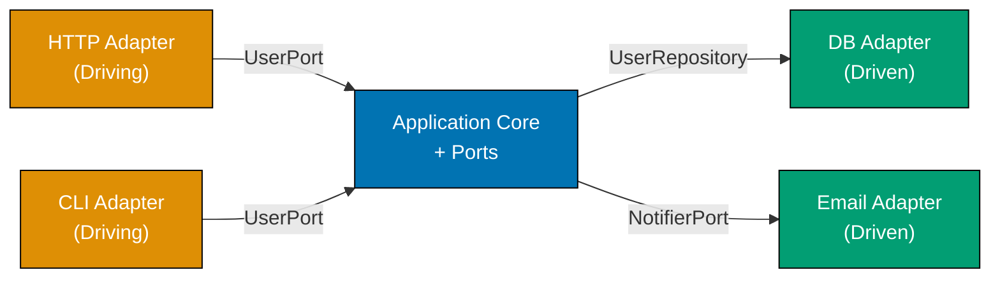
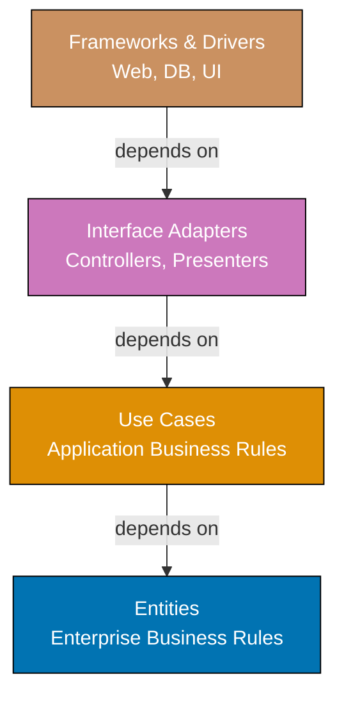
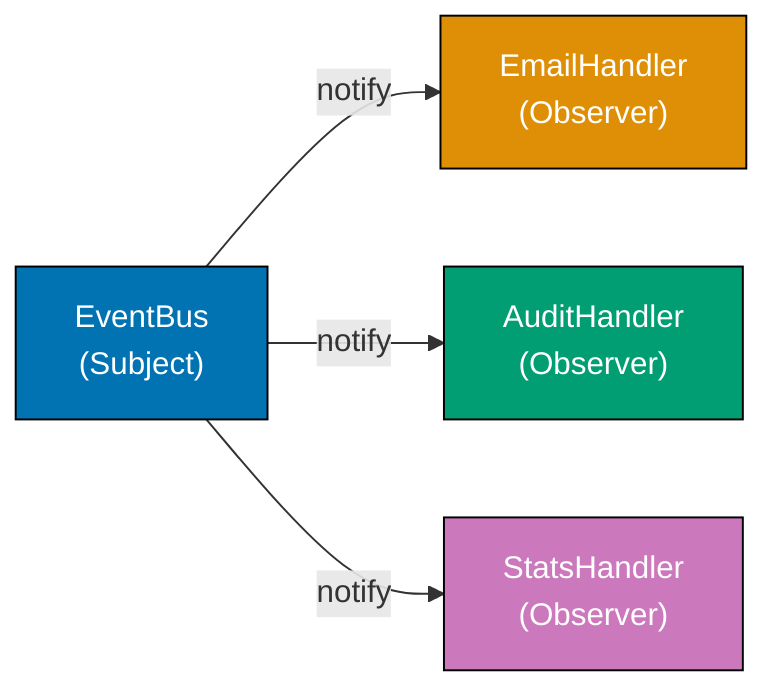
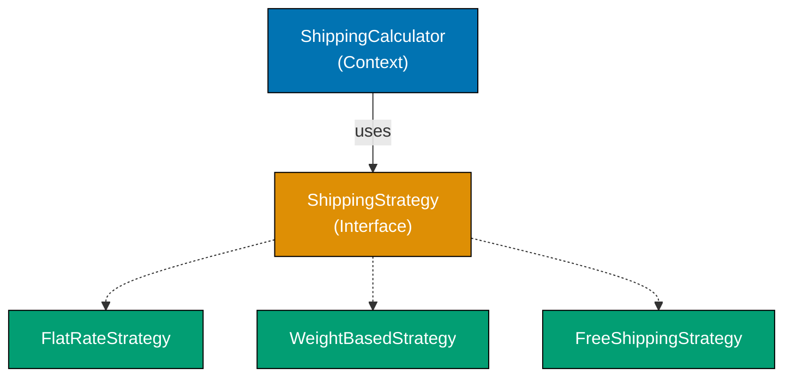
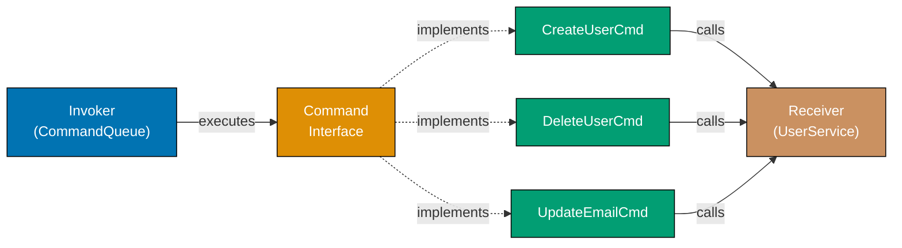
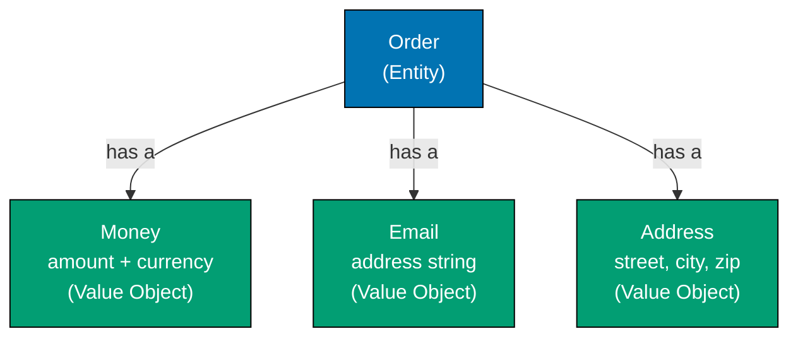
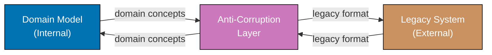
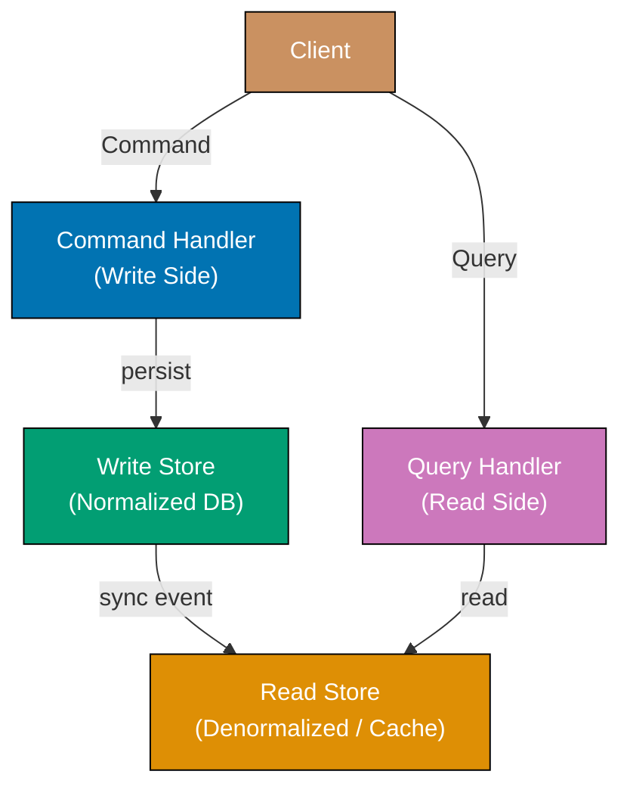
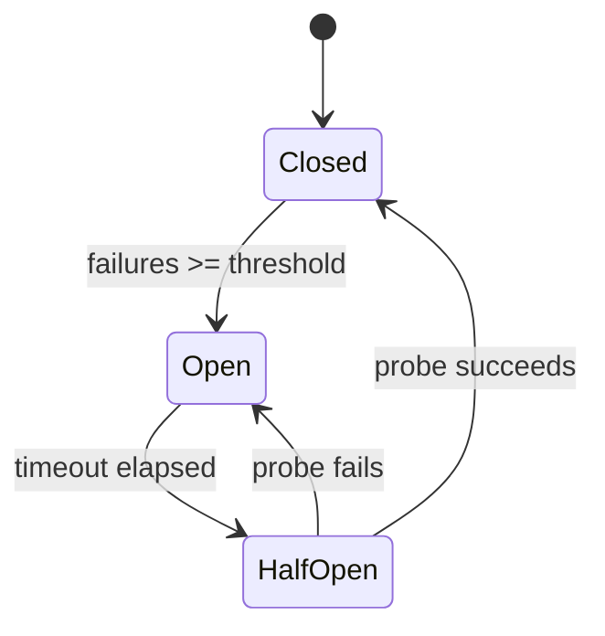

Examples 29-57 cover intermediate software architecture concepts (40-75% coverage). These examples build on foundational patterns and introduce composite architectural styles, enterprise patterns, and domain-driven design building blocks. Each example is self-contained and uses Python or TypeScript.

## Hexagonal Architecture and Clean Architecture

### Example 29: Hexagonal Architecture — Ports and Adapters

Hexagonal architecture (also called Ports and Adapters) separates the application core from external systems by defining explicit ports (interfaces) and adapters (implementations). The application core knows nothing about databases, HTTP, or messaging — it only communicates through port interfaces. This inversion allows you to swap infrastructure without touching business logic.






```java
import java.util.HashMap;
import java.util.Map;

// => PORT: defines what the application NEEDS from storage
// => The core depends on this abstraction, never on a real DB class
interface UserRepository {
    void save(User user);           // => persistence contract
    User findById(String userId);   // => retrieval contract; null if not found
}

// => PORT: defines what the application NEEDS from notifications
interface NotifierPort {
    void sendWelcome(String email); // => notification contract
}

// => ENTITY: pure domain data, no infrastructure knowledge
class User {
    final String id;     // => domain identity
    final String email;  // => entity attribute, not a DB column
    final String name;   // => owned by the application core

    User(String id, String email, String name) {
        // => constructor enforces required fields
        this.id = id;
        this.email = email;
        this.name = name;
    }
}

// => APPLICATION SERVICE: orchestrates domain logic using ports only
// => Never imports JDBC, JavaMail, or HTTP — only port interfaces
class UserService {
    private final UserRepository repo;
    // => injected port — could be DB or in-memory
    private final NotifierPort notifier;
    // => injected port — could be email or SMS

    UserService(UserRepository repo, NotifierPort notifier) {
        this.repo = repo;
        this.notifier = notifier;
    }

    User register(String userId, String email, String name) {
        User user = new User(userId, email, name); // => create domain object
        repo.save(user);                            // => persist via port
        notifier.sendWelcome(email);               // => notify via port
        return user;                               // => return domain object, not DTO
    }
}

// => ADAPTER (driven): concrete implementation of UserRepository port
// => Lives in infrastructure layer — swappable without changing UserService
class InMemoryUserRepository implements UserRepository {
    private final Map<String, User> store = new HashMap<>();
    // => in-memory store for tests/demos

    @Override
    public void save(User user) {
        store.put(user.id, user); // => stores by ID key
    }

    @Override
    public User findById(String userId) {
        return store.get(userId); // => returns null if not found
    }
}

// => ADAPTER (driven): concrete implementation of NotifierPort
class ConsoleNotifier implements NotifierPort {
    @Override
    public void sendWelcome(String email) {
        System.out.println("Welcome email sent to " + email);
        // => simulates email send; swap with SmtpNotifier in production
    }
}

// => ADAPTER (driving): CLI adapter calls the application core via UserService
// => Real apps may have an HTTP adapter alongside this CLI adapter
static void cliRegister(UserService service, String userId, String email, String name) {
    User user = service.register(userId, email, name); // => delegates to core
    System.out.println("Registered: " + user.name);    // => adapter formats output
}

// wire up adapters
InMemoryUserRepository repo = new InMemoryUserRepository();
// => swap to JpaUserRepository in production
ConsoleNotifier notifier = new ConsoleNotifier();
// => swap to SmtpNotifier in production
UserService service = new UserService(repo, notifier);
// => core receives ports via DI

cliRegister(service, "u1", "alice@example.com", "Alice");
// => Output: Welcome email sent to alice@example.com
// => Output: Registered: Alice

User found = repo.findById("u1");
System.out.println(found.email); // => Output: alice@example.com
```




```kotlin
// => PORT: defines what the application NEEDS from storage
// => The core depends on this abstraction, never on a real DB class
interface UserRepository {
    fun save(user: User)           // => persistence contract
    fun findById(userId: String): User? // => retrieval contract; null if not found
}

// => PORT: defines what the application NEEDS from notifications
interface NotifierPort {
    fun sendWelcome(email: String) // => notification contract
}

// => ENTITY: pure domain data, no infrastructure knowledge
data class User(
    val id: String,    // => domain identity
    val email: String, // => entity attribute, not a DB column
    val name: String   // => owned by the application core
)

// => APPLICATION SERVICE: orchestrates domain logic using ports only
// => Never imports DB drivers or SMTP clients — only port interfaces
class UserService(
    private val repo: UserRepository,
    // => injected port — could be DB or in-memory
    private val notifier: NotifierPort
    // => injected port — could be email or SMS
) {
    fun register(userId: String, email: String, name: String): User {
        val user = User(id = userId, email = email, name = name)
        // => create domain object with named args for clarity
        repo.save(user)          // => persist via port
        notifier.sendWelcome(email) // => notify via port
        return user              // => return domain object, not DTO
    }
}

// => ADAPTER (driven): concrete implementation of UserRepository port
// => Lives in infrastructure layer — swappable without changing UserService
class InMemoryUserRepository : UserRepository {
    private val store = mutableMapOf<String, User>()
    // => in-memory store for tests/demos

    override fun save(user: User) {
        store[user.id] = user    // => stores by ID key
    }

    override fun findById(userId: String): User? =
        store[userId]            // => returns null if not found (Kotlin nullable)
}

// => ADAPTER (driven): concrete implementation of NotifierPort
class ConsoleNotifier : NotifierPort {
    override fun sendWelcome(email: String) {
        println("Welcome email sent to $email")
        // => simulates email send; swap with SmtpNotifier in production
    }
}

// => ADAPTER (driving): CLI adapter calls the application core via UserService
fun cliRegister(service: UserService, userId: String, email: String, name: String) {
    val user = service.register(userId, email, name) // => delegates to core
    println("Registered: ${user.name}")               // => adapter formats output
}

// wire up adapters
val repo = InMemoryUserRepository()   // => swap to JpaUserRepository in production
val notifier = ConsoleNotifier()      // => swap to SmtpNotifier in production
val service = UserService(repo, notifier) // => core receives ports via DI

cliRegister(service, "u1", "alice@example.com", "Alice")
// => Output: Welcome email sent to alice@example.com
// => Output: Registered: Alice

val found = repo.findById("u1")
println(found?.email) // => Output: alice@example.com
```




```csharp
using System.Collections.Generic;

// => PORT: defines what the application NEEDS from storage
// => The core depends on this abstraction, never on a real DB class
public interface IUserRepository {
    void Save(User user);           // => persistence contract
    User? FindById(string userId);  // => retrieval contract; null if not found
}

// => PORT: defines what the application NEEDS from notifications
public interface INotifierPort {
    void SendWelcome(string email); // => notification contract
}

// => ENTITY: pure domain data, no infrastructure knowledge
public record User(string Id, string Email, string Name);
// => record type enforces immutability — entity fields never change after creation

// => APPLICATION SERVICE: orchestrates domain logic using ports only
// => Never imports EF Core, SmtpClient, or HttpClient — only port interfaces
public class UserService {
    private readonly IUserRepository _repo;
    // => injected port — could be DB or in-memory
    private readonly INotifierPort _notifier;
    // => injected port — could be email or SMS

    public UserService(IUserRepository repo, INotifierPort notifier) {
        _repo = repo;
        _notifier = notifier;
    }

    public User Register(string userId, string email, string name) {
        var user = new User(userId, email, name); // => create domain object
        _repo.Save(user);                          // => persist via port
        _notifier.SendWelcome(email);              // => notify via port
        return user;                               // => return domain object, not DTO
    }
}

// => ADAPTER (driven): concrete implementation of IUserRepository port
// => Lives in infrastructure layer — swappable without changing UserService
public class InMemoryUserRepository : IUserRepository {
    private readonly Dictionary<string, User> _store = new();
    // => in-memory store for tests/demos

    public void Save(User user) {
        _store[user.Id] = user; // => stores by ID key
    }

    public User? FindById(string userId) =>
        _store.TryGetValue(userId, out var u) ? u : null;
        // => returns null if not found (C# nullable reference type)
}

// => ADAPTER (driven): concrete implementation of INotifierPort
public class ConsoleNotifier : INotifierPort {
    public void SendWelcome(string email) {
        Console.WriteLine($"Welcome email sent to {email}");
        // => simulates email send; swap with SmtpNotifier in production
    }
}

// => ADAPTER (driving): CLI adapter calls the application core via UserService
static void CliRegister(UserService service, string userId, string email, string name) {
    var user = service.Register(userId, email, name); // => delegates to core
    Console.WriteLine($"Registered: {user.Name}");     // => adapter formats output
}

// wire up adapters
var repo = new InMemoryUserRepository();   // => swap to EfUserRepository in production
var notifier = new ConsoleNotifier();      // => swap to SmtpNotifier in production
var service = new UserService(repo, notifier); // => core receives ports via DI

CliRegister(service, "u1", "alice@example.com", "Alice");
// => Output: Welcome email sent to alice@example.com
// => Output: Registered: Alice

var found = repo.FindById("u1");
Console.WriteLine(found?.Email); // => Output: alice@example.com
```




**Key Takeaway**: Ports are interfaces owned by the application core; adapters are infrastructure implementations owned by outer layers. This boundary makes the core independently testable and infrastructure-swappable.

**Why It Matters**: Hexagonal architecture is the foundation behind major frameworks like Spring (ports as interfaces, adapters as repositories/controllers). The primary testing benefit is concrete: the core domain runs entirely with in-memory adapters — no database, no network, no flakiness. Test cycles are faster and deterministic because infrastructure is swapped out, not mocked at the boundary. The architecture also makes cloud migration straightforward: swap one adapter, not the entire codebase.

---

### Example 30: Clean Architecture — Layer Separation with Dependency Rule

Clean Architecture organizes code into concentric rings (Entities → Use Cases → Interface Adapters → Frameworks). The dependency rule states that source code dependencies can only point inward — outer rings depend on inner rings, never the reverse. This keeps business rules free of framework and UI concerns.






```java
import java.util.HashMap;
import java.util.List;
import java.util.Map;

// ENTITIES LAYER — enterprise business rules, no imports from outer layers
// => Entity encapsulates core business rules independent of any framework
class OrderItem {
    final String productId; // => value by identity, not by object reference
    final double price;     // => snapshot price at order time
    final int qty;          // => quantity ordered

    OrderItem(String productId, double price, int qty) {
        this.productId = productId;
        this.price = price;
        this.qty = qty;
    }
}

class Order {
    final String id;           // => entity identity
    final List<OrderItem> items; // => domain data
    final String customerId;   // => relationship by ID, not object reference

    Order(String id, List<OrderItem> items, String customerId) {
        this.id = id;
        this.items = items;
        this.customerId = customerId;
    }

    // => business rule lives here, not in the use case or controller
    double getTotal() {
        return items.stream()
            .mapToDouble(i -> i.price * i.qty) // => price * qty per item
            .sum(); // => accumulates to final total
    }
}

// USE CASES LAYER — application business rules, depends only on entities
// => Repository interface belongs to use cases layer (dependency inversion)
// => Use case defines what it needs; infrastructure provides the implementation
interface OrderRepository {
    void save(Order order); // => persistence abstraction
}

// => Use case implementation — pure business orchestration, no HTTP/DB code
class PlaceOrderInteractor {
    private final OrderRepository repo;
    // => repo injected, satisfies dependency inversion

    PlaceOrderInteractor(OrderRepository repo) {
        this.repo = repo;
    }

    Order execute(String customerId, List<OrderItem> items) {
        String id = "ord-" + System.currentTimeMillis(); // => generate order ID
        Order order = new Order(id, items, customerId);   // => create entity
        repo.save(order); // => persist via repository port
        return order;     // => return entity, not DB row
    }
}

// INTERFACE ADAPTERS LAYER — converts data between use cases and frameworks
// => Controller translates HTTP request into use case input
class OrderController {
    private final PlaceOrderInteractor useCase;
    // => depends on use case class (or interface), not infrastructure

    OrderController(PlaceOrderInteractor useCase) {
        this.useCase = useCase;
    }

    Map<String, Object> handleRequest(String customerId, List<OrderItem> items) {
        Order order = useCase.execute(customerId, items);
        // => invoke use case with domain-shaped input
        return Map.of("orderId", order.id, "total", order.getTotal());
        // => presenter maps entity to HTTP-shaped output
    }
}

// FRAMEWORKS LAYER — in-memory adapter (stands in for a real DB adapter)
class InMemoryOrderRepo implements OrderRepository {
    private final Map<String, Order> store = new HashMap<>();
    // => storage detail hidden from use cases

    @Override
    public void save(Order order) {
        store.put(order.id, order); // => concrete persistence
    }
}

// wire layers together (this wiring itself lives in the frameworks layer)
InMemoryOrderRepo repo = new InMemoryOrderRepo();
// => outer layer provides implementation
PlaceOrderInteractor interactor = new PlaceOrderInteractor(repo);
// => use case receives repo
OrderController controller = new OrderController(interactor);
// => adapter receives use case

Map<String, Object> result = controller.handleRequest(
    "c1", List.of(new OrderItem("p1", 10.0, 2))
);
System.out.println(result); // => Output: {orderId=ord-..., total=20.0}
```




```kotlin
// ENTITIES LAYER — enterprise business rules, no imports from outer layers
// => Entity encapsulates core business rules independent of any framework
data class OrderItem(
    val productId: String, // => value by identity, not by object reference
    val price: Double,     // => snapshot price at order time
    val qty: Int           // => quantity ordered
)

class Order(
    val id: String,                // => entity identity
    val items: List<OrderItem>,    // => domain data
    val customerId: String         // => relationship by ID, not object reference
) {
    // => business rule lives here, not in the use case or controller
    val total: Double get() =
        items.sumOf { it.price * it.qty }
        // => sumOf accumulates price * qty for each item
}

// USE CASES LAYER — application business rules, depends only on entities
// => Repository interface belongs to use cases layer (dependency inversion)
// => Use case defines what it needs; infrastructure provides the implementation
interface OrderRepository {
    fun save(order: Order) // => persistence abstraction
}

// => Use case implementation — pure business orchestration, no HTTP/DB code
class PlaceOrderInteractor(private val repo: OrderRepository) {
    // => repo injected via constructor, satisfies dependency inversion

    fun execute(customerId: String, items: List<OrderItem>): Order {
        val id = "ord-${System.currentTimeMillis()}" // => generate order ID
        val order = Order(id, items, customerId)      // => create entity
        repo.save(order) // => persist via repository port
        return order     // => return entity, not DB row
    }
}

// INTERFACE ADAPTERS LAYER — converts data between use cases and frameworks
// => Controller translates HTTP request into use case input
class OrderController(private val useCase: PlaceOrderInteractor) {
    // => depends on use case class; interface can be extracted if needed

    fun handleRequest(customerId: String, items: List<OrderItem>): Map<String, Any> {
        val order = useCase.execute(customerId, items)
        // => invoke use case with domain-shaped input
        return mapOf("orderId" to order.id, "total" to order.total)
        // => presenter maps entity to HTTP-shaped output
    }
}

// FRAMEWORKS LAYER — in-memory adapter (stands in for a real DB adapter)
class InMemoryOrderRepo : OrderRepository {
    private val store = mutableMapOf<String, Order>()
    // => storage detail hidden from use cases

    override fun save(order: Order) {
        store[order.id] = order // => concrete persistence
    }
}

// wire layers together (this wiring itself lives in the frameworks layer)
val repo = InMemoryOrderRepo()            // => outer layer provides implementation
val interactor = PlaceOrderInteractor(repo) // => use case receives repo
val controller = OrderController(interactor) // => adapter receives use case

val result = controller.handleRequest(
    "c1", listOf(OrderItem("p1", 10.0, 2))
)
println(result) // => Output: {orderId=ord-..., total=20.0}
```




```csharp
using System.Collections.Generic;
using System.Linq;

// ENTITIES LAYER — enterprise business rules, no imports from outer layers
// => Entity encapsulates core business rules independent of any framework
public record OrderItem(string ProductId, double Price, int Qty);
// => record enforces immutability — snapshot values never change after creation

public class Order {
    public string Id { get; }         // => entity identity
    public IReadOnlyList<OrderItem> Items { get; } // => domain data
    public string CustomerId { get; } // => relationship by ID, not object reference

    public Order(string id, IReadOnlyList<OrderItem> items, string customerId) {
        Id = id;
        Items = items;
        CustomerId = customerId;
    }

    // => business rule lives here, not in the use case or controller
    public double Total => Items.Sum(i => i.Price * i.Qty);
    // => LINQ Sum accumulates price * qty for each item
}

// USE CASES LAYER — application business rules, depends only on entities
// => Repository interface belongs to use cases layer (dependency inversion)
// => Use case defines what it needs; infrastructure provides the implementation
public interface IOrderRepository {
    void Save(Order order); // => persistence abstraction
}

// => Use case implementation — pure business orchestration, no HTTP/DB code
public class PlaceOrderInteractor {
    private readonly IOrderRepository _repo;
    // => repo injected, satisfies dependency inversion

    public PlaceOrderInteractor(IOrderRepository repo) => _repo = repo;

    public Order Execute(string customerId, IReadOnlyList<OrderItem> items) {
        var id = $"ord-{DateTimeOffset.UtcNow.ToUnixTimeMilliseconds()}";
        // => generate unique order ID
        var order = new Order(id, items, customerId); // => create entity
        _repo.Save(order); // => persist via repository port
        return order;      // => return entity, not DB row
    }
}

// INTERFACE ADAPTERS LAYER — converts data between use cases and frameworks
// => Controller translates HTTP request into use case input
public class OrderController {
    private readonly PlaceOrderInteractor _useCase;
    // => depends on use case class; interface can be extracted if needed

    public OrderController(PlaceOrderInteractor useCase) => _useCase = useCase;

    public Dictionary<string, object> HandleRequest(string customerId, IReadOnlyList<OrderItem> items) {
        var order = _useCase.Execute(customerId, items);
        // => invoke use case with domain-shaped input
        return new Dictionary<string, object> {
            ["orderId"] = order.Id,
            ["total"] = order.Total
        };
        // => presenter maps entity to HTTP-shaped output
    }
}

// FRAMEWORKS LAYER — in-memory adapter (stands in for a real DB adapter)
public class InMemoryOrderRepo : IOrderRepository {
    private readonly Dictionary<string, Order> _store = new();
    // => storage detail hidden from use cases

    public void Save(Order order) {
        _store[order.Id] = order; // => concrete persistence
    }
}

// wire layers together (this wiring itself lives in the frameworks layer)
var repo = new InMemoryOrderRepo();              // => outer layer provides implementation
var interactor = new PlaceOrderInteractor(repo); // => use case receives repo
var controller = new OrderController(interactor); // => adapter receives use case

var result = controller.HandleRequest(
    "c1", new[] { new OrderItem("p1", 10.0, 2) }
);
Console.WriteLine(result["orderId"]); // => Output: ord-...
Console.WriteLine(result["total"]);   // => Output: 20
```




**Key Takeaway**: The dependency rule is the single most important rule in Clean Architecture — outer layers depend on inner layers, never the reverse. Enforce it by ensuring entities and use cases have zero imports from controllers or databases.

**Why It Matters**: Clean Architecture is the architecture behind many long-lived enterprise systems because it preserves the ability to change frameworks and databases independently of business logic. Uncle Bob's research across decades of software projects found that systems that violate the dependency rule accumulate coupling debt exponentially — a minor database change cascades into use case rewrites. Teams adopting Clean Architecture report business logic surviving 2-3 major framework migrations intact.

---

### Example 31: Onion Architecture — Domain at the Center

Onion Architecture is a variant of Clean Architecture where the domain model sits at the very center, surrounded by domain services, then application services, then infrastructure. Unlike layered architecture, every layer depends only on layers closer to the center, and infrastructure is always the outermost layer.




```java
import java.util.HashMap;
import java.util.Map;
import java.util.Objects;

// => DOMAIN MODEL (innermost ring) — pure business objects, zero dependencies
final class Money {
    final double amount;  // => value in currency units
    final String currency; // => ISO 4217 code, e.g., "USD"

    Money(double amount, String currency) {
        this.amount = amount;
        this.currency = currency;
    }

    Money add(Money other) {
        if (!Objects.equals(this.currency, other.currency))
            throw new IllegalArgumentException("Currency mismatch");
            // => domain rule enforced here
        return new Money(this.amount + other.amount, this.currency);
        // => returns new Money (immutable pattern)
    }
}

// => ENTITY: product with a domain-typed price
class Product {
    final String id;    // => identity
    final String name;  // => display name
    final Money price;  // => price is a domain concept, not a raw double

    Product(String id, String name, Money price) {
        this.id = id;
        this.name = name;
        this.price = price;
    }
}

// => DOMAIN SERVICES (second ring) — stateless operations on domain objects
// => Domain services operate on domain entities; they have no infrastructure calls
class PricingService {
    Money applyDiscount(Money price, double discountPct) {
        double discounted = price.amount * (1 - discountPct / 100);
        // => computes discounted amount
        return new Money(Math.round(discounted * 100.0) / 100.0, price.currency);
        // => preserves currency, rounds to cents
    }
}

// => APPLICATION SERVICES (third ring) — orchestrates domain + domain services
// => Depends on domain model and domain services; not on infrastructure
class ProductCatalogService {
    private final PricingService pricer;
    // => domain service injected

    ProductCatalogService(PricingService pricer) {
        this.pricer = pricer;
    }

    Money getDiscountedPrice(Product product, double discountPct) {
        return pricer.applyDiscount(product.price, discountPct);
        // => application logic: which domain service to call and when
    }
}

// => REPOSITORY PORT (third ring, owned by application) — infrastructure contract
// => Defined here so infrastructure depends inward on this interface
interface ProductRepository {
    Product find(String productId); // => contract; null if not found
}

// => INFRASTRUCTURE (outermost ring) — implements repository port
class InMemoryProductRepository implements ProductRepository {
    private final Map<String, Product> data = new HashMap<>();
    // => in-memory store

    @Override
    public Product find(String productId) {
        return data.get(productId); // => concrete retrieval
    }

    void add(Product product) {
        data.put(product.id, product); // => concrete persistence
    }
}

// demo wiring — infrastructure created last, domain created first
InMemoryProductRepository repo = new InMemoryProductRepository();
repo.add(new Product("p1", "Widget", new Money(100.0, "USD")));
// => seed data

PricingService pricer = new PricingService();       // => domain service, no infra
ProductCatalogService catalog = new ProductCatalogService(pricer); // => app service

Product product = repo.find("p1");          // => retrieve from outer ring
Money discounted = catalog.getDiscountedPrice(product, 10);
// => applies 10% discount via domain service
System.out.println(discounted.currency + " " + discounted.amount);
// => Output: USD 90.0
```




```kotlin
import kotlin.math.roundToInt

// => DOMAIN MODEL (innermost ring) — pure business objects, zero dependencies
data class Money(val amount: Double, val currency: String) {
    // => data class enforces structural equality and immutability by convention

    fun add(other: Money): Money {
        require(currency == other.currency) { "Currency mismatch" }
        // => domain rule enforced here via require
        return copy(amount = (amount + other.amount) * 100.0.roundToInt() / 100.0)
        // => copy() returns new instance (immutable pattern)
    }
}

// => ENTITY: product with a domain-typed price
data class Product(
    val id: String,    // => identity
    val name: String,  // => display name
    val price: Money   // => price is a domain concept, not a raw Double
)

// => DOMAIN SERVICES (second ring) — stateless operations on domain objects
// => Domain services operate on domain entities; they have no infrastructure calls
class PricingService {
    fun applyDiscount(price: Money, discountPct: Double): Money {
        val discounted = price.amount * (1 - discountPct / 100)
        // => computes discounted amount
        val rounded = (discounted * 100).roundToInt() / 100.0
        // => preserves currency, rounds to cents
        return price.copy(amount = rounded)
    }
}

// => APPLICATION SERVICES (third ring) — orchestrates domain + domain services
// => Depends on domain model and domain services; not on infrastructure
class ProductCatalogService(private val pricer: PricingService) {
    // => domain service injected via constructor

    fun getDiscountedPrice(product: Product, discountPct: Double): Money =
        pricer.applyDiscount(product.price, discountPct)
        // => application logic: which domain service to call and when
}

// => REPOSITORY PORT (third ring, owned by application) — infrastructure contract
// => Defined here so infrastructure depends inward on this interface
interface ProductRepository {
    fun find(productId: String): Product? // => contract; null if not found
}

// => INFRASTRUCTURE (outermost ring) — implements repository port
class InMemoryProductRepository : ProductRepository {
    private val data = mutableMapOf<String, Product>()
    // => in-memory store

    override fun find(productId: String): Product? =
        data[productId]  // => concrete retrieval; null if absent

    fun add(product: Product) {
        data[product.id] = product // => concrete persistence
    }
}

// demo wiring — infrastructure created last, domain created first
val repo = InMemoryProductRepository()
repo.add(Product("p1", "Widget", Money(100.0, "USD")))
// => seed data

val pricer = PricingService()               // => domain service, no infra
val catalog = ProductCatalogService(pricer) // => app service

val product = repo.find("p1")!!             // => retrieve from outer ring
val discounted = catalog.getDiscountedPrice(product, 10.0)
// => applies 10% discount via domain service
println("${discounted.currency} ${discounted.amount}")
// => Output: USD 90.0
```




```csharp
using System.Collections.Generic;

// => DOMAIN MODEL (innermost ring) — pure business objects, zero dependencies
public record Money(double Amount, string Currency) {
    // => record enforces immutability; structural equality built in

    public Money Add(Money other) {
        if (Currency != other.Currency)
            throw new InvalidOperationException("Currency mismatch");
            // => domain rule enforced here
        return this with { Amount = Math.Round(Amount + other.Amount, 2) };
        // => with-expression returns new record (immutable pattern)
    }
}

// => ENTITY: product with a domain-typed price
public record Product(string Id, string Name, Money Price);
// => record provides structural equality and immutability

// => DOMAIN SERVICES (second ring) — stateless operations on domain objects
// => Domain services operate on domain entities; they have no infrastructure calls
public class PricingService {
    public Money ApplyDiscount(Money price, double discountPct) {
        double discounted = price.Amount * (1 - discountPct / 100);
        // => computes discounted amount
        return price with { Amount = Math.Round(discounted, 2) };
        // => preserves currency, rounds to cents
    }
}

// => APPLICATION SERVICES (third ring) — orchestrates domain + domain services
// => Depends on domain model and domain services; not on infrastructure
public class ProductCatalogService {
    private readonly PricingService _pricer;
    // => domain service injected

    public ProductCatalogService(PricingService pricer) => _pricer = pricer;

    public Money GetDiscountedPrice(Product product, double discountPct) =>
        _pricer.ApplyDiscount(product.Price, discountPct);
        // => application logic: which domain service to call and when
}

// => REPOSITORY PORT (third ring, owned by application) — infrastructure contract
// => Defined here so infrastructure depends inward on this interface
public interface IProductRepository {
    Product? Find(string productId); // => contract; null if not found
}

// => INFRASTRUCTURE (outermost ring) — implements repository port
public class InMemoryProductRepository : IProductRepository {
    private readonly Dictionary<string, Product> _data = new();
    // => in-memory store

    public Product? Find(string productId) =>
        _data.TryGetValue(productId, out var p) ? p : null;
        // => concrete retrieval

    public void Add(Product product) {
        _data[product.Id] = product; // => concrete persistence
    }
}

// demo wiring — infrastructure created last, domain created first
var repo = new InMemoryProductRepository();
repo.Add(new Product("p1", "Widget", new Money(100.0, "USD")));
// => seed data

var pricer = new PricingService();                  // => domain service, no infra
var catalog = new ProductCatalogService(pricer);    // => app service

var product = repo.Find("p1")!;            // => retrieve from outer ring
var discounted = catalog.GetDiscountedPrice(product, 10);
// => applies 10% discount via domain service
Console.WriteLine($"{discounted.Currency} {discounted.Amount}");
// => Output: USD 90
```




**Key Takeaway**: Onion Architecture places the domain model at the center and makes infrastructure an outermost detail, ensuring business logic is the most stable and reusable part of the codebase.

**Why It Matters**: Onion Architecture gained popularity in enterprise .NET and Java communities because it naturally aligns with Domain-Driven Design — the domain model at the center corresponds to the Bounded Context's core. Keeping infrastructure as the outermost layer makes the domain model stable across service rewrites: switching from PostgreSQL to DynamoDB touches only the outermost ring, never the pricing or catalog logic. This also makes domain logic independently unit-testable without any infrastructure dependencies present.

---

## Event-Driven Architecture

### Example 32: Observer Pattern — Event Notification Without Coupling

The Observer pattern defines a one-to-many dependency so that when one object changes state, all its dependents are notified automatically. This decouples the event source from its handlers — the source doesn't know what handles its events.






```java
import java.util.ArrayList;
import java.util.Date;
import java.util.List;
import java.util.function.Consumer;

// => EventBus: subject that holds observers and broadcasts events
// => Observers register themselves; the bus doesn't care what they do
// => Generic type T ensures type-safety per event kind
class EventBus<T> {
    private final List<Consumer<T>> handlers = new ArrayList<>();
    // => list grows as handlers subscribe; shrinks on unsubscribe

    void subscribe(Consumer<T> handler) {
        handlers.add(handler); // => add observer to list
    }

    void unsubscribe(Consumer<T> handler) {
        handlers.remove(handler);
        // => remove by reference equality; remaining handlers unaffected
    }

    void publish(T event) {
        for (Consumer<T> handler : handlers) {
            handler.accept(event); // => notify each observer in registration order
        }
        // => if one handler throws, subsequent handlers are skipped — add try/catch in production
    }
}

// => DOMAIN EVENT: named, immutable record of what happened
class UserRegistered {
    final String userId;    // => who registered
    final String email;     // => where to send welcome
    final Date timestamp;   // => when it happened

    UserRegistered(String userId, String email, Date timestamp) {
        this.userId = userId;
        this.email = email;
        this.timestamp = timestamp;
    }
}

// wire up: create bus and register observers
EventBus<UserRegistered> bus = new EventBus<>();
// => typed bus for UserRegistered events only

// => OBSERVER 1: sends welcome email
bus.subscribe(event -> {
    System.out.println("Sending welcome to " + event.email);
    // => in production: call email service API here
});

// => OBSERVER 2: writes audit log
bus.subscribe(event -> {
    System.out.println("Audit: user " + event.userId + " registered at " + event.timestamp);
    // => in production: write to append-only audit table
});

// => OBSERVER 3: increments stats counter
bus.subscribe(event -> {
    System.out.println("Stats: new user registered");
    // => in production: increment Prometheus counter
});

bus.publish(new UserRegistered("u1", "alice@example.com", new Date()));
// => Output: Sending welcome to alice@example.com
// => Output: Audit: user u1 registered at ...
// => Output: Stats: new user registered
// => all three handlers fired without the publisher knowing about any of them
```




```kotlin
import java.util.Date

// => EventBus: subject that holds observers and broadcasts events
// => Observers register themselves; the bus doesn't care what they do
// => Generic type T ensures type-safety per event kind
class EventBus<T> {
    private val handlers = mutableListOf<(T) -> Unit>()
    // => list grows as handlers subscribe; shrinks on unsubscribe

    fun subscribe(handler: (T) -> Unit) {
        handlers.add(handler) // => add observer to list
    }

    fun unsubscribe(handler: (T) -> Unit) {
        handlers.remove(handler)
        // => remove by reference equality; remaining handlers unaffected
    }

    fun publish(event: T) {
        for (handler in handlers) {
            handler(event) // => notify each observer in registration order
        }
        // => if one handler throws, subsequent handlers are skipped — add try/catch in production
    }
}

// => DOMAIN EVENT: named, immutable record of what happened
data class UserRegistered(
    val userId: String,    // => who registered
    val email: String,     // => where to send welcome
    val timestamp: Date    // => when it happened
)

// wire up: create bus and register observers
val bus = EventBus<UserRegistered>()
// => typed bus for UserRegistered events only

// => OBSERVER 1: sends welcome email
bus.subscribe { event ->
    println("Sending welcome to ${event.email}")
    // => in production: call email service API here
}

// => OBSERVER 2: writes audit log
bus.subscribe { event ->
    println("Audit: user ${event.userId} registered at ${event.timestamp}")
    // => in production: write to append-only audit table
}

// => OBSERVER 3: increments stats counter
bus.subscribe {
    println("Stats: new user registered")
    // => in production: increment Prometheus counter
}

bus.publish(UserRegistered("u1", "alice@example.com", Date()))
// => Output: Sending welcome to alice@example.com
// => Output: Audit: user u1 registered at ...
// => Output: Stats: new user registered
// => all three handlers fired without the publisher knowing about any of them
```




```csharp
using System;
using System.Collections.Generic;

// => EventBus: subject that holds observers and broadcasts events
// => Observers register themselves; the bus doesn't care what they do
// => Generic type T ensures type-safety per event kind
public class EventBus<T> {
    private readonly List<Action<T>> _handlers = new();
    // => list grows as handlers subscribe; shrinks on unsubscribe

    public void Subscribe(Action<T> handler) {
        _handlers.Add(handler); // => add observer to list
    }

    public void Unsubscribe(Action<T> handler) {
        _handlers.Remove(handler);
        // => remove by reference equality; remaining handlers unaffected
    }

    public void Publish(T evt) {
        foreach (var handler in _handlers) {
            handler(evt); // => notify each observer in registration order
        }
        // => if one handler throws, subsequent handlers are skipped — add try/catch in production
    }
}

// => DOMAIN EVENT: named, immutable record of what happened
public record UserRegistered(
    string UserId,          // => who registered
    string Email,           // => where to send welcome
    DateTimeOffset Timestamp // => when it happened
);

// wire up: create bus and register observers
var bus = new EventBus<UserRegistered>();
// => typed bus for UserRegistered events only

// => OBSERVER 1: sends welcome email
bus.Subscribe(e => {
    Console.WriteLine($"Sending welcome to {e.Email}");
    // => in production: call email service API here
});

// => OBSERVER 2: writes audit log
bus.Subscribe(e => {
    Console.WriteLine($"Audit: user {e.UserId} registered at {e.Timestamp:O}");
    // => in production: write to append-only audit table
});

// => OBSERVER 3: increments stats counter
bus.Subscribe(_ => {
    Console.WriteLine("Stats: new user registered");
    // => in production: increment Prometheus counter
});

bus.Publish(new UserRegistered("u1", "alice@example.com", DateTimeOffset.UtcNow));
// => Output: Sending welcome to alice@example.com
// => Output: Audit: user u1 registered at 2026-...
// => Output: Stats: new user registered
// => all three handlers fired without the publisher knowing about any of them
```




**Key Takeaway**: The Observer pattern decouples event producers from event consumers — the source publishes events without knowing what handles them, and handlers register without knowing who triggers them.

**Why It Matters**: Observer is the foundation of virtually every UI framework (React's synthetic events, Vue's reactivity, browser DOM events) and server-side event systems (Node.js EventEmitter, Spring ApplicationEventPublisher). The pattern trades direct coupling for indirect coupling through an event contract, enabling teams to add handlers independently without coordinating with the event source. Fan-out to multiple subscribers—notification systems, analytics, audit logs—becomes a configuration change rather than a code change in the publisher.

---

### Example 33: Domain Events — Signaling State Changes Within a Bounded Context

Domain Events capture the fact that something meaningful happened in the domain. Unlike technical events, domain events are named in business language and carry enough data for handlers to act without querying back. They enable reactive workflows within and across bounded contexts.




```java
import java.time.Instant;
import java.util.*;
import java.util.function.Consumer;

// => DOMAIN EVENT BASE: every event has an occurredAt timestamp
abstract class DomainEvent {
    final Instant occurredAt = Instant.now();
    // => set at creation time so events are immutable records of the past
}

// => DOMAIN EVENTS: past-tense names (OrderPlaced, not PlaceOrder)
class OrderPlaced extends DomainEvent {
    final String orderId;     // => which order was placed
    final String customerId;  // => who placed it
    final double total;       // => enough data for handlers without DB lookups

    OrderPlaced(String orderId, String customerId, double total) {
        this.orderId = orderId;
        this.customerId = customerId;
        this.total = total;
    }
}

class OrderCancelled extends DomainEvent {
    final String orderId; // => which order was cancelled
    final String reason;  // => why — useful for analytics and customer comms

    OrderCancelled(String orderId, String reason) {
        this.orderId = orderId;
        this.reason = reason;
    }
}

// => AGGREGATE: raises domain events as part of state transitions
class Order {
    final String id;
    final String customerId;
    final double total;
    String status = "PENDING";                   // => initial state
    private final List<DomainEvent> events = new ArrayList<>();
    // => events collected here, NOT yet dispatched

    Order(String id, String customerId, double total) {
        this.id = id;
        this.customerId = customerId;
        this.total = total;
    }

    void place() {
        this.status = "PLACED";                   // => state change
        events.add(new OrderPlaced(id, customerId, total));
        // => record event for later dispatch
    }

    void cancel(String reason) {
        if (!"PLACED".equals(status))
            throw new IllegalStateException("Cannot cancel order in status " + status);
            // => business rule enforced before event is raised
        this.status = "CANCELLED";               // => state change
        events.add(new OrderCancelled(id, reason));
    }

    List<DomainEvent> popEvents() {
        List<DomainEvent> drained = new ArrayList<>(events);
        events.clear(); // => caller drains events; aggregate starts fresh
        return drained;
    }
}

// => EVENT DISPATCHER: collects events from aggregates and notifies handlers
class EventDispatcher {
    private final Map<Class<?>, List<Consumer<DomainEvent>>> handlers = new HashMap<>();
    // => maps event type to list of handlers

    @SuppressWarnings("unchecked")
    <T extends DomainEvent> void register(Class<T> type, Consumer<T> handler) {
        handlers.computeIfAbsent(type, k -> new ArrayList<>())
                .add(e -> handler.accept((T) e));
        // => multiple handlers per event type are supported
    }

    void dispatch(List<DomainEvent> events) {
        for (DomainEvent event : events) {
            for (Consumer<DomainEvent> h : handlers.getOrDefault(event.getClass(), List.of())) {
                h.accept(event); // => each handler called with the event
            }
        }
    }
}

// demo: place then cancel an order
EventDispatcher dispatcher = new EventDispatcher();
dispatcher.register(OrderPlaced.class,
    e -> System.out.println("Email: order " + e.orderId + " placed, total $" + e.total));
// => handler 1: send confirmation email
dispatcher.register(OrderCancelled.class,
    e -> System.out.println("Refund triggered: " + e.orderId + ", reason: " + e.reason));
// => handler 2: trigger refund workflow

Order order = new Order("o1", "c1", 49.99);
order.place();                        // => state: PENDING -> PLACED, event queued
dispatcher.dispatch(order.popEvents());
// => Output: Email: order o1 placed, total $49.99

order.cancel("Customer request");     // => state: PLACED -> CANCELLED, event queued
dispatcher.dispatch(order.popEvents());
// => Output: Refund triggered: o1, reason: Customer request
```




```kotlin
import java.time.Instant

// => DOMAIN EVENT BASE: every event has an occurredAt timestamp
abstract class DomainEvent {
    val occurredAt: Instant = Instant.now()
    // => set at creation time so events are immutable records of the past
}

// => DOMAIN EVENTS: past-tense names (OrderPlaced, not PlaceOrder)
class OrderPlaced(
    val orderId: String,    // => which order was placed
    val customerId: String, // => who placed it
    val total: Double       // => enough data for handlers without DB lookups
) : DomainEvent()

class OrderCancelled(
    val orderId: String, // => which order was cancelled
    val reason: String   // => why — useful for analytics and customer comms
) : DomainEvent()

// => AGGREGATE: raises domain events as part of state transitions
class Order(val id: String, val customerId: String, val total: Double) {
    var status: String = "PENDING"             // => initial state
    private val pendingEvents = mutableListOf<DomainEvent>()
    // => events collected here, NOT yet dispatched

    fun place() {
        status = "PLACED"                      // => state change
        pendingEvents += OrderPlaced(id, customerId, total)
        // => record event for later dispatch
    }

    fun cancel(reason: String) {
        require(status == "PLACED") { "Cannot cancel order in status $status" }
        // => business rule enforced before event is raised
        status = "CANCELLED"                   // => state change
        pendingEvents += OrderCancelled(id, reason)
    }

    fun popEvents(): List<DomainEvent> {
        val drained = pendingEvents.toList()
        pendingEvents.clear() // => caller drains events; aggregate starts fresh
        return drained
    }
}

// => EVENT DISPATCHER: collects events from aggregates and notifies handlers
class EventDispatcher {
    private val handlers = mutableMapOf<Class<*>, MutableList<(DomainEvent) -> Unit>>()
    // => maps event type to list of handlers

    @Suppress("UNCHECKED_CAST")
    fun <T : DomainEvent> register(type: Class<T>, handler: (T) -> Unit) {
        handlers.getOrPut(type) { mutableListOf() }
                .add { event -> handler(event as T) }
        // => multiple handlers per event type are supported
    }

    fun dispatch(events: List<DomainEvent>) {
        for (event in events) {
            handlers[event::class.java]?.forEach { it(event) }
            // => each handler called with the event
        }
    }
}

// demo: place then cancel an order
val dispatcher = EventDispatcher()
dispatcher.register(OrderPlaced::class.java) { e ->
    println("Email: order ${e.orderId} placed, total $${e.total}")
}
// => handler 1: send confirmation email
dispatcher.register(OrderCancelled::class.java) { e ->
    println("Refund triggered: ${e.orderId}, reason: ${e.reason}")
}
// => handler 2: trigger refund workflow

val order = Order("o1", "c1", 49.99)
order.place()                         // => state: PENDING -> PLACED, event queued
dispatcher.dispatch(order.popEvents())
// => Output: Email: order o1 placed, total $49.99

order.cancel("Customer request")      // => state: PLACED -> CANCELLED, event queued
dispatcher.dispatch(order.popEvents())
// => Output: Refund triggered: o1, reason: Customer request
```




```csharp
using System;
using System.Collections.Generic;

// => DOMAIN EVENT BASE: every event has an OccurredAt timestamp
public abstract record DomainEvent {
    public DateTimeOffset OccurredAt { get; } = DateTimeOffset.UtcNow;
    // => set at creation time so events are immutable records of the past
}

// => DOMAIN EVENTS: past-tense names (OrderPlaced, not PlaceOrder)
public record OrderPlaced(
    string OrderId,    // => which order was placed
    string CustomerId, // => who placed it
    double Total       // => enough data for handlers without DB lookups
) : DomainEvent;

public record OrderCancelled(
    string OrderId, // => which order was cancelled
    string Reason   // => why — useful for analytics and customer comms
) : DomainEvent;

// => AGGREGATE: raises domain events as part of state transitions
public class Order {
    public string Id { get; }
    public string CustomerId { get; }
    public double Total { get; }
    public string Status { get; private set; } = "PENDING"; // => initial state
    private readonly List<DomainEvent> _events = new();
    // => events collected here, NOT yet dispatched

    public Order(string id, string customerId, double total) {
        Id = id; CustomerId = customerId; Total = total;
    }

    public void Place() {
        Status = "PLACED";                    // => state change
        _events.Add(new OrderPlaced(Id, CustomerId, Total));
        // => record event for later dispatch
    }

    public void Cancel(string reason) {
        if (Status != "PLACED")
            throw new InvalidOperationException($"Cannot cancel order in status {Status}");
            // => business rule enforced before event is raised
        Status = "CANCELLED";                 // => state change
        _events.Add(new OrderCancelled(Id, reason));
    }

    public IReadOnlyList<DomainEvent> PopEvents() {
        var drained = new List<DomainEvent>(_events);
        _events.Clear(); // => caller drains events; aggregate starts fresh
        return drained;
    }
}

// => EVENT DISPATCHER: collects events from aggregates and notifies handlers
public class EventDispatcher {
    private readonly Dictionary<Type, List<Action<DomainEvent>>> _handlers = new();
    // => maps event type to list of handlers

    public void Register<T>(Action<T> handler) where T : DomainEvent {
        if (!_handlers.ContainsKey(typeof(T))) _handlers[typeof(T)] = new();
        _handlers[typeof(T)].Add(e => handler((T)e));
        // => multiple handlers per event type are supported
    }

    public void Dispatch(IReadOnlyList<DomainEvent> events) {
        foreach (var evt in events) {
            if (_handlers.TryGetValue(evt.GetType(), out var hs))
                foreach (var h in hs) h(evt);
                // => each handler called with the event
        }
    }
}

// demo: place then cancel an order
var dispatcher = new EventDispatcher();
dispatcher.Register<OrderPlaced>(e =>
    Console.WriteLine($"Email: order {e.OrderId} placed, total ${e.Total}"));
// => handler 1: send confirmation email
dispatcher.Register<OrderCancelled>(e =>
    Console.WriteLine($"Refund triggered: {e.OrderId}, reason: {e.Reason}"));
// => handler 2: trigger refund workflow

var order = new Order("o1", "c1", 49.99);
order.Place();                         // => state: PENDING -> PLACED, event queued
dispatcher.Dispatch(order.PopEvents());
// => Output: Email: order o1 placed, total $49.99

order.Cancel("Customer request");      // => state: PLACED -> CANCELLED, event queued
dispatcher.Dispatch(order.PopEvents());
// => Output: Refund triggered: o1, reason: Customer request
```




**Key Takeaway**: Domain events use past-tense business language, carry sufficient data for handlers, and are raised by aggregates as part of state transitions — not as raw technical notifications.

**Why It Matters**: Domain events are central to CQRS, Event Sourcing, and saga orchestration patterns. By naming events in business language (OrderPlaced, not UpdateOrderStatusEvent), the team's shared vocabulary aligns with the domain model. Handlers for domain events can trigger workflows — emails, refunds, inventory updates — without the aggregate knowing about them, which keeps the domain model focused and independently testable.

---

### Example 34: Event-Driven Architecture — Async Message Passing Between Services

Event-driven architecture connects services through asynchronous messages on a message broker. Producers publish events without waiting for consumers; consumers process events at their own pace. This delivers temporal decoupling and horizontal scalability.




```java
import java.time.Instant;
import java.util.*;
import java.util.function.Consumer;

// => MESSAGE BROKER SIMULATION: in-memory topic-based pub/sub
// => In production, replace with Kafka, RabbitMQ, or AWS SQS
class MessageBroker {
    private final Map<String, List<Consumer<Object>>> topics = new HashMap<>();
    // => each topic holds a list of consumer callbacks

    @SuppressWarnings("unchecked")
    <T> void subscribe(String topic, Consumer<T> consumer) {
        topics.computeIfAbsent(topic, k -> new ArrayList<>())
              .add(msg -> consumer.accept((T) msg));
        // => consumer registered for this topic
    }

    void publish(String topic, Object message) {
        List<Consumer<Object>> consumers = topics.getOrDefault(topic, List.of());
        // => get all consumers; empty list if topic has no subscribers
        for (Consumer<Object> c : consumers) {
            c.accept(message); // => deliver to each consumer
        }
        // => in production, broker delivers asynchronously via Kafka partition
    }
}

// => DOMAIN EVENT: something that happened in the Order service
class OrderShipped {
    final String orderId;      // => which order shipped
    final String trackingCode; // => courier tracking reference
    final String shippedAt;    // => ISO timestamp

    OrderShipped(String orderId, String trackingCode, String shippedAt) {
        this.orderId = orderId;
        this.trackingCode = trackingCode;
        this.shippedAt = shippedAt;
    }
}

// => PRODUCER SERVICE: publishes events, does not know about consumers
class OrderService {
    private final MessageBroker broker;
    // => broker injected; producer never references consumer classes directly

    OrderService(MessageBroker broker) {
        this.broker = broker;
    }

    void shipOrder(String orderId, String trackingCode) {
        OrderShipped event = new OrderShipped(orderId, trackingCode, Instant.now().toString());
        // => capture shipping time in event
        broker.publish("order.shipped", event);
        // => publishes to topic — does not call notification or warehouse services directly
        System.out.println("Order " + orderId + " shipped");
    }
}

// => CONSUMER 1: notification service — listens independently
class NotificationService {
    void onOrderShipped(OrderShipped event) {
        System.out.println("Notif: send tracking " + event.trackingCode + " to customer for order " + event.orderId);
        // => in production: call email/SMS provider API
    }
}

// => CONSUMER 2: warehouse service — listens independently
class WarehouseService {
    void onOrderShipped(OrderShipped event) {
        System.out.println("Warehouse: update inventory for order " + event.orderId);
        // => in production: decrement stock counts in warehouse DB
    }
}

// wire up
MessageBroker broker = new MessageBroker();         // => in production: Kafka client
NotificationService notifier = new NotificationService();
WarehouseService warehouse = new WarehouseService();

broker.subscribe("order.shipped", (OrderShipped e) -> notifier.onOrderShipped(e));
// => notification service subscribes to topic
broker.subscribe("order.shipped", (OrderShipped e) -> warehouse.onOrderShipped(e));
// => warehouse service subscribes to same topic — independent of notification

OrderService orderService = new OrderService(broker);
orderService.shipOrder("o1", "TRK-9876");
// => Output: Order o1 shipped
// => Output: Notif: send tracking TRK-9876 to customer for order o1
// => Output: Warehouse: update inventory for order o1
// => both consumers received the event independently
```




```kotlin
import java.time.Instant

// => MESSAGE BROKER SIMULATION: in-memory topic-based pub/sub
// => In production, replace with Kafka, RabbitMQ, or AWS SQS
class MessageBroker {
    private val topics = mutableMapOf<String, MutableList<(Any) -> Unit>>()
    // => each topic holds a list of consumer callbacks

    @Suppress("UNCHECKED_CAST")
    fun <T> subscribe(topic: String, consumer: (T) -> Unit) {
        topics.getOrPut(topic) { mutableListOf() }
              .add { msg -> consumer(msg as T) }
        // => consumer registered for this topic
    }

    fun publish(topic: String, message: Any) {
        topics[topic]?.forEach { it(message) }
        // => deliver to each consumer; no-op if topic has no subscribers
        // => in production, broker delivers asynchronously via Kafka partition
    }
}

// => DOMAIN EVENT: something that happened in the Order service
data class OrderShipped(
    val orderId: String,      // => which order shipped
    val trackingCode: String, // => courier tracking reference
    val shippedAt: String     // => ISO timestamp
)

// => PRODUCER SERVICE: publishes events, does not know about consumers
class OrderService(private val broker: MessageBroker) {
    // => broker injected; producer never references consumer classes directly

    fun shipOrder(orderId: String, trackingCode: String) {
        val event = OrderShipped(orderId, trackingCode, Instant.now().toString())
        // => capture shipping time in event
        broker.publish("order.shipped", event)
        // => publishes to topic — does not call notification or warehouse services directly
        println("Order $orderId shipped")
    }
}

// => CONSUMER 1: notification service — listens independently
class NotificationService {
    fun onOrderShipped(event: OrderShipped) {
        println("Notif: send tracking ${event.trackingCode} to customer for order ${event.orderId}")
        // => in production: call email/SMS provider API
    }
}

// => CONSUMER 2: warehouse service — listens independently
class WarehouseService {
    fun onOrderShipped(event: OrderShipped) {
        println("Warehouse: update inventory for order ${event.orderId}")
        // => in production: decrement stock counts in warehouse DB
    }
}

// wire up
val broker = MessageBroker()                   // => in production: Kafka client
val notifier = NotificationService()
val warehouse = WarehouseService()

broker.subscribe<OrderShipped>("order.shipped") { e -> notifier.onOrderShipped(e) }
// => notification service subscribes to topic
broker.subscribe<OrderShipped>("order.shipped") { e -> warehouse.onOrderShipped(e) }
// => warehouse service subscribes to same topic — independent of notification

val orderService = OrderService(broker)
orderService.shipOrder("o1", "TRK-9876")
// => Output: Order o1 shipped
// => Output: Notif: send tracking TRK-9876 to customer for order o1
// => Output: Warehouse: update inventory for order o1
// => both consumers received the event independently
```




```csharp
using System;
using System.Collections.Generic;

// => MESSAGE BROKER SIMULATION: in-memory topic-based pub/sub
// => In production, replace with Kafka, RabbitMQ, or AWS SQS
public class MessageBroker {
    private readonly Dictionary<string, List<Action<object>>> _topics = new();
    // => each topic holds a list of consumer callbacks

    public void Subscribe<T>(string topic, Action<T> consumer) {
        if (!_topics.ContainsKey(topic)) _topics[topic] = new();
        _topics[topic].Add(msg => consumer((T)msg));
        // => consumer registered for this topic
    }

    public void Publish(string topic, object message) {
        if (_topics.TryGetValue(topic, out var consumers))
            foreach (var c in consumers) c(message);
            // => deliver to each consumer
        // => in production, broker delivers asynchronously via Kafka partition
    }
}

// => DOMAIN EVENT: something that happened in the Order service
public record OrderShipped(
    string OrderId,      // => which order shipped
    string TrackingCode, // => courier tracking reference
    string ShippedAt     // => ISO timestamp
);

// => PRODUCER SERVICE: publishes events, does not know about consumers
public class OrderService {
    private readonly MessageBroker _broker;
    // => broker injected; producer never references consumer classes directly

    public OrderService(MessageBroker broker) => _broker = broker;

    public void ShipOrder(string orderId, string trackingCode) {
        var evt = new OrderShipped(orderId, trackingCode, DateTimeOffset.UtcNow.ToString("O"));
        // => capture shipping time in event
        _broker.Publish("order.shipped", evt);
        // => publishes to topic — does not call notification or warehouse services directly
        Console.WriteLine($"Order {orderId} shipped");
    }
}

// => CONSUMER 1: notification service — listens independently
public class NotificationService {
    public void OnOrderShipped(OrderShipped e) {
        Console.WriteLine($"Notif: send tracking {e.TrackingCode} to customer for order {e.OrderId}");
        // => in production: call email/SMS provider API
    }
}

// => CONSUMER 2: warehouse service — listens independently
public class WarehouseService {
    public void OnOrderShipped(OrderShipped e) {
        Console.WriteLine($"Warehouse: update inventory for order {e.OrderId}");
        // => in production: decrement stock counts in warehouse DB
    }
}

// wire up
var broker = new MessageBroker();                  // => in production: Kafka client
var notifier = new NotificationService();
var warehouse = new WarehouseService();

broker.Subscribe<OrderShipped>("order.shipped", e => notifier.OnOrderShipped(e));
// => notification service subscribes to topic
broker.Subscribe<OrderShipped>("order.shipped", e => warehouse.OnOrderShipped(e));
// => warehouse service subscribes to same topic — independent of notification

var orderService = new OrderService(broker);
orderService.ShipOrder("o1", "TRK-9876");
// => Output: Order o1 shipped
// => Output: Notif: send tracking TRK-9876 to customer for order o1
// => Output: Warehouse: update inventory for order o1
// => both consumers received the event independently
```




**Key Takeaway**: Event-driven architecture decouples producers from consumers through a message broker — the OrderService publishes once, and any number of consumers can independently react without the producer knowing about them.

**Why It Matters**: Event-driven architecture provides temporal decoupling that direct service calls cannot. The Order service ships an order without waiting for the Notification service to respond. If the Notification service is down, messages queue until it recovers. This fault isolation prevents cascading failures that would occur with synchronous direct calls, and enables adding new consumers without modifying producers.

---

## Structural Design Patterns

### Example 35: Strategy Pattern — Swappable Algorithms

The Strategy pattern defines a family of algorithms, encapsulates each one, and makes them interchangeable. The client selects the algorithm at runtime without changing the code that uses it. This eliminates conditional logic that switches between behaviors.






```java
// => STRATEGY INTERFACE: defines the algorithm contract
interface ShippingStrategy {
    double calculate(double weightKg, double distanceKm);
    // => every strategy must implement this signature
}

// => CONCRETE STRATEGY 1: flat rate regardless of weight/distance
class FlatRateStrategy implements ShippingStrategy {
    private final double rate; // => configurable flat fee

    FlatRateStrategy(double rate) {
        this.rate = rate;
    }

    @Override
    public double calculate(double weightKg, double distanceKm) {
        return rate; // => ignores inputs — always same price
        // => Use when: subscription-based shipping or simple pricing tiers
    }
}

// => CONCRETE STRATEGY 2: price based on weight
class WeightBasedStrategy implements ShippingStrategy {
    private final double pricePerKg; // => cost per kilogram

    WeightBasedStrategy(double pricePerKg) {
        this.pricePerKg = pricePerKg;
    }

    @Override
    public double calculate(double weightKg, double distanceKm) {
        return weightKg * pricePerKg; // => heavier = more expensive
        // => distance ignored — Use when: local delivery with flat zone pricing
    }
}

// => CONCRETE STRATEGY 3: free shipping (zero cost always)
class FreeShippingStrategy implements ShippingStrategy {
    @Override
    public double calculate(double weightKg, double distanceKm) {
        return 0.0; // => promotional: customer pays nothing
        // => Use when: orders over threshold or loyalty program members
    }
}

// => CONTEXT: uses whatever strategy is injected
class ShippingCalculator {
    private ShippingStrategy strategy;
    // => accepts any ShippingStrategy implementation

    ShippingCalculator(ShippingStrategy strategy) {
        this.strategy = strategy;
    }

    void setStrategy(ShippingStrategy strategy) {
        this.strategy = strategy; // => swap strategy at runtime
    }

    double getCost(double weightKg, double distanceKm) {
        return strategy.calculate(weightKg, distanceKm);
        // => delegates entirely to strategy — no if/else here
    }
}

// runtime selection: choose strategy based on business conditions
double orderTotal = 120.0;
ShippingStrategy strategy;
if (orderTotal >= 100) {
    strategy = new FreeShippingStrategy();       // => orders over $100 ship free
} else if (orderTotal >= 50) {
    strategy = new FlatRateStrategy(5.0);        // => medium orders: flat $5
} else {
    strategy = new WeightBasedStrategy(2.5);     // => small orders: by weight
}

ShippingCalculator calculator = new ShippingCalculator(strategy);
double cost = calculator.getCost(2.0, 50.0);
System.out.printf("Shipping cost: $%.2f%n", cost);
// => Output: Shipping cost: $0.00 (free shipping applied)

// swap strategy at runtime — context code unchanged
calculator.setStrategy(new WeightBasedStrategy(2.5));
double cost2 = calculator.getCost(2.0, 50.0);
System.out.printf("Weight-based cost: $%.2f%n", cost2);
// => Output: Weight-based cost: $5.00
```




```kotlin
// => STRATEGY INTERFACE: defines the algorithm contract
fun interface ShippingStrategy {
    fun calculate(weightKg: Double, distanceKm: Double): Double
    // => fun interface enables lambda-based strategies (SAM conversion)
    // => every strategy must implement this signature
}

// => CONCRETE STRATEGY 1: flat rate regardless of weight/distance
class FlatRateStrategy(private val rate: Double) : ShippingStrategy {
    // => configurable flat fee injected via constructor

    override fun calculate(weightKg: Double, distanceKm: Double): Double =
        rate // => ignores inputs — always same price
        // => Use when: subscription-based shipping or simple pricing tiers
}

// => CONCRETE STRATEGY 2: price based on weight
class WeightBasedStrategy(private val pricePerKg: Double) : ShippingStrategy {
    // => cost per kilogram injected via constructor

    override fun calculate(weightKg: Double, distanceKm: Double): Double =
        weightKg * pricePerKg // => heavier = more expensive
        // => distance ignored — Use when: local delivery with flat zone pricing
}

// => CONCRETE STRATEGY 3: free shipping (zero cost always)
object FreeShippingStrategy : ShippingStrategy {
    // => object declaration is a singleton — stateless strategies fit well here

    override fun calculate(weightKg: Double, distanceKm: Double): Double =
        0.0 // => promotional: customer pays nothing
        // => Use when: orders over threshold or loyalty program members
}

// => CONTEXT: uses whatever strategy is injected
class ShippingCalculator(var strategy: ShippingStrategy) {
    // => var allows swapping strategy at runtime

    fun getCost(weightKg: Double, distanceKm: Double): Double =
        strategy.calculate(weightKg, distanceKm)
        // => delegates entirely to strategy — no if/else here
}

// runtime selection: choose strategy based on business conditions
val orderTotal = 120.0
val strategy = when {
    orderTotal >= 100 -> FreeShippingStrategy          // => orders over $100 ship free
    orderTotal >= 50  -> FlatRateStrategy(5.0)         // => medium orders: flat $5
    else              -> WeightBasedStrategy(2.5)      // => small orders: by weight
}

val calculator = ShippingCalculator(strategy)
val cost = calculator.getCost(2.0, 50.0)
println("Shipping cost: \$${"%.2f".format(cost)}")
// => Output: Shipping cost: $0.00 (free shipping applied)

// swap strategy at runtime — context code unchanged
calculator.strategy = WeightBasedStrategy(2.5)
val cost2 = calculator.getCost(2.0, 50.0)
println("Weight-based cost: \$${"%.2f".format(cost2)}")
// => Output: Weight-based cost: $5.00
```




```csharp
// => STRATEGY INTERFACE: defines the algorithm contract
public interface IShippingStrategy {
    double Calculate(double weightKg, double distanceKm);
    // => every strategy must implement this signature
}

// => CONCRETE STRATEGY 1: flat rate regardless of weight/distance
public class FlatRateStrategy : IShippingStrategy {
    private readonly double _rate; // => configurable flat fee

    public FlatRateStrategy(double rate) => _rate = rate;

    public double Calculate(double weightKg, double distanceKm) =>
        _rate; // => ignores inputs — always same price
        // => Use when: subscription-based shipping or simple pricing tiers
}

// => CONCRETE STRATEGY 2: price based on weight
public class WeightBasedStrategy : IShippingStrategy {
    private readonly double _pricePerKg; // => cost per kilogram

    public WeightBasedStrategy(double pricePerKg) => _pricePerKg = pricePerKg;

    public double Calculate(double weightKg, double distanceKm) =>
        weightKg * _pricePerKg; // => heavier = more expensive
        // => distance ignored — Use when: local delivery with flat zone pricing
}

// => CONCRETE STRATEGY 3: free shipping (zero cost always)
public class FreeShippingStrategy : IShippingStrategy {
    public double Calculate(double weightKg, double distanceKm) =>
        0.0; // => promotional: customer pays nothing
        // => Use when: orders over threshold or loyalty program members
}

// => CONTEXT: uses whatever strategy is injected
public class ShippingCalculator {
    public IShippingStrategy Strategy { get; set; }
    // => public setter allows swapping strategy at runtime

    public ShippingCalculator(IShippingStrategy strategy) => Strategy = strategy;

    public double GetCost(double weightKg, double distanceKm) =>
        Strategy.Calculate(weightKg, distanceKm);
        // => delegates entirely to strategy — no if/else here
}

// runtime selection: choose strategy based on business conditions
double orderTotal = 120.0;
IShippingStrategy strategy = orderTotal switch {
    >= 100 => new FreeShippingStrategy(),       // => orders over $100 ship free
    >= 50  => new FlatRateStrategy(5.0),        // => medium orders: flat $5
    _      => new WeightBasedStrategy(2.5)      // => small orders: by weight
};

var calculator = new ShippingCalculator(strategy);
double cost = calculator.GetCost(2.0, 50.0);
Console.WriteLine($"Shipping cost: ${cost:F2}");
// => Output: Shipping cost: $0.00 (free shipping applied)

// swap strategy at runtime — context code unchanged
calculator.Strategy = new WeightBasedStrategy(2.5);
double cost2 = calculator.GetCost(2.0, 50.0);
Console.WriteLine($"Weight-based cost: ${cost2:F2}");
// => Output: Weight-based cost: $5.00
```




**Key Takeaway**: The Strategy pattern replaces conditional logic (if/elif/switch on algorithm type) with polymorphism — each algorithm lives in its own class and is selected by the client at runtime.

**Why It Matters**: Strategy is one of the most-applied GoF patterns in enterprise systems. Payment processors, shipping calculators, tax engines, and sorting algorithms all benefit from strategy isolation. Without it, a single class accumulates every algorithm variant behind if/else chains that grow unmaintainably and require retesting every variant when adding one new strategy. Adding a new strategy requires only a new class that implements the interface — zero changes to existing strategies or the calling code.

---

### Example 36: Factory Pattern — Centralized Object Creation

The Factory pattern centralizes object creation logic, hiding which concrete class is instantiated from the caller. The caller specifies what it wants (by type, key, or configuration), and the factory decides how to build it. This decouples creation from use.




```java
import java.util.HashMap;
import java.util.Map;
import java.util.function.Supplier;

// => PRODUCT INTERFACE: what all created objects share
// => Factory returns this type — callers depend only on this interface
interface PaymentProcessor {
    String process(double amount); // => returns transaction ID
    String getName();              // => processor name for logging
}

// => CONCRETE PRODUCT 1: Stripe payment implementation
// => Caller never imports this class directly — factory owns instantiation
class StripeProcessor implements PaymentProcessor {
    @Override
    public String getName() { return "Stripe"; }

    @Override
    public String process(double amount) {
        String txId = "stripe_" + System.currentTimeMillis();
        // => simulated transaction ID; real impl calls Stripe SDK
        System.out.printf("Stripe: charged $%.2f, tx=%s%n", amount, txId);
        return txId; // => return transaction reference to caller
    }
}

// => CONCRETE PRODUCT 2: PayPal payment implementation
class PayPalProcessor implements PaymentProcessor {
    @Override
    public String getName() { return "PayPal"; }

    @Override
    public String process(double amount) {
        String txId = "pp_" + System.currentTimeMillis();
        // => simulated PayPal transaction ID
        System.out.printf("PayPal: charged $%.2f, tx=%s%n", amount, txId);
        return txId;
    }
}

// => CONCRETE PRODUCT 3: bank transfer implementation
class BankTransferProcessor implements PaymentProcessor {
    @Override
    public String getName() { return "BankTransfer"; }

    @Override
    public String process(double amount) {
        String txId = "bt_" + System.currentTimeMillis();
        // => simulated bank reference number
        System.out.printf("BankTransfer: initiated $%.2f, ref=%s%n", amount, txId);
        return txId;
    }
}

// => FACTORY: registry maps type keys to factory functions (Suppliers)
// => Caller never calls new StripeProcessor() directly — factory owns creation
class PaymentProcessorFactory {
    private static final Map<String, Supplier<PaymentProcessor>> REGISTRY = new HashMap<>();
    // => static registry populated once at class load

    static {
        REGISTRY.put("stripe",        StripeProcessor::new);
        // => factory function per type — add new types here without if/else
        REGISTRY.put("paypal",        PayPalProcessor::new);
        REGISTRY.put("bank_transfer", BankTransferProcessor::new);
    }

    static PaymentProcessor create(String type) {
        Supplier<PaymentProcessor> factory = REGISTRY.get(type);
        // => look up factory function for the requested type
        if (factory == null) {
            throw new IllegalArgumentException("Unknown payment processor: " + type);
            // => fail early with useful error rather than returning null
        }
        return factory.get(); // => invoke factory function, return new instance
    }
}

// caller uses the factory — decoupled from concrete classes
String processorType = "stripe"; // => in practice: from config or HTTP request param
PaymentProcessor processor = PaymentProcessorFactory.create(processorType);
// => caller never imported StripeProcessor — depends only on PaymentProcessor

String txId = processor.process(99.99);
// => Output: Stripe: charged $99.99, tx=stripe_...
// => txId is "stripe_..." (type: String)

// adding a new processor: add one entry to REGISTRY + one new class
// => zero changes to checkout flow or any other caller
```




```kotlin
// => PRODUCT INTERFACE: what all created objects share
// => Factory returns this type — callers depend only on this interface
interface PaymentProcessor {
    val name: String          // => processor name for logging
    fun process(amount: Double): String // => returns transaction ID
}

// => CONCRETE PRODUCT 1: Stripe payment implementation
// => Caller never imports this class — factory owns instantiation
class StripeProcessor : PaymentProcessor {
    override val name = "Stripe"

    override fun process(amount: Double): String {
        val txId = "stripe_${System.currentTimeMillis()}"
        // => simulated transaction ID; real impl calls Stripe SDK
        println("Stripe: charged \$${"%.2f".format(amount)}, tx=$txId")
        return txId // => return transaction reference to caller
    }
}

// => CONCRETE PRODUCT 2: PayPal payment implementation
class PayPalProcessor : PaymentProcessor {
    override val name = "PayPal"

    override fun process(amount: Double): String {
        val txId = "pp_${System.currentTimeMillis()}"
        // => simulated PayPal transaction ID
        println("PayPal: charged \$${"%.2f".format(amount)}, tx=$txId")
        return txId
    }
}

// => CONCRETE PRODUCT 3: bank transfer implementation
class BankTransferProcessor : PaymentProcessor {
    override val name = "BankTransfer"

    override fun process(amount: Double): String {
        val txId = "bt_${System.currentTimeMillis()}"
        // => simulated bank reference number
        println("BankTransfer: initiated \$${"%.2f".format(amount)}, ref=$txId")
        return txId
    }
}

// => FACTORY: registry maps type keys to factory lambdas
// => Registry pattern: add new processors by adding entries, not if/else
object PaymentProcessorFactory {
    private val registry: Map<String, () -> PaymentProcessor> = mapOf(
        "stripe"        to ::StripeProcessor,
        // => function reference as factory — Kotlin idiomatic
        "paypal"        to ::PayPalProcessor,
        "bank_transfer" to ::BankTransferProcessor
    )

    fun create(type: String): PaymentProcessor =
        registry[type]?.invoke()
        // => look up and invoke factory lambda
            ?: throw IllegalArgumentException("Unknown payment processor: $type")
            // => fail early — null means unknown type
}

// caller uses the factory — decoupled from concrete classes
val processorType = "stripe" // => in practice: from config or HTTP request param
val processor = PaymentProcessorFactory.create(processorType)
// => caller never imported StripeProcessor — depends only on PaymentProcessor

val txId = processor.process(99.99)
// => Output: Stripe: charged $99.99, tx=stripe_...
// => txId is "stripe_..." (type: String)

// adding a new processor: add one entry to registry + one new class
// => zero changes to checkout flow or any other caller
```




```csharp
using System;
using System.Collections.Generic;

// => PRODUCT INTERFACE: what all created objects share
// => Factory returns this type — callers depend only on this interface
public interface IPaymentProcessor {
    string Name { get; }                  // => processor name for logging
    string Process(double amount);        // => returns transaction ID
}

// => CONCRETE PRODUCT 1: Stripe payment implementation
// => Caller never imports this class — factory owns instantiation
public class StripeProcessor : IPaymentProcessor {
    public string Name => "Stripe";

    public string Process(double amount) {
        var txId = $"stripe_{DateTimeOffset.UtcNow.ToUnixTimeMilliseconds()}";
        // => simulated transaction ID; real impl calls Stripe SDK
        Console.WriteLine($"Stripe: charged ${amount:F2}, tx={txId}");
        return txId; // => return transaction reference to caller
    }
}

// => CONCRETE PRODUCT 2: PayPal payment implementation
public class PayPalProcessor : IPaymentProcessor {
    public string Name => "PayPal";

    public string Process(double amount) {
        var txId = $"pp_{DateTimeOffset.UtcNow.ToUnixTimeMilliseconds()}";
        // => simulated PayPal transaction ID
        Console.WriteLine($"PayPal: charged ${amount:F2}, tx={txId}");
        return txId;
    }
}

// => CONCRETE PRODUCT 3: bank transfer implementation
public class BankTransferProcessor : IPaymentProcessor {
    public string Name => "BankTransfer";

    public string Process(double amount) {
        var txId = $"bt_{DateTimeOffset.UtcNow.ToUnixTimeMilliseconds()}";
        // => simulated bank reference number
        Console.WriteLine($"BankTransfer: initiated ${amount:F2}, ref={txId}");
        return txId;
    }
}

// => FACTORY: dictionary maps type keys to factory delegates (Func<>)
// => Registry pattern: add new processors by adding entries, not if/else
public static class PaymentProcessorFactory {
    private static readonly Dictionary<string, Func<IPaymentProcessor>> Registry = new() {
        ["stripe"]        = () => new StripeProcessor(),
        // => lambda as factory function per type
        ["paypal"]        = () => new PayPalProcessor(),
        ["bank_transfer"] = () => new BankTransferProcessor()
    };

    public static IPaymentProcessor Create(string type) {
        if (!Registry.TryGetValue(type, out var factory))
            throw new ArgumentException($"Unknown payment processor: {type}");
            // => fail early with useful error rather than returning null
        return factory(); // => invoke factory delegate, return new instance
    }
}

// caller uses the factory — decoupled from concrete classes
var processorType = "stripe"; // => in practice: from config or HTTP request param
var processor = PaymentProcessorFactory.Create(processorType);
// => caller never imported StripeProcessor — depends only on IPaymentProcessor

var txId = processor.Process(99.99);
// => Output: Stripe: charged $99.99, tx=stripe_...
// => txId is "stripe_..." (type: string)

// adding a new processor: add one entry to Registry + one new class
// => zero changes to checkout flow or any other caller
```




**Key Takeaway**: The Factory pattern centralizes object creation using a registry or conditional logic, so callers depend only on the product interface and never on concrete classes — adding a new product requires only updating the factory.

**Why It Matters**: Factories are ubiquitous in enterprise ecosystems — Java's BeanFactory and ObjectMapper, Python's logging handlers, and Node.js dependency injection containers all rely on the pattern. Without a factory, every caller must import and instantiate each concrete class directly, creating tight coupling that makes adding a new implementation a cross-cutting change across dozens of files. A factory centralises object creation so adding a new product type requires updating only one place.

---

### Example 37: Builder Pattern — Constructing Complex Objects Step by Step

The Builder pattern separates the construction of a complex object from its representation, allowing the same construction process to create different representations. It eliminates telescoping constructors and makes object creation readable when many optional parameters exist.




```java
import java.util.Collections;
import java.util.HashMap;
import java.util.Map;

// => PRODUCT: complex, immutable object with many optional fields
// => All fields set via builder — no public setters
final class HttpRequest {
    final String url;           // => required: endpoint URL
    final String method;        // => HTTP method (GET, POST, etc.)
    final Map<String, String> headers; // => request headers
    final String body;          // => optional request body; null if absent
    final double timeoutSeconds; // => request timeout
    final int retries;          // => retry count on transient failure
    final String authToken;     // => optional Bearer token; null if absent

    // => private constructor: only HttpRequestBuilder calls this
    private HttpRequest(Builder b) {
        this.url     = b.url;
        this.method  = b.method;
        this.headers = Collections.unmodifiableMap(new HashMap<>(b.headers));
        // => defensive copy + unmodifiable view
        this.body    = b.body;
        this.timeoutSeconds = b.timeoutSeconds;
        this.retries = b.retries;
        this.authToken = b.authToken;
    }

    // => BUILDER: inner static class accumulates configuration
    static class Builder {
        private final String url;              // => mandatory at construction time
        private String method = "GET";         // => defaults mirrored from product
        private final Map<String, String> headers = new HashMap<>();
        private String body = null;
        private double timeoutSeconds = 30.0;
        private int retries = 0;
        private String authToken = null;

        Builder(String url) {
            this.url = url; // => URL required — fail fast if null
        }

        Builder method(String method) {
            this.method = method.toUpperCase(); // => normalize to uppercase
            return this;                        // => return this enables chaining
        }

        Builder header(String key, String value) {
            this.headers.put(key, value); // => add individual header
            return this;                  // => fluent interface
        }

        Builder jsonBody(String body) {
            this.body = body;
            this.headers.put("Content-Type", "application/json");
            // => auto-set content-type when body is JSON
            return this;
        }

        Builder timeout(double seconds) {
            if (seconds <= 0) throw new IllegalArgumentException("Timeout must be positive");
            // => validate immediately; don't wait until execution
            this.timeoutSeconds = seconds;
            return this;
        }

        Builder withRetries(int count) {
            this.retries = count; // => retry count for transient failures
            return this;
        }

        Builder bearerToken(String token) {
            this.authToken = token;
            this.headers.put("Authorization", "Bearer " + token);
            // => set auth header alongside storing token
            return this;
        }

        HttpRequest build() {
            return new HttpRequest(this);
            // => build() is the only place HttpRequest is constructed
        }
    }
}

// GOOD: builder reads like a sentence — far clearer than positional args
HttpRequest request = new HttpRequest.Builder("https://api.example.com/users")
    .method("POST")                      // => self-documenting
    .jsonBody("{\"name\":\"Alice\"}")    // => auto-sets Content-Type
    .timeout(10.0)                       // => named step, clear intent
    .withRetries(3)                      // => retry on transient failure
    .bearerToken("tok123")               // => auth token
    .build();                            // => produce immutable HttpRequest

System.out.println(request.method);          // => Output: POST
System.out.println(request.headers);         // => Output: {Content-Type=application/json, Authorization=Bearer tok123}
System.out.println(request.timeoutSeconds);  // => Output: 10.0
System.out.println(request.retries);         // => Output: 3
```




```kotlin
// => PRODUCT: immutable data class — all fields set through builder
// => Kotlin data classes provide equals/hashCode/copy; builder ensures validation
data class HttpRequest private constructor(
    val url: String,                           // => required: endpoint URL
    val method: String,                        // => HTTP method (GET, POST, etc.)
    val headers: Map<String, String>,          // => request headers (immutable)
    val body: String?,                         // => optional request body
    val timeoutSeconds: Double,                // => request timeout
    val retries: Int,                          // => retry count on transient failure
    val authToken: String?                     // => optional Bearer token
) {
    // => BUILDER: inner class accumulates configuration via fluent API
    class Builder(private val url: String) {
        // => URL is mandatory — must be supplied at construction
        private var method: String = "GET"          // => default HTTP method
        private val headers: MutableMap<String, String> = mutableMapOf()
        private var body: String? = null
        private var timeoutSeconds: Double = 30.0   // => default timeout
        private var retries: Int = 0                // => default: no retries
        private var authToken: String? = null

        fun method(method: String): Builder {
            this.method = method.uppercase()  // => normalize to uppercase
            return this                       // => return this enables chaining
        }

        fun header(key: String, value: String): Builder {
            headers[key] = value  // => add individual header entry
            return this           // => fluent interface
        }

        fun jsonBody(body: String): Builder {
            this.body = body
            headers["Content-Type"] = "application/json"
            // => auto-set content-type when body is JSON
            return this
        }

        fun timeout(seconds: Double): Builder {
            require(seconds > 0) { "Timeout must be positive" }
            // => validate immediately; don't wait until execution
            timeoutSeconds = seconds
            return this
        }

        fun withRetries(count: Int): Builder {
            retries = count   // => retry count for transient failures
            return this
        }

        fun bearerToken(token: String): Builder {
            authToken = token
            headers["Authorization"] = "Bearer $token"
            // => set auth header alongside storing token
            return this
        }

        fun build(): HttpRequest = HttpRequest(
            url = url,
            method = method,
            headers = headers.toMap(),   // => immutable snapshot at build time
            body = body,
            timeoutSeconds = timeoutSeconds,
            retries = retries,
            authToken = authToken
        )
        // => build() is the only place HttpRequest is constructed
    }
}

// GOOD: builder reads like a sentence — far clearer than positional args
val request = HttpRequest.Builder("https://api.example.com/users")
    .method("POST")                    // => self-documenting
    .jsonBody("""{"name":"Alice"}""")  // => auto-sets Content-Type
    .timeout(10.0)                     // => named step, clear intent
    .withRetries(3)                    // => retry on transient failure
    .bearerToken("tok123")             // => auth token
    .build()                           // => produce immutable HttpRequest

println(request.method)           // => Output: POST
println(request.headers)          // => Output: {Content-Type=application/json, Authorization=Bearer tok123}
println(request.timeoutSeconds)   // => Output: 10.0
println(request.retries)          // => Output: 3
```




```csharp
using System;
using System.Collections.Generic;

// => PRODUCT: immutable record — all fields set through builder
// => C# record provides structural equality and immutability
public sealed record HttpRequest {
    public string Url { get; }                            // => required: endpoint URL
    public string Method { get; }                         // => HTTP method (GET, POST, etc.)
    public IReadOnlyDictionary<string, string> Headers { get; } // => request headers
    public string? Body { get; }                          // => optional request body
    public double TimeoutSeconds { get; }                 // => request timeout
    public int Retries { get; }                           // => retry count on transient failure
    public string? AuthToken { get; }                     // => optional Bearer token

    // => private constructor: only Builder calls this
    private HttpRequest(Builder b) {
        Url            = b.Url;
        Method         = b.Method;
        Headers        = new Dictionary<string, string>(b.HeadersInternal);
        // => defensive copy at construction time
        Body           = b.Body;
        TimeoutSeconds = b.TimeoutSeconds;
        Retries        = b.Retries;
        AuthToken      = b.AuthToken;
    }

    // => BUILDER: accumulates configuration via fluent methods
    public class Builder {
        internal string Url { get; }                                      // => mandatory
        internal string Method { get; private set; } = "GET";             // => default
        internal Dictionary<string, string> HeadersInternal { get; } = new(); // => mutable during build
        internal string? Body { get; private set; }
        internal double TimeoutSeconds { get; private set; } = 30.0;      // => default timeout
        internal int Retries { get; private set; } = 0;                   // => default: no retries
        internal string? AuthToken { get; private set; }

        public Builder(string url) {
            Url = url ?? throw new ArgumentNullException(nameof(url));
            // => URL required — fail fast if null
        }

        public Builder WithMethod(string method) {
            Method = method.ToUpperInvariant(); // => normalize to uppercase
            return this;                        // => return this enables chaining
        }

        public Builder WithHeader(string key, string value) {
            HeadersInternal[key] = value; // => add individual header entry
            return this;                  // => fluent interface
        }

        public Builder WithJsonBody(string body) {
            Body = body;
            HeadersInternal["Content-Type"] = "application/json";
            // => auto-set content-type when body is JSON
            return this;
        }

        public Builder WithTimeout(double seconds) {
            if (seconds <= 0) throw new ArgumentException("Timeout must be positive");
            // => validate immediately; don't wait until execution
            TimeoutSeconds = seconds;
            return this;
        }

        public Builder WithRetries(int count) {
            Retries = count;  // => retry count for transient failures
            return this;
        }

        public Builder WithBearerToken(string token) {
            AuthToken = token;
            HeadersInternal["Authorization"] = $"Bearer {token}";
            // => set auth header alongside storing token
            return this;
        }

        public HttpRequest Build() => new HttpRequest(this);
        // => Build() is the only place HttpRequest is constructed
    }
}

// GOOD: builder reads like a sentence — far clearer than positional args
var request = new HttpRequest.Builder("https://api.example.com/users")
    .WithMethod("POST")                  // => self-documenting
    .WithJsonBody("{\"name\":\"Alice\"}") // => auto-sets Content-Type
    .WithTimeout(10.0)                   // => named step, clear intent
    .WithRetries(3)                      // => retry on transient failure
    .WithBearerToken("tok123")           // => auth token
    .Build();                            // => produce immutable HttpRequest

Console.WriteLine(request.Method);          // => Output: POST
Console.WriteLine(string.Join(", ", request.Headers)); // => Output: [Content-Type, application/json], [Authorization, Bearer tok123]
Console.WriteLine(request.TimeoutSeconds);  // => Output: 10
Console.WriteLine(request.Retries);         // => Output: 3
```




**Key Takeaway**: The Builder pattern makes complex object construction readable by providing a fluent API where each method name describes what it sets — far more maintainable than constructors with many positional parameters.

**Why It Matters**: The Builder pattern appears in almost every major library: Java's StringBuilder, Python's SQLAlchemy query builder, Kotlin's DSL builders, and Elasticsearch's QueryBuilder. It solves the "telescoping constructor" anti-pattern where objects with 8+ optional fields require 2^8 constructor overloads or a single unreadable constructor. Protocol buffer builders use this pattern for configuring complex API requests with dozens of optional fields, making the code self-documenting and less error-prone than positional arguments.

---

### Example 38: Adapter Pattern — Bridging Incompatible Interfaces

The Adapter pattern converts the interface of a class into another interface that clients expect. It lets classes work together that could not otherwise because of incompatible interfaces. The adapter wraps the incompatible class and translates calls.




```java
import java.util.Map;

// => EXISTING EXTERNAL LIBRARY: third-party analytics SDK with its own interface
// => We cannot change this class — it comes from an external package
class LegacyAnalyticsSDK {
    void trackPageView(String pageName, int userId, String platform) {
        System.out.printf("Legacy: page=%s, user=%d, platform=%s%n", pageName, userId, platform);
        // => legacy SDK uses integer userIds and positional args
    }

    void trackEvent(String eventName, String eventData) {
        System.out.printf("Legacy: event=%s, data=%s%n", eventName, eventData);
        // => eventData as raw JSON string — legacy string format
    }
}

// => OUR APPLICATION'S ANALYTICS PORT: the interface our code expects
// => Clean, typed interface aligned with our domain language
interface AnalyticsPort {
    void recordPageView(String page, String userId, String userName);
    // => our interface uses String IDs and named parameters
    void recordEvent(String eventName, Map<String, Object> properties);
    // => our interface accepts a typed map, not raw JSON string
}

// => ADAPTER: wraps the legacy SDK and exposes our AnalyticsPort interface
// => Adapter is the only place that knows both interfaces
class LegacyAnalyticsAdapter implements AnalyticsPort {
    private final LegacyAnalyticsSDK sdk;
    // => adapter holds reference to the adaptee (legacy SDK instance)

    LegacyAnalyticsAdapter(LegacyAnalyticsSDK sdk) {
        this.sdk = sdk;
    }

    @Override
    public void recordPageView(String page, String userId, String userName) {
        int numericUserId = Integer.parseInt(userId);
        // => TRANSLATE: our String ID → legacy integer userId
        sdk.trackPageView(page, numericUserId, "web");
        // => DELEGATE: call legacy SDK with translated args
        // => callers never know about the legacy integer ID format
    }

    @Override
    public void recordEvent(String eventName, Map<String, Object> properties) {
        String legacyData = properties.toString().replace("=", ":").replace(" ", "");
        // => TRANSLATE: our typed Map → legacy flat string representation
        sdk.trackEvent(eventName, legacyData);
        // => DELEGATE: call legacy SDK with translated format
    }
}

// => CLIENT: depends only on AnalyticsPort — zero knowledge of legacy SDK
static void trackCheckout(AnalyticsPort analytics, String userId, double total) {
    analytics.recordPageView("/checkout", userId, "Alice");
    // => calls our clean interface
    analytics.recordEvent("checkout_completed", Map.of("total", total, "currency", "USD"));
    // => calls our clean interface with typed Map
}

// wire up: inject adapter into client — adapter bridges the gap
LegacyAnalyticsSDK legacySDK = new LegacyAnalyticsSDK();
// => the incompatible adaptee
LegacyAnalyticsAdapter adapter = new LegacyAnalyticsAdapter(legacySDK);
// => adapter translates between our interface and legacy SDK

trackCheckout(adapter, "42", 99.99);
// => Output: Legacy: page=/checkout, user=42, platform=web
// => Output: Legacy: event=checkout_completed, data={total:99.99,currency:USD}
// => client code used clean interface; adapter handled translation silently
```




```kotlin
// => EXISTING EXTERNAL LIBRARY: third-party analytics SDK with its own interface
// => We cannot change this class — it comes from an external package
class LegacyAnalyticsSDK {
    fun trackPageView(pageName: String, userId: Int, platform: String) {
        println("Legacy: page=$pageName, user=$userId, platform=$platform")
        // => legacy SDK uses integer userIds and positional args
    }

    fun trackEvent(eventName: String, eventData: String) {
        println("Legacy: event=$eventName, data=$eventData")
        // => eventData as raw JSON string — legacy string format
    }
}

// => OUR APPLICATION'S ANALYTICS PORT: the interface our code expects
// => Clean, typed interface aligned with our domain language
interface AnalyticsPort {
    fun recordPageView(page: String, userId: String, userName: String)
    // => our interface uses String IDs and named parameters
    fun recordEvent(eventName: String, properties: Map<String, Any>)
    // => our interface accepts a typed map, not raw JSON string
}

// => ADAPTER: wraps the legacy SDK and exposes our AnalyticsPort interface
// => Adapter is the only place that knows both interfaces
class LegacyAnalyticsAdapter(
    private val sdk: LegacyAnalyticsSDK
    // => adapter holds reference to the adaptee (legacy SDK instance)
) : AnalyticsPort {

    override fun recordPageView(page: String, userId: String, userName: String) {
        val numericUserId = userId.toInt()
        // => TRANSLATE: our String ID → legacy integer userId
        sdk.trackPageView(page, numericUserId, "web")
        // => DELEGATE: call legacy SDK with translated args
        // => callers never know about the legacy integer ID format
    }

    override fun recordEvent(eventName: String, properties: Map<String, Any>) {
        val legacyData = properties.entries.joinToString(",") { "${it.key}:${it.value}" }
        // => TRANSLATE: our typed Map → legacy flat string representation
        sdk.trackEvent(eventName, legacyData)
        // => DELEGATE: call legacy SDK with translated format
    }
}

// => CLIENT: depends only on AnalyticsPort — zero knowledge of legacy SDK
fun trackCheckout(analytics: AnalyticsPort, userId: String, total: Double) {
    analytics.recordPageView("/checkout", userId, "Alice")
    // => calls our clean interface
    analytics.recordEvent("checkout_completed", mapOf("total" to total, "currency" to "USD"))
    // => calls our clean interface with typed Map
}

// wire up: inject adapter into client — adapter bridges the gap
val legacySDK = LegacyAnalyticsSDK()
// => the incompatible adaptee
val adapter = LegacyAnalyticsAdapter(legacySDK)
// => adapter translates between our interface and legacy SDK

trackCheckout(adapter, "42", 99.99)
// => Output: Legacy: page=/checkout, user=42, platform=web
// => Output: Legacy: event=checkout_completed, data=total:99.99,currency:USD
// => client code used clean interface; adapter handled translation silently
```




```csharp
using System;
using System.Collections.Generic;
using System.Linq;

// => EXISTING EXTERNAL LIBRARY: third-party analytics SDK with its own interface
// => We cannot change this class — it comes from an external package
public class LegacyAnalyticsSDK {
    public void TrackPageView(string pageName, int userId, string platform) {
        Console.WriteLine($"Legacy: page={pageName}, user={userId}, platform={platform}");
        // => legacy SDK uses integer userIds and positional args
    }

    public void TrackEvent(string eventName, string eventData) {
        Console.WriteLine($"Legacy: event={eventName}, data={eventData}");
        // => eventData as raw JSON string — legacy string format
    }
}

// => OUR APPLICATION'S ANALYTICS PORT: the interface our code expects
// => Clean, typed interface aligned with our domain language
public interface IAnalyticsPort {
    void RecordPageView(string page, string userId, string userName);
    // => our interface uses string IDs and named parameters
    void RecordEvent(string eventName, Dictionary<string, object> properties);
    // => our interface accepts a typed dictionary, not raw JSON string
}

// => ADAPTER: wraps the legacy SDK and exposes our IAnalyticsPort interface
// => Adapter is the only place that knows both interfaces
public class LegacyAnalyticsAdapter : IAnalyticsPort {
    private readonly LegacyAnalyticsSDK _sdk;
    // => adapter holds reference to the adaptee (legacy SDK instance)

    public LegacyAnalyticsAdapter(LegacyAnalyticsSDK sdk) => _sdk = sdk;

    public void RecordPageView(string page, string userId, string userName) {
        int numericUserId = int.Parse(userId);
        // => TRANSLATE: our string ID → legacy integer userId
        _sdk.TrackPageView(page, numericUserId, "web");
        // => DELEGATE: call legacy SDK with translated args
        // => callers never know about the legacy integer ID format
    }

    public void RecordEvent(string eventName, Dictionary<string, object> properties) {
        string legacyData = string.Join(",", properties.Select(kv => $"{kv.Key}:{kv.Value}"));
        // => TRANSLATE: our typed Dictionary → legacy flat string representation
        _sdk.TrackEvent(eventName, legacyData);
        // => DELEGATE: call legacy SDK with translated format
    }
}

// => CLIENT: depends only on IAnalyticsPort — zero knowledge of legacy SDK
static void TrackCheckout(IAnalyticsPort analytics, string userId, double total) {
    analytics.RecordPageView("/checkout", userId, "Alice");
    // => calls our clean interface
    analytics.RecordEvent("checkout_completed", new() { ["total"] = total, ["currency"] = "USD" });
    // => calls our clean interface with typed Dictionary
}

// wire up: inject adapter into client — adapter bridges the gap
var legacySDK = new LegacyAnalyticsSDK();
// => the incompatible adaptee
var adapter = new LegacyAnalyticsAdapter(legacySDK);
// => adapter translates between our interface and legacy SDK

TrackCheckout(adapter, "42", 99.99);
// => Output: Legacy: page=/checkout, user=42, platform=web
// => Output: Legacy: event=checkout_completed, data=total:99.99,currency:USD
// => client code used clean interface; adapter handled translation silently
```




**Key Takeaway**: The Adapter wraps an incompatible class and translates its interface to match what callers expect — callers depend on the adapter's interface, never on the adaptee's interface.

**Why It Matters**: Adapters are essential when integrating third-party services, migrating legacy systems, or wrapping external APIs. Client libraries act as adapters between raw HTTP APIs and typed language interfaces. Teams can swap analytics or payment providers by writing a new adapter without touching any client code. The pattern also prevents third-party API changes from propagating across the codebase — only the adapter file changes.

---

### Example 39: Decorator Pattern — Adding Behavior Without Subclassing

The Decorator pattern attaches additional responsibilities to an object dynamically. Decorators provide a flexible alternative to subclassing for extending functionality. Each decorator wraps a component and adds behavior before or after delegating to it.





```java
import java.util.HashMap;
import java.util.Map;

// => COMPONENT INTERFACE: what all decorators and the core implement
// => Decorators and core all share this type — callers see only this
interface UserRepository {
    Map<String, String> findById(String userId);
    // => returns user map (id, name) or null if not found
}

// => CONCRETE COMPONENT: the real implementation being decorated
// => This is what decorators ultimately wrap and delegate to
class DatabaseUserRepository implements UserRepository {
    @Override
    public Map<String, String> findById(String userId) {
        // => simulate DB query — real impl queries JDBC/JPA here
        if ("u1".equals(userId)) {
            return Map.of("id", "u1", "name", "Alice"); // => found
        }
        return null; // => not found
    }
}

// => DECORATOR BASE: holds a wrapped component, delegates by default
// => Concrete decorators extend this and override to add behavior
abstract class UserRepositoryDecorator implements UserRepository {
    protected final UserRepository wrapped;
    // => the next layer in the chain — may be another decorator or core

    UserRepositoryDecorator(UserRepository wrapped) {
        this.wrapped = wrapped;
    }

    @Override
    public Map<String, String> findById(String userId) {
        return wrapped.findById(userId);
        // => default: pass through unchanged — subclasses override
    }
}

// => DECORATOR 1: adds structured logging around every call
class LoggingDecorator extends UserRepositoryDecorator {
    LoggingDecorator(UserRepository wrapped) { super(wrapped); }

    @Override
    public Map<String, String> findById(String userId) {
        System.out.println("[LOG] findById called with userId=" + userId);
        // => log before delegating
        Map<String, String> result = wrapped.findById(userId);
        // => delegate to next layer in chain
        System.out.println("[LOG] findById returned: " + result);
        // => log after delegation completes
        return result; // => return result unchanged
    }
}

// => DECORATOR 2: adds in-memory caching (cache-aside pattern)
class CachingDecorator extends UserRepositoryDecorator {
    private final Map<String, Map<String, String>> cache = new HashMap<>();
    // => in-memory cache; TTL/eviction omitted for clarity

    CachingDecorator(UserRepository wrapped) { super(wrapped); }

    @Override
    public Map<String, String> findById(String userId) {
        if (cache.containsKey(userId)) {
            System.out.println("[CACHE] hit for " + userId);
            return cache.get(userId); // => serve from cache, skip DB call
        }
        Map<String, String> result = wrapped.findById(userId);
        // => cache miss: delegate to next layer
        cache.put(userId, result); // => store in cache for future calls
        return result;
    }
}

// => DECORATOR 3: adds retry on exception (simplified for demo)
class RetryDecorator extends UserRepositoryDecorator {
    private final int maxRetries;
    // => configurable retry count; default 3

    RetryDecorator(UserRepository wrapped, int maxRetries) {
        super(wrapped);
        this.maxRetries = maxRetries;
    }

    @Override
    public Map<String, String> findById(String userId) {
        for (int attempt = 0; attempt < maxRetries; attempt++) {
            try {
                return wrapped.findById(userId); // => try the operation
            } catch (RuntimeException e) {
                if (attempt == maxRetries - 1) throw e;
                // => last attempt: re-throw
                System.out.println("[RETRY] attempt " + (attempt + 1) + " failed: " + e.getMessage());
            }
        }
        return null; // => unreachable — satisfies compiler
    }
}

// compose decorators: Logging → Caching → Retry → DB
DatabaseUserRepository dbRepo = new DatabaseUserRepository();
// => innermost: real DB implementation
UserRepository retryRepo   = new RetryDecorator(dbRepo, 3);
// => wrap DB with retry logic
UserRepository cachingRepo = new CachingDecorator(retryRepo);
// => wrap retry with caching
UserRepository loggingRepo = new LoggingDecorator(cachingRepo);
// => outermost: logging wraps entire chain

loggingRepo.findById("u1");
// => Output: [LOG] findById called with userId=u1
// => Output: [LOG] findById returned: {id=u1, name=Alice}

loggingRepo.findById("u1"); // => second call — cache hit
// => Output: [LOG] findById called with userId=u1
// => Output: [CACHE] hit for u1
// => Output: [LOG] findById returned: {id=u1, name=Alice}
// => DB was NOT called on second request (cache served it)
```




```kotlin
// => COMPONENT INTERFACE: what all decorators and the core implement
// => Decorators and core all share this type — callers see only this
interface UserRepository {
    fun findById(userId: String): Map<String, String>?
    // => returns user map (id, name) or null if not found
}

// => CONCRETE COMPONENT: the real implementation being decorated
// => This is what decorators ultimately wrap and delegate to
class DatabaseUserRepository : UserRepository {
    override fun findById(userId: String): Map<String, String>? {
        // => simulate DB query — real impl queries JPA/R2DBC here
        return if (userId == "u1") mapOf("id" to "u1", "name" to "Alice")
        // => found
        else null
        // => not found
    }
}

// => DECORATOR BASE: holds a wrapped component, delegates by default
// => Concrete decorators extend this and override to add behavior
open class UserRepositoryDecorator(
    protected val wrapped: UserRepository
    // => the next layer in the chain — may be another decorator or core
) : UserRepository {
    override fun findById(userId: String): Map<String, String>? =
        wrapped.findById(userId)
        // => default: pass through unchanged — subclasses override
}

// => DECORATOR 1: adds structured logging around every call
class LoggingDecorator(wrapped: UserRepository) : UserRepositoryDecorator(wrapped) {
    override fun findById(userId: String): Map<String, String>? {
        println("[LOG] findById called with userId=$userId")
        // => log before delegating
        val result = wrapped.findById(userId)
        // => delegate to next layer in chain
        println("[LOG] findById returned: $result")
        // => log after delegation completes
        return result // => return result unchanged
    }
}

// => DECORATOR 2: adds in-memory caching (cache-aside pattern)
class CachingDecorator(wrapped: UserRepository) : UserRepositoryDecorator(wrapped) {
    private val cache = mutableMapOf<String, Map<String, String>?>()
    // => in-memory cache; TTL/eviction omitted for clarity

    override fun findById(userId: String): Map<String, String>? {
        if (cache.containsKey(userId)) {
            println("[CACHE] hit for $userId")
            return cache[userId] // => serve from cache, skip DB call
        }
        val result = wrapped.findById(userId)
        // => cache miss: delegate to next layer
        cache[userId] = result // => store in cache for future calls
        return result
    }
}

// => DECORATOR 3: adds retry on exception (simplified for demo)
class RetryDecorator(
    wrapped: UserRepository,
    private val maxRetries: Int = 3
    // => configurable retry count
) : UserRepositoryDecorator(wrapped) {
    override fun findById(userId: String): Map<String, String>? {
        repeat(maxRetries) { attempt ->
            try {
                return wrapped.findById(userId) // => try the operation
            } catch (e: RuntimeException) {
                if (attempt == maxRetries - 1) throw e
                // => last attempt: re-throw
                println("[RETRY] attempt ${attempt + 1} failed: ${e.message}")
            }
        }
        return null // => unreachable — satisfies compiler
    }
}

// compose decorators: Logging → Caching → Retry → DB
val dbRepo      = DatabaseUserRepository()          // => innermost: real DB
val retryRepo   = RetryDecorator(dbRepo, 3)         // => wrap DB with retry
val cachingRepo = CachingDecorator(retryRepo)       // => wrap retry with caching
val loggingRepo = LoggingDecorator(cachingRepo)     // => outermost: logging

loggingRepo.findById("u1")
// => Output: [LOG] findById called with userId=u1
// => Output: [LOG] findById returned: {id=u1, name=Alice}

loggingRepo.findById("u1") // => second call — cache hit
// => Output: [LOG] findById called with userId=u1
// => Output: [CACHE] hit for u1
// => Output: [LOG] findById returned: {id=u1, name=Alice}
// => DB was NOT called on second request (cache served it)
```




```csharp
using System;
using System.Collections.Generic;

// => COMPONENT INTERFACE: what all decorators and the core implement
// => Decorators and core all share this type — callers see only this
public interface IUserRepository {
    Dictionary<string, string>? FindById(string userId);
    // => returns user dict (id, name) or null if not found
}

// => CONCRETE COMPONENT: the real implementation being decorated
// => This is what decorators ultimately wrap and delegate to
public class DatabaseUserRepository : IUserRepository {
    public Dictionary<string, string>? FindById(string userId) {
        // => simulate DB query — real impl queries EF Core / Dapper here
        return userId == "u1"
            ? new Dictionary<string, string> { ["id"] = "u1", ["name"] = "Alice" }
            // => found
            : null;
            // => not found
    }
}

// => DECORATOR BASE: holds a wrapped component, delegates by default
// => Concrete decorators extend this and override to add behavior
public abstract class UserRepositoryDecorator : IUserRepository {
    protected readonly IUserRepository Wrapped;
    // => the next layer in the chain — may be another decorator or core

    protected UserRepositoryDecorator(IUserRepository wrapped) => Wrapped = wrapped;

    public virtual Dictionary<string, string>? FindById(string userId) =>
        Wrapped.FindById(userId);
        // => default: pass through unchanged — subclasses override
}

// => DECORATOR 1: adds structured logging around every call
public class LoggingDecorator : UserRepositoryDecorator {
    public LoggingDecorator(IUserRepository wrapped) : base(wrapped) { }

    public override Dictionary<string, string>? FindById(string userId) {
        Console.WriteLine($"[LOG] FindById called with userId={userId}");
        // => log before delegating
        var result = Wrapped.FindById(userId);
        // => delegate to next layer in chain
        Console.WriteLine($"[LOG] FindById returned: {(result is null ? "null" : string.Join(", ", result))}");
        // => log after delegation completes
        return result; // => return result unchanged
    }
}

// => DECORATOR 2: adds in-memory caching (cache-aside pattern)
public class CachingDecorator : UserRepositoryDecorator {
    private readonly Dictionary<string, Dictionary<string, string>?> _cache = new();
    // => in-memory cache; TTL/eviction omitted for clarity

    public CachingDecorator(IUserRepository wrapped) : base(wrapped) { }

    public override Dictionary<string, string>? FindById(string userId) {
        if (_cache.ContainsKey(userId)) {
            Console.WriteLine($"[CACHE] hit for {userId}");
            return _cache[userId]; // => serve from cache, skip DB call
        }
        var result = Wrapped.FindById(userId);
        // => cache miss: delegate to next layer
        _cache[userId] = result; // => store in cache for future calls
        return result;
    }
}

// => DECORATOR 3: adds retry on exception (simplified for demo)
public class RetryDecorator : UserRepositoryDecorator {
    private readonly int _maxRetries;
    // => configurable retry count

    public RetryDecorator(IUserRepository wrapped, int maxRetries = 3) : base(wrapped) {
        _maxRetries = maxRetries;
    }

    public override Dictionary<string, string>? FindById(string userId) {
        for (int attempt = 0; attempt < _maxRetries; attempt++) {
            try {
                return Wrapped.FindById(userId); // => try the operation
            } catch (Exception e) when (attempt < _maxRetries - 1) {
                Console.WriteLine($"[RETRY] attempt {attempt + 1} failed: {e.Message}");
                // => log failure and retry; last attempt lets exception propagate
            }
        }
        return null; // => unreachable — satisfies compiler
    }
}

// compose decorators: Logging → Caching → Retry → DB
IUserRepository dbRepo      = new DatabaseUserRepository();     // => innermost: real DB
IUserRepository retryRepo   = new RetryDecorator(dbRepo, 3);    // => wrap DB with retry
IUserRepository cachingRepo = new CachingDecorator(retryRepo);  // => wrap retry with caching
IUserRepository loggingRepo = new LoggingDecorator(cachingRepo); // => outermost: logging

loggingRepo.FindById("u1");
// => Output: [LOG] FindById called with userId=u1
// => Output: [LOG] FindById returned: id, u1, name, Alice

loggingRepo.FindById("u1"); // => second call — cache hit
// => Output: [LOG] FindById called with userId=u1
// => Output: [CACHE] hit for u1
// => Output: [LOG] FindById returned: id, u1, name, Alice
// => DB was NOT called on second request (cache served it)
```




**Key Takeaway**: Decorators stack behaviors (logging, caching, retry) around a core component without modifying it — each decorator adds one concern and composes cleanly with others.

**Why It Matters**: Python's `@functools.lru_cache`, Java's Spring AOP (transaction, caching, security annotations), and gRPC interceptors all use the Decorator pattern. It addresses the cross-cutting concern problem: behaviors like logging and caching apply across many operations but belong in neither the domain model nor infrastructure. Decorator-style patterns (circuit breakers, retry logic) compose cleanly around service calls without modifying those calls. Adding a new cross-cutting concern requires writing one new decorator class — zero changes to existing decorators or the core component.

---

### Example 40: Facade Pattern — Simplified Interface to a Subsystem

The Facade pattern provides a unified, simplified interface to a complex subsystem. The facade hides the complexity of coordinating multiple components and gives callers a single entry point. It does not add new behavior — it orchestrates existing behavior with a cleaner API.




```java
// => SUBSYSTEM CLASS 1: manages inventory reservations
// => Has its own complex API; callers should not call this directly
class InventoryService {
    boolean reserve(String productId, int qty) {
        System.out.println("Inventory: reserved " + qty + "x " + productId);
        return true; // => simulated: always succeeds for demo
        // => in production: checks stock levels, applies reservations
    }

    void release(String productId, int qty) {
        System.out.println("Inventory: released " + qty + "x " + productId);
        // => in production: undoes reservation on order failure
    }
}

// => SUBSYSTEM CLASS 2: charges payment and issues refunds
class PaymentGateway {
    String charge(String customerId, double amount) {
        String authCode = "AUTH-" + System.currentTimeMillis();
        // => simulated authorization code; real impl calls payment provider
        System.out.printf("Payment: charged customer %s $%.2f, auth=%s%n", customerId, amount, authCode);
        return authCode; // => authorization code for records
    }

    void refund(String authCode) {
        System.out.println("Payment: refunded auth " + authCode);
        // => in production: reverse the charge via payment provider API
    }
}

// => SUBSYSTEM CLASS 3: schedules physical delivery
class ShippingService {
    String scheduleDelivery(String orderId, String address) {
        String trackingId = "TRK-" + orderId;
        // => simulated tracking ID; real impl calls courier API
        System.out.printf("Shipping: scheduled delivery for order %s to %s, tracking=%s%n", orderId, address, trackingId);
        return trackingId; // => tracking reference for customer
    }
}

// => SUBSYSTEM CLASS 4: sends customer notifications
class NotificationService {
    void sendConfirmation(String email, String orderId, String trackingId) {
        System.out.printf("Notification: sent order confirmation to %s, order=%s, tracking=%s%n", email, orderId, trackingId);
        // => in production: sends transactional email via SendGrid/SES
    }
}

// => RESULT: simple return type for facade callers
class OrderResult {
    final boolean success;
    final String trackingId; // => null if success is false
    OrderResult(boolean success, String trackingId) {
        this.success = success;
        this.trackingId = trackingId;
    }
}

// => FACADE: single entry point that orchestrates the four subsystem services
// => Callers invoke one method; facade owns the coordination sequence
class OrderFacade {
    private final InventoryService inventory;  // => subsystem dependency
    private final PaymentGateway payment;      // => subsystem dependency
    private final ShippingService shipping;    // => subsystem dependency
    private final NotificationService notification; // => subsystem dependency

    OrderFacade(InventoryService inventory, PaymentGateway payment,
                ShippingService shipping, NotificationService notification) {
        this.inventory    = inventory;
        this.payment      = payment;
        this.shipping     = shipping;
        this.notification = notification;
    }

    OrderResult placeOrder(String orderId, String customerId, String customerEmail,
                           String productId, int qty, double amount, String shippingAddress) {
        // => step 1: reserve inventory first — fail fast if out of stock
        boolean reserved = inventory.reserve(productId, qty);
        if (!reserved) {
            return new OrderResult(false, null);
            // => early return — no payment charged if inventory unavailable
        }

        // => step 2: charge payment
        String authCode = payment.charge(customerId, amount);
        // => authCode stored internally; facade hides this detail from caller

        // => step 3: schedule delivery
        String trackingId = shipping.scheduleDelivery(orderId, shippingAddress);

        // => step 4: notify customer
        notification.sendConfirmation(customerEmail, orderId, trackingId);

        return new OrderResult(true, trackingId);
        // => caller receives simple result; all subsystem coordination hidden
    }
}

// CALLER: uses only the facade — never touches subsystem classes directly
OrderFacade facade = new OrderFacade(
    new InventoryService(),
    new PaymentGateway(),
    new ShippingService(),
    new NotificationService()
);

OrderResult result = facade.placeOrder(
    "o1", "c1", "alice@example.com", "p1", 2, 49.99, "123 Main St"
);
// => Output: Inventory: reserved 2x p1
// => Output: Payment: charged customer c1 $49.99, auth=AUTH-...
// => Output: Shipping: scheduled delivery for order o1 to 123 Main St, tracking=TRK-o1
// => Output: Notification: sent order confirmation to alice@example.com, order=o1, tracking=TRK-o1
System.out.println("success=" + result.success + ", tracking=" + result.trackingId);
// => Output: success=true, tracking=TRK-o1
```




```kotlin
// => SUBSYSTEM CLASS 1: manages inventory reservations
// => Has its own complex API; callers should not call this directly
class InventoryService {
    fun reserve(productId: String, qty: Int): Boolean {
        println("Inventory: reserved ${qty}x $productId")
        return true // => simulated: always succeeds for demo
        // => in production: checks stock levels, applies reservations
    }

    fun release(productId: String, qty: Int) {
        println("Inventory: released ${qty}x $productId")
        // => in production: undoes reservation on order failure
    }
}

// => SUBSYSTEM CLASS 2: charges payment and issues refunds
class PaymentGateway {
    fun charge(customerId: String, amount: Double): String {
        val authCode = "AUTH-${System.currentTimeMillis()}"
        // => simulated authorization code; real impl calls payment provider
        println("Payment: charged customer $customerId \$${"%.2f".format(amount)}, auth=$authCode")
        return authCode // => authorization code for records
    }

    fun refund(authCode: String) {
        println("Payment: refunded auth $authCode")
        // => in production: reverse the charge via payment provider API
    }
}

// => SUBSYSTEM CLASS 3: schedules physical delivery
class ShippingService {
    fun scheduleDelivery(orderId: String, address: String): String {
        val trackingId = "TRK-$orderId"
        // => simulated tracking ID; real impl calls courier API
        println("Shipping: scheduled delivery for order $orderId to $address, tracking=$trackingId")
        return trackingId // => tracking reference for customer
    }
}

// => SUBSYSTEM CLASS 4: sends customer notifications
class NotificationService {
    fun sendConfirmation(email: String, orderId: String, trackingId: String) {
        println("Notification: sent order confirmation to $email, order=$orderId, tracking=$trackingId")
        // => in production: sends transactional email via SendGrid/SES
    }
}

// => RESULT: simple data class returned to facade callers
data class OrderResult(
    val success: Boolean,
    val trackingId: String? = null // => null if success is false
)

// => FACADE: single entry point that orchestrates the four subsystem services
// => Callers invoke one method; facade owns the coordination sequence
class OrderFacade(
    private val inventory: InventoryService,       // => subsystem dependency
    private val payment: PaymentGateway,           // => subsystem dependency
    private val shipping: ShippingService,         // => subsystem dependency
    private val notification: NotificationService  // => subsystem dependency
) {
    fun placeOrder(
        orderId: String, customerId: String, customerEmail: String,
        productId: String, qty: Int, amount: Double, shippingAddress: String
    ): OrderResult {
        // => step 1: reserve inventory first — fail fast if out of stock
        val reserved = inventory.reserve(productId, qty)
        if (!reserved) return OrderResult(success = false)
        // => early return — no payment charged if inventory unavailable

        // => step 2: charge payment
        val authCode = payment.charge(customerId, amount)
        // => authCode stored internally; facade hides this detail from caller

        // => step 3: schedule delivery
        val trackingId = shipping.scheduleDelivery(orderId, shippingAddress)

        // => step 4: notify customer
        notification.sendConfirmation(customerEmail, orderId, trackingId)

        return OrderResult(success = true, trackingId = trackingId)
        // => caller receives simple result; all subsystem coordination hidden
    }
}

// CALLER: uses only the facade — never touches subsystem classes directly
val facade = OrderFacade(
    InventoryService(),
    PaymentGateway(),
    ShippingService(),
    NotificationService()
)

val result = facade.placeOrder(
    "o1", "c1", "alice@example.com", "p1", 2, 49.99, "123 Main St"
)
// => Output: Inventory: reserved 2x p1
// => Output: Payment: charged customer c1 $49.99, auth=AUTH-...
// => Output: Shipping: scheduled delivery for order o1 to 123 Main St, tracking=TRK-o1
// => Output: Notification: sent order confirmation to alice@example.com, order=o1, tracking=TRK-o1
println("success=${result.success}, tracking=${result.trackingId}")
// => Output: success=true, tracking=TRK-o1
```




```csharp
using System;

// => SUBSYSTEM CLASS 1: manages inventory reservations
// => Has its own complex API; callers should not call this directly
public class InventoryService {
    public bool Reserve(string productId, int qty) {
        Console.WriteLine($"Inventory: reserved {qty}x {productId}");
        return true; // => simulated: always succeeds for demo
        // => in production: checks stock levels, applies reservations
    }

    public void Release(string productId, int qty) {
        Console.WriteLine($"Inventory: released {qty}x {productId}");
        // => in production: undoes reservation on order failure
    }
}

// => SUBSYSTEM CLASS 2: charges payment and issues refunds
public class PaymentGateway {
    public string Charge(string customerId, double amount) {
        var authCode = $"AUTH-{DateTimeOffset.UtcNow.ToUnixTimeMilliseconds()}";
        // => simulated authorization code; real impl calls payment provider
        Console.WriteLine($"Payment: charged customer {customerId} ${amount:F2}, auth={authCode}");
        return authCode; // => authorization code for records
    }

    public void Refund(string authCode) {
        Console.WriteLine($"Payment: refunded auth {authCode}");
        // => in production: reverse the charge via payment provider API
    }
}

// => SUBSYSTEM CLASS 3: schedules physical delivery
public class ShippingService {
    public string ScheduleDelivery(string orderId, string address) {
        var trackingId = $"TRK-{orderId}";
        // => simulated tracking ID; real impl calls courier API
        Console.WriteLine($"Shipping: scheduled delivery for order {orderId} to {address}, tracking={trackingId}");
        return trackingId; // => tracking reference for customer
    }
}

// => SUBSYSTEM CLASS 4: sends customer notifications
public class NotificationService {
    public void SendConfirmation(string email, string orderId, string trackingId) {
        Console.WriteLine($"Notification: sent order confirmation to {email}, order={orderId}, tracking={trackingId}");
        // => in production: sends transactional email via SendGrid/SES
    }
}

// => RESULT: simple record returned to facade callers
public record OrderResult(bool Success, string? TrackingId = null);
// => TrackingId is null when Success is false

// => FACADE: single entry point that orchestrates the four subsystem services
// => Callers invoke one method; facade owns the coordination sequence
public class OrderFacade {
    private readonly InventoryService _inventory;    // => subsystem dependency
    private readonly PaymentGateway _payment;        // => subsystem dependency
    private readonly ShippingService _shipping;      // => subsystem dependency
    private readonly NotificationService _notification; // => subsystem dependency

    public OrderFacade(InventoryService inventory, PaymentGateway payment,
                       ShippingService shipping, NotificationService notification) {
        _inventory    = inventory;
        _payment      = payment;
        _shipping     = shipping;
        _notification = notification;
    }

    public OrderResult PlaceOrder(string orderId, string customerId, string customerEmail,
                                  string productId, int qty, double amount, string shippingAddress) {
        // => step 1: reserve inventory first — fail fast if out of stock
        var reserved = _inventory.Reserve(productId, qty);
        if (!reserved) return new OrderResult(false);
        // => early return — no payment charged if inventory unavailable

        // => step 2: charge payment
        var authCode = _payment.Charge(customerId, amount);
        // => authCode stored internally; facade hides this detail from caller

        // => step 3: schedule delivery
        var trackingId = _shipping.ScheduleDelivery(orderId, shippingAddress);

        // => step 4: notify customer
        _notification.SendConfirmation(customerEmail, orderId, trackingId);

        return new OrderResult(true, trackingId);
        // => caller receives simple result; all subsystem coordination hidden
    }
}

// CALLER: uses only the facade — never touches subsystem classes directly
var facade = new OrderFacade(
    new InventoryService(),
    new PaymentGateway(),
    new ShippingService(),
    new NotificationService()
);

var result = facade.PlaceOrder(
    "o1", "c1", "alice@example.com", "p1", 2, 49.99, "123 Main St"
);
// => Output: Inventory: reserved 2x p1
// => Output: Payment: charged customer c1 $49.99, auth=AUTH-...
// => Output: Shipping: scheduled delivery for order o1 to 123 Main St, tracking=TRK-o1
// => Output: Notification: sent order confirmation to alice@example.com, order=o1, tracking=TRK-o1
Console.WriteLine($"success={result.Success}, tracking={result.TrackingId}");
// => Output: success=True, tracking=TRK-o1
```




**Key Takeaway**: The Facade pattern gives callers a single, simplified method that hides the coordination complexity of multiple subsystem components — callers depend on the facade interface, not on the individual subsystem classes.

**Why It Matters**: Facades are the architecture of every SDK and client library — they hide dozens of internal calls, retry logic, and protocol details behind simple method calls. In microservices, API Gateways act as facades that route, aggregate, and transform calls across multiple backend services. Teams that adopt facade patterns for complex workflows reduce onboarding friction: new developers call `orderFacade.placeOrder()` without needing to understand inventory reservation, payment retry logic, and shipping provider APIs simultaneously.

---

## Behavioral Patterns

### Example 41: Command Pattern — Encapsulate Actions as Objects

The Command pattern encapsulates a request as an object, allowing you to parameterize clients with different requests, queue or log requests, and support undoable operations. Each command knows how to execute itself and optionally how to undo itself.






```java
import java.util.ArrayDeque;
import java.util.Deque;
import java.util.HashMap;
import java.util.Map;

// => RECEIVER: the object that actually performs the work
// => Commands delegate to UserStore; store never knows about commands
class UserStore {
    private final Map<String, String> users = new HashMap<>();
    // => key: userId, value: email

    void create(String userId, String email) {
        users.put(userId, email); // => add user to store
        System.out.printf("Created user %s with email %s%n", userId, email);
    }

    String delete(String userId) {
        String email = users.remove(userId);
        // => remove and return email for undo support
        if (email != null) System.out.println("Deleted user " + userId);
        return email; // => null if user did not exist
    }

    String updateEmail(String userId, String newEmail) {
        if (!users.containsKey(userId)) return null;
        // => user not found
        String oldEmail = users.get(userId); // => save current email for undo
        users.put(userId, newEmail);          // => perform the update
        System.out.printf("Updated %s email to %s%n", userId, newEmail);
        return oldEmail; // => caller uses this to support undo
    }

    Map<String, String> all() {
        return Map.copyOf(users); // => immutable snapshot of current state
    }
}

// => COMMAND INTERFACE: every command must implement execute and undo
interface Command {
    void execute(); // => perform the action
    void undo();    // => reverse the action exactly
}

// => CONCRETE COMMAND 1: create a user — captures all params at construction
class CreateUserCommand implements Command {
    private final UserStore store; // => receiver
    private final String userId;   // => command param captured at construction
    private final String email;    // => not passed at execute() time

    CreateUserCommand(UserStore store, String userId, String email) {
        this.store  = store;
        this.userId = userId;
        this.email  = email;
    }

    @Override
    public void execute() {
        store.create(userId, email); // => delegate to receiver
    }

    @Override
    public void undo() {
        store.delete(userId);        // => reverse: remove the created user
        System.out.println("Undo: removed user " + userId);
    }
}

// => CONCRETE COMMAND 2: update user email with undo support
class UpdateEmailCommand implements Command {
    private final UserStore store;
    private final String userId;
    private final String newEmail;
    private String oldEmail; // => captured during execute() for undo

    UpdateEmailCommand(UserStore store, String userId, String newEmail) {
        this.store    = store;
        this.userId   = userId;
        this.newEmail = newEmail;
    }

    @Override
    public void execute() {
        oldEmail = store.updateEmail(userId, newEmail);
        // => save old email so undo can restore it exactly
    }

    @Override
    public void undo() {
        if (oldEmail != null) {
            store.updateEmail(userId, oldEmail);
            // => restore previous email
            System.out.println("Undo: restored email to " + oldEmail);
        }
    }
}

// => INVOKER: queues commands and maintains undo history
class CommandQueue {
    private final Deque<Command> history = new ArrayDeque<>();
    // => stack of executed commands; pop() gives most recent

    void execute(Command command) {
        command.execute();    // => execute the command on the receiver
        history.push(command); // => push onto history stack for potential undo
    }

    void undoLast() {
        if (!history.isEmpty()) {
            Command command = history.pop(); // => take most recent command
            command.undo();                  // => reverse it
        }
    }
}

UserStore store = new UserStore();
CommandQueue queue = new CommandQueue();

queue.execute(new CreateUserCommand(store, "u1", "alice@example.com"));
// => Output: Created user u1 with email alice@example.com
queue.execute(new UpdateEmailCommand(store, "u1", "newalice@example.com"));
// => Output: Updated u1 email to newalice@example.com
System.out.println(store.all()); // => Output: {u1=newalice@example.com}

queue.undoLast(); // => undo UpdateEmail command
// => Output: Updated u1 email to alice@example.com
// => Output: Undo: restored email to alice@example.com
System.out.println(store.all()); // => Output: {u1=alice@example.com}
```




```kotlin
import java.util.ArrayDeque

// => RECEIVER: the object that actually performs the work
// => Commands delegate to UserStore; store never knows about commands
class UserStore {
    private val users = mutableMapOf<String, String>()
    // => key: userId, value: email

    fun create(userId: String, email: String) {
        users[userId] = email // => add user to store
        println("Created user $userId with email $email")
    }

    fun delete(userId: String): String? {
        val email = users.remove(userId)
        // => remove and return email for undo support
        if (email != null) println("Deleted user $userId")
        return email // => null if user did not exist
    }

    fun updateEmail(userId: String, newEmail: String): String? {
        if (!users.containsKey(userId)) return null
        // => user not found
        val oldEmail = users[userId]  // => save current email for undo
        users[userId] = newEmail       // => perform the update
        println("Updated $userId email to $newEmail")
        return oldEmail // => caller uses this to support undo
    }

    fun all(): Map<String, String> = users.toMap()
    // => immutable snapshot of current state
}

// => COMMAND INTERFACE: every command must implement execute and undo
interface Command {
    fun execute() // => perform the action
    fun undo()    // => reverse the action exactly
}

// => CONCRETE COMMAND 1: create a user — captures all params at construction
class CreateUserCommand(
    private val store: UserStore, // => receiver
    private val userId: String,   // => command param captured at construction
    private val email: String     // => not passed at execute() time
) : Command {
    override fun execute() {
        store.create(userId, email) // => delegate to receiver
    }

    override fun undo() {
        store.delete(userId)        // => reverse: remove the created user
        println("Undo: removed user $userId")
    }
}

// => CONCRETE COMMAND 2: update user email with undo support
class UpdateEmailCommand(
    private val store: UserStore,
    private val userId: String,
    private val newEmail: String
) : Command {
    private var oldEmail: String? = null
    // => captured during execute() for undo; null until execute runs

    override fun execute() {
        oldEmail = store.updateEmail(userId, newEmail)
        // => save old email so undo can restore it exactly
    }

    override fun undo() {
        oldEmail?.let {
            store.updateEmail(userId, it)
            // => restore previous email
            println("Undo: restored email to $it")
        }
    }
}

// => INVOKER: queues commands and maintains undo history
class CommandQueue {
    private val history = ArrayDeque<Command>()
    // => stack of executed commands; peek/pop gives most recent

    fun execute(command: Command) {
        command.execute()   // => execute the command on the receiver
        history.push(command) // => push onto history stack for potential undo
    }

    fun undoLast() {
        history.poll()?.undo()
        // => poll() returns null if empty; undo() reverses the command
    }
}

val store = UserStore()
val queue = CommandQueue()

queue.execute(CreateUserCommand(store, "u1", "alice@example.com"))
// => Output: Created user u1 with email alice@example.com
queue.execute(UpdateEmailCommand(store, "u1", "newalice@example.com"))
// => Output: Updated u1 email to newalice@example.com
println(store.all()) // => Output: {u1=newalice@example.com}

queue.undoLast() // => undo UpdateEmail command
// => Output: Updated u1 email to alice@example.com
// => Output: Undo: restored email to alice@example.com
println(store.all()) // => Output: {u1=alice@example.com}
```




```csharp
using System;
using System.Collections.Generic;

// => RECEIVER: the object that actually performs the work
// => Commands delegate to UserStore; store never knows about commands
public class UserStore {
    private readonly Dictionary<string, string> _users = new();
    // => key: userId, value: email

    public void Create(string userId, string email) {
        _users[userId] = email; // => add user to store
        Console.WriteLine($"Created user {userId} with email {email}");
    }

    public string? Delete(string userId) {
        if (!_users.TryGetValue(userId, out var email)) return null;
        // => user not found — return null
        _users.Remove(userId);            // => remove from store
        Console.WriteLine($"Deleted user {userId}");
        return email; // => return email so undo can restore it
    }

    public string? UpdateEmail(string userId, string newEmail) {
        if (!_users.TryGetValue(userId, out var oldEmail)) return null;
        // => user not found
        _users[userId] = newEmail;        // => perform the update
        Console.WriteLine($"Updated {userId} email to {newEmail}");
        return oldEmail; // => caller uses this to support undo
    }

    public IReadOnlyDictionary<string, string> All() =>
        new Dictionary<string, string>(_users);
        // => immutable snapshot of current state
}

// => COMMAND INTERFACE: every command must implement Execute and Undo
public interface ICommand {
    void Execute(); // => perform the action
    void Undo();    // => reverse the action exactly
}

// => CONCRETE COMMAND 1: create a user — captures all params at construction
public class CreateUserCommand : ICommand {
    private readonly UserStore _store; // => receiver
    private readonly string _userId;   // => command param captured at construction
    private readonly string _email;    // => not passed at Execute() time

    public CreateUserCommand(UserStore store, string userId, string email) {
        _store  = store;
        _userId = userId;
        _email  = email;
    }

    public void Execute() {
        _store.Create(_userId, _email); // => delegate to receiver
    }

    public void Undo() {
        _store.Delete(_userId);          // => reverse: remove the created user
        Console.WriteLine($"Undo: removed user {_userId}");
    }
}

// => CONCRETE COMMAND 2: update user email with undo support
public class UpdateEmailCommand : ICommand {
    private readonly UserStore _store;
    private readonly string _userId;
    private readonly string _newEmail;
    private string? _oldEmail; // => captured during Execute() for undo

    public UpdateEmailCommand(UserStore store, string userId, string newEmail) {
        _store    = store;
        _userId   = userId;
        _newEmail = newEmail;
    }

    public void Execute() {
        _oldEmail = _store.UpdateEmail(_userId, _newEmail);
        // => save old email so Undo can restore it exactly
    }

    public void Undo() {
        if (_oldEmail is not null) {
            _store.UpdateEmail(_userId, _oldEmail);
            // => restore previous email
            Console.WriteLine($"Undo: restored email to {_oldEmail}");
        }
    }
}

// => INVOKER: queues commands and maintains undo history
public class CommandQueue {
    private readonly Stack<ICommand> _history = new();
    // => stack of executed commands; Peek/Pop gives most recent

    public void Execute(ICommand command) {
        command.Execute();  // => execute the command on the receiver
        _history.Push(command); // => push onto history stack for potential undo
    }

    public void UndoLast() {
        if (_history.Count > 0) {
            var command = _history.Pop(); // => take most recent command
            command.Undo();               // => reverse it
        }
    }
}

var store = new UserStore();
var queue = new CommandQueue();

queue.Execute(new CreateUserCommand(store, "u1", "alice@example.com"));
// => Output: Created user u1 with email alice@example.com
queue.Execute(new UpdateEmailCommand(store, "u1", "newalice@example.com"));
// => Output: Updated u1 email to newalice@example.com
Console.WriteLine(string.Join(", ", store.All())); // => Output: [u1, newalice@example.com]

queue.UndoLast(); // => undo UpdateEmail command
// => Output: Updated u1 email to alice@example.com
// => Output: Undo: restored email to alice@example.com
Console.WriteLine(string.Join(", ", store.All())); // => Output: [u1, alice@example.com]
```




**Key Takeaway**: The Command pattern encapsulates an action and its parameters as an object — this object can be stored in a queue, logged, replicated, or reversed, enabling features like undo/redo, job queues, and audit trails.

**Why It Matters**: The Command pattern powers undo/redo in text editors, task queues (Celery, Bull), and transactional outbox patterns. Git is fundamentally a command log — every commit is an immutable command that can be replayed or reverted. In financial systems, commands serve as audit trails where every action (CreateTransaction, UpdateBalance) is stored as an immutable record. Implementing command-sourced audit logs means compliance reporting becomes a query over the command log, requiring no additional instrumentation.

---

### Example 42: Mediator Pattern — Centralized Component Coordination

The Mediator pattern defines an object that encapsulates how a set of objects interact. It promotes loose coupling by keeping objects from referring to each other explicitly and allows you to vary their interaction independently. The mediator becomes the hub; components become spokes.




```java
import java.util.List;

// => MEDIATOR INTERFACE: defines how components talk to the mediator
// => Components call notify() instead of calling each other directly
interface Mediator {
    void notify(Component sender, String event, Object data);
    // => sender identifies which component fired; event names what happened
}

// => BASE COMPONENT: holds a reference to its mediator, uses it to emit events
// => Components never import each other — they only import Mediator
class Component {
    protected final String name; // => component identifier for logging
    protected Mediator mediator; // => set by mediator after construction

    Component(String name) {
        this.name = name;
    }

    void setMediator(Mediator mediator) {
        this.mediator = mediator; // => wired by the mediator at creation time
    }

    void emit(String event, Object data) {
        if (mediator != null) {
            mediator.notify(this, event, data);
            // => send event to mediator; mediator decides who else hears it
        }
    }
}

// => CONCRETE COMPONENTS: they emit events; never reference each other
class SearchBox extends Component {
    SearchBox() { super("search_box"); }

    void search(String query) {
        System.out.println("SearchBox: searching for '" + query + "'");
        emit("search_submitted", query);
        // => notifies mediator; does NOT call ResultsList directly
    }
}

class ResultsList extends Component {
    ResultsList() { super("results"); }

    void display(List<String> results) {
        System.out.println("ResultsList: displaying " + results.size() + " results: " + results);
        emit("results_displayed", results);
        // => notifies mediator; does NOT call StatusBar directly
    }
}

class StatusBar extends Component {
    StatusBar() { super("status"); }

    void update(String message) {
        System.out.println("StatusBar: " + message);
        // => StatusBar is a leaf — no events emitted
    }
}

class LoadingSpinner extends Component {
    LoadingSpinner() { super("spinner"); }

    void show() {
        System.out.println("Spinner: showing");
        emit("spinner_shown", null);
    }

    void hide() {
        System.out.println("Spinner: hidden");
        // => hide emits no event in this example
    }
}

// => CONCRETE MEDIATOR: knows all components and orchestrates their interactions
// => All coordination logic lives here — components stay simple
class SearchPageMediator implements Mediator {
    final SearchBox searchBox = new SearchBox();    // => create and own all components
    final ResultsList results  = new ResultsList();
    final StatusBar status     = new StatusBar();
    final LoadingSpinner spinner = new LoadingSpinner();

    SearchPageMediator() {
        // => wire self as mediator into every component
        for (Component c : List.of(searchBox, results, status, spinner)) {
            c.setMediator(this);
        }
        // => after wiring, all components know only this mediator
    }

    @Override
    public void notify(Component sender, String event, Object data) {
        // => ALL coordination logic is centralized here in the mediator
        if ("search_submitted".equals(event)) {
            spinner.show();                             // => start loading indicator
            status.update("Searching for '" + data + "'..."); // => update status text
            List<String> fakeResults = List.of(
                "Result for " + data + " #0",
                "Result for " + data + " #1",
                "Result for " + data + " #2"
            );
            // => simulate search results; real impl calls search service
            results.display(fakeResults);              // => populate results list
            spinner.hide();                            // => stop loading indicator
            status.update("Found " + fakeResults.size() + " results for '" + data + "'");
            // => update status with result count
        }
    }
}

// demo: triggering one component cascades through the mediator
SearchPageMediator mediator = new SearchPageMediator();
// => all components created and wired inside constructor
mediator.searchBox.search("architecture patterns");
// => Output: SearchBox: searching for 'architecture patterns'
// => Output: Spinner: showing
// => Output: StatusBar: Searching for 'architecture patterns'...
// => Output: ResultsList: displaying 3 results: [Result for architecture patterns #0, ...]
// => Output: Spinner: hidden
// => Output: StatusBar: Found 3 results for 'architecture patterns'
// => SearchBox never called ResultsList or Spinner directly
```




```kotlin
// => MEDIATOR INTERFACE: defines how components talk to the mediator
// => Components call notify() instead of calling each other directly
interface Mediator {
    fun notify(sender: Component, event: String, data: Any? = null)
    // => sender identifies which component fired; event names what happened
}

// => BASE COMPONENT: holds a reference to its mediator, uses it to emit events
// => Components never import each other — they only import Mediator
open class Component(protected val name: String) {
    var mediator: Mediator? = null // => set by mediator after construction

    fun setMediator(mediator: Mediator) {
        this.mediator = mediator  // => wired by the mediator at creation time
    }

    fun emit(event: String, data: Any? = null) {
        mediator?.notify(this, event, data)
        // => send event to mediator; mediator decides who else hears it
    }
}

// => CONCRETE COMPONENTS: they emit events; never reference each other
class SearchBox : Component("search_box") {
    fun search(query: String) {
        println("SearchBox: searching for '$query'")
        emit("search_submitted", query)
        // => notifies mediator; does NOT call ResultsList directly
    }
}

class ResultsList : Component("results") {
    fun display(results: List<String>) {
        println("ResultsList: displaying ${results.size} results: $results")
        emit("results_displayed", results)
        // => notifies mediator; does NOT call StatusBar directly
    }
}

class StatusBar : Component("status") {
    fun update(message: String) {
        println("StatusBar: $message")
        // => StatusBar is a leaf — no events emitted
    }
}

class LoadingSpinner : Component("spinner") {
    fun show() {
        println("Spinner: showing")
        emit("spinner_shown")
    }

    fun hide() {
        println("Spinner: hidden")
        // => hide emits no event in this example
    }
}

// => CONCRETE MEDIATOR: knows all components and orchestrates their interactions
// => All coordination logic lives here — components stay simple
class SearchPageMediator : Mediator {
    val searchBox = SearchBox()      // => create and own all components
    val results   = ResultsList()
    val status    = StatusBar()
    val spinner   = LoadingSpinner()

    init {
        // => wire self as mediator into every component
        listOf(searchBox, results, status, spinner).forEach { it.setMediator(this) }
        // => after wiring, all components know only this mediator
    }

    override fun notify(sender: Component, event: String, data: Any?) {
        // => ALL coordination logic is centralized here in the mediator
        if (event == "search_submitted") {
            spinner.show()                             // => start loading indicator
            status.update("Searching for '$data'...") // => update status text
            val fakeResults = (0 until 3).map { "Result for $data #$it" }
            // => simulate search results; real impl calls search service
            results.display(fakeResults)               // => populate results list
            spinner.hide()                             // => stop loading indicator
            status.update("Found ${fakeResults.size} results for '$data'")
            // => update status with result count
        }
    }
}

// demo: triggering one component cascades through the mediator
val mediator = SearchPageMediator()
// => all components created and wired inside init block
mediator.searchBox.search("architecture patterns")
// => Output: SearchBox: searching for 'architecture patterns'
// => Output: Spinner: showing
// => Output: StatusBar: Searching for 'architecture patterns'...
// => Output: ResultsList: displaying 3 results: [Result for architecture patterns #0, ...]
// => Output: Spinner: hidden
// => Output: StatusBar: Found 3 results for 'architecture patterns'
// => SearchBox never called ResultsList or Spinner directly
```




```csharp
using System;
using System.Collections.Generic;
using System.Linq;

// => MEDIATOR INTERFACE: defines how components talk to the mediator
// => Components call Notify() instead of calling each other directly
public interface IMediator {
    void Notify(Component sender, string @event, object? data = null);
    // => sender identifies which component fired; event names what happened
}

// => BASE COMPONENT: holds a reference to its mediator, uses it to emit events
// => Components never import each other — they only reference IMediator
public abstract class Component {
    protected readonly string Name; // => component identifier for logging
    protected IMediator? Mediator;  // => set by mediator after construction

    protected Component(string name) => Name = name;

    public void SetMediator(IMediator mediator) {
        Mediator = mediator; // => wired by the mediator at creation time
    }

    protected void Emit(string @event, object? data = null) {
        Mediator?.Notify(this, @event, data);
        // => send event to mediator; mediator decides who else hears it
    }
}

// => CONCRETE COMPONENTS: they emit events; never reference each other
public class SearchBox : Component {
    public SearchBox() : base("search_box") { }

    public void Search(string query) {
        Console.WriteLine($"SearchBox: searching for '{query}'");
        Emit("search_submitted", query);
        // => notifies mediator; does NOT call ResultsList directly
    }
}

public class ResultsList : Component {
    public ResultsList() : base("results") { }

    public void Display(List<string> results) {
        Console.WriteLine($"ResultsList: displaying {results.Count} results: [{string.Join(", ", results)}]");
        Emit("results_displayed", results);
        // => notifies mediator; does NOT call StatusBar directly
    }
}

public class StatusBar : Component {
    public StatusBar() : base("status") { }

    public void Update(string message) {
        Console.WriteLine($"StatusBar: {message}");
        // => StatusBar is a leaf — no events emitted
    }
}

public class LoadingSpinner : Component {
    public LoadingSpinner() : base("spinner") { }

    public void Show() {
        Console.WriteLine("Spinner: showing");
        Emit("spinner_shown");
    }

    public void Hide() {
        Console.WriteLine("Spinner: hidden");
        // => Hide emits no event in this example
    }
}

// => CONCRETE MEDIATOR: knows all components and orchestrates their interactions
// => All coordination logic lives here — components stay simple
public class SearchPageMediator : IMediator {
    public SearchBox SearchBox   { get; } = new();  // => create and own all components
    public ResultsList Results   { get; } = new();
    public StatusBar Status      { get; } = new();
    public LoadingSpinner Spinner { get; } = new();

    public SearchPageMediator() {
        // => wire self as mediator into every component
        foreach (var c in new Component[] { SearchBox, Results, Status, Spinner })
            c.SetMediator(this);
        // => after wiring, all components know only this mediator
    }

    public void Notify(Component sender, string @event, object? data = null) {
        // => ALL coordination logic is centralized here in the mediator
        if (@event == "search_submitted") {
            Spinner.Show();                               // => start loading indicator
            Status.Update($"Searching for '{data}'..."); // => update status text
            var fakeResults = Enumerable.Range(0, 3)
                .Select(i => $"Result for {data} #{i}").ToList();
            // => simulate search results; real impl calls search service
            Results.Display(fakeResults);                 // => populate results list
            Spinner.Hide();                               // => stop loading indicator
            Status.Update($"Found {fakeResults.Count} results for '{data}'");
            // => update status with result count
        }
    }
}

// demo: triggering one component cascades through the mediator
var mediator = new SearchPageMediator();
// => all components created and wired in constructor
mediator.SearchBox.Search("architecture patterns");
// => Output: SearchBox: searching for 'architecture patterns'
// => Output: Spinner: showing
// => Output: StatusBar: Searching for 'architecture patterns'...
// => Output: ResultsList: displaying 3 results: [Result for architecture patterns #0, ...]
// => Output: Spinner: hidden
// => Output: StatusBar: Found 3 results for 'architecture patterns'
// => SearchBox never called ResultsList or Spinner directly
```




**Key Takeaway**: The Mediator centralizes all coordination logic — components emit events and receive instructions only through the mediator, preventing the web of direct cross-references that emerges when N components communicate peer-to-peer.

**Why It Matters**: Without a mediator, N components communicating directly create O(N²) coupling — every new component must know about every existing component. The Mediator reduces this to O(N): each component knows only the mediator. UI frameworks (React's event bubbling, Vue's event bus), air traffic control systems, and chat servers all use mediator-style coordination. Adding a new component to a mediator-based system requires wiring it only to the mediator, not to every existing peer—a linear cost versus the quadratic cost of direct coupling.

---

### Example 43: State Pattern — Objects That Change Behavior Based on State

The State pattern allows an object to change its behavior when its internal state changes. The object will appear to change its class. Instead of using if/elif chains to check state, each state is a class that implements the behavior for that state.




```java
// => STATE INTERFACE: defines behavior for every possible order state
interface OrderState {
    void pay();          // => attempt to pay
    void ship();         // => attempt to ship
    void cancel();       // => attempt to cancel
    String getStatus();  // => current status name
}

// => CONTEXT: the Order that delegates all behavior to its current state
class OrderContext {
    private OrderState state; // => current state — changes over lifecycle

    OrderContext() {
        this.state = new PendingState(this); // => always starts as Pending
        System.out.println("Order created in state: " + state.getStatus());
    }

    // => state transition: called by state objects, never by external callers
    void transitionTo(OrderState next) {
        System.out.println("  State: " + state.getStatus() + " -> " + next.getStatus());
        this.state = next; // => replace current state with new state object
    }

    // => delegate all behavior to the current state object
    void pay()    { state.pay(); }    // => behavior differs per state
    void ship()   { state.ship(); }   // => behavior differs per state
    void cancel() { state.cancel(); } // => behavior differs per state
    String status() { return state.getStatus(); }
}

// => CONCRETE STATE: Pending — awaiting payment
class PendingState implements OrderState {
    private final OrderContext order; // => back-reference to trigger transitions
    PendingState(OrderContext order) { this.order = order; }

    @Override public void pay() {
        System.out.println("Payment received");
        order.transitionTo(new PaidState(order));
        // => valid transition: Pending -> Paid
    }

    @Override public void ship() {
        System.out.println("Cannot ship: order not paid yet");
        // => invalid in this state — no transition occurs
    }

    @Override public void cancel() {
        System.out.println("Order cancelled before payment");
        order.transitionTo(new CancelledState(order));
        // => valid transition: Pending -> Cancelled
    }

    @Override public String getStatus() { return "PENDING"; }
}

// => CONCRETE STATE: Paid — payment received, awaiting shipment
class PaidState implements OrderState {
    private final OrderContext order;
    PaidState(OrderContext order) { this.order = order; }

    @Override public void pay() {
        System.out.println("Already paid");
        // => invalid: cannot pay twice — no transition
    }

    @Override public void ship() {
        System.out.println("Order shipped");
        order.transitionTo(new ShippedState(order));
        // => valid transition: Paid -> Shipped
    }

    @Override public void cancel() {
        System.out.println("Order cancelled, refund issued");
        order.transitionTo(new CancelledState(order));
        // => valid: refund required when cancelling after payment
    }

    @Override public String getStatus() { return "PAID"; }
}

// => CONCRETE STATE: Shipped — in transit, no backwards transitions
class ShippedState implements OrderState {
    private final OrderContext order;
    ShippedState(OrderContext order) { this.order = order; }

    @Override public void pay()    { System.out.println("Already paid"); }
    @Override public void ship()   { System.out.println("Already shipped"); }
    @Override public void cancel() { System.out.println("Cannot cancel: already shipped"); }
    // => all operations are no-ops or informational — shipped is near-terminal

    @Override public String getStatus() { return "SHIPPED"; }
}

// => CONCRETE STATE: Cancelled — terminal state, all operations rejected
class CancelledState implements OrderState {
    private final OrderContext order;
    CancelledState(OrderContext order) { this.order = order; }

    @Override public void pay()    { System.out.println("Cannot pay: order cancelled"); }
    @Override public void ship()   { System.out.println("Cannot ship: order cancelled"); }
    @Override public void cancel() { System.out.println("Already cancelled"); }
    // => no transitions from terminal state

    @Override public String getStatus() { return "CANCELLED"; }
}

// demo: valid order lifecycle
OrderContext order = new OrderContext();    // => Output: Order created in state: PENDING
order.ship();   // => Output: Cannot ship: order not paid yet
order.pay();    // => Output: Payment received
                // => Output:   State: PENDING -> PAID
order.ship();   // => Output: Order shipped
                // => Output:   State: PAID -> SHIPPED
order.cancel(); // => Output: Cannot cancel: already shipped
System.out.println(order.status()); // => Output: SHIPPED
```




```kotlin
// => STATE INTERFACE: defines behavior for every possible order state
interface OrderState {
    fun pay()          // => attempt to pay
    fun ship()         // => attempt to ship
    fun cancel()       // => attempt to cancel
    fun getStatus(): String // => current status name
}

// => CONTEXT: the Order that delegates all behavior to its current state
class OrderContext {
    private var state: OrderState = PendingState(this)
    // => starts as Pending; var because it changes with each transition

    init {
        println("Order created in state: ${state.getStatus()}")
        // => Kotlin init block runs after primary constructor
    }

    // => state transition: called by state objects, never by external callers
    fun transitionTo(next: OrderState) {
        println("  State: ${state.getStatus()} -> ${next.getStatus()}")
        state = next // => replace current state with new state object
    }

    // => delegate all behavior to the current state object
    fun pay()    = state.pay()    // => behavior differs per state
    fun ship()   = state.ship()   // => behavior differs per state
    fun cancel() = state.cancel() // => behavior differs per state
    fun status() = state.getStatus()
}

// => CONCRETE STATE: Pending — awaiting payment
class PendingState(private val order: OrderContext) : OrderState {
    // => back-reference to trigger transitions on the context

    override fun pay() {
        println("Payment received")
        order.transitionTo(PaidState(order))
        // => valid transition: Pending -> Paid
    }

    override fun ship() {
        println("Cannot ship: order not paid yet")
        // => invalid in this state — no transition occurs
    }

    override fun cancel() {
        println("Order cancelled before payment")
        order.transitionTo(CancelledState(order))
        // => valid transition: Pending -> Cancelled
    }

    override fun getStatus() = "PENDING"
}

// => CONCRETE STATE: Paid — payment received, awaiting shipment
class PaidState(private val order: OrderContext) : OrderState {
    override fun pay() {
        println("Already paid")
        // => invalid: cannot pay twice — no transition
    }

    override fun ship() {
        println("Order shipped")
        order.transitionTo(ShippedState(order))
        // => valid transition: Paid -> Shipped
    }

    override fun cancel() {
        println("Order cancelled, refund issued")
        order.transitionTo(CancelledState(order))
        // => valid: refund required when cancelling after payment
    }

    override fun getStatus() = "PAID"
}

// => CONCRETE STATE: Shipped — in transit, no backwards transitions
class ShippedState(private val order: OrderContext) : OrderState {
    override fun pay()    = println("Already paid")
    override fun ship()   = println("Already shipped")
    override fun cancel() = println("Cannot cancel: already shipped")
    // => all operations are no-ops or informational — shipped is near-terminal

    override fun getStatus() = "SHIPPED"
}

// => CONCRETE STATE: Cancelled — terminal state, all operations rejected
class CancelledState(private val order: OrderContext) : OrderState {
    override fun pay()    = println("Cannot pay: order cancelled")
    override fun ship()   = println("Cannot ship: order cancelled")
    override fun cancel() = println("Already cancelled")
    // => no transitions from terminal state

    override fun getStatus() = "CANCELLED"
}

// demo: valid order lifecycle
val order = OrderContext()   // => Output: Order created in state: PENDING
order.ship()   // => Output: Cannot ship: order not paid yet
order.pay()    // => Output: Payment received
               // => Output:   State: PENDING -> PAID
order.ship()   // => Output: Order shipped
               // => Output:   State: PAID -> SHIPPED
order.cancel() // => Output: Cannot cancel: already shipped
println(order.status()) // => Output: SHIPPED
```




```csharp
// => STATE INTERFACE: defines behavior for every possible order state
public interface IOrderState {
    void Pay();          // => attempt to pay
    void Ship();         // => attempt to ship
    void Cancel();       // => attempt to cancel
    string GetStatus();  // => current status name
}

// => CONTEXT: the Order that delegates all behavior to its current state
public class OrderContext {
    private IOrderState _state; // => current state — changes over lifecycle

    public OrderContext() {
        _state = new PendingState(this); // => always starts as Pending
        Console.WriteLine($"Order created in state: {_state.GetStatus()}");
    }

    // => state transition: called by state objects, never by external callers
    public void TransitionTo(IOrderState next) {
        Console.WriteLine($"  State: {_state.GetStatus()} -> {next.GetStatus()}");
        _state = next; // => replace current state with new state object
    }

    // => delegate all behavior to the current state object
    public void Pay()    => _state.Pay();    // => behavior differs per state
    public void Ship()   => _state.Ship();   // => behavior differs per state
    public void Cancel() => _state.Cancel(); // => behavior differs per state
    public string Status() => _state.GetStatus();
}

// => CONCRETE STATE: Pending — awaiting payment
public class PendingState : IOrderState {
    private readonly OrderContext _order; // => back-reference to trigger transitions
    public PendingState(OrderContext order) { _order = order; }

    public void Pay() {
        Console.WriteLine("Payment received");
        _order.TransitionTo(new PaidState(_order));
        // => valid transition: Pending -> Paid
    }

    public void Ship() {
        Console.WriteLine("Cannot ship: order not paid yet");
        // => invalid in this state — no transition occurs
    }

    public void Cancel() {
        Console.WriteLine("Order cancelled before payment");
        _order.TransitionTo(new CancelledState(_order));
        // => valid transition: Pending -> Cancelled
    }

    public string GetStatus() => "PENDING";
}

// => CONCRETE STATE: Paid — payment received, awaiting shipment
public class PaidState : IOrderState {
    private readonly OrderContext _order;
    public PaidState(OrderContext order) { _order = order; }

    public void Pay() {
        Console.WriteLine("Already paid");
        // => invalid: cannot pay twice — no transition
    }

    public void Ship() {
        Console.WriteLine("Order shipped");
        _order.TransitionTo(new ShippedState(_order));
        // => valid transition: Paid -> Shipped
    }

    public void Cancel() {
        Console.WriteLine("Order cancelled, refund issued");
        _order.TransitionTo(new CancelledState(_order));
        // => valid: refund required when cancelling after payment
    }

    public string GetStatus() => "PAID";
}

// => CONCRETE STATE: Shipped — in transit, no backwards transitions
public class ShippedState : IOrderState {
    private readonly OrderContext _order;
    public ShippedState(OrderContext order) { _order = order; }

    public void Pay()    => Console.WriteLine("Already paid");
    public void Ship()   => Console.WriteLine("Already shipped");
    public void Cancel() => Console.WriteLine("Cannot cancel: already shipped");
    // => all operations are no-ops or informational — shipped is near-terminal

    public string GetStatus() => "SHIPPED";
}

// => CONCRETE STATE: Cancelled — terminal state, all operations rejected
public class CancelledState : IOrderState {
    private readonly OrderContext _order;
    public CancelledState(OrderContext order) { _order = order; }

    public void Pay()    => Console.WriteLine("Cannot pay: order cancelled");
    public void Ship()   => Console.WriteLine("Cannot ship: order cancelled");
    public void Cancel() => Console.WriteLine("Already cancelled");
    // => no transitions from terminal state

    public string GetStatus() => "CANCELLED";
}

// demo: valid order lifecycle
var order = new OrderContext();   // => Output: Order created in state: PENDING
order.Ship();   // => Output: Cannot ship: order not paid yet
order.Pay();    // => Output: Payment received
                // => Output:   State: PENDING -> PAID
order.Ship();   // => Output: Order shipped
                // => Output:   State: PAID -> SHIPPED
order.Cancel(); // => Output: Cannot cancel: already shipped
Console.WriteLine(order.Status()); // => Output: SHIPPED
```




**Key Takeaway**: The State pattern eliminates complex if/elif chains on state variables by giving each state its own class that implements the valid behaviors for that state — invalid transitions are handled within each state class, not scattered across conditional logic.

**Why It Matters**: Order lifecycle management, traffic lights, connection state machines, and CI/CD pipeline stages all require state-dependent behavior. Without the State pattern, every new state requires modifying every method that checks state — a classic open/closed principle violation. Complex state machines with many transitions become difficult to reason about when all logic is in one class; State pattern keeps each state's logic isolated and independently testable. State machines formalized this way also map directly to UML state diagrams for documentation, making the intended behavior verifiable against the implementation.

---

### Example 44: Template Method — Define Algorithm Skeleton, Defer Steps to Subclasses

The Template Method pattern defines the skeleton of an algorithm in a base class, deferring some steps to subclasses. Subclasses can override specific steps without changing the algorithm's overall structure. This enforces a consistent process while allowing customization of individual steps.




```java
import java.util.*;

// => ABSTRACT CLASS: defines the algorithm skeleton via a template method
// => Template method calls abstract hooks in a fixed sequence
abstract class DataExporter {

    // => TEMPLATE METHOD: invariant algorithm — validate -> transform -> serialize -> checksum
    // => Final prevents subclasses from reordering or skipping steps
    final String export(List<Map<String, Object>> data) {
        List<Map<String, Object>> validated   = validate(data);   // => step 1: filter invalid rows
        List<Map<String, Object>> transformed = transform(validated); // => step 2: shape the data
        String serialized = serialize(transformed);               // => step 3: produce string output
        String checksum   = computeChecksum(serialized);          // => step 4: invariant, not overridable
        return serialized + "\nChecksum:" + checksum;             // => step 5: invariant wrapper
    }

    // => ABSTRACT HOOKS: subclasses must fill in these steps
    protected abstract List<Map<String, Object>> validate(List<Map<String, Object>> data);
    protected abstract List<Map<String, Object>> transform(List<Map<String, Object>> data);
    protected abstract String serialize(List<Map<String, Object>> data);

    // => CONCRETE STEP: checksum is always the same — subclasses cannot override
    private String computeChecksum(String content) {
        return Integer.toHexString(content.hashCode()).substring(0, 8);
        // => simplified hash for demo; use SHA-256 in production
    }
}

// => CONCRETE SUBCLASS 1: CSV exporter
class CsvExporter extends DataExporter {
    @Override
    protected List<Map<String, Object>> validate(List<Map<String, Object>> data) {
        List<Map<String, Object>> result = new ArrayList<>();
        for (Map<String, Object> row : data) {
            if (!row.isEmpty()) result.add(row); // => filter empty rows
        }
        return result;
    }

    @Override
    protected List<Map<String, Object>> transform(List<Map<String, Object>> data) {
        List<Map<String, Object>> result = new ArrayList<>();
        for (Map<String, Object> row : data) {
            Map<String, Object> stringRow = new LinkedHashMap<>();
            for (Map.Entry<String, Object> e : row.entrySet()) {
                stringRow.put(e.getKey(), String.valueOf(e.getValue()));
                // => convert all values to strings for CSV compatibility
            }
            result.add(stringRow);
        }
        return result;
    }

    @Override
    protected String serialize(List<Map<String, Object>> data) {
        if (data.isEmpty()) return "";
        List<String> lines = new ArrayList<>();
        lines.add(String.join(",", data.get(0).keySet())); // => header row
        for (Map<String, Object> row : data) {
            lines.add(String.join(",", row.values().stream()
                .map(Object::toString).toArray(String[]::new)));
            // => data row: join all values with comma
        }
        return String.join("\n", lines); // => all lines joined
    }
}

// => CONCRETE SUBCLASS 2: JSON exporter
class JsonExporter extends DataExporter {
    @Override
    protected List<Map<String, Object>> validate(List<Map<String, Object>> data) {
        return new ArrayList<>(data); // => JSON handles any map structure natively
    }

    @Override
    protected List<Map<String, Object>> transform(List<Map<String, Object>> data) {
        return data; // => JSON handles types natively, no transformation needed
    }

    @Override
    protected String serialize(List<Map<String, Object>> data) {
        StringBuilder sb = new StringBuilder("[");
        for (int i = 0; i < data.size(); i++) {
            sb.append("{");
            data.get(i).forEach((k, v) -> sb.append("\"").append(k).append("\":\"").append(v).append("\","));
            if (sb.charAt(sb.length() - 1) == ',') sb.setLength(sb.length() - 1);
            sb.append("}");
            if (i < data.size() - 1) sb.append(","); // => separator between objects
        }
        return sb.append("]").toString(); // => close JSON array
    }
}

// demo: same export() call, different output format
List<Map<String, Object>> sampleData = List.of(
    new LinkedHashMap<>(Map.of("name", "Alice", "age", 30)),
    new LinkedHashMap<>(Map.of("name", "Bob",   "age", 25))
);

CsvExporter csv = new CsvExporter();
System.out.println("=== CSV ===");
System.out.println(csv.export(sampleData));
// => Output: name,age\nAlice,30\nBob,25\nChecksum:xxxxxxxx

JsonExporter json = new JsonExporter();
System.out.println("=== JSON ===");
System.out.println(json.export(sampleData));
// => Output: [{"name":"Alice","age":"30"},{"name":"Bob","age":"25"}]\nChecksum:yyyyyyyy
// => Both use identical validate->transform->serialize->checksum sequence
// => Only the format-specific steps differ between subclasses
```




```kotlin
// => ABSTRACT CLASS: defines the algorithm skeleton via a template method
// => Template method calls protected abstract hooks in a fixed sequence
abstract class DataExporter {

    // => TEMPLATE METHOD: invariant — validate -> transform -> serialize -> checksum
    // => 'final' in Kotlin via non-open function; subclasses cannot override this
    fun export(data: List<Map<String, Any>>): String {
        val validated   = validate(data)      // => step 1: filter invalid rows
        val transformed = transform(validated) // => step 2: shape the data
        val serialized  = serialize(transformed) // => step 3: produce string output
        val checksum    = computeChecksum(serialized) // => step 4: invariant, not overridable
        return "$serialized\nChecksum:$checksum"   // => step 5: invariant wrapper
    }

    // => ABSTRACT HOOKS: subclasses must fill in these steps
    protected abstract fun validate(data: List<Map<String, Any>>): List<Map<String, Any>>
    protected abstract fun transform(data: List<Map<String, Any>>): List<Map<String, Any>>
    protected abstract fun serialize(data: List<Map<String, Any>>): String

    // => CONCRETE STEP: checksum is always the same — subclasses cannot override
    private fun computeChecksum(content: String): String {
        return content.hashCode().toString(16).takeLast(8)
        // => simplified hash for demo; use SHA-256 in production
    }
}

// => CONCRETE SUBCLASS 1: CSV exporter
class CsvExporter : DataExporter() {
    override fun validate(data: List<Map<String, Any>>): List<Map<String, Any>> =
        data.filter { it.isNotEmpty() }
        // => filter empty rows

    override fun transform(data: List<Map<String, Any>>): List<Map<String, Any>> =
        data.map { row -> row.mapValues { (_, v) -> v.toString() } }
        // => convert all values to strings for CSV compatibility

    override fun serialize(data: List<Map<String, Any>>): String {
        if (data.isEmpty()) return ""
        val header = data[0].keys.joinToString(",") // => header row
        val rows   = data.map { row -> row.values.joinToString(",") }
        // => each row: join all values with comma
        return (listOf(header) + rows).joinToString("\n") // => all lines joined
    }
}

// => CONCRETE SUBCLASS 2: JSON exporter
class JsonExporter : DataExporter() {
    override fun validate(data: List<Map<String, Any>>): List<Map<String, Any>> =
        data // => JSON handles any map structure natively

    override fun transform(data: List<Map<String, Any>>): List<Map<String, Any>> =
        data // => JSON handles types natively, no transformation needed

    override fun serialize(data: List<Map<String, Any>>): String {
        val entries = data.joinToString(",") { row ->
            val fields = row.entries.joinToString(",") { (k, v) -> "\"$k\":\"$v\"" }
            "{$fields}" // => JSON object per row
        }
        return "[$entries]" // => JSON array wrapper
    }
}

// demo: same export() call, different output format
val sampleData = listOf(
    linkedMapOf("name" to "Alice", "age" to 30),
    linkedMapOf("name" to "Bob",   "age" to 25)
)

val csv = CsvExporter()
println("=== CSV ===")
println(csv.export(sampleData))
// => Output: name,age\nAlice,30\nBob,25\nChecksum:xxxxxxxx

val json = JsonExporter()
println("=== JSON ===")
println(json.export(sampleData))
// => Output: [{"name":"Alice","age":"30"},{"name":"Bob","age":"25"}]\nChecksum:yyyyyyyy
// => Both use identical validate->transform->serialize->checksum sequence
// => Only the format-specific steps differ between subclasses
```




```csharp
using System;
using System.Collections.Generic;
using System.Linq;

// => ABSTRACT CLASS: defines the algorithm skeleton via a template method
// => Template method calls protected abstract hooks in a fixed sequence
public abstract class DataExporter {

    // => TEMPLATE METHOD: invariant — validate -> transform -> serialize -> checksum
    // => Sealed prevents subclasses from reordering or skipping steps
    public sealed string Export(List<Dictionary<string, object>> data) {
        var validated   = Validate(data);      // => step 1: filter invalid rows
        var transformed = Transform(validated); // => step 2: shape the data
        var serialized  = Serialize(transformed); // => step 3: produce string output
        var checksum    = ComputeChecksum(serialized); // => step 4: invariant
        return $"{serialized}\nChecksum:{checksum}";  // => step 5: invariant wrapper
    }

    // => ABSTRACT HOOKS: subclasses must fill in these steps
    protected abstract List<Dictionary<string, object>> Validate(List<Dictionary<string, object>> data);
    protected abstract List<Dictionary<string, object>> Transform(List<Dictionary<string, object>> data);
    protected abstract string Serialize(List<Dictionary<string, object>> data);

    // => CONCRETE STEP: checksum is always the same — subclasses cannot override
    private string ComputeChecksum(string content) {
        return Math.Abs(content.GetHashCode()).ToString("x8");
        // => simplified hash for demo; use SHA-256 in production
    }
}

// => CONCRETE SUBCLASS 1: CSV exporter
public class CsvExporter : DataExporter {
    protected override List<Dictionary<string, object>> Validate(List<Dictionary<string, object>> data) =>
        data.Where(row => row.Count > 0).ToList();
        // => filter empty rows

    protected override List<Dictionary<string, object>> Transform(List<Dictionary<string, object>> data) =>
        data.Select(row => row.ToDictionary(kvp => kvp.Key, kvp => (object)kvp.Value.ToString()!))
            .ToList();
        // => convert all values to strings for CSV compatibility

    protected override string Serialize(List<Dictionary<string, object>> data) {
        if (!data.Any()) return "";
        var header = string.Join(",", data[0].Keys); // => header row
        var rows   = data.Select(row => string.Join(",", row.Values)); // => data rows
        return string.Join("\n", new[] { header }.Concat(rows)); // => all lines joined
    }
}

// => CONCRETE SUBCLASS 2: JSON exporter
public class JsonExporter : DataExporter {
    protected override List<Dictionary<string, object>> Validate(List<Dictionary<string, object>> data) =>
        data; // => JSON handles any dictionary structure natively

    protected override List<Dictionary<string, object>> Transform(List<Dictionary<string, object>> data) =>
        data; // => JSON handles types natively, no transformation needed

    protected override string Serialize(List<Dictionary<string, object>> data) {
        var objects = data.Select(row => {
            var fields = row.Select(kvp => $"\"{kvp.Key}\":\"{kvp.Value}\"");
            return "{" + string.Join(",", fields) + "}"; // => JSON object per row
        });
        return "[" + string.Join(",", objects) + "]"; // => JSON array wrapper
    }
}

// demo: same Export() call, different output format
var sampleData = new List<Dictionary<string, object>> {
    new() { ["name"] = "Alice", ["age"] = 30 },
    new() { ["name"] = "Bob",   ["age"] = 25 }
};

var csv = new CsvExporter();
Console.WriteLine("=== CSV ===");
Console.WriteLine(csv.Export(sampleData));
// => Output: name,age\nAlice,30\nBob,25\nChecksum:xxxxxxxx

var json = new JsonExporter();
Console.WriteLine("=== JSON ===");
Console.WriteLine(json.Export(sampleData));
// => Output: [{"name":"Alice","age":"30"},{"name":"Bob","age":"25"}]\nChecksum:yyyyyyyy
// => Both use identical Validate->Transform->Serialize->Checksum sequence
// => Only the format-specific steps differ between subclasses
```




**Key Takeaway**: The Template Method pattern enforces a consistent algorithm structure (validate → transform → serialize → checksum) while letting subclasses customize individual steps — the base class owns the workflow, subclasses own the variations.

**Why It Matters**: Template Method is foundational to frameworks where the framework defines the lifecycle and applications fill in the steps. Java's servlet lifecycle (init, service, destroy), Spring's JdbcTemplate (connection, statement, mapping, cleanup), and Django's class-based views (get, post, put, delete) all use Template Method. The pattern prevents scattered code where each exporter reimplements checksum and validation logic independently, leading to divergence. When you need to change checksum algorithm globally, you change one place in the base class.

---

## Domain-Driven Design Building Blocks

### Example 45: Value Objects — Immutable Domain Concepts Without Identity

Value Objects represent domain concepts that are defined entirely by their attributes — two value objects with the same attributes are considered equal. They have no identity (no ID), are immutable, and encapsulate domain validation and behavior around the concept they represent.






```java
import java.util.Objects;

// => VALUE OBJECT: Money — defined by amount + currency together
// => No setters: once constructed, values never change (immutable)
final class Money {
    private final double amount;   // => monetary amount
    private final String currency; // => ISO 4217 currency code, normalized to uppercase

    Money(double amount, String currency) {
        // => validation at construction — invalid Money cannot exist
        if (amount < 0)
            throw new IllegalArgumentException("Money amount cannot be negative: " + amount);
        if (currency == null || currency.length() != 3)
            throw new IllegalArgumentException("Currency must be a 3-letter ISO code: " + currency);
        this.amount   = amount;
        this.currency = currency.toUpperCase(); // => normalize to uppercase at construction
    }

    Money add(Money other) {
        if (!this.currency.equals(other.currency))
            throw new IllegalArgumentException("Cannot add " + currency + " and " + other.currency);
        return new Money(this.amount + other.amount, this.currency);
        // => returns NEW Money — does not mutate self (immutable value semantics)
    }

    Money multiply(double factor) {
        return new Money(Math.round(this.amount * factor * 100.0) / 100.0, this.currency);
        // => rounds to 2 decimal places (cents precision)
    }

    // => EQUALITY BY VALUE: two Money objects with same amount+currency are equal
    @Override public boolean equals(Object o) {
        if (!(o instanceof Money)) return false;
        Money m = (Money) o;
        return Double.compare(amount, m.amount) == 0 && currency.equals(m.currency);
        // => reference identity irrelevant — only values matter
    }

    @Override public int hashCode() { return Objects.hash(amount, currency); }

    @Override public String toString() {
        return String.format("%s %.2f", currency, amount); // => "USD 10.00"
    }

    double getAmount()   { return amount; }
    String getCurrency() { return currency; }
}

// => VALUE OBJECT: Email — self-validating, immutable
final class Email {
    private final String address; // => always lowercase after construction

    Email(String raw) {
        // => validation at construction — invalid Email cannot exist
        if (raw == null || !raw.contains("@") || !raw.contains("."))
            throw new IllegalArgumentException("Invalid email address: " + raw);
        this.address = raw.toLowerCase(); // => normalize to lowercase
    }

    String domain() {
        return address.split("@")[1]; // => extract domain part
    }

    @Override public boolean equals(Object o) {
        return o instanceof Email && address.equals(((Email) o).address);
        // => equality by normalized address value
    }

    @Override public int hashCode() { return address.hashCode(); }
    @Override public String toString() { return address; }
}

// demo: value object equality and immutability
Money price1 = new Money(10.0, "USD"); // => USD 10.00
Money price2 = new Money(10.0, "USD"); // => USD 10.00 — same attributes
Money price3 = new Money(20.0, "USD"); // => USD 20.00 — different amount

System.out.println(price1.equals(price2)); // => Output: true  (same values = equal)
System.out.println(price1.equals(price3)); // => Output: false (different amount)
System.out.println(price1 == price2);      // => Output: false (different object references)
// => reference identity differs; equality is determined by values, not identity

Money total = price1.add(price3);
System.out.println(total); // => Output: USD 30.00

try {
    new Money(-5.0, "USD"); // => attempt negative amount
} catch (IllegalArgumentException e) {
    System.out.println(e.getMessage()); // => Output: Money amount cannot be negative: -5.0
}

Email email1 = new Email("Alice@Example.COM"); // => mixed case input
Email email2 = new Email("alice@example.com"); // => lowercase input
System.out.println(email1.equals(email2)); // => Output: true (both normalized to lowercase)
System.out.println(email1.domain());       // => Output: example.com
```




```kotlin
// => VALUE OBJECT: Money — defined by amount + currency together
// => data class generates equals/hashCode/copy by value automatically
data class Money private constructor(
    val amount: Double,   // => monetary amount
    val currency: String  // => ISO 4217 currency code, always uppercase
) {
    companion object {
        // => factory validates before constructing — invalid Money cannot exist
        fun of(amount: Double, currency: String): Money {
            require(amount >= 0) { "Money amount cannot be negative: $amount" }
            require(currency.length == 3) { "Currency must be a 3-letter ISO code: $currency" }
            return Money(amount, currency.uppercase())
            // => normalize to uppercase at construction
        }
    }

    fun add(other: Money): Money {
        require(currency == other.currency) { "Cannot add $currency and ${other.currency}" }
        return copy(amount = amount + other.amount)
        // => copy() returns NEW Money — does not mutate self (immutable value semantics)
    }

    fun multiply(factor: Double): Money =
        copy(amount = Math.round(amount * factor * 100.0) / 100.0)
        // => rounds to 2 decimal places (cents precision)

    override fun toString() = "$currency ${"%.2f".format(amount)}" // => "USD 10.00"
    // => data class equality already compares by amount + currency (not identity)
}

// => VALUE OBJECT: Email — self-validating, immutable
data class Email private constructor(val address: String) {
    // => address always lowercase after construction

    companion object {
        fun of(raw: String): Email {
            require("@" in raw && "." in raw.substringAfter("@")) {
                "Invalid email address: $raw"
            }
            return Email(raw.lowercase()) // => normalize to lowercase
        }
    }

    fun domain(): String = address.substringAfter("@") // => extract domain part
    // => data class equality compares address value (not reference)
}

// demo: value object equality and immutability
val price1 = Money.of(10.0, "USD") // => USD 10.00
val price2 = Money.of(10.0, "USD") // => USD 10.00 — same attributes
val price3 = Money.of(20.0, "USD") // => USD 20.00 — different amount

println(price1 == price2)      // => Output: true  (data class equality by values)
println(price1 == price3)      // => Output: false (different amount)
println(price1 === price2)     // => Output: false (different object references)
// => === checks reference identity; == checks value equality for data classes

val total = price1.add(price3)
println(total) // => Output: USD 30.00

runCatching { Money.of(-5.0, "USD") } // => attempt negative amount
    .onFailure { println(it.message) }
    // => Output: Money amount cannot be negative: -5.0

val email1 = Email.of("Alice@Example.COM") // => mixed case input
val email2 = Email.of("alice@example.com") // => lowercase input
println(email1 == email2)  // => Output: true (both normalized to lowercase)
println(email1.domain())   // => Output: example.com
```




```csharp
using System;

// => VALUE OBJECT: Money — defined by amount + currency together
// => record provides structural equality (by value) and immutability automatically
public record Money {
    public double Amount   { get; }  // => monetary amount
    public string Currency { get; }  // => ISO 4217 currency code, always uppercase

    public Money(double amount, string currency) {
        // => validation at construction — invalid Money cannot exist
        if (amount < 0)
            throw new ArgumentException($"Money amount cannot be negative: {amount}");
        if (currency?.Length != 3)
            throw new ArgumentException($"Currency must be a 3-letter ISO code: {currency}");
        Amount   = amount;
        Currency = currency.ToUpperInvariant(); // => normalize to uppercase at construction
    }

    public Money Add(Money other) {
        if (Currency != other.Currency)
            throw new InvalidOperationException($"Cannot add {Currency} and {other.Currency}");
        return new Money(Amount + other.Amount, Currency);
        // => returns NEW Money — does not mutate self (immutable value semantics)
    }

    public Money Multiply(double factor) =>
        new Money(Math.Round(Amount * factor, 2), Currency);
        // => rounds to 2 decimal places (cents precision)

    // => record generates Equals/GetHashCode by value (Amount + Currency) automatically
    public override string ToString() => $"{Currency} {Amount:F2}"; // => "USD 10.00"
}

// => VALUE OBJECT: Email — self-validating, immutable
public record Email {
    public string Address { get; } // => always lowercase after construction

    public Email(string raw) {
        if (raw == null || !raw.Contains('@') || !raw.Contains('.'))
            throw new ArgumentException($"Invalid email address: {raw}");
        Address = raw.ToLowerInvariant(); // => normalize to lowercase
    }

    public string Domain() => Address.Split('@')[1]; // => extract domain part
    // => record equality compares Address value (not reference)
}

// demo: value object equality and immutability
var price1 = new Money(10.0, "USD"); // => USD 10.00
var price2 = new Money(10.0, "USD"); // => USD 10.00 — same attributes
var price3 = new Money(20.0, "USD"); // => USD 20.00 — different amount

Console.WriteLine(price1 == price2);        // => Output: True  (record equality by values)
Console.WriteLine(price1 == price3);        // => Output: False (different amount)
Console.WriteLine(ReferenceEquals(price1, price2)); // => Output: False (different references)
// => ReferenceEquals checks identity; == on records checks value equality

var total = price1.Add(price3);
Console.WriteLine(total); // => Output: USD 30.00

try {
    _ = new Money(-5.0, "USD"); // => attempt negative amount
} catch (ArgumentException ex) {
    Console.WriteLine(ex.Message); // => Output: Money amount cannot be negative: -5.0
}

var email1 = new Email("Alice@Example.COM"); // => mixed case input
var email2 = new Email("alice@example.com"); // => lowercase input
Console.WriteLine(email1 == email2);  // => Output: True (both normalized to lowercase)
Console.WriteLine(email1.Domain());   // => Output: example.com
```




**Key Takeaway**: Value objects are immutable, equality-by-value domain concepts that validate themselves at construction — they are safer than primitives (validated, meaningful type) and simpler than entities (no identity, no lifecycle).

**Why It Matters**: Using primitives for domain concepts (float for money, string for email) leads to bugs: comparing "$10 USD" with "10.0" requires scattered null checks, currency mismatches go undetected, and invalid values propagate silently. Value objects eliminate entire categories of bugs by making invalid states unrepresentable—a Money value object that carries its currency alongside its amount prevents currency confusion at the type level, turning what would be a silent runtime error into a compile-time failure. In financial systems, this class of enforcement is especially critical because currency mismatches carry regulatory and financial consequences.

---

### Example 46: Aggregate Roots — Consistency Boundaries in DDD

An Aggregate is a cluster of domain objects treated as a single unit. The Aggregate Root is the only member that external objects can hold references to. All modifications to objects inside the aggregate must go through the root, which enforces invariants across the entire cluster.




```java
import java.util.*;

// => VALUE OBJECT: line item inside the aggregate
// => Immutable snapshot — values fixed at creation time
final class LineItem {
    final String productId;   // => identifies the product
    final String productName; // => snapshot name at order time (not live)
    final double unitPrice;   // => snapshot price at order time (not live)
    final int    quantity;    // => how many units

    LineItem(String productId, String productName, double unitPrice, int quantity) {
        this.productId   = productId;
        this.productName = productName;
        this.unitPrice   = unitPrice;
        this.quantity    = quantity;
    }

    double subtotal() { return unitPrice * quantity; } // => line total
}

// => AGGREGATE ROOT: Order — the consistency boundary
// => All modifications to order contents MUST go through Order methods
class Order {
    final String id;          // => aggregate identity
    final String customerId;  // => relationship by ID, not by object reference
    private String status = "DRAFT";
    // => status only changes through root methods
    private final List<LineItem> items = new ArrayList<>();
    // => internal — external code accesses via items() accessor only

    private static final double MAX_ORDER_VALUE = 10_000.0;
    // => BUSINESS INVARIANT enforced by the aggregate root

    Order(String id, String customerId) {
        this.id         = id;
        this.customerId = customerId;
    }

    void addItem(String productId, String name, double price, int qty) {
        // => GUARD: can only add items to DRAFT orders
        if (!"DRAFT".equals(status))
            throw new IllegalStateException("Cannot add items to order in status " + status);

        LineItem item = new LineItem(productId, name, price, qty);
        // => INVARIANT CHECK: compute candidate total before committing
        double candidateTotal = items.stream().mapToDouble(LineItem::subtotal).sum() + item.subtotal();
        if (candidateTotal > MAX_ORDER_VALUE)
            throw new IllegalStateException("Order total would exceed maximum $" + MAX_ORDER_VALUE);

        items.add(item); // => commit: invariant satisfied
    }

    void removeItem(String productId) {
        if (!"DRAFT".equals(status))
            throw new IllegalStateException("Cannot remove items from non-draft order");
        boolean removed = items.removeIf(i -> i.productId.equals(productId));
        // => removeIf returns true if any element was removed
        if (!removed)
            throw new NoSuchElementException("Product " + productId + " not in order");
    }

    void confirm() {
        // => INVARIANT: cannot confirm an empty order
        if (items.isEmpty())
            throw new IllegalStateException("Cannot confirm empty order");
        status = "CONFIRMED"; // => state transition through root — never set directly
    }

    double total() {
        return items.stream().mapToDouble(LineItem::subtotal).sum();
        // => aggregate total computed from child line items
    }

    List<LineItem> items() {
        return Collections.unmodifiableList(items);
        // => return unmodifiable view — external code cannot mutate the internal list
    }

    String status() { return status; }
}

// demo: all modifications go through the aggregate root
Order order = new Order("o1", "c1"); // => starts as DRAFT

order.addItem("p1", "Widget", 50.0, 2); // => subtotal $100
order.addItem("p2", "Gadget", 30.0, 1); // => subtotal $30
System.out.println("Total: $" + order.total()); // => Output: Total: $130.0

try {
    order.addItem("p3", "BigItem", 9_900.0, 1); // => would exceed $10,000
} catch (IllegalStateException e) {
    System.out.println(e.getMessage()); // => Output: Order total would exceed maximum $10000.0
}

order.confirm();                         // => transition: DRAFT -> CONFIRMED
System.out.println(order.status());      // => Output: CONFIRMED

try {
    order.addItem("p4", "Extra", 10.0, 1); // => cannot add to CONFIRMED
} catch (IllegalStateException e) {
    System.out.println(e.getMessage()); // => Output: Cannot add items to order in status CONFIRMED
}
```




```kotlin
// => VALUE OBJECT: line item inside the aggregate
// => data class is immutable by default — snapshot values fixed at creation
data class LineItem(
    val productId:   String, // => identifies the product
    val productName: String, // => snapshot name at order time (not live)
    val unitPrice:   Double, // => snapshot price at order time (not live)
    val quantity:    Int     // => how many units
) {
    val subtotal: Double get() = unitPrice * quantity // => line total
}

// => AGGREGATE ROOT: Order — the consistency boundary
// => All modifications to order contents MUST go through Order methods
class Order(val id: String, val customerId: String) {
    // => id and customerId are immutable identity fields
    var status: String = "DRAFT"
        private set
        // => status only changes through root methods (private setter)

    private val _items = mutableListOf<LineItem>()
    // => internal mutable list — external code cannot access this directly

    val items: List<LineItem> get() = _items.toList()
    // => defensive copy: callers get immutable view, cannot mutate internal list

    companion object {
        private const val MAX_ORDER_VALUE = 10_000.0
        // => BUSINESS INVARIANT enforced by the aggregate root
    }

    fun addItem(productId: String, name: String, price: Double, qty: Int) {
        // => GUARD: can only add items to DRAFT orders
        check(status == "DRAFT") { "Cannot add items to order in status $status" }

        val item = LineItem(productId, name, price, qty)
        // => INVARIANT CHECK: compute candidate total before committing
        val candidateTotal = _items.sumOf { it.subtotal } + item.subtotal
        check(candidateTotal <= MAX_ORDER_VALUE) {
            "Order total would exceed maximum \$$MAX_ORDER_VALUE"
        }

        _items.add(item) // => commit: invariant satisfied
    }

    fun removeItem(productId: String) {
        check(status == "DRAFT") { "Cannot remove items from non-draft order" }
        val removed = _items.removeIf { it.productId == productId }
        // => removeIf returns true if any element was removed
        check(removed) { "Product $productId not in order" }
    }

    fun confirm() {
        // => INVARIANT: cannot confirm an empty order
        check(_items.isNotEmpty()) { "Cannot confirm empty order" }
        status = "CONFIRMED" // => state transition through root — never set directly
    }

    val total: Double get() = _items.sumOf { it.subtotal }
    // => aggregate total computed from child line items
}

// demo: all modifications go through the aggregate root
val order = Order("o1", "c1") // => starts as DRAFT

order.addItem("p1", "Widget", 50.0, 2) // => subtotal $100
order.addItem("p2", "Gadget", 30.0, 1) // => subtotal $30
println("Total: \$${order.total}")      // => Output: Total: $130.0

runCatching { order.addItem("p3", "BigItem", 9_900.0, 1) } // => would exceed $10,000
    .onFailure { println(it.message) }
    // => Output: Order total would exceed maximum $10000.0

order.confirm()          // => transition: DRAFT -> CONFIRMED
println(order.status)    // => Output: CONFIRMED

runCatching { order.addItem("p4", "Extra", 10.0, 1) } // => cannot add to CONFIRMED
    .onFailure { println(it.message) }
    // => Output: Cannot add items to order in status CONFIRMED
```




```csharp
using System;
using System.Collections.Generic;
using System.Linq;

// => VALUE OBJECT: line item inside the aggregate
// => record is immutable — snapshot values fixed at creation
public record LineItem(
    string ProductId,   // => identifies the product
    string ProductName, // => snapshot name at order time (not live)
    double UnitPrice,   // => snapshot price at order time (not live)
    int    Quantity     // => how many units
) {
    public double Subtotal => UnitPrice * Quantity; // => line total
}

// => AGGREGATE ROOT: Order — the consistency boundary
// => All modifications to order contents MUST go through Order methods
public class Order {
    public string Id         { get; }  // => aggregate identity
    public string CustomerId { get; }  // => relationship by ID, not by object reference
    public string Status     { get; private set; } = "DRAFT";
    // => Status only changes through root methods (private setter)

    private readonly List<LineItem> _items = new();
    // => internal mutable list — external code cannot access this directly

    public IReadOnlyList<LineItem> Items => _items.AsReadOnly();
    // => read-only view: callers cannot mutate the internal list

    private const double MaxOrderValue = 10_000.0;
    // => BUSINESS INVARIANT enforced by the aggregate root

    public Order(string id, string customerId) {
        Id         = id;
        CustomerId = customerId;
    }

    public void AddItem(string productId, string name, double price, int qty) {
        // => GUARD: can only add items to DRAFT orders
        if (Status != "DRAFT")
            throw new InvalidOperationException($"Cannot add items to order in status {Status}");

        var item = new LineItem(productId, name, price, qty);
        // => INVARIANT CHECK: compute candidate total before committing
        double candidateTotal = _items.Sum(i => i.Subtotal) + item.Subtotal;
        if (candidateTotal > MaxOrderValue)
            throw new InvalidOperationException($"Order total would exceed maximum ${MaxOrderValue}");

        _items.Add(item); // => commit: invariant satisfied
    }

    public void RemoveItem(string productId) {
        if (Status != "DRAFT")
            throw new InvalidOperationException("Cannot remove items from non-draft order");
        int removed = _items.RemoveAll(i => i.ProductId == productId);
        // => RemoveAll returns count of removed items
        if (removed == 0)
            throw new KeyNotFoundException($"Product {productId} not in order");
    }

    public void Confirm() {
        // => INVARIANT: cannot confirm an empty order
        if (!_items.Any())
            throw new InvalidOperationException("Cannot confirm empty order");
        Status = "CONFIRMED"; // => state transition through root — never set directly
    }

    public double Total => _items.Sum(i => i.Subtotal);
    // => aggregate total computed from child line items
}

// demo: all modifications go through the aggregate root
var order = new Order("o1", "c1"); // => starts as DRAFT

order.AddItem("p1", "Widget", 50.0, 2); // => subtotal $100
order.AddItem("p2", "Gadget", 30.0, 1); // => subtotal $30
Console.WriteLine($"Total: ${order.Total}"); // => Output: Total: $130

try {
    order.AddItem("p3", "BigItem", 9_900.0, 1); // => would exceed $10,000
} catch (InvalidOperationException ex) {
    Console.WriteLine(ex.Message); // => Output: Order total would exceed maximum $10000
}

order.Confirm();                       // => transition: DRAFT -> CONFIRMED
Console.WriteLine(order.Status);       // => Output: CONFIRMED

try {
    order.AddItem("p4", "Extra", 10.0, 1); // => cannot add to CONFIRMED
} catch (InvalidOperationException ex) {
    Console.WriteLine(ex.Message); // => Output: Cannot add items to order in status CONFIRMED
}
```




**Key Takeaway**: The Aggregate Root is the sole entry point for all modifications to a cluster of related objects — this concentrates business rule enforcement in one place and ensures the cluster is always in a valid state.

**Why It Matters**: Without aggregate roots, invariants (max order value, minimum item count) get scattered across services, controllers, and repositories — each enforcing them inconsistently. DDD's aggregate design aligns with how databases enforce consistency: a transaction is a consistency boundary just as an aggregate is. Aggregate roots centralize enforcement so that invariants cannot be bypassed by any caller, regardless of which code path initiates the modification. Repositories save and load complete aggregates, not partial graphs, ensuring the consistency boundary is respected across the persistence layer.

---

### Example 47: Bounded Contexts — Separating Domain Models by Responsibility

A Bounded Context defines the scope within which a particular domain model applies. The same concept (e.g., "Customer") can mean different things in different bounded contexts — the Sales context cares about purchase history, the Shipping context cares about delivery address. Each context has its own model.




```java
import java.util.*;

// === BOUNDED CONTEXT 1: Sales — Customer means loyalty + purchase history ===

// => Sales-specific Customer model: buying behavior, loyalty, discounts
// => Does NOT know about delivery addresses or shipment preferences
class SalesCustomer {
    final String customerId;         // => shared identifier across contexts
    final String loyaltyTier;        // => "bronze" | "silver" | "gold" — Sales concept
    final double totalSpend;         // => cumulative purchase total — Sales concept
    final List<String> preferredCategories; // => for recommendations — Sales concept

    SalesCustomer(String customerId, String loyaltyTier, double totalSpend, List<String> preferred) {
        this.customerId          = customerId;
        this.loyaltyTier         = loyaltyTier;
        this.totalSpend          = totalSpend;
        this.preferredCategories = preferred;
    }
}

// => Sales context owns its own domain operations
class SalesService {
    double calculateDiscount(SalesCustomer customer, double orderTotal) {
        Map<String, Double> rates = Map.of("bronze", 0.0, "silver", 0.05, "gold", 0.1);
        double rate = rates.getOrDefault(customer.loyaltyTier, 0.0);
        return orderTotal * rate;
        // => discount logic: Sales context owns this, not Shipping
    }
}

// === BOUNDED CONTEXT 2: Shipping — Customer means delivery logistics ===

// => Shipping-specific Address value object — meaningless in Sales context
class Address {
    final String street;    // => delivery street
    final String city;      // => delivery city
    final String country;   // => ISO country code
    final String postalCode; // => postal code

    Address(String street, String city, String country, String postalCode) {
        this.street     = street;
        this.city       = city;
        this.country    = country;
        this.postalCode = postalCode;
    }
}

// => Shipping-specific Customer model: delivery details, preferences
// => Same conceptual customer, completely different attributes
class ShippingCustomer {
    final String  customerId;          // => same shared ID, different attributes
    final Address defaultAddress;      // => shipping-specific concept
    final String  deliveryPreferences; // => "standard" | "express" — meaningless in Sales

    ShippingCustomer(String customerId, Address defaultAddress, String deliveryPreferences) {
        this.customerId          = customerId;
        this.defaultAddress      = defaultAddress;
        this.deliveryPreferences = deliveryPreferences;
    }
}

// => Shipping context owns its own domain operations
class ShippingService {
    double calculateDeliveryFee(ShippingCustomer customer, double weightKg) {
        double baseRate = "express".equals(customer.deliveryPreferences) ? 15.0 : 5.0;
        return baseRate + weightKg * 0.5;
        // => Shipping context owns delivery fee logic, not Sales
    }
}

// => TRANSLATION LAYER: maps shared customer ID + address to ShippingCustomer
// => Prevents Sales model from importing ShippingCustomer directly
class CustomerContextTranslator {
    ShippingCustomer toShippingCustomer(String sharedId, Address address) {
        return new ShippingCustomer(
            sharedId,   // => same ID links contexts without coupling models
            address,    // => translate address from shared data
            "standard"  // => default when preference unknown
        );
    }
}

// demo: same conceptual customer, two distinct models
SalesCustomer salesCustomer = new SalesCustomer(
    "c1", "gold", 1500.0, List.of("electronics", "books")
);

CustomerContextTranslator translator = new CustomerContextTranslator();
ShippingCustomer shippingCustomer = translator.toShippingCustomer(
    "c1", new Address("123 Main St", "Berlin", "DE", "10115")
);

SalesService    salesSvc    = new SalesService();
ShippingService shippingSvc = new ShippingService();

double discount = salesSvc.calculateDiscount(salesCustomer, 200.0);
System.out.println("Discount: $" + discount);
// => Output: Discount: $20.0 (10% gold tier)

double delivery = shippingSvc.calculateDeliveryFee(shippingCustomer, 2.5);
System.out.println("Delivery: $" + delivery);
// => Output: Delivery: $6.25 (standard + weight)
// => Each context operates on its own Customer model — no shared model contamination
```




```kotlin
// === BOUNDED CONTEXT 1: Sales — Customer means loyalty + purchase history ===

// => Sales-specific Customer model: buying behavior, loyalty, discounts
// => Does NOT know about delivery addresses or shipment preferences
data class SalesCustomer(
    val customerId:          String,       // => shared identifier across contexts
    val loyaltyTier:         String,       // => "bronze" | "silver" | "gold" — Sales concept
    val totalSpend:          Double,       // => cumulative purchase total — Sales concept
    val preferredCategories: List<String>  // => for recommendations — Sales concept
)

// => Sales context owns its own domain operations
object SalesService {
    private val rates = mapOf("bronze" to 0.0, "silver" to 0.05, "gold" to 0.1)

    fun calculateDiscount(customer: SalesCustomer, orderTotal: Double): Double {
        val rate = rates[customer.loyaltyTier] ?: 0.0
        return orderTotal * rate
        // => discount logic: Sales context owns this, not Shipping
    }
}

// === BOUNDED CONTEXT 2: Shipping — Customer means delivery logistics ===

// => Shipping-specific Address value object — meaningless in Sales context
data class Address(
    val street:     String, // => delivery street
    val city:       String, // => delivery city
    val country:    String, // => ISO country code
    val postalCode: String  // => postal code
)

// => Shipping-specific Customer model: delivery details, preferences
// => Same conceptual customer, completely different attributes
data class ShippingCustomer(
    val customerId:          String,  // => same shared ID, different attributes
    val defaultAddress:      Address, // => shipping-specific concept
    val deliveryPreferences: String   // => "standard" | "express" — meaningless in Sales
)

// => Shipping context owns its own domain operations
object ShippingService {
    fun calculateDeliveryFee(customer: ShippingCustomer, weightKg: Double): Double {
        val baseRate = if (customer.deliveryPreferences == "express") 15.0 else 5.0
        return baseRate + weightKg * 0.5
        // => Shipping context owns delivery fee logic, not Sales
    }
}

// => TRANSLATION LAYER: maps shared customer ID + address to ShippingCustomer
// => Prevents Sales model from importing ShippingCustomer directly
fun toShippingCustomer(sharedId: String, address: Address): ShippingCustomer =
    ShippingCustomer(
        customerId          = sharedId,     // => same ID links contexts without coupling models
        defaultAddress      = address,      // => translate address from shared data
        deliveryPreferences = "standard"    // => default when preference unknown
    )

// demo: same conceptual customer, two distinct models
val salesCustomer = SalesCustomer(
    customerId          = "c1",
    loyaltyTier         = "gold",
    totalSpend          = 1500.0,
    preferredCategories = listOf("electronics", "books")
)

val shippingCustomer = toShippingCustomer(
    "c1",
    Address(street = "123 Main St", city = "Berlin", country = "DE", postalCode = "10115")
)

val discount = SalesService.calculateDiscount(salesCustomer, 200.0)
println("Discount: \$$discount")
// => Output: Discount: $20.0 (10% gold tier)

val delivery = ShippingService.calculateDeliveryFee(shippingCustomer, 2.5)
println("Delivery: \$$delivery")
// => Output: Delivery: $6.25 (standard + weight)
// => Each context operates on its own Customer model — no shared model contamination
```




```csharp
using System;
using System.Collections.Generic;

// === BOUNDED CONTEXT 1: Sales — Customer means loyalty + purchase history ===

// => Sales-specific Customer model: buying behavior, loyalty, discounts
// => Does NOT know about delivery addresses or shipment preferences
public record SalesCustomer(
    string       CustomerId,          // => shared identifier across contexts
    string       LoyaltyTier,         // => "bronze" | "silver" | "gold" — Sales concept
    double       TotalSpend,          // => cumulative purchase total — Sales concept
    List<string> PreferredCategories  // => for recommendations — Sales concept
);

// => Sales context owns its own domain operations
public class SalesService {
    private static readonly Dictionary<string, double> Rates = new() {
        ["bronze"] = 0.0, ["silver"] = 0.05, ["gold"] = 0.1
    };

    public double CalculateDiscount(SalesCustomer customer, double orderTotal) {
        double rate = Rates.GetValueOrDefault(customer.LoyaltyTier, 0.0);
        return orderTotal * rate;
        // => discount logic: Sales context owns this, not Shipping
    }
}

// === BOUNDED CONTEXT 2: Shipping — Customer means delivery logistics ===

// => Shipping-specific Address value object — meaningless in Sales context
public record Address(
    string Street,     // => delivery street
    string City,       // => delivery city
    string Country,    // => ISO country code
    string PostalCode  // => postal code
);

// => Shipping-specific Customer model: delivery details, preferences
// => Same conceptual customer, completely different attributes
public record ShippingCustomer(
    string  CustomerId,          // => same shared ID, different attributes
    Address DefaultAddress,      // => shipping-specific concept
    string  DeliveryPreferences  // => "standard" | "express" — meaningless in Sales
);

// => Shipping context owns its own domain operations
public class ShippingService {
    public double CalculateDeliveryFee(ShippingCustomer customer, double weightKg) {
        double baseRate = customer.DeliveryPreferences == "express" ? 15.0 : 5.0;
        return baseRate + weightKg * 0.5;
        // => Shipping context owns delivery fee logic, not Sales
    }
}

// => TRANSLATION LAYER: maps shared customer ID + address to ShippingCustomer
// => Prevents Sales model from importing ShippingCustomer directly
public class CustomerContextTranslator {
    public ShippingCustomer ToShippingCustomer(string sharedId, Address address) =>
        new ShippingCustomer(
            CustomerId:          sharedId,    // => same ID links contexts without coupling models
            DefaultAddress:      address,     // => translate address from shared data
            DeliveryPreferences: "standard"   // => default when preference unknown
        );
}

// demo: same conceptual customer, two distinct models
var salesCustomer = new SalesCustomer(
    CustomerId:          "c1",
    LoyaltyTier:         "gold",
    TotalSpend:          1500.0,
    PreferredCategories: new List<string> { "electronics", "books" }
);

var translator       = new CustomerContextTranslator();
var shippingCustomer = translator.ToShippingCustomer(
    "c1",
    new Address(Street: "123 Main St", City: "Berlin", Country: "DE", PostalCode: "10115")
);

var salesSvc    = new SalesService();
var shippingSvc = new ShippingService();

double discount = salesSvc.CalculateDiscount(salesCustomer, 200.0);
Console.WriteLine($"Discount: ${discount}");
// => Output: Discount: $20 (10% gold tier)

double delivery = shippingSvc.CalculateDeliveryFee(shippingCustomer, 2.5);
Console.WriteLine($"Delivery: ${delivery}");
// => Output: Delivery: $6.25 (standard + weight)
// => Each context operates on its own Customer model — no shared model contamination
```




**Key Takeaway**: Each Bounded Context maintains its own model of shared concepts — "Customer" means different attributes in Sales vs Shipping, and each context owns the operations relevant to its responsibility.

**Why It Matters**: Attempting to create a single unified Customer model that satisfies Sales, Shipping, Billing, and Support contexts creates a god object that grows unboundedly and becomes impossible to change without breaking all consumers. Each context needs different attributes, different validation rules, and different operations—what "Customer" means to a recommendations engine differs fundamentally from what it means to a logistics system. Bounded Contexts map directly to microservice boundaries: each service owns one context's model and evolves it independently, eliminating the cross-team coordination overhead imposed by a shared universal model.

---

### Example 48: Anti-Corruption Layer — Protecting the Domain from External Models

The Anti-Corruption Layer (ACL) is a translation layer between two bounded contexts or between the domain model and an external system. It prevents the external system's model, terminology, and concepts from leaking into the domain model. The ACL translates both directions.






```java
import java.util.Map;

// => DOMAIN MODEL: clean internal representation
// => All field names, types, and conventions are domain-decided — not legacy-dictated
final class DomainProduct {
    final String  id;        // => internal product ID (stripped of ERP padding)
    final String  name;      // => human-readable name
    final double  priceUsd;  // => always in USD (domain decision)
    final String  category;  // => normalized category name
    final boolean inStock;   // => simple boolean availability

    DomainProduct(String id, String name, double priceUsd, String category, boolean inStock) {
        this.id       = id;
        this.name     = name;
        this.priceUsd = priceUsd;
        this.category = category;
        this.inStock  = inStock;
    }

    @Override public String toString() {
        return "DomainProduct{id='" + id + "', name='" + name + "', priceUsd=" + priceUsd
            + ", category='" + category + "', inStock=" + inStock + "}";
    }
}

// => LEGACY EXTERNAL SYSTEM: different field names, types, and conventions
// => This mirrors data returned from a legacy ERP or third-party catalog API
class LegacyProductData {
    String PROD_CODE  = "";   // => ERP internal code with leading zeros (uppercase convention)
    String PROD_DESC  = "";   // => description field (NOT 'name')
    double UNIT_PRICE = 0.0;  // => price in EUR (legacy system is EU-based)
    String CAT_CODE   = "";   // => numeric category code (NOT a name)
    int    STOCK_QTY  = 0;    // => quantity on hand (NOT a boolean)
}

// => ANTI-CORRUPTION LAYER: translates between legacy ERP and domain models
// => Domain code calls fromLegacy/toLegacy — it never directly touches ERP field names
class ProductACL {
    // => category code mapping: legacy numeric codes -> domain category names
    private static final Map<String, String> CATEGORY_MAP = Map.of(
        "001", "electronics",
        "002", "clothing",
        "003", "books",
        "999", "uncategorized"
    );
    private static final double EUR_TO_USD = 1.08;
    // => in production: fetch live exchange rate from a FX service

    DomainProduct fromLegacy(LegacyProductData legacy) {
        String domainId = legacy.PROD_CODE.replaceAll("^0+", "");
        // => TRANSLATE: strip leading zeros — ERP "00042" becomes domain "42"

        double priceUsd = Math.round(legacy.UNIT_PRICE * EUR_TO_USD * 100.0) / 100.0;
        // => TRANSLATE: EUR price -> USD price (currency conversion)

        String category = CATEGORY_MAP.getOrDefault(legacy.CAT_CODE, "uncategorized");
        // => TRANSLATE: numeric code -> domain category name

        boolean inStock = legacy.STOCK_QTY > 0;
        // => TRANSLATE: integer quantity -> boolean availability

        return new DomainProduct(domainId, legacy.PROD_DESC, priceUsd, category, inStock);
        // => domain model never sees PROD_CODE, UNIT_PRICE, CAT_CODE, or STOCK_QTY
    }

    LegacyProductData toLegacy(DomainProduct product) {
        LegacyProductData legacy = new LegacyProductData();
        legacy.PROD_CODE  = String.format("%05d", Integer.parseInt(product.id));
        // => TRANSLATE: pad to 5 digits — domain "42" becomes ERP "00042"
        legacy.PROD_DESC  = product.name;
        // => TRANSLATE: map field name back
        legacy.UNIT_PRICE = Math.round(product.priceUsd / EUR_TO_USD * 100.0) / 100.0;
        // => TRANSLATE: USD price -> EUR price
        legacy.CAT_CODE   = CATEGORY_MAP.entrySet().stream()
            .filter(e -> e.getValue().equals(product.category))
            .map(Map.Entry::getKey).findFirst().orElse("999");
        // => TRANSLATE: domain category name -> numeric code
        legacy.STOCK_QTY  = product.inStock ? 1 : 0;
        // => TRANSLATE: boolean -> integer (1 or 0)
        return legacy;
    }
}

// demo: fetch from legacy, use in domain, write back
ProductACL acl = new ProductACL();

// simulate: legacy ERP returns this raw structure
LegacyProductData raw = new LegacyProductData();
raw.PROD_CODE  = "00042";
raw.PROD_DESC  = "Wireless Headphones";
raw.UNIT_PRICE = 92.59; // => EUR
raw.CAT_CODE   = "001";
raw.STOCK_QTY  = 15;

DomainProduct domain = acl.fromLegacy(raw);
System.out.println(domain);
// => Output: DomainProduct{id='42', name='Wireless Headphones', priceUsd=99.99, category='electronics', inStock=true}
// => domain code works with clean names; never sees PROD_CODE or STOCK_QTY

// modify in domain, write back through ACL
DomainProduct updated = new DomainProduct("42", "Wireless Headphones Pro", 109.99, "electronics", true);
LegacyProductData legacyWrite = acl.toLegacy(updated);
System.out.println(legacyWrite.PROD_CODE);   // => Output: 00042 (padded back)
System.out.println(legacyWrite.UNIT_PRICE);  // => Output: 101.84 (converted to EUR)
```




```kotlin
// => DOMAIN MODEL: clean internal representation
// => All field names, types, and conventions are domain-decided — not legacy-dictated
data class DomainProduct(
    val id:       String,  // => internal product ID (stripped of ERP padding)
    val name:     String,  // => human-readable name
    val priceUsd: Double,  // => always in USD (domain decision)
    val category: String,  // => normalized category name
    val inStock:  Boolean  // => simple boolean availability
)

// => LEGACY EXTERNAL SYSTEM: different field names, types, and conventions
// => This mirrors data returned from a legacy ERP or third-party catalog API
data class LegacyProductData(
    var PROD_CODE:  String = "",  // => ERP internal code with leading zeros
    var PROD_DESC:  String = "",  // => description field (NOT 'name')
    var UNIT_PRICE: Double = 0.0, // => price in EUR (legacy system is EU-based)
    var CAT_CODE:   String = "",  // => numeric category code (NOT a name)
    var STOCK_QTY:  Int    = 0    // => quantity on hand (NOT a boolean)
)

// => ANTI-CORRUPTION LAYER: translates between legacy ERP and domain models
// => Domain code calls fromLegacy/toLegacy — it never directly touches ERP field names
class ProductACL {
    private val categoryMap = mapOf(
        "001" to "electronics",
        "002" to "clothing",
        "003" to "books",
        "999" to "uncategorized"
    )
    // => category code mapping: legacy numeric codes -> domain category names

    private val eurToUsd = 1.08
    // => in production: fetch live exchange rate from a FX service

    fun fromLegacy(legacy: LegacyProductData): DomainProduct {
        val domainId  = legacy.PROD_CODE.trimStart('0').ifEmpty { "0" }
        // => TRANSLATE: strip leading zeros — ERP "00042" becomes domain "42"

        val priceUsd  = (Math.round(legacy.UNIT_PRICE * eurToUsd * 100.0) / 100.0)
        // => TRANSLATE: EUR price -> USD price (currency conversion)

        val category  = categoryMap[legacy.CAT_CODE] ?: "uncategorized"
        // => TRANSLATE: numeric code -> domain category name

        val inStock   = legacy.STOCK_QTY > 0
        // => TRANSLATE: integer quantity -> boolean availability

        return DomainProduct(domainId, legacy.PROD_DESC, priceUsd, category, inStock)
        // => domain model never sees PROD_CODE, UNIT_PRICE, CAT_CODE, or STOCK_QTY
    }

    fun toLegacy(product: DomainProduct): LegacyProductData {
        return LegacyProductData(
            PROD_CODE  = product.id.padStart(5, '0'),
            // => TRANSLATE: pad to 5 digits — domain "42" becomes ERP "00042"
            PROD_DESC  = product.name,
            // => TRANSLATE: map field name back
            UNIT_PRICE = Math.round(product.priceUsd / eurToUsd * 100.0) / 100.0,
            // => TRANSLATE: USD price -> EUR price
            CAT_CODE   = categoryMap.entries.find { it.value == product.category }?.key ?: "999",
            // => TRANSLATE: domain category name -> numeric code
            STOCK_QTY  = if (product.inStock) 1 else 0
            // => TRANSLATE: boolean -> integer (1 or 0)
        )
    }
}

// demo: fetch from legacy, use in domain, write back
val acl = ProductACL()

// simulate: legacy ERP returns this raw structure
val raw = LegacyProductData(
    PROD_CODE  = "00042",
    PROD_DESC  = "Wireless Headphones",
    UNIT_PRICE = 92.59,  // => EUR
    CAT_CODE   = "001",
    STOCK_QTY  = 15
)

val domain = acl.fromLegacy(raw)
println(domain)
// => Output: DomainProduct(id=42, name=Wireless Headphones, priceUsd=99.99, category=electronics, inStock=true)
// => domain code works with clean names; never sees PROD_CODE or STOCK_QTY

// modify in domain, write back through ACL
val updated = DomainProduct("42", "Wireless Headphones Pro", 109.99, "electronics", true)
val legacyWrite = acl.toLegacy(updated)
println(legacyWrite.PROD_CODE)   // => Output: 00042 (padded back)
println(legacyWrite.UNIT_PRICE)  // => Output: 101.84 (converted to EUR)
```




```csharp
using System;
using System.Collections.Generic;
using System.Linq;

// => DOMAIN MODEL: clean internal representation
// => All field names, types, and conventions are domain-decided — not legacy-dictated
public record DomainProduct(
    string Id,        // => internal product ID (stripped of ERP padding)
    string Name,      // => human-readable name
    double PriceUsd,  // => always in USD (domain decision)
    string Category,  // => normalized category name
    bool   InStock    // => simple boolean availability
);

// => LEGACY EXTERNAL SYSTEM: different field names, types, and conventions
// => This mirrors data returned from a legacy ERP or third-party catalog API
public class LegacyProductData {
    public string ProdCode  { get; set; } = "";   // => ERP internal code with leading zeros
    public string ProdDesc  { get; set; } = "";   // => description field (NOT 'Name')
    public double UnitPrice { get; set; } = 0.0;  // => price in EUR (legacy is EU-based)
    public string CatCode   { get; set; } = "";   // => numeric category code (NOT a name)
    public int    StockQty  { get; set; } = 0;    // => quantity on hand (NOT a boolean)
}

// => ANTI-CORRUPTION LAYER: translates between legacy ERP and domain models
// => Domain code calls FromLegacy/ToLegacy — it never directly touches ERP field names
public class ProductACL {
    private static readonly Dictionary<string, string> CategoryMap = new() {
        ["001"] = "electronics",
        ["002"] = "clothing",
        ["003"] = "books",
        ["999"] = "uncategorized"
    };
    // => category code mapping: legacy numeric codes -> domain category names

    private const double EurToUsd = 1.08;
    // => in production: fetch live exchange rate from a FX service

    public DomainProduct FromLegacy(LegacyProductData legacy) {
        string domainId  = legacy.ProdCode.TrimStart('0') is { Length: > 0 } s ? s : "0";
        // => TRANSLATE: strip leading zeros — ERP "00042" becomes domain "42"

        double priceUsd  = Math.Round(legacy.UnitPrice * EurToUsd, 2);
        // => TRANSLATE: EUR price -> USD price (currency conversion)

        string category  = CategoryMap.GetValueOrDefault(legacy.CatCode, "uncategorized");
        // => TRANSLATE: numeric code -> domain category name

        bool inStock     = legacy.StockQty > 0;
        // => TRANSLATE: integer quantity -> boolean availability

        return new DomainProduct(domainId, legacy.ProdDesc, priceUsd, category, inStock);
        // => domain model never sees ProdCode, UnitPrice, CatCode, or StockQty
    }

    public LegacyProductData ToLegacy(DomainProduct product) {
        return new LegacyProductData {
            ProdCode  = product.Id.PadLeft(5, '0'),
            // => TRANSLATE: pad to 5 digits — domain "42" becomes ERP "00042"
            ProdDesc  = product.Name,
            // => TRANSLATE: map field name back
            UnitPrice = Math.Round(product.PriceUsd / EurToUsd, 2),
            // => TRANSLATE: USD price -> EUR price
            CatCode   = CategoryMap.FirstOrDefault(e => e.Value == product.Category).Key ?? "999",
            // => TRANSLATE: domain category name -> numeric code
            StockQty  = product.InStock ? 1 : 0
            // => TRANSLATE: boolean -> integer (1 or 0)
        };
    }
}

// demo: fetch from legacy, use in domain, write back
var acl = new ProductACL();

// simulate: legacy ERP returns this raw structure
var raw = new LegacyProductData {
    ProdCode  = "00042",
    ProdDesc  = "Wireless Headphones",
    UnitPrice = 92.59,  // => EUR
    CatCode   = "001",
    StockQty  = 15
};

var domain = acl.FromLegacy(raw);
Console.WriteLine(domain);
// => Output: DomainProduct { Id = 42, Name = Wireless Headphones, PriceUsd = 99.99, Category = electronics, InStock = True }
// => domain code works with clean names; never sees ProdCode or StockQty

// modify in domain, write back through ACL
var updated     = new DomainProduct("42", "Wireless Headphones Pro", 109.99, "electronics", true);
var legacyWrite = acl.ToLegacy(updated);
Console.WriteLine(legacyWrite.ProdCode);   // => Output: 00042 (padded back)
Console.WriteLine(legacyWrite.UnitPrice);  // => Output: 101.84 (converted to EUR)
```




**Key Takeaway**: The Anti-Corruption Layer translates external system models into domain concepts at the boundary — the domain model never directly touches external field names, data types, or conventions.

**Why It Matters**: Without an ACL, legacy system concepts (numeric codes, currency-specific prices, quantity-as-boolean flags) leak into the domain model and spread throughout the codebase. When the legacy system changes (new field names, different currency representation), every domain file that imported legacy concepts breaks. The ACL pattern is essential for modernization projects where new systems must coexist with legacy ERPs—it contains the blast radius of legacy changes to the translation layer and keeps the domain model expressing concepts in terms that match the new system's understanding of the world.

---

## CQRS and Advanced Patterns

### Example 49: CQRS Pattern — Separate Read and Write Models

Command Query Responsibility Segregation (CQRS) separates the model used to update information (Commands) from the model used to read information (Queries). The write model enforces business rules; the read model is optimized for query performance. They can evolve independently.






```java
import java.util.*;

// === WRITE SIDE: normalized model optimized for business rule enforcement ===

// => WRITE MODEL: domain entity with business rules — not tailored to UI
class WriteProduct {
    String id;         // => product identity
    String name;       // => canonical product name
    double priceUsd;   // => normalized: actual price in USD
    int    stockQty;   // => normalized: actual quantity (not pre-computed label)
    String categoryId; // => normalized: foreign key to category table

    WriteProduct(String id, String name, double priceUsd, int stockQty, String categoryId) {
        this.id         = id;
        this.name       = name;
        this.priceUsd   = priceUsd;
        this.stockQty   = stockQty;
        this.categoryId = categoryId;
    }
}

// => COMMAND: an intent to change state (imperative, present tense)
class AddStockCommand {
    final String productId; // => which product
    final int    qtyToAdd;  // => how much to add
    final String reason;    // => why (audit trail)

    AddStockCommand(String productId, int qtyToAdd, String reason) {
        this.productId = productId;
        this.qtyToAdd  = qtyToAdd;
        this.reason    = reason;
    }
}

// => COMMAND HANDLER: validates command, enforces business rules, updates write store
class ProductCommandHandler {
    private final Map<String, WriteProduct> writeStore = new HashMap<>();
    // => separate from read store — write side owns normalized data

    void seed(WriteProduct product) {
        writeStore.put(product.id, product); // => initial data
    }

    void handleAddStock(AddStockCommand cmd) {
        WriteProduct product = writeStore.get(cmd.productId);
        if (product == null)
            throw new NoSuchElementException("Product " + cmd.productId + " not found");
        // => BUSINESS RULE: cannot add non-positive stock
        if (cmd.qtyToAdd <= 0)
            throw new IllegalArgumentException("qtyToAdd must be positive");

        product.stockQty += cmd.qtyToAdd;
        // => update write model — triggers sync to read store in production (via event)
        writeStore.put(product.id, product);
        System.out.println("Write: added " + cmd.qtyToAdd + " units to " + product.name
            + " (reason: " + cmd.reason + ")");
    }
}

// === READ SIDE: denormalized model optimized for query performance ===

// => READ MODEL: flat, pre-joined view tailored to UI needs
// => Everything pre-computed so the query handler just reads, never computes
class ProductListItem {
    final String id;           // => product identity
    final String name;         // => product name
    final String displayPrice; // => pre-formatted: "$9.99" — no client-side formatting
    final String category;     // => pre-joined category name, not ID
    final String availability; // => pre-computed: "in_stock" | "low_stock" | "out_of_stock"

    ProductListItem(String id, String name, String displayPrice, String category, String availability) {
        this.id           = id;
        this.name         = name;
        this.displayPrice = displayPrice;
        this.category     = category;
        this.availability = availability;
    }
}

// => QUERY HANDLER: reads from read store — can be cache, read replica, Elasticsearch
class ProductQueryHandler {
    private List<ProductListItem> readStore = new ArrayList<>();
    // => separate from write store — read side owns denormalized projections

    void sync(List<ProductListItem> products) {
        this.readStore = products; // => updated by event from write side
    }

    List<ProductListItem> listAll() {
        return Collections.unmodifiableList(readStore);
        // => no computation needed — all data pre-projected
    }

    Optional<ProductListItem> findById(String id) {
        return readStore.stream().filter(p -> p.id.equals(id)).findFirst();
        // => in production: key lookup in Redis or Elasticsearch — O(1) not O(n)
    }
}

// wire up: simulate CQRS with two separate stores
ProductCommandHandler commandHandler = new ProductCommandHandler();
ProductQueryHandler   queryHandler   = new ProductQueryHandler();

// seed write store with normalized domain data
commandHandler.seed(new WriteProduct("p1", "Widget", 9.99, 5, "cat1"));

// seed read store with denormalized projection (in production: built from write events)
queryHandler.sync(List.of(
    new ProductListItem("p1", "Widget", "$9.99", "Electronics", "low_stock")
));

// COMMAND: add stock via write side
commandHandler.handleAddStock(new AddStockCommand("p1", 100, "restocking"));
// => Output: Write: added 100 units to Widget (reason: restocking)

// QUERY: read from read side (in production: read store synced via event after command)
queryHandler.findById("p1").ifPresent(item -> {
    System.out.println(item.availability); // => Output: low_stock (read model not yet updated in demo)
    // => in production: after write event, read model rebuilds projection: "in_stock"
    System.out.println(item.displayPrice); // => Output: $9.99 (pre-formatted, no client logic needed)
});
```




```kotlin
// === WRITE SIDE: normalized model optimized for business rule enforcement ===

// => WRITE MODEL: domain entity with business rules — not tailored to UI
data class WriteProduct(
    val id:         String, // => product identity
    var name:       String, // => canonical product name
    var priceUsd:   Double, // => normalized: actual price in USD
    var stockQty:   Int,    // => normalized: actual quantity (not pre-computed label)
    val categoryId: String  // => normalized: foreign key to category table
)

// => COMMAND: an intent to change state (imperative, present tense)
data class AddStockCommand(
    val productId: String, // => which product
    val qtyToAdd:  Int,    // => how much to add
    val reason:    String  // => why (audit trail)
)

// => COMMAND HANDLER: validates command, enforces business rules, updates write store
class ProductCommandHandler {
    private val writeStore = mutableMapOf<String, WriteProduct>()
    // => separate from read store — write side owns normalized data

    fun seed(product: WriteProduct) {
        writeStore[product.id] = product // => initial data
    }

    fun handleAddStock(cmd: AddStockCommand) {
        val product = writeStore[cmd.productId]
            ?: throw NoSuchElementException("Product ${cmd.productId} not found")
        // => BUSINESS RULE: cannot add non-positive stock
        require(cmd.qtyToAdd > 0) { "qtyToAdd must be positive" }

        product.stockQty += cmd.qtyToAdd
        // => update write model — triggers sync to read store in production (via event)
        writeStore[product.id] = product
        println("Write: added ${cmd.qtyToAdd} units to ${product.name} (reason: ${cmd.reason})")
    }
}

// === READ SIDE: denormalized model optimized for query performance ===

// => READ MODEL: flat, pre-joined view tailored to UI needs
// => Everything pre-computed so the query handler just reads, never computes
data class ProductListItem(
    val id:           String, // => product identity
    val name:         String, // => product name
    val displayPrice: String, // => pre-formatted: "$9.99" — no client-side formatting
    val category:     String, // => pre-joined category name, not ID
    val availability: String  // => pre-computed: "in_stock" | "low_stock" | "out_of_stock"
)

// => QUERY HANDLER: reads from read store — can be cache, read replica, Elasticsearch
class ProductQueryHandler {
    private var readStore: List<ProductListItem> = emptyList()
    // => separate from write store — read side owns denormalized projections

    fun sync(products: List<ProductListItem>) {
        readStore = products // => updated by event from write side
    }

    fun listAll(): List<ProductListItem> = readStore
    // => no computation needed — all data pre-projected

    fun findById(id: String): ProductListItem? =
        readStore.find { it.id == id }
        // => in production: key lookup in Redis or Elasticsearch — O(1) not O(n)
}

// wire up: simulate CQRS with two separate stores
val commandHandler = ProductCommandHandler()
val queryHandler   = ProductQueryHandler()

// seed write store with normalized domain data
commandHandler.seed(WriteProduct("p1", "Widget", 9.99, 5, "cat1"))

// seed read store with denormalized projection (in production: built from write events)
queryHandler.sync(listOf(
    ProductListItem("p1", "Widget", "$9.99", "Electronics", "low_stock")
))

// COMMAND: add stock via write side
commandHandler.handleAddStock(AddStockCommand("p1", 100, "restocking"))
// => Output: Write: added 100 units to Widget (reason: restocking)

// QUERY: read from read side (in production: read store synced via event after command)
val item = queryHandler.findById("p1")
println(item?.availability) // => Output: low_stock (read model not yet updated in demo)
// => in production: after write event, read model rebuilds projection: "in_stock"
println(item?.displayPrice) // => Output: $9.99 (pre-formatted, no client logic needed)
```




```csharp
using System;
using System.Collections.Generic;
using System.Linq;

// === WRITE SIDE: normalized model optimized for business rule enforcement ===

// => WRITE MODEL: domain entity with business rules — not tailored to UI
public class WriteProduct {
    public string Id         { get; }      // => product identity
    public string Name       { get; set; } // => canonical product name
    public double PriceUsd   { get; set; } // => normalized: actual price in USD
    public int    StockQty   { get; set; } // => normalized: actual quantity
    public string CategoryId { get; }      // => normalized: foreign key to category table

    public WriteProduct(string id, string name, double priceUsd, int stockQty, string categoryId) {
        Id = id; Name = name; PriceUsd = priceUsd; StockQty = stockQty; CategoryId = categoryId;
    }
}

// => COMMAND: an intent to change state (imperative, present tense)
public record AddStockCommand(
    string ProductId, // => which product
    int    QtyToAdd,  // => how much to add
    string Reason     // => why (audit trail)
);

// => COMMAND HANDLER: validates command, enforces business rules, updates write store
public class ProductCommandHandler {
    private readonly Dictionary<string, WriteProduct> _writeStore = new();
    // => separate from read store — write side owns normalized data

    public void Seed(WriteProduct product) {
        _writeStore[product.Id] = product; // => initial data
    }

    public void HandleAddStock(AddStockCommand cmd) {
        if (!_writeStore.TryGetValue(cmd.ProductId, out var product))
            throw new KeyNotFoundException($"Product {cmd.ProductId} not found");
        // => BUSINESS RULE: cannot add non-positive stock
        if (cmd.QtyToAdd <= 0)
            throw new ArgumentException("QtyToAdd must be positive");

        product.StockQty += cmd.QtyToAdd;
        // => update write model — triggers sync to read store in production (via event)
        _writeStore[product.Id] = product;
        Console.WriteLine($"Write: added {cmd.QtyToAdd} units to {product.Name} (reason: {cmd.Reason})");
    }
}

// === READ SIDE: denormalized model optimized for query performance ===

// => READ MODEL: flat, pre-joined view tailored to UI needs
// => Everything pre-computed so the query handler just reads, never computes
public record ProductListItem(
    string Id,           // => product identity
    string Name,         // => product name
    string DisplayPrice, // => pre-formatted: "$9.99" — no client-side formatting
    string Category,     // => pre-joined category name, not ID
    string Availability  // => pre-computed: "in_stock" | "low_stock" | "out_of_stock"
);

// => QUERY HANDLER: reads from read store — can be cache, read replica, Elasticsearch
public class ProductQueryHandler {
    private List<ProductListItem> _readStore = new();
    // => separate from write store — read side owns denormalized projections

    public void Sync(List<ProductListItem> products) {
        _readStore = products; // => updated by event from write side
    }

    public IReadOnlyList<ProductListItem> ListAll() => _readStore.AsReadOnly();
    // => no computation needed — all data pre-projected

    public ProductListItem? FindById(string id) =>
        _readStore.FirstOrDefault(p => p.Id == id);
        // => in production: key lookup in Redis or Elasticsearch — O(1) not O(n)
}

// wire up: simulate CQRS with two separate stores
var commandHandler = new ProductCommandHandler();
var queryHandler   = new ProductQueryHandler();

// seed write store with normalized domain data
commandHandler.Seed(new WriteProduct("p1", "Widget", 9.99, 5, "cat1"));

// seed read store with denormalized projection (in production: built from write events)
queryHandler.Sync(new List<ProductListItem> {
    new("p1", "Widget", "$9.99", "Electronics", "low_stock")
});

// COMMAND: add stock via write side
commandHandler.HandleAddStock(new AddStockCommand("p1", 100, "restocking"));
// => Output: Write: added 100 units to Widget (reason: restocking)

// QUERY: read from read side (in production: read store synced via event after command)
var item = queryHandler.FindById("p1");
Console.WriteLine(item?.Availability); // => Output: low_stock (read model not yet updated in demo)
// => in production: after write event, read model rebuilds projection: "in_stock"
Console.WriteLine(item?.DisplayPrice); // => Output: $9.99 (pre-formatted, no client logic needed)
```




**Key Takeaway**: CQRS separates the write model (enforcing business rules, normalized) from the read model (optimized for display, denormalized) — they evolve independently and can be scaled separately.

**Why It Matters**: CQRS addresses the fundamental tension between write consistency and read performance. Systems like e-commerce product catalogs need fast, join-free reads at scale but require strict business rule enforcement on writes. Read replicas handle the majority of traffic while write masters focus on consistency — a common scaling strategy that reduces database read load by orders of magnitude. CQRS makes this separation explicit in the codebase, preventing the commands and queries from drifting back into a single tangled model.

---

### Example 50: Middleware Pattern — Processing Pipeline for Cross-Cutting Concerns

The Middleware pattern processes requests through a chain of handlers, where each handler can modify the request or response, pass control to the next handler, or short-circuit the chain. Cross-cutting concerns (auth, logging, rate limiting) are implemented as middleware, not scattered in business logic.




```java
import java.util.*;
import java.util.function.*;

// => REQUEST: carries HTTP method, path, headers, and optional body through the pipeline
record Request(String method, String path, Map<String, String> headers, Object body) {
    // => immutable value object — no setters, middleware must return new Response
    Request(String method, String path, Map<String, String> headers) {
        this(method, path, headers, null); // => convenience constructor, body optional
    }
}

// => RESPONSE: result produced by a handler at any point in the pipeline
record Response(int status, Object body) {
    // => immutable value — middleware that short-circuits returns its own Response
}

// => HANDLER FUNCTIONAL INTERFACE: takes a Request, returns a Response
@FunctionalInterface
interface Handler {
    Response handle(Request request); // => core contract for every handler in the chain
}

// => MIDDLEWARE FUNCTIONAL INTERFACE: wraps an existing Handler, returns a new Handler
@FunctionalInterface
interface Middleware {
    Handler apply(Handler next); // => receives next handler, returns wrapping handler
}

// => LOGGING MIDDLEWARE: records method, path, status, and elapsed time for every request
class LoggingMiddleware implements Middleware {
    @Override
    public Handler apply(Handler next) {
        return request -> {
            long start = System.currentTimeMillis(); // => capture start time before delegation
            System.out.printf("[LOG] %s %s started%n", request.method(), request.path());
            Response response = next.handle(request); // => delegate to next handler in chain
            long elapsed = System.currentTimeMillis() - start; // => compute elapsed after return
            System.out.printf("[LOG] %s %s → %d (%dms)%n",
                request.method(), request.path(), response.status(), elapsed);
            return response; // => return response unchanged; logging is a side effect only
        };
    }
}

// => AUTH MIDDLEWARE: validates Bearer token; short-circuits with 401 if missing
class AuthMiddleware implements Middleware {
    @Override
    public Handler apply(Handler next) {
        return request -> {
            String token = request.headers().getOrDefault("Authorization", "");
            // => getOrDefault avoids NPE if Authorization header absent
            if (!token.startsWith("Bearer ")) {
                System.out.println("[AUTH] rejected: missing bearer token");
                return new Response(401, Map.of("error", "Unauthorized"));
                // => short-circuit: next handler is NEVER called; chain stops here
            }
            System.out.println("[AUTH] accepted token");
            return next.handle(request); // => token valid: delegate to next middleware
        };
    }
}

// => RATE LIMIT MIDDLEWARE: tracks per-path request count; blocks when limit exceeded
class RateLimitMiddleware implements Middleware {
    private final int limitPerMinute;                   // => max requests per path per window
    private final Map<String, Integer> counts = new HashMap<>(); // => simple counter store

    RateLimitMiddleware(int limitPerMinute) {
        this.limitPerMinute = limitPerMinute; // => configurable threshold
    }

    @Override
    public Handler apply(Handler next) {
        return request -> {
            String key = request.path();
            int current = counts.merge(key, 1, Integer::sum); // => atomically increment counter
            if (current > limitPerMinute) {
                System.out.printf("[RATE] limit exceeded for %s%n", key);
                return new Response(429, Map.of("error", "Too Many Requests"));
                // => short-circuit: next handler skipped when rate exceeded
            }
            return next.handle(request); // => within limit: continue to next middleware
        };
    }
}

// => CORE BUSINESS HANDLER: pure business logic, zero cross-cutting concerns
class UserHandler implements Handler {
    @Override
    public Response handle(Request request) {
        // => no logging, no auth checks, no rate limiting — all handled upstream
        return new Response(200, Map.of("users", List.of("Alice", "Bob")));
    }
}

// => PIPELINE BUILDER: composes middlewares right-to-left around the core handler
static Handler buildPipeline(Handler core, Middleware... middlewares) {
    Handler result = core;
    for (int i = middlewares.length - 1; i >= 0; i--) {
        result = middlewares[i].apply(result); // => each middleware wraps the previous
    }
    return result; // => outermost middleware runs first, core handler runs last
}

// demo: assemble and exercise the pipeline
Handler pipeline = buildPipeline(
    new UserHandler(),                          // => innermost: business logic
    new RateLimitMiddleware(10),                // => third: rate check before auth
    new AuthMiddleware(),                       // => second: auth check
    new LoggingMiddleware()                     // => outermost: logs every request
);

// GOOD request: valid Bearer token present
Response resp = pipeline.handle(
    new Request("GET", "/api/users", Map.of("Authorization", "Bearer tok123")));
// => Output: [LOG] GET /api/users started
// => Output: [AUTH] accepted token
// => Output: [LOG] GET /api/users → 200 (0ms)
System.out.println(resp.status()); // => Output: 200

// BAD request: missing Authorization header
Response resp2 = pipeline.handle(new Request("GET", "/api/users", Map.of()));
// => Output: [LOG] GET /api/users started
// => Output: [AUTH] rejected: missing bearer token
// => Output: [LOG] GET /api/users → 401 (0ms)
System.out.println(resp2.status()); // => Output: 401
```




```kotlin
// => REQUEST: immutable data class flows unchanged through each middleware
data class Request(
    val method: String,
    val path: String,
    val headers: Map<String, String>,
    val body: Any? = null // => optional body; null for GET requests
)

// => RESPONSE: immutable result produced by the handler or any short-circuiting middleware
data class Response(
    val status: Int,
    val body: Any // => response payload; could be Map, String, etc.
)

// => HANDLER: functional type alias — a function from Request to Response
typealias Handler = (Request) -> Response

// => MIDDLEWARE: functional type alias — wraps an existing Handler and returns a new Handler
typealias Middleware = (Handler) -> Handler

// => LOGGING MIDDLEWARE: times and records every request/response pair
fun loggingMiddleware(next: Handler): Handler = { request ->
    val start = System.currentTimeMillis() // => capture start before delegation
    println("[LOG] ${request.method} ${request.path} started")
    val response = next(request)           // => invoke next handler in the chain
    val elapsed = System.currentTimeMillis() - start // => elapsed only after response
    println("[LOG] ${request.method} ${request.path} → ${response.status} (${elapsed}ms)")
    response // => return original response; logging is a pure side effect
}

// => AUTH MIDDLEWARE: rejects requests missing a valid Bearer token
fun authMiddleware(next: Handler): Handler = { request ->
    val token = request.headers["Authorization"] ?: ""
    // => Elvis operator provides empty string if header absent — avoids NPE
    if (!token.startsWith("Bearer ")) {
        println("[AUTH] rejected: missing bearer token")
        Response(401, mapOf("error" to "Unauthorized"))
        // => short-circuit: next is NOT called; lambda returns 401 directly
    } else {
        println("[AUTH] accepted token")
        next(request) // => token valid: delegate to next handler
    }
}

// => RATE LIMIT MIDDLEWARE: factory function captures mutable counter in closure
fun rateLimitMiddleware(limitPerMinute: Int): Middleware {
    val counts = mutableMapOf<String, Int>() // => per-path counter; survives across calls
    return { next ->
        { request ->
            val key = request.path
            val current = (counts[key] ?: 0) + 1
            counts[key] = current // => increment counter for this path
            if (current > limitPerMinute) {
                println("[RATE] limit exceeded for $key")
                Response(429, mapOf("error" to "Too Many Requests"))
                // => short-circuit: next skipped when over limit
            } else {
                next(request) // => within limit: continue pipeline
            }
        }
    }
}

// => CORE HANDLER: business logic only; no awareness of logging, auth, or rate limiting
fun userHandler(request: Request): Response {
    // => this function should never contain cross-cutting logic — middleware handles it
    return Response(200, mapOf("users" to listOf("Alice", "Bob")))
}

// => COMPOSE: apply middlewares right-to-left so outermost runs first
fun compose(vararg middlewares: Middleware): (Handler) -> Handler = { core ->
    middlewares.foldRight(core) { middleware, handler ->
        middleware(handler) // => each middleware wraps the accumulated handler
    }
}

// assemble pipeline: outermost = logging, innermost = userHandler
val pipeline = compose(
    ::loggingMiddleware,                     // => outermost: logs before and after
    ::authMiddleware,                        // => second: guards before rate-check
    rateLimitMiddleware(limitPerMinute = 10) // => third: rate check before business logic
)(::userHandler)                             // => innermost: actual business logic

// GOOD request: valid Bearer token
val resp = pipeline(Request("GET", "/api/users", mapOf("Authorization" to "Bearer tok123")))
// => Output: [LOG] GET /api/users started
// => Output: [AUTH] accepted token
// => Output: [LOG] GET /api/users → 200 (0ms)
println(resp.status) // => Output: 200

// BAD request: no Authorization header
val resp2 = pipeline(Request("GET", "/api/users", emptyMap()))
// => Output: [LOG] GET /api/users started
// => Output: [AUTH] rejected: missing bearer token
// => Output: [LOG] GET /api/users → 401 (0ms)
println(resp2.status) // => Output: 401
```




```csharp
using System;
using System.Collections.Generic;
using System.Linq;

// => REQUEST: immutable record flowing through the middleware pipeline unchanged
public record Request(
    string Method,     // => HTTP verb: GET, POST, etc.
    string Path,       // => URL path: /api/users
    Dictionary<string, string> Headers, // => header dictionary; checked by auth middleware
    object? Body = null // => optional request body; null for GET requests
);

// => RESPONSE: immutable result produced at any point in the pipeline
public record Response(
    int Status,  // => HTTP status code: 200, 401, 429, etc.
    object Body  // => response payload; middleware may short-circuit with its own body
);

// => HANDLER DELEGATE: the core functional type for all chain participants
public delegate Response Handler(Request request);

// => MIDDLEWARE DELEGATE: wraps an existing Handler, returning a new composed Handler
public delegate Handler Middleware(Handler next);

// => LOGGING MIDDLEWARE: measures elapsed time and prints request/response details
public static Handler LoggingMiddleware(Handler next) => request => {
    var start = DateTimeOffset.UtcNow.ToUnixTimeMilliseconds(); // => capture start
    Console.WriteLine($"[LOG] {request.Method} {request.Path} started");
    var response = next(request);  // => invoke the rest of the chain
    var elapsed = DateTimeOffset.UtcNow.ToUnixTimeMilliseconds() - start;
    Console.WriteLine($"[LOG] {request.Method} {request.Path} → {response.Status} ({elapsed}ms)");
    return response; // => return original response; logging adds no mutation
};

// => AUTH MIDDLEWARE: short-circuits with 401 when Bearer token absent
public static Handler AuthMiddleware(Handler next) => request => {
    var token = request.Headers.GetValueOrDefault("Authorization", "");
    // => GetValueOrDefault avoids KeyNotFoundException for absent header
    if (!token.StartsWith("Bearer ")) {
        Console.WriteLine("[AUTH] rejected: missing bearer token");
        return new Response(401, new Dictionary<string, string> { ["error"] = "Unauthorized" });
        // => short-circuit: next is NEVER called; this returns immediately
    }
    Console.WriteLine("[AUTH] accepted token");
    return next(request); // => token valid: proceed to next middleware
};

// => RATE LIMIT MIDDLEWARE: factory captures mutable counter in closure over captured state
public static Middleware RateLimitMiddleware(int limitPerMinute) {
    var counts = new Dictionary<string, int>(); // => per-path counter persists across calls
    return next => request => {
        var key = request.Path;
        counts.TryGetValue(key, out var current);
        counts[key] = ++current; // => increment and store updated count
        if (current > limitPerMinute) {
            Console.WriteLine($"[RATE] limit exceeded for {key}");
            return new Response(429, new Dictionary<string, string> { ["error"] = "Too Many Requests" });
            // => short-circuit: next skipped; 429 returned immediately
        }
        return next(request); // => within limit: continue to next handler
    };
}

// => CORE HANDLER: pure business logic; completely unaware of pipeline concerns
public static Response UserHandler(Request request) {
    // => no auth checks, no logging, no counters — all handled by middleware above
    return new Response(200, new { users = new[] { "Alice", "Bob" } });
}

// => PIPELINE BUILDER: composes middlewares right-to-left; outermost runs first
public static Handler BuildPipeline(Handler core, params Middleware[] middlewares) {
    return middlewares.Reverse().Aggregate(core, (handler, middleware) => middleware(handler));
    // => Reverse() so index 0 is outermost; Aggregate folds wrapping inward
}

// assemble: logging is outermost, UserHandler is innermost
var pipeline = BuildPipeline(
    UserHandler,                         // => innermost: business logic
    RateLimitMiddleware(10),             // => third from inside: rate check
    AuthMiddleware,                      // => second from inside: auth guard
    LoggingMiddleware                    // => outermost: logs every call
);

// GOOD request: valid Authorization header present
var resp = pipeline(new Request("GET", "/api/users",
    new Dictionary<string, string> { ["Authorization"] = "Bearer tok123" }));
// => Output: [LOG] GET /api/users started
// => Output: [AUTH] accepted token
// => Output: [LOG] GET /api/users → 200 (0ms)
Console.WriteLine(resp.Status); // => Output: 200

// BAD request: no Authorization header
var resp2 = pipeline(new Request("GET", "/api/users", new Dictionary<string, string>()));
// => Output: [LOG] GET /api/users started
// => Output: [AUTH] rejected: missing bearer token
// => Output: [LOG] GET /api/users → 401 (0ms)
Console.WriteLine(resp2.Status); // => Output: 401
```




**Key Takeaway**: The Middleware pattern processes requests through a composable pipeline where each middleware handles one cross-cutting concern — auth, logging, rate limiting — independently, without mixing into business logic.

**Why It Matters**: Express.js, Django's middleware system, ASP.NET Core's pipeline, and gRPC interceptors all implement the Middleware pattern. It solves the cross-cutting concern problem more composably than Decorator (which requires class hierarchies) by using function composition. Cloudflare Workers uses a middleware pipeline for every HTTP request, applying DDoS protection, rate limiting, and authentication before business logic runs. Adding a new cross-cutting concern (e.g., request tracing) requires writing one middleware function and adding it to the pipeline — zero changes to existing middleware or business handlers.

---

### Example 51: Plugin Architecture — Extending Systems Without Modifying Core

A Plugin Architecture defines a stable core with extension points (hooks, interfaces) that external plugins implement. The core discovers and loads plugins at startup or runtime. This enables third parties to add capabilities without modifying the core codebase.




```java
import java.util.*;
import java.util.function.*;

// => CORE API: the controlled surface area the core exposes to plugins
// => deliberately narrow — plugins cannot reach core internals beyond this interface
interface CoreAPI {
    void registerRoute(String path, Function<Object, Object> handler);
    // => plugin registers an HTTP handler under path; core stores and dispatches
    void on(String event, Consumer<Object> handler);
    // => plugin subscribes to a named event; multiple plugins can listen to same event
    void emit(String event, Object data);
    // => plugin broadcasts an event; core fans out to all subscribers
}

// => PLUGIN: every plugin must implement this contract
interface Plugin {
    String getName();    // => unique identifier; duplicate names are rejected
    String getVersion(); // => semantic version string; recorded for diagnostics
    void initialize(CoreAPI core); // => called once at load time with the CoreAPI
    default void shutdown() {}     // => optional cleanup; called on unload
}

// => PLUGIN MANAGER: loads, stores, and unloads plugins; owns the CoreAPI implementation
class PluginManager {
    private final Map<String, Plugin> plugins = new LinkedHashMap<>();
    // => load-order-preserving map; iteration order matters for shutdown

    private final Map<String, Function<Object, Object>> routes = new HashMap<>();
    // => routes registered by plugins; dispatched by manager

    private final Map<String, List<Consumer<Object>>> eventHandlers = new HashMap<>();
    // => per-event list of handlers; plugins accumulate here via on()

    // => CORE API IMPLEMENTATION: the only channel plugins may use to affect the core
    private final CoreAPI coreAPI = new CoreAPI() {
        @Override
        public void registerRoute(String path, Function<Object, Object> handler) {
            routes.put(path, handler); // => store handler; overwrite if path already registered
            System.out.printf("Core: route registered — %s%n", path);
        }

        @Override
        public void on(String event, Consumer<Object> handler) {
            eventHandlers.computeIfAbsent(event, k -> new ArrayList<>()).add(handler);
            // => computeIfAbsent initializes list on first subscriber for this event
        }

        @Override
        public void emit(String event, Object data) {
            List<Consumer<Object>> handlers = eventHandlers.getOrDefault(event, List.of());
            handlers.forEach(h -> h.accept(data)); // => fan out to all subscribers
        }
    };

    // => LOAD: registers plugin and gives it access to the CoreAPI
    public void load(Plugin plugin) {
        if (plugins.containsKey(plugin.getName())) {
            throw new IllegalStateException("Plugin already loaded: " + plugin.getName());
        }
        plugin.initialize(coreAPI); // => plugin registers its routes and event handlers
        plugins.put(plugin.getName(), plugin);
        System.out.printf("Core: plugin loaded — %s v%s%n", plugin.getName(), plugin.getVersion());
    }

    // => UNLOAD: calls optional shutdown hook then removes plugin
    public void unload(String name) {
        Plugin plugin = plugins.remove(name);
        if (plugin != null) {
            plugin.shutdown(); // => default no-op unless plugin overrides
            System.out.printf("Core: plugin unloaded — %s%n", name);
        }
    }

    // => DISPATCH: routes an incoming request to the plugin-registered handler
    public Object dispatch(String path, Object req) {
        Function<Object, Object> handler = routes.get(path);
        if (handler == null) throw new IllegalArgumentException("No handler for: " + path);
        return handler.apply(req); // => delegate to whichever plugin owns this route
    }
}

// => PLUGIN 1: auth — registers a login route and emits user.login events
class AuthPlugin implements Plugin {
    @Override public String getName() { return "auth"; }
    @Override public String getVersion() { return "1.0.0"; }

    @Override
    public void initialize(CoreAPI core) {
        core.registerRoute("/auth/login", req -> {
            core.emit("user.login", Map.of("timestamp", System.currentTimeMillis()));
            // => emit event so other plugins (e.g., audit) can react
            return Map.of("token", "jwt-token-here"); // => simulated login response
        });
        core.on("user.login", data -> {
            System.out.println("Auth plugin: login event received " + data);
            // => auth plugin can also subscribe to its own event for logging
        });
    }
}

// => PLUGIN 2: audit — subscribes to user.login and records each login event
class AuditPlugin implements Plugin {
    @Override public String getName() { return "audit"; }
    @Override public String getVersion() { return "2.1.0"; }

    @Override
    public void initialize(CoreAPI core) {
        core.on("user.login", data -> {
            System.out.println("Audit plugin: recording login event " + data);
            // => cross-plugin communication via events; audit has no direct dep on auth
        });
    }
}

// assemble and exercise the plugin system
PluginManager manager = new PluginManager();
manager.load(new AuthPlugin());   // => Output: Core: plugin loaded — auth v1.0.0
manager.load(new AuditPlugin());  // => Output: Core: plugin loaded — audit v2.1.0

Object result = manager.dispatch("/auth/login", Map.of("username", "alice"));
// => Output: Auth plugin: login event received {timestamp=...}
// => Output: Audit plugin: recording login event {timestamp=...}
System.out.println(result); // => Output: {token=jwt-token-here}
// => PluginManager never imported AuthPlugin or AuditPlugin as concrete deps — loaded dynamically
```




```kotlin
// => CORE API: the narrow, controlled surface plugins may call into
// => plugins cannot touch core internals beyond what this interface exposes
interface CoreAPI {
    fun registerRoute(path: String, handler: (Any) -> Any)
    // => plugin claims ownership of an HTTP path; core stores and dispatches
    fun on(event: String, handler: (Any) -> Unit)
    // => plugin subscribes to a named event; N plugins may subscribe to the same event
    fun emit(event: String, data: Any)
    // => plugin broadcasts; core fans out to all subscribers of that event name
}

// => PLUGIN: every plugin must implement this sealed contract
interface Plugin {
    val name: String       // => unique identifier; duplicates are rejected at load time
    val version: String    // => semantic version string for diagnostics
    fun initialize(core: CoreAPI) // => called once with CoreAPI access at load time
    fun shutdown() {}             // => optional; called at unload — default is no-op
}

// => PLUGIN MANAGER: owns the CoreAPI implementation and plugin lifecycle
class PluginManager {
    private val plugins = LinkedHashMap<String, Plugin>()
    // => load-order-preserving; order matters for coordinated shutdown

    private val routes = HashMap<String, (Any) -> Any>()
    // => route-to-handler map; populated by plugins via registerRoute

    private val eventHandlers = HashMap<String, MutableList<(Any) -> Unit>>()
    // => per-event handler lists; fans out on emit()

    // => CORE API IMPLEMENTATION: the only channel plugins use to affect the system
    private val coreAPI = object : CoreAPI {
        override fun registerRoute(path: String, handler: (Any) -> Any) {
            routes[path] = handler // => store; last write wins for duplicate paths
            println("Core: route registered — $path")
        }

        override fun on(event: String, handler: (Any) -> Unit) {
            eventHandlers.getOrPut(event) { mutableListOf() }.add(handler)
            // => getOrPut initializes list on first subscriber for this event name
        }

        override fun emit(event: String, data: Any) {
            eventHandlers[event]?.forEach { it(data) }
            // => safe-call: no-op if no subscribers registered for this event
        }
    }

    // => LOAD: validates uniqueness, initializes plugin, records it as loaded
    fun load(plugin: Plugin) {
        check(!plugins.containsKey(plugin.name)) { "Plugin already loaded: ${plugin.name}" }
        plugin.initialize(coreAPI) // => plugin registers routes and event subscriptions
        plugins[plugin.name] = plugin
        println("Core: plugin loaded — ${plugin.name} v${plugin.version}")
    }

    // => UNLOAD: calls shutdown hook then removes plugin from registry
    fun unload(name: String) {
        plugins.remove(name)?.also { plugin ->
            plugin.shutdown() // => default no-op unless plugin overrides
            println("Core: plugin unloaded — $name")
        }
    }

    // => DISPATCH: routes request to the plugin-registered handler for the given path
    fun dispatch(path: String, req: Any): Any {
        return routes[path]?.invoke(req)
            ?: throw IllegalArgumentException("No handler for: $path")
        // => Elvis-throw: cleaner than explicit null check
    }
}

// => PLUGIN 1: auth — registers login route, emits user.login, subscribes for self-logging
class AuthPlugin : Plugin {
    override val name = "auth"
    override val version = "1.0.0"

    override fun initialize(core: CoreAPI) {
        core.registerRoute("/auth/login") { _ ->
            core.emit("user.login", mapOf("timestamp" to System.currentTimeMillis()))
            // => emit event so audit plugin (and any others) can react independently
            mapOf("token" to "jwt-token-here") // => simulated login response
        }
        core.on("user.login") { data ->
            println("Auth plugin: login event received $data")
            // => auth also subscribes so it can log its own events
        }
    }
}

// => PLUGIN 2: audit — cross-plugin subscriber; no direct dependency on AuthPlugin
class AuditPlugin : Plugin {
    override val name = "audit"
    override val version = "2.1.0"

    override fun initialize(core: CoreAPI) {
        core.on("user.login") { data ->
            println("Audit plugin: recording login event $data")
            // => communicates with auth plugin entirely via event bus — zero coupling
        }
    }
}

// assemble and exercise
val manager = PluginManager()
manager.load(AuthPlugin())   // => Output: Core: plugin loaded — auth v1.0.0
manager.load(AuditPlugin())  // => Output: Core: plugin loaded — audit v2.1.0

val result = manager.dispatch("/auth/login", mapOf("username" to "alice"))
// => Output: Auth plugin: login event received {timestamp=...}
// => Output: Audit plugin: recording login event {timestamp=...}
println(result) // => Output: {token=jwt-token-here}
// => PluginManager has zero compile-time references to AuthPlugin or AuditPlugin
```




```csharp
using System;
using System.Collections.Generic;
using System.Linq;

// => CORE API: the controlled surface the core exposes to plugins
// => plugins must work entirely through this interface — no access to internals
public interface ICoreAPI {
    void RegisterRoute(string path, Func<object, object> handler);
    // => plugin claims a URL path; core stores handler and dispatches to it
    void On(string eventName, Action<object> handler);
    // => plugin subscribes to named event; multiple plugins may subscribe the same event
    void Emit(string eventName, object data);
    // => plugin broadcasts event; core fans out to all subscribers
}

// => PLUGIN: the contract every plugin must satisfy
public interface IPlugin {
    string Name { get; }    // => unique identifier; duplicates rejected at load time
    string Version { get; } // => semantic version string for diagnostics
    void Initialize(ICoreAPI core); // => called once at load with CoreAPI access
    void Shutdown() {}              // => optional cleanup on unload; default no-op
}

// => PLUGIN MANAGER: owns CoreAPI implementation and plugin lifecycle
public class PluginManager {
    private readonly Dictionary<string, IPlugin> _plugins = new(StringComparer.Ordinal);
    // => load-order preserved via insertion order in modern .NET dictionaries

    private readonly Dictionary<string, Func<object, object>> _routes = new();
    // => route-to-handler map populated by plugins via RegisterRoute

    private readonly Dictionary<string, List<Action<object>>> _eventHandlers = new();
    // => per-event subscriber lists; fans out on Emit

    // => CORE API IMPLEMENTATION: the only channel plugins use to influence the core
    private ICoreAPI BuildCoreAPI() => new CoreAPIImpl(this);

    private sealed class CoreAPIImpl : ICoreAPI {
        private readonly PluginManager _mgr; // => back-reference to manager state
        public CoreAPIImpl(PluginManager mgr) => _mgr = mgr;

        public void RegisterRoute(string path, Func<object, object> handler) {
            _mgr._routes[path] = handler; // => store handler; last write wins on duplicate path
            Console.WriteLine($"Core: route registered — {path}");
        }

        public void On(string eventName, Action<object> handler) {
            if (!_mgr._eventHandlers.TryGetValue(eventName, out var list)) {
                list = new List<Action<object>>();
                _mgr._eventHandlers[eventName] = list; // => initialize list on first subscriber
            }
            list.Add(handler); // => append to existing subscriber list
        }

        public void Emit(string eventName, object data) {
            if (_mgr._eventHandlers.TryGetValue(eventName, out var handlers))
                foreach (var h in handlers) h(data); // => fan out to all subscribers
            // => no-op if no subscribers registered for this event
        }
    }

    // => LOAD: validates uniqueness, initializes plugin, records it
    public void Load(IPlugin plugin) {
        if (_plugins.ContainsKey(plugin.Name))
            throw new InvalidOperationException($"Plugin already loaded: {plugin.Name}");
        plugin.Initialize(BuildCoreAPI()); // => give plugin the CoreAPI implementation
        _plugins[plugin.Name] = plugin;
        Console.WriteLine($"Core: plugin loaded — {plugin.Name} v{plugin.Version}");
    }

    // => UNLOAD: calls optional shutdown then removes plugin from registry
    public void Unload(string name) {
        if (_plugins.Remove(name, out var plugin)) {
            plugin.Shutdown(); // => default is no-op unless plugin overrides
            Console.WriteLine($"Core: plugin unloaded — {name}");
        }
    }

    // => DISPATCH: routes an incoming request to the plugin-registered handler
    public object Dispatch(string path, object req) {
        if (!_routes.TryGetValue(path, out var handler))
            throw new KeyNotFoundException($"No handler for: {path}");
        return handler(req); // => delegate entirely to whatever plugin owns this route
    }
}

// => PLUGIN 1: auth — registers login route, emits user.login event, self-subscribes
public class AuthPlugin : IPlugin {
    public string Name => "auth";
    public string Version => "1.0.0";

    public void Initialize(ICoreAPI core) {
        core.RegisterRoute("/auth/login", req => {
            core.Emit("user.login", new { Timestamp = DateTimeOffset.UtcNow });
            // => emit so audit (and any other subscriber) can react independently
            return new Dictionary<string, string> { ["token"] = "jwt-token-here" };
            // => simulated login response
        });
        core.On("user.login", data => {
            Console.WriteLine($"Auth plugin: login event received {data}");
            // => auth subscribes to its own event for self-logging
        });
    }
}

// => PLUGIN 2: audit — subscribes to user.login; no compile-time dep on AuthPlugin
public class AuditPlugin : IPlugin {
    public string Name => "audit";
    public string Version => "2.1.0";

    public void Initialize(ICoreAPI core) {
        core.On("user.login", data => {
            Console.WriteLine($"Audit plugin: recording login event {data}");
            // => communicates with auth plugin only through the event bus — zero coupling
        });
    }
}

// assemble and exercise
var manager = new PluginManager();
manager.Load(new AuthPlugin());   // => Output: Core: plugin loaded — auth v1.0.0
manager.Load(new AuditPlugin());  // => Output: Core: plugin loaded — audit v2.1.0

var result = manager.Dispatch("/auth/login", new { Username = "alice" });
// => Output: Auth plugin: login event received { Timestamp = ... }
// => Output: Audit plugin: recording login event { Timestamp = ... }
Console.WriteLine(result); // => Output: { token = jwt-token-here }
// => PluginManager has no static references to AuthPlugin or AuditPlugin — loaded dynamically
```




**Key Takeaway**: Plugin architecture exposes a stable CoreAPI for plugins to register behavior (routes, event handlers) — the core stays unchanged as new capabilities are added through plugins loaded at runtime.

**Why It Matters**: Plugin architectures enable organizations to extend platforms without access to core source code and allow independent release cycles — the core team ships the platform while plugin authors release independently. Tools like VS Code, Webpack, and Jenkins demonstrate this at scale: each extension point defined by a stable plugin interface allows an ecosystem to grow without coupling to core internals. The CoreAPI surface area is deliberately limited to prevent plugins from accessing internals that would create tight coupling to core implementation details.

---

### Example 52: Repository Pattern — Abstracting Data Access

The Repository pattern provides a collection-like interface for accessing domain objects, hiding the persistence mechanism behind an abstraction. The domain layer interacts with repositories as if they were in-memory collections, while the implementation handles SQL, HTTP, or file storage.




```java
import java.util.*;

// => DOMAIN ENTITY: pure value object; no persistence annotations
record Product(String id, String name, double price, String category) {
    // => immutable record — JPA annotations would go here in a real project
}

// => REPOSITORY INTERFACE: collection-like API that the domain layer depends on
// => domain code never calls SQL or HTTP — only these method signatures
interface ProductRepository {
    Optional<Product> findById(String productId);
    // => returns Optional to force callers to handle the "not found" case
    List<Product> findByCategory(String category);
    // => returns all products matching the category — collection semantics
    void save(Product product); // => upsert: insert new or update existing
    void delete(String productId); // => remove from the collection
}

// => IMPLEMENTATION 1: in-memory — used in unit tests; no DB required
class InMemoryProductRepository implements ProductRepository {
    private final Map<String, Product> store = new LinkedHashMap<>();
    // => LinkedHashMap preserves insertion order for predictable test output

    @Override
    public Optional<Product> findById(String productId) {
        return Optional.ofNullable(store.get(productId)); // => O(1) lookup; absent → empty
    }

    @Override
    public List<Product> findByCategory(String category) {
        return store.values().stream()
            .filter(p -> p.category().equals(category)) // => O(n) scan; acceptable in tests
            .toList(); // => immutable list copy
    }

    @Override
    public void save(Product product) {
        store.put(product.id(), product); // => upsert: put overwrites existing key
    }

    @Override
    public void delete(String productId) {
        store.remove(productId); // => no-op if key absent; mirrors SQL DELETE safety
    }
}

// => IMPLEMENTATION 2: simulated SQL — shows the shape of a real JDBC repository
class SqlProductRepository implements ProductRepository {
    private final String connectionString; // => real impl would open a JDBC Connection
    private final Map<String, Product> simulated = new HashMap<>(); // => simulation only

    SqlProductRepository(String connectionString) {
        this.connectionString = connectionString; // => stored for real usage; unused in demo
    }

    @Override
    public Optional<Product> findById(String productId) {
        System.out.printf("SQL: SELECT * FROM products WHERE id = '%s'%n", productId);
        // => production: PreparedStatement with '?' parameter to prevent SQL injection
        return Optional.ofNullable(simulated.get(productId));
    }

    @Override
    public List<Product> findByCategory(String category) {
        System.out.printf("SQL: SELECT * FROM products WHERE category = '%s'%n", category);
        // => production: indexed query; O(log n) with a B-tree index on category column
        return simulated.values().stream()
            .filter(p -> p.category().equals(category)).toList();
    }

    @Override
    public void save(Product product) {
        System.out.printf("SQL: UPSERT product id='%s' name='%s'%n", product.id(), product.name());
        // => production: INSERT ... ON CONFLICT DO UPDATE SET ... (PostgreSQL syntax)
        simulated.put(product.id(), product);
    }

    @Override
    public void delete(String productId) {
        System.out.printf("SQL: DELETE FROM products WHERE id = '%s'%n", productId);
        // => production: DELETE FROM products WHERE id = ?
        simulated.remove(productId);
    }
}

// => DOMAIN SERVICE: depends only on the interface — same code works with any repo
class ProductCatalogService {
    private final ProductRepository repo; // => injected; could be in-memory or SQL

    ProductCatalogService(ProductRepository repo) {
        this.repo = repo; // => dependency injection; no new SqlProductRepository() here
    }

    public List<Product> getElectronics() {
        return repo.findByCategory("electronics"); // => no SQL here; reads via abstraction
    }

    public void addProduct(Product product) {
        repo.save(product); // => no SQL here; persists via abstraction
    }
}

// demo: swap implementations without touching service code
ProductRepository inMemoryRepo = new InMemoryProductRepository();
ProductCatalogService service = new ProductCatalogService(inMemoryRepo);

service.addProduct(new Product("p1", "Laptop", 999.99, "electronics"));
service.addProduct(new Product("p2", "Phone", 599.99, "electronics"));
List<Product> results = service.getElectronics();
System.out.println(results.stream().map(Product::name).toList());
// => Output: [Laptop, Phone]

// swap to SQL repo — service code is UNCHANGED
ProductRepository sqlRepo = new SqlProductRepository("jdbc:postgresql://localhost/shop");
ProductCatalogService sqlService = new ProductCatalogService(sqlRepo);
sqlService.addProduct(new Product("p3", "Tablet", 449.99, "electronics"));
// => Output: SQL: UPSERT product id='p3' name='Tablet'
```




```kotlin
// => DOMAIN ENTITY: pure data class; no JPA or persistence annotations
data class Product(
    val id: String,
    val name: String,
    val price: Double,
    val category: String
) // => immutable by default — data classes generate copy(), equals(), hashCode()

// => REPOSITORY INTERFACE: collection-like API the domain layer depends on
// => domain never calls SQL or HTTP — only interacts via this abstraction
interface ProductRepository {
    fun findById(productId: String): Product?
    // => nullable return forces callers to handle "not found" via ?. or ?: operators
    fun findByCategory(category: String): List<Product>
    // => returns all matching products — same semantics as an in-memory collection
    fun save(product: Product)    // => upsert: insert new or update existing
    fun delete(productId: String) // => remove from the logical collection
}

// => IMPLEMENTATION 1: in-memory — no infrastructure needed for unit tests
class InMemoryProductRepository : ProductRepository {
    private val store = LinkedHashMap<String, Product>()
    // => LinkedHashMap preserves insertion order for deterministic test assertions

    override fun findById(productId: String): Product? =
        store[productId] // => O(1) lookup; null if absent — Kotlin null safety handles it

    override fun findByCategory(category: String): List<Product> =
        store.values.filter { it.category == category }
        // => O(n) scan; acceptable in tests where data set is small

    override fun save(product: Product) {
        store[product.id] = product // => put overwrites existing key — upsert semantics
    }

    override fun delete(productId: String) {
        store.remove(productId) // => no-op if key absent; matches SQL DELETE behavior
    }
}

// => IMPLEMENTATION 2: simulated SQL — illustrates how a real JDBC/Exposed repo looks
class SqlProductRepository(private val connectionString: String) : ProductRepository {
    private val simulated = HashMap<String, Product>() // => backs the simulation only
    // => real impl would create a Connection from connectionString and run PreparedStatements

    override fun findById(productId: String): Product? {
        println("SQL: SELECT * FROM products WHERE id = '$productId'")
        // => production: prepared statement with '?' placeholder prevents SQL injection
        return simulated[productId]
    }

    override fun findByCategory(category: String): List<Product> {
        println("SQL: SELECT * FROM products WHERE category = '$category'")
        // => production: B-tree index on category column makes this O(log n + k)
        return simulated.values.filter { it.category == category }
    }

    override fun save(product: Product) {
        println("SQL: UPSERT product id='${product.id}' name='${product.name}'")
        // => production: INSERT ... ON CONFLICT DO UPDATE SET ... (PostgreSQL upsert)
        simulated[product.id] = product
    }

    override fun delete(productId: String) {
        println("SQL: DELETE FROM products WHERE id = '$productId'")
        // => production: DELETE FROM products WHERE id = ? with prepared statement
        simulated.remove(productId)
    }
}

// => DOMAIN SERVICE: depends only on the interface; implementation is injected
class ProductCatalogService(private val repo: ProductRepository) {
    // => constructor injection — no val repo = SqlProductRepository(...) here
    fun getElectronics(): List<Product> =
        repo.findByCategory("electronics") // => no SQL string; just a method call

    fun addProduct(product: Product) =
        repo.save(product) // => no SQL string; delegates to whatever repo was injected
}

// demo: in-memory first, then SQL — service code unchanged
val inMemoryRepo = InMemoryProductRepository()
val service = ProductCatalogService(inMemoryRepo) // => inject in-memory impl

service.addProduct(Product("p1", "Laptop", 999.99, "electronics"))
service.addProduct(Product("p2", "Phone", 599.99, "electronics"))
println(service.getElectronics().map { it.name }) // => Output: [Laptop, Phone]

// swap to SQL by changing the injected dependency — zero service changes
val sqlRepo = SqlProductRepository("jdbc:postgresql://localhost/shop")
val sqlService = ProductCatalogService(sqlRepo)
sqlService.addProduct(Product("p3", "Tablet", 449.99, "electronics"))
// => Output: SQL: UPSERT product id='p3' name='Tablet'
```




```csharp
using System;
using System.Collections.Generic;
using System.Linq;

// => DOMAIN ENTITY: immutable record; no EF Core annotations in this demo
public record Product(
    string Id,
    string Name,
    double Price,
    string Category
); // => C# 9+ records auto-generate equality, ToString, and deconstruct

// => REPOSITORY INTERFACE: collection-like API the domain depends on
// => no SQL, no HTTP in this contract — purely domain-facing method signatures
public interface IProductRepository {
    Product? FindById(string productId);
    // => nullable return; callers must handle null (not-found) case explicitly
    IReadOnlyList<Product> FindByCategory(string category);
    // => returns immutable view — callers cannot mutate the collection
    void Save(Product product);    // => upsert: insert new or overwrite existing
    void Delete(string productId); // => remove from the logical collection
}

// => IMPLEMENTATION 1: in-memory — used in unit tests, no infrastructure needed
public class InMemoryProductRepository : IProductRepository {
    private readonly Dictionary<string, Product> _store = new();
    // => Dictionary for O(1) lookups; no ordering guarantee needed in tests

    public Product? FindById(string productId) =>
        _store.TryGetValue(productId, out var p) ? p : null;
        // => TryGetValue avoids KeyNotFoundException; returns null when absent

    public IReadOnlyList<Product> FindByCategory(string category) =>
        _store.Values.Where(p => p.Category == category).ToList();
        // => O(n) LINQ scan; acceptable when dataset is small in tests

    public void Save(Product product) {
        _store[product.Id] = product; // => indexer assignment: insert or overwrite
    }

    public void Delete(string productId) {
        _store.Remove(productId); // => no-op if key absent; mirrors SQL DELETE
    }
}

// => IMPLEMENTATION 2: simulated SQL — shows shape of a real EF Core or ADO.NET repo
public class SqlProductRepository : IProductRepository {
    private readonly string _connectionString; // => real impl opens DbConnection from this
    private readonly Dictionary<string, Product> _simulated = new(); // => demo backing store

    public SqlProductRepository(string connectionString) {
        _connectionString = connectionString; // => stored; not used in simulation
    }

    public Product? FindById(string productId) {
        Console.WriteLine($"SQL: SELECT * FROM products WHERE id = '{productId}'");
        // => production: SqlCommand with @id parameter to prevent SQL injection
        return _simulated.TryGetValue(productId, out var p) ? p : null;
    }

    public IReadOnlyList<Product> FindByCategory(string category) {
        Console.WriteLine($"SQL: SELECT * FROM products WHERE category = '{category}'");
        // => production: index on category column; O(log n + k) via B-tree
        return _simulated.Values.Where(p => p.Category == category).ToList();
    }

    public void Save(Product product) {
        Console.WriteLine($"SQL: UPSERT product id='{product.Id}' name='{product.Name}'");
        // => production: MERGE or INSERT ... ON CONFLICT DO UPDATE (PostgreSQL)
        _simulated[product.Id] = product;
    }

    public void Delete(string productId) {
        Console.WriteLine($"SQL: DELETE FROM products WHERE id = '{productId}'");
        // => production: SqlCommand with @id parameter and DELETE statement
        _simulated.Remove(productId);
    }
}

// => DOMAIN SERVICE: depends only on IProductRepository — zero persistence coupling
public class ProductCatalogService {
    private readonly IProductRepository _repo; // => injected; no new SqlProductRepository() here

    public ProductCatalogService(IProductRepository repo) {
        _repo = repo; // => constructor injection; DI container provides the impl at runtime
    }

    public IReadOnlyList<Product> GetElectronics() =>
        _repo.FindByCategory("electronics"); // => no SQL; just a method call on abstraction

    public void AddProduct(Product product) =>
        _repo.Save(product); // => no SQL; delegates to injected repository
}

// demo: swap implementations — service code is unchanged
IProductRepository inMemoryRepo = new InMemoryProductRepository();
var service = new ProductCatalogService(inMemoryRepo);

service.AddProduct(new Product("p1", "Laptop", 999.99, "electronics"));
service.AddProduct(new Product("p2", "Phone", 599.99, "electronics"));
Console.WriteLine(string.Join(", ", service.GetElectronics().Select(p => p.Name)));
// => Output: Laptop, Phone

// swap to SQL repo — ProductCatalogService is UNCHANGED
IProductRepository sqlRepo = new SqlProductRepository("Server=localhost;Database=shop");
var sqlService = new ProductCatalogService(sqlRepo);
sqlService.AddProduct(new Product("p3", "Tablet", 449.99, "electronics"));
// => Output: SQL: UPSERT product id='p3' name='Tablet'
```




**Key Takeaway**: The Repository pattern gives the domain layer a collection-like interface for persistence — the domain calls `save()` and `findByCategory()`, not SQL or HTTP, making it easy to swap implementations and test with in-memory repositories.

**Why It Matters**: Repository is the standard persistence abstraction in DDD, Spring Data (JpaRepository), Entity Framework (DbSet), and Active Record. The testing benefit is structural: unit tests run against in-memory repositories with no database connections, no migrations, and no test data cleanup. This eliminates an entire category of test flakiness and infrastructure dependency. The pattern also enables blue-green database migrations: implement a new SqlProductRepository pointing at the new schema, run side-by-side, then switch over by changing one DI binding.

---

### Example 53: Unit of Work Pattern — Grouping Operations into Atomic Transactions

The Unit of Work pattern tracks all changes made during a business transaction and commits them atomically at the end. It prevents partial writes — if any operation fails, all changes roll back. This is the foundation behind database transaction management.




```java
import java.util.*;

// => DOMAIN ENTITY: immutable record representing a bank account
record Account(String id, String ownerId, double balance) {
    // => record auto-generates equals(), hashCode(), toString(), and accessors
    Account withBalance(double newBalance) {
        return new Account(id, ownerId, newBalance);
        // => functional update — creates new Account rather than mutating in place
    }
}

// => CHANGE SET: accumulates all mutations within one UoW boundary
record ChangeSet(List<Account> inserts, List<Account> updates, List<String> deletes) {
    static ChangeSet empty() {
        return new ChangeSet(new ArrayList<>(), new ArrayList<>(), new ArrayList<>());
        // => factory method returns a fresh, mutable ChangeSet
    }
}

// => UNIT OF WORK: tracks every insert/update/delete; commits or rolls back atomically
class AccountUnitOfWork {
    private final Map<String, Account> accounts = new LinkedHashMap<>();
    // => simulated DB store; LinkedHashMap preserves insertion order for predictable output
    private ChangeSet changeSet = ChangeSet.empty();
    // => starts empty; accumulates changes until commit() or rollback()

    public void seed(List<Account> initial) {
        initial.forEach(a -> accounts.put(a.id(), a));
        // => load initial data into the UoW scope (simulates SELECT into unit of work)
    }

    public Optional<Account> getAccount(String id) {
        return Optional.ofNullable(accounts.get(id)); // => read within UoW scope; no SQL
    }

    public void registerNew(Account account) {
        accounts.put(account.id(), account);         // => track new entity in memory
        changeSet.inserts().add(account);             // => mark for INSERT on commit
    }

    public void registerModified(Account account) {
        accounts.put(account.id(), account);          // => update in-memory view
        boolean alreadyTracked = changeSet.updates().stream()
            .anyMatch(a -> a.id().equals(account.id()));
        if (!alreadyTracked) changeSet.updates().add(account);
        // => guard against duplicate entries for the same account
    }

    public void registerDeleted(String accountId) {
        accounts.remove(accountId);              // => remove from in-memory view
        changeSet.deletes().add(accountId);      // => mark for DELETE on commit
    }

    public void commit() {
        System.out.printf("UoW commit: %d inserts, %d updates, %d deletes%n",
            changeSet.inserts().size(), changeSet.updates().size(), changeSet.deletes().size());
        // => production: wrap everything below in BEGIN / COMMIT transaction block
        changeSet.inserts().forEach(a ->
            System.out.printf("  INSERT account id=%s balance=%.0f%n", a.id(), a.balance()));
        changeSet.updates().forEach(a ->
            System.out.printf("  UPDATE account id=%s balance=%.0f%n", a.id(), a.balance()));
        changeSet.deletes().forEach(id ->
            System.out.printf("  DELETE account id=%s%n", id));
        changeSet = ChangeSet.empty(); // => reset after commit; ready for next operation
    }

    public void rollback() {
        System.out.println("UoW rollback: all changes discarded");
        changeSet = ChangeSet.empty(); // => discard all pending changes
        // => production: issue ROLLBACK to DB; in-memory store not restored here for brevity
    }
}

// => BUSINESS OPERATION: transfers money atomically via UoW
static void transfer(AccountUnitOfWork uow, String fromId, String toId, double amount) {
    Account from = uow.getAccount(fromId).orElseThrow(() -> new RuntimeException("Account not found: " + fromId));
    Account to   = uow.getAccount(toId).orElseThrow(() -> new RuntimeException("Account not found: " + toId));
    // => load both accounts within same UoW scope before any mutation

    if (from.balance() < amount) throw new RuntimeException("Insufficient funds");
    // => business rule enforced BEFORE any modification is registered

    uow.registerModified(from.withBalance(from.balance() - amount));
    // => debit: tracked as dirty; not yet persisted
    uow.registerModified(to.withBalance(to.balance() + amount));
    // => credit: tracked as dirty; ATOMICITY — both commit or neither does
}

// demo: successful transfer
AccountUnitOfWork uow = new AccountUnitOfWork();
uow.seed(List.of(
    new Account("acc1", "u1", 500),
    new Account("acc2", "u2", 200)
));

try {
    transfer(uow, "acc1", "acc2", 150); // => debit acc1 by 150, credit acc2 by 150
    uow.commit();
    // => Output: UoW commit: 0 inserts, 2 updates, 0 deletes
    // => Output:   UPDATE account id=acc1 balance=350
    // => Output:   UPDATE account id=acc2 balance=350
} catch (RuntimeException e) {
    uow.rollback(); // => if transfer throws (e.g., insufficient funds), rollback both
    System.out.println("Transfer failed: " + e.getMessage());
}
```




```kotlin
// => DOMAIN ENTITY: immutable data class; copy() provides functional updates
data class Account(
    val id: String,
    val ownerId: String,
    val balance: Double
) {
    fun withBalance(newBalance: Double) = copy(balance = newBalance)
    // => copy() creates new Account; original is unchanged (immutability)
}

// => CHANGE SET: accumulates all mutations within one UoW boundary
data class ChangeSet(
    val inserts: MutableList<Account> = mutableListOf(), // => new entities to INSERT
    val updates: MutableList<Account> = mutableListOf(), // => dirty entities to UPDATE
    val deletes: MutableList<String>  = mutableListOf()  // => IDs to DELETE
)

// => UNIT OF WORK: single boundary for all changes in a business operation
class AccountUnitOfWork {
    private val accounts = LinkedHashMap<String, Account>()
    // => simulated DB store; LinkedHashMap preserves insertion order
    private var changeSet = ChangeSet()
    // => starts empty; accumulates until commit() or rollback()

    fun seed(initial: List<Account>) {
        initial.forEach { accounts[it.id] = it }
        // => load initial state into UoW scope; simulates SELECT before mutation
    }

    fun getAccount(id: String): Account? = accounts[id]
    // => null if absent; callers use ?. or ?: to handle missing account

    fun registerNew(account: Account) {
        accounts[account.id] = account         // => track in in-memory view
        changeSet.inserts.add(account)          // => mark for INSERT on commit
    }

    fun registerModified(account: Account) {
        accounts[account.id] = account          // => update in-memory view
        if (changeSet.updates.none { it.id == account.id }) {
            changeSet.updates.add(account)      // => add only if not already tracked
        }
    }

    fun registerDeleted(accountId: String) {
        accounts.remove(accountId)              // => remove from in-memory view
        changeSet.deletes.add(accountId)        // => mark for DELETE on commit
    }

    fun commit() {
        println("UoW commit: ${changeSet.inserts.size} inserts, " +
            "${changeSet.updates.size} updates, ${changeSet.deletes.size} deletes")
        // => production: everything below wrapped in BEGIN / COMMIT transaction
        changeSet.inserts.forEach { println("  INSERT account id=${it.id} balance=${it.balance.toInt()}") }
        changeSet.updates.forEach { println("  UPDATE account id=${it.id} balance=${it.balance.toInt()}") }
        changeSet.deletes.forEach { println("  DELETE account id=$it") }
        changeSet = ChangeSet() // => reset after commit; ready for next operation
    }

    fun rollback() {
        println("UoW rollback: all changes discarded")
        changeSet = ChangeSet() // => discard all pending changes; production also issues ROLLBACK
    }
}

// => BUSINESS OPERATION: transfers amount between two accounts via UoW
fun transfer(uow: AccountUnitOfWork, fromId: String, toId: String, amount: Double) {
    val from = uow.getAccount(fromId) ?: error("Account not found: $fromId")
    val to   = uow.getAccount(toId)   ?: error("Account not found: $toId")
    // => load both within same UoW scope before any mutation

    require(from.balance >= amount) { "Insufficient funds" }
    // => business rule enforced BEFORE modifying anything

    uow.registerModified(from.withBalance(from.balance - amount))
    // => debit: tracked as dirty, not yet flushed to DB
    uow.registerModified(to.withBalance(to.balance + amount))
    // => credit: tracked as dirty — ATOMICITY: both persist together on commit
}

// demo: successful transfer
val uow = AccountUnitOfWork()
uow.seed(listOf(
    Account("acc1", "u1", 500.0),
    Account("acc2", "u2", 200.0)
))

try {
    transfer(uow, "acc1", "acc2", 150.0) // => debit 150 from acc1, credit 150 to acc2
    uow.commit()
    // => Output: UoW commit: 0 inserts, 2 updates, 0 deletes
    // => Output:   UPDATE account id=acc1 balance=350
    // => Output:   UPDATE account id=acc2 balance=350
} catch (e: Exception) {
    uow.rollback() // => if transfer throws, rollback discards both registered modifications
    println("Transfer failed: ${e.message}")
}
```




```csharp
using System;
using System.Collections.Generic;
using System.Linq;

// => DOMAIN ENTITY: immutable record with a functional update helper
public record Account(string Id, string OwnerId, double Balance) {
    public Account WithBalance(double newBalance) => this with { Balance = newBalance };
    // => 'with' expression creates a copy with only Balance changed (record mutation syntax)
}

// => CHANGE SET: accumulates all pending changes within one UoW boundary
public class ChangeSet {
    public List<Account> Inserts { get; } = new(); // => entities to INSERT on commit
    public List<Account> Updates { get; } = new(); // => dirty entities to UPDATE on commit
    public List<string> Deletes { get; } = new();  // => IDs to DELETE on commit
}

// => UNIT OF WORK: owns the in-memory view and change tracking for one business operation
public class AccountUnitOfWork {
    private readonly Dictionary<string, Account> _accounts = new();
    // => simulated DB store; dictionary provides O(1) lookups and upsert semantics

    private ChangeSet _changeSet = new();
    // => starts empty; accumulates until commit or rollback

    public void Seed(IEnumerable<Account> initial) {
        foreach (var a in initial) _accounts[a.Id] = a;
        // => load initial state into UoW scope; simulates loading rows before mutation
    }

    public Account? GetAccount(string id) =>
        _accounts.TryGetValue(id, out var a) ? a : null;
        // => null if absent; callers check with ?. or null-conditional patterns

    public void RegisterNew(Account account) {
        _accounts[account.Id] = account;    // => track in in-memory view
        _changeSet.Inserts.Add(account);    // => mark for INSERT on commit
    }

    public void RegisterModified(Account account) {
        _accounts[account.Id] = account;    // => update in-memory view
        if (!_changeSet.Updates.Any(a => a.Id == account.Id))
            _changeSet.Updates.Add(account); // => add only once to avoid duplicate UPDATE
    }

    public void RegisterDeleted(string accountId) {
        _accounts.Remove(accountId);        // => remove from in-memory view
        _changeSet.Deletes.Add(accountId);  // => mark for DELETE on commit
    }

    public void Commit() {
        Console.WriteLine($"UoW commit: {_changeSet.Inserts.Count} inserts, " +
            $"{_changeSet.Updates.Count} updates, {_changeSet.Deletes.Count} deletes");
        // => production: all SQL below wrapped in SqlTransaction BEGIN / COMMIT
        foreach (var a in _changeSet.Inserts)
            Console.WriteLine($"  INSERT account id={a.Id} balance={a.Balance:0}");
        foreach (var a in _changeSet.Updates)
            Console.WriteLine($"  UPDATE account id={a.Id} balance={a.Balance:0}");
        foreach (var id in _changeSet.Deletes)
            Console.WriteLine($"  DELETE account id={id}");
        _changeSet = new ChangeSet(); // => reset after commit; ready for next operation
    }

    public void Rollback() {
        Console.WriteLine("UoW rollback: all changes discarded");
        _changeSet = new ChangeSet(); // => discard all pending changes
        // => production: issues SqlTransaction.Rollback() to the DB
    }
}

// => BUSINESS OPERATION: transfers money atomically through the UoW
static void Transfer(AccountUnitOfWork uow, string fromId, string toId, double amount) {
    var from = uow.GetAccount(fromId) ?? throw new InvalidOperationException($"Account not found: {fromId}");
    var to   = uow.GetAccount(toId)   ?? throw new InvalidOperationException($"Account not found: {toId}");
    // => load both within same UoW boundary before any mutation

    if (from.Balance < amount) throw new InvalidOperationException("Insufficient funds");
    // => business rule enforced BEFORE registering any modifications

    uow.RegisterModified(from.WithBalance(from.Balance - amount));
    // => debit: tracked as dirty; not yet flushed to DB
    uow.RegisterModified(to.WithBalance(to.Balance + amount));
    // => credit: tracked as dirty — ATOMICITY: both UPDATE on commit, neither on rollback
}

// demo: successful transfer
var uow = new AccountUnitOfWork();
uow.Seed(new[] {
    new Account("acc1", "u1", 500),
    new Account("acc2", "u2", 200)
});

try {
    Transfer(uow, "acc1", "acc2", 150); // => debit 150 from acc1, credit 150 to acc2
    uow.Commit();
    // => Output: UoW commit: 0 inserts, 2 updates, 0 deletes
    // => Output:   UPDATE account id=acc1 balance=350
    // => Output:   UPDATE account id=acc2 balance=350
} catch (Exception e) {
    uow.Rollback(); // => if Transfer throws, rollback discards both pending modifications
    Console.WriteLine("Transfer failed: " + e.Message);
}
```




**Key Takeaway**: The Unit of Work collects all changes made during a business operation and commits them atomically — if any step fails, all tracked changes roll back, preventing data inconsistency from partial writes.

**Why It Matters**: Every ORM implements Unit of Work: SQLAlchemy's Session, Entity Framework's DbContext, and Hibernate's Session all track dirty objects and flush them in a single transaction. Without Unit of Work, a money transfer that debits Account A but crashes before crediting Account B leaves the database in an inconsistent state — money is lost. Financial systems, inventory management, and order processing rely on Unit of Work to guarantee that related changes either all succeed or all fail. This pattern directly corresponds to database ACID atomicity.

---

### Example 54: Specification Pattern — Composable Business Rules

The Specification pattern encapsulates a business rule as an object that can evaluate whether a candidate satisfies the rule. Specifications can be combined with AND, OR, and NOT operators to build complex rules from simple ones — without modifying the candidate class.




```java
import java.util.*;
import java.util.stream.*;

// => SPECIFICATION BASE: generic interface every spec must implement
interface Specification<T> {
    boolean isSatisfiedBy(T candidate); // => true if candidate meets this rule

    // => AND: both this and other must be satisfied
    default Specification<T> and(Specification<T> other) {
        return candidate -> this.isSatisfiedBy(candidate) && other.isSatisfiedBy(candidate);
        // => lambda creates an AndSpecification inline; short-circuits on first false
    }

    // => OR: either this or other must be satisfied
    default Specification<T> or(Specification<T> other) {
        return candidate -> this.isSatisfiedBy(candidate) || other.isSatisfiedBy(candidate);
        // => short-circuits on first true; combines rules without a new class
    }

    // => NOT: negates this specification
    default Specification<T> not() {
        return candidate -> !this.isSatisfiedBy(candidate);
        // => wraps this spec and inverts the result
    }
}

// => DOMAIN ENTITY: pure data class; Specification operates on this without modifying it
record Product(String id, String name, double price, String category, boolean inStock) {}

// => CONCRETE SPECIFICATIONS: each encapsulates exactly one business rule
class InStockSpec implements Specification<Product> {
    @Override
    public boolean isSatisfiedBy(Product p) {
        return p.inStock(); // => rule: product must be in stock
    }
}

class PriceRangeSpec implements Specification<Product> {
    private final double min, max; // => inclusive bounds for the price range rule

    PriceRangeSpec(double min, double max) {
        this.min = min; // => lower price bound (inclusive)
        this.max = max; // => upper price bound (inclusive)
    }

    @Override
    public boolean isSatisfiedBy(Product p) {
        return p.price() >= min && p.price() <= max; // => must fall within [min, max]
    }
}

class CategorySpec implements Specification<Product> {
    private final String category; // => exact category string required

    CategorySpec(String category) {
        this.category = category; // => store for comparison in isSatisfiedBy
    }

    @Override
    public boolean isSatisfiedBy(Product p) {
        return category.equals(p.category()); // => exact category match
    }
}

// COMPOSE: build complex rules from simple specifications via and() / or() / not()
Specification<Product> electronicsInStock =
    new CategorySpec("electronics").and(new InStockSpec());
// => rule: category == "electronics" AND inStock == true

Specification<Product> affordableElectronics =
    electronicsInStock.and(new PriceRangeSpec(0, 500));
// => rule: electronics AND in_stock AND price <= $500

List<Product> products = List.of(
    new Product("p1", "Budget Phone",   199.99, "electronics", true),  // => matches all three
    new Product("p2", "Premium Laptop", 1499.99, "electronics", true), // => too expensive
    new Product("p3", "T-Shirt",        29.99, "clothing", true),      // => wrong category
    new Product("p4", "Smart TV",       349.99, "electronics", false)  // => out of stock
);

List<String> matching = products.stream()
    .filter(affordableElectronics::isSatisfiedBy) // => method reference passes each product
    .map(Product::name)
    .collect(Collectors.toList());
System.out.println(matching); // => Output: [Budget Phone]
// => only Budget Phone: electronics + in_stock + price <= 500

// combine differently without touching Product class
Specification<Product> overpricedOrOutOfStock =
    new PriceRangeSpec(500, 9999).or(new InStockSpec().not());
List<String> excluded = products.stream()
    .filter(overpricedOrOutOfStock::isSatisfiedBy)
    .map(Product::name)
    .collect(Collectors.toList());
System.out.println(excluded); // => Output: [Premium Laptop, Smart TV]
```




```kotlin
// => SPECIFICATION: functional interface enabling SAM (Single Abstract Method) lambdas
fun interface Specification<T> {
    fun isSatisfiedBy(candidate: T): Boolean // => true if candidate meets this rule

    // => AND: extension function so specs compose with infix-style calls
    infix fun and(other: Specification<T>): Specification<T> =
        Specification { isSatisfiedBy(it) && other.isSatisfiedBy(it) }
        // => SAM lambda; short-circuits on first false

    // => OR: either this or other must be satisfied
    infix fun or(other: Specification<T>): Specification<T> =
        Specification { isSatisfiedBy(it) || other.isSatisfiedBy(it) }
        // => short-circuits on first true

    // => NOT: returns inverted specification
    fun not(): Specification<T> = Specification { !isSatisfiedBy(it) }
}

// => DOMAIN ENTITY: data class; specifications operate on it without modification
data class Product(
    val id: String,
    val name: String,
    val price: Double,
    val category: String,
    val inStock: Boolean
)

// => CONCRETE SPECIFICATIONS: each captures exactly one business rule
class InStockSpec : Specification<Product> {
    override fun isSatisfiedBy(p: Product) = p.inStock // => rule: must be in stock
}

class PriceRangeSpec(private val min: Double, private val max: Double) : Specification<Product> {
    override fun isSatisfiedBy(p: Product) = p.price in min..max
    // => Kotlin range check: min <= price <= max; clean and readable
}

class CategorySpec(private val category: String) : Specification<Product> {
    override fun isSatisfiedBy(p: Product) = p.category == category // => exact match
}

// COMPOSE: combine with infix and / or / not — reads like natural language
val electronicsInStock: Specification<Product> =
    CategorySpec("electronics") and InStockSpec()
    // => both conditions must hold: electronics category AND in stock

val affordableElectronics: Specification<Product> =
    electronicsInStock and PriceRangeSpec(0.0, 500.0)
    // => three-way AND: electronics + in stock + price within [0, 500]

val products = listOf(
    Product("p1", "Budget Phone",   199.99, "electronics", true),  // => matches all three
    Product("p2", "Premium Laptop", 1499.99, "electronics", true), // => price fails
    Product("p3", "T-Shirt",        29.99, "clothing", true),      // => category fails
    Product("p4", "Smart TV",       349.99, "electronics", false)  // => stock fails
)

val matching = products.filter { affordableElectronics.isSatisfiedBy(it) }.map { it.name }
println(matching) // => Output: [Budget Phone]
// => only Budget Phone: electronics + in_stock + price <= 500

// combine differently without touching Product
val overpricedOrOutOfStock: Specification<Product> =
    PriceRangeSpec(500.0, 9999.0) or InStockSpec().not()
val excluded = products.filter { overpricedOrOutOfStock.isSatisfiedBy(it) }.map { it.name }
println(excluded) // => Output: [Premium Laptop, Smart TV]
```




```csharp
using System;
using System.Collections.Generic;
using System.Linq;

// => SPECIFICATION: generic interface; all concrete specs implement this contract
public interface ISpecification<T> {
    bool IsSatisfiedBy(T candidate); // => true if candidate meets this rule

    // => AND: combines two specifications; both must be satisfied
    ISpecification<T> And(ISpecification<T> other) =>
        new CompositeSpecification<T>(c => IsSatisfiedBy(c) && other.IsSatisfiedBy(c));
        // => default interface method creates composite inline; short-circuits on false

    // => OR: either this or other must be satisfied
    ISpecification<T> Or(ISpecification<T> other) =>
        new CompositeSpecification<T>(c => IsSatisfiedBy(c) || other.IsSatisfiedBy(c));
        // => short-circuits on first true

    // => NOT: negates this specification
    ISpecification<T> Not() =>
        new CompositeSpecification<T>(c => !IsSatisfiedBy(c));
}

// => COMPOSITE SPECIFICATION: bridges Func<T, bool> lambda to ISpecification<T>
public class CompositeSpecification<T> : ISpecification<T> {
    private readonly Func<T, bool> _predicate; // => captures the composed lambda
    public CompositeSpecification(Func<T, bool> predicate) => _predicate = predicate;
    public bool IsSatisfiedBy(T candidate) => _predicate(candidate);
    // => delegates to the stored lambda; no conditional logic here
}

// => DOMAIN ENTITY: immutable record; specs operate on it without changing it
public record Product(string Id, string Name, double Price, string Category, bool InStock);

// => CONCRETE SPECIFICATIONS: each encapsulates exactly one business rule
public class InStockSpec : ISpecification<Product> {
    public bool IsSatisfiedBy(Product p) => p.InStock; // => rule: must be in stock
}

public class PriceRangeSpec : ISpecification<Product> {
    private readonly double _min, _max; // => inclusive price bounds

    public PriceRangeSpec(double min, double max) {
        _min = min; // => lower bound (inclusive)
        _max = max; // => upper bound (inclusive)
    }

    public bool IsSatisfiedBy(Product p) => p.Price >= _min && p.Price <= _max;
    // => must fall within [min, max] — exclusive bounds would use > and <
}

public class CategorySpec : ISpecification<Product> {
    private readonly string _category; // => required category value

    public CategorySpec(string category) => _category = category;

    public bool IsSatisfiedBy(Product p) =>
        string.Equals(p.Category, _category, StringComparison.Ordinal);
        // => Ordinal comparison: case-sensitive, culture-independent
}

// COMPOSE: build complex rules from simple specifications
ISpecification<Product> electronicsInStock =
    new CategorySpec("electronics").And(new InStockSpec());
// => category == "electronics" AND inStock == true

ISpecification<Product> affordableElectronics =
    electronicsInStock.And(new PriceRangeSpec(0, 500));
// => electronics AND in_stock AND price <= 500

var products = new List<Product> {
    new("p1", "Budget Phone",   199.99, "electronics", true),  // => matches all three
    new("p2", "Premium Laptop", 1499.99, "electronics", true), // => price fails
    new("p3", "T-Shirt",        29.99, "clothing", true),      // => category fails
    new("p4", "Smart TV",       349.99, "electronics", false)  // => stock fails
};

var matching = products
    .Where(p => affordableElectronics.IsSatisfiedBy(p))
    .Select(p => p.Name)
    .ToList();
Console.WriteLine(string.Join(", ", matching)); // => Output: Budget Phone
// => only Budget Phone: electronics + in_stock + price <= 500

// combine differently without modifying Product
ISpecification<Product> overpricedOrOutOfStock =
    new PriceRangeSpec(500, 9999).Or(new InStockSpec().Not());
var excluded = products
    .Where(p => overpricedOrOutOfStock.IsSatisfiedBy(p))
    .Select(p => p.Name)
    .ToList();
Console.WriteLine(string.Join(", ", excluded)); // => Output: Premium Laptop, Smart TV
```




**Key Takeaway**: The Specification pattern encapsulates each business rule as a composable object — complex filtering logic is built by combining simple specifications with AND, OR, and NOT without modifying the candidate class or scattering if/else chains across the codebase.

**Why It Matters**: Specification is the architecture behind Elasticsearch query composition, Spring Data's Specification interface, and rule engines used in fraud detection and underwriting. Without it, every new filter combination requires a new repository method or service method with hardcoded conditional logic — exponential growth as rule combinations multiply. Stripe uses specification-like composition in their fraud detection rules: a transaction is declined if it satisfies (HighRisk AND NewMerchant) OR (UnusualAmount AND ForeignCard) — each rule is isolated, auditable, and composable.

---

### Example 55: CQRS with Event Sourcing — State as a Sequence of Events

Event Sourcing stores the history of all state-changing events rather than the current state. The current state is derived by replaying events from the beginning. Combined with CQRS, the write side appends events to an event store; the read side builds projections by processing those events.




```java
import java.time.Instant;
import java.util.*;

// => DOMAIN EVENTS: sealed hierarchy of immutable records (past-tense names)
sealed interface BankEvent permits AccountOpened, MoneyDeposited, MoneyWithdrawn {
    String accountId(); // => every event belongs to a specific account
    Instant occurredAt(); // => timestamp for audit trail and time-travel queries
}

// => ACCOUNT OPENED: first event in every account's stream
record AccountOpened(String accountId, String ownerId, Instant occurredAt) implements BankEvent {
    AccountOpened(String accountId, String ownerId) {
        this(accountId, ownerId, Instant.now()); // => convenience constructor captures time
    }
}

// => MONEY DEPOSITED: records each deposit; balance is never stored directly
record MoneyDeposited(String accountId, double amount, Instant occurredAt) implements BankEvent {
    MoneyDeposited(String accountId, double amount) {
        this(accountId, amount, Instant.now());
    }
}

// => MONEY WITHDRAWN: records each withdrawal; state derived by replaying all events
record MoneyWithdrawn(String accountId, double amount, Instant occurredAt) implements BankEvent {
    MoneyWithdrawn(String accountId, double amount) {
        this(accountId, amount, Instant.now());
    }
}

// => EVENT STORE: append-only log; never updates or deletes existing events
class EventStore {
    private final Map<String, List<BankEvent>> streams = new HashMap<>();
    // => key: account_id; value: ordered list of events (the event stream)

    public void append(String accountId, BankEvent event) {
        streams.computeIfAbsent(accountId, k -> new ArrayList<>()).add(event);
        // => computeIfAbsent initializes list on first event; append to existing stream
        // => IMMUTABILITY INVARIANT: previously appended events are never modified
    }

    public List<BankEvent> load(String accountId) {
        return List.copyOf(streams.getOrDefault(accountId, List.of()));
        // => defensive copy: caller cannot mutate the internal event stream
    }
}

// => BANK ACCOUNT AGGREGATE (WRITE SIDE): reconstructs state by replaying events
class BankAccount {
    private final String id;      // => aggregate identity
    private String ownerId = "";  // => derived by replaying AccountOpened
    private double balance = 0.0; // => derived by summing deposits minus withdrawals
    private boolean isOpen = false;

    private BankAccount(String id) { this.id = id; }

    // => FACTORY: replay all events to build current state (no DB read of balance)
    public static BankAccount fromEvents(String accountId, List<BankEvent> events) {
        BankAccount account = new BankAccount(accountId); // => start with blank state
        for (BankEvent event : events) account.apply(event); // => replay each event in order
        return account; // => final state equals sum of all events
    }

    // => APPLY: each case updates derived state from the event's data
    private void apply(BankEvent event) {
        switch (event) {
            case AccountOpened e -> { ownerId = e.ownerId(); isOpen = true; }
            // => extract owner from event; set open flag
            case MoneyDeposited e -> balance += e.amount();
            // => accumulate deposit into running balance
            case MoneyWithdrawn e -> balance -= e.amount();
            // => subtract withdrawal from running balance
        }
    }

    // => COMMAND: deposit creates event, appends to store, updates in-memory state
    public MoneyDeposited deposit(EventStore store, double amount) {
        if (amount <= 0) throw new IllegalArgumentException("Deposit must be positive");
        MoneyDeposited event = new MoneyDeposited(id, amount);
        store.append(id, event); // => persist event — NOT the new balance
        apply(event);            // => update in-memory state to stay consistent
        return event;
    }

    // => COMMAND: withdraw creates event only if sufficient funds
    public MoneyWithdrawn withdraw(EventStore store, double amount) {
        if (amount > balance) throw new IllegalArgumentException("Insufficient funds");
        MoneyWithdrawn event = new MoneyWithdrawn(id, amount);
        store.append(id, event); // => persist event — balance is never written to store
        apply(event);
        return event;
    }

    public double getBalance() { return balance; } // => derived state; no DB read
}

// demo: open account, transact, replay from scratch
EventStore store = new EventStore();
store.append("acc1", new AccountOpened("acc1", "u1")); // => first event in stream

BankAccount account = BankAccount.fromEvents("acc1", store.load("acc1"));
account.deposit(store, 500.0);  // => appends MoneyDeposited(500)
account.deposit(store, 200.0);  // => appends MoneyDeposited(200)
account.withdraw(store, 150.0); // => appends MoneyWithdrawn(150)

System.out.printf("Current balance: $%.1f%n", account.getBalance());
// => Output: Current balance: $550.0

// replay from scratch — deterministic: same events → same state
BankAccount replayed = BankAccount.fromEvents("acc1", store.load("acc1"));
System.out.printf("Replayed balance: $%.1f%n", replayed.getBalance());
// => Output: Replayed balance: $550.0

// audit trail: complete history; nothing ever deleted
store.load("acc1").forEach(e -> {
    String amount = (e instanceof MoneyDeposited d) ? " " + d.amount()
                  : (e instanceof MoneyWithdrawn w) ? " " + w.amount() : "";
    System.out.println(e.getClass().getSimpleName() + amount);
});
// => Output: AccountOpened
// => Output: MoneyDeposited 500.0
// => Output: MoneyDeposited 200.0
// => Output: MoneyWithdrawn 150.0
```




```kotlin
import java.time.Instant

// => DOMAIN EVENTS: sealed hierarchy; each subclass is an immutable record of what happened
sealed class BankEvent {
    abstract val accountId: String  // => every event belongs to one account
    abstract val occurredAt: Instant // => timestamp enables audit trail and time-travel
}

// => ACCOUNT OPENED: first event in each account's stream (past-tense name)
data class AccountOpened(
    override val accountId: String,
    val ownerId: String,
    override val occurredAt: Instant = Instant.now()
) : BankEvent()

// => MONEY DEPOSITED: records each deposit; balance is never stored — only derived
data class MoneyDeposited(
    override val accountId: String,
    val amount: Double,
    override val occurredAt: Instant = Instant.now()
) : BankEvent()

// => MONEY WITHDRAWN: records each withdrawal; state is sum of all events
data class MoneyWithdrawn(
    override val accountId: String,
    val amount: Double,
    override val occurredAt: Instant = Instant.now()
) : BankEvent()

// => EVENT STORE: append-only; previously appended events are never modified or deleted
class EventStore {
    private val streams = HashMap<String, MutableList<BankEvent>>()
    // => key: accountId; value: ordered event stream for that account

    fun append(accountId: String, event: BankEvent) {
        streams.getOrPut(accountId) { mutableListOf() }.add(event)
        // => getOrPut initializes list on first event for this account
        // => INVARIANT: no remove(), no set() — append only
    }

    fun load(accountId: String): List<BankEvent> =
        streams[accountId]?.toList() ?: emptyList()
        // => defensive copy: caller cannot mutate internal stream
}

// => BANK ACCOUNT AGGREGATE (WRITE SIDE): state is rebuilt by replaying events
class BankAccount private constructor(val id: String) {
    var ownerId = ""       // => derived: set when AccountOpened is replayed
    var balance = 0.0      // => derived: sum of deposits minus withdrawals
    var isOpen = false     // => derived: set true when AccountOpened replayed

    companion object {
        // => FACTORY: replay all events to reconstruct current state
        fun fromEvents(accountId: String, events: List<BankEvent>): BankAccount {
            val account = BankAccount(accountId) // => blank state; no DB balance read
            events.forEach { account.apply(it) } // => replay each event in sequence
            return account // => final state = result of applying all events
        }
    }

    // => APPLY: pattern-match on event type and update derived state
    private fun apply(event: BankEvent) {
        when (event) {
            is AccountOpened -> { ownerId = event.ownerId; isOpen = true }
            // => extract fields from event; never store them independently
            is MoneyDeposited -> balance += event.amount // => running total of deposits
            is MoneyWithdrawn -> balance -= event.amount // => subtract each withdrawal
        }
    }

    // => COMMAND: deposit appends event to store, then updates in-memory state
    fun deposit(store: EventStore, amount: Double): MoneyDeposited {
        require(amount > 0) { "Deposit must be positive" }
        val event = MoneyDeposited(id, amount)
        store.append(id, event) // => persist event — NOT the new balance value
        apply(event)            // => update in-memory state to stay consistent
        return event
    }

    // => COMMAND: withdraw checks business rule before appending event
    fun withdraw(store: EventStore, amount: Double): MoneyWithdrawn {
        require(amount <= balance) { "Insufficient funds" }
        val event = MoneyWithdrawn(id, amount)
        store.append(id, event) // => persist event; balance field on account never stored
        apply(event)
        return event
    }
}

// demo: build stream, transact, replay
val store = EventStore()
store.append("acc1", AccountOpened("acc1", "u1")) // => first event in stream

val account = BankAccount.fromEvents("acc1", store.load("acc1"))
account.deposit(store, 500.0)  // => appends MoneyDeposited(500)
account.deposit(store, 200.0)  // => appends MoneyDeposited(200)
account.withdraw(store, 150.0) // => appends MoneyWithdrawn(150)

println("Current balance: \$${account.balance}") // => Output: Current balance: $550.0

// replay from scratch — deterministic
val replayed = BankAccount.fromEvents("acc1", store.load("acc1"))
println("Replayed balance: \$${replayed.balance}") // => Output: Replayed balance: $550.0

// audit trail: complete history; nothing ever deleted
store.load("acc1").forEach { event ->
    val amount = when (event) {
        is MoneyDeposited -> " ${event.amount}"
        is MoneyWithdrawn -> " ${event.amount}"
        else -> ""
    }
    println(event::class.simpleName + amount)
}
// => Output: AccountOpened
// => Output: MoneyDeposited 500.0
// => Output: MoneyDeposited 200.0
// => Output: MoneyWithdrawn 150.0
```




```csharp
using System;
using System.Collections.Generic;
using System.Linq;

// => DOMAIN EVENTS: abstract base; each derived class is an immutable past-tense record
public abstract record BankEvent(string AccountId, DateTimeOffset OccurredAt);
// => record ensures value equality and immutability; AccountId links event to aggregate

// => ACCOUNT OPENED: first event in every account's event stream
public record AccountOpened(string AccountId, string OwnerId,
    DateTimeOffset OccurredAt) : BankEvent(AccountId, OccurredAt) {
    public AccountOpened(string accountId, string ownerId)
        : this(accountId, ownerId, DateTimeOffset.UtcNow) {}
    // => convenience constructor captures current UTC time automatically
}

// => MONEY DEPOSITED: records each deposit; balance stored nowhere — only derived
public record MoneyDeposited(string AccountId, double Amount,
    DateTimeOffset OccurredAt) : BankEvent(AccountId, OccurredAt) {
    public MoneyDeposited(string accountId, double amount)
        : this(accountId, amount, DateTimeOffset.UtcNow) {}
}

// => MONEY WITHDRAWN: records each withdrawal; state is sum of all events
public record MoneyWithdrawn(string AccountId, double Amount,
    DateTimeOffset OccurredAt) : BankEvent(AccountId, OccurredAt) {
    public MoneyWithdrawn(string accountId, double amount)
        : this(accountId, amount, DateTimeOffset.UtcNow) {}
}

// => EVENT STORE: append-only; previously appended events are never modified or removed
public class EventStore {
    private readonly Dictionary<string, List<BankEvent>> _streams = new();
    // => key: accountId; value: ordered event list (the event stream)

    public void Append(string accountId, BankEvent @event) {
        if (!_streams.TryGetValue(accountId, out var list)) {
            list = new List<BankEvent>();
            _streams[accountId] = list; // => initialize stream on first event
        }
        list.Add(@event); // => append only — INVARIANT: no Remove() or set-by-index
    }

    public IReadOnlyList<BankEvent> Load(string accountId) =>
        _streams.TryGetValue(accountId, out var list)
            ? list.AsReadOnly() // => read-only view; caller cannot mutate internal list
            : Array.Empty<BankEvent>();
}

// => BANK ACCOUNT AGGREGATE (WRITE SIDE): reconstructs current state by replaying events
public class BankAccount {
    public string Id { get; }
    public string OwnerId { get; private set; } = ""; // => derived by replaying events
    public double Balance { get; private set; } = 0.0; // => derived: deposits − withdrawals
    public bool IsOpen { get; private set; } = false;

    private BankAccount(string id) => Id = id; // => private: use factory below

    // => FACTORY: replay all events from store to reconstruct current state
    public static BankAccount FromEvents(string accountId, IReadOnlyList<BankEvent> events) {
        var account = new BankAccount(accountId); // => start with blank state
        foreach (var e in events) account.Apply(e); // => apply each event in sequence
        return account; // => final state = cumulative result of all events
    }

    // => APPLY: pattern-match on event type; update derived state from event data
    private void Apply(BankEvent @event) {
        switch (@event) {
            case AccountOpened e: OwnerId = e.OwnerId; IsOpen = true; break;
            // => extract owner from event; never store separately from event stream
            case MoneyDeposited e: Balance += e.Amount; break;
            // => add deposit to running balance
            case MoneyWithdrawn e: Balance -= e.Amount; break;
            // => subtract withdrawal from running balance
        }
    }

    // => COMMAND: deposit appends event to store and updates in-memory state
    public MoneyDeposited Deposit(EventStore store, double amount) {
        if (amount <= 0) throw new ArgumentException("Deposit must be positive");
        var @event = new MoneyDeposited(Id, amount);
        store.Append(Id, @event); // => persist event — NOT the new balance
        Apply(@event);            // => update in-memory state to stay consistent
        return @event;
    }

    // => COMMAND: withdraw enforces business rule before appending event
    public MoneyWithdrawn Withdraw(EventStore store, double amount) {
        if (amount > Balance) throw new InvalidOperationException("Insufficient funds");
        var @event = new MoneyWithdrawn(Id, amount);
        store.Append(Id, @event); // => persist event; Balance property never written to store
        Apply(@event);
        return @event;
    }
}

// demo: open account, transact, replay from scratch
var store = new EventStore();
store.Append("acc1", new AccountOpened("acc1", "u1")); // => first event in stream

var account = BankAccount.FromEvents("acc1", store.Load("acc1"));
account.Deposit(store, 500.0);  // => appends MoneyDeposited(500)
account.Deposit(store, 200.0);  // => appends MoneyDeposited(200)
account.Withdraw(store, 150.0); // => appends MoneyWithdrawn(150)

Console.WriteLine($"Current balance: ${account.Balance}"); // => Output: Current balance: $550

// replay from scratch — deterministic: same events always → same state
var replayed = BankAccount.FromEvents("acc1", store.Load("acc1"));
Console.WriteLine($"Replayed balance: ${replayed.Balance}"); // => Output: Replayed balance: $550

// audit trail: complete history; nothing ever deleted from event store
foreach (var e in store.Load("acc1")) {
    var amount = e switch {
        MoneyDeposited d => $" {d.Amount}",
        MoneyWithdrawn w => $" {w.Amount}",
        _ => ""
    };
    Console.WriteLine(e.GetType().Name + amount);
}
// => Output: AccountOpened
// => Output: MoneyDeposited 500
// => Output: MoneyDeposited 200
// => Output: MoneyWithdrawn 150
```




**Key Takeaway**: Event Sourcing stores the full sequence of events rather than current state — current state is derived by replaying events, giving you complete audit history and the ability to time-travel to any past state.

**Why It Matters**: Event Sourcing is the architecture behind git (commits are events, file state is derived by replay), banking ledgers (debits and credits are events, balance is derived), and financial audit systems. The pattern eliminates the "why" gap — traditional systems store only current state, losing the history of how it was reached. With Event Sourcing, debugging means replaying events to the point of failure, and time-travel queries ("what was the state at time T?") become natural. The tradeoff is complexity: eventual consistency between write and read models, and snapshot strategies needed for streams with millions of events.

---

### Example 56: Saga Pattern — Managing Distributed Transactions

A Saga is a sequence of local transactions where each transaction publishes an event triggering the next step. If a step fails, compensating transactions undo the preceding steps. Sagas replace distributed ACID transactions (which require 2PC and don't scale) with eventual consistency and explicit rollback logic.




```java
import java.util.*;

// => SAGA STEP: each step encapsulates one local transaction and its compensating action
interface SagaStep {
    String name();           // => human-readable identifier for logging
    void execute();          // => forward: perform the local transaction
    void compensate();       // => backward: undo this step's action if saga fails later
}

// => SAGA ORCHESTRATOR: executes steps in sequence; compensates completed steps on failure
class SagaOrchestrator {
    private final Deque<SagaStep> executedSteps = new ArrayDeque<>();
    // => Deque used as a stack; LIFO traversal for compensation (reverse order)

    public void execute(List<SagaStep> steps) {
        for (SagaStep step : steps) {
            System.out.printf("Saga: executing step — %s%n", step.name());
            try {
                step.execute();              // => run the forward transaction
                executedSteps.push(step);    // => record as completed; pushed to LIFO stack
            } catch (Exception e) {
                System.out.printf("Saga: step %s failed: %s%n", step.name(), e.getMessage());
                compensate();                // => rollback all completed steps before re-throw
                throw new RuntimeException("Saga failed at step: " + step.name(), e);
            }
        }
        System.out.println("Saga: all steps completed successfully");
    }

    private void compensate() {
        System.out.println("Saga: starting compensation (rolling back completed steps)");
        // => LIFO: compensate most recent step first — critical for data consistency
        while (!executedSteps.isEmpty()) {
            SagaStep step = executedSteps.pop();
            System.out.printf("Saga: compensating step — %s%n", step.name());
            try {
                step.compensate(); // => undo this step's local transaction
            } catch (Exception e) {
                System.out.printf("Saga: compensation failed for %s — manual intervention needed%n",
                    step.name());
                // => compensation failure goes to dead-letter queue in production
            }
        }
    }
}

// => INVENTORY SERVICE: owns step 1 of the order saga
class InventoryService {
    private boolean reserved = false; // => simplified reservation state

    public void reserve(String productId, int qty) {
        System.out.printf("  Inventory: reserving %dx %s%n", qty, productId);
        reserved = true; // => local transaction: mark as reserved
    }

    public void release(String productId, int qty) {
        System.out.printf("  Inventory: releasing %dx %s (compensation)%n", qty, productId);
        reserved = false; // => compensation: undo reservation
    }
}

// => PAYMENT SERVICE: owns step 2 of the order saga
class PaymentService {
    private String authCode = ""; // => holds authorization code after charge

    public void charge(double amount) {
        System.out.printf("  Payment: charging $%.2f%n", amount);
        authCode = "AUTH-" + System.currentTimeMillis(); // => simulated authorization
    }

    public void refund() {
        System.out.printf("  Payment: refunding auth %s (compensation)%n", authCode);
        authCode = ""; // => compensation: void the charge
    }
}

// => SHIPPING SERVICE: owns step 3; simulates failure to trigger compensation
class ShippingService {
    public void schedule(String orderId) {
        throw new RuntimeException("Shipping service unavailable");
        // => failure here triggers compensation of steps 2 (payment) and 1 (inventory)
    }

    public void cancel(String orderId) {
        System.out.printf("  Shipping: cancelling order %s (compensation)%n", orderId);
        // => compensation for shipping (would run if schedule() had succeeded)
    }
}

// assemble and run the saga
InventoryService inventory = new InventoryService();
PaymentService payment     = new PaymentService();
ShippingService shipping   = new ShippingService();
String orderId = "o1";

List<SagaStep> steps = List.of(
    new SagaStep() {
        public String name() { return "ReserveInventory"; }
        public void execute()   { inventory.reserve("p1", 2); }
        public void compensate() { inventory.release("p1", 2); }
    },
    new SagaStep() {
        public String name() { return "ChargePayment"; }
        public void execute()   { payment.charge(49.99); }
        public void compensate() { payment.refund(); }
    },
    new SagaStep() {
        public String name() { return "ScheduleShipping"; }
        public void execute()   { shipping.schedule(orderId); } // => throws
        public void compensate() { shipping.cancel(orderId); }
    }
);

try {
    new SagaOrchestrator().execute(steps);
} catch (RuntimeException e) {
    System.out.println("Order placement failed: " + e.getMessage());
}
// => Saga: executing step — ReserveInventory
// =>   Inventory: reserving 2x p1
// => Saga: executing step — ChargePayment
// =>   Payment: charging $49.99
// => Saga: executing step — ScheduleShipping
// => Saga: step ScheduleShipping failed: Shipping service unavailable
// => Saga: starting compensation (rolling back completed steps)
// => Saga: compensating step — ChargePayment
// =>   Payment: refunding auth AUTH-...
// => Saga: compensating step — ReserveInventory
// =>   Inventory: releasing 2x p1 (compensation)
// => Order placement failed: Saga failed at step: ScheduleShipping
```




```kotlin
// => SAGA STEP: encapsulates one local transaction and its compensating action
data class SagaStep(
    val name: String,         // => human-readable identifier for logging
    val execute: () -> Unit,  // => forward: perform local transaction
    val compensate: () -> Unit // => backward: undo this step's effect
)

// => SAGA ORCHESTRATOR: runs steps in order; compensates completed steps on failure
class SagaOrchestrator {
    private val executedSteps = ArrayDeque<SagaStep>()
    // => ArrayDeque used as LIFO stack; addFirst/removeFirst for compensation order

    fun execute(steps: List<SagaStep>) {
        for (step in steps) {
            println("Saga: executing step — ${step.name}")
            runCatching { step.execute() } // => run forward transaction; capture result
                .onSuccess {
                    executedSteps.addFirst(step) // => push to stack; LIFO for later compensation
                }
                .onFailure { e ->
                    println("Saga: step ${step.name} failed: ${e.message}")
                    compensate() // => rollback all completed steps before re-throwing
                    throw RuntimeException("Saga failed at step: ${step.name}", e)
                }
        }
        println("Saga: all steps completed successfully")
    }

    private fun compensate() {
        println("Saga: starting compensation (rolling back completed steps)")
        // => LIFO: most recently completed step is compensated first
        while (executedSteps.isNotEmpty()) {
            val step = executedSteps.removeFirst() // => pop from LIFO stack
            println("Saga: compensating step — ${step.name}")
            runCatching { step.compensate() } // => attempt compensation; don't let it crash loop
                .onFailure { e ->
                    println("Saga: compensation failed for ${step.name} — manual intervention needed")
                    // => production: publish to dead-letter queue for human review
                }
        }
    }
}

// => INVENTORY SERVICE: owns step 1; simulates local DB transaction
class InventoryService {
    private var reserved = false // => simplified reservation flag

    fun reserve(productId: String, qty: Int) {
        println("  Inventory: reserving ${qty}x $productId")
        reserved = true // => local commit: mark reserved in inventory DB
    }

    fun release(productId: String, qty: Int) {
        println("  Inventory: releasing ${qty}x $productId (compensation)")
        reserved = false // => compensation: reverse the reservation
    }
}

// => PAYMENT SERVICE: owns step 2; simulates charge + refund
class PaymentService {
    private var authCode = "" // => holds authorization code after successful charge

    fun charge(amount: Double) {
        println("  Payment: charging \$${"%.2f".format(amount)}")
        authCode = "AUTH-${System.currentTimeMillis()}" // => simulated payment authorization
    }

    fun refund() {
        println("  Payment: refunding auth $authCode (compensation)")
        authCode = "" // => compensation: void the charge authorization
    }
}

// => SHIPPING SERVICE: owns step 3; intentionally fails to trigger compensation
class ShippingService {
    fun schedule(orderId: String) {
        throw RuntimeException("Shipping service unavailable")
        // => failure here triggers compensation of steps 2 (payment) and 1 (inventory)
    }

    fun cancel(orderId: String) {
        println("  Shipping: cancelling order $orderId (compensation)")
        // => this runs only if schedule() had previously succeeded
    }
}

// assemble and run
val inventory = InventoryService()
val payment   = PaymentService()
val shipping  = ShippingService()
val orderId   = "o1"

val steps = listOf(
    SagaStep("ReserveInventory",
        execute   = { inventory.reserve("p1", 2) },
        compensate = { inventory.release("p1", 2) }),
    SagaStep("ChargePayment",
        execute   = { payment.charge(49.99) },
        compensate = { payment.refund() }),
    SagaStep("ScheduleShipping",
        execute   = { shipping.schedule(orderId) }, // => throws; triggers compensation
        compensate = { shipping.cancel(orderId) })
)

runCatching { SagaOrchestrator().execute(steps) }
    .onFailure { e -> println("Order placement failed: ${e.message}") }
// => Saga: executing step — ReserveInventory
// =>   Inventory: reserving 2x p1
// => Saga: executing step — ChargePayment
// =>   Payment: charging $49.99
// => Saga: executing step — ScheduleShipping
// => Saga: step ScheduleShipping failed: Shipping service unavailable
// => Saga: starting compensation (rolling back completed steps)
// => Saga: compensating step — ChargePayment
// =>   Payment: refunding auth AUTH-...
// => Saga: compensating step — ReserveInventory
// =>   Inventory: releasing 2x p1 (compensation)
// => Order placement failed: Saga failed at step: ScheduleShipping
```




```csharp
using System;
using System.Collections.Generic;

// => SAGA STEP: encapsulates one local transaction and its compensating action
public class SagaStep {
    public string Name { get; }         // => human-readable identifier for logging
    public Action Execute { get; }      // => forward: perform local transaction
    public Action Compensate { get; }   // => backward: undo this step's effect

    public SagaStep(string name, Action execute, Action compensate) {
        Name = name;
        Execute = execute;      // => stored as delegate; called by orchestrator
        Compensate = compensate; // => stored as delegate; called during rollback
    }
}

// => SAGA ORCHESTRATOR: runs steps in order; compensates completed steps on failure
public class SagaOrchestrator {
    private readonly Stack<SagaStep> _executedSteps = new();
    // => Stack provides LIFO ordering: most recent step compensated first

    public void Execute(IReadOnlyList<SagaStep> steps) {
        foreach (var step in steps) {
            Console.WriteLine($"Saga: executing step — {step.Name}");
            try {
                step.Execute();         // => run forward transaction
                _executedSteps.Push(step); // => push to LIFO stack; track completion
            } catch (Exception e) {
                Console.WriteLine($"Saga: step {step.Name} failed: {e.Message}");
                Compensate();           // => rollback all completed steps before re-throwing
                throw new InvalidOperationException($"Saga failed at step: {step.Name}", e);
            }
        }
        Console.WriteLine("Saga: all steps completed successfully");
    }

    private void Compensate() {
        Console.WriteLine("Saga: starting compensation (rolling back completed steps)");
        // => LIFO: most recently completed step is compensated first
        while (_executedSteps.Count > 0) {
            var step = _executedSteps.Pop(); // => pop from stack; reverse order guaranteed
            Console.WriteLine($"Saga: compensating step — {step.Name}");
            try {
                step.Compensate(); // => undo this step's local transaction
            } catch (Exception e) {
                Console.WriteLine($"Saga: compensation failed for {step.Name} — manual intervention needed");
                // => production: publish to dead-letter queue for human review
            }
        }
    }
}

// => INVENTORY SERVICE: owns step 1; simulates local DB reservation
public class InventoryService {
    private bool _reserved; // => simplified reservation state

    public void Reserve(string productId, int qty) {
        Console.WriteLine($"  Inventory: reserving {qty}x {productId}");
        _reserved = true; // => local commit: mark reserved in inventory system
    }

    public void Release(string productId, int qty) {
        Console.WriteLine($"  Inventory: releasing {qty}x {productId} (compensation)");
        _reserved = false; // => compensation: undo the reservation
    }
}

// => PAYMENT SERVICE: owns step 2; simulates charge and refund
public class PaymentService {
    private string _authCode = ""; // => authorization code from payment gateway

    public void Charge(double amount) {
        Console.WriteLine($"  Payment: charging ${amount:F2}");
        _authCode = $"AUTH-{DateTimeOffset.UtcNow.ToUnixTimeMilliseconds()}";
        // => simulated authorization code from payment gateway
    }

    public void Refund() {
        Console.WriteLine($"  Payment: refunding auth {_authCode} (compensation)");
        _authCode = ""; // => compensation: void the charge authorization
    }
}

// => SHIPPING SERVICE: owns step 3; intentionally fails to trigger compensation
public class ShippingService {
    public void Schedule(string orderId) {
        throw new InvalidOperationException("Shipping service unavailable");
        // => failure here triggers compensation of steps 2 (payment) and 1 (inventory)
    }

    public void Cancel(string orderId) {
        Console.WriteLine($"  Shipping: cancelling order {orderId} (compensation)");
        // => this runs only if Schedule() had previously succeeded
    }
}

// assemble and run
var inventory = new InventoryService();
var payment   = new PaymentService();
var shipping  = new ShippingService();
const string orderId = "o1";

var steps = new List<SagaStep> {
    new SagaStep("ReserveInventory",
        execute:    () => inventory.Reserve("p1", 2),
        compensate: () => inventory.Release("p1", 2)),
    new SagaStep("ChargePayment",
        execute:    () => payment.Charge(49.99),
        compensate: () => payment.Refund()),
    new SagaStep("ScheduleShipping",
        execute:    () => shipping.Schedule(orderId), // => throws; triggers compensation
        compensate: () => shipping.Cancel(orderId))
};

try {
    new SagaOrchestrator().Execute(steps);
} catch (Exception e) {
    Console.WriteLine("Order placement failed: " + e.Message);
}
// => Saga: executing step — ReserveInventory
// =>   Inventory: reserving 2x p1
// => Saga: executing step — ChargePayment
// =>   Payment: charging $49.99
// => Saga: executing step — ScheduleShipping
// => Saga: step ScheduleShipping failed: Shipping service unavailable
// => Saga: starting compensation (rolling back completed steps)
// => Saga: compensating step — ChargePayment
// =>   Payment: refunding auth AUTH-...
// => Saga: compensating step — ReserveInventory
// =>   Inventory: releasing 2x p1 (compensation)
// => Order placement failed: Saga failed at step: ScheduleShipping
```




**Key Takeaway**: The Saga pattern manages distributed transactions through a sequence of local transactions with compensating rollbacks — each service commits its local change and compensations undo completed steps on failure, achieving eventual consistency without 2PC.

**Why It Matters**: Two-phase commit (2PC) distributed transactions require all participating services to be available simultaneously and lock resources across services for the duration — catastrophic for microservices at scale. Workflows involving inventory reservation, payment processing, and notification services cannot be locked together without unacceptable performance and availability consequences. Sagas trade strict atomicity for availability: the system remains operational even if one service is temporarily down, with compensation transactions eventually restoring consistency when the failed step resolves.

---

### Example 57: Circuit Breaker Pattern — Preventing Cascade Failures

The Circuit Breaker pattern wraps calls to remote services and monitors for failures. When failures exceed a threshold, the circuit "opens" and subsequent calls fail immediately without attempting the remote call. After a timeout, the circuit enters "half-open" state and probes whether the service has recovered.






```java
import java.util.concurrent.atomic.*;
import java.util.function.Supplier;

// => CIRCUIT STATE: three-state machine tracks health of the downstream service
enum CircuitState {
    CLOSED,    // => normal operation: every call passes through to the service
    OPEN,      // => failure mode: calls blocked immediately without touching the service
    HALF_OPEN  // => recovery probe: one call allowed through to test service health
}

// => CIRCUIT BREAKER: wraps calls to a remote service and monitors failure rates
class CircuitBreaker {
    private volatile CircuitState state = CircuitState.CLOSED;
    // => volatile: state transitions visible across threads without locking

    private final int failureThreshold;   // => open after this many consecutive failures
    private final long recoveryTimeoutMs; // => milliseconds before transitioning OPEN -> HALF_OPEN
    private final int successThreshold;   // => successes needed in HALF_OPEN before closing

    private int failureCount = 0;   // => consecutive failures in CLOSED state
    private int successCount = 0;   // => successes accumulated in HALF_OPEN state
    private long openedAt = 0L;     // => timestamp (ms) when circuit entered OPEN state

    CircuitBreaker(int failureThreshold, long recoveryTimeoutMs, int successThreshold) {
        this.failureThreshold   = failureThreshold;   // => e.g. 3 failures → OPEN
        this.recoveryTimeoutMs  = recoveryTimeoutMs;  // => e.g. 5000ms before probe
        this.successThreshold   = successThreshold;   // => e.g. 1 success → CLOSED
    }

    public <T> T call(Supplier<T> fn) {
        if (state == CircuitState.OPEN) {
            long elapsed = System.currentTimeMillis() - openedAt;
            if (elapsed >= recoveryTimeoutMs) {
                transition(CircuitState.HALF_OPEN); // => timeout elapsed; allow probe
                System.out.printf("Circuit: transitioning to HALF_OPEN after %dms%n", elapsed);
            } else {
                throw new RuntimeException(String.format(
                    "Circuit OPEN — call blocked (retry in %dms)", recoveryTimeoutMs - elapsed));
                // => fail fast: no attempt made; caller gets exception immediately
            }
        }

        try {
            T result = fn.get(); // => attempt the downstream call
            onSuccess();         // => record success; may close circuit
            return result;
        } catch (Exception e) {
            onFailure();         // => record failure; may open circuit
            throw e;             // => re-throw original exception unchanged
        }
    }

    private void onSuccess() {
        if (state == CircuitState.HALF_OPEN) {
            successCount++;
            if (successCount >= successThreshold) {
                transition(CircuitState.CLOSED); // => service healthy; resume normal operation
                System.out.println("Circuit: CLOSED — service recovered");
            }
        } else {
            failureCount = 0; // => reset consecutive failure count on any success in CLOSED
        }
    }

    private void onFailure() {
        failureCount++;
        System.out.printf("Circuit: failure #%d%n", failureCount);
        if (state == CircuitState.HALF_OPEN || failureCount >= failureThreshold) {
            transition(CircuitState.OPEN); // => probe failed or threshold hit; open circuit
            System.out.printf("Circuit: OPEN — blocking calls for %dms%n", recoveryTimeoutMs);
        }
    }

    private void transition(CircuitState newState) {
        state = newState;
        if (newState == CircuitState.OPEN) {
            openedAt = System.currentTimeMillis(); // => record when opened for timeout calc
            failureCount = 0;
        } else if (newState == CircuitState.CLOSED) {
            failureCount = 0;
            successCount = 0;
        } else if (newState == CircuitState.HALF_OPEN) {
            successCount = 0; // => reset probe counter when entering HALF_OPEN
        }
    }

    public CircuitState getState() { return state; }
}

// simulate: flaky service that fails 3 times then recovers
int[] callCount = {0}; // => array trick to mutate from lambda
CircuitBreaker breaker = new CircuitBreaker(3, 100, 1);

// calls 1-3: consecutive failures; circuit opens on 3rd failure
for (int i = 0; i < 3; i++) {
    try {
        breaker.call(() -> {
            callCount[0]++;
            if (callCount[0] <= 3) throw new RuntimeException("Service unavailable");
            return "OK (call #" + callCount[0] + ")";
        });
    } catch (Exception e) {
        System.out.println("Call failed: " + e.getMessage());
    }
}
// => Circuit: failure #1 ... #2 ... #3
// => Circuit: OPEN — blocking calls for 100ms

// immediate call after opening: blocked without touching service
try {
    breaker.call(() -> "never reached");
} catch (Exception e) {
    System.out.println("Blocked: " + e.getMessage()); // => Circuit OPEN — call blocked
}

// wait for recovery timeout, then allow probe
Thread.sleep(120); // => wait > recoveryTimeoutMs to allow HALF_OPEN transition
String result = breaker.call(() -> {
    callCount[0]++;
    return "OK (call #" + callCount[0] + ")"; // => call #5: service has recovered
});
// => Circuit: transitioning to HALF_OPEN after 120ms
// => Circuit: CLOSED — service recovered
System.out.println(result);           // => Output: OK (call #5)
System.out.println(breaker.getState()); // => Output: CLOSED
```




```kotlin
import java.util.concurrent.atomic.AtomicInteger

// => CIRCUIT STATE: three-state machine governing downstream call behavior
enum class CircuitState {
    CLOSED,    // => normal: every call passes through to the remote service
    OPEN,      // => failure mode: calls blocked immediately; no service contact
    HALF_OPEN  // => probe mode: one call allowed through to test recovery
}

// => CIRCUIT BREAKER: wraps downstream calls; monitors failure rates and transitions states
class CircuitBreaker(
    private val failureThreshold: Int,     // => open after N consecutive failures
    private val recoveryTimeoutMs: Long,   // => milliseconds before OPEN → HALF_OPEN
    private val successThreshold: Int = 1  // => successes needed in HALF_OPEN before closing
) {
    @Volatile var state: CircuitState = CircuitState.CLOSED
    // => @Volatile: state changes visible across threads without explicit locking

    private var failureCount = 0   // => consecutive failures while CLOSED
    private var successCount = 0   // => successes while HALF_OPEN
    private var openedAt = 0L      // => timestamp (ms) when circuit entered OPEN

    fun <T> call(fn: () -> T): T {
        if (state == CircuitState.OPEN) {
            val elapsed = System.currentTimeMillis() - openedAt
            if (elapsed >= recoveryTimeoutMs) {
                transition(CircuitState.HALF_OPEN) // => timeout elapsed; probe service
                println("Circuit: transitioning to HALF_OPEN after ${elapsed}ms")
            } else {
                throw RuntimeException("Circuit OPEN — call blocked (retry in ${recoveryTimeoutMs - elapsed}ms)")
                // => fail fast: exception returned immediately; no service contact made
            }
        }

        return runCatching { fn() } // => attempt the downstream call; capture success/failure
            .onSuccess { onSuccess() } // => update state machine on success
            .onFailure { onFailure() } // => update state machine on failure
            .getOrThrow()              // => re-throw original exception if failure occurred
    }

    private fun onSuccess() {
        when (state) {
            CircuitState.HALF_OPEN -> {
                successCount++
                if (successCount >= successThreshold) {
                    transition(CircuitState.CLOSED) // => probe succeeded; service healthy
                    println("Circuit: CLOSED — service recovered")
                }
            }
            CircuitState.CLOSED -> failureCount = 0 // => reset counter on success in normal operation
            else -> { /* OPEN: success not reachable */ }
        }
    }

    private fun onFailure() {
        failureCount++
        println("Circuit: failure #$failureCount")
        if (state == CircuitState.HALF_OPEN || failureCount >= failureThreshold) {
            transition(CircuitState.OPEN) // => probe failed or threshold exceeded; open circuit
            println("Circuit: OPEN — blocking calls for ${recoveryTimeoutMs}ms")
        }
    }

    private fun transition(newState: CircuitState) {
        state = newState
        when (newState) {
            CircuitState.OPEN -> { openedAt = System.currentTimeMillis(); failureCount = 0 }
            // => record open time for timeout calculation; reset failure counter
            CircuitState.CLOSED -> { failureCount = 0; successCount = 0 }
            CircuitState.HALF_OPEN -> successCount = 0 // => reset probe counter
        }
    }
}

// simulate: flaky service that fails 3 times then recovers
var callCount = 0
val breaker = CircuitBreaker(failureThreshold = 3, recoveryTimeoutMs = 100)

// calls 1-3: consecutive failures; circuit opens after the 3rd
repeat(3) {
    runCatching {
        breaker.call {
            callCount++
            if (callCount <= 3) throw RuntimeException("Service unavailable")
            "OK (call #$callCount)" // => unreachable in first 3 calls
        }
    }.onFailure { e -> println("Call failed: ${e.message}") }
}
// => Circuit: failure #1 ... #2 ... #3
// => Circuit: OPEN — blocking calls for 100ms

// immediate call: blocked without contacting the service
runCatching { breaker.call { "never reached" } }
    .onFailure { e -> println("Blocked: ${e.message}") }
// => Blocked: Circuit OPEN — call blocked (retry in ~99ms)

// wait for recovery timeout to elapse, then probe
Thread.sleep(120) // => wait > recoveryTimeoutMs to allow HALF_OPEN transition
val result = breaker.call {
    callCount++
    "OK (call #$callCount)" // => call #5: service has recovered
}
// => Circuit: transitioning to HALF_OPEN after 120ms
// => Circuit: CLOSED — service recovered
println(result)       // => Output: OK (call #5)
println(breaker.state) // => Output: CLOSED
```




```csharp
using System;
using System.Threading;

// => CIRCUIT STATE: three states govern how calls to the downstream service are handled
public enum CircuitState {
    Closed,   // => normal: all calls pass through to the service
    Open,     // => failure: calls fail immediately; service never contacted
    HalfOpen  // => probe: one call through to test whether service has recovered
}

// => CIRCUIT BREAKER: monitors call outcomes and transitions state accordingly
public class CircuitBreaker {
    private volatile CircuitState _state = CircuitState.Closed;
    // => volatile: state transitions visible across threads without explicit locking

    private readonly int _failureThreshold;    // => open after N consecutive failures
    private readonly int _recoveryTimeoutMs;   // => ms before Closed -> HalfOpen
    private readonly int _successThreshold;    // => successes needed in HalfOpen to close

    private int _failureCount;   // => consecutive failures while in Closed state
    private int _successCount;   // => probe successes while in HalfOpen state
    private long _openedAt;      // => Environment.TickCount64 when circuit entered Open

    public CircuitBreaker(int failureThreshold, int recoveryTimeoutMs, int successThreshold = 1) {
        _failureThreshold  = failureThreshold;  // => e.g. 3 → open after 3 failures
        _recoveryTimeoutMs = recoveryTimeoutMs; // => e.g. 5000 → probe after 5 seconds
        _successThreshold  = successThreshold;  // => e.g. 1 → one probe success closes circuit
    }

    public T Call<T>(Func<T> fn) {
        if (_state == CircuitState.Open) {
            var elapsed = Environment.TickCount64 - _openedAt;
            if (elapsed >= _recoveryTimeoutMs) {
                Transition(CircuitState.HalfOpen); // => timeout elapsed; allow probe
                Console.WriteLine($"Circuit: transitioning to HalfOpen after {elapsed}ms");
            } else {
                throw new InvalidOperationException(
                    $"Circuit Open — call blocked (retry in {_recoveryTimeoutMs - elapsed}ms)");
                // => fail fast: exception thrown immediately; no service contact made
            }
        }

        try {
            var result = fn();  // => attempt the downstream call
            OnSuccess();        // => record success; may transition to Closed
            return result;
        } catch {
            OnFailure();        // => record failure; may transition to Open
            throw;              // => re-throw original exception unchanged
        }
    }

    private void OnSuccess() {
        switch (_state) {
            case CircuitState.HalfOpen:
                _successCount++;
                if (_successCount >= _successThreshold) {
                    Transition(CircuitState.Closed); // => probe passed; resume normal operation
                    Console.WriteLine("Circuit: Closed — service recovered");
                }
                break;
            case CircuitState.Closed:
                _failureCount = 0; // => reset consecutive failure count on any success
                break;
        }
    }

    private void OnFailure() {
        _failureCount++;
        Console.WriteLine($"Circuit: failure #{_failureCount}");
        if (_state == CircuitState.HalfOpen || _failureCount >= _failureThreshold) {
            Transition(CircuitState.Open); // => probe failed or threshold exceeded
            Console.WriteLine($"Circuit: Open — blocking calls for {_recoveryTimeoutMs}ms");
        }
    }

    private void Transition(CircuitState newState) {
        _state = newState;
        switch (newState) {
            case CircuitState.Open:
                _openedAt = Environment.TickCount64; // => capture open time for timeout calc
                _failureCount = 0; break;
            case CircuitState.Closed:
                _failureCount = 0; _successCount = 0; break;
            case CircuitState.HalfOpen:
                _successCount = 0; break; // => reset probe counter on entering HalfOpen
        }
    }

    public CircuitState State => _state;
}

// simulate: flaky service that fails 3 times then recovers
int callCount = 0;
var breaker = new CircuitBreaker(failureThreshold: 3, recoveryTimeoutMs: 100);

// calls 1-3: consecutive failures; circuit opens on 3rd failure
for (int i = 0; i < 3; i++) {
    try {
        breaker.Call<string>(() => {
            callCount++;
            if (callCount <= 3) throw new Exception("Service unavailable");
            return $"OK (call #{callCount})"; // => unreachable in first 3 calls
        });
    } catch (Exception e) {
        Console.WriteLine("Call failed: " + e.Message);
    }
}
// => Circuit: failure #1 ... #2 ... #3
// => Circuit: Open — blocking calls for 100ms

// immediate call: blocked without contacting the service
try {
    breaker.Call<string>(() => "never reached");
} catch (Exception e) {
    Console.WriteLine("Blocked: " + e.Message); // => Circuit Open — call blocked
}

// wait for recovery timeout, then probe
Thread.Sleep(120); // => wait > recoveryTimeoutMs to enable HalfOpen transition
var result = breaker.Call<string>(() => {
    callCount++;
    return $"OK (call #{callCount})"; // => call #5: service has recovered
});
// => Circuit: transitioning to HalfOpen after 120ms
// => Circuit: Closed — service recovered
Console.WriteLine(result);       // => Output: OK (call #5)
Console.WriteLine(breaker.State); // => Output: Closed
```




**Key Takeaway**: The Circuit Breaker prevents cascade failures by monitoring call success rates and blocking calls when a remote service is failing — this protects the caller from timeout storms and gives the failing service time to recover.

**Why It Matters**: Without Circuit Breakers, a failing downstream service causes callers to wait for timeouts on every request — threads accumulate, memory fills, and the entire system cascades into failure within seconds. Netflix's Hystrix popularized circuit breakers in microservices; Hystrix is now in maintenance mode and Netflix recommends Resilience4j (a separate, independently maintained library inspired by Hystrix) for new projects. The pattern itself was formalized by Michael Nygard in "Release It!" (2007). Today, service meshes (Istio, Linkerd) implement circuit breaking at the infrastructure layer — but application-level circuit breakers provide more fine-grained control per operation.
