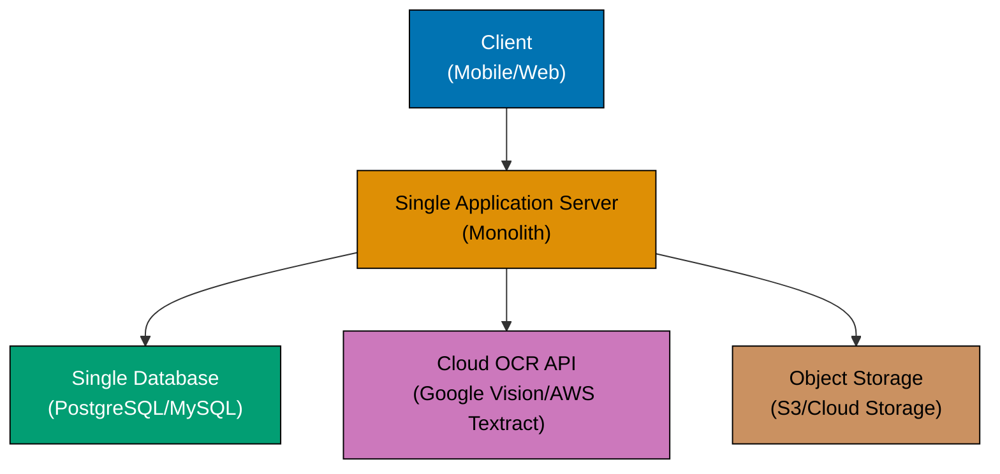
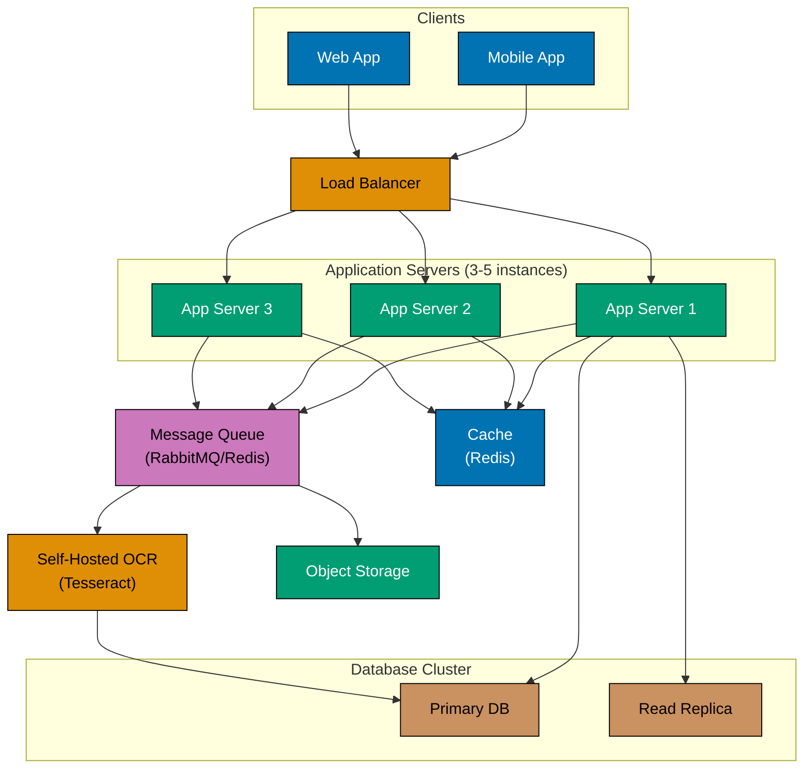
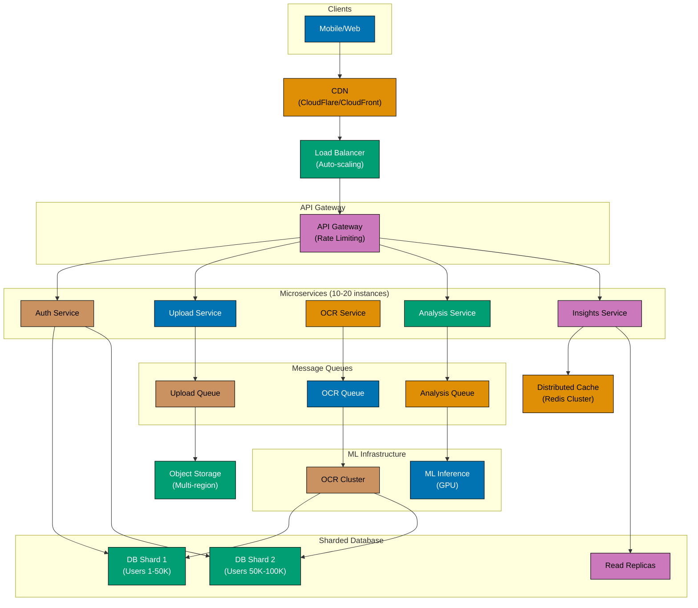
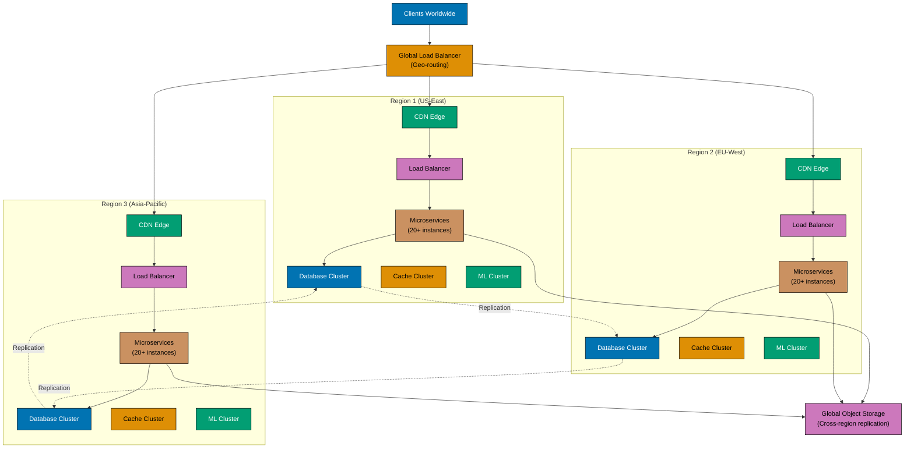
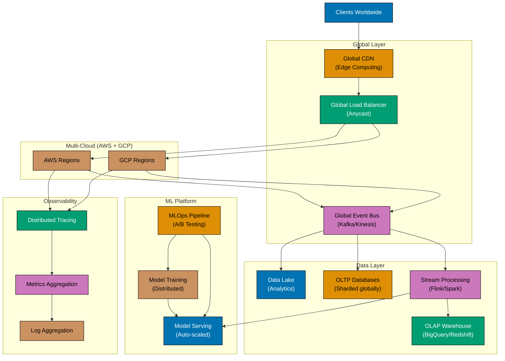
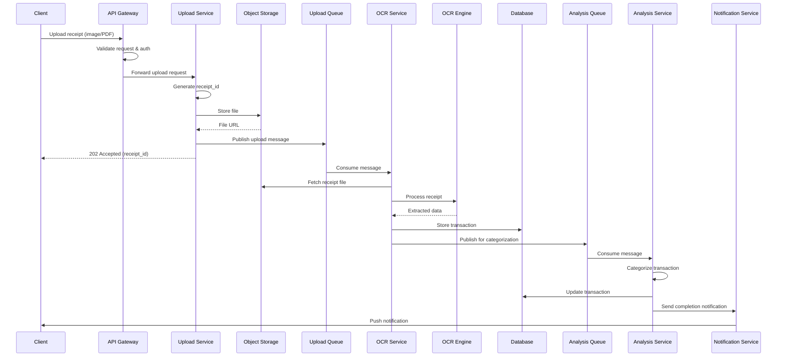
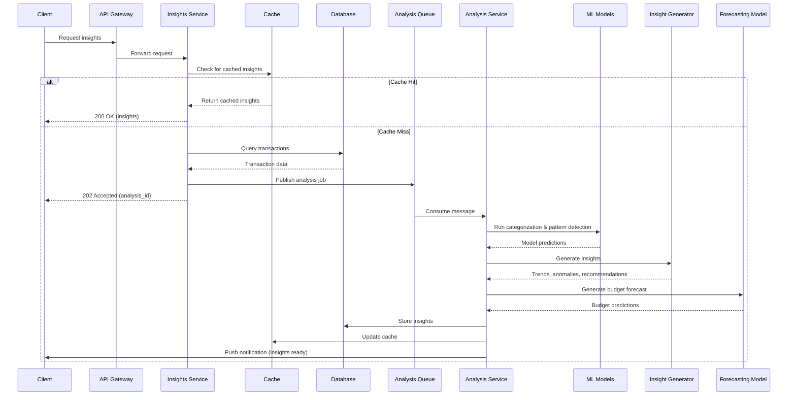
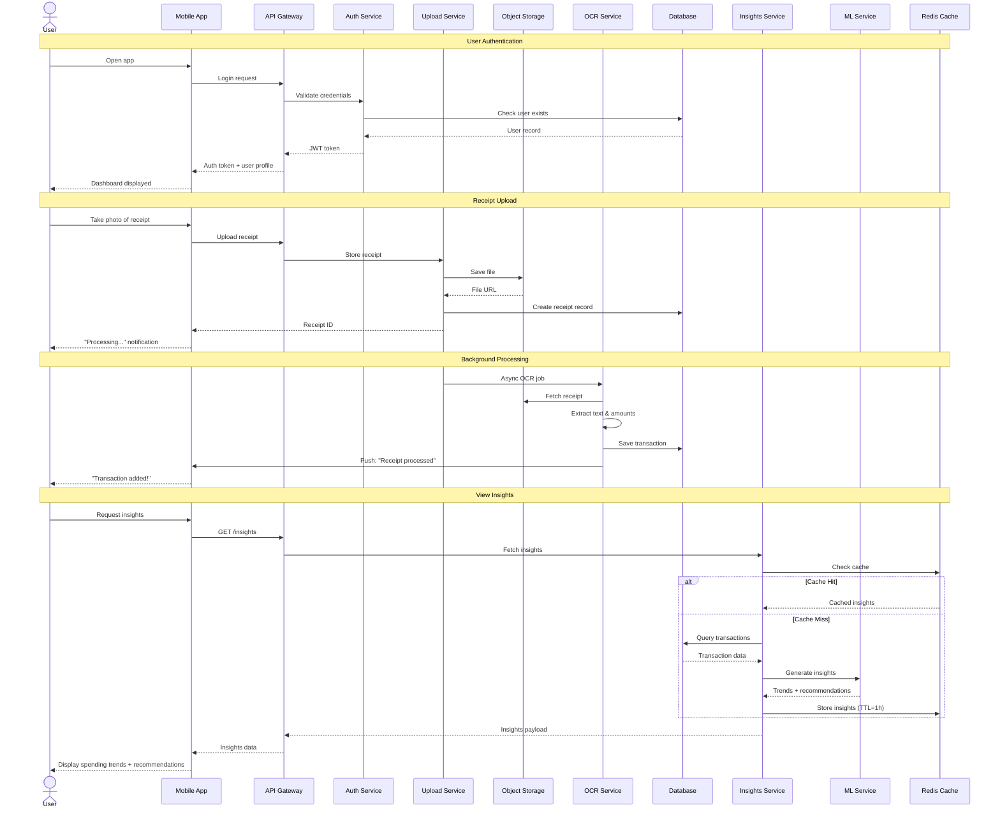

Imagine a world where understanding your financial health is as simple as taking a photo of your receipt. This system design explores how to build a personal finance advisor that automatically analyzes spending patterns and provides actionable insights to help users make better financial decisions.

## What You'll Learn

By completing this system design tutorial, you will understand:

1. **Problem Decomposition** - How to break down a complex product idea into functional and non-functional requirements
2. **Capacity Planning** - How to estimate traffic, storage, bandwidth, and compute needs for real-world scale
3. **Evolutionary Architecture** - How systems evolve from startup (1K users) to planet scale (10M+ users) with different architecture patterns at each stage
4. **Component Design** - How to design data models, APIs, and processing flows for document processing, OCR, and ML inference
5. **Scalability Patterns** - When to introduce async processing, database sharding, microservices, multi-region deployment, and event-driven architecture
6. **Non-Functional Requirements** - How to design for performance, availability, security, compliance, and disaster recovery
7. **Trade-Off Analysis** - How to evaluate build vs. buy, monolith vs. microservices, sync vs. async, and cloud vs. on-premise decisions

This tutorial focuses on architectural thinking and system design principles. You'll learn how senior engineers approach large-scale systems, make trade-offs, and evolve architecture as products grow.

## Prerequisites

### Knowledge Requirements

**Required**:

- Understanding of basic system architecture concepts (client-server, databases, APIs)
- Familiarity with distributed systems concepts (caching, load balancing, queuing)
- Basic knowledge of cloud infrastructure (compute, storage, networking)
- Understanding of SQL databases and data modeling

**Helpful but not required**:

- Experience with microservices architecture
- Knowledge of machine learning / AI concepts
- Understanding of OCR (Optical Character Recognition)
- Familiarity with message queues and async processing
- Knowledge of fintech regulations (PCI-DSS, GDPR)

### Tools and Resources

No specific tools are required for this tutorial. It's a conceptual system design exercise focused on architectural thinking. However, familiarity with these technologies will help:

- Cloud platforms (AWS, GCP, Azure)
- Databases (PostgreSQL, MongoDB, Redis)
- Message queues (RabbitMQ, Kafka)
- Container orchestration (Kubernetes, Docker)
- OCR APIs (Google Vision, AWS Textract)
- ML frameworks (TensorFlow, PyTorch)

## 1. Problem Statement

### The Challenge

Most people struggle to track their spending consistently. They lose receipts, forget to log transactions, and have no clear picture of where their money goes each month. While budgeting apps exist, they often require manual data entry or bank account linking—both with significant friction.

We want to solve this by building a system that makes financial tracking effortless: users simply photograph their receipts, and our AI does the rest. The system extracts transaction details using OCR, categorizes spending automatically, identifies patterns, and generates personalized recommendations to improve financial health.

### What We're Building

The system accepts payment receipts in multiple formats—photos from mobile devices, scanned PDFs, or even forwarded email receipts. Once uploaded, intelligent document processing extracts key information: merchant name, purchase date, amount, items bought, and payment method. This raw transaction data feeds into machine learning models that categorize expenses, detect spending anomalies, and identify trends over time.

Users don't just get their data back—they receive insights. The system might notice that dining expenses increased 30% this month, suggest a realistic budget based on historical patterns, or alert them to unusual charges. It forecasts future spending, helps set savings goals, and provides a financial health score that improves as users adopt better habits.

### Measuring Success

For this system to truly help users, we need several key attributes. First, accuracy: our OCR must extract transaction data with over 95% precision—anything less erodes trust. Second, speed: insights should generate in under 30 seconds so users get immediate feedback. Third, security: financial data is deeply personal and must be protected with enterprise-grade encryption and compliance. Fourth, scalability: the system should serve everyone from early adopters to millions of users without degrading performance. Finally, cost-efficiency: AI/ML operations can be expensive, so we need smart architecture choices to keep the system economically viable as it scales.

## 2. Requirements Analysis

To build a system that genuinely helps users improve their financial health, we need to understand both what the system must do (functional requirements) and how well it must perform (non-functional requirements). Let's break down the essential capabilities and quality attributes that will make or break this product.

### Functional Requirements

The system's value comes from a smooth user journey: upload receipts effortlessly, have data extracted accurately, and receive meaningful insights automatically. Here's what that means in practice:

**Core Features**:

- **Receipt Upload**: Support images (JPEG, PNG), PDFs, email forwarding
- **Data Extraction**: OCR to extract merchant, date, amount, category, items
- **Categorization**: Auto-categorize transactions (groceries, dining, transport, etc.)
- **Insights Generation**: Spending trends, budget tracking, anomaly detection
- **Recommendations**: Personalized savings tips, budget alerts, financial goals
- **Visualization**: Charts, graphs, spending breakdown by category/time
- **Multi-currency**: Support for different currencies and exchange rates
- **Export**: Download reports (PDF, CSV, Excel)

**User Management**:

- Authentication (email/password, OAuth, biometric)
- User profiles and preferences
- Notification settings (push, email, SMS)

### Non-Functional Requirements

While features get users in the door, performance, security, and reliability keep them engaged long-term. These quality attributes define the user experience and operational viability of our system.

**Performance**:

- Receipt upload: <5s for processing confirmation
- OCR extraction: <10s per receipt
- Insight generation: <30s for monthly analysis
- Dashboard load: <2s
- API response time: <500ms (p95)

**Scalability**:

- Support growth from 1K to 10M+ users
- Handle 100K+ receipt uploads per day at scale
- Process 1M+ transactions daily

**Availability**:

- 99.9% uptime (8.76 hours downtime/year)
- Graceful degradation during peak loads

**Security**:

- End-to-end encryption for financial data
- PCI-DSS compliance for payment data
- GDPR/CCPA compliance for user data
- Secure file storage with access controls

**Data Retention**:

- Receipts: 7 years (tax compliance)
- Transaction data: Indefinite (user preference)
- Aggregated insights: Indefinite

## 3. Capacity Estimation

Before diving into architecture, we need to understand the scale we're designing for. Back-of-the-envelope calculations help us make informed decisions about infrastructure, databases, and costs. Let's work through the numbers assuming we reach 1 million active users—a realistic target for a successful consumer fintech product.

These estimations aren't just academic exercises. They reveal potential bottlenecks, inform our technology choices, and help us plan costs. For instance, if storage grows to petabytes within a few years, we know we need a scalable object storage solution from day one. If we're processing thousands of receipts per second at peak, we need asynchronous processing and horizontal scaling built into our architecture.

### Assumptions

**User Base**:

- Active users: 1M (target scale)
- Daily active users (DAU): 100K (10% of total)
- Monthly active users (MAU): 500K (50% of total)

**Usage Patterns**:

- Average receipts per user per month: 30
- Average receipt size: 2MB (image), 500KB (PDF)
- Peak upload time: 6-9 PM (3x average traffic)

### Traffic Estimates

**Receipt Uploads**:

- Monthly uploads: 1M users × 30 receipts = 30M receipts/month
- Daily uploads: 30M / 30 = 1M receipts/day
- Uploads per second (average): 1M / 86,400 ≈ 12 QPS
- Peak QPS: 12 × 3 = 36 QPS

**API Requests**:

- Dashboard views: 100K DAU × 5 views/day = 500K requests/day ≈ 6 QPS
- Insight queries: 100K DAU × 2 queries/day = 200K requests/day ≈ 2 QPS
- Total API QPS: ~10 QPS (average), ~30 QPS (peak)

### Storage Estimates

**Receipt Storage**:

- Average receipt size: 1.5MB (mixed images/PDFs)
- Monthly storage: 30M receipts × 1.5MB = 45TB/month
- Annual storage: 45TB × 12 = 540TB/year
- 7-year retention: 540TB × 7 = 3.78PB

**Database Storage**:

- Transaction record: ~500 bytes
- Monthly transactions: 30M × 500 bytes = 15GB/month
- Annual transactions: 15GB × 12 = 180GB/year
- User data + metadata: ~50GB

**Total Storage** (7 years): ~4PB receipts + ~1.3TB database

### Bandwidth Estimates

**Upload Bandwidth**:

- Average: 12 QPS × 1.5MB = 18MB/s = 144 Mbps
- Peak: 36 QPS × 1.5MB = 54MB/s = 432 Mbps

**Download Bandwidth**:

- Dashboard API responses: ~50KB average
- 6 QPS × 50KB = 300KB/s = 2.4 Mbps

**Total Bandwidth**: ~150 Mbps average, ~450 Mbps peak

### Compute Estimates

**OCR Processing**:

- Average processing time: 5s per receipt
- Throughput needed: 12 receipts/s × 5s = 60 concurrent OCR jobs
- CPU cores needed: ~120 cores (assuming 2 receipts per core)

**AI/ML Analysis**:

- Insight generation: 100K users × 1 analysis/day = 100K analyses/day
- Average analysis time: 10s
- Concurrent jobs: 100K / 86,400 × 10 ≈ 12 concurrent jobs
- GPU/CPU for ML: ~10-20 instances

## 4. High-Level Design

Architecture isn't static—it evolves as the system grows. Starting with a simple monolith makes sense when you have 100 users, but that same architecture will crumble under the load of a million users. The key is knowing when to add complexity and what patterns to apply at each scale.

We'll walk through five architectural stages, from startup to planet scale. At each stage, we'll see what new components are introduced, why they're necessary, and what trade-offs they bring. This progression isn't just theoretical—it reflects how real-world systems grow from MVP to global products.

### Startup Scale (0–1K users)

When you're validating product-market fit with your first thousand users, simplicity is your friend. Your goal isn't perfect architecture—it's learning whether users actually want what you're building. Every hour spent on premature optimization is an hour not spent on features that might make or break adoption.

**Simple monolithic architecture with cloud services**:



**Components**:

- Single application server (all logic in one process)
- Single database instance
- Cloud-based OCR API (pay-per-use)
- Cloud object storage for receipts
- No caching, no queue, no redundancy

**Trade-offs**: Simple to deploy and manage, but single point of failure. Good for MVP and early validation.

### Small Scale (1K–10K users)

Congratulations—users are signing up faster than you expected. Your single server is starting to sweat under the load, and occasional downtime is frustrating your growing user base. It's time to introduce redundancy and asynchronous processing.

The first major architectural shift happens here: we split synchronous from asynchronous workloads. Receipt uploads no longer block while OCR runs—instead, we queue the work and return immediately. Users get instant feedback, and the system can handle traffic spikes gracefully. We also add our first database replica for read-heavy queries, caching for hot data, and self-hosted OCR to control costs as volume increases.

**Introducing async processing and read replicas**:



**Components Added**:

- Load balancer for horizontal scaling
- 3-5 application server instances
- Message queue for async OCR processing
- Database read replica for read-heavy queries
- Redis cache for frequently accessed data
- Self-hosted OCR engine (cost optimization)

**Trade-offs**: More complex but handles higher load. Async processing improves responsiveness.

### Medium Scale (10K–100K users)

Your monolith is showing its age. Different features have different scaling needs—OCR processing needs CPU, insights generation needs GPUs, and the API just needs more instances. It's time to break apart the monolith into specialized microservices.

This is where architecture gets interesting. We introduce database sharding because a single database can't handle write throughput anymore. We add a CDN because users worldwide are tired of slow dashboard loads. We split services so teams can deploy independently and scale components based on their specific bottlenecks. An API gateway appears to manage the complexity of routing requests to the right microservice.

The cost of this flexibility? Significantly more operational complexity. You now need container orchestration, service discovery, and distributed tracing just to understand what's happening when something breaks.

**Introducing CDN, database sharding, and microservices**:



**Components Added**:

- CDN for static content and edge caching
- API Gateway with rate limiting
- Microservices architecture (split monolith)
- Database sharding by user_id
- Distributed cache (Redis cluster)
- Dedicated ML infrastructure (GPU instances)
- Auto-scaling for all services
- Multi-region object storage

**Trade-offs**: Significantly more complex. Requires sophisticated deployment and monitoring. Better scalability and fault isolation.

### Large Scale (100K–1M users)

You're no longer a regional product—users are logging in from Tokyo, London, São Paulo, and Sydney. Latency matters, and data sovereignty regulations require you to store European user data in Europe. It's time to go multi-region.

Multi-region architecture introduces fascinating challenges. How do you keep databases synchronized across continents when network latency is 200 milliseconds? What happens when a user uploads a receipt in Tokyo, then checks their insights from Paris an hour later? These aren't theoretical questions—they directly impact user experience and require careful consideration of consistency models, replication strategies, and conflict resolution.

The benefit? Users everywhere get fast, local responses. The cost? You've just multiplied your infrastructure complexity by the number of regions you support.

**Multi-region deployment with geo-distribution**:



**Components Added**:

- Multi-region deployment (3+ regions)
- Global load balancer with geo-routing
- Database federation (separate DB per region)
- Cross-region data replication
- Regional ML clusters
- Service mesh for inter-service communication
- Advanced caching (edge + regional)

**Trade-offs**: High complexity and cost. Requires sophisticated data consistency strategies. Excellent performance for global users.

### Planet Scale (1M+ users)

At this scale, you're not just running a product—you're running a platform that impacts millions of lives. A single region outage can't take down the entire system. Data insights drive product decisions, requiring sophisticated analytics infrastructure. ML models need continuous improvement through A/B testing and retraining pipelines. You need the resilience and sophistication of companies like Netflix, Uber, or Stripe.

Planet-scale architecture is less about individual components and more about systems thinking. Events flow through a global bus, triggering actions across services and regions. Data lakes capture everything for analysis. Stream processing generates real-time insights. Multi-cloud deployment protects against vendor failures. Chaos engineering runs constantly, deliberately breaking things to ensure the system can recover.

This isn't architecture for the sake of complexity—it's the minimum viable infrastructure for a system that absolutely cannot fail, must serve millions globally with millisecond latency, and needs to evolve rapidly based on data-driven insights.

**Event-driven architecture with global distribution**:



**Components Added**:

- Edge computing (serverless at CDN edge)
- Event-driven architecture (event sourcing)
- Multi-cloud deployment (AWS + GCP redundancy)
- Data lake for long-term analytics
- Stream processing for real-time insights
- OLAP warehouse for business intelligence
- Advanced ML platform (distributed training, A/B testing)
- Comprehensive observability (distributed tracing, metrics, logs)
- Chaos engineering for resilience
- Global event bus for cross-region coordination

**Trade-offs**: Extreme complexity and cost. Requires large engineering team. Best performance and reliability globally.

## 5. Detailed Design

### Data Models

#### User Entity

```
User {
  user_id: UUID (PK)
  email: String (unique)
  hashed_password: String
  full_name: String
  currency: String (default: USD)
  timezone: String
  preferences: JSON
  created_at: Timestamp
  updated_at: Timestamp
}
```

#### Receipt Entity

```
Receipt {
  receipt_id: UUID (PK)
  user_id: UUID (FK -> User)
  file_path: String (object storage key)
  file_size: Integer (bytes)
  file_type: Enum (IMAGE, PDF)
  upload_status: Enum (PENDING, PROCESSING, COMPLETED, FAILED)
  ocr_status: Enum (PENDING, PROCESSING, COMPLETED, FAILED)
  uploaded_at: Timestamp
  processed_at: Timestamp
}
```

#### Transaction Entity

```
Transaction {
  transaction_id: UUID (PK)
  receipt_id: UUID (FK -> Receipt)
  user_id: UUID (FK -> User)
  merchant_name: String
  amount: Decimal(10,2)
  currency: String
  transaction_date: Date
  category: String
  subcategory: String
  payment_method: String
  items: JSON (optional)
  confidence_score: Float (OCR accuracy)
  created_at: Timestamp
}
```

#### Insight Entity

```
Insight {
  insight_id: UUID (PK)
  user_id: UUID (FK -> User)
  insight_type: Enum (TREND, ANOMALY, RECOMMENDATION, FORECAST)
  title: String
  description: Text
  category: String
  priority: Enum (LOW, MEDIUM, HIGH)
  action_items: JSON
  generated_at: Timestamp
  expires_at: Timestamp
}
```

### API Design

#### Upload Receipt

```
POST /api/v1/receipts/upload
Headers:
  Authorization: Bearer {token}
  Content-Type: multipart/form-data

Body:
  file: binary
  metadata: {
    "upload_source": "mobile_app",
    "timestamp": "2025-12-01T10:30:00Z"
  }

Response (202 Accepted):
{
  "receipt_id": "uuid",
  "status": "processing",
  "estimated_completion": "2025-12-01T10:30:15Z"
}
```

#### Get Transaction History

```
GET /api/v1/transactions?start_date={date}&end_date={date}&category={category}&limit={n}
Headers:
  Authorization: Bearer {token}

Response (200 OK):
{
  "transactions": [
    {
      "transaction_id": "uuid",
      "merchant": "Coffee Shop",
      "amount": 4.50,
      "currency": "USD",
      "date": "2025-11-30",
      "category": "Dining",
      "payment_method": "Credit Card"
    }
  ],
  "total_count": 145,
  "page": 1,
  "has_more": true
}
```

#### Get Financial Insights

```
GET /api/v1/insights?period={month|quarter|year}&type={trend|anomaly|recommendation}
Headers:
  Authorization: Bearer {token}

Response (200 OK):
{
  "insights": [
    {
      "insight_id": "uuid",
      "type": "trend",
      "title": "Dining spending increased 25%",
      "description": "You spent $450 on dining this month, up from $360 last month",
      "priority": "medium",
      "recommendations": [
        "Set a dining budget of $400/month",
        "Try cooking at home 2 more days per week"
      ]
    }
  ],
  "summary": {
    "total_spending": 2450.00,
    "vs_last_period": "+12%",
    "top_category": "Groceries"
  }
}
```

#### Generate Analysis

```
POST /api/v1/analysis/generate
Headers:
  Authorization: Bearer {token}

Body:
{
  "period": "last_30_days",
  "include_forecast": true
}

Response (202 Accepted):
{
  "analysis_id": "uuid",
  "status": "processing",
  "estimated_completion": "2025-12-01T10:31:00Z"
}
```

### Processing Flows

#### Receipt Upload Flow



**Key Steps**:

1. Client uploads receipt via API Gateway
2. Upload Service stores file in object storage and queues for processing
3. OCR Service extracts transaction data from receipt
4. Analysis Service categorizes the transaction
5. User receives notification when processing completes

**Asynchronous Processing**: Steps 6-12 happen asynchronously, allowing the API to return quickly (202 Accepted) while processing continues in the background.

#### Insight Generation Flow



**Key Steps**:

1. Client requests financial insights for a period
2. Insights Service checks cache for recent analysis
3. On cache hit: Return immediately
4. On cache miss: Query transactions, run ML analysis asynchronously
5. ML models generate insights (trends, anomalies, recommendations)
6. Results cached and returned to client

**Cache Strategy**: Insights are cached for 1 hour to avoid redundant ML processing for frequent requests.

#### Complete User Journey Flow

This diagram shows the end-to-end user experience from authentication to viewing personalized financial insights:



**User Experience Flow**:

1. **Authentication** (< 500ms): User logs in and receives JWT token for session
2. **Receipt Upload** (< 1s): User captures receipt photo, app uploads and returns immediately
3. **Async Processing** (5-15s): Background workers extract transaction data
4. **Push Notification**: User notified when transaction is ready
5. **View Insights** (< 2s cache hit, < 5s cache miss): User sees personalized financial insights

**Key Performance Targets**:

- API response time: p95 < 500ms (cached), p95 < 2s (uncached)
- Receipt processing: p95 < 15 seconds end-to-end
- Push notification latency: < 3 seconds after processing completes

## 6. Scalability Considerations

### Startup Scale (0–1K users)

**Architecture**:

- Single application server
- Single database instance
- Cloud-based OCR API (pay-per-use)
- Cloud object storage for receipts
- No caching needed yet

**Bottlenecks**: OCR processing time (third-party API latency)

**Cost**: ~$100-500/month

### Small Scale (1K–10K users)

**Architectural Changes**:

- Introduce message queue for async processing
- Add database read replica for reporting queries
- Introduce Redis cache for frequently accessed insights
- Scale application servers horizontally (3-5 instances)
- Self-hosted OCR engine to reduce API costs

**Bottlenecks**: Database write throughput, OCR processing capacity

**Cost**: ~$500-2K/month

### Medium Scale (10K–100K users)

**Architectural Changes**:

- Implement CDN for static assets and dashboard
- Database sharding by user_id for write distribution
- Dedicated ML inference servers (GPU instances)
- Introduce distributed cache (Redis cluster)
- Auto-scaling for application servers (10-20 instances)
- Separate read/write database connections
- Rate limiting and throttling at API gateway

**Bottlenecks**: ML model inference latency, database connection pooling

**Cost**: ~$5K-20K/month

### Large Scale (100K–1M users)

**Architectural Changes**:

- Multi-region deployment for geo-distributed users
- Database federation (separate databases per region)
- Asynchronous insight generation (batch processing)
- Dedicated file storage per region with cross-region replication
- Microservices architecture (separate services for upload, OCR, analysis)
- Service mesh for inter-service communication
- Advanced caching strategies (cache aside, write-through)

**Bottlenecks**: Cross-region latency, data consistency across regions

**Cost**: ~$50K-200K/month

### Planet Scale (1M+ users)

**Architectural Changes**:

- Global CDN with edge caching
- Event-driven architecture (event sourcing)
- Distributed tracing and observability
- ML model versioning and A/B testing
- Serverless functions for sporadic workloads
- Data lake for long-term analytics
- Advanced ML pipelines (model retraining, drift detection)
- Multi-cloud deployment (AWS + GCP for redundancy)
- Chaos engineering for resilience testing

**Bottlenecks**: Data consistency guarantees, ML model training costs, cross-cloud data transfer

**Cost**: $200K-1M+/month

## 7. Monitoring and Observability

### Key Metrics

**Application Metrics**:

- Request rate (QPS) per endpoint
- Response time (p50, p95, p99)
- Error rate (4xx, 5xx)
- Upload success rate
- OCR accuracy (confidence scores)

**Business Metrics**:

- Daily/Monthly active users
- Receipts uploaded per day
- Insights generated per day
- User retention rate
- Average receipts per user

**Infrastructure Metrics**:

- CPU utilization (per service)
- Memory usage
- Disk I/O
- Network throughput
- Queue depth (message backlogs)

**ML Metrics**:

- OCR processing time
- Model inference latency
- Categorization accuracy
- Model drift detection

### Logging Strategy

**Structured Logging**:

- Use JSON format for all logs
- Include correlation IDs for request tracing
- Log levels: DEBUG, INFO, WARN, ERROR, FATAL

**Log Aggregation**:

- Centralized log storage (ELK stack, Splunk, or cloud-native)
- Log retention: 30 days hot, 1 year warm, 7 years cold (compliance)

**What to Log**:

- All API requests (method, path, status, latency)
- Authentication events (login, logout, failed attempts)
- Receipt uploads (user_id, receipt_id, file_size, status)
- OCR results (receipt_id, confidence_score, extraction_time)
- Errors and exceptions (stack traces, context)
- Database queries (slow queries > 1s)

### Alerting and Incident Response

**SLIs (Service Level Indicators)**:

- API availability: 99.9%
- API latency (p95): <500ms
- Upload success rate: >99%
- OCR processing time: <10s (p95)

**SLOs (Service Level Objectives)**:

- 99.9% uptime per month
- 95% of uploads processed within 15s
- 99% OCR accuracy on structured receipts

**SLAs (Service Level Agreements)**:

- 99% uptime guarantee (customer-facing)
- Refund policy for extended outages

**Alerts**:

- Critical: Service down, database unreachable, queue backed up >1 hour
- High: Error rate >5%, latency >2s, OCR accuracy <90%
- Medium: Slow queries, high memory usage, queue depth >1000
- Low: Deprecation warnings, certificate expiration reminders

**On-Call Procedures**:

- 24/7 on-call rotation for critical services
- Incident response runbooks for common issues
- Escalation policy (15 min → escalate to senior engineer)

### Observability Tools

**Metrics**: Prometheus + Grafana, Datadog, New Relic
**Logging**: ELK Stack, Splunk, CloudWatch Logs
**Tracing**: Jaeger, Zipkin, OpenTelemetry
**APM**: Datadog APM, New Relic APM
**Error Tracking**: Sentry, Rollbar

## 8. Testing Strategies

### Load Testing

**Capacity Planning**:

- Simulate 10x expected traffic to find breaking points
- Test receipt upload throughput (100 QPS sustained)
- Test API response times under load (1000 QPS)

**Tools**: JMeter, Gatling, Locust, k6

**Test Scenarios**:

- Concurrent receipt uploads (1000 users uploading simultaneously)
- Dashboard load (10K users requesting insights concurrently)
- Database query performance (100K transactions query)

**Performance Benchmarks**:

- Upload endpoint: <5s for 95% of requests
- OCR processing: <10s for 95% of receipts
- Insight generation: <30s for monthly analysis

### Stress Testing

**Finding Breaking Points**:

- Gradually increase load until system fails
- Identify bottlenecks (CPU, memory, database, queue)
- Test failure recovery (how does system recover?)

**Test Scenarios**:

- Database connection pool exhaustion
- Message queue overload (1M messages in queue)
- File storage limits (concurrent uploads)

### Chaos Engineering

**Failure Injection**:

- Randomly terminate service instances
- Introduce network latency (100-500ms)
- Simulate database failures (replica down, primary down)
- Inject errors in OCR processing (50% failure rate)

**Resilience Testing**:

- Verify graceful degradation
- Test circuit breakers and retries
- Validate failover mechanisms

**Tools**: Chaos Monkey, Gremlin, LitmusChaos

### Integration and End-to-End Testing

**Integration Tests**:

- Test API endpoints with real database
- Test OCR service with sample receipts
- Test message queue interactions

**End-to-End Tests**:

- Full user flow: Upload receipt → OCR → Analysis → Insights
- Test across multiple services and dependencies
- Validate data consistency

**Tools**: Postman, REST Assured, Selenium, Cypress

## 9. Security & Compliance

### Authentication and Authorization

**Authentication**:

- Email/password with bcrypt hashing (cost factor 12)
- OAuth 2.0 (Google, Apple, Facebook login)
- Biometric authentication (fingerprint, Face ID) for mobile
- Multi-factor authentication (MFA) via SMS or TOTP

**Authorization**:

- Role-based access control (RBAC): User, Admin, Support
- JWT tokens for stateless authentication
- Refresh tokens for long-lived sessions (30 days)
- Access tokens short-lived (15 minutes)

**Session Management**:

- Secure session cookies (HttpOnly, Secure, SameSite)
- Session timeout after 30 minutes of inactivity
- Concurrent session limit (max 5 devices)

### Data Encryption

**In Transit**:

- TLS 1.3 for all client-server communication
- Certificate pinning for mobile apps
- HTTPS only (HSTS enabled)

**At Rest**:

- Database encryption (AES-256)
- Object storage encryption (server-side encryption)
- Encrypted backups
- Key management service (KMS) for encryption keys
- Key rotation every 90 days

**Application-Level Encryption**:

- Encrypt sensitive fields (SSN, account numbers) before storing
- Field-level encryption for PII (personally identifiable information)

### Input Validation and Protection

**Input Validation**:

- Whitelist allowed file types (JPEG, PNG, PDF only)
- File size limits (max 10MB per upload)
- Content-type validation (verify file signature, not just extension)
- Rate limiting on API endpoints (100 requests/minute per user)

**Protection Against Attacks**:

- SQL injection: Use parameterized queries, ORM
- XSS: Sanitize user inputs, CSP headers
- CSRF: CSRF tokens for state-changing operations
- File upload attacks: Scan uploads for malware, store outside webroot

### DDoS Protection and API Security

**DDoS Protection**:

- Cloud-based DDoS protection (Cloudflare, AWS Shield)
- Rate limiting at API gateway (global + per-user limits)
- Geo-blocking for suspicious regions
- IP reputation scoring

**API Security**:

- API versioning (/api/v1, /api/v2)
- Deprecation warnings for old API versions
- Request signing for sensitive operations
- API key rotation policy

### Compliance Requirements

**PCI-DSS** (if storing payment data):

- Do NOT store full credit card numbers
- Use tokenization for payment methods
- Quarterly security scans
- Annual compliance audits

**GDPR** (European users):

- Right to access (user data export)
- Right to erasure ("delete my data")
- Data portability (export in machine-readable format)
- Privacy by design (minimize data collection)
- Consent management (opt-in for marketing)

**CCPA** (California users):

- Disclosure of data collection practices
- Right to opt-out of data selling
- Right to deletion
- Non-discrimination for exercising rights

**Financial Data Regulations**:

- 7-year data retention for tax purposes
- Audit trails for all financial transactions
- Data breach notification (72 hours under GDPR)

**SOC 2 Compliance**:

- Security controls documentation
- Access controls and logging
- Incident response procedures
- Third-party risk management

### Security Testing

**Penetration Testing**:

- Annual third-party penetration tests
- Bug bounty program for vulnerability disclosure
- Test for OWASP Top 10 vulnerabilities

**Vulnerability Scanning**:

- Weekly automated vulnerability scans
- Dependency scanning for outdated libraries
- Container image scanning for base image vulnerabilities

**Security Audits**:

- Quarterly code security reviews
- Infrastructure security audits
- Third-party vendor security assessments

## 10. Disaster Recovery & Business Continuity

### Backup Strategies

**Database Backups**:

- Full backup: Daily at 2 AM UTC
- Incremental backup: Every 6 hours
- Transaction log backup: Every 15 minutes
- Backup retention: 30 days hot, 1 year warm, 7 years cold (compliance)
- Cross-region backup replication

**File Storage Backups**:

- Object storage with versioning enabled
- Cross-region replication (primary + 2 replicas)
- Immutable backups (cannot be deleted for 7 years)

**Configuration Backups**:

- Infrastructure as Code (IaC) stored in version control
- Daily snapshots of configuration management systems
- Secrets encrypted and backed up to secure vault

**Backup Testing**:

- Monthly restore drills
- Validate backup integrity (checksums)
- Test restore time (ensure meets RTO)

### Disaster Recovery Plans

**Hot Standby** (for planet scale):

- Active-active multi-region deployment
- Real-time data replication
- Automatic failover (DNS-based or load balancer)
- Cost: 2x infrastructure cost

**Warm Standby** (for large scale):

- Secondary region with minimal capacity
- Near real-time data replication (lag < 5 minutes)
- Manual or semi-automatic failover
- Scale up secondary on failover
- Cost: 50% of primary infrastructure

**Cold Standby** (for small/medium scale):

- Backup data replicated to secondary region
- No active infrastructure in secondary
- Manual failover with infrastructure provisioning
- Cost: Storage costs only

**Multi-Region Failover**:

1. Primary region failure detected
2. Health checks fail for 3 consecutive checks (30s)
3. Automatic DNS failover to secondary region
4. Application services scale up in secondary
5. Database promoted from replica to primary
6. Monitor recovery and investigate root cause

### RTO and RPO Targets

**Recovery Time Objective (RTO)**: Maximum acceptable downtime

- Startup scale: 24 hours
- Small scale: 4 hours
- Medium scale: 1 hour
- Large scale: 15 minutes
- Planet scale: 0 minutes (zero downtime)

**Recovery Point Objective (RPO)**: Maximum acceptable data loss

- Startup scale: 24 hours
- Small scale: 1 hour
- Medium scale: 15 minutes
- Large scale: 5 minutes
- Planet scale: 0 minutes (no data loss)

### Failover Systems and Redundancy

**Database Failover**:

- Primary-replica setup with automatic failover
- Replica promotion to primary within 2 minutes
- Connection pool reconfiguration
- Read replica for read-heavy workloads

**Application Server Redundancy**:

- Multi-AZ deployment (3+ availability zones)
- Auto-scaling groups with health checks
- Rolling deployments (zero downtime)
- Blue-green deployment for major releases

**Load Balancer Redundancy**:

- Active-active load balancers across zones
- Health checks every 10 seconds
- Automatic removal of unhealthy instances

**Message Queue Redundancy**:

- Clustered queue with replication
- Dead letter queue for failed messages
- Message persistence (durable queues)

### Data Replication Across Regions

**Replication Strategy**:

- Synchronous replication within region
- Asynchronous replication across regions
- Eventual consistency for cross-region reads

**Conflict Resolution**:

- Last-write-wins (LWW) for user preferences
- Version vectors for transaction data
- Manual resolution for critical conflicts

**Replication Monitoring**:

- Replication lag metrics (<5s acceptable)
- Alert on replication failure
- Validate data consistency (checksums)

### Business Continuity Planning

**Incident Response Procedures**:

1. Incident detected (monitoring alerts)
2. On-call engineer acknowledges within 5 minutes
3. Assess severity (P0: Critical, P1: High, P2: Medium, P3: Low)
4. Escalate to incident commander for P0/P1
5. Assemble incident response team
6. Communicate status to stakeholders
7. Execute mitigation plan
8. Post-mortem within 48 hours (blameless)

**Communication Plan**:

- Status page for real-time updates
- Email notifications to affected users
- Internal Slack channel for incident coordination
- Executive briefings for major incidents

**Service Degradation Mode**:

- Disable non-critical features (insights generation, notifications)
- Serve cached data instead of live queries
- Queue background jobs for later processing
- Display maintenance banner to users

## 11. Trade-offs and Alternatives

### Build vs Buy: OCR Engine

**Build (Self-Hosted)**:

- **Pros**: Lower long-term costs, customization, no API limits
- **Cons**: Higher upfront investment, maintenance overhead, lower accuracy initially
- **Use Case**: Medium to large scale (>10K users)

**Buy (Cloud API)**:

- **Pros**: Fast implementation, high accuracy, managed service
- **Cons**: Higher per-request cost, vendor lock-in, rate limits
- **Use Case**: Startup to small scale (<10K users)

**Recommendation**: Start with cloud API (Google Vision, AWS Textract), migrate to self-hosted at 10K+ users

### Synchronous vs Asynchronous Processing

**Synchronous**:

- **Pros**: Immediate feedback to user, simpler architecture
- **Cons**: Slower response times, blocks API threads, hard to scale
- **Use Case**: Small scale with fast processing (<2s)

**Asynchronous**:

- **Pros**: Fast API responses, decoupled services, handles spikes
- **Cons**: Complex architecture, eventual consistency, requires polling/webhooks
- **Use Case**: Medium scale and above

**Recommendation**: Use async processing for OCR and insights generation from day one

### Relational vs NoSQL Database

**Relational (PostgreSQL, MySQL)**:

- **Pros**: ACID transactions, complex queries, mature tooling
- **Cons**: Harder to scale horizontally, schema migrations
- **Use Case**: Transactional data (users, transactions)

**NoSQL (MongoDB, Cassandra)**:

- **Pros**: Easy horizontal scaling, flexible schema, high write throughput
- **Cons**: Eventual consistency, limited query capabilities
- **Use Case**: Receipts metadata, logs, analytics

**Recommendation**: Use relational DB for core data, NoSQL for logs and analytics

### Monolith vs Microservices

**Monolith**:

- **Pros**: Simple deployment, easier debugging, lower latency
- **Cons**: Hard to scale individual components, tight coupling
- **Use Case**: Startup to small scale (<10K users)

**Microservices**:

- **Pros**: Independent scaling, technology flexibility, team autonomy
- **Cons**: Complex deployment, network latency, distributed debugging
- **Use Case**: Large to planet scale (>100K users)

**Recommendation**: Start monolith, migrate to microservices at 50-100K users

### On-Premise vs Cloud

**On-Premise**:

- **Pros**: Data control, predictable costs at scale, customization
- **Cons**: High upfront cost, maintenance overhead, slower provisioning
- **Use Case**: Large enterprises with compliance requirements

**Cloud**:

- **Pros**: Fast provisioning, pay-per-use, managed services, global reach
- **Cons**: Vendor lock-in, variable costs, less control
- **Use Case**: Startups to planet scale (most use cases)

**Recommendation**: Use cloud (AWS, GCP, Azure) for flexibility and speed

### AI Model Hosting: Cloud vs Self-Hosted

**Cloud ML APIs**:

- **Pros**: No model management, high accuracy, auto-scaling
- **Cons**: Expensive at scale, vendor lock-in, latency
- **Use Case**: Startup to small scale

**Self-Hosted Models**:

- **Pros**: Lower long-term cost, customization, data privacy
- **Cons**: Requires ML expertise, infrastructure management
- **Use Case**: Medium to planet scale

**Recommendation**: Start with cloud APIs, transition to self-hosted at 50K+ users

## 12. Troubleshooting & Operational Issues

Building and operating a complex AI system comes with challenges. Here's how to identify and resolve common issues.

### Deployment Issues

**Problem: OCR Service Not Processing Receipts**

**Symptoms:**

- Receipts stuck in "PROCESSING" status for > 60 seconds
- OCR queue depth growing continuously
- No error logs in OCR service

**Diagnosis Steps:**

```bash
# 1. Check OCR worker health
kubectl get pods -l app=ocr-service
# Look for: CrashLoopBackOff, ImagePullBackOff, OOMKilled

# 2. Check queue depth
aws sqs get-queue-attributes --queue-url <OCR_QUEUE_URL> \
  --attribute-names ApproximateNumberOfMessages

# 3. Check OCR service logs
kubectl logs -l app=ocr-service --tail=100

# 4. Check resource utilization
kubectl top pods -l app=ocr-service
```

**Common Causes & Fixes:**

| Cause                  | Symptoms                                                     | Fix                                                |
| ---------------------- | ------------------------------------------------------------ | -------------------------------------------------- |
| Out of Memory          | Pods restart frequently, OOMKilled status                    | Increase memory limit in deployment YAML           |
| API Rate Limits        | HTTP 429 errors in logs                                      | Implement exponential backoff, increase quota      |
| Invalid Image Format   | Specific receipts fail, error logs show "unsupported format" | Add format validation, convert to supported format |
| Queue Permission Error | "Access Denied" in logs                                      | Update IAM role with SQS permissions               |

---

**Problem: Database Connection Pool Exhaustion**

**Symptoms:**

- API returns 500 errors: "connection pool exhausted"
- High latency for all database queries
- Application logs show connection timeout errors

**Diagnosis:**

```bash
# Check active database connections
SELECT count(*) FROM pg_stat_activity WHERE state = 'active';

# Check connection pool metrics
# Application metrics endpoint
curl http://localhost:8080/metrics | grep db_pool

# Expected output:
# db_pool_active_connections 90
# db_pool_max_connections 100  # ← At limit!
# db_pool_wait_time_ms 5000    # ← High wait time
```

**Fixes:**

1. **Increase pool size** (short-term):

```yaml
# config/database.yml
pool_size: 200 # Increase from 100
max_overflow: 50
```

2. **Fix connection leaks** (long-term):

```go
// ❌ Wrong - Connection not returned to pool
rows, err := db.Query("SELECT * FROM transactions")
// Missing rows.Close()

// ✅ Correct - Always close resources
rows, err := db.Query("SELECT * FROM transactions")
if err != nil {
    return err
}
defer rows.Close()  // Returns connection to pool
```

3. **Add connection timeout**:

```yaml
db_config:
  max_idle_time: 5m # Close idle connections
  max_lifetime: 15m # Recycle connections
```

---

### Performance Issues

**Problem: Slow Insight Generation (> 10 seconds)**

**Symptoms:**

- Users complain insights take too long to load
- p95 latency > 10s for `/api/v1/insights`
- High CPU utilization on ML service

**Diagnosis:**

```bash
# 1. Profile the request
curl -w "@curl-format.txt" -o /dev/null -s \
  "http://api/v1/insights?user_id=123"

# 2. Check cache hit rate
redis-cli INFO stats | grep keyspace_hits
# Low hit rate means cache not being used effectively

# 3. Check database query performance
EXPLAIN ANALYZE SELECT * FROM transactions
WHERE user_id = 'uuid' AND date > NOW() - INTERVAL '30 days';
```

**Optimizations:**

1. **Add database indexes**:

```sql
-- Add composite index for common query pattern
CREATE INDEX idx_transactions_user_date
ON transactions(user_id, transaction_date DESC);

-- Verify index is used
EXPLAIN SELECT * FROM transactions
WHERE user_id = 'uuid' AND transaction_date > '2025-11-01';
-- Should show: Index Scan using idx_transactions_user_date
```

2. **Optimize cache strategy**:

```python
# ❌ Wrong - Cache key too granular (low hit rate)
cache_key = f"insights:{user_id}:{start_date}:{end_date}:{category}"

# ✅ Better - Round to hour for better hit rate
hour = datetime.now().replace(minute=0, second=0)
cache_key = f"insights:{user_id}:{period}:{hour}"
```

3. **Pre-compute insights**:

```python
# Background job runs daily at 2 AM
def precompute_daily_insights():
    active_users = get_active_users()
    for user in active_users:
        insights = generate_insights(user.id, period="last_30_days")
        cache.set(f"insights:{user.id}:30d", insights, ttl=24h)
```

---

**Problem: High Memory Usage in Receipt Processing**

**Symptoms:**

- OCR service pods frequently OOMKilled
- Memory usage spikes when processing large PDFs
- Kubernetes evicts pods under memory pressure

**Diagnosis:**

```bash
# 1. Check memory usage by pod
kubectl top pods -l app=ocr-service

# 2. Get detailed memory metrics
kubectl exec -it <pod-name> -- cat /proc/meminfo

# 3. Profile memory usage (if running Go)
go tool pprof http://localhost:6060/debug/pprof/heap
```

**Fixes:**

1. **Limit file size at upload**:

```go
const MaxFileSize = 10 * 1024 * 1024  // 10 MB

func validateFileSize(file io.Reader) error {
    size := 0
    buf := make([]byte, 32*1024)  // 32 KB chunks
    for {
        n, err := file.Read(buf)
        size += n
        if size > MaxFileSize {
            return fmt.Errorf("file too large: max %d MB", MaxFileSize/1024/1024)
        }
        if err == io.EOF {
            break
        }
    }
    return nil
}
```

2. **Process images in chunks**:

```python
# ❌ Wrong - Load entire image in memory
image = Image.open(receipt_path)
processed = ocr_engine.process(image)

# ✅ Better - Stream processing
with Image.open(receipt_path) as image:
    # Process in tiles for large images
    if image.width > 4000 or image.height > 4000:
        results = process_in_tiles(image, tile_size=2000)
    else:
        results = ocr_engine.process(image)
```

3. **Increase resource limits**:

```yaml
# k8s/ocr-service.yaml
resources:
  requests:
    memory: "512Mi"
    cpu: "500m"
  limits:
    memory: "2Gi" # Increase limit
    cpu: "2000m"
```

---

### Debugging Strategies

**1. Distributed Tracing**

Use OpenTelemetry to trace requests across services:

```python
from opentelemetry import trace

tracer = trace.get_tracer(__name__)

@app.route('/api/v1/receipts/upload')
def upload_receipt():
    with tracer.start_as_current_span("upload_receipt") as span:
        span.set_attribute("user.id", user_id)
        span.set_attribute("file.size", file_size)

        # Trace object storage call
        with tracer.start_as_current_span("store_in_s3"):
            s3.upload_file(file, bucket, key)

        # Trace database call
        with tracer.start_as_current_span("insert_receipt_record"):
            db.insert_receipt(receipt_id, user_id, file_url)
```

**View trace in Jaeger/Zipkin:**

```
User Request → API Gateway (5ms) → Upload Service (200ms) →
  ├─ S3 Upload (150ms)
  └─ DB Insert (45ms)
Total: 205ms
```

**2. Structured Logging**

Use JSON logging for easy parsing and filtering:

```python
import structlog

logger = structlog.get_logger()

# ❌ Wrong - Unstructured log
logger.info(f"User {user_id} uploaded receipt {receipt_id}")

# ✅ Better - Structured log
logger.info("receipt_uploaded",
    user_id=user_id,
    receipt_id=receipt_id,
    file_size=file_size,
    upload_source="mobile_app"
)
```

**Query logs efficiently:**

```bash
# Find all failed OCR jobs for user
kubectl logs -l app=ocr-service | \
  jq 'select(.user_id=="123" and .status=="failed")'

# Calculate average processing time
kubectl logs -l app=ocr-service | \
  jq -s 'map(.processing_time_ms) | add/length'
```

**3. Health Checks & Readiness Probes**

```yaml
# k8s/deployment.yaml
livenessProbe:
  httpGet:
    path: /health/live
    port: 8080
  initialDelaySeconds: 30
  periodSeconds: 10

readinessProbe:
  httpGet:
    path: /health/ready
    port: 8080
  initialDelaySeconds: 5
  periodSeconds: 5
```

**Health endpoint implementation:**

```go
func healthHandler(w http.ResponseWriter, r *http.Request) {
    // Check dependencies
    if err := db.Ping(); err != nil {
        http.Error(w, "database unhealthy", http.StatusServiceUnavailable)
        return
    }

    if err := cache.Ping(); err != nil {
        http.Error(w, "cache unhealthy", http.StatusServiceUnavailable)
        return
    }

    w.WriteHeader(http.StatusOK)
    json.NewEncoder(w).Encode(map[string]string{"status": "healthy"})
}
```

**4. Chaos Engineering**

Test resilience by intentionally breaking things:

```bash
# Kill random pod to test pod restart handling
kubectl delete pod -l app=ocr-service \
  $(kubectl get pods -l app=ocr-service -o name | shuf -n 1)

# Inject network latency
tc qdisc add dev eth0 root netem delay 100ms

# Simulate database failure
# Temporarily revoke database permissions to test error handling

# Simulate third-party API failure
# Use Nginx proxy to return 503 for OCR API calls
```

---

### Monitoring Alerts

**Critical Alerts (PagerDuty)**:

```yaml
# prometheus/alerts.yml
groups:
  - name: critical
    rules:
      - alert: HighErrorRate
        expr: rate(http_requests_total{status=~"5.."}[5m]) > 0.05
        for: 2m
        annotations:
          summary: "Error rate > 5% for 2 minutes"

      - alert: DatabaseDown
        expr: up{job="postgres"} == 0
        for: 1m
        annotations:
          summary: "Database is unreachable"

      - alert: QueueBacklog
        expr: queue_depth{queue="ocr"} > 1000
        for: 5m
        annotations:
          summary: "OCR queue has > 1000 messages"
```

**Warning Alerts (Slack)**:

- p95 latency > 2s for 5 minutes
- Cache hit rate < 70% for 10 minutes
- Disk usage > 80%
- Memory usage > 85%

---

## 12. Practice Exercises

Now that you understand the full system design, test your knowledge with these design challenges:

### Exercise 1: Design for Different Scale (Beginner)

**Scenario**: Your AI finance advisor just secured seed funding. You have $50K/month budget and expect 5,000 users in the first 6 months.

**Challenge**: Design the architecture for this startup phase. Consider:

1. Which components should you build vs. buy?
2. What's your database strategy?
3. How will you handle OCR processing?
4. What's your hosting approach?

**Expected Output**: Architecture diagram with 5-7 components, cost breakdown, and rationale.

---

### Exercise 2: Capacity Planning (Intermediate)

**Scenario**: Your system has 250,000 active users uploading an average of 25 receipts/month. Peak traffic is 5x average.

**Challenge**: Calculate:

1. Peak upload QPS
2. Annual storage growth
3. Monthly bandwidth requirements
4. Number of OCR workers needed (5s processing time per receipt)
5. Estimated monthly cost

**Expected Output**: Detailed calculations with reasoning.

---

### Exercise 3: Handling Failures (Intermediate)

**Scenario**: Your OCR service fails catastrophically. 50,000 receipts stuck in queue, users complaining.

**Challenge**: Design a recovery strategy covering:

1. Preventing user-facing impact
2. Queue management strategy
3. Processing prioritization during recovery
4. Monitoring/alerting improvements

**Expected Output**: Incident response plan and preventive measures.

---

### Exercise 4: Multi-Region Expansion (Advanced)

**Scenario**: Expanding from US to Europe. GDPR requires EU user data stays in EU.

**Challenge**: Design multi-region architecture that:

1. Keeps EU data in EU region
2. Provides <200ms latency for EU users
3. Handles user migration (US → EU)
4. Maintains data consistency across regions

**Expected Output**: Multi-region diagram, data residency strategy, consistency model.

---

### Exercise 5: Cost Optimization (Advanced)

**Scenario**: Your CFO wants to reduce infrastructure costs by 30% without degrading user experience.

**Challenge**: Identify cost optimization opportunities:

1. Where are the biggest cost centers?
2. Which optimizations have highest ROI?
3. What's the risk/benefit of each optimization?
4. What metrics validate that UX isn't degraded?

**Expected Output**: Cost analysis and optimization roadmap with projected savings.

---

## 13. Next Steps

🎉 **Congratulations!** You've completed a comprehensive system design tutorial for a real-world AI-powered application.

### What You've Learned

You now understand how to:

- ✅ **Decompose complex requirements** into functional and non-functional specifications
- ✅ **Estimate system capacity** for traffic, storage, bandwidth, and compute at scale
- ✅ **Evolve architecture** from simple monoliths (startup) to distributed systems (planet scale)
- ✅ **Design data models and APIs** for document processing and ML inference
- ✅ **Apply scalability patterns** like async processing, sharding, microservices, and multi-region deployment
- ✅ **Balance trade-offs** between simplicity vs. scalability, cost vs. performance, build vs. buy
- ✅ **Design for reliability** with backup strategies, disaster recovery, and incident response
- ✅ **Ensure security and compliance** with encryption, access controls, and regulatory requirements

### Real-World Applications

The patterns you learned apply to many systems beyond finance:

| Pattern                       | Other Applications                                                    |
| ----------------------------- | --------------------------------------------------------------------- |
| **Document Processing + OCR** | Invoice processing, medical records, legal documents, ID verification |
| **ML-Powered Insights**       | E-commerce recommendations, fraud detection, content moderation       |
| **Multi-Region Architecture** | Global SaaS platforms, gaming, video streaming                        |
| **Event-Driven Systems**      | Real-time analytics, IoT platforms, trading systems                   |
| **Capacity Planning**         | Any high-scale consumer application                                   |

### Deepen Your Knowledge

**System Design Mastery**:

- [Designing Data-Intensive Applications](https://dataintensive.net/) by Martin Kleppmann (THE system design book)
- [System Design Interview](https://www.amazon.com/System-Design-Interview-insiders-Second/dp/B08CMF2CQF) by Alex Xu
- [ByteByteGo](https://bytebytego.com/) - Interactive system design courses
- [High Scalability Blog](http://highscalability.com/) - Real-world architecture case studies

**Related Tutorials**:

- System Design: Real-Time Analytics Platform (coming soon)
- System Design: Video Streaming Service (coming soon)
- Building RAG Systems for Production (coming soon)

**Practice More**:

- [LeetCode System Design](https://leetcode.com/discuss/interview-question/system-design) - Real interview questions
- [System Design Primer](https://github.com/donnemartin/system-design-primer) - Comprehensive resource
- Mock interviews with peers using this tutorial as a template

### Level Up

**Next challenges to tackle**:

1. **Design a Different System**: Apply what you learned to design:
   - A ride-sharing platform (Uber/Lyft)
   - A social media feed (Twitter/Instagram)
   - A video conferencing system (Zoom/Google Meet)
   - A food delivery platform (DoorDash/Uber Eats)

2. **Deep Dive into Components**:
   - Learn Kubernetes for container orchestration
   - Study database sharding strategies in depth
   - Explore event-driven architectures with Kafka
   - Master distributed tracing with OpenTelemetry

3. **Build a Prototype**:
   - Implement the startup-scale architecture (0-1K users)
   - Deploy to AWS/GCP/Azure
   - Monitor with real metrics
   - Load test and optimize

4. **Contribute to Open Source**:
   - Study real-world architectures of large systems
   - Contribute to fintech, ML, or infrastructure projects
   - Share your learnings through blog posts or talks

### Get Help & Share

**Questions?**

- [Discussion Forum](https://github.com/yourorg/discussions)
- [Stack Overflow - System Design](https://stackoverflow.com/questions/tagged/system-design)

**Built something cool?**

- Share your designs in our showcase
- Write a blog post about your learnings
- Help others by reviewing their designs

### Key Takeaway

Good system design isn't about knowing every technology—it's about understanding trade-offs, thinking in layers, and evolving your architecture as needs change.

**Start simple. Scale when necessary. Always measure. Never stop learning.**

---

## 14. Further Reading

### System Design Resources

- [ByteByteGo - Scale from Zero to Millions of Users](https://bytebytego.com/courses/system-design-interview/scale-from-zero-to-millions-of-users)
- [System Design Primer - GitHub](https://github.com/donnemartin/system-design-primer)
- [Designing Data-Intensive Applications - Martin Kleppmann](https://dataintensive.net/)

### Financial Technology

- [Stripe's Engineering Blog](https://stripe.com/blog/engineering) - Payment processing insights
- [Plaid's Engineering Blog](https://plaid.com/blog/) - Fintech data aggregation
- [Modern Treasury - Payment Operations](https://www.moderntreasury.com/learn)

### OCR and Document Processing

- [Google Cloud Vision API](https://docs.cloud.google.com/vision/docs/ocr)
- [AWS Textract Documentation](https://aws.amazon.com/textract/)
- [Tesseract OCR - Open Source](https://github.com/tesseract-ocr/tesseract)

### AI/ML for Finance

- [Personal Finance ML - Medium](https://medium.com/tag/personal-finance-ai)
- [Financial Pattern Recognition - Papers](https://arxiv.org/search/?query=financial+pattern+recognition)

### Security and Compliance

- [PCI-DSS Requirements](https://www.pcisecuritystandards.org/document_library/)
- [GDPR Official Documentation](https://gdpr.eu/)
- [OWASP Top 10](https://owasp.org/www-project-top-ten/)

### Scalability and Performance

- [High Scalability Blog](http://highscalability.com/)
- [Netflix Tech Blog](https://netflixtechblog.com/)
- [Uber Engineering Blog](https://www.uber.com/blog/engineering/)

---

**Last Updated**: 2025-12-08
