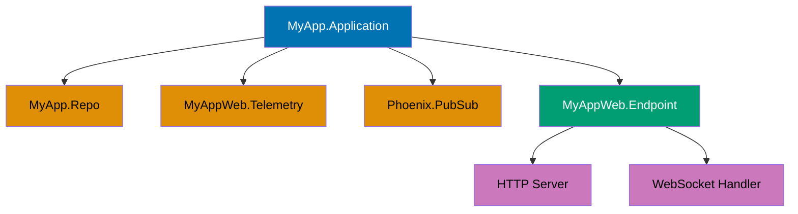
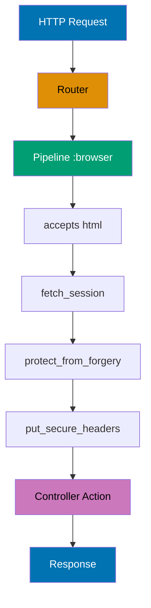
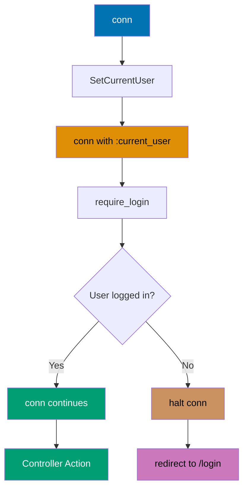
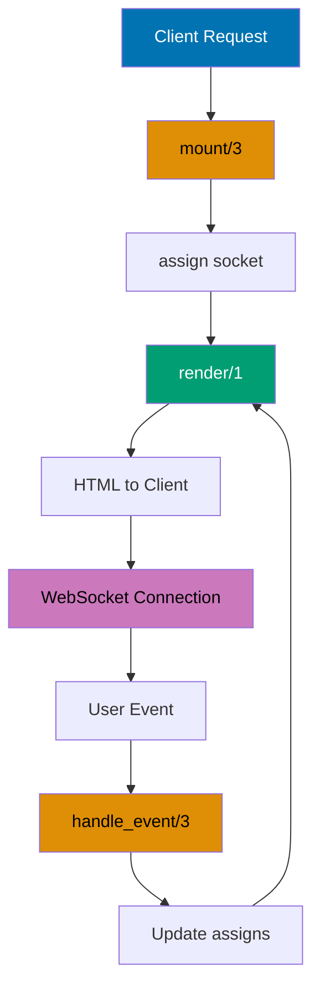
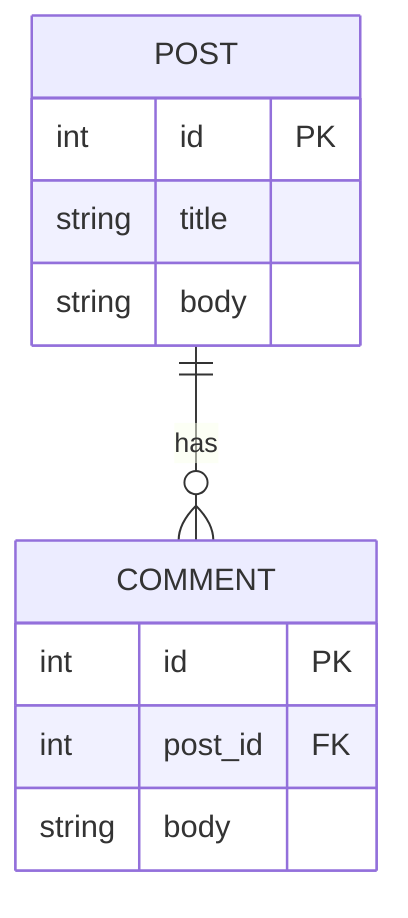

## Group 1: Phoenix Fundamentals

### Example 1: Phoenix Application Starter

A Phoenix application starts with a Mix project that sets up your supervision tree, configuration, and application endpoint. This example shows the basic structure you get from `mix phx.new`.



```elixir
# mix.exs - Defines your Phoenix application
defmodule MyApp.MixProject do              # => Module for Mix build configuration
  use Mix.Project                          # => Use Mix.Project behavior

  def project do                           # => Returns project configuration map
    [
      app: :my_app,                        # => Application name (atom)
      version: "0.1.0",                    # => Semantic version string
      elixir: "~> 1.14",                   # => Requires Elixir 1.14 or higher
      start_permanent: Mix.env() == :prod, # => Permanent restart in production
                                            # => Stops supervisor if app crashes in dev
      deps: deps()                         # => Dependencies from deps/0 function
    ]
  end

  # Application callback - starts the supervision tree
  def application do                       # => OTP application callback
    [
      mod: {MyApp.Application, []},        # => Entry point module and args
                                            # => Calls MyApp.Application.start/2
      extra_applications: [:logger]        # => Start logger application before ours
    ]
  end

  defp deps do                             # => Private function listing dependencies
    [
      {:phoenix, "~> 1.7.0"},              # => Phoenix framework ~> allows 1.7.x
      {:phoenix_html, "~> 3.1"},           # => HTML helpers for templates
      {:phoenix_live_view, "~> 1.0.0"}    # => LiveView for real-time features
    ]
  end
end

# lib/my_app/application.ex - Your application supervisor
defmodule MyApp.Application do            # => Main application supervisor module
  use Application                         # => Use Application behavior (OTP)

  @impl true                              # => Marks callback implementation
  def start(_type, _args) do              # => Called when app starts
                                           # => _type is :normal | {:takeover, node} | {:failover, node}
                                           # => _args from mod: {Module, args} in mix.exs
    children = [                          # => List of child process specs
      MyApp.Repo,                         # => Database connection pool (Ecto)
                                           # => Manages DB connections, handles queries
      MyAppWeb.Telemetry,                 # => Metrics collection (Telemetry)
                                           # => Tracks request times, DB queries, etc.
      {Phoenix.PubSub, name: MyApp.PubSub}, # => Pub/Sub system for broadcasts
                                             # => Enables LiveView updates, channel messages
      MyAppWeb.Endpoint                   # => HTTP endpoint (Cowboy web server)
                                           # => Handles incoming HTTP/WebSocket connections
    ]

    opts = [strategy: :one_for_one, name: MyApp.Supervisor]
                                           # => :one_for_one - restart failed child only
                                           # => Other strategies: :one_for_all, :rest_for_one
    Supervisor.start_link(children, opts)  # => Starts supervisor with children
                                            # => Returns {:ok, pid} on success
  end

  @impl true                              # => Marks callback implementation
  def config_change(changed, _new, removed) do  # => Called when config.exs changes
                                                 # => changed: list of changed keys
                                                 # => removed: list of removed keys
    MyAppWeb.Endpoint.config_change(changed, removed)
                                           # => Propagates config changes to endpoint
                                           # => Allows hot config reload without restart
  end
end
```

**Key Takeaway**: Phoenix applications use an OTP supervision tree to manage processes. Your application supervisor starts child processes (database, endpoint, PubSub) that run for the lifetime of your app.

**Why It Matters**: Supervision trees provide fault tolerance and self-healing capabilities essential for production web applications. When a child process crashes, the supervisor automatically restarts it without bringing down the entire application.

### Example 2: Routing Basics

The router defines URL patterns and maps them to controller actions. Phoenix 1.7 uses verified routes (~p sigil) for compile-time safety.



```elixir
# lib/my_app_web/router.ex
defmodule MyAppWeb.Router do              # => Defines application routes
  use MyAppWeb, :router                   # => Imports routing macros (get, post, etc.)

  pipeline :browser do                    # => Named pipeline for browser requests
    plug :accepts, ["html"]               # => Accept only text/html Content-Type
                                           # => Rejects requests with other types (406)
    plug :fetch_session                   # => Load session from cookie
                                           # => Stores session in conn.private.plug_session
    plug :protect_from_forgery            # => CSRF token validation
                                           # => Checks _csrf_token param matches session
    plug :put_secure_browser_headers      # => Security headers (X-Frame-Options, etc.)
                                           # => Prevents clickjacking, XSS attacks
  end

  pipeline :api do                        # => Named pipeline for API requests
    plug :accepts, ["json"]               # => Accept only application/json Content-Type
                                           # => No session, CSRF, or browser headers needed
  end

  scope "/", MyAppWeb do                  # => Scope for root-level routes
    pipe_through :browser                 # => Run :browser pipeline before routes
                                           # => All routes below get session, CSRF, etc.

    # Simple route to a controller action
    get "/", PageController, :home        # => GET / → PageController.home/2
                                           # => Calls home(conn, _params)

    # Verified route - compile-time checked
    get "/posts/:id", PostController, :show  # => GET /posts/:id → PostController.show/2
                                              # => :id captured in params["id"]
                                              # => ~p"/posts/#{post.id}" verified at compile time
  end

  # API routes
  scope "/api", MyAppWeb do               # => Scope prefixes all routes with /api
    pipe_through :api                     # => Run :api pipeline (JSON only, no session)
    resources "/posts", PostController    # => Generates 7 RESTful routes:
                                           # => GET    /api/posts       → index
                                           # => GET    /api/posts/:id   → show
                                           # => GET    /api/posts/new   → new
                                           # => POST   /api/posts       → create
                                           # => GET    /api/posts/:id/edit → edit
                                           # => PATCH  /api/posts/:id   → update
                                           # => DELETE /api/posts/:id   → delete
  end
end

# lib/my_app_web/controllers/page_controller.ex
defmodule MyAppWeb.PageController do    # => Controller for page-related actions
  use MyAppWeb, :controller             # => Imports controller functions (render, redirect, etc.)

  def home(conn, _params) do            # => Action for home page
                                         # => conn: Plug.Conn struct with request/response
                                         # => _params: Map of URL/form parameters (unused here)
    render(conn, "home.html")           # => Renders template at page/home.html.heex
                                         # => Looks in MyAppWeb.PageView module
                                         # => Returns updated conn with HTML response
  end
end
```

**Key Takeaway**: Routes define URL patterns and connect them to controllers. Pipelines specify middleware (plugs) that run for matching routes. Verified routes (~p) catch routing errors at compile time.

**Why It Matters**: Compile-time route verification catches URL typos and missing handlers before deployment. This prevents 404 errors in production and enables safe route refactoring with compiler assistance.

### Example 3: Controllers and Actions

Controllers handle HTTP requests and return responses. Actions receive the connection (conn) and parameters.

```elixir
defmodule MyAppWeb.PostController do     # => Controller for post-related actions
  use MyAppWeb, :controller              # => Imports controller functions

  # Action handling GET /posts/:id
  def show(conn, %{"id" => id}) do       # => Pattern matches id from URL params
                                          # => %{"id" => id} extracts params["id"]
    post = MyApp.Blog.get_post!(id)     # => Fetch from database via context
                                         # => Raises Ecto.NoResultsError if not found
                                         # => post is %MyApp.Blog.Post{} struct
    render(conn, "show.html", post: post)  # => Render show.html.heex template
                                            # => post assigned to @post in template
                                            # => Returns conn with HTML body
  end

  # Action handling POST /posts
  def create(conn, %{"post" => post_params}) do  # => Pattern matches nested params
                                                  # => post_params is %{"title" => ..., "body" => ...}
    case MyApp.Blog.create_post(post_params) do  # => Attempt to create post
                                                  # => Returns {:ok, post} or {:error, changeset}
      {:ok, post} ->                    # => Success case - post created
        conn
        |> put_flash(:info, "Post created!")  # => Add success message to flash
                                               # => Flash persists through redirect
        |> redirect(to: ~p"/posts/#{post}")   # => 302 redirect to show page
                                               # => ~p sigil generates /posts/1 path
                                               # => Returns conn with redirect response

      {:error, changeset} ->            # => Failure case - validation errors
                                         # => changeset contains error details
        render(conn, "new.html", changeset: changeset)  # => Re-render form with errors
                                                         # => @changeset shows field errors
                                                         # => Returns conn with HTML body
    end
  end

  # JSON response
  def index(conn, _params) do           # => List all posts endpoint
    posts = MyApp.Blog.list_posts()     # => Fetch all posts from database
                                         # => posts is list of %Post{} structs
    json(conn, posts)                   # => Render JSON response
                                         # => Encodes posts using Jason encoder
                                         # => Sets Content-Type: application/json
                                         # => Returns conn with JSON body
  end
end
```

**Key Takeaway**: Controllers are modules containing actions (functions). Each action receives conn (request/response) and params (URL/form data). Return values determine the response (render, redirect, json).

**Why It Matters**: Controllers implement the request-response pattern that forms the backbone of web applications. Understanding Phoenix controllers enables proper separation of concerns and clean HTTP interface design.

### Example 4: Plugs - Request Transformation

Plugs are middleware that transform the connection. They're composable building blocks for request handling.



```elixir
# Custom plug - Set current user in assigns
defmodule MyAppWeb.Plugs.SetCurrentUser do  # => Custom authentication plug module
  def init(opts) do                   # => Called once at compile time
                                       # => opts from plug MyModule, key: value
    opts                              # => Returns transformed opts
                                       # => Passed to call/2 at runtime
  end

  def call(conn, _opts) do            # => Called on every request
                                       # => conn: Plug.Conn struct
                                       # => _opts: result from init/1
    user_id = get_session(conn, :user_id)  # => Read user_id from session cookie
                                            # => Returns nil if not set
                                            # => session stored in encrypted cookie
    user = if user_id, do: MyApp.Accounts.get_user!(user_id)
                                       # => If user_id exists, fetch user from DB
                                       # => user is %User{} struct or nil
                                       # => Raises if user_id invalid (deleted user)

    assign(conn, :current_user, user)  # => Adds to conn.assigns.current_user
                                        # => Accessible in controllers as @current_user
                                        # => Returns updated conn struct
  end
end

# In your router
defmodule MyAppWeb.Router do          # => Router configuration
  pipeline :require_auth do           # => Pipeline requiring authentication
    plug MyAppWeb.Plugs.SetCurrentUser  # => Sets current_user assign
                                         # => Runs first, populates conn.assigns

    plug :require_login               # => Halts if not logged in
                                       # => Depends on current_user from above
  end

  def require_login(conn, _opts) do   # => Function plug for authorization
                                       # => conn: has current_user assigned
    if conn.assigns.current_user do   # => Check if user is logged in
                                       # => current_user is %User{} or nil
      conn                            # => User logged in - continue to action
                                       # => Returns unchanged conn
    else                              # => User not logged in - reject
      conn
      |> put_flash(:error, "Must be logged in")  # => Add error message to flash
                                                  # => Flash shown after redirect
      |> redirect(to: ~p"/login")     # => 302 redirect to login page
                                       # => Generates /login path
      |> halt()                       # => Stop plug pipeline
                                       # => No subsequent plugs or action called
                                       # => Response sent immediately
    end
  end

  scope "/", MyAppWeb do              # => Protected routes scope
    pipe_through :browser             # => Run browser pipeline first
                                       # => Adds session, CSRF, etc.
    pipe_through :require_auth        # => Run auth pipeline second
                                       # => Ensures user logged in

    resources "/dashboard", DashboardController  # => All dashboard routes protected
                                                  # => Require authentication to access
  end
end
```

**Key Takeaway**: Plugs are functions that take conn and return conn. Pipelines compose plugs. Use assign/3 to pass data to templates. Use halt/1 to stop processing.

**Why It Matters**: Plugs enable composable middleware for authentication, logging, CORS, and request transformation. This pattern allows security and cross-cutting concerns to be applied consistently across all routes.

### Example 5: Templates and Layouts

Phoenix uses HEEx (HTML with Embedded Elixir) templates. Function components provide reusable UI building blocks.

```elixir
# lib/my_app_web/layouts/app.html.heex - Main layout
<header>                                # => Header wraps page title
  <h1><%= @page_title %></h1>          # => @page_title from conn.assigns
                                        # => Set by put_layout_assigns in controller
</header>

<main>                                  # => Main content container
  <%= @inner_content %>                 # => Renders page-specific content
                                        # => Content from show.html.heex, etc.
                                        # => Injected by Phoenix layout system
</main>

# lib/my_app_web/pages/post/show.html.heex - Page template
<h2><%= @post.title %></h2>            # => Display post title
                                        # => @post from render(conn, "show.html", post: post)
                                        # => Outputs escaped HTML
<p><%= @post.body %></p>               # => Display post body
                                        # => Auto-escaped prevents XSS

# lib/my_app_web/components/core_components.ex - Reusable component
defmodule MyAppWeb.CoreComponents do   # => Component library module
  use Phoenix.Component                # => Imports component macros (attr, slot, ~H)

  attr :id, :string, required: true    # => Define attribute with validation
                                        # => :id is required, must be string
                                        # => Compile error if missing or wrong type
  attr :label, :string, required: true # => Label attribute required
                                        # => Validated at compile time

  def text_field(assigns) do           # => Component function receives assigns map
                                        # => assigns: %{id: "name", label: "Full Name"}
    ~H"""                               # => HEEx template sigil
                                        # => Compile-time HTML validation
    <div class="field">                 # => Field wrapper div
      <label><%= @label %></label>      # => Renders label text
                                        # => @label from assigns
      <input type="text" id={@id} name={@id} />  # => Renders text input
                                                  # => id and name from @id attribute
                                                  # => {expr} interpolates without escaping
    </div>
    """
  end
end

# Using component in template
<.text_field id="name" label="Full Name" />  # => Function component syntax
                                              # => <.component_name attr="value" />
                                              # => Calls text_field(%{id: "name", label: "Full Name"})
                                              # => Outputs: <div class="field">...</div>
```

**Key Takeaway**: HEEx templates use <%= %> for expressions, @assigns for data. Function components (with ~H/1) are pure functions that generate HTML. Components accept attributes and render content.

**Why It Matters**: Templates with HEEx enable component-based UI development with compile-time validation. This catches HTML errors during compilation rather than runtime, improving reliability.

### Example 6: Static Assets Pipeline

Phoenix assets (CSS, JS) are processed and bundled. Tailwind CSS is included by default in Phoenix 1.7+.

```elixir
# assets/css/app.css
@tailwind base;                         # => Tailwind reset and base styles
                                        # => Normalizes browser defaults
@tailwind components;                   # => Tailwind component classes
                                        # => Button, card, form styles
@tailwind utilities;                    # => Tailwind utility classes
                                        # => px-4, py-2, bg-blue-500, etc.

.custom-button {                        # => Custom CSS class definition
  @apply px-4 py-2 bg-blue-500 text-white rounded;
                                        # => Compiles to: padding, background, color, border-radius
                                        # => Uses Tailwind utility classes
}

# assets/js/app.js
import "../css/app.css"                 # => Import CSS for esbuild processing
                                        # => Bundled into priv/static/assets/app.css

// Run when page loads
import { createRoot } from "react"      # => Import React 18 createRoot API
                                        # => For mounting React components
import App from "./App"                 # => Import root React component
                                        # => From assets/js/App.jsx

const container = document.getElementById("app")  # => Get DOM element
                                                   # => Element with id="app"
const root = createRoot(container)      # => Create React root
                                        # => Enables concurrent features
root.render(<App />)                    # => Render React component
                                        # => Mounts App component to DOM

# config/config.exs - Configure asset building
config :my_app_web, MyAppWeb.Endpoint, # => Endpoint configuration
  url: [host: "localhost"],             # => Default URL host
                                        # => Used for generating URLs
  render_errors: [view: MyAppWeb.ErrorView],  # => Error page rendering
                                               # => Uses ErrorView for 404, 500, etc.
  pubsub_server: MyApp.PubSub,          # => PubSub server name
                                        # => For LiveView, Channel broadcasts
  live_view: [signing_salt: "..."]      # => LiveView security salt
                                        # => Signs LiveView state tokens

# esbuild config
config :esbuild,                        # => esbuild bundler configuration
  version: "0.17.0",                    # => esbuild version to download
                                        # => Fetched from npm registry
  default: [                            # => Default profile config
    args: ~w(js/app.js --bundle --target=es2017 --outdir=../priv/static/assets),
                                        # => Entry: js/app.js
                                        # => --bundle: Bundle dependencies
                                        # => --target=es2017: Transpile to ES2017
                                        # => Output: priv/static/assets/app.js
    cd: Path.expand("../assets", __DIR__),  # => Working directory
                                             # => Run esbuild in assets/ folder
    env: %{"NODE_PATH" => Path.expand("../deps", __DIR__)}
                                        # => Node module resolution path
                                        # => Allows importing from deps/
  ]
```

**Key Takeaway**: Assets are processed by esbuild and output to priv/static. Tailwind CSS processes CSS. Use `mix phx.digest` to fingerprint files for cache busting in production.

**Why It Matters**: Asset processing ensures consistent, optimized delivery of CSS and JavaScript. Understanding esbuild and Tailwind integration is essential for production-ready Phoenix applications with efficient client-side resources.

## Group 2: LiveView Basics

### Example 7: First LiveView Component

LiveView components render HTML and respond to events in real-time using WebSockets. This is a stateless function component.



```elixir
# lib/my_app_web/live/posts_live/list.ex
defmodule MyAppWeb.PostsLive.List do    # => LiveView module for post listing
  use Phoenix.LiveView                  # => Import LiveView behavior and macros

  def mount(_params, _session, socket) do  # => Called when LiveView first loads
                                            # => _params: URL parameters (unused)
                                            # => _session: Session data from cookie
                                            # => socket: LiveView socket (similar to conn)
    posts = MyApp.Blog.list_posts()     # => Fetch posts from database
                                         # => posts is list of %Post{} structs
    {:ok, assign(socket, :posts, posts)}  # => Assign data to socket
                                           # => socket.assigns.posts = posts
                                           # => Returns {:ok, updated_socket}
                                           # => Accessible as @posts in template
  end

  def render(assigns) do                # => Renders HTML template
                                         # => assigns: map with :posts key
    ~H"""                               # => HEEx template sigil
    <h1>Posts</h1>                      # => Static heading
    <ul>                                # => Unordered list wrapper
      <%= for post <- @posts do %>      # => Loop over posts list
                                        # => @posts from socket.assigns.posts
        <li><%= post.title %></li>      # => Render each post title
                                        # => Outputs escaped HTML
      <% end %>                         # => End loop
    </ul>
    """
  end
end

# In your router
defmodule MyAppWeb.Router do            # => Router configuration
  scope "/", MyAppWeb do                # => Root scope
    pipe_through :browser               # => Use browser pipeline
                                         # => Adds session, CSRF protection
    live "/posts", PostsLive.List, :list  # => LiveView route definition
                                           # => GET /posts → PostsLive.List module
                                           # => :list is live action (optional)
                                           # => Establishes WebSocket after initial HTTP
  end
end
```

**Key Takeaway**: LiveView modules use mount/3 to initialize state and render/1 to output HTML. assign/2 stores data in socket.assigns. WebSockets keep the connection alive for real-time updates.

**Why It Matters**: LiveView enables real-time interactivity without JavaScript complexity. Server-rendered updates reduce client-side bugs and simplify state management.

### Example 8: LiveView Events

Events are user interactions (clicks, form submissions) that trigger callbacks. handle_event/3 processes events.

```elixir
defmodule MyAppWeb.CounterLive do       # => LiveView counter component
  use Phoenix.LiveView                  # => Import LiveView behavior

  def mount(_params, _session, socket) do  # => Initialize LiveView state
                                            # => Called once per LiveView process
    {:ok, assign(socket, :count, 0)}    # => Set initial count to 0
                                         # => socket.assigns.count = 0
                                         # => Returns {:ok, socket}
  end

  def render(assigns) do                # => Render counter UI
                                         # => assigns contains :count
    ~H"""                               # => HEEx template
    <h1>Count: <%= @count %></h1>       # => Display current count
                                        # => @count from socket.assigns.count

    <!-- phx-click sends event to handle_event -->
    <button phx-click="increment">+</button>  # => Button sends "increment" event
                                               # => phx-click binds click to event name
                                               # => Event sent over WebSocket
    <button phx-click="decrement">-</button>  # => Button sends "decrement" event
                                               # => Triggers handle_event callback
    """
  end

  # Handle "increment" event
  def handle_event("increment", _params, socket) do  # => Callback for increment event
                                                      # => _params: event payload (unused)
                                                      # => socket: current LiveView state
    {:noreply, update(socket, :count, &(&1 + 1))}  # => Updates count assign
                                                    # => update(socket, :count, fn old -> old + 1 end)
                                                    # => Returns {:noreply, updated_socket}
                                                    # => Triggers re-render with new count
  end

  # Handle "decrement" event
  def handle_event("decrement", _params, socket) do  # => Callback for decrement event
    {:noreply, update(socket, :count, &(&1 - 1))}  # => Decrements count by 1
                                                    # => count = count - 1
                                                    # => Re-renders template with new value
  end
end
```

**Key Takeaway**: phx-click binds events to buttons. phx-submit binds to forms. handle_event/3 processes events and returns {:noreply, socket} to update state without re-rendering the page.

**Why It Matters**: Phoenix sockets enable efficient bidirectional communication for real-time features. This is essential for chat, notifications, and collaborative editing applications.

### Example 9: LiveView Navigation

LiveView provides two navigation types: live_redirect (full page reload) and live_patch (updates URL and params without full reload).

```elixir
defmodule MyAppWeb.PostsLive do         # => LiveView for post navigation
  use Phoenix.LiveView                  # => Import LiveView behavior

  def mount(params, _session, socket) do  # => Initial mount with URL params
                                           # => params: %{"id" => "123"} from URL query
    {:ok, assign(socket, :selected_id, params["id"])}
                                         # => Set selected_id from URL parameter
                                         # => socket.assigns.selected_id = params["id"]
                                         # => Can be nil if no id param
  end

  def handle_params(%{"id" => id}, _uri, socket) do  # => Called on URL parameter changes
                                                       # => Pattern matches params with id key
                                                       # => _uri: full request URI (unused)
    {:noreply, assign(socket, :selected_id, id)}  # => Update selected_id assign
                                                   # => socket.assigns.selected_id = id
                                                   # => Returns {:noreply, socket}
                                                   # => Triggers re-render with new selection
  end

  def render(assigns) do                # => Render post list and selection
    ~H"""                               # => HEEx template
    <h1>Posts</h1>                      # => Page heading
    <%= for post <- @posts do %>        # => Loop over posts list
                                        # => @posts from socket.assigns.posts
      <!-- live_patch updates URL without full reload -->
      <.link patch={~p"/posts?id=#{post.id}"}>  # => LiveView navigation link
                                                 # => patch attribute for live_patch
                                                 # => Updates URL to /posts?id=123
                                                 # => Calls handle_params/3 without remount
                                                 # => Preserves LiveView process
        <%= post.title %>               # => Display post title in link
                                         # => Clickable link text
      </.link>
    <% end %>

    <%= if @selected_id do %>           # => Conditional render if post selected
                                        # => @selected_id from socket.assigns
      <div>Selected: <%= @selected_id %></div>  # => Show selected post ID
                                                 # => Updates when link clicked
    <% end %>
    """
  end
end
```

**Key Takeaway**: live_patch updates URL and calls handle_params/3. Use live_redirect to force full page reload. handle_params/3 processes URL changes and updates state accordingly.

**Why It Matters**: Process-based architecture enables horizontal scaling and fault isolation. Understanding OTP processes is key to building highly available systems.

### Example 10: LiveView Components

Components are stateless or stateful sub-views. Stateless components are pure functions. Stateful components maintain their own state.

```elixir
# Stateless function component
defmodule MyAppWeb.CoreComponents do   # => Component library module
  use Phoenix.Component                # => Import component macros

  attr :label, :string, required: true # => Define component attribute
                                        # => Compile-time validation

  def button_group(assigns) do         # => Function component (stateless)
                                        # => assigns: map of attributes
    ~H"""                               # => HEEx template sigil
    <div class="buttons">               # => Wrapper div for buttons
      <%= render_slot(@inner_block) %>  # => Render content inside component tags
                                        # => @inner_block contains child content
                                        # => Passed via <.button_group>...</.button_group>
    </div>
    """
  end
end

# Stateful live component with its own state
defmodule MyAppWeb.PostFormComponent do  # => Stateful LiveComponent
  use Phoenix.LiveComponent            # => Import LiveComponent behavior
                                        # => Different from stateless components

  def mount(socket) do                 # => Initialize component state
                                        # => Called once when component mounted
    {:ok, assign(socket, :errors, [])} # => Set initial errors to empty list
                                        # => socket.assigns.errors = []
                                        # => Component has its own socket
  end

  def handle_event("validate", %{"post" => params}, socket) do
                                        # => Handle form validation event
                                        # => params: form field values
    changeset = MyApp.Blog.change_post(%MyApp.Blog.Post{}, params)
                                        # => Create changeset from params
                                        # => changeset tracks changes and errors
    {:noreply, assign(socket, changeset: changeset)}
                                        # => Update component state with changeset
                                        # => Re-renders component with errors
  end

  def render(assigns) do               # => Render component template
                                        # => assigns from component socket
    ~H"""                               # => HEEx template
    <form phx-submit="save" phx-target={@myself}>  # => Form with event binding
                                                    # => phx-submit sends to this component
                                                    # => @myself targets this component's PID
      <!-- Form fields -->              # => Form inputs go here
    </form>
    """
  end
end

# Using components
def parent_render(assigns) do          # => Parent LiveView render function
  ~H"""                                 # => Parent template
  <%= live_component(MyAppWeb.PostFormComponent, id: "post-form") %>
                                        # => Render stateful LiveComponent
                                        # => id required for component identification
                                        # => Component gets its own process/socket

  <.button_group>                       # => Use stateless function component
    <button>Save</button>               # => Content passed to render_slot
    <button>Cancel</button>             # => Both buttons in @inner_block
  </.button_group>                      # => Renders buttons inside wrapper div
  """
end
```

**Key Takeaway**: Stateless components are functions that render HTML. Stateful components (use Phoenix.LiveComponent) maintain state and handle their own events. Use live_component/3 to render stateful components.

**Why It Matters**: Function components enable reusable UI building blocks with clear interfaces. This pattern improves maintainability and consistency across your application.

## Group 3: Ecto Fundamentals

### Example 11: Schema and Migrations

Ecto schemas define your database structure. Migrations create and modify database tables.

```elixir
# lib/my_app/blog/post.ex - Define schema
defmodule MyApp.Blog.Post do            # => Schema module for posts table
  use Ecto.Schema                       # => Import schema macros (schema, field, etc.)
  import Ecto.Changeset                 # => Import changeset functions

  schema "posts" do                     # => Maps to "posts" database table
                                         # => Generates struct %Post{}
    field :title, :string               # => String column in database
                                         # => VARCHAR type in PostgreSQL
    field :body, :string                # => Text column for post content
                                         # => Can be :text for longer content
    field :published, :boolean, default: false  # => Boolean with default value
                                                 # => false when struct created
    field :view_count, :integer, default: 0     # => Integer counter field
                                                 # => Starts at 0
    timestamps()                        # => Macro adds two fields:
                                         # => inserted_at :naive_datetime (creation time)
                                         # => updated_at :naive_datetime (last update)
  end

  @doc false                            # => Don't include in docs
  def changeset(post, attrs) do         # => Create changeset for validation
                                         # => post: existing %Post{} struct
                                         # => attrs: map of changes
    post
    |> cast(attrs, [:title, :body, :published])  # => Allow only these fields
                                                  # => Filters unknown attributes
                                                  # => Returns %Changeset{}
    |> validate_required([:title, :body])        # => Validate title and body present
                                                  # => Adds errors if missing
  end
end

# priv/repo/migrations/20231201120000_create_posts.exs - Create table
defmodule MyApp.Repo.Migrations.CreatePosts do  # => Migration module
  use Ecto.Migration                   # => Import migration macros (create, add, etc.)

  def change do                         # => Reversible migration function
                                         # => Automatically reversed on rollback
    create table(:posts) do             # => Create posts table
                                         # => Adds id BIGSERIAL PRIMARY KEY automatically
      add :title, :string, null: false  # => VARCHAR NOT NULL column
                                         # => null: false prevents NULL values
      add :body, :text                  # => TEXT column for long content
                                         # => Unlimited length in PostgreSQL
      add :published, :boolean, default: false  # => BOOLEAN with default
                                                 # => Default set at database level
      add :view_count, :integer, default: 0     # => INTEGER with default 0
                                                 # => Database-level default
      timestamps()                      # => Macro adds two timestamp columns:
                                         # => inserted_at TIMESTAMP NOT NULL
                                         # => updated_at TIMESTAMP NOT NULL
    end
  end
end

# Run migrations
# mix ecto.migrate                     # => Execute pending migrations
                                        # => Creates posts table in database
                                        # => Tracks migration in schema_migrations table
```

**Key Takeaway**: Schemas define field types (:string, :text, :integer, :boolean). Migrations create database tables. Use timestamps() to add inserted_at/updated_at automatically.

**Why It Matters**: Migrations provide version-controlled database schema changes. This enables safe, reversible database updates across environments.

### Example 12: Ecto Queries

Ecto uses a pipe-based query API. Build queries incrementally, then execute with Repo.

```elixir
import Ecto.Query                         # => Imports query macros (from, where, etc.)
                                           # => Makes query functions available

# Simple query - fetch all posts
query = from p in Post, select: p         # => from p in Post binds p to Post schema
                                           # => select: p returns entire Post struct
                                           # => query is %Ecto.Query{} struct (not executed yet)
posts = MyApp.Repo.all(query)             # => Executes query against database
                                           # => Returns list of Post structs
                                           # => posts is [%Post{}, %Post{}, ...]

# Query with conditions - filter and select specific field
query = from p in Post, where: p.published == true, select: p.title
                                           # => where: filters rows matching condition
                                           # => p.published == true is boolean expression
                                           # => select: p.title returns only title field
titles = MyApp.Repo.all(query)            # => Executes: SELECT title FROM posts WHERE published = true
                                           # => Returns list of strings
                                           # => titles is ["First Post", "Second Post", ...]

# Pipe-based query (more readable for complex queries)
posts = Post                              # => Start with Post schema
  |> where([p], p.published == true)      # => [p] binds variable in anonymous function
                                           # => Filters WHERE published = true
                                           # => Returns %Ecto.Query{} struct
  |> order_by([p], desc: p.inserted_at)   # => desc: sorts descending (newest first)
                                           # => p.inserted_at is timestamp field
                                           # => Adds ORDER BY inserted_at DESC
  |> limit(10)                            # => Limits result to 10 rows
                                           # => Adds LIMIT 10 clause
  |> MyApp.Repo.all()                     # => Executes composed query
                                           # => Returns up to 10 most recent published posts

# Query with joins - relate multiple tables
query = from p in Post,                   # => Start with posts table
  join: a in Author, on: a.id == p.author_id,
                                           # => JOIN authors ON authors.id = posts.author_id
                                           # => Links posts to authors via foreign key
  where: a.name == "John",                # => Filter joined table: WHERE authors.name = 'John'
                                           # => Condition on authors table
  select: p                               # => Return Post struct (not Author)
                                           # => select: p returns columns from posts only

posts = MyApp.Repo.all(query)             # => Executes join query
                                           # => Returns posts written by John
                                           # => posts is [%Post{author_id: john_id}, ...]
```

**Key Takeaway**: Use from/2 to start queries. Pipe where/2, order_by/2, limit/2 to build complex queries. Use select/2 to choose columns. MyApp.Repo.all/1 executes the query.

**Why It Matters**: Query composition enables complex database operations. Understanding Ecto queries is essential for application performance.

### Example 13: Changesets and Validation

Changesets track data changes and validate them before saving. They're Ecto's way of handling data integrity.

```elixir
defmodule MyApp.Blog.Post do             # => Schema module for posts table
  schema "posts" do                      # => Maps to "posts" database table
    field :title, :string                # => title column, VARCHAR type
    field :body, :string                 # => body column, VARCHAR/TEXT type
    field :email, :string                # => email column, VARCHAR type
  end

  def changeset(post, attrs) do          # => Factory function for changesets
                                          # => post is %Post{} struct (existing or new)
                                          # => attrs is map of incoming changes
    post                                 # => Start with post struct
    |> cast(attrs, [:title, :body, :email])
                                          # => cast/3 filters attrs to allowed fields
                                          # => Only [:title, :body, :email] permitted
                                          # => Ignores any other keys in attrs map
                                          # => Returns %Ecto.Changeset{} struct
    |> validate_required([:title, :body])
                                          # => Adds error if :title or :body missing
                                          # => Sets changeset.valid? = false if fails
                                          # => Errors: %{title: ["can't be blank"]}
    |> validate_length(:title, min: 5, max: 100)
                                          # => Checks string length constraints
                                          # => min: 5 - title must be at least 5 chars
                                          # => max: 100 - title max 100 chars
                                          # => Error: "should be at least 5 characters"
    |> validate_format(:email, ~r/@/)    # => Validates email matches regex
                                          # => ~r/@/ ensures contains @ symbol
                                          # => Error if pattern doesn't match
    |> unique_constraint(:email)         # => Adds DB-level uniqueness check
                                          # => Only validated on insert/update
                                          # => Requires unique index in database
  end
end

# Using changeset to create a post
def create_post(attrs) do                # => attrs is map like %{"title" => "Hi"}
  changeset = Post.changeset(%Post{}, attrs)
                                          # => Creates changeset with new struct
                                          # => Runs all validations
                                          # => changeset.valid? = true/false

  if changeset.valid? do                 # => Check if all validations passed
                                          # => Returns boolean
    MyApp.Repo.insert(changeset)         # => Attempts INSERT INTO posts
                                          # => Returns {:ok, %Post{id: ...}} on success
                                          # => Returns {:error, changeset} on DB error
  else                                   # => Validation failed
    {:error, changeset}                  # => Return changeset with errors
                                          # => Caller can inspect changeset.errors
  end
end

# In your form/LiveView - real-time validation
def handle_event("validate", %{"post" => params}, socket) do
                                          # => Triggered on phx-change (every keystroke)
                                          # => params is %{"title" => "...", "body" => "..."}
  changeset = Post.changeset(%Post{}, params)
                                          # => Creates changeset without saving
                                          # => Validates current form state
                                          # => Generates error messages
  {:noreply, assign(socket, changeset: changeset)}
                                          # => Updates socket assigns
                                          # => Triggers re-render with errors
end

def handle_event("save", %{"post" => params}, socket) do
                                          # => Triggered on phx-submit (form submit)
  case MyApp.Blog.create_post(params) do # => Attempts to save
    {:ok, post} ->                       # => Success path - post created
      {:noreply, put_flash(socket, :info, "Created!")}
                                          # => Shows success message
                                          # => Redirects or updates UI
    {:error, changeset} ->               # => Failure path - validation/DB error
      {:noreply, assign(socket, changeset: changeset)}
                                          # => Shows error messages in form
                                          # => User can correct and retry
  end
end
```

**Key Takeaway**: Changesets validate data before saving. cast/3 specifies allowed fields. validate\_\*/\_ functions add validation rules. Changesets track errors for form display.

**Why It Matters**: Changesets centralize validation logic and provide user-friendly error messages. This pattern ensures data integrity and improves user experience with clear feedback.

### Example 14: Associations - One-to-Many

Database associations relate tables. A post has many comments, a comment belongs to a post.



```elixir
# lib/my_app/blog/post.ex
defmodule MyApp.Blog.Post do             # => Schema for posts table
  schema "posts" do                      # => Maps to "posts" table
    field :title, :string                # => title column
    has_many :comments, MyApp.Blog.Comment
                                          # => Declares one-to-many relationship
                                          # => :comments is virtual field name
                                          # => MyApp.Blog.Comment is related schema
                                          # => Creates post.comments accessor
                                          # => Not a database column (virtual)
  end
end

# lib/my_app/blog/comment.ex
defmodule MyApp.Blog.Comment do          # => Schema for comments table
  schema "comments" do                   # => Maps to "comments" table
    field :body, :string                 # => comment body text
    belongs_to :post, MyApp.Blog.Post    # => Declares belongs-to relationship
                                          # => :post is virtual field name
                                          # => Adds :post_id foreign key field
                                          # => Creates comment.post accessor
                                          # => Creates comment.post_id field
  end
end

# Migration to create comments table
def change do                            # => Migration function (reversible)
  create table(:comments) do             # => CREATE TABLE comments
    add :body, :text                     # => body column, TEXT type
    add :post_id, references(:posts)     # => Foreign key to posts table
                                          # => references/1 creates FK constraint
                                          # => Ensures post_id refers to valid post
                                          # => ON DELETE defaults to nothing
    timestamps()                         # => Adds inserted_at, updated_at
  end
end

# Using associations - loading related data
post = MyApp.Repo.preload(post, :comments)
                                          # => Executes separate query for comments
                                          # => SELECT * FROM comments WHERE post_id = ?
                                          # => Loads into post.comments field
                                          # => Returns %Post{comments: [%Comment{}, ...]}
IO.inspect(post.comments)                # => Prints list of Comment structs
                                          # => [%Comment{body: "Nice!"}, %Comment{body: "Thanks"}]

# Or in a query - eager loading multiple posts
posts = Post                             # => Start with Post schema
  |> preload([:comments])                # => [:comments] is list of associations
                                          # => Eager loads all comments for all posts
                                          # => Uses separate query (not JOIN)
  |> MyApp.Repo.all()                    # => Executes both queries:
                                          # => 1. SELECT * FROM posts
                                          # => 2. SELECT * FROM comments WHERE post_id IN (...)
                                          # => Returns posts with loaded comments
```

**Key Takeaway**: has_many/2 and belongs_to/2 declare associations. Migrations add foreign keys. Use preload/1 to load related data. Without preload, accessing post.comments loads from database separately.

**Why It Matters**: Migrations provide version-controlled database schema changes. This enables safe, reversible database updates across environments.

### Example 15: CRUD Operations

Ecto provides Repo functions for database operations: insert, get, update, delete.

```elixir
# Create (INSERT) - add new record to database
changeset = Post.changeset(%Post{}, %{"title" => "Hello"})
                                          # => Creates changeset with new struct
                                          # => Validates incoming attributes
                                          # => changeset.valid? checked before insert
{:ok, post} = MyApp.Repo.insert(changeset)
                                          # => Executes: INSERT INTO posts (title) VALUES ('Hello')
                                          # => Returns {:ok, %Post{id: 1, title: "Hello"}}
                                          # => Database generates id automatically
post.id                                  # => Accesses generated primary key
                                          # => post.id is 1 (auto-incremented)

# Read (SELECT) - retrieve records from database
post = MyApp.Repo.get(Post, 1)           # => Executes: SELECT * FROM posts WHERE id = 1
                                          # => Returns %Post{} struct or nil
                                          # => Raises if record doesn't exist with get!/2
post = MyApp.Repo.get_by(Post, slug: "hello")
                                          # => Executes: SELECT * FROM posts WHERE slug = 'hello'
                                          # => Finds by any field (not just primary key)
                                          # => Returns first match or nil

# Update (UPDATE) - modify existing record
changeset = Post.changeset(post, %{"title" => "Goodbye"})
                                          # => Creates changeset from existing post
                                          # => Tracks changes: title "Hello" -> "Goodbye"
                                          # => Runs validations on changes
{:ok, updated_post} = MyApp.Repo.update(changeset)
                                          # => Executes: UPDATE posts SET title = 'Goodbye' WHERE id = 1
                                          # => Returns {:ok, updated_struct}
                                          # => updated_post.title is "Goodbye"

# Delete (DELETE) - remove record from database
{:ok, deleted_post} = MyApp.Repo.delete(post)
                                          # => Executes: DELETE FROM posts WHERE id = 1
                                          # => Returns {:ok, deleted_struct}
                                          # => deleted_post still contains data
                                          # => Record no longer in database

# Batch operations - operate on multiple records
posts = MyApp.Repo.all(Post)             # => SELECT * FROM posts
                                          # => Returns list of all Post structs
Enum.map(posts, &MyApp.Repo.delete/1)    # => Iterates through posts
                                          # => Deletes each post individually
                                          # => & syntax: function capture
                                          # => Returns [{:ok, post1}, {:ok, post2}, ...]
```

**Key Takeaway**: Repo.insert/1 creates records. Repo.get/2 retrieves by ID. Repo.update/1 modifies records. Repo.delete/1 removes records. All return {:ok, record} or {:error, changeset}.

**Why It Matters**: Repository functions provide the interface between your application and the database. Understanding Repo operations is fundamental to data persistence in Phoenix applications.

## Group 4: Forms and Validation

### Example 16: LiveView Forms

Phoenix forms in LiveView automatically handle validation, phx-change updates, and phx-submit saves.

```elixir
defmodule MyAppWeb.PostLive.Form do      # => LiveView module for post editing
  use Phoenix.LiveView                   # => Imports LiveView behavior
                                          # => Adds mount, render, handle_event callbacks

  def mount(%{"id" => id}, _session, socket) do
                                          # => Called when LiveView connects
                                          # => %{"id" => id} from route params
                                          # => socket is connection state container
    post = MyApp.Blog.get_post!(id)      # => Fetches post from database
                                          # => Raises if post not found (! means raise)
    changeset = MyApp.Blog.change_post(post)
                                          # => Creates empty changeset for form
                                          # => No changes yet, just for rendering
    {:ok, assign(socket, post: post, changeset: changeset)}
                                          # => Returns {:ok, socket} to mount
                                          # => assign/2 stores data in socket.assigns
                                          # => Makes @post and @changeset available in template
  end

  def render(assigns) do                 # => Renders HTML with HEEx template
                                          # => assigns contains @post, @changeset
    ~H"""
    <.form
      for={@changeset}                   # => Binds form to changeset
                                          # => Form fields auto-filled from changeset.data
                                          # => Errors from changeset.errors displayed
      phx-submit="save"                  # => On submit, sends "save" event
                                          # => Calls handle_event("save", ...)
      phx-change="validate">             # => On field change, sends "validate" event
                                          # => Triggers on every keystroke/select

      <.input field={@changeset[:title]} label="Title" />
                                          # => Function component for input field
                                          # => @changeset[:title] accesses title field
                                          # => label= sets label text
      <.input field={@changeset[:body]} type="textarea" label="Body" />
                                          # => type="textarea" renders <textarea>
                                          # => Default is type="text" for <input>

      <button type="submit">Save</button>
                                          # => Triggers phx-submit="save" event
    </.form>                             # => Closing tag for form component
    """
  end

  def handle_event("validate", %{"post" => params}, socket) do
                                          # => Handles phx-change events
                                          # => params is %{"title" => "...", "body" => "..."}
    changeset = MyApp.Blog.change_post(socket.assigns.post, params)
                                          # => Creates changeset with new params
                                          # => Runs validations without saving
                                          # => Returns changeset with errors if invalid
    {:noreply, assign(socket, changeset: changeset)}
                                          # => Updates socket.assigns.changeset
                                          # => Triggers re-render with new errors
                                          # => User sees validation feedback in real-time
  end

  def handle_event("save", %{"post" => params}, socket) do
                                          # => Handles phx-submit events
    case MyApp.Blog.update_post(socket.assigns.post, params) do
                                          # => Attempts to update post in DB
                                          # => Runs validations + database operation
      {:ok, post} ->                     # => Success path - post saved
        {:noreply,
         socket
         |> put_flash(:info, "Post updated!")
                                          # => Adds flash message to session
                                          # => Displayed on next page render
         |> redirect(to: ~p"/posts/#{post}")}
                                          # => Redirects to post show page
                                          # => ~p sigil generates verified path

      {:error, changeset} ->             # => Failure path - validation/DB error
        {:noreply, assign(socket, changeset: changeset)}
                                          # => Updates changeset with errors
                                          # => Form re-renders with error messages
                                          # => User can fix and retry
    end
  end
end
```

**Key Takeaway**: `<.form>` component binds to changeset. phx-change fires on field changes. phx-submit fires on form submission. Form automatically submits CSRF token and field values.

**Why It Matters**: Changesets centralize validation logic and provide user-friendly error messages. This pattern ensures data integrity and improves user experience with clear feedback.

### Example 17: Form Validation Feedback

LiveView validates on every keystroke with phx-change. Display errors from the changeset in real-time.

```elixir
def form_template(assigns) do            # => Render function for form template
                                          # => assigns contains @changeset
  ~H"""
  <.form for={@changeset} phx-change="validate" phx-submit="save">
                                          # => for= binds form to changeset data
                                          # => phx-change fires on every keystroke
    <div class="field">                  # => Container for field + error
      <.input field={@changeset[:email]} label="Email" />
                                          # => Renders email input field
                                          # => @changeset[:email] contains value and errors

      <!-- Display errors -->
      <%= if @changeset.errors[:email] do %>
                                          # => Checks if email field has errors
                                          # => @changeset.errors is keyword list
                                          # => Returns nil if no errors for :email
        <span class="error">             # => CSS class for styling error text
          <%= elem(@changeset.errors[:email], 0) %>
                                          # => errors[:email] is {message, opts} tuple
                                          # => elem/2 gets first element (message string)
                                          # => Displays: "can't be blank" or "has invalid format"
        </span>
      <% end %>                          # => Closes if block
    </div>
  </.form>
  """
end

# With phx-debounce to reduce validation calls
def form_with_debounce(assigns) do       # => Alternative form with debouncing
  ~H"""
  <.form for={@changeset} phx-change="validate" phx-debounce="500">
                                          # => phx-debounce="500" waits 500ms
                                          # => Only validates after user stops typing
                                          # => Reduces server load and network traffic
                                          # => Improves UX by not validating mid-word
    <!-- Only validate after 500ms of no typing -->
    <.input field={@changeset[:email]} label="Email" />
                                          # => Same input component
                                          # => But validation delayed until typing pauses
  </.form>
  """
end
```

**Key Takeaway**: Access changeset errors with @changeset.errors[:field]. Use phx-debounce to reduce validation calls. Display errors immediately under fields for real-time feedback.

**Why It Matters**: Changesets centralize validation logic and provide user-friendly error messages. This pattern ensures data integrity and improves user experience with clear feedback.

### Example 18: File Uploads in LiveView

LiveView supports file uploads with progress tracking and client-side validation.

```elixir
defmodule MyAppWeb.ProfileLive do        # => LiveView for profile editing
  use Phoenix.LiveView                   # => Imports LiveView behavior

  def mount(_params, _session, socket) do
                                          # => Called on LiveView connect
    {:ok,
     socket
     |> assign(:uploaded_files, [])      # => Initializes empty uploaded files list
                                          # => Stores completed uploads
     |> allow_upload(:avatar, accept: ~w(.jpg .jpeg .png), max_entries: 1)}
                                          # => Registers :avatar upload config
                                          # => accept: limits file types (.jpg, .jpeg, .png)
                                          # => max_entries: 1 means single file only
                                          # => Creates @uploads.avatar in assigns
  end

  def render(assigns) do                 # => Renders upload form
    ~H"""
    <form id="upload-form" phx-change="validate" phx-submit="save">
                                          # => phx-change fires when file selected
                                          # => phx-submit fires on form submit
      <.live_file_input upload={@uploads.avatar} />
                                          # => Renders file input for :avatar upload
                                          # => Automatically validates file types
                                          # => Shows errors if invalid file type

      <!-- Show uploaded files -->
      <%= for entry <- @uploads.avatar.entries do %>
                                          # => Iterates through selected files
                                          # => entry contains file metadata
        <article class="upload-entry">   # => Container for each upload
          <figure>
            <.live_img_preview entry={entry} />
                                          # => Shows preview of image before upload
                                          # => Client-side preview (no server upload)
            <figcaption><%= entry.client_name %></figcaption>
                                          # => Displays original filename
                                          # => entry.client_name is "avatar.jpg"
          </figure>
          <progress value={entry.progress} max="100" />
                                          # => HTML5 progress bar
                                          # => entry.progress is 0-100 percentage
                                          # => Updates in real-time during upload
        </article>
      <% end %>

      <button type="submit">Save Profile</button>
                                          # => Triggers phx-submit="save"
    </form>
    """
  end

  def handle_event("validate", _params, socket) do
                                          # => Called when file selected
                                          # => Validates file type, size automatically
    {:noreply, socket}                   # => No additional validation needed
                                          # => allow_upload config handles it
  end

  def handle_event("save", _params, socket) do
                                          # => Called on form submit
    uploaded_files =
      consume_uploaded_entries(socket, :avatar, fn %{path: path}, _entry ->
                                          # => Processes each uploaded file
                                          # => path is temp file location
                                          # => entry contains metadata
        dest = Path.join([:code.priv_dir(:my_app), "static", "uploads", Path.basename(path)])
                                          # => Builds destination path
                                          # => :code.priv_dir gets priv/ directory
                                          # => Path.basename gets just filename
        File.cp!(path, dest)             # => Copies temp file to permanent location
                                          # => Raises if copy fails (!)
        {:ok, dest}                      # => Returns destination path
                                          # => Collected in uploaded_files list
      end)

    {:noreply, assign(socket, uploaded_files: uploaded_files)}
                                          # => Stores uploaded file paths
                                          # => uploaded_files is ["/path/to/avatar.jpg"]
  end
end
```

**Key Takeaway**: allow_upload/2 registers an upload. <.live_file_input> renders input. consume_uploaded_entries/3 processes files after submission. Uploads show progress and validate file types.

**Why It Matters**: Process-based architecture enables horizontal scaling and fault isolation. Understanding OTP processes is key to building highly available systems.

### Example 19: Multi-Step Forms

Create wizard-style forms by tracking current step and validating/saving at each stage.

```elixir
defmodule MyAppWeb.SignupLive do         # => LiveView for multi-step signup wizard
  use Phoenix.LiveView                   # => Imports LiveView behavior

  def mount(_params, _session, socket) do
                                          # => Initializes wizard state
    {:ok,
     assign(socket,                      # => Sets initial socket assigns
       step: 1,                          # => Current step (1 or 2)
       step1_data: %{},                  # => Stores step 1 form data
       step2_data: %{},                  # => Stores step 2 form data (unused here)
       changeset: nil                    # => Current step's changeset
     )}
  end

  def render(assigns) do                 # => Renders current step form
    ~H"""
    <div class="wizard">
      <h1>Step <%= @step %> of 2</h1>    # => Shows current step number
                                          # => @step is 1 or 2

      <%= if @step == 1 do %>            # => Conditional rendering
                                          # => Shows different form per step
        <.step1_form changeset={@changeset} />
                                          # => Renders step 1 form component
                                          # => Passes changeset for validation errors
      <% else %>                         # => @step == 2
        <.step2_form changeset={@changeset} />
                                          # => Renders step 2 form component
      <% end %>
    </div>
    """
  end

  def handle_event("next", %{"step1" => params}, socket) when socket.assigns.step == 1 do
                                          # => Handles "next" button click on step 1
                                          # => when guard ensures we're on step 1
                                          # => params is %{"email" => "...", "name" => "..."}
    changeset = validate_step1(params)   # => Validates step 1 data
                                          # => Returns changeset with errors if invalid

    if changeset.valid? do               # => Check if validation passed
      {:noreply, assign(socket, step: 2, step1_data: params, changeset: nil)}
                                          # => Advances to step 2
                                          # => Stores step1 data
                                          # => Clears changeset (new step)
    else                                 # => Validation failed
      {:noreply, assign(socket, changeset: changeset)}
                                          # => Stays on step 1
                                          # => Shows validation errors
    end
  end

  def handle_event("save", %{"step2" => params}, socket) when socket.assigns.step == 2 do
                                          # => Handles final "save" on step 2
                                          # => when guard ensures we're on step 2
    all_data = Map.merge(socket.assigns.step1_data, params)
                                          # => Combines step1 + step2 data
                                          # => all_data is %{"email" => ..., "name" => ..., "password" => ...}

    case MyApp.Accounts.create_user(all_data) do
                                          # => Attempts to create user with all data
      {:ok, user} ->                     # => Success path
        {:noreply,
         socket
         |> put_flash(:info, "Account created!")
                                          # => Shows success message
         |> redirect(to: ~p"/dashboard")}
                                          # => Redirects to dashboard
                                          # => User creation complete

      {:error, changeset} ->             # => Failure path (DB error, duplicate email, etc.)
        {:noreply, assign(socket, changeset: changeset)}
                                          # => Shows errors on step 2 form
                                          # => User can fix and retry
    end
  end
end
```

**Key Takeaway**: Track current step in socket assigns. Render different forms based on step. Validate before advancing. Save all data together on final submission.

**Why It Matters**: Phoenix sockets enable efficient bidirectional communication for real-time features. This is essential for chat, notifications, and collaborative editing applications.

### Example 20: JSON API Endpoints

Create REST API endpoints that return JSON instead of HTML templates.

```elixir
defmodule MyAppWeb.API.PostController do # => API controller for posts
  use MyAppWeb, :controller              # => Imports controller behavior
                                          # => Adds conn helpers, rendering functions

  # GET /api/posts - List all posts
  def index(conn, _params) do            # => conn is connection struct
                                          # => _params unused (no query parameters)
    posts = MyApp.Blog.list_posts()     # => Fetches all posts from DB
                                          # => Returns [%Post{}, %Post{}, ...]
    json(conn, posts)                    # => Serializes posts to JSON
                                          # => Returns: [{"id": 1, "title": "..."}, ...]
                                          # => Content-Type: application/json
  end

  # GET /api/posts/:id - Get single post
  def show(conn, %{"id" => id}) do       # => id from URL path parameter
                                          # => /api/posts/123 gives id = "123"
    post = MyApp.Blog.get_post!(id)      # => Fetches post by ID
                                          # => Raises Ecto.NoResultsError if not found
    json(conn, post)                     # => Returns: {"id": 123, "title": "..."}
  end

  # POST /api/posts - Create post
  def create(conn, %{"post" => post_params}) do
                                          # => post_params from request body JSON
                                          # => %{"title" => "...", "body" => "..."}
    case MyApp.Blog.create_post(post_params) do
                                          # => Attempts to insert post
      {:ok, post} ->                     # => Success path
        conn
        |> put_status(:created)          # => Sets HTTP 201 Created status
                                          # => Indicates resource created successfully
        |> json(post)                    # => Returns created post as JSON

      {:error, changeset} ->             # => Validation/DB error
        conn
        |> put_status(:unprocessable_entity)
                                          # => Sets HTTP 422 Unprocessable Entity
                                          # => Indicates validation failed
        |> json(%{errors: changeset_to_map(changeset)})
                                          # => Returns error messages as JSON
                                          # => %{errors: %{title: ["can't be blank"]}}
    end
  end

  # PUT /api/posts/:id - Update post
  def update(conn, %{"id" => id, "post" => post_params}) do
                                          # => id from URL, post_params from body
    post = MyApp.Blog.get_post!(id)      # => Fetches existing post

    case MyApp.Blog.update_post(post, post_params) do
                                          # => Attempts to update
      {:ok, post} ->                     # => Success path
        json(conn, post)                 # => Returns updated post
                                          # => HTTP 200 OK (default)

      {:error, changeset} ->             # => Validation failed
        conn
        |> put_status(:unprocessable_entity)
                                          # => HTTP 422
        |> json(%{errors: changeset_to_map(changeset)})
                                          # => Returns validation errors
    end
  end

  # DELETE /api/posts/:id - Delete post
  def delete(conn, %{"id" => id}) do     # => id from URL parameter
    post = MyApp.Blog.get_post!(id)      # => Fetches post to delete
    MyApp.Repo.delete(post)              # => Deletes from database
                                          # => Returns {:ok, post} on success
    send_resp(conn, :no_content, "")     # => HTTP 204 No Content
                                          # => Empty response body (standard for DELETE)
  end

  defp changeset_to_map(changeset) do    # => Helper to convert changeset errors
                                          # => Returns map suitable for JSON response
    Ecto.Changeset.traverse_errors(changeset, fn {msg, opts} ->
                                          # => Iterates through all error messages
                                          # => msg is "can't be blank", opts is validation details
      Enum.reduce(opts, msg, fn {key, value}, acc ->
                                          # => Replaces placeholders with values
                                          # => "%{count}" becomes actual count
        String.replace(acc, "%{#{key}}", to_string(value))
                                          # => Returns interpolated message
      end)
    end)                                 # => Returns %{field: ["error 1", "error 2"]}
  end
end

# Router - defines API routes
scope "/api", MyAppWeb.API do            # => Scopes all routes under /api
  pipe_through :api                      # => Uses :api pipeline (JSON, no sessions)
  resources "/posts", PostController     # => Generates 7 RESTful routes
                                          # => GET /api/posts (index)
                                          # => GET /api/posts/:id (show)
                                          # => POST /api/posts (create)
                                          # => PUT /api/posts/:id (update)
                                          # => DELETE /api/posts/:id (delete)
end
```

**Key Takeaway**: Use json/2 to return JSON responses. Use put_status/2 for HTTP status codes (201, 204, 422). Convert changesets to error maps for API responses.

**Why It Matters**: Changesets centralize validation logic and provide user-friendly error messages. This pattern ensures data integrity and improves user experience with clear feedback.

### Example 21: Nested Resources and Scoped Routes

Organize related resources hierarchically. Nest routes under parent resources for cleaner URLs and better organization.

```mermaid
%% Nested routes structure
graph TD
    A[/posts/:post_id] --> B[/posts/:post_id/comments]
    B --> C[GET index - list comments]
    B --> D[POST create - new comment]
    B --> E[GET :id/show - view comment]
    B --> F[PUT :id/update - edit comment]
    B --> G[DELETE :id/delete - remove comment]

    style A fill:#0173B2,color:#fff
    style B fill:#DE8F05,color:#000
    style C fill:#029E73,color:#fff
    style D fill:#029E73,color:#fff
    style E fill:#029E73,color:#fff
    style F fill:#029E73,color:#fff
    style G fill:#029E73,color:#fff
```

```elixir
# Router with nested resources
defmodule MyAppWeb.Router do
  use MyAppWeb, :router

  scope "/", MyAppWeb do
    pipe_through :browser

    # Nested resources - comments belong to posts
    resources "/posts", PostController do
      resources "/comments", CommentController  # => /posts/:post_id/comments
    end
  end
end

# Controller accesses parent resource via params
defmodule MyAppWeb.CommentController do  # => Controller for nested comments resource
  use MyAppWeb, :controller              # => Imports controller behavior

  def index(conn, %{"post_id" => post_id}) do
                                          # => post_id from URL: /posts/123/comments
    post = MyApp.Blog.get_post!(post_id) # => Loads parent post
                                          # => Raises if post doesn't exist
    comments = MyApp.Blog.list_comments_for_post(post)
                                          # => Filters comments by post_id
                                          # => Only returns comments for this post
    render(conn, "index.html", post: post, comments: comments)
                                          # => Renders template with both assigns
  end

  def create(conn, %{"post_id" => post_id, "comment" => comment_params}) do
                                          # => post_id from URL
                                          # => comment_params from form submission
    post = MyApp.Blog.get_post!(post_id) # => Ensures parent post exists

    # Associate comment with post
    comment_params = Map.put(comment_params, "post_id", post_id)
                                          # => Adds post_id to comment attributes
                                          # => Ensures foreign key set correctly

    case MyApp.Blog.create_comment(comment_params) do
                                          # => Attempts to create comment
      {:ok, comment} ->                  # => Success path
        conn
        |> put_flash(:info, "Comment added!")
                                          # => Shows success message
        |> redirect(to: ~p"/posts/#{post_id}/comments")
                                          # => Redirects to comments list
                                          # => URL: /posts/123/comments

      {:error, changeset} ->             # => Validation failed
        render(conn, "new.html", changeset: changeset, post: post)
                                          # => Re-renders form with errors
                                          # => User can fix and retry
    end
  end
end

# Query comments filtered by post
defmodule MyApp.Blog do                  # => Context module for blog domain
  def list_comments_for_post(post) do    # => Scoped query function
                                          # => post is %Post{} struct
    from(c in Comment, where: c.post_id == ^post.id, order_by: [desc: c.inserted_at])
                                          # => from c in Comment starts query
                                          # => where: filters by post_id
                                          # => ^post.id pins value (prevents injection)
                                          # => order_by: sorts newest first
    |> Repo.all()                        # => Executes query
                                          # => SQL: SELECT * FROM comments WHERE post_id = ? ORDER BY inserted_at DESC
                                          # => Returns [%Comment{}, %Comment{}, ...]
  end
end
```

**Key Takeaway**: Nest resources to express parent-child relationships. Access parent via params["post_id"]. Use scoped queries to filter by parent. Maintains clean URL structure like /posts/123/comments.

**Why It Matters**: Parameter handling extracts and validates user input. Proper parameter handling prevents security vulnerabilities and improves error messages.

### Example 22: Error Handling and Custom Error Pages

Handle errors gracefully with custom error views. Display friendly messages for 404, 500, and other HTTP errors.

```elixir
# lib/my_app_web/views/error_view.ex
defmodule MyAppWeb.ErrorView do          # => View module for error pages
  use MyAppWeb, :view                    # => Imports view behavior

  # Render specific error templates
  def render("404.html", _assigns) do    # => Called for 404 Not Found errors
                                          # => "404.html" matches HTTP status code
    ~H"""
    <div class="error-page">
      <h1>404 - Page Not Found</h1>     # => User-friendly error message
      <p>The page you're looking for doesn't exist.</p>
      <a href={~p"/"}>Go back home</a>   # => Link to homepage
                                          # => ~p verified path helper
    </div>
    """
  end

  def render("500.html", _assigns) do    # => Called for 500 Server Error
                                          # => Renders for unhandled exceptions
    ~H"""
    <div class="error-page">
      <h1>500 - Server Error</h1>        # => Generic server error message
      <p>Something went wrong on our end.</p>
                                          # => Don't expose error details to users
    </div>
    """
  end

  # Fallback for any other status code
  def template_not_found(template, _assigns) do
                                          # => Called when no matching template
                                          # => template is "403.html", "422.html", etc.
    Phoenix.Controller.status_message_from_template(template)
                                          # => Returns default message
                                          # => "Forbidden", "Unprocessable Entity", etc.
  end
end

# In controller - raise specific errors
defmodule MyAppWeb.PostController do     # => Example controller with error handling
  def show(conn, %{"id" => id}) do       # => Show post by ID
    case MyApp.Blog.get_post(id) do      # => Fetches post (returns nil if not found)
      nil ->                             # => Post doesn't exist
        conn
        |> put_status(:not_found)        # => Sets HTTP 404 status
                                          # => Signals resource not found
        |> put_view(MyAppWeb.ErrorView)  # => Switches to ErrorView
        |> render("404.html")            # => Renders custom 404 page

      post ->                            # => Post found
        render(conn, "show.html", post: post)
                                          # => Normal rendering path
    end
  end
end

# Or use Plug.Exception for custom errors
defmodule MyApp.ResourceNotFound do      # => Custom exception module
  defexception message: "Resource not found", plug_status: 404
                                          # => defexception defines exception struct
                                          # => message: default error message
                                          # => plug_status: HTTP status to return
end

def show(conn, %{"id" => id}) do         # => Alternative approach with exceptions
  post = MyApp.Blog.get_post!(id) || raise MyApp.ResourceNotFound
                                          # => get!/1 raises if not found
                                          # => || raises custom exception if nil
                                          # => Phoenix catches and renders error page
  render(conn, "show.html", post: post)  # => Only reached if post exists
end
```

**Key Takeaway**: ErrorView renders custom error pages. Template name matches HTTP status (404.html, 500.html). Raise exceptions or set status manually. Phoenix catches errors and renders appropriate template.

**Why It Matters**: Templates with HEEx enable component-based UI development with compile-time validation. This catches HTML errors during compilation rather than runtime, improving reliability.

### Example 23: Flash Messages for User Feedback

Display temporary messages to users after actions. Flash messages persist across redirects but disappear after being shown.

```elixir
defmodule MyAppWeb.SessionController do  # => Controller for authentication
  use MyAppWeb, :controller              # => Imports controller behavior

  def create(conn, %{"session" => %{"email" => email, "password" => password}}) do
                                          # => Login form submission
    case MyApp.Accounts.authenticate(email, password) do
                                          # => Attempts to authenticate user
      {:ok, user} ->                     # => Authentication successful
        conn
        |> put_flash(:info, "Welcome back, #{user.name}!")
                                          # => Sets info flash message
                                          # => :info is flash type (green/success)
                                          # => Interpolates user.name in message
        |> put_session(:user_id, user.id)
                                          # => Stores user ID in session
                                          # => Keeps user logged in across requests
        |> redirect(to: ~p"/dashboard")  # => Redirects to dashboard
                                          # => Flash message survives redirect

      {:error, :invalid_credentials} ->  # => Wrong email/password
        conn
        |> put_flash(:error, "Invalid email or password")
                                          # => Sets error flash message
                                          # => :error is flash type (red/danger)
        |> render("new.html")            # => Re-renders login form
                                          # => Shows flash message with form

      {:error, :account_locked} ->       # => Account suspended/locked
        conn
        |> put_flash(:warning, "Account locked. Contact support")
                                          # => Sets warning flash message
                                          # => :warning is flash type (yellow/alert)
        |> render("new.html")            # => Re-renders with warning
    end
  end
end

# Display flash in layout
# lib/my_app_web/layouts/app.html.heex
<header>
  <!-- Display all flash messages -->
  <%= if info = Phoenix.Flash.get(@flash, :info) do %>
                                          # => Phoenix.Flash.get retrieves flash
                                          # => @flash contains all flash messages
                                          # => Returns nil if no :info flash
    <div class="alert alert-info">       # => CSS class for styling
      <%= info %>                        # => Displays info message text
    </div>
  <% end %>

  <%= if error = Phoenix.Flash.get(@flash, :error) do %>
                                          # => Checks for error flash
    <div class="alert alert-error">      # => Red/danger styling
      <%= error %>                       # => Displays error message
    </div>
  <% end %>

  <%= if warning = Phoenix.Flash.get(@flash, :warning) do %>
                                          # => Checks for warning flash
    <div class="alert alert-warning">    # => Yellow/warning styling
      <%= warning %>                     # => Displays warning message
    </div>
  <% end %>
</header>

# In LiveView - flash works similarly
def handle_event("delete", %{"id" => id}, socket) do
                                          # => Handles delete button click
  case MyApp.Blog.delete_post(id) do     # => Attempts to delete post
    {:ok, _post} ->                      # => Deletion successful
      {:noreply, put_flash(socket, :info, "Post deleted")}
                                          # => put_flash/3 works with socket
                                          # => Flash shown on next render
                                          # => Message appears immediately in LiveView

    {:error, _changeset} ->              # => Deletion failed
      {:noreply, put_flash(socket, :error, "Could not delete post")}
                                          # => Shows error flash
                                          # => User sees immediate feedback
  end
end
```

**Key Takeaway**: put_flash/3 sets temporary messages (:info, :error, :warning). Phoenix.Flash.get/2 retrieves messages in templates. Flash survives redirects but clears after display. Works in both controllers and LiveView.

**Why It Matters**: Controllers implement the request-response pattern that forms the backbone of web applications. Understanding Phoenix controllers enables proper separation of concerns and clean HTTP interface design.

### Example 24: Query Parameters and Filtering

Handle query parameters for filtering, sorting, and pagination. Build dynamic queries based on user input.

```elixir
defmodule MyAppWeb.PostController do     # => Controller for post listings
  use MyAppWeb, :controller              # => Imports controller behavior

  def index(conn, params) do             # => params contains query parameters
                                          # => URL: /posts?status=published&sort=newest
                                          # => params is %{"status" => "published", "sort" => "newest"}
    posts = MyApp.Blog.list_posts(params)
                                          # => Passes all params to context
                                          # => Context decides which params to use
    render(conn, "index.html", posts: posts)
                                          # => Renders template with filtered posts
  end
end

# Context builds query dynamically
defmodule MyApp.Blog do                  # => Blog context module
  import Ecto.Query                      # => Imports query macros

  def list_posts(params) do              # => Builds query based on params
    Post                                 # => Start with Post schema
    |> filter_by_status(params["status"])
                                          # => Conditionally filters by status
                                          # => Only applies if params["status"] present
    |> filter_by_category(params["category"])
                                          # => Conditionally filters by category
    |> sort_by(params["sort"])           # => Conditionally sorts
    |> paginate(params["page"], params["per_page"])
                                          # => Adds pagination
    |> Repo.all()                        # => Executes composed query
  end

  defp filter_by_status(query, nil), do: query
                                          # => If no status param, return unchanged query
  defp filter_by_status(query, status) do
                                          # => Status param present
    where(query, [p], p.status == ^status)
                                          # => Adds WHERE clause
                                          # => [p] binds Post to variable
                                          # => ^status pins value (prevents injection)
                                          # => SQL: WHERE status = 'published'
  end

  defp filter_by_category(query, nil), do: query
                                          # => No category param, no filter
  defp filter_by_category(query, category) do
                                          # => Category param present
    where(query, [p], p.category == ^category)
                                          # => Adds another WHERE clause
                                          # => Combines with previous filters (AND)
  end

  defp sort_by(query, "newest") do       # => Sort by newest first
    order_by(query, [p], desc: p.inserted_at)
                                          # => ORDER BY inserted_at DESC
                                          # => Most recent posts first
  end
  defp sort_by(query, "oldest") do       # => Sort by oldest first
    order_by(query, [p], asc: p.inserted_at)
                                          # => ORDER BY inserted_at ASC
                                          # => Oldest posts first
  end
  defp sort_by(query, _), do: query      # => Unknown/nil sort param
                                          # => No sorting applied

  defp paginate(query, page, per_page) do
                                          # => Adds pagination to query
    page = String.to_integer(page || "1")
                                          # => Converts page string to integer
                                          # => Defaults to page 1 if nil
    per_page = String.to_integer(per_page || "20")
                                          # => Converts per_page string to integer
                                          # => Defaults to 20 items per page

    query
    |> limit(^per_page)                  # => LIMIT 20
                                          # => Restricts result count
    |> offset(^((page - 1) * per_page))  # => OFFSET (page-1)*20
                                          # => Skips previous pages
                                          # => Page 1: offset 0, Page 2: offset 20
  end
end

# URL examples:
# /posts?status=published                # => Only published posts
# /posts?category=elixir&sort=newest     # => Elixir posts, newest first
# /posts?page=2&per_page=10              # => Page 2, 10 posts per page
```

**Key Takeaway**: Build queries dynamically using pattern matching. Check for nil params before applying filters. Use limit/offset for pagination. Query functions compose cleanly with pipes.

**Why It Matters**: Query composition enables complex database operations. Understanding Ecto queries is essential for application performance.

### Example 25: Content Negotiation - HTML vs JSON

Serve different response formats based on Accept header. Same controller action can return HTML or JSON.

```elixir
defmodule MyAppWeb.PostController do     # => Controller for web pages
  use MyAppWeb, :controller              # => Imports controller behavior

  def show(conn, %{"id" => id}) do       # => Show single post
    post = MyApp.Blog.get_post!(id)      # => Fetches post from database

    # Phoenix automatically negotiates based on Accept header
    render(conn, "show.html", post: post)
                                          # => Renders show.html template
                                          # => Phoenix checks Accept header first
                                          # => If Accept: application/json, looks for show.json
                                          # => Default to HTML if not specified
  end

  # Explicit format handling
  def index(conn, params) do             # => List all posts
    posts = MyApp.Blog.list_posts()      # => Fetches posts from database

    case get_format(conn) do             # => Checks requested format
                                          # => Determined by Accept header or .json extension
      "html" ->                          # => Browser request (Accept: text/html)
        render(conn, "index.html", posts: posts)
                                          # => Renders HTML template
                                          # => Uses index.html.heex view

      "json" ->                          # => API request (Accept: application/json)
        json(conn, %{posts: posts})      # => Returns JSON directly
                                          # => Content-Type: application/json
                                          # => %{posts: [...]}

      _ ->                               # => Unsupported format requested
        send_resp(conn, 406, "Not Acceptable")
                                          # => HTTP 406 Not Acceptable
                                          # => Signals format not supported
    end
  end
end

# Using with responds_to style pattern
defmodule MyAppWeb.API.PostController do # => API-specific controller
  use MyAppWeb, :controller              # => Imports controller behavior
  action_fallback MyAppWeb.FallbackController
                                          # => Handles errors centrally
                                          # => Catches {:error, ...} returns

  def show(conn, %{"id" => id}) do       # => Show post (multi-format)
    with {:ok, post} <- MyApp.Blog.fetch_post(id) do
                                          # => with handles success/error paths
                                          # => fetch_post returns {:ok, post} or {:error, :not_found}
      render(conn, "show.#{get_format(conn)}", post: post)
                                          # => Dynamic template selection
                                          # => get_format(conn) returns "json" or "html"
                                          # => Renders "show.json" or "show.html"
    end                                  # => On error, action_fallback handles it
  end
end

# In router - specify accepted formats
scope "/api", MyAppWeb.API do            # => API routes under /api
  pipe_through :api                      # => Uses :api pipeline
                                          # => No sessions, accepts JSON

  resources "/posts", PostController, only: [:index, :show]
                                          # => Generates /api/posts and /api/posts/:id
end

# JSON view
defmodule MyAppWeb.PostView do           # => View module for posts
  use MyAppWeb, :view                    # => Imports view behavior

  # Render JSON format
  def render("show.json", %{post: post}) do
                                          # => Handles "show.json" template
                                          # => %{post: post} is assigns
    %{                                   # => Returns map (auto-encoded to JSON)
      id: post.id,                       # => JSON field: id
      title: post.title,                 # => JSON field: title
      body: post.body,                   # => JSON field: body
      inserted_at: post.inserted_at      # => JSON field: inserted_at (ISO 8601)
    }                                    # => Response: {"id": 1, "title": "..."}
  end

  def render("index.json", %{posts: posts}) do
                                          # => Handles "index.json" template
                                          # => %{posts: posts} contains list
    %{data: Enum.map(posts, &show_json/1)}
                                          # => Maps each post through show_json/1
                                          # => &show_json/1 is function capture
                                          # => Returns %{data: [...]}
  end

  defp show_json(post) do                # => Helper to serialize single post
    %{id: post.id, title: post.title}    # => Simplified representation
                                          # => Only id and title for list view
  end
end

# Client requests:
# GET /posts/1 with Accept: text/html => HTML response
# GET /posts/1 with Accept: application/json => JSON response
# GET /posts/1.json => JSON (format in URL)
```

**Key Takeaway**: Phoenix negotiates format based on Accept header or file extension. Define view functions for each format (show.json, show.html). Use get_format/1 to check requested format. Return 406 for unsupported formats.

**Why It Matters**: Content negotiation enables your application to serve multiple formats from the same endpoints. This pattern is essential for building APIs that support web and mobile clients.
