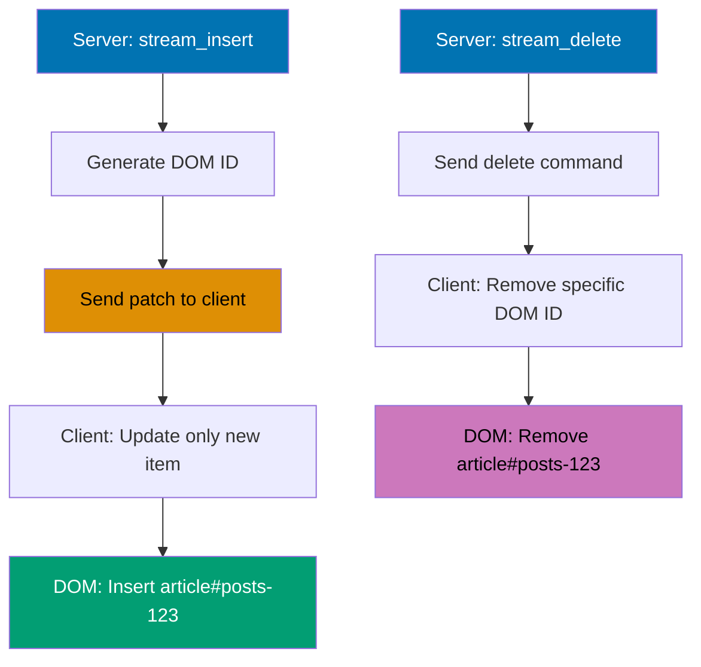
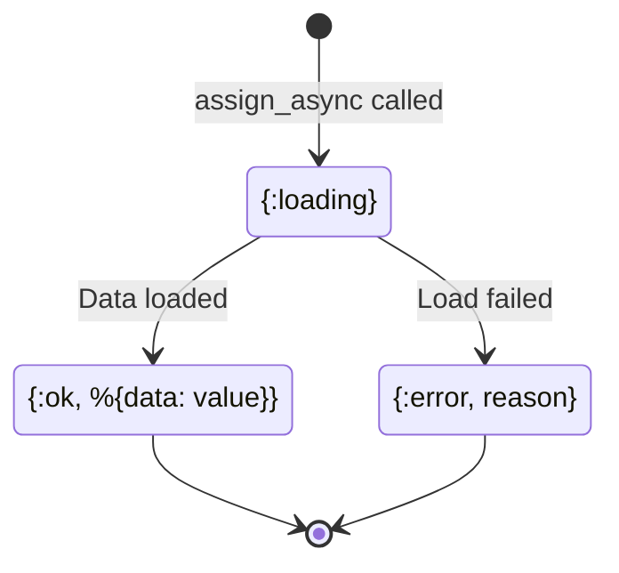
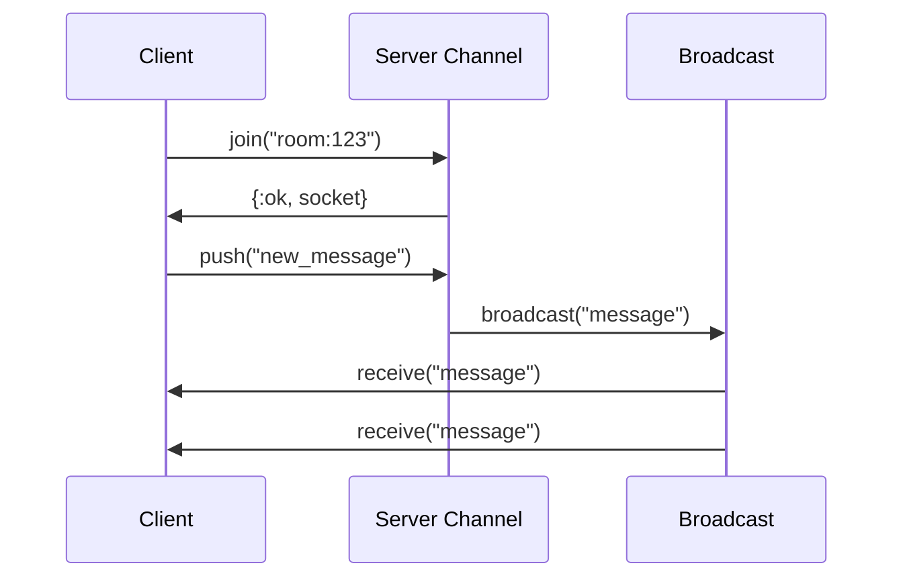
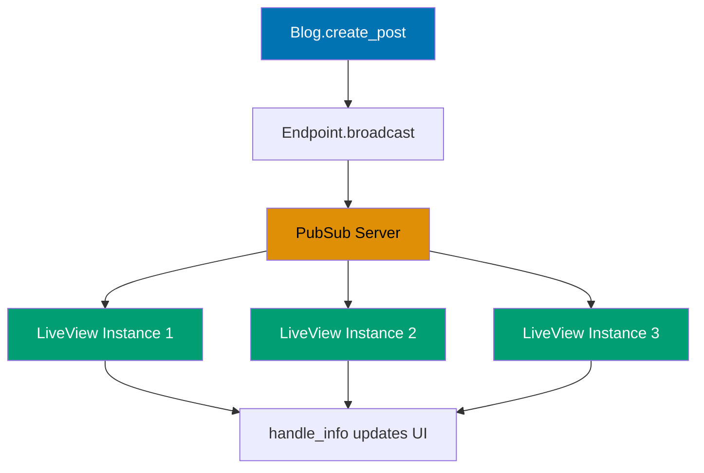
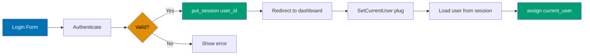
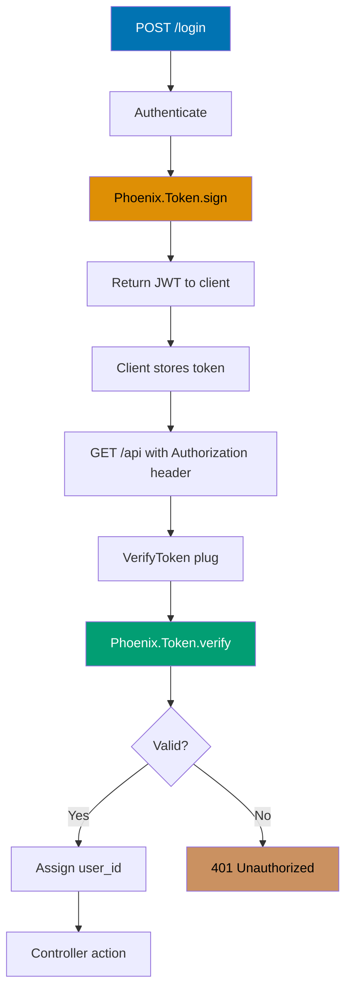
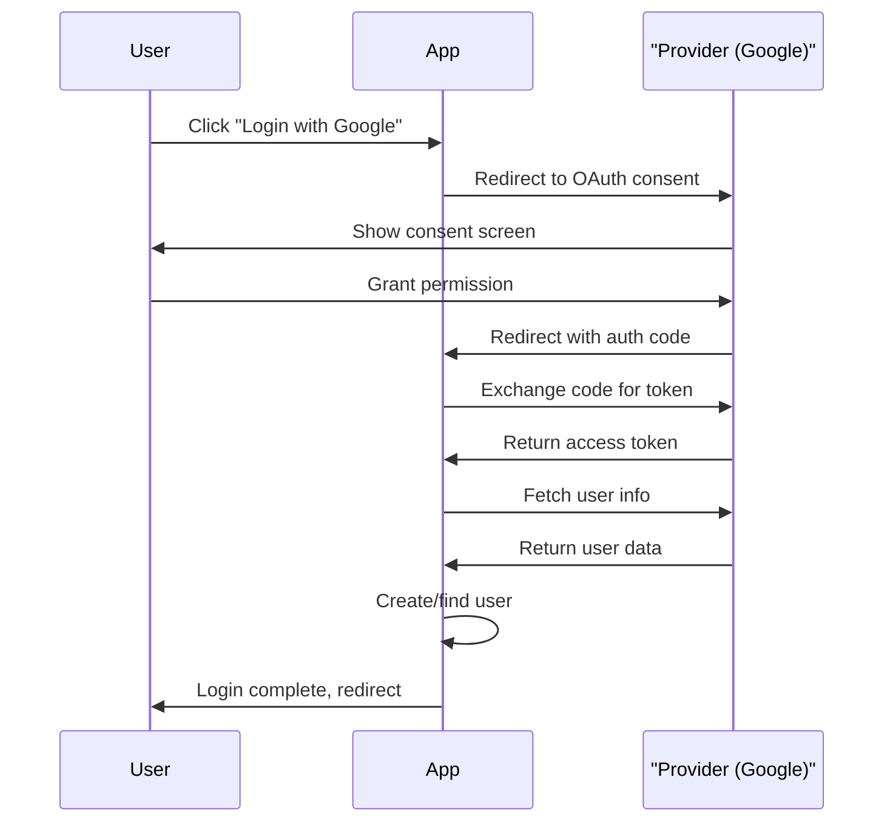
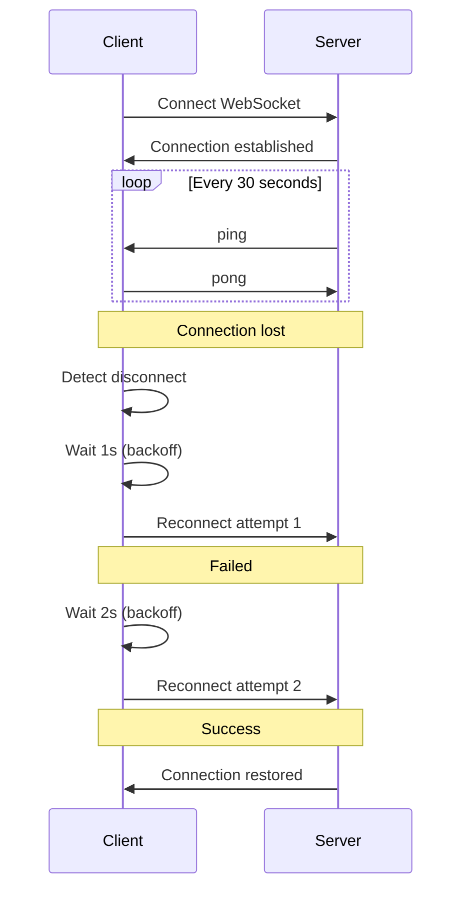

## Group 5: Advanced LiveView

### Example 26: LiveView Streams

Streams efficiently update lists without re-rendering the entire collection. Each stream item gets a unique ID for targeted updates.



```elixir
defmodule MyAppWeb.PostsLive.Index do
  use Phoenix.LiveView

  def mount(_params, _session, socket) do
    {:ok,
     socket
     |> assign(:posts, [])
     |> stream(:posts, MyApp.Blog.list_posts())}  # => Initialize stream
  end

  def render(assigns) do
    ~H"""
    <div id="posts" phx-update="stream">
      <!-- Streams each item with unique ID -->
      <%= for {dom_id, post} <- @streams.posts do %>
        <article id={dom_id}>
          <h2><%= post.title %></h2>
        </article>
      <% end %>
    </div>
    """
  end

  def handle_info({:post_created, post}, socket) do
    {:noreply, stream_insert(socket, :posts, post)}  # => Add post
  end

  def handle_info({:post_deleted, post_id}, socket) do
    {:noreply, stream_delete_by_dom_id(socket, :posts, "posts-#{post_id}")}  # => Remove post
  end
end

# Subscribe to real-time updates
def mount(_params, _session, socket) do
  MyAppWeb.Endpoint.subscribe("posts")
  {:ok, stream(socket, :posts, MyApp.Blog.list_posts())}
end
```

**Key Takeaway**: Streams use phx-update="stream" for efficient list rendering. stream_insert/3 adds items. stream_delete_by_dom_id/3 removes items. Only modified items are updated on the page.

### Example 27: Async Operations with Loading States

Load data asynchronously without blocking the page. Show loading states while waiting.



```elixir
defmodule MyAppWeb.DataLive do
  use Phoenix.LiveView

  def mount(_params, _session, socket) do
    {:ok,
     socket
     |> assign(:result, nil, :loading)                                       # => Initial state
     |> assign_async(:data, fn -> {:ok, %{data: fetch_expensive_data()}} end)}  # => Start async fetch
  end  # => Returns {:ok, socket} immediately, doesn't block

  def render(assigns) do
    ~H"""
    <div>
      <%= case @data do %>
        <% {:loading} -> %>                           # => Shows while fetching
          <p>Loading...</p>

        <% {:ok, %{data: data}} -> %>                 # => Success state
          <p><%= data %></p>

        <% {:error, reason} -> %>                     # => Error state
          <p>Error: <%= reason %></p>
      <% end %>
    </div>
    """
  end

  defp fetch_expensive_data do
    Process.sleep(2000)                               # => Simulate 2 second delay
    "Data loaded!"                                    # => Returns result
  end  # => Runs in separate process, doesn't block UI
end

# Or using start_async for event-triggered async work
def handle_event("search", %{"query" => query}, socket) do
  {:noreply,
   start_async(socket, :search, fn ->
     results = MyApp.Search.query(query)
     {:ok, results}
   end)}
end

def handle_async(:search, {:ok, results}, socket) do
  {:noreply, assign(socket, :results, results)}
end
```

**Key Takeaway**: assign_async/3 loads data when component mounts. start_async/3 performs async work on demand. Render different content based on async state (:loading, :ok, :error).

### Example 28: LiveView File Uploads with External Storage

Upload files to external services like Amazon S3 instead of storing locally.


```elixir
defmodule MyAppWeb.ProfileLive.Edit do
  use Phoenix.LiveView

  def mount(_params, _session, socket) do
    {:ok,
     socket
     |> assign(:uploaded_files, [])                   # => Track uploaded files
     |> allow_upload(:photo,                          # => Register upload config
       accept: ~w(.jpg .jpeg .png),                   # => Only images
       max_entries: 5,                                # => Up to 5 files
       max_file_size: 10_000_000)}                    # => 10MB limit per file
  end

  def render(assigns) do
    ~H"""
    <form phx-submit="save">
      <.live_file_input upload={@uploads.photo} />

      <%= for entry <- @uploads.photo.entries do %>  # => Loop selected files
        <div>
          <.live_img_preview entry={entry} />        # => Show preview
          <button phx-click="cancel_upload" phx-value-ref={entry.ref}>Cancel</button>
          <progress value={entry.progress} max="100" />  # => Upload progress bar
        </div>
      <% end %>

      <button type="submit">Save</button>
    </form>
    """
  end

  def handle_event("cancel_upload", %{"ref" => ref}, socket) do
    {:noreply, cancel_upload(socket, :photo, ref)}
  end

  def handle_event("save", _params, socket) do
    uploaded_files =
      consume_uploaded_entries(socket, :photo, fn %{path: path}, entry ->
        # Generate S3 pre-signed URL for client upload
        key = "uploads/#{entry.client_name}"
        url = MyApp.S3.get_presigned_url(key)

        # Upload file directly from client to S3
        {:ok, _} = MyApp.S3.put_object(key, File.read!(path))

        {:ok, %{name: entry.client_name, url: url}}
      end)

    {:noreply, assign(socket, :uploaded_files, uploaded_files)}
  end
end
```

**Key Takeaway**: allow_upload/2 restricts file types and sizes client-side. consume_uploaded_entries/3 processes files after submission. Upload to S3 or other external storage instead of local filesystem.

### Example 29: Stateful Live Components

Live components manage isolated state. Events target only that component, not the parent.

```elixir
defmodule MyAppWeb.ShoppingCart do
  use Phoenix.LiveComponent

  @impl true
  def mount(socket) do
    {:ok, assign(socket, items: [], total: 0)}        # => Initialize component state
  end  # => Each component instance has separate state

  @impl true
  def handle_event("add_item", %{"product_id" => id}, socket) do
    product = MyApp.Catalog.get_product!(id)          # => Fetch product
    items = [product | socket.assigns.items]          # => Add to cart
    total = socket.assigns.total + product.price      # => Update total

    {:noreply, assign(socket, items: items, total: total)}  # => Update component state
  end  # => Only this component updates, not parent

  @impl true
  def handle_event("remove_item", %{"product_id" => id}, socket) do
    product = MyApp.Catalog.get_product!(id)
    items = Enum.reject(socket.assigns.items, &(&1.id == id))
    total = socket.assigns.total - product.price

    {:noreply, assign(socket, items: items, total: total)}
  end

  @impl true
  def render(assigns) do
    ~H"""
    <div id="cart">
      <h2>Cart (<%= length(@items) %> items)</h2>
      <ul>
        <%= for item <- @items do %>
          <li>
            <%= item.name %> - $<%= item.price %>
            <button phx-click="remove_item" phx-value-product_id={item.id} phx-target={@myself}>
              Remove
            </button>
          </li>
        <% end %>
      </ul>
      <p>Total: $<%= @total %></p>
    </div>
    """
  end
end

# Parent uses live_component to render
def parent_render(assigns) do
  ~H"""
  <%= live_component(MyAppWeb.ShoppingCart, id: "cart") %>
  """
end
```

**Key Takeaway**: Live components have their own state via assign/2. Events target component using phx-target={@myself}. Each component instance maintains separate state.

### Example 30: LiveView JS Interop with Phoenix.LiveView.JS

Trigger JavaScript from LiveView without custom JS. Use Phoenix.LiveView.JS for common patterns.

```elixir
defmodule MyAppWeb.ModalLive do
  use Phoenix.LiveView

  def render(assigns) do
    ~H"""
    <div>
      <button phx-click={JS.show(to: "#modal")}>Open Modal</button>

      <div id="modal" class="modal" style="display: none;">
        <h2>Modal Title</h2>

        <button phx-click={
          JS.hide(to: "#modal")
          |> JS.push("close_modal")
        }>
          Close
        </button>
      </div>
    </div>
    """
  end

  def handle_event("close_modal", _params, socket) do
    {:noreply, socket}
  end
end

# Chaining multiple JS commands
action = JS.push("validate")
  |> JS.show(to: "#spinner")
  |> JS.add_class("error", to: "#field")
  |> JS.transition({"fade-in", "duration-500"}, time: 500)

<button phx-click={action}>Submit</button>
```

**Key Takeaway**: JS.show/2, JS.hide/2, JS.add_class/2, JS.remove_class/2 manipulate DOM. Chain multiple commands together. Use JS.push/1 to send server event alongside DOM changes.

### Example 31: Optimistic UI Updates with Rollback

Update the UI immediately (optimistic), then rollback if the server operation fails.

```elixir
defmodule MyAppWeb.PostLive do
  use Phoenix.LiveView

  def render(assigns) do
    ~H"""
    <article>
      <h2><%= @post.title %></h2>
      <p>Likes: <%= @post.likes %></p>

      <!-- Optimistically increment, rollback on error -->
      <button phx-click="like" phx-value-post_id={@post.id}>
        Like
      </button>
    </article>
    """
  end

  def handle_event("like", %{"post_id" => id}, socket) do
    post = socket.assigns.post

    # Update UI immediately
    updated_post = %{post | likes: post.likes + 1}
    socket = assign(socket, :post, updated_post)

    case MyApp.Blog.increment_likes(post) do
      {:ok, _} ->
        # Server confirmed - keep the change
        {:noreply, socket}

      {:error, _reason} ->
        # Server failed - rollback to original
        {:noreply, assign(socket, :post, post)}
    end
  end
end
```

**Key Takeaway**: Update assigns immediately for fast UI response. If server operation fails, restore original values. Users see instant feedback without waiting for server confirmation.

## Group 6: Real-Time Features

### Example 32: Phoenix Channels - Basic Communication

Channels provide real-time bidirectional WebSocket communication for features like chat and notifications.



```elixir
# lib/my_app_web/channels/room_channel.ex
defmodule MyAppWeb.RoomChannel do
  use Phoenix.Channel

  @impl true
  def join("room:" <> room_id, _message, socket) do
    {:ok, assign(socket, :room_id, room_id)}          # => User joined successfully
  end  # => Pattern match room ID from topic name

  @impl true
  def handle_in("new_message", %{"body" => body}, socket) do
    # Broadcast to all users in the room
    broadcast(socket, "message", %{body: body, user_id: socket.assigns.user_id})
    # => Sends to ALL users in room, including sender
    {:noreply, socket}                                # => Don't send individual reply
  end

  @impl true
  def handle_in("typing", _params, socket) do
    broadcast_from(socket, "user_typing", %{user_id: socket.assigns.user_id})
    # => Sends to all EXCEPT sender (no echo)
    {:noreply, socket}
  end
end

# Client-side subscription (in JavaScript or LiveView)
<script>
let channel = socket.channel("room:123", {})

channel.join()
  .receive("ok", resp => console.log("Joined", resp))

channel.on("message", payload => {
  console.log("Message:", payload.body)
})

document.getElementById("send").addEventListener("click", () => {
  channel.push("new_message", {body: input.value})
})
</script>
```

**Key Takeaway**: Channels are named "topic:subtopic". join/3 handles subscription. broadcast/3 sends to all users. handle_in/3 processes incoming messages. Perfect for real-time collaboration.

### Example 33: PubSub for LiveView Updates

PubSub delivers messages across the system. LiveView components subscribe to topics and update when messages arrive.



```elixir
defmodule MyAppWeb.PostsLive.List do
  use Phoenix.LiveView

  def mount(_params, _session, socket) do
    # Subscribe to "posts" topic
    MyAppWeb.Endpoint.subscribe("posts")              # => Listen for broadcasts

    posts = MyApp.Blog.list_posts()                   # => Initial data
    {:ok, stream(socket, :posts, posts)}              # => Setup stream
  end  # => This LiveView now receives all "posts" broadcasts

  def render(assigns) do
    ~H"""
    <div id="posts" phx-update="stream">
      <%= for {dom_id, post} <- @streams.posts do %>
        <article id={dom_id}>
          <h2><%= post.title %></h2>
        </article>
      <% end %>
    </div>
    """
  end

  @impl true
  def handle_info({:post_created, post}, socket) do
    {:noreply, stream_insert(socket, :posts, post, at: 0)}  # => Add at top
  end  # => Triggered by PubSub broadcast

  @impl true
  def handle_info({:post_updated, post}, socket) do
    {:noreply, stream_insert(socket, :posts, post)}   # => Updates existing item
  end  # => Stream finds by ID and updates in place

  @impl true
  def handle_info({:post_deleted, post_id}, socket) do
    {:noreply, stream_delete_by_dom_id(socket, :posts, "posts-#{post_id}")}  # => Remove from UI
  end  # => All connected LiveViews update simultaneously
end

# When a post is created (in your context)
defmodule MyApp.Blog do
  def create_post(attrs) do
    case Repo.insert(changeset) do
      {:ok, post} ->
        MyAppWeb.Endpoint.broadcast("posts", "post_created", post)
        {:ok, post}

      {:error, changeset} ->
        {:error, changeset}
    end
  end
end
```

**Key Takeaway**: Endpoint.subscribe/1 listens to topic. Endpoint.broadcast/3 publishes messages. handle_info/2 receives broadcasts. Multiple LiveView instances stay synchronized.

### Example 34: Presence Tracking

Track which users are online and what they're doing. Presence automatically cleans up when users disconnect.

```elixir
defmodule MyAppWeb.Presence do
  use Phoenix.Presence,
    otp_app: :my_app,
    pubsub_server: MyApp.PubSub
end

# Track user presence
defmodule MyAppWeb.RoomChannel do
  use Phoenix.Channel
  alias MyAppWeb.Presence

  def join("room:" <> room_id, _params, socket) do
    send(self(), :after_join)
    {:ok, assign(socket, :room_id, room_id)}
  end

  def handle_info(:after_join, socket) do
    {:ok, _} =
      Presence.track(socket, "user:#{socket.assigns.user_id}", %{
        user_id: socket.assigns.user_id,             # => User identifier
        username: socket.assigns.username,           # => Display name
        status: "online"                             # => Current status
      })  # => Registers this user as present

    push(socket, "presence_state", Presence.list(socket))  # => Send current users list
    {:noreply, socket}
  end  # => Automatically removed when socket disconnects
end

# Get list of online users
onlineUsers = Presence.list("room:123")
# => %{
#   "user:1" => %{metas: [%{user_id: 1, username: "Alice", status: "online"}]},
#   "user:2" => %{metas: [%{user_id: 2, username: "Bob", status: "online"}]}
# }
```

**Key Takeaway**: Presence.track/3 records user state. Presence.list/1 gets all users in topic. Automatically removes user when connection closes. Great for "who's online" features.

### Example 35: Channel Authentication

Secure channels with authentication tokens. Only authenticated users can join sensitive channels.

```elixir
defmodule MyAppWeb.UserSocket do
  use Phoenix.Socket

  channel "room:*", MyAppWeb.RoomChannel
  channel "private:*", MyAppWeb.PrivateChannel

  @impl true
  def connect(%{"token" => token}, socket) do
    case verify_token(token) do
      {:ok, user_id} ->
        {:ok, assign(socket, user_id: user_id)}

      {:error, _reason} ->
        :error  # => Reject connection
    end
  end

  @impl true
  def id(socket), do: "user_socket:#{socket.assigns.user_id}"

  defp verify_token(token) do
    Phoenix.Token.verify(socket, "user socket", token, max_age: 86400)
  end
end

# Generate token in your controller
def login(conn, %{"email" => email, "password" => password}) do
  case MyApp.Accounts.authenticate(email, password) do
    {:ok, user} ->
      token = Phoenix.Token.sign(conn, "user socket", user.id)

      conn
      |> put_session(:user_token, token)
      |> render("login_success.html", user_token: token)

    {:error, _} ->
      render(conn, "login_error.html")
  end
end
```

**Key Takeaway**: connect/2 authenticates socket connection using tokens. assign/2 stores user info. id/1 generates socket ID for tracking. Return :error to reject connection.

### Example 36: Channel Testing

Test channel behavior with ChannelCase. Assert messages, errors, and state changes.

```elixir
defmodule MyAppWeb.RoomChannelTest do
  use MyAppWeb.ChannelCase

  setup do
    {:ok, _, socket} = subscribe_and_join(MyAppWeb.UserSocket, "room:123", %{})
    {:ok, socket: socket}
  end

  test "broadcast new_message", %{socket: socket} do
    push(socket, "new_message", %{"body" => "Hello"})
    assert_broadcast("message", %{body: "Hello"})
  end

  test "handles join message", %{socket: socket} do
    assert_push("presence_state", _)
  end

  test "rejects unauthorized join" do
    assert {:error, _} = subscribe_and_join(MyAppWeb.UserSocket, "private:secret", %{})
  end

  test "handle_in updates state", %{socket: socket} do
    push(socket, "typing", %{})
    assert_broadcast("user_typing", _)
  end
end
```

**Key Takeaway**: ChannelCase provides testing utilities. subscribe_and_join/3 joins a channel. push/2 sends messages. assert_broadcast/2 verifies messages sent. assert_push/2 verifies server pushes.

## Group 7: Authentication & Authorization

### Example 37: Session-Based Authentication

Store user info in encrypted session after login. Session persists across requests.



```elixir
defmodule MyAppWeb.SessionController do
  use MyAppWeb, :controller
  alias MyApp.Accounts

  def new(conn, _params) do
    render(conn, "new.html")
  end

  def create(conn, %{"session" => %{"email" => email, "password" => password}}) do
    case Accounts.authenticate(email, password) do    # => Check credentials
      {:ok, user} ->
        conn
        |> put_session(:user_id, user.id)            # => Store encrypted in session
        |> put_flash(:info, "Welcome back!")
        |> redirect(to: ~p"/dashboard")

      {:error, _} ->
        conn
        |> put_flash(:error, "Invalid credentials")  # => Show error
        |> render("new.html")                        # => Re-render login form
    end
  end  # => Session stored in signed cookie

  def delete(conn, _params) do
    conn
    |> delete_session(:user_id)  # => Clear session
    |> put_flash(:info, "Logged out")
    |> redirect(to: ~p"/")
  end
end

# Get current user from session
defmodule MyAppWeb.Plugs.SetCurrentUser do
  def init(opts), do: opts

  def call(conn, _opts) do
    user_id = get_session(conn, :user_id)
    user = if user_id, do: MyApp.Accounts.get_user!(user_id)
    assign(conn, :current_user, user)
  end
end
```

**Key Takeaway**: put_session/3 stores data encrypted. get_session/2 retrieves data. delete_session/2 clears it. Sessions survive across requests but are specific to each browser.

### Example 38: Password Hashing and Reset

Securely hash passwords before storing. Implement password reset with time-limited tokens.

```elixir
defmodule MyApp.Accounts.User do
  schema "users" do
    field :email, :string
    field :password, :string, virtual: true  # => Not stored
    field :password_hash, :string            # => Stored in DB
    field :password_reset_token, :string
    field :password_reset_at, :utc_datetime
    timestamps()
  end

  def registration_changeset(user, attrs) do
    user
    |> cast(attrs, [:email, :password])
    |> validate_required([:email, :password])
    |> unique_constraint(:email)
    |> put_password_hash()  # => Hash password
  end

  defp put_password_hash(changeset) do
    case changeset do
      %Ecto.Changeset{valid?: true, changes: %{password: password}} ->
        put_change(changeset, :password_hash, Bcrypt.hash_pwd_salt(password))

      changeset ->
        changeset
    end
  end

  def password_reset_changeset(user) do
    token = :crypto.strong_rand_bytes(32) |> Base.encode64()

    user
    |> change(%{password_reset_token: token, password_reset_at: DateTime.utc_now()})
  end
end

# Password reset flow
def reset_password_request(conn, %{"email" => email}) do
  case MyApp.Accounts.get_user_by_email(email) do
    user ->
      {:ok, user} = MyApp.Accounts.generate_password_reset_token(user)
      # Send email with reset token
      send_reset_email(user)
      {:ok, conn}

    nil ->
      {:ok, conn}  # => Don't reveal if email exists
  end
end

def reset_password(conn, %{"token" => token, "password" => password}) do
  case MyApp.Accounts.get_user_by_reset_token(token) do
    {:ok, user} ->
      MyApp.Accounts.update_password(user, %{password: password})
      {:ok, conn}

    {:error, :expired} ->
      {:error, "Reset token expired"}
  end
end
```

**Key Takeaway**: Hash passwords with Bcrypt before storing. Use random tokens for password reset. Store token expiration time. Don't reveal if email exists in system.

### Example 39: Role-Based Access Control

Restrict actions based on user roles. Use plugs for authorization checks.

```elixir
defmodule MyAppWeb.Plugs.RequireRole do
  def init(opts) do
    Keyword.fetch!(opts, :role)
  end

  def call(conn, role) do
    if has_role?(conn.assigns.current_user, role) do
      conn
    else
      conn
      |> put_flash(:error, "Not authorized")
      |> redirect(to: ~p"/")
      |> halt()
    end
  end

  defp has_role?(%{role: user_role}, required_role) do
    user_role == required_role or user_role == :admin
  end
end

# In router
scope "/admin", MyAppWeb.Admin do
  pipe_through :browser
  pipe_through :require_login

  pipe MyAppWeb.Plugs.RequireRole, role: :admin  # => Only admins

  resources "/users", UserController
  resources "/settings", SettingController
end

# Or check in controller
def delete(conn, %{"id" => id}) do
  if can_delete?(conn.assigns.current_user, id) do
    # Delete logic
  else
    conn
    |> put_flash(:error, "Not authorized")
    |> redirect(to: ~p"/")
  end
end
```

**Key Takeaway**: Store user role in database (:admin, :moderator, :user). Use plugs to enforce role requirements at route level. Check permissions in controller actions.

### Example 40: JWT Token Authentication for APIs

Use JWT tokens for stateless API authentication. Tokens are signed and verified without server storage.



```elixir
defmodule MyAppWeb.AuthToken do
  @salt "user auth"

  def sign(%{id: user_id, email: email}) do
    Phoenix.Token.sign(MyAppWeb.Endpoint, @salt, %{user_id: user_id, email: email})
    # => Returns signed JWT token string
  end  # => Token contains user_id and email as claims

  def verify(token) do
    Phoenix.Token.verify(MyAppWeb.Endpoint, @salt, token, max_age: 86400)
    # => Returns {:ok, claims} or {:error, :expired/:invalid}
  end  # => max_age: 86400 seconds (24 hours)
end

# Generate token on login
def create(conn, %{"email" => email, "password" => password}) do
  case MyApp.Accounts.authenticate(email, password) do
    {:ok, user} ->
      token = MyAppWeb.AuthToken.sign(user)
      json(conn, %{access_token: token, user: user})

    {:error, _} ->
      conn
      |> put_status(:unauthorized)
      |> json(%{error: "Invalid credentials"})
  end
end

# Plug to verify token in API requests
defmodule MyAppWeb.Plugs.VerifyToken do
  def init(opts), do: opts

  def call(conn, _opts) do
    case get_auth_header(conn) do
      "Bearer " <> token ->                          # => Extract token from header
        case MyAppWeb.AuthToken.verify(token) do      # => Verify signature
          {:ok, claims} ->                            # => Token valid
            assign(conn, :current_user_id, claims.user_id)  # => Store user ID

          {:error, _} ->                              # => Token invalid/expired
            conn
            |> put_status(:unauthorized)             # => 401 status
            |> json(%{error: "Invalid token"})
            |> halt()                                # => Stop pipeline
        end

      nil ->
        conn
        |> put_status(:unauthorized)
        |> json(%{error: "Missing token"})
        |> halt()
    end
  end

  defp get_auth_header(conn) do
    case get_req_header(conn, "authorization") do
      [header] -> header
      _ -> nil
    end
  end
end
```

**Key Takeaway**: Phoenix.Token.sign/3 creates signed tokens. verify/2 validates tokens. Tokens are stateless (no server storage needed). Include token in "Authorization: Bearer TOKEN" header.

### Example 41: OAuth2 Social Login

Allow users to sign in with Google, GitHub, etc. using Ueberauth library.



```elixir
# config/config.exs
config :ueberauth, Ueberauth,
  providers: [
    google: {Ueberauth.Strategy.Google, [default_scope: "email profile"]},
    github: {Ueberauth.Strategy.Github, [default_scope: "user email"]}
  ]

config :ueberauth, Ueberauth.Strategy.Google.OAuth,
  client_id: System.get_env("GOOGLE_CLIENT_ID"),
  client_secret: System.get_env("GOOGLE_CLIENT_SECRET")

# Router
scope "/auth", MyAppWeb do
  pipe_through :browser

  get "/:provider", AuthController, :request
  get "/:provider/callback", AuthController, :callback
end

# Controller
defmodule MyAppWeb.AuthController do
  use MyAppWeb, :controller
  alias MyApp.Accounts

  def request(conn, _params) do
    render(conn, "request.html", callback_url: Routes.auth_url(conn, :callback, :google))
  end

  def callback(%{assigns: %{ueberauth_auth: auth}} = conn, _params) do
    case Accounts.find_or_create_user(auth) do
      {:ok, user} ->
        conn
        |> put_session(:user_id, user.id)
        |> redirect(to: ~p"/dashboard")

      {:error, _} ->
        conn
        |> put_flash(:error, "OAuth login failed")
        |> redirect(to: ~p"/")
    end
  end

  def callback(conn, _params) do
    conn
    |> put_flash(:error, "OAuth failed")
    |> redirect(to: ~p"/")
  end
end

# Find or create user from OAuth info
def find_or_create_user(auth) do
  case get_user_by_provider(auth.provider, auth.uid) do
    user = %User{} ->
      {:ok, user}

    nil ->
      %User{}
      |> User.oauth_changeset(auth)
      |> Repo.insert()
  end
end
```

**Key Takeaway**: Ueberauth handles OAuth flow. Redirect to "/auth/google" to start login. Callback returns user info. Store provider and UID to link OAuth account.

## Group 8: Testing & Quality

### Example 42: Controller Testing with ConnCase

Test controller actions, responses, status codes, and flash messages.

```elixir
defmodule MyAppWeb.PostControllerTest do
  use MyAppWeb.ConnCase

  describe "GET /posts" do
    test "lists all posts", %{conn: conn} do
      post = insert(:post)

      response = get(conn, ~p"/posts") |> html_response(200)
      assert response =~ post.title
    end
  end

  describe "POST /posts" do
    test "creates post and redirects", %{conn: conn} do
      post_params = %{title: "Hello", body: "World"}

      conn = post(conn, ~p"/posts", post: post_params)

      assert redirected_to(conn) == ~p"/posts/1"
      assert has_flash?(conn, :info, "Post created!")
    end

    test "renders errors on invalid params", %{conn: conn} do
      conn = post(conn, ~p"/posts", post: %{title: ""})

      assert html_response(conn, 200) =~ "can't be blank"
    end
  end

  describe "authenticated routes" do
    setup %{conn: conn} do
      user = insert(:user)
      conn = conn |> assign(:current_user, user)
      {:ok, conn: conn}
    end

    test "requires authentication", %{conn: conn} do
      conn = delete(conn, ~p"/logout")
      assert redirected_to(conn) == ~p"/"
    end
  end
end
```

**Key Takeaway**: Use get/3, post/3, put/3, delete/3 to make requests. html_response/2 checks status and returns HTML. assert redirected_to/1 verifies redirects. Use fixtures or factories for test data.

### Example 43: LiveView Component Testing

Test LiveView mount, render, and event handling.

```elixir
defmodule MyAppWeb.CounterLiveTest do
  use MyAppWeb.ConnCase
  import Phoenix.LiveViewTest

  test "mount and render counter", %{conn: conn} do
    {:ok, _live, html} = live(conn, "/counter")
    assert html =~ "Count: 0"
  end

  test "increment event", %{conn: conn} do
    {:ok, live, _html} = live(conn, "/counter")

    assert live
           |> element("button", "+")
           |> render_click() =~ "Count: 1"
  end

  test "decrement multiple times", %{conn: conn} do
    {:ok, live, _html} = live(conn, "/counter")

    assert live
           |> element("button", "-")
           |> render_click()
           |> render() =~ "Count: -1"
  end

  test "form submission", %{conn: conn} do
    {:ok, live, _html} = live(conn, "/posts/new")

    assert live
           |> form("form", post: %{title: "Test", body: "Content"})
           |> render_submit()

    assert has_element?(live, "h1", "Test")
  end
end
```

**Key Takeaway**: live/2 mounts LiveView component. render_click/1 triggers events. render/1 returns rendered HTML. form/3 submits form. has_element?/3 asserts DOM content exists.

### Example 44: Test Fixtures with ExMachina

Use factories to generate consistent test data without repetition.

```elixir
# test/support/factory.ex
defmodule MyApp.Factory do
  use ExMachina.Ecto, repo: MyApp.Repo

  def user_factory do
    %MyApp.Accounts.User{
      email: sequence(:email, &"user#{&1}@example.com"),
      password: "password123",
      password_hash: Bcrypt.hash_pwd_salt("password123")
    }
  end

  def post_factory do
    %MyApp.Blog.Post{
      title: "Test Post",
      body: "Test body",
      user: build(:user)
    }
  end

  def comment_factory do
    %MyApp.Blog.Comment{
      body: "Great post!",
      post: build(:post),
      user: build(:user)
    }
  end
end

# In test
defmodule MyAppWeb.PostControllerTest do
  use MyAppWeb.ConnCase

  setup do
    user = insert(:user)
    post = insert(:post, user: user)
    {:ok, post: post, user: user}
  end

  test "shows post", %{conn: conn, post: post} do
    conn = get(conn, ~p"/posts/#{post.id}")
    assert html_response(conn, 200) =~ post.title
  end

  test "creates multiple posts", %{conn: conn} do
    insert_list(5, :post)
    posts = MyApp.Repo.all(Post)
    assert length(posts) == 5
  end
end
```

**Key Takeaway**: Define factories using ExMachina. insert/1 creates in database. insert/2 with attributes overrides defaults. insert_list/2 creates multiple records. Factories reduce boilerplate.

### Example 45: Mocking External Services with Mox

Mock external API calls in tests using Mox library.

```elixir
# lib/my_app/payment_api.ex
defmodule MyApp.PaymentAPI do
  @callback charge(amount: integer, customer_id: string) :: {:ok, map} | {:error, term}
end

defmodule MyApp.PaymentAPI.Stripe do
  @behaviour MyApp.PaymentAPI

  def charge(amount: amount, customer_id: customer_id) do
    # Real Stripe API call
    {:ok, %{id: "ch_123", amount: amount}}
  end
end

# config/test.exs
config :my_app, payment_api: MyApp.PaymentAPI.Mock

# test/support/mocks.ex
Mox.defmock(MyApp.PaymentAPI.Mock, for: MyApp.PaymentAPI)

# In test
defmodule MyAppWeb.OrderControllerTest do
  use MyAppWeb.ConnCase
  import Mox

  setup :verify_on_exit!

  test "processes payment on order", %{conn: conn} do
    # Expect charge to be called with these args
    expect(MyApp.PaymentAPI.Mock, :charge, fn %{amount: 1000} ->
      {:ok, %{id: "ch_123"}}
    end)

    conn = post(conn, ~p"/orders", order: %{amount: 1000})
    assert html_response(conn, 302)  # Redirect on success
  end

  test "handles payment failure", %{conn: conn} do
    # Mock payment failure
    stub(MyApp.PaymentAPI.Mock, :charge, fn _ ->
      {:error, "Card declined"}
    end)

    conn = post(conn, ~p"/orders", order: %{amount: 1000})
    assert html_response(conn, 200) =~ "Payment failed"
  end
end
```

**Key Takeaway**: Mox.defmock/2 creates a mock. expect/3 verifies function was called. stub/2 returns values without verification. Use verify_on_exit!/1 to assert expected calls happened.

### Example 46: API Pagination with Scrivener

Paginate API responses efficiently. Return page metadata along with results.

```elixir
# mix.exs
defp deps do
  [
    {:scrivener_ecto, "~> 2.7"}                       # => Pagination library
  ]
end

# config/config.exs
config :my_app, MyApp.Repo,
  page_size: 20                                       # => Default page size

# In your context
defmodule MyApp.Blog do
  import Ecto.Query
  alias MyApp.Repo

  def list_posts(params \\ %{}) do
    Post
    |> where([p], p.published == true)                # => Only published
    |> order_by([p], desc: p.inserted_at)             # => Newest first
    |> Repo.paginate(params)                          # => Apply pagination
    # => Returns %Scrivener.Page{entries: [...], page_number: 1, page_size: 20, total_entries: 100, total_pages: 5}
  end
end

# Controller
defmodule MyAppWeb.API.PostController do
  use MyAppWeb, :controller

  def index(conn, params) do
    page = MyApp.Blog.list_posts(params)              # => Get paginated results

    json(conn, %{
      data: Enum.map(page.entries, &post_json/1),    # => Posts array
      metadata: %{
        page_number: page.page_number,                # => Current page
        page_size: page.page_size,                    # => Items per page
        total_entries: page.total_entries,            # => Total count
        total_pages: page.total_pages                 # => Total pages
      }
    })
  end

  defp post_json(post) do
    %{id: post.id, title: post.title, body: post.body}
  end
end

# Client usage:
# GET /api/posts?page=1&page_size=10
# GET /api/posts?page=2
```

**Key Takeaway**: Scrivener adds paginate/2 to Repo for easy pagination. Returns page metadata (total entries, pages). Clients use page and page_size query params.

### Example 47: API Versioning Strategies

Version your API to support multiple client versions. Use URL versioning or header versioning.

```mermaid
%% API versioning strategies
graph LR
    A[Client Request] --> B{Version Strategy}
    B -->|URL| C[/api/v1/posts]
    B -->|Header| D[Accept: application/vnd.api.v1+json]
    B -->|Content Type| E[application/vnd.myapp.v1+json]
    C --> F[Route to V1 Controller]
    D --> F
    E --> F

    style A fill:#0173B2,color:#fff
    style B fill:#DE8F05,color:#000
    style F fill:#029E73,color:#fff
```

```elixir
# URL versioning (recommended for simplicity)
defmodule MyAppWeb.Router do
  scope "/api/v1", MyAppWeb.API.V1, as: :v1_api do
    pipe_through :api
    resources "/posts", PostController                # => V1 endpoints
  end

  scope "/api/v2", MyAppWeb.API.V2, as: :v2_api do
    pipe_through :api
    resources "/posts", PostController                # => V2 endpoints
  end
end

# V1 Controller
defmodule MyAppWeb.API.V1.PostController do
  use MyAppWeb, :controller

  def show(conn, %{"id" => id}) do
    post = MyApp.Blog.get_post!(id)
    json(conn, %{
      id: post.id,                                    # => V1 response format
      title: post.title,
      body: post.body
    })
  end
end

# V2 Controller - different response shape
defmodule MyAppWeb.API.V2.PostController do
  use MyAppWeb, :controller

  def show(conn, %{"id" => id}) do
    post = MyApp.Blog.get_post!(id)
    json(conn, %{
      data: %{                                        # => V2 wraps in data
        type: "post",                                 # => JSON:API style
        id: to_string(post.id),                       # => String ID
        attributes: %{
          title: post.title,
          body: post.body,
          created_at: post.inserted_at              # => Different field name
        }
      }
    })
  end
end

# Header-based versioning (alternative)
defmodule MyAppWeb.Plugs.APIVersion do
  def init(opts), do: opts

  def call(conn, _opts) do
    version = case get_req_header(conn, "accept") do
      ["application/vnd.myapp.v2+json"] -> :v2      # => Client requests V2
      _ -> :v1                                      # => Default to V1
    end

    assign(conn, :api_version, version)             # => Store version
  end
end

# Use version in controller
def show(conn, %{"id" => id}) do
  post = MyApp.Blog.get_post!(id)

  case conn.assigns.api_version do                  # => Check version
    :v1 -> render_v1(conn, post)
    :v2 -> render_v2(conn, post)
  end
end
```

**Key Takeaway**: URL versioning (/api/v1, /api/v2) is simple and explicit. Create separate controller modules per version. Keep old versions running while clients migrate.

### Example 48: Rate Limiting per API Key

Implement per-user rate limiting for API endpoints. Track usage by API key.

```elixir
# Generate API keys for users
defmodule MyApp.Accounts.User do
  schema "users" do
    field :email, :string
    field :api_key, :string                           # => Unique API key
    field :api_requests_count, :integer, default: 0   # => Request counter
    field :api_reset_at, :utc_datetime                # => Reset time
    timestamps()
  end

  def generate_api_key do
    :crypto.strong_rand_bytes(32) |> Base.encode64()  # => 32-byte random key
  end
end

# Plug to check API key and rate limit
defmodule MyAppWeb.Plugs.APIAuth do
  import Plug.Conn
  alias MyApp.Accounts

  def init(opts), do: opts

  def call(conn, _opts) do
    case get_req_header(conn, "x-api-key") do
      [api_key] ->
        case Accounts.verify_api_key(api_key) do      # => Check key exists
          {:ok, user} ->
            conn
            |> assign(:current_user, user)           # => Store user
            |> check_rate_limit(user)                # => Check limit

          {:error, :invalid} ->
            conn
            |> put_status(:unauthorized)             # => 401
            |> Phoenix.Controller.json(%{error: "Invalid API key"})
            |> halt()
        end

      _ ->
        conn
        |> put_status(:unauthorized)
        |> Phoenix.Controller.json(%{error: "Missing API key"})
        |> halt()
    end
  end

  defp check_rate_limit(conn, user) do
    now = DateTime.utc_now()

    cond do
      DateTime.compare(now, user.api_reset_at) == :gt ->  # => Reset window passed
        Accounts.reset_rate_limit(user)                   # => Reset counter
        conn

      user.api_requests_count >= 1000 ->                  # => Limit: 1000/hour
        conn
        |> put_status(:too_many_requests)                 # => 429
        |> put_resp_header("x-rate-limit-reset", to_string(DateTime.to_unix(user.api_reset_at)))
        |> Phoenix.Controller.json(%{error: "Rate limit exceeded"})
        |> halt()

      true ->
        Accounts.increment_api_usage(user)                # => Count this request
        conn
        |> put_resp_header("x-rate-limit-remaining", to_string(1000 - user.api_requests_count - 1))
    end
  end
end

# Context functions
defmodule MyApp.Accounts do
  def reset_rate_limit(user) do
    user
    |> Ecto.Changeset.change(%{
      api_requests_count: 0,                          # => Reset to 0
      api_reset_at: DateTime.add(DateTime.utc_now(), 3600)  # => +1 hour
    })
    |> Repo.update()
  end

  def increment_api_usage(user) do
    from(u in User, where: u.id == ^user.id, update: [inc: [api_requests_count: 1]])
    |> Repo.update_all([])                            # => Atomic increment
  end
end

# In router
scope "/api", MyAppWeb.API do
  pipe_through :api
  plug MyAppWeb.Plugs.APIAuth                         # => Require API key

  resources "/posts", PostController
end
```

**Key Takeaway**: Store API keys in users table. Track request count and reset time. Return 429 with X-Rate-Limit-Reset header when exceeded. Use atomic updates for concurrency safety.

### Example 49: WebSocket Heartbeat and Reconnection

Implement heartbeat to detect disconnections. Handle automatic reconnection with exponential backoff.



```elixir
# Server-side heartbeat (Channel)
defmodule MyAppWeb.UserSocket do
  use Phoenix.Socket

  # Configure heartbeat interval (30 seconds)
  @heartbeat_interval 30_000                          # => 30 seconds

  channel "room:*", MyAppWeb.RoomChannel

  @impl true
  def connect(_params, socket, _connect_info) do
    # Start heartbeat timer
    send(self(), :heartbeat)                          # => Send first heartbeat
    {:ok, socket}
  end

  @impl true
  def id(_socket), do: nil

  # Handle heartbeat
  @impl true
  def handle_info(:heartbeat, socket) do
    Process.send_after(self(), :heartbeat, @heartbeat_interval)  # => Schedule next
    {:noreply, socket}                                # => Keep connection alive
  end
end

# Client-side (JavaScript)
defmodule MyAppWeb.Presence do
  # app.js - Client heartbeat and reconnection
  """
  const socket = new Socket("/socket", {
    params: {token: window.userToken},
    heartbeatIntervalMs: 30000,                       // => Send ping every 30s
    reconnectAfterMs: (tries) => {
      const delays = [1000, 2000, 5000, 10000]        // => Exponential backoff
      return delays[tries - 1] || 10000               // => Cap at 10s
    }                                                 // => Backoff: 1s, 2s, 5s, 10s, 10s...
  })

  socket.onError(() => console.log("Socket error"))   // => Log errors
  socket.onClose(() => console.log("Socket closed"))  // => Connection lost

  socket.connect()                                    // => Initial connection

  // Join channel with rejoin logic
  const channel = socket.channel("room:lobby", {})

  channel.on("disconnect", () => {
    console.log("Disconnected, will auto-reconnect")  // => Phoenix handles this
  })

  channel.join()
    .receive("ok", resp => console.log("Joined", resp))
    .receive("error", resp => console.log("Join failed", resp))
    .receive("timeout", () => console.log("Join timeout"))

  export default socket
  """
end

# LiveView auto-reconnection (built-in)
defmodule MyAppWeb.PostsLive do
  use Phoenix.LiveView

  def mount(_params, _session, socket) do
    if connected?(socket) do                          # => Only on WebSocket connection
      # Subscribe to real-time updates
      MyAppWeb.Endpoint.subscribe("posts")
      {:ok, load_posts(socket)}
    else
      {:ok, assign(socket, :posts, [])}              # => Initial HTTP render
    end
  end

  def handle_info({:phoenix_reconnect, _}, socket) do
    {:noreply, load_posts(socket)}                    # => Reload after reconnect
  end

  defp load_posts(socket) do
    posts = MyApp.Blog.list_posts()
    assign(socket, :posts, posts)
  end
end
```

**Key Takeaway**: Phoenix handles heartbeat automatically (30s default). Client reconnects with exponential backoff. LiveView re-renders after reconnection. Use connected?/1 to detect WebSocket vs HTTP.

### Example 50: Compression and Response Optimization

Optimize API responses with gzip compression and efficient serialization.

```elixir
# Enable compression in endpoint
defmodule MyAppWeb.Endpoint do
  use Phoenix.Endpoint, otp_app: :my_app

  plug Plug.Static,
    at: "/",
    from: :my_app,
    gzip: true                                        # => Serve pre-compressed assets
    # => Looks for .gz files alongside originals

  plug Plug.Parsers,
    parsers: [:urlencoded, :multipart, :json],
    pass: ["*/*"],
    json_decoder: Jason                               # => Fast JSON parser

  plug Plug.Head                                      # => Handle HEAD requests

  # Compress responses
  plug Plug.Deflate,
    threshold: 1024                                   # => Only compress >= 1KB
    # => Uses gzip compression for responses

  plug MyAppWeb.Router
end

# Efficient JSON serialization
defmodule MyAppWeb.PostView do
  use MyAppWeb, :view

  def render("index.json", %{posts: posts}) do
    # Use stream for large datasets
    %{
      data: Stream.map(posts, &post_json/1)           # => Lazy evaluation
            |> Enum.to_list()
    }
  end

  defp post_json(post) do
    # Only include necessary fields
    %{
      id: post.id,                                    # => Essential fields only
      title: post.title,
      excerpt: String.slice(post.body, 0, 100)        # => Truncate body to excerpt
      # => Don't send full body in list endpoint
    }
  end
end

# Response caching with ETags
defmodule MyAppWeb.API.PostController do
  use MyAppWeb, :controller

  def show(conn, %{"id" => id}) do
    post = MyApp.Blog.get_post!(id)

    # Generate ETag from content
    etag = :erlang.phash2(post) |> to_string()        # => Hash of post data

    case get_req_header(conn, "if-none-match") do
      [^etag] ->
        # Client has current version
        send_resp(conn, :not_modified, "")            # => 304 Not Modified
        # => Client uses cached response

      _ ->
        # Send fresh response with ETag
        conn
        |> put_resp_header("etag", etag)              # => Set ETag header
        |> put_resp_header("cache-control", "max-age=300")  # => Cache 5 minutes
        |> json(%{data: post})
    end
  end
end

# Pagination with cursor-based approach (efficient for large datasets)
defmodule MyApp.Blog do
  def list_posts_cursor(cursor \\ nil, limit \\ 20) do
    query = from p in Post,
      order_by: [desc: p.id],                         # => Consistent ordering
      limit: ^limit

    query = if cursor do
      where(query, [p], p.id < ^cursor)               # => Start after cursor
    else
      query
    end

    posts = Repo.all(query)                           # => Fetch posts

    next_cursor = if length(posts) == limit do
      List.last(posts).id                             # => ID of last item
    else
      nil                                             # => No more results
    end

    %{posts: posts, next_cursor: next_cursor}
  end
end

# Usage: GET /api/posts?cursor=12345&limit=20
```

**Key Takeaway**: Enable Plug.Deflate for gzip compression (threshold: 1KB). Use ETags for conditional requests (304 Not Modified). Cursor-based pagination is more efficient than offset for large datasets.
