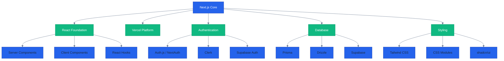

**Want to understand Next.js + TypeScript?** This overview explains what Next.js is, why it exists, and when you should use it over plain React.

**Critical prerequisite**: Next.js is built on React. You should understand React fundamentals before learning Next.js. See [React + TypeScript](/en/learn/software-engineering/web-platform/fe-react) first if you're new to React.

**Coverage note**: This overview provides context and big-picture understanding. For hands-on learning, continue to [Initial Setup](/en/learn/software-engineering/web-platform/fe-nextjs/initial-setup).

## What is Next.js?

**Next.js** is a React framework for building production-ready web applications with server-side rendering, static generation, and full-stack capabilities. Created by Vercel in 2016, Next.js extends React with features needed for real-world applications.

**Core characteristics**:

- **React Framework** - Extends React with production features
- **Server-Side Rendering (SSR)** - Render React on server for better performance and SEO
- **Static Site Generation (SSG)** - Pre-render pages at build time
- **Incremental Static Regeneration (ISR)** - Update static content without rebuilding
- **Server Components** - React components that run only on server
- **Full-Stack** - API routes, server actions, database integration
- **App Router** - File-system based routing with layouts and streaming

**TypeScript integration** provides end-to-end type safety from frontend to backend in a single codebase.

## Why Next.js?

### Server-Side Rendering (SSR)

Render React components on server for instant page loads and SEO:

```typescript
// app/posts/[id]/page.tsx - Server Component by default
async function PostPage({ params }: { params: { id: string } }) {
  // => Fetches data on server, sends HTML to client
  const post = await fetchPost(params.id);

  return (
    <article>
      <h2>{post.title}</h2>
      <p>{post.content}</p>
    </article>
  );
}
```

**Benefits**:

- **Fast First Paint** - Users see content immediately (no loading spinner)
- **SEO-Friendly** - Search engines index server-rendered HTML
- **Social Sharing** - Preview cards work (OpenGraph, Twitter Cards)

### Static Site Generation (SSG)

Pre-render pages at build time for maximum performance:

```typescript
// app/blog/[slug]/page.tsx
export async function generateStaticParams() {
  // => Runs at build time, generates all post pages
  const posts = await fetchAllPosts();
  return posts.map(post => ({ slug: post.slug }));
}

async function BlogPost({ params }: { params: { slug: string } }) {
  // => Runs at build time, cached as static HTML
  const post = await fetchPost(params.slug);
  return <article>{post.content}</article>;
}
```

**Benefits**:

- **Blazing Fast** - Serve static HTML from CDN
- **Low Server Cost** - No server rendering needed at runtime
- **High Scalability** - Handle millions of requests with CDN

### Full-Stack Capabilities

Build backend and frontend in single codebase:

```typescript
// app/actions/donate.ts - Server Action
'use server';

export async function processDonation(amount: number) {
  // => Runs on server, has database access
  const result = await db.donations.create({
    amount,
    timestamp: new Date()
  });

  return { success: true, id: result.id };
}

// app/donate/page.tsx - Client Component
'use client';

import { processDonation } from '../actions/donate';

function DonateForm() {
  async function handleSubmit(e: React.FormEvent) {
    e.preventDefault();
    // => Calls server function from client
    const result = await processDonation(100);
    console.log('Donation processed:', result.id);
  }

  return <form onSubmit={handleSubmit}>...</form>;
}
```

**Benefits**:

- **Single Language** - TypeScript for frontend and backend
- **Type Safety** - End-to-end type checking
- **No API Boilerplate** - Server actions eliminate API layer
- **Unified Codebase** - Share code between client and server

### App Router Architecture

File-system based routing with powerful features:

```
app/
├── layout.tsx          # Root layout (wraps all pages)
├── page.tsx            # Home page (/)
├── about/
│   └── page.tsx        # About page (/about)
├── blog/
│   ├── layout.tsx      # Blog layout (nested)
│   ├── page.tsx        # Blog index (/blog)
│   └── [slug]/
│       └── page.tsx    # Blog post (/blog/post-title)
└── api/
    └── hello/
        └── route.ts    # API endpoint (/api/hello)
```

**Benefits**:

- **Nested Layouts** - Share UI between routes
- **Loading States** - Automatic loading.tsx support
- **Error Boundaries** - Automatic error.tsx support
- **Streaming** - Stream UI as it renders
- **Parallel Routes** - Render multiple pages simultaneously

## Next.js Ecosystem



**Color Legend**: Blue (Next.js core), Green (ecosystem categories and tools)

## Key Concepts

### Server vs Client Components

**Server Components** (default in App Router):

```typescript
// app/posts/page.tsx - Server Component (default)
async function PostsPage() {
  // => Runs on server, can access database directly
  const posts = await db.posts.findMany();

  return (
    <ul>
      {posts.map(post => (
        <li key={post.id}>{post.title}</li>
      ))}
    </ul>
  );
}
```

**Benefits**:

- **Zero JavaScript to Client** - No bundle size impact
- **Direct Database Access** - No API needed
- **Secure** - Credentials never exposed to client
- **Better Performance** - Less JavaScript to download

**Client Components** (opt-in with 'use client'):

```typescript
'use client'; // => Marks this as Client Component

import { useState } from 'react';

function Counter() {
  // => Needs interactivity, must be client component
  const [count, setCount] = useState(0);

  return (
    <button onClick={() => setCount(count + 1)}>
      Count: {count}
    </button>
  );
}
```

**When to use Client Components**:

- **Interactivity** - onClick, onChange, onSubmit
- **React Hooks** - useState, useEffect, useContext
- **Browser APIs** - localStorage, navigator, window
- **Event Listeners** - addEventListener, onClick

### Server Actions

Functions that run on server, callable from client:

```typescript
// app/actions/zakat.ts
"use server";

export async function calculateZakat(wealth: number) {
  // => Runs on server, has database access
  const nisab = await db.settings.getNisabValue();

  if (wealth >= nisab) {
    const zakatAmount = wealth * 0.025; // 2.5%

    // Save calculation
    await db.zakatCalculations.create({
      wealth,
      zakatAmount,
      timestamp: new Date(),
    });

    return { zakatDue: true, amount: zakatAmount };
  }

  return { zakatDue: false, amount: 0 };
}
```

**Benefits**:

- **No API Layer** - Eliminate REST/GraphQL boilerplate
- **Type Safety** - TypeScript across client-server boundary
- **Progressive Enhancement** - Works without JavaScript
- **Security** - Server-side validation and authorization

### Rendering Strategies

**Static Rendering (SSG)** - Default for routes without dynamic data:

```typescript
// app/about/page.tsx
function AboutPage() {
  // => Rendered once at build time, served as static HTML
  return <div>About Us</div>;
}
```

**Dynamic Rendering (SSR)** - For routes with request-time data:

```typescript
// app/dashboard/page.tsx
async function DashboardPage() {
  // => Rendered on each request with fresh data
  const user = await getCurrentUser();
  const stats = await getUserStats(user.id);

  return <div>Welcome, {user.name}! Stats: {stats}</div>;
}

// Force dynamic rendering
export const dynamic = 'force-dynamic';
```

**Incremental Static Regeneration (ISR)** - Update static content periodically:

```typescript
// app/blog/[slug]/page.tsx
async function BlogPost({ params }: { params: { slug: string } }) {
  const post = await fetchPost(params.slug);
  return <article>{post.content}</article>;
}

// Revalidate every 60 seconds
export const revalidate = 60;
```

### Data Fetching

**Server-side fetch** with automatic caching:

```typescript
// app/posts/page.tsx
async function PostsPage() {
  // => Next.js caches fetch by default
  const res = await fetch('https://api.example.com/posts', {
    next: { revalidate: 3600 } // Cache for 1 hour
  });

  const posts = await res.json();
  return <PostsList posts={posts} />;
}
```

**Database queries** (Prisma example):

```typescript
// app/users/page.tsx
import { prisma } from '@/lib/prisma';

async function UsersPage() {
  // => Direct database access in Server Component
  const users = await prisma.user.findMany({
    orderBy: { createdAt: 'desc' },
    take: 10
  });

  return <UsersList users={users} />;
}
```

## Next.js vs Alternatives

### Next.js vs Plain React

**Next.js**:

- **Server-side rendering** - Better performance and SEO
- **File-based routing** - No router configuration needed
- **Full-stack** - API routes and server actions
- **Image optimization** - Automatic image optimization
- **Built-in features** - Less configuration needed

**Plain React (Vite/CRA)**:

- **Client-side only** - All rendering in browser
- **Manual routing** - Configure React Router
- **Frontend only** - Need separate backend
- **More flexibility** - Choose your own tools
- **Simpler mental model** - Just React

### Next.js vs Remix

**Next.js**:

- **More popular** - Larger community and ecosystem
- **Vercel integration** - Seamless deployment
- **App Router** - Modern architecture with Server Components
- **Static generation** - SSG and ISR built-in

**Remix**:

- **Web fundamentals** - Embraces standard web APIs
- **Nested routes** - Powerful data loading pattern
- **Progressive enhancement** - Works without JavaScript by default
- **Framework agnostic** - Deploy anywhere

### Next.js vs Astro

**Next.js**:

- **Full React** - Complete React ecosystem
- **Dynamic applications** - SPAs, dashboards, web apps
- **Server actions** - Backend in same codebase

**Astro**:

- **Content focus** - Optimized for content sites
- **Framework agnostic** - Use React, Vue, Svelte together
- **Minimal JavaScript** - Ships almost no JS by default
- **Better performance** - For static content sites

## Use Cases

### When to Use Next.js

**E-commerce Platforms**:

- Server-side rendering for product pages (SEO)
- Static generation for category pages (performance)
- Server actions for checkout (security)
- Image optimization for product photos

**SaaS Applications**:

- Protected routes with authentication
- Dynamic dashboards with real-time data
- API routes for webhooks
- Database integration

**Marketing Websites**:

- Static generation for landing pages (fast loading)
- ISR for blog posts (fresh content without rebuilds)
- SEO optimization for organic traffic
- Image optimization for visual content

**Documentation Sites**:

- Static generation for all pages (maximum performance)
- Markdown/MDX support for content
- Search functionality
- Fast navigation

### When NOT to Use Next.js

**Purely Static Sites**:

- Use Hugo, Astro, or Eleventy for pure content sites
- Next.js adds unnecessary complexity

**Mobile Applications**:

- Use React Native for true mobile apps
- Next.js is web-focused

**Microservices Backend**:

- Use Go, Rust, or Java for dedicated backend services
- Next.js API routes are for supporting frontend, not replacing microservices

**Real-Time Applications Requiring WebSockets**:

- Next.js doesn't support WebSockets natively
- Use Socket.io with Express or dedicated WebSocket server

## Architecture Philosophy

### Progressive Enhancement

Build applications that work without JavaScript:

```typescript
// app/subscribe/page.tsx
import { subscribe } from './actions';

function SubscribePage() {
  return (
    <form action={subscribe}>
      <input name="email" type="email" required />
      <button type="submit">Subscribe</button>
    </form>
  );
}

// app/subscribe/actions.ts
'use server';

export async function subscribe(formData: FormData) {
  const email = formData.get('email');
  await db.subscribers.create({ email });

  // Works even without JavaScript!
  redirect('/thank-you');
}
```

### Server-First Architecture

Default to server components, use client components only when needed:

```typescript
// app/posts/page.tsx - Server Component (default)
async function PostsPage() {
  const posts = await fetchPosts();

  return (
    <div>
      <PostsList posts={posts} />
      <LikeButton /> {/* Only this needs client interactivity */}
    </div>
  );
}

// components/LikeButton.tsx - Client Component (opt-in)
'use client';

function LikeButton() {
  const [liked, setLiked] = useState(false);
  return <button onClick={() => setLiked(!liked)}>Like</button>;
}
```

**Benefits**:

- **Smaller bundle** - Only interactive components sent to client
- **Better performance** - Less JavaScript to parse and execute
- **Improved security** - Sensitive code stays on server

### Convention Over Configuration

Next.js uses conventions to reduce boilerplate:

- **File-based routing** - Files in app/ become routes automatically
- **Special files** - page.tsx, layout.tsx, loading.tsx, error.tsx
- **Automatic code splitting** - Each route loads only needed JavaScript
- **Image optimization** - next/image optimizes automatically

## Next.js vs React - What's Different?

**React provides**:

- **Component model** - Building blocks for UI
- **JSX syntax** - Write HTML-like syntax in JavaScript
- **Hooks** - useState, useEffect, useContext
- **Client-side rendering** - Runs in browser

**Next.js adds**:

- **Routing** - File-based routing (no React Router needed)
- **Server rendering** - SSR, SSG, ISR out of the box
- **Data fetching** - Built-in patterns for loading data
- **API routes** - Backend endpoints in same project
- **Optimization** - Images, fonts, scripts automatically optimized
- **Deployment** - Optimized for Vercel (or self-host)

**Key insight**: Next.js is React + production features. You're still writing React components, but Next.js handles routing, rendering, and optimization.

## Getting Started

Ready to build with Next.js?

**Prerequisites**:

- **React fundamentals** - Components, props, state, hooks ([React tutorial](/en/learn/software-engineering/web-platform/fe-react) if needed)
- **TypeScript** - Basic type annotations and interfaces
- **JavaScript** - ES6+ syntax (async/await, destructuring, modules)
- **Node.js** - For development tools (npm, build tools)

**Learning path**:

1. **[Initial Setup](/en/learn/software-engineering/web-platform/fe-nextjs/initial-setup)** - Install Node.js, create first Next.js app
2. **[Quick Start](/en/learn/software-engineering/web-platform/fe-nextjs/quick-start)** - Build first Server Component, Server Action, and Client Component
3. **[By Example](/en/learn/software-engineering/web-platform/fe-nextjs/by-example)** - Learn through practical, annotated code examples

**Recommended approach**: Ensure you understand React fundamentals first. Then start with Initial Setup to configure your development environment, work through Quick Start to understand Server vs Client Components, and use By Example section for deep, hands-on learning.

## Next Steps

**Begin your Next.js journey**:

- **[Initial Setup](/en/learn/software-engineering/web-platform/fe-nextjs/initial-setup)** - Set up development environment (0-5% coverage)
- **[Quick Start](/en/learn/software-engineering/web-platform/fe-nextjs/quick-start)** - Build first Next.js application (5-30% coverage)
- **[By Example](/en/learn/software-engineering/web-platform/fe-nextjs/by-example)** - Master Next.js through annotated examples (30-95% coverage)

**External resources**:

- **[Next.js Official Docs](https://nextjs.org/docs)** - Official Next.js documentation (excellent quality)
- **[Next.js Learn Course](https://nextjs.org/learn)** - Interactive tutorial from Vercel
- **[React Documentation](https://react.dev)** - React fundamentals (prerequisite)
- **[Vercel Guides](https://vercel.com/guides)** - Deployment and best practices
