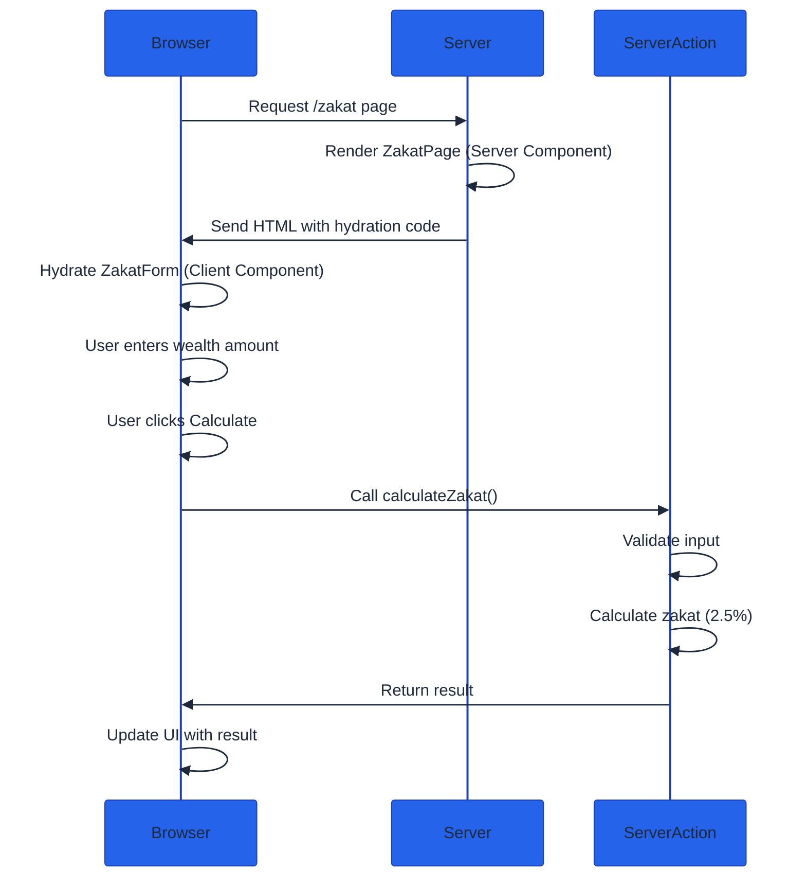

**Ready to build with Next.js?** This tutorial guides you through creating your first Next.js application - a Zakat Calculator demonstrating Server Components, Client Components, and Server Actions.

**Prerequisites**: Complete [Initial Setup](/en/learn/software-engineering/web-platform/fe-nextjs/initial-setup) before starting this tutorial.

## What We'll Build

**Zakat Calculator** - A web application calculating Islamic charity obligation (2.5% of wealth above nisab threshold).

**Features**:

- **Input form** - Enter wealth amount
- **Server-side calculation** - Process calculation securely on server
- **Result display** - Show zakat amount due
- **Loading state** - Indicate calculation in progress
- **Error handling** - Handle invalid inputs gracefully

**Next.js concepts demonstrated**:

- **Server Components** - Default rendering on server
- **Client Components** - Interactive form with React hooks
- **Server Actions** - Backend logic without API routes
- **TypeScript** - End-to-end type safety
- **Tailwind CSS** - Utility-first styling

## Project Structure

Starting from the project created in Initial Setup.

**Create new directory structure**:

```bash
cd my-nextjs-app

# Create directories
mkdir -p app/zakat
mkdir -p app/actions
mkdir -p app/components
```

**Final structure**:

```
app/
├── actions/
│   └── zakat.ts          # Server Actions
├── components/
│   └── ZakatForm.tsx     # Client Component (form)
├── zakat/
│   └── page.tsx          # Server Component (page)
├── layout.tsx            # Root layout
└── page.tsx              # Home page
```

## Step 1: Create Server Action

Create server-side logic for zakat calculation.

**Create app/actions/zakat.ts**:

```typescript
"use server";

interface ZakatResult {
  success: boolean;
  zakatDue: boolean;
  amount: number;
  wealth: number;
  nisab: number;
  error?: string;
}

export async function calculateZakat(wealth: number): Promise<ZakatResult> {
  // Validate input
  if (isNaN(wealth) || wealth < 0) {
    return {
      success: false,
      zakatDue: false,
      amount: 0,
      wealth: 0,
      nisab: 0,
      error: "Invalid wealth amount",
    };
  }

  // Nisab threshold (approximate gold value in USD)
  // In production, fetch from API or database
  const nisab = 5000;

  // Check if wealth exceeds nisab
  if (wealth >= nisab) {
    const zakatAmount = wealth * 0.025; // 2.5%

    return {
      success: true,
      zakatDue: true,
      amount: zakatAmount,
      wealth,
      nisab,
    };
  }

  // Wealth below nisab - no zakat due
  return {
    success: true,
    zakatDue: false,
    amount: 0,
    wealth,
    nisab,
  };
}
```

**Key points**:

- **'use server'** - Marks file as Server Action (runs on server)
- **Async function** - Server Actions are always async
- **Type safety** - ZakatResult interface for return type
- **Validation** - Server-side input validation
- **Business logic** - Nisab threshold and 2.5% calculation

## Step 2: Create Client Component (Form)

Create interactive form using React hooks and Client Component.

**Create app/components/ZakatForm.tsx**:

```typescript
"use client";

import { useState } from "react";
import { calculateZakat } from "../actions/zakat";

export function ZakatForm() {
  const [wealth, setWealth] = useState("");
  const [result, setResult] = useState<{
    zakatDue: boolean;
    amount: number;
    nisab: number;
  } | null>(null);
  const [loading, setLoading] = useState(false);
  const [error, setError] = useState<string | null>(null);

  async function handleSubmit(e: React.FormEvent) {
    e.preventDefault();

    setLoading(true);
    setError(null);

    const wealthAmount = parseFloat(wealth);

    const response = await calculateZakat(wealthAmount);

    setLoading(false);

    if (!response.success) {
      setError(response.error || "Calculation failed");
      return;
    }

    setResult({
      zakatDue: response.zakatDue,
      amount: response.amount,
      nisab: response.nisab,
    });
  }

  return (
    <div className="max-w-md mx-auto mt-8 p-6 bg-white rounded-lg shadow-md">
      <h2 className="text-2xl font-bold mb-4 text-gray-800">
        Zakat Calculator
      </h2>

      <form onSubmit={handleSubmit} className="space-y-4">
        <div>
          <label
            htmlFor="wealth"
            className="block text-sm font-medium text-gray-700 mb-2"
          >
            Total Wealth (USD)
          </label>
          <input
            id="wealth"
            type="number"
            value={wealth}
            onChange={(e) => setWealth(e.target.value)}
            className="w-full px-3 py-2 border border-gray-300 rounded-md focus:outline-none focus:ring-2 focus:ring-blue-500"
            placeholder="Enter your wealth amount"
            required
            min="0"
            step="0.01"
          />
        </div>

        <button
          type="submit"
          disabled={loading}
          className="w-full bg-blue-600 text-white py-2 px-4 rounded-md hover:bg-blue-700 disabled:bg-gray-400 disabled:cursor-not-allowed transition-colors"
        >
          {loading ? "Calculating..." : "Calculate Zakat"}
        </button>
      </form>

      {error && (
        <div className="mt-4 p-3 bg-red-100 border border-red-400 text-red-700 rounded">
          {error}
        </div>
      )}

      {result && !loading && (
        <div className="mt-6 p-4 bg-gray-50 rounded-md">
          <h3 className="font-semibold text-lg mb-2 text-gray-800">
            Results
          </h3>

          <div className="space-y-2 text-gray-700">
            <p>
              <span className="font-medium">Nisab Threshold:</span> $
              {result.nisab.toFixed(2)}
            </p>

            {result.zakatDue ? (
              <>
                <p className="text-green-600 font-semibold">
                  Zakat is due on your wealth
                </p>
                <p className="text-2xl font-bold text-blue-600">
                  ${result.amount.toFixed(2)}
                </p>
                <p className="text-sm text-gray-600">
                  This is 2.5% of your total wealth
                </p>
              </>
            ) : (
              <p className="text-gray-600">
                Your wealth is below the nisab threshold. Zakat is not
                obligatory.
              </p>
            )}
          </div>
        </div>
      )}
    </div>
  );
}
```

**Key points**:

- **'use client'** - Marks component as Client Component (runs in browser)
- **React hooks** - useState for local state management
- **Form handling** - onSubmit prevents default, calls Server Action
- **Loading state** - Disable button and show "Calculating..." during request
- **Error handling** - Display error messages from server
- **Conditional rendering** - Show results only after calculation

## Step 3: Create Server Component (Page)

Create page that renders the Client Component.

**Create app/zakat/page.tsx**:

```typescript
import { ZakatForm } from "../components/ZakatForm";

export default function ZakatPage() {
  return (
    <div className="min-h-screen bg-gradient-to-br from-blue-50 to-indigo-100 py-12 px-4">
      <div className="max-w-4xl mx-auto">
        <header className="text-center mb-8">
          <h1 className="text-4xl font-bold text-gray-900 mb-2">
            Zakat Calculator
          </h1>
          <p className="text-gray-600">
            Calculate your Islamic charity obligation
          </p>
        </header>

        <ZakatForm />

        <section className="mt-12 max-w-2xl mx-auto p-6 bg-white rounded-lg shadow-md">
          <h2 className="text-2xl font-semibold mb-4 text-gray-800">
            About Zakat
          </h2>

          <div className="space-y-3 text-gray-700">
            <p>
              <strong>Zakat</strong> is one of the Five Pillars of Islam.
              It is a form of almsgiving treated as a religious obligation
              or tax.
            </p>

            <p>
              The payment of zakat is obligatory on every Muslim who
              possesses wealth above the nisab threshold for one lunar
              year.
            </p>

            <p>
              The standard rate of zakat is <strong>2.5%</strong> of
              one&apos;s accumulated wealth.
            </p>
          </div>

          <div className="mt-6 p-4 bg-blue-50 rounded-md">
            <h3 className="font-semibold text-gray-800 mb-2">
              Nisab Threshold
            </h3>
            <p className="text-sm text-gray-600">
              The nisab is the minimum amount of wealth a Muslim must
              possess before being liable to pay zakat. It is equivalent
              to 85 grams of gold or 595 grams of silver.
            </p>
          </div>
        </section>
      </div>
    </div>
  );
}
```

**Key points**:

- **No 'use client'** - This is a Server Component (default)
- **Imports Client Component** - ZakatForm rendered within Server Component
- **Static content** - Educational information about Zakat
- **Tailwind styling** - Gradient background, responsive layout

## Step 4: Update Home Page

Update the home page to link to Zakat Calculator.

**Edit app/page.tsx**:

```typescript
import Link from "next/link";

export default function Home() {
  return (
    <div className="flex flex-col items-center justify-center min-h-screen bg-gradient-to-br from-indigo-100 to-purple-100 p-8">
      <main className="text-center space-y-6">
        <h1 className="text-5xl font-bold text-gray-900">
          Welcome to Next.js
        </h1>

        <p className="text-xl text-gray-700">
          Learn Next.js through practical examples
        </p>

        <div className="flex gap-4 justify-center mt-8">
          <Link
            href="/zakat"
            className="bg-blue-600 text-white px-6 py-3 rounded-lg hover:bg-blue-700 transition-colors font-semibold"
          >
            Zakat Calculator
          </Link>

          <a
            href="https://nextjs.org/docs"
            target="_blank"
            rel="noopener noreferrer"
            className="bg-gray-200 text-gray-800 px-6 py-3 rounded-lg hover:bg-gray-300 transition-colors font-semibold"
          >
            Documentation
          </a>
        </div>

        <div className="mt-12 p-6 bg-white rounded-lg shadow-md max-w-2xl">
          <h2 className="text-2xl font-semibold mb-4 text-gray-800">
            What You Built
          </h2>

          <ul className="text-left space-y-2 text-gray-700">
            <li>
              <strong>Server Components</strong> - Default rendering on
              server
            </li>
            <li>
              <strong>Client Components</strong> - Interactive form with
              React hooks
            </li>
            <li>
              <strong>Server Actions</strong> - Backend logic without API
              routes
            </li>
            <li>
              <strong>TypeScript</strong> - Type-safe frontend and backend
            </li>
            <li>
              <strong>Tailwind CSS</strong> - Utility-first styling
            </li>
          </ul>
        </div>
      </main>
    </div>
  );
}
```

**Key points**:

- **next/link** - Client-side navigation between pages
- **Server Component** - No interactivity needed, renders on server
- **Link component** - Optimized navigation (prefetches on hover)

## Step 5: Run and Test

Start development server and test the application.

**Step 1: Start development server**

```bash
npm run dev
```

**Step 2: Open browser**

Navigate to [http://localhost:3000](http://localhost:3000)

**You should see**:

- Welcome page with link to Zakat Calculator
- "Zakat Calculator" button

**Step 3: Test Zakat Calculator**

Click "Zakat Calculator" button

**Test Case 1: Wealth above nisab**

- Enter: 10000
- Click "Calculate Zakat"
- Expected result: "Zakat is due on your wealth" - $250.00

**Test Case 2: Wealth below nisab**

- Enter: 3000
- Click "Calculate Zakat"
- Expected result: "Your wealth is below the nisab threshold"

**Test Case 3: Invalid input**

- Enter: -500
- Click "Calculate Zakat"
- Expected result: Error message "Invalid wealth amount"

**Step 4: Observe loading state**

- Enter wealth amount
- Click "Calculate Zakat"
- Button should show "Calculating..." briefly
- Button should be disabled during calculation

## Understanding the Architecture

How Server Components, Client Components, and Server Actions work together.



**Color Legend**: Blue (server), Green (browser/client), Orange (server action)

**Flow explanation**:

1. **Initial request** - Browser requests /zakat page
2. **Server renders** - ZakatPage (Server Component) renders on server
3. **HTML sent** - Server sends pre-rendered HTML to browser
4. **Hydration** - Browser makes ZakatForm interactive (React hooks enabled)
5. **User interaction** - User enters wealth and clicks Calculate
6. **Server Action** - Browser calls calculateZakat() on server
7. **Server processes** - Calculation happens securely on server
8. **Result returned** - Server sends result back to browser
9. **UI updates** - Client Component updates with result

**Key insight**: Server Components render once on server, Client Components hydrate and become interactive in browser, Server Actions provide backend logic without API routes.

## Server vs Client Components

Understanding when to use each type of component.

**Server Components** (default in App Router):

```typescript
// app/posts/page.tsx - Server Component
async function PostsPage() {
  // Can access database directly
  const posts = await db.posts.findMany();

  return (
    <ul>
      {posts.map((post) => (
        <li key={post.id}>{post.title}</li>
      ))}
    </ul>
  );
}
```

**Use Server Components when**:

- Fetching data from database or API
- Accessing backend resources
- Keeping sensitive code on server (API keys)
- Reducing client-side JavaScript

**Client Components** ('use client'):

```typescript
"use client";

import { useState } from "react";

function Counter() {
  // Needs React hooks
  const [count, setCount] = useState(0);

  return (
    <button onClick={() => setCount(count + 1)}>Count: {count}</button>
  );
}
```

**Use Client Components when**:

- Using React hooks (useState, useEffect, etc.)
- Event handlers (onClick, onChange)
- Browser APIs (localStorage, navigator)
- Third-party libraries requiring client-side JS

**Component composition**:

```typescript
// Server Component (parent)
async function Page() {
  const data = await fetchData();

  return (
    <div>
      <h1>Server Component</h1>
      <ClientCounter />  {/* Client Component (child) */}
    </div>
  );
}
```

**Rule**: Server Components can import Client Components, but Client Components cannot import Server Components.

## Adding Loading State

Improve user experience with loading UI.

**Create app/zakat/loading.tsx**:

```typescript
export default function Loading() {
  return (
    <div className="min-h-screen bg-gradient-to-br from-blue-50 to-indigo-100 py-12 px-4">
      <div className="max-w-4xl mx-auto">
        <div className="animate-pulse">
          <div className="h-12 bg-gray-300 rounded w-1/2 mx-auto mb-4"></div>
          <div className="h-6 bg-gray-300 rounded w-1/3 mx-auto mb-8"></div>

          <div className="max-w-md mx-auto p-6 bg-white rounded-lg shadow-md">
            <div className="h-8 bg-gray-300 rounded w-3/4 mb-4"></div>
            <div className="h-12 bg-gray-300 rounded w-full mb-4"></div>
            <div className="h-12 bg-gray-300 rounded w-full"></div>
          </div>
        </div>
      </div>
    </div>
  );
}
```

**What happens**:

- Next.js automatically shows loading.tsx while page loads
- Skeleton UI provides visual feedback
- Improves perceived performance

## Adding Error Handling

Handle errors gracefully with error boundaries.

**Create app/zakat/error.tsx**:

```typescript
"use client";

export default function Error({
  error,
  reset,
}: {
  error: Error & { digest?: string };
  reset: () => void;
}) {
  return (
    <div className="min-h-screen bg-gradient-to-br from-blue-50 to-indigo-100 flex items-center justify-center p-4">
      <div className="max-w-md p-6 bg-white rounded-lg shadow-md text-center">
        <h2 className="text-2xl font-bold text-red-600 mb-4">
          Something went wrong
        </h2>

        <p className="text-gray-700 mb-4">
          {error.message || "An unexpected error occurred"}
        </p>

        <button
          onClick={reset}
          className="bg-blue-600 text-white px-6 py-2 rounded-md hover:bg-blue-700 transition-colors"
        >
          Try Again
        </button>
      </div>
    </div>
  );
}
```

**What happens**:

- Next.js catches errors in component tree
- error.tsx displays user-friendly error message
- reset() function retries the operation

## Verification Checklist

Ensure your Zakat Calculator works correctly.

**Functionality**:

- [ ] Home page displays and links to Zakat Calculator
- [ ] Zakat Calculator page loads without errors
- [ ] Form accepts numeric input
- [ ] Calculate button triggers calculation
- [ ] Loading state displays during calculation
- [ ] Results display correctly for wealth above nisab
- [ ] Results display correctly for wealth below nisab
- [ ] Error handling works for invalid inputs

**Next.js concepts**:

- [ ] Server Component renders on server (ZakatPage)
- [ ] Client Component handles interactivity (ZakatForm)
- [ ] Server Action processes calculation (calculateZakat)
- [ ] TypeScript provides type safety throughout
- [ ] Fast Refresh updates UI on code changes

**All checked?** You've successfully built your first Next.js application.

## What You Learned

**Core Next.js concepts**:

- **Server Components** - Default rendering strategy, zero JavaScript to client
- **Client Components** - Opt-in interactivity with 'use client' directive
- **Server Actions** - Backend logic without API routes
- **File-based routing** - app/zakat/page.tsx becomes /zakat route
- **TypeScript integration** - Type-safe frontend and backend
- **Tailwind CSS** - Utility-first styling system

**Key insights**:

- **Default to Server Components** - Use Client Components only when needed
- **Server Actions simplify backend** - No API boilerplate required
- **Type safety across boundary** - TypeScript works client-to-server
- **Composition is powerful** - Server Components can render Client Components

## Next Steps

**Continue learning Next.js**:

- **[By Example](/en/learn/software-engineering/web-platform/fe-nextjs/by-example)** - Master Next.js through annotated examples (30-95% coverage)
- **[Overview](/en/learn/software-engineering/web-platform/fe-nextjs/overview)** - Deep dive into Next.js architecture and concepts

**Explore more features**:

- **Authentication** - Add login with Auth.js or Clerk
- **Database** - Integrate Prisma or Drizzle ORM
- **Forms** - Use React Hook Form for complex forms
- **API Routes** - Create REST APIs in app/api/
- **Deployment** - Deploy to Vercel or other platforms

**External resources**:

- **[Next.js Documentation](https://nextjs.org/docs)** - Official comprehensive docs
- **[Next.js Learn Course](https://nextjs.org/learn)** - Interactive tutorial
- **[React Documentation](https://react.dev)** - Deepen React knowledge
