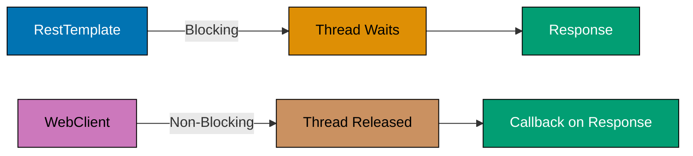
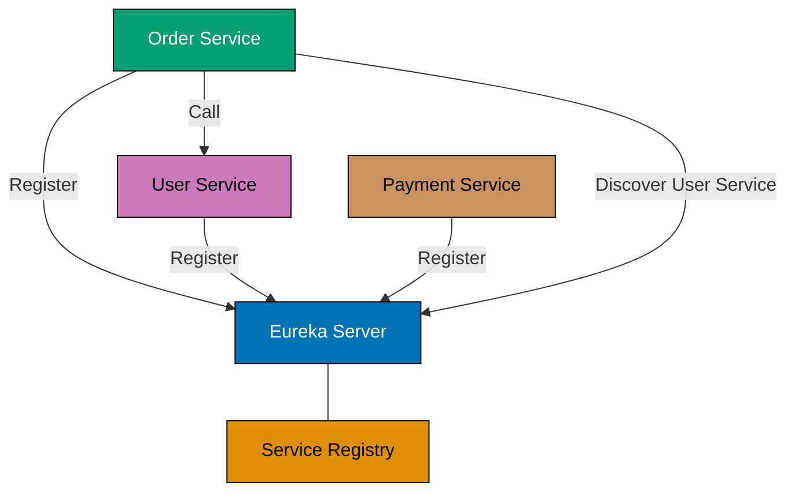
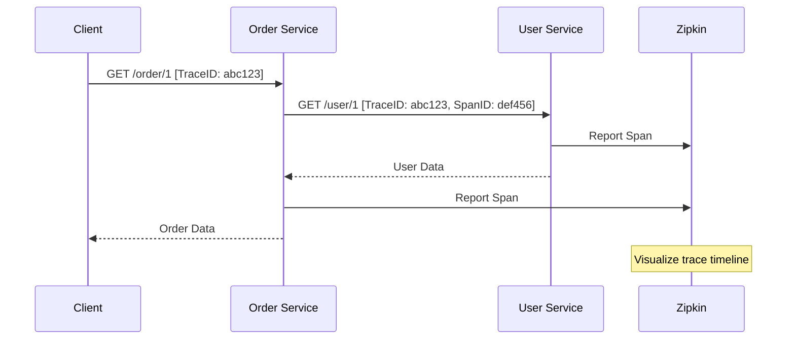
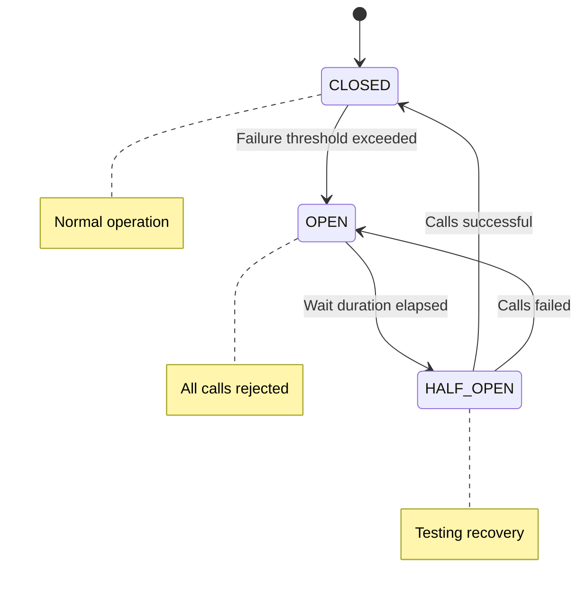
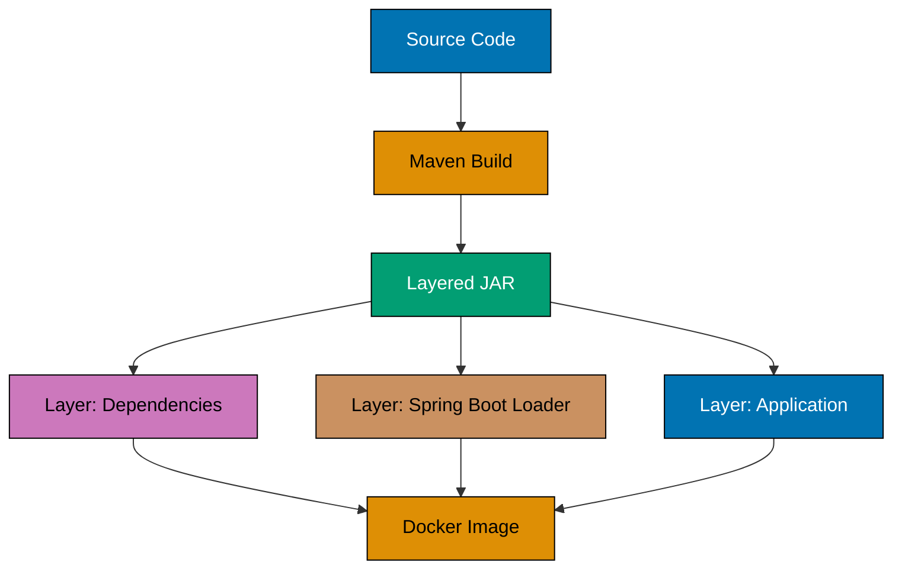
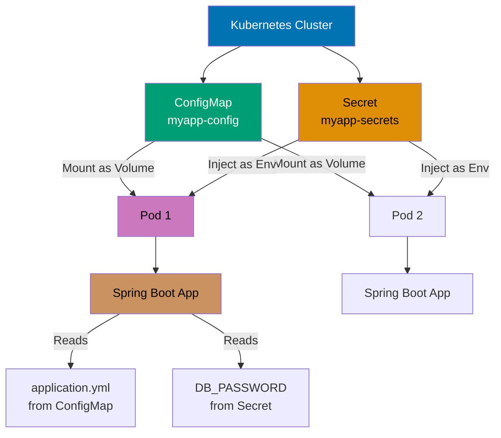
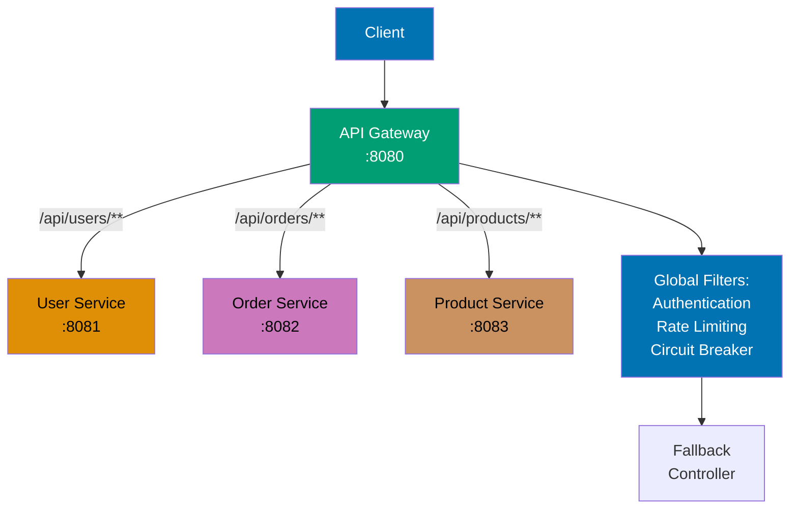
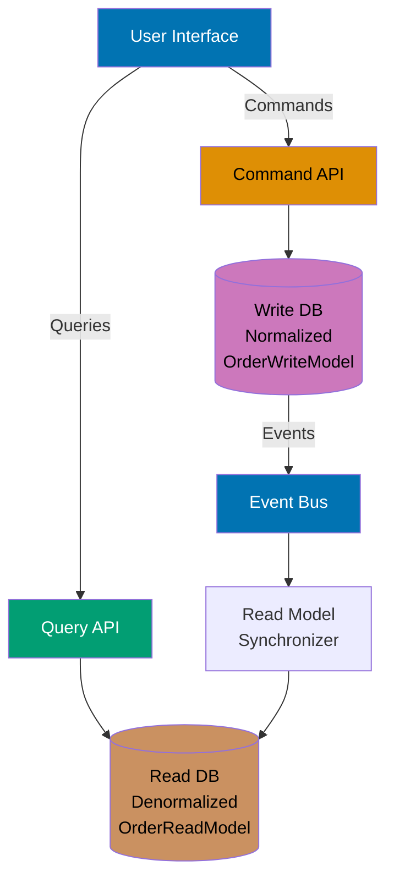
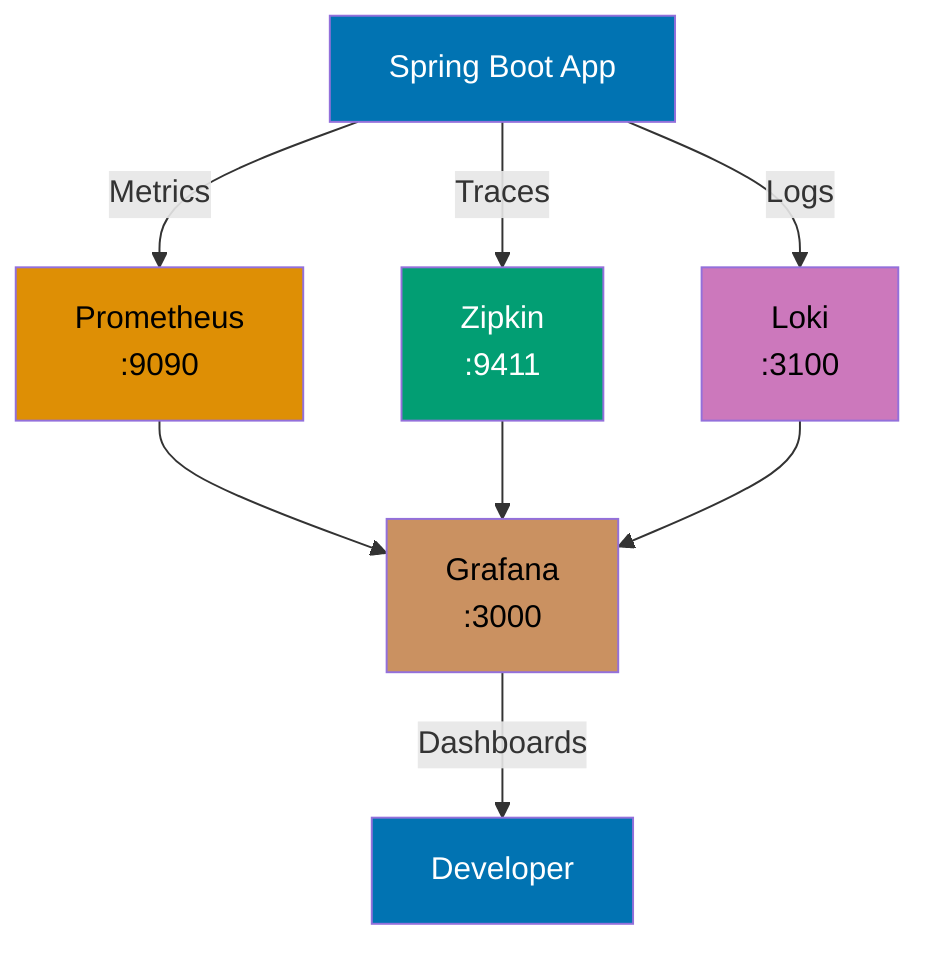

Master advanced Spring Boot patterns through 30 examples covering microservices, observability, resilience, Kubernetes integration, event sourcing, CQRS, API Gateway patterns, and production deployment.

### Example 41: RestTemplate - Synchronous HTTP Client

RestTemplate provides synchronous REST client capabilities with automatic JSON/XML conversion and error handling.

```java
@Configuration
public class RestTemplateConfig {
    @Bean // => Configure RestTemplate bean
    public RestTemplate restTemplate(RestTemplateBuilder builder) { // => Inject autoconfigured builder
        return builder // => Customize RestTemplate
            .setConnectTimeout(Duration.ofSeconds(5))  // => Max time to establish TCP connection
            .setReadTimeout(Duration.ofSeconds(10))    // => Max time to read response after connection
            .defaultHeader("User-Agent", "SpringBootApp/1.0") // => Add User-Agent header to all requests
            .errorHandler(new DefaultResponseErrorHandler() {
                @Override // => Override default error handling
                public void handleError(ClientHttpResponse response) throws IOException { // => Custom HTTP error handler
                    // => Custom error handling (replace default behavior)
                    if (response.getStatusCode().is5xxServerError()) { // => Check if status code is 500-599
                        throw new ServiceUnavailableException("Backend service down"); // => Throw custom exception for 5xx errors
                    }
                    super.handleError(response); // => Delegate to default handler for non-5xx errors
                }
            })
            .build();
    }
}

@Service
@RequiredArgsConstructor
public class UserApiClient {
    private final RestTemplate restTemplate;
    private static final String BASE_URL = "https://jsonplaceholder.typicode.com";

    public User getUser(Long id) { // => Fetch user by ID
        return restTemplate.getForObject(BASE_URL + "/users/{id}", User.class, id); // => GET request, deserialize JSON to User, blocks until response
    }

    public User createUser(User user) { // => Create new user
        return restTemplate.postForObject(BASE_URL + "/users", user, User.class); // => POST request with JSON body, return created user with ID
    }

    public void updateUser(Long id, User user) { // => Update existing user
        restTemplate.put(BASE_URL + "/users/{id}", user, id); // => PUT request, void return (no response body expected)
    }

    public void deleteUser(Long id) { // => Delete user
        restTemplate.delete(BASE_URL + "/users/{id}", id); // => DELETE request, void return
    }

    public List<User> getAllUsers() { // => Fetch all users
        User[] users = restTemplate.getForObject(BASE_URL + "/users", User[].class); // => GET request, deserialize JSON array to User[]
        return users != null ? Arrays.asList(users) : Collections.emptyList(); // => Convert array to list, handle null response
    }
}

record User(Long id, String name, String email, String phone) {}
```

**Key Takeaway**: Use `RestTemplate` for synchronous HTTP calls when blocking is acceptable, but prefer WebClient for reactive non-blocking communication in high-throughput microservices.

**Why It Matters**: RestTemplate's blocking model simplifies HTTP communication for traditional request/response patterns, but each concurrent external API call consumes one thread until the response returns—under 100 concurrent calls, thread pools exhaust causing request queuing. Production systems prefer WebClient for external API calls to achieve higher concurrency, reserving RestTemplate for legacy integrations or simple scripts where blocking simplicity outweighs performance needs.

### Example 42: WebClient - Reactive Non-Blocking Client

WebClient provides reactive, non-blocking HTTP communication with backpressure support and functional API.

```java
@Configuration
public class WebClientConfig {
    @Bean // => Configure WebClient bean
    public WebClient webClient(WebClient.Builder builder) { // => Inject autoconfigured builder
        return builder // => Customize WebClient
            .baseUrl("https://jsonplaceholder.typicode.com") // => Base URL for all requests
            .defaultHeader(HttpHeaders.USER_AGENT, "SpringBoot-WebClient/1.0") // => Add User-Agent header
            .defaultHeader(HttpHeaders.CONTENT_TYPE, MediaType.APPLICATION_JSON_VALUE) // => Default Content-Type: application/json
            .build();
    }
}

@Service
@RequiredArgsConstructor
public class ReactiveUserClient {
    private final WebClient webClient;

    public Mono<User> getUser(Long id) { // => Fetch user by ID (reactive)
        return webClient.get() // => Create GET request
            .uri("/users/{id}", id) // => Build URI with path variable
            .retrieve() // => Execute request
            .bodyToMono(User.class) // => Deserialize response to Mono<User> (single value)
            .timeout(Duration.ofSeconds(5));  // => Fail if response not received within 5 seconds
    }

    public Flux<User> getAllUsers() { // => Fetch all users (reactive stream)
        return webClient.get() // => Create GET request
            .uri("/users") // => URI without parameters
            .retrieve() // => Execute request
            .bodyToFlux(User.class) // => Deserialize response to Flux<User> (stream of values)
            .onErrorResume(e -> { // => Fallback on error (circuit breaker pattern)
                // => Return empty flux on error instead of failing
                return Flux.empty(); // => Empty stream (no users)
            });
    }

    public Mono<User> createUser(User user) { // => Create user (reactive)
        return webClient.post() // => Create POST request
            .uri("/users") // => POST endpoint
            .bodyValue(user) // => Serialize user to JSON body
            .retrieve() // => Execute request
            .bodyToMono(User.class); // => Deserialize created user from response
    }
}
```



**Key Takeaway**: WebClient enables reactive programming with non-blocking I/O—threads are released during HTTP calls and notified via callbacks, allowing higher concurrency than RestTemplate's blocking model.

**Why It Matters**: WebClient's non-blocking reactive model enables a single application instance to handle 10,000 concurrent external API calls with 10-20 threads, compared to RestTemplate requiring 10,000 threads for the same concurrency—preventing thread pool exhaustion that causes cascading failures. Production microservices at Netflix use reactive clients to call hundreds of downstream services concurrently, maintaining sub-100ms latency even when orchestrating responses from 20+ services per request through reactive composition.

### Example 43: Feign Clients - Declarative REST Clients

Feign provides declarative REST client interfaces with automatic request/response mapping and load balancing integration.

```java
// pom.xml: spring-cloud-starter-openfeign

@SpringBootApplication
@EnableFeignClients // => Enable component scanning for Feign clients
public class Application { // => Main application class
    public static void main(String[] args) {
        SpringApplication.run(Application.class, args);
    }
}

@FeignClient(name = "user-service", url = "https://jsonplaceholder.typicode.com") // => Declarative HTTP client (name for load balancing, url for direct connection)
public interface UserFeignClient { // => Interface methods map to HTTP endpoints
    @GetMapping("/users/{id}") // => GET /users/{id} endpoint
    User getUser(@PathVariable Long id); // => Path variable injected into URL, returns deserialized User

    @GetMapping("/users") // => GET /users endpoint
    List<User> getAllUsers(); // => Returns list of users (JSON array deserialized)

    @PostMapping("/users") // => POST /users endpoint
    User createUser(@RequestBody User user); // => Request body serialized to JSON, response deserialized to User

    @DeleteMapping("/users/{id}") // => DELETE /users/{id} endpoint
    void deleteUser(@PathVariable Long id); // => No response body expected
}

@Service
@RequiredArgsConstructor
public class UserService {
    private final UserFeignClient userClient;

    public User fetchUser(Long id) { // => Fetch user via Feign client
        return userClient.getUser(id);  // => Feign generates HTTP call implementation (blocks until response)
    }
}

// application.yml
// feign:
//   client:
//     config:
//       default:
//         connectTimeout: 5000
//         readTimeout: 10000
```

**Key Takeaway**: Feign eliminates HTTP client boilerplate through declarative interfaces—define methods with Spring MVC annotations and Feign generates implementations automatically.

**Why It Matters**: Feign eliminates HTTP client boilerplate—define interface methods with Spring MVC annotations and Feign generates implementations automatically, reducing microservice integration code by 70% compared to manual RestTemplate calls. However, Feign's default blocking client (uses RestTemplate internally) limits concurrency—production systems configure Feign with reactive HTTP clients (WebClient) for non-blocking calls that scale to thousands of concurrent requests without thread exhaustion.

### Example 44: Service Discovery - Eureka Client

Service discovery allows microservices to find and communicate with each other without hard-coded URLs.

```java
// pom.xml: spring-cloud-starter-netflix-eureka-client

@SpringBootApplication
@EnableDiscoveryClient // => Enable Eureka client registration
public class Application { // => Main application class
    public static void main(String[] args) {
        SpringApplication.run(Application.class, args);
    }
}

@RestController
@RequestMapping("/api")
public class OrderController {
    private final DiscoveryClient discoveryClient;
    private final RestTemplate restTemplate;

    public OrderController(DiscoveryClient discoveryClient, // => Inject discovery client for querying service registry
                          @LoadBalanced RestTemplate restTemplate) { // => Load-balanced RestTemplate (resolves service names to instances)
        this.discoveryClient = discoveryClient;
        this.restTemplate = restTemplate;
    }

    @GetMapping("/services") // => Endpoint: GET /api/services
    public List<String> getServices() { // => Query Eureka registry
        return discoveryClient.getServices();  // => Returns service names (e.g., ["order-service", "user-service", "payment-service"])
    }

    @GetMapping("/order/{id}") // => Endpoint: GET /api/order/{id}
    public Order getOrder(@PathVariable Long id) { // => Fetch order with user data
        // => Call user-service by service name (Eureka resolves to actual instance IP:port)
        User user = restTemplate.getForObject( // => Load-balanced HTTP call
            "http://user-service/api/users/{id}", User.class, id); // => "user-service" resolved by Eureka (round-robin load balancing)
        return new Order(id, user); // => Compose order response with user data
    }
}

// application.yml
// spring:
//   application:
//     name: order-service
// eureka:
//   client:
//     serviceUrl:
//       defaultZone: http://localhost:8761/eureka/
//   instance:
//     preferIpAddress: true
```



**Key Takeaway**: Eureka enables service discovery—microservices register with Eureka Server and discover other services by name instead of hardcoded URLs, enabling dynamic scaling and failover.

**Why It Matters**: Service discovery eliminates hardcoded service URLs, enabling dynamic scaling where new instances register automatically and failed instances deregister, allowing load balancers to route traffic only to healthy instances. Production Kubernetes deployments use service discovery (Kubernetes Service + CoreDNS) for container orchestration where pods scale from 3 to 100 instances during traffic spikes, with DNS updates propagating in seconds versus hours for manual load balancer configuration changes.

### Example 45: Spring Boot Actuator - Health & Metrics

Actuator provides production-ready endpoints for monitoring, health checks, and application metrics.

```java
// pom.xml: spring-boot-starter-actuator

@Component
public class CustomHealthIndicator implements HealthIndicator {
    @Override // => Implement HealthIndicator interface
    public Health health() { // => Custom health check logic
        boolean databaseUp = checkDatabaseConnection(); // => Check database connectivity
        if (databaseUp) { // => Database healthy
            return Health.up() // => Health status: UP
                .withDetail("database", "PostgreSQL") // => Add metadata to health response
                .withDetail("version", "15.0") // => Database version detail
                .build(); // => Build Health object
        }
        return Health.down() // => Health status: DOWN
            .withDetail("error", "Database connection failed") // => Error detail for debugging
            .build(); // => Build Health object (triggers pod restart in Kubernetes)
    }

    private boolean checkDatabaseConnection() { // => Verify database connectivity
        return true;  // => Placeholder (production: execute SELECT 1 query)
    }
}

@RestController
@RequestMapping("/api")
public class MetricsController {
    @GetMapping("/process")
    public String processRequest() {
        return "Processed";
    }
}

// application.yml
// management:
//   endpoints:
//     web:
//       exposure:
//         include: health,metrics,info,prometheus
//   endpoint:
//     health:
//       show-details: always
//   metrics:
//     tags:
//       application: ${spring.application.name}

// Available endpoints:
// GET /actuator/health => {"status":"UP","components":{"custom":{"status":"UP"}}}
// GET /actuator/metrics => List of available metrics
// GET /actuator/metrics/jvm.memory.used => Memory usage
// GET /actuator/info => Application info
```

**Key Takeaway**: Actuator exposes production-ready endpoints for monitoring—use custom `HealthIndicator` implementations to expose application-specific health checks beyond Spring Boot's auto-configured probes.

**Why It Matters**: Actuator endpoints expose production-ready metrics (JVM memory, thread pools, database connections) and health checks (database connectivity, disk space) without custom instrumentation, integrating with monitoring tools (Prometheus, Grafana) via standardized formats. Production Kubernetes deployments use actuator health endpoints for liveness probes (restart unhealthy pods) and readiness probes (remove pods from load balancer rotation), enabling zero-downtime deployments where unhealthy instances stop receiving traffic before termination.

### Example 46: Custom Metrics - Micrometer

Micrometer provides vendor-neutral metrics instrumentation for monitoring application performance.

```java
@Service
public class OrderMetricsService {
    private final Counter orderCounter;
    private final Gauge activeOrders;
    private final Timer orderProcessingTimer;
    private final AtomicInteger activeOrderCount = new AtomicInteger(0);

    public OrderMetricsService(MeterRegistry registry) { // => Inject Micrometer registry
        this.orderCounter = Counter.builder("orders.created") // => Create counter metric
            .description("Total orders created") // => Metric description for monitoring dashboards
            .tag("type", "online") // => Tag for filtering/grouping (e.g., online vs in-store orders)
            .register(registry); // => Register metric with Micrometer

        this.activeOrders = Gauge.builder("orders.active", activeOrderCount, AtomicInteger::get) // => Create gauge metric (current value)
            .description("Active orders count") // => Metric description
            .register(registry); // => Register gauge (tracks activeOrderCount value)

        this.orderProcessingTimer = Timer.builder("orders.processing.time") // => Create timer metric (measures duration)
            .description("Order processing duration") // => Metric description
            .register(registry); // => Register timer (tracks min/max/mean/percentiles)
    }

    public void createOrder(Order order) { // => Process order creation
        orderCounter.increment();  // => Increment total orders counter (monotonic increase)
        activeOrderCount.incrementAndGet(); // => Increment active orders gauge

        orderProcessingTimer.record(() -> { // => Measure execution time
            // => Timer tracks duration of lambda execution
            processOrder(order); // => Business logic
        });

        activeOrderCount.decrementAndGet(); // => Decrement active orders after processing complete
    }

    private void processOrder(Order order) {
        // Processing logic
    }
}

// Access metrics:
// GET /actuator/metrics/orders.created
// GET /actuator/metrics/orders.active
// GET /actuator/metrics/orders.processing.time
// GET /actuator/prometheus => Prometheus exposition format
```

**Key Takeaway**: Micrometer provides vendor-neutral instrumentation—use `Counter`, `Gauge`, and `Timer` to track business metrics and export to monitoring systems like Prometheus without vendor lock-in.

**Why It Matters**: Business metrics (orders placed, payment failures, cart abandonment rate) complement infrastructure metrics (CPU, memory) to enable product-driven alerting where engineering teams get paged when business KPIs degrade even if infrastructure appears healthy. Production monitoring dashboards at Shopify and Stripe display business metrics alongside technical metrics, revealing revenue-impacting issues (payment gateway failures spike failed payment attempts) before customer support tickets arrive, reducing mean time to detection from hours to minutes.

### Example 47: Distributed Tracing - Micrometer Tracing

Distributed tracing tracks requests across microservices using trace and span IDs for debugging and performance analysis.

```java
// pom.xml: micrometer-tracing-bridge-brave, zipkin-reporter-brave

@Configuration
public class TracingConfig {
    @Bean
    public Sampler defaultSampler() {
        return Sampler.ALWAYS_SAMPLE;  // => Sample all requests (production: use probability)
    }
}

@RestController
@RequestMapping("/api")
@RequiredArgsConstructor
public class OrderTracingController {
    private final Tracer tracer;
    private final RestTemplate restTemplate;

    @GetMapping("/order/{id}")
    public Order getOrder(@PathVariable Long id) {
        Span span = tracer.nextSpan().name("get-order").start();
        try (Tracer.SpanInScope ws = tracer.withSpan(span)) {
            span.tag("order.id", id.toString());

            // => Trace ID automatically propagated to downstream services
            User user = restTemplate.getForObject(
                "http://user-service/api/users/{id}", User.class, id);

            span.event("user-fetched");
            return new Order(id, user); // => Compose order response with user data
        } finally {
            span.end();
        }
    }
}

// application.yml
// management:
//   tracing:
//     sampling:
//       probability: 1.0
//   zipkin:
//     tracing:
//       endpoint: http://localhost:9411/api/v2/spans

// Trace ID in logs: [appName,traceId,spanId]
```



**Key Takeaway**: Distributed tracing propagates trace IDs across microservices—use Micrometer Tracing with Zipkin to visualize request flows and identify bottlenecks in distributed systems.

**Why It Matters**: Distributed tracing propagates trace IDs across 10+ microservices involved in a single request, enabling performance debugging where Zipkin visualizes the 500ms spent waiting for the Product Service versus 2000ms in the Payment Service. Production teams use distributed tracing to identify cascading timeouts (Service A waits 5s for Service B which waits 10s for Service C), optimize slow database queries in downstream services, and visualize service dependency graphs that reveal hidden coupling between theoretically independent services.

### Example 48: Structured Logging - JSON with MDC

Structured logging outputs JSON format with Mapped Diagnostic Context (MDC) for trace correlation.

```java
// pom.xml: logstash-logback-encoder

@Component
public class LoggingFilter implements Filter {
    @Override
    public void doFilter(ServletRequest request, ServletResponse response, FilterChain chain)
            throws IOException, ServletException {
        HttpServletRequest httpRequest = (HttpServletRequest) request;

        MDC.put("requestId", UUID.randomUUID().toString());
        MDC.put("path", httpRequest.getRequestURI());
        MDC.put("method", httpRequest.getMethod());

        try {
            chain.doFilter(request, response);
        } finally {
            MDC.clear();  // => Cleanup MDC
        }
    }
}

@RestController
@Slf4j
public class OrderLoggingController {
    @PostMapping("/orders")
    public Order createOrder(@RequestBody Order order) {
        log.info("Creating order",
            kv("orderId", order.id()),
            kv("userId", order.user().id()));  // => Structured key-value pairs

        try {
            // Process order
            log.info("Order created successfully");
            return order;
        } catch (Exception e) {
            log.error("Order creation failed", e);
            throw e;
        }
    }
}

// logback-spring.xml
// <encoder class="net.logstash.logback.encoder.LogstashEncoder">
//   <includeContext>true</includeContext>
//   <includeMdc>true</includeMdc>
// </encoder>

// JSON output:
// {"@timestamp":"2024-12-24T10:00:00.000+07:00","level":"INFO","message":"Creating order",
//  "requestId":"uuid","path":"/orders","orderId":"1","userId":"123"}
```

**Key Takeaway**: Structured logging with MDC enables correlation—use Logstash encoder for JSON output and MDC for request-scoped context like trace IDs, making logs searchable in centralized logging systems.

**Why It Matters**: Structured logging with JSON format and MDC (Mapped Diagnostic Context) enables centralized log aggregation (ELK stack, Datadog) where engineers query logs by trace ID to reconstruct request flows across microservices. Production systems use MDC to propagate correlation IDs, user IDs, and tenant IDs through all log statements, enabling queries like "show all logs for user 12345 in the last hour" that would be impossible with unstructured text logs, reducing incident investigation time from hours (grep logs across 50 servers) to minutes (single query).

### Example 49: Circuit Breaker - Resilience4j

Circuit breaker prevents cascading failures by stopping calls to failing services and providing fallback responses.

```java
// pom.xml: spring-cloud-starter-circuitbreaker-resilience4j

@Service
@RequiredArgsConstructor
public class UserServiceClient {
    private final CircuitBreakerFactory circuitBreakerFactory;
    private final RestTemplate restTemplate;

    public User getUser(Long id) {
        CircuitBreaker circuitBreaker = circuitBreakerFactory.create("user-service");

        return circuitBreaker.run(
            () -> restTemplate.getForObject("http://user-service/users/{id}", User.class, id),
            throwable -> getFallbackUser(id)  // => Fallback on failure
        );
    }

    private User getFallbackUser(Long id) {
        return new User(id, "Fallback User", "fallback@example.com", null);
    }
}

// application.yml
// resilience4j:
//   circuitbreaker:
//     instances:
//       user-service:
//         slidingWindowSize: 10
//         minimumNumberOfCalls: 5
//         failureRateThreshold: 50
//         waitDurationInOpenState: 10s
//         permittedNumberOfCallsInHalfOpenState: 3

// Circuit Breaker States: CLOSED (normal) -> OPEN (failing) -> HALF_OPEN (testing) -> CLOSED
```



**Key Takeaway**: Circuit breaker prevents cascading failures—configure thresholds to automatically open circuit when failure rate exceeds limits, providing fallback responses while the failing service recovers.

**Why It Matters**: Circuit breakers prevent cascading failures where one slow service (Payment Service timing out) exhausts thread pools in upstream services (Order Service waiting for payment), causing system-wide outages. Production systems configure circuit breakers to fail fast after N consecutive failures (typically 5-10), returning fallback responses immediately instead of waiting for timeouts, maintaining partial functionality where order placement returns "payment processing, we'll email confirmation" instead of complete failure.

### Example 50: Retry Pattern - Exponential Backoff

Retry pattern automatically retries failed operations with exponential backoff to handle transient failures.

```java
@Service
@RequiredArgsConstructor
public class PaymentServiceClient {
    private final RestTemplate restTemplate;

    @Retry(name = "payment-service", fallbackMethod = "paymentFallback")
    public Payment processPayment(PaymentRequest request) {
        return restTemplate.postForObject(
            "http://payment-service/payments", request, Payment.class);
    }

    private Payment paymentFallback(PaymentRequest request, Exception e) { // => Fallback method signature must match original
        // => Fallback invoked after max retries exhausted (3 attempts)
        return new Payment(null, "FAILED", "Service unavailable"); // => Graceful degradation response
    }
}

// application.yml
// resilience4j:
//   retry:
//     instances:
//       payment-service:
//         maxAttempts: 3
//         waitDuration: 1s
//         exponentialBackoffMultiplier: 2
//         retryExceptions:
//           - org.springframework.web.client.ResourceAccessException
//         ignoreExceptions:
//           - java.lang.IllegalArgumentException

// Retry sequence: 1s -> 2s -> 4s (exponential backoff)

record PaymentRequest(Long orderId, BigDecimal amount) {}
record Payment(Long id, String status, String message) {}
```

**Key Takeaway**: Retry with exponential backoff handles transient failures—configure max attempts and backoff multiplier to automatically retry failed operations with increasing delays between attempts.

**Why It Matters**: Retry with exponential backoff handles transient failures (network blips, database connection pool exhaustion) without overwhelming failing services with retry storms that prevent recovery. Production retry configurations use jittered exponential backoff (1s, 2s, 4s + random jitter) to prevent thundering herd where 1000 clients retry simultaneously every 5 seconds, with max attempts tuned based on error type—retry network errors 3 times but fail fast on business validation errors.

### Example 51: Rate Limiting - API Throttling

Rate limiting controls the number of requests a client can make within a time window to prevent abuse.

```java
@Service
public class ApiRateLimitService {
    @RateLimiter(name = "api-limiter", fallbackMethod = "rateLimitFallback") // => Apply rate limiting (10 req/sec from config)
    public ApiResponse callExternalApi(String endpoint) { // => Method protected by rate limiter
        // => If rate limit exceeded, fallback method invoked
        return new ApiResponse("success", "Data from " + endpoint); // => Normal response when within rate limit
    }

    private ApiResponse rateLimitFallback(String endpoint, Exception e) { // => Fallback when rate limit exceeded
        return new ApiResponse("error", "Rate limit exceeded. Try again later."); // => Return 429-equivalent response
    }
}

@RestController
@RequiredArgsConstructor
public class ApiController {
    private final ApiRateLimitService apiService;

    @GetMapping("/api/data") // => Endpoint: GET /api/data
    public ApiResponse getData() { // => Delegate to rate-limited service
        return apiService.callExternalApi("/external/endpoint"); // => Calls method protected by @RateLimiter
    }
}

// application.yml
// resilience4j:
//   ratelimiter:
//     instances:
//       api-limiter:
//         limitForPeriod: 10
//         limitRefreshPeriod: 1s
//         timeoutDuration: 0s

// Allows 10 requests per second. Additional requests are rejected.

record ApiResponse(String status, String message) {}
```

**Key Takeaway**: Rate limiting protects APIs from abuse—use `@RateLimiter` to enforce request quotas per time window, preventing service degradation from excessive traffic.

**Why It Matters**: Rate limiting protects APIs from abuse and prevents resource exhaustion when clients retry aggressively during failures—without rate limiting, a single misconfigured client retry loop can generate 10,000 requests/second causing database connection pool exhaustion that affects all users. Production APIs use tiered rate limits (1000 req/hour for free tier, 100,000 req/hour for premium tier) to monetize API access while preventing service degradation, returning 429 Too Many Requests with Retry-After headers that guide clients.

### Example 52: Bulkhead Pattern - Thread Pool Isolation

Bulkhead pattern isolates resources using separate thread pools to prevent one failing service from consuming all threads.

```java
@Service
public class ReportService {
    @Bulkhead(name = "report-generation", type = Bulkhead.Type.THREADPOOL, // => Isolate with dedicated thread pool
              fallbackMethod = "reportFallback") // => Fallback when bulkhead full
    public CompletableFuture<Report> generateReport(Long userId) { // => Async method (returns CompletableFuture)
        // => Executes in isolated 5-thread pool (from config)
        return CompletableFuture.supplyAsync(() -> { // => Execute asynchronously
            // => Heavy computation (CPU-intensive, long-running)
            return new Report(userId, "Monthly Report", LocalDateTime.now()); // => Generate report
        });
    }

    private CompletableFuture<Report> reportFallback(Long userId, Exception e) { // => Fallback when bulkhead exhausted
        return CompletableFuture.completedFuture( // => Return immediately completed future
            new Report(userId, "Cached Report", LocalDateTime.now().minusDays(1))); // => Return cached/stale report
    }
}

// application.yml
// resilience4j:
//   bulkhead:
//     instances:
//       report-generation:
//         maxConcurrentCalls: 5
//         maxWaitDuration: 0ms
//   thread-pool-bulkhead:
//     instances:
//       report-generation:
//         coreThreadPoolSize: 5
//         maxThreadPoolSize: 10
//         queueCapacity: 20
//         keepAliveDuration: 20s

record Report(Long userId, String title, LocalDateTime generatedAt) {}
```

**Key Takeaway**: Bulkhead pattern isolates thread pools—use `@Bulkhead` with thread pool type to prevent resource exhaustion from one failing service, ensuring failures don't cascade across the application.

**Why It Matters**: Bulkhead pattern isolates thread pools—report generation (slow, CPU-intensive) uses a dedicated 5-thread pool, while real-time API requests use a separate 50-thread pool, preventing slow operations from starving fast operations. Production systems configure bulkheads around external dependencies (payment gateways, shipping APIs) so that when one dependency becomes slow, it only affects requests using that dependency instead of exhausting the global thread pool that handles all operations.

### Example 53: Custom Starter - Creating Reusable Auto-Configuration

Custom starters provide reusable auto-configuration modules that can be shared across multiple projects.

```java
// Module: my-custom-starter

// CustomProperties.java
@ConfigurationProperties(prefix = "custom.feature")
@Validated
public class CustomProperties {
    @NotBlank
    private String apiKey;
    private boolean enabled = true;
    private Duration timeout = Duration.ofSeconds(30);

    // Getters/setters
}

// CustomService.java
public class CustomService {
    private final CustomProperties properties;

    public CustomService(CustomProperties properties) {
        this.properties = properties;
    }

    public String performAction() {
        return "Action performed with API key: " + properties.getApiKey();
    }
}

// CustomAutoConfiguration.java
@Configuration
@EnableConfigurationProperties(CustomProperties.class)
@ConditionalOnProperty(prefix = "custom.feature", name = "enabled", havingValue = "true")
public class CustomAutoConfiguration {
    @Bean
    @ConditionalOnMissingBean
    public CustomService customService(CustomProperties properties) {
        return new CustomService(properties);
    }
}

// META-INF/spring/org.springframework.boot.autoconfigure.AutoConfiguration.imports
// com.example.starter.CustomAutoConfiguration

// Usage in another project:
// pom.xml: <dependency><artifactId>my-custom-starter</artifactId></dependency>
// application.yml:
// custom:
//   feature:
//     enabled: true
//     apiKey: secret-key
```

**Key Takeaway**: Create custom starters to encapsulate reusable auto-configuration—define `@ConfigurationProperties`, auto-configuration classes, and register in `META-INF/spring/org.springframework.boot.autoconfigure.AutoConfiguration.imports` for distribution.

**Why It Matters**: Custom starters enable organizational best practices (logging format, metrics collection, security headers) to be shared across 50+ microservices through dependency inclusion, eliminating copy-paste configuration that diverges over time. Production platform teams create internal starters that auto-configure database connections with company-wide connection pool settings, distributed tracing with correlation ID propagation, and security headers (CSP, HSTS) that satisfy compliance requirements, reducing per-service configuration from 200 lines to zero.

### Example 54: Conditional Beans - Context-Aware Configuration

Conditional beans allow selective bean creation based on classpath, properties, or existing beans.

```java
@Configuration
public class ConditionalBeansConfig {
    @Bean // => Define CacheService bean
    @ConditionalOnClass(name = "com.redis.RedisClient") // => Only create if Redis client JAR present
    public CacheService redisCacheService() { // => Redis-backed cache implementation
        return new RedisCacheService();  // => Created only when Redis available on classpath
    }

    @Bean // => Alternative CacheService bean
    @ConditionalOnMissingClass("com.redis.RedisClient") // => Only create if Redis client NOT on classpath
    public CacheService memoryCacheService() { // => In-memory fallback implementation
        return new MemoryCacheService();  // => Created when Redis unavailable (dev/test environments)
    }

    @Bean // => Optional feature bean
    @ConditionalOnProperty(name = "feature.advanced", havingValue = "true") // => Only create if property set to "true"
    public AdvancedFeature advancedFeature() { // => Advanced feature implementation
        return new AdvancedFeature();  // => Created based on application.yml configuration
    }

    @Bean // => Default DataSource bean
    @ConditionalOnMissingBean(DataSource.class) // => Only create if no other DataSource bean exists
    public DataSource defaultDataSource() { // => Embedded H2 database
        return new EmbeddedDatabaseBuilder() // => Build in-memory database
            .setType(EmbeddedDatabaseType.H2) // => Use H2 database
            .build();  // => Auto-configured only when custom DataSource not provided
    }

    @Bean // => JPA transaction manager
    @ConditionalOnBean(EntityManagerFactory.class) // => Only create if EntityManagerFactory bean exists
    public JpaTransactionManager transactionManager(EntityManagerFactory emf) { // => Create transaction manager
        return new JpaTransactionManager(emf);  // => Auto-configured when JPA/Hibernate present
    }
}

interface CacheService {
    void put(String key, Object value);
    Object get(String key);
}
```

**Key Takeaway**: Conditional beans enable context-aware configuration—use `@ConditionalOnClass`, `@ConditionalOnProperty`, and `@ConditionalOnMissingBean` to create or skip beans based on classpath, properties, or existing bean presence.

**Why It Matters**: Conditional beans enable "smart defaults with easy overrides" where Spring Boot auto-configures 90% of beans based on classpath detection, while developers override the 10% needing customization without disabling all auto-configuration. Production applications use @ConditionalOnProperty to toggle features between environments (enable caching in prod, disable in dev) and @ConditionalOnMissingBean to provide default implementations that get replaced when custom implementations are defined, maintaining flexibility without configuration explosion.

### Example 55: Configuration Properties - Type-Safe Configuration

Configuration properties provide type-safe, validated, and IDE-friendly application configuration.

```java
@ConfigurationProperties(prefix = "app.mail") // => Bind properties starting with "app.mail"
@Validated // => Enable JSR-303 validation
public class MailProperties { // => Type-safe configuration class
    @NotBlank // => Validation: host cannot be null/empty
    private String host; // => SMTP server hostname

    @Min(1) // => Validation: port >= 1
    @Max(65535) // => Validation: port <= 65535
    private int port = 587; // => SMTP port (default 587 for TLS)

    @Email // => Validation: valid email format required
    private String from; // => Sender email address

    @Valid // => Cascade validation to nested object
    private Smtp smtp = new Smtp(); // => Nested SMTP auth configuration

    private Map<String, String> templates = new HashMap<>(); // => Email template mappings

    public static class Smtp {
        private boolean auth = true;
        private boolean starttls = true;

        @NotBlank
        private String username;

        @NotBlank
        private String password;

        // Getters/setters
    }

    // Getters/setters
}

@Configuration
@EnableConfigurationProperties(MailProperties.class)
public class MailConfig {
    @Bean // => Configure mail sender bean
    public JavaMailSender mailSender(MailProperties props) { // => Inject validated properties
        JavaMailSenderImpl sender = new JavaMailSenderImpl(); // => Create mail sender
        sender.setHost(props.getHost()); // => Configure SMTP host from properties
        sender.setPort(props.getPort()); // => Configure port from properties
        sender.setUsername(props.getSmtp().getUsername()); // => Configure SMTP auth username
        sender.setPassword(props.getSmtp().getPassword()); // => Configure SMTP auth password
        return sender; // => Fully configured mail sender bean
    }
}

// application.yml
// app:
//   mail:
//     host: smtp.gmail.com
//     port: 587
//     from: noreply@example.com
//     smtp:
//       auth: true
//       starttls: true
//       username: user@gmail.com
//       password: secret
//     templates:
//       welcome: welcome.html
//       reset: password-reset.html
```

**Key Takeaway**: Use `@ConfigurationProperties` for type-safe configuration—bind hierarchical properties to POJOs with validation, enabling compile-time safety and IDE autocomplete for application settings.

**Why It Matters**: Type-safe configuration properties prevent runtime failures from typos (datasource.urll vs datasource.url) and type mismatches (port: "abc" instead of port: 8080) through compile-time validation, catching configuration errors during build instead of production deployment. Production systems use nested configuration properties (@ConfigurationProperties with inner classes) to organize related settings (database: {url, username, password, pool: {min, max}}) that validate as a unit, failing fast on startup rather than discovering missing configuration when code first executes.

### Example 56: Custom Actuator Endpoints - Operational Insights

Custom actuator endpoints expose application-specific operational data through the management interface.

```java
@Endpoint(id = "application-info") // => Custom actuator endpoint (id maps to /actuator/application-info)
@Component // => Spring-managed bean
public class ApplicationInfoEndpoint { // => Custom operational endpoint
    private final ApplicationContext context;
    private final Environment environment;

    public ApplicationInfoEndpoint(ApplicationContext context, Environment environment) { // => Constructor injection
        this.context = context; // => Application context for bean metadata
        this.environment = environment; // => Environment for active profiles/properties
    }

    @ReadOperation // => Maps to GET /actuator/application-info
    public ApplicationInfo info() { // => Return application metadata
        return new ApplicationInfo( // => Build response object
            context.getApplicationName(), // => Application name from context
            environment.getActiveProfiles(), // => Active Spring profiles (e.g., ["prod"])
            context.getBeanDefinitionCount(), // => Total registered beans
            System.getProperty("java.version") // => JVM version
    }

    @WriteOperation // => Maps to POST /actuator/application-info/{key}
    public void updateSetting(@Selector String key, String value) { // => Path variable injection
        // => Custom write operation (modify runtime config)
        System.setProperty("app." + key, value); // => Update system property dynamically
    }

    @DeleteOperation // => Maps to DELETE /actuator/application-info/{cacheName}
    public void clearCache(@Selector String cacheName) { // => Path variable injection
        // => Custom delete operation (clear application cache)
        System.out.println("Clearing cache: " + cacheName); // => Placeholder (production: clear actual cache)
    }
}

record ApplicationInfo(String name, String[] profiles, int beanCount, String javaVersion) {}

// application.yml
// management:
//   endpoints:
//     web:
//       exposure:
//         include: application-info

// GET /actuator/application-info
// POST /actuator/application-info/{key}
// DELETE /actuator/application-info/{cacheName}
```

**Key Takeaway**: Custom actuator endpoints expose application-specific metrics—use `@Endpoint`, `@ReadOperation`, `@WriteOperation`, and `@DeleteOperation` to create management endpoints beyond Spring Boot's default actuators.

**Why It Matters**: Custom actuator endpoints expose application-specific operational data (current promotion, feature flag states, cache statistics) through standardized HTTP endpoints that integrate with existing monitoring infrastructure. Production operations teams use custom endpoints to expose business metrics (active websocket connections, queue depths, circuit breaker states) without maintaining separate admin APIs, enabling operators to query application state during incidents through the same actuator framework that exposes standard health/metrics endpoints.

### Example 57: Docker Containerization - Layered JARs

Docker multi-stage builds with layered JARs optimize image size and build caching for faster deployments.

```dockerfile
FROM eclipse-temurin:17-jre as builder
WORKDIR /app
ARG JAR_FILE=target/*.jar
COPY ${JAR_FILE} application.jar
RUN java -Djarmode=layertools -jar application.jar extract

FROM eclipse-temurin:17-jre
WORKDIR /app
COPY --from=builder /app/dependencies/ ./
COPY --from=builder /app/spring-boot-loader/ ./
COPY --from=builder /app/snapshot-dependencies/ ./
COPY --from=builder /app/application/ ./

EXPOSE 8080
ENTRYPOINT ["java", "org.springframework.boot.loader.launch.JarLauncher"]
```

```xml
<!-- pom.xml: Enable layered JARs -->
<plugin>
    <groupId>org.springframework.boot</groupId>
    <artifactId>spring-boot-maven-plugin</artifactId>
    <configuration>
        <layers>
            <enabled>true</enabled>
        </layers>
    </configuration>
</plugin>
```

```bash
mvn clean package
docker build -t myapp:latest .
docker run -p 8080:8080 myapp:latest

java -Djarmode=layertools -jar target/myapp.jar list
```



**Key Takeaway**: Layered JARs with Docker multi-stage builds optimize image caching—dependencies layer rarely changes, enabling faster rebuilds and smaller image transfers when only application code updates.

**Why It Matters**: Layered JARs with Docker multi-stage builds separate dependencies (rarely change, 50MB) from application code (frequently change, 5MB), enabling Docker layer caching where rebuilding after code changes transfers only 5MB instead of 55MB to production servers. Production CI/CD pipelines achieve 10x faster deployment times (30 seconds vs 5 minutes) by caching dependency layers, with image sizes reduced from 200MB (fat JAR + JDK) to 80MB (layered JAR + JRE) through removal of unnecessary JDK tools.

### Example 58: Health Checks - Liveness vs Readiness

Kubernetes health probes distinguish between liveness (restart if unhealthy) and readiness (stop traffic if not ready).

```java
@Component
public class DatabaseHealthIndicator implements HealthIndicator {
    private final DataSource dataSource;

    public DatabaseHealthIndicator(DataSource dataSource) {
        this.dataSource = dataSource;
    }

    @Override
    public Health health() {
        try (Connection conn = dataSource.getConnection()) {
            if (conn.isValid(1)) {
                return Health.up()
                    .withDetail("database", "PostgreSQL")
                    .build();
            }
        } catch (Exception e) {
            return Health.down(e).build();
        }
        return Health.down().build();
    }
}

@Component
public class ExternalApiHealthIndicator implements HealthIndicator {
    private final WebClient webClient;

    public ExternalApiHealthIndicator(WebClient webClient) {
        this.webClient = webClient;
    }

    @Override
    public Health health() {
        try {
            webClient.get()
                .uri("https://api.external.com/health")
                .retrieve()
                .bodyToMono(String.class)
                .block(Duration.ofSeconds(2));
            return Health.up().build();
        } catch (Exception e) {
            return Health.down(e).build();
        }
    }
}

// application.yml
// management:
//   endpoint:
//     health:
//       probes:
//         enabled: true
//       group:
//         liveness:
//           include: livenessState
//         readiness:
//           include: readinessState,db,externalApi

// Kubernetes probes:
// livenessProbe:
//   httpGet:
//     path: /actuator/health/liveness
//     port: 8080
// readinessProbe:
//   httpGet:
//     path: /actuator/health/readiness
//     port: 8080
```

**Key Takeaway**: Separate liveness and readiness probes in Kubernetes—liveness checks if application should restart (basic health), readiness checks if application can serve traffic (database connections, external dependencies).

**Why It Matters**: Liveness probes detect deadlocks and infinite loops that leave applications running but unable to serve requests—Kubernetes restarts unhealthy pods automatically instead of requiring manual intervention. Readiness probes prevent traffic routing to instances with degraded dependencies (database connection pool exhausted), removing them from load balancer rotation until recovered, enabling zero-downtime deployments where new pods don't receive traffic until health checks pass while old pods continue serving requests during rollout.

### Example 59: Graceful Shutdown - In-Flight Request Handling

Graceful shutdown ensures in-flight requests complete before application termination, preventing data loss.

```java
@Configuration
public class GracefulShutdownConfig {
    @Bean
    public TomcatServletWebServerFactory tomcatFactory() {
        TomcatServletWebServerFactory factory = new TomcatServletWebServerFactory();
        factory.addConnectorCustomizers(connector -> {
            connector.setProperty("connectionTimeout", "20000");
        });
        return factory;
    }

    @PreDestroy
    public void onShutdown() {
        System.out.println("Application shutting down gracefully...");
    }
}

@RestController
@Slf4j
public class LongRunningController {
    @PostMapping("/process")
    public ResponseEntity<String> processLongRunning() {
        log.info("Started long-running request");

        try {
            Thread.sleep(5000);  // => Simulate long operation
            log.info("Completed long-running request");
            return ResponseEntity.ok("Processing complete");
        } catch (InterruptedException e) {
            log.warn("Request interrupted during shutdown");
            Thread.currentThread().interrupt();
            return ResponseEntity.status(503).body("Service shutting down");
        }
    }
}

// application.yml
// server:
//   shutdown: graceful
// spring:
//   lifecycle:
//     timeout-per-shutdown-phase: 30s

// Shutdown behavior:
// 1. Server stops accepting new requests
// 2. Waits up to 30s for active requests to complete
// 3. Executes @PreDestroy methods
// 4. Shuts down
```

**Key Takeaway**: Enable graceful shutdown with `server.shutdown=graceful`—Spring Boot waits for in-flight requests to complete (up to configured timeout) before shutting down, preventing abrupt connection closures during deployments.

**Why It Matters**: Graceful shutdown ensures in-flight requests complete before application termination, preventing client errors (connection reset by peer) during deployments that abruptly kill processes mid-request. Production Kubernetes deployments configure 30-second grace periods where pods stop accepting new requests immediately but wait for active requests to finish, coordinated with load balancer deregistration delays (10-second delay before sending SIGTERM) to ensure traffic stops flowing before shutdown begins, achieving zero dropped requests during rolling updates.

### Example 60: Externalized Configuration - Spring Cloud Config

Spring Cloud Config Server provides centralized configuration management for distributed systems with environment-specific profiles.

```java
// Config Server Application
@SpringBootApplication
@EnableConfigServer
public class ConfigServerApplication {
    public static void main(String[] args) {
        SpringApplication.run(ConfigServerApplication.class, args);
    }
}

// application.yml (Config Server)
// server:
//   port: 8888
// spring:
//   cloud:
//     config:
//       server:
//         git:
//           uri: https://github.com/myorg/config-repo
//           default-label: main
//           search-paths: '{application}'

// Config Client Application
// pom.xml: spring-cloud-starter-config

@RestController
@RefreshScope  // => Reload properties without restart
public class ConfigClientController {
    @Value("${app.message:default}")
    private String message;

    @Value("${app.feature.enabled:false}")
    private boolean featureEnabled;

    @GetMapping("/config")
    public Map<String, Object> getConfig() {
        return Map.of(
            "message", message,
            "featureEnabled", featureEnabled
        );
    }
}

// application.yml (Client)
// spring:
//   application:
//     name: myapp
//   config:
//     import: optional:configserver:http://localhost:8888
//   cloud:
//     config:
//       fail-fast: true
//       retry:
//         max-attempts: 6

// Config repo structure:
// config-repo/
//   myapp/
//     application.yml         # Default properties
//     application-dev.yml     # Dev environment
//     application-prod.yml    # Production environment

// Refresh config: POST /actuator/refresh
```

**Key Takeaway**: Spring Cloud Config Server centralizes configuration—applications fetch environment-specific properties from a Git repository, enabling configuration changes without redeployment using `@RefreshScope` and actuator refresh endpoint.

**Why It Matters**: Centralized configuration with Spring Cloud Config enables configuration changes (feature flags, timeouts, database URLs) without redeployment—update Git repository and call /actuator/refresh to reload properties in running instances. Production systems use Config Server for environment-specific properties (dev/staging/prod) stored in Git with audit history showing who changed what when, while @RefreshScope enables runtime property changes that take effect within seconds instead of requiring full application redeployment that causes minutes of downtime.

---

### Example 61: Kubernetes ConfigMaps and Secrets

Integrate Spring Boot with Kubernetes ConfigMaps for configuration and Secrets for sensitive data.

```java
// pom.xml: spring-cloud-starter-kubernetes-fabric8-config

@RestController
@RequestMapping("/api/k8s")
public class K8sConfigController {
    @Value("${app.environment}")
    private String environment; // => From ConfigMap

    @Value("${db.password}")
    private String dbPassword; // => From Secret

    @Value("${app.feature.newUI:false}")
    private boolean newUI; // => From ConfigMap with default

    @GetMapping("/config")
    public Map<String, String> getConfig() {
        return Map.of(
            "environment", environment,
            "dbPasswordLength", String.valueOf(dbPassword.length()), // Don't expose!
            "newUI", String.valueOf(newUI)
        );
    }
}
```

```yaml
# configmap.yaml
apiVersion: v1
kind: ConfigMap
metadata:
  name: myapp-config
data:
  application.yml: |
    app:
      environment: production
      feature:
        newUI: true
    spring:
      datasource:
        url: jdbc:postgresql://postgres:5432/mydb
```

```yaml
# secret.yaml
apiVersion: v1
kind: Secret
metadata:
  name: myapp-secrets
type: Opaque
data:
  db.password: cGFzc3dvcmQxMjM= # base64 encoded "password123"
```

```yaml
# deployment.yaml
apiVersion: apps/v1
kind: Deployment
metadata:
  name: myapp
spec:
  replicas: 3
  template:
    spec:
      containers:
        - name: myapp
          image: myapp:latest
          env:
            - name: SPRING_PROFILES_ACTIVE
              value: kubernetes
            - name: db.password
              valueFrom:
                secretKeyRef:
                  name: myapp-secrets
                  key: db.password
          volumeMounts:
            - name: config
              mountPath: /config
              readOnly: true
      volumes:
        - name: config
          configMap:
            name: myapp-config
```

```yaml
# application-kubernetes.yml
spring:
  config:
    import: "kubernetes:"
  cloud:
    kubernetes:
      config:
        enabled: true
        sources:
          - name: myapp-config
      secrets:
        enabled: true
        sources:
          - name: myapp-secrets
```



**Key Takeaway**: Use Kubernetes ConfigMaps for non-sensitive configuration and Secrets for credentials—Spring Cloud Kubernetes automatically reloads configuration when ConfigMaps/Secrets change without pod restarts.

**Why It Matters**: Kubernetes ConfigMaps enable configuration changes without rebuilding Docker images—update ConfigMap and restart pods to pick up new values, separating application code (immutable Docker image) from configuration (mutable ConfigMap). Production deployments use ConfigMaps for non-sensitive configuration (feature flags, API endpoints) and Secrets for credentials (database passwords, API keys), with Spring Cloud Kubernetes automatically reloading configurations when ConfigMaps change, enabling A/B testing where configuration changes affect only canary pods before rolling out to all instances.

---

### Example 62: API Gateway Pattern with Spring Cloud Gateway

Create an API gateway for routing, load balancing, and cross-cutting concerns.

```java
// pom.xml: spring-cloud-starter-gateway

@Configuration
public class GatewayConfig {
    @Bean
    public RouteLocator customRouteLocator(RouteLocatorBuilder builder) {
        return builder.routes()
            // User service routing
            .route("user-service", r -> r
                .path("/api/users/**")
                .filters(f -> f
                    .stripPrefix(1) // => Remove /api prefix before forwarding // Remove /api prefix
                    .addRequestHeader("X-Gateway", "spring-cloud-gateway")
                    .circuitBreaker(c -> c
                        .setName("userServiceCircuitBreaker")
                        .setFallbackUri("forward:/fallback/users")
                    )
                )
                .uri("lb://USER-SERVICE") // => Load-balanced URI (Eureka resolves to instance IPs)
            )
            // => Configure route for order service endpoints
            .route("order-service", r -> r
                .path("/api/orders/**") // => Match path pattern (/** matches all sub-paths)
                .filters(f -> f
                    .stripPrefix(1) // => Remove /api prefix before forwarding
                    .rewritePath("/orders/(?<segment>.*)", "/${segment}") // => Rewrite /orders/123 to /123
                    .retry(c -> c.setRetries(3)) // => Retry failed requests 3 times
                )
                .uri("lb://ORDER-SERVICE") // => Forward to order service instances
            )
            // => Configure rate-limited route
            .route("limited-route", r -> r
                .path("/api/public/**") // => Public API endpoints
                .filters(f -> f.requestRateLimiter(c -> c // => Apply rate limiting filter
                    .setRateLimiter(redisRateLimiter()) // => Use Redis-based rate limiter
                    .setKeyResolver(new PrincipalNameKeyResolver())) // => Rate limit per authenticated user
                ))
                .uri("lb://PUBLIC-SERVICE") // => Forward to public service
            )
            .build();
    }

    @Bean
    public RedisRateLimiter redisRateLimiter() {
        return new RedisRateLimiter(10, 20); // => 10 req/sec steady state, 20 req/sec burst capacity
    }
}

// Global filters
@Component
public class AuthenticationGlobalFilter implements GlobalFilter, Ordered {
    @Override // => Implement GlobalFilter interface
    public Mono<Void> filter(ServerWebExchange exchange, GatewayFilterChain chain) { // => Filter all requests
        String authHeader = exchange.getRequest().getHeaders().getFirst("Authorization"); // => Extract Authorization header

        if (authHeader == null || !authHeader.startsWith("Bearer ")) { // => Missing or malformed auth header
            exchange.getResponse().setStatusCode(HttpStatus.UNAUTHORIZED); // => Return 401
            return exchange.getResponse().setComplete(); // => Complete response (no forwarding)
        }

        // => Extract JWT from "Bearer {token}" format
        String token = authHeader.substring(7); // => Remove "Bearer " prefix (7 chars)
        if (!isValidToken(token)) { // => Validate JWT signature + expiration
            exchange.getResponse().setStatusCode(HttpStatus.FORBIDDEN); // => Return 403 (invalid token)
            return exchange.getResponse().setComplete(); // => Complete response
        }

        return chain.filter(exchange); // => Continue filter chain (authenticated)
    }

    @Override // => Specify filter execution order
    public int getOrder() { // => Lower number = earlier execution
        return -100; // => Execute before other filters (authentication first)
    }

    private boolean isValidToken(String token) { // => JWT validation logic
        return token != null && !token.isEmpty(); // => Placeholder (production: verify signature + claims)
    }
}

// Fallback controller
@RestController
@RequestMapping("/fallback")
public class FallbackController {
    @GetMapping("/users")
    public ResponseEntity<Map<String, String>> userFallback() {
        return ResponseEntity.status(HttpStatus.SERVICE_UNAVAILABLE)
            .body(Map.of("error", "User service temporarily unavailable"));
    }
}
```

```yaml
# application.yml
spring:
  cloud:
    gateway:
      discovery:
        locator:
          enabled: true
          lower-case-service-id: true
      default-filters:
        - name: Retry
          args:
            retries: 3
            methods: GET,POST
        - name: CircuitBreaker
          args:
            name: defaultCircuitBreaker
```



**Key Takeaway**: Spring Cloud Gateway centralizes routing, authentication, rate limiting, and circuit breaking—use predicates for routing logic and filters for cross-cutting concerns across all microservices.

**Why It Matters**: API Gateway consolidates cross-cutting concerns (authentication, rate limiting, circuit breakers) into a single entry point instead of duplicating logic across 50 microservices, reducing security vulnerabilities from inconsistent authentication implementations. Production gateways route 1,000,000+ requests/minute across hundreds of backend services with <10ms latency overhead, implementing dynamic routing (A/B testing, canary releases), request transformation (legacy SOAP to REST conversion), and protocol translation (HTTP to gRPC) without modifying backend services.

---

### Example 63: Event Sourcing Pattern

Implement event sourcing to persist all state changes as events for audit trails and replays.

```java
// Event store
@Entity
public class DomainEvent {
    @Id
    @GeneratedValue
    private Long id;

    private String aggregateId;
    private String eventType;
    private String payload; // JSON
    private LocalDateTime occurredAt;
    private int version;

    // getters/setters
}

@Repository
public interface EventStore extends JpaRepository<DomainEvent, Long> {
    List<DomainEvent> findByAggregateIdOrderByVersionAsc(String aggregateId);
}

// Domain aggregate
public class Order {
    private String id;
    private String customerId;
    private List<OrderItem> items = new ArrayList<>();
    private OrderStatus status;
    private List<DomainEvent> uncommittedEvents = new ArrayList<>();

    public void placeOrder(String customerId, List<OrderItem> items) { // => Place new order command
        this.id = UUID.randomUUID().toString(); // => Generate unique order ID
        this.customerId = customerId; // => Associate order with customer
        this.items = items; // => Store order items
        this.status = OrderStatus.PLACED; // => Set initial status

        raiseEvent(new OrderPlacedEvent(id, customerId, items, LocalDateTime.now())); // => Create event representing state change
    }

    public void cancelOrder() { // => Cancel order command
        if (status == OrderStatus.SHIPPED) { // => Business rule validation
            throw new IllegalStateException("Cannot cancel shipped order"); // => Reject invalid state transition
        }

        this.status = OrderStatus.CANCELLED; // => Update current state
        raiseEvent(new OrderCancelledEvent(id, LocalDateTime.now())); // => Record cancellation event
    }

    private void raiseEvent(Object event) { // => Internal event creation
        DomainEvent domainEvent = new DomainEvent(); // => Create event entity
        domainEvent.setAggregateId(id); // => Link event to aggregate (order ID)
        domainEvent.setEventType(event.getClass().getSimpleName()); // => Event type name
        domainEvent.setPayload(toJson(event)); // => Serialize event data to JSON
        domainEvent.setOccurredAt(LocalDateTime.now()); // => Event timestamp
        domainEvent.setVersion(uncommittedEvents.size() + 1); // => Optimistic concurrency version

        uncommittedEvents.add(domainEvent); // => Add to in-memory uncommitted events list
    }

    public static Order fromEvents(List<DomainEvent> events) { // => Rebuild aggregate from event history
        Order order = new Order(); // => Create empty aggregate
        for (DomainEvent event : events) { // => Replay all events in order
            order.apply(event); // => Apply each event to rebuild state
        }
        return order; // => Fully reconstructed aggregate
    }

    private void apply(DomainEvent event) { // => Apply event to aggregate state
        switch (event.getEventType()) { // => Dispatch based on event type
            case "OrderPlacedEvent" -> { // => Handle order placed event
                OrderPlacedEvent e = fromJson(event.getPayload(), OrderPlacedEvent.class); // => Deserialize event
                this.id = e.orderId(); // => Restore order ID
                this.customerId = e.customerId(); // => Restore customer ID
                this.items = e.items(); // => Restore order items
                this.status = OrderStatus.PLACED; // => Restore status
            }
            case "OrderCancelledEvent" -> { // => Handle cancellation event
                this.status = OrderStatus.CANCELLED; // => Update status to cancelled
            }
        }
    }

    public List<DomainEvent> getUncommittedEvents() {
        return uncommittedEvents;
    }
}

// Service
@Service
public class OrderService {
    @Autowired
    private EventStore eventStore;

    public void placeOrder(String customerId, List<OrderItem> items) { // => Command handler
        Order order = new Order(); // => Create new aggregate
        order.placeOrder(customerId, items); // => Execute command (generates events)

        // => Persist events (not current state)
        eventStore.saveAll(order.getUncommittedEvents()); // => Persist cancellation event // => Save all generated events to event store
    }

    public Order getOrder(String orderId) { // => Query handler
        List<DomainEvent> events = eventStore.findByAggregateIdOrderByVersionAsc(orderId); // => Load all events for order
        return Order.fromEvents(events); // => Rebuild aggregate by replaying events (event sourcing pattern)
    }

    public void cancelOrder(String orderId) { // => Cancellation command
        Order order = getOrder(orderId); // => Rebuild current state from events
        order.cancelOrder(); // => Execute cancellation (generates OrderCancelledEvent)

        eventStore.saveAll(order.getUncommittedEvents()); // => Persist cancellation event
    }
}

record OrderPlacedEvent(String orderId, String customerId, List<OrderItem> items, LocalDateTime at) {}
record OrderCancelledEvent(String orderId, LocalDateTime at) {}
record OrderItem(String productId, int quantity, BigDecimal price) {}
enum OrderStatus { PLACED, SHIPPED, CANCELLED }
```

**Key Takeaway**: Event sourcing persists state changes as immutable events—rebuild aggregate state by replaying events, enabling complete audit trails, time travel debugging, and event-driven architectures.

**Why It Matters**: Event sourcing creates complete audit trails where every state change persists as an event, enabling time-travel debugging ("what was order 12345's state at 2pm?") and regulatory compliance (financial audit trails). Production event-sourced systems at banks and healthcare providers use event replay to recover from bugs that corrupted current state by rebuilding from historical events, and support complex business intelligence queries ("how many users cancelled after payment failure?") that current-state-only systems cannot answer.

---

### Example 64: CQRS Pattern - Command Query Responsibility Segregation

Separate read and write models for scalability and different optimization strategies.

```java
// Command model (write side)
@Entity
@Table(name = "orders_write")
public class OrderWriteModel {
    @Id
    private String id;
    private String customerId;
    private BigDecimal totalAmount;
    private OrderStatus status;
    private LocalDateTime createdAt;
    // Optimized for writes
}

@Repository
public interface OrderCommandRepository extends JpaRepository<OrderWriteModel, String> {}

// Query model (read side)
@Entity
@Table(name = "orders_read")
public class OrderReadModel {
    @Id
    private String id;
    private String customerName;
    private String customerEmail;
    private BigDecimal totalAmount;
    private int itemCount;
    private OrderStatus status;
    private LocalDateTime createdAt;
    // Denormalized, optimized for reads
}

@Repository
public interface OrderQueryRepository extends JpaRepository<OrderReadModel, String> {
    List<OrderReadModel> findByCustomerNameContaining(String name);
    List<OrderReadModel> findByStatusAndCreatedAtAfter(OrderStatus status, LocalDateTime after);
}

// Command service (write operations)
@Service
public class OrderCommandService {
    @Autowired
    private OrderCommandRepository commandRepo;

    @Autowired
    private ApplicationEventPublisher eventPublisher;

    @Transactional
    public String createOrder(CreateOrderCommand command) {
        OrderWriteModel order = new OrderWriteModel();
        order.setId(UUID.randomUUID().toString());
        order.setCustomerId(command.customerId());
        order.setTotalAmount(command.totalAmount());
        order.setStatus(OrderStatus.PLACED);
        order.setCreatedAt(LocalDateTime.now());

        commandRepo.save(order);

        // Publish event for read model update
        eventPublisher.publishEvent(new OrderCreatedEvent(
            order.getId(),
            order.getCustomerId(),
            order.getTotalAmount()
        ));

        return order.getId();
    }
}

// Query service (read operations)
@Service
public class OrderQueryService {
    @Autowired
    private OrderQueryRepository queryRepo;

    public List<OrderReadModel> searchOrders(String customerName) {
        return queryRepo.findByCustomerNameContaining(customerName);
    }

    public List<OrderReadModel> getRecentOrders(OrderStatus status, int days) {
        LocalDateTime since = LocalDateTime.now().minusDays(days);
        return queryRepo.findByStatusAndCreatedAtAfter(status, since);
    }
}

// Event handler to synchronize read model
@Component
public class OrderReadModelUpdater {
    @Autowired
    private OrderQueryRepository queryRepo;

    @Autowired
    private CustomerRepository customerRepo;

    @EventListener
    @Async
    public void handleOrderCreated(OrderCreatedEvent event) {
        Customer customer = customerRepo.findById(event.customerId()).orElseThrow();

        OrderReadModel readModel = new OrderReadModel();
        readModel.setId(event.orderId());
        readModel.setCustomerName(customer.getName());
        readModel.setCustomerEmail(customer.getEmail());
        readModel.setTotalAmount(event.totalAmount());
        readModel.setItemCount(event.itemCount());
        readModel.setStatus(OrderStatus.PLACED);
        readModel.setCreatedAt(LocalDateTime.now());

        queryRepo.save(readModel);
        // Read model updated asynchronously
    }
}

record CreateOrderCommand(String customerId, BigDecimal totalAmount) {}
record OrderCreatedEvent(String orderId, String customerId, BigDecimal totalAmount) {}
```



**Key Takeaway**: CQRS separates write (command) and read (query) models—optimize writes for consistency and reads for performance with denormalized data, synchronizing via events for eventual consistency.

**Why It Matters**: CQRS enables independent scaling where write models optimize for consistency (normalized schema, transaction boundaries) while read models optimize for query performance (denormalized views, caching), achieving 10x throughput improvement for read-heavy workloads. Production systems use CQRS for reporting dashboards that query denormalized read models built from events, preventing slow analytical queries (multi-table joins, aggregations) from impacting write performance, with eventual consistency allowing read models to lag behind writes by seconds while maintaining system responsiveness.

---

### Example 65: Multi-Tenancy Strategies

Implement multi-tenancy to serve multiple customers from a single application instance.

```java
// Strategy 1: Shared Database, Separate Schemas
@Configuration
public class MultiTenantDataSourceConfig {
    @Bean
    public DataSource dataSource() {
        return new TenantAwareDataSource();
    }
}

public class TenantAwareDataSource extends AbstractRoutingDataSource {
    @Override
    protected Object determineCurrentLookupKey() {
        return TenantContext.getCurrentTenant();
        // => Returns "tenant1", "tenant2", etc.
    }
}

@Component
public class TenantContext {
    private static final ThreadLocal<String> CURRENT_TENANT = new ThreadLocal<>();

    public static void setCurrentTenant(String tenant) {
        CURRENT_TENANT.set(tenant);
    }

    public static String getCurrentTenant() {
        return CURRENT_TENANT.get();
    }

    public static void clear() {
        CURRENT_TENANT.remove();
    }
}

// Tenant interceptor
@Component
public class TenantInterceptor implements HandlerInterceptor {
    @Override
    public boolean preHandle(HttpServletRequest request, HttpServletResponse response, Object handler) {
        String tenantId = request.getHeader("X-Tenant-ID");

        if (tenantId == null) {
            response.setStatus(HttpServletResponse.SC_BAD_REQUEST);
            return false;
        }

        TenantContext.setCurrentTenant(tenantId);
        return true;
    }

    @Override
    public void afterCompletion(HttpServletRequest request, HttpServletResponse response,
                               Object handler, Exception ex) {
        TenantContext.clear();
    }
}

// Strategy 2: Discriminator Column (Shared Schema)
@Entity
@FilterDef(name = "tenantFilter", parameters = @ParamDef(name = "tenantId", type = String.class))
@Filter(name = "tenantFilter", condition = "tenant_id = :tenantId")
public class Product {
    @Id
    @GeneratedValue
    private Long id;

    private String tenantId; // Discriminator column
    private String name;
    private BigDecimal price;

    // getters/setters
}

@Repository
public interface ProductRepository extends JpaRepository<Product, Long> {
    // Automatically filtered by tenant
}

// Enable filter in session
@Component
@Aspect
public class TenantFilterAspect {
    @PersistenceContext
    private EntityManager entityManager;

    @Before("execution(* com.example.demo.repository.*.*(..))")
    public void enableTenantFilter() {
        String tenantId = TenantContext.getCurrentTenant();
        Session session = entityManager.unwrap(Session.class);
        Filter filter = session.enableFilter("tenantFilter");
        filter.setParameter("tenantId", tenantId);
    }
}

// Usage in controller
@RestController
@RequestMapping("/api/products")
public class ProductController {
    @Autowired
    private ProductRepository productRepository;

    @GetMapping
    public List<Product> getProducts() {
        // Automatically filtered by tenant from X-Tenant-ID header
        return productRepository.findAll();
    }

    @PostMapping
    public Product createProduct(@RequestBody Product product) {
        product.setTenantId(TenantContext.getCurrentTenant());
        return productRepository.save(product);
    }
}
```

**Key Takeaway**: Choose multi-tenancy strategy based on isolation needs—separate databases for strong isolation, separate schemas for moderate isolation, or discriminator columns for maximum resource sharing with application-level filtering.

**Why It Matters**: Multi-tenancy enables SaaS applications to serve thousands of customers from a single application instance, reducing infrastructure costs by 80% compared to per-customer deployments. Production multi-tenant SaaS platforms choose tenant isolation strategy based on requirements—shared schema with discriminator column for maximum efficiency (10,000+ tenants per instance), separate schemas for data isolation without separate databases (100-1000 tenants), or separate databases for strict compliance requirements (healthcare, finance), balancing cost against security and regulatory requirements.

---

### Example 66: Spring Native - GraalVM Native Images

Compile Spring Boot applications to native executables for faster startup and lower memory footprint.

```java
// Standard Spring Boot application
@SpringBootApplication
public class NativeApplication {
    public static void main(String[] args) {
        SpringApplication.run(NativeApplication.class, args);
    }

    @Bean
    public CommandLineRunner runner() {
        return args -> {
            System.out.println("Native application started in: " +
                ManagementFactory.getRuntimeMXBean().getUptime() + "ms");
            // => JVM: ~2000ms, Native: ~50ms
        };
    }
}

@RestController
@RequestMapping("/api/native")
public class NativeController {
    @GetMapping("/info")
    public Map<String, Object> getInfo() {
        return Map.of(
            "runtime", System.getProperty("java.vm.name"),
            "memoryUsed", Runtime.getRuntime().totalMemory() - Runtime.getRuntime().freeMemory(),
            "startupTime", ManagementFactory.getRuntimeMXBean().getUptime()
        );
        // => Native uses ~10-50MB vs JVM ~100-200MB
    }
}
```

```xml
<!-- pom.xml -->
<dependencies>
    <dependency>
        <groupId>org.springframework.boot</groupId>
        <artifactId>spring-boot-starter-web</artifactId>
    </dependency>
</dependencies>

<build>
    <plugins>
        <plugin>
            <groupId>org.graalvm.buildtools</groupId>
            <artifactId>native-maven-plugin</artifactId>
        </plugin>
        <plugin>
            <groupId>org.springframework.boot</groupId>
            <artifactId>spring-boot-maven-plugin</artifactId>
            <configuration>
                <image>
                    <builder>paketobuildpacks/builder-jammy-tiny:latest</builder>
                    <env>
                        <BP_NATIVE_IMAGE>true</BP_NATIVE_IMAGE>
                    </env>
                </image>
            </configuration>
        </plugin>
    </plugins>
</build>
```

```bash
# Build native image
./mvnw -Pnative native:compile

# Or with Docker
./mvnw spring-boot:build-image -Pnative

# Run native executable
./target/myapp

# Startup comparison:
# JVM:    ~2000ms, ~200MB RAM
# Native: ~50ms,   ~20MB RAM (40x faster, 10x less memory)
```

```yaml
# application.yml - Optimize for native
spring:
  aot:
    enabled: true
  main:
    lazy-initialization: true
```

**Key Takeaway**: GraalVM native images provide instant startup (~50ms vs ~2s) and minimal memory footprint (~20MB vs ~200MB)—ideal for serverless, containers, and microservices, but with longer build times and reflection/proxy limitations.

**Why It Matters**: GraalVM native images compile Spring Boot applications to native executables with instant startup (50ms vs 2000ms JVM) and minimal memory footprint (20MB vs 200MB), enabling serverless deployments where cold start time directly impacts user experience. Production serverless functions (AWS Lambda, Google Cloud Functions) use native images to achieve sub-100ms cold starts that feel instant to users, while Kubernetes deployments benefit from 10x faster pod startup during autoscaling events, reducing time to handle traffic spikes from minutes (waiting for JVM warmup) to seconds.

---

### Example 67: GraphQL API with Spring for GraphQL

Expose flexible GraphQL APIs for efficient data fetching.

```java
// pom.xml: spring-boot-starter-graphql

// Domain model
@Entity
public class Author {
    @Id
    @GeneratedValue
    private Long id;
    private String name;

    @OneToMany(mappedBy = "author")
    private List<Book> books;

    // getters/setters
}

@Entity
public class Book {
    @Id
    @GeneratedValue
    private Long id;
    private String title;
    private int pages;

    @ManyToOne
    @JoinColumn(name = "author_id")
    private Author author;

    // getters/setters
}

// GraphQL schema (schema.graphqls in resources/graphql/)
// type Query {
//     bookById(id: ID!): Book
//     books: [Book]
//     authors: [Author]
// }
//
// type Mutation {
//     createBook(title: String!, pages: Int!, authorId: ID!): Book
// }
//
// type Book {
//     id: ID!
//     title: String!
//     pages: Int!
//     author: Author
// }
//
// type Author {
//     id: ID!
//     name: String!
//     books: [Book]
// }

// Controller (Query resolvers)
@Controller
public class BookController {
    @Autowired
    private BookRepository bookRepository;

    @Autowired
    private AuthorRepository authorRepository;

    @QueryMapping
    public Book bookById(@Argument Long id) {
        return bookRepository.findById(id).orElse(null);
        // => Resolves Query.bookById
    }

    @QueryMapping
    public List<Book> books() {
        return bookRepository.findAll();
        // => Resolves Query.books
    }

    @QueryMapping
    public List<Author> authors() {
        return authorRepository.findAll();
    }

    @MutationMapping
    public Book createBook(@Argument String title, @Argument int pages, @Argument Long authorId) {
        Author author = authorRepository.findById(authorId).orElseThrow();

        Book book = new Book();
        book.setTitle(title);
        book.setPages(pages);
        book.setAuthor(author);

        return bookRepository.save(book);
        // => Resolves Mutation.createBook
    }

    @SchemaMapping(typeName = "Book", field = "author")
    public Author getAuthor(Book book) {
        return book.getAuthor();
        // => Resolves Book.author field (N+1 query risk!)
    }
}

// Optimize N+1 with DataLoader
@Configuration
public class DataLoaderConfig {
    @Bean
    public BatchLoaderRegistry batchLoaderRegistry(AuthorRepository authorRepository) {
        return registry -> registry.forTypePair(Long.class, Author.class)
            .registerBatchLoader((authorIds, env) -> {
                List<Author> authors = authorRepository.findAllById(authorIds);
                return Mono.just(authors); // Batch load authors
            });
    }
}
```

```graphql
# Query example
query {
  books {
    id
    title
    pages
    author {
      name
    }
  }
}

# Mutation example
mutation {
  createBook(title: "Spring Boot Guide", pages: 500, authorId: 1) {
    id
    title
    author {
      name
    }
  }
}
```

```mermaid
%% Color Palette: Blue #0173B2, Orange #DE8F05, Teal #029E73, Purple #CC78BC, Brown #CA9161
graph TD
    Client[GraphQL Client] -->|Query/Mutation| Gateway[GraphQL Endpoint<br/>/graphql]

    Gateway --> Resolver[Resolver<br/>@QueryMapping<br/>@MutationMapping]

    Resolver --> Repo1[BookRepository]
    Resolver --> Repo2[AuthorRepository]

    Repo1 --> DB[(Database)]
    Repo2 --> DB

    Loader[DataLoader<br/>Batch Loading] -.->|Prevents N+1| Resolver

    style Client fill:#0173B2,color:#fff
    style Gateway fill:#029E73,color:#fff
    style Resolver fill:#DE8F05,color:#000
    style Repo1 fill:#CC78BC,color:#000
    style Repo2 fill:#CA9161,color:#000
    style DB fill:#0173B2,color:#fff
```

**Key Takeaway**: GraphQL enables clients to request exactly the fields they need—use `@QueryMapping` and `@MutationMapping` for resolvers, and `DataLoader` to prevent N+1 queries when fetching nested relationships.

**Why It Matters**: GraphQL enables clients to request exactly the fields they need, reducing over-fetching (REST returns 20 fields when client needs 3) and under-fetching (REST requires 3 API calls to get related data) that plague REST APIs. Production mobile apps use GraphQL to minimize bandwidth usage (request only name+email instead of full user profile) critical for slow networks, while BFF (Backend for Frontend) pattern enables web and mobile clients to query the same GraphQL API with different field selections optimized for each platform's needs.

---

### Example 68: Saga Pattern - Distributed Transactions

Implement Saga pattern for managing distributed transactions across microservices.

```java
// Order Saga Orchestrator
@Service
public class OrderSaga {
    @Autowired
    private RestTemplate restTemplate;

    @Autowired
    private KafkaTemplate<String, String> kafkaTemplate;

    public void processOrder(OrderRequest request) {
        String orderId = UUID.randomUUID().toString();

        try {
            // Step 1: Reserve inventory
            ReservationResponse reservation = reserveInventory(request.productId(), request.quantity());

            // Step 2: Process payment
            PaymentResponse payment = processPayment(request.customerId(), request.totalAmount());

            // Step 3: Create order
            createOrder(orderId, request, reservation.reservationId(), payment.transactionId());

            // Step 4: Send notification
            sendNotification(request.customerId(), "Order " + orderId + " placed successfully");

            kafkaTemplate.send("order-events", "OrderCompleted", orderId);
        } catch (Exception e) {
            // Compensating transactions (rollback)
            compensate(orderId, e);
        }
    }

    private ReservationResponse reserveInventory(String productId, int quantity) {
        ResponseEntity<ReservationResponse> response = restTemplate.postForEntity(
            "http://inventory-service/api/reservations",
            new ReservationRequest(productId, quantity),
            ReservationResponse.class
        );

        if (!response.getStatusCode().is2xxSuccessful()) {
            throw new SagaException("Inventory reservation failed");
        }

        return response.getBody();
    }

    private PaymentResponse processPayment(String customerId, BigDecimal amount) {
        ResponseEntity<PaymentResponse> response = restTemplate.postForEntity(
            "http://payment-service/api/payments",
            new PaymentRequest(customerId, amount),
            PaymentResponse.class
        );

        if (!response.getStatusCode().is2xxSuccessful()) {
            throw new SagaException("Payment processing failed");
        }

        return response.getBody();
    }

    private void compensate(String orderId, Exception cause) {
        // Cancel inventory reservation
        restTemplate.delete("http://inventory-service/api/reservations/" + orderId);

        // Refund payment
        restTemplate.postForEntity(
            "http://payment-service/api/refunds",
            new RefundRequest(orderId),
            Void.class
        );

        // Publish failure event
        kafkaTemplate.send("order-events", "OrderFailed", orderId);
    }
}

// Choreography-based Saga (alternative)
@Service
public class InventoryService {
    @KafkaListener(topics = "order-created")
    public void handleOrderCreated(String orderId) {
        try {
            reserveInventory(orderId);
            kafkaTemplate.send("inventory-reserved", orderId);
        } catch (Exception e) {
            kafkaTemplate.send("inventory-reservation-failed", orderId);
        }
    }

    @KafkaListener(topics = "order-cancelled")
    public void handleOrderCancelled(String orderId) {
        releaseInventory(orderId);
    }
}

@Service
public class PaymentService {
    @KafkaListener(topics = "inventory-reserved")
    public void handleInventoryReserved(String orderId) {
        try {
            processPayment(orderId);
            kafkaTemplate.send("payment-completed", orderId);
        } catch (Exception e) {
            kafkaTemplate.send("payment-failed", orderId);
            kafkaTemplate.send("order-cancelled", orderId); // Trigger compensation
        }
    }
}

record OrderRequest(String customerId, String productId, int quantity, BigDecimal totalAmount) {}
record ReservationRequest(String productId, int quantity) {}
record ReservationResponse(String reservationId, boolean success) {}
record PaymentRequest(String customerId, BigDecimal amount) {}
record PaymentResponse(String transactionId, boolean success) {}
record RefundRequest(String orderId) {}
```

**Key Takeaway**: Saga pattern manages distributed transactions through orchestration (central coordinator) or choreography (event-driven)—implement compensating transactions for rollback, as distributed ACID transactions aren't feasible across microservices.

**Why It Matters**: Saga pattern manages distributed transactions across microservices without distributed ACID locks that cause deadlocks and reduce throughput—compensating transactions rollback completed steps when later steps fail, maintaining eventual consistency. Production e-commerce systems use Sagas for order processing (reserve inventory → charge payment → ship order) where payment failure triggers inventory compensation (cancel reservation), preventing inventory locks that would require immediate payment for products sitting in carts, balancing user experience against consistency.

---

### Example 69: Performance Tuning - JVM and Spring Boot

Optimize Spring Boot applications for production performance.

```java
// JVM tuning
// -Xms512m -Xmx2g              # Heap size (min 512MB, max 2GB)
// -XX:MaxMetaspaceSize=256m    # Metaspace limit
// -XX:+UseG1GC                 # G1 garbage collector
// -XX:MaxGCPauseMillis=200     # GC pause target
// -XX:+HeapDumpOnOutOfMemoryError  # Dump on OOM
// -Xlog:gc*:file=gc.log        # GC logging

// Spring Boot optimizations
@Configuration
public class PerformanceConfig {
    // Connection pool tuning
    @Bean
    public HikariConfig hikariConfig() {
        HikariConfig config = new HikariConfig();
        config.setMaximumPoolSize(20); // Max DB connections
        config.setMinimumIdle(5);      // Minimum idle connections
        config.setConnectionTimeout(30000);
        config.setIdleTimeout(600000);
        config.setMaxLifetime(1800000);
        return config;
    }

    // Async executor tuning
    @Bean
    public TaskExecutor taskExecutor() {
        ThreadPoolTaskExecutor executor = new ThreadPoolTaskExecutor();
        executor.setCorePoolSize(10);
        executor.setMaxPoolSize(50);
        executor.setQueueCapacity(100);
        executor.setThreadNamePrefix("async-");
        executor.setRejectedExecutionHandler(new ThreadPoolExecutor.CallerRunsPolicy());
        executor.initialize();
        return executor;
    }

    // HTTP client tuning
    @Bean
    public RestTemplate restTemplate() {
        HttpComponentsClientHttpRequestFactory factory =
            new HttpComponentsClientHttpRequestFactory();
        factory.setConnectTimeout(5000);
        factory.setReadTimeout(10000);

        return new RestTemplate(factory);
    }
}

// Caching strategy
@Service
public class ProductService {
    @Cacheable(value = "products", key = "#id")
    public Product getProduct(Long id) {
        // Expensive operation cached
        return productRepository.findById(id).orElseThrow();
    }

    @CachePut(value = "products", key = "#product.id")
    public Product updateProduct(Product product) {
        return productRepository.save(product);
    }

    @CacheEvict(value = "products", key = "#id")
    public void deleteProduct(Long id) {
        productRepository.deleteById(id);
    }
}

// Lazy initialization
@SpringBootApplication
@EnableCaching
public class Application {
    public static void main(String[] args) {
        System.setProperty("spring.main.lazy-initialization", "true");
        // => Faster startup, but slower first request
        SpringApplication.run(Application.class, args);
    }
}

// Actuator metrics
@Component
public class PerformanceMetrics {
    private final MeterRegistry registry;

    public PerformanceMetrics(MeterRegistry registry) {
        this.registry = registry;
    }

    public void recordOrderProcessing(long durationMs) {
        registry.timer("order.processing.time").record(durationMs, TimeUnit.MILLISECONDS);
    }

    public void incrementErrorCount() {
        registry.counter("orders.errors").increment();
    }
}
```

```yaml
# application-prod.yml
spring:
  jpa:
    properties:
      hibernate:
        jdbc:
          batch_size: 20 # Batch inserts
          fetch_size: 50
        order_inserts: true
        order_updates: true
    hibernate:
      ddl-auto: none # Don't auto-create schema in production

server:
  tomcat:
    threads:
      max: 200 # Max request threads
      min-spare: 10
    max-connections: 10000
    accept-count: 100

management:
  metrics:
    export:
      prometheus:
        enabled: true
```

**Key Takeaway**: Tune JVM (heap size, GC), connection pools (HikariCP), thread pools (async executor), and enable caching to optimize Spring Boot performance—monitor with Actuator metrics and adjust based on production load patterns.

**Why It Matters**: JVM tuning and connection pool sizing optimize resource utilization—undersized connection pools cause request queueing during traffic spikes, while oversized pools exhaust database connections affecting all applications. Production systems tune heap size (-Xms/-Xmx) based on monitoring data showing actual memory usage, configure G1GC to maintain <200ms pause times even during full garbage collections, and size connection pools to (core count \* 2) for I/O-bound applications, achieving 95th percentile latency under 100ms even at peak traffic.

---

### Example 70: Observability Stack Integration

Integrate comprehensive observability with metrics, logs, and traces.

```java
// pom.xml:
// spring-boot-starter-actuator
// micrometer-registry-prometheus
// micrometer-tracing-bridge-brave
// zipkin-reporter-brave

@SpringBootApplication
public class ObservableApplication {
    public static void main(String[] args) {
        SpringApplication.run(ObservableApplication.class, args);
    }
}

// Custom metrics
@RestController
@RequestMapping("/api/orders")
public class OrderController {
    private final Counter orderCounter;
    private final Timer orderTimer;

    public OrderController(MeterRegistry registry) {
        this.orderCounter = Counter.builder("orders.created")
            .description("Total orders created")
            .tags("service", "order-service")
            .register(registry);

        this.orderTimer = Timer.builder("orders.processing.time")
            .description("Order processing duration")
            .publishPercentiles(0.5, 0.95, 0.99)
            .register(registry);
    }

    @PostMapping
    public ResponseEntity<Order> createOrder(@RequestBody OrderRequest request) {
        return orderTimer.record(() -> {
            Order order = processOrder(request);
            orderCounter.increment();
            return ResponseEntity.ok(order);
        });
        // => Metrics: orders.created (count), orders.processing.time (percentiles)
    }
}

// Distributed tracing
@Service
public class OrderService {
    @Autowired
    private RestTemplate restTemplate; // Auto-instrumented for tracing

    @NewSpan("process-order") // Custom span
    public Order processOrder(OrderRequest request) {
        // Trace ID automatically propagated to downstream services
        PaymentResponse payment = restTemplate.postForObject(
            "http://payment-service/api/payments",
            request,
            PaymentResponse.class
        );

        InventoryResponse inventory = restTemplate.postForObject(
            "http://inventory-service/api/reserve",
            request,
            InventoryResponse.class
        );

        return new Order(UUID.randomUUID().toString(), request.customerId());
    }
}

// Structured logging
@Component
public class RequestLoggingFilter extends OncePerRequestFilter {
    private static final Logger log = LoggerFactory.getLogger(RequestLoggingFilter.class);

    @Override
    protected void doFilterInternal(HttpServletRequest request, HttpServletResponse response,
                                   FilterChain filterChain) throws ServletException, IOException {
        String traceId = Tracer.currentSpan().context().traceId();

        MDC.put("traceId", traceId);
        MDC.put("spanId", Tracer.currentSpan().context().spanId());
        MDC.put("path", request.getRequestURI());

        try {
            filterChain.doFilter(request, response);
        } finally {
            log.info("Request completed: {} {} - Status: {}",
                request.getMethod(),
                request.getRequestURI(),
                response.getStatus()
            );
            // => {"traceId":"abc123","spanId":"def456","path":"/api/orders","level":"INFO",...}

            MDC.clear();
        }
    }
}
```

```yaml
# application.yml - Observability configuration
management:
  endpoints:
    web:
      exposure:
        include: health,prometheus,metrics,info
  metrics:
    export:
      prometheus:
        enabled: true
    distribution:
      percentiles-histogram:
        http.server.requests: true
  tracing:
    sampling:
      probability: 1.0 # 100% sampling (reduce in production)
  zipkin:
    tracing:
      endpoint: http://localhost:9411/api/v2/spans

logging:
  pattern:
    console: "%d{yyyy-MM-dd HH:mm:ss} [%thread] %-5level [%X{traceId},%X{spanId}] %logger{36} - %msg%n"
  level:
    root: INFO
    com.example.demo: DEBUG
```

```yaml
# docker-compose.yml - Observability stack
version: "3"
services:
  prometheus:
    image: prom/prometheus
    ports:
      - "9090:9090"
    volumes:
      - ./prometheus.yml:/etc/prometheus/prometheus.yml

  grafana:
    image: grafana/grafana
    ports:
      - "3000:3000"
    environment:
      - GF_SECURITY_ADMIN_PASSWORD=admin

  zipkin:
    image: openzipkin/zipkin
    ports:
      - "9411:9411"

  loki:
    image: grafana/loki
    ports:
      - "3100:3100"
```



**Key Takeaway**: Comprehensive observability requires metrics (Prometheus), traces (Zipkin), and logs (Loki)—use Micrometer for metrics, automatic span propagation for distributed tracing, and structured logging with MDC for trace correlation.

**Why It Matters**: Comprehensive observability requires metrics (what is slow), traces (where is the slowness), and logs (why it is slow)—metrics identify 95th percentile latency increasing from 100ms to 500ms, traces pinpoint the Database Service contributing 400ms, logs reveal the slow query. Production teams use observability to detect issues before customers complain (alerting on metric thresholds) and diagnose root causes in minutes (tracing + structured log queries) instead of hours of manual log analysis, reducing MTTR and improving SLA compliance.

---

## Summary

These 30 advanced examples cover production-grade Spring Boot patterns:

**Microservices Communication (41-44)**: RestTemplate synchronous calls, WebClient reactive non-blocking, Feign declarative clients, Eureka service discovery

**Observability & Monitoring (45-48)**: Actuator endpoints, Micrometer custom metrics, distributed tracing with trace/span IDs, structured JSON logging with MDC

**Resilience Patterns (49-52)**: Circuit breaker preventing cascading failures, retry with exponential backoff, rate limiting for API throttling, bulkhead thread pool isolation

**Custom Auto-Configuration (53-56)**: Custom starter modules, conditional beans based on classpath/properties, type-safe configuration properties, custom actuator endpoints

**Production Deployment (57-60)**: Docker multi-stage builds with layered JARs, liveness/readiness health probes, graceful shutdown handling in-flight requests, Spring Cloud Config centralized configuration

**Kubernetes & Cloud-Native (61-62)**: Kubernetes ConfigMaps and Secrets integration, API Gateway pattern with Spring Cloud Gateway for routing and filters

**Event-Driven Architecture (63-64)**: Event sourcing for complete audit trails, CQRS pattern separating read and write models for scalability

**Advanced Patterns (65-68)**: Multi-tenancy strategies (separate databases/schemas/discriminator columns), GraalVM native images for instant startup, GraphQL APIs with DataLoader, Saga pattern for distributed transactions

**Performance & Observability (69-70)**: JVM and Spring Boot performance tuning (connection pools, caching, thread pools), comprehensive observability stack integration (Prometheus, Zipkin, Loki, Grafana)

Master these patterns to build resilient, observable, scalable, and production-ready Spring Boot microservices for cloud-native environments.
