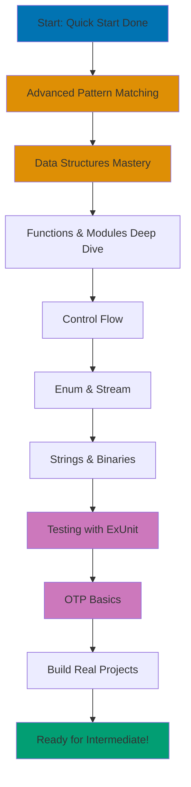

# Beginner Tutorial - Elixir

**Ready to master Elixir and build real applications?** This comprehensive beginner tutorial takes you from basic syntax to OTP fundamentals, covering 0-60% of what you need to write production-quality Elixir code.

## Prerequisites

**Required:**

- Completed [Initial Setup](/en/learn/swe/prog-lang/elixir/tutorials/initial-setup) and [Quick Start](/en/learn/swe/prog-lang/elixir/tutorials/quick-start)
- Elixir 1.14+ installed
- Text editor configured
- IEx shell experience

**Recommended:**

- Basic programming experience (any language)
- Understanding of functions and data structures
- Familiarity with command line
- Git installed (for version control)

## What You'll Learn

This tutorial provides **comprehensive coverage** of Elixir fundamentals:

**Core Language (Sections 1-7):**

- Advanced pattern matching with guards and pin operator
- Complete data structure tour (lists, tuples, maps, keyword lists, structs)
- Functions and modules in depth
- Pipe operator mastery
- Control flow patterns
- Enum and Stream modules
- String and binary manipulation

**Testing and Quality (Section 8):**

- ExUnit testing framework
- Test-driven development patterns
- Documentation with ExDoc

**OTP Basics (Section 9):**

- Processes and message passing
- GenServer introduction
- Error handling with supervisors

**Real Projects (Section 10):**

- Complete working applications
- Best practices and patterns

## Learning Path



## Coverage

This tutorial covers **0-60%** of Elixir - everything you need to build complete applications independently.

**After completing this tutorial, you will:**

- Write idiomatic Elixir code following best practices
- Use all major data structures effectively
- Build tested modules with clear APIs
- Understand basic concurrency with processes
- Debug and troubleshoot Elixir applications
- Read and understand real-world Elixir codebases

**What's covered:**

- Complete syntax and semantics
- All built-in data structures
- Testing and documentation
- Basic process management
- Real-world patterns and practices

**What's NOT covered (Intermediate/Advanced):**

- Phoenix web framework
- GenServer advanced patterns
- Distributed systems
- Metaprogramming and macros
- Performance optimization

## Section 1: Advanced Pattern Matching

### 1.1 Pattern Matching Review

Pattern matching is Elixir's most powerful feature. Let's go deeper than the Quick Start.

```elixir
# Basic review
{:ok, value} = {:ok, 42}
value  # => 42

# Nested patterns
{:ok, {x, y}} = {:ok, {10, 20}}
x  # => 10
y  # => 20

# List patterns
[first, second | rest] = [1, 2, 3, 4, 5]
first   # => 1
second  # => 2
rest    # => [3, 4, 5]

# Map patterns
%{name: name, age: age} = %{name: "Alice", age: 28, city: "Portland"}
name  # => "Alice"
age   # => 28
# Note: city is ignored (not extracted)
```

### 1.2 The Pin Operator (^)

The pin operator `^` uses the **existing value** of a variable instead of rebinding.

```elixir
# Without pin - rebinds x
x = 1
x = 2  # x is now 2
x  # => 2

# With pin - matches against existing value
x = 1
^x = 1  # Works! 1 matches 1
^x = 2  # ** (MatchError) - 2 doesn't match 1

# Real use case: finding specific value in list
x = 42
[^x, y, z] = [42, 10, 20]  # Works! First element matches 42
y  # => 10
z  # => 20

[^x, y, z] = [99, 10, 20]  # ** (MatchError) - 99 doesn't match 42

# Pin in function clauses
defmodule Matcher do
  def check(value, ^value), do: "Same!"
  def check(_value1, _value2), do: "Different"
end

Matcher.check(5, 5)  # => "Same!"
Matcher.check(5, 3)  # => "Different"

# Pin in comprehensions
numbers = [1, 2, 3, 4, 5]
target = 3
for ^target <- numbers, do: :found
# => [:found] - only matches where value is 3
```

**When to use pin:**

- Matching against existing variables
- Validating specific values in patterns
- Function clauses with specific constraints

### 1.3 Guards

Guards add conditions to pattern matching. They make function clauses more specific.

**Basic guards:**

```elixir
defmodule Number do
  def describe(n) when n < 0, do: "negative"
  def describe(0), do: "zero"
  def describe(n) when n > 0, do: "positive"
end

Number.describe(-5)  # => "negative"
Number.describe(0)   # => "zero"
Number.describe(10)  # => "positive"

# Multiple guards with `and`
def adult?(age) when is_integer(age) and age >= 18, do: true
def adult?(_), do: false

adult?(25)    # => true
adult?(15)    # => false
adult?("25")  # => false (not an integer)

# Multiple guards with `or`
def vowel?(letter) when letter == "a" or letter == "e" or letter == "i" do
  true
end
def vowel?(_), do: false

vowel?("a")  # => true
vowel?("b")  # => false
```

**Allowed in guards:**

```elixir
# Type checks
is_atom(x)
is_binary(x)
is_boolean(x)
is_float(x)
is_integer(x)
is_list(x)
is_map(x)
is_number(x)
is_tuple(x)

# Comparisons
==, !=, ===, !==, <, >, <=, >=

# Boolean operators
and, or, not

# Arithmetic
+, -, *, /

# Other
in, length, map_size, tuple_size
```

**Complex guard examples:**

```elixir
defmodule Validator do
  # Validate email-like string
  def valid_email?(email) when is_binary(email) and byte_size(email) > 3 do
    String.contains?(email, "@")
  end
  def valid_email?(_), do: false

  # Check if number in range
  def in_range?(n, min, max) when is_number(n) and n >= min and n <= max do
    true
  end
  def in_range?(_, _, _), do: false

  # Validate non-empty list
  def non_empty_list?(list) when is_list(list) and length(list) > 0 do
    true
  end
  def non_empty_list?(_), do: false
end

Validator.valid_email?("alice@example.com")  # => true
Validator.in_range?(5, 1, 10)                # => true
Validator.non_empty_list?([1, 2, 3])         # => true
```

### 1.4 Pattern Matching in Case and Cond

**Case expressions:**

```elixir
# Case with patterns
result = {:ok, %{name: "Alice", age: 28}}

message = case result do
  {:ok, %{name: name, age: age}} when age >= 18 ->
    "Adult user: #{name}"

  {:ok, %{name: name}} ->
    "User: #{name}"

  {:error, reason} ->
    "Error: #{reason}"

  _ ->
    "Unknown result"
end

# Real example: HTTP response handling
defmodule HTTPClient do
  def handle_response(response) do
    case response do
      {:ok, %{status: 200, body: body}} ->
        {:ok, body}

      {:ok, %{status: 404}} ->
        {:error, :not_found}

      {:ok, %{status: 500}} ->
        {:error, :server_error}

      {:error, reason} ->
        {:error, {:network_error, reason}}
    end
  end
end
```

**Cond expressions (multiple conditions):**

```elixir
# Cond evaluates conditions top to bottom
defmodule Grade do
  def letter(score) do
    cond do
      score >= 90 -> "A"
      score >= 80 -> "B"
      score >= 70 -> "C"
      score >= 60 -> "D"
      true -> "F"  # Default case (always true)
    end
  end
end

Grade.letter(95)  # => "A"
Grade.letter(75)  # => "C"
Grade.letter(55)  # => "F"

# Cond with complex conditions
defmodule Weather do
  def advice(temp, weather) do
    cond do
      temp > 30 and weather == :sunny ->
        "Hot and sunny - stay hydrated!"

      temp > 20 and weather == :rainy ->
        "Warm rain - bring umbrella"

      temp < 10 ->
        "Cold - wear a jacket"

      true ->
        "Pleasant weather - enjoy!"
    end
  end
end
```

### 1.5 Pattern Matching in Functions

**Multiple function clauses:**

```elixir
defmodule Calculator do
  # Pattern match on operation and arguments
  def calc(:add, a, b), do: a + b
  def calc(:subtract, a, b), do: a - b
  def calc(:multiply, a, b), do: a * b
  def calc(:divide, _a, 0), do: {:error, :division_by_zero}
  def calc(:divide, a, b), do: {:ok, a / b}
end

Calculator.calc(:add, 5, 3)      # => 8
Calculator.calc(:divide, 10, 0)  # => {:error, :division_by_zero}

# Process different data structures
defmodule Formatter do
  def format({:user, name, age}) do
    "User: #{name} (#{age} years old)"
  end

  def format({:product, name, price}) do
    "Product: #{name} - $#{price}"
  end

  def format(data) when is_map(data) do
    "Map with #{map_size(data)} keys"
  end

  def format(data) when is_list(data) do
    "List with #{length(data)} elements"
  end
end

Formatter.format({:user, "Alice", 28})
# => "User: Alice (28 years old)"

Formatter.format(%{a: 1, b: 2})
# => "Map with 2 keys"
```

**Recursive patterns:**

```elixir
defmodule ListOps do
  # Sum with accumulator
  def sum(list), do: sum(list, 0)

  defp sum([], acc), do: acc
  defp sum([head | tail], acc) do
    sum(tail, acc + head)
  end

  # Flatten nested lists
  def flatten([]), do: []
  def flatten([head | tail]) when is_list(head) do
    flatten(head) ++ flatten(tail)
  end
  def flatten([head | tail]) do
    [head | flatten(tail)]
  end

  # Find element
  def find([], _target), do: nil
  def find([target | _tail], target), do: {:ok, target}
  def find([_head | tail], target), do: find(tail, target)
end

ListOps.sum([1, 2, 3, 4, 5])           # => 15
ListOps.flatten([[1, 2], [3, [4, 5]]]) # => [1, 2, 3, 4, 5]
ListOps.find([1, 2, 3, 4], 3)          # => {:ok, 3}
```

## Section 2: Data Structures Deep Dive

### 2.1 Lists In Depth

Lists are linked lists - understand their performance characteristics.

**List operations:**

```elixir
# Creation
list = [1, 2, 3, 4, 5]

# Prepend (O(1) - fast!)
[0 | list]  # => [0, 1, 2, 3, 4, 5]

# Append (O(n) - slow!)
list ++ [6]  # => [1, 2, 3, 4, 5, 6]

# Concatenation
[1, 2] ++ [3, 4]  # => [1, 2, 3, 4]

# Subtraction
[1, 2, 3, 4] -- [2, 4]  # => [1, 3]

# Access by index (O(n) - slow!)
Enum.at([1, 2, 3, 4], 2)  # => 3

# Head and tail
hd([1, 2, 3])  # => 1
tl([1, 2, 3])  # => [2, 3]

# Check membership (O(n))
2 in [1, 2, 3]  # => true

# Length (O(n))
length([1, 2, 3])  # => 3
```

**When to use lists:**

- Building collections incrementally (prepend)
- Processing data in order (recursion)
- Stack-like operations (push/pop from front)

**When NOT to use lists:**

- Random access by index (use tuples or maps)
- Frequent appending (use other structures)

**List comprehensions mastery:**

```elixir
# Basic comprehension
for n <- 1..10, do: n * n
# => [1, 4, 9, 16, 25, 36, 49, 64, 81, 100]

# Multiple filters
for n <- 1..20,
    rem(n, 2) == 0,    # Only even
    rem(n, 3) == 0,    # Only divisible by 3
    do: n
# => [6, 12, 18]

# Multiple generators
for x <- [1, 2, 3],
    y <- [:a, :b],
    do: {x, y}
# => [{1, :a}, {1, :b}, {2, :a}, {2, :b}, {3, :a}, {3, :b}]

# Pattern matching in generator
users = [
  %{name: "Alice", role: :admin},
  %{name: "Bob", role: :user},
  %{name: "Carol", role: :admin}
]

for %{name: name, role: :admin} <- users, do: name
# => ["Alice", "Carol"]

# Into different collection
for {k, v} <- %{a: 1, b: 2, c: 3}, into: %{}, do: {v, k}
# => %{1 => :a, 2 => :b, 3 => :c}

# Reduce comprehension
for n <- 1..5, reduce: 0 do
  sum -> sum + n
end
# => 15
```

### 2.2 Tuples

Tuples store fixed-size collections with fast access.

```elixir
# Creation
tuple = {:ok, "Success", 42}

# Access by index (O(1) - fast!)
elem(tuple, 0)  # => :ok
elem(tuple, 1)  # => "Success"
elem(tuple, 2)  # => 42

# Size
tuple_size(tuple)  # => 3

# Update (creates new tuple)
put_elem(tuple, 1, "Updated")
# => {:ok, "Updated", 42}

# Pattern matching (most common usage)
{:ok, message, code} = {:ok, "Success", 200}
message  # => "Success"
code     # => 200
```

**Common tuple patterns:**

```elixir
# Return values
def divide(a, b) when b != 0, do: {:ok, a / b}
def divide(_a, 0), do: {:error, :division_by_zero}

# Tagged tuples
{:user, "Alice", 28}
{:product, "Widget", 9.99}

# Coordinates
{10, 20}  # {x, y}
{10, 20, 30}  # {x, y, z}
```

**When to use tuples:**

- Fixed-size collections
- Return values with status
- Pattern matching scenarios
- Performance-critical index access

### 2.3 Maps - The Workhorse Data Structure

Maps are key-value stores with fast access.

**Creating and accessing maps:**

```elixir
# With atom keys
person = %{name: "Alice", age: 28, city: "Portland"}

# Access
person[:name]   # => "Alice"
person.name     # => "Alice" (only works with atom keys)
person[:email]  # => nil

Map.get(person, :name)              # => "Alice"
Map.get(person, :email, "unknown")  # => "unknown" (default)

# With string keys
data = %{"name" => "Bob", "age" => 35}
data["name"]  # => "Bob"

# Mixed keys (valid but discouraged)
mixed = %{:atom_key => 1, "string_key" => 2}

# Dynamic keys
key = :dynamic
%{key => "value"}  # => %{dynamic: "value"}
```

**Updating maps:**

```elixir
person = %{name: "Alice", age: 28}

# Update existing key
person = %{person | age: 29}
# => %{name: "Alice", age: 29}

# Add new key (use Map.put)
person = Map.put(person, :email, "alice@example.com")
# => %{name: "Alice", age: 29, email: "alice@example.com"}

# Update multiple keys
person = %{person | name: "Alicia", age: 30}

# Merge maps
defaults = %{role: "user", active: true}
person = Map.merge(defaults, person)

# Delete key
person = Map.delete(person, :email)
```

**Nested maps:**

```elixir
user = %{
  name: "Alice",
  contact: %{
    email: "alice@example.com",
    phone: "555-1234"
  },
  address: %{
    street: "123 Main St",
    city: "Portland"
  }
}

# Access nested
user[:contact][:email]  # => "alice@example.com"
get_in(user, [:contact, :email])  # => "alice@example.com"

# Update nested
user = put_in(user, [:contact, :email], "newemail@example.com")
user = update_in(user, [:contact, :phone], &("1-" <> &1))

# Get and update
{old_email, user} = pop_in(user, [:contact, :email])
```

**Map functions:**

```elixir
map = %{a: 1, b: 2, c: 3}

# Keys and values
Map.keys(map)    # => [:a, :b, :c]
Map.values(map)  # => [1, 2, 3]

# Check key
Map.has_key?(map, :a)  # => true

# Transform values
Map.update!(map, :a, &(&1 * 10))  # => %{a: 10, b: 2, c: 3}

# Filter
Map.take(map, [:a, :c])  # => %{a: 1, c: 3}
Map.drop(map, [:b])      # => %{a: 1, c: 3}
```

**When to use maps:**

- Dynamic data with named fields
- JSON-like data
- Configuration
- Fast key lookup

### 2.4 Keyword Lists

Keyword lists are lists of `{key, value}` tuples with atom keys.

```elixir
# Creation
opts = [size: 10, color: "red", border: true]
# Syntactic sugar for: [{:size, 10}, {:color, "red"}, {:border, true}]

# Access
opts[:size]   # => 10
opts[:color]  # => "red"

Keyword.get(opts, :size)              # => 10
Keyword.get(opts, :missing, "default") # => "default"

# Update
opts = Keyword.put(opts, :size, 20)

# Duplicate keys allowed!
opts = [size: 10, size: 20]  # Valid!
opts[:size]  # => 10 (first occurrence)

# Merge
Keyword.merge([a: 1, b: 2], [b: 3, c: 4])
# => [a: 1, b: 3, c: 4]
```

**When to use keyword lists:**

- Function options (most common use case)
- Order matters
- Duplicate keys needed

**Common pattern - function options:**

```elixir
defmodule Database do
  def query(sql, opts \\ []) do
    timeout = Keyword.get(opts, :timeout, 5000)
    pool = Keyword.get(opts, :pool, :default)

    # Use timeout and pool...
    "Querying with timeout: #{timeout}, pool: #{pool}"
  end
end

Database.query("SELECT * FROM users")
# => "Querying with timeout: 5000, pool: default"

Database.query("SELECT * FROM users", timeout: 10000, pool: :replica)
# => "Querying with timeout: 10000, pool: replica"
```

### 2.5 Structs

Structs are named maps with defined keys and compile-time guarantees.

**Defining structs:**

```elixir
defmodule User do
  defstruct name: "", email: "", age: 0, role: :user

  # With required keys
  # defstruct [:name, :email, age: 0, role: :user]
end

# Create struct
user = %User{name: "Alice", email: "alice@example.com", age: 28}
# => %User{name: "Alice", email: "alice@example.com", age: 28, role: :user}

# Access (same as maps)
user.name   # => "Alice"
user[:age]  # => 28

# Update
user = %{user | age: 29}

# Pattern match
%User{name: name, age: age} = user
name  # => "Alice"
```

**Why structs over maps:**

```elixir
# Maps allow any keys
person = %{name: "Alice", agee: 28}  # Typo! No error

# Structs enforce defined keys
user = %User{name: "Alice", agee: 28}
# ** (KeyError) key :agee not found in: %User{}

# Structs have compile-time checks
defmodule Service do
  def process(%User{} = user) do
    # Type-checked at compile time
    "Processing user: #{user.name}"
  end
end
```

**Struct functions:**

```elixir
defmodule User do
  defstruct [:name, :email, age: 0]

  def new(name, email) do
    %User{name: name, email: email}
  end

  def adult?(%User{age: age}) when age >= 18, do: true
  def adult?(_), do: false

  def update_email(%User{} = user, new_email) do
    %{user | email: new_email}
  end
end

user = User.new("Alice", "alice@example.com")
User.adult?(user)  # => false (age defaults to 0)

user = %{user | age: 28}
User.adult?(user)  # => true
```

**When to use structs:**

- Domain models (User, Product, Order, etc.)
- Data with known fields
- Type checking needed
- Clear data contracts

### 2.6 Ranges

Ranges represent sequences of numbers.

```elixir
# Creation
range = 1..10
range = 1..10//2  # Step of 2 (Elixir 1.12+)

# Check membership
5 in 1..10   # => true
15 in 1..10  # => false

# Convert to list
Enum.to_list(1..5)  # => [1, 2, 3, 4, 5]

# Use in comprehensions
for n <- 1..10, do: n * n
# => [1, 4, 9, 16, 25, 36, 49, 64, 81, 100]

# Descending range
10..1  # Descending

# Character ranges
?a..?z  # => 97..122 (ASCII values)
```

### 2.7 Choosing the Right Data Structure

```elixir
# List - ordered collection, frequent prepending
shopping_cart = ["apple", "banana", "orange"]

# Tuple - fixed size, fast indexed access
coordinate = {10.5, 20.3}
result = {:ok, data}

# Map - dynamic key-value, fast lookup
user = %{name: "Alice", email: "alice@example.com"}

# Keyword list - function options, order matters
opts = [timeout: 5000, retry: 3]

# Struct - domain model, type safety
user = %User{name: "Alice", age: 28}

# Range - sequence of numbers
for page <- 1..10, do: fetch_page(page)
```

## Section 3: Functions and Modules Mastery

### 3.1 Anonymous Functions Deep Dive

**Capture operator (&):**

```elixir
# Long form
Enum.map([1, 2, 3], fn x -> x * 2 end)
# => [2, 4, 6]

# Short form with capture
Enum.map([1, 2, 3], &(&1 * 2))
# => [2, 4, 6]

# Capture existing function
Enum.map(["hello", "world"], &String.upcase/1)
# => ["HELLO", "WORLD"]

# Multiple arguments
add = &(&1 + &2)
add.(5, 3)  # => 8

# Capture with expression
multiply_by_10 = &(&1 * 10)
multiply_by_10.(5)  # => 50
```

**Closures:**

```elixir
# Functions capture outer scope
defmodule Counter do
  def create(initial) do
    fn -> initial end
  end

  def create_incrementer(start) do
    fn amount -> start + amount end
  end
end

get_ten = Counter.create(10)
get_ten.()  # => 10

inc_from_5 = Counter.create_incrementer(5)
inc_from_5.(3)  # => 8
inc_from_5.(10) # => 15

# Practical closure
defmodule Filter do
  def greater_than(threshold) do
    fn value -> value > threshold end
  end
end

greater_than_10 = Filter.greater_than(10)
Enum.filter([5, 15, 8, 20, 12], greater_than_10)
# => [15, 20, 12]
```

### 3.2 Named Functions Advanced

**Multiple clauses with pattern matching:**

```elixir
defmodule FizzBuzz do
  def convert(n) when rem(n, 15) == 0, do: "FizzBuzz"
  def convert(n) when rem(n, 3) == 0, do: "Fizz"
  def convert(n) when rem(n, 5) == 0, do: "Buzz"
  def convert(n), do: n
end

Enum.map(1..15, &FizzBuzz.convert/1)
# => [1, 2, "Fizz", 4, "Buzz", "Fizz", 7, 8, "Fizz", "Buzz", 11, "Fizz", 13, 14, "FizzBuzz"]
```

**Default arguments:**

```elixir
defmodule Greeter do
  def hello(name \\ "World", punctuation \\ "!") do
    "Hello, #{name}#{punctuation}"
  end
end

Greeter.hello()                # => "Hello, World!"
Greeter.hello("Alice")         # => "Hello, Alice!"
Greeter.hello("Bob", ".")      # => "Hello, Bob."
```

**Private functions:**

```elixir
defmodule Calculator do
  def calculate(operation, a, b) do
    case operation do
      :add -> add(a, b)
      :multiply -> multiply(a, b)
      _ -> {:error, :unknown_operation}
    end
  end

  defp add(a, b), do: a + b
  defp multiply(a, b), do: a * b
end

Calculator.calculate(:add, 5, 3)  # => 8
Calculator.add(5, 3)  # ** (UndefinedFunctionError) - private!
```

**Function arity:**

```elixir
defmodule Math do
  # Different arities are different functions
  def add(a, b), do: a + b
  def add(a, b, c), do: a + b + c
end

# Reference by name/arity
add_two = &Math.add/2
add_three = &Math.add/3

add_two.(5, 3)      # => 8
add_three.(5, 3, 2) # => 10
```

### 3.3 Modules Organization

**Module attributes:**

```elixir
defmodule Config do
  @default_timeout 5000
  @retry_count 3

  def timeout, do: @default_timeout
  def retries, do: @retry_count

  # Module attribute as constant
  @max_connections 100

  def max_connections, do: @max_connections
end

Config.timeout()  # => 5000
```

**Nested modules:**

```elixir
defmodule MyApp do
  defmodule User do
    defstruct [:name, :email]

    def new(name, email) do
      %User{name: name, email: email}
    end
  end

  defmodule Product do
    defstruct [:name, :price]

    def new(name, price) do
      %Product{name: name, price: price}
    end
  end
end

user = MyApp.User.new("Alice", "alice@example.com")
product = MyApp.Product.new("Widget", 9.99)

# Alias for convenience
alias MyApp.User
user = User.new("Bob", "bob@example.com")
```

**Import, alias, and require:**

```elixir
defmodule Example do
  # Alias - shorten module name
  alias MyApp.User
  alias MyApp.Product, as: Prod

  # Import - bring functions into scope
  import Enum, only: [map: 2, filter: 2]

  # Require - needed for macros
  require Logger

  def process_users(users) do
    # Can use User instead of MyApp.User
    users
    |> map(&User.display/1)
    |> filter(&User.active?/1)
  end
end
```

### 3.4 Pipe Operator Mastery

**Advanced piping:**

```elixir
# Pipe to non-first argument (use anonymous function)
"hello"
|> String.upcase()
|> String.duplicate(3)
# => "HELLOHELLOHELLO"

# When you need non-first argument
data
|> process()
|> then(&save_to_db(:users, &1))  # Pipe into second arg

# Pipe with pattern matching
{:ok, result} =
  data
  |> validate()
  |> transform()

# Debugging in pipeline with IO.inspect
[1, 2, 3, 4, 5]
|> Enum.map(&(&1 * 2))
|> IO.inspect(label: "After map")
|> Enum.filter(&(&1 > 5))
|> IO.inspect(label: "After filter")
|> Enum.sum()
```

**Real-world pipeline:**

```elixir
defmodule DataProcessor do
  def process_csv(file_path) do
    file_path
    |> File.read!()
    |> String.split("\n")
    |> Enum.reject(&(&1 == ""))
    |> Enum.map(&String.split(&1, ","))
    |> Enum.map(&parse_row/1)
    |> Enum.filter(&valid_row?/1)
    |> Enum.map(&transform_row/1)
    |> save_to_database()
  end

  defp parse_row([name, age, city]) do
    %{name: name, age: String.to_integer(age), city: city}
  end

  defp valid_row?(%{age: age}), do: age >= 18

  defp transform_row(row) do
    Map.put(row, :status, :active)
  end

  defp save_to_database(rows) do
    # Save rows...
    {:ok, length(rows)}
  end
end
```

## Section 4: Control Flow

### 4.1 If and Unless

```elixir
# Basic if
if true do
  "Yes"
else
  "No"
end
# => "Yes"

# One-line if
if true, do: "Yes", else: "No"

# Unless (opposite of if)
unless false do
  "Executed"
end
# => "Executed"

# If with pattern matching
result = {:ok, 42}
if {:ok, value} = result, do: value, else: nil
# => 42
```

**When to use if/unless:**

- Simple binary decisions
- Guard-like conditions
- Avoid for complex logic (use case/cond instead)

### 4.2 Case - Pattern Matching

```elixir
# Basic case
result = {:ok, "data"}

case result do
  {:ok, data} -> "Success: #{data}"
  {:error, reason} -> "Error: #{reason}"
  _ -> "Unknown"
end

# Case with guards
value = 15

case value do
  n when n < 0 -> "Negative"
  0 -> "Zero"
  n when n < 10 -> "Small positive"
  n when n < 100 -> "Medium positive"
  _ -> "Large positive"
end
# => "Medium positive"

# Nested case
case File.read("data.txt") do
  {:ok, content} ->
    case Jason.decode(content) do
      {:ok, data} -> process(data)
      {:error, _} -> {:error, :invalid_json}
    end

  {:error, reason} ->
    {:error, {:file_error, reason}}
end
```

### 4.3 Cond - Multiple Conditions

```elixir
# Cond for multiple conditions
defmodule Weather do
  def advice(temp, humidity) do
    cond do
      temp > 35 -> "Extremely hot - stay indoors"
      temp > 30 and humidity > 80 -> "Hot and humid - drink water"
      temp > 25 -> "Warm and pleasant"
      temp > 15 -> "Cool - light jacket"
      temp > 5 -> "Cold - wear jacket"
      true -> "Very cold - bundle up"
    end
  end
end
```

### 4.4 With - Happy Path Pipeline

```elixir
# With for happy path scenarios
defmodule UserService do
  def create_user(params) do
    with {:ok, validated} <- validate(params),
         {:ok, user} <- insert_user(validated),
         {:ok, email_sent} <- send_welcome_email(user) do
      {:ok, user}
    else
      {:error, :validation_failed} ->
        {:error, "Invalid user data"}

      {:error, :database_error} ->
        {:error, "Could not save user"}

      {:error, :email_failed} ->
        {:error, "User created but email failed"}
    end
  end

  defp validate(%{name: name, email: email}) when byte_size(name) > 0 do
    if String.contains?(email, "@") do
      {:ok, %{name: name, email: email}}
    else
      {:error, :validation_failed}
    end
  end
  defp validate(_), do: {:error, :validation_failed}

  defp insert_user(data) do
    # Simulate database insert
    {:ok, Map.put(data, :id, :rand.uniform(1000))}
  end

  defp send_welcome_email(user) do
    # Simulate email sending
    {:ok, true}
  end
end

UserService.create_user(%{name: "Alice", email: "alice@example.com"})
# => {:ok, %{name: "Alice", email: "alice@example.com", id: 123}}
```

## Section 5: Enum and Stream

### 5.1 Enum Module - Collection Operations

**Mapping and filtering:**

```elixir
# Map
Enum.map([1, 2, 3], &(&1 * 2))
# => [2, 4, 6]

# Filter
Enum.filter([1, 2, 3, 4, 5], &rem(&1, 2) == 0)
# => [2, 4]

# Reject (opposite of filter)
Enum.reject([1, 2, 3, 4, 5], &rem(&1, 2) == 0)
# => [1, 3, 5]

# Map and filter combined
[1, 2, 3, 4, 5]
|> Enum.filter(&rem(&1, 2) == 0)
|> Enum.map(&(&1 * &1))
# => [4, 16]
```

**Reducing:**

```elixir
# Sum
Enum.sum([1, 2, 3, 4, 5])  # => 15

# Custom reduce
Enum.reduce([1, 2, 3, 4], 0, fn x, acc -> x + acc end)
# => 10

# Reduce to map
["apple", "banana", "apricot"]
|> Enum.reduce(%{}, fn fruit, acc ->
  first_letter = String.first(fruit)
  Map.update(acc, first_letter, [fruit], &[fruit | &1])
end)
# => %{"a" => ["apricot", "apple"], "b" => ["banana"]}
```

**Sorting:**

```elixir
# Simple sort
Enum.sort([3, 1, 4, 1, 5, 9])
# => [1, 1, 3, 4, 5, 9]

# Sort descending
Enum.sort([3, 1, 4], :desc)
# => [4, 3, 1]

# Sort by custom function
users = [
  %{name: "Bob", age: 35},
  %{name: "Alice", age: 28},
  %{name: "Carol", age: 42}
]

Enum.sort_by(users, & &1.age)
# => [%{name: "Alice", age: 28}, %{name: "Bob", age: 35}, %{name: "Carol", age: 42}]
```

**Finding:**

```elixir
# Find first matching
Enum.find([1, 2, 3, 4, 5], &(&1 > 3))
# => 4

# Find with default
Enum.find([1, 2, 3], &(&1 > 10), :not_found)
# => :not_found

# At index
Enum.at([1, 2, 3, 4], 2)
# => 3

# Take/drop
Enum.take([1, 2, 3, 4, 5], 3)  # => [1, 2, 3]
Enum.drop([1, 2, 3, 4, 5], 2)  # => [3, 4, 5]
```

**Grouping and splitting:**

```elixir
# Group by
users = [
  %{name: "Alice", city: "Portland"},
  %{name: "Bob", city: "Seattle"},
  %{name: "Carol", city: "Portland"}
]

Enum.group_by(users, & &1.city)
# => %{
#   "Portland" => [%{name: "Alice", city: "Portland"}, %{name: "Carol", city: "Portland"}],
#   "Seattle" => [%{name: "Bob", city: "Seattle"}]
# }

# Chunk
Enum.chunk_every([1, 2, 3, 4, 5, 6], 2)
# => [[1, 2], [3, 4], [5, 6]]

# Split
Enum.split([1, 2, 3, 4, 5], 3)
# => {[1, 2, 3], [4, 5]}
```

### 5.2 Stream - Lazy Enumeration

Streams defer computation until needed - great for large datasets.

```elixir
# Eager (Enum) - processes immediately
[1, 2, 3]
|> Enum.map(&(&1 * 2))
|> Enum.filter(&(&1 > 3))
# => [4, 6]
# Creates intermediate list [2, 4, 6] then filters

# Lazy (Stream) - no intermediate lists
[1, 2, 3]
|> Stream.map(&(&1 * 2))
|> Stream.filter(&(&1 > 3))
|> Enum.to_list()
# => [4, 6]
# Processes each element through entire pipeline

# Infinite streams
Stream.iterate(0, &(&1 + 1))
|> Stream.take(10)
|> Enum.to_list()
# => [0, 1, 2, 3, 4, 5, 6, 7, 8, 9]

# Cycle infinitely
Stream.cycle([:a, :b, :c])
|> Stream.take(7)
|> Enum.to_list()
# => [:a, :b, :c, :a, :b, :c, :a]

# Practical: process large file
File.stream!("large_file.csv")
|> Stream.map(&String.trim/1)
|> Stream.reject(&(&1 == ""))
|> Stream.map(&String.split(&1, ","))
|> Enum.take(100)  # Only process first 100 lines
```

**When to use Stream:**

- Large or infinite collections
- Multiple transformations (avoid intermediate lists)
- Performance-critical pipelines
- Processing files line by line

## Section 6: Strings and Binaries

### 6.1 String Basics

```elixir
# Creation
str = "Hello, World!"

# Concatenation
"Hello, " <> "World!"  # => "Hello, World!"

# Interpolation
name = "Alice"
"Hello, #{name}!"  # => "Hello, Alice!"

# Length
String.length("Hello")  # => 5

# Case conversion
String.upcase("hello")    # => "HELLO"
String.downcase("HELLO")  # => "hello"
String.capitalize("hello world")  # => "Hello world"

# Trimming
String.trim("  hello  ")  # => "hello"
String.trim_leading("  hello")  # => "hello"
String.trim_trailing("hello  ")  # => "hello"
```

### 6.2 String Operations

```elixir
# Splitting
String.split("a,b,c", ",")  # => ["a", "b", "c"]
String.split("hello world")  # => ["hello", "world"]

# Joining
Enum.join(["a", "b", "c"], ",")  # => "a,b,c"

# Replace
String.replace("hello world", "world", "Elixir")
# => "hello Elixir"

# Contains
String.contains?("hello world", "world")  # => true
String.starts_with?("hello", "he")  # => true
String.ends_with?("world", "ld")  # => true

# Slicing
String.slice("hello", 0..2)  # => "hel"
String.slice("hello", 1, 3)  # => "ell"

# Reverse
String.reverse("hello")  # => "olleh"
```

### 6.3 Pattern Matching with Strings

```elixir
# Match beginning
"Hello " <> rest = "Hello World"
rest  # => "World"

# Binary pattern matching (advanced)
<<head, rest::binary>> = "Hello"
head  # => 72 (ASCII 'H')
rest  # => "ello"

# Extract first character
String.first("Hello")  # => "H"
String.last("Hello")   # => "o"
```

## Section 7: Common Patterns and Idioms

### 7.1 Recursion Patterns

**Accumulator pattern:**

```elixir
defmodule Math do
  # Public function
  def factorial(n) when n >= 0, do: factorial(n, 1)

  # Private recursive function with accumulator
  defp factorial(0, acc), do: acc
  defp factorial(n, acc) do
    factorial(n - 1, n * acc)
  end
end

Math.factorial(5)  # => 120
```

**List processing:**

```elixir
defmodule ListProcessor do
  # Map with accumulator
  def my_map(list, fun), do: my_map(list, fun, [])

  defp my_map([], _fun, acc), do: Enum.reverse(acc)
  defp my_map([head | tail], fun, acc) do
    my_map(tail, fun, [fun.(head) | acc])
  end
end

ListProcessor.my_map([1, 2, 3], &(&1 * 2))
# => [2, 4, 6]
```

### 7.2 Error Handling Patterns

**Tagged tuples:**

```elixir
defmodule FileHandler do
  def read_and_parse(path) do
    with {:ok, content} <- File.read(path),
         {:ok, data} <- Jason.decode(content) do
      {:ok, data}
    end
  end
end

# Caller handles errors
case FileHandler.read_and_parse("data.json") do
  {:ok, data} -> process(data)
  {:error, _} -> handle_error()
end
```

**Exceptions for truly exceptional cases:**

```elixir
defmodule BankAccount do
  # Normal operation - tagged tuple
  def withdraw(balance, amount) when amount <= balance do
    {:ok, balance - amount}
  end
  def withdraw(_balance, _amount), do: {:error, :insufficient_funds}

  # Exceptional case - raise
  def withdraw!(balance, amount) when amount <= balance do
    balance - amount
  end
  def withdraw!(_balance, _amount) do
    raise "Insufficient funds!"
  end
end
```

### 7.3 Building Module APIs

```elixir
defmodule ShoppingCart do
  @moduledoc """
  Shopping cart implementation with items and totals.
  """

  defstruct items: [], total: 0.0

  @doc """
  Creates a new empty shopping cart.

  ## Examples

      iex> ShoppingCart.new()
      %ShoppingCart{items: [], total: 0.0}
  """
  def new, do: %ShoppingCart{}

  @doc """
  Adds an item to the cart.
  """
  def add_item(%ShoppingCart{items: items, total: total}, item, price) do
    %ShoppingCart{
      items: [item | items],
      total: total + price
    }
  end

  @doc """
  Returns the current total.
  """
  def get_total(%ShoppingCart{total: total}), do: total

  @doc """
  Lists all items in the cart.
  """
  def list_items(%ShoppingCart{items: items}), do: Enum.reverse(items)
end
```

## Section 8: Testing with ExUnit

### 8.1 Basic Testing

```elixir
# test/calculator_test.exs
defmodule CalculatorTest do
  use ExUnit.Case

  test "adds two numbers" do
    assert Calculator.add(2, 3) == 5
  end

  test "subtracts two numbers" do
    assert Calculator.subtract(5, 3) == 2
  end

  test "handles division by zero" do
    assert Calculator.divide(10, 0) == {:error, :division_by_zero}
  end
end
```

Run tests:

```bash
mix test
```

### 8.2 Setup and Context

```elixir
defmodule UserServiceTest do
  use ExUnit.Case

  # Run before each test
  setup do
    user = %User{name: "Test User", email: "test@example.com"}
    {:ok, user: user}
  end

  test "validates user email", %{user: user} do
    assert UserService.valid_email?(user)
  end

  test "formats user display", %{user: user} do
    assert UserService.display(user) == "Test User <test@example.com>"
  end
end
```

### 8.3 Assertions

```elixir
# Equality
assert 1 + 1 == 2
refute 1 + 1 == 3

# Pattern matching
assert {:ok, value} = some_function()

# Exceptions
assert_raise ArithmeticError, fn ->
  1 / 0
end

# Close enough (floats)
assert_in_delta 0.1 + 0.2, 0.3, 0.0001
```

## Section 9: OTP Basics - Processes

### 9.1 Spawning Processes

```elixir
# Spawn a process
pid = spawn(fn -> IO.puts("Hello from process!") end)

# Send message
send(pid, {:hello, "World"})

# Receive messages
receive do
  {:hello, msg} -> IO.puts("Received: #{msg}")
after
  1000 -> IO.puts("Timeout!")
end
```

### 9.2 Process Communication

```elixir
defmodule Messenger do
  def listen do
    receive do
      {:say, msg} ->
        IO.puts("Message: #{msg}")
        listen()  # Recursive call to continue listening

      :stop ->
        IO.puts("Stopping")
    end
  end
end

# Start listener
pid = spawn(&Messenger.listen/0)

# Send messages
send(pid, {:say, "Hello"})
send(pid, {:say, "World"})
send(pid, :stop)
```

### 9.3 GenServer Introduction

GenServer provides standard client-server pattern.

```elixir
defmodule Counter do
  use GenServer

  # Client API
  def start_link(initial_value) do
    GenServer.start_link(__MODULE__, initial_value, name: __MODULE__)
  end

  def increment do
    GenServer.call(__MODULE__, :increment)
  end

  def get_value do
    GenServer.call(__MODULE__, :get_value)
  end

  # Server Callbacks
  def init(initial_value) do
    {:ok, initial_value}
  end

  def handle_call(:increment, _from, state) do
    {:reply, state + 1, state + 1}
  end

  def handle_call(:get_value, _from, state) do
    {:reply, state, state}
  end
end

# Usage
{:ok, _pid} = Counter.start_link(0)
Counter.increment()  # => 1
Counter.increment()  # => 2
Counter.get_value()  # => 2
```

## Section 10: Hands-On Projects

### Project 1: Todo List Manager

```elixir
defmodule TodoList do
  defstruct items: [], next_id: 1

  def new, do: %TodoList{}

  def add_item(%TodoList{items: items, next_id: id}, description) do
    item = %{id: id, description: description, done: false}
    %TodoList{
      items: [item | items],
      next_id: id + 1
    }
  end

  def mark_done(%TodoList{items: items} = list, id) do
    updated_items = Enum.map(items, fn item ->
      if item.id == id do
        %{item | done: true}
      else
        item
      end
    end)

    %{list | items: updated_items}
  end

  def list_pending(%TodoList{items: items}) do
    items
    |> Enum.reject(& &1.done)
    |> Enum.reverse()
  end

  def list_completed(%TodoList{items: items}) do
    items
    |> Enum.filter(& &1.done)
    |> Enum.reverse()
  end
end

# Usage
list = TodoList.new()
list = TodoList.add_item(list, "Buy groceries")
list = TodoList.add_item(list, "Write code")
list = TodoList.mark_done(list, 1)
TodoList.list_pending(list)
# => [%{id: 2, description: "Write code", done: false}]
```

### Project 2: CSV Parser

```elixir
defmodule CSVParser do
  def parse(file_path) do
    file_path
    |> File.stream!()
    |> Stream.map(&String.trim/1)
    |> Stream.reject(&(&1 == ""))
    |> Enum.map(&parse_line/1)
    |> to_maps()
  end

  defp parse_line(line) do
    line
    |> String.split(",")
    |> Enum.map(&String.trim/1)
  end

  defp to_maps([headers | rows]) do
    Enum.map(rows, fn row ->
      headers
      |> Enum.zip(row)
      |> Map.new()
    end)
  end
end

# Usage with data.csv:
# name,age,city
# Alice,28,Portland
# Bob,35,Seattle

CSVParser.parse("data.csv")
# => [
#   %{"name" => "Alice", "age" => "28", "city" => "Portland"},
#   %{"name" => "Bob", "age" => "35", "city" => "Seattle"}
# ]
```

### Project 3: Bank Account with GenServer

```elixir
defmodule BankAccount do
  use GenServer

  # Client API
  def start_link(initial_balance) do
    GenServer.start_link(__MODULE__, initial_balance)
  end

  def deposit(pid, amount) when amount > 0 do
    GenServer.call(pid, {:deposit, amount})
  end

  def withdraw(pid, amount) when amount > 0 do
    GenServer.call(pid, {:withdraw, amount})
  end

  def balance(pid) do
    GenServer.call(pid, :balance)
  end

  def transaction_history(pid) do
    GenServer.call(pid, :history)
  end

  # Server Callbacks
  def init(initial_balance) do
    state = %{
      balance: initial_balance,
      transactions: []
    }
    {:ok, state}
  end

  def handle_call({:deposit, amount}, _from, state) do
    new_balance = state.balance + amount
    transaction = {:deposit, amount, DateTime.utc_now()}

    new_state = %{
      balance: new_balance,
      transactions: [transaction | state.transactions]
    }

    {:reply, {:ok, new_balance}, new_state}
  end

  def handle_call({:withdraw, amount}, _from, state) do
    if amount <= state.balance do
      new_balance = state.balance - amount
      transaction = {:withdraw, amount, DateTime.utc_now()}

      new_state = %{
        balance: new_balance,
        transactions: [transaction | state.transactions]
      }

      {:reply, {:ok, new_balance}, new_state}
    else
      {:reply, {:error, :insufficient_funds}, state}
    end
  end

  def handle_call(:balance, _from, state) do
    {:reply, state.balance, state}
  end

  def handle_call(:history, _from, state) do
    {:reply, Enum.reverse(state.transactions), state}
  end
end

# Usage
{:ok, account} = BankAccount.start_link(1000.0)
BankAccount.deposit(account, 500.0)    # => {:ok, 1500.0}
BankAccount.withdraw(account, 200.0)   # => {:ok, 1300.0}
BankAccount.balance(account)           # => 1300.0
BankAccount.transaction_history(account)
# => [{:deposit, 500.0, ~U[...]}, {:withdraw, 200.0, ~U[...]}]
```

## Section 11: Protocols and Behaviours

### 11.1 Protocols - Polymorphism in Elixir

Protocols allow you to define functionality that can be implemented for different data types.

**Defining a protocol:**

```elixir
defprotocol Drawable do
  @doc "Draws the given shape"
  def draw(shape)
end

# Implement for different types
defimpl Drawable, for: Circle do
  def draw(%Circle{radius: radius}) do
    "Drawing circle with radius #{radius}"
  end
end

defimpl Drawable, for: Rectangle do
  def draw(%Rectangle{width: width, height: height}) do
    "Drawing rectangle #{width}x#{height}"
  end
end

# Usage
defmodule Circle do
  defstruct [:radius]
end

defmodule Rectangle do
  defstruct [:width, :height]
end

circle = %Circle{radius: 5}
rectangle = %Rectangle{width: 10, height: 20}

Drawable.draw(circle)      # => "Drawing circle with radius 5"
Drawable.draw(rectangle)   # => "Drawing rectangle 10x20"
```

**Built-in protocols:**

```elixir
# String.Chars - implements to_string/1
defimpl String.Chars, for: User do
  def to_string(%User{name: name, email: email}) do
    "#{name} <#{email}>"
  end
end

user = %User{name: "Alice", email: "alice@example.com"}
to_string(user)  # => "Alice <alice@example.com>"
"User: #{user}"  # => "User: Alice <alice@example.com>"

# Inspect - implements inspect/2 (for debugging)
defimpl Inspect, for: User do
  def inspect(%User{name: name}, _opts) do
    "#User<#{name}>"
  end
end

user  # => #User<Alice> (in IEx)

# Enumerable - makes your type work with Enum
defmodule MyRange do
  defstruct [:from, :to]
end

defimpl Enumerable, for: MyRange do
  def count(%MyRange{from: from, to: to}) do
    {:ok, to - from + 1}
  end

  def member?(%MyRange{from: from, to: to}, value) do
    {:ok, value >= from and value <= to}
  end

  def reduce(%MyRange{from: from, to: to}, acc, fun) do
    Enum.to_list(from..to)
    |> Enumerable.List.reduce(acc, fun)
  end

  def slice(_range), do: {:error, __MODULE__}
end

range = %MyRange{from: 1, to: 5}
Enum.to_list(range)  # => [1, 2, 3, 4, 5]
Enum.sum(range)      # => 15
3 in range           # => true
```

**Real-world protocol example:**

```elixir
defprotocol Serializable do
  @doc "Serializes data to JSON-compatible format"
  def serialize(data)
end

defimpl Serializable, for: User do
  def serialize(%User{name: name, email: email, age: age}) do
    %{
      type: "user",
      data: %{
        name: name,
        email: email,
        age: age
      }
    }
  end
end

defimpl Serializable, for: Product do
  def serialize(%Product{name: name, price: price}) do
    %{
      type: "product",
      data: %{
        name: name,
        price: price
      }
    }
  end
end

# Use with Jason for JSON encoding
user = %User{name: "Alice", email: "alice@example.com", age: 28}
user
|> Serializable.serialize()
|> Jason.encode!()
# => "{\"type\":\"user\",\"data\":{\"name\":\"Alice\",\"email\":\"alice@example.com\",\"age\":28}}"
```

### 11.2 Behaviours - Defining Contracts

Behaviours define a contract that modules must implement.

**Defining a behaviour:**

```elixir
defmodule Parser do
  @callback parse(String.t()) :: {:ok, term()} | {:error, String.t()}
  @callback format(term()) :: String.t()
end

# Implement the behaviour
defmodule JSONParser do
  @behaviour Parser

  def parse(json_string) do
    case Jason.decode(json_string) do
      {:ok, data} -> {:ok, data}
      {:error, _} -> {:error, "Invalid JSON"}
    end
  end

  def format(data) do
    Jason.encode!(data)
  end
end

defmodule CSVParser do
  @behaviour Parser

  def parse(csv_string) do
    rows = String.split(csv_string, "\n")
    {:ok, rows}
  end

  def format(rows) when is_list(rows) do
    Enum.join(rows, "\n")
  end
end

# Use parsers interchangeably
defmodule DataProcessor do
  def process(data, parser_module) do
    with {:ok, parsed} <- parser_module.parse(data) do
      # Process parsed data...
      formatted = parser_module.format(parsed)
      {:ok, formatted}
    end
  end
end
```

**GenServer is a behaviour:**

```elixir
# When you use GenServer, you implement its behaviour
defmodule MyServer do
  use GenServer

  # Required callbacks
  def init(args), do: {:ok, args}
  def handle_call(_msg, _from, state), do: {:reply, :ok, state}
  def handle_cast(_msg, state), do: {:noreply, state}
end
```

### 11.3 Protocols vs Behaviours

**When to use protocols:**

- Polymorphic operations on different types
- Extending functionality for existing types
- Type-specific implementations

**When to use behaviours:**

- Define module contracts
- Ensure modules implement required callbacks
- Framework/library design

## Section 12: File I/O and System Interaction

### 12.1 Reading and Writing Files

**Reading files:**

```elixir
# Read entire file
{:ok, content} = File.read("data.txt")

# Read with error handling
case File.read("data.txt") do
  {:ok, content} -> IO.puts(content)
  {:error, reason} -> IO.puts("Error: #{reason}")
end

# Read! - raises on error
content = File.read!("data.txt")

# Read line by line (efficient for large files)
File.stream!("large_file.txt")
|> Stream.map(&String.trim/1)
|> Enum.each(&IO.puts/1)
```

**Writing files:**

```elixir
# Write entire content
File.write("output.txt", "Hello, World!")

# Write! - raises on error
File.write!("output.txt", "Hello, World!")

# Append to file
File.write("log.txt", "New entry\n", [:append])

# Write list of lines
lines = ["Line 1", "Line 2", "Line 3"]
content = Enum.join(lines, "\n")
File.write("output.txt", content)
```

**File operations:**

```elixir
# Check if file exists
File.exists?("data.txt")  # => true/false

# Get file info
{:ok, info} = File.stat("data.txt")
info.size  # File size in bytes

# Copy file
File.cp("source.txt", "destination.txt")

# Delete file
File.rm("temp.txt")

# Create directory
File.mkdir("new_folder")

# List directory
{:ok, files} = File.ls(".")
files  # => ["file1.txt", "file2.txt", ...]

# Read directory recursively
Path.wildcard("**/*.ex")
# => ["lib/app.ex", "lib/utils.ex", "test/app_test.exs", ...]
```

### 12.2 Path Operations

```elixir
# Join paths
Path.join(["home", "user", "documents", "file.txt"])
# => "home/user/documents/file.txt"

# Get directory name
Path.dirname("/home/user/file.txt")  # => "/home/user"

# Get file name
Path.basename("/home/user/file.txt")  # => "file.txt"

# Get extension
Path.extname("file.txt")  # => ".txt"

# Expand relative paths
Path.expand("../file.txt")  # => "/full/path/to/file.txt"

# Check if absolute
Path.absname?("/home/user")  # => true
Path.absname?("relative")    # => false
```

### 12.3 System Commands

```elixir
# Run system command
System.cmd("ls", ["-la"])
# => {"file listing...", 0}

# Get environment variable
System.get_env("HOME")  # => "/home/user"

# Set environment variable
System.put_env("MY_VAR", "value")

# Get current working directory
File.cwd!()  # => "/current/directory"

# Change directory
File.cd("new_directory")
```

## Section 13: Comprehensions Advanced

### 13.1 Complex Comprehensions

**Nested comprehensions:**

```elixir
# Generate all coordinates in grid
for x <- 1..3, y <- 1..3 do
  {x, y}
end
# => [{1, 1}, {1, 2}, {1, 3}, {2, 1}, {2, 2}, {2, 3}, {3, 1}, {3, 2}, {3, 3}]

# With filters
for x <- 1..5,
    y <- 1..5,
    x + y == 6,
    do: {x, y}
# => [{1, 5}, {2, 4}, {3, 3}, {4, 2}, {5, 1}]

# Multiple generators with pattern matching
users = [
  %{name: "Alice", posts: [%{title: "Post 1"}, %{title: "Post 2"}]},
  %{name: "Bob", posts: [%{title: "Post 3"}]}
]

for %{name: name, posts: posts} <- users,
    %{title: title} <- posts,
    do: {name, title}
# => [{"Alice", "Post 1"}, {"Alice", "Post 2"}, {"Bob", "Post 3"}]
```

**Comprehensions with reduce:**

```elixir
# Build map from list
users = [
  %{id: 1, name: "Alice"},
  %{id: 2, name: "Bob"}
]

for %{id: id, name: name} <- users, into: %{} do
  {id, name}
end
# => %{1 => "Alice", 2 => "Bob"}

# Sum with reduce option
for n <- 1..10, reduce: 0 do
  sum -> sum + n
end
# => 55

# Build accumulated result
for word <- ["hello", "world"], reduce: "" do
  acc -> acc <> String.upcase(word) <> " "
end
# => "HELLO WORLD "
```

### 13.2 Bitstring Comprehensions

```elixir
# Process binary data
for <<byte <- "Hello">>, do: byte
# => [72, 101, 108, 108, 111] (ASCII values)

# Filter bytes
for <<byte <- "Hello">>, byte > 100, do: byte
# => [101, 108, 108, 111] (letters > 'd')

# Convert to uppercase binary
for <<char <- "hello">>, into: "", do: <<char - 32>>
# => "HELLO"
```

## Section 14: Debugging and Troubleshooting

### 14.1 IO.inspect - Your Best Friend

```elixir
# Inspect values in pipeline
[1, 2, 3, 4, 5]
|> Enum.map(&(&1 * 2))
|> IO.inspect(label: "After map")
|> Enum.filter(&(&1 > 5))
|> IO.inspect(label: "After filter")
|> Enum.sum()

# Inspect returns the value, so it doesn't break pipeline
result = [1, 2, 3]
         |> IO.inspect(label: "Input")
         |> Enum.sum()
         |> IO.inspect(label: "Result")
```

### 14.2 IEx.pry - Interactive Debugging

```elixir
defmodule Debug do
  def complex_function(data) do
    result = transform(data)
    require IEx; IEx.pry()  # Execution pauses here
    result |> finalize()
  end

  defp transform(data), do: data * 2
  defp finalize(data), do: data + 10
end

# In IEx
Debug.complex_function(5)
# Pauses at pry, you can inspect variables, try code, etc.
```

### 14.3 Common Error Messages

```elixir
# MatchError
{:ok, value} = {:error, :reason}
# ** (MatchError) no match of right hand side value: {:error, :reason}

# FunctionClauseError
defmodule Math do
  def double(n) when is_number(n), do: n * 2
end

Math.double("not a number")
# ** (FunctionClauseError) no function clause matching

# ArgumentError
Enum.at([1, 2, 3], "invalid index")
# ** (ArgumentError) ...

# KeyError
%{a: 1} |> Map.fetch!(:b)
# ** (KeyError) key :b not found

# ArithmeticError
1 / 0
# ** (ArithmeticError) bad argument in arithmetic expression
```

## Section 15: Mix Projects Deep Dive

### 15.1 Project Configuration

```elixir
# mix.exs
defmodule MyApp.MixProject do
  use Mix.Project

  def project do
    [
      app: :my_app,
      version: "0.1.0",
      elixir: "~> 1.14",
      start_permanent: Mix.env() == :prod,
      deps: deps(),
      # Additional options
      elixirc_paths: elixirc_paths(Mix.env()),
      test_coverage: [tool: ExCoveralls],
      preferred_cli_env: [
        coveralls: :test,
        "coveralls.detail": :test
      ]
    ]
  end

  def application do
    [
      extra_applications: [:logger],
      mod: {MyApp.Application, []}
    ]
  end

  defp deps do
    [
      {:jason, "~> 1.4"},
      {:httpoison, "~> 1.8"},
      {:ex_doc, "~> 0.29", only: :dev, runtime: false}
    ]
  end

  defp elixirc_paths(:test), do: ["lib", "test/support"]
  defp elixirc_paths(_), do: ["lib"]
end
```

### 15.2 Mix Tasks

```bash
# Common tasks
mix compile        # Compile project
mix test           # Run tests
mix format         # Format code
mix deps.get       # Get dependencies
mix deps.update    # Update dependencies
mix clean          # Remove build artifacts

# Run specific test
mix test test/my_test.exs

# Run tests with coverage
mix test --cover

# Generate documentation
mix docs

# Interactive shell with project loaded
iex -S mix

# Run in production mode
MIX_ENV=prod mix compile
```

### 15.3 Custom Mix Tasks

```elixir
# lib/mix/tasks/hello.ex
defmodule Mix.Tasks.Hello do
  use Mix.Task

  @shortdoc "Says hello"
  def run(_args) do
    IO.puts("Hello from custom task!")
  end
end

# Run:
# mix hello
```

## Section 16: Documentation with ExDoc

### 16.1 Module Documentation

```elixir
defmodule Calculator do
  @moduledoc """
  Provides basic arithmetic operations.

  ## Examples

      iex> Calculator.add(2, 3)
      5

      iex> Calculator.divide(10, 2)
      {:ok, 5.0}
  """

  @doc """
  Adds two numbers.

  ## Parameters

    - `a`: First number
    - `b`: Second number

  ## Examples

      iex> Calculator.add(5, 3)
      8

      iex> Calculator.add(0, 0)
      0
  """
  def add(a, b), do: a + b

  @doc """
  Divides two numbers.

  Returns `{:ok, result}` on success or `{:error, reason}` on failure.

  ## Examples

      iex> Calculator.divide(10, 2)
      {:ok, 5.0}

      iex> Calculator.divide(10, 0)
      {:error, :division_by_zero}
  """
  def divide(_a, 0), do: {:error, :division_by_zero}
  def divide(a, b), do: {:ok, a / b}
end
```

### 16.2 Doctests

```elixir
# Examples in @doc are executable tests!
defmodule MathTest do
  use ExUnit.Case
  doctest Calculator  # Runs all examples in Calculator docs
end

# Run with: mix test
```

## Exercises

### Level 1: Basic Operations

1. Implement `Math.gcd/2` (greatest common divisor) using recursion
2. Create `StringUtils.word_count/1` to count words in a sentence
3. Build `ListUtils.unique/1` to remove duplicates
4. Write `NumberUtils.is_prime?/1` to check if number is prime
5. Implement `StringUtils.reverse_words/1` to reverse words in a sentence

### Level 2: Data Structures

1. Implement a `Stack` module with `push`, `pop`, and `peek`
2. Create a `Queue` module with `enqueue`, `dequeue`
3. Build a `Set` module using maps

### Level 3: Real Applications

1. Contact book with search and filtering
2. Simple expense tracker with categories
3. Text-based game with state management

### Level 4: Testing

1. Write comprehensive tests for your Stack module
2. Create test suite for CSV parser with edge cases
3. Test Todo List with property-based testing

## Related Content

**Previous Tutorials:**

- [Initial Setup](/en/learn/swe/prog-lang/elixir/tutorials/initial-setup) - Installation guide
- [Quick Start](/en/learn/swe/prog-lang/elixir/tutorials/quick-start) - Core concepts overview

**Next Steps:**

- [Intermediate Tutorial](/en/learn/swe/prog-lang/elixir/tutorials/intermediate) - OTP and Phoenix
- [Advanced Tutorial](/en/learn/swe/prog-lang/elixir/tutorials/advanced) - Expert topics

**How-To Guides:**

- [Elixir Cookbook](/en/learn/swe/prog-lang/elixir/how-to/cookbook) - Practical solutions
- [How to Write Tests in Elixir](/en/learn/swe/prog-lang/elixir/how-to/write-tests-elixir) - Testing guide
- [How to Use Protocols](/en/learn/swe/prog-lang/elixir/how-to/use-protocols) - Protocol patterns
- [How to Handle Errors](/en/learn/swe/prog-lang/elixir/how-to/handle-errors) - Error strategies
- [How to Work with Structs](/en/learn/swe/prog-lang/elixir/how-to/work-with-structs) - Struct usage

**Explanations:**

- [Best Practices](/en/learn/swe/prog-lang/elixir/explanation/best-practices) - Coding standards
- [Anti-Patterns](/en/learn/swe/prog-lang/elixir/explanation/anti-patterns) - Common pitfalls

**Reference:**

- [Elixir Cheat Sheet](/en/learn/swe/prog-lang/elixir/reference/cheat-sheet) - Quick reference
- [Elixir Glossary](/en/learn/swe/prog-lang/elixir/reference/glossary) - Terminology

---

## Next Steps

Congratulations! You've mastered Elixir fundamentals (0-60% coverage).

**Continue your journey:**

1. **[Intermediate Tutorial](/en/learn/swe/prog-lang/elixir/tutorials/intermediate)** - OTP deep dive (60-85%)
   - GenServer patterns
   - Supervision trees
   - Phoenix framework
   - Ecto database patterns

2. **[Cookbook](/en/learn/swe/prog-lang/elixir/how-to/cookbook)** - Solutions to common problems
3. **Build Projects** - Apply your knowledge to real applications

**You're now ready to:**

- Build complete Elixir applications
- Write idiomatic, tested code
- Understand real-world Elixir codebases
- Contribute to Elixir projects
- Learn Phoenix and OTP patterns

Keep practicing and building! The Intermediate tutorial awaits when you're ready for production-grade patterns.
