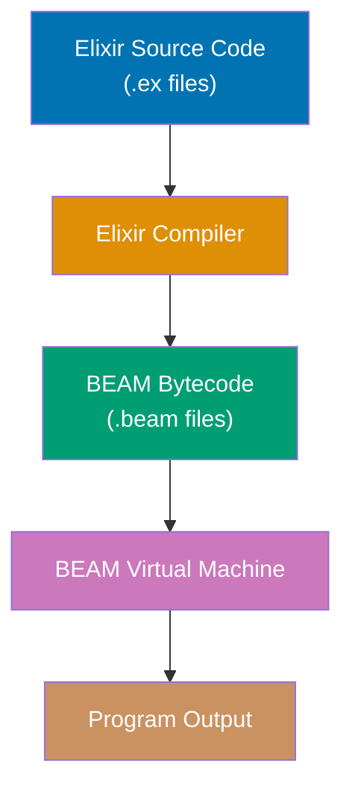
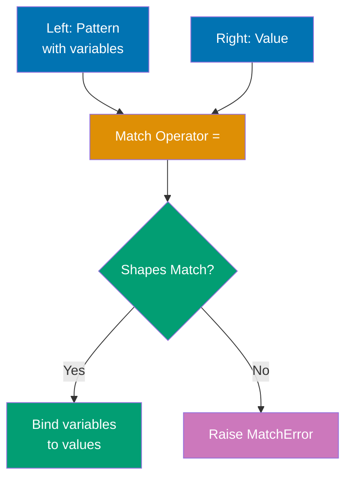
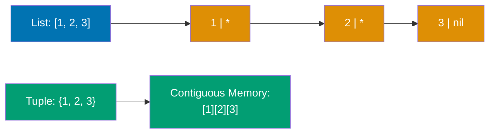
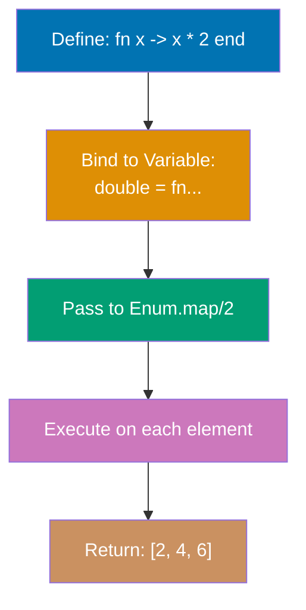
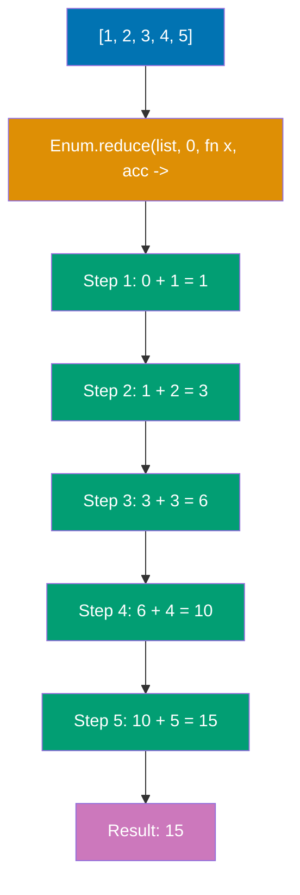

Learn Elixir fundamentals through 15 annotated code examples. Each example is self-contained, runnable in IEx, and heavily commented to show what each line does, expected outputs, and intermediate values.

## Group 1: First Steps

### Example 1: Hello World and Basic Syntax

Elixir programs run on the BEAM virtual machine (Erlang's runtime). Code can be executed interactively in IEx or compiled from `.ex` files. This example shows the simplest Elixir program and how the compilation pipeline works.



**Code**:

```elixir
# Define a module - the basic unit of code organization in Elixir
defmodule Hello do
  # Define a public function using `def`
  def world do
    # IO.puts writes to standard output and returns :ok
    IO.puts("Hello, World!") # => :ok (printed output: "Hello, World!")
  end
end

# Call the function using Module.function syntax
Hello.world() # => :ok
# Output: Hello, World!

# You can also call it in IEx directly:
# iex> Hello.world()
# Hello, World!
# :ok

# Comments use # symbol (no multiline comments in Elixir)
# Function names use snake_case, module names use PascalCase
```

**Key Takeaway**: Elixir code is organized into modules and functions. `IO.puts/1` returns `:ok` after printing, demonstrating Elixir's consistent return value pattern.

---

### Example 2: Variables and Immutability

Elixir variables don't hold values—they **bind** to values. The `=` operator is the **match operator**, not assignment. Once data is created, it cannot be changed (immutability), but variables can be rebound to new values.

**Code**:

```elixir
# Bind variable x to the value 1
x = 1 # => 1
x # => 1

# Rebind x to a new value (the old value 1 is unchanged in memory)
x = 2 # => 2
x # => 2

# This is rebinding, NOT mutation
# The original value 1 still exists if other variables reference it
y = 1 # => 1
x = 2 # => 2
# Both 1 and 2 exist in memory

# Variables in Elixir use snake_case
user_name = "Alice" # => "Alice"
user_age = 30 # => 30

# Multiple bindings in one line
a = b = c = 5 # => 5
a # => 5
b # => 5
c # => 5

# Data is immutable - you cannot change a value after creation
list = [1, 2, 3] # => [1, 2, 3]
# There's no list.push() or list[0] = 10
# Instead, you create new data based on old data
new_list = [0 | list] # => [0, 1, 2, 3]
list # => [1, 2, 3] (unchanged!)
new_list # => [0, 1, 2, 3]
```

**Key Takeaway**: Variables bind to values (they don't contain values), and data is immutable. You create new data structures instead of modifying existing ones, which enables safe concurrency.

**Why This Matters**: Immutability is foundational to the BEAM's memory model and concurrency guarantees. When data cannot be mutated, multiple processes can safely access the same data without locks or coordination—each process operates on its own copy through structural sharing. The BEAM uses reference counting for binaries and generational garbage collection per process, meaning GC pauses never stop the entire system. This architecture enables Elixir applications to handle millions of concurrent operations without the synchronization overhead that plagues mutable-state languages.

---

### Example 3: Basic Data Types

Elixir has several basic types: integers, floats, booleans, atoms, and strings. Atoms are constants where their name is their value. Strings are UTF-8 encoded binaries.

**Code**:

```elixir
# Integers - arbitrary precision (no overflow!)
integer = 42 # => 42
large_integer = 1_000_000_000_000 # => 1000000000000 (underscores for readability)
hex = 0x1F # => 31 (hexadecimal)
binary = 0b1010 # => 10 (binary)

# Floats - 64-bit double precision
float = 3.14 # => 3.14
scientific = 1.0e-10 # => 1.0e-10

# Booleans - actually atoms :true and :false
bool_true = true # => true
bool_false = false # => false

# Atoms - constants where name is value
atom = :hello # => :hello
atom_with_spaces = :"hello world" # => :"hello world"
# Booleans are atoms: true === :true, false === :false

# Strings - UTF-8 encoded binaries in double quotes
string = "Hello, 世界!" # => "Hello, 世界!"
multiline = """
This is a
multiline string
""" # => "This is a\nmultiline string\n"

# String interpolation with #{}
name = "Alice" # => "Alice"
greeting = "Hello, #{name}!" # => "Hello, Alice!"

# Type checking functions
is_integer(42) # => true
is_float(3.14) # => true
is_boolean(true) # => true
is_atom(:hello) # => true
is_binary("hello") # => true (strings are binaries)

# Get type name
i 42 # In IEx, shows: Term: 42, Data type: Integer

# Dynamic typing - same variable can hold any type at runtime
x = 42 # => 42 (x holds an integer)
x = "hello" # => "hello" (x now holds a string, no error!)
x = :atom # => :atom (x now holds an atom)
# This works because types are checked at runtime, not compile time

# Runtime type errors occur when operations expect a specific type
# This will fail: String.length(42)
# Error: FunctionClauseError - String.length/1 expects a binary/string

# Type safety with guards - ensure function receives correct types
defmodule TypeChecker do
  def process_number(value) when is_number(value) do
    value * 2
  end

  # Guards provide runtime type checking in function clauses
  def format_value(val) when is_binary(val) do
    "String: #{val}"
  end

  def format_value(val) when is_integer(val) do
    "Number: #{val}"
  end
end

TypeChecker.process_number(21) # => 42 (works - is_number(21) is true)
# TypeChecker.process_number("21") # => Error - guard fails because "21" is not a number
TypeChecker.format_value("hello") # => "String: hello"
TypeChecker.format_value(42) # => "Number: 42"
```

**Dynamic Typing Explained**: Elixir checks types at runtime, not compile time. This gives flexibility—the same variable can hold any type. However, functions expect specific types, so runtime errors occur if you pass the wrong type. Use **guards** (the `when` keyword in function clauses) to enforce type safety and pattern match on multiple type signatures. For complex scenarios, optional type specs with `@spec` (covered in advanced sections) document expected types.

**Key Takeaway**: Elixir is dynamically typed—types are checked at runtime, giving flexibility to work with different types. The basic types are simple and consistent: atoms (`:name`) are efficient constants, strings support UTF-8 and interpolation, and integers have arbitrary precision. Use type checking functions and guards for runtime type safety.

---

## Group 2: Pattern Matching Foundation

### Example 4: Pattern Matching Basics

The `=` operator is the **match operator**, not assignment. The left side (pattern) is matched against the right side (value). If they match, variables in the pattern are bound to corresponding values. If not, a `MatchError` is raised.



**Code**:

```elixir
# Simple match - binds x to 1
x = 1 # => 1

# Match check - 1 matches 1, succeeds
1 = x # => 1 (works! 1 equals 1)

# Match failure
# 2 = x # => ** (MatchError) no match of right hand side value: 1

# Tuple matching - extracts values from tuples
{a, b, c} = {1, 2, 3} # => {1, 2, 3}
a # => 1
b # => 2
c # => 3

# List matching - extracts elements
[first, second, third] = [1, 2, 3] # => [1, 2, 3]
first # => 1
second # => 2
third # => 3

# Match exact values - pattern can contain literals
{:ok, result} = {:ok, 42} # => {:ok, 42}
result # => 42

# This would fail:
# {:ok, result} = {:error, "failed"} # => ** (MatchError)

# Underscore _ ignores values
{:ok, _} = {:ok, 42} # => {:ok, 42} (42 is ignored)

# _ can be used multiple times (unlike variables)
{_, _, third} = {1, 2, 3} # => {1, 2, 3}
third # => 3
```

**Key Takeaway**: Pattern matching is Elixir's core feature. The `=` operator matches structures and binds variables, enabling powerful data extraction and validation in one operation.

**Why This Matters**: Pattern matching powers Elixir's "let it crash" philosophy and supervisor trees by enabling early error detection through explicit structure validation. When a pattern doesn't match, the BEAM raises a `MatchError` that supervisor processes can catch and handle through restart strategies—this fail-fast approach prevents corrupted state from propagating. In production systems, pattern matching in function heads creates self-documenting contracts that make invalid states unrepresentable, while supervisors use pattern matching on exit signals to implement sophisticated fault tolerance strategies across process boundaries.

---

### Example 5: Pin Operator (^)

By default, variables in patterns rebind to new values. The **pin operator** `^` prevents rebinding and instead matches against the variable's existing value.

**Code**:

```elixir
# Without pin - variable rebinds
x = 1 # => 1
x = 2 # => 2 (x is now 2)
x # => 2

# With pin - match against existing value
x = 1 # => 1
^x = 1 # => 1 (works! 1 matches 1)
# ^x = 2 # => ** (MatchError) no match of right hand side value: 2

# Practical use case: checking tuple tag
status = :ok # => :ok

# Later, you want to ensure status is still :ok
{^status, result} = {:ok, 42} # => {:ok, 42} (works!)
result # => 42

# This would fail if tuple tag differs:
# {^status, result} = {:error, "failed"} # => ** (MatchError)

# Pin in function arguments (preview - covered in functions)
expected_status = :ok # => :ok

defmodule Matcher do
  def match_value(^expected_status, result) do
    # ^ pins expected_status from outer scope - only matches if first arg is :ok
    result
  end
end

Matcher.match_value(:ok, 42) # => 42 (works - first arg matches pinned :ok)
# Matcher.match_value(:error, 42) # => FunctionClauseError (first arg is :error, not :ok)

# Pin in list matching
list = [1, 2, 3] # => [1, 2, 3]
[first | _] = list # => [1, 2, 3]
first # => 1

# Later, verify first element is still 1
[^first | _] = list # => [1, 2, 3] (works - first element matches pinned value)
# [^first | _] = [999, 2, 3] # => ** (MatchError) - 999 doesn't match 1
```

**Key Takeaway**: Use `^` when you want to match against a variable's current value instead of rebinding it. Essential for validating expected values in pattern matching.

---

### Example 6: Destructuring Collections

Pattern matching shines when destructuring complex nested data structures. You can extract deeply nested values in a single match operation.

**Code**:

```elixir
# List head and tail matching
[head | tail] = [1, 2, 3, 4, 5] # => [1, 2, 3, 4, 5]
head # => 1
tail # => [2, 3, 4, 5]

# Multiple heads
[first, second | rest] = [1, 2, 3, 4, 5] # => [1, 2, 3, 4, 5]
first # => 1
second # => 2
rest # => [3, 4, 5]

# Empty list handling
[head | tail] = [1] # => [1]
head # => 1
tail # => [] (empty list)

# Nested tuple destructuring
user = {"Alice", 30, {:address, "123 Main St", "NYC"}} # => {...}
{name, age, {:address, street, city}} = user # => {...}
name # => "Alice"
age # => 30
street # => "123 Main St"
city # => "NYC"

# Map destructuring (order doesn't matter for maps)
user_map = %{name: "Bob", age: 25, city: "SF"} # => %{...}
%{name: user_name, city: user_city} = user_map # => %{...}
user_name # => "Bob"
user_city # => "SF"
# Note: age was not extracted, but match still succeeds

# Nested list destructuring
nested = [[1, 2], [3, 4], [5, 6]] # => [[1, 2], [3, 4], [5, 6]]
[[a, b], [c, d], [e, f]] = nested # => [[1, 2], [3, 4], [5, 6]]
a # => 1
c # => 3
e # => 5

# Practical example: HTTP response
response = {:ok, %{status: 200, body: "Success"}} # => {...}
{:ok, %{status: status_code, body: body}} = response # => {...}
status_code # => 200
body # => "Success"
```

**Key Takeaway**: Pattern matching destructures nested data elegantly. Extract exactly what you need from complex structures in one operation, making code concise and readable.

**Why This Matters**: Elixir lists are implemented as singly-linked lists in the BEAM, making head access O(1) but indexed access O(n)—this design choice optimizes for the functional programming pattern of recursive head/tail processing. The `[head | tail]` destructuring syntax aligns perfectly with this structure, enabling efficient iteration without mutation or index tracking. In production, this means you write recursive algorithms that leverage the BEAM's tail-call optimization naturally, processing millions of elements with constant stack space while maintaining referential transparency for easier reasoning about concurrent systems.

---

## Group 3: Core Data Structures

### Example 7: Lists and Tuples

Lists are linked lists (efficient for prepending, linear access). Tuples are contiguous memory arrays (efficient for random access, fixed size). Choose based on access patterns.



**Code**:

```elixir
# Lists - linked data structures
list = [1, 2, 3] # => [1, 2, 3]

# Prepend with | (cons operator) - O(1) constant time
new_list = [0 | list] # => [0, 1, 2, 3]
list # => [1, 2, 3] (unchanged, immutability!)

# Concatenate with ++ - O(n) where n is length of left list
[1, 2] ++ [3, 4] # => [1, 2, 3, 4]

# Subtract with -- - O(n*m) removes elements
[1, 2, 3, 2, 1] -- [2] # => [1, 3, 2, 1] (removes first 2)
[1, 2, 3] -- [3, 2] # => [1]

# Access by index - O(n) linear time (slow!)
Enum.at([1, 2, 3], 0) # => 1
Enum.at([1, 2, 3], 2) # => 3

# Length - O(n) must traverse entire list
length([1, 2, 3, 4, 5]) # => 5

# Tuples - fixed-size, contiguous memory
tuple = {1, 2, 3} # => {1, 2, 3}

# Access by index - O(1) constant time (fast!)
elem(tuple, 0) # => 1
elem(tuple, 2) # => 3

# Update tuple element - O(n) creates new tuple
new_tuple = put_elem(tuple, 1, 999) # => {1, 999, 3}
tuple # => {1, 2, 3} (unchanged!)

# Tuple size - O(1) constant time
tuple_size(tuple) # => 3

# When to use what:
# Lists: variable length, iteration, prepending
# Tuples: fixed size, random access, return multiple values

# Common pattern: tuple for function returns
{:ok, result} = {:ok, 42} # => {:ok, 42}
{:error, reason} = {:error, "not found"} # => {:error, "not found"}
```

**Key Takeaway**: Lists are for sequential access and variable length (prepend is fast). Tuples are for fixed-size data and random access (indexing is fast). Different performance characteristics guide your choice.

---

### Example 8: Maps

Maps are key-value data structures (like hash maps or dictionaries in other languages). They're efficient for lookups and updates. Keys can be any type, but atoms are most common.

**Code**:

```elixir
# Map literal syntax
map = %{"name" => "Alice", "age" => 30} # => %{"age" => 30, "name" => "Alice"}

# Access with brackets (works for any key type)
map["name"] # => "Alice"
map["age"] # => 30
map["missing"] # => nil

# Maps with atom keys (most common)
user = %{name: "Bob", age: 25, city: "NYC"} # => %{age: 25, city: "NYC", name: "Bob"}

# Shorthand syntax for atom keys
%{name: "Bob"} === %{:name => "Bob"} # => true

# Access atom keys with dot notation (cleaner!)
user.name # => "Bob"
user.age # => 25
# user.missing # => ** (KeyError) key :missing not found

# Safe access with Map.get/3 (default value)
Map.get(user, :name) # => "Bob"
Map.get(user, :missing) # => nil
Map.get(user, :missing, "N/A") # => "N/A" (default)

# Update map (immutable - creates new map)
updated_user = %{user | age: 26} # => %{age: 26, city: "NYC", name: "Bob"}
user # => %{age: 25, city: "NYC", name: "Bob"} (unchanged!)

# Update syntax only works for existing keys!
# %{user | country: "USA"} # => ** (KeyError) key :country not found

# Add new key with Map.put/3
with_country = Map.put(user, :country, "USA")
# => %{age: 25, city: "NYC", country: "USA", name: "Bob"}

# Delete key
without_age = Map.delete(user, :age) # => %{city: "NYC", name: "Bob"}

# Pattern matching on maps (extracts subset)
%{name: person_name} = user # => %{age: 25, city: "NYC", name: "Bob"}
person_name # => "Bob"

# Pattern match requires matched keys to exist
%{name: n, age: a} = user # => %{...}
# %{name: n, country: c} = user # => ** (MatchError) - no :country key

# Nested map update with put_in, update_in, get_in
nested = %{user: %{profile: %{bio: "Hello"}}} # => %{...}
updated_nested = put_in(nested, [:user, :profile, :bio], "Hi there!")
# => %{user: %{profile: %{bio: "Hi there!"}}}
```

**Key Takeaway**: Maps are the go-to data structure for key-value pairs. Use atom keys for performance and dot notation convenience. Updates create new maps (immutability).

---

### Example 9: Keyword Lists

Keyword lists are lists of tuples where the first element is an atom. They look like maps but maintain order and allow duplicate keys. Commonly used for function options.

**Code**:

```elixir
# Keyword list literal syntax
keyword = [name: "Alice", age: 30] # => [name: "Alice", age: 30]

# Keyword lists are actually lists of tuples
keyword === [{:name, "Alice"}, {:age, 30}] # => true

# Can have duplicate keys (unlike maps)
options = [timeout: 1000, timeout: 2000] # => [timeout: 1000, timeout: 2000]

# Access with Keyword.get/2
Keyword.get(keyword, :name) # => "Alice"
Keyword.get(keyword, :missing) # => nil
Keyword.get(keyword, :missing, "default") # => "default"

# For duplicates, get returns the first match
Keyword.get(options, :timeout) # => 1000

# Get all values for a key
Keyword.get_values(options, :timeout) # => [1000, 2000]

# Common use case: function options
defmodule Server do
  def start(name, opts \\ []) do
    # Extract options with defaults
    port = Keyword.get(opts, :port, 8080) # => 8080 if not provided
    timeout = Keyword.get(opts, :timeout, 5000) # => 5000 if not provided
    {name, port, timeout}
  end
end

Server.start("MyServer") # => {"MyServer", 8080, 5000}
Server.start("MyServer", port: 3000) # => {"MyServer", 3000, 5000}
Server.start("MyServer", port: 3000, timeout: 10000) # => {"MyServer", 3000, 10000}

# Keyword list pattern matching
[name: n, age: a] = [name: "Bob", age: 25] # => [name: "Bob", age: 25]
n # => "Bob"
a # => 25

# When to use keyword lists:
# 1. Function options (where order might matter)
# 2. Small datasets where duplicates allowed
# 3. When you need ordered key-value pairs

# When to use maps instead:
# 1. Large datasets (maps are more efficient)
# 2. No duplicate keys needed
# 3. Performance-critical lookups
```

**Key Takeaway**: Keyword lists are ordered lists of `{atom, value}` tuples. Use them for function options where order matters or duplicates are needed. For everything else, use maps.

---

## Group 4: Functions

### Example 10: Anonymous Functions

Functions are first-class values in Elixir—you can assign them to variables, pass them as arguments, and return them from other functions. Anonymous functions use the `fn` syntax or capture operator `&`.



**Code**:

```elixir
# Anonymous function with fn...end syntax
add = fn a, b -> a + b end # => #Function<...>

# Call anonymous function with dot notation
add.(5, 3) # => 8

# Multi-clause anonymous functions
fizzbuzz = fn
  0, 0, _ -> "FizzBuzz"
  0, _, _ -> "Fizz"
  _, 0, _ -> "Buzz"
  _, _, x -> x
end

fizzbuzz.(0, 0, 1) # => "FizzBuzz"
fizzbuzz.(0, 1, 2) # => "Fizz"
fizzbuzz.(1, 0, 3) # => "Buzz"
fizzbuzz.(1, 1, 4) # => 4

# Capture operator & for concise syntax
# &1, &2, &3 are positional arguments
multiply = &(&1 * &2) # => #Function<...>
multiply.(4, 5) # => 20

# Capture named functions
# &Module.function/arity
int_to_string = &Integer.to_string/1 # => &Integer.to_string/1
int_to_string.(42) # => "42"

# Functions as first-class values
apply_twice = fn f, x -> f.(f.(x)) end # => #Function<...>
increment = fn x -> x + 1 end # => #Function<...>
apply_twice.(increment, 5) # => 7 (5 + 1 + 1)

# Higher-order function: function that returns function
multiplier = fn factor ->
  fn x -> x * factor end
end
double = multiplier.(2) # => #Function<...>
triple = multiplier.(3) # => #Function<...>
double.(5) # => 10
triple.(5) # => 15

# Use in Enum functions
numbers = [1, 2, 3, 4, 5] # => [1, 2, 3, 4, 5]

Enum.map(numbers, fn x -> x * 2 end) # => [2, 4, 6, 8, 10]
Enum.filter(numbers, fn x -> rem(x, 2) == 0 end) # => [2, 4]
Enum.reduce(numbers, 0, fn x, acc -> x + acc end) # => 15

# Concise with capture operator
Enum.map(numbers, &(&1 * 2)) # => [2, 4, 6, 8, 10]
Enum.filter(numbers, &(rem(&1, 2) == 0)) # => [2, 4]
```

**Key Takeaway**: Functions are values that can be passed around, stored, and returned. The capture operator `&` provides concise syntax. Anonymous functions enable functional programming patterns.

---

### Example 11: Named Functions in Modules

Named functions are defined in modules using `def` (public) or `defp` (private). They support pattern matching, guards, and default arguments. Multiple clauses enable elegant branching logic.

**Code**:

```elixir
defmodule Math do
  # Public function with def
  def add(a, b) do
    a + b
  end

  # Single-line syntax for simple functions
  def subtract(a, b), do: a - b

  # Private function with defp (only callable within module)
  defp internal_multiply(a, b), do: a * b

  # Multi-clause functions (pattern matching)
  def describe(0), do: "zero"
  def describe(n) when n > 0, do: "positive"
  def describe(n) when n < 0, do: "negative"

  # Default arguments with \\
  def greet(name, greeting \\ "Hello") do
    "#{greeting}, #{name}!"
  end

  # Recursive functions
  def factorial(0), do: 1
  def factorial(n) when n > 0, do: n * factorial(n - 1)

  # Pattern matching in function heads
  def sum_list([]), do: 0
  def sum_list([head | tail]), do: head + sum_list(tail)

  # Guards for validation
  def divide(_, 0), do: {:error, "division by zero"}
  def divide(a, b) when is_number(a) and is_number(b) do
    {:ok, a / b}
  end
end

# Call named functions
Math.add(5, 3) # => 8
Math.subtract(10, 4) # => 6
# Math.internal_multiply(2, 3) # => ** (UndefinedFunctionError) - private!

Math.describe(0) # => "zero"
Math.describe(5) # => "positive"
Math.describe(-3) # => "negative"

Math.greet("Alice") # => "Hello, Alice!" (default greeting)
Math.greet("Bob", "Hi") # => "Hi, Bob!" (custom greeting)

Math.factorial(5) # => 120
Math.sum_list([1, 2, 3, 4]) # => 10

Math.divide(10, 2) # => {:ok, 5.0}
Math.divide(10, 0) # => {:error, "division by zero"}

# Arity matters! Different arity = different function
defmodule Example do
  def func(a), do: a
  def func(a, b), do: a + b
end

Example.func(5) # => 5
Example.func(3, 4) # => 7
```

**Key Takeaway**: Named functions use pattern matching in function heads, enabling elegant multi-clause logic. Use `def` for public, `defp` for private. Arity (number of arguments) differentiates functions.

**Why This Matters**: The BEAM's hot code reloading mechanism operates at the module level, allowing you to update running production systems without stopping them—a critical feature for high-availability services. When you deploy a new module version, the BEAM keeps both old and new versions in memory simultaneously, automatically migrating processes to the new code on their next function call. This capability requires clear module boundaries and explicit function exports (`def` vs `defp`), enabling zero-downtime deployments and A/B testing in production while maintaining process isolation guarantees across concurrent systems.

---

### Example 12: Pipe Operator (|>)

The pipe operator `|>` takes the result of an expression and passes it as the first argument to the next function. This enables readable left-to-right data transformations instead of nested function calls.

**Code**:

```elixir
# Without pipe - nested and hard to read
result = String.upcase(String.trim("  hello  ")) # => "HELLO"

# With pipe - readable left-to-right flow
result = "  hello  "
         |> String.trim()      # => "hello"
         |> String.upcase()    # => "HELLO"

# Longer pipeline example
numbers = [1, 2, 3, 4, 5, 6, 7, 8, 9, 10]

# Without pipe - deeply nested
sum = Enum.reduce(
  Enum.filter(
    Enum.map(numbers, fn x -> x * x end),
    fn x -> rem(x, 2) == 0 end
  ),
  0,
  fn x, acc -> x + acc end
) # => 220 (4 + 16 + 36 + 64 + 100)

# With pipe - clear transformation steps
sum = numbers
      |> Enum.map(fn x -> x * x end)           # => [1, 4, 9, 16, 25, 36, 49, 64, 81, 100]
      |> Enum.filter(fn x -> rem(x, 2) == 0 end) # => [4, 16, 36, 64, 100]
      |> Enum.reduce(0, fn x, acc -> x + acc end) # => 220

# Pipe passes result as FIRST argument
"hello" |> String.upcase() # => "HELLO"
# Same as: String.upcase("hello")

# For other argument positions, use anonymous function
5 |> (&(&1 * 2)).() # => 10
# Or use capture operator inline
"world" |> String.duplicate(3) # => "worldworldworld"
# Same as: String.duplicate("world", 3)

# Real-world example: data processing pipeline
user_names = [
  "  Alice  ",
  "  bob  ",
  " CHARLIE ",
  "  dave  "
]

formatted_names = user_names
                  |> Enum.map(&String.trim/1)           # => ["Alice", "bob", "CHARLIE", "dave"]
                  |> Enum.map(&String.capitalize/1)     # => ["Alice", "Bob", "Charlie", "Dave"]
                  |> Enum.sort()                        # => ["Alice", "Bob", "Charlie", "Dave"]
                  |> Enum.join(", ")                    # => "Alice, Bob, Charlie, Dave"

# Pipe with pattern matching
{:ok, value} = {:ok, 42}
result = value
         |> (&(&1 * 2)).() # => 84
         |> Integer.to_string() # => "84"
```

**Key Takeaway**: The pipe operator `|>` transforms nested function calls into readable left-to-right data flows. It passes the left side as the first argument to the right side function.

---

## Group 5: Control Flow and Basics

### Example 13: Case and Cond

`case` enables pattern matching on values with multiple clauses. `cond` evaluates multiple conditions and returns the result of the first truthy clause. Both provide structured branching logic.

**Code**:

```elixir
# case - pattern matching on values
user_status = {:ok, "Alice"}

result = case user_status do
  {:ok, name} -> "Welcome, #{name}!"           # => "Welcome, Alice!"
  {:error, reason} -> "Error: #{reason}"
  _ -> "Unknown status"
end
result # => "Welcome, Alice!"

# case with guards
number = 15

classification = case number do
  n when n < 0 -> "negative"
  0 -> "zero"
  n when n > 0 and n <= 10 -> "small positive"
  n when n > 10 and n <= 100 -> "medium positive"
  n when n > 100 -> "large positive"
end
classification # => "medium positive"

# case must match one clause, or error
# case 100 do
#   1 -> "one"
#   2 -> "two"
# end
# => ** (CaseClauseError) no case clause matching: 100

# cond - evaluates conditions in order
age = 25

description = cond do
  age < 13 -> "child"
  age < 20 -> "teenager"
  age < 60 -> "adult"
  age >= 60 -> "senior"
  true -> "unknown" # Default case (always true)
end
description # => "adult"

# cond requires at least one truthy condition
score = 85

grade = cond do
  score >= 90 -> "A"
  score >= 80 -> "B"
  score >= 70 -> "C"
  score >= 60 -> "D"
  true -> "F"
end
grade # => "B"

# Choosing between case and cond:
# case - when you have a VALUE to match against patterns
# cond - when you have CONDITIONS to evaluate (like if-elseif chains)

# Example: HTTP status handling with case
http_response = {:ok, 200, "Success"}

message = case http_response do
  {:ok, 200, body} -> "OK: #{body}"
  {:ok, 404, _} -> "Not Found"
  {:ok, 500, _} -> "Server Error"
  {:error, reason} -> "Failed: #{reason}"
  _ -> "Unknown response"
end
message # => "OK: Success"

# Example: eligibility check with cond
income = 50000
has_debt = false

loan_status = cond do
  income < 20000 -> "Not eligible - income too low"
  has_debt -> "Not eligible - existing debt"
  income >= 20000 and income < 50000 -> "Eligible for $10k loan"
  income >= 50000 -> "Eligible for $50k loan"
  true -> "Unknown status"
end
loan_status # => "Eligible for $50k loan"
```

**Key Takeaway**: Use `case` for pattern matching on values, `cond` for evaluating multiple conditions. Both require at least one clause to match, providing exhaustiveness checking.

---

### Example 14: Recursion Basics

Recursion is the primary looping mechanism in Elixir (no while/for loops). A recursive function calls itself with different arguments until reaching a base case. Tail-call optimization prevents stack overflow.

**Code**:

```elixir
defmodule Recursion do
  # Basic recursion - factorial
  def factorial(0), do: 1  # Base case
  def factorial(n) when n > 0 do
    n * factorial(n - 1)   # Recursive case
  end

  # Tail-recursive factorial (optimized)
  def factorial_tail(n), do: factorial_tail(n, 1)

  defp factorial_tail(0, acc), do: acc  # Base case with accumulator
  defp factorial_tail(n, acc) when n > 0 do
    factorial_tail(n - 1, n * acc)  # Tail call - last operation is recursive call
  end

  # Sum list recursively
  def sum([]), do: 0  # Base case - empty list
  def sum([head | tail]) do
    head + sum(tail)  # Recursive case - process head, recurse on tail
  end

  # Length of list
  def length([]), do: 0
  def length([_ | tail]), do: 1 + length(tail)

  # Reverse list (not tail-recursive)
  def reverse([]), do: []
  def reverse([head | tail]) do
    reverse(tail) ++ [head]  # Inefficient - appends to end each time
  end

  # Reverse list (tail-recursive, efficient)
  def reverse_tail(list), do: reverse_tail(list, [])

  defp reverse_tail([], acc), do: acc
  defp reverse_tail([head | tail], acc) do
    reverse_tail(tail, [head | acc])  # Prepend to accumulator (O(1))
  end

  # Map function - transform each element
  def map([], _func), do: []
  def map([head | tail], func) do
    [func.(head) | map(tail, func)]
  end

  # Filter function - keep elements matching predicate
  def filter([], _func), do: []
  def filter([head | tail], func) do
    if func.(head) do
      [head | filter(tail, func)]
    else
      filter(tail, func)
    end
  end
end

# Basic factorial
Recursion.factorial(5) # => 120 (5 * 4 * 3 * 2 * 1)

# Tail-recursive factorial (won't overflow on large inputs)
Recursion.factorial_tail(5) # => 120
Recursion.factorial_tail(10000) # => huge number (works without stack overflow!)

# Sum list
Recursion.sum([1, 2, 3, 4, 5]) # => 15

# Length
Recursion.length([1, 2, 3]) # => 3

# Reverse
Recursion.reverse([1, 2, 3]) # => [3, 2, 1]
Recursion.reverse_tail([1, 2, 3]) # => [3, 2, 1] (faster for large lists)

# Map
Recursion.map([1, 2, 3], fn x -> x * 2 end) # => [2, 4, 6]

# Filter
Recursion.filter([1, 2, 3, 4, 5], fn x -> rem(x, 2) == 0 end) # => [2, 4]
```

**Key Takeaway**: Recursion replaces loops in Elixir. Always provide a base case to stop recursion. Tail-recursive functions (where recursive call is the last operation) are optimized to avoid stack overflow.

**Why This Matters**: The BEAM implements tail-call optimization at the VM level, meaning tail-recursive functions run in constant stack space regardless of iteration count—you can process billions of items without stack overflow. This optimization is critical in concurrent systems where each of millions of processes might perform recursive operations: non-tail-recursive functions consume stack memory proportional to recursion depth, but tail-recursive functions reuse the same stack frame. In production, this enables building reliable data pipelines that handle unbounded streams efficiently, while the BEAM's per-process heaps ensure that even if one recursive process fails, it's isolated from others through supervisor boundaries.

---

### Example 15: Enum Module Essentials

The `Enum` module provides functions for working with enumerable collections (lists, maps, ranges). Core operations include `map`, `filter`, `reduce`, `each`, and many more. Essential for functional data processing.



**Code**:

```elixir
numbers = [1, 2, 3, 4, 5]

# Enum.map/2 - transform each element
doubled = Enum.map(numbers, fn x -> x * 2 end) # => [2, 4, 6, 8, 10]

# Enum.filter/2 - keep elements matching predicate
evens = Enum.filter(numbers, fn x -> rem(x, 2) == 0 end) # => [2, 4]
odds = Enum.filter(numbers, fn x -> rem(x, 2) != 0 end) # => [1, 3, 5]

# Enum.reduce/3 - accumulate values
sum = Enum.reduce(numbers, 0, fn x, acc -> x + acc end) # => 15
product = Enum.reduce(numbers, 1, fn x, acc -> x * acc end) # => 120

# Enum.each/2 - iterate for side effects (returns :ok)
Enum.each(numbers, fn x -> IO.puts(x) end) # Prints 1\n2\n3\n4\n5\n, returns :ok

# Enum.find/2 - find first matching element
first_even = Enum.find(numbers, fn x -> rem(x, 2) == 0 end) # => 2
missing = Enum.find(numbers, fn x -> x > 10 end) # => nil

# Enum.count/1 - count elements
count = Enum.count(numbers) # => 5
count_evens = Enum.count(numbers, fn x -> rem(x, 2) == 0 end) # => 2

# Enum.sum/1 and Enum.product/1 - shortcuts
sum = Enum.sum(numbers) # => 15
product = Enum.product(numbers) # => 120

# Enum.sort/1 and Enum.sort/2 - sort collection
sorted = Enum.sort([3, 1, 4, 1, 5, 9]) # => [1, 1, 3, 4, 5, 9]
sorted_desc = Enum.sort([3, 1, 4], fn a, b -> a > b end) # => [4, 3, 1]

# Enum.take/2 and Enum.drop/2 - take/drop N elements
first_three = Enum.take(numbers, 3) # => [1, 2, 3]
last_two = Enum.drop(numbers, 3) # => [4, 5]

# Enum.zip/2 - combine two lists into tuples
names = ["Alice", "Bob", "Charlie"]
ages = [30, 25, 35]
zipped = Enum.zip(names, ages) # => [{"Alice", 30}, {"Bob", 25}, {"Charlie", 35}]

# Enum.flat_map/2 - map and flatten
nested = [[1, 2], [3, 4], [5, 6]]
flattened = Enum.flat_map(nested, fn x -> x end) # => [1, 2, 3, 4, 5, 6]

# Enum.group_by/2 - group by key function
words = ["apple", "ant", "banana", "bear", "cherry"]
grouped = Enum.group_by(words, fn word -> String.first(word) end)
# => %{"a" => ["apple", "ant"], "b" => ["banana", "bear"], "c" => ["cherry"]}

# Chaining Enum operations with pipe
result = [1, 2, 3, 4, 5, 6, 7, 8, 9, 10]
         |> Enum.filter(fn x -> rem(x, 2) == 0 end)  # => [2, 4, 6, 8, 10]
         |> Enum.map(fn x -> x * x end)              # => [4, 16, 36, 64, 100]
         |> Enum.sum()                               # => 220

# Works on ranges too!
Enum.to_list(1..10) # => [1, 2, 3, 4, 5, 6, 7, 8, 9, 10]
Enum.map(1..5, fn x -> x * x end) # => [1, 4, 9, 16, 25]

# Works on maps!
user_map = %{name: "Alice", age: 30, city: "NYC"}
Enum.map(user_map, fn {k, v} -> {k, v} end) # => [age: 30, city: "NYC", name: "Alice"]
Enum.filter(user_map, fn {_k, v} -> is_number(v) end) # => [age: 30]
```

**Key Takeaway**: `Enum` module is the Swiss Army knife for collections. `map` transforms, `filter` selects, `reduce` accumulates. Chain operations with pipe operator for readable data transformations.

---

## What's Next?

You've completed the beginner examples covering Elixir's fundamental syntax and core concepts. You now understand:

- Basic types, variables, and immutability
- Pattern matching and destructuring
- Lists, tuples, maps, and keyword lists
- Anonymous and named functions
- Control flow with case and cond
- Recursion and the Enum module

**Continue your learning**:

- [Intermediate Examples (16-35)](/en/learn/swe/prog-lang/elixir/tutorials/by-example/intermediate) - Advanced pattern matching, processes, error handling, testing
- [Advanced Examples (36-60)](/en/learn/swe/prog-lang/elixir/tutorials/by-example/advanced) - GenServer, Supervisor, metaprogramming, OTP

**Deepen your understanding**:

- [Beginner Tutorial](/en/learn/swe/prog-lang/elixir/tutorials/beginner) - Narrative explanations of concepts
- [Explanation: Best Practices](/en/learn/swe/prog-lang/elixir/explanation/best-practices) - Idiomatic Elixir patterns
- [Reference: Cheat Sheet](/en/learn/swe/prog-lang/elixir/reference/cheat-sheet) - Quick syntax reference
