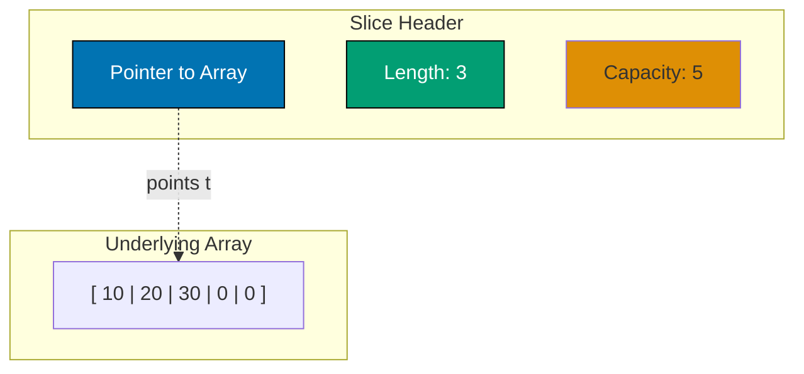
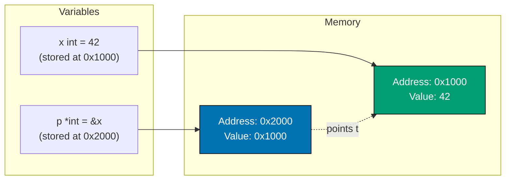
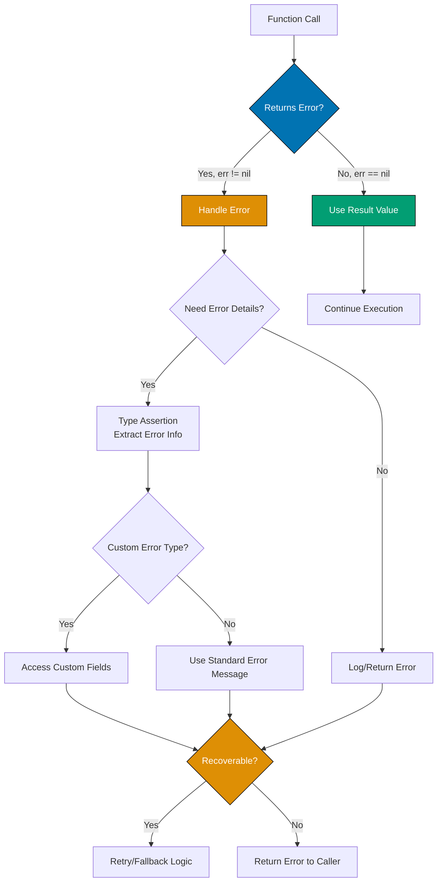
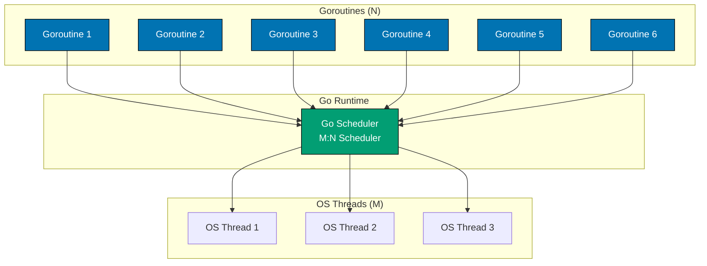
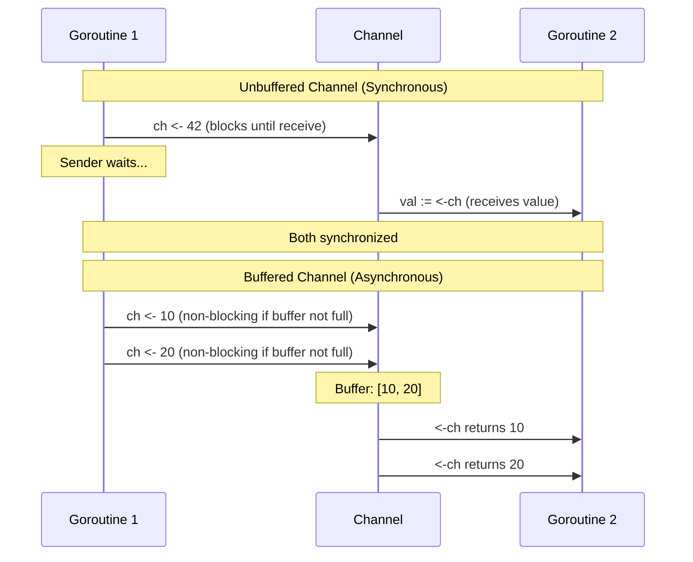
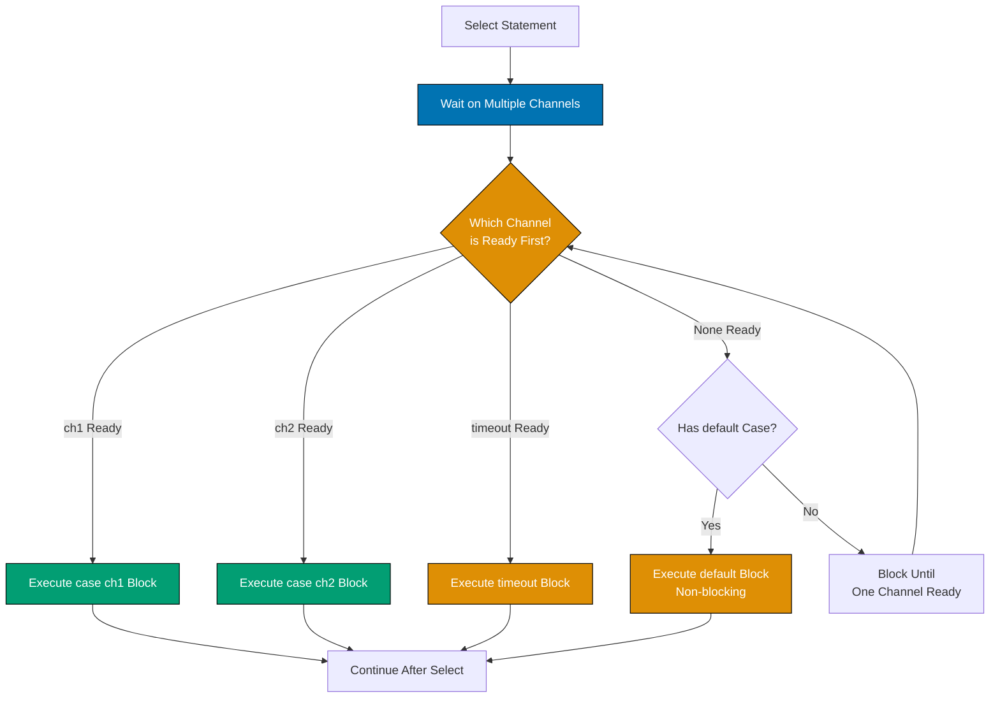

**Want to build software that handles millions of concurrent requests?** Go (Golang) powers some of the world's most critical infrastructure - from Docker containers to Kubernetes orchestration, from Uber's backend to Dropbox's file sync. Created by Google engineers who built systems at planetary scale, Go brings the simplicity of Python with the performance of C++.

In this Beginner's guide, you'll learn Go from scratch in **3-4 hours**. By the end, you'll write concurrent programs, handle errors idiomatically, and understand why companies like Netflix, Twitch, and SoundCloud chose Go for their production systems. This tutorial provides comprehensive coverage of Go fundamentals, from basic syntax to concurrency patterns and testing.

## 🎯 What You'll Learn

This Beginner tutorial teaches **comprehensive Go fundamentals** - everything from installation through intermediate patterns, giving you a solid foundation for building real applications:

- Go syntax and core language features
- Data types, functions, and control flow
- Structs, interfaces, and methods
- **Generics and type parameters (Go 1.18+)** - core language feature
- Pointers and memory
- Error handling - how to create and return errors
- Goroutines and channels - concurrency primitives
- Package management and project structure
- Testing basics - how to write and run tests
- Practical exercises at 4 difficulty levels
- Common patterns and troubleshooting

**After this Beginner tutorial**, check out the [Golang Cookbook](cookbook) for practical patterns and real-world problem solving, or progress to the Intermediate tutorial for production-level techniques.

## 📋 Prerequisites

- Basic programming knowledge in any language
- Familiarity with command line/terminal
- Understanding of basic computer science concepts

## 🚀 Why Go?

- **Simple syntax** - Easy to learn, minimal keywords
- **Fast compilation** - Near-instant builds
- **Built-in concurrency** - Goroutines and channels are first-class features
- **Strong standard library** - Batteries included for web, networking, crypto
- **Static typing** - Catch errors at compile time
- **Fast execution** - Compiled to native machine code
- **Great tooling** - `go fmt`, `go test`, `go vet` built-in

## 📦 Setup

### Installation

Visit [go.dev/dl](https://go.dev/dl) and download the installer for your platform.

Verify installation:

```bash
go version
# Should output: go version go1.25.x ... (or go1.24.x, go1.23.x)
```

### Your First Program

Create `hello.go`:

```go
package main

import "fmt"

func main() {
	fmt.Println("Hello, World!")
}
```

Run it:

```bash
go run hello.go
# Output: Hello, World!
```

## 🔤 Basic Syntax

### Variables

```go
package main

import "fmt"

func main() {
	// Explicit type declaration
	var name string = "Alice"
	var age int = 30

	// Type inference
	var city = "Jakarta"

	// Short declaration (inside functions only)
	country := "Indonesia"

	// Multiple declarations
	var (
		x int = 10
		y int = 20
		z     = 30  // type inferred
	)

	// Constants
	const Pi = 3.14159
	const MaxRetries = 3

	fmt.Println(name, age, city, country, x, y, z, Pi, MaxRetries)
	// Output: Alice 30 Jakarta Indonesia 10 20 30 3.14159 3
}
```

### Basic Types

```go
package main

import "fmt"

func main() {
	// Integers
	var i int = 42           // Platform dependent (32 or 64 bit)
	var i8 int8 = 127        // -128 to 127
	var i16 int16 = 32767    // -32768 to 32767
	var i32 int32 = 2147483647
	var i64 int64 = 9223372036854775807

	var u uint = 42          // Unsigned, platform dependent
	var u8 uint8 = 255       // 0 to 255 (also called byte)
	var u16 uint16 = 65535
	var u32 uint32 = 4294967295
	var u64 uint64 = 18446744073709551615

	// Floating point
	var f32 float32 = 3.14
	var f64 float64 = 3.14159265359

	// Boolean
	var isActive bool = true

	// String
	var message string = "Hello, Go!"

	// Rune (Unicode code point, alias for int32)
	var r rune = '€'

	// Demonstrate types
	fmt.Printf("int: %d, int8: %d, int16: %d\n", i, i8, i16)
	// Output: int: 42, int8: 127, int16: 32767

	fmt.Printf("float32: %.2f, float64: %.10f\n", f32, f64)
	// Output: float32: 3.14, float64: 3.1415926536

	fmt.Printf("bool: %t, string: %s, rune: %c\n", isActive, message, r)
	// Output: bool: true, string: Hello, Go!, rune: €
}
```

### Zero Values

Variables without explicit initialization get zero values:

```go
package main

import "fmt"

func main() {
	var i int       // 0
	var f float64   // 0.0
	var b bool      // false
	var s string    // "" (empty string)
	var p *int      // nil

	fmt.Printf("int: %d, float64: %.1f, bool: %t\n", i, f, b)
	// Output: int: 0, float64: 0.0, bool: false

	fmt.Printf("string: '%s', pointer: %v\n", s, p)
	// Output: string: '', pointer: <nil>
}
```

## 🔄 Control Flow

### If/Else

```go
package main

import "fmt"

func main() {
	age := 18

	// Basic if
	if age >= 18 {
		fmt.Println("Adult") // Output: Adult
	}

	// If with else
	if age >= 18 {
		fmt.Println("Adult") // Output: Adult
	} else {
		fmt.Println("Minor")
	}

	// If with initialization statement
	if score := 85; score >= 90 {
		fmt.Println("Grade: A")
	} else if score >= 80 {
		fmt.Println("Grade: B") // Output: Grade: B
	} else {
		fmt.Println("Grade: C")
	}
	// Note: 'score' is only in scope within the if/else block
}
```

### Switch

```go
package main

import (
	"fmt"
	"time"
)

func main() {
	// Basic switch
	day := "Monday"
	switch day {
	case "Monday":
		fmt.Println("Start of work week") // Output: Start of work week
	case "Friday":
		fmt.Println("TGIF!")
	case "Saturday", "Sunday":
		fmt.Println("Weekend!")
	default:
		fmt.Println("Midweek")
	}

	// Switch with no condition (like if-else chain)
	hour := time.Now().Hour()
	switch {
	case hour < 12:
		fmt.Println("Good morning") // Output depends on current time
	case hour < 17:
		fmt.Println("Good afternoon")
	default:
		fmt.Println("Good evening")
	}

	// Type switch
	var i interface{} = "hello"
	switch v := i.(type) {
	case int:
		fmt.Printf("Integer: %d\n", v)
	case string:
		fmt.Printf("String: %s\n", v) // Output: String: hello
	default:
		fmt.Printf("Unknown type: %T\n", v)
	}
}
```

### Loops

Go has only `for` loops (no while or do-while):

```go
package main

import "fmt"

func main() {
	// Traditional for loop
	for i := 0; i < 5; i++ {
		fmt.Println(i) // Output: 0, 1, 2, 3, 4 (on separate lines)
	}

	// While-style loop
	count := 0
	for count < 3 {
		fmt.Println("Count:", count) // Output: Count: 0, Count: 1, Count: 2
		count++
	}

	// Infinite loop
	// for {
	//     fmt.Println("Forever")
	//     // Use break to exit
	// }

	// Range over slice
	numbers := []int{10, 20, 30, 40}
	for index, value := range numbers {
		fmt.Printf("Index: %d, Value: %d\n", index, value)
		// Output: Index: 0, Value: 10
		//         Index: 1, Value: 20
		//         Index: 2, Value: 30
		//         Index: 3, Value: 40
	}

	// Ignore index with _
	for _, value := range numbers {
		fmt.Println(value) // Output: 10, 20, 30, 40 (on separate lines)
	}

	// Range over map
	scores := map[string]int{"Alice": 90, "Bob": 85}
	for name, score := range scores {
		fmt.Printf("%s scored %d\n", name, score)
		// Output: Alice scored 90
		//         Bob scored 85
		// Note: map iteration order is not guaranteed
	}

	// Range over string (iterates over runes)
	for index, char := range "Hello" {
		fmt.Printf("%d: %c\n", index, char)
		// Output: 0: H
		//         1: e
		//         2: l
		//         3: l
		//         4: o
	}
}
```

### ✅ Checkpoint: Control Flow

Before moving forward, ensure you can:

- [ ] Write `if/else` statements with initialization
- [ ] Use `switch` statements (including type switches)
- [ ] Iterate with `for` loops in different styles (traditional, while-style, range)
- [ ] Use `range` to iterate over slices, maps, and strings
- [ ] Understand when to use each control structure

**Quick Check**: Can you write a program that iterates over a map of student names and grades, printing only students with grades above 80?

## 📊 Data Structures

### Arrays

Fixed-length, same-type collections:

```go
package main

import "fmt"

func main() {
	// Declare array
	var arr [5]int
	arr[0] = 10
	arr[1] = 20

	// Array literal
	primes := [5]int{2, 3, 5, 7, 11}

	// Let compiler count length
	days := [...]string{"Mon", "Tue", "Wed", "Thu", "Fri"}

	fmt.Println(arr)    // [10 20 0 0 0]
	fmt.Println(primes) // [2 3 5 7 11]
	fmt.Println(days)   // [Mon Tue Wed Thu Fri]
	fmt.Println(len(days)) // 5
}
```

### Slices

Dynamic-length sequences (most commonly used). Slices are more powerful than arrays—here's their internal structure:



**Key Concepts**:

- **Length**: Number of elements in the slice (`len(s)`)
- **Capacity**: Size of underlying array from pointer position (`cap(s)`)
- **Append**: When length exceeds capacity, a new larger array is allocated

Dynamic-length sequences (most commonly used):

```go
package main

import "fmt"

func main() {
	// Create slice from array
	arr := [5]int{1, 2, 3, 4, 5}
	slice := arr[1:4] // [2 3 4] - from index 1 to 3

	// Slice literals
	numbers := []int{10, 20, 30, 40}

	// Make slice with make()
	s := make([]int, 5)      // length 5, capacity 5
	s2 := make([]int, 3, 10) // length 3, capacity 10

	// Append to slice
	numbers = append(numbers, 50)
	numbers = append(numbers, 60, 70, 80)

	// Copy slice
	dest := make([]int, len(numbers))
	copy(dest, numbers)

	// Slicing operations
	fmt.Println(numbers[:3])  // Output: [10 20 30] - First 3 elements
	fmt.Println(numbers[2:])  // Output: [30 40 50 60 70 80] - From index 2 to end
	fmt.Println(numbers[1:4]) // Output: [20 30 40] - From index 1 to 3

	fmt.Println("Length:", len(numbers))     // Output: Length: 7
	fmt.Println("Capacity:", cap(numbers))   // Output: Capacity: 8 (or higher, depends on growth)
}
```

### Maps

Key-value pairs:

```go
package main

import "fmt"

func main() {
	// Create map with make
	ages := make(map[string]int)
	ages["Alice"] = 30
	ages["Bob"] = 25

	// Map literal
	scores := map[string]int{
		"Alice": 90,
		"Bob":   85,
		"Carol": 95,
	}

	// Access value
	fmt.Println(scores["Alice"]) // 90

	// Check if key exists
	score, exists := scores["David"]
	if exists {
		fmt.Println("David's score:", score)
	} else {
		fmt.Println("David not found") // Output: David not found
	}

	// Delete key
	delete(scores, "Bob")

	// Iterate over map
	for name, score := range scores {
		fmt.Printf("%s: %d\n", name, score)
		// Output: Alice: 90
		//         Carol: 95
		// Note: map iteration order is not guaranteed
	}
}
```

### Structs

Custom data types:

```go
package main

import "fmt"

// Define struct
type Person struct {
	Name string
	Age  int
	City string
}

// Struct with tags (for JSON, etc.)
type User struct {
	ID       int    `json:"id"`
	Username string `json:"username"`
	Email    string `json:"email"`
}

func main() {
	// Create struct instance
	p1 := Person{
		Name: "Alice",
		Age:  30,
		City: "Jakarta",
	}

	// Positional initialization (not recommended)
	p2 := Person{"Bob", 25, "Bandung"}

	// Partial initialization
	p3 := Person{Name: "Carol"}

	// Access fields
	fmt.Println(p1.Name) // Alice

	// Modify fields
	p1.Age = 31

	// Pointer to struct
	p4 := &Person{Name: "David", Age: 35}
	p4.City = "Surabaya" // Automatic dereferencing

	// Anonymous struct
	config := struct {
		Host string
		Port int
	}{
		Host: "localhost",
		Port: 8080,
	}

	fmt.Println(p1, p2, p3, p4, config)
	// Output: {Alice 31 Jakarta} {Bob 25 Bandung} {Carol 0 } &{David 35 Surabaya} {localhost 8080}
}
```

## 🔧 Functions

### Basic Functions

```go
package main

import "fmt"

// Simple function
func greet(name string) {
	fmt.Println("Hello,", name)
}

// Function with return value
func add(a int, b int) int {
	return a + b
}

// Shortened parameter syntax (same type)
func multiply(a, b int) int {
	return a * b
}

// Multiple return values
func divide(a, b float64) (float64, error) {
	if b == 0 {
		return 0, fmt.Errorf("division by zero")
	}
	return a / b, nil
}

// Named return values
func split(sum int) (x, y int) {
	x = sum * 4 / 9
	y = sum - x
	return // naked return
}

// Variadic function
func sum(numbers ...int) int {
	total := 0
	for _, n := range numbers {
		total += n
	}
	return total
}

func main() {
	greet("Alice") // Output: Hello, Alice

	result := add(10, 20)
	fmt.Println("Add:", result) // Output: Add: 30

	quotient, err := divide(10, 2)
	if err != nil {
		fmt.Println("Error:", err)
	} else {
		fmt.Println("Quotient:", quotient) // Output: Quotient: 5
	}

	x, y := split(17)
	fmt.Println("Split:", x, y) // Output: Split: 7 10

	total := sum(1, 2, 3, 4, 5)
	fmt.Println("Sum:", total) // Output: Sum: 15
}
```

### Defer

Execute function call after surrounding function returns:

```go
package main

import "fmt"

func main() {
	// Defer executes in LIFO order
	defer fmt.Println("World")
	defer fmt.Println("Beautiful")
	defer fmt.Println("Hello")

	fmt.Println("Start")
	// Output:
	// Start
	// Hello
	// Beautiful
	// World
}

// Common use: cleanup resources
import "os"

func readFile(filename string) error {
	file, err := os.Open(filename)
	if err != nil {
		return err
	}
	defer file.Close() // Ensures file is closed when function returns

	// Read file operations...
	return nil
}
```

### Anonymous Functions and Closures

```go
package main

import "fmt"

func main() {
	// Anonymous function
	func() {
		fmt.Println("Anonymous function") // Output: Anonymous function
	}()

	// Assign to variable
	add := func(a, b int) int {
		return a + b
	}
	fmt.Println(add(5, 3)) // Output: 8

	// Closure
	counter := func() func() int {
		count := 0
		return func() int {
			count++
			return count
		}
	}()

	fmt.Println(counter()) // 1
	fmt.Println(counter()) // 2
	fmt.Println(counter()) // 3
}
```

### ✅ Checkpoint: Functions

Before moving forward, ensure you can:

- [ ] Define functions with parameters and return values
- [ ] Use multiple return values (common for result + error)
- [ ] Implement variadic functions
- [ ] Use defer for cleanup operations
- [ ] Create and use anonymous functions and closures
- [ ] Understand when to use value receivers vs pointer receivers (covered in next section)

**Quick Check**: Can you write a function that takes a variadic list of numbers and returns both the sum and average?

## 🔗 Methods and Interfaces

### Methods

Functions with a receiver argument:

```go
package main

import (
	"fmt"
	"math"
)

type Rectangle struct {
	Width  float64
	Height float64
}

type Circle struct {
	Radius float64
}

// Method with value receiver
func (r Rectangle) Area() float64 {
	return r.Width * r.Height
}

// Method with pointer receiver (can modify struct)
func (r *Rectangle) Scale(factor float64) {
	r.Width *= factor
	r.Height *= factor
}

// Method on Circle
func (c Circle) Area() float64 {
	return math.Pi * c.Radius * c.Radius
}

func main() {
	rect := Rectangle{Width: 10, Height: 5}
	fmt.Println("Area:", rect.Area()) // 50

	rect.Scale(2)
	fmt.Println("Scaled area:", rect.Area()) // 200

	circle := Circle{Radius: 5}
	fmt.Println("Circle area:", circle.Area()) // Output: Circle area: 78.53981633974483
}
```

### Interfaces

```go
package main

import (
	"fmt"
	"math"
)

// Interface definition
type Shape interface {
	Area() float64
	Perimeter() float64
}

type Rectangle struct {
	Width, Height float64
}

type Circle struct {
	Radius float64
}

// Rectangle implements Shape interface
func (r Rectangle) Area() float64 {
	return r.Width * r.Height
}

func (r Rectangle) Perimeter() float64 {
	return 2 * (r.Width + r.Height)
}

// Circle implements Shape interface
func (c Circle) Area() float64 {
	return math.Pi * c.Radius * c.Radius
}

func (c Circle) Perimeter() float64 {
	return 2 * math.Pi * c.Radius
}

// Function that accepts any Shape
func printShapeInfo(s Shape) {
	fmt.Printf("Area: %.2f, Perimeter: %.2f\n", s.Area(), s.Perimeter())
}

func main() {
	rect := Rectangle{Width: 10, Height: 5}
	circle := Circle{Radius: 5}

	printShapeInfo(rect)   // Output: Area: 50.00, Perimeter: 30.00
	printShapeInfo(circle) // Output: Area: 78.54, Perimeter: 31.42

	// Empty interface (interface{}) accepts any type
	var anything interface{}
	anything = 42
	anything = "hello"
	anything = rect

	// 'any' is an alias for interface{} (Go 1.18+)
	var something any
	something = []int{1, 2, 3}
	something = map[string]int{"key": 42}

	fmt.Println(anything, something) // Output: {10 5} map[key:42]
}
```

### Type Assertions and Type Switches

```go
package main

import "fmt"

func describe(i interface{}) {
	// Type assertion
	if s, ok := i.(string); ok {
		fmt.Printf("String of length %d: %s\n", len(s), s)
		return
	}

	// Type switch
	switch v := i.(type) {
	case int:
		fmt.Printf("Integer: %d\n", v)
	case float64:
		fmt.Printf("Float: %.2f\n", v)
	case bool:
		fmt.Printf("Boolean: %t\n", v)
	default:
		fmt.Printf("Unknown type: %T\n", v)
	}
}

func main() {
	describe(42)
	// Output: Integer: 42

	describe(3.14)
	// Output: Float: 3.14

	describe("hello")
	// Output: String of length 5: hello

	describe(true)
	// Output: Boolean: true
}
```

## 🎯 Pointers

Go has pointers but no pointer arithmetic. Here's how they work in memory:



**Key Concepts**:

- `&x` gives you the memory address of `x`
- `*p` dereferences the pointer (gets the value at that address)
- Pointers enable functions to modify values outside their scope

```go
package main

import "fmt"

func main() {
	// Declare variable
	x := 42

	// & creates pointer to variable
	p := &x

	fmt.Println("Value of x:", x)   // 42
	fmt.Println("Address of x:", p) // 0xc0000...
	fmt.Println("Value at p:", *p)  // 42 (dereferencing)

	// Modify value through pointer
	*p = 100
	fmt.Println("New value of x:", x) // 100

	// Pass by value vs pointer
	changeValue(x)
	fmt.Println("After changeValue:", x) // 100 (unchanged)

	changePointer(&x)
	fmt.Println("After changePointer:", x) // 200 (changed)
}

func changeValue(val int) {
	val = 500
}

func changePointer(ptr *int) {
	*ptr = 200
}
```

### ✅ Checkpoint: Methods, Interfaces, and Pointers

Before moving forward, ensure you can:

- [ ] Define methods with value and pointer receivers
- [ ] Understand when to use pointer vs value receivers
- [ ] Define and implement interfaces
- [ ] Use the empty interface (`interface{}` or `any`)
- [ ] Perform type assertions and type switches
- [ ] Work with pointers and understand pointer dereferencing
- [ ] Know when to pass values vs pointers to functions

**Quick Check**: Can you create a `BankAccount` struct with methods to deposit, withdraw (using pointer receiver), and check balance? Then create an `Account` interface that these methods implement?

## ⚠️ Error Handling

Go doesn't have exceptions; it uses explicit error returns:



**Key Principles:**

- Functions return `(result, error)` tuples
- Caller MUST check `if err != nil`
- Errors propagate up the call stack explicitly
- Custom error types provide structured error information
- `panic`/`recover` are for truly exceptional cases only

```go
package main

import (
	"errors"
	"fmt"
)

// Return error
func divide(a, b float64) (float64, error) {
	if b == 0 {
		return 0, errors.New("division by zero")
	}
	return a / b, nil
}

// Custom error with formatting
func validateAge(age int) error {
	if age < 0 {
		return fmt.Errorf("invalid age: %d (must be non-negative)", age)
	}
	if age < 18 {
		return fmt.Errorf("age %d is below minimum (18)", age)
	}
	return nil
}

// Custom error type
type ValidationError struct {
	Field   string
	Message string
}

func (e *ValidationError) Error() string {
	return fmt.Sprintf("validation error on %s: %s", e.Field, e.Message)
}

func validateUser(username string) error {
	if len(username) < 3 {
		return &ValidationError{
			Field:   "username",
			Message: "must be at least 3 characters",
		}
	}
	return nil
}

func main() {
	// Handle errors with if
	result, err := divide(10, 0)
	if err != nil {
		fmt.Println("Error:", err)
		// Output: Error: division by zero
	} else {
		fmt.Println("Result:", result)
	}

	// Check and use error
	if err := validateAge(15); err != nil {
		fmt.Println(err)
		// Output: age 15 is below minimum (18)
	}

	// Type assertion on custom error
	if err := validateUser("ab"); err != nil {
		if ve, ok := err.(*ValidationError); ok {
			fmt.Printf("Field: %s, Message: %s\n", ve.Field, ve.Message)
			// Output: Field: username, Message: must be at least 3 characters
		}
	}

	// Panic and recover (use sparingly!)
	safeDivide(10, 0)
	// Output: Recovered from panic: division by zero!
}

func safeDivide(a, b int) {
	defer func() {
		if r := recover(); r != nil {
			fmt.Println("Recovered from panic:", r)
		}
	}()

	if b == 0 {
		panic("division by zero!")
	}
	fmt.Println(a / b)
}
```

## 🚀 Concurrency

Go's killer feature - goroutines and channels. Let's understand how Go achieves amazing concurrency with simple primitives:



**Key Insight**: Go multiplexes many goroutines (G1-G6) onto few OS threads (T1-T3). This is why goroutines are cheap—you can have millions of them!

### Goroutines

Lightweight threads managed by Go runtime:

```go
package main

import (
	"fmt"
	"time"
)

func say(s string) {
	for i := 0; i < 3; i++ {
		time.Sleep(100 * time.Millisecond)
		fmt.Println(s)
	}
}

func main() {
	// Run in goroutine
	go say("world")

	// Run in main goroutine
	say("hello")
	// Output (interleaved, non-deterministic):
	// hello
	// world
	// hello
	// world
	// hello
	// world

	// Without sleep/wait, main might exit before goroutines finish
	time.Sleep(1 * time.Second)
}
```

### Channels

Channels enable safe communication between goroutines. Think of them as typed pipes:



**Unbuffered channels** create synchronization points—sender blocks until receiver is ready.
**Buffered channels** allow sending without blocking until the buffer is full.

Communication between goroutines:

```go
package main

import "fmt"

func main() {
	// Create channel
	ch := make(chan int)

	// Send and receive in different goroutines
	go func() {
		ch <- 42 // Send to channel
	}()

	value := <-ch // Receive from channel
	fmt.Println(value) // Output: 42

	// Buffered channel
	buffered := make(chan string, 2)
	buffered <- "hello"
	buffered <- "world"
	// No blocking until buffer is full

	fmt.Println(<-buffered) // Output: hello
	fmt.Println(<-buffered) // Output: world
}
```

### Select Statement

Multiplex channel operations:



**How select works:**

1. **Simultaneous monitoring**: Select waits on multiple channel operations at once
2. **First ready wins**: Executes the case for whichever channel becomes ready first
3. **Random selection**: If multiple channels ready simultaneously, Go picks one randomly (prevents starvation)
4. **Non-blocking with default**: Adding a `default` case makes select non-blocking
5. **Timeout pattern**: Common to use `time.After()` as a timeout case

```go
package main

import (
	"fmt"
	"time"
)

func main() {
	ch1 := make(chan string)
	ch2 := make(chan string)

	go func() {
		time.Sleep(1 * time.Second)
		ch1 <- "one"
	}()

	go func() {
		time.Sleep(2 * time.Second)
		ch2 <- "two"
	}()

	// Wait for both channels
	for i := 0; i < 2; i++ {
		select {
		case msg1 := <-ch1:
			fmt.Println("Received from ch1:", msg1)
			// Output (first iteration, after 1 second): Received from ch1: one
		case msg2 := <-ch2:
			fmt.Println("Received from ch2:", msg2)
			// Output (second iteration, after 2 seconds): Received from ch2: two
		case <-time.After(3 * time.Second):
			fmt.Println("Timeout!")
		}
	}
	// Complete output:
	// Received from ch1: one
	// Received from ch2: two
}
```

### ✅ Checkpoint: Concurrency

Before moving forward, ensure you can:

- [ ] Launch goroutines with the `go` keyword
- [ ] Create and use unbuffered channels
- [ ] Create and use buffered channels
- [ ] Use `select` to multiplex channel operations
- [ ] Understand the difference between buffered and unbuffered channels
- [ ] Recognize when goroutines block and synchronize
- [ ] Close channels and range over them

**Quick Check**: Can you write a program that spawns 3 goroutines, each printing numbers 1-5, and ensures the main function waits for all goroutines to complete before exiting?

## 🔷 Generics (Go 1.18+)

Go added generics in version 1.18, enabling type-safe reusable code:

### Generic Functions

```go
package main

import "fmt"

// Generic function with type parameter
func Print[T any](value T) {
	fmt.Println(value)
}

// Generic function with type constraint
func Min[T int | float64](a, b T) T {
	if a < b {
		return a
	}
	return b
}

// Generic function with comparable constraint
func Contains[T comparable](slice []T, value T) bool {
	for _, item := range slice {
		if item == value {
			return true
		}
	}
	return false
}

func main() {
	// Type inference
	Print(42)      // Output: 42
	Print("hello") // Output: hello
	Print(3.14)    // Output: 3.14

	// Explicit type arguments
	Print[int](100) // Output: 100

	// Generic Min function
	fmt.Println(Min(10, 20))       // int
	fmt.Println(Min(3.14, 2.71))   // float64

	// Generic Contains function
	numbers := []int{1, 2, 3, 4, 5}
	fmt.Println(Contains(numbers, 3))  // true
	fmt.Println(Contains(numbers, 10)) // false

	words := []string{"go", "rust", "python"}
	fmt.Println(Contains(words, "go")) // true
}
```

### Generic Types

```go
package main

import "fmt"

// Generic struct
type Stack[T any] struct {
	items []T
}

func (s *Stack[T]) Push(item T) {
	s.items = append(s.items, item)
}

func (s *Stack[T]) Pop() (T, bool) {
	if len(s.items) == 0 {
		var zero T
		return zero, false
	}
	item := s.items[len(s.items)-1]
	s.items = s.items[:len(s.items)-1]
	return item, true
}

func (s *Stack[T]) IsEmpty() bool {
	return len(s.items) == 0
}

// Generic map type
type Cache[K comparable, V any] struct {
	data map[K]V
}

func NewCache[K comparable, V any]() *Cache[K, V] {
	return &Cache[K, V]{
		data: make(map[K]V),
	}
}

func (c *Cache[K, V]) Set(key K, value V) {
	c.data[key] = value
}

func (c *Cache[K, V]) Get(key K) (V, bool) {
	value, ok := c.data[key]
	return value, ok
}

func main() {
	// Integer stack
	intStack := Stack[int]{}
	intStack.Push(1)
	intStack.Push(2)
	intStack.Push(3)

	for !intStack.IsEmpty() {
		val, _ := intStack.Pop()
		fmt.Println(val) // 3, 2, 1
	}

	// String stack
	strStack := Stack[string]{}
	strStack.Push("hello")
	strStack.Push("world")

	val, _ := strStack.Pop()
	fmt.Println(val) // world

	// Generic cache
	cache := NewCache[string, int]()
	cache.Set("age", 30)
	cache.Set("score", 95)

	age, ok := cache.Get("age")
	if ok {
		fmt.Println("Age:", age)
	}
}
```

### Type Constraints

```go
package main

import "fmt"

// Define custom constraint
type Number interface {
	int | int32 | int64 | float32 | float64
}

// Use constraint in generic function
func Sum[T Number](numbers []T) T {
	var total T
	for _, n := range numbers {
		total += n
	}
	return total
}

// Constraint with methods
type Stringer interface {
	String() string
}

func PrintAll[T Stringer](items []T) {
	for _, item := range items {
		fmt.Println(item.String())
	}
}

// Multiple type parameters
func Map[T any, U any](slice []T, fn func(T) U) []U {
	result := make([]U, len(slice))
	for i, v := range slice {
		result[i] = fn(v)
	}
	return result
}

func main() {
	// Sum integers
	ints := []int{1, 2, 3, 4, 5}
	fmt.Println("Sum:", Sum(ints)) // 15

	// Sum floats
	floats := []float64{1.1, 2.2, 3.3}
	fmt.Println("Sum:", Sum(floats)) // 6.6

	// Map strings to lengths
	words := []string{"go", "rust", "python"}
	lengths := Map(words, func(s string) int {
		return len(s)
	})
	fmt.Println("Lengths:", lengths) // [2 4 6]

	// Map ints to strings
	numbers := []int{1, 2, 3}
	strings := Map(numbers, func(n int) string {
		return fmt.Sprintf("num-%d", n)
	})
	fmt.Println("Strings:", strings) // [num-1 num-2 num-3]
}
```

## 📦 Packages and Modules

### Package Basics

Every Go file belongs to a package:

```go
// math/calculator.go
package math

// Exported (public) - starts with capital letter
func Add(a, b int) int {
	return a + b
}

// Unexported (private) - starts with lowercase
func multiply(a, b int) int {
	return a * b
}
```

### Importing Packages

```go
package main

import (
	"fmt"           // Standard library
	"math/rand"     // Standard library

	// Custom package
	"github.com/user/project/math"
)

func main() {
	fmt.Println(math.Add(5, 3))
	fmt.Println(rand.Intn(100))
}
```

### Go Modules

Initialize a new module:

```bash
go mod init github.com/username/projectname
```

This creates `go.mod`:

```
module github.com/username/projectname

go 1.25
```

Add dependencies:

```bash
go get github.com/gin-gonic/gin
```

Tidy up dependencies:

```bash
go mod tidy
```

### Project Structure

```
myproject/
├── go.mod
├── go.sum
├── main.go
├── internal/          # Private packages
│   └── auth/
│       └── auth.go
├── pkg/              # Public packages
│   └── models/
│       └── user.go
└── cmd/              # Multiple executables
    ├── server/
    │   └── main.go
    └── worker/
        └── main.go
```

## 🧪 Testing

Go has built-in testing support:

### Basic Tests

```go
// math.go
package math

func Add(a, b int) int {
	return a + b
}

func Divide(a, b float64) (float64, error) {
	if b == 0 {
		return 0, errors.New("division by zero")
	}
	return a / b, nil
}
```

```go
// math_test.go
package math

import "testing"

func TestAdd(t *testing.T) {
	result := Add(2, 3)
	expected := 5

	if result != expected {
		t.Errorf("Add(2, 3) = %d; want %d", result, expected)
	}
}

func TestAddNegative(t *testing.T) {
	result := Add(-2, -3)
	expected := -5

	if result != expected {
		t.Errorf("Add(-2, -3) = %d; want %d", result, expected)
	}
}

func TestDivide(t *testing.T) {
	result, err := Divide(10, 2)
	if err != nil {
		t.Errorf("Unexpected error: %v", err)
	}

	expected := 5.0
	if result != expected {
		t.Errorf("Divide(10, 2) = %.2f; want %.2f", result, expected)
	}
}

func TestDivideByZero(t *testing.T) {
	_, err := Divide(10, 0)
	if err == nil {
		t.Error("Expected error for division by zero, got nil")
	}
}
```

Run tests:

```bash
go test              # Run tests in current package
go test ./...        # Run tests in all packages
go test -v           # Verbose output
go test -cover       # Show coverage
go test -run TestAdd # Run specific test
```

---

## 🍳 Ready for Practical Patterns?

You've learned the Go language fundamentals! Now it's time to learn how to solve real-world problems.

**Continue to the [Golang Cookbook](cookbook)** for:

- 🔷 Practical generics recipes (stack, cache, filter/map/reduce)
- 🚀 Concurrency patterns (worker pools, pipelines, fan-out/fan-in)
- ⚠️ Error handling strategies (wrapping, sentinel errors, custom types)
- 🎯 Context patterns (cancellation, timeouts)
- 📁 File embedding (static assets, templates, web servers)
- 🧪 Testing patterns (table-driven tests, fuzzing, benchmarks)
- 🎨 Design patterns (functional options, builder, singleton)
- 🌐 Web development recipes (middleware, JSON APIs)

---

## 🔧 Troubleshooting Common Issues

As you learn Go, you'll encounter common errors and pitfalls. This section helps you identify and fix them quickly.

### Compilation Errors

**Error: undefined variable or function**

```go
// ❌ Wrong
func main() {
	result := calculate(5)  // Error: undefined: calculate
}
```

**Fix**: Define the function before using it, or import it from the correct package.

```go
// ✅ Correct
func calculate(x int) int {
	return x * 2
}

func main() {
	result := calculate(5)
	fmt.Println(result)  // Output: 10
}
```

**Error: cannot use X (type Y) as type Z**

```go
// ❌ Wrong
var age int = 25
var score float64 = age  // Error: cannot use age (type int) as type float64
```

**Fix**: Explicitly convert types in Go (no implicit conversion).

```go
// ✅ Correct
var age int = 25
var score float64 = float64(age)  // Explicit conversion
```

**Error: missing return statement**

```go
// ❌ Wrong
func divide(a, b int) int {
	if b == 0 {
		return 0
	}
	// Error: missing return at end of function
}
```

**Fix**: Ensure all code paths return a value.

```go
// ✅ Correct
func divide(a, b int) int {
	if b == 0 {
		return 0
	}
	return a / b  // Return in all cases
}
```

### Runtime Errors

**Panic: nil pointer dereference**

```go
// ❌ Wrong
var ptr *int
fmt.Println(*ptr)  // Panic: runtime error: invalid memory address or nil pointer dereference
```

**Fix**: Always check for nil before dereferencing pointers.

```go
// ✅ Correct
var ptr *int
if ptr != nil {
	fmt.Println(*ptr)
} else {
	fmt.Println("Pointer is nil")
}
```

**Panic: index out of range**

```go
// ❌ Wrong
nums := []int{1, 2, 3}
fmt.Println(nums[5])  // Panic: runtime error: index out of range [5] with length 3
```

**Fix**: Check slice length before accessing indices.

```go
// ✅ Correct
nums := []int{1, 2, 3}
index := 5
if index < len(nums) {
	fmt.Println(nums[index])
} else {
	fmt.Printf("Index %d out of range (length %d)\n", index, len(nums))
}
```

**Panic: send on closed channel**

```go
// ❌ Wrong
ch := make(chan int)
close(ch)
ch <- 42  // Panic: send on closed channel
```

**Fix**: Never send on a closed channel. Use a done channel or context for signaling.

```go
// ✅ Correct
ch := make(chan int)
done := make(chan bool)

go func() {
	for {
		select {
		case <-done:
			return  // Exit goroutine
		case ch <- 42:
			time.Sleep(time.Second)
		}
	}
}()

// Signal completion
done <- true
close(ch)  // Close after all sends complete
```

### Concurrency Issues

**Race Condition**

```go
// ❌ Wrong - Race condition
var counter int

func increment() {
	counter++  // Not atomic! Race condition if called concurrently
}

func main() {
	for i := 0; i < 1000; i++ {
		go increment()
	}
	time.Sleep(time.Second)
	fmt.Println(counter)  // Unpredictable result!
}
```

**Fix**: Use sync.Mutex or atomic operations.

```go
// ✅ Correct - Using mutex
var (
	counter int
	mu      sync.Mutex
)

func increment() {
	mu.Lock()
	counter++
	mu.Unlock()
}

func main() {
	var wg sync.WaitGroup
	for i := 0; i < 1000; i++ {
		wg.Add(1)
		go func() {
			defer wg.Done()
			increment()
		}()
	}
	wg.Wait()
	fmt.Println(counter)  // Output: 1000 (guaranteed)
}
```

**Goroutine Leak**

```go
// ❌ Wrong - Goroutine never exits
func leaky() {
	ch := make(chan int)
	go func() {
		val := <-ch  // Blocks forever if nothing sends
		fmt.Println(val)
	}()
	// Channel never receives data - goroutine leaks!
}
```

**Fix**: Always ensure goroutines can exit using done channels or context.

```go
// ✅ Correct - Goroutine can exit
func fixed(ctx context.Context) {
	ch := make(chan int)
	go func() {
		select {
		case val := <-ch:
			fmt.Println(val)
		case <-ctx.Done():
			return  // Exit when context cancelled
		}
	}()
}
```

**Deadlock**

```go
// ❌ Wrong - Deadlock
func deadlock() {
	ch := make(chan int)
	ch <- 42  // Blocks forever - no receiver!
	val := <-ch
	fmt.Println(val)
}
// Output: fatal error: all goroutines are asleep - deadlock!
```

**Fix**: Use buffered channels or separate goroutines for send/receive.

```go
// ✅ Correct - Buffered channel
func fixed() {
	ch := make(chan int, 1)  // Buffer size 1
	ch <- 42  // Doesn't block
	val := <-ch
	fmt.Println(val)  // Output: 42
}

// ✅ Alternative - Separate goroutine
func fixedGoroutine() {
	ch := make(chan int)
	go func() {
		ch <- 42  // Send in goroutine
	}()
	val := <-ch
	fmt.Println(val)  // Output: 42
}
```

### Debugging Tips

**1. Use `go run -race` to detect race conditions**

```bash
# Compile and run with race detector
go run -race main.go

# Build with race detector
go build -race -o myapp
./myapp
```

**2. Use `fmt.Printf` for quick debugging**

```go
// Add debug prints to trace execution
func process(data []int) {
	fmt.Printf("DEBUG: process called with %v\n", data)
	// ... rest of function
}
```

**3. Use `delve` debugger for advanced debugging**

```bash
# Install delve
go install github.com/go-delve/delve/cmd/dlv@latest

# Debug your program
dlv debug main.go

# Set breakpoints, inspect variables, step through code
(dlv) break main.main
(dlv) continue
(dlv) print myVariable
(dlv) next
```

**4. Check error returns**

```go
// ❌ Wrong - Ignoring errors
result, _ := doSomething()  // Dangerous!

// ✅ Correct - Always check errors
result, err := doSomething()
if err != nil {
	log.Fatalf("Error: %v", err)
}
```

**5. Use `go vet` to catch common mistakes**

```bash
# Static analysis tool
go vet ./...

# Common issues it catches:
# - Printf format mismatches
# - Unreachable code
# - Suspicious constructs
```

### Common Gotchas

**Gotcha 1: Range loop variable capture**

```go
// ❌ Wrong
values := []int{1, 2, 3, 4, 5}
for _, v := range values {
	go func() {
		fmt.Println(v)  // All goroutines print the same value (5)!
	}()
}
```

**Fix**: Pass loop variable as parameter.

```go
// ✅ Correct
values := []int{1, 2, 3, 4, 5}
for _, v := range values {
	go func(val int) {
		fmt.Println(val)  // Each goroutine gets correct value
	}(v)  // Pass v as argument
}
```

**Gotcha 2: Defer execution timing**

```go
// ❌ Wrong understanding
func readFiles() {
	for _, filename := range files {
		file, _ := os.Open(filename)
		defer file.Close()  // Defers accumulate - files stay open!
	}
	// All files closed here at function exit
}
```

**Fix**: Use explicit function scope or call Close() directly.

```go
// ✅ Correct
func readFiles() {
	for _, filename := range files {
		func() {
			file, _ := os.Open(filename)
			defer file.Close()  // Closes at end of anonymous function
			// ... process file
		}()
	}
}
```

**Gotcha 3: Slice append and capacity**

```go
// ❌ Wrong - Modifying slice can affect original
func modifySlice(s []int) {
	s = append(s, 999)  // May or may not affect original!
}

nums := []int{1, 2, 3}
modifySlice(nums)
fmt.Println(nums)  // Still [1, 2, 3] - no change!
```

**Fix**: Return the modified slice or use pointers.

```go
// ✅ Correct
func modifySlice(s []int) []int {
	return append(s, 999)
}

nums := []int{1, 2, 3}
nums = modifySlice(nums)  // Reassign result
fmt.Println(nums)  // Output: [1 2 3 999]
```

---

## 🎯 Practice Exercises

Test your Go knowledge with these hands-on exercises. Start with Level 1 and progress to more advanced challenges.

### Level 1: Basics (Beginner)

**Exercise 1.1: FizzBuzz**
Write a program that prints numbers from 1 to 100. For multiples of 3, print "Fizz" instead of the number. For multiples of 5, print "Buzz". For multiples of both 3 and 5, print "FizzBuzz".

**Exercise 1.2: Reverse a Slice**
Write a function that takes a slice of integers and returns a new slice with elements in reverse order.

```go
func reverse(nums []int) []int {
	// Your code here
}

// Example: reverse([]int{1, 2, 3, 4, 5}) → []int{5, 4, 3, 2, 1}
```

**Exercise 1.3: Word Counter**
Write a program that reads a string and returns a map counting the frequency of each word.

### Level 2: Intermediate

**Exercise 2.1: Generic Stack Implementation**
Complete the generic stack implementation with additional methods:

- `Peek() (T, bool)` - View top element without removing
- `Size() int` - Get number of elements
- `Clear()` - Empty the stack

**Exercise 2.2: Concurrent URL Fetcher**
Write a program that fetches multiple URLs concurrently using goroutines and channels:

- Takes a list of URLs
- Fetches them concurrently (max 3 concurrent requests)
- Collects results and reports status for each URL

**Exercise 2.3: Custom Error Type**
Create a `ValidationError` type that:

- Stores field name and error message
- Implements `Error() interface`
- Supports wrapping other errors
- Has a method to check if error is of this type

### Level 3: Advanced

**Exercise 3.1: Worker Pool Pattern**
Implement a worker pool that:

- Spawns N worker goroutines
- Processes jobs from a job channel
- Collects results in a results channel
- Handles graceful shutdown with context cancellation

**Exercise 3.2: Generic Cache with Expiration**
Build a thread-safe generic cache that:

- Stores key-value pairs with TTL (time-to-live)
- Automatically evicts expired entries
- Supports concurrent read/write
- Uses mutexes for synchronization

**Exercise 3.3: JSON API Parser**
Create a program that:

- Fetches data from a REST API
- Unmarshals JSON into Go structs
- Handles errors gracefully
- Implements retry logic with exponential backoff

### Level 4: Expert

**Exercise 4.1: Rate Limiter**
Implement a rate limiter using Go concurrency primitives:

- Allows N requests per time window
- Blocks when limit exceeded
- Uses ticker and channels (no external libraries)

**Exercise 4.2: Reflection-Based Validator**
Build a struct validator using reflection that:

- Reads struct tags (e.g., `validate:"required,min=3,max=10"`)
- Validates field values
- Returns detailed validation errors
- Supports custom validation functions

### Solutions & Hints

**Hint for 1.1 (FizzBuzz)**: Use modulo operator (%) and if/else conditions

**Hint for 2.2 (Concurrent Fetcher)**: Use a buffered channel for limiting concurrency, sync.WaitGroup for coordination

**Hint for 3.1 (Worker Pool)**: Use `select` with context.Done() for graceful shutdown

**Hint for 4.1 (Rate Limiter)**: Combine time.NewTicker() with a buffered channel as token bucket

---

## 📚 Next Steps

### Essential Reading

- **Official Tour**: [go.dev/tour](https://go.dev/tour/)
- **Effective Go**: [go.dev/doc/effective_go](https://go.dev/doc/effective_go)
- **Go by Example**: [gobyexample.com](https://gobyexample.com)

### Practice Projects

- **CLI Tool** - Build a command-line utility with `flag` or `cobra`
- **REST API** - Create an API with `net/http` or `gin`
- **Concurrent Worker Pool** - Process jobs using goroutines and channels
- **Web Scraper** - Parse HTML with `goquery`, use goroutines for concurrency

### Advanced Topics

- **Reflection** - Runtime type inspection with `reflect` package
- **Performance** - Profiling with pprof, optimization techniques, memory management
- **CGo** - Calling C code from Go
- **Assembly** - Understanding Go's assembly output
- **Context patterns** - Advanced cancellation and timeout patterns
- **Custom generics constraints** - Building reusable type-safe libraries
- **Workspace mode** - Multi-module development (Go 1.18+)

### Popular Packages

- **Web Frameworks**: Gin, Echo, Fiber
- **Database**: GORM, sqlx, pgx
- **Testing**: Testify, GoMock
- **CLI**: Cobra, urfave/cli
- **HTTP Client**: resty
- **Validation**: validator
- **Configuration**: Viper
- **Logging**: Zap, Logrus

## 🎓 Summary

**You've learned the Go language mechanics!**

This crash course covered:

- ✅ Go syntax, types, and variables
- ✅ Control flow (if, switch, for, range)
- ✅ Data structures (arrays, slices, maps, structs)
- ✅ Functions, methods, and interfaces
- ✅ Pointers and memory
- ✅ Error handling basics (creating and returning errors)
- ✅ Concurrency primitives (goroutines, channels, select)
- ✅ **Generics and type constraints (Go 1.18+)**
- ✅ Packages, modules, and project structure
- ✅ Testing basics (writing and running tests)

Go is designed for building **simple, reliable, and efficient software**. The language is intentionally minimal, forcing you to write explicit, readable code.

**Key Go Philosophy**:

- Simplicity over cleverness
- Explicit over implicit
- Composition over inheritance
- Concurrency as a first-class feature
