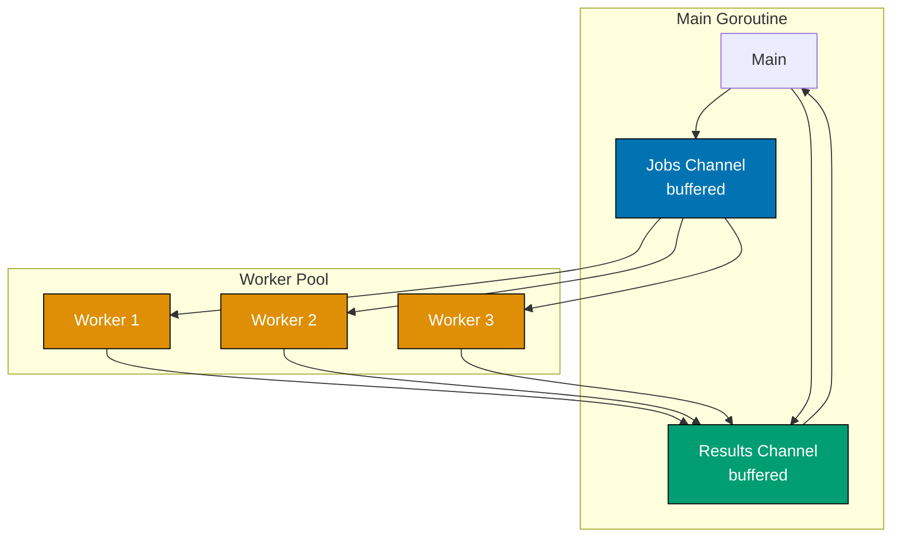
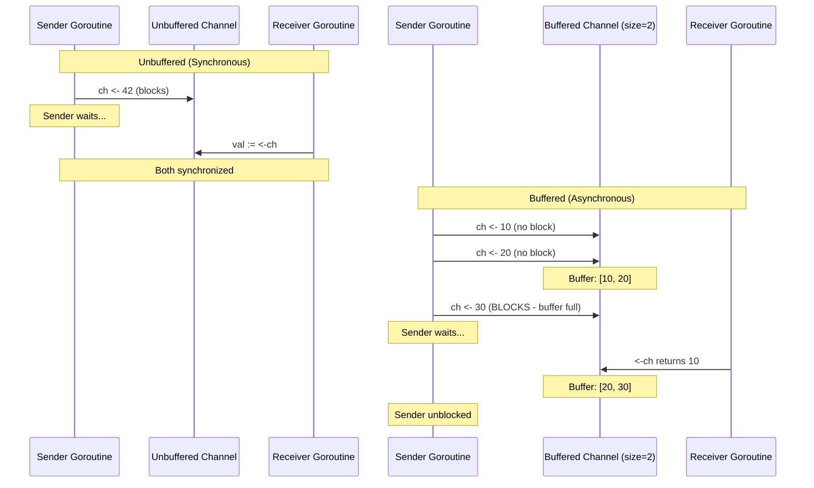
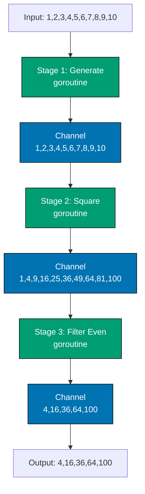

# Golang Cookbook - Practical Recipes

**Ready to level up your Go skills?** This cookbook provides practical, battle-tested recipes for solving real-world problems with idiomatic Go code. Whether you're building concurrent systems, designing APIs, or optimizing performance, you'll find proven patterns and techniques used in production by companies like Google, Uber, and Docker.

## 🎯 What You'll Learn

By working through this cookbook, you will be able to:

1. **Write Type-Safe Generic Code** - Create reusable data structures and algorithms using Go 1.18+ generics
2. **Master Concurrency Patterns** - Implement worker pools, pipelines, fan-out/fan-in, and other advanced concurrency patterns
3. **Handle Errors Idiomatically** - Use wrapping, sentinel errors, custom types, and error chains effectively
4. **Manage Context Properly** - Implement cancellation, timeouts, and value propagation in concurrent code
5. **Embed Static Assets** - Bundle configuration files, templates, and web assets into your Go binaries
6. **Write Production-Grade Tests** - Create table-driven tests, property-based tests, and benchmarks
7. **Apply Design Patterns** - Use functional options, builder pattern, and other Go-idiomatic patterns
8. **Build Web Services** - Create HTTP servers with middleware, routing, and JSON APIs

## 📋 Prerequisites

Before using this cookbook, you should:

- ✅ Complete the [Golang Beginner tutorial](/en/learn/swe/prog-lang/golang/tutorials/beginner) - or have equivalent experience with Go fundamentals
- ✅ Understand Go syntax, types, and control flow
- ✅ Know how to work with slices, maps, and structs
- ✅ Understand functions, methods, and interfaces
- ✅ Be familiar with basic goroutines and channels
- ✅ Have Go installed (version 1.18+ recommended)

## 🎯 What's in This Cookbook

- **Generics Recipes** - Type-safe reusable code patterns
- **Advanced Concurrency** - Worker pools, pipelines, synchronization
- **Error Handling** - Wrapping, sentinel errors, custom types
- **Context Patterns** - Cancellation, timeouts, value propagation
- **File Embedding** - Static assets, templates, web servers
- **Testing Patterns** - Table-driven tests, fuzzing, benchmarks
- **Design Patterns** - Functional options, builder, and more
- **Web Development** - HTTP servers, middleware, routing
- **Best Practices** - Production-ready techniques

---

## 🔷 Collection Operations

Master common operations on slices and maps - the fundamental data structures in Go.

### Recipe 1: Filter Collection

**Problem**: You need to filter a slice based on a condition.

**Solution**:

```go
package main

import "fmt"

// Basic example - Filter slice with custom predicate
func Filter[T any](slice []T, predicate func(T) bool) []T {
	result := make([]T, 0, len(slice))
	for _, item := range slice {
		if predicate(item) {
			result = append(result, item)
		}
	}
	return result
}

func main() {
	numbers := []int{1, 2, 3, 4, 5, 6, 7, 8, 9, 10}

	// Filter even numbers
	evens := Filter(numbers, func(n int) bool {
		return n%2 == 0
	})
	fmt.Println("Even numbers:", evens)
	// Output: Even numbers: [2 4 6 8 10]

	// Filter numbers greater than 5
	greaterThanFive := Filter(numbers, func(n int) bool {
		return n > 5
	})
	fmt.Println("Greater than 5:", greaterThanFive)
	// Output: Greater than 5: [6 7 8 9 10]
}
```

Filter creates a new slice containing only elements that satisfy the predicate function. The generic type parameter `T any` allows it to work with any type. Pre-allocating the result slice with capacity improves performance.

```go
// Advanced example - Filter with multiple conditions and chaining
type Product struct {
	Name     string
	Price    float64
	InStock  bool
	Category string
}

func FilterProducts(products []Product, filters ...func(Product) bool) []Product {
	result := products
	for _, filter := range filters {
		result = Filter(result, filter)
	}
	return result
}

func main() {
	products := []Product{
		{"Laptop", 999.99, true, "Electronics"},
		{"Mouse", 25.00, false, "Electronics"},
		{"Desk", 299.99, true, "Furniture"},
		{"Chair", 149.99, true, "Furniture"},
		{"Keyboard", 75.00, true, "Electronics"},
	}

	// Multiple filter conditions
	inStockFilter := func(p Product) bool { return p.InStock }
	priceFilter := func(p Product) bool { return p.Price < 300 }
	categoryFilter := func(p Product) bool { return p.Category == "Electronics" }

	filtered := FilterProducts(products, inStockFilter, priceFilter, categoryFilter)
	for _, p := range filtered {
		fmt.Printf("%s - $%.2f\n", p.Name, p.Price)
	}
	// Output: Keyboard - $75.00
}
```

**When to use**: Filtering slices based on conditions, data validation, search results, or any scenario where you need a subset of items that match criteria. Use Filter for immutable transformations (returns new slice). For in-place filtering, iterate and use slice tricks.

**See Also**:

- [Recipe 2: Map/Transform Collection](#recipe-2-map-transform-collection) - Transform elements
- [Recipe 21: Generic Filter and Map](#recipe-21-generic-filter-and-map) - Generic versions

### Recipe 2: Map/Transform Collection

**Problem**: You need to transform each element in a slice.

**Solution**:

```go
package main

import (
	"fmt"
	"strings"
)

// Basic example - Transform slice elements
func Map[T, R any](slice []T, transform func(T) R) []R {
	result := make([]R, len(slice))
	for i, item := range slice {
		result[i] = transform(item)
	}
	return result
}

func main() {
	numbers := []int{1, 2, 3, 4, 5}

	// Transform to squares
	squares := Map(numbers, func(n int) int {
		return n * n
	})
	fmt.Println("Squares:", squares)
	// Output: Squares: [1 4 9 16 25]

	names := []string{"alice", "bob", "charlie"}

	// Transform to uppercase
	upperNames := Map(names, func(s string) string {
		return strings.ToUpper(s)
	})
	fmt.Println("Uppercase:", upperNames)
	// Output: Uppercase: [ALICE BOB CHARLIE]
}
```

Map transforms each element using the provided function, returning a new slice. The generic parameters `T` (input type) and `R` (result type) allow transforming between different types (e.g., int to string).

```go
// Advanced example - Complex transformations with error handling
type User struct {
	ID    int
	Name  string
	Email string
}

type UserDTO struct {
	ID       int    `json:"id"`
	Username string `json:"username"`
}

func MapWithError[T, R any](slice []T, transform func(T) (R, error)) ([]R, error) {
	result := make([]R, len(slice))
	for i, item := range slice {
		r, err := transform(item)
		if err != nil {
			return nil, fmt.Errorf("transform failed at index %d: %w", i, err)
		}
		result[i] = r
	}
	return result, nil
}

func main() {
	users := []User{
		{1, "alice", "alice@example.com"},
		{2, "bob", "bob@example.com"},
		{3, "charlie", "charlie@example.com"},
	}

	// Transform User to UserDTO
	dtos := Map(users, func(u User) UserDTO {
		return UserDTO{
			ID:       u.ID,
			Username: u.Name,
		}
	})

	fmt.Printf("DTOs: %+v\n", dtos)
	// Output: DTOs: [{ID:1 Username:alice} {ID:2 Username:bob} {ID:3 Username:charlie}]

	// Map with extraction
	emails := Map(users, func(u User) string {
		return u.Email
	})
	fmt.Println("Emails:", emails)
	// Output: Emails: [alice@example.com bob@example.com charlie@example.com]
}
```

**When to use**: Data transformation, type conversion, extracting fields from structs, formatting output, or preparing data for serialization. Use Map for pure transformations without side effects. For transformations with errors, use MapWithError variant.

### Recipe 3: Group by Property

**Problem**: You need to group items by a common property.

**Solution**:

```go
package main

import "fmt"

// Basic example - Group slice by key
func GroupBy[T any, K comparable](slice []T, keyFunc func(T) K) map[K][]T {
	result := make(map[K][]T)
	for _, item := range slice {
		key := keyFunc(item)
		result[key] = append(result[key], item)
	}
	return result
}

func main() {
	numbers := []int{1, 2, 3, 4, 5, 6, 7, 8, 9, 10}

	// Group by even/odd
	grouped := GroupBy(numbers, func(n int) string {
		if n%2 == 0 {
			return "even"
		}
		return "odd"
	})

	fmt.Println("Even:", grouped["even"])
	fmt.Println("Odd:", grouped["odd"])
	// Output: Even: [2 4 6 8 10]
	// Output: Odd: [1 3 5 7 9]
}
```

GroupBy partitions a slice into a map where keys are determined by the keyFunc. The `K comparable` constraint ensures keys can be used in maps. Items with the same key are grouped together in a slice.

```go
// Advanced example - Group complex objects with counting
type Order struct {
	ID       int
	Customer string
	Amount   float64
	Status   string
}

type GroupStats struct {
	Count      int
	TotalAmount float64
	Items      []Order
}

func GroupByWithStats(orders []Order, keyFunc func(Order) string) map[string]GroupStats {
	result := make(map[string]GroupStats)
	for _, order := range orders {
		key := keyFunc(order)
		stats := result[key]
		stats.Count++
		stats.TotalAmount += order.Amount
		stats.Items = append(stats.Items, order)
		result[key] = stats
	}
	return result
}

func main() {
	orders := []Order{
		{1, "Alice", 100.00, "completed"},
		{2, "Bob", 50.00, "pending"},
		{3, "Alice", 75.00, "completed"},
		{4, "Charlie", 200.00, "completed"},
		{5, "Bob", 150.00, "completed"},
	}

	// Group by customer
	byCustomer := GroupBy(orders, func(o Order) string {
		return o.Customer
	})

	for customer, customerOrders := range byCustomer {
		fmt.Printf("%s: %d orders\n", customer, len(customerOrders))
	}
	// Output: Alice: 2 orders
	//         Bob: 2 orders
	//         Charlie: 1 orders

	// Group by status with statistics
	byStatus := GroupByWithStats(orders, func(o Order) string {
		return o.Status
	})

	for status, stats := range byStatus {
		fmt.Printf("%s: %d orders, total: $%.2f\n", status, stats.Count, stats.TotalAmount)
	}
	// Output: completed: 4 orders, total: $525.00
	//         pending: 1 orders, total: $50.00
}
```

**When to use**: Categorizing data, aggregating by category, preparing data for reports, or organizing items by shared attributes. Use GroupBy for simple grouping. For aggregations (count, sum, average), extend with statistics like GroupByWithStats.

### Recipe 4: Sort by Custom Field

**Problem**: You need to sort a slice by custom criteria.

**Solution**:

```go
package main

import (
	"fmt"
	"sort"
)

// Basic example - Sort slice with custom comparison
type Person struct {
	Name string
	Age  int
}

func main() {
	people := []Person{
		{"Alice", 30},
		{"Bob", 25},
		{"Charlie", 35},
		{"Diana", 28},
	}

	// Sort by age (ascending)
	sort.Slice(people, func(i, j int) bool {
		return people[i].Age < people[j].Age
	})

	fmt.Println("Sorted by age:")
	for _, p := range people {
		fmt.Printf("%s: %d\n", p.Name, p.Age)
	}
	// Output: Bob: 25
	//         Diana: 28
	//         Alice: 30
	//         Charlie: 35

	// Sort by name (ascending)
	sort.Slice(people, func(i, j int) bool {
		return people[i].Name < people[j].Name
	})

	fmt.Println("\nSorted by name:")
	for _, p := range people {
		fmt.Printf("%s: %d\n", p.Name, p.Age)
	}
	// Output: Alice: 30
	//         Bob: 25
	//         Charlie: 35
	//         Diana: 28
}
```

sort.Slice sorts a slice in-place using the provided comparison function. Return true if element i should come before element j. The sort is not stable (equal elements may change order).

```go
// Advanced example - Multi-field sorting with stable sort
type Product struct {
	Name     string
	Price    float64
	Rating   float64
	Category string
}

func main() {
	products := []Product{
		{"Laptop", 999.99, 4.5, "Electronics"},
		{"Mouse", 25.00, 4.2, "Electronics"},
		{"Desk", 299.99, 4.8, "Furniture"},
		{"Keyboard", 75.00, 4.5, "Electronics"},
		{"Chair", 149.99, 4.7, "Furniture"},
	}

	// Multi-level sort: category (asc), then price (desc)
	sort.SliceStable(products, func(i, j int) bool {
		if products[i].Category != products[j].Category {
			return products[i].Category < products[j].Category
		}
		return products[i].Price > products[j].Price // Descending price
	})

	fmt.Println("Sorted by category, then price (desc):")
	for _, p := range products {
		fmt.Printf("%-12s $%-7.2f %s\n", p.Name, p.Price, p.Category)
	}
	// Output: Laptop       $999.99  Electronics
	//         Keyboard     $75.00   Electronics
	//         Mouse        $25.00   Electronics
	//         Desk         $299.99  Furniture
	//         Chair        $149.99  Furniture

	// Sort by rating (descending), preserve order for ties
	sort.SliceStable(products, func(i, j int) bool {
		return products[i].Rating > products[j].Rating
	})

	fmt.Println("\nSorted by rating (desc):")
	for _, p := range products {
		fmt.Printf("%-12s %.1f ★\n", p.Name, p.Rating)
	}
	// Output: Desk         4.8 ★
	//         Chair        4.7 ★
	//         Laptop       4.5 ★
	//         Keyboard     4.5 ★
	//         Mouse        4.2 ★
}
```

**When to use**: Sorting custom structs, multi-field sorting, ranking items, or ordering data for display. Use sort.Slice for simple sorting. Use sort.SliceStable when you need to preserve the relative order of equal elements (important for multi-level sorting). For primitive types, use sort.Ints, sort.Strings, sort.Float64s.

### Recipe 5: Remove Duplicates

**Problem**: You need to remove duplicate values from a slice.

**Solution**:

```go
package main

import "fmt"

// Basic example - Remove duplicates using map
func RemoveDuplicates[T comparable](slice []T) []T {
	seen := make(map[T]bool)
	result := make([]T, 0, len(slice))

	for _, item := range slice {
		if !seen[item] {
			seen[item] = true
			result = append(result, item)
		}
	}

	return result
}

func main() {
	numbers := []int{1, 2, 2, 3, 3, 3, 4, 5, 5}
	unique := RemoveDuplicates(numbers)
	fmt.Println("Unique numbers:", unique)
	// Output: Unique numbers: [1 2 3 4 5]

	words := []string{"apple", "banana", "apple", "cherry", "banana"}
	uniqueWords := RemoveDuplicates(words)
	fmt.Println("Unique words:", uniqueWords)
	// Output: Unique words: [apple banana cherry]
}
```

RemoveDuplicates uses a map to track seen items, preserving the first occurrence of each unique element. The `comparable` constraint ensures items can be used as map keys. Order is preserved.

```go
// Advanced example - Remove duplicates from complex objects
type User struct {
	ID    int
	Name  string
	Email string
}

func RemoveDuplicatesByKey[T any, K comparable](slice []T, keyFunc func(T) K) []T {
	seen := make(map[K]bool)
	result := make([]T, 0, len(slice))

	for _, item := range slice {
		key := keyFunc(item)
		if !seen[key] {
			seen[key] = true
			result = append(result, item)
		}
	}

	return result
}

func main() {
	users := []User{
		{1, "Alice", "alice@example.com"},
		{2, "Bob", "bob@example.com"},
		{3, "Alice", "alice2@example.com"}, // Duplicate name
		{4, "Charlie", "charlie@example.com"},
		{5, "Bob", "bob2@example.com"}, // Duplicate name
	}

	// Remove duplicates by name
	uniqueByName := RemoveDuplicatesByKey(users, func(u User) string {
		return u.Name
	})

	fmt.Println("Unique by name:")
	for _, u := range uniqueByName {
		fmt.Printf("%s (%s)\n", u.Name, u.Email)
	}
	// Output: Alice (alice@example.com)
	//         Bob (bob@example.com)
	//         Charlie (charlie@example.com)

	// Remove duplicates by email
	uniqueByEmail := RemoveDuplicatesByKey(users, func(u User) string {
		return u.Email
	})

	fmt.Println("\nUnique by email:")
	fmt.Printf("Count: %d users\n", len(uniqueByEmail))
	// Output: Count: 5 users
}
```

**When to use**: Deduplicating user input, cleaning data sets, ensuring unique IDs, or removing redundant items. Use RemoveDuplicates for simple types. For complex objects, use RemoveDuplicatesByKey with a key extraction function. For set operations (union, intersection), use map-based approaches.

### Recipe 6: Find Min/Max

**Problem**: You need to find the minimum or maximum value in a slice.

**Solution**:

```go
package main

import "fmt"

// Basic example - Find min and max with generics
type Ordered interface {
	~int | ~int8 | ~int16 | ~int32 | ~int64 |
		~uint | ~uint8 | ~uint16 | ~uint32 | ~uint64 |
		~float32 | ~float64 | ~string
}

func Min[T Ordered](slice []T) (T, bool) {
	if len(slice) == 0 {
		var zero T
		return zero, false
	}

	min := slice[0]
	for _, item := range slice[1:] {
		if item < min {
			min = item
		}
	}
	return min, true
}

func Max[T Ordered](slice []T) (T, bool) {
	if len(slice) == 0 {
		var zero T
		return zero, false
	}

	max := slice[0]
	for _, item := range slice[1:] {
		if item > max {
			max = item
		}
	}
	return max, true
}

func main() {
	numbers := []int{3, 1, 4, 1, 5, 9, 2, 6}

	min, _ := Min(numbers)
	max, _ := Max(numbers)

	fmt.Printf("Min: %d, Max: %d\n", min, max)
	// Output: Min: 1, Max: 9

	prices := []float64{99.99, 25.50, 149.99, 75.00}
	minPrice, _ := Min(prices)
	maxPrice, _ := Max(prices)

	fmt.Printf("Price range: $%.2f - $%.2f\n", minPrice, maxPrice)
	// Output: Price range: $25.50 - $149.99
}
```

Min and Max use the Ordered constraint to work with any comparable numeric or string type. They return the value and a boolean indicating whether the slice was non-empty. The `~` allows underlying types (like type aliases) to match.

```go
// Advanced example - Find min/max by custom comparison
type Product struct {
	Name  string
	Price float64
	Stock int
}

func MinBy[T any](slice []T, less func(T, T) bool) (T, bool) {
	if len(slice) == 0 {
		var zero T
		return zero, false
	}

	min := slice[0]
	for _, item := range slice[1:] {
		if less(item, min) {
			min = item
		}
	}
	return min, true
}

func MaxBy[T any](slice []T, less func(T, T) bool) (T, bool) {
	if len(slice) == 0 {
		var zero T
		return zero, false
	}

	max := slice[0]
	for _, item := range slice[1:] {
		if less(max, item) {
			max = item
		}
	}
	return max, true
}

func main() {
	products := []Product{
		{"Laptop", 999.99, 10},
		{"Mouse", 25.00, 50},
		{"Keyboard", 75.00, 30},
		{"Monitor", 299.99, 15},
	}

	// Find cheapest product
	cheapest, _ := MinBy(products, func(a, b Product) bool {
		return a.Price < b.Price
	})
	fmt.Printf("Cheapest: %s ($%.2f)\n", cheapest.Name, cheapest.Price)
	// Output: Cheapest: Mouse ($25.00)

	// Find most expensive product
	expensive, _ := MaxBy(products, func(a, b Product) bool {
		return a.Price < b.Price
	})
	fmt.Printf("Most expensive: %s ($%.2f)\n", expensive.Name, expensive.Price)
	// Output: Most expensive: Laptop ($999.99)

	// Find product with highest stock
	highestStock, _ := MaxBy(products, func(a, b Product) bool {
		return a.Stock < b.Stock
	})
	fmt.Printf("Highest stock: %s (%d units)\n", highestStock.Name, highestStock.Stock)
	// Output: Highest stock: Mouse (50 units)
}
```

**When to use**: Finding extremes in data, identifying best/worst items, price comparisons, or range calculations. Use Min/Max for numeric types with natural ordering. Use MinBy/MaxBy for custom comparisons on complex objects. Always check the boolean return value to handle empty slices safely.

---

## 🔷 String Manipulation

Work with strings effectively using Go's `strings` and `fmt` packages.

### Recipe 7: Split and Join Strings

**Problem**: You need to split a string into parts or join parts into a string.

**Solution**:

```go
package main

import (
	"fmt"
	"strings"
)

// Basic example - Split and join operations
func main() {
	// Split string by delimiter
	csv := "apple,banana,cherry,date"
	fruits := strings.Split(csv, ",")
	fmt.Println("Fruits:", fruits)
	// Output: Fruits: [apple banana cherry date]

	// Join slice into string
	joined := strings.Join(fruits, " | ")
	fmt.Println("Joined:", joined)
	// Output: Joined: apple | banana | cherry | date

	// Split by whitespace
	sentence := "  hello   world  go  "
	words := strings.Fields(sentence) // Removes extra whitespace
	fmt.Println("Words:", words)
	// Output: Words: [hello world go]

	// Split with limit
	path := "user/docs/project/file.txt"
	parts := strings.SplitN(path, "/", 2) // Split into 2 parts max
	fmt.Println("Parts:", parts)
	// Output: Parts: [user docs/project/file.txt]
}
```

strings.Split divides a string by a delimiter into a slice. strings.Join combines a slice into a string with a separator. strings.Fields splits on any whitespace and removes empty strings.

```go
// Advanced example - Complex splitting and parsing
import (
	"fmt"
	"strings"
)

func main() {
	// Parse CSV with quotes (simple parser)
	csvLine := `"John Doe","30","New York, NY"`

	// Split by comma, but handle quoted values
	fields := strings.Split(csvLine, ",")
	for i, field := range fields {
		// Remove quotes
		fields[i] = strings.Trim(field, `"`)
	}
	fmt.Printf("Name: %s, Age: %s, City: %s\n", fields[0], fields[1], fields[2])
	// Output: Name: John Doe, Age: 30, City: New York, NY

	// Split by multiple delimiters
	text := "apple;banana,cherry|date"
	replacer := strings.NewReplacer(";", ",", "|", ",")
	normalized := replacer.Replace(text)
	items := strings.Split(normalized, ",")
	fmt.Println("Items:", items)
	// Output: Items: [apple banana cherry date]

	// Build path safely
	pathParts := []string{"users", "john", "documents", "file.txt"}
	fullPath := strings.Join(pathParts, "/")
	fmt.Println("Path:", fullPath)
	// Output: Path: users/john/documents/file.txt

	// Split lines preserving empty lines
	multiline := "line1\n\nline3\nline4"
	lines := strings.Split(multiline, "\n")
	fmt.Printf("Lines: %v (count: %d)\n", lines, len(lines))
	// Output: Lines: [line1  line3 line4] (count: 4)
}
```

**When to use**: Parsing CSV/TSV files, processing command-line arguments, splitting paths or URLs, or building strings from parts. Use Split for fixed delimiters. Use Fields for whitespace-separated values. Use SplitN when you need to limit the number of splits. For complex parsing, consider using csv package or regex.

### Recipe 8: Format Strings with Variables

**Problem**: You need to format strings with dynamic values.

**Solution**:

```go
package main

import "fmt"

// Basic example - String formatting with fmt
func main() {
	name := "Alice"
	age := 30
	balance := 1234.56

	// Basic string interpolation
	message := fmt.Sprintf("Hello, %s! You are %d years old.", name, age)
	fmt.Println(message)
	// Output: Hello, Alice! You are 30 years old.

	// Number formatting
	fmt.Printf("Balance: $%.2f\n", balance)
	// Output: Balance: $1234.56

	// Multiple values
	fmt.Printf("Name: %s, Age: %d, Balance: $%.2f\n", name, age, balance)
	// Output: Name: Alice, Age: 30, Balance: $1234.56

	// Width and alignment
	fmt.Printf("%-10s: %5d\n", "Alice", 30)    // Left-align name, right-align number
	fmt.Printf("%-10s: %5d\n", "Bob", 25)
	// Output: Alice     :    30
	//         Bob       :    25
}
```

fmt.Sprintf returns a formatted string. fmt.Printf prints directly to stdout. Format verbs: %s (string), %d (integer), %f (float), %.2f (float with 2 decimals). Width and alignment: %5d (right-align in 5 chars), %-10s (left-align in 10 chars).

```go
// Advanced example - Complex formatting scenarios
import (
	"fmt"
	"strings"
)

type User struct {
	ID       int
	Username string
	Email    string
	IsActive bool
}

func main() {
	user := User{
		ID:       123,
		Username: "alice",
		Email:    "alice@example.com",
		IsActive: true,
	}

	// Format struct with different verbs
	fmt.Printf("User: %+v\n", user) // Include field names
	// Output: User: {ID:123 Username:alice Email:alice@example.com IsActive:true}

	fmt.Printf("User: %#v\n", user) // Go-syntax representation
	// Output: User: main.User{ID:123, Username:"alice", Email:"alice@example.com", IsActive:true}

	// Build formatted table
	headers := []string{"ID", "Username", "Email", "Status"}
	row1 := []interface{}{123, "alice", "alice@example.com", "active"}
	row2 := []interface{}{456, "bob", "bob@example.com", "inactive"}

	fmt.Printf("%-5s | %-10s | %-20s | %-8s\n", headers[0], headers[1], headers[2], headers[3])
	fmt.Println(strings.Repeat("-", 50))
	fmt.Printf("%-5d | %-10s | %-20s | %-8s\n", row1[0], row1[1], row1[2], row1[3])
	fmt.Printf("%-5d | %-10s | %-20s | %-8s\n", row2[0], row2[1], row2[2], row2[3])
	// Output: ID    | Username   | Email                | Status
	//         --------------------------------------------------
	//         123   | alice      | alice@example.com    | active
	//         456   | bob        | bob@example.com      | inactive

	// Format boolean as custom text
	status := "inactive"
	if user.IsActive {
		status = "active"
	}
	fmt.Printf("Account status: %s\n", status)
	// Output: Account status: active

	// Hexadecimal and binary formatting
	num := 255
	fmt.Printf("Decimal: %d, Hex: %x, Hex (uppercase): %X, Binary: %b\n", num, num, num, num)
	// Output: Decimal: 255, Hex: ff, Hex (uppercase): FF, Binary: 11111111
}
```

**When to use**: Logging, building error messages, generating reports, formatting output for display, or creating SQL queries (use parameterized queries for production). Use %+v for debugging structs. Use width/alignment for tables. Use Sprintf when you need the string for later use instead of immediate printing.

### Recipe 9: Find and Replace in Strings

**Problem**: You need to find and replace text in a string.

**Solution**:

```go
package main

import (
	"fmt"
	"strings"
)

// Basic example - Replace operations
func main() {
	text := "Hello World, Hello Go!"

	// Replace all occurrences
	replaced := strings.ReplaceAll(text, "Hello", "Hi")
	fmt.Println(replaced)
	// Output: Hi World, Hi Go!

	// Replace limited occurrences
	limited := strings.Replace(text, "Hello", "Hi", 1) // Replace first occurrence only
	fmt.Println(limited)
	// Output: Hi World, Hello Go!

	// Case-insensitive check
	contains := strings.Contains(strings.ToLower(text), "world")
	fmt.Printf("Contains 'world': %v\n", contains)
	// Output: Contains 'world': true

	// Multiple replacements
	html := "Hello <b>World</b>!"
	replacer := strings.NewReplacer("<b>", "**", "</b>", "**")
	markdown := replacer.Replace(html)
	fmt.Println(markdown)
	// Output: Hello **World**!
}
```

strings.ReplaceAll replaces all occurrences. strings.Replace limits replacements with the n parameter (use -1 for all). strings.NewReplacer efficiently handles multiple replacements in a single pass.

```go
// Advanced example - Complex replacement scenarios
import (
	"fmt"
	"strings"
)

func main() {
	// Clean user input (remove sensitive data)
	logMessage := "User login failed: username=admin, password=secret123, ip=192.168.1.1"

	// Replace sensitive fields
	sanitizer := strings.NewReplacer(
		"password=secret123", "password=***",
		"192.168.1.1", "xxx.xxx.xxx.xxx",
	)
	sanitized := sanitizer.Replace(logMessage)
	fmt.Println("Sanitized:", sanitized)
	// Output: Sanitized: User login failed: username=admin, password=***, ip=xxx.xxx.xxx.xxx

	// Template replacement (simple)
	template := "Hello, {{name}}! Your balance is ${{balance}}."
	result := template
	result = strings.ReplaceAll(result, "{{name}}", "Alice")
	result = strings.ReplaceAll(result, "{{balance}}", "1234.56")
	fmt.Println(result)
	// Output: Hello, Alice! Your balance is $1234.56.

	// Normalize whitespace
	messyText := "Hello    World\n\n\nGo    Language  "
	normalized := strings.Join(strings.Fields(messyText), " ")
	fmt.Println("Normalized:", normalized)
	// Output: Normalized: Hello World Go Language

	// Chain replacements for cleanup
	dirty := "  Hello   World!!!  "
	clean := strings.TrimSpace(dirty)
	clean = strings.ReplaceAll(clean, "!!!", "!")
	clean = strings.Join(strings.Fields(clean), " ")
	fmt.Println("Clean:", clean)
	// Output: Clean: Hello World!

	// Bulk string transformations
	oldTerms := []string{"color", "flavor", "center"}
	newTerms := []string{"colour", "flavour", "centre"}
	britishText := "I like the color and flavor of this center piece."

	for i := range oldTerms {
		britishText = strings.ReplaceAll(britishText, oldTerms[i], newTerms[i])
	}
	fmt.Println("British:", britishText)
	// Output: British: I like the colour and flavour of this centre piece.
}
```

**When to use**: Sanitizing user input, cleaning logs, template substitution, text normalization, or converting formats. Use ReplaceAll for simple substitutions. Use NewReplacer for multiple replacements (more efficient). For complex patterns, use regexp package. Always validate after replacement for security-sensitive operations.

### Recipe 10: Regular Expression Matching

**Problem**: You need to match or validate strings with patterns.

**Solution**:

```go
package main

import (
	"fmt"
	"regexp"
)

// Basic example - Pattern matching with regex
func main() {
	// Email validation pattern
	emailPattern := `^[a-zA-Z0-9._%+-]+@[a-zA-Z0-9.-]+\.[a-zA-Z]{2,}$`
	emailRegex := regexp.MustCompile(emailPattern)

	// Test emails
	emails := []string{
		"alice@example.com",
		"invalid.email",
		"bob.smith+tag@company.co.uk",
	}

	for _, email := range emails {
		if emailRegex.MatchString(email) {
			fmt.Printf("✓ %s is valid\n", email)
		} else {
			fmt.Printf("✗ %s is invalid\n", email)
		}
	}
	// Output: ✓ alice@example.com is valid
	//         ✗ invalid.email is invalid
	//         ✓ bob.smith+tag@company.co.uk is valid

	// Extract matches
	text := "Contact us at support@example.com or sales@example.com"
	matches := emailRegex.FindAllString(text, -1)
	fmt.Println("Found emails:", matches)
	// Output: Found emails: [support@example.com sales@example.com]
}
```

regexp.MustCompile compiles a regex pattern (panics on invalid patterns). MatchString checks if the string matches. FindAllString extracts all matches. Use `^` and `$` for exact matches (start/end of string).

```go
// Advanced example - Complex regex operations
import (
	"fmt"
	"regexp"
)

func main() {
	// Phone number extraction with groups
	phonePattern := `\((\d{3})\)\s*(\d{3})-(\d{4})`
	phoneRegex := regexp.MustCompile(phonePattern)

	text := "Call me at (555) 123-4567 or (555) 987-6543"

	// Find with capture groups
	matches := phoneRegex.FindAllStringSubmatch(text, -1)
	for _, match := range matches {
		fmt.Printf("Full: %s, Area: %s, Exchange: %s, Number: %s\n",
			match[0], match[1], match[2], match[3])
	}
	// Output: Full: (555) 123-4567, Area: 555, Exchange: 123, Number: 4567
	//         Full: (555) 987-6543, Area: 555, Exchange: 987, Number: 6543

	// Replace with capture group references
	formatted := phoneRegex.ReplaceAllString(text, "$1-$2-$3")
	fmt.Println("Formatted:", formatted)
	// Output: Formatted: Call me at 555-123-4567 or 555-987-6543

	// Validate URL
	urlPattern := `^https?://[a-zA-Z0-9.-]+\.[a-zA-Z]{2,}(/.*)?$`
	urlRegex := regexp.MustCompile(urlPattern)

	urls := []string{
		"https://example.com",
		"http://sub.example.com/path/to/page",
		"invalid-url",
		"ftp://example.com",
	}

	for _, url := range urls {
		valid := urlRegex.MatchString(url)
		fmt.Printf("%-40s: %v\n", url, valid)
	}
	// Output: https://example.com                    : true
	//         http://sub.example.com/path/to/page    : true
	//         invalid-url                            : false
	//         ftp://example.com                      : false

	// Extract and transform
	logLine := "2025-12-18 10:30:45 ERROR Failed to connect: timeout"
	logPattern := `(\d{4}-\d{2}-\d{2}) (\d{2}:\d{2}:\d{2}) (\w+) (.+)`
	logRegex := regexp.MustCompile(logPattern)

	if match := logRegex.FindStringSubmatch(logLine); match != nil {
		fmt.Printf("Date: %s\nTime: %s\nLevel: %s\nMessage: %s\n",
			match[1], match[2], match[3], match[4])
	}
	// Output: Date: 2025-12-18
	//         Time: 10:30:45
	//         Level: ERROR
	//         Message: Failed to connect: timeout
}
```

**When to use**: Input validation (email, phone, URL), log parsing, data extraction from text, text transformation, or pattern-based search. Compile patterns once with MustCompile or Compile. Use FindAllStringSubmatch for capture groups. Use ReplaceAllString with $1, $2 for group references. For simple string operations, prefer strings package (faster).

### Recipe 11: String Validation

**Problem**: You need to validate strings against common criteria.

**Solution**:

```go
package main

import (
	"fmt"
	"regexp"
	"strings"
	"unicode"
)

// Basic example - Common string validations
func IsValidUsername(username string) bool {
	// 3-20 characters, alphanumeric and underscores only
	if len(username) < 3 || len(username) > 20 {
		return false
	}
	for _, ch := range username {
		if !unicode.IsLetter(ch) && !unicode.IsDigit(ch) && ch != '_' {
			return false
		}
	}
	return true
}

func IsValidPassword(password string) bool {
	// At least 8 characters, must have: uppercase, lowercase, digit
	if len(password) < 8 {
		return false
	}

	hasUpper := false
	hasLower := false
	hasDigit := false

	for _, ch := range password {
		if unicode.IsUpper(ch) {
			hasUpper = true
		}
		if unicode.IsLower(ch) {
			hasLower = true
		}
		if unicode.IsDigit(ch) {
			hasDigit = true
		}
	}

	return hasUpper && hasLower && hasDigit
}

func main() {
	// Test usernames
	usernames := []string{"alice", "ab", "user123", "user@name", "very_long_username_here_exceeds_limit"}
	for _, username := range usernames {
		valid := IsValidUsername(username)
		fmt.Printf("%-40s: %v\n", username, valid)
	}
	// Output: alice                                   : true
	//         ab                                      : false
	//         user123                                 : true
	//         user@name                               : false
	//         very_long_username_here_exceeds_limit  : false

	// Test passwords
	passwords := []string{"short", "alllowercase", "ALLUPPERCASE", "Password123"}
	for _, password := range passwords {
		valid := IsValidPassword(password)
		fmt.Printf("%-15s: %v\n", password, valid)
	}
	// Output: short          : false
	//         alllowercase   : false
	//         ALLUPPERCASE   : false
	//         Password123    : true
}
```

String validation uses unicode package for character type checking and custom logic for business rules. Check length first for performance. Iterate once through the string collecting flags for multiple conditions.

```go
// Advanced example - Comprehensive validation suite
import (
	"fmt"
	"net/mail"
	"regexp"
	"strings"
	"unicode"
)

type ValidationError struct {
	Field   string
	Message string
}

func (e ValidationError) Error() string {
	return fmt.Sprintf("%s: %s", e.Field, e.Message)
}

// Email validation using standard library
func ValidateEmail(email string) error {
	_, err := mail.ParseAddress(email)
	if err != nil {
		return ValidationError{"email", "invalid email format"}
	}
	return nil
}

// URL validation
func ValidateURL(url string) error {
	pattern := `^https?://[a-zA-Z0-9.-]+\.[a-zA-Z]{2,}(/.*)?$`
	matched, _ := regexp.MatchString(pattern, url)
	if !matched {
		return ValidationError{"url", "invalid URL format"}
	}
	return nil
}

// Phone validation (US format)
func ValidatePhone(phone string) error {
	// Remove common separators
	cleaned := strings.Map(func(r rune) rune {
		if unicode.IsDigit(r) {
			return r
		}
		return -1
	}, phone)

	if len(cleaned) != 10 {
		return ValidationError{"phone", "must be 10 digits"}
	}
	return nil
}

func main() {
	// Email validation
	emails := []string{"alice@example.com", "invalid", "bob@company.co.uk"}
	for _, email := range emails {
		err := ValidateEmail(email)
		if err != nil {
			fmt.Printf("✗ %s: %v\n", email, err)
		} else {
			fmt.Printf("✓ %s is valid\n", email)
		}
	}

	// Phone validation
	phones := []string{"(555) 123-4567", "555-1234", "5551234567"}
	for _, phone := range phones {
		err := ValidatePhone(phone)
		if err != nil {
			fmt.Printf("✗ %s: %v\n", phone, err)
		} else {
			fmt.Printf("✓ %s is valid\n", phone)
		}
	}
}
```

**When to use**: User input validation, form processing, API request validation, or data cleaning. Use net/mail for email validation. Use unicode package for character type checks. Implement custom validators for business logic. Use regexp for complex patterns. For production, consider validation libraries like go-playground/validator.

---

## 🔷 File and I/O Operations

Master file operations for reading, writing, and managing files in Go.

### Recipe 12: Read File to String

**Problem**: You need to read an entire file into a string.

**Solution**:

```go
package main

import (
	"fmt"
	"os"
)

// Basic example - Read entire file
func main() {
	// Read file to byte slice (Go 1.16+)
	content, err := os.ReadFile("config.txt")
	if err != nil {
		fmt.Printf("Error reading file: %v\n", err)
		return
	}

	// Convert bytes to string
	text := string(content)
	fmt.Println("File content:")
	fmt.Println(text)
	// Output: File content:
	//         [contents of config.txt]

	// Check file size
	fmt.Printf("\nFile size: %d bytes\n", len(content))
}
```

os.ReadFile reads the entire file into memory as a byte slice. Convert to string with string(). This is the simplest approach for small files. For large files, use buffered reading to avoid loading everything into memory.

```go
// Advanced example - Read with error handling and buffering
import (
	"bufio"
	"fmt"
	"io"
	"os"
	"strings"
)

// Read file line by line (memory efficient for large files)
func ReadFileLines(filename string) ([]string, error) {
	file, err := os.Open(filename)
	if err != nil {
		return nil, fmt.Errorf("failed to open file: %w", err)
	}
	defer file.Close()

	var lines []string
	scanner := bufio.NewScanner(file)

	// Optional: increase buffer size for long lines
	const maxCapacity = 1024 * 1024 // 1MB
	buf := make([]byte, maxCapacity)
	scanner.Buffer(buf, maxCapacity)

	for scanner.Scan() {
		lines = append(lines, scanner.Text())
	}

	if err := scanner.Err(); err != nil {
		return nil, fmt.Errorf("error reading file: %w", err)
	}

	return lines, nil
}

// Read file in chunks (for very large files)
func ReadFileChunks(filename string, chunkSize int) error {
	file, err := os.Open(filename)
	if err != nil {
		return err
	}
	defer file.Close()

	buffer := make([]byte, chunkSize)
	totalBytes := 0

	for {
		n, err := file.Read(buffer)
		if err != nil && err != io.EOF {
			return err
		}
		if n == 0 {
			break
		}

		// Process chunk
		totalBytes += n
		fmt.Printf("Read chunk: %d bytes\n", n)
	}

	fmt.Printf("Total bytes read: %d\n", totalBytes)
	return nil
}

func main() {
	// Read file line by line
	lines, err := ReadFileLines("data.txt")
	if err != nil {
		fmt.Printf("Error: %v\n", err)
		return
	}

	fmt.Printf("Read %d lines\n", len(lines))

	// Process lines
	for i, line := range lines {
		if strings.TrimSpace(line) == "" {
			continue // Skip empty lines
		}
		fmt.Printf("Line %d: %s\n", i+1, line)
	}

	// Read large file in chunks
	if err := ReadFileChunks("large-file.bin", 4096); err != nil {
		fmt.Printf("Error reading chunks: %v\n", err)
	}
}
```

**When to use**: Reading configuration files, loading templates, parsing logs, or processing text data. Use os.ReadFile for small files (< 100MB). Use bufio.Scanner for line-by-line reading (memory efficient). Use chunked reading for very large files or binary data. Always use defer file.Close() to prevent resource leaks.

### Recipe 13: Write String to File

**Problem**: You need to write data to a file.

**Solution**:

```go
package main

import (
	"fmt"
	"os"
)

// Basic example - Write to file
func main() {
	content := "Hello, World!\nThis is a test file.\n"

	// Write entire content at once (Go 1.16+)
	err := os.WriteFile("output.txt", []byte(content), 0644)
	if err != nil {
		fmt.Printf("Error writing file: %v\n", err)
		return
	}

	fmt.Println("File written successfully")
	// Output: File written successfully

	// Verify by reading back
	data, _ := os.ReadFile("output.txt")
	fmt.Printf("Written content:\n%s", string(data))
	// Output: Written content:
	//         Hello, World!
	//         This is a test file.
}
```

os.WriteFile writes data to a file, creating it if it doesn't exist or truncating if it does. The third parameter (0644) sets file permissions: owner read/write, group/others read-only. Convert string to []byte before writing.

```go
// Advanced example - Buffered writing and append mode
import (
	"bufio"
	"fmt"
	"os"
)

// Write with buffered writer (efficient for multiple writes)
func WriteFileBuffered(filename string, lines []string) error {
	file, err := os.Create(filename)
	if err != nil {
		return fmt.Errorf("failed to create file: %w", err)
	}
	defer file.Close()

	writer := bufio.NewWriter(file)
	defer writer.Flush() // Important: flush buffer before closing

	for _, line := range lines {
		_, err := writer.WriteString(line + "\n")
		if err != nil {
			return fmt.Errorf("failed to write line: %w", err)
		}
	}

	return nil
}

// Append to existing file
func AppendToFile(filename string, content string) error {
	file, err := os.OpenFile(filename, os.O_APPEND|os.O_CREATE|os.O_WRONLY, 0644)
	if err != nil {
		return err
	}
	defer file.Close()

	writer := bufio.NewWriter(file)
	defer writer.Flush()

	_, err = writer.WriteString(content + "\n")
	return err
}

// Atomic write (write to temp file, then rename)
func WriteFileAtomic(filename string, content []byte) error {
	tempFile := filename + ".tmp"

	// Write to temp file
	err := os.WriteFile(tempFile, content, 0644)
	if err != nil {
		return fmt.Errorf("failed to write temp file: %w", err)
	}

	// Rename temp file to target (atomic operation)
	err = os.Rename(tempFile, filename)
	if err != nil {
		os.Remove(tempFile) // Clean up temp file on error
		return fmt.Errorf("failed to rename file: %w", err)
	}

	return nil
}

func main() {
	// Buffered write
	lines := []string{
		"Line 1: First line",
		"Line 2: Second line",
		"Line 3: Third line",
	}

	if err := WriteFileBuffered("buffered.txt", lines); err != nil {
		fmt.Printf("Error: %v\n", err)
		return
	}
	fmt.Println("Buffered write complete")

	// Append to file
	if err := AppendToFile("buffered.txt", "Line 4: Appended line"); err != nil {
		fmt.Printf("Error: %v\n", err)
		return
	}
	fmt.Println("Append complete")

	// Read back to verify
	content, _ := os.ReadFile("buffered.txt")
	fmt.Printf("Final content:\n%s", string(content))
	// Output: Final content:
	//         Line 1: First line
	//         Line 2: Second line
	//         Line 3: Third line
	//         Line 4: Appended line

	// Atomic write (safe for concurrent access)
	data := []byte("Critical configuration data")
	if err := WriteFileAtomic("config.json", data); err != nil {
		fmt.Printf("Error: %v\n", err)
	}
	fmt.Println("Atomic write complete")
}
```

**When to use**: Saving configuration, writing logs, exporting data, or generating reports. Use os.WriteFile for simple one-time writes. Use bufio.Writer for multiple writes (better performance). Use append mode for logs. Use atomic writes for critical files (prevents corruption if interrupted). Always flush buffered writers before closing.

### Recipe 14: List Files in Directory

**Problem**: You need to list all files in a directory.

**Solution**:

```go
package main

import (
	"fmt"
	"os"
	"path/filepath"
)

// Basic example - List files in directory
func main() {
	// Read directory entries
	entries, err := os.ReadDir(".")
	if err != nil {
		fmt.Printf("Error reading directory: %v\n", err)
		return
	}

	fmt.Println("Files in current directory:")
	for _, entry := range entries {
		// Get file info
		info, _ := entry.Info()

		fileType := "file"
		if entry.IsDir() {
			fileType = "dir "
		}

		fmt.Printf("[%s] %-30s %10d bytes\n", fileType, entry.Name(), info.Size())
	}
	// Output: [dir ] documents                      4096 bytes
	//         [file] config.txt                      1234 bytes
	//         [file] data.json                       5678 bytes
}
```

os.ReadDir reads directory entries efficiently. entry.IsDir() checks if it's a directory. entry.Info() gets detailed file information (size, modification time, permissions). Use filepath.Join to build paths safely.

```go
// Advanced example - Recursive directory traversal and filtering
import (
	"fmt"
	"os"
	"path/filepath"
	"strings"
)

// Walk directory recursively
func WalkDirectory(root string) error {
	return filepath.Walk(root, func(path string, info os.FileInfo, err error) error {
		if err != nil {
			return err
		}

		// Skip hidden files
		if strings.HasPrefix(info.Name(), ".") {
			if info.IsDir() {
				return filepath.SkipDir // Skip entire directory
			}
			return nil // Skip file
		}

		indent := strings.Repeat("  ", strings.Count(path, string(os.PathSeparator)))
		if info.IsDir() {
			fmt.Printf("%s📁 %s/\n", indent, info.Name())
		} else {
			fmt.Printf("%s📄 %s (%d bytes)\n", indent, info.Name(), info.Size())
		}

		return nil
	})
}

// Find files by extension
func FindFilesByExtension(root string, ext string) ([]string, error) {
	var matches []string

	err := filepath.Walk(root, func(path string, info os.FileInfo, err error) error {
		if err != nil {
			return err
		}

		if !info.IsDir() && filepath.Ext(path) == ext {
			matches = append(matches, path)
		}

		return nil
	})

	return matches, err
}

// Get directory statistics
type DirStats struct {
	FileCount int
	DirCount  int
	TotalSize int64
}

func GetDirStats(root string) (*DirStats, error) {
	stats := &DirStats{}

	err := filepath.Walk(root, func(path string, info os.FileInfo, err error) error {
		if err != nil {
			return err
		}

		if info.IsDir() {
			stats.DirCount++
		} else {
			stats.FileCount++
			stats.TotalSize += info.Size()
		}

		return nil
	})

	return stats, err
}

func main() {
	// Recursive walk
	fmt.Println("Directory structure:")
	if err := WalkDirectory("."); err != nil {
		fmt.Printf("Error: %v\n", err)
	}

	// Find all Go files
	goFiles, err := FindFilesByExtension(".", ".go")
	if err != nil {
		fmt.Printf("Error: %v\n", err)
		return
	}

	fmt.Printf("\nFound %d Go files:\n", len(goFiles))
	for _, file := range goFiles {
		fmt.Printf("  - %s\n", file)
	}

	// Get statistics
	stats, err := GetDirStats(".")
	if err != nil {
		fmt.Printf("Error: %v\n", err)
		return
	}

	fmt.Printf("\nDirectory statistics:\n")
	fmt.Printf("Files: %d\n", stats.FileCount)
	fmt.Printf("Directories: %d\n", stats.DirCount)
	fmt.Printf("Total size: %d bytes (%.2f MB)\n", stats.TotalSize, float64(stats.TotalSize)/1024/1024)
}
```

**When to use**: Building file browsers, processing multiple files, finding files by pattern, or calculating directory sizes. Use os.ReadDir for single directory listing. Use filepath.Walk for recursive traversal. Use filepath.Glob for pattern matching. Return filepath.SkipDir to skip directories. Always handle errors in walk function.

### Recipe 15: Create Directory

**Problem**: You need to create directories for organizing files.

**Solution**:

```go
package main

import (
	"fmt"
	"os"
)

// Basic example - Create directories
func main() {
	// Create single directory
	err := os.Mkdir("temp", 0755)
	if err != nil {
		if os.IsExist(err) {
			fmt.Println("Directory already exists")
		} else {
			fmt.Printf("Error creating directory: %v\n", err)
			return
		}
	} else {
		fmt.Println("Directory created: temp/")
	}

	// Create nested directories (creates all parents)
	err = os.MkdirAll("data/2025/12", 0755)
	if err != nil {
		fmt.Printf("Error: %v\n", err)
		return
	}
	fmt.Println("Directory tree created: data/2025/12/")

	// Verify directory exists
	if _, err := os.Stat("data/2025/12"); err == nil {
		fmt.Println("✓ Directory verified")
	}
	// Output: Directory created: temp/
	//         Directory tree created: data/2025/12/
	//         ✓ Directory verified
}
```

os.Mkdir creates a single directory (fails if parent doesn't exist). os.MkdirAll creates directory and all parent directories (like mkdir -p). Permissions 0755 = owner rwx, group rx, others rx. Use os.IsExist to check if directory already exists.

```go
// Advanced example - Safe directory creation with cleanup
import (
	"fmt"
	"os"
	"path/filepath"
)

// Create directory with validation
func CreateDirSafe(path string) error {
	// Check if path exists
	info, err := os.Stat(path)
	if err == nil {
		// Path exists - check if it's a directory
		if !info.IsDir() {
			return fmt.Errorf("path exists but is not a directory: %s", path)
		}
		return nil // Directory already exists
	}

	// Path doesn't exist - create it
	if os.IsNotExist(err) {
		if err := os.MkdirAll(path, 0755); err != nil {
			return fmt.Errorf("failed to create directory: %w", err)
		}
		return nil
	}

	// Other error
	return fmt.Errorf("failed to stat path: %w", err)
}

// Create temporary directory
func CreateTempDir(pattern string) (string, error) {
	tempDir, err := os.MkdirTemp("", pattern)
	if err != nil {
		return "", fmt.Errorf("failed to create temp dir: %w", err)
	}
	return tempDir, nil
}

// Create directory structure for project
func CreateProjectStructure(root string) error {
	dirs := []string{
		filepath.Join(root, "src"),
		filepath.Join(root, "tests"),
		filepath.Join(root, "docs"),
		filepath.Join(root, "config"),
		filepath.Join(root, "data", "input"),
		filepath.Join(root, "data", "output"),
	}

	for _, dir := range dirs {
		if err := os.MkdirAll(dir, 0755); err != nil {
			return fmt.Errorf("failed to create %s: %w", dir, err)
		}
		fmt.Printf("Created: %s\n", dir)
	}

	return nil
}

func main() {
	// Safe directory creation
	if err := CreateDirSafe("output"); err != nil {
		fmt.Printf("Error: %v\n", err)
		return
	}
	fmt.Println("✓ Directory ready: output/")

	// Create temporary directory
	tempDir, err := CreateTempDir("myapp-")
	if err != nil {
		fmt.Printf("Error: %v\n", err)
		return
	}
	defer os.RemoveAll(tempDir) // Clean up when done
	fmt.Printf("✓ Temp directory: %s\n", tempDir)
	// Output: ✓ Temp directory: /tmp/myapp-1234567890

	// Create project structure
	if err := CreateProjectStructure("myproject"); err != nil {
		fmt.Printf("Error: %v\n", err)
		return
	}
	fmt.Println("✓ Project structure created")
	// Output: Created: myproject/src
	//         Created: myproject/tests
	//         Created: myproject/docs
	//         Created: myproject/config
	//         Created: myproject/data/input
	//         Created: myproject/data/output
	//         ✓ Project structure created
}
```

**When to use**: Organizing output files, creating build directories, setting up project structure, or managing temporary files. Use os.MkdirAll for most cases (safe, creates parents). Use os.MkdirTemp for temporary directories. Use os.IsExist to handle existing directories gracefully. Always set appropriate permissions (0755 for directories, 0644 for files).

---

## 🔷 Date and Time Operations

Working with dates and times is a common task in Go. The time package provides comprehensive support for parsing, formatting, and manipulating temporal data.

### Recipe 16: Format and Parse Dates

**Problem**: You need to convert between time.Time and string representations.

**Solution**:

```go
package main

import (
	"fmt"
	"time"
)

func main() {
	// Get current time
	now := time.Now()
	fmt.Println("Current time:", now)
	// Output: Current time: 2025-12-18 14:30:45.123456 +0700 WIB

	// Format using layout constants
	fmt.Println("RFC3339:", now.Format(time.RFC3339))
	// Output: RFC3339: 2025-12-18T14:30:45+07:00

	fmt.Println("Date only:", now.Format("2006-01-02"))
	// Output: Date only: 2025-12-18

	fmt.Println("Time only:", now.Format("15:04:05"))
	// Output: Time only: 14:30:45

	// Custom format (reference time: Jan 2 15:04:05 2006 MST)
	custom := now.Format("Monday, January 2, 2006 at 3:04 PM")
	fmt.Println("Custom:", custom)
	// Output: Custom: Wednesday, December 18, 2025 at 2:30 PM

	// Parse string to time
	dateStr := "2025-12-25"
	christmas, err := time.Parse("2006-01-02", dateStr)
	if err != nil {
		fmt.Println("Parse error:", err)
	}
	fmt.Println("Christmas:", christmas)
	// Output: Christmas: 2025-12-25 00:00:00 +0000 UTC
}
```

**Advanced example - Multiple formats and timezone handling**:

```go
package main

import (
	"fmt"
	"time"
)

// ParseFlexible tries multiple date formats
func ParseFlexible(dateStr string) (time.Time, error) {
	formats := []string{
		time.RFC3339,
		"2006-01-02",
		"2006-01-02 15:04:05",
		"01/02/2006",
		"January 2, 2006",
		"2 Jan 2006",
	}

	for _, format := range formats {
		t, err := time.Parse(format, dateStr)
		if err == nil {
			return t, nil
		}
	}

	return time.Time{}, fmt.Errorf("unable to parse date: %s", dateStr)
}

func main() {
	// Test various formats
	dates := []string{
		"2025-12-18",
		"12/18/2025",
		"December 18, 2025",
		"18 Dec 2025",
	}

	for _, dateStr := range dates {
		parsed, err := ParseFlexible(dateStr)
		if err != nil {
			fmt.Printf("✗ Failed to parse: %s\n", dateStr)
			continue
		}
		fmt.Printf("✓ Parsed '%s' → %s\n", dateStr, parsed.Format("2006-01-02"))
	}

	// Work with timezones
	location, _ := time.LoadLocation("America/New_York")
	nyTime := time.Now().In(location)
	fmt.Printf("\nNew York time: %s\n", nyTime.Format(time.RFC3339))

	// Convert between timezones
	jakartaLoc, _ := time.LoadLocation("Asia/Jakarta")
	jakartaTime := nyTime.In(jakartaLoc)
	fmt.Printf("Jakarta time: %s\n", jakartaTime.Format(time.RFC3339))
	// Shows same instant, different timezone
}
```

**When to use**: Converting between time.Time and strings for APIs, logs, or user interfaces. Use time.RFC3339 for machine-readable formats. Use custom formats for human-readable display. Always handle parse errors. Use LoadLocation for timezone-aware operations.

**See Also**:

- [Recipe 17: Calculate Time Differences](#recipe-17-calculate-time-differences) - Duration operations
- [Recipe 18: Time Comparisons and Scheduling](#recipe-18-time-comparisons-and-scheduling) - Time logic

---

### Recipe 17: Calculate Time Differences

**Problem**: You need to calculate durations between times or add/subtract time periods.

**Solution**:

```go
package main

import (
	"fmt"
	"time"
)

func main() {
	// Create two times
	start := time.Date(2025, 12, 1, 9, 0, 0, 0, time.UTC)
	end := time.Date(2025, 12, 18, 14, 30, 0, 0, time.UTC)

	// Calculate duration
	duration := end.Sub(start)
	fmt.Println("Duration:", duration)
	// Output: Duration: 413h30m0s

	// Extract components
	hours := duration.Hours()
	days := hours / 24
	fmt.Printf("Days: %.2f, Hours: %.2f\n", days, hours)
	// Output: Days: 17.23, Hours: 413.50

	// Add/subtract durations
	tomorrow := time.Now().Add(24 * time.Hour)
	fmt.Println("Tomorrow:", tomorrow.Format("2006-01-02"))

	weekAgo := time.Now().Add(-7 * 24 * time.Hour)
	fmt.Println("Week ago:", weekAgo.Format("2006-01-02"))

	// Add months/years (AddDate)
	nextMonth := time.Now().AddDate(0, 1, 0)
	fmt.Println("Next month:", nextMonth.Format("2006-01-02"))

	nextYear := time.Now().AddDate(1, 0, 0)
	fmt.Println("Next year:", nextYear.Format("2006-01-02"))
}
```

**Advanced example - Business hours and working days**:

```go
package main

import (
	"fmt"
	"time"
)

// IsWeekday returns true if the date is Monday-Friday
func IsWeekday(t time.Time) bool {
	weekday := t.Weekday()
	return weekday != time.Saturday && weekday != time.Sunday
}

// IsBusinessHour returns true if time is between 9 AM and 5 PM on weekday
func IsBusinessHour(t time.Time) bool {
	if !IsWeekday(t) {
		return false
	}
	hour := t.Hour()
	return hour >= 9 && hour < 17
}

// AddBusinessDays adds n working days (skips weekends)
func AddBusinessDays(start time.Time, days int) time.Time {
	current := start
	remaining := days

	for remaining > 0 {
		current = current.Add(24 * time.Hour)
		if IsWeekday(current) {
			remaining--
		}
	}

	return current
}

// TimeUntil calculates time components until target
func TimeUntil(target time.Time) string {
	duration := time.Until(target)

	if duration < 0 {
		return "Time has passed"
	}

	days := int(duration.Hours() / 24)
	hours := int(duration.Hours()) % 24
	minutes := int(duration.Minutes()) % 60

	return fmt.Sprintf("%d days, %d hours, %d minutes", days, hours, minutes)
}

func main() {
	now := time.Now()

	// Check business hours
	fmt.Printf("Is business hour: %v\n", IsBusinessHour(now))

	// Add 5 business days
	deadline := AddBusinessDays(now, 5)
	fmt.Printf("Deadline (5 business days): %s\n", deadline.Format("Monday, Jan 2"))

	// Countdown to New Year
	newYear := time.Date(2026, 1, 1, 0, 0, 0, 0, time.UTC)
	countdown := TimeUntil(newYear)
	fmt.Printf("Time until New Year: %s\n", countdown)

	// Calculate age
	birthDate := time.Date(1990, 5, 15, 0, 0, 0, 0, time.UTC)
	age := time.Since(birthDate)
	years := int(age.Hours() / 24 / 365.25)
	fmt.Printf("Age: %d years\n", years)
}
```

**When to use**: Scheduling tasks, calculating deadlines, age calculations, or time tracking. Use Sub() for duration between times. Use Add() for simple offsets. Use AddDate() for calendar-aware additions (handles month/year boundaries). For business logic, implement custom functions that skip weekends and holidays.

---

### Recipe 18: Time Comparisons and Scheduling

**Problem**: You need to compare times, check if deadlines have passed, or schedule recurring tasks.

**Solution**:

```go
package main

import (
	"fmt"
	"time"
)

func main() {
	now := time.Now()
	deadline := time.Now().Add(2 * time.Hour)
	past := time.Now().Add(-1 * time.Hour)

	// Compare times
	fmt.Println("Now is before deadline:", now.Before(deadline))
	// Output: Now is before deadline: true

	fmt.Println("Now is after past:", now.After(past))
	// Output: Now is after past: true

	fmt.Println("Times equal:", now.Equal(deadline))
	// Output: Times equal: false

	// Check if deadline passed
	if time.Now().After(deadline) {
		fmt.Println("Deadline has passed!")
	} else {
		fmt.Println("Still within deadline")
	}

	// Truncate to day boundary
	dayStart := now.Truncate(24 * time.Hour)
	fmt.Println("Day start:", dayStart.Format("2006-01-02 15:04:05"))
	// Output: Day start: 2025-12-18 00:00:00

	// Round to nearest hour
	rounded := now.Round(time.Hour)
	fmt.Println("Rounded to hour:", rounded.Format("15:04:05"))
}
```

**Advanced example - Task scheduler with deadlines**:

```go
package main

import (
	"fmt"
	"time"
)

type Task struct {
	Name     string
	Deadline time.Time
	Priority int
}

// IsOverdue checks if task deadline has passed
func (t Task) IsOverdue() bool {
	return time.Now().After(t.Deadline)
}

// TimeRemaining returns duration until deadline
func (t Task) TimeRemaining() time.Duration {
	return time.Until(t.Deadline)
}

// UrgencyLevel returns urgency based on time remaining
func (t Task) UrgencyLevel() string {
	remaining := t.TimeRemaining()

	if remaining < 0 {
		return "OVERDUE"
	} else if remaining < 24*time.Hour {
		return "URGENT"
	} else if remaining < 7*24*time.Hour {
		return "SOON"
	}
	return "NORMAL"
}

// ScheduleRecurring creates recurring task schedule
func ScheduleRecurring(interval time.Duration, count int) []time.Time {
	schedule := make([]time.Time, count)
	next := time.Now()

	for i := 0; i < count; i++ {
		next = next.Add(interval)
		schedule[i] = next
	}

	return schedule
}

func main() {
	tasks := []Task{
		{"Deploy to production", time.Now().Add(2 * time.Hour), 1},
		{"Code review", time.Now().Add(6 * time.Hour), 2},
		{"Write documentation", time.Now().Add(3 * 24 * time.Hour), 3},
		{"Team meeting", time.Now().Add(-1 * time.Hour), 2}, // Overdue
	}

	// Check task status
	for _, task := range tasks {
		status := "✓"
		if task.IsOverdue() {
			status = "✗"
		}

		fmt.Printf("%s %s - %s (Priority: %d)\n",
			status,
			task.Name,
			task.UrgencyLevel(),
			task.Priority,
		)

		if !task.IsOverdue() {
			remaining := task.TimeRemaining()
			fmt.Printf("   Time remaining: %s\n", remaining.Round(time.Minute))
		}
	}

	// Schedule weekly meetings
	fmt.Println("\nUpcoming weekly meetings:")
	meetings := ScheduleRecurring(7*24*time.Hour, 4)
	for i, meeting := range meetings {
		fmt.Printf("Meeting %d: %s\n", i+1, meeting.Format("Monday, Jan 2 at 3:04 PM"))
	}

	// Find next business day at 9 AM
	nextDay := time.Now().AddDate(0, 0, 1)
	nextBusinessDay := time.Date(
		nextDay.Year(),
		nextDay.Month(),
		nextDay.Day(),
		9, 0, 0, 0,
		time.Local,
	)
	fmt.Printf("\nNext business day start: %s\n", nextBusinessDay.Format(time.RFC3339))
}
```

**When to use**: Task scheduling, deadline tracking, recurring events, or time-based triggers. Use Before()/After()/Equal() for comparisons. Use Truncate() for day/hour boundaries. Use Round() for rounding to intervals. Implement custom scheduling logic for business requirements like working hours and recurring tasks.

---

## 🔷 Generics Recipes

Go 1.18+ introduced generics for type-safe reusable code. Here are practical recipes for common use cases.

### Recipe 19: Generic Stack

**Problem**: You need a type-safe stack data structure that works with any type.

**Solution**:

```go
package main

import "fmt"

// Generic stack that works with any type
type Stack[T any] struct {
	items []T
}

func NewStack[T any]() *Stack[T] {
	return &Stack[T]{
		items: make([]T, 0),
	}
}

func (s *Stack[T]) Push(item T) {
	s.items = append(s.items, item)
}

func (s *Stack[T]) Pop() (T, bool) {
	if len(s.items) == 0 {
		var zero T
		return zero, false
	}
	item := s.items[len(s.items)-1]
	s.items = s.items[:len(s.items)-1]
	return item, true
}

func (s *Stack[T]) Peek() (T, bool) {
	if len(s.items) == 0 {
		var zero T
		return zero, false
	}
	return s.items[len(s.items)-1], true
}

func (s *Stack[T]) IsEmpty() bool {
	return len(s.items) == 0
}

func (s *Stack[T]) Size() int {
	return len(s.items)
}

func main() {
	// Integer stack
	intStack := NewStack[int]()
	intStack.Push(1)
	intStack.Push(2)
	intStack.Push(3)

	for !intStack.IsEmpty() {
		val, _ := intStack.Pop()
		fmt.Println(val) // 3, 2, 1
	}

	// String stack
	strStack := NewStack[string]()
	strStack.Push("hello")
	strStack.Push("world")

	val, _ := strStack.Pop()
	fmt.Println(val) // world
}
```

**When to use**: When you need a data structure that should work with multiple types but maintain type safety.

---

### Recipe 20: Generic Cache

**Problem**: You need a simple in-memory cache that works with any key-value types.

**Solution**:

```go
package main

import (
	"fmt"
	"sync"
)

// Thread-safe generic cache
type Cache[K comparable, V any] struct {
	mu   sync.RWMutex
	data map[K]V
}

func NewCache[K comparable, V any]() *Cache[K, V] {
	return &Cache[K, V]{
		data: make(map[K]V),
	}
}

func (c *Cache[K, V]) Set(key K, value V) {
	c.mu.Lock()
	defer c.mu.Unlock()
	c.data[key] = value
}

func (c *Cache[K, V]) Get(key K) (V, bool) {
	c.mu.RLock()
	defer c.mu.RUnlock()
	value, ok := c.data[key]
	return value, ok
}

func (c *Cache[K, V]) Delete(key K) {
	c.mu.Lock()
	defer c.mu.Unlock()
	delete(c.data, key)
}

func (c *Cache[K, V]) Clear() {
	c.mu.Lock()
	defer c.mu.Unlock()
	c.data = make(map[K]V)
}

func (c *Cache[K, V]) Size() int {
	c.mu.RLock()
	defer c.mu.RUnlock()
	return len(c.data)
}

func main() {
	// String to int cache
	cache := NewCache[string, int]()
	cache.Set("age", 30)
	cache.Set("score", 95)

	age, ok := cache.Get("age")
	if ok {
		fmt.Println("Age:", age) // Age: 30
	}

	fmt.Println("Cache size:", cache.Size()) // Cache size: 2
}
```

**When to use**: When you need a simple, thread-safe cache without external dependencies.

---

### Recipe 21: Generic Filter and Map

**Problem**: You want to filter and transform slices without writing repetitive code.

**Solution**:

```go
package main

import "fmt"

// Filter returns a new slice containing only elements that satisfy the predicate
func Filter[T any](slice []T, predicate func(T) bool) []T {
	result := make([]T, 0)
	for _, item := range slice {
		if predicate(item) {
			result = append(result, item)
		}
	}
	return result
}

// Map transforms each element in the slice using the provided function
func Map[T any, U any](slice []T, fn func(T) U) []U {
	result := make([]U, len(slice))
	for i, item := range slice {
		result[i] = fn(item)
	}
	return result
}

// Reduce combines all elements in the slice into a single value
func Reduce[T any, U any](slice []T, initial U, fn func(U, T) U) U {
	result := initial
	for _, item := range slice {
		result = fn(result, item)
	}
	return result
}

func main() {
	numbers := []int{1, 2, 3, 4, 5, 6, 7, 8, 9, 10}

	// Filter even numbers
	evens := Filter(numbers, func(n int) bool {
		return n%2 == 0
	})
	fmt.Println("Evens:", evens) // [2 4 6 8 10]

	// Map to squares
	squares := Map(numbers, func(n int) int {
		return n * n
	})
	fmt.Println("Squares:", squares) // [1 4 9 16 25 36 49 64 81 100]

	// Reduce to sum
	sum := Reduce(numbers, 0, func(acc, n int) int {
		return acc + n
	})
	fmt.Println("Sum:", sum) // 55
}
```

**When to use**: When you need functional-style operations on slices without external libraries.

---

### Recipe 22: Type Constraints for Numbers

**Problem**: You want to write generic math functions that work with all numeric types.

**Solution**:

```go
package main

import "fmt"

// Number is a custom constraint (not built-in)
// Only 'comparable' and 'any' are predeclared in Go
type Number interface {
	int | int8 | int16 | int32 | int64 |
		uint | uint8 | uint16 | uint32 | uint64 |
		float32 | float64
}

// Min returns the smaller of two numbers
func Min[T Number](a, b T) T {
	if a < b {
		return a
	}
	return b
}

// Max returns the larger of two numbers
func Max[T Number](a, b T) T {
	if a > b {
		return a
	}
	return b
}

// Sum returns the sum of all numbers in the slice
func Sum[T Number](numbers []T) T {
	var total T
	for _, n := range numbers {
		total += n
	}
	return total
}

// Average returns the average of all numbers in the slice
func Average[T Number](numbers []T) float64 {
	if len(numbers) == 0 {
		return 0
	}
	sum := Sum(numbers)
	return float64(sum) / float64(len(numbers))
}

func main() {
	// Works with ints
	ints := []int{1, 2, 3, 4, 5}
	fmt.Println("Int sum:", Sum(ints))         // 15
	fmt.Println("Int average:", Average(ints)) // 3

	// Works with floats
	floats := []float64{1.5, 2.5, 3.5}
	fmt.Println("Float sum:", Sum(floats))         // 7.5
	fmt.Println("Float average:", Average(floats)) // 2.5

	// Works with any numeric type
	fmt.Println("Min:", Min(10, 20))       // 10
	fmt.Println("Min:", Min(3.14, 2.71))   // 2.71
}
```

**How Type Constraints Work:**

```mermaid
graph TB
    subgraph "Type Constraint Definition"
        TC[Number interface<br/>int | int8 | ... | float64]
    end

    subgraph "Generic Function"
        GF["Sum[T Number](numbers []T) T"]
    end

    subgraph "Concrete Types (Allowed)"
        T1[int]
        T2[int32]
        T3[float64]
        T4[uint]
    end

    subgraph "Non-Numeric Types (Rejected)"
        T5[string ❌]
        T6[bool ❌]
        T7[struct ❌]
    end

    TC --> GF
    T1 -.implements.-> TC
    T2 -.implements.-> TC
    T3 -.implements.-> TC
    T4 -.implements.-> TC

    T5 -.does not implement.-> TC
    T6 -.does not implement.-> TC
    T7 -.does not implement.-> TC

    style TC fill:#029E73,stroke:#000000,color:#FFFFFF
    style GF fill:#0173B2,stroke:#000000,color:#FFFFFF
    style T1 fill:#029E73,stroke:#000000,color:#FFFFFF
    style T2 fill:#029E73,stroke:#000000,color:#FFFFFF
    style T3 fill:#029E73,stroke:#000000,color:#FFFFFF
    style T4 fill:#029E73,stroke:#000000,color:#FFFFFF
    style T5 fill:#DE8F05,stroke:#000000,color:#FFFFFF
    style T6 fill:#DE8F05,stroke:#000000,color:#FFFFFF
    style T7 fill:#DE8F05,stroke:#000000,color:#FFFFFF
```

**Key Insight**: The `Number` constraint acts as a filter—only types in the union (`int | int8 | ... | float64`) can be used with functions like `Sum[T Number]`. Attempting to use `Sum([]string{...})` will fail at compile time.

**When to use**: When you need math functions that work with all numeric types.

---

## 🚀 Advanced Concurrency Patterns

Go's concurrency primitives enable powerful patterns. Here are production-ready recipes.

### Understanding Concurrent Patterns

Before diving into recipes, let's visualize how worker pools coordinate multiple goroutines:



**Channel Communication Patterns:**

Channels are the fundamental communication mechanism between goroutines. Understanding buffered vs unbuffered channels is crucial:



**Key Differences**:

- **Unbuffered**: Every send blocks until receive (rendezvous synchronization - both goroutines must be ready simultaneously)
- **Buffered**: Sends don't block until buffer is full (asynchronous communication up to buffer capacity)
- **Use unbuffered** for strict synchronization points and guaranteed ordering
- **Use buffered** for asynchronous work distribution and throughput optimization (like worker pools)

**Key Concepts**:

- **Jobs Channel**: Distributes work to available workers (buffered for throughput)
- **Workers**: Fixed number of goroutines processing jobs concurrently
- **Results Channel**: Collects completed work from all workers
- **WaitGroup**: Ensures all workers finish before closing results channel

### Recipe 23: Worker Pool

**Problem**: You need to process many tasks concurrently with a fixed number of workers.

**Solution**:

```go
package main

import (
	"fmt"
	"sync"
	"time"
)

type Job struct {
	ID   int
	Data string
}

type Result struct {
	JobID  int
	Output string
}

func worker(id int, jobs <-chan Job, results chan<- Result, wg *sync.WaitGroup) {
	defer wg.Done()

	for job := range jobs {
		fmt.Printf("Worker %d processing job %d\n", id, job.ID)
		// Output example: Worker 2 processing job 5
		time.Sleep(time.Second) // Simulate work

		results <- Result{
			JobID:  job.ID,
			Output: fmt.Sprintf("Processed: %s", job.Data),
		}
	}
}

func main() {
	const numWorkers = 3
	const numJobs = 10

	jobs := make(chan Job, numJobs)
	results := make(chan Result, numJobs)
	var wg sync.WaitGroup

	// Start workers
	for w := 1; w <= numWorkers; w++ {
		wg.Add(1)
		go worker(w, jobs, results, &wg)
	}

	// Send jobs
	for j := 1; j <= numJobs; j++ {
		jobs <- Job{
			ID:   j,
			Data: fmt.Sprintf("task-%d", j),
		}
	}
	close(jobs)

	// Wait for workers and close results
	go func() {
		wg.Wait()
		close(results)
	}()

	// Collect results
	for result := range results {
		fmt.Printf("Job %d: %s\n", result.JobID, result.Output)
		// Output example: Job 3: Processed: task-3
		// Note: Order is non-deterministic due to concurrent processing
	}
}
// Sample output (order varies):
// Worker 1 processing job 1
// Worker 2 processing job 2
// Worker 3 processing job 3
// Job 1: Processed: task-1
// Job 2: Processed: task-2
// ... (10 jobs total)
```

**When to use**: When you have many independent tasks and want to limit concurrent execution.

---

### Recipe 24: Pipeline Pattern

**Problem**: You need to process data through multiple stages concurrently.

**Solution**:

```go
package main

import "fmt"

// Stage 1: Generate numbers
func generate(nums ...int) <-chan int {
	out := make(chan int)
	go func() {
		defer close(out)
		for _, n := range nums {
			out <- n
		}
	}()
	return out
}

// Stage 2: Square numbers
func square(in <-chan int) <-chan int {
	out := make(chan int)
	go func() {
		defer close(out)
		for n := range in {
			out <- n * n
		}
	}()
	return out
}

// Stage 3: Filter even numbers
func filterEven(in <-chan int) <-chan int {
	out := make(chan int)
	go func() {
		defer close(out)
		for n := range in {
			if n%2 == 0 {
				out <- n
			}
		}
	}()
	return out
}

func main() {
	// Build pipeline: generate -> square -> filter
	numbers := generate(1, 2, 3, 4, 5, 6, 7, 8, 9, 10)
	squared := square(numbers)
	filtered := filterEven(squared)

	// Consume results
	for result := range filtered {
		fmt.Println(result) // 4, 16, 36, 64, 100
	}
}
```

**How Pipeline Works:**



**Key Insight**: Each pipeline stage runs in its own goroutine and communicates via channels. Data flows left-to-right through the pipeline, with each stage processing concurrently. This enables efficient multi-core utilization where:

- `generate()` is producing numbers
- `square()` is squaring them
- `filterEven()` is filtering them
- All happening **simultaneously** for different data items

**When to use**: When data flows through multiple processing stages that can run concurrently.

---

### Recipe 25: WaitGroup Patterns

**Problem**: You need to wait for multiple goroutines to complete.

**Solution (Traditional)**:

```go
package main

import (
	"fmt"
	"sync"
	"time"
)

func worker(id int, wg *sync.WaitGroup) {
	defer wg.Done() // Decrement counter when done

	fmt.Printf("Worker %d starting\n", id)
	time.Sleep(time.Second)
	fmt.Printf("Worker %d done\n", id)
}

func main() {
	var wg sync.WaitGroup

	for i := 1; i <= 5; i++ {
		wg.Add(1) // Increment counter
		go worker(i, &wg)
	}

	wg.Wait() // Block until counter is 0
	fmt.Println("All workers done")
}
```

**When to use**: When you need to wait for a group of goroutines to complete before continuing.

---

### Recipe 26: Mutex for Shared State

**Problem**: Multiple goroutines need to safely access shared data.

**Solution**:

```go
package main

import (
	"fmt"
	"sync"
)

type SafeCounter struct {
	mu    sync.Mutex
	count int
}

func (c *SafeCounter) Increment() {
	c.mu.Lock()
	defer c.mu.Unlock()
	c.count++
}

func (c *SafeCounter) Value() int {
	c.mu.Lock()
	defer c.mu.Unlock()
	return c.count
}

// Alternative: Using RWMutex for read-heavy workloads
type SafeCache struct {
	mu   sync.RWMutex
	data map[string]string
}

func NewSafeCache() *SafeCache {
	return &SafeCache{
		data: make(map[string]string),
	}
}

func (c *SafeCache) Set(key, value string) {
	c.mu.Lock() // Write lock
	defer c.mu.Unlock()
	c.data[key] = value
}

func (c *SafeCache) Get(key string) (string, bool) {
	c.mu.RLock() // Read lock (multiple readers allowed)
	defer c.mu.RUnlock()
	value, ok := c.data[key]
	return value, ok
}

func main() {
	counter := SafeCounter{}
	var wg sync.WaitGroup

	// 1000 goroutines incrementing
	for i := 0; i < 1000; i++ {
		wg.Add(1)
		go func() {
			defer wg.Done()
			counter.Increment()
		}()
	}

	wg.Wait()
	fmt.Println("Final count:", counter.Value()) // 1000
}
```

**When to use**: When multiple goroutines need to access shared mutable state.

---

### Recipe 27: Fan-Out, Fan-In

**Problem**: You need to distribute work across multiple workers and collect results.

**Solution**:

```go
package main

import (
	"fmt"
	"sync"
)

func producer(nums ...int) <-chan int {
	out := make(chan int)
	go func() {
		defer close(out)
		for _, n := range nums {
			out <- n
		}
	}()
	return out
}

func square(in <-chan int) <-chan int {
	out := make(chan int)
	go func() {
		defer close(out)
		for n := range in {
			out <- n * n
		}
	}()
	return out
}

func merge(channels ...<-chan int) <-chan int {
	var wg sync.WaitGroup
	merged := make(chan int)

	// Start goroutine for each channel
	for _, ch := range channels {
		wg.Add(1)
		go func(c <-chan int) {
			defer wg.Done()
			for n := range c {
				merged <- n
			}
		}(ch)
	}

	// Close merged when all inputs are done
	go func() {
		wg.Wait()
		close(merged)
	}()

	return merged
}

func main() {
	// Fan-out: distribute work to multiple workers
	in := producer(1, 2, 3, 4, 5, 6, 7, 8, 9, 10)

	// Start 3 workers
	c1 := square(in)
	c2 := square(in)
	c3 := square(in)

	// Fan-in: merge results from multiple workers
	for result := range merge(c1, c2, c3) {
		fmt.Println(result)
	}
}
```

**When to use**: When you need to parallelize work across multiple workers and collect all results.

---

## ⚠️ Error Handling Patterns

Idiomatic Go error handling goes beyond simple `if err != nil` checks.

### Recipe 28: Error Wrapping

**Problem**: You want to add context to errors while preserving the original error.

**Solution**:

```go
package main

import (
	"errors"
	"fmt"
	"os"
)

// Define sentinel errors
var (
	ErrNotFound     = errors.New("resource not found")
	ErrUnauthorized = errors.New("unauthorized access")
	ErrInvalidInput = errors.New("invalid input")
)

func openConfig(filename string) error {
	_, err := os.Open(filename)
	if err != nil {
		// Wrap with sentinel error
		return fmt.Errorf("%w: %s", ErrNotFound, filename)
	}
	return nil
}

func loadConfig(filename string) error {
	err := openConfig(filename)
	if err != nil {
		// Wrap with context using %w
		return fmt.Errorf("failed to load config: %w", err)
	}
	return nil
}

func main() {
	err := loadConfig("config.yaml")
	if err != nil {
		fmt.Println("Error:", err)
		// Output: Error: failed to load config: resource not found: config.yaml

		// Check for specific error
		if errors.Is(err, ErrNotFound) {
			fmt.Println("Config file not found, using defaults")
		}

		// Check for error type
		var pathErr *os.PathError
		if errors.As(err, &pathErr) {
			fmt.Printf("Path error on: %s\n", pathErr.Path)
		}
	}
}
```

**When to use**: When you want to add context to errors without losing the original error information.

**See Also**:

- [Recipe 29: Custom Error Types](#recipe-29-custom-error-types) - Structured errors
- [Recipe 30: Error Collection](#recipe-30-error-collection) - Multiple error handling

---

### Recipe 29: Custom Error Types

**Problem**: You need errors with additional structured data.

**Solution**:

```go
package main

import "fmt"

// Custom error with fields
type ValidationError struct {
	Field   string
	Value   interface{}
	Message string
}

func (e *ValidationError) Error() string {
	return fmt.Sprintf("validation error on '%s': %s (got %v)",
		e.Field, e.Message, e.Value)
}

// Another custom error
type APIError struct {
	StatusCode int
	Method     string
	URL        string
	Message    string
}

func (e *APIError) Error() string {
	return fmt.Sprintf("%d %s %s: %s",
		e.StatusCode, e.Method, e.URL, e.Message)
}

func validateAge(age int) error {
	if age < 0 {
		return &ValidationError{
			Field:   "age",
			Value:   age,
			Message: "must be non-negative",
		}
	}
	if age < 18 {
		return &ValidationError{
			Field:   "age",
			Value:   age,
			Message: "must be at least 18",
		}
	}
	return nil
}

func main() {
	err := validateAge(15)
	if err != nil {
		fmt.Println(err)
		// Output: validation error on 'age': must be at least 18 (got 15)

		// Type assert to access fields
		if ve, ok := err.(*ValidationError); ok {
			fmt.Printf("Field: %s, Value: %v\n", ve.Field, ve.Value)
		}
	}
}
```

**When to use**: When errors need to carry structured data beyond a simple message.

---

### Recipe 30: Error Collection

**Problem**: You need to collect multiple errors from concurrent operations.

**Solution**:

```go
package main

import (
	"fmt"
	"strings"
	"sync"
)

// MultiError collects multiple errors
type MultiError struct {
	mu     sync.Mutex
	errors []error
}

func (m *MultiError) Add(err error) {
	if err != nil {
		m.mu.Lock()
		m.errors = append(m.errors, err)
		m.mu.Unlock()
	}
}

func (m *MultiError) Error() string {
	m.mu.Lock()
	defer m.mu.Unlock()

	if len(m.errors) == 0 {
		return ""
	}

	messages := make([]string, len(m.errors))
	for i, err := range m.errors {
		messages[i] = err.Error()
	}
	return fmt.Sprintf("%d errors occurred: %s",
		len(m.errors), strings.Join(messages, "; "))
}

func (m *MultiError) HasErrors() bool {
	m.mu.Lock()
	defer m.mu.Unlock()
	return len(m.errors) > 0
}

func (m *MultiError) Errors() []error {
	m.mu.Lock()
	defer m.mu.Unlock()
	return append([]error(nil), m.errors...)
}

func processItems(items []int) error {
	var wg sync.WaitGroup
	merr := &MultiError{}

	for _, item := range items {
		wg.Add(1)
		go func(n int) {
			defer wg.Done()
			if err := processItem(n); err != nil {
				merr.Add(err)
			}
		}(item)
	}

	wg.Wait()

	if merr.HasErrors() {
		return merr
	}
	return nil
}

func processItem(n int) error {
	if n < 0 {
		return fmt.Errorf("invalid item: %d", n)
	}
	return nil
}

func main() {
	items := []int{1, -2, 3, -4, 5}

	if err := processItems(items); err != nil {
		fmt.Println("Errors occurred:", err)

		if merr, ok := err.(*MultiError); ok {
			for i, e := range merr.Errors() {
				fmt.Printf("  Error %d: %s\n", i+1, e)
			}
		}
	}
}
```

**When to use**: When you need to collect and report multiple errors from concurrent operations.

---

## 🎯 Context Patterns

Context is essential for cancellation, timeouts, and passing request-scoped values.

### Recipe 31: Context with Timeout

**Problem**: You need to limit how long an operation can run.

**Solution**:

```go
package main

import (
	"context"
	"fmt"
	"time"
)

func doWork(ctx context.Context) error {
	for i := 0; i < 10; i++ {
		select {
		case <-ctx.Done():
			return ctx.Err() // Cancelled or timed out
		default:
			fmt.Printf("Working... %d\n", i)
			time.Sleep(500 * time.Millisecond)
		}
	}
	return nil
}

func main() {
	// Context with 2 second timeout
	ctx, cancel := context.WithTimeout(context.Background(), 2*time.Second)
	defer cancel() // Always call cancel to release resources

	if err := doWork(ctx); err != nil {
		if err == context.DeadlineExceeded {
			fmt.Println("Operation timed out")
		} else {
			fmt.Println("Error:", err)
		}
	}
}
```

**When to use**: When you need to prevent operations from running too long.

---

### Recipe 32: Context Cancellation

**Problem**: You need to cancel an operation based on external events.

**Solution**:

```go
package main

import (
	"context"
	"fmt"
	"time"
)

func monitor(ctx context.Context) {
	ticker := time.NewTicker(500 * time.Millisecond)
	defer ticker.Stop()

	for {
		select {
		case <-ctx.Done():
			fmt.Println("Monitor stopped:", ctx.Err())
			return
		case t := <-ticker.C:
			fmt.Println("Monitoring at", t.Format("15:04:05"))
		}
	}
}

func main() {
	ctx, cancel := context.WithCancel(context.Background())

	go monitor(ctx)

	// Let it run for 3 seconds
	time.Sleep(3 * time.Second)

	// Cancel the context
	fmt.Println("Cancelling...")
	cancel()

	// Give it time to clean up
	time.Sleep(time.Second)
}
```

**When to use**: When you need to stop goroutines based on external events.

---

### Recipe 33: Context with Values

**Problem**: You need to pass request-scoped data through the call chain.

**Solution**:

```go
package main

import (
	"context"
	"fmt"
)

type contextKey string

const (
	requestIDKey contextKey = "requestID"
	userIDKey    contextKey = "userID"
)

func WithRequestID(ctx context.Context, requestID string) context.Context {
	return context.WithValue(ctx, requestIDKey, requestID)
}

func GetRequestID(ctx context.Context) (string, bool) {
	requestID, ok := ctx.Value(requestIDKey).(string)
	return requestID, ok
}

func processRequest(ctx context.Context, data string) {
	if requestID, ok := GetRequestID(ctx); ok {
		fmt.Printf("[%s] Processing: %s\n", requestID, data)
	}

	// Pass context down the call chain
	saveToDatabase(ctx, data)
}

func saveToDatabase(ctx context.Context, data string) {
	if requestID, ok := GetRequestID(ctx); ok {
		fmt.Printf("[%s] Saving to database: %s\n", requestID, data)
	}
}

func main() {
	ctx := context.Background()
	ctx = WithRequestID(ctx, "req-12345")

	processRequest(ctx, "user data")
}
```

**When to use**: When you need to pass request-scoped data (IDs, tokens, etc.) through the call chain.

**⚠️ Important**: Only use context values for request-scoped data, not for passing optional parameters.

---

## 📁 File Embedding

Go 1.16+ allows embedding files directly into your binary at compile time.

### Recipe 34: Embed Static Files

**Problem**: You want to bundle static assets with your binary.

**Solution**:

```go
package main

import (
	_ "embed"
	"fmt"
)

// Embed single file as string
//go:embed config.txt
var config string

// Embed single file as bytes
//go:embed logo.png
var logo []byte

// Embed with variable initialization
//go:embed version.txt
var version string

func main() {
	fmt.Println("Config:", config)
	fmt.Println("Logo size:", len(logo), "bytes")
	fmt.Println("Version:", version)
}
```

**When to use**: When you want to distribute a single binary with all assets included.

---

### Recipe 35: Embed Directory for Web Server

**Problem**: You want to serve static web files from an embedded directory.

**Solution**:

```go
package main

import (
	"embed"
	"io/fs"
	"log"
	"net/http"
)

// Embed entire static directory
//go:embed static/*
var staticAssets embed.FS

func main() {
	// Create sub-filesystem to strip "static/" prefix
	staticFS, err := fs.Sub(staticAssets, "static")
	if err != nil {
		log.Fatal(err)
	}

	// Serve embedded files
	http.Handle("/static/",
		http.StripPrefix("/static/", http.FileServer(http.FS(staticFS))))

	http.HandleFunc("/", func(w http.ResponseWriter, r *http.Request) {
		w.Write([]byte("Hello! Static files are embedded."))
	})

	log.Println("Server starting on :8080")
	log.Fatal(http.ListenAndServe(":8080", nil))
}
```

**Project structure**:

```
myapp/
├── main.go
└── static/
    ├── css/
    │   └── style.css
    ├── js/
    │   └── app.js
    └── images/
        └── logo.png
```

**When to use**: When building web applications that need to bundle all assets.

---

### Recipe 36: Embed Templates

**Problem**: You want to embed HTML templates with your application.

**Solution**:

```go
package main

import (
	"embed"
	"html/template"
	"log"
	"net/http"
)

//go:embed templates/*.html
var templateFS embed.FS

var templates = template.Must(template.ParseFS(templateFS, "templates/*.html"))

type PageData struct {
	Title   string
	Message string
	Items   []string
}

func homeHandler(w http.ResponseWriter, r *http.Request) {
	data := PageData{
		Title:   "Welcome",
		Message: "Hello from embedded templates!",
		Items:   []string{"Go", "Rust", "Python"},
	}

	err := templates.ExecuteTemplate(w, "index.html", data)
	if err != nil {
		http.Error(w, err.Error(), http.StatusInternalServerError)
	}
}

func main() {
	http.HandleFunc("/", homeHandler)

	log.Println("Server starting on :8080")
	log.Fatal(http.ListenAndServe(":8080", nil))
}
```

**templates/index.html**:

```html
<!DOCTYPE html>
<html>
  <head>
    <title>{{.Title}}</title>
  </head>
  <body>
    <h1>{{.Message}}</h1>
    <ul>
      {{range .Items}}
      <li>{{.}}</li>
      {{end}}
    </ul>
  </body>
</html>
```

**When to use**: When building web applications with HTML templates.

---

## 🧪 Testing Patterns

Go's testing tools enable powerful testing strategies.

### Recipe 37: Table-Driven Tests

**Problem**: You want to test multiple cases without repeating code.

**Solution**:

```go
package math

import "testing"

func Add(a, b int) int {
	return a + b
}

func TestAdd(t *testing.T) {
	tests := []struct {
		name     string
		a, b     int
		expected int
	}{
		{"positive numbers", 2, 3, 5},
		{"negative numbers", -2, -3, -5},
		{"mixed signs", -2, 3, 1},
		{"with zero", 0, 5, 5},
		{"zero result", -5, 5, 0},
	}

	for _, tt := range tests {
		t.Run(tt.name, func(t *testing.T) {
			result := Add(tt.a, tt.b)
			if result != tt.expected {
				t.Errorf("Add(%d, %d) = %d; want %d",
					tt.a, tt.b, result, tt.expected)
			}
		})
	}
}
```

**When to use**: When testing functions with multiple input/output combinations.

---

### Recipe 38: Fuzz Testing

**Problem**: You want to find edge cases automatically.

**Solution**:

```go
package strings

import (
	"testing"
	"unicode/utf8"
)

func Reverse(s string) string {
	runes := []rune(s)
	for i, j := 0, len(runes)-1; i < j; i, j = i+1, j-1 {
		runes[i], runes[j] = runes[j], runes[i]
	}
	return string(runes)
}

func FuzzReverse(f *testing.F) {
	// Seed corpus
	testcases := []string{"Hello", "世界", "!12345", ""}
	for _, tc := range testcases {
		f.Add(tc)
	}

	f.Fuzz(func(t *testing.T, original string) {
		// Property 1: Reversing twice returns original
		reversed := Reverse(original)
		doubleReversed := Reverse(reversed)
		if original != doubleReversed {
			t.Errorf("Reverse twice: got %q, want %q",
				doubleReversed, original)
		}

		// Property 2: Valid UTF-8 stays valid
		if utf8.ValidString(original) && !utf8.ValidString(reversed) {
			t.Errorf("Reverse produced invalid UTF-8")
		}

		// Property 3: Length is preserved
		if len([]rune(original)) != len([]rune(reversed)) {
			t.Errorf("Length changed: %d != %d",
				len([]rune(original)), len([]rune(reversed)))
		}
	})
}
```

**Run fuzzing**:

```bash
go test -fuzz=FuzzReverse -fuzztime=30s
```

**When to use**: When you want to test invariants and find edge cases automatically.

---

### Recipe 39: Benchmarks

**Problem**: You want to measure performance and compare implementations.

**Solution**:

```go
package algorithms

import (
	"testing"
)

func LinearSearch(slice []int, target int) int {
	for i, v := range slice {
		if v == target {
			return i
		}
	}
	return -1
}

func BinarySearch(slice []int, target int) int {
	left, right := 0, len(slice)-1

	for left <= right {
		mid := left + (right-left)/2
		if slice[mid] == target {
			return mid
		}
		if slice[mid] < target {
			left = mid + 1
		} else {
			right = mid - 1
		}
	}
	return -1
}

func BenchmarkLinearSearch(b *testing.B) {
	data := make([]int, 1000)
	for i := range data {
		data[i] = i
	}

	b.ResetTimer()
	for i := 0; i < b.N; i++ {
		LinearSearch(data, 500)
	}
}

func BenchmarkBinarySearch(b *testing.B) {
	data := make([]int, 1000)
	for i := range data {
		data[i] = i
	}

	b.ResetTimer()
	for i := 0; i < b.N; i++ {
		BinarySearch(data, 500)
	}
}
```

**Run benchmarks**:

```bash
go test -bench=. -benchmem
```

**When to use**: When you need to measure and compare performance.

---

## 🎨 Design Patterns

Idiomatic Go design patterns for clean, maintainable code.

### Recipe 40: Functional Options

**Problem**: You want flexible initialization without multiple constructors.

**Solution**:

```go
package main

import (
	"fmt"
	"time"
)

type Server struct {
	host    string
	port    int
	timeout time.Duration
	maxConn int
}

type Option func(*Server)

func WithHost(host string) Option {
	return func(s *Server) {
		s.host = host
	}
}

func WithPort(port int) Option {
	return func(s *Server) {
		s.port = port
	}
}

func WithTimeout(timeout time.Duration) Option {
	return func(s *Server) {
		s.timeout = timeout
	}
}

func WithMaxConnections(max int) Option {
	return func(s *Server) {
		s.maxConn = max
	}
}

func NewServer(opts ...Option) *Server {
	// Defaults
	s := &Server{
		host:    "localhost",
		port:    8080,
		timeout: 30 * time.Second,
		maxConn: 100,
	}

	// Apply options
	for _, opt := range opts {
		opt(s)
	}

	return s
}

func main() {
	// Use defaults
	server1 := NewServer()
	fmt.Printf("%+v\n", server1)

	// Override specific options
	server2 := NewServer(
		WithHost("0.0.0.0"),
		WithPort(9000),
		WithTimeout(60*time.Second),
	)
	fmt.Printf("%+v\n", server2)
}
```

**When to use**: When you have many configuration options with sensible defaults.

---

### Recipe 41: Builder Pattern

**Problem**: You want to construct complex objects step by step.

**Solution**:

```go
package main

import (
	"fmt"
	"strings"
)

type QueryBuilder struct {
	table  string
	fields []string
	where  string
	limit  int
}

func NewQuery(table string) *QueryBuilder {
	return &QueryBuilder{table: table}
}

func (q *QueryBuilder) Select(fields ...string) *QueryBuilder {
	q.fields = fields
	return q
}

func (q *QueryBuilder) Where(condition string) *QueryBuilder {
	q.where = condition
	return q
}

func (q *QueryBuilder) Limit(n int) *QueryBuilder {
	q.limit = n
	return q
}

func (q *QueryBuilder) Build() string {
	return fmt.Sprintf("SELECT %s FROM %s WHERE %s LIMIT %d",
		strings.Join(q.fields, ", "), q.table, q.where, q.limit)
}

func main() {
	query := NewQuery("users").
		Select("id", "name", "email").
		Where("age > 18").
		Limit(10).
		Build()

	fmt.Println(query)
	// Output: SELECT id, name, email FROM users WHERE age > 18 LIMIT 10
}
```

**When to use**: When constructing objects with many optional parameters or complex setup.

---

### Recipe 42: Singleton Pattern

**Problem**: You need exactly one instance of a type.

**Solution**:

```go
package main

import (
	"fmt"
	"sync"
)

type Database struct {
	connection string
}

var (
	instance *Database
	once     sync.Once
)

func GetDatabase() *Database {
	once.Do(func() {
		fmt.Println("Creating database instance")
		instance = &Database{
			connection: "db://localhost:5432",
		}
	})
	return instance
}

func main() {
	db1 := GetDatabase()
	db2 := GetDatabase()

	fmt.Println("Same instance:", db1 == db2) // true
	// "Creating database instance" printed only once
}
```

**When to use**: When you need exactly one instance (database connections, config, etc.).

---

## 🌐 Web Development Recipes

Practical patterns for building web services.

### Recipe 43: HTTP Middleware

**Problem**: You need to add logging, authentication, or other cross-cutting concerns.

**Solution**:

```go
package main

import (
	"fmt"
	"log"
	"net/http"
	"time"
)

// Middleware type
type Middleware func(http.HandlerFunc) http.HandlerFunc

// Logging middleware
func LoggingMiddleware(next http.HandlerFunc) http.HandlerFunc {
	return func(w http.ResponseWriter, r *http.Request) {
		start := time.Now()
		log.Printf("Started %s %s", r.Method, r.URL.Path)

		next(w, r)

		log.Printf("Completed in %v", time.Since(start))
	}
}

// Auth middleware
func AuthMiddleware(next http.HandlerFunc) http.HandlerFunc {
	return func(w http.ResponseWriter, r *http.Request) {
		token := r.Header.Get("Authorization")
		if token != "secret-token" {
			http.Error(w, "Unauthorized", http.StatusUnauthorized)
			return
		}
		next(w, r)
	}
}

// Chain multiple middleware
func Chain(f http.HandlerFunc, middlewares ...Middleware) http.HandlerFunc {
	for i := len(middlewares) - 1; i >= 0; i-- {
		f = middlewares[i](f)
	}
	return f
}

func helloHandler(w http.ResponseWriter, r *http.Request) {
	fmt.Fprintf(w, "Hello, World!")
}

func main() {
	// Apply middleware chain
	http.HandleFunc("/", Chain(helloHandler, LoggingMiddleware, AuthMiddleware))

	log.Println("Server starting on :8080")
	log.Fatal(http.ListenAndServe(":8080", nil))
}
```

**When to use**: When you need to apply common functionality across multiple handlers.

---

### Recipe 44: JSON API Handler

**Problem**: You want clean JSON API handlers with proper error handling.

**Solution**:

```go
package main

import (
	"encoding/json"
	"log"
	"net/http"
)

type User struct {
	ID    int    `json:"id"`
	Name  string `json:"name"`
	Email string `json:"email"`
}

type APIError struct {
	Error   string `json:"error"`
	Message string `json:"message"`
	Status  int    `json:"status"`
}

func writeJSON(w http.ResponseWriter, status int, data interface{}) {
	w.Header().Set("Content-Type", "application/json")
	w.WriteHeader(status)
	json.NewEncoder(w).Encode(data)
}

func writeError(w http.ResponseWriter, status int, message string) {
	writeJSON(w, status, APIError{
		Error:   http.StatusText(status),
		Message: message,
		Status:  status,
	})
}

func getUsersHandler(w http.ResponseWriter, r *http.Request) {
	if r.Method != http.MethodGet {
		writeError(w, http.StatusMethodNotAllowed, "Only GET is allowed")
		return
	}

	users := []User{
		{ID: 1, Name: "Alice", Email: "alice@example.com"},
		{ID: 2, Name: "Bob", Email: "bob@example.com"},
	}

	writeJSON(w, http.StatusOK, users)
}

func createUserHandler(w http.ResponseWriter, r *http.Request) {
	if r.Method != http.MethodPost {
		writeError(w, http.StatusMethodNotAllowed, "Only POST is allowed")
		return
	}

	var user User
	if err := json.NewDecoder(r.Body).Decode(&user); err != nil {
		writeError(w, http.StatusBadRequest, "Invalid JSON")
		return
	}

	// Validate
	if user.Name == "" || user.Email == "" {
		writeError(w, http.StatusBadRequest, "Name and email are required")
		return
	}

	// Save user (simplified)
	user.ID = 123

	writeJSON(w, http.StatusCreated, user)
}

func main() {
	http.HandleFunc("/users", getUsersHandler)
	http.HandleFunc("/users/create", createUserHandler)

	log.Println("Server starting on :8080")
	log.Fatal(http.ListenAndServe(":8080", nil))
}
```

**When to use**: When building JSON APIs with consistent error handling.

---

## 🔷 Configuration and Logging

Production applications need robust configuration management and structured logging.

### Recipe 45: Load Configuration

**Problem**: You need to load application configuration from multiple sources (files, environment variables, flags).

**Solution**:

```go
package main

import (
	"encoding/json"
	"fmt"
	"os"
)

type Config struct {
	Server struct {
		Port int    `json:"port"`
		Host string `json:"host"`
	} `json:"server"`
	Database struct {
		URL      string `json:"url"`
		MaxConns int    `json:"max_conns"`
	} `json:"database"`
	LogLevel string `json:"log_level"`
}

// LoadConfig reads configuration from JSON file
func LoadConfig(filename string) (*Config, error) {
	file, err := os.Open(filename)
	if err != nil {
		return nil, fmt.Errorf("failed to open config: %w", err)
	}
	defer file.Close()

	var config Config
	decoder := json.NewDecoder(file)
	if err := decoder.Decode(&config); err != nil {
		return nil, fmt.Errorf("failed to decode config: %w", err)
	}

	return &config, nil
}

func main() {
	config, err := LoadConfig("config.json")
	if err != nil {
		fmt.Println("Error loading config:", err)
		return
	}

	fmt.Printf("Server: %s:%d\n", config.Server.Host, config.Server.Port)
	fmt.Printf("Database: %s (max_conns: %d)\n",
		config.Database.URL,
		config.Database.MaxConns)
	fmt.Printf("Log level: %s\n", config.LogLevel)
	// Output: Server: localhost:8080
	//         Database: postgres://localhost/mydb (max_conns: 10)
	//         Log level: info
}
```

**Advanced example - Multi-source configuration with environment override**:

```go
package main

import (
	"encoding/json"
	"fmt"
	"os"
	"strconv"
)

type AppConfig struct {
	ServerPort    int
	ServerHost    string
	DatabaseURL   string
	DatabaseConns int
	LogLevel      string
	Environment   string
}

// LoadConfigWithEnv loads from file and overrides with environment variables
func LoadConfigWithEnv(filename string) (*AppConfig, error) {
	// Default values
	config := &AppConfig{
		ServerPort:    8080,
		ServerHost:    "localhost",
		DatabaseURL:   "postgres://localhost/dev",
		DatabaseConns: 10,
		LogLevel:      "info",
		Environment:   "development",
	}

	// Load from file if exists
	if file, err := os.Open(filename); err == nil {
		defer file.Close()

		var fileConfig map[string]interface{}
		if err := json.NewDecoder(file).Decode(&fileConfig); err != nil {
			return nil, fmt.Errorf("failed to decode config: %w", err)
		}

		// Apply file values
		if server, ok := fileConfig["server"].(map[string]interface{}); ok {
			if port, ok := server["port"].(float64); ok {
				config.ServerPort = int(port)
			}
			if host, ok := server["host"].(string); ok {
				config.ServerHost = host
			}
		}

		if db, ok := fileConfig["database"].(map[string]interface{}); ok {
			if url, ok := db["url"].(string); ok {
				config.DatabaseURL = url
			}
			if conns, ok := db["max_conns"].(float64); ok {
				config.DatabaseConns = int(conns)
			}
		}

		if logLevel, ok := fileConfig["log_level"].(string); ok {
			config.LogLevel = logLevel
		}
	}

	// Override with environment variables (highest priority)
	if port := os.Getenv("SERVER_PORT"); port != "" {
		if p, err := strconv.Atoi(port); err == nil {
			config.ServerPort = p
		}
	}

	if host := os.Getenv("SERVER_HOST"); host != "" {
		config.ServerHost = host
	}

	if dbURL := os.Getenv("DATABASE_URL"); dbURL != "" {
		config.DatabaseURL = dbURL
	}

	if logLevel := os.Getenv("LOG_LEVEL"); logLevel != "" {
		config.LogLevel = logLevel
	}

	if env := os.Getenv("ENVIRONMENT"); env != "" {
		config.Environment = env
	}

	return config, nil
}

// Validate checks if configuration is valid
func (c *AppConfig) Validate() error {
	if c.ServerPort < 1 || c.ServerPort > 65535 {
		return fmt.Errorf("invalid server port: %d", c.ServerPort)
	}

	if c.DatabaseConns < 1 {
		return fmt.Errorf("database connections must be > 0")
	}

	validLogLevels := map[string]bool{
		"debug": true, "info": true, "warn": true, "error": true,
	}
	if !validLogLevels[c.LogLevel] {
		return fmt.Errorf("invalid log level: %s", c.LogLevel)
	}

	return nil
}

func main() {
	// Set some environment variables for testing
	os.Setenv("SERVER_PORT", "9000")
	os.Setenv("LOG_LEVEL", "debug")
	os.Setenv("ENVIRONMENT", "production")

	config, err := LoadConfigWithEnv("config.json")
	if err != nil {
		fmt.Println("Error loading config:", err)
		return
	}

	if err := config.Validate(); err != nil {
		fmt.Println("Invalid config:", err)
		return
	}

	fmt.Printf("Configuration loaded:\n")
	fmt.Printf("  Environment: %s\n", config.Environment)
	fmt.Printf("  Server: %s:%d\n", config.ServerHost, config.ServerPort)
	fmt.Printf("  Database: %s (%d connections)\n",
		config.DatabaseURL, config.DatabaseConns)
	fmt.Printf("  Log Level: %s\n", config.LogLevel)

	// Output:
	// Configuration loaded:
	//   Environment: production
	//   Server: localhost:9000
	//   Database: postgres://localhost/dev (10 connections)
	//   Log Level: debug
}
```

**When to use**: Loading application settings from files, environment variables, or command-line flags. Use JSON, YAML, or TOML for config files. Environment variables override file settings (12-factor app principle). Always validate configuration on startup. For complex needs, use libraries like viper or envconfig.

**See Also**:

- [Recipe 46: Structured Logging](#recipe-46-structured-logging) - Logging setup
- [Recipe 26-27: Configuration](#-configuration-and-logging) - Related patterns

---

### Recipe 46: Structured Logging

**Problem**: You need production-grade logging with structured data, log levels, and context.

**Solution**:

```go
package main

import (
	"log/slog"
	"os"
)

func main() {
	// Create JSON logger for production
	logger := slog.New(slog.NewJSONHandler(os.Stdout, nil))

	// Log with different levels
	logger.Info("application started", "version", "1.0.0", "port", 8080)
	// Output: {"time":"2025-12-18T14:30:45Z","level":"INFO","msg":"application started","version":"1.0.0","port":8080}

	logger.Warn("disk space low", "available_gb", 5, "threshold_gb", 10)
	// Output: {"time":"2025-12-18T14:30:45Z","level":"WARN","msg":"disk space low","available_gb":5,"threshold_gb":10}

	logger.Error("database connection failed",
		"error", "connection timeout",
		"host", "localhost",
		"port", 5432)
	// Output: {"time":"2025-12-18T14:30:45Z","level":"ERROR","msg":"database connection failed"...}

	// Log with attributes
	requestLogger := logger.With("request_id", "abc-123", "user_id", 456)
	requestLogger.Info("processing request", "method", "GET", "path", "/api/users")
	// Output: {"time":"2025-12-18T14:30:45Z","level":"INFO","msg":"processing request","request_id":"abc-123","user_id":456,"method":"GET","path":"/api/users"}
}
```

**Advanced example - Custom logger with context and formatting**:

```go
package main

import (
	"context"
	"fmt"
	"log/slog"
	"os"
	"time"
)

// AppLogger wraps slog with custom methods
type AppLogger struct {
	*slog.Logger
}

// NewAppLogger creates a logger with custom configuration
func NewAppLogger(env string) *AppLogger {
	var handler slog.Handler

	if env == "production" {
		// JSON format for production
		handler = slog.NewJSONHandler(os.Stdout, &slog.HandlerOptions{
			Level: slog.LevelInfo,
		})
	} else {
		// Text format for development
		handler = slog.NewTextHandler(os.Stdout, &slog.HandlerOptions{
			Level: slog.LevelDebug,
		})
	}

	return &AppLogger{
		Logger: slog.New(handler),
	}
}

// LogRequest logs HTTP request with timing
func (l *AppLogger) LogRequest(method, path string, duration time.Duration, status int) {
	l.Info("http request",
		"method", method,
		"path", path,
		"duration_ms", duration.Milliseconds(),
		"status", status,
	)
}

// LogError logs errors with context
func (l *AppLogger) LogError(ctx context.Context, msg string, err error, attrs ...any) {
	allAttrs := append([]any{"error", err.Error()}, attrs...)

	// Extract context values if available
	if reqID, ok := ctx.Value("request_id").(string); ok {
		allAttrs = append(allAttrs, "request_id", reqID)
	}

	l.Error(msg, allAttrs...)
}

// Example usage with database operations
func processUser(ctx context.Context, logger *AppLogger, userID int) error {
	start := time.Now()

	logger.Debug("fetching user", "user_id", userID)

	// Simulate database query
	time.Sleep(50 * time.Millisecond)

	// Simulate error
	err := fmt.Errorf("user not found")
	if err != nil {
		logger.LogError(ctx, "failed to fetch user",
			err,
			"user_id", userID,
			"query_duration_ms", time.Since(start).Milliseconds(),
		)
		return err
	}

	logger.Info("user fetched successfully",
		"user_id", userID,
		"duration_ms", time.Since(start).Milliseconds(),
	)

	return nil
}

func main() {
	// Create logger for development environment
	logger := NewAppLogger("development")

	logger.Info("application starting",
		"environment", "development",
		"go_version", "1.21",
		"pid", os.Getpid(),
	)

	// Create context with request ID
	ctx := context.WithValue(context.Background(), "request_id", "req-789")

	// Log HTTP request
	start := time.Now()
	logger.LogRequest("GET", "/api/users/123", time.Since(start), 200)

	// Log with error
	if err := processUser(ctx, logger, 123); err != nil {
		logger.LogError(ctx, "request failed", err, "endpoint", "/api/users/123")
	}

	// Log with grouped attributes
	dbLogger := logger.With(
		"component", "database",
		"connection_pool", "main",
	)

	dbLogger.Info("connection pool initialized",
		"max_connections", 20,
		"idle_connections", 5,
	)

	dbLogger.Warn("slow query detected",
		"query", "SELECT * FROM users",
		"duration_ms", 1500,
		"threshold_ms", 1000,
	)

	logger.Info("application ready", "uptime_ms", time.Since(start).Milliseconds())
}
```

**When to use**: Production applications requiring structured, searchable logs. Use JSON format in production for log aggregation systems (ELK, Splunk, Datadog). Use text format in development for readability. Always include context (request ID, user ID, trace ID). Log at appropriate levels (Debug for diagnostics, Info for events, Warn for issues, Error for failures). Use With() for contextual loggers.

**See Also**:

- [Recipe 45: Load Configuration](#recipe-45-load-configuration) - Config management
- [Recipe 31: Context with Timeout](#recipe-31-context-with-timeout) - Context for logging

---

## 📊 Best Practices

Key principles for production-ready Go code.

### Code Organization

✅ **Keep packages focused** - Each package should have a single, clear purpose
✅ **Use interfaces** - Accept interfaces, return structs
✅ **Avoid premature abstraction** - Start simple, refactor when needed
✅ **Name clearly** - `getUserByID` not `get`, `calculateTotal` not `calc`

### Error Handling

✅ **Handle errors explicitly** - Don't ignore errors
✅ **Add context when wrapping** - Use `fmt.Errorf("context: %w", err)`
✅ **Define sentinel errors** - `var ErrNotFound = errors.New("not found")`
✅ **Use custom types for rich errors** - When you need structured error data

### Concurrency

✅ **Start goroutines explicitly** - Make concurrency visible in the code
✅ **Use channels for coordination** - Not for data sharing
✅ **Always clean up goroutines** - Use context for cancellation
✅ **Protect shared state** - Use mutexes or channels, not both

### Testing

✅ **Test behavior, not implementation** - Focus on what, not how
✅ **Use table-driven tests** - For multiple test cases
✅ **Use fuzzing for invariants** - Find edge cases automatically
✅ **Benchmark critical paths** - Measure before optimizing

### Performance

✅ **Profile before optimizing** - Use `pprof` to find bottlenecks
✅ **Reuse allocations** - Use `sync.Pool` for frequently allocated objects
✅ **Use buffered channels** - When throughput matters
✅ **Avoid premature optimization** - Clarity first, performance second

---

## 🔧 Troubleshooting Common Patterns

Advanced Go patterns can introduce subtle bugs. Here's how to identify and fix them.

### Concurrency Pitfalls

**Problem: Goroutine Leak in Worker Pool**

```go
// ❌ Wrong - Workers never exit
func badWorkerPool() {
	jobs := make(chan int)
	for i := 0; i < 5; i++ {
		go func() {
			for job := range jobs {  // Blocks forever if jobs never closes
				process(job)
			}
		}()
	}
	// Forgot to close jobs channel - workers leak!
}
```

**Fix**: Always close channels and provide exit mechanisms.

```go
// ✅ Correct - Workers can exit
func goodWorkerPool(ctx context.Context) {
	jobs := make(chan int, 10)
	var wg sync.WaitGroup

	for i := 0; i < 5; i++ {
		wg.Add(1)
		go func() {
			defer wg.Done()
			for {
				select {
				case job, ok := <-jobs:
					if !ok {
						return  // Channel closed, exit goroutine
					}
					process(job)
				case <-ctx.Done():
					return  // Context cancelled, exit goroutine
				}
			}
		}()
	}

	// Send jobs...
	close(jobs)  // Signal workers to exit
	wg.Wait()    // Wait for cleanup
}
```

**Problem: Data Race on Shared Counter**

```go
// ❌ Wrong - Race condition
type BadCounter struct {
	count int
}

func (c *BadCounter) Increment() {
	c.count++  // NOT atomic! Race condition
}
```

**Fix**: Use mutex or atomic operations.

```go
// ✅ Correct - Mutex protection
type GoodCounter struct {
	mu    sync.Mutex
	count int
}

func (c *GoodCounter) Increment() {
	c.mu.Lock()
	c.count++
	c.mu.Unlock()
}

// ✅ Alternative - Atomic operations
type AtomicCounter struct {
	count int64
}

func (c *AtomicCounter) Increment() {
	atomic.AddInt64(&c.count, 1)
}
```

**Problem: Deadlock from Circular Wait**

```go
// ❌ Wrong - Deadlock
func deadlockExample() {
	var mu1, mu2 sync.Mutex

	go func() {
		mu1.Lock()
		time.Sleep(10 * time.Millisecond)
		mu2.Lock()  // Deadlock: waiting for mu2
		defer mu2.Unlock()
		defer mu1.Unlock()
	}()

	go func() {
		mu2.Lock()
		time.Sleep(10 * time.Millisecond)
		mu1.Lock()  // Deadlock: waiting for mu1
		defer mu1.Unlock()
		defer mu2.Unlock()
	}()
}
```

**Fix**: Always acquire locks in the same order.

```go
// ✅ Correct - Consistent lock ordering
func fixedLocking() {
	var mu1, mu2 sync.Mutex

	lockInOrder := func() {
		mu1.Lock()  // Always lock mu1 first
		defer mu1.Unlock()
		mu2.Lock()  // Then mu2
		defer mu2.Unlock()
		// Critical section
	}

	go lockInOrder()
	go lockInOrder()
	// No deadlock - both goroutines acquire locks in same order
}
```

### Generics Pitfalls

**Problem: Type Constraint Too Restrictive**

```go
// ❌ Wrong - Only works with comparable types
func BadFind[T comparable](slice []T, target T) int {
	for i, v := range slice {
		if v == target {
			return i
		}
	}
	return -1
}

// Won't compile: slices aren't comparable
// result := BadFind([][]int{{1, 2}, {3, 4}}, []int{1, 2})
```

**Fix**: Use appropriate constraints or custom comparison functions.

```go
// ✅ Correct - Custom comparison function
func GoodFind[T any](slice []T, target T, equals func(T, T) bool) int {
	for i, v := range slice {
		if equals(v, target) {
			return i
		}
	}
	return -1
}

// Usage
result := GoodFind([][]int{{1, 2}, {3, 4}}, []int{1, 2}, func(a, b []int) bool {
	if len(a) != len(b) {
		return false
	}
	for i := range a {
		if a[i] != b[i] {
			return false
		}
	}
	return true
})
```

**Problem: Zero Value Confusion**

```go
// ❌ Wrong - Returns zero value, hard to distinguish from valid result
func BadPop[T any](stack *[]T) T {
	if len(*stack) == 0 {
		var zero T
		return zero  // Ambiguous: is 0 a valid element or empty stack?
	}
	result := (*stack)[len(*stack)-1]
	*stack = (*stack)[:len(*stack)-1]
	return result
}
```

**Fix**: Return (value, bool) tuple or use error.

```go
// ✅ Correct - Boolean indicates success
func GoodPop[T any](stack *[]T) (T, bool) {
	if len(*stack) == 0 {
		var zero T
		return zero, false  // Clear signal: stack was empty
	}
	result := (*stack)[len(*stack)-1]
	*stack = (*stack)[:len(*stack)-1]
	return result, true  // Success
}

// Usage
if val, ok := GoodPop(&myStack); ok {
	fmt.Println("Popped:", val)
} else {
	fmt.Println("Stack is empty")
}
```

### Error Handling Pitfalls

**Problem: Losing Error Context**

```go
// ❌ Wrong - Lost context
func badProcessFile(filename string) error {
	data, err := os.ReadFile(filename)
	if err != nil {
		return err  // Who called this? What file? Lost!
	}
	return processData(data)
}
```

**Fix**: Wrap errors with context.

```go
// ✅ Correct - Preserves context
func goodProcessFile(filename string) error {
	data, err := os.ReadFile(filename)
	if err != nil {
		return fmt.Errorf("processFile(%q): %w", filename, err)
	}
	if err := processData(data); err != nil {
		return fmt.Errorf("processFile(%q): processing failed: %w", filename, err)
	}
	return nil
}
// Error message: processFile("data.json"): open data.json: no such file or directory
```

**Problem: Ignoring Errors in Defer**

```go
// ❌ Wrong - Ignoring Close() error
func badFileHandler() error {
	file, err := os.Create("output.txt")
	if err != nil {
		return err
	}
	defer file.Close()  // Error ignored!

	_, err = file.WriteString("data")
	return err
}
```

**Fix**: Handle defer errors properly.

```go
// ✅ Correct - Capture defer error
func goodFileHandler() (err error) {
	file, err := os.Create("output.txt")
	if err != nil {
		return err
	}
	defer func() {
		if closeErr := file.Close(); closeErr != nil && err == nil {
			err = fmt.Errorf("close file: %w", closeErr)
		}
	}()

	_, err = file.WriteString("data")
	return err
}
```

### Performance Issues

**Problem: Excessive Allocations in Hot Path**

```go
// ❌ Wrong - Allocates new slice every iteration
func badProcessLoop(items []string) {
	for i := 0; i < 1000000; i++ {
		result := make([]string, 0, len(items))  // Allocates 1M times!
		for _, item := range items {
			result = append(result, process(item))
		}
		handle(result)
	}
}
```

**Fix**: Reuse allocations or use sync.Pool.

```go
// ✅ Correct - Reuses buffer
var bufferPool = sync.Pool{
	New: func() interface{} {
		return make([]string, 0, 100)
	},
}

func goodProcessLoop(items []string) {
	for i := 0; i < 1000000; i++ {
		result := bufferPool.Get().([]string)
		result = result[:0]  // Reset length, keep capacity

		for _, item := range items {
			result = append(result, process(item))
		}
		handle(result)

		bufferPool.Put(result)  // Return to pool
	}
}
```

**Problem: Unbuffered Channel Causing Contention**

```go
// ❌ Wrong - Unbuffered channel creates synchronization points
func badPipeline() {
	ch1 := make(chan int)     // Unbuffered
	ch2 := make(chan int)     // Unbuffered

	go producer(ch1)   // Blocks on every send
	go processor(ch1, ch2)  // Blocks on send and receive
	consumer(ch2)      // Blocks on every receive
	// Stages are tightly coupled - no parallelism
}
```

**Fix**: Use buffered channels for throughput.

```go
// ✅ Correct - Buffered channels for async processing
func goodPipeline() {
	ch1 := make(chan int, 100)  // Buffered
	ch2 := make(chan int, 100)  // Buffered

	go producer(ch1)
	go processor(ch1, ch2)
	consumer(ch2)
	// Stages can work independently - better parallelism
}
```

### Debugging Tips

**1. Detect Race Conditions**

```bash
# Run with race detector
go test -race ./...
go run -race main.go

# Will report:
# WARNING: DATA RACE
# Write at 0x... by goroutine 7:
#   main.(*BadCounter).Increment()
```

**2. Find Goroutine Leaks**

```go
// Use runtime to track goroutines
import "runtime"

func detectLeaks() {
	before := runtime.NumGoroutine()

	// Run your code
	runWorkerPool()

	time.Sleep(time.Second)  // Wait for cleanup
	after := runtime.NumGoroutine()

	if after > before {
		fmt.Printf("Goroutine leak: %d -> %d (+%d)\n", before, after, after-before)
	}
}
```

**3. Profile Performance**

```go
import _ "net/http/pprof"

func main() {
	go func() {
		http.ListenAndServe("localhost:6060", nil)
	}()

	// Access http://localhost:6060/debug/pprof/
	// Or use: go tool pprof http://localhost:6060/debug/pprof/profile
}
```

**4. Use Context for Cancellation**

```go
// Always pass context for long-running operations
func worker(ctx context.Context, jobs <-chan Job) {
	for {
		select {
		case job := <-jobs:
			if err := processWithContext(ctx, job); err != nil {
				log.Printf("Error: %v", err)
			}
		case <-ctx.Done():
			log.Println("Worker cancelled")
			return
		}
	}
}
```

---

## 🎯 Practice Exercises

Apply the cookbook recipes with these hands-on challenges.

### Exercise 1: Build a Generic LRU Cache (Intermediate)

Combine the generic cache pattern with an eviction policy:

- Implement a Least Recently Used (LRU) cache
- Use generics for type-safe key-value storage
- Automatically evict least recently used items when capacity is reached
- Use a mutex for thread-safety

**Hint**: Combine a map with a doubly-linked list to track access order.

### Exercise 2: Concurrent Pipeline with Fan-Out/Fan-In (Advanced)

Build a data processing pipeline:

- Stage 1: Read numbers from a channel
- Stage 2: Square each number (fan-out to 3 workers)
- Stage 3: Collect and sum all results (fan-in)
- Use context for graceful cancellation

**Hint**: Use the pipeline pattern from the concurrency recipes section.

### Exercise 3: HTTP Middleware Chain (Intermediate)

Create a middleware system for HTTP servers:

- Implement `Logger` middleware (logs request method, path, duration)
- Implement `Auth` middleware (checks Authorization header)
- Implement `CORS` middleware (adds CORS headers)
- Chain them together using the functional options pattern

**Hint**: Each middleware should wrap an `http.Handler` and return a new `http.Handler`.

### Exercise 4: Table-Driven Test with Fuzz Testing (Advanced)

Write comprehensive tests for a `Validate Email` function:

- Implement the email validation function
- Write table-driven tests covering edge cases
- Add fuzz tests to discover unexpected inputs
- Achieve 100% code coverage

**Hint**: Use `testing.F` for fuzz tests and generate random email-like strings.

### Exercise 5: Worker Pool with Dynamic Scaling (Expert)

Implement an auto-scaling worker pool:

- Start with N workers
- Monitor job queue length
- Dynamically add workers when queue grows (max 2N)
- Remove idle workers when queue shrinks
- Track metrics (jobs processed, current workers, queue length)

**Hint**: Use a ticker to periodically check queue depth and adjust worker count.

---

## 🚀 Next Steps

You've learned practical Go patterns! Continue your journey:

### Practice Projects

- **Build a CLI tool** - Use `cobra` or `flag` package
- **Create a REST API** - Practice routing, middleware, error handling
- **Implement a cache** - Apply generics and concurrency patterns
- **Build a web scraper** - Use goroutines for concurrent scraping
- **Create a worker pool** - Implement job processing system

### Advanced Topics

- **Performance profiling** - Master `pprof` for CPU and memory profiling
- **Advanced generics** - Type constraints, type inference
- **Database patterns** - Connection pooling, transactions, migrations
- **Microservices** - gRPC, service discovery, distributed tracing
- **Testing strategies** - Integration tests, contract testing, mocks

### Resources

- **Official Documentation** - [go.dev/doc](https://go.dev/doc)
- **Effective Go** - [go.dev/doc/effective_go](https://go.dev/doc/effective_go)
- **Go Blog** - [go.dev/blog](https://go.dev/blog)
- **Go Wiki** - [go.dev/wiki](https://go.dev/wiki/)

---

**Happy Cooking! 🍳**
