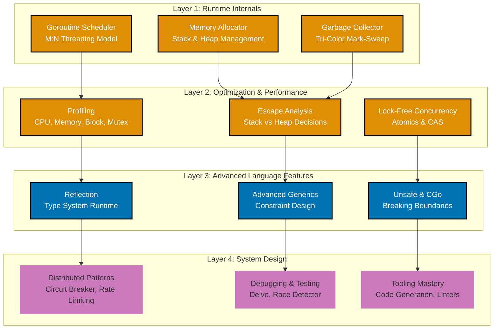
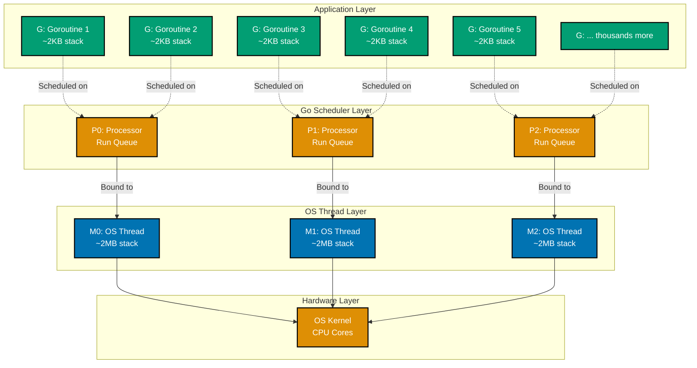

**Achieve Go mastery.** This tutorial dives deep into Go's internals, advanced optimization techniques, sophisticated patterns, and system design. You'll understand how Go works under the hood and when to push its boundaries.

**Prerequisites**: Complete the [Intermediate tutorial](intermediate) or have professional Go experience.

## 🎯 Learning Objectives

After this tutorial, you'll understand:

- Go's goroutine scheduler and concurrency model (M:N scheduling)
- Memory management, allocation, and garbage collection
- Performance profiling and optimization techniques
- Advanced testing and debugging strategies
- System design patterns for distributed systems
- When and how to use reflection and unsafe code
- Advanced generics and type system features
- Go tooling ecosystem (code generation, custom linters)

## 🧠 Go Internals & Expert Topics

This tutorial explores three layers of Go mastery:



Each layer builds on the previous, taking you from understanding Go's internals to designing sophisticated systems.

---

## Section 1: Go Runtime Internals

Understanding how Go executes code is crucial for optimization:

### Goroutine Scheduler (M:N Model)

Go uses an M:N scheduler where M goroutines are multiplexed onto N OS threads:



**Key Components**:

- **G** (Goroutine): A lightweight execution context (~2KB)
- **M** (Machine/OS Thread): OS thread (~2MB), expensive
- **P** (Processor): Logical processor with run queue (~60 bytes)

The scheduler runs work stealing: if a processor P runs out of goroutines, it steals work from another processor's queue.

### Stack Management

Go uses growable stacks. Unlike OS threads with fixed stacks (1-2MB), goroutines start with small stacks (~2KB):

```go
import (
	"fmt"
	"runtime"
)

func printStackSize() {
	var m runtime.MemStats
	runtime.ReadMemStats(&m)
	fmt.Printf("Goroutine stack size: ~2KB minimum\n")
	fmt.Printf("Total goroutine count: %d\n", runtime.NumGoroutine())
}

func deepRecursion(depth int) {
	if depth > 0 {
		deepRecursion(depth - 1) // Stack grows as needed
	}
}

func main() {
	// Create many goroutines
	for i := 0; i < 10000; i++ {
		go func() {
			select {} // Block forever - cheap!
		}()
	}

	printStackSize()
	// Output might show 10000+ goroutines with minimal memory
}
```

**Implications**:

- Start thousands of goroutines without fear (not true for OS threads)
- Stack grows and shrinks automatically
- Contiguous stacks (Go doesn't use segmented stacks)

### Garbage Collection

Go uses concurrent tri-color mark-sweep GC:

```go
import (
	"fmt"
	"runtime"
)

func demonstrateGC() {
	// Get GC statistics
	var m runtime.MemStats
	runtime.ReadMemStats(&m)
	fmt.Printf("Before GC: Heap alloc = %v MB\n", m.Alloc/1024/1024)

	// Allocate lots of objects
	var objects []interface{}
	for i := 0; i < 1000000; i++ {
		objects = append(objects, make([]byte, 1024))
	}

	runtime.ReadMemStats(&m)
	fmt.Printf("After allocating: Heap alloc = %v MB\n", m.Alloc/1024/1024)

	// Clear references to let GC clean up
	objects = nil

	// Force GC
	runtime.GC()

	runtime.ReadMemStats(&m)
	fmt.Printf("After GC: Heap alloc = %v MB\n", m.Alloc/1024/1024)
}
```

**GC Tuning**:

```bash
# Control GC frequency (0-100, default 100)
GOGC=50 go run main.go  # GC more frequently (lower latency, more CPU)
GOGC=200 go run main.go # GC less frequently (higher throughput, more memory)

# View GC activity
GODEBUG=gctrace=1 go run main.go
```

---

## Section 2: Memory Allocation and Optimization

Memory allocations are expensive. Minimizing them is key to performance:

### Escape Analysis

Go determines whether variables escape to the heap:

```go
package main

import "fmt"

// Escapes to heap: returned pointer
func escapeToHeap() *int {
	x := 42
	return &x // x must be allocated on heap
}

// Doesn't escape: pointer never leaves function
func noEscape() {
	x := 42
	p := &x // p is local, doesn't escape
	fmt.Println(p)
}

// Check escapes: go build -gcflags="-m" main.go
```

Run with: `go build -gcflags="-m" main.go` to see escape analysis output.

**Optimization Strategy**: Minimize heap allocations in hot paths.

### Reusing Allocations with sync.Pool

For frequently allocated temporary objects:

```go
import (
	"bytes"
	"sync"
)

// Connection pool - reuse buffer allocations
var bufferPool = sync.Pool{
	New: func() interface{} {
		return new(bytes.Buffer)
	},
}

func processData(data []byte) string {
	// Get buffer from pool (or allocate new one)
	buf := bufferPool.Get().(*bytes.Buffer)
	defer func() {
		buf.Reset() // Clear before returning to pool
		bufferPool.Put(buf)
	}()

	buf.Write(data)
	return buf.String()
}

// Usage: Can handle millions of requests reusing the same buffers
func main() {
	for i := 0; i < 1000000; i++ {
		_ = processData([]byte("test"))
	}
}
```

**Benefits**:

- Reduces garbage collection pressure
- Avoids repeated allocations
- Especially useful for network servers

---

## Section 3: Advanced Profiling and Optimization

### CPU Profiling

Identify hot paths:

```go
import (
	"os"
	"runtime/pprof"
)

func expensiveComputation() {
	// Some CPU-intensive work
	sum := 0
	for i := 0; i < 1000000000; i++ {
		sum += i
	}
}

func main() {
	// Enable CPU profiling
	f, _ := os.Create("cpu.prof")
	pprof.StartCPUProfile(f)
	defer pprof.StopCPUProfile()

	// Run your code
	expensiveComputation()
}

// Analyze:
// go tool pprof cpu.prof
// (pprof) top          # Show top functions
// (pprof) list foo     # Show function source
// (pprof) web          # Generate SVG graph
```

### Memory Profiling

Find memory leaks and heavy allocators:

```go
import (
	"os"
	"runtime"
	"runtime/pprof"
)

func leakyFunction() {
	globalList = append(globalList, make([]byte, 1024*1024)) // 1MB leak
}

var globalList [][]byte

func main() {
	// Memory profile
	f, _ := os.Create("mem.prof")
	defer f.Close()

	runtime.GC() // Start clean
	pprof.WriteHeapProfile(f)
}

// Analyze:
// go tool pprof mem.prof
// (pprof) top          # Top memory consumers
// (pprof) alloc_space  # Total allocations
// (pprof) inuse_space  # Current in-use memory
```

### Benchmarking and Optimization

```go
import "testing"

func slowStringConcat(n int) string {
	result := ""
	for i := 0; i < n; i++ {
		result += "x" // Creates new string each iteration
	}
	return result
}

func fastStringConcat(n int) string {
	b := make([]byte, n)
	for i := 0; i < n; i++ {
		b[i] = 'x'
	}
	return string(b)
}

// Benchmark
func BenchmarkSlowConcat(b *testing.B) {
	for i := 0; i < b.N; i++ {
		slowStringConcat(1000)
	}
}

func BenchmarkFastConcat(b *testing.B) {
	for i := 0; i < b.N; i++ {
		fastStringConcat(1000)
	}
}

// Run: go test -bench=. -benchmem -cpuprofile=cpu.prof
```

---

## Section 4: Lock-Free Concurrency

Using atomic operations for lock-free data structures:

### Atomic Operations

```go
import (
	"fmt"
	"sync"
	"sync/atomic"
	"time"
)

// Lock-free counter using atomic
type LockFreeCounter struct {
	value atomic.Int64
}

func (c *LockFreeCounter) Increment() {
	c.value.Add(1)
}

func (c *LockFreeCounter) Get() int64 {
	return c.value.Load()
}

// Compare traditional mutex vs atomic
func benchmarkCounter() {
	// Mutex-based (slower)
	var mutexCounter int64
	var mu sync.Mutex
	for i := 0; i < 10000000; i++ {
		mu.Lock()
		mutexCounter++
		mu.Unlock()
	}

	// Atomic-based (faster)
	var atomicCounter atomic.Int64
	for i := 0; i < 10000000; i++ {
		atomicCounter.Add(1)
	}

	fmt.Println("Atomic is faster for simple operations")
}
```

### Compare-and-Swap (CAS)

For more complex lock-free logic:

```go
import (
	"sync/atomic"
)

type Node struct {
	value int
	next  *Node
}

type LockFreeStack struct {
	head atomic.Pointer[Node]
}

func (s *LockFreeStack) Push(value int) {
	newNode := &Node{value: value}
	for {
		oldHead := s.head.Load()
		newNode.next = oldHead

		// CAS: Only succeeds if head hasn't changed
		if s.head.CompareAndSwap(oldHead, newNode) {
			return // Success
		}
		// Retry if CAS failed (another goroutine modified head)
	}
}

func (s *LockFreeStack) Pop() (int, bool) {
	for {
		head := s.head.Load()
		if head == nil {
			return 0, false
		}

		next := head.next
		if s.head.CompareAndSwap(head, next) {
			return head.value, true // Success
		}
		// Retry if CAS failed
	}
}
```

---

## Section 5: Reflection and Type System Mastery

### Reflection Use Cases

```go
import (
	"fmt"
	"reflect"
)

func Stringify(v interface{}) string {
	rv := reflect.ValueOf(v)
	switch rv.Kind() {
	case reflect.String:
		return rv.String()
	case reflect.Int, reflect.Int64:
		return fmt.Sprintf("%d", rv.Int())
	case reflect.Struct:
		// Iterate over struct fields
		rt := rv.Type()
		var result string
		for i := 0; i < rt.NumField(); i++ {
			field := rt.Field(i)
			value := rv.Field(i)
			result += fmt.Sprintf("%s: %v ", field.Name, value.Interface())
		}
		return result
	default:
		return fmt.Sprintf("%v", v)
	}
}

// Reflection for JSON-like serialization
type User struct {
	Name string
	Age  int
}

func toMap(v interface{}) map[string]interface{} {
	result := make(map[string]interface{})
	rv := reflect.ValueOf(v)

	if rv.Kind() != reflect.Struct {
		return result
	}

	rt := rv.Type()
	for i := 0; i < rt.NumField(); i++ {
		field := rt.Field(i)
		value := rv.Field(i)
		result[field.Name] = value.Interface()
	}

	return result
}
```

**When to use Reflection**:

- JSON/YAML serialization
- Generic data structure operations
- Plugin systems
- Testing frameworks

**When NOT to use**:

- Performance-critical code
- When compile-time safety is important

### The unsafe Package

For interfacing with C or low-level operations:

```go
import (
	"fmt"
	"unsafe"
)

func unsafePointerConversion() {
	// Convert between types without copying
	var x int64 = 0x1122334455667788

	// Get raw bytes
	ptr := unsafe.Pointer(&x)
	bytes := (*[8]byte)(ptr)

	fmt.Println("Bytes:", bytes) // Shows memory layout
}

// Calling C code
// import "C"
// C code would go in cgo comments, then call with C.function()
```

**Use unsafe only when**:

- Calling C code via cgo
- Performance-critical optimizations
- Low-level system programming

---

## Section 6: Advanced Generics

### Constraint Interfaces

```go
import "fmt"

// Constraint: must be numeric
type Numeric interface {
	~int | ~int64 | ~float64
}

func Sum[T Numeric](values []T) T {
	var sum T
	for _, v := range values {
		sum += v
	}
	return sum
}

// Multiple constraints
type Ordered interface {
	~int | ~int64 | ~float64 | ~string
}

func Max[T Ordered](a, b T) T {
	if a > b {
		return a
	}
	return b
}

func main() {
	fmt.Println(Sum([]int{1, 2, 3}))           // 6
	fmt.Println(Sum([]float64{1.1, 2.2, 3.3})) // 6.6
	fmt.Println(Max(5, 3))                      // 5
	fmt.Println(Max("apple", "zebra"))          // zebra
}
```

### Generic Algorithms

```go
// Generic filter
func Filter[T any](items []T, predicate func(T) bool) []T {
	var result []T
	for _, item := range items {
		if predicate(item) {
			result = append(result, item)
		}
	}
	return result
}

// Generic reduce
func Reduce[T any, U any](items []T, init U, reducer func(U, T) U) U {
	result := init
	for _, item := range items {
		result = reducer(result, item)
	}
	return result
}

func example() {
	nums := []int{1, 2, 3, 4, 5}

	// Filter even numbers
	evens := Filter(nums, func(n int) bool {
		return n%2 == 0
	})

	// Sum all (reduce)
	sum := Reduce(nums, 0, func(acc, n int) int {
		return acc + n
	})
}
```

---

## Section 7: System Design Patterns

### Circuit Breaker Pattern

Fail fast when a service is down:

```go
import (
	"errors"
	"sync"
	"time"
)

type CircuitBreakerState int

const (
	Closed CircuitBreakerState = iota
	Open
	HalfOpen
)

type CircuitBreaker struct {
	mu          sync.RWMutex
	state       CircuitBreakerState
	failCount   int
	successCount int
	lastFailTime time.Time
	threshold   int
	timeout     time.Duration
}

func (cb *CircuitBreaker) Call(fn func() error) error {
	cb.mu.Lock()
	defer cb.mu.Unlock()

	// Open circuit: reject requests
	if cb.state == Open {
		if time.Since(cb.lastFailTime) > cb.timeout {
			cb.state = HalfOpen
			cb.successCount = 0
		} else {
			return errors.New("circuit is open")
		}
	}

	err := fn()

	if err != nil {
		cb.failCount++
		cb.lastFailTime = time.Now()
		if cb.failCount >= cb.threshold {
			cb.state = Open
		}
		return err
	}

	if cb.state == HalfOpen {
		cb.successCount++
		if cb.successCount >= 3 {
			cb.state = Closed
			cb.failCount = 0
		}
	} else {
		cb.failCount = 0
	}

	return nil
}
```

### Rate Limiter (Token Bucket)

Control request rate:

```go
import (
	"sync"
	"time"
)

type RateLimiter struct {
	tokens  float64
	maxRate float64
	mu      sync.Mutex
	lastRefill time.Time
}

func (rl *RateLimiter) Allow() bool {
	rl.mu.Lock()
	defer rl.mu.Unlock()

	now := time.Now()
	elapsed := now.Sub(rl.lastRefill).Seconds()

	// Refill tokens
	rl.tokens += elapsed * rl.maxRate
	if rl.tokens > rl.maxRate {
		rl.tokens = rl.maxRate
	}
	rl.lastRefill = now

	if rl.tokens >= 1 {
		rl.tokens--
		return true
	}
	return false
}
```

---

## Section 8: Go Tooling Mastery

### Code Generation with go:generate

```go
// In your source file:
//go:generate stringer -type=Status

type Status int

const (
	Unknown Status = iota
	Active
	Inactive
)

// Run: go generate ./...
// Generates Status_string.go with String() method for the enum
```

### Custom Linters

Create a linter to enforce project-specific rules:

```go
package main

import (
	"fmt"
	"go/ast"
	"go/parser"
	"go/token"
)

// Custom linter that finds println usage
func lint(filename string) {
	fset := token.NewFileSet()
	file, _ := parser.ParseFile(fset, filename, nil, 0)

	ast.Inspect(file, func(n ast.Node) bool {
		if call, ok := n.(*ast.CallExpr); ok {
			if ident, ok := call.Fun.(*ast.Ident); ok {
				if ident.Name == "println" {
					fmt.Printf("%s: Don't use println in production code\n",
						fset.Position(call.Pos()))
				}
			}
		}
		return true
	})
}
```

---

## Section 9: Advanced Concurrency Patterns

Beyond basic synchronization, sophisticated patterns for complex systems:

### Multiple Producer-Consumer Pattern

```go
import (
	"fmt"
	"sync"
)

type Job struct {
	ID   int
	Data string
}

type Pipeline struct {
	jobs    chan Job
	results chan Result
	wg      sync.WaitGroup
}

type Result struct {
	JobID  int
	Result string
	Error  error
}

func (p *Pipeline) Produce(count int) {
	go func() {
		for i := 0; i < count; i++ {
			p.jobs <- Job{ID: i, Data: fmt.Sprintf("data-%d", i)}
		}
	}()
}

func (p *Pipeline) Consume(workerCount int) {
	for i := 0; i < workerCount; i++ {
		p.wg.Add(1)
		go p.worker()
	}

	go func() {
		p.wg.Wait()
		close(p.results)
	}()
}

func (p *Pipeline) worker() {
	defer p.wg.Done()
	for job := range p.jobs {
		// Process job
		result := Result{
			JobID:  job.ID,
			Result: fmt.Sprintf("processed-%s", job.Data),
		}
		p.results <- result
	}
}
```

### Select with Default Case

Non-blocking communication:

```go
func nonBlockingReceive(ch <-chan int) {
	select {
	case val := <-ch:
		fmt.Println("Received:", val)
	default:
		fmt.Println("No value available")
	}
}

// Timeout with select
func withTimeout(ch <-chan int, timeout time.Duration) {
	select {
	case val := <-ch:
		fmt.Println("Received:", val)
	case <-time.After(timeout):
		fmt.Println("Timeout!")
	}
}
```

---

## Section 10: Debugging Advanced Issues

### Using Delve Debugger

Go's debugger for complex issues:

```bash
# Start debugger
dlv debug main.go

# Commands
(dlv) break main.main          # Set breakpoint
(dlv) continue                 # Run to breakpoint
(dlv) next                     # Step over
(dlv) step                     # Step into
(dlv) print variable           # Print variable value
(dlv) goroutines               # List all goroutines
(dlv) goroutine 1              # Switch to goroutine 1
```

### Race Detector Deep Dive

Understanding data races:

```go
import (
	"fmt"
	"sync"
)

type RaceExample struct {
	mu    sync.Mutex
	counter int
}

func (r *RaceExample) SafeIncrement() {
	r.mu.Lock()
	defer r.mu.Unlock()
	r.counter++
}

// Compile with: go build -race main.go
// Run with: ./main
// Or: go run -race main.go
```

### Finding Memory Leaks

```go
import (
	"runtime"
	"runtime/debug"
)

func findLeaks() {
	// Get current goroutines
	initial := runtime.NumGoroutine()

	// Start operation that might leak
	for i := 0; i < 1000; i++ {
		go func() {
			select {} // Leak!
		}()
	}

	// Check final count
	final := runtime.NumGoroutine()
	if final > initial {
		fmt.Printf("Leaked %d goroutines\n", final-initial)
	}

	// Print goroutine stack traces
	debug.PrintStack()
}
```

---

## Section 11: Build Constraints and Platform-Specific Code

### Build Tags

Write code that compiles differently per platform:

```go
//go:build windows || darwin
// +build windows darwin

package main

import "fmt"

// Only compiled on Windows or macOS
func GetPlatformSpecificPath() string {
	return "/Users/home"
}

// In another file:
//go:build linux
// +build linux

package main

// Only compiled on Linux
func GetPlatformSpecificPath() string {
	return "/home/user"
}
```

Compile with: `GOOS=linux GOARCH=amd64 go build`

### Conditional Imports

```go
//go:build windows
// +build windows

package main

import (
	"golang.org/x/sys/windows" // Windows-specific
)

func WindowsSpecificFunc() {
	// Windows code
}
```

---

## Section 12: Advanced Error Handling

### Error Wrapping Chains

```go
import (
	"errors"
	"fmt"
)

func deepFunction() error {
	return fmt.Errorf("original error")
}

func midFunction() error {
	err := deepFunction()
	return fmt.Errorf("mid: %w", err)
}

func topFunction() error {
	err := midFunction()
	return fmt.Errorf("top: %w", err)
}

func example() {
	err := topFunction()

	// Unwrap chain
	for err != nil {
		fmt.Println(err)
		err = errors.Unwrap(err)
	}

	// Check for specific error
	var originalErr error
	if errors.As(topFunction(), &originalErr) {
		fmt.Println("Found:", originalErr)
	}
}
```

### Panic and Recovery Best Practices

```go
import "fmt"

// Safe wrapper that recovers from panics
func SafeExecute(fn func()) (err error) {
	defer func() {
		if r := recover(); r != nil {
			err = fmt.Errorf("panic recovered: %v", r)
		}
	}()

	fn()
	return nil
}

func main() {
	// Won't crash the program
	if err := SafeExecute(func() {
		panic("This is caught!")
	}); err != nil {
		fmt.Println(err)
	}
}
```

---

## Section 13: Testing Sophistication

### Property-Based Testing

```go
import (
	"sort"
	"testing"
)

func TestSortIsIdempotent(t *testing.T) {
	// Property: sorting twice gives same result as sorting once
	data := []int{3, 1, 4, 1, 5, 9, 2, 6}
	sorted1 := append([]int{}, data...)
	sort.Ints(sorted1)

	sorted2 := append(sorted1, data...)
	sort.Ints(sorted2)
	sort.Ints(sorted2)

	for i, v := range sorted1 {
		if v != sorted2[i] {
			t.Fatalf("Sort not idempotent")
		}
	}
}

func TestSortIsStable(t *testing.T) {
	// Property: relative order of equal elements preserved
	type Person struct {
		Name string
		Age  int
	}

	people := []Person{
		{"Alice", 30},
		{"Bob", 25},
		{"Charlie", 25},
	}

	sort.SliceStable(people, func(i, j int) bool {
		return people[i].Age < people[j].Age
	})

	// Charlie should still come after Bob (both age 25)
	if people[1].Name != "Bob" || people[2].Name != "Charlie" {
		t.Fatal("Sort not stable")
	}
}
```

### Test Coverage Analysis

```bash
# Generate coverage
go test -cover ./...

# Detailed coverage file
go test -coverprofile=coverage.out ./...

# View coverage in HTML
go tool cover -html=coverage.out
```

---

## Section 14: Performance Tuning Strategies

### Reducing Allocations

```go
import "strings"

// Bad: Creates many strings
func BadStringJoin(parts []string) string {
	result := ""
	for _, part := range parts {
		result += part + ","
	}
	return result
}

// Good: Preallocates
func GoodStringJoin(parts []string) string {
	return strings.Join(parts, ",")
}

// Even better: Manual allocation when builder not available
func ManualStringJoin(parts []string) string {
	total := 0
	for _, p := range parts {
		total += len(p) + 1
	}

	b := make([]byte, 0, total)
	for _, p := range parts {
		b = append(b, []byte(p)...)
		b = append(b, ',')
	}
	return string(b)
}
```

### Inlining Optimizations

```bash
# View inlining decisions
go build -gcflags="-m=2" main.go 2>&1 | grep inline
```

Inline-friendly functions:

- Small functions (< 80 lines typically)
- Simple logic
- Called frequently

---

## 🏆 Expert Challenges

**Challenge 1: Implement a Wait-Free Queue**

Build a lock-free queue using atomic operations and CAS.

**Challenge 2: Optimize Memory-Bound Algorithm**

Take an algorithm (e.g., sorting), profile it, and optimize for cache locality.

**Challenge 3: Build a Custom Tracer**

Implement distributed tracing by instrumenting goroutines and context propagation.

**Challenge 4: Analyze Go Source Code**

Study Go's `runtime` package source and explain how the scheduler works.

---

## 📚 Continuing Your Journey

You've achieved Go mastery! Continue with:

1. **Contributing to Go**: Help improve the language at [github.com/golang/go](https://github.com/golang/go)
2. **Reading Source Code**: Study open-source Go projects (Kubernetes, Docker, Prometheus)
3. **Research Papers**: Read about Go's design decisions and alternatives
4. **Teaching Others**: Nothing solidifies knowledge like explaining it

---

## ✅ Self-Assessment

After completing this tutorial, you should:

- [ ] Understand Go's M:N goroutine scheduler
- [ ] Analyze memory profiles and optimize allocations
- [ ] Build lock-free data structures with atomics
- [ ] Use reflection effectively (and know when not to)
- [ ] Implement system design patterns (circuit breaker, rate limiter)
- [ ] Profile and optimize Go applications
- [ ] Understand Go's runtime internals
- [ ] Use unsafe code safely when needed
- [ ] Master advanced generics and type system features
- [ ] Extend Go with custom tools and generators
