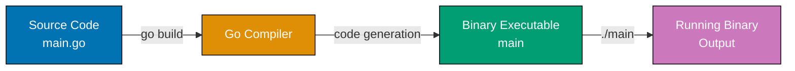
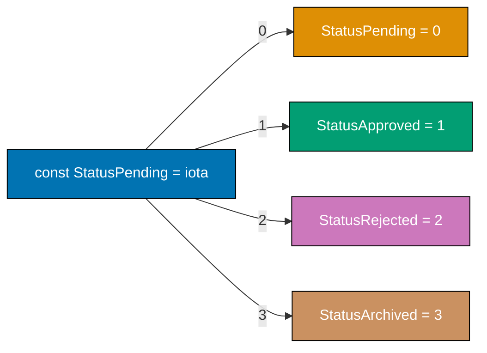
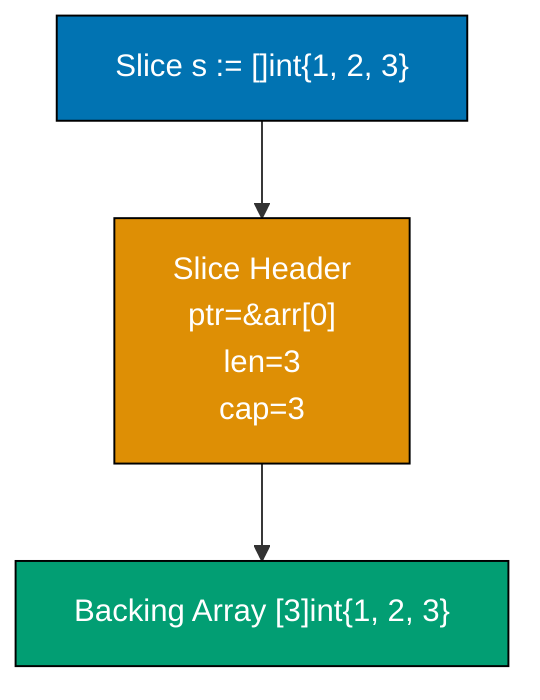
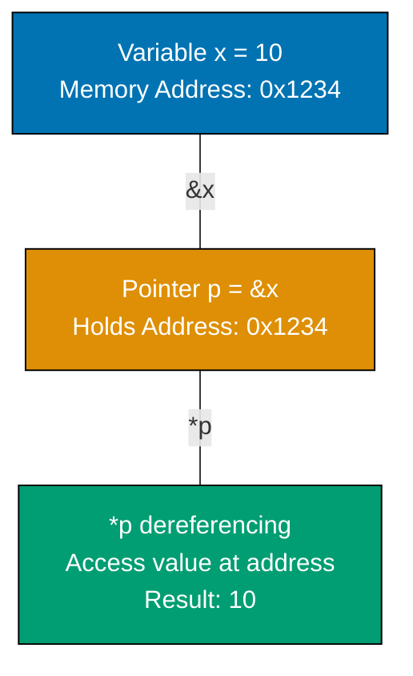
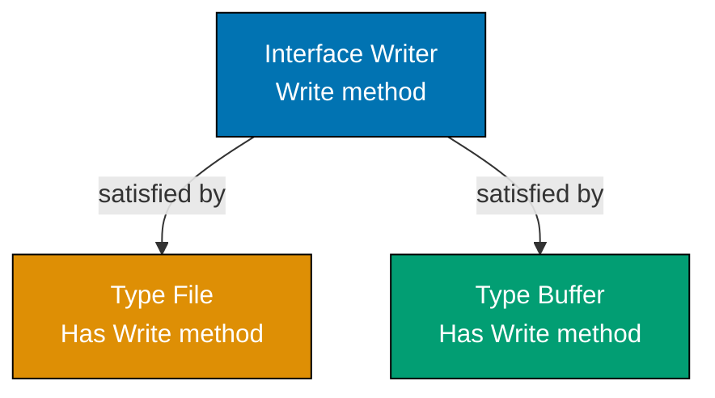

## Group 1: First Steps

### Example 1: Hello World and Go Compilation

Go is a compiled language - you write source code, compile it into a binary executable, then run that binary. Understanding this pipeline reveals why Go is fast and portable.



**Code**:

```go
package main // => Declares this is the main executable package

import (
    "fmt" // => Import formatting package from standard library
)

func main() { // => Entry point - every executable needs main() in main package
    fmt.Println("Hello, World!") // => Println writes to stdout and adds newline, returns (n int, err error)
    // => Output: Hello, World!
}
```

**Key Takeaway**: Every executable Go program needs `package main` and a `func main()` entry point. The `import` statement brings standard library packages into scope.

### Example 2: Variables and Types

Go is statically typed but uses type inference - the compiler deduces types from initial values. Two ways to declare variables: explicit type with `var`, or short declaration with `:=` that infers the type.

**Code**:

```go
package main

import "fmt"

func main() {
    // Short declaration with type inference
    x := 10                     // => int (inferred from value 10)
    y := 3.14                   // => float64 (inferred from decimal literal)
    name := "Go"                // => string (inferred from quoted value)
    isActive := true            // => bool (inferred from boolean literal)

    fmt.Println(x, y, name, isActive)
    // => Output: 10 3.14 Go true

    // Explicit type declaration
    var count int = 5           // => Explicitly typed as int
    var message string          // => Declared but uninitialized - zero value ""
    var percentage float64      // => Declared but uninitialized - zero value 0.0

    fmt.Println(count, message, percentage)
    // => Output: 5  0

    // Type conversion requires explicit cast
    floatValue := 9.8
    intValue := int(floatValue) // => Convert 9.8 to int by truncating decimals => 9
    fmt.Println(intValue)
    // => Output: 9
}
```

**Key Takeaway**: Use `:=` for short declarations with type inference in function bodies. Go's zero values (0 for numbers, "" for strings, false for bool) initialize variables automatically when declared without values.

**Why This Matters**: Go's static typing prevents entire classes of runtime errors that plague dynamically typed languages. The compiler catches type mismatches before deployment. Zero values are a game-changer for API design—uninitialized fields have predictable, safe defaults (empty strings, zero numbers), so you never encounter `nil` errors from forgetting initialization. This design choice makes Go code more reliable and easier to reason about than languages requiring explicit null checks everywhere.

### Example 3: Constants and iota

Constants are immutable values determined at compile-time. The `iota` enumerator automatically assigns incrementing values, useful for creating enumeration patterns without manually numbering each value.



**Code**:

```go
package main

import "fmt"

func main() {
    // iota starts at 0 and increments for each constant in the block
    const (
        StatusPending    = iota // => 0 (iota resets and starts at 0 for this block)
        StatusApproved         // => 1 (iota auto-increments, no need to write = iota again)
        StatusRejected         // => 2
        StatusArchived         // => 3
    )

    fmt.Println(StatusPending, StatusApproved, StatusRejected, StatusArchived)
    // => Output: 0 1 2 3

    // Constants must be determined at compile-time
    const Pi = 3.14159         // => Typed constant
    const Message = "Go is simple" // => Untyped constant - works anywhere a string fits

    // This would cause compilation error - can't assign variable to const
    // const x = someFunction() // => ERROR: someFunction() result unknown at compile-time

    var x = 5                   // => Variables CAN be assigned function results
    fmt.Println(x)
    // => Output: 5
}
```

**Key Takeaway**: Use `const` for values that must be known at compile-time. `iota` eliminates manual numbering in enumeration-like patterns, automatically incrementing within a `const` block.

## Group 2: Core Data Structures

### Example 4: Arrays and Slices

Arrays have fixed size declared upfront. Slices are dynamic collections backed by arrays - they're flexible and commonly used. Understanding the underlying array backing reveals why slices are so efficient.



**Code**:

```go
package main

import "fmt"

func main() {
    // Array - fixed size, size is part of type
    arr := [3]int{10, 20, 30}  // => Array of exactly 3 integers
    fmt.Println(arr, len(arr)) // => [10 20 30] 3
    arr[0] = 100               // => Can modify elements
    fmt.Println(arr)
    // => Output: [100 20 30]

    // Slice - dynamic size, backed by array
    slice := []int{1, 2, 3}    // => No size specified - this is a slice, not array
    fmt.Println(len(slice), cap(slice)) // => len=3 (elements) cap=3 (backing array capacity)
    // => Output: 3 3

    // Append - creates new backing array if needed
    slice = append(slice, 4)   // => Add element - if capacity sufficient, uses existing array
    fmt.Println(slice, len(slice), cap(slice))
    // => Output: [1 2 3 4] 4 5 (capacity typically doubles)

    // Slice from array or slice
    subslice := slice[1:3]     // => Elements at indices 1 and 2 (3 is exclusive)
    fmt.Println(subslice)      // => [2 3]
    fmt.Println(cap(subslice)) // => 4 (capacity includes remaining elements in backing array)

    // Copy creates independent slice
    copied := make([]int, len(slice)) // => Allocate slice of same length
    copy(copied, slice)        // => Copy values - modifications to copied don't affect slice
    copied[0] = 999
    fmt.Println(slice, copied)
    // => Output: [1 2 3 4] [999 2 3 4]
}
```

**Key Takeaway**: Arrays are fixed-size and rarely used directly. Slices are the Go way - dynamic collections with `len()` (current elements) and `cap()` (backing array space). `append()` returns a new slice to handle capacity growth.

**Why This Matters**: Slices are Go's killer feature—they combine safety, flexibility, and performance. Understanding backing arrays explains why slices are passed by value efficiently (only 24 bytes of metadata, not the entire data). Capacity growth matters for performance: when you know approximately how many elements you need, pre-allocate with `make([]T, 0, capacity)` to avoid expensive reallocations. This knowledge separates inefficient Go code (repeated allocations) from production-grade code that minimizes GC pressure. Sharing slices via views with reslicing is powerful but requires care—unintended aliasing can cause subtle bugs.

### Example 5: Maps

Maps are unordered key-value collections. Unlike slices which maintain order, map iteration order is randomized - never rely on iteration order. The comma-ok idiom tests whether a key exists and its value.

**Code**:

```go
package main

import "fmt"

func main() {
    // Create map - keys are strings, values are integers
    ages := make(map[string]int) // => Empty map created with make()
    ages["Alice"] = 30           // => Insert key-value pair
    ages["Bob"] = 25
    ages["Charlie"] = 35

    fmt.Println(ages["Alice"])   // => 30
    fmt.Println(ages["Unknown"]) // => 0 (zero value for int, key doesn't exist)

    // Comma-ok idiom - check if key exists
    age, exists := ages["Bob"]   // => exists is true, age is 25
    fmt.Println(age, exists)     // => 25 true

    age, exists = ages["David"]  // => exists is false, age is 0
    fmt.Println(age, exists)     // => 0 false

    // Delete key
    delete(ages, "Bob")          // => Remove Bob from map
    fmt.Println(ages)            // => map[Alice:30 Charlie:35] (order may vary)

    // Map iteration order is randomized
    for name, age := range ages {
        fmt.Printf("%s is %d\n", name, age) // => Output order varies each run
    }

    // Iterate over keys only
    for name := range ages {
        fmt.Println(name) // => Iterate without values
    }
}
```

**Key Takeaway**: Maps store key-value pairs with O(1) lookup. Always use the comma-ok idiom (`value, exists := map[key]`) to safely check key existence. Never rely on map iteration order - it's deliberately randomized.

### Example 6: Structs

Structs group related data into named fields. Methods can operate on structs by specifying a receiver. The distinction between value and pointer receivers becomes important later - for now, understand the receiver is what `this` or `self` would be in other languages.

**Code**:

```go
package main

import "fmt"

func main() {
    // Define struct type and create instance
    type Person struct {
        Name string // => Exported field (capital letter) - accessible from other packages
        Age  int
        City string
    }

    // Create struct using field order
    p1 := Person{"Alice", 30, "New York"}
    fmt.Println(p1)
    // => Output: {Alice 30 New York}

    // Create struct using named fields (better readability)
    p2 := Person{Name: "Bob", Age: 25, City: "Boston"}
    fmt.Println(p2.Name, p2.Age)
    // => Output: Bob 25

    // Uninitialized struct gets zero values
    var p3 Person // => All fields get zero values
    fmt.Println(p3)
    // => Output: { 0 }

    // Anonymous struct - used for one-off data
    response := struct {
        Status int
        Body   string
    }{200, "OK"}
    fmt.Println(response.Status)
    // => Output: 200
}
```

**Key Takeaway**: Structs are Go's primary way to group related data. Use named fields when creating structs for readability. Capital letters in field names mean the field is exported and accessible from other packages.

**Why This Matters**: Value vs pointer semantics is crucial in Go and separates beginners from professionals. Passing structs by value (no pointer) creates copies—safe but expensive for large structs. Passing pointers is efficient but requires discipline to avoid shared state bugs. Methods define the receiver type: value receiver (safe, isolated) vs pointer receiver (can modify). In production Go, you constantly make this choice. Understanding field capitalization (export control without explicit `public`/`private` keywords) is the Go way of managing visibility elegantly.

## Group 3: Functions and Control Flow

### Example 7: Functions

Functions are central to Go. Unlike many languages, multiple return values are standard - this idiom appears everywhere, especially for error handling. Named return values can be used to document what a function returns.

**Code**:

```go
package main

import "fmt"

func main() {
    // Function with single return
    result := add(3, 5)         // => Function call
    fmt.Println(result)         // => 8

    // Function with multiple returns
    quotient, remainder := divide(17, 5) // => Go functions commonly return multiple values
    fmt.Println(quotient, remainder)     // => 3 2

    // Named return values
    name, greeting := greet("Go") // => Named returns document what's returned
    fmt.Println(name, greeting)   // => Go Hello, Go!
}

// Single parameter and return
func add(a int, b int) int {    // => Parameters explicitly typed
    return a + b                // => Single return value
}

// Multiple parameters and returns
func divide(dividend int, divisor int) (int, int) { // => Return types in parentheses
    return dividend / divisor, dividend % divisor   // => Multiple return values
}

// Named return values - improves documentation
func greet(lang string) (language string, message string) {
    language = lang                              // => Assignment to named return values
    message = fmt.Sprintf("Hello, %s!", lang)   // => Create formatted string
    return                                       // => Return (no values needed - uses named returns)
}
```

**Key Takeaway**: Functions with multiple return values are idiomatic Go - you'll use this constantly. Named return values improve clarity by documenting what a function returns. Unnamed parameters with the same type can use shorthand: `func add(a, b int)`.

### Example 8: Control Flow

Go has only one loop construct (`for`) that handles all looping patterns. `if` and `switch` are straightforward but more powerful than in many languages. The `defer` statement schedules cleanup code to run when the function returns.

**Code**:

```go
package main

import "fmt"

func main() {
    // if-else
    age := 25
    if age >= 18 {              // => No parentheses required (or allowed)
        fmt.Println("Adult")    // =>
    } else {
        fmt.Println("Minor")
    }
    // => Output: Adult

    // for loop - basic
    for i := 0; i < 3; i++ {    // => Traditional for loop
        fmt.Println(i)
    }
    // => Output: 0 1 2

    // for loop - while style
    count := 0
    for count < 3 {             // => No while keyword - use for with just condition
        fmt.Println(count)
        count++
    }
    // => Output: 0 1 2

    // for loop - infinite
    counter := 0
    for {                       // => Infinite loop
        if counter >= 2 {
            break              // => Exit loop
        }
        counter++
    }

    // switch statement
    language := "Go"
    switch language {           // => Pattern matching
    case "Python":
        fmt.Println("Batteries included")
    case "Go":
        fmt.Println("Simple and fast")
    case "Rust":
        fmt.Println("Memory safe")
    default:
        fmt.Println("Unknown language")
    }
    // => Output: Simple and fast

    // defer - schedules cleanup
    fmt.Println("Start")
    defer fmt.Println("Deferred 1") // => Will run after other code
    defer fmt.Println("Deferred 2") // => Deferred statements run in LIFO order
    fmt.Println("End")
    // => Output: Start End Deferred 2 Deferred 1
}
```

**Key Takeaway**: Go's `for` loop is versatile - use it for all looping needs. `defer` schedules code to run when a function returns, useful for cleanup. Multiple `defer` statements run in reverse order (LIFO).

### Example 9: Pointers

Pointers hold memory addresses. The `&` operator takes an address, `*` dereferences it. Understanding pointers is essential for understanding Go's pass-by-value semantics and when values are copied versus when they're shared.



**Code**:

```go
package main

import "fmt"

func main() {
    x := 10                 // => Variable x stores value 10

    p := &x                 // => & operator gets address of x
    fmt.Println(p)          // => 0xc0000a0008 (actual address varies)
    fmt.Println(*p)         // => 10 (* dereferences - read value at address)

    *p = 20                 // => Dereference to modify value at address
    fmt.Println(x)          // => 20 (x was modified through pointer)

    // Pointers enable modification in functions
    modifyValue(&x)         // => Pass address, not value
    fmt.Println(x)          // => 30

    // nil pointer - points to nothing
    var nilPtr *int         // => Uninitialized pointer has nil value
    fmt.Println(nilPtr)     // => <nil>
    // Dereferencing nil causes panic - always check!
}

func modifyValue(ptr *int) { // => Receives pointer to int
    *ptr = 30              // => Modify value at pointer's address
}
```

**Key Takeaway**: Pointers hold addresses. `&` gets an address, `*` dereferences it to access the value. Pointers enable functions to modify variables. Nil pointers require careful handling - dereferencing nil causes runtime panic.

**Why This Matters**: Pointers are central to understanding Go's pass-by-value semantics. Every function call copies its arguments—understanding this reveals why large structs should be passed as pointers (avoid expensive copies) and why small values can be passed by value (safe, isolated changes). Nil pointers are Go's version of null references, but they're explicit and cause panics rather than silent failures. Production Go code constantly navigates this: when to share state via pointers, when to isolate via values, and defensive nil checking before dereferencing.

## Group 4: Methods and Interfaces

### Example 10: Methods

Methods are functions attached to a type via a receiver. Go distinguishes value receivers (copy data) from pointer receivers (share data). This distinction is crucial - choosing the wrong receiver type causes subtle bugs or inefficiency.

**Code**:

```go
package main

import "fmt"

func main() {
    p := Person{Name: "Alice", Age: 30}

    // Call method with value receiver
    p.PrintInfo()                // => Calls PrintInfo on copy of p
    // => Output: Name: Alice, Age: 30

    // Call method with pointer receiver
    p.HaveBirthday()             // => Passes address of p - modifies original
    fmt.Println(p.Age)           // => 31 (changed!)

    // Pointer methods called on values (Go automatically takes address)
    p.HaveBirthday()             // => Go converts to &p automatically
    fmt.Println(p.Age)           // => 32
}

type Person struct {
    Name string
    Age  int
}

// Value receiver - receiver gets copy of data
func (p Person) PrintInfo() {   // => (p Person) is the receiver
    fmt.Printf("Name: %s, Age: %d\n", p.Name, p.Age)
}

// Pointer receiver - receiver shares original data
func (p *Person) HaveBirthday() { // => (*Person) pointer receiver - can modify
    p.Age++                      // => Modifies the original Person
}
```

**Key Takeaway**: Value receivers copy data - modifications don't affect the original. Pointer receivers share data - modifications affect the original. Use pointer receivers when the method modifies the receiver or when the receiver is large (to avoid copying).

### Example 11: Interfaces

Interfaces define method contracts. A type satisfies an interface implicitly - no explicit declaration needed. This duck typing is powerful but requires understanding: if a type has all methods an interface requires, it automatically satisfies that interface.



**Code**:

```go
package main

import "fmt"

func main() {
    // Without interfaces - hardcoded types
    file := &File{Name: "data.txt"}
    saveData(file, "content")

    // With interfaces - work with any Writer
    var buffer Buffer
    saveData(&buffer, "content") // => Same function works with Buffer!

    // Empty interface - accepts anything
    var anything interface{} = 42
    printValue(anything)

    anything = "string"
    printValue(anything)

    // Using an interface as a type
    var w Writer // => Variable of interface type
    w = &File{Name: "test.txt"}
    fmt.Println(w)           // => &{test.txt}

    w = &Buffer{}
    fmt.Println(w)           // => &[]
}

// Interface definition - specifies what methods are required
type Writer interface {
    Write(data string) error  // => Method signature
}

// File type implements Write method - satisfies Writer implicitly
type File struct {
    Name string
}

func (f *File) Write(data string) error { // => Implements Writer interface
    fmt.Printf("Writing to %s: %s\n", f.Name, data)
    return nil
}

// Buffer type also implements Write - also satisfies Writer
type Buffer struct {
    data []string
}

func (b *Buffer) Write(data string) error { // => Different implementation, same interface
    b.data = append(b.data, data)
    return nil
}

// Function works with any Writer
func saveData(w Writer, data string) { // => Accepts any type implementing Writer
    w.Write(data)
}

// Empty interface accepts any type
func printValue(v interface{}) {       // => interface{} accepts anything
    fmt.Printf("Value: %v (Type: %T)\n", v, v) // => %v prints value, %T prints type
}
```

**Key Takeaway**: Interfaces define method contracts. Any type with those methods automatically satisfies the interface (implicit satisfaction). Design small interfaces (one method is common) for maximum reusability. The empty interface `interface{}` accepts any value.

**Why This Matters**: Implicit interface satisfaction is Go's secret weapon for loose coupling and composition. Unlike languages requiring explicit `implements` declarations, Go lets unrelated types suddenly satisfy interfaces. This enables powerful patterns: pass an `io.Reader` to any function expecting that interface, whether it's reading from a file, network, buffer, or custom source. Small, focused interfaces (like `io.Writer` with just `Write()`) are reusable across the entire ecosystem. This philosophy makes Go code highly modular without verbose inheritance hierarchies.

### Example 12: Error Handling

Go uses explicit error returns instead of exceptions. The `error` interface is simple - just a method returning a string. This pattern permeates Go code: function returns (result, error). Always check for errors before using results.

**Code**:

```go
package main

import (
    "errors"
    "fmt"
)

func main() {
    // Function returning error
    result, err := divide(10, 2)
    if err != nil {             // => Check if error occurred
        fmt.Println("Error:", err)
    } else {
        fmt.Println("Result:", result)
    }
    // => Output: Result: 5

    // Function that errors
    result, err = divide(10, 0)
    if err != nil {
        fmt.Println("Error:", err) // => Error: cannot divide by zero
    }

    // Error wrapping (Go 1.13+)
    wrappedErr := fmt.Errorf("division failed: %w", err) // => %w wraps error
    if errors.Is(wrappedErr, ErrDivisionByZero) { // => Check error type
        fmt.Println("Detected division by zero")
    }
    // => Output: Detected division by zero

    // Unwrap to get original error
    originalErr := errors.Unwrap(wrappedErr) // => Get wrapped error
    fmt.Println(originalErr)
    // => Output: cannot divide by zero
}

// Sentinel error - predefined error value
var ErrDivisionByZero = errors.New("cannot divide by zero")

func divide(a, b int) (int, error) { // => Returns value and error
    if b == 0 {
        return 0, ErrDivisionByZero  // => Return zero value and error
    }
    return a / b, nil                // => Return result and nil error (no error)
}
```

**Key Takeaway**: Go uses explicit error returns - check `if err != nil` before using results. Return `nil` for no error. Use `errors.New()` or `fmt.Errorf()` to create errors. Error wrapping with `%w` preserves error chains for debugging.

## Group 5: Packages and Testing

### Example 13: Packages and Imports

Go organizes code with packages. Every file starts with `package`, and a directory is one package. Capitalized names are exported (visible from other packages), lowercase names are unexported (private). Imports make external packages available.

**Code**:

```go
package main // => Every Go file must declare a package

import (
    "fmt"                       // => Standard library package
    "math"                      // => Another standard library package
)

func main() {
    // Standard library packages available after import
    fmt.Println("Pi:", math.Pi) // => Use package.Function syntax
    fmt.Println("Sqrt(16):", math.Sqrt(16)) // => 4
}

// Exported functions (capitalized)
func PublicFunction() string {  // => Capital P - exported from this package
    return "callable from other packages"
}

// Unexported functions (lowercase)
func privateFunction() string { // => Lowercase p - private to this package
    return "only callable within this package"
}
```

**Key Takeaway**: `package main` declares an executable. Other packages are libraries. `import` makes packages available. Capitalization controls visibility: `Exported` is public, `unexported` is private to the package.

### Example 14: Basic Testing

Go's testing is built-in via the `testing` package. Test files end in `_test.go`. Test functions named `TestXxx(t *testing.T)`. Table-driven tests let you test many cases efficiently.

**Code**:

```go
package main

import "testing"

// Run tests with: go test
// Verbose: go test -v
// Coverage: go test -cover

// Basic test
func TestAdd(t *testing.T) {    // => Test function (t *testing.T parameter required)
    result := add(2, 3)
    if result != 5 {            // => Manual assertion
        t.Errorf("Expected 5, got %d", result) // => t.Errorf reports failure
    }
}

// Table-driven test - test multiple cases
func TestDivide(t *testing.T) {
    // Table of test cases
    cases := []struct { // => Anonymous struct in slice
        name     string
        a, b     int
        expected int
        hasError bool
    }{
        {"normal division", 10, 2, 5, false},        // => Test case 1
        {"division by zero", 10, 0, 0, true},       // => Test case 2
        {"exact division", 20, 4, 5, false},        // => Test case 3
    }

    for _, tc := range cases {   // => Iterate test cases
        result, err := divide(tc.a, tc.b)

        if tc.hasError {
            if err == nil {
                t.Errorf("%s: expected error, got nil", tc.name)
            }
        } else {
            if result != tc.expected {
                t.Errorf("%s: expected %d, got %d", tc.name, tc.expected, result)
            }
        }
    }
}
```

**Key Takeaway**: Test files end in `_test.go`. Functions named `TestXxx` are tests. Use table-driven tests to test many scenarios. Run tests with `go test` command.

### Example 15: Strings and Formatting

Strings in Go are immutable sequences of bytes (usually UTF-8). The `strings` package provides manipulation functions. `fmt.Sprintf` formats without printing. `strings.Builder` efficiently concatenates strings.

**Code**:

```go
package main

import (
    "fmt"
    "strings"
)

func main() {
    // String basics - immutable
    s := "Hello"
    s += " World"              // => Creates new string
    fmt.Println(s)             // => "Hello World"

    // String indexing returns byte values
    fmt.Println(s[0])          // => 72 (byte value, not character)
    fmt.Println(string(s[0]))  // => "H" (convert to string)

    // Strings package functions
    fmt.Println(strings.ToUpper("go"))        // => "GO"
    fmt.Println(strings.Contains("hello", "ll")) // => true
    fmt.Println(strings.Split("a,b,c", ",")) // => [a b c]
    fmt.Println(strings.Join([]string{"a", "b", "c"}, ",")) // => "a,b,c"

    // Formatting
    formatted := fmt.Sprintf("Hello, %s! You are %d years old", "Alice", 30) // => String (no print)
    fmt.Println(formatted)     // => "Hello, Alice! You are 30 years old"

    // Formatting verbs
    fmt.Printf("String: %s, Integer: %d, Float: %.2f\n", "text", 42, 3.14159)
    // => Output: String: text, Integer: 42, Float: 3.14

    // Efficient concatenation with Builder
    var builder strings.Builder // => Optimized for repeated appends
    builder.WriteString("Hello") // => Append without creating intermediate strings
    builder.WriteString(" ")
    builder.WriteString("Builder")
    result := builder.String()  // => Get final string
    fmt.Println(result)         // => "Hello Builder"
}
```

**Key Takeaway**: Strings are immutable. Use `strings` package for common operations like `Split`, `Join`, `Contains`. Use `strings.Builder` for efficient concatenation in loops. Use `fmt.Sprintf` to format strings without printing.
