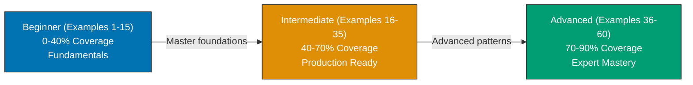

By-example learning is a code-first approach designed for experienced developers. Rather than lengthy explanations, you learn through working, annotated code examples that demonstrate how language features work in practice.

## Learning Path

The Go by-example tutorial guides you through 60 carefully selected examples organized into three progressive levels, from fundamental concepts to advanced patterns.

## What This Tutorial Covers

**Language Fundamentals**: Go syntax, type system, variable declaration, constants, and the compilation model

**Core Data Structures**: Arrays, slices, maps, structs, and their underlying mechanics (backing arrays, capacity, zero values)

**Functions and Methods**: Function declarations, multiple returns, methods, receivers (value vs pointer), and when to use each

**Interfaces and Composition**: Interface definition, implicit satisfaction, type assertions, and Go's composition-over-inheritance philosophy

**Error Handling**: The `error` interface, custom error types, error wrapping, and the error handling idiom that pervades Go code

**Concurrency Fundamentals**: Goroutines, channels (buffered and unbuffered), the `select` statement, and synchronization primitives (`sync.WaitGroup`, `sync.Mutex`)

**Standard Library**: Deep dive into `fmt`, `strings`, `encoding/json`, `net/http`, `time`, `regexp`, `context`, and other essential packages

**I/O and HTTP**: File operations, HTTP clients and servers, handler functions, and middleware patterns

**Production Patterns**: HTTP middleware chains (request/response decoration), graceful shutdown with signal handling, worker pools, and options pattern for configuration

**Testing and Benchmarking**: Table-driven tests, subtests, benchmarking, fuzzing, and test coverage measurement

**Advanced Concurrency**: Pipeline patterns, fan-out/fan-in, rate limiting, semaphores, and atomic operations

**Modern Go Features**: Generics (Go 1.18+), embed directive (Go 1.16+), fuzzing (Go 1.18+), and workspaces (Go 1.18+)

**Advanced Tools**: Reflection, CGO, build tags, custom sorting, dependency injection, memory profiling, and the race detector

## What This Tutorial Does NOT Cover

**Framework-Specific Content**: Gin, Echo, Chi, or other web frameworks - this covers the standard library foundation you need to understand any framework

**Database Drivers**: SQL, MongoDB, or other database packages - driver APIs vary; learn the standard library patterns instead

**Deployment and DevOps**: Docker, Kubernetes, cloud deployment - these are infrastructure concerns beyond the language

**Go Internals**: Scheduler algorithms, garbage collector internals, memory layout - these are advanced runtime topics

**Ecosystem Tools**: Profiling tools beyond `pprof`, code generation tools, or specialized libraries - focus on language fundamentals

## How to Use This Guide

**Code-First Approach**: Each example is self-contained and runnable. Copy the code, run it, modify it, and experiment. This hands-on interaction is essential for learning.

**Running Examples**: All examples are Go programs that you can run with `go run filename.go`. No special setup or dependencies required for beginner and intermediate examples.

**Expected Output**: Code comments show expected output using `// => value` notation. Compare the output with your expectations to build intuition.

**Modify and Experiment**: Don't just read - change values, add debugging output, remove lines and see what fails. This active learning reveals how Go features interact.

**Reference System**: Examples are numbered (1-60) and grouped by level. This numbering appears in other Go content at ayokoding.com, allowing you to reference specific examples elsewhere.

## Structure of Each Example

Every example follows a consistent four-part format:

1. **Brief Explanation** (2-3 sentences): What the example demonstrates and why it matters
2. **Mermaid Diagram** (optional): Visual clarification when concept relationships benefit from visualization
3. **Heavily Annotated Code**: Every significant line includes a comment explaining what it does and what it produces (using `// =>` notation)
4. **Key Takeaway** (1-2 sentences): The core insight you should retain from this example

This structure minimizes context switching - explanation, visual aid, runnable code, and distilled essence all in one place.

## Relationship to Other Tutorials

This by-example tutorial complements other learning approaches. Choose based on your situation:

| Tutorial Type        | Coverage | Best For                          | Learning Style                       |
| -------------------- | -------- | --------------------------------- | ------------------------------------ |
| **Quick Start**      | 5-30%    | Getting something working quickly | Hands-on with guided structure       |
| **Beginner**         | 0-60%    | Learning from scratch             | Narrative explanations with examples |
| **This: By Example** | 90%      | Rapid depth for experienced devs  | Code-first, minimal explanation      |
| **Cookbook**         | Parallel | Solving specific problems         | Problem-solution recipes             |
| **Advanced**         | 85-95%   | Expert mastery                    | Deep dives and edge cases            |

By-example is ideal if you have programming experience in other languages. It accelerates learning by leveraging your existing knowledge - you focus on "how Go does this" rather than learning programming concepts from scratch.

The 90% coverage represents depth and breadth of topics you'll encounter in production Go code. It explicitly acknowledges that no tutorial covers everything, but these examples provide the foundation to understand the remaining 10% through official documentation, source code, and community resources.

## Prerequisites

- Basic programming experience in any language (Python, JavaScript, Java, C++, etc.)
- Go installed and verified (follow the [initial-setup](/en/learn/swe/prog-lang/golang/initial-setup) tutorial if needed)
- A code editor you're comfortable with (VS Code with Go extension, GoLand, Vim, etc.)

You don't need to understand Go's internals, philosophy, or ecosystem yet - this tutorial teaches those through examples. You just need comfort reading and running code.

## Comparison with By-Example for Other Languages

Other languages at ayokoding.com have similar by-example tutorials:

- **Java By-Example**: 60 examples covering OOP, streams, concurrency, JVM patterns
- **Elixir By-Example**: 60 examples covering functional programming, pattern matching, concurrency, OTP

The Go version follows the same philosophy and structure but emphasizes Go-specific strengths: simplicity, concurrency, static compilation, and the extensive standard library.
