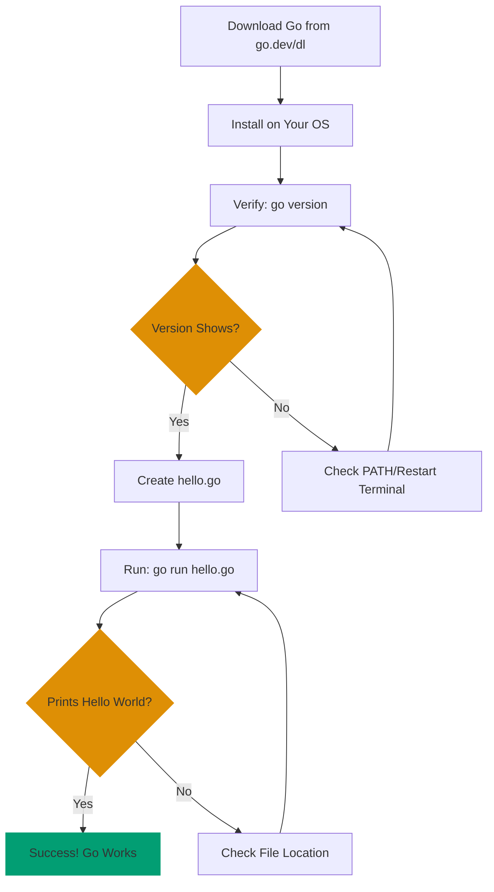

**Get Go up and running quickly.** This guide covers installation and your first "Hello, World!" program. No programming experience needed.

## 🎯 What You'll Accomplish

By the end of this tutorial, you'll have:

- ✅ Go installed and verified
- ✅ Your first Go program running
- ✅ Confidence that Go works on your system

## 🔄 Installation Verification Flow

Here's the simple path from download to running code:



This diagram shows every verification checkpoint - you'll know immediately if something's wrong and where to look.

## 📋 Prerequisites

- Basic familiarity with your computer's terminal/command line
- No programming experience needed
- Internet connection to download Go

## 💾 Step 1: Download and Install Go

### Windows

1. Visit [go.dev/dl](https://go.dev/dl)
2. Click the Windows installer (`.msi` file)
3. Run the installer and follow the prompts
4. Default installation path (`C:\Program Files\Go`) is fine

### macOS

1. Visit [go.dev/dl](https://go.dev/dl)
2. Choose the appropriate version:
   - **Apple Silicon** (M1/M2/M3): Download `go*.darwin-arm64.pkg`
   - **Intel**: Download `go*.darwin-amd64.pkg`
3. Run the installer and follow the prompts
4. Default installation path (`/usr/local/go`) is fine

### Linux

Using package manager (Ubuntu/Debian):

```bash
# Update package list
sudo apt update

# Install Go
sudo apt install golang-go

# Verify (see next section)
go version
```

Or, manual installation:

1. Visit [go.dev/dl](https://go.dev/dl)
2. Download the Linux tarball (`.tar.gz`)
3. Extract to `/usr/local`:

```bash
tar -C /usr/local -xzf go*.tar.gz
```

4. Add Go to your PATH by adding this line to `~/.bashrc` or `~/.zshrc`:

```bash
export PATH=$PATH:/usr/local/go/bin
```

Then reload your shell:

```bash
source ~/.bashrc  # or source ~/.zshrc
```

## ✅ Step 2: Verify Installation

Open a new terminal/command prompt and run:

```bash
go version
```

**Expected output**:

```
go version go1.25.5 linux/amd64
```

(Version number will vary - Go 1.24.x or 1.25.x depending on your installation)

**If you get an error**:

- "command not found": Go isn't in your PATH. Try restarting your terminal.
- On macOS/Linux: Edit your shell profile and reload it.

## 🚀 Step 3: Create Your First Program

Create a new file called `hello.go`:

```go
package main

import "fmt"

func main() {
	fmt.Println("Hello, World!")
}
```

**What this means** (don't memorize, just read):

- `package main` - This is the main program (not a library)
- `import "fmt"` - Use the `fmt` package for printing
- `func main()` - The entry point (where the program starts)
- `fmt.Println(...)` - Print text to the screen

## ▶️ Step 4: Run Your Program

In the same directory as `hello.go`:

```bash
go run hello.go
```

**Expected output**:

```
Hello, World!
```

Congratulations! You've run your first Go program!

## 📦 Step 5: Build an Executable

Want to create a standalone program you can run without `go run`?

```bash
go build hello.go
```

This creates an executable:

- **Windows**: `hello.exe`
- **macOS/Linux**: `hello`

Run the executable:

```bash
# Windows
hello.exe

# macOS/Linux
./hello
```

Both will output:

```
Hello, World!
```

## ✔️ Verification Checklist

Before moving forward, verify:

- [ ] `go version` shows Go 1.24.x or 1.25.x (current stable versions)
- [ ] `go run hello.go` prints "Hello, World!"
- [ ] `go build hello.go` creates an executable
- [ ] The executable runs and prints "Hello, World!"

## 🎉 You're Done!

You've successfully installed Go and run your first program. You're ready for the next step.

## 📚 What's Next?

Now that Go is working, you have two paths:

**Quick learner**: [Golang Quick Start](quick-start)

- Learn core syntax and basic patterns
- Understand enough to explore Go independently

**Comprehensive learner**: [Complete Beginner's Guide to Go](beginner)

- Comprehensive coverage of Go fundamentals
- Hands-on exercises and practice
- Ready to build real applications

**Problem solver**: [Golang Cookbook](cookbook)

- Practical recipes for common patterns
- Real-world problem solving

## 🆘 Troubleshooting

**Problem**: "go: command not found" after installation

**Solution**:

1. Verify installation completed successfully
2. Restart your terminal/command prompt
3. On macOS: Go installs to `/usr/local/go`. If error persists, add to your shell profile:
   ```bash
   export PATH=$PATH:/usr/local/go/bin
   ```
4. On Linux with manual installation: Verify the tarball was extracted to `/usr/local`

**Problem**: Multiple Go versions installed

**Solution**: Verify which Go is in use:

```bash
which go  # macOS/Linux
```

Remove old versions and keep only one.

**Problem**: "hello.go: file not found" when running

**Solution**: Ensure you're in the same directory as `hello.go`. Check with:

```bash
ls  # macOS/Linux, shows files in current directory
dir  # Windows, shows files in current directory
```

**Problem**: "Permission denied" when running executable on macOS/Linux

**Solution**: Make it executable:

```bash
chmod +x hello
./hello
```

---

**Still stuck?** Visit [go.dev/doc](https://go.dev/doc) or the [Go community forums](https://go.dev/help).
